# 🎬 Higgsfield AI est-il meilleur que Midjourney ? (Meilleur Workflow & Test)

> **Chaîne** : [Jack Vs. AI](https://www.youtube.com/@JackVsAI)  
> **Titre original** : `Is Higgsfield AI better than Midjourney? (Best Workflow & Review)`  
> **Lien YouTube** : [https://www.youtube.com/watch?v=RAF3qmWgySw](https://www.youtube.com/watch?v=RAF3qmWgySw)  
> **Date de publication** : 2025-07-31  
> **Durée** : 25m 31s (`1531s`)  
> **Identifiant vidéo** : `RAF3qmWgySw`  
> **Fiche Web Interactive** : [2025-07-31_YT-RAF3qmWgySw_Higgsfield AI est-il meilleur que Midjourney (Meilleur Workflow & Test)_by-whisper-v3-large-turbo+gemini-3.5-flash-lite.html](2025-07-31_YT-RAF3qmWgySw_Higgsfield AI est-il meilleur que Midjourney (Meilleur Workflow & Test)_by-whisper-v3-large-turbo+gemini-3.5-flash-lite.html)  
> **Captures de démonstration clés** : `136 captures réelles (anti-talking-head)`  
> **Modèles utilisés** : Audio: `large-v3-turbo` (Faster-Whisper int8 VPS) | Vision: `gemini-3.5-flash-lite` (Google AI Studio API)  

---

## 📌 Synthèse Exécutive & Outils

### 📌 Résumé
Dans cette vidéo, Jack, artiste VFX fort de dix ans d'expérience dans l'industrie publicitaire, explore et analyse en profondeur les capacités de **Higgsfield AI**, un générateur d'images positionné comme un concurrent direct de **Midjourney**. Alors que Midjourney est reconnu pour son esthétique onirique et cinématographique marquée, Higgsfield se distingue par un photoréalisme troublant, capable de produire des images ayant l'air d'avoir été capturées spontanément avec un smartphone. Jack partage un retour d'expérience transparent, jalonné de ses premiers essais infructueux, pour offrir aux créateurs un guide d'utilisation immédiatement rentable et éviter les erreurs de débutant.

La méthode présentée repose sur un workflow précis : la création préalable d'un modèle de personnage personnalisé basé sur un entraînement de plus de vingt images, combinée à une sélection rigoureuse des réglages de l'outil. Jack démontre l'importance cruciale de désactiver l'amélioration automatique des invites textuelles pour garder un contrôle artistique total, et met en garde contre l'utilisation excessive de certains préréglages visuels (comme le style *Y2K* ou *Mont Fuji*) qui supplantent le texte original au lieu de le compléter. 

Pour les créateurs de vidéo et professionnels de l'image, cette analyse offre des clés stratégiques indispensables pour maîtriser Higgsfield AI. En ciblant les préréglages pertinents – principalement *general*, *iPhone* et *realistic* – les créateurs peuvent générer des portraits de synthèse d'une crédibilité absolue, que ce soit pour des concepts publicitaires, des prototypes visuels ou des intégrations narratives complexes, tout en comprenant les subtilités d'interaction entre le prompt textuel et l'identité du personnage.

### 🛠️ Outils, Modèles & Logiciels Présentés
* **Higgsfield AI** : Générateur d'images par IA de pointe axé sur le photoréalisme, utilisé pour créer des portraits réalistes, gérer des personnages personnalisés et appliquer des styles visuels spécifiques.
* **Midjourney** : Référence du marché en génération d'images, caractérisée par une direction artistique onirique, cinématographique et très stylisée, servant ici de point de comparaison qualitatif.
* **Flux** : Modèle de génération d'images proposé parmi les options de base de Higgsfield AI pour façonner le rendu visuel.
* **Photoshop** : Logiciel de retouche d'image mentionné indirectement ou utilisé dans l'écosystème global des artistes VFX pour le traitement post-génération (selon les standards du métier).
* **Flux Context Max** : Variante ou modèle alternatif disponible dans l'interface pour affirmer la génération contextuelle.
* **GPT Image** : Modèle d'intelligence artificielle intégré comme option de génération textuelle et visuelle au sein de l'outil.

### 🔑 Points Clés & Enseignements Stratégiques
* **Entraînement rigoureux du personnage** : Il est recommandé de télécharger plus de 20 images de haute qualité d'une même personne, sous tous les angles, avec des vêtements et dans des environnements variés, pour bâtir un modèle fidèle (la fonction d'entraînement de Higgsfield équivalant à l'Omni reference de Midjourney).
* **Le choix du photoréalisme** : Contrairement à Midjourney qui apporte une signature cinématographique et onirique, Higgsfield excelle dans le réalisme brut, donnant l'impression que les photos ont été prises spontanément avec un téléphone portable.
* **Désactiver l'amélioration automatique des prompts** : Il est fortement conseillé de désactiver l'option d'amélioration des invites textuelles par l'IA pour conserver un contrôle créatif total et éviter que vos descriptions précises ne soient altérées.
* **Piège des styles visuels préprogrammés** : Les préréglages de style (comme le style *Y2K* ou *Mont Fuji*) ne se contentent pas d'ajouter une simple ambiance : ils écrasent et forcent le style de manière lourde, remplaçant parfois totalement le contenu du prompt textuel d'origine.
* **Sélection des préréglages fiables** : Jack recommande de limiter l'utilisation des styles visuels à trois options principales pour obtenir des résultats professionnels et prédictibles : *general*, *iPhone* et *realistic*.
* **Différences entre styles *general* et *realistic*** : Le mode *general* offre une esthétique légèrement plus picturale, cinématographique et surréaliste, tandis que le mode *realistic* pousse le mimétisme au point de faire croire à une photographie authentique.
* **Gestion des accessoires vestimentaires** : Si le personnage entraîné possède des attributs récurrents (lunettes, chapeau ou autres accessoires), il est impératif de les mentionner explicitement dans chaque invite textuelle sous peine de les voir disparaître de la génération.
* **Arbitrage qualité / coût des crédits** : L'utilisation du mode de qualité élevé consomme davantage de crédits mais offre un rendu supérieur, tandis que le mode basique est plus rapide et économique.
* **Adaptation des formats** : L'outil permet de sélectionner divers formats d'image, le format 16/9 étant privilégié pour des compositions larges ou des rendus cinématographiques.
* **Itération et expérimentation** : Accepter les ratés initiaux et les décalages humoristiques de l'IA fait partie du processus d'apprentissage pour comprendre comment le moteur interprète les prompts complexes.

---

## ⏱️ Chronologie & Transcription Complète Audio & Visuelle (Mot pour Mot)

### ⏱️ `[00:00:00 - 00:00:35]` | Segment #01

**🔊 Audio (Transcription Intégrale Mot pour Mot en Français) :**
> Je n'ai jamais posé pour ce portrait, je n'ai jamais suivi de formation pour devenir pilote de ligne, et je n'ai jamais visité de jungle. Mais avec Higgsfield AI, vous pouvez rendre toutes ces choses possibles. Si vous êtes nouveau ici, je suis Jack. Je suis artiste VFX dans l'industrie de la publicité depuis plus de 10 ans maintenant, et j'ai travaillé pour beaucoup des plus grandes marques de la planète. Je me suis fait mission personnelle de devenir incroyablement compétent dans l'utilisation des meilleurs outils d'IA créatifs du marché. Maintenant, Higgsfield AI est vraiment l'un des générateurs d'images par IA les plus impressionnants du marché en ce moment. Et ce que je

**👁️ Analyse Visuelle d'Écran (gemini-3.5-flash-lite) :**
**Interface & Outils** : Higgsfield AI (plateforme web de génération d'images et de vidéos par intelligence artificielle).

**Contenu textuel & Code** : Barres de prompts, options de format (9:16, 4:3), paramètres de qualité (« High »), modes « Soul », et zone de texte interactive « Upload image as a prompt or Describe the scene you imagine » et « What would you like to change? ».

**Action / Démonstration** : Le créateur présente différents exemples visuels générés par l'IA et navigue dans l'interface de Higgsfield AI pour montrer les fonctionnalités de génération et d'édition d'images et de vidéos.

*Rendu visuel généré par IA montrant un homme en costume de businessman portant des lunettes de soleil, allongé dans une piscine avec le mot « portrait » affiché en haut.*

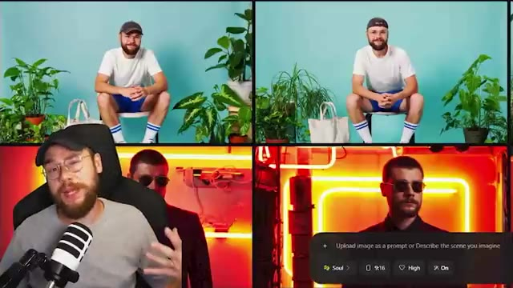
*Interface de Higgsfield AI en mode grille avec incrustation vidéo du créateur en bas à gauche, présentant différentes générations d'images avec des options de prompt et de format (9:16).*

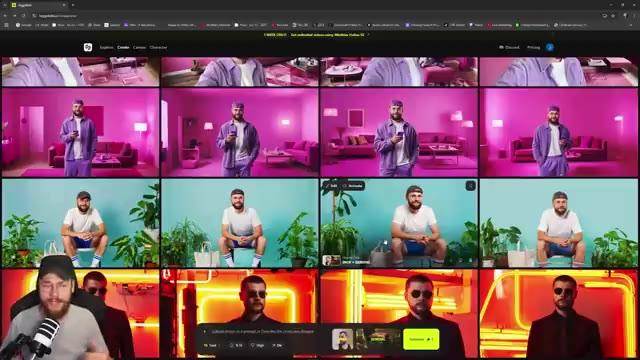
*Vue complète de l'interface du site web de Higgsfield AI montrant une galerie de créations artistiques générées par IA et la barre de prompt active.*

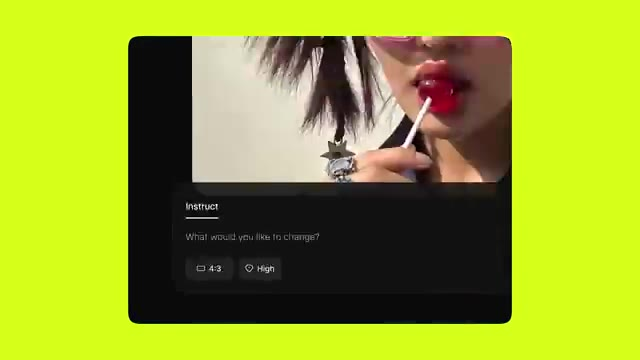
*Interface de l'outil d'instruction de Higgsfield AI affichant une vidéo d'une personne avec une sucette et une boîte de dialogue « What would you like to change? » avec des options de format 4:3 et de qualité High.*

---

### ⏱️ `[00:00:35 - 00:01:09]` | Segment #02

**🔊 Audio (Transcription Intégrale Mot pour Mot en Français) :**
> ce qui brille vraiment chez cet outil en particulier, c'est le niveau de réalisme que vous pouvez atteindre avec. Maintenant, je suis un grand défenseur de Mid Journey. Je pense personnellement que c'est le meilleur générateur d'images sur le marché, mais il a cette sorte de qualité onirique dans toutes ses générations. Presque tout ce que vous créez avec semble très cinématographique et cela fait aussi très Mid Journey, il a une ambiance très particulière. Donc si vous cherchez quelque chose qui a l'air incroyablement photoréaliste et qui donne presque l'impression d'avoir été filmé avec le téléphone de quelqu'un, Higgsfield est l'outil qu'il vous faut.

**👁️ Analyse Visuelle d'Écran (gemini-3.5-flash-lite) :**
**Interface & Outils** : Navigateur web affichant l'interface de la plateforme Higgsfield avec une grille de vidéos générées et une incrustation vidéo (PiP) du créateur.

**Contenu textuel & Code** : Galerie de vidéos de démonstration sur le site Higgsfield, diverses variations de scènes (homme dans un salon rose, homme entouré de plantes, homme devant un décor néon rouge).

**Action / Démonstration** : Le créateur présente des exemples de générations réalistes sur la plateforme Higgsfield tout en continuant son explication sur le réalisme comparé à Midjourney.

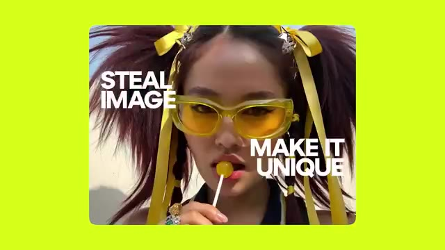
*Démonstration visuelle avec le texte 'STEAL IMAGE' et 'MAKE IT UNIQUE' superposé sur le portrait d'une femme portant des lunettes de soleil jaunes et une sucette.*

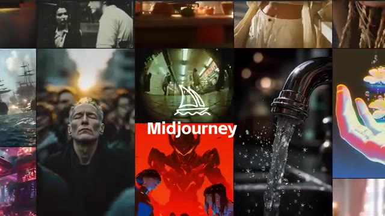
*Collage de différentes images générées par Midjourney avec le logo du voilier et le texte 'Midjourney' au centre.*

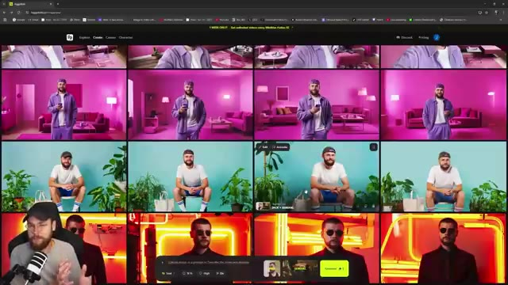
*Capture d'écran du site web Higgsfield montrant une galerie de vidéos générées avec le créateur visible en incrustation PiP dans le coin inférieur gauche.*

---

### ⏱️ `[00:01:09 - 00:01:45]` | Segment #03

**🔊 Audio (Transcription Intégrale Mot pour Mot en Français) :**
> cependant, il y a certaines choses que vous devez savoir pour tirer le meilleur parti de Higgsfield et c'est ce que je vais vous apprendre dans cette vidéo. Je vais vous faire part de mon expérience lors de mes débuts avec l'outil. Vous verrez que j'ai fait beaucoup d'erreurs et que j'ai appris beaucoup de choses en chemin. Mais lorsque vous aurez fini de regarder cette vidéo, si vous décidez d'acheter un abonnement à Higgsfield, vous en tirerez instantanément le meilleur parti sans avoir à commettre les erreurs que j'ai faites. Alors, avant d'entrer dans le vif du sujet, si vous aimez la vidéo d'aujourd'hui, les gars, assurez-vous de lâcher un pouce bleu pour moi. Pensez à vous abonner si vous êtes nouveau. Et bien sûr, activez la cloche de notification pour ne jamais manquer aucune future mise en ligne. Vous pouvez donc voir ici quelques-unes des plus

**👁️ Analyse Visuelle d'Écran (gemini-3.5-flash-lite) :**
**Interface & Outils** : Navigateur web affichant la plateforme de création vidéo Higgsfield AI, avec un agencement de vignettes vidéo en grille et un panneau de contrôle en bas.

**Contenu textuel & Code** : Galerie de vidéos IA générées montrant divers sujets et décors, barre de menu supérieure (Explore, Create, Character), et barre de prompt inférieure avec des options de configuration.

**Action / Démonstration** : Le créateur présente la plateforme Higgsfield en affichant l'interface web de la bibliothèque de projets tout en parlant face à sa webcam.

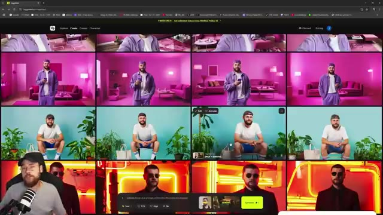
*Capture d'écran du navigateur affichant l'interface de Higgsfield avec une galerie de vidéos générées, et le présentateur en incrustation vidéo (PiP) dans le coin inférieur gauche.*

---

### ⏱️ `[00:01:45 - 00:02:18]` | Segment #04

**🔊 Audio (Transcription Intégrale Mot pour Mot en Français) :**
> des trucs récents que j'ai assemblés avec Higgsfield. Mais si nous faisons défiler vers le bas, vous allez voir du bon et du assez mauvais aussi et c'est vraiment ce que je veux vous faire découvrir. Maintenant il y a un outil qui fait partie de Higgsfield où vous êtes capable de créer un personnage et c'est basiquement leur version de la fonction Omni reference de Midjourney. Donc si nous allons ici en haut sur character nous avons l'option de créer un personnage et il est recommandé de télécharger plus de 20 images de haute qualité d'une personne particulière sous tous les angles différents

**👁️ Analyse Visuelle d'Écran (gemini-3.5-flash-lite) :**
**Interface & Outils** : Interface web de la plateforme Higgsfield (higgsfield.ai) avec le mode Picture-in-Picture (PiP) du créateur en bas à gauche.

**Contenu textuel & Code** : Texte affiché : "MAKE YOUR OWN CHARACTER" et le bouton vert "Create Character". Barre de navigation avec "Explore", "Create", "Comms", "Character".

**Action / Démonstration** : Le créateur navigue et fait défiler la page de son tableau de bord Higgsfield pour montrer les résultats générés puis clique sur la section de création de personnage.

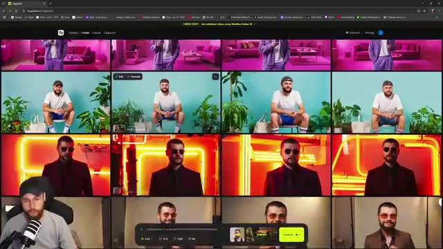
*Interface du site web Higgsfield montrant une galerie de vidéos générées avec le créateur visible en incrustation PiP en bas à gauche.*

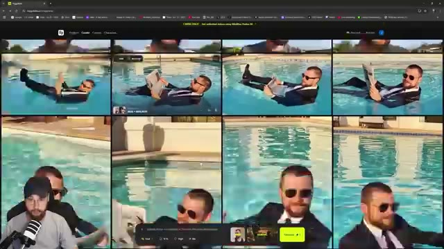
*Vue de la galerie de résultats sur Higgsfield avec des clips du personnage dans une piscine, avec le créateur en bas à gauche.*

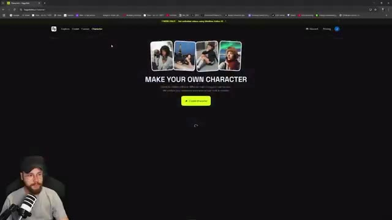
*Page "Make your own character" sur le site Higgsfield avec le bouton "Create Character".*

---

### ⏱️ `[00:02:18 - 00:02:51]` | Segment #05

**🔊 Audio (Transcription Intégrale Mot pour Mot en Français) :**
> en portant des vêtements différents dans des environnements différents et ensuite il peut construire un modèle à partir de ces données. Et vous pouvez voir ici que j'ai déjà créé un personnage pour moi-même en téléchargeant 31 images différentes. Donc ça, je suppose, est vraiment la première étape pour la plupart des cas d'utilisation. Et si nous allons sur créer des images et encore une fois je vais juste faire défiler tout en bas. C'était vraiment le début de mon parcours avec Higgsfield et c'était la création de cette image de moi en train de faire du parachutisme. Donc quand nous voulons créer une image, il y a quelques options différentes qui s'offrent à nous. Évidemment dans cette petite fenêtre de dialogue c'est là que

**👁️ Analyse Visuelle d'Écran (gemini-3.5-flash-lite) :**
**Interface & Outils** : Interface web de Higgsfield (higgsfield.ai) avec des menus d'exploration, de création, de canevas et de gestion des personnages (Character).

**Contenu textuel & Code** : Texte visible : « UPLOAD 20+ PHOTOS FOR BEST RESULTS », « AVOID THESE TYPES OF PHOTOS », et dans la barre de saisie en bas : « Upload image as a prompt or Describe the scene you imagine », avec les paramètres Soul, ratio 9:16, High, On, et le bouton « Generate ».

**Action / Démonstration** : Le présentateur explique comment importer des photos pour créer un modèle de personnage personnalisé, puis montre la galerie de ses créations en faisant défiler l'écran vers le bas jusqu'à la section de génération d'images.

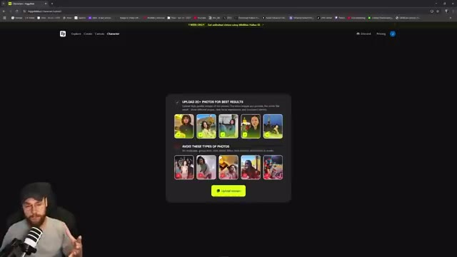
*Interface du logiciel Higgsfield montrant les consignes pour télécharger plus de 20 photos afin d'obtenir les meilleurs résultats.*

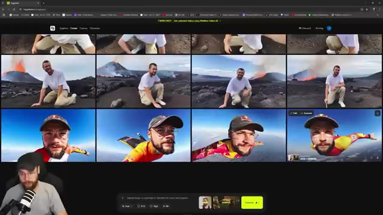
*Interface de Higgsfield affichant une grille de 31 images générées du créateur dans divers environnements, notamment en train de faire du saut en parachute.*

*Gros plan sur la barre de prompt et les paramètres de génération de l'interface Higgsfield avec les options 'Soul', format '9:16', 'High' et le bouton de génération.*

---

### ⏱️ `[00:02:51 - 00:03:27]` | Segment #06

**🔊 Audio (Transcription Intégrale Mot pour Mot en Français) :**
> nous pouvons entrer notre invite textuelle afin de décrire ce que nous voulons que Hicksfield crée. En bas, nous pouvons choisir le modèle que nous recherchons. Ils proposent également Flux Context Max et GPT Image. Ensuite, nous avons la possibilité de sélectionner notre format d'image. Je choisis généralement le 16 par 9. Vous pouvez sélectionner votre préréglage de qualité afin de pouvoir opter pour le mode élevé, qui utilise plus de crédits, ou le mode basique, qui est le plus rapide et le moins cher mais utilise moins de crédits. Et puis il y a la possibilité d'améliorer vos invites. Maintenant, je recommanderais en fait de désactiver cette option. Si vous donnez à Higgsfield une description vraiment bien écrite

**👁️ Analyse Visuelle d'Écran (gemini-3.5-flash-lite) :**
**Interface & Outils** : Interface web de Higgsfield affichant des grilles de vidéos générées par IA et une barre de contrôle de génération en bas.

**Contenu textuel & Code** : Zone de texte "Upload image as a prompt or Describe the scene you imagine", sélecteurs de modèles ("Soul"), de format ("9:16"), de qualité ("High"), d'amélioration de prompt ("On" / "Off"), et bouton "Generate".

**Action / Démonstration** : Présentation de l'interface de l'outil de génération vidéo Higgsfield, montrant les différents réglages de prompts et de paramètres de rendu.

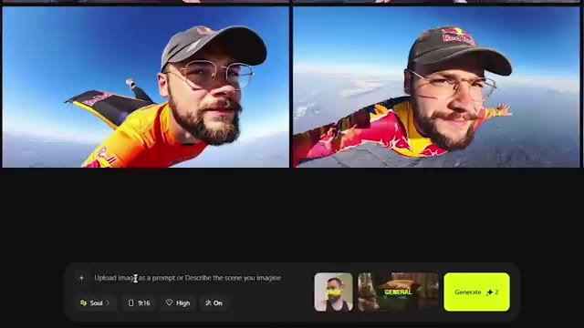
*Interface de Higgsfield montrant la zone de saisie de texte pour décrire la scène et les options de modèles, format et qualité.*

*Interface de Higgsfield affichant la grille de prévisualisation des vidéos générées et le panneau de configuration avec le créateur en incrustation (PiP).*

---

### ⏱️ `[00:03:27 - 00:04:00]` | Segment #07

**🔊 Audio (Transcription Intégrale Mot pour Mot en Français) :**
> prompt, vous cherchez quelque chose de très précis, mais ensuite vous donnez à Higgsfield la possibilité de changer ce prompt, de le modifier d'une manière qu'ils estiment améliorée, ce n'est probablement pas la bonne chose à faire. Cela vous donne moins de contrôle en tant qu'utilisateur. Ici, vous pouvez sélectionner vos personnages, bien sûr je n'ai que le mien créé pour l'instant donc nous allons simplement laisser comme ça, et c'est là que les choses deviennent un peu plus intéressantes, Higgsfield vous donne ces différents styles visuels parmi lesquels choisir et vous devez faire assez attention à la façon dont vous les utilisez.

**👁️ Analyse Visuelle d'Écran (gemini-3.5-flash-lite) :**
**Interface & Outils** : Interface web de Higgsfield.ai avec incrustation vidéo du créateur (Picture-in-Picture).

**Contenu textuel & Code** : Menu de sélection des styles visuels ('Visual Styles') avec différentes vignettes de styles (General, iPhone, Realistic, Insticam, Sunset Beach, etc.) et barre de contrôle des paramètres de génération en bas.

**Action / Démonstration** : Le créateur montre la grille de génération de vidéos puis ouvre le menu des styles visuels sur la plateforme Higgsfield.

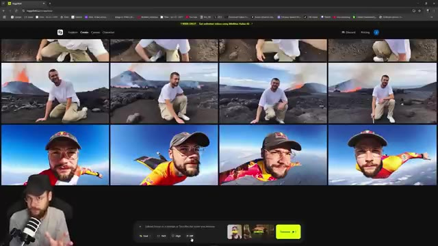
*Interface de Higgsfield montrant une grille de vidéos générées avec le créateur en incrustation (PiP) dans le coin inférieur gauche.*

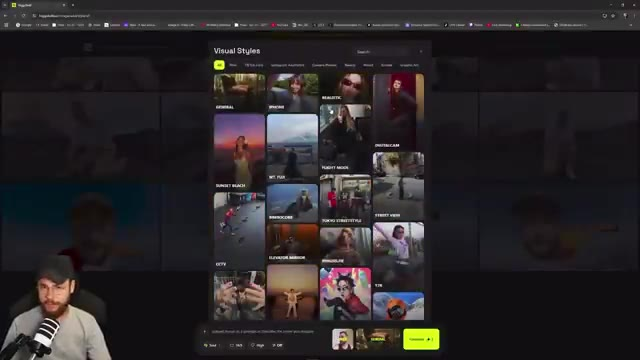
*Interface de Higgsfield affichant le menu pop-up de sélection des styles visuels ('Visual Styles').*

---

### ⏱️ `[00:04:00 - 00:04:34]` | Segment #08

**🔊 Audio (Transcription Intégrale Mot pour Mot en Français) :**
> Je recommanderais personnellement d'utiliser uniquement l'iPhone général et de manière réaliste, il y a aussi le fisheye je crois, qui peut vous donner de très bons résultats. Ça peut être un tout petit peu, ouais, fisheye par ici. Ça peut vous donner de très bons résultats. Beaucoup d'autres fonctionnent différemment de ce que vous pourriez penser. Vous supposez en quelque sorte que cette ambiance va être intégrée dans votre prompt. Mais ce qui se passe réellement en pratique, c'est que les prompts que vous entrez dans Higgsfield sont

**👁️ Analyse Visuelle d'Écran (gemini-3.5-flash-lite) :**
**Interface & Outils** : Interface web de Higgsfield affichant une fenêtre modale de sélection de styles visuels ('Visual Styles') avec divers préréglages (General, iPhone, Realistic, Digicam, Sunset Beach, Flight Mode, Street View, CCTV, etc.).

**Contenu textuel & Code** : Titre 'Visual Styles' avec une barre de recherche et des onglets de filtres (All, Vour, TikTok Lens, Instagram Aesthetics, Camera, Beauty, Mood, Surreal, Graphic Art). Aperçus de styles vidéo avec des vignettes comme General, iPhone, Realistic, Digicam, Sunset Beach, Flight Mode, Street View, CCTV, Elevator Mirror, etc. En bas, une barre de contrôle avec des options de génération et l'incrustation vidéo de Jack.

**Action / Démonstration** : Le créateur montre et navigue parmi les différents styles visuels et options de caméras disponibles dans l'interface de Higgsfield.

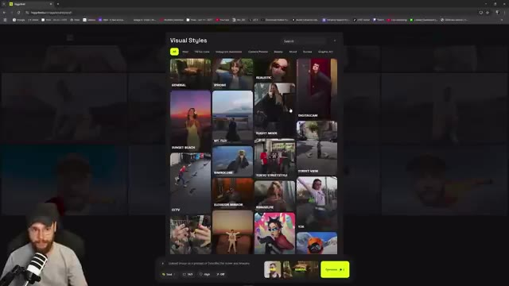
*Interface de Higgsfield montrant la sélection des styles visuels ('Visual Styles') avec différentes options de caméras et d'esthétiques, et Jack incrusté en bas à gauche.*

---

### ⏱️ `[00:04:34 - 00:05:09]` | Segment #09

**🔊 Audio (Transcription Intégrale Mot pour Mot en Français) :**
> dans une certaine mesure ignoré au profit de la création disons d'une affiche Y2K. Il semble vraiment forcer ces effets et une grande partie de ce que vous spécifiez se perdra dans le processus. Donc ici par exemple ces images même si je pense qu'elles ont l'air plutôt bien j'utilisais le laissez-moi juste le trouver le préréglage Mont Fuji et je pensais que ce serait juste ce style photographique avec ce type de filtre appliqué mais non ça vous met littéralement comme si vous étiez debout près de

**👁️ Analyse Visuelle d'Écran (gemini-3.5-flash-lite) :**
**Interface & Outils** : Interface web de l'outil d'intelligence artificielle Higgfield (higgfield.ai).

**Contenu textuel & Code** : Fenêtre 'Visual Styles' avec des options comme 'General', 'iPhone', 'Realistic', 'Digital Cam', 'Sunset Beach', 'Mt. Fuji', 'Y2K'. Générations de vidéos montrant un homme en costume noir et lunettes de soleil devant une supérette Lawson avec le Mont Fuji en arrière-plan.

**Action / Démonstration** : Le créateur navigue dans l'interface de l'application Higgfield et montre les styles visuels et les résultats de génération avec le préréglage 'Mount Fuji'.

*Interface de l'application Higgfield montrant la fenêtre modale 'Visual Styles' avec différentes vignettes de styles visuels et le créateur incrusté en bas à gauche.*

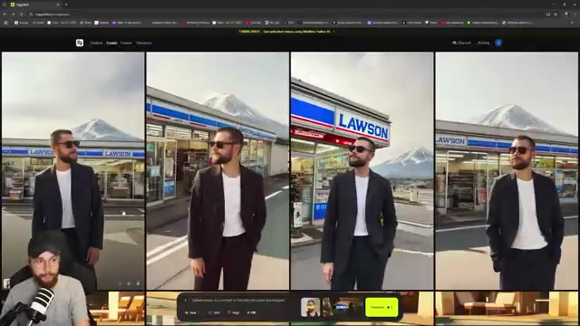
*Interface de Higgfield affichant quatre variations de génération vidéo montrant un homme en costume devant un supérette Lawson avec le Mont Fuji en arrière-plan, avec le créateur incrusté en bas à gauche.*

---

### ⏱️ `[00:05:09 - 00:05:46]` | Segment #10

**🔊 Audio (Transcription Intégrale Mot pour Mot en Français) :**
> mont Fuji ce qui n'est pas du tout ce à quoi je m'attends et si on fait défiler un peu plus haut on a des trucs de fous que j'ai créés euh avec le préréglage de poster y2k maintenant encore une fois ce que je pensais qu'il ferait probablement c'est prendre cette ambiance cool y2k et l'appliquer à mon prompt mais il n'a pas fait ça il a vraiment juste forcé ce style d'une manière très lourde sur le prompt d'origine que j'ai fourni à Higgsfield et ouais je ne sais même pas quoi dire à propos de ces images j'ai montré ça à ma femme j'étais

**👁️ Analyse Visuelle d'Écran (gemini-3.5-flash-lite) :**
**Interface & Outils** : Interface web de Higgsfield AI (higgsfield.ai) avec navigation par onglets (Explore, Create, Creator, Character), barre de prompt et vignettes de prévisualisation des vidéos générées.

**Contenu textuel & Code** : On peut lire des éléments de texte sur l'interface comme "Upload image as a prompt or Describe the scene you imagine", le titre de génération "JACK + Y2K POSTERS", et des boutons de paramétrage (Seed, Motion, High, Off).

**Action / Démonstration** : Le créateur fait défiler vers le haut la page web de sa galerie de projets sur Higgsfield AI pour montrer les résultats générés avec le préréglage Y2K poster, tout en commentant le rendu visuel.

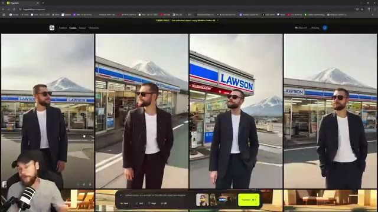
*Interface du site Higgsfield affichant des générations de vidéos mettant en scène le créateur devant un magasin Lawson avec le mont Fuji en arrière-plan, avec le flux vidéo du créateur incrusté en bas à gauche.*

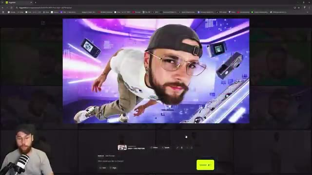
*Gros plan sur une image générée avec le préréglage Y2K poster dans l'interface de Higgsfield montrant le visage du créateur dans un décor futuriste violet.*

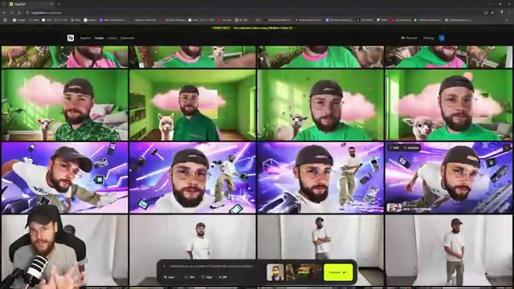
*Vue d'ensemble de la grille de projets dans Higgsfield montrant différentes séries de générations, notamment le style Y2K violet et des décors verts avec des alpagas.*

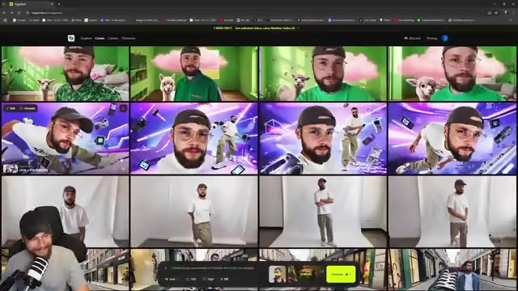
*Défilement de la galerie dans Higgsfield montrant plusieurs lignes de résultats de générations d'avatars et de vidéos avec le créateur.*

---

### ⏱️ `[00:05:46 - 00:06:19]` | Segment #11

**🔊 Audio (Transcription Intégrale Mot pour Mot en Français) :**
> assis en bas avec ma femme pendant que je testais cet outil pour la première fois et on était mort de rire en regardant certaines des trucs complètement bizarres qui sortent de Higgsfield alors comme je disais si on remonte un peu plus haut j'aime vraiment beaucoup ça comme démonstration de l'incroyable potentiel de Higgsfield en tant qu'outil mais je tiens à souligner que j'utilisais le préréglage général ici et j'aime assez certains de ceux-là aussi ils sont plutôt cool encore une fois ça me ressemble vraiment beaucoup et

**👁️ Analyse Visuelle d'Écran (gemini-3.5-flash-lite) :**
**Interface & Outils** : Navigateur web affichant l'interface de l'outil de génération vidéo par IA Higgsfield, avec une vue en grille et des panneaux de contrôle bas de page.

**Contenu textuel & Code** : Interface utilisateur de Higgsfield, vignettes vidéo de démonstration avec le visage de Jack appliqué par IA, options de préréglage général ("General"), et fenêtres de dialogue textuelles.

**Action / Démonstration** : Le créateur fait défiler l'interface web de Higgsfield pour montrer les différentes vidéos générées et commente les résultats bizarres ou réussis obtenus avec le préréglage général.

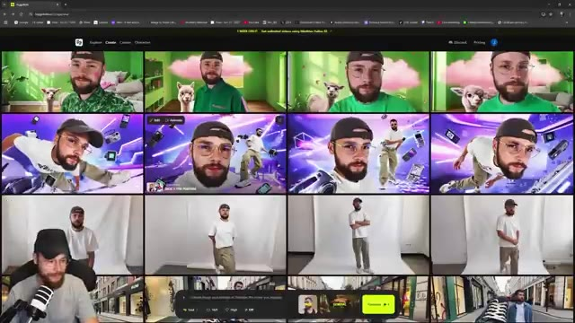
*Interface du site Higgsfield affichant une grille de vidéos générées avec le visage de Jack dans divers décors loufoques, avec le créateur en incrustation vidéo en bas à gauche.*

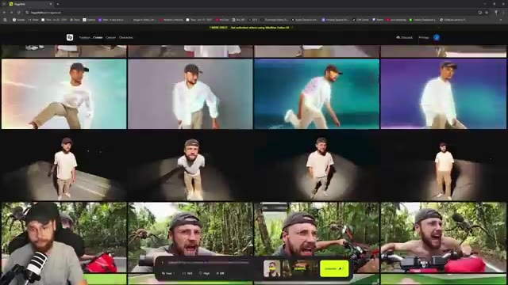
*Suite de la grille de vidéos sur l'interface Higgsfield montrant d'autres variations de génération de mouvements et de scènes avec le visage du créateur.*

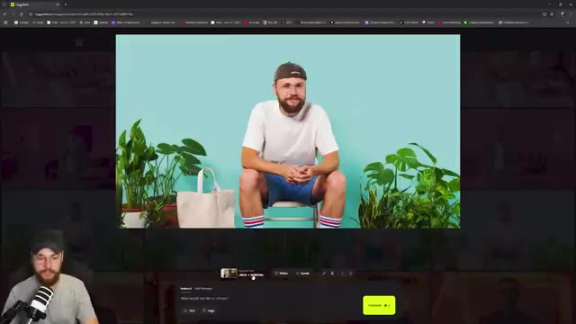
*Gros plan sur une vidéo spécifique générée par Higgsfield montrant Jack assis sur une chaise entouré de plantes vertes, avec la barre d'outils et le prompt en bas.*

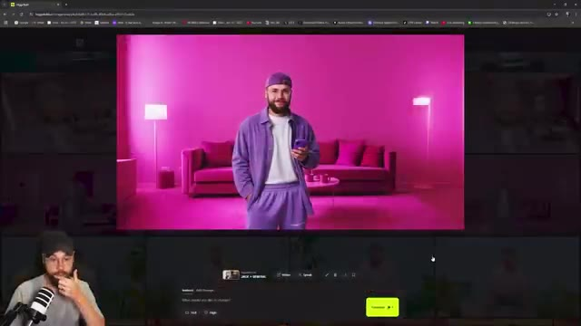
*Gros plan sur une autre génération vidéo de Higgsfield montrant Jack dans une pièce entièrement rose avec un canapé, tenant un smartphone.*

---

### ⏱️ `[00:06:19 - 00:06:53]` | Segment #12

**🔊 Audio (Transcription Intégrale Mot pour Mot en Français) :**
> parfois vous avez du mal à obtenir cela avec un outil comme Midjourney mais vous pouvez voir la différence ici entre l'utilisation du style général où cela semble un peu plus pictural un peu plus cinématographique et peut-être surréaliste aussi ou l'utilisation de leur préréglage réaliste qui dans certains cas donne littéralement l'impression que j'aurais pu prendre ces photos moi-même ce qui est vraiment impressionnant donc maintenant vous pouvez comprendre la puissance et l'inconvénient d'utiliser les styles visuels de Higgsfield

**👁️ Analyse Visuelle d'Écran (gemini-3.5-flash-lite) :**
**Interface & Outils** : Navigateur web affichant l'interface de la plateforme Higgsfield avec le panneau de sélection des "Visual Styles".

**Contenu textuel & Code** : On distingue les vignettes de styles visuels ("General", "Iphone", "Realistic", "Digital Cam", etc.) ainsi qu'une image générée montrant un homme barbu habillé en mauve dans un salon aux tons roses.

**Action / Démonstration** : Le créateur présente l'interface de Higgsfield et compare visuellement le rendu du style général et du préréglage réaliste ("Realistic preset").

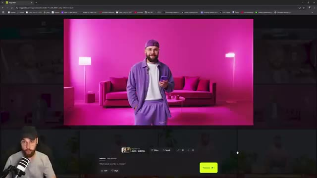
*Aperçu d'une image générée sur la plateforme Higgsfield avec un style général, montrant un personnage en tenue mauve dans une pièce entièrement rose.*

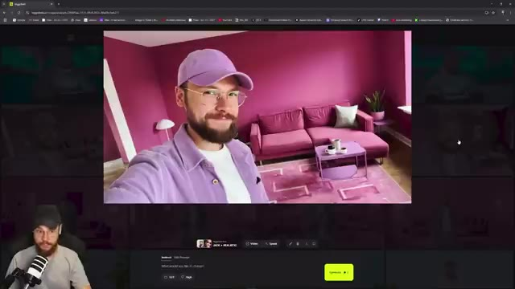
*Aperçu d'une image générée sur Higgsfield en utilisant le préréglage réaliste, donnant un rendu de type selfie très réaliste.*

*Panneau des styles visuels ('Visual Styles') de Higgsfield affichant différentes catégories de filtres et rendus (General, Iphone, Realistic, etc.).*

---

### ⏱️ `[00:06:53 - 00:07:11]` | Segment #13

**🔊 Audio (Transcription Intégrale Mot pour Mot en Français) :**
> Jusqu'à présent, je ne recommanderais vraiment que general, iPhone et realistic. Jouez avec ceux-là autant que vous voulez. Particulièrement general et realistic semblent correspondre le mieux à la plupart des cas d'utilisation. Si vous voulez quelque chose qui donne une impression plus surréaliste et cinématographique, optez pour general.

**👁️ Analyse Visuelle d'Écran (gemini-3.5-flash-lite) :**
**Interface & Outils** : Navigateur web affichant l'interface de l'outil d'intelligence artificielle Higgsfield, avec un encadré PiP (Picture-in-Picture) du créateur face à sa caméra.

**Contenu textuel & Code** : Menu "Visual Styles" avec différentes options de styles visuels (General, iPhone, Realistic, Digitalcam, Sunset Beach, etc.) et grille de prévisualisations vidéo avec des tons roses et bleus.

**Action / Démonstration** : Le présentateur commente les différents styles visuels disponibles sur l'interface de l'outil tout en affichant des exemples de résultats générés.

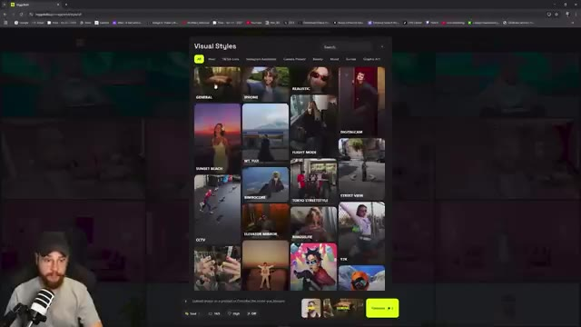
*Interface de Higgsfield montrant la galerie des styles visuels (Visual Styles) avec le créateur en incrustation (PiP) dans le coin inférieur gauche.*

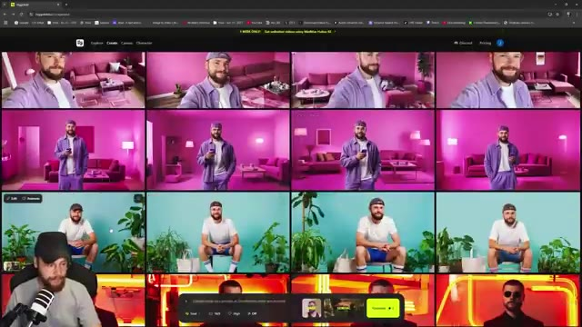
*Interface de Higgsfield affichant une grille de vidéos générées avec le créateur en incrustation (PiP) dans le coin inférieur gauche.*

---

### ⏱️ `[00:07:12 - 00:07:50]` | Segment #14

**🔊 Audio (Transcription Intégrale Mot pour Mot en Français) :**
> Si vous voulez quelque chose qui a littéralement l'air d'avoir pu se produire, afin qu'on puisse trouver cette image de moi en pilote ou l'image de moi dans la piscine, ceci utilise l'outil réaliste et ensuite si l'on compare, il y a donc exactement le même prompt textuel de moi assis dans une piscine en train de lire un journal en portant un costume, n'est-ce pas ? Si l'on compare le rendu réaliste au rendu général, vous pouvez voir qu'on obtient une ambiance beaucoup plus cinématographique et picturale dans certains cas avec le réaliste, on a vraiment l'impression que cela aurait pu tout simplement arriver.

**👁️ Analyse Visuelle d'Écran (gemini-3.5-flash-lite) :**
**Interface & Outils** : Interface web de l'outil de génération vidéo et d'intelligence artificielle Higgsfield AI, avec une disposition en grille des médias générés et la webcam du créateur incrustée en bas à gauche.

**Contenu textuel & Code** : Barres d'outils de navigation du site Higgsfield, options de prompts textuels, miniatures des générations vidéo et paramètres de génération.

**Action / Démonstration** : Le créateur présente et compare à l'écran les différents résultats de génération vidéo entre les modes réaliste et général, en montrant les rendus de sa propre image intégrée dans une piscine.

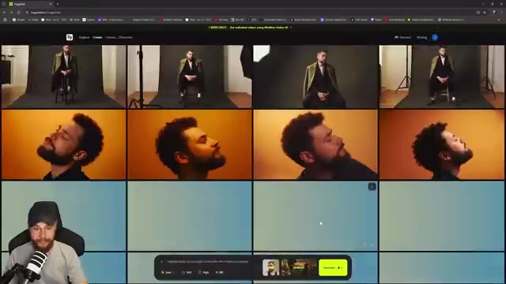
*Interface de l'outil de génération vidéo présentant une grille de résultats avec des plans du créateur dans un studio sur fond gris et orange.*

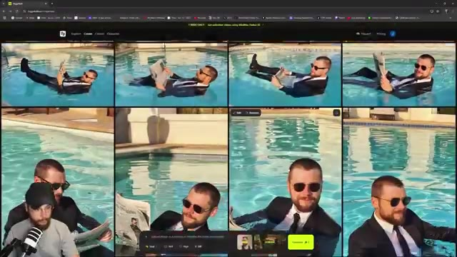
*Grille comparative de l'interface montrant plusieurs variations d'une vidéo générée d'un homme en costume lisant un journal dans une piscine.*

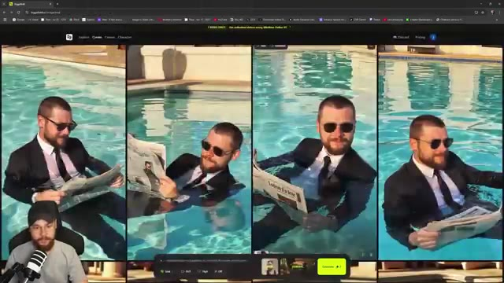
*Vue rapprochée d'une grille à quatre variations de la vidéo du personnage en costume dans la piscine.*

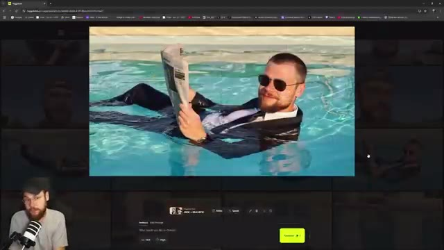
*Affichage en grand format d'un des résultats vidéo générés représentant l'homme en costume avec des lunettes de soleil lisant un journal dans l'eau.*

---

### ⏱️ `[00:07:50 - 00:08:26]` | Segment #15

**🔊 Audio (Transcription Intégrale Mot pour Mot en Français) :**
> pour de vrai ce qui est insensé c'est vraiment la force du champ de Higgs en tant qu'outil l'autre chose dont je veux parler et j'ai appris cette leçon à la dure c'est que si vous entraînez votre personnage ou votre modèle pour une certaine personne qui porte généralement des lunettes et un chapeau ou tout autre accessoire ou accessoire si vous voulez les appeler ainsi vous devez vous assurer d'inclure cela dans votre prompt textuel car si vous ne le faites pas alors vous obtenez ce genre de résultat où on dirait que ça me ressemble à moitié et à moitié non donc encore une fois c'est en utilisant le préréglage réaliste et je viens juste

**👁️ Analyse Visuelle d'Écran (gemini-3.5-flash-lite) :**
**Interface & Outils** : Interface web de l'outil de génération vidéo par IA Higgsfield, visible avec un affichage en grille des résultats et une pastille de PiP (Picture-in-Picture) montrant Jack dans son studio en bas à gauche.

**Contenu textuel & Code** : On aperçoit des vignettes de prévisualisation de vidéos générées par IA avec le visage de Jack dans divers contextes (piscine, volcan, wingsuit), ainsi que le panneau de prompt et les préréglages en bas de l'écran (Realistic preset).

**Action / Démonstration** : Le créateur présente l'interface de Higgsfield et commente les résultats visuels obtenus lors de la génération de personnages avec ou sans accessoires.

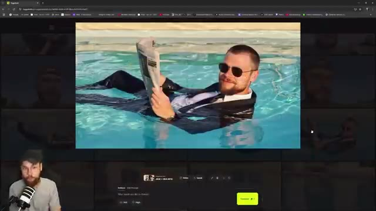
*Interface de Higgsfield montrant une vidéo générée de Jack en costume lisant un journal dans une piscine.*

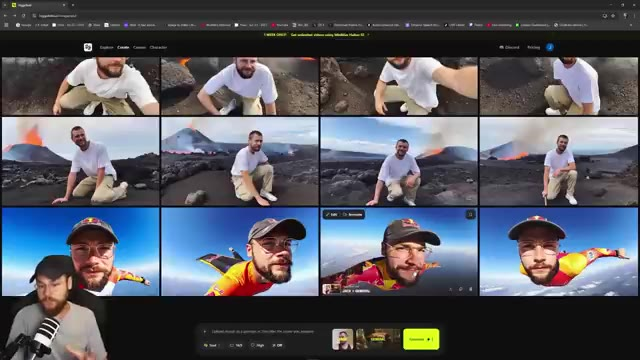
*Interface de Higgsfield affichant une galerie de vidéos générées avec le personnage de Jack dans diverses situations (vol en wingsuit avec lunettes et casquette, paysages volcaniques).*

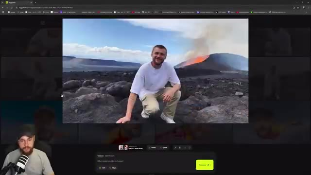
*Interface de Higgsfield affichant un gros plan d'une vidéo générée de Jack accroupi près d'un volcan en éruption.*

---

### ⏱️ `[00:08:26 - 00:09:01]` | Segment #16

**🔊 Audio (Transcription Intégrale Mot pour Mot en Français) :**
> je voulais demander à Higgsfield de créer des images de moi posant pour des selfies et des choses comme ça à côté d'un volcan en activité et vous pouvez voir sur celle-ci qu'il me ressemble un peu mais il y a pas mal de choses qui ne vont pas avec ces générations et j'ai rapidement réalisé que c'était parce que je ne lui avais pas demandé d'inclure ma casquette et mes lunettes au quotidien je porte toujours mes lunettes et je porte toujours l'une de mes casquettes de baseball donc c'est important d'inclure cette information dans les invites que vous donnez à Higgsfield à réaliser et aussi cela sert de très bon point de comparaison également

**👁️ Analyse Visuelle d'Écran (gemini-3.5-flash-lite) :**
**Interface & Outils** : Interface web de Higgsfield avec une vue en grille des créations et panneau de prompt en bas, combinée avec le navigateur Google Chrome.

**Contenu textuel & Code** : Sur l'image 1, on aperçoit une image générée représentant un homme près d'un volcan. Sur l'image 2, la page d'accueil de Google avec le logo central et la barre de recherche. Dans les deux cas, le créateur est visible en incrustation (PiP) en bas à gauche.

**Action / Démonstration** : Le créateur montre un exemple de génération d'image ratée sur Higgsfield puis navigue sur son navigateur web.

*Interface de l'outil de génération Higgsfield affichant une image générée d'un homme accroupi près d'un volcan en éruption.*

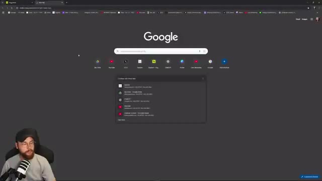
*Navigateur web Google Chrome affichant la page d'accueil avec une barre de recherche.*

---

### ⏱️ `[00:09:01 - 00:09:38]` | Segment #17

**🔊 Audio (Transcription Intégrale Mot pour Mot en Français) :**
> entre le type d'images que vous pouvez obtenir avec Midjourney par rapport à ce que vous obtenez avec Higgsfield, donc je veux juste faire défiler vers le bas ici et trouver les images de volcan que j'ai créées, c'est un très bon exemple donc celle-ci a été faite euh évidemment avec Midjourney et cette image est beaucoup plus visuellement frappante, esthétiquement plaisante, beaucoup plus artistiquement engageante je dirais et si vous recherchez ce genre de résultat je suggère toujours que vous optiez pour Midjourney le problème est que

**👁️ Analyse Visuelle d'Écran (gemini-3.5-flash-lite) :**
**Interface & Outils** : Navigateur web affichant l'interface utilisateur de la plateforme Midjourney, avec un panneau de configuration à droite et une incrustation vidéo du créateur (Jack) en bas à gauche.

**Contenu textuel & Code** : Grilles d'images générées par IA représentant des paysages urbains nocturnes et un homme devant un volcan en éruption, accompagnées de prompts textuels descriptifs dans le panneau latéral.

**Action / Démonstration** : Le créateur fait défiler l'historique de ses créations sur l'interface de Midjourney pour retrouver et présenter l'image de volcan qu'il a générée.

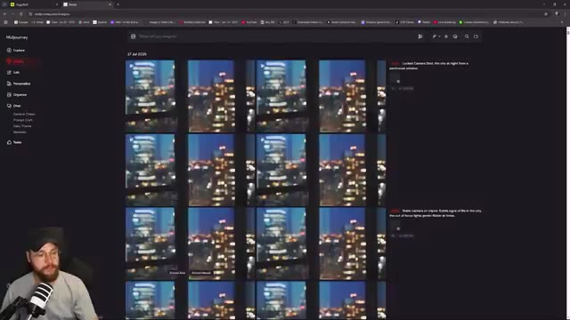
*Interface du site Midjourney montrant une grille d'images générées de nuit dans un gratte-ciel, avec Jack incrusté en bas à gauche.*

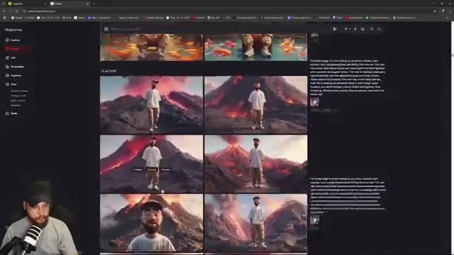
*Interface de Midjourney montrant une grille d'images générées d'un homme posant devant un volcan en éruption.*

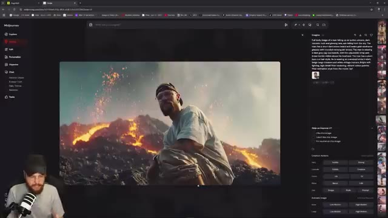
*Gros plan sur une image agrandie d'un homme accroupi devant un volcan en éruption, affichée dans l'interface de Midjourney.*

---

### ⏱️ `[00:09:38 - 00:10:16]` | Segment #18

**🔊 Audio (Transcription Intégrale Mot pour Mot en Français) :**
> parfois ça ne vous donnera pas un résultat photoréaliste ça ne ressemblera pas toujours à Higgsfield vous pouvez obtenir ces images une fois que je l'ai prompté pour avoir mes lunettes et mon chapeau on peut voir qu'ils commencent à avoir l'air vraiment très photoréalistes. Vous pouvez obtenir cette sensation photoréaliste avec Higgsfield mais ce n'est en rien aussi cinématique que quelque chose comme Midjourney alors gardez ça à l'esprit. Chaque outil a ses propres forces et faiblesses et différents cas d'utilisation qui en découlent. Jusqu'à présent, nous avons appris les styles visuels, lesquels utiliser et lesquels éviter. Et nous avons également appris

**👁️ Analyse Visuelle d'Écran (gemini-3.5-flash-lite) :**
**Interface & Outils** : Navigateur web affichant les interfaces de Midjourney et de Higgsfield, avec Jack visible en incrustation (PiP) dans le coin inférieur gauche.

**Contenu textuel & Code** : Texte du prompt visible sur Midjourney : "Full body image of a man hiking up an active volcano...". Fenêtre "Visual Styles" sur Higgsfield avec des vignettes classées par catégories (All, Vibe, TikTok Cam, Instagram Aesthetics, etc.).

**Action / Démonstration** : Le créateur présente et compare les rendus visuels entre Midjourney et Higgsfield, en montrant les interfaces respectives des deux outils d'intelligence artificielle.

*Interface de Midjourney affichant une image générée d'un homme accroupi près d'un volcan en éruption, avec le panneau de prompt et les options de variation à droite.*

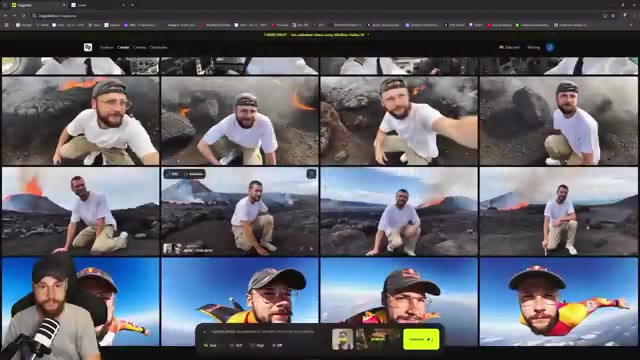
*Interface de Higgsfield montrant une grille de plusieurs images/générations d'un personnage dans différents contextes (volcan, chute libre).*

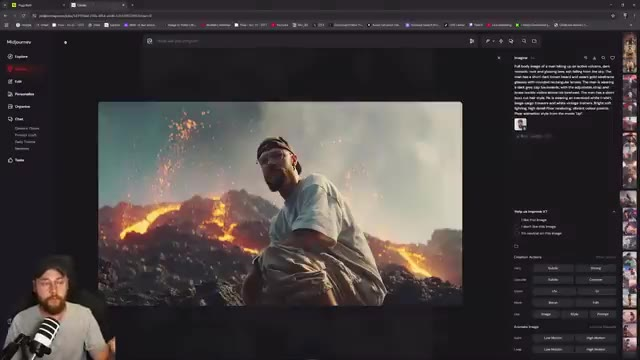
*Interface de Midjourney avec l'image générée du personnage près du volcan, identique à l'image 1.*

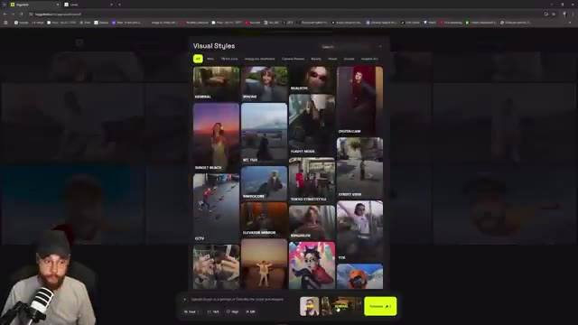
*Interface de Higgsfield affichant une fenêtre contextuelle "Visual Styles" avec une sélection de styles visuels (iPhone, Realistic, Sunset Beach, etc.).*

---

### ⏱️ `[00:10:16 - 00:10:44]` | Segment #19

**🔊 Audio (Transcription Intégrale Mot pour Mot en Français) :**
> l'entraînement du modèle, la création de votre personnage et le fait de vous assurer que, si vous êtes une personne qui porte des accessoires, vous incluez cela dans votre prompt textuel lorsque vous créez vos images. Ce sont probablement les deux plus grandes leçons que j'apprises en expérimentant avec cet outil. Mais vous pouvez voir ici avec les images de pilotes que nous avons créées, les résultats étaient vraiment, vraiment super. J'ai montré cela à pas mal de ma famille et de mes amis et ils ont été complètement époustouflés par certaines de ces images de pilotes.

**👁️ Analyse Visuelle d'Écran (gemini-3.5-flash-lite) :**
**Interface & Outils** : Navigateur web affichant une interface d'outil de génération d'images par IA (type Higgsfield) avec une disposition en galerie de miniatures en arrière-plan et une image principale affichée au centre. Le créateur apparaît en incrustation (PiP) dans le coin inférieur gauche.

**Contenu textuel & Code** : Galerie d'images générées de Jack dans différents scénarios (volcan, cockpit d'avion). En bas de l'interface, un champ de prompt textuel (« What would you like to change? ») et des options de personnalisation.

**Action / Démonstration** : Le créateur présente à l'écran les différentes images de pilotes et de personnages générées par l'intelligence artificielle pour illustrer son propos.

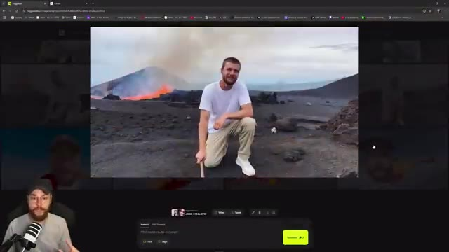
*Interface d'un outil de génération d'images par IA montrant le résultat d'un personnage généré accroupi dans un paysage volcanique.*

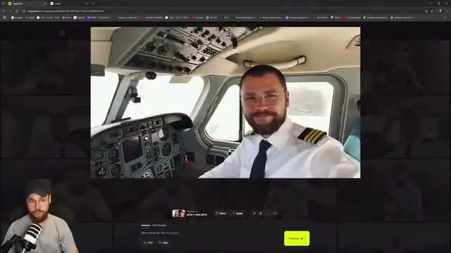
*Interface de l'outil montrant une image générée d'un personnage habillé en pilote d'avion dans un cockpit.*

---

### ⏱️ `[00:10:45 - 00:11:22]` | Segment #20

**🔊 Audio (Transcription Intégrale Mot pour Mot en Français) :**
> Il y a cependant deux ou trois choses que je tiens à souligner : comme avec n'importe quel générateur d'images ou de vidéos par IA, il y aura des problèmes et des artéfacts. Vous pouvez voir celui-ci ici, le genre de pare-brise est en quelque sorte juste suspendu là et il y a comme une webcam ici. Je ne sais pas s'ils en ont généralement dans les avions. Peut-être que oui, et puis une sorte de trace de brûlure bizarre sur le mur. Donc cette génération particulière, même si je trouve qu'elle a vraiment fière allure, présente quelques artéfacts étranges, bien que vous puissiez assez facilement l'exporter depuis Higgsfield, l'importer dans Photoshop et simplement sélectionner...

**👁️ Analyse Visuelle d'Écran (gemini-3.5-flash-lite) :**
**Interface & Outils** : Navigateur web affichant l'interface de la plateforme Higgsfield.

**Contenu textuel & Code** : Grille de vignettes vidéo IA représentant le créateur dans différents contextes (nature, avion, lave), barres de contrôle et menus de la plateforme.

**Action / Démonstration** : Le créateur montre l'interface de Higgsfield et zoome sur l'une des générations vidéo pour pointer les artéfacts visuels.

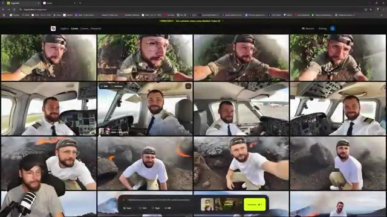
*Interface du site Higgsfield montrant une grille de plusieurs vidéos générées par IA avec le créateur dans le coin inférieur gauche.*

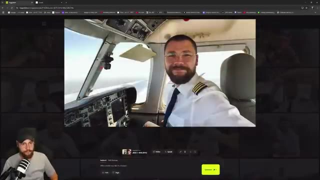
*Gros plan sur l'une des vidéos générées montrant le créateur dans le cockpit d'un avion avec des artéfacts visuels.*

---

### ⏱️ `[00:11:22 - 00:11:53]` | Segment #21

**🔊 Audio (Transcription Intégrale Mot pour Mot en Français) :**
> cette zone et utilisez le remplissage génératif et cela va s'en débarrasser très facilement et cette sorte de texture de brûlure bizarre au-dessus de ma tête, vous pouvez vraiment vous en débarrasser très facilement avec Photoshop donc ce n'est pas forcément la fin du monde. J'ai aussi brièvement abordé l'utilisation du style fisheye et vous pouvez obtenir de très bons résultats avec cela. Je pense que c'est parce qu'il n'essaie pas d'imposer un style si spécifique, presque forcé et très grossier, dans votre prompt textuel.

**👁️ Analyse Visuelle d'Écran (gemini-3.5-flash-lite) :**
**Interface & Outils** : Interface web de Higgsfield avec un panneau de contrôle pour les prompts et les réglages de génération de vidéo IA, accompagnée d'un flux vidéo en incrustation (PiP) du créateur.

**Contenu textuel & Code** : Interface utilisateur de Higgsfield avec des options de modification (Video, Spark), des curseurs de paramètres et des boîtes de saisie de texte pour les prompts.

**Action / Démonstration** : Le créateur commente les résultats visuels générés par l'IA sur la plateforme Higgsfield, en illustrant l'utilisation de différents styles et corrections.

*Interface de la plateforme Higgsfield montrant une génération vidéo au format pilote d'avion, avec le présentateur incrusté en bas à gauche.*

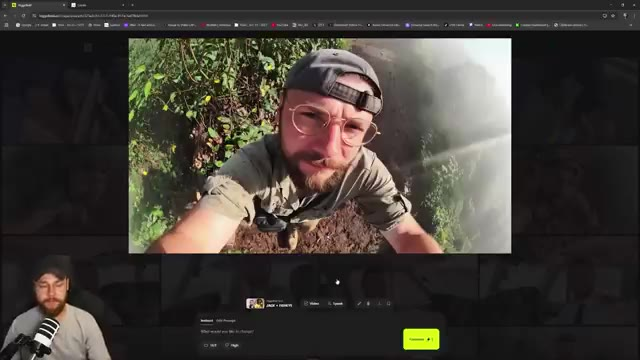
*Interface de la plateforme Higgsfield affichant une génération vidéo avec un style fisheye, où le présentateur est visible en bas à gauche.*

---

### ⏱️ `[00:11:53 - 00:12:26]` | Segment #22

**🔊 Audio (Transcription Intégrale Mot pour Mot en Français) :**
> Ça ne modifie pas trop lourdement vos paramètres. Vous allez vous retrouver beaucoup plus près de ce que vous étiez initialement juste avec cet objectif appliqué. Donc si vous voyez des styles visuels comme ça que vous avez envie d'expérimenter, je vous encourage vivement à le faire. Ce sont les plus lourds qu'il faut utiliser intelligemment, la plupart du temps ils ne donnaient pas du tout l'effet que je recherchais, mais oui, le truc de la jungle est vraiment, vraiment super, texture de peau, détails réalistes, super éclairage, j'adore ce que j'ai obtenu avec ça et là j'ai expérimenté

**👁️ Analyse Visuelle d'Écran (gemini-3.5-flash-lite) :**
**Interface & Outils** : Interface web de l'application de génération vidéo Higgfield, avec un affichage en grille de vignettes et un panneau de prévisualisation en grand format.

**Contenu textuel & Code** : Vignettes de prévisualisation de vidéos générées montrant Jack dans divers contextes (jungle, cockpit d'avion, etc.), avec des options de génération textuelle et de paramètres (Seed, Fast/High).

**Action / Démonstration** : Le créateur montre son écran de navigation sur la plateforme Higgfield pour illustrer ses expérimentations avec différents styles visuels et lentilles.

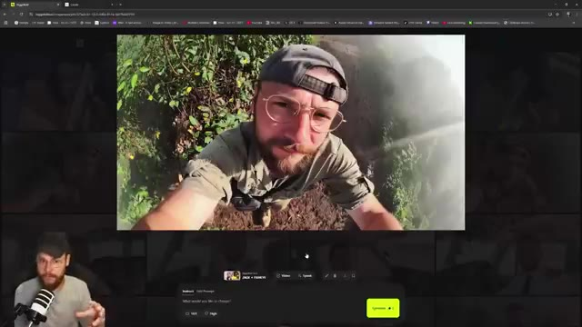
*Interface de l'outil de génération vidéo Higgfield affichant en grand plan une vidéo générée de type selfie dans la jungle avec Jack en incrustation (PiP) en bas à gauche.*

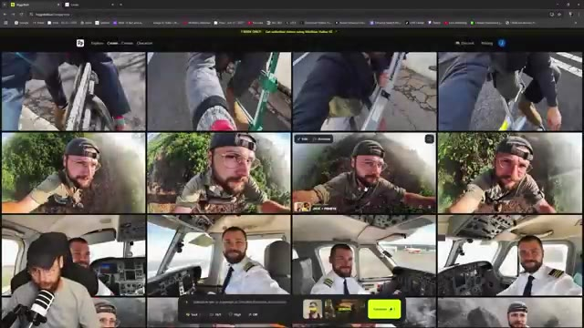
*Grille de résultats de génération vidéo sur l'interface de Higgfield avec différentes scènes (jungle, cockpit d'avion, vélo) et la webcam du créateur en incrustation.*

---

### ⏱️ `[00:12:26 - 00:12:59]` | Segment #23

**🔊 Audio (Transcription Intégrale Mot pour Mot en Français) :**
> un petit peu avec le style de rue de Tokyo le prompt était je crois que j'ai vu des trucs sympas de mode éditoriale sur mid journey et j'essayais de reproduire ça d'un gars dans genre une rue en train de grimper à une échelle ça avait l'air cool sur mid journey mais vous pouvez voir que higgs field finit par créer des artefacts vraiment étranges avec ce prompt particulier donc là par exemple je n'ai aucune idée de ce qui se passe avec la structure de l'échelle très étrange vous obtenez un peu la même chose ici où

**👁️ Analyse Visuelle d'Écran (gemini-3.5-flash-lite) :**
**Interface & Outils** : Interface web de l'outil de génération vidéo IA Higgsfield, avec un affichage en grille des créations et une incrustation vidéo (PiP) du créateur en bas à gauche.

**Contenu textuel & Code** : Interface d'Higgsfield affichant la vidéo centrale avec des panneaux de prompts et de paramètres en bas, entourée d'autres vignettes de génération.

**Action / Démonstration** : Le créateur montre son écran et commente les artefacts visuels et les anomalies de structure générés par l'IA sur l'échelle dans l'outil Higgsfield.

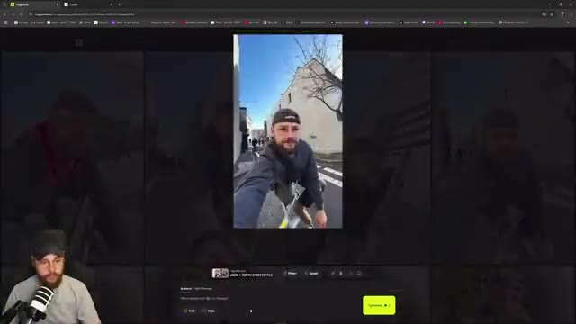
*Interface d'Higgsfield affichant une vidéo générée au centre avec Jack grimpant une échelle dans une rue de style tokyoïte.*

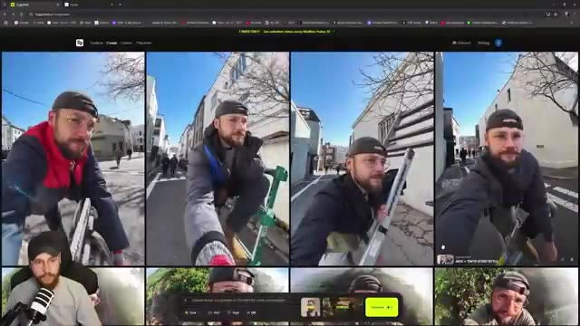
*Interface d'Higgsfield présentant plusieurs rendus et variations de la vidéo avec des artefacts visuels sur l'échelle.*

---

### ⏱️ `[00:12:59 - 00:13:31]` | Segment #24

**🔊 Audio (Transcription Intégrale Mot pour Mot en Français) :**
> L'échelle ne s'appuie sur rien, donc évidemment elle basculerait tout simplement, et même celle-ci donne un peu l'impression que je suis agrippé à un gros morceau de métal. Ces images, ouais, plutôt médiocres. Encore une fois, voici des résultats vraiment étranges. L'un où il a décidé de mettre une autre casquette sur le dessus de ma tête. Je ne sais pas trop pourquoi, j'expérimentais le style visuel de la mode des années 2000. Encore une fois, vous pouvez voir qu'il applique des éléments à mon invite textuelle que je ne veux pas, et on obtient des résultats très bizarres.

**👁️ Analyse Visuelle d'Écran (gemini-3.5-flash-lite) :**
**Interface & Outils** : Navigateur web affichant la plateforme de génération vidéo par IA Higgsfield avec une disposition en grille des résultats et une incrustation vidéo du créateur dans le coin inférieur gauche.

**Contenu textuel & Code** : Interface utilisateur avec des boutons de contrôle vidéo, des champs de texte de prompt ("What would you like to change?") et des miniatures de prévisualisation montrant des dysfonctionnements de génération d'IA (échelle mal positionnée, superposition de casquettes).

**Action / Démonstration** : Le créateur commente à l'écran les défauts visuels des différentes générations vidéo affichées en arrière-plan sur son navigateur.

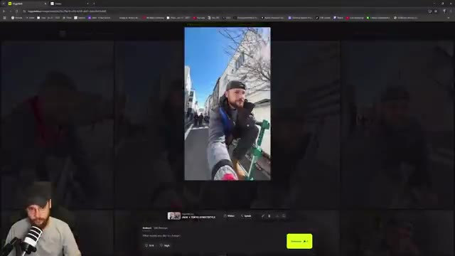
*Interface de l'outil web affichant une vidéo générée par IA où le créateur se filme en plan subjectif dans une rue.*

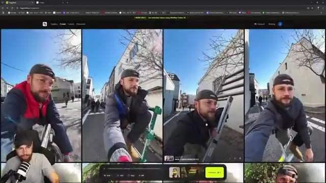
*Vue de l'interface montrant une grille de plusieurs variations de vidéos générées par IA avec des artefacts visuels.*

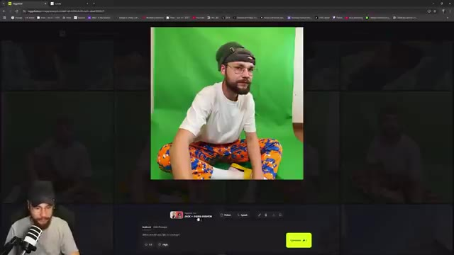
*Affichage d'une autre génération vidéo sur fond vert montrant le créateur avec une casquette supplémentaire sur la tête.*

---

### ⏱️ `[00:13:31 - 00:13:50]` | Segment #25

**🔊 Audio (Transcription Intégrale Mot pour Mot en Français) :**
> Maintenant, c'est là que j'ai commencé à expérimenter avec l'idée d'être allongé dans une piscine avec un costume, en train de lire un journal. C'est ce genre d'ambiance éditoriale de mode très marquée, mais aussi assez surréaliste, que je recherchais. Et vous pouvez voir ici que l'outil a également du mal avec certaines de ces générations.

**👁️ Analyse Visuelle d'Écran (gemini-3.5-flash-lite) :**
**Interface & Outils** : Interface web de l'outil de génération vidéo par IA Higgsfield, avec une disposition en grille de plusieurs clips vidéo générés et une barre de contrôle en bas. Le créateur apparaît en incrustation vidéo (PiP) dans le coin inférieur gauche.

**Contenu textuel & Code** : L'interface affiche des aperçus de vidéos générées par IA avec des personnages dans divers décors (devant une supérette Lawson avec le mont Fuji, et dans une piscine en costume avec un journal). Des options de paramétrage textuel et des miniatures de contrôle sont visibles dans la barre inférieure.

**Action / Démonstration** : Le navigateur présente les résultats de génération de vidéos sous forme de grille comparative, tandis que le créateur commente les difficultés de l'IA à produire des résultats cohérents.

*Interface de l'outil de génération vidéo Higgsfield affichant une grille de prévisualisation avec des séquences générées (notamment devant un magasin Lawson avec le mont Fuji en arrière-plan) et le créateur visible en incrustation (PiP) dans le coin inférieur gauche.*

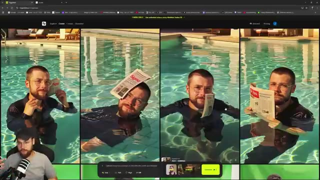
*Interface de l'outil Higgsfield montrant une grille de prévisualisation avec des variantes du créateur dans une piscine en train de lire un journal, illustrant les imperfections de génération.*

---

### ⏱️ `[00:13:50 - 00:14:27]` | Segment #26

**🔊 Audio (Transcription Intégrale Mot pour Mot en Français) :**
> Je ne sais pas pourquoi dans celui-ci j'ai le journal sur mon visage. Celui-là ici, le journal est de la taille d'un dépliant et il est collé sur ma tête. Même s'il y a de bonnes choses dans ces images, il y a une qualité cinématographique évidente, évidemment d'un point de vue physique et du genre "pourquoi ce personnage fait-il ce qu'il fait", ça n'a pas beaucoup de sens, n'est-ce pas ? On a déjà abordé celles du mont Fuji, encore une fois, ça a un peu forcé le style visuel dans mon prompt et ça a peut-être donné un résultat qu'on ne cherchait pas, mais ici on commence à obtenir des résultats vraiment très impressionnants de Higgsfield et c'est...

**👁️ Analyse Visuelle d'Écran (gemini-3.5-flash-lite) :**
**Interface & Outils** : Interface web de Higgsfield (higgsfield.ai) avec des menus Explore, Create, Canvas, Character et une grille de vidéos générées avec des barres de contrôle en bas.

**Contenu textuel & Code** : Barres d'outils avec boutons 'Text', '9:16', 'High', icônes de paramètres et vignettes de prévisualisation des vidéos générées.

**Action / Démonstration** : Le créateur navigue et commente les différentes générations de vidéos sur la plateforme Higgsfield, montrant des anomalies visuelles (comme le journal sur le visage) et des résultats plus réussis.

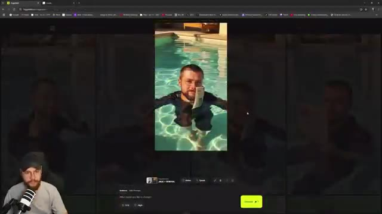
*Interface du site Higgsfield affichant des vidéos générées de Jack dans une piscine avec un journal.*

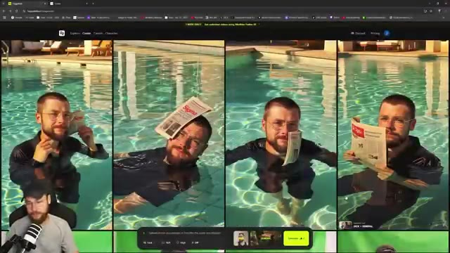
*Interface de Higgsfield montrant quatre variantes vidéo où le journal se déforme sur la tête de Jack.*

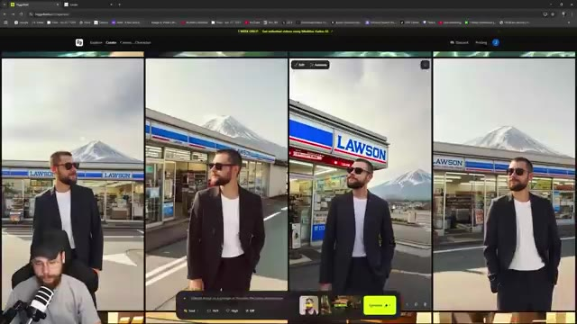
*Interface de Higgsfield affichant des générations de Jack devant un magasin Lawson au Japon avec le mont Fuji en arrière-plan.*

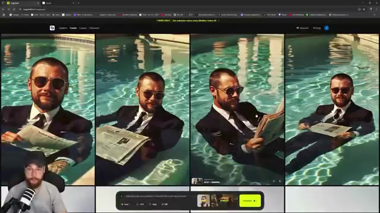
*Interface de Higgsfield montrant de nouvelles générations de vidéos de Jack en costume dans une piscine.*

---

### ⏱️ `[00:14:27 - 00:14:47]` | Segment #27

**🔊 Audio (Transcription Intégrale Mot pour Mot en Français) :**
> en utilisant le préréglage général. Je pense que ce que j'ai dû faire, c'est peaufiner pas mal mon prompt par rapport au moment où on obtenait ce résultat, et ensuite on obtient quelque chose comme ça, qui, personnellement, ne me paraît pas tout à fait photoréaliste. Il y a de la texture de peau, mais je trouve que ça a l'air un tout petit peu trop parfait.

**👁️ Analyse Visuelle d'Écran (gemini-3.5-flash-lite) :**
**Interface & Outils** : Interface web de Higgsfield (navigateur web, onglets de génération, panneaux de prompts).

**Contenu textuel & Code** : Texte du prompt de génération visible dans l'interface de Higgsfield décrivant un homme en costume dans une piscine, avec des paramètres de style et d'éclairage.

**Action / Démonstration** : Le créateur présente l'interface de génération vidéo de Higgsfield et analyse les différents résultats obtenus à l'écran.

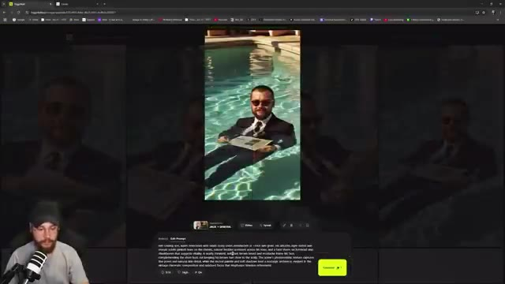
*Interface de la plateforme Higgsfield montrant une grille de résultats vidéo avec le prompt texte détaillé en bas.*

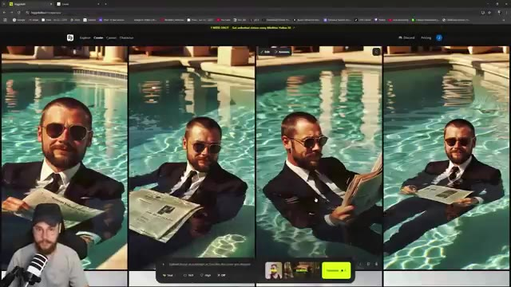
*Interface de la plateforme Higgsfield affichant quatre variations de vidéos générées d'un homme en costume dans une piscine.*

---

### ⏱️ `[00:14:47 - 00:15:24]` | Segment #28

**🔊 Audio (Transcription Intégrale Mot pour Mot en Français) :**
> Parfois, c'est ce que vous recherchez, n'est-ce pas ? Et bien sûr, c'est là qu'on passe au style réaliste et qu'on commence à obtenir des images qui auraient pu réellement se produire. Vraiment, vraiment impressionnant. Assez drôle ici dans celle-ci, je suis en fait également représenté dans le journal que je suis en train de lire. Un petit détail sympa. Et ceci est ce que vous auriez vu au début de la vidéo. Je trouve que ça a l'air absolument incroyable. Je pense que la texture de l'eau, l'éclairage caustique, tout a l'air incroyablement réel. Pour moi, c'est là que Higgsfield brille.

**👁️ Analyse Visuelle d'Écran (gemini-3.5-flash-lite) :**
**Interface & Outils** : Navigateur web affichant l'interface de la plateforme de génération vidéo par IA Higgsfield, avec le panneau de contrôle inférieur et la caméra PiP (Picture-in-Picture) du présentateur en bas à gauche.

**Contenu textuel & Code** : Interface utilisateur de Higgsfield avec des options de génération, des aperçus vidéo divisés en grille, des boutons de paramètres (Text, Seed, High, Off) et le flux vidéo en direct du créateur dans le coin inférieur gauche.

**Action / Démonstration** : Le présentateur commente les différentes générations de vidéos réalistes affichées à l'écran, en mettant en avant les détails visuels comme la texture de l'eau et le journal qu'il lit.

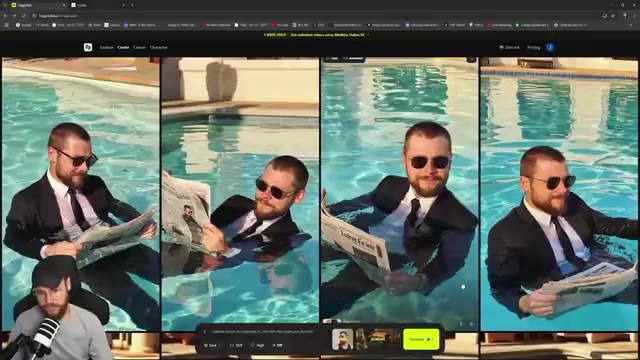
*Interface du site web Higgsfield affichant quatre variations de vidéos générées montrant Jack en costume dans une piscine, avec le créateur visible en incrustation (PiP) dans le coin inférieur gauche.*

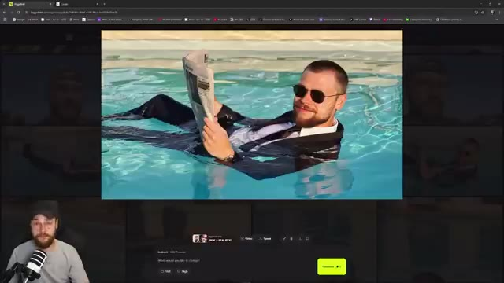
*Interface du site web Higgsfield affichant un aperçu agrandi de la génération vidéo réaliste de Jack dans la piscine, avec le créateur en incrustation (PiP) en bas à gauche.*

---

### ⏱️ `[00:15:24 - 00:16:02]` | Segment #29

**🔊 Audio (Transcription Intégrale Mot pour Mot en Français) :**
> c'est le cas d'usage où cela fait vraiment le travail et maintenant j'ai continué à expérimenter avec higgsfield et je vais vous montrer d'autres inconvénients de cet outil particulier si nous retournons sur midjourney j'ai juste besoin de faire défiler un peu vers le haut et nous cherchons le moment où je lui demandais de créer des images de moi en train de méditer en train de flotter dans les airs avec tous ces rochers qui planent également à côté de moi j'ai obtenu de très superbes résultats avec midjourney j'ai vraiment aimé celle-ci et j'ai aussi vraiment aimé celle-ci donc midjourney fait l'affaire vous lui donnez un bon niveau de détail

**👁️ Analyse Visuelle d'Écran (gemini-3.5-flash-lite) :**
**Interface & Outils** : Navigateur web affichant l'interface de Midjourney (et un onglet Higgsfield), avec le flux de travail et les grilles de génération d'images.

**Contenu textuel & Code** : Prompts visibles sur le panneau latéral de Midjourney décrivant un homme méditant en lévitation avec des rochers orbitant autour de lui, ainsi qu'une scène dans le style de Studio Ghibli.

**Action / Démonstration** : Le créateur fait défiler l'historique de ses générations d'images sur Midjourney pour illustrer les résultats obtenus avant de tester la génération vidéo.

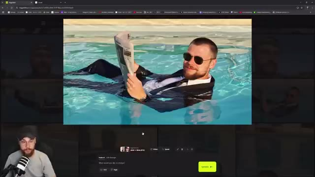
*Interface d'Higgsfield montrant l'image d'un homme en costume de bain dans une piscine lisant un journal avec les options de génération vidéo.*

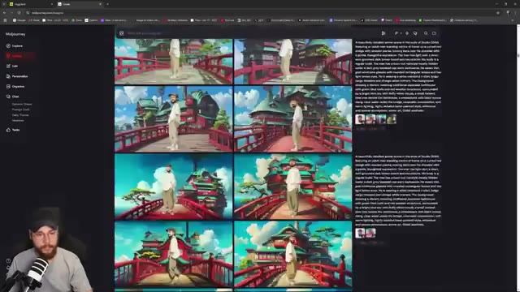
*Interface de Midjourney affichant une grille de 8 images générées représentant l'animateur sur un pont rouge dans le style du Studio Ghibli.*

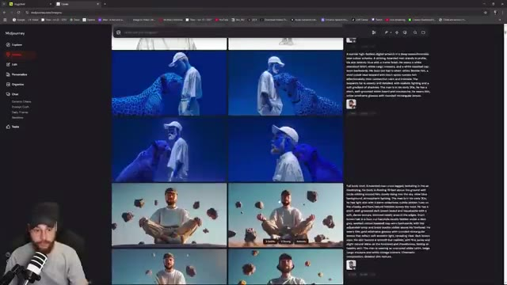
*Interface de Midjourney affichant une grille de 8 images générées, dont une montrant l'animateur en tailleur méditant en lévitation avec des rochers flottants.*

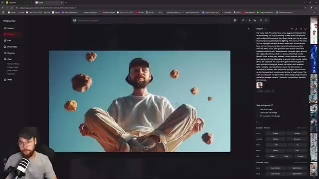
*Interface de Midjourney affichant une image agrandie en plein écran d'un homme méditant en lévitation avec des rochers flottants autour de lui.*

---

### ⏱️ `[00:16:02 - 00:16:37]` | Segment #30

**🔊 Audio (Transcription Intégrale Mot pour Mot en Français) :**
> le prompt il vous donnera des images cinématiques incroyables et magnifiques, cependant donner le même prompt exactement le même prompt en fait à Higgsfield et en utilisant le style réaliste, ça ne me donnait pas du tout ce que je voulais, ça fait juste fondamentalement des selfies, on ne voit pas du tout mon corps en train de léviter, et je suis presque sûr que j'essayais de le forcer à montrer euh mon corps en entier et ça ne le faisait tout simplement pas, ça ne voulait pas, ça finit par donner juste ces genres de selfies sur le vif bizarres, je ne sais pas

**👁️ Analyse Visuelle d'Écran (gemini-3.5-flash-lite) :**
**Interface & Outils** : Midjourney et la plateforme vidéo Higgsfield affichés dans un navigateur web avec la vue PiP du créateur en bas à gauche.

**Contenu textuel & Code** : Prompt complet visible dans Midjourney décrivant un plan en pied d'un homme barbu en tailleur lévitant dans les airs, avec des détails sur l'éclairage atmosphérique et les vêtements.

**Action / Démonstration** : Le créateur montre et compare les résultats obtenus entre Midjourney et Higgsfield, illustrant l'échec de Higgsfield à générer un plan en pied correct.

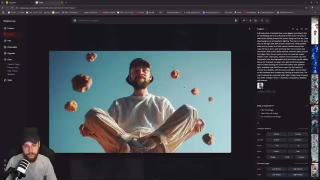
*Interface de Midjourney affichant une image générée montrant un homme en plan large en train de léviter avec des rochers flottants, et le panneau latéral contenant le prompt textuel détaillé.*

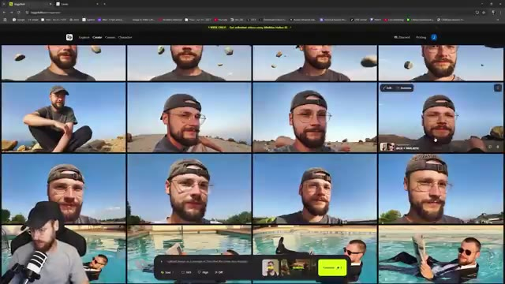
*Interface de la plateforme Higgsfield affichant une galerie de résultats de génération avec de multiples aperçus vidéo montrant des cadrages de type selfie serré.*

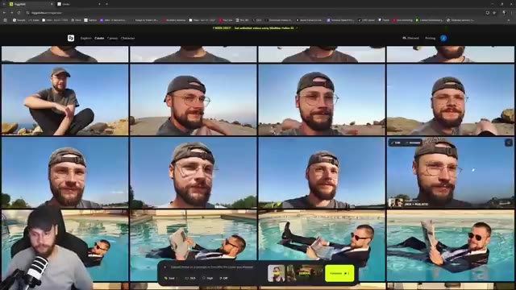
*Vue identique de la galerie de résultats de la plateforme Higgsfield montrant les vignettes de vidéos générées.*

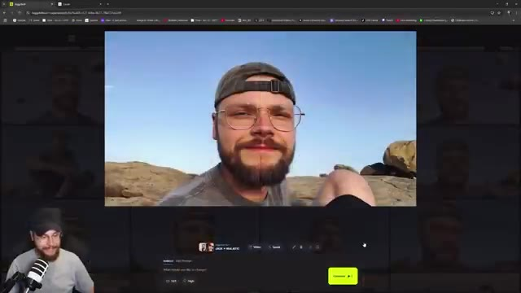
*Zoom sur un résultat de génération spécifique dans l'interface de Higgsfield montrant une vidéo cadrée en plan serré façon selfie.*

---

### ⏱️ `[00:16:37 - 00:17:14]` | Segment #31

**🔊 Audio (Transcription Intégrale Mot pour Mot en Français) :**
> à propos de la position de ma jambe là c'est assez bizarre donc vous pouvez voir qu'il y a parfois quelques artefacts bizarres qui se produisent avec higgs field et ensuite nous passons au style général pour voir si en lui donnant plus de latitude cinématique et surréaliste il serait capable de créer quelque chose proche de ce qu'on a obtenu avec mid journey et la réponse est non il ne pouvait toujours pas faire ça higgs field est vraiment conçu pour créer des images réalistes si vous cherchez quelque chose qui a une qualité surréaliste ou onirique ou cinématique mid journey resterait mon choix personnel et si nous faisons défiler

**👁️ Analyse Visuelle d'Écran (gemini-3.5-flash-lite) :**
**Interface & Outils** : Navigateur web affichant l'interface de la plateforme de génération vidéo par IA Higgsfield AI, avec incrustation vidéo du créateur (Jack Vs. AI) en bas à gauche.

**Contenu textuel & Code** : Panneau latéral droit montrant un prompt textuel long décrivant un homme barbu en tailleur méditant dans les airs avec des rochers, et des options de paramétrage (Upscale, Motion, etc.).

**Action / Démonstration** : Le créateur commente à l'écran les artefacts visuels générés par Higgsfield et montre différentes interfaces et résultats de génération.

*Interface de Higgsfield montrant une vidéo générée avec des artefacts étranges sur la jambe du créateur.*

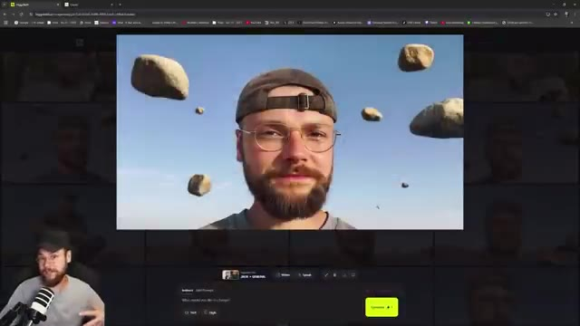
*Interface de Higgsfield affichant une vidéo avec des rochers flottant autour du créateur.*

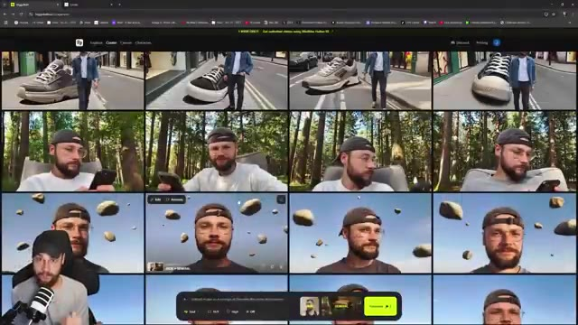
*Grille d'interface de Higgsfield montrant plusieurs générations et styles de vidéos.*

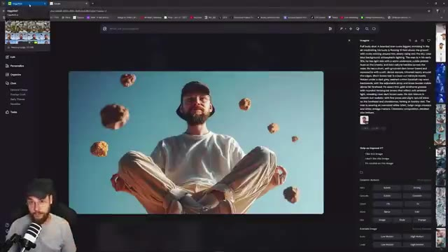
*Interface de Higgsfield avec le panneau latéral affichant le prompt textuel détaillé et les paramètres de génération.*

---

### ⏱️ `[00:17:14 - 00:17:50]` | Segment #32

**🔊 Audio (Transcription Intégrale Mot pour Mot en Français) :**
> On est de retour sur les résultats expérimentaux délirants que j'ai commencé à obtenir de Higgsfield. Si on regarde ici, ce que j'essayais de recréer, c'était cette image que j'ai vue sur Midjourney et que je trouvais vraiment cool, super surréaliste. Mais évidemment, cela penche vers les points forts de Midjourney, qui consistent à créer ces images oniriques vraiment magnifiques. Si on essaie d'obtenir ce résultat avec Higgsfield, on galère et ça crée quelque chose que je ne peux décrire que comme du pur carburant à cauchemars, genre

**👁️ Analyse Visuelle d'Écran (gemini-3.5-flash-lite) :**
**Interface & Outils** : Navigateur web affichant l'interface de Higgsfield et Midjourney avec la webcam du créateur en incrustation (PiP).

**Contenu textuel & Code** : Grilles de prévisualisation vidéo sur Higgsfield et image surréaliste sur Midjourney avec le prompt visible dans le panneau latéral droit.

**Action / Démonstration** : Le créateur navigue et compare les interfaces de Higgsfield et de Midjourney pour illustrer la différence de qualité entre les deux outils IA.

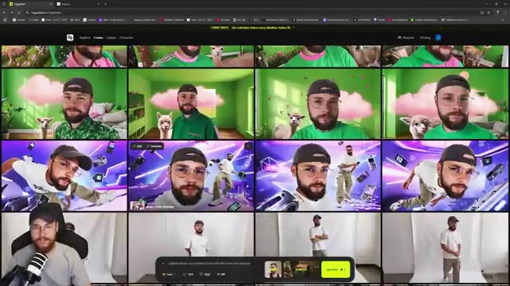
*Interface de Higgsfield montrant une grille de vidéos générées avec le visage du créateur.*

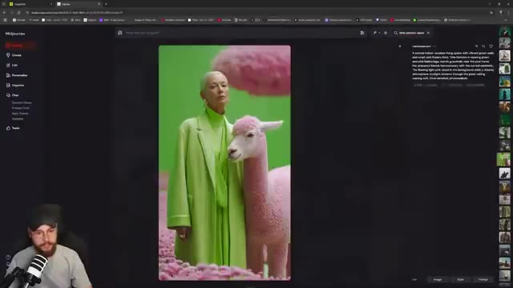
*Interface de Midjourney affichant l'image originale surréaliste d'une personne avec un lama rose et un nuage dans un salon vert.*

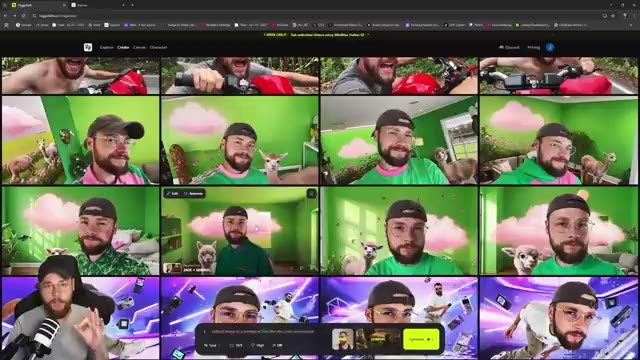
*Retour à l'interface de Higgsfield montrant la grille de résultats expérimentaux.*

---

### ⏱️ `[00:17:50 - 00:18:27]` | Segment #33

**🔊 Audio (Transcription Intégrale Mot pour Mot en Français) :**
> obsédant de bien des manières assez obsédant je ne pense pas qu'on ait besoin de regarder ça plus longtemps ensuite j'ai essayé de créer quelque chose à nouveau que mid-journey ferait très très bien ce qui est vraiment aléatoire moi sur une moto dans une jungle fuyant une araignée géante et hicksfield a eu du mal il a eu du mal dur on utilisait le préréglage réaliste ici et les résultats qu'on a obtenus étaient juste très très étranges et celui-ci ici qu'est-ce qui se passe bon sang avec ma casquette terrible

**👁️ Analyse Visuelle d'Écran (gemini-3.5-flash-lite) :**
**Interface & Outils** : Navigateur web affichant l'interface de la plateforme de génération vidéo par IA Higgsfield AI, avec une incrustation vidéo (PiP) du créateur en bas à gauche.

**Contenu textuel & Code** : Interface utilisateur de Higgsfield AI avec des vignettes de vidéos générées, une zone de prompt textuel ("What would you like to create?") et des préréglages (Preset : Realistic).

**Action / Démonstration** : Le créateur navigue dans une grille de vidéos générées sur Higgsfield AI et sélectionne un clip spécifique montrant une scène sur une moto pour l'analyser.

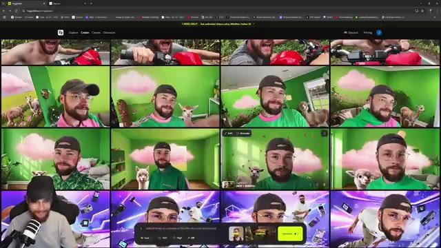
*Grille de résultats de générations sur l'interface de Higgsfield AI montrant diverses scènes générées avec le créateur en incrustation (PiP).*

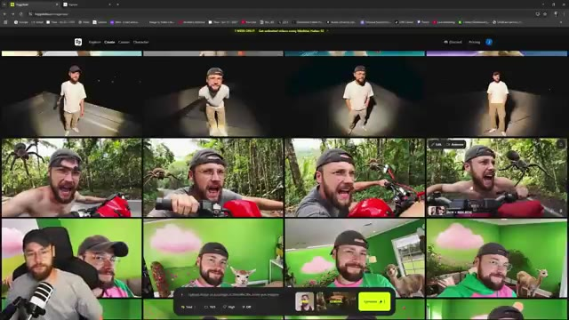
*Grille de l'interface de Higgsfield AI affichant des aperçus de vidéos avec le créateur sur une moto poursuivi par une araignée.*

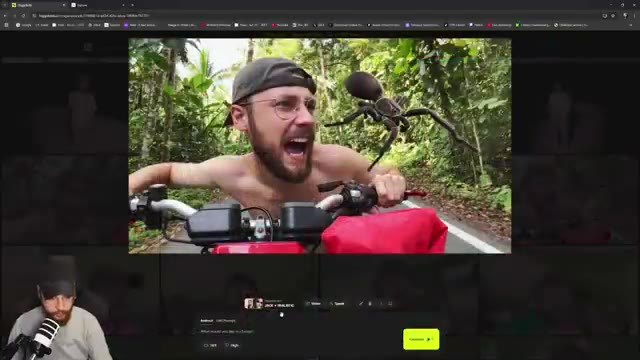
*Gros plan sur l'interface de Higgsfield AI affichant une vidéo sélectionnée du créateur torse nu sur une moto avec une araignée géante.*

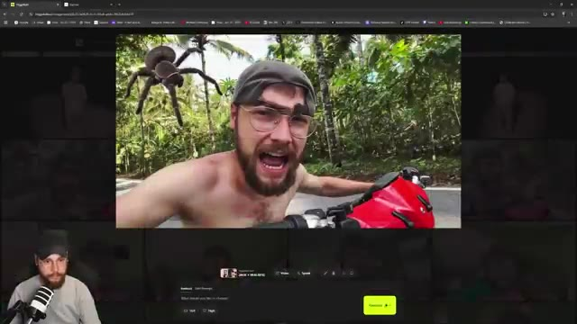
*Zoom sur la vidéo générée dans Higgsfield AI montrant le visage du créateur déformé sur une moto avec une araignée en arrière-plan.*

---

### ⏱️ `[00:18:27 - 00:19:00]` | Segment #34

**🔊 Audio (Transcription Intégrale Mot pour Mot en Français) :**
> des images que vous ne pouviez pas vraiment utiliser pour quoi que ce soit, j'ai un peu joué ici avec d'autres styles visuels, spécifiquement celui de la poursuite (spotlight), et vous pouvez voir que vous pouvez obtenir de très bons résultats avec, il suffit de choisir le bon style visuel et de comprendre comment il appliquera l'ambiance à votre prompt textuel. C'est un peu similaire au style fisheye où cela peut laisser votre prompt intact tout en lui appliquant cette ambiance. Celui-ci, inverteretherial, je ne sais pas du tout ce qui se passe ici.

**👁️ Analyse Visuelle d'Écran (gemini-3.5-flash-lite) :**
**Interface & Outils** : Navigateur web affichant l'interface de la plateforme de génération vidéo IA Higgsfield (avec la webcam du créateur Jack incrustée en bas à gauche en mode PiP).

**Contenu textuel & Code** : On peut voir des vignettes vidéo générées basées sur le prompt de Jack, le titre "JACK + SPOTLIGHT" et "JACK + INVERTETHERIAL", ainsi que des options de réglage textuel et des boutons de génération.

**Action / Démonstration** : Le créateur navigue et démontre les différents styles visuels appliqués à ses vidéos sur la plateforme Higgsfield, illustrant l'effet du style spotlight puis du style inverteretherial.

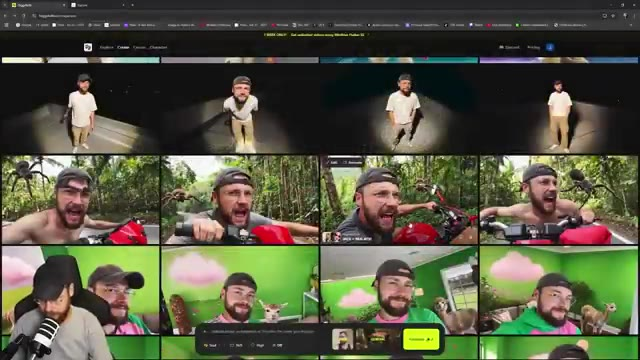
*Interface de la plateforme Higgfield affichant une grille de résultats de générations vidéo avec différents styles visuels (spotlight, moto, pièce verte).*

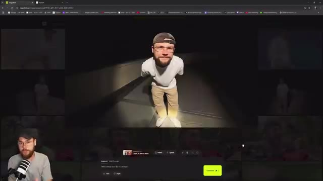
*Gros plan sur l'interface de Higgsfield montrant le résultat vidéo avec le style visuel "spotlight" appliqué à Jack dans le noir.*

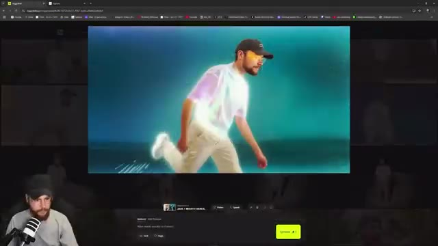
*Résultat vidéo affiché sur Higgsfield démontrant le style visuel "inverteretherial" avec des effets lumineux et éthérés sur le personnage.*

---

### ⏱️ `[00:19:00 - 00:19:33]` | Segment #35

**🔊 Audio (Transcription Intégrale Mot pour Mot en Français) :**
> Le moins on en dit, le mieux c'est je pense. Et je pense qu'à ce stade, ce que je faisais, c'était juste de laisser les prompts vides ou peut-être que j'ajoutais juste une description de moi-même, donc j'incluais la casquette et les lunettes, et je laissais simplement Higgsfield faire ce qu'il voulait avec son propre style visuel. Donc celui-ci, c'est celui du film, je ne sais pas, ça ne ressemble pas du tout à un extrait de film pour moi, je ne sais pas vraiment ce qui se passe ici. Encore une fois, une chaussure aléatoire sur le sol, j'ai l'air un peu bizarre, on obtient parfois des résultats bizarres, ça me ressemble vraiment, je dois bien l'avouer.

**👁️ Analyse Visuelle d'Écran (gemini-3.5-flash-lite) :**
**Interface & Outils** : Navigateur web affichant l'interface de l'outil de génération vidéo Higgsfield, avec incrustation vidéo de Jack en bas à gauche (PiP).

**Contenu textuel & Code** : Interface Higgsfield avec une zone de prévisualisation vidéo centrale, un panneau de prompt textuel en bas ("What would you like to change?") et des options de personnalisation.

**Action / Démonstration** : Le créateur commente les résultats visuels générés par l'IA sur l'interface de Higgsfield tout en montrant les différentes variations de la vidéo à l'écran.

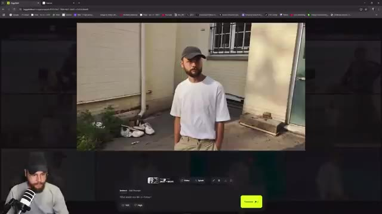
*Interface de l'outil Higgsfield montrant une vidéo générée de Jack dans une cour extérieure avec des chaussures sur le sol.*

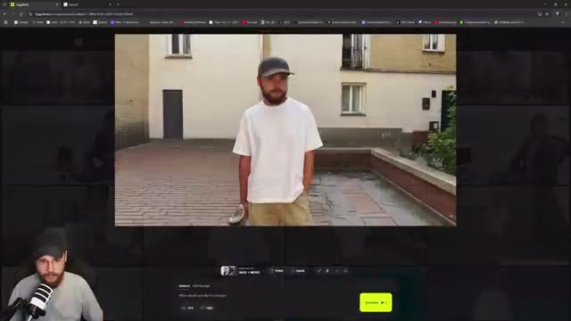
*Interface de l'outil Higgsfield montrant une autre image de la vidéo générée avec Jack dans la cour.*

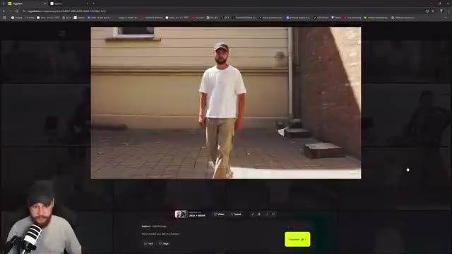
*Interface de l'outil Higgsfield montrant Jack marchant vers la caméra dans la cour.*

---

### ⏱️ `[00:19:33 - 00:20:07]` | Segment #36

**🔊 Audio (Transcription Intégrale Mot pour Mot en Français) :**
> genre c'est plutôt cool on dirait juste pas un film je vois pas trop pourquoi c'est le style visuel décrit et puis là bureau sur une plage si on regarde la miniature pour bureau sur une plage ça a l'air vraiment vraiment cool mais ensuite quand on essaie réellement d'exécuter ça très bizarre ok le voilà donc ça a l'air super ce genre d'image mais quand on a essayé de le faire pour moi ouais carrément bizarre ça a pas beaucoup de sens mon téléphone est juste coincé sur le sol terrible

**👁️ Analyse Visuelle d'Écran (gemini-3.5-flash-lite) :**
**Interface & Outils** : Interface web de l'outil de génération vidéo et d'effets visuels par IA « Higgsfield », avec un panneau de styles visuels et une zone de chat/prompts.

**Contenu textuel & Code** : On peut lire des catégories de styles dans le menu « Visual Styles » telles que : « ALL », « TikTok Lens », « Instagram Aesthetics », « Camera Preview », « Beauty », « Mood », « Grooves », « Lo-Fi/Sci-Fi », ainsi que des préréglages comme « GEOMINIMAL », « INDIE SLEAZE », « OFFICE BEACH », « MIXED MEDIA », « NIGHT BEACH », « PAPER FACE ». Dans la zone de chat : « What would you like to change? », « JACK + OFFICE BEACH ».

**Action / Démonstration** : Le créateur navigue dans l'interface de l'outil Higgsfield, parcourt la galerie de vidéos générées, explore le catalogue des styles visuels et visionne le rendu de la vidéo « Office Beach ».

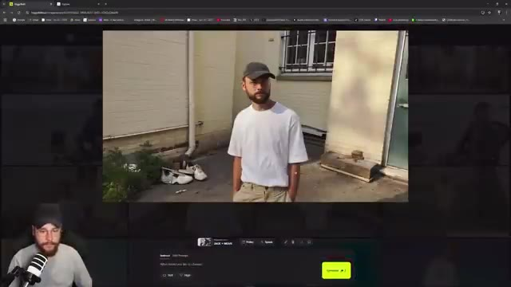
*Interface de l'outil de génération vidéo affichant une vidéo générée montrant Jack debout dans une ruelle près d'un mur en briques et de chaussures abandonnées au sol.*

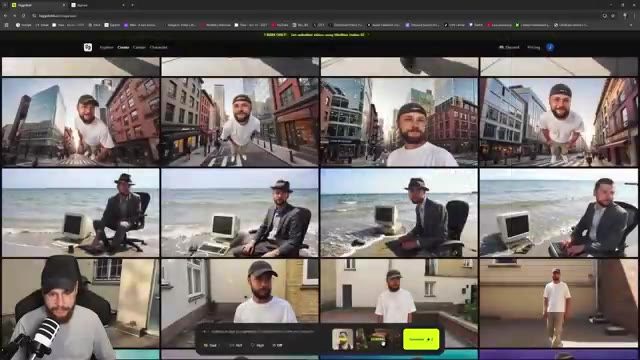
*Galerie de différentes générations vidéo de l'outil Higgsfield avec des aperçus miniatures montrant diverses scènes, notamment un homme en costume assis sur une chaise de bureau sur une plage face à la mer.*

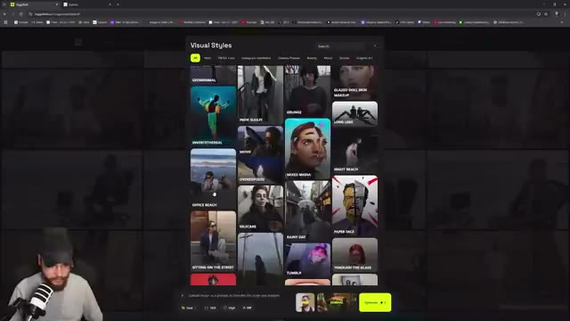
*Menu des styles visuels (« Visual Styles ») de l'outil Higgsfield montrant différentes options de styles artistiques et cinématographiques, avec la sélection du style « OFFICE BEACH ».*

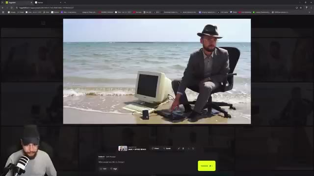
*Gros plan sur la vidéo générée dans l'interface de Higgsfield montrant un homme en costume et chapeau assis dans une chaise de bureau sur une plage au bord de l'eau avec un ordinateur ancien.*

---

### ⏱️ `[00:20:07 - 00:20:25]` | Segment #37

**🔊 Audio (Transcription Intégrale Mot pour Mot en Français) :**
> Pourquoi est-ce que je porte un fedora ? Qu'est-ce qui se passe ? Et encore une fois, c'est ce que je veux dire par le fait que si vous sélectionnez l'un de ces types de styles visuels sur Higgsfield, vous allez obtenir des résultats tout simplement bizarres. Le fil de mon clavier a également été coupé. Bizarre. Très bizarre. C'est probablement le meilleur qu'on a obtenu à partir de ça.

**👁️ Analyse Visuelle d'Écran (gemini-3.5-flash-lite) :**
**Interface & Outils** : Navigateur web affichant l'interface de la plateforme de génération vidéo par IA Higgsfield (avec une vue PiP du créateur dans le coin inférieur gauche).

**Contenu textuel & Code** : Interface utilisateur de Higgsfield avec des vignettes de vidéos générées, une barre de prompt "What would you like to change?", et des boutons de contrôle de génération vidéo.

**Action / Démonstration** : Le créateur navigue à travers l'interface de Higgsfield et examine les différentes variations de vidéos générées par l'IA affichées à l'écran.

*Interface du site web de Higgsfield montrant une vidéo générée d'un homme en costume avec un chapeau sur une plage, avec la vue de la caméra de Jack en incrustation (PiP).*

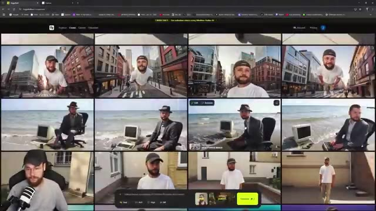
*Grille de sélection de vidéos générées sur l'interface de Higgsfield, affichant divers styles visuels et la webcam du créateur.*

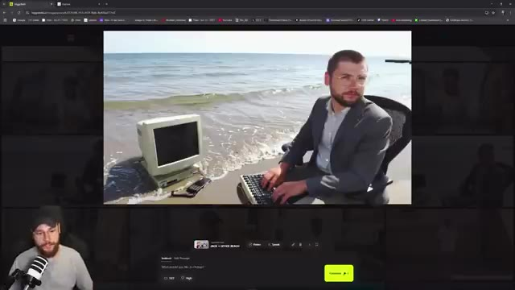
*Gros plan sur la vidéo générée par IA montrant un homme en costume et chapeau sur une plage avec un vieux moniteur, depuis l'interface de Higgsfield.*

---

### ⏱️ `[00:20:25 - 00:21:04]` | Segment #38

**🔊 Audio (Transcription Intégrale Mot pour Mot en Français) :**
> J'aime bien le fait que le téléphone fasse super rétro. L'ordinateur est vraiment rétro. Mais ouais, faites juste attention à votre utilisation des styles visuels. J'ai essayé le style des gens géants ici. Le résultat était vraiment terrible, on dirait juste que je suis superposé sur un arrière-plan, je ne sais pas pourquoi je flotte à cet angle, ça a juste l'air d'un selfie normal avec une perspective bizarre encore une fois, je suis comme superposé avec ces terribles ombres de contact sur le sol, l'angle est vraiment étrange et encore une fois c'est comme si j'avais juste été découpé d'un autre arrière-plan et collé par-dessus.

**👁️ Analyse Visuelle d'Écran (gemini-3.5-flash-lite) :**
**Interface & Outils** : Navigateur web affichant l'interface de la plateforme de génération vidéo IA Higgsfield avec l'outil de chat en bas et un retour vidéo en grand au centre, ainsi qu'une incrustation caméra (PiP) du présentateur Jack en bas à gauche.

**Contenu textuel & Code** : On peut lire dans l'interface les prompts et tags de génération tels que "JACK x OFFICE BEACH" et "JACK x GIANT PEOPLE", ainsi qu'une zone de texte "What would you like to change?".

**Action / Démonstration** : Le créateur navigue et commente les différentes vidéos générées par IA sur Higgsfield en pointant du doigt ou en parlant, tout en montrant son écran à l'audience.

*Interface de Higgsfield montrant une vidéo générée de Jack assis à un bureau rétro sur une plage.*

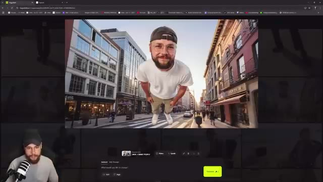
*Interface de Higgsfield affichant une vidéo générée avec le style "gens géants" montrant Jack flottant au milieu d'une rue urbaine.*

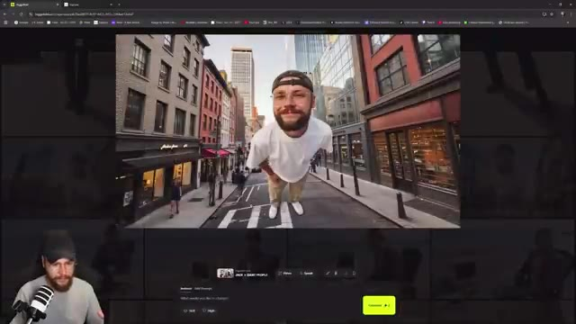
*Interface de Higgsfield montrant la suite de la vidéo avec le style "gens géants" dans une rue en pente.*

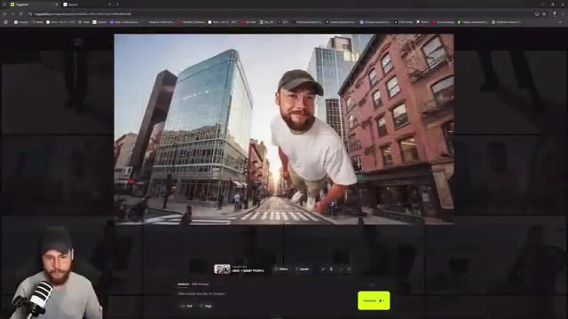
*Interface de Higgsfield montrant un autre plan de la vidéo avec le style "gens géants" dans une rue bordée de grands immeubles.*

---

### ⏱️ `[00:21:04 - 00:21:36]` | Segment #39

**🔊 Audio (Transcription Intégrale Mot pour Mot en Français) :**
> le haut de cette scène urbaine. Vraiment, vraiment étrange. Donc, évitez celle-là. Maintenant, voici où j'ai commencé à expérimenter avec l'outil de recréation de Higgsfield, qui est en fait une extension web que vous pouvez installer dans votre navigateur internet. Je sais avec certitude que cela fonctionne avec Google Chrome. Donc, si vous voulez vous amuser avec ça, vous le pouvez. Vous faites littéralement un clic droit sur une image dont l'apparence vous plaît et vous cliquez sur recréer, et cela l'envoie directement à Higgsfield pour vous. Vous appliquez votre personnage à cela, vous choisissez votre format d'image et c'est le genre de résultats que vous obtenez parfois, cela fonctionne.

**👁️ Analyse Visuelle d'Écran (gemini-3.5-flash-lite) :**
**Interface & Outils** : Interface web de la plateforme Higgsfield affichée sur un navigateur (Google Chrome) avec le flux vidéo du créateur en incrustation (PiP).

**Contenu textuel & Code** : Interface web de Higgsfield, boutons de génération, paramètres de formats et prompts visuels, barres d'onglets du navigateur.

**Action / Démonstration** : Le créateur montre des exemples de résultats générés par l'outil de recréation de Higgsfield tout en expliquant son fonctionnement.

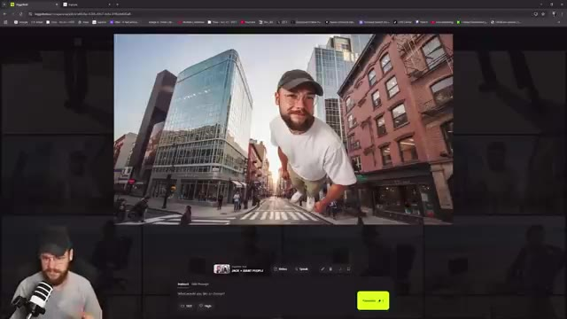
*Interface du navigateur affichant l'outil Higgsfield avec une image générée d'un personnage intégré dans une rue de ville, avec l'encadré PiP du présentateur en bas à gauche.*

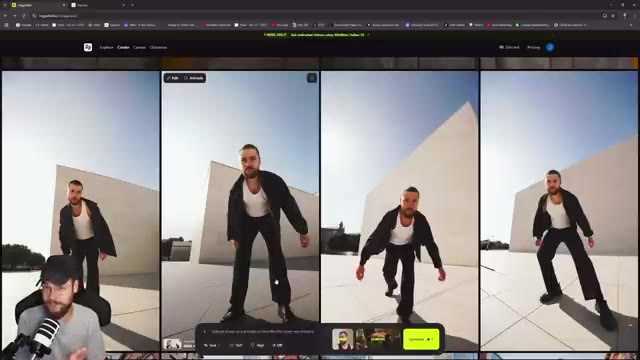
*Interface du site Higgsfield montrant une grille de résultats de génération de personnages animés en plein écran, avec l'encadré PiP du présentateur.*

---

### ⏱️ `[00:21:36 - 00:22:02]` | Segment #40

**🔊 Audio (Transcription Intégrale Mot pour Mot en Français) :**
> vraiment vraiment bien je pense que cette image ici a l'air vraiment super mais elle essaie aussi d'appliquer la coiffure et tout ça du modèle original à votre personnage donc ça peut donner l'air d'un mélange entre vous et quelqu'un d'autre ça a très très bien fonctionné même si ça ne ressemblait pas tout à fait à la référence originale je pense que le réalisme ici est juste exceptionnel c'est hors du commun Ici vous pouvez voir là où il a eu du mal.

**👁️ Analyse Visuelle d'Écran (gemini-3.5-flash-lite) :**
**Interface & Outils** : Interface web de l'application de génération vidéo par IA « Higgsfield » (higgsfield.ai), avec incrustation vidéo (PiP) du créateur Jack dans le coin inférieur gauche.

**Contenu textuel & Code** : Barres de menu de Higgfield (Explore, Create, Canvas, Character), bannière jaune en haut de page (« 1 WEEK ONLY! Get unlimited videos using Higgsfield Hallucination V2 »), grille de prévisualisation de vidéos avec curseurs et options de génération en bas.

**Action / Démonstration** : Le créateur navigue et commente l'interface de Higgsfield en présentant différents résultats de génération vidéo côte à côte.

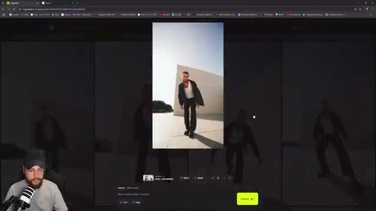
*Interface de l'outil Higgfield affichant quatre variations de vidéos générées par IA avec un personnage dans un décor extérieur sur fond blanc.*

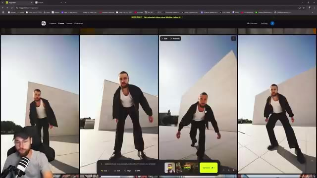
*Interface de Higgfield montrant une grille de quatre vidéos de danse en extérieur en plein écran, avec le panneau de contrôle en bas.*

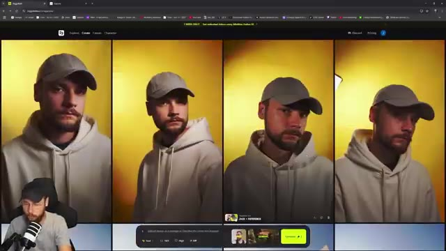
*Interface de Higgfield montrant une grille de quatre portraits vidéo en gros plan d'un homme portant une casquette et un sweat à capuche sur fond jaune.*

---

### ⏱️ `[00:22:03 - 00:22:23]` | Segment #41

**🔊 Audio (Transcription Intégrale Mot pour Mot en Français) :**
> Encore une fois, ça a essayé de mélanger mes traits un peu trop avec une personne différente. Et on obtient cette sorte de mélange étrange entre moi et quelqu'un d'autre. L'éclairage a l'air vraiment bien par contre. La texture de peau est toujours au top. Ce sont les points forts de Higgsfield, c'est sûr. On a vraiment un super résultat ici en utilisant la fonction de recréation. J'adore à quel point ma barbe est en quelque sorte imparfaite.

**👁️ Analyse Visuelle d'Écran (gemini-3.5-flash-lite) :**
**Interface & Outils** : Navigateur web affichant l'interface de la plateforme de génération vidéo IA Higgsfield, avec la webcam du créateur incrustée en PiP dans le coin inférieur gauche.

**Contenu textuel & Code** : Interface web de Higgsfield montrant des galeries de vidéos générées, des options de prompt et des vignettes de prévisualisation.
[ISSUE_OU_ACTION] Le créateur navigue et commente les résultats de génération vidéo sur la plateforme Higgsfield, montrant des exemples de mélanges de visages et de rendus réalistes.

**Action / Démonstration** : Démonstration pédagogique et présentation du workflow.

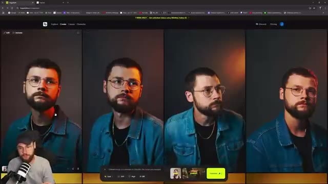
*Interface du site Higgsfield affichant quatre variations de portraits générés avec des visages mélangés, avec le créateur visible en incrustation PiP dans le coin inférieur gauche.*

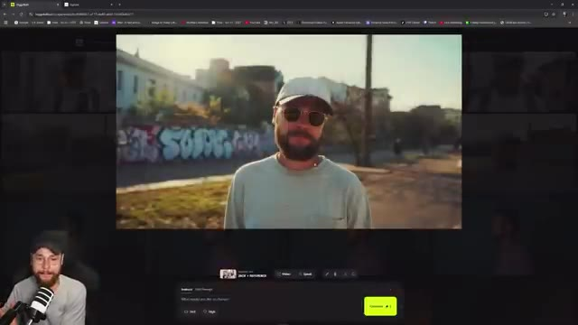
*Interface du site Higgsfield affichant une vidéo générée d'un personnage portant une casquette et des lunettes de soleil en extérieur, avec le créateur en incrustation PiP.*

---

### ⏱️ `[00:22:23 - 00:22:44]` | Segment #42

**🔊 Audio (Transcription Intégrale Mot pour Mot en Français) :**
> C'est vraiment cool. Ce sont ce genre de choses qui, selon moi, donnent à une image un aspect vraiment hyper réaliste. Certaines de ces images sont correctes. Je ne comprends pas vraiment quand il y a juste une main flottante et un téléphone en arrière-plan. C'est un peu étranger. Celle-ci a très bien fonctionné. J'adore. On peut voir cependant que Higgsfield a eu du mal avec le texte au dos de la chemise de cette personne.

**👁️ Analyse Visuelle d'Écran (gemini-3.5-flash-lite) :**
**Interface & Outils** : Navigateur web affichant l'interface de Higgsfield avec une vidéo centrale en cours de lecture et une zone de chat/prompts en bas.

**Contenu textuel & Code** : Interface web de Higgsfield avec un lecteur vidéo central montrant différentes générations de vidéos d'hommes (casquette, lunettes, chapeau) et un panneau inférieur pour "Edit Prompt" avec un champ de texte et des options "Generate".

**Action / Démonstration** : Le créateur commente visuellement et analyse les différentes vidéos générées par Higgsfield affichées à l'écran, en pointant les incohérences visuelles (comme la main flottante avec le téléphone et le texte déformé sur le t-shirt).

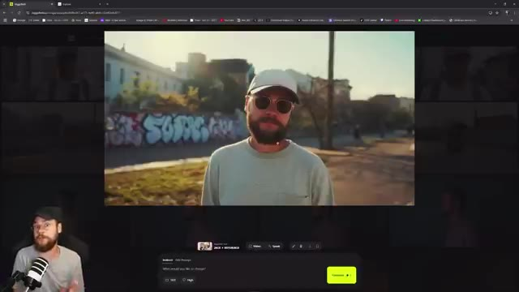
*Interface du site Higgsfield affichant une vidéo générée montrant un homme de face avec des lunettes de soleil et une casquette devant un mur graffité.*

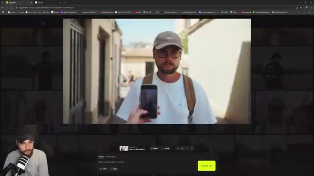
*Interface du site Higgsfield montrant une vidéo avec un plan où une main tend un téléphone portable devant un homme en arrière-plan.*

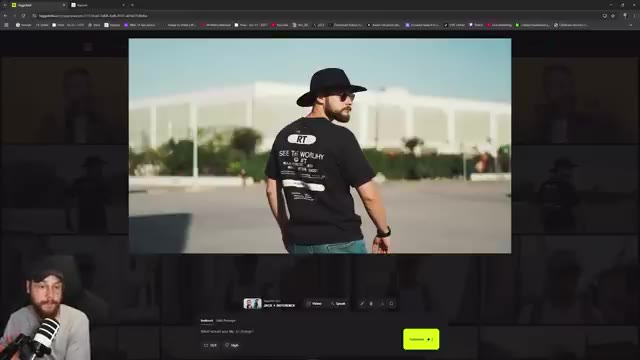
*Interface du site Higgsfield affichant une vidéo d'un homme de dos portant un chapeau noir et un t-shirt avec des inscriptions textuelles illisibles au dos.*

---

### ⏱️ `[00:22:45 - 00:23:10]` | Segment #43

**🔊 Audio (Transcription Intégrale Mot pour Mot en Français) :**
> C'est souvent un problème qu'on rencontre avec les générateurs d'images et de vidéos par IA. J'utilise la fonction de recréation ici. L'image d'origine était un gentleman plus âgé qui jouait avec sa moustache. Vous pouvez voir que ça a en quelque sorte essayé de me mélanger avec cette personne, en me donnant des cheveux gris et tout, enlevant mes lunettes. Une combinaison vraiment étrange de moi et de quelqu'un d'autre ici aussi, me donnant des cheveux bouclés. Si jamais je me suis demandé à quoi je ressemblerais avec des cheveux bouclés, maintenant je sais.

**👁️ Analyse Visuelle d'Écran (gemini-3.5-flash-lite) :**
**Interface & Outils** : Navigateur web affichant l'interface de l'outil de génération vidéo et image par IA Higgfield, avec un panneau de contrôle en bas et une grille de prévisualisation.

**Contenu textuel & Code** : Texte du prompt visible partiellement en bas : "What would you look like in 10 years?".

**Action / Démonstration** : Le créateur navigue dans l'interface de l'outil Higgfield pour montrer les résultats de la fonction "recreate" et commente les défauts de fusion des visages générés par l'IA.

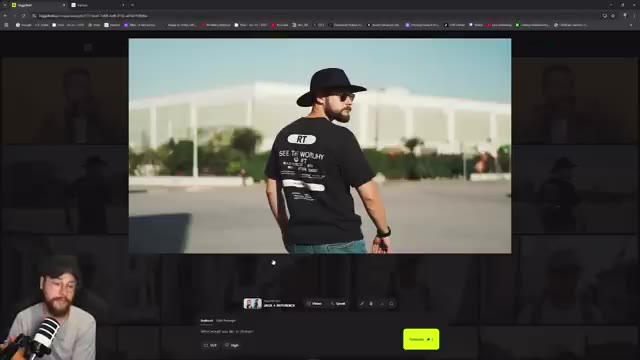
*Interface de l'outil Higgfield affichant une vidéo générée par IA montrant Jack portant un chapeau et des lunettes de soleil.*

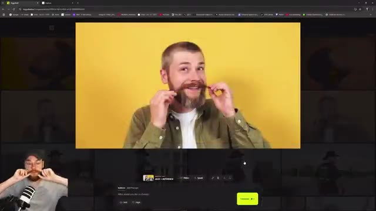
*Interface de Higgfield affichant l'image originale d'un homme mûr jouant avec sa moustache sur fond jaune.*

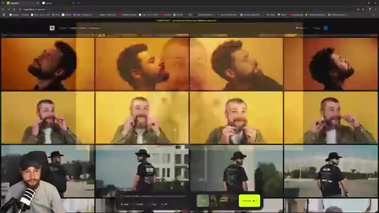
*Vue de la grille de la galerie sur Higgfield montrant plusieurs variations de vidéos générées avec différents styles et visages.*

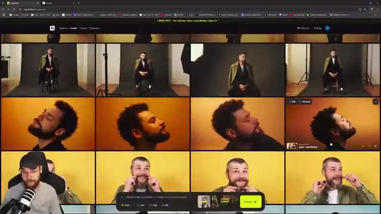
*Grille de l'interface montrant les résultats de la génération avec différentes options et personnages modifiés.*

---

### ⏱️ `[00:23:10 - 00:23:30]` | Segment #44

**🔊 Audio (Transcription Intégrale Mot pour Mot en Français) :**
> En fait, je ne déteste pas ça, mais ouais, c'est assez surréaliste. Il y a de belles images de mode éditoriales qui se passent ici également. Certaines de ces images ont l'air vraiment bien. Je pense que cela pourrait littéralement être réel. C'est fou. Moi, ayant l'air un peu d'un proxénète ou quelque chose comme ça. Ouais. Je ne sais pas ce qui se passe ici. Je pense que l'image originale était celle d'Andrew Garfield à une sorte de première de film.

**👁️ Analyse Visuelle d'Écran (gemini-3.5-flash-lite) :**
**Interface & Outils** : Interface web de Higgfield avec une grille de prévisualisation et des options de génération.

**Contenu textuel & Code** : Grille de miniatures d'images et de vidéos générées par IA avec des portraits stylisés, et la webcam du créateur incrustée en bas à gauche.

**Action / Démonstration** : Le créateur navigue et parcourt les résultats générés de portraits photographiques et de vidéos sur la plateforme Higgfield tout en commentant les visuels.

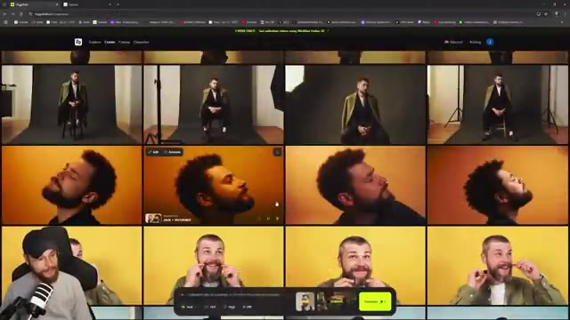
*Interface du site Higgfield montrant une grille de plusieurs images générées représentant le visage du créateur dans différents styles de mode.*

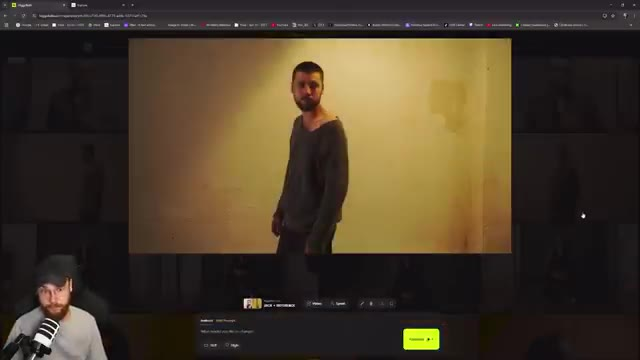
*Interface du site Higgfield affichant une vue agrandie d'une vidéo générée montrant un homme dans un style éditorial.*

---

### ⏱️ `[00:23:31 - 00:23:51]` | Segment #45

**🔊 Audio (Transcription Intégrale Mot pour Mot en Français) :**
> Très bizarre. Certains d'entre eux sont corrects. Je ne les adore pas cependant. Ils ne sont pas si intéressants esthétiquement, vraiment un peu banals. Et puis nous remontons tout en haut. Et ce dont je veux parler un peu, c'est de mon flux de travail préféré pour utiliser Higgsfield. Laissez-moi donc simplement ouvrir ChatGPT.

**👁️ Analyse Visuelle d'Écran (gemini-3.5-flash-lite) :**
**Interface & Outils** : Navigateur web affichant l'interface de la plateforme Higgsfield AI puis le moteur de recherche Google.

**Contenu textuel & Code** : Sur l'interface de Higgsfield : onglets "Explore", "Create", "Community", "Dashboard", ainsi qu'une grille de vignettes vidéo et un panneau de contrôle en bas avec des options de génération (Seed, Fast, High, Off, Publish). Sur le navigateur Google : barre de recherche Google avec des suggestions de raccourcis (My Drive, YouTube, Upwork, X, Claude, ChatGPT, etc.).

**Action / Démonstration** : Jack navigue sur l'interface de la plateforme Higgsfield AI en faisant défiler les vidéos générées, puis ouvre un nouvel onglet pour accéder à Google.

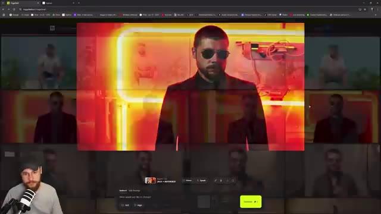
*Interface du site Higgsfield affichant une galerie de vidéos générées avec une vue rapprochée en superposition.*

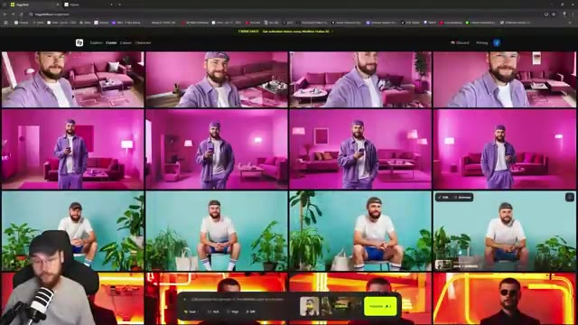
*Interface du site Higgsfield montrant une grille complète de différentes vidéos générées par IA avec Jack en arrière-plan.*

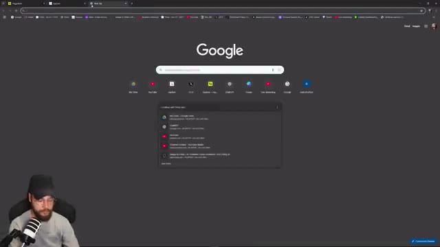
*Navigateur Google Chrome affichant la page d'accueil de Google avec une barre de recherche et des suggestions d'onglets.*

---

### ⏱️ `[00:23:52 - 00:24:10]` | Segment #46

**🔊 Audio (Transcription Intégrale Mot pour Mot en Français) :**
> Ce que je vous suggère de faire si vous essayez de tirer le meilleur parti de Higgsfield en tant qu'outil, c'est de trouver des images de référence que vous aimez vraiment, de les intégrer dans ChatGPT, et d'écrire une instruction du type : "Veuillez me rédiger un prompt pour Higgsfield AI que je peux utiliser pour recréer cette image."

**👁️ Analyse Visuelle d'Écran (gemini-3.5-flash-lite) :**
**Interface & Outils** : Navigateur web affichant l'interface de ChatGPT en mode sombre, avec le créateur en incrustation (PiP) dans le coin inférieur gauche.

**Contenu textuel & Code** : On peut lire au centre de l'écran "What can I call with?" et la barre de saisie de texte "Ask anything" avec le logo ChatGPT. Dans la colonne de gauche, l'historique des discussions est visible avec de nombreux titres de projets d'IA.

**Action / Démonstration** : Le créateur partage son écran sur l'interface de ChatGPT pour illustrer comment rédiger un prompt destiné à Higgsfield AI.

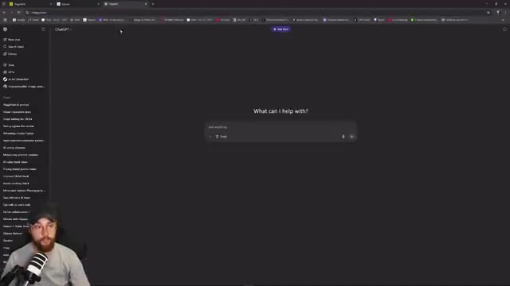
*Interface de ChatGPT affichée à l'écran, avec Jack visible en bas à gauche de la vidéo.*

---

### ⏱️ `[00:24:10 - 00:24:47]` | Segment #47

**🔊 Audio (Transcription Intégrale Mot pour Mot en Français) :**
> Et ensuite, vous faites tout simplement un copier-coller de ce prompt. Allez sur Higgsfield, copiez et collez cela dans ce champ de texte de prompt. Sélectionnez votre personnage et utilisez soit le style général soit le style réaliste, c'est de cette façon que j'ai fini par obtenir le meilleur de cet outil à mon avis, je pense que cela rend vraiment, vraiment super bien et nous en avons un peu parlé au début de la vidéo, vous pouvez voir la différence encore une fois entre le style visuel général de Higgsfield où les choses ont l'air un peu plus oniriques, un peu plus picturales, et ensuite le style visuel réaliste que l'on vous propose où vous savez, cela pourrait

**👁️ Analyse Visuelle d'Écran (gemini-3.5-flash-lite) :**
**Interface & Outils** : Interface web de ChatGPT et de la plateforme de génération vidéo Higgsfield, avec le créateur visible en incrustation (PiP) en bas à gauche.

**Contenu textuel & Code** : Texte du prompt sur ChatGPT : "A bold man with a ginger beard and glasses sits confidently on a simple stool in a studio setting...". Sur Higgsfield, aperçus de vidéos avec options de style (General / Realistic).

**Action / Démonstration** : Le créateur montre l'utilisation de ChatGPT pour rédiger un prompt, puis navigue dans l'interface de Higgsfield pour présenter les différents styles visuels (général et réaliste).

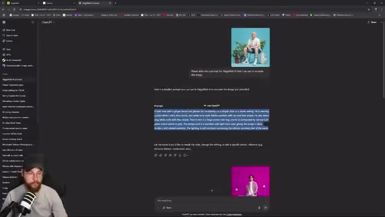
*Interface de ChatGPT affichant un prompt textuel généré pour Higgsfield décrivant un homme roux avec des lunettes et une barbe.*

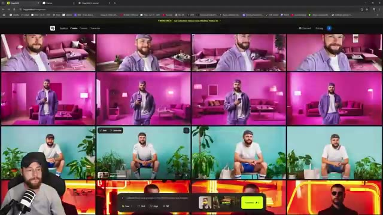
*Interface de la plateforme Higgsfield montrant une galerie de vidéos générées avec différents styles et personnages, avec Jack en incrustation.*

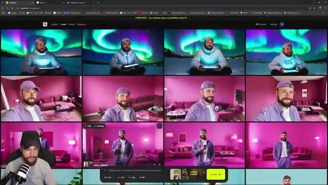
*Interface de Higgsfield montrant des variations de générations vidéo avec des aurores boréales et des décors roses.*

*Gros plan sur une vidéo générée dans Higgsfield montrant le personnage de Jack dans un salon aux tons roses.*

---

### ⏱️ `[00:24:47 - 00:25:24]` | Segment #48

**🔊 Audio (Transcription Intégrale Mot pour Mot en Français) :**
> être un véritable selfie réel où je suis dans ce salon bizarre et la palette de couleurs est très cohérente. Mais les gars, j'espère vraiment que vous avez apprécié la vidéo d'aujourd'hui. C'est après avoir joué avec la génération d'images de Higgsfield pendant de nombreuses heures à ce stade, en progressant à travers mes crédits pour apprendre les dures leçons essentiellement. Si vous voulez me soutenir, assurez-vous de balancer un pouce bleu sur la vidéo, pensez à vous abonner si c'est la première fois que vous tombez sur la chaîne et bien sûr activez cette cloche de notification pour ne manquer aucune future publication car je prévois de tester de nombreux superbes outils d'IA créatifs dans un proche avenir. Merci beaucoup d'avoir regardé les gars. Si vous

**👁️ Analyse Visuelle d'Écran (gemini-3.5-flash-lite) :**
**Interface & Outils** : Navigateur web affichant l'interface de l'outil de génération d'images et de modification de Higgsfield, avec un affichage en incrustation (PiP) du créateur face caméra dans le coin inférieur gauche.

**Contenu textuel & Code** : Interface web de Higgsfield avec des images générées par IA représentant des portraits du créateur dans différents décors (salon rose et décor tropical avec plantes), barres de prompts et boutons de génération.

**Action / Démonstration** : Le créateur commente les différentes images générées par IA sur l'interface de Higgsfield tout en s'exprimant face caméra dans l'encadré PiP.

*Interface du site Higgsfield affichant une image générée d'un selfie dans un salon aux tons roses, avec le créateur en incrustation PiP en bas à gauche.*

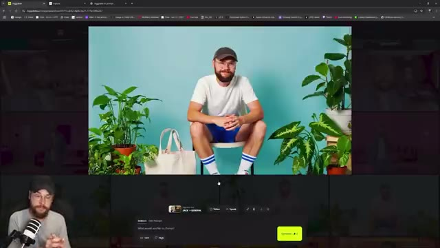
*Interface de Higgsfield montrant une autre image générée d'un portrait assis entouré de plantes sur fond bleu, avec le créateur en incrustation PiP en bas à gauche.*

---

### ⏱️ `[00:25:24 - 00:25:31]` | Segment #49

**🔊 Audio (Transcription Intégrale Mot pour Mot en Français) :**
> vous avez d'autres questions, n'hésitez pas à les poser juste en dessous dans la section des commentaires. Passez une excellente journée les gens. Je vous vois dans la prochaine vidéo.

**👁️ Analyse Visuelle d'Écran (gemini-3.5-flash-lite) :**
**Interface & Outils** : Navigateur web affichant l'interface de Higgsfield avec une vidéo en cours de visualisation et une petite incrustation vidéo (PiP) du présentateur en bas à gauche.

**Contenu textuel & Code** : Une image centrale représentant Jack assis sur un tabouret devant un fond bleu clair avec des plantes vertes de part et d'autre, un sac en tissu blanc posé au sol, et une interface de discussion en bas avec un champ de texte ("What would you like to change?") et des options vidéo/speak.

**Action / Démonstration** : Le présentateur conclut la vidéo face à sa caméra tout en montrant à l'écran l'interface de Higgsfield avec le résultat généré et le panneau de discussion.

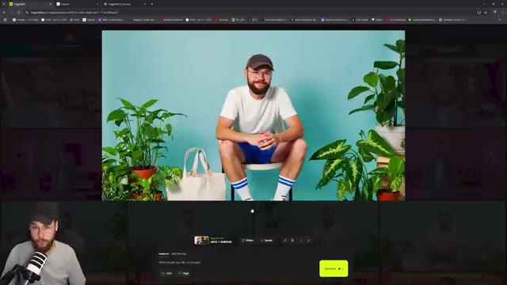
*Interface du site web Higgsfield affichant une image générée avec le créateur dans un décor de studio entouré de plantes, avec Jack visible en incrustation vidéo (PiP) en bas à gauche.*

---
