# 🎬 Comment créer des vidéos IA qui te ressemblent VRAIMENT (Le guide ultime)

> **Chaîne** : [Jack Vs. AI](https://www.youtube.com/@JackVsAI)  
> **Titre original** : `How to create AI videos that ACTUALLY look like YOU (Ultimate guide)`  
> **Lien YouTube** : [https://www.youtube.com/watch?v=LAFDQ9zCu9U](https://www.youtube.com/watch?v=LAFDQ9zCu9U)  
> **Date de publication** : 2025-08-14  
> **Durée** : 23m 04s (`1384s`)  
> **Identifiant vidéo** : `LAFDQ9zCu9U`  
> **Fiche Web Interactive** : [2025-08-14_YT-LAFDQ9zCu9U_Comment créer des vidéos IA qui te ressemblent VRAIMENT (Le guide ultime)_by-whisper-v3-large-turbo+gemini-3.5-flash-lite.html](2025-08-14_YT-LAFDQ9zCu9U_Comment créer des vidéos IA qui te ressemblent VRAIMENT (Le guide ultime)_by-whisper-v3-large-turbo+gemini-3.5-flash-lite.html)  
> **Captures de démonstration clés** : `112 captures réelles (anti-talking-head)`  
> **Modèles utilisés** : Audio: `large-v3-turbo` (Faster-Whisper int8 VPS) | Vision: `gemini-3.5-flash-lite` (Google AI Studio API)  

---

## 📌 Synthèse Exécutive & Outils

### 📌 Résumé

Dans cette vidéo masterclass, Jack, artiste VFX publicitaire chevronné, lève le voile sur son flux de travail avancé pour créer des vidéos par intelligence artificielle où le créateur devient le personnage principal tout en conservant une ressemblance et une cohérence visuelle absolues. L'enjeu central n'est plus de générer de superbes images aléatoires, mais de maîtriser l'hybridation des outils pour insérer une vraie personne dans des environnements surréalistes ou cinématographiques ultra-crédibles. Le processus commence par une phase d'inspiration visuelle ancrée dans des films cultes via IMDb et Google Images, avant de déléguer la structure des prompts à un assistant conversationnel (LLM). 

La véritable valeur de la méthode réside dans l'art du "sandwiching" de prompts : encadrer une description physique extrêmement détaillée du créateur (accessoires compris, comme les lunettes ou les casquettes) entre le contexte de la scène environnementale et les spécifications cinématographiques de style. Grâce à cette approche granulaire, couplée à des modificateurs de réalisme cutané, Jack démontre comment contourner l'écrasement de l'identité par l'IA pour obtenir des compositions dignes de productions hollywoodiennes, ouvrant la voie à une animation finale fluide et gratuite sur des plateformes de pointe.

### 🛠️ Outils, Modèles & Logiciels Présentés

* **Higgsfield** : Utilisé comme l'un des moteurs de pointe pour donner vie et mouvement aux images fixes générées par IA.
* **Kling** : Plateforme de génération de vidéo par IA de premier plan exploitée pour animer les scènes de manière fluide et gratuite.
* **Google VO3** : Modèle vidéo avancé mentionné pour son efficacité redoutable dans l'animation d'images fixes réalistes.
* **Midjourney** : Moteur de génération d'images par IA de référence pour transformer les prompts textuels en créations visuelles cinématographiques ultra-détaillées.
* **Flux** : Mentionné parmi les écosystèmes d'IA majeurs pour la création et la manipulation visuelle.
* **ChatGPT (ou tout autre LLM comme Gemini/Grok)** : Assistant créatif indispensable pour analyser des images de référence (comme celles d'Avatar) et rédiger ou enrichir les prompts initiaux.
* **IMDb & Google Images** : Sources primaires de recherche visuelle et de direction artistique pour capturer l'ambiance des films les plus marquants.

### 🔑 Points Clés & Enseignements Stratégiques

* **Le véritable défi de l'IA moderne** : Dépasser la simple production d'images aléatoires esthétiques pour réussir à imposer une cohérence de personnage et intégrer une personne réelle dans des environnements impossibles.
* **Le sourcing d'inspiration cinématographique** : Utiliser des bases de données comme IMDb (en cherchant parmi les films visuellement marquants comme *Avatar*, *Blade Runner* ou *2001*) pour extraire des palettes de couleurs et des compositions de scènes fortes.
* **Le LLM comme assistant créatif** : Soumettre une image de référence à ChatGPT ou Gemini pour qu'il rédige une description textuelle brute de la scène (sujet, éclairage, ambiance).
* **L'enrichissement technique du prompt** : Demander explicitement au LLM d'étoffer le prompt en y injectant du vocabulaire technique cinématographique, tel que des types d'objectifs précis (ex: objectif anamorphique à grande ouverture) et des notions de profondeur de champ.
* **La technique du prompt "sandwich"** : Structurer le prompt final de Midjourney en trois blocs logiques distincts : d'abord l'action et le décor, puis au milieu une description physique ultra-précise du personnage, et enfin les paramètres de style et de réalisme.
* **L'importance cruciale des accessoires** : Ne jamais omettre les détails vestimentaires ou les accessoires distinctifs (casquette portée à l'envers, lunettes à monture métallique) dans la description textuelle pour préserver la ressemblance exacte.
* **La précision des micro-expressions** : Définir clairement l'action physique et l'expression faciale (comme tendre la main vers un élément bioluminescent avec une expression d'émerveillement) pour guider l'IA vers une narration plus humaine.
* **Le catalogue de descriptions personnelles** : Maintenir un document textuel sur le Cloud (Google Drive) regroupant des descriptions physiques courtes et longues de soi-même, pré-rédigées avec l'aide d'un LLM à partir d'un simple selfie, pour les réutiliser rapidement.
* **L'injection de prompts de réalisme cutané** : Conclure systématiquement les prompts par des balises axées sur la texture de la peau (photo réaliste, texture ultra-détaillée, pores visibles, ombres dures) pour casser l'aspect trop "plastique" ou générique de l'IA.
* **La transition vers l'animation gratuite** : Préparer des images fixes hautement cohérentes en vue de les animer ultérieurement via des outils vidéo de pointe (Kling, Google VO3 ou Higgsfield) sans surcoût financier.

---

## ⏱️ Chronologie & Transcription Complète Audio & Visuelle (Mot pour Mot)

### ⏱️ `[00:00:00 - 00:00:34]` | Segment #01

**🔊 Audio (Transcription Intégrale Mot pour Mot en Français) :**
> Soyons honnêtes, l'IA s'améliore tellement maintenant, qu'on pourrait probablement confier les outils à un chimpanzé et il arriverait quand même à concocter quelque chose d'incroyable. Mais le vrai défi consiste à combiner les bons outils et plateformes d'IA pour réussir un style et une composition spécifiques, et ensuite à franchir une étape supplémentaire en vous intégrant vous-même dans ces mondes. N'importe qui peut cracher de superbes créations artistiques par IA d'un gars ou d'une fille au hasard, mais pouvez-vous capturer la véritable ressemblance d'une vraie personne et obtenir une cohérence des personnages, pour ensuite placer cette personne dans un environnement époustouflant ou même dans une situation impossible.

**👁️ Analyse Visuelle d'Écran (gemini-3.5-flash-lite) :**
**Interface & Outils** : Présentation face caméra et illustrations cinématiques générées par IA sans partage d'écran logiciel.

**Contenu textuel & Code** : Texte affiché à l'écran sous forme de sous-titres animés au rythme de la voix ("so", "specific").

**Action / Démonstration** : Le créateur parle face caméra dans son studio et illustre ses propos avec des scènes cinématiques générées par IA représentant son personnage dans des décors fantastiques ou extrêmes (aurores boréales, lévitation de pierres, éruption volcanique).

---

### ⏱️ `[00:00:34 - 00:00:57]` | Segment #02

**🔊 Audio (Transcription Intégrale Mot pour Mot en Français) :**
> C'est ce que je vais aborder aujourd'hui. Et restez bien avec moi car à la fin de la vidéo, je vais vous montrer comment vous pouvez animer ces images de manière totalement gratuite. Et ce, avec certains des meilleurs outils d'IA comme Kling ou Google VO3, en utilisant une méthode dont personne ne parle vraiment encore. Je m'appelle Jack. Je suis artiste VFX dans l'industrie publicitaire depuis plus d'une décennie maintenant, et j'ai travaillé pour bon nombre des plus grandes marques de la planète.

**👁️ Analyse Visuelle d'Écran (gemini-3.5-flash-lite) :**
**Interface & Outils** : Présentation face caméra sans partage d'écran

**Contenu textuel & Code** : Aucune interface logicielle ni aucun écran de démonstration n'est visible. Le segment montre uniquement Jack face caméra à différents plans (plan large avec plantes, plan rapproché avec texte graphique, et plan dans son studio devant un micro).

**Action / Démonstration** : Le créateur s'adresse directement au spectateur en parlant de sa vidéo, en gesticulant légèrement des mains et en changeant de plan de coupe.

---

### ⏱️ `[00:00:57 - 00:01:33]` | Segment #03

**🔊 Audio (Transcription Intégrale Mot pour Mot en Français) :**
> Afin d'élargir mes compétences et de me préparer à ce nouveau monde piloté par l'IA dans lequel nous entrons, je me suis entraîné à la génération d'images et de vidéos. Et aujourd'hui, je révèle mon flux de travail complet sur la façon dont je crée du contenu IA époustouflant où je suis le personnage principal. Nous allons construire deux exemples très différents. L'un, très cinématographique et un peu surréaliste également. L'autre, ancré, réaliste et crédible. D'ici la fin de la vidéo, vous saurez exactement comment faire cela vous-même et vous acquerrez tout un tas de conseils et astuces en chemin donc bien sûr si vous appréciez le contenu d'aujourd'hui assurez-vous de cliquer sur le bouton J'aime, pensez à vous abonner et bien sûr à sonner cette cloche

**👁️ Analyse Visuelle d'Écran (gemini-3.5-flash-lite) :**
**Interface & Outils** : Présentation face caméra sans partage d'écran

**Contenu textuel & Code** : Aucun contenu logiciel ou technique affiché à l'écran, uniquement le présentateur (Jack) dans son studio devant un micro avec une étagère garnie de livres et de plantes en arrière-plan.

**Action / Démonstration** : Le créateur parle face caméra en gesticulant légèrement pour introduire son tutoriel sur la création de contenu IA.

---

### ⏱️ `[00:01:33 - 00:02:11]` | Segment #04

**🔊 Audio (Transcription Intégrale Mot pour Mot en Français) :**
> icône de notification de cloche allons droit au but donc nous allons commencer par l'approche la plus cinématographique et surréaliste qui est ma préférée personnelle vous avez peut-être déjà une idée en tête mais pour moi nous partons de zéro donc nous devons trouver une source d'inspiration et ce que je trouve vraiment super c'est d'aller simplement sur Google et de taper quelque chose comme les films les plus visuellement saisissants. Et je veux dire, tout de suite, la liste est composée de 2001, l'Odyssée de l'espace par Stanley Kubrick, Blade Runner, Mad Max: Fury Road, Le Voyage de Chihiro, The Revenant, Gravity, 1917. Celui que je...

**👁️ Analyse Visuelle d'Écran (gemini-3.5-flash-lite) :**
**Interface & Outils** : Bureau Windows et navigateur web Google avec interface de recherche de films

**Contenu textuel & Code** : Sur l'écran du navigateur Google, la requête affiche une liste de films "Most visually stunning movies" incluant 2001: A Space Odyssey, Blade Runner, Mad Max Fury Road, Spirited Away, The Revenant, Gravity, 1917, The Grand Budapest Hotel, Interstellar, etc.

**Action / Démonstration** : Jack montre son bureau d'ordinateur puis bascule sur le navigateur web pour effectuer une recherche Google sur les films visuellement marquants.

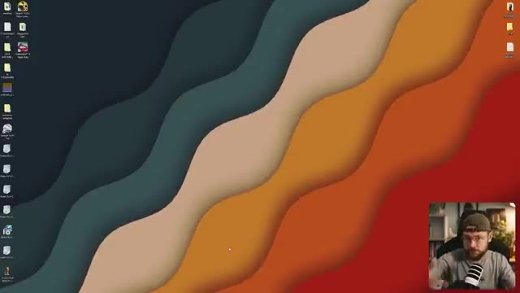
*Bureau d'ordinateur avec fond d'écran coloré à vagues et miniature vidéo de Jack en bas à droite*

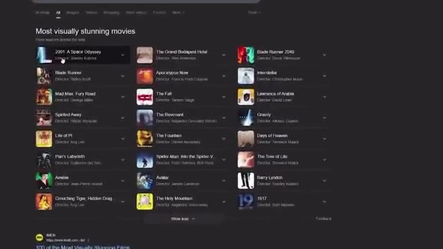
*Navigateur web affichant une recherche Google avec une grille de films visuellement saisissants*

---

### ⏱️ `[00:02:11 - 00:02:45]` | Segment #05

**🔊 Audio (Transcription Intégrale Mot pour Mot en Français) :**
> qui m'attire le plus est Avatar. Et donc nous allons utiliser ça comme point de départ. Et ce que j'ai fait par le passé, c'est que j'ai tapé le nom du film puis je me suis rendu sur la page IMDb. Et à partir d'ici nous pouvons aller dans les images. Et bien sûr, ce que nous recherchons vraiment, c'est une scène dans laquelle nous pouvons nous projeter ou simplement l'utiliser comme point de départ inspirant. Et je suis immédiatement attiré par cette image ici. J'aime cette idée de bioluminescence en quelque sorte dans la nature et le

**👁️ Analyse Visuelle d'Écran (gemini-3.5-flash-lite) :**
**Interface & Outils** : Navigateur web Google Chrome avec affichage de résultats de recherche Google puis de la galerie de photos du site IMDb

**Contenu textuel & Code** : Résultats de recherche Google pour "most visually stunning movies" et galerie IMDb "Photos" du film Avatar (2009) avec les acteurs Zoe Saldana et Sam Worthington

**Action / Démonstration** : Le créateur navigue sur un moteur de recherche, clique sur le film Avatar, accède à la page des images d'IMDb et sélectionne une photo spécifique présentant de la bioluminescence.

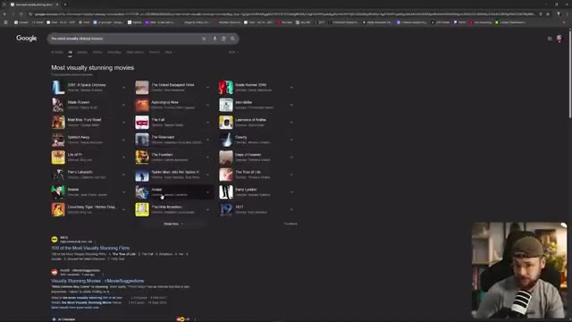
*Navigateur web affichant une recherche Google sur les films visuellement impressionnants avec Avatar sélectionné*

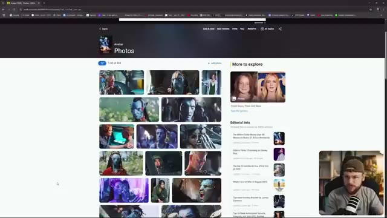
*Page IMDb de photos du film Avatar affichant une galerie d'images du film*

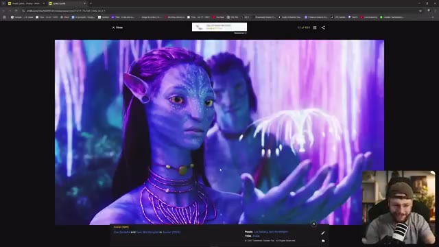
*Agrandissement d'une image spécifique d'Avatar montrant des personnages Na'vi dans un environnement bioluminescent*

---

### ⏱️ `[00:02:45 - 00:03:17]` | Segment #06

**🔊 Audio (Transcription Intégrale Mot pour Mot en Français) :**
> palette de couleurs qui est utilisée. Et disons simplement que je veux regarder d'autres images comme celle-ci de cette scène particulière. Nous allons juste taper avatar. Je ne sais pas comment elles s'appellent. Elles ressemblent un peu à des méduses lumineuses, n'est-ce pas ? Et tout de suite sur Google Images, nous avons tout un tas d'autres scènes. Donc elles s'appellent des sprites des bois apparemment. Donc tapons ce qu'elles sont réellement. Et j'aime vraiment beaucoup cette image ici. Je pense donc que nous allons opter pour celle-ci. Donc ce que je vais faire, c'est que je vais d'abord enregistrer cette image, puis

**👁️ Analyse Visuelle d'Écran (gemini-3.5-flash-lite) :**
**Interface & Outils** : Navigateur web Google Chrome avec Google Images et l'Explorateur de fichiers Windows (PiP du créateur en bas à droite).

**Contenu textuel & Code** : Barres de recherche Google affichant "avatar glowing jellyfish" et "avatar woodsprite", grille de résultats d'images, fenêtre d'enregistrement de fichier.

**Action / Démonstration** : Le créateur navigue sur Google Images, recherche les créatures du film Avatar ("wood sprites"), sélectionne une image et ouvre la fenêtre d'enregistrement du fichier.

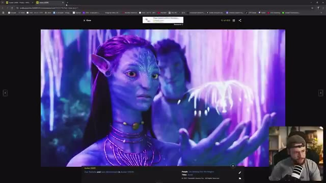
*Visualisation d'une image issue d'Avatar sur Google Images montrant Neytiri avec des créatures lumineuses.*

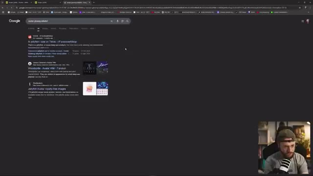
*Affichage de la page de recherche Google Images avec la requête "avatar glowing jellyfish".*

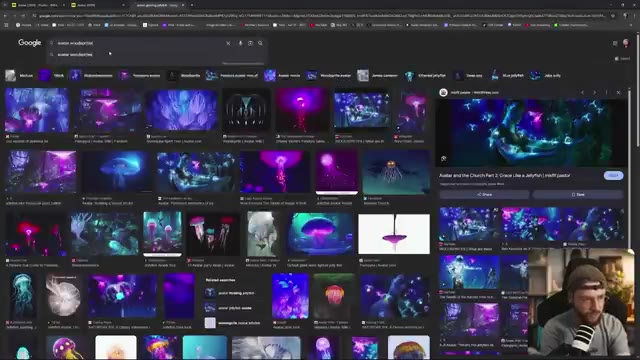
*Résultats de recherche Google Images affichant de multiples images de sprites des bois d'Avatar.*

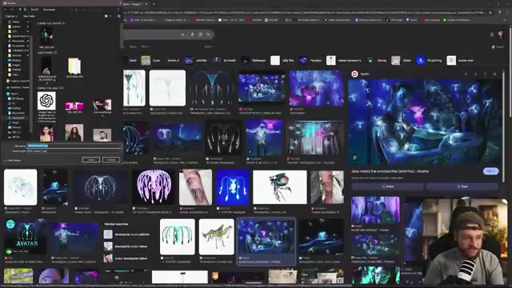
*Fenêtre de l'Explorateur de fichiers Windows ouverte par-dessus Google Images pour enregistrer une image sélectionnée.*

---

### ⏱️ `[00:03:17 - 00:03:50]` | Segment #07

**🔊 Audio (Transcription Intégrale Mot pour Mot en Français) :**
> Nous allons ouvrir ChatGPT. Bon, en vrai, vous pouvez utiliser n'importe quel LLM que vous voulez. Vous pourriez utiliser Gemini, vous pourriez utiliser Grok, mais ceux-ci vont vraiment nous servir d'assistant créatif. Et je pense que c'est l'une des manières les plus utiles d'utiliser une plateforme comme ChatGPT. Donc, nous allons ajouter l'image que nous venons juste d'enregistrer. Et nous allons demander à ChatGPT de m'écrire un prompt pour Midjourney qui décrit la scène de cette image. Donc il a dit : un grand humanoïde extraterrestre à la peau bleue avec

**👁️ Analyse Visuelle d'Écran (gemini-3.5-flash-lite) :**
**Interface & Outils** : Navigateur web affichant l'interface de ChatGPT (mode sombre) avec le logo et la barre de saisie « How can I help, Jack? », et une incrustation vidéo (PiP) du créateur Jack en bas à droite.

**Contenu textuel & Code** : Texte affiché au centre de l'interface : « How can I help, Jack? » avec une barre de texte « + Ask anything ».

**Action / Démonstration** : Le créateur montre l'ouverture de l'interface de ChatGPT dans son navigateur pour préparer l'importation de l'image.

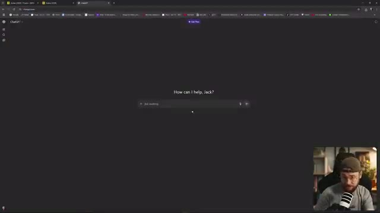
*Interface de ChatGPT ouverte dans un navigateur avec Jack visible dans un encadré PiP en bas à droite.*

---

### ⏱️ `[00:03:50 - 00:04:24]` | Segment #08

**🔊 Audio (Transcription Intégrale Mot pour Mot en Français) :**
> des traits félins, des yeux jaunes lumineux et des marquages bioluminescents, debout dans une jungle extraterrestre luxuriante la nuit, tendant les bras alors que des graines blanches lumineuses semblables à des méduses flottent autour d'eux, entouré de plantes bioluminescentes vibrantes, un deuxième extraterrestre à la peau bleue en arrière-plan, éclairage cinématographique, niveau de détail élevé, ultra réaliste 8K. Donc je vais juste dire quelque chose comme, est-ce que tu peux développer un peu le prompt ? En parlant davantage de la palette de couleurs et du type d'objectif. Et

**👁️ Analyse Visuelle d'Écran (gemini-3.5-flash-lite) :**
**Interface & Outils** : Interface sombre d'un assistant conversationnel par IA (type ChatGPT ou similaire).

**Contenu textuel & Code** : On peut lire la question de l'utilisateur incluant une image de référence (« Write me a prompt for Midjourney which describes the scene in this image. ») et la réponse de l'IA proposant un prompt détaillé en anglais décrivant un humanoïde extraterrestre à la peau bleue, suivi de paramètres techniques (comme `--ar 16:9 --v 6`) et d'une question de suivi proposant une version plus cinématographique.

**Action / Démonstration** : Le curseur de la souris est visible en bas à droite de l'écran, tandis que l'interface affiche la génération du texte de description d'image.

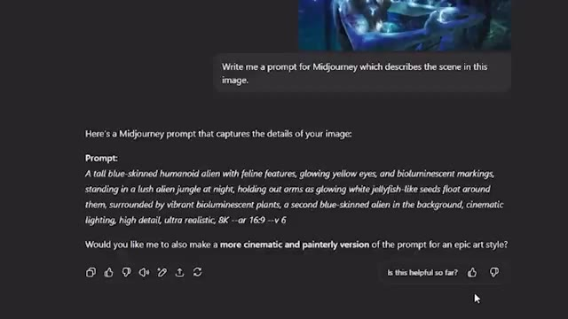
*Interface d'un modèle de langage (IA textuelle) affichant la réponse générée avec le prompt pour Midjourney décrivant une scène extraterrestre.*

---

### ⏱️ `[00:04:24 - 00:04:59]` | Segment #09

**🔊 Audio (Transcription Intégrale Mot pour Mot en Français) :**
> ici vous pouvez voir que c'est simplement ajouté à la fin. La jungle brille de teintes néon riches, de bleus cobalt profonds, de violets et de verts émeraude. Pris avec un objectif de cinéma anamorphique à grande ouverture pour une faible profondeur de champ et de subtils reflets d'objectif. Donc bien que ce ne soit pas parfait, c'est un excellent point de départ pour les prompts que nous allons concevoir. Et ce que j'aime faire, c'est simplement créer un nouveau document texte et nous allons appeler cela Mid Journey Prompt. Vous remarquerez que je suis nul pour taper avec ce clavier parce que je n'y suis pas vraiment habitué. Ignorez simplement cela. Et nous allons prendre ceci

**👁️ Analyse Visuelle d'Écran (gemini-3.5-flash-lite) :**
**Interface & Outils** : Interface de ChatGPT (dans un navigateur web) et bureau du système d'exploitation Windows.

**Contenu textuel & Code** : Texte du prompt généré : « A tall blue-skinned humanoid alien with feline features, glowing yellow eyes... Shot with a wide-aperture anamorphic cinema lens... 8K --ar 16:9 --v 6 ». Menu contextuel Windows affichant les options « New > Text Document ».

**Action / Démonstration** : Le créateur montre un prompt détaillé dans ChatGPT, puis bascule sur son bureau Windows pour créer un nouveau document texte afin d'y copier le prompt.

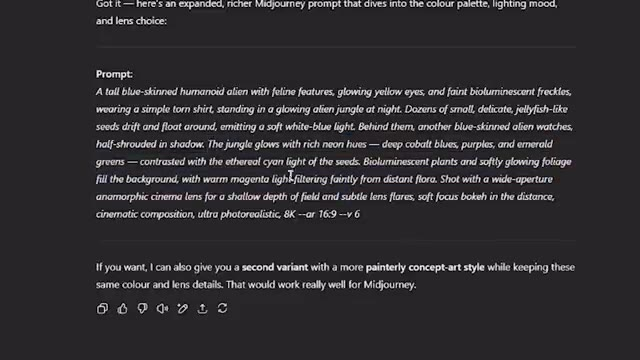
*Interface de ChatGPT affichant un prompt généré pour Midjourney avec des détails sur la palette de couleurs et l'éclairage.*

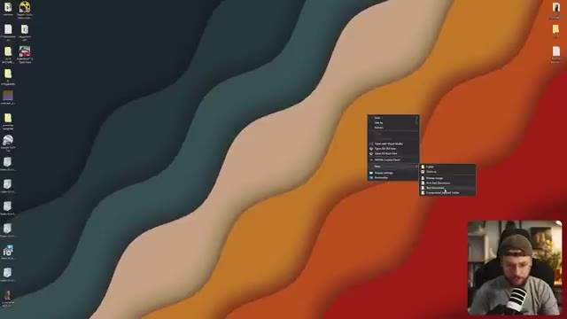
*Bureau Windows avec le menu contextuel ouvert pour créer un nouveau document texte, avec une incrustation vidéo (PiP) du créateur en bas à droite.*

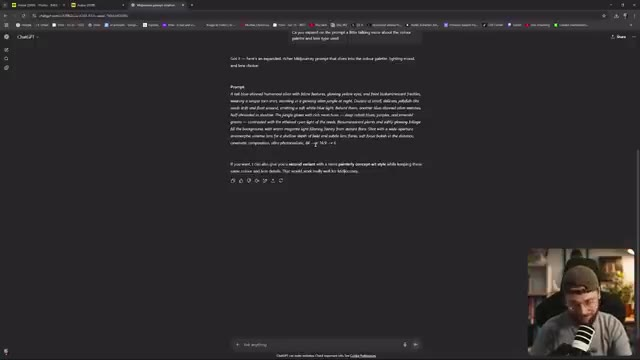
*Navigateur web affichant une interface de type ChatGPT avec un prompt textuel long et l'encadré vidéo du créateur en incrustation.*

---

### ⏱️ `[00:04:59 - 00:05:32]` | Segment #10

**🔊 Audio (Transcription Intégrale Mot pour Mot en Français) :**
> des prompts et copiez-le dans notre document texte vierge. Et nous allons maintenant modifier cela pour que nous soyons le personnage principal. Donc vraiment, nous devons supprimer cette première portion, un grand humanoïde extraterrestre à la peau bleue. Nous allons donc simplement nous en débarrasser. Mais le "debout dans une jungle extraterrestre lumineuse la nuit", c'est toujours cool. Ajoutons un peu de contexte. Et ce que j'ai sur mon Google Drive, c'est ce document simplement appelé "AI prompts" (Prompts IA). Et il contient beaucoup de descriptions de moi-même, que j'ai aussi demandé à ChatGPT d'écrire d'ailleurs, simplement en téléchargeant un selfie de moi-même, vous ne peinerez peut-être pas avec ça.

**👁️ Analyse Visuelle d'Écran (gemini-3.5-flash-lite) :**
**Interface & Outils** : Navigateur web affichant ChatGPT et Google Docs, avec une application Bloc-notes Windows superposée. Le créateur apparaît en incrustation (PiP) dans le coin inférieur droit.

**Contenu textuel & Code** : Dans le Bloc-notes : "A tall blue-skinned humanoid alien with feline features, glowing yellow eyes, and faint bioluminescent freckles, wearing a simple tom shirt, standing in a glowing alien jungle at night..." Dans Google Docs : Des paragraphes de description physique détaillée du créateur ("He is in his early 30s...") et des instructions de prompts de style d'animation 3D.

**Action / Démonstration** : Le créateur montre comment manipuler et modifier un prompt textuel dans un fichier Bloc-notes, puis bascule sur un document Google Drive pour montrer ses descriptions personnelles générées par IA.

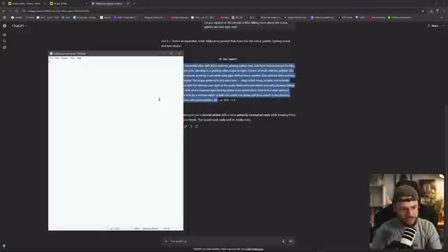
*Fenêtre du Bloc-notes Windows ouverte par-dessus une interface web, affichant un prompt textuel en cours de sélection.*

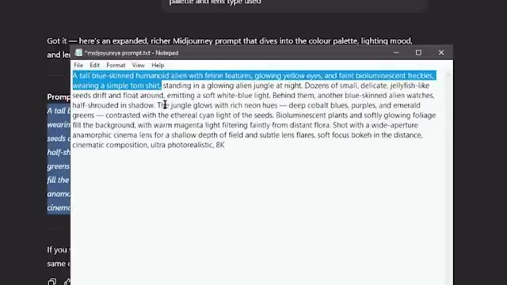
*Gros plan sur le Bloc-notes Windows affichant le fichier "midjourynnye prompt.txt" avec du texte sélectionné en surbrillance bleue.*

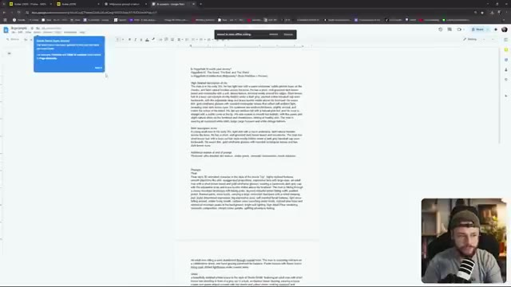
*Document Google Docs ouvert dans le navigateur, intitulé "AI prompts", contenant des descriptions détaillées de personnages et des prompts pour l'IA.*

---

### ⏱️ `[00:05:32 - 00:06:09]` | Segment #11

**🔊 Audio (Transcription Intégrale Mot pour Mot en Français) :**
> mais je trouve cela assez difficile de regarder même une image de moi-même ou l'image que nous avons prise d'Avatar et de la décrire efficacement d'une manière qui fonctionnera bien pour un prompt et c'est pour moi là que ChatGPT, Grok, Gemini, ils s'avèrent vraiment utiles donc ce que nous allons faire c'est que nous allons commencer le prompt par un homme barbu debout dans une jungle extraterrestre lumineuse la nuit et ensuite nous avons derrière eux un autre extraterrestre à la peau bleue qui observe à moitié plongé dans l'ombre. Donc nous ne voulons pas de ça. Nous voulons que cela ne présente que nous. Je vais donc diviser cela un petit peu car cette portion ici décrit notre environnement. Et puis à la fin ici, nous avons une description du style que nous recherchons.

**👁️ Analyse Visuelle d'Écran (gemini-3.5-flash-lite) :**
**Interface & Outils** : Google Docs et Bloc-notes Windows (Notepad) affichés à l'écran, avec une incrustation vidéo (PiP) du créateur en bas à droite.

**Contenu textuel & Code** : Texte de document et de Bloc-notes contenant des descriptions de personnages et des prompts pour IA de génération d'images (Midjourney), avec une portion de texte surlignée en bleu dans le Bloc-notes.

**Action / Démonstration** : Le créateur montre son écran de travail (document de texte et Bloc-notes) où il analyse et sélectionne des portions de texte pour modifier un prompt de génération d'image par IA.

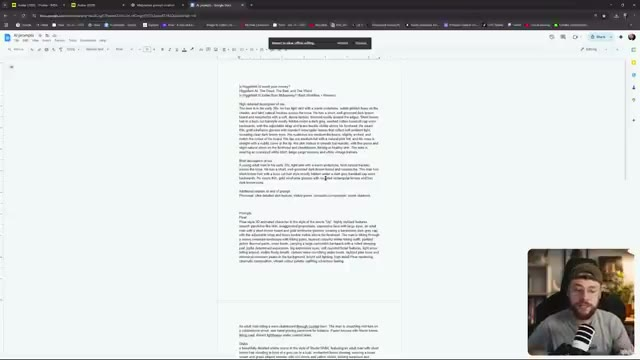
*Capture d'écran montrant un document Google Docs avec des descriptions textuelles détaillées de prompts IA et le créateur visible en incrustation PiP dans le coin inférieur droit.*

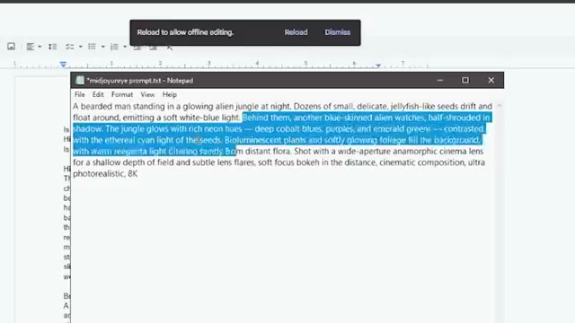
*Capture d'écran montrant un fichier Bloc-notes (Notepad) avec un prompt de génération d'image en cours de sélection et de modification.*

---

### ⏱️ `[00:06:10 - 00:06:33]` | Segment #12

**🔊 Audio (Transcription Intégrale Mot pour Mot en Français) :**
> Entre les deux, je vais placer une description très claire de moi-même. Et sur ce Google Doc, j'ai une description très longue et détaillée de moi-même, puis une sorte de version plus courte également. Donc on va simplement déposer ça ici. Et on va juste l'ajuster un peu pour dire que l'homme barbu est au début de sa trentaine, a la peau claire avec un sous-ton chaud, de légères taches de rousseur naturelles sur le nez.

**👁️ Analyse Visuelle d'Écran (gemini-3.5-flash-lite) :**
**Interface & Outils** : Google Docs en arrière-plan et Bloc-notes Windows (Notepad) en premier plan, avec la webcam du créateur incrustée en PiP (Picture-in-Picture) dans le coin inférieur droit.

**Contenu textuel & Code** : Texte visible dans le Bloc-notes : "A bearded man standing in a glowing alien jungle at night... The bearded man in his early 30s, light skin with a warm undertone, faint natural freckles across the nose. He has a short, well-groomed dark brown beard and moustache... Shot with a wide-aperture anamorphic cinema lens..."

**Action / Démonstration** : Le créateur montre son écran avec le Bloc-notes ouvert par-dessus Google Docs, affichant et modifiant le prompt détaillé de sa description physique pour la génération d'IA.

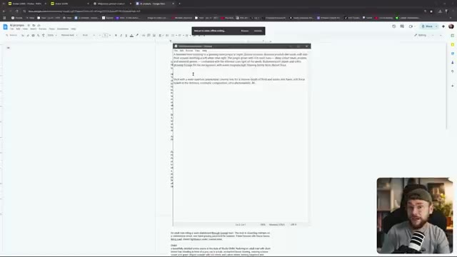
*Vue d'ensemble du Google Doc avec un bloc-notes Windows superposé montrant le prompt de description personnelle.*

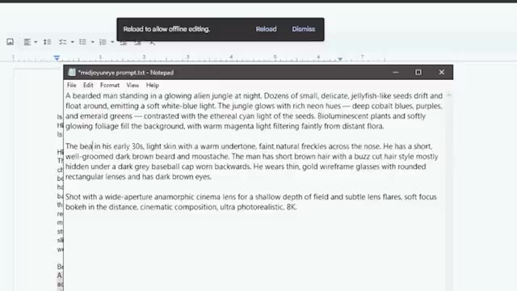
*Gros plan sur le fichier Bloc-notes (Notepad) affichant le texte détaillé du prompt décrivant l'apparence physique du créateur.*

---

### ⏱️ `[00:06:33 - 00:06:56]` | Segment #13

**🔊 Audio (Transcription Intégrale Mot pour Mot en Français) :**
> Il a une barbe et une moustache châtain foncé courtes et bien entretenues. L'homme a des cheveux châtains courts avec une coupe militaire, en grande partie cachés sous une casquette de baseball gris foncé, portée à l'envers. Il porte de fines lunettes à monture métallique dorée avec des verres rectangulaires arrondis et a des yeux marron foncé. Donc, en quelque sorte pris en sandwich au milieu, nous avons une description très claire de l'apparence que nous voulons donner à notre personnage.

**👁️ Analyse Visuelle d'Écran (gemini-3.5-flash-lite) :**
**Interface & Outils** : Navigateur web avec Google Docs en arrière-plan et une fenêtre du Bloc-notes Windows au premier plan, avec une incrustation vidéo PiP du présentateur dans l'image #2.

**Contenu textuel & Code** : Le fichier Bloc-notes (intitulé '*midjoyunrye prompt.txt') contient un prompt détaillé de génération d'image : description de l'environnement (jungle extraterrestre lumineuse, plantes bioluminescentes) et description précise du personnage (homme barbu, la trentaine, barbe châtain foncé, casquette à l'envers, lunettes dorées, etc.).

**Action / Démonstration** : Le créateur présente et lit à l'écran les détails du prompt textuel servant à définir les caractéristiques physiques et vestimentaires du personnage généré par IA.

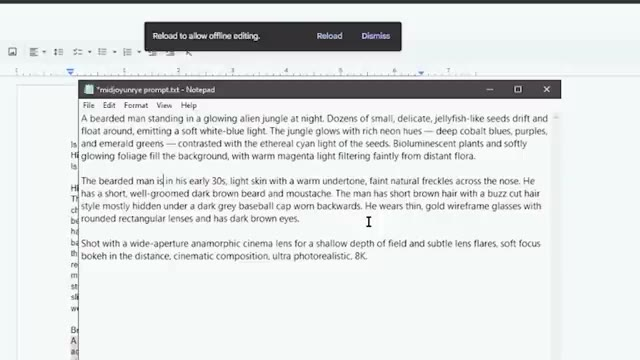
*Fenêtre du Bloc-notes affichant le prompt textuel décrivant l'apparence physique du personnage.*

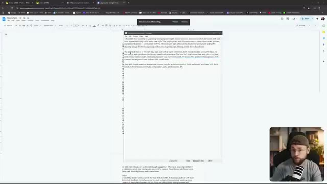
*Écran d'ordinateur montrant un éditeur de texte avec le prompt, et la webcam du créateur en incrustation (PiP) dans le coin inférieur droit.*

---

### ⏱️ `[00:06:56 - 00:07:17]` | Segment #14

**🔊 Audio (Transcription Intégrale Mot pour Mot en Français) :**
> C'est très important, si vous portez des accessoires comme un chapeau et des lunettes, de les inclure dans votre prompt. Et je vais juste ajouter un peu plus de description ici. L'homme barbu tend la main pour toucher l'une des graines en forme de méduse. Il a une expression d'émerveillement.

**👁️ Analyse Visuelle d'Écran (gemini-3.5-flash-lite) :**
**Interface & Outils** : Google Docs en arrière-plan avec une fenêtre de Bloc-notes Windows ouverte au premier plan (midjoyunrye prompt.txt).

**Contenu textuel & Code** : Texte du prompt dans le Bloc-notes : "A bearded man standing in a glowing alien jungle at night. Dozens of small, delicate, jellyfish-like seeds drift and float around, emitting a soft white-blue light... The bearded man is in his early 30s, light skin with a warm undertone... He wears thin, gold wireframe glasses with rounded rectangular lenses and has dark brown eyes."

**Action / Démonstration** : Le présentateur modifie le texte du prompt dans le fichier Bloc-notes pour y intégrer les détails concernant le port de lunettes et d'un chapeau.

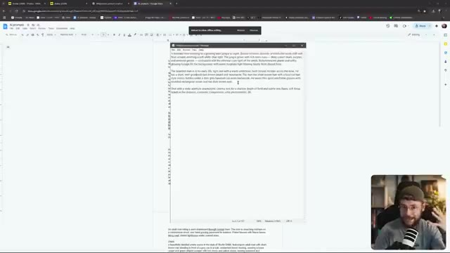
*Affichage d'un éditeur de texte Bloc-notes par-dessus Google Docs, montrant le prompt détaillé en cours de modification, avec le présentateur en médaillon PiP en bas à droite.*

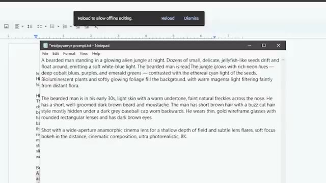
*Gros plan sur la fenêtre du Bloc-notes contenant le prompt détaillé décrivant l'homme barbu avec chapeau et lunettes dans une jungle fluorescente.*

---

### ⏱️ `[00:07:17 - 00:07:38]` | Segment #15

**🔊 Audio (Transcription Intégrale Mot pour Mot en Français) :**
> Donc nous sommes très précis sur toute action que nous voulons que notre personnage réalise, mais aussi sur l'expression qu'il a également. Nous pouvons donc commencer à réassembler nos prompts. Et j'ajoute souvent ce petit passage à la fin de tous les prompts que j'écris. Vous pouvez voir que je l'ai intitulé « réalisme supplémentaire à ajouter à la fin des prompts ». Une partie de cela sera déjà couverte ici, mais je vais simplement l'ajouter quand même.

**👁️ Analyse Visuelle d'Écran (gemini-3.5-flash-lite) :**
**Interface & Outils** : Navigateur web avec Google Docs et une fenêtre de Bloc-notes Windows ouverte par-dessus, incluant une incrustation vidéo (Picture-in-Picture) du créateur.

**Contenu textuel & Code** : Texte de prompts de génération d'image ou de vidéo détaillant l'apparence d'un personnage (homme barbu, vêtements, expressions) et des spécifications cinématographiques (lentille anamorphique, bokeh, photoréaliste).

**Action / Démonstration** : Le créateur montre son écran de travail avec des documents de prompts textuels tout en parlant.

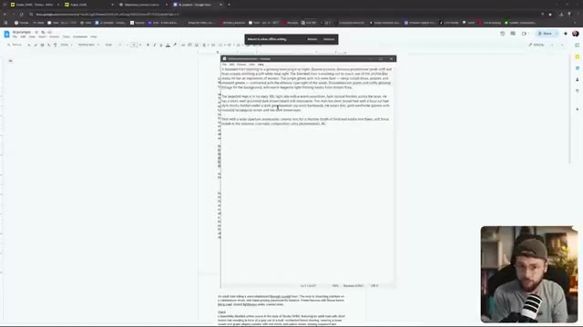
*Document Google Docs affichant des prompts textuels avec une fenêtre de bloc-notes par-dessus, et une incrustation vidéo (PiP) du présentateur en bas à droite.*

---

### ⏱️ `[00:07:39 - 00:08:01]` | Segment #16

**🔊 Audio (Transcription Intégrale Mot pour Mot en Français) :**
> Ça dit juste photo réaliste, texture de peau ultra détaillée, pores visibles, composition cinématographique, ombres dures. Et avec ça, je pense que notre prompt est prêt pour Midjourney. Alors dirigeons-nous vers mon générateur d'art IA personnel préféré. Maintenant, si vous cherchez le photoréalisme complet, Midjourney n'est peut-être pas la plateforme pour vous.

**👁️ Analyse Visuelle d'Écran (gemini-3.5-flash-lite) :**
**Interface & Outils** : Navigateur web affichant Google Docs et le Bloc-notes Windows (images 1 et 2), puis l'interface de la plateforme Midjourney (image 3).

**Contenu textuel & Code** : Texte du Bloc-notes (« midjoyunrye prompt.txt ») décrivant une scène de science-fiction détaillée (« A bearded man standing in a glowing alien jungle at night... Photo real: ultra detailed skin texture, visible pores, cinematic composition, harsh shadows »). Interface de Midjourney avec barre de recherche, onglets de navigation (« Imagine », « Chat », « Personalize », etc.) et galerie d'images.

**Action / Démonstration** : Le créateur présente le prompt finalisé dans le Bloc-notes avant de basculer vers l'interface de la plateforme Midjourney.

*Fenêtre du Bloc-notes ouverte par-dessus un document Google Docs, affichant le prompt textuel détaillé pour la génération d'image IA (notamment la description d'un homme barbu dans une jungle extraterrestre et des spécifications techniques comme la texture de peau et les ombres).*

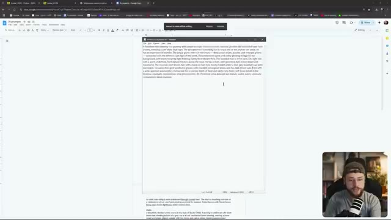
*Vue d'ensemble montrant l'écran de travail Google Docs avec la fenêtre du Bloc-notes par-dessus, et une petite fenêtre PiP (Picture-in-Picture) en bas à droite montrant Jack dans son studio face au micro.*

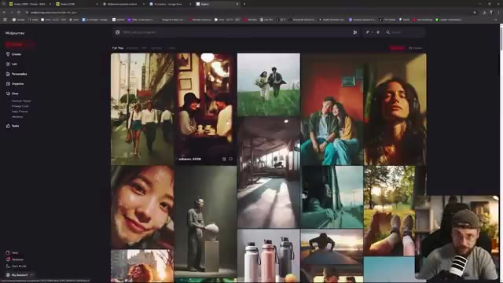
*Interface du site web Midjourney affichant une galerie de photos et d'images créées par IA, avec le panneau latéral de navigation à gauche et l'encadré vidéo PiP de Jack en bas à droite.*

---

### ⏱️ `[00:08:01 - 00:08:20]` | Segment #17

**🔊 Audio (Transcription Intégrale Mot pour Mot en Français) :**
> Cependant, le style des compositions qu'il produit est incroyablement saisissant et très cinématique. Mid Journey a simplement sa propre ambiance très unique. Beaucoup de gens disent que c'est en quelque sorte onirique. Il possède cette qualité. Donc si c'est ce que vous recherchez, c'est la plateforme que vous devriez utiliser.

**👁️ Analyse Visuelle d'Écran (gemini-3.5-flash-lite) :**
**Interface & Outils** : Interface de la plateforme Midjourney affichant le flux "For You" composé de nombreuses vignettes d'images générées par IA au style cinématique, avec la vue incrustée du créateur (Jack) en bas à droite.

**Contenu textuel & Code** : Galerie d'images Midjourney avec diverses créations artistiques, portraits, paysages et objets présentés sous forme de grille, barre latérale gauche avec les options Create, Edit, Personalize, Organize, Chat.

**Action / Démonstration** : Le créateur navigue à travers la galerie de la plateforme Midjourney tout en s'exprimant face à son micro sur l'esthétique unique des images.

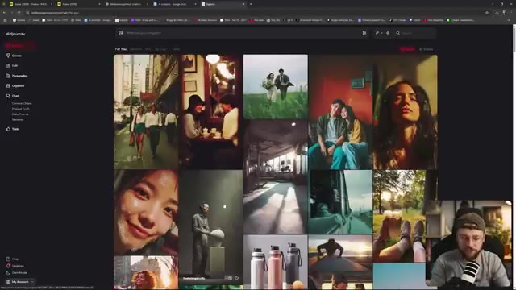
*Interface web de Midjourney affichant une galerie de créations visuelles de style cinématique, avec la webcam du créateur en incrustation.*

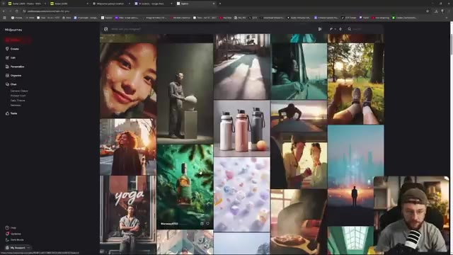
*Navigation dans la grille de résultats sur Midjourney avec différentes images aux teintes oniriques et cinématographiques.*

*Affichage d'une grille de visuels générés par intelligence artificielle sur la plateforme Midjourney.*

---

### ⏱️ `[00:08:21 - 00:08:46]` | Segment #18

**🔊 Audio (Transcription Intégrale Mot pour Mot en Français) :**
> Donc si on se dirige simplement vers mon onglet Créer, vous pouvez voir toutes sortes de trucs sympas que j'ai faits dans le passé. J'adore absolument Midjourney. On peut vraiment obtenir des images incroyables de cette plateforme. Ça vaut vraiment le coup d'œil et l'argent investi selon moi. Et je pense qu'il est temps de créer notre prompt. Donc ce qu'on va faire tout d'abord, c'est simplement aller copier et coller celui sur lequel nous venions de travailler ensemble. On va le déposer directement tout en haut ici.

**👁️ Analyse Visuelle d'Écran (gemini-3.5-flash-lite) :**
**Interface & Outils** : Interface web de la plateforme Midjourney (navigateur web, onglet "Create" actif sur le panneau latéral gauche).

**Contenu textuel & Code** : Historique de générations Midjourney avec grilles de 4 images, textes de prompts textuels détaillés sur la droite (ex: "A bearded man wearing a high-tech dark spacesuit..."), et incrustation vidéo du créateur en bas à droite.

**Action / Démonstration** : Le créateur navigue dans l'interface de son historique Midjourney pour montrer ses créations passées et préparer la saisie d'un nouveau prompt.

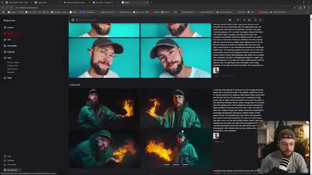
*Interface de Midjourney montrant l'historique des images créées avec des grilles de prévisualisation et des prompts détaillés.*

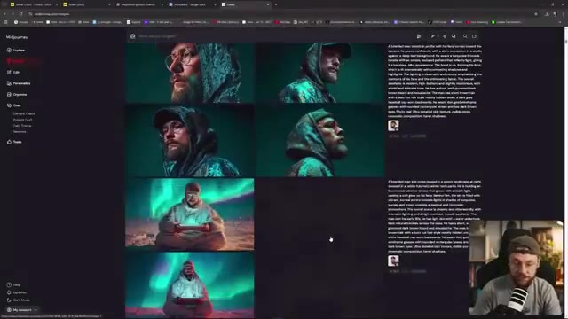
*Navigation dans l'onglet Créer de Midjourney affichant de nouvelles générations artistiques et des paysages nocturnes aux aurores boréales.*

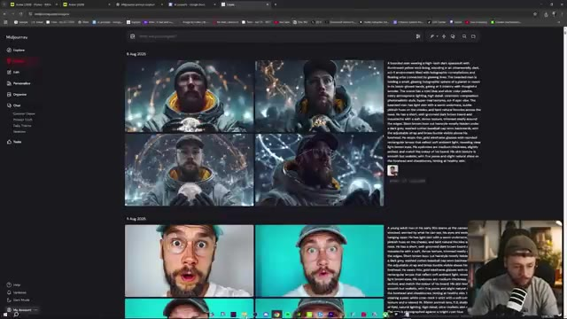
*Grilles d'images Midjourney générées représentant des astronautes futuristes tenant des sphères lumineuses holographiques.*

---

### ⏱️ `[00:08:46 - 00:09:22]` | Segment #19

**🔊 Audio (Transcription Intégrale Mot pour Mot en Français) :**
> Et si nous allons sur ce petit symbole plus, j'ai presque comme une feuille de personnage de moi-même, que je vais glisser et déposer dans la section Omni reference. Et nous voulons nous assurer que la force Omni est d'environ 100. Je vais juste vous montrer cette feuille de personnage que j'ai de moi-même un petit peu plus en détail. Ce sont juste quelques images différentes sous différents angles. Je porte à peu près la même tenue que celle que je porte maintenant. Vous pouvez voir tous mes traits de visage très clairement. Il y a des expressions neutres, il y en a une où je suis en train de sourire. Il y a un éclairage intérieur et un éclairage naturel extérieur comme

**👁️ Analyse Visuelle d'Écran (gemini-3.5-flash-lite) :**
**Interface & Outils** : Interface web d'un outil de génération vidéo par IA (probablement Midjourney ou similaire) avec panneau de gestion des prompts, Image Prompts, Style References et Omni Reference, puis visionneuse d'images.

**Contenu textuel & Code** : Texte descriptif long d'un homme barbu dans une jungle extraterrestre fluorescente (« A bearded man standing in a glowing alien jungle at night... »), bibliothèque d'images miniatures de personnages, réglage « Omni Strength », et grille de photos de référence du créateur sous différents angles.

**Action / Démonstration** : Le créateur montre l'interface de l'outil, glisse une image dans la section Omni Reference, ajuste la force (Omni Strength) et zoome sur sa feuille de personnage composée de plusieurs vues sous divers angles.

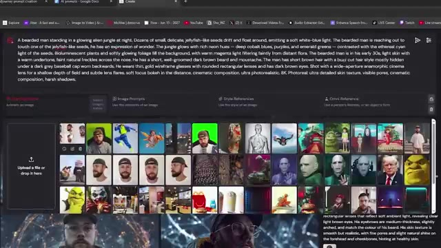
*Interface d'un générateur vidéo montrant le champ de prompt textuel et la grille de sélection des images avec la section Omni Reference.*

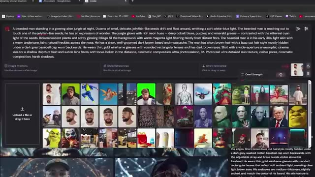
*Glissement et dépôt d'une image dans la section Omni Reference avec le curseur Omni Strength visible.*

*Visualisation détaillée de la feuille de personnage (character sheet) montrant le créateur sous plusieurs angles avec incrustation vidéo PiP du créateur en bas à droite.*

---

### ⏱️ `[00:09:22 - 00:09:56]` | Segment #20

**🔊 Audio (Transcription Intégrale Mot pour Mot en Français) :**
> Bien. Donc ça devrait bien fonctionner comme référence omni. Et nous allons aussi vérifier ces paramètres. Je veux que ce soit en 16 par 9 afin que nous puissions l'animer facilement comme une vidéo. Maintenant, en termes de modèle, vous avez l'option de faire Standard et Raw. Raw est beaucoup plus ancré, mais comme je l'ai dit avant, nous n'utilisons pas vraiment Midjourney pour essayer d'atteindre cela aujourd'hui. Nous voulons vraiment qu'il ait quartier libre et qu'il crée une image visuellement très frappante. Généralement, je mets ma stylisation à 100 et la bizarrerie est à zéro. Je pense que c'est ça. Ouais. Et la variété est également à zéro.

**👁️ Analyse Visuelle d'Écran (gemini-3.5-flash-lite) :**
**Interface & Outils** : Interface web de Midjourney et lecteur multimédia, avec le flux vidéo du créateur incrusté en bas à droite (Picture-in-Picture).

**Contenu textuel & Code** : Paramètres visibles sur l'interface Midjourney : format d'image 16:9, modèle Standard/Raw, curseurs d'esthétique (Stylization, Weirdness, Variety), prompt textuel décrivant un homme barbu dans une jungle alien lumineuse.

**Action / Démonstration** : Le créateur navigue et ajuste les paramètres de génération sur l'interface Midjourney (taille 16:9, options de modèle Standard/Raw, curseurs de stylisation, bizarrerie et variété).

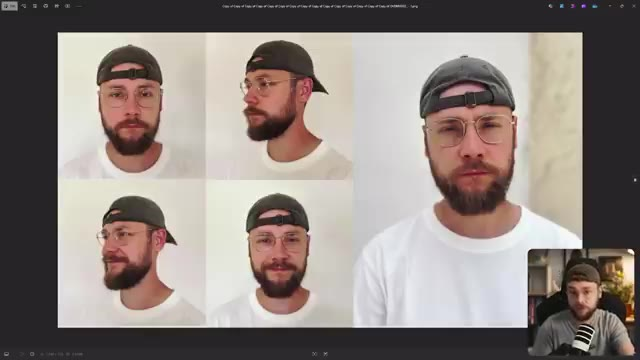
*Interface montrant plusieurs angles de vue d'un visage d'homme (référence omni) dans un lecteur vidéo avec le créateur en incrustation.*

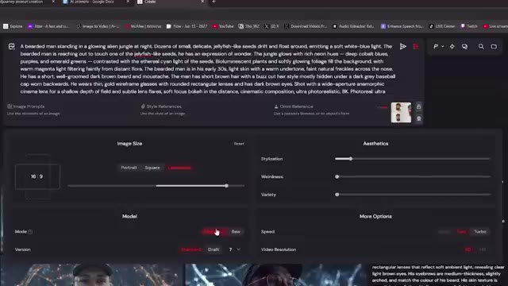
*Interface de Midjourney avec les options de génération, les paramètres de taille d'image (16:9), le modèle (Standard/Raw) et les curseurs d'esthétique.*

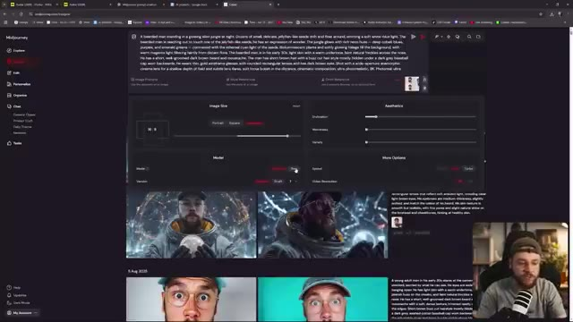
*Interface de Midjourney affichant le panneau de création avec les paramètres et des exemples de générations précédentes en bas.*

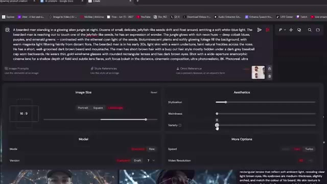
*Interface de Midjourney montrant les curseurs de réglage des paramètres esthétiques, notamment la variété mise à zéro.*

---

### ⏱️ `[00:09:56 - 00:10:32]` | Segment #21

**🔊 Audio (Transcription Intégrale Mot pour Mot en Français) :**
> Bien sûr, vous pouvez expérimenter avec tous ces différents paramètres en matière d'esthétique, mais je pense que nous sommes prêts. Alors cliquons sur envoyer. Ce qui est excitant, c'est qu'on ne sait jamais exactement ce que l'on va obtenir en retour, mais cela devrait nous donner quelque chose de plutôt cool. Ça a l'air assez cartoon pour l'instant. J'espère que nous allons basculer davantage dans un domaine photoréaliste à mesure que les images se finalisent. Oui, donc ça a cette sorte de sensation animée. J'adore les compositions, mais ça ne fait pas encore assez réel pour moi. Donc nous allons relancer le même prompt. Je vais juste vérifier tout cela pour m'assurer qu'il n'y a rien là-dedans qui va

**👁️ Analyse Visuelle d'Écran (gemini-3.5-flash-lite) :**
**Interface & Outils** : Interface web de Midjourney (midjourney.com/imagine) avec menu latéral sombre et encadré vidéo PiP du créateur en bas à droite.

**Contenu textuel & Code** : Prompt complet visible : "A bearded man standing in a growing alien jungle at night. Dozens of small, delicate, jellyfish-like seeds drift and float around, emitting a soft white-blue light...". Paramètres : Image Size (16:9), Aesthetics (Stylization, Weirdness, Variety), Model (Raw, Version 6.0).

**Action / Démonstration** : Le créateur navigue sur l'interface de Midjourney, observe la génération des images en cours, analyse le rendu visuel et prépare une nouvelle exécution du prompt.

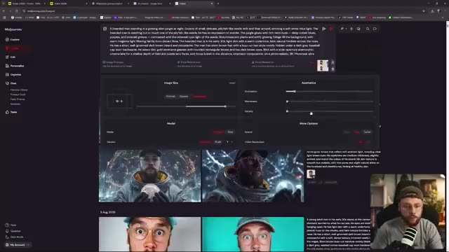
*Interface de Midjourney affichant les paramètres esthétiques et le prompt textuel détaillé d'un homme barbu dans une jungle extraterrestre.*

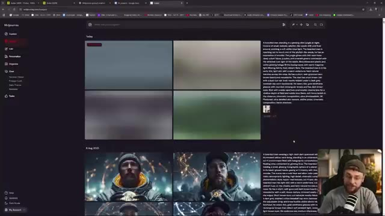
*Interface de Midjourney montrant la grille de génération d'images en cours de chargement (floutées/en cours de rendu).*

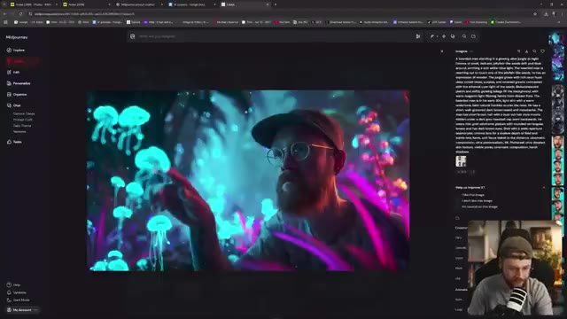
*Interface de Midjourney affichant en grand format une image générée montrant un homme barbu touchant des méduses lumineuses bleues et roses.*

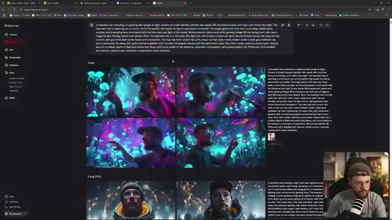
*Interface de Midjourney affichant la grille complète des 4 variations d'images générées avec le style cartoon/animé.*

---

### ⏱️ `[00:10:32 - 00:10:57]` | Segment #22

**🔊 Audio (Transcription Intégrale Mot pour Mot en Français) :**
> ajouter comme une ambiance animée. Le prompt en lui-même a l'air tout à fait bon. Je vais échanger contre une référence Omni différente juste pour voir si cela aide. C'est juste l'un de ces selfies, mais avec un petit peu plus de détails, juste l'image elle-même et à une plus haute résolution. Encore une fois, nous allons laisser la force Omni à cent. Et comme je suis satisfait de mon prompt, il met vraiment l'accent sur le photoréalisme. Nous allons juste relancer cela une dernière fois.

**👁️ Analyse Visuelle d'Écran (gemini-3.5-flash-lite) :**
**Interface & Outils** : Interface web de Midjourney (navigateur web).

**Contenu textuel & Code** : Texte du prompt détaillé (« A bearded man standing in a glowing alien jungle at night... »), options Image Prompts, Style References, Omni Reference, et une grille d'images pré-enregistrées ou de selfies.

**Action / Démonstration** : Le créateur montre l'interface de Midjourney, modifie ou sélectionne une référence Omni (« Omni reference ») parmi une grille de selfies pour l'intégrer à son prompt de génération d'image/vidéo IA.

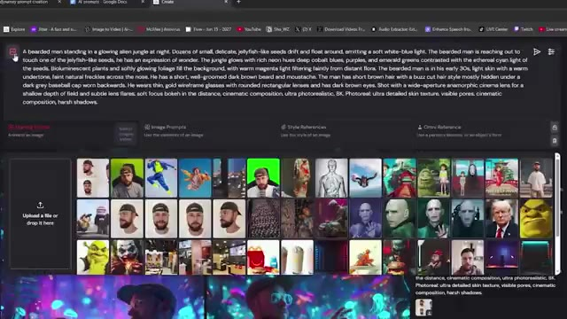
*Interface de Midjourney montrant la zone de saisie du prompt textuel et la grille de sélection des images de référence Omni.*

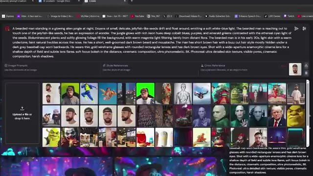
*Gros plan sur l'interface de Midjourney avec le sélecteur Omni Reference et la grille d'images de profil.*

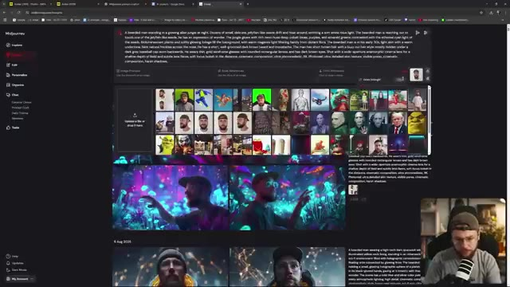
*Vue plus large de l'interface Midjourney avec un retour vidéo du créateur dans un encadré Picture-in-Picture (PiP) en bas à droite.*

---

### ⏱️ `[00:10:57 - 00:11:17]` | Segment #23

**🔊 Audio (Transcription Intégrale Mot pour Mot en Français) :**
> Et ça, pour moi, c'est le point négatif de Midjourney. Même si j'adore ces images, je trouve qu'elles ont l'air vraiment cool et qu'elles me ressemblent dans un style animé à la Pixar, ce n'est pas ce que nous recherchons. Parfois, c'est un processus d'essais et d'erreurs lorsqu'il s'agit de Midjourney. Mais si vous persévérez, vous pouvez obtenir des résultats vraiment incroyables avec cet outil.

**👁️ Analyse Visuelle d'Écran (gemini-3.5-flash-lite) :**
**Interface & Outils** : Navigateur web affichant l'interface de la plateforme Midjourney (midjourney.com/imagine), avec un encadré PiP (Picture-in-Picture) du présentateur en bas à droite.

**Contenu textuel & Code** : Texte du prompt visible sur le côté droit : "A bearded man standing in a glowing alien jungle at night. Dozens of small, delicate, jellyfish-like seeds drift and float around, emitting a soft white-blue light..." ainsi que divers onglets et menus de navigation sur le panneau latéral gauche de Midjourney.

**Action / Démonstration** : Le créateur montre son écran de navigateur affichant Midjourney tout en s'exprimant face à sa webcam dans l'encadré incrusté.

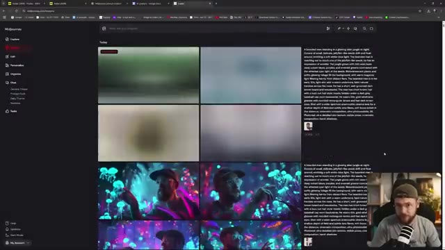
*Interface du site Midjourney montrant une grille d'images générées d'un homme dans une jungle bioluminescente, avec un encadré vidéo (PiP) du créateur en bas à droite.*

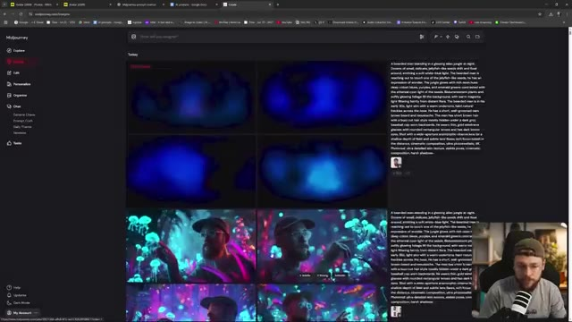
*Interface du site Midjourney montrant la même grille d'images en cours de chargement/génération, avec le flux vidéo incrusté du créateur en bas à droite.*

---

### ⏱️ `[00:11:17 - 00:11:53]` | Segment #24

**🔊 Audio (Transcription Intégrale Mot pour Mot en Français) :**
> Et j'ai déjà l'impression, nous en sommes à 70 % du processus, que ces images sont un peu plus réalistes que celles que nous avions lors de la dernière exécution. Maintenant, j'en aime vraiment quelques-unes. Je pense que celle-ci a l'air plutôt cool. Mais je pense que pour moi, celle-ci l'emporte parce qu'elle me ressemble le plus et qu'elle est aussi un peu plus réaliste que les autres. Nous allons donc l'agrandir en utilisant le paramètre subtil. Et ce sera l'image avec laquelle nous travaillerons pour animer. Voilà. Téléchargeons ceci et examinons de plus près ce que nous avons.

**👁️ Analyse Visuelle d'Écran (gemini-3.5-flash-lite) :**
**Interface & Outils** : Interface web de Midjourney avec un panneau latéral de navigation, une zone d'affichage principale et un encadré PiP (Picture-in-Picture) du créateur en bas à droite.

**Contenu textuel & Code** : Invite (prompt) visible dans le panneau de droite : « A bearded man standing in a glowing alien jungle at night. Oceans of small, delicate, jellyfish-like seeds drift and float around, emitting a soft white-blue light. The bearded man is reaching out to touch one of the jellyfish-like seeds... » et options d'évaluation « /like this image », « /don't like this image ».

**Action / Démonstration** : Le créateur navigue dans l'interface de Midjourney, sélectionne une image parmi une grille de résultats, clique sur l'option d'agrandissement (upscale subtle) pour préparer l'animation de l'image.

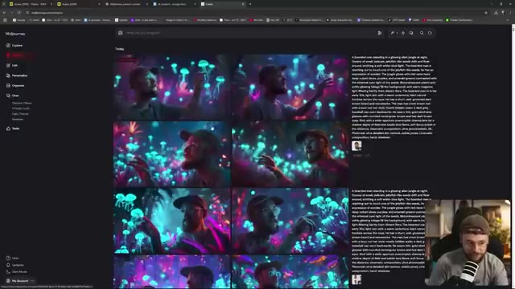
*Interface Midjourney affichant une grille de 4 images générées d'un homme dans une jungle bioluminescente, avec un encadré PiP du créateur en bas à droite.*

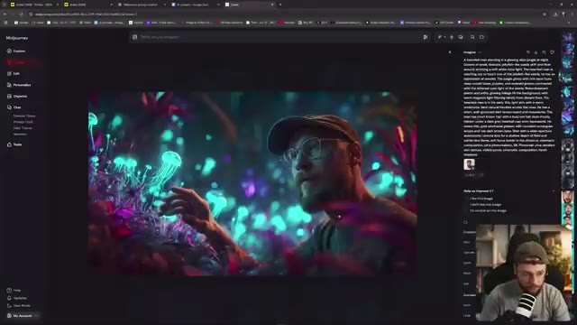
*Interface Midjourney affichant l'image sélectionnée en grand format, avec le panneau de paramètres à droite et l'encadré PiP du créateur en bas à droite.*

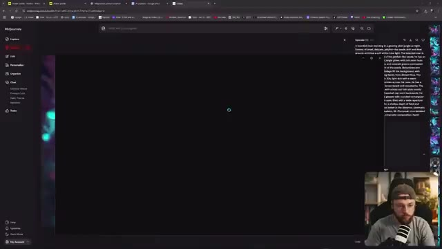
*Interface Midjourney montrant le chargement de l'option « Upscale (Subtle) » avec une icône de chargement circulaire au centre.*

---

### ⏱️ `[00:11:53 - 00:12:25]` | Segment #25

**🔊 Audio (Transcription Intégrale Mot pour Mot en Français) :**
> créé. Je trouve que ça rend vraiment très bien. C'est très frappant visuellement. Il va y avoir beaucoup de potentiel quand nous en arriverons à animer ceci. Ce que je pourrais faire une fois que nous aurons la vidéo générée par IA, c'est simplement ajouter une couche de grain de pellicule pour apporter un peu plus de texture. Mais à part ça, c'est exactement ce que nous recherchons. Ça me ressemble. Ça a l'air surréaliste, un peu plus cinématographique et très frappant visuellement. Alors maintenant, nous allons aborder la création d'une image plus ancrée dans la réalité et plus réaliste. Et encore une fois, nous voulons puiser un peu d'inspiration.

**👁️ Analyse Visuelle d'Écran (gemini-3.5-flash-lite) :**
**Interface & Outils** : Visionneuse d'image avec incrustation PiP du créateur et interface web de la plateforme Higgsfield.

**Contenu textuel & Code** : Texte du prompt visible partiellement en haut : « ..._a_jeweled_man_standing_in_a_glowing_alien_jungle_ai_6f37fef1-5437-4d1a-7dbd-f173b77cafce.png ». Sur l'interface Higgsfield : onglets Explore, Create, Canvas, Character, Upscale, Access, ainsi que des catégories comme Visual Effects, MiniMax Hailuo 02, Consistent Characters, Higgsfield Soul, Higgsfield Assist.

**Action / Démonstration** : Le créateur présente une image générée par IA d'un personnage dans un environnement fantastique fluorescent, puis navigue sur l'interface de la plateforme Higgsfield pour explorer des outils de génération d'effets visuels et de vidéos.

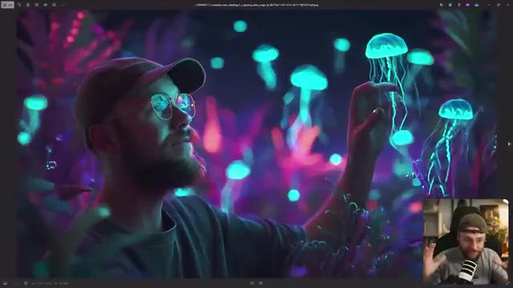
*Rendu visuel d'une image générée par IA montrant un homme barbu avec une casquette et des lunettes touchant une méduse fluorescente dans une jungle lumineuse, avec incrustation du créateur en bas à droite.*

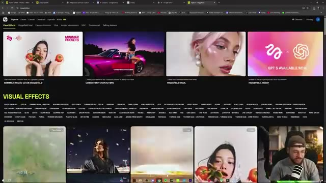
*Interface de la plateforme Higgsfield affichant des onglets de génération vidéo, des effets visuels et des exemples de créations animées, avec incrustation du créateur en bas à droite.*

---

### ⏱️ `[00:12:25 - 00:12:44]` | Segment #26

**🔊 Audio (Transcription Intégrale Mot pour Mot en Français) :**
> Donc j'ai trouvé cette image provenant d'une campagne Carhartt. Carhartt est l'une de mes marques préférées. Quand ils produisent leurs lookbooks, ils contiennent beaucoup de photographies vraiment incroyables. C'est donc ce que nous allons utiliser pour générer nos prompts, essentiellement. Donc encore une fois, je vais aller sur ChatGPT et je vais télécharger cette photo.

**👁️ Analyse Visuelle d'Écran (gemini-3.5-flash-lite) :**
**Interface & Outils** : Visionneuse d'images du système d'exploitation et interface web de ChatGPT avec incrustation vidéo (PiP) du présentateur en bas à droite.

**Contenu textuel & Code** : Sur l'image 1 : une photo de lookbook Carhartt représentant une personne vêtue d'une veste Carhartt derrière une vitre brisée ou effet givré. Sur l'image 2 : une interface ChatGPT affichant un prompt textuel détaillé en anglais pour Midjourney (« A tall blue-skinned humanoid alien... ») avec les paramètres « --ar 16:9 --v 6 », ainsi qu'une fenêtre contextuelle d'explorateur de fichiers Windows.

**Action / Démonstration** : Le créateur montre d'abord une image de référence inspirante issue d'une campagne Carhartt, puis bascule sur l'interface de ChatGPT pour préparer le téléchargement de cette photo afin de générer de nouveaux prompts.

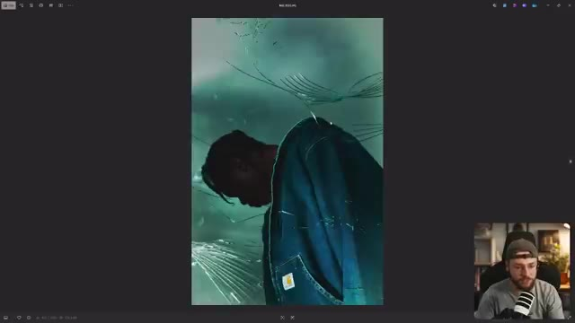
*Visionneuse d'images affichant une photo de campagne Carhartt avec un effet de verre brisé, et la miniature incrustée (PiP) du créateur en bas à droite.*

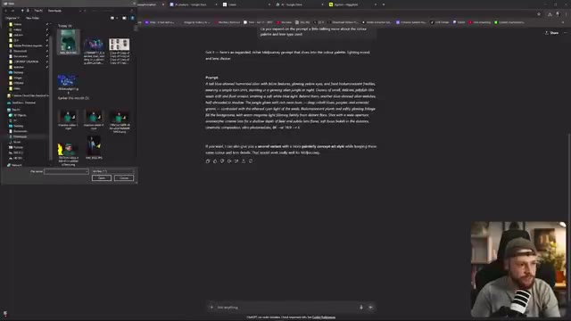
*Interface de ChatGPT affichant une conversation avec des prompts de génération et une fenêtre explorateur de fichiers ouverte par-dessus, avec la miniature incrustée (PiP) du créateur en bas à droite.*

---

### ⏱️ `[00:12:44 - 00:13:20]` | Segment #27

**🔊 Audio (Transcription Intégrale Mot pour Mot en Français) :**
> Et nous pouvons simplement reprendre les mêmes prompts que nous avons utilisés au début, même si nous n'utilisons pas Midjourney. Maintenant, nous allons utiliser Higgsfield, qui est la référence incontournable si vous voulez créer des images de vous-même vraiment, vraiment réalistes qui ont une ressemblance presque parfaite, vous pouvez obtenir des résultats incroyables grâce à cela. Et le prompt que nous avons obtenu de ChatGPT est : un homme de profil la tête baissée, portant une veste ample en jean bleu Carhartt, silhouetté sur un ciel gris-teal maussade, son visage est partiellement obscurci dans l'ombre, avec une légère lumière de contour soulignant les bords de ses cheveux et

**👁️ Analyse Visuelle d'Écran (gemini-3.5-flash-lite) :**
**Interface & Outils** : Navigateur web affichant l'interface de ChatGPT et le site de la plateforme de génération vidéo Higgsfield.

**Contenu textuel & Code** : Texte du prompt visible à l'écran : "A man in profile with his head bowed, wearing a loose blue denim Carhartt jacket, silhouetted against a moody teal-grey sky..." ainsi que divers menus de la plateforme Higgsfield.

**Action / Démonstration** : Le créateur montre la transition entre ChatGPT et l'outil Higgsfield tout en expliquant l'utilisation des prompts pour obtenir des images réalistes.

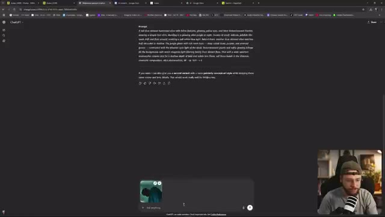
*Interface de ChatGPT affichant un prompt détaillé pour la génération d'images.*

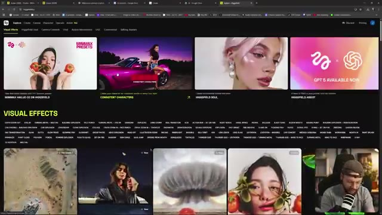
*Interface de la plateforme Higgsfield montrant différents onglets de création visuelle et des exemples de vidéos.*

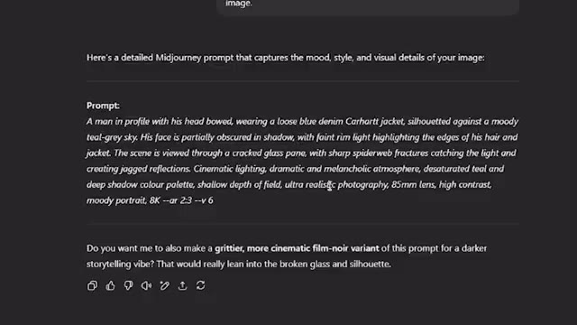
*Gros plan sur le texte du prompt Midjourney généré par ChatGPT dans le navigateur.*

---

### ⏱️ `[00:13:20 - 00:13:56]` | Segment #28

**🔊 Audio (Transcription Intégrale Mot pour Mot en Français) :**
> veste. La scène est vue à travers une vitre brisée avec de nettes fractures en toile d'araignée, captant la lumière et créant des reflets déchiquetés. Éclairage cinématographique, atmosphère dramatique et mélancolique, palette de couleurs sarcelle désaturée et ombres profondes, faible profondeur de champ, photographie ultra-réaliste, objectif 85 mm, portrait d'ambiance à fort contraste. Avec l'autre prompt où j'essayais d'en obtenir plus de ChatGPT, il a déjà appliqué cette réflexion à ce nouveau prompt. C'est donc une excellente base pour nous. Je vais donc prendre ceci et le coller dans notre texte vierge.

**👁️ Analyse Visuelle d'Écran (gemini-3.5-flash-lite) :**
**Interface & Outils** : Interface de ChatGPT et éditeur de texte en plein écran avec incrustation vidéo (PiP) du créateur.

**Contenu textuel & Code** : Texte du prompt Midjourney généré par l'IA : "A man in profile with his head bowed, wearing a loose blue denim Carhartt jacket..." avec les paramètres de style et les options de suivi de ChatGPT.

**Action / Démonstration** : Le créateur lit le prompt affiché sur ChatGPT, puis sélectionne et copie le texte pour le coller dans un document vierge.

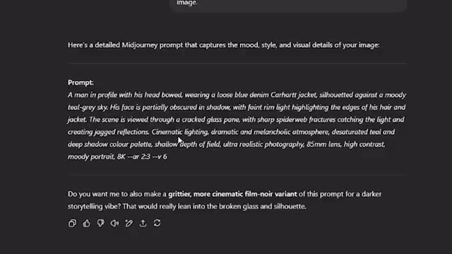
*Interface de ChatGPT affichant un prompt détaillé pour Midjourney décrivant un homme en profil avec une veste Carhartt et une vitre brisée.*

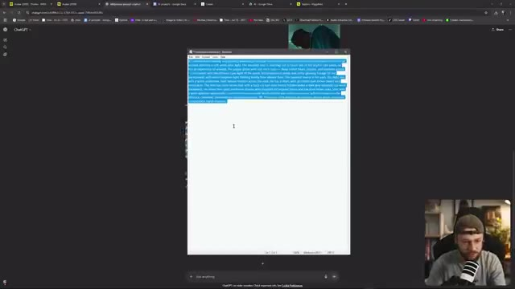
*Écran d'ordinateur montrant une fenêtre de texte en cours de sélection et de copie avec Jack visible dans un encadré en bas à droite.*

---

### ⏱️ `[00:13:56 - 00:14:18]` | Segment #29

**🔊 Audio (Transcription Intégrale Mot pour Mot en Français) :**
> document. Et on va simplement commencer avec un homme barbu à la place. Et je vais aussi changer les vêtements. Donc je vais dire portant un simple t-shirt blanc surdimensionné. Je vais aussi modifier un peu ceci pour dire en mettant en valeur les bords de son chapeau et de son t-shirt. Et encore une fois, ce que nous voulons faire, c'est récupérer notre description de moi-même.

**👁️ Analyse Visuelle d'Écran (gemini-3.5-flash-lite) :**
**Interface & Outils** : Bloc-notes Windows (Notepad) et Google Docs via un navigateur web, avec incrustation vidéo (PiP) du créateur.

**Contenu textuel & Code** : Texte du prompt dans le bloc-notes : "A bearded man in profile with his head bowed, wearing a plain oversized white t-shirt, silhouetted against a moody teal-grey sky..." ainsi que des descriptions textuelles détaillées et des prompts sur Google Docs.
[DESC_IMAGE_1_ACTION] Visualisation du prompt textuel dans le bloc-notes.
[DESC_IMAGE_2_ACTION] Modification et lecture du texte du prompt dans l'interface du bloc-notes.
[DESC_IMAGE_3_ACTION] Navigation et sélection de texte dans le document Google Docs contenant les descriptions et prompts.

**Action / Démonstration** : Démonstration pédagogique et présentation du workflow.

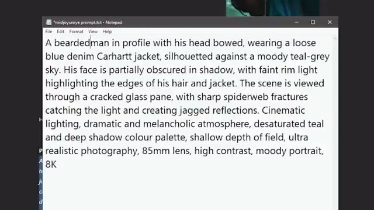
*Bloc-notes Windows affichant le prompt Midjourney en cours de modification avec un homme barbu.*

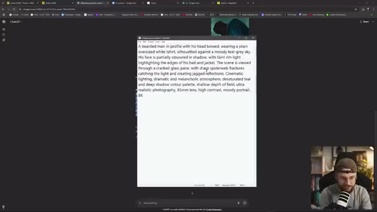
*Navigateur web affichant un bloc-notes superposé et le créateur dans un encadré PiP.*

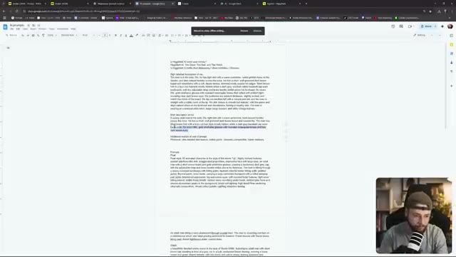
*Document Google Docs affichant des descriptions détaillées et des prompts textuels, avec le créateur en PiP.*

---

### ⏱️ `[00:14:19 - 00:14:38]` | Segment #30

**🔊 Audio (Transcription Intégrale Mot pour Mot en Français) :**
> Je pense qu'on peut réutiliser le court. Donc on va simplement l'insérer à la fin. Ça va juste clarifier exactement à quoi je ressemble pour Higgsfield et aussi que je porte mon chapeau et mes lunettes. Très important. Et je vais juste ajouter un tout petit peu de ce prompt, la texture de peau ultra détaillée et les pores visibles. Je vais juste le placer là avant 8K.

**👁️ Analyse Visuelle d'Écran (gemini-3.5-flash-lite) :**
**Interface & Outils** : Google Docs avec un éditeur de texte en superposition et une incrustation vidéo (PiP) du créateur (Jack) parlant devant son micro.

**Contenu textuel & Code** : Texte du prompt dans la fenêtre : "A bearded man in profile with his head bowed, wearing a plain oversized white tshirt, silhouetted against a moody teal-grey sky. His face is partially obscured in shadow, with faint rim light highlighting the edges of his hat and tshirt. The scene is viewed through a cracked glass pane, with sharp spiderweb fractures catching the light and creating jagged reflections. Cinematic lighting, dramatic and melancholic atmosphere, desaturated teal and deep shadow colour palette, shallow depth of field, ultra realistic photography, 85mm lens, high contrast, moody portrait, 8K. A young adult man in his early 30s, light skin with a warm undertone, faint natural freckles across the nose. He has a short, well-groomed dark brown beard and moustache. The man has short brown hair with a buzz cut hair style mostly hidden under a dark grey baseball cap worn backwards. He wears thin, gold wireframe glasses with rounded rectangular lenses and has dark brown eyes."

**Action / Démonstration** : Le créateur montre son écran avec le prompt textuel en cours de modification, expliquant qu'il va y ajouter des détails sur la texture de la peau pour Higgsfield.

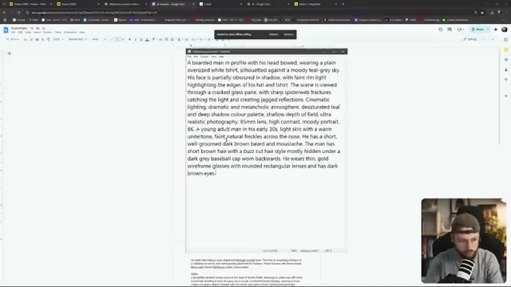
*Écran montrant un document Google Docs avec un bloc-notes ouvert contenant un prompt textuel détaillé, avec le créateur en incrustation (PiP) dans le coin inférieur droit.*

---

### ⏱️ `[00:14:38 - 00:15:15]` | Segment #31

**🔊 Audio (Transcription Intégrale Mot pour Mot en Français) :**
> Donc nous allons copier et coller ceci. Nous allons nous rendre sur Higgsfield pour créer l'image. Supprimez simplement la promesse là-dedans pour l'instant et vous pouvez voir des résultats vraiment incroyables que j'ai déjà obtenus en utilisant cet outil. La ressemblance est folle. En gros, ce que vous faites, si vous allez sur l'onglet "Character" tout en haut ici, c'est que vous téléchargez tout un tas d'images de vous sous différents angles, en portant différents vêtements, avec différents éclairages et tout le tralala, et cela va réellement construire un modèle basé sur votre personnage, vous allez entraîner le logiciel à recréer votre propre image et si vous voulez ces résultats ultra réalistes, Higgsfield utilisant leur modèle Soul est la voie à suivre. Donc nous allons

**👁️ Analyse Visuelle d'Écran (gemini-3.5-flash-lite) :**
**Interface & Outils** : Interface web de la plateforme de génération vidéo et d'images par IA Higgsfield (higgsfield.ai), avec les onglets Explore, Create, Canvas, Character, Upscale, Assist.

**Contenu textuel & Code** : Menus et sections visibles : "Visual Effects", "Higgsfield Soul", "Camera Controls", "Viral", "Active Movements", "UGC", "Commercial", "Talking Avatar", et le titre "MAKE YOUR OWN CHARACTER".

**Action / Démonstration** : Le créateur navigue sur le site web de Higgsfield, montre des exemples de résultats générés et explique comment importer des photos pour créer un modèle de personnage personnalisé.

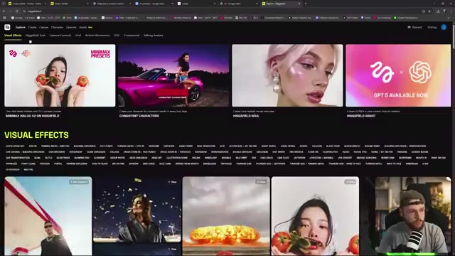
*Page d'accueil de Higgsfield avec le menu de navigation supérieur montrant différentes sections comme Visual Effects et des exemples de créations d'IA.*

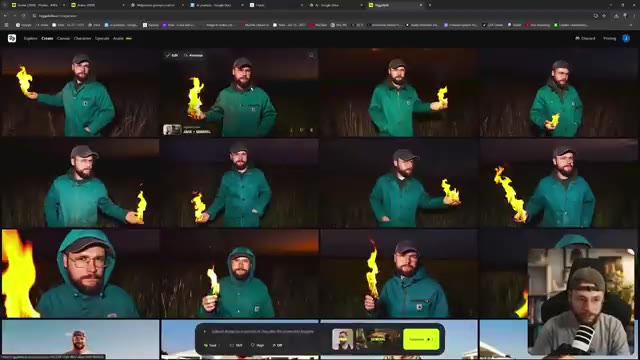
*Grille d'images générées montrant des variations du visage de Jack avec des effets de feu en extérieur.*

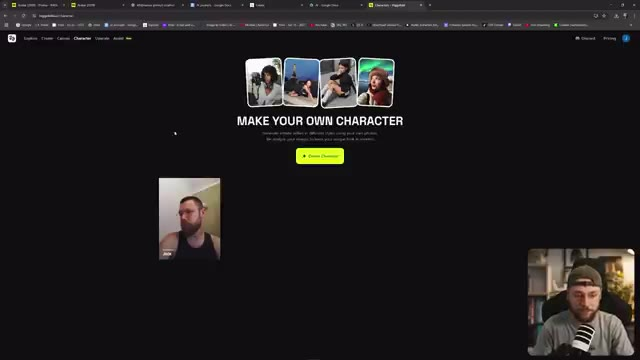
*Page "Make Your Own Character" sur Higgsfield avec un aperçu de profil uploadé nommé Jack.*

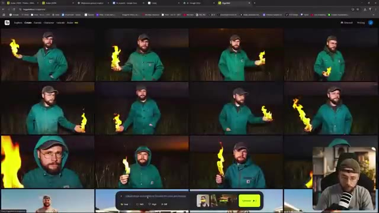
*Grille d'images similaires avec les paramètres de génération et boutons de contrôle en bas de l'interface Higgsfield.*

---

### ⏱️ `[00:15:15 - 00:15:38]` | Segment #32

**🔊 Audio (Transcription Intégrale Mot pour Mot en Français) :**
> copiez et collez dans notre nouveau prompt. Nous sélectionnerons le modèle unique, bien sûr, pour des visuels de mode ultra réalistes. 16 par 9 à nouveau, nous utiliserons la haute qualité et vous voulez vous assurer de désactiver l'amélioration de prompt. Nous ne voulons donner aucune marge de manœuvre à Higgsfield pour gâcher la façon dont nous avons rédigé nos prompts, car nous avons passé beaucoup de temps à nous assurer que c'est exactement ce que nous voulons.

**👁️ Analyse Visuelle d'Écran (gemini-3.5-flash-lite) :**
**Interface & Outils** : Interface web de Higgsfield (higgsfield.ai/management) affichant les options de génération vidéo, la sélection de modèles, le format 16:9 et les réglages de qualité.

**Contenu textuel & Code** : Texte du prompt visible dans l'interface : "A bearded man in profile with his head bowed, wearing a plain oversized white tshirt...". Paramètres visibles : Soul, 16:9, High, Prompt enhance : Off, et le bouton vert "Generate".

**Action / Démonstration** : Le créateur montre l'interface de Higgsfield, met en avant les paramètres de génération (16:9, haute qualité, désactivation de l'amélioration de prompt) et prépare la génération d'une nouvelle vidéo IA.

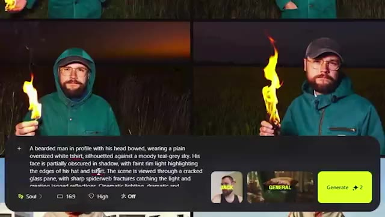
*Interface de Higgsfield montrant la boîte de saisie du prompt textuel avec les paramètres 16:9, High quality et Prompt enhance désactivé.*

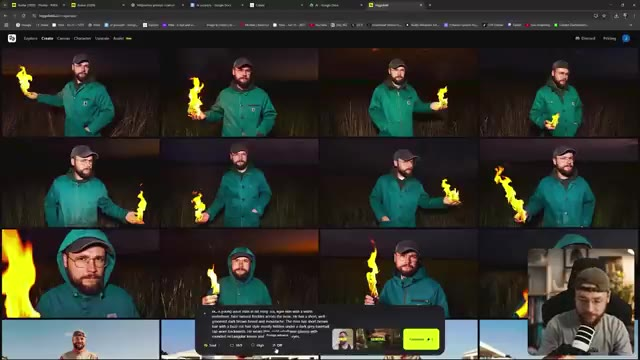
*Vue plus large de l'interface de Higgsfield avec une grille de prévisualisations vidéo et la webcam du créateur en incrustation (PiP) en bas à droite.*

---

### ⏱️ `[00:15:38 - 00:16:12]` | Segment #33

**🔊 Audio (Transcription Intégrale Mot pour Mot en Français) :**
> Pour le modèle de personnage, bien sûr, je vais utiliser ma propre personne. Et pour le style visuel, je vous suggère de vous en tenir soit à général soit à réaliste. Je vais utiliser général. Bon nombre de ces styles visuels finissent par perturber complètement vos prompts. Soyez donc très vigilants. Des choses comme le mont Fuji vous placeront littéralement en dehors du mont Fuji, vous intégreront directement dans cette image, ce que vous ne souhaitez peut-être pas. Vous pourriez supposer que cela prend simplement cette esthétique et l'applique à vos prompts, mais non, c'est assez lourd, donc mon conseil est de vous en tenir à général ou réaliste, allons-y et générons.

**👁️ Analyse Visuelle d'Écran (gemini-3.5-flash-lite) :**
**Interface & Outils** : Navigateur web affichant l'interface de l'outil d'intelligence artificielle Higgfield avec le retour vidéo du créateur en incrustation (PiP).

**Contenu textuel & Code** : Grille de prévisualisations vidéo générées montrant un homme barbu en veste verte et casquette tenant une flamme, avec le panneau de prompt et de sélection du modèle de personnage et du style visuel en bas.

**Action / Démonstration** : Le créateur navigue et démontre l'interface de sélection des styles visuels et des modèles de personnages sur Higgfield.

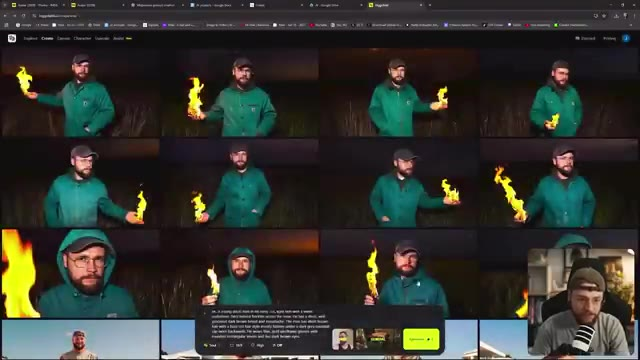
*Interface de l'outil Higgfield affichant une grille de résultats de génération avec le créateur tenant du feu à la main.*

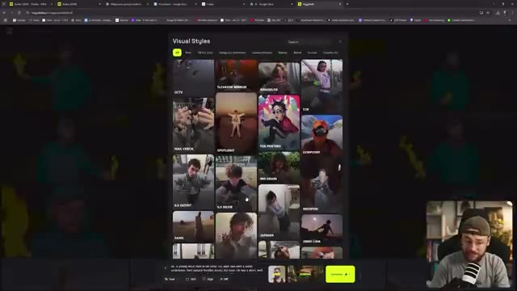
*Interface de sélection des styles visuels ('Visual Styles') sur l'outil Higgfield avec différentes options de vignettes.*

*Interface de Higgfield montrant à nouveau la grille de résultats de génération de vidéos avec le personnage.*

---

### ⏱️ `[00:16:12 - 00:16:47]` | Segment #34

**🔊 Audio (Transcription Intégrale Mot pour Mot en Français) :**
> cette image et ici nous avons notre résultat de Higgsfield je veux dire que c'est littéralement moi c'est littéralement moi celui-ci est un peu bizarre en quelque sorte donc je dirais la même chose pour celui-ci mais celui-là me ressemble vraiment aussi et celui-ci est vraiment cool aussi il a créé des trucs vraiment incroyables pour nous ici et le verre brisé est superbe maintenant vous avez peut-être remarqué qu'avec à la fois Midjourney et Higgsfield parfois il ne veut tout simplement pas mettre votre casquette à l'envers ça peut juste être un processus de tâtonnements ça ne me dérange pas vraiment vous savez je porte ma casquette à l'envers

**👁️ Analyse Visuelle d'Écran (gemini-3.5-flash-lite) :**
**Interface & Outils** : Navigateur web affichant l'interface de la plateforme de génération vidéo IA Higgsfield (higgsfield.ai), avec incrustation vidéo (PiP) du créateur en bas à droite.

**Contenu textuel & Code** : Galerie de vignettes vidéo montrant des variations de Jack avec une casquette et des lunettes derrière une vitre fissurée, ainsi que des plans habillé en vert tenant des flammes. Prompts visibles en superposition textuelle.

**Action / Démonstration** : Le créateur navigue et zoome sur les différentes variations de vidéos générées par IA sur la plateforme Higgsfield pour les analyser.

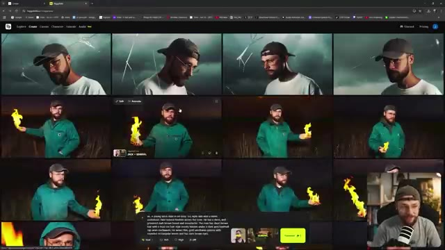
*Interface du site web Higgsfield montrant une galerie de vidéos générées avec le créateur, incluant des aperçus en gros plan avec effet de verre brisé et un prompt textuel affiché en bas.*

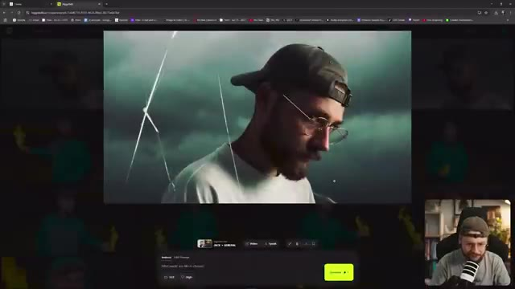
*Vue agrandie de l'une des vidéos générées sur Higgsfield montrant un portrait de Jack avec des fissures de verre à l'avant-plan.*

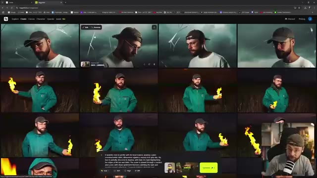
*Retour à la grille de la galerie Higgsfield avec un autre prompt développé en bas de l'écran décrivant l'apparence physique de Jack.*

---

### ⏱️ `[00:16:47 - 00:17:06]` | Segment #35

**🔊 Audio (Transcription Intégrale Mot pour Mot en Français) :**
> Pour l'avant aussi je pense que les résultats qu'on a obtenus ici sont vraiment super et je pense qu'on va aller de l'avant et télécharger celui-ci et voici notre image en plein écran elle a vraiment l'air très très bien Et bien sûr, je vous le promets les gars, je vais vous montrer un moyen gratuit d'animer ces deux images pour vraiment leur donner vie.

**👁️ Analyse Visuelle d'Écran (gemini-3.5-flash-lite) :**
**Interface & Outils** : Navigateur web avec l'interface de l'outil de génération d'image/vidéo (style Higgfield ou similaire) comportant des options de génération et un encadré vidéo du créateur en bas à droite.

**Contenu textuel & Code** : Image générée montrant un homme avec une barbe, des lunettes et une casquette, observé à travers une vitre brisée avec des fissures formant des toiles d'araignée sur un fond de ciel nuageux et menaçant.

**Action / Démonstration** : Le créateur présente l'image finale obtenue à l'écran, passe d'une vue de l'interface de l'outil à un affichage en plein écran de l'image, tout en commentant le résultat positif.

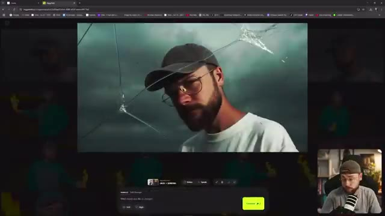
*Interface de l'outil web affichant l'image générée d'un homme derrière une vitre brisée, avec un encadré PiP du créateur en bas à droite.*

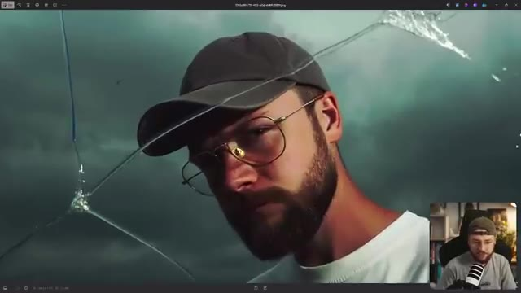
*Affichage en plein écran de l'image générée de l'homme portant des lunettes et une casquette derrière une vitre brisée, avec le créateur en incrustation PiP.*

---

### ⏱️ `[00:17:06 - 00:17:27]` | Segment #36

**🔊 Audio (Transcription Intégrale Mot pour Mot en Français) :**
> Donc nous allons aborder cela maintenant. Avant de le faire, si vous avez apprécié la vidéo d'aujourd'hui, les gars, assurez-vous de lui mettre un gros pouce en bleu pour moi. Si vous êtes nouveaux, pensez à vous abonner. Et bien sûr, activez aussi cette icône de cloche de notification. Alors, comment vais-je animer ces images gratuitement ? Eh bien, je fais en fait partie d'un Discord et vous pouvez le rejoindre gratuitement aussi, appelé LM Arena.

**👁️ Analyse Visuelle d'Écran (gemini-3.5-flash-lite) :**
**Interface & Outils** : Interface de lecteur multimédia affichant une image générée par IA avec incrustation PiP du créateur, puis application Discord (serveur LM Arena).

**Contenu textuel & Code** : Sur l'image #2, l'interface Discord affiche les salons du serveur "LM Arena" (commandes & vidéos, annonces, showcase, video-arena-1, bot-feedback, general, share-prompts, leaderboard, etc.) ainsi que des messages contenant des invites (prompts) textuelles de génération vidéo.

**Action / Démonstration** : Le créateur montre d'abord une image visuelle issue d'une vidéo générée par IA à travers un lecteur multimédia, puis bascule sur l'interface du serveur Discord "LM Arena" pour présenter l'outil d'animation gratuit.

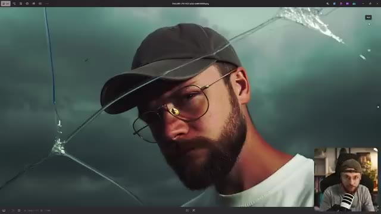
*Image générée par IA montrant un homme barbu avec une casquette derrière une vitre brisée, avec un encadré PiP du créateur en bas à droite.*

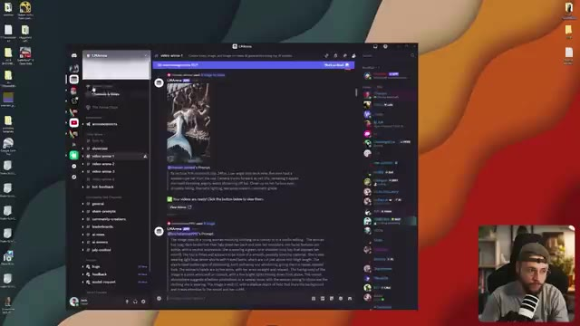
*Interface de l'application Discord sur le serveur "LM Arena" montrant des canaux textuels et des exemples de prompts d'animation vidéo, avec un encadré PiP du créateur en bas à droite.*

---

### ⏱️ `[00:17:27 - 00:17:53]` | Segment #37

**🔊 Audio (Transcription Intégrale Mot pour Mot en Français) :**
> Et cela vient avec quelques réserves, mais quand je dis que vous pouvez utiliser des outils comme Kling et VO3 tout à fait gratuitement, je le pense vraiment. Maintenant, tout le principe de ce canal Discord est que les utilisateurs vont entrer leurs images générées par IA. Ils vont ensuite entrer un prompt et cela leur générera une vidéo par IA en utilisant différents outils. Vous pouvez voir les utilisateurs générer des vidéos en ce moment même en temps réel.

**👁️ Analyse Visuelle d'Écran (gemini-3.5-flash-lite) :**
**Interface & Outils** : Application Discord (serveur LMArena) avec PiP de la webcam du créateur.

**Contenu textuel & Code** : Canaux Discord (announcements, showcase, video-arena-1, video-arena-2, video-arena-3, bot-feedback), prompts textuels de génération de vidéos (ex: descriptions de scènes avec des astronautes ou des mannequins), messages d'état de génération ("Generating videos").

**Action / Démonstration** : Navigation et présentation du serveur Discord LMArena où les utilisateurs génèrent des vidéos par IA à partir de leurs prompts et images.

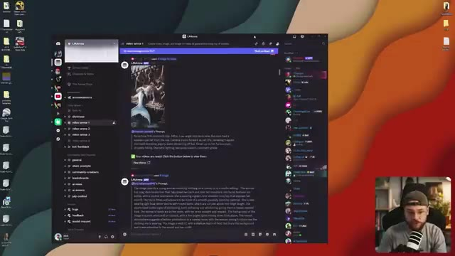
*Interface du serveur Discord LMArena montrant des créations de vidéos IA par les utilisateurs et les prompts associés.*

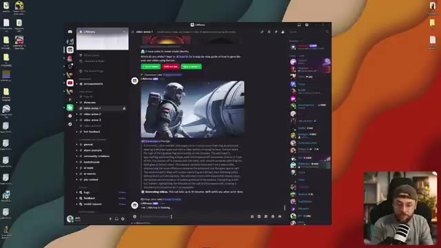
*Interface du serveur Discord LMArena affichant une image d'astronaute avec un prompt détaillé et une zone de saisie pour générer des vidéos.*

---

### ⏱️ `[00:17:53 - 00:18:16]` | Segment #38

**🔊 Audio (Transcription Intégrale Mot pour Mot en Français) :**
> Et tout le principe de ceci est que vous votez réellement sur la première ou la deuxième génération. Vous ne savez réellement pas, jusqu'à ce que la génération ait reçu assez de votes, quels modèles ont été utilisés pour obtenir la première et la seconde. Mais c'est pour cela que ce salon Discord existe. Il rassemble essentiellement toutes ces données différentes pour essayer de déterminer quels sont les meilleurs générateurs de vidéo par IA.

**👁️ Analyse Visuelle d'Écran (gemini-3.5-flash-lite) :**
**Interface & Outils** : Application Discord (serveur LMArena / arène vidéo) avec incrustation vidéo du créateur (PiP) dans le coin inférieur droit.

**Contenu textuel & Code** : On peut lire des prompts de génération d'IA (notamment un prompt descriptif avec un garçon portant un imperméable jaune tenant une lampe torche) ainsi que des boutons de vote interactifs verts et rouges ("Left is better", "Both are bad", "Right is better").

**Action / Démonstration** : Le créateur présente l'interface du serveur Discord où les utilisateurs peuvent voter pour la meilleure génération de vidéo par IA entre deux propositions présentées côte à côte.

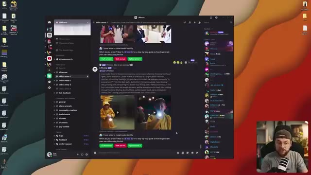
*Interface de l'application Discord sur le serveur d'arène vidéo montrant des comparaisons de générations et des options de vote.*

---

### ⏱️ `[00:18:17 - 00:18:39]` | Segment #39

**🔊 Audio (Transcription Intégrale Mot pour Mot en Français) :**
> Mais en réalité, nous l'utilisons simplement pour obtenir des vidéos IA gratuites. Je vous suggérerais de vous y rendre et de voter vous-même également. C'est en fait assez amusant et plutôt intéressant. Mais bien sûr, vous contribuez ensuite à la communauté. Nous allons donc faire un slash et aller à image vers vidéo. Et je pense que pour commencer, nous allons glisser-déposer notre image de l'avatar inspiré par le prompt de la méduse.

**👁️ Analyse Visuelle d'Écran (gemini-3.5-flash-lite) :**
**Interface & Outils** : Application Discord (serveur LMArena / LM Arena) avec affichage de salons textuels, de comparaisons côte à côte de vidéos IA et d'une fenêtre de commande slash bot.

**Contenu textuel & Code** : Commandes Discord visibles comme `/image-to-video`, invites textuelles telles que "Only robot head very little tilting ups-down slowly, eyes blinking", et indications "Generating videos. This can take up to 10 minutes."

**Action / Démonstration** : Le créateur navigue sur Discord, sélectionne la commande d'image à vidéo et prépare le glisser-déposer d'une image générée.

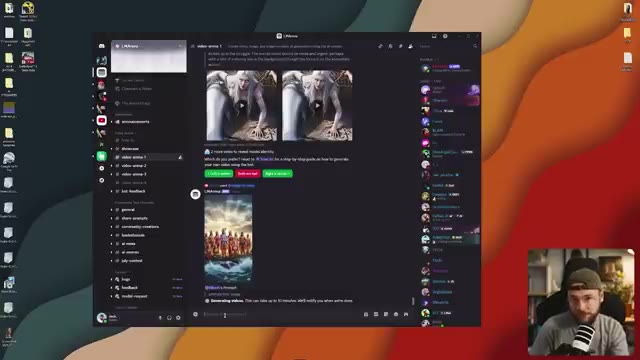
*Interface Discord de LMArena affichant des comparaisons de vidéos générées par IA et un encadré vidéo du présentateur (PiP).*

*Gros plan sur la fenêtre de saisie Discord avec la commande `/image-to-video` et la zone de téléchargement par glisser-déposer.*

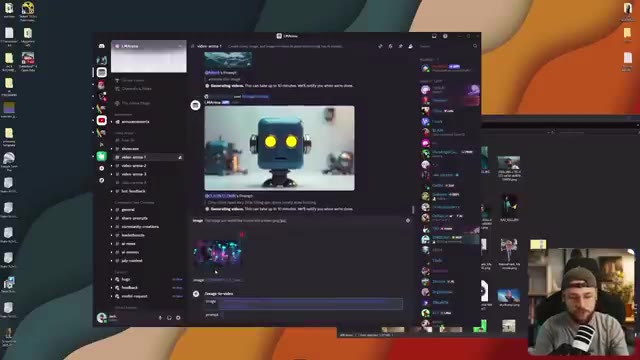
*Vue plus large de l'interface Discord montrant la commande en cours d'utilisation avec l'image importée en miniature et l'encadré PiP du présentateur.*

---

### ⏱️ `[00:18:40 - 00:19:19]` | Segment #40

**🔊 Audio (Transcription Intégrale Mot pour Mot en Français) :**
> Et il y a une petite section en bas ici où nous pouvons taper notre prompt. Et je vais probablement faire au plus simple. On va juste taper. L'homme barbu tend la main vers les méduses flottantes et lumineuses. Il a un air émerveillé alors que les méduses montent et descendent doucement dans les airs. Les plantes néon qui l'entourent se balancent doucement, la caméra zoome très lentement, on appuie sur entrée et maintenant on attend comme vous pouvez le voir ici, il

**👁️ Analyse Visuelle d'Écran (gemini-3.5-flash-lite) :**
**Interface & Outils** : Application de type Discord avec des canaux textuels, des fils de discussion et une interface de génération vidéo par IA.

**Contenu textuel & Code** : On peut lire des lignes de texte de prompts comme "Describe the video you want to generate...", "/image-to-video", et des sections de messages avec des aperçus de vidéos générées.

**Action / Démonstration** : Le créateur navigue dans l'interface et s'apprête à saisir un prompt textuel pour générer une vidéo à partir d'une image.

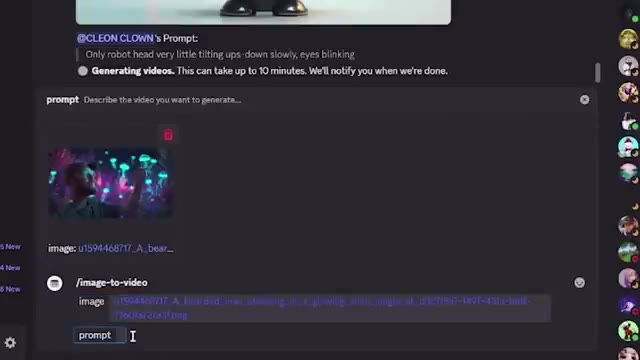
*Interface d'une application ou d'un bot (type Discord) avec un champ de saisie de prompt et une image de prévisualisation montrant un homme barbu entouré de méduses lumineuses.*

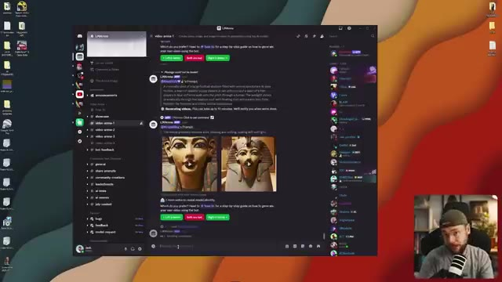
*Vue d'ensemble du bureau de l'ordinateur montrant une application de messagerie/chat (type Discord) avec des salons textuels et un encadré PiP (Picture-in-Picture) de Jack dans le coin inférieur droit.*

---

### ⏱️ `[00:19:19 - 00:19:53]` | Segment #41

**🔊 Audio (Transcription Intégrale Mot pour Mot en Français) :**
> indique simplement que les vidéos sont en cours de génération, cela peut prendre jusqu'à 10 minutes, nous vous avertirons lorsqu'elles seront terminées et bien sûr je posterai le lien vers ce Discord dans la description ci-dessous au moment de l'enregistrement tout le monde peut rejoindre si cela a changé faites-le moi savoir ci-dessous et j'ajouterai un commentaire épinglé ou quelque chose du genre. Mais une fois que vous faites partie du Discord, vous avez juste besoin de sauter dans l'un de ces salons, Video Arena 1, 2, 3, et ensuite vous pouvez entrer vos images, ajouter un prompt, et appuyer sur entrée. Et je crois que vous pouvez générer huit fois par jour. Et bien sûr, chaque fois que vous faites cela, cela vous donne deux

**👁️ Analyse Visuelle d'Écran (gemini-3.5-flash-lite) :**
**Interface & Outils** : Application Discord sur bureau (serveur LM Arena).

**Contenu textuel & Code** : Salons : #how-to, #showcase, #video-arena-1, #video-arena-2, #video-arena-3, #video-arena-4. Prompts visibles : "@Jack.'s Prompt: The bearded man reaches out to the floating glowing jellyfish..." et un prompt avec dialogue en kurde. Messages de génération : "Generating videos. This can take up to 10 minutes, we'll notify you when they're done."

**Action / Démonstration** : Le créateur montre l'interface du serveur Discord LM Arena, zoome sur la liste des canaux vidéo arena et navigue entre les différentes sections de génération.

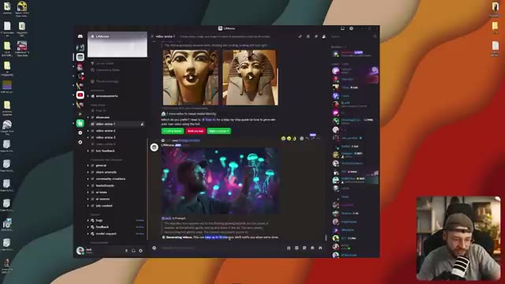
*Interface Discord montrant un salon LM Arena avec des exemples de générations vidéo d'IA et le message de génération en cours.*

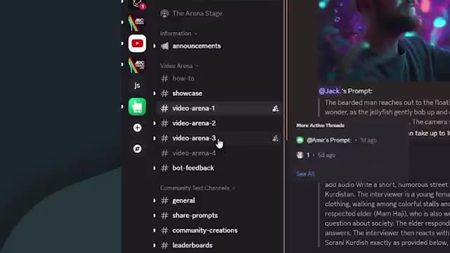
*Gros plan sur la liste des salons de l'arène vidéo dans Discord, montrant video-arena-1, 2, 3 avec le curseur pointant vers video-arena-3.*

*Interface Discord de LM Arena affichant des prompts textuels détaillés en anglais et en kurde avec des traductions et un message de génération vidéo.*

---

### ⏱️ `[00:19:53 - 00:20:13]` | Segment #42

**🔊 Audio (Transcription Intégrale Mot pour Mot en Français) :**
> différentes options. Parce que vous ne savez pas quel modèle vous allez obtenir, c'est un peu comme une loterie. Vous pouvez obtenir de bons résultats, et vous obtiendrez aussi de très mauvais résultats. Mais le point vraiment formidable, c'est qu'une fois que nous récupérons nos générations, si nous aimons ce que nous voyons, nous pouvons les télécharger gratuitement. Et c'est aussi simple que ça, nous avons nos résultats.

**👁️ Analyse Visuelle d'Écran (gemini-3.5-flash-lite) :**
**Interface & Outils** : Application Discord sur le bureau, affichant le serveur LMArena avec différents salons textuels (video-arena-1, video-arena-2, show-case, etc.) et une zone de discussion centrale montrant les prompts et les générations de vidéos.

**Contenu textuel & Code** : Texte de prompt visible dans le salon : "A cinematic, slightly slow-paced shot of two people horseback riding at a bustling merchants bazaar in a dark cave..." ainsi que des dialogues en écriture kurde/arabe et des statuts "Generating videos. This can take up to 10 minutes."

**Action / Démonstration** : Le créateur partage son écran montrant l'interface de test à l'aveugle de LMArena sur Discord, où les utilisateurs peuvent soumettre des prompts et observer les résultats générés par divers modèles de vidéo IA.

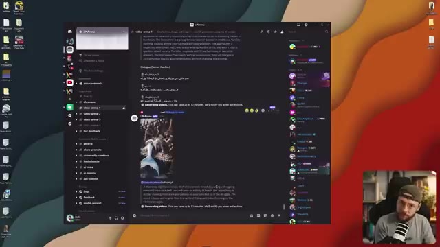
*Interface de l'application LMSYS (LMArena) ouverte dans Discord, affichant les salons de discussion, les prompts textuels et les vidéos en cours de génération ou générées par les modèles d'IA, avec un encadré PiP de Jack dans le coin inférieur droit.*

---

### ⏱️ `[00:20:13 - 00:20:31]` | Segment #43

**🔊 Audio (Transcription Intégrale Mot pour Mot en Français) :**
> Donc jetons un œil. Notre première génération a l'air vraiment, vraiment super. Très heureux de ça. On va simplement aller de l'avant et lancer le téléchargement. Vous verrez que lorsque vous cliquez sur télécharger, cela ouvre votre navigateur web pour effectuer le téléchargement. Pas vraiment sûr de comment ça fonctionne, mais laissez-faire les choses. Regardons la deuxième génération.

**👁️ Analyse Visuelle d'Écran (gemini-3.5-flash-lite) :**
**Interface & Outils** : Lecteur multimédia LIPPlayer et interface web de la plateforme de génération vidéo IA Higgsfield, accompagnés d'une incrustation vidéo (PiP) du présentateur dans le coin inférieur droit.

**Contenu textuel & Code** : Sur Higgsfield (Image #2) : onglets "Video" et "Speak", champ de texte "What would you like to change?" avec les boutons de soumission et d'historique. Sur le lecteur (Images #1 et #3) : vidéo générée avec personnage interagissant avec des méduses.

**Action / Démonstration** : Le présentateur commente le résultat de la première génération vidéo, lance le téléchargement via le lecteur multimédia puis passe à l'examen de la deuxième génération sur la plateforme Higgsfield.

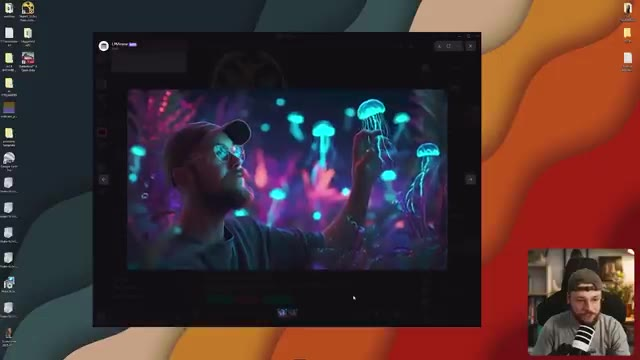
*Affichage du lecteur multimédia (LIPPlayer) montrant la première vidéo générée par IA représentant un homme barbu aux lunettes rondes touchant des méduses lumineuses bleues, avec une vue incrustée (PiP) du présentateur en bas à droite.*

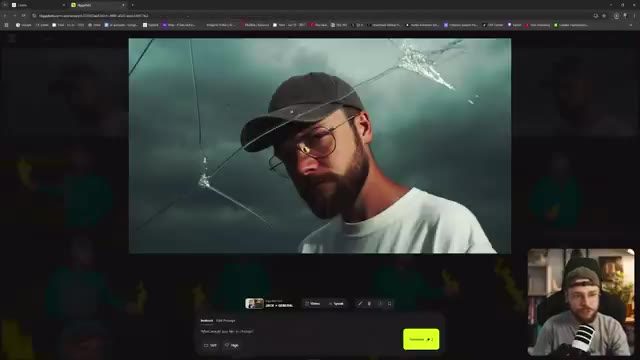
*Interface de l'outil de génération vidéo Higgsfield montrant la deuxième génération avec un homme portant une casquette et des lunettes derrière une vitre fissurée, avec les options de modification de prompt visibles et la vue incrustée du présentateur.*

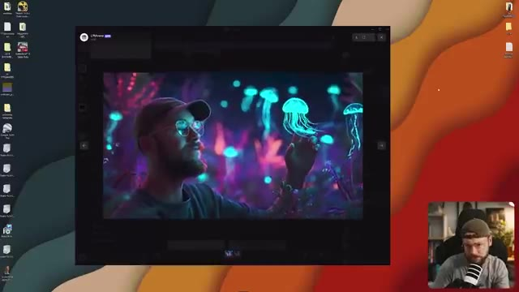
*Retour à l'affichage du lecteur multimédia (LIPPlayer) montrant à nouveau la première vidéo générée avec l'homme barbu et les méduses lumineuses, avec le présentateur en incrustation PiP.*

---

### ⏱️ `[00:20:31 - 00:21:05]` | Segment #44

**🔊 Audio (Transcription Intégrale Mot pour Mot en Français) :**
> donc vous pouvez voir ici qu'on a eu un peu moins de chance c'est en utilisant un modèle plutôt médiocre vous voulez voter donc on va dire que la gauche est meilleure et je pense qu'une personne de plus doit voter et ensuite ça révélera quels modèles nous avons utilisés pour créer quelle génération mais jetons un autre œil à celui qu'on a aimé passons en plein écran et on va aussi le mettre en boucle et ça a l'air vraiment très bien j'adorerais rajouter un peu de grain de film par-dessus aussi juste pour vendre ce réalisme vous verrez à la fin aussi vous obtiendrez cette fenêtre pop-up aussi pour faire un peu de pub

**👁️ Analyse Visuelle d'Écran (gemini-3.5-flash-lite) :**
**Interface & Outils** : Interface de Discord (serveur LMArena) et lecteur vidéo en plein écran.

**Contenu textuel & Code** : Texte de prompt visible sur Discord : '@Jack's Prompt: The bearded man reaches out to the floating glowing jellyfish...'. Boutons de vote : '+ Left is better', 'Both are bad', 'Right is better'. Écran final affichant l'URL 'discord.gg/LMArena'.

**Action / Démonstration** : Le créateur montre un exemple de vidéo jugée moins réussie, navigue sur l'interface de vote LMArena, repasse la vidéo préférée en boucle plein écran et présente l'écran de fin promotionnel de la plateforme.

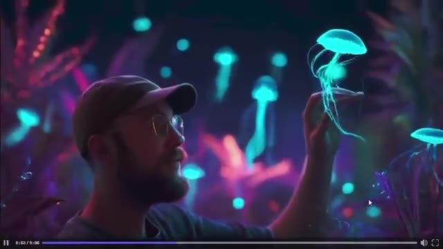
*Rendu vidéo en plein écran montrant un homme barbu aux lunettes interagissant avec des méduses lumineuses dans un environnement marin féérique aux teintes roses et bleues.*

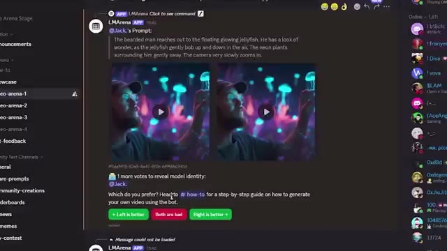
*Interface Discord de LMArena montrant deux vidéos générées côte à côte issues du prompt de Jack, avec les boutons de vote pour comparer les modèles d'IA.*

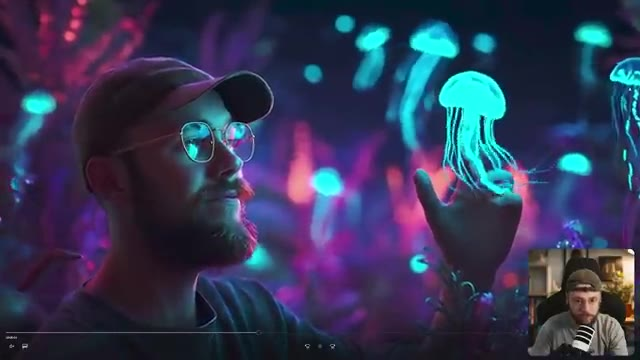
*Rendu vidéo de la méduse lumineuse en plein écran, avec un encadré PiP en bas à droite montrant le créateur Jack dans son studio face à sa caméra.*

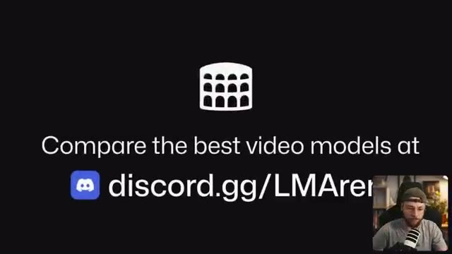
*Écran de fin affichant le logo de LMArena avec le texte d'invitation à comparer les modèles sur Discord, et Jack en encadré PiP dans le coin inférieur droit.*

---

### ⏱️ `[00:21:05 - 00:21:27]` | Segment #45

**🔊 Audio (Transcription Intégrale Mot pour Mot en Français) :**
> discord mais si vous voulez utiliser ceci pour la création de contenu ou peu importe, coupez simplement la fin et ensuite vous pourrez l'utiliser comme vous voulez et nous devons maintenant animer notre image plus réaliste également je pense donc nous allons simplement glisser-déposer celle-ci ici et à nouveau nous allons commencer à écrire un prompt, l'homme barbu regarde fixement et avec assurance la caméra.

**👁️ Analyse Visuelle d'Écran (gemini-3.5-flash-lite) :**
**Interface & Outils** : Application Discord (serveur LMArena).

**Contenu textuel & Code** : Texte visible : "Compare the best video models at discord.gg/LMArena", et dans le champ de prompt de l'image #3 : `/image-to-video` avec l'image d'un homme barbu casquette, et le prompt textuel `prompt The bearded man stares confiden`.

**Action / Démonstration** : Le créateur montre comment utiliser Discord pour la génération de vidéo, navigue sur le serveur LMArena, importe une image et commence à taper un prompt pour animer l'image réaliste.

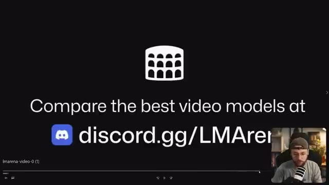
*Écran de présentation affichant le lien Discord de LMArena avec une icône de colisée.*

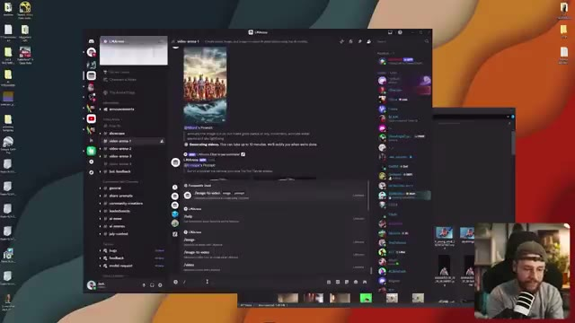
*Interface du serveur Discord LMArena avec la liste des salons à gauche et la zone de chat principale au centre.*

*Gros plan sur le champ de saisie du bot Discord avec la commande `/image-to-video`, l'image source importée et le début de la saisie du prompt.*

---

### ⏱️ `[00:21:28 - 00:21:50]` | Segment #46

**🔊 Audio (Transcription Intégrale Mot pour Mot en Français) :**
> Il se détourne ensuite. Léger mouvement de caméra à l'épaule. Grain de film analogique. Et voyons ce que nous obtenons en retour. Et en fait, il s'avère que quelqu'un a voté maintenant. Il faut donc deux votes pour révéler quels modèles vidéo ont été utilisés. Et il s'avère que VO3 a été utilisé pour créer ce très bon résultat que nous avions.

**👁️ Analyse Visuelle d'Écran (gemini-3.5-flash-lite) :**
**Interface & Outils** : Application Discord (LMArena) avec affichage d'un serveur communautaire dédié aux tests de modèles vidéo IA, incluant un panneau PiP (Picture-in-Picture) du présentateur en bas à droite.

**Contenu textuel & Code** : Le prompt visible indique : "The bearded man stares confidently at the camera, he then turns away." avec des aperçus de vidéos côte à côte représentant des têtes de robots animées aux yeux jaunes.

**Action / Démonstration** : Le créateur présente l'interface de vote de l'arène vidéo sur Discord où les utilisateurs comparent et votent pour les meilleures générations de modèles vidéo par intelligence artificielle.

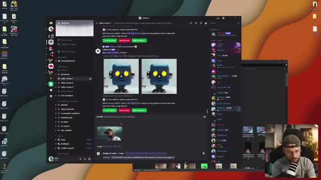
*Interface Discord de l'arène vidéo montrant des comparaisons de générations de vidéos par IA avec des robots et un prompt textuel.*

---

### ⏱️ `[00:21:50 - 00:22:26]` | Segment #47

**🔊 Audio (Transcription Intégrale Mot pour Mot en Français) :**
> et le résultat le plus pauvre a été créé en utilisant pika v2.2 et nous avons nos générations plus réalistes qui viennent juste d'arriver maintenant jetons un coup d'œil au premier ici celui-ci a l'air vraiment super ouais wow ça pourrait littéralement être moi c'est incroyablement bon la texture des cheveux sur l'arrière de mon cou wow allons télécharger ça tout de suite et regardons le deuxième est-ce qu'on a eu de la chance encore ou un peu plus malchanceux c'est un peu bizarre on doit revoir ça c'est comme si j'étais sur l'un de ces

**👁️ Analyse Visuelle d'Écran (gemini-3.5-flash-lite) :**
**Interface & Outils** : Application Discord sur bureau affichant le canal "video-arena-1" avec des comparateurs de modèles vidéo IA, incluant un retour vidéo PiP de l'animateur en bas à droite.

**Contenu textuel & Code** : Texte de prompt visible : "The handheld view camera tracks as the floating glowing jellyfish...". Interface de vote avec boutons colorés (ex: "Left is better", "Both are bad", "Right is better").

**Action / Démonstration** : Le créateur navigue et zoome sur les résultats générés pour comparer la qualité réaliste et les textures des différentes versions de l'IA vidéo.

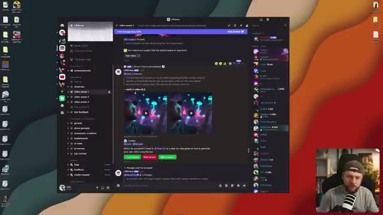
*Interface Discord affichant deux vidéos côte à côte comparant les générations de modèles IA avec des méduses lumineuses.*

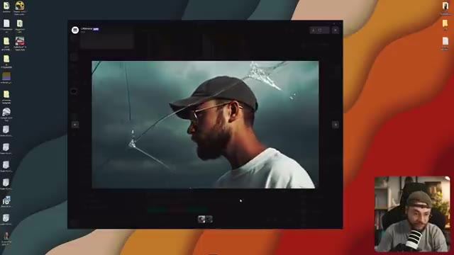
*Visualisation en plein écran d'une vidéo générée montrant un personnage de profil avec des éclaboussures d'eau autour de sa tête.*

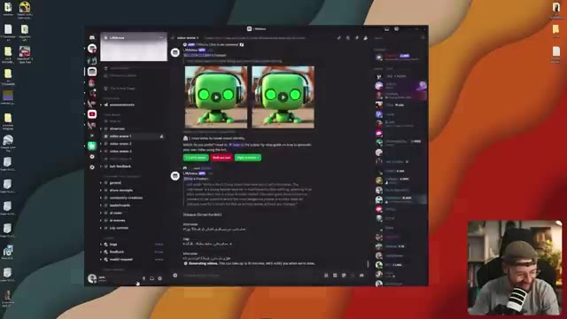
*Interface Discord montrant un test comparatif entre deux figurines vertes robotiques avec des casques audio.*

---

### ⏱️ `[00:22:26 - 00:23:02]` | Segment #48

**🔊 Audio (Transcription Intégrale Mot pour Mot en Français) :**
> des tourniquets ou quelque chose de très étrange je pense qu'on pourrait passer notre tour pour ce qui est de le télécharger jetons un œil au bon résultat qu'on a obtenu en plein écran et on va revoir ça a l'air vraiment vraiment super pour moi vous pouvez définitivement utiliser ça pour une variété de cas d'usage ouais waouh obtenir ce niveau de génération de vidéo par IA complètement gratuitement c'est insensé selon moi. Mais voilà les gars, j'espère vraiment que vous avez apprécié la vidéo d'aujourd'hui. Si vous avez la moindre question, assurez-vous de la laisser en bas dans la section des commentaires et je ferai de mon mieux pour répondre à absolument chacune d'elles.

**👁️ Analyse Visuelle d'Écran (gemini-3.5-flash-lite) :**
**Interface & Outils** : Lecteur vidéo sur bureau avec incrustation PiP (Picture-in-Picture) du créateur.

**Contenu textuel & Code** : Texte affiché : "Compare the best video models at discord.gg/LMArena" avec l'icône Discord et le logo de l'arène.

**Action / Démonstration** : Le créateur présente le résultat final généré par IA en plein écran tout en commentant la qualité gratuite de l'outil et en concluant sa vidéo.

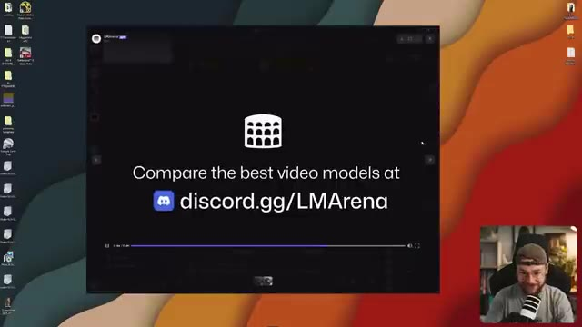
*Interface d'un lecteur affichant l'écran de fin de LMarena avec l'URL Discord, le créateur apparaissant en incrustation PiP.*

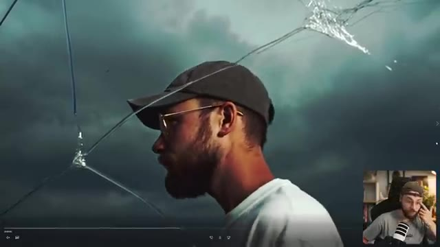
*Affichage en plein écran d'une vidéo générée par IA montrant un homme de profil devant un ciel orageux avec un effet de bris de verre.*

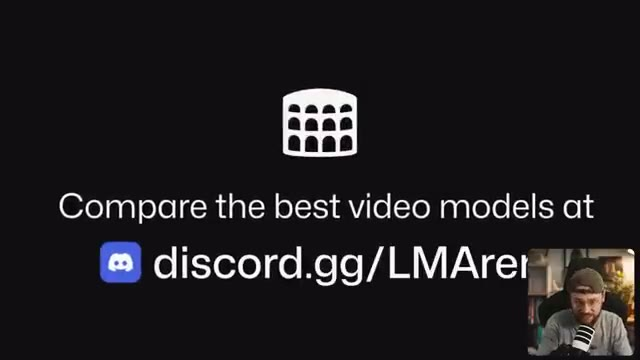
*Gros plan sur l'écran final de LMarena avec le logo et l'invitation à rejoindre le serveur Discord.*

---

### ⏱️ `[00:23:02 - 00:23:03]` | Segment #49

**🔊 Audio (Transcription Intégrale Mot pour Mot en Français) :**
> Je vous retrouve dans la prochaine vidéo.

**👁️ Analyse Visuelle d'Écran (gemini-3.5-flash-lite) :**
**Interface & Outils** : Présentation face caméra sans partage d'écran

**Contenu textuel & Code** : Aucun texte ni interface visible, uniquement Jack dans son studio.

**Action / Démonstration** : Jack s'adresse directement aux spectateurs pour conclure la vidéo.

---
