# 🎬 Comment créer des vidéos IA de paysages oniriques impossibles (Le guide ultime)

> **Chaîne** : [Jack Vs. AI](https://www.youtube.com/@JackVsAI)  
> **Titre original** : `How to create AI videos of IMPOSSIBLE dreamscapes (Ultimate guide)`  
> **Lien YouTube** : [https://www.youtube.com/watch?v=xXrQV1UDUdM](https://www.youtube.com/watch?v=xXrQV1UDUdM)  
> **Date de publication** : 2025-08-20  
> **Durée** : 17m 44s (`1064s`)  
> **Identifiant vidéo** : `xXrQV1UDUdM`  
> **Fiche Web Interactive** : [2025-08-20_YT-xXrQV1UDUdM_Comment créer des vidéos IA de paysages oniriques impossibles (Le guide ultime)_by-whisper-v3-large-turbo+gemini-3.5-flash-lite.html](2025-08-20_YT-xXrQV1UDUdM_Comment créer des vidéos IA de paysages oniriques impossibles (Le guide ultime)_by-whisper-v3-large-turbo+gemini-3.5-flash-lite.html)  
> **Captures de démonstration clés** : `93 captures réelles (anti-talking-head)`  
> **Modèles utilisés** : Audio: `large-v3-turbo` (Faster-Whisper int8 VPS) | Vision: `gemini-3.5-flash-lite` (Google AI Studio API)  

---

## 📌 Synthèse Exécutive & Outils

### 📌 Résumé
Dans cette vidéo, Jack, un artiste VFX fort d'une décennie d'expérience dans l'industrie publicitaire, lève le voile sur son flux de travail complet pour concevoir des paysages oniriques impossibles et hautement surréalistes grâce à l'intelligence artificielle. S'opposant à sa précédente approche axée sur le réalisme ancré, il plonge tête première dans l'onirisme brut, où la logique s'efface au profit de visuels fantastiques, bizarres et viscéraux. L'objectif est de guider les créateurs de contenu de la page blanche jusqu'à l'image finale prête à l'animation, en exploitant la puissance conjuguée des grands modèles de langage et des générateurs d'images de pointe.

La méthode pas à pas commence par l'idéation créative, où ChatGPT est utilisé non pas pour remplacer l'imagination humaine, mais comme un véritable partenaire stratégique capable de générer des concepts visuellement frappants et de les convertir directement en syntaxe optimisée. Jack détaille ensuite la structure infaillible de ses prompts, combinant une description minutieuse du sujet, des personnages pour donner l'échelle, et des références de style rigoureuses. Cette recette textuelle intègre des éléments de réalisme analogique pour ancrer le surréalisme et mieux "vendre" l'illusion visuelle auprès du spectateur.

Enfin, le processus s'appuie sur la version 7 de Midjourney pour transformer ces descriptions textuelles en images fixes d'une qualité onirique saisissante, avant d'aborder l'étape cruciale de l'animation vidéo gratuite. Pour les créateurs, ce tutoriel offre un cadre méthodologique inestimable : il démontre comment exploiter les forces spécifiques de chaque outil, surmonter les erreurs de génération par des ajustements précis, et insuffler une narration visuelle forte grâce à la présence d'explorateurs solitaires qui structurent l'échelle et guident le regard au cœur de l'impossible.

### 🛠️ Outils, Modèles & Logiciels Présentés
* **Midjourney (v7)** : Moteur de génération d'images par IA de pointe utilisé pour traduire les prompts textuels complexes en visuels oniriques ultra-détaillés, en exploitant des paramètres spécifiques de style et de format 16:9.
* **ChatGPT** : Modèle de langage (LLM) employé comme assistant créatif pour stimuler l'imagination, surmonter le syndrome de la page blanche, générer des idées de concepts surréalistes et les formuler directement en syntaxe de prompt optimisée.

### 🔑 Points Clés & Enseignements Stratégiques
* **Utiliser les LLM comme des partenaires** : ChatGPT ne doit pas remplacer le processus créatif, mais servir de co-créateur pour stimuler l'inspiration et transformer des concepts abstraits en prompts structurés adaptés aux générateurs d'images.
* **Structurer intelligemment ses prompts** : Diviser le prompt en blocs logiques distincts comprenant la description du lieu, les personnages engagés, et des références de style précises garantit une cohérence visuelle surréaliste.
* **Injecter du réalisme pour vendre l'impossible** : Ajouter des textures et des indices de photographie analogique (grain de film, ombres dures) dans des décors totalement surréalistes aide le cerveau à accepter l'illusion visuelle.
* **L'importance de l'échelle narrative** : Intégrer des personnages ou des explorateurs solitaires dans les paysages oniriques permet non seulement de donner une échelle monumentale au décor, mais aussi d'ancrer le spectateur dans l'exploration de la scène.
* **Accepter l'essai-erreur sur Midjourney** : La génération d'images surréalistes requiert souvent plusieurs itérations et ajustements textuels, l'IA nécessitant parfois des retouches de guidage pour capturer exactement la vision artistique initiale.
* **Maîtriser les paramètres de Midjourney** : Utiliser la version 7 avec un ratio 16:9, une stylisation réglée à 100 et des indices de bizarrerie adaptés permet d'obtenir des rendus cinématographiques parfaits pour la vidéo.
* **Guider l'IA avec des mots-clés de direction** : L'ajout de termes précis comme "photo reel" en fin de prompt aide à réorienter l'algorithme lorsque celui-ci s'éloigne trop de la composition recherchée.
* **Exploiter les forces spécifiques de chaque outil** : Tirer parti de la texture onirique native de Midjourney tout en combinant la puissance narrative de ChatGPT permet d'optimiser chaque étape de la chaîne de production visuelle.
* **Anticiper l'animation finale** : Concevoir dès l'étape de l'image fixe des compositions riches en mouvements potentiels (flux d'eau, lanternes flottantes, nuages texturés) facilite grandement la transition vers l'animation vidéo.

---

## ⏱️ Chronologie & Transcription Complète Audio & Visuelle (Mot pour Mot)

### ⏱️ `[00:00:00 - 00:00:19]` | Segment #01

**🔊 Audio (Transcription Intégrale Mot pour Mot en Français) :**
> Avez-vous déjà eu envie de retourner désespérément dans un rêve après vous être réveillé ? Dans notre sommeil, la logique n'existe pas. La science et la magie ne font qu'un. Et l'impossible semble si tangible qu'on pourrait le toucher. Dans ma dernière vidéo, je me suis concentré sur l'utilisation de l'IA pour créer des vidéos ancrées dans la réalité.

**👁️ Analyse Visuelle d'Écran (gemini-3.5-flash-lite) :**
**Interface & Outils** : Présentation face caméra sans partage d'écran

**Contenu textuel & Code** : Générations vidéo oniriques et surréalistes illustrant les propos introductifs, avec sous-titres textuels en anglais affichés au centre de l'écran ("wanted", "same...").

**Action / Démonstration** : Jack s'exprime face caméra dans son studio avec des gestes des mains pour illustrer ses propos, alternant avec des visuels cinématographiques générés par IA.

---

### ⏱️ `[00:00:19 - 00:00:38]` | Segment #02

**🔊 Audio (Transcription Intégrale Mot pour Mot en Français) :**
> Mais aujourd'hui, nous faisons exactement le contraire. Nous plongeons tête première dans le surréalisme, transformant des rêves sauvages et impossibles en visuels époustouflants. Et attention, ça va devenir bizarre. Je m'appelle Jack, je suis artiste VFX dans l'industrie publicitaire depuis plus d'une décennie maintenant, et j'ai travaillé pour bon nombre des plus grandes marques de la planète.

**👁️ Analyse Visuelle d'Écran (gemini-3.5-flash-lite) :**
**Interface & Outils** : Présentation face caméra sans partage d'écran

**Contenu textuel & Code** : Texte cinétique affichant le mot "exact" au centre d'un fond blanc.

**Action / Démonstration** : Le créateur s'adresse directement à la caméra dans son studio en faisant des gestes de la main pour illustrer ses propos, tandis qu'un mot du script apparaît brièvement à l'écran.

---

### ⏱️ `[00:00:38 - 00:00:57]` | Segment #03

**🔊 Audio (Transcription Intégrale Mot pour Mot en Français) :**
> Et aujourd'hui, je révèle mon flux de travail complet pour créer des paysages oniriques époustouflants générés par IA. Et restez bien jusqu'à la fin de la vidéo, car je vous montrerai comment vous pouvez animer ces images de manière totalement gratuite. Bien sûr, si vous appréciez le contenu d'aujourd'hui, n'oubliez pas de lâcher un pouce bleu pour moi, de vous abonner, et bien sûr, d'activer la cloche de notification.

**👁️ Analyse Visuelle d'Écran (gemini-3.5-flash-lite) :**
**Interface & Outils** : Présentation vidéo illustrative (B-roll) d'un rendu d'image IA

**Contenu textuel & Code** : Texte affiché à l'écran : "these images"

**Action / Démonstration** : Illustration visuelle du sujet abordé (paysages oniriques) pendant que le créateur parle hors champ

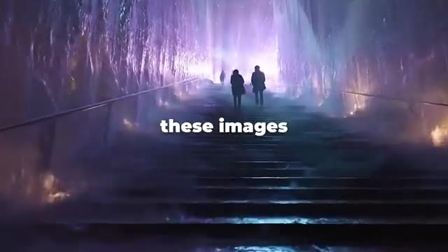
*Affichage d'un paysage onirique généré par IA représentant des personnes montant des escaliers sous une lumière violette brumeuse, avec le sous-titre "these images"*

---

### ⏱️ `[00:00:57 - 00:01:32]` | Segment #04

**🔊 Audio (Transcription Intégrale Mot pour Mot en Français) :**
> Allons droit au but. Toutes les meilleures vidéos par IA proviennent d'une seule image d'IA comme image de départ et toutes ces images naissent d'un prompt. C'est donc par là que nous allons commencer. J'ai donc réellement trouvé quelques-unes de mes propres idées folles que nous allons exécuter plus tard dans la vidéo. Mais partons du principe que vous avez peut-être un léger syndrome de la page blanche. Nous savons tous qu'un LLM comme ChatGPT peut vraiment aider à stimuler votre créativité. La meilleure façon d'utiliser un outil d'IA comme ChatGPT n'est pas de remplacer votre processus créatif, mais de l'utiliser comme un partenaire. Et ce que je

**👁️ Analyse Visuelle d'Écran (gemini-3.5-flash-lite) :**
**Interface & Outils** : Navigateur web affichant d'abord la plateforme Midjourney (midjourney.com), puis l'interface de ChatGPT (chatgpt.com), avec une incrustation vidéo (PiP) du créateur en bas à droite.

**Contenu textuel & Code** : Sur la première image, la grille de la galerie Midjourney présente diverses créations visuelles (personnages, objets, animations). Sur la seconde image, l'interface de ChatGPT affiche le message central "Ready when you are." et une barre de recherche "Ask anything", ainsi qu'un historique de conversations dans le panneau latéral gauche.

**Action / Démonstration** : Le créateur navigue à l'écran, montrant d'abord une galerie d'images Midjourney pour illustrer les images de départ, puis bascule sur l'interface de ChatGPT pour illustrer son utilisation comme partenaire créatif.

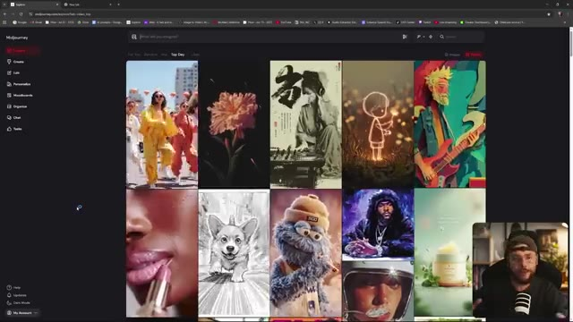
*Interface du site web Midjourney affichant une galerie d'images générées par IA avec le créateur en incrustation vidéo (PiP) dans le coin inférieur droit.*

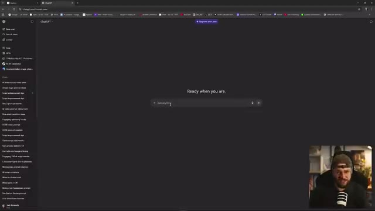
*Interface de ChatGPT affichant la barre de saisie centrale avec le texte 'Ready when you are' et le créateur en incrustation vidéo (PiP) dans le coin inférieur droit.*

---

### ⏱️ `[00:01:32 - 00:02:05]` | Segment #05

**🔊 Audio (Transcription Intégrale Mot pour Mot en Français) :**
> j'ai trouvé vraiment super pour ce cas d'utilisation de mettre un prompt comme celui-ci. Peux-tu me générer des idées de prompts pour Midjourney basées sur l'idée de la logique des rêves ? Les idées doivent être visuellement frappantes, mémorables, surréalistes, insolites et viscérales. Alors appuyons sur entrée et voyons ce que ChatGPT nous renvoie. Donc tout de suite, vous pouvez voir le ciel fait de dents, une forêt de membres, la pièce qui respire, une mer de miroirs, une cathédrale de chair. Waouh. Pour une raison quelconque, ChatGPT est devenu un peu

**👁️ Analyse Visuelle d'Écran (gemini-3.5-flash-lite) :**
**Interface & Outils** : Interface web de ChatGPT (navigateur Google Chrome) avec un panneau latéral gauche listant les historiques de discussion et un encadré vidéo Picture-in-Picture (PiP) du présentateur en bas à droite.

**Contenu textuel & Code** : Texte affiché au centre de l'écran : « Ready when you are. » et un champ de saisie avec le curseur clignotant. Nombreux onglets ouverts dans le navigateur en haut.

**Action / Démonstration** : Le créateur présente l'interface de ChatGPT avant d'y saisir ou d'exécuter un prompt textuel lié aux idées de Midjourney basées sur la logique des rêves.

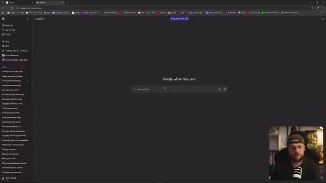
*Interface de ChatGPT affichée sur l'écran principal avec un encadré PiP montrant le créateur en bas à droite.*

---

### ⏱️ `[00:02:05 - 00:02:42]` | Segment #06

**🔊 Audio (Transcription Intégrale Mot pour Mot en Français) :**
> sombre cette fois avec ce prompt mais ouais vous savez ça vous fait un peu réfléchir dans le bon état d'esprit. Et c'est écrit en bas ici aimerais-tu que je convertisse cela en syntaxe de prompt directe de style Midjourney et bien sûr nous allons dire oui s'il te plaît alors regardons juste le premier tout en haut ici le banquet de l'escalier sans fin un escalier en colimaçon infini bordé de tables dressées pour un festin surréaliste de la nourriture fondant en horloges des invités au visage de porcelaine regardant vers le haut une architecture onirique un surréalisme inspiré d'Escher un éclairage cinématographique hyper détaillé une atmosphère inquiétante c'est exactement le

**👁️ Analyse Visuelle d'Écran (gemini-3.5-flash-lite) :**
**Interface & Outils** : Interface sombre de l'application ChatGPT affichant des listes de prompts textuels générés par IA, avec incrustation vidéo (PiP) du créateur.

**Contenu textuel & Code** : Texte affichant les concepts de prompts Midjourney, notamment "The Endless Staircase Banquet" avec les détails de style, les paramètres `--ar 16:9 --v 6`, et les descriptions surréalistes.

**Action / Démonstration** : Le créateur navigue à l'écran dans sa conversation ChatGPT pour montrer la génération de prompts de style Midjourney axés sur la logique des rêves.

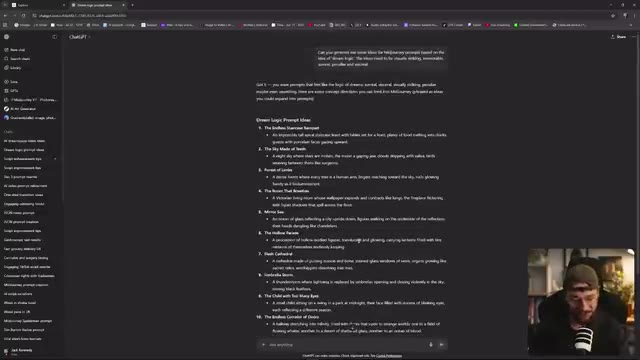
*Interface de ChatGPT affichant une liste d'idées de prompts sur la logique des rêves ("Dream Logic Prompt Ideas"), avec un encadré PiP du créateur en bas à droite.*

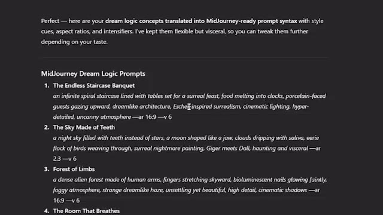
*Interface de ChatGPT montrant la conversion des idées en prompts formatés pour Midjourney ("Midjourney Dream Logic Prompts") avec les paramètres de style et d'aspect ratio.*

---

### ⏱️ `[00:02:42 - 00:03:18]` | Segment #07

**🔊 Audio (Transcription Intégrale Mot pour Mot en Français) :**
> le type de prompt dans lequel Midjourney excelle lors de sa création. Je veux cependant revenir sur certaines idées que j'avais moi-même. Je vais donc simplement les déposer dans ce document texte que nous avons ici. Je vais juste les agrandir pour qu'ils soient un peu plus faciles à voir pour vous les gars. Et je veux juste diviser cela aussi parce qu'en haut ici nous avons le genre de description du lieu, tous les personnages qui s'engagent dans notre prompt et en bas ce sont vos sortes de références de style pour vous assurer que vous allez obtenir ces paysages oniriques très surréalistes que nous recherchons, donc cette idée

**👁️ Analyse Visuelle d'Écran (gemini-3.5-flash-lite) :**
**Interface & Outils** : Navigateur web (ChatGPT), explorateur Windows et application Bloc-notes (Notepad).

**Contenu textuel & Code** : Textes de prompts Midjourney (« MidJourney Dream Logic Prompts »), description d'une maison de banlieue au fond des abysses marins avec une adolescente sur le toit (« Wide establishing shot: A beautiful suburban home... »), et références de style en bas (« Dreamlike logic, cinematic surrealism, eerie lighting... »).

**Action / Démonstration** : Le créateur montre sa liste de prompts sur ChatGPT, bascule sur le bureau de son ordinateur, puis zoome et met en valeur le texte dans le Bloc-notes pour expliquer la structure d'un prompt (description du lieu/personnages en haut, références de style en bas).

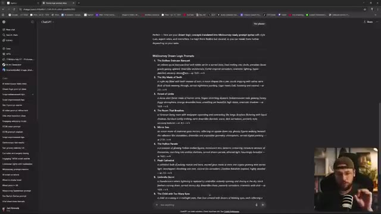
*Interface ChatGPT affichant une liste de concepts de prompts Midjourney pour des paysages oniriques.*

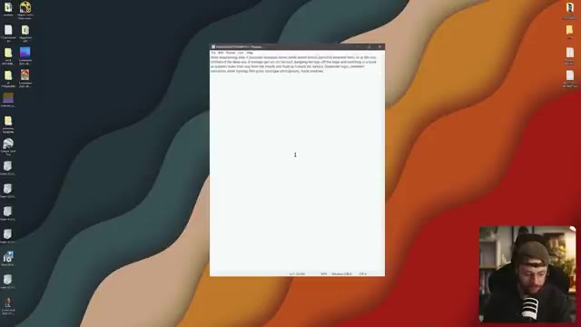
*Bureau Windows avec un fichier texte ouvert au centre et un fond d'écran coloré ondulé.*

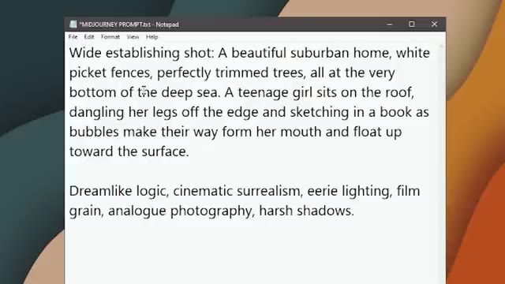
*Gros plan sur le Bloc-notes Windows montrant un prompt Midjourney structuré pour une scène sous-marine surréaliste.*

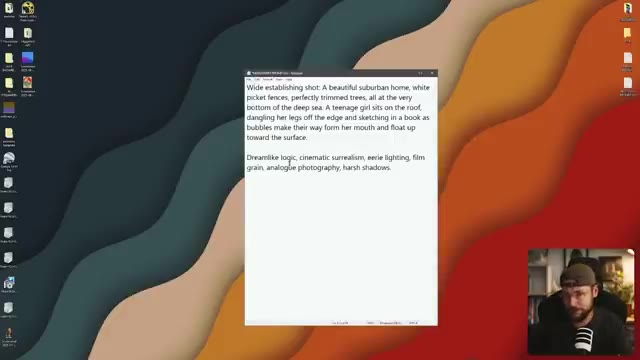
*Fichier texte dans le Bloc-notes Windows affichant la structure détaillée du prompt avec description de la scène et références de style.*

---

### ⏱️ `[00:03:18 - 00:03:56]` | Segment #08

**🔊 Audio (Transcription Intégrale Mot pour Mot en Français) :**
> que j'avais un plan d'ensemble large : une belle maison de banlieue, des clôtures de piquet blanches, des arbres parfaitement taillés, le tout tout au fond de la mer profonde, une adolescente assise sur le toit faisant pendre ses jambes par-dessus le bord et dessinant dans un carnet tandis que des bulles s'échappent de sa bouche et remontent vers la surface. Je veux juste être un peu plus précis ici et dire simplement assise sur le fond marin. Et puis les références de stars, nous avons la logique onirique, le surréalisme cinématographique, un éclairage inquiétant, du grain de film, de la photographie analogique et des ombres dures. Ces derniers ici juste un peu

**👁️ Analyse Visuelle d'Écran (gemini-3.5-flash-lite) :**
**Interface & Outils** : Bloc-notes Windows (Notepad) affichant un fichier texte nommé "MIDJOURNEY PROMPT.txt", sur fond d'écran abstrait aux vagues colorées et avec incrustation vidéo (PiP) du créateur.

**Contenu textuel & Code** : Texte affiché dans le Bloc-notes :
"Wide establishing shot: A beautiful suburban home, white picket fences, perfectly trimmed trees, all at the very bottom of the deep sea, [sitting on the sea bed.] A teenage girl sits on the roof, dangling her legs off the edge and sketching in a book as bubbles make their way form her mouth and float up toward the surface.

Dreamlike logic, cinematic surrealism, eerie lighting, film grain, analogue photography, harsh shadows."

**Action / Démonstration** : Le créateur édite et modifie un prompt textuel dans le Bloc-notes Windows en direct, en insérant la précision « sitting on the sea bed » puis en surbrillance les mots-clés de style à la fin.

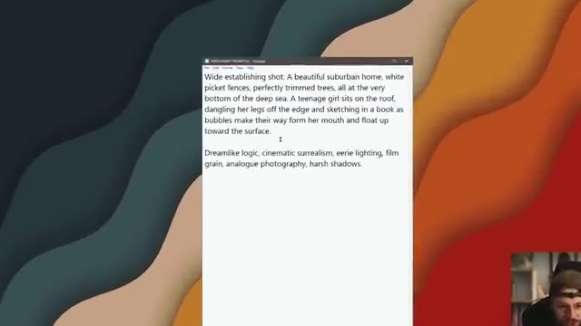
*Bloc-notes Windows affichant le prompt du plan d'ensemble sous le fond d'écran coloré de Jack, avec le créateur visible en incrustation (PiP) en bas à droite.*

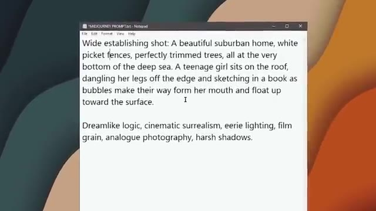
*Gros plan sur le Bloc-notes Windows affichant le texte descriptif complet du prompt pour Midjourney.*

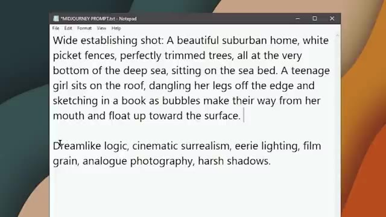
*Modification du texte dans le Bloc-notes Windows pour ajouter la précision « sitting on the sea bed ».*

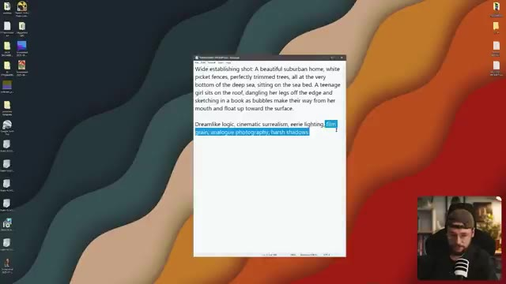
*Sélection du texte de style et des références de style (« film grain, analogue photography, harsh shadows ») dans le Bloc-notes Windows.*

---

### ⏱️ `[00:03:56 - 00:04:29]` | Segment #09

**🔊 Audio (Transcription Intégrale Mot pour Mot en Français) :**
> d'ajouter un tout petit peu plus de texture dans nos générations. J'aime vraiment essayer de faire ça, surtout quand on travaille avec des prompts qui penchent clairement vers un endroit très surréaliste. Plus on peut apporter de réalisme à cela, je ne sais pas, j'ai l'impression que ça aide juste à vendre l'image. Donc on va juste réassembler tout ça, voici notre prompt complet, on va le copier-coller et vous l'avez deviné, pour notre génération d'images, nous allons bien sûr utiliser Midjourney, qui a déjà une vraie qualité onirique dans ses rendus, et on va vraiment s'appuyer là-dessus.

**👁️ Analyse Visuelle d'Écran (gemini-3.5-flash-lite) :**
**Interface & Outils** : Éditeur de texte brut (Bloc-notes) sur fond de bureau coloré, puis l'interface web de la plateforme Midjourney (alpha.midjourney.com).

**Contenu textuel & Code** : Texte du prompt dans le Bloc-notes : "Wide establishing shot: A beautiful suburban home, white picket fences, perfectly trimmed trees, all at the very bottom of the deep sea, sitting on the sea bed. A teenage girl sits on the roof, dangling her legs off the edge and sketching in a book as bubbles make their way from her mouth and float up toward the surface. Dreamlike logic, cinematic surrealism, eerie lighting, film grain, analogue photography, harsh shadows". Sur Midjourney, galerie d'images et exemples de rendus avec les prompts sur le panneau latéral.

**Action / Démonstration** : Le créateur montre son prompt complet dans un éditeur de texte, sélectionne le texte pour le copier, puis bascule sur l'interface du site web de Midjourney pour préparer la génération d'images.

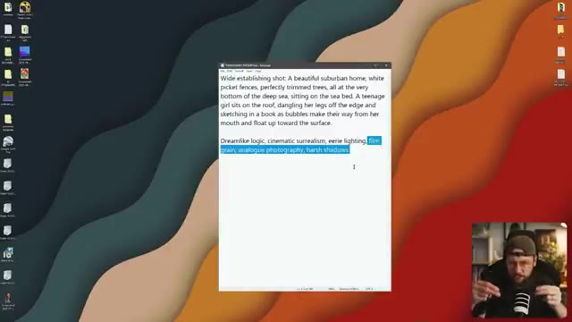
*Éditeur de texte affichant un prompt détaillé pour la génération d'images avec des balises de style.*

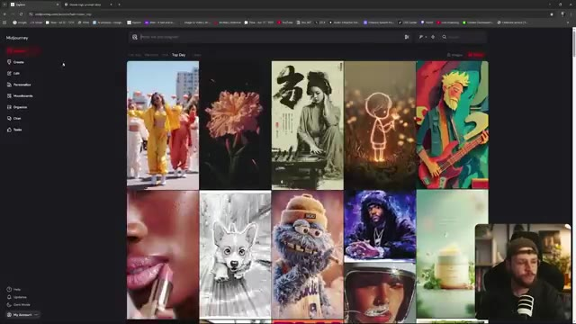
*Interface de la galerie web de Midjourney montrant diverses créations artistiques d'utilisateurs.*

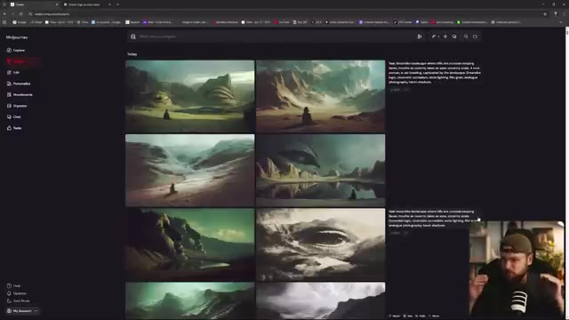
*Interface de Midjourney affichant des paysages oniriques générés et leurs prompts associés.*

---

### ⏱️ `[00:04:29 - 00:05:03]` | Segment #10

**🔊 Audio (Transcription Intégrale Mot pour Mot en Français) :**
> et je pense que c'est tout l'intérêt de l'art par IA d'utiliser chaque outil pour exploiter ses points forts donc nous allons insérer notre prompt directement ici tout en haut si vous êtes intéressés par mes paramètres la stylisation est à 100 et puis la bizarrerie et la variété sont toutes les deux à zéro nous utilisons Midjourney version 7 et le mode standard et je veux en fait m'assurer que nous générons également en 16 par 9 appuyons sur entrée et voyons ce que nous obtenons bon ces images ont presque l'impression d'être

**👁️ Analyse Visuelle d'Écran (gemini-3.5-flash-lite) :**
**Interface & Outils** : Interface web de Midjourney avec les panneaux de configuration des paramètres (Stylisation, Bizarrerie, Variété, Format d'image 16:9, version 7, mode Standard).

**Contenu textuel & Code** : Texte du prompt : "Wide establishing shot. A beautiful suburban home, white picket fences, perfectly trimmed trees, all at the very bottom of the deep sea, sitting on the sea bed. A teenage girl sits on the roof, dangling her legs off the edge and sketching in a book as bubbles make their way from her mouth and float up toward the surface. Dreamlike logic, cinematic surrealism, eerie lighting, film grain, analogue photography, harsh shadows." Paramètres : Stylisation sur 100, Bizarrerie sur 0, Variété sur 0, Midjourney version 7, mode standard, format 16:9.

**Action / Démonstration** : Le créateur navigue dans l'interface de Midjourney, configure les paramètres de stylisation à 100, règle le format en 16:9, et lance la génération d'une image.

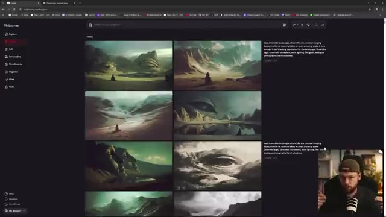
*Interface de Midjourney affichant une grille d'images générées avec une incitation textuelle sur le côté droit et la caméra PiP du créateur en bas à droite.*

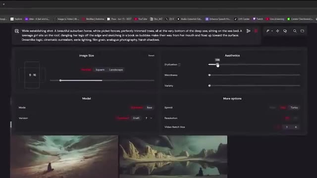
*Panneau de configuration des paramètres de Midjourney montrant le curseur de stylisation réglé sur 100 et les options de format d'image.*

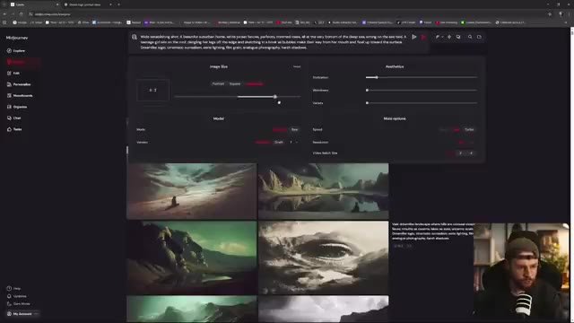
*Panneau de configuration de Midjourney avec le curseur de format d'image ajusté pour le mode paysage 16:9.*

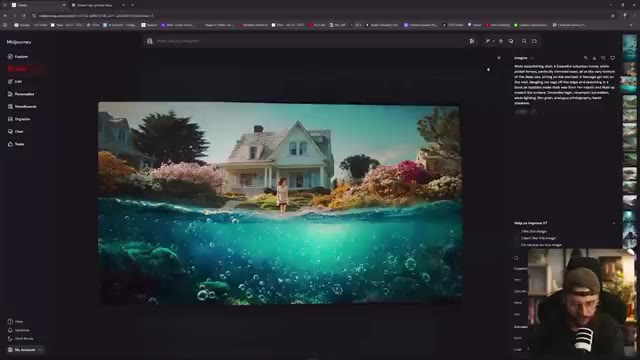
*Résultat de génération Midjourney affichant une maison de banlieue sous-marine en 16:9 avec une jeune fille au bord de l'eau.*

---

### ⏱️ `[00:05:03 - 00:05:35]` | Segment #11

**🔊 Audio (Transcription Intégrale Mot pour Mot en Français) :**
> des résultats étranges de cette génération, je pense qu'on va recommencer parfois avec Midjourney vous le savez déjà c'est un peu des essais et des erreurs donc on va juste reprendre ce même prompt et je pense que je vais juste rajouter à la fin ici photo reel pour essayer de le guider dans la bonne direction qu'on recherche alors voyons ce qu'on obtient quand on relance ce prompt d'accord donc Midjourney semble avoir un peu de mal avec ce prompt spécifique mais je dois dire que j'aime vraiment beaucoup cette génération il nous manque juste notre fille qu'on voulait voir assise sur le toit en train de dessiner un petit peu

**👁️ Analyse Visuelle d'Écran (gemini-3.5-flash-lite) :**
**Interface & Outils** : Interface web de Midjourney (site midjourney.com/create) avec affichage du tableau de bord de création, de la grille de résultats et du panneau latéral des paramètres du prompt.

**Contenu textuel & Code** : Le prompt visible dans l'interface : "Wide establishing shot. A beautiful suburban home, white picket fences, perfectly trimmed trees, all at the very bottom of the deep sea, sitting on the sea bed. A teenage girl sits on the roof, dangling her legs off the edge and sketching in a book as bubbles make their way from her mouth and float up toward the surface. Dreamlike logic, cinematic surrealism, eerie lighting, film grain, analogue photography, harsh shadows."

**Action / Démonstration** : Le présentateur navigue dans l'interface web de Midjourney, examine les différentes générations d'images et analyse les résultats obtenus par rapport au prompt textuel saisi.

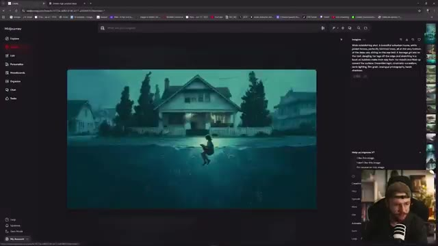
*Interface de Midjourney affichant une image générée avec le panneau latéral droit détaillant le prompt textuel et le créateur visible en incrustation (PiP).*

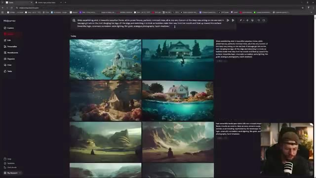
*Interface de Midjourney montrant une grille de plusieurs images générées sous l'onglet de création avec le champ de prompt actif en haut.*

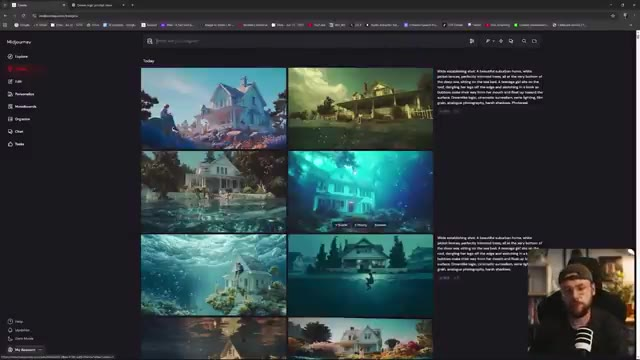
*Grille de résultats de génération dans l'interface web de Midjourney présentant différentes variations d'une maison sous-marine.*

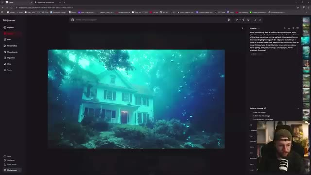
*Affichage d'une image générée en grand format dans Midjourney montrant une maison de banlieue sous-marine avec des bulles remontant vers la surface.*

---

### ⏱️ `[00:05:35 - 00:06:07]` | Segment #12

**🔊 Audio (Transcription Intégrale Mot pour Mot en Français) :**
> bloc-notes mais c'est quand même définitivement utilisable j'ai une autre idée ici que j'aimerais tester un peu alors c'est un plan d'ensemble large une créature gonflable gigantesque qui surplombe une ville faite de bâtiments en pierre des dizaines de spectateurs pointant vers le haut en direction de la créature gonflable et bien sûr nous avons à la fin une logique onirique un surréalisme cinématographique vous connaissez le style les prompts qu'on a ajoutés c'est plutôt cool mec j'aime beaucoup ça j'aimerais aussi essayer quelques-uns des

**👁️ Analyse Visuelle d'Écran (gemini-3.5-flash-lite) :**
**Interface & Outils** : Midjourney (sur les images 1 et 2) et ChatGPT (sur l'image 3).

**Contenu textuel & Code** : Sur l'image 2, le prompt visible est : « Wide establishing shot: a ginormous inflatable creature towering over a city made of stone buildings. Dozens of onlookers pointing up to the inflatable creature. Dreamlike logic, cinematic surrealism, eerie lighting, film grain, analogue photography, harsh shadows, photoreal ». Sur l'image 3, des listes de prompts numérotées comme « The Hollow Staircase Rampant », « The Sky Made of Teeth », « Forest of Limbs ».

**Action / Démonstration** : Le créateur navigue entre Midjourney et ChatGPT pour modifier, copier et tester différents prompts de génération d'images basés sur une esthétique surréaliste.

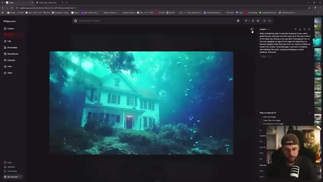
*Interface de l'outil Midjourney affichant une image générée d'une maison sous-marine avec des bulles.*

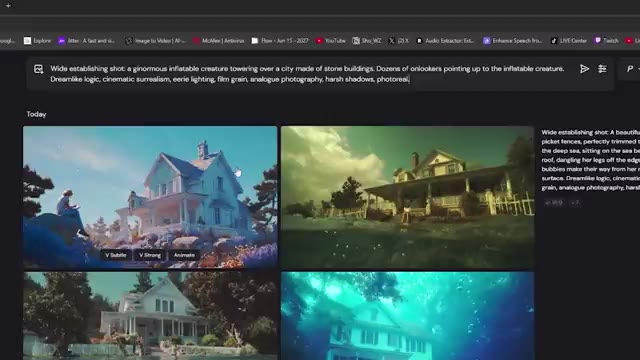
*Interface de Midjourney montrant la galerie avec la saisie d'un nouveau prompt textuel sur une créature gonflable géante.*

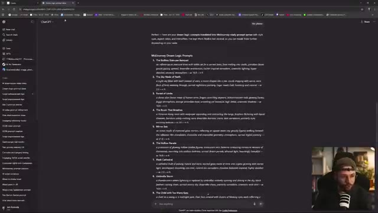
*Interface de ChatGPT affichant une liste de prompts textuels orientés sur le thème du « Dream Logic » (logique onirique).*

---

### ⏱️ `[00:06:07 - 00:06:40]` | Segment #13

**🔊 Audio (Transcription Intégrale Mot pour Mot en Français) :**
> des prompts chat gpt que l'on nous a envoyés également un océan fait de miroirs en verre brisé reflétant une ville à l'envers des silhouettes fantomatiques marchant sous le reflet comme des lustres une géométrie onirique impossible une peinture numérique atmosphérique surréaliste maintenant je veux me débarrasser de ce bout à la fin là le bout peinture numérique et nous avons juste ajouté notre style de prompt à la fin là jetons un coup d'œil maintenant ça donne un résultat assez époustouflant j'adore complètement jetez un coup d'œil à celui-ci

**👁️ Analyse Visuelle d'Écran (gemini-3.5-flash-lite) :**
**Interface & Outils** : Navigateur web affichant l'interface de ChatGPT et le site/application Midjourney, avec incrustation vidéo du créateur (PiP) en bas à droite.

**Contenu textuel & Code** : Texte affiché sur ChatGPT : « Midjourney Dream Logic Prompts », listant plusieurs concepts dont « 5. Mirror Sea : an ocean made of shattered glass mirrors, reflecting an upside-down city, ghostly figures walking beneath the reflection like chandeliers, dreamlike and impossible geometry, atmospheric, surreal digital painting —ar 21:9 —v 6 ».

**Action / Démonstration** : Le créateur navigue dans l'interface de ChatGPT, sélectionne un prompt, le modifie pour supprimer la mention « digital painting », puis bascule sur l'interface de Midjourney pour admirer le résultat visuel généré.

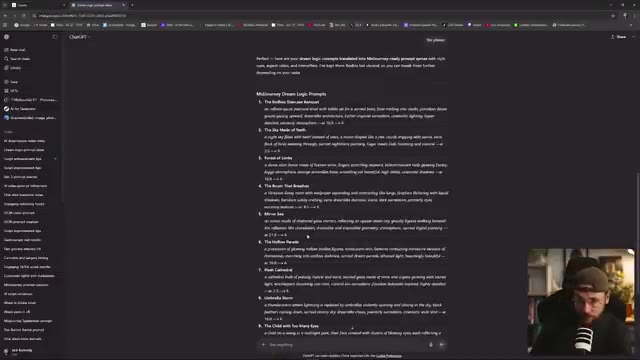
*Interface de ChatGPT affichant des concepts de prompts oniriques pour Midjourney, avec l'option « Mirror Sea » mise en surbrillance.*

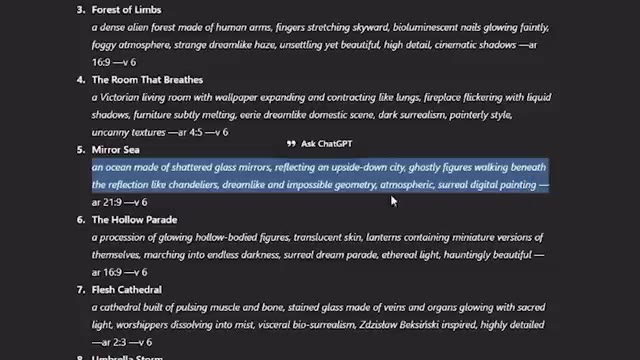
*Gros plan sur l'interface de ChatGPT montrant le texte détaillé du prompt « Mirror Sea ».*

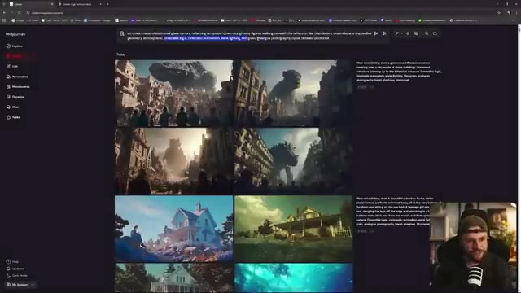
*Interface de l'application Midjourney affichant une grille de prévisualisation d'images générées avec la barre de recherche en haut.*

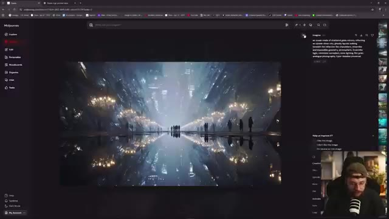
*Résultat final généré dans Midjourney montrant une scène surréaliste d'un océan de miroirs avec des silhouettes et une ville inversée.*

---

### ⏱️ `[00:06:40 - 00:07:16]` | Segment #14

**🔊 Audio (Transcription Intégrale Mot pour Mot en Français) :**
> ouais ceux-là sont vraiment sympas j'aime bien celui-là aussi des baleines et des méduses lumineuses nageant gracieusement dans le ciel nocturne des vagues océaniques remplaçant les nuages un paysage onirique éthéré et surréaliste une bioluminescence lumineuse ça a l'air plutôt cool pour moi voyons ce qu'on obtient avec celui-ci je peux dire que ça va être plutôt extraordinaire j'adore vraiment celui-là regardez ça mec probablement mon préféré qu'on a généré jusqu'à présent donc on va définitivement l'animer plus tard dans la vidéo et je viens de dire à chat gpt plus d'exemples s'il vous plaît avec un explorateur solitaire donc je

**👁️ Analyse Visuelle d'Écran (gemini-3.5-flash-lite) :**
**Interface & Outils** : Navigateur web affichant l'interface de Midjourney et de ChatGPT, avec une incrustation vidéo (PiP) du créateur en bas à droite.

**Contenu textuel & Code** : Textes de prompts Midjourney (« whales and glowing jellyfish swimming gracefully through the night sky... ») et suggestions de ChatGPT pour des paysages oniriques (« Dreamlike Beauty Prompt Ideas »).

**Action / Démonstration** : Le créateur parcourt et commente différentes images générées par IA et des propositions de prompts textuels.

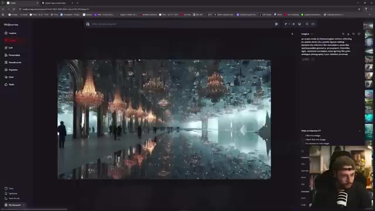
*Interface Midjourney affichant une image générée avec des lustres et des reflets architecturaux surréalistes.*

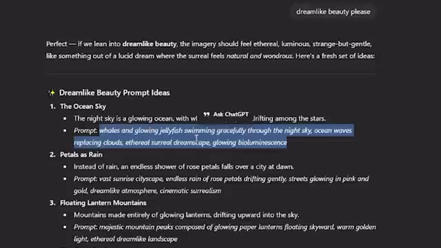
*Interface ChatGPT affichant des idées de prompts textuels sur le thème d'une beauté onirique.*

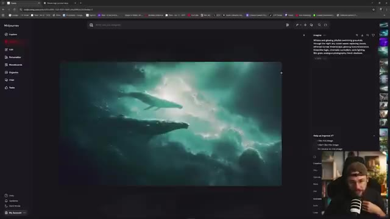
*Interface Midjourney affichant le rendu de baleines nageant dans un ciel nocturne nuageux et lumineux.*

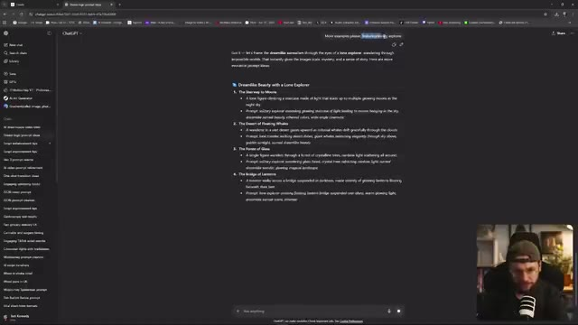
*Interface ChatGPT affichant de nouveaux exemples de prompts centrés sur un explorateur solitaire.*

---

### ⏱️ `[00:07:16 - 00:07:53]` | Segment #15

**🔊 Audio (Transcription Intégrale Mot pour Mot en Français) :**
> je pense qu'on obtient de superbes résultats quand on a quelqu'un qui essaie en quelque sorte d'explorer ces paysages fous et bien sûr ça aide d'avoir une personne dedans juste pour l'échelle aussi certains des exemples qu'on avait un peu plus tôt qu'on aurait vus au début de la vidéo aussi du contenu très très cool on peut obtenir des résultats incroyables avec ce type de prompt j'aime assez celui-ci explorateur solitaire traversant un pont de lanternes flottantes suspendu au-dessus d'un abîme lumière chaude et éclatante scène surréaliste et onirique atmosphère éthérée prenons ceci et balançons-le directement dans midjourney

**👁️ Analyse Visuelle d'Écran (gemini-3.5-flash-lite) :**
**Interface & Outils** : ChatGPT et interface web de Midjourney.

**Contenu textuel & Code** : Textes de prompts sur ChatGPT ("lone explorer crossing floating lantern bridge suspended over abyss, warm glowing light, dreamlike surreal scene, ethereal atmosphere") et génération Midjourney.

**Action / Démonstration** : Le créateur parcourt ses listes de prompts sur ChatGPT, montre des résultats sur Midjourney, sélectionne un prompt spécifique et explique sa démarche narrative.

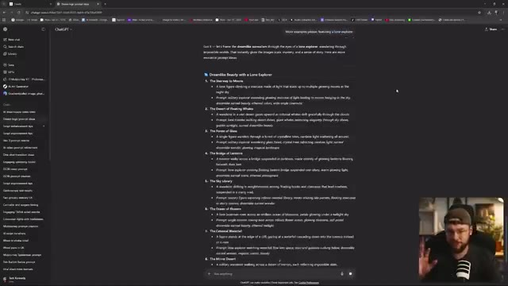
*Interface de ChatGPT affichant des listes de prompts créatifs centrés sur un explorateur solitaire dans des paysages oniriques.*

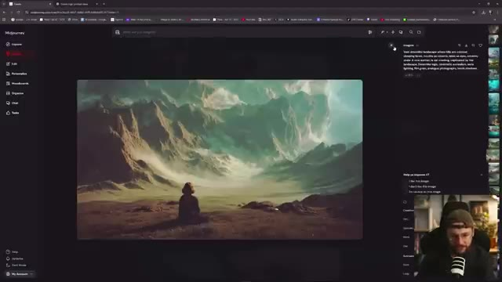
*Interface de Midjourney montrant une image générée d'un paysage montagneux avec une silhouette assise au premier plan, et le prompt textuel associé sur le panneau latéral droit.*

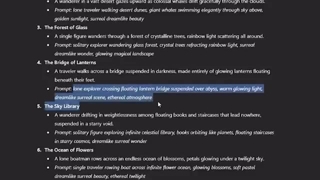
*Gros plan sur le texte de l'interface de ChatGPT, avec le curseur de la souris en train de surligner et sélectionner le prompt concernant le pont de lanternes.*

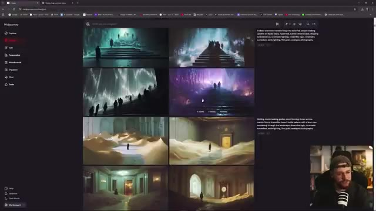
*Interface de Midjourney présentant une grille de résultats de génération d'images avec différents environnements fantastiques.*

---

### ⏱️ `[00:07:53 - 00:08:25]` | Segment #16

**🔊 Audio (Transcription Intégrale Mot pour Mot en Français) :**
> Voyons ce qu'on peut obtenir de celle-ci, ça a l'air plutôt cool. Oh ouais, j'adore ce qu'on récupère là, c'est vraiment sympa. Celle-là est vraiment cool aussi, j'adore ces lanternes flottantes ici. Je veux dire, pour être juste, absolument chacune de ces générations a l'air vraiment superbe et je pense qu'on va en faire juste une de dernière maintenant. "Explorateur solitaire regardant une cascade se jeter dans l'espace. Étoiles et galaxies se précipitant en contrebas. Merveille surréaliste et onirique. Beauté cosmique majestueuse." Ça me paraît plutôt pas mal.

**👁️ Analyse Visuelle d'Écran (gemini-3.5-flash-lite) :**
**Interface & Outils** : Navigateur web affichant les interfaces de Midjourney et de ChatGPT.

**Contenu textuel & Code** : Textes de prompts visibles sur Midjourney et ChatGPT, notamment : "Lone explorer watching waterfall flow into space, stars and galaxies rushing below, dreamlike surreal wonder, majestic cosmic beauty."

**Action / Démonstration** : Le créateur navigue entre Midjourney et ChatGPT pour sélectionner et tester de nouveaux prompts de génération visuelle.

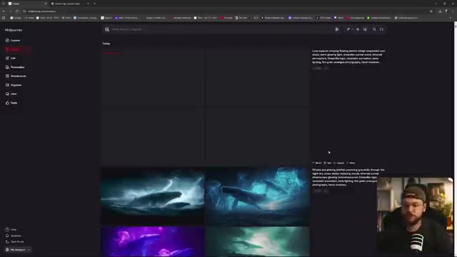
*Interface de Midjourney affichant des grilles de générations d'images sur le thème de lanternes flottantes et de baleines cosmiques.*

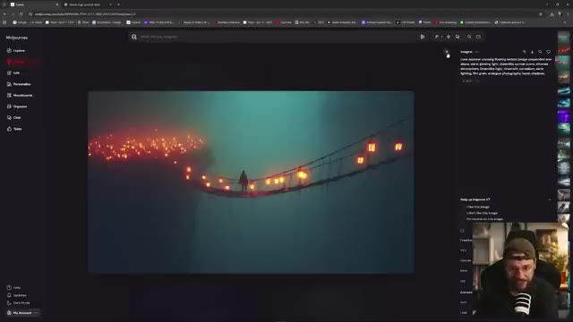
*Interface de Midjourney montrant en grand format une image générée représentant une silhouette sur un pont suspendu illuminé par des lanternes.*

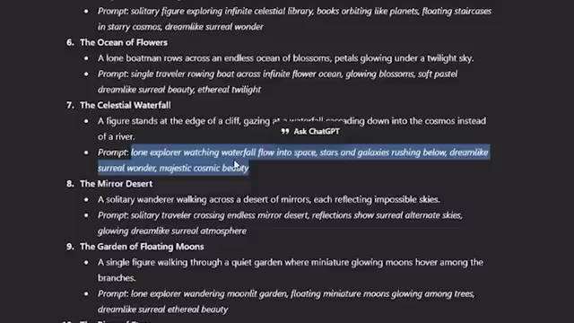
*Interface de ChatGPT affichant une liste de listes de prompts avec du texte sélectionné ("The Celestial Waterfall").*

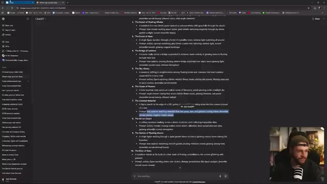
*Interface complète de ChatGPT montrant l'historique des conversations et une liste de prompts thématiques ("Dream logic prompt ideas").*

---

### ⏱️ `[00:08:25 - 00:09:04]` | Segment #17

**🔊 Audio (Transcription Intégrale Mot pour Mot en Français) :**
> Et rappelez-vous les gars, ce n'est vraiment que la moitié de l'histoire. Elles peuvent prendre une toute nouvelle vie une fois que nous commencerons à animer ces images. Ouais et toutes celles-ci encore une fois ont l'air plutôt incroyables pour moi. Il y a beaucoup de potentiel ici pour de très dynamiques vidéos je pense. Très bien donc j'ai pris les devants et j'ai téléchargé certaines de mes générations préférées que nous venons d'obtenir là. Bien sûr nous avons les baleines parce que j'adore absolument celle-ci. Nous avons l'escalier en cascade, ces superbes statues géantes en quelque sorte sculptées dans le paysage, un autre paysage vraiment étrange.

**👁️ Analyse Visuelle d'Écran (gemini-3.5-flash-lite) :**
**Interface & Outils** : Interface web de Midjourney et visionneuse d'images avec incrustation vidéo (PiP) du présentateur en bas à droite.

**Contenu textuel & Code** : Prompts visibles sur Midjourney : "Lone explorer watching waterfall flow into space..." et "Lone explorer crossing floating lantern bridge...". Fichiers d'images affichés avec des noms de fichiers contenant des descriptions de prompts.

**Action / Démonstration** : Le créateur navigue dans sa bibliothèque d'images générées, montre différentes créations et commente son processus de sélection avant l'animation.

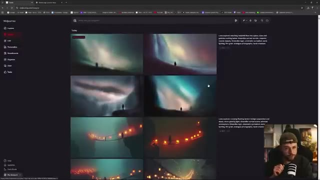
*Interface de Midjourney affichant plusieurs grilles d'images générées avec un encadré PiP du créateur en bas à droite.*

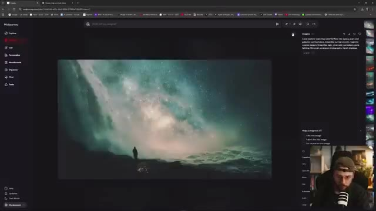
*Gros plan sur une image générée dans Midjourney représentant une silhouette devant une cascade cosmique avec interface latérale.*

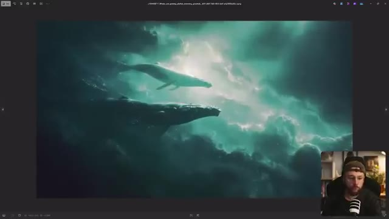
*Visualisation d'une image téléchargée représentant des baleines nagant dans des nuages lumineux.*

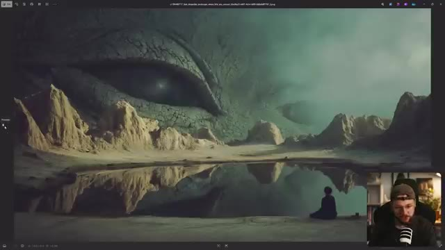
*Visualisation d'une autre image téléchargée montrant un paysage surréaliste avec une immense statue de pierre et un plan d'eau.*

---

### ⏱️ `[00:09:04 - 00:09:37]` | Segment #18

**🔊 Audio (Transcription Intégrale Mot pour Mot en Français) :**
> de cette immense silhouette en arrière-plan nous avons notre maison sous-marine c'était mon préféré de ces prompts que mid-journey a eu un peu de mal à exécuter on a une très étrange ici de cette créature bizarre qui regarde par-dessus cette sorte de ville bizarre et ça me donne vraiment des vibes de dimension miroir de doctor strange je pense qu'on peut s'amuser beaucoup avec ça on a notre séquence de pont vraiment atmosphérique ici et puis pour finir cette cascade qui est en quelque sorte fusionnée avec de l'énergie cosmique

**👁️ Analyse Visuelle d'Écran (gemini-3.5-flash-lite) :**
**Interface & Outils** : Visionneuse d'images / Explorateur de fichiers avec affichage d'images générées par IA (Midjourney) et incrustation vidéo (PiP) du créateur Jack en bas à droite.
[DESC_IMAGE_1] Fichier image affiché : `...Wide_establishing_shot_a_beautiful_suburban_home_...`
[DESC_IMAGE_2] Fichier image affiché : `...Wide_establishing_shot_a_journees_infestas_...`
[DESC_IMAGE_3] Fichier image affiché : `...an_ocean_wave_of_machined_glass_mirror_reflect_...`
[DESC_IMAGE_4] Fichier image affiché : `...luna_explorer_watching_waterfall_flow_into_space_...`

**Contenu textuel & Code** : Explications orales des concepts et des méthodes de création vidéo IA.

**Action / Démonstration** : Le créateur présente successivement à l'écran les différentes images générées par intelligence artificielle issues de ses prompts Midjourney, en commentant les aspects visuels et esthétiques.

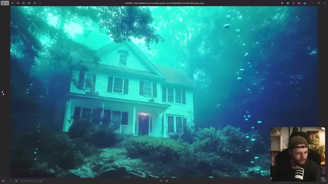
*Image d'une maison de banlieue américaine submergée sous l'eau avec des arbres et des bulles.*

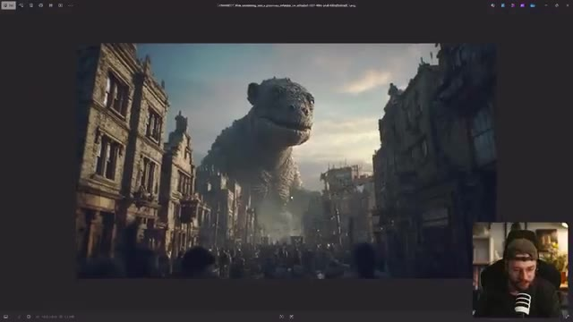
*Image d'une créature géante ressemblant à un monstre regardant par-dessus une ville ancienne et encaissée.*

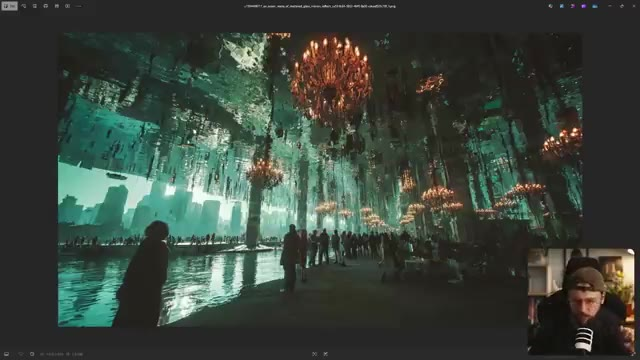
*Image d'une foule de personnes marchant dans un espace urbain au plafond réfléchissant tel un miroir d'eau illuminé par des lustres.*

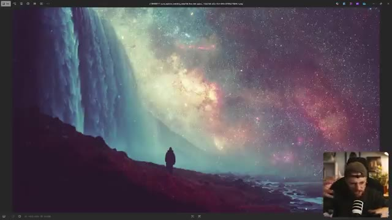
*Image d'une silhouette solitaire regardant une cascade géante se déversant sous un ciel cosmique étoilé et nébuleux.*

---

### ⏱️ `[00:09:37 - 00:10:04]` | Segment #19

**🔊 Audio (Transcription Intégrale Mot pour Mot en Français) :**
> Ce système solaire incroyable, vraiment super. Alors maintenant, la partie qui, j'en suis sûr, intéresse beaucoup d'entre vous pour cette vidéo : comment allons-nous animer ces images gratuitement, et comment allons-nous utiliser certains des meilleurs outils de génération de vidéo du marché comme VO3 et Kling sans débourser un seul centime ? Eh bien, je vais vous montrer exactement comment. Avant d'entrer dans le vif du sujet, les gars, si vous avez apprécié la vidéo jusqu'à présent, n'oubliez pas de mettre un gros pouce bleu pour moi.

**👁️ Analyse Visuelle d'Écran (gemini-3.5-flash-lite) :**
**Interface & Outils** : Bureau Windows avec lecteur multimédia et fenêtres d'applications, incluant une vue en incrustation (PiP) du créateur face à sa webcam.

**Contenu textuel & Code** : Image artistique générée par IA montrant un ciel étoilé de type nébuleuse, un paysage montagneux rouge et une cascade céleste, affichée en plein écran avec une barre de lecture vidéo en bas.

**Action / Démonstration** : Le créateur montre une image générée et des éléments de son bureau à l'écran tout en s'exprimant face caméra via une incrustation vidéo (PiP).

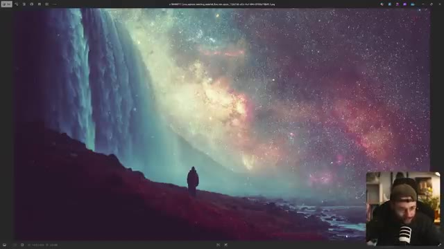
*Affichage d'une image générée par IA représentant un paysage cosmique avec une cascade de type galactique et un personnage au premier plan, avec le créateur en incrustation vidéo (PiP) dans le coin inférieur droit.*

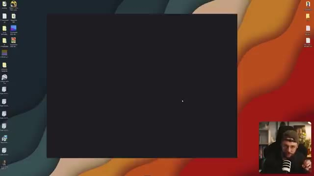
*Affichage du bureau Windows avec une fenêtre centrale noire ouverte et le créateur visible en incrustation vidéo (PiP) dans le coin inférieur droit.*

---

### ⏱️ `[00:10:04 - 00:10:42]` | Segment #20

**🔊 Audio (Transcription Intégrale Mot pour Mot en Français) :**
> Si vous êtes nouveau, pensez à vous abonner et bien sûr, à cliquer sur cette icône de cloche de notification également. Il y a donc un serveur Discord appelé LM Arena et il comporte différents salons. Je vais toujours sur video arena one, cela fonctionne très simplement, vous y allez, vous tapez slash, vous allez sur image to video et nous pouvons glisser-déposer l'une de nos images, commençons par les baleines dans le ciel parce que j'adore absolument celle-ci, tout le but de ce Discord est que c'est une communauté où les utilisateurs téléchargent leurs générations d'art par IA et mettent ensuite des prompts pour accéder à diverses IA différentes.

**👁️ Analyse Visuelle d'Écran (gemini-3.5-flash-lite) :**
**Interface & Outils** : Application Discord (serveur LM Arena).

**Contenu textuel & Code** : Salons du serveur Discord LM Arena (announcements, highlight, video-arena-1, video-arena-2, general, share-prompt, etc.) et exemples de prompts de génération vidéo.

**Action / Démonstration** : Le créateur présente l'interface du serveur Discord LM Arena et montre comment naviguer dans les salons de génération vidéo par IA.

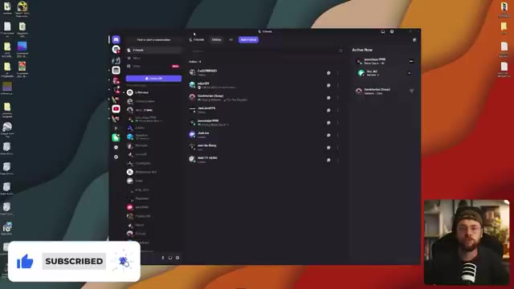
*Interface du serveur Discord LM Arena affichée à l'écran, avec Jack incrusté en bas à droite dans un encadré PiP.*

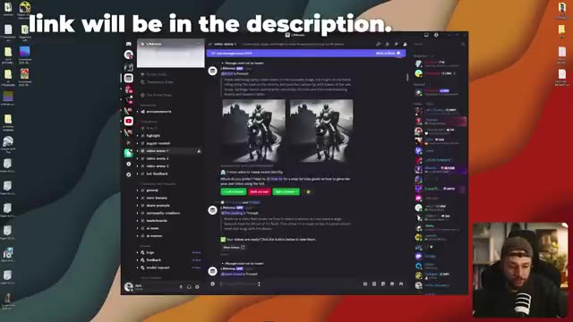
*Salon Discord « video arena 1 » montrant des exemples de générations vidéo par IA et des prompts textuels, avec Jack en incrustation PiP.*

---

### ⏱️ `[00:10:42 - 00:11:12]` | Segment #21

**🔊 Audio (Transcription Intégrale Mot pour Mot en Français) :**
> des outils de génération vidéo. Donc ça ressemble beaucoup à une pochette surprise parce qu'on ne sait pas quel outil vidéo va être utilisé pour exécuter vos prompts. Vous allez recevoir deux générations en retour et l'idée est de voter pour savoir si celle de gauche ou celle de droite est la meilleure. Et le point principal de LM Arena est de regrouper toutes ces données pour prouver quels générateurs de vidéo par IA sont les meilleurs. Mais soyons honnêtes, dans ce cas, nous l'utilisons simplement pour obtenir des vidéos IA gratuites de bonne qualité.

**👁️ Analyse Visuelle d'Écran (gemini-3.5-flash-lite) :**
**Interface & Outils** : Application Discord (serveur LM Arena) affichée en plein écran avec une fenêtre d'interaction de bot de génération vidéo, et un encadré vidéo PiP du créateur dans le coin inférieur droit.

**Contenu textuel & Code** : Le canal Discord affiche le prompt utilisateur : « cinematic video speed up, the cinematic image, the knight on the horse riding along the road... » et deux fenêtres vidéo de comparaison (gauche et droite) représentant un chevalier sur son cheval.

**Action / Démonstration** : Présentation de l'interface de test à l'aveugle de LM Arena sur Discord, où l'utilisateur peut voir deux générations de vidéos issues d'un même prompt afin de voter pour la meilleure.

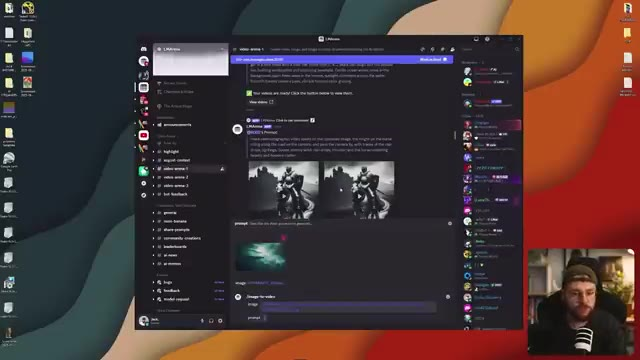
*Capture d'écran montrant l'interface du serveur Discord de LM Arena, avec deux vidéos générées côte à côte pour comparaison et le créateur visible en incrustation PiP.*

---

### ⏱️ `[00:11:12 - 00:11:37]` | Segment #22

**🔊 Audio (Transcription Intégrale Mot pour Mot en Français) :**
> Donc allons-y et balançons un prompt ici. J'aime généralement ajouter un mouvement de caméra comme un zoom chariot lent de la caméra. Je ne sais pas pourquoi. Ça a juste l'air de vraiment bien marcher avec ce type d'image. Et je vais juste mettre un prompt simple comme les deux baleines nagent à travers le ciel en s'appelant l'une l'autre.

**👁️ Analyse Visuelle d'Écran (gemini-3.5-flash-lite) :**
**Interface & Outils** : Application Discord (serveur de génération vidéo IA) avec vue principale et incrustation PiP du créateur.

**Contenu textuel & Code** : Commandes bot `/image-to-video`, champs de saisie pour le prompt textuel incluant "The camera slowly dolly zo..." et image source importée liée aux baleines.

**Action / Démonstration** : Le créateur navigue sur Discord et tape un prompt de génération vidéo textuel associé à une image source.

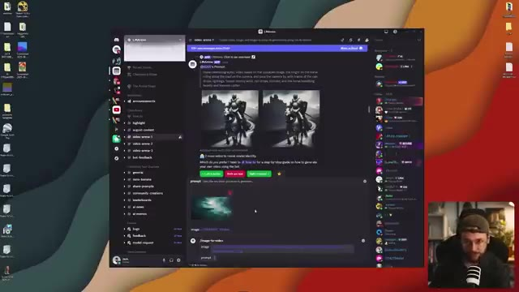
*Interface Discord montrant un canal de génération vidéo avec une image de chevalier et une incrustation vidéo du créateur en bas à droite.*

*Gros plan sur l'interface Discord avec la commande `/image-to-video`, l'image source importée et le début de la saisie du prompt.*

---

### ⏱️ `[00:11:37 - 00:12:11]` | Segment #23

**🔊 Audio (Transcription Intégrale Mot pour Mot en Français) :**
> et peut-être qu'on va juste ajouter à la fin une séquence de rêve surréaliste, appuyons sur entrée et voyons ce qu'on obtient en retour. Je vais aussi insérer ce paysage, un autre prompt très simple : la caméra zoome lentement en avant (dolly zoom) dans un environnement onirique et surréaliste. Parce que le grand avantage ici, c'est qu'on peut mettre plusieurs générations en file d'attente et les examiner toutes au fur et à mesure qu'elles arrivent. Donc vous pouvez voir qu'on a en fait atteint notre limite en ce qui concerne les générations quotidiennes, mais je vais vous montrer un autre moyen d'obtenir plus de vidéos par IA. Avant de faire ça, nous avons nos générations de baleines.

**👁️ Analyse Visuelle d'Écran (gemini-3.5-flash-lite) :**
**Interface & Outils** : Application Discord (LMArena) avec une interface sombre affichant des salons textuels, des messages de bots de génération vidéo et un encadré PiP vidéo du présentateur (Jack) dans le coin inférieur droit.

**Contenu textuel & Code** : Texte de prompt visible dans la barre de saisie : « The camera slowly dolly zooms in. The two whales, swim through the sky, calling to each other... » ainsi que deux aperçus de vidéos côte à côte montrant un chevalier sur un cheval dans un environnement brumeux.

**Action / Démonstration** : Le créateur montre son écran avec Discord ouvert, illustrant la file d'attente de générations vidéo par IA et la formulation de prompts.

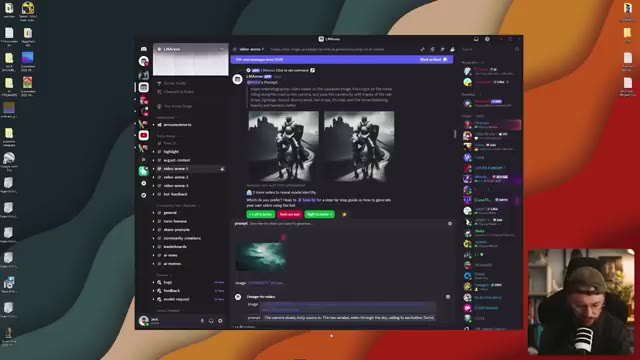
*Interface Discord de LMArena montrant des commandes textuelles et des inférences de génération de vidéos par IA, avec le créateur en médaillon PiP en bas à droite.*

---

### ⏱️ `[00:12:11 - 00:12:38]` | Segment #24

**🔊 Audio (Transcription Intégrale Mot pour Mot en Français) :**
> retour, jetons un rapide coup d'œil à ceux-ci, donc voici le premier, un tout petit peu hésitant là, voyons à quoi ressemble le second, d'accord, celui-ci a l'air un peu plus cool, ouais, c'est sympa, et vous remarquerez qu'à la toute fin de la vidéo, vous avez ce message publicitaire qui est intégré, donc pour orienter simplement les gens vers le discord, mais vous pouvez facilement couper cela et l'utiliser pour n'importe quel contenu que vous voulez. De vraies astuces étonnantes pour obtenir des résultats incroyables entièrement gratuitement.

**👁️ Analyse Visuelle d'Écran (gemini-3.5-flash-lite) :**
**Interface & Outils** : Interface de l'application Discord (LMArena) avec partage d'écran et caméra PiP du créateur.

**Contenu textuel & Code** : Texte du prompt visible : "Cinematic video of Chinny Art/COCO in a jeep, wearing a coarse cotton nehru, holding his baby girl on his lap..." et le lien d'invitation "discord.gg/LMAr".

**Action / Démonstration** : Le créateur navigue et commente les différentes vidéos générées par les modèles d'IA sur Discord, montrant le rendu final et expliquant comment couper la fin promotionnelle.

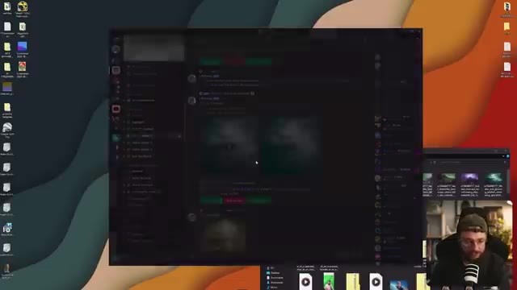
*Interface Discord de LMArena montrant un canal de discussion avec des vidéos générées par IA et l'encadré vidéo du créateur en bas à droite.*

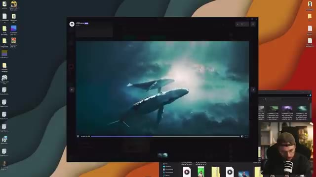
*Lecteur vidéo intégré sur LMArena affichant une génération de baleines nageant dans un ciel nuageux lumineux.*

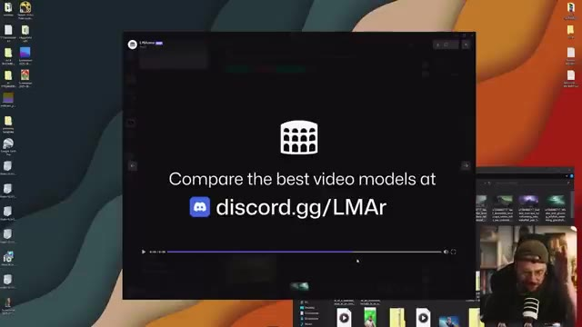
*Fin de vidéo promotionnelle sur LMArena affichant le logo et l'invitation "Compare the best video models at discord.gg/LMAr".*

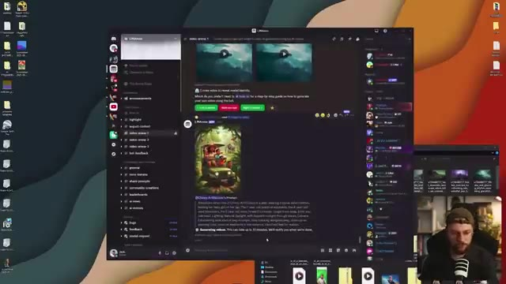
*Interface de LMArena sur Discord montrant un prompt textuel détaillé et la génération d'une vidéo avec un véhicule dans la jungle.*

---

### ⏱️ `[00:12:38 - 00:12:58]` | Segment #25

**🔊 Audio (Transcription Intégrale Mot pour Mot en Français) :**
> Mais nous allons passer au véritable VO3 maintenant, étant donné que j'ai épuisé mes générations gratuites pour la journée. Et nous voulons aller sur Google Flow. En bas ici, nous pouvons changer de texte en vidéo à images en vidéo. Cliquez sur la petite icône plus et allez sur importer. Et déposons notre maison sous-marine.

**👁️ Analyse Visuelle d'Écran (gemini-3.5-flash-lite) :**
**Interface & Outils** : Midjourney et Google Flow (interface web).

**Contenu textuel & Code** : Textes descriptifs des prompts de génération d'images dans Midjourney et options de génération vidéo dans Google Flow (option "Text to Video", modèle "Veo 3 - Fast", interface de recadrage d'image).

**Action / Démonstration** : Le créateur navigue sur Midjourney puis bascule sur Google Flow pour préparer l'importation et le recadrage d'une image de maison sous-marine en vue d'une animation vidéo.

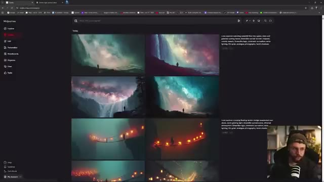
*Interface de Midjourney affichant une galerie de créations d'images générées par IA.*

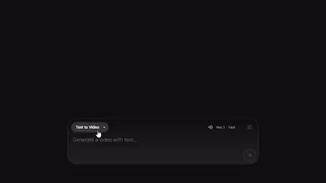
*Interface de Google Flow montrant le panneau de génération vidéo avec le sélecteur "Text to Video".*

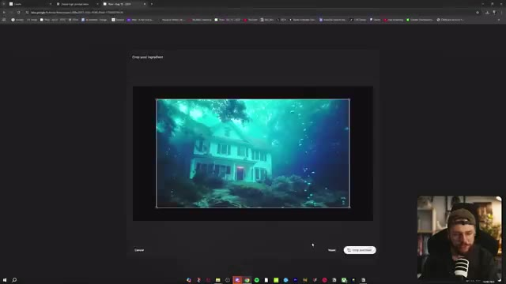
*Interface de Google Flow montrant l'outil de recadrage ("Crop your ingredient") avec l'image d'une maison sous-marine.*

---

### ⏱️ `[00:12:58 - 00:13:20]` | Segment #26

**🔊 Audio (Transcription Intégrale Mot pour Mot en Français) :**
> Je pense que ce sera un truc sympa à tester. Donc vous pouvez voir que VO3 met ça comme première image. C'est exactement ce qu'on veut. On commence avec la caméra, un zoom dolly avant lent. Et je pense qu'on va juste mettre quelque chose d'assez simple comme des bulles qui flottent doucement vers la surface. Scène étrange et onirique.

**👁️ Analyse Visuelle d'Écran (gemini-3.5-flash-lite) :**
**Interface & Outils** : Navigateur web avec l'interface d'un outil de génération vidéo (type VO3 ou similaire) et incrustation vidéo (PiP) du présentateur en bas à droite.

**Contenu textuel & Code** : Vignettes d'images générées ou sélectionnées en bas de l'écran, onglets de navigation en haut, et le visage du créateur visible dans le coin inférieur droit.

**Action / Démonstration** : Le créateur montre l'interface de l'outil de génération vidéo et commente la première image sélectionnée pour l'animation.

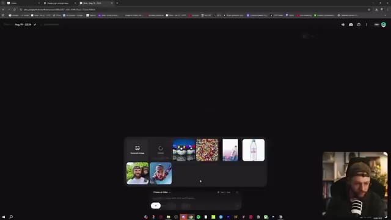
*Interface d'un outil de génération vidéo par IA affichant des images de prévisualisation et une petite vignette du créateur dans le coin inférieur droit.*

---

### ⏱️ `[00:13:20 - 00:13:57]` | Segment #27

**🔊 Audio (Transcription Intégrale Mot pour Mot en Français) :**
> et ici nous voulons sélectionner ve3 fast afin qu'il utilise moins de crédits si vous le mettez sur ve3 quality vous allez utiliser 100 crédits pour chaque génération et vous allez être à court vraiment assez vite cliquons sur générer ici et en fait nous avons récupéré nos générations gratuites du serveur discord de lm arena également alors jetons-un œil dessus ce paysage vraiment cool ici je suis impatient de voir ce que nous avons obtenu de cette génération jetons-y un petit œil ouais voyez ça c'est vraiment vraiment cool juste simple mais l'image elle-même est vraiment captivante et surréaliste d'une certaine manière

**👁️ Analyse Visuelle d'Écran (gemini-3.5-flash-lite) :**
**Interface & Outils** : Interface web de génération de vidéo (probablement un outil utilisant les modèles Veo de Google) et application Discord (serveur LM Arena).

**Contenu textuel & Code** : Menus de sélection de modèles (Veo 3 - Fast, Veo 2 - Fast, Veo 3 - Quality, Veo 2 - Quality), message indiquant l'utilisation des crédits (20 crédits), champ de prompt « The camera slowly dolly zooms in. The bubbles gently float up to the surface, strange dreamlike scene. », et sur Discord le texte « Your videos are ready! Click the button below to view them. » ainsi que l'URL d'invitation Discord.

**Action / Démonstration** : Le créateur montre la sélection du modèle Veo 3 Fast pour économiser des crédits, lance la génération, puis consulte les résultats générés sur le serveur Discord LM Arena en explorant les vidéos obtenues.

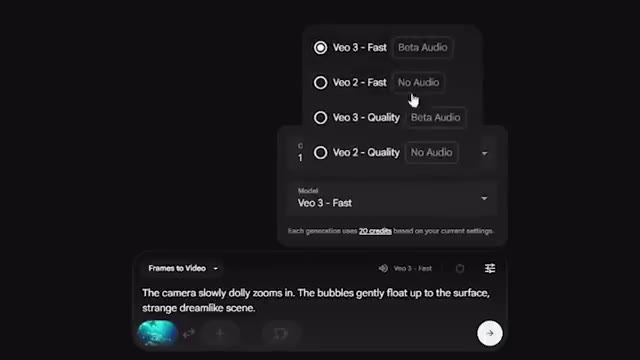
*Interface de génération vidéo montrant le menu déroulant de sélection des modèles Veo (Veo 3 - Fast, Veo 2 - Fast, Veo 3 - Quality, Veo 2 - Quality).*

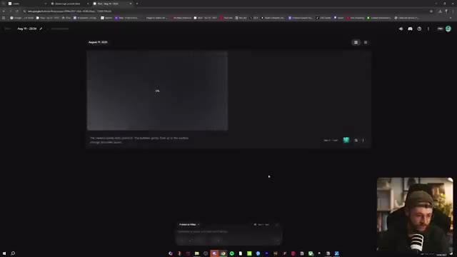
*Interface de l'outil de génération montrant la zone de prévisualisation vidéo en cours de chargement avec le prompt textuel et le créateur visible en incrustation PiP.*

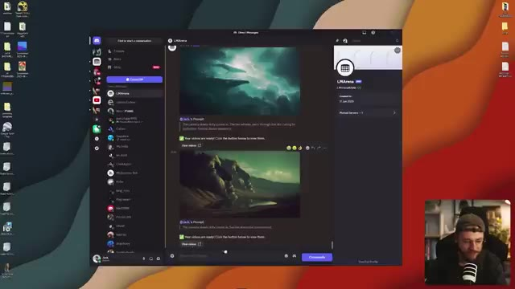
*Interface de Discord (LM Arena) affichant des résultats de générations vidéo avec des prompts textuels et des liens vers des vidéos validées, avec le créateur en incrustation PiP.*

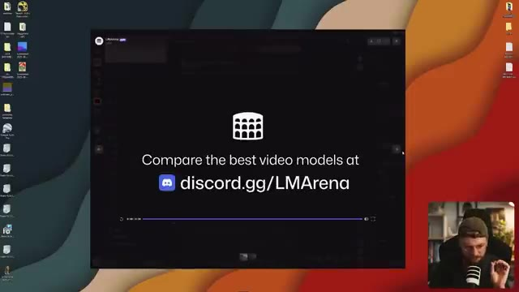
*Écran de l'application LM Arena affichant un écran de fin avec l'URL discord.gg/LMArena et le créateur en incrustation PiP.*

---

### ⏱️ `[00:13:57 - 00:14:32]` | Segment #28

**🔊 Audio (Transcription Intégrale Mot pour Mot en Français) :**
> Regardez la deuxième génération et celle-ci est bien aussi. Elle est peut-être même mieux. Je vais dire que celle de droite est meilleure parce qu'il y avait un très beau parallaxe entre ces géantes statues. Revenons sur VO3 et jetons un petit coup d'œil au résultat qu'on a obtenu avec ceci. Exactement ce qu'on veut, exactement ce qu'on recherche. Il n'y a pas besoin d'une tonne de choses qui se passent parce que, comme je l'ai dit avec la dernière génération, l'image de base elle-même est très captivante et onirique, exactement ce qu'on recherche. Essayons de jeter un œil à celle de la dimension miroir, ça va être plutôt...

**👁️ Analyse Visuelle d'Écran (gemini-3.5-flash-lite) :**
**Interface & Outils** : Interface web de génération vidéo par IA et explorateur de fichiers Windows, avec incrustation vidéo (PiP) du présentateur en bas à droite.

**Contenu textuel & Code** : Interface affichant des aperçus de vidéos générées, des historiques de projets (août 19-23:24), des boîtes de saisie de prompts ('Frames to video') et des fichiers d'images miniatures.

**Action / Démonstration** : Le créateur navigue entre différents résultats de génération vidéo, zoome sur les détails visuels et sélectionne de nouveaux fichiers pour illustrer les différentes versions comparées.

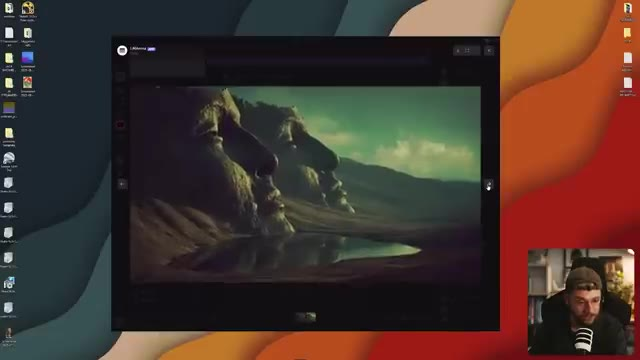
*Aperçu vidéo de la deuxième génération montrant des statues géantes dans un paysage avec un effet de parallaxe, avec le créateur en incrustation PiP en bas à droite.*

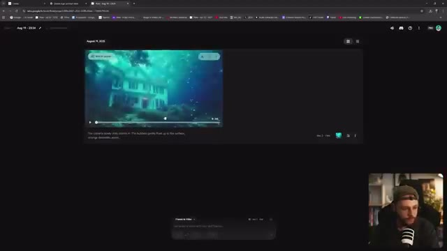
*Interface web montrant la génération vidéo avec la maison sous l'eau et des bulles remontant à la surface, avec le créateur en incrustation PiP en bas à droite.*

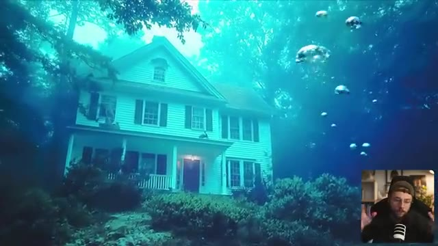
*Gros plan plein écran sur la vidéo générée de la maison sous-marine onirique avec des bulles, le créateur apparaissant dans un petit encadré PiP en bas à droite.*

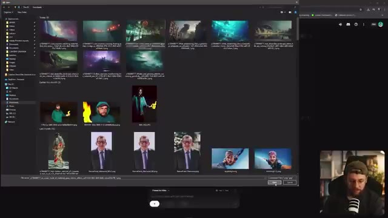
*Fenêtre explorateur de fichiers ouverte sur le système permettant de sélectionner une image source pour la génération vidéo, avec le créateur en incrustation PiP en bas à droite.*

---

### ⏱️ `[00:14:32 - 00:15:06]` | Segment #29

**🔊 Audio (Transcription Intégrale Mot pour Mot en Français) :**
> Intéressant. Maintenant, une petite astuce plutôt sympa consiste également à vous rendre sur Kling, qui est un autre générateur de vidéos vraiment formidable. Si vous glissez-déposez votre image de départ, comme si vous alliez utiliser Kling pour générer vos vidéos – ce que vous pouvez faire aussi, car vous obtenez des crédits gratuits rien qu'en vous connectant –, et que vous allez dans la section de prompt et cliquez sur "deep sync", il va en fait analyser votre image pour vous et vous donner une idée de prompt que vous pourriez utiliser pour animer l'image. Donc encore une fois, si vous ressentez un petit blocage créatif, cela peut vraiment vous aider, et c'est ce que nous avons...

**👁️ Analyse Visuelle d'Écran (gemini-3.5-flash-lite) :**
**Interface & Outils** : Interface web du générateur de vidéo Kling AI (onglet "Image to Video"), avec une fenêtre de l'Explorateur Windows ouverte par-dessus et une incrustation vidéo (PiP) du présentateur en bas à droite.

**Contenu textuel & Code** : Dans l'interface de Kling : section "Image to Video", options "Prompt", bouton "Deep Sync", réglages "Motion Control", "Sound Effects", "Negative Prompt", et bouton vert "Generate". Dans l'Explorateur Windows : dossier de téléchargements contenant diverses images et vidéos générées.

**Action / Démonstration** : Glisser-déposer d'une image de départ depuis l'Explorateur Windows vers l'interface de Kling AI pour utiliser la fonction Deep Sync.

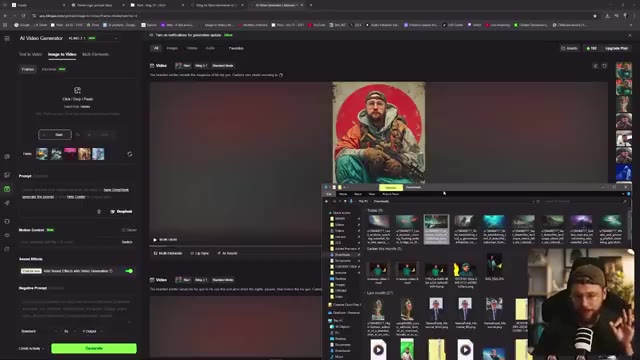
*Interface du générateur de vidéo Kling montrant le glisser-déposer d'une image de départ et la fonction Deep Sync.*

---

### ⏱️ `[00:15:06 - 00:15:39]` | Segment #30

**🔊 Audio (Transcription Intégrale Mot pour Mot en Français) :**
> On est de retour ici. Les lustres des salles aux miroirs se balancent doucement tandis que les reflets de la ville ondulent comme de l'eau. Les gens se mélangent sous une lumière dorée et chaleureuse. La caméra zoome lentement à travers le paysage onirique surréaliste, mélangeant réalité et fantaisie. Donc on peut juste attraper ça, on peut retourner sur Google Flow et on peut simplement le déposer ici et voir ce qu'on obtient en retour. Je vais essayer de déposer notre cascade cosmique directement dans Kling également et on verra ce que DeepSeek nous donne comme petit prompt d'inspiration pour celui-ci aussi.

**👁️ Analyse Visuelle d'Écran (gemini-3.5-flash-lite) :**
**Interface & Outils** : Kling AI Video Generator et Google Flow (interfaces web de génération vidéo par IA).

**Contenu textuel & Code** : Texte du prompt visible : « The mirrored hall's chandeliers sway gently as cityscape reflections ripple like water, people mingle under warm golden light, the camera slowly pans across the surreal dreamscape blending reality and fantasy. » Boutons DeepSeek, Motion Control, et paramètres de génération.

**Action / Démonstration** : Le créateur montre la manipulation de prompts dans Kling, le basculement vers Google Flow pour déposer les éléments générés, et l'utilisation de DeepSeek pour obtenir des prompts d'inspiration.

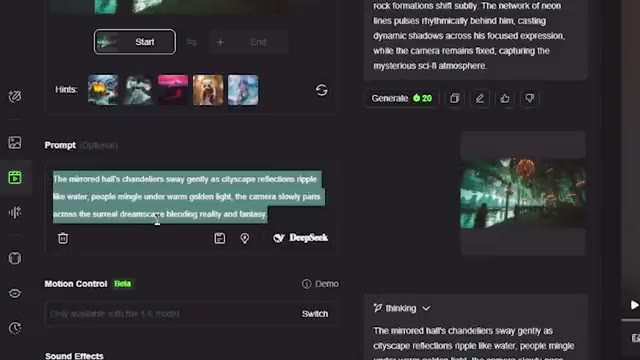
*Interface de l'outil de génération vidéo Kling montrant le champ de prompt textuel avec une description poétique.*

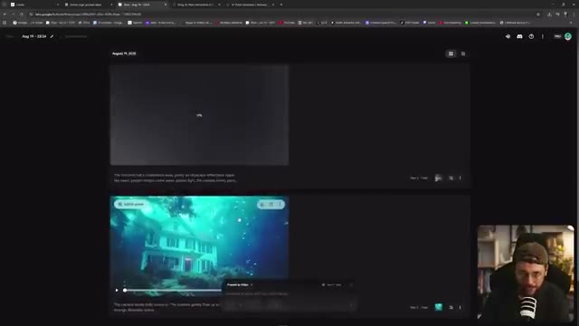
*Interface de Google Flow affichant des projets récents et des aperçus de vidéos générées, avec le créateur en incrustation (PiP).*

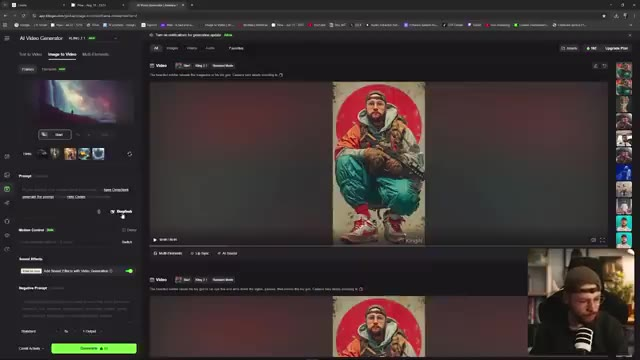
*Interface de l'outil Kling AI Video Generator montrant une image de soldat en mode Image to Video avec l'option DeepSeek.*

---

### ⏱️ `[00:15:39 - 00:16:11]` | Segment #31

**🔊 Audio (Transcription Intégrale Mot pour Mot en Français) :**
> et voilà nous avons notre génération pour notre sorte de dimension miroir étrange jetons un oeil très très cool simple mais efficace donc nous avons notre prompt deep seek pour notre plan de cascade prenons-le déposons-le dans vo3 et bien sûr nous devons télécharger notre image ainsi que la frame de départ et nous allons cliquer sur générer pour ça et comme je le dis la chose vraiment super c'est que ça ne nous coûte que 20 crédits pour chaque génération donc vous pouvez vraiment expérimenter pas mal avec ceux-ci juste un rapide

**👁️ Analyse Visuelle d'Écran (gemini-3.5-flash-lite) :**
**Interface & Outils** : Labs Google / Kling AI - Interface de génération de vidéo par IA avec panneau de saisie de prompt, options de génération et prévisualisations.

**Contenu textuel & Code** : Textes de prompts liés à la cascade et à la dimension miroir, options de génération à 20 crédits, interface de Kling AI v2.1 et Labs Google.

**Action / Démonstration** : Le créateur montre le résultat de sa génération pour la dimension miroir, puis bascule sur Kling AI pour configurer le prompt d'une cascade avec l'image de départ.

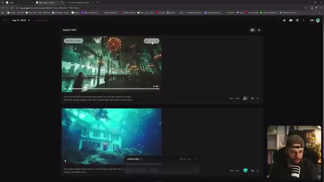
*Interface d'un navigateur web montrant une interface de génération vidéo (Labs Google) avec des aperçus de vidéos et la webcam du créateur en incrustation.*

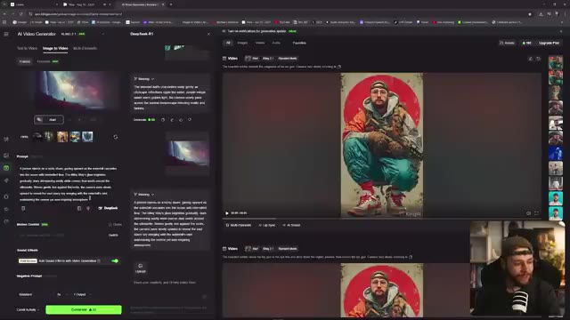
*Interface de Kling AI montrant le générateur vidéo avec un panneau de prompt DeepSeek, les paramètres et les résultats de génération à droite.*

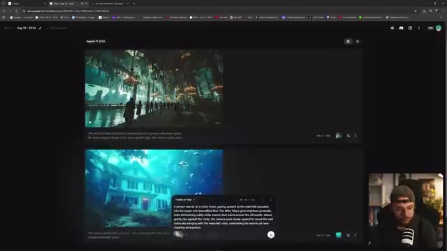
*Retour sur l'interface Labs Google affichant les résultats de génération de vidéos avec une fenêtre de dialogue pour le prompt de la cascade.*

---

### ⏱️ `[00:16:11 - 00:16:49]` | Segment #32

**🔊 Audio (Transcription Intégrale Mot pour Mot en Français) :**
> un rappel également, si vous aimez l'une des générations que vous obtenez sur lm arena, vous pouvez simplement cliquer sur cette icône ici pour sauvegarder la vidéo et ensuite vous pouvez en faire ce que vous voulez et nous avons de retour notre génération de la cascade cosmique jetons un coup d'œil à ça très très cool très dynamique beaucoup de choses se passent à peu près exactement comme je l'avais imaginé vraiment donc les gars voilà nous avons examiné la création de pièces surréalistes vraiment incroyables sur midjourney en jouant vraiment sur la force de cet outil IA et puis bien sûr nous avons utilisé lm arena pour générer des vidéos gratuites

**👁️ Analyse Visuelle d'Écran (gemini-3.5-flash-lite) :**
**Interface & Outils** : Outil web de génération vidéo IA (Kling / LM Arena), lecteur multimédia et interface Midjourney.

**Contenu textuel & Code** : Prompts textuels, fenêtres de comparaison vidéo A/B, vignettes de génération et miniatures de prévisualisation.
[DESC_IMAGE_1] Le créateur présente l'interface de génération vidéo en expliquant les fonctionnalités de sauvegarde.

**Action / Démonstration** : Démonstration pédagogique et présentation du workflow.

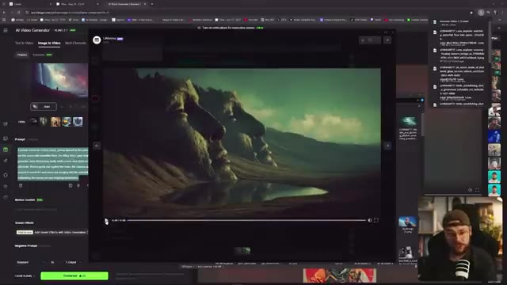
*Interface de l'outil de génération de vidéo IA affichant un aperçu vidéo en cours de lecture et des réglages de prompt.*

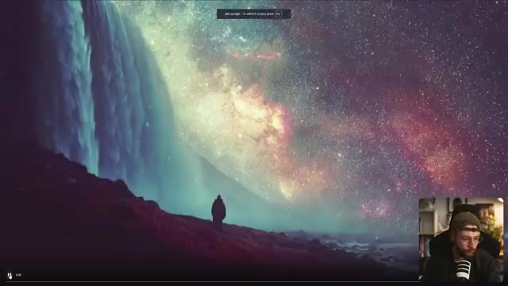
*Affichage en plein écran d'une vidéo générée représentant un personnage face à une cascade cosmique sous un ciel étoilé.*

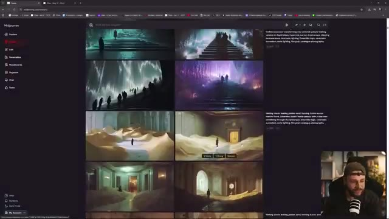
*Interface de Midjourney présentant une grille de plusieurs images et illustrations surréalistes générées.*

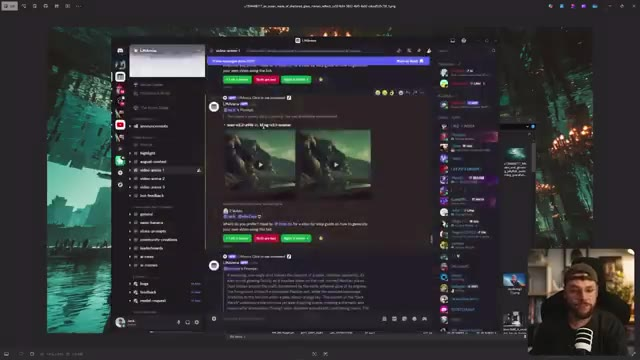
*Interface de Discord montrant le bot LM Arena comparant deux générations de vidéos côte à côte avec des options de vote.*

---

### ⏱️ `[00:16:49 - 00:17:08]` | Segment #33

**🔊 Audio (Transcription Intégrale Mot pour Mot en Français) :**
> Je n'ai plus de crédits malheureusement, mais je m'y remettrai dès demain et je pourrai en générer tout un tas d'autres, ainsi que bien sûr Vo3. Maintenant, rappelez-vous que vous pouvez obtenir un essai gratuit d'un mois pour Vo3 en vous inscrivant à Google AI Pro. Et littéralement, dès que vous êtes inscrit, vous pouvez annuler votre abonnement.

**👁️ Analyse Visuelle d'Écran (gemini-3.5-flash-lite) :**
**Interface & Outils** : Discord (serveur LMArena) et navigateur web affichant l'interface de Google AI / Labs (lab.google/fx), avec le créateur visible en incrustation vidéo (PiP) dans le coin inférieur droit.

**Contenu textuel & Code** : Sur l'image 1 : Serveur Discord LMArena, canaux de discussion, prompts textuels de génération de vidéo ("A towering, over-sized white skeleton the element of a ruin..."). Sur les images 2 et 3 : Interface web de Google AI Labs avec des vidéos générées ("A person stands on a rocky shore...", "The cavernous hall's chandeliers sway gently..."), horodatées au "Aug 19 - 23:24", mention "Vo3 - Fast".

**Action / Démonstration** : Le créateur navigue sur Discord puis sur l'interface web de Google AI Labs pour montrer ses générations de vidéos tout en parlant à la caméra (présente en incrustation PiP).

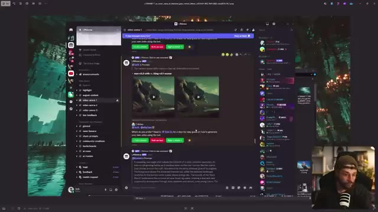
*Interface Discord montrant un salon de test vidéo (LMArena) avec des comparaisons de vidéos générées par IA et des prompts textuels.*

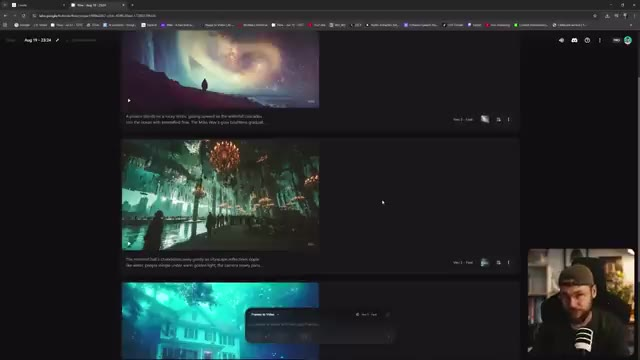
*Interface de Google AI / Labs montrant des vidéos générées classées par date avec des vignettes et leurs prompts descriptifs.*

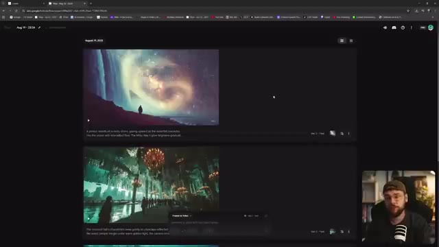
*Interface de Google AI / Labs montrant une vue similaire des vidéos générées, avec Jack visible en incrustation (PiP) dans le coin inférieur droit.*

---

### ⏱️ `[00:17:09 - 00:17:44]` | Segment #34

**🔊 Audio (Transcription Intégrale Mot pour Mot en Français) :**
> Vous aurez quand même le mois gratuit. Vous aurez toujours accès à VO3. Mais si vous annulez tout de suite, vous n'oublierez pas par accident pour vous faire facturer le mois prochain. C'est une excellente façon de tester l'outil et d'obtenir de superbes générations de vidéos par IA au passage. Merci infiniment d'avoir regardé, les gars. Comme toujours, si vous avez la moindre question, assurez-vous de la poser en bas dans les commentaires, j'essaierai de répondre à un maximum d'entre elles. Merci beaucoup pour l'amour sur la précédente vidéo d'ailleurs, c'était vraiment incroyable de voir l'engagement et la croissance sur ma chaîne, ça compte énormément pour moi les gars, vraiment, et je vous retrouve dans la prochaine.

**👁️ Analyse Visuelle d'Écran (gemini-3.5-flash-lite) :**
**Interface & Outils** : Application web de génération vidéo hébergée sur VideoFX (labs.google), avec un design sombre, un espace de galerie vidéo et une vue PiP (Picture-in-Picture) du créateur.

**Contenu textuel & Code** : Date 'August 19, 2025', vignettes de vidéos générées avec des descriptions textuelles (prompts) visibles en dessous de chaque rendu vidéo (par exemple 'A person stands on a rocky shore, gazing upward as the waterfall cascades...').

**Action / Démonstration** : Le créateur navigue et présente les différentes générations de vidéos créées avec l'outil de génération vidéo dans l'interface web, tout en s'adressant aux spectateurs.

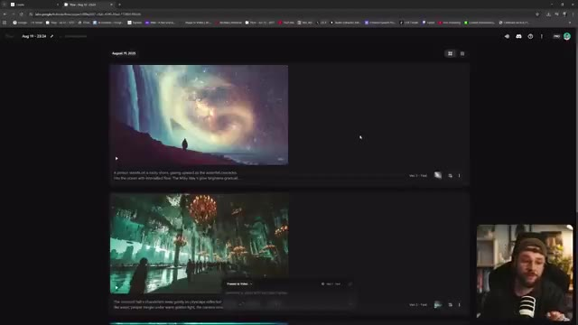
*Interface d'une application web affichant des exemples de vidéos générées par IA avec des prompts textuels, et Jack incrusté en bas à droite.*

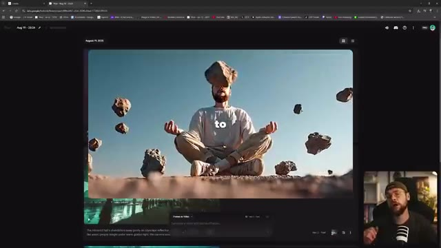
*Affichage d'une vidéo générée montrant un homme en tailleur de méditation faisant léviter des rochers, avec Jack incrusté en bas à droite.*

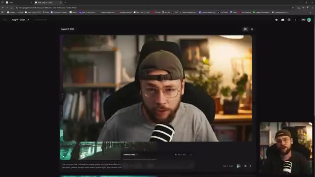
*Lecture d'une vidéo en plein écran dans l'interface montrant Jack dans son studio, avec l'incrustation de Jack en bas à droite.*

---
