# 🎬 Comment utiliser Nano Banana GRATUITEMENT (Guide ultime du cinéma IA)

> **Chaîne** : [Jack Vs. AI](https://www.youtube.com/@JackVsAI)  
> **Titre original** : `How to use Nano Banana for FREE (AI filmmaking guide)`  
> **Lien YouTube** : [https://www.youtube.com/watch?v=ogU3Di7rvnc](https://www.youtube.com/watch?v=ogU3Di7rvnc)  
> **Date de publication** : 2025-08-26  
> **Durée** : 17m 56s (`1076s`)  
> **Identifiant vidéo** : `ogU3Di7rvnc`  
> **Fiche Web Interactive** : [2025-08-26_YT-ogU3Di7rvnc_Comment utiliser Nano Banana GRATUITEMENT (Guide ultime du cinéma IA)_by-whisper-v3-large-turbo+gemini-3.5-flash-lite.html](2025-08-26_YT-ogU3Di7rvnc_Comment utiliser Nano Banana GRATUITEMENT (Guide ultime du cinéma IA)_by-whisper-v3-large-turbo+gemini-3.5-flash-lite.html)  
> **Captures de démonstration clés** : `78 captures réelles (anti-talking-head)`  
> **Modèles utilisés** : Audio: `large-v3-turbo` (Faster-Whisper int8 VPS) | Vision: `gemini-3.5-flash-lite` (Google AI Studio API)  

---

## 📌 Synthèse Exécutive & Outils

### 📌 Résumé
La vidéo de Jack explore une véritable révolution dans le domaine de la réalisation de films par intelligence artificielle grâce à « Nano Banana » (le modèle Gemini 2.5 Flash de Google). Cet outil permet de télécharger une image source unique et de générer une infinité d’angles de caméra, de variations de scènes et de modifications d'éclairage tout en préservant une cohérence absolue des personnages, des vêtements et du style artistique. Jusqu'alors, maintenir cette consistance d'un plan à l'autre constituait l'un des plus grands goulets d'étranglement pour les créateurs de contenu, nécessitant souvent des astuces complexes ou des retouches fastidieuses.

Pour démocratiser cette technologie, Jack dévoile une méthode totalement gratuite contournant les barrières des abonnements payants. En passant par la plateforme LM Arena (`lmarina.ai`) via une fenêtre de navigation privée, il est possible d'accéder sans frais à Nano Banana et de contourner les éventuelles limites d'utilisation à l'infini. Le workflow proposé repose sur l'approche de la « super image » : partir d'un visuel initial de haute qualité (généré par exemple sur Midjourney), puis exploiter Nano Banana pour storyboarder toute une séquence plan par plan (plans larges, par-dessus l'épaule, gros plans extrêmes, vues de drone) avant de les envoyer vers un outil d'animation vidéo.

Cette méthode change radicalement la donne pour les créateurs indépendants, les artistes VFX et les agences publicitaires. En éliminant les ruptures d'immersion visuelle entre les plans, Nano Banana permet de produire des courts-métrages ou des spots publicitaires parfaitement fluides et professionnels sans y engloutir un budget massif. C'est un guide pratique indispensable pour quiconque souhaite intégrer l'IA générative de pointe dans un pipeline de production vidéo réaliste et structuré.

### 🛠️ Outils, Modèles & Logiciels Présentés
* **Nano Banana** : Modèle d'imagerie de pointe de Google (Gemini 2.5 Flash) utilisé pour modifier des images existantes tout en conservant une cohérence parfaite des personnages et des décors.
* **Midjourney** : Générateur d'images par IA employé pour créer la « super image » de départ (le plan initial de référence).
* **LM Arena** : Plateforme d'évaluation et de chat ouverte (`lmarina.ai`) permettant d'accéder gratuitement et sans abonnement à Nano Banana via sa section "direct chat".
* **Kling** : Outil de génération et d'animation vidéo par IA mentionné comme étape finale pour donner du mouvement aux images fixes.
* **Photoshop** : Logiciel de retouche d'image traditionnel évoqué indirectement dans les flux de travail globaux de post-production.
* **Premiere Pro** : Logiciel de montage vidéo professionnel utilisé pour assembler les différents plans cohérents générés par l'IA.

### 🔑 Points Clés & Enseignements Stratégiques
* **Accès 100 % gratuit** : Il n'est pas nécessaire de souscrire à des abonnements payants tiers ; un simple passage par LM Arena (`lmarina.ai`) en mode navigation privée donne un accès illimité à Nano Banana.
* **Contournement des quotas** : Si une limite d'utilisation est atteinte sur la plateforme, l'ouverture d'une nouvelle fenêtre de navigation privée permet de relancer immédiatement les générations sans frais.
* **Le concept de la « Super Image »** : La meilleure pratique de réalisation consiste à concevoir une image de départ parfaite qui servira de matrice visuelle unique pour toute la scène.
* **Cohérence narrative et visuelle** : Nano Banana excelle à conserver les traits du visage, l'expression, les vêtements et l'ambiance lumineuse d'un plan à l'autre, éliminant les ruptures d'immersion.
* **Construction d'un storyboard dynamique** : L'outil permet de décliner une scène plan par plan à partir de la même image source (plans larges, plans par-dessus l'épaule, gros plans serrés).
* **Gestion des bugs de prompt** : En cas d'erreur de génération (souvent aux alentours de la troisième ou quatrième seconde), il est conseillé de reformuler l'invite ou de modifier la structure de la phrase pour éviter les filtres de sécurité de Google.
* **Précision descriptive** : Pour obtenir des résultats spécifiques (comme le reflet d'un volcan dans des verres de lunettes), il est crucial de nommer précisément les objets (ex: « lunettes à monture filaire dorée »).
* **Gestion des imprévus créatifs (« heureux hasards »)** : Si l'IA modifie radicalement le décor tout en conservant la pose exacte du personnage, le résultat peut tout de même être exploité dans un montage créatif.
* **Pipeline de production complet** : Le workflow idéal combine une image de départ (Midjourney), le découpage et la variation des angles (Nano Banana), puis l'animation finale (Kling).
* **Applicabilité commerciale** : Cette méthode s'applique parfaitement à la création de spots publicitaires, de clips ou de concepts de streetwear avec un rendu professionnel haut de gamme.

---

## ⏱️ Chronologie & Transcription Complète Audio & Visuelle (Mot pour Mot)

### ⏱️ `[00:00:00 - 00:00:18]` | Segment #01

**🔊 Audio (Transcription Intégrale Mot pour Mot en Français) :**
> Nano Banana de Google vient de changer à jamais la réalisation de films par IA. C'est l'outil que vous recherchiez pour faire passer vos projets au niveau supérieur. Imaginez télécharger une seule image et la transformer en une infinité d'angles de caméra et de variations de scènes. Le tout avec une solide cohérence des personnages et du style.

**👁️ Analyse Visuelle d'Écran (gemini-3.5-flash-lite) :**
**Interface & Outils** : Présentation face caméra et illustrations générées par IA sans affichage d'interface logicielle de travail.

**Contenu textuel & Code** : Texte affiché à l'écran synchronisé avec la parole ("changed", "uploading", "character").

**Action / Démonstration** : Le créateur (Jack) présente visuellement les capacités du modèle à travers des exemples de scènes générées par IA (avec incrustations d'images).

---

### ⏱️ `[00:00:19 - 00:00:40]` | Segment #02

**🔊 Audio (Transcription Intégrale Mot pour Mot en Français) :**
> C'est exactement ce que fait Nano Banana. C'est un véritable bouleversement pour les créateurs d'IA. Et si vous ne l'utilisez pas en ce moment même, vous êtes déjà en train de prendre du retard. Je m'appelle Jack, je suis artiste VFX dans l'industrie publicitaire depuis plus d'une décennie maintenant, et j'ai travaillé pour bon nombre des plus grandes marques de la planète. Aujourd'hui, je vous révèle comment vous pouvez utiliser Nano Banana de Google de manière entièrement gratuite.

**👁️ Analyse Visuelle d'Écran (gemini-3.5-flash-lite) :**
**Interface & Outils** : Présentation face caméra sans partage d'écran

**Contenu textuel & Code** : Aucun contenu textuel ou interface visible à l'écran, uniquement le présentateur dans son studio.

**Action / Démonstration** : Le présentateur s'adresse directement à la caméra en gesticulant légèrement pour appuyer ses propos.

---

### ⏱️ `[00:00:40 - 00:01:12]` | Segment #03

**🔊 Audio (Transcription Intégrale Mot pour Mot en Français) :**
> Comment vous pouvez partir d'une seule image de départ pour créer toute une scène cohérente. Et ensuite, je vous montrerai même comment vous pouvez animer ces images de manière entièrement gratuite également. C'est tout simplement hallucinant. Et bien sûr, les gars, si vous appréciez le contenu d'aujourd'hui, n'hésitez pas à lâcher un gros pouce bleu pour moi, pensez à vous abonner et bien sûr à activer cette cloche de notification. Entrons dans le vif du sujet. Il y a donc beaucoup de plateformes d'IA par abonnement en ce moment qui essaient de récupérer vos clients pour vous faire payer l'utilisation de leur produit et ainsi accéder à Nano Banana. Vous n'avez pas besoin de faire ça. Vous pouvez le faire

**👁️ Analyse Visuelle d'Écran (gemini-3.5-flash-lite) :**
**Interface & Outils** : Navigateur web (Google Chrome) avec un affichage en incrustation (PiP) du créateur en bas à droite.

**Contenu textuel & Code** : Page de recherche Google standard avec barre de recherche au centre et onglets de favoris en haut.

**Action / Démonstration** : Le créateur montre son écran de navigateur web tout en continuant sa présentation.

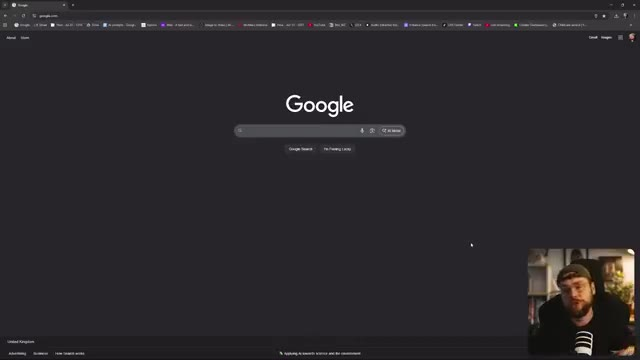
*Navigateur web affichant la page d'accueil de Google avec le créateur en incrustation vidéo (Picture-in-Picture) dans le coin inférieur droit.*

---

### ⏱️ `[00:01:12 - 00:01:50]` | Segment #04

**🔊 Audio (Transcription Intégrale Mot pour Mot en Français) :**
> gratuitement. Maintenant, j'ai eu quelques problèmes bizarres au début pour y accéder, donc je vous suggère d'aller en haut et d'ouvrir une fenêtre de navigation privée, puis de taper simplement lmarina.ai. Ça va vérifier que vous êtes un humain et accepter les cookies, et immédiatement vous y êtes. Vous voulez aller tout en haut ici et sélectionner "direct chat". Vous voulez ensuite aller tout en bas et sélectionner "generate images" et déjà c'est réglé sur l'aperçu d'image Gemini 2.5 flash qui est Nano Banana et cela a été confirmé dans le Discord officiel de LM Arena, et juste comme ça, vous avez un accès gratuit à Nano Banana. Pas d'abonnement,

**👁️ Analyse Visuelle d'Écran (gemini-3.5-flash-lite) :**
**Interface & Outils** : Navigateur web (Google Chrome) affichant le moteur de recherche Google avec un thème sombre, et une incrustation vidéo du créateur (Jack) dans le coin inférieur droit.

**Contenu textuel & Code** : Page de recherche Google standard en mode sombre, barre de recherche centrale avec les boutons "Google Search" et "I'm Feeling Lucky", ainsi que de nombreux onglets ouverts dans la barre supérieure du navigateur.

**Action / Démonstration** : Le créateur montre son écran de navigateur web pour illustrer la navigation et l'accès au site mentionné, tout en apparaissant en incrustation vidéo en bas à droite.

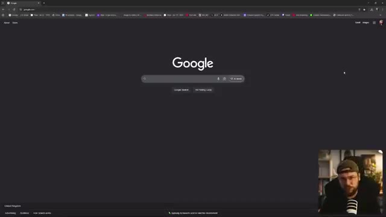
*Navigateur web affichant la page d'accueil de Google en mode sombre, avec le créateur visible en incrustation PiP dans le coin inférieur droit.*

---

### ⏱️ `[00:01:50 - 00:02:11]` | Segment #05

**🔊 Audio (Transcription Intégrale Mot pour Mot en Français) :**
> tu n'as pas besoin de passer par un autre site web ou un truc compliqué de ce genre, boum, tu es dedans. Maintenant, après un certain nombre de générations, tu vas heurter un mur et ça va te dire que tu ne peux plus générer jusqu'à un certain moment plus tard. Et j'ai l'impression que je vais avoir des ennuis à cause de ça quelque part en chemin. Mais si tu ouvres juste une nouvelle fenêtre de navigation privée, tu peux juste continuer comme ça à l'infini.

**👁️ Analyse Visuelle d'Écran (gemini-3.5-flash-lite) :**
**Interface & Outils** : Interface web de LMarena (LMSYS Chatbot Arena) avec un champ de saisie de prompt, un bouton "Image" et le créateur visible en incrustation vidéo (PiP) dans le coin inférieur droit.

**Contenu textuel & Code** : Le texte principal affiche le logo LMSYS avec le slogan "Prompt. Vote. Advance AI." et la description "Over 3.5M votes and counting, join the global community shaping AI through collective feedback." On aperçoit également un champ de saisie avec le texte "Describe the image you want to generate...".

**Action / Démonstration** : Le navigateur web affiche l'interface de génération d'images et de test de l'outil d'intelligence artificielle, tandis que Jack s'adresse au spectateur tout en étant incrusté en bas à droite de l'écran.

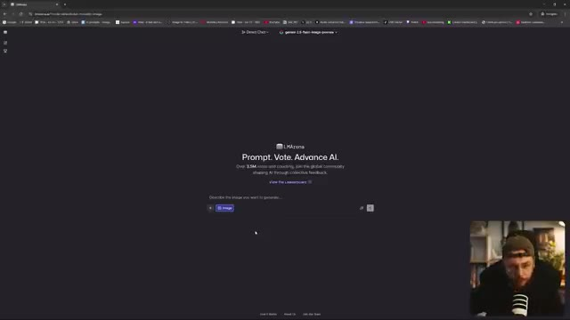
*Interface de l'outil web LMarena avec une barre de prompt de génération d'images et Jack dans un encadré vidéo PiP en bas à droite.*

---

### ⏱️ `[00:02:11 - 00:02:47]` | Segment #06

**🔊 Audio (Transcription Intégrale Mot pour Mot en Français) :**
> J'ai testé ça. J'ai passé des heures sur Nano Banana aujourd'hui. J'ai généré tellement d'images et je n'ai jamais atteint de limite, et je n'ai pas dépensé un seul centime. Alors laissez-moi vous montrer la puissance de cet outil et le nombre d'opportunités créatives qu'il offre réellement. Je vais téléverser cette image que j'ai créée avec Midjourney, qui me représente debout à côté d'un volcan en éruption. Et pour commencer, essayons simplement quelque chose comme changer le plan pour le mettre de nuit. Vous voyez, nous devons simplement accepter les conditions ici et il va commencer à générer notre variante de nuit de ce plan. Maintenant, parfois cela peut bugger si cela continue de rencontrer une erreur.

**👁️ Analyse Visuelle d'Écran (gemini-3.5-flash-lite) :**
**Interface & Outils** : Navigateur web affichant l'interface de la plateforme LMarena (LMSYS Org) avec un design sombre et une zone de saisie pour les prompts. Le présentateur apparaît également dans un encadré vidéo incrusté (PiP) en bas à droite.

**Contenu textuel & Code** : Le logo et le texte "LMArena" avec le slogan "Prompt. Vote. Advance AI." et la mention "Over 3.5M votes and counting, join the global community shaping AI through collective feedback." On y voit aussi un bouton d'importation d'image violet et un champ de texte "Describe the image you want to generate...".

**Action / Démonstration** : Le présentateur navigue sur l'interface web de LMarena et s'apprête à importer une image pour la soumettre au test de génération de l'outil d'intelligence artificielle.

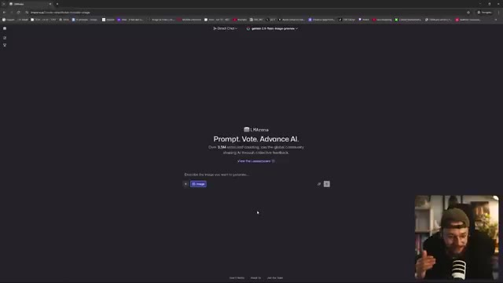
*Interface du site web LMarena affichant la plateforme de test d'IA avec un champ de saisie de prompt et un encadré PiP du présentateur.*

---

### ⏱️ `[00:02:47 - 00:03:21]` | Segment #07

**🔊 Audio (Transcription Intégrale Mot pour Mot en Français) :**
> vers la troisième ou quatrième seconde, il y a probablement quelque chose que Google n'aime pas dans votre invite. Alors allez-y et essayez de la reformuler. Essayez de changer le format de votre phrase. Essayez simplement de penser à ce qui pourrait perturber le générateur d'images, puis cliquez simplement sur relancer. Après un certain temps, tout va se régler de soi-même et vous récupérerez votre image. Et voici notre variante nocturne de la scène du volcan. Allons-y et téléchargeons cela en cliquant sur cette petite icône ici et en appuyant simplement sur enregistrer et la cohérence que vous obtenez de Nano Banana lorsque vous demandez

**👁️ Analyse Visuelle d'Écran (gemini-3.5-flash-lite) :**
**Interface & Outils** : Navigateur web affichant une interface de génération d'images par IA avec un modèle "Gemini 1.5 Flash - Image preview" et un encadré PiP vidéo de Jack dans le coin inférieur droit.

**Contenu textuel & Code** : On aperçoit l'image générée d'un personnage accroupi devant un volcan en éruption, ainsi que le texte du prompt en haut à droite "Change the shot to night time" et un champ de saisie en bas.

**Action / Démonstration** : Le créateur montre à l'écran l'interface de génération d'images par IA et l'image d'un volcan en éruption.

*Interface du navigateur affichant l'outil de génération d'images Google (Gemini / AI Test Kitchen) avec un rendu de volcan et un encadré vidéo (PiP) du créateur en bas à droite.*

---

### ⏱️ `[00:03:21 - 00:03:55]` | Segment #08

**🔊 Audio (Transcription Intégrale Mot pour Mot en Français) :**
> pour faire un changement aussi fondamental sur le plan et réussir à garder l'expression, le personnage cohérent, même les vêtements c'est fou. Et bien sûr cela ouvre des opportunités créatives sans fin. C'était juste une sorte de démo amusante de la façon dont nous pouvons utiliser Nano Banana, mais parlons des choses d'une manière plus pratique où nous pouvons prendre ce plan d'ouverture et réellement construire une scène à partir de celui-ci en utilisant Nano Banana. Maintenant, j'aborde la réalisation de films par IA en différentes étapes et je pense que toutes les meilleures vidéos d'IA proviennent d'une seule et unique super image générée par IA. Alors ce que je pense

**👁️ Analyse Visuelle d'Écran (gemini-3.5-flash-lite) :**
**Interface & Outils** : Visionneuse d'images / lecteur multimédia et navigateur web affichant des rendus visuels générés par intelligence artificielle, avec incrustation vidéo du créateur dans le coin inférieur droit.

**Contenu textuel & Code** : Rendu d'image IA représentant un personnage masculin accroupi sur un sol rocheux avec un volcan en éruption en arrière-plan (lave incandescente et fumée). Nom de fichier visible dans la barre de titre : `gemini-2.0-flash-image-preview_change_the_shot_in_1.mp4`.

**Action / Démonstration** : Le créateur montre à l'écran le résultat de la modification de plan effectuée par l'intelligence artificielle, tout en continuant sa présentation sur la façon d'utiliser l'outil.

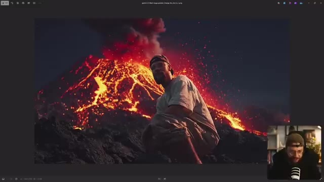
*Aperçu à l'écran d'une image générée montrant un personnage accroupi devant un volcan en éruption, avec le créateur en incrustation (PiP) en bas à droite.*

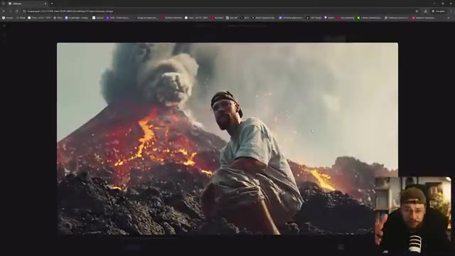
*Affichage à l'écran d'un navigateur web montrant une autre variante du plan avec le personnage devant le volcan en éruption, avec le créateur en incrustation (PiP) en bas à droite.*

---

### ⏱️ `[00:03:55 - 00:04:30]` | Segment #09

**🔊 Audio (Transcription Intégrale Mot pour Mot en Français) :**
> genre la meilleure façon d'utiliser Nano Banana est de prendre une seule image de départ comme notre volcan ici et d'utiliser Nano Banana pour développer votre scène en créant différents angles de caméra pour vous et différentes actions, tout en gardant le style, l'éclairage, l'environnement et votre personnage cohérents. Vous pouvez essentiellement étoffer un storyboard. Vous pouvez y aller plan par plan, puis prendre ces images fixes dans un générateur de vidéo par IA pour les animer. Et comme je le dis, restez jusqu'à la fin de la vidéo parce que je vais vous montrer comment vous pouvez animer vos images IA pour

**👁️ Analyse Visuelle d'Écran (gemini-3.5-flash-lite) :**
**Interface & Outils** : Navigateur web affichant une image générée en plein écran avec une incrustation vidéo (PiP) du présentateur en bas à droite.

**Contenu textuel & Code** : Image visuelle d'un homme accroupi sur un sol rocheux, devant un volcan en éruption active avec de la lave et de la fumée, et un encadré vidéo du créateur dans le coin inférieur droit.

**Action / Démonstration** : Le créateur présente une image de référence générée par IA représentant un personnage devant un volcan, illustrant la méthode pour construire un storyboard.

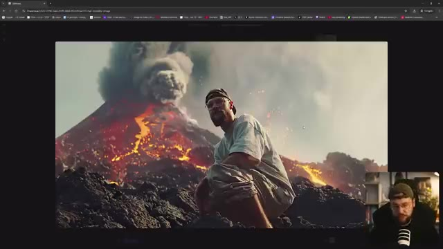
*Image générée montrant un personnage accroupi au premier plan avec un volcan en éruption en arrière-plan, accompagné du retour vidéo du créateur en incrustation (PiP) dans le coin inférieur droit.*

---

### ⏱️ `[00:04:30 - 00:05:06]` | Segment #10

**🔊 Audio (Transcription Intégrale Mot pour Mot en Français) :**
> Tout à fait gratuit également. Donc je vais taper « plan par-dessus l'épaule depuis l'arrière de l'homme ». Et vous pouvez imaginer que nous commençons à étoffer un court métrage essentiellement. Maintenant, si vous essayiez d'obtenir cela avec Midjourney, vous auriez probablement du mal avec la cohérence des personnages, mais regardez ça. C'est juste fou pour moi. On a l'impression que ça fait partie de la même scène, ça fait partie du même monde, tout semble cohérent et si les choses semblent incohérentes, cela brise vraiment ce genre d'immersion que l'on ressent quand on essaie de regarder un court métrage.

**👁️ Analyse Visuelle d'Écran (gemini-3.5-flash-lite) :**
**Interface & Outils** : Interface web de Runway (Gen-3 Alpha / Image-to-Video).

**Contenu textuel & Code** : Affichage d'une image générée représentant un homme devant un volcan en fusion, puis d'une vidéo générée montrant la même scène sous un angle différent (plan par-dessus l'épaule).

**Action / Démonstration** : Le créateur montre la génération d'une séquence vidéo cohérente à partir d'une image existante sur Runway pour illustrer la consistance des personnages et des décors.

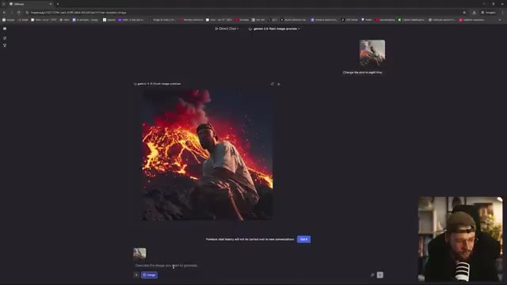
*Interface de Runway montrant une image générée d'un homme accroupi devant un volcan en éruption avec le créateur en incrustation (PiP).*

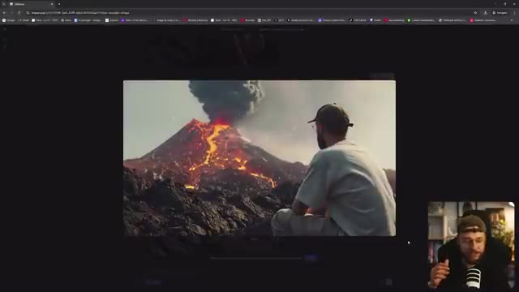
*Interface de Runway affichant un plan vidéo cohérent montrant un homme de dos observant un volcan en éruption, avec le créateur en incrustation (PiP).*

---

### ⏱️ `[00:05:06 - 00:05:26]` | Segment #11

**🔊 Audio (Transcription Intégrale Mot pour Mot en Français) :**
> Et je pense que l'utilisation de Nano Banana de cette manière va éliminer ce problème. Nous avons donc par exemple notre plan de départ, puis nous pourrions couper sur ce plan ici. Remettons simplement l'image de départ et je veux dire gros plan extrême. Allons en fait sur un gros plan extrême des lunettes de l'homme.

**👁️ Analyse Visuelle d'Écran (gemini-3.5-flash-lite) :**
**Interface & Outils** : Navigateur web affichant une interface de chat avec un modèle d'IA (GenAI) et fenêtre de sélection de fichiers du système d'exploitation.

**Contenu textuel & Code** : Galerie d'images miniatures de projets vidéo, champ de saisie de prompt contenant le texte "Extreme close up on the".

**Action / Démonstration** : Le créateur navigue dans ses fichiers pour resélectionner l'image de départ et tape un prompt textuel pour demander un plan en gros plan extrême sur les lunettes.

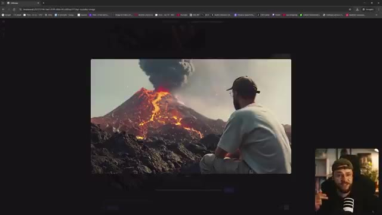
*Démonstration à l'écran @ 00:05:08*

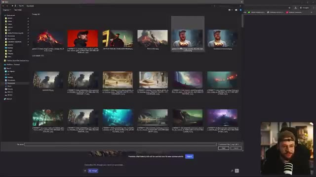
*Démonstration à l'écran @ 00:05:16*

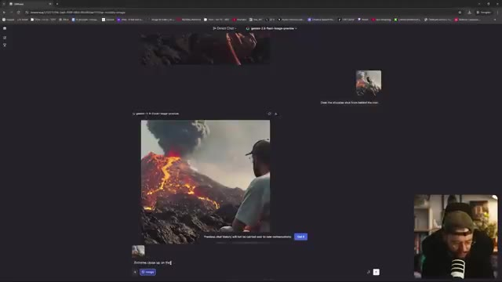
*Démonstration à l'écran @ 00:05:24*

---

### ⏱️ `[00:05:26 - 00:06:01]` | Segment #12

**🔊 Audio (Transcription Intégrale Mot pour Mot en Français) :**
> Nous pouvons voir le volcan actif se refléter dans leurs verres. Donc en fait, vous pouvez voir que ça a coincé ici. C'est, je ne plaisante même pas, la première fois que j'obtiens un résultat un peu mauvais de Nano Banana. Ce qu'on va faire, c'est que je vais simplement copier ce même prompt, le déposer ici, et je veux spécifier le type de lunettes que j'ai. Disons donc des lunettes à monture filaire dorée, et on va juste redéposer cette même image de départ et lancer le tout. D'accord, c'est un peu mieux. Je pense que c'est définitivement

**👁️ Analyse Visuelle d'Écran (gemini-3.5-flash-lite) :**
**Interface & Outils** : Interface web de type LLM / générateur d'images multimodal (Gemini 1.5 Flash - Image preview).

**Contenu textuel & Code** : Texte du prompt visible : « Extreme close up on the man's glasses, we can see the active volcano reflected in their lenses. » et sa variante modifiée spécifiant « gold wireframe glasses ».

**Action / Démonstration** : Le créateur démontre un résultat insatisfaisant d'une génération d'image par IA, puis modifie son prompt dans l'interface pour spécifier le type de monture de lunettes et relance la génération afin d'obtenir un meilleur résultat.

*Interface du navigateur web montrant un chat IA avec une image générée d'un homme regardant un volcan en éruption.*

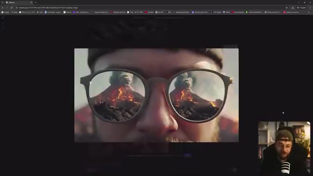
*Gros plan sur l'image générée montrant le visage d'un homme avec des lunettes et le reflet d'un volcan dans les verres.*

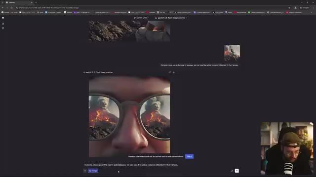
*Interface montrant le résultat d'une nouvelle génération après modification du prompt sur l'outil IA.*

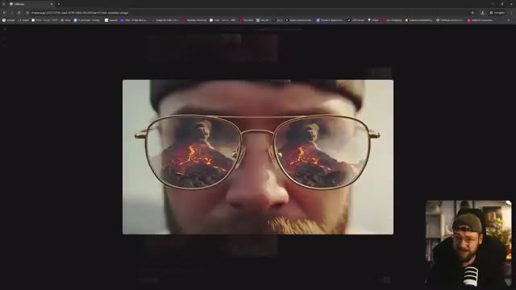
*Gros plan final montrant le résultat amélioré avec des lunettes à monture dorée et le volcan reflété dans les verres.*

---

### ⏱️ `[00:06:01 - 00:06:37]` | Segment #13

**🔊 Audio (Transcription Intégrale Mot pour Mot en Français) :**
> utilisable. Encore une fois, vous pouvez toujours cliquer sur réessayer et nous verrons ce que nous obtenons lors d'un deuxième essai. Encore une fois, c'est plutôt cool. Un peu plus de variation dans le reflet là-bas et je veux juste tester quelque chose ici parce que je n'ai pas vraiment essayé cela auparavant. Déposons l'image de départ et je veux dire plan de drone d'en haut regardant vers le bas sur la vaste scène volcanique, je vais juste taper aussi à la fin ici dramatique et cinématique et nous allons cliquer sur exécuter sur cela, d'accord c'est assez cool mais on ne peut pas nous voir dans la scène ce que je dirais cependant c'est que ça a l'air très cohérent en termes

**👁️ Analyse Visuelle d'Écran (gemini-3.5-flash-lite) :**
**Interface & Outils** : Interface web de génération de vidéo par IA avec un panneau de prévisualisation et une incrustation vidéo du présentateur (PiP) dans le coin inférieur droit.

**Contenu textuel & Code** : Interface utilisateur affichant des zones de saisie de prompt, des options d'importation d'image et des résultats de génération de scènes volcaniques.

**Action / Démonstration** : Le présentateur manipule l'interface pour tester une nouvelle image de départ avec un prompt décrivant un plan de drone au-dessus d'une scène volcanique.

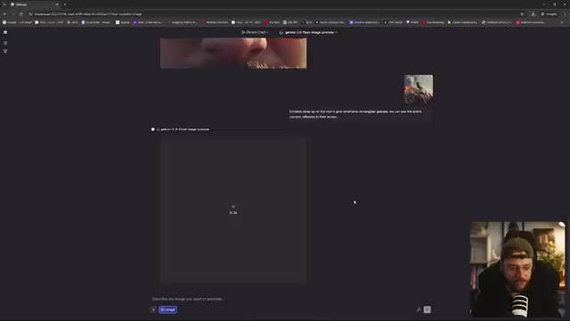
*Interface de génération vidéo montrant le panneau de chargement d'une image de départ avec le créateur en incrustation PiP.*

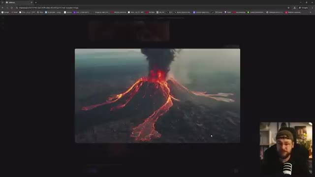
*Affichage à l'écran du résultat de la génération montrant une vue aérienne spectaculaire d'un volcan en éruption.*

---

### ⏱️ `[00:06:37 - 00:07:12]` | Segment #14

**🔊 Audio (Transcription Intégrale Mot pour Mot en Français) :**
> de l'environnement, de l'éclairage et de la palette de couleurs, donc cela fonctionnerait certainement encore dans le contexte d'un court métrage généré par IA. Essayons simplement d'être un tout petit peu plus précis. Regardons donc de haut la vaste scène volcanique et l'homme agenouillé à côté du volcan actif. Insérons à nouveau notre image de départ et voyons si cela fonctionne. En fait, ça a un peu échoué à nous donner cette perspective du dessus, mais ça nous offre quand même une très belle variation de l'originale.

**👁️ Analyse Visuelle d'Écran (gemini-3.5-flash-lite) :**
**Interface & Outils** : Interface web de génération vidéo par IA (Luma Labs / Dream Machine) avec un navigateur web en arrière-plan et la webcam du créateur en incrustation PiP.

**Contenu textuel & Code** : Texte du prompt visible sous l'image générée : "Drone shot from above. Looking down on the vast volcanic scene. Dramatic; cinematic."

**Action / Démonstration** : Le créateur montre à l'écran le résultat d'une génération vidéo de volcan en éruption et analyse le rendu par rapport au prompt textuel saisi.

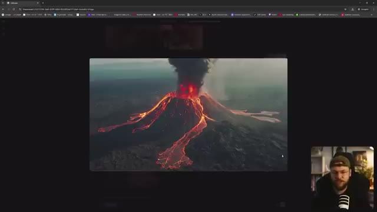
*Visualisation en plein écran d'une vidéo générée montrant un volcan en éruption avec des coulées de lave, avec le créateur visible en incrustation (PiP) dans le coin inférieur droit.*

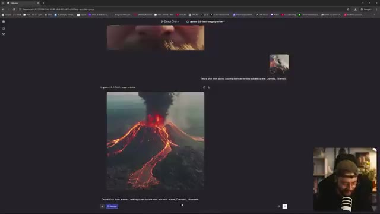
*Interface de génération vidéo par IA (Luma Dream Machine ou similaire) affichant le résultat de la génération avec le prompt textuel en dessous et le créateur en incrustation (PiP).*

---

### ⏱️ `[00:07:12 - 00:07:47]` | Segment #15

**🔊 Audio (Transcription Intégrale Mot pour Mot en Français) :**
> s'est tout seul donc ça ne m'énerve pas trop, genre tu peux quand même l'utiliser c'est un peu comme un heureux hasard, tu vois ? Je veux juste essayer de glisser ce plan ici maintenant, donc là c'est moi dans une sorte de coupe-vent debout avec une fontaine d'eau derrière moi, ça donne un style streetwear plutôt cool et je veux dire un truc du genre plan d'ensemble large, l'homme barbu est rapetissé par le vaste environnement urbain, on peut imaginer par exemple qu'on est en train de monter une publicité pour une marque de streetwear et encore en fait

**👁️ Analyse Visuelle d'Écran (gemini-3.5-flash-lite) :**
**Interface & Outils** : Navigateur web affichant une application de génération vidéo/multimodale par intelligence artificielle avec une vue PiP (Picture-in-Picture) de Jack en bas à droite.

**Contenu textuel & Code** : Texte visible dans l'interface : "Describe the video you want to generate" et dans le champ de prompt : "Wide establishing shot, the bearded man is dwarfed...".

**Action / Démonstration** : Le créateur montre des exemples de plans générés par IA dans l'interface et discute de leur intégration potentielle pour une publicité de streetwear.

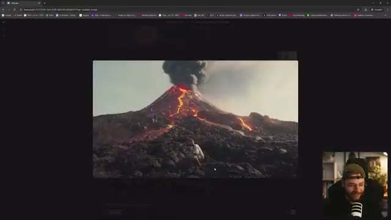
*Interface d'un outil de génération vidéo par IA montrant un plan généré d'un homme près d'un volcan en éruption.*

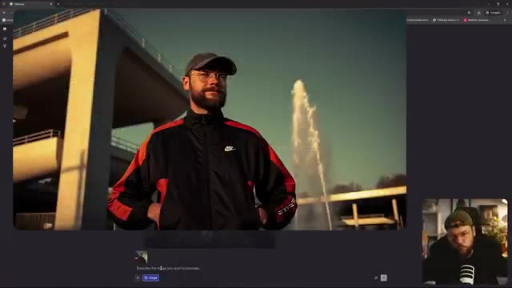
*Interface de l'outil montrant le plan de Jack en coupe-vent avec une fontaine en arrière-plan et un champ de saisie de prompt en bas.*

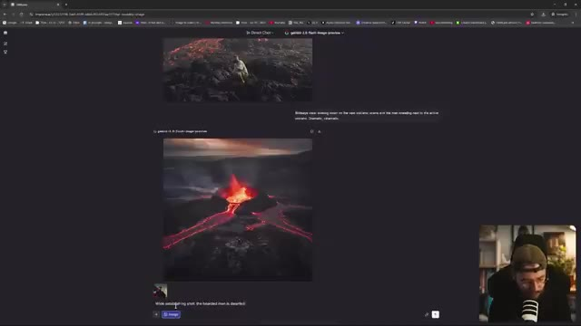
*Interface de l'outil montrant des images générées et le prompt textuel associé au plan d'ensemble urbain.*

---

### ⏱️ `[00:07:47 - 00:08:19]` | Segment #16

**🔊 Audio (Transcription Intégrale Mot pour Mot en Français) :**
> ça a du mal avec ça donc je veux relancer ça c'est assez ironique que les premiers problèmes que j'aie eus avec nano banana aient été quand j'ai cliqué sur enregistrer c'est vraiment étrange de voir comment ça garde ma pose et ma position exactement pareille ce qui n'a pas été le cas lors de nos autres essais avec la scène du volcan et ça nous colle juste au sommet de cet environnement différent je veux aller de l'avant et cliquer sur nouveau chat juste pour tester cela il semble que ce soit un peu étrange et buggé voyons si nous pouvons obtenir de meilleurs résultats dans un nouveau chat une ardoise propre donc rajoutons notre image de départ et essayons juste quelque chose

**👁️ Analyse Visuelle d'Écran (gemini-3.5-flash-lite) :**
**Interface & Outils** : Navigateur web affichant l'application web LMarena (LMSYS Chatbot Arena / mode image-vidéo) avec le créateur en incrustation PiP dans le coin inférieur droit.

**Contenu textuel & Code** : Texte visible à l'écran : "LMArena", "Prompt. Vote. Advance AI.", "Over 3.5M... join the global community shaping AI through collective feedback", et le prompt textuel dans le chat : "Wide establishing shot, the bearded man is dwarfed by the vast virtual environment."

**Action / Démonstration** : Le créateur navigue sur l'interface de LMarena, observe les résultats de génération vidéo avec une image de départ, puis s'apprête à lancer un nouveau chat pour recommencer un test.

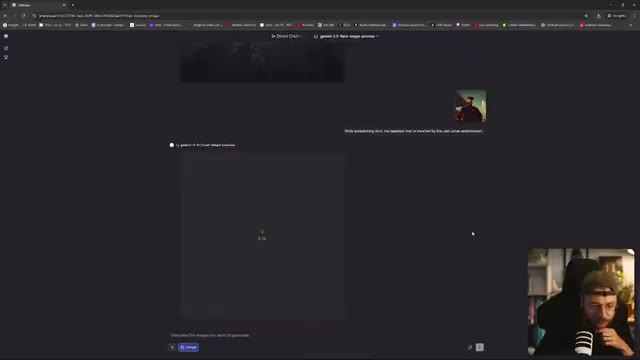
*Interface de l'outil LMarena affichant une génération en cours avec une vue pré-enregistrée du créateur en incrustation PiP.*

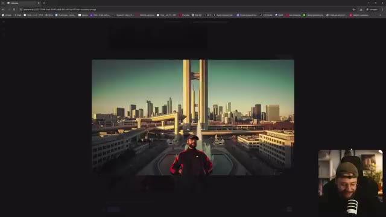
*Résultat d'une génération vidéo montrant le créateur incrusté au centre d'un paysage urbain futuriste avec une grande tour.*

*Page d'accueil de l'interface LMarena ("Prompt. Vote. Advance AI.") avec une barre de prompt vide et un bouton d'importation d'image.*

---

### ⏱️ `[00:08:19 - 00:08:48]` | Segment #17

**🔊 Audio (Transcription Intégrale Mot pour Mot en Français) :**
> vraiment un plan de drone simple d'en haut dramatique et cinématique très bien alors maintenant on commence à avancer j'ai l'air cohérent ma tenue est cohérente l'environnement lui-même est cohérent mais ça a réussi à changer ma pose et pourtant tout reste tonalement le même. Essayez encore une légère variation. Essayons juste un plan de drone à cent pieds dans le ciel qui regarde vers le bas sur l'homme barbu.

**👁️ Analyse Visuelle d'Écran (gemini-3.5-flash-lite) :**
**Interface & Outils** : Navigateur web affichant la plateforme de test de modèles d'IA LMarena (LMSYS Chatbot Arena) avec un design sombre, avec la caméra Picture-in-Picture (PiP) du présentateur Jack en bas à droite.

**Contenu textuel & Code** : Texte visible à l'écran : "LMArena", "Prompt. Vote. Advance AI.", "Over 3.5M votes and counting...", "gemini-2.5-flash-image-preview", et le prompt textuel "Drone shot from above. Dramatic, cinematic." sous l'image miniature.

**Action / Démonstration** : Le créateur navigue sur l'interface de LMarena, observe le résultat de génération d'image aérienne par le modèle Gemini, et s'apprête à modifier son prompt pour tester une variation de la prise de vue par drone.

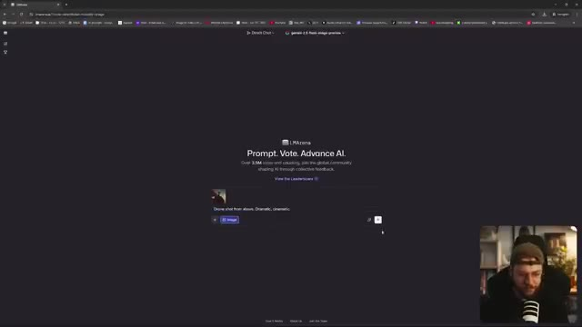
*Interface du site web LMarena montrant la zone de prompt avec l'historique et le modèle sélectionné 'gemini-2.5-flash-image-preview', avec la webcam du créateur incrustée en bas à droite.*

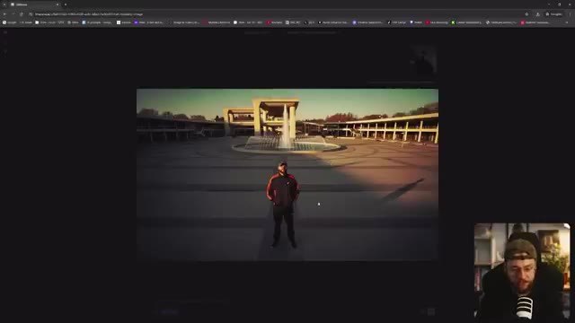
*Affichage du résultat généré montrant un plan large en plongée (drone) d'une place extérieure avec une fontaine et une personne au centre.*

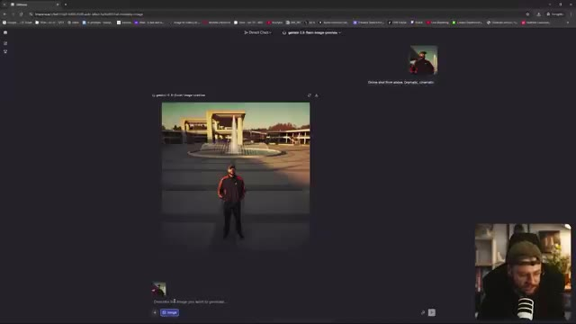
*Interface de LMarena affichant l'image générée précédente et le champ de saisie de texte pour un nouveau prompt en bas.*

---

### ⏱️ `[00:08:48 - 00:09:22]` | Segment #18

**🔊 Audio (Transcription Intégrale Mot pour Mot en Français) :**
> Soyez un peu plus précis concernant la hauteur et la distance entre la caméra et notre sujet. Très bien, ce n'est donc pas à cent pieds dans le ciel, mais c'est quand même un très bon résultat. Encore une fois, la pose est vraiment très différente de notre image de départ, n'est-ce pas ? Mais cela ressemble quand même vraiment, vraiment beaucoup à moi. Remettons simplement notre image de départ et disons que l'homme barbu est accoudé contre un mur graffité, relançons ce prompt et voyons ce que nous obtenons ici encore, je suis en quelque sorte

**👁️ Analyse Visuelle d'Écran (gemini-3.5-flash-lite) :**
**Interface & Outils** : Navigateur web affichant l'interface de l'outil Runway (Gen-3 Alpha / gen-3-flash-image-preview) avec incrustation vidéo PiP du créateur en bas à droite.

**Contenu textuel & Code** : Texte visible du prompt : "Drone shot from 100 feet in the sky looking down on the bearded man. Cinematic, cinematic." et paramètres de génération.

**Action / Démonstration** : Le créateur commente les résultats de génération vidéo et modifie les prompts pour tester de nouvelles configurations de plans et de décors.

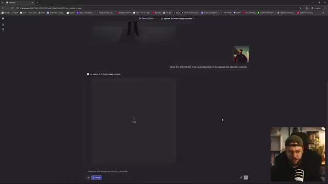
*Interface de l'outil de génération vidéo affichant les paramètres du prompt et le retour de génération en cours de chargement.*

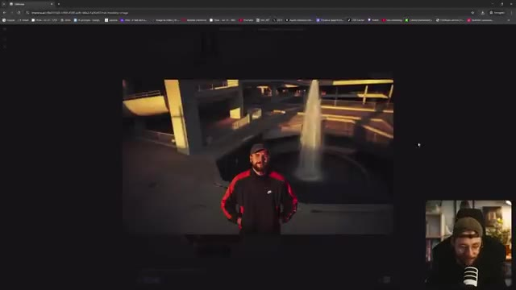
*Affichage en grand format de la vidéo générée montrant Jack près d'une fontaine vue en plongée aérienne.*

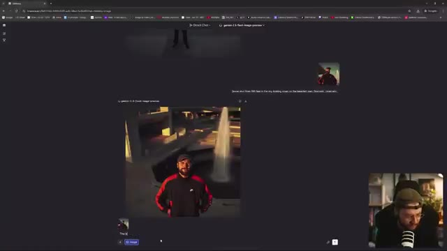
*Interface montrant l'ajout d'une nouvelle image source pour une nouvelle génération de prompt textuel.*

---

### ⏱️ `[00:09:22 - 00:09:57]` | Segment #19

**🔊 Audio (Transcription Intégrale Mot pour Mot en Français) :**
> en essayant d'imaginer qu'on est en train de créer une publicité pour une marque de streetwear donc on veut que les environnements restent urbains mais juste avec un peu de variation en termes d'angles de caméra et de poses. Et encore une fois on a obtenu un résultat vraiment incroyable. Ça ressemble toujours à moi et c'est toujours la même tenue. Essayons quelque chose d'un peu plus poussé maintenant. Essayons exactement la même image de départ mais disons que l'homme barbu est assis sur une chaise en bois solitaire au milieu d'une vaste forêt verte et nous allons mettre en

**👁️ Analyse Visuelle d'Écran (gemini-3.5-flash-lite) :**
**Interface & Outils** : Interface web d'un outil de génération d'images et vidéos par IA (type Runway Gen-3 ou similaire) avec une disposition de chat, zone de prévisualisation et incrustation vidéo (PiP) du créateur.

**Contenu textuel & Code** : Texte visible dans l'interface : "The bearded man is leaning up against a graffited wall.", menus "Direct Chat" et "gen3-2.5-flash-image-preview".

**Action / Démonstration** : Le créateur navigue dans l'interface de l'outil d'IA, montrant les différentes générations et résultats de vidéos de streetwear urbain.

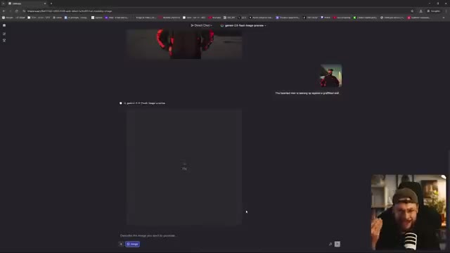
*Interface d'un outil de génération vidéo par IA montrant le résultat avec un homme adossé à un mur graffité et un encadré vidéo du créateur en bas à droite.*

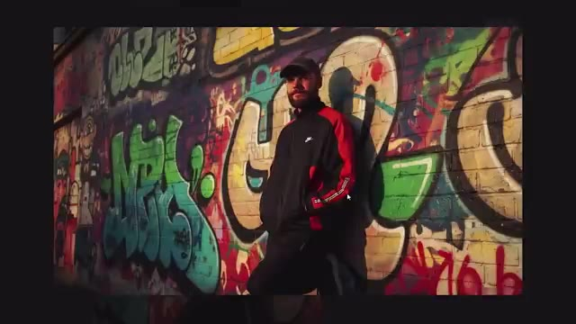
*Gros plan sur la vidéo générée montrant l'homme barbu habillé d'une veste survêtement rouge et noire, adossé à un mur de briques recouvert de graffitis colorés.*

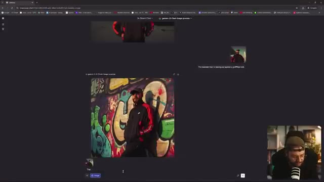
*Interface de l'outil de génération montrant l'insertion de l'image de l'homme devant le mur graffité dans le champ de prompt pour une nouvelle génération.*

---

### ⏱️ `[00:09:57 - 00:10:27]` | Segment #20

**🔊 Audio (Transcription Intégrale Mot pour Mot en Français) :**
> la fin aussi cinématique dramatique parce que cela semblait bien fonctionner pour nous donc vous savez peut-être qu'on élabore un lookbook pour une marque par exemple tout ce qu'on a vraiment eu à payer c'était midjourney pour faire notre image de départ et ensuite on utilise simplement nano banana pour construire notre histoire. Et encore une fois, c'est un résultat vraiment incroyable. Je veux juste relancer ceci pour voir si on obtient une légère variation. Honnêtement, c'est du tâtonnement. Vous savez comment c'est.

**👁️ Analyse Visuelle d'Écran (gemini-3.5-flash-lite) :**
**Interface & Outils** : Interface web d'un outil de génération d'images/vidéos par IA (type application web personnalisée ou plateforme de génération), avec une zone de chat/prompt en bas et un affichage des résultats sous forme de grille ou d'historique. Présence d'une incrustation vidéo (PiP) du créateur en bas à droite.

**Contenu textuel & Code** : Texte du prompt visible : "The bearded man is sat on a lone wooden chair in the middle of a vast green forest. Dramatic. Cinematic." Modèle mentionné dans l'interface : "gemini-2.5-flash-image-preview".
[DESC_IMAGE_1] L'utilisateur consulte l'interface web montrant les résultats de génération et le prompt textuel associé.
[DESC_IMAGE_2] L'utilisateur montre le résultat vidéo en plein écran d'un homme assis dans une forêt.
[DESC_IMAGE_3] L'utilisateur relance une génération pour observer de potentielles variations (chargement en cours).

**Action / Démonstration** : Démonstration pédagogique et présentation du workflow.

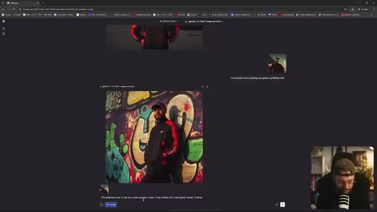
*Interface d'une application web affichant des images générées par IA avec un panneau de saisie de prompt, avec la petite incrustation vidéo du créateur en bas à droite.*

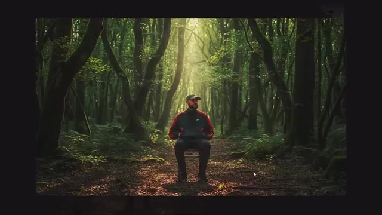
*Affichage en plein écran d'une vidéo générée montrant un homme assis sur une chaise en bois au milieu d'une vaste forêt verte avec des rayons de soleil.*

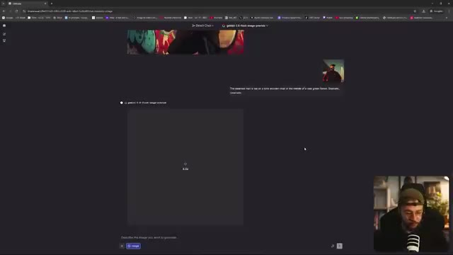
*Interface web de génération montrant une zone de chargement en cours de traitement avec un aperçu en gris.*

---

### ⏱️ `[00:10:27 - 00:11:02]` | Segment #21

**🔊 Audio (Transcription Intégrale Mot pour Mot en Français) :**
> Si vous recherchez quelque chose d'assez spécifique, vous voulez probablement étoffer un peu plus vos invites avec des mots. En réalité, ces invites sont vraiment courtes par rapport à ce que je mettrais habituellement. Maintenant, je n'aime pas trop ce résultat, alors nous allons recommencer. Évidemment, il y a un côté un peu plus étranger et surréaliste qui se passe ici. Je me demande si c'est la fin, le côté dramatique et cinématographique qui fausse le résultat. C'est plutôt cool. J'aime assez, en fait. Je ressens vraiment l'ambiance cinématographique et ça me ressemble. Comme rapide expérience, je veux réinsérer cette image de départ. Je veux juste enlever "dramatique et cinématographique" à la fin et voir si on obtient un

**👁️ Analyse Visuelle d'Écran (gemini-3.5-flash-lite) :**
**Interface & Outils** : Navigateur web affichant une interface sombre d'outil de génération d'images/vidéos par IA (type Seedance ou similaire) avec affichage du créateur en incrustation (PiP) dans le coin inférieur droit.

**Contenu textuel & Code** : Texte du prompt visible : "The bearded man is sat on a lone wooden chair in the middle of a vast green forest. Dramatic, cinematic."

**Action / Démonstration** : Le créateur montre le résultat d'une génération d'image par IA dans une forêt, commente le résultat, puis modifie le prompt textuel en supprimant certains termes descriptifs pour observer l'impact.

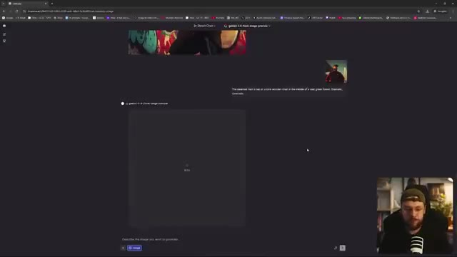
*Interface d'un outil de génération d'image par IA montrant le chargement d'un résultat avec un prompt textuel.*

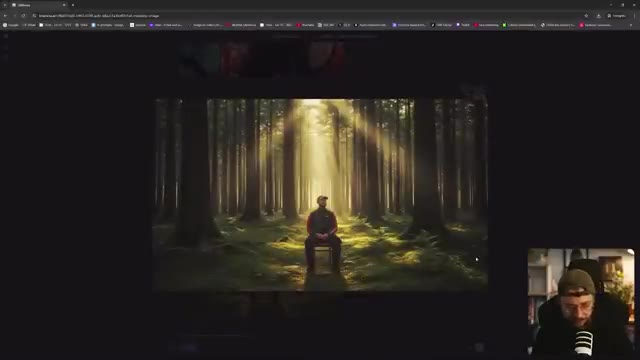
*Affichage en grand format de l'image générée représentant un homme assis sur une chaise dans une forêt lumineuse.*

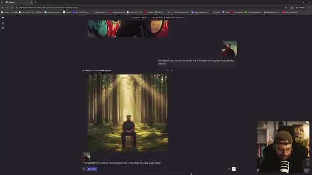
*Interface de l'outil montrant l'image générée finale et le champ de modification du prompt textuel en bas.*

---

### ⏱️ `[00:11:02 - 00:11:30]` | Segment #22

**🔊 Audio (Transcription Intégrale Mot pour Mot en Français) :**
> meilleur résultat. Peut-être que pour une raison quelconque, cela fausse le résultat. Et en fait, oui, je pense que c'est un meilleur résultat. Donc peut-être qu'ajouter des références de style comme ça à la fin pose quelques problèmes. Et encore une fois, c'est un très beau résultat. Ça a toujours l'air et ça se sent comme moi, et on dirait que je suis vraiment dans cet environnement. Ce n'est pas un montage Photoshop louche. Ça a l'air vivant. Peut-être qu'on pourrait s'amuser avec notre miniature de vidéo ici aussi. Importons ça.

**👁️ Analyse Visuelle d'Écran (gemini-3.5-flash-lite) :**
**Interface & Outils** : Interface web de l'outil de génération d'images/vidéos (type Midjourney/Runway/Seedance) avec une fenêtre de sélection de fichiers Windows par-dessus, et une incrustation vidéo (PiP) du créateur en bas à droite.

**Contenu textuel & Code** : On peut apercevoir dans l'interface le texte de prompt partiel : "The bearded man is sat in a sore wooden chair in the middle of a vast green forest". La fenêtre de fichiers montre plusieurs vignettes de générations artistiques et de portraits du créateur.

**Action / Démonstration** : Le créateur commente les différents résultats de génération d'images et navigue dans ses fichiers pour importer une image destinée à la miniature de la vidéo.

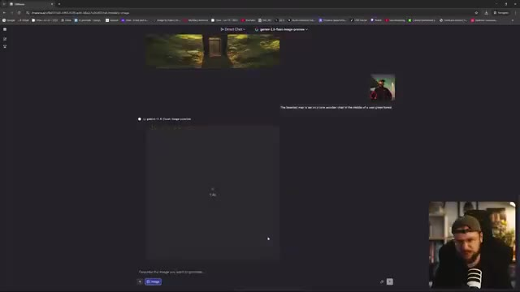
*Interface de l'outil web de génération d'image montrant le résultat d'un prompt avec le personnage assis dans une forêt verdoyante.*

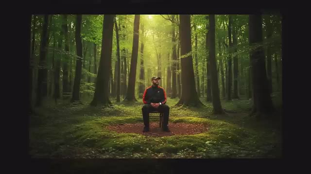
*Gros plan sur le rendu vidéo ou l'image générée montrant le créateur assis sur une chaise au milieu d'une clairière lumineuse dans une forêt.*

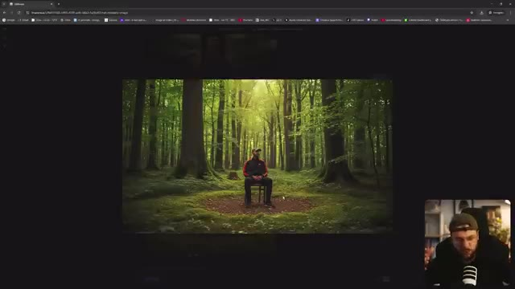
*Vue similaire de l'image générée du créateur dans la forêt lumineuse, affichée en plein écran dans l'interface de l'outil.*

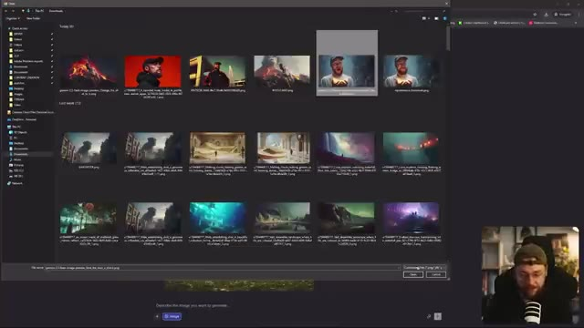
*Fenêtre de l'explorateur de fichiers Windows affichant une grille d'images et de rendus générés par IA, avec une miniature sélectionnée.*

---

### ⏱️ `[00:11:30 - 00:12:09]` | Segment #23

**🔊 Audio (Transcription Intégrale Mot pour Mot en Français) :**
> Et nous allons simplement essayer quelque chose comme l'homme tient un chaton au lieu d'une banane. Et regardez ça. C'est fou. Il a même eu l'idée de mettre un effet lumineux sur notre chaton. C'est complètement transparent. Je reste incroyablement cohérent par rapport à l'image de départ. Le chat a l'air stylistiquement identique. Genre, il n'y a aucune rupture entre ce nouvel élément qu'on vient de demander à Nano Banana de mettre dans notre image. On dirait qu'il a toujours été là. Et c'est la vraie chose magique avec cet outil, je pense. On va le ramener dans LM Arena et on va dire, mets l'homme et le chat

**👁️ Analyse Visuelle d'Écran (gemini-3.5-flash-lite) :**
**Interface & Outils** : Navigateur web affichant l'interface de LM Arena avec un panneau de chat direct et des zones de prévisualisation d'images et de prompts

**Contenu textuel & Code** : Texte de prompt visible "The man is holding a kitten instead of a banana", ainsi que le nouveau prompt en cours de frappe "Put th..."

**Action / Démonstration** : Le créateur montre le résultat de la modification d'image par IA où la banane a été remplacée par un chaton lumineux, puis retourne dans l'interface LM Arena pour saisir une nouvelle instruction.

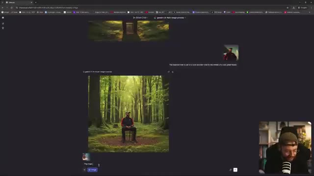
*Interface LM Arena montrant l'éditeur avec une image d'un homme assis dans une forêt et un champ de texte de prompt en bas à gauche*

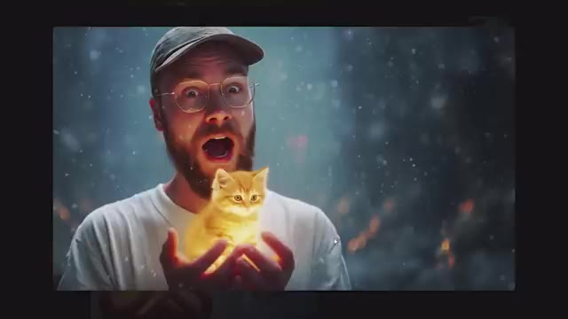
*Gros plan sur l'image générée montrant un homme tenant un chaton lumineux dans ses mains avec un effet de neige et de lueur*

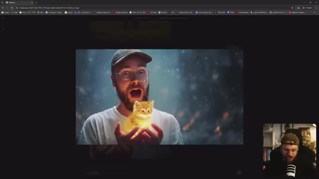
*Vue légèrement élargie de la même génération montrant le chaton lumineux tenu par l'homme*

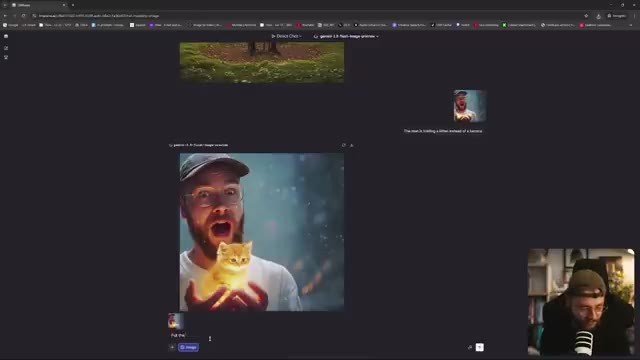
*Retour à l'interface LM Arena où l'utilisateur commence à taper un nouveau prompt "Put th..." en bas*

---

### ⏱️ `[00:12:09 - 00:12:42]` | Segment #24

**🔊 Audio (Transcription Intégrale Mot pour Mot en Français) :**
> dans un environnement chaleureux de café à chats. D'accord, donc on a en fait atteint notre limite maintenant. Ça nous indique qu'on doit attendre environ une heure pour recommencer à générer. Cependant, laissez-moi simplement fermer la fenêtre de navigation privée. Je vais créer une nouvelle fenêtre de navigation privée et me rendre sur LM Arena. Ça va vérifier à nouveau, accepter les cookies, aller en haut, chat direct, cliquer sur générer des images. Ça va nous remettre directement sur Nano Banana. Je vais déposer notre image de moi tenant le chat lumineux. Je suis presque sûr

**👁️ Analyse Visuelle d'Écran (gemini-3.5-flash-lite) :**
**Interface & Outils** : Navigateur web affichant la plateforme LM Arena (lmarena.ai) avec une interface de chat direct et de génération d'images. Un encadré PiP (Picture-in-Picture) montre Jack dans son studio.

**Contenu textuel & Code** : Historique de conversation sur LM Arena avec des images générées et des prompts textuels visibles, notamment "Put the man and the cat into a zoo" sous l'une des images.

**Action / Démonstration** : Le créateur navigue sur la plateforme LM Arena en mode navigation privée et visualise les résultats de génération d'images avec des chats.

*Interface du site LM Arena montrant un échange de chat avec des images générées, incluant Jack tenant un chat lumineux, avec un encadré PiP du créateur dans le coin inférieur droit.*

---

### ⏱️ `[00:12:42 - 00:13:15]` | Segment #25

**🔊 Audio (Transcription Intégrale Mot pour Mot en Français) :**
> c'est le même prompt. Il suffit de cliquer sur exécuter. Nous devons accepter. Et ouais, je pense que ce truc fonctionne. Je me sens un peu mal de partager ça, mais tu sais, vous êtes mes abonnés. J'ai l'impression qu'on doit partager l'amour, non ? Un petit truc malin. Peut-être que ça ne marchera pas éternellement. Peut-être que si. Et regardez ça, mec. C'est fou. Relançons encore une fois. On peut vraiment obtenir des résultats de fou avec ça. Mais je veux vraiment que vous imaginiez développer vos intrigues dans un storyboard, puis animer chacune de ces images pour construire un film. Encore une fois, une autre très belle génération.

**👁️ Analyse Visuelle d'Écran (gemini-3.5-flash-lite) :**
**Interface & Outils** : Navigateur web affichant une application de génération d'images/vidéos par IA, avec une vue en incrustation (PiP) du créateur dans le coin inférieur droit.

**Contenu textuel & Code** : Interface utilisateur avec des champs de saisie de texte et des éléments de design minimalistes sur fond sombre, affichant un résultat visuel généré représentant un personnage tenant un chaton lumineux.

**Action / Démonstration** : Le créateur montre l'interface à l'écran et commente le résultat de la génération d'image par l'intelligence artificielle.

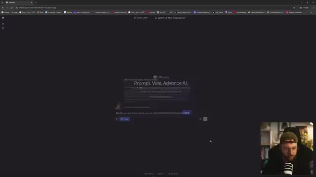
*Interface d'un outil web d'intelligence artificielle montrant un champ de texte de prompt avec un bouton d'exécution et une incrustation vidéo du créateur dans le coin inférieur droit.*

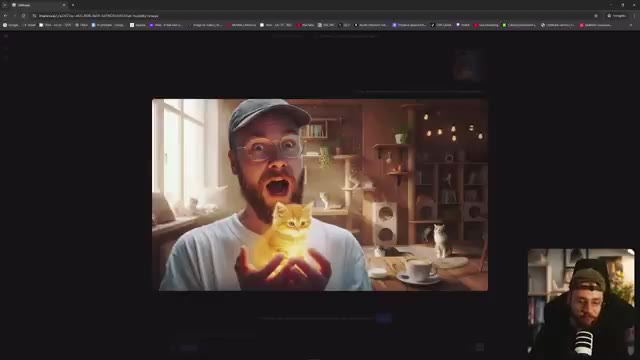
*Affichage à l'écran du résultat généré montrant un homme barbu tenant un chaton brillant dans une pièce chaleureuse, avec le créateur visible en incrustation PiP.*

---

### ⏱️ `[00:13:15 - 00:13:49]` | Segment #26

**🔊 Audio (Transcription Intégrale Mot pour Mot en Français) :**
> La puissance de cet outil, ça m'épate un peu à chaque fois qu'on clique sur générer, pour être honnête. Très bien. Donc, comme promis les gars, si vous voulez obtenir vos générations d'images IA gratuites, vous allez devoir passer par Discord. Je vais mettre un lien pour ce Discord dans la description. Si vous voulez cliquer dessus, il s'agit en fait du Discord de LM Arena. Vous voulez cliquer et aller dans l'une de ces arènes vidéo. Et une fois à l'intérieur, vous voulez taper slash et aller sur image vers vidéo. Je veux déposer notre scène de volcan nocturne ici. Et il y a une petite section où il

**👁️ Analyse Visuelle d'Écran (gemini-3.5-flash-lite) :**
**Interface & Outils** : Navigateur web affichant une image générée, bureau Windows avec Discord, puis application Discord complète.

**Contenu textuel & Code** : Sur l'image 1, une image générée d'un chat lumineux tenu par Jack. Sur l'image 3, l'interface du serveur Discord de "LM Arena" avec les salons "video-arena-1", "video-arena-2", etc.

**Action / Démonstration** : Jack montre l'image générée, puis bascule sur le bureau pour ouvrir l'application Discord et naviguer dans les salons de l'arène vidéo.

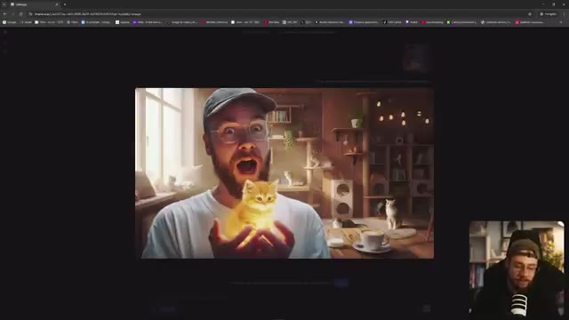
*Image de chat générée par IA affichée en grand sur l'écran de l'ordinateur de Jack.*

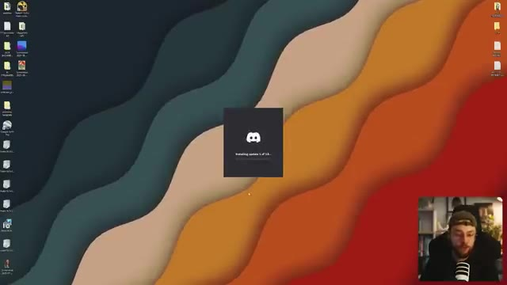
*Bureau Windows avec le logo Discord au centre lors d'une mise à jour logicielle.*

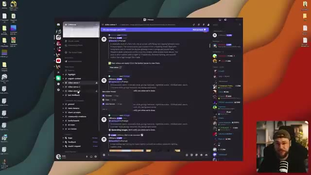
*Interface du serveur Discord "LM Arena" montrant les salons textuels et les arènes vidéo.*

---

### ⏱️ `[00:13:49 - 00:14:23]` | Segment #27

**🔊 Audio (Transcription Intégrale Mot pour Mot en Français) :**
> vous permet d'entrer un prompt et optons pour quelque chose comme un tournage à la main tremblant. L'homme s'agenouille avec assurance à côté du volcan en activité alors qu'il entre en éruption violente. Nous cliquons sur entrée et cela va nous donner un petit message. Nous devons attendre environ 10 minutes pour récupérer notre génération. Donc la façon dont fonctionne LM Arena, les gars, c'est qu'il consolide toutes ces données pour essayer de prouver quels outils d'IA sont les meilleurs et cela aboutit à un classement. Et quand il s'agit de

**👁️ Analyse Visuelle d'Écran (gemini-3.5-flash-lite) :**
**Interface & Outils** : Application Discord sur bureau, utilisant le serveur/bot LM Arena pour la génération de vidéos par IA.

**Contenu textuel & Code** : Commandes Discord incluant `/image-to-video`, prompt : "Shaky handheld device filming. The man kneels confidently next to the active volcano as it violently erupts.", et messages d'attente ("Generating videos. This can take up to 10 minutes").

**Action / Démonstration** : Le créateur tape un prompt textuel pour générer une vidéo à partir d'une image de volcan dans une interface Discord.

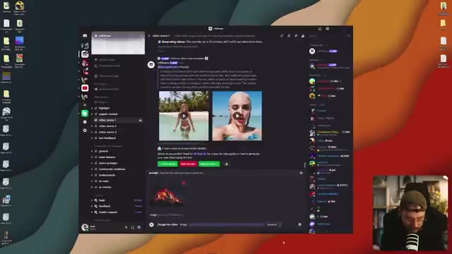
*Interface Discord de LM Arena affichant une génération de vidéo en cours avec deux vidéos côte à côte et des boutons de vote.*

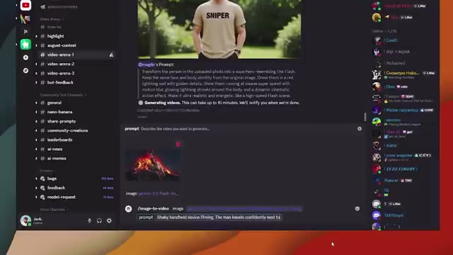
*Gros plan sur la saisie du prompt '/image-to-video' dans Discord avec le texte sur le volcan en éruption.*

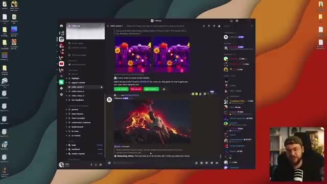
*Interface Discord de LM Arena montrant le message de génération en cours avec le prompt pour le volcan.*

---

### ⏱️ `[00:14:23 - 00:14:44]` | Segment #28

**🔊 Audio (Transcription Intégrale Mot pour Mot en Français) :**
> Ce serveur Discord vous permet d'obtenir deux générations issues de modèles vidéo aléatoires. C'est donc vraiment une loterie : vous pouvez obtenir de bonnes générations comme vous pouvez en avoir de très mauvaises. Mais si vous rejoignez cette communauté, je vous encourage vivement à voter pour la meilleure génération, car c'est bien sûr ainsi qu'Ella Marina récolte ses données et établit les classements.

**👁️ Analyse Visuelle d'Écran (gemini-3.5-flash-lite) :**
**Interface & Outils** : Application Discord sur bureau avec un serveur de génération de vidéos par IA (LMArena) affichant des salons textuels et des fenêtres de prévisualisation de vidéos côte à côte.

**Contenu textuel & Code** : Interface Discord de LMArena, prompt de génération vidéo visible dans les messages, deux vidéos de comparaison côte à côte avec des boutons de vote verts ("Model A is better", "Tie", "Model B is better") sous les résultats.

**Action / Démonstration** : Le créateur présente l'interface du serveur Discord de LMArena et montre le système de génération aléatoire et de vote entre deux modèles vidéo.

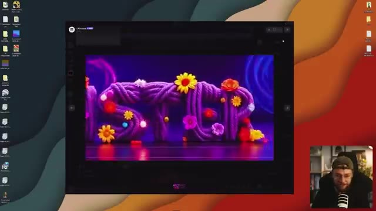
*Capture d'écran montrant l'interface d'un lecteur vidéo au sein d'une application (type Discord) avec une vidéo générée par IA représentant des lettres violettes décorées de fleurs.*

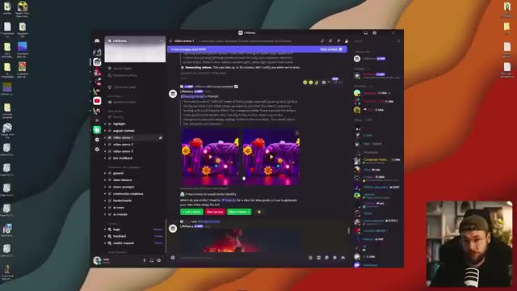
*Capture d'écran du serveur Discord montrant un canal de discussion avec deux vidéos générées côte à côte et les boutons de vote pour élire la meilleure génération.*

---

### ⏱️ `[00:14:44 - 00:15:09]` | Segment #29

**🔊 Audio (Transcription Intégrale Mot pour Mot en Français) :**
> Et en fait, c'était vraiment très rapide. Donc nous sommes revenus deux générations en arrière ici. Voyons si nous avons eu de la chance avec les modèles aléatoires qui nous ont été assignés. Première génération ici. Ça a l'air vraiment, vraiment super pour moi. Et vous remarquerez qu'à la fin, vous obtenez une sorte de tag qui fait la promotion du Discord. Comme je le dis toujours, les gars, vous pouvez importer ceci dans un éditeur comme CapCut ou Premiere Pro et simplement couper cette dernière section.

**👁️ Analyse Visuelle d'Écran (gemini-3.5-flash-lite) :**
**Interface & Outils** : Application Discord et lecteur multimédia intégré pour visualiser des vidéos générées par IA.

**Contenu textuel & Code** : Canaux Discord (video-arena-1), boutons de vote (Left's better, Right's better, Tie's a tie), et barre de progression du lecteur vidéo.

**Action / Démonstration** : Le créateur navigue dans l'interface Discord pour examiner les générations vidéo et visionne le résultat final.

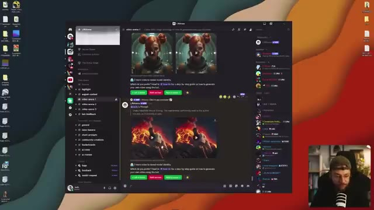
*Interface Discord affichant un serveur de test de génération vidéo avec des comparateurs de modèles et des votes.*

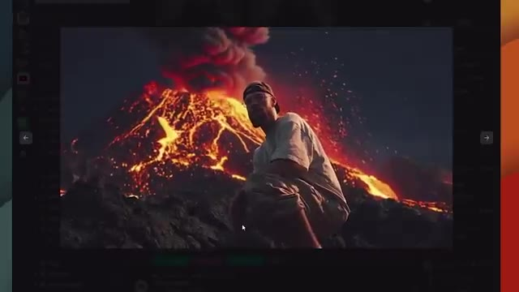
*Aperçu en plein écran d'une vidéo générée montrant un personnage accroupi devant un volcan en éruption.*

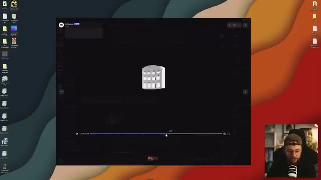
*Lecteur vidéo intégré dans l'interface affichant une barre de progression et le curseur de lecture.*

---

### ⏱️ `[00:15:09 - 00:15:46]` | Segment #30

**🔊 Audio (Transcription Intégrale Mot pour Mot en Français) :**
> Personne ne saura jamais que vous avez obtenu cette vidéo par IA gratuitement. Regardons la deuxième génération. Je l'aime un peu moins, certaines des explosions en arrière-plan me semblent un peu fausses, mais cette première génération est vraiment, vraiment très bien sortie, cela fait très réaliste, j'adore l'éclairage sur mon t-shirt, la façon dont le tissu bouge, la façon dont le volcan bouge et entre en éruption, c'est assez insensé, et nous avons eu un vote, donc si nous disons que la gauche est meilleure, je crois que ça va révéler quel modèle vidéo a été utilisé. Et en fait, C-Dance a donné le meilleur résultat et Kling V2.1 a donné le résultat que nous

**👁️ Analyse Visuelle d'Écran (gemini-3.5-flash-lite) :**
**Interface & Outils** : Application Discord (LMArena) avec affichage de comparaisons vidéo côte à côte et lecteur multimédia.

**Contenu textuel & Code** : Texte du prompt visible : "Shaky handheld device filming. The man kneels confidently next to the active volcano, as it violently erupts." Modèles indiqués : seedance-v1-lite et kling-v2.1-standard. Boutons de vote interactifs ("Left is better", "Both are bad", "Right is better").

**Action / Démonstration** : Le créateur navigue entre la visualisation plein écran des vidéos générées et le serveur Discord de test à l'aveugle pour commenter et évaluer les résultats des différents modèles d'IA.

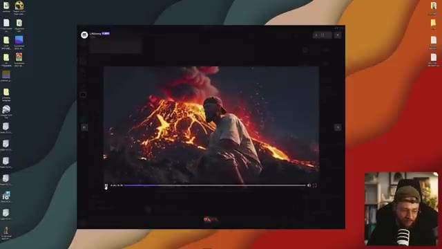
*Aperçu en plein écran d'une vidéo générée par IA montrant un homme accroupi devant un volcan en éruption, avec le créateur en incrustation (PiP).*

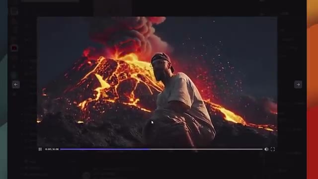
*Gros plan sur la vidéo en cours de lecture avec la barre de progression en bas.*

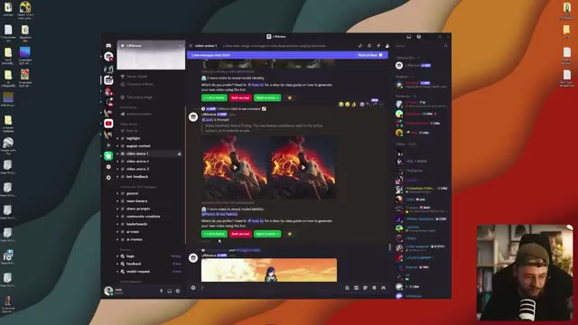
*Interface de Discord (LMArena) affichant deux options de vidéos côte à côte avec des boutons de vote verts.*

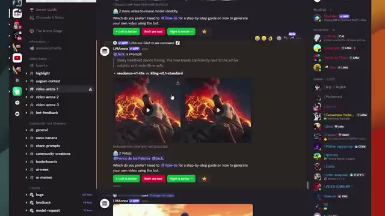
*Zoom sur le salon Discord de LMArena montrant le prompt textuel et les modèles comparés (seedance-v1-lite vs kling-v2.1-standard).*

---

### ⏱️ `[00:15:46 - 00:16:16]` | Segment #31

**🔊 Audio (Transcription Intégrale Mot pour Mot en Français) :**
> qu'on aimait un peu moins. Donc vous pouvez voir les gars que vous pouvez vraiment y aller, prendre une excellente image de départ, l'importer dans LM Arena puis accéder à Nano Banana, étoffer votre scène en créant toutes les modifications que vous voulez ou tous les angles de caméra différents auxquels vous pouvez penser, et ensuite importer chacune de ces images sur le Discord de LM Arena pour les animer. Oui, c'est un peu une astuce de contournement. Oui, c'est un peu un jeu de hasard et d'essais et erreurs, mais vous n'avez pas dépensé un centime.

**👁️ Analyse Visuelle d'Écran (gemini-3.5-flash-lite) :**
**Interface & Outils** : Application Discord (serveur LM Arena) avec un affichage en incrustation (PiP) du créateur en bas à droite.

**Contenu textuel & Code** : Salons du serveur Discord (video-arena-1, nano-banana, share-prompts, etc.), messages de bots montrant des comparaisons vidéo ("seedance-v1-lite vs. kling-v2.1-standard") avec des boutons de vote verts et rouges, et un prompt textuel visible.

**Action / Démonstration** : Le créateur présente l'interface du serveur Discord de LM Arena où les utilisateurs peuvent voter et comparer différentes générations de vidéos IA, tout en illustrant ses propos en coin de vue.

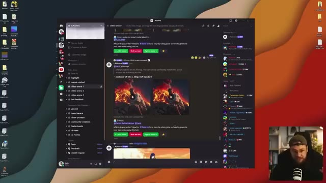
*Interface de l'application Discord affichant un salon LM Arena avec des comparaisons de vidéos générées par IA et un encadré vidéo du présentateur (PiP).*

---

### ⏱️ `[00:16:16 - 00:16:52]` | Segment #32

**🔊 Audio (Transcription Intégrale Mot pour Mot en Français) :**
> Bien sûr, pour accéder à Midjourney, c'est un abonnement payant, mais je vous recommande vraiment de vous lancer sur Midjourney. C'est un outil incroyable à appréhender. De tous les outils d'IA que j'ai utilisés jusqu'à présent, Midjourney est définitivement mon préféré. Et bien sûr, vous n'êtes pas obligé d'utiliser des images générées par IA comme point de départ. Vous pouvez prendre une photo tirée d'un film ou d'un magazine. Vraiment, il n'y a pas de limites. Donc, juste pour donner un exemple rapide, nous avons cette couverture du magazine Esquire avec Post Malone. Je vais juste enregistrer cette image. Je vais la glisser dans

**👁️ Analyse Visuelle d'Écran (gemini-3.5-flash-lite) :**
**Interface & Outils** : Application Discord sur le bureau Windows avec un encadré vidéo (PiP) du créateur en bas à droite.

**Contenu textuel & Code** : Canaux Discord (video-arena-1, video-arena-2), messages avec boutons de vote, et vidéos comparatives de flux de lave.

**Action / Démonstration** : Le créateur navigue sur Discord pour montrer des exemples de comparaisons vidéo, puis enregistre une image de Post Malone depuis une page web vers son explorateur de fichiers.

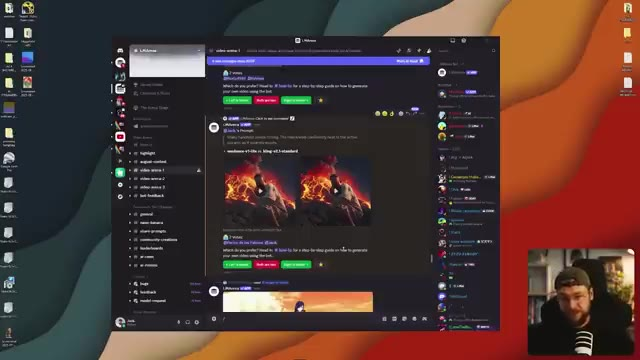
*Affichage du serveur Discord de LMArena avec des exemples de comparaisons de vidéos générées par IA.*

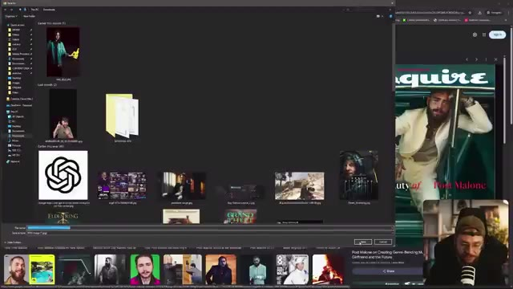
*Affichage de l'explorateur de fichiers Windows et d'une fenêtre de navigateur montrant une image du magazine Esquire avec Post Malone en cours de téléchargement/sauvegarde.*

---

### ⏱️ `[00:16:52 - 00:17:27]` | Segment #33

**🔊 Audio (Transcription Intégrale Mot pour Mot en Français) :**
> LM Arena. Et pour commencer, je vais simplement dire de supprimer le texte sur cette image. Nous allons continuer et appuyer sur entrée. Et vous pouvez voir qu'il a fait un travail incroyable en gardant l'environnement cohérent tout en supprimant ce texte. Je vais donc télécharger ce plan pour travailler à partir de celui-ci, déposer cette version propre du plan dans LM Arena. Et essayons quelque chose comme un plan d'ensemble ultra large. L'homme pose à l'intérieur de la voiture, qui se trouve au milieu d'un immense champ.

**👁️ Analyse Visuelle d'Écran (gemini-3.5-flash-lite) :**
**Interface & Outils** : Navigateur web affichant l'interface de LM Arena avec un modèle type Gemini 2.5 Flash image preview, incluant une vue PiP (Picture-in-Picture) du créateur en bas à droite.

**Contenu textuel & Code** : Texte du prompt visible : "Remove the text on this image", "Ultra wide la" avec l'icône de téléchargement d'image.

**Action / Démonstration** : Le créateur navigue dans l'interface de LM Arena, applique des modifications textuelles pour supprimer du texte d'une image, puis prépare un nouveau prompt pour élargir le plan d'un homme dans une voiture.

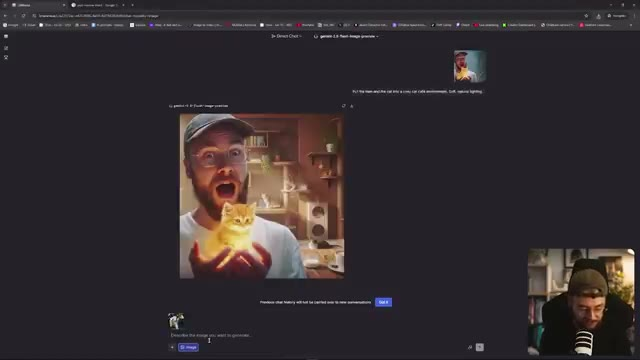
*Interface de LM Arena montrant une image générée avec un chaton lumineux dans les mains de Jack.*

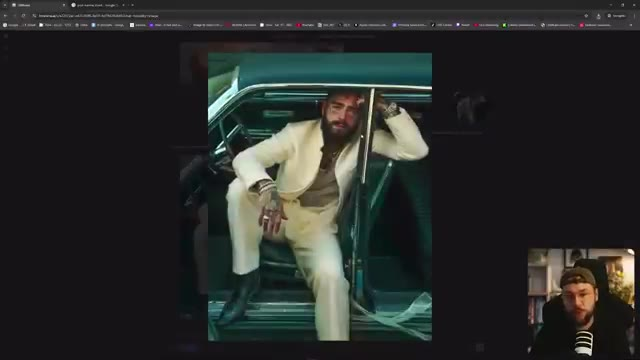
*Interface de LM Arena montrant le plan d'un homme en costume blanc assis dans une voiture ancienne.*

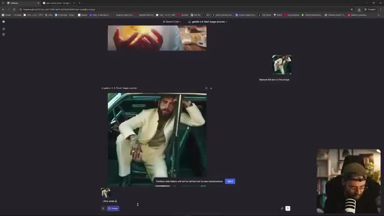
*Interface de LM Arena montrant l'application du prompt textuel pour modifier l'image de la voiture.*

---

### ⏱️ `[00:17:27 - 00:17:52]` | Segment #34

**🔊 Audio (Transcription Intégrale Mot pour Mot en Français) :**
> Et appuyons simplement sur entrée là-dessus et voyons ce que Nano Banana nous renvoie. Et ça, pour moi, c'est juste absolument fou et un vraiment beau exemple pour terminer la vidéo. Les gars, si vous avez apprécié le contenu d'aujourd'hui, assurez-vous de lâcher un pouce bleu pour moi. Pensez à vous abonner si vous êtes nouveaux. Et bien sûr, activez la cloche de notification car nous examinons ces superbes outils d'IA tout le temps.

**👁️ Analyse Visuelle d'Écran (gemini-3.5-flash-lite) :**
**Interface & Outils** : Navigateur web avec l'interface de l'outil d'IA (Nano Banana / interface web personnalisée) et incrustation vidéo PiP du créateur.

**Contenu textuel & Code** : Texte visible du prompt sous l'image : "Ultra wide establishing shot. The man is posing inside the car, which is in the middle of a huge field."

**Action / Démonstration** : Le créateur montre le résultat vidéo généré par l'outil d'IA à partir d'une image fixe, puis conclut sa vidéo en incitant aux abonnements et aux likes.

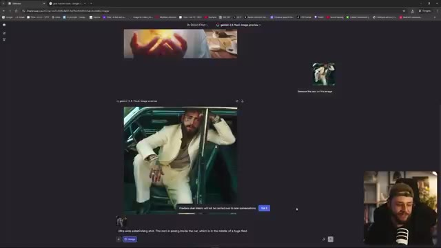
*Interface du navigateur web affichant les résultats de l'outil d'IA avec une image générée d'un homme en costume blanc assis dans une voiture, et la webcam du créateur en incrustation (PiP).*

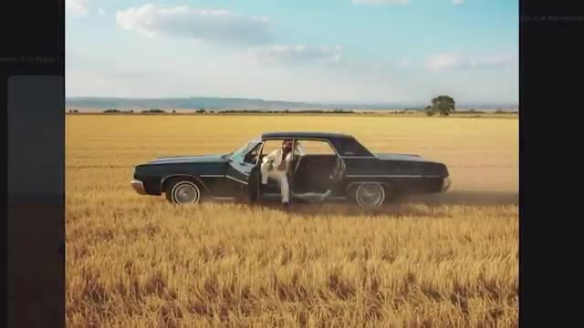
*Affichage en plein écran de la vidéo générée montrant une voiture noire au milieu d'un vaste champ de blé, avec un homme posant à l'intérieur.*

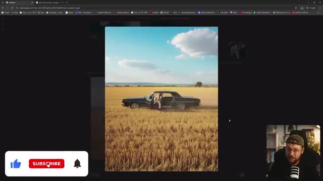
*Retour à l'interface du navigateur avec un encart animé incitant à s'abonner et à liker en bas à gauche, et la vidéo en cours de lecture au centre.*

---

### ⏱️ `[00:17:52 - 00:17:56]` | Segment #35

**🔊 Audio (Transcription Intégrale Mot pour Mot en Français) :**
> Merci beaucoup d'avoir regardé, les gars. Je vous retrouve dans la prochaine vidéo.

**👁️ Analyse Visuelle d'Écran (gemini-3.5-flash-lite) :**
**Interface & Outils** : Navigateur web avec lecteur vidéo central et encadré PiP (Picture-in-Picture) du créateur.

**Contenu textuel & Code** : Vidéo générée par IA montrant une voiture noire dans un champ de blé sous un ciel nuageux, avec Jack visible en bas à droite dans son studio devant son micro.

**Action / Démonstration** : Le créateur conclut sa vidéo tout en affichant un exemple de génération vidéo par IA à l'écran.

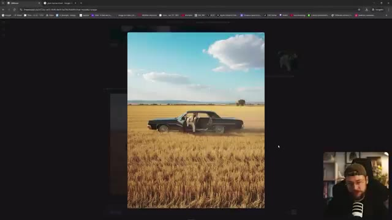
*Capture d'écran montrant le navigateur web avec la vidéo générée au centre et le créateur Jack dans un petit encadré PiP en bas à droite.*

---
