# 🎬 Comment utiliser Nano Banana pour le cinéma IA (Workflow GRATUIT)

> **Chaîne** : [Jack Vs. AI](https://www.youtube.com/@JackVsAI)  
> **Titre original** : `How to use Nano Banana for AI Filmmaking (FREE workflow)`  
> **Lien YouTube** : [https://www.youtube.com/watch?v=NlLBXqaN8AY](https://www.youtube.com/watch?v=NlLBXqaN8AY)  
> **Date de publication** : 2025-08-28  
> **Durée** : 22m 40s (`1360s`)  
> **Identifiant vidéo** : `NlLBXqaN8AY`  
> **Fiche Web Interactive** : [2025-08-28_YT-NlLBXqaN8AY_Comment utiliser Nano Banana pour le cinéma IA (Workflow GRATUIT)_by-whisper-v3-large-turbo+gemini-3.5-flash-lite.html](2025-08-28_YT-NlLBXqaN8AY_Comment utiliser Nano Banana pour le cinéma IA (Workflow GRATUIT)_by-whisper-v3-large-turbo+gemini-3.5-flash-lite.html)  
> **Captures de démonstration clés** : `86 captures réelles (anti-talking-head)`  
> **Modèles utilisés** : Audio: `large-v3-turbo` (Faster-Whisper int8 VPS) | Vision: `gemini-3.5-flash-lite` (Google AI Studio API)  

---

## 📌 Synthèse Exécutive & Outils

### 📌 Résumé
La vidéo de Jack met en lumière une avancée majeure pour les cinéastes indépendants utilisant l'intelligence artificielle : la résolution du défi persistant de la cohérence des personnages et des styles visuels grâce au nouvel éditeur d'images de Google, baptisé « Nano Banana » (nom de code de Gemini 2.5 flash image preview). Ce guide démontre comment s'affranchir des limites techniques habituelles pour concevoir un court-métrage complet, narratif et esthétiquement unifié à partir d'une seule et unique image de départ. Le flux de travail présenté s'articule autour de la création d'une référence visuelle forte — inspirée ici de l'esthétique du film *Prometheus* — qui dicte instantanément la palette de couleurs, l'ambiance et l'identité du protagoniste pour l'ensemble du projet.

La méthode de Jack s'appuie sur une écriture scénaristique personnelle, prônant l'injection d'une vision créative humaine plutôt qu'une délégation totale à des LLM, même si des outils comme ChatGPT ou Gemini peuvent servir de béquilles en cas de blocage. La concrétisation visuelle s'effectue ensuite plan par plan via Nano Banana, accessible gratuitement sur diverses plateformes telles que l'application Gemini, Freepik ou LMSYS Chatbot Arena (`lmparena.ai`). L'utilisation conversationnelle de ces interfaces permet non seulement de générer des storyboards cohérents à partir de prompts textuels ou visuels combinés, mais aussi d'ajuster itérativement les plans en dialoguant avec l'IA pour supprimer ou ajouter des éléments spécifiques de la composition.

Enfin, ce workflow gratuit (ou optimisé selon les préférences logicielles de chacun) aborde astucieusement les contraintes techniques, comme le contournement des filigrants par le jeu croisé entre l'application Gemini et LM Arena, avant de finaliser l'animation des plans fixes générés. En combinant la puissance de la génération d'images de Google avec une direction artistique minutieuse, Jack prouve qu'un créateur solo peut aujourd'hui endosser simultanément les rôles de scénariste, directeur de la photographie et réalisateur, ouvrant ainsi une ère inédite d'accessibilité et d'efficacité pour le cinéma génératif.

### 🛠️ Outils, Modèles & Logiciels Présentés
* **Nano Banana** : Nom de code affectueux donné par le créateur au modèle d'édition d'images de Google (Gemini 2.5 flash image preview), agissant comme le moteur central pour générer la cohérence des plans du storyboard.
* **Midjourney** : Logiciel payant de génération d'images par IA haut de gamme utilisé ici pour concevoir l'image de départ fondatrice, garantissant un ton et une esthétique de qualité cinématographique.
* **Gemini** : Modèle et application de Google servant à la fois de générateur d'images gratuit (avec filigrane) et de assistant conversationnel pour modifier itérativement les plans ou combiner plusieurs images ensemble.
* **LMSYS Chatbot Arena (lmparena.ai)** : Plateforme gratuite permettant d'accéder directement à Nano Banana (via l'onglet *Direct Chat* puis *Generate Images*) sans les contraintes de filigrane de l'application officielle.
* **Freepik** : Plateforme alternative tierce mentionnée comme point d'accès possible pour utiliser les fonctionnalités de l'éditeur d'images Nano Banana.
* **ChatGPT / Grok** : LLM textuels optionnels évoqués pour assister à la rédaction d'éléments narratifs ou surmonter le syndrome de la page blanche lors de l'écriture du script.
* **Hailuo / Kling** : Modèles de génération vidéo mentionnés dans les métadonnées globales du créateur pour animer les images fixes produites (bien que le cœur de la vidéo se concentre sur l'étape pré-animation de l'édition d'images).
* **Flux** : Modèle d'image open-weight/avancé également identifié dans l'écosystème global des outils de pointe utilisés par les créateurs de vidéo par IA.

### 🔑 Points Clés & Enseignements Stratégiques
* **La règle de l'image source unique** : Tout le flux de travail repose sur une seule image de départ fondatrice qui fixe définitivement le style visuel, la palette de couleurs et l'apparence du personnage pour l'ensemble du film.
* **L'importance cruciale de la phase préparatoire** : Investir du temps pour réussir son image maîtresse (par exemple via Midjourney) garantit que les générations ultérieures conserveront une direction artistique professionnelle et homogène.
* **Conserver l'intention créative humaine** : Bien que les LLM puissent aider en cas de panne d'inspiration, l'écriture du script doit provenir de la vision personnelle de l'auteur pour éviter que l'œuvre ne perde son « âme ».
* **Structuration du script par plans numérotés** : Traduire un scénario en une liste ordonnée de points numérotés correspond directement à la méthode de découpage technique nécessaire pour alimenter l'IA plan par plan.
* **Exploiter l'accessibilité gratuite** : Il est tout à fait possible de réaliser un film complet sans frais en utilisant les versions gratuites de Nano Banana hébergées sur des plateformes comme LMSYS Chatbot Arena (`lmparena.ai`).
* **Astuce de contournement des filigranes** : Pour éliminer le filigrane en forme de diamant présent sur les images générées via l'application Gemini, il suffit d'importer l'image dans LM Arena et de demander à Nano Banana de l'effacer.
* **Combinaison d'images pour la continuité** : L'utilisation de Gemini permet de fusionner plusieurs images entre elles (par exemple, fusionner un plan précédent avec l'image de départ) pour obtenir des compositions complexes et des raccords narratifs parfaits.
* **Le contrôle conversationnel itératif** : Ne pas se contenter du premier résultat ; interagir avec Nano Banana comme avec un assistant (ex: « peux-tu supprimer les bâtiments futuristes ? ») pour affiner précisément chaque plan.
* **La flexibilité de la variation stylistique** : Utiliser la fonction de réessai (« réessayer ») permet d'explorer différentes déclinaisons de décors tout en maintenant l'ancrage du personnage principal.
* **Le storyboard génératif instantané** : Transformer progressivement un script textuel en une séquence visuelle cohérente en injectant les prompts un par un dans l'éditeur d'images.
* **L'unification des rôles cinématographiques** : L'IA permet à un seul créateur de fusionner les compétences de scénariste, directeur de la photographie et réalisateur au sein d'un même pipeline de production.

---

## ⏱️ Chronologie & Transcription Complète Audio & Visuelle (Mot pour Mot)

### ⏱️ `[00:00:00 - 00:00:18]` | Segment #01

**🔊 Audio (Transcription Intégrale Mot pour Mot en Français) :**
> Nano Banana vient de rendre les cinéastes utilisant l'IA inarrêtables. L'époque où l'on avait du mal à obtenir une cohérence de personnage et de style est révolue, car le nouvel éditeur d'images de Google vous permet de prendre une seule image de départ et de la transformer en toute une histoire. Votre imagination est vraiment la seule limite désormais.

**👁️ Analyse Visuelle d'Écran (gemini-3.5-flash-lite) :**
**Interface & Outils** : Présentation face caméra sans partage d'écran

**Contenu textuel & Code** : B-roll cinématique généré par IA montrant un astronaute allongé sur une planète rocheuse avec un réseau lumineux en arrière-plan, sous-titré "filmmakers".

**Action / Démonstration** : Illustration visuelle du sujet abordé par le créateur en arrière-plan pendant la narration.

---

### ⏱️ `[00:00:18 - 00:00:54]` | Segment #02

**🔊 Audio (Transcription Intégrale Mot pour Mot en Français) :**
> Mais si vous n'utilisez pas cet outil correctement, non seulement vous passez à côté, mais en plus vous prenez du retard. Aujourd'hui, je vais vous présenter mon flux de travail complet Nano Banana pour la réalisation de films par IA. Et à la fin de la vidéo, vous serez à la fois scénariste, directeur de la photographie et réalisateur, le tout regroupé en un seul. Et le meilleur de tout, c'est que je vais vous montrer comment vous pouvez réaliser tout cela sans dépenser un seul centime. Je m'appelle Jack, je suis artiste VFX dans l'industrie publicitaire depuis plus de dix ans maintenant et j'ai travaillé avec beaucoup des plus grandes marques de la planète. Je m'amuse avec le nouveau rédacteur d'images de Google depuis de très nombreuses heures maintenant et j'ai vraiment hâte de vous transmettre tout cela.

**👁️ Analyse Visuelle d'Écran (gemini-3.5-flash-lite) :**
**Interface & Outils** : Présentation face caméra sans partage d'écran

**Contenu textuel & Code** : Aucun texte ou code visible, uniquement le locuteur dans son studio et des extraits vidéo d'illustration.

**Action / Démonstration** : Le créateur parle face caméra depuis son studio et présente le sujet de la vidéo.

---

### ⏱️ `[00:00:54 - 00:01:30]` | Segment #03

**🔊 Audio (Transcription Intégrale Mot pour Mot en Français) :**
> je m'en remets à vous pour savoir comment intégrer cet outil dans votre flux de travail de réalisation de films et merci à Mike d'avoir commenté et suggéré de jeter un coup d'œil plus approfondi à cela bien sûr les gars si vous aimez le contenu d'aujourd'hui assurez-vous de lâcher un pouce bleu pour moi pensez à vous abonner et bien sûr activez la cloche de notification entrons directement dans le vif du sujet donc bien sûr tout ce processus découle de notre image de départ unique il est donc extrêmement important de bien faire cela vous pouvez voir que je suis sur Midjourney et je sais déjà que certains d'entre vous vont dire, vous avez dit que vous pouviez faire cela gratuitement, vous devez payer pour Midjourney. Mais vous pouvez obtenir des images incroyables

**👁️ Analyse Visuelle d'Écran (gemini-3.5-flash-lite) :**
**Interface & Outils** : Navigateur web affichant l'interface de Midjourney avec un panneau latéral à gauche (Explore, Create, Personalize, etc.) et une grille de grilles d'images générées accompagnées de leurs prompts détaillés.

**Contenu textuel & Code** : Historique de générations Midjourney avec des images montrant un homme barbu dans divers décors (ambiance cosmique/sci-fi avec scaphandre, environnement illuminé de champignons bioluminescents) et les longs prompts textuels descriptifs correspondants dans le volet de droite.

**Action / Démonstration** : Le créateur montre l'interface de Midjourney pour illustrer l'importance de l'image de départ unique (single starting image) dans le processus de création de vidéos par IA.

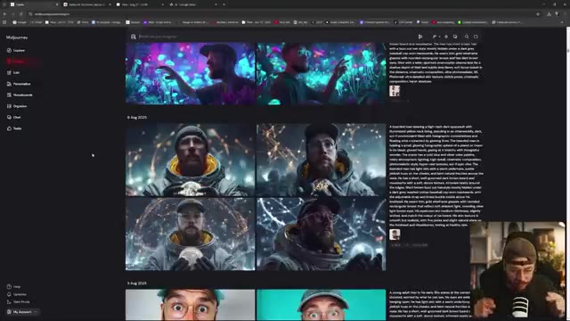
*Interface de la plateforme Midjourney sur navigateur montrant l'historique des générations d'images avec les prompts textuels associés et une pastille PiP du créateur en bas à droite.*

---

### ⏱️ `[00:01:30 - 00:02:05]` | Segment #04

**🔊 Audio (Transcription Intégrale Mot pour Mot en Français) :**
> des générations venant de ChatGPT sans dépenser un sou. J'adore tout simplement Midjourney et je vous recommande de payer pour ça parce que ça en vaut la peine. Mais voici l'image de départ que j'utilisée pour le court-métrage que vous voyez au début de la vidéo. Ironiquement, elle n'apparaît pas réellement dans la vidéo elle-même, mais elle a vraiment servi de point de départ et bien sûr de référence de style et de personnage. Maintenant, c'était inspiré du film Prometheus si vous ne l'avez pas déjà deviné, et avec votre image de départ, il est tellement important de fixer votre ton et je veux dire cela à la fois en termes de

**👁️ Analyse Visuelle d'Écran (gemini-3.5-flash-lite) :**
**Interface & Outils** : Interface web de Midjourney montrant la galerie de créations et le panneau de prompts textuels détaillés.

**Contenu textuel & Code** : Texte descriptif visible dans le panneau latéral droit de Midjourney : "A bearded man wearing a high-tech dark spacesuit..." et l'historique des générations datées du 6 août 2025.

**Action / Démonstration** : Le créateur présente son interface de génération d'images Midjourney tout en expliquant le processus de création de l'image de départ pour son court-métrage.

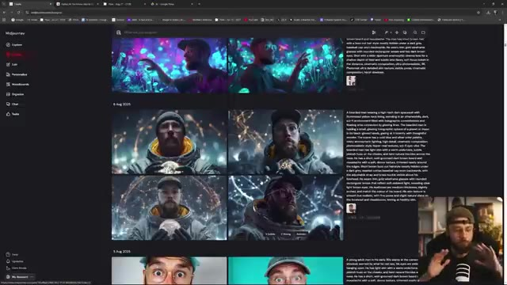
*Interface de Midjourney affichant plusieurs grilles d'images générées de style science-fiction inspirées de Prometheus, avec un encadré PiP du créateur en bas à droite.*

*Gros plan sur une image spécifique de astronaute dans Midjourney avec le panneau de prompt détaillé sur le côté droit et le créateur visible en PiP.*

---

### ⏱️ `[00:02:05 - 00:02:41]` | Segment #05

**🔊 Audio (Transcription Intégrale Mot pour Mot en Français) :**
> palette de couleurs mais aussi l'ambiance générale parce que cela va s'ouvrir sur l'ensemble du film que nous faisons avec Nano Banana. Tout naît de cette première image de départ, donc il faut bien réussir cela. Et ensuite, il est temps de commencer à être créatif et à écrire notre script. Maintenant, si vous êtes vraiment bloqué, vous pouvez utiliser un LLM comme ChatGPT, Grok ou Gemini pour rédiger des éléments d'histoire pour vous. Mais honnêtement, les gars, vous voulez y mettre votre propre touche créative, n'est-ce pas ? Sinon, où est le plaisir ? Si tout est généré par IA, je ne sais pas, ça perd

**👁️ Analyse Visuelle d'Écran (gemini-3.5-flash-lite) :**
**Interface & Outils** : Midjourney (navigateur web) sur l'image #1 et application de prise de notes/scénario (Notion ou similaire) sur l'image #2, avec une incrustation vidéo (PiP) du créateur en bas à droite.

**Contenu textuel & Code** : Image #1 : Prompt détaillé de génération d'image décrivant un astronaute barbu dans un environnement de science-fiction avec des constellations holographiques. Image #2 : Texte de scénario intitulé "SPACE SCENE" comprenant une liste numérotée de plans et d'actions (ex: "1. Wide establishing shot of a vast, eerie sci-fi environment...").

**Action / Démonstration** : Le créateur présente l'image de départ générée sur Midjourney pour illustrer l'univers visuel, puis bascule sur l'affichage d'un script ou de séquences textuelles pour parler de l'écriture du scénario.

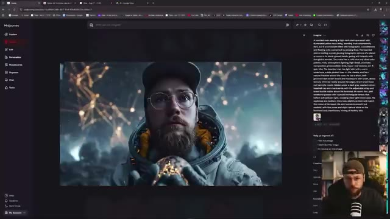
*Interface de Midjourney affichant une image générée d'un astronaute barbu avec un prompt détaillé dans le panneau latéral droit, et le créateur visible en incrustation (PiP) en bas à droite.*

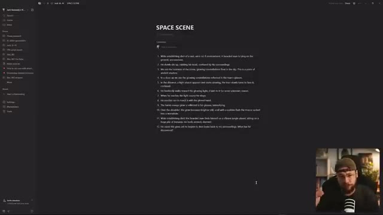
*Interface de prise de notes ou d'écriture de scénario montrant une liste numérotée sous le titre "SPACE SCENE", avec le créateur en incrustation (PiP) en bas à droite.*

---

### ⏱️ `[00:02:41 - 00:03:08]` | Segment #06

**🔊 Audio (Transcription Intégrale Mot pour Mot en Français) :**
> un tout petit peu de son âme, n'est-ce pas ? J'ai l'impression que les outils d'IA sont utilisés au mieux lorsqu'ils exécutent votre propre vision créative plutôt que d'être l'alpha et l'oméga. Donc, en gardant cela à l'esprit, j'ai imaginé l'histoire que vous pouvez voir sur l'écran en ce moment. Et c'est écrit un peu comme un scénario de film normal. Et j'ai simplement numéroté chaque point pour qu'il corresponde à un plan. Nous allons donc voir tout cela plus en détail dans une minute lorsque nous passerons plan par plan.

**👁️ Analyse Visuelle d'Écran (gemini-3.5-flash-lite) :**
**Interface & Outils** : Application de prise de notes textuelle avec barre latérale à gauche et encadré vidéo PiP du créateur en bas à droite.

**Contenu textuel & Code** : Le document affiche le titre "SPACE SCENE" et une liste numérotée de 12 points décrivant une scène de science-fiction (ex: "1. Wide establishing shot of a vast, eerie sci-fi environment...").

**Action / Démonstration** : Le document est affiché en plein écran principal à l'écran tandis que le créateur commente et présente le script en incrustation.

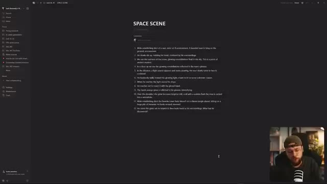
*Capture d'écran montrant une application de prise de notes ou un document texte intitulé 'SPACE SCENE' avec une liste numérotée de plans de scénario, tandis que le créateur apparaît en incrustation (PiP) dans le coin inférieur droit.*

---

### ⏱️ `[00:03:08 - 00:03:43]` | Segment #07

**🔊 Audio (Transcription Intégrale Mot pour Mot en Français) :**
> mais pour vous donner l'essentiel, je suis une sorte d'astronaute et je me suis réveillé sur cette planète vraiment étrange, ancienne et lugubre. Je ne sais pas comment je suis arrivé là, donc il y a ce sentiment de mystère. Et pendant que je l'explore, une sorte de lumière brillante apparaît derrière moi et pour une raison quelconque, je suis attiré par elle. C'est peut-être la curiosité, c'est peut-être quelque chose de plus profond, mais je dois aller voir cette lumière et je tends la main pour la toucher et quand je entre en contact avec elle, je suis fondamentalement transporté sur une planète jungle et bien sûr, je voulais juste m'amuser un peu et lier

**👁️ Analyse Visuelle d'Écran (gemini-3.5-flash-lite) :**
**Interface & Outils** : Interface de prise de notes ou d'édition de texte (type application Notes ou Obsidian) avec affichage du titre « SPACE SCENE » et une liste numérotée de prompts de scènes, et incrustation vidéo PiP du créateur en bas à droite.

**Contenu textuel & Code** : Texte affiché : "SPACE SCENE" et 12 points de description de plans pour la génération de vidéo, incluant des détails sur l'astronaute, la planète étrange, la source lumineuse et la transition vers la planète jungle.

**Action / Démonstration** : Le créateur présente l'écran de son application de script/notes tout en parlant face caméra dans la fenêtre PiP.

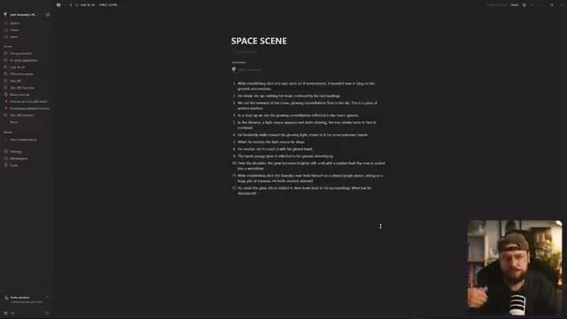
*Capture d'écran montrant le script de la scène spatiale avec une liste numérotée de plans, avec la caméra PiP de Jack en bas à droite.*

---

### ⏱️ `[00:03:43 - 00:04:20]` | Segment #08

**🔊 Audio (Transcription Intégrale Mot pour Mot en Français) :**
> dedans avec le thème de la banane nano, donc je sors de ce portail sur cette montagne massive de bananes et puis le film se termine avec moi inspectant cette orbe en verre et je suis juste en train de penser, qu'est-ce sur terre est-ce que je viens de découvrir ? Tout cela vient juste de cette seule image de départ que nous avons créée sur Midjourney. Je n'ai pas utilisé ChatGPT ou quoi que ce soit de semblable. J'ai juste aimé écrire des histoires en m'amusant, n'est-ce pas ? Mais maintenant que nous avons le script et que nous avons commencé à penser aux plans individuels, nous pouvons prendre notre image de départ dans Nano Banana. Et nous allons

**👁️ Analyse Visuelle d'Écran (gemini-3.5-flash-lite) :**
**Interface & Outils** : Application de prise de notes / traitement de texte sur fond sombre avec panneau latéral de navigation.

**Contenu textuel & Code** : Titre de la page : "SPACE SCENE" suivi d'une liste numérotée de 1 à 12 décrivant le scénario de la scène spatiale, avec le créateur visible en incrustation vidéo (PiP) dans le coin inférieur droit.

**Action / Démonstration** : Le créateur montre son écran avec le script rédigé de la scène, tout en parlant de la structure de l'histoire et des plans individuels.

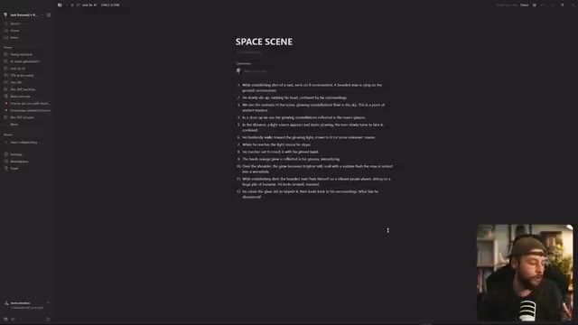
*Interface de prise de notes ou d'édition de scénario sur fond sombre avec le titre "SPACE SCENE" et le script détaillé, avec la vue incrustée (PiP) du créateur en bas à droite.*

---

### ⏱️ `[00:04:20 - 00:04:56]` | Segment #09

**🔊 Audio (Transcription Intégrale Mot pour Mot en Français) :**
> en recréant chaque image avec vous les gars, mais je peux vous montrer juste un exemple pour que vous compreniez le processus. Si nous faisons chaque image, cela va prendre un temps fou, mais rendez-vous sur lmparena.ai. En haut ici, vous voulez cliquer sur direct chat. En bas ici, cliquez sur generate images et cela va automatiquement aller sur Gemini 2.5 flash image preview entre crochets nano banana que je préfère comme nom. Donc nous allons télécharger notre image de départ. Retournons à notre script et prenons juste ce premier prompt ici. En fait ce n'est pas vraiment un prompt, comme je l'ai dit plus tôt c'est un peu

**👁️ Analyse Visuelle d'Écran (gemini-3.5-flash-lite) :**
**Interface & Outils** : Navigateur web Google Chrome avec barre d'adresse et page d'accueil de la plateforme LMArena (lmarena.ai).

**Contenu textuel & Code** : Texte visible dans la barre d'adresse du navigateur et sur la page d'accueil LMArena : 'Prompt. Vote. Advance AI.', 'Over 3.5M votes and counting, join the global community shaping AI through collective feedback.', 'View the Leaderboard', 'Ask anything...'.

**Action / Démonstration** : Le créateur tape l'adresse du site web 'lmarena.ai' dans la barre de recherche du navigateur, puis la page d'accueil du site se charge à l'écran.

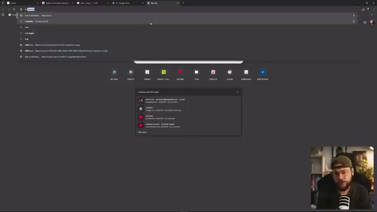
*Navigateur web affichant une barre de recherche en train de taper 'lmarena.ai', avec le créateur visible en incrustation (PiP) dans le coin inférieur droit.*

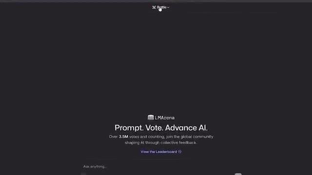
*Page d'accueil de la plateforme LMArena avec le slogan 'Prompt. Vote. Advance AI.' et le logo en haut.*

---

### ⏱️ `[00:04:56 - 00:05:18]` | Segment #10

**🔊 Audio (Transcription Intégrale Mot pour Mot en Français) :**
> écrit plutôt comme un scénario de film mais je vais juste balancer ça à Nano Banana et voir quel type de résultats on obtient en retour. Vous êtes probablement conscients que vous pouvez accéder à Nano Banana sur toutes sortes de sites d'IA maintenant comme FreePick par exemple. Vous pouvez même l'utiliser sur l'application Gemini tout à fait gratuitement, cependant elle vient avec un petit filigrane en forme de diamant dans le coin inférieur droit.

**👁️ Analyse Visuelle d'Écran (gemini-3.5-flash-lite) :**
**Interface & Outils** : Interface web de LMArena (LMSYS Chatbot Arena) avec un champ de saisie de prompt, un bouton d'ajout d'image et un bouton d'envoi.

**Contenu textuel & Code** : Texte affiché : "Prompt. Vote. Advance AI.", "Over 3.5M votes and counting, join the global community shaping AI through collective feedback.", "View the Leaderboard". Prompt dans la zone de texte : "Wide establishing shot of a vast, eerie sci-fi environment. A bearded man is lying on the ground, unconscious."

**Action / Démonstration** : Saisie d'un prompt descriptif cinématographique dans l'interface de LMArena en vue d'une génération.

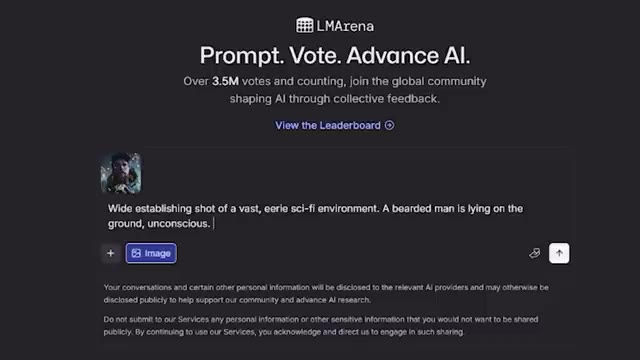
*Interface de LMArena affichant la zone de saisie d'un prompt textuel et une image de prévisualisation.*

---

### ⏱️ `[00:05:18 - 00:05:52]` | Segment #11

**🔊 Audio (Transcription Intégrale Mot pour Mot en Français) :**
> Petite astuce sympa cependant, vous pouvez utiliser l'application Gemini pour générer une image que vous voulez et vous pouvez ensuite l'importer dans LM Arena. Demandez à LM Arena en utilisant Nano Banana de supprimer le filigrane du coin inférieur droit, ce que j'ai réellement fait pour ce film. Et ce qui est plutôt puissant en utilisant Gemini au lieu de LM Arena, c'est que vous pouvez combiner plusieurs images ensemble et c'est en fait comme ça que j'ai obtenu la dernière image du film. J'ai pratiquement pris le plan avant-dernier, qui est celui-ci, et je l'ai combiné avec notre plan de départ et je lui ai demandé d'en générer un autre.

**👁️ Analyse Visuelle d'Écran (gemini-3.5-flash-lite) :**
**Interface & Outils** : Interface web de LM Arena avec un modèle Gemini (gemini-2.5-flash-image-preview) et le visualiseur de photos Windows en superposition sur la seconde image.

**Contenu textuel & Code** : Texte du prompt visible : "Wide establishing shot of a sci-fi wasteland, a bearded man is lying on the ground, unconscious." et nom de fichier image dans le visualiseur : `c11b080117_a_bearded_man_wearing_a_high-tech_dark_spacesuit...`

**Action / Démonstration** : Le créateur montre son écran de navigation sur LM Arena et le processus de génération d'images combinées pour son film de science-fiction.

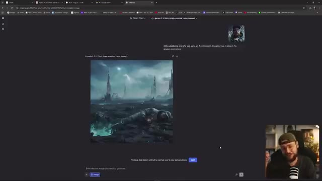
*Interface de LM Arena affichant une image générée avec Gemini (un homme barbu inconscient dans un paysage de science-fiction) et le créateur en incrustation vidéo (PiP) dans le coin inférieur droit.*

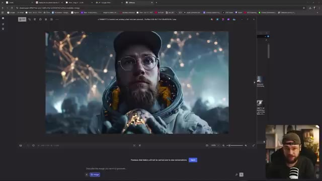
*Visualiseur d'images ouvert par-dessus LM Arena, montrant un gros plan cinématographique d'un astronaute barbu à lunettes tenant un orbe lumineux, avec le créateur en incrustation vidéo (PiP).*

---

### ⏱️ `[00:05:52 - 00:06:19]` | Segment #12

**🔊 Audio (Transcription Intégrale Mot pour Mot en Français) :**
> gros plan de moi inspectant l'orbe mais dans cet environnement de jungle et ça a très bien marché. Comme je dis, je l'ai importé dans Elam Arena, j'ai réussi à enlever le filigrane et ensuite on l'a animé à partir de là. Bref, au risque de m'égarer comme je le fais toujours, nous avons récupéré notre génération de Gemini et c'est incroyable. Ça a vraiment donné vie à l'image d'une toute autre manière que ce que vous auriez vu dans le court-métrage au début de cette vidéo.

**👁️ Analyse Visuelle d'Écran (gemini-3.5-flash-lite) :**
**Interface & Outils** : Interface web d'un outil de génération ou d'édition d'images/vidéos avec affichage plein écran d'un rendu visuel, accompagné d'une incrustation vidéo (PiP) du créateur en bas à droite.

**Contenu textuel & Code** : Texte de prompt partiel visible sous l'image dans l'image 1 commençant par "Describe the image you want to generate..." et le nom d'un fichier image contenant des identifiants et le terme "high-tech_dark_spaceship".

**Action / Démonstration** : Le créateur montre à l'écran différentes images générées et éditées (gros plan d'un astronaute puis plan large d'un paysage extraterrestre) tout en commentant le processus de création.

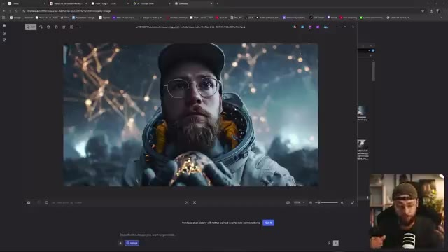
*Interface d'un outil avec un aperçu en gros plan d'un astronaute inspectant un orbe lumineux, avec Jack en incrustation (PiP) en bas à droite.*

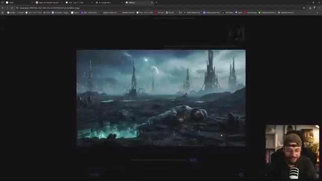
*Interface affichant un plan large d'un paysage extraterrestre sombre avec des tours imposantes et un astronaute allongé au sol, avec Jack en incrustation (PiP) en bas à droite.*

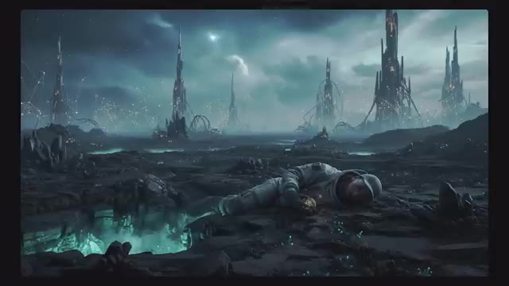
*Gros plan plein écran sur le rendu visuel extraterrestre avec les tours et l'astronaute au sol.*

---

### ⏱️ `[00:06:19 - 00:06:53]` | Segment #13

**🔊 Audio (Transcription Intégrale Mot pour Mot en Français) :**
> Donc vraiment, vous pouvez même utiliser Nano Banana pour inspirer votre scénario si vous manquez d'idées ou si vous êtes face à une sorte de blocage de l'écrivain. Juste pour s'amuser un peu, réessayons ceci et voyons ce que nous obtenons lors d'un second essai. Voyez à quel point la variation est différente de notre première génération. C'est donc plutôt similaire. C'est parti sur une ambiance de type techno futuriste. J'adore la façon dont les constellations lumineuses ont fusionné avec le sol cependant, et j'adore cette sorte de structure cristalline ici, cet immense vaisseau spatial dont vous pouvez imaginer que vous pourriez construire tout...

**👁️ Analyse Visuelle d'Écran (gemini-3.5-flash-lite) :**
**Interface & Outils** : Interface web d'un générateur d'images/IA (similaire à une interface de type interface de chat LLM avec aperçu visuel), avec incrustation vidéo (PiP) du présentateur Jack en bas à droite.

**Contenu textuel & Code** : Le texte visible dans l'interface mentionne le modèle "gemini-1.5-flash-image-preview (nano-banana)" avec un prompt textuel décrivant un astronaute inconscient dans un environnement de science-fiction.

**Action / Démonstration** : Le créateur montre le résultat d'une nouvelle génération d'image par IA pour analyser les variations et commente les détails visuels du paysage futuriste.

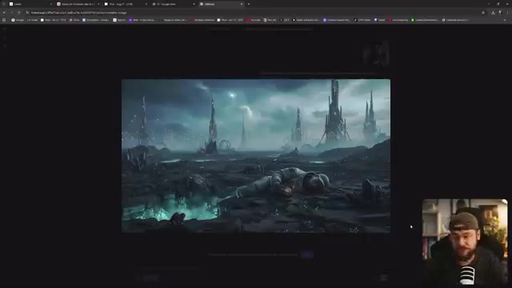
*Affichage à l'écran d'une image générée par IA montrant un astronaute gisant sur un sol rocheux dans un paysage de science-fiction, avec Jack visible en incrustation (PiP) dans le coin inférieur droit.*

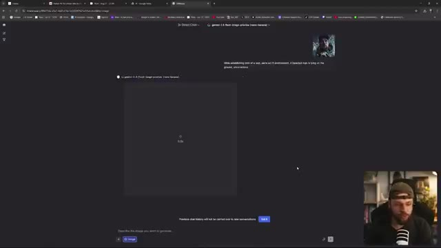
*Interface d'un outil de génération par IA montrant un espace de discussion avec le modèle sélectionné et une image générée en cours de chargement ou d'affichage, avec Jack en incrustation (PiP) dans le coin inférieur droit.*

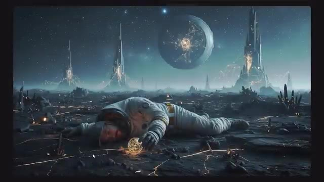
*Gros plan sur une nouvelle image générée montrant un astronaute au sol touchant une sphère lumineuse, avec de grandes structures futuristes et un vaisseau spatial dans le ciel étoilé.*

---

### ⏱️ `[00:06:53 - 00:07:30]` | Segment #14

**🔊 Audio (Transcription Intégrale Mot pour Mot en Français) :**
> de ces éléments dans votre histoire si vous le souhaitez et nous appuierons sur réessayer une dernière fois juste pour le plaisir mais vous pouvez voir que c'est le processus que vous utiliseriez vous prendriez votre image de départ vous la mettriez dans Gemini ou Ella Marina ou Free Pick pour accéder à Nano Banana vous y intégreriez votre invite et petit à petit vous construiriez essentiellement un storyboard. Celui-ci ici, en fait, je l'aime vraiment beaucoup. S'il y a des éléments de l'image que vous n'aimez pas, vous pouvez aussi revenir en arrière. Je sais qu'avec Gemini, c'est très conversationnel, ça se comporte un peu comme un LLM comme ChatGPT. Donc vous

**👁️ Analyse Visuelle d'Écran (gemini-3.5-flash-lite) :**
**Interface & Outils** : Interface de type navigateur web utilisant un modèle d'IA conversationnel (Gemini / Nano Banana) avec affichage plein écran des images générées et incrustation vidéo (PiP) du présentateur dans le coin inférieur droit.

**Contenu textuel & Code** : Texte du prompt visible : "Wide establishing shot of a vast, eerie sci-fi environment. A bearded man lying on the ground, unconscious." Modèle indiqué : "gemini-2.5-flash-image-preview (nano-banana)".

**Action / Démonstration** : Le créateur montre les images générées en plein écran puis bascule sur l'interface de l'outil conversationnel pour expliquer le processus itératif de création de storyboard, tout en parlant face caméra (visible en PiP).

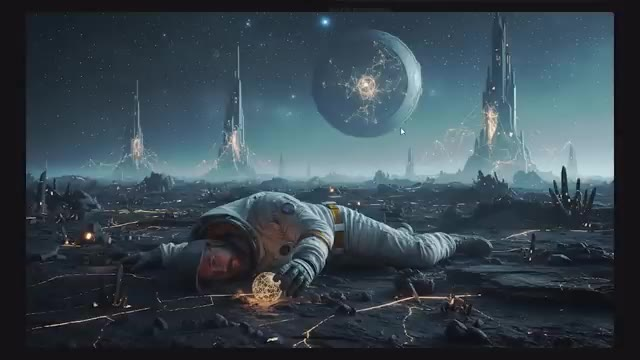
*Affichage en plein écran d'une image générée par IA montrant un astronaute inconscient étendu au sol sur une planète extraterrestre avec des tours futuristes et un ciel étoilé.*

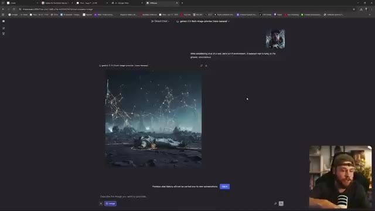
*Interface de l'outil web (Gemini / Nano Banana) avec l'image générée, le prompt textuel et une incrustation vidéo de Jack dans le coin inférieur droit.*

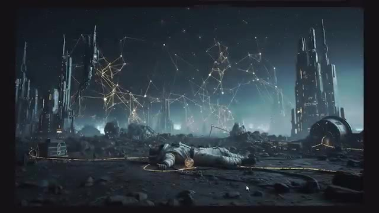
*Affichage en plein écran d'une autre image générée par IA montrant un astronaute au sol dans un décor de science-fiction avec des structures connectées par des réseaux lumineux.*

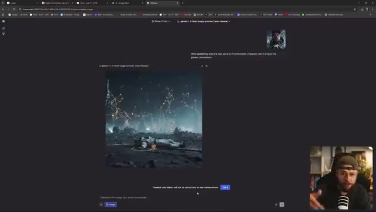
*Interface de l'outil web (Gemini / Nano Banana) identique à la précédente, montrant le flux de travail conversationnel et Jack en incrustation PiP.*

---

### ⏱️ `[00:07:30 - 00:08:06]` | Segment #15

**🔊 Audio (Transcription Intégrale Mot pour Mot en Français) :**
> On pourrait dire à Gemini par exemple : peux-tu supprimer les bâtiments futuristes de la scène ? Et cela va vous donner un très bon niveau de contrôle. Mais regardez simplement comment il a placé l'orbe à côté de mon corps. Je suis allongé à plat sur le dos ici. C'est complètement différent de ce que vous avez vu dans le court-métrage. Et bien sûr, l'élément clé, c'est le style, le ton, et moi-même en tant que personnage. Tout cela semble cohérent. Ça ne brise pas vraiment cette illusion, ce qui, selon moi, est souvent le problème avec la réalisation de films par IA. Nano Banana devient essentiellement votre outil de storyboarding.

**👁️ Analyse Visuelle d'Écran (gemini-3.5-flash-lite) :**
**Interface & Outils** : Interface web de Nano Banana / Gemini avec affichage d'un panneau de chat, de prompts textuels et d'une fenêtre de prévisualisation d'image, incluant une vue PiP du créateur dans le coin inférieur droit sur les images 1, 3 et 4.

**Contenu textuel & Code** : Texte du prompt visible : "Wide establishing shot of a dead, eerie sci-fi environment. A bearded man is lying on the ground, unconscious." ainsi qu'une vignette miniature représentant le visage du créateur.

**Action / Démonstration** : Le créateur commente l'image générée en soulignant la position de l'orbe et du personnage allongé, tout en illustrant le processus de storyboarding et de modification de scène via l'intelligence artificielle.

*Interface web montrant un rendu visuel sombre d'un astronaute couché sur le dos dans un décor futuriste avec des structures imposantes à l'arrière-plan, et la webcam du créateur en incrustation (PiP) dans le coin inférieur droit.*

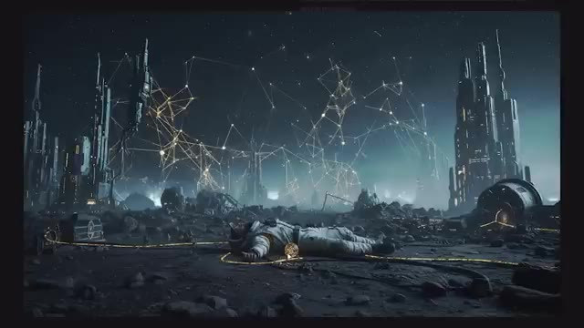
*Gros plan plein écran sur le rendu de la scène montrant l'astronaute étendu sur le sol rocailleux avec un orbe brillant placé près de son corps.*

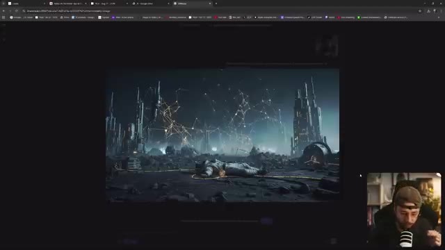
*Retour à la vue de l'interface web de travail avec l'image affichée au centre et le flux vidéo du créateur dans l'encadré PiP.*

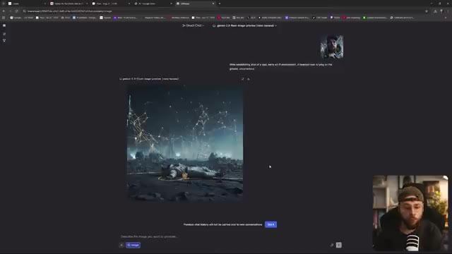
*Interface d'un outil conversationnel (probablement Nano Banana / Gemini) affichant un prompt textuel en haut et une image générée montrant l'astronaute allongé au sol dans son environnement futuriste.*

---

### ⏱️ `[00:08:06 - 00:08:42]` | Segment #16

**🔊 Audio (Transcription Intégrale Mot pour Mot en Français) :**
> où vous fabriquez chacune des premières images de chaque plan pour votre film. Vous pouvez donc utiliser tous différents types d'angles de caméra. Vous pouvez décrire différents éléments, différentes actions qui se déroulent dans la scène. Mais bien sûr, cela correspond simplement au script que vous avez déjà écrit. Donc vous n'inventez pas les choses de nulle part. Cela suit cet ordre que vous avez déjà décidé. Et comme tout outil d'IA, il va y avoir un peu d'essais et erreurs. Vous allez également obtenir des résultats assez nuls de la part de Nano Banana. Mais vous pouvez aussi obtenir quelque chose comme ça. Et si vous répétiez continuellement le processus, vous obtiendriez

**👁️ Analyse Visuelle d'Écran (gemini-3.5-flash-lite) :**
**Interface & Outils** : Navigateur web affichant une interface de génération d'images par IA (type chat/génération d'images), avec un encadré vidéo PiP du présentateur (Jack) en bas à droite.

**Contenu textuel & Code** : Texte de prompt visible : "Wide establishing shot of a rest, eerie sci-fi environment. A bearded man is lying on the ground, unconscious." ainsi qu'une image générée représentant un paysage futuriste et sombre avec un personnage au sol.

**Action / Démonstration** : Le navigateur présente le résultat d'une génération d'image basée sur un prompt textuel décrivant une scène de science-fiction, tandis que le créateur commente en incrustation.

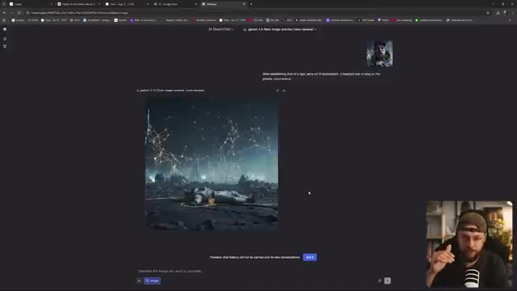
*Interface d'un outil de génération d'images par IA montrant un plan large d'un environnement post-apocalyptique avec un homme barbu inconscient au sol, avec Jack visible en incrustation (PiP) en bas à droite.*

---

### ⏱️ `[00:08:42 - 00:09:14]` | Segment #17

**🔊 Audio (Transcription Intégrale Mot pour Mot en Français) :**
> de tout votre film, sauf que ce serait juste sous forme d'images fixes. Et si nous parcourons tout cela maintenant, tout d'abord, c'est moi étendu sur le dos. Je viens de reprendre mes esprits dans cet étrange environnement de science-fiction. Ensuite, je me frotte la tête. Vraiment un très beau plan d'ensemble ici. J'adore ce qu'a fait Nano Banana. Joli gros plan. Nous essayons d'obtenir une variation d'angles de caméra ici. La texture que Nano Banana obtient sur ma peau ici et ce genre de changement de profondeur de focale est incroyablement bon. Genre,

**👁️ Analyse Visuelle d'Écran (gemini-3.5-flash-lite) :**
**Interface & Outils** : Lecteur multimédia standard sur ordinateur affichant une vidéo/image avec incrustation vidéo PiP du créateur en coin, puis diapositives de présentation avec texte descriptif.

**Contenu textuel & Code** : Texte descriptif en anglais sur les images 2 et 3 décrivant les plans cinématographiques générés par IA (plans larges, gros plans, constellations lumineuses).

**Action / Démonstration** : Le créateur présente et commente des images fixes et des plans de sa vidéo générée par IA, en expliquant les choix de cadrage et de texture.

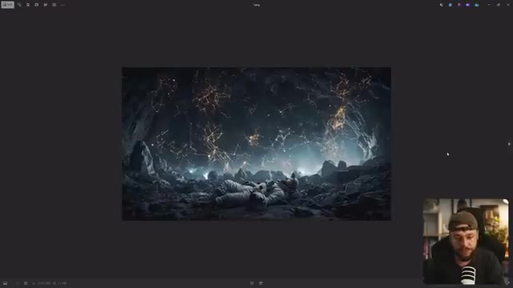
*Image de l'écran du créateur montrant un lecteur multimédia affichant un plan d'ensemble d'un astronaute allongé au sol dans un décor de science-fiction, avec Jack visible en incrustation (PiP) en bas à droite.*

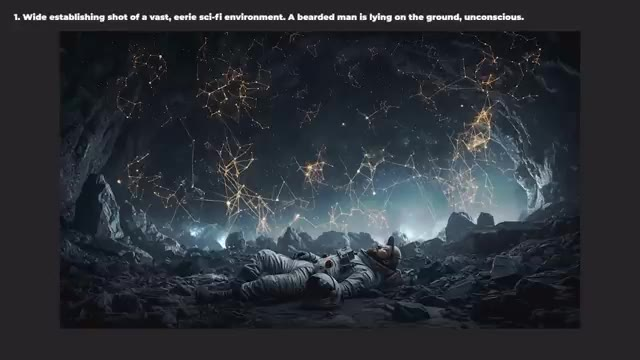
*Diapositive de présentation montrant le plan d'ensemble avec un texte descriptif en haut : « 1. Wide establishing shot of a vast, eerie sci-fi environment. A bearded man is lying on the ground, unconscious. »*

*Diapositive de présentation montrant un gros plan sur le visage d'un homme avec des lunettes et des constellations lumineuses en reflet, avec un texte descriptif en haut : « 4. In a close up we see the glowing constellations reflected in the man's glasses. »*

---

### ⏱️ `[00:09:14 - 00:09:49]` | Segment #18

**🔊 Audio (Transcription Intégrale Mot pour Mot en Français) :**
> Même en regardant ça maintenant, ça me scotche toujours. Un magnifique reflet de ces constellations lumineuses dans les verres de mes lunettes. Puis, bien sûr, nous avons l'origine de cette sorte de lumière incandescente, qui devient cet orbe de verre, une étrange téléportation, un dispositif ancien. Donc je regarde par-dessus mon épaule ici, nous introduisons cet élément, puis je m'éloigne au loin parce que je suis attiré par cette sphère lumineuse, j'ai besoin de comprendre ce que c'est, puis juste un peu plus de variation ici et me permettant aussi de marcher vers le point d'arrivée et puis de m'arrêter de marcher.

**👁️ Analyse Visuelle d'Écran (gemini-3.5-flash-lite) :**
**Interface & Outils** : Lecteur vidéo / interface de visualisation avec incrustation PiP (Picture-in-Picture) du créateur.

**Contenu textuel & Code** : Texte affiché en haut : "5. In the distance, a light source appears and starts glowing, the man slowly turns to face it, confused."

**Action / Démonstration** : Le créateur montre et commente une séquence de génération vidéo en cours de lecture, illustrant le personnage qui se tourne vers une source lumineuse lointaine.

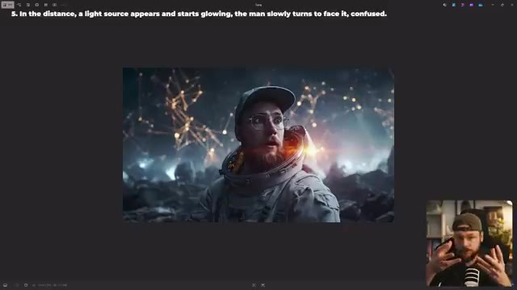
*Aperçu de la génération vidéo avec le créateur en incrustation PiP et un prompt textuel affiché en haut.*

---

### ⏱️ `[00:09:49 - 00:10:24]` | Segment #19

**🔊 Audio (Transcription Intégrale Mot pour Mot en Français) :**
> pour en quelque sorte ajouter un peu plus de drame et de suspense parce qu'on ne peut pas voir ce qui est en train de m'attirer là-bas n'est-ce pas c'est caché du cadre et caché par une lueur également ensuite je savais quand j'ai tapé ce prompt que ça allait être cool mais en tendant la main pour faire contact avec cette sphère lumineuse j'admets que je pense que l'échelle est un peu fausse j'aurais aimé que la sphère soit un peu plus grande mais vous savez je ne peux pas faire ces films pour toujours j'ai d'autres choses à faire aussi. Donc c'était un plan sympa. Je l'ai laissé et je suis passé à autre chose. Et j'ai adoré le premier gros plan de mon

**👁️ Analyse Visuelle d'Écran (gemini-3.5-flash-lite) :**
**Interface & Outils** : Lecteur multimédia ou logiciel de visionnage de clips vidéo avec affichage de textes descriptifs numérotés en haut de l'écran et incrustation vidéo (PiP) du créateur.

**Contenu textuel & Code** : Texte affiché : "7. When he reaches the light source he stops.", "8. He reaches out to touch it with his gloved hand.", "9. The harsh orange glow is reflected in his glasses, intensifying."

**Action / Démonstration** : Visualisation et défilement des extraits de films générés par IA illustrant les différentes étapes d'interaction de l'astronaute avec la source lumineuse, commentés par le créateur.

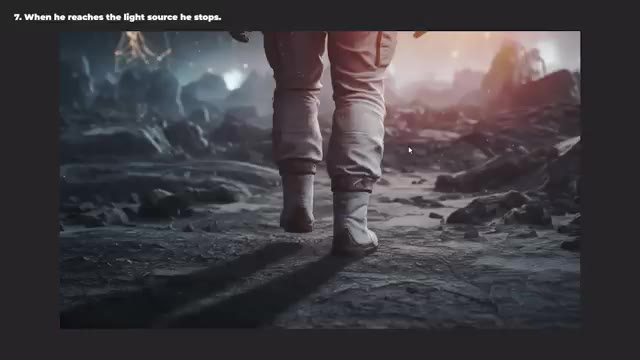
*Extrait vidéo montrant un astronaute de dos marchant sur un terrain rocheux vers une source lumineuse, avec le texte explicatif en haut à gauche.*

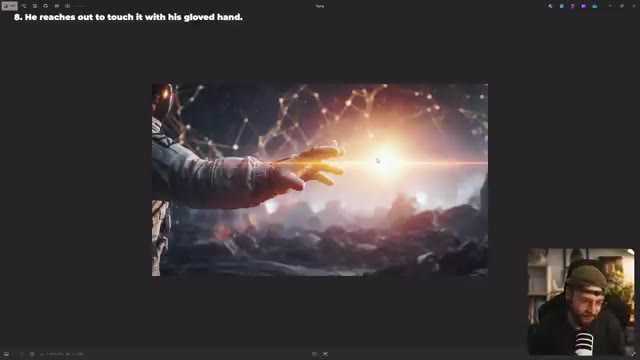
*Extrait vidéo montrant la main gantée d'un astronaute tendant le bras vers une sphère lumineuse, avec le créateur en incrustation (PiP) en bas à droite et le texte descriptif en haut à gauche.*

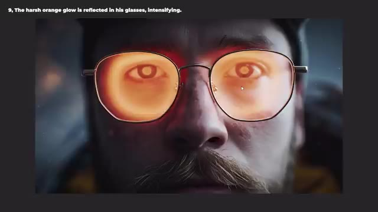
*Gros plan sur le visage d'un personnage portant des lunettes, reflétant une lueur orange intense, avec le texte descriptif en haut à gauche.*

---

### ⏱️ `[00:10:24 - 00:10:47]` | Segment #20

**🔊 Audio (Transcription Intégrale Mot pour Mot en Français) :**
> fait tellement partie des constellations. Je me suis dit, ne serait-il pas cool d'avoir d'une manière ou d'une autre la lueur qui éclaire mon visage et se reflète directement dans mes lunettes. Et quand cela a été animé, ce plan avait l'air tellement cool. Encore une fois, nous pouvons parler longuement de la texture de ma moustache et du genre d'imperfections sur tout mon nez. Les imperfections sont vraiment ce qui rend les choses réelles.

**👁️ Analyse Visuelle d'Écran (gemini-3.5-flash-lite) :**
**Interface & Outils** : Interface d'un lecteur multimédia ou d'un logiciel de montage vidéo sur fond sombre, avec une barre de contrôle en bas et un encadré PiP (Picture-in-Picture) montrant Jack en studio.

**Contenu textuel & Code** : Texte affiché en haut à gauche : "9, The harsh orange glow is reflected in his glasses, intensifying."

**Action / Démonstration** : Le créateur présente un plan vidéo généré par IA démontrant les effets de lumière vive réfléchie dans les verres de lunettes et les textures faciales réalistes, tout en commentant le résultat en incrustation.

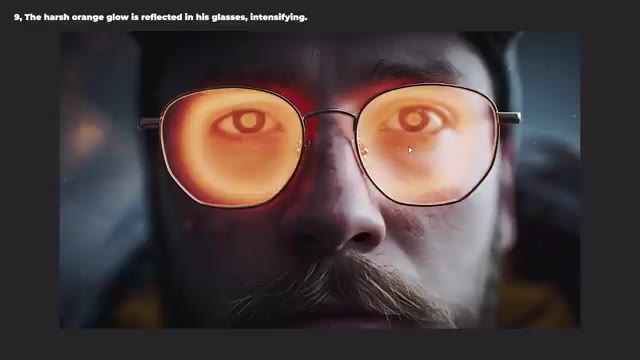
*Gros plan sur le rendu vidéo généré par IA montrant le personnage avec des reflets orange intenses dans les lunettes et des détails texturés sur le visage.*

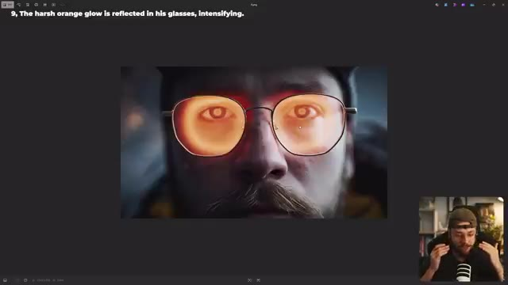
*Vue de l'écran d'ordinateur du créateur affichant la vidéo avec le prompt textuel en haut et une incrustation vidéo (PiP) de Jack en bas à droite.*

---

### ⏱️ `[00:10:47 - 00:11:21]` | Segment #21

**🔊 Audio (Transcription Intégrale Mot pour Mot en Français) :**
> vous voulez vraiment essayer d'intégrer cela dans vos générations d'IA. Nous passons à ce superbe plan par-dessus l'épaule de moi tenant cette orbe de verre lumineuse et nous obtenons un peu plus de détails textuels sur l'objet lui-même maintenant. Et évidemment, quand je demande cette génération d'image à Nano Banana, nous repensons au script et nous pensons que ça va s'engouffrer, vous savez, la lueur va devenir si grande que nous allons être transportés ou aspirés dedans. Et puis bien sûr nous apparaissons dans cet environnement de jungle très différent, sauf que j'ai toujours l'air très cohérent. Ma tenue a toujours l'air vraiment

**👁️ Analyse Visuelle d'Écran (gemini-3.5-flash-lite) :**
**Interface & Outils** : Interface d'un bloc-notes ou d'un outil de traitement de texte/script (type Notion ou éditeur de notes) affichant le scénario 'SPACE SCENE', combinée avec un affichage multimédia/visionneuse d'images générées par IA et une incrustation vidéo (PiP) du créateur en bas à droite.

**Contenu textuel & Code** : Texte du script visible à l'écran : titre 'SPACE SCENE' et liste de descriptions de plans numérotés (notamment les points 9, 10 et 11). Texte en haut de l'image 1 : '9, The harsh orange glow is reflected in his glasses, intensifying.' Texte en haut de l'image 2 et 3 : '10, Over the shoulder: the glow becomes brighter still, until with a sudden flash the man is sucked into a wormhole.' Texte en haut de l'image 4 : '11, Wide establishing shot: the bearded man finds himself on a vibrant jungle planet, sitting on a huge pile of bananas. He looks around, stunned.'

**Action / Démonstration** : Le créateur fait défiler ou présente les différentes images générées par IA correspondant aux lignes successives de son script de scène spatiale, tout en expliquant sa démarche narrative et visuelle.

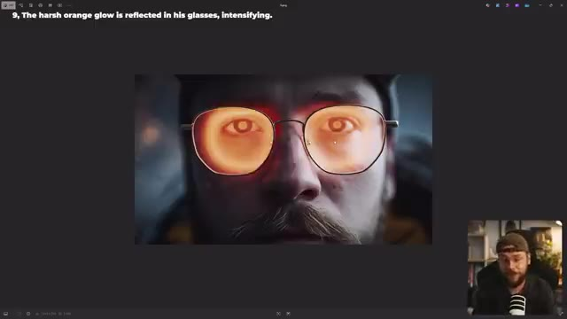
*Image #1 : Gros plan sur un homme barbu portant des lunettes, avec un reflet orange intense dans les verres, illustrant le point 9 du script.*

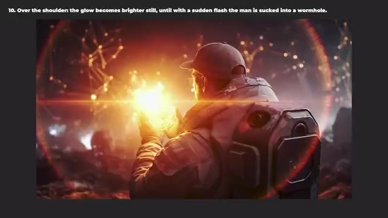
*Image #2 : Plan par-dessus l'épaule montrant un homme tenant une orbe lumineuse dans un environnement cosmique, illustrant le point 10 du script.*

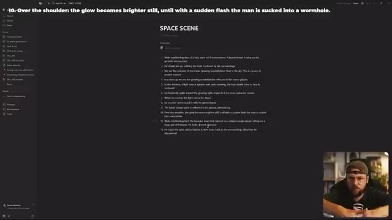
*Image #3 : Vue de l'interface de l'éditeur de texte ou de notes montrant le script intitulé 'SPACE SCENE' avec une liste de points numérotés.*

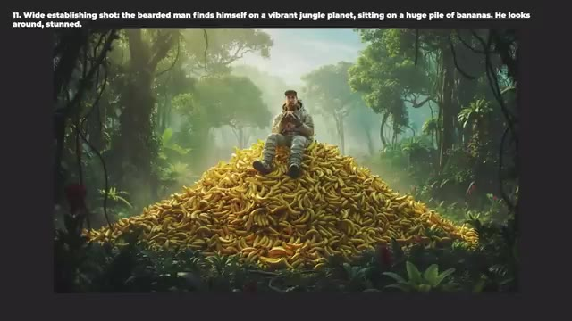
*Image #4 : Plan large montrant l'homme assis au sommet d'une immense pile de bananes dans une jungle luxuriante, illustrant le point 11 du script.*

---

### ⏱️ `[00:11:21 - 00:11:57]` | Segment #22

**🔊 Audio (Transcription Intégrale Mot pour Mot en Français) :**
> cohérent. Je tiens toujours le même orbe de verre et j'ai l'air complètement stupéfait, genre qu'est-ce qui s'est passé ? Et pour finir, on me voit tenir cet orbe et penser que j'ai découvert quelque chose d'incroyable ici. Maintenant que vous avez les images pour chaque étape de l'histoire, il est bien sûr temps d'animer, et j'ai fini par utiliser pas mal de générateurs de vidéo différents pour obtenir le résultat final que vous voyez au début de la vidéo. Il y a eu beaucoup d'essais et d'erreurs. Donc les gars, veuillez ne pas vous attendre à ce que ça fonctionne tout seul du premier coup. Nous n'en sommes pas là.

**👁️ Analyse Visuelle d'Écran (gemini-3.5-flash-lite) :**
**Interface & Outils** : Google Drive dans un navigateur web avec affichage de vignettes d'images et interface de présentation de story-board.

**Contenu textuel & Code** : Texte du prompt : '11. Wide establishing shot: the bearded man finds himself on a vibrant jungle planet, sitting on a huge pile of bananas. He looks around, stunned.' et '12. He raises the glass orb to inspect it, then looks back to his surroundings. What has he discovered?'

**Action / Démonstration** : Le créateur montre les images générées par IA correspondant aux différentes étapes du story-board, puis présente le dossier Google Drive regroupant tous les visuels du projet de film spatial.

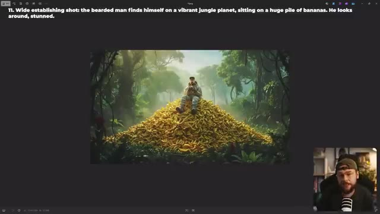
*Image affichée à l'écran montrant un plan large généré par IA d'un homme barbu assis sur une immense pile de bananes dans une jungle, avec un prompt textuel visible en haut.*

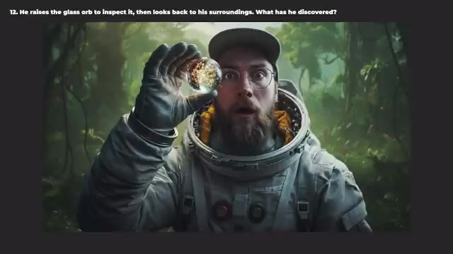
*Image en gros plan montrant l'astronaute inspectant un orbe lumineux avec une expression stupéfaite, accompagnée d'un prompt textuel en haut.*

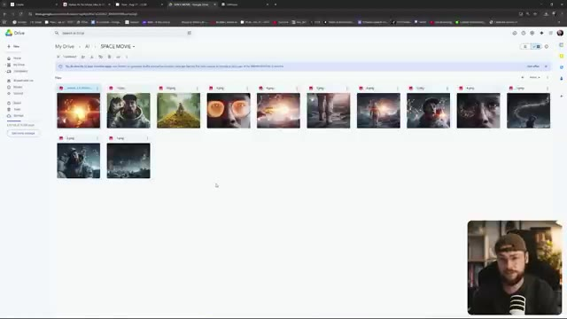
*Navigateur web affichant Google Drive avec un dossier contenant de nombreuses images miniatures de la séquence du film spatial.*

---

### ⏱️ `[00:11:57 - 00:12:29]` | Segment #23

**🔊 Audio (Transcription Intégrale Mot pour Mot en Français) :**
> point de génération de vidéo par IA pour l'instant. Bien sûr, certains outils sont meilleurs que d'autres, mais j'ai fini par utiliser Kling, VO3, et en fait une énorme quantité de Halo. Je dirais qu'environ 90% du film a été généré en utilisant Haylou. Les gars là-bas ont été très aimables. Ils m'ont donné un tas de crédits pour tester leurs outils. Donc si quelqu'un regarde de la part de Haylou, merci beaucoup. Vous pouvez voir en quelque sorte que je saisis divers prompts différents pour animer tous nos cadres. Certains des résultats que j'ai obtenus étaient incroyables.

**👁️ Analyse Visuelle d'Écran (gemini-3.5-flash-lite) :**
**Interface & Outils** : Google Drive (Image 1) et interface de Hayllow AI (Image 2) avec incrustation vidéo PiP du créateur en bas à droite.

**Contenu textuel & Code** : Dans l'image 1 : Fichiers d'images nommés en .png représentant des scènes spatiales, des astronautes et des explosions. Dans l'image 2 : Interface de génération vidéo avec des aperçus montrant un astronaute barbu tenant un orbe brillant, et le texte du prompt visible sur le panneau latéral droit.

**Action / Démonstration** : Le créateur navigue dans ses dossiers de ressources graphiques sur Google Drive puis présente l'interface de l'outil Hayllow AI.

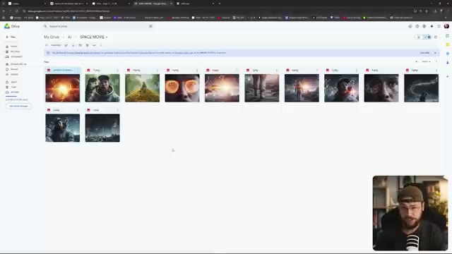
*Google Drive affichant un dossier contenant de nombreuses images générées par IA pour un film de science-fiction spatial ('SPACE MOVIE').*

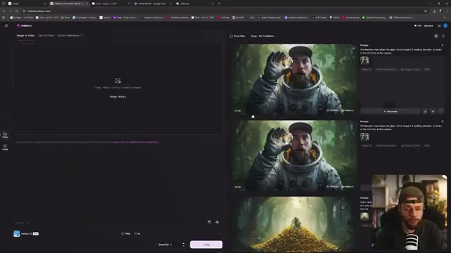
*Interface de Hayllow AI montrant un espace de travail de génération 'Image to Video' avec des résultats de prévisualisation et des prompts.*

---

### ⏱️ `[00:12:29 - 00:13:02]` | Segment #24

**🔊 Audio (Transcription Intégrale Mot pour Mot en Français) :**
> Certaines d'entre elles étaient assez bizarres. Celle-ci, par exemple, où je marche et où je me retourne complètement au hasard pour avoir un look complètement différent, un peu comme un personnage de jeu vidéo. Celle-ci là, même si le résultat est sympa, ce n'est pas vraiment ce que j'ai demandé à Halo de faire et évidemment, quand je me tourne vers la caméra, on voit que ce n'est pas très cohérent par rapport à mon apparence réelle : ma barbe est beaucoup plus longue et la structure de mon visage est assez différente. Et maintenant ce plan-ci, le plan final ou l'avant-dernier plan devrais-je dire, où je me fais en quelque sorte transporter au sommet de cette montagne...

**👁️ Analyse Visuelle d'Écran (gemini-3.5-flash-lite) :**
**Interface & Outils** : Navigateur web affichant l'interface de la plateforme de génération vidéo Hailuo AI (MiniMax).

**Contenu textuel & Code** : On peut apercevoir les prompts saisis pour générer les vidéos, ainsi que les logos « MINIMAX | Hailuo AI » incrustés sur les rendus vidéo. Le créateur apparaît également en incrustation (PiP) en bas à droite de l'écran.

**Action / Démonstration** : Le présentateur commente et analyse les différentes générations de vidéos obtenues avec l'outil Hailuo AI en naviguant dans l'historique et en affichant les différents plans générés.

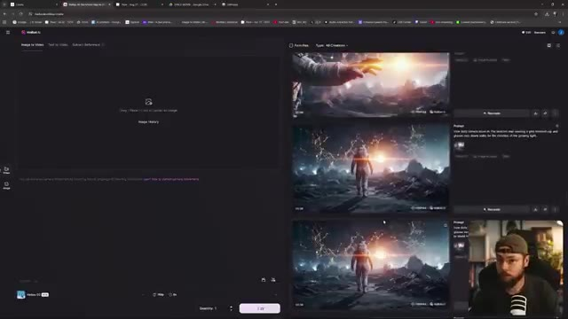
*Interface de l'outil MiniMax / Hailuo AI montrant la bibliothèque de générations vidéo avec plusieurs vignettes de prévisualisation à droite et le flux vidéo actif.*

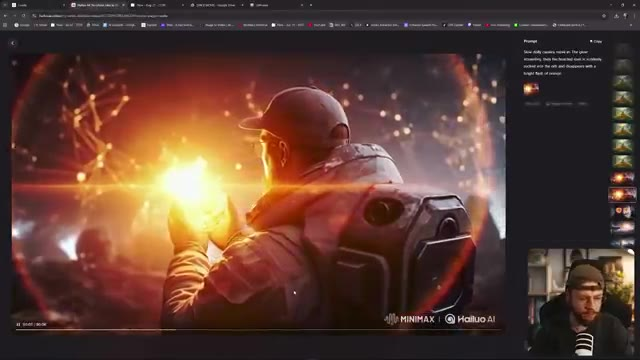
*Gros plan sur le lecteur vidéo dans l'interface de Hailuo AI montrant un personnage barbu de dos avec une casquette tenant un éclat lumineux, avec le panneau de prompt visible à droite.*

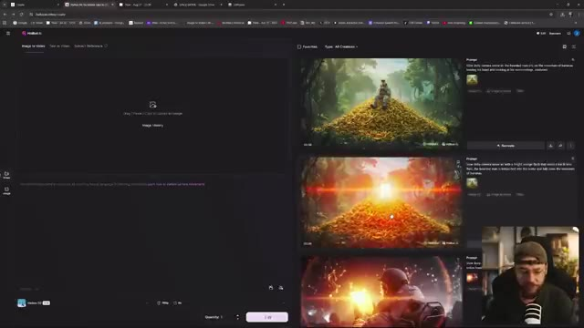
*Vue de l'interface de Hailuo AI montrant la grille des clips générés, incluant notamment un personnage assis au sommet d'une montagne de bananes.*

---

### ⏱️ `[00:13:02 - 00:13:26]` | Segment #25

**🔊 Audio (Transcription Intégrale Mot pour Mot en Français) :**
> de bananes, mon dieu, que c'était difficile et si vous êtes assis là en train de vous dire : Jack, tu avais dit que tu allais m'expliquer comment animer ces images gratuitement. Je le fais. Ne vous inquiétez pas. On va y arriver. Mais j'aime vraiment vous montrer chaque étape du processus pour que vous compreniez que ça n'a pas été sans effort. Ça a demandé beaucoup d'essais et d'erreurs. Vraiment beaucoup. Vous pouvez voir cette génération ici.

**👁️ Analyse Visuelle d'Écran (gemini-3.5-flash-lite) :**
**Interface & Outils** : Interface web de l'outil Hailuo AI (MiniMax) pour la génération de vidéos à partir d'images ("Image to Video").

**Contenu textuel & Code** : Panneau latéral avec des aperçus de clips vidéo et des prompts textuels visibles, ainsi que la vue principale du lecteur vidéo avec les logos "MINIMAX | Hailuo AI" et un prompt décrivant une caméra dolly lente avec un flash lumineux orange.

**Action / Démonstration** : Le créateur montre son écran d'ordinateur présentant l'historique des générations vidéo et un rendu en cours de visionnage.

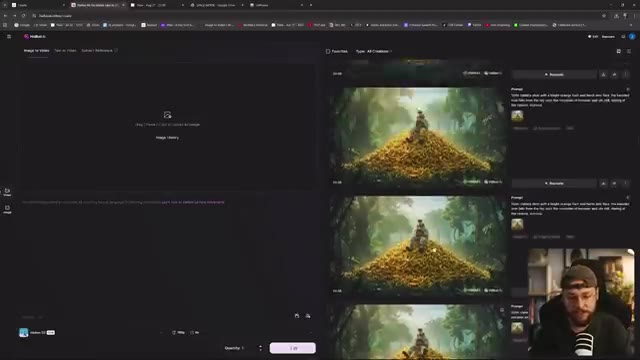
*Interface de l'outil de génération vidéo affichant une liste de clips générés sur le panneau de droite et le créateur visible en incrustation (PiP) dans le coin inférieur droit.*

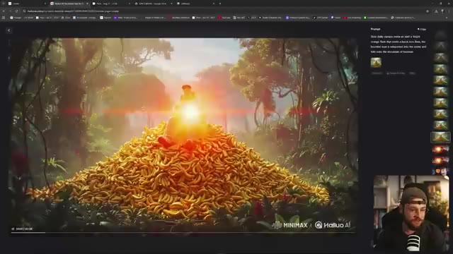
*Visualisation en grand format d'un clip vidéo généré montrant un personnage assis sur un immense tas de bananes avec un effet de flash lumineux central, accompagné du logo Minimax / Hailuo AI.*

---

### ⏱️ `[00:13:27 - 00:14:04]` | Segment #26

**🔊 Audio (Transcription Intégrale Mot pour Mot en Français) :**
> Je tombe en quelque sorte, ce que je ne voulais pas qu'il se produise. Celui-ci est plutôt bien. Mais ensuite, au moment où l'on arrive à mon visage, bien sûr, je parais complètement différent. Je n'ai pas de lunettes. Et puis, quand j'essayais de faire en sorte de tomber sur la montagne de bananes, pour je ne sais quelle raison, Hailuo n'arrêtait pas de changer mes vêtements, donc ça arrachait la tenue d'astronaute. Ce que j'ai fini par remarquer, c'est que l'image que je lui injectais était celle où je tenais l'orbe comme ceci, et donc lorsqu'il essayait d'animer mon corps, étant donné que je couvrais mes vêtements avec l'image de départ, le...

**👁️ Analyse Visuelle d'Écran (gemini-3.5-flash-lite) :**
**Interface & Outils** : Interface web de Hailuo AI (MiniMax) avec les sections Image-to-Video, affichage des prompts et lecteur vidéo intégré.

**Contenu textuel & Code** : Panneau latéral avec des prompts textuels décrivant des mouvements de caméra et des scènes de chute dans des bananes, ainsi que le filigrane "MINIMAX | Hailuo AI".

**Action / Démonstration** : Le créateur navigue et démontre les résultats de génération vidéo sur Hailuo AI, montrant les modifications de vêtements et d'apparence appliquées par l'IA.

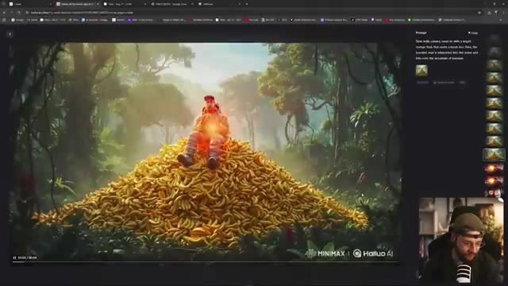
*Interface de l'outil Hailuo AI montrant la lecture d'une vidéo générée avec un personnage assis sur une montagne de bananes dans la jungle.*

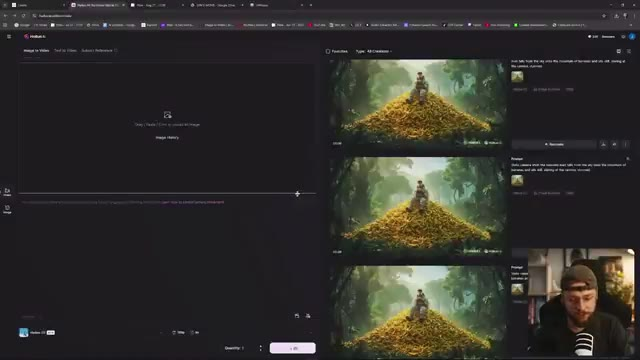
*Interface de Hailuo AI affichant l'espace de création 'Image to Video' avec l'historique des générations sur le panneau latéral droit.*

---

### ⏱️ `[00:14:04 - 00:14:42]` | Segment #27

**🔊 Audio (Transcription Intégrale Mot pour Mot en Français) :**
> Les générateurs de vidéo par IA, pas seulement Haylou, je dois dire que beaucoup d'entre eux ne savaient pas quels vêtements je portais, et bien sûr, vous pouvez lui dire que vous portez une combinaison d'astronaute, mais ce n'est pas forcément censé rester cohérent avec ce que vous m'avez vu porter dans le reste du film, parce que le générateur de vidéo par IA ne le sait pas. Mais vous pouvez voir toutes sortes de résultats vraiment loufoques qu'on a obtenus. Encore une fois, je suis transformé en quelqu'un de complètement différent, cela applique des prompts que je n'ai pas saisis, je ne voulais pas du tout que cela se produise. Encore une fois ici, une sorte d'effet de flare d'objectif et je glisse hors champ et j'ai encore beaucoup changé. Et puis certains sont juste vraiment fous. Comme vous pouvez tous voir le montant...

**👁️ Analyse Visuelle d'Écran (gemini-3.5-flash-lite) :**
**Interface & Outils** : Interface web de l'outil de génération vidéo Hailuo AI / MiniMax, affichant un panneau de génération, l'historique des clips et le lecteur vidéo.

**Contenu textuel & Code** : Textes de prompt visibles : "Static camera shot, with a bright orange flash and harsh lens flare, the bearded man falls from the sky onto the mountain of bananas and sits still, staring at the camera, stunned."

**Action / Démonstration** : Le créateur navigue dans l'interface de Hailuo AI et présente les différentes générations de vidéos montrant des incohérences de personnages et des résultats inattendus.

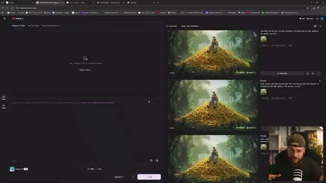
*Interface de l'outil de génération vidéo MiniMax / Hailuo AI montrant le panneau de création avec l'historique des vidéos générées et le créateur en incrustation PiP.*

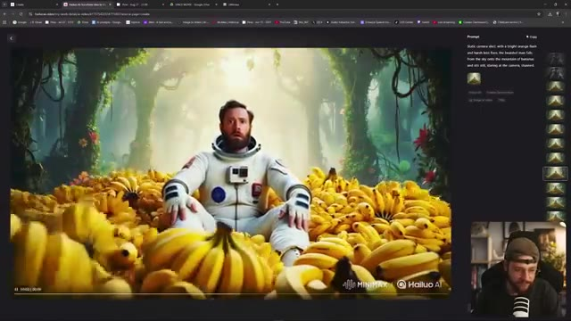
*Visualisation en grand format d'une vidéo générée montrant un homme barbu en combinaison d'astronaute assis sur une montagne de bananes, avec le panneau de prompt latéral.*

---

### ⏱️ `[00:14:42 - 00:15:15]` | Segment #28

**🔊 Audio (Transcription Intégrale Mot pour Mot en Français) :**
> d'essais et d'erreurs impliqués dans la création de ce film était assez fou, mais on apprend quand même pas mal de choses en cours de route. Celui-ci était vraiment cool, malheureusement. J'aime la façon dont la lueur se produit et tout ça, et je me fais un peu aspirer dedans, mais ensuite ça dépose juste un autre astronaute là-bas qui n'est pas moi, donc ça casse complètement l'intrigue, n'est-ce pas ? Celui-ci, portail cool, mais encore une fois, ça met juste quelqu'un d'autre dedans, donc je pense qu'vraiment je poussais la génération de vidéo par IA à sa limite absolue, mais je veux terminer sur une bonne note en termes de Hailuo, regardez juste ça.

**👁️ Analyse Visuelle d'Écran (gemini-3.5-flash-lite) :**
**Interface & Outils** : Navigateur web affichant l'interface de Hailuo AI (MiniMax) avec lecteur vidéo, panneau de prompts textuels à droite et onglets de génération (Image to Video, Text to Video).

**Contenu textuel & Code** : Texte du prompt visible : "Static camera shot, with a bright orange flash and harsh lens flare, the bearded man falls from the sky onto the mountain of bananas and sits still, staring at the camera, stunned."

**Action / Démonstration** : Le créateur navigue à travers ses générations vidéo sur Hailuo AI et commente les défauts de continuité des personnages générés par l'IA.

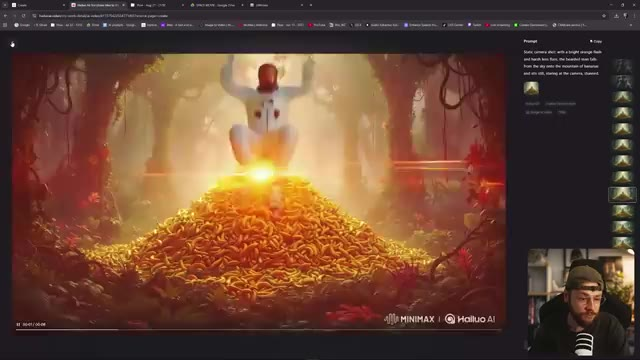
*Interface de Hailuo AI affichant la lecture vidéo d'un astronaute assis sur un tas de bananes avec un effet lumineux, et Jack en incrustation PiP.*

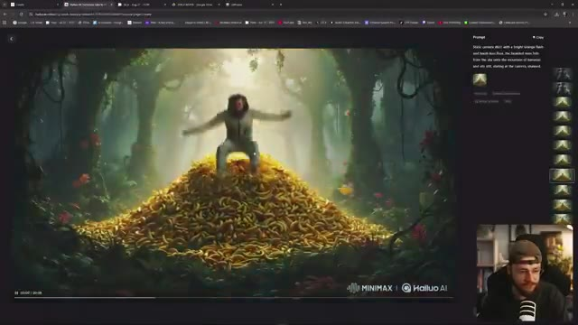
*Interface de Hailuo AI montrant l'instant où un autre astronaute non identique apparaît soudainement à la place du premier sur le tas de bananes.*

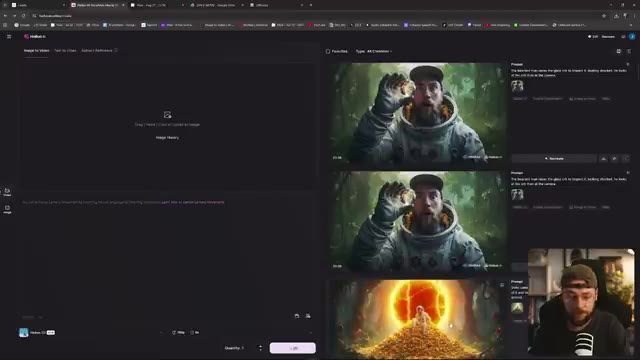
*Interface de Hailuo AI montrant le panneau latéral avec l'historique des générations vidéo et des prompts textuels détaillés.*

---

### ⏱️ `[00:15:15 - 00:15:48]` | Segment #29

**🔊 Audio (Transcription Intégrale Mot pour Mot en Français) :**
> les dernières générations de vidéos qui provenaient bien sûr de cette image de départ ici, donc nous allons passer à la première génération que j'ai eue et qui, je pense, a fini par être intégrée au court-métrage final, de superbes changements de profondeur de champ vraiment sympas pour ajouter une sorte de dynamisme au plan lui-même et celle-ci ici, que je ne pense pas avoir utilisée au final, est toujours vraiment vraiment cool, j'adore la façon dont je ramène en quelque sorte l'orbe au centre du cadre et je le regarde toujours en face, tout a l'air incroyable, la façon dont cela anime mes sourcils alors que je fronce d'une certaine manière les...

**👁️ Analyse Visuelle d'Écran (gemini-3.5-flash-lite) :**
**Interface & Outils** : Hailuo AI (MiniMax) - Interface web de génération de vidéo par IA (Image-to-Video).

**Contenu textuel & Code** : Texte du prompt visible sur le panneau latéral : "The bearded man raises the glass orb to inspect it, looking shocked; he looks at the orb then at the camera." Logos MiniMax et Hailuo AI incrustés dans le lecteur.

**Action / Démonstration** : Le créateur navigue et commente différentes générations de vidéos créées à partir d'une image de départ dans l'interface de Hailuo AI.

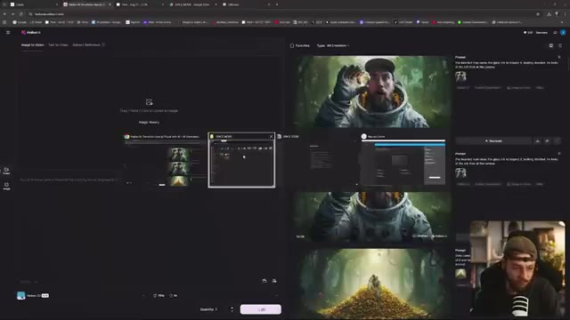
*Interface complète du site Hailuo AI montrant l'espace de travail Image-to-Video avec l'historique des générations et le panneau latéral affichant les prompts.*

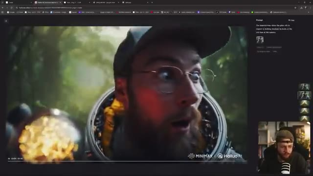
*Lecteur vidéo de Hailuo AI affichant un plan rapproché d'un astronaute examinant un orbe lumineux dans une jungle.*

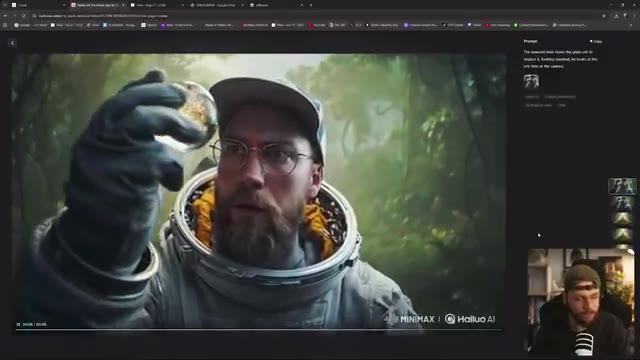
*Autre plan de la vidéo générée dans l'interface de Hailuo AI montrant l'astronaute tenant l'orbe lumineux.*

---

### ⏱️ `[00:15:48 - 00:16:14]` | Segment #30

**🔊 Audio (Transcription Intégrale Mot pour Mot en Français) :**
> sourcils j'essaie d'analyser cet objet c'est tellement bien donc oui beaucoup d'essais et d'erreurs sont impliqués. Mais si vous persévérez, si vous êtes déterminé et que vous avez ce genre de vision, alors vous allez obtenir des résultats incroyables. Et comme j'aime toujours le dire, les outils de génération d'images et de vidéos en matière d'IA, ils ne vont jamais empirer, n'est-ce pas ? Ils ne vont faire que s'améliorer. C'est donc le moment idéal pour vous former à ces outils.

**👁️ Analyse Visuelle d'Écran (gemini-3.5-flash-lite) :**
**Interface & Outils** : Interface web de Hailuo AI (MiniMax) avec un lecteur vidéo au centre, un panneau latéral à droite contenant le prompt textuel et des miniatures de versions, ainsi qu'une incrustation vidéo PiP montrant le créateur Jack dans son studio.

**Contenu textuel & Code** : Texte du prompt visible dans le panneau latéral droit : "The bespectacled man raises the glass orb to inspect it, looking shocked; he looks at the orb then at the camera." Logos MiniMax et Hailuo AI visibles en bas à droite de la vidéo générée.

**Action / Démonstration** : Lecture d'une vidéo générée par IA montrant un astronaute portant des lunettes qui tient et observe un orbe de verre lumineux dans un environnement de jungle luxuriante, tandis que le créateur commente en incrustation PiP.

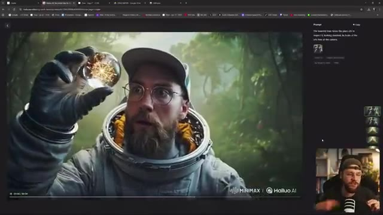
*Interface de Hailuo AI (MiniMax) affichant le résultat vidéo d'un astronaute examinant un orbe lumineux dans la jungle, avec le panneau de prompt à droite et une petite incrustation vidéo de Jack dans le coin inférieur droit.*

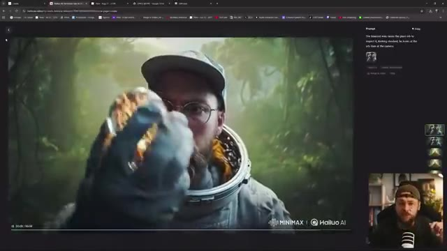
*Interface de Hailuo AI (MiniMax) montrant la suite de la lecture vidéo avec l'astronaute manipulant l'objet brillant, et Jack visible en incrustation PiP en bas à droite.*

---

### ⏱️ `[00:16:14 - 00:16:36]` | Segment #31

**🔊 Audio (Transcription Intégrale Mot pour Mot en Français) :**
> C'est exactement ce que j'aime faire sur cette chaîne, les gars. Donc si vous appréciez le contenu d'aujourd'hui, assurez-vous de lâcher un pouce bleu pour moi, pensez à vous abonner et, bien sûr, à activer cette cloche de notification également. Maintenant, comme promis, j'ai dit que j'allais vous montrer comment vous pouvez animer vos images gratuitement. Je le mentionne dans absolument chacune de mes vidéos.

**👁️ Analyse Visuelle d'Écran (gemini-3.5-flash-lite) :**
**Interface & Outils** : Interface web de Hailuo AI (Minimax) et bureau Windows avec affichage de l'application Discord.

**Contenu textuel & Code** : Panneau de prompt sur Hailuo AI : "The astronaut man raisos the glass orb to inspect it, looking shocked, he looks at the orb then at the camera." Bouton "Copy", historique des générations à droite.

**Action / Démonstration** : Le créateur montre une vidéo animée générée par IA représentant un astronaute, puis bascule sur le bureau de son ordinateur pour lancer l'application Discord.

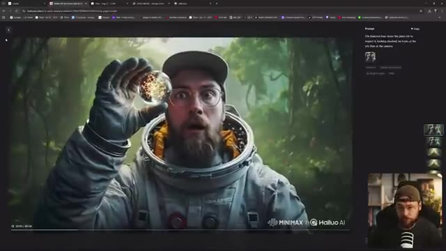
*Interface de Hailuo AI affichant la vidéo générée d'un astronaute dans la jungle avec Jack en incrustation (PiP).*

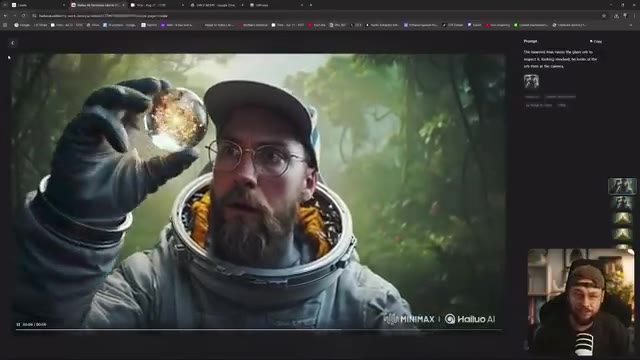
*Gros plan sur la vidéo générée dans Hailuo AI montrant l'astronaute tenant une sphère lumineuse, avec Jack en incrustation (PiP).*

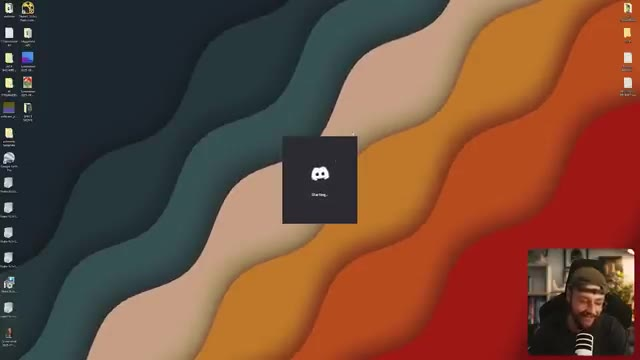
*Bureau Windows avec le fond d'écran coloré et l'application Discord en cours de chargement, avec Jack en incrustation (PiP).*

---

### ⏱️ `[00:16:36 - 00:17:07]` | Segment #32

**🔊 Audio (Transcription Intégrale Mot pour Mot en Français) :**
> Donc si vous faites partie de mes abonnés actuels, je ne peux que m'excuser, les gars, mais je veux passer le mot sur cet outil parce que je pense que c'est très important. Moins il y a de murs payants en matière de création de contenu par IA, selon moi, le mieux c'est. Donc je continuerai à parler de LM Arena et de leur Discord en particulier jusqu'à la fin des temps. Je mettrai un lien pour ce Discord dans la description, mais essentiellement, comment ça fonctionne, c'est que vous allez sur le Discord de LM Arena. Bien sûr, nous utilisons déjà la version web de LM Arena pour accéder à Nano Banana sans le filigrane plus tôt dans la vidéo.

**👁️ Analyse Visuelle d'Écran (gemini-3.5-flash-lite) :**
**Interface & Outils** : Application Discord sur bureau (version sombre), avec le créateur en incrustation PiP (Picture-in-Picture) dans le coin inférieur droit.

**Contenu textuel & Code** : Sur l'image 1 : interface de Discord avec onglets « Friends », « Online », « All », « Pending », « Add Friend ». Sur l'image 2 : serveur Discord de LM Arena, canaux textuels listés à gauche (August-control, video-scene-1, video-scene-2, video-scene-3, general, nano-banana, share-prompts, community-creation, leaderboards, ai-news, ai-memes, bugs), et messages au centre contenant des vidéos générées (paysage désertique, scène animée).

**Action / Démonstration** : Le créateur navigue et démontre l'utilisation de l'interface du serveur Discord de LM Arena, tout en parlant face caméra (visible en PiP).

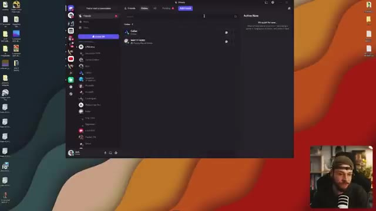
*Interface de Discord affichant la liste des messages directs, avec le créateur visible en incrustation PiP dans le coin inférieur droit.*

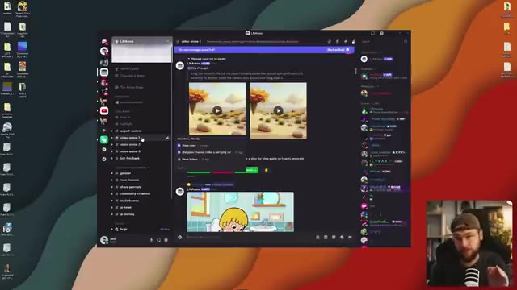
*Interface du serveur Discord de LM Arena avec les salons textuels (video-scene-1, nano-banana, share-prompts) et le flux de messages affichant des vidéos générées par IA.*

---

### ⏱️ `[00:17:08 - 00:17:43]` | Segment #33

**🔊 Audio (Transcription Intégrale Mot pour Mot en Français) :**
> Ici, nous allons passer à la vidéo arena one, c'est là que je traîne si vous voulez un jour voir ce que je crée, vous pourriez le faire. Tapez slash et allez à image to video. Ensuite, glissons et déposons notre plan d'établissement. Et je veux retourner à notre script et nous allons juste prendre ce prompt ici. Déposez-le simplement dans la section prompt et nous appuyons sur entrée. Et maintenant nous allons attendre que notre génération revienne. Voyez ici, il est dit que cette génération peut prendre jusqu'à 10 minutes. Ce que vous êtes censés et encouragés à faire les gars, c'est que vous allez récupérer deux sorties différentes d'une IA aléatoire.

**👁️ Analyse Visuelle d'Écran (gemini-3.5-flash-lite) :**
**Interface & Outils** : Application Discord (serveur communautaire AI Video Arena) affichant des canaux textuels, des commandes bot (/image-to-video) et des fenêtres de prévisualisation vidéo. Un encadré PiP (Picture-in-Picture) montre le créateur Jack dans son studio face caméra.

**Contenu textuel & Code** : Commandes Discord visibles comme `/image-to-video`, sélection de fichiers images (establishing shot), prompts textuels pour la génération de vidéo, boutons de vote et messages du bot LMArena.
[DESC_IMAGE_3_TEXT] Texte de prompt détaillé visible dans le canal : description d'une scène de hacker dans une pièce sombre avec des moniteurs multiples.

**Action / Démonstration** : Le curseur navigue dans les menus de Discord, sélectionne une commande de génération, glisse-dépose une image de base, saisit un prompt textuel et lance le processus de génération de vidéo.

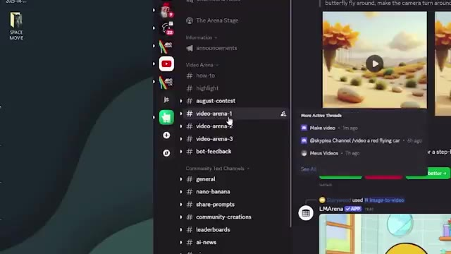
*Navigation sur l'interface Discord dans le canal 'video-arena-1' montrant les options de génération de vidéo.*

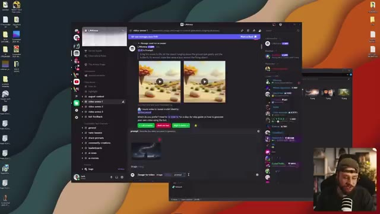
*Utilisation de la commande /image-to-video sur Discord avec un plan d'établissement importé et un prompt textuel.*

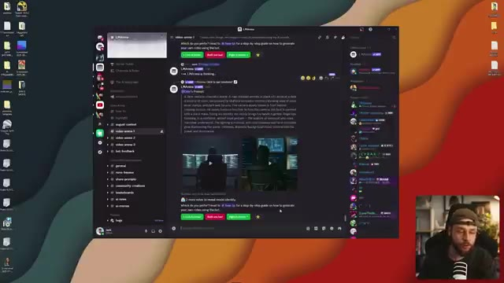
*Résultat de génération de vidéo affiché dans l'arène vidéo Discord avec deux options à comparer et voter.*

---

### ⏱️ `[00:17:43 - 00:18:16]` | Segment #34

**🔊 Audio (Transcription Intégrale Mot pour Mot en Français) :**
> les générateurs de vidéo et la communauté vote sur le résultat qu'elle préfère à gauche ou à droite donc c'est un peu la loterie, vous pouvez obtenir de très mauvais résultats vous allez aussi obtenir beaucoup de très bons résultats et vous n'avez pas dépensé un seul centime donc comme je l'ai dit au début de la vidéo, vous pouvez créer ce que j'ai fait en termes de court-métrage sans rien dépenser, c'est tout à fait possible je vous encourage à utiliser Midjourney pour votre image de départ mais vous pourriez tout aussi bien utiliser ChatGPT par exemple écrivez votre script puis prenez votre image de départ dans Nano Banana pour créer toutes vos

**👁️ Analyse Visuelle d'Écran (gemini-3.5-flash-lite) :**
**Interface & Outils** : Application Discord (LMArena) affichée en plein écran avec un encadré PiP (Picture-in-Picture) de Jack dans le coin inférieur droit.

**Contenu textuel & Code** : Le serveur Discord LMArena affiche des messages de génération de vidéo ("Generating videos. This can take up to 10 minutes"), un prompt textuel décrivant une scène de combat fantastique en 3D ("A 3D anime hero stands on a cliff facing a giant red glowing shadowy monster..."), deux vidéos générées côte à côte (gauche et droite), et des boutons de vote interactifs verts et rouges ("<- Left is better", "Both are bad", "Right is better").

**Action / Démonstration** : Le créateur montre l'interface de vote communautaire sur Discord où les utilisateurs comparent deux résultats de génération vidéo par IA (gauche vs droite).

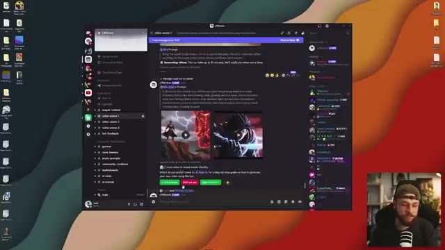
*Interface Discord montrant un test aveugle de génération de vidéo par IA avec un choix de vote gauche/droite et Jack en incrustation PiP en bas à droite.*

---

### ⏱️ `[00:18:16 - 00:18:50]` | Segment #35

**🔊 Audio (Transcription Intégrale Mot pour Mot en Français) :**
> différentes étapes narratives et ensuite vous pouvez intégrer ces images fournies par Nano Banana dans le Discord d'LMRina pour qu'il les anime pour vous. Maintenant, je pense que vous ne pouvez générer qu'un maximum de huit vidéos par jour, donc peut-être que si vous ne voulez pas payer pour d'autres outils de génération vidéo, cela pourrait vous prendre quelques jours pour obtenir les résultats que vous recherchez, mais vous pouvez le faire. Vous pouvez concrétiser votre vision créative sans avoir à dépenser des sommes folles et, en parlant de cela, nous venons en fait de récupérer nos générations sur le canal Discord d'lm arena, alors nous allons juste nous y rendre et

**👁️ Analyse Visuelle d'Écran (gemini-3.5-flash-lite) :**
**Interface & Outils** : Application Discord (serveur LMRina). Présence d'un encadré Picture-in-Picture (PiP) du créateur en bas à droite de l'écran.

**Contenu textuel & Code** : On peut voir la liste des salons textuels du serveur Discord sur la gauche (video-arena-1, video-arena-2, etc.), le fil de discussion central avec les messages de bot affichant des images générées et des invites textuelles (prompts), ainsi que la liste des membres connectés sur le panneau de droite.

**Action / Démonstration** : Le créateur navigue sur le serveur Discord d'LMRina pour consulter et montrer les résultats de vidéos générées par intelligence artificielle suite à ses requêtes précédentes.

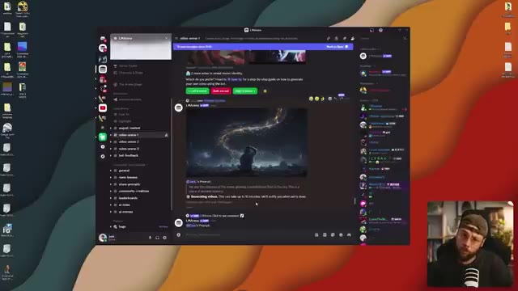
*Interface du serveur Discord d'LMRina affichant les salons de génération vidéo et les résultats obtenus avec les prompts de l'utilisateur.*

---

### ⏱️ `[00:18:50 - 00:19:21]` | Segment #36

**🔊 Audio (Transcription Intégrale Mot pour Mot en Français) :**
> Cliquez ici pour jeter un petit coup d'œil à ce que nous avons obtenu, voyons si nous avons eu de la chance. Celle-ci est très jolie, un joli petit mouvement orbital qu'elle a fait, très cool. Joli effet de parallaxe entre les différents types de terrain dans le plan. Très, très cool. Vraiment un très beau niveau de profondeur. Et voyons ce que nous avons obtenu la deuxième fois. Donc pas très dynamique. Cool parallaxe entre cette sorte de couche avant de constellations et la couche arrière. Je ne déteste pas, mais ce n'est pas particulièrement percutant ou captivant.

**👁️ Analyse Visuelle d'Écran (gemini-3.5-flash-lite) :**
**Interface & Outils** : Application de bureau LMArena (interface de test et comparaison de modèles vidéo).

**Contenu textuel & Code** : Texte du prompt visible dans LMArena : "A dark, moody cinematic scene. A man dressed entirely in black sits alone on a dark, desolate alien planet, surrounded by multiple computer monitors showing lines of code, email dumps, and data feed to the side. The camera slowly moves in from behind, tracking forward. He slowly turns to face the camera. The face is covered with a black mask, hiding his identity. He slowly brings his hands together, fingertips touching, look confident, serious mood, posture. The profile of someone who codes the cyber underworld. The lighting is cinematic, with cool neon blues and faint crimson glow illuminating the scene. Dramatic, cinematic background music underscoring his power and intelligence." Également le texte de l'écran de fin : "Compare the best video models at discord.gg/LMArena".

**Action / Démonstration** : Le créateur navigue dans l'interface LMArena pour visionner et comparer les vidéos générées par les modèles d'IA.

*Interface LMArena affichant les résultats de génération et les prompts de test.*

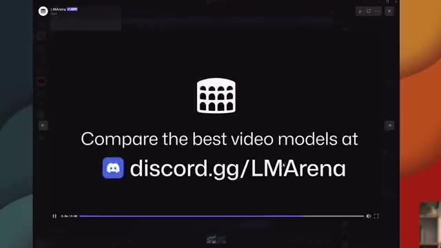
*Lecteur vidéo LMArena affichant une image de transition avec le logo et le lien discord.gg/LMArena.*

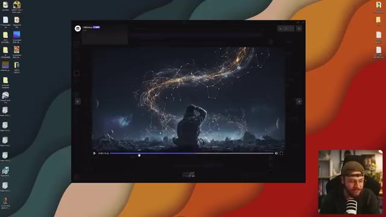
*Lecteur vidéo LMArena montrant la vidéo générée avec une vue spatiale et des constellations.*

---

### ⏱️ `[00:19:21 - 00:19:56]` | Segment #37

**🔊 Audio (Transcription Intégrale Mot pour Mot en Français) :**
> Mais encore une fois, je vais juste vous ramener à celui-ci ici. Je n'ai payé aucun argent pour cela. La génération Nano Banana était gratuite. L'animation via le Discord d'Ella Marina était également gratuite. Et juste pour boucler la boucle de la vidéo, les gars, ne sous-estimez pas le pouvoir et l'effet que les touches finales peuvent avoir sur le contenu IA. Nous pouvons parler du montage, de la façon dont nous coupons les plans ensemble. Montrons-nous toute la longueur d'un plan ou juste un bref extrait de celui-ci ? Voulons-nous inverser le plan ou l'accélérer ? Peut-être voulons-nous effectuer une correction colorimétrique ou quelque chose comme ça.

**👁️ Analyse Visuelle d'Écran (gemini-3.5-flash-lite) :**
**Interface & Outils** : Lecteur vidéo / bureau Windows avec affichage de séquences générées par IA et incrustation vidéo (PiP) du créateur en bas à droite.

**Contenu textuel & Code** : Séquence vidéo narrative de science-fiction générée par IA illustrant un astronaute explorant un monde mystérieux.

**Action / Démonstration** : Le lecteur diffuse les différentes prises de vues successives du clip vidéo généré par IA, démontrant les résultats finaux.

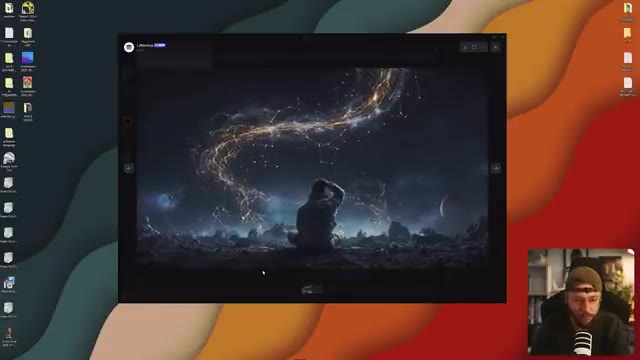
*Affichage d'un plan cinématique généré par IA montrant une silhouette assise dans un paysage lunaire sous une structure lumineuse aérienne.*

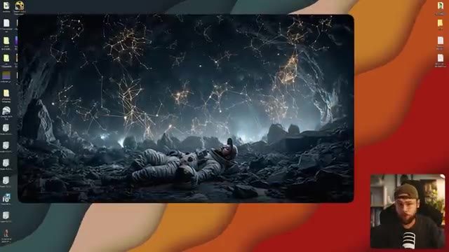
*Affichage d'un plan de coupe montrant un personnage en tenue d'astronaute étendu sur un sol rocheux sous un ciel constellé.*

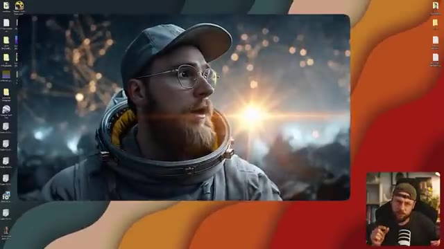
*Gros plan sur le visage d'un astronaute barbu portant des lunettes et une casquette, regardant vers une source lumineuse.*

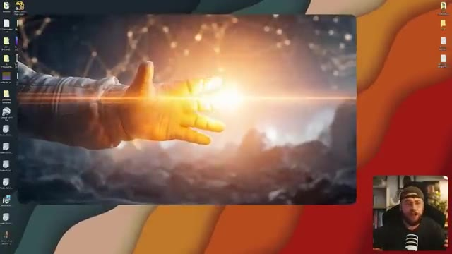
*Plan rapproché de la main d'un astronaute tendue vers une source de lumière éclatante avec un effet de lens flare.*

---

### ⏱️ `[00:19:56 - 00:20:31]` | Segment #38

**🔊 Audio (Transcription Intégrale Mot pour Mot en Français) :**
> Moi personnellement, j'aime bien ajouter une bonne dose de grain pellicule par-dessus mes générations de vidéos par IA juste pour accentuer cet élément textuel. Et rien ne prend vraiment vie tant qu'on n'ajoute pas de musique et d'effets sonores. Il y a tout un tas d'endroits où vous pouvez vous en procurer gratuitement et de manière libre de droits également. Un site que j'ai tendance à utiliser énormément s'appelle Pixabay. Je suis dessus tout le temps pour récupérer des effets sonores. Et vous pouvez également aller sur la bibliothèque musicale de YouTube, qui est, je crois, là où je

**👁️ Analyse Visuelle d'Écran (gemini-3.5-flash-lite) :**
**Interface & Outils** : Navigateur web affichant le site Pixabay et le moteur de recherche Google.

**Contenu textuel & Code** : Textes visibles : "42 royalty-free heavenly sound effects", "pixabay", "youtube music library", résultats de recherche Google.

**Action / Démonstration** : Navigation sur le web et présentation des sources gratuites pour trouver des effets sonores et de la musique.

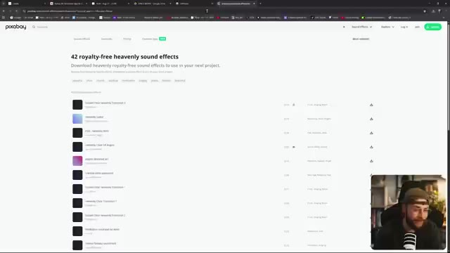
*Capture d'écran du site Pixabay montrant des effets sonores célestes libres de droits.*

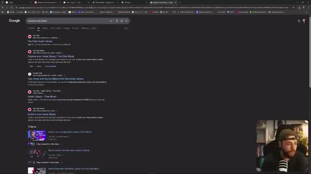
*Capture d'écran d'une recherche Google pour la bibliothèque musicale de YouTube (YouTube Audio Library).*

---

### ⏱️ `[00:20:31 - 00:21:07]` | Segment #39

**🔊 Audio (Transcription Intégrale Mot pour Mot en Français) :**
> en fait je trouve ce morceau de musique d'introduction que j'utilise dans la plupart de mes vidéos YouTube. Le voici, la bibliothèque audio YouTube. Donc vous savez que vous n'avez pas à payer d'argent pour ceux-ci. Et encore une fois, ils vont aussi être libres de droits. Sûrs à utiliser sur YouTube et par conséquent sûrs à utiliser sur tous vos réseaux sociaux également. Je dis que c'est du 50-50 en gros. Il y a beaucoup de trucs assez nuls là-dessus, je vais être totalement honnête. Mais si vous creusez suffisamment, vous allez trouver des trucs sympas aussi. Combiner vos effets sonores et votre musique va vraiment vendre ce produit fini. Tous les éléments doivent se réunir. L'IA ne peut pas tout faire à votre place. L'humain

**👁️ Analyse Visuelle d'Écran (gemini-3.5-flash-lite) :**
**Interface & Outils** : Navigateur web (Google Chrome) affichant les résultats de recherche Google avec la barre de recherche contenant "youtube audio library".

**Contenu textuel & Code** : Résultats de recherche Google pour "youtube audio library", onglets du navigateur en haut incluant des liens vers Google Drive et autres pages web, et incrustation vidéo (PiP) de Jack en bas à droite parlant devant son micro.

**Action / Démonstration** : Le créateur montre son écran de navigateur web avec une recherche Google sur la bibliothèque audio YouTube tout en parlant face caméra dans l'encadré PiP.

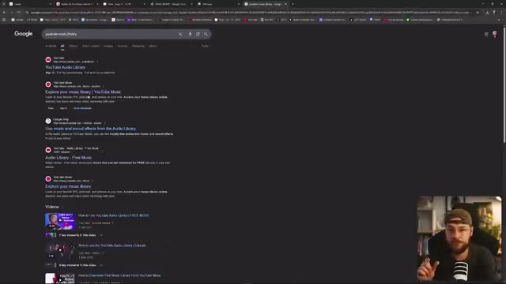
*Navigateur web affichant une recherche Google pour la bibliothèque audio YouTube, avec Jack en incrustation vidéo (PiP) dans le coin inférieur droit.*

---

### ⏱️ `[00:21:07 - 00:21:43]` | Segment #40

**🔊 Audio (Transcription Intégrale Mot pour Mot en Français) :**
> élément, en tant que créateur, reste fondamentalement important pour le processus. Et c'est pourquoi l'IA ne me fait plus aussi peur qu'avant, car je sais qu'un résultat final comme celui que vous voyez au début du film n'aurait tout simplement pas pu être créé avec l'IA. Est-ce qu'une IA aurait pu avoir l'idée ? Est-ce qu'elle aurait pu passer au crible toutes ces mauvaises générations de vidéos qui ne faisaient pas ce que je voulais ? Est-ce qu'elle aurait pu vérifier les exportations nano banana pour s'assurer qu'elles étaient assez cohérentes pour garder la vision vivante ? Et est-ce qu'elle aurait ensuite cherché des éléments pertinents

**👁️ Analyse Visuelle d'Écran (gemini-3.5-flash-lite) :**
**Interface & Outils** : YouTube Studio (Audio library).

**Contenu textuel & Code** : Liste de pistes audio avec les en-têtes "Track title", "Genre", "Mood", "Artist", "Duration", etc., et le panneau latéral de navigation de YouTube Studio.

**Action / Démonstration** : Le créateur navigue ou présente l'interface de la bibliothèque audio de YouTube Studio pour illustrer sa recherche de musiques ou de sons pertinents.

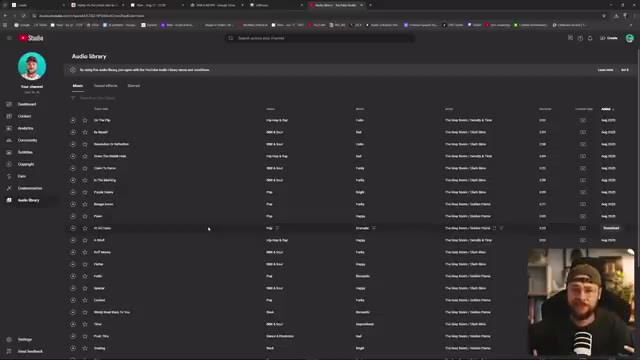
*Interface de la bibliothèque audio de YouTube Studio avec une incrustation vidéo de Jack dans le coin inférieur droit.*

---

### ⏱️ `[00:21:43 - 00:22:19]` | Segment #41

**🔊 Audio (Transcription Intégrale Mot pour Mot en Français) :**
> de la musique pour créer l'ambiance que je recherche ? Et puis tous ces différents effets sonores également. Je sais que VO3 est plutôt bon pour ça, mais je persiste vraiment à croire que nous, en tant que créateurs, sommes très importants ici. L'IA vous donne simplement les outils pour concrétiser votre vision d'une toute nouvelle façon. J'espère vraiment que vous avez apprécié la vidéo d'aujourd'hui. J'ai absolument adoré m'amuser avec Nano Banana et voir la croissance de cette chaîne YouTube. Cela représente énormément pour moi, les gars. J'essaie de lire et de répondre à autant de commentaires que possible, mais si vous avez des questions et des idées pour le futur

**👁️ Analyse Visuelle d'Écran (gemini-3.5-flash-lite) :**
**Interface & Outils** : YouTube Studio - Audio library (Bibliothèque audio) avec navigation latérale et liste des pistes musicales disponibles.

**Contenu textuel & Code** : On y voit des listes de morceaux (Track title, Genre, Mood, Artist, Duration, License type, Added), ainsi qu'une multitude d'onglets ouverts dans le navigateur web.

**Action / Démonstration** : Le créateur navigue ou présente l'interface de la bibliothèque audio de YouTube Studio tout en parlant à l'écran dans l'encadré PiP.

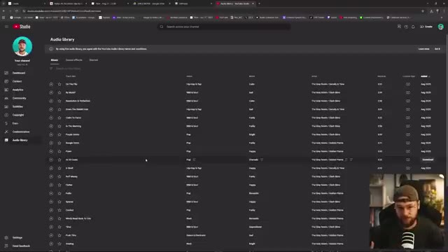
*Capture d'écran montrant l'interface de la bibliothèque audio YouTube Studio avec un encadré PiP (Picture-in-Picture) de Jack en bas à droite.*

---

### ⏱️ `[00:22:19 - 00:22:40]` | Segment #42

**🔊 Audio (Transcription Intégrale Mot pour Mot en Français) :**
> les vidéos aussi, assurez-vous de les laisser en bas. Je ne peux pas toujours répondre à tous les commentaires maintenant, mais j'essaie vraiment de faire de mon mieux. Comme toujours, si vous avez apprécié le contenu d'aujourd'hui, assurez-vous d'aimer, de cliquer sur ce bouton d'abonnement et bien sûr d'activer l'icône de notification en cloche pour ne manquer aucune vidéo future car j'en publie autant que possible. Passez une excellente fin de journée les gars et profitez de ce nouvel outil.

**👁️ Analyse Visuelle d'Écran (gemini-3.5-flash-lite) :**
**Interface & Outils** : YouTube Studio - Audio library (Bibliothèque audio) avec affichage du tableau des pistes musicales et incrustation vidéo (PiP) du créateur.

**Contenu textuel & Code** : Liste de pistes musicales ("Audio library") avec les colonnes Track title, Genre, Mood, Artist, Duration, License type, Added. Le créateur est visible en incrustation (PiP) dans le coin inférieur droit de l'écran.

**Action / Démonstration** : Le créateur présente la bibliothèque audio YouTube Studio tout en s'adressant aux spectateurs et en faisant ses recommandations de fin de vidéo.

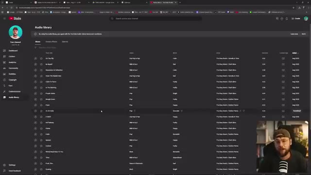
*Capture d'écran montrant l'interface de la bibliothèque audio YouTube Studio avec un encadré PiP du créateur en bas à droite.*

---
