# 🎬 Comment utiliser Nano Banana pour la publicité par IA (Workflow GRATUIT)

> **Chaîne** : [Jack Vs. AI](https://www.youtube.com/@JackVsAI)  
> **Titre original** : `How to use Nano Banana for AI Advertising (FREE Workflow)`  
> **Lien YouTube** : [https://www.youtube.com/watch?v=ZpLSWXAPoLo](https://www.youtube.com/watch?v=ZpLSWXAPoLo)  
> **Date de publication** : 2025-09-06  
> **Durée** : 28m 44s (`1724s`)  
> **Identifiant vidéo** : `ZpLSWXAPoLo`  
> **Fiche Web Interactive** : [2025-09-06_YT-ZpLSWXAPoLo_Comment utiliser Nano Banana pour la publicité par IA (Workflow GRATUIT)_by-whisper-v3-large-turbo+gemini-3.5-flash-lite.html](2025-09-06_YT-ZpLSWXAPoLo_Comment utiliser Nano Banana pour la publicité par IA (Workflow GRATUIT)_by-whisper-v3-large-turbo+gemini-3.5-flash-lite.html)  
> **Captures de démonstration clés** : `134 captures réelles (anti-talking-head)`  
> **Modèles utilisés** : Audio: `large-v3-turbo` (Faster-Whisper int8 VPS) | Vision: `gemini-3.5-flash-lite` (Google AI Studio API)  

---

## 📌 Synthèse Exécutive & Outils

### 📌 Résumé
Dans cette vidéo, Jack, artiste VFX publicitaire chevronné, démontre qu'il est désormais possible pour une petite entreprise de concevoir une campagne publicitaire haut de gamme grâce à l'intelligence artificielle, sans exploser son budget. En s'appuyant sur l'exemple fictif mais ancré dans le réel d'une boulangerie hipster spécialisée dans les pailles au fromage baptisée « Puff », il détaille un workflow créatif complet. L'approche privilégie la simplicité du modèle économique — inspiré des codes visuels et minimalistes des marques virales — pour garantir un impact visuel maximal et un contrôle créatif total à chaque étape de la production.

La méthode repose sur une structuration rigoureuse en entonnoir : définition de l'identité de marque, choix du nom, conception du logo sur des plateformes graphiques accessibles, et constitution d'une solide base de références visuelles. Jack insiste sur le fait qu'une excellente publicité par IA ne doit jamais être le fruit du hasard, mais qu'elle découle invariablement d'une image de départ soigneusement générée. Cette image fondatrice sert de pierre angulaire pour alimenter les générateurs de vidéo, permettant ainsi de passer d'un simple concept statique à un spot publicitaire dynamique, fluide et professionnel.

Ce tutoriel s'adresse aussi bien aux débutants qu'aux créateurs confirmés en quête d'optimisation de leurs processus de production. En combinant des outils gratuits ou abordables avec une expertise issue de l'industrie publicitaire traditionnelle, Jack prouve que le véritable pouvoir de l'IA réside dans la direction artistique et la narration. Les créateurs apprennent ainsi à structurer leurs plans, à anticiper le storytelling visuel et à s'approprier les outils de pointe pour rivaliser avec les plus grandes agences de communication, à une fraction du coût habituel.

### 🛠️ Outils, Modèles & Logiciels Présentés
* **Nano Banana** : Outil central mentionné pour structurer le workflow publicitaire et l'optimisation créative de la campagne.
* **Canva** : Utilisé dans sa version gratuite pour concevoir l'identité visuelle, tester des typographies et finaliser le logo minimaliste de la marque « Puff ».
* **Photoshop** : Logiciel de retouche et de composition d'images évoqué pour les manipulations graphiques plus avancées.
* **MidJourney** : Modèle de génération d'images par IA employé pour créer les visuels clés, les ambiances de magasins et les photos de produits de départ.
* **Higgsfield** : Outil de génération ou d'animation vidéo par IA utilisé pour donner vie aux images statiques de la campagne.
* **Kling** : Modèle de génération de vidéo par IA mobilisé pour transformer les concepts visuels en plans animés dynamiques.
* **Premiere Pro** : Logiciel de montage professionnel utilisé pour assembler les différents plans et finaliser le montage rythmé de la publicité.

### 🔑 Points Clés & Enseignements Stratégiques
* **Démocratisation de la haute publicité** : L'IA permet aux petites structures de rivaliser avec les budgets publicitaires des grandes marques grâce à un contrôle créatif total et à moindre coût.
* **Le modèle de la simplicité** : S'inspirer de concepts à menu réduit (comme le modèle viral de Supernova Burger) permet de concentrer la qualité sur un produit phare et de simplifier la direction artistique.
* **L'audace du branding atypique** : Sortir des sentiers battus en matière de choix chromatiques (préférer un rose pastel plutôt qu'un jaune évident pour du fromage) renforce la mémorisation de la marque.
* **La règle de l'image de départ** : Toute bonne vidéo par IA trouve son origine dans une image fixe fondatrice d'excellente qualité qui capture l'essence du style recherché.
* **L'importance des références croisées** : Constituer une banque d'images hétérogènes (extérieur de boutique, ambiance rustique, gros plans de produits) guide efficacement le processus de génération par IA.
* **Le processus itératif du logo** : Décliner un nom sous de multiples polices et éliminer progressivement les options les moins percutantes garantit un résultat épuré et haut de gamme.
* **Penser en termes de plans narratifs** : Avant de générer la moindre image, il est indispensable de planifier les différents angles et types de plans nécessaires pour raconter une véritable histoire.
* **L'accessibilité des outils** : L'utilisation combinée de plateformes gratuites ou économiques (comme Canva pour le design graphique) prouve qu'il n'est pas nécessaire d'investir massivement pour structurer une marque solide.
* **L'expertise humaine au cœur du processus** : Les outils d'IA ne remplacent pas la vision artistique ; ils amplifient l'expérience d'un réalisateur ou d'un directeur artistique pour optimiser le rendu final.
* **L'engagement communautaire** : Rejoindre des espaces d'échanges dédiés (comme un canal Discord privé) permet de rester à la pointe des innovations en matière de création publicitaire par IA.

---

## ⏱️ Chronologie & Transcription Complète Audio & Visuelle (Mot pour Mot)

### ⏱️ `[00:00:00 - 00:00:36]` | Segment #01

**🔊 Audio (Transcription Intégrale Mot pour Mot en Français) :**
> Qui voulez-vous tromper ? Vous n'avez pas le budget pour une publicité de ce genre. Votre petite entreprise ne peut pas se permettre quelque chose d'aussi haut de gamme. Du moins, c'est ce que j'aurais pu vous dire avant l'IA. Nous assistons à une révolution créative et le pouvoir est vraiment entre vos mains. Tout ce que vous devez savoir, c'est quels sont les meilleurs outils et comment les utiliser. Avec cela, vous pouvez monter une campagne publicitaire entière pour n'importe quelle entreprise que vous pouvez imaginer. Tout cela sans vous ruiner tout en gardant un contrôle créatif total. Je m'appelle Jack, je suis artiste VFX dans l'industrie publicitaire depuis plus d'une décennie maintenant, et j'ai travaillé pour bon nombre des plus grandes marques de la planète. Aujourd'hui, je vais combiner mes

**👁️ Analyse Visuelle d'Écran (gemini-3.5-flash-lite) :**
**Interface & Outils** : Présentation d'introduction avec des plans d'illustration de b-roll (extraits vidéo de démonstration d'une boulangerie/café) accompagnés de sous-titres animés, sans affichage d'interface logicielle ni de partage d'écran de travail à ce stade.

**Contenu textuel & Code** : Texte affiché à l'écran sous forme de sous-titres dynamiques (« for an », « really is », « the bank », « biggest brands on »).

**Action / Démonstration** : Séquence d'introduction visuelle montrant des extraits de clips vidéo au style publicitaire (nourriture, café, artisan pétrissant de la pâte) illustrant le sujet de la vidéo.

---

### ⏱️ `[00:00:36 - 00:01:13]` | Segment #02

**🔊 Audio (Transcription Intégrale Mot pour Mot en Français) :**
> connaissances des meilleurs outils d'IA avec mon expérience en publicité pour vous apprendre à créer des publicités dynamiques pour votre entreprise. Tout cela à une fraction du coût par rapport aux méthodes de production traditionnelles et je vais même vous donner quelques outils qui sont entièrement gratuits à utiliser également. Que vous débutiez totalement dans l'IA ou que vous soyez un créateur confiant, je vais vous transmettre toutes mes connaissances pour vous mettre aux commandes. Et bien sûr, les gars, si vous appréciez le contenu d'aujourd'hui, assurez-vous de lâcher un pouce bleu pour moi, pensez à vous abonner et bien sûr, activez la cloche de notification. Nous venons également de lancer les abonnements sur la chaîne, les gars. Il y a deux niveaux différents auxquels vous pouvez souscrire

**👁️ Analyse Visuelle d'Écran (gemini-3.5-flash-lite) :**
**Interface & Outils** : Présentation face caméra sans partage d'écran

**Contenu textuel & Code** : Aucun contenu visuel d'écran de travail ou d'interface logicielle n'est affiché.

**Action / Démonstration** : Le créateur parle face caméra dans son studio, puis présente une séquence visuelle stylisée sans démonstration technique.

---

### ⏱️ `[00:01:13 - 00:01:45]` | Segment #03

**🔊 Audio (Transcription Intégrale Mot pour Mot en Français) :**
> si vous souhaitez avoir une autre façon de me soutenir. Vous obtenez l'accès à toutes sortes de super avantages, mais probablement le meilleur à mon avis est de rejoindre mon canal Discord privé où nous parlons de tout ce qui touche à l'IA créative. J'adorerais voir le plus nombre d'entre vous là-bas et sans plus attendre, passons directement à la vidéo. Donc, pour commencer, j'avais besoin de trouver une idée d'entreprise que je vais commercialiser. Maintenant, je viens originellement d'une toute petite ville du sud de l'Angleterre. Il ne s'y passe pas grand-chose du tout, mais une de mes choses préférées et quelque chose que j'aime

**👁️ Analyse Visuelle d'Écran (gemini-3.5-flash-lite) :**
**Interface & Outils** : Logiciel de prise de notes / documentation (type Notion) sur l'image #2, et navigateur Google Chrome affichant des résultats de recherche d'images sur l'image #3, avec incrustation PiP du créateur dans les deux.

**Contenu textuel & Code** : Sur l'image #2, le titre visible est « How to use AI to create an entire ad for your business (ULTIMATE GUIDE) » avec des notes sur un concept de boulangerie artisanale de type style hipster. Sur l'image #3, recherche de photos d'une boulangerie traditionnelle anglaise avec des vitrines de pâtisseries (« BREAD & CAKES »).

**Action / Démonstration** : Le créateur présente l'organisation de son projet de création publicitaire par IA sur son écran tout en parlant face à sa webcam.

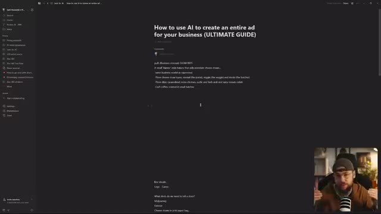
*Interface de prise de notes montrant le plan et les idées pour créer une publicité avec l'IA, avec le créateur en incrustation vidéo (PiP) en bas à droite.*

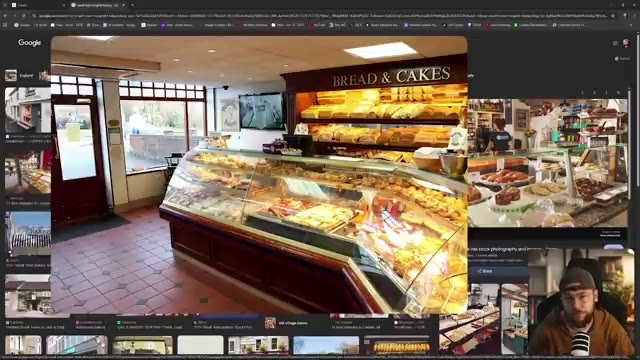
*Navigateur web affichant une recherche d'images de boulangerie locale (bread & cakes), avec le créateur en incrustation vidéo (PiP) en bas à droite.*

---

### ⏱️ `[00:01:45 - 00:02:21]` | Segment #04

**🔊 Audio (Transcription Intégrale Mot pour Mot en Français) :**
> Ce qui me manque vraiment, c'est leur boulangerie locale. Cette boulangerie existe depuis toujours maintenant. C'est une toute petite boulangerie indépendante et familiale et ça a été en quelque sorte mon point de départ. Je ne voulais pas vraiment baser toute cette vidéo sur une idée vraiment extravagante ou coûteuse comme une startup technologique de plusieurs millions de dollars ou quelque chose comme ça. Restons accessibles. Donc cette boulangerie de ma ville natale, elle vend toutes sortes de choses incroyables, mais mon article préféré sur leurs étagères était leurs gants au fromage. Ces incroyables, délicieuses, pâtes feuilletées au fromage qui étaient juste... Je ne pouvais pas en avoir assez.

**👁️ Analyse Visuelle d'Écran (gemini-3.5-flash-lite) :**
**Interface & Outils** : Navigateur web affichant une recherche Google Images avec le terme 'small town english bakery', et une fenêtre PiP montrant le créateur face caméra dans son studio.

**Contenu textuel & Code** : Barre de recherche Google contenant le texte 'small town english bakery', grille de vignettes de photos de boulangeries et de pâtisseries, et images agrandies de l'intérieur d'une boulangerie puis de cheese straws.

**Action / Démonstration** : Le créateur navigue sur Google Images pour illustrer ses propos sur sa boulangerie locale et ses gâteaux/pâtisseries préférés tout en s'exprimant face caméra.

*Affichage d'une image agrandie de l'intérieur d'une boulangerie traditionnelle anglaise sur un navigateur Google Images, avec Jack visible en incrustation PiP dans le coin inférieur droit.*

*Affichage de la grille de résultats de recherche Google Images pour la requête 'small town english bakery', montrant divers clichés de boulangeries traditionnelles.*

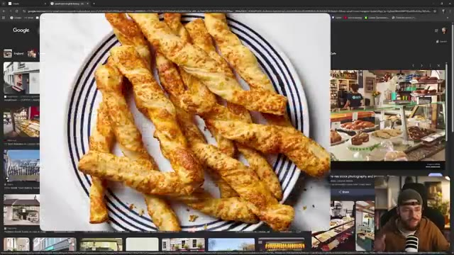
*Affichage d'une image agrandie de torsades feuilletées au fromage sur une assiette rayée dans Google Images, illustrant les 'cheese straws' mentionnés.*

---

### ⏱️ `[00:02:21 - 00:02:56]` | Segment #05

**🔊 Audio (Transcription Intégrale Mot pour Mot en Français) :**
> d'entre eux. Quand je pense à de la nourriture réconfortante, les pailles au fromage de cette boulangerie spécifique sont la première chose qui me vient à l'esprit. Je me suis donc dit que ce serait cool de reprendre ce concept et d'ouvrir ma propre boulangerie indépendante qui ne vendrait que des pailles au fromage. Et on s'inspire en gros du même modèle économique que Supernova Burger. Si vous ne connaissez pas, c'est un fast-food de burgers viral qui se trouve à Soho. Et ils sont très connus pour avoir un menu très réduit. Littéralement juste quelques burgers, des frites, quelques milk-shakes, c'est tout. Mais comme leur menu est si réduit,

**👁️ Analyse Visuelle d'Écran (gemini-3.5-flash-lite) :**
**Interface & Outils** : Navigateur web (Google Chrome) affichant des résultats de recherche Google Images avec incrustation vidéo du créateur en bas à droite (PiP).

**Contenu textuel & Code** : Barres de recherche Google avec les termes "small town english bakery" et "supernova burger", accompagnées d'une grille de photos et d'un volet latéral de prévisualisation.

**Action / Démonstration** : Le créateur navigue et effectue des recherches d'images sur Google pour illustrer ses propos sur les boulangeries et le concept de Supernova Burger.

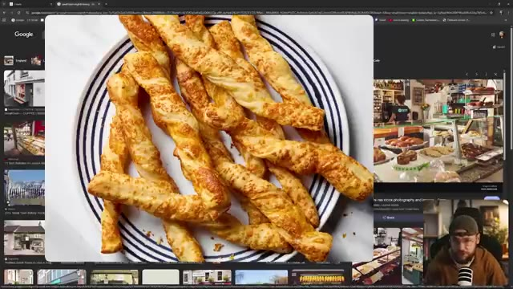
*Recherche Google Images affichant une photo de pailles au fromage sur une assiette à rayures.*

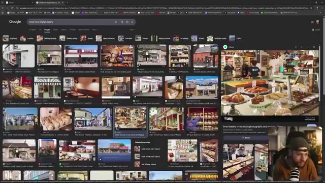
*Recherche Google Images avec des photos de petites boulangeries traditionnelles.*

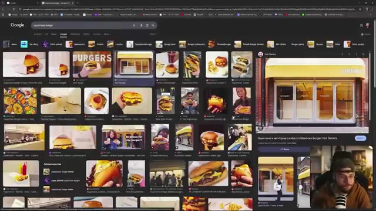
*Recherche Google Images montrant la vitrine et les burgers du restaurant Supernova Burger à Soho.*

---

### ⏱️ `[00:02:56 - 00:03:29]` | Segment #06

**🔊 Audio (Transcription Intégrale Mot pour Mot en Français) :**
> La qualité des articles que vous obtenez est vraiment élevée. Et bien sûr, quand le client y va, il sait exactement ce qu'il va obtenir. Et c'est ce même modèle économique que nous appliquons à notre boulangerie de pailles au fromage. Cette idée de simplicité dans le design et le menu se traduit par un produit haut de gamme. Et bien sûr, si cela finissait par devenir viral sur les réseaux sociaux, ce ne serait qu'un bonus, n'est-ce pas ? Donc avec cela, nous avons commencé à assembler notre marque. Nous savons que ce sera une petite boulangerie de style hipster qui vend des pailles au fromage haut de gamme. Cela suit le même modèle économique que

**👁️ Analyse Visuelle d'Écran (gemini-3.5-flash-lite) :**
**Interface & Outils** : Navigateur web Google Chrome avec résultats de recherche d'images d'un côté et interface d'éditeur de notes minimaliste sur fond sombre de l'autre.

**Contenu textuel & Code** : Sur l'image 1 : grille de photos de burgers et d'intérieurs de restaurants, avec le panneau latéral d'aperçu Google. Sur l'image 2 : texte listant le concept commercial 'puff. (Business concept) SHOW REFS', 'A small 'hipster' style bakery that sells premium cheese straws...', '-same business model as supernova', '-Three cheese straw types; normal (the purist), veggie (the veggie) and meaty (the butcher)', '-Three dips; caramelised onion chutney, garlic and herb aioli and spicy tomato relish', et '-Craft coffee, roasted in small batches'.

**Action / Démonstration** : Le créateur navigue sur Internet pour montrer des références visuelles (images de restaurants/produits) puis présente ses notes textuelles détaillant le concept de sa boulangerie et son modèle économique.

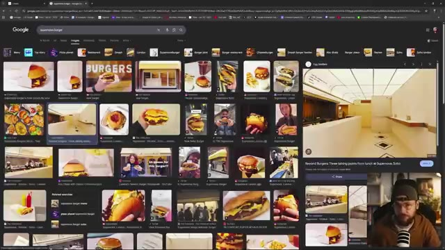
*Navigateur web affichant une recherche Google Images pour le concept 'supernova.burger' avec le créateur en incrustation vidéo (PiP) dans le coin inférieur droit.*

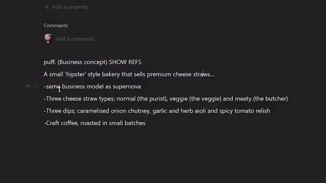
*Interface de prise de notes textuelle sur fond noir listant le concept commercial 'puff.' et les détails du menu de la boulangerie.*

---

### ⏱️ `[00:03:29 - 00:04:02]` | Segment #07

**🔊 Audio (Transcription Intégrale Mot pour Mot en Français) :**
> Supernova. Il va y avoir trois types de pailles au fromage, une normale, qui s'appelle le puriste, une végétarienne, qui s'appelle le végétarien, et une carnée appelée le boucher. Nous allons également servir trois trempettes. Donc, chaque fois que vous achetez des pailles au fromage, vous aurez le choix d'une trempette pour les accompagner. Vous aurez du chutney d'oignons caramélisés, de l'aïoli à l'ail et aux fines herbes, et du relish de tomates épicées. Et bien sûr, pour garder ces hipsters heureux, nous allons devoir vendre du café artisanal, qui est également torréfié par petits lots. Ainsi, vous pouvez voir que nous avons une ambiance bien définie.

**👁️ Analyse Visuelle d'Écran (gemini-3.5-flash-lite) :**
**Interface & Outils** : Interface utilisateur textuelle (type Notion ou application de notes) sur fond sombre.

**Contenu textuel & Code** : Texte affiché : "puff. (Business concept) SHOW REFS", "A small 'hipster' style bakery that sells premium cheese straws...", "-same business model as supernova", "-Three cheese straw types; normal (the purist), veggie (the veggie) and meaty (the butcher)", "-Three dips; caramelised onion chutney, garlic and herb aioli and spicy tomato relish", "-Craft coffee, roasted in small batches". Un curseur de souris est visible en train de sélectionner une partie du texte ("Three cheese").

**Action / Démonstration** : Le créateur présente à l'écran les notes textuelles détaillant le concept commercial et les spécificités des produits de la boulangerie Supernova, avec une sélection de texte en surbrillance.

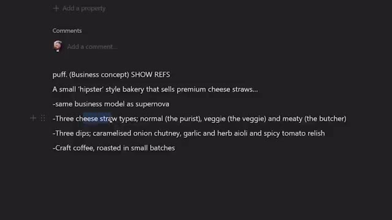
*Interface d'un bloc-notes ou logiciel de gestion montrant le concept de boulangerie "Supernova" et ses différents produits.*

---

### ⏱️ `[00:04:02 - 00:04:22]` | Segment #08

**🔊 Audio (Transcription Intégrale Mot pour Mot en Français) :**
> ici, n'est-ce pas ? Nous pensons à notre public et nous voyons comment notre marque va intervenir dans chaque facette de l'entreprise. Et l'une des parties les plus importantes de la création d'une marque, c'est le nom. Et j'ai lancé toutes sortes d'idées, mais j'ai fini par atterrir sur Puff. C'est vraiment simple. Ça fait un peu hipster avec le point à la fin.

**👁️ Analyse Visuelle d'Écran (gemini-3.5-flash-lite) :**
**Interface & Outils** : Application Notion (mode sombre) avec le titre de la page "How to use AI to create an entire ad for your business (ULTIMATE GUIDE)" et un encadré PiP (Picture-in-Picture) de Jack dans le studio.

**Contenu textuel & Code** : Texte affiché dans Notion : "How to use AI to create an entire ad for your business (ULTIMATE GUIDE)", notes de concept pour "puff. (Business concept) SHOW REFS", description d'une boulangerie de style hipster vendant des pailles au fromage premium, modèle économique similaire à supernova, trois types de pailles au fromage, et "Craft coffee, roasted in small batches". Barre d'outils contextuelle Notion active sur le texte sélectionné ("Craft coffee..."). Menu latéral Notion visible à gauche avec divers dossiers et notes ("Jack Kennedy's N...").

**Action / Démonstration** : Le créateur présente ses notes de réflexion sur le concept de marque et de nom d'entreprise (Puff) rédigées dans une page Notion, tout en parlant face caméra.

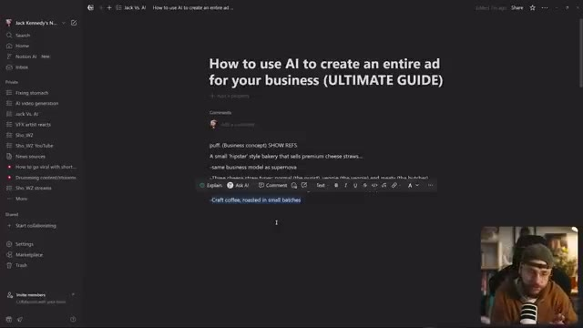
*Interface de l'application Notion affichant les notes de travail du projet "Puff", avec le créateur visible en incrustation vidéo (PiP) dans le coin inférieur droit.*

---

### ⏱️ `[00:04:22 - 00:04:41]` | Segment #09

**🔊 Audio (Transcription Intégrale Mot pour Mot en Français) :**
> C'est tout à fait mémorable. C'est un peu bizarre, donc ça pourrait vous rester en tête. Et bien sûr, c'est pertinent par rapport au produit puisque vous fabriquez ces bâtonnets de fromage en pâte feuilletée. L'étape suivante a donc consisté à concevoir notre logo. Pour cela, j'ai simplement utilisé Canva. Vous pouvez voir ici ce que j'ai fait.

**👁️ Analyse Visuelle d'Écran (gemini-3.5-flash-lite) :**
**Interface & Outils** : Notion (pour la première image) et Canva (pour la seconde image), avec la webcam du créateur incrustée en bas à droite.

**Contenu textuel & Code** : Sur Notion : "How to use AI to create an entire ad for your business (ULTIMATE GUIDE)", concept de boulangerie "puff", types de bâtonnets de fromage (normal, veggie, meaty) et sauces associées. Sur Canva : multiples variations de typographie du logo "puff." en blanc sur un fond rose.

**Action / Démonstration** : Le créateur montre son écran de travail avec des notes de projet sur Notion, puis bascule sur Canva pour concevoir et présenter différentes options de logo pour son produit.

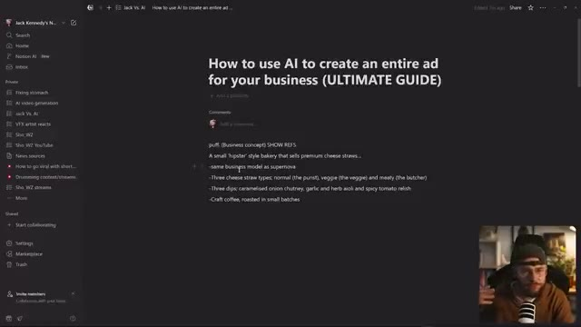
*Interface de Notion affichant un guide sur l'utilisation de l'IA pour créer une publicité de bout en bout, avec les détails du concept commercial de la boulangerie "puff".*

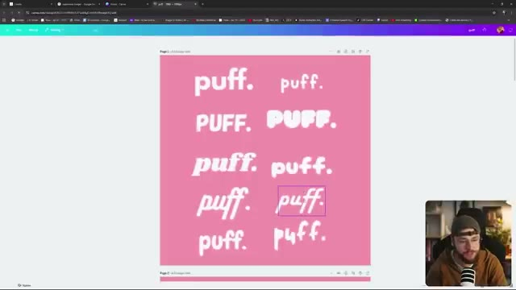
*Interface de Canva affichant plusieurs variantes de conception de logo avec le mot "puff." en blanc sur fond rose.*

---

### ⏱️ `[00:04:41 - 00:05:16]` | Segment #10

**🔊 Audio (Transcription Intégrale Mot pour Mot en Français) :**
> C'ess mon processus général que j'utilise toujours lorsque j'essaie de créer une marque. On avait déjà décidé du nom, évidemment. J'ai donc simplement tapé « Puff » plein de fois et j'ai utilisé plein de polices différentes que j'aimais bien. Et pour l'essentiel, ce qu'on fait, c'est qu'on les élimine lentement en supprimant celles qu'on aime le moins. Les deux dernières options étaient ces deux-là. J'aimais beaucoup les deux. Ça a été une décision difficile mais j'ai opté pour celle-ci. Je trouvais que c'était très épuré et haut de gamme et bien sûr, nous avons opté pour cette palette de couleurs très simple avec ce rose pastel en arrière-plan.

**👁️ Analyse Visuelle d'Écran (gemini-3.5-flash-lite) :**
**Interface & Outils** : Canva (navigateur web) avec incrustation vidéo (PiP) du créateur.

**Contenu textuel & Code** : Texte « puff. » répété dix fois avec différentes typographies blanches sur fond rose pastel.

**Action / Démonstration** : Le créateur montre son écran de travail sur Canva où il compare différentes polices pour le nom de sa marque.

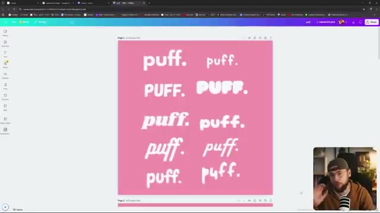
*Interface de Canva affichant plusieurs variantes de polices pour le mot « puff. » sur un fond rose pastel, avec un encadré PiP montrant le créateur en bas à droite.*

---

### ⏱️ `[00:05:16 - 00:05:49]` | Segment #11

**🔊 Audio (Transcription Intégrale Mot pour Mot en Français) :**
> et blanc pour que le texte soit bien lisible. Et vous vous dites peut-être que si ce sont des pailles au fromage, pourquoi n'avoir pas choisi le jaune ? J'ai juste trouvé que c'était un peu évident et on essaie de faire des choses pour que notre entreprise se démarque et paraisse peut-être un peu atypique. Tout ce qui peut rendre votre marque un peu plus mémorable vaut la peine d'être fait selon moi. Et je ne sais pas, j'aimais juste ces deux couleurs ensemble. Ça me paraît juste. Canva en soi est une très bonne ressource gratuite. Il y a des versions payantes, mais je l'utilise juste gratuitement et je l'utilise tout le temps. Il y a moins de

**👁️ Analyse Visuelle d'Écran (gemini-3.5-flash-lite) :**
**Interface & Outils** : Canva (logiciel de conception graphique en ligne)

**Contenu textuel & Code** : Un visuel au format carré sur fond rose avec le texte « puff. » écrit en lettres blanches et arrondies. En bas à droite, une incrustation vidéo montre le créateur dans son studio avec un micro. De nombreux onglets de navigateur sont ouverts en haut.

**Action / Démonstration** : Le créateur montre son écran de travail sur Canva pour présenter le design graphique de sa marque, tout en s'exprimant face caméra via une incrustation vidéo (PiP).

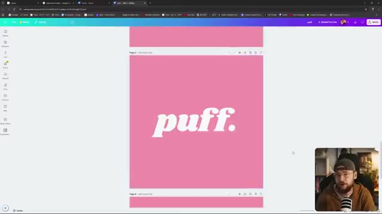
*Interface du logiciel de création graphique Canva affichant un design rose avec le texte 'puff.' en blanc, avec la vue incrustée (PiP) du créateur en bas à droite.*

---

### ⏱️ `[00:05:49 - 00:06:21]` | Segment #12

**🔊 Audio (Transcription Intégrale Mot pour Mot en Français) :**
> des outils que Photoshop. Vous ne pouvez pas vraiment faire de composition avancée à ma connaissance. Mais quand il s'agit de choses comme ça, qui relèvent d'un design graphique assez simple, je pense que Canva brille vraiment. Vous pouvez voir également que j'ai commencé à rassembler toute une charge de références pour m'inspirer, comme un extérieur de magasin ici. Nous avons aussi l'intérieur d'une boulangerie très rustique, la vedette du spectacle : le torsadé au fromage lui-même. Je veux dire, il y a plein de façons différentes de les faire, plein de saveurs différentes comme nous l'avons évoqué, et je trouve juste que c'est vraiment pratique de réunir plein d'images différentes.

**👁️ Analyse Visuelle d'Écran (gemini-3.5-flash-lite) :**
**Interface & Outils** : Interface web de Canva et visionneuse d'images avec affichage en incrustation (PiP) du créateur en bas à droite.

**Contenu textuel & Code** : Texte "puff." répété sous différentes polices et tailles sur fond rose, photos de la boulangerie "Fortitude Bakehouse" et d'un torsadé au fromage.

**Action / Démonstration** : Le créateur montre des exemples de supports visuels de référence et de design graphique pour son projet de création de contenu.

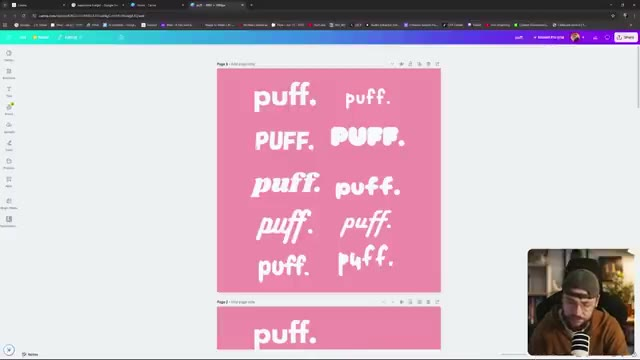
*Interface du logiciel Canva affichant un projet de design graphique sur fond rose avec différentes typographies du mot "puff".*

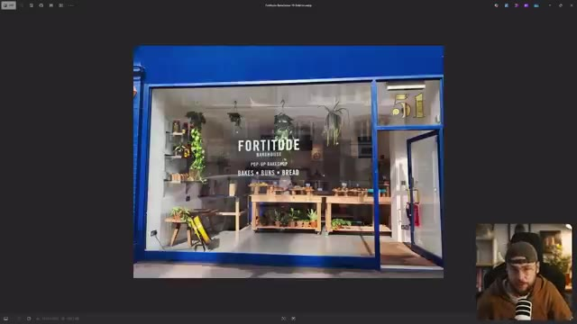
*Visualisation d'une photo d'un extérieur de boulangerie appelée "FORTITUDE BAKEHOUSE" avec une devanture bleue.*

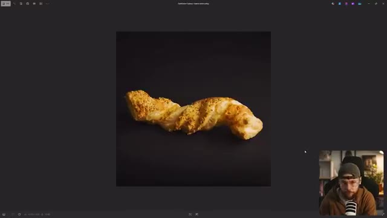
*Visualisation d'une photo en gros plan d'un torsadé au fromage (cheese straw) sur fond sombre.*

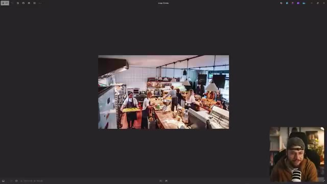
*Visualisation d'une photo de l'intérieur d'une boulangerie rustique avec du personnel en train de travailler.*

---

### ⏱️ `[00:06:21 - 00:06:53]` | Segment #13

**🔊 Audio (Transcription Intégrale Mot pour Mot en Français) :**
> juste pour vous guider sur un certain chemin donc bien sûr les choses commencent vraiment à se mettre en place maintenant j'ai un concept très fort pour notre boulangerie on a le logo ici aussi avec la palette de couleurs et maintenant il est temps de réfléchir à la façon dont nous pouvons utiliser l'ia pour créer vraiment une publicité au rendu très haut de gamme donc en fait ici on parle de réalisation de films par ia et comme je le dis toujours toutes les meilleures vidéos par ia proviennent d'une seule image de départ une image ia qui fait vraiment du bon travail pour capturer un certain

**👁️ Analyse Visuelle d'Écran (gemini-3.5-flash-lite) :**
**Interface & Outils** : Visionneuse d'images et interface web de Midjourney.

**Contenu textuel & Code** : Sur l'image #2, le logo "puff." est visible. Sur l'image #3, l'interface de Midjourney présente des images de vitrines de boulangerie roses, des boutons de contrôle (Subtle, Strong, Animate) et un panneau latéral affichant des prompts descriptifs détaillés en anglais sur les façades de boulangerie et l'esthétique photographique.

**Action / Démonstration** : Le présentateur illustre ses propos en affichant successivement des concepts visuels (photographie de boulangerie, logo et interface de génération Midjourney) tout en parlant face caméra dans un encadré incrusté (PiP).

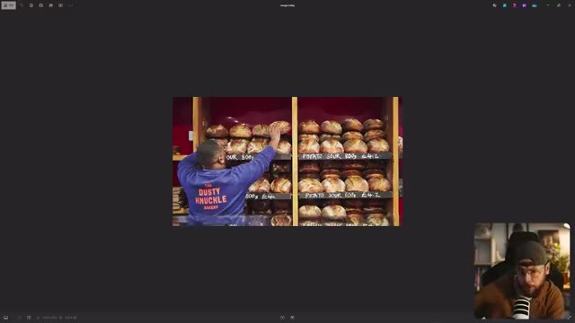
*Visionneuse d'images affichant une photo de boulangerie avec des étagères remplies de pains et un boulanger de dos.*

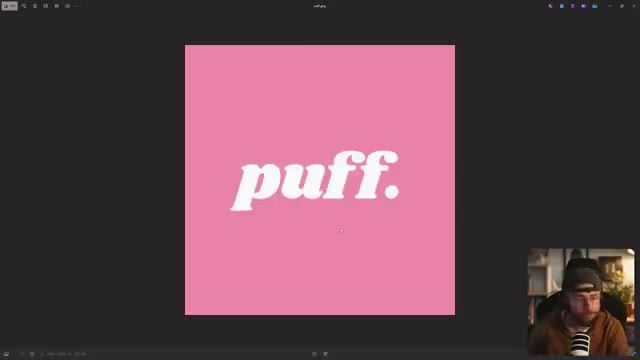
*Visionneuse d'images affichant un logo textuel "puff." en blanc sur fond rose.*

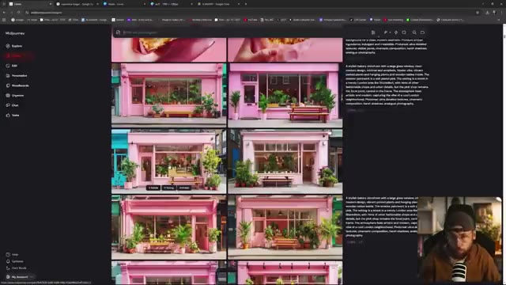
*Interface de Midjourney affichant une grille de générations d'images avec des devantures de boulangerie roses et des prompts textuels dans le panneau latéral.*

---

### ⏱️ `[00:06:53 - 00:07:28]` | Segment #14

**🔊 Audio (Transcription Intégrale Mot pour Mot en Français) :**
> caractère ou style. Ces premières étapes que nous allons franchir sont vraiment, vraiment importantes pour poser les bases, le fondement de tout le reste qui va en découler. Donc à ce stade, nous commençons à réfléchir à quelques visuels clés pour notre marque. Et ceux-ci peuvent être utilisés à la fois pour des campagnes imprimées, donc des images normales, ainsi que des images en mouvement, que nous pouvons assembler pour former notre publicité ou spot publicitaire, si vous êtes américain. Nous devons réfléchir aux plans dont nous avons besoin pour raconter une histoire. Maintenant, si vous avez une entreprise existante, vous pouvez à nouveau en quelque sorte passer

**👁️ Analyse Visuelle d'Écran (gemini-3.5-flash-lite) :**
**Interface & Outils** : Interface web de Midjourney avec menu latéral de navigation (Explore, Create, Personalize, Moodboards, Organize, Chat, Tasks) et panneau latéral de détails de prompts, combinée avec une incrustation vidéo du créateur (PiP).

**Contenu textuel & Code** : Sur l'image 1 : Grille de 8 images générées montrant une élégante devanture de boulangerie rose avec de grandes vitres et des plantes, ainsi que des prompts textuels détaillés dans le panneau latéral droit (ex: "A stylish bakery storefront with a large glass window, clean modern design..."). Sur l'image 2 : Texte listant "Key visuals...", "Logo - Canva", "What shots do we need to tell a story?", "Midjourney", "Exterior", "Cheese straws in pink paper bag", "Branded shots of me".

**Action / Démonstration** : Le créateur montre des exemples de visuels générés par IA sur l'interface de Midjourney pour illustrer la conception des plans publicitaires, puis présente une diapositive textuelle structurant les étapes du projet.

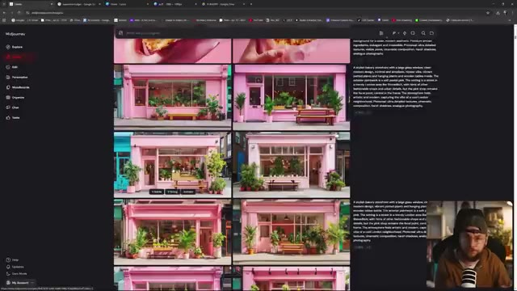
*Interface de Midjourney affichant une grille d'images générées de devantures de boulangerie roses, avec le présentateur en incrustation (PiP) dans le coin inférieur droit.*

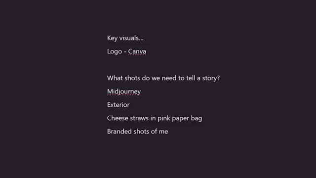
*Écran noir affichant une liste de points clés textuels pour la création de la marque et du storyboard.*

---

### ⏱️ `[00:07:28 - 00:08:03]` | Segment #15

**🔊 Audio (Transcription Intégrale Mot pour Mot en Français) :**
> cette étape et allez simplement prendre vos propres photos en réalité. Si vous avez déjà une boutique et que vous avez déjà un produit, vous n'avez pas nécessairement besoin d'utiliser l'IA à ce stade. Bien que vous verrez que vous pouvez prendre ces images existantes et les intégrer dans mon processus très bientôt. Donc, le fait d'avoir déjà des ressources existantes pour votre entreprise ne signifie pas que l'IA ne peut pas vous aider à les utiliser de différentes manières et vous le verrez très bientôt. Donc, l'un des premiers plans dont je savais que nous avions besoin était un plan extérieur de la boulangerie elle-même et j'ai trouvé cette image ici de

**👁️ Analyse Visuelle d'Écran (gemini-3.5-flash-lite) :**
**Interface & Outils** : Notion (application de prise de notes et gestion de projet) affichée en mode sombre, avec une incrustation vidéo du créateur (Picture-in-Picture).

**Contenu textuel & Code** : Le texte visible sur la page Notion comprend : "Key visuals...", "Logo - Canva", "What shots do we need to tell a story?", "Midjourney", "Exterior", "Cheese straws in pink paper bag", "Branded shots of me". Le panneau latéral gauche liste divers dossiers et notes ("Fixing stomach", "AI video generation", "Jack Vs. AI", "How to go viral with short...").

**Action / Démonstration** : Le créateur présente à l'écran ses notes de planification sous forme de liste dans Notion, tout en commentant vocalement les différents plans nécessaires pour raconter l'histoire de la publicité.

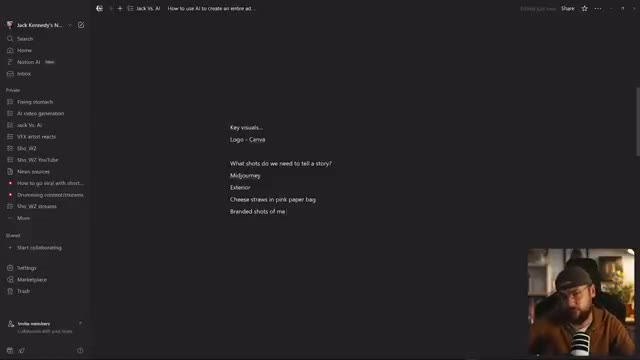
*Interface du logiciel Notion affichant une liste de notes et de visuels clés pour le projet publicitaire, avec le créateur en incrustation vidéo (PiP) dans le coin inférieur droit.*

---

### ⏱️ `[00:08:03 - 00:08:40]` | Segment #16

**🔊 Audio (Transcription Intégrale Mot pour Mot en Français) :**
> Fortitude Bakehouse que j'ai vraiment aimée et que je voulais utiliser comme source d'inspiration, alors je l'ai injectée dans ChatGPT et je lui ai dit : je veux que tu m'écrives un prompt Midjourney pour recréer cette image. Retire la signalétique de la fenêtre et change la couleur bleue en un rose doux. Élargis-la aussi un peu pour montrer davantage la rue où elle se trouve. Pense à un quartier branché de Londres comme Shoreditch. Garde la boutique rose comme point focal et au centre du cadre. Et assure-toi que mon prompt se termine par photo reel. Textures ultra détaillées, composition cinématographique, ombres dures, photographie argentique. Et j'aime vraiment

**👁️ Analyse Visuelle d'Écran (gemini-3.5-flash-lite) :**
**Interface & Outils** : Interface web de ChatGPT avec un panneau latéral de discussion et une zone principale affichant l'historique des prompts et des réponses, avec le créateur visible en incrustation PiP en bas à droite.

**Contenu textuel & Code** : Texte du prompt envoyé à ChatGPT : "Write me a Midjourney prompt to recreate this image, but remove the signage from the window and change the blue colour to a soft pink. Also expand it a little to show more of the street it's on..." ainsi que la réponse générée par l'IA contenant le prompt complet pour Midjourney.

**Action / Démonstration** : Le créateur présente l'image source de la boulangerie puis montre l'interaction avec ChatGPT pour générer un prompt textuel personnalisé.

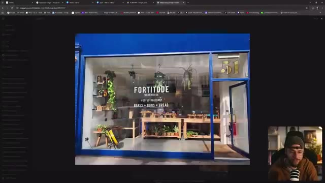
*Affichage de l'image de référence de la boulangerie Fortitude Bakehouse avec sa devanture bleue, incrustée avec le présentateur en incrustation PiP.*

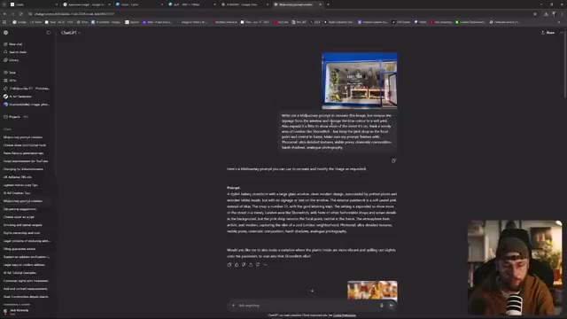
*Interface de ChatGPT montrant l'envoi de l'image de la boulangerie avec le prompt textuel demandant de la transformer en rose et de l'élargir.*

---

### ⏱️ `[00:08:40 - 00:09:13]` | Segment #17

**🔊 Audio (Transcription Intégrale Mot pour Mot en Français) :**
> en utilisant un LLM comme ChatGPT, Grok ou Gemini pour ce cas d'utilisation, car j'ai du mal à décrire même une image assez basique. Mais pour moi, c'est là qu'un outil comme ChatGPT brille vraiment, car il vous donne instantanément ce prompt. Je crois que j'ai pris les devants et fait quelques légères modifications à celui-ci, mais bien sûr, nous l'avons emmené sur MidJourney, mon générateur d'images IA personnel préféré. À l'origine, j'ai bien utilisé la Fortitude Bakehouse, en l'intégrant comme référence de style,

**👁️ Analyse Visuelle d'Écran (gemini-3.5-flash-lite) :**
**Interface & Outils** : Navigateur web affichant l'interface sombre de ChatGPT puis basculant sur l'interface de Midjourney (midjourney.com/imagine), avec la webcam du créateur en incrustation (PiP) dans le coin inférieur droit.

**Contenu textuel & Code** : Texte du prompt généré par ChatGPT : "A stylish bakery storefront with a large glass window, clean modern design, surrounded by potted plants and wooden tables inside, but with no signage or text on the window. The exterior paintwork is a soft pastel pink instead of blue. The shop is number 51, with the gold lettering kept..." ainsi que divers menus et listes latérales sur les deux applications.

**Action / Démonstration** : Le créateur navigue entre ChatGPT et Midjourney pour illustrer son processus de création de prompt basé sur une image de référence pour générer de nouvelles variations visuelles.

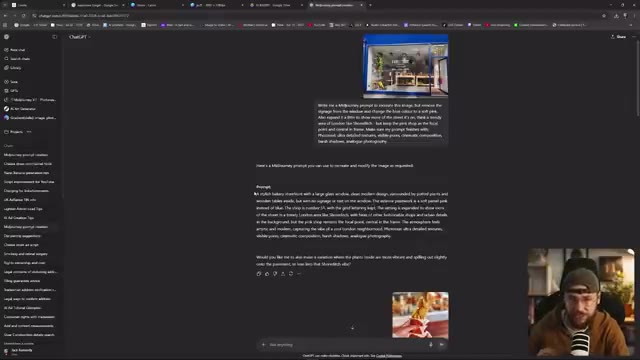
*Interface de ChatGPT affichant la conversation avec le prompt généré et l'image de référence de la boulangerie, avec l'encadré PiP du créateur en bas à droite.*

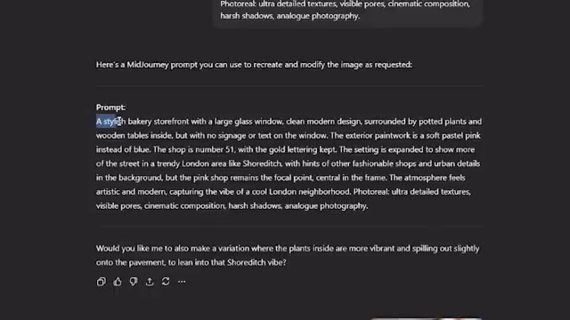
*Gros plan sur l'interface de ChatGPT montrant le texte du prompt Midjourney généré qui est en train d'être sélectionné par le curseur.*

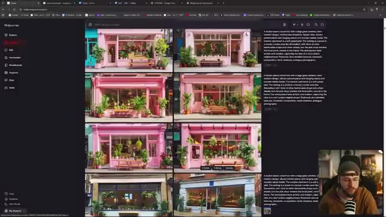
*Interface de Midjourney affichant une grille de 6 variations d'images générées d'une vitrine de boulangerie rose pastel, avec l'encadré PiP du créateur.*

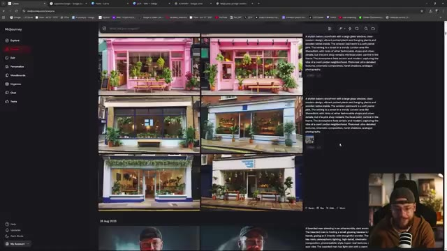
*Interface de Midjourney montrant la galerie de résultats de génération d'images avec le panneau latéral et les options de création.*

---

### ⏱️ `[00:09:13 - 00:09:34]` | Segment #18

**🔊 Audio (Transcription Intégrale Mot pour Mot en Français) :**
> mais malheureusement ça a un peu foiré mon prompt et on a perdu le rose. D'une certaine manière, cela montre vraiment à quel point ChatGPT est doué pour écrire des prompts, car j'ai supprimé la référence de style, j'ai juste balancé le prompt textuel directement dans Midjourney et on a obtenu des résultats incroyables en retour. Tous ces résultats sont excellents de différentes manières, pour être tout à fait honnête avec vous.

**👁️ Analyse Visuelle d'Écran (gemini-3.5-flash-lite) :**
**Interface & Outils** : Interface web de Midjourney, avec incrustation vidéo du créateur (PiP) dans le coin inférieur droit.

**Contenu textuel & Code** : Le prompt textuel visible dans le panneau latéral indique : "A stylish bakery storefront with a large glass window, clean modern design, vibrant potted plants and hanging plants and wooden tables inside. The interior woodwork is a soft pastel pink..."

**Action / Démonstration** : Le créateur montre les résultats de génération d'images sur Midjourney en naviguant entre les grilles de variations et les images agrandies, comparant l'effet des prompts textuels modifiés.

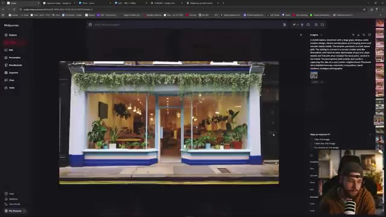
*Interface Midjourney affichant une grille de résultats avec une devanture de magasin dans les tons bleus.*

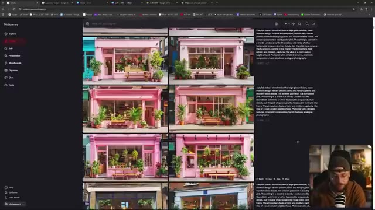
*Interface Midjourney montrant plusieurs variations de grilles de génération avec des vitrines de boutiques roses.*

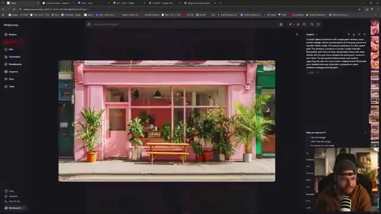
*Gros plan sur une image générée dans Midjourney représentant une vitrine de boutique rose détaillée avec des plantes vertes.*

---

### ⏱️ `[00:09:34 - 00:10:11]` | Segment #19

**🔊 Audio (Transcription Intégrale Mot pour Mot en Français) :**
> J'ai vraiment beaucoup aimé une grande partie d'entre eux. [Ils] ont fait un travail formidable pour créer ces images pour moi, mais je crois qu'on a fini par choisir celle-ci ici. J'aimais bien le fait qu'elle ne soit pas parfaite. Je pense qu'avec les images et vidéos par IA, on veut essayer de trouver cet élément humain ou juste cette imperfection, même dans les objets et les décors, juste pour essayer de renforcer un peu plus le réalisme. Et en avançant par ici, je savais aussi qu'un élément visuel très important allait être le produit lui-même, alors j'ai fini par vouloir utiliser Midjourney pour me créer des bâtonnets au fromage, encore une fois en misant vraiment à fond sur ce thème rose pastel.

**👁️ Analyse Visuelle d'Écran (gemini-3.5-flash-lite) :**
**Interface & Outils** : Navigateur web affichant l'interface officielle de Midjourney (version web) avec le panneau latéral gauche de navigation et le volet de description/prompt à droite, incluant une vue PiP (Picture-in-Picture) du créateur en bas à droite.

**Contenu textuel & Code** : Texte du prompt visible dans le panneau de droite : "A stylish bakery storefront with a large glass window, clean modern design, tropical and simplistic, wooden table, vibrant potted plants and hanging plants and wooden tables inside. The exterior paintwork is a soft pastel pink. The setting is in a trendy London area like Shoreditch, with hints of other fashionable shops and urban details, but the pink shop remains the focal point, central in the frame..." et un second prompt concernant les bâtonnets au fromage : "A freshly baked chunky, rectangular, cheese straw held in hand, golden, flaky, and buttery with crisp layers and gooey melted cheese visible between folds...".

**Action / Démonstration** : Le créateur navigue dans l'interface de Midjourney pour montrer les différentes images générées (la vitrine de boulangerie rose pastel puis les gressins/bâtonnets au fromage) tout en expliquant sa démarche artistique axée sur l'imperfection et le réalisme.

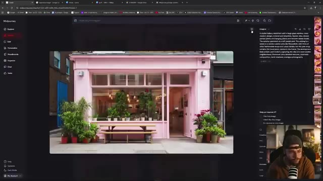
*Interface de Midjourney affichant une image générée d'une vitrine de boulangerie rose pastel avec un banc en bois et des plantes, avec le créateur en incrustation PiP.*

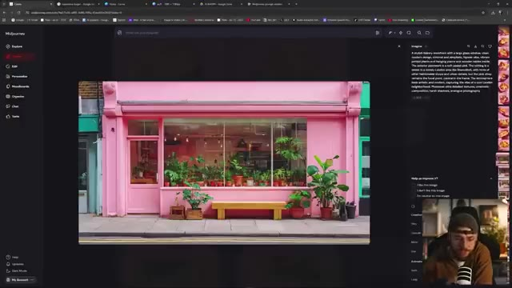
*Interface de Midjourney montrant la même image de boulangerie rose pastel légèrement recadrée ou zoomée, avec le créateur en bas à droite.*

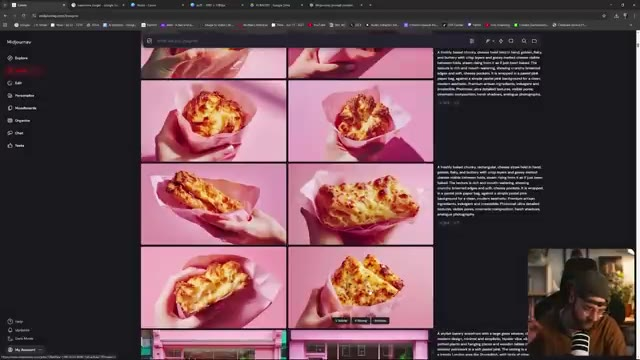
*Interface de Midjourney présentant une grille de résultats de génération avec des mains tenant des pâtisseries (bâtonnets au fromage) dans du papier rose.*

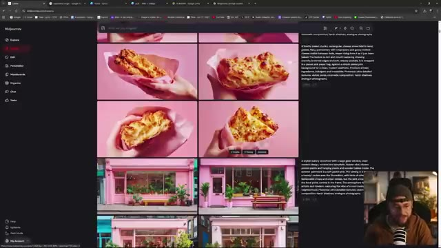
*Interface de Midjourney affichant de près les différentes variantes générées de pâtisseries au fromage tenues en main sur fond rose pastel.*

---

### ⏱️ `[00:10:11 - 00:10:46]` | Segment #20

**🔊 Audio (Transcription Intégrale Mot pour Mot en Français) :**
> la boutique elle-même est rose pastel et ensuite toutes ces prises de vue du produit je voulais qu'elles soient rose pastel aussi nous emballons les pailles au fromage dans ce papier rose pastel et vous pouvez voir parfois par essai et erreur vous savez ce que c'est que l'IA nous avons une sorte de focaccia au fromage ici qui a l'air délicieuse, mais ce n'est pas une paille au fromage. Pas mal de générations que j'ai obtenues n'étaient tout simplement pas correctes. Beaucoup d'entre elles ressemblent plutôt à des croissants au fromage, pour vous dire la vérité. Cependant, celle-ci avait l'air vraiment, vraiment super. Donc nous avons continué et téléchargé celle-ci.

**👁️ Analyse Visuelle d'Écran (gemini-3.5-flash-lite) :**
**Interface & Outils** : Interface web de Midjourney (midjourney.com/imagine) avec le menu latéral (Explore, Create, Personalize, Moodboards, Organize, Chat, Tasks) et la vue grille de générations, incluant un retour vidéo PiP (Picture-in-Picture) du créateur en bas à droite.

**Contenu textuel & Code** : Texte visible dans le panneau latéral droit de Midjourney : « A freshly baked chunky, rectangular, cheese straw held in hand, golden, flaky and buttery with crispy layers and gooey melted cheese visible between folds, steam rising from it as if just been baked. The texture is rich and mouth-watering, showing crunchy browned edges and soft, cheesy pockets. It is wrapped in a pastel pink paper bag, against a simple pastel pink background for a clean, modern aesthetic. Premium artisan ingredients, indulgent and irresistible. Photoreal ultra detailed textures, visible pores, cinematic composition, harsh shadows, analogue photography. »

**Action / Démonstration** : Le créateur navigue dans ses générations d'images sur Midjourney, zoome sur différentes variantes de pâtisseries au fromage pour montrer les imperfections (aspect de focaccia ou de croissant) avant de sélectionner et valider l'image finale d'une paille au fromage réussie.

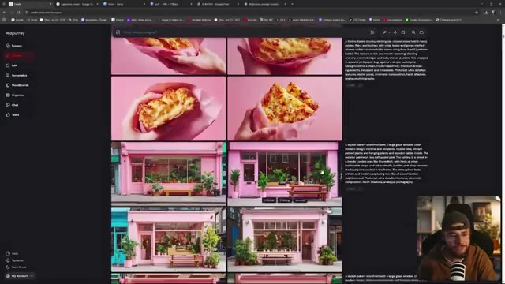
*Interface de l'application web Midjourney montrant une grille de quatre images générées représentant des pâtisseries au fromage dans du papier rose pastel et la vitrine d'une boulangerie rose.*

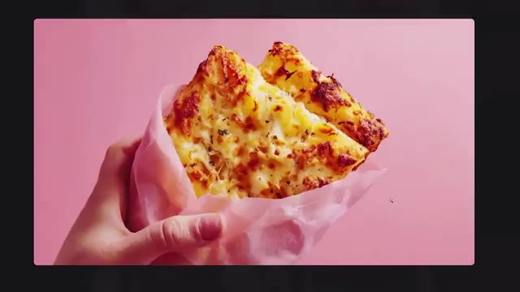
*Gros plan plein écran d'une des images générées montrant des morceaux de pâtisserie au fromage dans du papier rose.*

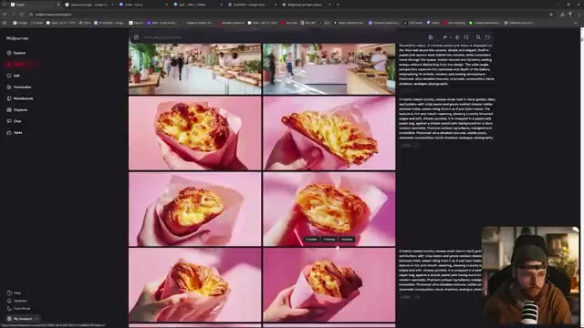
*Interface de Midjourney affichant une grille de variations de pâtisseries au fromage tenues dans la main sur fond rose pastel.*

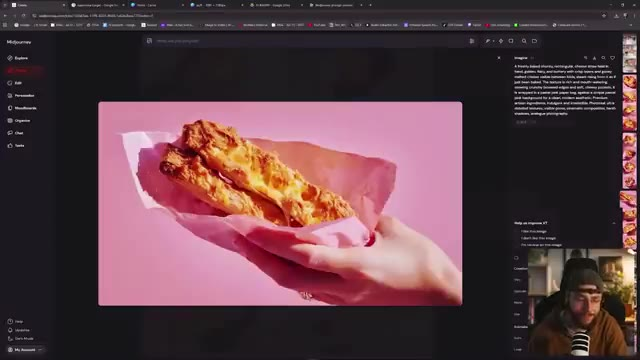
*Interface de Midjourney affichant en grand format l'image finale validée d'une paille au fromage allongée dans du papier rose, avec le panneau latéral des prompts.*

---

### ⏱️ `[00:10:46 - 00:11:22]` | Segment #21

**🔊 Audio (Transcription Intégrale Mot pour Mot en Français) :**
> J'adore la façon dont Midjourney a même rendu les ongles de cette femme roses. On a un thème vraiment cohérent ici. Et l'une des grandes choses avec l'IA, c'est de pouvoir se mettre dans n'importe quelle scène que l'on peut réellement imaginer. Donc bien sûr, je voulais m'amuser un peu et me mettre dans cette publicité et aussi dans le décor de la boulangerie. J'ai donc créé plusieurs variations différentes de portraits. Encore une fois, évidemment avec moi devant ce fond rose pastel. Si vous voulez savoir comment vous recréer précisément en utilisant des outils comme Midjourney ou n'importe quel générateur d'images par IA,

**👁️ Analyse Visuelle d'Écran (gemini-3.5-flash-lite) :**
**Interface & Outils** : Interface web de Midjourney (midjourney.com) avec un panneau latéral de navigation, un affichage en grille des créations et des panneaux de détails de prompts à droite, combinée à une incrustation vidéo (PiP) du créateur en bas à droite.

**Contenu textuel & Code** : Prompts textuels détaillés dans l'interface Midjourney décrivant un homme barbu aux cheveux châtains portant une casquette et des lunettes devant un fond rose pastel.

**Action / Démonstration** : Le créateur montre des exemples d'images générées par IA sur son écran tout en expliquant sa démarche de création de portraits personnalisés.

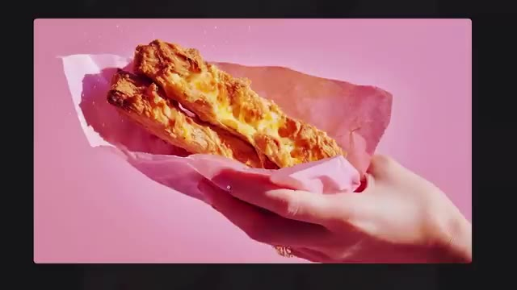
*Gros plan sur une main tenant des pâtisseries sur fond rose pastel, généré par IA.*

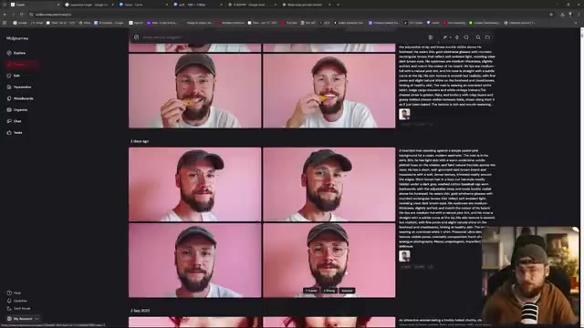
*Interface de Midjourney affichant une grille de portraits de Jack sur fond rose pastel, avec sa caméra PiP en bas à droite.*

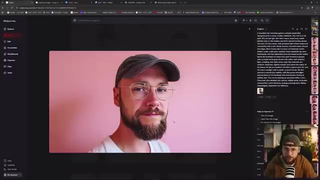
*Interface de Midjourney affichant un portrait agrandi de Jack sur fond rose pastel, avec sa caméra PiP en bas à droite.*

---

### ⏱️ `[00:11:22 - 00:11:56]` | Segment #22

**🔊 Audio (Transcription Intégrale Mot pour Mot en Français) :**
> Vraiment, vous pouvez aller voir la vidéo sur l'écran en ce moment même. Il y a beaucoup plus de détails là-bas si vous voulez vraiment vous y plonger, mais tout cela consiste vraiment à utiliser votre prompt et aussi à vous assurer de télécharger un bon selfie de haute qualité, puis de le placer dans la section de référence omni de Midjourney. J'ai réglé ma force de référence omni à environ 125. Un ici de moi en train de manger la paille au fromage, je ne sais pas si cela va figurer dans la publicité finale, nous verrons bien. Maintenant, Midjourney est un outil payant, mais personnellement je pense que cela en vaut vraiment la peine, vous pouvez prendre le forfait le moins cher je crois pour

**👁️ Analyse Visuelle d'Écran (gemini-3.5-flash-lite) :**
**Interface & Outils** : Interface web de Midjourney avec un panneau latéral à gauche (Explore, Create, Personalize, Moodboards, Organize, Chat, Tasks), une barre de recherche en haut, et un encadré vidéo PiP du créateur en bas à droite.

**Contenu textuel & Code** : Prompt textuel détaillé décrivant un homme barbu avec une casquette et des lunettes devant un fond rose pastel, ainsi que des paramètres de génération.

**Action / Démonstration** : Le créateur montre son écran Midjourney avec les images générées à partir de son selfie et de ses prompts, tout en parlant face à sa caméra en médaillon PiP.

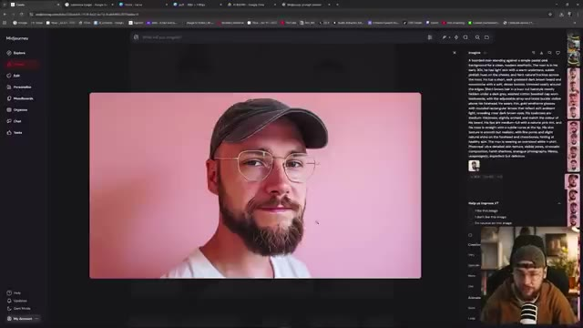
*Interface de Midjourney affichant une image générée en grand format avec le prompt textuel et le créateur visible en incrustation PiP.*

*Grille de résultats de génération d'images sur l'interface Midjourney montrant différentes variations du créateur avec et sans paille au fromage.*

---

### ⏱️ `[00:11:56 - 00:12:31]` | Segment #23

**🔊 Audio (Transcription Intégrale Mot pour Mot en Français) :**
> quelque chose comme 10 dollars par mois. Et les résultats que vous obtenez avec ce truc sont incroyables selon moi. Mais je cherche toujours des moyens de faire les choses avec un budget serré, car je sais qu'un bon nombre d'entre vous n'a peut-être pas beaucoup d'argent à dépenser, surtout si vous essayez de lancer une entreprise à partir de zéro. Donc vraiment, ces images de départ pour lesquelles nous avons techniquement payé sur Midjourney, nous allons en quelque sorte couper cela maintenant et nous allons opter pour une solution gratuite. Vous les prenez et vous les réutilisez. Et bien sûr, pour faire cela, nous allons utiliser Nano Banana qui est un générateur d'images IA incroyable qui vient juste d'être publié par Google.

**👁️ Analyse Visuelle d'Écran (gemini-3.5-flash-lite) :**
**Interface & Outils** : Interface web de Midjourney et interface Google avec le modèle nano-banana (Gemini 2.5 Flash), avec incrustation vidéo du créateur en bas à droite (PiP).

**Contenu textuel & Code** : Prompts textuels détaillés décrivant des portraits réalistes et un intérieur de boulangerie avec des plantes suspendues et du personnel en tablier rose.

**Action / Démonstration** : Le créateur navigue dans l'interface de Midjourney pour montrer les images payantes générées, puis présente l'interface du nouvel outil gratuit Nano Banana de Google.

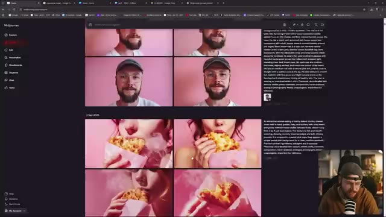
*Interface de l'application Midjourney affichant des grilles d'images générées de l'animateur et des prompts textuels associés.*

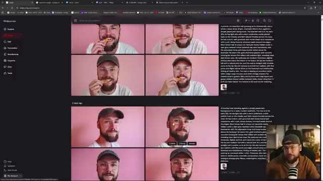
*Interface de Midjourney montrant de nouvelles variations d'images et des options de zoom ou de sous-titrage en surimpression.*

*Interface de l'application Google affichant le modèle gemini-2.5-flash-image-preview (nano-banana) avec la génération d'une image d'intérieur de boulangerie.*

---

### ⏱️ `[00:12:31 - 00:13:05]` | Segment #24

**🔊 Audio (Transcription Intégrale Mot pour Mot en Français) :**
> Donc vous pouvez voir ici que j'ai inséré mon image que nous avons créée avec Midjourney de l'extérieur de ma boulangerie Puff et j'ai dit à Nano Banana, montre-moi l'intérieur de cette boulangerie, une vue grand angle d'un intérieur de boulangerie élégant avec un design moderne et épuré, des murs carrelés de blanc et des tables en bois remplies de pailles au fromage fraîches. Des plantes en pot vibrantes et des plantes suspendues apportent de la vie et de la verdure dans l'espace, ajoutant une touche de charme de Shoreditch. Un menu minimaliste rose pastel est affiché sur le

**👁️ Analyse Visuelle d'Écran (gemini-3.5-flash-lite) :**
**Interface & Outils** : Interface de type navigateur web / interface de génération d'images et de textes (style Nano Banana / Seedance) avec affichage d'un prompt textuel détaillé et d'une image de référence en vignette.

**Contenu textuel & Code** : Texte du prompt visible à l'écran : « Show me the interior of this bakery. A wide-angle view of a stylish bakery interior with a clean modern design, white tiled walls, and wooden tables filled with fresh cheese straws. Vibrant potted plants and hanging plants bring life and greenery into the space, adding a touch of Shoreditch charm. A minimal pastel pink menu is displayed on the tiled wall above the counter... Photoreal: ultra detailed textures, cinematic composition, harsh shadows, analogue photography. »

**Action / Démonstration** : Le créateur présente l'image de référence de l'extérieur de la boulangerie, puis survole et sélectionne le texte du prompt détaillé dans l'interface avant de dévoiler le résultat visuel généré de l'intérieur de la boulangerie.

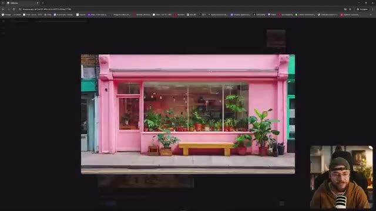
*Affichage de l'image extérieure de la boulangerie rose créée avec Midjourney sur l'écran de l'ordinateur*

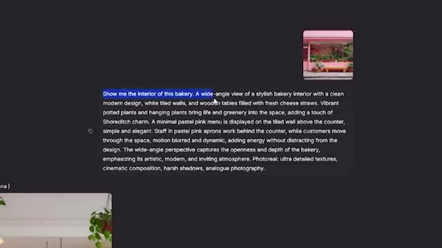
*Gros plan sur le texte du prompt rédigé demandant la génération de l'intérieur de la boulangerie*

*Visualisation de l'interface montrant le prompt complet et le résultat généré de l'intérieur de la boulangerie*

---

### ⏱️ `[00:13:05 - 00:13:40]` | Segment #25

**🔊 Audio (Transcription Intégrale Mot pour Mot en Français) :**
> mur carrelé au-dessus du comptoir, simple et élégant. Le personnel en tabliers rose pastel travaille derrière le comptoir tandis que les clients se déplacent dans l'espace, avec un flou de mouvement et dynamiques, ajoutant de l'énergie sans distraire du design. La perspective grand angle capture l'ouverture et la profondeur de la boulangerie, soulignant son atmosphère artistique, moderne et accueillante et bien sûr je mets toujours ce bout à la fin ici sur la pellicule photo, textures ultra détaillées, composition cinématographique, ombres dures, photographie argentique. Donc cela aurait pu être une sortie de ChatGPT également, vous pourriez juste

**👁️ Analyse Visuelle d'Écran (gemini-3.5-flash-lite) :**
**Interface & Outils** : Interface web d'un outil de génération d'images/vidéos (type navigateur avec interface sombre), avec une incrustation PiP (Picture-in-Picture) de Jack en bas à droite.

**Contenu textuel & Code** : Texte affiché à l'écran : "Show me the interior of this bakery. A wide-angle view of a stylish bakery interior with a clean modern design, white tiled walls, and wooden tables filled with fresh cheese straws. Vibrant potted plants and hanging plants bring life and greenery into the space, adding a touch of Shoreditch charm. A minimal pastel pink menu is displayed on the tiled wall above the counter, simple and elegant. Staff in pastel pink aprons work behind the counter, while customers move through the space, motion blurred and dynamic, adding energy without distracting from the design. The wide-angle perspective captures the openness and depth of the bakery, emphasizing its artistic, modern, and inviting atmosphere. Photoreal: ultra detailed textures, cinematic composition, harsh shadows, analogue photography."

**Action / Démonstration** : Le curseur de la souris survole le texte du prompt affiché à l'écran, tandis que le créateur commente les détails de la génération et les instructions de fin de prompt.

*Vue d'ensemble de l'interface web montrant un prompt textuel décrivant l'intérieur d'une boulangerie et une image générée avec le créateur visible en incrustation PiP.*

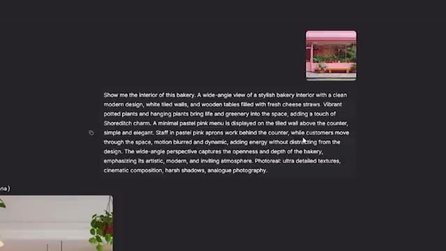
*Gros plan sur le texte du prompt détaillant l'intérieur de la boulangerie, les tabliers rose pastel et les textures de photographie argentique.*

*Vue d'ensemble de l'interface web montrant le prompt textuel et l'image générée avec le créateur en incrustation PiP.*

---

### ⏱️ `[00:13:40 - 00:14:12]` | Segment #26

**🔊 Audio (Transcription Intégrale Mot pour Mot en Français) :**
> dites que cela a été écrit par un LLM mais j'ai juste fait quelques modifications comme je le fais toujours et je veux que vous gardiez à l'esprit que nous venons de jeter cette image ici à Nano Banana et ce que nous obtenons en retour est ceci. Cela semble cohérent et cela semble réaliste aussi. Je ne suis pas vraiment sûr que nous ayons fini par utiliser cette image mais c'est un très bon exemple de la façon dont vous pouvez utiliser Nano Banana et si nous faisons un peu plus défiler vers le bas vous pouvez voir que j'ai dit montre-moi un gros plan d'un bien manucuré

**👁️ Analyse Visuelle d'Écran (gemini-3.5-flash-lite) :**
**Interface & Outils** : Interface web de Nano Banana (navigateur Chrome), avec affichage de prompts et de résultats générés d'images, et une incrustation vidéo (PiP) du créateur en bas à droite.

**Contenu textuel & Code** : Texte du prompt visible sur l'image #1 : « Show me the interior of this bakery. A wide angle view of a stylish bakery interior with a color modern design, white tiled walls, and wooden tables filled with fresh cheese danishes. Potted plants and hanging plants bring life and greenery into the space, adding a touch of Shoreditch charm. A minimal pastel pink menu is displayed on the tiled wall above the counter, simple and elegant. Staff in pastel pink aprons work behind the counter, while customers move through the space, motion blurred and dynamic, adding energy without distracting from the design. The wide angle perspective capitalizes on openness and depth of the bakery, showcasing its artistic, modern, and inviting atmosphere. Photoreal: ultra detailed textures, cinematic composition, harsh shadows, analogue photography. » Texte du prompt visible sur l'image #4 : « Show me a close up of a well manicured man's hand holding a plain pastel pink takeaway coffee cup that matches the aesthetic of the shop exterior. Make it feel stylish and premium. Photoreal: ultra detailed textures, cinematic composition, harsh shadows, analogue photography. »

**Action / Démonstration** : Le créateur montre son écran avec l'interface de Nano Banana, présente des images générées et fait défiler la page pour révéler un nouveau prompt de génération.

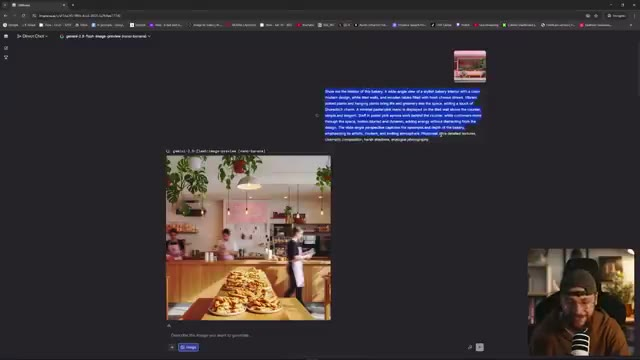
*Interface de Nano Banana montrant un prompt texte de LLM et l'image générée d'une boulangerie moderne avec un encadré PiP du créateur en bas à droite.*

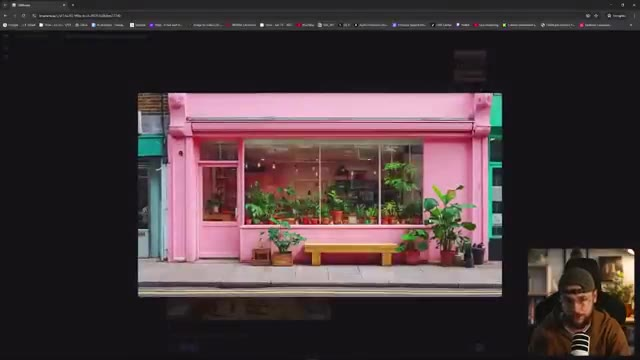
*Gros plan sur l'image générée montrant la façade extérieure rose d'une boutique avec une grande vitrine et des plantes.*

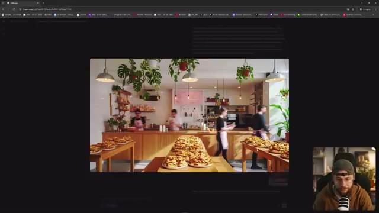
*Gros plan sur l'image générée de l'intérieur de la boulangerie avec des comptoirs en bois, des pâtisseries et des employés.*

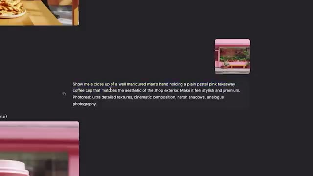
*Défilement de l'interface montrant un nouveau prompt texte complet demandant un gros plan d'une main d'homme manucurée tenant un gobelet rose pastel.*

---

### ⏱️ `[00:14:12 - 00:14:47]` | Segment #27

**🔊 Audio (Transcription Intégrale Mot pour Mot en Français) :**
> la main d'un homme tenant un gobelet de café à emporter rose pastel uni qui s'accorde avec l'esthétique de l'extérieur de la boutique, pour donner un effet élégant et haut de gamme, et ce qu'on obtient en retour, c'est ceci : l'arrière-plan avec un flou artistique est littéralement notre image de départ, franchement c'est complètement fou, maintenant juste ici j'utilise Nano Banana via LM Arena, si vous voulez y accéder de cette façon, vous tapez littéralement lmarina.ai dans Google, et c'est comme ça que j'ai l'habitude d'utiliser Nano Banana, tout simplement parce qu'on obtient nos résultats sans le

**👁️ Analyse Visuelle d'Écran (gemini-3.5-flash-lite) :**
**Interface & Outils** : Navigateur web affichant l'interface de LM Arena (lmarina.ai) avec des zones de chat, des champs de texte de prompt et des affichages de médias générés, ainsi qu'une incrustation vidéo du créateur (Picture-in-Picture).

**Contenu textuel & Code** : Texte du prompt visible : "Show me a close up of a well manicured man's hand holding a plain pastel pink takeaway coffee cup that matches the aesthetic of the shop exterior. Make it feel stylish and premium. Photoreal: ultra detailed textures, cinematic composition, harsh shadows, analogue photography."

**Action / Démonstration** : Le créateur fait défiler l'historique de ses générations d'images et de vidéos sur LM Arena pour illustrer la qualité des résultats obtenus et la fidélité par rapport à l'image de départ.

*Interface de LM Arena montrant un prompt textuel détaillé en anglais pour générer l'image d'un gobelet de café rose.*

*Interface du navigateur web LM Arena affichant le résultat généré montrant une main tenant le gobelet rose devant une devanture de magasin, avec le créateur visible en incrustation PiP.*

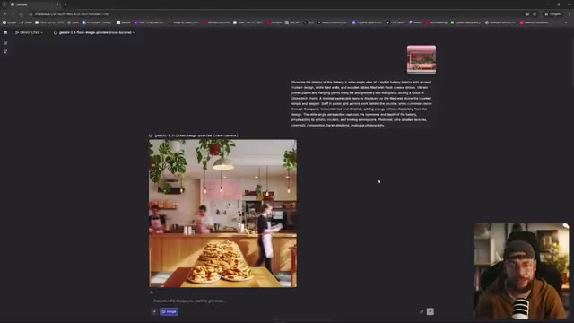
*Interface de LM Arena affichant un autre rendu vidéo/image de l'intérieur d'une boulangerie avec le créateur en incrustation PiP en bas à droite.*

*Retour sur l'affichage du rendu vidéo du gobelet de café rose dans LM Arena avec le créateur en bas à droite.*

---

### ⏱️ `[00:14:47 - 00:15:22]` | Segment #28

**🔊 Audio (Transcription Intégrale Mot pour Mot en Français) :**
> petit logo Gemini dans le coin inférieur droit et cela peut être un peu ennuyeux de les supprimer. Bien sûr, nous ne voulons aucun filigrane sur nos images si nous avons ensuite l'intention de les animer, n'est-ce pas ? Mais je veux vous montrer pourquoi vous pourriez vouloir utiliser Nano Banana directement via Gemini également. Alors me voici en train d'accéder à Gemini gratuitement via mon navigateur web, et l'super truc en l'utilisant de cette façon, oui, vous allez avoir votre filigrane, mais vous pouvez combiner plus d'une image. Donc d'abord, j'ai mis mon logo, que nous avons conçu avec Canva. Et ensuite, j'ai mis l'image que nous

**👁️ Analyse Visuelle d'Écran (gemini-3.5-flash-lite) :**
**Interface & Outils** : Navigateur web (Google Chrome) et interface de Gemini (version gratuite avec modèle 1.5 Flash).

**Contenu textuel & Code** : Dans l'image 3, on peut voir l'interface de Gemini avec le prompt "Put the logo that reads 'puff' on the coffee cup" et les images sources importées (logo Canva et photo de gobelet).

**Action / Démonstration** : Le présentateur navigue sur son navigateur web, accède à l'interface de Gemini et montre comment combiner plusieurs images (le logo et l'image de base).

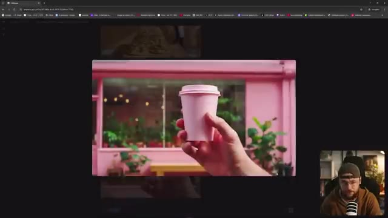
*Affichage d'une image générée représentant une main tenant un gobelet rose devant une vitrine rose, avec Jack en incrustation (PiP) dans le coin inférieur droit.*

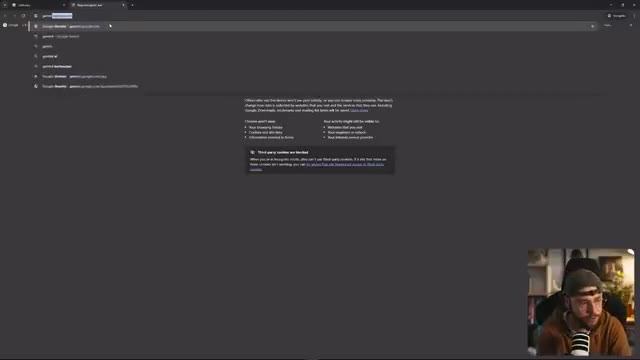
*Navigateur web affichant une page de recherche Google avec la barre d'adresse en cours de saisie vers Gemini, avec Jack en incrustation (PiP) dans le coin inférieur droit.*

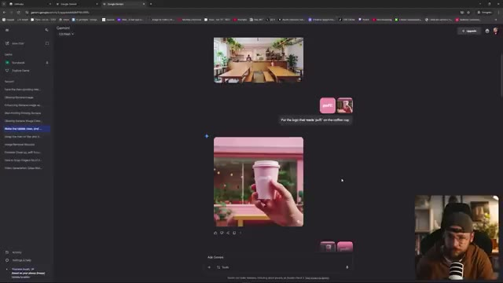
*Interface de Gemini affichant une conversation avec des images combinées et un prompt textuel, avec Jack en incrustation (PiP) dans le coin inférieur droit.*

---

### ⏱️ `[00:15:22 - 00:15:54]` | Segment #29

**🔊 Audio (Transcription Intégrale Mot pour Mot en Français) :**
> juste généré avec Nano Banana Fruit LM Arena de la tasse de café. Et nous pouvons dire, mets le logo qui lit puff sur la tasse de café et regarde juste le résultat qu'on obtient en retour. Tu remarqueras, cependant, que ça nous a redonné un format 1 par 1. Et c'est une question que je reçois beaucoup dans mes commentaires. Pourquoi Nano Banana me redonne des images carrées ? Essentiellement, le format d'image que tu saisis dans Nano Banana est ce que tu vas obtenir en retour. Mais si tu utilises plusieurs images,

**👁️ Analyse Visuelle d'Écran (gemini-3.5-flash-lite) :**
**Interface & Outils** : Navigateur web affichant l'interface de Google Gemini, avec un encadré PiP (Picture-in-Picture) du présentateur en bas à droite.

**Contenu textuel & Code** : Texte du prompt visible à l'écran : "Put the logo that reads 'puff' on the coffee cup".

**Action / Démonstration** : Le créateur montre le résultat de la génération d'image d'un gobelet de café et explique la gestion du ratio d'image (format carré 1:1) dans l'outil.

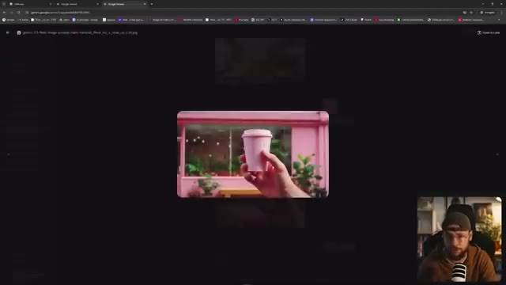
*Affichage d'un aperçu d'image générée montrant une main tenant un gobelet rose dans un navigateur web avec le présentateur incrusté en bas à droite.*

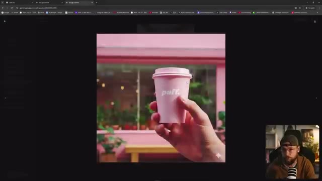
*Affichage en plein écran d'une image générée au format carré montrant une main tenant un gobelet rose avec le logo "puff".*

*Interface de l'outil Google Gemini montrant l'historique de conversation avec des prompts de génération d'images et des aperçus de résultats.*

---

### ⏱️ `[00:15:55 - 00:16:27]` | Segment #30

**🔊 Audio (Transcription Intégrale Mot pour Mot en Français) :**
> la dernière image que vous saisissez est le format d'image que vous allez récupérer. L'ordre dans lequel vous téléchargez vos images a donc essentiellement de l'importance. Si vous regardez notre logo, il est en un par un, n'est-ce pas ? Mais si vous regardez notre plan de la tasse de café, il est en 16 par 9. Nous voulons donc mettre notre logo en premier, puis notre image en 16 par 9. Et comme nous mettons l'image horizontale en dernier, c'est ce que nous allons récupérer de Nano Banana. Et vous pouvez voir qu'il fait un très bon travail pour incruster les ombres,

**👁️ Analyse Visuelle d'Écran (gemini-3.5-flash-lite) :**
**Interface & Outils** : Interface web de Google Gemini (version 2.5 Flash), affichée en mode sombre avec un panneau latéral de navigation à gauche et une fenêtre de discussion centrale. Un flux vidéo du créateur (Jack) est visible en incrustation PiP dans le coin inférieur droit.

**Contenu textuel & Code** : Texte de prompt visible dans l'interface de chat : "Put the logo that reads 'puff' on the coffee cup". Le nom de fichier en haut de l'image est "gemini-2.5-flash-image-preview-nano-banana2-show-me-16-nine-cup-015.jpg".

**Action / Démonstration** : Le créateur montre l'interface de génération d'images, zoome sur le résultat du gobelet de café au format 16:9 pour illustrer la composition des ombres et l'influence de l'ordre des images importées sur le format de sortie.

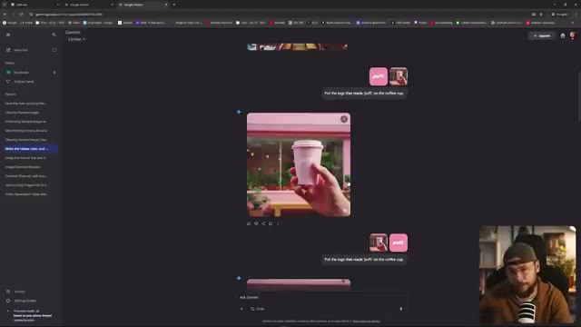
*Interface de Gemini affichant l'historique de chat et l'image générée d'une main tenant un gobelet de café rose, avec le créateur en incrustation vidéo (PiP) en bas à droite.*

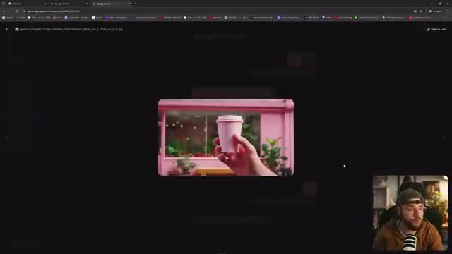
*Interface de Gemini affichant un aperçu agrandi de l'image du gobelet de café au format 16:9 dans l'interface de prévisualisation, avec le créateur en bas à droite.*

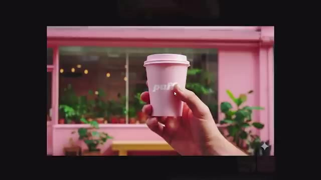
*Gros plan plein écran sur le résultat final généré montrant la main tenant un gobelet de café rose avec le logo incrusté et des ombres réalistes.*

---

### ⏱️ `[00:16:27 - 00:17:00]` | Segment #31

**🔊 Audio (Transcription Intégrale Mot pour Mot en Français) :**
> le logo tout a l'air super avant il aurait fallu genre aller dans photoshop et s'embêter avec les modes de fusion et tout ce tralala faire un peu de masquage pour même ramener le pouce par-dessus mais ne vous inquiétez pas nano banana va s'occuper de tout ça pour vous vous pouvez voir aussi ici que j'ai mis un plan différent de l'intérieur que j'ai vraiment bien aimé mais je me suis quand même dit pourquoi les pailles au fromage seraient sur ces tables donc encore une fois vous pouvez injecter ça dans nano banana et dire rendez les tables claires et mettez les pailles au fromage sur le comptoir derrière une vitre en verre

**👁️ Analyse Visuelle d'Écran (gemini-3.5-flash-lite) :**
**Interface & Outils** : Interface du navigateur web affichant Google Gemini (ou un outil similaire nommé « nano banana » par le créateur) avec un panneau latéral de discussion et des aperçus multimédias, complétée par une vue incrustée (PiP) du créateur face à sa webcam.

**Contenu textuel & Code** : Texte de prompt visible dans l'interface : « Make the tables clear, and put the cheese straws on the counter behind a pane of glass » et « Put the logo that reads "puff" on the coffee cup ».

**Action / Démonstration** : Le créateur présente des extraits vidéo générés par IA et démontre comment modifier les éléments d'une scène (retirer des objets des tables et les placer derrière une vitre) en saisissant des instructions textuelles dans l'interface de l'outil.

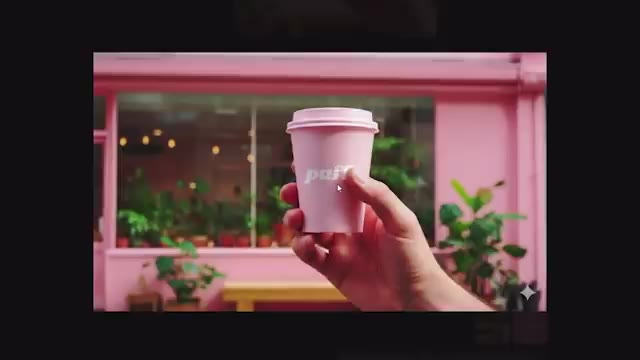
*Gros plan sur une vidéo générée montrant une main tenant un gobelet rose avec un logo devant un café rose.*

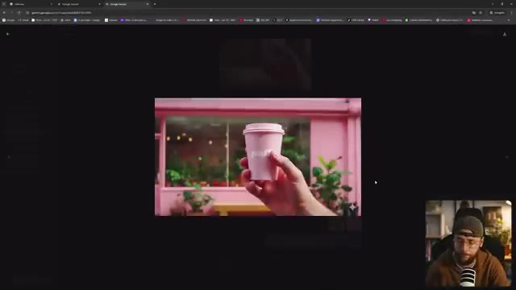
*Interface de Google Gemini affichant la vidéo du gobelet rose, avec le créateur visible en incrustation (PiP) dans le coin inférieur droit.*

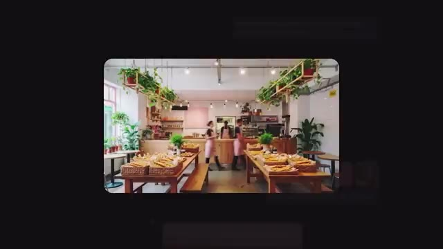
*Plan vidéo de l'intérieur d'un café avec des tables en bois garnies de viennoiseries et des plantes suspendues.*

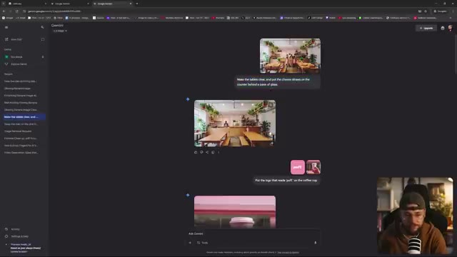
*Interface de Google Gemini montrant l'historique de discussion avec des prompts textuels et des aperçus vidéo, et le créateur en incrustation (PiP).*

---

### ⏱️ `[00:17:00 - 00:17:33]` | Segment #32

**🔊 Audio (Transcription Intégrale Mot pour Mot en Français) :**
> et ce qu'on obtient en retour, c'est ça : on commence vraiment à construire notre entreprise à partir de zéro avec l'IA, c'est insensé. Un autre super exemple ici, on est de retour sur AI Studio (ou Ella Marina / Nano Banana selon le contexte audio, prononcé "ella marina"), j'ai tendance à alterner entre les deux façons d'accéder à "nano banana" que je préfère. Vous pouvez y accéder via toutes sortes d'abonnement payants également, je pense que Freepik et Higgsfield, tout un tas de sites différents le font, mais ces moyens-là vous permettent d'accéder à l'outil gratuitement. Donc j'ai mis cette image de notre intérieur et je lui ai donné le prompt : un employé de boulangerie avec son...

**👁️ Analyse Visuelle d'Écran (gemini-3.5-flash-lite) :**
**Interface & Outils** : Navigateur web affichant l'interface Google AI Studio / application LLM avec sélection de modèle (Gemini 2.5 flash image preview / Nano-banana) et zone de chat avec téléchargement d'images et saisie de prompts.

**Contenu textuel & Code** : Texte du prompt visible à l'écran : "A bakery worker with his back to the camera, arranging wooden shelves full of freshly baked cheese straws, golden loaves with crisp... The worker is seen from behind, mid-action, reaching up to place a croissant on the shelf, wearing a casual pastel pink long-sleeved t-shirt. The scene is warm, artisanal, and authentic, with a vibrant atmosphere that captures the charm of a busy urban bakery. Photoreal ultra-detailed textures, cinematic composition, hand shadows, analogue photography." Modèle sélectionné : "gemini-2.5-flash-image-preview (Nano-banana)".

**Action / Démonstration** : Le créateur navigue et démontre l'utilisation de l'interface web pour générer des images à partir d'une photo d'intérieur de boulangerie et d'un prompt textuel détaillé.

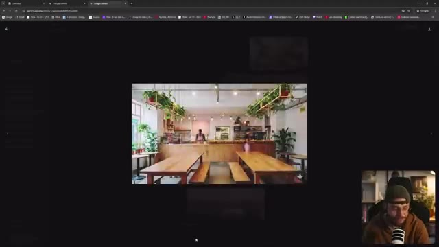
*Interface du navigateur affichant une application web Google avec une image centrale d'intérieur de boulangerie avec tables et plantes, et le créateur visible en incrustation PiP en bas à droite.*

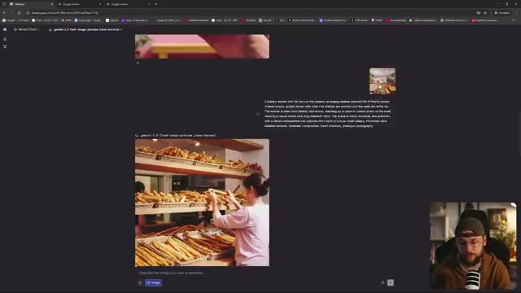
*Interface de l'application web de génération montrant des lignes de texte de prompt descriptif et une image générée d'une employée de boulangerie rangeant des viennoiseries sur des étagères.*

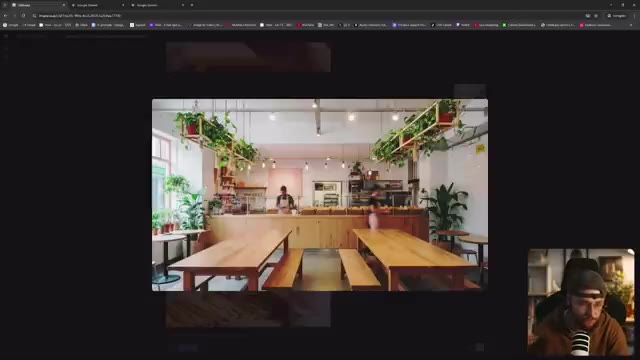
*Interface similaire montrant de nouveau l'image centrale de la boulangerie avec ses tables en bois et un comptoir au fond.*

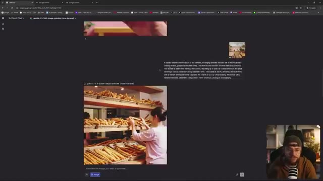
*Interface de l'application web affichant le texte complet du prompt et une image de génération de boulangerie avec des étagères garnies.*

---

### ⏱️ `[00:17:33 - 00:18:09]` | Segment #33

**🔊 Audio (Transcription Intégrale Mot pour Mot en Français) :**
> dos à la caméra, arrangeant des étagères remplies de pailles au fromage fraîchement cuites, dorées avec du croustillant. Les étagères sont en bois et les murs sont en carrelage blanc. Le travailleur est vu de dos, en pleine action, tendant la main pour placer une paille au fromage sur l'étagère, portant un t-shirt décontracté à manches longues rose pastel. La scène est chaleureuse, artisanale et authentique, avec une atmosphère vibrante qui capture le charme d'une boulangerie urbaine animée. Maintenant, je n'avais même pas remarqué ça jusqu'à présent, mais nous avions demandé un homme et ce que nous avons obtenu est une femme. Cependant, cette génération est tellement bonne et encore une fois nous pouvons prendre ce

**👁️ Analyse Visuelle d'Écran (gemini-3.5-flash-lite) :**
**Interface & Outils** : Interface de navigateur web avec un outil de génération d'images par IA (mentionnant gemini-2.5-flash-image-preview) et une incrustation vidéo PiP (Picture-in-Picture) du créateur.

**Contenu textuel & Code** : Texte du prompt de génération visible à l'écran : "A bakery worker with his back to the camera, arranging shelves stacked full of freshly baked cheese straws, golden brown with crisp..."

**Action / Démonstration** : Le créateur navigue sur son écran et montre le résultat d'une génération d'image IA représentant une boulangère de dos, tout en commentant le fait que l'IA a généré une femme au lieu d'un homme.

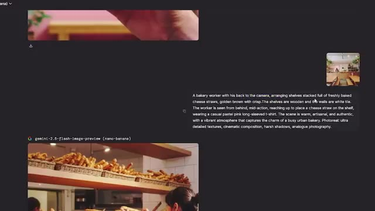
*Interface web affichant un prompt textuel et des images générées par IA représentant une boulangerie.*

*Interface web montrant les résultats de génération d'images avec un encadré vidéo de Jack en bas à droite.*

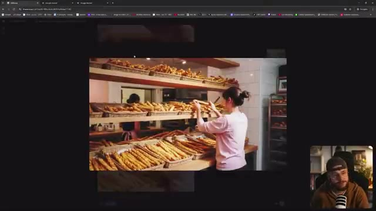
*Gros plan sur l'image générée par IA montrant une femme de dos dans une boulangerie.*

---

### ⏱️ `[00:18:09 - 00:18:47]` | Segment #34

**🔊 Audio (Transcription Intégrale Mot pour Mot en Français) :**
> passons à Gemini, mettons notre logo en premier, notre image une par une, puis mettons ce plan de la femme arrangeant les étagères et demandons-lui de mettre le logo au dos de sa chemise et nous obtenons ce résultat. Laissez-moi vous l'ouvrir à nouveau pour que vous puissiez voir en détail. Donc essentiellement, nous utilisons Nano Banana presque comme un outil de création de monde. Nous avons commencé par ces visuels clés et nous ne cessons de nous en écarter pour créer de plus en plus de plans différents. Nous construisons notre marque et nous établissons également l'espace physique. Et voici d'autres exemples incroyables ici. J'ai donc mis dans le

**👁️ Analyse Visuelle d'Écran (gemini-3.5-flash-lite) :**
**Interface & Outils** : Application Gemini / interface web avec historique de chat, zone de prompts et affichage des médias générés.

**Contenu textuel & Code** : Texte du prompt visible : "Put the logo that reads 'puff' on the back of the woman's t-shirt, make it large and readable."

**Action / Démonstration** : Le créateur montre l'interface de l'outil et zoome sur le résultat généré de la femme dans la boulangerie avec le logo sur son t-shirt.

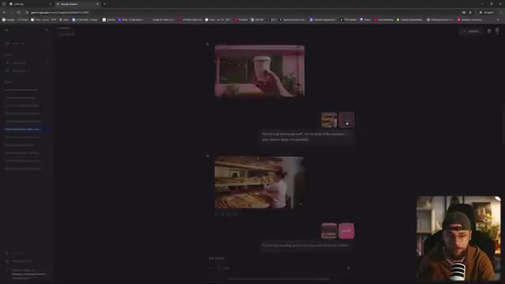
*Interface de l'outil de génération montrant l'historique des prompts et des images générées avec un retour caméra en bas à droite.*

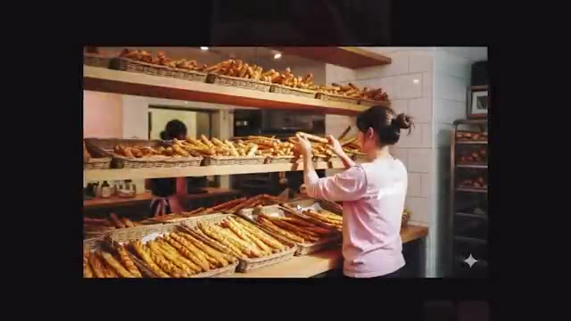
*Gros plan sur le rendu vidéo d'une femme arrangeant des étagères de pain dans une boulangerie.*

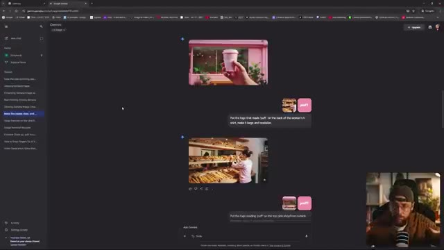
*Vue large de l'interface montrant les différents prompts textuels et les images associées dans l'application Gemini.*

---

### ⏱️ `[00:18:47 - 00:19:16]` | Segment #35

**🔊 Audio (Transcription Intégrale Mot pour Mot en Français) :**
> portrait de moi-même que j'ai fait avec mid journey et j'ai mis dans mon plan extérieur que nous avons aussi fait avec mid journey et j'ai dit plan moyen de l'homme barbu adossé à l'extérieur de la boutique bras croisés regardant avec confiance vers la caméra et ce qu'on a obtenu c'est ça maintenant je ne suis pas vraiment adossé à la boutique mais quand même regardez à quel point c'est convaincant un autre excellent exemple aussi nous avons mis l'intérieur de la boulangerie et mis le portrait de moi.

**👁️ Analyse Visuelle d'Écran (gemini-3.5-flash-lite) :**
**Interface & Outils** : Interface sombre de Google Gemini (ou outil similaire de génération par IA) affichant des chats, des prompts textuels et des résultats d'images générées avec un panneau latéral à gauche et une vue incrustée (PiP) du créateur en bas à droite.

**Contenu textuel & Code** : Texte visible des prompts dans les bulles de chat : "Mid-shot of the bearded man leaning up against the outside of the shop, arms folded, looking confidently at the camera..." et "Shot of the bearded man, he is wearing a pastel pink apron and stood behind the counter smiling at a friendly customer...".

**Action / Démonstration** : Le créateur montre et commente les différentes images générées par IA à l'écran, en faisant défiler les résultats dans l'interface de l'application.

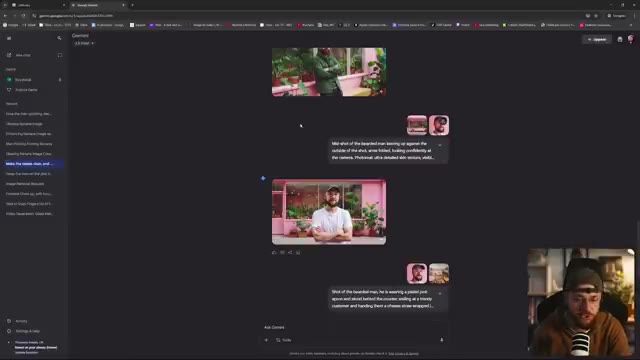
*Interface de Google Gemini montrant l'historique des générations d'images avec des prompts textuels et des aperçus visuels.*

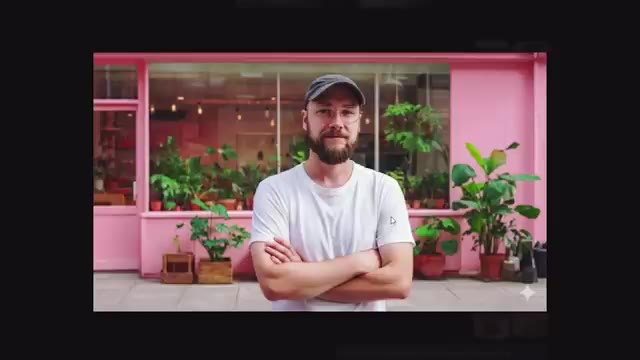
*Gros plan plein écran sur une image générée montrant un homme barbu aux bras croisés devant une façade rose.*

*Interface de Google Gemini affichant une nouvelle génération d'image montrant l'intérieur d'une boulangerie avec un personnage souriant.*

---

### ⏱️ `[00:19:16 - 00:19:52]` | Segment #36

**🔊 Audio (Transcription Intégrale Mot pour Mot en Français) :**
> Et nous avons dit à Nani Banana, plan de l'homme barbu. Il porte un tablier rose pastel et se tient derrière le comptoir, souriant à un client branché et lui tendant une paille au fromage emballée dans un sachet en papier rose pastel. Et ce que nous avons obtenu en retour, c'est ce plan également. Maintenant, encore une fois, je ne suis pas derrière le comptoir comme je l'ai demandé, mais cela fonctionne toujours comme un très bon plan que nous pouvons utiliser dans notre publicité. Vous pouvez voir ici aussi sur Ella Marina qui utilise toujours Nano Banana. Mettre le plan extérieur et j'ai dit contre-plongée montrant un homme branché qui se promène

**👁️ Analyse Visuelle d'Écran (gemini-3.5-flash-lite) :**
**Interface & Outils** : Interface web de Google Gemini, avec les panneaux de discussion et les résultats de génération d'images visibles, ainsi qu'un encadré PiP (Picture-in-Picture) du créateur en bas à droite.

**Contenu textuel & Code** : Textes de prompts visibles : "Shot of the bearded man, he is wearing a pastel pink apron and stood behind the counter smiling at a trendy customer and handing them a cheese straw wrapped i..." et "Low angle. Show a trendy man walking around from the shot, with his back to the camera...".

**Action / Démonstration** : Le créateur navigue à travers son interface Gemini pour présenter les différents prompts et les images générées successives utilisées dans sa publicité.

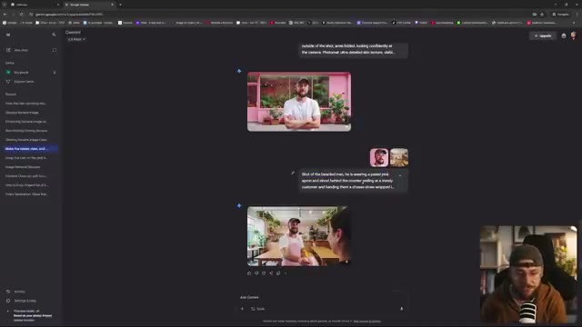
*Interface de Google Gemini montrant l'historique des discussions avec les prompts textuels et les images générées.*

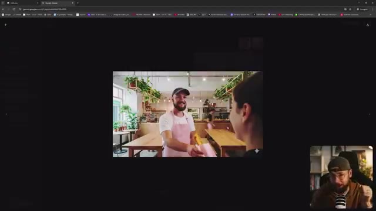
*Gros plan sur l'image générée montrant l'homme barbu en tablier rose tendant une paille au fromage à un client.*

*Interface de Google Gemini affichant un nouveau prompt textuel de contre-plongée et l'image générée d'un homme de dos devant une vitrine rose.*

---

### ⏱️ `[00:19:52 - 00:20:36]` | Segment #37

**🔊 Audio (Transcription Intégrale Mot pour Mot en Français) :**
> la boutique de dos par rapport à la caméra. On peut le voir porter une torsade au fromage fraîchement cuite enveloppée dans un sac en papier rose pastel uni et on est revenu à ça. Finalement, j'ai fait quelques retouches différentes de cela parce que les résultats étaient un peu étranges. Je voulais qu'il retire simplement les torsades au fromage de l'équation à la fin et on a obtenu ce très beau plan également, vous pouvez voir que votre imagination est vraiment la seule limite. Allons-y et faisons un exemple rapide ensemble maintenant les gars, donc je vais simplement déposer l'image que nous avons faite de l'intérieur de la boulangerie et je vais dire montre-moi une employée séduisante préparant un café frais avec une machine à café coûteuse.

**👁️ Analyse Visuelle d'Écran (gemini-3.5-flash-lite) :**
**Interface & Outils** : Interface web d'un outil de génération et de montage vidéo par IA (type Genmo / outil text-to-video).

**Contenu textuel & Code** : Prompts textuels visibles : "Low angle, show a trendy man walking around from the shop, with his back to the camera. We can see him carrying a freshly baked cheese straw wrapped in a plain pastel pink paper bag." et "Show me an attractive female staff member making a fresh coffee with an expensive coffee machine".

**Action / Démonstration** : Le créateur montre différentes étapes de génération vidéo, des retouches successives pour modifier les détails d'un plan, puis tape un nouveau prompt pour créer une scène dans une boulangerie.

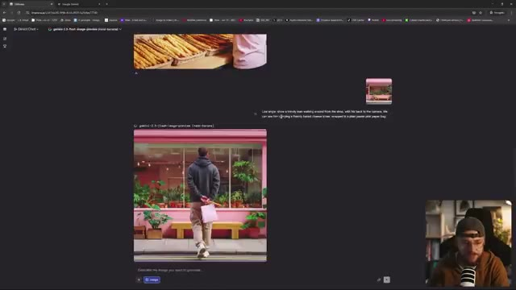
*Interface d'un outil de génération vidéo par IA montrant le résultat d'un homme marchant devant une boutique avec un sac rose.*

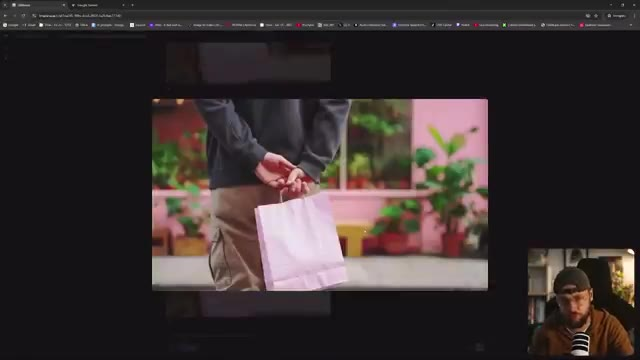
*Gros plan sur le plan vidéo généré montrant l'homme de dos tenant un sac en papier rose pastel.*

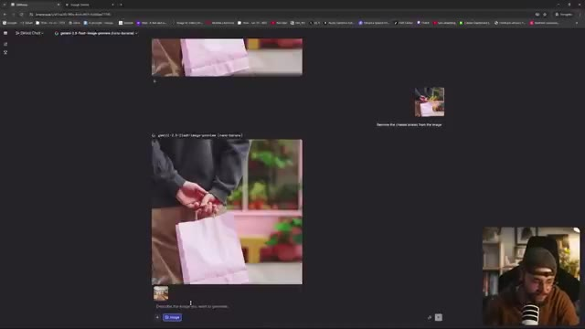
*Interface de l'outil montrant le processus de modification et le prompt demandant de retirer les torsades au fromage.*

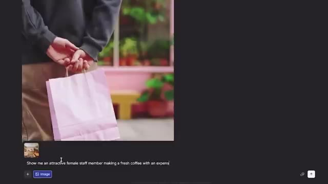
*Saisie d'un nouveau prompt dans l'interface pour générer une employée préparant un café dans une boulangerie.*

---

### ⏱️ `[00:20:36 - 00:21:08]` | Segment #38

**🔊 Audio (Transcription Intégrale Mot pour Mot en Français) :**
> pour un client. Elle porte un tablier rose pastel et le café est dans un gobelet à emporter rose pastel. Envoyons cela et voyons ce qu'on nous renvoie. Vous pouvez voir qu'on a une petite erreur là, ce qui est un peu ennuyeux, alors allons-y et créons un nouveau chat. Ça peut vraiment vous aider parfois si vous obtenez des erreurs bizarre. Donc on va juste redéposer notre image et réécrire notre prompt. Très bien, et appuyons sur entrée sur celui-ci et voyons ce qu'on nous renvoie. Je trouve vraiment

**👁️ Analyse Visuelle d'Écran (gemini-3.5-flash-lite) :**
**Interface & Outils** : Interface web d'un outil de génération d'images/vidéos par IA (type plateforme d'agrégation de modèles comme openrouter ou similaire) avec affichage du créateur en incrustation (PiP) en bas à droite.

**Contenu textuel & Code** : Texte du prompt visible : "Show me an attractive female staff member making a fresh coffee with an expensive coffee machine for a customer. She is wearing a pastel pink apron, and the coffee is in a pastel pink t..." et le slogan "Find the best AI for you".

**Action / Démonstration** : Le créateur montre l'interface de l'outil d'IA, tape et édite un prompt textuel après avoir rencontré une erreur, puis s'apprête à lancer une nouvelle génération.

*Interface d'un outil d'IA montrant un historique de conversation avec une image générée et le champ de saisie du prompt.*

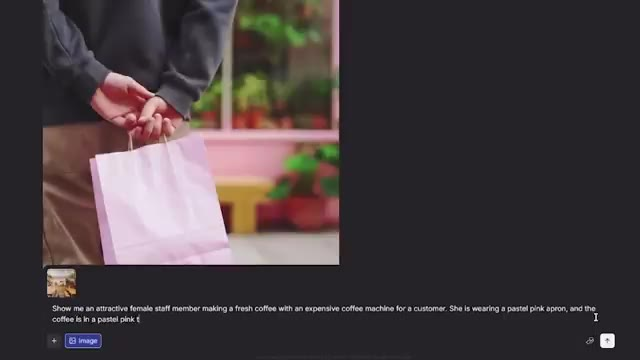
*Gros plan sur le champ de saisie du prompt en cours de rédaction avec l'image source jointe.*

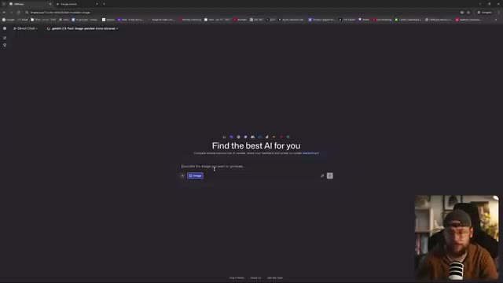
*Page d'accueil de l'interface de l'outil d'IA avec le slogan "Find the best AI for you".*

---

### ⏱️ `[00:21:08 - 00:21:45]` | Segment #39

**🔊 Audio (Transcription Intégrale Mot pour Mot en Français) :**
> que Nano Banana peut être un peu buggé, donc c'est une petite astuce sympa de simplement démarrer un nouveau chat, que vous l'utilisiez via LM Arena ou Gemini. Parfois, ça s'embrouille un peu et il faut remettre les pendules à l'heure. Et encore une fois, regardez ça. Regardez comme c'est bien. Ça s'est un peu emmêlé les pinceaux sur la géographie de l'espace, je dirais, mais ça reste cohérent en termes de style, n'est-ce pas ? Et bien sûr, comment Nano Banana pourrait-il connaître la disposition de notre boulangerie imaginaire ? Relançons simplement pour voir ce qu'on obtient au deuxième essai. Ouais, alors voilà, j'aime bien.

**👁️ Analyse Visuelle d'Écran (gemini-3.5-flash-lite) :**
**Interface & Outils** : Navigateur web affichant l'interface LM Arena (Chatbot Arena) avec un modèle de génération d'image Gemini 2.0 Flash (nano-banana).

**Contenu textuel & Code** : Prompt visible : « Show me an attractive woman wearing a pastel pink apron, making a coffee using an expensive coffee machine. A pastel pink takeaway coffee cup is placed underneath the expensive chrome coffee machine. »

**Action / Démonstration** : Le créateur présente l'interface de génération d'image IA, commente les bugs potentiels et relance une génération (bouton rerun).

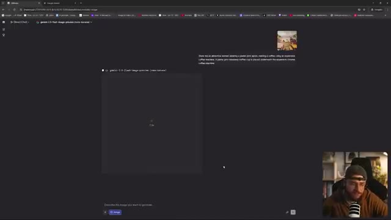
*Interface de LM Arena / Gemini affichant une zone de chargement de génération d'image avec le modèle gemini-2.0-flash-image-preview (nano-banana) et le prompt textuel.*

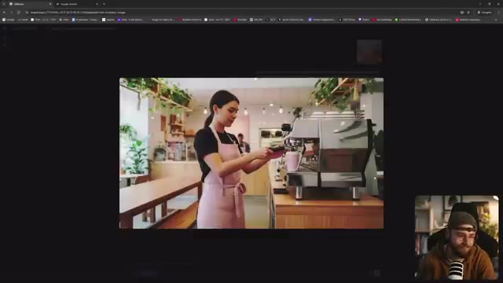
*Résultat de la génération d'image montrant une femme en tablier rose préparant du café sur une machine à expresso dans une boulangerie/café.*

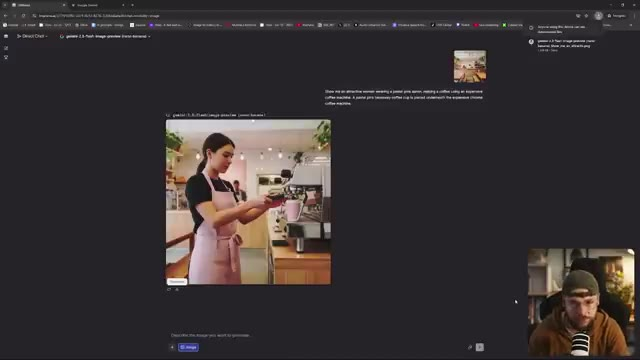
*Second essai de génération d'image avec un cadrage légèrement différent montrant la même scène dans le café.*

---

### ⏱️ `[00:21:45 - 00:22:19]` | Segment #40

**🔊 Audio (Transcription Intégrale Mot pour Mot en Français) :**
> c'est bien plus, ça reste cohérent avec notre style et notre espace physique, nous avons notre joli menu rose pastel ici sur le côté gauche, une tasse de café légèrement différente de celle qu'on avait plus tôt, mais on peut imaginer que c'est peut-être parce que c'est un café plus grand que ce premier plan, c'est peut-être un type de tasse de café légèrement différent donc ce n'est vraiment pas la fin du monde mais tout le reste ici me paraît très bien donc on va simplement lancer le téléchargement de ça complètement gratuitement une fois que vous avez vos visuels clés, que vous les ayez créés avec l'IA ou que vous ayez pris des images vous-même

**👁️ Analyse Visuelle d'Écran (gemini-3.5-flash-lite) :**
**Interface & Outils** : Navigateur web affichant une interface de génération de médias (probablement Lmarena ou un outil similaire basé sur Gemini 2.5).

**Contenu textuel & Code** : Texte du prompt visible : "Show me an attractive woman wearing a pastel pink apron, making a coffee using an expensive coffee machine..." et le modèle sélectionné "gemini-2.5-flash-image-preview".

**Action / Démonstration** : Le créateur commente le rendu visuel généré et discute de la cohérence du style et des accessoires (la tasse de café).

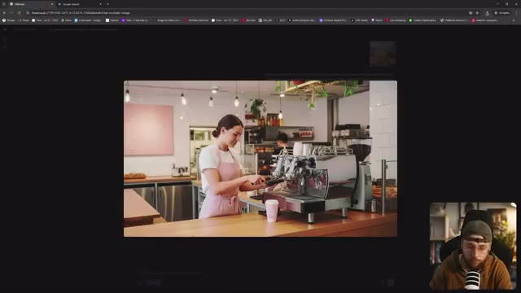
*Affichage du rendu vidéo d'une femme préparant du café dans un café, avec le créateur en encadré PiP.*

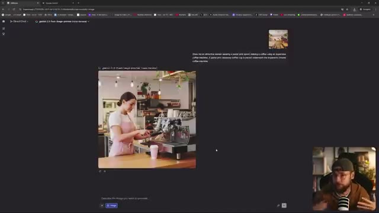
*Interface de l'outil de génération montrant le prompt textuel et le résultat vidéo généré, avec le créateur dans le coin inférieur droit.*

---

### ⏱️ `[00:22:19 - 00:22:44]` | Segment #41

**🔊 Audio (Transcription Intégrale Mot pour Mot en Français) :**
> avec votre téléphone ou un appareil photo reflex numérique adapté, vous pouvez utiliser un outil comme Nano Banana pour étoffer essentiellement votre marque ou étoffer le genre de narration ou d'univers que vous construisez. Votre imagination est vraiment la limite avec un outil comme celui-ci. Je le pense vraiment. Tant que vous saisissez des invites claires, vous obtiendrez des résultats insensés qui n'ont pas seulement l'air cool.

**👁️ Analyse Visuelle d'Écran (gemini-3.5-flash-lite) :**
**Interface & Outils** : Interface web d'un outil d'intelligence artificielle (type interface de génération d'images/prompts) affichée en plein écran avec le navigateur web, incluant un retour vidéo en incrustation (Picture-in-Picture) du présentateur Jack dans le coin inférieur droit.

**Contenu textuel & Code** : On peut lire un prompt textuel en anglais : "Show me an attractive woman wearing a pastel pink apron, making a coffee using an expensive coffee machine..." ainsi que des indications de modèle comme "gemini-1.5-flash-image-preview [nano-banana]". L'image générée montre une femme en tablier rose derrière un comptoir de café avec une machine espresso professionnelle.

**Action / Démonstration** : Le créateur présente l'interface de l'outil Nano Banana et le résultat visuel obtenu à partir du prompt textuel, tout en parlant face à sa webcam visible en bas à droite.

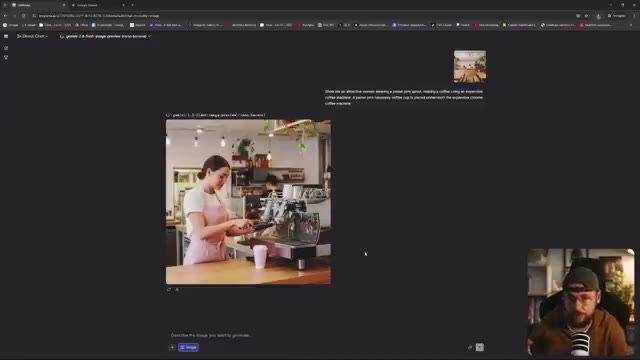
*Interface d'un outil web montrant le résultat d'une génération d'image avec un prompt textuel et une petite pastille vidéo du créateur en bas à droite.*

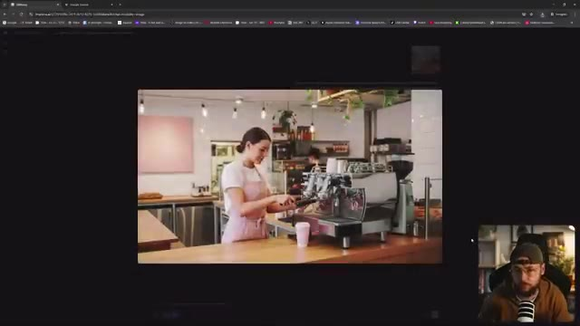
*Gros plan sur l'image générée représentant une femme préparant du café dans un café, avec le créateur visible en incrustation PiP.*

---

### ⏱️ `[00:22:44 - 00:23:19]` | Segment #42

**🔊 Audio (Transcription Intégrale Mot pour Mot en Français) :**
> Ils seront en fait fonctionnels dans une vraie publicité. Et après avoir fait mumuse pendant un moment, nous obtenons de très belles images qui servent de visuels clés pour notre campagne. En pensant toujours aux plans dont nous pourrions avoir besoin pour raconter notre histoire. Et un autre super exemple ici, nous avons les bâtonnets de fromage que Midjourney a créés pour nous. J'aurais injecté ceci dans Nano Banana et demandé à voir le bâtonnet de fromage être déchiré, et voilà ce que nous avons obtenu. C'est fou. Donc à ce stade, nous avons

**👁️ Analyse Visuelle d'Écran (gemini-3.5-flash-lite) :**
**Interface & Outils** : Navigateur web, explorateur de fichiers Windows et lecteur multimédia montrant des assets de production publicitaire générés par IA avec incrustation vidéo du créateur (PiP).

**Contenu textuel & Code** : Noms de dossiers dans l'arborescence : "AI-Assets", "Midjourney-output", "Nano-Banana-output", "z-prev-shot". Prompt visible en haut : `genlm-2.5-flash-image-gen-p1 (nano-banana)_frie_red_a_slightly_long`.

**Action / Démonstration** : Le créateur navigue à travers ses dossiers de projets publicitaires, présente des visuels clés créés avec Midjourney, puis montre la génération vidéo correspondante d'un bâtonnet de fromage étiré et déchiré.

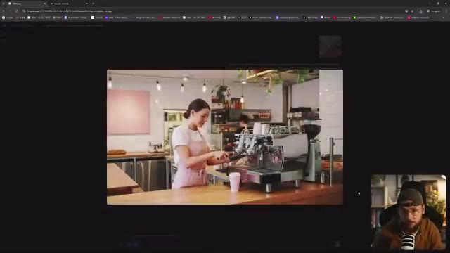
*Affichage d'un visuel publicitaire généré par IA montrant une femme préparant du café dans un café chaleureux.*

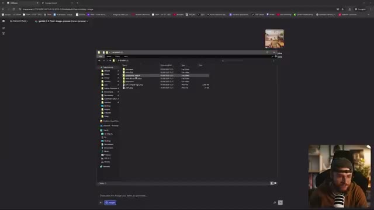
*Navigation dans l'explorateur de fichiers Windows montrant des dossiers de projets d'assets publicitaires IA.*

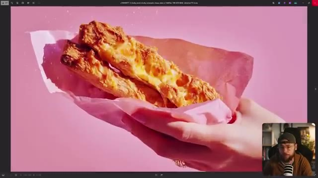
*Gros plan sur une image générée par Midjourney montrant des bâtonnets feuilletés au fromage tenus dans du papier rose.*

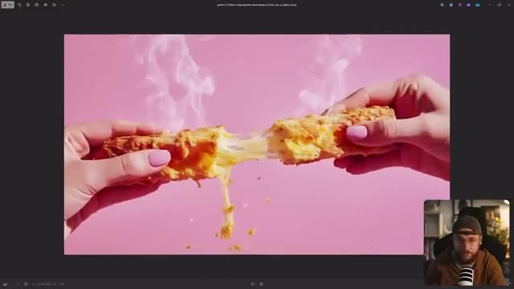
*Rendu vidéo généré montrant deux mains en train de déchirer un bâtonnet de fromage fumant avec du fromage filandreux.*

---

### ⏱️ `[00:23:19 - 00:23:52]` | Segment #43

**🔊 Audio (Transcription Intégrale Mot pour Mot en Français) :**
> toutes ces différentes images fixes. Nous avons notre logo. Nous avons essentiellement construit notre campagne d'images fixes ou imprimées. Mais maintenant que nous avons ces images de départ, nous pouvons aller de l'avant et commencer à chercher à les animer. Bien sûr, c'est ce qui va vraiment commencer à donner vie à notre projet. Et comme toujours, je vais vous montrer l'outil gratuit que j'utilise souvent pour animer mes vidéos IA. Avant d'entrer dans le vif du sujet, les gars, si vous appréciez le contenu d'aujourd'hui, assurez-vous de lâcher un pouce bleu pour moi, pensez à vous abonner si vous êtes nouveau et bien sûr, activez la cloche de notification.

**👁️ Analyse Visuelle d'Écran (gemini-3.5-flash-lite) :**
**Interface & Outils** : Navigateur web avec l'interface d'un outil de génération d'image/vidéo IA et fenêtre de l'Explorateur de fichiers Windows par-dessus. Incrustation vidéo (PiP) du créateur en bas à droite.

**Contenu textuel & Code** : Fenêtre de l'Explorateur de fichiers affichant plusieurs vignettes d'images (générations de types "gemini-2.5-flash-image-preview"). En arrière-plan, barre d'onglets du navigateur et champ de saisie de prompt ("Describe the image you want to generate...").

**Action / Démonstration** : Le créateur présente une collection d'images fixes stockées dans un dossier sur son ordinateur, prêtes à être sélectionnées pour l'animation.

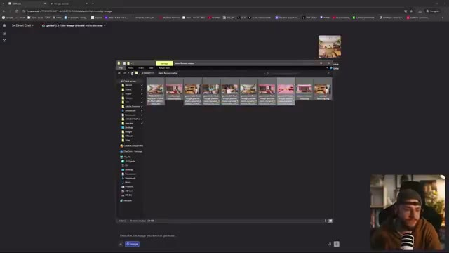
*Explorateur de fichiers Windows ouvert par-dessus l'interface d'un navigateur web, affichant une grille d'images fixes générées par IA.*

---

### ⏱️ `[00:23:52 - 00:24:18]` | Segment #44

**🔊 Audio (Transcription Intégrale Mot pour Mot en Français) :**
> Donc si on se dirige vers FlexClip, les gars là-bas ont eu l'extrême gentillesse de me donner un tas de crédits pour tester leur plateforme et c'est plutôt pratique parce que ça fait image vers vidéo, texte vers vidéo et je crois qu'on a aussi des générateurs d'images ici. Le truc cool avec FlexClip, c'est que si vous allez là-haut sur modèle, vous pouvez en fait choisir parmi Kling et vous pouvez aussi choisir parmi Hilo, donc vous avez déjà pas mal d'options différentes intégrées dans l'outil.

**👁️ Analyse Visuelle d'Écran (gemini-3.5-flash-lite) :**
**Interface & Outils** : Interface web de FlexClip (outil de génération de vidéo par IA) avec menu latéral (Image to Video, Text to Video, Video Effects) et une vue principale affichant la sélection des modèles ("Pick a Model and Start Your Creation").

**Contenu textuel & Code** : Texte visible : "FlexClip", "AI Video Generator", "Image to Video", "Text to Video", "Video Effects", "Model", "Pro", "Upload", "Prompt", "Duration (5s, 10s)", "AI SFX", "Pick a Model and Start Your Creation", "Standard", "Pro", "Ultra", "Kling 1.5 PRO", "Kling 1.6 PRO Subject Reference", "Kling 2.1", "Kling 2.1 Master", "Minimax Hailuo AI director", "Minimax Hailuo AI".

**Action / Démonstration** : Le présentateur montre l'interface de FlexClip et navigue à travers les différents modèles d'IA disponibles pour la génération vidéo.

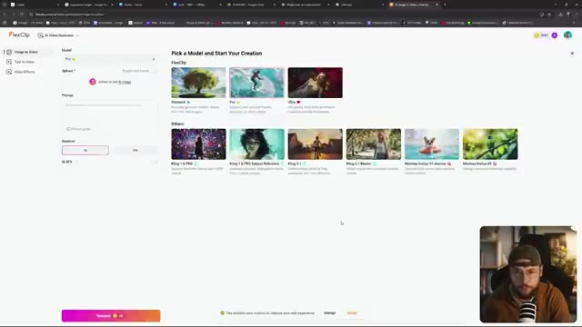
*Interface de la plateforme FlexClip montrant le panneau de sélection des modèles d'IA pour la génération vidéo.*

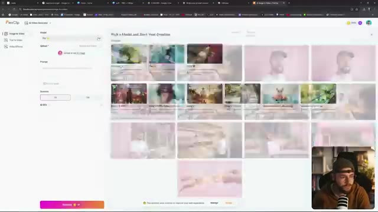
*Interface de FlexClip avec le menu déroulant ou la grille des modèles de génération en cours de survol ou de modification.*

*Interface de FlexClip affichant les différents modèles disponibles, incluant Standard, Pro, Ultra et Kling/Minimax.*

---

### ⏱️ `[00:24:19 - 00:24:38]` | Segment #45

**🔊 Audio (Transcription Intégrale Mot pour Mot en Français) :**
> Mais vous pouvez voir ici dans mon historique, si nous mettons l'image du feuilleté au fromage en train d'être déchiré, ce que je viens je crois de vous montrer, mon invite était : mouvement de caméra travelling avant lent alors que les mains écartent le feuilleté au fromage, de la vapeur s'élevant, du fromage fondant, de la pâte feuilletée douce tombant hors du cadre, style ASMR.

**👁️ Analyse Visuelle d'Écran (gemini-3.5-flash-lite) :**
**Interface & Outils** : Interface web de FlexClip montrant l'historique des générations vidéo, un lecteur vidéo central et un panneau latéral de métadonnées.

**Contenu textuel & Code** : Texte du prompt visible : "Slow dolly camera move forward at the hands pull apart the cheese straw, steam rising, cheese oozing, soft puff pastry tumbling out of frame. ASMR style.", modèle "Kling 2.1", ratio "16:9", résolution "1268*724 px", date "2025-09-04 13:58:53".

**Action / Démonstration** : Le créateur présente l'historique de ses générations dans FlexClip avec le prompt et les détails de la vidéo du feuilleté au fromage.

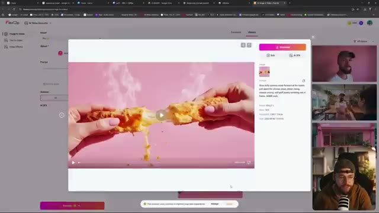
*Interface du logiciel FlexClip affichant la vidéo générée d'un feuilleté au fromage étiré et le panneau latéral avec les détails du prompt et le retour webcam de Jack en bas à droite.*

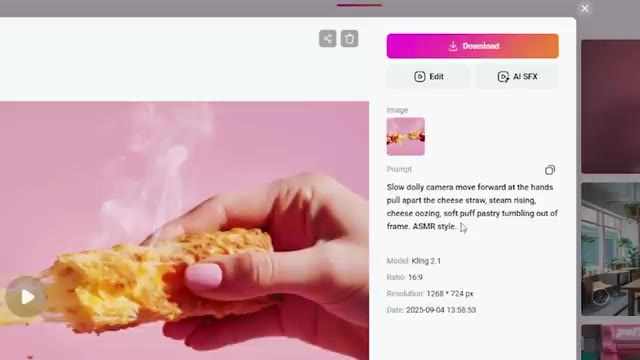
*Gros plan sur l'interface de FlexClip montrant la vidéo en cours de lecture et le panneau latéral avec le prompt exact utilisé pour la génération.*

---

### ⏱️ `[00:24:39 - 00:25:15]` | Segment #46

**🔊 Audio (Transcription Intégrale Mot pour Mot en Français) :**
> Et c'est ce qu'on a obtenu en retour et ça a l'air incroyablement réel. la façon dont le fromage se comporte, la façon dont la vapeur bouge. Ouais, wow. Vous pouvez voir ici également que le modèle utilisé était Kling, qui est l'un de mes modèles de génération de vidéo par IA préférés, je dois dire. Donc, comme je suis sûr que vous pouvez le voir, le processus à ce stade consiste simplement à faire tourner et à animer en continu nos images par IA en utilisant une variété de générateurs de vidéo différents. C'est celui que je viens de vous montrer sur FlexClip. Un autre super exemple ici de moi debout à l'extérieur de la boutique. Super réaliste.

**👁️ Analyse Visuelle d'Écran (gemini-3.5-flash-lite) :**
**Interface & Outils** : Interface web de FlexClip (outil de montage vidéo et de génération IA) avec panneau de configuration latéral, historique et lecteur vidéo central.

**Contenu textuel & Code** : Texte du prompt visible : "Slow dolly camera move forward at the hands pull apart the cheese straw, steam rising, cheese oozing, soft puff pastry tumbling out of frame. ASMR style." Modèle : Kling 2.1, Ratio : 16:9, Résolution : 1268 x 724 px, Date : 2025-09-04 13:58:53.

**Action / Démonstration** : Le créateur présente l'interface de FlexClip et les résultats de génération vidéo par IA en commentant les détails visuels (mouvement du fromage, vapeur) et le modèle utilisé (Kling).

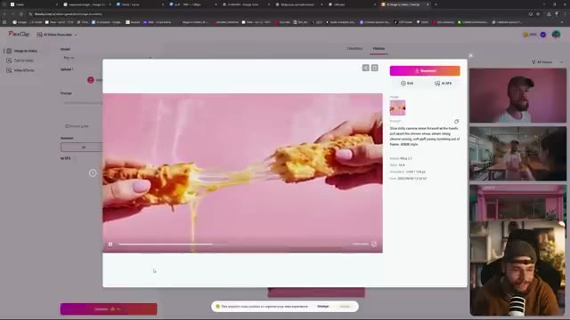
*Interface de l'outil FlexClip montrant la lecture d'une vidéo générée par IA représentant des mains étirant un feuilleté au fromage avec de la vapeur.*

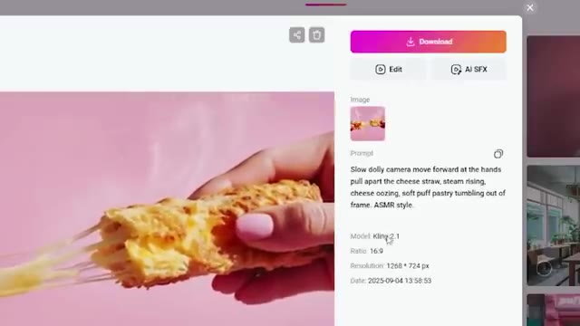
*Gros plan sur le panneau latéral de FlexClip indiquant les détails de génération, notamment le prompt textuel, le modèle Kling 2.1, le format 16:9 et la résolution 1268x724 px.*

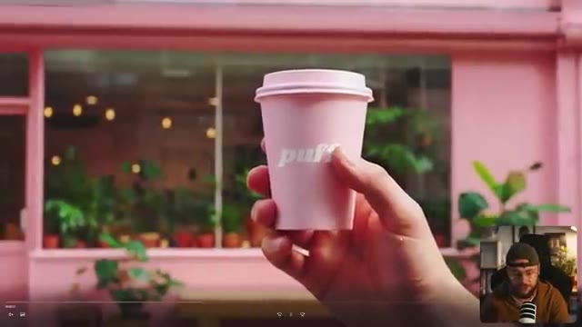
*Aperçu vidéo généré par IA montrant une main tenant un gobelet en papier rose avec l'inscription "puff" devant une boutique rose.*

---

### ⏱️ `[00:25:15 - 00:25:51]` | Segment #47

**🔊 Audio (Transcription Intégrale Mot pour Mot en Français) :**
> le mouvement et tout ça. J'adore. Et nous ne faisons que construire continuellement notre univers. C'est une façon plutôt cool et utile de voir les choses : imaginez que vous êtes un cinéaste essayant de réaliser un documentaire. Vous capturez donc simplement différents plans à la volée et vous vous dites dans votre tête : de quoi ai-je besoin pour donner à mon éditeur de quoi construire une histoire ? C'est essentiellement ce que nous faisons ici avec l'IA. Rassemblons simplement autant de vidéos différentes que possible pour construire cette marque, et ensuite c'est à l'éditeur, qui se trouve être aussi nous, de rassembler ces blocs pour

**👁️ Analyse Visuelle d'Écran (gemini-3.5-flash-lite) :**
**Interface & Outils** : Explorateur de fichiers Windows et lecteur vidéo avec incrustation caméra (PiP) du créateur.

**Contenu textuel & Code** : Noms de fichiers vidéo (ex: « Made with FlexClip AI-2025-09-04T141839.mp4 ») et dossier contenant des clips générés par IA.
[DESC_IMAGE_3] Écran bleu avec une icône de lecture multimédia.

**Action / Démonstration** : Le créateur montre des exemples de séquences vidéo générées par IA et navigue dans un dossier de fichiers sur son ordinateur.

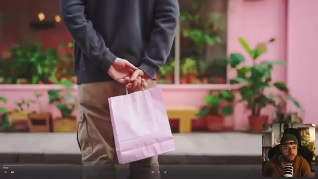
*Séquence vidéo générée par IA montrant de dos une personne tenant un sac rose devant une devanture de magasin rose.*

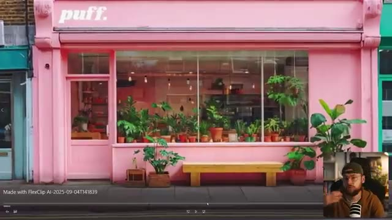
*Séquence vidéo générée par IA montrant la façade d'une boutique rose avec le mot « puff » inscrit sur l'enseigne et un banc en bois.*

*Bureau Windows avec un explorateur de fichiers ouvert affichant plusieurs clips vidéo générés.*

---

### ⏱️ `[00:25:51 - 00:26:27]` | Segment #48

**🔊 Audio (Transcription Intégrale Mot pour Mot en Français) :**
> pour construire une histoire et une marque. Maintenant bien sûr, je vous avais promis que je vous montrerais également une façon gratuite d'animer vos images générées par IA. Si vous êtes fan de mes vidéos et que vous me suivez depuis un petit moment maintenant, je vais me répéter comme un disque rayé, mais vous savez à quel point j'aime LM Arena, en particulier en utilisant Discord. Je vais donc mettre un lien vers le Discord de LM Arena juste en bas dans la section des commentaires car c'est un outil gratuit extraordinaire. C'est donc ennuyeux, il s'avère qu'actuellement LM Arena est en fait hors ligne, mais c'est super simple à utiliser. C'est la première fois que j'en vois réellement

**👁️ Analyse Visuelle d'Écran (gemini-3.5-flash-lite) :**
**Interface & Outils** : Explorateur de fichiers Windows et application Discord sur fond d'écran Windows, avec incrustation (PiP) du créateur en bas à droite.

**Contenu textuel & Code** : Dans l'explorateur de fichiers : dossiers et fichiers vidéo (.mp4) nommés "Made with PixVerse". Sur Discord : liste des serveurs IA (Luma, Midjourney, Kling, Higgsfield, LMArena) et liste des amis en ligne.

**Action / Démonstration** : Le créateur navigue d'abord dans un dossier de fichiers vidéo sur son ordinateur, puis bascule sur l'application Discord pour montrer la plateforme LM Arena.

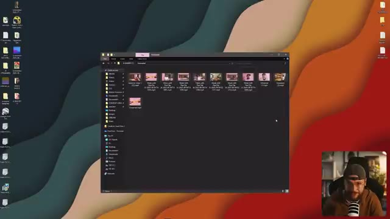
*Explorateur de fichiers Windows affichant un dossier contenant des vidéos générées par IA.*

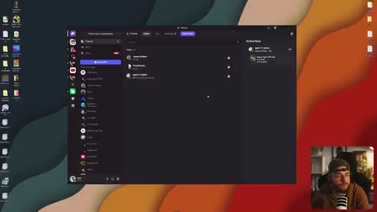
*Interface de l'application Discord ouverte montrant la liste des amis et des serveurs sur le panneau de gauche.*

---

### ⏱️ `[00:26:27 - 00:27:00]` | Segment #49

**🔊 Audio (Transcription Intégrale Mot pour Mot en Français) :**
> pose-le. Je l'utilise depuis des mois maintenant. Tout ce que tu fais, c'est d'importer une de tes images IA. Donc on en a toute une série bien sûr qu'on peut utiliser ici par exemple, on peut déposer cette image de notre membre du personnel qui remplit les étagères, tu déposes simplement ton texte de prompt et tu vas obtenir une vidéo IA de certains des meilleurs modèles du moment. Maintenant, c'est une loterie, ça te renvoie fondamentalement deux générations différentes provenant de modèles aléatoires, donc tu obtiendras de bons résultats, tu obtiendras aussi de sacrés mauvais résultats, mais si je vais de l'avant et te montre

**👁️ Analyse Visuelle d'Écran (gemini-3.5-flash-lite) :**
**Interface & Outils** : Application Discord (serveur LMArena / Video Arena) et visionneuse d'images de bureau Windows.

**Contenu textuel & Code** : Texte du prompt détaillé dans l'interface Discord : "A cinematic, 5-second opening shot of a premium podcast studio... Key instructions for NEO-3: - Duration: 5 seconds - Movement: Smooth camera dolly-in toward the podcast table - Lighting: Dark, neo-RGB light fades in (blue/purple) - Style: Cinematic, elegant, premium, futuristic - Emotion: Anticipation & excitement - Include: Attached logo/photo, subtly illuminated at the end." Messages d'erreur visibles : "Failed to generate image" et "Video Arena currently isn't available. Our team is looking into problems with the bot."

**Action / Démonstration** : Le créateur montre l'interface de test de génération vidéo sur Discord (LMArena) puis affiche une image d'exemple représentant une employée dans une boulangerie pour illustrer le processus d'entrée d'image.

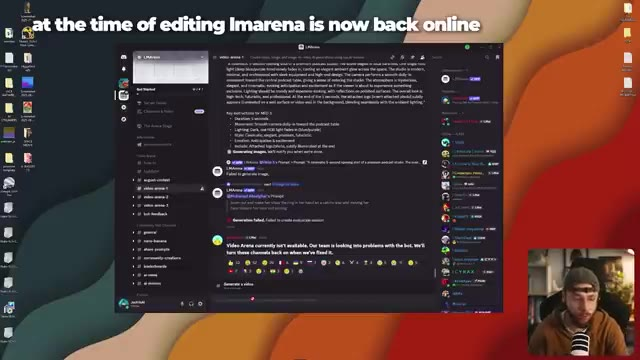
*Interface Discord de LMArena affichant des prompts textuels et des messages d'erreur du bot de génération vidéo.*

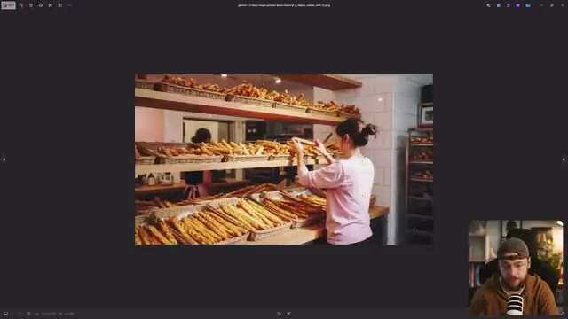
*Visionneuse d'images affichant une photo générée par IA représentant une femme dans une boulangerie remplissant des étagères de pâtisseries.*

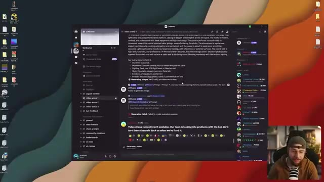
*Interface Discord de LMArena montrant à nouveau le salon de discussion avec le message indiquant que Video Arena est temporairement indisponible.*

---

### ⏱️ `[00:27:00 - 00:27:33]` | Segment #50

**🔊 Audio (Transcription Intégrale Mot pour Mot en Français) :**
> Ce très beau plan de la tasse de café provient directement d'Ella Marina, comme vous allez le voir dans une seconde avec le petit réclame à la fin des résultats que vous recevrez du Discord. Si vous souhaitez l'utiliser pour votre création de contenu ou pour la publicité que vous assemblez, vous pouvez simplement couper cette carte de fin en utilisant un logiciel de montage. Déposez-le dans Premiere Pro, DaVinci Resolve, CapCou, n'importe quoi de ce genre, et coupez simplement la fin. C'est aussi simple que ça. C'est ennuyeux de ne pas pouvoir vous montrer les gars en ce moment comment je ferais cela correctement. Mais habituellement la LM Arena, Discord, les arènes vidéo,

**👁️ Analyse Visuelle d'Écran (gemini-3.5-flash-lite) :**
**Interface & Outils** : Lecteur vidéo et application Discord.

**Contenu textuel & Code** : Texte à l'écran : "Compare the best video models at discord.gg/LMArena", logo Discord, et interface du serveur Discord avec des prompts et messages d'erreur.

**Action / Démonstration** : Présentation d'un exemple de vidéo générée par IA montrant une tasse de café, suivie de l'affichage du lien Discord de LM Arena et de l'interface du serveur de discussion.

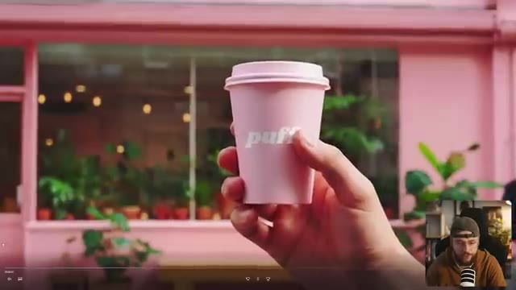
*Extrait vidéo montrant une main tenant une tasse de café rose avec l'inscription 'puff', devant un bâtiment rose avec des plantes.*

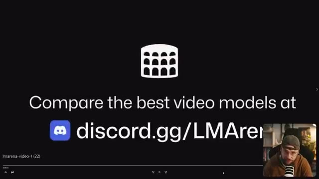
*Écran de fin noir affichant le logo de LM Arena et le texte 'Compare the best video models at discord.gg/LMArena'.*

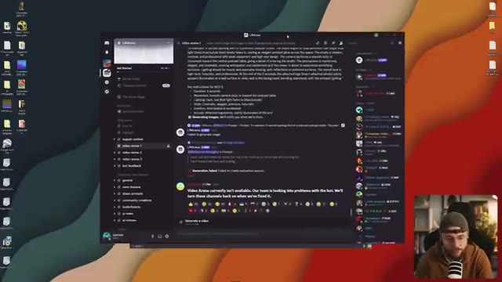
*Interface de l'application Discord affichant le serveur de LM Arena avec des canaux de discussion et des instructions de génération de vidéo par IA.*

---

### ⏱️ `[00:27:33 - 00:28:06]` | Segment #51

**🔊 Audio (Transcription Intégrale Mot pour Mot en Français) :**
> Ils fonctionnent vraiment, vraiment bien. Mais juste pour l'instant, ils semblent bugués. Je suis sûr qu'ils vont régler ça très rapidement. Et ensuite, vous pourrez, peut-être même après avoir regardé cette vidéo, une fois que ce sera réparé, aller créer des vidéos par IA gratuitement. Donc les gars, j'espère vraiment que cette vidéo vous a aidé. Si vous êtes propriétaire d'une petite entreprise et que vous vouliez savoir comment utiliser l'IA pour créer une publicité entière pour vous-même. Nous avons couvert toute une gamme d'outils, de conseils et d'astuces. Comme toujours, si vous avez la moindre question, n'hésitez pas à la poser en bas

**👁️ Analyse Visuelle d'Écran (gemini-3.5-flash-lite) :**
**Interface & Outils** : Interface Discord (application LMArena) avec panneau latéral gauche affichant la liste des salons (get-started, video-arena-3, etc.), et une incrustation vidéo (PiP) du créateur en bas à droite.

**Contenu textuel & Code** : Texte de l'interface Discord : "LMArena", salons textuels incluant "video-arena-3", et icônes de navigation. Sur le bureau, divers dossiers et raccourcis d'applications.

**Action / Démonstration** : Le créateur montre l'interface de l'application Discord sur son écran tout en parlant à la caméra visible dans l'encadré PiP.

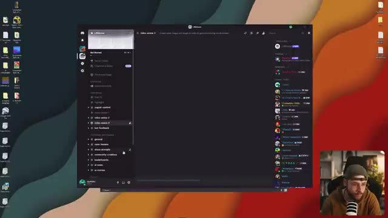
*Interface Discord montrant l'application LMArena avec ses différents salons textuels dans la colonne de gauche et le créateur en incrustation vidéo (PiP) en bas à droite.*

---

### ⏱️ `[00:28:06 - 00:28:43]` | Segment #52

**🔊 Audio (Transcription Intégrale Mot pour Mot en Français) :**
> dans la section des commentaires. Je ferai de mon mieux pour répondre au plus grand nombre possible. Rappelez-vous bien sûr que nous venons également de lancer les abonnements sur cette chaîne. Donc si vous souhaitez d'une autre manière me soutenir, vous êtes les bienvenus pour y participer. Comme je l'ai dit, vous obtiendrez l'accès à notre serveur Discord privé où nous pourrons partager toutes sortes d'idées incroyables sur la façon d'utiliser l'IA à des fins créatives. Merci infiniment comme toujours d'avoir regardé, les gens. Si vous voulez voir plus de mon contenu et que vous êtes nouveau, assurez-vous de lâcher un pouce bleu pour moi, pensez à vous abonner et bien sûr à activer cette cloche de notification pour ne jamais manquer aucun futur contenu. Passez une excellente journée les gars.

**👁️ Analyse Visuelle d'Écran (gemini-3.5-flash-lite) :**
**Interface & Outils** : Présentation face caméra sans partage d'écran

**Contenu textuel & Code** : Aucun contenu logiciel ou technique affiché à l'écran, uniquement le bureau Windows en arrière-plan avec un encadré PiP (Picture-in-Picture) montrant le créateur Jack dans son studio, puis Jack en gros plan face caméra.

**Action / Démonstration** : Le créateur s'adresse directement aux spectateurs en conclusion de sa vidéo pour les inciter à s'abonner, rejoindre les abonnements de la chaîne et participer au serveur Discord.

---

### ⏱️ `[00:28:43 - 00:28:44]` | Segment #53

**🔊 Audio (Transcription Intégrale Mot pour Mot en Français) :**
> on se retrouve pour la prochaine

**👁️ Analyse Visuelle d'Écran (gemini-3.5-flash-lite) :**
**Interface & Outils** : Bureau Windows avec icônes de raccourcis et incrustation (PiP) du créateur.

**Contenu textuel & Code** : Fond d'écran abstrait aux motifs de vagues dans des tons de vert, beige, orange et rouge. Icônes de dossiers et fichiers sur le bureau.

**Action / Démonstration** : Le créateur est visible en incrustation vidéo dans le coin inférieur droit, faisant ses adieux à la fin de la vidéo.

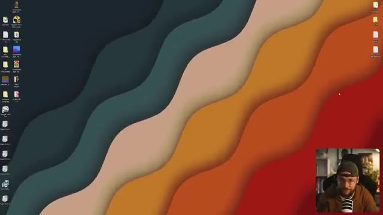
*Bureau d'ordinateur avec fond d'écran coloré à vagues et incrustation vidéo du créateur dans le coin inférieur droit.*

---
