# 🎬 Comment générer des images au format panoramique avec Nano Banana (3 astuces et conseils indispensables)

> **Chaîne** : [Jack Vs. AI](https://www.youtube.com/@JackVsAI)  
> **Titre original** : `How to Generate Widescreen Images with Nano Banana (3 Essential Tips & Tricks)`  
> **Lien YouTube** : [https://www.youtube.com/watch?v=jf9AuGe0rUA](https://www.youtube.com/watch?v=jf9AuGe0rUA)  
> **Date de publication** : 2025-09-11  
> **Durée** : 12m 00s (`720s`)  
> **Identifiant vidéo** : `jf9AuGe0rUA`  
> **Fiche Web Interactive** : [2025-09-11_YT-jf9AuGe0rUA_Comment générer des images au format panoramique avec Nano Banana (3 astuces et _by-whisper-v3-large-turbo+gemini-3.5-flash-lite.html](2025-09-11_YT-jf9AuGe0rUA_Comment générer des images au format panoramique avec Nano Banana (3 astuces et _by-whisper-v3-large-turbo+gemini-3.5-flash-lite.html)  
> **Captures de démonstration clés** : `41 captures réelles (anti-talking-head)`  
> **Modèles utilisés** : Audio: `large-v3-turbo` (Faster-Whisper int8 VPS) | Vision: `gemini-3.5-flash-lite` (Google AI Studio API)  

---

## 📌 Synthèse Exécutive & Outils

### 📌 Résumé
Dans cette vidéo, Jack, artiste VFX publicitaire cumulant plus d'une décennie d'expérience, s'attaque à l'un des problèmes les plus frustrants rencontrés par les créateurs utilisant l'outil d'intelligence artificielle « Nano Banana » (nom de code de la préversion d'image de Gemini 2.5 Flash) : la gestion erratique des formats d'image et le non-respect des prompts textuels. Alors que de nombreux utilisateurs se heurtent à des générations bloquées au format carré (1:1) ruinant leurs velléités de cinéma ou de publicité par IA au format plein cadre (16:9), Jack démontre qu'il ne s'agit pas d'un bug insurmontable, mais d'une question de logique dans l'ordre d'injection des assets visuels.

La méthode étape par étape de Jack repose sur une astuce de contournement fondamentale : le ratio final de l'image est dicté par le **dernier fichier visuel téléchargé** dans le prompt multifichiers. En inversant l'ordre de chargement (par exemple, en soumettant d'abord le logo carré, puis l'image de référence 16:9 en dernier), l'IA se cale automatiquement sur le bon ratio, court-circuitant ainsi sa tendance naturelle à imiter le format de la première image. Cette découverte technique s'accompagne d'une stratégie d'utilisation d'une plateforme tierce gratuite permettant de s'affranchir des contraintes des versions payantes et des filigranes, fluidifiant considérablement le pipeline de production vidéo.

Pour les créateurs de contenu, les réalisateurs et les monteurs publicitaires, ces enseignements transforment un outil perçu comme capricieux en un véritable moteur de production fiable. En éliminant les frictions liées au formatage et en évitant les étapes superflues de nettoyage de filigranes sous Photoshop, le workflow présenté permet de gagner un temps précieux, garantissant des assets visuels directement exploitables pour l'animation et le montage de films générés par IA.

### 🛠️ Outils, Modèles & Logiciels Présentés
* **Nano Banana** : Surnom donné à la préversion d'image de Gemini 2.5 Flash, utilisé ici comme le moteur central de génération et de composition d'images par IA.
* **Midjourney** : Modèle de génération d'images par IA employé en amont pour créer des décors de base réalistes (comme la fausse boutique) avant d'être réinjectés dans le pipeline.
* **Higgsfield** : Plateforme payante d'IA vidéo et d'imagerie qui intègre Nano Banana dans sa suite d'outils, nécessitant toutefois un abonnement complet.
* **LM Arena (lmarena.ai)** : Interface d'évaluation et de chat direct open-source permettant d'utiliser gratuitement Nano Banana sans générer le filigrane de coin inférieur droit.
* **Gemini** : L'écosystème natif de Google (accessible sur application mobile et web) permettant d'utiliser Nano Banana mais apposant un filigrane sur les créations.
* **Photoshop** : Logiciel Adobe mentionné pour sa fonction de « Remplissage génératif », utile mais chronophage pour effacer les filigranes d'IA.
* **Submagic** : Outil de sous-titrage et d'optimisation vidéo mentionné en tant que sponsor de la vidéo.

### 🔑 Points Clés & Enseignements Stratégiques
* **Le piège du ratio 1:1 par défaut** : Nano Banana a tendance à ignorer les instructions textuelles de format (comme « 16 par 9 ») si le prompt contient des images aux ratios disparates, se basant par défaut sur le format de l'élément visuel fourni.
* **La règle d'or de l'ordre de téléchargement** : Pour imposer un format 16:9 à l'IA lors d'une fusion d'images, le fichier de référence au format 16:9 **doit impérativement être téléchargé en dernier** dans le prompt multi-images.
* **Neutralisation des hallucinations de format** : En appliquant rigoureusement l'inversion de l'ordre des uploads, l'IA respecte le ratio souhaité sans qu'il soit nécessaire de surcharger le prompt textuel d'instructions de dimensions.
* **Exploitation gratuite via LM Arena** : Il est possible d'accéder à l'intégralité des fonctionnalités de Nano Banana sans débourser un centime en passant par la plateforme de test de modèles `lmarena.ai`.
* **Suppression native du filigrane** : L'utilisation de LM Arena évite l'apparition du filigrane Gemini dans le coin inférieur droit, contournant ainsi le besoin d'un nettoyage post-production.
* **Navigation sur LM Arena** : Pour accéder à l'outil, il faut impérativement se rendre sur le site, sélectionner l'option « Direct Chat » dans le menu déroulant supérieur gauche, puis cocher « Generate Images ».
* **Sélection du bon modèle** : S'assurer que le modèle par défaut sélectionné est bien « Gemini 2.5 flash image preview », qui correspond techniquement à l'outil Nano Banana.
* **Optimisation du pipeline de production publicitaire** : Éviter l'étape de nettoyage des filigranes sous Photoshop fait gagner un temps considérable dans un pipeline de création de films par IA itératif et rapide.
* **Cohérence de la composition de marque** : L'outil excelle dans l'incrustation d'éléments graphiques précis (comme des logos textuels « puff ») sur des objets du quotidien (gobelets, sacs, t-shirts) tout en préservant le réalisme.
* **Gestion d'une version bêta** : Google admet que Nano Banana est en phase bêta ; l'utilisation de méthodes de contournement (workarounds) structurelles est donc indispensable pour fiabiliser les résultats professionnels.

---

## ⏱️ Chronologie & Transcription Complète Audio & Visuelle (Mot pour Mot)

### ⏱️ `[00:00:00 - 00:00:29]` | Segment #01

**🔊 Audio (Transcription Intégrale Mot pour Mot en Français) :**
> Tout le monde est obsédé par Nano Banana en ce moment, mais pourquoi n'arrivez-vous jamais à faire ce que vous demandez à cet outil d'intelligence artificielle ? Mauvais ratios d'image, générations bizarres, et parfois un Nano Banana qui ignore totalement vos prompts. Je comprends, c'est super frustrant, mais je suis là pour vous aider. Et restez avec moi car dans ce guide ultime, je vais vous transmettre trois conseils essentiels pour le nouvel éditeur d'images de Google. Et le dernier est un petit secret dont je n'entends jamais personne parler.

**👁️ Analyse Visuelle d'Écran (gemini-3.5-flash-lite) :**
**Interface & Outils** : Présentation par le créateur dans des décors générés par IA (sans interface logicielle ni partage d'écran).

**Contenu textuel & Code** : Texte affiché à l'écran au fil de la narration : "with nano banana", "and sometimes", "ultimate guide", "never hear". Visuels de style cinématographique illustrant le propos (temple mystérieux, tournage sur fond vert avec des techniciens, banane dorée).

**Action / Démonstration** : Le créateur illustre le propos à travers des scènes narratives générées par IA (exploration d'un temple, tournage en studio avec fond vert) tout en s'exprimant face caméra.

---

### ⏱️ `[00:00:29 - 00:00:49]` | Segment #02

**🔊 Audio (Transcription Intégrale Mot pour Mot en Français) :**
> Je suis Jack, je suis artiste VFX dans l'industrie publicitaire depuis plus d'une décennie maintenant, et j'ai travaillé pour nombre des plus grandes marques de la planète. Et honnêtement, c'est l'un des outils les plus passionnants que j'aie vus depuis des années. Mais voilà le problème, Nano Banana ne brille que si vous l'utilisez de la bonne manière. Alors plongeons-nous dedans et je vais vous montrer comment libérer tout son potentiel.

**👁️ Analyse Visuelle d'Écran (gemini-3.5-flash-lite) :**
**Interface & Outils** : Présentation face caméra sans partage d'écran

**Contenu textuel & Code** : Aucun contenu logiciel ou interface affiché à l'écran, uniquement le créateur parlant face caméra dans son studio.

**Action / Démonstration** : Jack s'adresse directement au public depuis son studio, gesticulant légèrement pour appuyer ses propos.

---

### ⏱️ `[00:00:49 - 00:01:12]` | Segment #03

**🔊 Audio (Transcription Intégrale Mot pour Mot en Français) :**
> Parce que si vous vous intéressez à la réalisation de films ou à la publicité par IA, Nano Banana est votre meilleur ami, vous ne le savez tout simplement pas encore. Bien sûr les gars, si vous appréciez le contenu d'aujourd'hui, assurez-vous de lâcher un gros pouce bleu pour moi, pensez à vous abonner et bien sûr à activer cette icône de cloche de notification. Nous venons également de lancer les abonnements sur la chaîne, donc si vous souhaitez une autre façon de me soutenir et d'accéder également au Discord privé, impliquez-vous là-dedans.

**👁️ Analyse Visuelle d'Écran (gemini-3.5-flash-lite) :**
**Interface & Outils** : Présentation face caméra sans partage d'écran

**Contenu textuel & Code** : Aucun contenu logiciel ou technique affiché à l'écran.

**Action / Démonstration** : Le créateur parle face caméra dans son studio, s'adressant aux spectateurs pour les inciter à s'abonner et à rejoindre les abonnements de la chaîne.

---

### ⏱️ `[00:01:13 - 00:01:47]` | Segment #04

**🔊 Audio (Transcription Intégrale Mot pour Mot en Français) :**
> Très bien les gars, entrons directement dans le vif du sujet. Donc la première chose dont je veux parler, ce sont les formats d'image, parce que j'ai beaucoup de gens dans ma section commentaires qui disent qu'ils galèrent vraiment avec ça. Que Nano Banana continue de leur donner du un par un, c'est-à-dire des générations au format carré, et ce n'est tout simplement pas ce que vous cherchez. Si vous essayez d'utiliser Nano Banana pour le cinéma par IA, vous allez vouloir un rendu plein cadre 16 par 9. Alors comment faire en sorte que Nano Banana nous rende la taille de cadre que nous voulons réellement et qui correspond à notre cas d'utilisation ? C'est en fait assez simple,

**👁️ Analyse Visuelle d'Écran (gemini-3.5-flash-lite) :**
**Interface & Outils** : Google Gemini (interface web avec panneau latéral gauche et historique de conversation au centre) et incrustation vidéo (PiP) du créateur en bas à droite.

**Contenu textuel & Code** : On distingue des prompts textuels décrivant des plans cinématographiques ("Mid shot of the bearded man leaning up against the outside of the shot...", "Shot of the bearded man, he is wearing a pastel pink apron...") accompagnés d'images générées montrant un homme barbu dans un décor de café/boutique.

**Action / Démonstration** : Le créateur montre son écran avec une session Google Gemini ouverte, présentant des exemples de générations d'images contextuelles tout en parlant.

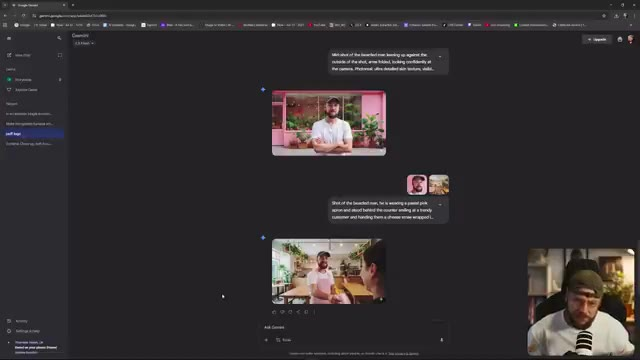
*Interface de Google Gemini affichant l'historique des prompts et les images générées avec un encadré vidéo du créateur en bas à droite.*

---

### ⏱️ `[00:01:47 - 00:02:22]` | Segment #05

**🔊 Audio (Transcription Intégrale Mot pour Mot en Français) :**
> et je vais simplement faire défiler vers le haut ici. Vous remarquerez peut-être que certaines de ces images proviennent de la dernière vidéo que j'ai faite concernant la publicité par IA. Et la raison pour laquelle je veux vous montrer ceci, c'est que c'est en fait un très bon exemple en termes de problème de format d'image. L'une des très grandes fonctionnalités de Nano Banana est la possibilité de combiner plusieurs images. Et vous pouvez voir ici, c'est exactement ce que nous avons fait. Nous avons une génération 16/9 d'un homme tenant une tasse de café à emporter devant ma boutique. Je dis ma boutique, c'est en fait une fausse boutique que j'ai générée.

**👁️ Analyse Visuelle d'Écran (gemini-3.5-flash-lite) :**
**Interface & Outils** : Interface de Google Gemini affichée dans un navigateur web, avec la webcam du créateur visible en incrustation (PiP) dans le coin inférieur droit.

**Contenu textuel & Code** : Prompts visibles dans l'interface : "Put the logo reading 'puff' on the top peer shop from outside the store, make it large and legible" et "Put the man in the green coat leaning on the outside of the shop instead of the man in the denim jacket." Un fichier image intitulé "gemini-1.5-flash-image-context-nano-banana_brow-for-a_take-up_2-0ft.jpg" est ouvert.

**Action / Démonstration** : Le créateur fait défiler une conversation sur l'interface de Google Gemini pour montrer des exemples d'images générées combinant plusieurs éléments, puis zoome sur une image spécifique montrant une main tenant un gobelet de café.

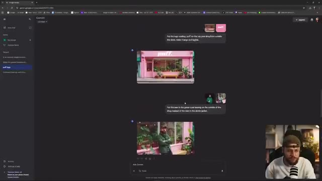
*Interface de Google Gemini montrant un historique de conversation avec des prompts de génération d'images d'une boutique rose et d'un homme en veste verte, avec la webcam du créateur en incrustation (PiP).*

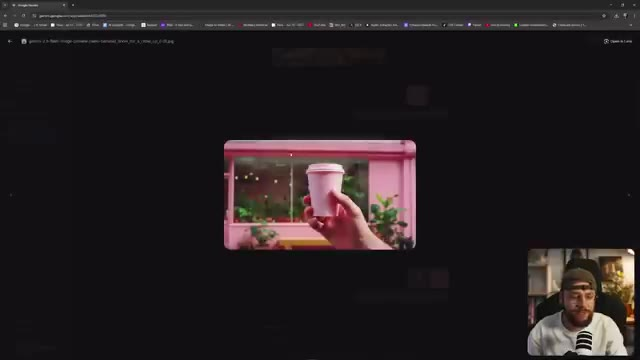
*Affichage d'une image générée au format 16/9 montrant une main tenant une tasse de café rose devant une boutique, avec la webcam du créateur en incrustation (PiP) dans le coin inférieur droit.*

---

### ⏱️ `[00:02:22 - 00:02:58]` | Segment #06

**🔊 Audio (Transcription Intégrale Mot pour Mot en Français) :**
> avec Midjourney, mais pour continuer. J'ai demandé à Nano Banana de prendre ce logo et de l'incruster sur le gobelet de café. Et vous pouvez voir que ça fait un travail vraiment formidable. Cependant, le résultat qu'il me donne est au format carré un par un, exactement ce que je ne voulais pas parce que je savais que j'allais ensuite animer ceci et en faire une publicité. Alors pourquoi est-ce que cela m'est arrivé et pourquoi est-ce que cela continue de vous arriver ? Nano Banana prend le rapport hauteur/largeur de l'image que vous lui fournissez et il

**👁️ Analyse Visuelle d'Écran (gemini-3.5-flash-lite) :**
**Interface & Outils** : Interface web de Google Gemini (anciennement Bard) avec affichage d'un panneau latéral à gauche, d'une zone de chat centrale et de vignettes d'images. Un encadré PiP en bas à droite montre le créateur face caméra.

**Contenu textuel & Code** : Texte du prompt visible dans l'interface : "Put the logo that reads 'puff.' on the coffee cup".

**Action / Démonstration** : Le créateur montre et commente les résultats d'image générés par l'IA dans l'interface de Google Gemini, en soulignant le problème du format carré (1x1).

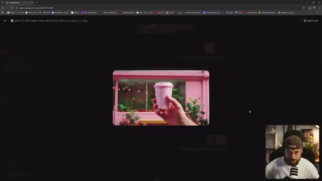
*Affichage agrandi d'une image générée représentant une main tenant un gobelet rose dans l'interface de Google Gemini.*

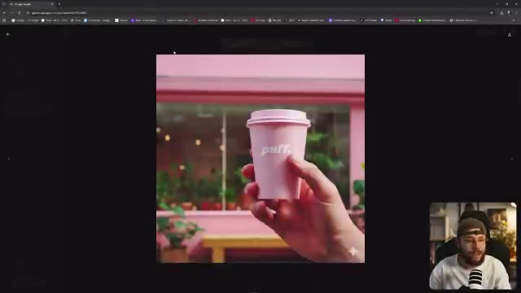
*Affichage en format carré (1x1) du résultat final généré avec le logo "puff." incrusté sur le gobelet.*

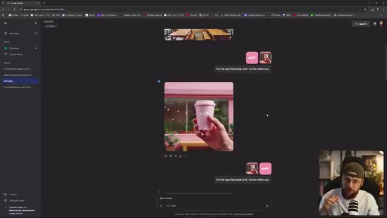
*Vue globale de l'interface de Google Gemini montrant l'historique de discussion, les prompts et les images générées.*

---

### ⏱️ `[00:02:58 - 00:03:32]` | Segment #07

**🔊 Audio (Transcription Intégrale Mot pour Mot en Français) :**
> pour correspondre à ce ratio d'aspect. Donc si vous mettez une image de un sur un, vous allez récupérer une image de un sur un en retour, même si vous dites à Nano Banana de me sortir un 16 par 9 dans votre prompt textuel. Il va simplement ignorer cela. Maintenant, évidemment, notre exemple ici est un peu plus compliqué parce que nous avons une image 16 par 9 et nous avons aussi une image de un sur un que nous combinons l'une avec l'autre. Donc dans ce cas, comment faire pour que Nano Banana nous donne notre sortie en 16 par 9 ? Tout est lié à

**👁️ Analyse Visuelle d'Écran (gemini-3.5-flash-lite) :**
**Interface & Outils** : Interface web de Google Gemini avec affichage en médaillon (PiP) du créateur en bas à droite.

**Contenu textuel & Code** : Texte du prompt visible : 'Put the logo that reads 'puff.' on the coffee cup' et nom de fichier 'puff.png'.
[SCENE] Le créateur montre l'interface de Gemini et illustre le problème des formats d'image combinés (1x1 et 16x9).

**Action / Démonstration** : Démonstration pédagogique et présentation du workflow.

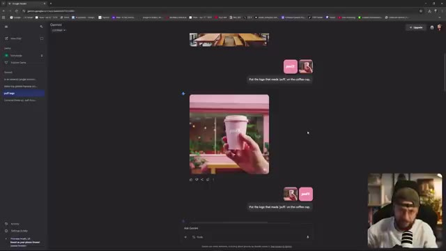
*Interface Google Gemini affichant une conversation avec des images combinées (16x9 et 1x1) et le prompt texte demandant d'ajouter le logo sur le gobelet de café.*

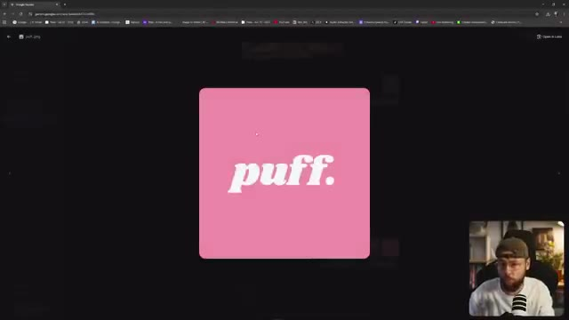
*Gros plan sur le fichier image 'puff.png' montrant le logo carré rose avec le texte 'puff.' en blanc.*

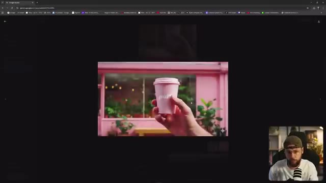
*Affichage d'une image générée au format 16x9 montrant une main tenant un gobelet rose devant une devanture de magasin.*

---

### ⏱️ `[00:03:32 - 00:04:09]` | Segment #08

**🔊 Audio (Transcription Intégrale Mot pour Mot en Français) :**
> l'ordre dans lequel vous téléchargez vos multiples images. Vous voulez vous assurer que l'image qui va servir de guide pour le ratio d'aspect est la dernière que vous entrez dans Gemini. Donc par exemple, vous téléchargeriez votre logo 1x1 d'abord, vous téléchargeriez ensuite votre image 16x9 et cela garantira qu'après votre prompt textuel, Gemini va également produire un 16x9. Donc dans ce cas, évidemment, cela n'a pas fonctionné à cause de l'ordre des images que j'ai téléchargées. Mais ensuite, vous pouvez voir juste en dessous que j'ai utilisé exactement le même

**👁️ Analyse Visuelle d'Écran (gemini-3.5-flash-lite) :**
**Interface & Outils** : Google Gemini (navigateur web), avec le créateur en incrustation vidéo (PiP) en bas à droite.

**Contenu textuel & Code** : Le prompt textuel visible dans l'interface indique : "Put the logo that reads 'puff' on the coffee cup", ainsi que deux petites images miniatures représentant le logo et la tasse de café. L'image générée au centre montre une main tenant un gobelet de café rose devant une vitrine de magasin.

**Action / Démonstration** : Le créateur montre l'interface de Gemini avec ses prompts et les résultats d'images générées, tout en expliquant l'importance de l'ordre de chargement des images pour définir le format de sortie.

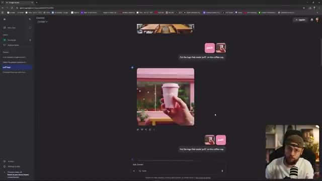
*Interface de Gemini affichant l'historique des prompts, des images téléchargées et une image générée montrant une main tenant un gobelet rose, avec le créateur visible en incrustation (PiP) en bas à droite.*

---

### ⏱️ `[00:04:09 - 00:04:43]` | Segment #09

**🔊 Audio (Transcription Intégrale Mot pour Mot en Français) :**
> invite textuelle. Je ne mentionne pas du tout les ratios d'image. La seule chose que j'ai faite différemment, c'est que j'ai téléchargé mon logo 1x1 en premier, puis j'ai téléchargé mon image 16x9 et, comme par magie, j'ai récupéré ma génération au bon ratio d'image. Maintenant, Google a ouvertement admis que Nano Banana est toujours en version bêta, donc parfois il ne respecte pas les ratios d'image comme il le devrait. Personnellement, quand j'ai commencé à utiliser cette petite astuce de contournement, ou peu importe comment vous voulez l'appeler, je n'ai jamais eu le moindre problème de suivi.

**👁️ Analyse Visuelle d'Écran (gemini-3.5-flash-lite) :**
**Interface & Outils** : Interface web de Gemini (Google) avec un panneau latéral de navigation à gauche, un flux de discussion central et une incrustation vidéo du présentateur en bas à droite.

**Contenu textuel & Code** : Texte de prompt visible « Put the logo that reads 'puff' on the coffee cup » avec deux fichiers d'images joints (le logo et l'image principale).

**Action / Démonstration** : Le créateur montre l'interface de l'outil de génération d'images et défile à l'écran pour illustrer le résultat de l'importation de ses fichiers au bon ratio.

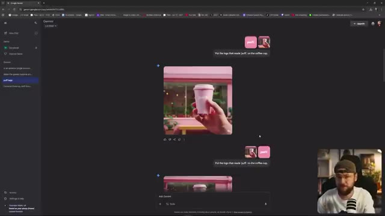
*Interface Google affichant une conversation avec une image générée d'une main tenant un gobelet de café rose, avec le présentateur visible en incrustation PiP.*

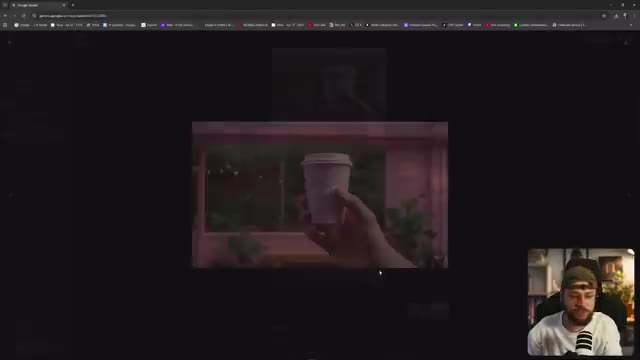
*Interface Google montrant un zoom ou un aperçu centré d'une image générée au format paysage dans l'interface de chat.*

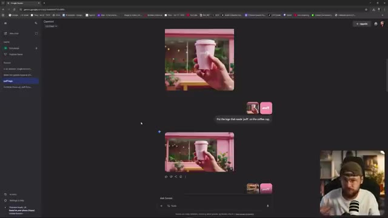
*Interface Google affichant l'historique des images générées et des requêtes précédentes avec les vignettes correspondantes.*

---

### ⏱️ `[00:04:43 - 00:05:20]` | Segment #10

**🔊 Audio (Transcription Intégrale Mot pour Mot en Français) :**
> ça et si je fais défiler un peu plus vers le bas, vous pouvez voir un autre super exemple, on a exactement le même ordre en termes de logo téléchargé sur Gemini en premier, puis une image 16 par 9, une autre légèrement différente ici. Un prompt textuel très similaire. Mets le logo avec l'inscription puff sur le dos du t-shirt de la femme. Rends-le grand et lisible. Et comme je l'ai mis dans le bon ordre, on récupère notre sortie en 16 par 9. Si je les avais mis dans l'autre sens, j'aurais récupéré ceci en un par un. Et encore une fois, vous pouvez voir où j'ai réellement mis le logo sur la boutique elle-même. Notre astuce a fonctionné une fois

**👁️ Analyse Visuelle d'Écran (gemini-3.5-flash-lite) :**
**Interface & Outils** : Interface web de Google Gemini affichée en plein écran avec la webcam du créateur incrustée en bas à droite (PiP).

**Contenu textuel & Code** : Prompts textuels visibles : "Put the logo that reads 'puff' on the coffee cup." et "Put the logo that reads 'puff' on the back of the women's t-shirt, make it large and readable." avec des images de prévisualisation téléchargées.

**Action / Démonstration** : Le présentateur commente et montre à l'écran les exemples de prompts et de résultats générés par Gemini, en expliquant l'importance de l'ordre des éléments importés.

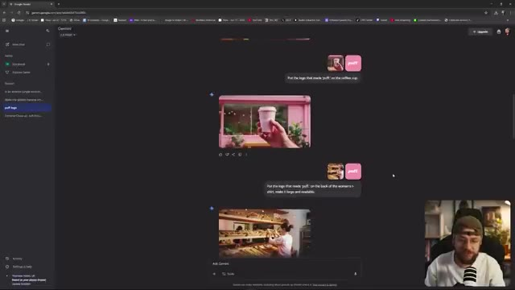
*Interface du navigateur affichant l'historique des conversations avec Gemini, montrant plusieurs prompts textuels et des images générées avec un encadré vidéo du créateur en bas à droite.*

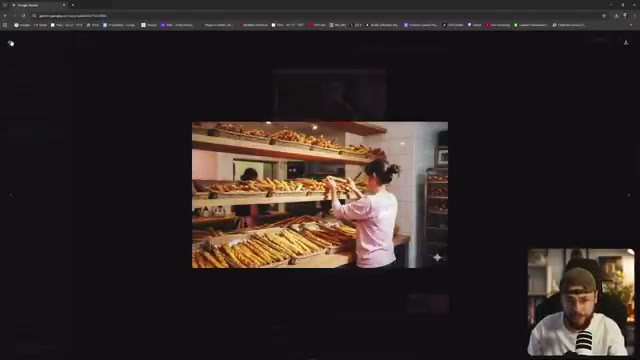
*Gros plan sur une image 16 par 9 générée montrant une femme dans une boulangerie, avec l'encadré vidéo du créateur en bas à droite.*

---

### ⏱️ `[00:05:20 - 00:05:52]` | Segment #11

**🔊 Audio (Transcription Intégrale Mot pour Mot en Français) :**
> Encore une fois, vous pouvez voir plusieurs fois que cette astuce fonctionne, donc si vous rencontrez des problèmes, les gars, commencez à l'utiliser. La prochaine chose dont je veux parler est la façon dont vous pouvez réellement accéder à Nano Banana gratuitement et, à mon avis, c'est la meilleure façon d'utiliser l'outil. Maintenant, bien sûr, de nombreuses plateformes payantes comme FreePick et Higgsfield ont intégré Nano Banana dans leur ensemble d'outils, mais vous allez devoir payer un abonnement pour leur service complet afin d'accéder à Nano Banana. Grâce à LM Arena

**👁️ Analyse Visuelle d'Écran (gemini-3.5-flash-lite) :**
**Interface & Outils** : Interface de Google Gemini et LMSYS LM Arena avec les chats de génération d'images, le tout avec le créateur en incrustation vidéo (PiP) dans le coin inférieur droit.

**Contenu textuel & Code** : Prompts textuels visibles dans le chat comme "Put the logo that reads 'puff' on the back of the woman's t-shirt..." et le modèle "imagen-3.0-flash-image-preview (nano-banana)" sur LM Arena.

**Action / Démonstration** : Le créateur navigue et démontre l'utilisation de l'outil Nano Banana à travers différentes interfaces de génération d'images, tout en s'exprimant face caméra dans le coin de l'écran.

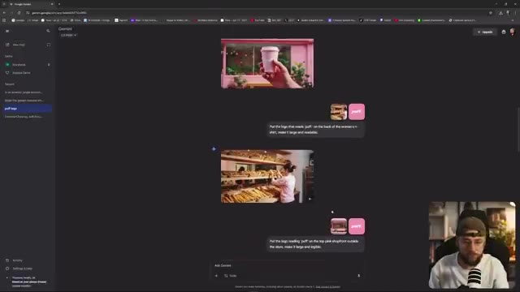
*Interface Google Gemini affichant l'historique des chats avec des images générées et le créateur en incrustation (PiP).*

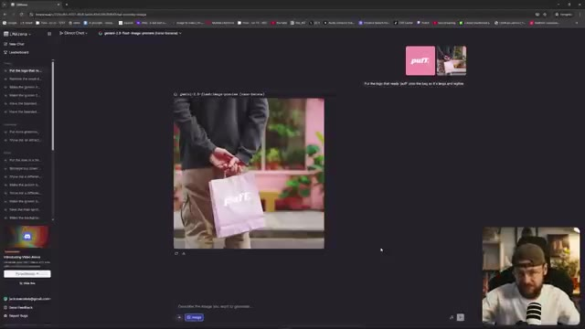
*Interface de LM Arena (LMSYS Chatbot Arena) montrant un chat de génération d'images avec le modèle "imagen-3.0-flash-image-preview (nano-banana)" et le créateur en PiP.*

---

### ⏱️ `[00:05:52 - 00:06:27]` | Segment #12

**🔊 Audio (Transcription Intégrale Mot pour Mot en Français) :**
> Cependant, vous pouvez utiliser l'outil et toutes ses fonctionnalités, et le point positif est que vous n'allez pas vous retrouver avec ce filigrane Gemini dans le coin inférieur droit. Vous pouvez même télécharger, comme vous pouvez le voir ici, plusieurs images pour les combiner. J'ai téléchargé un format 16x9 de ce sac en papier, puis un logo un par un, et j'ai dit : "mets le logo avec l'inscription puff sur le sac pour qu'il soit grand et lisible", et voilà, exactement ce que nous avons demandé sans dépenser un seul centime et sans avoir ce fichu

**👁️ Analyse Visuelle d'Écran (gemini-3.5-flash-lite) :**
**Interface & Outils** : Interface web de Llama.ai avec barre latérale à gauche, zone de chat central affichant l'image générée et les miniatures des images sources uploadées en haut à droite. Le créateur apparaît en incrustation (PiP) dans le coin inférieur droit.

**Contenu textuel & Code** : Texte du prompt visible : "Put the logo that reads 'puff' onto the bag so it's large and legible". Modèle mentionné dans l'interface : `gemini-2.5-flash-image-preview`. Miniatures de deux images sources uploadées (le sac 16x9 et le logo).

**Action / Démonstration** : Le créateur montre le résultat de la combinaison de plusieurs images et l'application d'un prompt pour incruster un logo sur un sac en papier sans filigrane.

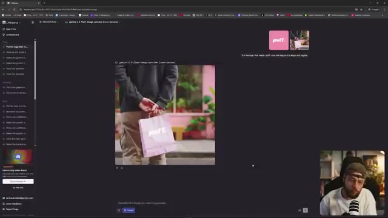
*Interface de Llama.ai avec le résultat de la génération montrant le sac en papier rose avec le logo "puff".*

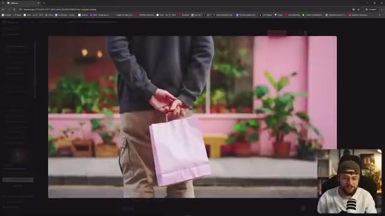
*Gros plan sur l'image générée montrant la personne tenant le sac en papier rose dans la rue.*

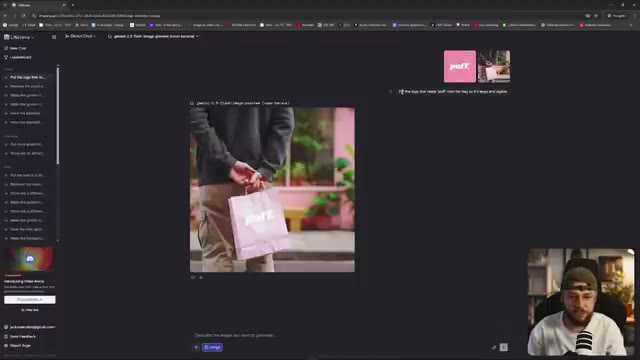
*Interface de Llama.ai affichant le prompt textuel et les images sources combinées en haut à droite.*

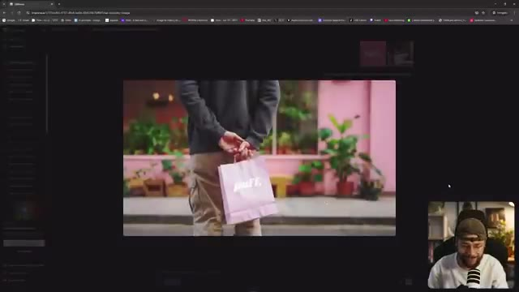
*Gros plan centré sur le visuel généré avec le sac et son logo, affiché en plein écran dans l'interface.*

---

### ⏱️ `[00:06:27 - 00:07:01]` | Segment #13

**🔊 Audio (Transcription Intégrale Mot pour Mot en Français) :**
> Filigrane Gemini dans le coin inférieur droit. Alors, comment accédons-nous à LMArena ? C'est en fait vraiment très simple, vous voulez juste taper dans votre navigateur web lmarena.ai. Lorsque vous vous connectez pour la première fois à l'outil, il va ressembler exactement à ceci, donc vous voulez aller dans le coin supérieur gauche et sélectionner "Direct Chat" dans ce petit menu déroulant. Vous voulez ensuite descendre ici là où vous entreriez votre invite textuelle et vous assurer de sélectionner "Generate Images". Et vous remarquerez maintenant que par défaut Gemini 2.5 flash image preview a été sélectionné, autrement connu sous le nom de Nano Banana. Je vois un

**👁️ Analyse Visuelle d'Écran (gemini-3.5-flash-lite) :**
**Interface & Outils** : Interface web de LMArena (lmarena.ai) sur navigateur avec affichage des chats et options de génération d'images, incluant une vue en incrustation (PiP) du présentateur Jack.

**Contenu textuel & Code** : URL "lmarena.ai", texte "Find the best AI for you", barre de saisie de prompt "Ask anything...", divers onglets et menus latéraux ("New Chat", "Leaderboard").

**Action / Démonstration** : Navigation sur le site LMArena pour expliquer comment accéder aux fonctionnalités de chat direct et de génération d'images.

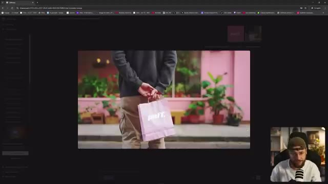
*Interface de LMArena affichant une image générée au centre avec le créateur en bas à droite en médaillon.*

*Page d'accueil de LMArena avec la barre de recherche centrale "Find the best AI for you" et le panneau latéral de navigation.*

---

### ⏱️ `[00:07:01 - 00:07:37]` | Segment #14

**🔊 Audio (Transcription Intégrale Mot pour Mot en Français) :**
> beaucoup de gens dans mes commentaires disent qu'ils ne peuvent pas accéder à Nano Banana via Ella Marina. Je n'ai jamais eu de problèmes et j'utilise cet outil chaque jour. Maintenant, juste pour vous montrer les gars, bien sûr vous pouvez aussi accéder à Nano Banana via Gemini lui-même. C'est à la fois sur votre application mobile ainsi que via un navigateur web. Vous pouvez voir ici que nous avons quelques exemples de combinaison de différentes images au sein de Gemini lui-même, mais nous obtenons toujours le filigrane dans le coin inférieur droit. Je sais que ce n'est pas un gros problème de l'enlever. Vous pourriez facilement utiliser quelque chose comme

**👁️ Analyse Visuelle d'Écran (gemini-3.5-flash-lite) :**
**Interface & Outils** : Navigateur web affichant l'interface de LMSYS Arena (LMArena) avec le modèle Gemini 2.5-flash-image-preview, ainsi que Google Gemini dans la seconde image. Le créateur apparaît en incrustation (PiP) dans le coin inférieur droit.

**Contenu textuel & Code** : Texte « Find the best AI for you », barre de prompt avec le bouton « Image », sélection du modèle « gemini-2.5-flash-image-preview (non-demo) », et une image générée montrant une boutique rose avec l'enseigne « puff. ».

**Action / Démonstration** : Le créateur navigue sur le web pour montrer l'interface de LMArena et l'utilisation de Gemini pour combiner des images, tout en commentant le filigrane visible en bas à droite.

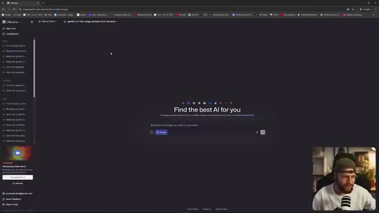
*Interface d'un site web montrant l'outil de génération d'images avec le modèle Gemini 2.5-flash-image-preview.*

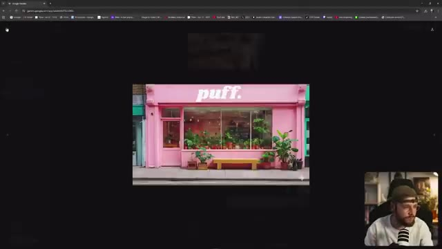
*Interface Google Gemini affichant le résultat d'une génération d'image représentant une vitrine de magasin rose avec l'inscription « puff ».*

---

### ⏱️ `[00:07:37 - 00:08:11]` | Segment #15

**🔊 Audio (Transcription Intégrale Mot pour Mot en Français) :**
> Remplissage génératif Photoshop et il y a probablement tout un tas d'autres outils de nettoyage par IA que vous pourriez utiliser. Mais vous savez, si vous vous intéressez à la création de films par IA, c'est un processus assez long. Ça peut prendre beaucoup de temps pour obtenir les résultats que vous voulez. Donc ajouter une étape supplémentaire consistant à devoir enlever un logo tout le temps, c'est juste un peu pénible dont on pourrait bien se passer. Avant de passer à ce troisième et dernier conseil, les gars, celui dont personne ne parle vraiment, je tiens à remercier Submagic d'avoir sponsorisé la vidéo d'aujourd'hui. C'est un outil conçu pour vous aider à faire des shorts dynamiques

**👁️ Analyse Visuelle d'Écran (gemini-3.5-flash-lite) :**
**Interface & Outils** : Google Gemini et le site web de Submagic (submagic.co) affichés en partage d'écran, avec le créateur visible en incrustation (PiP) dans le coin inférieur droit.

**Contenu textuel & Code** : Sur Gemini : "Put the logo reading 'puff' on the top pink shopfront outside the store, make it large and legible.", "Put the man in the green coat leaning on the outside of the shop instead of the man in the denim jacket." Sur Submagic : "Create viral shorts in seconds with AI", notes Google 4.9, Trustpilot 4.8.

**Action / Démonstration** : Le créateur navigue à l'écran entre Google Gemini et le site de Submagic tout en commentant le processus de création vidéo par IA et en présentant le sponsor.

*Interface de Google Gemini affichant une image générée d'une boutique rose avec le logo "puff." et le créateur en bas à droite en PiP.*

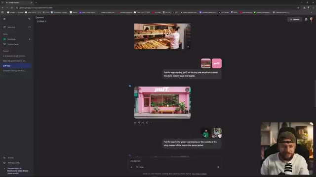
*Interface de Google Gemini montrant l'historique de discussion, les prompts de génération d'images et les résultats.*

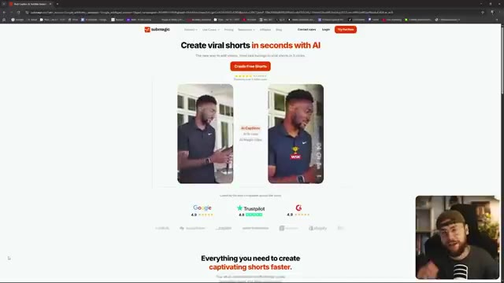
*Page d'accueil du site Submagic présentant l'outil de création de shorts viraux avec des exemples de vidéos avant/après.*

---

### ⏱️ `[00:08:11 - 00:08:34]` | Segment #16

**🔊 Audio (Transcription Intégrale Mot pour Mot en Français) :**
> formez du contenu en quelques clics seulement. Vous pouvez donc aller de l'avant et importer votre vidéo. Et si nous cliquons sur générer les sous-titres, Submagic va automatiquement faire exactement ce qui est écrit sur la boîte. Vous pouvez donc voir ici que nous avons un large éventail de sous-titres parmi lesquels choisir, qui sont basés sur certains des créateurs les plus populaires de la planète. Et si nous remontons tout en haut ici, vous pouvez également voir une option pour le b-roll.

**👁️ Analyse Visuelle d'Écran (gemini-3.5-flash-lite) :**
**Interface & Outils** : Interface web de l'outil Submagic (submagic.co) avec vue PiP (Picture-in-Picture) de Jack en bas à droite.

**Contenu textuel & Code** : Textes visibles : « Create viral shorts in seconds with AI », « Create Free Shorts », « Language: US English », « Choose Style » avec de nombreux préréglages de styles de sous-titres (Hormozi, Alex, etc.).

**Action / Démonstration** : Le créateur montre la plateforme Submagic, l'importation de vidéo et la sélection de styles de sous-titres dynamiques.

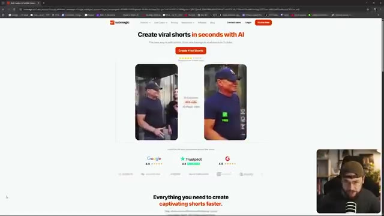
*Page d'accueil du site Submagic présentant la création de shorts viraux avec l'IA.*

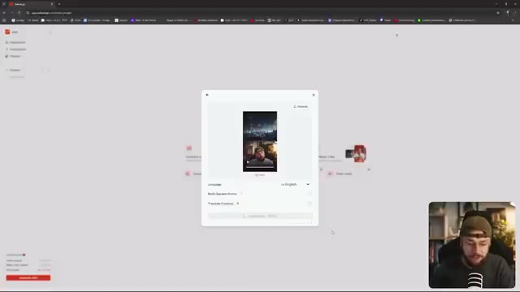
*Fenêtre modale de Submagic permettant d'importer une vidéo et de configurer la langue et les options de sous-titrage.*

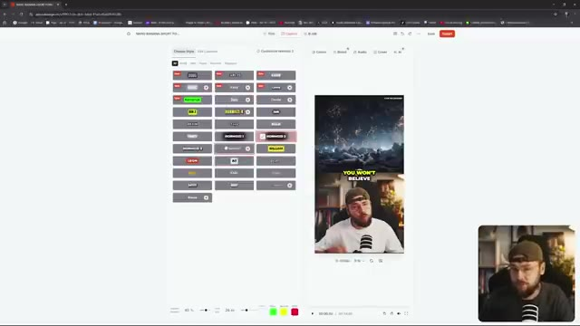
*Interface de personnalisation de Submagic montrant une grande variété de styles de sous-titres inspirés de créateurs populaires.*

---

### ⏱️ `[00:08:34 - 00:09:01]` | Segment #17

**🔊 Audio (Transcription Intégrale Mot pour Mot en Français) :**
> Et nous pouvons emprunter la voie des b-rolls magiques où Submagic sélectionnera des clips qui correspondent au contenu de ce que nous disons. Ou si vous voulez être vraiment précis, nous pouvons cliquer ici, ajouter un B-roll, et nous pouvons sauter dans la bibliothèque de stocks de Submagic. Nous pouvons même aller de l'avant et définir la transition. Ainsi, lorsque nous passons de ce que nous avons filmé au B-roll fourni par Submagic, nous pouvons vraiment définir ce mouvement. Donc l'idée de Submagic, c'est que ce n'est pas seulement une question de gain de temps.

**👁️ Analyse Visuelle d'Écran (gemini-3.5-flash-lite) :**
**Interface & Outils** : Submagic (application web d'édition vidéo par IA)

**Contenu textuel & Code** : Interface d'édition avec le texte du script segmenté à gauche (incluant les options "Magic B-roll" et "Magic Zoom"), un aperçu de la vidéo verticale avec sous-titres animés au centre, et une vue incrustée (PiP) du créateur en bas à droite.

**Action / Démonstration** : Le créateur présente l'interface de Submagic en montrant les différentes options de b-rolls magiques et de gestion des segments vidéo.

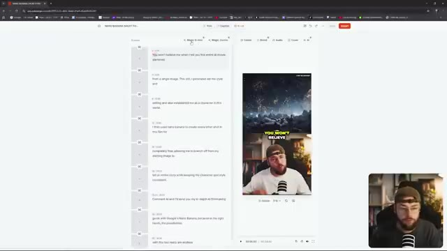
*Interface du logiciel Submagic montrant la chronologie du script à gauche et l'aperçu vidéo avec le créateur en incrustation (PiP) à droite.*

---

### ⏱️ `[00:09:01 - 00:09:35]` | Segment #18

**🔊 Audio (Transcription Intégrale Mot pour Mot en Français) :**
> Il est également conçu pour rendre votre contenu beaucoup plus captivant. Si vous souhaitez découvrir cet outil, assurez-vous de cliquer sur le lien ci-dessous dans la description et d'entrer également le code jack10 lors du passage à la caisse pour obtenir 10 % de réduction sur votre achat. Merci beaucoup d'être arrivés jusqu'ici dans la vidéo les gars. Maintenant, je veux plonger dans cette petite astuce secrète pour vous tous. Vous pouvez voir que j'ai eu des échecs de génération récurrents ici en essayant d'utiliser Nano Banana dans LM Arena. Je suis sûr que vous l'avez constaté vous-même aussi, parfois vous ne pouvez tout simplement pas amener cet outil d'IA à faire ce que vous cherchez.

**👁️ Analyse Visuelle d'Écran (gemini-3.5-flash-lite) :**
**Interface & Outils** : Navigateur web affichant une interface d'édition vidéo (Image 1) puis l'interface de LM Arena (Image 2) avec un retour vidéo du créateur en incrustation (PiP) dans le coin inférieur droit.

**Contenu textuel & Code** : Textes de l'interface de montage et chronologie sur l'image 1. Sur l'image 2, les invites de génération et les messages d'erreur en rouge associés au modèle gemini-2.0-flash-image-preview (nano-banana) dans LM Arena.

**Action / Démonstration** : Le créateur présente l'interface de montage de son contenu vidéo, puis bascule sur l'interface de LM Arena pour montrer des exemples de générations échouées avec l'outil Nano Banana.

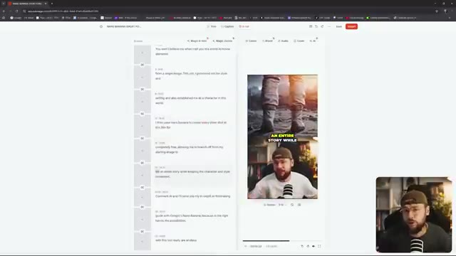
*Interface de montage vidéo affichant une chronologie avec des extraits et un aperçu vidéo en cours de lecture.*

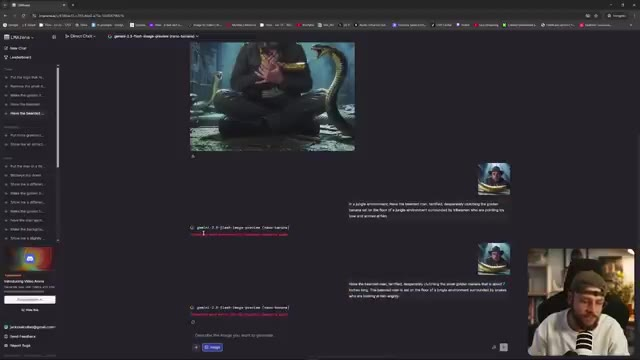
*Interface de LM Arena montrant des erreurs de génération textuelles avec le modèle gemini-2.0-flash-image-preview (nano-banana).*

---

### ⏱️ `[00:09:35 - 00:10:01]` | Segment #19

**🔊 Audio (Transcription Intégrale Mot pour Mot en Français) :**
> Et vous allez probablement penser que je dis juste ça pour plaisanter, mais ne sous-estimez pas le pouvoir de démarrer une nouvelle conversation. Que vous utilisiez Nano Banana via LM Arena ou Gemini lui-même, parfois je pense qu'il faut lui donner une ardoise blanche. Si vous n'arrivez tout simplement pas à obtenir de Nano Banana les résultats que vous recherchez, j'ai l'impression qu'il utilise la mémoire de la conversation en cours.

**👁️ Analyse Visuelle d'Écran (gemini-3.5-flash-lite) :**
**Interface & Outils** : LM Arena (navigateur web) avec le panneau latéral de l'historique des chats et la zone de discussion centrale montrant des images générées et des prompts textuels. Le créateur apparaît dans un encadré vidéo PiP en bas à droite.

**Contenu textuel & Code** : Modèle affiché : "gemini-2.0-flash-image-preview (nano-banana)". Prompts textuels visibles dans le fil de discussion décrivant un homme barbu terrifié avec des serpents et une banane dorée. Historique des chats dans la barre latérale gauche.

**Action / Démonstration** : Le créateur montre l'interface de LM Arena et commente l'utilisation des chats de discussion pour générer des images avec Nano Banana.

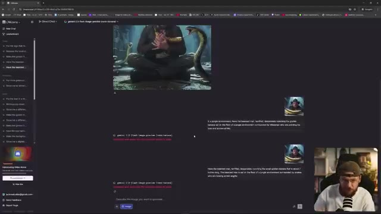
*Interface de LM Arena affichant une conversation avec le modèle Gemini 2.0 Flash (nano-banana) avec les résultats générés et le créateur visible en incrustation (PiP).*

---

### ⏱️ `[00:10:01 - 00:10:19]` | Segment #20

**🔊 Audio (Transcription Intégrale Mot pour Mot en Français) :**
> Maintenant, je ne peux pas confirmer cela et il y a un débat entre les créateurs de contenu IA pour savoir si c'est réellement le cas. Tout ce que je sais, c'est que d'après ma propre expérience, j'ai vraiment eu du mal à obtenir les bons résultats avec cet outil, mais parfois, en appliquant le même prompt textuel dans un tout nouveau chat, boum.

**👁️ Analyse Visuelle d'Écran (gemini-3.5-flash-lite) :**
**Interface & Outils** : Navigateur web affichant l'interface de l'application LMSYS (lmarena.ai) avec un panneau de navigation latéral et une zone centrale de saisie de prompt, incluant un retour vidéo du créateur en incrustation (PiP).

**Contenu textuel & Code** : Texte affiché : "Find the best AI for you", champ de saisie avec le bouton "Image", et des résultats générés montrant un homme barbu avec une casquette et un tablier rose écrivant dans un cahier.

**Action / Démonstration** : Le navigateur présente l'outil de génération d'IA avec ses options de prompt et les images générées précédemment affichées dans l'historique du chat, tandis que le créateur commente l'expérience en bas à droite.

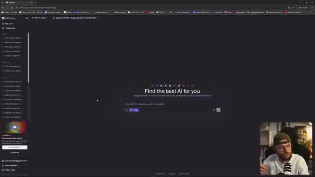
*Interface de l'outil LMSYS avec un champ de prompt textuel central et le créateur visible en incrustation (PiP) dans le coin inférieur droit.*

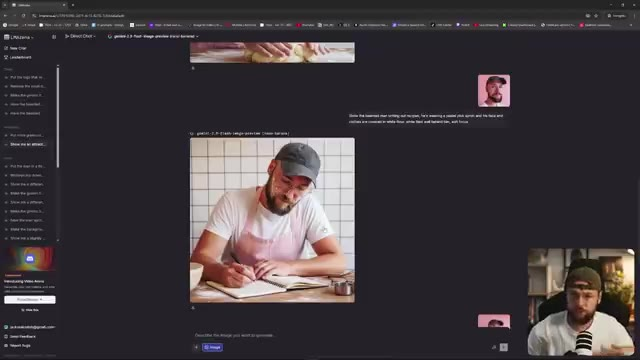
*Affichage des résultats de génération d'images avec un personnage masculin écrivant dans un carnet, et le créateur en incrustation (PiP).*

---

### ⏱️ `[00:10:20 - 00:10:45]` | Segment #21

**🔊 Audio (Transcription Intégrale Mot pour Mot en Français) :**
> Ça fonctionne comme par magie. Maintenant, accordé, ça pourrait être juste de la chance, mais pour moi personnellement, ça a fonctionné tout simplement trop de fois pour qu'il n'y ait pas quelque chose là-dessous. Je pense que lorsque vous créez plusieurs images dans le même chat en parlant à Nale Banana, cela a une sorte de mémoire et fait référence à ses générations précédentes qui sont réinjectées dans tout ce que vous demandez de nouveau à l'outil.

**👁️ Analyse Visuelle d'Écran (gemini-3.5-flash-lite) :**
**Interface & Outils** : Interface web de LMArena (ou outil similaire de chat avec IA) avec un panneau latéral à gauche, une zone de discussion centrale affichant des images générées et le flux vidéo du créateur en incrustation (Picture-in-Picture) en bas à droite.

**Contenu textuel & Code** : Historique de discussion affichant plusieurs générations d'images successives représentant un homme barbu dans différents contextes (en train d'écrire dans un carnet avec un tablier rose, gros plans, etc.) et des prompts textuels associés.

**Action / Démonstration** : Le navigateur web présente l'interface de discussion par chat où l'utilisateur fait défiler ou visualise les différentes images générées précédemment qui conservent la même cohérence visuelle.

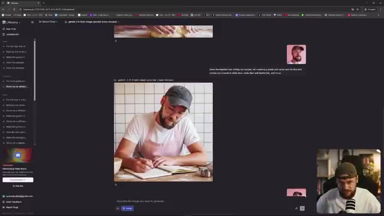
*Interface d'un outil de génération d'images par IA montrant un historique de chat avec des images générées et le créateur visible en incrustation PiP.*

---

### ⏱️ `[00:10:46 - 00:11:18]` | Segment #22

**🔊 Audio (Transcription Intégrale Mot pour Mot en Français) :**
> Donc si vous galérez vraiment vraiment, que vous vous arrachez les cheveux, vous savez, cet outil est vraiment bien mais vous n'arrivez pas à obtenir ce que vous voulez, essayez un nouveau chat. Et si cette petite astuce secrète vous aide, assurez-vous de laisser un commentaire en bas et de me le faire savoir pour que je sois rassuré de ne pas juste imaginer tout ça les gars. Merci beaucoup d'avoir regardé la vidéo d'aujourd'hui, si vous l'avez appréciée, n'oubliez pas de mettre un gros pouce bleu, pensez à vous abonner et bien sûr à activer la cloche de notification pour ne manquer aucun contenu à venir comme je l'ai mentionné au début de

**👁️ Analyse Visuelle d'Écran (gemini-3.5-flash-lite) :**
**Interface & Outils** : Interface web de LMArena (LMarena.ai) affichant un fil de discussion (Chat) avec des interactions textuelles et des générations d'images. En bas à droite, la caméra de Jack est intégrée en mode Picture-in-Picture.

**Contenu textuel & Code** : On aperçoit des prompts textuels décrivant des scènes (comme un homme tatoué écrivant des recettes avec un tablier rose) et des images générées associées, ainsi que l'historique des chats dans le panneau de gauche.

**Action / Démonstration** : Le navigateur web montre l'interface de l'outil d'IA en arrière-plan, tandis que Jack apparaît en bas à droite en train de parler et d'animer sa conclusion.

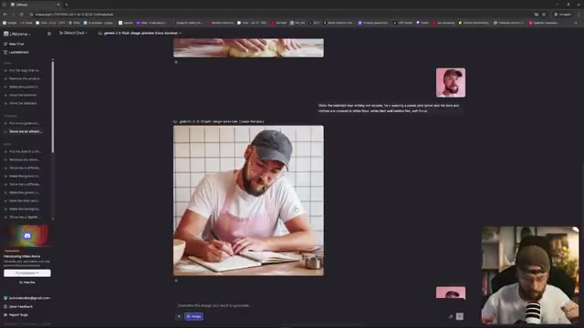
*Interface d'un outil de chat IA avec des aperçus d'images générées et la webcam du créateur en incrustation (PiP).*

---

### ⏱️ `[00:11:18 - 00:11:52]` | Segment #23

**🔊 Audio (Transcription Intégrale Mot pour Mot en Français) :**
> vidéo nous avons également lancé les abonnements pour la chaîne c'est un excellent moyen de me soutenir si vous appréciez vraiment ce que nous faisons ici sur la chaîne le niveau le plus bas est à seulement deux livres par mois donc ce n'est pas grand-chose mais cela vous donne accès à notre discord privé une communauté incroyable en pleine croissance où nous parlons de tout ce qui touche à l'IA créative où nous partageons des idées et nous passons tout un tas de trucs et astuces différents cela va être une source de connaissances vraiment formidable pour vous les gars. Toutes sortes d'autres avantages également en matière d'abonnements, en particulier

**👁️ Analyse Visuelle d'Écran (gemini-3.5-flash-lite) :**
**Interface & Outils** : Interface web de LMarena (LMSYS Chatbot Arena) montrant un fil de discussion avec génération d'images (gemini-2.5-flash-image-preview) et une vignette vidéo incrustée (PiP) du créateur.

**Contenu textuel & Code** : Modèle de génération affiché : gemini-2.5-flash-image-preview, avec des images générées représentant un homme barbu cuisinant et écrivant dans un carnet.

**Action / Démonstration** : Navigation sur l'interface web de test de modèles d'IA, montrant des résultats de génération d'images et de prompts.

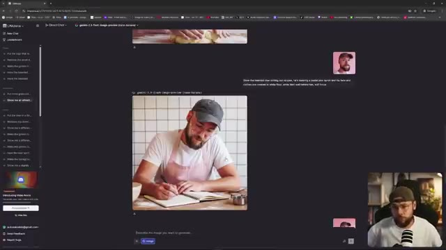
*Capture d'écran montrant l'interface d'un outil de génération d'images avec le créateur en incrustation PiP dans le coin inférieur droit.*

---

### ⏱️ `[00:11:52 - 00:11:59]` | Segment #24

**🔊 Audio (Transcription Intégrale Mot pour Mot en Français) :**
> le niveau légèrement plus cher. N'hésitez pas à poser vos questions sur Nano Banana dans les commentaires ci-dessous et je vous retrouve dans la prochaine vidéo.

**👁️ Analyse Visuelle d'Écran (gemini-3.5-flash-lite) :**
**Interface & Outils** : Interface web sombre avec un panneau latéral de chat à gauche, une zone de discussion centrale montrant des images générées et des prompts, et un encadré PiP vidéo du créateur en bas à droite.

**Contenu textuel & Code** : On aperçoit des prompts textuels dans l'interface (ex: "Show me an attract...", "Do the hairtrim..."), des images générées montrant Jack en train d'écrire ou de cuisiner, et le modèle sélectionné indiqué comme "gemini-2.5-flash-image-preview (nano-banana)".

**Action / Démonstration** : Le créateur montre l'interface de l'outil d'IA avec des exemples de générations basées sur le modèle Nano Banana tout en s'exprimant face caméra dans l'encadré PiP.

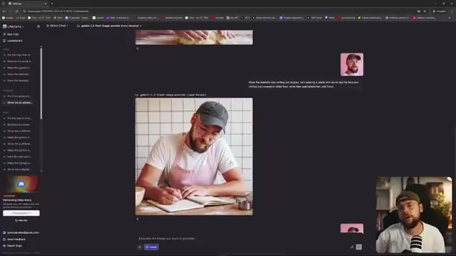
*Interface web de Llama (ou outil similaire) affichant une conversation avec génération d'images/texte, et une incrustation vidéo (PiP) de Jack en bas à droite.*

---
