# 🎬 WAN 2.5 ÉCRASE VEO 3 (Workflow Higgsfield AI)

> **Chaîne** : [Jack Vs. AI](https://www.youtube.com/@JackVsAI)  
> **Titre original** : `WAN 2.5 CRUSHES VEO 3 (Higgsfield AI Workflow)`  
> **Lien YouTube** : [https://www.youtube.com/watch?v=yvD8TxNsR4Q](https://www.youtube.com/watch?v=yvD8TxNsR4Q)  
> **Date de publication** : 2025-09-26  
> **Durée** : 10m 49s (`649s`)  
> **Identifiant vidéo** : `yvD8TxNsR4Q`  
> **Fiche Web Interactive** : [2025-09-26_YT-yvD8TxNsR4Q_WAN 2.5 ÉCRASE VEO 3 (Workflow Higgsfield AI)_by-whisper-v3-large-turbo+gemini-3.5-flash-lite.html](2025-09-26_YT-yvD8TxNsR4Q_WAN 2.5 ÉCRASE VEO 3 (Workflow Higgsfield AI)_by-whisper-v3-large-turbo+gemini-3.5-flash-lite.html)  
> **Captures de démonstration clés** : `45 captures réelles (anti-talking-head)`  
> **Modèles utilisés** : Audio: `large-v3-turbo` (Faster-Whisper int8 VPS) | Vision: `gemini-3.5-flash-lite` (Google AI Studio API)  

---

## 📌 Synthèse Exécutive & Outils

### 📌 Résumé
La sortie de WAN 2.5 marque un tournant majeur dans l'écosystème de la vidéo par intelligence artificielle, souvent qualifié à tort de simple "tueur de VEO3". Ce modèle se distingue par sa génération audio native (effets sonores et parole), la création de séquences en résolution 1080p jusqu'à 10 secondes, et surtout son absence totale de censure. Cette liberté créative permet l'utilisation d'images de célébrités et l'intégration de dialogues crus, ouvrant des perspectives immenses pour la publicité et la narration complexe. L'analyste Jack démontre l'efficacité de cet outil à travers un cas pratique complet hébergé sur la plateforme Higgsfield AI.

Le workflow présenté combine habilement plusieurs technologies de pointe pour façonner l'introduction d'une vidéo. En partant d'une erreur fortuite lors de la génération d'une image de base, Jack utilise le modèle Nano Banana pour créer un gros plan ultra-détaillé d'un moine humanoïde à la peau de géode. Cette ressource visuelle est ensuite injectée dans WAN 2.5 via Higgsfield pour animer la scène. L'utilisation stratégique des options de personnalisation — comme l'activation ou la désactivation de l'amélioration de prompt et le choix entre les modes rapide et standard — permet d'ajuster précisément le niveau de contrôle créatif et d'optimiser l'utilisation des crédits de génération.

Pour les créateurs de contenu, ce tutoriel offre une feuille de route actionnable pour intégrer WAN 2.5 dans une chaîne de production professionnelle. En combinant les sorties brutes du modèle avec des retouches en post-production sous Premiere Pro (ajout d'ambiances sonores et d'une couche de grain de pellicule cinématographique), Jack montre comment surmonter l'aspect parfois trop synthétique de l'IA. L'accès à des générations illimitées en file d'attente standard sur Higgsfield démocratise l'expérimentation, faisant de ce workflow un standard incontournable pour produire des plans complexes, cohérents et esthétiquement saisissants à moindre coût.

### 🛠️ Outils, Modèles & Logiciels Présentés
* **WAN 2.5** : Modèle de génération vidéo par IA de pointe offrant une résolution 1080p, une génération audio native, des clips de 10 secondes et une absence totale de censure.
* **Higgsfield AI** : Plateforme cloud hébergeant WAN 2.5 et proposant des options de générations illimitées (abonnements Ultimate/Creator), des essais quotidiens et une file d'attente standard sans frais de crédits.
* **Nano Banana** : Modèle de génération d'images ultra-détaillé utilisé pour créer les personnages et les plans de départ texturés.
* **Flux Context Max** : Modèle alternatif de génération d'images disponible sur Higgsfield pour concevoir des visuels initiaux.
* **Higgsfield Soul** : Modèle propriétaire de génération d'images intégré à la plateforme Higgsfield AI.
* **Seedream 4.0** : Modèle d'intelligence artificielle utilisé pour la conception d'images de référence.
* **Premiere Pro** : Logiciel de montage vidéo professionnel employé pour assembler les clips, synchroniser l'ambiance sonore et appliquer une couche de grain pellicule.
* **ElevenLabs** : Solution de synthèse vocale et d'audio souvent associée aux workflows de création de contenu dopés à l'IA *(mentionné dans les métadonnées)*.
* **VEO3 (ou VO3)** : Modèle concurrent de génération vidéo, souvent comparé à WAN 2.5 mais limité à des clips de 8 secondes et soumis à des restrictions plus strictes.

### 🔑 Points Clés & Enseignements Stratégiques
* **Avantage de la non-censure** : WAN 2.5 supprime les filtres stricts, permettant une liberté narrative totale, l'intégration de personnalités publiques et l'utilisation de dialogues jurés sans blocage algorithmique.
* **Audio natif intégré** : Le modèle intègre directement la génération d'effets sonores et de paroles synchronisées, réduisant le besoin d'interventions audio externes pour les scènes basiques.
* **Capacité des séquences** : Possibilité de générer des clips vidéo d'une durée maximale de 10 secondes en résolution 1080p, surpassant la limite des 8 secondes de ses concurrents directs.
* **Erreur créative fortuite** : L'intégration accidentelle d'une image personnelle dans le prompt initial de Nano Banana a donné naissance à un personnage unique (moine géode avec lunettes et barbe), prouvant l'intérêt d'itérer à partir d'accidents visuels.
* **Gestion de l'amélioration des prompts** : Il est recommandé de désactiver l'option d'amélioration automatique si l'on possède un prompt textuel extrêmement précis, et de l'activer pour laisser l'IA enrichir les détails visuels de la scène.
* **Arbitrage qualité / vitesse** : Le modèle standard "WAN 2.5" offre une qualité supérieure, tandis que la version "WAN 2.5 fast" privilégie la rapidité d'exécution pour le prototypage rapide.
* **Optimisation des coûts via le mode illimité** : L'utilisation de la file d'attente standard sur Higgsfield permet d'obtenir des générations illimitées sans consommer de crédits, au prix d'un temps d'attente légèrement supérieur.
* **Cohérence des plans complexes** : Le modèle gère remarquablement bien les mouvements de caméra rapides (*whip pans*) et les transitions spatiales complexes dans un décor sans perdre la cohérence visuelle.
* **Post-production et grain cinématographique** : L'ajout d'une couche de réglage avec du grain de pellicule sous Premiere Pro permet d'atténuer l'aspect "trop propre" de l'IA et d'apporter une texture visuelle professionnelle issue des effets visuels (VFX).
* **Séparation audio et vidéo** : Bien que WAN 2.5 puisse générer l'audio, il est parfois préférable de laisser le champ vide pour intégrer manuellement des ambiances sonores (comme le bruit des vagues) en post-production pour un contrôle artistique accru.
* **Flexibilité de l'Image-to-Video** : Conserver le contrôle de l'image de départ (*Image-to-Video*) garantit une continuité esthétique rigoureuse entre le design du personnage et son animation finale.

---

## ⏱️ Chronologie & Transcription Complète Audio & Visuelle (Mot pour Mot)

### ⏱️ `[00:00:00 - 00:00:29]` | Segment #01

**🔊 Audio (Transcription Intégrale Mot pour Mot en Français) :**
> Donc WAN 2.5 vient de sortir et c'est non censuré, donc vous pouvez dire p**** de t***** autant que vous voulez. L'intro que vous venez de voir a donc été générée en utilisant WAN 2.5, que beaucoup de gens appellent le tueur de VO3 mais ce n'est pas vraiment vrai. Tout d'abord, parlons de pourquoi WAN 2.5 est un gros événement.

**👁️ Analyse Visuelle d'Écran (gemini-3.5-flash-lite) :**
**Interface & Outils** : Logiciel de montage vidéo ou navigateur affichant des clips vidéo générés par IA en plein écran avec incrustation PiP (Picture-in-Picture) du créateur en bas à droite.

**Contenu textuel & Code** : Texte incrusté à l'écran : "So WAN 2.5 just dropped" (sur l'image 1), interface YouTube/vidéo avec boutons "Like", "Subscribed" et cloche de notification (sur l'image 4).

**Action / Démonstration** : Le créateur commente et présente des séquences vidéo générées par le modèle d'intelligence artificielle WAN 2.5.

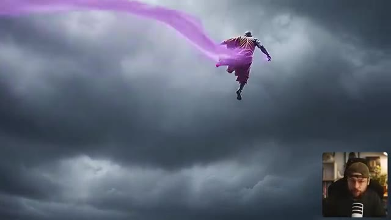
*Rendu vidéo généré par IA montrant un personnage en robe de moine s'envolant dans un ciel nuageux avec une traînée de fumée violette, avec le créateur en incrustation PiP dans le coin inférieur droit.*

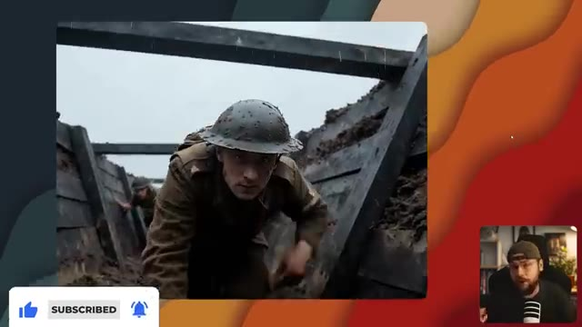
*Rendu vidéo généré par IA montrant un soldat rampant dans une tranchée boueuse, encadré sur un fond stylisé avec le créateur en incrustation PiP.*

---

### ⏱️ `[00:00:29 - 00:00:49]` | Segment #02

**🔊 Audio (Transcription Intégrale Mot pour Mot en Français) :**
> Il propose une génération audio native, donc on parle d'effets sonores ainsi que de parole. Vous êtes capable de générer jusqu'à 10 secondes de séquences vidéo en résolution 1080p. Et bien sûr, il offre l'option de l'image vers vidéo comme VO3, donc vous conservez ce niveau de contrôle. En termes d'applications, les possibilités sont véritablement illimitées.

**👁️ Analyse Visuelle d'Écran (gemini-3.5-flash-lite) :**
**Interface & Outils** : Présentation face caméra sans partage d'écran

**Contenu textuel & Code** : Le créateur Jack apparaît en incrustation (PiP) dans le coin inférieur droit, tandis que les images principales montrent des extraits de vidéos générées par IA (un homme devant un iceberg, un insecte bioluminescent, et un paysage désertique avec des éclairs), sans interface logicielle visible.

**Action / Démonstration** : Le présentateur parle face à sa caméra dans son studio, commentant les capacités de génération audio et vidéo.

---

### ⏱️ `[00:00:49 - 00:01:10]` | Segment #03

**🔊 Audio (Transcription Intégrale Mot pour Mot en Français) :**
> Nous pouvons créer du contenu parlant et des publicités de produits. Il est capable d'exécuter des requêtes vraiment très complexes. et je pense ce qui va attirer beaucoup de gens vers cet outil, c'est le fait qu'il soit non censuré, ce qui signifie que vous avez beaucoup plus de liberté créative en termes de construction de votre scène. Vous pouvez utiliser l'image d'une célébrité, par exemple, ou vous pouvez même jurer comme vous l'avez vu dans l'intro.

**👁️ Analyse Visuelle d'Écran (gemini-3.5-flash-lite) :**
**Interface & Outils** : Lecteur vidéo de démonstration avec incrustation PiP du créateur dans le coin inférieur droit.

**Contenu textuel & Code** : Séquences vidéo générées par intelligence artificielle illustrant des scènes complexes et dynamiques (créatures fantastiques, bureau d'enquête, dragon en vol).

**Action / Démonstration** : Le créateur illustre son propos en diffusant des exemples de vidéos générées par IA démontrant les capacités créatives et complexes de l'outil.

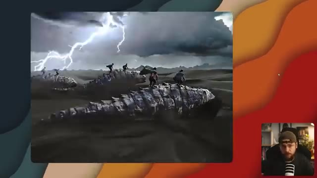
*Démonstration vidéo générée montrant des personnages chevauchant de grandes créatures écailleuses dans un paysage désertique sous des éclairs.*

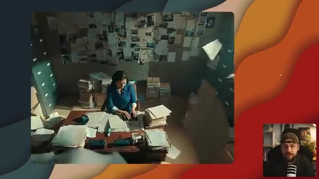
*Démonstration vidéo montrant une femme assise à un bureau encombré de dossiers dans une pièce aux murs tapissés de notes et de documents d'enquête.*

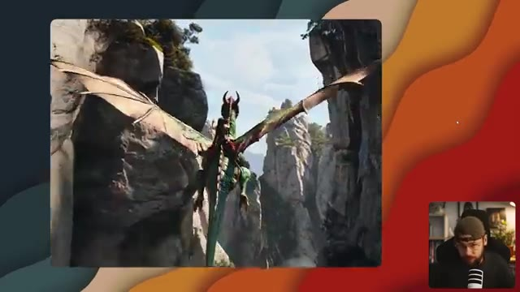
*Démonstration vidéo montrant une vue arrière d'une personne chevauchant un grand dragon volant à travers des canyons rocheux.*

---

### ⏱️ `[00:01:11 - 00:01:31]` | Segment #04

**🔊 Audio (Transcription Intégrale Mot pour Mot en Français) :**
> J'ai testé WAN sur Higgsfield et ils proposent une option pour des générations illimitées si vous avez les abonnements Ultimate ou Creator, ainsi que des essais gratuits quotidiens pour tous les abonnements. C'est donc le moment idéal pour vous lancer et faire quelques tests si cela vous intéresse. Bien sûr, si vous souhaitez aller voir ça par vous-même, assurez-vous de cliquer sur le lien dans la description ci-dessous.

**👁️ Analyse Visuelle d'Écran (gemini-3.5-flash-lite) :**
**Interface & Outils** : Navigateur web affichant la plateforme de création vidéo par IA Higgsfield (higgsfield.ai), avec un encadré vidéo (PiP) du présentateur en bas à droite.

**Contenu textuel & Code** : Textes visibles : "UNLIMITED WAN 2.5", "UNLIMITED KLING 2.5", "WAN 2.5 COMMUNITY", "365 FREE UNLIMITED GENERATIONS", ainsi que de multiples vignettes de prévisualisation de vidéos générées par IA.

**Action / Démonstration** : Le présentateur parle à l'écran tandis que la page d'accueil de la plateforme Higgsfield défile pour montrer les différentes options d'abonnements et les exemples de la communauté.

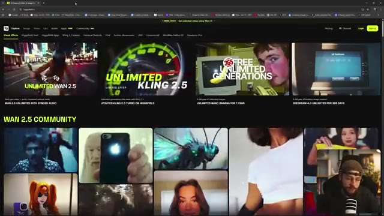
*Interface du site web Higgsfield affichant des aperçus de vidéos générées avec WAN 2.5 et Kling 2.5, avec le créateur en incrustation vidéo (PiP) en bas à droite.*

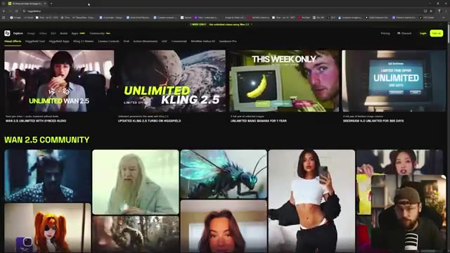
*Interface de Higgsfield montrant la galerie de créations WAN 2.5 Community avec différentes vignettes vidéo et les bannières d'offres illimitées.*

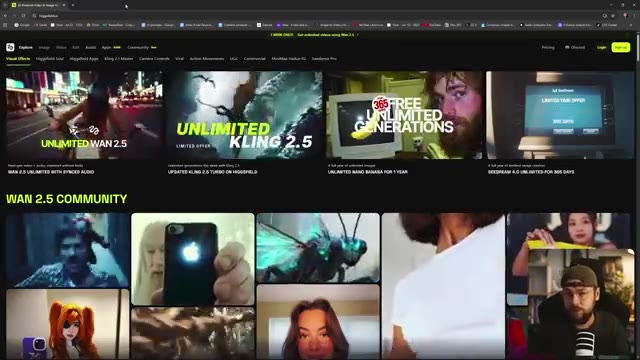
*Interface de Higgsfield affichant la section 'WAN 2.5 Community' avec des exemples de générations vidéo par IA et les options de navigation du site.*

---

### ⏱️ `[00:01:31 - 00:01:50]` | Segment #05

**🔊 Audio (Transcription Intégrale Mot pour Mot en Français) :**
> Et vous pouvez voir qu'ils ont une section pour leurs générations WAN 2.5 favorites créées par la communauté. J'ai donc pensé qu'on commencerait par jeter un œil à certaines d'entre elles. Et ensuite je vous présenterai le workflow que j'utilise pour créer l'intro. Je suis immédiatement attiré ici par ce clip de Double Door avec l'iPhone. J'étais en train de regarder Definitely Hallows Part 2 hier soir.

**👁️ Analyse Visuelle d'Écran (gemini-3.5-flash-lite) :**
**Interface & Outils** : Navigateur web affichant une plateforme de génération vidéo IA (style Higgsfield) avec la section "WAN 2.5 COMMUNITY" et les onglets de navigation.

**Contenu textuel & Code** : Titres "WAN 2.5 COMMUNITY", "VISUAL EFFECTS", miniatures de vidéos générées par la communauté (personnages, créatures, portraits), et le flux vidéo du créateur en incrustation PiP.

**Action / Démonstration** : Le créateur navigue sur la page web présentant les créations de la communauté WAN 2.5 et commente les différentes vidéos affichées à l'écran.

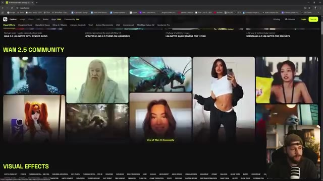
*Page web de la communauté WAN 2.5 montrant une grille de vidéos générées par les utilisateurs et le créateur dans un encadré PiP en bas à droite.*

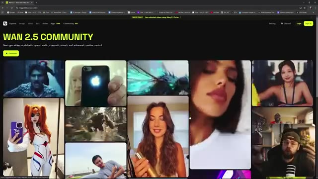
*Page web de la communauté WAN 2.5 affichant d'autres clips vidéo générés par IA, notamment un gros plan sur un iPhone avec le logo Apple lumineux.*

---

### ⏱️ `[00:01:50 - 00:02:25]` | Segment #06

**🔊 Audio (Transcription Intégrale Mot pour Mot en Français) :**
> Je n'ai vraiment pas vu venir qu'il manipulerait ce genre de techno. Jetons un petit coup d'œil. La plus grande magie est un iPhone. Ouais, c'est plutôt impressionnant. Donc le discours, le mouvement de la bouche ont l'air plutôt bons. Les reflets sur l'arrière du téléphone aussi, tout a l'air vraiment sympa et réaliste. Je vérifie, j'attends cette chute comme une tempête dans le ciel. Maintenant le nouveau modèle est là et il m'emmène haut. Je parle de puissance dans les lignes. Chaque mot est une flamme. Je me sens suralimenté, impossible de retenir le jeu. Les gars, vous devez comprendre, c'est un prompt vraiment très complexe avec les mouvements de caméra rapides (whip pans) et les déplacements entre différentes pièces de la maison de cette personne, mais il

**👁️ Analyse Visuelle d'Écran (gemini-3.5-flash-lite) :**
**Interface & Outils** : Navigateur web affichant la plateforme "Wan 2.5 Community" (Higgfield / Wan 2.5), avec interface de lecture vidéo et panneau latéral de prompts descriptifs en anglais.

**Contenu textuel & Code** : Texte du prompt visible sur le panneau latéral droit décrivant précisément l'action et les mouvements complexes de la caméra : "The video starts with a medium close-up of a man standing in a narrow hallway...".

**Action / Démonstration** : Le créateur navigue sur la plateforme Wan 2.5, parcourt la galerie de vidéos générées par IA et lance la lecture de clips montrant des interactions complexes, des mouvements de caméra fluides et des rendus réalistes.

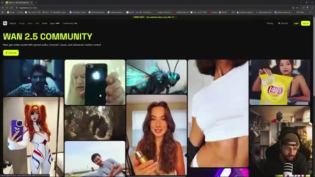
*Interface du site web Wan 2.5 Community montrant une grille de vidéos générées par IA.*

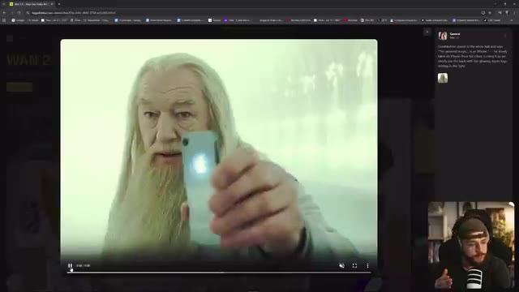
*Lecteur vidéo sur la plateforme Wan 2.5 affichant un personnage ressemblant à Gandalf tenant un iPhone lumineux dans un couloir brumeux.*

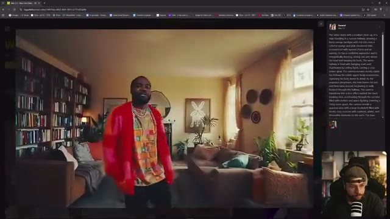
*Lecteur vidéo sur Wan 2.5 montrant un homme dans un salon chaleureux avec une bibliothèque, affichant le texte descriptif du prompt complet du plan complexe.*

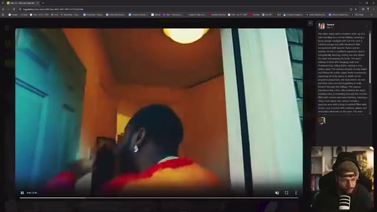
*Lecteur vidéo sur Wan 2.5 montrant un mouvement de caméra rapide (whip pan) avec le personnage traversant un couloir entre deux pièces.*

---

### ⏱️ `[00:02:25 - 00:02:58]` | Segment #07

**🔊 Audio (Transcription Intégrale Mot pour Mot en Français) :**
> tout semble toujours cohérent qu'est-ce qu'on a là le loup de wall street nutella la seule chose plus douce que le nutella c'est margot robbie la seule chose plus douce que le nutella c'est margot robbie la netteté aussi ça a l'air vraiment d'une super qualité oh et le classique pulp fiction tout le monde adore faire des versions ia de cette scène bois du coca ou on te tue en train de faire entièrement sortir le pistolet du cadre avec une canette de coca alors qu'est-ce que c'est c'est une scène de ça vient de the revenant n'est-ce pas et en ce moment tout ce dont j'ai besoin

**👁️ Analyse Visuelle d'Écran (gemini-3.5-flash-lite) :**
**Interface & Outils** : Interface de la plateforme web d'Higgfield AI (affichage de galerie vidéo et lecteur de lecture avec panneau de description des prompts sur le côté droit).

**Contenu textuel & Code** : Panneau latéral affichant les prompts de génération textuelle pour chaque scène de film parodiée (Le Loup de Wall Street, Pulp Fiction, The Revenant).

**Action / Démonstration** : Le créateur navigue et commente différentes vidéos générées par intelligence artificielle sur la plateforme Higgsfield, en présentant des versions parodiques de films célèbres.

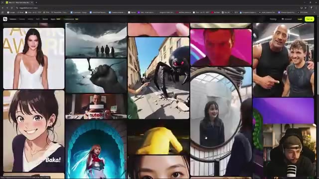
*Interface du site web d'Higgfield affichant une grille de vidéos générées par IA incluant des célébrités et des scènes de films.*

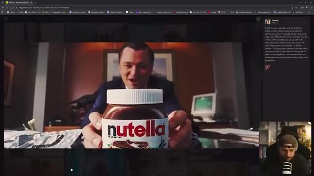
*Vidéo générée par IA parodiant Le Loup de Wall Street avec Leonardo DiCaprio tenant un pot de Nutella géant.*

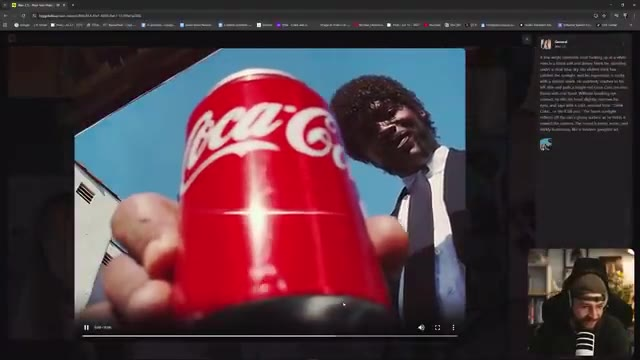
*Vidéo générée par IA parodiant Pulp Fiction avec une canette de Coca-Cola au premier plan masquant le pistolet.*

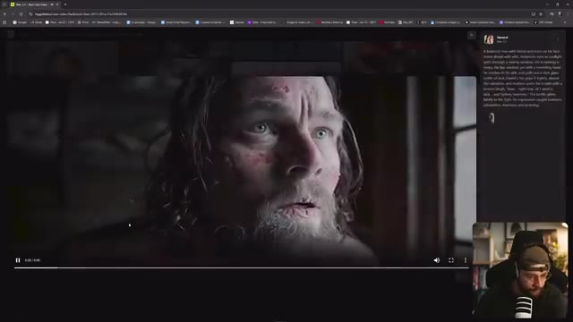
*Vidéo générée par IA parodiant The Revenant avec Leonardo DiCaprio blessé regardant par une fenêtre.*

---

### ⏱️ `[00:02:58 - 00:03:32]` | Segment #08

**🔊 Audio (Transcription Intégrale Mot pour Mot en Français) :**
> c'est Jack et Sydney Sweeney, des résultats vraiment assez impressionnants ici avec Wan 2.5 et vous pouvez vraiment voir la variété de contenu que vous allez pouvoir créer avec cet outil qui est plutôt polyve [...] avec cela dit, laissez-moi vous guider rapidement à travers le processus de la façon dont j'ai créé l'intro pour cette vidéo sur Higgsfield en utilisant Wan 2.5 donc de retour sur la page d'accueil ici de Higgsfield si nous allons en haut dans le coin supérieur gauche vers l'onglet image nous pouvons aller dans créer une image et vous pouvez voir toute une charge d'images que j'ai générées ici vous avez accès à plusieurs

**👁️ Analyse Visuelle d'Écran (gemini-3.5-flash-lite) :**
**Interface & Outils** : Navigateur web affichant la plateforme de création vidéo et d'images par IA Higgsfield (higgsfield.ai), avec incrustation vidéo PiP du créateur en bas à droite.

**Contenu textuel & Code** : Texte du prompt visible sur l'image 1 : "A bearded man with blond and scars on his face stares ahead with wild, desperate eyes as sunlight spills through a nearby window..." Texte visible sur l'image 4 : "Times Square, New York, pitched with neon screens and symbolless Nissan in shock. The bearded man sits on the bonnet of a matte-black sport car..." Mentions d'onglets : Explore, Image, Video, Edit, Assist, Apps, Community, Wan 2.5.

**Action / Démonstration** : Le créateur navigue sur la plateforme Higgsfield, montre des exemples de vidéos générées avec Wan 2.5 et accède à sa galerie d'images personnelles générées.

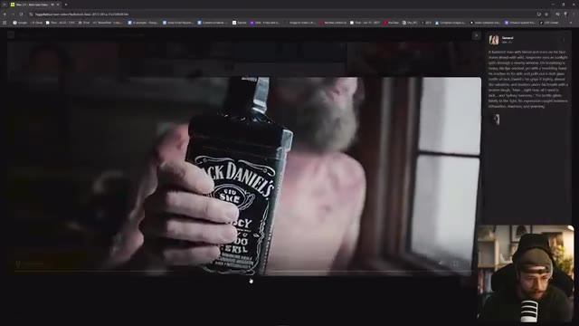
*Interface de Higgsfield montrant une vidéo générée avec une bouteille de Jack Daniel's et le panneau de prompt textuel sur le côté droit.*

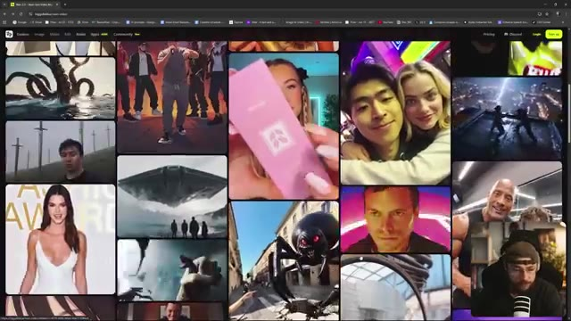
*Page d'accueil de Higgsfield affichant une grille variée de contenus créés par la communauté avec divers sujets visuels.*

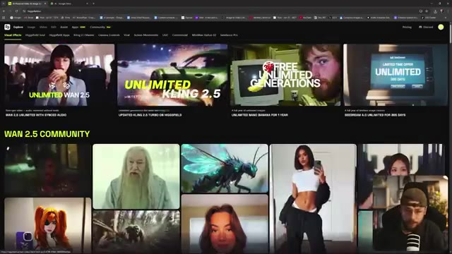
*Section Wan 2.5 Community sur Higgsfield avec des bannières promotionnelles et des exemples de générations.*

*Galerie d'images générées par l'utilisateur sur Higgsfield montrant des plans sur fond vert et des effets spéciaux avec des prompts textuels.*

---

### ⏱️ `[00:03:32 - 00:04:10]` | Segment #09

**🔊 Audio (Transcription Intégrale Mot pour Mot en Français) :**
> différents outils incluant Higgsfield Soul, leur propre modèle d'image Nano Banana, Seedream 4.0 et Flux Context Max. Maintenant, le personnage de l'intro a été généré en utilisant Nano Banana et en fait, avec un prompt textuel très simple : j'ai juste écrit un humanoïde dont la peau est en géode craquelée, brillant d'un éclat violet de l'intérieur, portant de simples robes de moine orange en lambeaux, assis en parfaite méditation sur une falaise avec des vagues de tempête s'écrasant en contrebas, et j'ai accidentellement laissé cette référence d'image de moi-même, et vous pouvez voir que cela a fini par influencer le résultat final parce que notre moine géode a des lunettes et une barbe.

**👁️ Analyse Visuelle d'Écran (gemini-3.5-flash-lite) :**
**Interface & Outils** : Interface web de Higgsfield, présentant des galeries de générations d'images et des menus de sélection de modèles d'IA avec affichage incrusté du créateur (PiP).

**Contenu textuel & Code** : Menu de sélection des modèles d'IA incluant Higgsfield Soul, Nano Banana, Seedream 4.0, Flux Context Max ; champ de prompt textuel décrivant le moine humanoïde en géode avec des robes de moine orange.

**Action / Démonstration** : Le créateur navigue et démontre l'interface de Higgsfield et l'utilisation du modèle Nano Banana pour générer le personnage du moine géode à partir d'un prompt textuel.

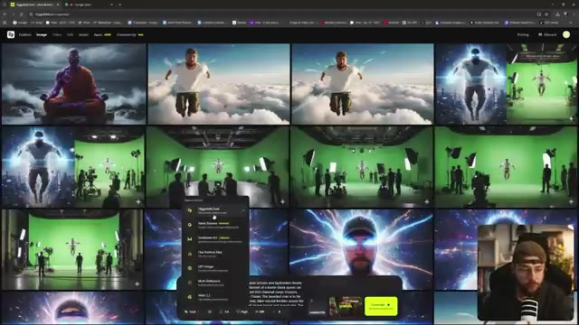
*Interface du navigateur affichant une galerie d'images générées par IA sur Higgsfield, avec un menu déroulant listant les différents modèles (Higgsfield Soul, Nano Banana, Seedream 4.0, etc.) et le créateur visible en incrustation PiP en bas à droite.*

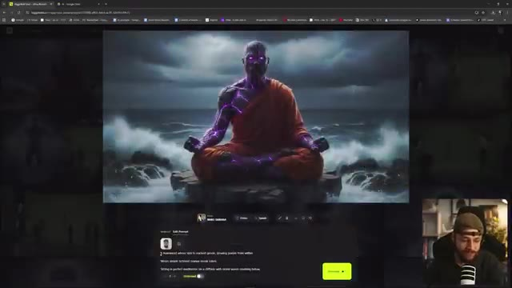
*Gros plan sur l'interface d'édition de prompt de Higgsfield montrant l'image générée du moine géode en méditation au bord d'une falaise, avec le champ de texte du prompt visible en bas.*

---

### ⏱️ `[00:04:10 - 00:04:45]` | Segment #10

**🔊 Audio (Transcription Intégrale Mot pour Mot en Français) :**
> Il y a donc un petit peu de moi là-dedans quelque part. Et si nous allons simplement télécharger cette image, nous pouvons créer le plan en gros plan. J'avais initialement construit ça ici. Je crois que j'ai dû le supprimer ou quelque chose comme ça, mais nous pouvons simplement refaire ça. Maintenant, nous pouvons aller sélectionner Nano Banana dans le menu des outils et nous pouvons télécharger notre image de départ et simplement procéder avec un simple prompt montrant un gros plan extrême du visage de l'homme et cliquer sur générer et vous pouvez voir ici que nous avons également l'option pour des générations illimitées en ce qui concerne nano banana raison i

**👁️ Analyse Visuelle d'Écran (gemini-3.5-flash-lite) :**
**Interface & Outils** : Interface Web de l'outil de création artistique (Higgfield) combinée avec des fenêtres de l'explorateur de fichiers Windows.

**Contenu textuel & Code** : Textes visibles : "A humanoid whose skin is cracked purple...", "Nano Banana", "Show an extreme close-up of the man's face", option "Unlimited" activée.

**Action / Démonstration** : Le créateur navigue dans l'interface, sélectionne l'outil Nano Banana, télécharge une image de départ, tape un prompt textuel pour générer un gros plan et lance la génération.

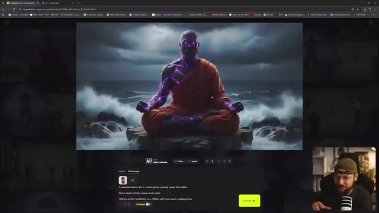
*Interface de l'outil Web affichant une image d'un moine méditant avec des lueurs violettes sur les bras et les yeux, accompagnée du panneau de prompt en bas.*

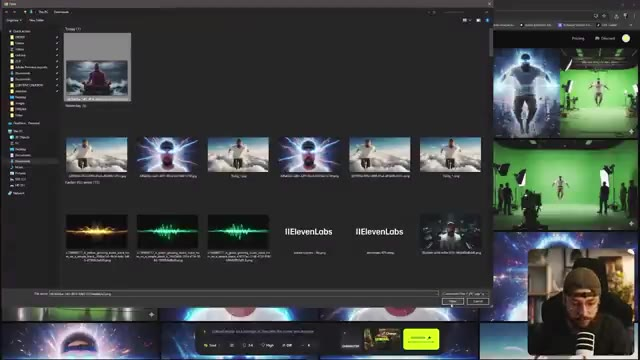
*Explorateur de fichiers Windows ouvert par-dessus l'interface pour sélectionner une image de téléchargement.*

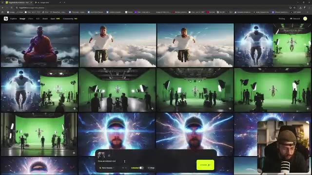
*Galerie de l'application web montrant plusieurs créations avec le menu de prompt et l'option « Nano Banana » sélectionnée en bas.*

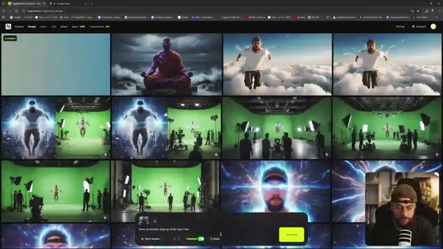
*Interface de génération affichant un carré bleu « In progress » en haut à gauche pendant que la génération est lancée.*

---

### ⏱️ `[00:04:45 - 00:05:21]` | Segment #11

**🔊 Audio (Transcription Intégrale Mot pour Mot en Français) :**
> Si je n'ai pas utilisé ça juste avant, c'est parce qu'on se retrouve dans une file d'attente un tout petit peu plus longue, mais l'avantage bien sûr, c'est qu'on ne dépense aucun crédit et vous pouvez voir notre résultat ici, absolument parfait, avec beaucoup de très beaux détails texturaux. Et une fois que nos images de départ sont téléchargées, nous pouvons remonter tout en haut dans le coin supérieur gauche et cette fois aller sur l'onglet vidéo. On descend juste sur créer une vidéo, tout en haut on veut sélectionner général, on peut aller télécharger notre image de départ, on veut remplir notre invite textuelle et si vous vouliez réutiliser une invite d'une génération précédente, vous pouvez simplement aller sur le côté droit et cliquer dessus et ça va

**👁️ Analyse Visuelle d'Écran (gemini-3.5-flash-lite) :**
**Interface & Outils** : Navigateur web affichant l'interface de Higgsfield AI (génération d'images et de vidéos), avec une incrustation vidéo (PiP) du présentateur en bas à droite.

**Contenu textuel & Code** : Options de l'onglet vidéo : "General", champ "Upload image", sélecteur de modèle (Max 2.5 Fast), curseur de durée, résolution (720p), mode illimité et bouton "Generate 0". Fenêtre de l'explorateur Windows avec des fichiers images et vidéos.

**Action / Démonstration** : Le créateur navigue dans l'interface de Higgsfield AI, ouvre l'explorateur de fichiers pour sélectionner une image de départ, bascule sur l'onglet vidéo et prépare les paramètres de génération.

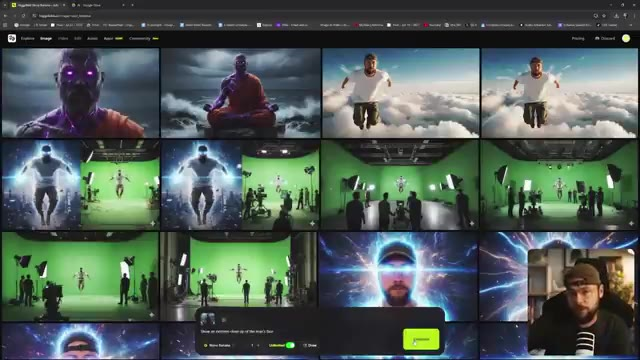
*Interface de Higgsfield AI montrant une grille de résultats d'images générées et le panneau de génération actif en bas.*

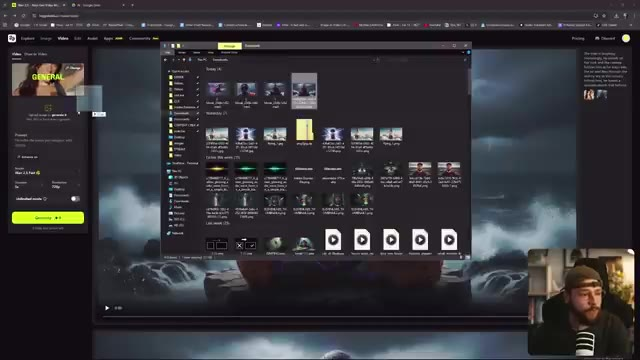
*Interface de Higgsfield AI sur l'onglet vidéo avec une fenêtre de l'explorateur Windows ouverte pour sélectionner une image.*

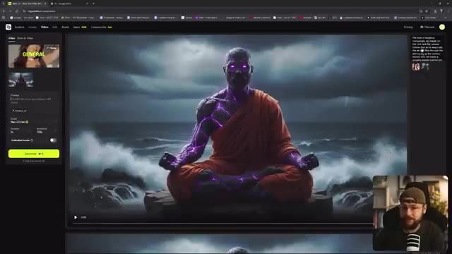
*Interface de l'onglet vidéo sur Higgsfield AI avec l'image sélectionnée du moine cybernétique et les options de prompt.*

---

### ⏱️ `[00:05:21 - 00:05:59]` | Segment #12

**🔊 Audio (Transcription Intégrale Mot pour Mot en Français) :**
> remplissez ce champ maintenant vous avez aussi l'option d'activation ou de désactivation de l'amélioration, vraiment cela est adapté à votre cas d'utilisation si vous avez écrit un prompt textuel très spécifique et que vous savez exactement ce que vous voulez obtenir de WAN 2.5, vous feriez mieux de laisser l'amélioration désactivée mais si vous voulez qu'il ait un peu plus de liberté, il va analyser l'image et en quelque sorte aider à étoffer votre prompt avec plus de détails bien sûr ici nous pouvons choisir parmi une grande variété de modèles de génération vidéo. Nous avons WAN 2.5 et WAN 2.5 fast. Vous pouvez obtenir des résultats de meilleure qualité à partir de

**👁️ Analyse Visuelle d'Écran (gemini-3.5-flash-lite) :**
**Interface & Outils** : Interface web de génération de vidéo par IA avec un panneau de configuration à gauche, une zone de visualisation centrale affichant une image de moine mystique au bord de l'eau, et une petite incrustation vidéo (PiP) du présentateur en bas à droite.

**Contenu textuel & Code** : Texte du prompt visible dans le panneau latéral : "The man is laughing mockingly, he stands on the rock and the camera follows him, as he leaps into the air and flies through the stormy sky, as the camera follows him, he leaves a glowing purple trail behind." Options visibles incluant "Enhance on", le sélecteur de modèle "WAN 2.5 fast", le curseur de durée "5s", et la résolution "720p".

**Action / Démonstration** : Le créateur présente l'interface de l'outil de génération vidéo et commente les options de paramétrage des prompts et des modèles WAN 2.5.

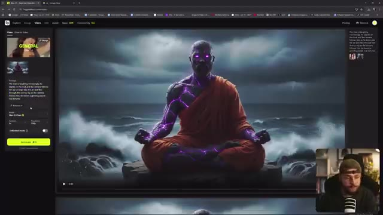
*Interface de l'outil de génération vidéo montrant les options de prompt et de sélection des modèles WAN 2.5.*

---

### ⏱️ `[00:05:59 - 00:06:33]` | Segment #13

**🔊 Audio (Transcription Intégrale Mot pour Mot en Français) :**
> juste le modèle 2.5 mais avec l'option rapide, vous obtiendrez vos générations beaucoup plus rapidement. Nous pouvons ensuite sélectionner la durée que nous voulons. Nous pouvons opter pour 5 secondes ou 10 secondes. VO3 ne va que jusqu'à 8 secondes, gardez donc cela à l'esprit. Et puis nous pouvons aussi sélectionner notre résolution en allant jusqu'à 1080p. La seule chose avec ceci, c'est que si nous voulions utiliser les générations illimitées, nous devrions nous en tenir au 720p et avec cela, vous pouvez voir ici que nous avons l'option d'activer et de désactiver le mode illimité et cela signifie simplement que vous ne dépenserez pas de crédits pour vos générations mais vous serez simplement placé dans

**👁️ Analyse Visuelle d'Écran (gemini-3.5-flash-lite) :**
**Interface & Outils** : Navigateur web affichant l'interface de Higgsfield AI (higgsfield.ai) avec un panneau de sélection des modèles vidéo, des paramètres de génération (durée, résolution, mode illimité) et un encadré PiP du créateur en bas à droite.

**Contenu textuel & Code** : Menus déroulants des modèles (Higgsfield Lite, Standard, Turbo, Kling 2.5/3.1, Wan 2.5 Unlimited/Fast, Google Veo, Minimax, Seedance Pro), paramètres de génération (durée 5s/10s, résolution 720p/1080p, "Unlimited mode"). Un aperçu vidéo montre un personnage en train de méditer avec des effets violets lumineux. Un prompt textuel est visible sur le panneau latéral gauche.

**Action / Démonstration** : Le créateur montre et survole les différents paramètres de configuration de génération vidéo sur l'interface de Higgsfield AI, notamment les options de vitesse, de durée, de résolution et le mode illimité.

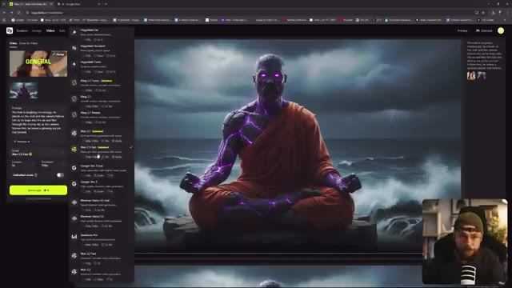
*Interface de Higgsfield AI affichant les différents modèles de génération vidéo, les options de durée, de résolution et le mode illimité avec le créateur en incrustation (PiP).*

---

### ⏱️ `[00:06:33 - 00:07:09]` | Segment #14

**🔊 Audio (Transcription Intégrale Mot pour Mot en Français) :**
> la file d'attente standard plutôt que la file d'attente prioritaire, donc c'est idéal si vous voulez faire un peu d'expérimentation avec WAN 2.5, peut-être que vous pourriez lancer quelques générations différentes, aller vous faire une tasse de thé, revenir, elles seront terminées et vous pourrez voir le résultat. J'ai donc assemblé un montage très basique en combinant mes trois différentes sorties WAN 2.5. J'ai simplement ajouté un son d'ambiance en arrière-plan avec des vagues qui s'écrasent. Maintenant, vous auriez pu obtenir cela généré directement via WAN 2.5. Je n'ai tout simplement pas spécifié que je voulais que ce soit ajouté dans le texte du prompt. Personnellement, j'aime pouvoir ajouter des effets sonores d'ambiance derrière ce que j'ai généré. Mais si vous aviez mis

**👁️ Analyse Visuelle d'Écran (gemini-3.5-flash-lite) :**
**Interface & Outils** : Navigateur web avec l'interface de Wan 2.5 sur l'image #1, et logiciel de montage vidéo Adobe Premiere Pro sur l'image #2.

**Contenu textuel & Code** : Sur l'image #1 : Interface web avec un aperçu vidéo généré d'un personnage cyborg/moine méditant, le panneau de prompt à gauche et les réglages de génération. Sur l'image #2 : Timeline d'Adobe Premiere Pro avec des clips vidéo et des pistes audio d'ondes sonores d'ambiance.

**Action / Démonstration** : Le créateur montre d'abord l'interface de génération vidéo Wan 2.5 dans son navigateur, puis bascule sur son logiciel de montage Adobe Premiere Pro pour montrer l'assemblage de ses clips et l'ajout d'une piste audio d'ambiance.

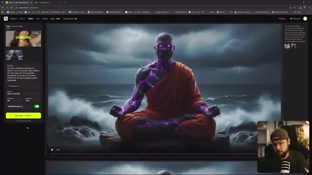
*Interface d'un générateur de vidéo par IA en ligne (Wan 2.5) affichant un personnage méditant avec des lueurs violettes au bord de l'eau, avec la webcam du créateur en incrustation (PiP) en bas à droite.*

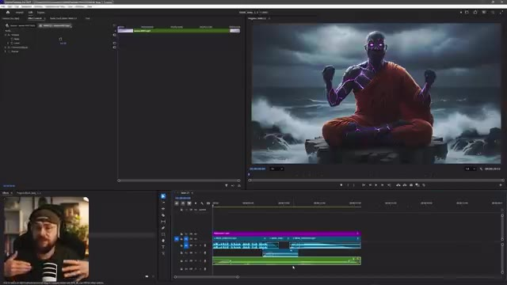
*Interface du logiciel de montage Adobe Premiere Pro montrant la timeline avec plusieurs pistes vidéo et audio, ainsi que la webcam du créateur en incrustation (PiP) en bas à gauche.*

---

### ⏱️ `[00:07:09 - 00:07:46]` | Segment #15

**🔊 Audio (Transcription Intégrale Mot pour Mot en Français) :**
> que dans les invites textuelles, vous l'auriez récupéré. Et ce que j'ai également fait, et je fais ça à toutes mes générations de vidéos par IA maintenant, c'est d'ajouter une couche de grain de pellicule par-dessus. C'est donc simplement ajouté avec cette couche de réglage ici. Et je peux comprendre que ce genre de choix esthétique ne convienne pas à tout le monde. Mais je pense qu'en raison de mon parcours en effets visuels, c'est quelque chose que nous finissons souvent par faire pour ajouter ce genre de détail textuel supplémentaire. Donc si nous allons de l'avant et zoomons, par exemple, et que j'active et désactive la couche de réglage, je ne sais pas, le simple fait d'ajouter ce grain de pellicule me donne instantanément l'impression que c'est plus réel et aussi un peu plus haut de gamme. Cela étant dit, nous allons continuer et regarder.

**👁️ Analyse Visuelle d'Écran (gemini-3.5-flash-lite) :**
**Interface & Outils** : Adobe Premiere Pro

**Contenu textuel & Code** : Timeline de montage vidéo avec des pistes audio/vidéo et un calque violet nommé "Adjustment Layer", un panneau de prévisualisation montrant un personnage cyborg/moine méditant au bord de l'eau, et une vue PiP du présentateur (Jack).

**Action / Démonstration** : Le créateur montre l'interface d'Adobe Premiere Pro où il superpose une couche de réglage (adjustment layer) pour ajouter du grain de pellicule sur sa vidéo générée par IA.

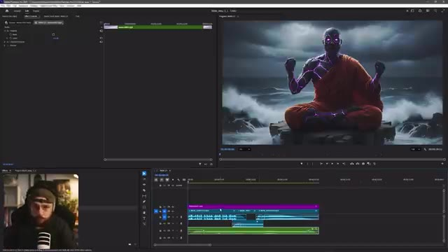
*Interface d'Adobe Premiere Pro montrant la timeline avec une couche de réglage, le moniteur de programme affichant un personnage généré par IA, et un encadré PiP du créateur dans le coin inférieur gauche.*

---

### ⏱️ `[00:07:46 - 00:08:21]` | Segment #16

**🔊 Audio (Transcription Intégrale Mot pour Mot en Français) :**
> ceci dans son état actuel donc quand le 2.5 vient juste de sortir et c'est non censuré donc vous pouvez dire autant que vous voulez et j'ai aussi fusionné les pistes audio pour chaque génération pour qu'elles se fondent bien en douceur et en ressortent pour qu'il n'y ait pas de débuts et de fins brusques maintenant si nous voulions aller de l'avant et pousser cela un peu plus loin pour avoir un peu plus de contrôle créatif nous pouvons aller de l'avant et couper le son de notre piste audio

**👁️ Analyse Visuelle d'Écran (gemini-3.5-flash-lite) :**
**Interface & Outils** : Adobe Premiere Pro avec un affichage de l'espace de travail de montage (fenêtre de prévisualisation, timeline avec pistes audio/vidéo et un encadré PiP du présentateur).

**Contenu textuel & Code** : Timeline de montage montrant des clips vidéo et audio superposés avec des fondus audio (keyframes de volume), ainsi qu'une image de synthèse représentant un moine cyborg en méditation face à une mer agitée visible dans le moniteur de prévisualisation.

**Action / Démonstration** : Le créateur montre son écran de montage dans Adobe Premiere Pro, expliquant le mixage audio et les fondus entre les générations de séquences tout en affichant son flux vidéo en incrustation (PiP).

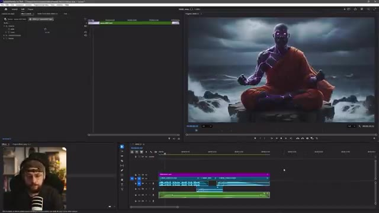
*Interface du logiciel Adobe Premiere Pro affichant le montage vidéo et audio avec un encadré PiP du créateur dans le coin inférieur gauche.*

---

### ⏱️ `[00:08:21 - 00:08:43]` | Segment #17

**🔊 Audio (Transcription Intégrale Mot pour Mot en Français) :**
> des ondes ambiantes. Si nous allons dans l'exportation, nous pouvons simplement sélectionner mp3 dans ce menu déroulant et nous allons juste exporter l'audio. Nous voici donc sur ElevenLabs et si nous allons dans le coin supérieur gauche maintenant, nous pouvons sélectionner les voix et ici nous pouvons sélectionner créer ou cloner une voix et ici cela nous donne l'option de concevoir une voix entièrement nouvelle à partir d'un prompt textuel, nous allons donc sélectionner cette option.

**👁️ Analyse Visuelle d'Écran (gemini-3.5-flash-lite) :**
**Interface & Outils** : Adobe Premiere Pro (fenêtre d'exportation) et interface web ElevenLabs (Voice Library).

**Contenu textuel & Code** : Paramètres d'exportation audio (Format: MP3, Nom: VRAI 2.5 IND4) et interface ElevenLabs avec les options Explore, My Voices, Default Voices, Collections, et le bouton "Create or clone a voice".

**Action / Démonstration** : Le créateur montre la manipulation d'exportation au format MP3 dans Adobe Premiere Pro, puis bascule sur le site d'ElevenLabs pour naviguer dans la bibliothèque de voix et préparer la création d'une nouvelle voix par prompt.

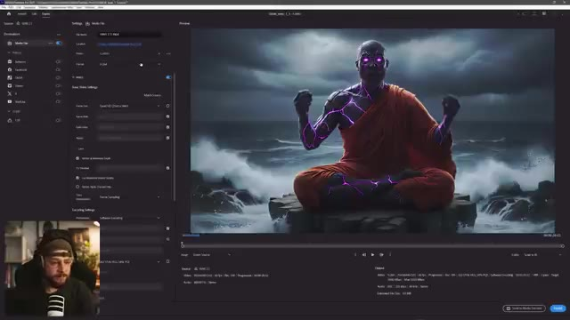
*Interface d'Adobe Premiere Pro montrant les paramètres d'exportation audio au format MP3 avec une prévisualisation vidéo d'un moine bouddhiste généré par IA.*

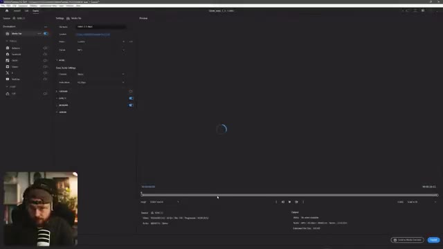
*Interface d'Adobe Premiere Pro pendant l'exportation audio, affichant un écran noir de prévisualisation en cours de chargement.*

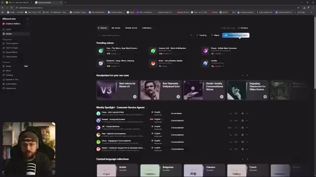
*Interface de la plateforme ElevenLabs dans l'onglet des voix (Voices/Explore), montrant le bouton "Create or clone a voice" en haut à droite.*

---

### ⏱️ `[00:08:43 - 00:09:19]` | Segment #18

**🔊 Audio (Transcription Intégrale Mot pour Mot en Français) :**
> Donc je vais simplement insérer dans le prompt une voix d'homme grave et profonde d'un ancien moine mystique. La voix est rauque comme s'il avait la cinquantaine et nous allons cliquer sur générer la voix et nous pourrons aller écouter ce qu'on a obtenu : « salutations quêteur, c'est bon de vous voir ». Ça a l'air plutôt pas mal pour moi, écoutons la voix 2 : « salutations quêteur, c'est bon de vous voir », j'aime bien ça, un peu plus de réverbération là-dessus, ton chemin est long. Alors écoutons la voix 3. « Salutations quêteur, c'est bon de vous voir. » Un tout petit peu trop agressif.
[VALID_VALID_IMAGES] 1
[DESC_IMAGE_1] Interface d'ElevenLabs affichant la fenêtre de conception vocale (« Voice Design ») avec le champ de prompt textuel au premier plan et le créateur visible en incrustation vidéo (PiP) dans le coin inférieur gauche.

**👁️ Analyse Visuelle d'Écran (gemini-3.5-flash-lite) :**
**Interface & Outils** : ElevenLabs (plateforme de synthèse vocale par IA) avec une incrustation vidéo du créateur dans le coin inférieur gauche (PiP).

**Contenu textuel & Code** : Dans la fenêtre « Voice Design », le prompt textuel visible indique : « A deep, booming male voice of an ancient mystical monk - voice is gruff as if he's in his 50s ».

**Action / Démonstration** : Le créateur montre l'interface de Voice Design sur ElevenLabs, saisit un prompt textuel pour générer une voix de moine mystique et se prépare à tester différentes options vocales.

---

### ⏱️ `[00:09:19 - 00:09:55]` | Segment #19

**🔊 Audio (Transcription Intégrale Mot pour Mot en Français) :**
> celle-là. Je vais opter pour la voix deux et nous allons l'appeler notre moine géode puis dans la langue, nous voulons aller de l'avant et sélectionner l'anglais et nous pouvons sauvegarder notre voix. Maintenant, si nous allons dans le coin supérieur gauche et sélectionnons le changeur de voix, nous pouvons glisser-déposer notre mp3 exporté de Premiere Pro. Donc WAN 2.5 vient de sortir et il n'est pas censuré. Et sur le côté droit, nous pouvons sélectionner notre moine géode parmi les options de voix. Ensuite, nous allons de l'avant et cliquons sur générer la discourt et cela est revenu très rapidement. Écoutons nos résultats. Donc WAN 2.5 vient de sortir et il n'est pas censuré. C'est

**👁️ Analyse Visuelle d'Écran (gemini-3.5-flash-lite) :**
**Interface & Outils** : ElevenLabs (outil de clonage et synthèse vocale par IA)

**Contenu textuel & Code** : Fenêtre « Voice Design » avec champ de nom, réglage de la langue (English), description vocale et bouton « Save voice ». Sur la seconde image, onglet « Voice Changer » avec le fichier audio « WAN 2.5.mp3 », la liste des voix disponibles (« Geode Monk », « Alius », « Bill », etc.) et le bouton « Generate speech ».

**Action / Démonstration** : Le créateur montre la configuration d'une voix personnalisée nommée « Geode Monk » dans ElevenLabs, puis navigue vers le changeur de voix pour y glisser un fichier MP3 exporté de Premiere Pro et lancer la génération vocale.

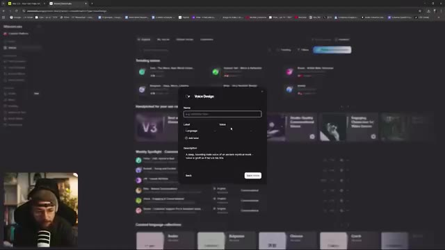
*Interface d'ElevenLabs affichant la fenêtre de création vocale « Voice Design » pour nommer et paramétrer la voix avec le créateur en incrustation PiP.*

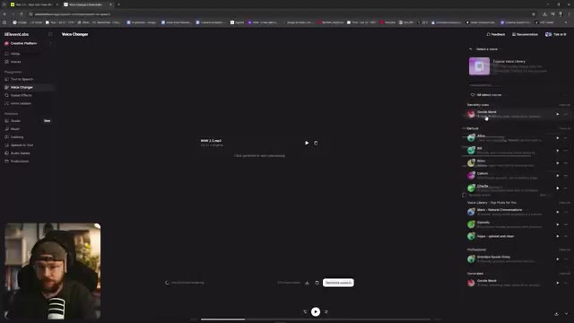
*Interface d'ElevenLabs affichant l'outil « Voice Changer » avec le fichier MP3 importé, la sélection de la voix « Geode Monk » et le bouton de génération.*

---

### ⏱️ `[00:09:55 - 00:10:31]` | Segment #20

**🔊 Audio (Transcription Intégrale Mot pour Mot en Français) :**
> a fait un très bon travail. Allons-y pour télécharger cela. En retournant dans Premiere Pro, nous pouvons importer cet audio et le déposer sur notre timeline. Nous pouvons donc mettre en sourdine notre ancienne piste audio où nous avions le ton de voix un peu plus aigu quand la version 2.5 vient de sortir, ce qui ne convient pas vraiment à ce personnage je pense, donc en la mettant en sourdine, nous pouvons échanger notre nouvelle piste audio et cela donne ceci : donc quand la version 2.5 vient de sortir et qu'elle n'est pas censurée, et vous pouvez voir qu'en combinant ces multiples outils, cela nous donne juste un tout petit peu plus de contrôle sur notre rendu final. J'espère vraiment que vous avez apprécié la vidéo d'aujourd'hui et que vous y avez appris quelques petites choses, laissez-moi

**👁️ Analyse Visuelle d'Écran (gemini-3.5-flash-lite) :**
**Interface & Outils** : Interface web d'ElevenLabs (Voice Changer) sur l'image 1 et logiciel Adobe Premiere Pro sur l'image 2, avec incrustation vidéo (PiP) du créateur dans le coin inférieur gauche.

**Contenu textuel & Code** : Sur l'image 1 : interface ElevenLabs avec les fichiers "WIX 2.5.mp3" et "ElevenLabs_...mp3" et les réglages de voix. Sur l'image 2 : interface Premiere Pro avec le moniteur affichant une vidéo d'un moine cyberpunk méditant sur un rocher, et la timeline de montage audio/vidéo en bas.

**Action / Démonstration** : Le créateur montre d'abord le téléchargement de l'audio modifié sur ElevenLabs, puis bascule sur Adobe Premiere Pro pour importer et remplacer la piste audio sur sa timeline de montage.

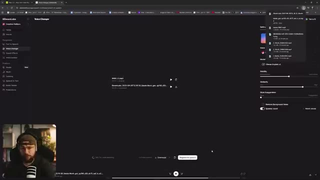
*Interface d'ElevenLabs (Voice Changer) montrant le téléchargement d'un fichier audio généré*

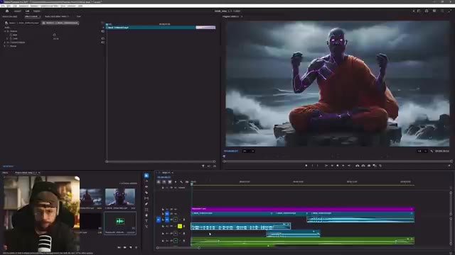
*Interface d'Adobe Premiere Pro avec la timeline de montage vidéo et un retour caméra (PiP) du créateur*

---

### ⏱️ `[00:10:31 - 00:10:48]` | Segment #21

**🔊 Audio (Transcription Intégrale Mot pour Mot en Français) :**
> faites-le-moi savoir dans les commentaires ci-dessous si vous avez la moindre question et bien sûr comment vous vous en sortez avec WAN 2.5. Si vous avez apprécié la vidéo d'aujourd'hui, assurez-vous de lâcher un pouce bleu pour moi, pensez à vous abonner si vous êtes nouveau et bien sûr activez la cloche de notification pour ne jamais manquer aucune future mise en ligne. Je vous retrouve les gars dans la prochaine.

**👁️ Analyse Visuelle d'Écran (gemini-3.5-flash-lite) :**
**Interface & Outils** : Adobe Premiere Pro (logiciel de montage vidéo) avec incrustation webcam (Picture-in-Picture) du créateur.

**Contenu textuel & Code** : Interface classique de montage vidéo Premiere Pro comprenant la timeline, le panneau projet avec les fichiers médias et l'aperçu vidéo montrant un personnage de moine bouddhiste au design cyberpunk/fantastique assis en tailleur sur un rocher au milieu de la mer sous un ciel orageux.

**Action / Démonstration** : Le créateur conclut sa vidéo tout en montrant son écran de montage avec Adobe Premiere Pro, incluant sa caméra faciale en incrustation dans le coin inférieur gauche.

*Interface du logiciel de montage Adobe Premiere Pro affichant le projet vidéo en cours, avec le panneau de montage en bas et le retour vidéo à droite montrant un moine généré par IA dans un paysage aquatique, ainsi que la webcam du créateur incrustée en bas à gauche.*

---
