# 🎬 Comment créer des films IA (Hailuo AI x MiniMax Audio)

> **Chaîne** : [Jack Vs. AI](https://www.youtube.com/@JackVsAI)  
> **Titre original** : `How to Make AI Movies (Hailuo AI x MiniMax Audio)`  
> **Lien YouTube** : [https://www.youtube.com/watch?v=AxMnVX9dQZ8](https://www.youtube.com/watch?v=AxMnVX9dQZ8)  
> **Date de publication** : 2025-10-10  
> **Durée** : 20m 13s (`1213s`)  
> **Identifiant vidéo** : `AxMnVX9dQZ8`  
> **Fiche Web Interactive** : [2025-10-10_YT-AxMnVX9dQZ8_Comment créer des films IA (Hailuo AI x MiniMax Audio)_by-whisper-v3-large-turbo+gemini-3.5-flash-lite.html](2025-10-10_YT-AxMnVX9dQZ8_Comment créer des films IA (Hailuo AI x MiniMax Audio)_by-whisper-v3-large-turbo+gemini-3.5-flash-lite.html)  
> **Captures de démonstration clés** : `70 captures réelles (anti-talking-head)`  
> **Modèles utilisés** : Audio: `large-v3-turbo` (Faster-Whisper int8 VPS) | Vision: `gemini-3.5-flash-lite` (Google AI Studio API)  

---

## 📌 Synthèse Exécutive & Outils

### 📌 Résumé
Dans cette vidéo, Jack Vs. AI dévoile un workflow complet et novateur pour la création de films par intelligence artificielle, combinant la génération d'images, l'animation vidéo et le design sonore de pointe. En s'appuyant sur l'écosystème Hailuo AI et son agent conversationnel intégré, Jack démontre comment concevoir un court-métrage narratif centré sur le voyage dans le temps, tout en maintenant une stricte cohérence visuelle et humaine d'une époque à une autre. La méthode repose sur l'utilisation conjointe de modules spécialisés, permettant aux créateurs de bâtir un véritable storyboard interactif et visuel en temps réel avant de passer à l'animation.

La démarche s'articule autour d'une approche itérative et structurée : génération d'images de départ via des prompts textuels précis couplés à une image de référence pour ancrer l'identité du personnage, gestion des formats d'image natifs, puis anticipation des comportements des modèles d'animation vidéo (comme Hailuo 2) face aux détails complexes du visage, tels que les yeux. En planifiant chaque scène de manière séquentielle — de l'ère préhistorique au futurisme dystopique inspiré de *Blade Runner* —, Jack illustre la puissance de ces nouveaux outils pour transporter instantanément le spectateur tout en conservant une qualité cinématographique ultra-détaillée et photoréaliste.

Ce tutoriel offre aux créateurs de contenu et réalisateurs indépendants une feuille de route pragmatique pour maîtriser la production vidéo par IA de bout en bout. En évitant les pièges classiques de l'incohérence visuelle et en exploitant des fonctionnalités avancées comme la génération en lot et le téléchargement sans filigrane, les utilisateurs disposent désormais des clés pour professionnaliser leurs productions visuelles, optimiser leur flux de travail sous Premiere Pro et repousser les limites de la narration visuelle assistée par ordinateur.

### 🛠️ Outils, Modèles & Logiciels Présentés
* **Hailuo AI** : Suite logicielle principale utilisée pour la génération d'images, l'animation vidéo et la structuration globale du projet cinématographique.
* **MiniMax (ou Minimax) Audio** : Outil spécialisé dans la conception et l'intégration du design sonore pour enrichir l'ambiance des scènes.
* **Nano Banana** : Modèle ou sous-moteur intégré à l'agent Hailuo AI permettant de générer des images fixes de haute qualité à partir de descriptions textuelles.
* **Premiere Pro** : Logiciel de montage vidéo professionnel utilisé pour assembler les plans, structurer le montage chronologique et identifier les scènes manquantes à produire.
* **Hailuo 2** : Modèle d'animation vidéo par IA de la suite Hailuo, chargé de donner vie aux images fixes en tenant compte des mouvements et de la physique de la scène.

### 🔑 Points Clés & Enseignements Stratégiques
* **Utilisation d'un agent conversationnel intégré** : L'interface de chat de Hailuo AI permet de piloter la création d'images de manière fluide, combinant les capacités d'un LLM classique à la génération visuelle directe.
* **Le canevas comme storyboard en temps réel** : Disposer les images générées sur un espace de travail visuel permet d'avoir une vue d'ensemble du projet, d'évaluer la progression narrative et de comparer instantanément les différentes ambiances.
* **Maintien de la cohérence faciale** : Télécharger une image de référence neutre (sans accessoires particuliers comme des lunettes ou une casquette) permet au modèle de conserver les traits distinctifs du personnage à travers des époques variées.
* **Spécification du nombre de variations** : Demander explicitement à l'agent de générer plusieurs itérations (par exemple, quatre variantes d'un coup) à partir d'un même prompt maximise les chances d'obtenir rapidement l'image parfaite.
* **Gestion rigoureuse du ratio d'image** : Veiller à ce que l'image de référence et les paramètres initiaux soient configurés au format souhaité (comme le 16:9 cinématographique) pour éviter le format carré par défaut.
* **Anticipation des limites de l'IA lors de l'animation** : Choisir de préférence des angles de vue où le visage et les yeux sont clairement visibles afin de réduire la marge d'erreur et les approximations du modèle vidéo lors de la phase de mouvement.
* **Avoir une solution de secours (plan B)** : Face aux incertitudes de l'animation par IA, privilégier l'génération d'images alternatives ultra-réalistes et stables pour s'assurer d'avoir un rendu exploitable en cas d'échec du premier choix artistique.
* **Exportation professionnelle** : Penser à utiliser l'option de téléchargement "sans filigrane" pour récupérer des assets visuels propres et prêts à l'intégration dans un logiciel de montage.
* **Enrichissement progressif des prompts** : Affiner les descriptions textuelles en y ajoutant des éléments concrets et distinctifs (comme des « voitures volantes et planantes ») pour ancrer immédiatement le spectateur dans une temporalité futuriste précise.
* **Contraste visuel temporel** : Structurer la narration en créant des ruptures esthétiques nettes entre les époques (du passé vers le présent froid et le futur dystopique) pour renforcer l'impact dramatique du voyage dans le temps.

---

## ⏱️ Chronologie & Transcription Complète Audio & Visuelle (Mot pour Mot)

### ⏱️ `[00:00:00 - 00:00:21]` | Segment #01

**🔊 Audio (Transcription Intégrale Mot pour Mot en Français) :**
> Voir le monde se réinventer tant de fois était quelque chose qu'il considérait à la fois comme une bénédiction et une malédiction. Observer l'humanité s'épanouir d'une certaine manière et s'affronter brutalement d'une autre. Nous avons trouvé un nouveau sens en tant qu'espèce et fait des découvertes époustouflantes. Mais toutes nos avancées ont eu un prix.

**👁️ Analyse Visuelle d'Écran (gemini-3.5-flash-lite) :**
**Interface & Outils** : Présentation de séquences cinématiques générées par IA (style illustrations de narration visuelle sans interface de logiciel visible).

**Contenu textuel & Code** : Générations visuelles représentant différentes époques de l'humanité : un homme préhistorique près d'un feu de camp dans une grotte, un personnage vêtu d'une toge dans un décor antique avec des statues, et un soldat en uniforme militaire dans une tranchée enflammée. Sous-titres blancs affichés au bas de l'écran.

**Action / Démonstration** : Le présentateur apparaît intégré dans des décors historiques générés par IA, illustrant narrativement l'évolution temporelle et les conflits de l'humanité à travers les âges.

---

### ⏱️ `[00:00:21 - 00:00:58]` | Segment #02

**🔊 Audio (Transcription Intégrale Mot pour Mot en Français) :**
> Serions-nous un jour vraiment satisfaits ou notre ambition ne ferait-elle que croître davantage ? notre présent semble tout aussi déroutant que le passé et notre avenir semble plus incertain que jamais. Les outils d'IA les plus puissants vous permettent vraiment de transporter le spectateur à l'époque ou au lieu de votre choix et aujourd'hui nous allons explorer la suite d'outils Hyluo pour créer des images, les animer et ajouter un design sonore en utilisant l'audio minimax. Nous couvrirons l'ensemble du processus de réalisation de films par IA du début à la fin pour tester à quel point nous pouvons réussir au sein de Hyluo AI. Si vous appréciez la vidéo d'aujourd'hui,

**👁️ Analyse Visuelle d'Écran (gemini-3.5-flash-lite) :**
**Interface & Outils** : Navigateur web affichant l'interface de l'outil Hyluo AI (Minimax) avec un panneau de prompt sur la droite et une zone de prévisualisation vidéo au centre.

**Contenu textuel & Code** : Texte affiché en bas de l'écran : "1. image creation 2. video generation". Panneau latéral affichant le prompt : "tracking camera view, the bearded man walks through busy central London bustling around." et le logo "MINIMAX / Hailuo AI".

**Action / Démonstration** : Le créateur présente l'interface d'Hyluo AI en mode PiP tout en montrant une vidéo générée par IA d'un homme marchant dans Londres.

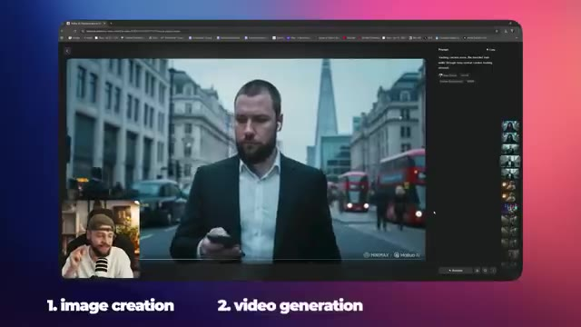
*Interface de l'outil Hyluo AI affichant une vidéo générée d'un homme marchant dans une rue de Londres avec le créateur en incrustation vidéo (PiP) dans le coin inférieur gauche.*

---

### ⏱️ `[00:00:58 - 00:01:33]` | Segment #03

**🔊 Audio (Transcription Intégrale Mot pour Mot en Français) :**
> les gars, assurez-vous de mettre un pouce bleu pour moi, pensez à vous abonner et bien sûr, activez la cloche de notification pour ne jamais manquer aucune vidéo future. Cela étant dit, entrons dans le vif du sujet. Donc la première étape de notre parcours de création de films par IA est la création d'images, où nous allons générer les images de départ utilisées pour chaque scène individuelle de notre cinématique d'intro. Et si nous allons sur Premiere Pro, vous pouvez voir que nous avons en quelque sorte voyagé dans le temps nous-mêmes car les deux dernières scènes, la scène d'aujourd'hui ainsi que la scène futuriste, manquent parce que je ne les ai pas encore réellement créées, j'ai gardé ça pour l'enregistrer.

**👁️ Analyse Visuelle d'Écran (gemini-3.5-flash-lite) :**
**Interface & Outils** : Adobe Premiere Pro et interface web d'un outil de génération d'images par IA (avec incrustation vidéo PiP de Jack dans le coin inférieur gauche).

**Contenu textuel & Code** : Sur l'image 2 : panneau latéral droit affichant une description détaillée de la création de variations d'une scène de garage d'ordinateur des années 1980 ("The fourth and final image is ready to be converted..."). Sur l'image 3 : interface Premiere Pro avec timeline de montage vidéo et moniteur affichant un plan de soldat en armure/casque avec un arrière-plan d'explosions.

**Action / Démonstration** : Le présentateur explique la première étape de son processus de création et montre l'interface de montage Premiere Pro pour illustrer les scènes manquantes dans sa chronologie.

*Interface d'un outil de génération par IA montrant une galerie de vignettes et un panneau de discussion textuel sur le côté droit.*

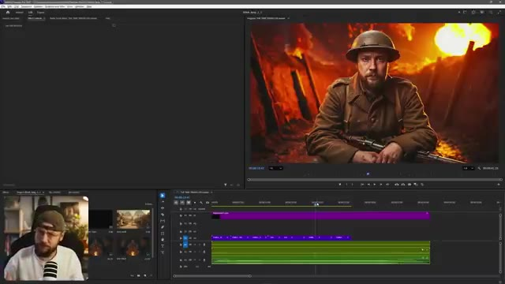
*Interface d'Adobe Premiere Pro montrant la timeline de montage et le moniteur avec une image générée d'un soldat dans une tranchée.*

---

### ⏱️ `[00:01:33 - 00:02:08]` | Segment #04

**🔊 Audio (Transcription Intégrale Mot pour Mot en Français) :**
> vidéo donc je peux vous emmener à travers le processus et le même flux de travail que nous allons appliquer à ces deux scènes manquantes est ce que j'utilise pour créer chaque scène avant maintenant pour commencer nous sommes sur l'agent Hyluo AI et c'est un outil plutôt cool en soi donc sur le côté droit ici nous avons une fenêtre de chat et cela fonctionne un peu comme n'importe quel autre LLM et comme je suis sûr que vous l'avez deviné cela vous permet de parler à l'agent HILUO et de lui demander de faire des choses comme vous générer des images en utilisant Nano Banana. Et sur le côté gauche ici et une fonctionnalité que je trouve vraiment très cool nous avons

**👁️ Analyse Visuelle d'Écran (gemini-3.5-flash-lite) :**
**Interface & Outils** : Adobe Premiere Pro sur l'image 1 et interface web de l'agent Hyluo AI sur l'image 2, avec incrustation vidéo (PiP) du créateur.

**Contenu textuel & Code** : Timeline de montage vidéo, pistes audio et vidéo, interface de chat LLM avec des descriptions textuelles d'images générées ("I have successfully created 4 variations...").

**Action / Démonstration** : Le créateur montre son écran de travail, naviguant d'abord entre le logiciel de montage vidéo et l'interface de l'agent IA.

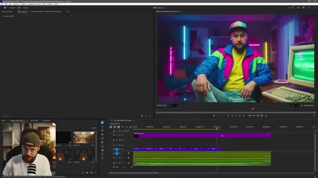
*Interface d'un logiciel de montage vidéo (Adobe Premiere Pro) affichant la timeline, le panneau source et un aperçu vidéo avec le créateur en incrustation PiP.*

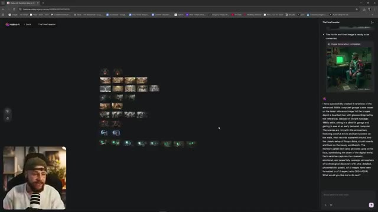
*Interface du site web Hyluo AI avec un panneau de chat textuel à droite et une zone de visualisation de projets au centre, avec le créateur en incrustation PiP en bas à gauche.*

---

### ⏱️ `[00:02:08 - 00:02:43]` | Segment #05

**🔊 Audio (Transcription Intégrale Mot pour Mot en Français) :**
> ce genre d'espace vide qui est appelé le canevas et ce qui se passe c'est que n'importe quand nous générons une image en utilisant cette fenêtre de chat sur la droite elle va être peuplée à l'intérieur du canevas et vous pouvez voir que j'ai commencé à disposer toutes mes images pour l'introduction cinématique comme si c'était une sorte de storyboard et cela vous permet de voir comment votre idée prend forme en temps réel et vous avez un point de comparaison entre nos très différentes scènes. Nous sommes capables de vérifier pour nous assurer que cette cohérence est là mais aussi que chaque image individuelle est visuellement assez frappante pour capturer le

**👁️ Analyse Visuelle d'Écran (gemini-3.5-flash-lite) :**
**Interface & Outils** : Application web de génération d'images et de storyboard (interface avec canevas infini et panneau de chat textuel latéral, comprenant un encadré vidéo incrusté de Jack en bas à gauche).

**Contenu textuel & Code** : Sur le panneau de droite, affichage d'une image générée montrant un homme barbu dans un garage des années 1980 éclairé par la lueur verte d'un moniteur cathodique, accompagnée d'un texte descriptif détaillé de la génération. Sur le canevas central, multiples petites vignettes d'images agencées par séquences.

**Action / Démonstration** : Le créateur montre son espace de travail en canevas agissant comme un storyboard interactif où s'organisent les différentes images générées par l'IA pour son introduction cinématique.

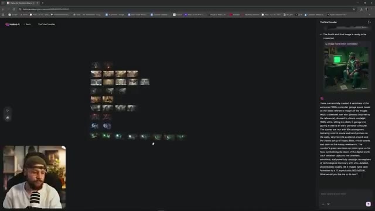
*Interface de l'application de génération avec un grand espace de travail en canevas au centre montrant plusieurs images miniatures disposées en grille, et une fenêtre de chat textuel sur le panneau de droite.*

---

### ⏱️ `[00:02:43 - 00:03:17]` | Segment #06

**🔊 Audio (Transcription Intégrale Mot pour Mot en Français) :**
> l'attention de l'audience. Et vous pouvez voir que pour certaines scènes nous avons seulement généré deux images parce que c'est tout ce que nous avions besoin de faire. Comme vous le savez tous avec l'IA il y a des essais et des erreurs impliqués donc certaines scènes prennent plus de générations pour trouver ce que vous cherchez surtout si comme moi peut-être vous ne savez pas exactement ce que vous voulez de Nano Banana donc cela demande un peu de relancer le même prompt ou de faire de légers ajustements tout au long du processus. Comme je le disais nous avons toutes nos images menant à la sorte de séquence des années 1980 qui concerne le fait de ramener un ordinateur personnel à la maison pour la première fois. Ce gigantesque

**👁️ Analyse Visuelle d'Écran (gemini-3.5-flash-lite) :**
**Interface & Outils** : Interface web de Halisun-AI affichant un espace de travail sombre avec des miniatures d'images au centre, un panneau de chat textuel sur le côté droit, et une incrustation vidéo (PiP) du créateur en bas à gauche.

**Contenu textuel & Code** : Texte descriptif dans le panneau de droite détaillant la génération de 4 variations de scènes de garage des années 1980 avec un homme barbu aux lunettes et des équipements rétro (disquettes, circuits, moniteur à l'écran vert). Des vignettes d'images générées sont affichées au centre de l'écran.

**Action / Démonstration** : Le créateur montre son écran de travail sur l'outil Halisun-AI tout en expliquant le processus de génération d'images et les essais nécessaires pour obtenir le résultat souhaité.

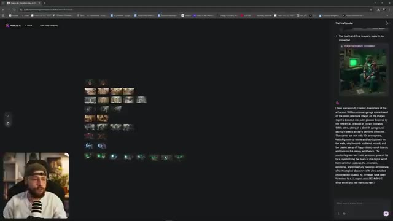
*Interface de l'outil Halisun-AI montrant une grille d'images générées et un panneau de discussion textuel sur la droite, avec Jack incrusté en bas à gauche.*

---

### ⏱️ `[00:03:17 - 00:03:50]` | Segment #07

**🔊 Audio (Transcription Intégrale Mot pour Mot en Français) :**
> saut technologique qui revêt une importance historique massive. Et ce que nous voulons faire, c'est créer un contraste saisissant maintenant en passant directement à nos jours. J'ai donc entré le prompt textuel pour la génération de notre image de départ d'aujourd'hui. Et quelque chose d'autre que j'apprécie vraiment avec l'agent Hyluo AI, c'est que nous pouvons dire quelque chose comme : "Veuillez me générer quatre générations nano banana en utilisant le prompt ci-dessous". Vous pouvez donc spécifier combien de fois vous voulez que l'agent Hilo exécute le même prompt. Et pour le prompt textuel lui-même, nous avons dit : un homme barbu ayant l'air stressé,

**👁️ Analyse Visuelle d'Écran (gemini-3.5-flash-lite) :**
**Interface & Outils** : Interface web de l'agent Hyluo AI (Hyluo AI agent) avec un panneau de discussion textuel à droite et une zone d'affichage des grilles d'images générées au centre, avec la webcam du présentateur en incrustation (PiP) en bas à gauche.

**Contenu textuel & Code** : Texte affiché à l'écran : "Please generate me 4 nano banana generations using the below prompt..." (Image 2) et le prompt détaillé décrivant un homme barbu stressé à Londres avec des écouteurs et un iPhone (Image 3).

**Action / Démonstration** : Le présentateur démontre l'utilisation de l'agent Hyluo AI pour spécifier le nombre de générations (quatre) souhaité à l'aide d'un prompt textuel spécifique, tout en affichant l'interface et un encart textuel illustratif.

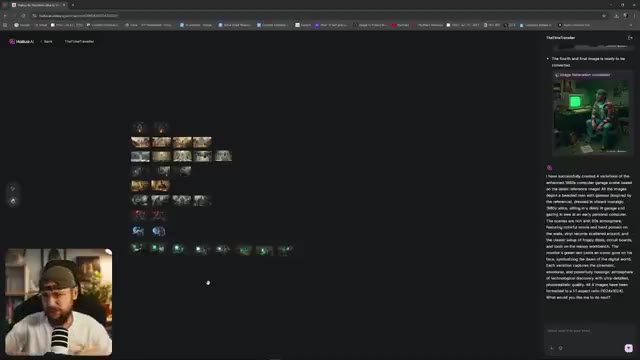
*Interface de l'agent Hyluo AI montrant l'historique des générations avec les résultats affichés dans le panneau principal et le créateur visible en incrustation.*

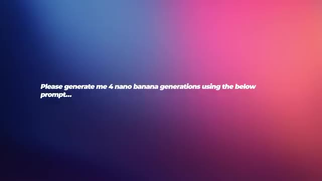
*Écran graphique coloré affichant le texte du prompt en superposition : "Please generate me 4 nano banana generations using the below prompt...".*

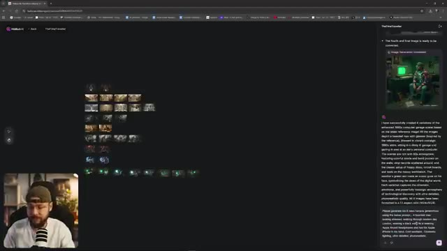
*Interface de l'agent Hyluo AI affichant le texte complet du prompt dans le panneau de discussion latéral droit.*

---

### ⏱️ `[00:03:50 - 00:04:26]` | Segment #08

**🔊 Audio (Transcription Intégrale Mot pour Mot en Français) :**
> en marchant dans le Londres d'aujourd'hui, portant un costume noir. Il porte des écouteurs Apple AirPods et a son iPhone Apple à la main. Esthétique froide, éclairage cinématique, ultra détaillé, photoréaliste. Et nous pouvons aller sur cette petite icône ici et télécharger notre image de référence. J'ai celle-ci de moi sans mes lunettes et ma casquette. La raison pour laquelle j'ai fait cela, c'est parce que je fais référence à des périodes où ces choses n'existaient tout simplement pas et je voulais avoir un très bon niveau de cohérence faciale pour moi-même à travers les différentes périodes, même lorsque nous sommes passés aux parties de

**👁️ Analyse Visuelle d'Écran (gemini-3.5-flash-lite) :**
**Interface & Outils** : Interface web d'un outil d'intelligence artificielle (type chatbot/génération) avec un panneau latéral de discussion à droite et une zone centrale affichant des vignettes de générations, ainsi qu'une incrustation vidéo (PiP) du présentateur en bas à gauche.

**Contenu textuel & Code** : Texte du prompt visible sur l'image #1 : "A bearded man looking stressed, walking through modern day London, wearing a black suit. He is wearing Apple AirPod headphones and has his Apple iPhone in his hand. Cold aesthetic. Cinematic lighting, ultra-detailed, photorealistic."

**Action / Démonstration** : Le présentateur explique comment rédiger le prompt et télécharger une image de référence pour maintenir la cohérence faciale d'une époque à une autre, tout en montrant l'interface et le texte à l'écran.

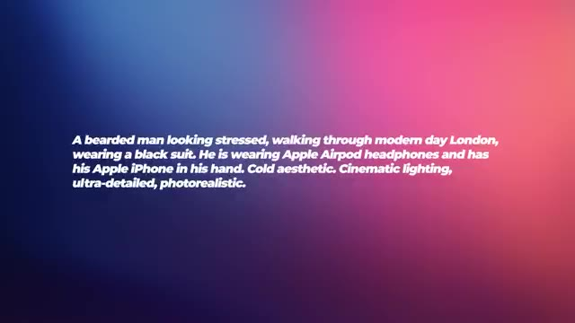
*Affichage d'un prompt textuel descriptif en anglais sur fond coloré.*

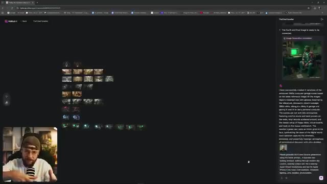
*Interface d'un outil de génération par IA avec un panneau de chat à droite et un retour vidéo/image, avec Jack en incrustation PiP.*

---

### ⏱️ `[00:04:26 - 00:05:00]` | Segment #09

**🔊 Audio (Transcription Intégrale Mot pour Mot en Français) :**
> l'histoire où les casquettes et les lunettes existaient. Je voulais vraiment rendre mon visage très cohérent tout du long pour vendre l'idée et m'assurer que le concept passe bien auprès du spectateur. Et nous pouvons donc lancer ces générations maintenant et voir ce que nous obtenons. Et vous pouvez maintenant voir que le canevas a été peuplé par notre nouvelle génération. Nous pouvons donc cliquer sur chacune d'elles et aller sur cette petite icône ici pour les mettre en plein écran. Et tout de suite, parfait. Exactement ce que je voulais. Regardons-les toutes cependant pour nous assurer de trouver celle que nous aimons le plus. Et juste un conseil les gars,

**👁️ Analyse Visuelle d'Écran (gemini-3.5-flash-lite) :**
**Interface & Outils** : Application web d'IA (type interface de génération par canevas avec panneau de discussion latéral à droite et incrustation vidéo du créateur en bas à gauche).

**Contenu textuel & Code** : Panneau latéral droit avec l'historique des générations textuelles et des miniatures d'images générées affichées sur le canevas central.

**Action / Démonstration** : Le créateur montre le canevas de l'application web avec les nouvelles générations d'images affichées.

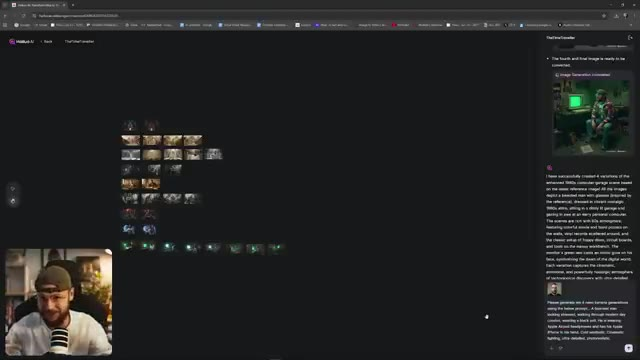
*Interface de l'application web d'IA avec le canevas affichant plusieurs miniatures de générations et Jack visible en incrustation PiP dans le coin inférieur gauche.*

---

### ⏱️ `[00:05:00 - 00:05:35]` | Segment #10

**🔊 Audio (Transcription Intégrale Mot pour Mot en Français) :**
> Assurez-vous que l'image de référence que vous téléchargez est au format d'image que vous voulez que Hailuo AI génère pour vous en utilisant Nano Banana. Elle va toujours par défaut se mettre sur un format un sur un, donc je lui ai donné un seize par neuf parce que bien sûr c'est ce que nous voulons pour notre cas d'usage. Maintenant, j'aime vraiment cette première génération ici, j'aime aussi beaucoup celle-ci où je regarde mon téléphone. Les deux font exactement ce que j'imagine et ne vous inquiétez pas, soit dit en passant, nous pouvons aller de l'avant et les télécharger sans les filigranes incrustés, il suffit d'aller sur cette icône de téléchargement et de cliquer sur "sans filigrane".

**👁️ Analyse Visuelle d'Écran (gemini-3.5-flash-lite) :**
**Interface & Outils** : Interface web de Hailuo AI (MiniMax) avec un panneau latéral de discussion, une grille de miniatures de vidéos générées et un mode PiP montrant le créateur en bas à gauche.

**Contenu textuel & Code** : Textes et panneaux de l'interface Hailuo AI / MiniMax, miniatures de vidéos, messages de discussion textuels dans le panneau latéral droit, filigrane discret en bas à droite de la vidéo générée.

**Action / Démonstration** : Le créateur navigue dans l'interface de Hailuo AI, zoome sur une vidéo générée où l'homme regarde son téléphone, puis clique sur l'icône de téléchargement pour ouvrir le menu contextuel permettant de retirer le filigrane.

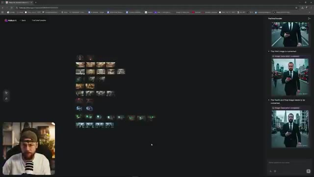
*Interface principale de Hailuo AI montrant une vue d'ensemble des générations de vidéos miniatures avec le créateur en incrustation PiP.*

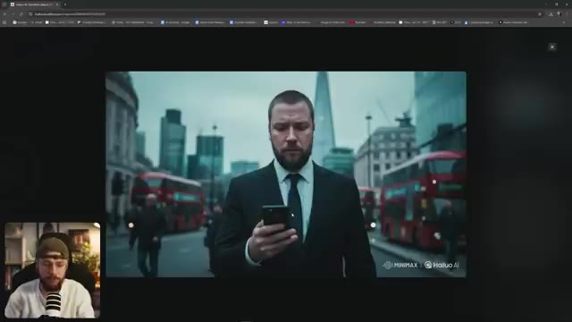
*Affichage en plein écran d'une vidéo générée montrant un homme en costume regardant son téléphone dans une rue de Londres avec des bus rouges.*

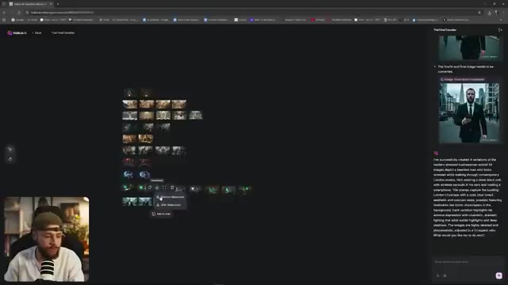
*Menu de téléchargement ouvert sur l'interface de Hailuo AI permettant de sélectionner l'option de téléchargement sans filigrane.*

---

### ⏱️ `[00:05:35 - 00:05:57]` | Segment #11

**🔊 Audio (Transcription Intégrale Mot pour Mot en Français) :**
> option. Ma préférence va en fait à celle-ci où je regarde mon téléphone, mais ma légère inquiétude est que lorsque nous allons animer ceci en utilisant Hyluo 2, leur générateur de vidéo par IA, l'IA ne sait pas réellement à quoi ressemblent mes yeux et il va donc y avoir un élément de devinette pour le modèle, et c'est le genre de chose auquel vous voulez penser avant de lancer vos générations.

**👁️ Analyse Visuelle d'Écran (gemini-3.5-flash-lite) :**
**Interface & Outils** : Navigateur web affichant une image générée en plein écran avec un encadré PiP (Picture-in-Picture) du créateur en bas à gauche.

**Contenu textuel & Code** : Image générée représentant un homme en costume tenant un téléphone portable dans une rue urbaine avec des bus à impériale rouges à l'arrière-plan, et les logos des marques MINIMAX et Hyluo AI dans le coin inférieur droit de l'image.
[CD] Affichage de l'image candidate sélectionnée pour l'animation avec le créateur en bas à gauche commentant le choix de cette option.

**Action / Démonstration** : Démonstration pédagogique et présentation du workflow.

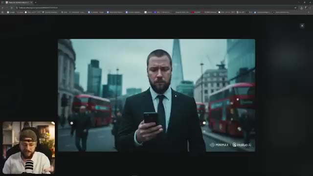
*Aperçu grand format d'une image générée montrant un homme en costume regardant son téléphone dans une rue de Londres avec des bus rouges, avec le créateur visible en incrustation PiP dans le coin inférieur gauche.*

---

### ⏱️ `[00:05:58 - 00:06:34]` | Segment #12

**🔊 Audio (Transcription Intégrale Mot pour Mot en Français) :**
> Cette première image, elle pourrait fonctionner vraiment très bien mais cela dépend de notre rendu. Je pense essentiellement que notre solution de secours va devoir être celle-ci. Et la raison à cela, c'est parce qu'elle nous offre une génération de mon visage très claire, réaliste et cohérente. Donc elle ne peut pas vraiment échouer. Mais je pense que nous allons générer les deux. Maintenant, nous avons rempli la fenêtre de chat avec notre prochain et dernier prompt textuel. Une fois de plus, nous demandons à Hylou de générer quatre variations via Nano Banana. Et le prompt textuel dit cette fois-ci : un homme barbu portant un sweat à capuche se tient dans une ville futuriste alors qu'il

**👁️ Analyse Visuelle d'Écran (gemini-3.5-flash-lite) :**
**Interface & Outils** : Interface web de Hyluo AI avec panneau latéral de chat et un écran de texte cinématique en plein écran.

**Contenu textuel & Code** : Texte du prompt affiché à l'écran : « A bearded man wearing a hoodie stands in a futuristic city, whilst it is raining. Bladerunner inspired. Slightly cold and dystopian. Cinematic composition, visible skin texture, gritty, ultra-detailed, photorealistic. »

**Action / Démonstration** : Le créateur navigue dans l'historique des générations sur Hyluo AI et présente le nouveau prompt textuel à l'écran.

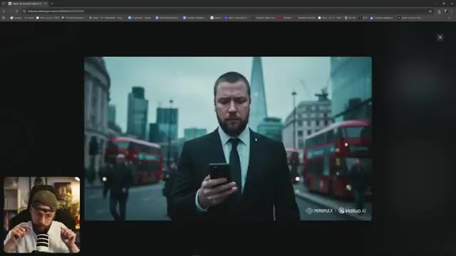
*Aperçu en grand écran sur l'interface Hyluo AI d'une génération montrant un homme barbu en costume regardant son téléphone dans une rue de Londres avec des bus rouges.*

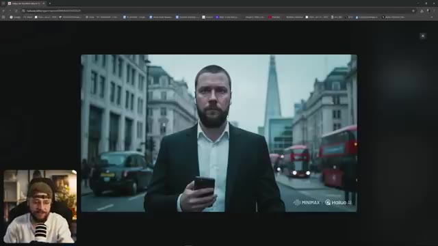
*Gros plan similaire sur l'interface Hyluo AI mettant en valeur le visage barbu généré avec réalisme.*

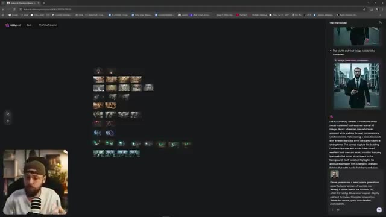
*Interface complète de l'application Hyluo AI montrant l'historique de génération et le panneau de chat textuel sur le côté droit.*

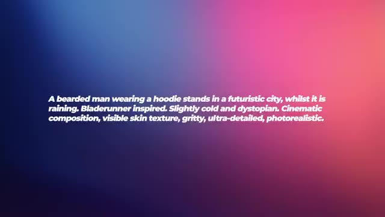
*Écran de texte sur fond dégradé bleu et rose affichant clairement le prompt textuel utilisé dans la vidéo.*

---

### ⏱️ `[00:06:34 - 00:07:07]` | Segment #13

**🔊 Audio (Transcription Intégrale Mot pour Mot en Français) :**
> en train de pleuvoir. Inspiré de Blade Runner, légèrement froid et dystopique, composition cinématographique, texture de peau visible, granuleux, ultra détaillé photo réaliste. Alors allons-y et exécutons ce prompt pour voir quels résultats nous obtenons en retour. D'accord, nous avons récupéré nos générations inspirées de Blade Runner. Et encore une fois, c'est exactement ce que je recherchais. Vraiment cinématographique et elles ont ce genre d'ambiance néon futuriste granuleuse. Maintenant, je veux juste exécuter à nouveau le même prompt avec un

**👁️ Analyse Visuelle d'Écran (gemini-3.5-flash-lite) :**
**Interface & Outils** : Interface web de génération d'images/vidéos par IA avec panneau de discussion latéral et espace de travail central.

**Contenu textuel & Code** : Texte du prompt : "A bearded man wearing a hoodie stands in a futuristic city, whilst it is raining. Bladerunner inspired. Slightly cold and dystopian. Cinematic composition, visible skin texture, gritty, ultra-detailed, photorealistic."

**Action / Démonstration** : Affichage à l'écran du prompt textuel en cours de lecture, puis transition vers l'interface de l'outil affichant les résultats générés.

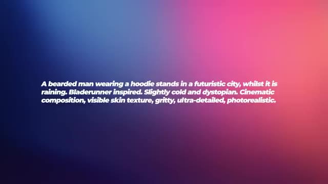
*Texte du prompt affiché à l'écran sur fond coloré dégradé bleu et rose.*

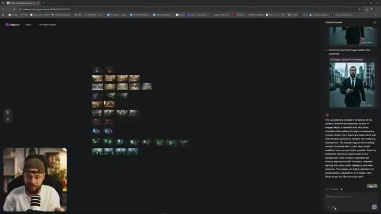
*Interface d'un outil de génération par IA montrant des vignettes de résultats et le présentateur en incrustation PiP.*

---

### ⏱️ `[00:07:07 - 00:07:42]` | Segment #14

**🔊 Audio (Transcription Intégrale Mot pour Mot en Français) :**
> Légère variation juste pour bien vendre l'idée que ça se passe dans le futur. Tout ce que j'ai fait, c'est ajouter cette courte phrase ici qui dit "voitures volantes et planantes derrière lui". Donc on va envoyer cette génération et voir ce qu'on obtient. Je veux juste faire comprendre clairement au spectateur qu'on n'est pas de nos jours. Je veux un peu de technologie futuriste qui n'existe tout simplement pas aujourd'hui. Parfait. Donc vous pouvez voir à partir de la dernière série de générations qu'on a maintenant des voitures volantes derrière moi. Personnellement, j'aime beaucoup cette génération-ci. Elle a vraiment une super ressemblance avec moi aussi. Juste

**👁️ Analyse Visuelle d'Écran (gemini-3.5-flash-lite) :**
**Interface & Outils** : Interface web de Hailuo AI (Hailuo AI - Duffers Alpha 1) avec un panneau de chat/génération textuelle à droite et l'affichage du créateur en incrustation vidéo (PiP) en bas à gauche.

**Contenu textuel & Code** : Texte du prompt visible dans le panneau latéral : "Please generate 4 new lumina generations using the below prompt... Flying hover cars behind him. Blade Runner inspired. Moody, cold and dystopian..." et filigrane "MINIMAX / Hailuo AI" sur l'image générée.

**Action / Démonstration** : Le créateur montre son écran avec l'interface de l'outil d'intelligence artificielle Hailuo AI, présentant d'abord la liste des générations passées, puis l'affichage de la nouvelle image sélectionnée intégrant les voitures volantes.

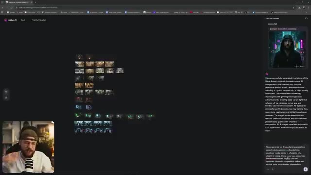
*Interface de Hailuo AI montrant l'historique des générations avec les prompts textuels et le créateur incrusté en bas à gauche.*

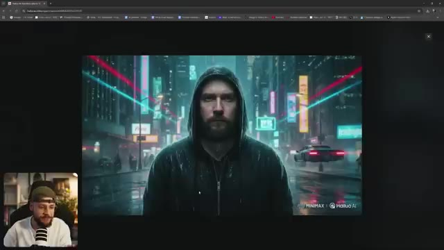
*Affichage en grand format de la nouvelle génération d'image avec un homme à capuche dans une ville futuriste sous la pluie et des voitures volantes.*

---

### ⏱️ `[00:07:42 - 00:08:18]` | Segment #15

**🔊 Audio (Transcription Intégrale Mot pour Mot en Français) :**
> imaginez-moi sans mes lunettes et ma casquette. Jetons un œil au dernier ici. Je n'aime pas tout à fait autant celui-ci. Je pense que le fait d'avoir la capuche ajoute vraiment du drame à la scène. Je vais donc cliquer sur l'option de téléchargement sans filigrane. Et maintenant, nous avons nos images de départ restantes générées. Nous avons deux options différentes lorsqu'il s'agit de moi de nos jours en train de marcher à Londres. Nous avons celle-ci où je regarde en avant et on peut clairement voir mon visage, ce qui est l'option la plus sûre. Et puis nous avons celle-ci où je regarde mon téléphone en bas. Mon option préférée, j'aime juste un peu plus la composition. Et puis bien sûr, nous avons l'image de fin finale,

**👁️ Analyse Visuelle d'Écran (gemini-3.5-flash-lite) :**
**Interface & Outils** : Hailuo AI (navigateur web) et visualiseur d'images système.

**Contenu textuel & Code** : Interface de Hailuo AI avec aperçu d'image en grand format, filigrane MiniMax / Hailuo AI en bas à droite, historique des générations miniatures.

**Action / Démonstration** : Le créateur navigue dans l'historique des générations d'images sur Hailuo AI et compare différentes options visuelles pour sa vidéo.

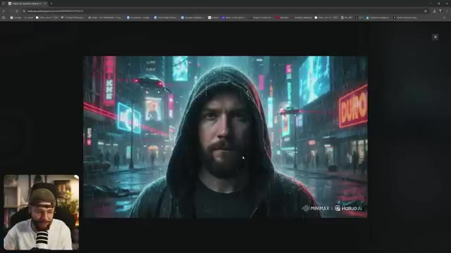
*Interface de Hailuo AI affichant l'image générée d'un personnage avec une capuche dans un décor urbain cyberpunk sous la pluie.*

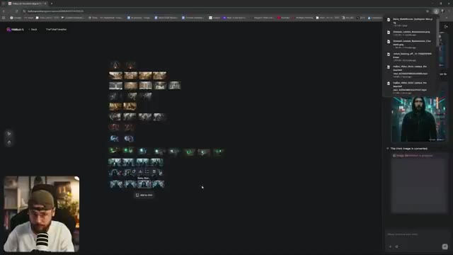
*Interface de Hailuo AI montrant l'historique des générations et des images miniatures dans le panneau de gauche.*

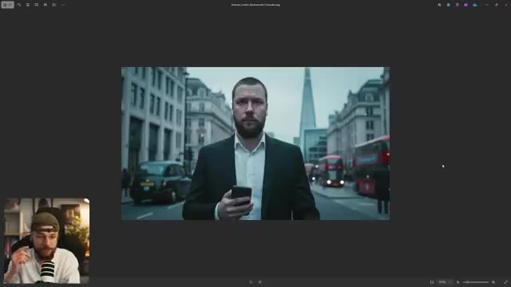
*Visualiseur d'images affichant le rendu d'un homme en costume avec un téléphone dans les rues de Londres.*

---

### ⏱️ `[00:08:18 - 00:08:53]` | Segment #16

**🔊 Audio (Transcription Intégrale Mot pour Mot en Français) :**
> ce look futuriste très dystopique. Très inspiré de Blade Runner et une façon très frappante de terminer notre court métrage. Donc, en retournant sur l'agent IA Hyluo, nous pouvons aller dans le coin supérieur gauche et cliquer sur retour. Et maintenant, en haut à gauche, vous pouvez voir l'option pour aller sur l'onglet vidéo, donc nous allons cliquer ici. Et vous pouvez voir toute une charge de générations de vidéos incroyables. J'adore vraiment Hyluo 02. C'est leur dernier modèle de génération de vidéo par IA. Ce que je préfère, c'est que ses générations sont

**👁️ Analyse Visuelle d'Écran (gemini-3.5-flash-lite) :**
**Interface & Outils** : Interface de visionneuse d'images puis interface web de Hyluo AI avec panneau latéral, onglets de génération vidéo (Image to Video, Text to Video, Subject Reference) et vignettes de résultats.

**Contenu textuel & Code** : URL visible sur les images 2 et 3 : "hyluo.ai/v1/editors/..." - Onglets : "Image to Video", "Text to Video", "Subject Reference" - Différentes vignettes de prévisualisation de vidéos d'astronautes et de scènes industrielles avec des invites textuelles associées (prompts).

**Action / Démonstration** : Le créateur navigue à travers l'interface de Hyluo AI, basculant entre la vue des images générées et l'onglet vidéo pour présenter le modèle Hyluo 02.

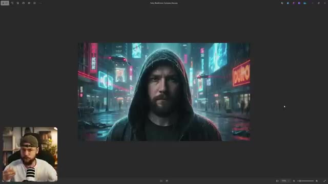
*Visualisation d'une image au style Blade Runner affichée sur l'écran du créateur.*

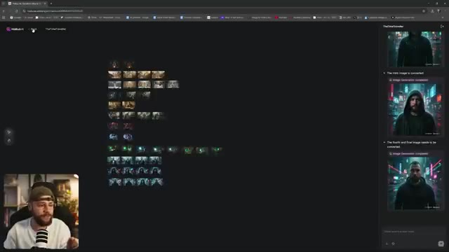
*Navigation dans l'interface de l'agent IA Hyluo avec le panneau de navigation et les vignettes à droite.*

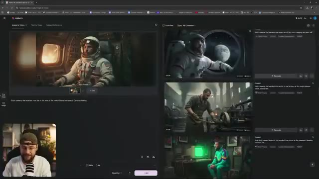
*Interface principale de Hyluo AI montrant l'onglet vidéo avec différentes générations et modèles affichés.*

---

### ⏱️ `[00:08:53 - 00:09:27]` | Segment #17

**🔊 Audio (Transcription Intégrale Mot pour Mot en Français) :**
> très cinématiques et ils sont constants également. Et par là je veux dire que vous n'avez pas besoin de relancer les mêmes invites textuelles encore et encore et encore. Vous pouvez voir que la plupart du temps je n'ai eu à le lancer qu'à quelques reprises. D'une manière générale, en faisant défiler, vous pouvez voir que j'obtiens les résultats que je recherche très rapidement. Et qu'est-ce que cela signifie ? Nous dépensons moins de crédits et alors tout le monde est heureux, n'est-ce pas ? Donc cela étant dit, nous pouvons maintenant aller de l'avant et générer les vidéos pour nos deux dernières scènes restantes. Maintenant, en termes de chaque plan, j'ai essayé de varier les mouvements de caméra. Donc le premier plan a

**👁️ Analyse Visuelle d'Écran (gemini-3.5-flash-lite) :**
**Interface & Outils** : Interface web de Higgsfield AI (génération de vidéo) et logiciel de montage Adobe Premiere Pro, avec incrustation vidéo (PiP) du présentateur en bas à gauche.

**Contenu textuel & Code** : Prompts visibles sur l'interface de Higgsfield AI : "Static camera, the bearded man sits in the seat as the rocket blasts into space. Camera shaking.", "Slow dolly zoom in, the bearded man speaks calmly to the audience, connecting with the lens."

**Action / Démonstration** : Le présentateur démontre l'interface de génération vidéo sur Higgsfield AI puis bascule sur le logiciel Adobe Premiere Pro pour montrer le montage des plans.

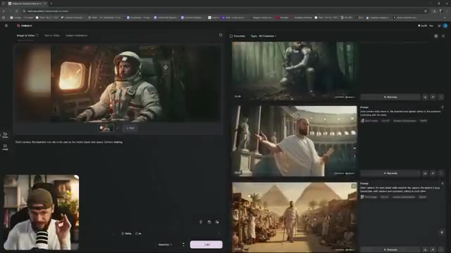
*Interface de Higgsfield AI montrant un astronaute dans une capsule spatiale et un panneau latéral de clips générés.*

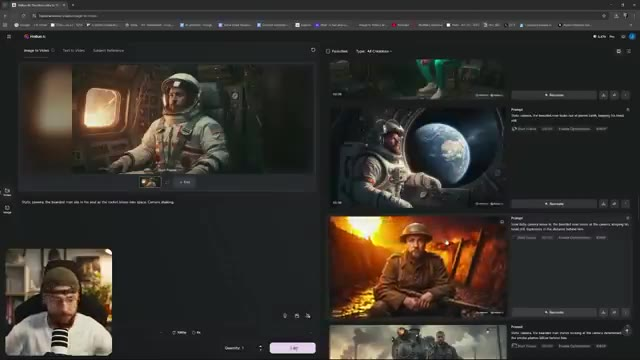
*Interface de Higgsfield AI avec un aperçu de l'astronaute et une liste de prompts textuels dans la colonne de droite.*

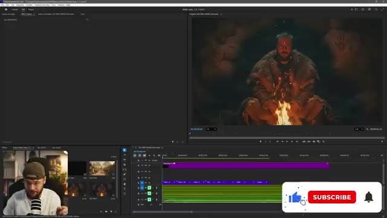
*Interface d'Adobe Premiere Pro montrant la chronologie de montage vidéo et un personnage assis près d'un feu de camp.*

---

### ⏱️ `[00:09:27 - 00:10:01]` | Segment #18

**🔊 Audio (Transcription Intégrale Mot pour Mot en Français) :**
> ce genre de mouvement de caméra dolly vers l'avant. Ensuite, on passe à un plan fixe, mouvement de caméra dolly, fixe, dolly, fixe, juste pour ajouter un peu de variation là-dedans. Donc notre vidéo des années 1980 a un mouvement dolly. On sait donc qu'on veut que ce plan soit fixe. Et on verra bien comment ça donne en réalité, parce que je marche à travers Londres. On devra peut-être faire un genre de plan de suivi ou quelque chose comme ça, mais tu sais quoi, allons-y et testons pour voir quel genre de résultats on obtient. Donc si j'ouvre mes téléchargements, je peux glisser-déposer notre première option pour moi en train de marcher à travers Londres, l'air très stressé en

**👁️ Analyse Visuelle d'Écran (gemini-3.5-flash-lite) :**
**Interface & Outils** : Adobe Premiere Pro et l'interface web de Higgsfield AI (mode Image to Video).

**Contenu textuel & Code** : Sur les images 1 et 2, l'interface de montage Adobe Premiere Pro avec timeline multicouche et moniteur de prévisualisation vidéo. Sur l'image 3, l'interface de Higgsfield AI avec des exemples de générations (astronaute, homme des années 80) et le prompt visible : "Static camera, the bearded man sits in his seat as the rocket blasts into space. Camera shaking."

**Action / Démonstration** : Le créateur montre son montage vidéo sur Premiere Pro (alternance de mouvements de caméra dolly et de plans fixes), puis bascule sur l'interface de Higgsfield AI pour préparer la génération d'un nouveau plan vidéo.

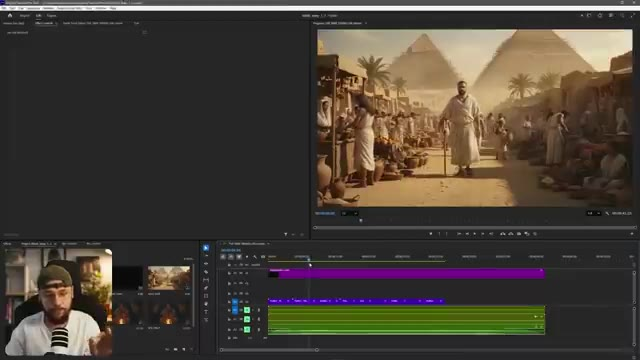
*Interface d'Adobe Premiere Pro montrant la timeline avec une séquence de plans générés par IA dans l'Égypte ancienne, avec le créateur en incrustation vidéo (PiP) dans le coin inférieur gauche.*

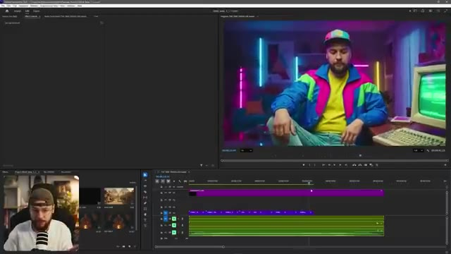
*Interface d'Adobe Premiere Pro affichant une scène rétro des années 1980 dans le moniteur de prévisualisation, avec Jack visible en bas à gauche.*

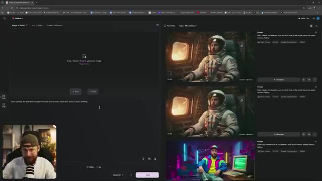
*Interface de l'outil web Higgsfield AI (Image to Video) avec le panneau de chargement d'images et la liste des prompts à droite.*

---

### ⏱️ `[00:10:01 - 00:10:36]` | Segment #19

**🔊 Audio (Transcription Intégrale Mot pour Mot en Français) :**
> de nos jours, plutôt précis, je dois dire, à part le costume, on ne me voit pas souvent porter un costume, et on va juste opter pour un prompt assez basique : caméra fixe, l'homme barbu marche dans le centre animé de Londres en ayant l'air stressé. On peut aussi sélectionner la résolution de sortie, comme on génère en 1080p, on ne peut aller qu'jusqu'à six secondes de longueur, mais c'est toujours bon pour notre cas d'usage. Si on descend à 2768p, on peut aller jusqu'à 10 secondes, mais je veux la résolution maximale, je sais que mes clips vont être courts donc je veux qu'ils soient vraiment nets, et en bas à droite, vous pouvez voir

**👁️ Analyse Visuelle d'Écran (gemini-3.5-flash-lite) :**
**Interface & Outils** : Interface de l'application web de génération vidéo Haiku.ai avec panneau de prévisualisation, zone de prompt et historique des générations à droite.

**Contenu textuel & Code** : Texte du prompt visible : « Static camera, the bearded man walks through busy central London looking stressed. » Paramètres de résolution et de durée.

**Action / Démonstration** : Le créateur montre l'interface de Haiku.ai, saisit ou affiche le prompt textuel, puis ajuste les paramètres de résolution et de durée de la vidéo.

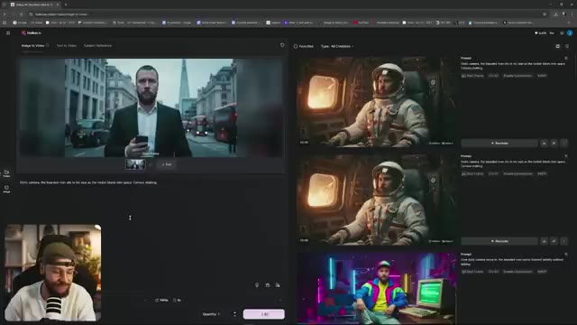
*Interface de l'outil de génération vidéo Haiku.ai montrant le prompt textuel et le retour vidéo avec la webcam du créateur en incrustation.*

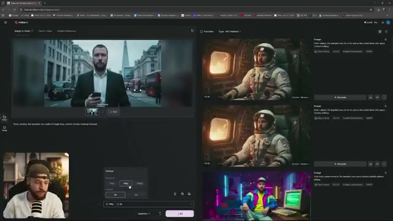
*Interface de Haiku.ai montrant les options de configuration de la résolution (1080p) et de durée de génération vidéo.*

---

### ⏱️ `[00:10:36 - 00:11:10]` | Segment #20

**🔊 Audio (Transcription Intégrale Mot pour Mot en Français) :**
> Il y a une option pour faire améliorer votre prompt, en général je laisse ceci activé, d'habitude je ne le fais pas pour beaucoup d'autres outils d'IA mais Haloo s'en sort plutôt bien en laissant cette option activée donc je vous suggère de faire de même. Bien sûr, expérimenter avec et sans est toujours une bonne option également, donc nous allons cliquer sur générer pour celle-ci. Je vais également configurer une autre option qui est un mouvement de caméra de suivi. Donc cliquez sur générer pour celle-ci et je vais glisser-déposer notre génération alternative. Et je viens d'ajouter un petit bout à la fin de ce prompt textuel ici. Donc en entier, il est écrit : l'homme barbu marche à travers

**👁️ Analyse Visuelle d'Écran (gemini-3.5-flash-lite) :**
**Interface & Outils** : Interface web de Haloo AI (section Image to Video).

**Contenu textuel & Code** : Le prompt visible dans l'interface indique : "Static camera, the bearded man walks through busy central London looking stressed." puis modifié en "Tracking camera move, the bearded man walks through busy central London looking stressed looking down at his phone."

**Action / Démonstration** : Le créateur montre l'interface de génération, explique les réglages d'amélioration du prompt et lance la génération d'une nouvelle vidéo avec un mouvement de caméra de suivi.

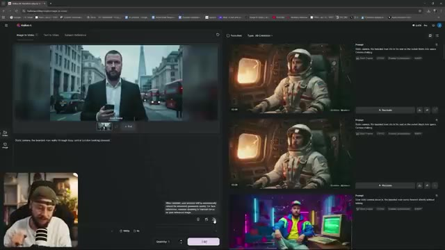
*Interface de Haloo AI montrant les options de génération vidéo Image-to-Video avec le créateur en incrustation (PiP).*

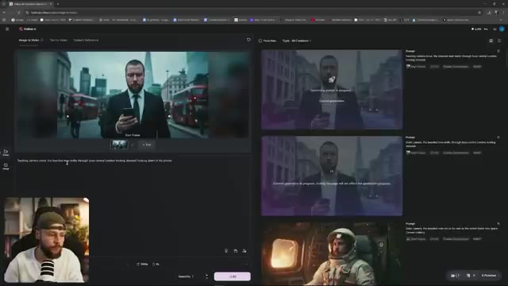
*Interface de Haloo AI montrant le lancement de la génération avec le prompt mis à jour.*

---

### ⏱️ `[00:11:10 - 00:11:30]` | Segment #21

**🔊 Audio (Transcription Intégrale Mot pour Mot en Français) :**
> un quartier animé du centre de Londres en ayant l'air stressé, en regardant son téléphone parce qu'on ne veut pas vraiment qu'il lève les yeux car, comme je l'ai dit avant, le modèle d'IA ne sait pas vraiment à quoi ressemblent mes yeux ou mon visage lorsqu'il est complètement relevé vers la caméra. Donc s'il essaie de générer ça, les choses pourraient devenir un peu bizarres. Donc nous allons générer celui-là ici.

**👁️ Analyse Visuelle d'Écran (gemini-3.5-flash-lite) :**
**Interface & Outils** : Interface web de Kling AI (Kling AI GenVideo / Image to Video) avec une incrustation vidéo (PiP) du créateur.

**Contenu textuel & Code** : Texte du prompt saisi : 'Tracking camera move, the bearded man walks through busy central London looking stressed looking down at his phone.' Image de départ montrant un homme barbu en costume regardant son téléphone dans Londres, avec un panneau 'Start Frame'.

**Action / Démonstration** : Le créateur montre l'interface de Kling AI et les paramètres de génération vidéo par IA pour animer l'image fixe.

*Texte du prompt affiché sur fond coloré : 'Tracking camera move, the bearded man walks through busy central London looking stressed looking down at his phone.'*

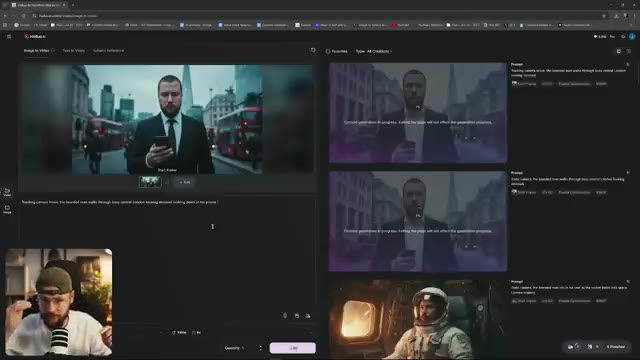
*Interface de Kling AI (mode Image to Video) avec le panneau de génération et la webcam de Jack en incrustation (PiP).*

---

### ⏱️ `[00:11:30 - 00:11:55]` | Segment #22

**🔊 Audio (Transcription Intégrale Mot pour Mot en Français) :**
> Vous pouvez voir que nous avons plusieurs générations qui se produisent toutes en même temps. Et notre prompt est optimisé avec celui du haut ici. C'est un processus assez rapide. Et je trouve que cela tend à aider à la cohérence de vos générations. Et nous pouvons également insérer notre image finale inspirée de Blade Runner. Vous voyez aussi que nous avons une option pour une image de début et de fin où Hylou 2 essaie de fusionner les deux ensemble avec une transition.

**👁️ Analyse Visuelle d'Écran (gemini-3.5-flash-lite) :**
**Interface & Outils** : Hailuo AI (Minimax) - Interface de génération vidéo (Image to Video, Text to Video, Subject Reference).

**Contenu textuel & Code** : Affichage de l'image de départ (Start Frame) d'un homme en costume regardant son téléphone dans Londres, et sur la droite, trois panneaux de génération vidéo simultanés avec des barres de progression et des prompts textuels visibles. En bas à gauche, incrustation vidéo (PiP) du créateur Jack dans son studio.

**Action / Démonstration** : Le créateur montre l'interface de Hailuo AI avec plusieurs générations de vidéos en cours d'exécution en parallèle et l'optimisation des prompts.

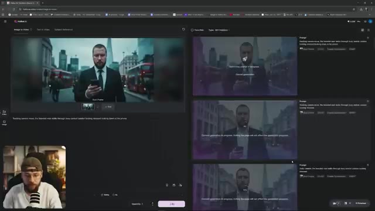
*Interface du logiciel de génération vidéo Hailuo AI affichant plusieurs générations simultanées et un retour vidéo avec le créateur en incrustation PiP.*

---

### ⏱️ `[00:11:55 - 00:12:18]` | Segment #23

**🔊 Audio (Transcription Intégrale Mot pour Mot en Français) :**
> C'est une chose plutôt cool à expérimenter également, mais encore une fois, ce n'est pas vraiment ce que nous voulons pour ce cas d'utilisation particulier. Et pour le prompt textuel, nous allons opter pour un mouvement de caméra avant lent en travelling (slow dolly camera move in). L'homme barbu fixe droit devant lui en silence sans parler. Forte pluie, voitures volantes derrière lui. Nous allons cliquer sur générer pour cela. Et je pense que je pourrais aussi essayer une option de caméra statique, juste pour me couvrir un peu.

**👁️ Analyse Visuelle d'Écran (gemini-3.5-flash-lite) :**
**Interface & Outils** : Interface web d'un outil de génération de vidéo par IA (type Kling / Runway / Seedance) avec panneau latéral de prévisualisation, zone de prompt et historique à droite.

**Contenu textuel & Code** : Texte visible dans la zone de prompt : "Slow dolly camera move in, the bearded man stares forward silently without talking. Heavy rain, flying cars behind him."

**Action / Démonstration** : Le créateur montre l'interface de l'outil de génération vidéo et saisit un nouveau prompt textuel pour générer une variante avec un mouvement de caméra en travelling avant.

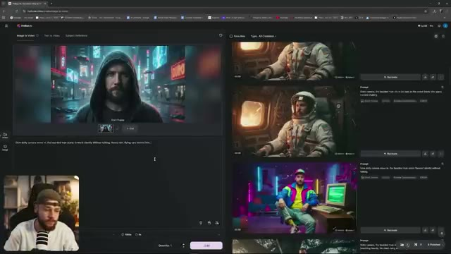
*Interface de l'outil de génération vidéo affichant l'espace de travail avec un personnage cyberpunk, la saisie du prompt textuel en bas à gauche et la caméra de Jack en incrustation PiP.*

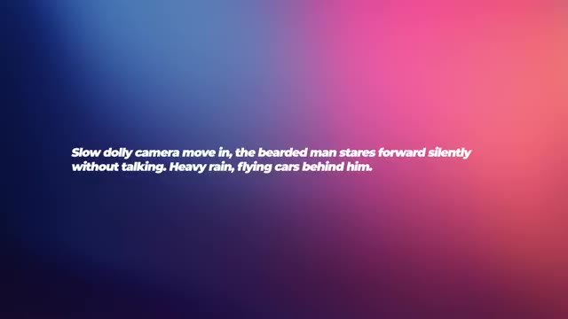
*Écran de texte sur fond coloré dégradé (bleu/rose) affichant en gros caractères blancs le prompt textuel saisi par le créateur.*

---

### ⏱️ `[00:12:18 - 00:12:37]` | Segment #24

**🔊 Audio (Transcription Intégrale Mot pour Mot en Français) :**
> Bon, nous avons maintenant récupéré nos générations de vidéo Hyluo et ça a fait un super travail, comme je l'avais prédit. En ouvrant le premier plan ici, c'était notre option de caméra fixe. Vous pouvez voir que je ne marche pas, donc ça ne donne pas vraiment ce que je voulais. C'est de ma faute cependant. Je savais déjà un peu que dire caméra fixe ne fonctionnerait pas vraiment.

**👁️ Analyse Visuelle d'Écran (gemini-3.5-flash-lite) :**
**Interface & Outils** : Interface web de Hyluo AI (outil de génération de vidéo par intelligence artificielle) avec affichage de la bibliothèque de créations, panneaux de prompts et aperçu vidéo avec encadré PiP du créateur en bas à gauche.

**Contenu textuel & Code** : Texte du prompt visible : « Static camera, the bearded man walks through busy central London looking stressed. » Paramètres de génération et historique des clips générés dans le panneau latéral droit.

**Action / Démonstration** : Le créateur présente les résultats de génération vidéo sur l'interface de Hyluo AI, en inspectant les différents plans vidéo générés (notamment l'option de caméra fixe).

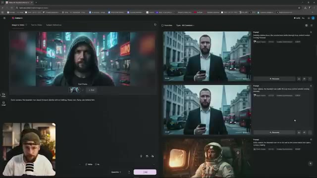
*Interface de la plateforme de génération vidéo Hyluo AI affichant les différentes générations de vidéos et les résultats avec les prompts associés.*

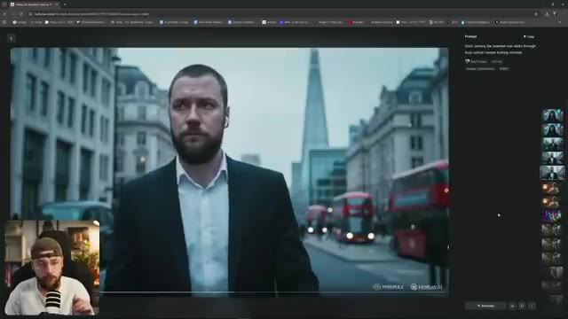
*Gros plan sur le lecteur vidéo au sein de l'interface Hyluo AI montrant le premier plan avec l'homme barbu en costume marchant dans les rues de Londres.*

---

### ⏱️ `[00:12:37 - 00:12:55]` | Segment #25

**🔊 Audio (Transcription Intégrale Mot pour Mot en Français) :**
> Mais si nous revenons en arrière et vérifions notre option de caméra de suivi, c'est exactement ce que je voulais. Et je finis par regarder en bas de toute façon. Donc ça couvre en quelque sorte les deux aspects. Et nous avons aussi notre troisième option. Regardez juste à quel point c'est dynamique. Regardez à quel point le plan change et à quel point de Londres cela montre. Dingue.

**👁️ Analyse Visuelle d'Écran (gemini-3.5-flash-lite) :**
**Interface & Outils** : Interface web de Hailuo AI (MiniMax) avec panneau de prévisualisation vidéo, historique des générations à droite et incrustation vidéo du créateur (Jack) en bas à gauche.

**Contenu textuel & Code** : Texte du prompt visible : "Tracking camera move, the bearded man walks through busy central London looking stressed looking down at his phone." Paramètres : Start Frame, High Quality, 1080p.

**Action / Démonstration** : Le créateur navigue dans l'interface de Hailuo AI, sélectionne et visionne différentes options de mouvements de caméra de suivi pour la vidéo générée d'un homme à Londres.

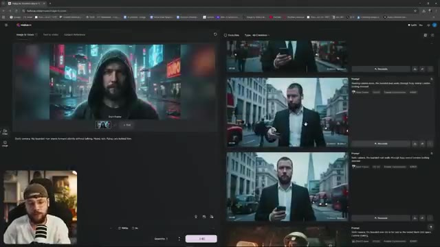
*Interface de Hailuo AI montrant l'option de caméra de suivi avec plusieurs vidéos générées en arrière-plan et le créateur en incrustation.*

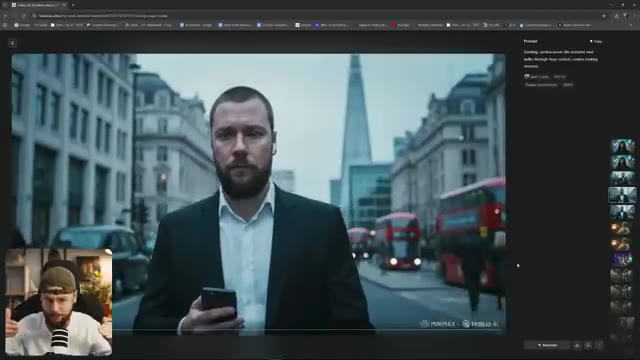
*Visualisation en grand format de la vidéo générée montrant l'homme barbu marchant dans les rues de Londres avec un bus rouge.*

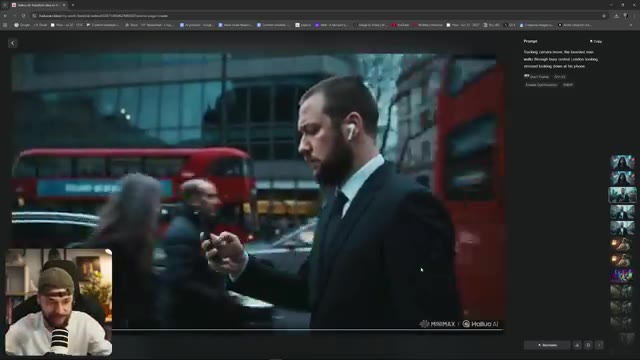
*Gros plan sur le mouvement dynamique de la caméra de suivi montrant l'homme marchant et regardant son téléphone à Londres.*

---

### ⏱️ `[00:12:56 - 00:13:32]` | Segment #26

**🔊 Audio (Transcription Intégrale Mot pour Mot en Français) :**
> Nous allons essayer les deux dans le montage et voir lequel fonctionne le mieux. Et maintenant, je suis impatient de vous montrer ceci. Nous avons nos générations Blade Runner. Nous allons commencer par ma moins préférée, qui est la caméra fixe. Un peu sans vie. Encore une fois, c'est de ma faute. La caméra fixe ne fonctionne tout simplement pas aussi bien lorsqu'il s'agit de ce type de plan, je suppose. Mais si nous allons jeter un œil au mouvement de caméra lent de rapprochement dolly in, c'est exactement ce que nous voulions. C'est le résultat dont nous avons besoin. Et nous allons terminer le court métrage en beauté. Et on peut dire très clairement que cela se passe dans le futur. Donc je vais

**👁️ Analyse Visuelle d'Écran (gemini-3.5-flash-lite) :**
**Interface & Outils** : Navigateur web affichant l'interface de l'outil de génération vidéo par IA MiniMax Hailuo AI (avec la miniature du créateur en incrustation PiP dans le coin inférieur gauche).

**Contenu textuel & Code** : Sur l'image 1, le prompt visible est : "Tracking camera move, the bearded man walks through busy central London looking stressed looking down at his phone." Sur l'image 2, le prompt est : "Static camera, the hooded man stares forward silently without talking. Heavy rain, flying cars behind him." Sur l'image 3, le prompt est : "Slow dolly camera move in, the hooded man stares forward silently without talking. Heavy rain, flying cars behind him."

**Action / Démonstration** : Le créateur présente différentes générations de vidéos par IA (plans de type Blade Runner et Londres) en comparant l'effet d'une caméra fixe par rapport à un mouvement de caméra lent.

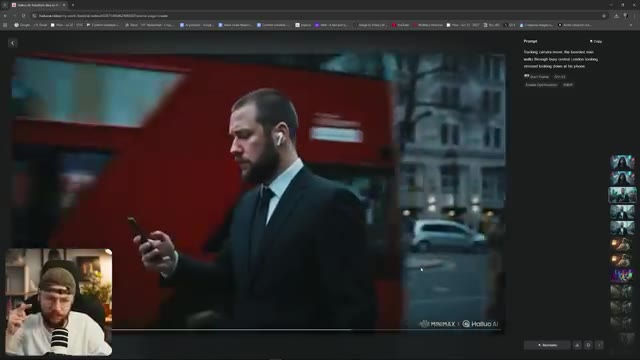
*Interface de MiniMax Hailuo AI montrant un homme barbu en costume marchant dans Londres avec un prompt de mouvement de caméra de suivi.*

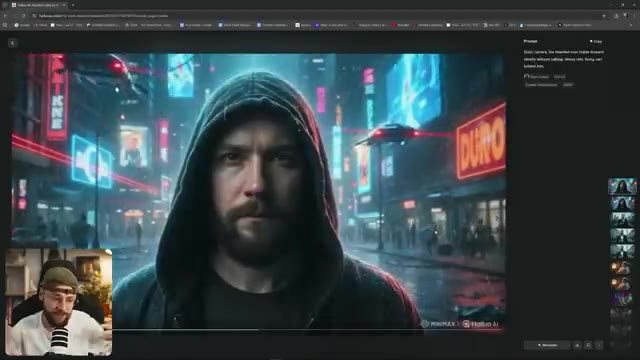
*Interface de MiniMax Hailuo AI affichant un homme à capuche dans un décor urbain cyberpunk futuriste (Blade Runner) avec une caméra fixe.*

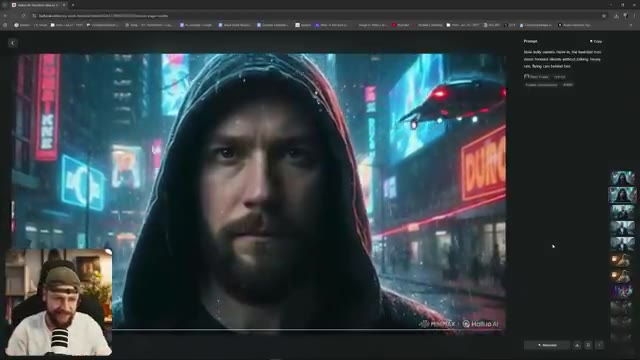
*Interface de MiniMax Hailuo AI affichant le même plan cyberpunk avec un mouvement de caméra lent en zoom avant (dolly in).*

---

### ⏱️ `[00:13:32 - 00:14:35]` | Segment #27

**🔊 Audio (Transcription Intégrale Mot pour Mot en Français) :**
> allons-y et téléchargeons toutes ces vidéos sans nos filigranes dessus. Bien sûr, nous ne voulons pas vraiment cela lorsqu'il s'agit de notre réalisation de films par IA. Nous avons donc maintenant ajouté nos nouvelles générations pour terminer le film. Nous avons le plan d'aujourd'hui ainsi que notre plan futuriste. Et j'ai également ajouté quelques couches audio. Nous avons de la musique et des effets sonores. Alors allons-y et regardons tout cela dans son état actuel. Pour que vous puissiez voir que tout fonctionne vraiment

**👁️ Analyse Visuelle d'Écran (gemini-3.5-flash-lite) :**
**Interface & Outils** : Haivision AI (navigateur web) et Adobe Premiere Pro (logiciel de montage).

**Contenu textuel & Code** : Prompts visibles sur l'interface Haivision AI : 'Tracking camera move, the bearded man walks through busy central London looking stressed, turning down of his phone' et 'Static camera, the bearded man stares forward silently without talking. Heavy rain, flying cars behind him.'

**Action / Démonstration** : Le créateur montre le téléchargement des clips depuis la plateforme Haivision AI sans filigrane, puis passe sur Adobe Premiere Pro pour assembler les plans actuels et futuristes avec des pistes audio et musicales, et lance la lecture de la timeline pour vérifier le résultat.

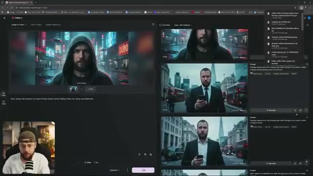
*Interface de la plateforme de génération vidéo (Haivision AI) montrant la bibliothèque de clips générés et les options de téléchargement.*

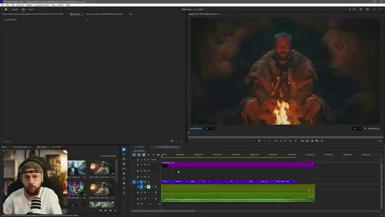
*Interface du logiciel de montage Adobe Premiere Pro affichant la timeline multipiste avec les clips vidéo et audio assemblés.*

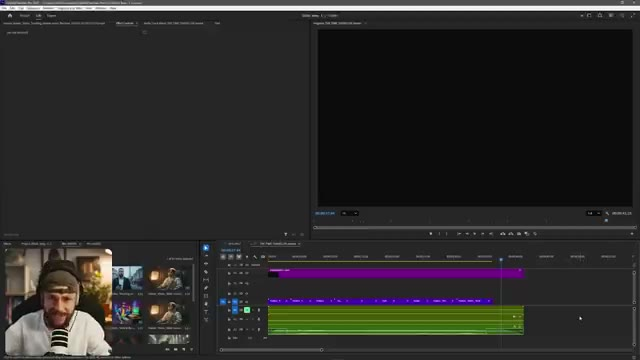
*Retour sur l'interface d'Adobe Premiere Pro pendant la lecture de la timeline avec l'écran de prévisualisation noir.*

---

### ⏱️ `[00:14:35 - 00:15:00]` | Segment #28

**🔊 Audio (Transcription Intégrale Mot pour Mot en Français) :**
> joliment, mais il nous manque quelque chose. Ce dont nous avons besoin, c'est d'une narration ou d'une voix off vraiment puissante pour aider à raconter notre histoire et à vendre véritablement le concept. Et maintenant, pour ce faire, nous allons nous rendre sur minimax.io slash audio. Vous pouvez voir que nous avons plusieurs options différentes en ce qui materne les voix. Nous avons l'isoleur de voix, le clone de voix, et ce qui nous intéresse vraiment, c'est la conception de voix.

**👁️ Analyse Visuelle d'Écran (gemini-3.5-flash-lite) :**
**Interface & Outils** : Image 1 : Adobe Premiere Pro. Image 2 : Minimax.io/audio (Interface web de création audio par IA).

**Contenu textuel & Code** : Image 1 : Chronologie de montage avec pistes audio et vidéo, panneau de projet avec vignettes. Image 2 : Titre "Create Lifelike Audio", onglets "Text to Speech" et "Music Creation", options de voix ("Voice Design", "Voice Clone", "Voice Isolator").

**Action / Démonstration** : Le créateur montre son écran de montage vidéo, puis navigue sur le site web de Minimax Audio pour présenter les différentes options de clonage et de design vocal.

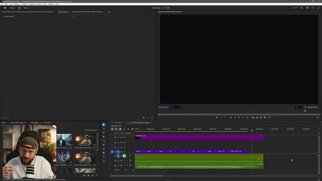
*Interface d'un logiciel de montage vidéo (Adobe Premiere Pro) avec le panneau de montage, le moniteur et un encadré PiP montrant le créateur.*

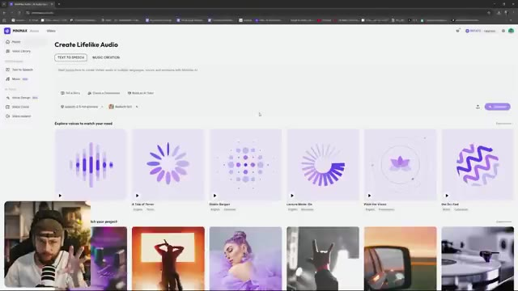
*Interface du site web Minimax Audio ("Create Lifelike Audio") affichant différentes options de voix et un encadré PiP du créateur.*

---

### ⏱️ `[00:15:00 - 00:15:22]` | Segment #29

**🔊 Audio (Transcription Intégrale Mot pour Mot en Français) :**
> Nous pouvons également aller explorer davantage et nous pouvons consulter leur bibliothèque de voix existante. Et il y en a de vraiment superbes ici pour toutes sortes de cas d'utilisation différents. Jetons un coup d'œil à certaines d'entre elles. Donc, partenaire mature. Nous devons aborder cette situation avec à la fois sagesse et compréhension. Conteur captivant. Imaginez ceci. Clair de lune, château ancien et un mystère qui n'attend qu'à être résolu.

**👁️ Analyse Visuelle d'Écran (gemini-3.5-flash-lite) :**
**Interface & Outils** : Interface web de MiniMax Audio (affichage du navigateur avec les onglets Voice Design, Voice Clone, Voice Control, et la liste des voix). Le présentateur apparaît dans un encadré PiP (Picture-in-Picture) en bas à gauche de l'écran.

**Contenu textuel & Code** : Noms des profils vocaux visibles dans la bibliothèque : "Mature Partner", "Trustworthy Man", "Captivating Storyteller", "Man with Deep Voice", "Graceful Lady", "Insightful Speaker", "Whimsical Girl", etc. Boutons d'écoute (Audition) et d'utilisation (Use) associés à chaque voix.

**Action / Démonstration** : Le créateur présente l'interface de la bibliothèque de voix de MiniMax Audio et s'apprête à faire écouter des exemples de voix.

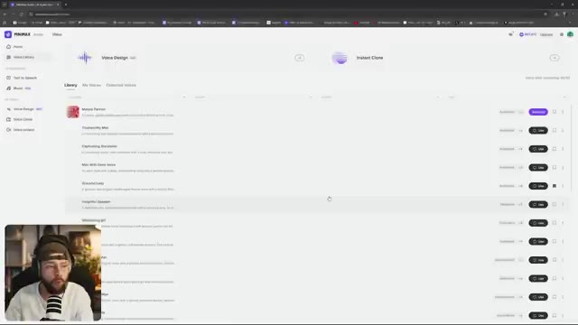
*Interface de MiniMax Audio affichant la bibliothèque de voix (Voice Library) avec la liste des profils vocaux disponibles.*

---

### ⏱️ `[00:15:22 - 00:15:54]` | Segment #30

**🔊 Audio (Transcription Intégrale Mot pour Mot en Français) :**
> J'aime vraiment beaucoup celle de la dame élégante. Elle ne convient pas pour notre concept, mais elle donne une impression très chaleureuse et presque rassurante aussi. On peut voir qu'on peut accéder à une bibliothèque et trouver une voix qui correspond à n'importe quel type d'ambiance que l'on recherche vraiment. Il y a quelque chose de charmant dans le calme, la brise légère qui danse à travers les feuilles, le tintement délicat du thé chinois qu'on sert, et on peut voir aussi que si l'on se dirige vers la conception de voix (voice design), on peut en fait saisir un texte pour spécifier le type de voix que l'on aimerait.

**👁️ Analyse Visuelle d'Écran (gemini-3.5-flash-lite) :**
**Interface & Outils** : MiniMax Audio (navigateur web), avec le panneau latéral gauche contenant les options (Home, Voice Library, Text-to-speech, Music, Voice Design, Voice Clone, Hire a voiceover), et un encadré incrusté (Picture-in-Picture) montrant Jack dans son studio.

**Contenu textuel & Code** : La liste des voix disponibles dans la bibliothèque (Voice Library), incluant "Nature's Partner", "Trustworthy Man", "Captivating Storyteller", "Man with Deep Voice", et "Graceful Lady" qui est mise en surbrillance. À droite, les options de lecture et d'utilisation ("Use").

**Action / Démonstration** : Le créateur navigue dans la bibliothèque de voix de MiniMax Audio et sélectionne la voix "Graceful Lady" tout en expliquant ses caractéristiques et son atmosphère.

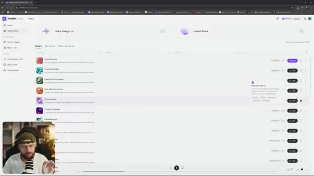
*Interface de MiniMax Audio affichant la bibliothèque de voix (Voice Library) avec la sélection de la voix "Graceful Lady", et le créateur visible en incrustation PiP en bas à gauche.*

---

### ⏱️ `[00:15:54 - 00:16:15]` | Segment #31

**🔊 Audio (Transcription Intégrale Mot pour Mot en Français) :**
> génération. En retournant dans ma bibliothèque de voix, vous pouvez réellement voir certaines de celles que j'ai déjà créées. Nous avons donc le chevalier usé par le temps, qui est vraiment cool. C'était quelque chose qu'il considérait à la fois comme une bénédiction et une malédiction. La voix du scientifique réservé, je l'ai vraiment aimée aussi. Honnêtement, j'ai juste entré le genre d'ambiance que je recherchais et Minimax Audio m'a simplement redonné de très superbes générations.

**👁️ Analyse Visuelle d'Écran (gemini-3.5-flash-lite) :**
**Interface & Outils** : Interface web de Minimax Audio (section « Voice Library » / « My Voices ») avec une vue en liste des profils vocaux créés, accompagnée d'un encadré PiP (Picture-in-Picture) de Jack dans le coin inférieur gauche.

**Contenu textuel & Code** : Noms des profils vocaux listés à l'écran : « WEATHERED KNIGHT », « RESERVED SCIENTIST », ainsi que des boutons d'action (« Voice Design », « Share », « Use ») pour chaque voix.

**Action / Démonstration** : Le créateur navigue dans son interface Minimax Audio pour afficher la bibliothèque de voix générées et présente les différents profils vocaux.

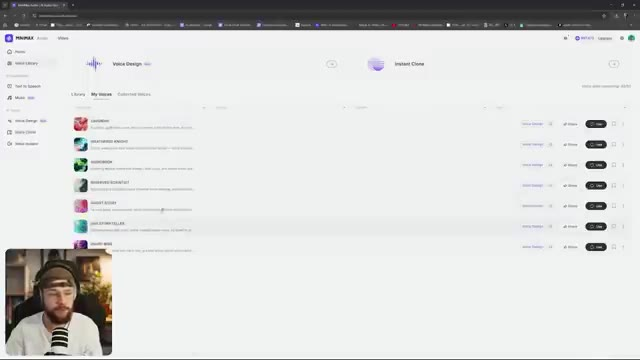
*Interface de Minimax Audio montrant la bibliothèque de voix (« My Voices ») avec plusieurs profils vocaux générés et le créateur visible en incrustation PiP.*

---

### ⏱️ `[00:16:16 - 00:16:50]` | Segment #32

**🔊 Audio (Transcription Intégrale Mot pour Mot en Français) :**
> Écoutons celle-ci. Voir le monde se réinventer tant de fois. Et vous pouvez voir que je teste les lignes que nous avons utilisées dans la cinématique d'introduction finale pour voir lesquelles convenaient le mieux à l'histoire elle-même. J'ai beaucoup aimé Gruff Man également. Mais ce que nous avons finalement choisi, c'est celle-ci appelée Audiobook. Donc, si vous souhaitez créer une génération en utilisant cette voix, nous pouvons aller dans l'onglet Use et cliquer dessus. Nous pouvons ajouter le texte de notre choix à l'intérieur de cela.

**👁️ Analyse Visuelle d'Écran (gemini-3.5-flash-lite) :**
**Interface & Outils** : Interface web de MiniMax Audio (onglets Voice Library, My Voices, Collected Voices) avec incrustation vidéo (PiP) du créateur en bas à gauche.

**Contenu textuel & Code** : Liste de voix affichée à l'écran : "CAVERNBERK", "WEATHERED KNIGHT", "AUDIOBOOK", "DERANGED SCIENTIST", "GHOST STORY", "OLD STORYTELLER", "GRUFF MAN". Des boutons "Voice Design", "Share" et "Use" sont visibles à côté de chaque voix.

**Action / Démonstration** : Le créateur navigue dans l'interface web de MiniMax Audio pour examiner et comparer les différentes voix générées pour son projet d'introduction cinématique.

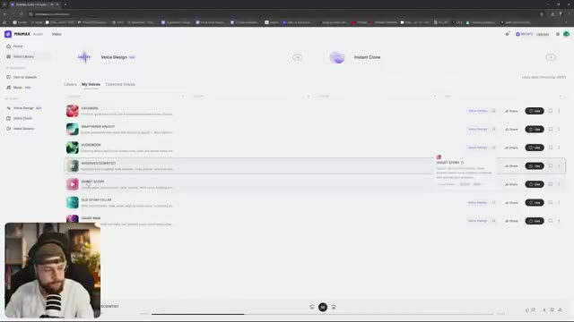
*Interface de MiniMax montrant la liste des voix personnalisées avec les options de test et d'utilisation.*

---

### ⏱️ `[00:16:50 - 00:17:11]` | Segment #33

**🔊 Audio (Transcription Intégrale Mot pour Mot en Français) :**
> boîte ici. Et vous pouvez voir également que nous avons pas mal d'options sur le côté droit. Vous pouvez devenir vraiment technique si vous le voulez et aller dans la section du modificateur de voix. Nous pouvons examiner l'assombrissement de la voix, l'éclaircissement, la rendre plus forte ou plus douce, plus nasillarde ou plus nette. Vous pouvez même ajouter des effets comme un écho spatial, un écho d'auditorium, un téléphone lo-fi et robotique.

**👁️ Analyse Visuelle d'Écran (gemini-3.5-flash-lite) :**
**Interface & Outils** : Interface web de MiniMax Audio (Speech Synthesis) avec un panneau de configuration des paramètres vocaux sur la droite et une incrustation vidéo (Picture-in-Picture) de Jack dans le coin inférieur gauche.

**Contenu textuel & Code** : Texte de synthèse vocale affiché dans la zone principale, menu latéral droit avec les options de réglage de la voix, curseurs de vitesse, de hauteur et de volume, section "Voice Modifier".

**Action / Démonstration** : Le créateur montre l'interface de synthèse vocale et zoome visuellement sur les options de modification de la voix situées dans le panneau latéral droit.

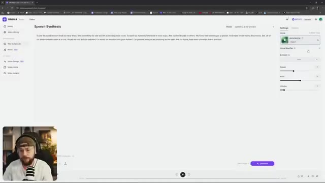
*Interface de MiniMax Audio montrant le panneau latéral des options de synthèse vocale et le modificateur de voix, avec Jack visible en incrustation (PiP).*

---

### ⏱️ `[00:17:12 - 00:17:40]` | Segment #34

**🔊 Audio (Transcription Intégrale Mot pour Mot en Français) :**
> Et en revenant ici, nous pouvons même choisir une émotion. Ça peut donc être automatique, joyeux, triste, en colère, dégoûté, surpris, ou même neutre. On peut modifier la vitesse, la hauteur de voix et le volume. Il y a donc beaucoup de paramètres ici. Vous pouvez obtenir un bon résultat tout de suite, pour être honnête, mais si vous voulez vraiment chipoter et le concevoir exactement comme vous l'imaginez, vous en avez la possibilité. Alors allons-y pour générer en utilisant la voix finale que nous avons choisie.

**👁️ Analyse Visuelle d'Écran (gemini-3.5-flash-lite) :**
**Interface & Outils** : MiniMax Audio / Speech Synthesis (avec un encadré PiP du présentateur en bas à gauche).

**Contenu textuel & Code** : Zone de texte avec un paragraphe en anglais pour la synthèse vocale, et dans le panneau latéral droit (Settings) : section Voice avec un échantillon audio ("Audio0026"), section Voice Modifier avec le curseur d'émotion (Emotion) réglé sur "Auto", ainsi que des curseurs pour le volume. En bas à droite, un bouton violet "Generate".

**Action / Démonstration** : Le présentateur commente l'interface de synthèse vocale de MiniMax en expliquant la personnalisation des paramètres audio et des émotions.

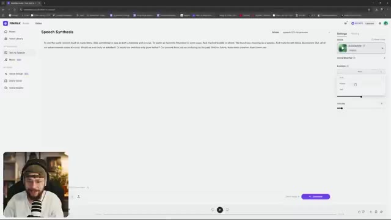
*Interface de MiniMax (Speech Synthesis) montrant le panneau des paramètres vocaux avec les options d'émotion, de vitesse, de hauteur et de volume.*

---

### ⏱️ `[00:17:40 - 00:18:16]` | Segment #35

**🔊 Audio (Transcription Intégrale Mot pour Mot en Français) :**
> Voir le monde se réinventer tant de fois. J'ai donc pensé qu'il y avait quelque chose de très captivant dans cette voix et qu'elle convenait vraiment très bien au concept lui-même. J'ai essayé pas mal de voix différentes sur la timeline pour voir ce que je préférais. Il y a beaucoup de bonnes options, pour être honnête avec vous. Comme vous l'avez vu, il y a une bibliothèque très variée ici sur Minimax Audio. Je vous recommande donc, lorsqu'il s'agit de votre propre réalisation de films par IA, de prendre votre temps, d'en tester toute une série et de trouver exactement ce que vous recherchez. Nous avons donc fini par générer le passage de discours que vous entendez dans la cinématique d'introduction finale. Et si nous retournons sur notre

**👁️ Analyse Visuelle d'Écran (gemini-3.5-flash-lite) :**
**Interface & Outils** : Interface web de Minimax Audio (Speech Synthesis) avec un panneau de configuration des paramètres vocaux à droite et un encadré vidéo du créateur en incrustation (PiP).

**Contenu textuel & Code** : Texte de synthèse vocale saisi dans la zone centrale et paramètres de voix visibles dans le panneau latéral droit.

**Action / Démonstration** : Le créateur démontre l'utilisation de l'outil de synthèse vocale Minimax Audio avec l'affichage de sa webcam en incrustation.

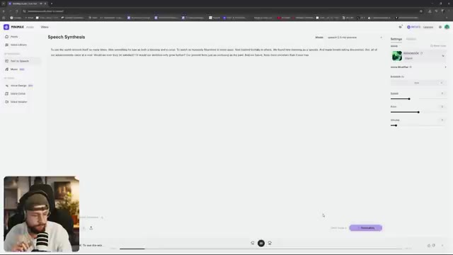
*Interface de Minimax Audio montrant l'outil de synthèse vocale avec un texte saisi et un encadré PiP du créateur en bas à gauche.*

---

### ⏱️ `[00:18:16 - 00:18:50]` | Segment #36

**🔊 Audio (Transcription Intégrale Mot pour Mot en Français) :**
> Chronologie Premiere Pro, je peux réactiver cette piste audio et nous pouvons regarder le film final dans toute sa splendeur. Et vous pouvez voir comment l'émotion transparaît dans la voix off. On a vraiment l'impression qu'un véritable acteur vocal prononce les répliques. Et bien sûr, cela permet de porter notre réalisation de films par IA au niveau supérieur. Cela ne sert pas seulement à raconter une histoire. Cela présente également un certain ton. C'est vraiment assez envoûtant, ce qui correspond exactement à ce que je recherchais. Nous avons maintenant la combinaison de la musique, des effets sonores et de la voix off directement au premier plan du mixage. Écoutons cela.

**👁️ Analyse Visuelle d'Écran (gemini-3.5-flash-lite) :**
**Interface & Outils** : Adobe Premiere Pro (timeline de montage vidéo, moniteur de programme, panneau de projet et pistes audio/vidéo).

**Contenu textuel & Code** : Timeline de montage avec pistes audio et vidéo, moniteur de prévisualisation affichant un homme barbu assis près d'un feu de camp dans une ambiance sombre et enfumée, et incrustation vidéo (PiP) du créateur en bas à gauche.

**Action / Démonstration** : Le créateur présente son projet de montage vidéo dans Premiere Pro, prêt à réactiver la piste audio pour faire écouter le résultat final.

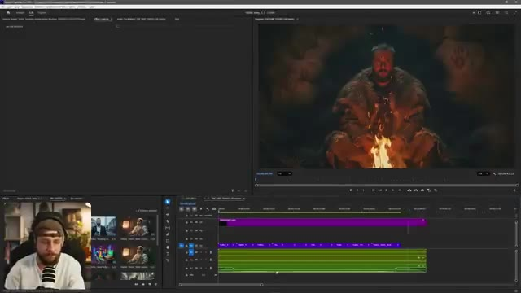
*Interface du logiciel Adobe Premiere Pro affichant la timeline, le moniteur de prévisualisation avec un personnage près d'un feu de camp, et le créateur visible en incrustation PiP.*

---

### ⏱️ `[00:18:50 - 00:19:27]` | Segment #37

**🔊 Audio (Transcription Intégrale Mot pour Mot en Français) :**
> Voir le monde se réinventer tant de fois était quelque chose qu'il considérait à la fois comme une bénédiction et une malédiction. Observer l'humanité s'épanouir d'une certaine manière et s'affronter brutalement d'une autre. Nous avons trouvé un nouveau sens en tant d'espèces et avons fait des découvertes époustouflantes, mais toutes nos avancées ont eu un prix. Serions-nous un jour vraiment satisfaits ou notre ambition ne ferait-elle que grandir ? Notre présent semble tout aussi confus que le passé et notre avenir semble plus incertain que jamais, alors voilà les gars.

**👁️ Analyse Visuelle d'Écran (gemini-3.5-flash-lite) :**
**Interface & Outils** : Présentation face caméra sans partage d'écran (illustrations générées par IA de Jack dans différentes époques historiques et futuristes).

**Contenu textuel & Code** : Aucun texte ou interface logicielle visible.

**Action / Démonstration** : Le présentateur apparaît sous forme de différentes incarnations générées par intelligence artificielle (homme préhistorique au coin du feu, chevalier en armure médiévale, homme en tenue rétro des années 80 devant un ordinateur vintage, personnage encapuchonné dans une rue urbaine futuriste sous la pluie).

---

### ⏱️ `[00:19:27 - 00:19:59]` | Segment #38

**🔊 Audio (Transcription Intégrale Mot pour Mot en Français) :**
> allez vous pouvez voir à quel point il est possible de créer uniquement en utilisant Hyluo AI et j'aimerais vous transmettre ce type de flux de travail les gars parce que je sais que ça peut être un peu frustrant de jongler entre plein d'outils et de plateformes d'IA différents c'est une super option à découvrir si vous avez la moindre question assurez-vous de la poser en bas dans la section des commentaires je fais de mon mieux pour répondre au maximum d'entre vous si vous avez apprécié le contenu d'aujourd'hui n'oubliez pas de lâcher un pouce bleu pour moi pensez à vous abonner et bien sûr à activer la cloche

**👁️ Analyse Visuelle d'Écran (gemini-3.5-flash-lite) :**
**Interface & Outils** : Présentation vidéo avec incrustation (PiP) du créateur et affichage d'animations d'appel à l'action (pouce bleu, abonnement, cloche).

**Contenu textuel & Code** : Exemples de vidéos générées par IA (homme préhistorique, chevalier, astronaute) illustrant les capacités de Hyluo AI, suivis d'un écran de fin avec boutons animés "Like", "Subscribe" et icône de cloche.
[DESC_IMAGE_4]

**Action / Démonstration** : Le créateur montre des exemples de vidéos cinématiques générées par intelligence artificielle tout en parlant à la caméra, puis conclut la vidéo en incitant les spectateurs à interagir, s'abonner et activer les notifications.

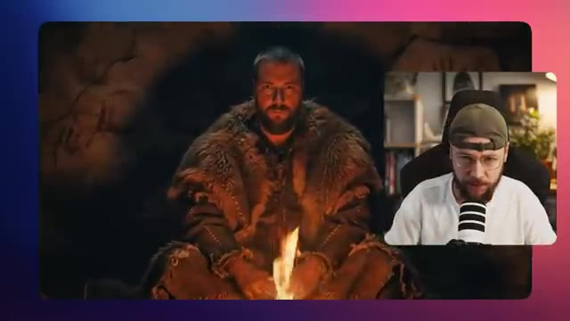
*Vidéo générée par IA montrant un homme préhistorique assis près d'un feu dans une grotte, avec le présentateur en incrustation (PiP).*

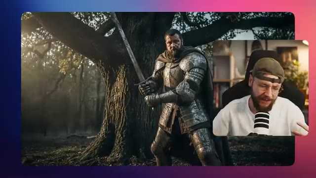
*Vidéo générée par IA montrant un chevalier en armure tenant une épée dans une forêt sombre, avec le présentateur en incrustation (PiP).*

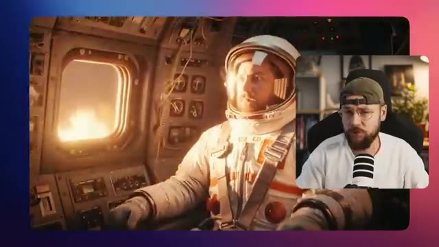
*Vidéo générée par IA montrant un astronaute dans la cabine d'un vaisseau spatial regardant par le hublot, avec le présentateur en incrustation (PiP).*

---

### ⏱️ `[00:19:59 - 00:20:13]` | Segment #39

**🔊 Audio (Transcription Intégrale Mot pour Mot en Français) :**
> l'icône de notification pour ne jamais manquer aucune future vidéo car nous explorons toutes sortes d'outils d'IA passionnants dans les semaines à venir. Merci pour tout l'amour et le soutien sur les dernières vidéos, les gars. Passez une excellente journée et je vous retrouve dans la prochaine.

**👁️ Analyse Visuelle d'Écran (gemini-3.5-flash-lite) :**
**Interface & Outils** : Présentation face caméra sans partage d'écran

**Contenu textuel & Code** : Aucun texte ou paramètre visible, le créateur apparaît incrusté (Picture-in-Picture) sur un fond coloré dégradé bleu et rose, en train de parler devant son micro dans son studio.

**Action / Démonstration** : Le créateur fait des gestes avec ses mains pour conclure la vidéo et remercier son audience.

---
