# 🎬 VEO 3.1 vs SORA 2 : Quel modèle vidéo IA l'emporte ?

> **Chaîne** : [Jack Vs. AI](https://www.youtube.com/@JackVsAI)  
> **Titre original** : `VEO 3.1 vs. SORA 2 (Which AI Video Model Wins?)`  
> **Lien YouTube** : [https://www.youtube.com/watch?v=Bcyx6Gq8WjI](https://www.youtube.com/watch?v=Bcyx6Gq8WjI)  
> **Date de publication** : 2025-10-19  
> **Durée** : 18m 52s (`1132s`)  
> **Identifiant vidéo** : `Bcyx6Gq8WjI`  
> **Fiche Web Interactive** : [2025-10-19_YT-Bcyx6Gq8WjI_VEO 3.1 vs SORA 2 Quel modèle vidéo IA l'emporte_by-whisper-v3-large-turbo+gemini-3.5-flash-lite.html](2025-10-19_YT-Bcyx6Gq8WjI_VEO 3.1 vs SORA 2 Quel modèle vidéo IA l'emporte_by-whisper-v3-large-turbo+gemini-3.5-flash-lite.html)  
> **Captures de démonstration clés** : `110 captures réelles (anti-talking-head)`  
> **Modèles utilisés** : Audio: `large-v3-turbo` (Faster-Whisper int8 VPS) | Vision: `gemini-3.5-flash-lite` (Google AI Studio API)  

---

## 📌 Synthèse Exécutive & Outils

### 📌 Résumé
La vidéo de Jack Vs. AI s'attaque à un duel technologique majeur : l'affrontement entre **VEO 3.1** (Google) et **SORA 2** (OpenAI), deux modèles de génération de vidéo par IA sortis quasi simultanément. En tant qu'artiste VFX publicitaire chevronné, Jack démontre qu'il est désormais possible de concevoir des spots publicitaires cinématiques haut de gamme, des courts-métrages et du contenu pour les réseaux sociaux sans équipe ni caméra physique. L'enjeu central n'est plus seulement de générer du mouvement, mais de tester la capacité de ces intelligences artificielles à comprendre la vision, le style, l'émotion et la cohérence complexe de produits soumis à rude épreuve.

Pour mener à bien ce test rigoureux, Jack utilise la plateforme **Artlist** comme hub central, illustrant un flux de travail professionnel de bout en bout. Il commence par concevoir un produit fictif exigeant — une canette de boisson énergisante au design complexe baptisée « Nova » — grâce à un générateur d'images intégré et à l'outil **Nano Banana** (utilisé en mode image par image). Afin de pousser l'IA dans ses retranchements, il associe cette canette à un portrait brut pris au téléphone pour servir de référence de personnage. Le processus étape par étape montre comment transformer une simple photo de smartphone en une image composite de haute qualité, avant de l'utiliser comme cadre de départ ("image-to-video") pour alimenter les moteurs de pointe.

Cette démonstration offre aux créateurs de contenu et aux réalisateurs des enseignements précieux sur l'art du prompting et la gestion des flux de travail hybrides. Jack prouve qu'un matériel de départ rudimentaire suffit si les descriptions textuelles sont chirurgicales et si l'on maîtrise les options de raffinement, de transformation locale et de suréchantillonnage. En confrontant directement **Kling**, **Sora 2** et **Veo 3.1**, il offre une vision prospective indispensable pour éviter d'être dépassé par l'évolution fulgurante des outils de production audiovisuelle générative.

### 🛠️ Outils, Modèles & Logiciels Présentés
* **Artlist** : Plateforme tout-en-un servant de hub central pour accéder aux générateurs d'images/vidéos par IA, aux voix off, aux banques de musiques, de séquences et d'effets sonores.
* **Nano Banana** : Modèle d'génération et de transformation d'images (utilisé via le mode image par image) pour créer le design initial des produits et des personnages avec un haut niveau de détail textuel.
* **VEO 3.1 (ou Veo 3.1)** : Modèle vidéo ultra-puissant de Google, testé ici dans ses versions normale et rapide pour générer des séquences fluides de 8 secondes en résolution 1080p.
* **SORA 2 (ou Sora / Sora 2)** : Modèle de génération vidéo de pointe développé par OpenAI, présenté comme le principal concurrent de Veo 3.1.
* **Kling** : Autre modèle de génération vidéo par IA accessible et comparé au sein de la plateforme Artlist.
* **Flux** : Mentionné dans l'écosystème global des outils de génération et de traitement visuel par IA.

### 🔑 Points Clés & Enseignements Stratégiques
1. **Ne pas faciliter la tâche de l'IA** : Pour évaluer objectivement la puissance des modèles, intégrez des éléments visuels complexes (comme un design de canette élaboré ou des textures difficiles à composer) afin de tester leurs limites réelles.
2. **Le smartphone comme point de départ** : Un portrait de référence de mauvaise qualité pris rapidement avec un téléphone portable suffit amplement comme base visuelle si les instructions textuelles compensent par la précision.
3. **Le workflow en deux étapes (Image-to-Video)** : Ne cherchez pas à tout faire en un seul prompt textuel. Générez d'abord une image de cadre de départ fixe de haute qualité, puis animez-la via le mode image vers vidéo.
4. **Utiliser la fonction "Transformer" pour corriger les défauts d'intégration** : Si un élément rapporté (comme une canette) semble mal composité ou sursaturé par rapport à l'éclairage de la scène, utilisez l'option de transformation locale de Nano Banana pour ajuster l'intégration environnementale.
5. **Investir dans le suréchantillonnage (*Upscaling*)** : Dépensez des crédits pour suréchantillonner votre image de départ avant l'animation ; cela garantit une texture de peau ultra-détaillée, des pores visibles et une cohérence accrue des produits.
6. **Contrôler les prompts suggérés** : Bien que les plateformes proposent des prompts automatiques lors du passage à l'animation, réécrivez vos propres descriptions textuelles spécifiques pour garder un contrôle artistique total sur le déroulement de la scène.
7. **Exploiter les versions "Rapides" des modèles** : Pour Veo 3.1, l'utilisation de la version rapide offre des performances quasi identiques à la version standard tout en optimisant le temps de génération.
8. **Optimiser la durée et la résolution** : Paramétrez systématiquement vos générations sur la durée maximale proposée (par exemple 8 secondes) et la plus haute résolution disponible (1080p Full HD) pour maximiser le potentiel narratif.
9. **Maîtriser l'anatomie de la description textuelle** : Décrivez minutieusement les accessoires vestimentaires et physiques (casquette portée à l'envers, lanière, lunettes à monture métallique dorée, verres rectangulaires arrondis) pour ancrer solidement l'identité du personnage.
10. **Capitaliser sur la transition de plans** : Structurez vos prompts vidéo en pensant au montage (par exemple, des transitions fluides entre des plans serrés) pour donner une véritable envergure cinématographique et publicitaire au rendu final.

---

## ⏱️ Chronologie & Transcription Complète Audio & Visuelle (Mot pour Mot)

### ⏱️ `[00:00:00 - 00:00:37]` | Segment #01

**🔊 Audio (Transcription Intégrale Mot pour Mot en Français) :**
> Google vient de riposter car VO 3.1 pourrait bien être le modèle de vidéo par IA le plus puissant que nous ayons jamais vu, et il est sorti juste quelques jours après qu'OpenAI a révélé Sora 2. Mais voici la vraie question : lequel devriez-vous utiliser pour obtenir les meilleurs résultats possibles en ce moment ? Imaginez pouvoir créer des publicités cinématiques, des courts-métrages ou du contenu pour les réseaux sociaux, tout cela sans embaucher le moindre membre d'équipe ni même toucher à une caméra. Ces outils d'IA ne se contentent pas de faire des vidéos, ils comprennent la vision, le style et l'émotion à un niveau que nous n'avons jamais vu auparavant. Et honnêtement, si vous n'expérimentez pas avec ces choses-là,

**👁️ Analyse Visuelle d'Écran (gemini-3.5-flash-lite) :**
**Interface & Outils** : Présentation face caméra sans partage d'écran

**Contenu textuel & Code** : Texte affiché à l'écran incluant "VEO 3.1", "NOVA should", "or even", "NOVA not"

**Action / Démonstration** : Le présentateur (Jack) apparaît dans différentes scènes fantastiques et cinématiques générées par IA (surfant sur des bananes, sous l'eau avec des requins) tout en s'adressant aux spectateurs et en présentant une canette de boisson énergétique.

---

### ⏱️ `[00:00:37 - 00:00:59]` | Segment #02

**🔊 Audio (Transcription Intégrale Mot pour Mot en Français) :**
> vous êtes déjà en train de vous faire dépasser par les créateurs qui le font. Je suis Jack, je suis artiste VFX dans l'industrie publicitaire depuis plus d'une décennie maintenant, et j'ai travaillé pour bon nombre des plus grandes marques de la planète. Dans cette vidéo, je vais décrypter exactement comment VO 3.1 se compare à Sora 2, ce que chaque modèle fait le mieux, là où ils pèchent, et comment obtenir les résultats les plus insanes de ces deux outils.

**👁️ Analyse Visuelle d'Écran (gemini-3.5-flash-lite) :**
**Interface & Outils** : Présentation face caméra sans partage d'écran (hormis l'insertion d'une vidéo générée par IA en illustration).

**Contenu textuel & Code** : Texte affiché à l'écran sous forme de sous-titre : "the creators". Sur la canette tenue par Jack, on peut lire la marque "NOVA ENERGY DRINK".

**Action / Démonstration** : Jack apparaît sous l'eau entouré de requins, tenant une canette de boisson énergétique dans une scène générée par IA (illustration du propos sur les créateurs).

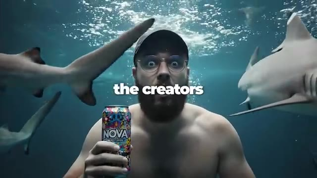
*Séquence vidéo générée par IA montrant Jack sous l'eau entouré de requins et tenant une canette de boisson énergétique Nova, avec le texte sous-titré 'the creators' affiché à l'écran.*

---

### ⏱️ `[00:00:59 - 00:01:35]` | Segment #03

**🔊 Audio (Transcription Intégrale Mot pour Mot en Français) :**
> Et si vous appréciez le contenu d'aujourd'hui, les gars, assurez-vous de mettre un pouce bleu pour moi, pensez à vous abonner et, bien sûr, à activer cette cloche de notification. Ceci étant dit, entrons dans le vif du sujet. Donc, pour accéder à la fois à VO 3.1 et à Sora 2, nous allons utiliser Artlist. La plateforme donne accès aux générateurs d'images et de vidéos par IA de la plus haute qualité, ainsi qu'à une bibliothèque variée d'outils et de ressources adaptés à la publicité et à la réalisation de films. Vous pouvez voir que nous avons l'option de créer des voix off par IA. Il y a une bibliothèque de musique, de séquences vidéo et d'effets sonores. Maintenant, beaucoup d'entre vous dans la section des commentaires sont toujours assez intéressés par ces plateformes qui combinent

**👁️ Analyse Visuelle d'Écran (gemini-3.5-flash-lite) :**
**Interface & Outils** : Artlist (plateforme web de création et d'actifs multimédias)

**Contenu textuel & Code** : Salutation "Good evening, Jack", sections principales "AI Image", "AI Video", "AI Voiceover", et liste de chansons recommandées "Recommended songs for you" avec des vignettes et des tags (Epic, Cinematic, Pop, Acoustic).

**Action / Démonstration** : Le présentateur montre l'interface principale du site web Artlist sur son écran d'ordinateur, tout en parlant des différents outils disponibles.

*Interface de la plateforme Artlist affichant les sections AI Image, AI Video, AI Voiceover et les morceaux de musique recommandés, avec le présentateur en incrustation PiP en bas à droite.*

---

### ⏱️ `[00:01:35 - 00:02:07]` | Segment #04

**🔊 Audio (Transcription Intégrale Mot pour Mot en Français) :**
> tous les différents outils d'IA. Donc si vous voulez aller voir Artlist, assurez-vous de cliquer sur le lien en bas dans la description. Donc sur la page d'accueil ici, nous voulons aller dans le coin supérieur gauche et cliquer sur l'onglet d'image et vidéo IA. Vous pouvez voir que nous avons ce catalogue de styles incroyablement varié que nous pouvons explorer. Mais si je clique sur l'onglet mes créations, vous pouvez voir tout ce que j'ai généré à l'intérieur d'Artlist. Maintenant, pour vraiment mettre Sora 2 et VO 3.1 à l'épreuve, je voulais concevoir un tout nouveau produit. Et ce sur quoi je me suis arrêté, c'est cette boisson énergisante Nova,

**👁️ Analyse Visuelle d'Écran (gemini-3.5-flash-lite) :**
**Interface & Outils** : Interface web de la plateforme Artlist (section AI Image & Video) avec panneau de navigation à gauche, barre de recherche et vignettes de prévisualisation.

**Contenu textuel & Code** : Texte affiché : "Good evening, Jack", "AI Image", "AI Video", "AI Voiceover", "Transform your ideas into stunning visuals", "Style Catalog", "My Creations", et la marque "NOVA ENERGY DRINK" sur les canettes générées.
[DESC_IMAGE_1] Navigation sur la page d'accueil d'Artlist avec la webcam du créateur incrustée en bas à droite.
[DESC_IMAGE_2] Exploration de l'onglet de génération d'images et vidéos avec les options de style.
[DESC_IMAGE_3] Affichage de l'onglet "My Creations" montrant plusieurs variantes d'une canette de boisson.
[DESC_IMAGE_4] Présentation des résultats finaux de génération d'images publicitaires avec des personnages tenant la canette Nova.

**Action / Démonstration** : Démonstration pédagogique et présentation du workflow.

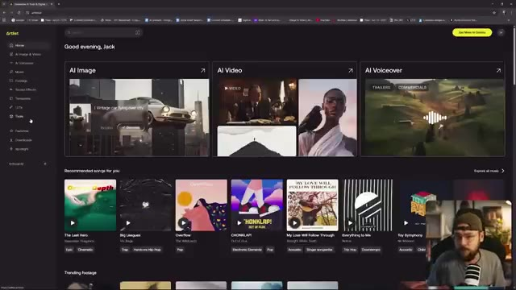
*Page d'accueil de la plateforme Artlist avec le panneau de navigation latéral et les rubriques de contenu multimédia.*

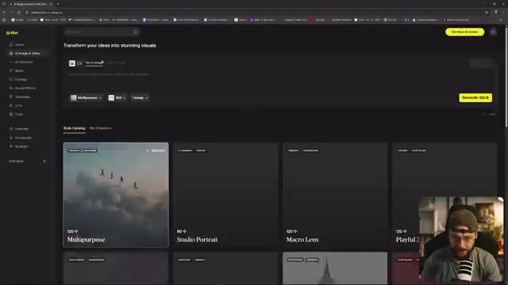
*Interface de génération d'images et vidéos IA d'Artlist affichant le catalogue de styles (« Style Catalog »).*

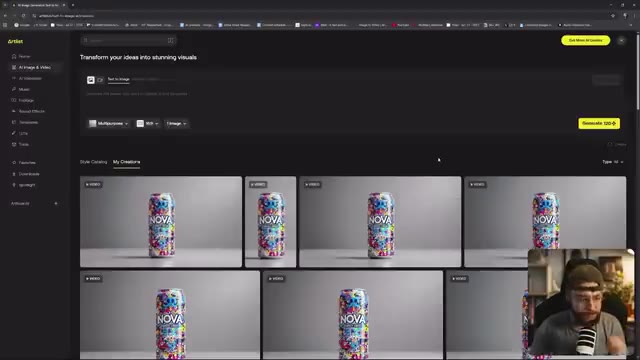
*Onglet « My Creations » sur Artlist montrant des rendus générés de canettes de boisson énergisante Nova.*

*Galerie de créations sur Artlist présentant des visuels publicitaires générés par IA pour la boisson Nova.*

---

### ⏱️ `[00:02:07 - 00:02:43]` | Segment #05

**🔊 Audio (Transcription Intégrale Mot pour Mot en Français) :**
> que j'ai généré juste ici à l'intérieur d'Artlist en utilisant le générateur d'images tout en haut de la page. Vous pouvez voir que j'ai eu toute une série de générations vraiment formidables. Ma préférée et celle que nous avons utilisée pour l'intro était cette toute particulière ici. Et si vous êtes intéressés, vous pouvez voir le prompt que j'ai utilisé pour générer notre boisson énergisante Nova juste à l'écran en ce moment même. Assurez-vous également de placer tous les prompts en bas dans la description de la vidéo. Mais avec ce prompt, nous avons obtenu une canette de boisson énergisante vraiment très agréable, vibrante, et intéressante du point de vue de la marque ici. Et j'ai délibérément créé l'illustration

**👁️ Analyse Visuelle d'Écran (gemini-3.5-flash-lite) :**
**Interface & Outils** : Interface Web de la plateforme Artlist (générateur d'images et de vidéos par IA) avec un retour vidéo du créateur en incrustation (PiP).

**Contenu textuel & Code** : Texte du prompt visible : "A stunning photorealistic 4K product image showcasing a dynamic energy drink can labelled 'NOVA Energy Drink', adorned with vivid, intricate anime artwork that bursts with colour and energy...". Paramètres : Aspect Ratio 16:9, Dimensions 2732 x 1536 px, File Type JPEG, Style Multipurpose, Created October 16, 2025.

**Action / Démonstration** : Le créateur navigue dans sa galerie de générations sur Artlist, clique sur une image pour afficher les détails du prompt et de ses paramètres, puis zoome sur le rendu final de la canette.

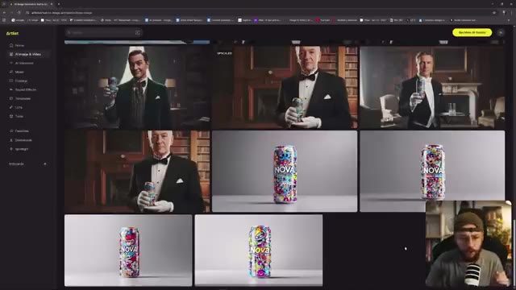
*Interface d'Artlist affichant une grille de générations d'images IA de canettes de boisson énergisante avec un encadré PiP du présentateur.*

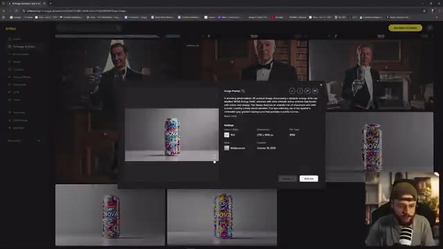
*Interface d'Artlist montrant la fenêtre contextuelle des détails et du prompt d'une image générée.*

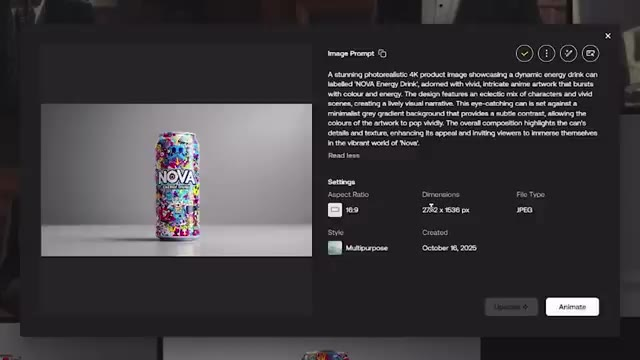
*Gros plan sur la fenêtre contextuelle d'Artlist affichant le prompt textuel complet et les paramètres de l'image de la canette Nova.*

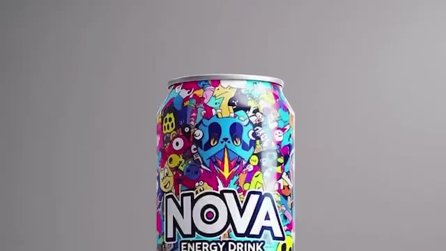
*Gros plan vidéo plein écran sur le design coloré et détaillé de la canette de boisson énergisante Nova.*

---

### ⏱️ `[00:02:43 - 00:03:13]` | Segment #06

**🔊 Audio (Transcription Intégrale Mot pour Mot en Français) :**
> travailler sur la canette est assez complexe parce que cela va être difficile à gérer pour nos modèles vidéo. Je ne suis pas du tout du genre à faciliter la tâche à l'IA. J'essaie vraiment de la pousser dans ses retranchements à chaque occasion qui se présente pour que vous puissiez vraiment voir ses avantages et ses inconvénients de façon brutale. Maintenant, pour créer ces images plutôt incroyables, j'utilisais Nano Banana et pour y accéder dans Artlist, vous voulez aller sur le panneau supérieur ici et sélectionner image vers image et vous pouvez voir que Nano Banana est sélectionné par défaut.

**👁️ Analyse Visuelle d'Écran (gemini-3.5-flash-lite) :**
**Interface & Outils** : Interface web de la plateforme Artlist (section AI Image & Video, menu de sélection de modèles et d'options Image to Image).

**Contenu textuel & Code** : Textes visibles : "NOVA ENERGY DRINK", "Transform your ideas into stunning visuals", "Text to Image", "Image to Image", "Nano Banana Model", "Seedream 4.0", "Nano Banana", "Flux Kontext".

**Action / Démonstration** : Le créateur montre et explique l'utilisation des modèles d'IA sur la plateforme Artlist en naviguant dans l'interface, sélectionnant les modes "Image to Image" et le modèle "Nano Banana".

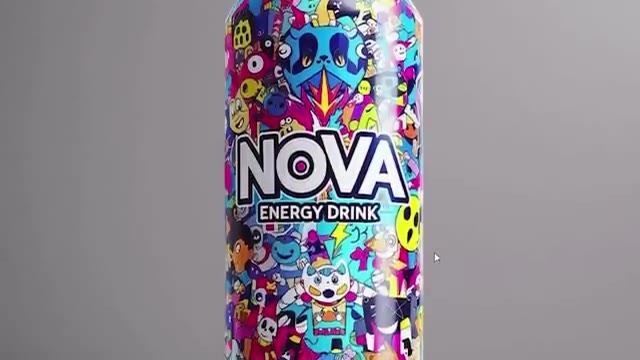
*Gros plan sur une canette de boisson énergisante colorée "NOVA" avec un design graphique complexe.*

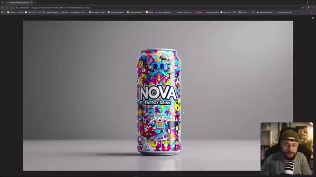
*Affichage de l'image de la canette NOVA dans le navigateur web, avec le créateur visible en incrustation vidéo (PiP) en bas à droite.*

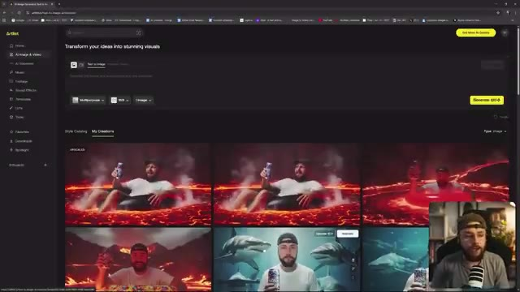
*Interface de la plateforme Artlist montrant l'onglet "AI Image & Video" et une grille de créations générées mettant en scène le créateur avec la canette.*

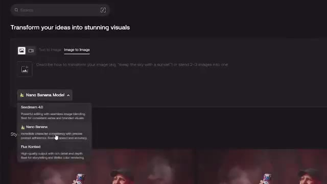
*Gros plan sur les paramètres de l'interface Artlist montrant le menu déroulant du modèle de génération "Nano Banana Model" avec d'autres options comme Seedream 4.0 et Flux Kontext.*

---

### ⏱️ `[00:03:13 - 00:03:35]` | Segment #07

**🔊 Audio (Transcription Intégrale Mot pour Mot en Français) :**
> En sélectionnant donc Nano Banana, nous pouvons aller de l'avant et télécharger notre image de la boisson énergétique Nova. Et j'ai aussi cette photo de référence de moi-même, plutôt terrible, que je viens de prendre avec mon téléphone. Et nous allons simplement la glisser-déposer également. Et c'est vraiment juste pour vous prouver les gars que vous n'avez pas besoin d'avoir un portrait de vous-même vraiment incroyable et bien éclairé.

**👁️ Analyse Visuelle d'Écran (gemini-3.5-flash-lite) :**
**Interface & Outils** : Navigateur web affichant l'interface de la plateforme de création multimédia Artlist (section AI Image & Video, modèle Nano Banana).

**Contenu textuel & Code** : Texte visible sur l'interface : "Transform your ideas into stunning visuals", "Image to Image", "Nano Banana Model", "Generate 100", ainsi que des vignettes de créations sous les rubriques "UPSCALED" et "My Creations".

**Action / Démonstration** : Le créateur montre comment importer une image de référence personnelle dans l'interface de l'outil pour préparer une génération d'image par intelligence artificielle.

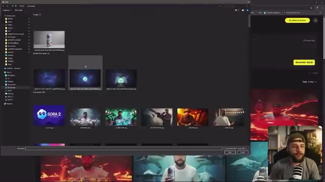
*L'écran affiche une fenêtre de l'explorateur de fichiers de l'ordinateur permettant de sélectionner des images à importer.*

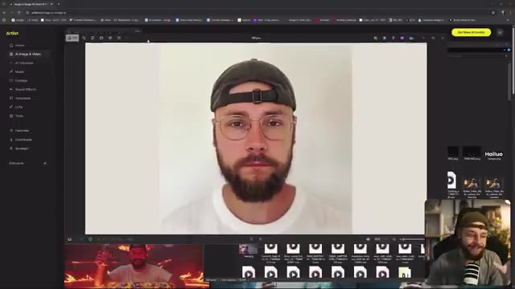
*L'interface web d'Artlist affiche une photo de référence importée représentant Jack de face avec une casquette et des lunettes.*

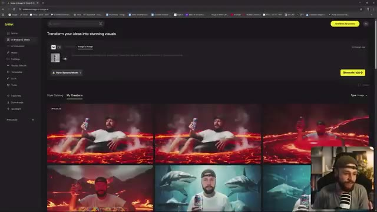
*L'interface web d'Artlist montre la section de génération avec le modèle Nano Banana et des exemples de créations antérieures.*

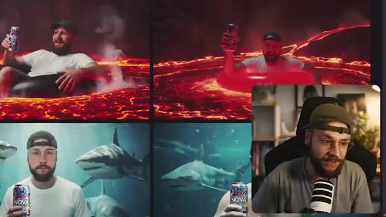
*L'écran affiche en gros plan une grille de quatre images générées par IA montrant Jack dans divers environnements (lave, sous l'eau avec des requins).*

---

### ⏱️ `[00:03:36 - 00:03:58]` | Segment #08

**🔊 Audio (Transcription Intégrale Mot pour Mot en Français) :**
> Vous pouvez simplement filmer quelque chose avec votre téléphone et cela fonctionnera plutôt bien comme référence d'image. Nous avons donc maintenant notre référence de notre personnage et de notre produit. Nous devons donc maintenant entrer notre invite textuelle. Et c'est généralement ce que j'aime faire lorsqu'il s'agit de réalisation de films et de publicité par IA. Nous créons ces images pour qu'elles servent de cadres de départ pour nos générateurs de vidéo.

**👁️ Analyse Visuelle d'Écran (gemini-3.5-flash-lite) :**
**Interface & Outils** : Navigateur web affichant la plateforme Artlist (section "Image to Image" et "AI Image & Video").

**Contenu textuel & Code** : Texte visible : "Transform your ideas into stunning visuals", "Image to Image", "Style Catalog", "My Creations", "Upscaled", "Nano Banana Model", "Generate 100+".

**Action / Démonstration** : Le créateur présente l'interface de génération d'images par IA sur son écran, en illustrant le processus de création de cadres de départ (starting frames) pour les générateurs de vidéo.

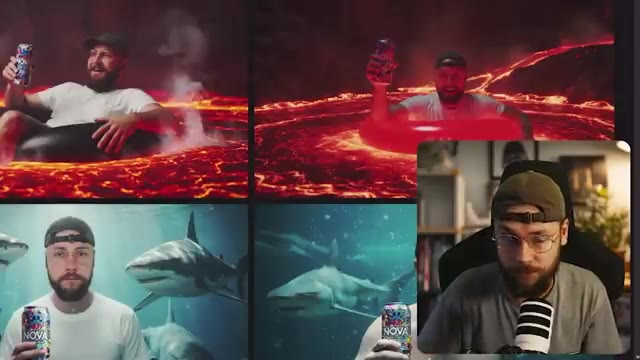
*Interface d'un générateur d'images montrant des aperçus de rendus générés avec le personnage dans différents environnements (lave, requins), avec la webcam du créateur incrustée en bas à droite.*

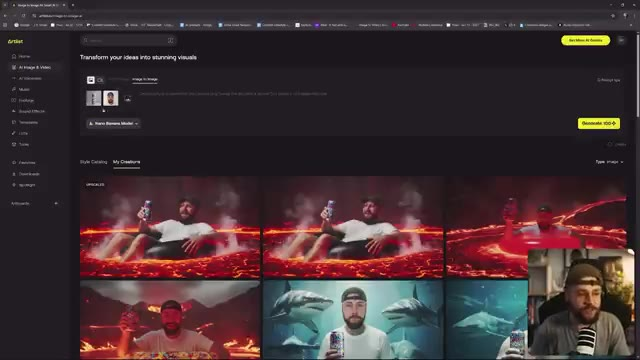
*Interface de la plateforme Artlist (outil Image to Image AI) affichant les images de référence du personnage et du produit en haut, et la galerie des créations générées en dessous.*

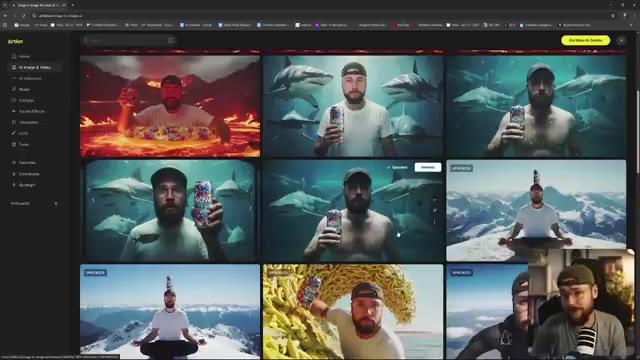
*Grille de visualisations de différentes générations d'images par IA montrant le personnage dans des décors variés (requins, montagnes enneigées, bananes).*

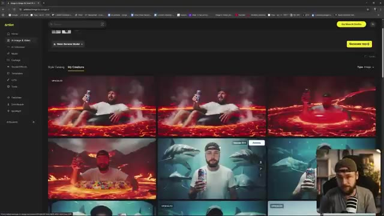
*Galerie "My Creations" sur l'interface Artlist affichant les résultats upscalés des images générées par intelligence artificielle.*

---

### ⏱️ `[00:03:58 - 00:04:35]` | Segment #09

**🔊 Audio (Transcription Intégrale Mot pour Mot en Français) :**
> Tu verras plus tard dans la vidéo, cependant, que nous devons travailler d'une manière légèrement différente lorsqu'il s'agit de Sora 2, mais nous obtenons quand même des résultats assez incroyables. Je me suis donc dit que ce serait amusant de générer une toute nouvelle image ou scène avec vous en ce moment même pendant la vidéo. Je viens donc de déposer ce prompt ici. Plan en pied d'un homme barbu courant à travers une jungle, tenant désespérément une canette de boisson énergisante Nova. L'homme barbu a une expression terrifiée. Il est poursuivi par une meute de babouins en colère. Il porte une casquette de baseball gris foncé portée à l'envers, la lanière ajustable et la boucle en plastique étant visibles au-dessus de son front. Il porte des lunettes

**👁️ Analyse Visuelle d'Écran (gemini-3.5-flash-lite) :**
**Interface & Outils** : Interface web d'Artlist (Artlist.io / AI Image & Video) avec le modèle "Nano Banana Model", l'onglet "Image to Image" et un retour vidéo PiP de l'animateur en bas à droite.

**Contenu textuel & Code** : Le prompt visible dans l'interface : "Full body shot of a bearded man running through a jungle, desperately holding a can of NOVA Energy Drink, the bearded man has a terrified expression... He wears a dark gray baseball cap worn backwards with the adjustable strap and plastic buckle visible above his forehead. He wears thin, gold wireframe glasses with rounded rectangular lenses and has composition, harsh shadows."

**Action / Démonstration** : Le créateur présente l'interface d'Artlist, survole les créations précédentes de l'historique et saisit le prompt de génération de l'homme barbu poursuivi dans la jungle.

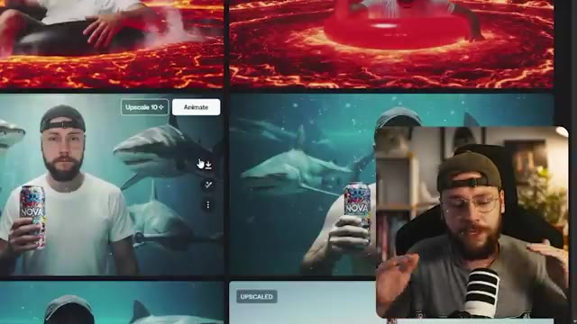
*Gros plan sur une grille de résultats générés par IA dans Artlist montrant un homme avec une canette sous l'eau et dans la lave, avec un encadré PiP du créateur en bas à droite.*

*Vue d'ensemble de l'interface de génération d'images Artlist avec la zone de prompt "Image to Image" et des exemples de créations antérieures en grille.*

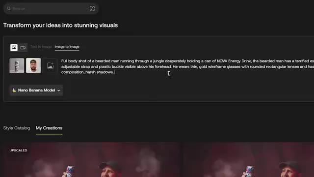
*Zoom sur la zone de saisie du prompt textuel dans l'interface Artlist avec le texte complet décrivant l'homme barbu poursuivi par des babouins.*

---

### ⏱️ `[00:04:35 - 00:04:59]` | Segment #10

**🔊 Audio (Transcription Intégrale Mot pour Mot en Français) :**
> des lunettes à monture métallique dorée avec des verres rectangulaires arrondis et ses yeux marron foncé. Il a une coupe de cheveux courte en brosse, photoréaliste, texture de peau ultra détaillée, pores visibles, composition cinématographique, ombres dures. Et vous pouvez voir le niveau de détail que nous offrons à Nano Banana ainsi que nos images de référence. Allons donc générer quelques options pour y jeter un œil ici.

**👁️ Analyse Visuelle d'Écran (gemini-3.5-flash-lite) :**
**Interface & Outils** : Interface web d'Artlist (outil de génération d'images et vidéos par IA) avec un champ de prompt, des options de modèles et une galerie de créations personnelles.

**Contenu textuel & Code** : Texte du prompt visible : « Full body shot of a bearded man running through a jungle desperately holding a can of NOVA Energy Drink, the bearded man has a terrified expression, he is being chased by a pack of angry baboons. He wears a dark grey baseball cap worn backwards with the adjustable strap and plastic buckle visible above his forehead. He wears thin, gold wireframe glasses with rounded rectangular lenses and has dark brown eyes, he has a short buzz cut hair style. Photoreal, ultra detailed skin texture, visible pores, cinematic composition, harsh shadows. » Bouton « Generate 100 », modèle « Nano Banana Model ».

**Action / Démonstration** : Le créateur montre l'interface d'Artlist avec le prompt détaillé et les images générées en dessous, tout en expliquant les paramètres de génération et les détails visuels du modèle Nano Banana.

*Interface d'Artlist affichant le champ de prompt avec les détails du personnage et une galerie de créations de canettes de soda et de requins.*

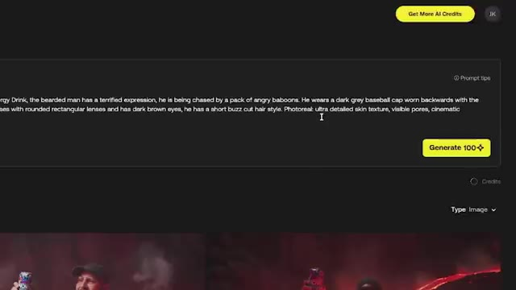
*Gros plan sur la zone de saisie du prompt textuel détaillant les caractéristiques physiques du personnage dans Artlist.*

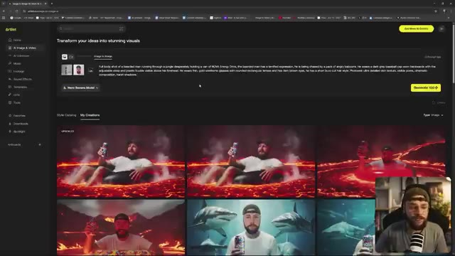
*Interface complète d'Artlist avec le champ de prompt actif et les résultats de générations d'images en grille en bas.*

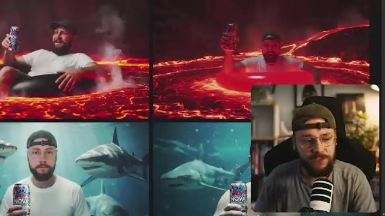
*Gros plan sur la grille de résultats générés montrant des images du créateur avec une canette dans de la lave et sous l'eau avec des requins.*

---

### ⏱️ `[00:04:59 - 00:05:37]` | Segment #11

**🔊 Audio (Transcription Intégrale Mot pour Mot en Français) :**
> Donc vous pouvez voir que nous avons obtenu de superbes générations de la part de Nano Banana. J'aime particulièrement celle-ci ici, mais je veux essayer de la raffiner un tout petit peu. Donc si nous survolons l'image, vous pouvez voir que nous avons l'option de transformer, alors je vais cliquer dessus et cela va remplir cette zone en haut de l'écran, et ce que je vais demander à Nano Banana de faire, c'est d'assombrir la canette que l'homme tient pour qu'elle semble plus intégrée dans la scène, car si nous regardons l'image que nous avons générée, je ne suis pas tout à fait sûr que la moitié inférieure de la canette ait l'air correcte, mais en général, on a simplement l'impression qu'elle n'est pas correctement compositée dans la scène et qu'elle ne correspond pas à l'éclairage. Il semble

**👁️ Analyse Visuelle d'Écran (gemini-3.5-flash-lite) :**
**Interface & Outils** : Interface web de la plateforme de création vidéo et image Artlist (outil IA Nano Banana), avec incrustation vidéo (PiP) du créateur.

**Contenu textuel & Code** : Boutons "Generate 100", menu déroulant "Nano Banana Model", options "Style Catalog", "My Creations", et interface de génération "Image to Image" avec champ de saisie de texte.
[DESC_IMAGE_4] Gros plan sur la canette "NOVAX" tenue par le personnage dans la jungle.

**Action / Démonstration** : Le créateur survole et sélectionne une image générée dans sa galerie pour la modifier et l'ajuster via la fonction de transformation.

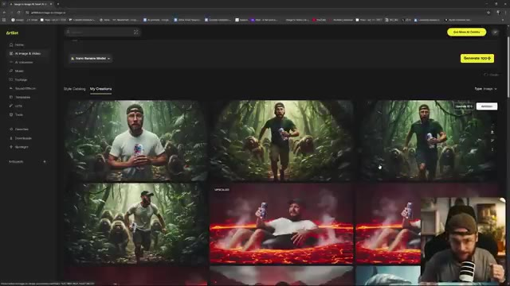
*Interface d'Artlist (galerie de créations) avec un encadré PiP montrant Jack en bas à droite.*

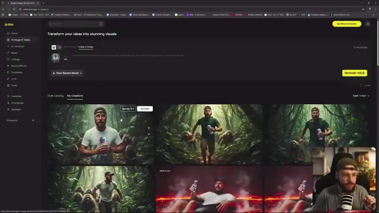
*Interface d'Artlist montrant la zone de transformation en haut avec le modèle Nano Banana et un champ de texte.*

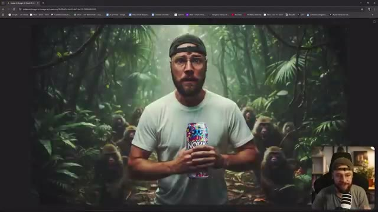
*Vue agrandie de l'image sélectionnée montrant un homme dans la jungle tenant une canette colorée "NOVAX" entouré de singes.*

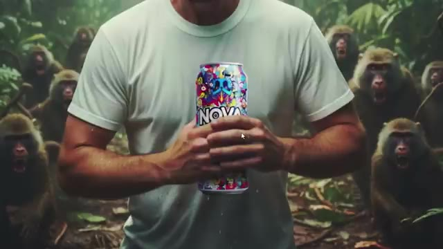
*Gros plan rapproché sur le torse de l'homme et la canette qu'il tient dans ses mains.*

---

### ⏱️ `[00:05:37 - 00:06:10]` | Segment #12

**🔊 Audio (Transcription Intégrale Mot pour Mot en Français) :**
> un tout petit peu trop saturé. Voyons donc ce que Nano Banana peut faire pour améliorer notre génération. Et juste en ajustant légèrement le prompt textuel, en ajoutant à la fin qu'il faut que ça fasse partie de l'environnement. On a récupéré cette génération ici, qui a l'air plutôt bien maintenant. Maintenant, si on survole notre génération choisie, vous pouvez voir qu'on a aussi une option pour faire un suréchantillonnage ou animer. Maintenant, de manière générale, on veut vraiment l'image de la plus haute résolution pour servir de cadre de départ, donc je vais aller dépenser 10 crédits pour faire un suréchantillonnage et vous pouvez voir qu'en un

**👁️ Analyse Visuelle d'Écran (gemini-3.5-flash-lite) :**
**Interface & Outils** : Interface web d'Artlist (AI Image & Video) avec un panneau de prompt textuel et une bibliothèque de créations, incluant une vue PiP du créateur dans le coin inférieur droit.

**Contenu textuel & Code** : Texte du prompt visible dans l'interface : "Darken the can the man is holding so it feels more integrated in the scene. It needs to feel part of the environment." Menu déroulant "Nano Siemens Model" et bouton jaune "Generate 100". Options de survol sur une image : "Upscale 10 v" et "Animate".

**Action / Démonstration** : Le créateur montre le résultat amélioré d'une génération d'image dans la jungle, puis survole l'image dans l'interface d'Artlist pour révéler les boutons "Upscale" (coûtant 10 crédits) et "Animate".

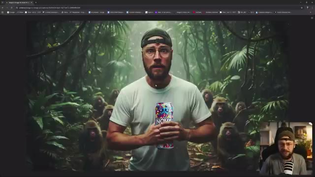
*Image générée montrant Jack dans une jungle entouré de singes et tenant une canette colorée, avec une incrustation vidéo de Jack dans le coin inférieur droit.*

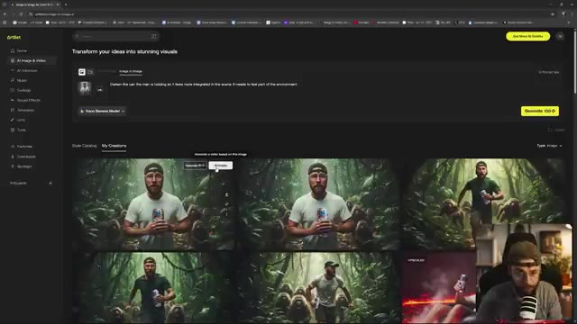
*Interface d'Artlist (AI Image & Video) affichant les onglets de créations avec les options "Upscale 10 v" et "Animate" au survol, et la caméra de Jack en PiP.*

---

### ⏱️ `[00:06:10 - 00:06:32]` | Segment #13

**🔊 Audio (Transcription Intégrale Mot pour Mot en Français) :**
> quelques secondes nous récupérons notre image améliorée et elle a l'air tellement mieux beaucoup plus de texture là nos produits et notre personnage se sentent tous les deux bien et cohérents et il y a un bon niveau de qualité et maintenant nous pouvons aller de l'avant et survoler à nouveau notre image choisie et sélectionner l'onglet animer et vous verrez que nous sommes maintenant passés à l'image vers vidéo en haut ici.

**👁️ Analyse Visuelle d'Écran (gemini-3.5-flash-lite) :**
**Interface & Outils** : Interface web d'Artlist (génération et upscaling d'images/vidéos par IA) avec options de modèle Kling 1.6, durée (5 sec) et résolution (720p).

**Contenu textuel & Code** : Texte du prompt visible : « A person in a jungle holding a colourful can, looking startled as group of baboons appear in the background... ». Options de modèle : « Kling 1.6 Model », « 5 sec », « 720p », et onglets « Text to Video » / « Image to Video ».

**Action / Démonstration** : Le créateur montre le résultat upscalé de l'image, survole l'image pour cliquer sur le bouton « Animate », et bascule sur l'interface de conversion image vers vidéo en haut.

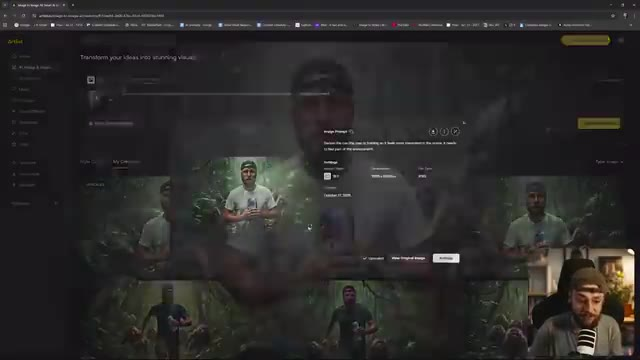
*Interface d'Artlist montrant la galerie de créations avec l'image upscalée et le panneau de paramètres à l'écran.*

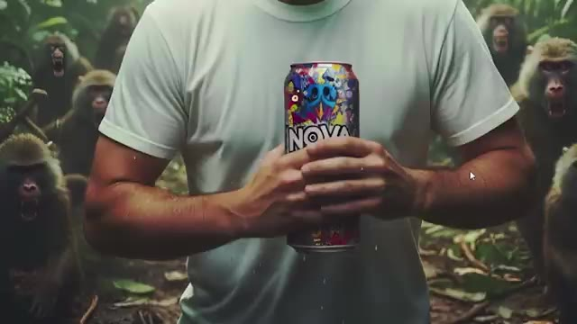
*Gros plan sur l'image générée montrant un personnage tenant une canette colorée « NOVA » dans la jungle entouré de babouins.*

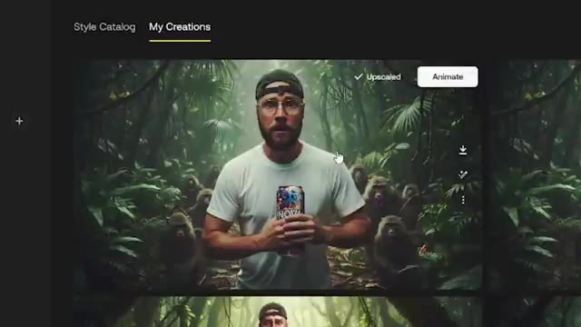
*Vue de l'interface avec le curseur survolant l'image upscalée et le bouton « Animate » visible.*

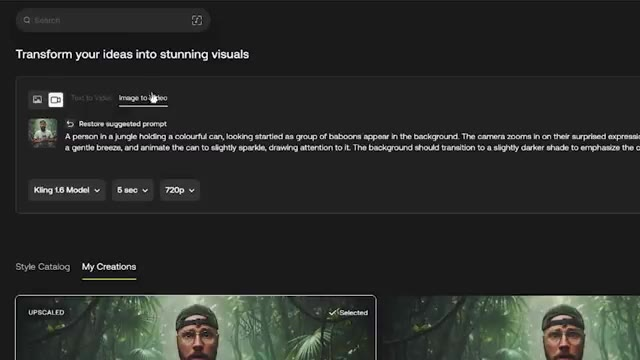
*Interface de génération vidéo montrant le mode « Image to Video » activé avec le prompt textuel et les options Kling 1.6.*

---

### ⏱️ `[00:06:33 - 00:06:53]` | Segment #14

**🔊 Audio (Transcription Intégrale Mot pour Mot en Français) :**
> Et Artlist a effectivement rempli un prompt suggéré ici. Bien sûr, c'est à vous de choisir si vous préférez suivre la suggestion d'Artlist ou si vous voulez avoir un peu plus de contrôle et que vous avez déjà décidé de la façon dont vous voulez que la scène se déroule. Maintenant, comme je veux tester à fond VO 3.1, je veux écrire mon propre prompt textuel spécifique. Et en bas, vous pouvez voir que nous pouvons sélectionner parmi différents modèles.

**👁️ Analyse Visuelle d'Écran (gemini-3.5-flash-lite) :**
**Interface & Outils** : Interface web d'Artlist (section AI Image & Video) affichant les options de génération, les prompts suggérés, le choix des modèles et les créations générées en bas de page.

**Contenu textuel & Code** : Textes visibles : "Transform your ideas into stunning visuals", "A person in a jungle holding a colourful can...", et les menus de sélection des modèles ("Kling 1.8 Model", "5 sec", "720p", avec le menu déroulant affichant Kling 1.8, Sora 2, Sora 2 Pro, Veo 3.1, Veo 3.1 Fast).

**Action / Démonstration** : Le créateur montre l'interface d'Artlist avec le prompt suggéré, puis survole et clique sur le menu déroulant pour afficher et sélectionner différents modèles d'IA générative vidéo.

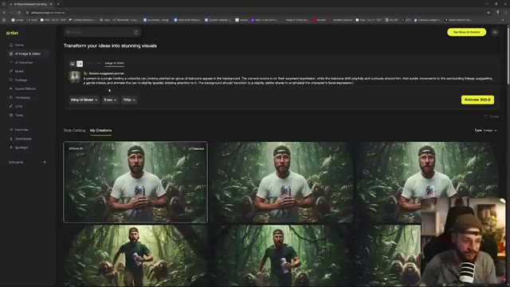
*Interface d'Artlist montrant le prompt suggéré par l'IA et les options de modèle avec un aperçu des créations en grille.*

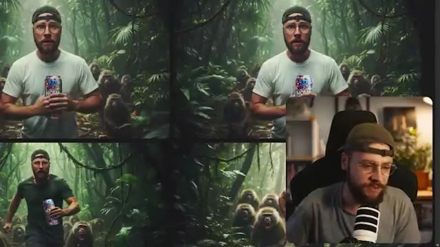
*Gros plan sur la grille des créations générées montrant l'homme dans la jungle entouré de babouins.*

*Menu déroulant de sélection des modèles vidéo (Kling 1.8, Sora 2, Sora 2 Pro, Veo 3.1, Veo 3.1 Fast) dans l'interface d'Artlist.*

---

### ⏱️ `[00:06:53 - 00:07:29]` | Segment #15

**🔊 Audio (Transcription Intégrale Mot pour Mot en Français) :**
> Nous avons accès à Kling, Sora 2, et bien sûr, Veo 3.1. Nous avons la version normale ainsi que la rapide. J'utilise généralement la rapide. Je pense que la différence est assez négligeable. Nous pouvons sélectionner la durée de notre génération. Je vais donc opter pour huit secondes et nous pouvons également sélectionner la résolution de sortie. Bien sûr, nous voulons la plus élevée possible, du 1080p full HD. Nous allons donc mettre Veo 3.1 à l'épreuve ici avec notre texte d'invite choisi, qui se lit comme suit : la scène fait des transitions entre des plans serrés de la boisson, le visage de l'homme et l'environnement autour de lui, capturant des détails complexes et créant un sentiment...

**👁️ Analyse Visuelle d'Écran (gemini-3.5-flash-lite) :**
**Interface & Outils** : Interface de la plateforme web Artlist (outil de génération vidéo par IA "AI Image & Video").

**Contenu textuel & Code** : Modèles visibles dans le menu : Kling 1.8, Sora 2, Sora 2 Pro, Veo 3.1, Veo 3.1 Fast. Paramètres : 8 secondes, 1080p Full HD. Prompt textuel : "The scene transitions between close-ups of the drink, the man's face, and the environment around him, capturing intricate details, and creating a feeling of immersion."

**Action / Démonstration** : Le créateur navigue dans l'interface d'Artlist, sélectionne le modèle Veo 3.1 Fast, choisit une durée de 8 secondes, la résolution 1080p, et configure le prompt textuel pour lancer la génération de la vidéo.

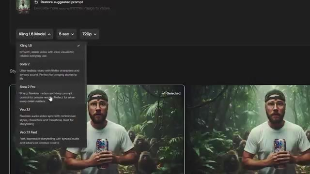
*Interface d'Artlist montrant le menu déroulant de sélection des modèles d'IA (Kling 1.8, Sora 2, Sora 2 Pro, Veo 3.1, Veo 3.1 Fast).*

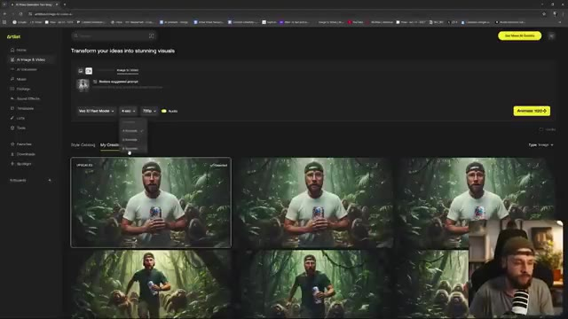
*Interface d'Artlist montrant le menu déroulant de sélection de la durée de génération (4, 5, 6, 8 secondes) avec la webcam du créateur en incrustation (PiP).*

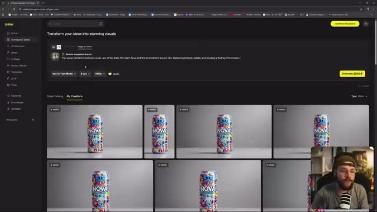
*Interface d'Artlist affichant le prompt textuel complet et le bouton de génération pour le modèle Veo 3.1 Fast.*

---

### ⏱️ `[00:07:29 - 00:08:11]` | Segment #16

**🔊 Audio (Transcription Intégrale Mot pour Mot en Français) :**
> d'immersion je pense que peut-être on va juste ajouter à la fin l'homme a l'air effrayé les babouins ont l'air en colère et on va lancer cette génération et voir ce qu'on obtient en retour et avec ce style de prompt textuel généralement à partir de vo 3.1 vous allez obtenir ce qui ressemble un peu à une histoire autonome même dans cette période de huit secondes. Je pense qu'on va aussi en lancer une de plus parce que c'est toujours pratique de servir de point de comparaison. D'accord donc on a récupéré notre génération alors allons-y et jetons un œil. Donc vous pouvez voir qu'il y a beaucoup de construction de monde qui se passe ici et c'est

**👁️ Analyse Visuelle d'Écran (gemini-3.5-flash-lite) :**
**Interface & Outils** : Interface web d'Artlist (section AI Image & Video) avec un panneau de configuration de génération de vidéo par IA (modèle Vo 3.1 Fast, durée de 8 secondes, 1080p, audio) et une galerie de créations ("My Creations").

**Contenu textuel & Code** : Texte du prompt visible : "The scene transitions between close-ups of the drink, the man's face, and the environment around him. Capturing intricate details, and creating a feeling of immersion. The man looks scared. The baboons look angry." Paramètres visibles : Vo 3.1 Fast Model, 8 sec, 1080p, bouton Audio activé, et bouton "Animate 2240".

**Action / Démonstration** : Le créateur navigue sur l'interface d'Artlist, configure les paramètres de génération textuelle pour la vidéo, lance le processus ("Animate"), puis examine les résultats de génération affichés dans la galerie de créations avant d'en visionner un en plein écran.

*Interface d'Artlist affichant le panneau de génération "Image to Video" avec les paramètres du modèle Vo 3.1 Fast, une durée de 8 secondes, la résolution 1080p et l'audio activé.*

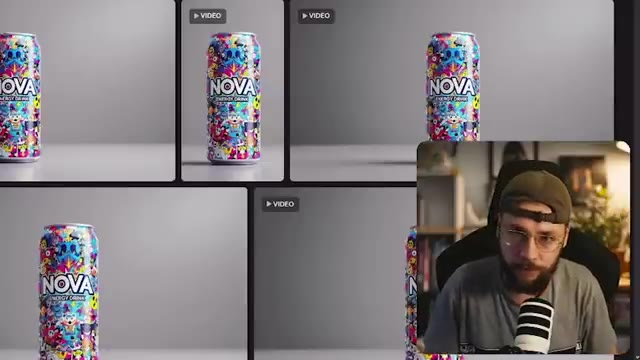
*Grille de vidéos générées sur Artlist montrant plusieurs variations d'une canette de boisson énergisante NOVA sur fond gris.*

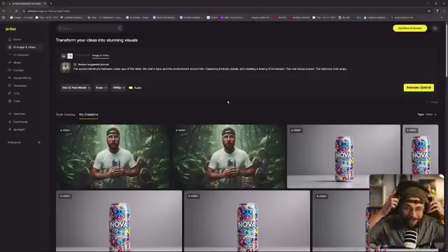
*Interface d'Artlist montrant la grille des créations avec l'apparition des nouvelles vidéos générées mettant en scène un homme effrayé entouré de babouins dans une jungle.*

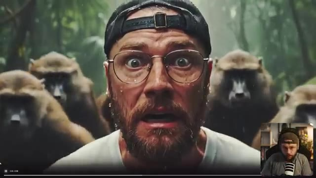
*Plein écran sur le résultat vidéo généré par IA montrant un homme aux yeux écarquillés et en sueur, l'air terrifié, encadré par des babous menaçants dans la jungle.*

---

### ⏱️ `[00:08:11 - 00:08:51]` | Segment #17

**🔊 Audio (Transcription Intégrale Mot pour Mot en Français) :**
> exactement ce que j'essayais d'obtenir à partir de cette invite textuelle spécifique et c'est pour moi là où l'on commence à voir certaines similarités entre Sora 2 et VO 3.1 parce que leur capacité à développer une scène et à la rendre à la fois immersive et cohérente à partir d'une invite textuelle très simple est assez impressionnante et il y a beaucoup de choses incroyables qui se produisent au sein de cette génération lorsque nous parlons de physique et de textures réalistes les effets sonores et la musique que VO 3.1 a ajoutés il y a de quoi être impressionné ici allons-y et jetons un coup d'œil à notre deuxième génération à nouveau vraiment

**👁️ Analyse Visuelle d'Écran (gemini-3.5-flash-lite) :**
**Interface & Outils** : Lecteur vidéo / Démonstration de générations vidéo par intelligence artificielle (Sora 2 / VO 3.1) avec incrustation caméra (PiP) du créateur.

**Contenu textuel & Code** : Vidéo générée par IA illustrant une scène immersive dans une jungle tropicale avec des babouins agressifs et un personnage tenant une canette, analysée par le créateur en incrustation PiP.

**Action / Démonstration** : Le créateur commente et analyse la génération vidéo IA affichée en plein écran, illustrant les capacités physiques et textuelles des modèles Sora 2 et VO 3.1.

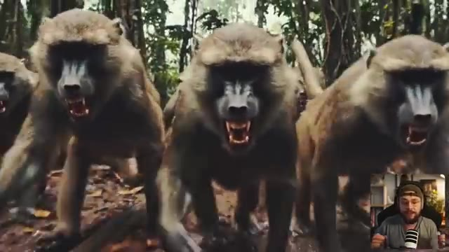
*Génération vidéo IA montrant des babouins menaçants avançant dans la jungle, avec l'encadré PiP du créateur en bas à droite.*

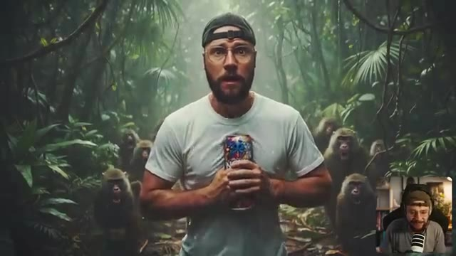
*Génération vidéo IA montrant le créateur terrifié au milieu de la jungle entouré de babouins, tenant une canette, avec l'encadré PiP du créateur en bas à droite.*

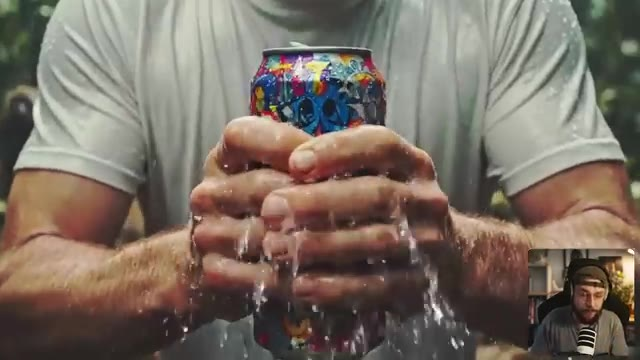
*Gros plan de la génération vidéo IA sur les mains du personnage tenant une canette colorée ruisselante d'eau, avec l'encadré PiP du créateur en bas à droite.*

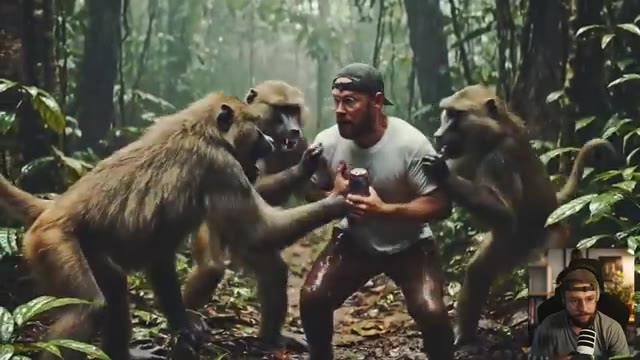
*Génération vidéo IA montrant le personnage accroupi et encerclé par des babouins agressifs dans la jungle, avec l'encadré PiP du créateur en bas à droite.*

---

### ⏱️ `[00:08:51 - 00:09:26]` | Segment #18

**🔊 Audio (Transcription Intégrale Mot pour Mot en Français) :**
> Assez cool, je pense qu'on commence à voir quelques problèmes en termes de manque de cohérence des personnages. J'ai le dos tourné à la caméra à un moment donné et quand je me retourne, ça ne me ressemble plus vraiment, mais il y a aussi beaucoup de choses à aimer ici. Je veux juste m'arrêter sur cette image ici et admirer certains des détails texturaux, les gouttelettes d'eau sur mes lunettes. Regardez les mèches de la barbe, les gouttelettes d'eau sur la canette. Oui, il y a des trucs assez fous qui se passent ici et je pense que si je devais utiliser cette génération, je serais sélectif sur les parties.

**👁️ Analyse Visuelle d'Écran (gemini-3.5-flash-lite) :**
**Interface & Outils** : Lecteur vidéo avec incrustation PiP du créateur dans le coin inférieur droit.

**Contenu textuel & Code** : Rendu vidéo de synthèse généré par intelligence artificielle représentant une scène dans la jungle avec des singes et le créateur.

**Action / Démonstration** : Le créateur commente les détails visuels et les incohérences de cohérence de personnage d'une vidéo générée par IA.

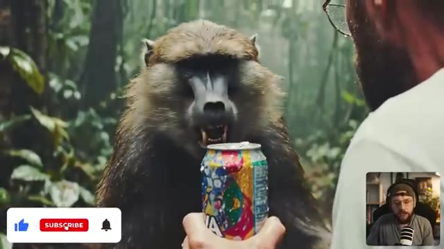
*Image 1 montrant la vidéo générée par IA avec un singe face à Jack dans la jungle.*

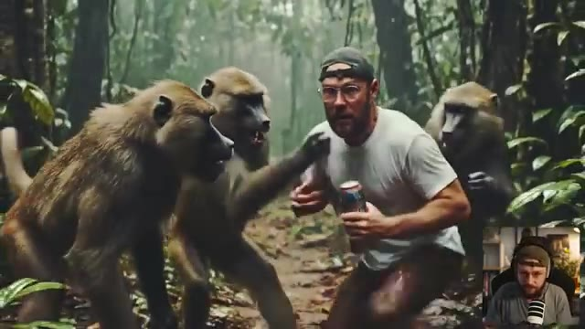
*Image 2 montrant Jack entouré de singes menaçants dans la jungle.*

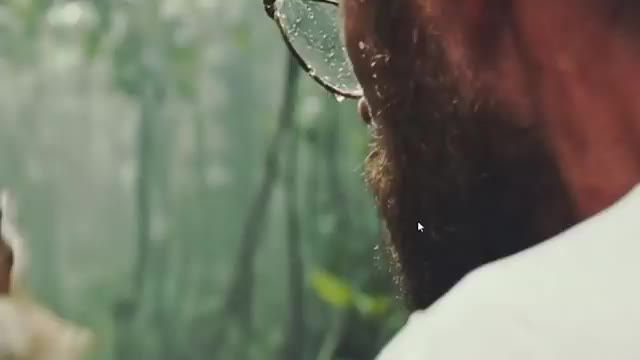
*Image 3 montrant un gros plan macro sur les détails de la barbe et des lunettes de Jack avec des gouttes d'eau.*

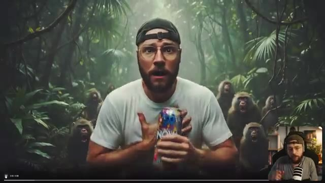
*Image 4 montrant Jack de face tenant une canette au milieu de singes dans la jungle.*

---

### ⏱️ `[00:09:26 - 00:09:46]` | Segment #19

**🔊 Audio (Transcription Intégrale Mot pour Mot en Français) :**
> que je pense fonctionner et les parties qui, selon moi, ne fonctionnent pas. Et pour moi, c'est un peu ce qui sépare la bouillie générée par IA du véritable cinéma par IA. Vous devez comprendre que chaque génération que vous obtenez de chaque modèle ne va pas forcément être bonne. Et aussi qu'il peut s'agir simplement de fragments au sein de la génération qui fonctionnent pour ce que vous voulez. Vous devez être sélectif quant à ce que vous utilisez et ce que vous n'utilisez pas.

**👁️ Analyse Visuelle d'Écran (gemini-3.5-flash-lite) :**
**Interface & Outils** : Présentation face caméra sans partage d'écran (avec incrustation PiP du créateur en bas à droite)

**Contenu textuel & Code** : Vidéo générée par IA montrant un personnage (ressemblant au créateur) dans une jungle entouré de babouins agressifs tenant une canette, avec Jack en incrustation PiP en bas à droite.

**Action / Démonstration** : Le créateur parle face caméra tout en illustrant ses propos avec un extrait vidéo généré par IA diffusé en plein écran.

---

### ⏱️ `[00:09:46 - 00:10:18]` | Segment #20

**🔊 Audio (Transcription Intégrale Mot pour Mot en Français) :**
> Et dans ces deux générations, je pense qu'il y a de très bonnes scènes que l'on pourrait extraire et utiliser dans un court-métrage ou une publicité. Maintenant, je veux aller de l'avant et vous montrer certaines des autres générations de VO 3.1 que j'obtiens. Nous avons bien sûr dû tester certaines des capacités vocales du modèle, donc nous pouvons vérifier celle-ci ici. Une synchronisation labiale vraiment excellente ici. Vous pouvez voir que notre produit reste très cohérent tout au long de cette génération également.

**👁️ Analyse Visuelle d'Écran (gemini-3.5-flash-lite) :**
**Interface & Outils** : Interface web de génération vidéo par IA (style dashboard de création avec visionneuse de médias et paramètres modaux) avec incrustation vidéo PiP (Picture-in-Picture) du créateur.

**Contenu textuel & Code** : Texte du prompt visible dans la modale : "The scene transitions between close-ups of the dude, the man's face, and the environment around her. Capturing intricate details, and creating a feeling of immersion. The man looks scared. The balloons look angry." Paramètres visibles : Modèle "V10 3.1 Fast", Aspect Ratio "16:9", Resolution "1080P (39:4 HDR)". Nom de marque visible sur la canette : "NOVA Energy Drink".

**Action / Démonstration** : Le créateur navigue dans l'interface de génération, clique sur les options et présente le résultat vidéo généré par le modèle VO 3.1 mettant en avant la synchronisation labiale et la cohérence du produit (canette Nova).

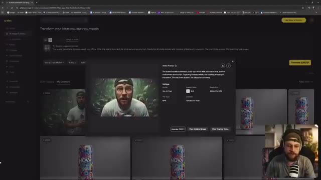
*Interface de la plateforme de génération vidéo montrant les options et une fenêtre modale affichant la vidéo d'un homme en gros plan avec une canette Nova Energy Drink.*

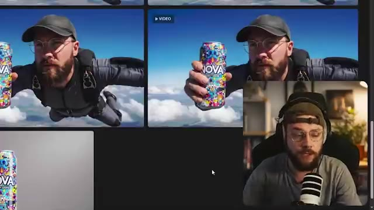
*Interface de la plateforme avec une grille de vidéos générées, affichant un homme en chute libre tenant une canette de boisson énergisante Nova, avec la pastille PiP du créateur en bas à droite.*

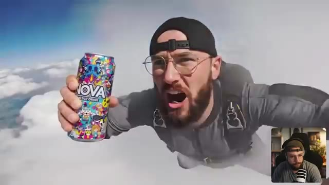
*Gros plan en plein écran sur la génération vidéo d'un homme en chute libre avec un équipement de parachutisme, tenant une canette de Nova Energy Drink et parlant face caméra.*

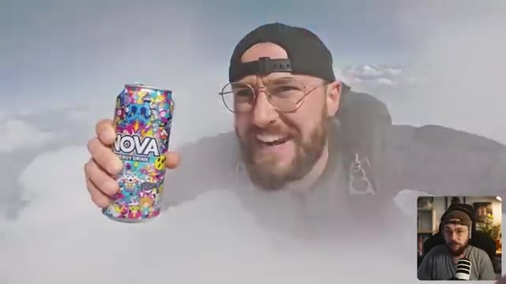
*Suite de la séquence vidéo en plein écran montrant la synchronisation labiale de l'homme en chute libre qui parle tout en tenant la canette de boisson énergisante Nova.*

---

### ⏱️ `[00:10:18 - 00:10:54]` | Segment #21

**🔊 Audio (Transcription Intégrale Mot pour Mot en Français) :**
> C'est plutôt amusant, où je surfe sur une vague faite de bananes. Le personnage interagit avec n'importe quel produit de votre choix, une démonstration incroyable de la physique et de la compréhension du monde. Nous constatons que la cohérence de notre produit devient un peu bancale, et ce que j'ai remarqué tout au long de ce projet, c'est que plus votre produit est loin de la caméra, plus vous commencez à introduire des problèmes. Pour contrer cela, je veux vous montrer cette génération ici, car c'est insensé, et combiné avec nano banana, vous pouvez avoir n'importe quel

**👁️ Analyse Visuelle d'Écran (gemini-3.5-flash-lite) :**
**Interface & Outils** : Lecteur vidéo en plein écran affichant des clips générés par IA, avec une petite fenêtre PiP (Picture-in-Picture) en bas à droite montrant Jack dans son studio face à sa webcam.

**Contenu textuel & Code** : Canette de boisson avec l'inscription « NOVA ENERGY DRINK » et des motifs colorés. Arrière-plan dense composé de bananes jaunes.

**Action / Démonstration** : Le créateur présente une vidéo générée par IA où son propre avatar surfe sur une vague de bananes tout en tenant une canette de boisson, puis zoome sur le produit en gros plan.

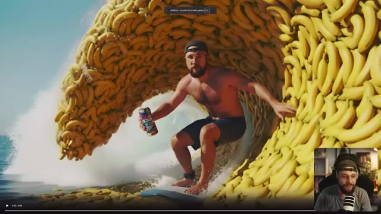
*Vidéo IA montrant Jack sur une planche de surf au milieu d'une vague géante entièrement composée de bananes, tenant une canette de boisson, avec sa propre incrustation en incrustation PiP en bas à droite.*

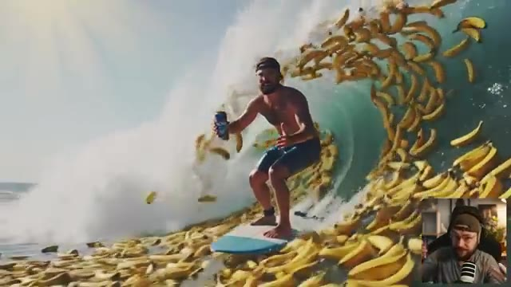
*Vidéo IA montrant Jack surfant sur la vague de bananes, avec des éclaboussures et des bananes volantes autour de lui, tenant une canette de boisson.*

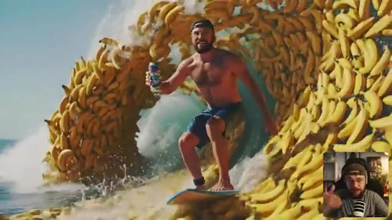
*Vidéo IA montrant Jack en plein surf dans le tube de la vague de bananes, tenant sa canette.*

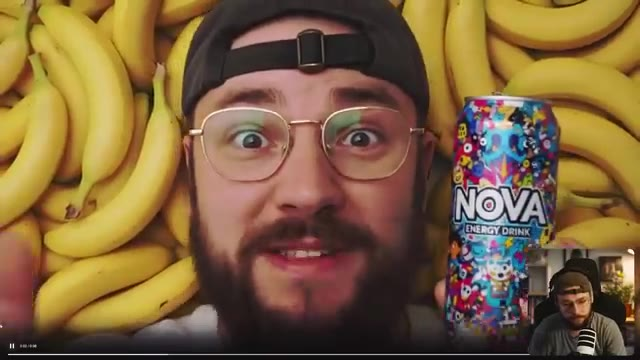
*Gros plan de Jack tenant une canette de boisson colorée devant un arrière-plan entièrement constitué de bananes.*

---

### ⏱️ `[00:10:54 - 00:11:35]` | Segment #22

**🔊 Audio (Transcription Intégrale Mot pour Mot en Français) :**
> le personnage interagit avec n'importe quel produit de votre choix. Bien sûr, ça ne ressemble pas à ma voix, mais en même temps VO3.1 ne sait pas à quoi je ressemble donc c'est plutôt fair-play. Mais mes expressions, la façon dont ma bouche bouge quand je parle, l'éclairage, les petits reflets et éclats sur notre canette de boisson énergisante Nova sont incroyablement précis. Et comme le produit est très proche de la caméra, il reste vraiment, vraiment cohérent. Je vais vous montrer cet exemple ici aussi car il contient énormément d'excellents exemples avec à la fois des points positifs et négatifs. Donc un autre très bon exemple du moment où vous devriez être sélectionné par

**👁️ Analyse Visuelle d'Écran (gemini-3.5-flash-lite) :**
**Interface & Outils** : Interface de l'application web Artlist (Artlist.io) avec un panneau latéral de navigation sombre et une grille de prévisualisation de vidéos et d'images générées par IA.

**Contenu textuel & Code** : Grille de vignettes montrant diverses créations visuelles intégrant une canette de boisson énergisante « NOVA Energy Drink » dans des décors variés (sous l'eau avec des requins, sur une montagne enneigée, dans de la lave en fusion, etc.).

**Action / Démonstration** : Le créateur navigue ou présente l'interface de sa bibliothèque de médias sur Artlist, avec sa webcam en médaillon (Picture-in-Picture) visible dans le coin inférieur droit.

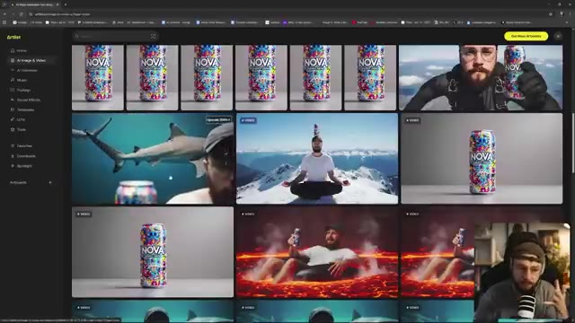
*Interface de l'application web Artlist affichant une galerie de médias générés par IA avec des canettes de boisson Nova Energy Drink.*

---

### ⏱️ `[00:11:35 - 00:12:09]` | Segment #23

**🔊 Audio (Transcription Intégrale Mot pour Mot en Français) :**
> sélectionner les moments clés qui fonctionnent de vos générations. Donc quand j'apporte la canette à la caméra ici c'est incroyable mais quand on coupe sur ce type ce n'est pas moi. Cependant j'aime vraiment ce plan de coupe où je suis flou mais l'attention du spectateur est attirée vers les requins dans l'eau. Donc pour moi personnellement là où VO 3.1 brille c'est dans ses compositions cinématographiques et le niveau de qualité que vous pouvez obtenir. Donc on parle de choses comme les textures, les fines particules, un éclairage réaliste et le mouvement. Vous allez obtenir des résultats vraiment impressionnants de la part de Google

**👁️ Analyse Visuelle d'Écran (gemini-3.5-flash-lite) :**
**Interface & Outils** : Vidéo de démonstration de génération par IA avec incrustation PiP (Picture-in-Picture) du présentateur Jack en bas à droite dans son studio.

**Contenu textuel & Code** : Canette de boisson énergétique portant la mention 'NOVA', requins nageant en arrière-plan sous l'eau, bulles et particules fines.

**Action / Démonstration** : Le créateur commente visuellement et analyse les différentes générations de vidéos par IA affichées à l'écran, en pointant les réussites et les défauts de composition.

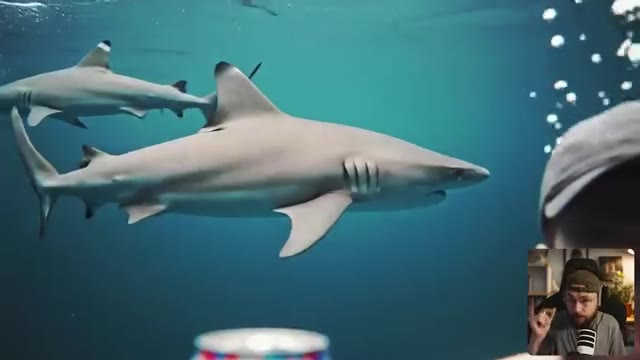
*Extrait vidéo généré par IA montrant des requins nageant sous l'eau avec le haut d'une canette floue au premier plan, et l'encadré de Jack réagissant en bas à droite.*

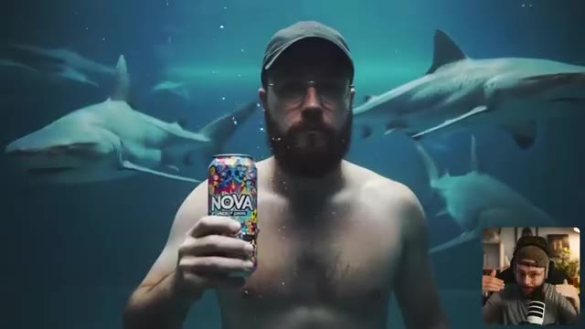
*Extrait vidéo généré par IA montrant un homme barbu tenant une canette de boisson Nova sous l'eau au milieu de requins, avec Jack en incrustation PiP.*

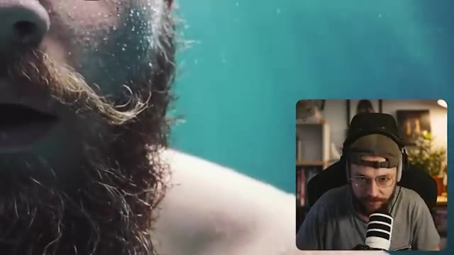
*Plan de coupe rapproché et flou d'un visage barbu sous l'eau, l'attention étant portée sur l'arrière-plan, avec Jack dans l'encadré PiP.*

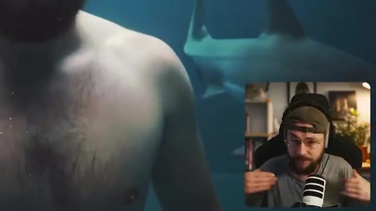
*Gros plan cinématographique flou du torse d'un homme sous l'eau avec des requins en arrière-plan, illustrant la qualité des compositions de Google.*

---

### ⏱️ `[00:12:09 - 00:12:42]` | Segment #24

**🔊 Audio (Transcription Intégrale Mot pour Mot en Français) :**
> modèle vidéo en termes de ces applications. Cependant, vous pourriez perdre un peu de cohérence dans les personnages et les produits en cours de route. Le point clé pour moi ici, si vous voulez utiliser VO3.1 pour des publicités de produits, est de garder votre produit près de la caméra, comme vous pouvez le voir ici. Plus votre produit s'éloigne, plus il va devenir un peu flou, en particulier lorsqu'il s'agit de notre type de stratégie de marque très complexe, cette œuvre d'art vraiment étrange que nous avons sur la caméra. Il se passe beaucoup de choses et cela nous amène gentiment à Sora 2. Allons donc jeter un coup d'œil à certains de nos

**👁️ Analyse Visuelle d'Écran (gemini-3.5-flash-lite) :**
**Interface & Outils** : Interface web d'une plateforme de génération ou de gestion de contenu vidéo/images par IA, affichant une grille de médias (images fixes et extraits marqués par le label "VIDEO"), avec la caméra PiP de l'animateur en bas à droite.

**Contenu textuel & Code** : On peut apercevoir une canette de boisson portant la marque "NOVA ENERGY DRINK" avec un design artistique très coloré et complexe, ainsi que différentes vignettes de projets vidéo (un homme en train de méditer en haut d'une montagne avec une canette sur la tête, un homme en costume de parachutiste, etc.).

**Action / Démonstration** : L'écran principal affiche d'abord des extraits vidéo générés illustrant les propos de l'animateur sur la cohérence des produits, puis bascule vers une vue d'interface de type galerie montrant les différents tests réalisés avec le modèle d'IA, tandis que Jack commente et explique ses observations en direct depuis sa webcam PiP.

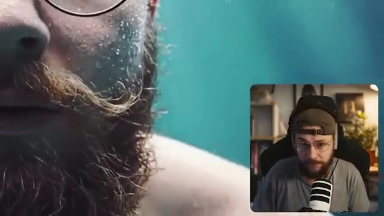
*Extrait vidéo généré par IA montrant un personnage barbu avec des lunettes sous l'eau, filmé de très près, avec le créateur en incrustation (PiP).*

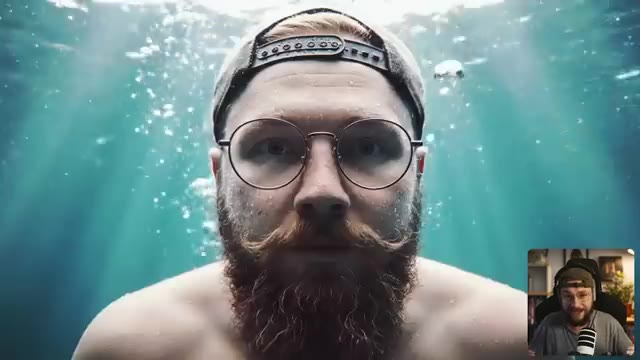
*Extrait vidéo généré par IA montrant le même personnage barbu sous l'eau, avec des bulles autour de lui, avec le créateur en incrustation (PiP).*

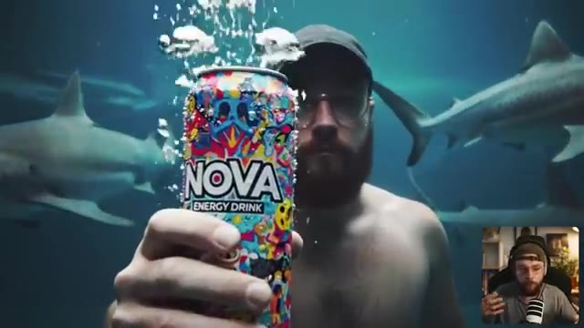
*Extrait vidéo montrant une canette de boisson énergétique 'NOVA' tenue très près de la caméra sous l'eau avec des requins en arrière-plan, avec le créateur en incrustation (PiP).*

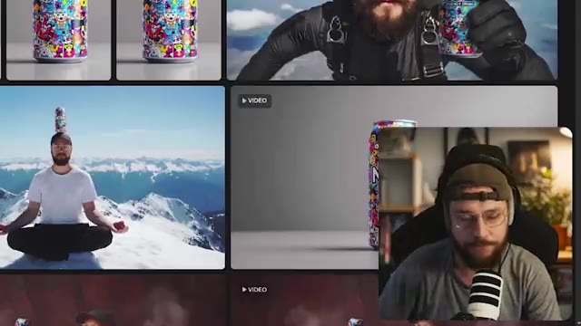
*Interface de galerie ou de portfolio montrant plusieurs exemples de vidéos et d'images générées par IA avec des canettes de la marque NOVA, avec le créateur en incrustation (PiP).*

---

### ⏱️ `[00:12:42 - 00:13:14]` | Segment #25

**🔊 Audio (Transcription Intégrale Mot pour Mot en Français) :**
> générations ici. Le prompt textuel que j'ai réutilisé plusieurs fois était "contenu de style UGC ultra réaliste d'une créatrice de contenu féminine attractive essayant la boisson Nova pour la première fois et ayant une réaction excitée et favorable boisson énergisante regardez cette canette c'est tellement amusant voyons de quoi il s'agit oh wow c'est tellement bon c'est fruité un peu acidulé super donc il y a quelques petits trucs bizarres qui se passent là jetons un œil au suivant ah c'est tellement bon c'est genre fruité mais en quelque sorte donc une partie du dialogue est coupée et c'est parce que beaucoup de ces générations ne duraient que quatre secondes donc

**👁️ Analyse Visuelle d'Écran (gemini-3.5-flash-lite) :**
**Interface & Outils** : Navigateur web affichant l'interface de la plateforme Artlist (AI Image & Video) avec une bibliothèque de médias générés par IA.

**Contenu textuel & Code** : Texte du prompt vidéo visible : « Ultrarealistic UGC style content of an attractive female content creator trying the NOVA drink for the first time and having an excited favourable reaction. No music. » Paramètres : Modèle Sora 2, Aspect Ratio 9:16, Resolution 720p (HD), File Type MP4, Style text-to-video, Date October 16, 2025.

**Action / Démonstration** : Le créateur navigue dans sa bibliothèque de clips générés sur Artlist, clique sur un projet vidéo pour en afficher les détails, les paramètres et le prompt textuel utilisé.

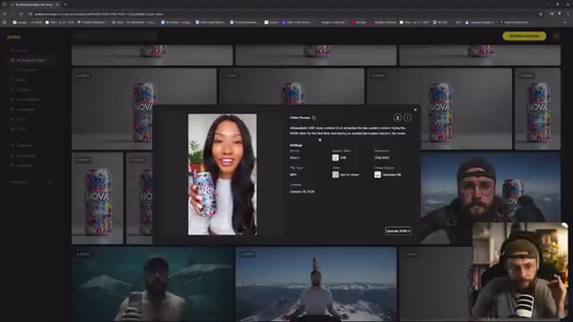
*Interface d'Artlist affichant les détails d'une génération vidéo avec le prompt et les paramètres techniques (Modèle Sora 2, format 9:16, résolution 720p).*

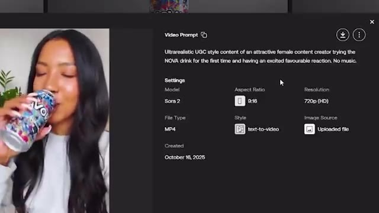
*Gros plan sur la fenêtre modale montrant la vidéo générée d'une femme buvant la canette Nova et le prompt textuel complet.*

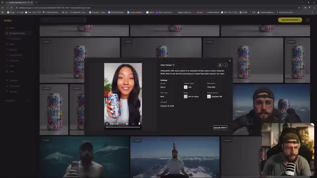
*Retour à la vue d'ensemble de la galerie de projets sur Artlist avec le panneau de prévisualisation vidéo.*

---

### ⏱️ `[00:13:14 - 00:13:48]` | Segment #26

**🔊 Audio (Transcription Intégrale Mot pour Mot en Français) :**
> ne vous attendez pas à ce que sora comprenne que vous voulez conclure le dialogue dans ce laps de temps mais je tiens à dire que certains de ces résultats sont incroyablement réalistes. Vous pouvez voir dans cette génération ici, notre produit reste très, très cohérent. Le flux de travail consistait donc à télécharger notre référence de nos produits. Nous pouvons aller de l'avant et sélectionner le modèle Sora 2. Et vous verrez ici, c'est le principal inconvénient de Sora. Avec Sora, les images téléchargées contenant des personnes réalistes ne peuvent pas être utilisées pour la génération. Donc contrairement à VO 3.1, où nous étions capables de créer une image de départ avec

**👁️ Analyse Visuelle d'Écran (gemini-3.5-flash-lite) :**
**Interface & Outils** : Interface web d'Artlist (section AI Image & Video) avec options de modèle (Sora 2), formats, et galerie de créations ("My Creations").

**Contenu textuel & Code** : Texte visible sur l'interface : "Transform your ideas into stunning visuals", "Sora 2 Model", "16:9", "8 sec", "720p", "With Sora, uploaded images containing realistic people can't be used for generation", et un message d'alerte sur les crédits "You're out of credits". Galerie affichant plusieurs vidéos générées d'un produit (canette "NOVA") et d'un personnage dans la jungle.

**Action / Démonstration** : Le créateur commente à l'écran l'interface d'Artlist et les résultats de génération vidéo obtenus avec le modèle Sora 2, tout en expliquant les limitations liées aux images de personnes réelles.

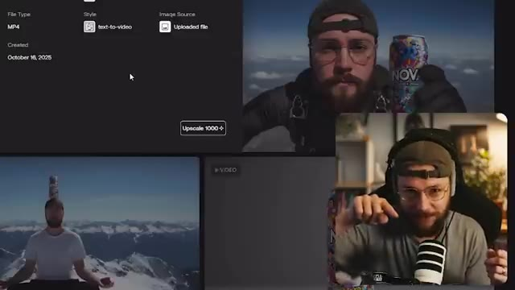
*Interface d'Artlist montrant les détails d'un fichier MP4 généré, avec en incrustation (PiP) le créateur Jack dans son studio.*

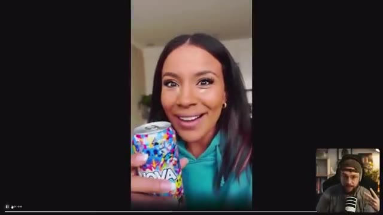
*Vidéo générée par IA montrant une femme tenant une canette de boisson NOVA, avec en bas à droite le créateur en incrustation.*

*Interface de l'outil Artlist (AI Image & Video) affichant les créations de l'utilisateur avec le modèle Sora 2, et le créateur en incrustation vidéo.*

---

### ⏱️ `[00:13:48 - 00:14:22]` | Segment #27

**🔊 Audio (Transcription Intégrale Mot pour Mot en Français) :**
> mon sosie. Nous ne pouvons pas faire cela avec Sora. Mais l'avantage, c'est que vos générations Sora 2 vont paraître incroyablement réalistes là où votre VO 3.1 pourrait sembler un peu plus cinématique ou stylisée. Jetons un coup d'œil à quelques autres exemples. Oh wow c'est tellement bon. C'est fruité mais croquant. Je suis énervé. Maintenant, c'est un excellent exemple quand il s'agit de la cohérence d'un produit qui fonctionne vraiment, vraiment bien ici et ces reflets sur la canette ont l'air incroyables. Oh wow c'est un truc de fou, super bon. Lumineux, fruité super onctueux j'adhère, première fois que je teste Nova la canette la plus folle c'est oh c'est un truc de fou, super bon genre

**👁️ Analyse Visuelle d'Écran (gemini-3.5-flash-lite) :**
**Interface & Outils** : Interface web de la plateforme Artlist (onglet "AI Image & Video", section "Image to Video", menu déroulant "Sora 2 Model", curseurs de format, durée de 9 sec, résolution 725p, bouton "Animate 1800", onglets "Style Catalog" et "My Creations").

**Contenu textuel & Code** : Texte visible : "Artlist", "Transform your ideas into stunning visuals", "Image to Video", "Sora 2 Model", "16:9", "9 sec", "725p", "Audio", "Animate 1800", "Style Catalog", "My Creations", "NOVA ENERGY DRINK". Une notification indique "You're out of credits". Le créateur Jack apparaît en incrustation (PiP) dans le coin inférieur droit.

**Action / Démonstration** : Le créateur navigue sur l'interface d'Artlist pour présenter les différentes générations de vidéos de la canette Nova réalisées avec le modèle Sora 2, illustrant le réalisme et la cohérence des produits générés par l'IA.

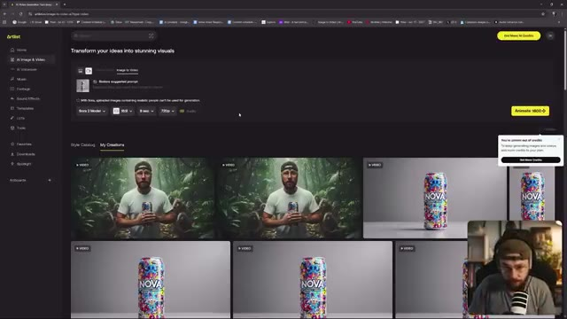
*Interface de la plateforme Artlist AI Image & Video montrant l'outil de génération avec le modèle Sora 2, l'option Image to Video et des exemples de créations de canettes Nova.*

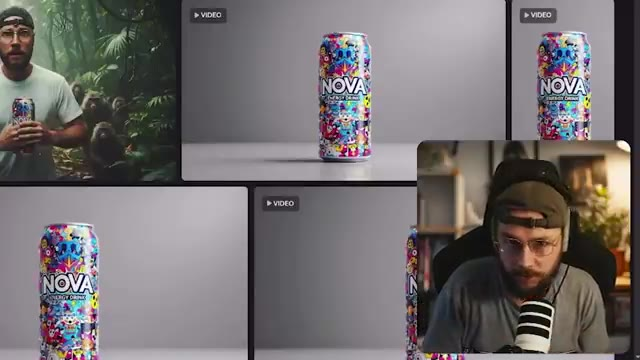
*Affichage de plusieurs vidéos générées montrant des plans de la canette de boisson Nova sous différents angles avec un réalisme saisissant.*

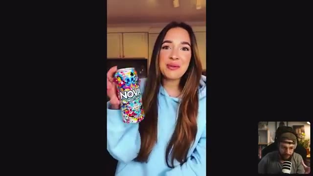
*Séquence vidéo générée par IA montrant une jeune femme tenant une canette de boisson Nova dans une cuisine.*

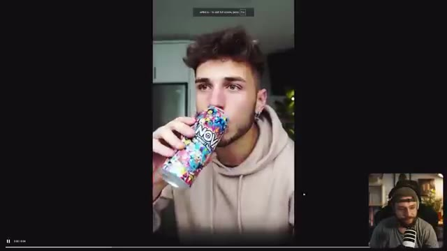
*Séquence vidéo générée par IA montrant un jeune homme buvant dans une canette de boisson Nova.*

---

### ⏱️ `[00:14:22 - 00:15:07]` | Segment #28

**🔊 Audio (Transcription Intégrale Mot pour Mot en Français) :**
> un boost instantané et maintenant on continue et on commence à tester quelques comparaisons directes ici en utilisant des invites textuelles très similaires donc par exemple nous avons notre génération vo 3.1 de moi en train de faire du parachutisme jetons un œil à ça c'est très cool très dynamique mais un léger manque de cohérence des personnages là-dedans jetons un œil à certaines de nos générations Sora. Deuxième génération de parachutisme ici. C'est tellement cool à quel point notre produit est cohérent

**👁️ Analyse Visuelle d'Écran (gemini-3.5-flash-lite) :**
**Interface & Outils** : Interface web de la plateforme Artlist (AI Image & Video) affichant des aperçus vidéo et des fenêtres de lecture de clips générés par intelligence artificielle.

**Contenu textuel & Code** : Texte "NOVA" visible sur les canettes de boissons énergisantes dans la grille et dans les vidéos de parachutisme, avec le flux vidéo en plein écran et le créateur Jack en incrustation (PiP) dans le coin inférieur droit.

**Action / Démonstration** : Le créateur présente et compare différentes générations de vidéos IA (vo 3.1 puis Sora) illustrant du parachutisme avec des canettes de boisson, en commentant la cohérence des personnages et des produits.

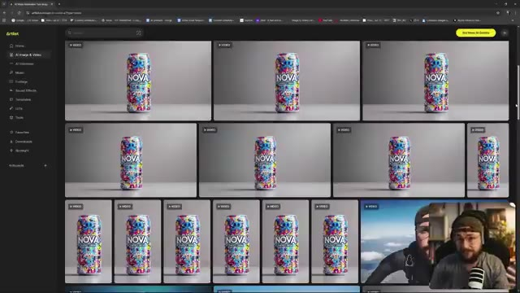
*Interface d'une plateforme d'IA (Artlist) montrant une grille de vidéos de canettes de boisson énergisante NOVA avec le créateur en incrustation (PiP).*

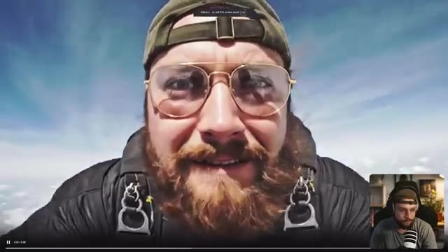
*Vidéo générée par IA montrant un homme barbu avec des lunettes de soleil en train de faire du parachutisme, avec le créateur en incrustation.*

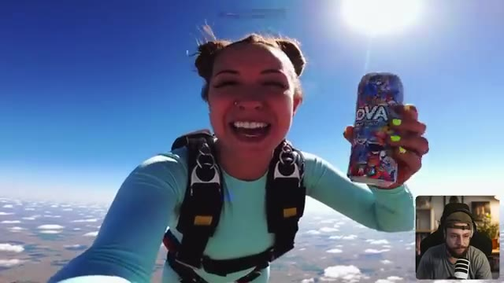
*Vidéo générée par IA montrant une femme souriante tenant une canette NOVA en plein saut en parachute, avec le créateur en incrustation.*

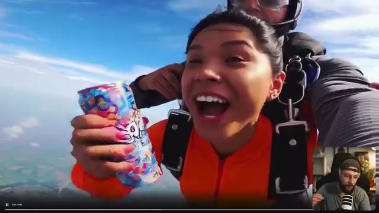
*Seconde génération vidéo avec une femme vêtue de orange tenant une canette de soda en saut en parachute, avec le créateur en incrustation.*

---

### ⏱️ `[00:15:07 - 00:15:41]` | Segment #29

**🔊 Audio (Transcription Intégrale Mot pour Mot en Français) :**
> reste. On a le parachutiste qui fait le vieux pouce levé et la canette de boisson s'approche tout près de la caméra. Certains de ces tests de style méditation également. Et bien que la création d'univers ici soit vraiment assez impressionnante, c'est en fait un très bon exemple de l'un des inconvénients concernant Sora 2. Ce qu'on obtient avec le modèle vidéo d'OpenAI, c'est quelque chose qui a l'air très réaliste, mais les vidéos elles-mêmes sont très compressées. Même si leur résolution est correcte, il y a beaucoup de

**👁️ Analyse Visuelle d'Écran (gemini-3.5-flash-lite) :**
**Interface & Outils** : Lecteur vidéo présentant des exemples de générations issues du modèle Sora 2 d'OpenAI, avec la vue PiP (Picture-in-Picture) du créateur Jack dans le coin inférieur droit.

**Contenu textuel & Code** : Texte visible sur les canettes : "NOVA" et "ENERGY DRINK", ainsi que des motifs graphiques colorés de style cartoon.
[DESC_IMAGE_1] Le créateur commente des exemples de vidéos générées par IA montrant des scènes dynamiques et des tests de style méditation, tout en analysant la qualité de compression du modèle Sora 2.

**Action / Démonstration** : Démonstration pédagogique et présentation du workflow.

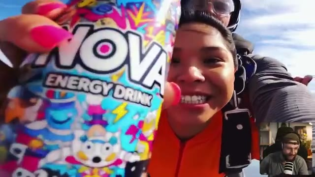
*Extrait vidéo généré par IA montrant un gros plan d'une canette de boisson énergisante "NOVA" devant un parachutiste en plein saut, avec l'encadré du créateur en bas à droite.*

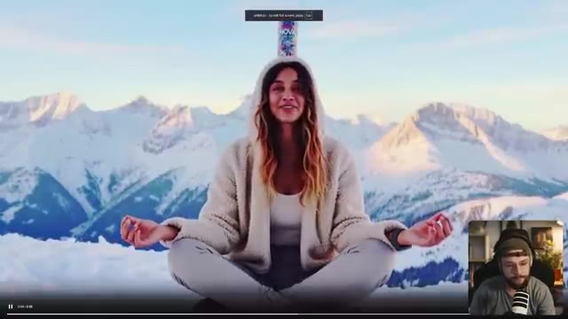
*Extrait vidéo montrant une femme en position de méditation assise dans la neige avec une canette de "NOVA" en équilibre sur la tête, avec des montagnes enneigées en arrière-plan.*

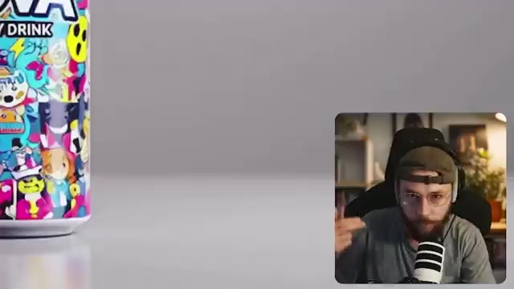
*Extrait vidéo rapproché montrant le flanc d'une canette de boisson colorée sur fond neutre.*

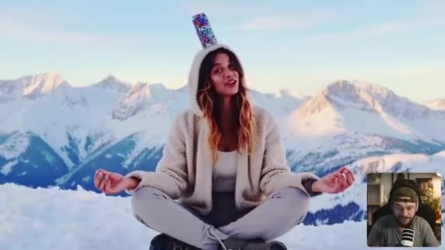
*Extrait vidéo montrant à nouveau la femme méditant dans les montagnes enneigées avec la canette sur la tête.*

---

### ⏱️ `[00:15:41 - 00:16:15]` | Segment #30

**🔊 Audio (Transcription Intégrale Mot pour Mot en Français) :**
> compression qui se produit ici et ça donne l'impression que le contenu a été filmé avec le téléphone de quelqu'un. Vous recherchez quelque chose qui semble plus imparfait, mais aussi plus fidèle à la réalité. Mais vous obtenez ce genre d'animation picturale étrange avec beaucoup de vos générations Sora 2. Je vais essayer de zoomer ici sur les montagnes en arrière-plan et peut-être de ralentir la vidéo pour que vous puissiez faire attention à ça mais c'est juste le truc avec Sora 2 c'est beaucoup plus réaliste mais c'est aussi de moins bonne qualité la fidélité et la netteté font clairement défaut donc pour moi ça signifie que c'est

**👁️ Analyse Visuelle d'Écran (gemini-3.5-flash-lite) :**
**Interface & Outils** : Logiciel de montage vidéo ou visionneuse de médias avec incrustation PiP (Picture-in-Picture) du présentateur.

**Contenu textuel & Code** : Image générée par IA montrant une femme en tenue d'hiver méditant sur un sommet enneigé, une cannette colorée en équilibre sur sa tête, sur fond de montagnes alpines.

**Action / Démonstration** : Le présentateur analyse et commente le rendu visuel d'une vidéo générée par Sora 2, effectue un zoom sur l'arrière-plan pour illustrer les problèmes de qualité et de netteté.

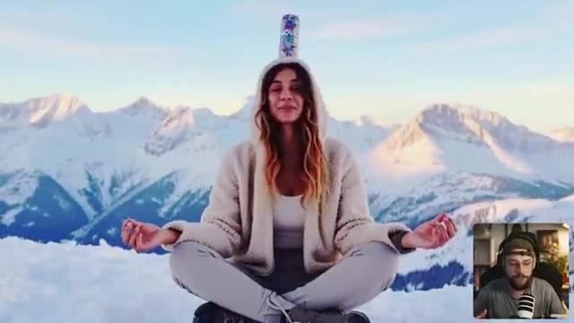
*Génération vidéo IA montrant une femme assise en tailleur dans la neige avec une cannette en équilibre sur la tête, avec le présentateur en incrustation PiP dans le coin inférieur droit.*

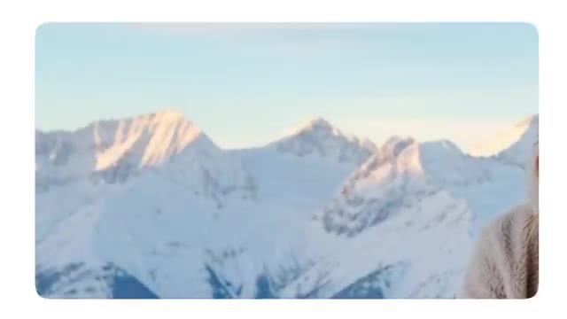
*Gros plan zoomé sur les montagnes enneigées en arrière-plan de la génération Sora 2, illustrant la perte de netteté et de fidélité évoquée dans le commentaire.*

*Retour au plan général de la femme méditant dans la neige avec la cannette sur la tête et le présentateur en incrustation PiP.*

---

### ⏱️ `[00:16:15 - 00:16:41]` | Segment #31

**🔊 Audio (Transcription Intégrale Mot pour Mot en Français) :**
> plus axé sur le contenu généré par les utilisateurs, le UGC, et vous remarquerez également que beaucoup de clips du générateur Sora deux qui deviennent viraux ont l'ambiance d'un contenu de style UGC. Des vidéos qui ont été tournées sur les téléphones des gens. Une sorte d'ambiance de créateur de contenu amateur. Vous savez, des vidéos de caméra embarquée ou de caméra corporelle. Des prises de vue de sonnettes connectées CCTV. Tous ces styles fonctionnent vraiment très bien lorsqu'il s'agit de Sora.

**👁️ Analyse Visuelle d'Écran (gemini-3.5-flash-lite) :**
**Interface & Outils** : Présentation vidéo avec incrustation PiP (Picture-in-Picture) du présentateur Jack en bas à droite.

**Contenu textuel & Code** : Affichage d'exemples de vidéos générées par IA (style UGC, cannette de boisson énergisante NOVA).

**Action / Démonstration** : Présentation d'exemples visuels illustrant le style de contenu généré par les utilisateurs (UGC) évoqué dans la voix off.

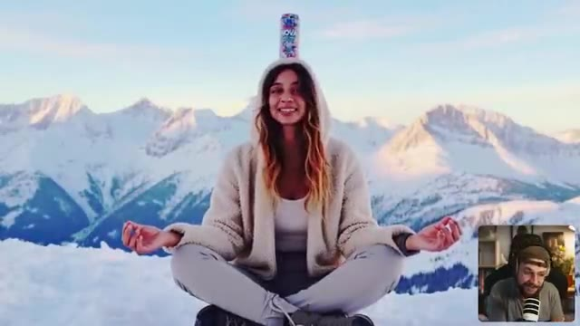
*Vidéo générée par IA montrant une femme assise en tailleur dans la neige avec une cannette sur la tête, avec le créateur en incrustation PiP en bas à droite.*

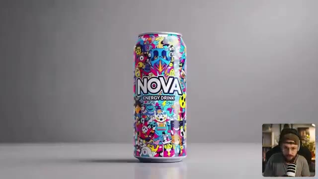
*Gros plan sur une cannette de boisson énergisante colorée avec l'inscription NOVA ENERGY DRINK, avec le créateur en incrustation PiP en bas à droite.*

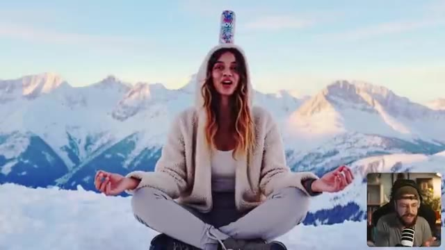
*Vidéo générée par IA montrant une femme assise en tailleur dans la neige avec une cannette sur la tête, similaire à l'image 1, avec le créateur en incrustation PiP en bas à droite.*

---

### ⏱️ `[00:16:41 - 00:17:00]` | Segment #32

**🔊 Audio (Transcription Intégrale Mot pour Mot en Français) :**
> Et certaines de mes images préférées que nous avons obtenues de Nano Banana et les générations de vidéo que nous avons obtenues de VO3.1 sont de moi assis dans cette bouée dans la piscine de lave. Il est donc tout à fait juste de tester des prompts similaires en utilisant Sora 2. Jetons un coup d'œil à celui-ci ici. Salut les gars, je suis littéralement en train de me détendre dans une piscine de lave en ce moment et j'ai ramené cette boisson énergétique Nova.

**👁️ Analyse Visuelle d'Écran (gemini-3.5-flash-lite) :**
**Interface & Outils** : Navigateur web affichant la plateforme Artlist avec un catalogue de créations vidéo et le lecteur vidéo en plein écran.

**Contenu textuel & Code** : Galerie d'images et de vidéos générées par IA avec des vignettes étiquetées 'VIDEO', incluant des visuels de canettes de la marque 'NOVA' et une scène de lac de lave.

**Action / Démonstration** : Le créateur montre sa galerie de créations sur Artlist, puis lance la lecture de la vidéo générée montrant une femme dans une bouée au milieu d'un bain de lave tenant une canette Nova.

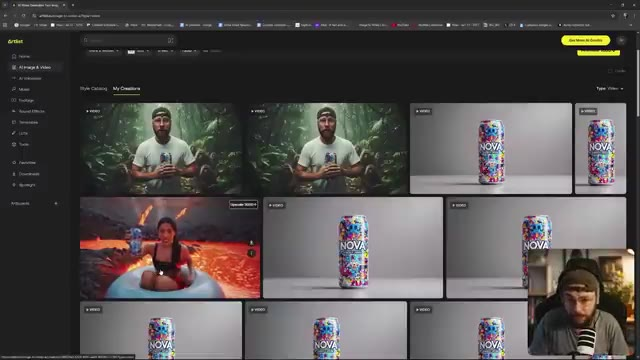
*Interface du site Artlist affichant une galerie de créations vidéo IA, incluant des vidéos de canettes de boisson Nova et une personne assise dans une bouée sur une piscine de lave.*

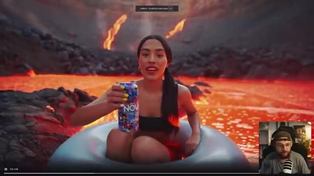
*Gros plan sur la vidéo générée montrant une personne assise dans une bouée gonflable au milieu d'un lac de lave, tenant une canette Nova, avec Jack en incrustation vidéo (PiP) dans le coin inférieur droit.*

---

### ⏱️ `[00:17:00 - 00:17:34]` | Segment #33

**🔊 Audio (Transcription Intégrale Mot pour Mot en Français) :**
> Regardez comme cette canette a l'air sympa. C'est frais, un peu fruité et ça tape vite. Donc il y a quelques problèmes de synchronisation labiale ici où elle porte la canette à ses lèvres et elle parle encore, mais la cohérence du produit et la physique de la piscine de lave sont assez incroyables. Et même si ce n'est pas parfait, quand la canette arrive juste devant la caméra, elle se met au point et notre produit a l'air plutôt cohérent. Donc pour conclure la vidéo maintenant, les gars, lequel est le mieux, VO 3.1 ou Sora 2 ? Ce n'est en fait pas une réponse très simple. Ça dépend vraiment de votre cas d'usage. Si vous cherchez à

**👁️ Analyse Visuelle d'Écran (gemini-3.5-flash-lite) :**
**Interface & Outils** : Vidéo de démonstration de génération de contenu par IA avec incrustation PiP du créateur en bas à droite.

**Contenu textuel & Code** : Canette de boisson portant la marque "NOVA" avec un design artistique coloré, décor de lave en fusion et vagues de bananes.

**Action / Démonstration** : Le créateur commente les détails visuels, la synchronisation labiale et la physique des vidéos générées par IA affichées à l'écran.

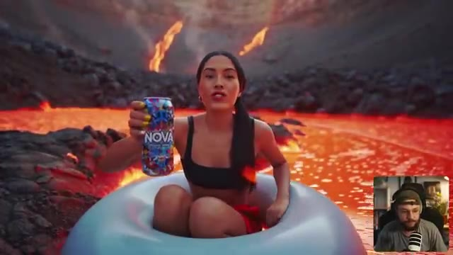
*Vidéo générée par IA montrant une femme sur une bouée dans une piscine de lave, tenant une canette de boisson NOVA.*

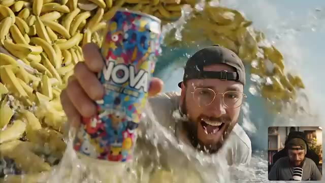
*Vidéo générée par IA montrant un homme souriant tenant une canette NOVA au milieu d'éclaboussures et de bananes.*

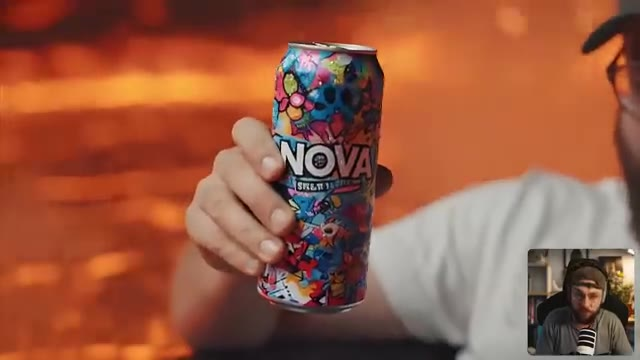
*Gros plan sur la canette de boisson NOVA avec un design coloré tenu face à la caméra.*

---

### ⏱️ `[00:17:34 - 00:18:05]` | Segment #34

**🔊 Audio (Transcription Intégrale Mot pour Mot en Français) :**
> faire des films très cinématiques et de haute qualité, VO 3.1 va être la solution idéale. Si vous recherchez du contenu généré par les utilisateurs ou des plans qui semblent incroyablement réalistes et que vous êtes prêt à sacrifier un peu de qualité et de netteté pour cela, alors Sora va être la solution idéale. Vraiment, ma règle générale en ce qui concerne tous les outils d'IA est de jouer sur les points forts de chacun. Si vous vous appuyez sur leurs faiblesses et que vous essayez de les forcer à faire des choses pour lesquelles ils ne sont pas très bons, vous allez évidemment avoir du mal.

**👁️ Analyse Visuelle d'Écran (gemini-3.5-flash-lite) :**
**Interface & Outils** : Exemples de vidéos générées par IA présentées à l'écran, avec le créateur en incrustation (PiP) dans le coin inférieur droit.

**Contenu textuel & Code** : Visuels de démonstration illustrant différents styles de vidéos générées par IA (publicité de canette, selfie en parachute, paysage de montagne, scène sous-marine avec des requins) et le logo "NOVA ENERGY DRINK" sur les canettes.
[DESC_IMAGE_1] [CONTENU_SUP] /

**Action / Démonstration** : Démonstration visuelle des différents types de rendus vidéo possibles avec les modèles d'IA présentés au cours de l'analyse.

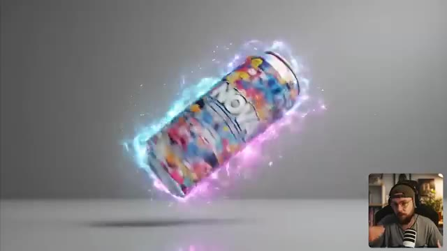
*Rendu vidéo IA montrant une canette de boisson énergétique Nova entourée d'effets lumineux tourbillonnants.*

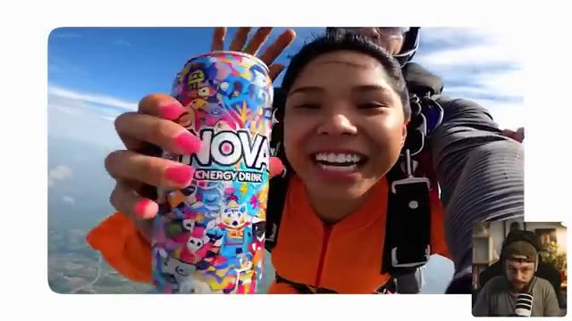
*Rendu vidéo IA montrant une personne en train de filmer un selfie en plein saut en parachute tout en tenant une canette Nova.*

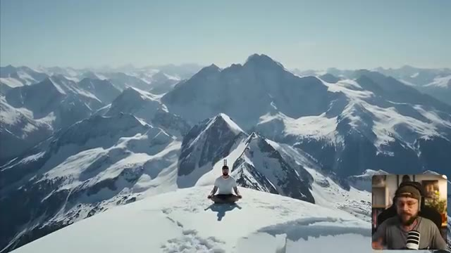
*Rendu vidéo IA montrant une personne en train de méditer en position du lotus au sommet d'un pic enneigé entouré de montagnes.*

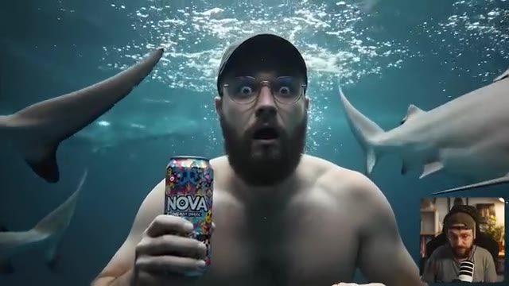
*Rendu vidéo IA montrant un homme sous l'eau tenant une canette Nova avec une expression de surprise au milieu de requins.*

---

### ⏱️ `[00:18:05 - 00:18:38]` | Segment #35

**🔊 Audio (Transcription Intégrale Mot pour Mot en Français) :**
> Si vous voulez être compétent en publicité par IA ou en réalisation de films, vous devez utiliser une combinaison de différents outils. VO 3.1 et Sora 2 sont tous les deux excellents pour des choses différentes. Les utiliser ensemble est incroyablement puissant. De la même manière que les cinéastes traditionnels utilisent différents outils, vous pouvez le faire aussi. Si vous avez apprécié la vidéo d'aujourd'hui, assurez-vous de lâcher un pouce bleu pour moi. Pensez à vous abonner et bien sûr à activer cette cloche de notification pour ne jamais manquer aucune future publication. N'oubliez pas de laisser un commentaire ci-dessous et de me dire quel est votre préféré

**👁️ Analyse Visuelle d'Écran (gemini-3.5-flash-lite) :**
**Interface & Outils** : Générations de vidéos par intelligence artificielle (Sora / VO 3.1) présentées à l'écran avec incrustation vidéo PiP du créateur.

**Contenu textuel & Code** : Bouton d'appel à l'action YouTube animé avec un pouce bleu et le texte "SUBSCRIBE", plans de vidéos générées par IA (parachutisme, méditation en montagne, publicité en forêt tropicale).

**Action / Démonstration** : Démonstration visuelle de différents clips vidéo générés par IA pour illustrer l'utilisation combinée d'outils de génération vidéo.

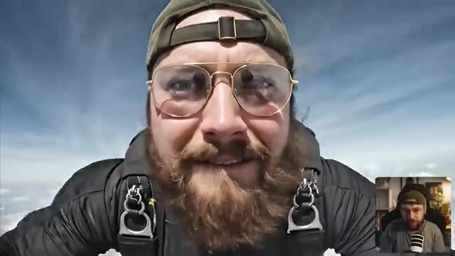
*Génération vidéo IA montrant un personnage en gros plan en plein saut en parachute, avec le créateur incrusté en bas à droite.*

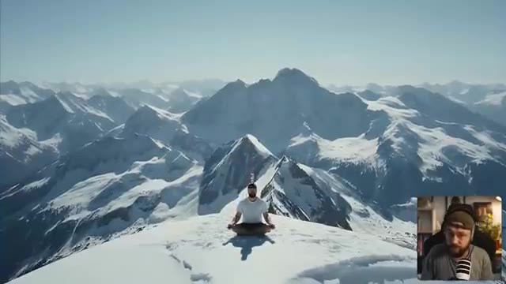
*Génération vidéo IA montrant un personnage en tailleur méditant au sommet d'une montagne enneigée.*

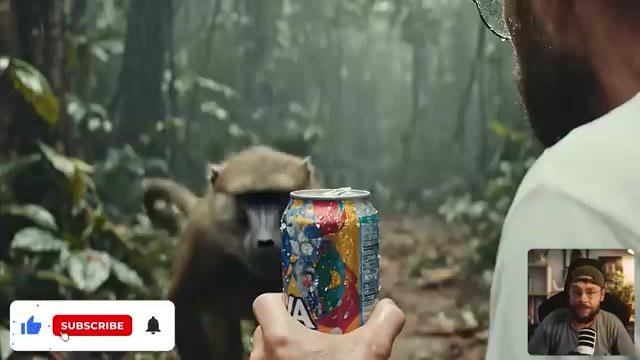
*Génération vidéo IA publicitaire montrant une canette de boisson fraîche tendue à un singe dans la jungle, avec un bouton d'appel à l'action YouTube en surimpression.*

---

### ⏱️ `[00:18:38 - 00:18:52]` | Segment #36

**🔊 Audio (Transcription Intégrale Mot pour Mot en Français) :**
> modèle vidéo vo 3.1 ou sora 2 si vous avez la moindre question posez-les en bas également j'essaie de répondre à autant de vos commentaires que possible les gars merci pour tout le soutien sur les vidéos et je vous retrouve sur la prochaine

**👁️ Analyse Visuelle d'Écran (gemini-3.5-flash-lite) :**
**Interface & Outils** : Présentation face caméra sans partage d'écran

**Contenu textuel & Code** : Aucun contenu textuel, prompt ou paramètre visible à l'écran.

**Action / Démonstration** : Le créateur parle face caméra en conclusion de sa vidéo, remerciant son audience pour son soutien.

---
