# 🎬 Nano Banana vient-il de PERDRE !? (Higgsfield Popcorn est ARRIVÉ)

> **Chaîne** : [Jack Vs. AI](https://www.youtube.com/@JackVsAI)  
> **Titre original** : `Did Nano Banana just LOSE!? (Higgsfield Popcorn is HERE)`  
> **Lien YouTube** : [https://www.youtube.com/watch?v=pE-f_SusfsU](https://www.youtube.com/watch?v=pE-f_SusfsU)  
> **Date de publication** : 2025-10-28  
> **Durée** : 17m 10s (`1030s`)  
> **Identifiant vidéo** : `pE-f_SusfsU`  
> **Fiche Web Interactive** : [2025-10-28_YT-pE-f_SusfsU_Nano Banana vient-il de PERDRE ! (Higgsfield Popcorn est ARRIVÉ)_by-whisper-v3-large-turbo+gemini-3.5-flash-lite.html](2025-10-28_YT-pE-f_SusfsU_Nano Banana vient-il de PERDRE ! (Higgsfield Popcorn est ARRIVÉ)_by-whisper-v3-large-turbo+gemini-3.5-flash-lite.html)  
> **Captures de démonstration clés** : `94 captures réelles (anti-talking-head)`  
> **Modèles utilisés** : Audio: `large-v3-turbo` (Faster-Whisper int8 VPS) | Vision: `gemini-3.5-flash-lite` (Google AI Studio API)  

---

## 📌 Synthèse Exécutive & Outils

### 📌 Résumé
Dans cette vidéo, le réalisateur et artiste VFX Jack analyse en profondeur l'outil **Higgsfield Popcorn**, positionné comme un rival direct de *nano banana* de Google dans la course à la cohérence visuelle pour la narration par IA. Conçu pour résoudre le talon d'Achille de la génération vidéo — à savoir la continuité des personnages, des décors, de l'éclairage et du style —, Popcorn s'appuie sur un pipeline multi-images. Il permet aux créateurs de télécharger jusqu'à quatre images de référence, d'associer un prompt textuel et de générer instantanément une séquence de plusieurs plans cinématographiques parfaitement harmonisés, éliminant ainsi l'écueil des visages aléatoires ou des scènes dépareillées qui brisent l'immersion narrative.

La méthode pas à pas démontrée par Jack se divise en deux phases distinctes : l'idéation de storyboard et l'animation finale. Dans un premier temps, l'utilisateur importe une image de référence (qu'elle soit stylisée en mode Studio Ghibli ou ultra-réaliste) dans **Higgsfield Popcorn**, définit le mode automatique ou manuel, choisit le ratio (16:9) et le nombre de résultats (jusqu'à sept images). Une fois les visuels cohérents validés, Jack utilise l'option « animer » pour basculer vers le générateur vidéo de la plateforme, où il sélectionne un modèle de pointe comme **Google VO 3.1** (en mode rapide à 1080p) et applique un prompt de mouvement de caméra ciblé pour donner vie à chaque plan.

Pour les créateurs de contenu, les publicitaires et les cinéastes indépendants, cet outil représente un bond en avant considérable dans les flux de travail professionnels. Il rationalise la pré-production et la production en permettant de prototyper rapidement des scènes complexes — telles qu'un braquage de banque ou une séquence fantastique — tout en préservant l'identité visuelle du sujet (vêtements, accessoires comme l'alliance, traits caractéristiques). Bien que quelques imperfections subsistent (filtrage parfois excessif de contenu sensible ou légères variations de textures textuelles), l'efficacité de Popcorn pour assembler un court-métrage ou une publicité cohérente en un temps record en fait un indispensable absolu.

### 🛠️ Outils, Modèles & Logiciels Présentés
* **Higgsfield** : La plateforme d'intelligence artificielle globale hébergeant la suite d'outils créatifs et de génération de contenu vidéo.
* **Higgsfield Popcorn** : L'outil phare multi-images axé sur la narration, conçu pour générer des storyboards cohérents et résoudre le problème de la continuité visuelle.
* **Nano banana** : La solution de référence développée par Google, dont la suprématie sur le marché est ouvertement contestée par Higgsfield Popcorn.
* **Google VO 3.1** : Le modèle de génération vidéo avancé intégré à Higgsfield, utilisé ici en mode rapide pour animer les images fixes générées.
* **Flux** : L'écosystème technique et de flux de travail global impliqué dans la production visuelle par IA.

### 🔑 Points Clés & Enseignements Stratégiques
* **Priorité à la continuité** : Le principal défi de l'IA résidant dans la rupture d'illusion, l'utilisation d'un pipeline multi-images garantit la constance du lieu, de l'heure, de l'éclairage et du style d'un plan à l'autre.
* **Import de référence unique ou multiple** : Popcorn accepte jusqu'à quatre images de référence, bien qu'un seul visuel fort suffise souvent à amorcer un storyboard cohérent.
* **Modes Automatique vs Manuel** : Le mode automatique applique un prompt global à toute la série, tandis que le mode manuel permet d'affiner l'invite textuelle pour chaque génération individuelle.
* **Gestion des crédits et de la sécurité** : La plateforme offre des crédits quotidiens gratuits, mais attention aux faux positifs des filtres de contenu sensible qui peuvent bloquer certaines générations inoffensives.
* **Prompting textuel minimaliste et descriptif** : Pour laisser une liberté créative optimale au modèle, privilégiez des descriptions d'ambiance et d'action simples (ex: « montrer le personnage barbu dans une variété de scènes visuellement saisissantes »).
* **Validation de la cohérence des détails** : Le modèle démontre une excellente fidélité sur les éléments distinctifs du sujet, y compris les accessoires complexes comme les alliances à travers différents plans.
* **Transition fluide vers l'animation** : Le passage direct de l'image validée dans Popcorn vers le module vidéo via le bouton « animer » simplifie drastiquement le pipeline de production.
* **Sélection stratégique des modèles vidéo** : L'exploitation du modèle **Google VO 3.1** en mode rapide garantit un rendu professionnel en 1080p au format 16:9, parfaitement adapté aux standards de l'industrie publicitaire.
* **Contrôle précis des mouvements de caméra** : L'ajout de prompts de mouvements cinématiques (« travelling avant lent à hauteur d'homme ») renforce le réalisme et l'immersion des plans générés.
* **Adaptabilité stylistique** : L'outil gère aussi bien les rendus artistiques complexes (style Studio Ghibli) que les environnements urbains réalistes et exigeants sans perdre l'essence du personnage.
* **Optimisation du flux de travail publicitaire** : En combinant Popcorn pour le storyboard cohérent et le moteur vidéo pour l'animation, il est désormais possible de concevoir une publicité ou un court-métrage complet en un temps record.
* **Vigilance face aux imperfections textuelles** : Malgré une excellente cohérence globale, le modèle peut parfois flouter ou corrompre l'écriture textuelle dans l'arrière-plan (comme sur les portes ou panneaux).

---

## ⏱️ Chronologie & Transcription Complète Audio & Visuelle (Mot pour Mot)

### ⏱️ `[00:00:00 - 00:00:32]` | Segment #01

**🔊 Audio (Transcription Intégrale Mot pour Mot en Français) :**
> Nano Banana est peut-être cuit parce que Higgsfield AI vient de lancer Popcorn et ils en ont après la couronne de Google. Imaginez télécharger une seule image, écrire un court prompt et regarder toute une histoire cinématique se générer sous vos yeux. Popcorn utilise un pipeline multi-images pour résoudre le plus grand problème de la narration par IA, la continuité. Fini les visages aléatoires ou les scènes dépareillées, juste des visuels de qualité cinématographique irréprochables qui semblent vraiment cohérents. Je suis Jack, je suis artiste VFX.

**👁️ Analyse Visuelle d'Écran (gemini-3.5-flash-lite) :**
**Interface & Outils** : Présentation vidéo illustrative de Higgsfield AI (Popcorn) avec incrustation PiP du créateur.

**Contenu textuel & Code** : Texte affiché à l'écran : "higgsfield AI", "as an", "continuity", "consistent".

**Action / Démonstration** : Démonstration de différentes scènes cinématiques générées par intelligence artificielle illustrant la cohérence des personnages et des décors.

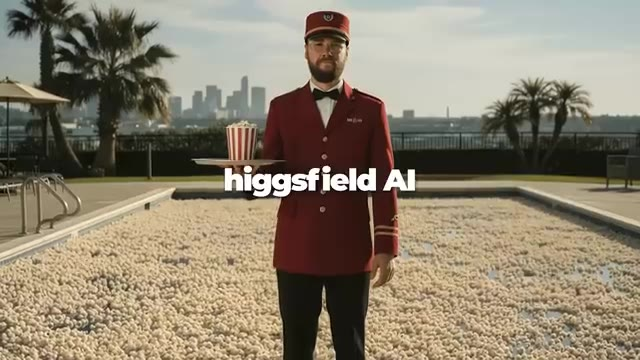
*Génération vidéo IA montrant un homme en uniforme de groom tenant un plateau avec un seau de pop-corn au bord d'une piscine, avec le logo 'higgsfield AI'.*

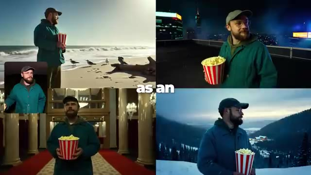
*Grille de quatre extraits vidéo générés par IA illustrant la continuité d'un personnage tenant du pop-corn dans différents environnements, avec Jack en incrustation (PiP) en bas à gauche.*

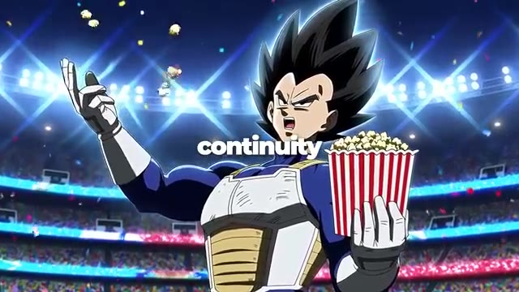
*Illustration dans le style anime (personnage ressemblant à Vegeta de Dragon Ball) tenant un seau de pop-corn dans un stade de sport bondé.*

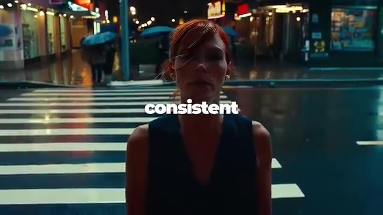
*Scène nocturne urbaine générée par IA montrant une femme rousse traversant un passage piéton sous la pluie.*

---

### ⏱️ `[00:00:32 - 00:01:05]` | Segment #02

**🔊 Audio (Transcription Intégrale Mot pour Mot en Français) :**
> dans l'industrie de la publicité depuis plus d'une décennie maintenant et j'ai travaillé avec beaucoup des plus grandes marques de la planète. Dans cette vidéo, je vais vous montrer exactement comment fonctionne Higgsfield Popcorn et nous découvrirons si c'est l'outil d'IA qui manquait à votre flux de travail depuis tout ce temps. Et les gars, si vous aimez le contenu d'aujourd'hui, assurez-vous de lâcher un pouce bleu pour moi, pensez à vous abonner et bien sûr à activer cette cloche de notification. Très bien, entrons dans le vif du sujet. Nous voici donc sur la page d'accueil de Higgsfield AI. Si vous souhaitez découvrir la plateforme, assurez-vous de cliquer sur le lien ci-dessous dans la description. Et vous pouvez voir qu'ils ont leur

**👁️ Analyse Visuelle d'Écran (gemini-3.5-flash-lite) :**
**Interface & Outils** : Navigateur web affichant la plateforme Higgsfield AI avec ses menus de navigation (Explore, Image, Video, Edit, Sora 2 Trends, Popcorn, etc.) et ses sections de modèles vidéo.

**Contenu textuel & Code** : Textes visibles sur l'interface : "Higgsfield Popcorn", "Google Veo 3.1", "Sketch to Video", "Sora 2 Max", "Sora 2 Community", ainsi que les sous-titres de la vidéo ("the AI tool").

**Action / Démonstration** : Le créateur présente d'abord une illustration vidéo générée par IA (B-roll), puis bascule sur la capture d'écran de la page d'accueil de Higgsfield AI qu'il commente en direct.

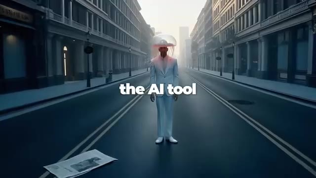
*B-roll montrant une scène générée par IA avec un personnage en costume blanc et tête de méduse sur un boulevard urbain, avec le sous-titre "the AI tool"*

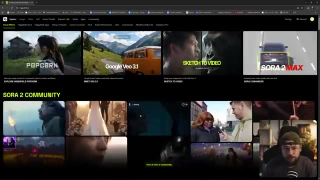
*Capture d'écran du site web de Higgsfield AI avec le présentateur incrusté en bas à droite, affichant la page d'accueil de la plateforme et ses différentes fonctionnalités vidéo (Popcorn, Google Veo 3.1, Sketch to Video, Sora 2 Max)*

---

### ⏱️ `[00:01:05 - 00:01:38]` | Segment #03

**🔊 Audio (Transcription Intégrale Mot pour Mot en Français) :**
> bannière pour Higgsfield Popcorn. Si nous cliquons ici, nous pouvons entrer dans l'outil. Maintenant, nous avons abordé cela dans l'intro, mais pendant très longtemps, l'un des plus grands problèmes lorsqu'il s'agit d'utiliser des outils d'IA pour la réalisation de films et la publicité est d'atteindre un niveau de cohérence. Et nous ne parlons pas seulement de garder les personnages cohérents, nous parlons de choses comme le lieu, l'heure de la journée, l'éclairage et même le style général de ce que vous essayez de créer. Si l'un de ces éléments est un tout petit peu décalé, cela brise vraiment l'illusion. Bien sûr, Google est sorti

**👁️ Analyse Visuelle d'Écran (gemini-3.5-flash-lite) :**
**Interface & Outils** : Navigateur web affichant l'interface de l'outil de génération vidéo Higgsfield Popcorn (higgsfield.ai/popcorn), avec la webcam du créateur en incrustation (PiP).

**Contenu textuel & Code** : Le site affiche le titre "CREATE VISUAL STORIES WITH HIGGSFIELD POPCORN", un bouton "Storyboard Mode", un espace de prévisualisation vidéo, et un panneau de saisie en bas avec l'option "Generate". De nombreux onglets sont ouverts dans le navigateur (YouTube, outils IA, etc.).

**Action / Démonstration** : Le créateur présente la page d'accueil et l'interface de l'outil Higgsfield Popcorn tout en expliquant les défis de la cohérence dans la génération vidéo par IA.

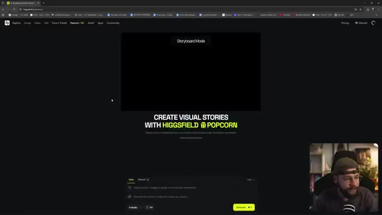
*Interface web de Higgsfield Popcorn montrant l'écran de création en mode Storyboard, avec la webcam du présentateur en incrustation (PiP) dans le coin inférieur droit.*

---

### ⏱️ `[00:01:38 - 00:01:59]` | Segment #04

**🔊 Audio (Transcription Intégrale Mot pour Mot en Français) :**
> avec nano banana et cela a vraiment changé la donne et ce qu'on examine vraiment aujourd'hui c'est la version de Higgsfield sur cette même idée ils s'attaquent complètement à google avec celle-ci et bravo à eux. Alors comment cela fonctionne-t-il exactement ? Eh bien, si vous regardez au bas de l'écran ici, vous pouvez voir que nous avons l'option de télécharger jusqu'à quatre images pour guider ou étendre notre storyboard.

**👁️ Analyse Visuelle d'Écran (gemini-3.5-flash-lite) :**
**Interface & Outils** : Interface web de Higgsfield Popcorn montrant l'outil de création de storyboard par IA.

**Contenu textuel & Code** : Texte principal : « CREATE VISUAL STORIES WITH HIGGSFIELD POPCORN ». Options visibles : « Auto », « Manual », « Upload up to 4 images to guide or extend your storyboard », « Describe the mood or action to create your scenes », sélecteur de format 3:4 et bouton jaune « Generate for Free ».

**Action / Démonstration** : Le curseur de la souris survole la zone d'interface de Higgsfield Popcorn pour montrer les options de téléchargement d'images et de génération de storyboard, tandis que le créateur commente en direct dans l'encadré PiP.

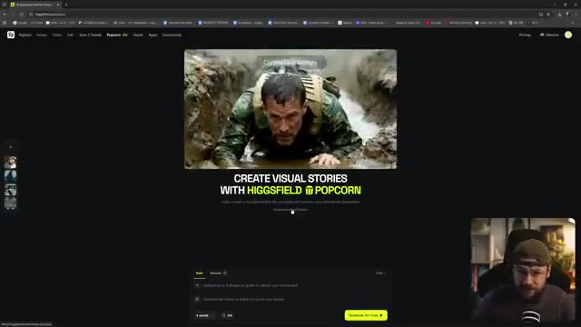
*Interface web de Higgsfield Popcorn affichant une vidéo de démonstration avec le texte « CREATE VISUAL STORIES WITH HIGGSFIELD POPCORN » et le panneau de contrôle en bas, avec le créateur en incrustation vidéo (PiP) en bas à droite.*

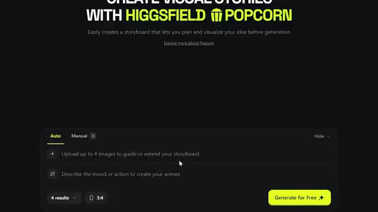
*Gros plan sur l'interface de Higgsfield Popcorn montrant les options de téléchargement « Upload up to 4 images to guide or extend your storyboard ».*

---

### ⏱️ `[00:01:59 - 00:02:35]` | Segment #05

**🔊 Audio (Transcription Intégrale Mot pour Mot en Français) :**
> Et en bas, une zone pour saisir notre invite textuelle, qui indique de décrire l'ambiance ou l'action pour créer vos scènes. En bas ici, nous pouvons également indiquer combien d'images nous voulons générer. Et nous pouvons même sélectionner le format d'image de notre sortie. Et vous pouvez également voir qu'il y a une option tout en haut ici pour automatique et manuel. La différence avec le manuel est que nous pouvons entrer une invite textuelle spécifique pour chaque génération individuelle. Je pense donc que pour commencer, essayons simplement l'automatique, un processus très simple et nous deviendrons un peu plus compliqués au fur et à mesure. Donc pour notre premier

**👁️ Analyse Visuelle d'Écran (gemini-3.5-flash-lite) :**
**Interface & Outils** : Interface web de Higgsfield Popcorn (outil de création de récits visuels et de storyboards par IA).

**Contenu textuel & Code** : Textes visibles : "CREATE VISUAL STORIES WITH HIGGSFIELD POPCORN", options "Auto" et "Manual", champs de saisie pour décrire les scènes ("describe the mood or action to create your scenes"), sélecteur de résultats ("4 results"), bouton "Generate for Free", et menu déroulant "Aspect ratio" avec les formats 3:4, 2:3, 3:2, 9:16, 1:1, 4:3, 16:9.

**Action / Démonstration** : Le créateur présente l'interface de Higgsfield Popcorn en bas de l'écran, navigue dans le menu des formats d'image (aspect ratio) et bascule entre le mode automatique (Auto) et le mode manuel (Manual) pour la génération de scènes.

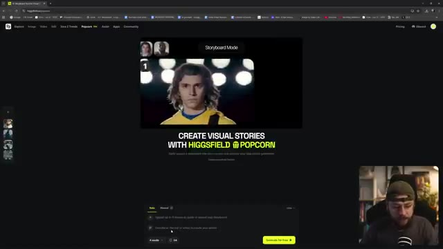
*Interface de Higgsfield Popcorn montrant la zone de saisie du prompt textuel, le sélecteur de nombre d'images et le mode Auto sélectionné.*

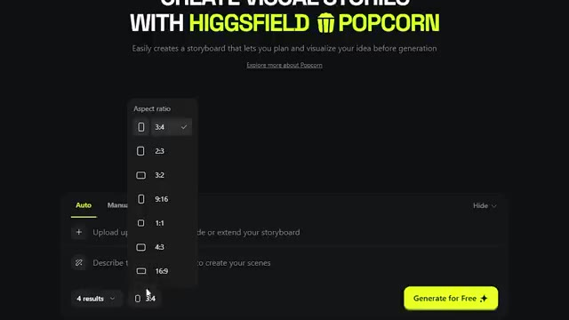
*Menu déroulant des formats d'image (aspect ratio) affichant les options 3:4, 2:3, 3:2, 9:16, 1:1, 4:3 et 16:9 dans l'interface de Higgsfield Popcorn.*

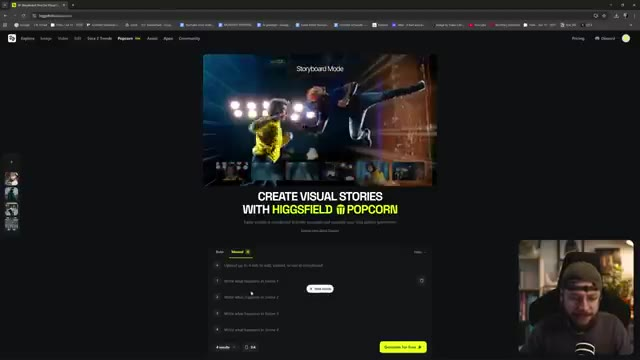
*Interface de Higgsfield Popcorn basculée sur le mode Manuel (Manual), affichant quatre champs de texte pour entrer des invites distinctes par scène.*

---

### ⏱️ `[00:02:35 - 00:03:10]` | Segment #06

**🔊 Audio (Transcription Intégrale Mot pour Mot en Français) :**
> test je pense que j'aimerais importer dans ceci l'image que j'ai créée de moi en personnage façon Studio Ghibli. Donc on va simplement faire un glisser-déposer de celle-ci dans le champ. Bien sûr, nous avons l'option de télécharger plus d'images si nous voulons avoir plus de références, mais je vais juste m'en tenir à celle-ci pour commencer et en ce qui concerne le texte du prompt, je veux juste opter pour quelque chose de très simple, nous allons juste dire montrer le personnage barbu dans une variété de scènes visuellement saisissantes, dynamiques et cinématiques, montons carrément jusqu'à sept résultats, assurons-nous d'être sur un format 16 par 9 et

**👁️ Analyse Visuelle d'Écran (gemini-3.5-flash-lite) :**
**Interface & Outils** : Interface web de l'outil de génération de storyboards vidéo "Higgsfield Popcorn" avec incrustation vidéo (PiP) du créateur.

**Contenu textuel & Code** : Texte visible à l'écran : "CREATE VISUAL STORIES WITH HIGGSFIELD POPCORN", champ de prompt avec le texte "Show the bearded character in a variety of visually striking scenes, dynamic and cinematic", réglage de nombre de résultats réglé sur "7 results" et format d'image "16:9".

**Action / Démonstration** : Le créateur présente l'image générée de son avatar Ghibli, puis navigue sur l'interface de Higgsfield Popcorn pour importer l'image et configurer les paramètres du prompt textuel.

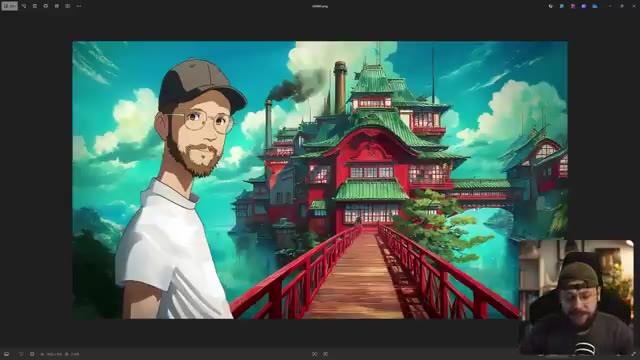
*Affichage en plein écran d'une image générée représentant le créateur en personnage de style Studio Ghibli devant un pont et un bâtiment rouge, avec la webcam de Jack en incrustation (PiP) dans le coin inférieur droit.*

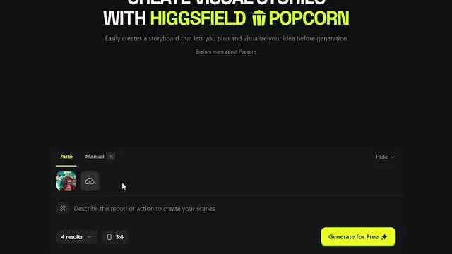
*Interface de Higgsfield Popcorn montrant la zone de téléchargement d'image avec une image miniature chargée et le champ de prompt vide.*

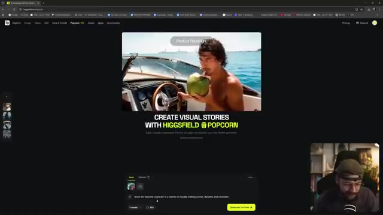
*Interface complète de Higgsfield Popcorn montrant l'outil avec l'image importée, le prompt textuel saisi et les paramètres de génération configurés, ainsi que la webcam de Jack en incrustation (PiP) dans le coin inférieur droit.*

---

### ⏱️ `[00:03:10 - 00:03:46]` | Segment #07

**🔊 Audio (Transcription Intégrale Mot pour Mot en Français) :**
> allez-y et générez gratuitement vous pouvez voir que nous avons une certaine quantité de crédits quotidiens pour une utilisation gratuite d'accord donc nous avons récupéré nos huit générations ici de Higgsfield Popcorn deux d'entre elles ont été bloquées en raison de l'affichage de contenu sensible évidemment je n'aurais demandé aucun contenu sensible dans les invites textuelles mais vous savez les gars l'IA a parfois ce genre de problèmes ce n'est pas grave parce que nous avons récupéré cinq très belles générations en commençant par celle-ci vous pouvez voir que le style artistique semble très cohérent. Si nous revenons en arrière vers notre image de référence originale,

**👁️ Analyse Visuelle d'Écran (gemini-3.5-flash-lite) :**
**Interface & Outils** : Interface web de Higgsfield Popcorn, avec un affichage en grille des générations vidéo/image et un encadré PiP du créateur en bas à droite.

**Contenu textuel & Code** : Texte affiché : "Create visual stories with Higgsfield Popcorn", "Storyboard Mode", et dans les blocs bloqués "Sensitive content". Le prompt visible dans la barre de saisie est : "Show the bearded character in a variety of visually striking scenes, dynamic and cinematic."

**Action / Démonstration** : Le créateur montre sa galerie de résultats sur Higgsfield Popcorn, explique que certaines générations ont été bloquées pour contenu sensible, puis clique pour afficher l'image de référence originale.

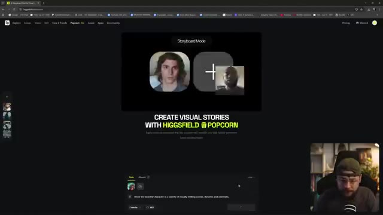
*Interface de Higgsfield Popcorn montrant la page principale et un panneau de génération.*

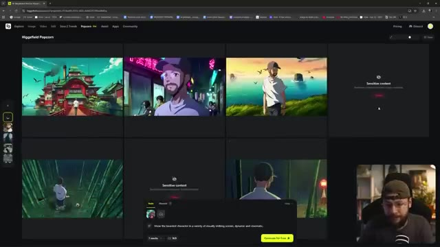
*Grille de résultats de générations sur Higgsfield Popcorn avec certaines images bloquées pour contenu sensible.*

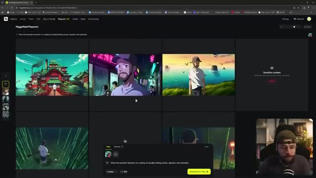
*Grille de résultats de générations sur Higgsfield Popcorn montrant les différentes scènes générées.*

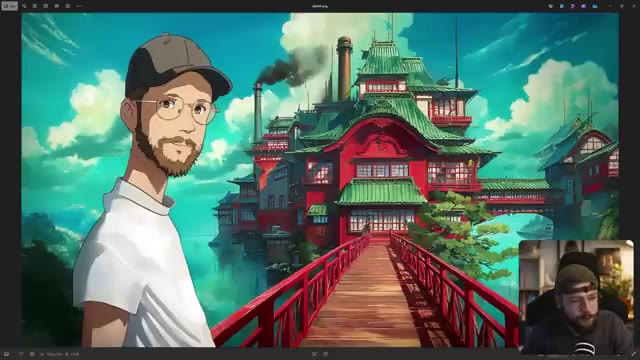
*Affichage en plein écran de l'image de référence originale au style animé (personnage barbu avec casquette devant un bâtiment rouge inspiré du Studio Ghibli).*

---

### ⏱️ `[00:03:47 - 00:04:22]` | Segment #08

**🔊 Audio (Transcription Intégrale Mot pour Mot en Français) :**
> si je suis hypercritique, je dirais que le type de lunettes a un peu changé. Vraiment, tout le reste a l'air plutôt solide. Cette image ici encore est vraiment, vraiment belle. Et j'adore cette chevelure de moi dans l'eau. C'est cool que Higgsfield semble avoir une sorte de compréhension du sujet dans notre image de référence. Genre, ces images qu'on a obtenues, on a vraiment l'impression qu'elles seraient parfaitement à leur place dans un film du Studio Ghibli. Et dans cette image ici, on me voit marcher en direction de la maison des bains du Voyage de Chihiro, qui bien sûr était l'originale.

**👁️ Analyse Visuelle d'Écran (gemini-3.5-flash-lite) :**
**Interface & Outils** : Interface du lecteur web Higgsfield Popcorn et visionneuse d'images avec affichage en incrustation (PiP) du créateur Jack dans son studio.

**Contenu textuel & Code** : Interface web de Higgsfield Popcorn affichant des vidéos générées par IA au format 16:9, avec des panneaux latéraux montrant des détails et métadonnées sur les générations.

**Action / Démonstration** : Le présentateur commente différentes images et clips vidéo générés par IA en style anime, en analysant les détails visuels et la fidélité par rapport à l'image de référence.

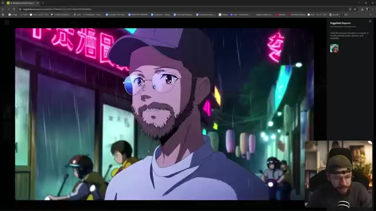
*Extrait vidéo généré par IA dans le style anime (Studio Ghibli) montrant Jack avec une casquette et des lunettes sous la pluie, avec en bas à droite le créateur en incrustation (PiP).*

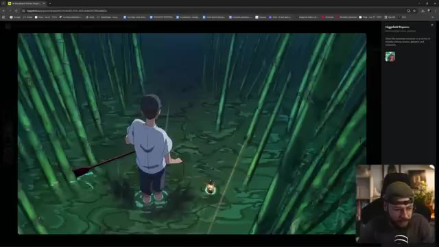
*Extrait vidéo généré par IA montrant un personnage de dos pataugeant dans une zone marécageuse avec des bambous, avec le créateur en incrustation PiP.*

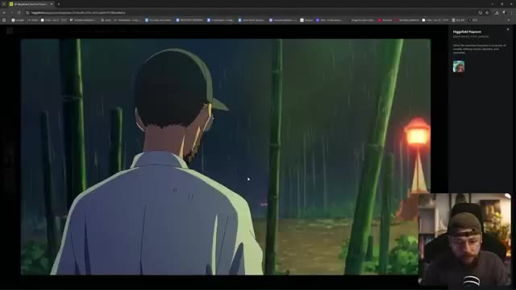
*Extrait vidéo généré par IA montrant le personnage de dos marchant vers une lanterne dans une ambiance nocturne pluvieuse, avec le créateur en incrustation PiP.*

*Image fixe illustrant le créateur version anime devant la maison des bains inspirée du Voyage de Chihiro, avec le créateur en incrustation PiP.*

---

### ⏱️ `[00:04:22 - 00:04:55]` | Segment #09

**🔊 Audio (Transcription Intégrale Mot pour Mot en Français) :**
> inspiration pour cette image ici dans laquelle je me suis inséré. Maintenant, si nous sommes satisfaits de l'une des images que nous avons obtenues de Higgsfield Popcorn, nous pouvons aller sur ces trois points dans le coin supérieur droit et cliquer sur animer. Et vous verrez maintenant que nous sommes passés à la zone de génération vidéo et que notre image de référence a été insérée dans ce champ. Je vais juste entrer un prompt textuel assez basique. Je vais dire : mouvement de caméra travelling avant lent à hauteur d'homme alors qu'il pleut sur une rue animée de Tokyo, et nous allons juste ajouter à la fin animation de style Studio Ghibli. Dans ce

**👁️ Analyse Visuelle d'Écran (gemini-3.5-flash-lite) :**
**Interface & Outils** : Interface web de la plateforme Higgsfield Popcorn.

**Contenu textuel & Code** : Texte du prompt visible : 'slow dolly camera move in the man's size as it rains busy Tokyo street Studio Ghibli style animation.', paramètres du modèle (Sora 2 Pro Max, durée 12s, résolution 720p, format d'image 16:9).

**Action / Démonstration** : Le curseur clique sur le bouton d'animation, puis l'écran bascule vers la zone de génération vidéo avec l'image de référence chargée et la saisie d'un prompt textuel.

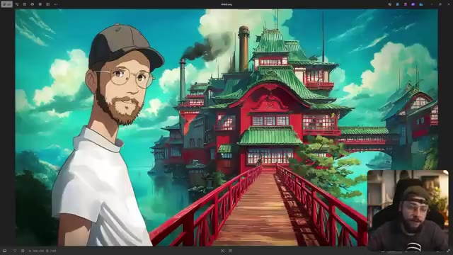
*Image générée montrant le créateur style anime sur fond d'un grand bâtiment traditionnel japonais rouge et vert, avec la webcam du créateur en incrustation.*

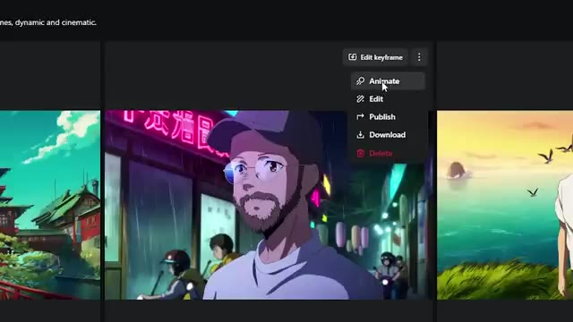
*Menu déroulant sur l'interface de Higgsfield montrant l'option 'Animate' sélectionnée par le curseur.*

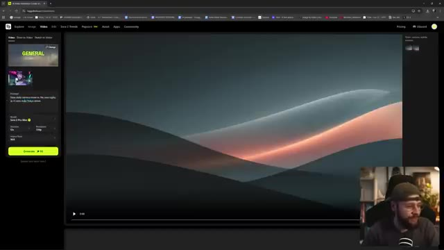
*Interface de génération vidéo de Higgsfield Popcorn avec le panneau de saisie du prompt textuel à gauche et l'image de référence chargée.*

---

### ⏱️ `[00:04:55 - 00:05:17]` | Segment #10

**🔊 Audio (Transcription Intégrale Mot pour Mot en Français) :**
> prochain domaine nous pouvons aller de l'avant et choisir notre modèle vidéo et vous pouvez voir qu'il y a beaucoup de choix ici sur Hicksfield. Je pense que nous allons utiliser Google VO 3.1. En utilisant spécifiquement le modèle rapide, nous allons mettre notre qualité à 1080p et notre format d'image à 16 par 9 et cliquer sur générer. Très bien, nous avons récupéré notre génération VO 3.1, allons voir ça.

**👁️ Analyse Visuelle d'Écran (gemini-3.5-flash-lite) :**
**Interface & Outils** : Navigateur web sur la plateforme de création vidéo par IA Higgsfield (interface sombre avec panneaux de configuration à gauche).

**Contenu textuel & Code** : Modèles visibles : Google Veo 3.1, Kling, Minimax, Sora. Paramètres configurés : Modèle Google Veo 3.1 Fast, Qualité 1080p, Ratio 16:9, Prompt : "Slow dolly camera move in, the man sighs, as it rains, busy Tokyo street. Studio Ghibli style animation."

**Action / Démonstration** : Le créateur navigue dans le menu déroulant des modèles, sélectionne Google Veo 3.1 Fast, configure la qualité en 1080p et le format en 16:9, clique sur "Generate", puis visionne le résultat vidéo généré.

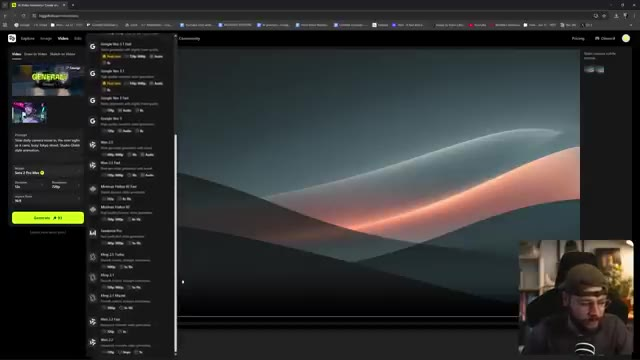
*Interface de la plateforme Higgsfield affichant le panneau latéral de sélection des modèles vidéo IA disponibles.*

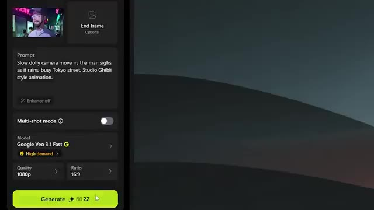
*Gros plan sur le panneau de configuration du modèle Google Veo 3.1 Fast avec le prompt et le bouton de génération.*

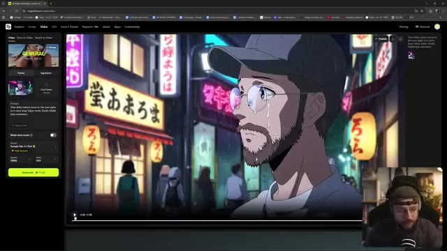
*Résultat de la génération vidéo affichant une animation style Studio Ghibli avec un personnage dans une rue animée de Tokyo sous la pluie.*

---

### ⏱️ `[00:05:23 - 00:05:56]` | Segment #11

**🔊 Audio (Transcription Intégrale Mot pour Mot en Français) :**
> C'est absolument parfait, le style d'animation est pile poil ce qu'il faut et j'adore ce petit morceau de musique à la fin, ça s'intégrerait vraiment parfaitement dans un film du Studio Ghibli et j'espère que vous commencez à voir comment cela fonctionnerait dans un flux de travail. Nous utiliserions Higgsfield Popcorn pour créer de multiples scènes différentes. Bien sûr, en gardant notre personnage et notre lieu, des choses comme ça cohérentes. Et ensuite, nous pouvons aller de l'avant et animer chacune de ces scènes individuelles. Mettez le tout ensemble et vous obtenez facilement un court-métrage ou une publicité. On va passer à quelque chose d'un peu plus

**👁️ Analyse Visuelle d'Écran (gemini-3.5-flash-lite) :**
**Interface & Outils** : Interface web de Higgsfield Popcorn avec panneau de configuration à gauche (paramètres de modèle, prompt, qualité 1080p, format 16:9) et fenêtre vidéo principale, avec incrustation vidéo de l'auteur en bas à droite.

**Contenu textuel & Code** : Texte visible dans le champ de prompt : "Slow dolly camera move in, the man sighs as it rains, busy Tokyo street, Studio Ghibli style animation." Paramètres du modèle : Google Veo 3.1 fast, Quality 1080p, Ratio 16:9.

**Action / Démonstration** : Le créateur montre l'interface de génération vidéo de Higgsfield Popcorn avec un rendu animé style Ghibli, puis passe à l'affichage d'une photo de référence pour une nouvelle scène.

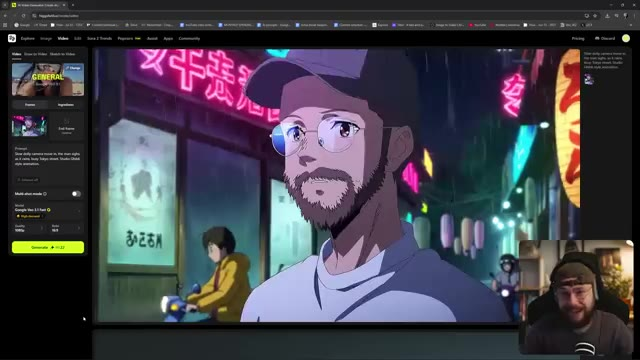
*Interface de l'outil Higgsfield Popcorn affichant une scène animée dans le style Studio Ghibli avec le personnage principal dans une rue de Tokyo sous la pluie.*

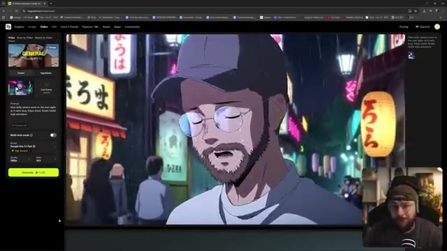
*Interface de Higgsfield Popcorn montrant une autre image animée du personnage dans la même rue de Tokyo avec une expression faciale différente.*

*Visualiseur d'image affichant une photo réaliste d'un homme portant une veste Nike noire et rouge avec une fontaine en arrière-plan.*

---

### ⏱️ `[00:05:56 - 00:06:32]` | Segment #12

**🔊 Audio (Transcription Intégrale Mot pour Mot en Français) :**
> réaliste maintenant. Nous avons cette image de moi dans un coupe-vent Nike debout devant cette fontaine. Un style assez urbain ici. Donc nous allons continuer et glisser-déposer ceci ici. Poussons le modèle un peu plus loin cette fois avec le prompt textuel montrer l'homme barbu en train de commettre un braquage de banque. Encore une fois, c'est un prompt très basique, nous donnons donc pas mal de marge à Higgsfield Popcorn pour exprimer sa propre liberté créative ici. Allons-y et cliquons sur générer. Le modèle va-t-il être capable de me garder beau et cohérent ? Nous avons vu que pour le style Studio Ghibli, il a fait du assez bon travail. Évidemment, cela va être complètement différent. Ceci

**👁️ Analyse Visuelle d'Écran (gemini-3.5-flash-lite) :**
**Interface & Outils** : Interface web de Higgsfield Popcorn (mode Popcorn / Storyboard).

**Contenu textuel & Code** : Texte affiché : "CREATE VISUAL STORIES WITH HIGGSFIELD POPCORN", "Easily creates a storyboard that lets you plan and visualize your idea before generation", et le prompt textuel : "Show the bearded man carrying out a bank robbery.". Paramètres visibles : modes "Auto" / "Manual", sélecteur "7 results", format "16:9", et le bouton jaune "Generate for Free".

**Action / Démonstration** : Le créateur montre l'image de référence de lui-même, puis bascule sur l'interface de Higgsfield Popcorn pour taper un nouveau prompt ("Show the bearded man carrying out a bank robbery") et s'apprête à lancer la génération.

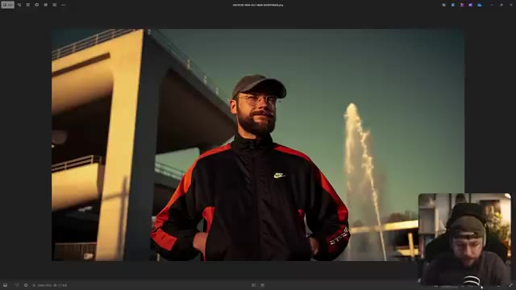
*Image de l'homme barbu en coupe-vent Nike devant une fontaine, affichée en plein écran avec la webcam du créateur en incrustation (PiP).*

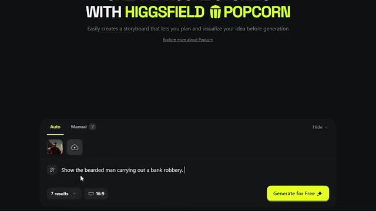
*Interface de Higgsfield Popcorn montrant le champ de saisie du prompt "Show the bearded man carrying out a bank robbery" et le bouton "Generate for Free".*

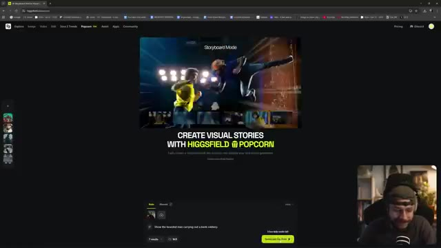
*Vue d'ensemble de l'interface web de Higgsfield Popcorn avec le panneau de génération et la webcam du créateur en bas à droite.*

---

### ⏱️ `[00:06:32 - 00:07:07]` | Segment #13

**🔊 Audio (Transcription Intégrale Mot pour Mot en Français) :**
> Le style est beaucoup moins indulgent. Donc nous allons devoir aller voir comment le modèle d'image s'en sort. D'accord, donc nous avons nos générations de braquage de banque et je dois dire qu'elles ont l'air plutôt bien. En commençant par ce plan ici, ouais, qui a l'air plutôt sympa. Un peu indulgent avec tous les flous de mouvement et tout ça, et quelques problèmes avec l'écriture sur la porte, je dirais. Mais je ne remettrais pas trop en question le fait que cela me ressemble. Plan en contre-plongée ici, encore une fois, cela me ressemble, je pense. Plutôt satisfait de la cohérence des personnages que nous avons obtenue. Et bien sûr, le costume que je porte

**👁️ Analyse Visuelle d'Écran (gemini-3.5-flash-lite) :**
**Interface & Outils** : Navigateur web affichant l'interface de l'outil de génération vidéo par IA "Higgsfield Popcorn" avec une grille de résultats et une fenêtre PiP du créateur.

**Contenu textuel & Code** : Texte visible dans l'interface : "Higgsfield Popcorn", le prompt "Show the bearded man carrying out a bank robbery", et les vignettes de prévisualisation des vidéos générées.

**Action / Démonstration** : Le créateur navigue et commente une série de vidéos générées par IA représentant un braquage de banque, en évaluant la cohérence des plans et des personnages.

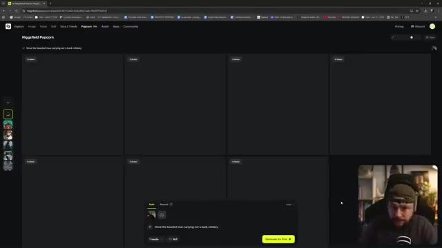
*Interface du logiciel Higgsfield Popcorn montrant une grille de chargement des générations IA basées sur un braquage de banque, avec le créateur en incrustation vidéo (PiP) dans le coin inférieur droit.*

*Interface de Higgsfield Popcorn affichant plusieurs clips vidéo générés par IA sur le thème d'un braquage de banque (sortie de bâtiment, comptoir, interieur), avec le créateur en PiP en bas à droite.*

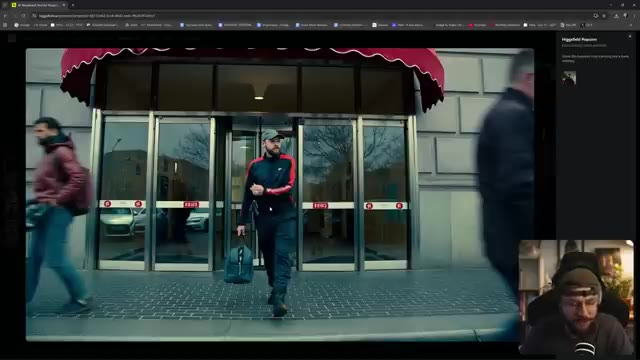
*Gros plan sur une vidéo générée par IA montrant un homme barbu sortant d'un immeuble avec un sac de sport, dans un style réaliste de braquage.*

*Retour à la vue d'ensemble de la grille de clips générés sur l'interface Higgsfield Popcorn, avec le créateur en bas à droite.*

---

### ⏱️ `[00:07:07 - 00:07:40]` | Segment #14

**🔊 Audio (Transcription Intégrale Mot pour Mot en Français) :**
> Ça a l'air bien et cohérent aussi. Moi qui entre dans ce coffre-fort ici. Encore une fois, c'est assez indulgent sous cet angle de caméra, mais ça ne brise pas l'illusion, ce qui est vraiment ce qui nous inquiète, bien sûr, quand il s'agit de cohérence. Belle prise ici. Ouais, j'aime beaucoup celle-là, en fait. Et cette prise ici, vraiment belle aussi. L'une des choses que je dirai, c'est que ça semble avoir réussi à m'avoir toujours avec mon alliance, ce qui est plutôt cool, vous pouvez voir qu'elle apparaît dans chacune de nos générations d'images, mais cette prise ici, mon visage a un peu changé.

**👁️ Analyse Visuelle d'Écran (gemini-3.5-flash-lite) :**
**Interface & Outils** : Navigateur web avec lecteur vidéo intégré (style Higgsfield Popcorn) et encadré PiP (Picture-in-Picture) du créateur en bas à droite.

**Contenu textuel & Code** : Texte visible sur les portes du coffre-fort : "VAULT ACCES", et numéros sur les casiers : "201227".

**Action / Démonstration** : Le créateur commente la cohérence visuelle d'une vidéo générée par IA montrant un personnage entrant dans un coffre-fort et manipulant un sac.

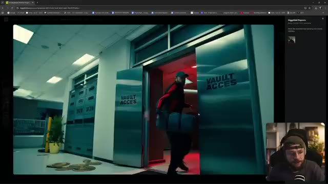
*Aperçu dans un navigateur web d'une vidéo générée par IA montrant un personnage barbu avec une casquette et une veste noire et rouge entrant dans un coffre-fort ("VAULT ACCES").*

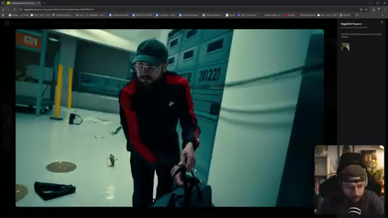
*Vidéo générée par IA montrant le personnage à l'intérieur du coffre-fort, tenant un sac et se déplaçant près de casiers numérotés.*

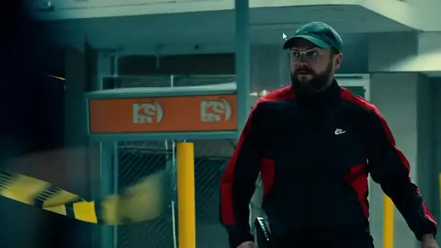
*Gros plan vidéo généré par IA du personnage barbu avec des lunettes et une casquette verte se déplaçant dans un environnement industriel.*

---

### ⏱️ `[00:07:40 - 00:08:12]` | Segment #15

**🔊 Audio (Transcription Intégrale Mot pour Mot en Français) :**
> bancal je pense que tout le reste a l'air et se sent plutôt bien et puis ce dernier plan ici ce genre de plan large qui est très cinématique et dramatique ouais j'aime bien ça donc j'espère que vous pouvez voir comment cela fonctionne de manière assez efficace comme outil de storyboarding et nous pouvons aller de l'avant et animer n'importe quelle image dont nous aimons l'apparence. Mais je pense que pour notre prochain exemple, nous allons entrer un peu plus dans les détails et avoir un peu plus de contrôle sur les images que nous allons demander à Higgsfield Popcorn de générer pour nous. Nous allons donc utiliser ChatGPT ici pour nous aider un peu.

**👁️ Analyse Visuelle d'Écran (gemini-3.5-flash-lite) :**
**Interface & Outils** : Interface web de Higgsfield Popcorn (plateforme de génération de vidéos et de storyboards par IA) et navigateur Google Chrome.

**Contenu textuel & Code** : Textes visibles : "Higgsfield Popcorn", "Storyboard Mode", "CREATE VISUAL STORIES WITH HIGGSFIELD POPCORN", prompt "Show the bearded man carrying out a bank robbery".

**Action / Démonstration** : Le créateur navigue sur l'interface de Higgsfield Popcorn, montre des plans générés, passe par le mode Storyboard, puis ouvre une nouvelle page de navigateur pour accéder à ChatGPT.

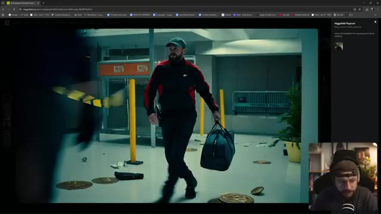
*Aperçu en grand écran d'un plan cinématographique montrant un homme dans un parking souterrain, avec le flux vidéo en cours de lecture.*

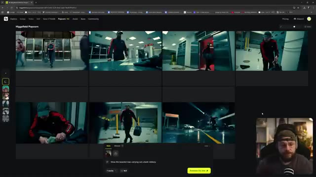
*Interface de l'outil Higgsfield Popcorn affichant une grille de vignettes de plans générés et la barre de prompt en bas.*

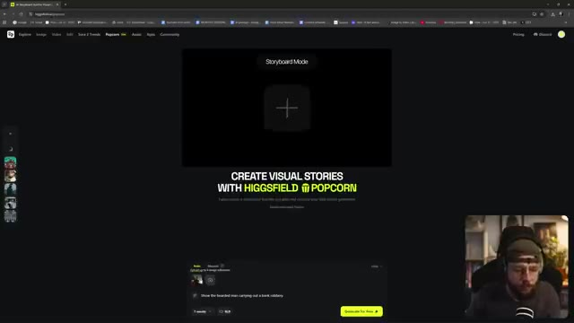
*Page d'accueil de Higgsfield Popcorn avec le mode Storyboard et le bouton central de création.*

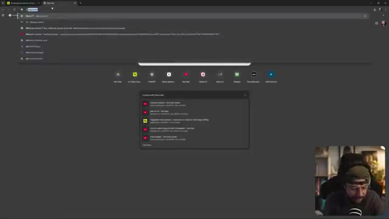
*Navigateur web affichant la barre d'adresse et des suggestions de recherche de sites web.*

---

### ⏱️ `[00:08:13 - 00:08:49]` | Segment #16

**🔊 Audio (Transcription Intégrale Mot pour Mot en Français) :**
> Donc je vais simplement entrer le texte du prompt. Je travaille sur un court-métrage. J'aimerais que tu m'écrives de courts prompts textuels pour chaque scène, qui montrent tous l'homme barbu en train de réaliser une sorte de cascade folle. Fais en sorte que les cascades soient variées, réalistes mais mémorables. Voyons donc ce que ChatGPT nous donne en retour. Comme vous pouvez le voir, nous avons tout un tas de scènes différentes ici : saut sur un toit, glissade en moto, saut sur un train, pont en feu, tonneaux en voiture, plein d'options différentes. Ce qu'on peut faire, c'est copier l'un de nos prompts textuels, retourner sur Higgsfield Popcorn et télécharger un autre...

**👁️ Analyse Visuelle d'Écran (gemini-3.5-flash-lite) :**
**Interface & Outils** : Interface de ChatGPT (avec la question posée) suivie de l'interface de l'outil vidéo Higgsfield Popcorn, avec une incrustation vidéo du créateur dans le coin inférieur droit.

**Contenu textuel & Code** : Texte du prompt dans ChatGPT : « I'm working on a short film, I'd like you to write me short text prompts for each scene, which all show the bearded man taking part in some kind of crazy stunt make the stunts varied realistic but memorable ». Sur Higgsfield Popcorn : les titres « CREATE VISUAL STORIES WITH HIGGSFIELD POPCORN » et le champ de saisie en bas.

**Action / Démonstration** : Le créateur montre la saisie de son prompt textuel dans ChatGPT, puis bascule sur l'interface de l'outil vidéo Higgsfield Popcorn pour continuer sa démonstration.

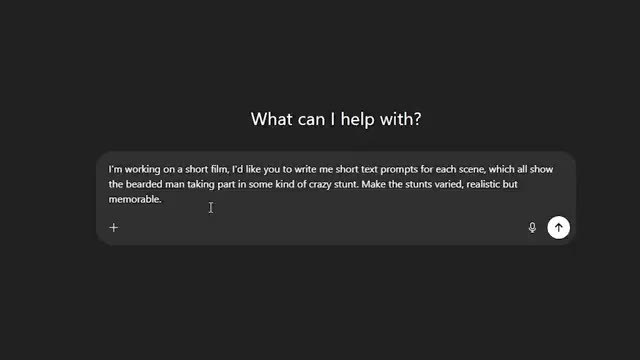
*Interface de ChatGPT affichant le champ de saisie du prompt pour générer des idées de cascades pour un court-métrage.*

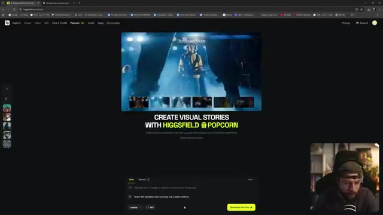
*Interface du site Higgsfield Popcorn montrant l'espace de création de récits visuels, avec le créateur en incrustation vidéo (Picture-in-Picture) dans le coin inférieur droit.*

---

### ⏱️ `[00:08:49 - 00:09:23]` | Segment #17

**🔊 Audio (Transcription Intégrale Mot pour Mot en Français) :**
> image de référence cette fois-ci. Je veux aller de l'avant et utiliser celle-ci ici qui a en fait été générée en utilisant Nano Banana. Nous allons donc glisser-déposer ceci dans le champ. Je vais basculer sur l'option manuelle maintenant et cela va évidemment nous permettre de dicter chaque scène individuelle donc je vais copier et coller ce premier prompt textuel ici et nous allons simplement continuer à prendre les prompts dont le son nous plaît juste pour continuer à peupler chacune de nos scènes individuelles. Il faut opter pour la marche sur l'aile d'avion, pourquoi pas la chute de la cascade ici, debout au bord d'une cascade massive, il plonge.

**👁️ Analyse Visuelle d'Écran (gemini-3.5-flash-lite) :**
**Interface & Outils** : Interface web d'un générateur vidéo IA avec panneau latéral et prévisualisation d'image, puis interface ChatGPT pour les prompts.

**Contenu textuel & Code** : Texte affiché : "Show the bearded man carrying out a bank robbery", champs de scènes numérotés de 1 à 7, et liste de prompts de cascades incluant "The Waterfall Drop" sur ChatGPT.

**Action / Démonstration** : Le créateur sélectionne et copie des prompts textuels pour les intégrer dans les différentes scènes du mode manuel de l'outil de génération vidéo.

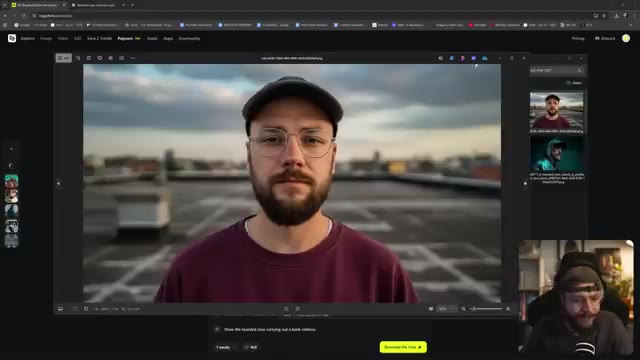
*Interface d'un outil de génération vidéo par IA affichant une image de référence sélectionnée représentant Jack avec une casquette sur un toit.*

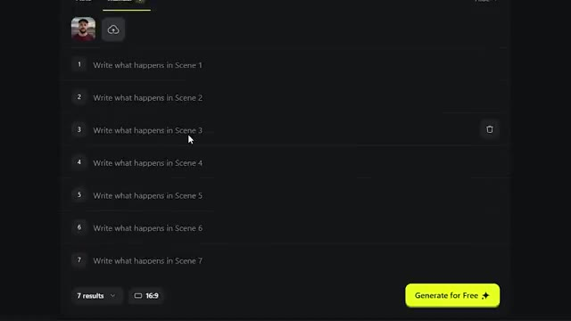
*Interface du mode manuel de l'outil montrant plusieurs champs numérotés pour rédiger les différentes scènes (Scene 1 à Scene 7) et un bouton jaune "Generate for Free".*

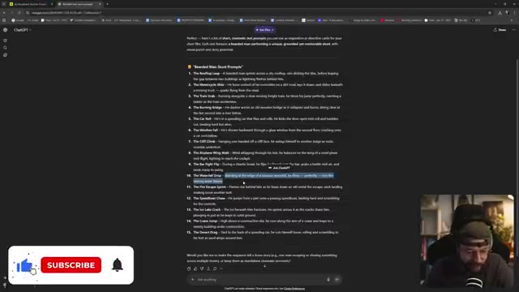
*Interface de ChatGPT affichant une liste de prompts textuels ("Bearded Man Stunt Prompts") avec du texte sélectionné en surbrillance bleue.*

---

### ⏱️ `[00:09:23 - 00:09:57]` | Segment #18

**🔊 Audio (Transcription Intégrale Mot pour Mot en Français) :**
> parfaitement dans l'eau rugissante en contrebas, comme le son de ça bien sûr, nous voulons toujours que nos images soient générées en 16 par 9. Allons voir ce qu'on obtient en retour. Nous avons donc nos générations de retour, encore une fois juste un rappel, c'était notre image de départ et c'est ce qu'on a obtenu de Higgsfield Popcorn. Donc le pont en train de brûler n'a pas beaucoup de sens physique, je cours un peu au milieu, je ne sais pas trop ce qui se passe ici. J'aime bien ce plan où je cours le long du train, ça a l'air plutôt cool. Encore une fois, la tenue que je porte est jolie.

**👁️ Analyse Visuelle d'Écran (gemini-3.5-flash-lite) :**
**Interface & Outils** : Navigateur web affichant l'interface de Higgsfield Popcorn avec le mode Storyboard et l'affichage des différentes scènes.

**Contenu textuel & Code** : Textes des prompts de scènes numérotées, notamment le prompt numéro 2 : "Running alongside a slow-moving freight train, he times his jump perfectly, catching a ladder as the train accelerates".

**Action / Démonstration** : Le créateur navigue et commente les différentes scènes générées par IA sur Higgsfield Popcorn, analysant la cohérence physique des mouvements (le pont en feu et la course le long du train).

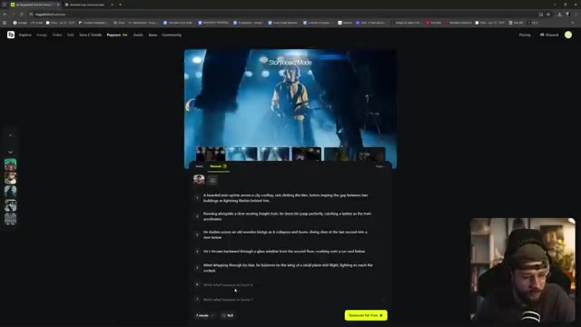
*Interface de la plateforme Higgsfield Popcorn montrant le mode Storyboard avec la liste des prompts et le créateur incrusté en bas à droite.*

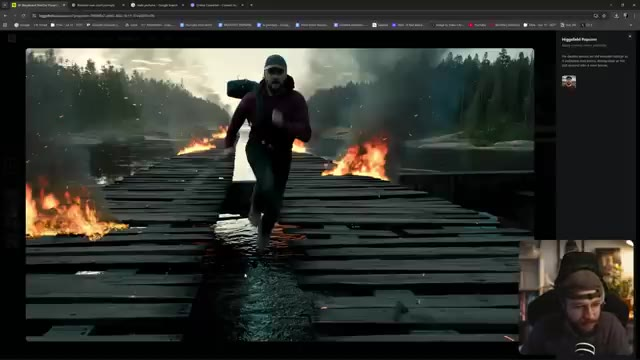
*Visualisation du rendu vidéo généré par IA montrant un personnage courant sur un pont en bois en feu au-dessus de l'eau.*

*Visualisation d'un autre rendu vidéo généré par IA montrant le personnage en train de courir le long d'un train en mouvement.*

---

### ⏱️ `[00:09:57 - 00:10:32]` | Segment #19

**🔊 Audio (Transcription Intégrale Mot pour Mot en Français) :**
> et cohérent et ça m'a en fait mis un sac à dos. Nous n'avions pas cela dans l'image de référence originale, mais je suppose que Higgsfield se dit, eh bien, il réalise une sorte de cascade, alors peut-être qu'il a besoin d'un équipement tactique ou autre. Donc celui-ci, c'est là où je suis sur l'aile d'un avion. Je ne suis pas trop sûr de pourquoi je me retrouve avec une queue de cheval, mais le reste du plan a l'air plutôt bien. J'ai ici en train de plonger d'une cascade. Ça a l'air cool. Une composition de style assez joliment cinématographique. Moi courant à travers le lac a l'air bien aussi. De dos,

**👁️ Analyse Visuelle d'Écran (gemini-3.5-flash-lite) :**
**Interface & Outils** : Navigateur web affichant la plateforme de génération vidéo Higgsfield Popcorn, avec une vue en incrustation (PiP) du créateur en bas à droite.

**Contenu textuel & Code** : Panneau latéral droit affichant le titre "Higgsfield Popcorn" ainsi que des descriptions textuelles et des prompts de génération pour chaque plan de cascade.

**Action / Démonstration** : Le créateur commente les différentes vidéos générées par IA affichées à l'écran, illustrant les ajouts inattendus (sac à dos, équipement) réalisés par Higgsfield à partir de l'image de référence.

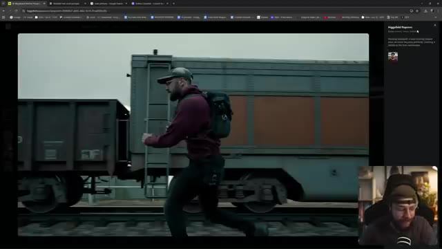
*Interface du navigateur affichant une vidéo générée par Higgsfield Popcorn où l'on voit le personnage courir le long d'un train de marchandises avec un sac à dos.*

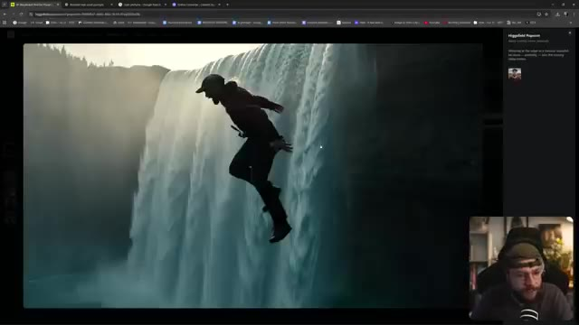
*Interface du navigateur affichant le résultat vidéo de Higgsfield Popcorn montrant le personnage en train de plonger du haut d'une cascade.*

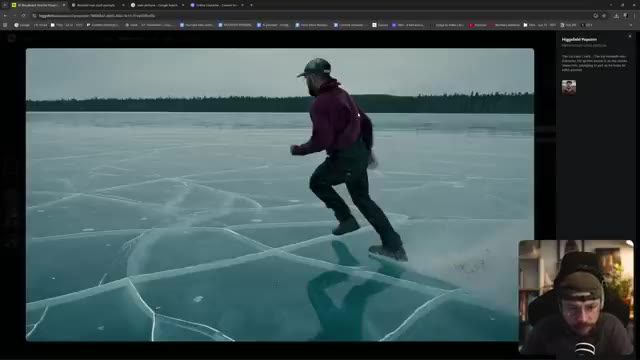
*Interface du navigateur affichant la vidéo générée par Higgsfield Popcorn où le personnage court à la surface d'un lac gelé vu de dos.*

---

### ⏱️ `[00:10:32 - 00:10:53]` | Segment #20

**🔊 Audio (Transcription Intégrale Mot pour Mot en Français) :**
> Je trouve que l'apparence reste bien cohérente. Sauter entre deux toits ici encore, on voit que la construction du monde physique est un peu bancale. Ça n'a pas beaucoup de sens. Je vais sauter et on dirait que je suis en train de tomber de ce toit. Mais en termes de cohérence des personnages, je pense qu'on a encore une fois réussi. Et celui-ci, c'est moi qui tombe de la fenêtre.

**👁️ Analyse Visuelle d'Écran (gemini-3.5-flash-lite) :**
**Interface & Outils** : Navigateur web affichant l'application Higgfield Popcorn avec un panneau latéral de prompts et de détails, et une incrustation vidéo (PiP) du créateur en bas à droite.

**Contenu textuel & Code** : Le panneau latéral affiche des descriptions textuelles des scènes générées par IA (par exemple, saut entre deux bâtiments, chute à travers une vitre).

**Action / Démonstration** : Le navigateur présente le rendu vidéo d'une IA générative illustrant un saut de toit puis une chute à travers une fenêtre, tandis que le créateur commente les incohérences physiques et la cohérence du personnage.

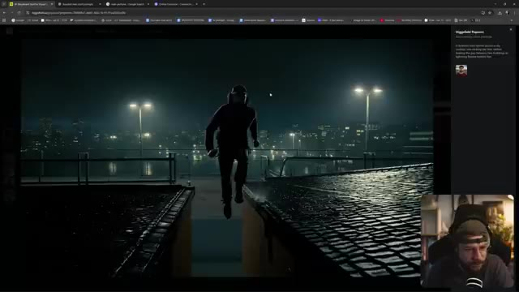
*Interface du navigateur affichant une vidéo générée sur Higgfield Popcorn montrant un personnage sautant entre deux toits de nuit, avec le créateur en incrustation PiP en bas à droite.*

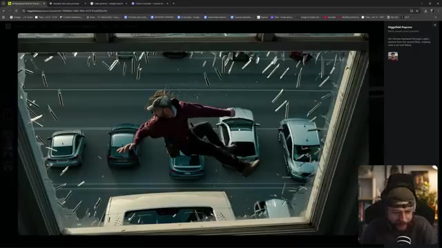
*Interface du navigateur affichant une vidéo générée sur Higgfield Popcorn montrant un personnage passant à travers une vitre brisée au-dessus d'un parking, avec le créateur en incrustation PiP en bas à droite.*

---

### ⏱️ `[00:10:53 - 00:11:29]` | Segment #21

**🔊 Audio (Transcription Intégrale Mot pour Mot en Français) :**
> Je crois que j'ai encore une queue-de-cheval. Je ne sais pas pourquoi ce modèle d'image veut vraiment que j'aie une queue-de-cheval. Je pense que la prochaine étape, j'aimerais tester ça pour un cas d'usage publicitaire. Je vais me débarrasser de cette image de référence là. Et je veux en mettre quelques nouvelles maintenant. Utilisons donc celle-ci, qui a une ambiance de mode éditorial de magazine. Je glisse-dépose ceci ici. Et je veux aussi glisser-déposer cette image ici d'une bouteille de parfum pour homme Ralph Lauren. Donc on va la déposer. Et en ce qui concerne le texte du prompt, nous allons procéder

**👁️ Analyse Visuelle d'Écran (gemini-3.5-flash-lite) :**
**Interface & Outils** : Interface web de Higgsfield Popcorn (higgsfield.ai/popcorn) avec un panneau de prompt textuel et des options de storyboard.

**Contenu textuel & Code** : Le site web affiche le titre "CREATE VISUAL STORIES WITH HIGGSFIELD POPCORN" avec des aperçus de storyboards et un champ de texte de prompt en bas.

**Action / Démonstration** : Le créateur démontre l'interface de Higgsfield Popcorn et présente les résultats de génération vidéo avec une vue sur l'écran et son retour caméra en PiP.

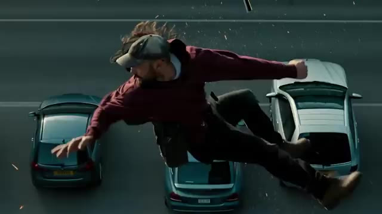
*Rendu vidéo généré par IA montrant un homme barbu en casquette et sweat rouge en plein saut au-dessus de voitures sur une autoroute.*

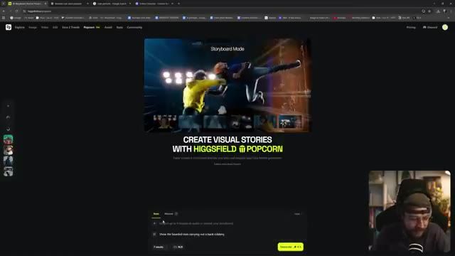
*Interface de l'outil de génération vidéo Higgsfield Popcorn montrant l'écran de travail avec le créateur en incrustation (PiP).*

---

### ⏱️ `[00:11:29 - 00:11:58]` | Segment #22

**🔊 Audio (Transcription Intégrale Mot pour Mot en Français) :**
> et écrivez dans l'émission montrant l'homme barbu dans une variété d'environnements différents, portant des vêtements différents, tenant le flacon de parfum Ralph Lauren. Ambiance de mode éditoriale visuellement saisissante, publicité de parfum TV cinématique. Alors générons ceci. D'accord, nous avons donc un tas de résultats différents ici. J'ai fait un prompt textuel légèrement modifié tout en haut ici, essayant de m'assurer que je portais toujours ma chapeau parce que j'avais l'impression que ces générations ici ne me ressemblaient pas complètement.

**👁️ Analyse Visuelle d'Écran (gemini-3.5-flash-lite) :**
**Interface & Outils** : Navigateur web affichant l'application de génération vidéo/storyboard "Higgsfield Popcorn" avec interface sombre et boutons de génération.

**Contenu textuel & Code** : Texte du prompt visible : "Show the bearded man in a variety of different environments, wearing different clothing holding the Ralph Lauren perfume bottle. Visually striking, editorial fashion vibe, TV perfume ad, cinematic." Paramètres : 6 résultats, format 16:9.

**Action / Démonstration** : Le créateur montre l'interface de génération de storyboards sur Higgsfield Popcorn puis présente les différents résultats obtenus à l'écran.

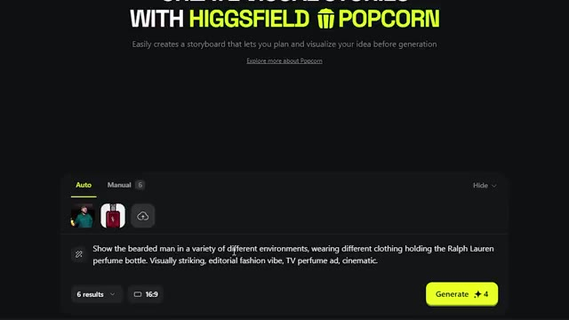
*Interface de Higgsfield Popcorn montrant la zone de saisie du prompt pour générer des visuels avec un flacon de parfum Ralph Lauren.*

*Grille de résultats de génération sur Higgsfield Popcorn avec le créateur en incrustation (PiP) en bas à droite.*

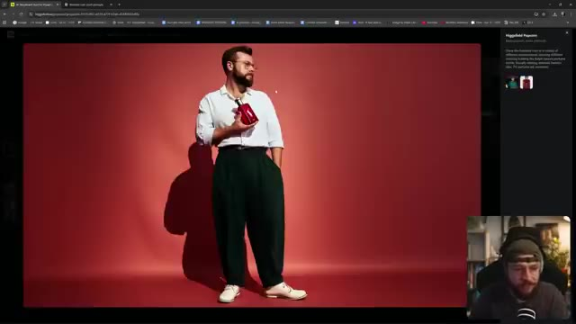
*Affichage en grand format d'une des images générées montrant un homme barbu tenant un flacon de parfum, avec le créateur en incrustation (PiP).*

---

### ⏱️ `[00:11:58 - 00:12:32]` | Segment #23

**🔊 Audio (Transcription Intégrale Mot pour Mot en Français) :**
> Mais pour être franc, sur l'image de référence, je porte un chapeau, je porte mes lunettes. Donc parfois il est important d'inclure cela dans le prompt textuel, c'est pourquoi je voulais l'exécuter deux fois. D'abord, avec un prompt textuel très simple et celui-ci avec plus de description quant à ce que je porte. Nous avons définitivement obtenu des images très visuelles ici de Higgsfield popcorn et vous pouvez voir que le produit lui-même est resté bien cohérent tout au long. Si nous faisons un peu défiler vers le haut, vous allez me voir avec une coiffure plaquée ridicule. Je ne sais pas pourquoi l'image de Higgsfield

**👁️ Analyse Visuelle d'Écran (gemini-3.5-flash-lite) :**
**Interface & Outils** : Navigateur web affichant l'interface de Higgsfield Popcorn, avec le créateur visible en incrustation (PiP) dans le coin inférieur droit.

**Contenu textuel & Code** : Texte du prompt visible : "Show the bearded man in a variety of different environments, wearing different clothing holding the Ralph Lauren perfume bottle. He has a short, well-groomed dark brown beard and moustache with a soft, dense texture, trimmed neatly around the edges..."

**Action / Démonstration** : Le créateur navigue et zoome sur les différentes images générées par l'outil d'IA Higgsfield Popcorn pour analyser la cohérence du personnage et du produit.

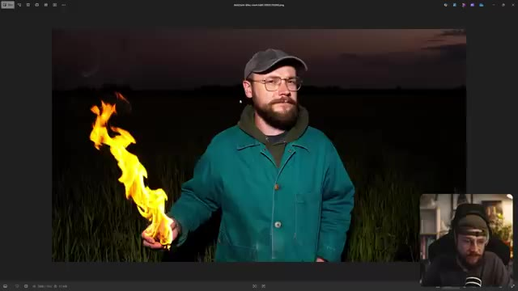
*Aperçu en grand écran de l'image générée montrant Jack tenant une flamme dans un champ sombre avec le créateur en incrustation.*

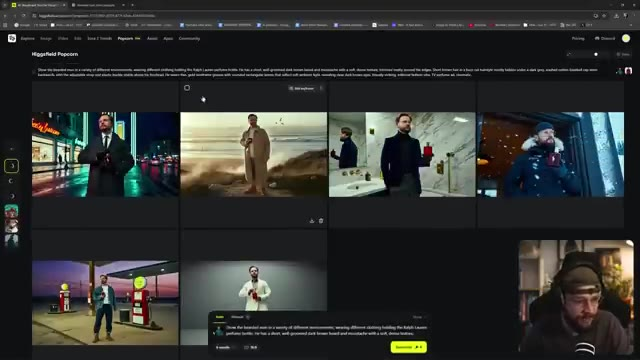
*Interface de Higgsfield Popcorn affichant une galerie d'images générées par IA avec des variations du créateur dans différents environnements.*

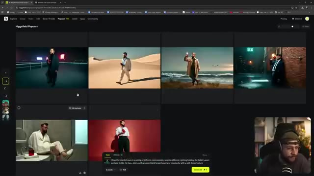
*Vue de la grille de résultats sur Higgsfield Popcorn montrant d'autres variations d'images générées avec le prompt en bas.*

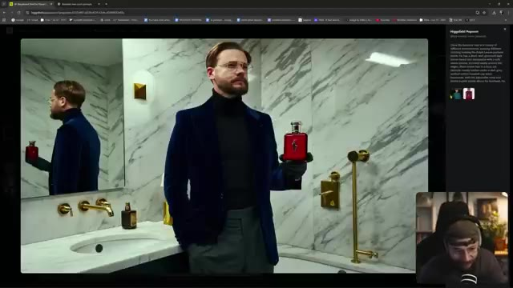
*Gros plan sur une image générée montrant Jack dans une salle de bains luxueuse en marbre tenant un flacon de parfum rouge.*

---

### ⏱️ `[00:12:32 - 00:13:04]` | Segment #24

**🔊 Audio (Transcription Intégrale Mot pour Mot en Français) :**
> Le modèle déteste mes cheveux. Plus tôt, il a essayé de me faire une queue de cheval, maintenant il me donne ce peigne, je ne sais pas ce que c'est. Une horrible coupe avec raie sur le côté. Mais cela mis à part, c'est une image IA assez impressionnante, je dois l'admettre. J'aime vraiment celle-ci aussi. Tu vois, parfois le modèle d'image a un peu de mal avec le texte, d'après ce qu'on peut voir. On peut voir une sorte d'effet d'artefact étrange qui se produit ici, presque comme des hiéroglyphes ou quelque chose du genre. Mais la pose que je prends, celle-ci me ressemble vraiment et c'est probablement parce que le gars porte un chapeau,

**👁️ Analyse Visuelle d'Écran (gemini-3.5-flash-lite) :**
**Interface & Outils** : Navigateur web affichant une plateforme de génération d'images/vidéos par IA (Higgfield Popcorn) avec volet de prompt textuel à droite et incrustation vidéo de la webcam du créateur (PiP) en bas à droite.

**Contenu textuel & Code** : Texte du prompt visible dans le panneau latéral droit de Higgfield Popcorn décrivant le personnage : "Give the handsome man in a variety of different environments, wearing different clothing, holding the Ralph Lauren perfume bottle. He has a short, well-groomed dark brown beard and moustache with a soft, dense texture..." ainsi que des artefacts textuels illisibles sur la veste imitant des hiéroglyphes.

**Action / Démonstration** : Le navigateur présente différentes variations d'une génération vidéo/image publicitaire pour un parfum Ralph Lauren, tandis que le créateur commente les détails visuels et les artefacts du modèle.

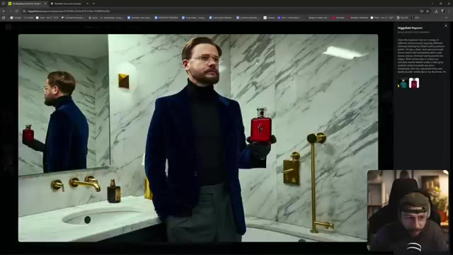
*Image générée par IA montrant un homme barbu tenant un flacon de parfum rouge dans une salle de bains luxueuse en marbre blanc.*

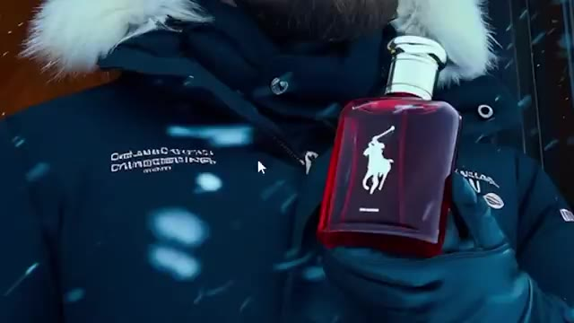
*Gros plan sur un personnage généré par IA dans une veste d'hiver sombre avec de la neige qui tombe, tenant un parfum Ralph Lauren, avec des artefacts textuels sur la veste.*

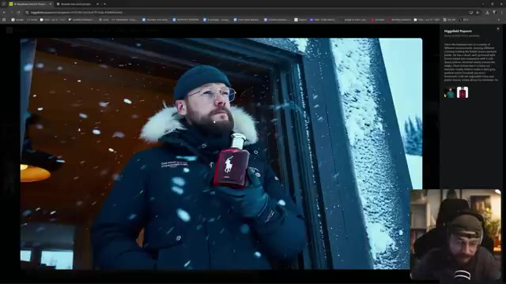
*Plan moyen d'un homme en veste d'hiver dans un décor enneigé tenant un flacon de parfum rouge, sous un angle montrant un bonnet et des flocons de neige.*

---

### ⏱️ `[00:13:04 - 00:13:30]` | Segment #25

**🔊 Audio (Transcription Intégrale Mot pour Mot en Français) :**
> c'est ça ? Si vous utilisez une image de référence où votre personnage porte un chapeau, vous avez vraiment besoin que les images générées le fassent aussi porter un chapeau. Parce que tout de suite, cela me ressemble beaucoup plus que quelque chose comme ça où, vous savez, les cheveux. Encore une fois, cependant, si je n'avais pas cette coiffure, cela me ressemblerait beaucoup. C'est un autre plan vraiment superbe. Celui-ci serait tout à fait à sa place dans une publicité de parfum. Même celui-ci a l'air vraiment super.

**👁️ Analyse Visuelle d'Écran (gemini-3.5-flash-lite) :**
**Interface & Outils** : Navigateur web affichant la plateforme Higgfield Popcorn, avec un panneau latéral de texte descriptif et un panneau de prévisualisation vidéo. En bas à droite, petite fenêtre vidéo (PiP) du créateur.

**Contenu textuel & Code** : Texte descriptif visible dans le panneau latéral droit sur Higgfield Popcorn détaillant les différents environnements et tenues du personnage (Ralph Lauren parfum). Texte dans l'interface et fenêtres de sélection d'applications visibles à l'écran 1.

**Action / Démonstration** : Le créateur navigue à travers différents exemples de vidéos générées par IA sur la plateforme Higgfield Popcorn, illustrant l'impact des références vestimentaires (chapeau, coiffure) sur la ressemblance du personnage.

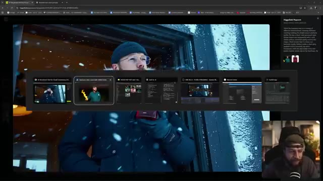
*Interface du navigateur affichant le site Higgfield Popcorn avec une incrustation de fenêtres ouvertes et la caméra PiP du créateur en bas à droite.*

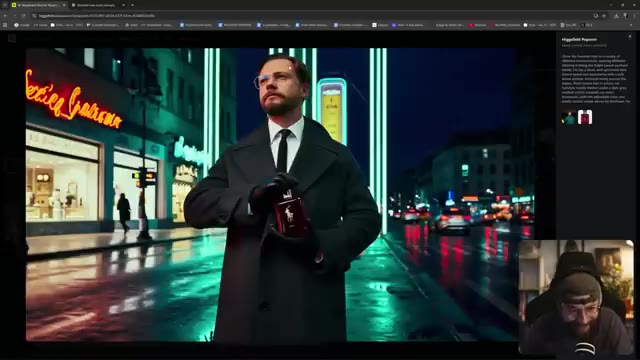
*Vidéo générée par IA montrant un homme élégant en manteau sombre tenant un flacon de parfum de type Ralph Lauren dans une rue urbaine nocturne pluvieuse, avec la caméra PiP du créateur en bas à droite.*

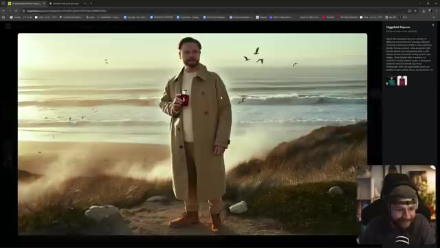
*Vidéo générée par IA montrant un homme en trench-coat beige sur une plage côtière tenant un flacon de parfum, avec la caméra PiP du créateur en bas à droite.*

---

### ⏱️ `[00:13:30 - 00:14:06]` | Segment #26

**🔊 Audio (Transcription Intégrale Mot pour Mot en Français) :**
> Une autre super image ici. J'aime vraiment beaucoup la variété des tenues ainsi que des décors. Et je pense sincèrement que c'est le point fort des modèles d'image de Higgsfield. Ils sont clairement orientés vers la mode ou les ambiances éditoriales. Et en fait, j'ai réalisé quelques tests en utilisant cette même image de référence, en essayant simplement de voir ce prompt textuel très simple afficher à nouveau l'homme barbu dans différents environnements et vous pouvez voir ici que je suis resté assez cohérent tout du long, ça a l'air plutôt pas mal et ce plan-ci particulièrement, je...

**👁️ Analyse Visuelle d'Écran (gemini-3.5-flash-lite) :**
**Interface & Outils** : Application web Higgsfield (Popcorn / modèles d'image) avec navigation par onglets (Explore, Image, Video, Edit, Scene 2 Trends, Popcorn, etc.), barre de prompt en bas avec le texte de génération et paramètres, et incrustation vidéo PiP du créateur.

**Contenu textuel & Code** : Texte du prompt visible en bas : "Show the bearded man in a variety of different environments, wearing different clothing holding the Ralph Lauren perfume bottle. He has a short, well-groomed dark brown beard and moustache with a soft, dense texture." Paramètres 4 results, 16:9.

**Action / Démonstration** : Le navigateur web affiche la plateforme Higgsfield Popcorn avec une grille de résultats d'images générées par IA basées sur une image de référence et un prompt textuel cohérent.

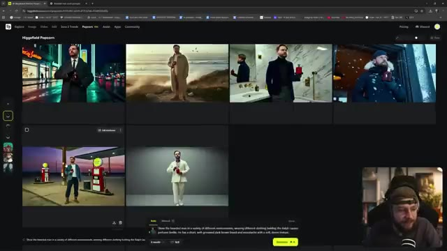
*Interface de l'application web Higgsfield Popcorn affichant une grille de générations d'images d'un homme barbu dans différentes tenues et environnements, avec la vue incrustée (PiP) du présentateur en bas à droite.*

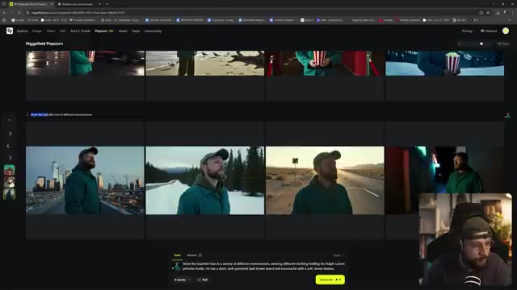
*Interface de Higgsfield Popcorn montrant une autre série de résultats d'images générées avec une veste verte dans divers paysages urbains et naturels.*

---

### ⏱️ `[00:14:06 - 00:14:28]` | Segment #27

**🔊 Audio (Transcription Intégrale Mot pour Mot en Français) :**
> J'adore comment ça a mis de la neige dans ma barbe, c'est vraiment très sympa aussi au niveau de la composition, c'est une super génération, et ensuite moi dans une ville, ça essaie de me donner une petite coupe mulet, et là-haut moi tenant ce pop-corn dans différents environnements, c'est super bien réussi aussi. J'adore le détail dans la barbe où on dirait que je ne me suis pas rasé depuis un petit moment.

**👁️ Analyse Visuelle d'Écran (gemini-3.5-flash-lite) :**
**Interface & Outils** : Navigateur web affichant la plateforme Higgsfield AI avec lecteur vidéo central et encadré PiP (Picture-in-Picture) de la webcam du créateur.

**Contenu textuel & Code** : URL visible dans la barre d'adresse, titre "Higgsfield Popcorn" dans le panneau latéral droit, interface de relecture vidéo avec barre de progression.

**Action / Démonstration** : Le créateur présente ses résultats de génération vidéo par IA dans différents environnements (montagne enneigée, paysage urbain) et commente les détails visuels.

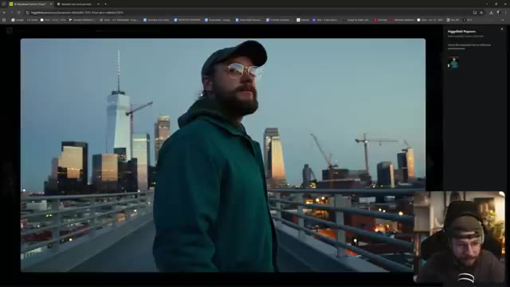
*Interface de la plateforme de génération vidéo Higgsfield affichant une vidéo générée par IA montrant le créateur sur un pont urbain au coucher du soleil, avec la webcam PiP du créateur en bas à droite.*

---

### ⏱️ `[00:14:28 - 00:14:47]` | Segment #28

**🔊 Audio (Transcription Intégrale Mot pour Mot en Français) :**
> Et il y a un tout petit peu de croissance là, sous l'encolure. Et cette sorte de ville de chalets en rondins derrière moi. Celle-ci est vraiment très sympa aussi. Moi sur la plage, toujours en train de tenir le popcorn, ayant l'air un peu triste et tout seul. Je pense que ce qu'on va faire pour l'image finale. Essayons ce genre d'ambiance style Pixar que nous avons ici.

**👁️ Analyse Visuelle d'Écran (gemini-3.5-flash-lite) :**
**Interface & Outils** : Navigateur web affichant l'interface de l'outil de génération vidéo Higgfield et un lecteur de visionnage d'images, avec une incrustation vidéo (PiP) du créateur en bas à droite.

**Contenu textuel & Code** : Sur l'image 2 : Interface Higgfield avec le titre « Higgfield Popcorn », une grille de 7 vidéos générées montrant le personnage dans divers décors urbains, naturels et intérieurs, et une boîte de prompt active en bas. Sur l'image 3 : Fichier image affiché en plein écran avec un prompt de génération textuel visible en haut (« c7d446977_full_body_image_of_a_man_mood_remote_house... »).

**Action / Démonstration** : Le créateur navigue et présente ses différentes générations vidéo et d'images IA sur son écran, tout en commentant les styles visuels et les environnements.

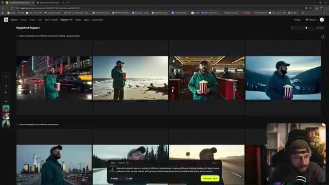
*Interface du site web de génération vidéo Higgfield montrant une grille de vidéos d'un homme barbu tenant un seau de popcorn dans différents environnements, avec le créateur en incrustation PiP en bas à droite.*

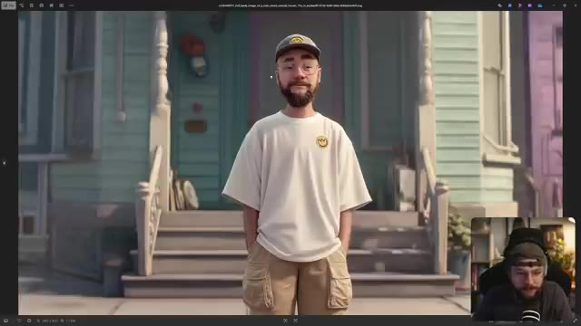
*Visualisation d'une image générée au style d'animation Pixar représentant un homme barbu aux mains dans les poches devant un porche de maison colorée, avec le créateur en incrustation PiP en bas à droite.*

---

### ⏱️ `[00:14:47 - 00:15:06]` | Segment #29

**🔊 Audio (Transcription Intégrale Mot pour Mot en Français) :**
> Donc je vais glisser-déposer ça dedans. Et ensuite je me suis dit, pourquoi ne pas avoir la version Pixar de moi tenant ce gobelet de café à emporter Starbucks ? Essayons quelque chose d'un peu différent ici. Disons de montrer une scène de combat entre l'homme barbu et un robot géant.

**👁️ Analyse Visuelle d'Écran (gemini-3.5-flash-lite) :**
**Interface & Outils** : Interface web de Higgsfield AI (Popcorn) affichée dans un navigateur, combinée avec l'explorateur de fichiers Windows, avec un encadré PiP (Picture-in-Picture) de Jack dans le coin inférieur droit.

**Contenu textuel & Code** : Sur Higgsfield AI (Popcorn) : texte "CREATE VISUAL STORIES WITH HIGGSFIELD POPCORN", onglets "Storyboard Mode", champ de saisie de prompt "Describe the scene to be read to animate your scenes", et boutons de génération. Dans l'explorateur de fichiers : dossiers de téléchargement et images miniatures (telle qu'une image de gobelet Starbucks et un flacon de parfum).

**Action / Démonstration** : Le créateur navigue dans l'explorateur de fichiers pour sélectionner un fichier image et le glisser-déposer dans l'interface de génération vidéo de Higgsfield AI, puis s'apprête à saisir un nouveau prompt textuel.

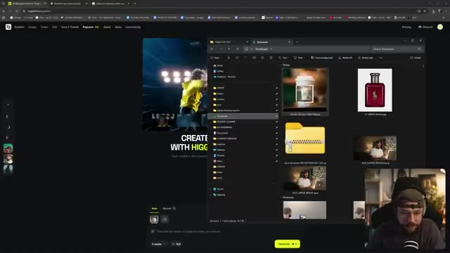
*Interface du site Higgsfield AI (Popcorn) avec une fenêtre de l'explorateur de fichiers Windows ouverte au premier plan pour sélectionner et glisser-déposer une image de gobelet de café Starbucks.*

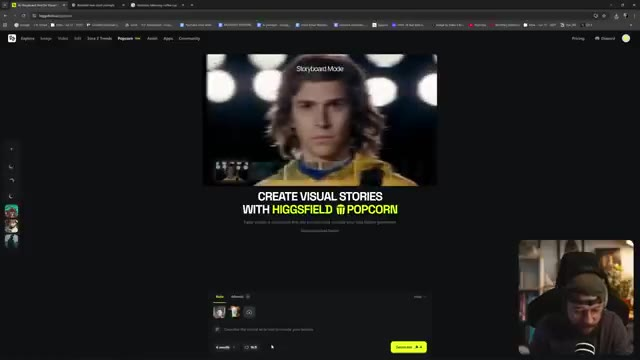
*Interface principale du site Higgsfield AI (Popcorn) en mode Storyboard, affichant une prévisualisation vidéo d'un personnage dans une veste jaune et le champ de prompt textuel en bas.*

---

### ⏱️ `[00:15:06 - 00:15:31]` | Segment #30

**🔊 Audio (Transcription Intégrale Mot pour Mot en Français) :**
> L'homme barbu tient toujours son café Starbucks, essayant de ne pas le renverser pendant le combat. Très bien. Voyons ce qu'on obtient pour celui-ci. Je serai curieux de voir s'il parvient à maintenir ce style artistique Pixar cohérent et à l'appliquer également à notre gobelet de café Starbucks.

**👁️ Analyse Visuelle d'Écran (gemini-3.5-flash-lite) :**
**Interface & Outils** : Interface web de Higgsfield Popcorn (higgsfield.ai/popcorn) avec barre de navigation supérieure, un grand visuel central "Storyboard Mode" et le créateur visible en incrustation vidéo (PiP) dans le coin inférieur droit.

**Contenu textuel & Code** : Titre "CREATE VISUAL STORIES WITH HIGGSFIELD POPCORN", onglets "Tools", zone de texte de prompt en bas ("Show a fight scene between the bearded man and a giant robot..."), boutons de génération et paramètres de format vidéo (16:9).

**Action / Démonstration** : Le créateur navigue sur l'interface de Higgsfield Popcorn et s'apprête à lancer la génération d'une nouvelle vidéo basée sur le prompt du combat avec l'homme barbu et son café.

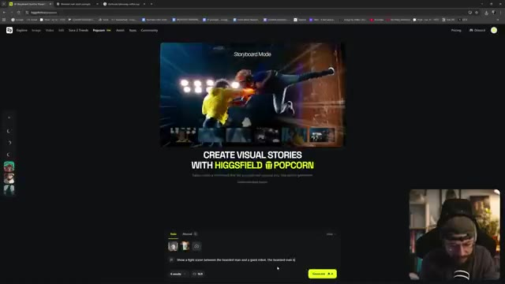
*Interface du site web de Higgsfield Popcorn montrant le mode Storyboard avec un aperçu vidéo d'une scène de combat et la zone de saisie du prompt.*

---

### ⏱️ `[00:15:31 - 00:15:51]` | Segment #31

**🔊 Audio (Transcription Intégrale Mot pour Mot en Français) :**
> Très bien, donc nous retrouvons nos générations de moi essayant en quelque sorte d'éviter, pour être honnête, de combattre ce robot géant. Et comme vous pouvez le voir, mon personnage est resté bien cohérent du début à la fin. Et je tiens, bien sûr, ce gobelet de café Starbucks. Nous avons eu une génération ici qui a échoué en raison d'un contenu sensible.

**👁️ Analyse Visuelle d'Écran (gemini-3.5-flash-lite) :**
**Interface & Outils** : Navigateur web affichant l'interface de l'outil de génération vidéo IA Higgsfield Popcorn, avec une caméra PiP du créateur (Jack) en bas à droite.

**Contenu textuel & Code** : Texte de prompt visible dans la fenêtre de génération : « Show a fight scene between the bearded man and a giant robot. The bearded man is always holding his Starbucks coffee, trying not to spill it, during the fight. » et une vignette bloquée par un avertissement « Sensitive content ».

**Action / Démonstration** : Le créateur navigue et commente ses différentes générations de vidéos IA sur Higgsfield Popcorn, mettant en avant la cohérence de son personnage et le gobelet de café.

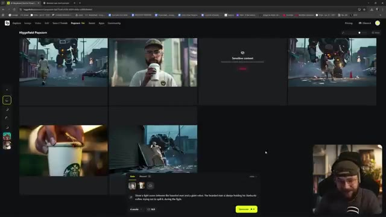
*Interface de Higgsfield Popcorn affichant plusieurs générations de vidéos avec un encadré PiP du créateur en bas à droite.*

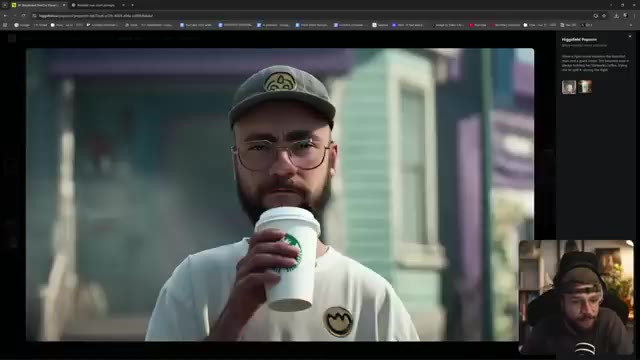
*Gros plan sur l'une des vidéos générées montrant le personnage tenant un gobelet Starbucks dans une rue.*

*Retour à la grille d'affichage des différentes générations de vidéos de combat contre le robot géant sur Higgsfield Popcorn.*

---

### ⏱️ `[00:15:52 - 00:16:17]` | Segment #32

**🔊 Audio (Transcription Intégrale Mot pour Mot en Français) :**
> Juste un petit bug, celui-là. Je suis sûr qu'ils finiront par corriger ça. Mais vous pouvez voir que le robot est resté bien cohérent tout au long de tous ces plans également. Je ne sais pas trop ce qui se passe avec celui-ci, mais je pense que de manière générale, nous atteignons ce bon niveau de cohérence pour le personnage et, dans ce cas, pour le produit également. Et bien sûr, nous aurions aussi pu emprunter la voie manuelle ici et dicter chacune des scènes individuelles que nous recherchions.

**👁️ Analyse Visuelle d'Écran (gemini-3.5-flash-lite) :**
**Interface & Outils** : Interface web de la plateforme de génération vidéo par IA « Higgsfield Popcorn » avec options Auto/Manual et onglets de navigation.

**Contenu textuel & Code** : Texte visible dans le panneau de prompt : « Show a fight scene between the bearded man and a giant robot. The bearded man is always holding his Starbucks coffee, trying not to spill it, during the fight. ». En mode manuel, des scripts numérotés de 1 à 6 décrivent des actions (ex: « A bearded man sprints across a city rooftop... »). Paramètres visibles : 6 results, format 16:9, bouton « Generate ».

**Action / Démonstration** : Le créateur navigue à travers l'interface de Higgsfield Popcorn, examine les différentes vidéos générées dans la grille de résultats, zoome sur un plan spécifique, puis bascule sur le mode manuel pour montrer la configuration détaillée des scènes.

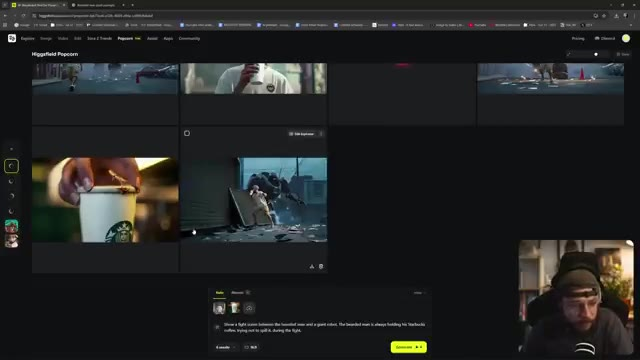
*Interface de la plateforme Higgsfield Popcorn affichant une grille de résultats de vidéos générées par IA avec un panneau de prompt en bas.*

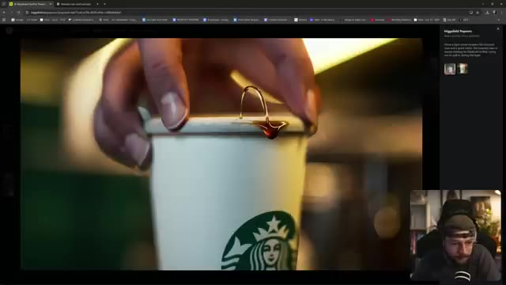
*Gros plan sur une vidéo générée montrant une main en train de fermer un gobelet en papier avec un logo Starbucks.*

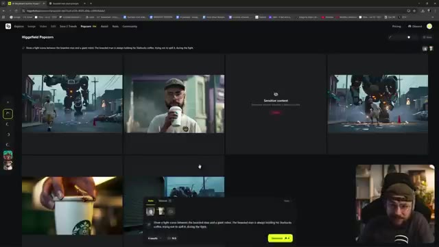
*Grille de résultats de vidéos sur Higgsfield Popcorn montrant différentes scènes d'un combat entre un homme barbu et un robot géant.*

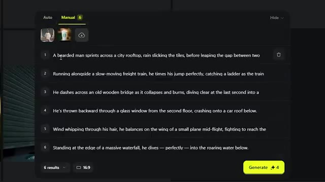
*Panneau de configuration en mode manuel (« Manual ») sur Higgsfield Popcorn avec des lignes de prompts numérotées décrivant de multiples scènes d'action.*

---

### ⏱️ `[00:16:17 - 00:16:36]` | Segment #33

**🔊 Audio (Transcription Intégrale Mot pour Mot en Français) :**
> Donc je pense que d'après nos tests, nous avons vu que Higgsville popcorn s'en sort vraiment bien lorsqu'il s'agit de contenu de style animé ou de dessin animé. Et comme je l'avais prédit, le contenu de style mode ou éditorial également. C'est là que les modèles d'image de Higgsfield brillent vraiment et vous pouvez en voir la preuve ici.

**👁️ Analyse Visuelle d'Écran (gemini-3.5-flash-lite) :**
**Interface & Outils** : Navigateur web affichant l'interface de la plateforme Higgsfield Popcorn, avec une vue en grille des vidéos générées, une barre de navigation supérieure et une zone de prompt en bas. Le créateur est visible en incrustation vidéo (PiP) en bas à droite.

**Contenu textuel & Code** : Texte du prompt visible en bas : "A bearded man sprints across a city rooftop, rain slicking the tiles, before leaping the gap between two buildings as lightning flashes behind him." Paramètres de génération avec le modèle Higgsfield.

**Action / Démonstration** : Le présentateur parle en pointant ou commentant les résultats visuels présentés sur la grille de l'interface Higgsfield Popcorn à l'écran.

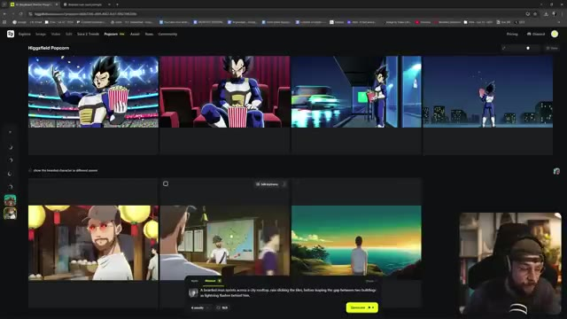
*Interface de la plateforme Higgsfield Popcorn montrant des résultats de génération vidéo au style animé avec le personnage de Vegeta et des scènes urbaines, avec le créateur incrusté en bas à droite.*

*Interface de Higgsfield Popcorn montrant des résultats de génération vidéo au style mode et éditorial réaliste (publicités de parfum, mannequins dans divers environnements), avec le créateur en incrustation PiP.*

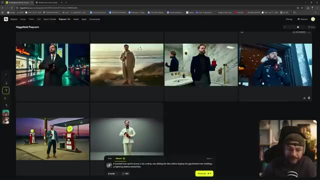
*Vue similaire sur l'interface de Higgsfield Popcorn affichant la grille de vidéos de style éditorial et de mode générées par l'IA, avec le présentateur en bas à droite.*

---

### ⏱️ `[00:16:36 - 00:17:10]` | Segment #34

**🔊 Audio (Transcription Intégrale Mot pour Mot en Français) :**
> Dieu merci, dans celui-ci au moins je porte mon bonnet et je cache cette affreuse calvitie. Je ne veux plus jamais voir ça. Ça va me donner des cauchemars. Mais je suis sûr que vous pouvez voir un grand nombre de cas d'utilisation pour cet outil. J'aimerais beaucoup avoir votre avis également. Comment pensez-vous qu'il se compare à la concurrence chez Nano Banana ? Si vous avez apprécié le contenu d'aujourd'hui les gars, assurez-vous de lâcher un pouce bleu pour moi, pensez à vous abonner et bien sûr activez la cloche de notification pour ne jamais rater de futures publications. J'apprécie tout le soutien sur toutes mes vidéos récentes les gars et je vous retrouve dans la prochaine.

**👁️ Analyse Visuelle d'Écran (gemini-3.5-flash-lite) :**
**Interface & Outils** : Higgsfield Popcorn (plateforme de génération de vidéo par IA)

**Contenu textuel & Code** : Texte du prompt visible : "Show the bearded man in a variety of different environments, wearing different clothing holding the Ralph Lauren pochiche bottle. Visually striking, national fashion vibe. TV perfume ad cinematic." et un autre prompt en bas : "A bearded man sprints across a city rooftop, raw clicking the tiles, before roping the gap between two buildings as lightning flashes behind him."

**Action / Démonstration** : Le navigateur web affiche l'interface de Higgsfield Popcorn avec des résultats de générations de vidéos mettant en scène le même personnage dans divers contextes publicitaires.

*Interface de l'outil Higgsfield Popcorn affichant la vidéo générée d'un homme barbu tenant une bouteille de parfum dans la neige, avec le créateur en incrustation (PiP).*

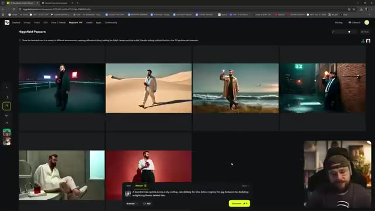
*Grille de résultats de générations de vidéos sur la plateforme Higgsfield Popcorn, montrant différents plans d'un homme barbu dans des environnements variés.*

---
