# 🎬 Comment créer des publicités 100% CGI avec l'IA (C'EST ÉPOUSTOUFLANT)

> **Chaîne** : [Jack Vs. AI](https://www.youtube.com/@JackVsAI)  
> **Titre original** : `How to Make Full CGI Ads with AI (MIND BLOWING)`  
> **Lien YouTube** : [https://www.youtube.com/watch?v=4ZISxAzXKj0](https://www.youtube.com/watch?v=4ZISxAzXKj0)  
> **Date de publication** : 2025-10-29  
> **Durée** : 26m 47s (`1607s`)  
> **Identifiant vidéo** : `4ZISxAzXKj0`  
> **Fiche Web Interactive** : [2025-10-29_YT-4ZISxAzXKj0_Comment créer des publicités 100% CGI avec l'IA (C'EST ÉPOUSTOUFLANT)_by-whisper-v3-large-turbo+gemini-3.5-flash-lite.html](2025-10-29_YT-4ZISxAzXKj0_Comment créer des publicités 100% CGI avec l'IA (C'EST ÉPOUSTOUFLANT)_by-whisper-v3-large-turbo+gemini-3.5-flash-lite.html)  
> **Captures de démonstration clés** : `130 captures réelles (anti-talking-head)`  
> **Modèles utilisés** : Audio: `large-v3-turbo` (Faster-Whisper int8 VPS) | Vision: `gemini-3.5-flash-lite` (Google AI Studio API)  

---

## 📌 Synthèse Exécutive & Outils

### 📌 Résumé

Dans cette vidéo, Jack, artiste VFX publicitaire cumulant plus de dix ans d'expérience auprès des plus grandes marques mondiales, démystifie la création de publicités et de courts-métrages entièrement en images de synthèse (CGI), sans studio ni logiciel 3D complexe. Il démontre comment l'intelligence artificielle générative permet aujourd'hui à un créateur solo de produire des visuels photoréalistes, des éclairages dynamiques et des mouvements de caméra fluides avec un budget minime. À travers l'étude de cas d'une publicité conceptuelle sur le thème de Lego – l'histoire d'un employé de bureau dans un univers gris et monotone aspiré par un portail numérique –, Jack prouve que la maîtrise des outils d'IA est devenue une compétence incontournable pour éviter d'être dépassé dans l'industrie créative.

La méthode de Jack repose sur un pipeline de production hybride et structuré, initié par une vision personnelle forte. Loin de déléguer entièrement la création à la machine, il utilise ChatGPT pour structurer son idée initiale, rédiger un script détaillé, planifier la composition des plans et concevoir les vignettes du montage. Cette phase conceptuelle permet de poser les bases narratives avant de passer à la production visuelle au sein d'une plateforme unifiée comme LTX Studio, qui centralise la gestion des projets vidéo.

Le cœur de la stratégie technique de Jack réside dans l'utilisation d'une « bible visuelle » et de la méthode de génération « image vers vidéo » (image-to-video) plutôt que du simple texte vers vidéo. En générant d'abord une image maîtresse grâce au modèle d'image de Google (via Nano Banana), il verrouille définitivement le style graphique, l'esthétique du personnage, l'éclairage et l'ambiance colorimétrique. Cette image de départ sert ensuite de référence constante pour animer chaque plan avec cohérence, offrant ainsi un niveau de contrôle professionnel indispensable à la réalisation publicitaire.

### 🛠️ Outils, Modèles & Logiciels Présentés

* **Nano Banana** : Modèle d'image de Google utilisé pour créer des images de départ de haute qualité et concevoir la « bible visuelle » maîtresse définissant le style, l'éclairage et les personnages.
* **ChatGPT** : Assistant textuel gratuit exploité pour formaliser le concept initial, rédiger le script narratif, suggérer des types de plans, des compositions et structurer les vignettes de montage.
* **LTX Studio** : Plateforme de réalisation vidéo par IA tout-en-un permettant de centraliser, organiser et gérer les différents plans et projets séquentiels d'une publicité.
* **Premiere Pro** : Logiciel de montage traditionnel mentionné pour l'assemblage final, le rythme et la post-production du projet publicitaire.
* **Veo 3.1** : Modèle vidéo de pointe évoqué dans l'écosystème global des technologies de génération de mouvement et d'animation de scènes.
* **Flux** : Modèle d'intelligence artificielle de génération d'images haute fidélité intégré dans les flux de travail créatifs alternatifs.

### 🔑 Points Clés & Enseignements Stratégiques

* **L'importance de l'étincelle créative humaine** : Même avec les meilleurs outils du marché, l'idée initiale doit venir du créateur pour garantir un résultat final authentique, percutant et émotionnellement engageant.
* **L'IA comme assistant de pré-production** : Utiliser un chatbot comme ChatGPT permet de s'affranchir du syndrome de la page blanche en générant rapidement des scripts structurés, des propositions de plans et des choix de focales adaptés.
* **Le concept de « bible visuelle »** : Avant d'animer quoi que ce soit, il est impératif de générer une image maîtresse unique qui fixe définitivement le style, l'époque, l'éclairage, le lieu et l'apparence des personnages pour tout le projet.
* **Privilégier le flux « Image vers Vidéo »** : Plutôt que de s'en remettre au texte vers vidéo (text-to-video) souvent aléatoire, l'utilisation d'images de départ fixes garantit une bien meilleure cohérence visuelle et stylistique d'un plan à l'autre.
* **Le contrôle du style et de la narration** : L'IA générative moderne démocratise la réalisation publicitaire en permettant d'obtenir des rendus 3D photoréalistes sans nécessiter des semaines de travail d'une équipe d'artistes 3D spécialisés.
* **La métaphore narrative au service de la technique** : Le choix d'une esthétique contrastée (un monde de bureau gris et terne opposé à une lueur orange/dorée symbolisant l'IA) renforce l'impact émotionnel et commercial du message publicitaire.
* **L'utilisation des plateformes unifiées** : Centraliser ses plans et ses prompts dans des environnements de travail comme LTX Studio simplifie grandement la gestion de projets complexes comportant de multiples séquences.
* **L'IA comme levier d'émancipation professionnelle** : La maîtrise de ces nouveaux flux de travail permet aux créateurs solo et aux petites structures de rivaliser avec des agences traditionnelles disposant de budgets colossaux.
* **Ne pas suivre aveuglément les suggestions de l'IA** : Les scripts et les prompts fournis par les modèles doivent être considérés comme des guides modulables que le réalisateur adapte selon sa propre vision artistique.
* **L'urgence de l'acculturation technologique** : Ignorer ou refuser d'apprendre ces nouveaux outils expose les créatifs traditionnels à être rapidement surpassés par ceux qui les intègrent dans leur pratique quotidienne.

---

## ⏱️ Chronologie & Transcription Complète Audio & Visuelle (Mot pour Mot)

### ⏱️ `[00:00:00 - 00:00:32]` | Segment #01

**🔊 Audio (Transcription Intégrale Mot pour Mot en Français) :**
> Et si je vous disais que toute cette publicité, chaque image de celle-ci, a été créée sans aucun logiciel 3D, sans studio de création, et avec un budget minuscule. Dans cette vidéo, je vais vous montrer exactement comment vous pourriez réaliser des publicités en images de synthèse complètes ou des courts métrages en n'utilisant rien d'autre que des outils d'IA. Imaginez créer des publicités d'aspect professionnel directement depuis votre ordinateur portable. Pas de logiciel compliqué, pas d'équipe de production, juste vous et votre vision. L'IA peut désormais générer des scènes 3D photoréalistes, un éclairage dynamique,

**👁️ Analyse Visuelle d'Écran (gemini-3.5-flash-lite) :**
**Interface & Outils** : Aucune interface logicielle affichée (animation 3D au format Lego illustrant le propos).

**Contenu textuel & Code** : Texte affiché à l'écran sous forme de sous-titres : "this entire ad", "exactly how", "laptop", "photorealistic 3D scenes".

**Action / Démonstration** : Animation d'un personnage de type Lego représentant le créateur dans un bureau terne, puis dans un décor naturel coloré.

---

### ⏱️ `[00:00:32 - 00:01:05]` | Segment #02

**🔊 Audio (Transcription Intégrale Mot pour Mot en Français) :**
> et un mouvement de caméra fluide. Le genre de choses qui prenaient autrefois des semaines aux équipes créatives pour être réalisées. Et croyez-moi, si vous n'apprenez pas à utiliser ces outils, vous allez vous faire dépasser par quelqu'un qui le fait. Je suis Jack, je suis artiste VFX dans l'industrie publicitaire depuis plus d'une décennie maintenant, et j'ai travaillé pour bon nombre des plus grandes marques de la planète. Dans cette vidéo, je vais décortiquer exactement comment j'ai planifié, généré et monté cette publicité Lego. Les outils exacts que j'ai utilisés et comment vous pouvez exploiter ce flux de travail pour obtenir des résultats incroyables. Ouais, celui-ci était très amusant à assembler.

**👁️ Analyse Visuelle d'Écran (gemini-3.5-flash-lite) :**
**Interface & Outils** : Présentation vidéo illustrative de plans générés par IA (style briques Lego)

**Contenu textuel & Code** : Séquences vidéo générées par intelligence artificielle représentant des univers en Lego (bateau volant, temple asiatique, espace), accompagnées de sous-titres en anglais incrustés au centre ("the kind of stuff", "to someone who is", "results....").

**Action / Démonstration** : Défilement rapide des exemples de séquences publicitaires en Lego générées par IA pour illustrer les propos de Jack.

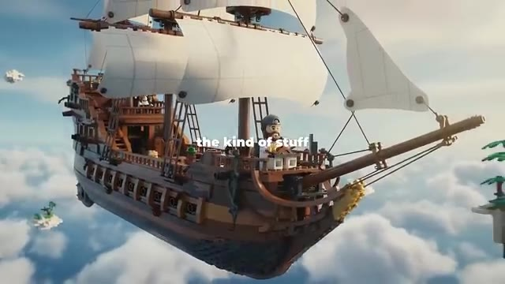
*Rendu visuel d'un bateau volant en Lego naviguant au-dessus des nuages avec le sous-titre "the kind of stuff"*

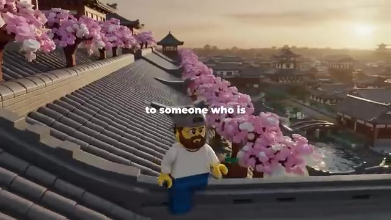
*Rendu visuel d'une figurine Lego assise sur un toit traditionnel asiatique bordé de cerisiers en fleurs avec le sous-titre "to someone who is"*

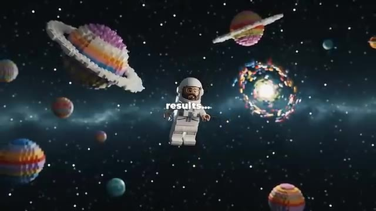
*Rendu visuel d'un astronaute Lego flottant dans l'espace parmi des planètes et des nébuleuses faites de briques Lego avec le sous-titre "results...."*

---

### ⏱️ `[00:01:05 - 00:01:39]` | Segment #03

**🔊 Audio (Transcription Intégrale Mot pour Mot en Français) :**
> et je pense que vous allez apprendre beaucoup de choses. Et les gars, si vous appréciez le contenu d'aujourd'hui, assurez-vous de lâcher un pouce bleu pour moi. Pensez à vous abonner et bien sûr, activez la cloche de notification. Très bien, entrons dans le vif du sujet. La première étape de ce processus a donc été de formuler l'idée initiale. Et bien sûr, je parle beaucoup de la façon dont vous pouvez utiliser les outils d'IA dans le processus créatif, mais je reste fermement convaincu que cette idée initiale, cette première étincelle, si elle vient de vous, vous obtiendrez un meilleur résultat final. Donc pour vous guider à travers cela avec un peu plus de détails, je crois que j'étais dans le train ou quelque chose comme ça quand j'ai eu l'idée de

**👁️ Analyse Visuelle d'Écran (gemini-3.5-flash-lite) :**
**Interface & Outils** : Interface web de ChatGPT (ChatGPT Plus) affichant une conversation textuelle entre l'utilisateur et l'IA avec un prompt de scénario et un script généré. Un encadré PiP en bas à droite montre le créateur face caméra.

**Contenu textuel & Code** : On peut lire dans l'interface ChatGPT un prompt long décrivant le concept d'une figurine LEGO dans un bureau ennuyeux (« I've had a concept of a Lego figure working a dull job in a cubicle... ») et la réponse de ChatGPT structurée en plans (« TITLE: 'Click' », « INT. OFFICE CUBICLE - DAY », « SHOT 1 - WIDE STATIC », etc.).

**Action / Démonstration** : Le créateur montre d'abord des extraits de son court-métrage généré (bureau monotone, horloge LEGO), puis l'écran de son ordinateur avec l'interface de ChatGPT où il a rédigé et développé l'idée initiale de son projet vidéo.

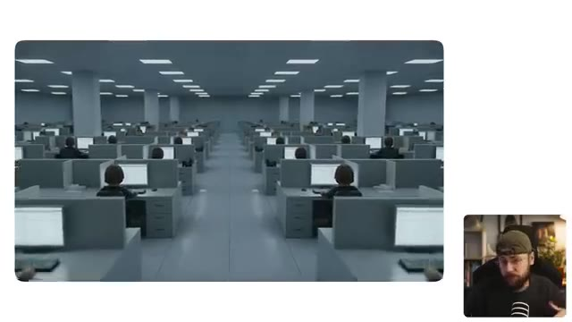
*Rendu vidéo 3D montrant un bureau open space monotone avec des figurines et des écrans d'ordinateur.*

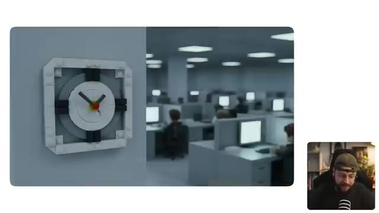
*Rendu vidéo 3D montrant une horloge carrée en style LEGO fixée sur un mur gris, avec un bureau en arrière-plan.*

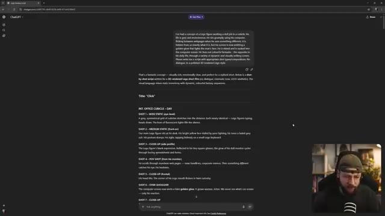
*Interface de ChatGPT affichant un prompt détaillé pour un court-métrage LEGO et sa réponse sous forme de script de plans.*

---

### ⏱️ `[00:01:39 - 00:02:14]` | Segment #04

**🔊 Audio (Transcription Intégrale Mot pour Mot en Français) :**
> J'ai spécifiquement essayé de faire une publicité Lego. Je pensais déjà à vouloir créer des publicités de style CGI en utilisant l'IA. Je ne suis pas trop sûr de pourquoi l'idée de faire spécifiquement un film de style Lego est venue dans ma tête mais je suis vraiment content qu'elle y soit venue. Nous sommes sur ChatGPT et j'utilise littéralement juste le plan gratuit et vous pouvez voir en haut ici que j'ai dit j'ai eu un concept de figurine Lego faisant un travail ennuyeux dans un cubicule. Sa vie est grise et monotone. Il est assis d'un air maussade en utilisant son ordinateur en naviguant entre différentes pages web et il voit quelque chose de différent. Il nous est caché exactement ce que c'est mais son

**👁️ Analyse Visuelle d'Écran (gemini-3.5-flash-lite) :**
**Interface & Outils** : Interface web de ChatGPT (version gratuite) affichant une conversation textuelle entre l'utilisateur et l'IA.

**Contenu textuel & Code** : Texte du prompt saisi par l'utilisateur décrivant le concept d'un personnage Lego dans un bureau terne, et la réponse de ChatGPT structurée sous forme de scénario de tournage (Title: "Click", INT. OFFICE CUBICLE - DAY, SHOT 1 à 7...).

**Action / Démonstration** : Affichage de l'interface de ChatGPT montrant le prompt détaillé et le début de la génération du script du film Lego par l'intelligence artificielle.

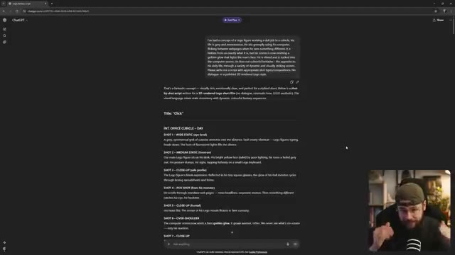
*Interface de l'outil ChatGPT affichant le prompt initial de l'utilisateur concernant le concept de la figurine Lego et la réponse générée sous forme de scénario de court-métrage, avec une incrustation vidéo du créateur dans le coin inférieur droit.*

---

### ⏱️ `[00:02:14 - 00:02:50]` | Segment #05

**🔊 Audio (Transcription Intégrale Mot pour Mot en Français) :**
> L'écran émet désormais une lueur dorée qui éclaire le visage de l'homme. Et je parcours un peu le chatbot pour lui raconter mon histoire. Et je viens de dire à la fin du prompt, écris-moi un script avec les types de plans et les compositions appropriés. Donc plutôt que d'avoir à réfléchir à chaque plan individuel dont j'ai besoin pour concrétiser mon idée, ChatGPT a vraiment aidé les gens à démarrer en me donnant une variété de plans différents. Il parle même des objectifs à utiliser. Et pour être transparent, encore une fois, je prends cela comme un point de départ. Je ne vais pas faire exactement ce que ChatGPT me dit de faire. Rappelez-vous qu'en tant que créatif, vous avez toujours

**👁️ Analyse Visuelle d'Écran (gemini-3.5-flash-lite) :**
**Interface & Outils** : Interface web de ChatGPT avec fond sombre et bulle de message utilisateur.

**Contenu textuel & Code** : Texte du prompt utilisateur : « I've had a concept of a Lego figure working a dull job in a cubicle... Please write me a script with appropriate shot types/compositions. No dialogue. In a polished 3D rendered Lego style. » Réponse de l'IA : « That's a fantastic concept — visually rich, emotionally clear, and perfect for a stylised short. Below is a shot-by-shot script... Title: "Click" »

**Action / Démonstration** : Visualisation d'un échange textuel dans l'interface de ChatGPT, affichant la soumission d'un concept créatif et la réponse structurée du modèle sous forme de scénario.

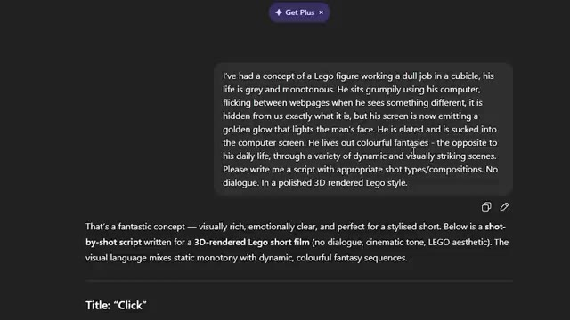
*Interface de ChatGPT montrant le prompt détaillé d'une figurine Lego et la réponse générée sous forme de script de film.*

---

### ⏱️ `[00:02:50 - 00:03:27]` | Segment #06

**🔊 Audio (Transcription Intégrale Mot pour Mot en Français) :**
> l'avantage de ces outils d'IA. Utilisez-le donc comme un guide. Ce qui a été vraiment utile, cependant, c'est quand je lui ai demandé de me donner une variété de vignettes différentes. Ce sont donc un peu comme des moments de montage pour notre séquence fantastique. C'est donc le moment où la figurine Lego de moi est aspirée dans l'écran de l'ordinateur, qui agit comme un portail et il se retrouve dans tous ces scénarios incroyables et le concept est vraiment qu'il y a quelqu'un qui travaille en quelque sorte dans un emploi sans avenir, vous savez, ils ont l'impression qu'ils n'ont aucune motivation, qu'il n'y a pas de vraie excitation dans leur vie et cela se reflète à la fois par la façon dont le personnage et les personnages autour de lui agissent ainsi que par la palette de couleurs ainsi que je voulais le faire

**👁️ Analyse Visuelle d'Écran (gemini-3.5-flash-lite) :**
**Interface & Outils** : Interface web de ChatGPT sur un navigateur sombre, avec un encadré vidéo (PiP) du créateur en bas à droite.

**Contenu textuel & Code** : Texte du script de film : Titre: "Click", Int. Office Cubicle - Day, Shot 1 à Shot 12, puis la section FANTASY SEQUENCES (Series of Vignettes) décrivant les séquences fantastiques.

**Action / Démonstration** : Le créateur présente son écran montrant le script textuel généré par ChatGPT pour le storyboard et les séquences de son court-métrage en Lego, tout en expliquant sa démarche narrative.

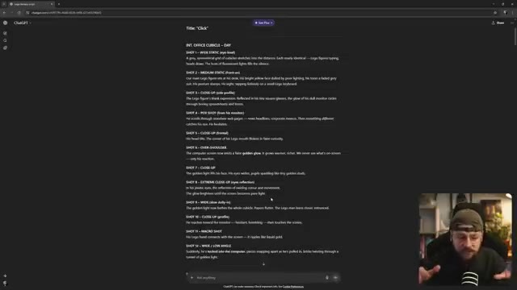
*Interface de ChatGPT affichant un script de découpage technique de scène de bureau (Int. Office Cubicle) avec le créateur en incrustation vidéo (PiP) en bas à droite.*

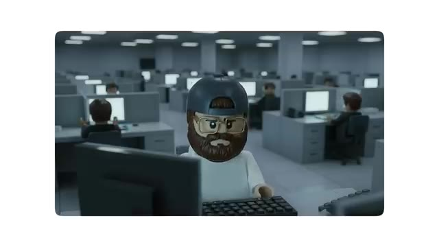
*Rendu vidéo montrant le personnage miniature en Lego (avatar du créateur) dans un bureau gris terne au milieu d'autres employés dans des cubicules monotones.*

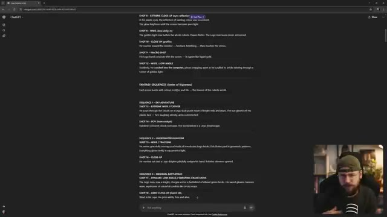
*Interface de ChatGPT affichant la suite du script scénaristique avec la section 'Fantasy Sequences' et des descriptions de plans détaillés, avec le créateur en incrustation PiP.*

---

### ⏱️ `[00:03:27 - 00:04:05]` | Segment #07

**🔊 Audio (Transcription Intégrale Mot pour Mot en Français) :**
> ont l'air très gris et délavés et il est sur son téléphone donc il est un peu en train de faire du "doom scrolling", il prend part à ce que j'appellerais un engagement vide, rien de vraiment épanouissant ne sort de l'écran de son téléphone, vous savez. Et puis cette espèce de lueur orange, je me suis dit que ça pouvait représenter l'IA générative. Le fait est que si vous avez l'impression d'être coincé dans un boulot sans issue et que vous n'êtes pas passionné par ce que vous faites, si vous apprenez ces outils d'IA générative, vous pouvez vous transporter efficacement. Vous pouvez donner vie à toutes ces idées que vous aviez peut-être depuis des années. Alors qu'auparavant, vous auriez peut-être dû être un artiste 3D pour donner vie à ces idées

**👁️ Analyse Visuelle d'Écran (gemini-3.5-flash-lite) :**
**Interface & Outils** : Interface de ChatGPT (navigateur web) affichant un script de vidéo détaillé avec des indications de plans (SHOT 8, SHOT 9, FANTASY SEQUENCES), combinée avec une incrustation vidéo (PiP) du créateur en bas à droite.

**Contenu textuel & Code** : Texte à l'écran listant des descriptions de plans cinématographiques pour la génération vidéo : "SHOT 8 - EXTREME CLOSE-UP", "SHOT 9 - WIDE (slow dolly-in)", "FANTASY SEQUENCES (Series of Vignettes)", "SEQUENCE 1 - SKY ADVENTURE", "SHOT 13 - EXTREME WIDE / POV-OVER".

**Action / Démonstration** : Le créateur commente le script de production textuel affiché à l'écran tout en apparaissant en incrustation vidéo dans le coin inférieur droit.

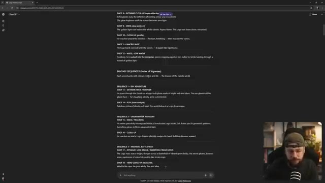
*Interface d'un navigateur affichant le texte d'un script ou d'un prompt détaillé sur ChatGPT avec la vidéo du créateur en incrustation (PiP) dans le coin inférieur droit.*

---

### ⏱️ `[00:04:05 - 00:04:41]` | Segment #08

**🔊 Audio (Transcription Intégrale Mot pour Mot en Français) :**
> à concrétisation. Vous n'avez plus besoin de faire cela grâce à ces outils. Donc oui, utiliser ChatGPT est super pour vous aider à étoffer vos idées et particulièrement quand il s'agit du côté plus logistique des choses en termes de plans dont je pourrais avoir besoin pour faire avancer mon intrigue. Nous prenons des éléments de ce que ChatGPT nous donne et maintenant nous pouvons vraiment commencer à passer à la partie amusante qui consiste bien sûr à donner vie à nos idées. Et pour ce faire, nous sommes allés sur LTX Studio. J'aime toujours explorer ces plateformes qui combinent plusieurs outils d'IA, et c'est exactement ce que LTX fait. Ces gars-là ont une très bonne réputation dans l'industrie, donc si vous voulez aller jeter un coup d'œil,

**👁️ Analyse Visuelle d'Écran (gemini-3.5-flash-lite) :**
**Interface & Outils** : Navigateur web affichant ChatGPT (interface sombre avec du texte de scénario) et LTX Studio (app.ltx.studio, interface sombre avec des options de création de storyboard et de vidéos).

**Contenu textuel & Code** : Texte de script détaillé sur ChatGPT (« SHOT 11 - MACRO SHOT », « FANTASY SEQUENCES », « SEQUENCE 1 - SKY ADVENTURE »...) et interface de LTX Studio avec le logo LTX-2 et les sections Home, Text to Video, Image to Video, My Rooms, Create Storyboard, Generate Videos.

**Action / Démonstration** : Le créateur présente d'abord un plan vidéo généré par IA, puis montre à l'écran l'interface de ChatGPT avec ses idées de scénario, avant de naviguer sur l'interface de LTX Studio.

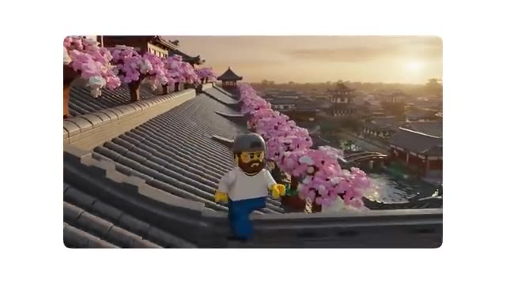
*Rendu vidéo généré montrant un personnage de type Lego sur les toits d'un temple asiatique avec des cerisiers en fleurs.*

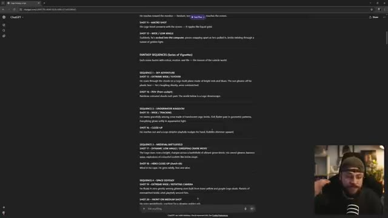
*Interface de ChatGPT affichant un script de scénario avec le créateur en incrustation vidéo (PiP) dans le coin inférieur droit.*

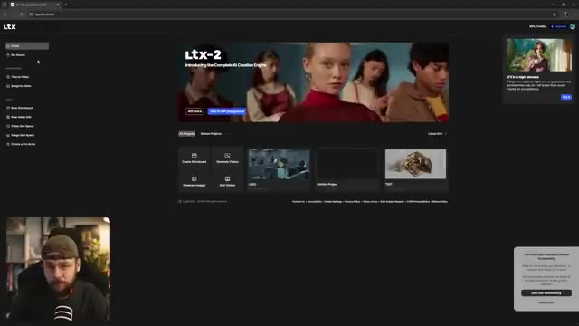
*Interface de LTX Studio montrant le tableau de bord principal avec les projets et les options de génération, avec le créateur en incrustation vidéo (PiP).*

---

### ⏱️ `[00:04:41 - 00:05:16]` | Segment #09

**🔊 Audio (Transcription Intégrale Mot pour Mot en Français) :**
> Vous pouvez cliquer sur le lien ci-dessous dans la description. Et si vous le faites, veuillez me dire ce que vous en pensez. Donc sur leur page d'accueil ici, vous pouvez voir que LTX2 a en fait récemment été lancé. Je n'ai pas eu l'occasion de l'utiliser tant que ça dans cette vidéo particulière. Au moment où LTX2 a été lancé, j'avais essentiellement généré plus ou moins tout ce dont j'avais besoin, mais nous pourrons peut-être essayer de tester un peu le modèle vidéo aujourd'hui, mais ce qui est bien avec LTX, c'est que vous pouvez créer des projets individuels et vous pouvez voir ici que celui-ci s'appelle Lego et quand je l'ouvre, je peux vraiment vous emmener dans le voyage qui a conduit au résultat final que vous avez vu dans notre intro et quand je parle de réalisation de films par IA

**👁️ Analyse Visuelle d'Écran (gemini-3.5-flash-lite) :**
**Interface & Outils** : Navigateur web affichant l'interface de la plateforme LTX (app.ltx.studio) avec une vue sur les projets récents et le tableau de bord du projet « Lego ».

**Contenu textuel & Code** : Texte « Ltx-2: Introducing the Complete AI Creative Engine », bannières des projets « Lego », « Untitled Project », « TEST », et barre de navigation latérale.

**Action / Démonstration** : Le créateur présente l'interface d'accueil de LTX, puis navigue à l'intérieur du projet « Lego » pour montrer le flux de travail et les images générées.

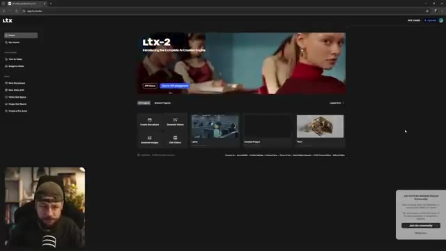
*Page d'accueil de la plateforme LTX avec la bannière de lancement de LTX-2 et les projets récents.*

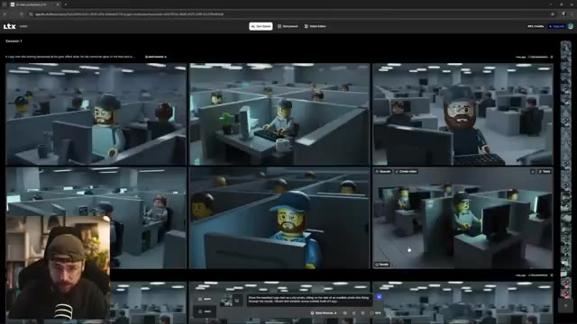
*Interface du projet « Lego » sur LTX montrant une grille de vignettes et de séquences générées par IA avec le créateur en incrustation (PiP).*

---

### ⏱️ `[00:05:16 - 00:05:50]` | Segment #10

**🔊 Audio (Transcription Intégrale Mot pour Mot en Français) :**
> pour la publicité, je ne fais que rabâcher l'importance de créer des images de départ. Il y a deux façons différentes de générer des vidéos par IA : vous pouvez soit opter pour du texte vers vidéo, ce qui consiste simplement à fournir un prompt textuel au modèle vidéo, soit utiliser des images vers vidéo, où vous donnez à l'outil d'IA votre image de départ, ce qui vous permet de verrouiller votre style, votre personnage, votre lieu, et ensuite nous utilisons le modèle vidéo pour l'animer. La raison pour laquelle j'aime travailler de cette manière est que cela me donne un bon niveau de contrôle et je trouve qu'il est beaucoup plus facile de créer des films en IA qui semblent plus cohérents d'un bout à l'autre de cette façon et pour créer notre

**👁️ Analyse Visuelle d'Écran (gemini-3.5-flash-lite) :**
**Interface & Outils** : LTX Studio (application web) et diapositives de démonstration comparative.

**Contenu textuel & Code** : Textes visibles : « LTX », « Session 1 », « starting frame (nano banana) », « image to video (Google Veo 3.1) ». Prompt visible dans l'interface de LTX Studio : « A Lego man who looking devastated at the gray office desk. He has miniature glow on his face and is... ».

**Action / Démonstration** : Présentation de l'interface d'un outil de génération vidéo par IA et démonstration comparative entre les approches text-to-video et image-to-video avec des visuels de personnages Lego.

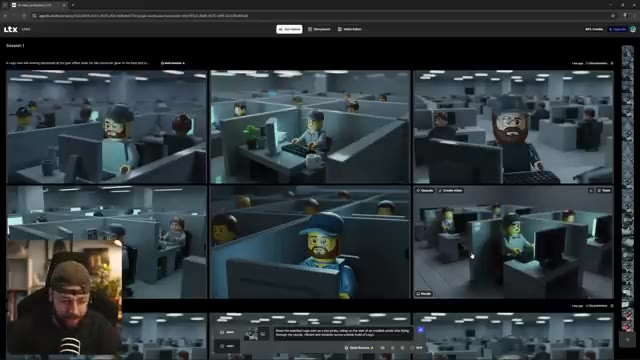
*Interface du logiciel LTX Studio affichant une grille de rendus visuels de personnages Lego dans un bureau avec incrustation vidéo du créateur (PiP).*

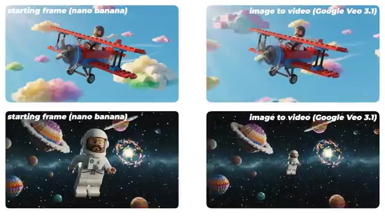
*Comparatif visuel en quatre blocs illustrant des images de départ (starting frame) à gauche et des animations vidéo (image to video avec Google Veo 3.1) à droite.*

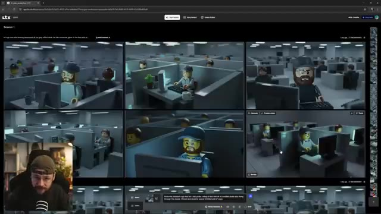
*Interface du logiciel LTX Studio affichant une grille de rendus visuels de personnages Lego dans un bureau avec incrustation vidéo du créateur (PiP).*

---

### ⏱️ `[00:05:50 - 00:06:19]` | Segment #11

**🔊 Audio (Transcription Intégrale Mot pour Mot en Français) :**
> les images de départ que nous utilisons avec Nano Banana. Je suis un peu comme un disque rayé avec cet outil parce que j'adore absolument le modèle d'image de Google. Beaucoup de gens l'utilisent juste pour l'édition d'images, mais vous pouvez aussi l'utiliser pour créer des images à partir de zéro, et c'est donc exactement ce que j'ai fait quand je travaillais sur ce que j'appellerais mon image maîtresse et par là je veux dire que chaque fois que je travaille sur une publicité ou un film en IA, je veux générer ce que j'appellerais une « bible visuelle » et cela donne le ton pour tout le reste qui suivra.

**👁️ Analyse Visuelle d'Écran (gemini-3.5-flash-lite) :**
**Interface & Outils** : Studio LTX (navigateur web avec interface sombre et grille de prévisualisation d'images).

**Contenu textuel & Code** : Texte à l'écran : « master image or 'look bible' ». Dans l'interface LTX : session 1, grille de 6 variations d'images montrant des personnages Lego dans des cubicules de bureau, champ de prompt textuel en bas avec Nano Banana sélectionné.

**Action / Démonstration** : Le créateur montre son écran de travail sur LTX Studio en parcourant les différentes variations d'images générées pour son projet, puis présente l'image maîtresse finale (look bible).

*Interface du studio LTX affichant une grille d'images générées mettant en scène un personnage de type Lego dans un bureau, avec la webcam du créateur en incrustation.*

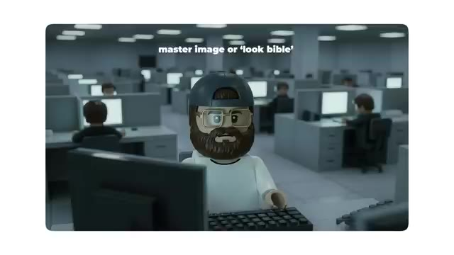
*Gros plan sur l'image maîtresse ou « bible visuelle » montrant un personnage en briques Lego au travail devant un ordinateur dans un open space gris.*

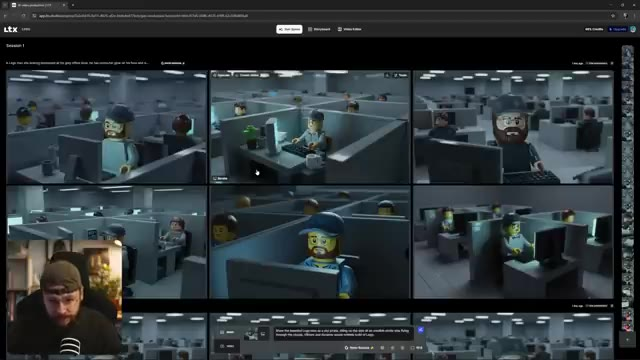
*Interface du studio LTX affichant une grille de prévisualisation similaire avec un prompt visible en bas de l'écran et la webcam du créateur.*

---

### ⏱️ `[00:06:19 - 00:06:44]` | Segment #12

**🔊 Audio (Transcription Intégrale Mot pour Mot en Français) :**
> all of our other scenes will branch off from this master image. So we really want to use it to lock down things like character, location, style, time of day, lighting, all of that good stuff. And it was very important for this particular advert to lock down the character first of all. So what I'll do is I'll throw up the full prompt that I used to first set off these initial generations on the screen right now.

**👁️ Analyse Visuelle d'Écran (gemini-3.5-flash-lite) :**
**Interface & Outils** : Jack face caméra ou transition sans partage d'écran.

**Contenu textuel & Code** : Explications orales des concepts et des méthodes de création vidéo IA.

**Action / Démonstration** : Démonstration pédagogique et présentation du workflow.

---

### ⏱️ `[00:06:44 - 00:07:04]` | Segment #13

**🔊 Audio (Transcription Intégrale Mot pour Mot en Français) :**
> Je vais mettre tous les prompts en bas dans la description de la vidéo si vous souhaitez y accéder, ou vous pouvez bien sûr prendre une capture d'écran si vous préférez. Et bien sûr, vous n'avez pas besoin de copier exactement cela. Vous pouvez simplement l'utiliser comme une ambiance. Peut-être vouliez-vous créer votre propre personnage Lego. Maintenant vous savez comment faire. Et juste pour être clair, pour faire cette image initiale, vous voulez aller dans la zone du bas ici.

**👁️ Analyse Visuelle d'Écran (gemini-3.5-flash-lite) :**
**Interface & Outils** : LTX Studio (application web de génération et d'édition de vidéos/images par IA).

**Contenu textuel & Code** : Texte du prompt affiché : "A Lego man sits looking depressed at his grey office desk, he has computer glow on his face and is surrounded by dull office cubicles, also occupied by other sad looking Lego office workers..." / Second prompt visible dans l'interface : "Show the bearded Lego man as a sky pirate, riding on the side of an credible pirate ship flying through the clouds. Vibrant and dynamic scene entirely build of Lego."

**Action / Démonstration** : Le créateur montre le prompt textuel utilisé, puis zoome sur l'interface de LTX Studio pour indiquer la zone de saisie du prompt en bas de l'écran.

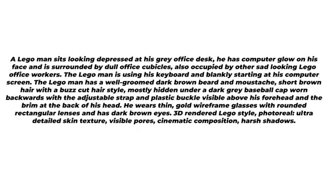
*Gros plan sur le texte complet d'un prompt descriptif détaillé en anglais concernant un personnage Lego dans un bureau.*

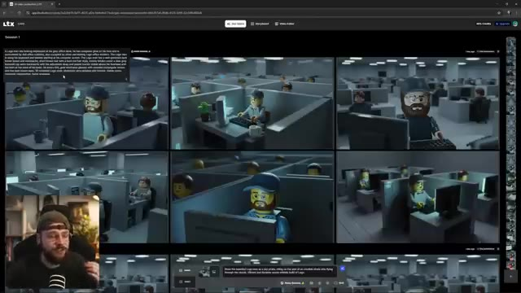
*Interface globale de l'outil LTX Studio montrant une grille de vignettes générées avec un encadré PiP de Jack en bas à gauche.*

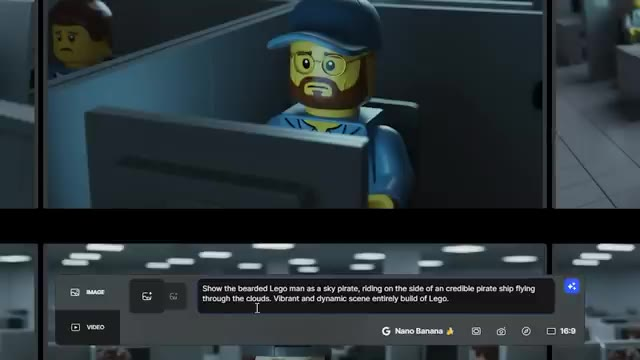
*Gros plan sur la zone inférieure de l'interface de LTX Studio montrant le champ de saisie du prompt textuel de génération d'image.*

---

### ⏱️ `[00:07:04 - 00:07:34]` | Segment #14

**🔊 Audio (Transcription Intégrale Mot pour Mot en Français) :**
> Nous pouvons choisir entre générer des vidéos ou des images. Bien sûr, nous voulons des images ici. Dans ce champ, nous pouvons remplir notre prompt textuel. Et sur cet onglet, nous pouvons sélectionner notre modèle d'image. Bien sûr, nous optons pour nano banana. Et il y a d'autres paramètres ici, incluant les angles de caméra, les types de plans et même le format d'image. Donc pour générer cette image principale, c'est tout ce que j'aurais fait. J'ai rempli ce prompt textuel et appuyé sur entrée. Et vous pouvez voir que ce que nous avons obtenu était assez varié en termes de la façon dont Nano Banana a exécuté ce prompt textuel.

**👁️ Analyse Visuelle d'Écran (gemini-3.5-flash-lite) :**
**Interface & Outils** : Interface de l'application web LTX Studio (ltx.studio) avec le panneau de prompt et les réglages de génération de médias.

**Contenu textuel & Code** : Texte du prompt visible : "The bearded man opens his eyes as the camera quickly zooms out from the bearded man's face to reveal the incredible Lego fantasy landscape surrounding him." Paramètres visibles : Veo 3.1 Fast, Audio On, 6 Sec, 1080p, 16:9. Grille d'images générées montrant des personnages LEGO dans un bureau en open-space.

**Action / Démonstration** : Le curseur interagit avec l'onglet Image et la barre de prompt pour configurer la génération d'une image maîtresse à partir d'un texte descriptif.

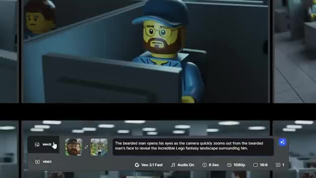
*Gros plan sur l'interface de génération d'images avec le champ de prompt textuel et les options de modèle.*

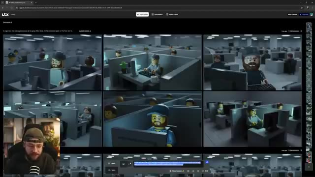
*Vue d'ensemble de l'interface LTX Studio montrant une grille de résultats générés et le créateur incrusté en bas à gauche.*

---

### ⏱️ `[00:07:34 - 00:08:07]` | Segment #15

**🔊 Audio (Transcription Intégrale Mot pour Mot en Français) :**
> J'essaie d'obtenir un personnage qui me ressemble le plus possible. Et je pense que toutes les générations sont superbes à leur manière. Mais celle-ci tout en haut à droite, elle s'est vraiment démarquée pour moi parce que j'ai trouvé qu'elle était déjà assez proche de ce que je cherchais. Maintenant, disons que comme moi, vous êtes plutôt satisfait de cette base de départ mais que vous souhaitez affiner certains détails un peu plus. Si nous cliquons sur ce petit onglet ici qui s'appelle iterate, vous pouvez voir que cela devient maintenant l'image que nous utilisons avec Nano Banana pour apporter des modifications et maintenant nous

**👁️ Analyse Visuelle d'Écran (gemini-3.5-flash-lite) :**
**Interface & Outils** : Interface web du logiciel LTX Studio (app.ltx.studio) affichant une grille de prévisualisation de scènes générées par IA avec des personnages de type LEGO dans un open space.

**Contenu textuel & Code** : URL de l'application LTX, onglets "Gen Video", "Storyboard", "Video Editor", nom de session "Session 1", et options d'édition sur les aperçus incluant "Upscale", "Create video" et "Iterate".

**Action / Démonstration** : Le curseur de la souris survole l'interface de LTX pour montrer les différentes options de génération et de sélection d'images, tandis que Jack commente et montre la zone à cliquer.

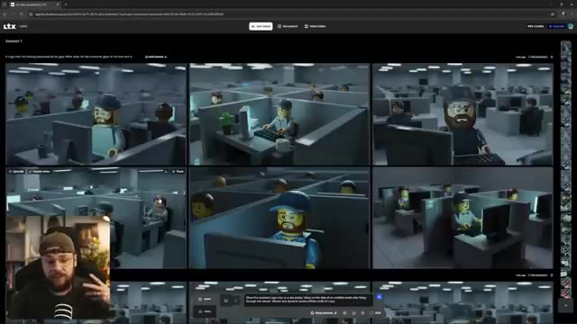
*Interface du logiciel LTX montrant une grille de plusieurs générations d'images de personnages LEGO dans un bureau, avec le flux vidéo de Jack incrusté en bas à gauche.*

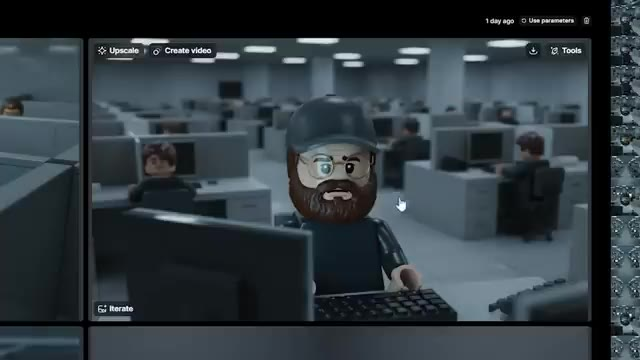
*Gros plan sur l'une des images générées représentant un personnage LEGO barbu portant une casquette et des lunettes dans un bureau gris, avec les options "Upscale", "Create video" et "Iterate" visibles.*

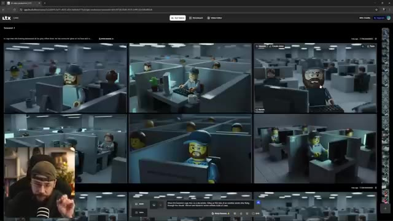
*Retour sur la vue globale de l'interface LTX avec la grille de générations d'images et le flux incrusté de Jack en bas à gauche.*

---

### ⏱️ `[00:08:07 - 00:08:37]` | Segment #16

**🔊 Audio (Transcription Intégrale Mot pour Mot en Français) :**
> entrer dans une sorte de période de raffinement. Donc si je fais un peu défiler vers le bas, vous pouvez voir que j'ai juste donné à Nano Bonada le prompt simple : "tourne la casquette de baseball pour qu'elle soit à l'envers". Parce que comme vous pouvez le voir, je porte presque toujours ma casquette de baseball à l'envers et nous essayons de faire ressembler ce personnage à moi. Alors rappelez-vous, ce serait très facile si nous créions simplement un personnage Lego à partir de rien, mais comme nous essayons de faire ressembler ce gars à moi, nous poussons ces outils dans leurs retranchements. Vous avez donc un aperçu honnête de leurs avantages et de leurs inconvénients ainsi que de tout le processus.

**👁️ Analyse Visuelle d'Écran (gemini-3.5-flash-lite) :**
**Interface & Outils** : Navigateur web affichant l'interface du logiciel LTX (ltx.studio) avec une grille de prévisualisation de scènes générées par IA et une incrustation vidéo (PiP) du créateur.

**Contenu textuel & Code** : Texte du prompt visible : "Turn the baseball cap around so it's facing backwards." avec l'icône de Nano Banana.

**Action / Démonstration** : Le créateur fait défiler l'écran de son navigateur pour montrer les différentes générations et modifications appliquées au personnage Lego via l'outil de l'application.

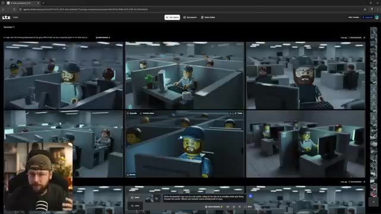
*Interface du logiciel LTX montrant une grille de rendus de personnages Lego dans un bureau avec le présentateur en incrustation vidéo (PiP) dans le coin inférieur gauche.*

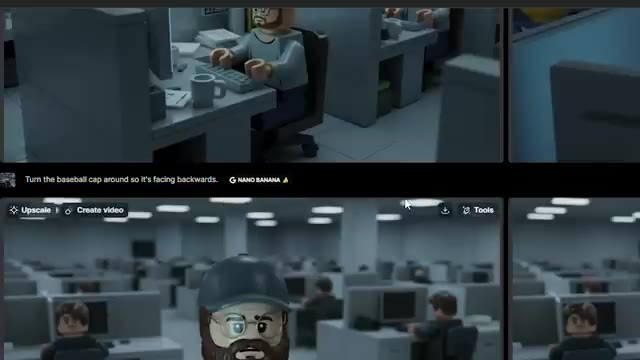
*Gros plan sur l'interface du logiciel LTX affichant le prompt textuel de modification du personnage Lego.*

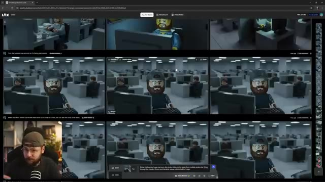
*Vue large de l'interface LTX présentant plusieurs variantes de générations de personnages dans un espace de bureau open space.*

---

### ⏱️ `[00:08:37 - 00:09:00]` | Segment #17

**🔊 Audio (Transcription Intégrale Mot pour Mot en Français) :**
> Et vous pouvez voir que la première génération de Nanobanana n'a pas fonctionné. La deuxième a fonctionné. La troisième n'a pas fonctionné. Et donc maintenant ce que j'aurais fait, c'est sélectionner cette image où la casquette de baseball était tournée vers l'arrière comme je l'avais demandé. Et encore une fois, cliquer sur itérer car maintenant nous ajustons cela. Et ce que j'ai remarqué si l'on ouvre simplement cette image, c'est l'employé de bureau par-dessus mon épaule gauche.

**👁️ Analyse Visuelle d'Écran (gemini-3.5-flash-lite) :**
**Interface & Outils** : Interface web de LTX Studio avec panneau de grille de générations et mini-fenêtre PiP du créateur.

**Contenu textuel & Code** : Interface utilisateur affichant divers rendus de style Lego avec des invites textuelles et des options de modification (itérer).

**Action / Démonstration** : Le créateur montre la grille de génération d'images, sélectionne une image spécifique et clique pour l'ouvrir afin de l'inspecter.

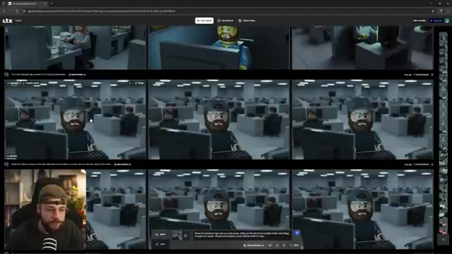
*Interface de l'outil LTX Studio montrant une grille d'images générées de style Lego avec une incrustation vidéo PiP du créateur en bas à gauche.*

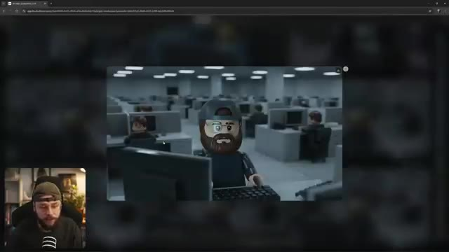
*L'interface de LTX Studio affichant une image agrandie d'un personnage Lego dans un bureau avec le créateur visible en incrustation vidéo PiP en bas à gauche.*

---

### ⏱️ `[00:09:00 - 00:09:37]` | Segment #18

**🔊 Audio (Transcription Intégrale Mot pour Mot en Français) :**
> Il se retourne et nous fait face. Et ça a l'air juste un peu bizarre, flippant et distrayant. Et le prompt textuel que j'ai donné à Nano Banana était : faire travailler le bureau sur le côté gauche pour que sa tête soit tournée. On peut voir l'arrière de sa tête. Maintenant, vous pouvez voir que le résultat que j'ai obtenu était plutôt bon de la part de Nano Banana cette fois-ci, mais il y a quelques problèmes et c'est là qu'il faut rester assez vigilant si l'on veut assurer la cohérence. Donc avec cette première génération ici, le type sur le côté droit, sa tête a disparu pour une raison quelconque, et cette génération tout au bout, notre gars ici a complètement disparu, mais la deuxième génération a fait exactement ce qu'on lui a demandé.

**👁️ Analyse Visuelle d'Écran (gemini-3.5-flash-lite) :**
**Interface & Outils** : Interface de l'application web LTX Studio (app.studio.ltx.studio) avec grille de clips vidéo générés et fenêtre PiP du présentateur.

**Contenu textuel & Code** : Interface LTX affichant des grilles de vidéos générées avec des prompts textuels visibles, tels que "make the office work on the left hand side so his head is turned. We can see the back of his head" et "Nano Banana".

**Action / Démonstration** : Le créateur montre sa plateforme de génération vidéo et analyse visuellement les différentes générations de clips pour pointer des défauts de cohérence (disparition de têtes de personnages).

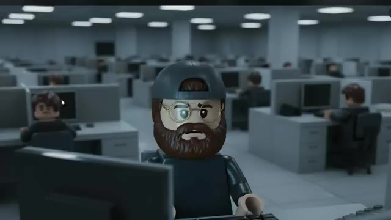
*Rendu visuel en gros plan d'un personnage de type Lego dans un bureau, montrant le personnage tourné vers la caméra.*

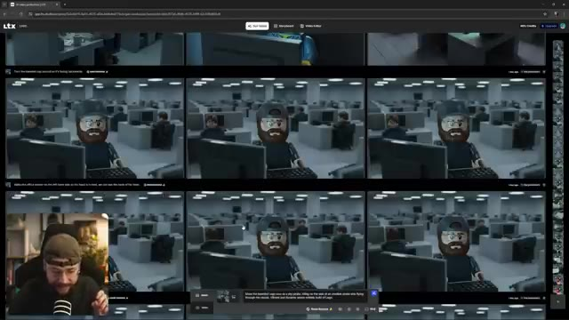
*Interface du studio web LTX montrant une grille de plusieurs générations de vidéos avec un encadré PiP du créateur en bas à gauche.*

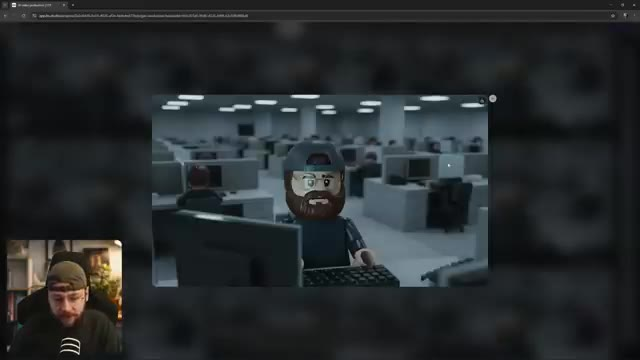
*Visualisation agrandie d'une des vidéos générées dans l'interface de LTX avec le créateur en encadré PiP.*

---

### ⏱️ `[00:09:37 - 00:10:11]` | Segment #19

**🔊 Audio (Transcription Intégrale Mot pour Mot en Français) :**
> Donc une fois de plus, nous allons répéter cela et maintenant un autre prompt textuel : donne au bonhomme Lego barbu de grandes lunettes rectangulaires dorées et arrondies, car mes lunettes ne ressemblent pas vraiment à ça, n'est-ce pas ? Ça fait plutôt un style Harry Potter, je dirais. Et encore une fois, vous pouvez voir que la deuxième et la troisième génération n'ont pas vraiment fait grand-chose, elles ont juste grossi un peu ici, mais pour la première génération, j'vraiment aimé ce résultat. Et quelque chose que je veux dire à propos de Nano Banana, c'est qu'on obtient un bon niveau de détail textuel. Donc maintenant, bien sûr, nous répétons cette image ici et nous disons donne à l'homme

**👁️ Analyse Visuelle d'Écran (gemini-3.5-flash-lite) :**
**Interface & Outils** : Navigateur web affichant l'interface de LTX Studio (ltx.studio) avec une vue de grille de générations d'images/vidéos et un encadré vidéo (Picture-in-Picture) du présentateur en bas à gauche.

**Contenu textuel & Code** : On peut apercevoir des prompts textuels dans l'interface de LTX Studio, notamment des instructions pour modifier le bonhomme Lego (« give the bearded lego man large golden rounded rectangular glasses... » et « Show the bearded Lego man as a sky pirate... »). L'interface indique également « 48% Credits » en haut à droite.

**Action / Démonstration** : Le créateur navigue à travers l'interface de LTX Studio, montrant différentes générations et itérations d'une scène de bureau avec un bonhomme Lego barbu, en commentant les résultats successifs.

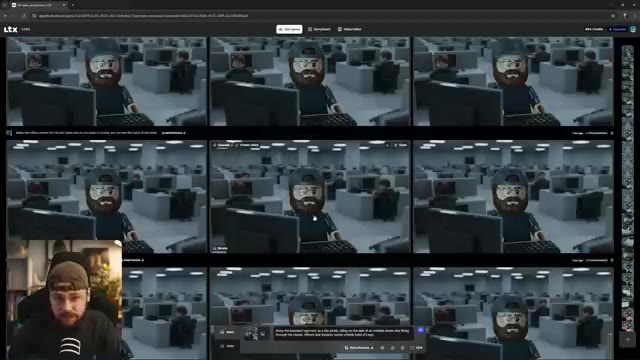
*Interface de LTX Studio affichant une grille de générations d'images avec le personnage Lego au bureau et une incrustation vidéo du créateur en bas à gauche.*

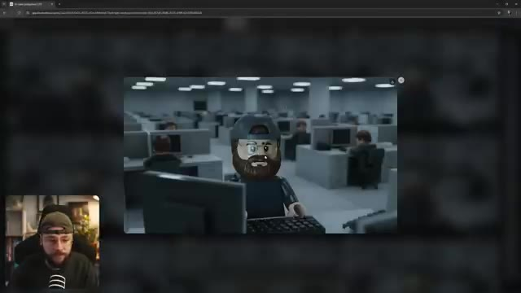
*Gros plan dans LTX Studio sur le rendu central du personnage Lego barbu devant son bureau d'ordinateur dans l'open space.*

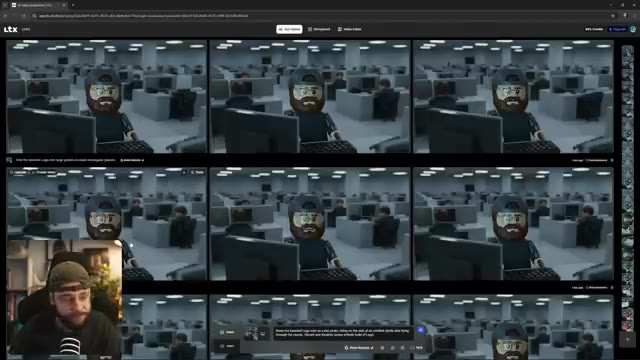
*Retour à la vue d'ensemble de la grille de générations dans LTX Studio montrant les différentes itérations du personnage Lego avec les invites textuelles visibles.*

---

### ⏱️ `[00:10:11 - 00:10:45]` | Segment #20

**🔊 Audio (Transcription Intégrale Mot pour Mot en Français) :**
> une chemise blanche à manches courtes et c'est parce que je ne voulais pas être habillé de la même façon que tous les autres travailleurs du bureau. Je voulais quelque chose qui me sépare d'eux et vous pouvez voir que les deux premières générations sont assez similaires mais la dernière ici, il vous manque ce genre d'encolure qui a été ajoutée. Je crois donc que j'aurais itéré sur celle du milieu ici. Je ne peux pas vraiment dire s'il y a des différences entre celles-ci. Mais ce que j'ai fait ensuite, c'est que j'ai mis à l'échelle (upscaled) l'image en cliquant sur cet onglet. Vous pouvez voir ici que le résultat a été mis à l'échelle. Et si j'ouvre cela,

**👁️ Analyse Visuelle d'Écran (gemini-3.5-flash-lite) :**
**Interface & Outils** : LTX Studio (application web de production vidéo par IA) avec une interface de génération par grille d'images, onglets 'Gen Space', 'Storyboard', 'Video Editor', et encadré PiP du créateur.

**Contenu textuel & Code** : Texte du prompt visible : 'Give the man a white short sleeved t-shirt.', options 'Upscale', 'Create video', et bas de page avec des invites de texte additionnelles.

**Action / Démonstration** : Le créateur navigue à travers différentes générations d'images de personnages Lego pour comparer les détails vestimentaires (encolure de la chemise) avant de procéder à l'upscaling.

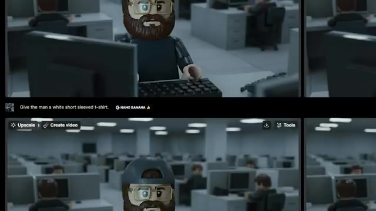
*Interface de LTX Studio affichant des grilles de générations d'images avec le prompt 'Give the man a white short sleeved t-shirt' et les options 'Upscale' et 'Create video'.*

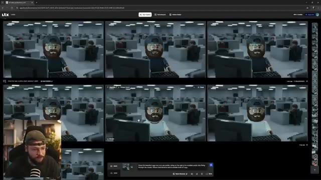
*Vue de l'interface LTX Studio montrant plusieurs variations de personnages Lego dans un bureau, avec un encadré PiP du créateur en bas à gauche.*

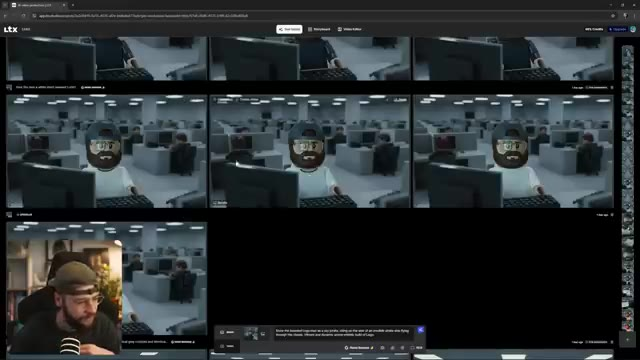
*Navigation dans l'interface de LTX Studio analysant les différentes générations de personnages pour comparer les encolures de chemise.*

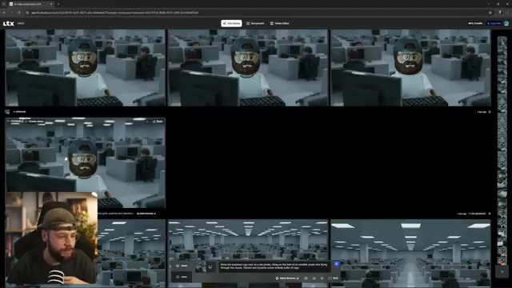
*Démonstration de l'interface de LTX Studio mettant en valeur les options de génération et l'agrandissement d'image avec le créateur en incrustation PiP.*

---

### ⏱️ `[00:10:45 - 00:11:21]` | Segment #21

**🔊 Audio (Transcription Intégrale Mot pour Mot en Français) :**
> vous pouvez voir que ça a vraiment l'air super. Très net, mais tout en conservant ces détails de texture que nous recherchons. Maintenant, avez-vous besoin d'agrandir (upscaler) absolument chacune des images que vous aimez de Nano Banana ? De préférence oui, mais est-ce essentiel ? Et si vous voulez économiser vos crédits, peut-être pas. Je pense en fait que cela dépend du plan individuel lui-même. Alors maintenant avec ceci, nous avons établi notre image principale. Comme je le dis, tout va se ramifier à partir de ce point parce que nous sommes satisfaits de tous les éléments de cette image. J'ai fait référence à cela un peu plus tôt comme une bible visuelle. Donc

**👁️ Analyse Visuelle d'Écran (gemini-3.5-flash-lite) :**
**Interface & Outils** : Interface de la plateforme LTX (app.ltx.studio) affichant des grilles de génération d'images, des onglets "Our Space", "Storyboard", "Video Editor", et un retour vidéo PiP de l'animateur en bas à gauche.

**Contenu textuel & Code** : Interface web LTX Studio avec des vignettes d'images générées de personnages Lego dans un bureau, barre de prompt en bas contenant du texte descriptif sur les briques Lego et Nano Banana.

**Action / Démonstration** : Le créateur navigue et zoome sur l'interface de LTX Studio pour présenter et comparer l'image principale validée ("master image") par rapport aux différentes variations générées.

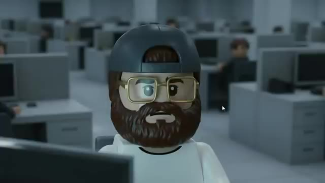
*Gros plan sur une image générée représentant un personnage en briques de style Lego dans un bureau avec des ordinateurs.*

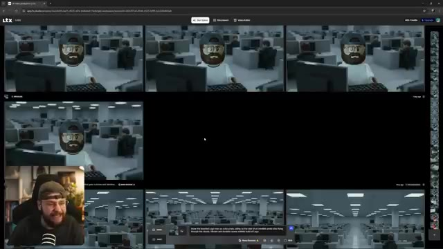
*Interface de la plateforme de production vidéo LTX montrant une grille de plusieurs variations d'images générées avec une vue PiP (Picture-in-Picture) du créateur en bas à gauche.*

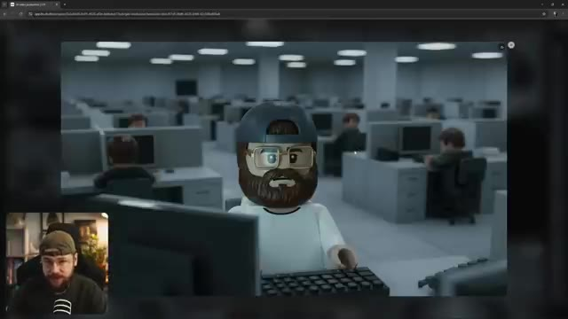
*Gros plan en plein écran sur l'image principale validée (master image) du personnage Lego au bureau, avec le retour caméra du créateur dans un encadré PiP en bas à gauche.*

---

### ⏱️ `[00:11:21 - 00:11:58]` | Segment #22

**🔊 Audio (Transcription Intégrale Mot pour Mot en Français) :**
> maintenant nous pouvons itérer à partir de notre image principale et nous pouvons commencer à alimenter Nano Banana avec des prompts textuels pour donner vie à notre vision. Et par là, je veux dire que nous commençons à donner à Nano Banana des prompts comme celui-ci. Plan d'ensemble large. Un vaste bureau Lego symétrique rempli de cubicules gris identiques et de travailleurs Lego identiques tapant sur des ordinateurs. Maintenant, je ne vais pas passer en revue et lire chaque prompt en détail parce que nous serons là pendant longtemps, mais je les mettrai en bas dans la description si vous êtes intéressés à les découvrir. Juste pour réitérer à la fin de presque tous ceux-ci

**👁️ Analyse Visuelle d'Écran (gemini-3.5-flash-lite) :**
**Interface & Outils** : LTX Studio (application web accessible via navigateur, URL app.ltx.studio visible dans la barre d'adresse) avec un mode tableau/grille de projets vidéo. Un encadré PiP (Picture-in-Picture) du créateur (Jack) est visible en bas à gauche de l'écran.

**Contenu textuel & Code** : Grille de vignettes vidéo montrant des rendus de style Lego (bureau de type open space avec des cubicules et des personnages Lego), une barre de navigation supérieure avec les onglets "Shot Creator", "Storyboard", "Video Editor", et un panneau de prompt textuel en bas avec le texte "WIDE ESTABLISHING SHOT: A vast symmetrical Lego office filled with identical gray cubicles and identical...".

**Action / Démonstration** : Le créateur présente l'interface de LTX Studio où l'on voit le flux de travail d'itération et les prompts textuels utilisés pour générer les différentes prises du projet Lego.

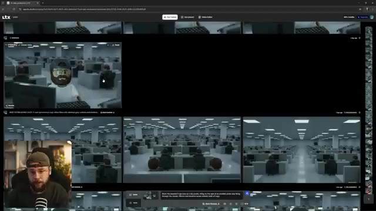
*Interface de LTX Studio affichant une grille de prévisualisation de vidéos générées avec un encadré PiP du créateur en bas à gauche.*

---

### ⏱️ `[00:11:58 - 00:12:35]` | Segment #23

**🔊 Audio (Transcription Intégrale Mot pour Mot en Français) :**
> text prompts j'ai mis la même chose réalisme cinématique figurines Lego rendues en 3D et ensuite quelques informations sur l'objectif que j'ai utilisé pour ce plan particulier et vous pouvez voir que ça devient juste ce processus itératif où vous regardez tous les résultats que vous obtenez de Nano banana et vous choisissez votre favori ou vous relancez le même prompt jusqu'à ce que vous obtenez exactement ce que vous recherchez. Beaucoup de temps d'essais et d'erreurs sont impliqués et même en faisant défiler vers le bas je me suis rendu compte de ma propre erreur parce que j'ai réalisé que tous les écrans d'ordinateur étaient éteints donc nous avons dû retourner à l'image principale nous assurer que les écrans étaient allumés et ensuite faire de même pour notre plan large

**👁️ Analyse Visuelle d'Écran (gemini-3.5-flash-lite) :**
**Interface & Outils** : Navigateur web affichant LTX Studio (app.ltx.studio) avec une interface de génération vidéo et d'images par IA, incluant un retour vidéo PiP (Picture-in-Picture) du créateur.

**Contenu textuel & Code** : Texte du prompt visible : « WIDE ESTABLISHING SHOT: A vast symmetrical Lego office filled with identical grey cubicles and identical Lego workers typing on computers, sterile fluorescent lighting, muted colours, lifeless atmosphere, cinematic realism, 3D rendered Lego minifigures, wide-angle 35mm shot, static composition. DO NOT SHOW THE BEARDED MAN. » Badge visible : « NANO BANANA ».

**Action / Démonstration** : Le créateur démontre le processus itératif de génération d'images text-to-image et vidéo dans LTX Studio, en faisant défiler l'historique des prompts et des résultats pour identifier les erreurs (écrans d'ordinateurs éteints).

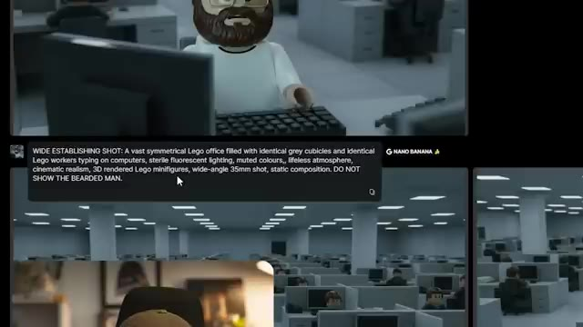
*Interface de LTX Studio affichant une grille de rendus de figurines Lego et une boîte de texte avec le prompt détaillé.*

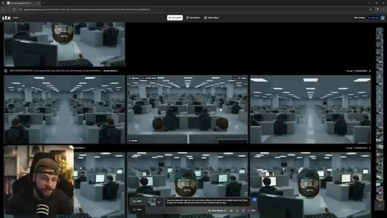
*Interface de LTX Studio montrant plusieurs variations d'images générées de bureaux avec des figurines Lego et le créateur incrusté en bas à gauche.*

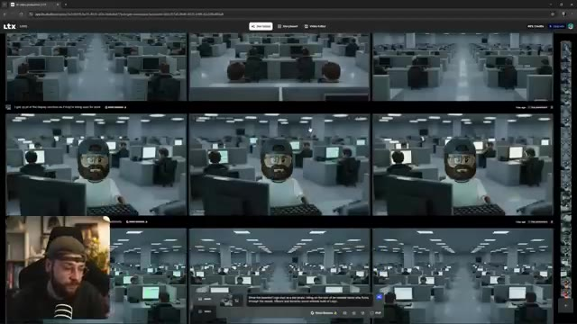
*Vue de l'interface de LTX Studio pendant le défilement de la grille d'images générées par IA.*

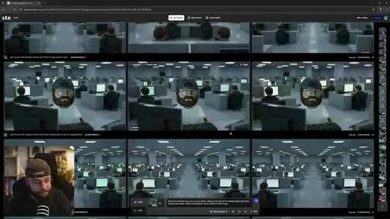
*Poursuite du défilement dans LTX Studio montrant les différents essais de génération de scènes de bureau Lego.*

---

### ⏱️ `[00:12:35 - 00:13:12]` | Segment #24

**🔊 Audio (Transcription Intégrale Mot pour Mot en Français) :**
> plan d'ensemble également et au fur et à mesure que nous continuons à faire défiler vers le bas, vous verrez de plus en plus de plans générés, quelques vidéos ici aussi, mais nous y reviendrons un tout petit peu plus tard, mais vous pouvez voir que je suis juste en train de générer lentement de plus en plus de plans pour aider à raconter mon histoire et une grande partie de cela est basée sur les idées de plans que ChatGPT m'a données et alors que je continue simplement à faire défiler vers le bas, vous pouvez vraiment commencer à voir toute la scène prendre vie simplement en utilisant des images uniques, une autre fonctionnalité quand il s'agit de LTX si je retourne sur leur page d'accueil il y a un onglet ici qui dit nouveau storyboard et

**👁️ Analyse Visuelle d'Écran (gemini-3.5-flash-lite) :**
**Interface & Outils** : Application web LTX (Ltx-2, interface de génération de vidéo par IA) avec navigation latérale et affichage de projets en grille.

**Contenu textuel & Code** : Interface utilisateur de LTX, bannières "Ltx-2: Introducing the Complete AI Creative Engine", boutons de navigation (Our Space, Storyboard, Video Editor), vignettes de projets récents, barre de prompts et crédits (995 Credits).

**Action / Démonstration** : Le créateur fait défiler une grille de vidéos et d'images générées par IA sur l'interface de LTX, puis navigue vers la page d'accueil pour montrer l'onglet du nouveau storyboard.

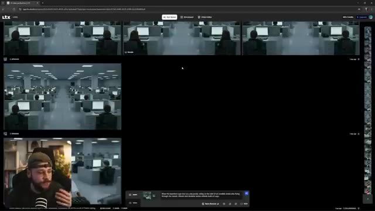
*Interface de LTX montrant la grille de plans générés dans un espace de travail, avec un encadré PiP du créateur en bas à gauche.*

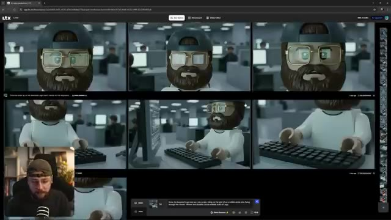
*Poursuite du défilement dans LTX montrant de nouveaux plans générés représentant un personnage en briques Lego au clavier.*

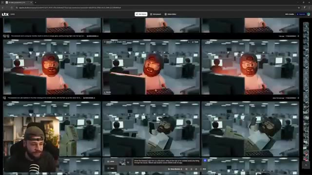
*Affichage de plans supplémentaires générés dans l'interface montrant le personnage interagissant avec son écran et son téléphone.*

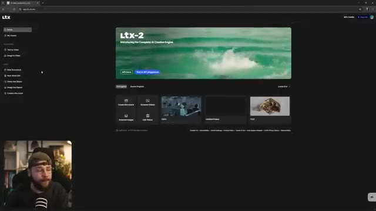
*Retour sur la page d'accueil de LTX (Ltx-2) montrant le tableau de bord avec les options de création de storyboard et d'outils vidéo.*

---

### ⏱️ `[00:13:12 - 00:13:35]` | Segment #25

**🔊 Audio (Transcription Intégrale Mot pour Mot en Français) :**
> si nous cliquons ici, nous pouvons créer soit un storyboard guidé par l'IA, soit un storyboard vide, et juste pour vous montrer à quel point il est facile de peupler cette zone, si nous allons de l'avant et cliquons sur "créer une image dans l'espace de génération", nous obtenons la possibilité de choisir parmi n'importe laquelle de nos générations pour peupler par exemple le plan un. Faisons donc défiler tout en bas jusqu'à notre plan principal.

**👁️ Analyse Visuelle d'Écran (gemini-3.5-flash-lite) :**
**Interface & Outils** : LTX Studio (application web de production vidéo par IA)

**Contenu textuel & Code** : Texte affiché : "How would you like to start?", "AI guided storyboard", "Start from scratch with a blank storyboard", "Scene 1", "Create Image in Gen Space", "@Maria walks through the sunlit meadow, surrounded by butterflies...". Grille d'images de type Lego en bas (style bureau open space avec personnages de type Lego).

**Action / Démonstration** : Le créateur montre comment démarrer un storyboard, clique pour ajouter une image via Gen Space et fait défiler la galerie d'images générées pour sélectionner le plan principal.

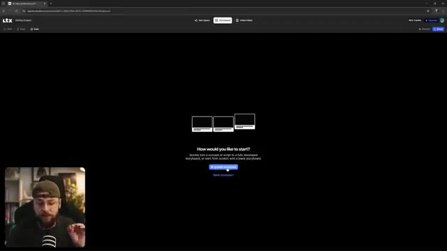
*LTX Studio affichant l'option de création d'un storyboard guidé par l'IA ou d'un storyboard vide, avec le présentateur en incrustation.*

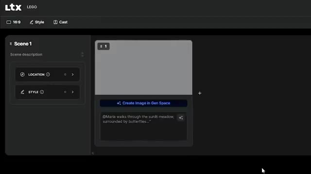
*Interface de LTX Studio montrant une scène avec l'option "Create Image in Gen Space".*

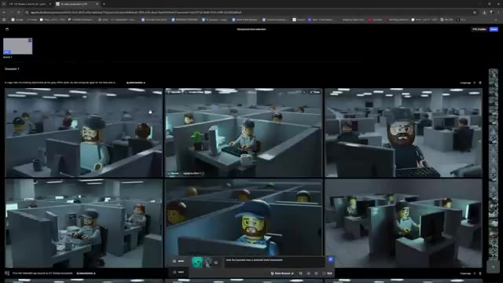
*Galerie de générations d'images de style Lego dans LTX Studio lors de la sélection des plans.*

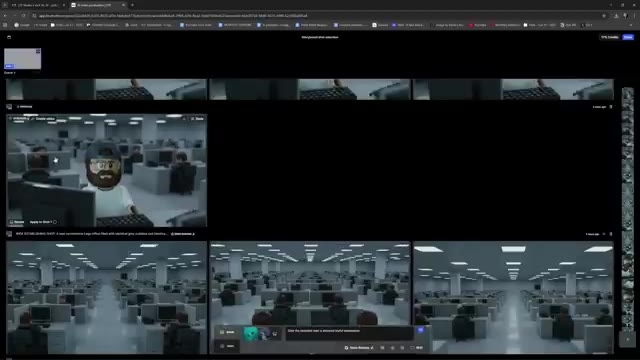
*Défilement vers le bas dans LTX Studio pour sélectionner le plan principal ("master shot").*

---

### ⏱️ `[00:13:35 - 00:14:07]` | Segment #26

**🔊 Audio (Transcription Intégrale Mot pour Mot en Français) :**
> Nous pouvons cliquer sur appliquer au plan un et cela remplit cette zone. Nous cliquons sur terminé et nous commençons à assembler notre storyboard. Et c'est en fait ce que j'ai créé dans cet espace. Et pour moi, c'est incroyablement utile d'avoir une sorte de storyboard. Ce que cela montre vraiment bien, c'est à quel point Nano Banana est doué à la fois pour créer ce genre de résultats visuellement attrayants mais aussi pour garder les choses bien cohérentes et vous pouvez vraiment commencer à voir les différences visuelles entre notre scène de bureau qui semble très grise et en quelque sorte

**👁️ Analyse Visuelle d'Écran (gemini-3.5-flash-lite) :**
**Interface & Outils** : Interface de LTX Studio (application web de production vidéo par IA).

**Contenu textuel & Code** : Menus de l'application LTX Studio, onglets "Edit Space", "Storyboard", "Video Editor", lignes de scènes ("Scene 1", "Scene 2", "Scene 3") contenant des vignettes de plans générés par IA, et retour vidéo en incrustation (PiP) du créateur.

**Action / Démonstration** : Le créateur montre l'interface de LTX Studio et la construction d'un storyboard avec différentes scènes et plans générés par IA.

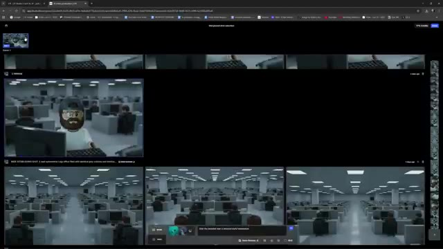
*Interface de LTX Studio affichant la grille de sélection des plans pour le storyboard.*

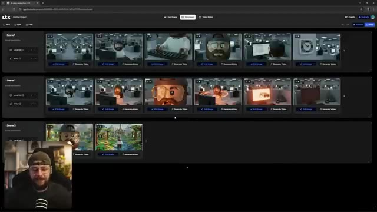
*Interface de LTX Studio montrant les différentes scènes et plans du storyboard, avec un encadré PiP du créateur en bas à gauche.*

---

### ⏱️ `[00:14:07 - 00:14:40]` | Segment #27

**🔊 Audio (Transcription Intégrale Mot pour Mot en Français) :**
> stérile, déprimante et ensuite notre séquence fantastique qui est vibrante et colorée et les plus observateurs d'entre vous auront également remarqué qu'en fait il nous manque certains de nos plans finaux pour ce genre de séquence de rêve en montage et c'est parce que je ne les ai pas encore réellement générés c'est ce que nous allons faire dans cette vidéo pour que vous puissiez voir comment les choses fonctionnent en direct. Donc de retour sur la page d'accueil de LTX, je veux ouvrir mon projet Lego, qui contient toutes mes générations d'images et de vidéos. Maintenant je veux retourner à mon image maîtresse mise à l'échelle (upscaled master image) et je vais cliquer sur l'onglet d'itération (iterate tab). Et dans le texte

**👁️ Analyse Visuelle d'Écran (gemini-3.5-flash-lite) :**
**Interface & Outils** : LTX Studio (application web de création vidéo par IA)

**Contenu textuel & Code** : Interface web de LTX Studio avec les onglets "Storyboard", "Video Editor", "Text to Video", "Image to Video", "All Projects", et le projet "LEGO" visible dans le tableau de bord.

**Action / Démonstration** : Le créateur navigue dans l'interface de LTX Studio, montrant le storyboard de son projet Lego et préparant la génération de nouveaux plans pour sa séquence.

*Interface de LTX Studio affichant le storyboard avec plusieurs scènes et images générées de type Lego, et le créateur visible en incrustation (PiP).*

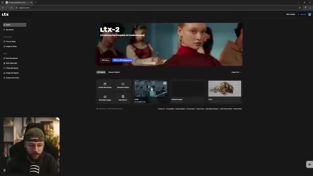
*Page d'accueil de LTX Studio montrant les projets récents dont le projet Lego, avec le créateur en incrustation.*

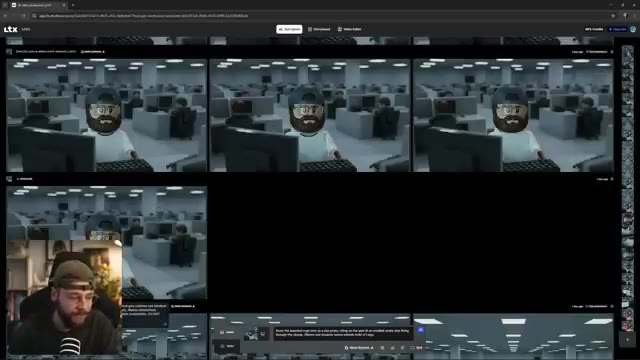
*Interface de LTX Studio montrant l'historique des générations d'images et de vidéos du projet Lego, avec le créateur en incrustation.*

---

### ⏱️ `[00:14:40 - 00:15:03]` | Segment #28

**🔊 Audio (Transcription Intégrale Mot pour Mot en Français) :**
> zone de prompt, je vais dire : montre l'homme Lego barbu en pirate du ciel, chevauchant le flanc d'un incroyable vaisseau pirate volant à travers les nuages, vibrant et dynamique, entièrement construit en Lego. Et allons-y, cliquons sur générer. Nous allons être poussés vers le bas de la page et nous pouvons voir ce que Nano Banana va créer pour nous en utilisant notre image maître comme référence.

**👁️ Analyse Visuelle d'Écran (gemini-3.5-flash-lite) :**
**Interface & Outils** : Interface de LTX Studio (navigateur web) avec panneau de prompt, vignettes de génération et encadré PiP (Picture-in-Picture) de la webcam du créateur.

**Contenu textuel & Code** : Texte du prompt saisi : "Show the bearded Lego man as a sky pirate, riding on the side of an incredible pirate ship flying through the clouds. Vibrant and dynamic scene entirely build of Lego." et l'indication du modèle "Nano Banana".

**Action / Démonstration** : Le créateur montre la saisie du prompt textuel, clique pour lancer la génération vidéo et observe l'apparition du résultat généré montrant un navire volant en Lego.

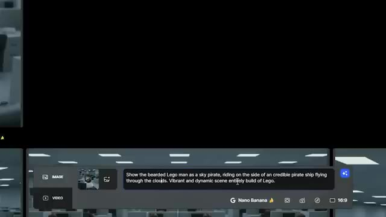
*Gros plan sur la zone de saisie du prompt avec le texte descriptif du personnage Lego pirate.*

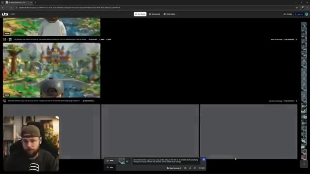
*Interface globale de la plateforme de génération vidéo IA (LTX Studio) avec la webcam du créateur incrustée en bas à gauche.*

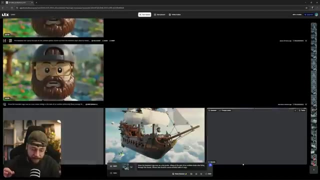
*Affichage du rendu vidéo en cours montrant un navire pirate volant en Lego, avec la webcam du créateur en bas à gauche.*

---

### ⏱️ `[00:15:04 - 00:15:27]` | Segment #29

**🔊 Audio (Transcription Intégrale Mot pour Mot en Français) :**
> Donc tout cela est vraiment cool et ils ont chacun leur propre style distinctif en fait. Vraiment, nous donnons à Nano Banana un peu plus de liberté créative maintenant plutôt que d'essayer de garder la scène cohérente. Tout ce qui l'inquiète vraiment, c'est de garder le personnage cohérent. Personnellement, j'adore vraiment cette génération du milieu ici. Voyons juste quel genre de résultat nous obtenons si nous ne l'améliorons pas.

**👁️ Analyse Visuelle d'Écran (gemini-3.5-flash-lite) :**
**Interface & Outils** : Interface web de LTX Studio affichant des grilles de vidéos générées avec le modèle Nano Banana et un encadré PiP (Picture-in-Picture) du créateur en bas à gauche.

**Contenu textuel & Code** : Texte du prompt visible en bas de l'écran : "Show the beautiful Lego man as a tiny pirate, riding on the side of an obsidian pirate ship, flying through the clouds. Vibrant and dynamic, scene entirely made of Lego."

**Action / Démonstration** : Le créateur navigue et zoome sur les différentes générations de vidéos de bateaux volants Lego dans l'interface de LTX Studio pour comparer les styles.

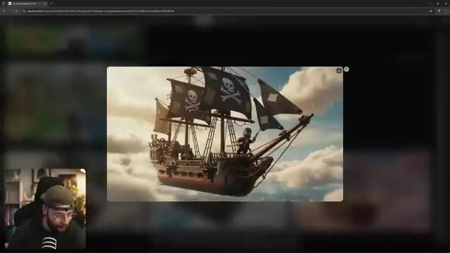
*Aperçu en grand format d'une des vidéos générées montrant un navire de pirate naviguant dans les nuages.*

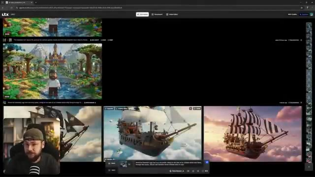
*Interface de la plateforme LTX Studio affichant plusieurs générations de vidéos de style Lego avec des personnages et des décors fantastiques.*

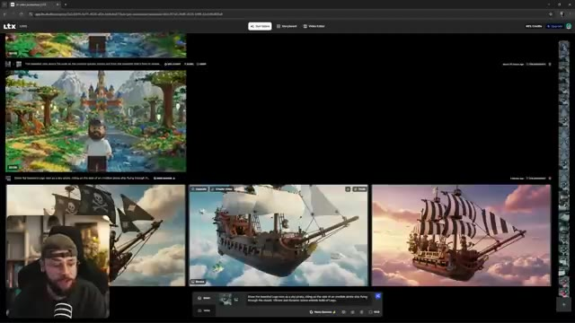
*Vue globale de l'interface LTX Studio montrant la grille de projets et les options de prompts pour le modèle Nano Banana.*

---

### ⏱️ `[00:15:27 - 00:16:00]` | Segment #30

**🔊 Audio (Transcription Intégrale Mot pour Mot en Français) :**
> Vous pouvez voir qu'il y a un onglet ici qui s'appelle créer une vidéo. Si nous cliquons dessus, cela va remplir cette zone en bas. Et avec le modèle vidéo VO 3.1 sélectionné, nous pouvons réellement saisir une image de début et de fin pour notre séquence. C'est très utile si vous voulez créer une sorte de transition passant d'un plan à l'autre. Laissez-moi juste bouger par ici une seconde. C'est en fait ce que j'ai fait pour ces générations. Donc ce que j'aurais fait là, c'est utiliser ce gros plan comme image de départ, puis ce plan large d'ensemble comme image finale, et ensuite VO 3.1 va créer un

**👁️ Analyse Visuelle d'Écran (gemini-3.5-flash-lite) :**
**Interface & Outils** : Interface web de LTX Studio (app.ltx.studio) avec un design sombre, incluant des onglets (Create Video, Storyboard, Video Editor), un panneau inférieur de paramètres de génération vidéo et un aperçu en incrustation (PiP) du créateur.

**Contenu textuel & Code** : Texte du prompt visible dans l'interface : "The bearded man opens his eyes as the camera quickly zooms out from the bearded man's face to reveal the incredible Lego fantasy landscape surrounding him." Paramètres visibles : "Veo 3.1 Fast", "Audio On", "6 Sec", "1080p", "16:9".

**Action / Démonstration** : Le créateur navigue dans l'interface de LTX Studio, survole différentes sections et montre des exemples de générations de vidéos basées sur des transitions entre des plans serrés et larges avec le modèle Veo 3.1.

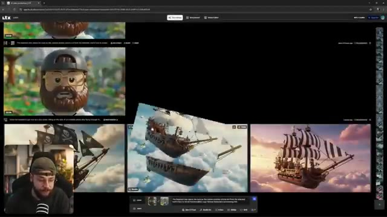
*Interface principale de LTX Studio affichant les différentes générations de vidéos de style Lego avec la webcam du créateur en incrustation.*

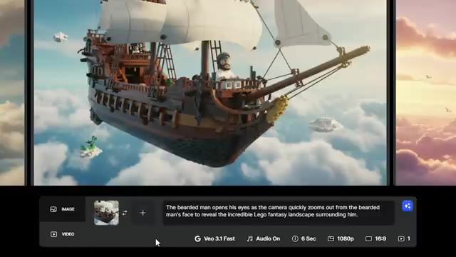
*Gros plan sur le panneau de configuration de LTX Studio avec le sélecteur de modèle Veo 3.1 Fast et la zone de prompt textuel.*

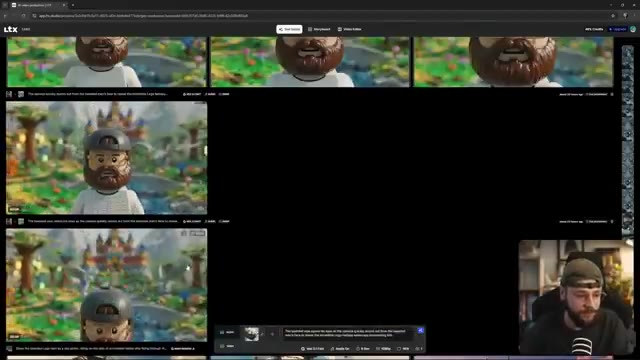
*Vue de l'interface de LTX Studio montrant les vignettes de prévisualisation des vidéos générées.*

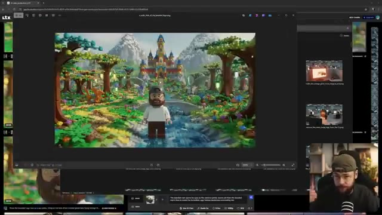
*Affichage en plein écran d'un rendu vidéo de paysage fantastique en Lego avec le personnage principal au premier plan.*

---

### ⏱️ `[00:16:00 - 00:16:35]` | Segment #31

**🔊 Audio (Transcription Intégrale Mot pour Mot en Français) :**
> transition entre eux avec mon invite textuelle comme sorte de direction créative. Mais dans ce cas, nous voulons vraiment seulement une image de départ et je vais aller de l'avant et simplement vider cette zone d'invite textuelle et je vais juste opter pour une invite vraiment simple ici. Le bateau pirate s'envole à travers les nuages, scène dramatique et cinématographique. Je vais laisser l'audio activé. Nous allons générer pendant six secondes ici, je pense. En fait, allons-y pour quatre. Je pense que comme ce sont des vignettes, nous n'avons besoin que d'une génération très brève, donc nous en obtiendrons plus de nos crédits de cette façon. Nous pouvons sélectionner la résolution vidéo, donc nous pouvons choisir entre 720p ou 1080. Allons pour la plus élevée disponible

**👁️ Analyse Visuelle d'Écran (gemini-3.5-flash-lite) :**
**Interface & Outils** : LTX Studio (application web de création vidéo par IA)

**Contenu textuel & Code** : Texte du prompt : "The pirate ship soars through the clouds, dramatic and cinematic scene." Paramètres visibles : Veo 3.1 Fast, Audio On, 4 Sec (puis 6 Sec), 1080p, format 16:9. Menu déroulant de résolution vidéo avec les options 1080p et 720p.

**Action / Démonstration** : Le créateur navigue dans l'interface de LTX Studio, modifie le prompt textuel pour décrire un bateau pirate volant, ajuste la durée de génération à quatre secondes et ouvre le menu de sélection de la résolution pour choisir 1080p.

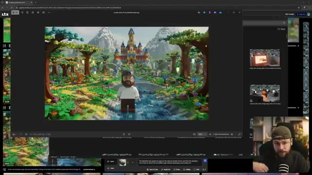
*Interface du logiciel LTX Studio affichant un projet vidéo en cours avec un aperçu montrant un personnage de style Lego dans un paysage fantastique.*

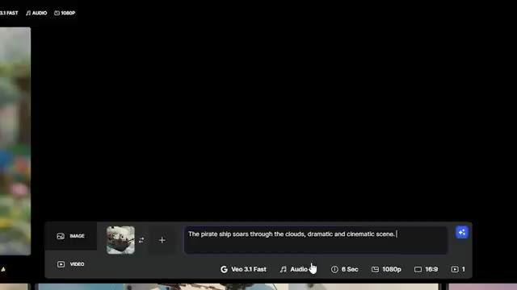
*Gros plan sur la barre de prompt de LTX Studio avec le texte descriptif d'un bateau pirate volant dans les nuages et les paramètres de génération vidéo.*

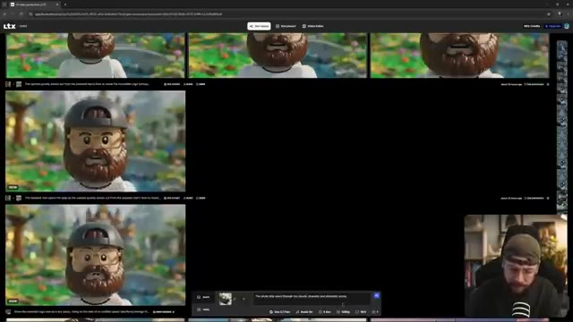
*Vue d'ensemble de l'interface LTX Studio montrant une grille de générations précédentes avec des personnages Lego et la barre de prompt active en bas.*

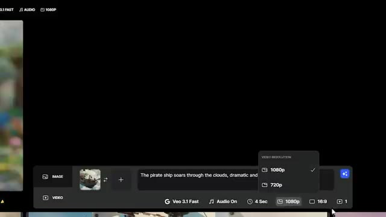
*Déroulement du menu de sélection de la résolution vidéo dans LTX Studio montrant les options 1080p et 720p.*

---

### ⏱️ `[00:16:35 - 00:16:57]` | Segment #32

**🔊 Audio (Transcription Intégrale Mot pour Mot en Français) :**
> option, et nous pouvons également sélectionner notre format d'image de sortie. Je vais bien sûr opter pour le 16 par 9, car nous faisons une publicité. Nous ne visons pas quelque chose qui serait diffusé sur les réseaux sociaux. Si c'était le cas, vous pourriez générer en utilisant l'option de format 9 par 16. Et nous pouvons même choisir le nombre de variations que nous allons obtenir. Alors allons-y et générons deux vidéos Veo 3.1.

**👁️ Analyse Visuelle d'Écran (gemini-3.5-flash-lite) :**
**Interface & Outils** : Interface web de génération vidéo par IA (probablement Luma Dream Machine ou similaire) avec une barre d'outils inférieure affichant les paramètres (Veo 3.1 Fast, Audio On, 4 Sec, 1080p, format 16:9, nombre de variations 1).

**Contenu textuel & Code** : Texte du prompt visible : "The pirate ship soars through the clouds, dramatic and cine...". Menu contextuel "ASPECT RATIO" avec les options 16:9 (coché), 1:1 et 9:16.

**Action / Démonstration** : Le curseur de la souris survole et sélectionne les options de format d'image (aspect ratio) pour configurer la génération de la vidéo.

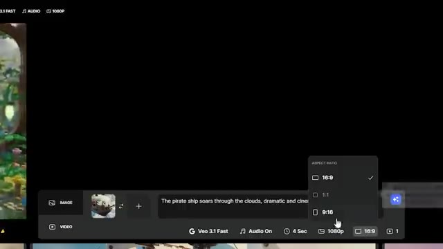
*Interface de génération vidéo montrant le menu déroulant du choix du format d'image (aspect ratio) avec les options 16:9, 1:1 et 9:16.*

---

### ⏱️ `[00:16:57 - 00:17:34]` | Segment #33

**🔊 Audio (Transcription Intégrale Mot pour Mot en Français) :**
> En cliquant sur générer, nous pouvons attendre de voir quels résultats nous obtenons en utilisant cette image ici comme image de départ. Ce que nous pouvons faire pendant que nous attendons, c'est que je veux retourner à mon image principale. La voici. Créons d'autres scènes pour notre montage. Donc encore une fois, je survole mon image principale, je vais cliquer sur l'onglet d'itération et vous pouvez voir ici que j'ai une série de résultats que ChatGPT m'a donnés lorsque j'essayais de chercher mes idées initiales pour cette séquence, donc je vais juste prendre ceci et le copier-coller directement dans le champ de texte ici sur LTX, nous allons générer quelques options là-dedans, je vais bien sûr

**👁️ Analyse Visuelle d'Écran (gemini-3.5-flash-lite) :**
**Interface & Outils** : LTX Studio (application web de génération vidéo par IA) et interface de notes personnelles / ChatGPT.

**Contenu textuel & Code** : Prompts textuels visibles dans les notes : "The bearded man is flying a bright red and blue biplane...", "The bearded man is swimming underwater through glowing translucent coral...", "The bearded man as a lego knight crossing a bright green battlefield...". Paramètres LTX visibles : résolution 1080p, rapport d'aspect 16:9, options audio.

**Action / Démonstration** : Le créateur navigue dans l'interface de LTX Studio, survole des images sources, consulte un document contenant des idées de prompts textuels générés par ChatGPT et prépare une nouvelle itération de génération vidéo.

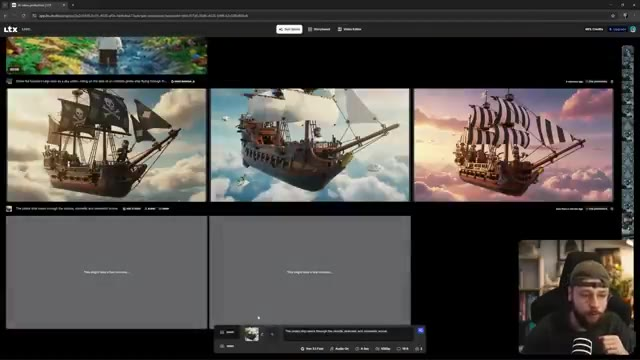
*Interface de LTX Studio affichant plusieurs variantes de génération vidéo d'un navire pirate naviguant dans le ciel avec des briques Lego.*

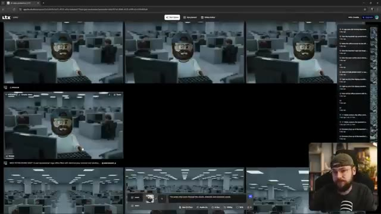
*Interface de LTX Studio affichant une grille de rendus de scènes de bureau avec des personnages Lego d'employés.*

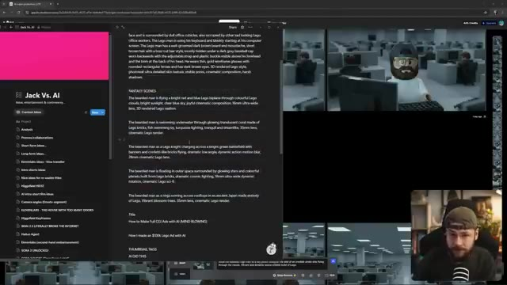
*Navigation dans un document de notes textuelles contenant des prompts descriptifs pour des scènes fantastiques et de science-fiction en Lego.*

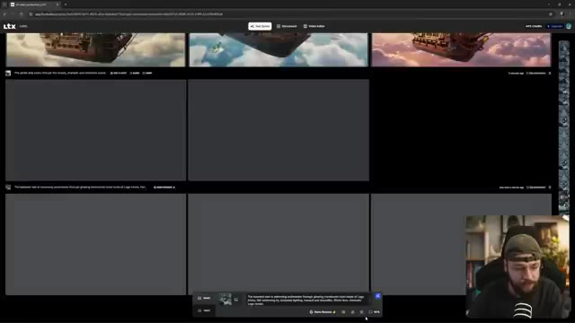
*L'interface de LTX Studio montrant le processus de génération de nouvelles séquences vidéo avec le panneau de prompt actif en bas.*

---

### ⏱️ `[00:17:34 - 00:18:09]` | Segment #34

**🔊 Audio (Transcription Intégrale Mot pour Mot en Français) :**
> balancez le texte du prompt si vous êtes intéressés par savoir exactement ce que j'ai utilisé et en fait pendant qu'on attend cette génération vous pouvez voir qu'on a déjà reçu nos sorties VO 3.1 et dans le temps qu'il m'a fallu pour mettre mon casque on a aussi reçu de superbes générations de Nano Banana également. Très cool, j'adore la musique qui a été ajoutée ici et tout a du sens en termes de physique et on a atteint un bon niveau de cohérence des personnages ce qui était vraiment notre objectif clé ici. Gardez à l'esprit aussi que si peut-être vous ne

**👁️ Analyse Visuelle d'Écran (gemini-3.5-flash-lite) :**
**Interface & Outils** : Interface web de LTX Studio (app.ltx.studio) avec une disposition en grille de projets/générations vidéo et une fenêtre de prévisualisation en plein écran.

**Contenu textuel & Code** : Sur l'image 1, on aperçoit le texte du prompt en bas : « The bearded man is pirating underwater through glowing translucent road made of Lego bricks, fish swimming by... » ainsi que des métadonnées de crédits.

**Action / Démonstration** : Le créateur montre les résultats de génération vidéo qui viennent de s'afficher dans l'interface et lance la lecture de la vidéo générée en plein écran.

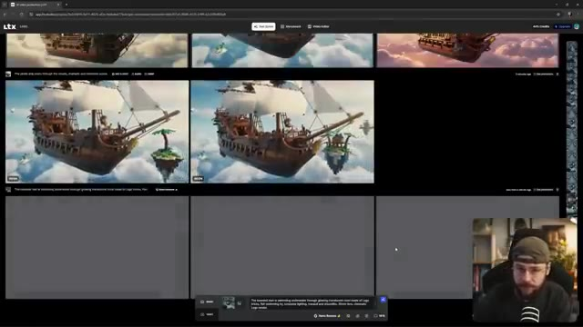
*Interface du studio LTX montrant la grille de résultats de génération vidéo avec un aperçu de bateau volant et la webcam du créateur en incrustation.*

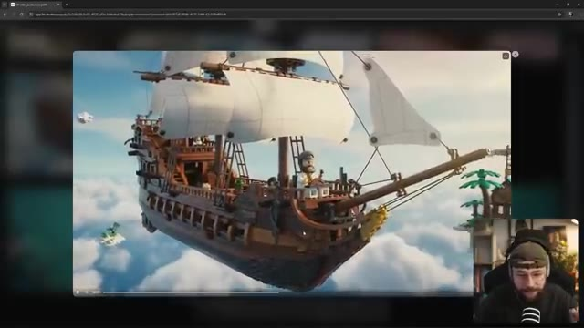
*Aperçu en grand format de la vidéo générée montrant un bateau pirate de type Lego naviguant dans les nuages avec le personnage du créateur.*

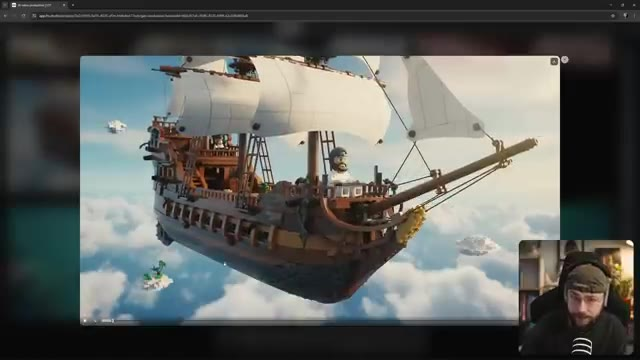
*Lecture continue de la vidéo générée du bateau pirate volant dans les nuages avec le personnage du créateur visible à bord.*

---

### ⏱️ `[00:18:09 - 00:18:42]` | Segment #35

**🔊 Audio (Transcription Intégrale Mot pour Mot en Français) :**
> voulez de la musique ou des dialogues en retour, il suffit de le spécifier dans votre prompt textuel et vous pouvez voir que nous avons également récupéré nos générations de nano bananes derrière moi en train de nager et ces deux-là ici, la casquette est mise dans le mauvais sens de façon ennuyeuse mais dans ce plan la casquette de baseball est à l'envers et j'aime assez la façon dont c'est plus sombre et éclairé par ce genre de plantes de type récif corallien donc encore une fois nous pouvons survoler cette image et cliquer sur créer une vidéo je vais juste opter pour un prompt vraiment simple encore une fois L'homme barbu nage à travers l'incroyable environnement sous-marin.

**👁️ Analyse Visuelle d'Écran (gemini-3.5-flash-lite) :**
**Interface & Outils** : LTX Studio (application web d'intelligence artificielle pour la création vidéo).

**Contenu textuel & Code** : Le prompt textuel visible est : « The bearded man swims through the incredible underwater environment. » Paramètres visibles : G Veo 3.1 Fast, 🎵 Audio On, ⏱️ 4 Sec, 🖥️ 1080p, 📐 16:9, nombre de générations : 2.

**Action / Démonstration** : Le créateur présente la galerie de résultats dans LTX Studio et zoome sur une scène sous-marine avec un personnage Lego barbu, tout en préparant la saisie d'un nouveau prompt pour générer la vidéo.

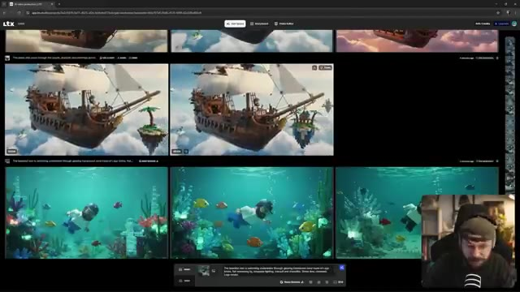
*Interface du navigateur affichant l'outil LTX Studio avec une grille de générations d'images et vidéos (vaisseaux pirates et scènes sous-marines en Lego) et la webcam du créateur en incrustation (PiP) dans le coin inférieur droit.*

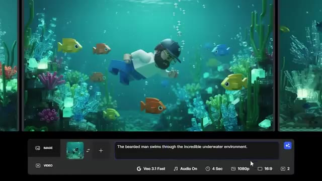
*Gros plan sur l'interface de LTX Studio avec le prompt textuel actif et les paramètres de génération vidéo (Veo 3.1 Fast, Audio On, 4 Sec, 1080p, 16:9).*

---

### ⏱️ `[00:18:42 - 00:19:04]` | Segment #36

**🔊 Audio (Transcription Intégrale Mot pour Mot en Français) :**
> Et créons deux générations VO3.1 de plus. Et si nous sélectionnons notre modèle vidéo, devrions-nous essayer LTX2 ? Je vais opter pour LTX2 fast. Et faisons-en deux générations également. Je veux créer un tas d'images supplémentaires aussi pour qu'elles soient prêtes à être animées. Donc nous allons survoler notre image principale et cliquer sur "Iterate" pour l'utiliser comme image de référence.

**👁️ Analyse Visuelle d'Écran (gemini-3.5-flash-lite) :**
**Interface & Outils** : LTX Studio (application web de génération et d'édition de vidéo par IA) avec encadré webcam du créateur.

**Contenu textuel & Code** : Texte du prompt visible : "The bearded man swims through the incredible underwater environment." Paramètres : LTX-2 Fast, Audio On, 6 Sec, 1080p, 16:9, quantité 2.

**Action / Démonstration** : Le créateur navigue dans l'interface de LTX Studio, sélectionne le modèle LTX-2 Fast et prépare de nouvelles générations de vidéos à partir d'une image de référence.

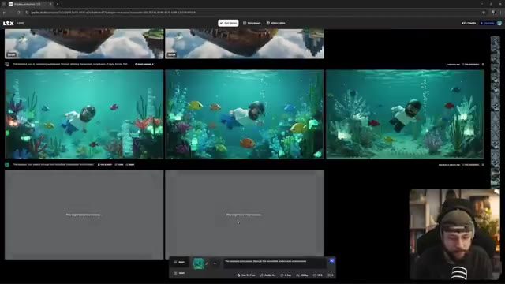
*Interface de l'outil LTX Studio montrant une grille de vidéos générées avec un personnage sous l'eau et un aperçu vidéo en bas.*

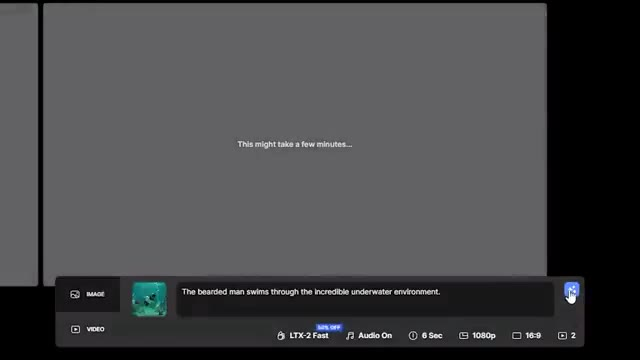
*Gros plan sur la barre de génération de LTX Studio avec le prompt textuel, le modèle LTX-2 Fast et les paramètres de durée et de résolution.*

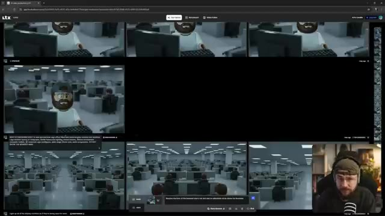
*Interface de LTX Studio affichant une grille de rendus de bureau de style Lego avec des options d'itération.*

---

### ⏱️ `[00:19:04 - 00:19:24]` | Segment #37

**🔊 Audio (Transcription Intégrale Mot pour Mot en Français) :**
> Commence simplement à insérer les différents prompts textuels que ChatGPT a créés pour moi. Il y en a un d'un chevalier Lego. Celui-ci, je flotte dans l'espace en tant qu'astronaute. Un de moi en train de piloter un avion. Ça a l'air plutôt cool. Faisons générer ça. Regarde celui-ci, l'homme barbu en ninja courant sur les toits d'un Japon ancien fait de Lego.

**👁️ Analyse Visuelle d'Écran (gemini-3.5-flash-lite) :**
**Interface & Outils** : Navigateur web affichant une application de génération vidéo par IA (interface avec grille de prévisualisation et panneau de prompts) ainsi qu'une fenêtre de traitement de texte/notes sur le côté gauche.

**Contenu textuel & Code** : Texte affiché dans le document : des descriptions détaillées en anglais pour la génération de vidéos (ex: "The bearded man is flying a bright red and blue Lego biplane...", "The bearded man is swimming underwater...", "The bearded man as a Lego knight charging...").

**Action / Démonstration** : Le créateur montre son écran avec le document de texte regroupant les prompts de ChatGPT et les vidéos générées correspondantes.

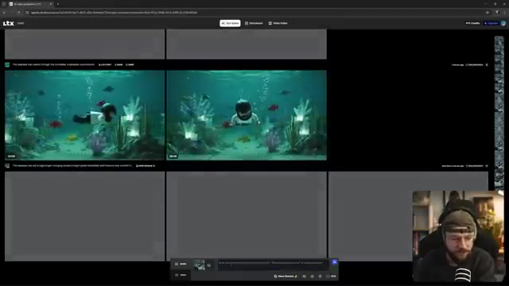
*Interface d'une application web affichant des vidéos générées par IA sur le thème de Lego sous-marin, avec une incrustation vidéo (PiP) du créateur en bas à droite.*

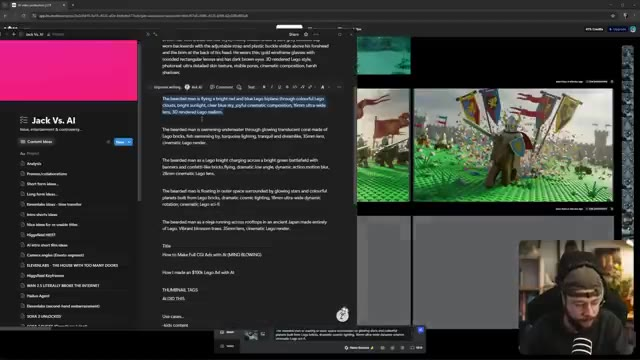
*Affichage d'un document texte contenant les prompts générés par ChatGPT (notamment sur l'avion et le chevalier Lego) aux côtés d'une galerie de vidéos de Lego générées par IA.*

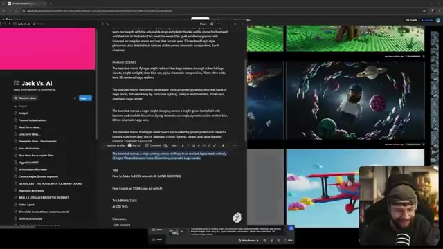
*Visualisation du prompt du ninja Lego sur les toits avec, sur le panneau latéral droit, les différentes vidéos générées correspondant aux descriptions.*

---

### ⏱️ `[00:19:24 - 00:20:02]` | Segment #38

**🔊 Audio (Transcription Intégrale Mot pour Mot en Français) :**
> Très cool. Et regardez simplement la qualité de ces images que nous obtenons en retour. Insanément cool. Nous avons récupéré nos générations de VO 3.1 et de LTX2 également. Jetons-y un œil. et nous pouvons ajouter un peu de comparaison ici aussi. Mais vous pouvez voir à partir des deux modèles vidéo que nous avons récupéré quelques

**👁️ Analyse Visuelle d'Écran (gemini-3.5-flash-lite) :**
**Interface & Outils** : LTX Studio (application web sur navigateur) avec une disposition en grille pour présenter des clips vidéo générés par IA.

**Contenu textuel & Code** : On peut lire des prompts textuels dans l'interface de LTX Studio, notamment des descriptions impliquant des figurines de type Lego dans des environnements sous-marins ou de science-fiction, ainsi que des superpositions textuelles comme "LTX 2 Fast (generation 1) Raw Audio".

**Action / Démonstration** : Le créateur navigue et zoome sur les différentes générations de vidéos créées à l'aide des modèles LTX2 et VO 3.1 dans l'interface de LTX Studio.

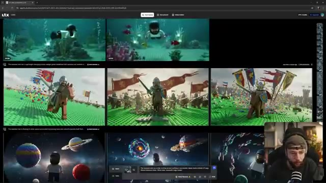
*Interface de LTX Studio affichant plusieurs générations de vidéos au style Lego dans une grille (sous-marin, chevaliers, espace).*

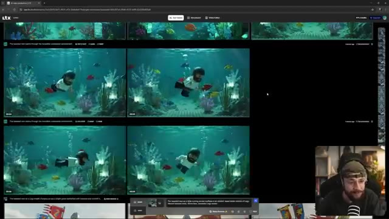
*Interface de LTX Studio zoomée sur les différentes variations de la génération de plongée sous-marine Lego.*

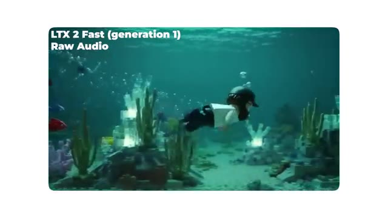
*Gros plan sur une vidéo générée avec le modèle LTX 2 Fast montrant un personnage de type Lego nageant dans un décor sous-marin.*

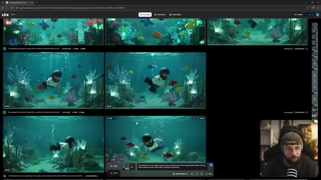
*Retour à la vue d'ensemble de la grille de projets et de vidéos générées sur l'interface de LTX Studio.*

---

### ⏱️ `[00:20:02 - 00:20:35]` | Segment #39

**🔊 Audio (Transcription Intégrale Mot pour Mot en Français) :**
> de superbes générations ici et le processus consisterait bien sûr à continuer d'animer chacune des images que nous aimons le plus. Vous savez, peut-être qu'on va aller modifier celle-ci ici, la casquette de baseball est encore à l'envers, on sait qu'il y a des moyens de corriger cela. J'adore absolument celle de moi en train de piloter un avion mais encore une fois la casquette de baseball n'est pas tout à fait correcte donc il faudrait qu'on aille utiliser et itérer à partir de cette image pour mettre cette casquette de baseball dans le bon sens parce qu'on veut cette cohérence et je vais probablement aller générer d'autres images de notre

**👁️ Analyse Visuelle d'Écran (gemini-3.5-flash-lite) :**
**Interface & Outils** : Application web LTX (ltx.studio) affichée dans un navigateur web avec une vue de galerie de projets vidéo/image et un panneau de prévisualisation agrandi.

**Contenu textuel & Code** : Galerie d'images et vidéos générées représentant des scènes en briques Lego (soldats médiévaux, espace, avion, toits japonais), avec des prompts textuels visibles comme "The bearded man as a ninja running across our rooftops in an ancient Japan made entirely of Lego...".

**Action / Démonstration** : Le créateur navigue à travers sa galerie de générations d'images et zoome sur différentes créations pour les inspecter et commenter leurs détails.

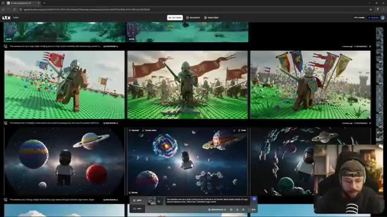
*Interface de l'application LTX montrant une galerie de générations d'images sur le thème de Lego avec Jack en incrustation vidéo (PiP) dans le coin inférieur droit.*

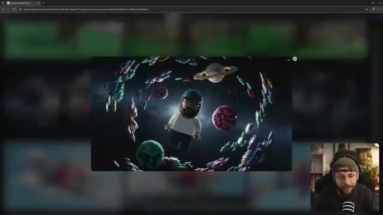
*Gros plan sur une image générée dans l'interface montrant le personnage de style Lego flottant dans l'espace entouré de planètes.*

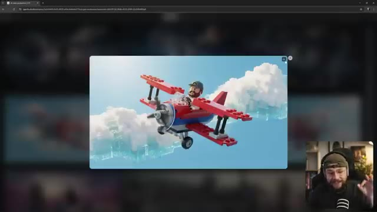
*Gros plan sur une autre image générée montrant le personnage de style Lego pilotant un avion biplan rouge dans les nuages.*

*Gros plan sur une image générée montrant le personnage de style Lego courant sur les toits d'un village japonais traditionnel avec des cerisiers en fleurs.*

---

### ⏱️ `[00:20:35 - 00:21:08]` | Segment #40

**🔊 Audio (Transcription Intégrale Mot pour Mot en Français) :**
> Environnement japonais où je suis censé être un ninja à nouveau, c'est un peu de ma faute parce que j'ai dit que j'étais habillé en ninja et la tenue de ninja classique cache la plupart de vos traits distinctifs, n'est-ce pas ? J'aurais donc dû être plus précis à propos de peut-être juste moi courant sur les toits, je pourrais littéralement juste y aller et dire l'homme barbu courant sur les toits dans le Japon ancien et appuyer sur régénérer et je suis sûr que ça va juste résoudre instantanément ce problème et tout de suite nous avons récupéré de superbes générations la casquette de baseball se comporte mal une fois de plus donc nous devrons trouver

**👁️ Analyse Visuelle d'Écran (gemini-3.5-flash-lite) :**
**Interface & Outils** : Interface web de génération vidéo par IA (style Studio / Générateur de vidéo) avec une barre de prompt en bas, un sélecteur d'image/vidéo et un encadré de prévisualisation (picture-in-picture) du créateur en bas à droite.

**Contenu textuel & Code** : Texte du prompt visible : "The bearded ma running across rooftops in an ancient Japan made entirely of Lego. Vibrant blossom trees. 35mm lens, cinematic Lego render." Modèle ou option affiché sous le prompt : "G Nano Banana", format 16:9.

**Action / Démonstration** : Le créateur montre le résultat de la génération d'une vidéo style Lego d'un homme barbu courant sur des toits au Japon ancien, puis Zoome ou affiche la boîte de texte contenant le prompt utilisé pour corriger la précédente tentative avec le costume de ninja.

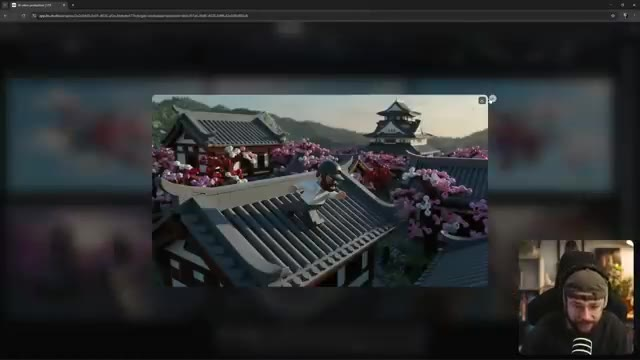
*Interface montrant un personnage en briques Lego (homme barbu avec une casquette) courant sur un toit de tuiles japonaises entouré d'arbres en fleurs.*

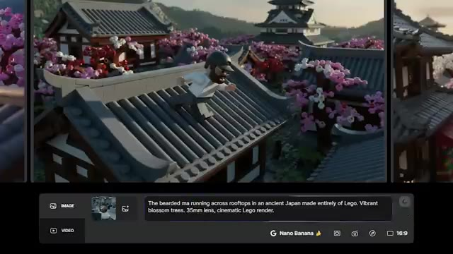
*Gros plan sur le prompt textuel utilisé dans l'outil de génération : "The bearded ma running across rooftops in an ancient Japan made entirely of Lego. Vibrant blossom trees. 35mm lens, cinematic Lego render."*

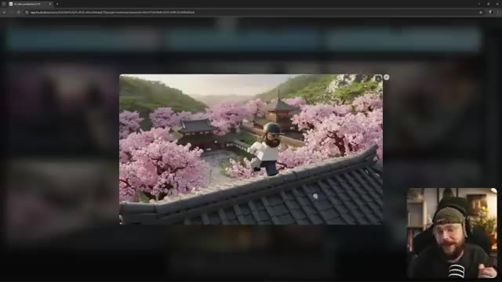
*Autre angle de rendu montrant le personnage Lego barbu en train de courir sur les toits au milieu des cerisiers en fleurs.*

---

### ⏱️ `[00:21:08 - 00:21:41]` | Segment #41

**🔊 Audio (Transcription Intégrale Mot pour Mot en Français) :**
> trouver une façon d'ajuster ça vous savez on va simplement itérer cette image et utiliser différentes solutions pour essayer de s'assurer que cette casquette est tournée dans le bon sens et ici ça s'est en fait juste emmêlé les pinceaux sur ce qu'on veut et nous voilà de retour au bureau mais il y a vraiment de superbes cerisiers en fleurs c'est une amélioration pour l'environnement je dois dire que ça me rendrait un peu plus heureux de travailler dans cet endroit on a vraiment couvert tout le processus des générations proprement dites ce que je veux aborder rapidement c'est le processus de montage et juste entre parenthèses si on retourne sur notre storyboard et qu'on va dans le coin supérieur droit on peut cliquer sur partager c'est très utile

**👁️ Analyse Visuelle d'Écran (gemini-3.5-flash-lite) :**
**Interface & Outils** : Navigateur web affichant LTX Studio (app.ltxstudio.com), une plateforme de production vidéo par IA avec onglets "Gen Space", "Storyboard" et "Video Editor", ainsi qu'un panneau latéral de partage.

**Contenu textuel & Code** : Interface utilisateur avec des grilles de vidéos miniatures, des boutons de génération, des icônes de modification ("Edit Image", "Generate Video"), des paramètres de scène et le menu déroulant "Share" (avec options "Share this project", "Export Storyboard").

**Action / Démonstration** : Le créateur navigue dans l'interface de LTX Studio, visualise différentes générations vidéo basées sur des briques Lego et démontre comment accéder au menu de partage dans le storyboard.

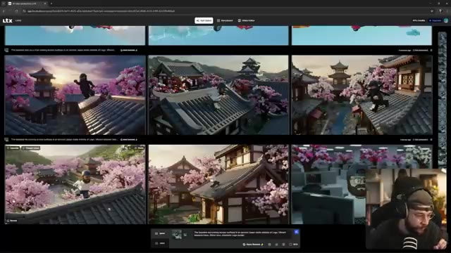
*Interface LTX Studio affichant une grille de générations de vidéos miniatures avec des décors de temples asiatiques et de cerisiers en fleurs, avec la webcam du créateur en incrustation (PiP).*

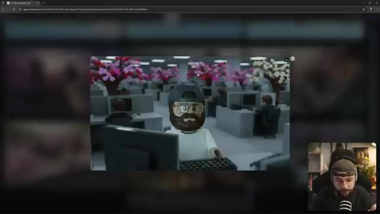
*Gros plan d'une génération vidéo sélectionnée montrant un personnage de type Lego dans un bureau moderne entouré de cerisiers en fleurs.*

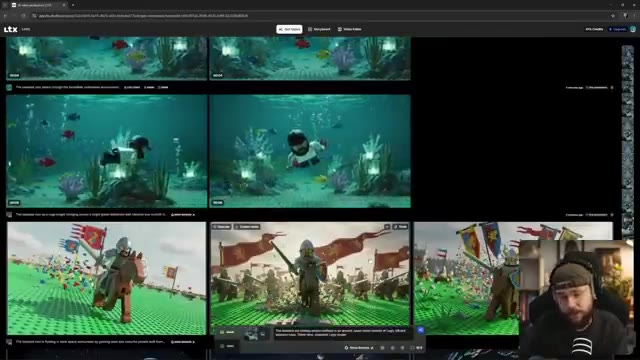
*Interface LTX Studio montrant une grille de vidéos générées avec des thèmes sous-marins et des scènes de bataille médiévales avec des chevaliers Lego.*

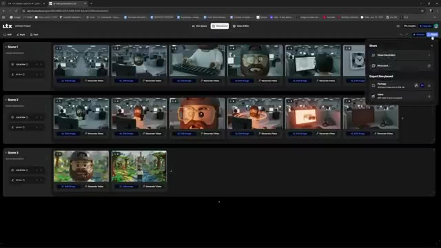
*Vue de l'onglet storyboard de LTX Studio divisé en scènes de production avec le menu "Share" ouvert dans le coin supérieur droit.*

---

### ⏱️ `[00:21:41 - 00:22:00]` | Segment #42

**🔊 Audio (Transcription Intégrale Mot pour Mot en Français) :**
> fonction ici où nous sommes capables de regrouper tous les éléments du projet et d'obtenir également un fichier XML et Et bien sûr, c'est compatible à la fois avec DaVinci Resolve et Premiere Pro comme nous l'utilisons. Donc ce que nous avons ici est essentiellement un montage brut de l'intro. Quand vous les gars le verrez dans la vidéo finale, ce sera un peu plus soigné, particulièrement en termes d'audio.

**👁️ Analyse Visuelle d'Écran (gemini-3.5-flash-lite) :**
**Interface & Outils** : Interface web de storyboard / outil de gestion de projet IA avec un menu pop-up d'exportation, puis interface du logiciel de montage Adobe Premiere Pro avec un encadré PiP (Picture-in-Picture) du créateur.

**Contenu textuel & Code** : Sur l'image 1 : Le menu 'Share' affiche les options 'Share this project', 'Pitch deck', et dans la section 'Export Storyboard' : 'Package' (All project assets and an XML file) avec les icônes de DaVinci Resolve et Premiere Pro, et 'Video' (MP4 video of your storyboard). Sur l'image 2 : L'interface d'Adobe Premiere Pro avec le moniteur de prévisualisation montrant une scène de bureau avec des personnages, la timeline en bas et le créateur dans l'encadré PiP.

**Action / Démonstration** : Le curseur de la souris survole l'option d'exportation 'Package' contenant tous les éléments du projet et le fichier XML, puis la vue bascule sur le logiciel de montage Adobe Premiere Pro où le projet est ouvert et manipulé.

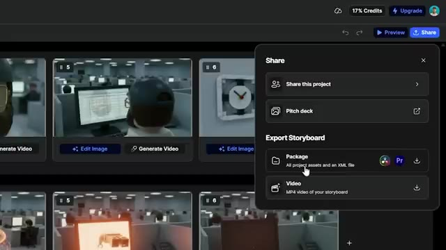
*Menu de partage et d'exportation d'un storyboard montrant l'option 'Package' compatible DaVinci Resolve et Premiere Pro.*

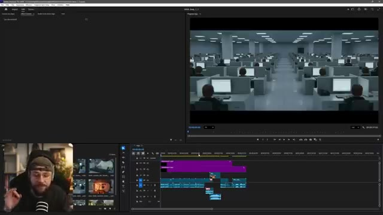
*Interface d'Adobe Premiere Pro affichant la timeline du projet avec Jack en incrustation vidéo (PiP) en bas à gauche.*

---

### ⏱️ `[00:22:01 - 00:22:22]` | Segment #43

**🔊 Audio (Transcription Intégrale Mot pour Mot en Français) :**
> Bien sûr, avec les générations RBO 3.1, l'audio est intégré directement. Je suis sélectif quant aux sons que j'aime et ceux que je n'aime pas. J'ajoute donc souvent mes propres couches d'effets sonores ainsi que des sons ambiants. Et bien sûr, la musique joue également un rôle très important. Essentiellement, le processus consiste à suivre le storyboard que nous avions sur LTX Studio pour assembler tous les plans.

**👁️ Analyse Visuelle d'Écran (gemini-3.5-flash-lite) :**
**Interface & Outils** : Adobe Premiere Pro (panneau de montage avec pistes vidéo/audio, moniteur source, moniteur de prévisualisation affichant un plan d'open space avec des bureaux d'ordinateurs, et encadré PiP du créateur en bas à gauche).

**Contenu textuel & Code** : Pistes de montage vidéo et audio comportant plusieurs clips assemblés, moniteur de prévisualisation affichant une scène de bureau en plans larges, et le créateur visible en bas à gauche.

**Action / Démonstration** : Le créateur montre son écran de montage dans Adobe Premiere Pro où il assemble les différents plans de sa vidéo.

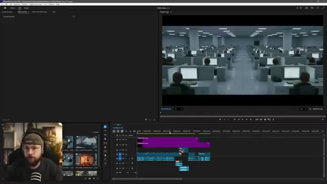
*Interface d'Adobe Premiere Pro montrant le montage vidéo d'un open space de bureau avec le créateur en incrustation PiP.*

---

### ⏱️ `[00:22:22 - 00:22:59]` | Segment #44

**🔊 Audio (Transcription Intégrale Mot pour Mot en Français) :**
> J'ai également deux calques de réglage sur ma timeline. Le premier sert à ajouter une bonne dose de grain pellicule. C'est quelque chose que je fais sur tout ce sur quoi je travaille avec l'IA. Donc si je le désactive et le réactive, j'ai l'impression que cela ajoute juste un beau niveau de texture. C'est quelque chose que je fais souvent en tant qu'artiste d'effets visuels lorsque je fais des modifications sur des séquences vidéo existantes, c'est bien d'ajouter une couche de grain pellicule par dessus. Un très bon exemple de cela, c'est si nous devons effectuer des retouches esthétiques sur le visage d'un acteur ou d'une actrice pour enlever les rides, les imperfections ou quoi que ce soit, vous lissez la texture, mais si vous rajoutez du grain pellicule par dessus, cela lie le tout.

**👁️ Analyse Visuelle d'Écran (gemini-3.5-flash-lite) :**
**Interface & Outils** : Adobe Premiere Pro (logiciel de montage vidéo)

**Contenu textuel & Code** : Timeline de montage avec pistes vidéo et audio, panneau de prévisualisation (moniteur de programme), panneau de montage et incrustation vidéo (PiP) du créateur en bas à gauche.

**Action / Démonstration** : Le créateur montre son projet de montage vidéo sur Adobe Premiere Pro, illustrant l'utilisation des calques de réglage et du grain pellicule sur un plan représentant un bureau de type Lego.

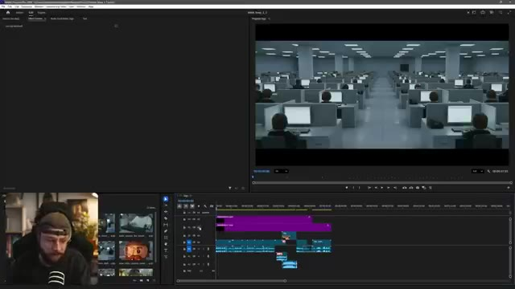
*Interface d'Adobe Premiere Pro montrant la timeline avec les calques de réglage et le moniteur de programme affichant la vidéo d'un bureau open space avec des personnages de type Lego.*

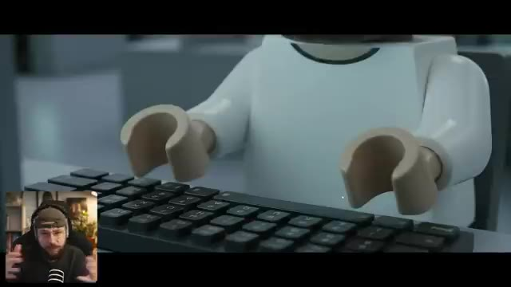
*Gros plan sur une séquence vidéo montrant un personnage type Lego en train de taper sur un clavier d'ordinateur.*

---

### ⏱️ `[00:22:59 - 00:23:25]` | Segment #45

**🔊 Audio (Transcription Intégrale Mot pour Mot en Français) :**
> ...de retour et ça vous donne cette sensation de réalisme, je pense qu'avec l'IA, parfois ça paraît trop brillant, et donc le grain de film aide tout simplement avec ça. C'est un choix esthétique. Je pense que certaines personnes pourraient ne pas aimer, mais je le fais pour toutes mes créations IA. Et ce qu'on a fait également, c'est d'ajouter ces bandes noires aussi. Vous remarquerez que j'ai en fait utilisé cela comme un petit artifice de réalisation, car lorsque je suis en quelque sorte soulevé dans les airs, en train de lévite, les bandes noires s'écartent.

**👁️ Analyse Visuelle d'Écran (gemini-3.5-flash-lite) :**
**Interface & Outils** : Adobe Premiere Pro

**Contenu textuel & Code** : Interface de montage d'Adobe Premiere Pro avec panneaux de prévisualisation, timeline multicouche et chutier de médias.
[DESC_IMAGE_2 montre le flux de travail de montage vidéo avec la timeline active et le moniteur affichant la scène générée par IA.]

**Action / Démonstration** : Le créateur montre un exemple de plan vidéo généré par IA représentant un personnage Lego, puis bascule sur son interface de montage Adobe Premiere Pro pour expliquer ses choix de réalisation.

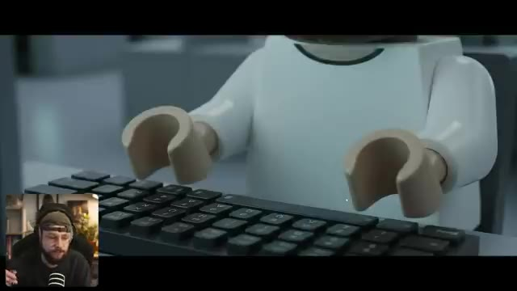
*Rendu vidéo montrant un personnage en briques Lego tapant sur un clavier d'ordinateur, avec Jack visible en médaillon incrusté (PiP) dans le coin inférieur gauche.*

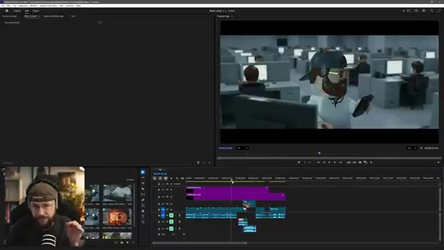
*Interface du logiciel Adobe Premiere Pro affichant le montage vidéo et la timeline, avec Jack visible en médaillon incrusté (PiP) dans le coin inférieur gauche.*

---

### ⏱️ `[00:23:25 - 00:23:55]` | Segment #46

**🔊 Audio (Transcription Intégrale Mot pour Mot en Français) :**
> Et c'est vraiment simple. J'ai simplement ajouté un recadrage à ce calque d'effet et des images clés pour qu'il s'ouvre lorsque je suis soulevé dans les airs. Et encore une fois, cela essaie de vendre cette idée que le personnage se sent peut-être un peu bloqué et qu'il est en quelque sorte restreint, et à mesure qu'il est soulevé vers le ciel, cette restriction s'atténue. C'est en quelque sorte le pouvoir de l'IA générative qui permet à ce personnage de libérer sa créativité et d'échapper à la réalité, même si ce n'est que pour cinq ou dix minutes par jour, n'est-ce pas, pour exécuter des idées qu'il ne pouvait tout simplement pas exécuter auparavant.

**👁️ Analyse Visuelle d'Écran (gemini-3.5-flash-lite) :**
**Interface & Outils** : Adobe Premiere Pro avec incrustation vidéo (PiP) du créateur en bas à gauche.

**Contenu textuel & Code** : Panneau "Effect Controls" avec les paramètres de recadrage (Crop: Left, Top, Right, Bottom) et calques d'ajustement violets dans la timeline. Le moniteur de prévisualisation montre un personnage de type Lego entouré d'anneaux lumineux dans un bureau en open space.

**Action / Démonstration** : Le créateur montre son montage vidéo sur Adobe Premiere Pro en expliquant l'utilisation des calques d'ajustement et des images clés pour l'effet de recadrage.

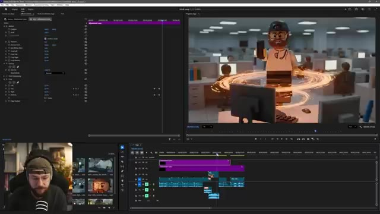
*Interface d'Adobe Premiere Pro montrant le panneau des effets, la timeline avec le calque d'ajustement et le moniteur de prévisualisation avec un personnage style Lego dans un bureau.*

---

### ⏱️ `[00:23:55 - 00:24:32]` | Segment #47

**🔊 Audio (Transcription Intégrale Mot pour Mot en Français) :**
> Et juste pour vous montrer aussi, si je prolonge en dupliquant ce plan ici, je veux vous montrer l'intégralité de ce plan parce ce qui se passe c'est que je vole vers l'écran d'ordinateur, je me cogne la tête dessus et puis je me rassois en quelque sorte dans la chaise, donc cette génération de VO 3.1 ne me donne pas vraiment ce que je veux mais j'ai été sélectif sur les parties de la génération que j'ai utilisées et j'ai fini par couper au moment où je fais contact avec l'écran, n'est-ce pas ? Et sur ce point de coupe, on coupe vers un autre angle de caméra et on montre que j'ai été aspiré dedans, nous avons tout ce...

**👁️ Analyse Visuelle d'Écran (gemini-3.5-flash-lite) :**
**Interface & Outils** : Adobe Premiere Pro (logiciel de montage vidéo).

**Contenu textuel & Code** : Timeline de montage avec pistes audio et vidéo, panneau des effets (Effets de contrôle, Motion, Opacity), chutier avec vignettes et fenêtre de prévisualisation avec le personnage du créateur en PiP.

**Action / Démonstration** : Le créateur présente son projet de montage dans Adobe Premiere Pro, expliquant le choix de ses plans et les coupes effectuées sur la timeline.

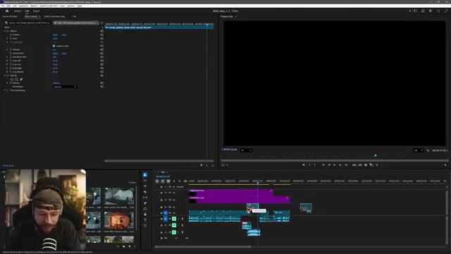
*Interface d'Adobe Premiere Pro montrant la timeline de montage et la fenêtre de prévisualisation noire avec le créateur en incrustation vidéo (PiP) en bas à gauche.*

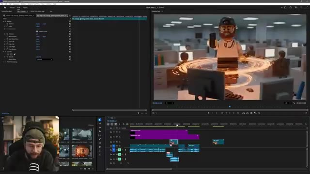
*Interface d'Adobe Premiere Pro avec la fenêtre de prévisualisation affichant un plan généré montrant un personnage de type Lego dans un bureau entouré d'effets visuels.*

---

### ⏱️ `[00:24:32 - 00:25:06]` | Segment #48

**🔊 Audio (Transcription Intégrale Mot pour Mot en Français) :**
> ces jolies étincelles et tout et l'écran de l'ordinateur s'assombrit et revient simplement à la normale le reste du bureau est toujours ce genre d'environnement gris un peu stérile encore une fois et encore une fois laissez-moi vous montrer l'intégralité de cette génération ici et je vais vous prouver que cela n'aurait pas fonctionné tout seul regardez ce qui se passe en fait allons en plein écran pour cela qu'est-ce qui se passe là des personnages en Lego à moitié dedans et ça explose tout simplement comme si son corps se fendait en deux et explosait donc encore une fois j'essaie d'être créatif en utilisant les parties de chaque génération qui

**👁️ Analyse Visuelle d'Écran (gemini-3.5-flash-lite) :**
**Interface & Outils** : Adobe Premiere Pro

**Contenu textuel & Code** : Timeline de montage, panneau Effets, moniteur de prévisualisation affichant la génération vidéo, et incrustation vidéo du créateur dans le coin inférieur gauche.

**Action / Démonstration** : Le créateur présente son travail de montage et de composition vidéo dans Adobe Premiere Pro, en démontrant les défauts d'une génération par IA.

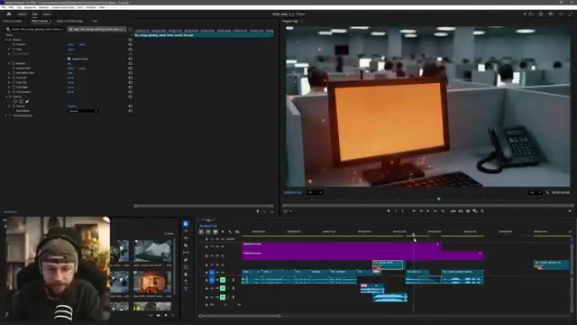
*Interface d'Adobe Premiere Pro montrant le montage vidéo d'un bureau avec un écran d'ordinateur lumineux, et la webcam du créateur en incrustation (PiP).*

*Interface d'Adobe Premiere Pro montrant la scène d'explosion d'un personnage Lego dans le bureau, avec la webcam du créateur en incrustation (PiP).*

---

### ⏱️ `[00:25:06 - 00:25:43]` | Segment #49

**🔊 Audio (Transcription Intégrale Mot pour Mot en Français) :**
> travail et j'applique la même logique à l'audio que vo 3.1 me donne aussi parfois j'aime vraiment ce qu'il me donne et parfois non donc je peux être sélectif à ce sujet par exemple si je n'aime pas l'audio que j'ai obtenu pour cette génération je peux simplement faire un clic droit et cliquer sur dissocier et simplement jeter cet audio et trouver mes propres effets sonores que je préfère et quand il s'agit de nos générations de vidéo cela ne fonctionne pas comme un élément d'intrigue parce que je suis toujours dans le fauteuil n'est-ce pas ça sape complètement l'objectif de l'histoire cela n'a vraiment pas beaucoup de sens physique et encore une fois ici une histoire très différente Jack explose simplement dans le bureau

**👁️ Analyse Visuelle d'Écran (gemini-3.5-flash-lite) :**
**Interface & Outils** : Adobe Premiere Pro (logiciel de montage vidéo professionnel) avec panneau de prévisualisation, timeline multicouche, panneau d'effets et incrustation vidéo (PiP) du créateur.

**Contenu textuel & Code** : Noms de fichiers de projets sur la timeline (« 00_intro », « 01_explosion », pistes audio/vidéo), chronologie temporelle, options du menu contextuel (Unlink, Clear, Ripple Delete, Speed/Duration, etc.).
[DESC_IMAGE_4] Le créateur navigue et manipule les clips sur la timeline de Premiere Pro, montrant comment dissocier (unlink) ou supprimer les éléments audio indésirables pour les remplacer.

**Action / Démonstration** : Démonstration pédagogique et présentation du workflow.

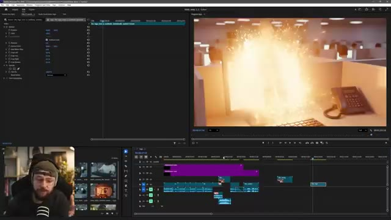
*Interface d'Adobe Premiere Pro montrant une séquence vidéo de bureau avec une explosion lumineuse et la webcam du créateur en bas à gauche.*

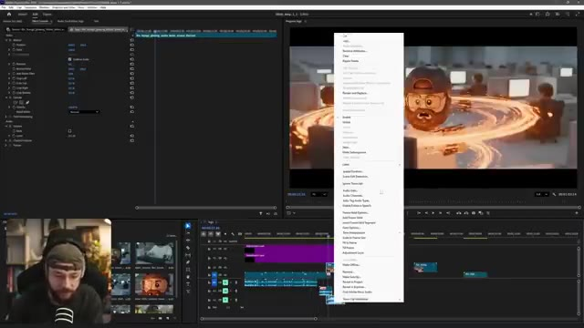
*Interface d'Adobe Premiere Pro avec un menu contextuel ouvert suite à un clic droit sur le clip vidéo, affichant les options de montage et d'audio.*

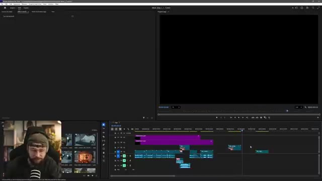
*Interface de montage Adobe Premiere Pro affichant une timeline avec des pistes audio/vidéo et un écran de prévisualisation noir après suppression de l'audio.*

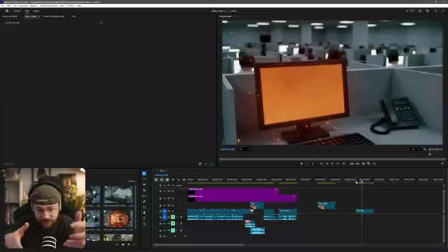
*Interface d'Adobe Premiere Pro montrant un plan de bureau d'ordinateur de face, tandis que le créateur commente les incohérences physiques et narratives.*

---

### ⏱️ `[00:25:43 - 00:26:16]` | Segment #50

**🔊 Audio (Transcription Intégrale Mot pour Mot en Français) :**
> et personne ne remarque au lieu d'être transporté dans ce genre de royaume fantastique incroyable. Et c'est un peu ce qui sépare, selon moi, la bouillie d'IA de la réalisation de films par IA ou de la publicité professionnelle par IA. Avoir le sens du détail et avoir bon goût. Ne pas utiliser simplement une génération entière parce que vous l'avez payée et que vous avez l'impression de devoir l'utiliser. Pensez à vous-même comme à un réalisateur sur un plateau de tournage, n'est-ce pas ? Et vous filmez un acteur incroyable. Toutes les prises qu'ils donnent ne vont pas être si formidables. Et aussi, chaque moment des super prises ne servira pas à

**👁️ Analyse Visuelle d'Écran (gemini-3.5-flash-lite) :**
**Interface & Outils** : Adobe Premiere Pro

**Contenu textuel & Code** : Timeline de montage vidéo, moniteur de prévisualisation affichant une scène de bureau avec un moniteur orange au premier plan, panneau de gestion des médias et incrustation vidéo (PiP) du présentateur en bas à gauche.

**Action / Démonstration** : Le créateur montre son écran de montage dans Adobe Premiere Pro pour illustrer le processus de sélection des prises et du montage de séquences générées par IA.

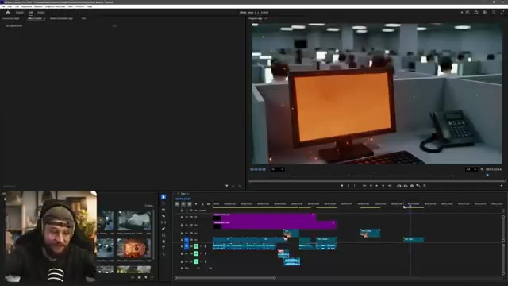
*Interface d'Adobe Premiere Pro avec un moniteur affichant un plan de bureau d'entreprise et un encadré PiP montrant Jack en bas à gauche.*

---

### ⏱️ `[00:26:16 - 00:26:49]` | Segment #51

**🔊 Audio (Transcription Intégrale Mot pour Mot en Français) :**
> ce que vous recherchez et c'est l'état d'esprit dans lequel vous devez être ici les outils sont incroyables et ils peuvent produire des choses vraiment incroyables mais l'accent est mis sur nous en tant que créateurs pour choisir ce que nous faisons comme si vous avez apprécié la vidéo d'aujourd'hui les gars assurez-vous de lâcher un pouce bleu pour moi pensez à vous abonner si vous êtes nouveau et bien sûr activez cette cloche de notification pour ne jamais rater de futures mises en ligne si vous avez des questions, n'hésitez pas à les poser en bas dans la section des commentaires j'essaie de répondre au maximum d'entre vous merci beaucoup d'avoir regardé et à la prochaine vidéo

**👁️ Analyse Visuelle d'Écran (gemini-3.5-flash-lite) :**
**Interface & Outils** : Adobe Premiere Pro

**Contenu textuel & Code** : Timeline de montage vidéo, panneaux de prévisualisation, chutier de médias, et encadré vidéo PiP du présentateur.

**Action / Démonstration** : Le créateur montre son écran de montage vidéo sous Adobe Premiere Pro tout en s'exprimant face caméra dans un encadré incrusté.

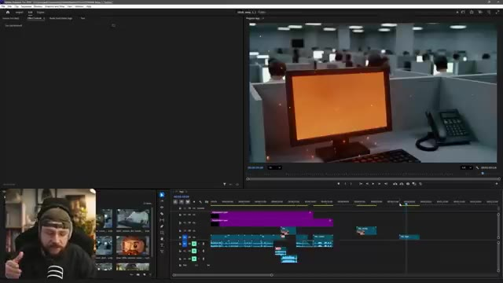
*Interface du logiciel de montage Adobe Premiere Pro affichant un projet en cours avec le panneau de montage, le moniteur de prévisualisation montrant une scène de bureau, et un encadré PiP du créateur en bas à gauche.*

---
