# 🎬 Comment utiliser HAILUO 2.3 (GRATUITEMENT !)

> **Chaîne** : [Jack Vs. AI](https://www.youtube.com/@JackVsAI)  
> **Titre original** : `How to use HAILUO 2.3 (FOR FREE!)`  
> **Lien YouTube** : [https://www.youtube.com/watch?v=924pAFyrYIE](https://www.youtube.com/watch?v=924pAFyrYIE)  
> **Date de publication** : 2025-11-02  
> **Durée** : 14m 33s (`873s`)  
> **Identifiant vidéo** : `924pAFyrYIE`  
> **Fiche Web Interactive** : [2025-11-02_YT-924pAFyrYIE_Comment utiliser HAILUO 2.3 (GRATUITEMENT !)_by-whisper-v3-large-turbo+gemini-3.5-flash-lite.html](2025-11-02_YT-924pAFyrYIE_Comment utiliser HAILUO 2.3 (GRATUITEMENT !)_by-whisper-v3-large-turbo+gemini-3.5-flash-lite.html)  
> **Captures de démonstration clés** : `69 captures réelles (anti-talking-head)`  
> **Modèles utilisés** : Audio: `large-v3-turbo` (Faster-Whisper int8 VPS) | Vision: `gemini-3.5-flash-lite` (Google AI Studio API)  

---

## 📌 Synthèse Exécutive & Outils

### 📌 Résumé
Jack, artiste VFX publicitaire cumulant plus d'une décennie d'expérience auprès des plus grandes marques mondiales, décortique dans cette vidéo le modèle vidéo par IA Hailuo 2.3. Ce dernier s'impose comme un outil incontournable de l'industrie en générant des personnages ultra-réalistes dotés de micro-détails expressifs, sans nécessiter d'acteurs, de caméras physiques ou de capture de mouvement. La mise en valeur de cette technologie met en lumière un bond en avant spectaculaire en matière de réalisme cinématique, de rendu des textiles et d'interaction physique, rivalisant directement avec les productions traditionnelles tout en démocratisant l'accès aux effets visuels haut de gamme.

La méthode pas à pas démontrée par Jack repose sur une approche comparative par catégories exigeantes : la danse et la performance, les séquences d'action dynamiques, le réalisme facial, les rendus stylisés (anime) et les publicités de produits e-commerce. À partir d'une image fixe générée par IA (utilisée comme image de départ ou *frame* de référence), Jack insère des prompts textuels précis décrivant le mouvement, l'action et la dynamique de caméra. Chaque génération de 768p d'une durée de six secondes, obtenue en environ une minute et demie, est ensuite analysée de manière critique afin d'identifier les forces (réflexions lumineuses, plis réalistes des vêtements, clignements de paupières naturels) et les faiblesses inhérentes à l'IA (distorsions d'arrière-plan ou légères dérives environnementales).

Pour les créateurs de contenu et les réalisateurs publicitaires, les bénéfices concrets sont immenses. Non seulement Hailuo 2.3 propose quatre générations gratuites quotidiennes, mais l'enseignement majeur réside dans l'art du montage sélectif : il ne s'agit pas de consommer aveuglément une génération entière, mais d'extraire chirurgicalement les fragments parfaits (comme un regard subtil ou un mouvement de caméra fluide) pour les intégrer dans un montage cinématique final. Cette flexibilité stylistique, allant de l'action réelle à l'anime, redéfinit les standards de la production vidéo assistée par intelligence artificielle et offre un contrôle créatif total aux professionnels.

### 🛠️ Outils, Modèles & Logiciels Présentés
* **HAILUO 2.3** : Modèle vidéo par intelligence artificielle de pointe offrant un réalisme de mouvement supérieur, des micro-détails expressifs et quatre générations gratuites de 768p par jour.
* **Hailuo / Hylou.ai** : Plateforme en ligne hébergeant le modèle Hailuo 2.3 et permettant de concevoir des vidéos à partir d'images fixes et de prompts textuels.
* **Flux** : Modèle de génération d'images par IA évoqué et utilisé en amont pour créer les personnages de référence et les images fixes de départ nécessaires aux tests vidéo.

### 🔑 Points Clés & Enseignements Stratégiques
* **Accessibilité et gratuité stratégique** : Hailuo 2.3 propose actuellement quatre générations gratuites par jour en résolution 768p (pour des clips de six secondes), constituant une opportunité idéale pour tester le modèle sans risque financier.
* **Réalisme anatomique et textuel accru** : Le modèle excelle dans la simulation physique, reproduisant avec une grande fidélité les reflets sur les surfaces brillantes, les interactions avec les fluides et les plis naturels des vêtements lors des mouvements.
* **Gestion des performances de danse** : Pour tester la danse (K-pop ou ballet), l'utilisation d'images fixes de personnages stylisés combinées à des descriptions de mouvements précis garantit des transitions fluides et un dynamisme corporel saisissant.
* **Nuances faciales et micro-expressions** : Bien que certains regards puissent paraître robotiques, le modèle intègre des clignements de yeux lents et naturels en fin de génération, insufflant une dimension profondément humaine aux personnages.
* **Dynamisme des scènes d'action** : L'intégration de prompts orientés vers les arts martiaux et les combats rapides permet d'obtenir des séquences frénétiques et cohérentes, tout en maintenant la stabilité des personnages du début à la fin.
* **Contrôle avancé de la caméra** : L'utilisation de mots-clés spécifiques comme « mouvement de caméra de suivi dynamique » ou « mouvement de caméra sur appareil tenu à main » renforce l'immersion et l'esthétique cinématographique des plans.
* **Sélection chirurgicale des séquences (Montage)** : En tant que réalisateur, il ne faut jamais se sentir obligé d'utiliser une génération dans son intégralité ; l'excellence réside dans l'extraction des meilleures fractions de secondes (un regard, un mouvement) pour les intégrer au montage final.
* **Précision environnementale des prompts** : Pour éviter les dérives d'arrière-plan (comme un sol en métal liquide qui se transforme soudainement en eau bleue), il est crucial de décrire précisément l'environnement souhaité dans le prompt textuel.
* **Gestion du temps de rendu** : Le temps de génération pour un clip de six secondes en 768p est d'environ une minute et demie, offrant un compromis très efficace entre rapidité d'itération et qualité visuelle.
* **Polyvalence stylistique** : Le modèle ne se limite pas au réalisme photographique et gère également avec brio des rendus stylisés et artistiques, notamment l'anime et les publicités de produits e-commerce.

---

## ⏱️ Chronologie & Transcription Complète Audio & Visuelle (Mot pour Mot)

### ⏱️ `[00:00:00 - 00:00:35]` | Segment #01

**🔊 Audio (Transcription Intégrale Mot pour Mot en Français) :**
> Hylou vient de forcer tout le monde à prêter attention. Ils viennent de sortir leur modèle 2.3, c'est absolument insensé et cela vient même avec des générations gratuites. Nous parlons de personnages IA qui agissent comme de vrais humains. Pas d'acteurs, pas de caméras et aucune capture de mouvement requise. La dernière mise à jour de Hylou ajoute un réalisme de mouvement d'un niveau supérieur, des micro-détails expressifs et un contrôle total sur le style, allant de l'action réelle cinématique à l'anime. Si vous avez l'impression que votre contenu IA ne fonctionne plus, il est peut-être temps de passer à ce modèle. Je suis Jack, je suis un [expert en] vfx

**👁️ Analyse Visuelle d'Écran (gemini-3.5-flash-lite) :**
**Interface & Outils** : Présentation face caméra sans partage d'écran

**Contenu textuel & Code** : Texte affiché à l'écran sous forme de sous-titres dynamiques (« to pay attention. », « like real humans. », « and total control », « to this model. ») superposés à des extraits vidéo démonstratifs générés par IA illustrant le modèle Hylou 2.3.

**Action / Démonstration** : Le locuteur parle de la sortie du modèle Hylou 2.3 pendant que des séquences vidéo de démonstration illustrent les capacités de génération de personnages réalistes et animés.

---

### ⏱️ `[00:00:35 - 00:01:10]` | Segment #02

**🔊 Audio (Transcription Intégrale Mot pour Mot en Français) :**
> artiste dans l'industrie de la publicité depuis plus d'une décennie maintenant et j'ai travaillé avec beaucoup des plus grandes marques de la planète dans cette vidéo nous allons explorer Hilo 2.3 je vais décortiquer les plus grandes améliorations avec cette mise à jour et vous montrer comment il gère les séquences d'action de danse et les plans de produits et si vous aimez le contenu d'aujourd'hui les gars assurez-vous de lâcher un pouce bleu pour moi pensez à vous abonner et bien sûr à activer cette cloche de notification. Très bien, entrons dans le vif du sujet. Donc pour tester en profondeur ce nouveau modèle vidéo, nous allons explorer certaines catégories. Nous allons examiner la danse et la performance, les séquences d'action, les looks stylisés, le réalisme facial et les produits.

**👁️ Analyse Visuelle d'Écran (gemini-3.5-flash-lite) :**
**Interface & Outils** : Présentation vidéo avec extraits de rendus IA et incrustation de texte de listes de catégories.

**Contenu textuel & Code** : Texte affiché : "dance", "dance & performance", "action & fight scenes", "stylised looks", "facial realism", "product ads".

**Action / Démonstration** : Le créateur présente des exemples vidéo de danse générés par IA et énumère les différentes catégories de tests du modèle Hilo 2.3.

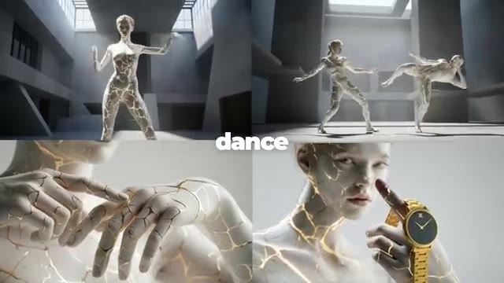
*Grille de quatre vidéos démo générées par IA montrant des personnages stylisés avec des fissures lumineuses et des éléments publicitaires (montre).*

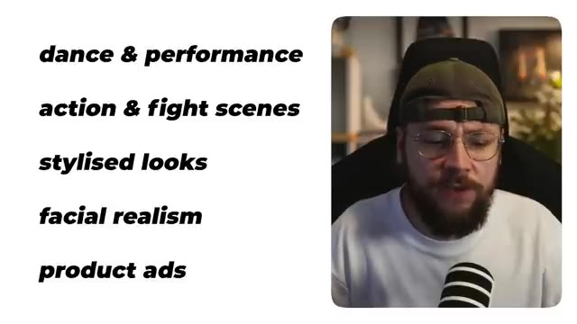
*Écran divisé montrant Jack à droite et une liste de catégories à tester à gauche.*

---

### ⏱️ `[00:01:10 - 00:01:42]` | Segment #03

**🔊 Audio (Transcription Intégrale Mot pour Mot en Français) :**
> publicités et e-commerce. Donc vous repartirez de cette vidéo avec un aperçu très détaillé de ce dont ce modèle est capable. Alors nous voici sur Hyluo.ai. Si vous voulez aller jeter un œil à la plateforme, vous pouvez cliquer sur le lien en bas dans la description. Si nous allons dans le coin supérieur gauche et cliquons sur l'onglet vidéo, nous entrons dans cette fenêtre et vous pouvez voir que j'ai Hilo 2.3 disponible ici pour moi et ils proposent actuellement quatre générations gratuites par jour, c'est donc le moment idéal pour vous lancer et tester l'outil vous-même. Vous pouvez voir une tonne d'autres

**👁️ Analyse Visuelle d'Écran (gemini-3.5-flash-lite) :**
**Interface & Outils** : Le navigateur web affiche la plateforme de génération vidéo par IA Hyluo.ai avec l'onglet vidéo sélectionné, une barre de recherche de prompts (« Transform Idea to Visual »), une grille de créations tendance et une incrustation vidéo (PiP) du créateur.

**Contenu textuel & Code** : On peut lire les textes « Transform Idea to Visual », « Hailuo AI Agent », « Hailuo 2.3/2.3 Fast », « 0/2000 » dans la zone de texte, et l'option « Hailuo 2.3 NEW Free Trials 4/4 » ainsi que la résolution « 768p ».

**Action / Démonstration** : Le curseur de la souris survole le sélecteur de modèle Hailuo 2.3 pour montrer la disponibilité de quatre essais gratuits par jour aux utilisateurs.

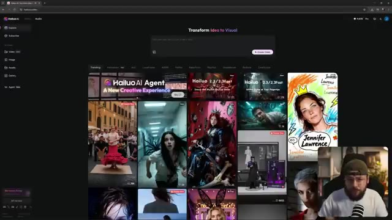
*Page d'accueil du site Hyluo.ai montrant l'interface principale avec les vidéos tendance et le créateur en incrustation vidéo (PiP) dans le coin inférieur droit.*

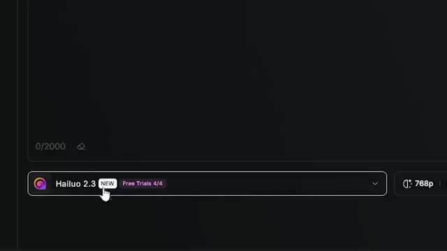
*Gros plan sur le menu déroulant de sélection du modèle Hailuo 2.3 avec l'indication « Free Trials 4/4 » et un curseur de souris pointant dessus.*

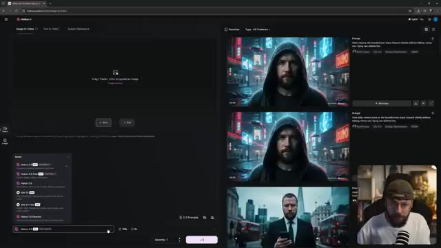
*Interface de génération vidéo sur Hyluo.ai affichant les options Image to Video, Text to Video, Subject Reference et la liste des modèles disponibles.*

---

### ⏱️ `[00:01:42 - 00:02:18]` | Segment #04

**🔊 Audio (Transcription Intégrale Mot pour Mot en Français) :**
> des générations que j'ai faites ici pour mes vidéos précédentes. Je note vraiment cet outil assez haut. on récupère des trucs vraiment très cinématiques ici et vous pouvez voir une vraie variété de générations différentes également. Mais comment allons-nous tester toutes ces différentes catégories ? Nous avons besoin d'un personnage. Eh bien, le voilà, un personnage IA pré-fabriqué que j'ai fait plus tôt dans la journée. Et nous avons juste une variété de différentes sorties d'images IA ici afin que nous puissions tester minutieusement Hyluo. Quelque chose comme ça bien sûr va être génial pour tester la danse et la performance donc je pense que nous allons

**👁️ Analyse Visuelle d'Écran (gemini-3.5-flash-lite) :**
**Interface & Outils** : Interface web de l'outil Hyluo (hyluo.ai) avec un panneau de configuration à gauche, une galerie de clips vidéo générés à droite, et un retour caméra du créateur en incrustation PiP.

**Contenu textuel & Code** : Galerie montrant plusieurs clips vidéo générés (un astronaute dans l'espace, un personnage dans une pièce rétro aux néons, un chevalier en armure). Paramètres visibles : modèles Hyluo 2.2, curseurs de résolution, quantité, et prompts textuels associés.

**Action / Démonstration** : Le créateur présente l'interface de l'outil Hyluo et navigue à travers différentes générations de vidéos et d'images IA pour démontrer les capacités de la plateforme.

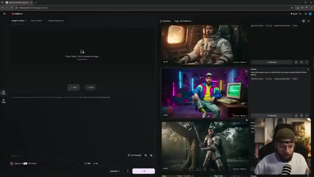
*Interface de l'outil Hyluo montrant le panneau de génération vidéo à gauche et une galerie de vidéos générées à droite, avec le créateur en incrustation vidéo (PiP) dans le coin inférieur droit.*

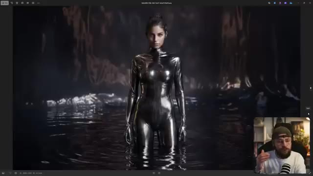
*Visualisation en plein écran d'une image générée par IA représentant un personnage féminin futuriste en combinaison brillante dans l'eau, avec le créateur en incrustation vidéo (PiP) dans le coin inférieur droit.*

---

### ⏱️ `[00:02:18 - 00:02:50]` | Segment #05

**🔊 Audio (Transcription Intégrale Mot pour Mot en Français) :**
> commençons par là. Nous pouvons continuer et glisser-déposer notre image de notre femme au style de métal liquide et en ce qui concerne notre prompt textuel, nous allons opter pour ceci. La femme exécute une routine de K-pop à haute énergie, exécutant des mouvements précis et synchronisés avec un rythme parfait et des transitions fluides. Bien sûr, en ce qui concerne le modèle vidéo, nous voulons Hailuo 2.3 et si nous survolons ici, vous pouvez voir un peu plus de détails, vous pouvez générer quatre vidéos gratuites de 768p de six secondes par jour. Très bien, allons-y et cliquons

**👁️ Analyse Visuelle d'Écran (gemini-3.5-flash-lite) :**
**Interface & Outils** : Interface web de l'outil de génération vidéo Hailuo AI (miniMax).

**Contenu textuel & Code** : Prompts textuels de génération vidéo, sélection du modèle Hailuo 2.3, options de résolution (768p) et durée (6s), indications de essais gratuits quotidiens (Free Trials 4/4).

**Action / Démonstration** : Le créateur montre l'interface de glisser-déposer d'image, affiche le prompt textuel à l'écran, puis survole et clique sur le menu de sélection du modèle vidéo Hailuo 2.3.

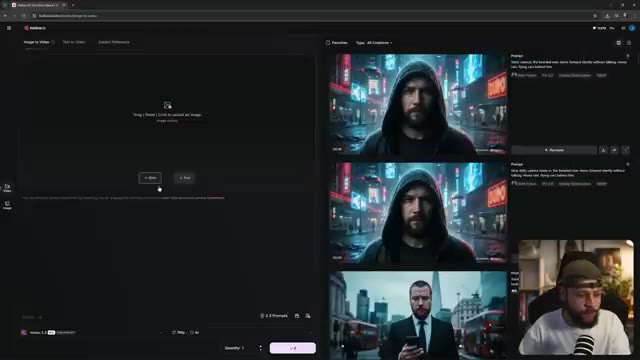
*Interface principale de Hailuo AI montrant la zone de téléchargement d'image pour l'option Image to Video et les exemples de génération sur le côté droit.*

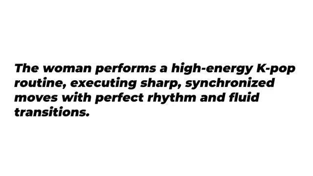
*Texte du prompt affiché en plein écran : "The woman performs a high-energy K-pop routine, executing sharp, synchronized moves with perfect rhythm and fluid transitions."*

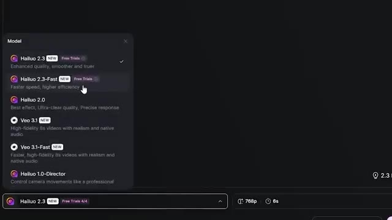
*Menu déroulant des modèles vidéo de Hailuo AI affichant les versions Hailuo 2.3, Hailuo 2.3-Fast, Hailuo 2.0, Veo 3.1 et Hailuo 1.0-Director.*

---

### ⏱️ `[00:02:50 - 00:03:23]` | Segment #06

**🔊 Audio (Transcription Intégrale Mot pour Mot en Français) :**
> générer. Bon, nous avons notre première génération de retour, jetons-y un œil. Donc je dois dire que la façon dont le corps de la femme bouge semble très réaliste, très fidèle à la réalité. L'interaction avec le métal liquide dans lequel elle est en quelque sorte assise bouge de manière assez réaliste. Certains des points forts pour moi sont les reflets que nous obtenons sur ce matériau très brillant et les plis causés par ses mouvements de danse également. Si j'allais être hypercritique, je dirais que la façon dont une partie de ce truc de métal liquide sous elle, la façon dont une partie bouge, semble juste un petit peu

**👁️ Analyse Visuelle d'Écran (gemini-3.5-flash-lite) :**
**Interface & Outils** : Interface web d'un outil de génération de vidéo par IA (type Kling / Seedance) avec panneau de prévisualisation à gauche, galerie de générations à droite et fenêtre PiP de la webcam du présentateur.

**Contenu textuel & Code** : Texte du prompt visible : « The woman performs an elegant ballet sequence, balancing gracefully on pointe... » ainsi que des miniatures de vidéos générées avec des paramètres techniques (Seed-Fusion, Kling 3.0, Dynamic Optimization).

**Action / Démonstration** : Le créateur navigue et commente les différentes générations de vidéos IA à l'écran, en inspectant les détails des mouvements et des textures.

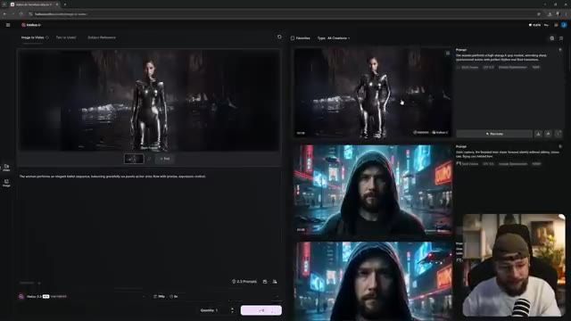
*Interface de l'outil de génération vidéo IA montrant le résultat avec une femme vêtue d'une combinaison en métal liquide et la webcam du créateur en incrustation.*

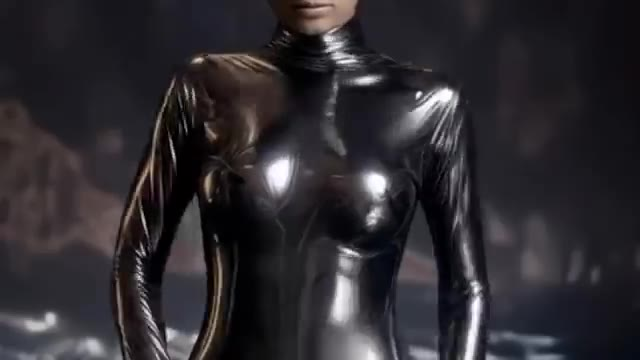
*Gros plan sur le haut du corps d'une femme habillée en combinaison moulante argentée brillante de type métal liquide.*

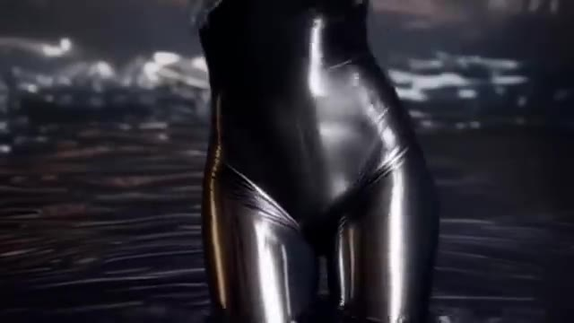
*Gros plan sur le bas du corps et les jambes de la femme dans l'eau au milieu du liquide argenté réfléchissant.*

---

### ⏱️ `[00:03:23 - 00:03:58]` | Segment #07

**🔊 Audio (Transcription Intégrale Mot pour Mot en Français) :**
> comme une image fixe qui se déforme régulièrement dans le cadre. Le point de contact réel avec le métal liquide sous elle, surtout quand elle devient un peu plus erratique avec ses mouvements de danse, pour moi ça a l'air plutôt réaliste, mais c'est juste ce qu'il y a derrière elle qui se déforme régulièrement qui gâche un peu l'illusion, mais les reflets dans l'eau, il y a beaucoup de superbes détails ici qui ont l'air vraiment cool, testons un autre prompt : la femme exécute une séquence de ballet élégante en s'équilibrant gracieusement tandis que ses bras se déplacent avec un contrôle précis et expressif, générons celui-ci et juste pour vous donner une idée

**👁️ Analyse Visuelle d'Écran (gemini-3.5-flash-lite) :**
**Interface & Outils** : Interface web de Hailuo AI (Minimax) avec lecteur vidéo, panneau de prompt latéral, options de modèle (V02.2) et miniature du créateur en incrustation.

**Contenu textuel & Code** : Prompt visible : "The woman performs a high energy K-pop routine, executing sharp, synchronized moves with perfect rhythm and fluid smoothness." Paramètres : Motion : Draft-frames, V02.2, Enhanced Optimization : 1080p. Texte affiché à la fin : "The woman performs an elegant ballet sequence, balancing gracefully on pointe as her arms flow with precise, expressive control."

**Action / Démonstration** : Le créateur commente les détails visuels et les défauts de distorsion d'arrière-plan de la vidéo générée, puis introduit et tape un nouveau prompt de test pour une séquence de ballet.

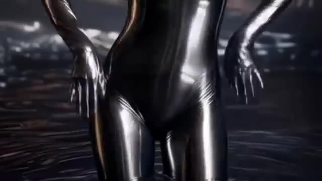
*Gros plan sur la femme recouverte de métal liquide se tenant dans l'eau, montrant les détails des reflets et de la texture.*

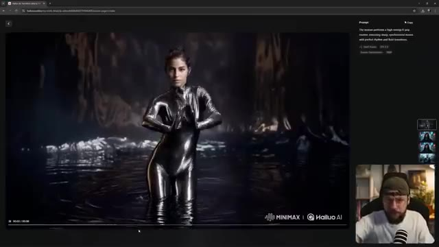
*Interface complète de Hailuo AI montrant la vidéo générée de la femme en métal liquide dans une grotte d'eau, avec le panneau de prompt à droite et le créateur en incrustation (PiP).*

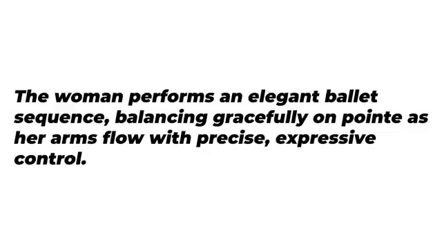
*Texte en gros plan affichant le prompt du nouveau test de génération : "The woman performs an elegant ballet sequence, balancing gracefully on pointe as her arms flow with precise, expressive control."*

---

### ⏱️ `[00:03:58 - 00:04:33]` | Segment #08

**🔊 Audio (Transcription Intégrale Mot pour Mot en Français) :**
> du temps nécessaire pour chaque génération, on parle d'une minute et demie pour une sortie de 768p de six secondes. Allons regarder notre séquence de ballet maintenant. Donc évidemment une ambiance très différente de notre première génération de danse. Celle-ci est beaucoup plus gracieuse. Elle a un flux vraiment très agréable. Encore une fois, je veux parler de la façon dont le tissu se froisse et se plisse de manière réaliste et j'aime vraiment certains des mouvements subtils des yeux que nous obtenons également dans cette génération. Cela donne une sensation beaucoup plus humaine. Il y a des moments où son

**👁️ Analyse Visuelle d'Écran (gemini-3.5-flash-lite) :**
**Interface & Outils** : Interface web de Hailoo AI (MiniMax) avec panneau de prompt latéral, lecteur vidéo et incrustation vidéo (PiP) du créateur.

**Contenu textuel & Code** : Texte affiché : "The latest update includes both Hailuo 2.3 and Hailuo 2.3 Fast models...", et prompt : "The woman performs an elegant ballet sequence, balancing gracefully on pointe as her arms flow with precise, expressive control." Paramètres visibles : Modèle "SVD 2.3", "Motion Enhancement: 768P".

**Action / Démonstration** : Le créateur commente la nouvelle génération vidéo de ballet, analyse le réalisme du tissu et des mouvements de la femme, tout en montrant les résultats visuels à l'écran.

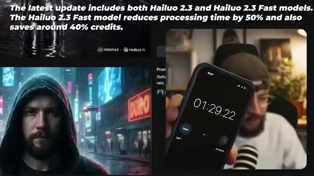
*Interface du navigateur affichant le site Hailoo AI avec le texte sur les modèles Hailoo 2.3 Fast et un insert vidéo où Jack montre un chronomètre sur son téléphone.*

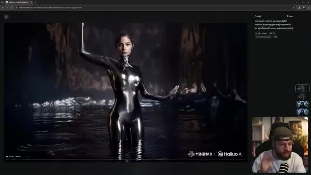
*Interface Web de Hailoo AI montrant la vidéo générée d'une femme en combinaison brillante effectuant une danse, avec le panneau de prompt sur le côté droit et le créateur en incrustation PiP.*

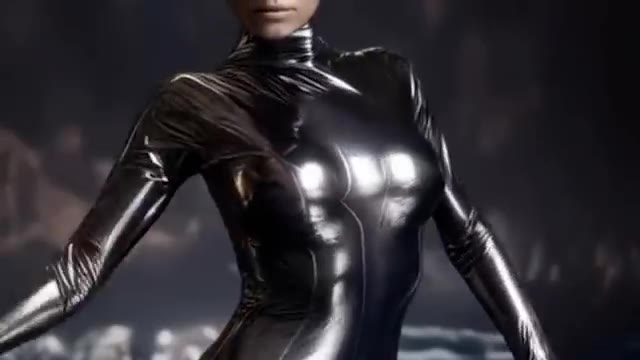
*Gros plan sur la vidéo générée montrant le haut du corps d'une femme portant une combinaison brillante semblable à du latex avec des plis réalistes.*

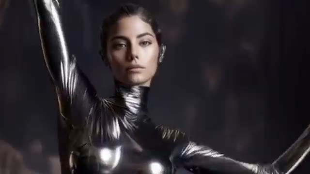
*Gros plan resserré sur le visage et le torse de la femme dans la vidéo générée par IA, mettant en valeur les détails du costume et du visage.*

---

### ⏱️ `[00:04:33 - 00:05:06]` | Segment #09

**🔊 Audio (Transcription Intégrale Mot pour Mot en Français) :**
> les yeux deviennent un peu robotiques et on brise en quelque sorte cette illusion, mais vers la fin de la génération, on peut voir qu'elle cligne des yeux très lentement et cela donne vraiment un aspect beaucoup plus vivant, et je parle beaucoup sur cette chaîne du fait qu'il n'est pas nécessaire d'utiliser une génération entière si on ne le veut pas, simplement parce qu'on a dépensé des crédits pour cela, dans ce cas-ci nous ne l'avons d'ailleurs pas fait, vous allez avoir beaucoup plus de succès en tant que réalisateur ou publicitaire en IA si vous prenez les meilleures parties de chaque génération et dans ce cas-ci, peut-être que nous voulons utiliser ce mouvement des yeux vraiment subtil et agréable à l'intérieur

**👁️ Analyse Visuelle d'Écran (gemini-3.5-flash-lite) :**
**Interface & Outils** : Hailuo AI (MiniMax) dans un navigateur web, avec un panneau latéral droit affichant les détails du prompt et une incrustation vidéo (Picture-in-Picture) du créateur Jack dans le coin inférieur droit.

**Contenu textuel & Code** : Le prompt visible dans le panneau latéral indique : "The woman performs an elegant ballet sequence, balancing gracefully on pointe as her arms flow with precise, expressive control." Paramètres visibles : Start Frame, I2V 2.0, Enhance Optimization (ON). Logos MINIMAX et Hailuo AI visibles en bas à droite de la vidéo générée.

**Action / Démonstration** : Le lecteur vidéo affiche la lecture d'une génération montrant une femme vêtue d'une combinaison brillante dans un décor aquatique sombre, tandis que le créateur Jack commente la séquence dans l'encadré PiP.

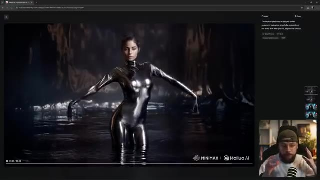
*Interface de Hailuo AI montrant une femme en costume brillant dans l'eau avec le créateur en incrustation PiP dans le coin inférieur droit.*

---

### ⏱️ `[00:05:06 - 00:05:38]` | Segment #10

**🔊 Audio (Transcription Intégrale Mot pour Mot en Français) :**
> notre film d'IA. Je dirais donc que c'est plutôt réussi en ce qui concerne les tests de danse et de performance. Je veux maintenant passer aux scènes de combat ou aux séquences d'action. Nous avons donc ce plan ici que nous allons utiliser pour cela, alors je vais aller le glisser-déposer dans la fenêtre de la frame de départ et pour le prompt textuel, nous allons mettre : la femme se lance dans une scène de combat rapide, esquivant et frappant avec une précision acrobatique explosive, mouvement de caméra de suivi dynamique, et nous allons cliquer sur générer pour celui-ci et ce que nous ferons également, c'est tester une alternative.

**👁️ Analyse Visuelle d'Écran (gemini-3.5-flash-lite) :**
**Interface & Outils** : Interface web de l'outil de génération vidéo Kling AI (ou équivalent), avec vue en split-screen (panneau de configuration à gauche et galerie de créations à droite), incluant un encadré PiP (Picture-in-Picture) du créateur en bas à droite.

**Contenu textuel & Code** : Le prompt textuel saisi dans l'interface : "The woman launches into a fast-paced fight scene, dodging and striking with explosive, acrobatic precision. Dynamic tracking camera movement."

**Action / Démonstration** : Le créateur montre l'interface du logiciel, glisse-dépose l'image source, saisit le prompt textuel pour la scène de combat et lance la génération de la vidéo.

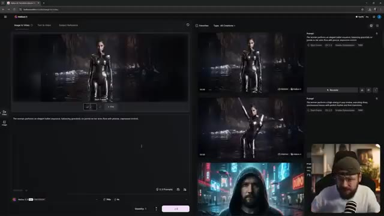
*Interface du logiciel de génération vidéo IA montrant les résultats des tests de danse précédents avec un aperçu vidéo et le panneau de contrôle.*

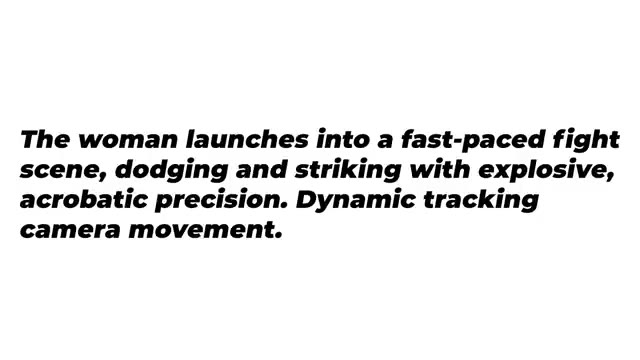
*Texte incrusté en gros caractères noirs sur fond blanc affichant le prompt textuel décrivant la scène de combat.*

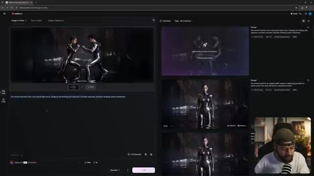
*Interface du logiciel avec la nouvelle image de départ importée et le prompt textuel du combat saisi, prêt pour la génération.*

---

### ⏱️ `[00:05:38 - 00:06:14]` | Segment #11

**🔊 Audio (Transcription Intégrale Mot pour Mot en Français) :**
> invite la femme à canaliser son énergie dans une séquence de combat dynamique libérant des mouvements rapides d'arts martiaux remplis d'intensité et de puissance et je pense que je vais ajouter à la fin ici juste pour obtenir une ambiance légèrement différente nous allons opter pour un mouvement de caméra sur appareil tenu à main générons celui-ci également très bien examinons nos générations de scènes de combat en commençant par la première ok c'est plutôt cool le mouvement semble très réaliste une sorte de scène de combat très frénétique et la façon dont leurs corps interagissent avec l'eau ou le métal liquide en dessous d'eux est très fidèle à la réalité

**👁️ Analyse Visuelle d'Écran (gemini-3.5-flash-lite) :**
**Interface & Outils** : Navigateur web affichant l'interface de la plateforme de génération vidéo IA Hailuo AI (Minimax).

**Contenu textuel & Code** : Texte du prompt visible : "The woman channels her energy into a dynamic combat sequence, unleashing rapid martial arts movements filled with intensity and power. Handheld..." ainsi que les paramètres de génération (modèle Hailuo 2.3).

**Action / Démonstration** : Le présentateur configure les prompts de génération vidéo, lance le rendu et commente la fluidité et le réalisme des mouvements de combat générés.

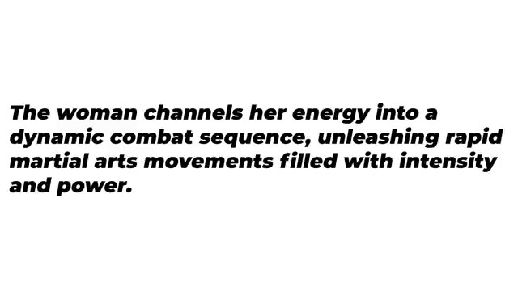
*Texte du prompt décrivant la séquence de combat d'arts martiaux affiché sur fond blanc.*

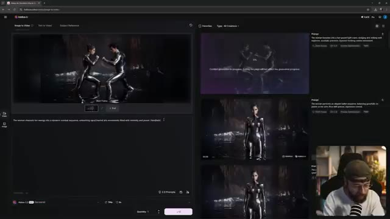
*Interface de Hailuo AI montrant la configuration de l'image à la vidéo avec le champ de texte du prompt et le retour vidéo.*

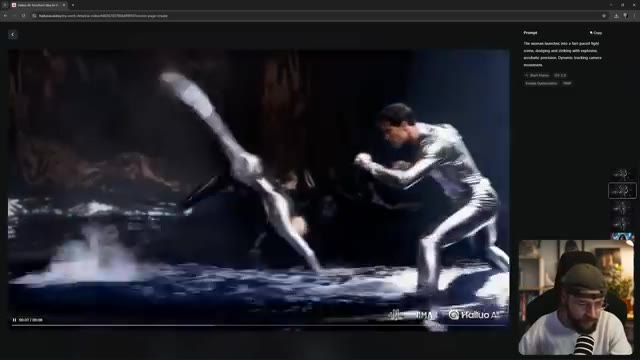
*Résultat de génération vidéo dans Hailuo AI montrant deux personnages vêtus de combinaisons métalliques s'affrontant dans un combat dynamique.*

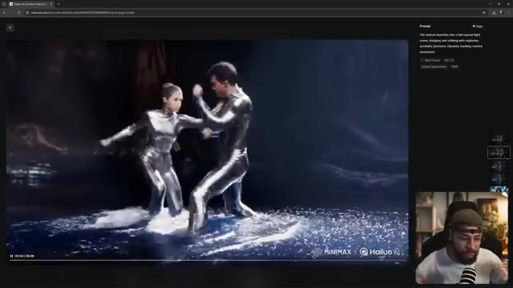
*Gros plan sur le rendu vidéo dans Hailuo AI avec les personnages interagissant avec une surface liquide métallique.*

---

### ⏱️ `[00:06:14 - 00:06:51]` | Segment #12

**🔊 Audio (Transcription Intégrale Mot pour Mot en Français) :**
> je pense que vers la fin de la génération, ça commence vraiment à devenir un peu brouillon. Peut-être que je vais balancer une partie ralentie de la séquence ou même genre un arrêt sur image pour mettre ça en valeur pour vous les gars. Mais je ne pense pas que ce soit suffisant pour rendre ça moins impressionnant. Ça me paraît plutôt super. J'adore la façon dont c'est géré encore une fois le mouvement du tissu et nos personnages restent tous les deux bien cohérents du début à la fin. L'environnement change un tout petit peu. On est passé de ce genre d'ambiance métal liquide à de l'eau bleue bien claire vers la fin de la génération. On aurait peut-être pu éviter ça en faisant mieux

**👁️ Analyse Visuelle d'Écran (gemini-3.5-flash-lite) :**
**Interface & Outils** : Interface web de Hailuo AI (MiniMax) avec lecteur vidéo central, barre de progression, et panneau de prompt textuel sur la droite incluant les options "Start Frame: V2.3" et "Enable Optimization: Fast".

**Contenu textuel & Code** : Texte visible dans le panneau de prompt à droite : "The woman launches into a fast-paced fight scene, dodging and striking with explosive, acrobatic precision. Dynamic tracking camera movement."

**Action / Démonstration** : Le créateur commente la vidéo générée par IA affichée à l'écran, montrant deux personnages s'affrontant dans l'eau, tandis que l'interface de la plateforme web présente les paramètres et le prompt de génération.

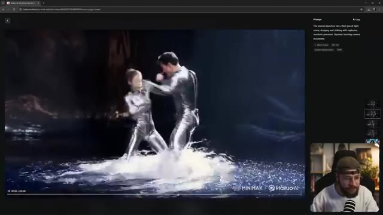
*Interface de Hailuo AI affichant la lecture vidéo d'une scène de combat aquatique avec des personnages en combinaisons argentées, avec Jack visible en bas à droite dans un encadré PiP.*

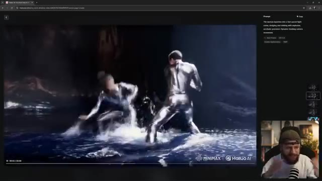
*Interface de Hailuo AI montrant la suite de la lecture vidéo du combat avec de l'eau et des éclaboussures, et Jack en encadré PiP gesticulant.*

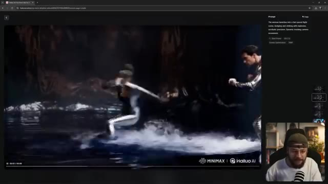
*Interface de Hailuo AI montrant un mouvement rapide des personnages dans l'eau, avec le panneau de prompt visible à droite.*

---

### ⏱️ `[00:06:51 - 00:07:25]` | Segment #13

**🔊 Audio (Transcription Intégrale Mot pour Mot en Français) :**
> en décrivant l'environnement dans lequel nous voulons que la génération ait lieu. Nous nous concentrons vraiment ici sur la façon dont cela gère les mouvements corporels et je pense que Hylou fait un très bon travail moi-même. Allons de l'avant et vérifions la deuxième génération. Donc, ce que j'aime vraiment dans celle-ci en particulier, c'est le mouvement de caméra d'appareil tenu à la main. J'aime vraiment la fin de cette génération, la façon dont nous terminons sur le visage de la femme semble très dynamique et cinématographique et notre personnage masculin joue un rôle beaucoup plus défensif, il essaie de bloquer beaucoup un autre test très réussi donc je vais

**👁️ Analyse Visuelle d'Écran (gemini-3.5-flash-lite) :**
**Interface & Outils** : Interface web de Hailuo AI (MiniMax) avec des options de génération vidéo, de réglage de prompts textuels et de prévisualisation, incluant une incrustation vidéo (PiP) du présentateur en bas à droite.

**Contenu textuel & Code** : Texte du prompt visible sur le panneau latéral : « The woman launches into a fast-paced fight scene, dodging and striking with acrobatic precision. Dynamic tracking camera movement. » Paramètres visibles : Start Frame, Hylou 2.3.

**Action / Démonstration** : Le créateur navigue et commente les différentes générations vidéo générées par l'IA sur l'interface Hailuo AI.

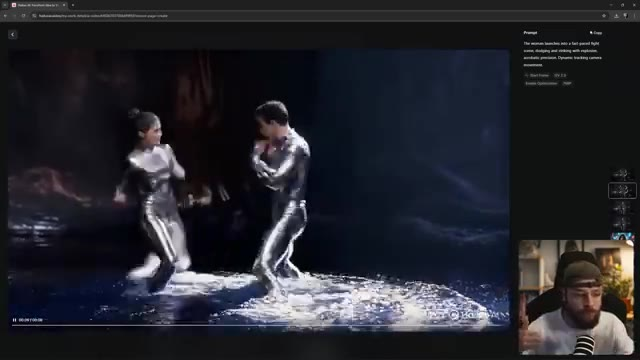
*Visualisation d'une vidéo générée montrant deux personnages en tenues argentées combattant dans l'eau sur l'interface de Hailuo AI.*

*Interface principale de Hailuo AI avec un panneau de prévisualisation à gauche et une liste de générations de vidéos sur le côté droit.*

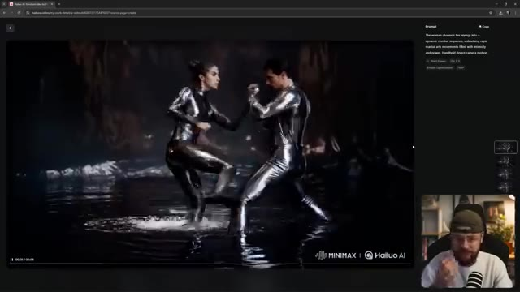
*Gros plan sur un extrait de la génération montrant les deux personnages en plein mouvement d'arts martiaux avec les logos Minimax et Hailuo AI.*

---

### ⏱️ `[00:07:25 - 00:07:57]` | Segment #14

**🔊 Audio (Transcription Intégrale Mot pour Mot en Français) :**
> et ensuite je veux aller voir certains des rendus plus stylisés que l'on peut obtenir donc nous allons regarder un peu d'anime pour cela nous allons commencer par cette image en gros plan particulière ici donc nous allons aller la glisser-déposer comme notre image de départ et en termes de prompt textuel nous allons dire la femme réagit subtilement alors que son expression passe du calme à l'émotion, ses yeux scintillant de micro-mouvements nuancés animation de style anime allons cliquer sur générer pour ça et je veux tester notre scène de combat de style anime pour voir comment

**👁️ Analyse Visuelle d'Écran (gemini-3.5-flash-lite) :**
**Interface & Outils** : Interface web d'un outil de génération de vidéo par IA (probablement Kling ou un outil similaire) avec des options "Image to Video", "Text to Video", "Subject Reference", un champ de prompt textuel et une section de prévisualisation des résultats.

**Contenu textuel & Code** : Le prompt textuel affiché à l'écran : "The woman reacts subtly as her expression shifts from calm to emotional, her eyes glistening with nuanced micro-movements. Anime style animation." Un bouton de génération et des aperçus vidéo dans le panneau latéral.

**Action / Démonstration** : Le créateur montre l'interface de l'outil d'IA, insère une image de départ, tape ou affiche le prompt textuel décrivant une animation de style anime, puis clique sur le bouton de génération.

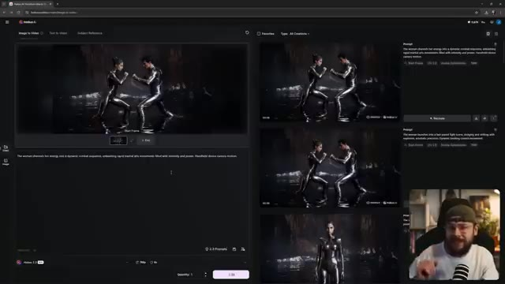
*Interface de l'outil de génération vidéo affichant les options Image to Video et les prompts textuels.*

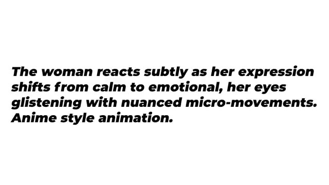
*Gros plan textuel affichant le prompt exact sur fond blanc utilisé pour l'animation style anime.*

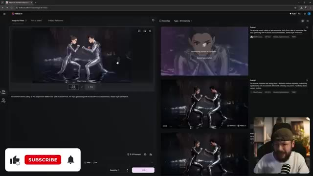
*Interface de l'outil montrant le lancement de la génération vidéo avec un encadré de prévisualisation et Jack en bas à droite.*

---

### ⏱️ `[00:07:57 - 00:08:30]` | Segment #15

**🔊 Audio (Transcription Intégrale Mot pour Mot en Français) :**
> cela se compare à notre résultat en prises de vue réelles d'avant, en réutilisant simplement le même prompt textuel de nos générations précédentes et je veux juste ajouter à la fin animation style anime, faisons générer celui-ci également. Très bien, notre première génération étant prête, allons jeter un œil. Donc nous avons ce genre de changement émotionnel où notre femme a l'air plutôt heureuse puis quelque chose la touche, elle se sent un peu émotive et commence à pleurer, et on a vraiment l'impression du type de style d'animation qu'on attendrait d'un anime. Je dirais que j'aimerais voir un peu plus de mouvement en ce qui concerne

**👁️ Analyse Visuelle d'Écran (gemini-3.5-flash-lite) :**
**Interface & Outils** : Interface web de Hailuo AI (MiniMax) avec panneau de prompt à droite et lecteur vidéo au centre.

**Contenu textuel & Code** : Texte du prompt visible : « The woman reacts subtly as her expression shifts from calm to emotional, her eyes glistening with nuanced micro movements, anime style animation. »

**Action / Démonstration** : Le créateur navigue sur l'interface de génération vidéo, lance une nouvelle génération avec un style anime et analyse le résultat visuel obtenu.

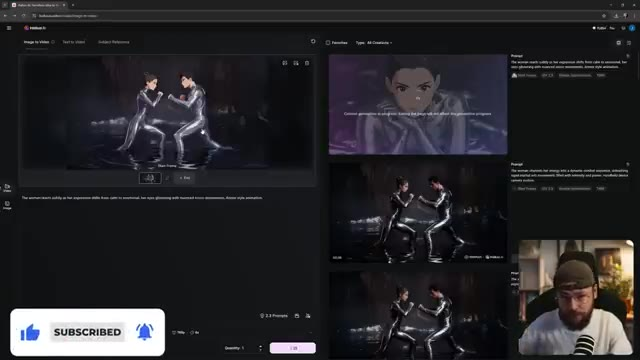
*Interface de l'outil Hailuo AI montrant le tableau de bord de génération de vidéo avec un aperçu en cours.*

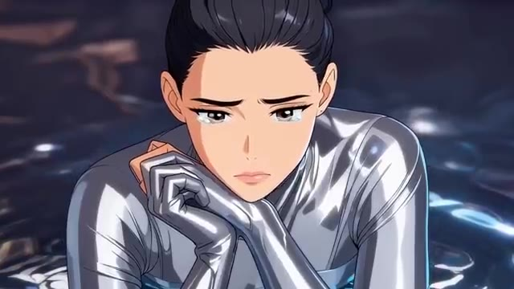
*Gros plan sur le rendu vidéo généré montrant un personnage féminin d'anime en larmes.*

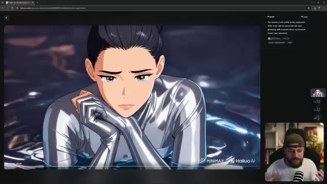
*Visualisation de la vidéo générée dans l'interface de Hailuo AI avec la webcam du créateur en incrustation.*

---

### ⏱️ `[00:08:30 - 00:09:05]` | Segment #16

**🔊 Audio (Transcription Intégrale Mot pour Mot en Français) :**
> au métal liquide dans lequel elle est assise. Il bouge mais très subtilement et je pense personnellement que j'aurais dû rendre cette génération un peu plus dynamique en ajoutant un léger mouvement de travelling avant, mais ça nous donne quand même un super aperçu de la façon dont le modèle gère ce genre de changements faciaux subtils. Très curieux de voir comment il va gérer la scène de combat, on a récupéré notre génération pour ça maintenant, jetons un œil : donc celle-ci n'est pas vraiment super réussie, une partie de la physicalité du combat n'a pas beaucoup de sens, c'est un peu la première fois que

**👁️ Analyse Visuelle d'Écran (gemini-3.5-flash-lite) :**
**Interface & Outils** : Interface web de MiniMax Hailuo AI (hailuoai.video) affichant un lecteur vidéo, le texte du prompt sur le panneau latéral droit, ainsi qu'une petite fenêtre PiP du créateur dans le coin inférieur droit.

**Contenu textuel & Code** : Texte du prompt visible sur l'image 1 : "The woman rests jawily as her expression shifts from calm to emotional, her eyes glowing with advanced micro movements, Anime style animation." Texte du prompt visible sur l'image 2 : "The woman launches into a fast-paced fight scene, dodging and striking with explosive, acrobatic precision, Anime style animation."

**Action / Démonstration** : Le navigateur web affiche la plateforme de génération vidéo MiniMax Hailuo AI avec un lecteur vidéo montrant des animations de style anime, tandis que le créateur commente les résultats en bas à droite.

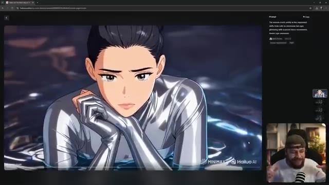
*Interface de Hailuo AI montrant une femme dans une combinaison en métal liquide avec des micro-mouvements faciaux subtils, et la webcam du créateur en incrustation (PiP).*

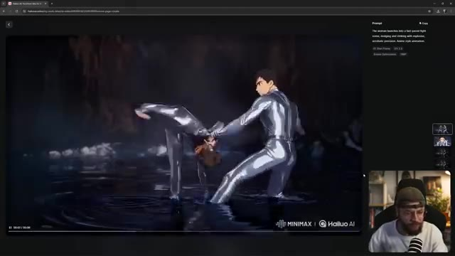
*Interface de Hailuo AI montrant une scène de combat animée entre deux personnages dans des combinaisons en métal liquide, avec le panneau de prompt latéral.*

---

### ⏱️ `[00:09:05 - 00:09:36]` | Segment #17

**🔊 Audio (Transcription Intégrale Mot pour Mot en Français) :**
> Nous avons vu le modèle lutter avec un prompt comme celui-ci et cela ne donne pas vraiment l'impression d'un style anime selon moi. À certains moments, nous perdons aussi un peu de la cohérence des personnages, en particulier le visage de la femme qui se métamorphose en quelque sorte du style dessin animé anime vers un look plus live-action et un mélange étrange des deux pendant certaines images. Je vais certainement aller de l'avant et faire un peu plus de tests avec ceci, peut-être concevoir un prompt pour que cela ressemble davantage à ce que l'on attendrait dans une scène de combat d'anime.

**👁️ Analyse Visuelle d'Écran (gemini-3.5-flash-lite) :**
**Interface & Outils** : Hailuo AI (MiniMax)

**Contenu textuel & Code** : Prompt visible sur l'image 1 : "The woman launches into a fast-paced fight scene, dodging and striking with explosive, acrobatic precision. Anime style animation." Paramètres visibles : Start Frame, SIV 2.5, Enhance Optimization, 720P.

**Action / Démonstration** : Le créateur montre l'interface de Hailuo AI et les clips générés tout en commentant la cohérence visuelle et le style anime.

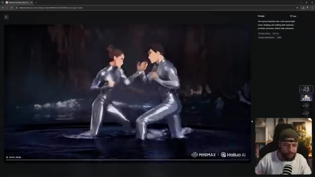
*Interface de l'outil Hailuo AI affichant une vidéo de combat entre deux personnages dans un décor aquatique sombre, avec le prompt textuel et la webcam du créateur en incrustation.*

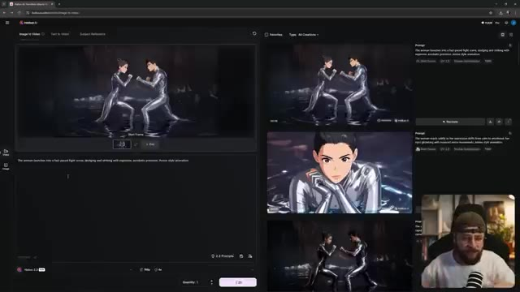
*Interface de Hailuo AI montrant le tableau de bord de génération avec plusieurs clips vidéo générés et les champs de saisie de prompts.*

---

### ⏱️ `[00:09:36 - 00:09:57]` | Segment #18

**🔊 Audio (Transcription Intégrale Mot pour Mot en Français) :**
> Si j'obtenais de meilleurs résultats, vous verriez ça en ce moment même. Dans la vidéo, je peux l'ajouter par-dessus et j'ajouterai également le texte du prompt. Comme ça, vous connaissez les changements que j'ai faits pour obtenir un meilleur rendu. Donc maintenant, nous allons faire un gros plan et nous allons voir comment Hyluo gère ces changements faciaux subtils sur une sortie en prises de vue réelles par rapport à la génération animée de tout à l'heure.

**👁️ Analyse Visuelle d'Écran (gemini-3.5-flash-lite) :**
**Interface & Outils** : Visionneuse de média ou lecteur vidéo affichant des contenus visuels générés par IA avec incrustation PiP du créateur dans le coin inférieur droit (image 2).

**Contenu textuel & Code** : Texte affiché à l'écran dans l'image 1 : « In an anime style like Dragon Ball Z the woman and man have a dramatic, fast paced, stylised fight. Dynamic camera movement, hand animated and intense. » Nom de fichier visible dans la barre de titre de l'image 2 : « ccf6d48ff7...png ».

**Action / Démonstration** : Affichage des exemples générés par IA comparés par le créateur, montrant d'abord une scène de combat animée puis une image fixe en gros plan.

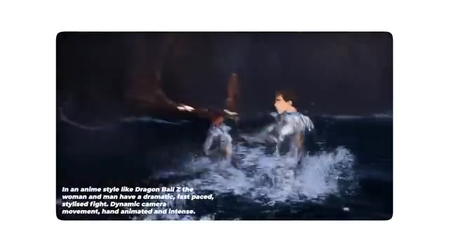
*Génération vidéo de style anime montrant deux personnages en train de se battre dans l'eau avec le texte du prompt affiché en bas à gauche.*

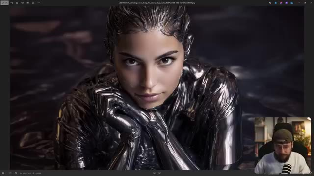
*Gros plan sur une image fixe photoréaliste d'une femme couverte d'un revêtement métallique brillant dans l'eau, avec le créateur visible en incrustation (PiP) dans le coin inférieur droit.*

---

### ⏱️ `[00:09:57 - 00:10:34]` | Segment #19

**🔊 Audio (Transcription Intégrale Mot pour Mot en Français) :**
> Nous réutilisons un prompt très similaire à celui que nous avons utilisé un peu plus tôt, mais je veux vraiment ajouter un mouvement de caméra dolly lent juste pour ajouter un peu plus de dynamisme et encore une fois, juste un prompt légèrement alternatif que je vais insérer ici également avec un mouvement de caméra dolly lent, allons lancer une seconde génération aussi pour analyser vraiment ce modèle vidéo à fond, donc j'aime vraiment la façon dont le fluide bouge derrière elle dans cette génération et alors que nous nous approchons vraiment très près des yeux de la femme, elle commence à avoir les larmes aux yeux et ce niveau de détail

**👁️ Analyse Visuelle d'Écran (gemini-3.5-flash-lite) :**
**Interface & Outils** : Navigateur web affichant l'interface de la plateforme de génération vidéo Hailuo AI (MiniMax).

**Contenu textuel & Code** : Texte visible du prompt dans l'interface : « The woman reacts subtly as her expression shifts from calm to emotional, her eyes glistening with nuanced micro movements. Slow dolly camera move in. »

**Action / Démonstration** : Le créateur montre l'interface de Hailuo AI avec la configuration d'un nouveau prompt incluant un mouvement de caméra dolly lent, puis présente le résultat de la vidéo générée avec les détails du visage et du mouvement des fluides.

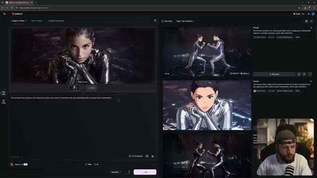
*Interface de Hailuo AI montrant la zone de saisie du prompt pour la génération vidéo à partir d'une image.*

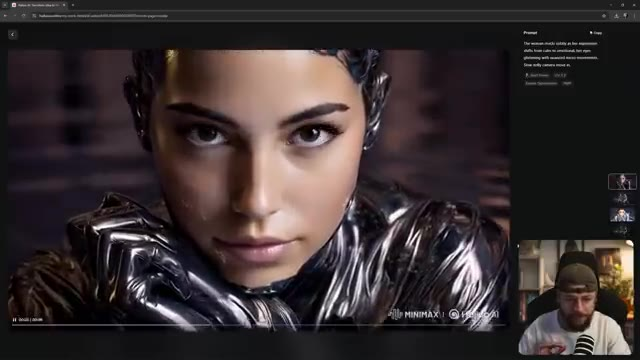
*Affichage en gros plan du résultat vidéo généré par Hailuo AI, montrant la femme dans un style hyperréaliste avec un mouvement de caméra dolly avant.*

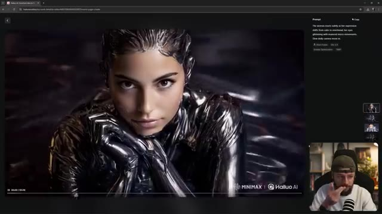
*Affichage du résultat vidéo généré sur Hailuo AI, montrant le plan de la femme avec le fluide en arrière-plan et le panneau de prompt sur le côté droit.*

---

### ⏱️ `[00:10:34 - 00:11:02]` | Segment #20

**🔊 Audio (Transcription Intégrale Mot pour Mot en Français) :**
> l'image finale est vraiment folle. On manque un peu de texture de peau pour être honnête, l'image de départ n'avait pas énormément de pores visibles et tout ça, mais Hyluo ajoute vraiment de très jolis détails également. Si vous regardez en haut à droite pour observer le sourcil, c'est assez fou. On peut y voir les brins de cheveux individuels. Je dirais que c'est probablement la génération la plus impressionnante qu'on ait eue jusqu'ici.

**👁️ Analyse Visuelle d'Écran (gemini-3.5-flash-lite) :**
**Interface & Outils** : Interface web de Hailuo AI (MiniMax) avec un panneau latéral droit pour le prompt textuel et un aperçu vidéo principal au centre, incluant une incrustation vidéo (PiP) du créateur en bas à droite.

**Contenu textuel & Code** : Le prompt visible dans le panneau latéral indique : "The woman reacts subtly as her expressive shifts from calm to emotional, her eyes gleaming with nuanced micro movements. Slow dolly camera move in." On peut aussi lire "Start Frame: V2.0" et "Enable Optimization: Text". Les logos "MINIMAX" et "Hailuo AI" apparaissent en bas à droite de la vidéo.

**Action / Démonstration** : Le créateur commente la vidéo générée à l'écran, en pointant du doigt les détails des sourcils et de la texture sur l'interface de Hailuo AI.

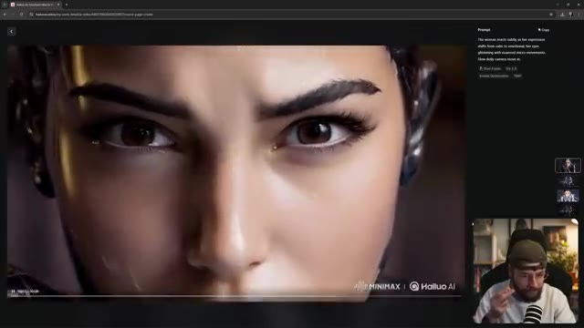
*Interface du site Hailuo AI affichant le résultat vidéo du visage d'une femme avec le prompt associé et la caméra du créateur en incrustation (PiP).*

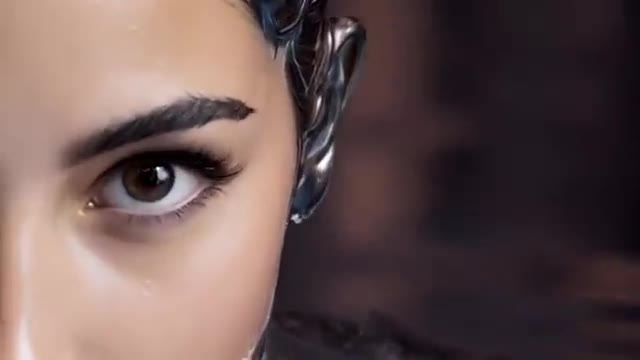
*Gros plan plein écran sur l'œil droit et l'oreille d'un personnage féminin généré par IA montrant le niveau de détail des sourcils et des mèches de cheveux.*

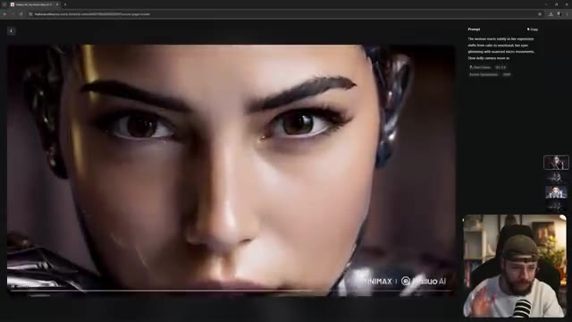
*Interface du site Hailuo AI affichant un gros plan sur le visage du personnage féminin généré avec le panneau latéral du prompt et le retour vidéo du créateur en PiP.*

---

### ⏱️ `[00:11:02 - 00:11:36]` | Segment #21

**🔊 Audio (Transcription Intégrale Mot pour Mot en Français) :**
> Ça fait très cinématique, plutôt réaliste, et ces détails texturaux qu'Hailuo 2.3 ajoute m'en mettent plein la vue, je ne vais pas mentir. Très bien, regardons notre deuxième génération. Donc elle commence par avoir l'air vraiment heureuse, secoue un peu la tête et passe à un air triste et presque en colère, et encore une fois, je pense que c'est vraiment là que le modèle vidéo commence à briller pour moi. Ce genre de changements très subtils dans l'émotion humaine, c'est vraiment assez impressionnant.

**👁️ Analyse Visuelle d'Écran (gemini-3.5-flash-lite) :**
**Interface & Outils** : Interface web de Hailuo AI (MiniMax) avec un lecteur vidéo, un panneau latéral pour le prompt textuel et un encadré PiP du créateur en bas à droite.

**Contenu textuel & Code** : Le prompt visible dans le panneau de droite indique : "The woman reacts subtly as her expression shifts from calm to emotional, her eyes glistening with nuanced macro movements. Slow dolly camera move in."

**Action / Démonstration** : Le créateur présente une vidéo générée par IA illustrant les transitions émotionnelles subtiles d'un personnage féminin au corps métallique sur Hailuo AI.

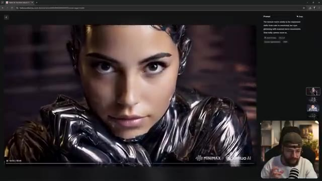
*Interface de Hailuo AI montrant une femme avec un corps métallique brillant, affichant une expression neutre à calme.*

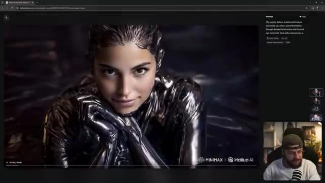
*Interface de Hailuo AI montrant la même femme souriant légèrement et secouant la tête.*

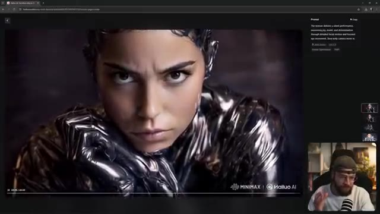
*Interface de Hailuo AI montrant la femme avec une expression faciale plus sombre, triste ou en colère.*

---

### ⏱️ `[00:11:36 - 00:12:09]` | Segment #22

**🔊 Audio (Transcription Intégrale Mot pour Mot en Français) :**
> et pour finir, nous allons jeter un œil à quelques plans de produits également. Nous avons la femme ici tenant cette montre dorée au look premium et ici elle tient ce produit de soin pour la peau également. Commençons donc par la montre. Pour le prompt textuel, nous allons opter pour : la femme présente une montre de luxe avec des mouvements de main gracieux, la tournant lentement pour mettre en valeur ses détails et ses reflets. Mouvement de caméra dynamique tenu à la main pour tester quelque chose d'un peu différent. Glissons et déposons également celui où elle tient ce produit de soin pour la peau et je

**👁️ Analyse Visuelle d'Écran (gemini-3.5-flash-lite) :**
**Interface & Outils** : Interface web de l'outil de génération vidéo Kling / Kling AI (ou similaire, type Hailuo AI) avec panneau de prévisualisation et historique des générations à droite.

**Contenu textuel & Code** : Texte affiché à l'écran : "The woman presents a luxury watch with graceful hand movements, turning it slowly to highlight its details and reflections. Dynamic handheld device camera movement."

**Action / Démonstration** : Le créateur montre l'interface de l'outil de génération, affiche le prompt textuel en grand, puis revient sur l'interface montrant le chargement d'une nouvelle image pour le produit de soin.

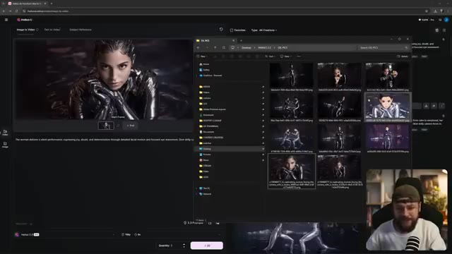
*Interface de l'outil de génération vidéo avec une fenêtre de sélection de fichiers ouverte par-dessus.*

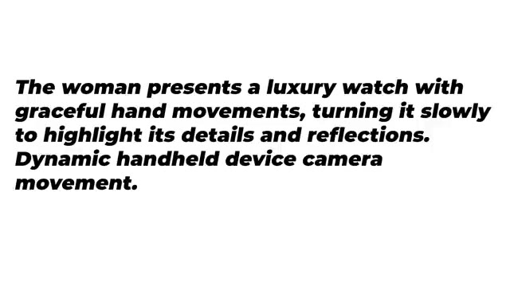
*Gros plan sur le texte du prompt en anglais affiché en plein écran sur fond blanc.*

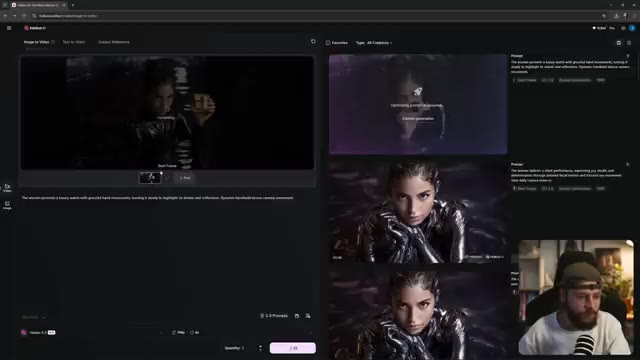
*Interface de l'outil montrant la génération en cours et les miniatures des vidéos précédentes sur le panneau latéral droit.*

---

### ⏱️ `[00:12:09 - 00:12:43]` | Segment #23

**🔊 Audio (Transcription Intégrale Mot pour Mot en Français) :**
> Je veux pousser le modèle vidéo un peu plus loin ici. Dans le prompt textuel, nous allons dire que la femme présente un produit de soin élégant. Elle retire délicatement le couvercle en tournant et commence à appliquer la crème sur son visage avec des gestes fluides et naturels tout en maintenant un contact visuel confiant et réaliste. Très bien, nous avons récupéré notre génération de montre, jetons-y un œil. D'accord, ce n'est pas vraiment ce que nous recherchions avec cette génération, la montre se comporte d'une manière assez étrange. J'aime la façon dont la caméra s'approche en zoom avant pour y voir de plus près, mais nous perdons un

**👁️ Analyse Visuelle d'Écran (gemini-3.5-flash-lite) :**
**Interface & Outils** : Interface web de Hailuo AI (Minimax) pour la génération de vidéo par IA (mode Image-to-Video).

**Contenu textuel & Code** : Texte du prompt visible : « The woman showcases a sleek skincare product, she gracefully twists of the lid and begins applying the cream to her face with smooth, natural gestures while maintaining confident, realistic eye contact. Slow dolly camera move in. »

**Action / Démonstration** : Le créateur montre l'interface de l'outil Hailuo AI, affiche le prompt textuel utilisé, puis examine le résultat de la génération vidéo d'une femme avec une montre en or tout en commentant le comportement étrange de la montre et le mouvement de caméra.

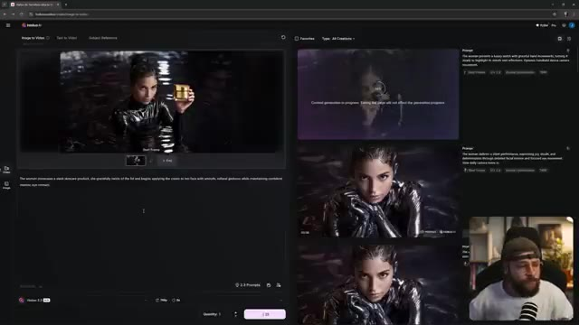
*Interface de Hailuo AI montrant l'éditeur Image-to-Video avec un aperçu de la femme tenant un produit de soin.*

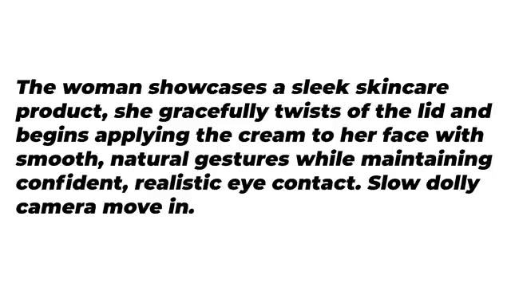
*Texte incrusté en gros caractères affichant le prompt textuel détaillé pour la génération vidéo.*

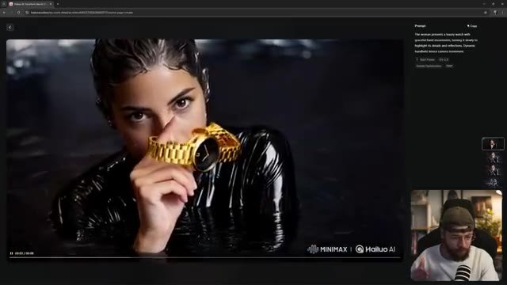
*Résultat de la génération vidéo montrant une femme tenant une montre en or près de son visage dans l'interface Hailuo AI.*

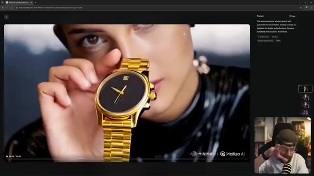
*Gros plan sur le résultat vidéo avec effet de zoom avant (dolly in) sur la montre en or tenue par la femme.*

---

### ⏱️ `[00:12:43 - 00:13:19]` | Segment #24

**🔊 Audio (Transcription Intégrale Mot pour Mot en Français) :**
> Un petit problème de cohérence de produit ici malheureusement. Ça ne colle pas vraiment au prompt textuel qu'on lui a donné. C'est un peu dommage pour cette génération, mais vous savez qu'avec l'IA, c'est parfois une question d'essais et d'erreurs. Donc, une fois de plus, je vais relancer ce même prompt et je vais le mettre par-dessus la vidéo pour que vous puissiez voir qu'on a bien, espérons-le, obtenu une génération qui correspondait davantage à ce qu'on cherchait. Je suis vraiment curieux maintenant de voir comment Hailuo 2.3 va gérer cette génération-ci, où nous avons effectivement demandé à la femme de dévisser le capuchon supérieur du produit de soin de la peau, puis de l'appliquer.

**👁️ Analyse Visuelle d'Écran (gemini-3.5-flash-lite) :**
**Interface & Outils** : Navigateur web affichant l'interface de la plateforme de génération vidéo Hailuo AI (hailuoai.video).

**Contenu textuel & Code** : On peut lire le prompt textuel dans le panneau de droite : "The woman presents a luxury watch with graceful hand movements, turning it slowly to highlight its details and reflections. Dynamic handheld device camera movement." Paramètres visibles : Start Frame, UV 2.3, General optimization. Logos Minimax et Hailuo AI dans le lecteur vidéo.

**Action / Démonstration** : Le créateur présente le résultat d'une génération vidéo sur Hailuo AI, analyse le manque de cohérence du produit par rapport au prompt, puis montre l'interface de l'outil pour relancer une nouvelle génération avec un produit de soin de la peau.

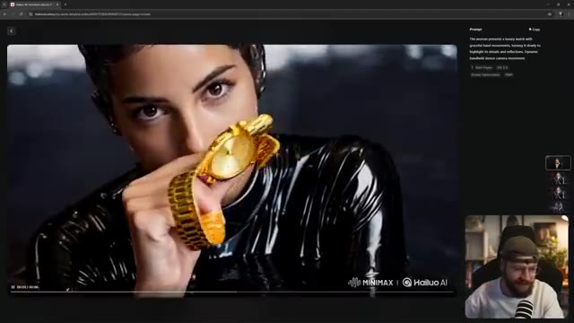
*Interface de Hailuo AI montrant la lecture d'une vidéo générée avec le prompt sur la montre de luxe.*

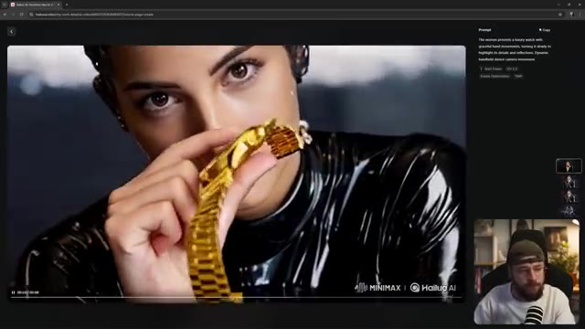
*Poursuite de la lecture de la vidéo générée dans Hailuo AI avec la femme présentant la montre.*

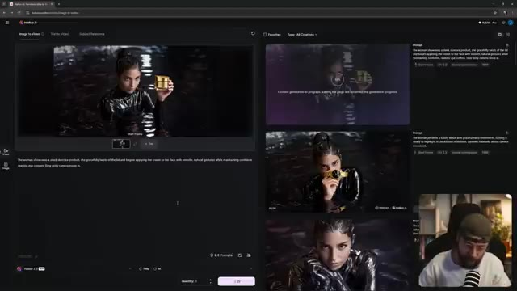
*Interface de Hailuo AI (Image to Video) montrant les paramètres de génération et l'historique des créations.*

---

### ⏱️ `[00:13:19 - 00:13:54]` | Segment #25

**🔊 Audio (Transcription Intégrale Mot pour Mot en Français) :**
> sur son visage. Ça va être intéressant. C'est parti. Donc elle ne visse pas le capuchon. La façon dont elle l'enlève n'est pas trop mal. Nous avons un bon niveau de cohérence du produit. On voit que les reflets ont l'air plutôt bons, c'est un prompt textuel assez difficile à réaliser, je dois dire. Il y a encore de très bonnes choses là-dedans. Encore une fois, l'interaction avec le fluide dans lequel la femme est allongée a l'air vraiment superbe. En tant que personnage, elle reste également bien cohérente. Je pense que, de manière générale, j'ai été très impressionné par Hailuo.

**👁️ Analyse Visuelle d'Écran (gemini-3.5-flash-lite) :**
**Interface & Outils** : Navigateur web affichant l'interface de l'outil de génération vidéo Hailuo AI (MiniMax), avec des panneaux de prompts, des options de modèles (Hailuo 2.3) et une vignette vidéo avec l'incrustation PiP du créateur.

**Contenu textuel & Code** : Texte du prompt visible : "The woman showcases a sleek skincare product, she gracefully twists off the lid and begins applying the cream to her face with smooth, natural gestures while maintaining confident, steadily eye contact. Slow dolly camera move in." Paramètres visibles : Start Frame, Hiv 2.3, Global consistency. Filigranes "MINIMAX" et "Hailuo AI".

**Action / Démonstration** : Le créateur commente l'interface de Hailuo AI et les différentes vidéos générées montrant une femme interagissant avec un produit de beauté et de l'eau.

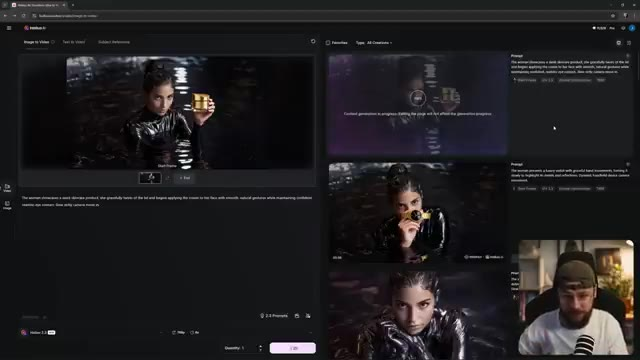
*Interface de l'outil Hailuo AI affichant le panneau de génération avec l'image d'une femme tenant un pot de crème et les résultats de différentes générations dans une grille, avec une incrustation vidéo du créateur dans le coin inférieur droit.*

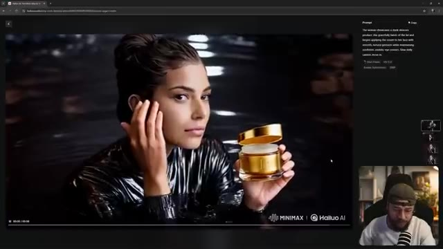
*Lecteur vidéo en plein écran sur l'interface Hailuo AI montrant une femme appliquant de la crème sur son visage près d'une surface d'eau réfléchissante, avec l'incrustation du créateur en bas à droite.*

---

### ⏱️ `[00:13:54 - 00:14:24]` | Segment #26

**🔊 Audio (Transcription Intégrale Mot pour Mot en Français) :**
> 2.3 vous auriez vu toute une série de tests différents dans cette vidéo donc j'espère que vous repartirez avec une meilleure impression de ce dont l'outil est capable. Et si vous voulez aller le tester, vous pouvez cliquer sur le lien en bas dans la description. Comme je l'ai dit plus tôt, Hylio propose actuellement quatre générations gratuites par jour. Merci beaucoup d'avoir regardé les gars. Si vous avez apprécié la vidéo d'aujourd'hui, n'oubliez pas d'y mettre un gros pouce bleu pour moi. Si vous êtes nouveau sur la chaîne, pensez à vous abonner pour rejoindre notre communauté en pleine croissance.

**👁️ Analyse Visuelle d'Écran (gemini-3.5-flash-lite) :**
**Interface & Outils** : Interface de la plateforme de génération vidéo en ligne Hylio AI (avec le watermark de Minimax / Hailuo AI), incluant un panneau de prompt textuel à droite et les vignettes des générations précédentes.

**Contenu textuel & Code** : Texte du prompt visible sur le panneau de droite : "The camera showcases a sleek, skincare product, she gracefully twists off the lid and begins applying the cream to her face with smooth, natural gestures while maintaining confident, static eye contact. Slow dolly camera moves in." Paramètres visibles : "Shot Frames: 120 / 2.0" et "Enable Optimization: Shift".

**Action / Démonstration** : Le créateur présente différents exemples de vidéos générées par l'IA démontrant les capacités de rendu réaliste et les mouvements de caméra fluides de l'outil Hylio.

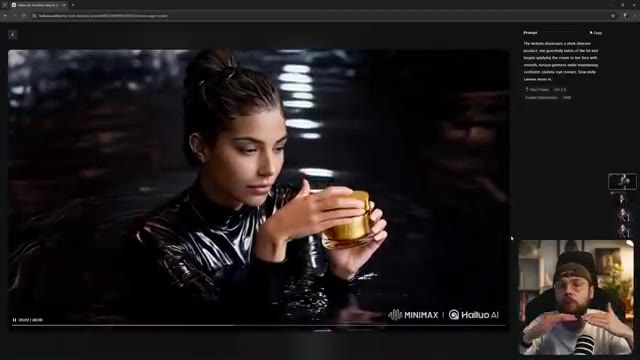
*Interface de la plateforme affichant une vidéo générée d'une femme tenant un pot de crème cosmétique, avec le panneau de prompt textuel sur le côté droit.*

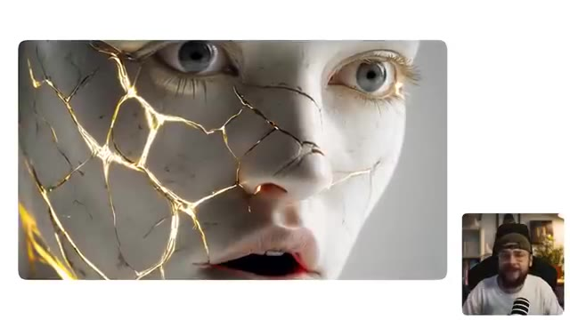
*Affichage d'un rendu vidéo généré montrant un visage semblable à de la porcelaine avec des fissures lumineuses dorées s'ouvrant sur la peau.*

---

### ⏱️ `[00:14:24 - 00:14:32]` | Segment #27

**🔊 Audio (Transcription Intégrale Mot pour Mot en Français) :**
> Et bien sûr, activez la cloche de notification pour ne jamais manquer de futures publications. Passez une excellente journée, les gars, et je vous retrouve dans la prochaine.

**👁️ Analyse Visuelle d'Écran (gemini-3.5-flash-lite) :**
**Interface & Outils** : Présentation face caméra sans partage d'écran

**Contenu textuel & Code** : Aucun texte, prompt ou paramètre technique visible. L'écran principal est entièrement blanc, avec uniquement le créateur visible dans un petit encadré PiP (Picture-in-Picture) en bas à droite de l'écran.

**Action / Démonstration** : Le créateur apparaît en bas à droite dans un petit encadré vidéo (PiP), gesticulant et s'adressant aux spectateurs pour conclure la vidéo.

---
