# 🎬 Comment transformer une image en plusieurs angles de caméra avec l'IA (OUTILS GRATUITS)

> **Chaîne** : [Jack Vs. AI](https://www.youtube.com/@JackVsAI)  
> **Titre original** : `How to Turn One Image into Multiple Camera Angles with AI (FREE TOOLS)`  
> **Lien YouTube** : [https://www.youtube.com/watch?v=keT_ywKa_lM](https://www.youtube.com/watch?v=keT_ywKa_lM)  
> **Date de publication** : 2025-11-11  
> **Durée** : 29m 13s (`1753s`)  
> **Identifiant vidéo** : `keT_ywKa_lM`  
> **Fiche Web Interactive** : [2025-11-11_YT-keT_ywKa_lM_Comment transformer une image en plusieurs angles de caméra avec l'IA (OUTILS GR_by-whisper-v3-large-turbo+gemini-3.5-flash-lite.html](2025-11-11_YT-keT_ywKa_lM_Comment transformer une image en plusieurs angles de caméra avec l'IA (OUTILS GR_by-whisper-v3-large-turbo+gemini-3.5-flash-lite.html)  
> **Captures de démonstration clés** : `141 captures réelles (anti-talking-head)`  
> **Modèles utilisés** : Audio: `large-v3-turbo` (Faster-Whisper int8 VPS) | Vision: `gemini-3.5-flash-lite` (Google AI Studio API)  

---

## 📌 Synthèse Exécutive & Outils

### 📌 Résumé
Dans cette vidéo, Jack, artiste VFX publicitaire chevronné, démocratise la réalisation cinématographique par intelligence artificielle en démontrant qu'il est désormais possible de générer des angles de caméra infinis à partir d'une seule image de départ, et ce, entièrement gratuitement. S'appuyant sur son expertise professionnelle, il décortique le rôle narratif et émotionnel de chaque plan (du plan maître neutre au gros plan macroélectrique) pour transformer une simple image fixe en une véritable séquence narrative cohérente.

La méthode repose sur l'utilisation stratégique d'une image de départ de référence — le « plan maître » — qui fige l'identité du personnage, ses vêtements, ses décors et son style visuel. Jack guide ensuite les spectateurs dans un workflow accessible via la plateforme gratuite LM Arena pour exploiter le modèle Nano Banana (Gemini 2.5 flash image preview). En injectant cette image de départ et en jouant sur la formulation des prompts textuels, l'IA génère des variations d'angles de caméra fluides et contextuellement cohérentes.

Pour surmonter les limitations inhérentes aux outils gratuits, notamment la faible résolution de sortie des images générées, Jack introduit des solutions de contournement professionnelles. Il combine astucieusement des plateformes d'animation et de suréchantillonnage comme Higgsfield et Topaz. Cette approche pragmatique offre aux créateurs de contenu, qu'ils soient débutants ou confirmés, une boîte à outils complète pour professionnaliser leur narration visuelle sans alourdir leur budget de production.

### 🛠️ Outils, Modèles & Logiciels Présentés
* **Midjourney** : Service de génération d'images payant utilisé pour créer le plan maître de haute qualité du personnage initial.
* **Nano Banana** : Modèle d'image (alias Gemini 2.5 flash image preview) utilisé gratuitement pour générer des variations d'angles de caméra sans filigrane.
* **LM Arena** : Plateforme web gratuite permettant d'accéder directement au chat et au modèle Nano Banana via un simple navigateur.
* **Higgsfield** : Outil d'animation et de gestion vidéo par IA intégrant des fonctionnalités de post-traitement.
* **Topaz** : Module de suréchantillonnage haute résolution (intégré à Higgsfield) utilisé pour corriger la faible résolution des images générées gratuitement.
* **Premiere Pro** : Logiciel de montage traditionnel mentionné pour l'assemblage final des plans cinématographiques.

### 🔑 Points Clés & Enseignements Stratégiques
* **L'importance absolue du plan maître** : L'image de départ doit être parfaite et cocher toutes les cases (personnage, décor, style, vêtements), car elle sert de socle visuel indérogeable pour toute la suite de la narration.
* **Maîtrise de la distance et de l'empathie** : La distance physique entre la caméra et le sujet dictée par le prompt reflète directement la proximité émotionnelle et la vulnérabilité perçue par le spectateur.
* **Neutralité du plan à hauteur des yeux** : Un plan à hauteur des yeux établit une relation neutre et conversationnelle, idéale pour poser les bases d'un dialogue ou d'une réaction naturelle.
* **Amplification de la tension par le cadrage** : Resserrer le cadre du plan rapproché au gros plan extrême permet d'intensifier la lecture des émotions et de dramatiser la réaction du personnage face aux événements.
* **Exploitation gratuite via LM Arena** : L'accès à Nano Banana via LMArena.ai permet de contourner les coûts logiciels tout en évitant l'apparition de filigranes gênants sur les coins des images.
* **Contournement des limites journalières** : Bien que l'outil gratuit impose un quota de créations par jour, il constitue un point de départ idéal pour s'initier sans risque à l'IA générative.
* **Cohérence stylistique inter-plans** : En réutilisant l'image de départ comme source à chaque nouvelle génération, l'IA maintient une continuité visuelle remarquable malgré le changement d'angle.
* **Gestion de la résolution de sortie** : Les outils gratuits génèrent souvent des images en basse résolution (ex: 1344x768), nécessitant une étape corrective de upscaling.
* **Recours au suréchantillonnage Topaz** : L'utilisation de solutions de rehaussage de définition (via Higgsfield/Topaz) permet de transformer des assets gratuits basse définition en fichiers exploitables pour une diffusion de qualité.
* **Workflow complet de bout en bout** : Le processus de Jack prouve qu'il est possible d'articuler création d'assets, variation d'angles, animation et amélioration de la résolution dans un pipeline de production cohérent et économique.

---

## ⏱️ Chronologie & Transcription Complète Audio & Visuelle (Mot pour Mot)

### ⏱️ `[00:00:00 - 00:00:21]` | Segment #01

**🔊 Audio (Transcription Intégrale Mot pour Mot en Français) :**
> Il n'y a plus de barrières, plus d'obstacles à votre créativité. Parce que maintenant vous pouvez prendre n'importe quelle image de départ et utiliser des outils d'IA gratuits pour en créer des angles de caméra infinis. Ce qui signifie que raconter votre histoire n'a jamais été aussi facile. Je m'appelle Jack, je suis artiste VFX dans l'industrie de la publicité depuis plus d'une décennie maintenant, travaillant avec bon nombre des plus grandes marques de la planète.

**👁️ Analyse Visuelle d'Écran (gemini-3.5-flash-lite) :**
**Interface & Outils** : Présentation face caméra et b-roll visuel sans partage d'interface logicielle

**Contenu textuel & Code** : Texte affiché à l'écran : "no roadblocks", "from it.", "working with many of the"

**Action / Démonstration** : Affichage de séquences vidéo générées par IA en arrière-plan avec sous-titrage dynamique des mots prononcés.

---

### ⏱️ `[00:00:21 - 00:00:41]` | Segment #02

**🔊 Audio (Transcription Intégrale Mot pour Mot en Français) :**
> Et dans la vidéo d'aujourd'hui, je vais vous montrer comment vous pouvez utiliser des outils comme Nano Banana et Seadream 4.0 pour transformer une simple image de départ en un film entier. Nous explorerons une variété d'angles et de mouvements de caméra et étudierons leurs utilisations du point de vue de la narration. Quelle est leur fonction dans l'avancement de l'intrigue et quel effet procurent-ils au spectateur ?

**👁️ Analyse Visuelle d'Écran (gemini-3.5-flash-lite) :**
**Interface & Outils** : Présentation face caméra sans partage d'écran pour les images 1 et 2 ; affichage d'une image générée par IA en plein écran (illustration vidéo) pour l'image 3.

**Contenu textuel & Code** : Sous-titre visible à l'écran : "and how do they make".

**Action / Démonstration** : Le créateur parle face caméra dans les deux premières images, puis la vidéo montre un rendu de personnage généré par IA en contre-plongée dans la troisième image.

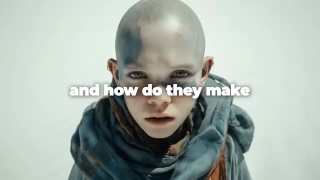
*Rendu vidéo généré par IA montrant un personnage chauve avec des marques sur le visage, filmé en contre-plongée.*

---

### ⏱️ `[00:00:41 - 00:01:17]` | Segment #03

**🔊 Audio (Transcription Intégrale Mot pour Mot en Français) :**
> Vous repartirez avec des prompts textuels clairs ainsi qu'une compréhension qui améliorera instantanément votre réalisation de films par IA. Et si vous aimez la vidéo d'aujourd'hui les gars, assurez-vous de lâcher un pouce bleu pour moi, pensez à vous abonner et bien sûr à activer cette cloche de notification. Ceci étant dit, entrons directement dans le vif du sujet. Laissez-moi donc vous présenter notre personnage. Nous allons l'appeler Kara. Maintenant, Kara a été générée en utilisant Midjourney, qui est bien sûr un service payant. Cependant, je vais mettre quelques exemples à l'écran pour vous montrer que vous pouvez créer de superbes images de départ en utilisant Nano Banana de manière entièrement gratuite également. Juste cette fois, je voulais utiliser Midjourney.

**👁️ Analyse Visuelle d'Écran (gemini-3.5-flash-lite) :**
**Interface & Outils** : Lecteur multimédia ou logiciel de montage vidéo affichant les extraits et images générées, avec le créateur en incrustation PiP (Picture-in-Picture).

**Contenu textuel & Code** : Texte incrusté à l'écran : "as well as an understanding". Visuels de films générés par IA incluant un personnage dans le désert, le portrait de Kara et un homme brûlant un pneu.

**Action / Démonstration** : Le créateur présente ses exemples visuels et son personnage nommé Kara généré par IA tout en s'exprimant face caméra.

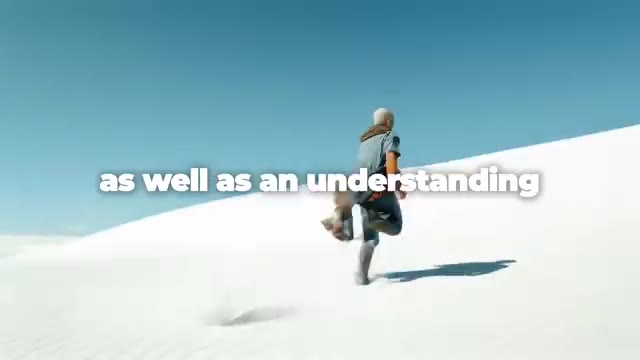
*Extrait vidéo montrant un personnage en plan large marchant sur une dune de sable blanc avec le texte incrusté « as well as an understanding ».*

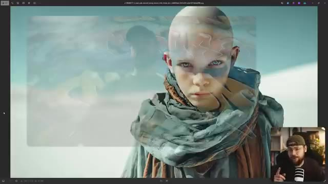
*Visualisation d'une image générée représentant le personnage de Kara (chauve, écharpe texturée) avec le créateur visible en incrustation PiP dans le coin inférieur droit.*

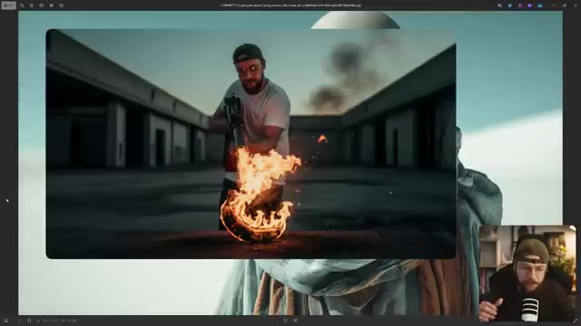
*Exemple d'image générée montrant un homme dans un entrepôt manipulant un lance-flammes face à un pneu en feu, avec le créateur en incrustation PiP.*

---

### ⏱️ `[00:01:17 - 00:01:51]` | Segment #04

**🔊 Audio (Transcription Intégrale Mot pour Mot en Français) :**
> route. Maintenant, je veux vraiment insister sur l'importance de figer votre image de départ en ce qui concerne le choix d'un personnage, d'un décor, d'un style, de vêtements ou même d'accessoires que vous aimez vraiment. Vous devez être entièrement satisfait de cette première image, que nous appellerons notre plan maître en quelque sorte, car elle va influencer tout ce qui viendra ensuite. Lorsque vous regardez l'image de départ, elle doit cocher toutes vos cases, car si vous n'êtes pas satisfait de celle-ci, vous ne le serez par rien de ce qui suivra. Et cela étant dit, nous pouvons parler de notre

**👁️ Analyse Visuelle d'Écran (gemini-3.5-flash-lite) :**
**Interface & Outils** : Lecteur vidéo ou logiciel de montage affichant l'image master shot en grand format, avec un encadré Picture-in-Picture (PiP) du créateur en bas à droite.

**Contenu textuel & Code** : Affichage d'une image générée par IA de haute qualité représentant un personnage au crâne rasé, maquillé, vêtu d'une écharpe texturée, sur fond clair. Le créateur apparaît en bas à droite dans un encadré PiP devant son micro et ses étagères de studio.

**Action / Démonstration** : Le créateur présente l'image master shot à l'écran pour illustrer l'importance de fixer le personnage, le style et les accessoires de départ avant de continuer.

*Image master shot affichée en plein écran montrant un personnage chauve avec des peintures faciales et une écharpe bleue, avec un encadré PiP du créateur en bas à droite.*

---

### ⏱️ `[00:01:51 - 00:02:10]` | Segment #05

**🔊 Audio (Transcription Intégrale Mot pour Mot en Français) :**
> premier angle de caméra que vous pouvez voir à l'écran en ce moment. Techniquement parlant, il s'agit d'un gros plan et c'est à hauteur des yeux, ce qui signifie que nous établissons cette hiérarchie entre le spectateur et le sujet qui est Kara, et comme nous sommes à hauteur des yeux avec Kara, la hiérarchie semble neutre.

**👁️ Analyse Visuelle d'Écran (gemini-3.5-flash-lite) :**
**Interface & Outils** : Lecteur vidéo / visionneuse avec une incrustation (Picture-in-Picture) du créateur en bas à droite.

**Contenu textuel & Code** : Affichage d'une image générée par IA représentant un personnage au crâne rasé (Kara) avec des marques sur le visage, portant une écharpe et un vêtement vert dans un décor désertique ou enneigé. Le nom du fichier source est visible en haut de l'écran.

**Action / Démonstration** : Présentation à l'écran du premier angle de caméra (gros plan à hauteur des yeux) analysé par le créateur.

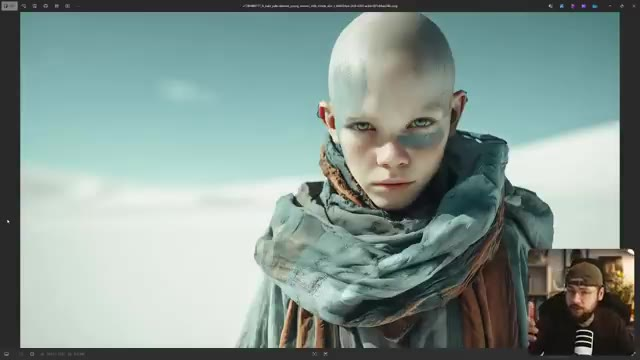
*Extrait vidéo montrant le personnage Kara en gros plan à hauteur des yeux, avec le créateur en incrustation (PiP) dans le coin inférieur droit.*

---

### ⏱️ `[00:02:10 - 00:02:45]` | Segment #06

**🔊 Audio (Transcription Intégrale Mot pour Mot en Français) :**
> Nous ne nous sentons pas plus dominants qu'elle mais nous ne nous sentons pas non plus intimidés par elle. Nous ne sommes pas en désaccord l'un avec l'autre et on a presque l'impression qu'en tant que spectateur, on a presque une conversation avec le personnage dont on est témoin. Tout semble donc très naturel et c'est un excellent plan pour illustrer une sorte de dialogue ou de réaction. Et je veillerai à afficher le prompt textuel que j'ai utilisé pour cela à l'écran en ce moment même si vous voulez aller de l'avant et en prendre note. Je vais essayer de mettre autant de prompts textuels que possible en bas dans la description. Je ne suis pas tout à fait sûr qu'il y ait une limite maximale de caractères pour les descriptions YouTube, mais vous pourrez y jeter un œil.

**👁️ Analyse Visuelle d'Écran (gemini-3.5-flash-lite) :**
**Interface & Outils** : Visionneuse vidéo avec incrustation PiP du créateur dans le coin inférieur droit, puis écran de texte affichant le prompt.

**Contenu textuel & Code** : Texte affiché à l'écran : "CLOSE UP" suivi du prompt : "Close-up shot of the subject, tightly framed from the chest up. Camera angle is eye-level, capturing subtle facial expressions and upper body posture. Soft, even lighting highlights contours and textures, background softly blurred to keep focus on the subject."

**Action / Démonstration** : Le créateur montre un exemple de plan vidéo généré par IA, puis affiche le prompt textuel correspondant à l'écran pour les spectateurs.

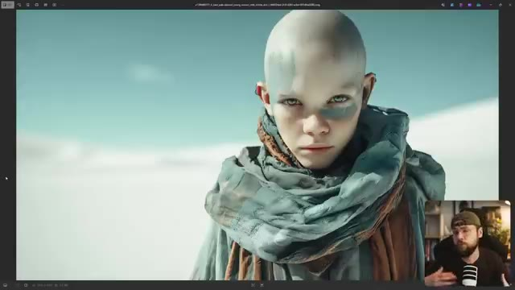
*Aperçu vidéo généré par IA montrant un gros plan d'un personnage chauve au visage peint sur fond de ciel clair, avec le créateur en incrustation PiP dans le coin inférieur droit.*

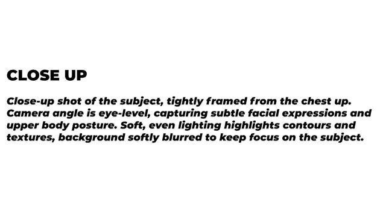
*Affichage à l'écran du prompt textuel décrivant un plan serré (close-up shot) pour la génération de vidéo IA.*

*Aperçu vidéo généré par IA montrant le même personnage en gros plan, avec le créateur en incrustation PiP dans le coin inférieur droit.*

---

### ⏱️ `[00:02:45 - 00:03:19]` | Segment #07

**🔊 Audio (Transcription Intégrale Mot pour Mot en Français) :**
> allez voir par vous-même, je suppose. Mais l'essentiel est que nous avons maintenant notre plan principal qui nous dit clairement beaucoup de choses sur le personnage. Il y a beaucoup de détails dans ses vêtements, dans la texture de sa peau. Et même si l'arrière-plan est très flou, nous avons une certaine idée de l'endroit où notre scène se déroule. Nous sommes donc maintenant prêts à prendre cette première image et à la décliner en une histoire entière et à explorer toutes sortes d'angles de caméra intéressants. Je vous avais donc promis que je vous montrais comment accéder à ces outils gratuitement. Et nous allons utiliser Nano

**👁️ Analyse Visuelle d'Écran (gemini-3.5-flash-lite) :**
**Interface & Outils** : Navigateur web affichant un outil ou site web de recherche d'IA (unanue.ai), avec incrustation vidéo (PiP) du créateur dans le coin inférieur droit.

**Contenu textuel & Code** : Sur l'image 1, rendu visuel cinématique détaillé d'un personnage féminin chauve aux traits marqués, portant des vêtements texturés. Sur l'image 2, texte central "Find the best AI for you" sur fond sombre avec une barre de recherche ("Ask anything...").

**Action / Démonstration** : Le créateur présente l'image master shot générée puis bascule sur un navigateur web pour montrer l'accès aux outils d'intelligence artificielle.

*Affichage de l'image master shot d'un personnage chauve avec une écharpe verte, avec une incrustation vidéo (PiP) du créateur en bas à droite.*

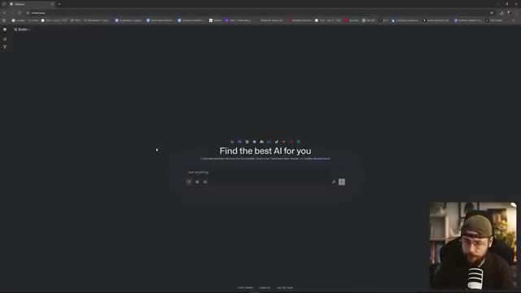
*Capture d'écran d'un navigateur affichant le site web 'unanue.ai' avec le message 'Find the best AI for you' et une barre de recherche, avec l'incrustation vidéo du créateur en bas à droite.*

---

### ⏱️ `[00:03:19 - 00:03:56]` | Segment #08

**🔊 Audio (Transcription Intégrale Mot pour Mot en Français) :**
> Banana au sein de LM Arena. Donc pour y aller, tapez simplement dans votre barre de recherche LMArena.ai. Dans le coin supérieur gauche, nous voulons cliquer sur ce menu déroulant et sélectionner direct chat. Et au centre de l'écran, vous voulez cliquer sur generate images et vous pouvez voir que ça va charger Gemini 2.5 flash image preview, autrement connu sous le nom de Nano Banana. Et pour être clair, accéder à Nano Banana via LM Arena est totalement gratuit. Vous n'aurez pas non plus de filigrane dans le coin inférieur droit comme vous l'aurez si vous utilisez Gemini vous-même. Il y a une limite au nombre d'images que vous pouvez créer par jour. Gardez donc cela à l'esprit, mais je pense vraiment que cet outil est incroyable si vous êtes

**👁️ Analyse Visuelle d'Écran (gemini-3.5-flash-lite) :**
**Interface & Outils** : Navigateur web affichant le site web LM Arena (LMArena.ai) avec une interface sombre comportant une barre de recherche centrale "Find the best AI for you" et "Ask anything...", ainsi qu'un encadré vidéo PiP du créateur en bas à droite.

**Contenu textuel & Code** : Texte affiché sur la page : "Find the best AI for you", "Compare avatars across tus or create, share your feedback and review via LMArena", et une barre de saisie avec des icônes d'outils.

**Action / Démonstration** : Le navigateur est ouvert sur la page d'accueil de LMArena.ai, prêt à effectuer les manipulations de navigation expliquées par le créateur.

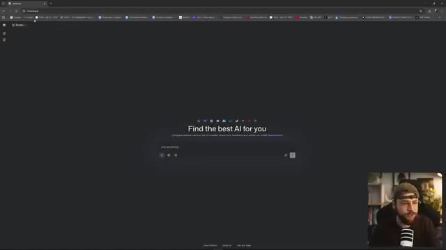
*Navigateur web affichant la page d'accueil de LM Arena (LMArena.ai) avec le créateur en incrustation PiP en bas à droite.*

---

### ⏱️ `[00:03:56 - 00:04:22]` | Segment #09

**🔊 Audio (Transcription Intégrale Mot pour Mot en Français) :**
> vous commencez tout juste à vous familiariser avec l'IA générative, si vous apprenez à partir de zéro. Et vers la fin de la vidéo, je vais également vous montrer une façon d'animer vos vidéos générées par IA de manière totalement gratuite. Alors assurez-vous de rester à l'écoute pour ça. Allons-y donc et créons notre premier nouvel angle de caméra. Donc ce que nous voulons faire, c'est cliquer sur l'icône de téléchargement d'image et nous pouvons y déposer notre plan large de Kara. Le premier plan que nous allons créer est un plan rapproché un peu plus serré.

**👁️ Analyse Visuelle d'Écran (gemini-3.5-flash-lite) :**
**Interface & Outils** : Navigateur web affichant l'interface d'un outil ou d'une plateforme d'intelligence artificielle avec un champ de saisie central et le flux vidéo du créateur en incrustation PiP.

**Contenu textuel & Code** : Texte affiché au centre : "Find the best AI for you", barre de texte avec un bouton "+", une icône "Image", et une icône de génération à droite. De nombreux onglets ouverts dans le navigateur.

**Action / Démonstration** : Le créateur montre l'interface web de l'outil d'IA où il va importer le plan principal ("master shot") pour créer un nouvel angle de caméra.

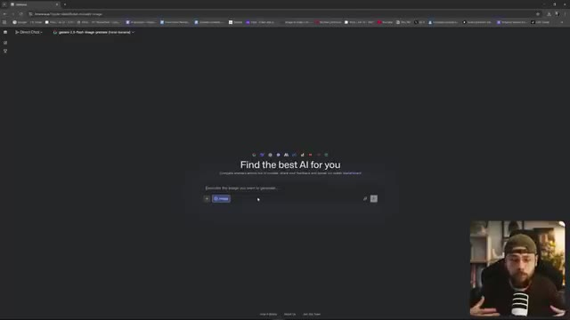
*Interface du site web d'agrégation d'IA montrant une barre de prompt avec une option d'importation d'image, avec le créateur visible en incrustation vidéo (PiP) dans le coin inférieur droit.*

---

### ⏱️ `[00:04:22 - 00:04:57]` | Segment #10

**🔊 Audio (Transcription Intégrale Mot pour Mot en Français) :**
> Donc dans le champ de texte du prompt, nous avons écrit un plan cinématographique cadrant étroitement le visage du personnage, montrant une expression émotionnelle détaillée. La fille a l'air effrayée. Maintenant, une règle générale en matière de réalisation. À quelle distance physique nous nous trouvons d'un personnage reflète en quelque sorte la proximité émotionnelle que nous ressentons et libère ses vulnérabilités. Donc essentiellement, plus le plan serré est extrême, plus nous pourrons lire d'émotions sur le visage de Kara, plus elle paraîtra vulnérable et plus nous nous sentirons proches d'elle en tant que spectateur. Alors allons-y et générons ceci et

**👁️ Analyse Visuelle d'Écran (gemini-3.5-flash-lite) :**
**Interface & Outils** : Navigateur web affichant une interface de plateforme de génération d'images/vidéos par IA avec le créateur visible en incrustation PiP dans le coin inférieur droit.

**Contenu textuel & Code** : Le prompt textuel visible dans l'interface : "A cinematic shot tightly framing the character's face, showing detailed emotional expression. The girl looks scared."

**Action / Démonstration** : Le créateur montre l'interface de l'outil et le prompt textuel saisi tout en expliquant les choix de cadrage cinématographique.

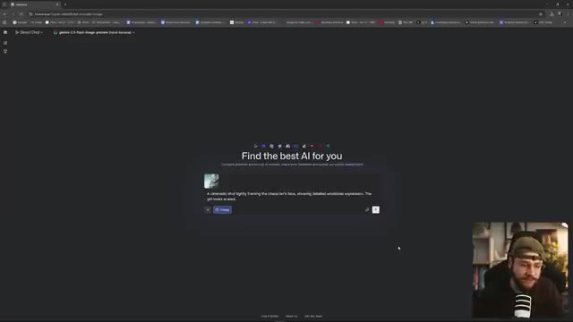
*Interface web d'un outil de génération montrant le champ de texte avec le prompt descriptif du plan serré sur le visage du personnage.*

---

### ⏱️ `[00:04:57 - 00:05:17]` | Segment #11

**🔊 Audio (Transcription Intégrale Mot pour Mot en Français) :**
> Regardez ce que Nano Banana nous ramène. Donc vous pouvez voir avec cette première génération que le cadrage est juste un tout petit peu plus serré et vous pouvez déjà ressentir cette intensité émotionnelle un petit peu plus, mais nous allons pousser les choses à l'extrême maintenant. Nous allons re-télécharger notre image de départ et nous allons saisir dans le champ de texte le prompt : gros plan extrême, cadrant serré le visage du personnage, montrant une expression émotionnelle détaillée.

**👁️ Analyse Visuelle d'Écran (gemini-3.5-flash-lite) :**
**Interface & Outils** : Navigateur web avec interface de génération vidéo par IA et incrustation vidéo du créateur (PiP).

**Contenu textuel & Code** : Texte affiché à l'écran : "EXTREME CLOSE UP" et "Extreme close up, tightly framing the character's face, showing detailed emotional expression."

**Action / Démonstration** : Le créateur montre le résultat de la première génération vidéo dans l'interface du navigateur, puis affiche en plein écran le texte du prompt textuel utilisé pour la suite de la démonstration.

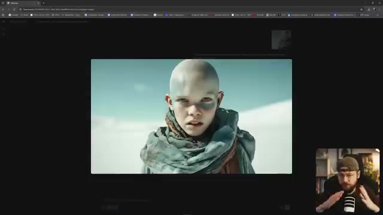
*Interface du navigateur web affichant un aperçu vidéo généré par IA montrant un personnage chauve avec une écharpe, avec le créateur en incrustation (PiP) dans le coin inférieur droit.*

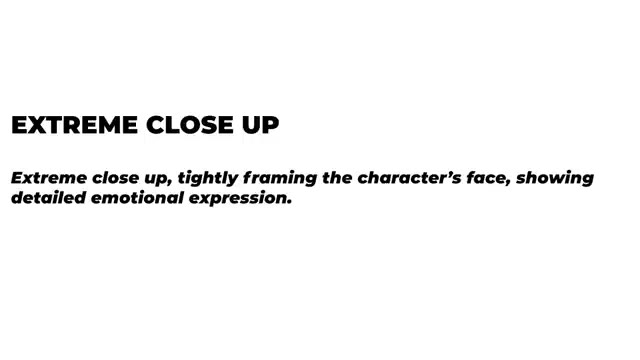
*Écran noir affichant en gros caractères blancs le titre et le texte du prompt utilisé : "EXTREME CLOSE UP" et "Extreme close up, tightly framing the character's face, showing detailed emotional expression."*

---

### ⏱️ `[00:05:18 - 00:05:38]` | Segment #12

**🔊 Audio (Transcription Intégrale Mot pour Mot en Français) :**
> Et ici, vous pouvez voir qu'on s'est encore plus rapprochés, et ça commence vraiment à amplifier cette intensité émotionnelle, surtout quand on compare avec notre cadre de départ. On est allés de tout là-bas jusqu'tout près de Kara. Et du coup, on peut un peu mieux lire et ressentir ses émotions.

**👁️ Analyse Visuelle d'Écran (gemini-3.5-flash-lite) :**
**Interface & Outils** : Navigateur web affichant des images ou vidéos générées par IA, avec le créateur en incrustation PiP (Picture-in-Picture) dans le coin inférieur droit.

**Contenu textuel & Code** : Rendu visuel d'un personnage féminin au crâne rasé (Kara) avec des peintures ou tatouages sur le visage et un vêtement de type écharpe/cape, dans un environnement désertique et lumineux.

**Action / Démonstration** : Le créateur commente et analyse la progression du zoom cinématique sur le visage du personnage généré par IA, en expliquant l'impact sur l'intensité émotionnelle.

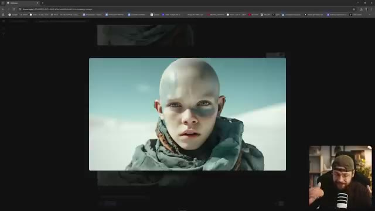
*Gros plan progressif affiché dans un navigateur web avec le créateur en incrustation vidéo (PiP) dans le coin inférieur droit, montrant le personnage de Kara dans un décor désertique.*

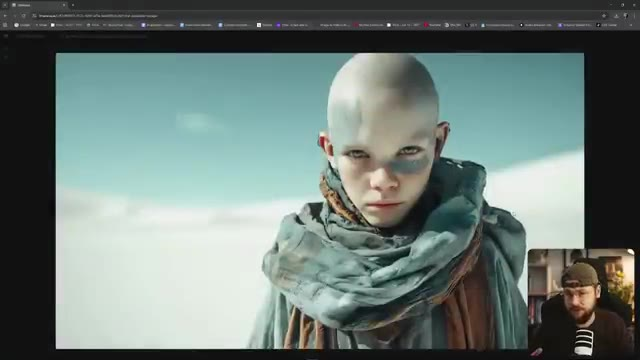
*Affichage en plein écran de l'image de Kara, très proche du visage, accentuant l'intensité émotionnelle.*

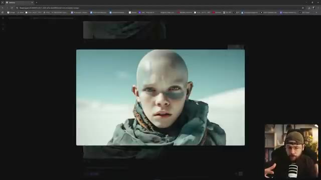
*Gros plan similaire sur le personnage de Kara, avec le créateur visible en incrustation vidéo (PiP) dans le coin inférieur droit gesticulant pour illustrer son propos.*

---

### ⏱️ `[00:05:38 - 00:05:57]` | Segment #13

**🔊 Audio (Transcription Intégrale Mot pour Mot en Français) :**
> C'est donc parfait si nous voulons montrer une sorte de réaction émotionnelle à quelque chose que Kara voit ou entend. Si quelque chose de dramatique se produit dans notre film, nous devons toujours voir cela se refléter chez les personnages principaux. Ils doivent y réagir parce qu'ils sont notre point de référence en tant que spectateur. Ce sont eux auxquels nous nous identifions.

**👁️ Analyse Visuelle d'Écran (gemini-3.5-flash-lite) :**
**Interface & Outils** : Navigateur web affichant une galerie ou une image en gros plan, avec incrustation vidéo (PiP) du présentateur en bas à droite.

**Contenu textuel & Code** : Image centrale nette d'un personnage au crâne rasé avec des nuances de peinture ou de lumière sur le visage, portant des vêtements élimés, dans un style de film de science-fiction.

**Action / Démonstration** : Le navigateur présente un plan rapproché centré sur le visage expressif du personnage principal, illustrant la réaction émotionnelle évoquée dans la narration.

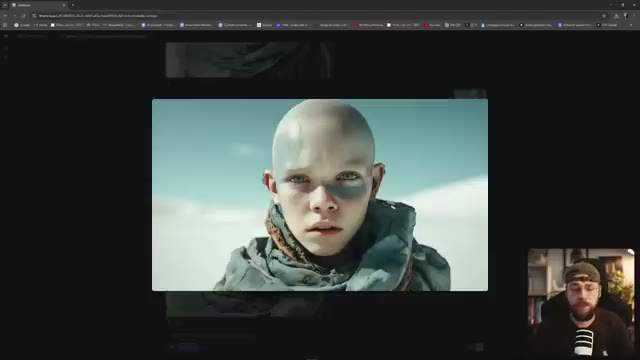
*Aperçu en grand format d'une image générée représentant le personnage de Kara (chauve, au visage marqué) dans un navigateur web, avec un encadré PiP du créateur en bas à droite.*

---

### ⏱️ `[00:05:57 - 00:06:16]` | Segment #14

**🔊 Audio (Transcription Intégrale Mot pour Mot en Français) :**
> Et si nous voulons aller de l'avant et pousser cela encore plus loin vers l'extrême complet, nous pouvons opter pour un plan macro. Je vais donc afficher ce prompt textuel à l'écran maintenant pour que vous puissiez en prendre note. Allons-y, cliquons sur générer et voyons ce que nous obtenons de Nano Banana. Et regardez ça, exactement ce que nous recherchions.

**👁️ Analyse Visuelle d'Écran (gemini-3.5-flash-lite) :**
**Interface & Outils** : Navigateur web avec interface de génération d'images par IA et affichage plein écran de texte de prompt.

**Contenu textuel & Code** : Texte affiché : "MACRO SHOT" suivi du prompt : "An extreme macro cinematic shot of a girl's eye, hyper-detailed iris patterns with vivid colour, reflections of light in the pupil, fine texture of eyelashes and skin pores, ultra shallow depth of field, dramatic film lighting, photorealistic 85mm macro style, emphasizing emotion and intensity."

**Action / Démonstration** : Le présentateur explique la transition vers un plan macro, affiche le prompt textuel à l'écran, lance la génération et commente le résultat ultra-détaillé obtenu.

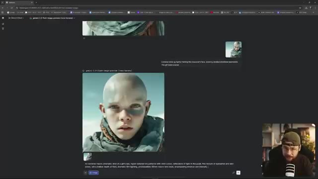
*Interface de l'outil de génération affichant un plan rapproché d'un personnage avec le créateur en incrustation (PiP).*

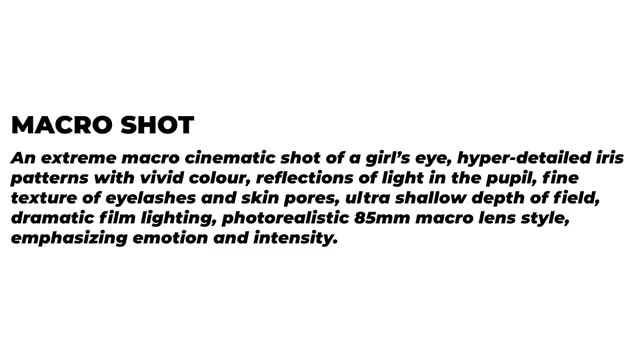
*Affichage en plein écran du prompt textuel "MACRO SHOT" avec sa description détaillée.*

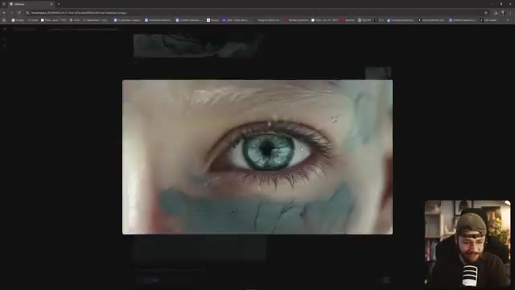
*Résultat de la génération IA montrant un plan macro extrême d'un œil, extrêmement détaillé.*

---

### ⏱️ `[00:06:17 - 00:06:39]` | Segment #15

**🔊 Audio (Transcription Intégrale Mot pour Mot en Français) :**
> Regardez ce niveau de détail textuel que Nano Banana a pu nous offrir. Et cela semble cohérent avec notre personnage et notre style choisi également. Alors imaginez simplement la réponse émotionnelle que nous pourrions obtenir d'un spectateur en coupant de ce plan-ci à celui-là. Nous utilisons un angle de caméra intense pour solliciter une réponse émotionnelle intense.

**👁️ Analyse Visuelle d'Écran (gemini-3.5-flash-lite) :**
**Interface & Outils** : Navigateur web affichant une image et lecteur vidéo Windows, accompagnés de la webcam du créateur en incrustation Picture-in-Picture (PiP) dans le coin inférieur droit.

**Contenu textuel & Code** : Rendu visuel d'un personnage au style cinématographique de type cyberpunk/sci-fi, mettant en avant le niveau de détail des textures de la peau et des yeux.

**Action / Démonstration** : Le créateur commente et compare des plans visuels de génération IA pour illustrer l'impact du montage et des angles de caméra.

*Gros plan sur l'œil d'un personnage généré par IA, affiché dans le navigateur web, avec le créateur visible en incrustation PiP.*

*Plan moyen d'un personnage chauve aux yeux perçants vêtu d'écharpes, affiché dans un lecteur vidéo, avec le créateur visible en incrustation PiP.*

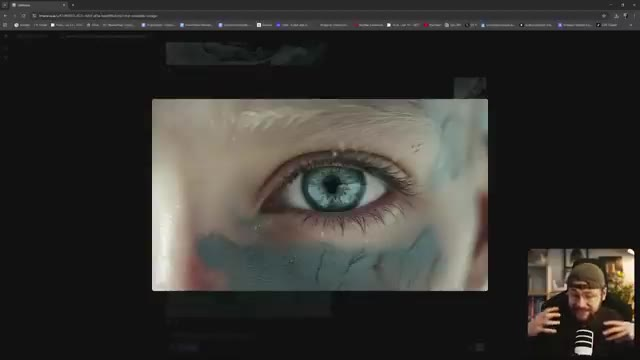
*Gros plan sur l'œil du personnage généré par IA (identique au plan 1), affiché dans le navigateur web, avec le créateur visible en incrustation PiP en train de s'exprimer.*

---

### ⏱️ `[00:06:39 - 00:06:57]` | Segment #16

**🔊 Audio (Transcription Intégrale Mot pour Mot en Français) :**
> Et gardez à l'esprit que nous avons généré ces nouveaux angles de caméra sans dépenser un seul centime. Et si nous aimons ce que nous avons créé, nous pouvons simplement aller ici sur cette petite icône de téléchargement et cliquer sur télécharger. Maintenant, en ouvrant ceci, vous allez pouvoir voir l'inconvénient d'utiliser Nano Banana, et c'est que la résolution de sortie est assez basse.

**👁️ Analyse Visuelle d'Écran (gemini-3.5-flash-lite) :**
**Interface & Outils** : Navigateur web affichant l'interface de l'outil de génération d'IA (Nano Banana / Gemini 2.0 Flash image preview) avec un encadré vidéo (PiP) du créateur en bas à droite.

**Contenu textuel & Code** : On peut voir des invites de texte telles que "Extreme close up, tightly framing the character's face, showing detailed emotional expression. The girl looks scared" et "An extreme macro cinematic shot of a girl's eye, hyper-detailed iris patterns with vivid colour, reflections of light in the pupil...". Des images générées de personnages et d'un gros plan d'œil sont affichées avec des boutons de téléchargement.

**Action / Démonstration** : Le présentateur commente la génération gratuite des angles de caméra, survole l'icône de téléchargement, clique dessus, puis ouvre l'image téléchargée pour montrer sa basse résolution.

![Interface de l'outil avec génération d'images d'un personnage (gemini-2.0-flash-image-preview [nano-banana]) et le créateur dans l'encadré PiP.](screenshots/YT-keT_ywKa_lM/frame_027_00-06-41.jpg)
*Interface de l'outil avec génération d'images d'un personnage (gemini-2.0-flash-image-preview [nano-banana]) et le créateur dans l'encadré PiP.*

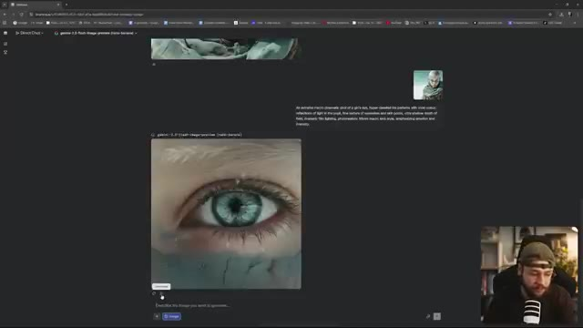
*Interface montrant un gros plan extrême sur l'œil d'un personnage avec le curseur pointant sur l'icône de téléchargement.*

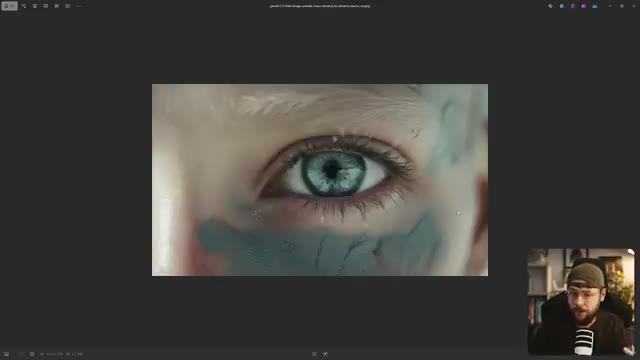
*Visualiseur d'images affichant le fichier image téléchargé à basse résolution.*

---

### ⏱️ `[00:06:57 - 00:07:19]` | Segment #17

**🔊 Audio (Transcription Intégrale Mot pour Mot en Français) :**
> Si nous allons simplement dans les propriétés des fichiers et dans les détails, nous pouvons voir que les dimensions sont de 1344 par 768. C'est donc nettement inférieur à la résolution HD. Cependant, une chose que j'ai tendance à faire souvent, c'est que si nous nous rendons sur Higgsfield et que nous allons dans l'onglet image, vous pouvez voir qu'il y a l'option ici pour le suréchantillonneur haute résolution Topaz.
[VALID_VALID_IMAGES] 1, 2, 3
[DESC_IMAGE_1] Explorateur de fichiers Windows affichant une grille de vignettes d'images et de vidéos générées par IA.
[DESC_IMAGE_2] Visualisation d'une image d'un œil avec la fenêtre des propriétés du fichier ouverte montrant la résolution de 1344x768.
[DESC_IMAGE_3] Interface web de Higgsfield montrant le menu des outils d'image avec l'option Topaz High Resolution Upscaler.

**👁️ Analyse Visuelle d'Écran (gemini-3.5-flash-lite) :**
**Interface & Outils** : Explorateur Windows, Visionneuse d'images avec panneau Propriétés, Navigateur web sur le site de Higgsfield (higgsfield.ai).

**Contenu textuel & Code** : Propriétés du fichier image : dimensions 1344 x 768, type PNG, options de Higgsfield dont "Topaz high-resolution upscaler".

**Action / Démonstration** : Le créateur navigue dans ses fichiers, consulte les dimensions d'une image via les propriétés Windows, puis se rend sur le site de Higgsfield pour montrer l'outil d'upscaling Topaz.

---

### ⏱️ `[00:07:19 - 00:07:40]` | Segment #18

**🔊 Audio (Transcription Intégrale Mot pour Mot en Français) :**
> Donc ce que nous pourrions faire, c'est simplement faire un glisser-déposer sur notre sortie nano banana. Nous pouvons utiliser Topaz, par exemple, dans son mode par défaut pour simplement doubler la résolution de l'image. Ou nous pouvons utiliser Topaz Generative où cela va en fait ajouter de la texture supplémentaire pour nous. Maintenant, bien sûr, vous auriez besoin de payer pour votre abonnement Higgsfield pour accéder à cela, mais je voulais juste inclure cela pour vous les gars.

**👁️ Analyse Visuelle d'Écran (gemini-3.5-flash-lite) :**
**Interface & Outils** : Interface web de Higgsfield avec le panneau de retouche/upscale visible sur la droite et l'affichage d'une image en cours de chargement ou traitée.

**Contenu textuel & Code** : Menu d'options d'upscale sur le panneau de droite incluant "Topaz", "Topaz Generative", ainsi qu'une barre de navigation supérieure avec des onglets (Explore, Image, Video, Edit, Asset, Audio, Community).

**Action / Démonstration** : Le créateur montre l'interface de chargement et de traitement d'image sur la plateforme Higgsfield, puis zoome sur les options d'agrandissement (upscaling) de l'image.

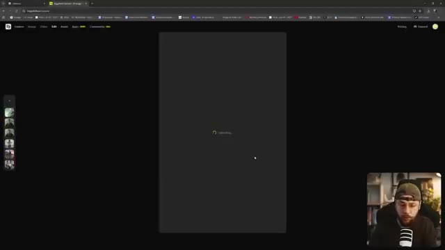
*Interface de Higgsfield montrant une zone centrale sombre avec un indicateur de chargement ("uploading").*

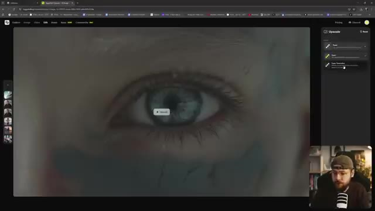
*Interface de Higgsfield montrant un gros plan détaillé d'un œil avec le panneau latéral "Upscale" actif sur la droite.*

---

### ⏱️ `[00:07:40 - 00:07:58]` | Segment #19

**🔊 Audio (Transcription Intégrale Mot pour Mot en Français) :**
> Maintenant, passons à l'angle de caméra suivant, nous avons re-téléchargé notre plan maître et nous allons examiner un plan en plongée. Encore une fois, je vais afficher le prompt textuel à l'écran pour vous maintenant, mais tout cela consiste à faire en sorte que le personnage se sente intimidé. Nous nous sentons comme la force dominante ici.

**👁️ Analyse Visuelle d'Écran (gemini-3.5-flash-lite) :**
**Interface & Outils** : Navigateur web avec interface sombre et affichage plein écran d'un texte de prompt sur fond blanc.

**Contenu textuel & Code** : Texte affiché : "HIGH ANGLE" suivi du prompt "A high-angle cinematic shot, camera positioned above the character looking straight down, dramatic overhead lighting casting long shadows, emphasizing weakness and vulnerability, the character is staring up directly at the camera, looking scared."

**Action / Démonstration** : Le créateur montre l'interface de travail avec les résultats d'image générée, puis affiche le prompt textuel en plein écran pour illustrer le plan en plongée.

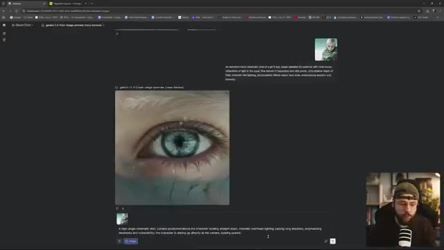
*Interface d'un navigateur web montrant une génération d'image en gros plan d'un œil avec un prompt sur la vulnérabilité, avec le créateur en incrustation vidéo (PiP) dans le coin inférieur droit.*

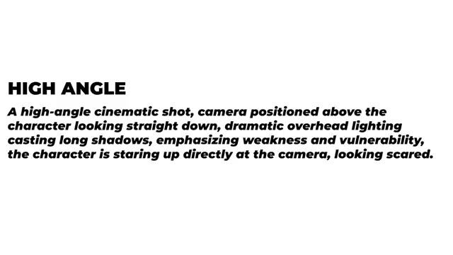
*Écran noir sur blanc affichant le titre "HIGH ANGLE" et le prompt textuel descriptif de la caméra en plongée.*

---

### ⏱️ `[00:07:58 - 00:08:33]` | Segment #20

**🔊 Audio (Transcription Intégrale Mot pour Mot en Français) :**
> This is all about emphasizing weakness and vulnerability as if our character is on the back foot. So let's go right ahead and click generate on this particular text prompt. And here we have back our high angle camera shot. We spoke earlier about this concept of hierarchy and here we are the imposing dominant force and Kara looks scared of us. Whatever character or scene she might be witnessing at this moment. I encourage you guys as well to hit the download button as soon as you see something that you like but also why not give it a rerun as well by

**👁️ Analyse Visuelle d'Écran (gemini-3.5-flash-lite) :**
**Interface & Outils** : Jack face caméra ou transition sans partage d'écran.

**Contenu textuel & Code** : Explications orales des concepts et des méthodes de création vidéo IA.

**Action / Démonstration** : Démonstration pédagogique et présentation du workflow.

---

### ⏱️ `[00:08:33 - 00:09:08]` | Segment #21

**🔊 Audio (Transcription Intégrale Mot pour Mot en Français) :**
> en cliquant sur ce bouton de nouvelle tentative et malheureusement nous avons rencontré l'autre problème avec Ella Marina. C'est que nous avons atteint notre limite de taux pour Gemini 2.5 flash image preview. Donc maintenant nous allons repasser sur Higgsfield mais je voulais quand même vous montrer une façon gratuite de pouvoir tester ce workflow et nous avons obtenu de très bons résultats ici ce plan en plongée j'en étais content pour être franc et ce plan macro a l'air incroyable donc sur Higgsfield.ai nous allons simplement dans le coin supérieur gauche survoler l'onglet image et aller sur créer une image donc ici ce que nous voulons faire c'est continuer et

**👁️ Analyse Visuelle d'Écran (gemini-3.5-flash-lite) :**
**Interface & Outils** : Navigateur web affichant l'interface de l'application web avec un panneau latéral à gauche (historique/prompts) et le créateur en incrustation PiP, puis la page d'accueil de Higgsfield.ai avec l'onglet image actif.

**Contenu textuel & Code** : Message d'erreur visible en bas de l'écran : "You have reached your rate limit for gemini-2.5-flash-image-preview-rate-limits...". Sur la seconde image, le logo "HIGGSFIELD SOUL" est affiché au centre avec des options de génération en bas.

**Action / Démonstration** : Le créateur montre l'interface de l'application avec l'erreur de limite de taux, puis navigue vers le site de Higgsfield.ai pour montrer l'outil de création d'images gratuit.

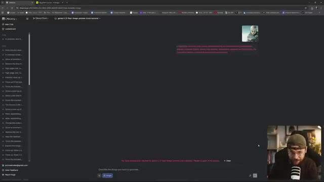
*Interface de l'application montrant un message d'erreur de limite de taux (rate limit) pour Gemini 2.5 flash image preview, avec le créateur en incrustation PiP en bas à droite.*

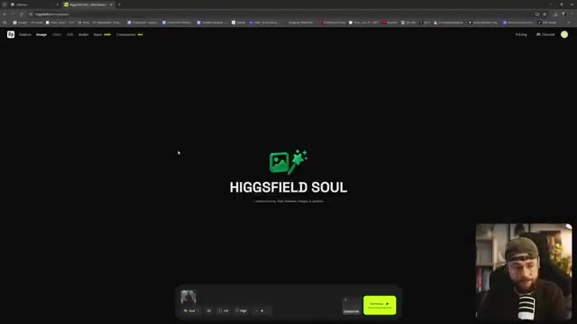
*Interface du site Higgsfield.ai affichant l'outil Higgsfield Soul avec des options de génération d'images, le créateur apparaissant en incrustation PiP en bas à droite.*

---

### ⏱️ `[00:09:08 - 00:09:40]` | Segment #22

**🔊 Audio (Transcription Intégrale Mot pour Mot en Français) :**
> téléchargeons notre plan principal une fois de plus, exactement le même processus que nous faisons sur LM arena, il y a différents modèles de création d'images que nous pouvons sélectionner, y compris le propre modèle de Higgsfield. Nous avons également accès à Seadream 4.0 mais ici nous allons sélectionner Nano Banana. Et vous pouvez voir en bas ici que nous avons aussi l'option pour des générations illimitées et c'est parce que sur Higgsfield si vous avez un abonnement pro, ultimate ou creator vous pouvez utiliser Nano Banana autant que vous voulez sans dépenser de crédits. Donc encore une fois c'est vraiment super si vous êtes juste en train d'apprendre la génération

**👁️ Analyse Visuelle d'Écran (gemini-3.5-flash-lite) :**
**Interface & Outils** : Interface web de la plateforme Higgsfield (higgsfield.ai) avec le mode Nano Banana sélectionné et une vue PiP (Picture-in-Picture) du créateur en bas à droite.

**Contenu textuel & Code** : Grille de visuels générés par IA (personnages aux yeux brillants, scènes de studio sur fond vert, moniales cyborgs méditants). Barre de contrôle inférieure avec options de génération, indicateur « Unlimited » et boutons de validation.

**Action / Démonstration** : Le créateur montre l'interface de Higgsfield et commente la sélection du modèle Nano Banana et l'option de générations illimitées.

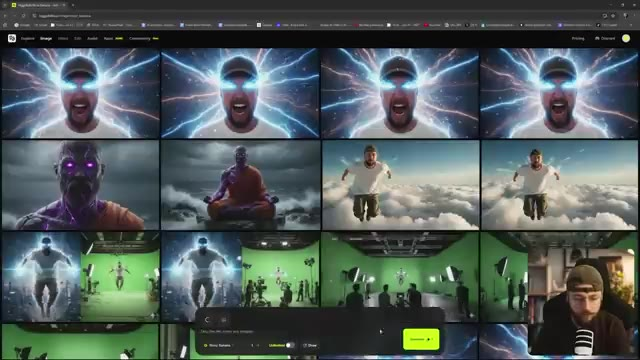
*Interface de la plateforme Higgsfield montrant une grille d'images générées par IA et les options de modèles au bas de l'écran, avec le créateur en incrustation PiP.*

---

### ⏱️ `[00:09:40 - 00:10:12]` | Segment #23

**🔊 Audio (Transcription Intégrale Mot pour Mot en Français) :**
> L'IA pour la première fois, vous pouvez faire tout un tas d'expérimentations ici et le prochain angle de caméra que nous allons regarder est un plan en contre-plongée et ce que je vais faire pour vous les gars est de créer un point de comparaison ici donc je vais cliquer pour créer deux générations Nano Banana et ensuite nous allons passer à cDream 4.0 parce que je suis sûr que vous serez intéressés par cet outil aussi encore une fois nous pouvons sélectionner illimité et je vais juste cliquer deux fois pour que nous ayons quatre générations prêtes à venir pour y jeter un coup d'œil. Maintenant, fait intéressant, vous pouvez voir que Nano Banana

**👁️ Analyse Visuelle d'Écran (gemini-3.5-flash-lite) :**
**Interface & Outils** : Interface web de génération d'images (type Seedance / Higgsfield AI) avec barre de navigation supérieure (Explore, Image, Video, Edit, Audio, Apps, Community), options de sélection de modèles (Nano Banana, Seedream 4.0), curseur de quantité et bouton de génération.

**Contenu textuel & Code** : Texte du prompt visible dans le panneau de génération : "A dramatic shot looking up at the character from below, making them appear powerful, menacing, or heroic." Paramètres de génération avec l'option "Unlimited" activée et le nombre de générations réglé sur 2.

**Action / Démonstration** : Le créateur navigue sur l'interface web, sélectionne différents modèles de génération d'IA (Nano Banana puis Seedream 4.0), ajuste les paramètres de quantité avec l'option illimitée et lance la création de nouvelles images en comparant les résultats.

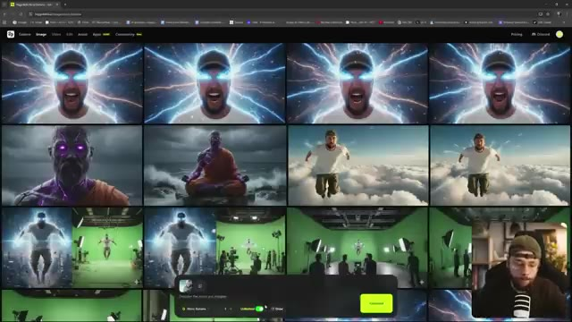
*Interface de la plateforme de génération d'images affichant une grille de résultats visuels avec le panneau de commande "Nano Banana" ouvert en bas.*

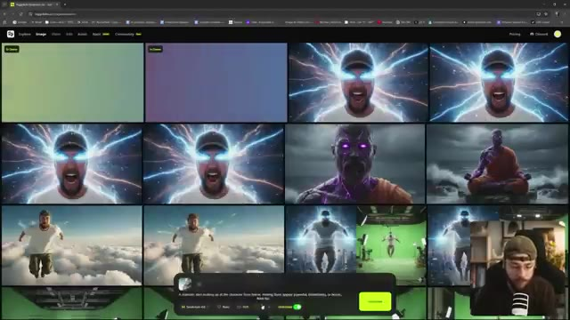
*Grille de résultats de génération d'images sur l'interface web, avec le panneau de configuration actif affichant le modèle Seedream 4.0.*

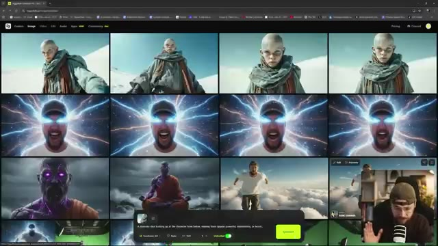
*Grille de générations d'images affichant de nouvelles images de personnages dans un décor enneigé en haut, avec le panneau Seedream 4.0 actif en bas.*

---

### ⏱️ `[00:10:12 - 00:10:32]` | Segment #24

**🔊 Audio (Transcription Intégrale Mot pour Mot en Français) :**
> a en fait échoué avec ce prompt alors qu'il était très clairement rédigé, mais Seadream 4.0 nous a donné un résultat assez impressionnant ici. Alors, quel effet ce plan de caméra particulier nous fait-il ressentir ? Eh bien, selon moi, il donne à Kara un air beaucoup plus intimidant, puissant et héroïque également.

**👁️ Analyse Visuelle d'Écran (gemini-3.5-flash-lite) :**
**Interface & Outils** : Navigateur web affichant l'interface de Seedream / plateforme de génération d'images et vidéos par IA, avec une fenêtre PiP (Picture-in-Picture) du créateur en bas à droite.

**Contenu textuel & Code** : Grille de miniatures d'images générées par IA représentant divers personnages et effets visuels (dont Kara dans la neige, des portraits avec des éclairs bleus autour des yeux, un moine encapuchonné violet en méditation). Un prompt textuel est visible au bas de l'écran avec le modèle "SEEDREAM 4.0".

**Action / Démonstration** : Navigation et affichage des résultats de génération d'images et de vidéos, avec le créateur visible en incrustation vidéo dans le coin inférieur droit.

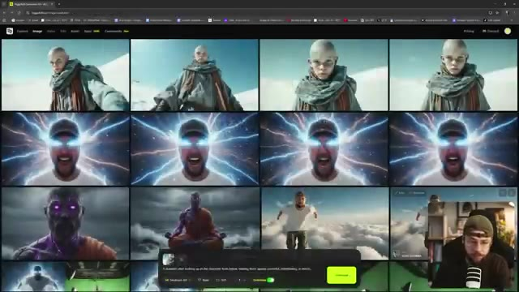
*Interface de l'outil web montrant une grille de résultats d'images générées par IA avec le présentateur en incrustation PiP.*

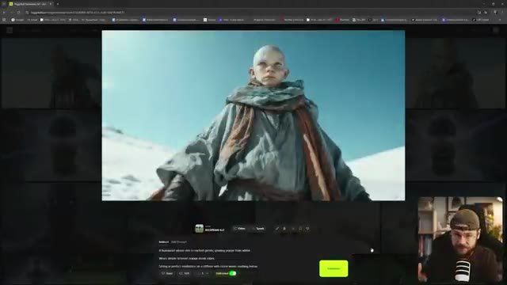
*Gros plan sur une vidéo générée montrant le personnage de Kara en contre-plongée dans un paysage enneigé.*

---

### ⏱️ `[00:10:32 - 00:10:56]` | Segment #25

**🔊 Audio (Transcription Intégrale Mot pour Mot en Français) :**
> C'est comme si elle réagissait à quelque chose hors champ, mais elle ne se sent pas menacée par cette chose. Elle se sent en contrôle, comme si elle était peut-être sur le point de riposter d'une manière ou d'une autre. Tout cela provient simplement de sa réaction associée à l'angle de caméra que nous avons soigneusement choisi. Et donc, lorsque vous créez vos films par IA, vous voulez toujours réfléchir à l'angle de caméra qui illustrera le mieux l'ambiance que vous essayez de créer.

**👁️ Analyse Visuelle d'Écran (gemini-3.5-flash-lite) :**
**Interface & Outils** : Interface web d'un générateur de vidéo par IA (probablement Seedance ou similaire) avec une zone de prévisualisation centrale et un panneau de prompt textuel en bas, accompagné d'une incrustation vidéo (PiP) du présentateur Jack.

**Contenu textuel & Code** : On aperçoit un prompt textuel partiellement lisible sous la vidéo générée : "A fearless kid whose skin is cracked geode, glowing power from within..." ainsi que des paramètres de génération vidéo.

**Action / Démonstration** : Le créateur montre un exemple concret de génération vidéo avec un angle de caméra spécifique (contre-plongée) pour illustrer l'effet psychologique sur le spectateur.

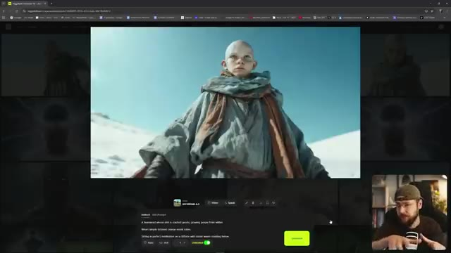
*Interface de l'outil de génération vidéo affichant un plan en contre-plongée d'un personnage chauve dans un paysage enneigé, avec le créateur en incrustation (PiP) dans le coin inférieur droit.*

---

### ⏱️ `[00:10:57 - 00:11:15]` | Segment #26

**🔊 Audio (Transcription Intégrale Mot pour Mot en Français) :**
> Quel effet voulez-vous que votre spectateur ressente envers votre personnage à ce moment-là ? Maintenant, le prochain angle de caméra que nous allons examiner est un angle de caméra par-dessus l'épaule. C'est vraiment utile en termes de cadrage et pour créer une idée de perspective. C'est presque un plan subjectif mais pas tout à fait non plus.

**👁️ Analyse Visuelle d'Écran (gemini-3.5-flash-lite) :**
**Interface & Outils** : Navigateur web affichant l'interface de l'outil de création vidéo (style Higgsfield ou plateforme similaire) avec grille de rendus et panneau de prompt en surimpression, ainsi qu'une incrustation vidéo du créateur (PiP) en bas à droite.

**Contenu textuel & Code** : Texte à l'écran : "OVER-THE-SHOULDER (OTS)\nA close cinematic shot framed over the character's shoulder, focusing on the vast white dessert landscape." Prompts textuels de génération visibles dans les encadrés.

**Action / Démonstration** : Le créateur présente différents types de plans de caméra (Over-the-shoulder) à travers des exemples visuels sur son interface tout en expliquant leur impact sur la perspective et l'émotion du spectateur.

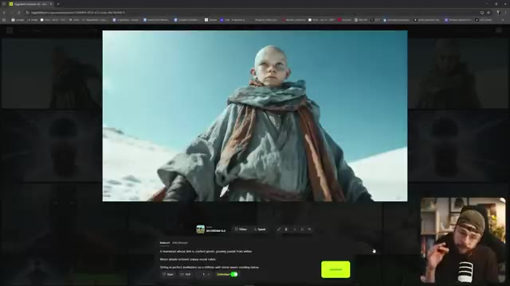
*Interface de l'outil de génération vidéo affichant un plan cinématographique d'un personnage dans un paysage enneigé, avec le créateur en incrustation PiP.*

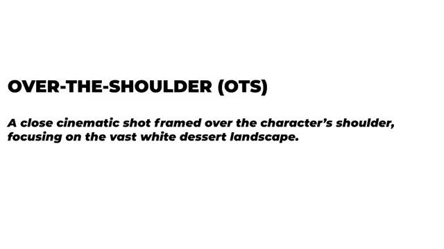
*Diapositive explicative en texte noir sur fond blanc définissant l'angle de caméra Over-The-Shoulder (OTS) et son rôle de cadrage.*

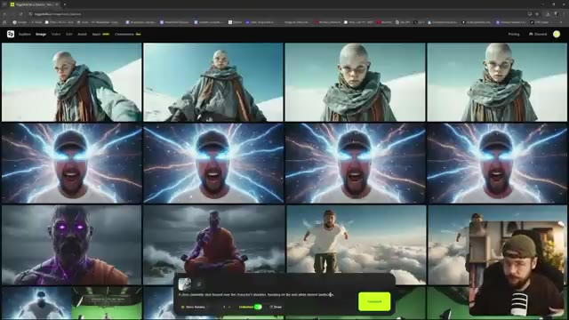
*Grille d'images générées par IA sur l'interface de l'outil, montrant différentes variations de plans et de personnages.*

---

### ⏱️ `[00:11:15 - 00:11:48]` | Segment #27

**🔊 Audio (Transcription Intégrale Mot pour Mot en Français) :**
> Donc nous obtenons également cette idée d'échelle et vous pouvez l'utiliser comme nous allons le faire ici pour mettre en valeur le paysage que Cara regarde. Mais vous pourriez tout aussi bien l'utiliser pendant une conversation entre elle et un autre personnage. Donc répétons le même processus à nouveau. Nous allons comparer Nano Banana à SeaDream 4.0 en configurant deux générations Nano Banana et deux générations SeaDream également. Et vous pouvez voir que cette fois-ci, à la fois Nano Banana et SeaDream nous ont tous deux donné de très bons résultats. Je n'ai aucun problème avec aucune de ces générations.

**👁️ Analyse Visuelle d'Écran (gemini-3.5-flash-lite) :**
**Interface & Outils** : Interface web de génération d'images par IA (style Higgsfield ou plateforme similaire) avec grille de résultats, barre de menu supérieure (Explore, Image, Video, Edit, Asset, App, Community) et une mini-fenêtre PiP du présentateur en bas à droite.

**Contenu textuel & Code** : Prompt visible dans la boîte de dialogue en bas : "A close cinematic shot framed over the character's shoulder, focusing on the vast white dessert landscape." Paramètres de génération avec modèles "Nano Banana" et "Seedream 4.0".

**Action / Démonstration** : Le créateur navigue et compare les générations d'images issues de différents modèles d'IA dans l'interface de la plateforme.

*Interface du générateur affichant une grille d'images générées de personnages et de paysages désertiques.*

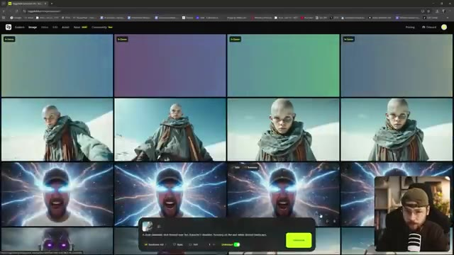
*Interface du générateur montrant le changement de modèle avec l'option Seedream 4.0 sélectionnée en bas.*

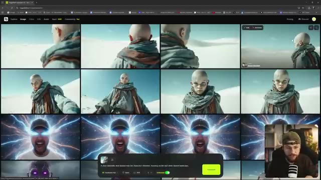
*Interface du générateur montrant les résultats de génération avec le modèle Nano Banana mis en avant.*

---

### ⏱️ `[00:11:48 - 00:12:22]` | Segment #28

**🔊 Audio (Transcription Intégrale Mot pour Mot en Français) :**
> Celui-ci a l'air vraiment super. Je suis particulièrement attiré par celui-ci de SeaDream parce qu'on a vraiment l'impression d'avoir cette texture de crâne rasé à l'arrière de la tête de Kara. Et ce qu'on voit également ici, c'est que Kara est en focus doux et que le paysage désertique lui-même est net. Donc peut-être qu'on pourrait utiliser ce plan pour montrer une sorte de monstre émergeant de sous le sable. On peut alors imaginer qu'on pourrait facilement revenir à notre plan macro. Donc je vais en fait aller de celui-ci ici téléchargé ainsi que celui-là. Ce sont mes deux préférés. On sent déjà qu'on est vraiment

**👁️ Analyse Visuelle d'Écran (gemini-3.5-flash-lite) :**
**Interface & Outils** : Navigateur web affichant la plateforme de génération vidéo par IA Higgsfield avec une vue en grille et des panneaux de prévisualisation (mode PiP avec le créateur en bas à droite).

**Contenu textuel & Code** : Prompts visibles sous les fenêtres de prévisualisation (ex: 'A headwind blows dust in cracked gusts, glowing prayer lines within...') et vignettes de vidéos générées.

**Action / Démonstration** : Le créateur navigue et sélectionne ses plans préférés générés par l'IA dans l'interface de Higgsfield pour les télécharger.

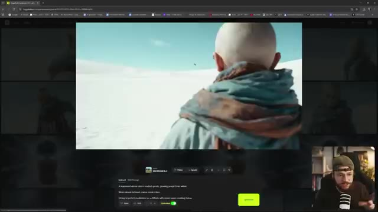
*Interface de Higgsfield montrant une vidéo générée de dos (personnage chauve avec une écharpe dans un désert).*

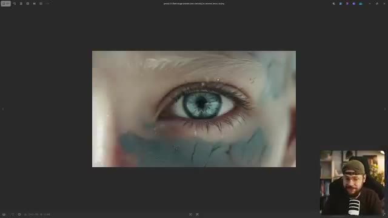
*Visualisation en gros plan d'un œil bleu avec du maquillage ou de la texture sur le visage.*

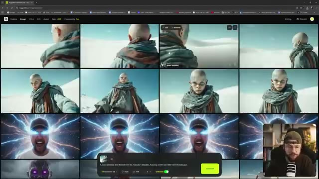
*Grille de vignettes de génération vidéo sur la plateforme Higgsfield, montrant différents plans d'un personnage dans le désert et des portraits du créateur.*

---

### ⏱️ `[00:12:22 - 00:12:54]` | Segment #29

**🔊 Audio (Transcription Intégrale Mot pour Mot en Français) :**
> commencer à étoffer notre scène. Même si rien ne se passe, Kara est juste plantée au milieu de ce désert blanc, mais nous racontons une histoire à travers une sorte de réponse émotionnelle en utilisant ces différents angles de caméra. En nous écartant brièvement du tutoriel les gars pour dire un grand merci au sponsor de la vidéo d'aujourd'hui, Opus Clip. Ce que je ne savais personnellement pas, c'est la quantité de fonctionnalités que vous obtenez sur le plan gratuit. Cela inclut donc 60 minutes de traitement par mois, l'option d'ajouter des sous-titres IA avec des emojis à vos clips et vous pouvez même importer vos vidéos.

**👁️ Analyse Visuelle d'Écran (gemini-3.5-flash-lite) :**
**Interface & Outils** : Navigateur web affichant l'interface d'un outil de génération vidéo par IA puis la plateforme Opus Clip (opushere.ai/dashboard).

**Contenu textuel & Code** : Vignettes de prévisualisation de vidéos générées, barre de prompt en bas, et sur la seconde image le tableau de bord Opus Clip avec divers outils ("Long to shorts", "AI captions", "Video editor", "Enhance speech", "AI Reframe", "AI B-Roll", "AI Voice") et des projets de démonstration.

**Action / Démonstration** : Le créateur montre l'interface de l'outil de génération avec ses différents rendus vidéo, puis bascule sur l'interface du sponsor Opus Clip pour en présenter les fonctionnalités.

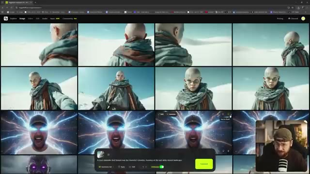
*Interface de l'outil de génération vidéo affichant une grille de vignettes avec un encadré PiP du créateur en bas à droite.*

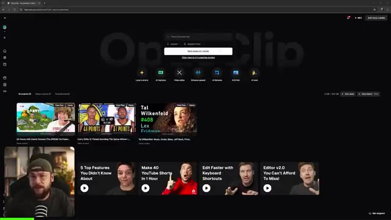
*Interface de la plateforme de découpage vidéo Opus Clip montrant le tableau de bord principal et les projets récents, avec le créateur en incrustation PiP.*

---

### ⏱️ `[00:12:54 - 00:13:20]` | Segment #30

**🔊 Audio (Transcription Intégrale Mot pour Mot en Français) :**
> de YouTube ainsi que de vos fichiers locaux. Donc nous voici sur le tableau de bord. Nous pouvons simplement aller de l'avant et déposer un lien dans cette section ici vers l'une de mes vidéos YouTube. Et Opus va convertir ma vidéo longue en clips parfaits pour les réseaux sociaux. Nous pouvons choisir le modèle que nous voulons utiliser. Je pense que je vais opter pour Clip Anything, qui est leur modèle le plus intelligent. Et puis si nous faisons défiler vers le bas, nous pouvons choisir notre style de sous-titres que nous aimons ainsi que le format d'image des clips que nous voulons.

**👁️ Analyse Visuelle d'Écran (gemini-3.5-flash-lite) :**
**Interface & Outils** : Opus Clip (outil web de conversion de vidéos longues en clips courts par IA)

**Contenu textuel & Code** : URL de saisie pour lien YouTube, options de modèles ('Auto', 'ClipAnything', 'ClipBasic'), préréglages de styles de sous-titres, et sélection du format d'image (9:16, 1:1, 16:9, 4:5).

**Action / Démonstration** : Le créateur navigue sur l'interface d'Opus Clip, sélectionne le modèle de découpage 'ClipAnything' via le menu déroulant, puis fait défiler la page pour configurer le style de sous-titres et le format d'image des clips.

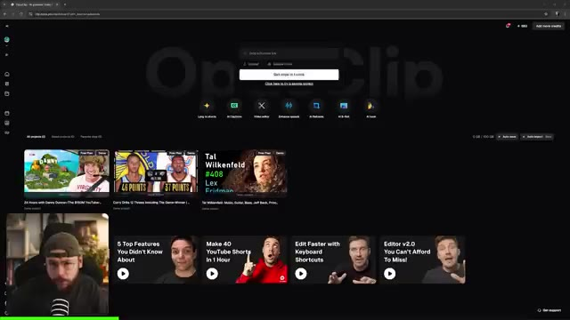
*Tableau de bord d'Opus Clip montrant la zone de dépôt de lien YouTube et les différents projets récents, avec l'encadré PiP du présentateur.*

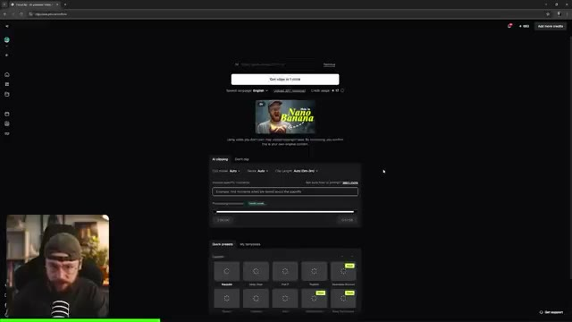
*Interface de configuration du découpage vidéo sur Opus Clip affichant l'aperçu de la vidéo importée et les paramètres d'IA.*

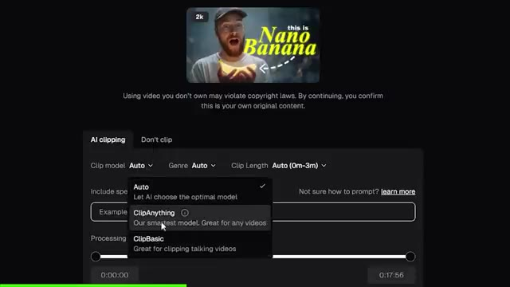
*Menu déroulant des modèles de découpage (Clip Model) sur Opus Clip montrant le choix 'ClipAnything' sélectionné par le curseur.*

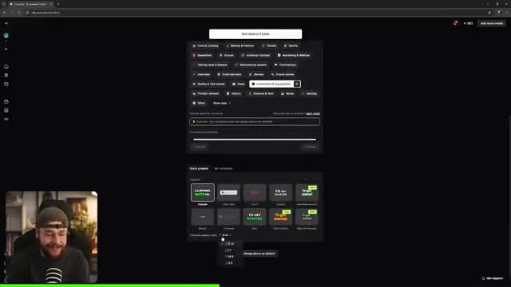
*Section des préréglages rapides (Quick presets) et sélection du format d'image (aspect ratio) réglé sur 9:16 en bas de l'écran.*

---

### ⏱️ `[00:13:20 - 00:13:53]` | Segment #31

**🔊 Audio (Transcription Intégrale Mot pour Mot en Français) :**
> Je viens de recevoir un e-mail pour dire que mes clips sont prêts. Donc nous pouvons aller cliquer dans cette zone et vous pouvez voir que nous avons toute une série d'options différentes ici, qui ont toutes été notées sur 100. Et c'est la probabilité que chaque clip a de performer sur les réseaux sociaux. Et nous pouvons ouvrir chaque clip si nous voulons les éditer individuellement en cliquant sur cet onglet ici. En allant sur le côté droit, nous pouvons voir que nous avons même l'option d'ajouter du B-roll à nos clips et il y a une option spécifique pour générer du B-roll par IA. Par exemple, à ce moment de la vidéo, nous sommes

**👁️ Analyse Visuelle d'Écran (gemini-3.5-flash-lite) :**
**Interface & Outils** : ClipAnything (interface de découpe et d'édition de clips vidéo alimentée par l'intelligence artificielle).

**Contenu textuel & Code** : Scores de performance affichés sous les clips (99, 98, 96), mention 'Trending', titres de vidéos (« Nano Banana: The AI filmmaking game-changer that changes everything »), et options du panneau B-roll (« Auto Generate AI B-roll », « Auto generate stock B-roll », « Prompt B-roll »).

**Action / Démonstration** : Le créateur montre la notification de ses clips prêts sur son téléphone, puis navigue dans l'interface pour présenter les différents clips notés, ouvre l'éditeur individuel, et enfin met en avant l'option de génération automatique de B-roll par IA dans le panneau latéral.

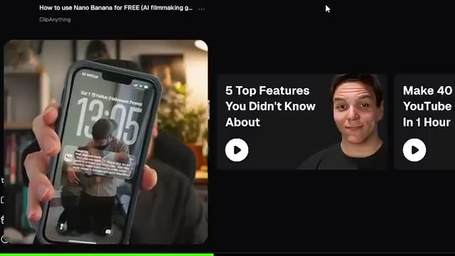
*Capture d'écran montrant le créateur tenant un smartphone affichant une notification par e-mail indiquant que les clips sont prêts.*

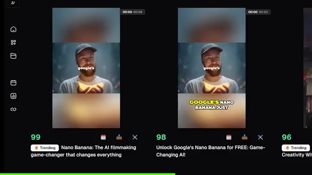
*Interface du logiciel affichant plusieurs clips générés avec leurs scores de performance sur les réseaux sociaux (99, 98, 96).*

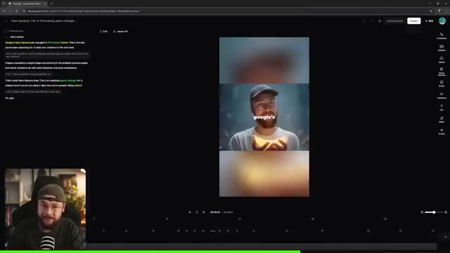
*Interface d'édition vidéo en ligne avec un aperçu du clip central et un petit encadré vidéo (PiP) du créateur en bas à gauche.*

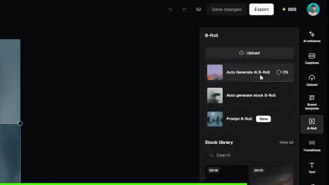
*Panneau latéral droit montrant les options de B-roll avec un bouton spécifique 'Auto Generate AI B-roll'.*

---

### ⏱️ `[00:13:53 - 00:14:29]` | Segment #32

**🔊 Audio (Transcription Intégrale Mot pour Mot en Français) :**
> parlant de la réalisation de films par IA et il a intégré un clip pertinent de ce type de studio de montage ou peut-être en marge d'un tournage de film actif. Vous pouvez donc voir qu'Opus est devenu bien plus qu'un simple outil de découpage et ressemble davantage à un éditeur vidéo IA tout-en-un avec une multitude de fonctionnalités gratuites. Si vous souhaitez aller jeter un œil, assurez-vous de cliquer sur le lien en bas dans la description. Bon, revenons à notre tutoriel. Maintenant, le prochain plan que nous allons viser est un plan de deux personnes et comme son nom l'indique, nous allons pouvoir voir deux personnages différents occuper le cadre et juste pour illustrer cela mieux, je veux mettre un nouveau personnage dans la scène ici et

**👁️ Analyse Visuelle d'Écran (gemini-3.5-flash-lite) :**
**Interface & Outils** : Interface de l'éditeur vidéo Opus (ou similaire) avec panneau latéral de génération B-Roll, timeline en bas, et incrustation PiP du créateur dans le coin inférieur gauche. Navigateur web affichant une plateforme d'IA (Higgsfield ou similaire) avec une grille de résultats visuels et un prompt textuel en bas.

**Contenu textuel & Code** : Texte à l'écran dans l'image 1 : "CHANGED AI FILMMAKING FOREVER". Panneau latéral avec description pour "Auto-Generate AI B-Roll". Image 2 : Grille de prévisualisation de plans cinématographiques avec des personnages chauves dans un décor désertique et des plans du visage du créateur avec des effets électriques, avec un champ de prompt visible en bas.

**Action / Démonstration** : Le créateur présente l'interface de l'éditeur vidéo en voix off tout en montrant l'écran de travail avec son incrustation vidéo en coin.

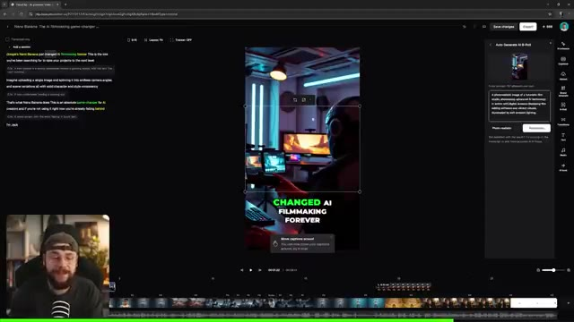
*Interface d'un éditeur vidéo par IA (type Opus) montrant une timeline, un aperçu vidéo central et une incrustation vidéo (PiP) du créateur en bas à gauche.*

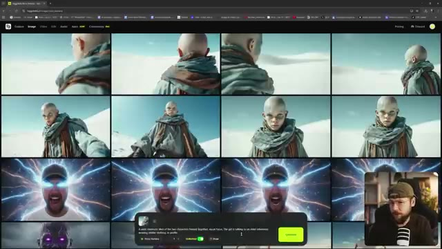
*Interface de génération d'images/vidéos par IA montrant une grille de rendus de personnages et une incrustation vidéo (PiP) du créateur en bas à droite.*

---

### ⏱️ `[00:14:29 - 00:14:50]` | Segment #33

**🔊 Audio (Transcription Intégrale Mot pour Mot en Français) :**
> ça va être intéressant de voir comment à la fois Nano Banana et SeaDream gèrent ce prompt textuel parce que ça va être un petit peu un défi. Alors, lançons nos deux générations Nano Banana ainsi que nos deux générations Sea Dream également. Et vous pouvez voir une fois de plus, nous avons obtenu des résultats vraiment incroyables de la part de ces deux outils d'image par IA.

**👁️ Analyse Visuelle d'Écran (gemini-3.5-flash-lite) :**
**Interface & Outils** : Interface web de génération d'images par IA (Higgfield ou similaire) avec une grille de vignettes d'images et un encadré PiP (Picture-in-Picture) du présentateur en bas à droite.

**Contenu textuel & Code** : Texte du prompt visible dans la boîte de dialogue en bas : "A wide cinematic shot of the two characters bowed together, sweet focus. The girl is talking to an elder tribesman wearing similar clothing, in profile." Menu déroulant affichant : "Higgsfield Soul", "Nano Banana", "SeaDream 4.0", "Flux Schnell Mini", "GPT Image", "Multi Reference", "Mid 2.2".

**Action / Démonstration** : Le créateur navigue sur l'interface web, sélectionne des options de modèles d'IA (Nano Banana et SeaDream) et lance les générations de prompts textuels.

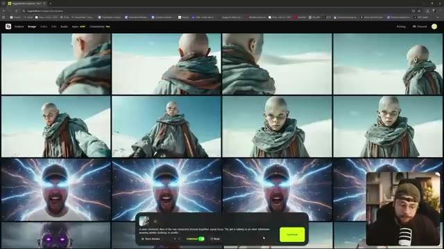
*Interface de l'outil de génération d'images affichant une grille de rendus générés par Nano Banana avec un panneau de prompt en bas et la webcam du créateur en incrustation.*

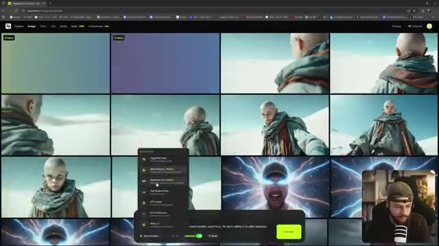
*Affichage du menu déroulant de sélection des modèles d'IA (incluant SeaDream 4.0 et Nano Banana) sur l'interface web.*

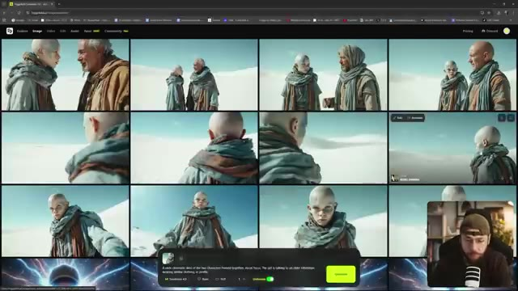
*Grille de résultats mise à jour montrant de nouveaux rendus générés avec les personnages dans le désert, avec les paramètres SeaDream 4.0 actifs.*

---

### ⏱️ `[00:14:50 - 00:15:27]` | Segment #34

**🔊 Audio (Transcription Intégrale Mot pour Mot en Français) :**
> Le nouveau personnage qui a été ajouté dans cette scène donne l'impression d'y être à sa place. Voici donc la première génération de Nano Banana et la deuxième génération de Nano Banana. Rien ne semble déplacé. Chara a toujours l'air bien cohérent. Et j'aime vraiment beaucoup les générations de Sea Dream également. Je dois dire que celle-ci ici, la texture de la peau sur Kara a l'air un peu cireuse, mais ce plan ici, avec la façon dont ils sont cadrés de manière imparfaite, est incroyable, et les détails de texture sur notre nouveau personnage ainsi que sur Kara font très photo-réalistes. Le seul problème que je dirais, c'est que ce vieux monsieur doit être à genoux parce que

**👁️ Analyse Visuelle d'Écran (gemini-3.5-flash-lite) :**
**Interface & Outils** : Navigateur web affichant l'interface de génération vidéo d'Higgfield avec des vignettes de prévisualisation en arrière-plan, un lecteur central, un champ de prompt textuel et un encadré PiP (Picture-in-Picture) du créateur en bas à droite.

**Contenu textuel & Code** : Texte du prompt visible sous le lecteur : "A humanoid alien duo in cracked geodes, glowing prayer lines within..." Paramètres de génération et icônes d'outils (Video, Speech) au-dessus du champ de texte.

**Action / Démonstration** : Le créateur présente différentes versions générées (Nano Banana 1, Nano Banana 2 et Sea Dream) en comparant la cohérence des personnages, la texture de la peau et les cadrages.

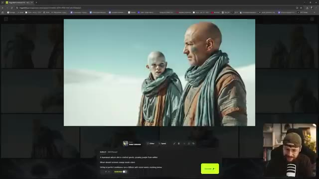
*Première génération Nano Banana montrant deux personnages dans le désert avec le panneau de prompt et l'incrustation vidéo du créateur en bas à droite.*

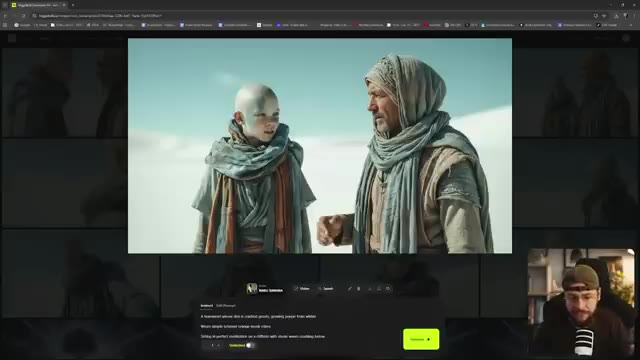
*Deuxième génération Nano Banana montrant les deux personnages légèrement modifiés dans le même décor désertique.*

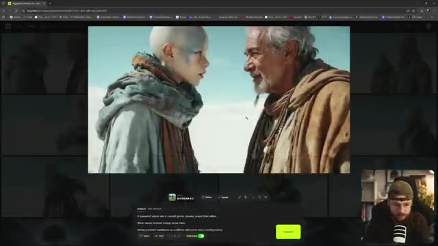
*Génération Sea Dream montrant un plan rapproché entre le jeune personnage et un homme âgé barbu dans le désert.*

---

### ⏱️ `[00:15:27 - 00:16:00]` | Segment #35

**🔊 Audio (Transcription Intégrale Mot pour Mot en Français) :**
> elle ne ferait pas la même taille que Kara parce que c'est une jeune fille, mais peu importe. Celle-ci a un peu plus de sens en termes de différence de taille, le type est peut-être juste un peu petit. Cette génération-ci, on a beaucoup plus l'impression que Kara est jeune et que cet homme à côté d'elle est beaucoup plus mature. Et encore une fois, on illustre aussi un peu ce sentiment de hiérarchie. On a l'impression qu'il est plus responsable. J'adore le fait que leurs vêtements soient si similaires. Donc je pense qu'on va télécharger celle-ci ainsi que celle-là. Et cet angle de caméra suivant est un

**👁️ Analyse Visuelle d'Écran (gemini-3.5-flash-lite) :**
**Interface & Outils** : Interface web de Higgsfield (Navigateur avec onglets, boutons de génération vidéo/image, panneau de prompt en bas).

**Contenu textuel & Code** : Panneau de prompt visible en bas de l'écran avec divers paramètres de génération textuelle et aperçus de modèles (ex: SEEDREAM 4.0).

**Action / Démonstration** : Le créateur navigue et sélectionne différentes images générées par IA représentant des personnages dans un décor désertique pour les télécharger.

*Interface de la plateforme affichant une image agrandie de la jeune fille chauve et de l'homme âgé se faisant face dans un désert.*

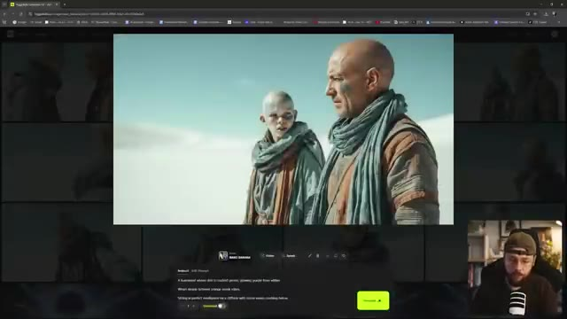
*Interface de la plateforme affichant une autre image agrandie montrant les deux personnages de profil sous un autre angle dans le désert.*

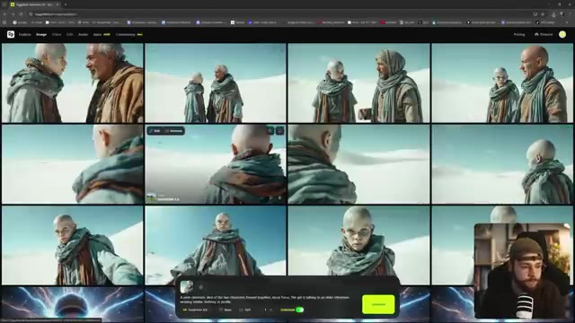
*Grille de vignettes de générations d'images sur l'interface web de Higgsfield, montrant différents plans de la jeune fille et de l'homme.*

---

### ⏱️ `[00:16:00 - 00:16:35]` | Segment #36

**🔊 Audio (Transcription Intégrale Mot pour Mot en Français) :**
> Assez intéressant. C'est ce qu'on appelle un plan incliné ("Dutch angle"). Et en tant que spectateur, cela vous fait juste vous sentir un peu mal à l'aise, vous vous sentez en quelque sorte hors de contrôle et cela donne aussi ce sentiment de chaos. Et encore une fois, de très bons résultats ici, j'adore cette deuxième génération de nano banana, ça donne en fait l'air un peu dérangé à Cara, comme si elle était sur le point de faire quelque chose d'assez fou, et j'ai une impression similaire de la première génération de seedream également. Et en fait, en tant que spectateur, nous nous sentons légèrement intimidés par cet angle de caméra vraiment intéressant que vous ne

**👁️ Analyse Visuelle d'Écran (gemini-3.5-flash-lite) :**
**Interface & Outils** : Navigateur web affichant l'interface de l'outil de génération vidéo et d'image IA "Higgsfield" avec un panneau de configuration des prompts et un retour vidéo en plein écran ou en grille, incluant la webcam du créateur (Jack) en incrustation PiP (Picture-in-Picture) dans le coin inférieur droit.

**Contenu textuel & Code** : Texte du prompt visible dans l'interface : "A cinematic shot with a tilted horizon, creating a sense of unease, tension, or chaos." (ou variante Seedream). Paramètres visibles : modèles Seedream, curseurs de format, options de génération.

**Action / Démonstration** : Le créateur navigue et démontre les résultats de génération vidéo sur l'interface de Higgsfield, en commentant les mouvements de caméra et les expressions des personnages générés par IA.

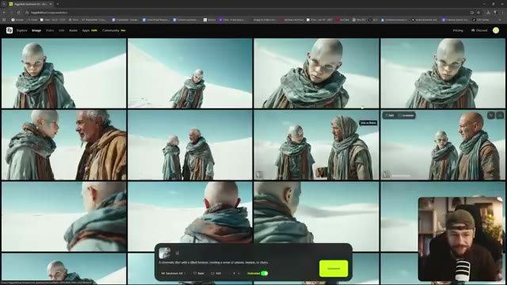
*Interface de l'outil Higgsfield affichant une grille de vignettes générées par IA avec un encadré PiP du créateur en bas à droite.*

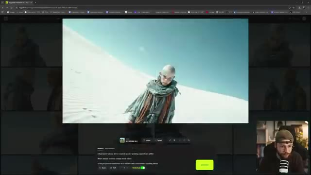
*Interface de l'outil Higgsfield montrant un aperçu vidéo agrandi d'un personnage dans un paysage désertique avec un plan incliné, et le créateur en incrustation PiP.*

---

### ⏱️ `[00:16:35 - 00:17:11]` | Segment #37

**🔊 Audio (Transcription Intégrale Mot pour Mot en Français) :**
> on entend réellement parler tout de même, le prochain angle de caméra que nous allons regarder maintenant est un plan large où nous voyons le personnage de la tête aux pieds, ils remplissent complètement le cadre, ce qui nous donne bien sûr une idée de l'environnement lui-même mais aussi de notre personnage complètement, et gardez à l'esprit que Seedream et Nano Banana n'ont pas cette information de ce que Cara porte sous ce niveau environ. D'accord, quelques résultats intéressants ici, la première génération Seedream a en fait échoué et a été qualifiée de contenu sensible, je ne comprends pas vraiment cela parce que la seconde

**👁️ Analyse Visuelle d'Écran (gemini-3.5-flash-lite) :**
**Interface & Outils** : Navigateur web affichant l'interface de l'outil de génération vidéo et image par IA Higgfield, avec un retour vidéo PiP du créateur (Jack) en bas à droite.

**Contenu textuel & Code** : Grilles d'images générées montrant des personnages dans un décor désertique, barre de prompt en bas avec le modèle Seedream 4.0 sélectionné et des options de paramétrage.

**Action / Démonstration** : Le créateur montre à l'écran les différents résultats de génération d'images, dont un échec étiqueté comme contenu sensible.

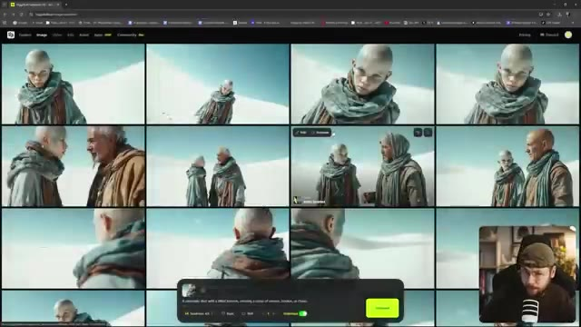
*Interface d'Higgfield affichant une grille de générations d'images avec le créateur en incrustation vidéo (PiP) dans le coin inférieur droit.*

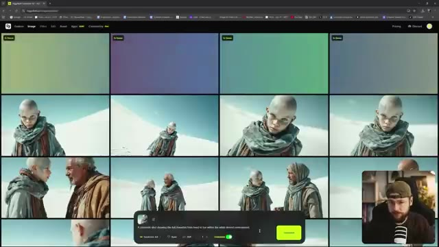
*Interface d'Higgfield montrant le chargement de nouvelles générations d'images dans la grille supérieure.*

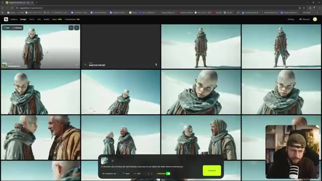
*Interface d'Higgfield affichant une image marquée comme « Sensitive Content » suite à l'échec de la génération Seedream.*

---

### ⏱️ `[00:17:11 - 00:17:37]` | Segment #38

**🔊 Audio (Transcription Intégrale Mot pour Mot en Français) :**
> L'animation Dream a fonctionné mais ne nous a pas donné exactement ce que nous cherchions, cependant Nano Banana s'est surpassé ici. En réalité, ce qu'il nous a donné, c'est le même plan deux fois avec une légère variation de vêtements pour Kara et je pense que je préfère cette première génération ici. Donc maintenant nous avons une idée de toute sa tenue et elle a l'air plutôt cool. Tout de suite, je vais aller télécharger ça.

**👁️ Analyse Visuelle d'Écran (gemini-3.5-flash-lite) :**
**Interface & Outils** : Interface web de Higgsfield AI affichant une galerie de générations d'images et de vidéos, avec le créateur visible en incrustation PiP (Picture-in-Picture) en bas à droite.

**Contenu textuel & Code** : Galerie de vignettes générées montrant un personnage chauve dans un décor de désert, avec des prompts textuels visibles en bas de l'écran.

**Action / Démonstration** : Le créateur navigue et zoome sur les différentes générations d'images pour comparer les tenues du personnage et choisir sa version préférée.

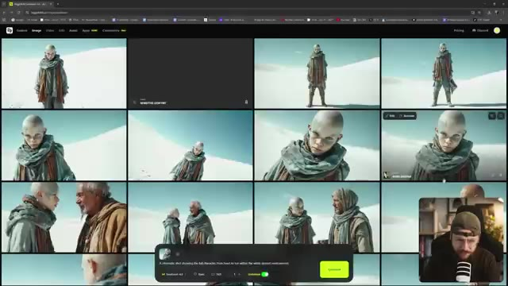
*Grille d'images générées par IA sur l'interface web de Higgsfield avec une incrustation vidéo du créateur en bas à droite.*

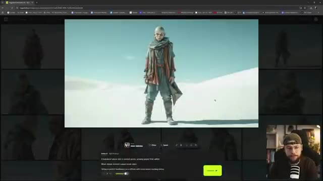
*Gros plan sur une image sélectionnée montrant le personnage Kara en pied dans un paysage désertique.*

---

### ⏱️ `[00:17:37 - 00:18:11]` | Segment #39

**🔊 Audio (Transcription Intégrale Mot pour Mot en Français) :**
> Et j'aime laisser des petits problèmes comme celui-ci dans mes vidéos les gars pour que vous puissiez voir la réalité de l'utilisation de l'IA générative, on n'obtient pas souvent les résultats qu'on veut du premier coup, parfois les choses tournent mal et c'est une question d'essais et erreurs. Maintenant, comme nous allons passer à des plans beaucoup plus larges, je pense qu'il va en fait être préférable d'utiliser cette génération ici comme notre nouveau plan large de référence, car nous établissons ce que Cara porte de la tête aux pieds. Donc si nous voulons obtenir de la cohérence, c'est désormais la meilleure façon de le faire. Nous avons bien le plan téléchargé, mais nous savons que

**👁️ Analyse Visuelle d'Écran (gemini-3.5-flash-lite) :**
**Interface & Outils** : Interface Web de génération d'images/vidéos (type Higgsfield ou similaire) avec navigation par onglets (Explore, Image, Video, Edit, Audio, Apps, Community) et incrustation vidéo (PiP) du créateur en bas à droite.

**Contenu textuel & Code** : Interface web avec vignettes de génération, barres d'outils et Explorateur Windows affichant des vignettes de fichiers multimédias.
[DESC_IMAGE_1] Le créateur montre la grille des résultats de génération avec ses défauts et variations.
[DESC_IMAGE_2] Le créateur sélectionne un plan large spécifique du personnage servant de référence ("master shot").
[DESC_IMAGE_3] Le créateur ouvre le gestionnaire de fichiers pour montrer que le plan a bien été téléchargé.

**Action / Démonstration** : Démonstration pédagogique et présentation du workflow.

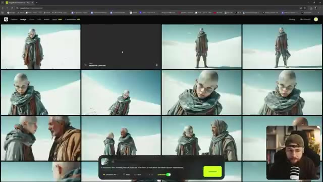
*Grille d'images générées par IA sur l'interface de l'outil Web montrant différents cadrages d'un personnage dans un désert blanc.*

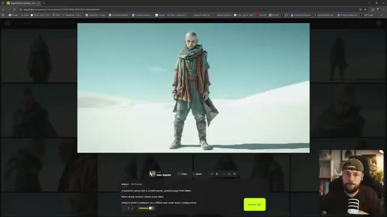
*Gros plan sur une image sélectionnée affichant le personnage en pied dans le désert, avec des options de modification et de téléchargement.*

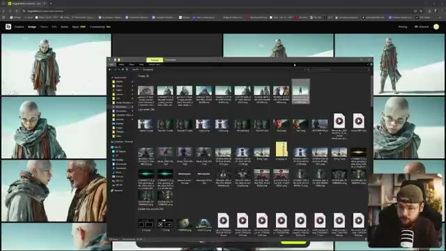
*Affichage d'un dossier de l'Explorateur Windows par-dessus l'interface Web, montrant des fichiers d'images et de vidéos téléchargés.*

---

### ⏱️ `[00:18:11 - 00:18:45]` | Segment #40

**🔊 Audio (Transcription Intégrale Mot pour Mot en Français) :**
> la résolution ne va pas être terrible. Donc je vais aller dans le coin supérieur gauche du champ de Higgs et aller vers le suréchantillonneur haute résolution Topaz. Je vais simplement glisser-déposer mon image, le plan large de Cara. Je vais juste le laisser sur le mode Topaz par défaut et le régler pour qu'il soit mis à l'échelle d'un facteur de deux. En retournant en haut à gauche, nous pouvons retourner à créer une image. Et comme je le dis, nous voulons maintenant insérer notre nouveau plan large haute résolution. Et maintenant, nous allons nous intéresser à la création d'un plan de situation. Encore une fois, prenez note de cette invite textuelle si vous

**👁️ Analyse Visuelle d'Écran (gemini-3.5-flash-lite) :**
**Interface & Outils** : Interface web de Higgsfield avec un explorateur de fichiers Windows intégré et le panneau de réglages Topaz Upscale.

**Contenu textuel & Code** : Texte affiché : "ESTABLISHING SHOT" suivi du prompt : "A sweeping cinematic shot of the vast white dessert landscape the character appearing small, emphasizing environment and scale of the location."

**Action / Démonstration** : Le créateur navigue dans l'interface de Higgsfield, sélectionne le suréchantillonneur Topaz, applique un facteur d'échelle de 2 sur une image existante, puis présente un nouveau prompt textuel pour créer un plan de situation (establishing shot).

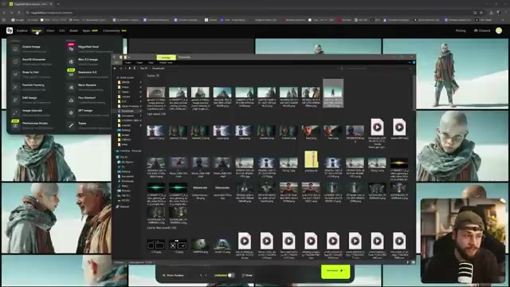
*Interface de l'application Higgsfield affichant une fenêtre d'explorateur de fichiers Windows par-dessus une grille de générations d'images.*

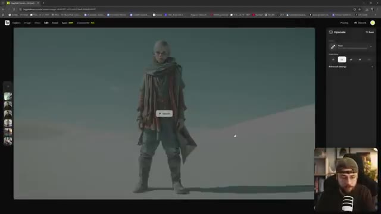
*Interface de l'outil Topaz upscale au sein de Higgsfield montrant une image en plein écran avec un panneau de configuration à droite.*

*Grille d'images générées dans Higgsfield montrant différents plans de personnages dans un décor désertique.*

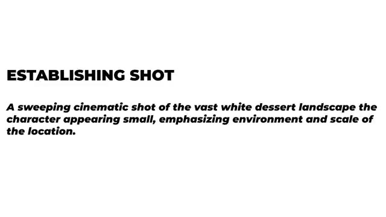
*Écran de texte affichant le titre "ESTABLISHING SHOT" et un prompt textuel de génération décrivant un plan cinématographique.*

---

### ⏱️ `[00:18:45 - 00:19:19]` | Segment #41

**🔊 Audio (Transcription Intégrale Mot pour Mot en Français) :**
> vouliez l'utiliser vous-même. Et encore une fois, nous avons obtenu de très bonnes générations de la part des deux outils. Regardez simplement à quel point toutes ces générations sont impressionnantes. Celles-ci sont prises sous un angle légèrement élevé et vous pouvez voir que le visage de Chara est en quelque sorte un peu déformé. Celle-ci est suffisamment éloignée pour qu'on ne puisse pas vraiment le voir. Et j'aime vraiment beaucoup la composition ici. Ça a l'air vraiment bien et net aussi. Ma préférence personnelle ici va être de télécharger cette première génération de Nano Banana. De manière intéressante, Seadream nous a devancés sur celle-ci.

**👁️ Analyse Visuelle d'Écran (gemini-3.5-flash-lite) :**
**Interface & Outils** : Interface web de génération d'images par IA (type Higgsfield / Seedream) avec disposition en grille et incrustation vidéo du créateur (PiP) en bas à droite.

**Contenu textuel & Code** : Grille d'images générées montrant un personnage dans un environnement désertique enneigé ou de sel blanc, avec différentes échelles de plans (large, moyen, gros plan sur le visage). Un panneau contextuel affiche un prompt textuel et des options de réglage.

**Action / Démonstration** : Le créateur navigue et compare les différentes générations d'images affichées dans la grille sur son écran.

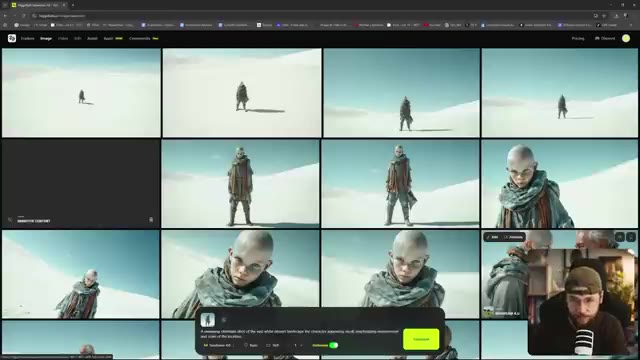
*Interface de l'outil de génération affichant une grille de visuels avec un personnage dans un paysage désertique blanc.*

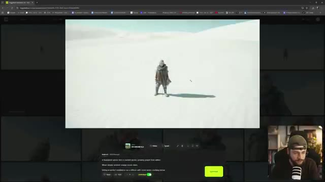
*Interface affichant un zoom sur l'un des visuels de la grille avec le panneau de paramètres et de prompt en bas.*

*Retour à la grille complète de générations d'images avec le panneau de prompt actif en bas.*

---

### ⏱️ `[00:19:19 - 00:19:38]` | Segment #42

**🔊 Audio (Transcription Intégrale Mot pour Mot en Français) :**
> prochain angle de caméra, mais nous allons examiner la vue aérienne. Et cela accentue vraiment l'échelle et donne en quelque sorte l'impression que Kara est un peu insignifiante comparée à cette sorte de vaste nature sauvage qui l'environne. Encore une fois, les deux outils de génération d'images se sont vraiment surpassés. J'aime vraiment toutes ces images pour différentes raisons.

**👁️ Analyse Visuelle d'Écran (gemini-3.5-flash-lite) :**
**Interface & Outils** : Interface web de Higgsfield affichant une galerie ou grille de résultats de génération d'images, avec une incrustation vidéo (PiP) du créateur en bas à droite.

**Contenu textuel & Code** : Galerie d'images montrant des plans larges en vue aérienne (« bird's eye view ») et des gros plans du personnage Kara dans un décor désertique, avec une infobulle de prompt en bas (« A cinematic, top-down shot looking straight down at character from above, emphasizing scale and insignificance... »).

**Action / Démonstration** : Le créateur navigue et commente les différentes variations d'images générées affichées en grille sur l'interface de Higgsfield.

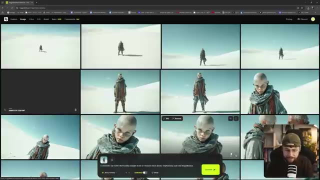
*Grille d'images générées par IA sur l'interface de Higgsfield représentant le personnage Kara dans un paysage désertique avec différents plans et angles de caméra, avec le créateur en incrustation (PiP).*

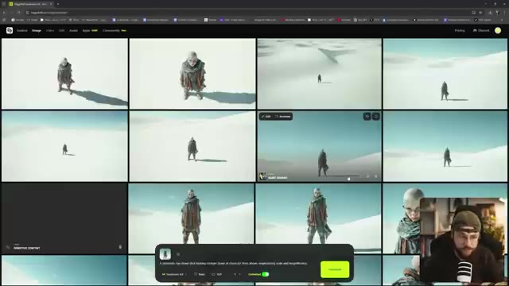
*Grille d'images générées sur Higgsfield montrant une vue aérienne du personnage dans l'immensité du désert, avec la barre de prompt visible en bas et le créateur en incrustation (PiP).*

---

### ⏱️ `[00:19:38 - 00:20:01]` | Segment #43

**🔊 Audio (Transcription Intégrale Mot pour Mot en Français) :**
> Et bien sûr, des plans plus larges comme ceux que nous explorons maintenant pourraient être utilisés pour montrer une séquence d'action. Peuvent également être simplement utilisés pour accentuer l'échelle, à quel point Kara se sent petite par rapport à ce paysage désertique immense, vaste et blanc dans lequel elle s'est retrouvée. Maintenant, si je veux être hypercritique, les rendus Sea Dream gâchent un peu le visage de Kara.

**👁️ Analyse Visuelle d'Écran (gemini-3.5-flash-lite) :**
**Interface & Outils** : Interface web de la plateforme Higgsfield AI avec grille de génération d'images et panneau de contrôle / prompt en bas.

**Contenu textuel & Code** : Miniatures de génération d'images avec le personnage Kara dans un désert blanc, prompts textuels et curseurs de configuration de Seedream 4.0 visibles.

**Action / Démonstration** : Le créateur navigue à travers une grille de rendus générés par IA illustrant différents plans larges et d'échelle, tout en commentant l'impact visuel et les défauts de rendu des visages.

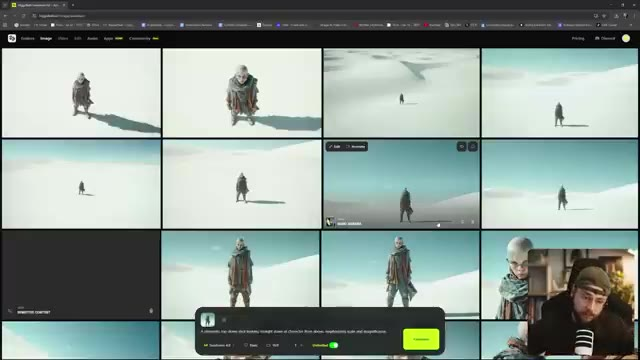
*Grille de rendus visuels sur Higgsfield AI montrant différents plans larges et en plongée d'un personnage dans un désert blanc, avec Jack en incrustation (PiP).*

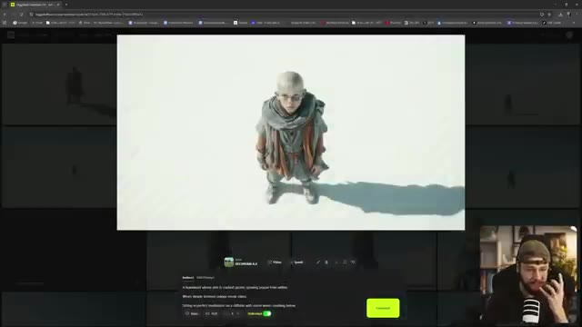
*Gros plan sur un rendu de Kara dans Higgsfield AI avec le panneau de prompt visible en bas, et Jack en incrustation (PiP) touchant son menton.*

---

### ⏱️ `[00:20:02 - 00:20:41]` | Segment #44

**🔊 Audio (Transcription Intégrale Mot pour Mot en Français) :**
> Même si j'aime vraiment beaucoup la composition, en particulier ici où ses yeux ont l'air un peu étranges, l'œil gauche celui-ci n'est pas si mal mais je ne trouve pas que cela soit totalement cohérent avec elle en tant que personnage, et la deuxième génération nano banana également, j'aime juste vraiment beaucoup la composition de ceci et à quel point Kara a l'air petite dans ce désert, c'est très cool, et le plan final que nous allons explorer maintenant est un plan en point de vue qui a de très nombreuses utilisations, nous allons lancer à la fois nos générations nano banana et nos générations sea dream avec ce prompt très simple et c'est parti le plan en point de vue pour moi c'est un peu

**👁️ Analyse Visuelle d'Écran (gemini-3.5-flash-lite) :**
**Interface & Outils** : Interface web d'un outil de génération de vidéo par IA (type Seedance / plateforme similaire) avec grille d'historique en arrière-plan, zone de prévisualisation vidéo centrale et panneau de prompt en bas, ainsi qu'un encadré PiP du créateur.

**Contenu textuel & Code** : Texte affiché sur diapositive : "POINT OF VIEW (POV) - POV shot of the vast white dessert location." Paramètres et interface de l'outil de génération vidéo sous le lecteur.

**Action / Démonstration** : Le créateur présente une interface de génération vidéo montrant différents types de plans (large et subjectif) générés par IA, illustrés par des exemples de rendus visuels.

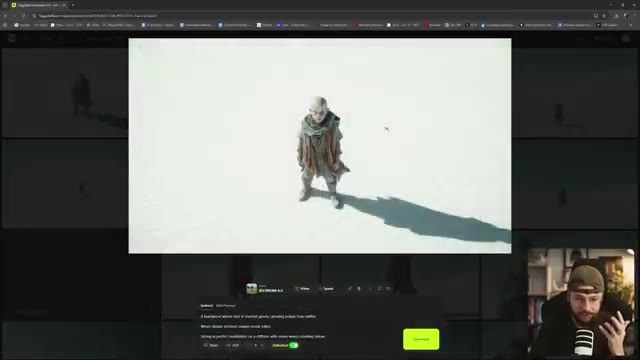
*Interface d'un outil de génération vidéo par IA montrant un plan large d'un personnage dans un désert blanc, avec une incrustation vidéo du créateur en bas à droite.*

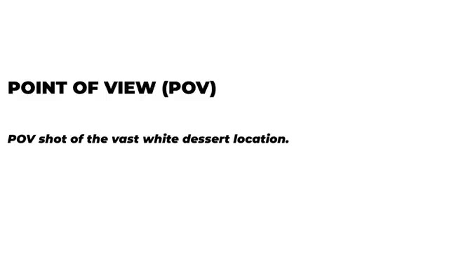
*Diapositive textuelle noire avec le titre "POINT OF VIEW (POV)" et un exemple de prompt de plan subjectif.*

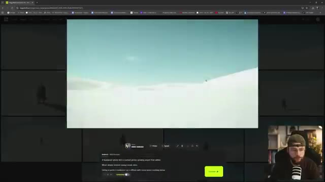
*Interface de l'outil de génération vidéo affichant un plan subjectif (POV) en mouvement dans un paysage désertique blanc, avec le créateur visible en bas à droite.*

---

### ⏱️ `[00:20:41 - 00:21:17]` | Segment #45

**🔊 Audio (Transcription Intégrale Mot pour Mot en Français) :**
> nous pousse à relier le personnage à l'extrême au point où nous sommes littéralement le personnage pour moi ça me rappelle toujours un jeu vidéo à la première personne ça crée cette connexion avec le personnage vraiment intense où vous êtes littéralement dans ses chaussures et ça peut très bien fonctionner je l'ai déjà utilisé pour l'un de mes courts métrages pour montrer réellement le personnage en train de courir et on peut l'entendre haleter d'une certaine manière et on a vraiment l'impression d'être dans sa tête alors qu'il vit la scène j'aime vraiment celle-ci de Sea Dream où on peut effectivement voir les jambes de Kara dans le cadre aussi

**👁️ Analyse Visuelle d'Écran (gemini-3.5-flash-lite) :**
**Interface & Outils** : Interface web d'un outil de génération vidéo par IA (probablement Higgsfield), affichant des grilles de résultats, des prompts et des options de lecture vidéo.

**Contenu textuel & Code** : Grille de miniatures vidéo générées par IA représentant un personnage dans un paysage désertique blanc, avec une mini-fenêtre de prompt et le créateur visible en bas à droite dans un encadré PiP.

**Action / Démonstration** : Le créateur navigue et zoome sur les différentes générations vidéo montrant des plans à la première personne et en vue subjective dans un désert.

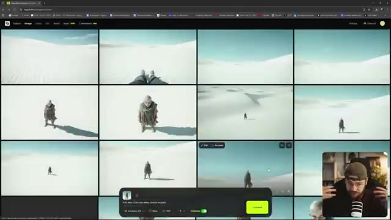
*Interface d'un générateur vidéo montrant une grille de résultats sur le thème d'un désert blanc, avec le créateur en incrustation (PiP).*

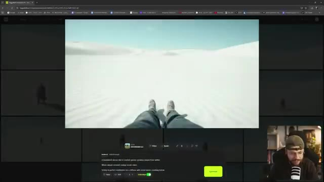
*Gros plan sur une vidéo générée montrant les jambes d'un personnage dans un désert (point de vue subjectif ou première personne), avec le créateur en incrustation.*

---

### ⏱️ `[00:21:17 - 00:21:50]` | Segment #46

**🔊 Audio (Transcription Intégrale Mot pour Mot en Français) :**
> pour donner un tout petit peu plus de contexte au plan, mais en réalité n'importe lequel des plans de paysage est vraiment super et fonctionnerait très bien dans une histoire. Chaque rendu est beau et net. Il y a un bon niveau de détail. Mais je pense qu'on va garder celui-ci ainsi que celui avec les jambes dedans parce que je trouve ça plutôt cool. Et donc maintenant, nous avons en fait généré tous nos différents angles de caméra. Avant de passer aux mouvements de caméra, je veux générer une image de Cara en train de courir parce que quand on regarde les mouvements de caméra, je veux qu'elle montre une sorte de dynamisme.

**👁️ Analyse Visuelle d'Écran (gemini-3.5-flash-lite) :**
**Interface & Outils** : Navigateur web affichant l'interface de génération d'images/vidéos (Higgfield) avec une vue en grille et un encadré PiP du présentateur dans le coin inférieur droit.

**Contenu textuel & Code** : Une grille de vignettes montrant des paysages de désert blanc et des personnages vus de différents angles, avec des panneaux de prompts et de paramètres en bas de l'écran.

**Action / Démonstration** : Le présentateur passe en revue les différents rendus générés et sélectionne les meilleurs plans pour la suite du projet.

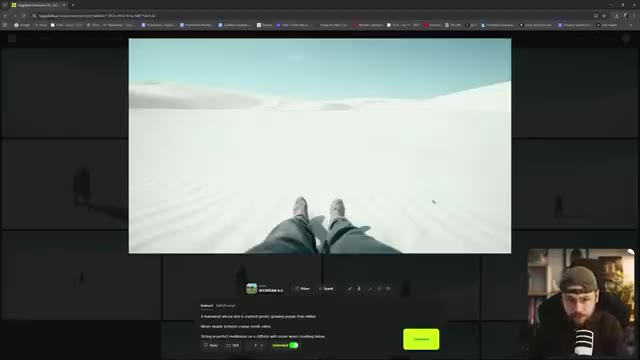
*Interface de l'outil de génération affichant un gros plan sur une image sélectionnée montrant des jambes dans un paysage désertique blanc.*

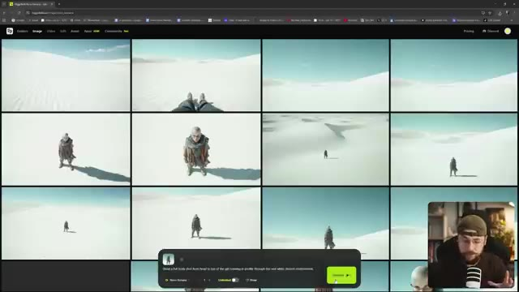
*Grille de plusieurs images générées montrant divers plans et angles de personnages et de paysages désertiques.*

---

### ⏱️ `[00:21:50 - 00:22:24]` | Segment #47

**🔊 Audio (Transcription Intégrale Mot pour Mot en Français) :**
> action. On ne peut pas vraiment illustrer comment les mouvements de caméra nous aident. Si elle est juste immobile, ça n'aura pas autant d'impact. Donc on opte pour un prompt textuel très simple ici. On utilise ce plan qu'on a généré via Nano Banana. On dit juste : montrer un plan en pied de la tête aux pieds de la fille courant de profil à travers le vaste environnement de désert blanc. Pendant que ces dernières images sont générées, j'espère vraiment que vous avez eu un aperçu des différences entre Nano Banana et C Dream 4.0. Je pense que les deux donnent de très bons résultats. Personnellement, je me tourne un peu

**👁️ Analyse Visuelle d'Écran (gemini-3.5-flash-lite) :**
**Interface & Outils** : Navigateur web affichant une plateforme de génération d'IA (style interface type Nano Banana / générateur de médias) avec une vue en grille des créations.

**Contenu textuel & Code** : Texte du prompt visible : « show a full body shot from head to toe of the girl running in profile through the vast white desert environment » et mentions « Nano Banana », « Seedown 4.2 ».

**Action / Démonstration** : Le créateur présente l'interface de génération d'images et montre les différents rendus obtenus à partir de son prompt textuel.

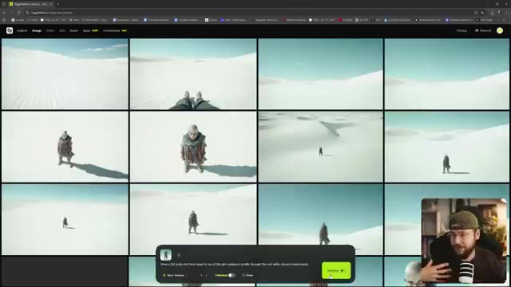
*Interface de génération d'images affichant une grille de résultats sur fond de désert blanc avec une boîte de dialogue de prompt en bas.*

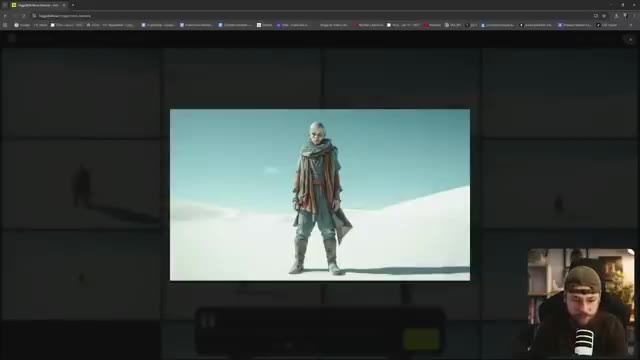
*Gros plan sur une image générée montrant un personnage en pied au milieu d'un paysage désertique lumineux.*

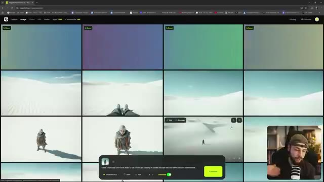
*Grille d'interface montrant de nouvelles images en cours de chargement ou de génération avec les options de Seedown 4.2.*

---

### ⏱️ `[00:22:24 - 00:22:56]` | Segment #48

**🔊 Audio (Transcription Intégrale Mot pour Mot en Français) :**
> un peu plus vers Nano Banana. Je trouve que c'est un peu plus cohérent. Certains des problèmes de déformation faciale qu'on voit dans C Dream sont assez moches. Je pense que si vous êtes capable d'utiliser le workflow que je fais ici, où l'on fait deux générations à partir de chaque outil et qu'on choisit juste nos préférées avant de passer à l'upscale des résultats, et bien que cdream sort effectivement du 1440p je crois, ouais c'est le cas, ça peut quand même paraître un peu doux par endroits donc gardez ça à l'esprit et voilà du très

**👁️ Analyse Visuelle d'Écran (gemini-3.5-flash-lite) :**
**Interface & Outils** : Interface de l'outil web Higgfield (Higgfield AI), Explorateur de fichiers Windows et visualiseur d'images de bureau.

**Contenu textuel & Code** : On aperçoit dans l'interface d'Higgfield un prompt textuel en bas : "Show a full-body shot from head to toe of the girl running in profile through the vast white desert wasteland...". L'explorateur Windows montre de nombreux fichiers multimédias et le visualiseur présente un rendu haute résolution d'un personnage de type guerrier/moine chauve avec des vêtements déchirés dans le désert.

**Action / Démonstration** : Le créateur navigue entre les outils de génération d'IA, ouvre l'explorateur de fichiers pour sélectionner des assets visuels et visionne les résultats générés en plein écran.

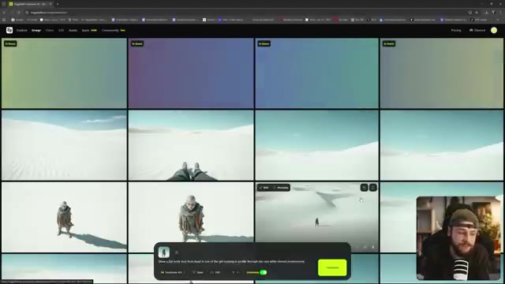
*Interface d'un outil de génération vidéo par IA (Higgfield) avec une grille de résultats visuels en arrière-plan et Jack dans un encadré PiP en bas à droite.*

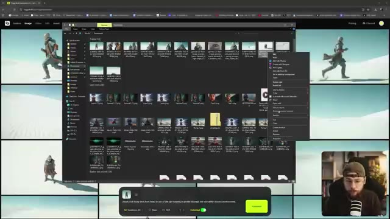
*Explorateur de fichiers Windows ouvert par-dessus l'interface d'Higgfield, affichant une grille de miniatures d'images/vidéos avec un menu contextuel ouvert.*

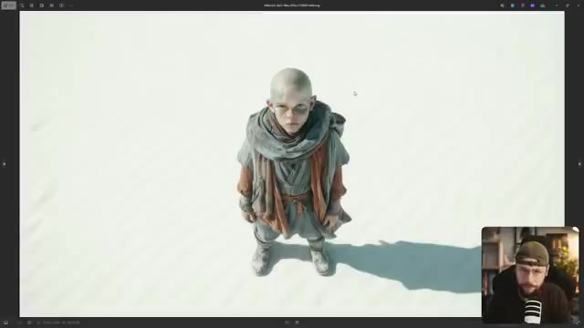
*Visualiseur d'images affichant le gros plan d'un personnage chauve en tenue traditionnelle dans un décor désertique blanc.*

---

### ⏱️ `[00:22:56 - 00:23:28]` | Segment #49

**🔊 Audio (Transcription Intégrale Mot pour Mot en Français) :**
> de super résultats de retour une fois de plus le premier résultat de C Dream a échoué à nouveau en raison de contenu sensible faites que ça ait du sens les gars je ne sais pas ce qui se passe là-bas c'est de l'ia c'est comme ça on a quand même eu de très chouettes résultats de la part de C Dream et Nano Banana. Allons-y et téléchargeons celui-ci ainsi que celui-là. Maintenant que j'ai récupéré toutes mes images suréchantillonnées, vous pouvez voir qu'on a vraiment créé pas mal d'angles de caméra très variés juste à partir de ce seul plan maître.

**👁️ Analyse Visuelle d'Écran (gemini-3.5-flash-lite) :**
**Interface & Outils** : Interface web de génération vidéo IA (Higgfield / Seedance) et visionneuse de fichiers image locale sur le bureau du créateur, avec incrustation vidéo PiP de Jack dans le coin inférieur droit.

**Contenu textuel & Code** : Vignettes de prévisualisation générées par IA représentant un personnage androïde/humain dans un désert de sable, avec un avertissement de contenu sensible ('Sensitive content') sur une vignette, et des prompts textuels visibles dans une infobulle (ex: 'Close a full body shot from head to toe of the girl running in profile through the vast white desert wasteland...').

**Action / Démonstration** : Le créateur navigue et zoome sur les résultats de génération d'images et de vidéos, montrant les différentes variations obtenues et les éléments téléchargés.

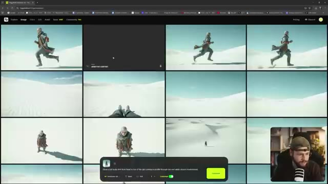
*Interface web (Higgfield / C Dream) montrant une grille de 12 vignettes de résultats vidéo avec un message d'erreur 'Sensitive Content' sur l'une d'elles, et le créateur en incrustation vidéo (PiP) en bas à droite.*

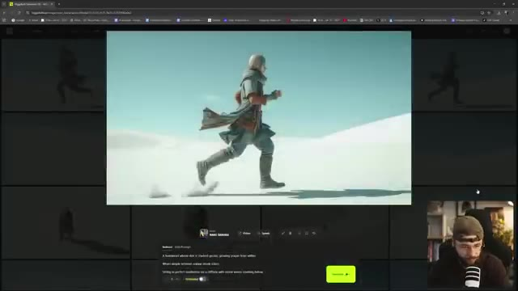
*Interface web montrant la lecture agrandie d'une des vignettes vidéo (personnage courant dans le désert) avec les options de téléchargement et de configuration Seedance.*

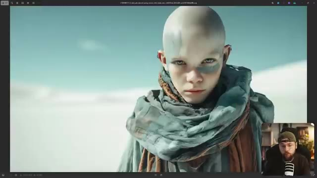
*Visualiseur d'image affichant un gros plan de l'image générée ultra-détaillée (personnage chauve au visage peint dans le désert).*

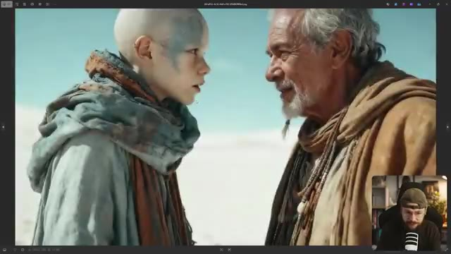
*Visualiseur d'image affichant un plan rapproché de dialogue entre le personnage principal chauve et un homme âgé dans le désert.*

---

### ⏱️ `[00:23:29 - 00:24:05]` | Segment #50

**🔊 Audio (Transcription Intégrale Mot pour Mot en Français) :**
> Regardez à quel point nous avons développé les choses en utilisant Nano Banana et C Dream. Les résultats sont vraiment impressionnants, j'adore absolument ce plan en particulier, un autre vraiment cool ici, ce plan à deux, et je dirais que les plans larges, je peux voir qu'ils proviennent de C Dream parce que si nous zoomons à fond, vous pouvez voir le visage de Cara, je ne sais même pas ce qui s'est passé là-bas, il y a des artéfacts très étranges qui se produisent et qu'on ne voit vraiment qu'avec C Dream, on ne voit pas cela se produire avec Nano Banana, ce qui explique pourquoi cela reste mon préféré personnel. Mais avec cela, nous avons développé tous les

**👁️ Analyse Visuelle d'Écran (gemini-3.5-flash-lite) :**
**Interface & Outils** : Lecteur vidéo et explorateur de fichiers Windows affichant des clips générés par IA, avec incrustation vidéo du créateur dans le coin inférieur droit.

**Contenu textuel & Code** : Vignettes de fichiers dans l'explorateur Windows, interface de l'outil de génération vidéo et rendus de paysages désertiques.
[DESC_IMAGE_4] L'explorateur de fichiers est affiché au premier plan par-dessus l'interface d'édition, montrant de nombreuses ressources visuelles.

**Action / Démonstration** : Le créateur montre différents plans vidéo générés par IA pour comparer la qualité de rendu et illustrer les artéfacts visuels.

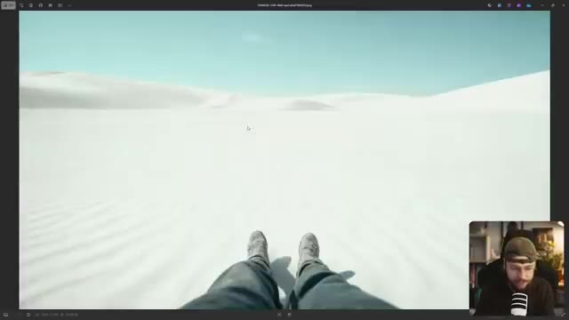
*Aperçu vidéo montrant un plan subjectif (POV) sur des dunes de sable blanc dans un paysage désertique.*

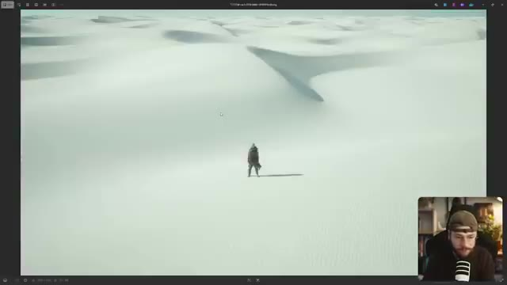
*Aperçu vidéo montrant un plan large d'un personnage solitaire debout au milieu d'un vaste désert de dunes blanches.*

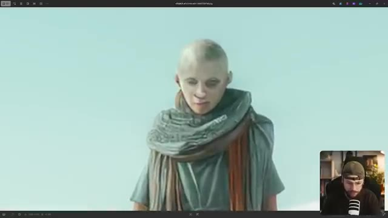
*Gros plan zoomé sur le visage du personnage de Cara présentant des artéfacts visuels étranges générés par IA.*

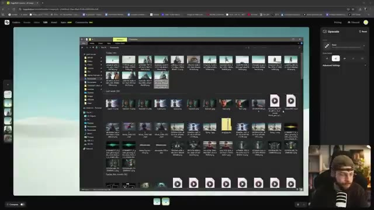
*Explorateur de fichiers Windows affichant une grille de vignettes de clips vidéo et d'images générées par IA.*

---

### ⏱️ `[00:24:05 - 00:24:40]` | Segment #51

**🔊 Audio (Transcription Intégrale Mot pour Mot en Français) :**
> nos angles de caméra. Nous pouvons maintenant chercher à les animer. Et comme promis, je vais vous montrer un moyen gratuit d'animer vos vidéos IA. Nous sommes ici dans le Discord LM Arena, dont je mettrai un lien en bas dans la description. Ce que vous voulez faire, c'est aller ici dans l'une de ces arènes vidéo. Je suis généralement dans l'arène vidéo un. Si vous allez dans la zone de texte ici et tapez slash, vous pouvez sélectionner image vers vidéo et nous pouvons aller déposer l'une de nos images que nous avons générées de Cara en train de courir et le premier mouvement de caméra que nous allons examiner est un plan de travelling suivi, donc nous

**👁️ Analyse Visuelle d'Écran (gemini-3.5-flash-lite) :**
**Interface & Outils** : Explorateur de fichiers Windows intégré dans une application web, serveur Discord 'LM Arena', et diapositive de présentation textuelle.

**Contenu textuel & Code** : Texte affiché sur l'écran final : 'TRACKING/DOLLY SHOT. The camera moves smoothly alongside a character in motion, fluid movement. Tracking dolly shot. Flowing allows the capture of movement.'

**Action / Démonstration** : Le créateur montre son dossier de fichiers d'images générées, puis navigue sur le serveur Discord LM Arena avant d'afficher un écran de définition textuelle sur le mouvement de caméra 'tracking dolly shot'.

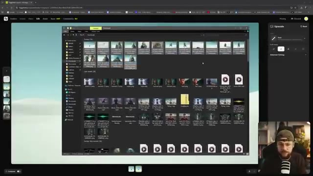
*Explorateur de fichiers affichant les images générées par IA avec le créateur en incrustation PiP.*

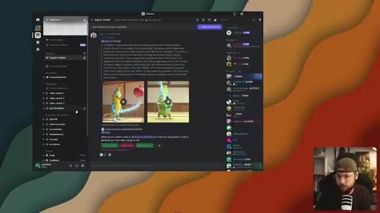
*Interface du serveur Discord 'LM Arena' montrant les canaux textuels et vidéo avec le créateur en incrustation PiP.*

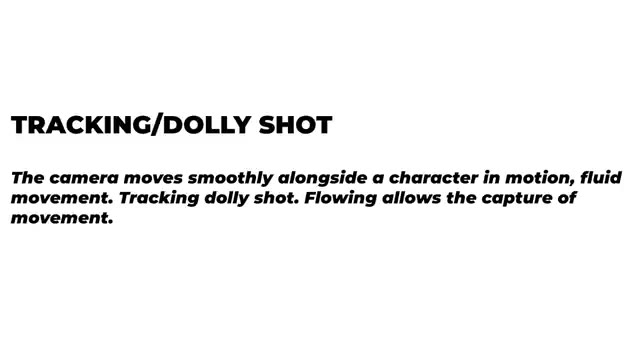
*Diapositive textuelle présentant la définition et la description d'un plan de travelling (Tracking/Dolly Shot).*

---

### ⏱️ `[00:24:40 - 00:25:13]` | Segment #52

**🔊 Audio (Transcription Intégrale Mot pour Mot en Français) :**
> on peut voir que nous avons saisi le prompt textuel ci-dessous, nous allons cliquer sur entrée, maintenant dans LM Arena, vous avez une limite quotidienne de cinq générations de vidéos, mais vous allez obtenir tout cela de manière totalement gratuite, vous récupérerez deux générations pour chaque prompt textuel que vous soumettez, et celles-ci proviendront de modèles vidéo sélectionnés au hasard. Vous pouvez obtenir de bons modèles comme VO3 et Kling, et aussi des modèles un peu bancals. C'est vraiment un jeu de hasard, mais c'est un excellent moyen de se familiariser avec l'IA génératrice si vous débutez. Et vous pouvez voir maintenant que nous avons récupéré nos vidéos générées à partir de

**👁️ Analyse Visuelle d'Écran (gemini-3.5-flash-lite) :**
**Interface & Outils** : Application Discord (Interface de LM Arena, bot de génération de vidéos par IA). Un encadré PiP (Picture-in-Picture) en bas à droite montre le présentateur (Jack) face caméra devant son micro.

**Contenu textuel & Code** : Canaux Discord visibles dans la barre latérale gauche (#video-arena-1, #video-arena-2, #video-arena-3), et zone de texte active en bas de l'écran affichant un prompt de type "image-to-video" avec des instructions sur les mouvements de caméra.

**Action / Démonstration** : Le créateur montre l'interface de LM Arena sur Discord, illustrant la saisie de prompts et le fonctionnement des générations aléatoires de vidéos gratuites.

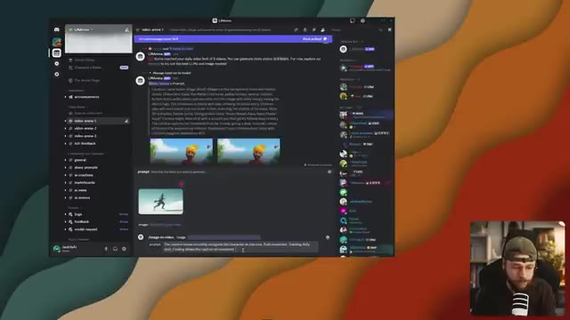
*Interface Discord de LM Arena montrant la saisie d'un prompt textuel et les résultats de génération de vidéos.*

---

### ⏱️ `[00:25:13 - 00:25:42]` | Segment #53

**🔊 Audio (Transcription Intégrale Mot pour Mot en Français) :**
> LM Arena Discord. Jetons donc un coup d'œil. Première génération. Oh, elle est plutôt ratée celle-là. Avons-nous été tout aussi malchanceux avec la deuxième ? D'accord, celle-ci a l'air beaucoup mieux. Elle a un petit côté animé, mais elle nous donne quand même une bonne idée de ce mouvement de caméra. On peut voir à la fin qu'il y a ce petit carton promotionnel pour le Discord, mais si vous voulez vraiment utiliser ces générations pour du contenu, vous pouvez simplement importer tout ça dans un logiciel de montage comme CapCut ou Premiere Pro.

**👁️ Analyse Visuelle d'Écran (gemini-3.5-flash-lite) :**
**Interface & Outils** : Application Discord sur bureau avec le serveur LM Arena et lecteur vidéo intégré.

**Contenu textuel & Code** : Texte affiché sur Discord : 'LM Arena Discord', 'Which do you prefer?', 'Compare the best video models at discord.gg/LMArena'.

**Action / Démonstration** : Le créateur navigue et commente les différentes générations de vidéos IA sur le serveur Discord LM Arena.

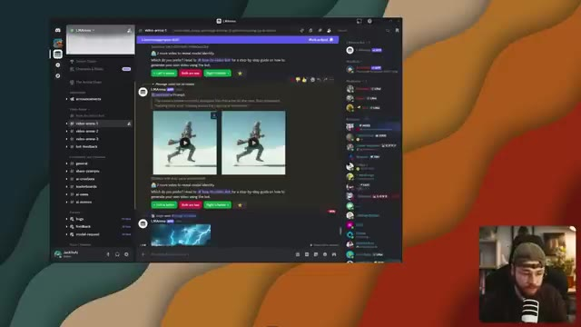
*Interface Discord de LM Arena affichant une comparaison de deux vidéos de personnages en mouvement.*

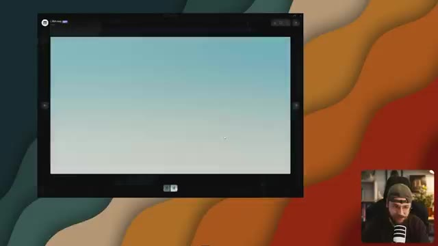
*Lecteur vidéo intégré dans Discord affichant une génération vidéo avec un rendu un peu plat ou minimaliste.*

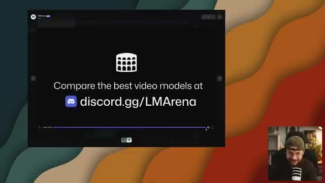
*Fin de la vidéo affichant l'écran de promotion avec le texte 'Compare the best video models at discord.gg/LMArena'.*

---

### ⏱️ `[00:25:42 - 00:26:03]` | Segment #54

**🔊 Audio (Transcription Intégrale Mot pour Mot en Français) :**
> Coupez simplement ça à la fin. Une fois de plus, nous pouvons aller de l'avant et télécharger ceci de manière totalement gratuite. Et en regardant ceci en boucle, vous pouvez voir que cela nous permet de restituer en douceur ce mouvement de Chara qui court. Nous avons l'impression de flotter avec le mouvement lui-même. Nous ne sommes pas en contradiction avec lui. C'est très cinématique tout en étant naturel à regarder et à vivre.

**👁️ Analyse Visuelle d'Écran (gemini-3.5-flash-lite) :**
**Interface & Outils** : Navigateur web / Plateforme de comparaison de modèles de vidéo IA avec incrustation vidéo du présentateur (PiP).

**Contenu textuel & Code** : Texte affiché : "Compare the best video models at discord.gg/LMArer" avec le logo Discord.

**Action / Démonstration** : Le navigateur charge une page ou affiche le résultat d'une vidéo générée par IA montrant un personnage en mouvement dans un paysage désertique.

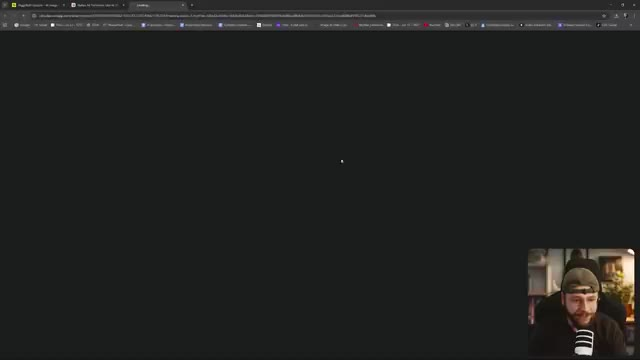
*Interface du navigateur web en cours de chargement avec les onglets en haut et le flux vidéo en arrière-plan sombre, avec le présentateur en incrustation PiP.*

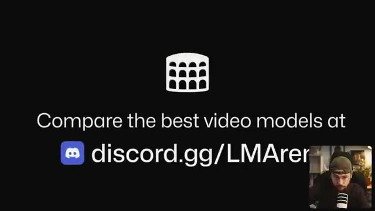
*Écran affichant le logo de la plateforme de comparaison et le texte invitant à comparer les modèles de vidéo sur Discord.*

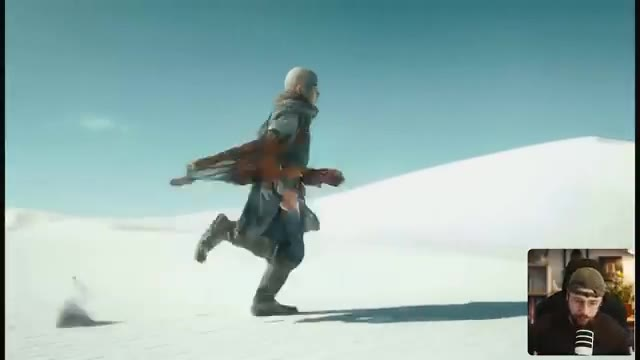
*Vidéo générée par IA montrant un personnage (Chara) en train de courir dans le désert, avec la caméra en mouvement fluide.*

---

### ⏱️ `[00:26:03 - 00:26:21]` | Segment #55

**🔊 Audio (Transcription Intégrale Mot pour Mot en Français) :**
> Ce que je vais également faire, c'est aller sur Hylou, qui est un générateur de vidéo par IA que j'apprécie vraiment. Je ne sais pas trop pourquoi. Pas grand monde ne semble louer Hylou, mais j'en ai obtenu de très bons résultats. Donc on se rend sur l'onglet vidéo ici sur le côté gauche. Vous pouvez voir toute une charge de choses que j'ai générées.

**👁️ Analyse Visuelle d'Écran (gemini-3.5-flash-lite) :**
**Interface & Outils** : Navigateur web Google Chrome et interface de la plateforme de génération vidéo par IA Hylou AI.

**Contenu textuel & Code** : URL "hailuoai.video", texte "Transform Idea to Visual", onglets "Video", "Audio", et une grille de vidéos tendance ("Join Hailuo CPP Creator Partnership Program").

**Action / Démonstration** : Le curseur navigue dans le navigateur et se déplace sur l'interface de Hylou AI pour montrer les créations vidéo générées précédemment.

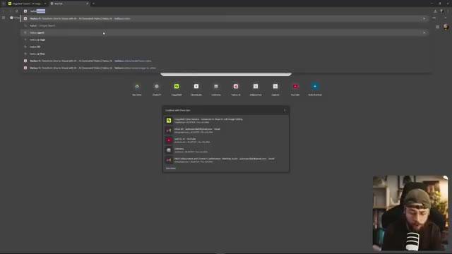
*Navigateur web affichant une barre de recherche avec des suggestions pour accéder à Hylou AI.*

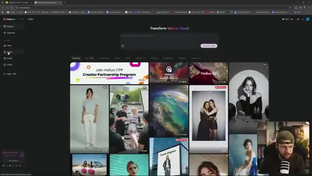
*Page d'accueil de la plateforme Hylou AI avec un bandeau "Transform Idea to Visual" et un menu latéral à gauche.*

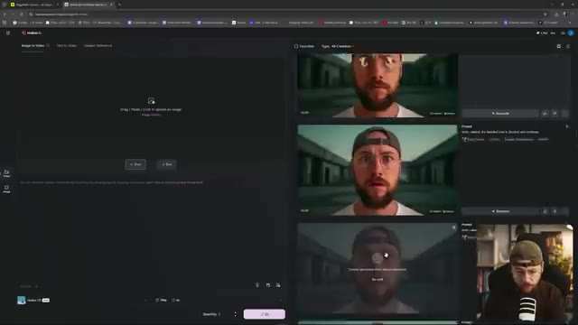
*Interface de génération vidéo de Hylou AI affichant des vidéos générées de Jack et un panneau d'historique sur la droite.*

---

### ⏱️ `[00:26:22 - 00:26:40]` | Segment #56

**🔊 Audio (Transcription Intégrale Mot pour Mot en Français) :**
> Et si vous me suivez depuis un moment, vous verrez qu'une grande partie des générations qui se retrouvent dans mes intros proviennent en fait de Haylou. Nous pouvons donc maintenant aller de l'avant et commencer à examiner nos générations Haylou. D'abord, en commençant par notre plan de suivi en chariot (tracking dolly shot). Ce mouvement très naturel et fluide qui semble toujours cinématique.

**👁️ Analyse Visuelle d'Écran (gemini-3.5-flash-lite) :**
**Interface & Outils** : Interface web de Haylou AI (outil de génération vidéo par IA) avec panneau de navigation latéral, zone de téléchargement d'image (Image to Video), bibliothèque de générations et encadré vidéo du créateur (PiP).

**Contenu textuel & Code** : Sur l'image 2, le texte superposé indique « TRACKING / DOLLY SHOT » et le prompt visible est : « The camera moves smoothly alongside a character as she runs, fluid movement. Tracking dolly shot. »

**Action / Démonstration** : Le créateur navigue dans l'interface de Haylou AI pour présenter des exemples de générations vidéo, en mettant en avant le plan de suivi cinématique.

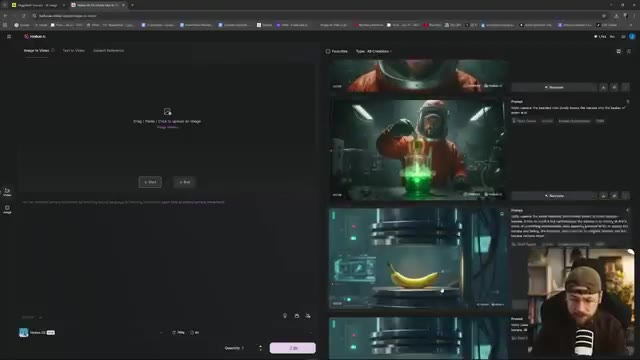
*Interface de Haylou AI affichant le panneau d'importation d'image et une grille latérale de vidéos générées avec le créateur en incrustation PiP.*

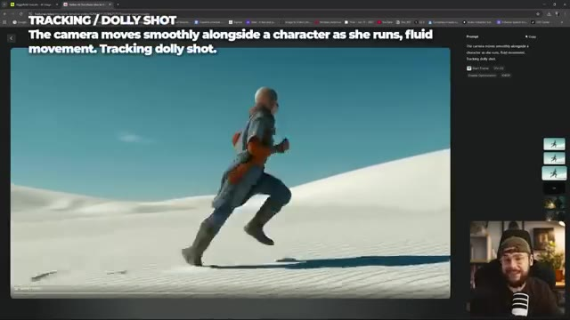
*Affichage en plein écran d'un exemple vidéo de plan de suivi (tracking dolly shot) d'un personnage courant dans le désert, avec le prompt textuel et la webcam du créateur.*

---

### ⏱️ `[00:26:40 - 00:27:04]` | Segment #57

**🔊 Audio (Transcription Intégrale Mot pour Mot en Français) :**
> Ensuite, en passant à notre plan à la grue, où nous nous élevons sur cette grue pour montrer l'immensité du paysage. Vraiment, vraiment une super génération de la part de Hylou. Encore une fois, très ample, cinématographique, épique et dramatique. Et cela nous donne une très bonne idée du paysage et de la petitesse de Kara en comparaison.

**👁️ Analyse Visuelle d'Écran (gemini-3.5-flash-lite) :**
**Interface & Outils** : Interface web de test ou de visionnage vidéo avec un panneau latéral droit pour le prompt textuel et une incrustation vidéo (PiP) du présentateur Jack en bas à droite.

**Contenu textuel & Code** : Texte affiché en haut à gauche : "CRANE / JIB SHOT - A sweeping cinematic shot rising high above the scene, dramatic camera movement, epic atmosphere. Crane jib shot." Panneau de droite avec le prompt textuel correspondant et des vignettes de sélection.

**Action / Démonstration** : Le lecteur vidéo démontre une génération de plan en mouvement de grue ascendant (crane/jib shot) dans un décor désertique, montrant l'échelle et le mouvement de caméra.

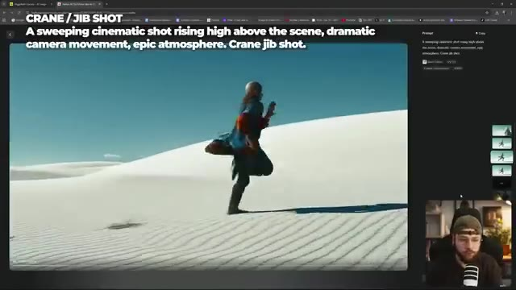
*Interface du navigateur web affichant un plan de grue (crane/jib shot) avec un personnage courant sur des dunes de sable blanc, et la webcam du créateur en incrustation (PiP).*

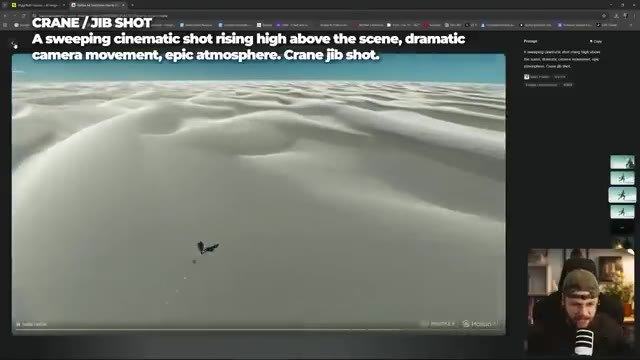
*Interface montrant la fin du mouvement de grue s'élevant très haut au-dessus des vastes dunes de sable blanc avec un petit personnage au centre, et la webcam du créateur en PiP.*

---

### ⏱️ `[00:27:04 - 00:27:39]` | Segment #58

**🔊 Audio (Transcription Intégrale Mot pour Mot en Français) :**
> Passons maintenant à notre type de dispositif à main, un mouvement de caméra brut et tremblant. Cela donne un sentiment de chaos, comme si nous luttions pour suivre Kara, qu'elle court si vite et cela a un vrai réalisme de style documentaire. Je pense que ce type de travail de caméra est particulièrement pratique si vous essayez de couvrir peut-être quelque chose d'un peu sci-fi ou un peu orienté fantasy parce que cela donne l'impression d'être un peu plus granuleux et réaliste. En tant que spectateur, nous nous sentons beaucoup plus hors de contrôle face à ce qui se passe, comme si nous essayions désespérément de rattraper Kara.

**👁️ Analyse Visuelle d'Écran (gemini-3.5-flash-lite) :**
**Interface & Outils** : Interface web de l'outil de génération vidéo Higgsfield AI, avec un panneau latéral droit affichant les détails du prompt et des miniatures de séquences, et un encadré vidéo PiP du créateur dans le coin inférieur droit.

**Contenu textuel & Code** : Texte à l'écran : "HANDHELD / SHAKY CAM" et "Handheld, shaky camera movement, raw and chaotic, documentary-style realism.". Dans le panneau de prompt à droite : "Handheld, shaky camera movement, raw and chaotic, documentary-style realism." ainsi que des options de réglage (Start Frame, Enable Optimization, 1080P).

**Action / Démonstration** : Le créateur commente et présente des exemples de vidéos générées par IA illustrant un mouvement de caméra à la main (handheld/shaky cam), tandis que les vidéos tournent à l'écran dans l'interface de Higgsfield.

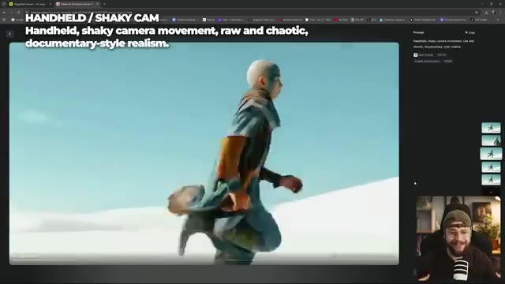
*Interface de l'outil de génération vidéo présentant un personnage courant dans un décor désertique avec un effet de caméra portée instable, et un encadré vidéo (PiP) du créateur.*

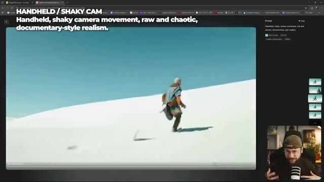
*Interface similaire montrant une vue plus éloignée du personnage courant sur une dune de sable avec le même style de mouvement de caméra secoué.*

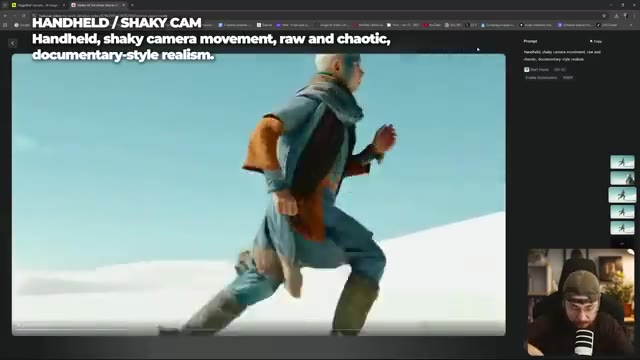
*Gros plan sur l'interface montrant le personnage courant rapidement à l'écran, illustrant le style de caméra à l'épaule chaotique.*

---

### ⏱️ `[00:27:39 - 00:28:09]` | Segment #59

**🔊 Audio (Transcription Intégrale Mot pour Mot en Français) :**
> et comprendre ce qu'elle pense et ressent et ensuite nous allons examiner un changement de mise au point (rack focus) qu'Hylou a fait un travail incroyable ici vous pouvez voir que pour une raison quelconque ces ombres sont projetées à travers le paysage désertique blanc et nous commençons avec une mise au point nette sur Kara puis la mise au point se déplace pour qu'elle soit maintenant nette sur le paysage lui-même nous pouvons en quelque sorte assimiler ce changement d'éclairage étrange qui se produit sous nos yeux. Cela a l'air vraiment très réaliste.

**👁️ Analyse Visuelle d'Écran (gemini-3.5-flash-lite) :**
**Interface & Outils** : Navigateur web affichant une plateforme de démonstration de génération vidéo par IA (Hylou / MiniMax AI) avec un panneau de prompt textuel à droite et une incrustation vidéo du créateur (PiP) en bas à droite.

**Contenu textuel & Code** : Textes visibles : "HANDHOLD / SHAKY CAM" et "RACK FOCUS" avec leurs descriptions textuelles détaillées de prompts ("The camera focus shifts from the foreground to the background...").

**Action / Démonstration** : Le présentateur commente la démonstration visuelle d'un changement de mise au point (rack focus) et d'effets d'ombres portées générés par IA dans un paysage désertique.

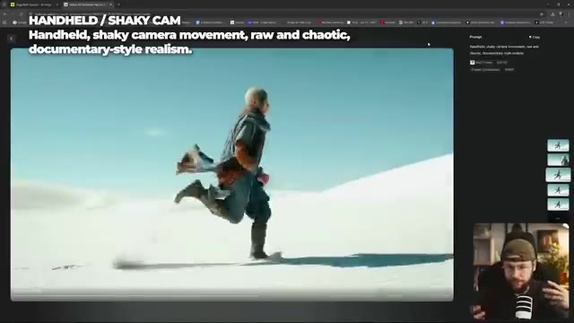
*Interface de démonstration affichant une vidéo générée par IA montrant un personnage courant dans un désert blanc avec un style de caméra portée (handheld/shaky cam).*

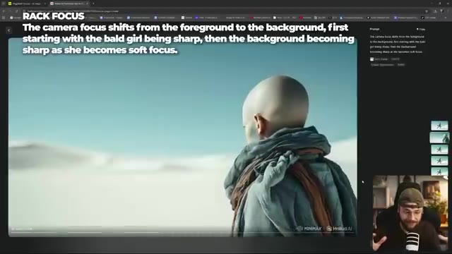
*Interface montrant un effet de changement de mise au point (rack focus) sur le personnage au premier plan.*

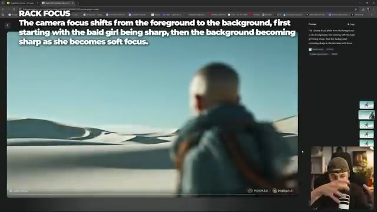
*Interface montrant la transition de mise au point se déplaçant vers l'arrière-plan du paysage désertique.*

*Interface montrant le focus final net sur le paysage désertique.*

---

### ⏱️ `[00:28:09 - 00:28:42]` | Segment #60

**🔊 Audio (Transcription Intégrale Mot pour Mot en Français) :**
> Ce jeu de mise au point est incroyable. Et la façon dont ses robes flottent dans le vent, ouais, c'est plutôt impressionnant tout ça. Et le plan final que nous allons examiner est un plan de caméra fixe simple. C'est ironique, j'imagine, puisque nous parlons de mouvement de caméra et qu'il n'y a ici aucun mouvement de caméra, mais cela remplit un objectif dramatique assez important. Un plan fixe peut créer beaucoup de tension, beaucoup de drame et peut même rendre les choses un peu gênantes, surtout quand Kara ici est en train de nous dévisager profondément. D'une certaine manière, en n'ayant absolument aucun mouvement de caméra, on a presque l'impression que...

**👁️ Analyse Visuelle d'Écran (gemini-3.5-flash-lite) :**
**Interface & Outils** : Navigateur web affichant une plateforme de génération de vidéo par IA avec un panneau de lecture vidéo au centre, un panneau de prompts textuels sur la droite, et une incrustation vidéo (PiP) du créateur en bas à droite.

**Contenu textuel & Code** : Sur l'image 1 : Titre "RACK FOCUS" et prompt "The camera focus shifts from the foreground to the background, first starting with the bald girl being sharp, then the background becoming sharp as she becomes soft focus." Sur l'image 2 : Titre "STATIC SHOT" et prompt "A perfectly still cinematic shot with no camera movement. The character stares dramatically at the camera."

**Action / Démonstration** : Le navigateur présente des exemples vidéo de mouvements de caméra générés par IA, illustrant les explications audio du créateur présent dans l'encadré PiP.

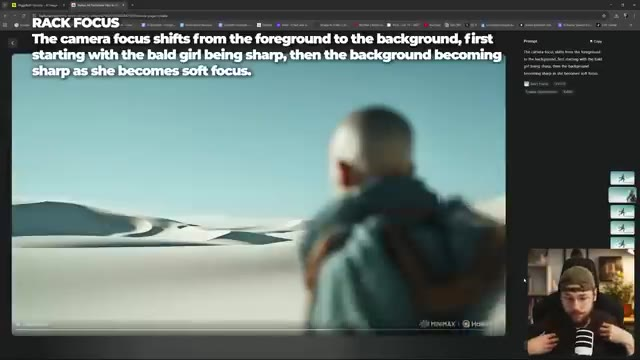
*Interface du navigateur web montrant une vidéo générée par IA illustrant un effet de rack focus (changement de mise au point), avec le présentateur visible en incrustation (PiP) en bas à droite.*

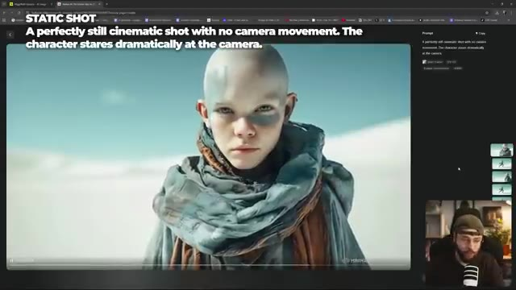
*Interface du navigateur web montrant une vidéo générée par IA illustrant un plan fixe (Static Shot), avec le présentateur visible en incrustation (PiP) en bas à droite.*

---

### ⏱️ `[00:28:42 - 00:29:13]` | Segment #61

**🔊 Audio (Transcription Intégrale Mot pour Mot en Français) :**
> un peu bizarre. Quelque chose semble un peu surréaliste et étrange, et donc même avoir une caméra fixe peut avoir un rôle très important dans votre narration. Et sur ce, les gars, nous sommes arrivés à la fin de la vidéo d'aujourd'hui. J'espère vraiment qu'elle vous a plu. N'oubliez pas de laisser vos questions en bas dans la section des commentaires. Si mon contenu vous a aidé, assurez-vous de lâcher un pouce bleu pour moi. Pensez à vous abonner si vous êtes nouveau et, bien sûr, activez la cloche de notification pour ne jamais rater aucun contenu futur. Passez une excellente journée les gars et je vous dis à la prochaine.

**👁️ Analyse Visuelle d'Écran (gemini-3.5-flash-lite) :**
**Interface & Outils** : Interface web de Higgsfield AI, affichant un aperçu de vidéo générée avec des panneaux de texte et un encadré vidéo du créateur (Picture-in-Picture) en bas à droite.

**Contenu textuel & Code** : Texte affiché à l'écran : "STATIC SHOT" et "A perfectly still cinematic shot with no camera movement. The character stares dramatically at the camera." Le prompt correspondant est visible sur le panneau latéral droit.

**Action / Démonstration** : Le créateur montre un exemple concret de plan fixe (static shot) généré par IA pour illustrer l'importance d'un tel plan dans la narration, tout en concluant sa vidéo.

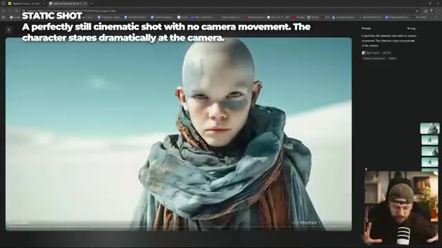
*Interface d'un outil de génération vidéo par IA (Higgsfield) affichant un plan fixe cinématographique avec un personnage chauve regardant fixement la caméra, avec la webcam du créateur en incrustation (PiP).*

---
