# 🎬 Comment utiliser Midjourney GRATUITEMENT (non, c'est vraiment vrai)

> **Chaîne** : [Jack Vs. AI](https://www.youtube.com/@JackVsAI)  
> **Titre original** : `How to use Midjourney FOR FREE (no, it’s really true)`  
> **Lien YouTube** : [https://www.youtube.com/watch?v=n_la3L1d0Cc](https://www.youtube.com/watch?v=n_la3L1d0Cc)  
> **Date de publication** : 2025-11-11  
> **Durée** : 11m 42s (`702s`)  
> **Identifiant vidéo** : `n_la3L1d0Cc`  
> **Fiche Web Interactive** : [2025-11-11_YT-n_la3L1d0Cc_Comment utiliser Midjourney GRATUITEMENT (non, c'est vraiment vrai)_by-whisper-v3-large-turbo+gemini-3.5-flash-lite.html](2025-11-11_YT-n_la3L1d0Cc_Comment utiliser Midjourney GRATUITEMENT (non, c'est vraiment vrai)_by-whisper-v3-large-turbo+gemini-3.5-flash-lite.html)  
> **Captures de démonstration clés** : `73 captures réelles (anti-talking-head)`  
> **Modèles utilisés** : Audio: `large-v3-turbo` (Faster-Whisper int8 VPS) | Vision: `gemini-3.5-flash-lite` (Google AI Studio API)  

---

## 📌 Synthèse Exécutive & Outils

### 📌 Résumé
Dans cette vidéo, Jack, ancien artiste VFX chevronné, lève le voile sur une faille stratégique majeure de l'écosystème de l'intelligence artificielle générative : l'accès totalement gratuit et potentiellement illimité aux moteurs de pointe de Midjourney directement via la plateforme **Meta AI**. Alors que Midjourney est traditionnellement réputé pour sa tarification payante et son style visuel distinctif ultra-perfectionné, Meta intègre ses capacités technologiques de pointe au sein de sa propre interface grand public. Jack démontre à travers une méthodologie rigoureuse — comparant prompt par prompt les résultats obtenus sur les deux interfaces — qu'il s'agit bel et bien du même outil, tant la signature esthétique et les paramètres de personnalisation sont rigoureusement identiques.

La démarche de Jack s'articule autour d'une expérimentation comparative et d'une mise à l'épreuve intensive des limites de la plateforme. En testant des univers visuels variés (du chat de nuages fantastique au chevalier en armure holographique), il valide non seulement la parité de qualité des images fixes, mais explore également des fonctionnalités exclusives à Meta AI, telles que le « Restyle » (restructuration) et les options d'animation vidéo intégrées. En spammant volontairement les requêtes pour tenter de déclencher un "paywall" ou un verrouillage de quota, il prouve que l'outil reste accessible sans contrepartie financière immédiate, ouvrant des perspectives inédites pour la publicité par IA et la réalisation de films à budget zéro.

Pour les créateurs de contenu, les réalisateurs et les professionnels de la publicité, cette découverte constitue une opportunité en or massif. Ce workflow gratuit démocratise l'accès à la direction artistique haut de gamme de Midjourney tout en éliminant les frictions techniques grâce à des fonctionnalités d'animation textuelle et par défaut ultra-rapides. La possibilité d'itérer à l'infini sur des formats d'image variés (notamment le 9x16 idéal pour les réseaux sociaux) et de transformer instantanément des images fixes en séquences animées fluides redéfinit les standards de la production visuelle agile et économique.

### 🛠️ Outils, Modèles & Logiciels Présentés
* **Midjourney** : Moteur de génération d'images par IA de référence, utilisé dans la vidéo comme étalon de comparaison pour valider la qualité et le style visuel des créations.
* **Meta AI** : Plateforme d'intelligence artificielle de Meta qui héberge gratuitement et sans limite apparente les technologies de génération d'images et de vidéos de Midjourney, incluant des outils de restructuration et d'animation.

### 🔑 Points Clés & Enseignements Stratégiques
* **Accès gratuit aux moteurs payants** : Exploiter Meta AI permet de contourner l'abonnement payant de Midjourney tout en bénéficiant de la même qualité de rendu visuel et de la même signature esthétique caractéristique.
* **Parité visuelle confirmée** : Les tests comparatifs en direct prouvent que les prompts textuels lancés simultanément sur Midjourney et Meta AI produisent des résultats quasi-identiques, confirmant l'intégration des mêmes modèles sous-jacents.
* **Paramètres esthétiques avancés** : L'interface Meta AI conserve les réglages de personnalisation emblématiques de Midjourney, permettant d'ajuster précisément la stylisation, l'étrangeté et la variété.
* **Gestion des formats d'image** : La plateforme permet de sélectionner directement le ratio d'affichage (comme le 9x16), facilitant la création de contenus natifs pour les formats verticaux (Reels, TikTok, Shorts).
* **Fonctionnalité « Restyle » (Restructuration)** : Cet outil exclusif à Meta AI permet de transformer radicalement une image existante en modifiant son style artistique (ex. : effet papier ou rendu lumineux) tout en conservant la composition de référence.
* **Absence apparente de limites (Paywall)** : Les tests de stress intensifs réalisés par Jack (spam de prompts en rafale) démontrent qu'il est possible de générer un volume massif d'images et de vidéos sans se heurter à une barrière de paiement.
* **Génération de vidéo intégrée** : En un seul clic, l'interface permet de basculer de l'image fixe à la vidéo grâce à une option d'animation par défaut rapide et intuitive.
* **Animation personnalisée par prompt** : Il est possible de sur-guider le mouvement vidéo en entrant des directives textuelles spécifiques, comme un « mouvement de caméra avant lent », pour un contrôle cinématographique accru.
* **Expérience utilisateur et fluidité** : Contrairement à Midjourney où les générations s'affichent en direct sous les yeux, Meta AI grise temporairement les vignettes pendant le calcul, nécessitant un court instant de patience avant l'apparition du résultat final.
* **Workflow d'animation en masse** : L'approche stratégique recommandée pour maximiser la productivité consiste à enchaîner l'animation automatique de tous les visuels forts générés (comme les concepts de type super-héros ou cyberpunk) afin d'identifier rapidement les pépites exploitables pour un montage final.

---

## ⏱️ Chronologie & Transcription Complète Audio & Visuelle (Mot pour Mot)

### ⏱️ `[00:00:00 - 00:00:34]` | Segment #01

**🔊 Audio (Transcription Intégrale Mot pour Mot en Français) :**
> Et si je vous disais que dès maintenant vous pouvez générer des images et des vidéos sur Midjourney sans dépenser un seul centime ? Nous parlons de l'un des outils les plus puissants de l'espace de l'IA générative, avec un style incroyablement distinctif, parfait à la fois pour la publicité par IA et la réalisation de films. Midjourney n'est pas bon marché et pour de bonnes raisons, mais en ce moment, vous pouvez utiliser l'outil de façon totalement gratuite. Et dans cette vidéo, je vais vous montrer comment. Je suis Jack, j'ai été artiste VFX dans l'industrie publicitaire pendant plus d'une décennie et j'ai travaillé pour bon nombre des plus grandes marques de la planète. En toute franchise, j'ai été

**👁️ Analyse Visuelle d'Écran (gemini-3.5-flash-lite) :**
**Interface & Outils** : Présentation avec animations textuelles et extraits visuels cinématiques générés par IA (illustrations de type Midjourney), sans affichage d'interface logicielle ni de démonstration technique.

**Contenu textuel & Code** : Affichage de sous-titres animés au centre de l'écran accompagnant la voix off ("you can generate images", "with an incredibly", "And in this video,", "biggest brands").

**Action / Démonstration** : Défilement de visuels artistiques générés par IA (personnage dans un paysage de science-fiction rouge, silhouette devant une porte lumineuse, créature mécatronique dans les nuages) illustrant le style cinématique de Midjourney.

---

### ⏱️ `[00:00:34 - 00:01:01]` | Segment #02

**🔊 Audio (Transcription Intégrale Mot pour Mot en Français) :**
> obsédé par mid journey pendant un temps fou alors quand j'ai entendu cette nouvelle j'ai dû me connecter en ligne dès que possible et aller voir ça et les gars si vous appréciez la vidéo d'aujourd'hui assurez-vous de lâcher un pouce bleu pour moi pensez à vous abonner et bien sûr à activer cette cloche de notification d'accord passons directement aux choses sérieuses nous voici donc sur meta.ai littéralement tout ce que j'ai fait c'est m'inscrire gratuitement et j'ai généré juste une série d'images juste pour m'assurer que tout fonctionnait correctement.

**👁️ Analyse Visuelle d'Écran (gemini-3.5-flash-lite) :**
**Interface & Outils** : Navigateur web affichant l'interface de Meta AI (meta.ai), avec un panneau latéral d'historique à gauche et la zone de génération d'images au centre. Le créateur est visible en incrustation vidéo (PiP) dans le coin inférieur gauche.

**Contenu textuel & Code** : Texte visible dans l'interface Meta AI : "Describe your image", boutons "Create", "Image", "16:9", "Aesthetic", et un prompt de conception de personnage incluant les termes "full body concept cartoon character design of a space mechanic with long dark hair...".

**Action / Démonstration** : Le créateur navigue sur l'interface web de Meta AI et montre les images générées de concepts de personnages.

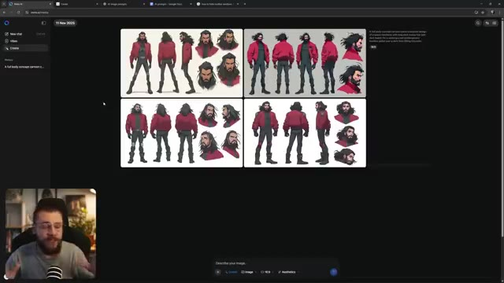
*Interface du site Meta AI affichant des grilles d'images de personnages de style cartoon dans le navigateur, avec la webcam du créateur incrustée en bas à gauche.*

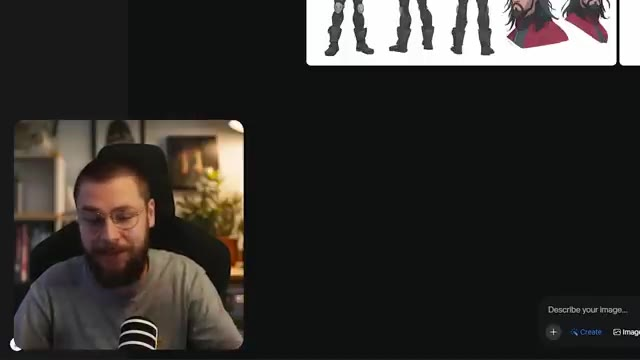
*Gros plan sur la partie inférieure de l'interface de Meta AI et la webcam du créateur en incrustation.*

---

### ⏱️ `[00:01:01 - 00:01:34]` | Segment #03

**🔊 Audio (Transcription Intégrale Mot pour Mot en Français) :**
> Donc vous allez vraiment découvrir cette plateforme avec moi pour la première fois. Je n'ai aucune idée de ce à quoi m'attendre. Maintenant, évidemment, j'ai entendu dire qu'il y avait une sorte de partenariat entre Meta et Midjourney, et qu'essentiellement, en ce moment, si vous allez sur la plateforme Meta, vous pouvez accéder à l'outil Midjourney en termes d'images et de vidéos par IA sans dépenser le moindre centime. Donc, essentiellement, le plan pour la vidéo d'aujourd'hui, c'est qu'on va simplement tester toute une charge de prompts textuels différents. On commencera par la génération d'images, puis on passera à l'animation de ces images également. On va aussi comparer

**👁️ Analyse Visuelle d'Écran (gemini-3.5-flash-lite) :**
**Interface & Outils** : Interface de Meta AI (meta.ai/imagine) affichée en plein écran avec les résultats de génération d'images et le créateur en incrustation vidéo (PiP) dans le coin inférieur gauche.

**Contenu textuel & Code** : Texte du prompt visible : "A full body concept cartoon drawing of a man handsome with long dark shadow hair and..." et la barre de saisie "Describe your image...".

**Action / Démonstration** : Le créateur présente l'interface de Meta AI sur son écran tout en parlant à la caméra dans l'encadré PiP.

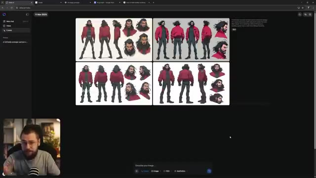
*Interface de Meta AI montrant des feuilles de style de personnage générées par IA avec le créateur en incrustation vidéo (PiP).*

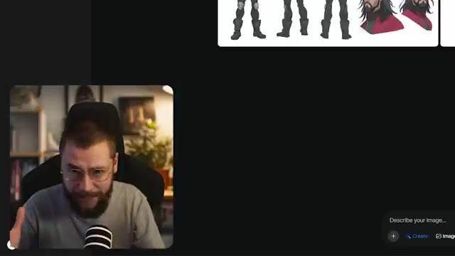
*Gros plan sur l'interface de Meta AI avec le panneau de prompt textuel et le créateur parlant en incrustation (PiP).*

---

### ⏱️ `[00:01:34 - 00:01:54]` | Segment #04

**🔊 Audio (Transcription Intégrale Mot pour Mot en Français) :**
> nos générations aux résultats de Midjourney pour essayer de déterminer s'il s'agit définitivement du même outil exact. Je pense que c'est probablement le cas d'après ce que j'ai vu et, très important, nous verrons s'il y a un quelconque limite à la quantité de générations que nous pouvons récupérer en termes d'image et de vidéo. D'accord, nous avons donc déposé notre premier prompt textuel dans ce champ au bas de la page.

**👁️ Analyse Visuelle d'Écran (gemini-3.5-flash-lite) :**
**Interface & Outils** : Interface web de génération d'images par IA avec panneau latéral de navigation, zone de prévisualisation des grilles d'images et champ de saisie de prompt en bas de page.

**Contenu textuel & Code** : Texte du prompt visible : "A lone woman in a tattered tech-jacket tends to glowing fruit growing from metallic vines in a ruined orchard. Rusted drones buzz softly above as neon mist drifts between twisted trees that pulse faintly with bioelectric light. The sky burns a deep magenta as old satellites blink overhead. Photoreal: ultra detailed skin texture, visible pores, cinematic composition, harsh shadows, shallow depth of field." Paramètres visibles : icône "+" pour l'ajout, mode "Create", option "Image", ratio "16:9", et menu "Aesthetics".

**Action / Démonstration** : Le créateur présente l'interface de l'outil de génération d'images, montre des exemples de concepts générés, puis zoome sur la zone de saisie du prompt textuel en bas de page pour rédiger et insérer sa première requête.

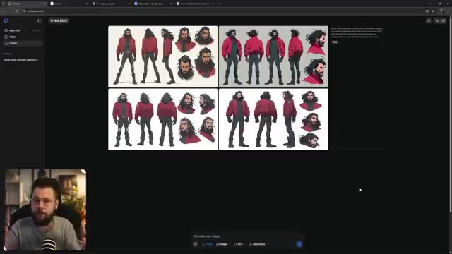
*Interface de l'outil de génération affichant des grilles de personnages de type dessin animé (concept art) avec différentes vues et gros plans, tandis que le présentateur apparaît en incrustation vidéo (PiP) dans le coin inférieur gauche.*

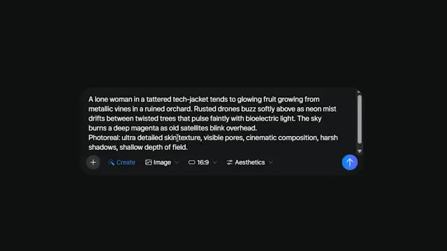
*Gros plan sur la zone de saisie du prompt textuel montrant un texte détaillé de génération décrivant une femme solitaire et des drones dans un verger en ruine, avec des paramètres de style et de format (16:9, Photoreal).*

---

### ⏱️ `[00:01:54 - 00:02:14]` | Segment #05

**🔊 Audio (Transcription Intégrale Mot pour Mot en Français) :**
> Vous pouvez voir qu'il y a une option pour ajouter des médias. Je suppose que c'est pour servir de sorte d'image de référence. Nous pouvons choisir entre générer des images et des vidéos. Nous pouvons sélectionner notre format d'image. C'est évidemment incroyablement pratique aussi. Et puis, quand on arrive aux paramètres d'esthétique, c'est là qu'il devient assez clair qu'il s'agit de Midjourney.

**👁️ Analyse Visuelle d'Écran (gemini-3.5-flash-lite) :**
**Interface & Outils** : Interface web de génération par IA montrant une zone de texte pour le prompt, des options de format et des paramètres esthétiques.

**Contenu textuel & Code** : Texte du prompt en anglais : "A lone woman in a tattered tech-jacket tends to glowing fruit growing from metallic vines in a ruined orchard...". Boutons visibles : "Add media", "Create", option "Image", format "16:9", et "Aesthetics".

**Action / Démonstration** : Le curseur de la souris survole le bouton "+" pour "Add media" sous la boîte de texte.

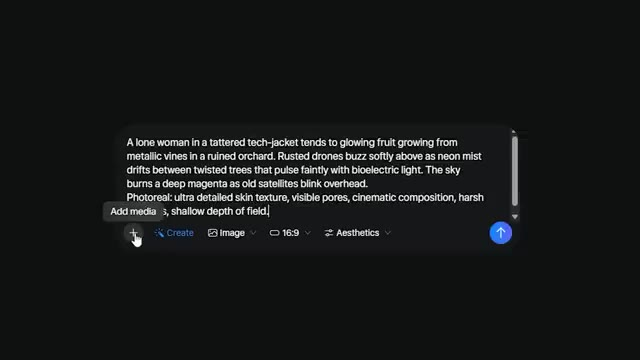
*Interface de génération textuelle avec le bouton d'ajout de média, les options de sélection d'image/vidéo et de format 16:9.*

---

### ⏱️ `[00:02:14 - 00:02:47]` | Segment #06

**🔊 Audio (Transcription Intégrale Mot pour Mot en Français) :**
> parce que si je vais sur Midjourney et que j'accède aux paramètres dans cet onglet d'esthétique, nous avons la stylisation, l'étrangeté et la variété, et de retour sur Meta, ouvrons le même onglet variété, étrangeté, stylisation. Très bien, allons-y pour générer ceci et déposons également le même prompt dans Midjourney lui-même et cliquons sur générer et voyons ce que nous obtenons en retour afin d'avoir un très bon point de comparaison. Donc ici nous avons de retour nos générations de Meta. Ouais, elles sont plutôt moyennes.

**👁️ Analyse Visuelle d'Écran (gemini-3.5-flash-lite) :**
**Interface & Outils** : Navigateur web affichant les interfaces utilisateur de Midjourney et de Meta AI, avec un flux vidéo incrusté (PiP) montrant le présentateur.

**Contenu textuel & Code** : Prompts textuels de génération d'images, curseurs de réglages esthétiques (variability, weirdness, stylization) et aperçus d'images générées par IA (personnages, décors, guépard barman).

**Action / Démonstration** : Le créateur navigue entre les plateformes Midjourney et Meta AI pour comparer les fonctionnalités de réglage esthétique et lancer de nouvelles générations d'images.

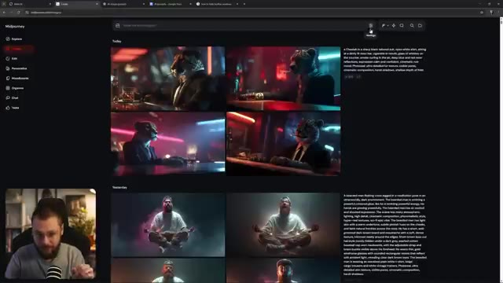
*Interface de Midjourney affichant une grille d'images générées et le panneau de réglages esthétiques avec incrustation vidéo du créateur en bas à gauche.*

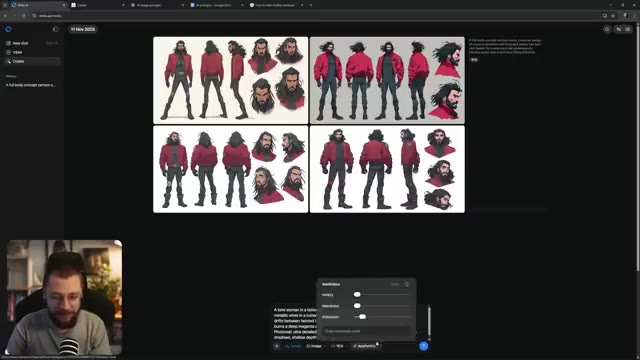
*Interface de Meta AI affichant des images conceptuelles d'un personnage en veste rouge et le panneau des paramètres esthétiques ouvert.*

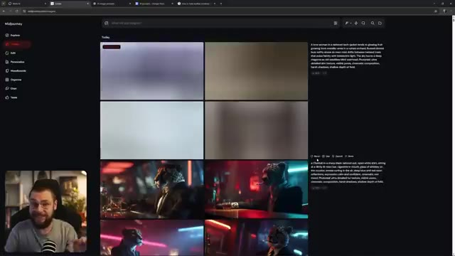
*Interface de Midjourney montrant la génération en cours de nouvelles images avec des vignettes floutées (chargement) au-dessus des images d'un guépard au bar.*

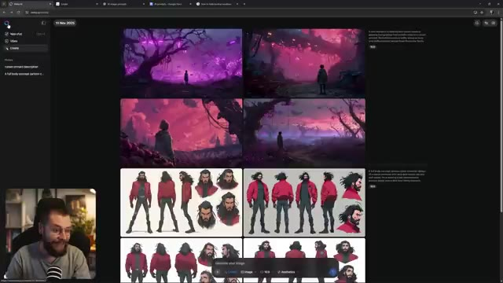
*Interface de Meta AI montrant des grilles d'images aux tons violets et roses, et le panneau inférieur de génération et d'esthétique.*

---

### ⏱️ `[00:02:47 - 00:03:06]` | Segment #07

**🔊 Audio (Transcription Intégrale Mot pour Mot en Français) :**
> Voyage pour moi. J'adore absolument celui-ci. Midjourney a vraiment ce style très spécifique qui est tout simplement inconfundible, vraiment. Retournons sur Midjourney. Et encore une fois, ouais, je veux dire, ça a l'air plutôt similaire pour moi. Donc vraiment de superbes et solides générations ici.

**👁️ Analyse Visuelle d'Écran (gemini-3.5-flash-lite) :**
**Interface & Outils** : Navigateur web affichant l'interface officielle de Midjourney (ou Meta AI selon l'URL visible) avec un panneau latéral de prompts et d'options, ainsi qu'un encadré PiP (Picture-in-Picture) montrant Jack en bas à gauche.

**Contenu textuel & Code** : Texte descriptif visible dans le panneau latéral droit : "A lone woman in a tattered tech-jacket stands in glowing fruit growing from metallic vines in a surreal orchard..." et divers paramètres de génération d'images par IA.

**Action / Démonstration** : Le créateur navigue dans l'interface de Midjourney et commente la qualité visuelle et le style caractéristique des images générées par l'intelligence artificielle.

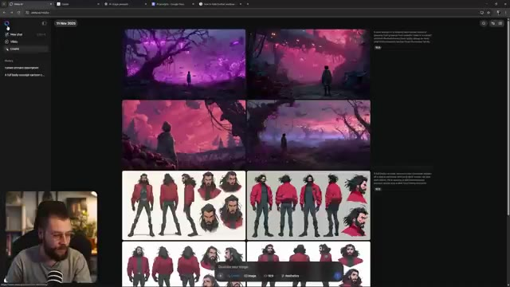
*Interface de l'application Midjourney affichant une grille de générations d'images avec des paysages fantastiques en tons magenta et des planches de personnages, avec la caméra PiP du créateur en bas à gauche.*

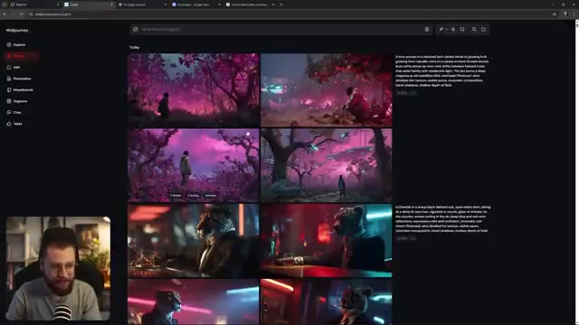
*Navigation sur l'interface web de Midjourney montrant différentes grilles de générations d'images générées par IA avec les prompts textuels associés dans le panneau latéral droit.*

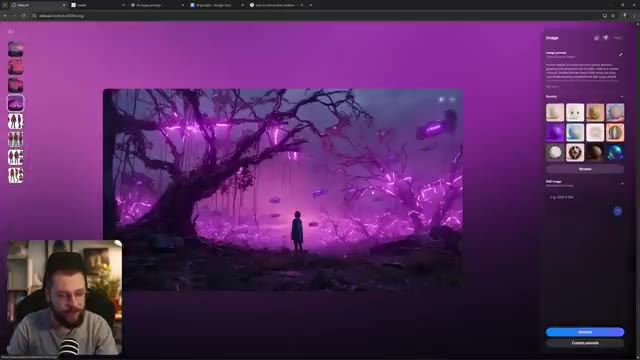
*Vue détaillée d'une image générée sur l'interface de Midjourney représentant un personnage solitaire sous des arbres fantastiques luminescents, avec le panneau d'options et de prompts à droite.*

---

### ⏱️ `[00:03:06 - 00:03:39]` | Segment #08

**🔊 Audio (Transcription Intégrale Mot pour Mot en Français) :**
> Très visuellement marquant. En restant dans l'ambiance des générations un peu bizarre, je veux essayer un chat fait de nuages se prélassant sur le sommet d'une montagne, son corps se fondant dans le ciel, de minuscules villages en contrebas, à la fois fantaisiste et grandiose. Faisons générer ça et retournons encore une fois sur Midjourney et cliquons sur générer pour celui-là. Donc nous avons presque terminé notre génération Midjourney. Oh, nous avons Meta de retour également et encore une fois ouais c'est le même outil les gars, je pense qu'on peut confirmer sans risque que c'est le même.

**👁️ Analyse Visuelle d'Écran (gemini-3.5-flash-lite) :**
**Interface & Outils** : Navigateur web affichant les interfaces de Meta AI (meta.ai/media) et de Midjourney (midjourney.com), avec une incrustation vidéo (PiP) du créateur en bas à gauche.

**Contenu textuel & Code** : Sur l'image 1, l'interface Meta AI présente des concepts de personnages et des paysages mystiques roses. Sur l'image 2, la grille supérieure affiche le prompt du chat en nuages : "A cat made of clouds lounging on a mountaintop, its body blending into the sky, tiny villages below, whimsical yet grand."

**Action / Démonstration** : Le créateur navigue entre les différentes plateformes de génération d'images par IA (Meta AI et Midjourney) pour comparer les résultats et démontrer l'utilisation des outils.

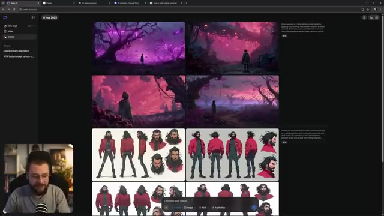
*Interface de Meta AI montrant des grilles d'images générées avec le créateur visible en incrustation PiP dans le coin inférieur gauche.*

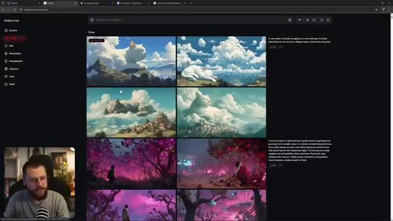
*Interface de Midjourney affichant les résultats de la génération du chat fait de nuages sur une montagne, avec le créateur en incrustation PiP.*

---

### ⏱️ `[00:03:39 - 00:04:15]` | Segment #09

**🔊 Audio (Transcription Intégrale Mot pour Mot en Français) :**
> outil essayons un renard robotique sprintant à travers des toits la skyline de la ville derrière lui flou de mouvement et reflet d'objectif composition photo réaliste cinématique lançons celui-ci et encore une fois comme si nous avions besoin d'une autre comparaison mettons-le simplement sur mid-journey de toute façon la seule différence que je peux dire jusqu'à présent c'est qu'avec mid-journey vous pouvez réellement voir vos générations prendre vie en quelque sorte sous vos yeux mais sur meta cela semble en quelque sorte être grisé pendant un petit moment pendant que ça génère et vous êtes assis là à vous demander si ça fonctionne mais finalement voilà ça apparaît après un certain temps et ouais

**👁️ Analyse Visuelle d'Écran (gemini-3.5-flash-lite) :**
**Interface & Outils** : Navigateur web affichant l'interface de Meta AI (et de Midjourney) avec un affichage Picture-in-Picture (PiP) du créateur en bas à gauche.

**Contenu textuel & Code** : Texte du prompt visible : « A robotic fox sprinting across rooftops, city skyline behind it, motion blur and lens flare. Photo-real, cinematic composition. » Paramètres 16:9 visibles.

**Action / Démonstration** : Le créateur navigue et compare les interfaces de génération vidéo/image entre Meta AI et Midjourney, montrant le processus de génération des différentes requêtes.

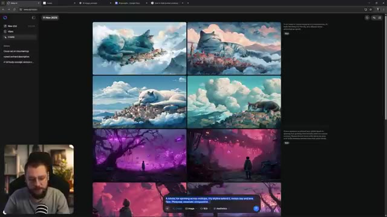
*Interface de Meta AI montrant la grille de générations d'images avec le prompt du renard robotique et la vidéo du chat nuageux.*

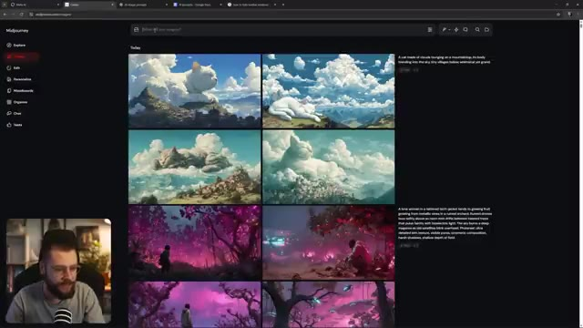
*Interface de Midjourney affichant les grilles de résultats pour le chat nuageux et les paysages fantastiques roses.*

*Interface de Midjourney montrant la génération en cours du renard robotique courant sur les toits avec flou de mouvement.*

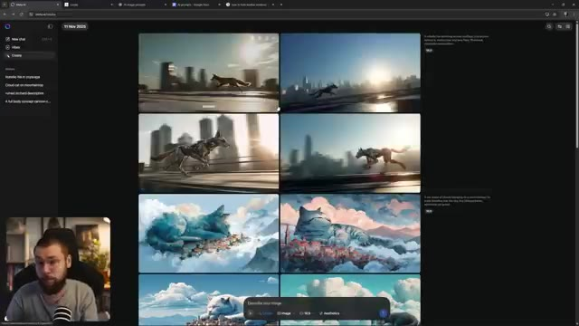
*Interface de Meta AI affichant l'apparition finale de la vidéo du renard robotique générée sur les toits de la ville.*

---

### ⏱️ `[00:04:15 - 00:04:48]` | Segment #10

**🔊 Audio (Transcription Intégrale Mot pour Mot en Français) :**
> une fois de plus des générations très très similaires donc en fait quand on clique sur une génération on a quelques options différentes ici aussi. Évidemment on peut aller modifier le prompt textuel mais ce qui est vraiment intéressant c'est qu'on a aussi cette fonctionnalité de restructuration ou restyle. Maintenant vous pouvez me corriger si je me trompe mais je ne crois pas qu'on ait ça dans mid-journey. Donc je suis vraiment intéressé par cette fonctionnalité. Essayons de changer ceci en papier. Donc ça va nous générer quatre images maintenant évidemment basé sur

**👁️ Analyse Visuelle d'Écran (gemini-3.5-flash-lite) :**
**Interface & Outils** : Interface Web de Midjourney avec barre de recherche, menus de navigation (Explore, Create, Edit, Personas, Moodboards, Organize, Chat, Tasks) et panneau latéral de personnalisation et de style.

**Contenu textuel & Code** : Texte du prompt visible : 'A cat made of clouds lounging on a mountaintop, its body blending into the sky, tiny villages below, whimsical yet grand.' Options 'Image prompt' et section 'Restyle' avec vignettes de styles visuels variés.

**Action / Démonstration** : Le créateur navigue dans l'interface, explore les options de génération, zoome sur une image spécifique de chat nuageux et examine le panneau de restylage.

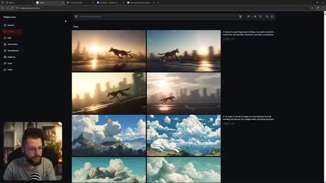
*Interface du site Web de Midjourney affichant une grille d'images générées par IA et une vue PiP du créateur en bas à gauche.*

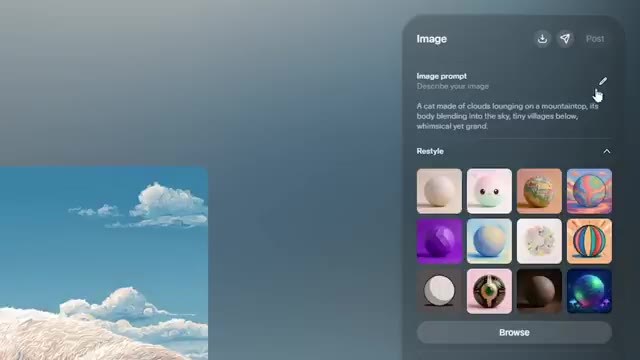
*Gros plan sur le panneau latéral de l'interface montrant les options de prompt d'image et la fonctionnalité Restyle avec différentes vignettes de style.*

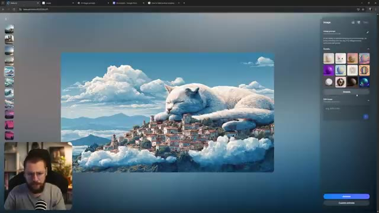
*Vue détaillée de l'image sélectionnée représentant un chat géant endormi sur des nuages au-dessus d'un village de montagne, avec le panneau de configuration à droite.*

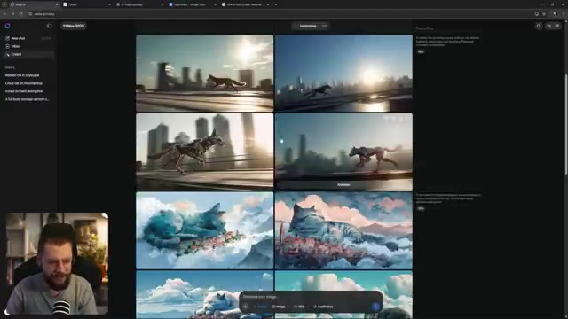
*Retour à la vue d'ensemble de la grille d'images sur l'interface de Midjourney montrant de nouvelles variantes de génération en cours.*

---

### ⏱️ `[00:04:48 - 00:05:25]` | Segment #11

**🔊 Audio (Transcription Intégrale Mot pour Mot en Français) :**
> cette image de référence ici dans un style de type papier. Alors ouais, voyons ce qu'on obtient en retour. Ouais, regardez ça. Il a fait un travail vraiment, vraiment formidable. Essayons ce prochain prompt textuel maintenant. Un ancien chevalier avec une armure holographique, mélangeant design médiéval et futuriste, éclairage à fort contraste, style art conceptuel. Et pour vous dire quoi, allons-y et faisons de ceci une génération 9x16 pour obtenir un peu plus de variation là-dedans. D'accord, un tas de superbes générations encore une fois. Je veux juste essayer Restyle. Je vais opter pour Glowy cette fois. Voyons si on peut obtenir

**👁️ Analyse Visuelle d'Écran (gemini-3.5-flash-lite) :**
**Interface & Outils** : Meta AI (ou outil de génération d'images similaire basé sur le web).

**Contenu textuel & Code** : Prompts visibles : « An ancient knight with holographic armor, blending medieval and futuristic design, high contrast lighting, concept art style. » Paramètres de format : 9x16. Option Restyle sélectionnée : Glowy.

**Action / Démonstration** : Le créateur navigue dans l'interface, entre un nouveau prompt textuel pour générer un chevalier en armure holographique, change le format d'image en 9x16 et explore la fonction Restyle avec l'option Glowy.

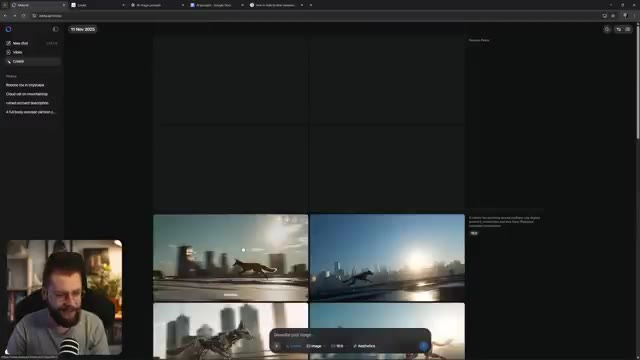
*Interface de l'outil de génération d'images affichant le résultat au style papier avec un chat sur un village.*

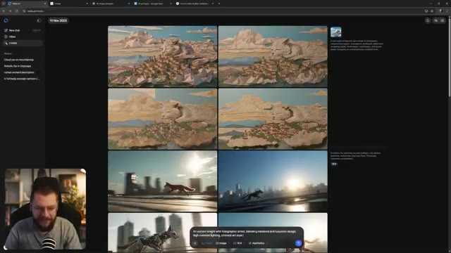
*Affichage du panneau de saisie du prompt pour le chevalier ancien avec armure holographique.*

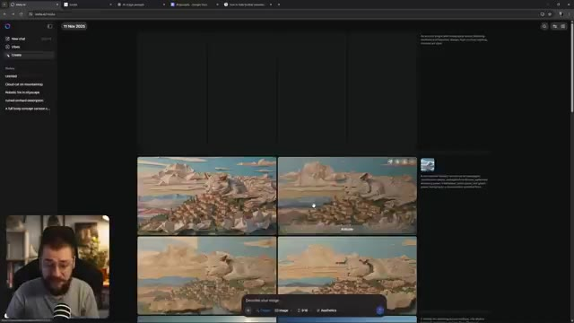
*Interface montrant le changement de format en 9x16 pour la génération d'images.*

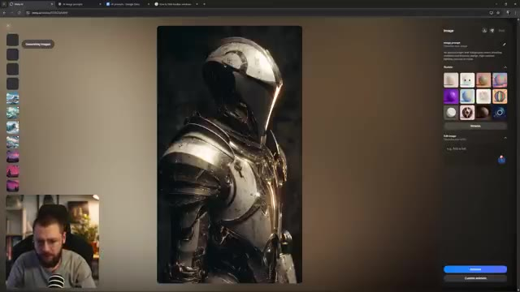
*Affichage du rendu final d'un chevalier en armure futuriste avec le panneau Restyle sur le côté droit.*

---

### ⏱️ `[00:05:25 - 00:06:02]` | Segment #12

**🔊 Audio (Transcription Intégrale Mot pour Mot en Français) :**
> nous-mêmes un chevalier futuriste lumineux. C'est une génération de dingue, au fait. Regardez ça. Exactement ce qu'on voulait. Vraiment, vraiment cool. J'adore ça. Donc je vous dis quoi, allons complètement fous. Je vais spammer toute une charge de prompts textuels, lancer autant de générations que possible et je verrai si on atteint une quelconque limite de paiement. Bon, je viens de lancer tellement de générations que j'en ai déjà récupéré une tonne en fait, et je n'ai atteint aucune limite de paiement d'aucune sorte. La qualité de ces images est insensée.

**👁️ Analyse Visuelle d'Écran (gemini-3.5-flash-lite) :**
**Interface & Outils** : Navigateur web affichant l'interface de Meta AI (meta.ai) avec un panneau latéral d'historique (« History », « New chat », « Vibes », « Create ») et une vue principale en grille ou de détail d'images générées. Le créateur est visible en incrustation (PiP) en bas à gauche de l'écran.

**Contenu textuel & Code** : Prompts textuels visibles dans l'historique et les panneaux latéraux : « Ancient knight concept art... », « Robotic fox in cityscape... », « Two street performers with cybernetic dress ring to a crowd of decaying androids... », « A person standing inside a futuristic futuristic library... ». Paramètres de format et d'esthétique visibles dans les barres de menu (« 16:9 », « Aesthetics », « Generate »).
[DESC_IMAGE_1]

**Action / Démonstration** : Le créateur navigue et commente l'image générée d'un chevalier au casque brillant tout en consultant l'interface sur son écran.

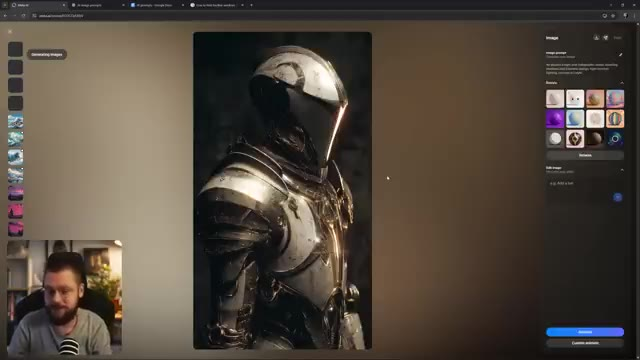
*Interface du générateur d'images affichant le rendu détaillé d'un chevalier futuriste lumineux avec le créateur en incrustation PiP.*

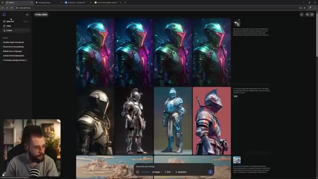
*Historique et galerie de générations d'images sur Meta AI montrant plusieurs variations de chevaliers futuristes.*

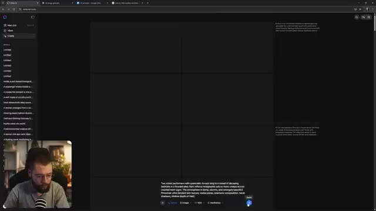
*Interface montrant la zone de saisie d'un nouveau prompt textuel complexe en bas de l'écran avec divers paramètres.*

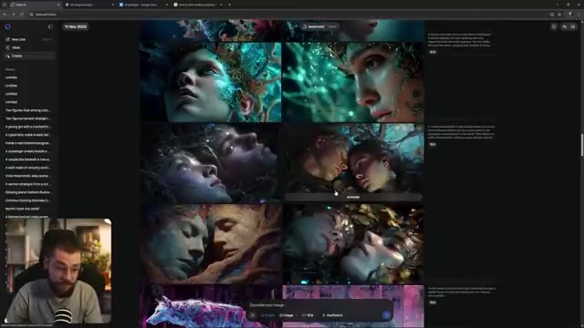
*Grille de résultats affichant de nouvelles générations artistiques et fantastiques générées en série.*

---

### ⏱️ `[00:06:02 - 00:06:41]` | Segment #13

**🔊 Audio (Transcription Intégrale Mot pour Mot en Français) :**
> Il semble bien que nous ayons Midjourney à l'intérieur de la plateforme Meta AI en ce moment avec un usage illimité autant que je puisse dire, n'est-ce pas ? Bien sûr, la prochaine chose que nous voulons tester, c'est la génération de vidéo, et est-ce qu'on va se heurter à un quelconque mur payant avec ça ? Alors choisissons celle-ci ici et je viens juste de cliquer sur l'onglet d'animation et je suppose, oui, ça vient juste de remonter tout en haut de la page, donc c'est juste comme une option d'animation par défaut et vous pouvez voir que ça commence déjà à générer cette vidéo pour nous ici. Je crois que si on clique dedans par contre, on a un petit peu plus

**👁️ Analyse Visuelle d'Écran (gemini-3.5-flash-lite) :**
**Interface & Outils** : Meta AI (navigateur web) avec panneau latéral d'historique et de configuration d'image (Image prompt, Style, Edit image, onglets Animate et Custom animate).

**Contenu textuel & Code** : Grilles d'images générées incluant des loups cybernétiques, des silhouettes devant une porte lumineuse, des astronautes et des personnages de type cyberpunk. Panneau latéral affichant des prompts textuels et des options de style.

**Action / Démonstration** : Le créateur navigue dans l'interface de Meta AI, sélectionne une image et clique sur l'onglet d'animation pour lancer la génération vidéo.

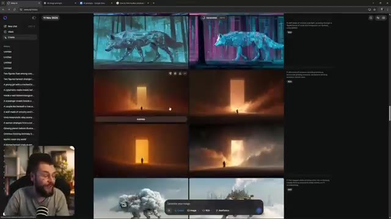
*Interface de la plateforme Meta AI affichant des grilles d'images générées, avec un encadré vidéo du créateur en bas à gauche.*

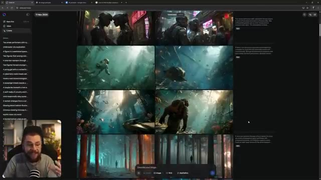
*Navigation dans Meta AI montrant différentes grilles d'images de science-fiction et de paysages.*

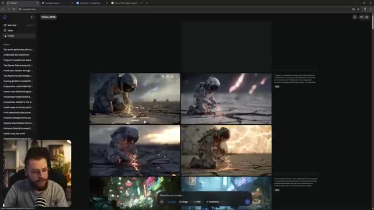
*Grille d'images Meta AI montrant un astronaute sur une planète déserte et des scènes urbaines futuristes.*

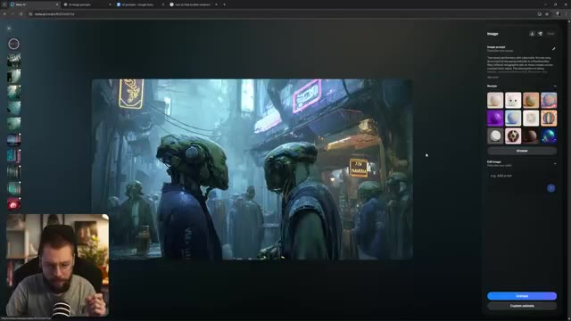
*Interface de visualisation détaillée d'une image Meta AI avec un panneau latéral montrant les options de style et d'animation.*

---

### ⏱️ `[00:06:41 - 00:07:00]` | Segment #14

**🔊 Audio (Transcription Intégrale Mot pour Mot en Français) :**
> option. Ouais. Animation personnalisée. Donc on peut entrer un prompt textuel. Allons-y donc pour un style d'animation, un mouvement de caméra avant lent et cliquons simplement sur animer là. Et regardez, on a déjà récupéré cette génération de vidéo. C'était tellement rapide. Ouais, ça a l'air plutôt super pour moi aussi. Encore une autre ici.

**👁️ Analyse Visuelle d'Écran (gemini-3.5-flash-lite) :**
**Interface & Outils** : Navigateur web affichant l'interface de Meta AI (meta.ai), avec un encadré vidéo PiP du créateur en bas à gauche.

**Contenu textuel & Code** : Champ de texte pour le prompt d'animation, panneaux de contrôle latéraux avec options de style et de génération vidéo.

**Action / Démonstration** : Le créateur démontre l'utilisation de l'option d'animation personnalisée en entrant un prompt textuel pour générer une vidéo.

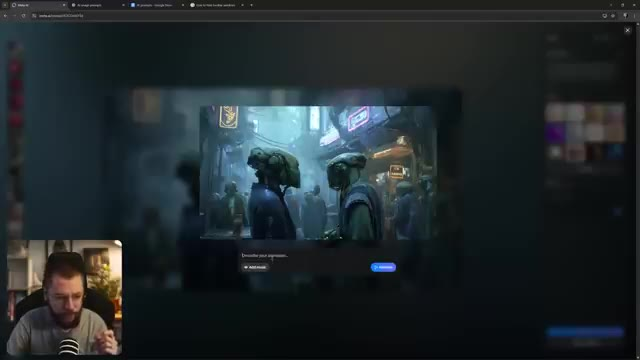
*Interface de Meta AI montrant l'option d'animation personnalisée avec un champ de saisie de texte pour décrire le mouvement.*

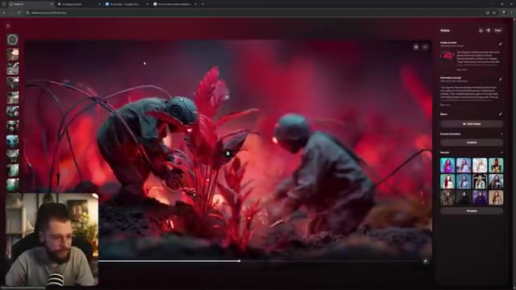
*Résultat de la génération vidéo sur Meta AI montrant des personnages s'affairant dans un décor rouge et ténébreux.*

---

### ⏱️ `[00:07:00 - 00:07:24]` | Segment #15

**🔊 Audio (Transcription Intégrale Mot pour Mot en Français) :**
> Et vous pouvez voir qu'une fois de plus, nous avons toutes ces options de redémarrage disponibles pour nous également. Alors, est-ce qu'on peut transformer ça en anime ? Et est-ce que ça va ensuite, ouais, générer de la vidéo ? On va récupérer une vidéo d'anime apparemment. Je suppose qu'on va simplement faire défiler et animer autant de ceux-ci que possible et voir si on se heurte à une sorte de péage payant.

**👁️ Analyse Visuelle d'Écran (gemini-3.5-flash-lite) :**
**Interface & Outils** : Interface web d'un outil de génération vidéo par intelligence artificielle (style Luma Dream Machine ou similaire) avec panneau latéral de configuration et retour vidéo.

**Contenu textuel & Code** : Panneau latéral affichant "Image prompt", "Animation prompt", et une sélection de styles d'animation miniatures en bas à droite.

**Action / Démonstration** : Le créateur navigue dans l'interface et examine les différentes options de styles pour animer les images générées.

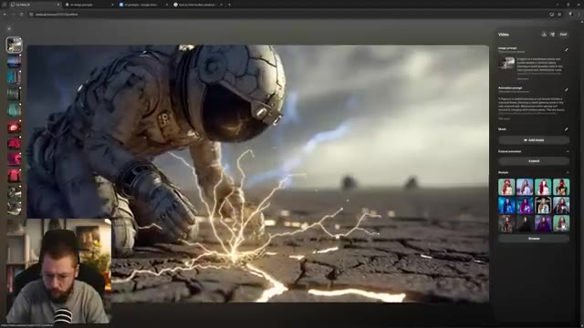
*Interface d'un générateur vidéo montrant un astronaute agenouillé avec des éclairs et un panneau latéral de styles d'animation.*

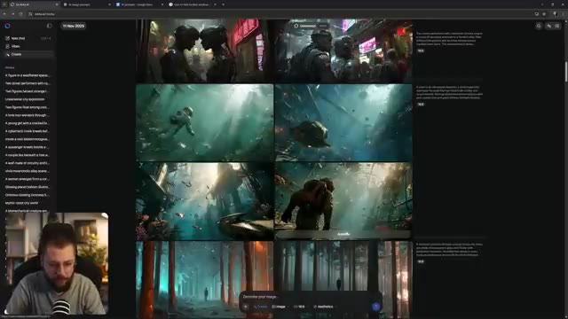
*Grille de miniatures de projets vidéo générés par IA dans l'interface de l'outil.*

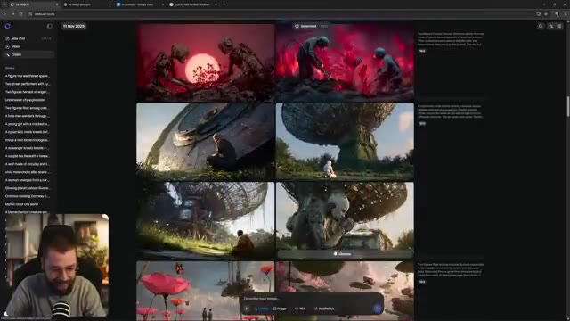
*Vue d'ensemble de la bibliothèque de projets avec différentes scènes de science-fiction générées.*

---

### ⏱️ `[00:07:24 - 00:07:43]` | Segment #16

**🔊 Audio (Transcription Intégrale Mot pour Mot en Français) :**
> Je vais littéralement opter pour l'animation par défaut sans mettre de prompt textuel. Continuons à en envoyer le plus possible. Ce sont des images géniales qu'on a reçues, d'ailleurs. Elles sont incroyables, celles-ci. Est-ce qu'on devrait simplement animer chacune d'entre elles ? Je pense que ce serait impoli de ne pas le faire, non ? Ouais, on va t'animer.

**👁️ Analyse Visuelle d'Écran (gemini-3.5-flash-lite) :**
**Interface & Outils** : Interface de génération et de galerie d'images par IA (style interface de type Midjourney / Meta AI), avec une vue en grille des créations et une barre de navigation latérale gauche.

**Contenu textuel & Code** : Galerie d'images générées par IA réparties en grilles, miniatures avec des options d'animation, barre de prompt en bas (« Describe your image... »), onglets de création, et un encadré vidéo du présentateur (Jack) en bas à gauche.

**Action / Démonstration** : Le créateur navigue à travers différentes grilles d'images générées par intelligence artificielle et commente les visuels en vue de les animer.

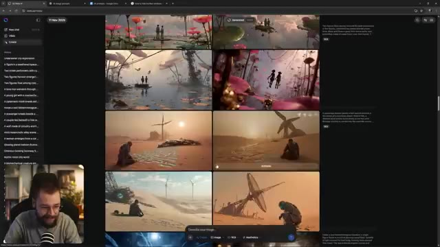
*Interface affichant une galerie d'images générées par IA sur le thème de paysages oniriques et désertiques avec des éoliennes, accompagnée d'une incrustation vidéo du créateur en bas à gauche.*

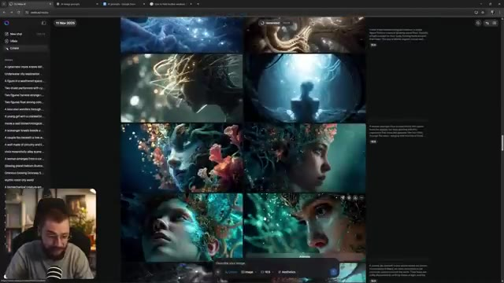
*Interface présentant une grille d'images d'art génératif sur le thème aquatique et marin avec des créatures mystiques, aux tons bleus et luminescents.*

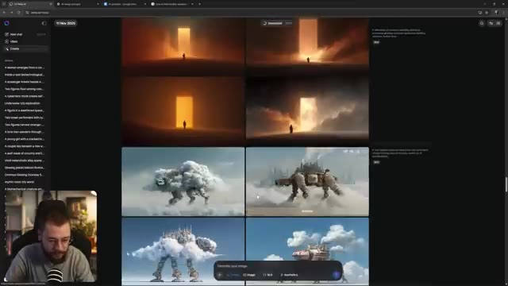
*Interface montrant des visuels de personnages et créatures fantastiques parmi les nuages, avec des structures architecturales futuristes.*

---

### ⏱️ `[00:07:43 - 00:08:17]` | Segment #17

**🔊 Audio (Transcription Intégrale Mot pour Mot en Français) :**
> Ouais, on va opter pour ça. Oh, mec, je n'have même pas encore regardé tout ça. Animons simplement toutes ces images parce que c'est intéressant de faire des animations par défaut et de voir ce que l'outil en fait sans aucune direction. Un truc un peu plus réaliste ici, envoyons ceux-là aussi. Oh, c'est carrément Daredevil, non ? On dirait littéralement Daredevil, il faut qu'on anime Daredevil et celui-là aussi. J'adore cette génération, ouais, ça doit absolument être animé. Alors voilà notre mouvement de caméra travelling lent dans le style d'animation, un peu de ralentissement sur la lecture.

**👁️ Analyse Visuelle d'Écran (gemini-3.5-flash-lite) :**
**Interface & Outils** : Meta AI (interface web de génération d'images et de vidéos avec affichage PiP du créateur).

**Contenu textuel & Code** : Grilles d'images artistiques (méditation, danse lumineuse, personnages style Daredevil, armures de science-fiction), panneaux de prompts textuels, paramètres de style et options d'animation (slow dolly camera move).

**Action / Démonstration** : Le créateur navigue dans sa galerie d'images générées par IA, sélectionne des visuels à animer et lance la prévisualisation vidéo avec des mouvements de caméra cinématiques.

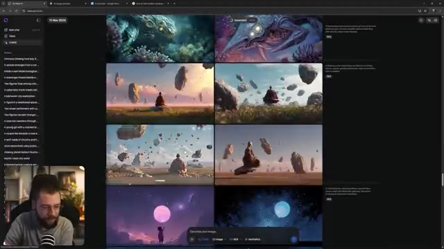
*Interface du générateur Meta AI montrant une grille d'images générées par IA avec un encadré PiP du créateur en bas à gauche.*

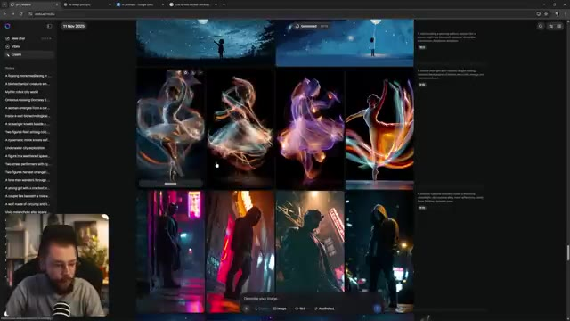
*Grille d'images de danseurs fluorescents et personnages de type Daredevil dans une ruelle sombre sur l'interface Meta AI.*

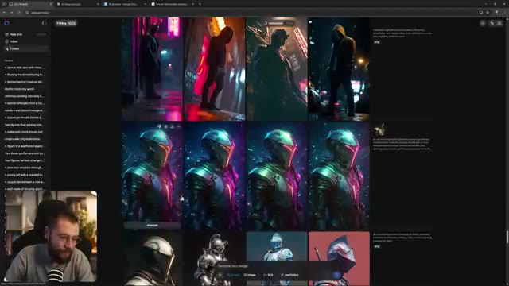
*Grille d'images affichant des personnages en armure futuriste et des scènes de rue de type Daredevil.*

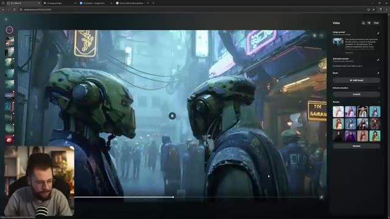
*Fenêtre de prévisualisation vidéo de Meta AI montrant deux personnages casqués dans une rue cyberpunk avec les paramètres de prompt et de style à droite.*

---

### ⏱️ `[00:08:17 - 00:08:50]` | Segment #18

**🔊 Audio (Transcription Intégrale Mot pour Mot en Français) :**
> là-dedans, regardons ça à nouveau, ça a l'air plutôt bien. Oh, c'est le moment où on a restylisé ce plan en anime aussi, n'est-ce pas ? Encore une fois, un petit peu d'effet de distorsion qui se produit ici. Regardez celui-là, ça a l'air plutôt cool, on peut voir une sorte d'artefacts bizarres. Jetez un œil à ça, ouais, encore une fois, donc quand ces braises s'élèvent, elles ont en quelque sorte un effet bizarre sur notre personnage au premier plan là-bas, ce qui n'est pas vraiment ce que l'on veut. Cependant, très beau changement de focus là sur la parabole radar.

**👁️ Analyse Visuelle d'Écran (gemini-3.5-flash-lite) :**
**Interface & Outils** : Navigateur web affichant une application de génération de vidéo par IA avec panneau de configuration à droite (Image prompt, Animation prompt, Music, Extend animation, Restyle) et aperçu vidéo au centre.

**Contenu textuel & Code** : Panneaux textuels avec des descriptions de prompts ("A close up on sci-fi robot explorer...", "A glamorous cyborg woman delivers a powerful emotion..."), section de sélection de styles de type anime/illustrations.

**Action / Démonstration** : Le créateur navigue à travers différentes générations de vidéos IA, analysant les artefacts visuels, les distorsions et les transitions de mise au point (focus shift).

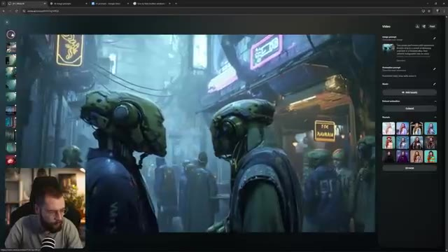
*Interface du générateur vidéo montrant des personnages de type cyborg dans une rue urbaine de style cyberpunk avec les options de style anime sur le panneau latéral droit.*

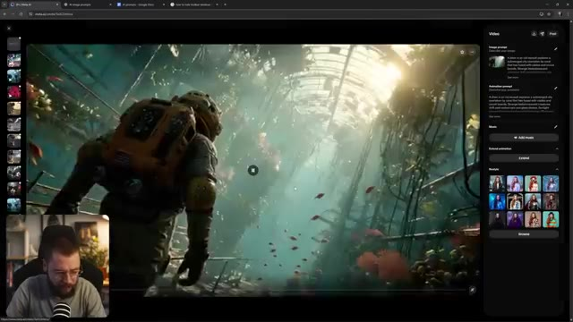
*Interface de génération montrant un plan sous-marin avec un scaphandrier explorant des structures aquatiques et des poissons.*

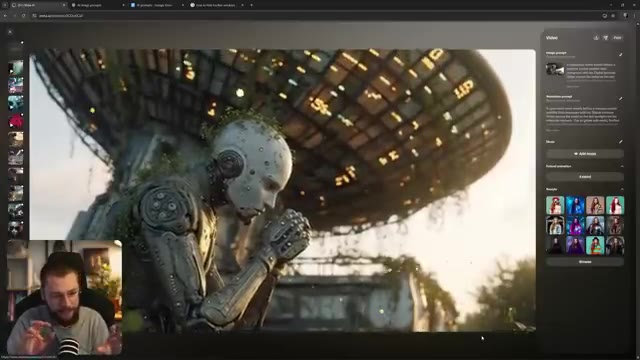
*Gros plan sur un robot au premier plan avec une parabole radar en arrière-plan, illustrant les effets d'animation et de braises.*

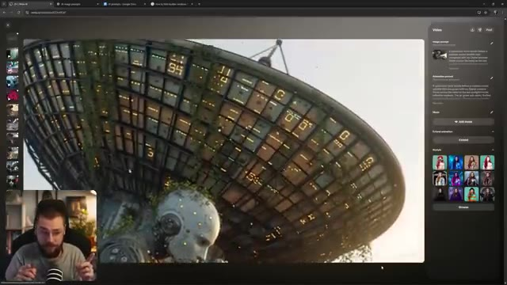
*Zoom de la caméra effectuant un changement de focus sur la grande parabole radar recouverte de végétation.*

---

### ⏱️ `[00:08:50 - 00:09:23]` | Segment #19

**🔊 Audio (Transcription Intégrale Mot pour Mot en Français) :**
> c'est plutôt cool ouais regardez ce plan ici très très cool et bien sûr testons simplement en cliquant sur ce petit logo ici on vient juste de le télécharger donc ça sort en mp4 donc si on ouvre les propriétés de notre téléchargement et qu'on va dans les détails ça ressort en 832 par 464 c'est une résolution assez bizarre euh retournons sur Midjourney pour tester ça et je veux aller animer cette image particulière ici. Encore une fois, vous pouvez voir que sur Midjourney,

**👁️ Analyse Visuelle d'Écran (gemini-3.5-flash-lite) :**
**Interface & Outils** : Navigateur web avec interface de génération vidéo, lecteur multimédia Windows Media Player, fenêtre de propriétés Windows et interface de la galerie web de Midjourney.

**Contenu textuel & Code** : Prompts visibles sur l'interface vidéo : « A cybernetic monk kneels before a massive, ruined coated satellite dish... », propriétés vidéo Windows : Longueur 00:00:05, Largeur d'image 832, Hauteur d'image 464, Débit de données 14316 kbps, Fréquence d'images 24.00 images/seconde.

**Action / Démonstration** : Le créateur démontre le téléchargement d'une vidéo générée, vérifie ses propriétés et sa résolution sur Windows, puis navigue sur l'interface de Midjourney pour choisir une image à animer.

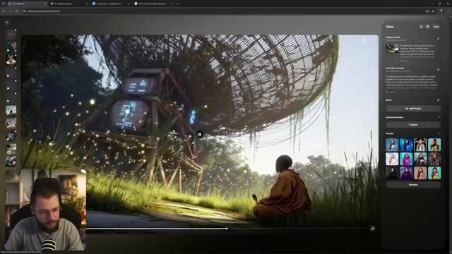
*Interface d'un générateur de vidéo par IA affichant un plan cinématique avec un moine et une structure de type antenne parabolique, avec le retour caméra du créateur en incrustation (PiP).*

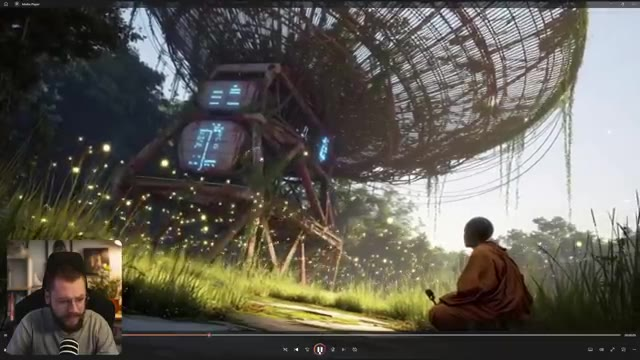
*Lecteur multimédia affichant la vidéo générée de la structure industrielle futuriste dans la nature.*

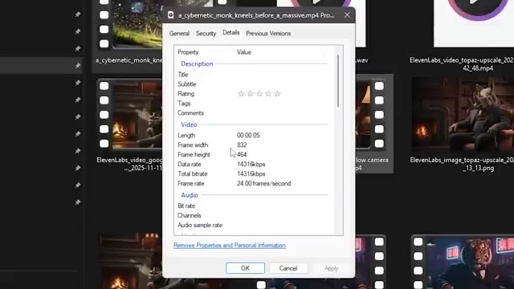
*Fenêtre des propriétés Windows d'un fichier vidéo montrant les détails techniques (résolution 832x464, durée 00:05).*

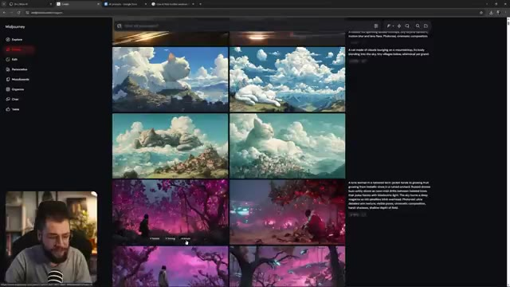
*Interface de la galerie Midjourney affichant plusieurs grilles d'images générées par IA avec leurs prompts textuels associés.*

---

### ⏱️ `[00:09:23 - 00:09:59]` | Segment #20

**🔊 Audio (Transcription Intégrale Mot pour Mot en Français) :**
> si je clique simplement sur animer, ça va juste lancer une génération de vidéo par défaut en utilisant ceci comme image de départ. Et ce que je veux faire, c'est télécharger ceci et comparer la taille de la résolution. Ok, donc on a récupéré notre génération Midjourney. C'est vraiment petit dans la plateforme elle-même. Alors allons-y pour le télécharger. Jetons un œil à ça en plein écran. Oh, vous savez quoi, il y a du morphing bizarre et des trucs intégrés là-dedans, mais quelle taille de résolution obtient-on en retour, ça va être intéressant. Ok, donc générer des vidéos à l'intérieur de Midjourney, vous allez obtenir

**👁️ Analyse Visuelle d'Écran (gemini-3.5-flash-lite) :**
**Interface & Outils** : Navigateur web avec l'interface de Midjourney, lecteur multimédia Windows et fenêtre des propriétés de fichier.

**Contenu textuel & Code** : Galerie d'images et de vidéos Midjourney, invite textuelle descriptive ("A lone woman in a tattered tech-jacket..."), paramètres de génération vidéo (Low Motion, High Motion), et détails du fichier vidéo (Frame width: 1936, Frame height: 1080, Frame rate: 24.00 frames/second).

**Action / Démonstration** : Le créateur navigue dans l'interface de Midjourney, lance la lecture de la vidéo générée en plein écran, puis vérifie les propriétés de résolution du fichier téléchargé.

*Interface de Midjourney affichant une grille d'images générées avec une vue PiP du créateur en bas à gauche.*

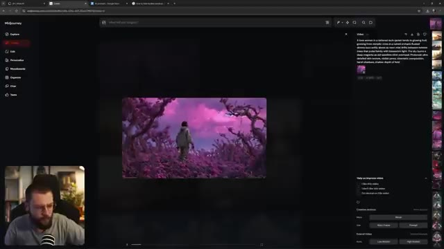
*Interface de Midjourney montrant la lecture d'une vidéo générée au centre de l'écran avec les options de téléchargement et paramètres à droite.*

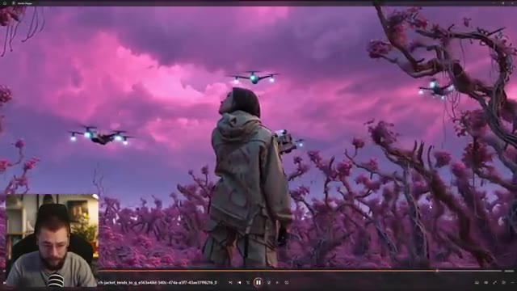
*Vidéo générée lue en mode plein écran montrant une femme dans un paysage rose extraterrestre avec des drones volant au loin.*

*Fenêtre des propriétés Windows affichant les détails techniques de la vidéo (résolution, longueur, débit binaire).*

---

### ⏱️ `[00:09:59 - 00:10:22]` | Segment #21

**🔊 Audio (Transcription Intégrale Mot pour Mot en Français) :**
> une résolution de sortie plus élevée, celle-ci est de 1936 par 1080, juste au-dessus de la HD, donc en générant des vidéos à l'intérieur de Meta, vous obtenez une résolution beaucoup plus basse, gardez donc cela à l'esprit. C'est peut-être juste temporaire pendant qu'ils permettent aux gens d'avoir ce qui semble être des générations illimitées avec l'outil.

**👁️ Analyse Visuelle d'Écran (gemini-3.5-flash-lite) :**
**Interface & Outils** : Explorateur Windows, fenêtre de propriétés des fichiers vidéo, et interface web de Meta (meta.ai/imagine ou similaire).

**Contenu textuel & Code** : Résolution 1936 x 1080, débit de données 25662 kbps, fréquence d'images 24,00 images/seconde, et diverses vignettes de vidéos générées par IA montrant des scènes fantastiques.

**Action / Démonstration** : Le créateur montre les métadonnées et résolutions de fichiers pour comparer la qualité de sortie entre différents outils de génération vidéo par IA.

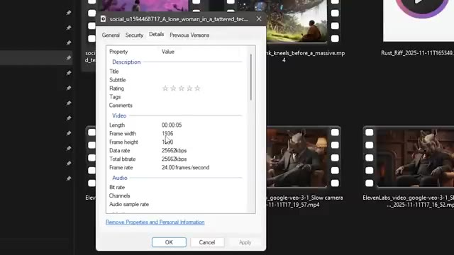
*Fenêtre de propriétés Windows affichant les détails techniques d'un fichier vidéo (1936 x 1080, 24 fps).*

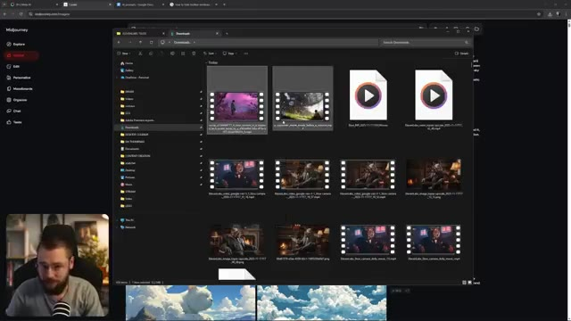
*Explorateur de fichiers Windows par-dessus le navigateur web Midjourney, avec incrustation vidéo (PiP) du créateur.*

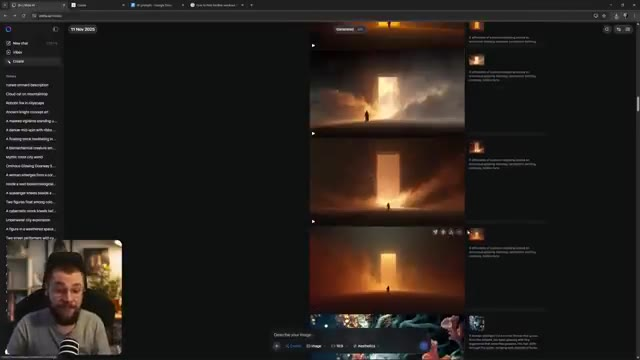
*Interface de l'outil de génération vidéo de Meta montrant des résultats de vidéos générées avec une silhouette devant une porte lumineuse.*

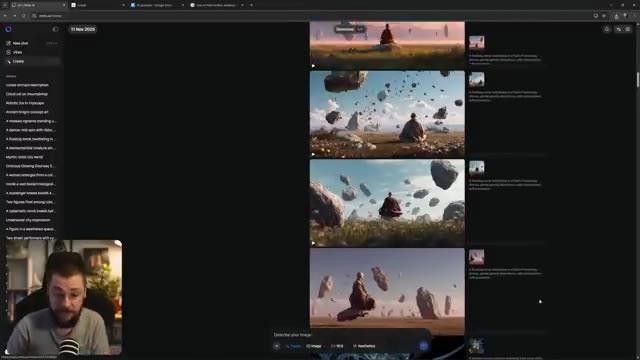
*Interface de Meta montrant des générations de vidéos avec un personnage en train de méditer parmi des rochers en lévitation.*

---

### ⏱️ `[00:10:22 - 00:10:57]` | Segment #22

**🔊 Audio (Transcription Intégrale Mot pour Mot en Français) :**
> Cette nuit d'ailleurs c'est tellement dingue. J'adore ça. Oh, on a récupéré notre renard robot aussi. Regardez ça, plutôt sympa. Je pense vraiment que ce qui est utilisé via Meta est littéralement Midjourney en ce qui concerne la génération d'images et de vidéos, parce qu'en revisionnant la génération qu'on a obtenue de Midjourney, on peut remarquer ce même type de morphing ou de déformation qu'on a vu lorsqu'on générait via Meta, donc ouais, c'est bien Midjourney via Meta gratuitement en ce moment, donc

**👁️ Analyse Visuelle d'Écran (gemini-3.5-flash-lite) :**
**Interface & Outils** : Interface web de Midjourney (accessible via un navigateur) avec panneau latéral gauche pour l'historique ("11 Nov 2025"), barre de prompt et grille de visualisation des vidéos générées.

**Contenu textuel & Code** : On distingue divers prompts textuels comme "A lone woman in a battered tech-jacket needs to glowing fresh growing lush exotic vines in a ruined orchard..." et des menus de personnalisation (Image prompt, Style, etc.).

**Action / Démonstration** : Le créateur navigue dans l'interface de Midjourney pour illustrer ses propos sur les similarités visuelles avec la plateforme Meta.

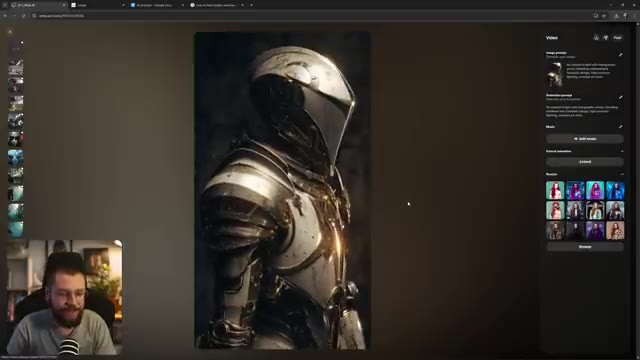
*Interface de Midjourney affichant un rendu de casque de soldat futuriste avec des panneaux de réglages vidéo à droite et le présentateur en incrustation.*

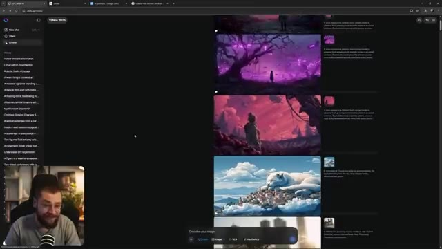
*Grille de générations vidéo sur l'interface de Midjourney avec un menu latéral d'historique et des vignettes de paysages fantastiques.*

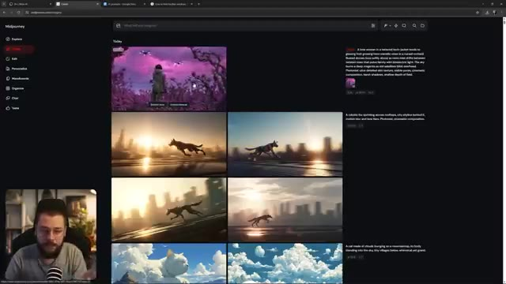
*Interface de Midjourney montrant une grille de vidéos avec des canidés robotiques en mouvement au crépuscule et le panneau des prompts textuels associés.*

*Retour sur l'historique et la bibliothèque de créations Midjourney du 11 novembre 2025 avec des exemples de scènes animées.*

---

### ⏱️ `[00:10:57 - 00:11:24]` | Segment #23

**🔊 Audio (Transcription Intégrale Mot pour Mot en Français) :**
> En gros mon conseil pour vous les gars c'est d'exploiter ça autant que possible obtenez autant de générations d'images et de vidéos par IA à votre actif que possible parce que c'est un scénario de fou en ce moment. Genre mid-journey n'est pas bon marché. Donc pour pouvoir accéder à cet outil, même si vous apprenez juste ou expérimentez, que vous êtes complètement débutant en IA générative. C'est une opportunité en or.

**👁️ Analyse Visuelle d'Écran (gemini-3.5-flash-lite) :**
**Interface & Outils** : Navigateur web affichant l'interface de Midjourney (midjourney.com) avec un panneau latéral d'historique des prompts et une zone de visualisation des images générées, accompagné d'une incrustation vidéo (PiP) du créateur en bas à gauche.

**Contenu textuel & Code** : Texte des prompts visibles dans l'historique : "A massive wiggling snake standing u...", "A dancer mid-spin with flikka...", "A floating monk swallowing a...", "A biomechanical creature em...", "Mythic rock city world", "Ominous Glowing Doorway s...", "A woman emerges from a vor...", "Inside a vast biotechnological...", "A scavenger kneels beside a...", "Two figures float among colo...", "A cybernetic monk kneels bef...", "Underwater city exploration", "A figure in a weathered space...", "Two street performers with cy...", ainsi que les prompts textuels associés aux images générées.

**Action / Démonstration** : Le créateur parle face caméra tout en naviguant sur l'interface web de Midjourney, montrant les différentes images générées et l'historique des prompts.

*Interface du site web Midjourney affichant un historique de générations d'images avec le créateur en incrustation vidéo (PiP) dans le coin inférieur gauche.*

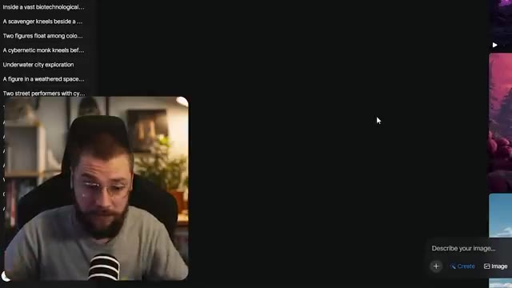
*Gros plan sur l'interface Midjourney avec la liste des prompts dans le panneau de gauche et la zone de saisie en bas à droite, le créateur apparaissant en incrustation PiP.*

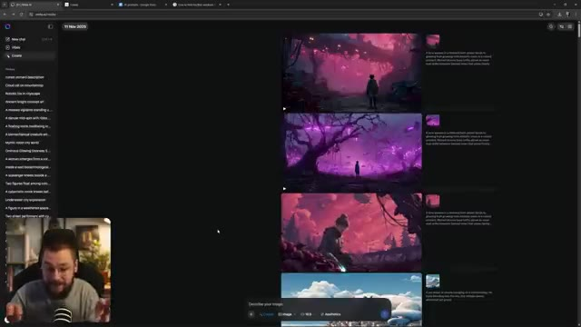
*Interface de Midjourney présentant des miniatures d'images générées aux tons roses et violets, avec le créateur gesticulant en incrustation PiP.*

---

### ⏱️ `[00:11:24 - 00:11:41]` | Segment #24

**🔊 Audio (Transcription Intégrale Mot pour Mot en Français) :**
> Donc vous allez voir ça. Comme toujours, si vous avez apprécié la vidéo d'aujourd'hui, n'hésitez pas à lâcher un gros pouce bleu pour moi, pensez à vous abonner si vous êtes nouveau sur la chaîne et activez la cloche de notification pour ne jamais rater de futures publications. Merci d'avoir regardé les gars et je vous retrouve dans la prochaine vidéo.

**👁️ Analyse Visuelle d'Écran (gemini-3.5-flash-lite) :**
**Interface & Outils** : Navigateur web affichant une application de génération d'images par IA (interface sombre avec panneau latéral listant des prompts comme "A masked vigilante standing...", "Underwater city exploration").

**Contenu textuel & Code** : Texte de l'historique des prompts dans le panneau de gauche ("Cloud cat on mountaintop", "Robotic fox in cityscape", "Ancient knight concept art", "Underwater city exploration") et des descriptions textuelles en anglais à côté des images générées.

**Action / Démonstration** : Le créateur présente son écran de navigateur tout en parlant à la caméra, visible dans un encadré incrusté (PiP) en bas à gauche.

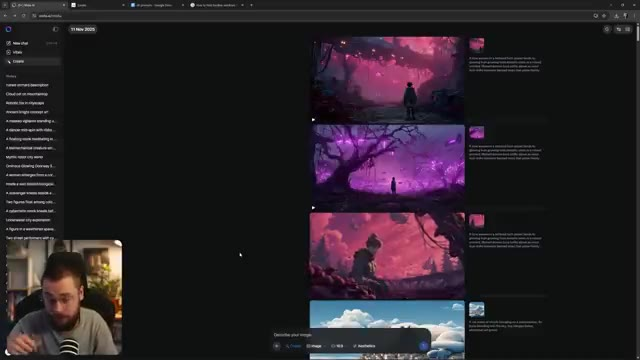
*Interface du site web d'intelligence artificielle affichant un historique de prompts textuels et des galeries d'images générées aux tons roses, avec la webcam de Jack incrustée en bas à gauche.*

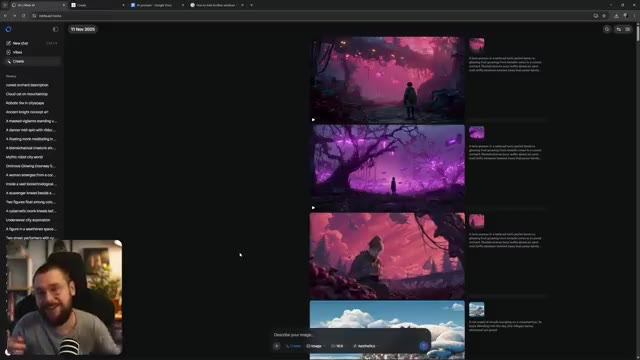
*Interface similaire à l'image 1 montrant le navigateur web avec l'outil de génération d'images et Jack dans son encadré vidéo.*

---
