# 🎬 Comment créer des pubs TV PREMIUM avec l'IA (CHANGEMENT DE RÈGLE DU JEU)

> **Chaîne** : [Jack Vs. AI](https://www.youtube.com/@JackVsAI)  
> **Titre original** : `How to make PREMIUM TV ads with AI (GAME CHANGER)`  
> **Lien YouTube** : [https://www.youtube.com/watch?v=tlNeoxDZwFY](https://www.youtube.com/watch?v=tlNeoxDZwFY)  
> **Date de publication** : 2025-11-17  
> **Durée** : 32m 37s (`1957s`)  
> **Identifiant vidéo** : `tlNeoxDZwFY`  
> **Fiche Web Interactive** : [2025-11-17_YT-tlNeoxDZwFY_Comment créer des pubs TV PREMIUM avec l'IA (CHANGEMENT DE RÈGLE DU JEU)_by-whisper-v3-large-turbo+gemini-3.5-flash-lite.html](2025-11-17_YT-tlNeoxDZwFY_Comment créer des pubs TV PREMIUM avec l'IA (CHANGEMENT DE RÈGLE DU JEU)_by-whisper-v3-large-turbo+gemini-3.5-flash-lite.html)  
> **Captures de démonstration clés** : `140 captures réelles (anti-talking-head)`  
> **Modèles utilisés** : Audio: `large-v3-turbo` (Faster-Whisper int8 VPS) | Vision: `gemini-3.5-flash-lite` (Google AI Studio API)  

---

## 📌 Synthèse Exécutive & Outils

### 📌 Résumé
La vidéo de Jack Vs. AI met en lumière une véritable révolution dans l'industrie de la production publicitaire : la création de spots TV de qualité premium entièrement générés par intelligence artificielle. À travers l'étude de cas d'une fausse marque de bière haut de gamme baptisée « Ark », Jack démontre comment l'IA ne se contente plus de générer des clips isolés, mais permet de concevoir une identité de marque cohérente de A à Z. En exploitant les dernières fonctionnalités de génération d'images et de vidéos intégrées directement au sein d'une plateforme unifiée comme ElevenLabs, le flux de travail des artistes VFX est profondément simplifié, réduisant les frictions techniques entre la conception visuelle, le sound design et la voix off.

La méthode de Jack repose sur un processus itératif rigoureux, loin du simple coup de poker textuel. Tout commence par un concept visuel fort — des animaux anthropomorphes élégamment habillés — décliné ensuite à travers un produit signature dont le design de bouteille (avec des animaux sculptés dans le verre) incarne le positionnement luxueux. Jack détaille sa méthodologie de *pipeline* : l'utilisation d'images sources fixes générées via des modèles précis (comme Google Nano Banana ou C Dream), l'optimisation des prompts textuels intégrant des spécifications techniques de rendu (textures de fourrure, éclairages, profondeur de champ), puis l'animation de ces images de départ. L'utilisation d'une image de référence (« style reference ») garantit une direction artistique homogène d'un plan à l'autre.

Pour les créateurs de vidéo et les professionnels de la publicité, les enseignements de cette vidéo changent la donne. L'accessibilité d'outils de pointe (génération multimodale, upscaling intégré) démocratise la réalisation de spots publicitaires autrefois réservés à des agences dotées de budgets pharaoniques. En combinant la puissance de modèles variés (Flux, Veo 3.1, Topaz) au sein d'un même écosystème, les créateurs gagnent en agilité, en rapidité d'exécution et en liberté créative, tout en maintenant un standard visuel cinématique et hautement professionnel.

---

### 🛠️ Outils, Modèles & Logiciels Présentés
* **ElevenLabs** : Plateforme tout-en-un servant à la fois pour le doublage vocal, les effets sonores, la musique et désormais la génération directe d'images et de vidéos par IA.
* **Google Nano Banana** : Modèle de génération d'images privilégié par Jack pour sa direction artistique stylisée et son rendu supérieur des textures de fourrure.
* **Flux (et Flux 1 Kontext Pro)** : Modèle de pointe utilisé pour la génération d'images de haute qualité textuelle et visuelle.
* **Seedream (Seedream 4)** : Modèle de génération d'images orienté vers un rendu ultra-réaliste, testé par Jack pour les personnages mais jugé parfois trop « vaseux » sur les textures complexes.
* **Veo 3.1** : Modèle de génération vidéo par IA mentionné parmi les technologies de pointe mobilisées dans ce type de pipeline créatif.
* **Topaz** : Outil professionnel de mise à l'échelle (upscaling) intégré directement à la plateforme pour sublimer la résolution des visuels finaux.
* **Premiere Pro** : Logiciel de montage traditionnel utilisé pour assembler, rythmer et finaliser le montage du spot publicitaire.

---

### 🔑 Points Clés & Enseignements Stratégiques
* **Centralisation des flux de travail** : Regrouper la génération audio, image et vidéo sur une seule plateforme (comme l'extension d'ElevenLabs) élimine les pertes de temps liées aux transferts de fichiers entre différents logiciels.
* **La puissance du concept initial** : Tout bon spot publicitaire par IA démarre par un concept visuel fort, mémorable et instantanément reconnaissable (ex. : des animaux en costume sur mesure).
* **Cohérence de marque par le produit** : Pour ancrer une fausse marque dans le réel (comme « Ark Brew »), soigner le design du produit (bouteille avec des motifs sculptés/embossés) renforce immédiatement la perception haut de gamme.
* **Itération et expérimentation visuelle** : Ne jamais se contenter du premier résultat ; le processus exige de tester plusieurs variantes (comme le passage de quatre animaux à trois) pour trouver l'équilibre narratif parfait.
* **L'utilisation de la « Règle de Trois »** : Limiter le nombre de personnages ou d'éléments visuels clés (trois animaux : tigre, rhinocéros, girafe) structure visuellement la publicité et évite la surcharge cognitive du spectateur.
* **Standardisation des prompts textuels** : Utiliser systématiquement une formule de fin de prompt éprouvée (ex. : *« photoréaliste, texture de fourrure ultra détaillée, pores visibles, composition cinématographique, ombres dures, faible profondeur de champ »*) pour garantir une patte graphique constante.
* **Principe de l'image de départ (*Seed Image*)** : Générer d'abord des images fixes d'excellente qualité qui serviront de fondations inébranlables avant de passer à l'étape de l'animation vidéo.
* **Utilisation d'images de référence** : Intégrer une image de référence du personnage principal lors de la création des plans suivants pour préserver l'harmonie des couleurs, des costumes et de l'ambiance générale.
* **Arbitrage entre photoréalisme et style** : Préférer parfois un modèle légèrement moins réaliste mais doté d'une meilleure texture perçue (comme Nano Banana par rapport à Seedream) pour un rendu cinématographique plus séduisant.
* **Optimisation budgétaire des générations** : Générer plusieurs options (par exemple, par lots de 4 images) est plus économique en crédits d'IA que de lancer directement des générations vidéo en boucle.
* **Importance de l'upscaling final** : Sublimer systématiquement les images et vidéos retenues via des outils de pointe comme Topaz pour répondre aux exigences de diffusion sur écran TV ou grand format.
* **Adaptation aux nouvelles règles du jeu créatif** : Intégrer l'IA non pas comme un simple gadget, mais comme un accélérateur de production incontournable pour rester compétitif dans l'industrie publicitaire moderne.

---

## ⏱️ Chronologie & Transcription Complète Audio & Visuelle (Mot pour Mot)

### ⏱️ `[00:00:00 - 00:00:18]` | Segment #01

**🔊 Audio (Transcription Intégrale Mot pour Mot en Français) :**
> La publicité suivante a été réalisée entièrement à l'aide de l'IA. Le goût. Soit vous l'avez, soit vous ne l'avez pas. Ça ne peut pas s'inventer. Ça ne peut pas se mesurer ou se cartographier comme des données. Le goût réside dans l'âme d'une boisson, façonnée avec savoir-faire, patience et temps.

**👁️ Analyse Visuelle d'Écran (gemini-3.5-flash-lite) :**
**Interface & Outils** : Présentation face caméra / Génération visuelle publicitaire sans interface logicielle affichée.

**Contenu textuel & Code** : Textes textuels affichés à l'écran : "ATTENTION / THE FOLLOWING AD WAS MADE USING ONLY AI" puis le mot "CRAFT" superposé sur un liquide doré en mouvement.

**Action / Démonstration** : Diffusion d'une vidéo publicitaire générée par IA illustrant le propos (avertissement textuel, personnage anthropomorphe en costume avec une tête de rhinocéros assis dans un salon bourgeois devant une cheminée, puis gros plan sur un liquide ambré pétillant avec le mot CRAFT).

---

### ⏱️ `[00:00:19 - 00:00:38]` | Segment #02

**🔊 Audio (Transcription Intégrale Mot pour Mot en Français) :**
> Chaque gorgée, un aperçu de son histoire. Et pendant un instant. Le bruit s'estompe. Le monde ralentit. Et tout ce qui reste, c'est le goût. Ark. Certains disent que c'est acquis. Je dis que c'est instinctif.

**👁️ Analyse Visuelle d'Écran (gemini-3.5-flash-lite) :**
**Interface & Outils** : Présentation face caméra sans partage d'écran (extraits vidéo de démonstration publicitaire de marque générés par IA sans interface de logiciel visible).

**Contenu textuel & Code** : Aucun texte textuel d'interface ou de code visible, uniquement des visuels publicitaires générés par IA mettant en scène une bouteille de boisson avec des gravures d'animaux (tigre, rhinocéros, girafe) et une girafe anthropomorphe dans un bar, ainsi que le texte publicitaire géant "ARC BREW" et le logo de prévention "drinkaware.co.uk".

**Action / Démonstration** : Vidéo narrative publicitaire montrant une main tenant une bouteille gravée, puis une girafe dans un bar, et enfin un pack de bouteilles "ARC BREW" sur un comptoir avec le nom de la marque s'affichant en grand.

---

### ⏱️ `[00:00:41 - 00:01:05]` | Segment #03

**🔊 Audio (Transcription Intégrale Mot pour Mot en Français) :**
> Je dois être honnête ici. Si vous m'aviez dit il y a six mois que non seulement toute cette publicité, mais la marque elle-même avait été construite uniquement à l'aide de l'IA, je ne l'aurais jamais cru. Le jeu créatif a bel et bien changé. Et si vous ne jouez pas le jeu, vous passez à côté de tout. Je m'appelle Jack, je suis artiste VFX dans l'industrie publicitaire depuis plus d'une décennie maintenant, et j'ai travaillé pour nombre des plus grandes marques de la planète.

**👁️ Analyse Visuelle d'Écran (gemini-3.5-flash-lite) :**
**Interface & Outils** : Présentation face caméra et écran de transition textuel sans interface logicielle ni démonstration.

**Contenu textuel & Code** : Texte à l'écran sur fond dégradé : "many of the biggest brands".

**Action / Démonstration** : Jack s'exprime face caméra dans son studio, puis l'écran affiche un carton textuel de transition avec un effet de flou coloré.

---

### ⏱️ `[00:01:05 - 00:01:26]` | Segment #04

**🔊 Audio (Transcription Intégrale Mot pour Mot en Français) :**
> Dans la vidéo d'aujourd'hui, nous testons Eleven Labs car, dans une actualité assez énorme, ils viennent d'ajouter la génération d'images et de vidéos à la plateforme. Eleven Labs est mon outil de prédilection lorsqu'il s'agit de doublage vocal, d'effets sonores et de musique par IA. Avoir donc l'option de générer tout son audio et ses visuels sur la même plateforme est assez insensé.

**👁️ Analyse Visuelle d'Écran (gemini-3.5-flash-lite) :**
**Interface & Outils** : Présentation face caméra sans partage d'écran

**Contenu textuel & Code** : Aucun contenu logiciel ou visuel affiché à l'écran, uniquement le présentateur en studio.

**Action / Démonstration** : Le créateur s'adresse directement à la caméra en parlant de la nouvelle fonctionnalité d'Eleven Labs.

---

### ⏱️ `[00:01:26 - 00:01:44]` | Segment #05

**🔊 Audio (Transcription Intégrale Mot pour Mot en Français) :**
> Donc je vais vous faire traverser le processus de création de notre publicité par IA au sein d'ElevenLabs. Et les gars, si vous appréciez le contenu d'aujourd'hui, assurez-vous de lâcher un pouce bleu pour moi. Pensez à vous abonner et bien sûr, activez cette cloche de notification. Très bien, entrons directement dans le vif du sujet. Donc bien sûr, la première étape de notre processus a été de trouver une sorte de concept.

**👁️ Analyse Visuelle d'Écran (gemini-3.5-flash-lite) :**
**Interface & Outils** : Visuels de présentation, affichage vidéo d'illustration avec incrustation de marque et incrustation vidéo PiP du créateur.

**Contenu textuel & Code** : Texte "ElevenLabs" avec "link below in the description" sur l'image 1, et le texte "the concept..." sur l'image 3.

**Action / Démonstration** : Le créateur illustre son propos avec une vidéo générée par IA montrant un personnage anthropomorphe, puis affiche un écran de transition textuel.

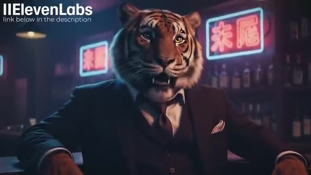
*Visuel de démonstration montrant un homme-tigre en costume dans un bar sombre avec des néons, et le logo ElevenLabs en haut à gauche.*

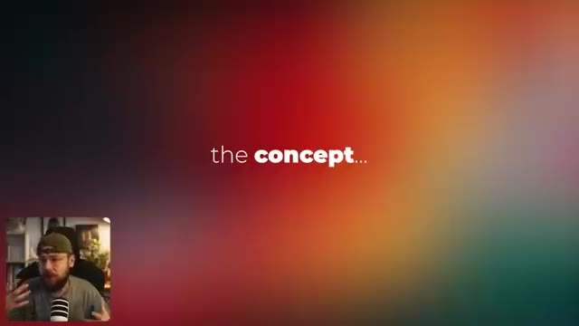
*Écran de transition textuel sur fond coloré avec le texte "the concept..." et Jack en incrustation PiP dans le coin inférieur gauche.*

---

### ⏱️ `[00:01:45 - 00:02:05]` | Segment #06

**🔊 Audio (Transcription Intégrale Mot pour Mot en Français) :**
> Et j'avais vu une image, je ne me rappelle même plus où pour être honnête, d'un animal portant un costume. Et on a vu ça dans toutes sortes de films, émissions de télé et publicités à ce stade. Mais il y a quelque chose là-dedans qui est assez visuellement frappant et mémorable, je pense. C'était donc un peu le point de départ de l'idée.

**👁️ Analyse Visuelle d'Écran (gemini-3.5-flash-lite) :**
**Interface & Outils** : Lecteur vidéo ou montage montrant un visuel généré par IA avec un encadré PiP du créateur dans son studio.

**Contenu textuel & Code** : Texte incrusté à l'écran : "the concept...". Visuel d'une panthère noire anthropomorphe habillée d'un costume élégant, fumant une cigarette dans un bar aux néons colorés, avec un verre d'alcool et un cendrier sur le comptoir.

**Action / Démonstration** : Affichage d'une image générée par IA illustrant le concept d'un animal en costume mentionné dans le commentaire vocal, pendant que le créateur parle en médaillon PiP.

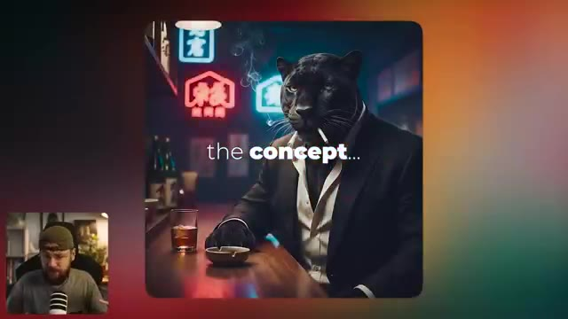
*Image générée par IA montrant un animal anthropomorphe (une panthère noire) en costume-cravate assis dans un bar, avec le texte 'the concept...' incrusté à l'écran, et Jack visible dans un encadré PiP (Picture-in-Picture) en bas à gauche.*

---

### ⏱️ `[00:02:05 - 00:02:37]` | Segment #07

**🔊 Audio (Transcription Intégrale Mot pour Mot en Français) :**
> Je savais que je voulais partir sur ce genre de concept visuel. Et la prochaine étape était d'essayer de penser à une sorte de produit qui compléterait cette idée. Et j'ai opté pour une bière haut de gamme. Et avec cela en tête, il était temps de commencer à créer nos visuels. Nous voici donc sur 11labs. Si vous regardez dans le coin supérieur gauche, vous verrez qu'il y a un onglet pour l'image et la vidéo. Vous pouvez voir tout un tas de choses que la communauté a créées, mais si nous cliquons sur l'onglet historique, nous allons alors voir tout ce que j'ai généré.

**👁️ Analyse Visuelle d'Écran (gemini-3.5-flash-lite) :**
**Interface & Outils** : Interface web d'ElevenLabs (onglet « Image & Video » et section « History »), affichée en mode sombre (dark mode).

**Contenu textuel & Code** : On peut lire « Image & Video Beta », « Explore », « History », « Search images and videos », ainsi que le menu latéral avec les rubriques « Creative Platform », « Playground », « Text to Speech », etc. Dans la barre de génération en bas : « OpenAI Sora 2 », options de format « 16:9 », et bouton de génération.

**Action / Démonstration** : Le créateur navigue sur la plateforme ElevenLabs, montrant d'abord des exemples visuels générés (panthère, bouteille de bière), puis explorant l'interface de la galerie « Explore » avant de cliquer sur l'onglet « History ».

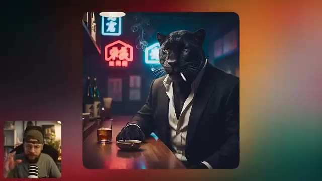
*Image générée par IA montrant une panthère anthropomorphe en costume fumant une cigarette dans un bar au néon, avec Jack visible en médaillon PiP en bas à gauche.*

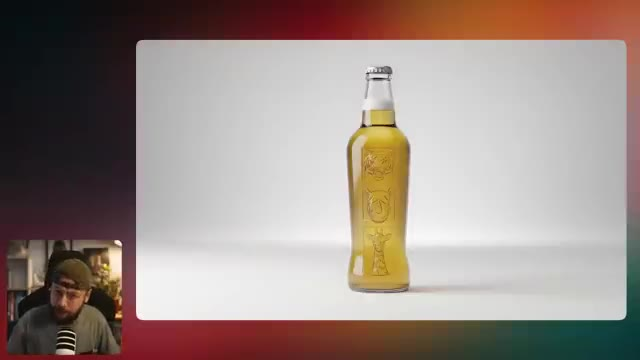
*Rendu visuel d'une bouteille de bière haut de gamme transparente sur fond blanc, présentée par Jack dont le retour caméra PiP apparaît en bas à gauche.*

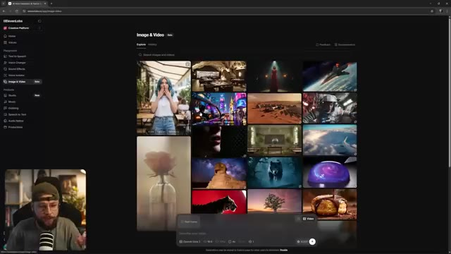
*Interface de la plateforme ElevenLabs (« Image & Video ») affichant une galerie de créations de la communauté et les options de génération, avec Jack en médaillon PiP.*

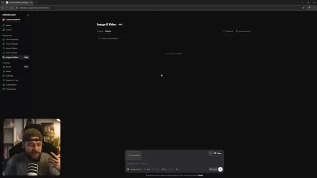
*Interface d'ElevenLabs montrant la transition vers l'onglet « History » (historique) pour afficher les créations personnelles de Jack, avec son retour caméra PiP en bas à gauche.*

---

### ⏱️ `[00:02:37 - 00:03:11]` | Segment #08

**🔊 Audio (Transcription Intégrale Mot pour Mot en Français) :**
> dans la plateforme. La première chose que je voulais faire était en fait de créer notre produit. Donc pour ce faire, vous pouvez voir au bas de l'écran, il y a un onglet où nous pouvons basculer vers la création d'images et par défaut, cela va directement à nano banana et vous pouvez voir ici certaines de mes générations initiales si nous survolons un texte de prompt, cela va révéler l'intégralité du texte et si nous cliquons dessus, cela va remplir cette zone au bas de la page donc vous pouvez voir le prompt que j'ai utilisé pour obtenir ces images j'ai fini par faire de petits ajustements ici et là au fur et à

**👁️ Analyse Visuelle d'Écran (gemini-3.5-flash-lite) :**
**Interface & Outils** : Interface web d'ElevenLabs (Creative Platform, onglet Image & Video).

**Contenu textuel & Code** : Modèle IA sélectionné : 'Google Nano Banana', format 16:9, paramètres de génération, et texte de prompt détaillé visible lors du survol de l'image.

**Action / Démonstration** : Le créateur montre la navigation dans la galerie de générations d'images, met en valeur les différents modèles de bouteilles et démontre comment afficher le prompt textuel en survolant une image.

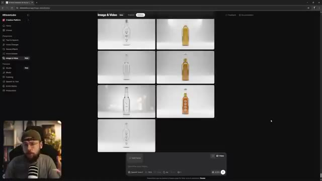
*Interface d'ElevenLabs affichant une galerie de générations d'images de bouteilles avec le présentateur en incrustation.*

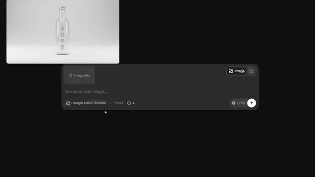
*Gros plan sur la zone de prompt de l'interface avec le modèle sélectionné 'Google Nano Banana' et une image de référence en haut à gauche.*

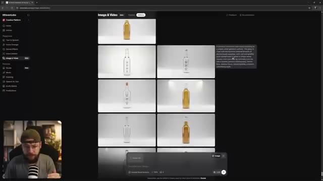
*Interface d'ElevenLabs montrant le survol d'une vignette de génération avec l'infobulle affichant le prompt textuel complet.*

---

### ⏱️ `[00:03:11 - 00:03:47]` | Segment #09

**🔊 Audio (Transcription Intégrale Mot pour Mot en Français) :**
> développé le concept plus loin, vous pouvez voir qu'à l'origine j'allais opter pour quatre animaux différents sur la bière et tout au long de la publicité également, je n'arrêtais pas de remarquer que Nano Banana voulait que j'aie trois images sur la bouteille. Je ne sais pas, j'ai juste pris ça comme un petit signe que la règle de trois est peut-être la voie à suivre plutôt que d'avoir trop de personnages différents. Et donc au fil du temps, je réfléchis aux animaux spécifiques que je veux, combien j'en veux, et finalement je me suis fixé sur le tigre, le rhinocéros et

**👁️ Analyse Visuelle d'Écran (gemini-3.5-flash-lite) :**
**Interface & Outils** : Interface web d'ElevenLabs (section Image & Video) avec affichage d'une grille d'historique de générations d'images et une vue détaillée agrandie. En bas à gauche, incrustation vidéo (PiP) du créateur en studio.

**Contenu textuel & Code** : Texte du prompt visible : "A premium minimalist beer bottle standing on a simple white gradient surface. The glass is clear, with beer inside of it, and features minimal artwork of animal heads (panther, wolf, owl and giraffe)..." Paramètres affichés : Google Nano Banana, 16:9.

**Action / Démonstration** : Le créateur navigue dans sa galerie d'historique de générations d'images, sélectionne une image de bouteille pour l'agrandir et examiner le design des animaux.

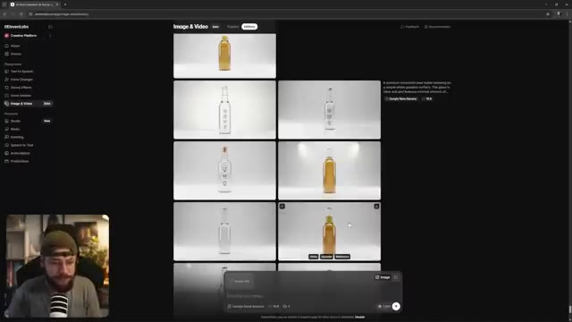
*Galerie d'images générées de bouteilles de bière sur l'interface de ElevenLabs, avec le créateur en incrustation PiP.*

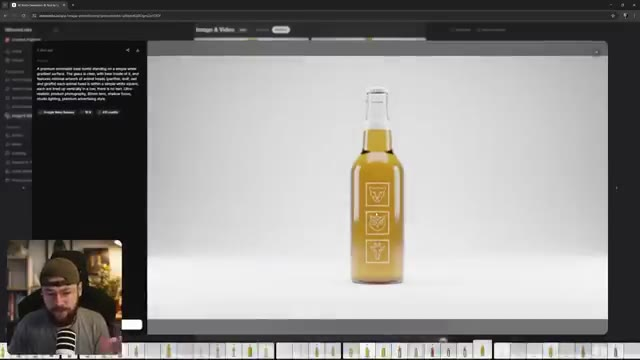
*Vue agrandie d'une image de bouteille de bière montrant trois icônes d'animaux alignées verticalement, avec le panneau de prompt latéral.*

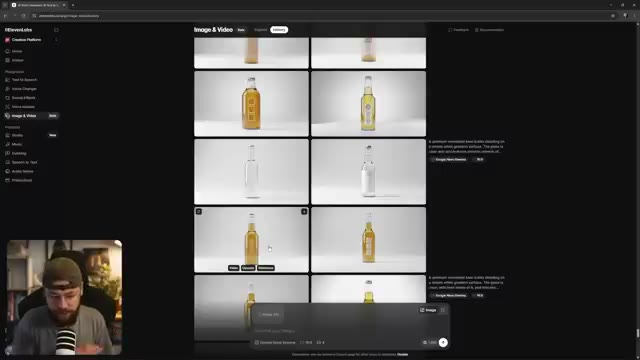
*Retour à la vue de la grille de la galerie d'images sur ElevenLabs montrant les différentes itérations de bouteilles.*

---

### ⏱️ `[00:03:47 - 00:04:22]` | Segment #10

**🔊 Audio (Transcription Intégrale Mot pour Mot en Français) :**
> girafe donc toutes sortes d'animaux de safari et à l'origine j'étais vraiment intéressé à l'idée d'avoir simplement ce genre de look d'étiquette imprimée vous pouvez voir que c'est l'un des anciens designs mais à mesure que nous avançons dans mes générations ce genre de look bien sûr nous voulons une bière qui donne une sensation aussi premium que possible donc quelque chose comme ça ce n'est pas vraiment l'ambiance que je recherchais beaucoup d'essais et d'erreurs et d'expérimentations pour arriver au résultat final j'aimais beaucoup cette génération aussi et comme nous continuons à

**👁️ Analyse Visuelle d'Écran (gemini-3.5-flash-lite) :**
**Interface & Outils** : Interface web d'ElevenLabs ("Image & Video" > "History") avec un panneau de prompt et de paramètres sur le côté, et une vue en grille des créations.

**Contenu textuel & Code** : Historique de générations montrant différentes variations de bouteilles de bière sur fond blanc. Texte de prompt visible sur l'image 3 détaillant un design minimaliste avec des têtes d'animaux (Tiger, Rhino, Giraffe) et les paramètres du modèle ("Google Nano Banana", ratio 16:9).

**Action / Démonstration** : Le créateur navigue et défile à travers l'historique de ses générations d'images de bouteilles de bière sur la plateforme ElevenLabs pour illustrer ses propos sur l'évolution du design.

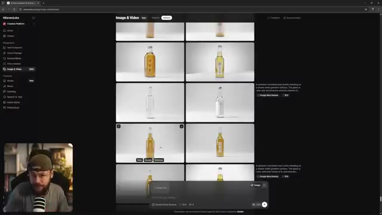
*Interface d'ElevenLabs affichant une grille d'historique de générations d'images de bouteilles avec le créateur en incrustation PiP.*

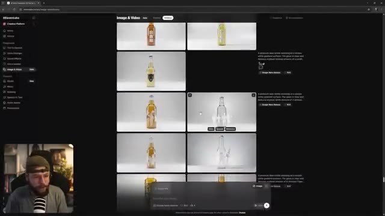
*Interface d'ElevenLabs montrant le défilement dans l'historique des générations d'images de bouteilles avec le créateur en incrustation PiP.*

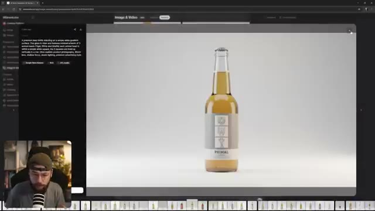
*Interface d'ElevenLabs affichant en grand format une image générée d'une bouteille de bière avec son panneau de prompt latéral et le créateur en PiP.*

---

### ⏱️ `[00:04:22 - 00:04:40]` | Segment #11

**🔊 Audio (Transcription Intégrale Mot pour Mot en Français) :**
> faites défiler vers le haut ce sur quoi j'ai fini par me fixer, c'était d'avoir en fait le design comme embossé ou sculpté dans le verre lui-même, juste parce que je pensais que ce processus serait plus coûteux que de simplement imprimer une étiquette. Et par conséquent, cela dégage une ambiance plus haut de gamme.

**👁️ Analyse Visuelle d'Écran (gemini-3.5-flash-lite) :**
**Interface & Outils** : Navigateur web affichant la plateforme de création ElevenLabs (section Image & Video).

**Contenu textuel & Code** : Texte du prompt visible sur l'image 2 décrivant une bouteille de bière premium sur fond blanc dégradé avec un design gravé dans le verre (têtes d'animaux : tigre, biche et loup).

**Action / Démonstration** : Le créateur navigue dans la galerie de générations d'images sur ElevenLabs et clique sur l'une des images pour l'agrandir et voir le prompt associé.

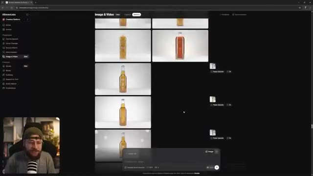
*Interface d'ElevenLabs affichant une grille d'images générées de bouteilles avec le présentateur visible en incrustation PiP.*

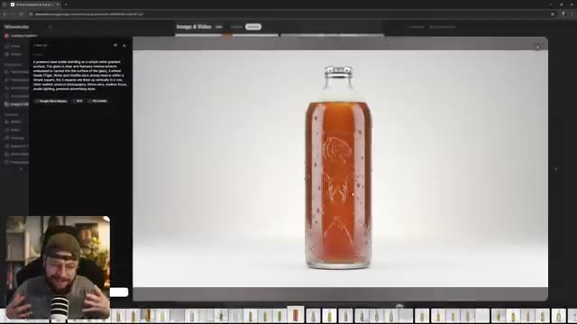
*Gros plan sur une bouteille générée avec le panneau de prompt détaillé sur le côté gauche et le présentateur en PiP.*

---

### ⏱️ `[00:04:40 - 00:05:01]` | Segment #12

**🔊 Audio (Transcription Intégrale Mot pour Mot en Français) :**
> Finalement, nous avons abouti à ce design et j'en étais vraiment très heureux. Et si je me déplace simplement sur le côté droit ici, vous pouvez voir que nous avons l'option soit d'utiliser cette image comme référence, de cliquer ici pour recréer ou la transformer en vidéo, soit d'aller faire un upscale.

**👁️ Analyse Visuelle d'Écran (gemini-3.5-flash-lite) :**
**Interface & Outils** : Interface web de génération d'image et vidéo (type ElevenLabs ou outil similaire), comportant un panneau latéral avec un prompt et des options de format, ainsi qu'une incrustation vidéo (PiP) du présentateur en bas à gauche.

**Contenu textuel & Code** : Texte du prompt visible dans le panneau de gauche décrivant une bouteille de bière de qualité supérieure sur un fond blanc simple, incluant des détails sur l'étgravure sur verre (têtes d'animaux : tigre, rhino, girafe) et des paramètres de rendu (photographie de produits, objectif 85 mm, éclairage de studio). En bas, des options de format (1:1) et le coût en crédits (415).

**Action / Démonstration** : Le créateur présente l'image générée d'une bouteille de bière sur son écran et explique les différentes options disponibles (référence, recréation, vidéo, upscale).

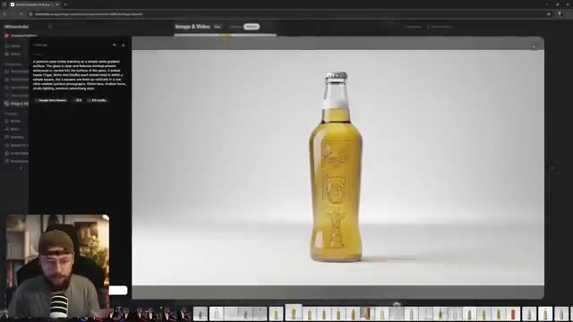
*Interface de l'application affichant l'image générée d'une bouteille de bière avec le panneau latéral du prompt et les options de réutilisation, avec en incrustation (PiP) le créateur dans son studio.*

---

### ⏱️ `[00:05:01 - 00:05:19]` | Segment #13

**🔊 Audio (Transcription Intégrale Mot pour Mot en Français) :**
> L'outil de mise à l'échelle intégré dans ElevenLabs est Topaz, dont je suis sûr que vous êtes assez familiers. C'est donc sur cela que nous nous sommes arrêtés. C'était notre produit final. Et nous avons fini par l'appeler Ark ou Ark Brew pour faire un clin d'œil à toute cette idée de l'arche de Noé.

**👁️ Analyse Visuelle d'Écran (gemini-3.5-flash-lite) :**
**Interface & Outils** : Interface web d'ElevenLabs (section Image & Video) et visionneuse d'images, avec un encadré PiP (Picture-in-Picture) du créateur en bas à droite.

**Contenu textuel & Code** : Galerie d'images générées de bouteilles sur fond blanc. Texte visible : "A cinematic slow motion panning on a modern white gradient surface. The product is clear glass featuring minimal brewery elements on care..." Boutons de téléchargement et paramètres (Seed, dimensions, etc.).

**Action / Démonstration** : Le créateur montre la plateforme ElevenLabs avec les différentes options de génération de bouteilles, puis affiche le rendu final de la bouteille "Ark Brew".

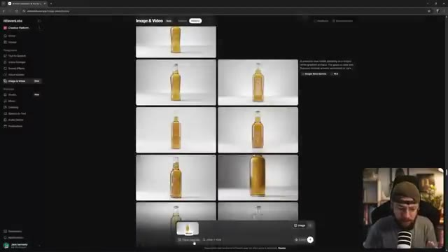
*Interface d'ElevenLabs affichant une galerie de générations d'images et de vidéos de bouteilles avec incrustation vidéo du présentateur (PiP).*

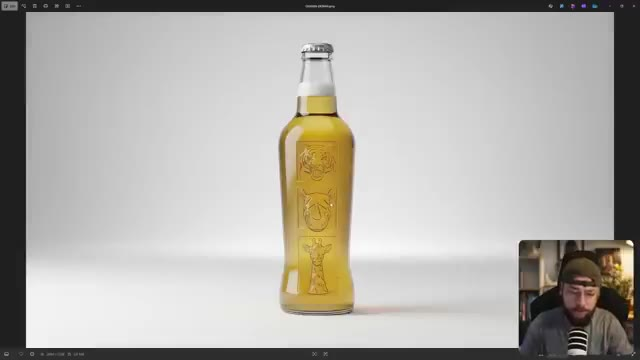
*Affichage en plein écran d'une bouteille de bière finale (Ark Brew) gravée avec des motifs d'animaux, avec incrustation vidéo du présentateur (PiP).*

---

### ⏱️ `[00:05:20 - 00:05:40]` | Segment #14

**🔊 Audio (Transcription Intégrale Mot pour Mot en Français) :**
> Et maintenant la prochaine étape était de commencer à créer nos personnages. Vous pouvez donc voir le prompt textuel. J'utilisais une image photoréaliste d'un tigre du Bengale dans un smoking noir parfaitement ajusté et une chemise blanche ouverte. Vous pouvez donc voir que pour ces générations initiales, j'utilisais en fait C Dream et cela a donné un résultat plus réaliste.

**👁️ Analyse Visuelle d'Écran (gemini-3.5-flash-lite) :**
**Interface & Outils** : Interface web d'ElevenLabs (section Image & Video) avec menu latéral gauche et grille de résultats de génération d'images.

**Contenu textuel & Code** : Texte du prompt visible : "Photoreal image of a Bengal tiger in a perfectly tailored black tuxedo and open white shirt, standing at a neon-lit rooftop bar overlooking a city at night, one paw resting on the counter..."

**Action / Démonstration** : Le créateur montre son écran d'ordinateur présentant les différentes générations d'images de tigres et zoome sur le texte du prompt utilisé dans l'outil.

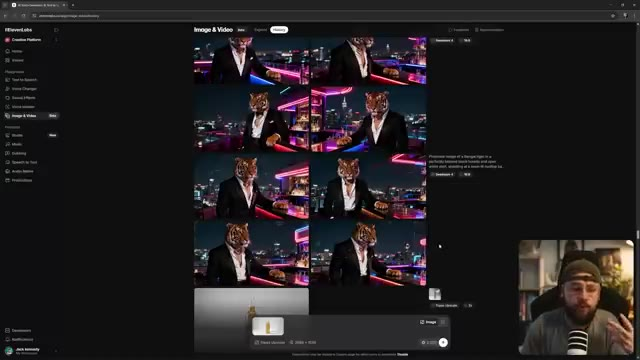
*Interface d'ElevenLabs affichant une grille d'images générées d'un tigre habillé dans un bar sur un toit, avec le créateur en incrustation (PiP).*

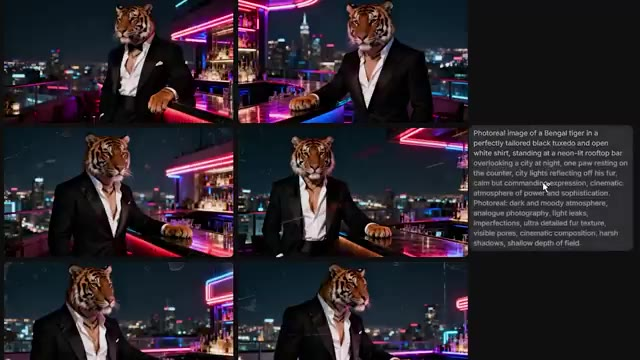
*Gros plan sur la grille d'images et le texte du prompt détaillé affiché à l'écran.*

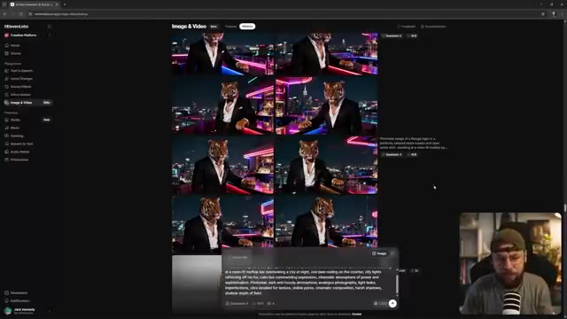
*Retour à l'interface complète d'ElevenLabs avec la sélection du prompt en bas et le créateur en incrustation (PiP).*

---

### ⏱️ `[00:05:40 - 00:06:01]` | Segment #15

**🔊 Audio (Transcription Intégrale Mot pour Mot en Français) :**
> Mais je ne sais pas ce que c'est. Ce que j'ai un peu remarqué avec C Dream, c'est que la texture de la fourrure n'avait pas l'air terrible. C'était un peu vaseux, pour ainsi dire. Et en remontant, vous me verrez commencer à expérimenter avec Nano Banana à la place. Continuons à faire défiler. Oui, vous pouvez voir qu'éventuellement nous commençons à jouer avec Nano Banana et ça n'a pas l'air si réel.

**👁️ Analyse Visuelle d'Écran (gemini-3.5-flash-lite) :**
**Interface & Outils** : Interface web de génération d'images et vidéos (ElevenLabs / Creative Platform) avec une disposition en grille de miniatures et un volet de prévisualisation détaillé.

**Contenu textuel & Code** : On peut lire un prompt partiel sur le panneau latéral : « Photorealistic image of a Bengal tiger in a perfectly tailored black tuxedo and open white shirt, standing at a neon-lit rooftop bar overlooking a city at night, one paw resting on the counter... » avec des paramètres de modèle comme Seedance 4 et le format 16:9.

**Action / Démonstration** : Le créateur présente les résultats de génération d'images, zoome sur les détails de la fourrure d'un tigre généré par IA, puis fait défiler une grille de différentes versions générées.

*Interface d'un outil de génération d'images et de vidéos par IA affichant un visuel en gros plan d'un tigre anthropomorphe en costume et chemise blanche accoudé à un bar sur un toit avec une ville nocturne en arrière-plan, avec le créateur visible en incrustation (PiP) dans le coin inférieur droit.*

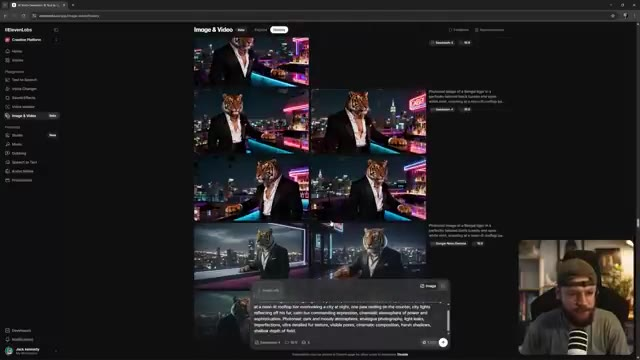
*Interface du même outil montrant une grille de plusieurs variations d'images de l'homme-tigre dans le bar sur le toit, avec le créateur en incrustation dans le coin inférieur droit.*

---

### ⏱️ `[00:06:01 - 00:06:36]` | Segment #16

**🔊 Audio (Transcription Intégrale Mot pour Mot en Français) :**
> mais j'aime bien le côté stylisé et la texture de la fourrure a l'air beaucoup mieux à mon avis. Donc encore une fois il y a ce genre de processus itératif où j'essaie de trouver cette image de départ initiale. C'est vraiment important parce que c'est la toute première chose que vous allez voir dans toute la publicité et l'intention bien sûr est le même flux de travail que je suis personnellement pour à peu près tout le travail d'IA que je fais. C'est de générer des images pour agir comme notre image de départ. Donc par exemple c'est la première image que j'ai générée et que j'ai vraiment adorée et qui s'est avérée être le départ

**👁️ Analyse Visuelle d'Écran (gemini-3.5-flash-lite) :**
**Interface & Outils** : Interface web d'ElevenLabs (Creative Platform / Image & Video).

**Contenu textuel & Code** : Texte du prompt visible dans l'interface : « A Bengal Tiger in a sharp black tailored suit, open white shirt, sitting at a dirty lit Japanese neon bar, deep blue and red neon reflections... ».

**Action / Démonstration** : Le créateur navigue et zoome sur les différentes images générées pour comparer les textures et les détails du tigre afin de sélectionner la meilleure image de départ.

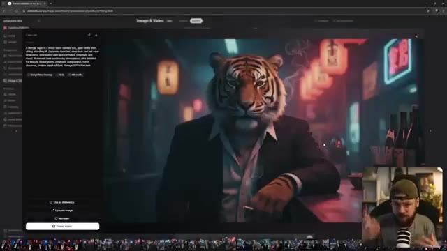
*Interface d'ElevenLabs (génération d'images et vidéos) affichant un gros plan sur une image générée d'un tigre anthropomorphe en costume dans un bar néon.*

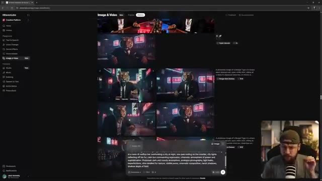
*Interface d'ElevenLabs montrant une galerie de plusieurs images générées de tigres dans un bar avec des panneaux lumineux.*

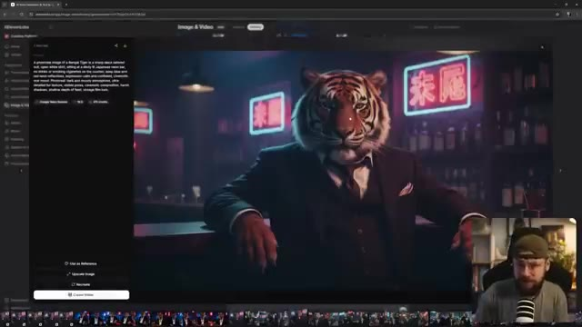
*Gros plan sur une variante d'image générée montrant un tigre humanoïde dans un bar avec des enseignes lumineuses au néon.*

---

### ⏱️ `[00:06:36 - 00:07:10]` | Segment #17

**🔊 Audio (Transcription Intégrale Mot pour Mot en Français) :**
> image de toute la publicité donc ouais c'était un peu la première étape la création des images qu'on allait ensuite animer vous pouvez voir plein d'images du tigre et à la fin on commence à voir notre personnage de rhinocéros aussi mais plutôt que de vous montrer simplement des choses qu'on a déjà construites je me suis dit qu'on allait construire le personnage de girafe ensemble donc quand vous regardez cette publicité je n'ai pas encore créé tous ces plans. On va faire ça maintenant tout au long de la vidéo. Donc si on y va et qu'on fait juste défiler tout en haut de la page, je vais aller déposer mon

**👁️ Analyse Visuelle d'Écran (gemini-3.5-flash-lite) :**
**Interface & Outils** : Interface web d'ElevenLabs (section Image & Video), avec un panneau latéral gauche sombre et une vue en grille des créations d'images au centre, et un encadré PiP (Picture-in-Picture) du créateur en bas à droite.

**Contenu textuel & Code** : Dans la section principale : grille de 6 vignettes montrant un personnage anthropomorphe à tête de tigre vêtu d'un costume noir élégant, assis dans un bar éclairé par des enseignes au néon. Dans le panneau de droite, on aperçoit une description textuelle (prompt) : « A photorealistic image of a Bengal Tiger in a sharp black tailored suit... » et des boutons d'options (Trace Upscale, etc.). En bas à droite, la caméra PiP montre le présentateur (Jack Kennedy) parlant face caméra.

**Action / Démonstration** : Le créateur navigue dans l'historique de ses images générées sur ElevenLabs, montrant différentes variations du personnage de tigre dans un bar, tout en expliquant le processus de création de la publicité.

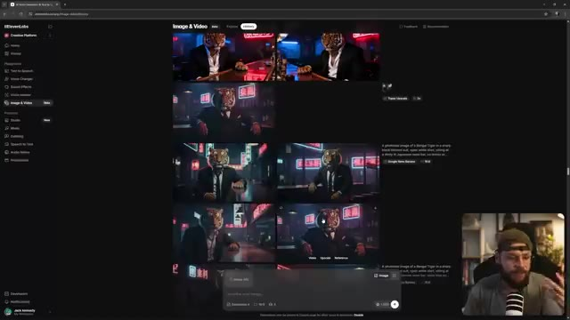
*Interface d'ElevenLabs (section Image & Video) affichant une grille d'images d'un homme à tête de tigre dans un bar au néon, avec la caméra PiP du créateur dans le coin inférieur droit.*

---

### ⏱️ `[00:07:10 - 00:07:46]` | Segment #18

**🔊 Audio (Transcription Intégrale Mot pour Mot en Français) :**
> invite textuelle. Il y est écrit, image photoréaliste d'une girafe en smoking bleu et col roulé, adossée à une table de poker aux enjeux élevés dans un club cher et exclusif. Et la fin du prompt est quelque chose que je réutilise toujours. Si vous avez déjà vu mes vidéos, je n'arrête pas de rabâcher qu'il faut mettre ceci à la fin de mes invites textuelles. Photoréaliste, texture de fourrure ultra détaillée, pores visibles, composition cinématographique, ombres dures, faible profondeur de champ. Maintenant pour l'image de référence, ce que je vais réellement faire, c'est insérer cette image ici de notre personnage principal,

**👁️ Analyse Visuelle d'Écran (gemini-3.5-flash-lite) :**
**Interface & Outils** : Interface web d'ElevenLabs (section Image & Video) avec une fenêtre modale d'édition de prompt et l'explorateur de fichiers Windows.

**Contenu textuel & Code** : Texte du prompt affiché : « Photoreal image of a giraffe in a blue tuxedo and turtleneck, leaning back at a high-stakes poker table in a expensive and exclusive club, cards in one paw, stacks of chips in front of him, confident half-smile, gold watch glinting in the light, luxurious scene. Photoreal: ultra detailed fur texture, visible pores, cinematic composition, harsh shadows, shallow depth of field. » Modèle : Seedream 4. Format : 16:9.

**Action / Démonstration** : Le créateur survole et lit le texte de son prompt textuel, puis ouvre l'explorateur de fichiers pour sélectionner une image de référence pour son personnage.

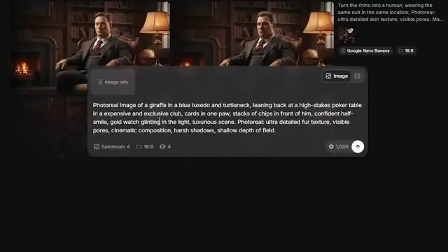
*Gros plan sur l'interface d'édition du prompt textuel détaillant la description de la girafe au poker.*

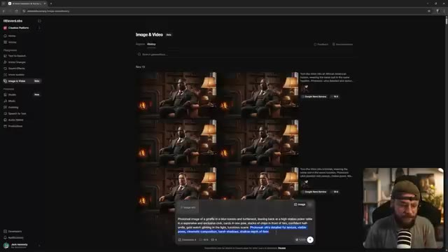
*Vue de l'interface d'ElevenLabs (Image & Video) avec la fenêtre de prompt agrandie et la webcam du créateur en bas à droite.*

*Gros plan sur le prompt textuel décrivant la scène de poker avec la girafe et les paramètres de génération.*

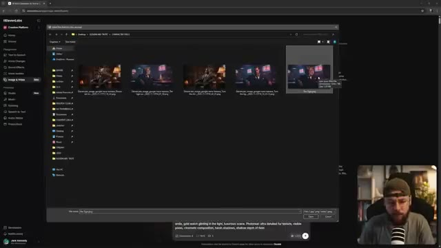
*Ouverture de l'explorateur de fichiers par-dessus l'interface d'ElevenLabs pour sélectionner l'image de référence du personnage.*

---

### ⏱️ `[00:07:46 - 00:08:20]` | Segment #19

**🔊 Audio (Transcription Intégrale Mot pour Mot en Français) :**
> le tigre, juste pour essayer d'obtenir une ambiance similaire essentiellement. Donc on va juste faire charger ça là. Vers le bas, vous pouvez voir qu'on peut sélectionner notre modèle parmi une variété de différents modèles de génération d'images intégrés dans ElevenLabs. Je vais bien sûr choisir Google Nano Banana mais vous pouvez voir qu'on a l'option Seedream 4 si on veut un rendu plus réaliste et même GPT Image 1, Flux 1 Kontext Pro également. On va choisir Google Nano Banana. On veut vraiment s'assurer qu'on effectue le rendu dans un format 16 par 9 et on peut aussi sélectionner la quantité de générations que nous

**👁️ Analyse Visuelle d'Écran (gemini-3.5-flash-lite) :**
**Interface & Outils** : Interface web d'ElevenLabs (section Image & Video) avec explorateur de fichiers système ouvert et menu de sélection des modèles d'IA.

**Contenu textuel & Code** : Noms des modèles visibles : Google Nano Banana, Seedream 4, OpenAI GPT Image 1, Flux 1 Kontext Pro, Wan 2.5. Paramètres de format 16:9 et prompt descriptif visible partiellement en bas.

**Action / Démonstration** : Le créateur navigue dans l'explorateur de fichiers pour importer une image de tigre, puis ouvre le menu de sélection des modèles de génération d'images dans ElevenLabs.

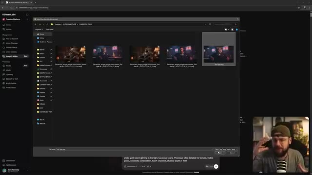
*Interface d'ElevenLabs affichant une fenêtre de sélection de fichiers pour importer l'image d'un tigre, avec Jack visible en bas à droite dans un encadré.*

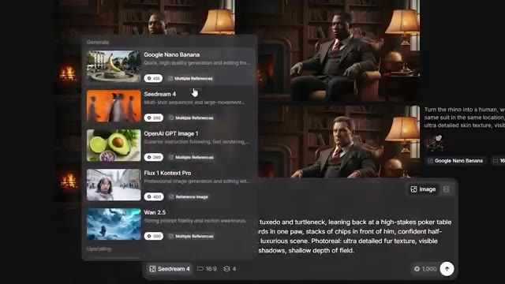
*Menu déroulant de sélection des modèles de génération d'images sur ElevenLabs (Google Nano Banana, Seedream 4, OpenAI GPT Image 1, Flux 1 Kontext Pro, Wan 2.5).*

---

### ⏱️ `[00:08:20 - 00:08:57]` | Segment #20

**🔊 Audio (Transcription Intégrale Mot pour Mot en Français) :**
> Je vais y revenir. En général, quand il s'agit d'images, je préfère utiliser 4 [générations] parce qu'on dépense de toute façon moins de crédits que si l'on générait une vidéo par exemple. Alors, allons-y, lançons cette génération et voyons ce qu'on obtient pour notre personnage de girafe. Ouais, donc vous pouvez voir que Nano Banana a un peu de mal avec ça ici. On obtient un sabot posé sur la table, mais à chaque fois qu'on essaie de faire tenir les cartes par notre girafe, ça ne fonctionne tout simplement pas. Du coup, comme ce n'est pas rédhibitoire, je vais simplement essayer d'enlever toute mention de cartes.

**👁️ Analyse Visuelle d'Écran (gemini-3.5-flash-lite) :**
**Interface & Outils** : Interface web de génération d'images par IA (Google Nano Banana) affichant des grilles de résultats, des prompts textuels et des options de modification (création vidéo, use as reference, etc.), avec la webcam du créateur en incrustation PiP sur l'image #2.

**Contenu textuel & Code** : Prompt visible : "Photoreal image of a giraffe in a blue tuxedo and turtleneck, leaning back at a high-stakes poker table in a expensive and exclusive club, cards in one paw, stacks of chips in front of him, confident half-smile, gold watch glinting in the light, luxurious scene. Photoreal: ultra detailed fur texture, visible pores, cinematic composition, harsh shadows, shallow depth of field." Paramètres : modèle Google Nano Banana, format 16:9, nombre de crédits/générations (4), compteur (1,764).

**Action / Démonstration** : Le créateur montre l'interface de génération d'images, navigue à travers les résultats obtenus avec le modèle Google Nano Banana et commente les difficultés de l'IA à rendre correctement les cartes tenues par la girafe.

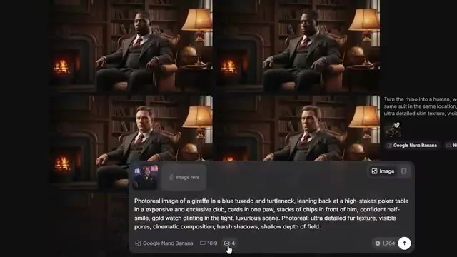
*Interface d'un générateur d'images IA (Google Nano Banana) affichant une grille de quatre images générées d'un homme en costume devant une cheminée, avec une boîte de dialogue contenant le prompt détaillé.*

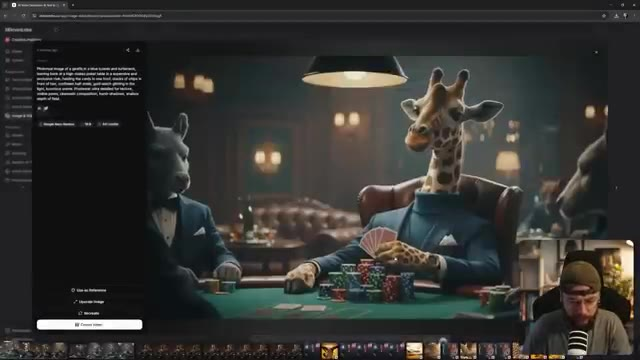
*Interface du navigateur affichant l'image générée d'une girafe anthropomorphe en costume jouant au poker dans un casino, avec Jack visible en incrustation (PiP) dans le coin inférieur droit.*

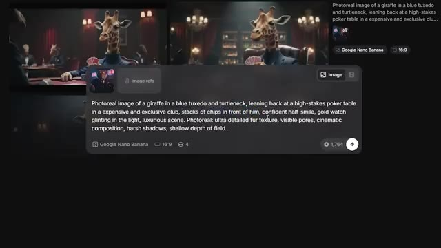
*Interface montrant des résultats de génération d'images avec le modèle Google Nano Banana et le prompt textuel superposé au centre.*

---

### ⏱️ `[00:08:57 - 00:09:16]` | Segment #21

**🔊 Audio (Transcription Intégrale Mot pour Mot en Français) :**
> et on va juste lancer quatre autres générations. Ouais. Donc on galère toujours. Je veux juste essayer de mettre, il a des sabots pour mains. Est-ce que ce serait des sabots ou des sabots ? Je ne sais pas quel est le pluriel de ce mot. D'accord. Donc on commence maintenant à récupérer le type de génération qu'on recherche.

**👁️ Analyse Visuelle d'Écran (gemini-3.5-flash-lite) :**
**Interface & Outils** : Navigateur web affichant l'interface de la plateforme de génération d'images d'ElevenLabs (section Image & Video), avec le créateur en incrustation vidéo (PiP) dans le coin inférieur droit.

**Contenu textuel & Code** : Le prompt visible dans l'interface indique : "Photoreal image of a giraffe in a blue tuxedo and turtleneck, leaning back at a high-stakes poker table in a expensive and exclusive club, stacks of chips in front of him, confident half-smile, gold watch glinting in the light, luxurious scene. Photoreal: ultra detailed fur texture, visible pores, cinematic composition, harsh shadows, shallow depth of field." Le modèle utilisé est "Google Nano Banana" au format 16:9.

**Action / Démonstration** : Le créateur navigue dans l'historique des générations d'images sur ElevenLabs, clique pour inspecter une image spécifique en détail et examine le résultat de la modification du prompt intégrant des sabots ("hoofs for hands").

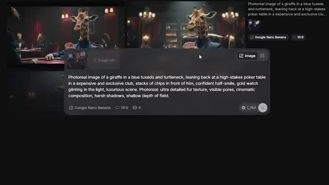
*Gros plan sur l'interface d'ElevenLabs affichant les détails d'une image générée avec le prompt textuel sur une girafe jouant au poker.*

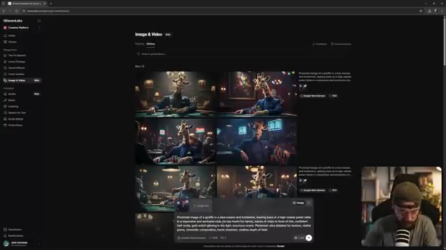
*Vue d'ensemble de l'interface d'ElevenLabs montrant une grille de générations d'images avec Jack en incrustation (PiP) dans le coin inférieur droit.*

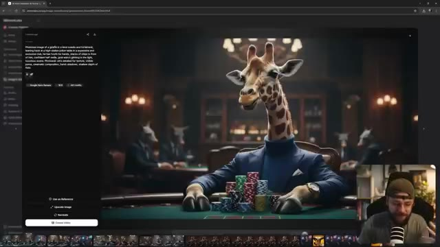
*Visualisation en plein écran d'une des images générées montrant une girafe en costume avec des sabots à la place des mains posés sur une table de poker, avec Jack en incrustation (PiP).*

---

### ⏱️ `[00:09:16 - 00:09:42]` | Segment #22

**🔊 Audio (Transcription Intégrale Mot pour Mot en Français) :**
> J'aime vraiment beaucoup celui-ci et nous avons des sortes de personnages de chiens effrayants en arrière-plan. J'aime assez cela. Celui-ci ici pose un peu problème avec les mains et il y a en fait des gens derrière notre personnage, ce dont nous ne voulons pas vraiment. Je pense que nous allons utiliser cette image ici. J'aime vraiment beaucoup. Donc maintenant nous pouvons aller cliquer sur l'onglet créer une vidéo et vous allez voir que l'image que nous venons de générer est utilisée comme image de départ.

**👁️ Analyse Visuelle d'Écran (gemini-3.5-flash-lite) :**
**Interface & Outils** : Interface web d'un générateur d'images et de vidéos par IA avec le flux caméra du présentateur en incrustation (PiP).

**Contenu textuel & Code** : Prompt visible : "Photoreal image of a giraffe in a blue suede and turtleneck, leaning back at a high-stakes poker table in a expensive and exclusive club..." Paramètres visibles : 16:9, 720p, 4s, modèle OpenAI Sora 2 ou similaire.

**Action / Démonstration** : Le créateur examine différentes options d'images générées, commente les détails (mains, personnages en arrière-plan) et s'apprête à cliquer sur l'onglet pour créer une vidéo à partir de l'image sélectionnée.

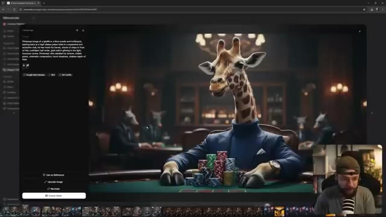
*Interface d'un générateur d'images montrant une girafe humanoïde jouant au poker avec des chiens en arrière-plan, avec le flux vidéo incrusté du créateur en bas à droite.*

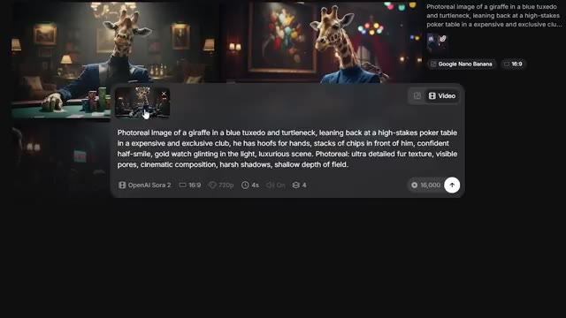
*Interface utilisateur affichant une boîte de dialogue avec un prompt textuel détaillé et l'option de création vidéo (onglet "Video").*

---

### ⏱️ `[00:09:42 - 00:10:02]` | Segment #23

**🔊 Audio (Transcription Intégrale Mot pour Mot en Français) :**
> Nous voulons effacer notre prompt textuel parce que ce n'est pas ce que nous voulons, et nous pouvons aller de l'avant et sélectionner notre modèle. Je vais utiliser Google Veo 3.1. Format d'image, 16 par 9. Nous voulons opter pour une résolution 1080p. En termes de durée de rendu, je vous suggère d'opter pour six secondes.

**👁️ Analyse Visuelle d'Écran (gemini-3.5-flash-lite) :**
**Interface & Outils** : Interface web d'ElevenLabs (section Image & Video) avec un encadré PiP du créateur dans le coin inférieur droit.

**Contenu textuel & Code** : Modèle affiché : Google Veo 3.1, format 16:9, résolution réglée sur 720p (avec option 1080p), durée de 4s modifiable, et prompt visible sur le côté droit décrivant une girafe en smoking bleu jouant au poker.

**Action / Démonstration** : Le curseur de la souris clique sur le menu de sélection de la résolution pour passer de 720p à 1080p et configure les paramètres de rendu vidéo.

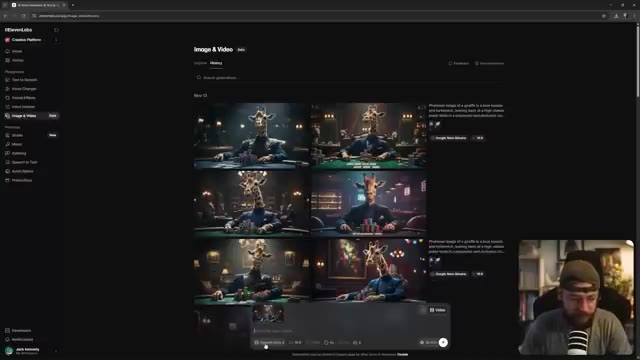
*Interface d'ElevenLabs (Image & Video) montrant l'historique des générations avec des images de girafes jouant au poker et le créateur visible en incrustation PiP.*

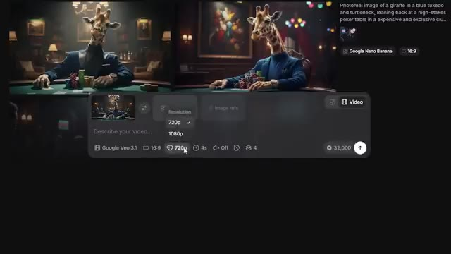
*Gros plan sur le panneau de configuration vidéo d'ElevenLabs montrant le menu déroulant de sélection de la résolution entre 720p et 1080p.*

---

### ⏱️ `[00:10:02 - 00:10:37]` | Segment #24

**🔊 Audio (Transcription Intégrale Mot pour Mot en Français) :**
> Et c'est parce que si vous voulez utiliser la fonctionnalité de changement de voix, ce que j'ai fini par faire, vous devez vous assurer que vos générations durent au moins cinq secondes sur Eleven Labs. Si elles font moins que ça, vous n'aurez pas l'option pour le changement de voix, la suppression du bruit de fond et toutes ces fonctionnalités utiles. Nous voulons nous assurer que notre son est activé et en termes de quantité de générations, j'opte généralement pour deux. Je pense que quatre c'est un peu excessif et je viens de faire défiler la page jusqu'en bas parce que je veux vous emmener également dans mon processus de test initial pour savoir comment

**👁️ Analyse Visuelle d'Écran (gemini-3.5-flash-lite) :**
**Interface & Outils** : Interface web d'ElevenLabs ("Image & Video" - Creative Platform).

**Contenu textuel & Code** : Historique de générations ("History"), paramètres visibles : modèle (Google Veo 3.1, Kling 2.5), format (16:9), résolution (1080p, 720p), durée (6s), son (On), nombre de générations (2 ou 4), zone de saisie "Describe your video...".

**Action / Démonstration** : Le créateur présente l'interface d'ElevenLabs, zoome sur les paramètres de génération vidéo (durée de 5 secondes minimum, nombre de générations réglé sur 2) et fait défiler la page vers le bas pour montrer ses tests.

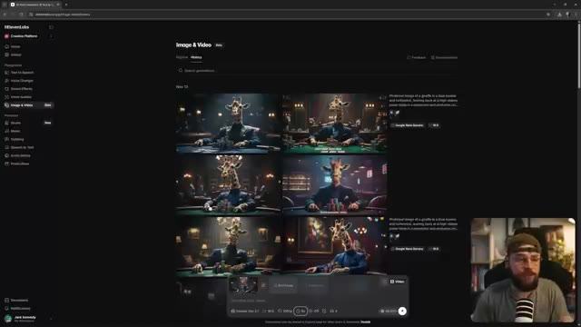
*Interface d'ElevenLabs (Image & Video) montrant l'historique de génération avec des images de girafes dans un casino et le panneau de configuration vidéo en bas.*

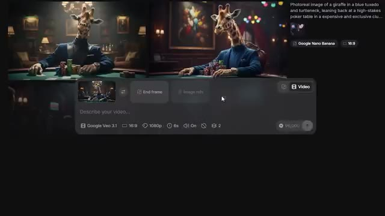
*Gros plan sur le panneau de configuration vidéo d'ElevenLabs montrant les paramètres (Google Veo 3.1, format 16:9, 1080p, durée de 6s, son activé, 2 générations).*

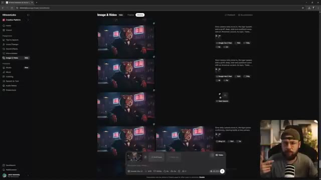
*Interface d'ElevenLabs montrant l'historique de génération avec des images d'un tigre anthropomorphe dans un bar néon et le panneau de configuration vidéo.*

---

### ⏱️ `[00:10:37 - 00:11:12]` | Segment #25

**🔊 Audio (Transcription Intégrale Mot pour Mot en Français) :**
> Nous avons continué et fait notre doublage ou synchronisation labiale parce que mon plan initial était d'utiliser la fonction de synthèse vocale d'Eleven Labs. Je générerais donc les répliques simplement sous forme de fichier audio. Et j'avais prévu de les synchroniser labialement sur nos personnages. Et si nous descendons à la fonction de sélection de modèle, et que je fais juste défiler un peu vers le bas, vous pouvez voir qu'il y a deux modèles différents disponibles pour la synchronisation labiale. Nous avons Veed Lip Sync et OmniHuman 1.5. Maintenant, le problème avec OmniHuman, c'est que ça ne voulait même pas générer, ça ne fonctionnait pas. Je n'arrêtais pas d'obtenir ce message d'erreur disant

**👁️ Analyse Visuelle d'Écran (gemini-3.5-flash-lite) :**
**Interface & Outils** : Interface web d'Eleven Labs (section Image & Video) avec un panneau contextuel de sélection de modèles (Seedance 1 Pro, Wan 2.5, OmniHuman 1.5, Veed Lipsync, Topaz Upscale).

**Contenu textuel & Code** : Noms des modèles de lip syncing visibles : "OmniHuman 1.5" (Humane-like lip-sync generated from an image) et "Veed Lipsync" (Fast, affordable and precise lip-syncing for...). Paramètres de génération vidéo avec Google Veo 3.1.

**Action / Démonstration** : Le créateur navigue dans l'interface d'Eleven Labs, ouvre le menu des modèles et montre les options de synchronisation labiale disponibles (OmniHuman 1.5 et Veed Lipsync).

*Interface d'Eleven Labs montrant l'historique des images et vidéos générées, avec le créateur en bas à droite en incrustation.*

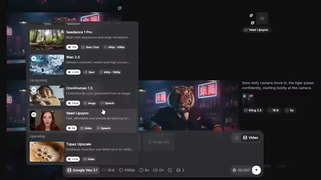
*Gros plan sur le menu déroulant de sélection des modèles de synchronisation labiale (Lip syncing) avec OmniHuman 1.5 et Veed Lipsync.*

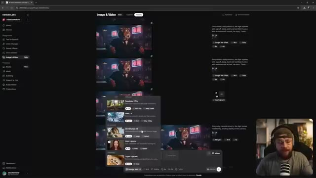
*Menu de sélection des modèles affiché par-dessus l'interface d'Eleven Labs lors de la navigation dans les options.*

---

### ⏱️ `[00:11:12 - 00:11:47]` | Segment #26

**🔊 Audio (Transcription Intégrale Mot pour Mot en Français) :**
> impossible d'identifier la bouche humaine donc le problème était que nous essayions de faire parler un animal, c'est quelque chose que je ne pensais pas du tout être un problème mais apparemment ça l'est et même avec la synchronisation labiale de Veed on a essayé et on a bien obtenu une génération en retour mais je vais vous montrer le problème soit vous l'avez soit vous ne l'avez pas ça ne peut pas être truqué ça ne peut pas être mesuré ou cartographié comme des données donc comme vous pouvez le voir la voix off elle-même est là et elle fonctionne correctement mais nous n'obtenons aucun mouvement des lèvres de notre personnage de tigre c'est donc à ce moment-là en gros que j'ai décidé

**👁️ Analyse Visuelle d'Écran (gemini-3.5-flash-lite) :**
**Interface & Outils** : Interface web d'ElevenLabs, section "Image & Video" avec menu déroulant contextuel, et fenêtre PiP montrant le créateur Jack en studio.

**Contenu textuel & Code** : Dans l'interface, on aperçoit plusieurs générations d'images/vidéos d'un personnage de tigre dans un décor asiatique éclairé aux néons. Le menu déroulant affiche différents modèles et outils (Seedance 1 Pro, Kling 2.5, OmniHuman 1.5, Veed LipSync, Topaz Upscale) avec des paramètres de résolution (720p, 1080p). Le prompt textuel visible sur la droite mentionne : "Slow dolly camera move in, the tiger speaks with a gruff, deep, cold and confident voice with an American accent, he says..."

**Action / Démonstration** : Le créateur montre son écran de navigation sur ElevenLabs tout en expliquant sa démarche dans la petite fenêtre PiP en bas à droite, illustrant les tests effectués avec différents outils de synchronisation labiale et de génération vidéo.

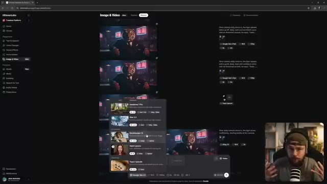
*Interface d'ElevenLabs (section Image & Video) affichant l'historique des générations avec un menu déroulant d'options de traitement et une incrustation vidéo (PiP) de Jack en bas à droite.*

---

### ⏱️ `[00:11:47 - 00:12:24]` | Segment #27

**🔊 Audio (Transcription Intégrale Mot pour Mot en Français) :**
> Je savais que je devais utiliser VO 3.1 et ce que j'ai immédiatement reconnu, c'est que chaque génération de VO 3.1, même si elles allaient concerner le même personnage parce que ce sont des générations séparées, les voix seraient toutes légèrement différentes. Mais grâce à la fonctionnalité de changement de voix d'ElevenLabs, sur laquelle nous reviendrons un peu plus tard, nous pouvons aller modifier les voix et attribuer une caractéristique vocale particulière à chacune de ces générations légèrement différentes pour nous assurer que nos personnages ont tous des voix cohérentes tout au long de la publicité, alors nous allons

**👁️ Analyse Visuelle d'Écran (gemini-3.5-flash-lite) :**
**Interface & Outils** : Interface web d'ElevenLabs (section Image & Video - History) avec incrustation vidéo (PiP) du créateur en bas à droite.

**Contenu textuel & Code** : On aperçoit des grilles de générations d'images représentant une girafe anthropomorphe en costume jouant au poker dans un casino, ainsi que des panneaux de prompts textuels sur le côté droit.

**Action / Démonstration** : Le créateur navigue dans l'historique de l'interface d'ElevenLabs pour présenter les différentes générations d'images et de vidéos obtenues.

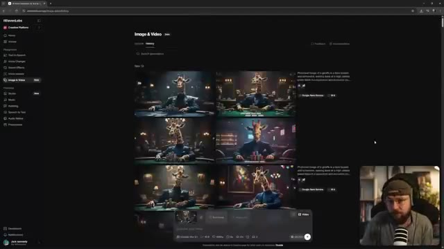
*Interface d'ElevenLabs montrant l'historique de génération d'images et de vidéos avec le personnage de girafe au casino.*

---

### ⏱️ `[00:12:24 - 00:12:59]` | Segment #28

**🔊 Audio (Transcription Intégrale Mot pour Mot en Français) :**
> passons à la suite dans un instant, mais pour notre génération de vidéo avec le prompt textuel, je viens de placer un mouvement de travelling avant de caméra lent, la girafe parle d'une voix rauque, grave, assurée et confiante avec un accent américain. Elle dit : le goût réside dans l'âme d'une boisson façonnée avec savoir-faire, patience et temps. Et je viens d'ajouter à la fin ici, pas de musique, parce que bien sûr cela rend les choses un peu délicates lors du montage lui-même. Allons donc de l'avant et envoyons ces générations. Encore une fois, nous sommes en mesure de générer toutes nos images et vidéos au sein de la plateforme ElevenLabs.

**👁️ Analyse Visuelle d'Écran (gemini-3.5-flash-lite) :**
**Interface & Outils** : Plateforme web ElevenLabs (section Image & Video) avec interface de génération d'images/vidéos et encadré PiP du créateur.

**Contenu textuel & Code** : Texte du prompt : 'Slow camera dolly move in, the giraffe speaks with a gruff, deep, bold and confident voice with an American accent, he says; 'Taste lies in the soul of a drink. Forged with craft, patience, and time.' NO MUSIC.' Paramètres visibles : Google Veo 3.1, 16:9, 1080p, 6s.

**Action / Démonstration** : Le créateur montre l'interface d'ElevenLabs, configure les paramètres de génération vidéo avec Google Veo 3.1 et lance le processus de génération des contenus.

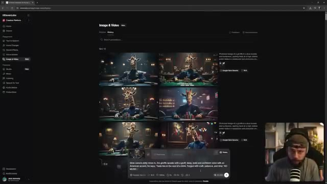
*Interface de la plateforme ElevenLabs montrant l'historique de génération d'images d'une girafe jouant au poker et le panneau de configuration vidéo en bas avec le créateur en incrustation PiP.*

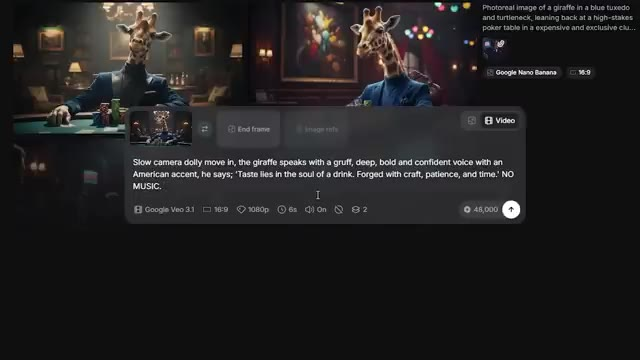
*Gros plan sur le prompt textuel de génération vidéo dans ElevenLabs : mouvements de caméra, description de la voix de la girafe et le paramètre 'Google Veo 3.1'.*

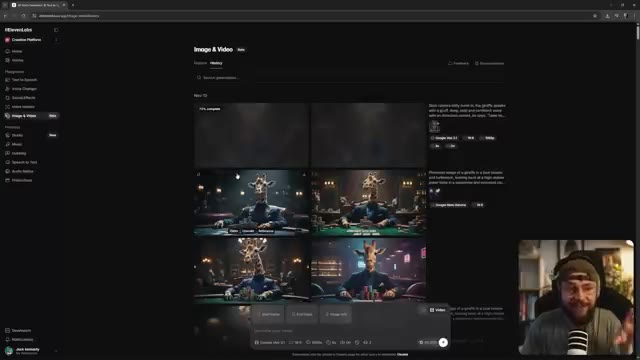
*Interface d'ElevenLabs montrant la barre de progression (73% complete) du rendu vidéo en cours de génération avec les vignettes des images.*

---

### ⏱️ `[00:12:59 - 00:13:35]` | Segment #29

**🔊 Audio (Transcription Intégrale Mot pour Mot en Français) :**
> Et quand on avancera un peu plus dans la vidéo et que je commencerai à vous montrer certaines des capacités audio qu'Eleven Labs propose, vous comprendrez pourquoi c'est un ensemble d'outils si utile. D'accord, donc on a nos générations vo 3.1 en arrière-plan, allons-y et faisons-leur goûter : "taste lies in the soul of a drink forged with craft patience and time" (le goût réside dans l'âme d'une boisson façonnée avec savoir-faire, patience et temps). Très bien, c'est exactement ce qu'on recherche, écoutons la génération suivante : "taste lies in the soul of a drink forged with craft patience and time." Je ne sais pas ce qui arrive aux yeux de la girafe là, je n'aime pas ça. C'est

**👁️ Analyse Visuelle d'Écran (gemini-3.5-flash-lite) :**
**Interface & Outils** : Interface web d'ElevenLabs (Creative Platform, section Image & Video History), avec le créateur Jack Kennedy visible en incrustation PiP (Picture-in-Picture) dans le coin inférieur droit.

**Contenu textuel & Code** : Historique de générations de vidéos sur ElevenLabs, montrant des variantes d'une girafe en costume jouant au poker dans un casino, avec le prompt visible : "Slow camera dolly move in, the giraffe speaks with a gruff, deep, bold and modulated voice with an American accent, he says: 'Taste lies in the soul of a drink. Forged with craft, patience, and time.' NO MUSIC." Paramètres de génération visibles : Modèle "Google Veo 3.1", format 16:9, résolution 1080p, 24 000 crédits.

**Action / Démonstration** : Le créateur navigue et présente l'interface d'historique de génération vidéo d'ElevenLabs, puis lance la lecture d'une des vidéos générées pour en écouter le résultat audio et examiner le rendu visuel.

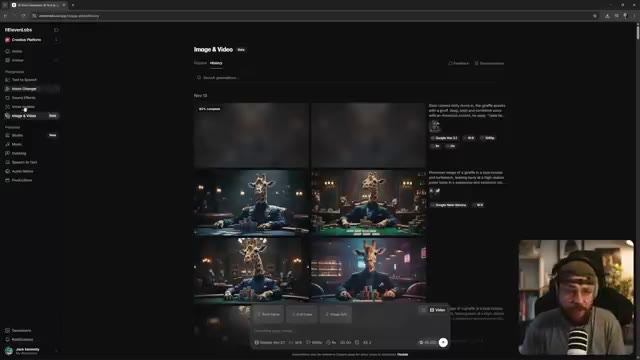
*Interface d'ElevenLabs (section Image & Video) montrant l'historique des générations avec une grille de 4 variantes représentant une girafe anthropomorphe en costume jouant au poker, et le créateur visible en incrustation PiP.*

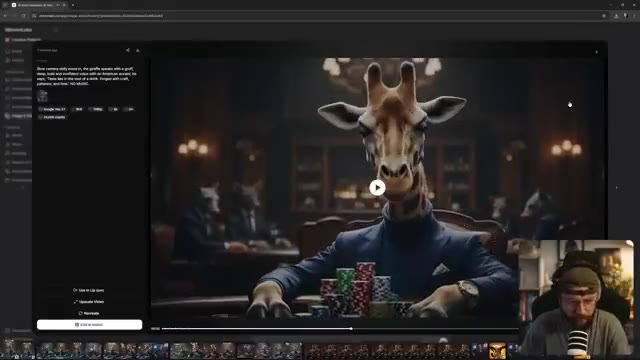
*Interface d'ElevenLabs affichant la lecture en plein écran d'une des vidéos générées de la girafe au poker, avec le panneau de paramètres textuels et le créateur en incrustation PiP.*

---

### ⏱️ `[00:13:35 - 00:14:13]` | Segment #30

**🔊 Audio (Transcription Intégrale Mot pour Mot en Français) :**
> un peu flippant, hein ? Heureusement pour nous, la première génération fait exactement ce qu'on veut. Donc comme je le disais tout à l'heure, maintenant on va cliquer sur cet onglet d'upscale. Je vais envoyer la vidéo vers Topaz, cliquer sur générer ici. Je vais la récupérer en 3840 par 2160. Comme je l'ai dit, j'ai trouvé quelques problèmes en prenant la sortie nano banana, en l'upscalant puis en mettant ça dans vo 3.1 et en ré-upscalant encore, c'était comme s'il y avait trop de netteté appliquée et les textures de fourrure et tout ça, particulièrement avec le rhinocéros en fait, se comportaient vraiment bizarrement et on ne peut juste pas

**👁️ Analyse Visuelle d'Écran (gemini-3.5-flash-lite) :**
**Interface & Outils** : Navigateur web affichant la plateforme ElevenLabs (section Image & Video > History) avec un encadré vidéo PiP du créateur en bas à droite.

**Contenu textuel & Code** : Historique de générations montrant plusieurs variations d'une girafe habillée en costume jouant au poker dans un casino feutré, avec des menus contextuels et des paramètres visibles.

**Action / Démonstration** : Le créateur montre son écran avec l'historique des générations sur ElevenLabs tout en parlant face à son micro dans l'encadré PiP.

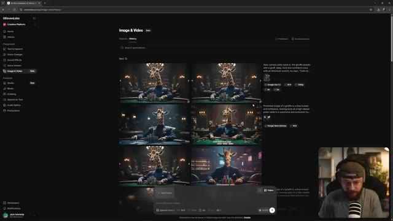
*Interface d'ElevenLabs affichant l'historique des générations d'images et de vidéos avec une girafe dans un casino, et la webcam du créateur en incrustation (PiP).*

---

### ⏱️ `[00:14:13 - 00:14:49]` | Segment #31

**🔊 Audio (Transcription Intégrale Mot pour Mot en Français) :**
> je veux ça donc ce flux de travail pour ce cas d'utilisation spécifique était plutôt bon ok donc nous avons notre upscale de Topaz de retour nous pouvons charger ceci en 4k le goût réside dans l'âme d'une boisson forgée avec savoir-faire patience et temps et ça a l'air vraiment bien et net ouais réussi haut la main donc pour la prochaine image que nous voulons générer de notre girafe je veux reproduire un type de cadrage similaire au tigre et au rhinocéros quand nous sommes plus près quand la caméra est plus serrée autour d'eux donc pour faire cela nous allons passer à la génération d'images je vais juste effacer ce texte

**👁️ Analyse Visuelle d'Écran (gemini-3.5-flash-lite) :**
**Interface & Outils** : Navigateur web affichant l'interface de la plateforme ElevenLabs (section Image & Video) avec la vue PiP (Picture-in-Picture) du créateur en bas à droite.

**Contenu textuel & Code** : Texte visible dans l'historique de génération : prompts descriptifs pour la génération vidéo et d'images, boutons "Topaz Upscale", options de rapport d'aspect (16:9), résolutions (1080p).

**Action / Démonstration** : Le créateur navigue dans l'interface d'ElevenLabs, examine les résultats d'upscale Topaz et prépare la transition vers la génération d'une nouvelle image de girafe avec un cadrage serré similaire aux précédents animaux.

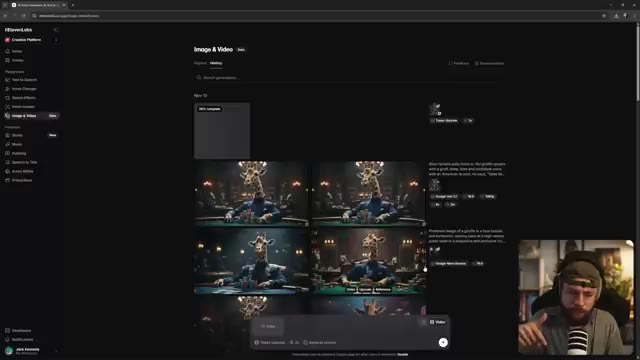
*Interface d'ElevenLabs affichant l'historique des générations d'images et vidéos avec une vue en grille des différentes variations de la girafe.*

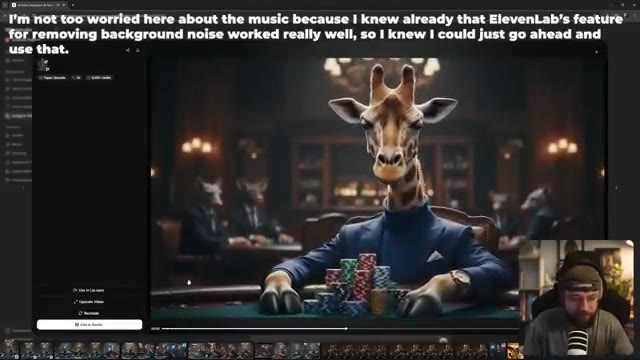
*Visualisation en plein écran de la vidéo upscale de la girafe jouant au poker autour d'une table avec d'autres animaux.*

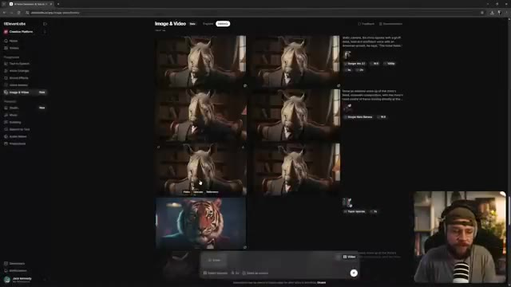
*Interface d'ElevenLabs montrant l'historique de génération avec les variations du rhinocéros et du tigre.*

---

### ⏱️ `[00:14:49 - 00:15:19]` | Segment #32

**🔊 Audio (Transcription Intégrale Mot pour Mot en Français) :**
> prompt et si je survole celui-ci par exemple du rhinocéros et que je clique simplement, ça va automatiquement remplir cette zone en bas de page et si on fait défiler tout en haut jusqu'à notre girafe voici l'image et vous voyez qu'on peut cliquer sur cet onglet de référence et ça va se remplir comme référence d'image pour notre prochaine génération nano banana du gros plan tout ce que j'ai à faire c'est d'aller changer la tête du rhinocéros par la tête de la girafe. On peut cliquer sur générer.

**👁️ Analyse Visuelle d'Écran (gemini-3.5-flash-lite) :**
**Interface & Outils** : Interface web d'ElevenLabs (section Image & Video > History).

**Contenu textuel & Code** : Textes des prompts de génération d'images et paramètres des modèles (Google Veo 3.7, Google Nano Banana, format 16:9). Le prompt visible indique : "Show an extreme close up of the giraffe's head, cinematic composition, with the rhino's head centre of frame looking directly at the camera".

**Action / Démonstration** : Le créateur montre l'interface de génération d'images, survole et sélectionne des images pour les utiliser comme références visuelles (Image refs) dans la boîte de prompt, puis modifie le texte pour adapter la composition du plan.

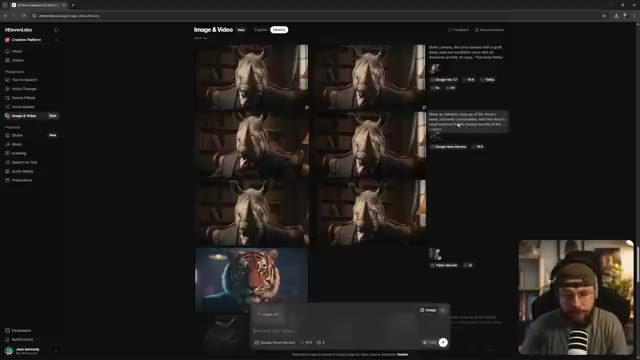
*Interface d'ElevenLabs affichant l'historique des générations d'images avec les différentes variantes de rhinocéros et le créateur visible en incrustation (PiP) en bas à droite.*

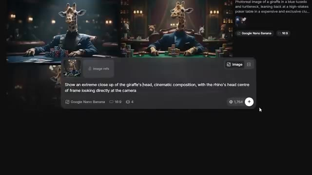
*Interface d'ElevenLabs montrant le panneau de prompt agrandi avec une image de référence de girafe et le texte du prompt pour la génération.*

---

### ⏱️ `[00:15:19 - 00:15:53]` | Segment #33

**🔊 Audio (Transcription Intégrale Mot pour Mot en Français) :**
> Toutes ces générations ont l'air bien de différentes manières, mais ce à quoi nous voulons faire attention, c'est qu'il soit très clair où se trouve la bouche de la girafe. Il pourrait donc y avoir un peu d'essais et erreurs ici, car si VO 3.1 a du mal à identifier où est la bouche, elle va commencer à bouger et en quelque sorte créer des lèvres qui n'existent pas et toutes sortes de choses bizarres. Personnellement, j'aime vraiment cette image ici, donc je pense que nous allons l'essayer, espérons que VO 3.1 pourra comprendre où est la bouche de la girafe avec ce plan particulier, croisons les doigts.

**👁️ Analyse Visuelle d'Écran (gemini-3.5-flash-lite) :**
**Interface & Outils** : Interface web d'ElevenLabs ("Image & Video" - "History") affichant des grilles de générations d'images avec le visage du créateur en incrustation PiP en bas à droite.

**Contenu textuel & Code** : Galerie d'images affichant des personnages animaux anthropomorphes (girafe, rhinocéros) dans un style haut de gamme, avec des prompts visibles et des paramètres de génération.

**Action / Démonstration** : Le créateur navigue et sélectionne une image spécifique de girafe pour analyser sa clarté anatomique avant de lancer la génération vidéo.

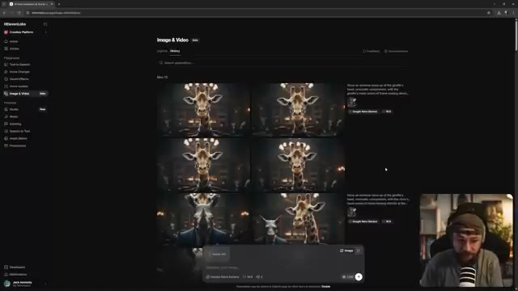
*Interface d'ElevenLabs affichant une galerie d'images générées par IA représentant une girafe anthropomorphe dans un décor de casino, avec le créateur visible en incrustation (PiP).*

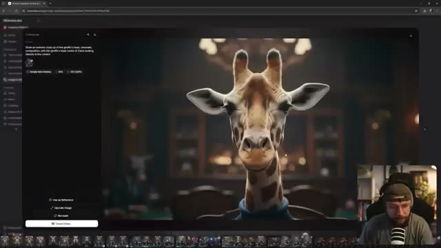
*Gros plan sur une image spécifique de girafe anthropomorphe habillée dans un décor feutré, avec des options de génération vidéo et de référence sur le côté gauche.*

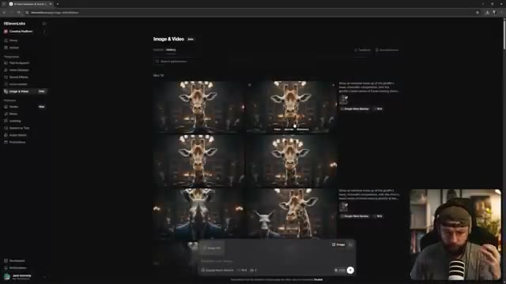
*Retour à la vue de la galerie d'images sur ElevenLabs montrant plusieurs variantes de la girafe dans un style cinématographique sombre.*

---

### ⏱️ `[00:15:53 - 00:16:30]` | Segment #34

**🔊 Audio (Transcription Intégrale Mot pour Mot en Français) :**
> croisé donc encore une fois nous allons cliquer sur l'onglet vidéo nous voulons changer le modèle pour VO 3.1 changer la résolution en 1080p la durée nous voulons six secondes pour pouvoir changer l'audio avec les fonctionnalités d'Eleven Labs nous voulons activer notre audio et allons-y pour deux générations donc pour le prompt textuel nous sommes juste partis sur une caméra statique et à nouveau le même genre de description que nous avons utilisé avant du type de voix que nous recherchons et ensuite nous avons simplement entré la ligne de dialogue le monde ralentit allons voir cette génération ici le monde ralentit ok ça a l'air plutôt bien je pense

**👁️ Analyse Visuelle d'Écran (gemini-3.5-flash-lite) :**
**Interface & Outils** : Interface de la plateforme ElevenLabs (Creative Platform) avec l'outil de génération vidéo.

**Contenu textuel & Code** : Texte du prompt affiché : « Static camera the giraffe speaks with a gruff, deep, bold and confident voice with an American accent, he says; 'The world slows...' ».

**Action / Démonstration** : Le créateur montre l'interface de génération vidéo d'ElevenLabs, présente le texte du prompt en gros plan, puis affiche le résultat vidéo de la girafe parlante.

*Interface d'ElevenLabs affichant la bibliothèque d'images et de vidéos générées avec le créateur en incrustation PiP.*

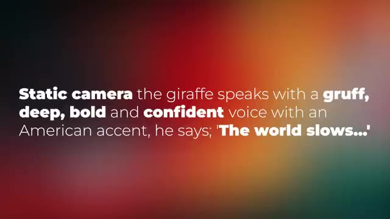
*Texte à l'écran affichant le prompt textuel utilisé pour la génération vidéo : "Static camera the giraffe speaks with a gruff, deep, bold and confident voice with an American accent, he says; 'The world slows...'".*

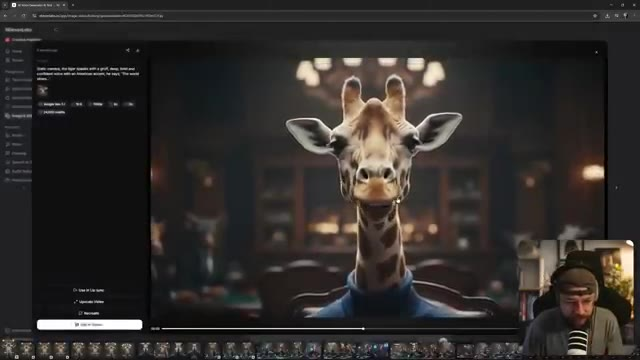
*Interface d'ElevenLabs affichant le lecteur vidéo de la girafe parlante générée avec les options en bas.*

---

### ⏱️ `[00:16:30 - 00:17:03]` | Segment #35

**🔊 Audio (Transcription Intégrale Mot pour Mot en Français) :**
> c'est utilisable. Encore une autre génération ici. Le monde ralentit. Oui, c'est la meilleure parce qu'on ne voit pas trop son pull là. Le monde ralentit. Ce n'est pas très grave pour cette musique à la fin, on peut juste couper ça, ce ne sera pas un problème. Ok, alors allons-y pour upscaler cette génération qu'on a aimée, on va l'envoyer. Donc, avec nos générations de vidéos upscalées prêtes pour les deux plans de girafe, je vais aller sur le côté gauche ici et cliquer sur l'option Studio. Et tout en haut, nous allons cliquer sur l'onglet qui s'appelle "New".

**👁️ Analyse Visuelle d'Écran (gemini-3.5-flash-lite) :**
**Interface & Outils** : Interface de la plateforme ElevenLabs (section Creative Platform / Image & Video) affichée dans un navigateur web, avec incrustation PiP (Picture-in-Picture) du présentateur Jack en bas à droite.

**Contenu textuel & Code** : Texte du prompt visible sur l'écran : "Static camera, the tiger speaks with a gruff, deep, bold and confident voice with an American accent, he says: 'The world slows...'" (ou texte similaire lié à la girafe), ainsi que les paramètres de génération (Google Veo 2.7, 16:9, 1080p, 5s, 3s).

**Action / Démonstration** : Le créateur visionne et sélectionne une génération de vidéo de girafe dans l'interface d'ElevenLabs, puis se prépare à naviguer vers l'option "Studio" dans le menu de gauche.

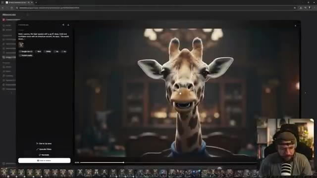
*Interface d'ElevenLabs affichant le lecteur vidéo avec une génération de girafe et les options d'upscale, avec le créateur en incrustation PiP.*

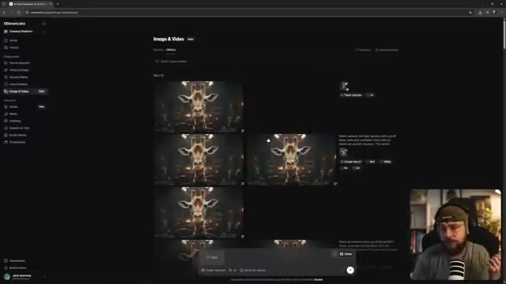
*Interface d'ElevenLabs montrant l'historique de génération "Image & Video" avec plusieurs vignettes de girafes, et le menu latéral visible à gauche.*

---

### ⏱️ `[00:17:03 - 00:17:30]` | Segment #36

**🔊 Audio (Transcription Intégrale Mot pour Mot en Français) :**
> projet vide. Je vais choisir un projet vidéo. C'est donc un éditeur basique, qui est désormais intégré dans ElevenLabs. Et en haut à droite, vous pouvez voir que nous avons un onglet vidéo où nous allons avoir accès à la génération de vidéos directement dans le studio ou à l'examen de notre historique complet de génération, où nous pouvons importer en cliquant sur ce petit logo plus nos vidéos améliorées de notre girafe.

**👁️ Analyse Visuelle d'Écran (gemini-3.5-flash-lite) :**
**Interface & Outils** : Interface web d'ElevenLabs Studio (elevenlabs.io/app/studio).

**Contenu textuel & Code** : Dans le panneau de gauche : Creative Platform (Home, Explore), Playgrounds (Text-to-Speech, Voice Changer, Sound Effects, Music, Image & Video), Projects (Studio [New], Music, Dubbing, Speech-to-Text, Action Editor, Product Showcase). Au centre : section "Studio" avec les options Audio (New audiobook, Create a podcast, URL to audio, AI Script Generator) et Video (New video voiceover, Add SFX and music, Add captions, Remove background noise, Fix voiceover mistakes). Section "Recent Projects" avec une barre de recherche et un projet intitulé "LION TASTE" créé il y a 3 days ago. En bas à droite : petit encadré PiP montrant Jack devant son micro.

**Action / Démonstration** : Présentation de l'interface principale d'ElevenLabs Studio pour la création de projets vidéo et audio, avec Jack visible en bas à droite dans un encadré incrusté (PiP).

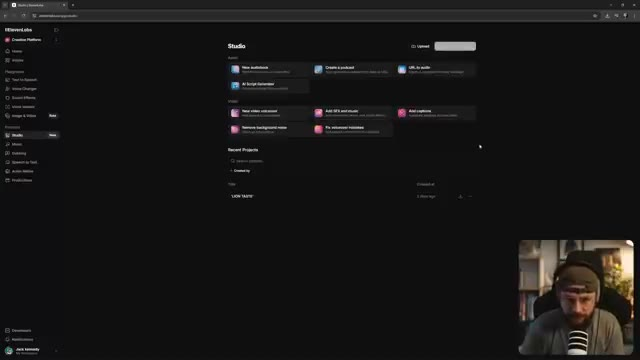
*Interface d'ElevenLabs Studio montrant les options de création de projets vidéo et audio, avec une incrustation vidéo (PiP) de Jack en bas à droite.*

---

### ⏱️ `[00:17:30 - 00:17:52]` | Segment #37

**🔊 Audio (Transcription Intégrale Mot pour Mot en Français) :**
> Donc, faisons entrer ces deux éléments et plaçons-les sur notre timeline. Si nous les regardons jusqu'au bout, vous allez voir que la voix va être différente pour les deux générations. Le goût réside dans l'âme d'une boisson. Forgé avec savoir-faire, patience et temps, le monde ralentit. Il y a donc manifestement un manque total de cohérence des personnages qui se produit ici.

**👁️ Analyse Visuelle d'Écran (gemini-3.5-flash-lite) :**
**Interface & Outils** : Interface d'un outil de montage vidéo en ligne (type Studio d'édition web), comportant une zone de prévisualisation centrale, une barre de timeline horizontale en bas et un panneau d'outils sur le côté droit (« Edit Video », « AI Tools »).

**Contenu textuel & Code** : Le panneau de droite affiche les options de volume et divers outils IA (« Transcribe & edit speech », « Remove background noise », « Use voice changer »). Dans le coin inférieur droit, la webcam montre Jack dans son studio.

**Action / Démonstration** : Le créateur montre son écran de montage où les clips vidéo sont positionnés sur la timeline pour être lus et analysés.

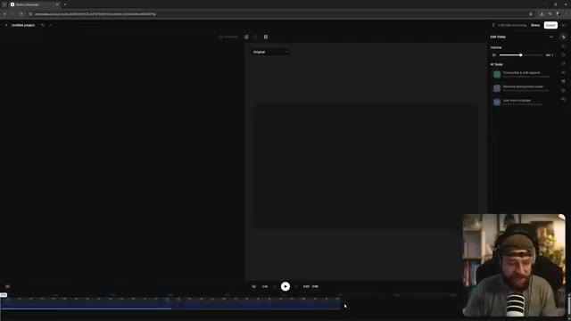
*Interface de montage vidéo avec une timeline en bas et le créateur visible en incrustation (PiP) dans le coin inférieur droit.*

---

### ⏱️ `[00:17:52 - 00:18:12]` | Segment #38

**🔊 Audio (Transcription Intégrale Mot pour Mot en Français) :**
> Et ça va juste complètement briser notre illusion très rapidement. Mais si nous sélectionnons un de nos clips vidéo, vous pouvez voir que nous avons quelques options différentes ici. Celles qui nous intéressent sont "supprimer l'audio de fond" et "utiliser le changeur de voix". Il y a donc un peu de musique sur ce clip. Je vais donc procéder à la suppression de l'audio de fond.

**👁️ Analyse Visuelle d'Écran (gemini-3.5-flash-lite) :**
**Interface & Outils** : Interface web de montage vidéo / studio de création (type Creative Cloud ou outil de montage en ligne basé sur l'IA).

**Contenu textuel & Code** : Menus visibles : "Edit Video", curseur "Volume" à 100%, section "AI Tools" avec les options "Transcribe & edit speech", "Remove background audio" et "Use voice changer". Aperçu d'un clip vidéo mettant en scène une girafe.

**Action / Démonstration** : Le créateur montre l'interface de montage et navigue entre les options audio disponibles dans les outils d'intelligence artificielle pour modifier les pistes sonores des clips.

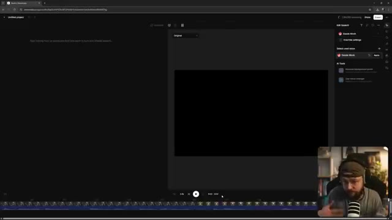
*Interface de montage vidéo avec la timeline en bas et le panneau latéral affichant les options audio (Remove background audio, Use voice changer), avec un encadré PiP du créateur en bas à droite.*

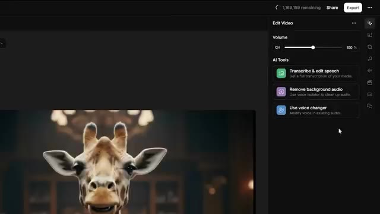
*Gros plan sur le panneau de configuration vidéo de l'interface montrant les outils IA : Transcribe & edit speech, Remove background audio, et Use voice changer, avec un aperçu vidéo d'une girafe.*

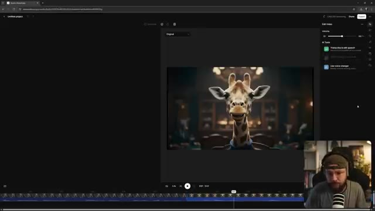
*Vue globale de l'interface de montage montrant la timeline, la fenêtre de prévisualisation avec la girafe, et le créateur visible en incrustation PiP dans le coin inférieur droit.*

---

### ⏱️ `[00:18:12 - 00:18:32]` | Segment #39

**🔊 Audio (Transcription Intégrale Mot pour Mot en Français) :**
> Allons-y et écoutons ceci en entier. Le monde ralentit. Bien. Nous avons donc perdu cette musique à la fin de notre génération dont nous ne voulons de toute façon pas. Maintenant, la partie importante, cliquons sur utiliser le changeur de voix. Il y a donc une bibliothèque de voix incroyablement diversifiée que vous pouvez utiliser ici sur 11 Labs.

**👁️ Analyse Visuelle d'Écran (gemini-3.5-flash-lite) :**
**Interface & Outils** : Interface web d'un outil de montage vidéo (type ElevenLabs Studio) avec panneau latéral d'outils IA (Transcribe & edit speech, Remove background audio, Use voice changer).

**Contenu textuel & Code** : Menus et options visibles : "Edit Video", "Volume", "AI Tools", options de changement de voix ("Find a new voice", "Recently used").

**Action / Démonstration** : Le créateur montre l'interface d'édition vidéo puis clique sur l'option "Use voice changer" pour ouvrir la bibliothèque de voix de l'application.

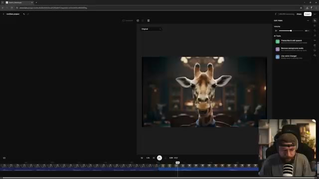
*Interface de l'éditeur vidéo montrant une girafe animée à l'écran et Jack en incrustation vidéo (PiP) en bas à droite.*

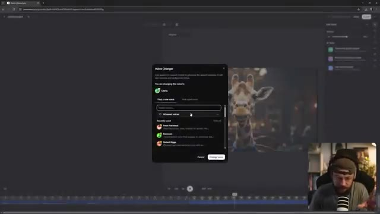
*Fenêtre contextuelle "Voice Changer" ouverte sur l'interface avec options de recherche de voix et la caméra PiP de Jack.*

---

### ⏱️ `[00:18:32 - 00:18:53]` | Segment #40

**🔊 Audio (Transcription Intégrale Mot pour Mot en Français) :**
> Je sais que pour la girafe, je voulais utiliser cette voix de Peter Hartwood. Donc je vais aller la sélectionner ici et cliquer sur changer la voix. Maintenant, écoutons le résultat pour voir comment c'est fait. Le monde ralentit. Très bien. Et maintenant, en sélectionnant notre premier clip, je veux d'abord cliquer sur l'option de suppression de l'audio d'arrière-plan.

**👁️ Analyse Visuelle d'Écran (gemini-3.5-flash-lite) :**
**Interface & Outils** : Interface d'un éditeur vidéo en ligne (Studio / Seedance-like) comprenant une ligne de temps (timeline) en bas, un visualiseur vidéo central et un panneau de configuration des outils IA à droite.
[DESC_IMAGE_1_DETAILS] Fenêtre "Voice Changer" avec liste des voix récentes (Peter Hartwood, Donovan, Robert Higgs) et boutons "Cancel" / "Change voice".
[DESC_IMAGE_2_DETAILS] Panneau "Edit Video" à droite avec les sections Volume, "AI Tools" contenant "Transcribe & edit speech", "Remove background audio", et "Use voice changer". En bas, la timeline affiche les clips vidéo découpés.

**Contenu textuel & Code** : Explications orales des concepts et des méthodes de création vidéo IA.

**Action / Démonstration** : Sélection d'une voix spécifique (Peter Hartwood) dans le panneau de modification vocale, puis visualisation du clip vidéo dans l'éditeur.

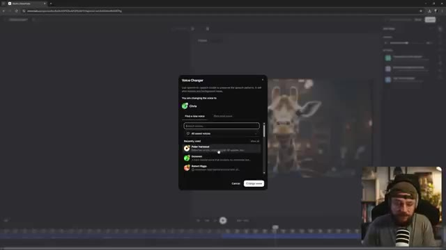
*Fenêtre contextuelle de changement de voix (Voice Changer) avec la sélection de l'artiste vocal Peter Hartwood.*

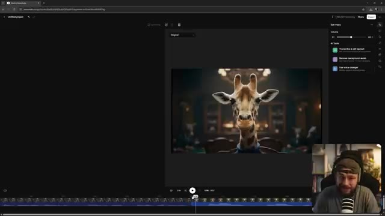
*Interface de montage vidéo avec l'aperçu du clip d'une girafe et le panneau latéral des outils IA.*

---

### ⏱️ `[00:18:54 - 00:19:12]` | Segment #41

**🔊 Audio (Transcription Intégrale Mot pour Mot en Français) :**
> Et encore une fois, nous cliquons sur "utiliser le changeur de voix". Nous utiliserons à nouveau la même voix, Peter Harwood, et cliquons sur changer de voix. Et nous pouvons comparer pour nous assurer que nous avons ce beau niveau de cohérence des personnages que nous recherchons. Le goût réside dans l'âme d'une boisson. Forgé avec savoir-faire, patience et temps.

**👁️ Analyse Visuelle d'Écran (gemini-3.5-flash-lite) :**
**Interface & Outils** : Interface web de Studio D-ID / outil de montage vidéo basé sur l'IA, avec un panneau latéral droit pour les outils IA (Transcribe & edit speech, Remove background audio, Use voice changer).

**Contenu textuel & Code** : Fenêtre modale "Voice Changer" avec liste des voix enregistrées récentes dont "Peter Harwood" et boutons "Cancel" et "Change Voice". Dans le coin inférieur droit, le présentateur apparaît en incrustation vidéo (PiP).

**Action / Démonstration** : L'utilisateur sélectionne une voix spécifique ("Peter Harwood") dans le menu déroulant du changeur de voix pour l'appliquer à la séquence vidéo de la girafe.

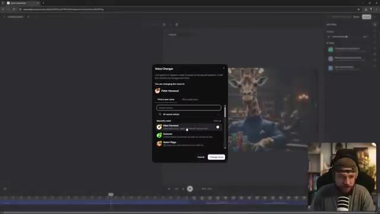
*Interface de l'outil de montage vidéo avec une fenêtre pop-up "Voice Changer" ouverte et la sélection de la voix "Peter Harwood".*

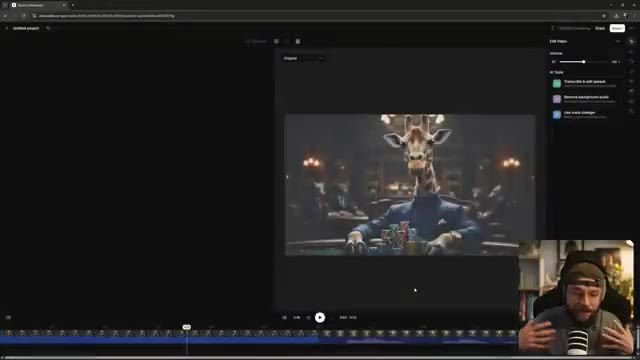
*Interface principale du studio de montage avec un aperçu vidéo montrant une girafe anthropomorphe habillée élégamment dans un casino.*

---

### ⏱️ `[00:19:13 - 00:19:39]` | Segment #42

**🔊 Audio (Transcription Intégrale Mot pour Mot en Français) :**
> Le monde ralentit. Parfait. Donc maintenant, nous pouvons aller cliquer sur le bouton d'exportation en haut à droite de l'écran. Pour le type de média, nous voulons cliquer sur vidéo. Nous pouvons simplement aller cliquer sur export et nous pouvons l'utiliser dans notre éditeur de choix. Bien sûr, vous pouvez toujours faire tout votre montage à l'intérieur du studio ElevenLabs, mais si vous voulez un peu plus de contrôle, je vais l'importer dans Premiere Pro.

**👁️ Analyse Visuelle d'Écran (gemini-3.5-flash-lite) :**
**Interface & Outils** : Interface web de l'éditeur vidéo ElevenLabs (Studio ElevenLabs), avec un panneau latéral droit pour les outils d'édition, une timeline en bas et une caméra PiP du créateur en bas à droite.

**Contenu textuel & Code** : Menus d'exportation, paramètres de type de média (« Video »), options d'outils IA (« Transcribe & speech », « Remove background audio », « Use voice changer ») et statut d'exportation (« Export status 0% completed »).

**Action / Démonstration** : Le créateur montre comment accéder au bouton d'exportation, sélectionne le type de média vidéo, clique sur le bouton d'export et lance le processus d'exportation de la vidéo générée.

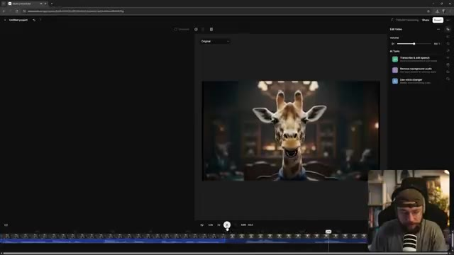
*Interface de l'éditeur vidéo ElevenLabs montrant une girafe humanoïde à une table de jeu en aperçu central et la timeline en bas.*

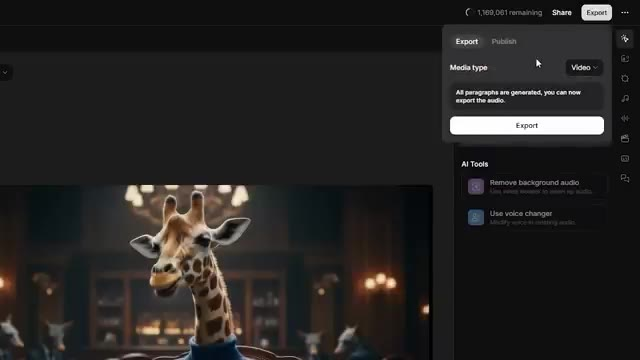
*Menu déroulant d'exportation ouvert dans le coin supérieur droit de l'interface ElevenLabs avec le type de média réglé sur vidéo.*

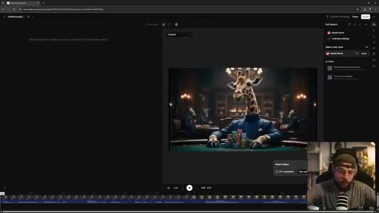
*Interface d'ElevenLabs affichant l'état de l'exportation (0% completed) en bas à droite de la fenêtre vidéo.*

---

### ⏱️ `[00:19:39 - 00:20:08]` | Segment #43

**🔊 Audio (Transcription Intégrale Mot pour Mot en Français) :**
> Nous y voilà donc, sur Premiere Pro, où nous avons le montage final de notre publicité par IA. Et comme vous pouvez le voir, nous avons différentes couches à la fois pour les visuels et pour l'audio. Je vais explorer tout cela avec vous maintenant, afin que vous puissiez voir exactement comment nous avons assemblé tout cela. Donc, en ce qui concerne tous ces plans de nos différents personnages, si je prends simplement celui-ci ici et que je fais glisser le clip, vous verrez qu'il s'agit de l'une de nos exportations d'Eleven Labs.

**👁️ Analyse Visuelle d'Écran (gemini-3.5-flash-lite) :**
**Interface & Outils** : Adobe Premiere Pro

**Contenu textuel & Code** : Texte à l'écran dans le moniteur de programme : "ATTENTION THE FOLLOWING AD WAS MADE USING ONLY AI", panneaux de la timeline avec pistes V1, V2, A1, A2, A3, assets multimédias et dossier nommé "ELEVENLABS 'TASTE'".

**Action / Démonstration** : Le créateur montre son espace de travail de montage vidéo sur Premiere Pro et manipule les pistes de la timeline.

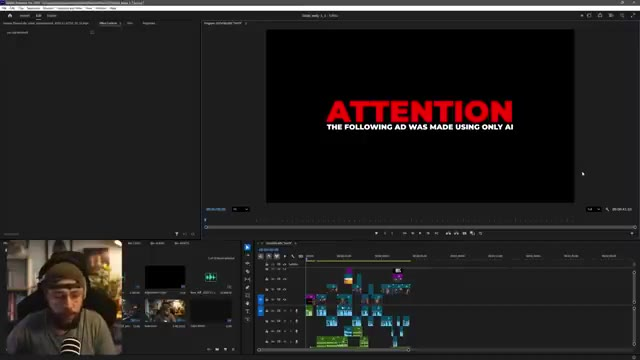
*Interface d'Adobe Premiere Pro montrant la timeline du montage d'une publicité IA et le panneau de visualisation affichant un titre d'avertissement.*

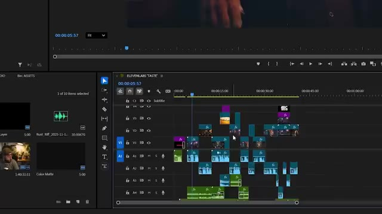
*Gros plan sur la timeline de Premiere Pro avec ses différentes pistes vidéo et audio et les clips agencés.*

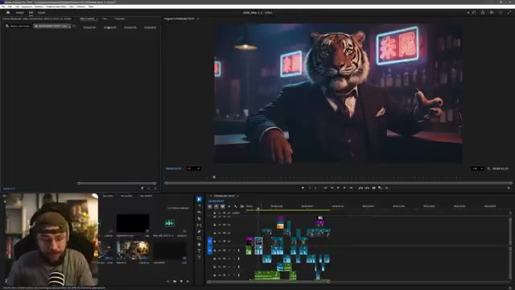
*Interface de Premiere Pro affichant un personnage anthropomorphe (tigre en costume) généré par IA dans le moniteur de programme.*

---

### ⏱️ `[00:20:09 - 00:20:42]` | Segment #44

**🔊 Audio (Transcription Intégrale Mot pour Mot en Français) :**
> Je viens de couper le son juste pour décrire ce qui se passe, mais ce sont tous nos clips assemblés où nous sommes passés et avons appliqué le changeur de voix pour donner à notre personnage une voix cohérente du début à la fin. J'ai donc simplement découpé chacun des clips et répété le même processus pour notre rhinocéros et notre girafe. Et vous remarquerez aussi que j'ai en fait ajouté des plans de coupe. Donc ici, vous pouvez voir un plan si je vais de l'avant et je désactive juste les superpositions de texte qui apparaissent par-dessus. Nous avons ce plan où vous

**👁️ Analyse Visuelle d'Écran (gemini-3.5-flash-lite) :**
**Interface & Outils** : Adobe Premiere Pro (logiciel de montage vidéo) avec affichage du moniteur de programme, de la timeline et d'un encadré PiP (Picture-in-Picture) du créateur.

**Contenu textuel & Code** : Timeline de montage vidéo avec plusieurs pistes de clips audio et vidéo, moniteur de programme affichant un tigre en costume-cravate puis le texte "CRAFT PATIENCE" en surimpression sur un plan aquatique.

**Action / Démonstration** : Le créateur montre son écran de montage dans Adobe Premiere Pro, expliquant l'organisation des clips et l'utilisation des plans de coupe dans la timeline.

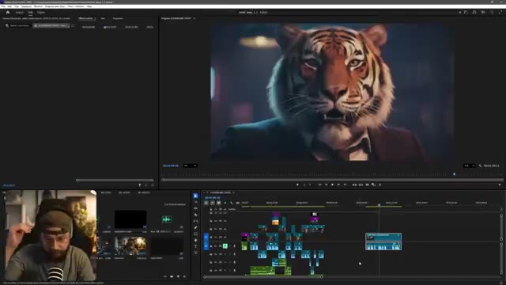
*Interface d'Adobe Premiere Pro montrant la timeline avec les clips assemblés et le moniteur de programme affichant le personnage de tigre anthropomorphe, avec le créateur en incrustation (PiP) dans le coin inférieur gauche.*

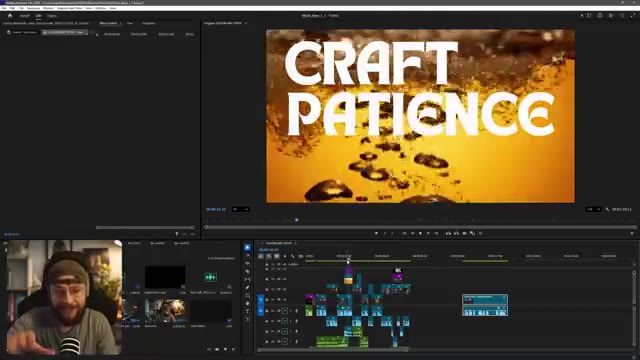
*Interface d'Adobe Premiere Pro avec le moniteur de programme affichant un plan de coupe avec le texte "CRAFT PATIENCE" en superposition, et le créateur en incrustation (PiP) dans le coin inférieur gauche.*

---

### ⏱️ `[00:20:42 - 00:21:16]` | Segment #45

**🔊 Audio (Transcription Intégrale Mot pour Mot en Français) :**
> un peu comme si on voyait la bière bouger à une échelle macro détaillée. Maintenant vous pouvez voir que cela a également été généré à l'intérieur d'Eleven Labs en utilisant VO 3.1, en fait un très long prompt textuel détaillé que j'ai demandé à ChatGPT de m'aider à écrire. Donc tout ce que j'ai dit à ChatGPT était écris-moi un prompt textuel pour un générateur de vidéo IA pour une séquence cinématique rendue en 3D de première qualité pour montrer le processus de brassage de la bière en détail macro et finalement on est passé par quelques étapes de raffinement et

**👁️ Analyse Visuelle d'Écran (gemini-3.5-flash-lite) :**
**Interface & Outils** : Adobe Premiere Pro, Eleven Labs (générateur d'images et vidéos) et ChatGPT.

**Contenu textuel & Code** : Sur l'image 3, le prompt ChatGPT visible est : "write me a text prompt for an AI video generator for... A premium 3D rendered cinematic sequence to show the process of beer brewing in macro detail". Le prompt généré décrit une séquence de brassage en macro détail (grains d'orge dorés, ébullition du moût, houblon, levure, bière s'écoulant dans des tuyaux) avec des instructions de rendu 3D ultra-réaliste, lentille macro, éclairage volumétrique. Sur l'image 2, le prompt détaillé est affiché dans l'interface d'Eleven Labs.

**Action / Démonstration** : Le créateur présente ses outils de travail et méthodes de prompt en passant d'Adobe Premiere Pro à Eleven Labs puis à l'interface de ChatGPT pour illustrer la création de sa vidéo.

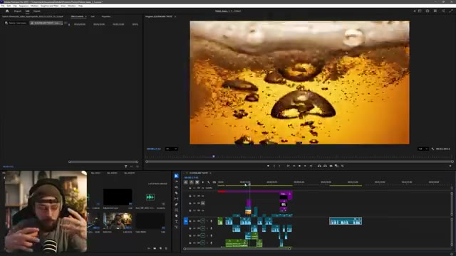
*Interface d'Adobe Premiere Pro affichant le montage vidéo avec un plan macro de bière en cours de lecture et le créateur incrusté en bas à gauche.*

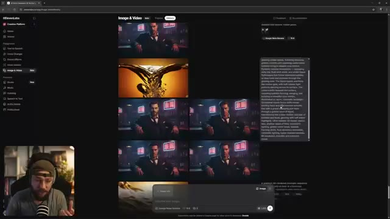
*Interface d'Eleven Labs affichant l'historique des générations vidéo et le texte du prompt détaillé sur le panneau latéral droit.*

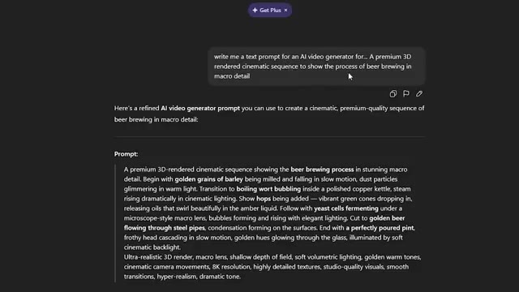
*Interface de ChatGPT montrant l'échange textuel avec la demande initiale du prompt et la réponse structurée détaillée pour le générateur vidéo.*

---

### ⏱️ `[00:21:16 - 00:21:54]` | Segment #46

**🔊 Audio (Transcription Intégrale Mot pour Mot en Français) :**
> J'ai fini par demander à ChatGPT de dire concentrons-nous juste sur la bière en tant que liquide lui-même, plein de bulles et de vagues dorées luxueuses, sans mentionner l'orge ou les tuyaux en acier, parce qu'il continuait à inclure ces éléments, l'orge et tous ces gros tuyaux granuleux et tout, et ce n'était pas vraiment esthétique. Je pense que ce sur quoi nous avons abouti fonctionne vraiment dans le contexte de notre publicité, spécifiquement à ce moment-là où la girafe parle du processus de brassage, et je voulais vraiment superposer ce texte simple ici. Bien sûr, cela se rapporte en quelque sorte à la fin

**👁️ Analyse Visuelle d'Écran (gemini-3.5-flash-lite) :**
**Interface & Outils** : Navigateur web (ChatGPT) et logiciel de montage vidéo Adobe Premiere Pro.

**Contenu textuel & Code** : Sur l'image 1, l'interface sombre de ChatGPT avec des blocs de texte contenant des prompts de génération vidéo axés sur la bière et les bulles. Sur l'image 2, l'interface d'Adobe Premiere Pro avec une timeline multipiste, des panneaux de prévisualisation (Programme), des fenêtres d'effet et un encadré PiP du créateur.

**Action / Démonstration** : Le créateur montre son écran de travail (ChatGPT puis Adobe Premiere Pro) tout en commentant le processus d'itération des prompts et le montage de la publicité.

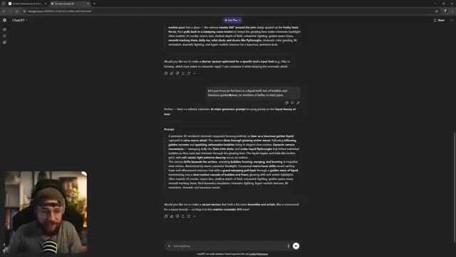
*Interface de ChatGPT affichant l'historique de conversation avec les prompts de génération de vidéo pour la bière, avec le créateur visible en incrustation PiP dans le coin inférieur gauche.*

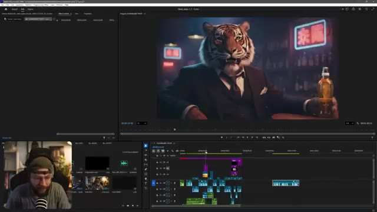
*Interface d'Adobe Premiere Pro montrant la timeline de montage vidéo et le moniteur affichant une scène avec un personnage anthropomorphe de tigre en costume tenant une bouteille, avec le créateur en incrustation PiP.*

---

### ⏱️ `[00:21:54 - 00:22:27]` | Segment #47

**🔊 Audio (Transcription Intégrale Mot pour Mot en Français) :**
> de l'image aussi. Nous avons trouvé un peu de branding et pour ce faire, je suis simplement allé sur Canva. Encore une fois, j'ai juste un compte gratuit ici et c'est le même processus que je fais toujours dès que j'essaie de faire un peu de branding. Je savais déjà quel allait être le nom. C'est juste une question de l'écrire et ensuite de tester plein de polices différentes jusqu'à ce que vous trouviez quelque chose qui fonctionne. D'après mon expérience, plus c'est simple, mieux c'est. Et bien sûr, nous créons une marque pour une bière premium. Donc en particulier dans ce cas-là, les trucs plus simples fonctionnent un peu mieux. À mon avis,

**👁️ Analyse Visuelle d'Écran (gemini-3.5-flash-lite) :**
**Interface & Outils** : Adobe Premiere Pro sur l'image #1 et Canva sur l'image #2, avec une incrustation vidéo (Picture-in-Picture) de Jack dans le coin inférieur gauche.

**Contenu textuel & Code** : Sur l'image #1 : le rendu vidéo d'une canette de bière sur un comptoir avec le texte "ARC BREW" et "drinkaware.co.uk". Sur l'image #2 : deux maquettes de texte typographique "ARC BREW" (en blanc sur fond noir) et "CRAFT PATIENCE" (en blanc sur fond vert).

**Action / Démonstration** : Le créateur montre son logiciel de montage vidéo Premiere Pro contenant la séquence publicitaire, puis navigue sur Canva pour illustrer le processus de création de la typographie et du logo de la marque de bière.

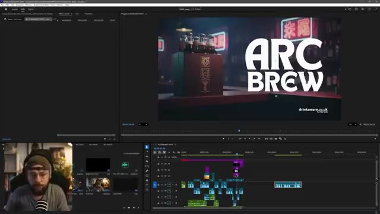
*Interface d'Adobe Premiere Pro affichant le montage vidéo avec un aperçu de la bière et le logo "ARC BREW" incrusté, ainsi que Jack en incrustation PiP dans le coin inférieur gauche.*

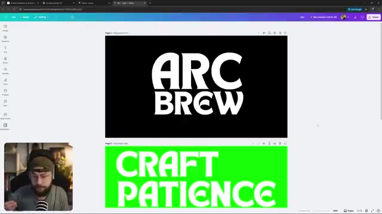
*Interface de Canva montrant des tests de typographie pour le branding avec les textes "ARC BREW" sur fond noir et "CRAFT PATIENCE" sur fond vert, avec Jack en incrustation PiP.*

---

### ⏱️ `[00:22:27 - 00:23:01]` | Segment #48

**🔊 Audio (Transcription Intégrale Mot pour Mot en Français) :**
> cela paraît plus propre et plus haut de gamme. Et bien sûr, très important, si nous utilisons une certaine police pour l'image finale elle-même, nous devons également nous assurer de l'utiliser tout au long des publicités. Donc, lorsque nous parlons de l'art, de la patience et du temps, il suffit de placer ceci sur un fond vert et de leincruster, et vous pouvez voir que j'ai simplement synchronisé chaque mot pour qu'il apparaisse lorsque la girafe livre cette partie de la voix off. Vous pouvez également voir que j'ai fini par ajouter un autre plan de coupe ici. Il s'agit donc du plan où nous faisons un mouvement de travelling vers le tigre, et je voulais juste montrer un gros plan du produit.

**👁️ Analyse Visuelle d'Écran (gemini-3.5-flash-lite) :**
**Interface & Outils** : Canva et Adobe Premiere Pro

**Contenu textuel & Code** : Textes "ARC BREW" et "CRAFT PATIENCE & TIME", interface de montage Adobe Premiere Pro avec chronologie et moniteur de programme.
[DESC_IMAGE_1] [DESC_IMAGE_2] [DESC_IMAGE_3] [DESC_IMAGE_4] Le créateur montre la conception graphique des textes sur Canva puis bascule sur Adobe Premiere Pro pour démontrer la synchronisation du texte et l'incrustation sur fond vert avec les plans de coupe du produit.

**Action / Démonstration** : Démonstration pédagogique et présentation du workflow.

*Interface de Canva affichant la création des logos et du texte publicitaire sur fond vert.*

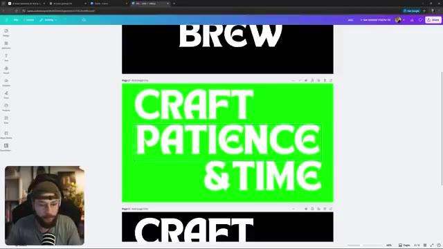
*Interface de Canva montrant le texte "CRAFT PATIENCE & TIME" en gros plan sur fond vert.*

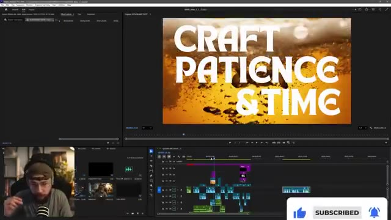
*Interface d'Adobe Premiere Pro affichant le montage vidéo avec le texte incrusté par-dessus une image de bière.*

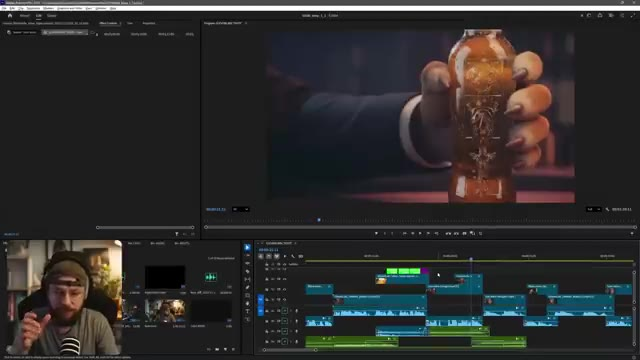
*Interface d'Adobe Premiere Pro montrant un plan de coupe en gros plan de la bouteille de produit tenue par une patte de tigre.*

---

### ⏱️ `[00:23:01 - 00:23:35]` | Segment #49

**🔊 Audio (Transcription Intégrale Mot pour Mot en Français) :**
> lui-même et celui-ci est vraiment très bien sorti. Donc pour fabriquer ceci, nous avons fini une fois de plus par utiliser Nano Banana. Donc pour le prompt textuel, c'est en fait assez simple, un gros plan extrême de la bouteille de bière. Le tigre la tient avec sa patte et en fait toutes ces générations étaient plutôt pas mal mais j'ai vraiment beaucoup aimé celle-ci et à quel point Nano Banana a bien géré le fait de conserver les détails de notre marque sur la bouteille. La cohérence des produits est bien sûr très importante et je pense qu'en réalité il s'agit juste de surveiller vos montages et de réfléchir au moment où une coupe de transition servirait le genre d'intrigue,

**👁️ Analyse Visuelle d'Écran (gemini-3.5-flash-lite) :**
**Interface & Outils** : Logiciel de montage Adobe Premiere Pro et interface web de génération de vidéo IA (Google Nano Banana / Luma).

**Contenu textuel & Code** : Texte du prompt visible : "An extreme close up of the beer bottle, the tiger is holding it with his paw, bubbles rising within the beer liquid, and perspiration on the glass bottle itself." Texte incrusté à l'écran dans Premiere Pro : "CRAFT PATIENCE & TIME". Paramètres : Google Nano Banana, rapport d'aspect 16:9.

**Action / Démonstration** : Le créateur présente son projet de montage vidéo sur Adobe Premiere Pro et montre les différentes étapes de génération et de sélection des clips vidéo IA sur la plateforme Nano Banana.

*Interface d'Adobe Premiere Pro montrant le montage vidéo avec un plan serré d'une bouteille de bière tenue par une patte de tigre, avec Jack en incrustation (PiP) dans le coin inférieur gauche.*

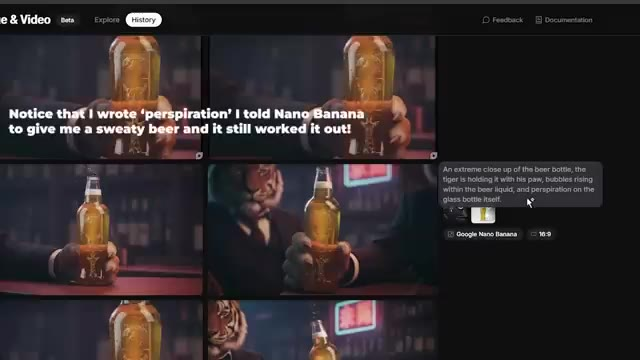
*Interface de la plateforme de génération vidéo (Google Nano Banana / Luma Dream Machine) affichant l'historique des générations avec plusieurs variantes de la bouteille de bière tenue par un tigre et le prompt textuel affiché dans une infobulle.*

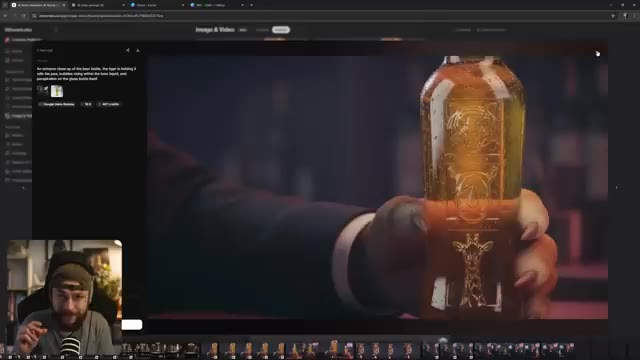
*Interface de génération vidéo montrant un gros plan détaillé de la bouteille de bière avec condensation, les détails du branding et la patte du tigre, avec Jack en PiP en bas à gauche.*

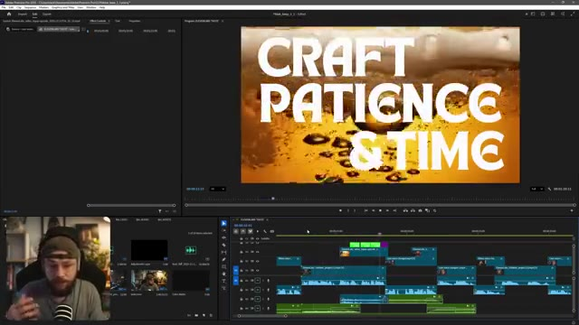
*Interface d'Adobe Premiere Pro affichant un gros plan de bulles de bière avec le texte superposé "CRAFT PATIENCE & TIME", et Jack en incrustation PiP.*

---

### ⏱️ `[00:23:35 - 00:24:12]` | Segment #50

**🔊 Audio (Transcription Intégrale Mot pour Mot en Français) :**
> aider l'histoire à avancer. Nous n'avons pas besoin de surcharger les choses. Vous ne voulez pas trop de plans de coupe. Vous voulez simplement compléter la voix off à certains moments. Donc, nous avons simplement plus de plans du tigre qui parle, du rhinocéros et de la girafe. Tous ont un cadrage très similaire et c'était également un choix délibéré bien sûr. Le tigre livre sa dernière réplique et ensuite nous terminons sur notre image de fin. Et si j'ouvre ceci en plein écran, l'image de fin du produit pour une publicité est bien sûr vraiment, vraiment importante. C'est en quelque sorte l'image durable que vous laissez avec le

**👁️ Analyse Visuelle d'Écran (gemini-3.5-flash-lite) :**
**Interface & Outils** : Adobe Premiere Pro (logiciel de montage vidéo) avec la webcam du créateur incrustée (Picture-in-Picture) en bas à gauche.

**Contenu textuel & Code** : Sur l'image 1 : Interface de montage avec panneaux Source, Programme, Timeline, chutier et le moniteur affichant une girafe anthropomorphe autour d'une table de poker. Sur l'image 2 : Le logo textuel blanc "ARC BREW", un pack de bouteilles de bière avec des symboles d'animaux gravés, et la mention légale "drinkaware.co.uk for the facts" en bas à droite.

**Action / Démonstration** : Le créateur montre son projet de montage vidéo sur Adobe Premiere Pro, illustrant le découpage des plans d'animaux et l'image finale de la publicité.

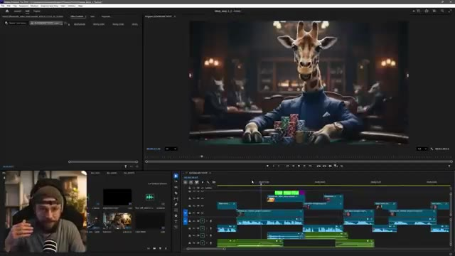
*Interface d'Adobe Premiere Pro montrant la timeline et un plan de la girafe jouant au poker avec des jetons dans un bar.*

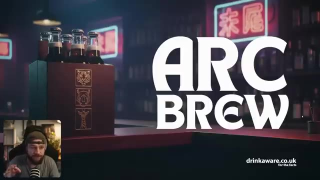
*Image de fin du produit (packshot) de la bière publicitaire "ARC BREW" avec un pack de bouteilles, des néons en arrière-plan et le créateur visible en incrustation PiP.*

---

### ⏱️ `[00:24:12 - 00:24:37]` | Segment #51

**🔊 Audio (Transcription Intégrale Mot pour Mot en Français) :**
> spectateur. De manière générale, ce sont des plans de caméra statiques. Il n'y a pas vraiment beaucoup de mouvement là-dedans. J'ai essayé de générer des vidéos VO 3.1 pour avoir des bulles qui bougent dans les bouteilles, mais ça voulait toujours appliquer des mouvements de caméra au plan. Je voulais que ce soit statique, donc j'ai fini par utiliser une image fixe. Donc pour créer cette image finale, ç'a été encore une fois un processus itératif.

**👁️ Analyse Visuelle d'Écran (gemini-3.5-flash-lite) :**
**Interface & Outils** : Interface web d'ElevenLabs avec le menu latéral gauche (Creative Platform, Text to Speech, Voice Changer, Sound Effects, Music, Image & Video) et l'historique des générations au centre. Le créateur est visible en incrustation vidéo (PiP) dans le coin inférieur gauche.

**Contenu textuel & Code** : Sur l'image 1 : le logo "ARC BREW" en grand caractères blancs, un pack de bouteilles sur un comptoir de bar avec des néons en arrière-plan, et le texte légal "drinkaware.co.uk for the facts" en bas à droite. Sur l'image 2 : une grille de miniatures vidéo dans l'historique d'ElevenLabs avec des prompts textuels visibles sur le côté droit ("The beer is in sharp focus on the left-hand side...").

**Action / Démonstration** : Le créateur parle face caméra tout en s'exprimant avec ses mains, son visage et son buste apparaissant dans l'encadré PiP pendant la présentation de ses travaux de génération de vidéo par IA.

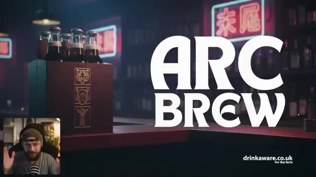
*Extrait de la vidéo de démonstration avec le titre "ARC BREW" et le créateur incrusté en bas à gauche.*

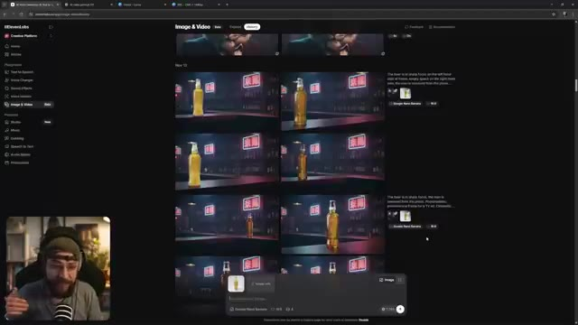
*Interface de la plateforme ElevenLabs (section Image & Video / History) montrant une grille de vidéos générées avec le créateur en incrustation.*

---

### ⏱️ `[00:24:37 - 00:25:11]` | Segment #52

**🔊 Audio (Transcription Intégrale Mot pour Mot en Français) :**
> C'était l'image finale d'origine que j'avais, et c'est à ce moment-là que je voulais que les bulles remontent à l'intérieur du verre de bière, et je n'arrivais tout simplement pas à garder cette caméra immobile. Cela, comme vous l'avez sûrement deviné, a été réalisé grâce à Nano Banana. En ce qui concerne les références d'images, nous avons ici un plan de notre produit et une référence que j'utilisais juste pour fixer l'emplacement lui-même. Concernant le texte du prompt : la bière est bien nette sur le côté gauche du cadre, de l'espace vide sur le côté droit, image finale de qualité supérieure pour une publicité télévisée, composition cinématographique. J'ai donc fini par alimenter ceci

**👁️ Analyse Visuelle d'Écran (gemini-3.5-flash-lite) :**
**Interface & Outils** : Navigateur web affichant l'interface de la plateforme de génération d'images et vidéos Nano Banana (Creative Platform / Image & Video), avec onglets Explorer et History, et un encadré PiP (Picture-in-Picture) de la webcam du créateur.

**Contenu textuel & Code** : Texte du prompt visible : "The beer is in sharp focus on the left hand side of frame, empty space on the right hand side, the man is removed from the photo. Photorealistic: premium end frame for a TV ad. Cinematic composition." Paramètres et tags : Google Nano Banana, 16:9, aperçu de deux images de référence miniatures.

**Action / Démonstration** : Le curseur de la souris survole l'interface ou zoome sur le panneau latéral contenant le prompt textuel et les images de référence utilisées pour générer le visuel de la bouteille de bière.

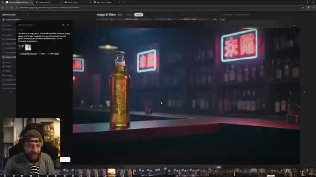
*Interface web de Nano Banana affichant une image générée d'une bouteille de bière sur un comptoir de bar avec des enseignes au néon, avec la webcam du créateur en incrustation (PiP) dans le coin inférieur gauche.*

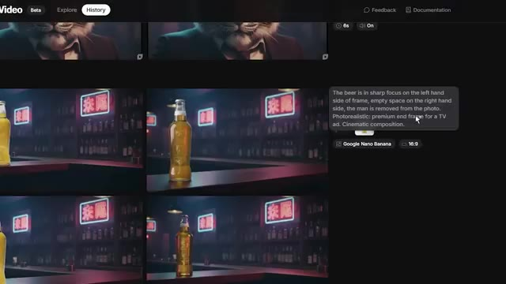
*Historique de génération sur l'interface Nano Banana montrant une grille de rendus de bouteilles de bière et une infobulle affichant le prompt textuel détaillé.*

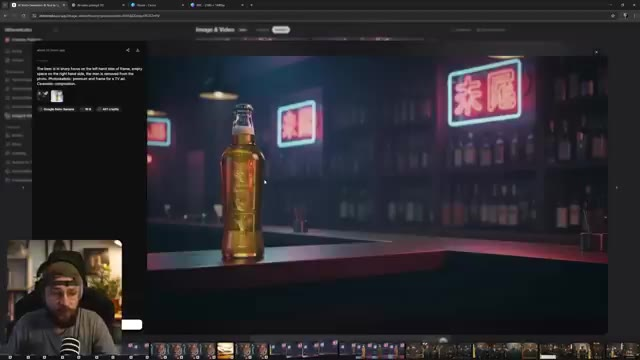
*Même vue que l'image #1 montrant l'image générée de la bouteille de bière dans Nano Banana avec la webcam du créateur en bas à gauche.*

---

### ⏱️ `[00:25:11 - 00:25:49]` | Segment #53

**🔊 Audio (Transcription Intégrale Mot pour Mot en Français) :**
> de retour sur Nano Banana et j'ai juste utilisé un prompt textuel très simple. La bière est dans un pack de six avec une boîte d'aspect premium, elle est bien nette sur le côté gauche du cadre, avec de l'espace vide à droite. Encore une fois, photoréaliste, plan final de fin de publicité TV. On a effectivement obtenu plein d'options vraiment sympas pour ça, mais j'ai fini par choisir ma préférée et bien sûr, de l'avoir mise à l'échelle dans Topaz aussi, parce que je savais que je n'allais pas faire passer ça par un générateur de vidéo et tout ce que j'ai fait dans le montage, c'est juste d'ajouter un très lent mouvement de caméra vers l'avant en post-production, donc je suis littéralement juste en train d'augmenter...

**👁️ Analyse Visuelle d'Écran (gemini-3.5-flash-lite) :**
**Interface & Outils** : Navigateur web affichant la plateforme ElevenLabs (section Image & Video) et le logiciel de montage vidéo Adobe Premiere Pro.

**Contenu textuel & Code** : Prompt visible : "The beer in a 6 pack premisim looking box is in sharp focus on the left hand side of frame, empty space on the right hand side, the man is removed from the photo. Photorealistic: premium end frame for a TV ad. Cinematic composition." Modèle utilisé : Google Nano Banana, rapport 16:9. Paramètres de Topaz Upscale visibles (x4).

**Action / Démonstration** : Le créateur navigue dans les options d'images générées sur ElevenLabs, survole une image pour afficher le prompt textuel, sélectionne son image favorite, puis bascule sur Adobe Premiere Pro pour montrer le montage final avec la timeline et les pistes vidéo.

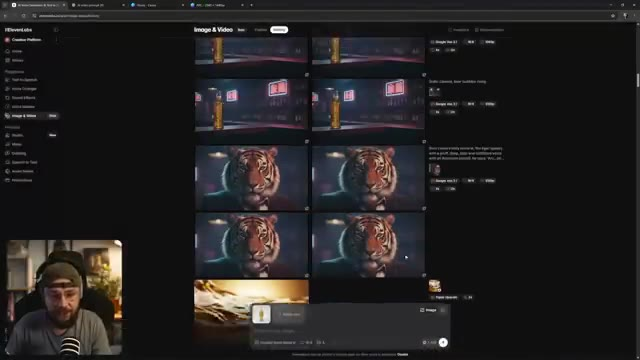
*Interface d'ElevenLabs (génération d'images et de vidéos) montrant une grille de résultats de générations d'images avec le créateur en incrustation (PiP).*

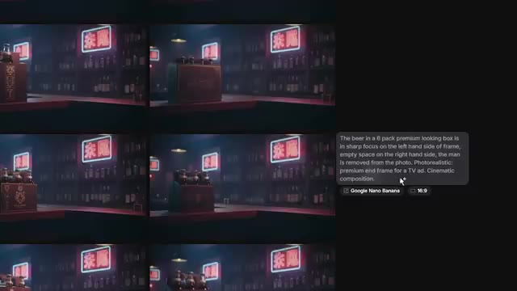
*Gros plan sur une image générée montrant un pack de bières sur un comptoir de bar avec un panneau néon rouge à l'arrière-plan, et une infobulle affichant le prompt textuel.*

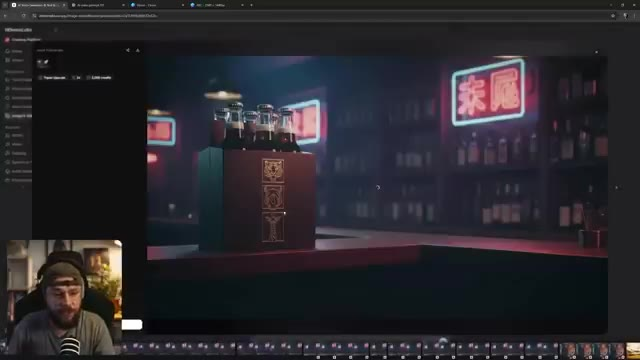
*Visualiseur en plein écran sur ElevenLabs affichant une image sélectionnée d'un pack de bières haut de gamme dans un bar.*

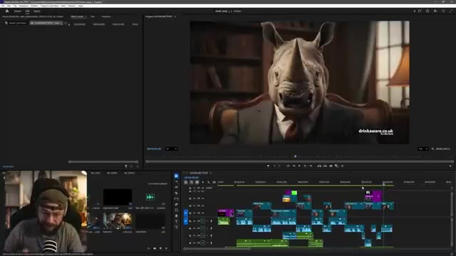
*Interface du logiciel de montage Adobe Premiere Pro montrant le panneau de prévisualisation avec un personnage anthropomorphe (rhinocéros en costume) et la timeline complète du projet.*

---

### ⏱️ `[00:25:49 - 00:26:25]` | Segment #54

**🔊 Audio (Transcription Intégrale Mot pour Mot en Français) :**
> l'échelle du plan juste un tout petit peu pour ajouter un tout petit peu de mouvement et si je zoome complètement à fond autre chose que j'ai fait c'est d'ajouter une couche de grain de film, c'est appliqué tout au long de la publicité donc si je vous montre juste on va zoomer sur cette lumière et je vais désactiver la couche de grain de film vous pouvez voir que ça a l'air un peu trop lisse basiquement si je la réactive c'est un grain assez lourd mais ça aide vraiment à vendre toute la publicité mais ça aide particulièrement avec l'image de fin où il n'y a absolument aucun mouvement à part ce simple mouvement de post-production que j'ai ajouté en ajoutant ce film

**👁️ Analyse Visuelle d'Écran (gemini-3.5-flash-lite) :**
**Interface & Outils** : Adobe Premiere Pro (logiciel de montage vidéo) avec panneau de montage, aperçu vidéo et panneau de contrôle des effets. Incrustation vidéo (PiP) du créateur en bas à gauche.

**Contenu textuel & Code** : Dans la fenêtre d'aperçu, on observe une scène vidéo mettant en scène un personnage de rhinocéros habillé en costume-cravate assis dans un bureau avec des étagères de livres en arrière-plan, et la mention "drinkaware.co.uk" visible en bas à droite. Sur la timeline en bas, de multiples pistes audio et vidéo sont agencées.

**Action / Démonstration** : Le logiciel de montage vidéo Adobe Premiere Pro est affiché, illustrant le processus de post-production et l'ajustement des plans de la publicité générée par IA.

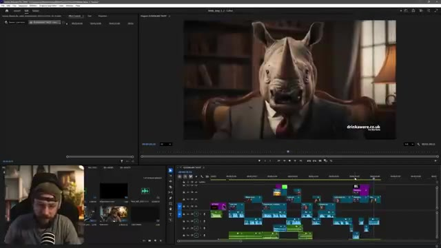
*Interface du logiciel Adobe Premiere Pro montrant le montage vidéo d'une publicité avec un personnage anthropomorphe (rhinocéros en costume) à l'écran et la webcam du créateur en incrustation (PiP).*

---

### ⏱️ `[00:26:25 - 00:26:59]` | Segment #55

**🔊 Audio (Transcription Intégrale Mot pour Mot en Français) :**
> le grain donne juste un peu plus de vie et lie un peu le tout d'un point de vue textuel et bien sûr j'ai ajouté le logo drink aware si vous venez des états-unis ici au royaume-uni nous avons certaines règles que nous devons respecter lorsqu'il s'agit de publicité bien sûr cela avertit les spectateurs du danger de l'alcool je l'ai juste utilisé ici pour en quelque sorte vendre le fait que cela pourrait être utilisé comme une vraie pub et ensuite bien sûr nous terminons sur le plan du rhinocéros qui rit maintenant c'était en fait un peu un heureux accident parce qu'avec les générations vo 3.1 ils gardaient comme il allait

**👁️ Analyse Visuelle d'Écran (gemini-3.5-flash-lite) :**
**Interface & Outils** : Adobe Premiere Pro (logiciel de montage vidéo avec panneau de prévisualisation, timeline complexe et incrustation vidéo du créateur en bas à gauche).

**Contenu textuel & Code** : Timeline de montage vidéo avec de multiples pistes audio et vidéo, moniteur de programme affichant les séquences générées par IA, texte publicitaire "ARC BREW", et mention légale "drinkaware.co.uk For the Facts".

**Action / Démonstration** : Le créateur commente son projet de montage vidéo sur Adobe Premiere Pro tout en expliquant les choix artistiques et réglementaires de sa publicité générée par IA.

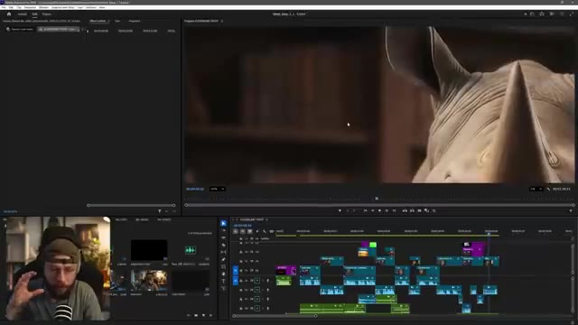
*Interface d'Adobe Premiere Pro montrant un gros plan sur le visage du rhinocéros généré par IA dans le moniteur de programme.*

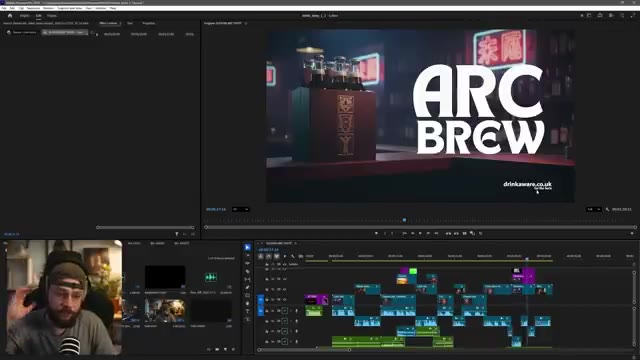
*Interface d'Adobe Premiere Pro affichant une scène publicitaire avec le texte 'ARC BREW' et le logo 'drinkaware.co.uk' en bas à droite.*

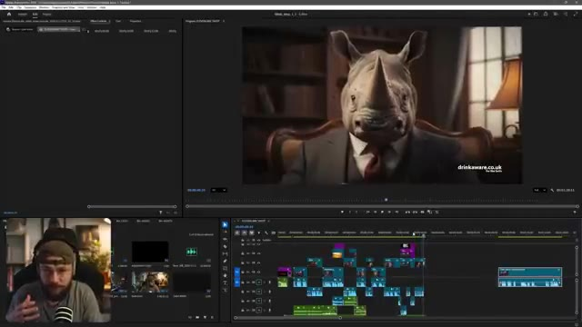
*Interface d'Adobe Premiere Pro montrant le plan final avec un personnage anthropomorphe à tête de rhinocéros en costume assis dans une pièce.*

---

### ⏱️ `[00:26:59 - 00:27:35]` | Segment #56

**🔊 Audio (Transcription Intégrale Mot pour Mot en Français) :**
> prononcer la réplique du dialogue et puis simplement rire à la fin et finalement je me suis dit non je pense que je devrais vraiment utiliser ça dans la publicité elle-même et je pense que ça a fini par être une jolie petite façon amusante de conclure la publicité, donc voilà pour le côté visuel du montage, maintenant je veux parler un peu de l'audio. Pas besoin de plonger trop profondément dans les voix off elles-mêmes car nous avons déjà couvert cela en détail. Grâce à la fonctionnalité de changement de voix de ElevenLabs, nous avons rapidement et facilement verrouillé la cohérence de nos personnages. Donc si nous plongeons simplement

**👁️ Analyse Visuelle d'Écran (gemini-3.5-flash-lite) :**
**Interface & Outils** : Adobe Premiere Pro (logiciel de montage vidéo) avec panneau Projet, Moniteur source, Moniteur de programme, et Timeline multicouche.

**Contenu textuel & Code** : Timeline de montage avec pistes vidéo et audio comportant divers clips découpés et superposés, et le panneau de projet montrant des vignettes de médias.

**Action / Démonstration** : Le projet de montage vidéo est affiché à l'écran tandis que Jack apparaît en incrustation (Picture-in-Picture) dans le coin inférieur gauche, gesticulant tout en expliquant son processus.

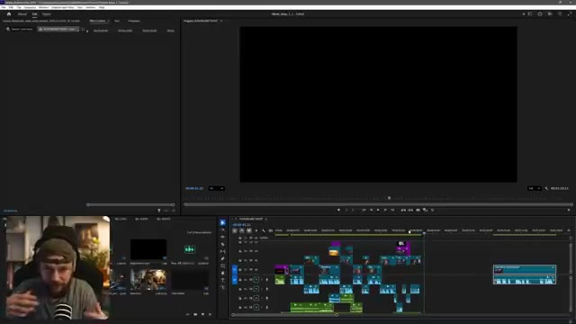
*Interface d'Adobe Premiere Pro affichant la timeline du projet publicitaire avec Jack visible dans un encadré PiP en bas à gauche.*

---

### ⏱️ `[00:27:35 - 00:28:11]` | Segment #57

**🔊 Audio (Transcription Intégrale Mot pour Mot en Français) :**
> à travers nos autres pistes audio, je pense que je vais continuer et je vais couper les pistes de voix off et nous pouvons en quelque sorte aborder cela. Donc la première chose dont nous devrions parler, c'est la musique utilisée dans la publicité. Donc tout cela a été généré entièrement dans Eleven Labs. Si nous retournons sur la plateforme elle-même, vous pouvez voir sur le côté gauche qu'il y a un onglet pour la musique. Ce que vous pouvez faire ici, c'est entrer un texte indicatif et cela va simplement vous générer une piste à la volée. C'est donc notre piste. Si vous vous intéressez au texte indicatif que j'ai donné à Eleven Labs, c'est une piste de garage rock brute et énergique avec

**👁️ Analyse Visuelle d'Écran (gemini-3.5-flash-lite) :**
**Interface & Outils** : Adobe Premiere Pro et l'interface web de la plateforme Eleven Labs (onglet Music).

**Contenu textuel & Code** : Texte du prompt visible sur l'image 3 : "A raw and energetic garage rock track featuring minimalist instrumentation, gritty guitar riffs, and powerful, capture the spirit of early 2000s indie rock." et "remove the vocals".

**Action / Démonstration** : Le créateur montre son logiciel de montage vidéo, navigue sur l'interface d'Eleven Labs pour présenter l'outil de génération musicale, puis dévoile le prompt textuel utilisé pour créer la piste de rock.

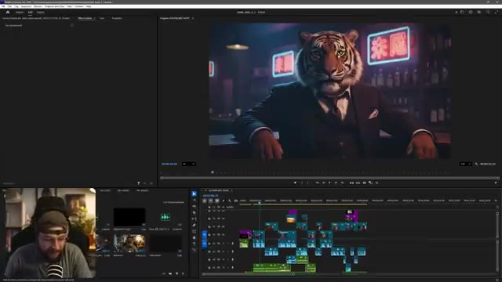
*Interface d'Adobe Premiere Pro montrant la timeline de montage et un plan vidéo avec un personnage à tête de tigre dans un bar.*

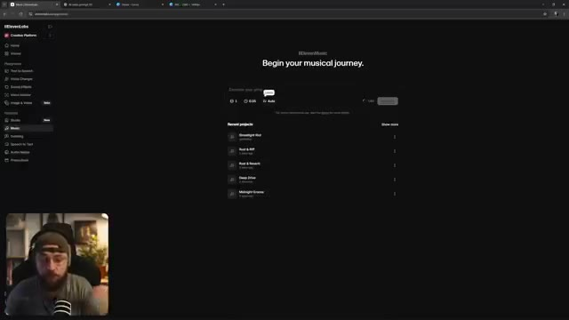
*Interface du site Eleven Labs montrant l'onglet Music et la page d'accueil de génération musicale.*

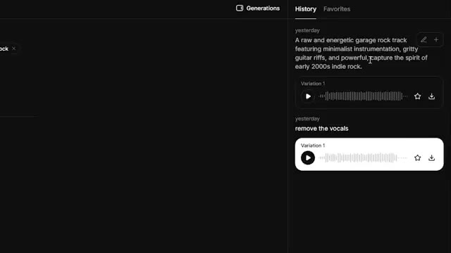
*Historique des générations de musique sur Eleven Labs affichant le prompt textuel utilisé pour le morceau de garage rock.*

---

### ⏱️ `[00:28:11 - 00:28:47]` | Segment #58

**🔊 Audio (Transcription Intégrale Mot pour Mot en Français) :**
> instrumentation minimaliste, riffs de guitare rugueux, puissant, capture l'esprit du rock indépendant du début des années 2000. Et l'ambiance de la chanson qu'on a obtenue, j'ai vraiment aimé. Je trouvais que c'était quelque chose qu'on pouvait imaginer voir dans une publicité Jack Daniel's ou quelque chose comme ça. Ça apportait un peu d'assurance et contrastait avec les images de nos animaux portant de superbes costumes élégants. Mais en termes d'intrigue, cela sert aussi d'élément narratif assez important parce qu'évidemment, nous avons ce moment où il n'y a pas de musique et presque aucun son du tout. Nous avons juste chaque

**👁️ Analyse Visuelle d'Écran (gemini-3.5-flash-lite) :**
**Interface & Outils** : Image 1 : Interface web de génération audio (Suno/outil similaire). Image 2 : Logiciel de montage Adobe Premiere Pro avec incrustation caméra (PiP).

**Contenu textuel & Code** : Image 1 : Texte du prompt visible : "A raw and energetic garage rock track featuring minimalistic instrumentation, gritty guitar riffs, and powerful, capture the spirit of early 2000s indie rock." ainsi qu'une variation audio "remove the vocals". Image 2 : Timeline de montage avec pistes vidéo et audio, panneau moniteur affichant un rhinocéros assis dans un fauteuil devant une cheminée, et encadré PiP de Jack.

**Action / Démonstration** : Image 1 : Affichage de l'historique des générations audio avec les pistes correspondantes. Image 2 : Montage vidéo en cours dans Premiere Pro avec la timeline et le retour vidéo.

*Interface de l'outil de génération audio montrant l'historique des prompts et les pistes audio générées.*

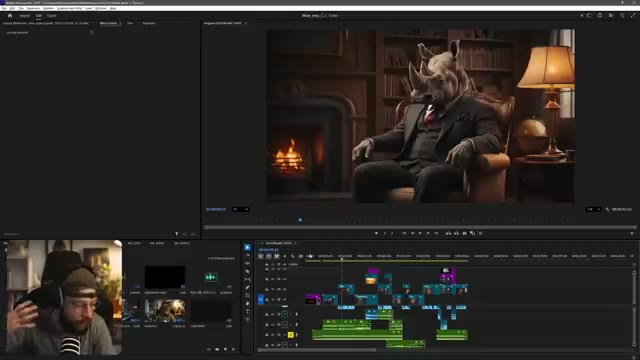
*Interface d'Adobe Premiere Pro montrant le montage vidéo avec le clip d'un rhinocéros anthropomorphe en costume et la webcam de Jack en incrustation (PiP).*

---

### ⏱️ `[00:28:47 - 00:29:25]` | Segment #59

**🔊 Audio (Transcription Intégrale Mot pour Mot en Français) :**
> des personnages qui parlent et la façon dont nous avons en quelque sorte réalisé cette coupure, c'était en utilisant un effet sonore de montée parce que c'était tout simplement trop difficile de couper sur le rythme et ça paraissait très bizarre. Je savais donc que ce que je devais faire était d'introduire un effet sonore qui monte pour me permettre de couper la musique et ce que j'ai également fait pour beaucoup de plans, c'est d'introduire de l'ambiance grâce au sound design, donc avec le plan du tigre, vous pouvez entendre que nous avons comme un bar, l'atmosphère de gens qui discutent et des choses comme ça, pour le rhinocéros nous avons le feu qui crépite parce qu'en tant que spectateur, vous

**👁️ Analyse Visuelle d'Écran (gemini-3.5-flash-lite) :**
**Interface & Outils** : Adobe Premiere Pro (logiciel de montage vidéo) avec un encadré vidéo (PiP) du présentateur Jack en bas à gauche.

**Contenu textuel & Code** : Timeline de montage vidéo avec des pistes audio et vidéo multiples, le moniteur de prévisualisation affichant une scène générée par IA d'un personnage anthropomorphe à tête de tigre en costume tenant une bouteille dans un bar aux lumières néon, et le panneau des effets.

**Action / Démonstration** : Le créateur montre son écran de montage sur Adobe Premiere Pro en expliquant l'utilisation d'effets sonores (riser) et de sound design (ambiance de bar) pour rythmer la vidéo, tout en gesticulant dans l'encadré PiP.

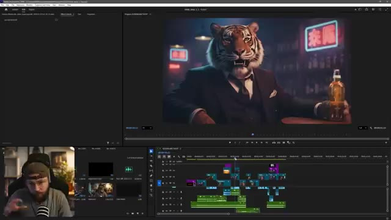
*Interface du logiciel Adobe Premiere Pro montrant la timeline de montage avec un plan vidéo d'un homme à tête de tigre dans un bar, et un encadré PiP (Picture-in-Picture) de Jack en bas à gauche expliquant son montage audio.*

---

### ⏱️ `[00:29:25 - 00:29:58]` | Segment #60

**🔊 Audio (Transcription Intégrale Mot pour Mot en Français) :**
> on peut voir le feu en bas à gauche du cadre ça attire l'œil donc on s'attend à avoir un certain genre d'effets sonores pour vraiment vendre le visuel et puis pour la girafe on a une ambiance similaire à celle qu'on s'attendrait à entendre dans un casino chic par exemple. Maintenant, la raison pour laquelle je mentionne les effets sonores d'ambiance c'est qu'ils jouent un rôle important quand on coupe la musique aussi parce que ce que j'ai fait c'est que j'ai ajouté l'ambiance de notre scène de bar et je l'ai juste rendue vraiment très forte mais vous pouvez voir ici que je l'ai fait monter en fondu. Dans Premiere Pro c'est vraiment facile d'ajouter ces fondues en faisant simplement glisser cette section

**👁️ Analyse Visuelle d'Écran (gemini-3.5-flash-lite) :**
**Interface & Outils** : Adobe Premiere Pro

**Contenu textuel & Code** : Noms des clips vidéo et pistes audio sur la timeline de montage, notamment "Lion voice changed.mp4", "Rhino voice changed.mp4", "ElevenLabs_Untitled_project (1).mp4", et des pistes d'ambiance sonore avec des marqueurs de fondu.

**Action / Démonstration** : Le créateur navigue et manipule le logiciel de montage Adobe Premiere Pro, montrant des extraits vidéo avec des personnages anthropomorphes générés par IA et démontrant l'utilisation des fondus audio sur la timeline.

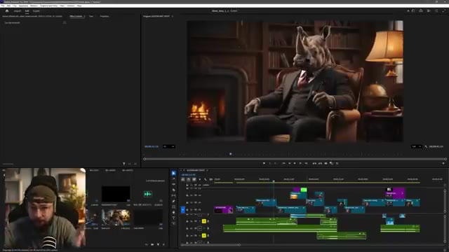
*Interface d'Adobe Premiere Pro montrant un plan vidéo avec un rhinocéros anthropomorphe assis dans un bureau et Jack en incrustation vidéo (PiP) dans le coin inférieur gauche.*

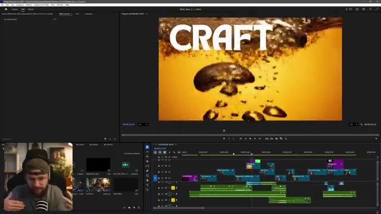
*Interface d'Adobe Premiere Pro montrant un plan avec du texte et un effet de bulles dans un liquide doré, avec Jack en incrustation vidéo (PiP) dans le coin inférieur gauche.*

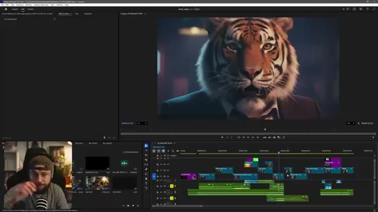
*Interface d'Adobe Premiere Pro montrant un gros plan d'un tigre habillé en costume dans un bureau, avec Jack en incrustation vidéo (PiP) dans le coin inférieur gauche.*

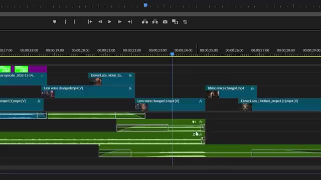
*Gros plan sur la timeline audio d'Adobe Premiere Pro démontrant la manipulation des pistes audio et des fondus sonores.*

---

### ⏱️ `[00:29:58 - 00:30:51]` | Segment #61

**🔊 Audio (Transcription Intégrale Mot pour Mot en Français) :**
> donc. Si on écoute juste la montée en puissance (riser) et l'ambiance, vous verrez ce que je veux dire. Si je coupe simplement la musique sans créer d'attente quant à l'arrivée d'un changement, ce serait très brusque, un peu bâclé et de piètre qualité, vraiment. Donc ce qui me semble cool à faire, c'est d'écouter toute la publicité d'affilée, mais je vais couper la voix off pour que vous puissiez entendre comment j'ai utilisé certains effets sonores. Et ensuite, on fera une dernière écoute.

**👁️ Analyse Visuelle d'Écran (gemini-3.5-flash-lite) :**
**Interface & Outils** : Adobe Premiere Pro (logiciel de montage vidéo) avec un affichage en Picture-in-Picture (PiP) du créateur en bas à gauche.

**Contenu textuel & Code** : Timeline de montage vidéo multi-pistes, moniteur de prévisualisation avec le rendu vidéo (plan du tigre puis texte d'avertissement), et panneau de projet.

**Action / Démonstration** : Le créateur montre son écran de montage sur Adobe Premiere Pro tout en expliquant sa méthode de design sonore et de mixage pour la publicité générée par IA.

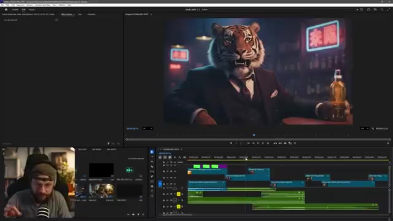
*Interface d'Adobe Premiere Pro affichant le montage vidéo avec un plan montrant un homme avec une tête de tigre dans un bar, et la webcam du créateur en incrustation (PiP) dans le coin inférieur gauche.*

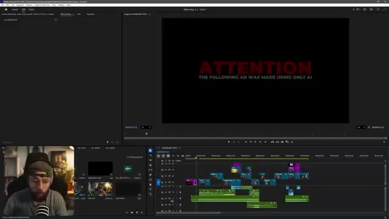
*Interface d'Adobe Premiere Pro montrant la timeline et le moniteur avec un carton de texte d'avertissement en rouge ("ATTENTION THE FOLLOWING AD WAS MADE USING ONLY AI"), avec la webcam du créateur en bas à gauche.*

---

### ⏱️ `[00:30:51 - 00:31:24]` | Segment #62

**🔊 Audio (Transcription Intégrale Mot pour Mot en Français) :**
> à travers, mais je vais couper la piste musicale juste pour vous donner une perspective encore plus détaillée de la façon dont nous avons géré le montage audio lui-même. C'est donc tout bon les gars.

**👁️ Analyse Visuelle d'Écran (gemini-3.5-flash-lite) :**
**Interface & Outils** : Adobe Premiere Pro

**Contenu textuel & Code** : Timeline de montage vidéo comportant de multiples pistes audio et vidéo, écran de prévisualisation (Program monitor), panneau de chutier (Project panel) et incrustation vidéo du créateur en bas à gauche (PiP).

**Action / Démonstration** : Le créateur navigue et présente son projet de montage vidéo dans Adobe Premiere Pro, montrant les différentes séquences et pistes de sa timeline.

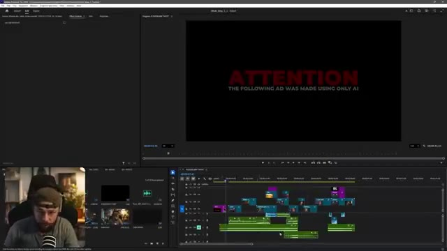
*Interface d'Adobe Premiere Pro montrant la timeline du projet de montage et l'écran de prévisualisation affichant le texte "ATTENTION THE FOLLOWING AD WAS MADE USING ONLY AI".*

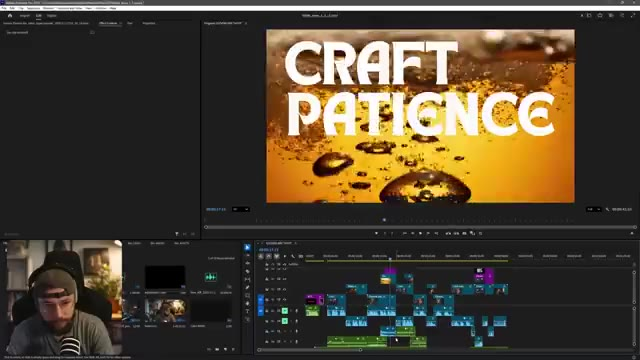
*Interface d'Adobe Premiere Pro affichant un plan de coupe avec le texte "CRAFT PATIENCE" sur un fond liquide doré.*

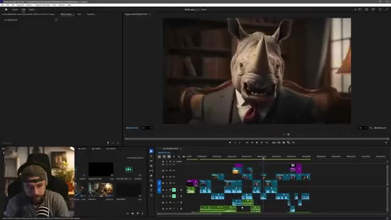
*Interface d'Adobe Premiere Pro montrant un personnage de rhinocéros humanoïde en costume assis dans une pièce.*

---

### ⏱️ `[00:31:24 - 00:31:46]` | Segment #63

**🔊 Audio (Transcription Intégrale Mot pour Mot en Français) :**
> Je pense que nous avons fait le tour de tout à ce stade. Nous avons passé en revue beaucoup de détails pour chaque étape impliquée dans tout le processus de création de cette publicité. Et les gars, si vous avez apprécié le contenu d'aujourd'hui, assurez-vous de lâcher un pouce bleu pour moi. Si vous êtes nouveau, pensez à vous abonner. Et bien sûr, activez cette cloche de notification pour ne jamais manquer aucune future mise en ligne.

**👁️ Analyse Visuelle d'Écran (gemini-3.5-flash-lite) :**
**Interface & Outils** : Présentation face caméra sans partage d'écran

**Contenu textuel & Code** : Aucun contenu logiciel ou visuel d'intelligence artificielle affiché, uniquement le présentateur (Jack) dans son studio devant un micro avec une étagère et des plantes en arrière-plan.

**Action / Démonstration** : Jack s'adresse directement à la caméra pour conclure la vidéo et faire ses appels à l'action (likes, abonnement, notifications), en faisant des gestes de la main.

---

### ⏱️ `[00:31:46 - 00:32:17]` | Segment #64

**🔊 Audio (Transcription Intégrale Mot pour Mot en Français) :**
> Si vous avez la moindre question, assurez-vous de les poser juste en dessous dans la section des commentaires. Je répondrai à autant d'entre elles que possible. Et nous terminerons la vidéo en regardant notre publicité finie une dernière fois. Merci d'avoir regardé les gars. Passez une bonne journée. Le goût. Soit vous l'avez, soit vous ne l'avez pas. Ça ne peut pas être truqué. Ça ne peut pas être mesuré ou cartographié comme des données. Le goût réside dans l'âme d'une boisson forgée avec savoir-faire, patience et temps. Chaque gorgée est un aperçu de son histoire.

**👁️ Analyse Visuelle d'Écran (gemini-3.5-flash-lite) :**
**Interface & Outils** : Présentation face caméra alternant avec des extraits vidéo générés par IA.

**Contenu textuel & Code** : Visuels cinématiques générés par IA d'animaux humanisés (rhinocéros et tigre) dans des décors élégants.
[DESC_IMAGE_1] Jack parle de la fin de la vidéo et invite à poser des questions dans les commentaires.
[DESC_IMAGE_2] Jack conclut sa vidéo avant la diffusion finale de la publicité.
[DESC_IMAGE_3] Diffusion du spot publicitaire final avec un personnage de rhinocéros.
[DESC_IMAGE_4] Diffusion du spot publicitaire final avec un personnage de tigre dans un bar.

**Action / Démonstration** : Jack s'adresse à son audience face caméra puis diffuse le résultat final de sa publicité générée par IA.

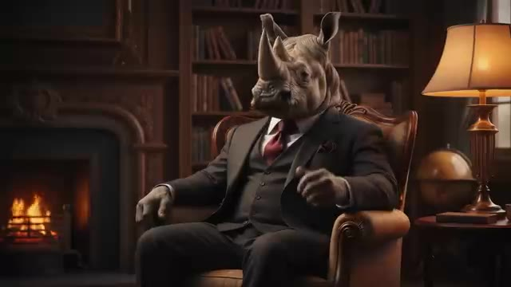
*Extrait de la publicité générée par IA montrant un rhinocéros anthropomorphe en costume assis dans un fauteuil près d'une cheminée.*

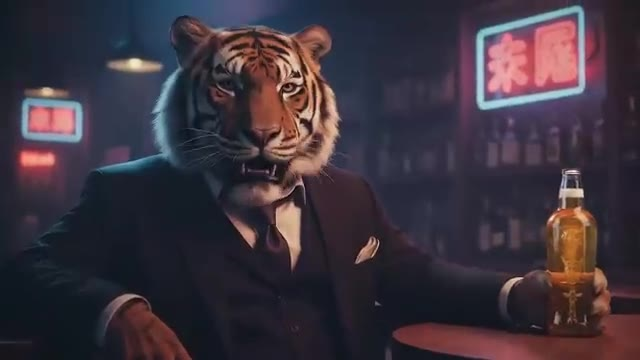
*Extrait de la publicité générée par IA montrant un tigre anthropomorphe en costume tenant une bouteille dans un bar.*

---

### ⏱️ `[00:32:18 - 00:32:34]` | Segment #65

**🔊 Audio (Transcription Intégrale Mot pour Mot en Français) :**
> Et pendant un moment, le bruit s'efface. Le monde ralentit. Et tout ce qui reste, c'est le goût. Ark, certains disent que c'est un goût acquis. Je dis que c'est de l'instinct.

**👁️ Analyse Visuelle d'Écran (gemini-3.5-flash-lite) :**
**Interface & Outils** : Séquence vidéo générée par IA (publicité fictive), aucune interface logicielle de travail affichée.

**Contenu textuel & Code** : Texte publicitaire "ARC BREW" en lettres blanches majuscules, et mention légale "drinkaware.co.uk for the facts" en bas à droite.

**Action / Démonstration** : Affichage cinématique d'un plan de spot publicitaire généré par IA, sans manipulation ni démonstration d'outil.

---
