# 🎬 Comment utiliser Nano Banana PRO — c’est DINGUE

> **Chaîne** : [Jack Vs. AI](https://www.youtube.com/@JackVsAI)  
> **Titre original** : `How to use Nano Banana PRO — it’s INSANE`  
> **Lien YouTube** : [https://www.youtube.com/watch?v=C_iQeGmS9z8](https://www.youtube.com/watch?v=C_iQeGmS9z8)  
> **Date de publication** : 2025-11-21  
> **Durée** : 17m 22s (`1042s`)  
> **Identifiant vidéo** : `C_iQeGmS9z8`  
> **Fiche Web Interactive** : [2025-11-21_YT-C_iQeGmS9z8_Comment utiliser Nano Banana PRO — c’est DINGUE_by-whisper-v3-large-turbo+gemini-3.5-flash-lite.html](2025-11-21_YT-C_iQeGmS9z8_Comment utiliser Nano Banana PRO — c’est DINGUE_by-whisper-v3-large-turbo+gemini-3.5-flash-lite.html)  
> **Captures de démonstration clés** : `86 captures réelles (anti-talking-head)`  
> **Modèles utilisés** : Audio: `large-v3-turbo` (Faster-Whisper int8 VPS) | Vision: `gemini-3.5-flash-lite` (Google AI Studio API)  

---

## 📌 Synthèse Exécutive & Outils

### 📌 Résumé
Dans cette vidéo, l'artiste VFX et créateur Jack explore en profondeur **Nano Banana PRO**, le nouveau modèle d'image par IA de Google qu'il qualifie de révolutionnaire pour la publicité et la réalisation de films. Présenté comme un bond en avant majeur par rapport à la première version, cet outil se distingue par une cohérence accrue des personnages et des produits, un rendu de texte multilingue précis, la création de diagrammes détaillés, ainsi qu'une capacité native à générer des images en haute résolution (2K et 4K), éliminant ainsi les artefacts visuels liés aux anciens processus d'upscaling. 

Pour démontrer la puissance du modèle, Jack déploie une méthode étape par étape rigoureuse axée sur l'image de référence multiple. Il commence par importer une photo de référence de lui-même pour stabiliser les traits de son personnage à travers différents angles de caméra, puis y associe des éléments complexes du monde réel, tels qu'une bouteille de Coca-Cola en verre et un t-shirt siglé Carhartt, afin de tester la fidélité des logos et du branding. Enfin, il pousse l'expérimentation vers la génération de scènes complexes impliquant des célébrités comme Taylor Swift, tout en analysant de manière critique les forces et les limites des résultats obtenus.

Pour les créateurs de vidéo et les professionnels de la communication, les bénéfices concrets sont immenses : Nano Banana PRO permet de s'affranchir des contraintes techniques traditionnelles de l'IA générative en matière de respect des chartes graphiques et de maintien de l'identité visuelle. Bien que de légers défauts persistent sur certains motifs complexes ou proportions anatomiques, l'outil s'impose déjà comme un atout incontournable pour concevoir rapidement des storyboards professionnels, des visuels publicitaires percutants et des concepts cinématographiques de haute qualité.

### 🛠️ Outils, Modèles & Logiciels Présentés
* **Nano Banana PRO** : Le nouveau modèle d'image par IA de Google, intégré sur la plateforme Artlist, offrant une haute résolution (2K/4K), une cohérence accrue des personnages et des produits, et un rendu textuel précis.
* **Nano Banana 1** : La première version du modèle d'image de Google, limitée aux résolutions inférieures à la HD et nécessitant des optimisations d'image sujettes aux artefacts.
* **Artlist** : La plateforme d'hébergement et d'utilisation où est hébergé Nano Banana Pro, accessible pour la génération d'images via texte et image.

### 🔑 Points Clés & Enseignements Stratégiques
* **Saut qualitatif en résolution** : Nano Banana PRO permet de générer nativement des images en 2K et 4K, résolvant définitivement le problème des artefacts visuels causés par les anciennes méthodes d'amélioration d'échelle.
* **Cohérence accrue des personnages** : L'utilisation d'une photo de référence personnelle permet au modèle de stabiliser l'apparence d'un visage et de s'adapter facilement à de nouveaux angles de caméra ou actions complexes sans dénaturation.
* **Intégration rigoureuse des produits** : L'outil gère l'injection simultanée de plusieurs références physiques (comme une bouteille de Coca-Cola) pour tester la fidélité des emballages, des logos et du branding dans des contextes publicitaires.
* **Gestion des détails vestimentaires** : Si le modèle excelle globalement dans la restitution des textures, des motifs complexes comme les inscriptions sur des t-shirts de marque (Carhartt) peuvent nécessiter une vigilance accrue et parfois une régénération.
* **Connaissance approfondie du monde réel** : Grâce à sa vaste base de données, le modèle intègre naturellement des éléments contextuels complexes et des proportions réalistes lorsqu'il met en scène des personnalités publiques.
* **Flexibilité des formats natifs** : Le logiciel propose un contrôle immédiat sur les formats d'image (16:9, 9:16, 1:1), facilitant la production de contenus adaptés à tous les réseaux sociaux et supports de diffusion.
* **Optimisation des prompts textuels** : L'association d'une description textuelle détaillée (éclairage, ambiance colorée, pose) à des images de référence permet d'obtenir un rendu visuel de qualité professionnelle.
* **Adaptabilité des accessoires** : Le modèle conserve fidèlement des éléments spécifiques du personnage de référence d'une génération à l'autre, comme une casquette de baseball portée à l'envers.
* **Nécessité d'un contrôle qualité rigoureux** : En dépit des performances spectaculaires, l'analyse critique des générations reste indispensable pour corriger d'éventuels défauts de proportion ou des incohérences textuelles mineures avant une utilisation commerciale.
* **Efficacité pour la réalisation et la publicité** : La combinaison de la cohérence des personnages et de la fidélité des produits positionne cet outil comme une solution idéale pour le prototypage rapide de campagnes publicitaires et de storyboards de films.

---

## ⏱️ Chronologie & Transcription Complète Audio & Visuelle (Mot pour Mot)

### ⏱️ `[00:00:00 - 00:00:21]` | Segment #01

**🔊 Audio (Transcription Intégrale Mot pour Mot en Français) :**
> Google l'a encore fait. C'est exact, Nano Banana Pro vient de sortir. Ce n'est pas un exercice. Dans la vidéo d'aujourd'hui, nous plongeons en profondeur dans la dernière version de l'outil d'image IA de Google. Je vais vous montrer comment ce nouveau modèle se compare à la première version et vous mettre au courant de toutes les astuces et conseils dont vous avez besoin pour tirer le meilleur parti de cet outil révolutionnaire.

**👁️ Analyse Visuelle d'Écran (gemini-3.5-flash-lite) :**
**Interface & Outils** : Présentation de démonstrations visuelles et d'exemples générés par IA sans affichage d'interface logicielle directe.

**Contenu textuel & Code** : Affichage de sous-titres en anglais correspondant à la voix off ("That's right", "of Google's AI image tool", "to get the absolute most out of") sur des clips cinématographiques générés par IA mettant en scène le présentateur dans divers décors fantastiques (forêt nocturne avec une banane lumineuse, tempête près d'un phare, paysage désertique).

**Action / Démonstration** : Le créateur présente des extraits visuels cinématographiques générés par l'IA pour illustrer ses propos d'introduction.

---

### ⏱️ `[00:00:21 - 00:00:53]` | Segment #02

**🔊 Audio (Transcription Intégrale Mot pour Mot en Français) :**
> Je suis Jack, je suis artiste VFX dans l'industrie publicitaire depuis plus d'une décennie maintenant, et j'ai travaillé avec beaucoup des plus grandes marques de la planète. En tant que professionnel de la création, j'utilise Nano Banana tous les jours. Je suis donc vraiment ravi que nous ayons enfin accès à la nouvelle version améliorée de Google. Et spoiler alert, ce truc est dingue. Si vous aimez le contenu d'aujourd'hui les gars, assurez-vous de lâcher un pouce bleu pour moi, pensez à vous abonner et bien sûr, activez la cloche de notification. Allez, entrons dans le vif du sujet. Concernant la structure de la vidéo d'aujourd'hui, nous commencerons par discuter de ce qui a réellement changé avec ce nouveau modèle.

**👁️ Analyse Visuelle d'Écran (gemini-3.5-flash-lite) :**
**Interface & Outils** : Présentation vidéo avec diapositive textuelle et incrustation (PiP) du créateur en bas à gauche.

**Contenu textuel & Code** : Texte affiché au centre de l'écran sur un fond coloré dégradé : "1. What's new with Nano Banana Pro?".

**Action / Démonstration** : Le créateur présente le plan de la vidéo tandis qu'une diapositive s'affiche à l'écran.

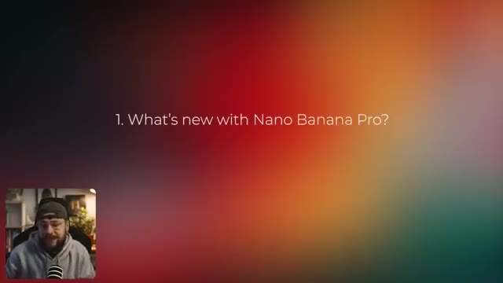
*Diapositive affichant le plan de la vidéo avec le titre du premier point, avec le présentateur en incrustation (PiP) dans le coin inférieur gauche.*

---

### ⏱️ `[00:00:53 - 00:01:26]` | Segment #03

**🔊 Audio (Transcription Intégrale Mot pour Mot en Français) :**
> Ensuite, je vous montrerai comment fonctionne Nano Banana Pro et comment l'utiliser au mieux pour la publicité et la réalisation de films par IA. Et nous terminerons par une comparaison entre Nano Banana Pro et l'ancien modèle. Ainsi, rien qu'en regardant cette seule vidéo, vous saurez tout ce dont vous avez besoin sur le nouvel outil. Et n'hésitez pas à sauter d'un repère temporel à l'autre comme vous le souhaitez. Alors, qu'est-ce qui a réellement changé avec Nano Banana Pro ? Eh bien, Google affirme que le nouveau modèle se concentre sur un niveau de cohérence beaucoup plus élevé à chaque génération, un rendu de texte précis dans plusieurs langues, des diagrammes détaillés et

**👁️ Analyse Visuelle d'Écran (gemini-3.5-flash-lite) :**
**Interface & Outils** : Présentation avec diapositive sur fond coloré dégradé et incrustation (PiP) du créateur.

**Contenu textuel & Code** : Texte affiché à l'écran : "1. What's new with Nano Banana Pro? 2. How to use the tool".

**Action / Démonstration** : Le créateur présente les points abordés dans la vidéo pendant que la diapositive s'affiche à l'écran.

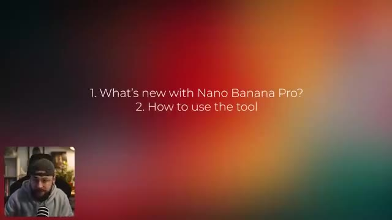
*Diapositive affichant le plan de la vidéo avec Jack en incrustation (PiP) dans le coin inférieur gauche.*

---

### ⏱️ `[00:01:26 - 00:02:01]` | Segment #04

**🔊 Audio (Transcription Intégrale Mot pour Mot en Français) :**
> des infographies et une connaissance plus large du monde réel pour des images réalistes. Et j'ai l'impression que je dois mentionner la résolution car nous pouvons désormais générer des images en 2K et 4K. C'est donc un grand bond en avant. Nano Banana 1 ne pouvait même pas générer d'images HD. Donc, la plupart du temps, vous deviez améliorer la résolution de votre résultat et cela peut causer toutes sortes d'artefacts étranges dans votre image. Donc, pour accéder à Nano Banana Pro, nous sommes sur Artlist. Et si vous voulez essayer la plateforme, vous pouvez cliquer sur le lien ci-dessous dans la description de la vidéo. Donc en haut à gauche de l'écran,

**👁️ Analyse Visuelle d'Écran (gemini-3.5-flash-lite) :**
**Interface & Outils** : Interface de la plateforme Artlist montrant une section de modèles d'IA en vedette ("Featured AI models"), et une diapositive de présentation textuelle.

**Contenu textuel & Code** : Texte sur l'image 1 : "What has changed with Nano Banana Pro? - A much Higher level of consistency across every generation - Accurate text rendering in multiple languages - Detailed diagrams and infographics - and a Broarder real world knowledge for 'true-to-life' images". Texte sur l'image 3 : "Featured AI models", "G Veo 3.1", "Flawless audio-video sync with style and character control".

**Action / Démonstration** : Le présentateur explique les améliorations de résolution et présente la plateforme Artlist pour accéder à l'outil Nano Banana Pro.

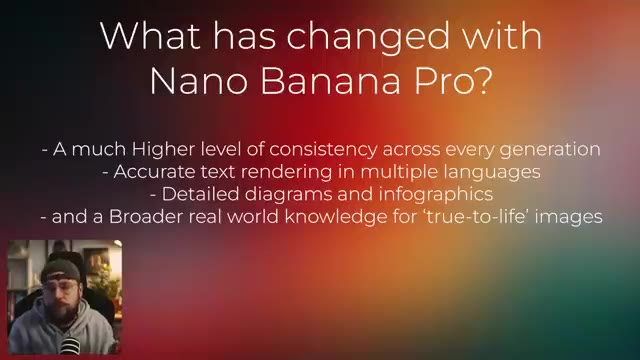
*Diapositive présentant les nouveautés de Nano Banana Pro avec le présentateur incrusté en bas à gauche.*

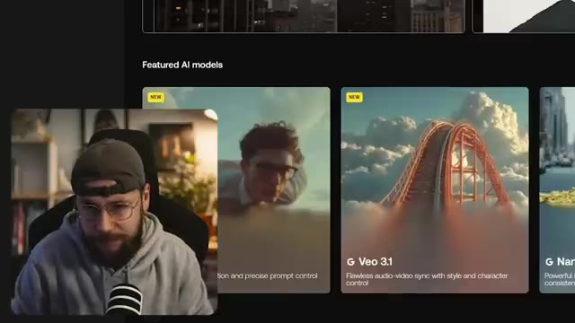
*Interface de la plateforme Artlist montrant des modèles d'IA en vedette, avec la webcam du présentateur incrustée.*

---

### ⏱️ `[00:02:01 - 00:02:33]` | Segment #05

**🔊 Audio (Transcription Intégrale Mot pour Mot en Français) :**
> vous pouvez voir que nous avons un onglet pour l'image IA. Nous allons donc cliquer ici. Bien sûr, nous avons l'option texte vers image et image vers image, ce sur quoi je veux vraiment me concentrer dans cette vidéo. Et si nous ouvrons ce menu déroulant, vous pouvez voir que nous avons maintenant l'option Nano Banana Pro. Allons-y et sélectionnons-la. Bien sûr, nous avons le contrôle habituel en ce qui concerne le format d'image 16 par 9, 9 par 16 pour tous vos besoins sur les réseaux sociaux et 1 par 1 également. Les deux principales choses que je veux tester avec Nano Banana Pro sont la cohérence des personnages et la cohérence des produits.

**👁️ Analyse Visuelle d'Écran (gemini-3.5-flash-lite) :**
**Interface & Outils** : Interface web d'Artlist (section AI Image).

**Contenu textuel & Code** : Texte « Transform your ideas into stunning visuals », options « Text to Image », « Image to Image », menus déroulants pour les modèles (Seedream 4.0, Flux Kontext, Nano Banana, Nano Banana Pro) et les formats (16:9, 9:16, 1:1).

**Action / Démonstration** : Le créateur navigue dans l'interface, sélectionne le modèle Nano Banana Pro et explore les options de format d'image.

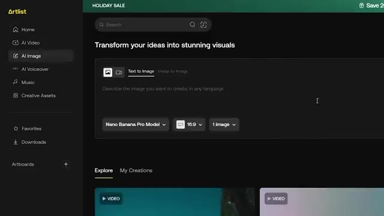
*Interface d'Artlist montrant l'onglet AI Image avec les options Text to Image et Image to Image.*

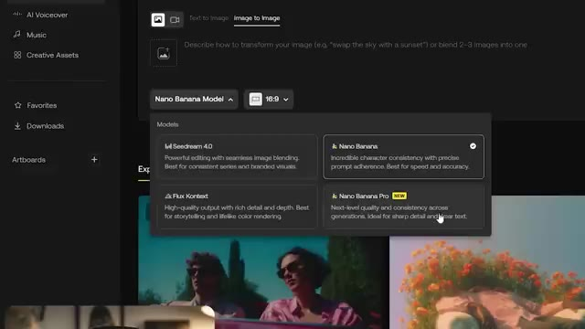
*Déroulement du menu de sélection des modèles d'IA avec Seedream 4.0, Flux Kontext, Nano Banana et Nano Banana Pro NEW.*

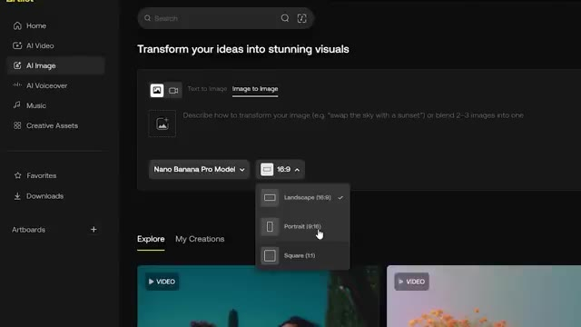
*Menu déroulant des formats d'image affichant Landscape (16:9), Portrait (9:16) et Square (1:1).*

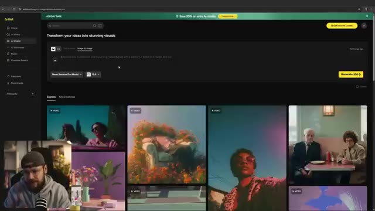
*Vue d'ensemble de l'interface Artlist avec le créateur en incrustation (PiP) dans le coin inférieur gauche.*

---

### ⏱️ `[00:02:33 - 00:03:06]` | Segment #06

**🔊 Audio (Transcription Intégrale Mot pour Mot en Français) :**
> parce que dans mon esprit, ce sont les deux domaines qui permettront à cet outil d'IA de briller en matière de publicité et de réalisation de films, qui sont bien sûr les axes de cette chaîne. Donc si nous cliquons sur cette icône ici, nous pouvons télécharger une image pour servir de référence. Maintenant, tout d'abord, je veux déposer cette image de référence assez terrible de moi qui vient d'être prise sur mon iPhone. Je vais balancer ça dedans. Et cela va bien sûr servir de base à notre personnage. La raison pour laquelle je me mets dans beaucoup de mes générations d'IA n'est pas seulement parce que je suis arrogant. C'est que lorsque vous créez un nouveau personnage

**👁️ Analyse Visuelle d'Écran (gemini-3.5-flash-lite) :**
**Interface & Outils** : Interface web d'Artlist (outil de génération d'images/vidéos par IA) avec un mode image-to-image et une incrustation vidéo (PiP) du présentateur Jack en bas à gauche.

**Contenu textuel & Code** : On peut lire en haut « Transform your ideas into stunning visuals », l'option « Image to Image », un menu déroulant pour le modèle « Nano Banana Pro Model », un format « 16:9 », et un bouton jaune « Generate 100+ ».

**Action / Démonstration** : Le créateur montre l'interface du site web d'Artlist et pointe la zone permettant de télécharger une image de référence pour la génération par IA.

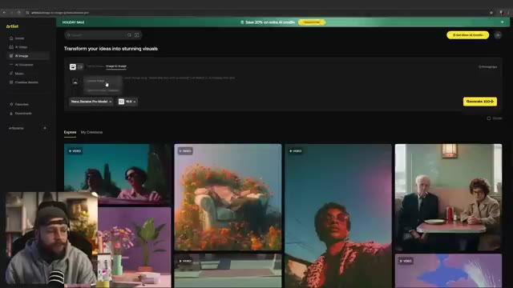
*Interface de la plateforme Artlist avec une incrustation vidéo (PiP) de Jack en bas à gauche, montrant la section de téléchargement d'image de référence pour l'IA.*

---

### ⏱️ `[00:03:06 - 00:03:42]` | Segment #07

**🔊 Audio (Transcription Intégrale Mot pour Mot en Français) :**
> à partir de zéro en utilisant l'IA, c'est beaucoup plus indulgent si nous demandons différents angles de caméra ou que ce personnage réalise certaines actions, car nous n'avons aucune référence du monde réel sur ce à quoi ce personnage ressemble réellement. Vous les gars, que vous soyez nouveau sur ma chaîne, que vous regardiez mes vidéos depuis un moment, vous allez voir si Nano Banana Pro fait réellement ce qu'il prétend. Maintenant, je veux aller de l'avant et télécharger plusieurs produits différents, en commençant par une bouteille en verre de Coca-Cola classique. Maintenant, je suis sûr que vous êtes tous assez familiers avec la façon dont fonctionne la génération d'images et de vidéos par IA et les types d'écueils pour les deux. Souvent, ces modèles ont du mal

**👁️ Analyse Visuelle d'Écran (gemini-3.5-flash-lite) :**
**Interface & Outils** : Interface web d'Artlist (section AI Image) combinée à une fenêtre de l'explorateur de fichiers Windows.

**Contenu textuel & Code** : Fenêtre de sélection de fichiers montrant plusieurs images de référence : un flacon de parfum turquoise, un t-shirt gris, une bouteille en verre de Coca-Cola sélectionnée, et un portrait. En arrière-plan, l'interface Artlist avec l'URL « artist.io/image-to-image-ai/nano-banana-pro/style-catalog/showcase/... ».

**Action / Démonstration** : Le créateur navigue dans l'explorateur de fichiers pour sélectionner une image de référence (la bouteille de Coca-Cola) afin de l'importer dans l'outil de génération d'IA.

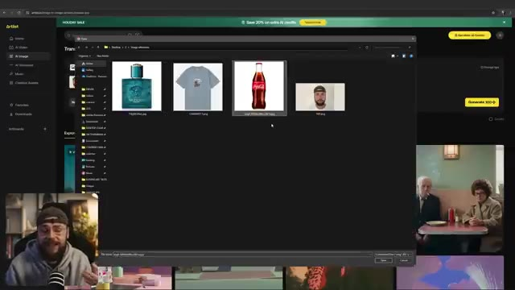
*Le créateur montre une fenêtre d'explorateur de fichiers par-dessus l'interface d'Artlist, affichant des images de référence de produits dont une bouteille de Coca-Cola.*

---

### ⏱️ `[00:03:42 - 00:04:12]` | Segment #08

**🔊 Audio (Transcription Intégrale Mot pour Mot en Français) :**
> un bon moment lorsqu'il s'agit de garder le texte, les logos et des choses de ce genre jolis et cohérents. Et évidemment, c'est vraiment, vraiment important si nous voulons utiliser l'IA pour créer des actifs qui sont réellement utilisables dans le monde réel. Donc nous parlons de prendre des résultats générés par l'IA et de les utiliser dans un cadre professionnel. Et la prochaine référence d'image que je veux utiliser est pour ce t-shirt conçu par Carhartt. Et la raison pour laquelle j'ai choisi cela est parce que c'est un design assez complexe et détaillé.

**👁️ Analyse Visuelle d'Écran (gemini-3.5-flash-lite) :**
**Interface & Outils** : Navigateur web affichant la plateforme de création multimédia et d'IA Artlist (artlist.io), avec un encadré vidéo PiP du présentateur (Jack).

**Contenu textuel & Code** : Menus visibles : "Home", "AI Video", "AI Image", "AI Voiceover", "Music", "Creative Assets", "Favorites", "Downloads", "Artboards". En-tête : "Transform your ideas into stunning visuals", "Nano Banana Pro Model", format "16:9", et bouton "Generate". Galerie avec des vignettes étiquetées "VIDEO".

**Action / Démonstration** : Le présentateur parle face à sa webcam tout en présentant l'interface de la plateforme Artlist et sa galerie de vidéos générées par IA sur son écran d'ordinateur.

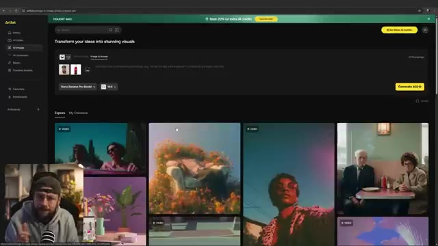
*Interface du site Artlist affichant une bibliothèque de créations vidéo et d'images IA, avec le créateur en incrustation (PiP).*

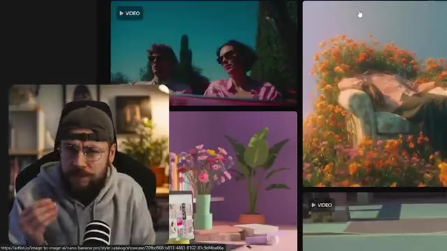
*Gros plan sur l'interface d'Artlist avec la galerie de vidéos générées par IA et la webcam du créateur en bas à gauche.*

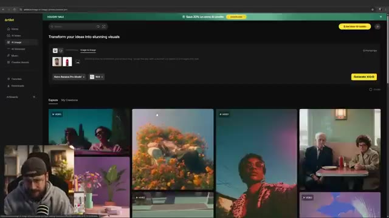
*Vue générale de l'interface de la plateforme Artlist montrant les options de génération d'images et de vidéos par IA.*

---

### ⏱️ `[00:04:12 - 00:04:36]` | Segment #09

**🔊 Audio (Transcription Intégrale Mot pour Mot en Français) :**
> L'idée ici est donc de me prendre comme personnage, de me placer dans différentes scènes, et pour toutes ces scènes, je vais tenir cette bouteille de coca en verre et porter ce t-shirt Carhartt. Et cela va efficacement nous montrer à quel point Nano Banana Pro est doué pour maintenir un personnage cohérent et des produits cohérents également, et bien sûr pour les intégrer dans le lieu de notre choix.

**👁️ Analyse Visuelle d'Écran (gemini-3.5-flash-lite) :**
**Interface & Outils** : Navigateur web affichant la plateforme Artlist (section IA image-to-image et catalogue de style Nano Banana Pro).

**Contenu textuel & Code** : URL visible en bas de l'écran (artlist.io/image-to-image-ai/nano-banana-pro/style-catalog), options du modèle Nano Banana Pro, boutons de génération.

**Action / Démonstration** : Le créateur commente les capacités de génération d'images et de cohérence de personnage d'un modèle d'IA tout en naviguant sur l'interface d'Artlist.

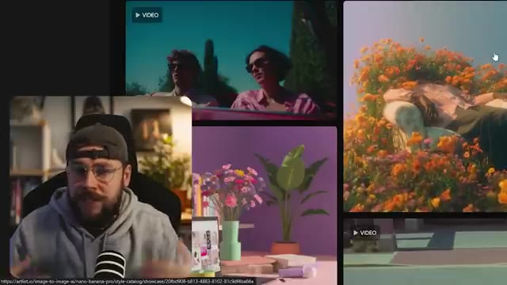
*Interface du site Artlist affichant le catalogue de style Nano Banana Pro avec un encadré PiP du créateur en bas à gauche.*

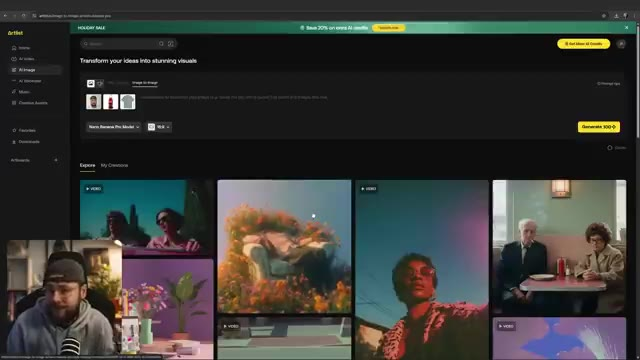
*Vue de l'interface d'Artlist montrant les options de génération d'images IA avec le modèle Nano Banana Pro sélectionné.*

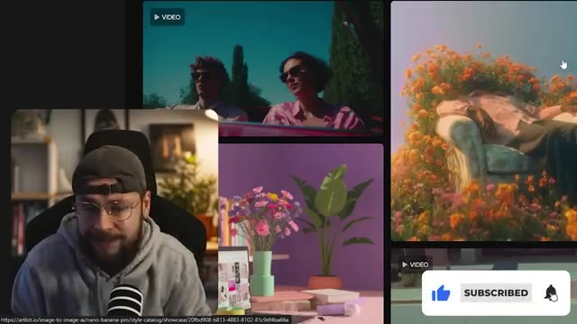
*Aperçu de la plateforme Artlist avec une animation d'interface incitant à s'abonner et liker en bas à droite.*

---

### ⏱️ `[00:04:36 - 00:05:00]` | Segment #10

**🔊 Audio (Transcription Intégrale Mot pour Mot en Français) :**
> Et pour le prompt textuel que nous visons, l'homme barbu surplombe l'horizon étendu d'une ville, regardant avec assurance la caméra baigné dans des teintes lavande désaturées et pêche pastel. En jetant un coup d'œil à notre première génération, vous pouvez voir qu'il y a un très beau niveau de détail textuel ici et que l'éclairage et la composition semblent très réalistes, comme Google l'avait promis.

**👁️ Analyse Visuelle d'Écran (gemini-3.5-flash-lite) :**
**Interface & Outils** : Navigateur web affichant une interface de génération vidéo par IA, avec incrustation vidéo (PiP) du créateur en bas à gauche.

**Contenu textuel & Code** : Texte du prompt affiché à l'écran : « The bearded man is overlooking a sprawling city skyline, staring confidently at the camera, bathed in desaturated lavenders and pastel peach hues. The bearded man is holding the glass bottle of Coca-Cola towards the rising sun, which flares through the glass like a beacon. He is wearing the light blue Carhartt t-shirt. »

**Action / Démonstration** : Le créateur présente le prompt textuel utilisé, puis dévoile le résultat de la première génération vidéo générée par l'IA.

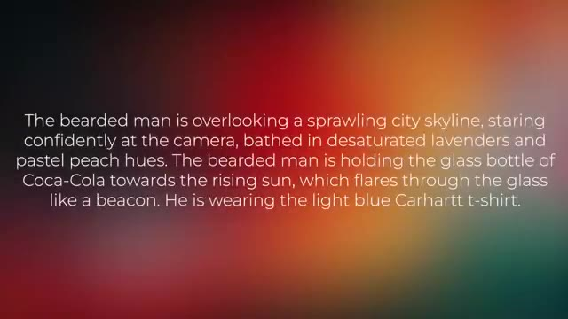
*Affichage à l'écran du prompt textuel détaillé décrivant la scène avec l'homme barbu et la bouteille de Coca-Cola.*

*Affichage de la première génération vidéo montrant l'homme barbu sur un toit tenant une bouteille de Coca-Cola face au soleil, avec le créateur en incrustation PiP.*

---

### ⏱️ `[00:05:00 - 00:05:34]` | Segment #11

**🔊 Audio (Transcription Intégrale Mot pour Mot en Français) :**
> Et étant donné que Nano Banana Pro nous a redonné un angle différent par rapport à l'image de référence que j'ai injectée, le niveau de cohérence des personnages qu'il a atteint est plutôt impressionnant. Il a également réussi à garder ma casquette de baseball à l'envers, alors que j'avais souvent un problème avec Nano Banana One où je voulais toujours que ma casquette de baseball soit dans le bon sens. La bouteille de Coca-Cola a l'air très bien. Elle correspond exactement à l'image de référence que nous avons injectée, comme on pouvait s'y attendre. Nous avons un bon niveau de cohérence du texte et du logo également. L'aspect visuel est tel qu'on peut l'imaginer.

**👁️ Analyse Visuelle d'Écran (gemini-3.5-flash-lite) :**
**Interface & Outils** : Vidéo de démonstration avec incrustation PiP (Picture-in-Picture) du créateur en studio.

**Contenu textuel & Code** : Rendu visuel d'une bouteille de Coca-Cola avec le logo "Original Taste Coca-Cola" lisible, un paysage urbain en arrière-plan baigné par la lumière du soleil.

**Action / Démonstration** : Le créateur commente un rendu vidéo généré par IA qui présente un personnage tenant une bouteille de Coca-Cola et montrant une forte cohérence de texte et de personnage sous un nouvel angle.

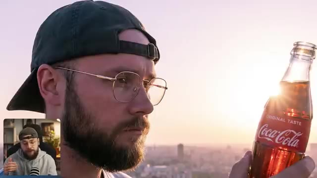
*Rendu vidéo généré par IA montrant un personnage avec une casquette à l'envers et des lunettes, tenant une bouteille de Coca-Cola sur fond de paysage urbain au coucher du soleil, avec un encadré PiP du créateur en bas à gauche.*

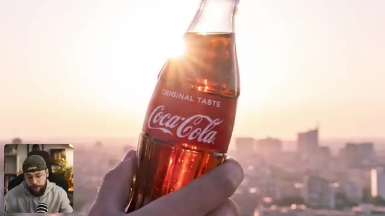
*Gros plan sur une bouteille de Coca-Cola tenue à la main devant une vue de ville au coucher du soleil dans un rendu généré par IA, avec le créateur visible en incrustation PiP dans le coin inférieur gauche.*

---

### ⏱️ `[00:05:35 - 00:06:09]` | Segment #12

**🔊 Audio (Transcription Intégrale Mot pour Mot en Français) :**
> Le respect des consignes est d'un bon niveau ici, mais je veux attirer votre attention sur le design du t-shirt. Dans cette petite section où il est écrit "whip", ça ne correspond pas tout à fait. Bien sûr, il est toujours impressionnant que, de manière générale, on nous montre un angle complètement différent du design du t-shirt et que, pour la plupart, cela semble plutôt cohérent. Mais bien sûr, il est important de souligner tout problème lié à la génération, et si vous deviez utiliser Nano Banana Pro pour le branding, de la publicité pour votre marque de mode par exemple, alors ce serait un problème et vous

**👁️ Analyse Visuelle d'Écran (gemini-3.5-flash-lite) :**
**Interface & Outils** : Navigateur web affichant une vidéo générée par intelligence artificielle avec incrustation vidéo PiP (Picture-in-Picture) du créateur.

**Contenu textuel & Code** : Texte "Original Taste" et "Coca-Cola" sur la bouteille, inscription "CARHARTT" et "WIP" sur le t-shirt, et un graphisme incrusté représentant un canard avec les mentions "CARHARTT" et "WIP".

**Action / Démonstration** : Le créateur montre une vidéo générée par IA et zoome ensuite sur le design du t-shirt pour analyser les défauts et incohérences de génération.

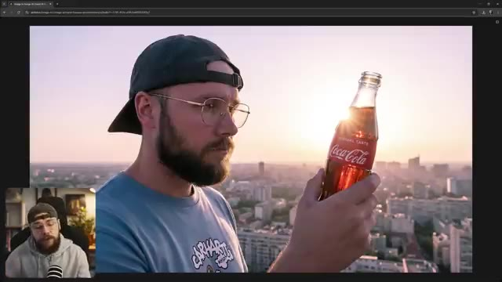
*Vidéo générée par IA affichée à l'écran montrant un homme barbu tenant une bouteille de Coca-Cola en haut d'un immeuble au coucher du soleil, avec une incrustation de la webcam du créateur en bas à gauche.*

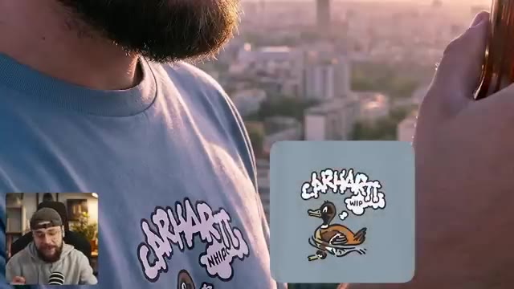
*Gros plan sur le t-shirt de l'homme généré par IA comparé au design original incrusté dans une vignette, montrant une incohérence sur l'inscription "whip".*

---

### ⏱️ `[00:06:09 - 00:06:40]` | Segment #13

**🔊 Audio (Transcription Intégrale Mot pour Mot en Français) :**
> Je dois régénérer une fois de plus. Maintenant, on m'a aussi affirmé de source sûre que Nano Banana Pro est incroyablement doué pour les deepfakes et qu'il n'y a aucune sorte de modération lorsqu'il s'agit d'ajouter des célébrités à une image. Donc ce que j'ai fait, c'est que j'ai re-téléchargé l'image de référence de moi-même et pour le prompt textuel, je dis simplement l'homme barbu sur scène bras dessus bras dessous avec Taylor Swift pendant qu'elle se produit lors d'une tournée à guichets fermés. Et je pense que ce qu'on va faire, c'est ajouter à la fin ces paramètres habituels que j'ai tendance à mettre à la fin de mon prompt textuel pour essayer d'obtenir un résultat qui a l'air bien professionnel.

**👁️ Analyse Visuelle d'Écran (gemini-3.5-flash-lite) :**
**Interface & Outils** : Navigateur web affichant la plateforme Artlist (section AI Image / AI Voiceover / Music).

**Contenu textuel & Code** : Texte du prompt visible dans l'interface : "The bearded man on stage, arm in arm with Taylor Swift whilst she performs at a sold out tour." Paramètres sélectionnés : modèle "Nano Banana Pro Model", format "16:9", et bouton de génération "Generate 400".

**Action / Démonstration** : Le créateur montre des exemples de vidéos générées précédemment, puis navigue sur l'interface d'Artlist pour configurer un nouveau prompt avec une image de référence.

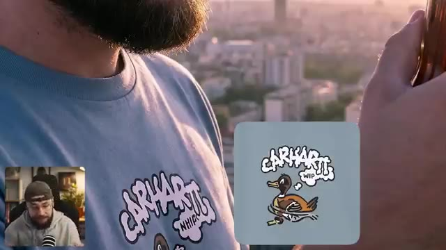
*Gros plan sur une vidéo générée montrant Jack tenant une bouteille sur un toit au coucher du soleil, avec un inset PIP de Jack en bas à gauche.*

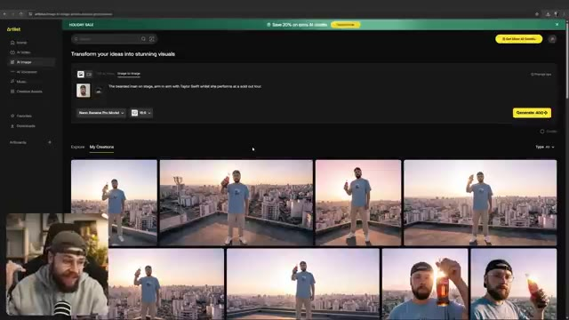
*Interface de la plateforme Artlist montrant l'outil de génération d'images IA avec le modèle Nano Banana Pro et une grille de créations précédentes.*

---

### ⏱️ `[00:06:40 - 00:07:14]` | Segment #14

**🔊 Audio (Transcription Intégrale Mot pour Mot en Français) :**
> Donc allons-y pour générer ceci sans image de référence de Taylor Swift. Jetez un œil à ces générations qu'on a récupérées. Ouais, le niveau de réalisme et de profondeur ici est fou. Ça m'a même donné une paire de retours intra-auriculaires. Donc une fois de plus, on en revient à cette idée de compréhension du monde. Ça sait clairement qui est Taylor Swift et connaît ses proportions. Je dirais qu'en termes de cohérence des personnages, pour moi, c'est globalement plutôt bon. Je pense que quelque chose dans mes proportions est légèrement faussé. Je trouve que ma tête a l'air très grosse à côté de celle de Taylor Swift. Une fois

**👁️ Analyse Visuelle d'Écran (gemini-3.5-flash-lite) :**
**Interface & Outils** : Navigateur web affichant une plateforme de génération d'images par IA (style dashboard de création avec vignettes et zone de prompt), avec incrustation vidéo (PiP) du présentateur en bas à gauche.

**Contenu textuel & Code** : Texte de prompt visible : "The bearded man on stage, arm in arm with Taylor Swift whilst she performs at a sold out tour. Photoreal, ultra-detailed skin texture, visible pores, cinematic composition, harsh shadows." Modèle sélectionné : "Nano Banana Pro Model", format 16:9, et bouton "Generate". Vignettes de générations affichant des hommes sur un toit ou en cours de chargement.

**Action / Démonstration** : Le navigateur présente les résultats d'une génération d'images basée sur un prompt textuel représentant le créateur avec Taylor Swift sur scène, analysés et commentés par le présentateur en incrustation.

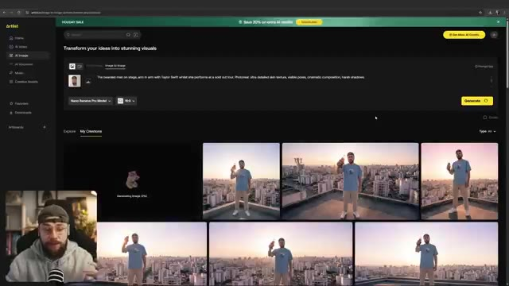
*Interface d'un générateur d'images par IA montrant le panneau de prompt et les résultats de génération avec le créateur en incrustation PiP.*

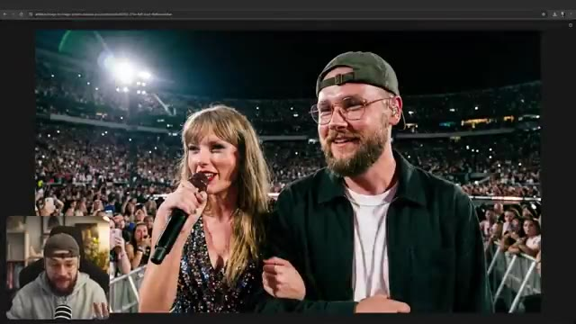
*Affichage en plein écran d'une image générée par IA montrant le créateur aux côtés de Taylor Swift sur scène lors d'un concert, avec le créateur en incrustation PiP.*

---

### ⏱️ `[00:07:14 - 00:07:47]` | Segment #15

**🔊 Audio (Transcription Intégrale Mot pour Mot en Français) :**
> encore ici un beau rendu. J'ai toujours l'impression que ma tête est un peu grosse et c'est encore plus exagéré parce que je suis près de la caméra, mais il y a quand même beaucoup de choses impressionnantes ici en termes de composition générale et de détails de texture. Et vraiment les mêmes commentaires ici pour notre troisième génération. Probablement mon moins préféré du lot. Et nous allons juste tester une dernière requête ici. L'homme barbu partageant un seau de KFC avec Donald Trump dans un parking. Parce que je sais qu'en termes de modération, essayer de générer des trucs avec Donald Trump peut poser quelques

**👁️ Analyse Visuelle d'Écran (gemini-3.5-flash-lite) :**
**Interface & Outils** : Navigateur web affichant l'interface de la plateforme Artlist (section AI Image) avec un panneau latéral de navigation sombre et des vignettes de créations en bas.

**Contenu textuel & Code** : Dans le champ de prompt de l'interface Artlist, on peut lire le texte de la requête : "The bearded man sharing a KFC bucket with Donald Trump in a car park. Photoreal, ultra detailed skin texture, visible pores, cinematic composition, harsh shadows." Un modèle "Nano Banana Pro Model" et un format d'image "16:9" sont sélectionnés.

**Action / Démonstration** : Le créateur présente les résultats de ses générations d'images sur Artlist et s'apprête à tester un nouveau prompt complexe impliquant Donald Trump pour tester la modération de l'outil.

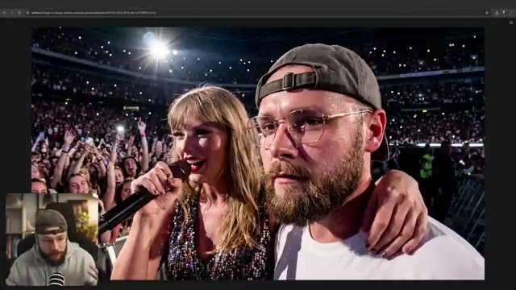
*Image générée par IA montrant le créateur barbu avec casquette et lunettes aux côtés de Taylor Swift sur scène lors d'un concert, avec Jack en incrustation vidéo (PiP) dans le coin inférieur gauche.*

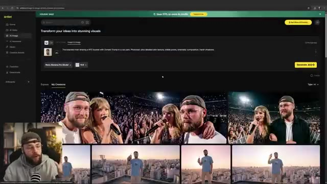
*Interface de l'outil de génération d'images Artlist montrant le prompt textuel tapé dans le champ de saisie avec le créateur en incrustation vidéo (PiP) en bas à gauche.*

---

### ⏱️ `[00:07:47 - 00:08:21]` | Segment #16

**🔊 Audio (Transcription Intégrale Mot pour Mot en Français) :**
> problèmes. Donc ça va être un test intéressant. Très bien, jetons un coup d'œil. Je pense que cette première génération ici est vraiment super. Il y a beaucoup de choses vraiment bien ici. La seule chose que je dirais, c'est qu'il y a un léger manque de compréhension du monde, parce qu'on est assis à l'arrière d'un camion, comme un SUV ou quelque chose comme ça, je crois. Donc si on était assis ici à l'arrière d'un pick-up, nos jambes seraient en fait relevées, n'est-ce pas ? Elles ne seraient pas inclinées vers le bas comme si on était sur un banc ou quelque chose du genre. Mais je veux dire, Trump ressemble exactement à ce à quoi on s'attendrait. Je ressemble

**👁️ Analyse Visuelle d'Écran (gemini-3.5-flash-lite) :**
**Interface & Outils** : Navigateur web affichant l'interface de génération d'images de la plateforme Artlist, avec un encadré PiP (Picture-in-Picture) du créateur dans le coin inférieur gauche.

**Contenu textuel & Code** : Le prompt visible dans l'interface est : "The bearded man sharing a KFC bucket with Donald Trump in a car park. Photoreal, ultra detailed skin texture, visible pores, cinematic composition, harsh shadows." Le modèle sélectionné est "Nanov Reconst Pro Model" au format 16:9. Une grille de miniatures de créations antérieures est visible en bas.

**Action / Démonstration** : Le créateur présente l'interface de génération d'images d'Artlist, puis montre le résultat généré représentant une scène sur le hayon d'un camion.

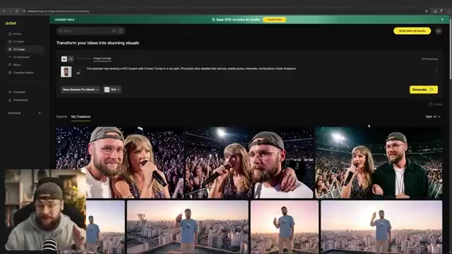
*Interface de l'outil de génération d'images Artlist affichant le prompt et une galerie de créations avec le créateur en incrustation PiP.*

*Affichage du résultat de l'image générée montrant le créateur et Donald Trump assis à l'arrière d'un pick-up avec un seau de poulet KFC.*

---

### ⏱️ `[00:08:21 - 00:08:41]` | Segment #17

**🔊 Audio (Transcription Intégrale Mot pour Mot en Français) :**
> comme je m'y attendais aussi. Cette génération-ci est un peu dommage, je dirais. Juste parce que j'ai l'air très étrange, regardez la taille de mon front. C'est fou. Trump a l'air vraiment réaliste. Il y a de jolis détails texturaux ici, même des serviettes jetées par terre. Quelques problèmes avec les plaques d'immatriculation plus éloignées de la caméra.

**👁️ Analyse Visuelle d'Écran (gemini-3.5-flash-lite) :**
**Interface & Outils** : Vidéo lue dans un lecteur multimédia ou un navigateur web, avec le créateur visible en incrustation (PiP) et des éléments d'interface YouTube (bouton S'abonner).

**Contenu textuel & Code** : Affichage d'une image ou vidéo générée montrant Jack et Donald Trump assis près de voitures sur un parking avec un seau de poulet KFC, un mur de briques en arrière-plan, et des plaques d'immatriculation déformées.

**Action / Démonstration** : Le curseur de la souris se déplace sur l'écran pour pointer des détails spécifiques de la génération vidéo, tandis que la caméra zoome successivement sur le visage de Jack et sur les voitures en arrière-plan.

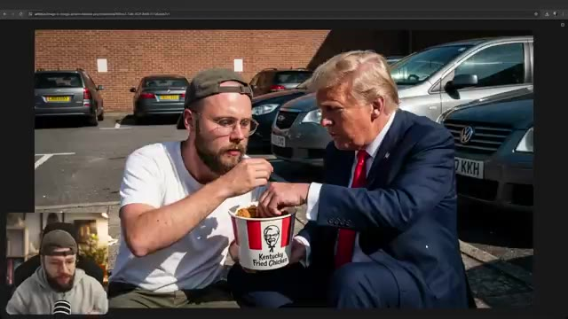
*Image montrant une vidéo générée par IA représentant Jack et Donald Trump mangeant du poulet frit KFC sur un parking, avec le créateur en incrustation PiP dans le coin inférieur gauche.*

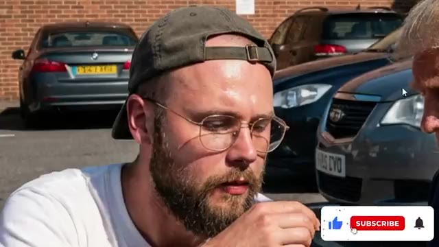
*Gros plan sur le visage de Jack dans la vidéo générée par IA, mettant en évidence les distorsions anatomiques du front et les plaques d'immatriculation floues en arrière-plan.*

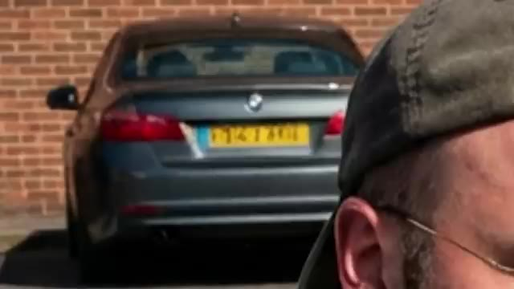
*Gros plan sur l'arrière-plan de la vidéo montrant les plaques d'immatriculation des voitures présentant des incohérences typiques des générations par IA.*

---

### ⏱️ `[00:08:41 - 00:09:02]` | Segment #18

**🔊 Audio (Transcription Intégrale Mot pour Mot en Français) :**
> Comme je l'ai mentionné avant, vous allez commencer à rencontrer ce problème. Les plaques d'immatriculation proches de la caméra ont vraiment l'air très bien. Et tous les différents emblèmes comme les marques de voitures et des choses comme ça sont fous. En ce qui concerne le marquage sur le seau lui-même, je ne suis pas sûr que cela provienne peut-être d'il y a quelques années. Si nous regardons l'une de nos autres générations, c'est ce qu'ils utilisent actuellement, je crois.

**👁️ Analyse Visuelle d'Écran (gemini-3.5-flash-lite) :**
**Interface & Outils** : Navigateur web affichant des images générées par IA avec le créateur en incrustation vidéo (PiP).

**Contenu textuel & Code** : Des images de synthèse générées par IA représentant le créateur (Jack) en train de manger du poulet frit KFC avec un sosie ou une génération de Donald Trump, le tout dans un décor de parking urbain avec plusieurs voitures en arrière-plan.

**Action / Démonstration** : Le créateur présente et compare différentes générations d'images par IA pour illustrer la qualité des détails visuels, notamment sur les plaques d'immatriculation et le branding.

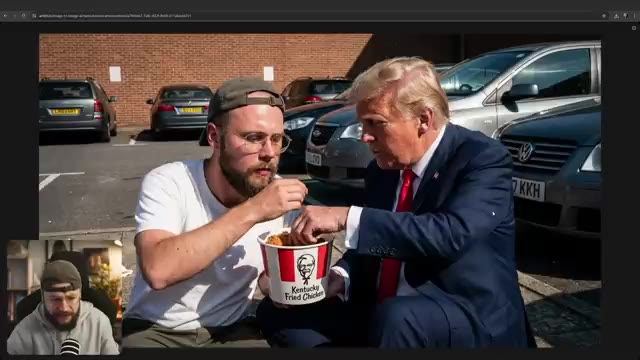
*Image générée par IA montrant Jack mangeant du poulet frit avec Donald Trump dans un parking, avec Jack en incrustation (PiP) dans le coin inférieur gauche.*

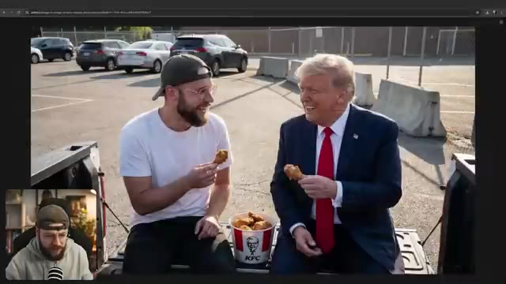
*Autre génération d'image par IA montrant Jack et Donald Trump assis à l'arrière d'un pick-up avec un seau KFC, avec Jack en incrustation (PiP) dans le coin inférieur gauche.*

---

### ⏱️ `[00:09:02 - 00:09:23]` | Segment #19

**🔊 Audio (Transcription Intégrale Mot pour Mot en Français) :**
> Et somme toute, c'est plutôt pas mal étant donné qu'on n'a pas mis de référence d'image. Donc la génération finale est probablement ma préférée ici. Vraiment une belle composition et un éclairage avec des ombres denses sur nos visages et un très bon niveau de réalisme. Et ce que j'aimerais faire avant de continuer, c'est simplement d'importer l'image que nous avons de moi et Trump mangeant du KFC.

**👁️ Analyse Visuelle d'Écran (gemini-3.5-flash-lite) :**
**Interface & Outils** : Navigateur web affichant la plateforme Artlist (section AI Image) avec une fenêtre de sélection de fichiers Windows par-dessus.

**Contenu textuel & Code** : Fenêtre de l'explorateur de fichiers montrant diverses miniatures d'images créées par IA (paysages, portraits, scènes avec Trump et Jack). Le site Artlist affiche l'option "Image to Image" et le modèle "Nano Banana Pro Model".

**Action / Démonstration** : Le créateur commente les différentes images générées à l'écran puis ouvre l'explorateur de fichiers pour sélectionner l'image de lui et Trump avec le KFC afin de l'importer pour la suite de la démonstration.

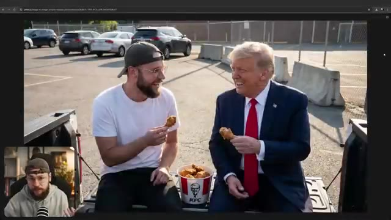
*Affichage d'une image générée par IA montrant Jack et Donald Trump assis ensemble à l'arrière d'un pick-up avec un seau de poulet KFC.*

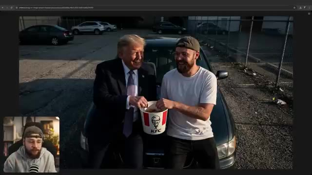
*Affichage d'une autre image générée par IA montrant Jack et Donald Trump assis sur le capot d'une voiture, mangeant du poulet KFC.*

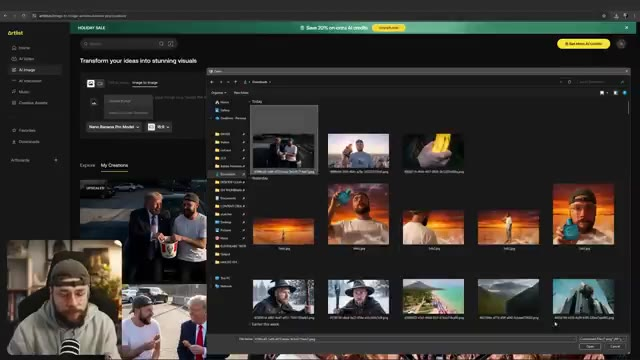
*Interface du créateur montrant le gestionnaire de fichiers Windows ouvert par-dessus le site de génération d'images Artlist pour sélectionner et importer une image.*

---

### ⏱️ `[00:09:23 - 00:09:45]` | Segment #20

**🔊 Audio (Transcription Intégrale Mot pour Mot en Français) :**
> Et je veux essayer de faire plus du genre d'une infographie ou d'une analyse technique de l'image. Vous vous souvenez peut-être que l'un des domaines sur lesquels Google a affirmé que Nano Banana Pro s'est amélioré, ce sont les diagrammes et les infographies. C'est donc un peu ce qu'on essaie de tester ici d'une manière sympa et amusante. Le premier prompt que je veux tester est de créer un diagramme décomposant tous les différents éléments qui composent cette image.

**👁️ Analyse Visuelle d'Écran (gemini-3.5-flash-lite) :**
**Interface & Outils** : Interface web d'Artlist (section AI Image / "Transform your ideas into stunning visuals"), avec le créateur visible en incrustation PiP (Picture-in-Picture) dans le coin inférieur gauche.

**Contenu textuel & Code** : Dans l'interface web : champ de texte de prompt avec un aperçu d'image ("Image to Image"), sélection du modèle "Nano Banana Pro Model", format d'image "16:9", et bouton jaune "Generate 400+". Dans la grille "My Creations" en dessous, on aperçoit plusieurs images générées mettant en scène Jack aux côtés de personnalités comme Donald Trump ou Taylor Swift.

**Action / Démonstration** : Le créateur parle face caméra tout en affichant l'interface web de la plateforme Artlist et ses précédentes créations d'images générées par IA en arrière-plan.

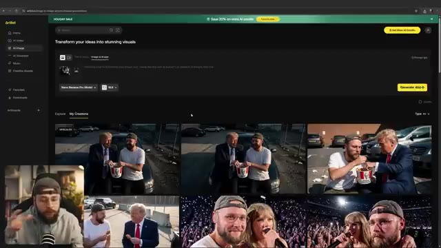
*Interface d'Artlist montrant la génération d'images avec le modèle Nano Banana Pro et Jack en médaillon PiP en bas à gauche.*

---

### ⏱️ `[00:09:45 - 00:10:07]` | Segment #21

**🔊 Audio (Transcription Intégrale Mot pour Mot en Français) :**
> Donc nous allons lancer celui-là. Ensuite, je veux essayer de créer un dessin technique de cette image. Et enfin, pour tester très minutieusement la génération de texte et le type de compréhension en termes de composition, nous allons transformer cette image en affiche de film au format 16 par 9. Donc en commençant par notre diagramme qui décompose la scène, c'est un tout petit peu basique.

**👁️ Analyse Visuelle d'Écran (gemini-3.5-flash-lite) :**
**Interface & Outils** : Interface web de génération d'images (Artlist AI Image).

**Contenu textuel & Code** : Texte des prompts visibles dans les champs de saisie : "Create a technical drawing of this image" (Image 1) et "Turn this image into a 16:9 movie poster" (Image 2). Sur l'image 3, annotations textuelles de la scène ("Parked Cars", "Donald Trump", "KFC Bucket", "Younger Man", "Chain Link Fence", "Low Angle, Late Afternoon Sunlight").

**Action / Démonstration** : Le créateur navigue sur l'interface de génération d'images pour saisir de nouveaux prompts textuels basés sur l'image existante, puis affiche le diagramme technique de décomposition de la scène.

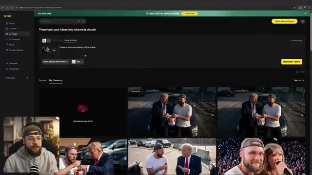
*Interface web de génération d'images IA avec le champ de prompt contenant le texte "Create a technical drawing of this image".*

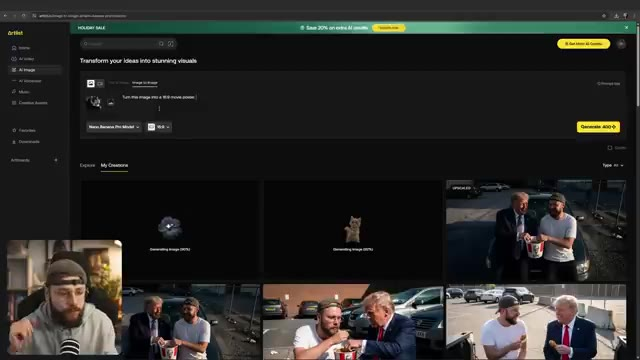
*Interface web de génération d'images IA avec le champ de prompt contenant le texte "Turn this image into a 16:9 movie poster".*

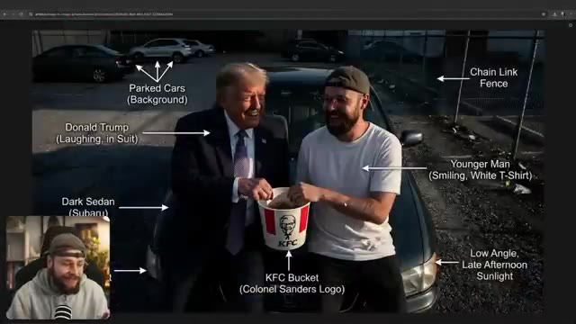
*Image d'un diagramme technique décomposant la scène avec des flèches textuelles en anglais (Donald Trump, Parked Cars, KFC Bucket, Youngers Man, etc.).*

---

### ⏱️ `[00:10:07 - 00:10:26]` | Segment #22

**🔊 Audio (Transcription Intégrale Mot pour Mot en Français) :**
> Je suppose que ça prouve un peu mon point de vue sur un bon niveau de compréhension du monde, pourtant, parce que ça a tout étiqueté correctement de ce que je peux en juger. C'est peut-être ma faute avec le prompt textuel, mais ouais, un tout petit peu basique. Jetons un coup d'œil au dessin technique. Alors ça, j'aime vraiment beaucoup. Ça a estimé la longueur et la largeur de certains objets dans la scène.

**👁️ Analyse Visuelle d'Écran (gemini-3.5-flash-lite) :**
**Interface & Outils** : Interface web de la plateforme Artlist (section AI Image) avec un panneau de création et une grille "My Creations".

**Contenu textuel & Code** : Générations d'images incluant une affiche de type "Bucket List", une image annotée avec des flèches descriptives, et un dessin technique au trait avec des dimensions estimées en pieds et pouces (véhicule, seau KFC, clôture).

**Action / Démonstration** : Le créateur commente l'interface de la plateforme et zoome sur le dessin technique généré par IA qui estime les dimensions des objets.

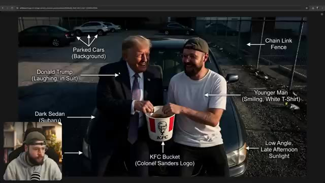
*Image d'analyse détaillée montrant des étiquettes descriptives textuelles pointant sur différents éléments de la scène (Donald Trump, seau KFC, voitures, clôture, etc.).*

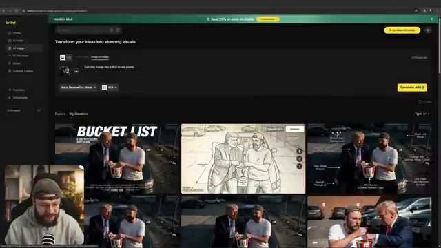
*Interface de la plateforme Artlist montrant l'historique des créations et des rendus générés par IA, avec en surbrillance un dessin technique.*

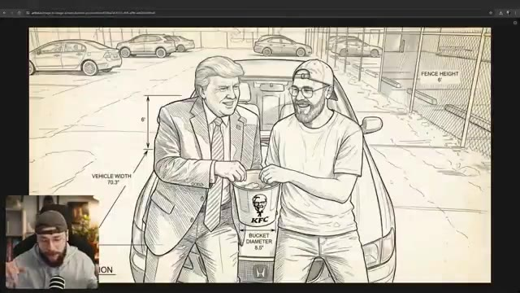
*Gros plan sur le dessin technique de style esquisse (croquis) avec des cotes et mesures estimées (largeur du véhicule 70.3", diamètre du seau 8.5", hauteur de clôture 6').*

---

### ⏱️ `[00:10:26 - 00:10:46]` | Segment #23

**🔊 Audio (Transcription Intégrale Mot pour Mot en Français) :**
> Et le style lui-même a l'air plutôt cool. J'adore qu'on ait le diamètre du seau. Peut-être que l'un d'entre vous peut aller vérifier si le diamètre d'un seau KFC est vraiment de 8,5 pouces. Mettez la réponse en bas dans les commentaires. Et jetons un œil à notre affiche de film. Ça a l'air vraiment cool. Donc encore une fois, belle compréhension du monde.

**👁️ Analyse Visuelle d'Écran (gemini-3.5-flash-lite) :**
**Interface & Outils** : Navigateur web affichant des images générées par IA avec incrustation vidéo PiP du créateur en bas à gauche.

**Contenu textuel & Code** : Sur l'image 1 : croquis au trait avec annotations "VEHICLE WIDTH 70.3"", "BUCKET DIAMETER 8.5"", "FENCE HEIGHT 6'". Sur l'image 2 : titre "BUCKET LIST", slogan "A DEAL WITH DESTINY, AND CHICKEN.", et "COMING SOON".

**Action / Démonstration** : Le créateur commente les détails visuels du croquis technique puis passe à l'affichage de l'affiche de film générée par IA.

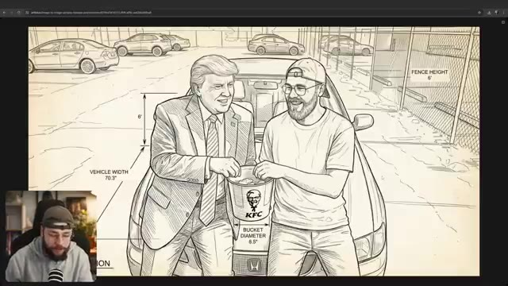
*Un croquis technique montrant Donald Trump et Jack partageant un seau de poulet KFC devant une voiture, avec des annotations chiffrées.*

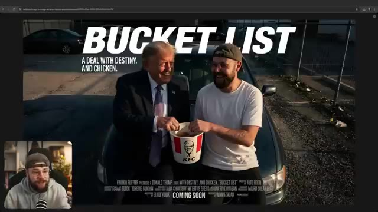
*Une fausse affiche de film intitulée "BUCKET LIST" montrant Donald Trump et Jack avec un seau de poulet devant une voiture.*

---

### ⏱️ `[00:10:46 - 00:11:21]` | Segment #24

**🔊 Audio (Transcription Intégrale Mot pour Mot en Français) :**
> ça nous a créé un jeu de mots pour le titre de notre film, The Bucket List, A Deal with Destiny and Chicken. Assez drôle pour être honnête. Nous constatons quelques problèmes avec le rendu du texte au bas de notre poster. Il me semble que c'est toujours un petit problème quand il s'agit de Nano Banana Pro malheureusemennt. Je pense que si vous deviez utiliser ceci pour un cas d'usage professionnel, vous feriez probablement mieux d'ajouter vous-même les éléments de texte. Je suis sûr que nous finirons par y arriver avec l'IA mais comme vous pouvez le voir, ce n'eût point sans ses problèmes. Ne vous attendez pas à ce que ça fasse magiquement

**👁️ Analyse Visuelle d'Écran (gemini-3.5-flash-lite) :**
**Interface & Outils** : Navigateur web affichant une image générée (affiche de film) avec incrustation vidéo (PiP) du créateur en bas à gauche.

**Contenu textuel & Code** : Texte principal "BUCKET LIST", sous-titre "A DEAL WITH DESTINY. AND CHICKEN.", seau de KFC, mentions textuelles générées par IA au bas de l'affiche (comportant du charabia illisible) et mention "COMING SOON".

**Action / Démonstration** : Le créateur présente à l'écran l'affiche de film générée par IA pour en analyser les défauts de rendu du texte.

*Affiche de film générée par IA montrant Donald Trump et le créateur tenant un seau de poulet KFC, avec des erreurs de rendu sur le texte du bas et le créateur en incrustation (PiP).*

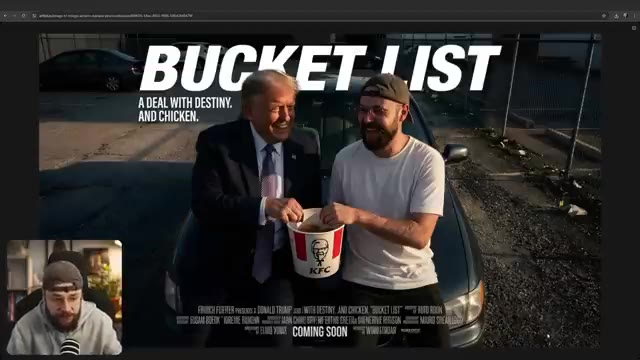
*Affiche de film générée par IA similaire à l'image 1, affichée dans un navigateur web avec le créateur en incrustation (PiP) en bas à gauche.*

---

### ⏱️ `[00:11:21 - 00:11:57]` | Segment #25

**🔊 Audio (Transcription Intégrale Mot pour Mot en Français) :**
> tout ce que vous pouvez imaginer. C'est impressionnant mais ce n'est pas parfait. Donc maintenant nous allons passer à notre comparaison de Nano Banana 1 versus Nano Banana Pro afin de pouvoir comparer précisément comment chaque modèle performe. Pour cela, j'utilise encore une fois mon propre personnage. J'ai inséré une image de référence d'un flacon de parfum Versace. Et encore une fois, il s'agit d'un produit très détaillé en termes de motif, de design, des logos et du texte présents sur le produit également. Donc, avec la génération que nous avons obtenue de Nano Banana One, c'est plutôt cool en termes de composition, mais je suis sûr que vous pouvez

**👁️ Analyse Visuelle d'Écran (gemini-3.5-flash-lite) :**
**Interface & Outils** : Interface vidéo avec incrustation PiP du créateur (Jack) dans le coin inférieur gauche, présentant des diapositives de titre, des images de référence et des résultats de génération d'IA.

**Contenu textuel & Code** : Texte à l'écran : « Nano Banana 1 vs. Nano Banana Pro ». Image de référence du flacon de parfum « VERSACE EROS » en verre bleu-vert avec le logo de Méduse. Image générée montrant Jack accroupi tenant le parfum devant un paysage enflammé.

**Action / Démonstration** : Le créateur compare les modèles d'intelligence artificielle Nano Banana 1 et Nano Banana Pro en utilisant une image de référence de parfum et en affichant les résultats de composition générés.

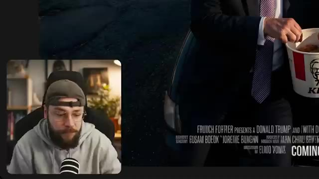
*Image #1 : Extrait vidéo de démonstration avec le créateur en incrustation (PiP).*

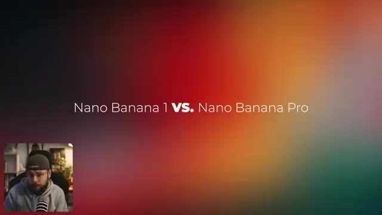
*Image #2 : Diapositive de transition affichant le titre comparatif « Nano Banana 1 vs. Nano Banana Pro ».*

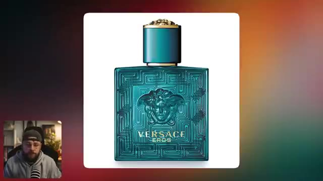
*Image #3 : Affichage de l'image de référence du flacon de parfum Versace Eros.*

*Image #4 : Rendu visuel généré montrant le créateur accroupi dans un décor enflammé en tenant le flacon de parfum.*

---

### ⏱️ `[00:11:57 - 00:12:31]` | Segment #26

**🔊 Audio (Transcription Intégrale Mot pour Mot en Français) :**
> dites tout de suite qu'il y a pas mal de choses qui ne vont pas. Pour commencer, le flacon de parfum est beaucoup trop grand, il y a donc un petit manque de compréhension du monde réel. Le logo lui-même a mal tourné. Nous avons perdu cette image de marque assez gravement. Le design global du flacon de parfum a l'air plutôt pas mal, mais il se passe des choses étranges au niveau de la composition globale et l'image globale a l'air assez stylisée. Particulièrement si vous zoomez sur mon visage, il y a un manque évident de texture de peau et des imperfections auxquelles nous pourrions nous attendre de la part d'un

**👁️ Analyse Visuelle d'Écran (gemini-3.5-flash-lite) :**
**Interface & Outils** : Présentation vidéo avec incrustation (PiP) du créateur face caméra dans le coin inférieur gauche, affichant des images générées par IA sur l'écran principal.

**Contenu textuel & Code** : Visuel généré par IA représentant une composition publicitaire de parfum Versace avec un homme accroupi, des flammes et un flacon surdimensionné portant le nom "VERSACE".

**Action / Démonstration** : Analyse visuelle d'une image générée par intelligence artificielle, avec un zoom progressif sur le flacon de parfum puis un retour au plan large.

*Image générée par IA montrant un homme accroupi dans un paysage désertique avec des flammes en arrière-plan, tenant un grand flacon de parfum bleu au premier plan, avec le visage du créateur en incrustation (PiP).*

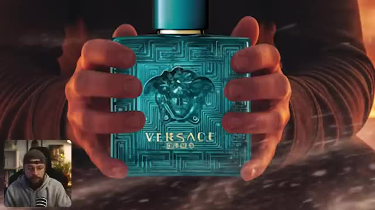
*Gros plan sur le flacon de parfum tenu dans l'image précédente, révélant les détails du logo Versace et des mains générées par l'IA.*

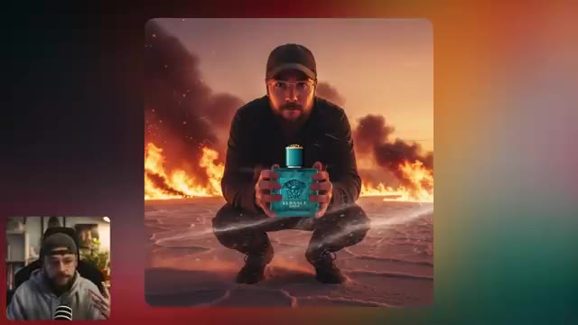
*Retour au plan large de l'image générée avec l'homme accroupi devant le feu et le flacon de parfum.*

---

### ⏱️ `[00:12:31 - 00:13:04]` | Segment #27

**🔊 Audio (Transcription Intégrale Mot pour Mot en Français) :**
> vraie photo. Et en passant au résultat de Nano Banana 2, quelle différence massive. Le niveau de texture ici en termes de ma peau ainsi que de ma barbe est assez époustouflant. Le flacon de parfum est de la bonne taille. Il y a même des imperfections au niveau de mes ongles. L'éclairage sur mon visage a l'air super et en plus, il a réussi à garder ma casquette à l'envers. Si nous repensons au résultat de Nano Banana 1, il veut toujours tourner ma casquette de baseball à l'endroit, mais ici il a réussi à la garder à l'envers.

**👁️ Analyse Visuelle d'Écran (gemini-3.5-flash-lite) :**
**Interface & Outils** : Vidéo de test de génération d'IA, affichant des clips vidéo générés en plein écran avec une incrustation vidéo (PiP) du créateur (Jack) dans le coin inférieur gauche.

**Contenu textuel & Code** : Rendu vidéo de haute qualité généré par IA montrant un homme barbu avec des lunettes et une casquette à l'envers, tenant un flacon de parfum bleu "Versace Eros" dans un paysage désertique au coucher du soleil (Nano Banana 2), puis un second rendu montrant une scène similaire avec des flammes en arrière-plan (Nano Banana 1).

**Action / Démonstration** : Le créateur présente et commente à l'écran les différents résultats de génération vidéo en comparant les textures, les détails et la fidélité des accessoires entre les versions Nano Banana 1 et 2.

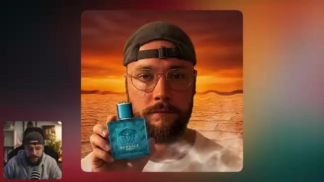
*Affichage du rendu vidéo généré par Nano Banana 2 montrant le créateur tenant un flacon de parfum Versace Eros dans un décor désertique, avec le créateur en incrustation (PiP) dans le coin inférieur gauche.*

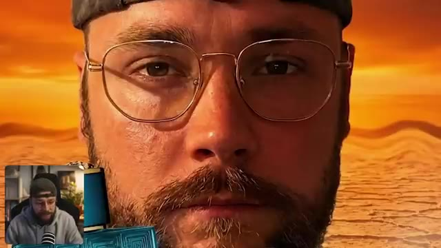
*Gros plan sur le visage généré par IA démontrant le niveau de texture de la peau et de la barbe, avec le créateur en incrustation PiP.*

*Retour au plan large du rendu Nano Banana 2 avec le flacon de parfum et le décor désertique, avec le créateur en incrustation PiP.*

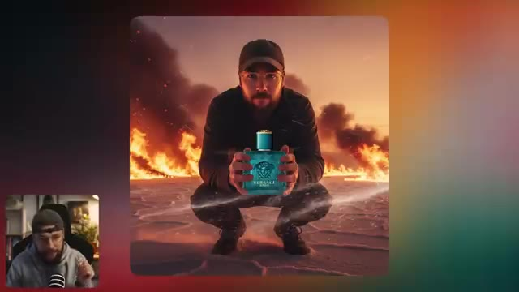
*Affichage du rendu Nano Banana 1 montrant le créateur accroupi devant des flammes en tenant le parfum Versace Eros, avec le créateur en incrustation PiP.*

---

### ⏱️ `[00:13:04 - 00:13:38]` | Segment #28

**🔊 Audio (Transcription Intégrale Mot pour Mot en Français) :**
> manière correcte. Maintenant, ce que nous avons fait, c'est prendre le résultat de Nano Banana Pro et le repasser à travers les deux modèles. Et pour les invites textuelles, nous avons choisi : montrer un plan large sous un angle de profil. L'homme barbu porte un t-shirt ample blanc uni, un pantalon cargo beige et des baskets vintage blanches. Nano Banana One nous a produit une image plutôt jolie, je dois l'admettre. Mais encore une fois, nous avons un petit manque de texture et ma casquette de baseball est toujours à l'envers, même si nous lui avons fourni une image de référence de ma casquette de baseball à l'envers. Il est un peu difficile de dire si la marque est

**👁️ Analyse Visuelle d'Écran (gemini-3.5-flash-lite) :**
**Interface & Outils** : Présentation vidéo avec incrustation Picture-in-Picture (PiP) du créateur en bas à gauche et affichage plein écran des images générées et des prompts textuels.

**Contenu textuel & Code** : Texte du prompt affiché à l'écran : « Show a wide shot profile angle of this shot, the bearded man is wearing a plain white oversized t-shirt, beige cargo trousers and white vintage trainers. »

**Action / Démonstration** : Le créateur montre les résultats d'images générées par IA et les prompts textuels utilisés lors de sa démonstration comparative.

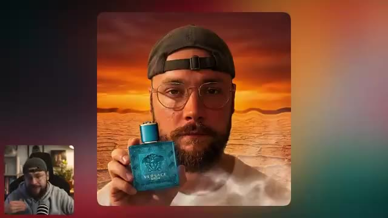
*Image générée par IA montrant un homme barbu tenant un flacon de parfum sur fond de coucher de soleil dans un désert, avec une incrustation vidéo de Jack dans le coin inférieur gauche.*

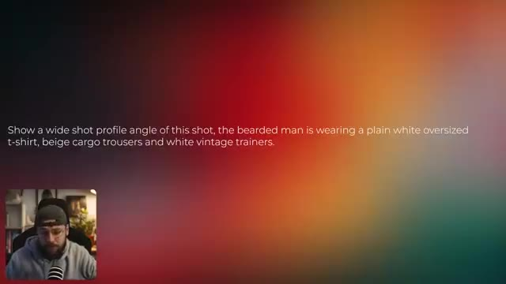
*Affichage du prompt textuel sur fond flou coloré : "Show a wide shot profile angle of this shot, the bearded man is wearing a plain white oversized t-shirt, beige cargo trousers and white vintage trainers."*

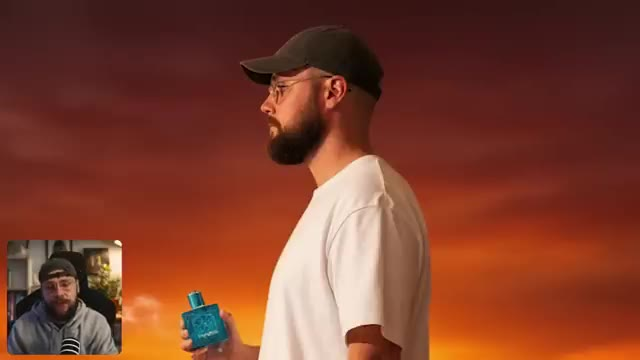
*Image générée par IA montrant un plan de profil d'un homme barbu tenant un flacon de parfum devant un décor de coucher de soleil.*

*Gros plan de l'image générée montrant la main tenant le flacon de parfum et le t-shirt blanc.*

---

### ⏱️ `[00:13:38 - 00:14:14]` | Segment #29

**🔊 Audio (Transcription Intégrale Mot pour Mot en Français) :**
> resté intact sur la bouteille de parfum parce qu'il est si petit dans le cadre mais au moins il est de la bonne taille. Mais en passant à la sortie de Nano Banana 2, on peut voir pour commencer que la casquette de baseball est à l'envers comme elle devrait l'être. La texture et le design de mon pantalon et de mes baskets semblent un peu plus en phase avec les tendances actuelles de la mode, je dirais. Les baskets elles-mêmes ont l'air d'être ces Reebok classiques et le pantalon ressemble exactement à quelque chose qu'on achèterait chez Uniqlo, par exemple. Ce qui est vraiment cool aussi, c'est ce sable qui émane en quelque sorte du

**👁️ Analyse Visuelle d'Écran (gemini-3.5-flash-lite) :**
**Interface & Outils** : Démonstration vidéo de génération par IA montrant des rendus visuels avec incrustation du créateur (Jack) en bas à gauche.

**Contenu textuel & Code** : Aucun texte textuel ou prompt visible à l'écran, uniquement les visuels de sortie du modèle IA (bouteille de parfum, personnage dans le désert, vêtements texturés).

**Action / Démonstration** : Le présentateur commente et compare les détails visuels de la génération IA (bouteille de parfum, casquette à l'envers, texture des vêtements de type Uniqlo/Reebok et effet de sable/vapeur).

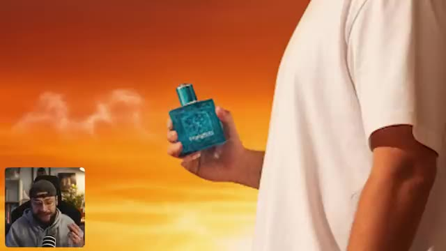
*Gros plan sur la bouteille de parfum bleue tenue par un personnage généré par IA dans un décor désertique au coucher du soleil, avec le créateur en incrustation PiP en bas à gauche.*

*Vue générale d'un personnage portant une casquette à l'envers, un t-shirt blanc et un pantalon cargo beige dans un désert, tenant un parfum d'où s'échappe de la vapeur.*

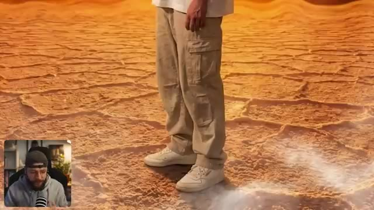
*Gros plan sur le pantalon cargo beige et les baskets blanches de style Reebok du personnage dans le décor désertique.*

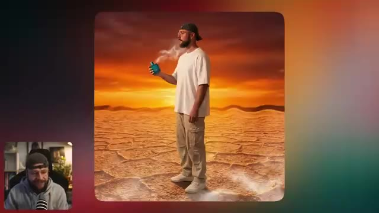
*Répétition de la vue générale du personnage dans le désert avec le parfum vaporisant de la brume, affichant les détails vestimentaires.*

---

### ⏱️ `[00:14:14 - 00:14:37]` | Segment #30

**🔊 Audio (Transcription Intégrale Mot pour Mot en Français) :**
> Le flacon de parfum correspond à la direction et à l'échelle de notre image de référence. Il y a donc un bon niveau de cohérence. Maintenant, en remettant notre génération originale de Nano Banana Pro, nous avons testé un autre prompt textuel. Nous avons opté pour un plan cinématique serré cadré par-dessus l'épaule de l'homme barbu, se concentrant sur le vaste paysage désertique. Il porte un t-shirt blanc uni ample.

**👁️ Analyse Visuelle d'Écran (gemini-3.5-flash-lite) :**
**Interface & Outils** : Présentation vidéo avec incrustation PiP (Picture-in-Picture) du présentateur Jack dans le coin inférieur gauche et affichage de générations visuelles et de prompts textuels.

**Contenu textuel & Code** : Texte affiché à l'écran : "A close cinematic shot framed over the bearded man's shoulder, focusing on the vast desert landscape. He is wearing a plain white, oversized t-shirt." Visuels d'un homme barbu tenant et vaporisant un parfum Versace (marqué Versace Eros) dans un paysage désertique au coucher du soleil.

**Action / Démonstration** : Le créateur présente des exemples d'images générées par IA et affiche le prompt textuel correspondant pour illustrer ses tests de cohérence et de cadrage.

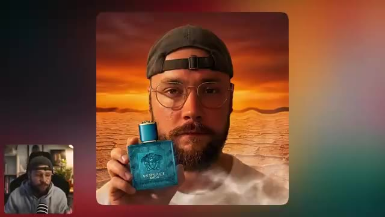
*Image générée par IA montrant un homme barbu tenant un flacon de parfum Versace dans un décor désertique, avec le présentateur en incrustation PiP.*

*Image en pied générée par IA montrant l'homme barbu dans le désert utilisant le flacon de parfum, avec le présentateur en incrustation PiP.*

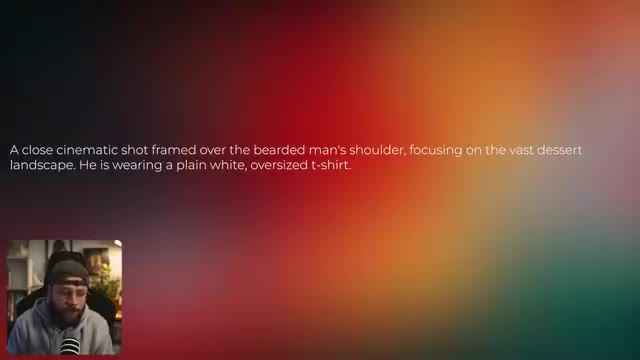
*Affichage à l'écran du prompt textuel en anglais sur un fond coloré, avec le présentateur en incrustation PiP.*

---

### ⏱️ `[00:14:37 - 00:15:11]` | Segment #31

**🔊 Audio (Transcription Intégrale Mot pour Mot en Français) :**
> Donc pour Nano Banana 1, vous pouvez voir qu'encore une fois, il y a un manque flagrant de texture réaliste en ce qui concerne le personnage et le tissu du t-shirt lui-même. Tous les détails principaux correspondent en gros, mais ça ne fait pas tout à fait naturel. Et encore une fois, cette casquette de baseball est mise à l'envers. Maintenant, en passant à Nano Banana Pro, c'génial. Regardez juste cette texture à l'arrière de mon cou, ces cheveux réalistes, les imperfections dans la barbe elle-même,

**👁️ Analyse Visuelle d'Écran (gemini-3.5-flash-lite) :**
**Interface & Outils** : Vidéo de démonstration comparative d'outils de génération vidéo IA (Nano Banana 1 vs Nano Banana Pro) avec incrustation PiP (Picture-in-Picture) du créateur Jack dans le coin inférieur gauche.

**Contenu textuel & Code** : Rendu vidéo IA d'un homme barbu portant des lunettes, une casquette et un t-shirt blanc dans un décor de désert salin au coucher du soleil.
[DESC_IMAGE_4] Transition vers le modèle Pro avec un zoom accentuant le réalisme de la texture de la peau, des poils de la nuque et des imperfections de la barbe.

**Action / Démonstration** : Le créateur présente et compare visuellement les défauts du modèle standard (Nano Banana 1) et les améliorations ultra-réalistes du modèle supérieur (Nano Banana Pro) à travers des séquences vidéo générées.

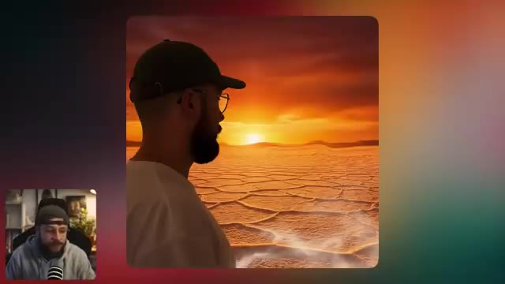
*Démonstration vidéo générée par IA montrant un personnage de profil face à un paysage désertique au coucher du soleil (Nano Banana 1), avec le créateur en incrustation PiP.*

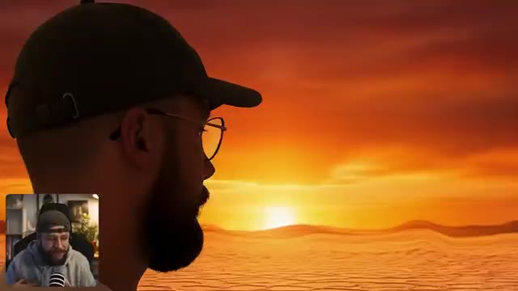
*Gros plan sur le profil du personnage généré (Nano Banana 1) mettant en évidence la casquette mise à l'envers et les détails du visage.*

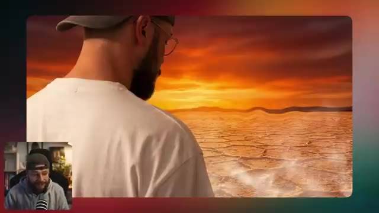
*Démonstration vidéo montrant le personnage de dos avec un t-shirt blanc face au paysage désertique (Nano Banana Pro).*

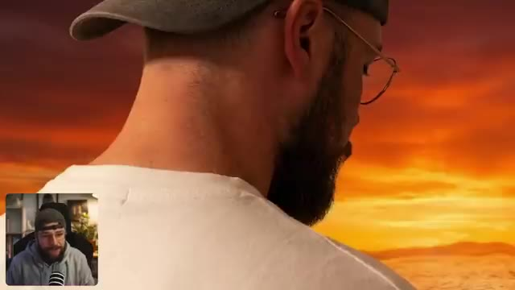
*Gros plan ultra-détaillé sur la nuque, les cheveux et la barbe du personnage généré (Nano Banana Pro), démontrant le réalisme de la texture.*

---

### ⏱️ `[00:15:11 - 00:15:46]` | Segment #32

**🔊 Audio (Transcription Intégrale Mot pour Mot en Français) :**
> la texture sur le t-shirt est comme s'il n'avait pas été repassé, mais ce n'est pas non plus vraiment froissé. Et ce niveau de réalisme est juste insensé. Même la composition elle-même est vraiment puissante et cinématographique. Et pour les prompts textuels finaux, nous avons testé un plan dramatique regardant l'homme barbu d'en bas, le faisant paraître puissant, intimidant et héroïque, donc nous optons pour un plan en contre-plongée ici. Nano Banana 1 n'a vraiment pas compris la consigne ici, cela ressemble juste à l'image de référence, cela ne semble pas vraiment avoir changé quoi que ce soit, mais regardez ce que nous avons obtenu

**👁️ Analyse Visuelle d'Écran (gemini-3.5-flash-lite) :**
**Interface & Outils** : Présentation vidéo avec incrustation PiP (Picture-in-Picture) du créateur en bas à gauche.

**Contenu textuel & Code** : Texte affiché à l'écran : « A dramatic shot looking up at the bearded man from below, making him appear powerful, intimidating and heroic. »

**Action / Démonstration** : Le créateur commente la texture réaliste d'un t-shirt généré par IA, présente le prompt textuel associé à un plan en contre-plongée, puis montre une image générée finale avec un flacon de parfum.

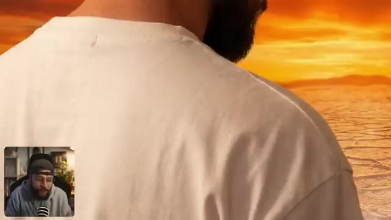
*Gros plan sur l'épaule et le dos d'un homme barbu portant un t-shirt blanc, avec un paysage de désert crépusculaire en arrière-plan.*

*Vue de dos légèrement plus large montrant l'homme portant une casquette et des lunettes, face à un paysage désertique avec un coucher de soleil enflammé.*

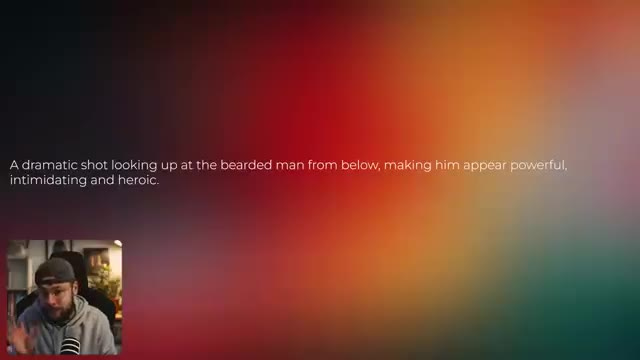
*Affichage à l'écran du prompt textuel décrivant un plan dramatique en contre-plongée d'un homme barbu.*

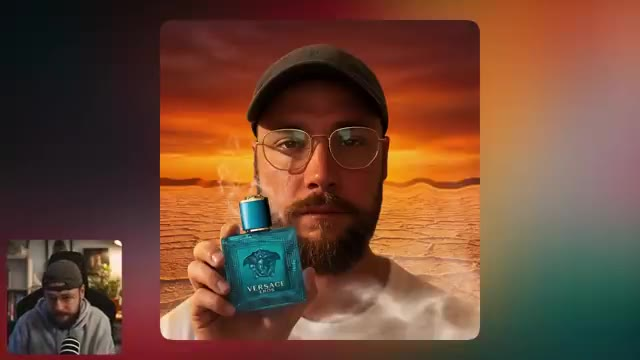
*Résultat généré par l'IA montrant l'homme barbu de face tenant un flacon de parfum Versace Eros dans un décor de désert au coucher du soleil.*

---

### ⏱️ `[00:15:46 - 00:16:19]` | Segment #33

**🔊 Audio (Transcription Intégrale Mot pour Mot en Français) :**
> de retour de Nano Banana Pro. Pour commencer, parlons de ce qui ne va pas tout à fait, mettons ça de côté. Le marquage sur le bouteille de parfum a un peu dérapé ici. Et rappelez-vous que c'est l'une des fonctionnalités que nous espérions voir s'améliorer. Je pense qu'en règle générale, avec nos tests, ça a été plutôt bon, mais vous pouvez voir ici que parfois vous obtenez des générations qui ne correspondent pas tout à fait à ce que vous cherchez. Le design global et l'échelle ont l'air bons cependant. Nous avons donc au moins un certain niveau de cohérence de produit. Maintenant, parlons un peu de l'angle,

**👁️ Analyse Visuelle d'Écran (gemini-3.5-flash-lite) :**
**Interface & Outils** : Affichage d'une image générée par IA principale avec le présentateur en incrustation vidéo (PiP) dans le coin inférieur gauche.

**Contenu textuel & Code** : Image générée montrant un homme tenant un flacon de parfum bleu type Versace sur fond de coucher de soleil, avec un défaut d'écriture sur l'étiquette.

**Action / Démonstration** : Le créateur commente et analyse visuellement les défauts de génération du texte sur l'étiquette du flacon de parfum dans l'image affichée.

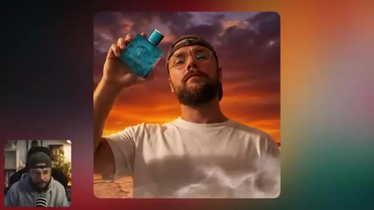
*Image générée par IA montrant un homme tenant une bouteille de parfum avec un problème de marquage de texte, avec le créateur en incrustation vidéo (PiP) dans le coin inférieur gauche.*

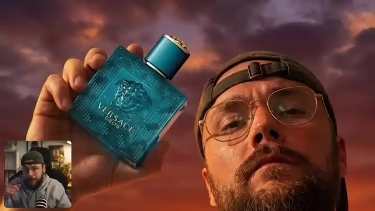
*Gros plan sur l'image générée montrant la bouteille de parfum Versace avec des erreurs de texte sur le packaging, et le créateur en incrustation vidéo (PiP).*

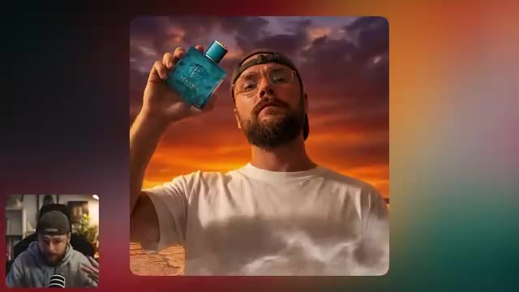
*Retour au plan large de l'image générée de l'homme avec la bouteille de parfum devant un coucher de soleil, avec le créateur en incrustation (PiP).*

---

### ⏱️ `[00:16:19 - 00:16:51]` | Segment #34

**🔊 Audio (Transcription Intégrale Mot pour Mot en Français) :**
> la composition générale parce que cela rend vraiment très bien, très dramatique. Encore une fois, ma casquette est à l'envers comme nous l'avons demandé dans la génération Nano Banana 1, elle refuse tout simplement de mettre ce truc là où je veux. Le niveau de texture de la peau a l'air insensé, le chaume juste sous l'encolure de ma barbe, tous ces tout petits détails créent vraiment une image d'apparence réaliste. Ces petits reflets lumineux dans mes lunettes, les pores visibles sur mes joues. C'est vraiment un

**👁️ Analyse Visuelle d'Écran (gemini-3.5-flash-lite) :**
**Interface & Outils** : Présentation face caméra sans partage d'écran

**Contenu textuel & Code** : Le créateur montre une vidéo générée par IA en plein écran (représentant son avatar avec un flacon de parfum dans un décor dramatique) tout en apparaissant en incrustation PiP (Picture-in-Picture) dans le coin inférieur gauche. Aucune interface logicielle ni aucun outil de création n'est affiché.

**Action / Démonstration** : Le créateur commente une vidéo générée par IA affichée à l'écran, tout en gesticulant et en parlant face à sa webcam principale.

---

### ⏱️ `[00:16:51 - 00:17:22]` | Segment #35

**🔊 Audio (Transcription Intégrale Mot pour Mot en Français) :**
> impressionnante démonstration de Nano Banana Pro. Donc les gars, j'espère vraiment que vous avez apprécié la vidéo d'aujourd'hui. Si c'est le cas, assurez-vous de lâcher un pouce bleu pour moi. Si vous êtes nouveau, pensez à vous abonner et bien sûr, activez cette cloche de notification pour ne jamais manquer aucun contenu futur. Si vous avez la moindre question concernant Nano Banana Pro, assurez-vous de les poser en bas dans la section commentaires, je répondrai à autant que possible. Aujourd'hui est un grand jour dans le monde de la tech IA, alors profitez-en les gars et bon test. Je vous retrouve dans la prochaine vidéo.

**👁️ Analyse Visuelle d'Écran (gemini-3.5-flash-lite) :**
**Interface & Outils** : Démonstration de rendus vidéo générés par intelligence artificielle avec incrustation du créateur (picture-in-picture) et éléments d'interface YouTube.

**Contenu textuel & Code** : Rendu vidéo de haute qualité généré par IA simulant divers environnements fantastiques et publicitaires avec le visage du créateur intégré, bouton "SUBSCRIBED" et icônes de notification/likes.

**Action / Démonstration** : Présentation de différents clips vidéo générés par IA illustrant les capacités du modèle, tandis que le créateur s'adresse aux spectateurs pour conclure la vidéo.

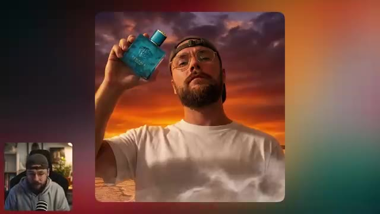
*Démonstration vidéo générée par IA montrant le créateur en tenue de présentation tenant un flacon de parfum sous un ciel crépusculaire.*

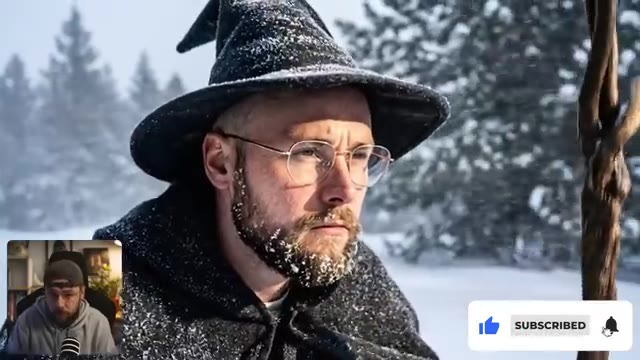
*Démonstration vidéo générée par IA d'un personnage de sorcier en gros plan dans un paysage enneigé avec incrustation d'un bouton d'abonnement.*

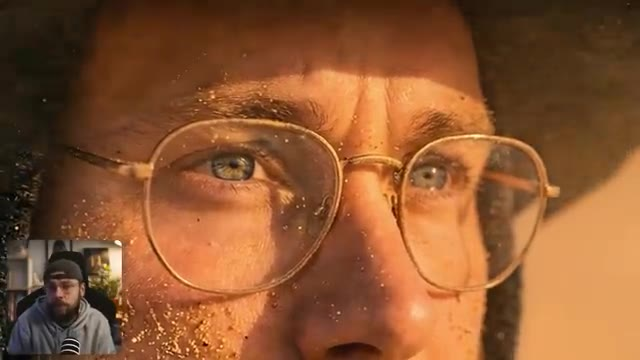
*Gros plan extrême généré par IA sur les yeux et les lunettes du créateur avec des particules de poussière en suspension.*

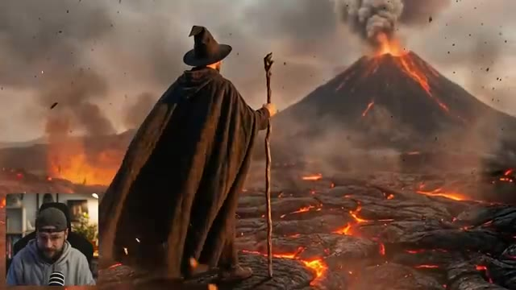
*Plan large généré par IA montrant un personnage en cape observant un volcan en éruption depuis un sol rocheux en fusion.*

---
