# 🎬 Comment créer des VFX époustouflants avec l'IA

> **Chaîne** : [Jack Vs. AI](https://www.youtube.com/@JackVsAI)  
> **Titre original** : `How to create JAW-DROPPING VFX With AI`  
> **Lien YouTube** : [https://www.youtube.com/watch?v=Uf31kIa5HSM](https://www.youtube.com/watch?v=Uf31kIa5HSM)  
> **Date de publication** : 2025-11-27  
> **Durée** : 21m 11s (`1271s`)  
> **Identifiant vidéo** : `Uf31kIa5HSM`  
> **Fiche Web Interactive** : [2025-11-27_YT-Uf31kIa5HSM_Comment créer des VFX époustouflants avec l'IA_by-whisper-v3-large-turbo+gemini-3.5-flash-lite.html](2025-11-27_YT-Uf31kIa5HSM_Comment créer des VFX époustouflants avec l'IA_by-whisper-v3-large-turbo+gemini-3.5-flash-lite.html)  
> **Captures de démonstration clés** : `116 captures réelles (anti-talking-head)`  
> **Modèles utilisés** : Audio: `large-v3-turbo` (Faster-Whisper int8 VPS) | Vision: `gemini-3.5-flash-lite` (Google AI Studio API)  

---

## 📌 Synthèse Exécutive & Outils

### 📌 Résumé

Dans cette vidéo, Jack, un artiste VFX chevronné fort de plus de dix ans d'expérience dans la publicité haut de gamme, démontre comment l'intelligence artificielle générative bouleverse la post-production traditionnelle. Face à des coûts de CGI exorbitants et des contraintes techniques insurmontables pour les indépendants ou les petits budgets, l'IA s'impose comme une alternative redoutable. Il l'illustre à travers la création d'effets visuels complexes et spectaculaires — comme un paquebot de croisière attaqué par un kraken ou une violente explosion urbaine — en partant simplement de plans réels existants.

La méthode de Jack repose sur un workflow hybride et accessible : l'extraction d'une image clé (frame) depuis un logiciel de montage de référence comme Premiere Pro, puis son injection dans une plateforme centralisée (ici, *Hailuo.ai*). En combinant cette image de départ (*image-to-video*) à des prompts textuels descriptifs et ultra-détaillés, il exploite directement des modèles de pointe pour générer des simulations physiques complexes (eau, feu, destructions) sans passer par de lourdes opérations de rotoscopie ou de modélisation 3D. 

L'analyse comparative entre les moteurs de génération (tels que Hailuo 2.3 et Veo 3.1) révèle les forces et les faiblesses actuelles de l'industrie : si les IA offrent un gain de temps massif et démocratisent l'accès à des visuels d'une qualité cinématographique bluffante, elles nécessitent un œil critique pour gérer les artefacts, les distorsions ou les restrictions de modération. Pour les cinéastes indépendants et les créateurs de contenu publicitaire, c'est un véritable changement de paradigme qui permet d'obtenir des résultats bluffants à moindre coût.

### 🛠️ Outils, Modèles & Logiciels Présentés

* **Hailuo.ai (Hyluo.ai)** : Plateforme cloud centrale utilisée pour l'hébergement des outils de génération vidéo et l'accès aux différents modèles d'IA, proposant également des offres promotionnelles (comme pour le Black Friday).
* **Hailuo 2.3** : Modèle de génération vidéo par IA intégré à la plateforme, particulièrement performant sur le rendu des textures organiques et des effets lumineux.
* **Veo 3.1 (Veo3.1)** : Modèle vidéo de Google accessible directement via la plateforme Hailuo, reconnu pour son strict respect des prompts textuels et sa gestion des ombres et de la perspective, bien que soumis à des filtres de modération plus stricts.
* **Premiere Pro** : Logiciel de montage vidéo de prédilection utilisé pour le montage initial et l'extraction rapide d'images clés au format JPEG grâce à l'outil d'exportation de capture photo.
* **Nano Banana** : Mentionné dans l'écosystème des outils d'IA associés aux flux de travail de création visuelle et d'optimisation de contenu (selon les métadonnées de la vidéo).

### 🔑 Points Clés & Enseignements Stratégiques

* **Démocratisation des VFX** : L'IA permet désormais aux créateurs sans bagage technique lourd ni budget pharaonique de concevoir des effets visuels d'une qualité digne de productions hollywoodiennes.
* **Le workflow par image de départ (*Image-to-Video*)** : Pour garantir la cohérence d'un plan existant, l'étape fondamentale consiste à exporter une photogramme (*frame*) unique d'une séquence vidéo pour s'en servir de base visuelle à l'IA.
* **Exportation propre sous Premiere Pro** : L'utilisation de l'icône de caméra pour capturer et exporter une image au format JPEG directement depuis la timeline facilite grandement l'intégration dans les générateurs vidéo.
* **Rédaction de prompts narratifs riches** : Pour orienter l'IA, le prompt textuel doit décrire précisément l'action, le mouvement et l'ambiance (ex. : « *d'énormes tentacules de Kraken surgissent vers le haut, s'enroulant autour de la coque, simulation d'eau ultra réaliste* »).
* **Comparaison multi-modèle** : Tester un même prompt sur plusieurs moteurs (comme Hailuo 2.3 et Veo 3.1) permet de comparer les rendus : Hailuo excelle souvent sur les textures de matière, tandis que Veo respecte plus fidèlement la mise en scène textuelle.
* **Arbitrage économique vs traditionnel** : Face à des coûts de CGI prohibitifs nécessitant des équipes spécialisées, le recours à l'IA générative offre une alternative viable pour les publicités et les courts métrages à petit budget.
* **Gestion des restrictions de modération** : Les modèles haut de gamme comme Veo de Google intègrent des filtres stricts qui peuvent bloquer la génération de scènes violentes ou destructrices (comme des explosions urbaines).
* **Analyse critique des artefacts** : Même si l'éclairage et l'intégration globale sont souvent impressionnants, il faut savoir accepter de légères imperfections (mouvements de foule bizarres, distorsions passagères) inhérentes à la technologie actuelle.
* **Itérations et tests multiples** : Obtenir un plan parfait nécessite souvent de multiplier les générations et d'utiliser des plans de test additionnels pour épurer le résultat final.
* **Conservation de la dynamique de caméra** : L'intégration de consignes spécifiques dans le prompt (comme « *l'onde de choc fait légèrement trembler la caméra* ») renforce le réalisme et l'ancrage du plan dans une esthétique cinématographique professionnelle.

---

## ⏱️ Chronologie & Transcription Complète Audio & Visuelle (Mot pour Mot)

### ⏱️ `[00:00:00 - 00:00:33]` | Segment #01

**🔊 Audio (Transcription Intégrale Mot pour Mot en Français) :**
> L'intelligence artificielle est sur le point de détruire Hollywood. Écoutez, je ne vais pas rester assis ici à dire la même chose que tous les autres créateurs de contenu. Les artistes VFX, les professionnels de l'industrie, créent des choses vraiment incroyables. Mais l'intelligence artificielle permet désormais à ceux d'entre vous qui n'ont aucune connaissance technique de créer vos propres effets visuels époustouflants avec un tout petit budget. Je m'appelle Jack, je suis artiste VFX dans l'industrie publicitaire depuis plus de dix ans maintenant, et j'ai travaillé avec de nombreux...

**👁️ Analyse Visuelle d'Écran (gemini-3.5-flash-lite) :**
**Interface & Outils** : Présentation face caméra sans partage d'écran

**Contenu textuel & Code** : Texte affiché à l'écran : "AI is about to destroy Hollywood" (L'IA est sur le point de détruire Hollywood).

**Action / Démonstration** : Jack s'adresse directement à la caméra dans son studio, micro visible au premier plan, tout en s'exprimant sur l'impact de l'intelligence artificielle dans le milieu des effets visuels.

---

### ⏱️ `[00:00:33 - 00:00:58]` | Segment #02

**🔊 Audio (Transcription Intégrale Mot pour Mot en Français) :**
> plus grandes marques de la planète. Et la vidéo d'aujourd'hui concerne entièrement la création de plans d'effets visuels (VFX) avec l'IA. Je vais vous présenter les meilleurs outils et pratiques, partager tous les prompts que j'ai utilisés et décortiquer chaque étape du processus sans rien cacher. Que vous cherchiez à utiliser l'IA pour la publicité ou le cinéma, cette vidéo est pour vous. Et si vous appréciez le contenu d'aujourd'hui, les gars, assurez-vous de lâcher un pouce bleu pour moi, pensez à vous abonner et, bien sûr, activez cette cloche de notification.

**👁️ Analyse Visuelle d'Écran (gemini-3.5-flash-lite) :**
**Interface & Outils** : Présentation face caméra sans partage d'écran

**Contenu textuel & Code** : Aucun contenu logiciel ou technique affiché à l'écran, uniquement Jack qui s'adresse au spectateur dans son studio.

**Action / Démonstration** : Jack parle face caméra en gesticulant légèrement pour expliquer le sujet de la vidéo.

---

### ⏱️ `[00:00:58 - 00:01:35]` | Segment #03

**🔊 Audio (Transcription Intégrale Mot pour Mot en Français) :**
> Très bien, allons droit au but. Donc pour la vidéo d'aujourd'hui, nous sommes sur Hyluo.ai. Leurs offres du Black Friday se déroulent du 21 novembre au 3 décembre et ils ont plein de superbes offres pendant cette période. Je vais toutes les afficher à l'écran maintenant pour que vous puissiez les consulter, et cela inclut 60% de réduction sur les abonnements annuels. Et en passant à mon logiciel de montage de prédilection qui est Premiere Pro, vous pouvez voir que j'ai ce plan d'un paquebot de croisière et ce que nous voulons faire, c'est créer des effets visuels d'un kraken sortant de l'eau et entraînant ce paquebot de croisière par le fond. Donc pour faire cela, nous voulons exporter une seule image de cette séquence. À l'intérieur

**👁️ Analyse Visuelle d'Écran (gemini-3.5-flash-lite) :**
**Interface & Outils** : Site web Hyluo.ai et logiciel de montage Adobe Premiere Pro 2025.

**Contenu textuel & Code** : Sur Hyluo.ai : "Transform Idea to Visual", "HAILUO HORROR FILM CONTEST", "Hailuo 2.3/2.3Fast". Sur l'écran des offres : "November 21 - December 3", "Annual memberships at 60% OFF (Standard, Pro, and Master plans)", "Unlimited Hailuo 2.3 use and a Top-Up Bonus up to 33% extra. (for Annual Master & Ultra Plans)", "Free access to Nano Banana Pro". Sur Premiere Pro : panneau Projet avec des clips de paquebot de croisière ("Sailing Cruise Ship..."), moniteur de programme affichant le navire en mer, et chronologie (timeline).

**Action / Démonstration** : Le créateur présente la plateforme Hyluo.ai, affiche les offres promotionnelles du Black Friday, puis bascule sur Adobe Premiere Pro pour montrer le plan vidéo d'un paquebot de croisière qu'il souhaite modifier avec des effets visuels.

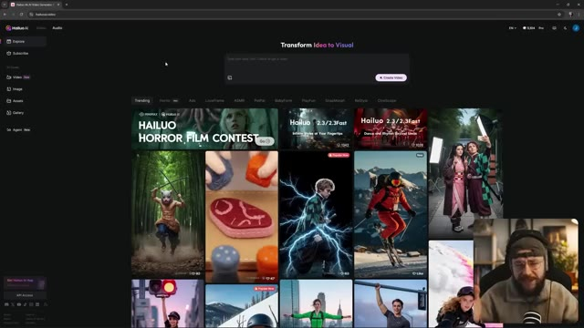
*Interface du site web Hyluo.ai avec une galerie de vidéos générées par IA et une incrustation vidéo du créateur en bas à droite.*

*Écran textuel listant les offres Black Friday du 21 novembre au 3 décembre, incluant 60% de réduction sur les abonnements annuels.*

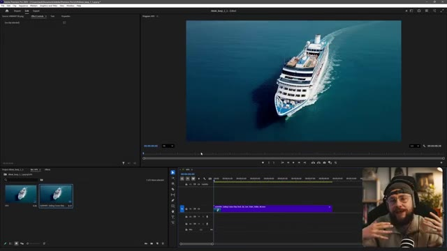
*Interface du logiciel Adobe Premiere Pro montrant le montage d'un plan de paquebot de croisière, avec une incrustation vidéo du créateur en bas à droite.*

---

### ⏱️ `[00:01:35 - 00:02:12]` | Segment #04

**🔊 Audio (Transcription Intégrale Mot pour Mot en Français) :**
> Premiere Pro c'est vraiment facile. On peut survoler cette icône de caméra. Vous pouvez voir que c'est écrit "Exporter la photo" et si on clique dessus, vous pouvez voir qu'on peut choisir parmi une variété de formats différents. Je vais simplement opter pour JPEG et exporter ce plan. De retour sur Hilo.ai, si on va dans le coin supérieur gauche, vous pouvez voir qu'il y a un onglet nommé vidéo. Donc si on clique ici, nous sommes maintenant dans l'espace de génération de vidéo. Et vous pouvez voir que nous avons l'option de télécharger une image de départ. Donc comme vous l'avez sans doute deviné, je vais aller déposer l'image que nous avons exportée de notre paquebot de croisière. Et désolé si ma voix a l'air bizarre, les gars. Je suis plutôt malade en ce moment. J'ai deux enfants très morveux en ce moment.

**👁️ Analyse Visuelle d'Écran (gemini-3.5-flash-lite) :**
**Interface & Outils** : Adobe Premiere Pro et la plateforme de génération vidéo en ligne Hilo.ai.

**Contenu textuel & Code** : Dans Premiere Pro : l'info-bulle 'Export Frame (Ctrl+Shift+E)'. Sur Hilo.ai : 'Transform Idea to Visual', 'Create Video', l'onglet 'Video', 'My Upload', 'My Assets', 'Favorites', et des prompts textuels sur le panneau de droite.

**Action / Démonstration** : Survol de l'icône d'exportation de trame dans Premiere Pro, navigation sur le tableau de bord de Hilo.ai, puis accès à l'espace de téléchargement d'image de départ pour la génération vidéo.

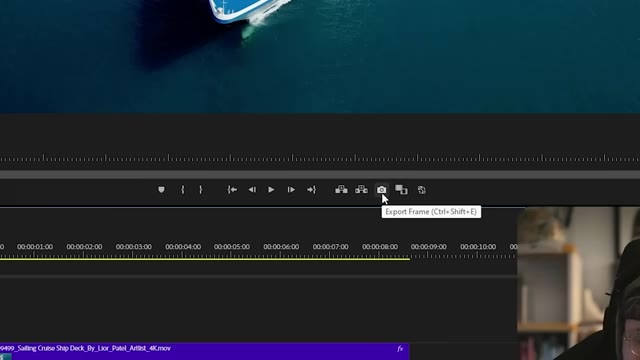
*Interface d'Adobe Premiere Pro montrant le survol de l'icône de l'appareil photo pour exporter une image avec la mention 'Export Frame'.*

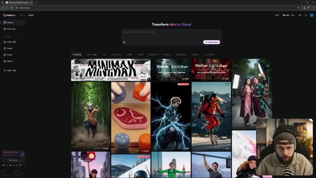
*Interface d'accueil de la plateforme Hilo.ai avec le champ 'Transform Idea to Visual' et la galerie de vidéos tendance.*

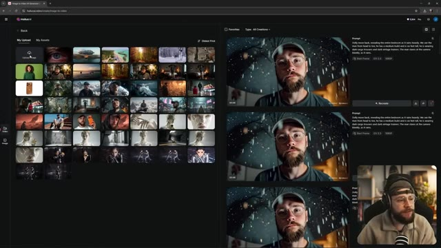
*Interface de génération vidéo d'Hilo.ai affichant l'onglet 'My Upload' avec une grille d'images et des exemples de créations sur le panneau de droite.*

---

### ⏱️ `[00:02:12 - 00:02:47]` | Segment #05

**🔊 Audio (Transcription Intégrale Mot pour Mot en Français) :**
> maintenant et ils ont décidé de me transmettre tout ce qu'ils ont. Donc pour le prompt textuel, nous allons opter pour un plan cinématique large d'un paquebot de croisière massif glissant sur l'océan. Soudain, d'énormes tentacules de Kraken surgissent vers le haut, s'enroulant autour de la coque. L'eau éclabousse dans les airs alors que les tentacules serrent et entraînent le paquebot de croisière vers le bas. Le navire s'incline, le métal grince. Le Kraken l'entraîne sous la surface dans un mouvement dramatique à haute énergie. Simulation d'eau ultra réaliste, atmosphère intense, textures très détaillées, éclairage dramatique, style cinématique 4K. Et vous pouvez voir si

**👁️ Analyse Visuelle d'Écran (gemini-3.5-flash-lite) :**
**Interface & Outils** : Interface de génération vidéo par IA avec aperçu côte à côte et fenêtre Picture-in-Picture (PiP) du créateur.

**Contenu textuel & Code** : Texte affiché : « A wide cinematic shot of a massive cruise liner gliding across the ocean. Suddenly enormous kraken tentacles burst upward, wrapping around the hull. Water sprays into the air as the tentacles squeeze and drag the cruise liner downward. The ship tilts, metal groaning. The Kraken pulls it beneath the surface in a dramatic, high-energy motion. Ultra-realistic water simulation, intense atmosphere, high-detail textures, dramatic lighting, 4K, cinematic style. » et paramètres « Start Frame », « I2V 2.3 », « 1080P ».

**Action / Démonstration** : Le créateur présente des exemples de vidéos générées par IA et affiche le prompt textuel à l'écran.

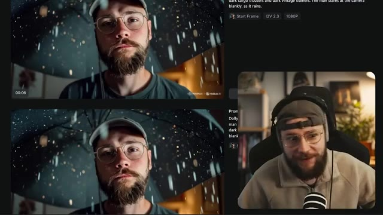
*Interface d'un outil de génération vidéo par IA montrant des aperçus de vidéos avec le créateur en incrustation PiP.*

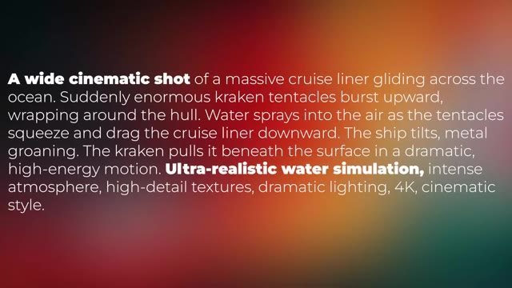
*Texte du prompt affiché à l'écran sur un fond coloré et flou.*

---

### ⏱️ `[00:02:47 - 00:03:23]` | Segment #06

**🔊 Audio (Transcription Intégrale Mot pour Mot en Français) :**
> J'ouvre ce menu déroulant, nous avons l'option de choisir notre modèle vidéo. Nous pouvons opter pour Hailuo 2.3 ou passer à Veo 3.1. Et au moment de l'enregistrement, utiliser Veo 3.1 via Hailuo est en fait la méthode la moins chère pour accéder au modèle vidéo de Google. Je pense donc que nous allons lancer une génération avec Hailuo et également lancer une génération avec Veo 3.1 pour servir de point de comparaison. Et dans notre scénario hypothétique, imaginons qu'il s'agisse d'un plan d'un court métrage. Nous avons donc déjà tourné le film entier et nous sommes maintenant en post-production.

**👁️ Analyse Visuelle d'Écran (gemini-3.5-flash-lite) :**
**Interface & Outils** : Interface web de Hailuo AI (hailuoai.video/create/image-to-video) avec le panneau de sélection des modèles vidéo ouvert.

**Contenu textuel & Code** : On peut lire les options de modèles : Hailuo 2.3 (New), Hailuo 2.3-Fast (New), Veo 3.1 (63% OFF), Veo 3.1-Fast (50% OFF), Hailuo 2.0, Hailuo 1.0-Director. Le prompt textuel visible en bas est : "A wide cinematic shot of a massive cruise liner gliding across the ocean. Suddenly enormous kraken tentacles burst upward, wrapping around the hull..."

**Action / Démonstration** : Le curseur de la souris survole le menu déroulant pour sélectionner et comparer les différents modèles vidéo disponibles (Hailuo 2.3 et Veo 3.1).

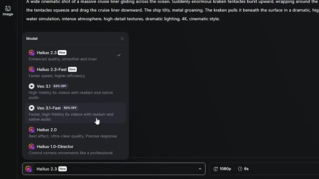
*Gros plan sur le menu déroulant de sélection des modèles vidéo dans Hailuo AI, montrant Hailuo 2.3 et Veo 3.1.*

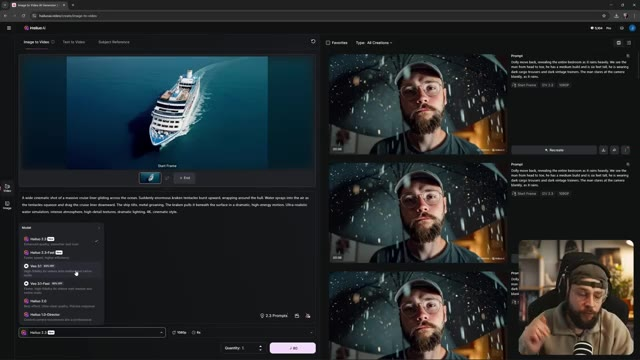
*Interface complète de Hailuo AI en mode Image-to-Video avec le menu des modèles ouvert et le créateur visible en incrustation PiP.*

---

### ⏱️ `[00:03:23 - 00:03:58]` | Segment #07

**🔊 Audio (Transcription Intégrale Mot pour Mot en Français) :**
> processus d'ajout d'effets visuels. Traditionnellement, vous devriez sous-traiter cela à une équipe spécialisée et vous parlez de CGI très coûteux, ce qui n'est pas réalisable la plupart du temps. Mais si vous êtes un petit cinéaste ou que vous réalisez une publicité pour votre entreprise, alors emprunter les voies traditionnelles n'est parfois tout simplement pas envisageable car c'est très coûteux. Donc ceci peut être une excellente alternative pour réaliser quand même votre travail et obtenir un beau résultat à la fin. En commençant donc par notre génération Hailuo AI, les tentacules émergent en quelque sorte d'un endroit que je ne

**👁️ Analyse Visuelle d'Écran (gemini-3.5-flash-lite) :**
**Interface & Outils** : Interface web de Hailuo AI (Hailuo AI Video Generation) avec des onglets Image to Video, Text to Video, Subject Reference, et des panneaux latéraux pour les créations et les prompts.

**Contenu textuel & Code** : Le prompt visible est : "A wide cinematic shot of a massive cruise liner gliding across the ocean. Suddenly enormous kraken tentacles burst upward, wrapping around the hull. Water sprays into the air as the tentacles squeeze and drag the cruise liner downward. The ship tilts, metal groaning. The kraken pulls it beneath the surface in a dramatic, high-energy motion. Ultra-realistic water simulation, intense atmosphere, high-detail textures, dramatic lighting, 4K, cinematic style." Paramètres visibles : Start Frame, I2V 2.3, Enable Optimization, 1080P, 6s, 16:9.

**Action / Démonstration** : Le créateur présente l'interface de génération vidéo par IA Hailuo AI et montre le processus de transformation d'une image fixe de paquebot en une cinématique animée avec des effets de monstres marins.

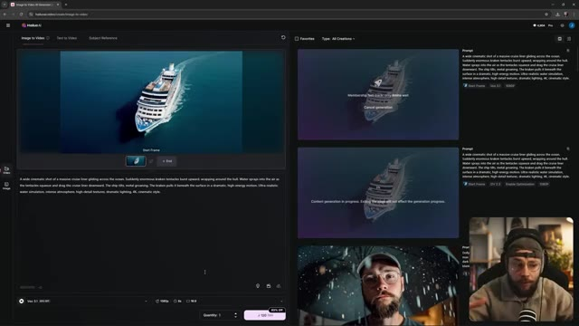
*Interface de Hailuo AI montrant l'outil Image to Video avec une image de paquebot de croisière et les panneaux de prompts sur le côté.*

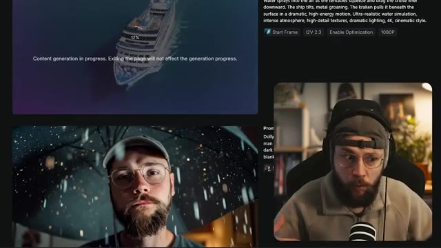
*Affichage de la progression de la génération vidéo sur Hailuo AI avec incrustation de la caméra du créateur.*

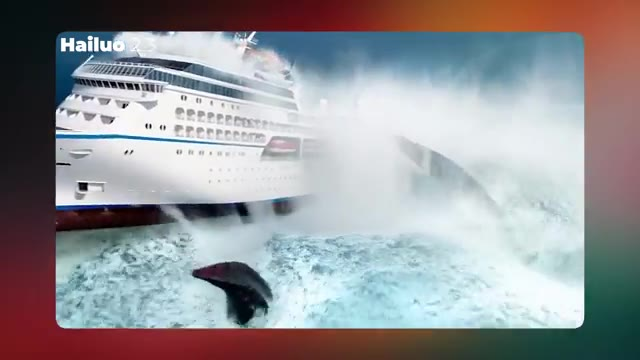
*Résultat de la génération vidéo montrant un paquebot attaqué par des tentacules géantes dans l'océan avec des gerbes d'eau.*

---

### ⏱️ `[00:03:58 - 00:04:35]` | Segment #08

**🔊 Audio (Transcription Intégrale Mot pour Mot en Français) :**
> attendez presque derrière la caméra. Et nous avons bien dit dans le texte du prompt que nous voulons que les tentacules surgissent de sous le paquebot de croisière. Je dirais que le navire de croisière lui-même reste plutôt constant. J'aime beaucoup les textures et cet effet brillant sur les tentacules du Kraken. Mais je trouve que certains dégâts sur le navire de croisière ont l'air un peu cartoony. Les effets d'eau sont plutôt réussis, de manière générale. Et en passant à notre résultat Vo 3.1, celui-ci correspond clairement beaucoup plus étroitement à notre prompt textuel. J'adore la façon dont

**👁️ Analyse Visuelle d'Écran (gemini-3.5-flash-lite) :**
**Interface & Outils** : Présentation comparative de clips vidéo générés par IA, étiquetés dans le coin supérieur gauche avec les noms des modèles (Hailuo 2.3 et Veo 3.1).

**Contenu textuel & Code** : Texte affiché à l'écran : "Hailuo 2.3" sur les images 1 à 3, et "Veo 3.1" sur l'image 4. Scène visuelle d'un paquebot blanc et bleu attaqué par de grands tentacules noirs de Kraken au milieu de vagues écumantes.

**Action / Démonstration** : Le créateur présente et compare des clips vidéo générés par intelligence artificielle en commentant le réalisme des textures, de l'eau et le respect du prompt textuel.

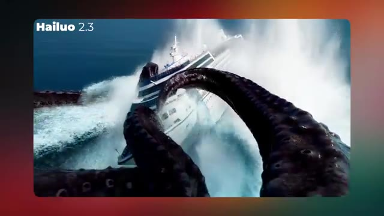
*Extrait vidéo généré montrant un paquebot attaqué par des tentacules de Kraken sous l'interface de test Hailuo 2.3.*

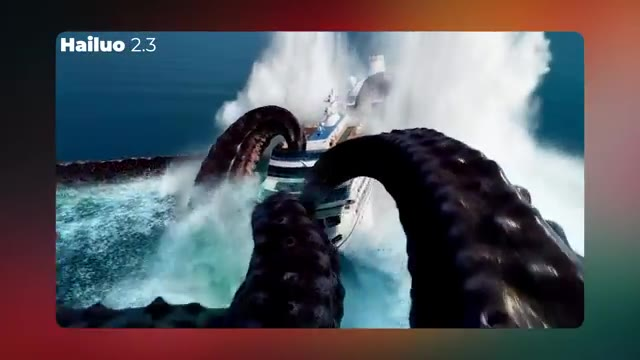
*Poursuite de la séquence Hailuo 2.3 montrant les tentacules agitant l'eau autour du navire.*

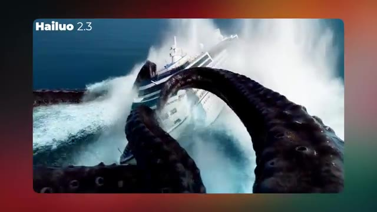
*Autre angle ou instant de la vidéo générée avec Hailuo 2.3 montrant le navire en difficulté.*

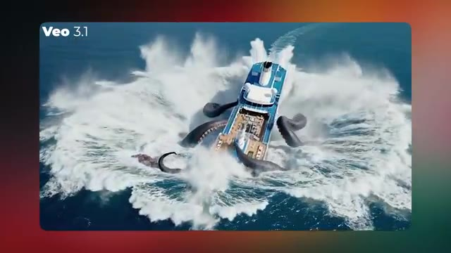
*Extrait vidéo comparatif sous l'interface Veo 3.1 montrant une vue aérienne du paquebot encerclé par le Kraken.*

---

### ⏱️ `[00:04:35 - 00:05:10]` | Segment #09

**🔊 Audio (Transcription Intégrale Mot pour Mot en Français) :**
> le paquebot est entraîné sous l'eau et les ombres que les tentacules projettent sur le navire lui-même. Nous voyons quelques moments de distorsion qui brisent un peu l'illusion, et je dois dire que je préfère en fait la génération de Hyluo en ce qui concerne la texture des tentacules du Kraken, et bien que le résultat ne soit pas parfait pour l'une ou l'autre de nos générations, obtenir quelque chose d'approximatif par des méthodes traditionnelles coûterait beaucoup d'argent. Et ensuite nous avons ce plan ici dans une sorte de ville on dirait que cela pourrait se dérouler

**👁️ Analyse Visuelle d'Écran (gemini-3.5-flash-lite) :**
**Interface & Outils** : Adobe Premiere Pro 2025 avec panneau de montage, chutier et moniteur de programme affichant un plan aérien d'une ville italienne.

**Contenu textuel & Code** : Texte "Veo 3.1" visible sur les trois premières images de rendu vidéo. Dans Premiere Pro, nom de projet "Kraken_Vs_AI_1" et clips vidéo importés dans le chutier.

**Action / Démonstration** : Le créateur présente différents clips vidéo générés comparant le comportement des tentacules et des éclaboussures dans l'eau, puis bascule sur l'interface de montage Premiere Pro tout en commentant les plans.

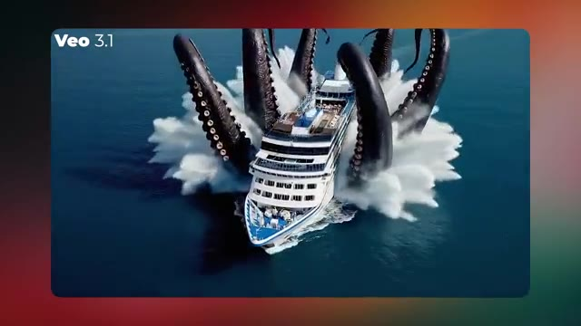
*Rendu vidéo généré par IA montrant un paquebot de croisière attaqué par un grand kraken dans l'océan, avec le label "Veo 3.1" en haut à gauche.*

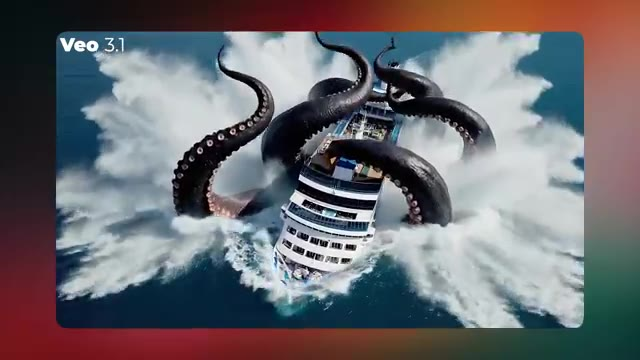
*Rendu vidéo de Veo 3.1 montrant les tentacules du monstre marin enserrant le navire au milieu d'éclaboussures d'eau.*

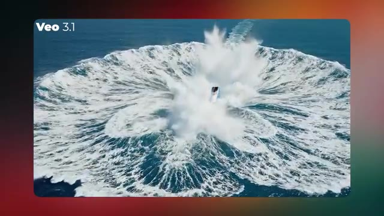
*Rendu vidéo de Veo 3.1 montrant le paquebot entraîné sous l'eau provoquant un énorme tourbillon d'écume blanche.*

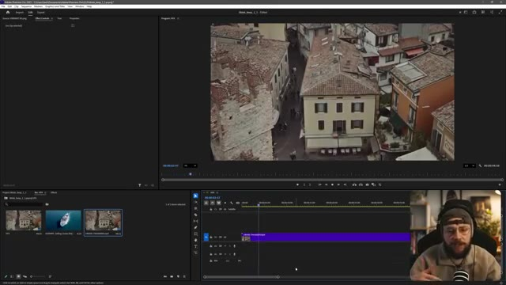
*Interface du logiciel de montage Adobe Premiere Pro avec la chronologie, le chutier et un encadré PiP (Picture-in-Picture) montrant Jack dans son studio en train de parler.*

---

### ⏱️ `[00:05:10 - 00:05:37]` | Segment #10

**🔊 Audio (Transcription Intégrale Mot pour Mot en Français) :**
> endroit en Italie ou en France, quelque chose comme ça. Et ce qu'on veut chercher à générer, c'est une explosion qui provient de l'intérieur de ce bâtiment central. Encore une fois, pour réaliser cela avec des moyens traditionnels, vous parlez d'une grande capacité technique. Et si vous n'avez pas cela, de beaucoup d'argent parce que vous auriez besoin de différents éléments d'explosion 3D que vous devriez composer. Et vous devriez également faire pas mal de masquage ou de rotoscopie également.

**👁️ Analyse Visuelle d'Écran (gemini-3.5-flash-lite) :**
**Interface & Outils** : Adobe Premiere Pro (logiciel de montage vidéo)

**Contenu textuel & Code** : Noms des clips vidéo dans le panneau Projet : "148500-794344004.mp4", "005080 Sailing Cruise Ph...", ainsi qu'une vue aérienne de toits de bâtiments européens traditionnels.

**Action / Démonstration** : Le créateur montre son écran de montage vidéo sous Adobe Premiere Pro tout en expliquant les complexités techniques des effets visuels traditionnels.

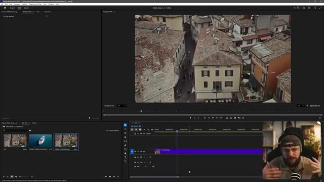
*Interface d'Adobe Premiere Pro affichant un plan aérien d'un village européen avec Jack incrusté en bas à droite.*

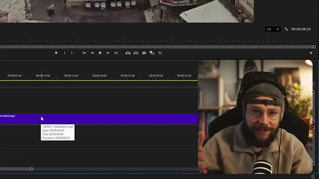
*Gros plan sur la timeline d'Adobe Premiere Pro montrant la piste vidéo avec Jack en incrustation PiP.*

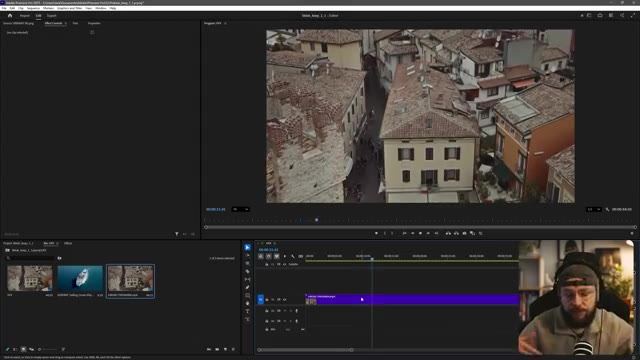
*Interface complète d'Adobe Premiere Pro avec le panneau de montage, le chutier et la fenêtre de prévisualisation du plan architectural.*

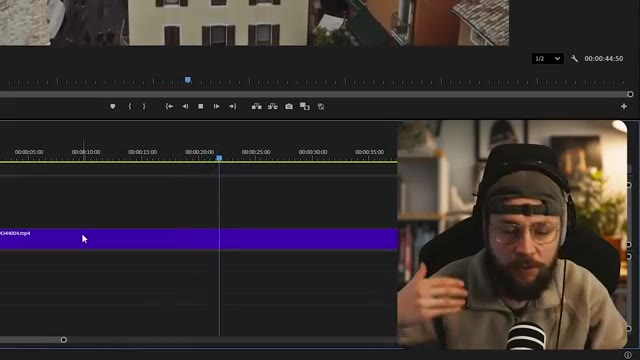
*Zoom sur la timeline du logiciel de montage Adobe Premiere Pro avec le curseur de lecture au centre.*

---

### ⏱️ `[00:05:37 - 00:05:55]` | Segment #11

**🔊 Audio (Transcription Intégrale Mot pour Mot en Français) :**
> Donc encore une fois, nous allons procéder à l'exportation de notre image de départ. De retour sur Hilo-O, je vais l'importer à nouveau. Et pour le prompt textuel, nous allons opter pour une scène de rue urbaine large avec un bâtiment central. Soudain, le bâtiment entre en éruption dans une explosion puissante et réaliste avec des débris et du feu jaillissant des fenêtres.

**👁️ Analyse Visuelle d'Écran (gemini-3.5-flash-lite) :**
**Interface & Outils** : Adobe Premiere Pro et affichage de texte à l'écran.

**Contenu textuel & Code** : Texte du prompt : "A wide urban street scene with a central building. Suddenly, the building erupts in a powerful, realistic explosion, with debris and fire bursting from the windows. The shockwave causes the camera to shake subtly. Panicked civilians sprint away from the blast, scattering in different directions. High-detail smoke, dynamic lighting, and ultra-realistic destruction effects."

**Action / Démonstration** : Le créateur montre son interface de montage Adobe Premiere Pro puis affiche le prompt textuel à l'écran.

*Interface d'Adobe Premiere Pro montrant le montage d'une vidéo avec le créateur en incrustation (PiP).*

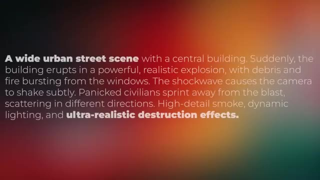
*Texte du prompt textuel affiché sur un fond coloré flou.*

---

### ⏱️ `[00:05:55 - 00:06:21]` | Segment #12

**🔊 Audio (Transcription Intégrale Mot pour Mot en Français) :**
> L'onde de choc fait légèrement trembler la caméra. Des civils paniqués s'enfuient en sprintant de l'explosion, se dispersant dans différentes directions. Fumée très détaillée, éclairage dynamique et effets de destruction ultra-réalistes. Une fois de plus, envoyons une génération Hialuo ainsi qu'un Veo3.1 également. Donc en fait, notre génération Veo3.1 a malheureusement échoué ici. Je pense que c'est probablement dû à la modération.

**👁️ Analyse Visuelle d'Écran (gemini-3.5-flash-lite) :**
**Interface & Outils** : Interface web de HaiLuo AI (Image to Video Generator) avec un panneau d'historique des créations à droite et le flux vidéo en incrustation PiP de Jack dans le coin inférieur droit.

**Contenu textuel & Code** : Texte du prompt visible : "A wide urban street scene with a central building. Suddenly, the building erupts in a powerful, realistic explosion...". Mention de "Veo 3.1", "1080P", "Start Frame" et message d'erreur de génération "The content generation has failed. Please try again."

**Action / Démonstration** : Le créateur présente l'interface de génération vidéo en expliquant qu'une des générations (Veo3.1) a échoué à cause de la modération, tout en montrant les résultats précédents avec le navire et le prompt de l'explosion.

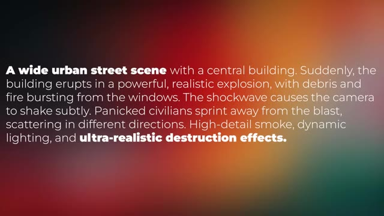
*Gros plan textuel sur le prompt décrivant une scène urbaine avec une explosion et des civils en fuite.*

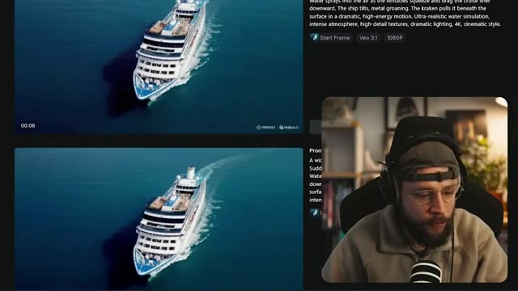
*Affichage de deux vidéos générées d'un navire de croisière en mer avec Jack visible en incrustation PiP.*

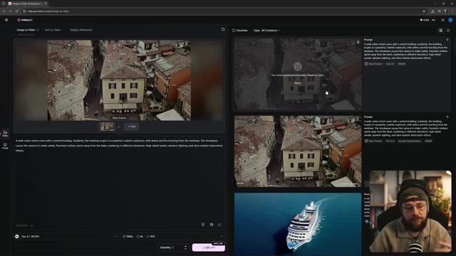
*Interface de l'outil de génération vidéo HaiLuo AI montrant l'historique des générations avec un échec de Veo 3.1 et Jack en incrustation PiP.*

---

### ⏱️ `[00:06:21 - 00:06:56]` | Segment #13

**🔊 Audio (Transcription Intégrale Mot pour Mot en Français) :**
> Des choses comme ça sont un peu plus strictes quand il s'agit des outils d'IA de Google, mais nous avons un résultat de retour de Hailuo 2.3. Allons-y donc et parlons du bon et du mauvais ici. Le genre d'origine de l'explosion et les effets de destruction ont l'air vraiment, vraiment très bien. Quelque chose dans les effets de feu est un peu étrange et la façon dont les gens dans la rue réagissent est également assez bizarre. C'est presque comme s'ils étaient accélérés, mais l'éclairage sur l'explosion et la façon dont cela affecte les bâtiments environnants est en fait vraiment très

**👁️ Analyse Visuelle d'Écran (gemini-3.5-flash-lite) :**
**Interface & Outils** : Interface de l'outil de génération vidéo Hailuo 2.3 montrant des exemples de vidéos générées.

**Contenu textuel & Code** : Texte visible dans l'interface : "Hailuo 2.3", "Start Frame", "I2V 2.3", "Enable Optimization", "1080P", ainsi qu'un prompt descriptif mentionnant des effets de destruction ultra-réalistes, des civils paniqués et un éclairage dynamique.

**Action / Démonstration** : Le créateur commente les résultats d'une vidéo générée par Hailuo 2.3, en analysant la qualité des effets d'explosion, de feu et de réaction des personnages.

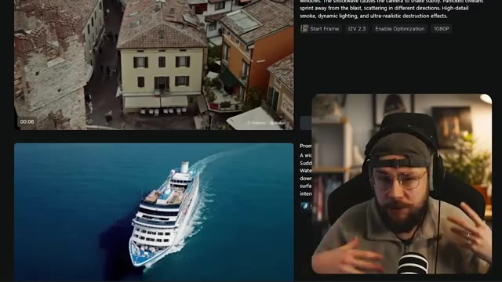
*Interface affichant des vidéos générées et Jack dans un encadré incrusté (PiP) à l'écran.*

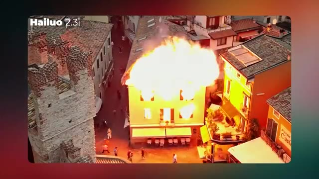
*Vidéo générée par Hailuo 2.3 montrant l'explosion initiale d'un bâtiment urbain vu du dessus.*

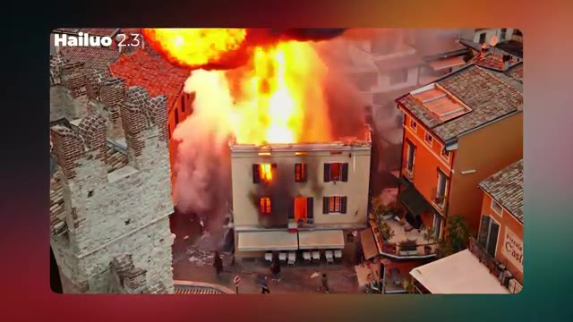
*Vidéo générée par Hailuo 2.3 montrant le développement de l'explosion, la fumée et les flammes sur le bâtiment.*

---

### ⏱️ `[00:06:56 - 00:07:28]` | Segment #14

**🔊 Audio (Transcription Intégrale Mot pour Mot en Français) :**
> impressionnant et on a bien ce genre de léger tremblement de caméra qu'on avait demandé. Ce que je vais faire, c'est que je vais ajouter toutes les générations supplémentaires que j'ai faites après avoir réalisé cette vidéo pour tester davantage les outils, juste pour vous montrer si on a fini par obtenir un résultat plus propre. Et bien que je sois un peu partagé sur cette génération, je pense qu'une moitié est vraiment très sympa et que l'autre moitié présente des choses étranges. Le fait qu'on ait créé cela purement grâce à l'IA et qu'on ait par conséquent économisé énormément d'argent est assez impressionnant en soi à mon sens. Et pour la suite

**👁️ Analyse Visuelle d'Écran (gemini-3.5-flash-lite) :**
**Interface & Outils** : Interface web de Hailou AI (Image to Video Generator) avec le panneau de prompt et les paramètres visibles sur le côté droit, et une incrustation vidéo du créateur (Jack) en bas à droite.

**Contenu textuel & Code** : Texte du prompt visible sur l'image 3 : "A wide urban street scene with a central building. Suddenly, the building erupts in a powerful, realistic explosion, with debris and fire bursting from the windows. The shockwave causes the camera to shake subtly. Panicked civilians sprint away from the blast, scattering in different directions. High-detail smoke, dynamic lighting, and ultra-realistic destruction effects." Paramètres visibles : Start Frame, V2.3, Creative Optimization, 1080p. Filigrane « Hailou 2.3 » sur les images 1 et 2, avec « V3 » sur l'image 2.

**Action / Démonstration** : Le créateur montre des exemples de vidéos générées par IA représentant une explosion urbaine avec des mouvements de caméra et commente les résultats tout en naviguant dans l'interface de Hailou AI.

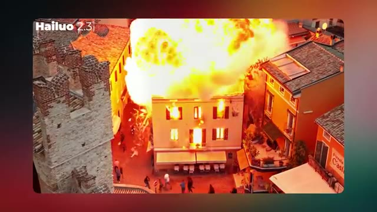
*Rendu vidéo généré par l'IA Hailou 2.3 montrant une explosion dans une rue urbaine vue d'en haut.*

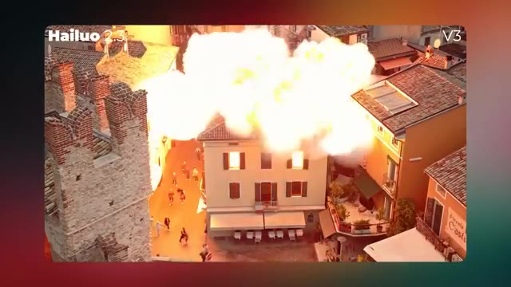
*Rendu vidéo Hailou 2.3 V3 montrant la même scène d'explosion urbaine depuis un autre angle ou une autre génération.*

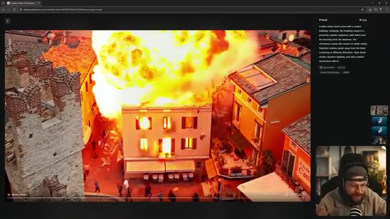
*Interface complète du logiciel Hailou AI avec le lecteur vidéo à gauche, le panneau de prompt à droite et le créateur en incrustation (PiP) en bas à droite.*

---

### ⏱️ `[00:07:28 - 00:08:05]` | Segment #15

**🔊 Audio (Transcription Intégrale Mot pour Mot en Français) :**
> plan nous avons ce beau morceau de séquence ici filmé depuis l'intérieur d'un appartement regardant vers la ville et ce que nous voulons faire c'est créer une transition météo. Donc encore une fois explorons notre image de départ et de retour dans Hylou nous allons l'importer. Pour le texte du prompt nous allons opter pour plan intérieur depuis l'intérieur d'un appartement moderne surplombant la skyline d'une ville. Dehors le temps change rapidement, le ciel clair s'assombrit, les vents s'intensifient et une violente tempête hivernale engloutit la ville. La neige frappe contre la vitre alors que le givre et la glace commencent à se propager organiquement à travers les fenêtres,

**👁️ Analyse Visuelle d'Écran (gemini-3.5-flash-lite) :**
**Interface & Outils** : Adobe Premiere Pro 2025 et l'interface Web de Hailuo AI (Hailuo-AI).

**Contenu textuel & Code** : Texte affiché à l'écran (Image #3) : « Interior shot from inside a modern apartment overlooking a city skyline. Outside, the weather shifts rapidly, clear skies darken, winds intensify, and a harsh winter storm engulfs the city. Snow blasts against the glass as frost and ice begins spreading organically across the windows, creeping outward in real time. Visibility fades as icy fog drifts between distant buildings. Realistic lighting changes, atmospheric depth, and detailed environmental transformation. » Mots en gras : "Interior shot", "detailed environmental transformation".

**Action / Démonstration** : Le créateur montre le plan vidéo original dans Premiere Pro, puis bascule sur l'interface de Hailuo AI pour importer l'image de départ et préparer la génération de la transition météo.

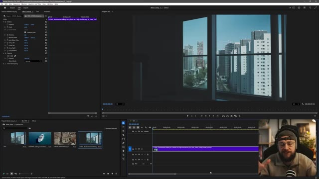
*Interface d'Adobe Premiere Pro montrant la timeline et un plan de coupe de la ville depuis un appartement moderne, avec le créateur incrusté en bas à droite.*

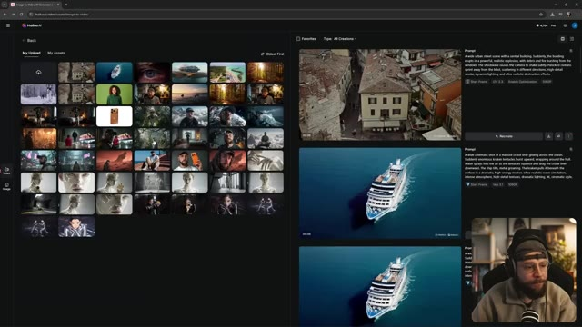
*Interface de la plateforme de génération vidéo Hailuo AI affichant la bibliothèque d'images importées et les créations précédentes.*

*Texte affiché en plein écran sur un fond coloré, présentant le prompt détaillé pour la transition météo hivernale.*

---

### ⏱️ `[00:08:05 - 00:08:39]` | Segment #16

**🔊 Audio (Transcription Intégrale Mot pour Mot en Français) :**
> qui s'étend vers l'extérieur en temps réel. La visibilité s'efface à mesure que le brouillard glacial dérive entre les différents bâtiments, les changements d'éclairage réalistes, la profondeur atmosphérique et la transformation environnementale détaillée. Pour cette génération, je voulais juste tester Hailuo 2.3 et nous avons obtenu de très bons résultats. Donc, en regardant la première génération, je ne suis pas un grand fan de ce genre de transition météorologique ou d'éclairage juste au début du plan où l'on a l'impression que certains bâtiments se déplacent et bougent. Nous recherchions vraiment une transition fluide, mais pour la

**👁️ Analyse Visuelle d'Écran (gemini-3.5-flash-lite) :**
**Interface & Outils** : Affichage de rendus vidéo générés par IA avec le filigrane/logo "Hailuo 2.3" dans le coin supérieur gauche.

**Contenu textuel & Code** : Texte du prompt : "Interior shot from inside a modern apartment overlooking a city skyline. Outside, the weather shifts rapidly, clear skies darken, winds intensify, and a harsh winter storm engulfs the city..." ainsi que la mention "Hailuo 2.3".

**Action / Démonstration** : Présentation à l'écran du texte du prompt textuel puis des résultats de génération vidéo illustrant les transitions météorologiques et les effets de givre sur les vitres.

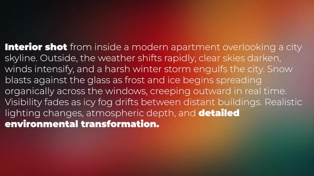
*Texte du prompt détaillé affiché en blanc sur fond coloré, décrivant la scène d'intérieur avec changement climatique et tempête de neige.*

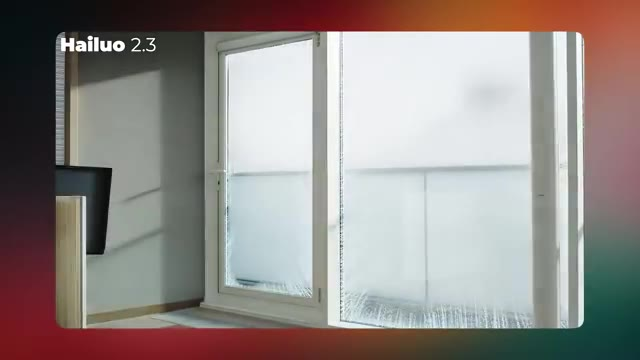
*Aperçu vidéo généré par Hailuo 2.3 montrant l'intérieur d'un appartement avec du givre qui se forme sur les vitres.*

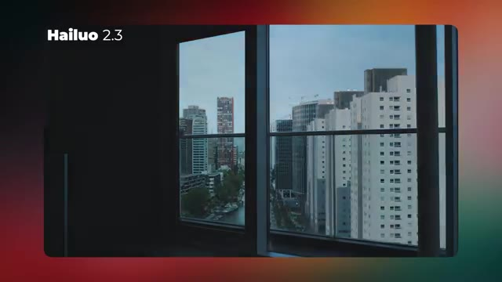
*Aperçu vidéo généré par Hailuo 2.3 montrant la vue sur la skyline urbaine depuis une fenêtre d'appartement.*

---

### ⏱️ `[00:08:39 - 00:09:12]` | Segment #17

**🔊 Audio (Transcription Intégrale Mot pour Mot en Français) :**
> seconde génération, Hilo 2.3 s'en est vraiment très bien sorti. J'adore cet effet de accéléré où l'on peut voir les ombres s'étendre sur le côté des bâtiments ainsi que de pouvoir voir ce front météo réellement avancer dans le cadre et vers notre emplacement. On peut voir la ville elle-même devenir vraiment brumeuse, les fenêtres commencent à givrer et ces changements d'éclairage révèlent en fait à quoi ressemble l'intérieur de l'appartement également. Ouais, il y a pas mal de jolis détails dans

**👁️ Analyse Visuelle d'Écran (gemini-3.5-flash-lite) :**
**Interface & Outils** : Lecteur vidéo / démonstration de rendus générés par IA avec le filigrane « Hailuo 2.3 » en haut à gauche.

**Contenu textuel & Code** : Texte affiché en haut à gauche : « Hailuo 2.3 ». Visuel d'une scène d'intérieur regardant vers l'extérieur à travers de grandes baies vitrées donnant sur des immeubles de grande hauteur et un paysage urbain.

**Action / Démonstration** : Démonstration visuelle en time-lapse d'une génération de vidéo par IA montrant l'évolution dynamique de la météo, des ombres, du givre sur les vitres et de la lumière à travers Hailuo 2.3.

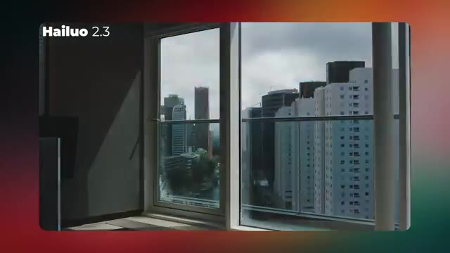
*Affichage du rendu vidéo Hailuo 2.3 montrant une vue depuis une fenêtre d'appartement sur des bâtiments urbains avec des ombres portées.*

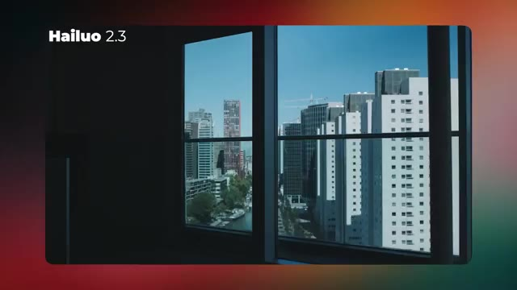
*Affichage du rendu vidéo Hailuo 2.3 montrant l'effet de time-lapse avec un changement de luminosité et de position des ombres urbaines.*

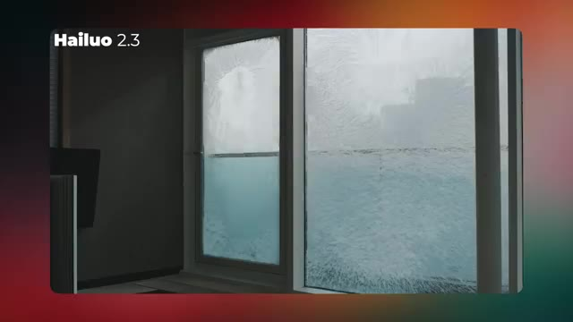
*Affichage du rendu vidéo Hailuo 2.3 montrant les fenêtres de l'appartement recouvertes de givre alors que le front météo s'installe.*

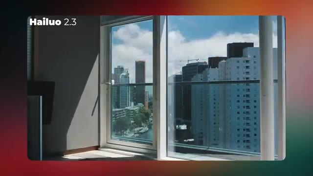
*Affichage du rendu vidéo Hailuo 2.3 montrant le retour à une vue dégagée avec des détails sur l'éclairage intérieur et extérieur.*

---

### ⏱️ `[00:09:12 - 00:09:47]` | Segment #18

**🔊 Audio (Transcription Intégrale Mot pour Mot en Français) :**
> cette génération, je dois dire. Et pour notre prochain plan, je veux continuer et essayer une technique légèrement différente. Ici, nous allons en fait prendre notre image de départ et utiliser Nano Banana pour créer un élément à intégrer dans la scène. Donc, en ajoutant une étape supplémentaire au processus, cela nous donne un peu plus de contrôle sur la génération de nos plans d'effets visuels. Alors allons-y et exportons notre image de départ comme d'habitude et dans Hylou, si nous retournons à la page d'accueil en cliquant sur le logo, nous pouvons descendre jusqu'à l'onglet qui indique agent. Donc ici, si nous survolons cette icône plus, nous pouvons continuer et télécharger notre

**👁️ Analyse Visuelle d'Écran (gemini-3.5-flash-lite) :**
**Interface & Outils** : Adobe Premiere Pro et interface web Hailuo AI (Hailuo-AI).

**Contenu textuel & Code** : Dans Premiere Pro : panneau de projet avec des clips vidéo (bateau, maison, gratte-ciels) et paramètres d'effets. Dans Hailuo AI : onglets "Image to Video", "Text to Video", "Subject Reference", bibliothèque de créations à droite avec des prompts textuels ("Interior shot from inside a modern apartment overlooking a city skyline..."). Sur l'interface agent : icônes de téléchargement ("Upload Image", "Upload Video", "Upload Audio").

**Action / Démonstration** : Le créateur montre son montage vidéo sur Premiere Pro puis bascule sur le site de Hailuo AI pour démontrer l'utilisation de l'agent et l'importation d'éléments.

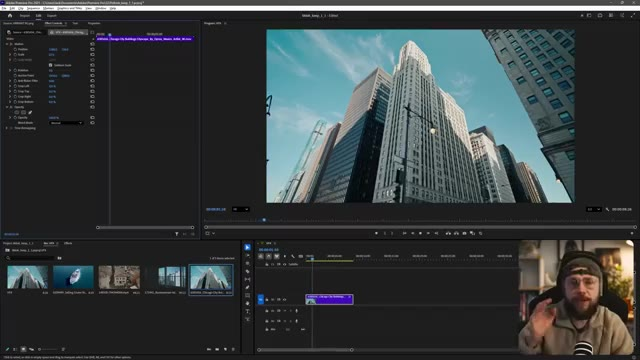
*Interface d'Adobe Premiere Pro montrant un plan de gratte-ciels à Chicago et le créateur incrusté en bas à droite.*

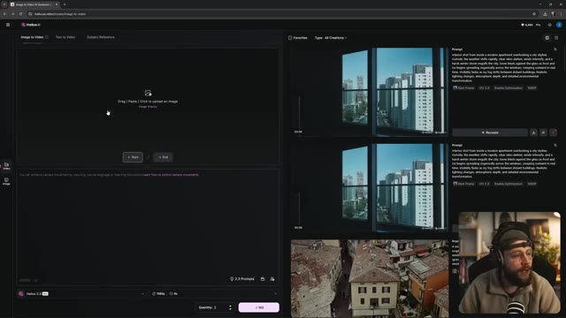
*Interface web de Hailuo AI montrant l'outil de génération de vidéo à partir d'image et le créateur incrusté.*

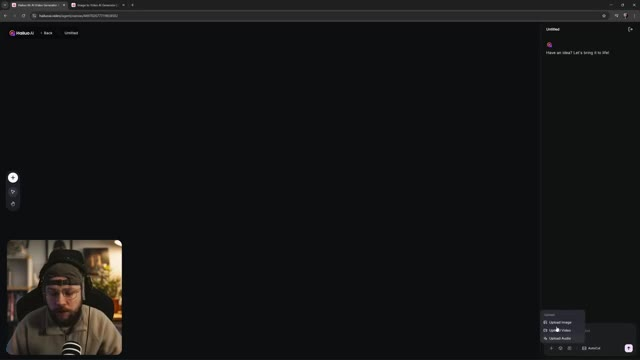
*Interface de l'agent Hailuo AI avec un panneau latéral et le créateur incrusté en bas à gauche.*

---

### ⏱️ `[00:09:47 - 00:10:15]` | Segment #19

**🔊 Audio (Transcription Intégrale Mot pour Mot en Français) :**
> image et bien sûr nous voulons sélectionner l'image de départ que nous avons exportée depuis Premiere Pro. Et ce que nous pouvons demander à l'agent Hilo, c'est de nous créer trois images avec Nano Banana et trois images avec Seadream 4.0 dans un format 16/9 afin que nous ayons la comparaison entre les différents modèles d'images. Et en ce qui concerne le prompt textuel, nous allons opter pour : plan cinématique en contre-plongée regardant vers un gratte-ciel imposant dans une ville moderne. Un monstre colossal s'accroche au flanc du bâtiment central.

**👁️ Analyse Visuelle d'Écran (gemini-3.5-flash-lite) :**
**Interface & Outils** : Interface web de génération vidéo avec un panneau de chat à droite et un aperçu central, incluant une vue PiP (Picture-in-Picture) du créateur en bas à gauche.

**Contenu textuel & Code** : Le prompt textuel affiché à l'écran se lit comme suit : « Low-angle cinematic shot looking up at a towering skyscraper in a modern city. A colossal monster clings to the side of the central building. His enormous size dwarfs the frame, emphasizing its overwhelming scale. Hyper-detailed texture with realistic lighting, subtle dust and debris falling from the building where the monster grips it. »

**Action / Démonstration** : Le créateur montre l'interface de l'outil de génération ainsi que le prompt textuel utilisé pour le projet.

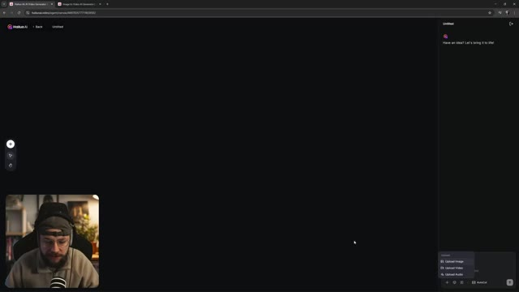
*Interface de l'outil de génération vidéo avec une incrustation vidéo du créateur dans le coin inférieur gauche.*

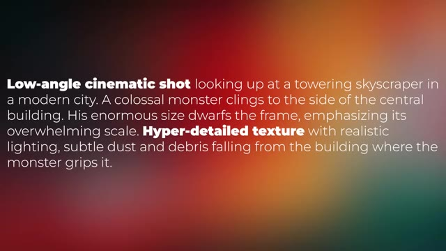
*Texte affiché à l'écran présentant le prompt textuel détaillé.*

---

### ⏱️ `[00:10:16 - 00:10:48]` | Segment #20

**🔊 Audio (Transcription Intégrale Mot pour Mot en Français) :**
> Sa taille énorme dépasse le cadre et souligne son échelle écrasante. Texture hyper détaillée avec un éclairage réaliste, de légères poussières et débris tombant du bâtiment là où le monstre le saisit. Allons-y donc pour lancer cette génération et voir ce qu'on obtient. En commençant par les générations nano banana, je trouve celle-ci plutôt sympa. Le visage du monstre est un peu bizarre. Je ne sais pas si j'aime ou pas. Celle-ci, le monstre est en quelque sorte à moitié fondu avec le bâtiment. Ça ne fonctionne pas vraiment. Celle-là, on ne peut pas vraiment voir grand-chose de

**👁️ Analyse Visuelle d'Écran (gemini-3.5-flash-lite) :**
**Interface & Outils** : Navigateur web affichant une interface de génération vidéo (Hailuo AI / MiniMax) avec une vue plein écran d'une vidéo générée et un encadré PiP du créateur.

**Contenu textuel & Code** : Texte du prompt visible : 'Low-angle cinematic shot looking up at a towering skyscraper in a modern city. A colossal monster clings to the side of the central building. His enormous size dwarfs the frame, emphasizing its overwhelming scale. Hyper-detailed texture with realistic lighting, subtle dust and debris falling from the building where the monster grips it.' Sur l'image 2, rendu vidéo montrant un monstre style Godzilla agrippé à un immeuble urbain.

**Action / Démonstration** : Le créateur présente le prompt textuel à l'écran puis montre le résultat vidéo généré tout en commentant les différentes variations obtenues.

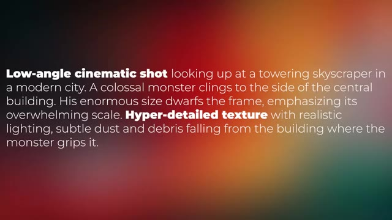
*Texte du prompt affiché en surimpression sur fond coloré : 'Low-angle cinematic shot looking up at a towering skyscraper in a modern city...'*

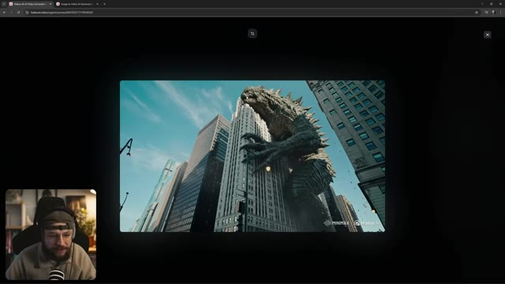
*Navigateur web affichant une vidéo générée d'un monstre géant accroché à un gratte-ciel, avec la incrustation (PiP) du créateur en bas à gauche.*

---

### ⏱️ `[00:10:48 - 00:11:08]` | Segment #21

**🔊 Audio (Transcription Intégrale Mot pour Mot en Français) :**
> le monstre lui-même. Maintenant, je crois que ce sont les générations Sea Dream. Et je dois dire que j'aime vraiment cette image particulière ici. Une créature à l'apparence très effrayante que nous avons obtenue. Ici, au niveau textuel, les choses sont devenues un peu étranges et c'est une histoire similaire avec la troisième génération. Je pense que la meilleure génération que nous ayons obtenue était notre première provenant de Nano Banana.

**👁️ Analyse Visuelle d'Écran (gemini-3.5-flash-lite) :**
**Interface & Outils** : Application web HaiKuo AI affichant un espace de travail de type canevas infini (canvas) avec un panneau de chat textuel latéral à droite et des vignettes de résultats de génération.

**Contenu textuel & Code** : Texte du chat de l'assistant IA dans le panneau latéral indiquant des tâches terminées telles que "Generate 3 images using one model and then 3 images using another model", "Generate 3 images with a casual image generator", et "Task completed! I've generated all 6 images in a 16:9 aspect ratio featuring the colossal monster scene."

**Action / Démonstration** : Le créateur navigue à travers les différentes générations d'images d'un monstre géant dans l'interface de HaiKuo AI, les affichant en grand format pour les analyser et les comparer.

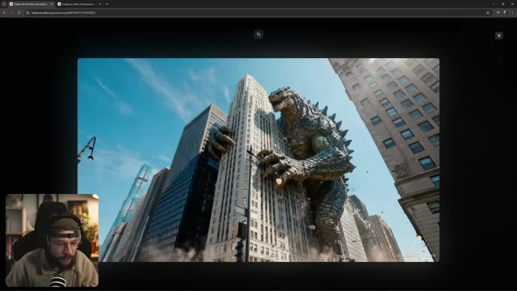
*Affichage en plein écran d'une image générée par IA représentant un monstre géant ressemblant à Godzilla agrippant un gratte-ciel urbain, avec le créateur en incrustation (PiP) dans le coin inférieur gauche.*

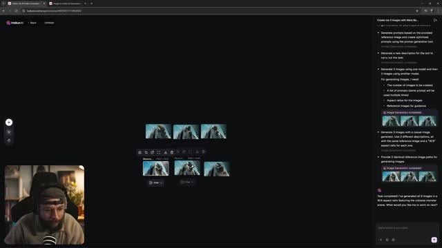
*Interface de la plateforme de génération vidéo HaiKuo AI montrant une galerie de vignettes d'images générées et un panneau latéral de chat avec des historiques de prompts, avec le créateur en incrustation (PiP).*

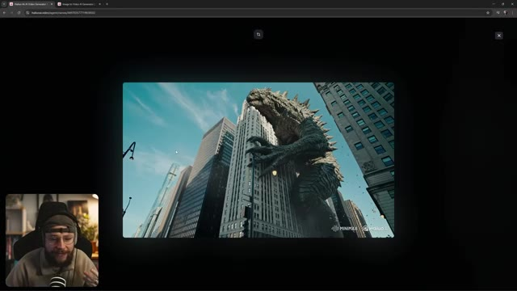
*Affichage en plein écran d'une autre image générée par IA du monstre géant sur un gratte-ciel avec des filigranes MINIMAX et HaiKuo AI en bas à droite, avec le créateur en incrustation (PiP).*

---

### ⏱️ `[00:11:08 - 00:11:29]` | Segment #22

**🔊 Audio (Transcription Intégrale Mot pour Mot en Français) :**
> Donc si nous survolons cette icône de téléchargement, nous pouvons aller de l'avant et cliquer sur télécharger sans filigrane. Et en retournant dans l'espace de génération de vidéo, nous pouvons aller de l'avant et télécharger notre image de départ, qui est bien sûr l'image que nous venons de créer de notre monstre. Et pour le prompt textuel, nous allons opter pour un plan à l'épaule depuis le niveau de la rue, regardant un monstre massif agrippant le flanc d'un grand gratte-ciel dans une ville moderne.

**👁️ Analyse Visuelle d'Écran (gemini-3.5-flash-lite) :**
**Interface & Outils** : Interface web de Haloo AI (génération Image-to-Video) avec un panneau de prévisualisation à gauche, un historique des créations à droite et le flux vidéo du créateur en incrustation.

**Contenu textuel & Code** : Texte du prompt affiché à l'écran : "Handheld shot from street level, looking up at a massive monster gripping the side of a tall skyscraper in a modern city. The camera movement is frantic and shaky, as if filmed by a terrified onlooker sudden jolts, unstable framing, quick focus pulls. The giant monster slowly turns his enormous head, surveying the city below. Debris falls from the building where he holds on, dust drifting downward. Dramatic sense of scale, realistic lighting."

**Action / Démonstration** : Le curseur survole l'icône de téléchargement pour sélectionner le téléchargement sans filigrane, puis l'écran affiche le téléchargement de l'image de départ dans l'outil de génération vidéo et le prompt textuel correspondant.

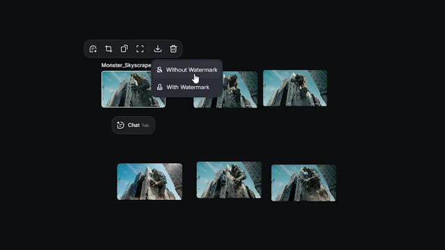
*Interface montrant le menu contextuel de téléchargement d'une image générée avec l'option 'Without Watermark'.*

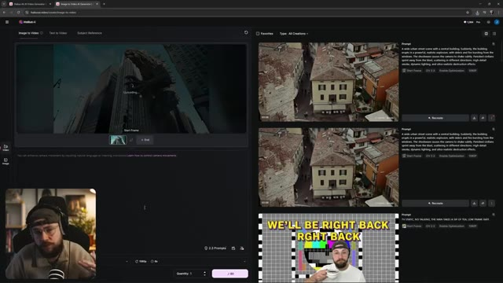
*Interface de l'outil de génération vidéo Haloo AI avec le créateur visible en incrustation (PiP) dans le coin inférieur gauche.*

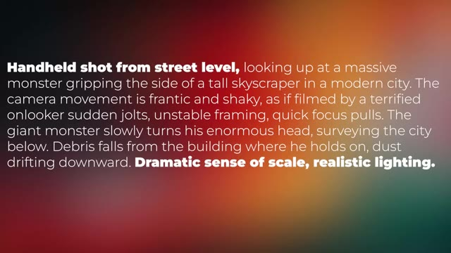
*Plein écran textuel affichant le prompt détaillé utilisé pour la génération de la vidéo.*

---

### ⏱️ `[00:11:29 - 00:11:50]` | Segment #23

**🔊 Audio (Transcription Intégrale Mot pour Mot en Français) :**
> Le mouvement de caméra est frénétique et tremblant, comme filmé par un spectateur terrifié, des secousses soudaines, un cadrage instable, une mise au point rapide. Le monstre géant tourne lentement son énorme tête, observant la ville en contrebas. Des débris tombent du bâtiment auquel il s'accroche, de la poussière descend en tournoyant, un sens dramatique de l'échelle, un éclairage réaliste.

**👁️ Analyse Visuelle d'Écran (gemini-3.5-flash-lite) :**
**Interface & Outils** : Écran de présentation textuelle sur fond dégradé flouté aux tons rouge, orange et vert.

**Contenu textuel & Code** : Texte affiché à l'écran : "Handheld shot from street level, looking up at a massive monster gripping the side of a tall skyscraper in a modern city. The camera movement is frantic and shaky, as if filmed by a terrified onlooker sudden jolts, unstable framing, quick focus pulls. The giant monster slowly turns his enormous head, surveying the city below. Debris falls from the building where he holds on, dust drifting downward. Dramatic sense of scale, realistic lighting." Certains passages sont mis en valeur en caractères gras ("Handheld shot from street level," et "Dramatic sense of scale, realistic lighting.").

**Action / Démonstration** : Présentation visuelle et textuelle d'un prompt vidéo descriptif destiné à une IA générative.

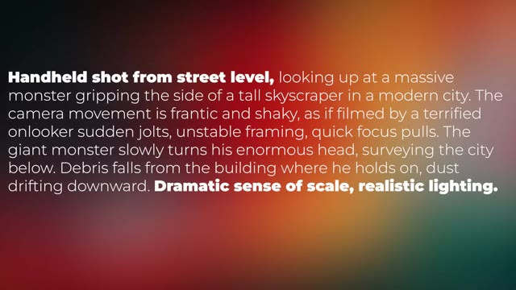
*Affichage à l'écran du texte du prompt décrivant la scène avec un monstre géant sur un gratte-ciel.*

---

### ⏱️ `[00:11:50 - 00:12:10]` | Segment #24

**🔊 Audio (Transcription Intégrale Mot pour Mot en Français) :**
> Et ce que nous allons faire, c'est que nous allons envoyer une génération Hyluo ainsi qu'une génération VO3.1 également. Bon, alors nous avons récupéré nos générations. Malheureusement, la génération VO3.1 a échoué, donc j'ai pris les devants et j'ai généré un Hyluo 2.3 supplémentaire. Alors allons jeter un œil à la première génération provenant de Hyluo.

**👁️ Analyse Visuelle d'Écran (gemini-3.5-flash-lite) :**
**Interface & Outils** : Interface web de Hyluo AI (hyluoai.video) affichant un panneau de génération vidéo "Image to Video", un panneau latéral de l'historique des créations et les paramètres techniques (1080p, modèle 2.3).

**Contenu textuel & Code** : Prompts visibles dans l'interface : "A wide urban street scene with a central building..." et "Handheld shot from street level, looking up at a massive monster gripping the side of a tall skyscraper in a modern city...". Paramètres : 1080p, options d'optimisation activées, mode 2.3.

**Action / Démonstration** : Le créateur navigue sur l'interface de Hyluo AI pour examiner les résultats des différentes générations vidéo, montre l'échec de VO3.1 et clique sur une génération réussie pour l'inspecter en grand format.

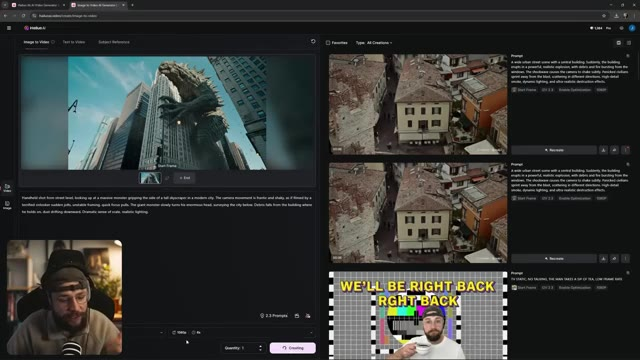
*Interface du générateur vidéo Hyluo AI montrant le panneau de génération avec l'aperçu du monstre géant sur un gratte-ciel et le créateur en incrustation vidéo (PiP) dans le coin inférieur gauche.*

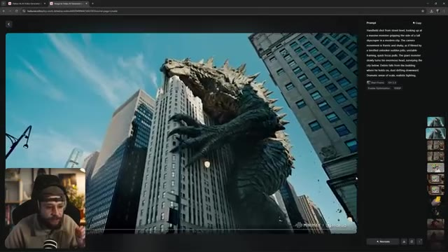
*Affichage en plein écran d'une génération vidéo réussie sur Hyluo représentant un monstre géant accroché à un immeuble urbain, avec le panneau de prompt à droite et le créateur en incrustation PiP.*

---

### ⏱️ `[00:12:10 - 00:12:33]` | Segment #25

**🔊 Audio (Transcription Intégrale Mot pour Mot en Français) :**
> Donc je pense que certaines destructions de bâtiments sont un peu étranges. C'est presque comme si le bâtiment se transformait en liquide ou quelque chose comme ça. C'est étrange parce que certaines parties comme le verre qui tombe ont l'air plutôt pas mal. Et j'adore la façon dont ce monstre s'approche tout près de notre visage. Et j'ai dit plus tôt lors de la génération de Nano Banana, que le visage du monstre avait l'air un peu étrange.

**👁️ Analyse Visuelle d'Écran (gemini-3.5-flash-lite) :**
**Interface & Outils** : Vidéo générée par IA affichant le logo "Hailuo 2.3" en haut à gauche.

**Contenu textuel & Code** : Mention "Hailuo 2.3" dans l'en-tête de la vidéo montrant une scène urbaine avec un monstre géant et des effets de destruction.

**Action / Démonstration** : Démonstration visuelle d'une vidéo générée par IA illustrant les critiques du créateur sur la destruction des bâtiments et l'apparence du monstre.

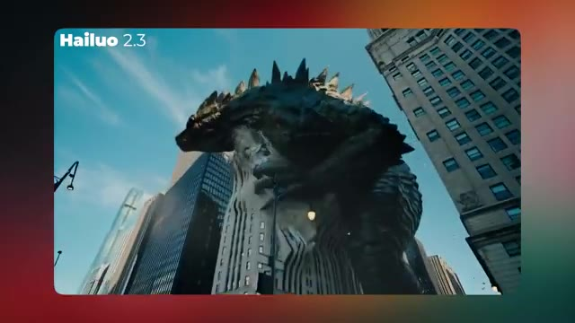
*Vidéo générée par Hailuo 2.3 montrant un monstre géant ressemblant à Godzilla marchant dans une ville avec des bâtiments distordus.*

*Vidéo générée par Hailuo 2.3 montrant le monstre géant au plus près avec des débris de verre et de poussière qui volent.*

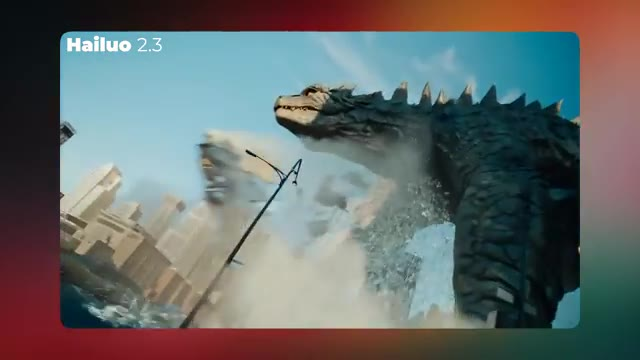
*Vidéo générée par Hailuo 2.3 montrant la suite de l'action avec le monstre au premier plan et la destruction des bâtiments.*

---

### ⏱️ `[00:12:33 - 00:13:02]` | Segment #26

**🔊 Audio (Transcription Intégrale Mot pour Mot en Français) :**
> Eh bien, Hylou a fait du bon travail en rétro-concevant cela pour que le visage et la tête du monstre aient l'air vraiment très impressionnants, surtout quand il s'approche tout près de la caméra. J'adore le style de travail de la caméra également. C'est exactement ce que nous avons demandé. À la main, tremblant, frénétique, et on a vraiment l'impression que c'est filmé avec le téléphone de quelqu'un et qu'il regarde ce monstre avec terreur, comme on le ferait.

**👁️ Analyse Visuelle d'Écran (gemini-3.5-flash-lite) :**
**Interface & Outils** : Extrait vidéo généré par l'outil d'IA Hailuo 2.3, affichant un filigrane textuel "Hailuo 2.3" en haut à gauche de l'écran.

**Contenu textuel & Code** : Mention "Hailuo 2.3" visible dans le coin supérieur gauche des images présentées. Rendu visuel d'un monstre style kaiju/Godzilla attaquant une ville.

**Action / Démonstration** : Démonstration de clips vidéo générés par IA illustrant les capacités du modèle Hailuo 2.3 à produire des plans dynamiques, tremblants et réalistes d'une créature géante en milieu urbain.

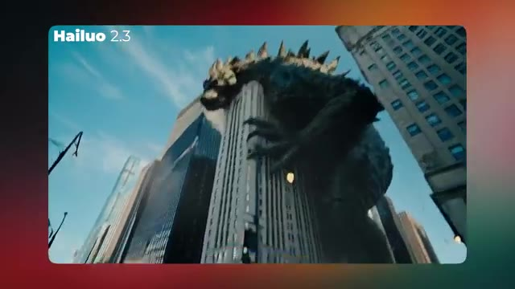
*Vidéo générée montrant un monstre géant ressemblant à Godzilla au milieu de gratte-ciels, avec un style de caméra amateur tremblant et la mention "Hailuo 2.3" en haut à gauche.*

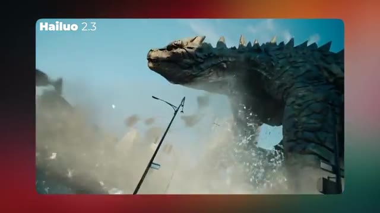
*Gros plan dynamique du monstre géant provoquant des destructions dans la rue, filmé en contre-plongée avec un effet de caméra portée instable, avec la mention "Hailuo 2.3".*

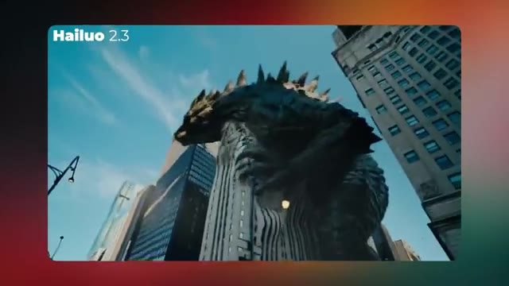
*Vue en contre-plongée du monstre monstrueux longeant de grands immeubles urbains, style de prise de vue style caméra de téléphone portable ("Hailuo 2.3").*

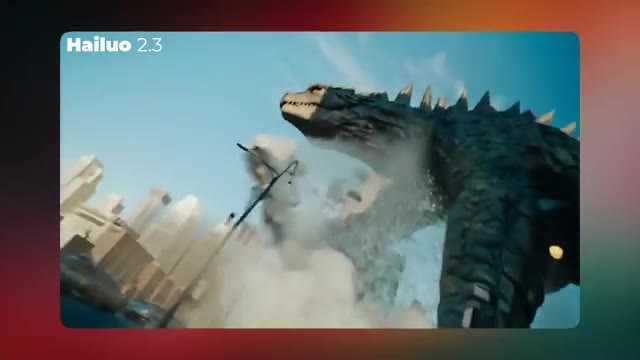
*Action rapprochée et mouvementée du monstre détruisant des éléments urbains avec un rendu chaotique et immersif ("Hailuo 2.3").*

---

### ⏱️ `[00:13:02 - 00:13:22]` | Segment #27

**🔊 Audio (Transcription Intégrale Mot pour Mot en Français) :**
> Nous avons cependant un léger problème avec le lampadaire qui traverse en quelque sorte le visage du monstre. Il y a donc quelque chose d'un peu étrange qui s'y passe. C'est un peu dommage. Et en jetant un coup d'œil à la deuxième génération de Hylou, bien que je n'aime pas celle-ci tout autant, encore une fois, il y a des problèmes similaires avec la destruction du bâtiment.

**👁️ Analyse Visuelle d'Écran (gemini-3.5-flash-lite) :**
**Interface & Outils** : Lecteur vidéo ou logiciel de montage affichant la vidéo générée par IA avec le filigrane "Hailuo 2.3".

**Contenu textuel & Code** : Mention textuelle "Hailuo 2.3" en haut à gauche de l'écran, affichage d'une vidéo générée par IA représentant un monstre géant type kaiju détruisant une ville.

**Action / Démonstration** : Lecture d'un extrait vidéo de démonstration généré par IA montrant un monstre géant au milieu de gratte-ciels.

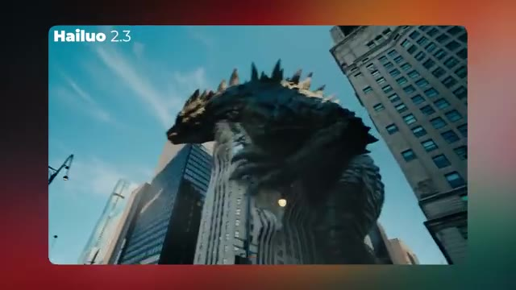
*Extrait vidéo généré montrant un monstre géant style Godzilla à côté d'immeubles urbains, avec le logo Hailuo 2.3 visible en haut à gauche.*

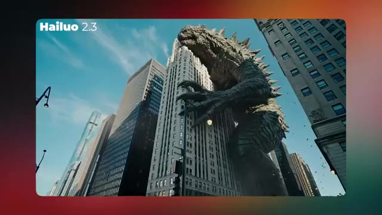
*Extrait vidéo montrant le monstre géant près d'un grand immeuble avec des débris qui volent, logo Hailuo 2.3 en haut à gauche.*

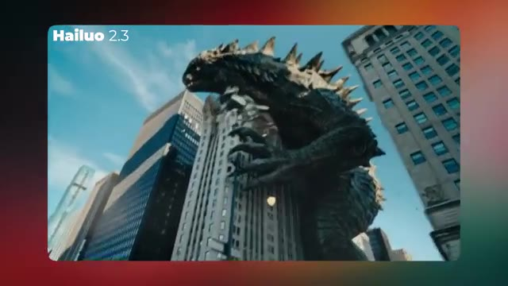
*Extrait vidéo du monstre géant au milieu des gratte-ciels, logo Hailuo 2.3 en haut à gauche.*

---

### ⏱️ `[00:13:23 - 00:13:58]` | Segment #28

**🔊 Audio (Transcription Intégrale Mot pour Mot en Français) :**
> J'adore le travail de la caméra ici. Le fait qu'elle perde la mise au point et qu'elle ait un peu de mal à retrouver cette mise au point sur notre monstre est vraiment sympa et cela ajoute un niveau de profondeur et de réalisme à la génération, et évidemment le modèle vidéo ne sait pas vraiment à quoi ressemble notre monstre quand on s'approche de très près, donc quand on zoome, il doit créer un visage pour le monstre un peu à la volée et je dois dire que j'aime vraiment le design qu'il a fait pour ce monstre et pour la deuxième génération également. Oui, nous avons récupéré un

**👁️ Analyse Visuelle d'Écran (gemini-3.5-flash-lite) :**
**Interface & Outils** : Lecteur vidéo présentant des clips générés par le modèle Hailuo 2.3.

**Contenu textuel & Code** : Mention du modèle « Hailuo 2.3 » visible en haut à gauche de chaque image, affichant des scènes générées par IA représentant un monstre géant style Godzilla attaquant ou se déplaçant dans une ville de type urbain.

**Action / Démonstration** : Diffusion d'extraits vidéo générés par IA illustrant les mouvements de caméra, les changements de mise au point et les détails du design du monstre discutés par le narrateur.

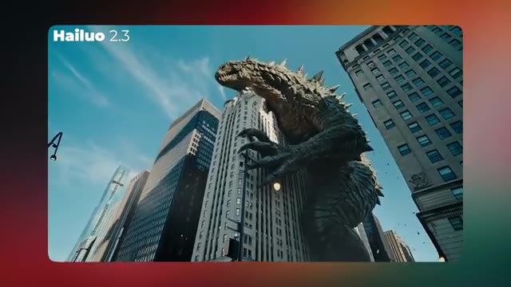
*Extrait vidéo généré montrant un monstre géant ressemblant à Godzilla au milieu de gratte-ciels, avec le logo Hailuo 2.3 en haut à gauche.*

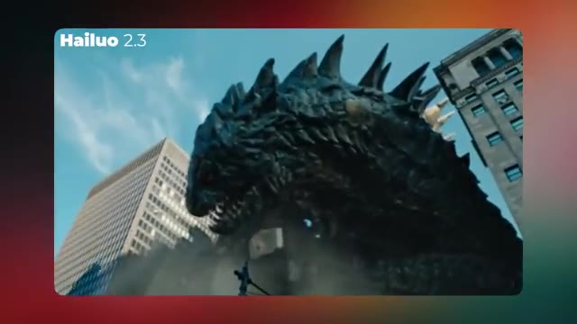
*Gros plan du monstre géant généré, montrant les détails de sa tête et de ses écailles près des immeubles, avec le logo Hailuo 2.3 en haut à gauche.*

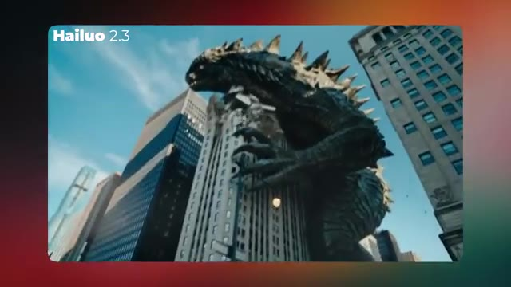
*Autre angle de la génération vidéo montrant le monstre géant dans la ville, avec le logo Hailuo 2.3 en haut à gauche.*

---

### ⏱️ `[00:13:58 - 00:14:30]` | Segment #29

**🔊 Audio (Transcription Intégrale Mot pour Mot en Français) :**
> De très belles générations impressionnantes là de la part de Hyluo. VO 3.1 n'a pas voulu coopérer. Et en passant à notre prochain plan d'effets visuels, nous avons cette super séquence d'un paysage montagneux assez incroyable et ce que nous voulons faire, c'est créer un vaisseau spatial extraterrestre qui flotte entre ces montagnes. Donc je pense que nous allons exporter une image vers le milieu car j'aime la composition à ce moment de la séquence. Et de retour dans l'agent Hilo, nous allons importer notre image. La voici, l'image que nous avons exportée depuis Premiere Pro. Et pour le prompt textuel,

**👁️ Analyse Visuelle d'Écran (gemini-3.5-flash-lite) :**
**Interface & Outils** : Navigateur web affichant l'interface de Hyluo AI Video Generator et logiciel de montage Adobe Premiere Pro.

**Contenu textuel & Code** : Texte du prompt visible sur l'image 1 : "Handheld shot from street level, looking up at a massive monster gripping the side of a tall skyscraper in a modern city...". Paramètres visibles : Start Frame, V2.1 3.0, Enable Optimization, 1080P.

**Action / Démonstration** : Le créateur navigue entre une interface de génération vidéo IA (Hyluo) et un logiciel de montage (Adobe Premiere Pro) pour préparer l'exportation d'une image de paysage montagneux.

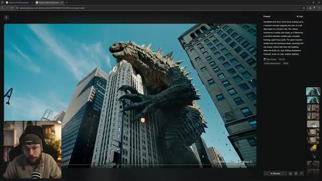
*Interface du générateur vidéo IA Hyluo AI affichant un monstre géant attaquant une ville et le panneau de prompt textuel associé.*

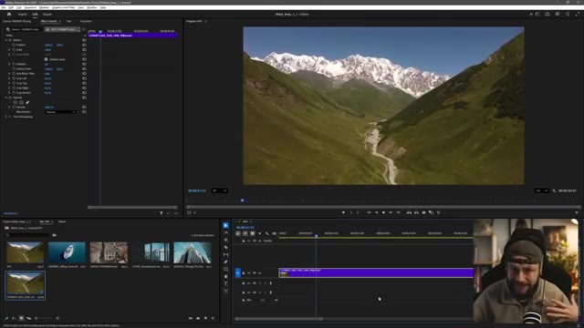
*Interface du logiciel Adobe Premiere Pro montrant un clip vidéo de paysage montagneux dans le moniteur de programme et la timeline.*

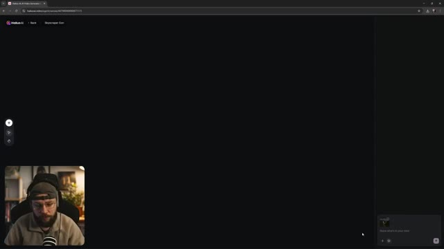
*Interface de l'agent Hyluo AI sur le web montrant une zone de travail vide avec une mini-fenêtre PiP du présentateur.*

---

### ⏱️ `[00:14:30 - 00:15:07]` | Segment #30

**🔊 Audio (Transcription Intégrale Mot pour Mot en Français) :**
> nous allons opter pour un plan paysager épique d'une chaîne de montagnes. Derrière la crête de la montagne, un immense vaisseau-mère extraterrestre plane en silence. Son échelle submerge la scène. Le design est minimaliste et épuré, avec des surfaces sombres et lisses et de subtils accents lumineux. La brume atmosphérique et les nuages bas obscurcissent partiellement la base, soulignant sa taille immense. Un éclairage dramatique projette de longues ombres sur les montagnes, créant un sentiment d'admiration et de tension. Textures ultra réalistes, intégration environnementale ancrée, composition cinématographique. [Séquence musicale / Démonstration sonore]

**👁️ Analyse Visuelle d'Écran (gemini-3.5-flash-lite) :**
**Interface & Outils** : Navigateur web affichant une interface de génération de vidéo par IA avec un affichage en plein écran de l'image générée et une incrustation vidéo (PiP) du présentateur en bas à gauche.

**Contenu textuel & Code** : Le prompt textuel complet décrivant la scène de science-fiction ('Epic landscape shot of a mountain range...'), et l'image générée d'un grand vaisseau spatial planant au-dessus d'une chaîne de montagnes au coucher du soleil.

**Action / Démonstration** : Affichage successif du prompt textuel descriptif, puis de l'image finale générée par l'IA sur l'écran de l'ordinateur pendant que le présentateur commente la scène.

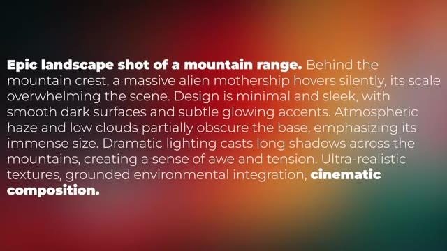
*Texte du prompt en gros caractères affiché sur un fond coloré flou décrivant le plan paysager épique avec le vaisseau-mère extraterrestre.*

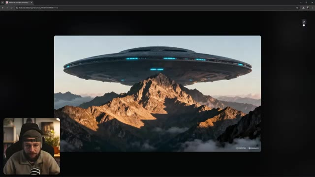
*Interface de génération vidéo montrant l'image générée du vaisseau-mère survolant les montagnes, avec le présentateur incrusté en bas à gauche (PiP).*

---

### ⏱️ `[00:15:07 - 00:15:27]` | Segment #31

**🔊 Audio (Transcription Intégrale Mot pour Mot en Français) :**
> ce n'est pas en train d'utiliser ma référence d'image mais heureusement nous avons récupéré de superbes éléments de la part de nano banana Celui-ci ici, les textures manquent un petit peu sur notre vaisseau spatial alien. Mais ce plan-là est en réalité vraiment super. J'adore la façon dont le vaisseau est derrière ces montagnes. Ça donne vraiment une excellente impression d'échelle.

**👁️ Analyse Visuelle d'Écran (gemini-3.5-flash-lite) :**
**Interface & Outils** : Navigateur web affichant l'interface de l'outil de génération vidéo et d'images Hailuo AI (MiniMax).

**Contenu textuel & Code** : On aperçoit dans le panneau latéral droit des instructions et des descriptions de prompts comme « minimal and sleek, with smooth dark surfaces and subtle glowing accents... », ainsi que l'historique des générations d'images.
[Candidat / Présentateur] Le créateur Jack apparaît en incrustation (PiP) en bas à gauche de l'écran, commentant et gesticulant tout en naviguant dans les résultats de génération.

**Action / Démonstration** : Démonstration pédagogique et présentation du workflow.

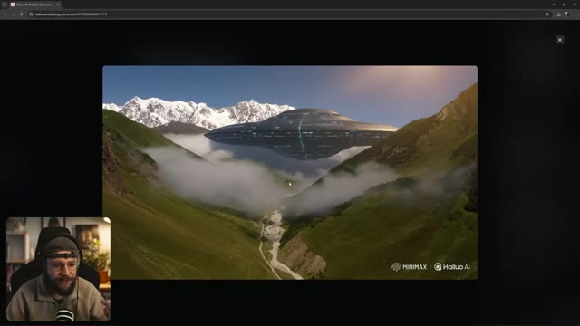
*Aperçu en plein écran d'une image générée représentant un vaisseau spatial extraterrestre planant au-dessus d'une vallée montagneuse brumeuse, avec les logos Minimax et Hailuo AI en bas à droite.*

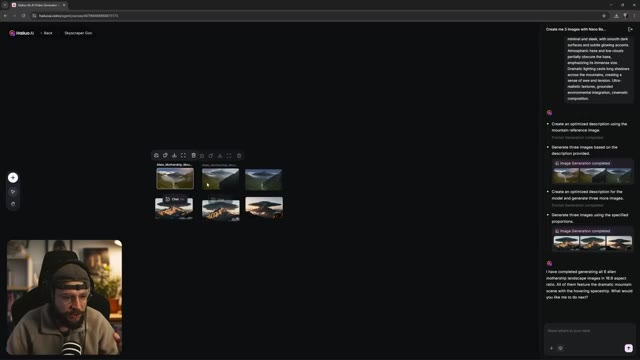
*Interface de Hailuo AI affichant un espace de travail avec plusieurs vignettes d'images générées et un panneau de chat textuel sur la droite montrant des prompts et des étapes de génération.*

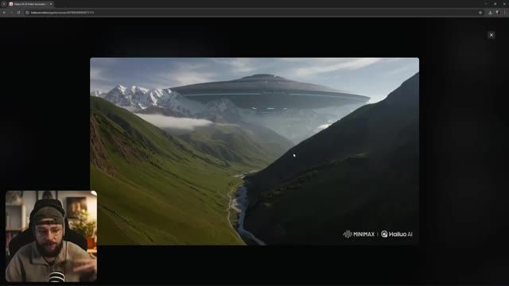
*Autre angle ou vue en plein écran d'un plan similaire généré montrant un immense vaisseau spatial extraterrestre partiellement caché derrière des montagnes enneigées.*

---

### ⏱️ `[00:15:27 - 00:16:02]` | Segment #32

**🔊 Audio (Transcription Intégrale Mot pour Mot en Français) :**
> Et la génération finale de Nano Banana est assez similaire. Elle a juste ce genre de étalonnage de couleurs atténué, qui ne correspond pas à nos images existantes. Je vais donc télécharger la deuxième génération sans le filigrane. Et en retournant une fois de plus dans l'espace de génération vidéo, nous voulons aller télécharger l'image que nous venons de créer avec Nano Banana. Pour le texte du prompt, nous allons opter pour une vue de drone se déplaçant doucement et majestueusement vers un immense vaisseau spatial alien stationné derrière la crête montagneuse centrale. Un éclairage atmosphérique baigne la scène dans des ombres dramatiques et des reflets doux. Textures ultra réalistes, composition cinématographique et

**👁️ Analyse Visuelle d'Écran (gemini-3.5-flash-lite) :**
**Interface & Outils** : Interface web de Hailuo AI (MiniMax) pour la génération de vidéo à partir d'image.

**Contenu textuel & Code** : Texte du prompt visible : "Drone shot, moving smoothly and majestically toward a massive alien mothership hovering behind the central mountain crest. Atmospheric lighting bathes the scene in dramatic shadows and soft highlights. Ultra-realistic textures, cinematic composition, and a sense of awe as the drone approaches the imposing mothership."

**Action / Démonstration** : Le présentateur navigue sur l'interface de génération vidéo, télécharge l'image créée et prépare le nouveau prompt textuel pour animer l'image.

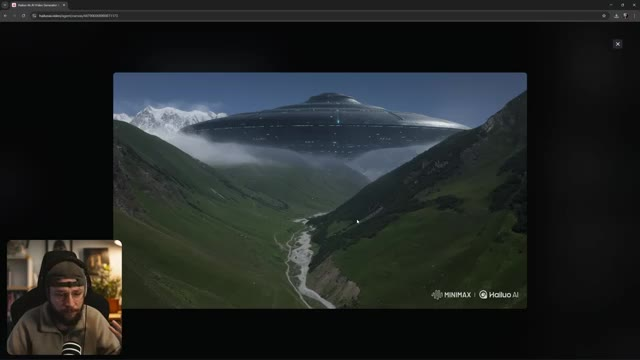
*Affichage en plein écran d'une image générée montrant un immense vaisseau spatial alien planant au-dessus d'une vallée montagneuse.*

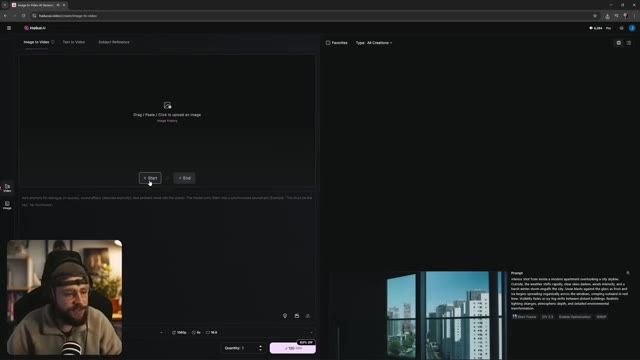
*Interface de la plateforme Hailuo AI montrant l'espace de travail Image to Video avec les options de téléchargement et les paramètres.*

*Texte du prompt affiché en gros plan sur fond coloré et flouté.*

---

### ⏱️ `[00:16:02 - 00:16:37]` | Segment #33

**🔊 Audio (Transcription Intégrale Mot pour Mot en Français) :**
> un sentiment d'admiration alors que le drone s'approche de l'imposant vaisseau-mère. Donc en regardant notre première génération Veo 3.1 lorsque j'ai demandé un plan de drone, le modèle l'a pris très au pied de la lettre. C'est quand même plutôt cool, j'aime le mouvement de caméra et tout ça, mais bien sûr si nous allions utiliser ceci dans un court métrage vous ne voudriez probablement pas avoir un drone au centre de votre composition. Cependant avec la deuxième génération de Veo 3.1 les choses ont l'air beaucoup mieux. C'est très similaire, nous n'avons tout simplement pas ce drone au centre et aussi lorsque nous approchons du vaisseau il a

**👁️ Analyse Visuelle d'Écran (gemini-3.5-flash-lite) :**
**Interface & Outils** : Interface de démonstration vidéo avec affichage du modèle Veo 3.1.

**Contenu textuel & Code** : Texte du prompt affiché à l'écran : "Drone shot, moving smoothly and majestically toward a massive alien mothership hovering behind the central mountain crest. Atmospheric lighting bathes the scene in dramatic shadows and soft highlights. Ultra-realistic textures, cinematic composition, and a sense of awe as the drone approaches the imposing mothership." Mention "Veo 3.1" en haut à gauche des clips vidéo.

**Action / Démonstration** : Comparaison côte à côte ou séquentielle de deux versions de génération vidéo par IA (Veo 3.1), l'une incluant un drone visible dans le champ central et l'autre l'ayant retiré pour un rendu plus cinématographique.

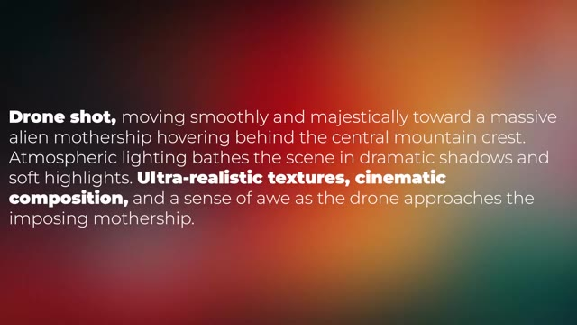
*Affichage du prompt textuel décrivant la scène avec un drone et un vaisseau-mère extraterrestre.*

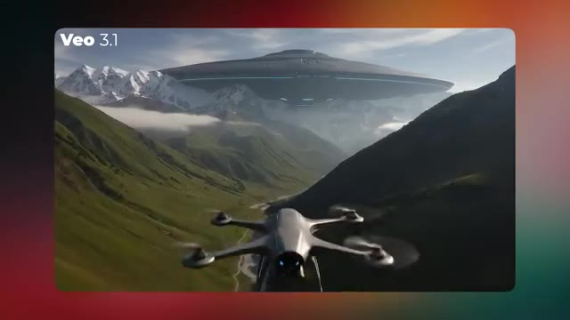
*Premier rendu vidéo (Veo 3.1 première génération) montrant un drone au premier plan volant au-dessus d'une vallée avec un vaisseau spatial en arrière-plan.*

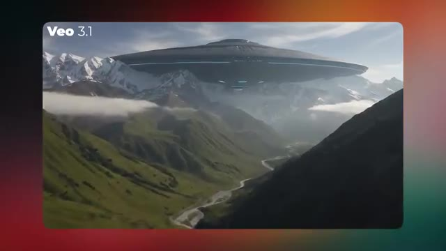
*Second rendu vidéo (Veo 3.1 seconde génération) montrant la même vallée avec le vaisseau spatial en arrière-plan, mais sans le drone au centre de la composition.*

---

### ⏱️ `[00:16:37 - 00:17:10]` | Segment #34

**🔊 Audio (Transcription Intégrale Mot pour Mot en Français) :**
> ce genre d'effet lumineux sympa appliqué dessus. Je dis sympa, je ne sais pas vraiment si j'aime ça ou si je trouve ça un peu ringard. Je préfère nettement l'approche avant qu'on voie cet effet lumineux se produire et bien sûr ce n'est pas quelque chose qu'on a demandé. C'est juste la façon dont VO3.1 semble avoir perçu le prompt textuel. Peut-être qu'il pense que l'ajout de cet effet lumineux donnera un aspect imposant au vaisseau, ce qui, pour être juste, est ce qu'on avait demandé. J'ai quelques endroits de distorsion bizarre sur certaines crêtes des montagnes. Je vais zoomer pour que vous puissiez voir ça clairement. Hylou a créé

**👁️ Analyse Visuelle d'Écran (gemini-3.5-flash-lite) :**
**Interface & Outils** : Lecteur vidéo ou logiciel de montage montrant des clips générés par l'IA "Veo 3.1".

**Contenu textuel & Code** : Mention "Veo 3.1" en haut à gauche de l'écran. Rendu vidéo d'un vaisseau spatial de type soucoupe volante au-dessus de chaînes de montagnes enneigées.

**Action / Démonstration** : Le créateur illustre son analyse en affichant les différentes versions du rendu de l'IA Veo 3.1, avec et sans effet lumineux, puis zoome sur les défauts de distorsion des montagnes.

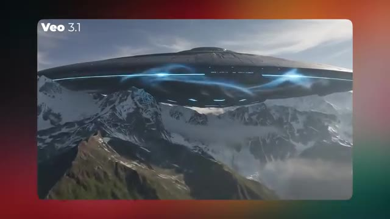
*Extrait vidéo généré par Veo 3.1 montrant un gigantesque vaisseau spatial surplombant des montagnes avec un effet lumineux bleuté.*

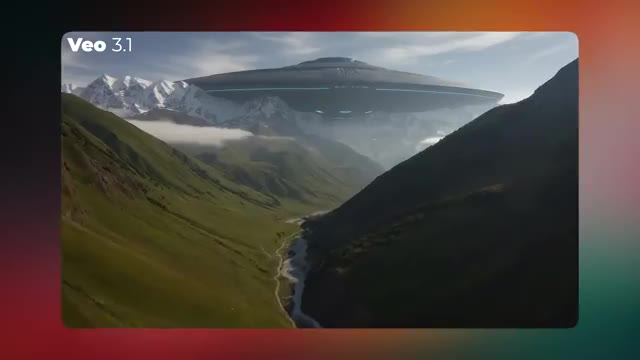
*Extrait vidéo généré par Veo 3.1 montrant le même paysage montagneux avec le vaisseau spatial avant l'apparition de l'effet lumineux.*

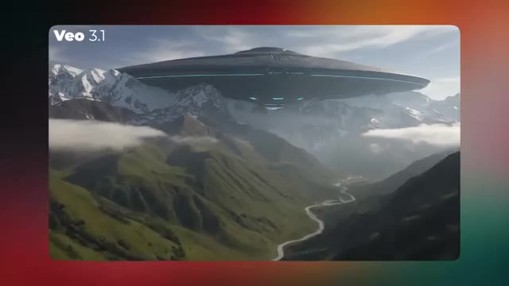
*Extrait vidéo généré par Veo 3.1 montrant une vue panoramique des montagnes et du vaisseau spatial.*

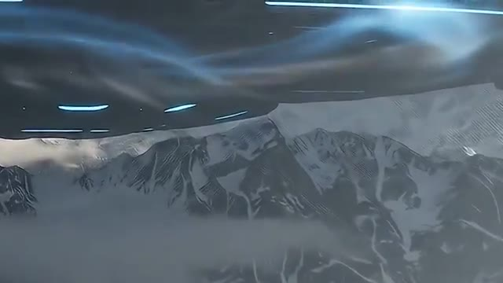
*Gros plan zoomé de la vidéo montrant les crêtes des montagnes et le bas du vaisseau spatial avec des artefacts de distorsion.*

---

### ⏱️ `[00:17:10 - 00:17:43]` | Segment #35

**🔊 Audio (Transcription Intégrale Mot pour Mot en Français) :**
> Un résultat intéressant en fait. J'aime bien la façon dont le vaisseau spatial s'élève et cette ombre qui se déplace le long de la chaîne de montagnes. Je ne m'attendais pas vraiment à ce que le vaisseau ait ce genre de forme irrégulière et il semble y avoir un léger manque de texture sur l'élément lui-même. Donc bien que ce ne soit définitivement pas terrible, ce n'est probablement pas la génération que je choisirais. Et pour notre dernier plan d'effets visuels, nous avons cette très belle séquence d'une plage d'apparence tropicale. Et ce que je pense que nous allons faire, c'est utiliser Nano Banana pour insérer un volcan dans cette scène. Nous allons donc exporter notre

**👁️ Analyse Visuelle d'Écran (gemini-3.5-flash-lite) :**
**Interface & Outils** : Logiciel de montage vidéo Adobe Premiere Pro et lecteur vidéo affichant les générations Hailuo 2.3.

**Contenu textuel & Code** : Mentions textuelles "Hailuo 2.3", interface de montage Adobe Premiere Pro avec panneaux de projet, timeline, moniteur de programme et commandes d'effets.
[DESC_IMAGE_3 et #4] Le créateur navigue et manipule le montage vidéo dans Adobe Premiere Pro en sélectionnant un plan de plage tropicale sur la timeline.

**Action / Démonstration** : Démonstration pédagogique et présentation du workflow.

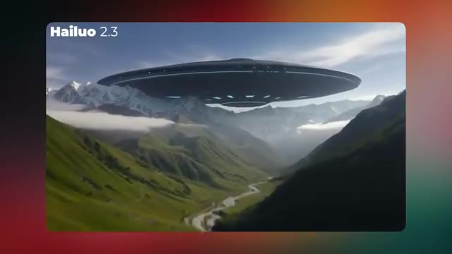
*Extrait vidéo généré avec Hailuo 2.3 montrant un vaisseau spatial en forme de soucoupe volante planant au-dessus d'une chaîne de montagnes enneigées.*

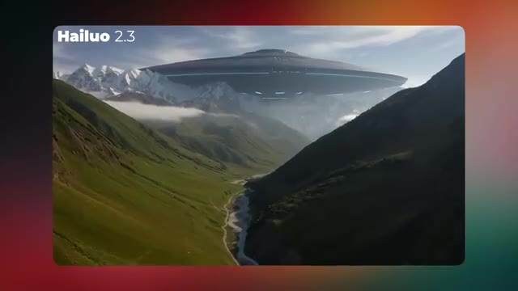
*Extrait vidéo Hailuo 2.3 montrant le vaisseau spatial qui s'élève avec une ombre se déplaçant sur la montagne.*

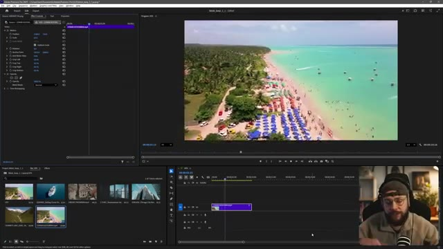
*Interface du logiciel Adobe Premiere Pro affichant un projet vidéo avec un clip de plage tropicale en aperçu et le créateur visible en incrustation PiP.*

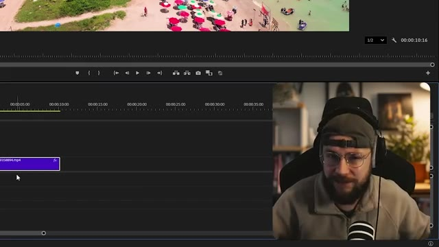
*Gros plan sur la timeline du logiciel de montage Adobe Premiere Pro avec le créateur en incrustation PiP dans le coin inférieur droit.*

---

### ⏱️ `[00:17:43 - 00:18:06]` | Segment #36

**🔊 Audio (Transcription Intégrale Mot pour Mot en Français) :**
> cadre de départ comme d'habitude. De retour dans l'agent Hilo, nous allons procéder au téléchargement. Voici notre plage ici. Cette fois, nous allons dire « crée-moi six générations en utilisant Nano Banana » parce que Sea Dream ne semble tout simplement pas collaborer aujourd'hui, et de cette façon nous pouvons assurer nos arrières. Le prompt textuel que nous allons utiliser sur le côté gauche du cadre : un volcan imposant s'élève de la jungle dense, partiellement enveloppé de brume.

**👁️ Analyse Visuelle d'Écran (gemini-3.5-flash-lite) :**
**Interface & Outils** : Interface web de l'agent Hilo avec panneau de génération d'images et historique de discussion à droite.

**Contenu textuel & Code** : Texte à l'écran : "Create me 6 generations using nano banana... On the left side of the frame, a towering volcano rises from the dense jungle, partially shrouded in mist. The volcano has realistic textures with rocky slopes, some greenery, and faint smoke drifting from the crater. Warm sunlight illuminates the beach and jungle, casting natural shadows, while the composition balances the peaceful beach with the imposing presence of the volcano. High-detail, cinematic, photorealistic style."

**Action / Démonstration** : Le créateur navigue dans l'interface de l'agent Hilo et présente à l'écran le texte du prompt détaillé pour la génération des images.

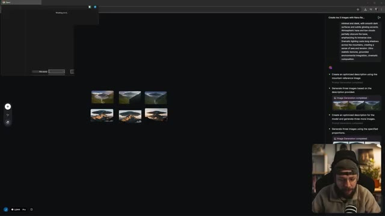
*Interface de l'agent Hilo avec des images générées affichées au centre et le flux de discussion textuel sur le panneau latéral droit, incluant une incrustation vidéo de Jack en bas à droite.*

*Gros plan textuel sur fond flou coloré affichant le prompt complet de génération d'image demandé par le créateur.*

---

### ⏱️ `[00:18:06 - 00:18:25]` | Segment #37

**🔊 Audio (Transcription Intégrale Mot pour Mot en Français) :**
> Le volcan a des textures réalistes avec des pentes rocheuses, un peu de verdure et une légère fumée s'échappant du cratère. Une lumière chaude illumine la plage et la jungle, projetant des ombres naturelles, tandis que la composition équilibre la plage paisible avec la présence imposante du volcan. Grand niveau de détail, style cinématique et photoréaliste.

**👁️ Analyse Visuelle d'Écran (gemini-3.5-flash-lite) :**
**Interface & Outils** : Écran de texte/sous-titres sur fond abstrait dégradé (rouge, orange, vert).

**Contenu textuel & Code** : Texte affiché à l'écran : "Create me 6 generations using nano banana... On the left side of the frame, a towering volcano rises from the dense jungle, partially shrouded in mist. The volcano has realistic textures with rocky slopes, some greenery, and faint smoke drifting from the crater. Warm sunlight illuminates the beach and jungle, casting natural shadows, while the composition balances the peaceful beach with the imposing presence of the volcano. High-detail, cinematic, photorealistic style."

**Action / Démonstration** : Présentation visuelle du prompt textuel utilisé pour la génération par intelligence artificielle.

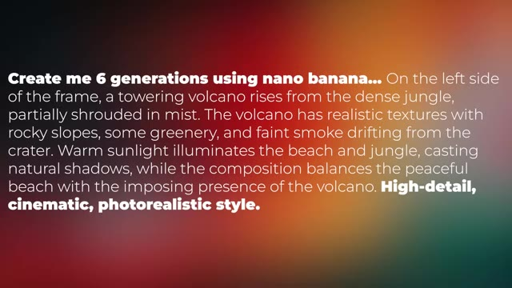
*Affichage à l'écran du texte du prompt décrivant le volcan et son environnement sur un fond coloré dégradé.*

---

### ⏱️ `[00:18:25 - 00:19:03]` | Segment #38

**🔊 Audio (Transcription Intégrale Mot pour Mot en Français) :**
> Voyons ce que nous obtenons pour ces générations. Celle-ci fonctionne vraiment très bien, vraiment très bien intégrée dans le paysage. Je pense que pratiquement toutes ces générations font un travail vraiment formidable. Celle-ci est un peu trop brumeuse à mon goût. Une jolie quantité de couverture de fumée dans celle-ci. Mais je pense que je vais procéder au téléchargement de la première génération. J'aime vraiment beaucoup celle-là en particulier. Donc dans le générateur de vidéo, nous allons procéder à nouveau au téléchargement de notre image de départ. Et pour le prompt textuel, je vais opter pour une prise de vue de drone. Sur le côté gauche du cadre, un volcan imposant entre en éruption violente depuis la jungle, crachant de la lave, des cendres et de la fumée dans le ciel.

**👁️ Analyse Visuelle d'Écran (gemini-3.5-flash-lite) :**
**Interface & Outils** : Interface web de l'outil de génération vidéo Hailuo AI, explorateur de fichiers Windows et écran de saisie de prompt textuel.

**Contenu textuel & Code** : Prompts visibles sur le panneau latéral : "Drone shot, moving smoothly and majestically toward a massive alien mothership hovering behind the central mountain crest...", et texte affiché en grand : "Drone shot: on the left side of the frame, a towering volcano erupts violently from the jungle, spewing lava, ash, and smoke into the sky..."

**Action / Démonstration** : Le créateur navigue à travers les différentes générations d'images et de vidéos, sélectionne et télécharge un fichier image dans l'explorateur de fichiers, puis saisit un nouveau prompt textuel pour générer une séquence volcanique.

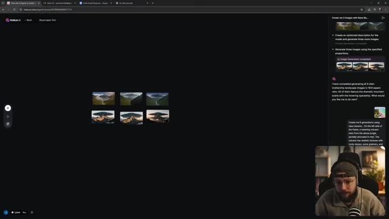
*Interface de Hailuo AI montrant plusieurs générations d'images paysagères avec des ovnis au-dessus de montagnes.*

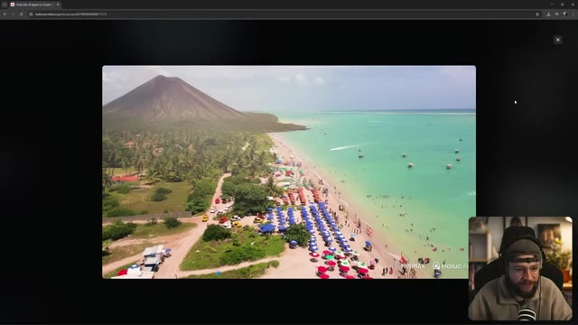
*Affichage en plein écran d'une vidéo générée montrant une plage tropicale et un volcan en arrière-plan.*

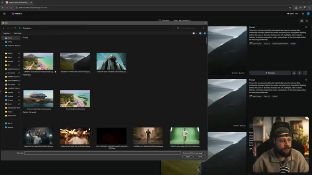
*Fenêtre de l'explorateur de fichiers Windows ouverte par-dessus l'interface de Hailuo AI pour sélectionner une image de départ.*

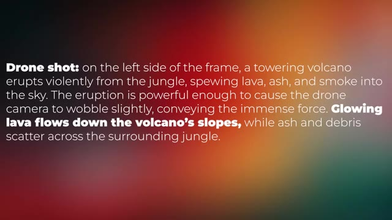
*Texte du prompt en gros plan sur fond coloré décrivant l'éruption d'un volcan avec un plan de drone.*

---

### ⏱️ `[00:19:03 - 00:19:42]` | Segment #39

**🔊 Audio (Transcription Intégrale Mot pour Mot en Français) :**
> L'éruption est suffisamment puissante pour faire trembler légèrement la caméra du drone, transmettant une force immense. De la lave incandescente s'écoule le long des pentes du volcan, tandis que des cendres et des débris se dispersent dans la jungle environnante. Envoyons notre Hyluo 2.3 et nous opterons également pour un Veo 3.1. Ainsi, en regardant notre première génération Veo 3.1, j'aime vraiment beaucoup cela. J'adore la façon dont la caméra pivote en quelque sorte pour embrasser cette vue du volcan. Je pense qu'au niveau des textures, nous avons des choses assez étranges qui se produisent et l'explosion elle-même, du moins la partie feu, a l'air un peu plate et de mauvaise qualité.

**👁️ Analyse Visuelle d'Écran (gemini-3.5-flash-lite) :**
**Interface & Outils** : Interface web de l'outil de génération vidéo "Hyluo AI" (section Image to Video), avec un panneau latéral de créations, un champ de prompt et des options de sélection de modèles (Hyluo 2.3, Veo 3.1), intégrant un retour vidéo du créateur en incrustation (PiP).

**Contenu textuel & Code** : Texte du prompt visible : "Drone shot: on the left side of the frame, a towering volcano erupts violently from the jungle, spewing lava, ash, and smoke into the sky. The eruption is powerful enough to cause the drone camera to wobble slightly, conveying the immense force. Glowing lava flows down the volcano's slopes, while ash and debris scatter across the surrounding jungle." Paramètres visibles : modèle Hyluo 2.3 / Veo 3.1, résolution 1080p.

**Action / Démonstration** : Le créateur présente le texte de son prompt pour la génération vidéo, navigue dans l'interface Hyluo AI pour comparer les différents modèles (Hyluo 2.3 et Veo 3.1) et analyse à l'écran les défauts et qualités des rendus vidéo générés.

*Affichage du prompt textuel détaillé décrivant l'éruption volcanique vue par drone.*

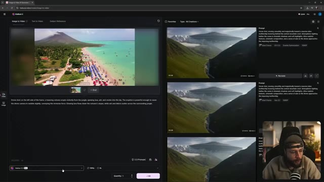
*Interface de l'outil Hyluo AI montrant le panneau de génération vidéo et la webcam du créateur.*

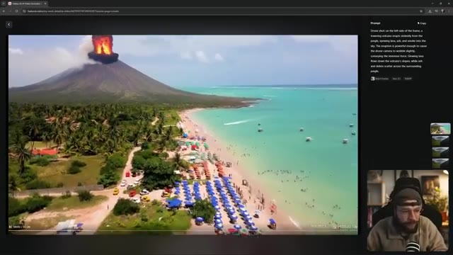
*Visualisation détaillée du résultat de génération vidéo avec le volcan en éruption surplombant une plage tropicale.*

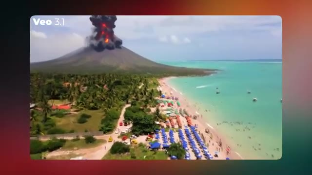
*Rendu vidéo plein écran étiqueté "Veo 3.1" montrant l'animation aérienne du volcan en éruption.*

---

### ⏱️ `[00:19:42 - 00:20:19]` | Segment #40

**🔊 Audio (Transcription Intégrale Mot pour Mot en Français) :**
> ce n'est pas exactement ce que je chercherais. La façon dont la fumée se comporte est plutôt cool, je dois l'admettre. La génération Hyluo est juste un peu étrange, elle se comporte presque davantage comme un time-lapse. Je pense que la façon dont la fumée se dissipe en quelque sorte à travers, en particulier, la jungle est plutôt cool, mais en gros, cela ne correspond tout simplement pas vraiment à notre cas d'utilisation. Et la deuxième génération VO3.1 est à peu près la même, vraiment le même genre de problèmes qu'auparavant, alors qu'il y a certaines parties de cette génération qui sont assez impressionnantes, ça ne m'éblouit pas vraiment, je pense toujours que si vous...

**👁️ Analyse Visuelle d'Écran (gemini-3.5-flash-lite) :**
**Interface & Outils** : Interface de lecteur vidéo comparant des générations de modèles d'IA vidéo (Veo 3.1 et Hailuo 2.3).

**Contenu textuel & Code** : Mentions textuelles 'Veo 3.1' et 'Hailuo 2.3' incrustées dans les coins supérieurs gauches des vidéos comparatives. Rendu visuel d'une éruption volcanique près d'une plage tropicale avec cocotiers, sable, parasols et mer turquoise.

**Action / Démonstration** : Comparaison côte à côte ou séquentielle de clips vidéo générés par intelligence artificielle par différents modèles (Veo et Hailuo) pour évaluer le réalisme de la physique des fumées, de la lave et du comportement global de la scène.

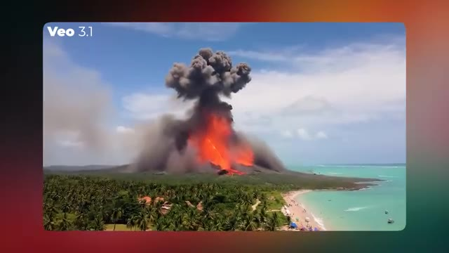
*Génération vidéo montrant une éruption volcanique avec de la fumée et de la lave, labellisée 'Veo 3.1' en haut à gauche.*

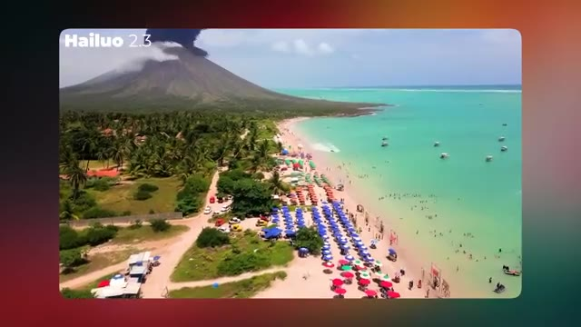
*Génération vidéo montrant un paysage côtier avec une plage et un volcan en arrière-plan, labellisée 'Hailuo 2.3' en haut à gauche.*

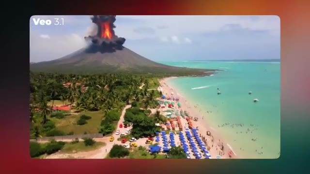
*Autre vue de la génération vidéo labellisée 'Veo 3.1' montrant une éruption volcanique près d'une plage tropicale.*

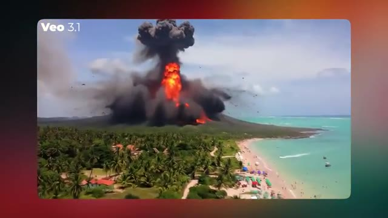
*Gros plan sur la génération 'Veo 3.1' montrant une explosion de fumée et de lave au sommet du volcan.*

---

### ⏱️ `[00:20:19 - 00:20:52]` | Segment #41

**🔊 Audio (Transcription Intégrale Mot pour Mot en Français) :**
> pour réaliser vos courts métrages, cela peut être un excellent moyen d'ajouter un effet de valeur de production supérieur à votre pièce sans avoir à débourser pour un artiste CG à plein temps, je pense que nous poussons vraiment les outils à leur limite avec ce genre de demandes, mais il est pratique de placer l'une de ces générations assez ambitieuses à la toute fin de la vidéo, je pense, pour que vous puissiez vraiment voir le bon et le mauvais lorsque nous utilisons l'IA pour générer nos effets visuels. Merci beaucoup d'avoir regardé la vidéo d'aujourd'hui les gars, si vous l'avez appréciée, assurez-vous de lui mettre un pouce bleu pour moi, et si vous êtes nouveau, pensez à vous abonner.

**👁️ Analyse Visuelle d'Écran (gemini-3.5-flash-lite) :**
**Interface & Outils** : Interface de Hailuo AI Video Generator avec panneau latéral de prompt, lecteur vidéo intégré et incrustation vidéo (PiP) du créateur dans le coin inférieur droit.

**Contenu textuel & Code** : Texte du prompt visible : 'Drone shot, on the left side of the frame, a towering volcano erupts violently from the jungle, spewing lava, ash, and smoke into the sky. The eruption is powerful enough to cause the drone camera to wobble slightly, conveying the immense force. Glowing lava flows down the volcano's slopes, while ash and debris scatter across the surrounding jungle.' Paramètres visibles : 'Start Frame', 'Veo 3.1', boutons de copie et de téléchargement.

**Action / Démonstration** : Le créateur commente les résultats de la génération vidéo IA, gesticule face à la caméra dans l'encadré PiP, tandis que l'écran principal montre la lecture de la vidéo générée avec l'éruption volcanique et la plage.

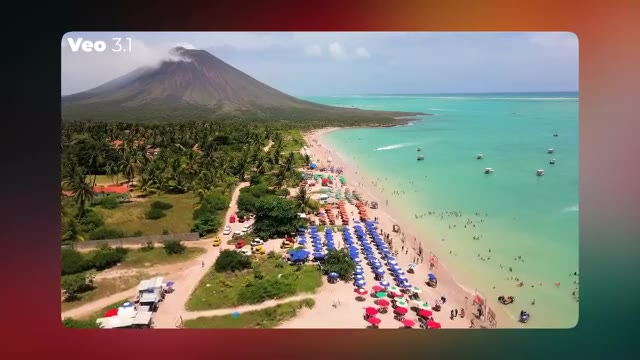
*Aperçu vidéo montrant une plage tropicale avec un volcan en arrière-plan et la mention 'Veo 3.1' en haut à gauche.*

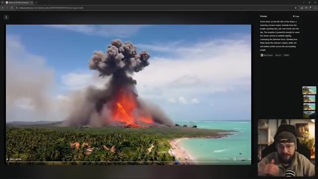
*Interface de Hailuo AI affichant le résultat vidéo d'une éruption volcanique vue par drone et le panneau latéral contenant le prompt textuel, avec le créateur en incrustation (PiP).*

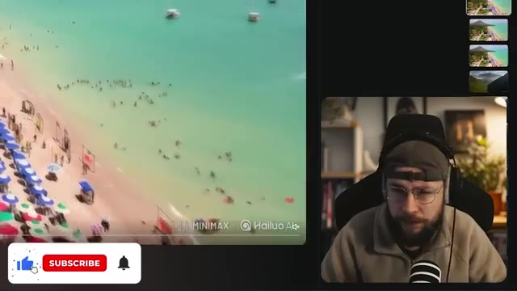
*Gros plan sur le rendu vidéo de la plage tropicale dans l'interface de Hailuo AI, avec incrustation du créateur (PiP) et un bandeau d'appel à l'action (pouce bleu et abonnement) en bas à gauche.*

---

### ⏱️ `[00:20:52 - 00:20:58]` | Segment #42

**🔊 Audio (Transcription Intégrale Mot pour Mot en Français) :**
> et bien sûr, activez la cloche de notification pour ne jamais manquer le moindre contenu à l'avenir et je vous retrouve dans la prochaine vidéo.

**👁️ Analyse Visuelle d'Écran (gemini-3.5-flash-lite) :**
**Interface & Outils** : Interface de lecteur vidéo avec les filigranes "MINIMAX" et "Hailuo AI", accompagnée d'une incrustation vidéo du créateur.

**Contenu textuel & Code** : Vidéo montrant une plage tropicale, une mer turquoise et une coulée de fumée ou de cendres volcaniques, avec un panneau vertical de vignettes sur la droite et l'encadré du présentateur.

**Action / Démonstration** : Présentation finale de la vidéo avec affichage d'un exemple de génération vidéo par IA en plein écran tandis que le créateur conclut.

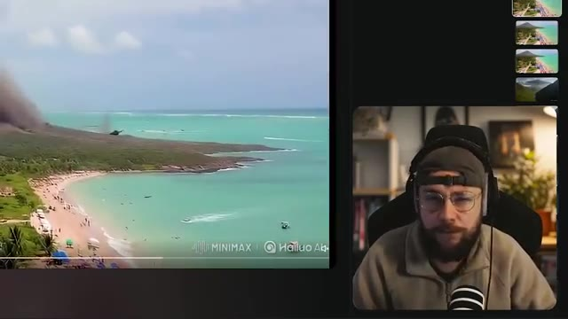
*Affichage d'une vidéo générée par IA montrant un paysage côtier avec un panache de fumée, avec le créateur Jack incrusté en bas à droite dans un encadré Picture-in-Picture.*

---
