# 🎬 Comment créer des pubs de Noël avec l'IA (RÉSULTATS DE FOLIE)

> **Chaîne** : [Jack Vs. AI](https://www.youtube.com/@JackVsAI)  
> **Titre original** : `How to make Christmas ads with AI (INSANE RESULTS)`  
> **Lien YouTube** : [https://www.youtube.com/watch?v=EL9FzwEirxc](https://www.youtube.com/watch?v=EL9FzwEirxc)  
> **Date de publication** : 2025-12-03  
> **Durée** : 33m 36s (`2016s`)  
> **Identifiant vidéo** : `EL9FzwEirxc`  
> **Fiche Web Interactive** : [2025-12-03_YT-EL9FzwEirxc_Comment créer des pubs de Noël avec l'IA (RÉSULTATS DE FOLIE)_by-whisper-v3-large-turbo+gemini-3.5-flash-lite.html](2025-12-03_YT-EL9FzwEirxc_Comment créer des pubs de Noël avec l'IA (RÉSULTATS DE FOLIE)_by-whisper-v3-large-turbo+gemini-3.5-flash-lite.html)  
> **Captures de démonstration clés** : `166 captures réelles (anti-talking-head)`  
> **Modèles utilisés** : Audio: `large-v3-turbo` (Faster-Whisper int8 VPS) | Vision: `gemini-3.5-flash-lite` (Google AI Studio API)  

---

## 📌 Synthèse Exécutive & Outils

### 📌 Résumé
Dans cette vidéo, Jack, un artiste VFX chevronné fort de plus de dix ans d'expérience dans la publicité, s'attelle à un défi audacieux : concevoir et produire une publicité de Noël entièrement animée de 30 secondes en seulement deux jours, en s'appuyant exclusivement sur l'intelligence artificielle générative. Mettant en scène des super-héros dans un univers visuel dessiné à la main, Jack démontre que l'IA ne remplace pas l'étincelle humaine mais l'amplifie, agissant comme un formidable accélérateur de production pour les créateurs de contenu et les professionnels de l'image.

La méthode étape par étape de Jack repose sur un rigoureux séquençage créatif : la planification initiale et l'écriture du concept via ChatGPT, l'établissement du style artistique et du « master plan » sur Midjourney, puis la génération de la quasi-totalité des plans et des éléments narratifs sur la plateforme tout-en-un ElevenLabs en exploitant des modèles de pointe comme Google Nano Banana Pro. Cette approche méthodique permet de surmonter le principal écueil de la vidéo par IA — à savoir la cohérence visuelle et narrative — tout en illustrant le rôle central du créateur qui endosse tour à tour les casquettes de réalisateur, de directeur artistique et de superviseur VFX.

Pour les créateurs de vidéo, cette démarche offre des bénéfices concrets majeurs : une réduction drastique des temps de production, une démocratisation des effets visuels complexes et une liberté créative totale sans les contraintes logistiques d'un tournage traditionnel. En combinant la précision des prompts textuels, l'utilisation rigoureuse d'images de référence et une suite d'outils interconnectés, il est désormais possible de rivaliser avec des standards publicitaires professionnels en un temps record.

### 🛠️ Outils, Modèles & Logiciels Présentés
* **ElevenLabs** : Plateforme tout-en-un centralisant la génération d'effets sonores, de voix off, de musiques, ainsi que d'images et de vidéos grâce à l'intégration de modèles de pointe.
* **Kling** : Modèle de génération vidéo par IA utilisé pour donner du mouvement aux images fixes et valider la dynamique des plans.
* **Midjourney** : Modèle de référence pour la génération d'images, utilisé ici pour explorer les pistes créatives et établir la première image de référence (« master plan ») ainsi que le style artistique global.
* **Nano Banana Pro (Google)** : Modèle d'image et de vidéo hautement performant intégré à ElevenLabs, indispensable pour assurer une stricte cohérence des personnages et du style low poly d'un plan à l'autre.
* **Premiere Pro** : Logiciel de montage traditionnel utilisé pour assembler les plans animés, finaliser le montage et synchroniser le sound design.
* **Veo 3.1** : Modèle de génération vidéo par IA mobilisé pour enrichir la palette de mouvements et dynamiser certaines séquences du projet.
* **WAN / WAN 2.5** : Modèle vidéo avancé exploité pour des besoins spécifiques de rendu et de génération de séquences animées fluides.
* **Flux** : Modèle de génération d'images ultra-détaillé utilisé pour affiner certains aspects textuels et visuels de la direction artistique.

### 🔑 Points Clés & Enseignements Stratégiques
* **Maintenir l'étincelle humaine** : L'IA ne remplace pas l'idée originale ; le concept narratif et la vision artistique initiale doivent impérativement naître de l'esprit du créateur avant d'être délégués aux algorithmes.
* **Définir un « master plan »** : Il est crucial d'établir une image directrice unique (via Midjourney) qui servira de socle visuel et de référence absolue pour garantir l'homogénéité esthétique de l'ensemble du projet.
* **Structurer les prompts d'image en trois blocs** : Pour obtenir des résultats précis, divisez vos descriptions textuelles en décrivant d'abord le décor, le cadrage et l'éclairage, puis les actions des personnages, et enfin le style artistique recherché.
* **Industrialiser le storyboard avec ChatGPT** : Utilisez l'IA textuelle pour transformer un script brut en un storyboard détaillé numéroté plan par plan, servant de feuille de route infaillible pour la génération visuelle.
* **Exploiter la cohérence par image de référence** : Des outils comme Google Nano Banana Pro permettent d'injecter le « master plan » en tant que source pour générer de nouveaux plans dérivés tout en conservant les mêmes personnages et le même style graphique.
* **Centraliser les workflows** : L'utilisation d'environnements unifiés comme ElevenLabs pour générer à la fois les images, les voix, les bruitages et les musiques évite les pertes de temps liées aux transferts de fichiers constants.
* **Jouer le rôle de directeur artistique** : Le créateur de contenu moderne agit comme un réalisateur de plateau : il itère, affine les détails textuels (ex: rappeler explicitement le style *low poly* à chaque étape) et corrige les écarts de l'IA.
* **Assurer la continuité des décors** : Veillez à ce que les éléments rajoutés en cours de route (comme un sapin de Noël ou un canapé) fassent l'objet d'un prompt explicite rappelant le style artistique global pour éviter toute rupture visuelle.
* **Gérer le ratio d'affichage adéquat** : Paramétrez systématiquement vos générations au format 16:9 dès la phase de conception si l'objectif final est la diffusion d'une publicité télévisée ou web au standard horizontal.
* **Itérer par petits incréments** : Ne cherchez pas à générer le plan parfait du premier coup ; utilisez les fonctions de réinjection des prompts existants pour faire évoluer subtilement la posture, l'expression ou l'angle de vue des personnages.

---

## ⏱️ Chronologie & Transcription Complète Audio & Visuelle (Mot pour Mot)

### ⏱️ `[00:00:00 - 00:00:38]` | Segment #01

**🔊 Audio (Transcription Intégrale Mot pour Mot en Français) :**
> Aujourd'hui, je me suis lancé un sacré défi. Est-ce que je peux créer une publicité de Noël entière en utilisant uniquement l'IA ? Et est-ce que je peux le faire en seulement deux jours ? Ouais, je commence déjà à le regretter. Je m'appelle Jack, je suis artiste VFX dans l'industrie de la publicité depuis plus d'une décennie maintenant, et j'ai travaillé avec beaucoup des plus grandes marques de la planète. Et dans cette vidéo, je vais vous emmener avec moi pour toute l'aventure. On verra tout, du concept initial et du story-board, jusqu'à la génération d'images et de vidéos, pour finir par le montage lui-même et l'ajout des touches finales comme le sound design. Est-ce que je vais réussir ou est-ce que je vais m'humbrifier et échouer lamentablement ?

**👁️ Analyse Visuelle d'Écran (gemini-3.5-flash-lite) :**
**Interface & Outils** : Présentation face caméra sans partage d'écran

**Contenu textuel & Code** : Aucun contenu logiciel ou interface affiché.

**Action / Démonstration** : Le créateur Jack parle directement face caméra dans son studio.

---

### ⏱️ `[00:00:38 - 00:01:14]` | Segment #02

**🔊 Audio (Transcription Intégrale Mot pour Mot en Français) :**
> Vous avez déjà vu certains des résultats mais si vous voulez voir la publicité terminée, vous devrez attendre la fin de la vidéo. Il y aura des horodatages ci-dessous si vous voulez naviguer vers des sections spécifiques et cela étant dit, entrons dans le vif du sujet. Bien sûr, tout commence à l'étape de la planification et je suis convaincu que même si ces outils d'IA sont extraordinaires, cette étincelle humaine de l'idée initiale reste tellement importante. Donc, en ce qui concerne le concept, nous allons opter pour une publicité animée de 30 secondes avec un style dessiné à la main sur des super-héros à Noël, parce qu'on ne le fait pas souvent

**👁️ Analyse Visuelle d'Écran (gemini-3.5-flash-lite) :**
**Interface & Outils** : Application de notes/documentation type Notion en mode sombre, avec incrustation vidéo du créateur (PiP).

**Contenu textuel & Code** : Document intitulé "'Xmas Heroes' PLANNING" comprenant les sections : THE CONCEPT ("An animated 30 sec. ad with a hand-drawn style about superheroes at Christmas"), THE TWIST, THE CHARACTERS, et IRONSTEAD: SUPER STRENGTH (décrivant un policier blanc, costume tactique, etc.).

**Action / Démonstration** : Le créateur présente son plan de projet textuel tout en parlant à la caméra, l'écran affichant le document de planification défilant à l'écran.

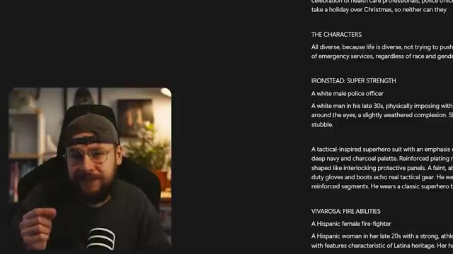
*Capture d'écran montrant le document de planification 'Xmas Heroes' avec le créateur en incrustation (PiP) dans le coin inférieur gauche.*

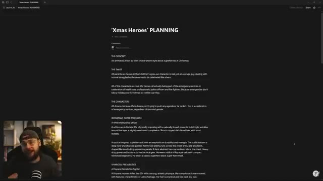
*Vue plus large du document Notion 'Xmas Heroes' PLANIFICATON affichant les détails du concept et des personnages, avec le créateur en incrustation (PiP).*

---

### ⏱️ `[00:01:14 - 00:01:50]` | Segment #03

**🔊 Audio (Transcription Intégrale Mot pour Mot en Français) :**
> voir ces deux concepts se combiner d'une certaine manière et je me suis dit que ce serait intéressant du point de vue de la narration ainsi que visuellement aussi. Donc à ce stade, c'est en fait le moment où nous commençons à pouvoir utiliser ChatGPT pour nous aider à développer un peu plus nos idées et un peu plus rapidement aussi. Donc initialement, j'ai simplement donné le concept global et demandé à ChatGPT de me donner quelques options de noms de super-héros pour chaque personnage et cela ne me dérangeait pas que ceux-ci soient un peu ringards pour être honnête, je pense que si quoi que ce soit, cela aide encore plus avec le concept. J'ai dû demander à un moment donné qu'aucun des noms utilisés ne provienne de bandes dessinées existantes, donc ceux-ci étaient en fait certains de ceux-là

**👁️ Analyse Visuelle d'Écran (gemini-3.5-flash-lite) :**
**Interface & Outils** : Interface web de ChatGPT (OpenAI) avec incrustation vidéo (PiP) du créateur en bas à gauche.

**Contenu textuel & Code** : Texte de conversation avec ChatGPT contenant des prompts de création de noms de super-héros originaux pour des personnages issus des services d'urgence. Exemples affichés : "Super Strength - White male police officer", listes de noms ("Bulwark", "The Sentinel", "Ironwatch", "Vivarosa", etc.).

**Action / Démonstration** : Le créateur présente son écran de travail montrant les échanges avec ChatGPT pour concevoir les noms des personnages et ajuste ses requêtes en direct.

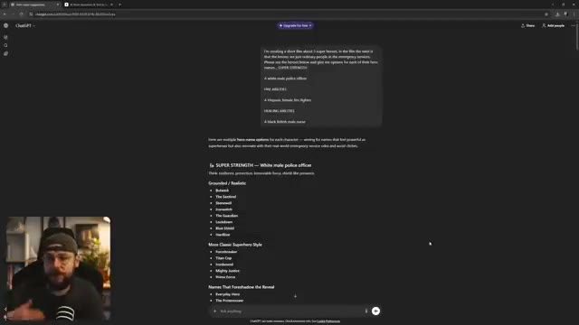
*Interface de ChatGPT montrant les suggestions de noms de super-héros générés pour un policier (Super Force).*

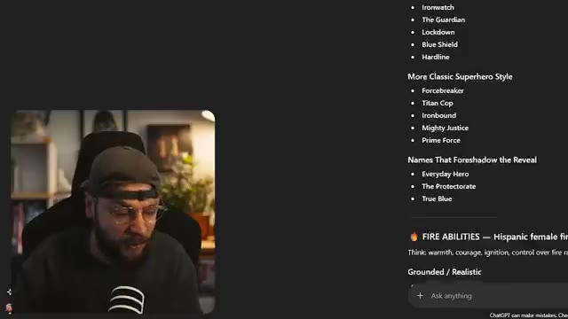
*Interface de ChatGPT affichant la suite des propositions de noms pour les compétences de feu.*

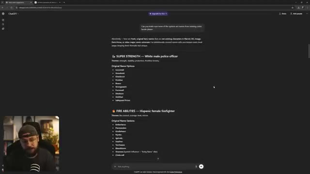
*Interface de ChatGPT montrant le prompt de Jack demandant des noms originaux absents des comics existants et les nouvelles suggestions.*

---

### ⏱️ `[00:01:50 - 00:02:24]` | Segment #04

**🔊 Audio (Transcription Intégrale Mot pour Mot en Français) :**
> Que j'ai fini par utiliser ici. Et ensuite, en continuant, j'ai demandé à ChatGPT d'écrire un prompt textuel détaillé pour chaque tenue de super-héros individuelle. Le résultat que j'ai obtenu de ChatGPT avait besoin d'un peu d'édition. J'ai dû prendre ce qu'il m'a donné et le modifier, mais cela a servi de base globale très utile. Et l'étape suivante était d'écrire le script lui-même et de commencer vraiment à réfléchir à la façon dont nous allions emmener le public dans ce voyage et communiquer le rebondissement de notre film. Et le format que j'ai choisi est en quelque sorte à mi-chemin entre un script traditionnel et un storyboard. Vous pouvez voir que j'ai

**👁️ Analyse Visuelle d'Écran (gemini-3.5-flash-lite) :**
**Interface & Outils** : Interface web de ChatGPT et document de script textuel, affichés en plein écran avec une vignette vidéo PiP (Picture-in-Picture) du créateur en bas à gauche.

**Contenu textuel & Code** : Sur l'image 1, l'interface ChatGPT affiche des prompts détaillés pour des tenues de super-héros (« Superhero with Super Strength », « Superhero with Fire Abilities »). Sur l'image 2, un script textuel détaille des scènes (« INTERIOR, DARK DRAMATIC MINIMAL ENVIRONMENT », « EXTERIOR, 5AM: BRITISH RESIDENTIAL ROAD », « INTERIOR, 8AM: TEENAGE BEDROOM AT CHRISTMAS ») numérotées de 3 à 12.

**Action / Démonstration** : Le créateur présente ses échanges avec l'IA sur ChatGPT pour concevoir les tenues, puis montre la structure hybride de son script/storyboard à l'écran tout en parlant à la caméra.

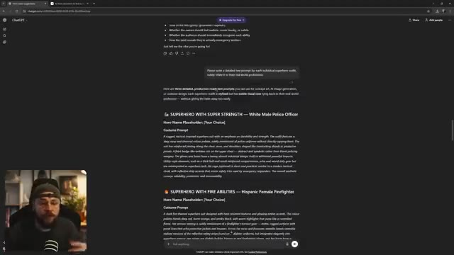
*Interface de ChatGPT affichant les prompts générés pour les tenues de super-héros, avec le créateur en incrustation (PiP).*

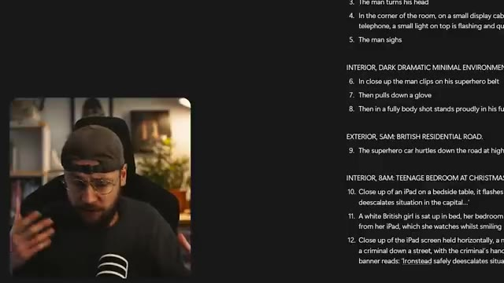
*Document de script textuel à mi-chemin entre script et storyboard, avec le créateur en incrustation (PiP).*

---

### ⏱️ `[00:02:24 - 00:03:00]` | Segment #05

**🔊 Audio (Transcription Intégrale Mot pour Mot en Français) :**
> numéroté chaque plan individuel. Je commence donc à réfléchir à la façon dont je vais réellement montrer chaque morceau d'action et chaque scène. Donc, avec toutes les pièces en place, il est temps de commencer à examiner la génération d'images et de vidéos. Pour commencer, nous sommes sur Midjourney, que je considère toujours comme le roi du style. Si vous cherchez à explorer de nombreuses idées créatives différentes, c'est un excellent point de départ et c'est là que nous allons établir la première image et le style d'animation du film complet. Ce qui nous intéresse, c'est de générer ce que j'appelle habituellement un master.

**👁️ Analyse Visuelle d'Écran (gemini-3.5-flash-lite) :**
**Interface & Outils** : Interface de traitement de texte / bloc-notes (type application de script) puis interface web de Midjourney montrant une grille de génération d'images.

**Contenu textuel & Code** : Texte du script : "THE SCRIPT - INTERIOR, MODERN DAY, SAM BRITISH LIVING ROOM AT CHRISTMAS TIME", descriptions des plans (1 à 20), et interface de Midjourney avec des aperçus d'images aux styles variés et des prompts textuels descriptifs.

**Action / Démonstration** : Le créateur présente ses documents de planification et de découpage technique de film, puis navigue sur l'interface de Midjourney pour illustrer les concepts visuels et les styles artistiques recherchés.

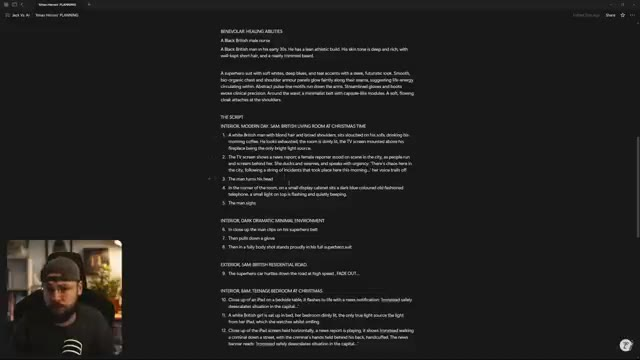
*Affichage du script textuel du projet de film et du découpage des plans numérotés, avec incrustation vidéo du créateur en bas à gauche.*

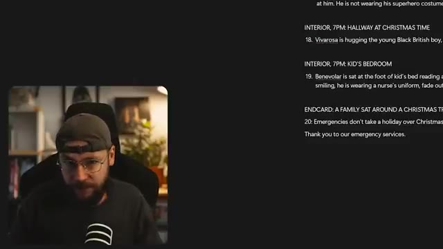
*Suite du script textuel montrant les différentes scènes et fins de scénario, avec incrustation vidéo du créateur en bas à gauche.*

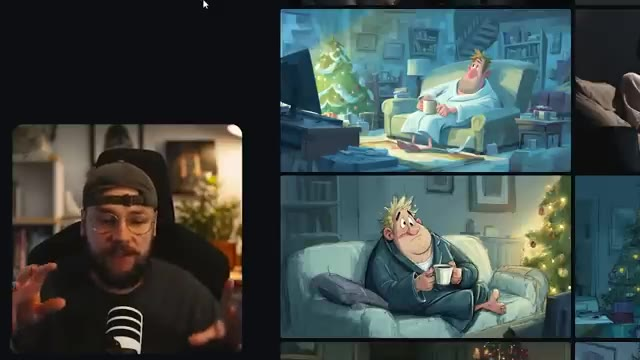
*Présentation d'une grille d'images de style cartoon 3D générées pour illustrer le personnage dans son salon de Noël, avec incrustation vidéo du créateur.*

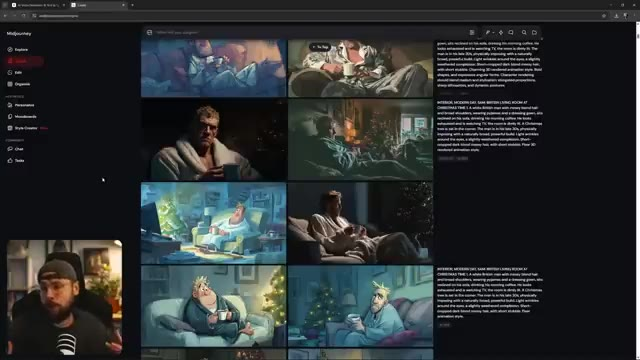
*Interface de l'application Midjourney affichant une galerie d'images et de styles visuels variés pour le projet de film, avec incrustation vidéo du créateur en bas à gauche.*

---

### ⏱️ `[00:03:00 - 00:03:24]` | Segment #06

**🔊 Audio (Transcription Intégrale Mot pour Mot en Français) :**
> plan et cela va poser les bases visuelles de l'intégralité de notre film et en termes de prompts textuels que j'utilise je les divise généralement en trois sections distinctes. Donc nous décrivons le décor, le personnage et toute action qui se déroule ainsi que l'heure de la journée et l'éclairage. Ensuite j'ajoute une description détaillée du personnage et je termine par une description du style que je recherche.

**👁️ Analyse Visuelle d'Écran (gemini-3.5-flash-lite) :**
**Interface & Outils** : Interface web de Midjourney et diapositive de présentation graphique.

**Contenu textuel & Code** : Texte affiché à l'écran : "TEXT PROMPT. INTERIOR, MODERN DAY, 5AM: BRITISH LIVING ROOM AT CHRISTMAS TIME 1. A muscular white British man with messy blond hair and broad shoulders, wearing pyjamas and a dressing gown, sits reclined on his sofa, drinking his morning coffee. He looks exhausted and is watching TV, the room is dimly lit. The man is in his late 30s, physically imposing with a [..] build. Light wrinkles around the eyes, a slightly weathered [..]. Short-cropped dark blond messy hair, with short [..]. 3D rendered animation style. Bold shapes, and expressive angular forms. Character rendering should blend realism and [..] elongated proportions, sharp silhouettes, and dynamic postures."

**Action / Démonstration** : Le créateur montre des exemples visuels de génération d'images sur Midjourney puis affiche le prompt textuel détaillé en plein écran pour illustrer sa méthode de structuration en trois parties.

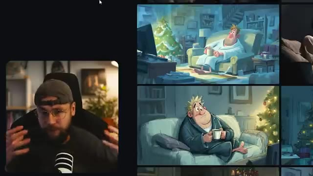
*Interface de Midjourney affichant une galerie d'images générées de style animation 3D avec Jack en incrustation vidéo (PiP).*

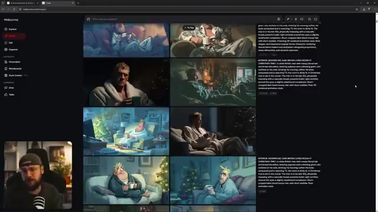
*Interface complète de Midjourney montrant la bibliothèque de prompts et d'images générées avec Jack en incrustation vidéo (PiP).*

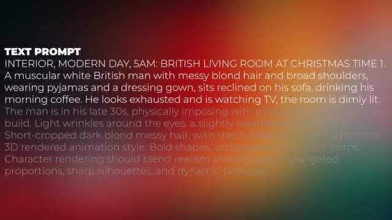
*Diapositive textuelle sur fond coloré détaillant un exemple de prompt de génération de film d'animation.*

---

### ⏱️ `[00:03:24 - 00:04:01]` | Segment #07

**🔊 Audio (Transcription Intégrale Mot pour Mot en Français) :**
> Vous pouvez donc voir ici que j'ai parcouru un grand nombre de générations différentes pour essayer de trouver ce que je cherchais. Et ce qui m'a vraiment plu à la fin, c'est ce genre de style de rendu 3D low poly. Donc ce que j'ai fait, c'est que j'ai agrandi cette image en particulier et si on remonte tout en haut de la page, c'est bon, notre plan d'ensemble est établi. Nous avons l'un de nos personnages clés et notre style artistique est figé et maintenant nous pouvons nous rendre sur 11labs, qui est l'endroit où nous allons générer la grande majorité de notre publicité. 11labs est mon outil de prédilection en matière d'effets sonores par IA, de voix off et

**👁️ Analyse Visuelle d'Écran (gemini-3.5-flash-lite) :**
**Interface & Outils** : Navigateur web affichant les interfaces de Midjourney (génération d'images) et d'ElevenLabs (génération audio).

**Contenu textuel & Code** : Textes de prompts visibles sur Midjourney : "INTERIOR, MODERN DAY, SANE, BRITISH LIVING ROOM AT CHRISTMAS TIME! A muscular, white British man with messy blond hair and broad shoulders, wearing pajamas and a dressing gown, etc."

**Action / Démonstration** : Le créateur montre son historique de générations sur Midjourney, sélectionne une image spécifique, puis bascule sur la plateforme ElevenLabs pour présenter les outils audio.

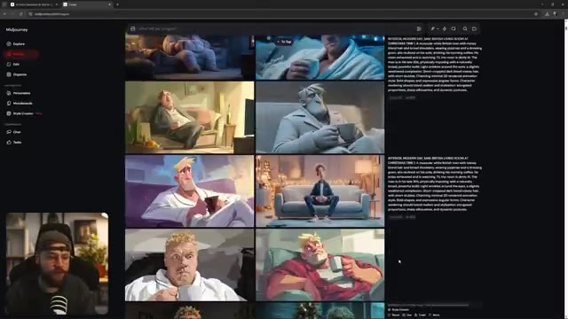
*Interface de Midjourney affichant une grille d'images générées de style low poly 3D.*

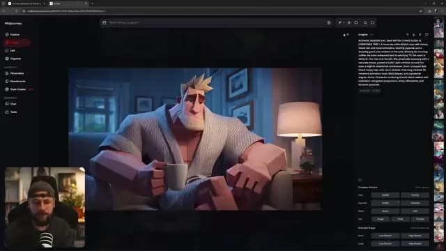
*Interface de Midjourney montrant une image agrandie d'un personnage en 3D low poly tenant une tasse de café.*

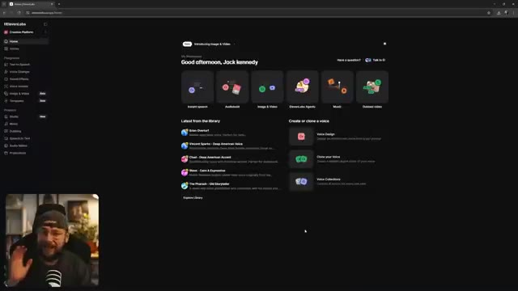
*Page d'accueil du tableau de bord d'ElevenLabs avec le message de bienvenue "Good afternoon, Jack Kennedy".*

---

### ⏱️ `[00:04:01 - 00:04:34]` | Segment #08

**🔊 Audio (Transcription Intégrale Mot pour Mot en Français) :**
> de la musique, mais vous le savez peut-être ou non, ils ont récemment intégré l'image et la vidéo dans la plateforme également. Donc nous pouvons générer à peu près tout ce dont nous avons besoin dans un seul espace. Donc si nous cliquons sur l'onglet image et vidéo et allons dans l'historique, vous pouvez voir tout ce que j'ai généré dans ElevenLabs. Et bien sûr, nous avons accès à tous les meilleurs modèles d'image et de vidéo du marché. Et dans ce cas, nous allons sélectionner Google Nano Banana Pro. Et quelque chose d'autre que j'ai fini par faire au tout début de ce processus, c'est que j'ai saisi mon script sous forme de texte.

**👁️ Analyse Visuelle d'Écran (gemini-3.5-flash-lite) :**
**Interface & Outils** : Interface web d'ElevenLabs (Creative Platform) avec les sections Playground (Text to Speech, Voice Changer, Sound Effects, Image & Video, Storyboard) et Présets, incluant un retour vidéo PiP du créateur.

**Contenu textuel & Code** : Texte du prompt visible dans l'interface : 'Create me a visual storyboard of the scenes... INTERIOR... MODERN DAY... 16:9... Google Nano Banana Pro'. Options de format 16:9, sélection du modèle 'Google Nano Banana Pro'.

**Action / Démonstration** : Le créateur navigue dans l'interface d'ElevenLabs, passe de l'accueil à l'onglet image/vidéo, consulte l'historique et montre le prompt textuel saisi au début du processus.

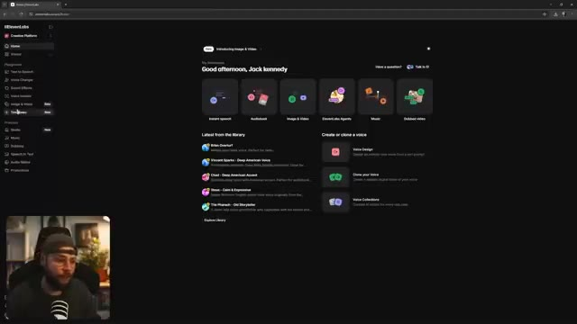
*Interface d'ElevenLabs montrant le tableau de bord principal avec le menu latéral et l'encadré vidéo du créateur en bas à gauche.*

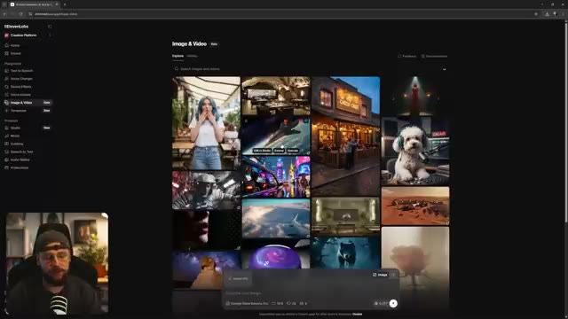
*Onglet 'Image & Video' d'ElevenLabs affichant une grille de différents médias générés et le panneau de sélection du modèle Google Nano Banana Pro.*

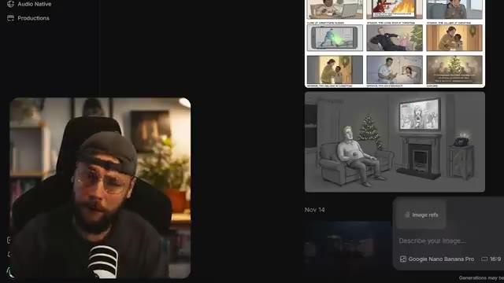
*Historique des générations dans ElevenLabs montrant des storyboards au format image et l'interface de saisie de prompt textuel.*

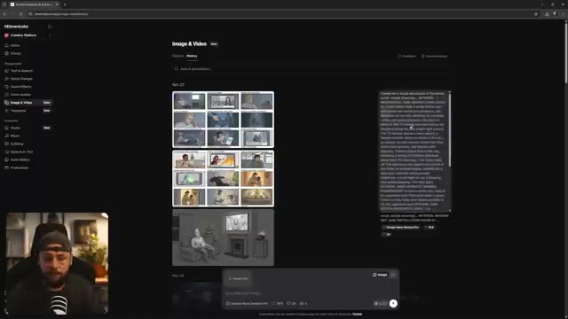
*Affichage détaillé d'un prompt textuel complexe de style storyboard dans le panneau latéral de l'interface ElevenLabs.*

---

### ⏱️ `[00:04:34 - 00:05:11]` | Segment #09

**🔊 Audio (Transcription Intégrale Mot pour Mot en Français) :**
> prompt et j'ai dit crée-moi un storyboard visuel du script ci-dessous avec des dessins simples. Et bien que ce qu'on a obtenu ne soit pas parfait, ça va vraiment s'avérer très pratique quand il s'agira de cocher la génération de chaque plan. Et si on clique sur l'onglet de référence d'image, on peut aller uploader notre plan maître. Comme je le dis, on veut utiliser Google Nano Banana Pro. Ensuite par exemple, quand il s'agit de notre prompt textuel, je vais mettre faire regarder l'homme vers le coin supérieur droit du cadre et ajouter un sapin de Noël derrière lui et le canapé. Pour notre rapport d'aspect, on veut du 16 par 9 parce que ça va servir de publicité télévisée. Résolution d'image, je fais généralement juste

**👁️ Analyse Visuelle d'Écran (gemini-3.5-flash-lite) :**
**Interface & Outils** : Interface web d'ElevenLabs (section Image & Video) avec un panneau de prompt textuel et des options de modèle (Google Nano Banana Pro, 16:9, Image refs).

**Contenu textuel & Code** : Texte du prompt visible : « Create me a visual storyboard of the below script, simple drawings... » et « Have the man looking up to the top right hand corner of the frame, and add in a Christmas tree behind him and the sofa. ». Paramètres : Google Nano Banana Pro, format 16:9, 2K.

**Action / Démonstration** : Le créateur montre comment importer une image de référence, modifier le prompt textuel pour cadrer le personnage et configurer les paramètres de format (16:9) pour une publicité télévisée.

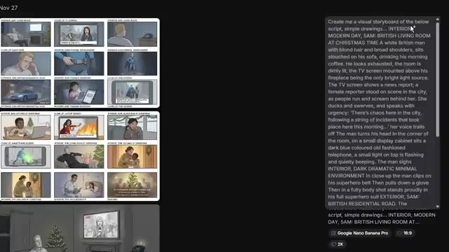
*Gros plan sur le storyboard généré et le panneau de prompt textuel avec les paramètres Google Nano Banana Pro et 16:9.*

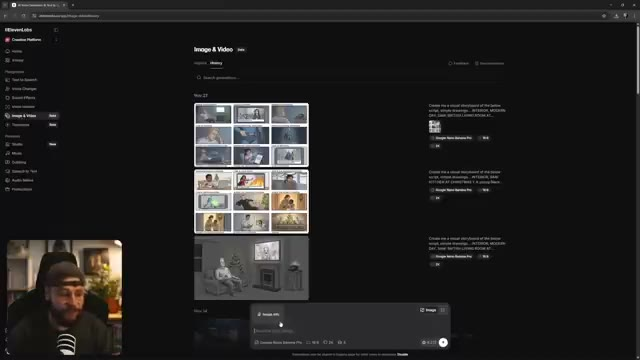
*Interface d'ElevenLabs avec le panneau principal et la petite caméra PiP montrant Jack en bas à gauche.*

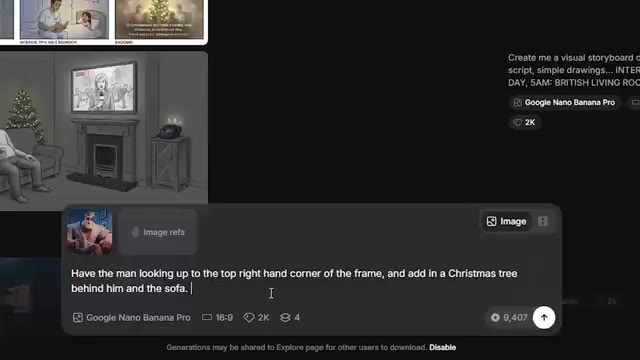
*Gros plan sur la boîte de prompt textuel montrant le texte « Have the man looking up to the top right hand corner of the frame... ».*

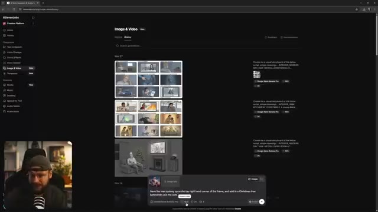
*Vue générale de l'interface d'ElevenLabs avec le champ de prompt textuel actif et les icônes de configuration en bas.*

---

### ⏱️ `[00:05:11 - 00:05:45]` | Segment #10

**🔊 Audio (Transcription Intégrale Mot pour Mot en Français) :**
> optez pour 2k et ensuite nous pouvons sélectionner combien de générations nous voulons en retour. Je vais aller de l'avant et en sélectionner 4 et envoyer cette génération. Donc essentiellement ce que nous faisons, c'est que nous utilisons notre plan master comme base pour l'ensemble de notre film et nous en dérivons des versions à partir de cela. Et Nano Banana Pro est parfait pour cela parce qu'il a une très bonne compréhension en matière de cohérence des personnages et du style. Donc cela va nous permettre de générer chaque plan que vous voyez dans le storyboard, le tout dans ce même style artistique low poly cohérent avec des personnages cohérents également. Et

**👁️ Analyse Visuelle d'Écran (gemini-3.5-flash-lite) :**
**Interface & Outils** : Navigateur web affichant la plateforme ElevenLabs (section Image & Video - History) avec incrustation vidéo PiP du créateur dans le coin inférieur gauche.

**Contenu textuel & Code** : Texte de prompt visible dans l'historique : "Create me a visual storyboard of the below script, simple drawings... INTERIOR, MODERN DAY, SAM: BRITISH LIVING ROOM AT CHRISTMAS TIME...". Paramètres sélectionnés : "Google Nano Banana Pro", "16:9", résolution "2K", et nombre de générations réglé sur 4.

**Action / Démonstration** : Le créateur navigue dans l'interface d'ElevenLabs, sélectionne les options de génération (résolution 2k, 4 générations) et lance le processus de création de variantes basées sur le plan maître.

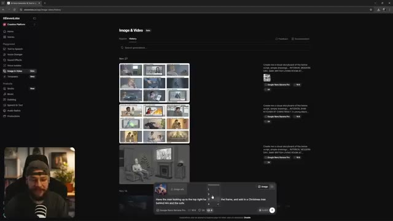
*Interface d'ElevenLabs montrant le panneau de génération vidéo et un menu déroulant pour sélectionner le nombre de générations.*

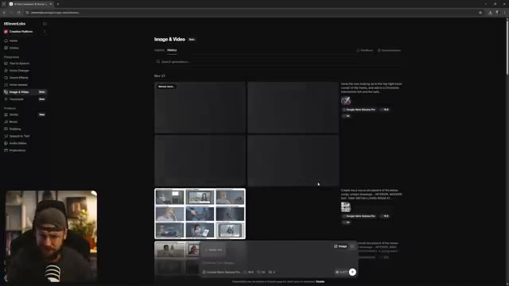
*Interface d'ElevenLabs montrant le lancement d'une génération de quatre vignettes vidéo en cours de chargement.*

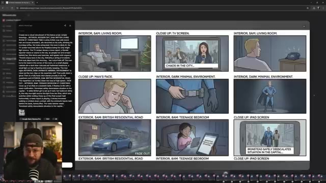
*Interface d'ElevenLabs affichant un storyboard détaillé divisé en plusieurs vignettes illustrant différentes scènes.*

---

### ⏱️ `[00:05:45 - 00:06:07]` | Segment #11

**🔊 Audio (Transcription Intégrale Mot pour Mot en Français) :**
> Vous pouvez voir ici que cela nous donne exactement ce que nous recherchions. Nous pouvons apporter ces petits ajustements et itérations à chaque plan que nous avons. Et une fonctionnalité vraiment sympa, c'est que si nous survolons notre invite textuelle et cliquons dessus, cela va copier exactement cette invite et la redéposer ici dans le champ de texte de l'invite. Nous pouvons également survoler notre référence d'image, cliquer dessus, et cela fera de même.

**👁️ Analyse Visuelle d'Écran (gemini-3.5-flash-lite) :**
**Interface & Outils** : Navigateur web affichant la plateforme ElevenLabs (Creative Platform - Image & Video).

**Contenu textuel & Code** : Interface d'ElevenLabs, panneau latéral de prompt, vignettes de générations d'images, paramètres de modèles (Google Veo / Imagen).

**Action / Démonstration** : Le présentateur commente l'interface de la plateforme et démontre les fonctionnalités de réutilisation des prompts et des références visuelles par simple survol et clic.

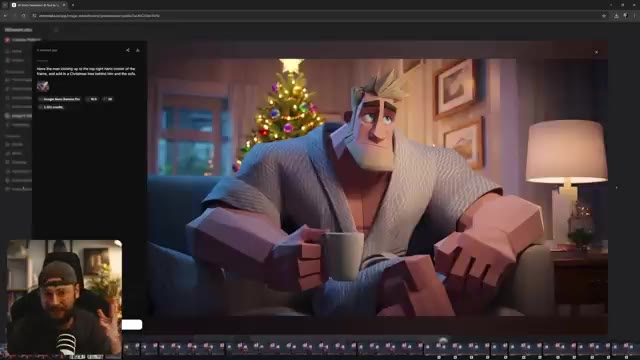
*Interface d'ElevenLabs affichant une image générée d'un personnage avec une tasse, avec Jack visible en médaillon PiP dans le coin inférieur gauche.*

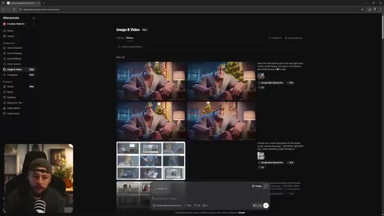
*Interface d'ElevenLabs montrant l'historique des générations d'images et de vidéos, avec le retour de Jack en caméra incrustée (PiP).*

---

### ⏱️ `[00:06:07 - 00:06:27]` | Segment #12

**🔊 Audio (Transcription Intégrale Mot pour Mot en Français) :**
> Donc, par exemple, je pourrais dire : faites en sorte que l'homme regarde vers le coin supérieur droit du cadre. Il a l'air très fatigué et est affalé sur le canapé. Ajoutez un sapin de Noël derrière lui et le canapé. Et nous obtenons ainsi cette génération, qui est plus proche de ce que j'avais imaginé. Nous jouons un rôle qui se situe quelque part entre un réalisateur de film et un directeur artistique.

**👁️ Analyse Visuelle d'Écran (gemini-3.5-flash-lite) :**
**Interface & Outils** : Interface web de génération d'images/vidéos par IA (type Midjourney ou plateforme similaire avec options de prompt, ratio d'aspect 16:9 et modèles comme Google Nano Banana Pro).

**Contenu textuel & Code** : Texte du prompt : "Have the man looking up to the top right hand corner of the frame, he looks very tired and is slouching on the sofa, add in a Christmas tree behind him and the sofa." Paramètres visibles : "Google Nano Banana Pro", ratio 16:9, résolution 2K.

**Action / Démonstration** : Le curseur de la souris survole ou saisit le prompt de modification de l'image, puis l'interface affiche le rendu final généré de l'homme dans le salon de style 3D avec un sapin de Noël.

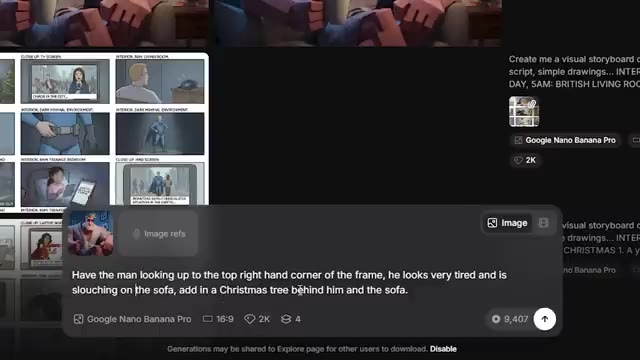
*Saisie du prompt textuel détaillant l'attitude du personnage fatigué sur le canapé avec le sapin de Noël dans l'outil de génération d'image.*

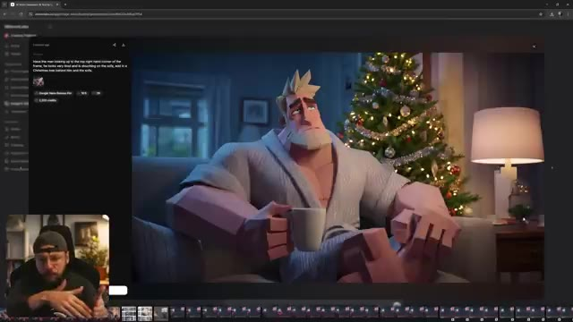
*Affichage du résultat généré montrant l'homme fatigué sur le canapé avec une tasse et un sapin de Noël en arrière-plan, avec le créateur en incrustation PiP.*

---

### ⏱️ `[00:06:27 - 00:06:46]` | Segment #13

**🔊 Audio (Transcription Intégrale Mot pour Mot en Français) :**
> Quelque chose d'autre que je pourrais essayer, c'est juste d'ajouter à la fin ici, de s'assurer que tout dans le cadre est dans le style artistique low poly. Nous nous concentrons donc sur un raffinement très détaillé à ce stade. Et vous pouvez voir, par exemple, maintenant que le sapin de Noël que nous avons ajouté à notre scène est du même style artistique low poly.

**👁️ Analyse Visuelle d'Écran (gemini-3.5-flash-lite) :**
**Interface & Outils** : Application web ElevenLabs (section Image & Video) affichée dans un navigateur web, avec le créateur en incrustation vidéo (PiP) dans le coin inférieur gauche.

**Contenu textuel & Code** : Le prompt visible dans l'interface indique : "Have the man looking up to the top right hand corner of the frame, he looks very tired and is slouching on the sofa, add in a Christmas tree behind him and the sofa." (avec l'ajout de la mention du style low poly).

**Action / Démonstration** : Le créateur montre son écran avec l'historique des générations d'images sur ElevenLabs, puis zoome sur une image spécifique pour montrer les détails du style artistique low poly appliqué au personnage et au décor de Noël.

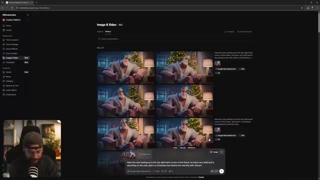
*Interface de l'application ElevenLabs affichant l'historique des générations d'images avec les différentes variantes et le prompt utilisé.*

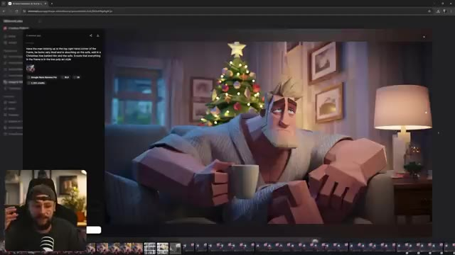
*Visualisation en grand format d'une image générée représentant un homme sur un canapé avec un sapin de Noël en arrière-plan, dans un style low poly.*

---

### ⏱️ `[00:06:46 - 00:07:12]` | Segment #14

**🔊 Audio (Transcription Intégrale Mot pour Mot en Français) :**
> Donc les choses semblent agréables et cohérentes. Donc après nos raffinements en utilisant Nano Banana Pro, vraiment ceci est devenu notre plan principal maintenant. Et si nous le comparons simplement à notre génération Midjourney, les choses ont l'air vraiment cohérentes, exactement ce que nous voulons. Et essentiellement, nous utiliserons ceci et Nano Banana Pro en combinaison avec notre script que nous avons écrit plus tôt pour créer chaque image de départ dont nous avons besoin pour chaque plan.

**👁️ Analyse Visuelle d'Écran (gemini-3.5-flash-lite) :**
**Interface & Outils** : Interface web d'ElevenLabs ("Image & Video") avec la webcam du créateur (Jack) incrustée en bas à gauche (PiP).

**Contenu textuel & Code** : On peut voir des exemples d'images générées en style low-poly (un homme barbu en peignoir tenant une tasse, un sapin de Noël en arrière-plan) et le modèle sélectionné indiqué comme "Google Nano Banana Pro". Des prompts textuels sont partiellement visibles sur le panneau de gauche.

**Action / Démonstration** : Le créateur présente l'interface d'ElevenLabs et commente les résultats de génération d'images obtenus avec le modèle Google Nano Banana Pro tout en gesticulant face caméra dans sa vignette PiP.

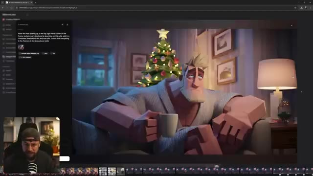
*Interface d'ElevenLabs affichant une image générée d'un personnage 3D en style low-poly tenant une tasse sur un canapé, avec le créateur en incrustation PiP.*

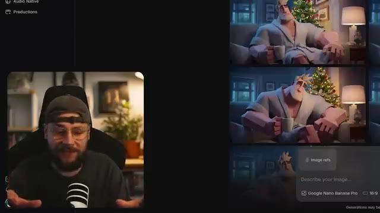
*Interface d'ElevenLabs montrant une grille de plusieurs variations d'images générées avec le modèle Google Nano Banana Pro, et le créateur en bas à gauche.*

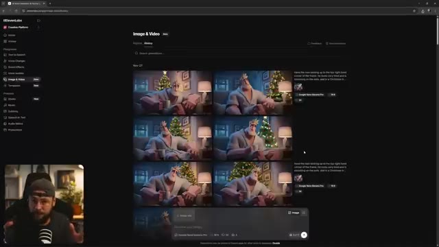
*Interface d'ElevenLabs affichant une vue d'ensemble de plusieurs générations d'images en grille (Image & Video) avec le modèle Google Nano Banana Pro, avec le créateur en incrustation PiP.*

---

### ⏱️ `[00:07:13 - 00:07:36]` | Segment #15

**🔊 Audio (Transcription Intégrale Mot pour Mot en Français) :**
> Une fois que nous avons fixé ces repères, nous pouvons passer à leur animation. Donc comme je l'ai mentionné auparavant, c'est essentiellement notre plan de départ. Donc tout découle un peu de celui-ci. Nous voulions donc couper de notre personnage masculin à un reportage télévisé où cette télévision est fixée au mur. Donc si vous regardez ici, vous pouvez voir que nous avons utilisé ce plan d'origine comme image de référence.

**👁️ Analyse Visuelle d'Écran (gemini-3.5-flash-lite) :**
**Interface & Outils** : Interface web d'ElevenLabs (section Creative Platform - Image & Video), avec incrustation vidéo (PiP) du créateur en bas à gauche.

**Contenu textuel & Code** : Prompts visibles dans l'interface de génération (ex: "Have the man looking up to the top right hand corner...", "ALTERNATE SHOT: show a wall mounted TV hanging above a fireplace..."), paramètres de modèle ("Google Nano Banana Pro", ratio 16:9) et bannières de reportage TV ("LIVE", "NEWS", "CHAOS IN THE CAPITAL").

**Action / Démonstration** : Le créateur présente l'interface de génération d'images et de vidéos, montrant le plan de départ de son animation ainsi que le plan alternatif de la télévision fixé au mur généré à partir d'une image de référence.

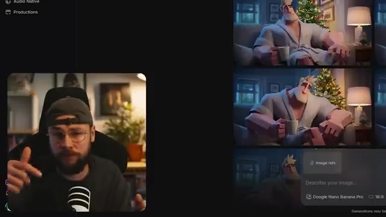
*Interface d'ElevenLabs (génération d'image/vidéo) montrant une grille de rendus 3D de style low poly d'un homme mûr sur un canapé, avec Jack en incrustation vidéo (PiP) dans le coin inférieur gauche.*

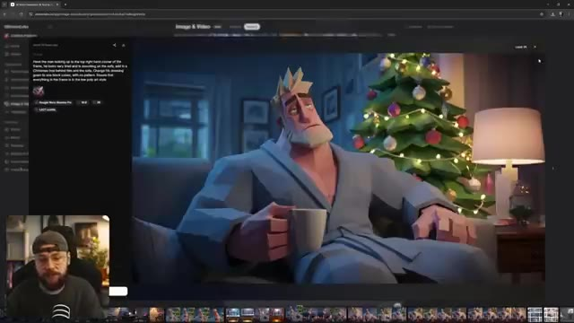
*Gros plan sur l'interface d'ElevenLabs affichant l'image générée en grand format d'un homme dans un salon avec un sapin de Noël, et le panneau de prompt textuel sur la gauche.*

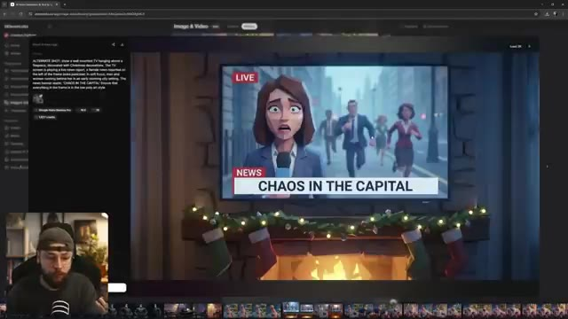
*Visualisation du plan de coupe alternatif sur l'interface montrant une télévision fixée au mur au-dessus d'une cheminée avec un reportage télévisé ("CHAOS IN THE CAPITAL").*

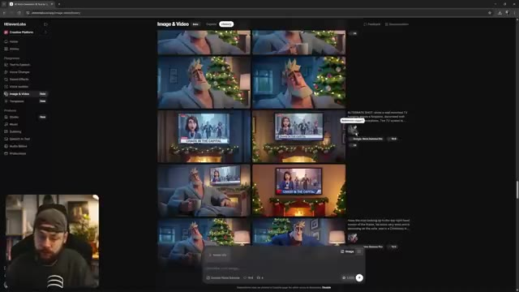
*Vue d'ensemble de l'historique des générations dans ElevenLabs montrant plusieurs variantes d'images et de plans de coupe générés par IA.*

---

### ⏱️ `[00:07:36 - 00:08:10]` | Segment #16

**🔊 Audio (Transcription Intégrale Mot pour Mot en Français) :**
> Et en ce qui concerne le prompt textuel, nous avons demandé un plan alternatif pour montrer une télévision murale suspendue au-dessus d'une cheminée décorée avec des décorations de Noël. L'écran du télévision diffuse un reportage en direct, une journaliste féminine à gauche du cadre a l'air paniquée en faible profondeur de champ, des hommes et des femmes courant derrière elle dans un décor de ville matinal. Le bandeau d'information indique le chaos dans la capitale et j'ai trouvé qu'il était généralement utile d'ajouter à la fin de mes prompts de s'assurer que tout dans le cadre est dans le style artistique low poly. C'est donc vraiment le processus. Ici, nous avions besoin d'un gros plan de notre

**👁️ Analyse Visuelle d'Écran (gemini-3.5-flash-lite) :**
**Interface & Outils** : Interface web de la plateforme ElevenLabs (section Image & Video), avec un panneau latéral de navigation et une grille d'affichage de résultats visuels générés.

**Contenu textuel & Code** : Texte du prompt visible dans une infobulle : "ALTERNATE SHOT: show a wall mounted TV hanging above a fireplace, decorated with Christmas decorations. The TV screen is playing a live news report, a female news reported on the left of the frame looks panicked. In soft focus, men and women running behind her in an early morning city setting. The news banner reads: 'CHAOS IN THE CAPITAL' Ensure that everything in the frame is in the low poly art style" ainsi que le bandeau d'actualité "CHAOS IN THE CAPITAL" sur l'image générée.

**Action / Démonstration** : Le présentateur commente la grille d'images générées par IA sur ElevenLabs tout en affichant le texte exact du prompt utilisé pour obtenir le résultat.

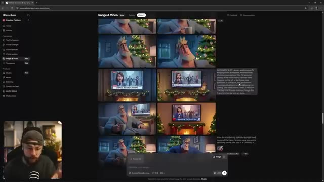
*Interface d'ElevenLabs affichant une galerie d'images générées par IA et une infobulle contenant le prompt textuel détaillé.*

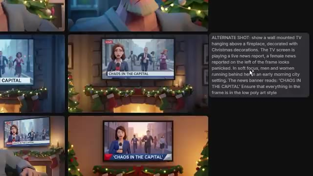
*Gros plan sur la grille d'images de la galerie et le prompt textuel décrivant la scène de journal télévisé.*

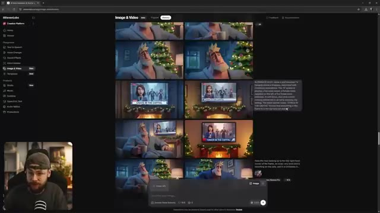
*Vue globale de l'interface ElevenLabs avec la galerie d'images et le créateur visible en incrustation (PiP).*

---

### ⏱️ `[00:08:10 - 00:08:47]` | Segment #17

**🔊 Audio (Transcription Intégrale Mot pour Mot en Français) :**
> personnage masculin donc une fois de plus nous avons utilisé ce plan original comme image de référence et un texte de description très simple montrant un gros plan de ce plan cadré depuis les épaules de l'homme vers le haut. Encore ici où nous avons créé ce genre de téléphone à l'ancienne de super-héros nous avons une fois de plus utilisé ce plan original comme image de référence et notre texte de description indique qu'à un autre endroit de la pièce nous voulons que ce téléphone soit installé sur une table basse et qu'il clignote et sonne. Évidemment, ça devient un peu plus excitant quand on commence à générer les images de nos personnages de super-héros et je vais vraiment avoir l'air de radoter ici parce qu'encore une fois nous utilisons cette image de référence originale

**👁️ Analyse Visuelle d'Écran (gemini-3.5-flash-lite) :**
**Interface & Outils** : Interface web d'ElevenLabs (section Image & Video / History) sur fond noir, avec un panneau de configuration à gauche et des grilles de prévisualisation des générations.

**Contenu textuel & Code** : Textes des prompts visibles : « SHOW AN ALTERNATE SHOT WHERE: In a different the corner of the room, on a small coffee table sits a dark blue coloured old fashioned telephone, a small light on top is flashing and quietly beeping. Ensure to keep the same low-poly art style. » et paramètres de modèle (« Google Nano Banana Pro », « 16:9 », « 2K »).

**Action / Démonstration** : Le créateur navigue à travers l'historique des générations d'images sur l'interface d'ElevenLabs en zoomant sur certains prompts et résultats de génération basés sur des images de référence.

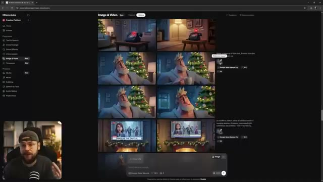
*Interface d'ElevenLabs affichant une grille de générations d'images avec le personnage barbu et le plan du téléphone clignotant sur une table basse, avec la webcam du créateur en incrustation.*

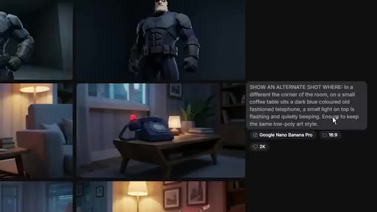
*Gros plan sur une génération d'image d'un vieux téléphone sur une table basse dans un salon sombre avec un prompt textuel détaillé visible sur le côté droit.*

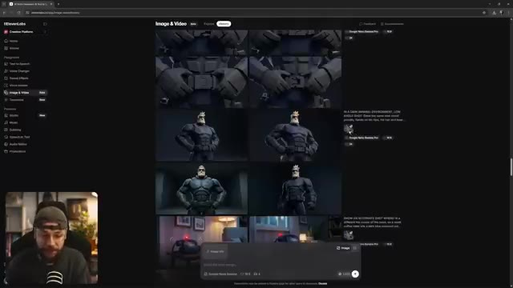
*Interface d'ElevenLabs montrant plusieurs variantes de personnages super-héros en armure sombre dans un environnement minimaliste.*

---

### ⏱️ `[00:08:47 - 00:09:19]` | Segment #18

**🔊 Audio (Transcription Intégrale Mot pour Mot en Français) :**
> en combinaison avec un prompt textuel assez descriptif pour obtenir notre génération finale choisie qui est ce plan ici. Donc si nous regardons sur le côté gauche, nous avons demandé un environnement sombre et minimaliste et un plan en contre-plongée et nous avons dit de montrer le même homme debout fièrement, les mains sur les hanches, ses cheveux et sa barbe semblant plus soignés. Ensuite, nous avons ajouté notre description du costume de super-héros que ChatGPT nous a écrite plus tôt avec quelques modifications que nous avons faites nous-mêmes. Et encore une fois, nous avons ajouté à la fin

**👁️ Analyse Visuelle d'Écran (gemini-3.5-flash-lite) :**
**Interface & Outils** : Interface web d'ElevenLabs (section Image & Video) avec un panneau de prévisualisation, l'historique des générations et une incrustation vidéo (Picture-in-Picture) du créateur.

**Contenu textuel & Code** : Texte du prompt visible à l'écran : "IN A DARK MINIMAL ENVIRONMENT, LOW ANGLE SHOT. Show the same man stood proudly, hands on hips, his hair and beard appear neater. He is wearing a dark blue tactical inspired superhero suit with an emphasis on durability and strength..." ainsi que des vignettes de modèles et des paramètres de génération.

**Action / Démonstration** : Le créateur navigue et zoome sur les différentes options de génération d'images générées par IA dans l'interface d'ElevenLabs, tout en expliquant sa méthode de prompt.

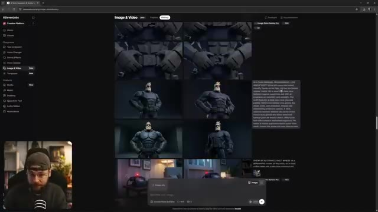
*Interface d'ElevenLabs (Image & Video) affichant une grille de générations d'images avec les prompts textuels correspondants et le créateur en incrustation PiP.*

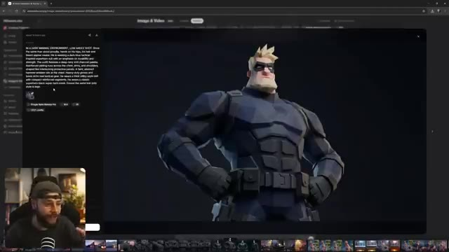
*Interface d'ElevenLabs affichant l'agrandissement d'une image générée représentant le super-héros en contre-plongée avec le prompt textuel visible sur la gauche.*

---

### ⏱️ `[00:09:19 - 00:09:57]` | Segment #19

**🔊 Audio (Transcription Intégrale Mot pour Mot en Français) :**
> assurez-vous que le même style low-poly est conservé. Et une fois que nous avons créé cette image de super-héros, nous pouvons ensuite l'utiliser comme image de référence. Nous pouvons demander des choses comme la ceinture qui s'attache, ainsi que ses gants qu'on enfile. Maintenant, lorsque nous passons à ce plan extérieur de cette voiture de super-héros vraiment cool qui file à toute allure sur la route. Encore une fois, j'ai simplement utilisé cette image de départ originale comme image de référence, car en réalité, nous l'utilisons simplement comme référence de style à ce stade. Nous écrivons donc tous ces prompts textuels en nous basant sur le script que nous avons écrit.

**👁️ Analyse Visuelle d'Écran (gemini-3.5-flash-lite) :**
**Interface & Outils** : Interface web de génération d'images et vidéos (style plateforme créative type ElevenLabs / outil IA propriétaire) avec panneau de prompt latéral, options de modèle (Google Nano Banana Pro), format 16:9 et paramètres de résolution.

**Contenu textuel & Code** : Texte du prompt visible : « IN A DARK MINIMAL ENVIRONMENT, LOW ANGLE SHOT: Show the same man stood proudly... Ensure the same low-poly style is kept. » et boutons de configuration « Google Nano Banana Pro », « 16:9 », « 2K ».

**Action / Démonstration** : Le créateur navigue dans son interface de génération, montre les prompts textuels utilisés pour maintenir la cohérence du style low-poly à travers différents plans et fait défiler des aperçus de scènes générées par IA.

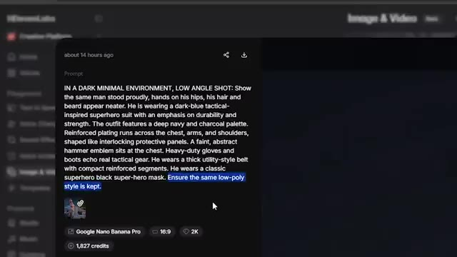
*Interface de la plateforme montrant le prompt textuel avec la mention du style low-poly et l'utilisation d'une image de référence.*

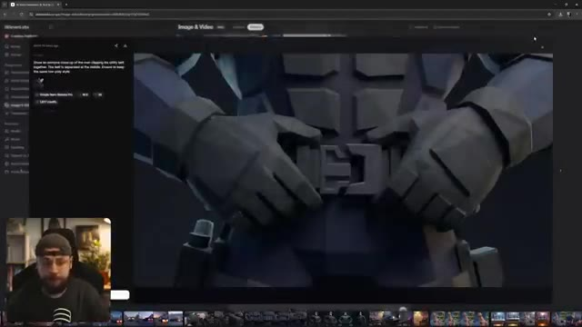
*Aperçu vidéo montrant un plan rapproché de super-héros ajustant sa ceinture, avec le créateur visible en incrustation PiP.*

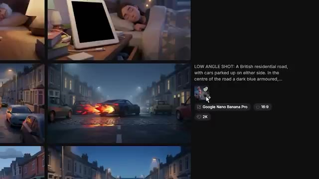
*Grille de génération montrant un plan extérieur de voiture filant dans une rue résidentielle britannique.*

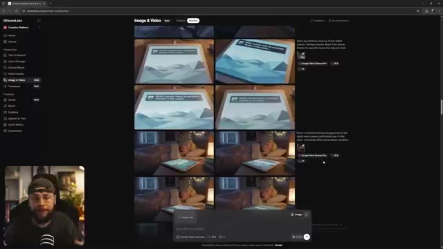
*Interface de la galerie de projets montrant différentes vignettes de génération et des prompts associés, avec le créateur en incrustation PiP.*

---

### ⏱️ `[00:09:57 - 00:10:31]` | Segment #20

**🔊 Audio (Transcription Intégrale Mot pour Mot en Français) :**
> avec quelques petits ajustements en cours de route. Et il y a quelques occasions. Donc par exemple ici nous avons le plan 10A et ensuite le plan 10B. Donc ici nous utilisons ce plan comme image de référence pour celui-ci et l'idée est que nous allons utiliser la fonction d'image de début et de fin qui est intégrée dans de nombreux modèles de vidéo par IA à ce stade. Donc ce sera notre image de départ et le modèle vidéo créera une transition allant du point A au point B. Et celui-ci est également assez intéressant car nous commençons à combiner plusieurs images de référence à ce stade.

**👁️ Analyse Visuelle d'Écran (gemini-3.5-flash-lite) :**
**Interface & Outils** : Interface web de génération de médias (type plateforme ElevenLabs / Creative Platform ou outil similaire) avec panneau latéral et affichage en grille.

**Contenu textuel & Code** : Texte visible dans les prompts : "Show an extreme close up of the tablet screen, framing directly down from above. Ensure to keep the same poly art style" et "NEWS: Ironside safely de-escalates situation in the capital...". Paramètres visibles : "Google Nano Banana Pro", résolution 2K, format 16:9, icônes d'attachement d'images de référence.

**Action / Démonstration** : Le présentateur explique l'utilisation de plans de référence multiples ainsi que la fonction d'image de début et de fin pour créer des transitions fluides entre deux plans vidéo (10A et 10B).

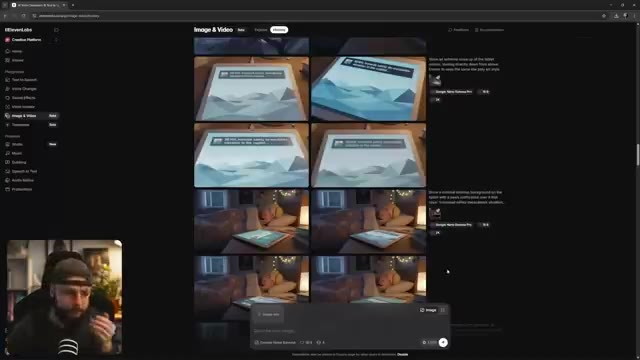
*Interface de la plateforme de création affichant une galerie d'images et de vidéos générées avec un panneau de paramètres textuels et miniatures à droite.*

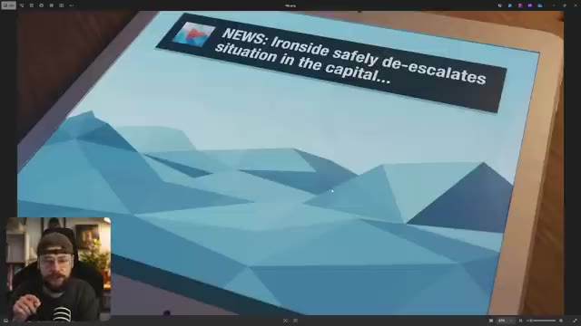
*Visionneuse plein écran affichant un plan rapproché d'une tablette avec une interface graphique de style journal télévisé.*

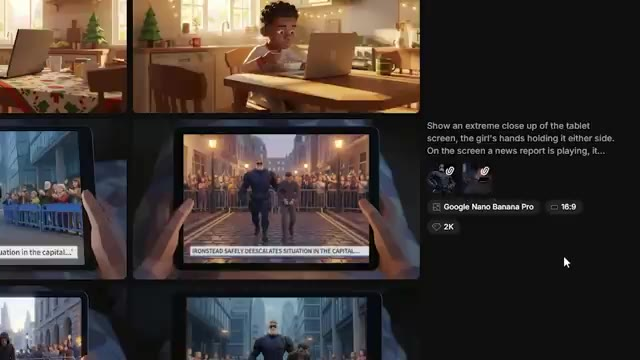
*Interface de génération vidéo montrant une grille de plans et des options de paramétrage avec le modèle Google Nano Banana Pro.*

---

### ⏱️ `[00:10:31 - 00:10:54]` | Segment #21

**🔊 Audio (Transcription Intégrale Mot pour Mot en Français) :**
> Donc nous avons créé cette très belle image de la jeune fille au lit regardant le reportage sur sa tablette. C'est donc notre image de référence numéro deux. Notre image de référence numéro un est ce cliché de super-héros original de notre personnage principal. Voici la génération que nous avons finalement choisie et pour le prompt textuel, nous avons dit : montrer un gros plan extrême de l'écran de la tablette, les mains de la fille le tenant de chaque côté.

**👁️ Analyse Visuelle d'Écran (gemini-3.5-flash-lite) :**
**Interface & Outils** : Interface de génération d'image par IA (style Midjourney ou similaire).

**Contenu textuel & Code** : Texte du prompt : "Show an extreme close up of the tablet screen, the girl's hands holding it either side. On the screen a news report is playing..." avec sélection de modèle "Google Nano Banana Pro".

**Action / Démonstration** : Le créateur montre l'utilisation d'images de référence et du prompt textuel pour générer une nouvelle scène narrative.

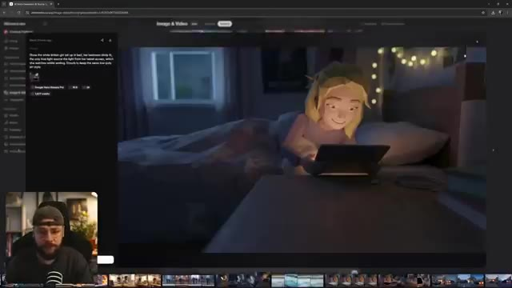
*Interface montrant l'image de référence 2 avec la jeune fille au lit regardant sa tablette.*

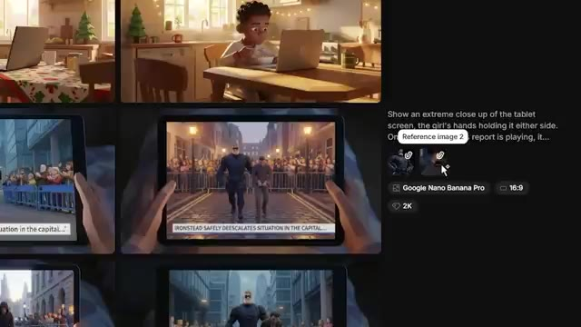
*Interface de génération montrant le prompt textuel et les deux images de référence attachées (image de référence 1 et 2).*

*Résultat final généré montrant un gros plan des mains tenant une tablette avec un reportage télévisé.*

---

### ⏱️ `[00:10:54 - 00:11:12]` | Segment #22

**🔊 Audio (Transcription Intégrale Mot pour Mot en Français) :**
> Sur l'écran, un reportage diffuse. Il montre l'homme portant le masque marchant dans une rue du quartier financier à Londres à 5 heures du matin. Il tient les mains d'un criminel derrière son dos et le fait avancer. Et le point vraiment formidable avec Nano Banana Pro, c'est qu'il s'en sort beaucoup mieux en matière de rendu de texte.

**👁️ Analyse Visuelle d'Écran (gemini-3.5-flash-lite) :**
**Interface & Outils** : Interface web de génération vidéo (Minimax/Hailuo AI) affichant le panneau de prompt et l'affichage d'un résultat vidéo sur tablette.

**Contenu textuel & Code** : Texte du prompt visible : « Show an extreme close up of the tablet screen, the girl's hands holding it either side. On the screen a news report is playing, it shows the man wearing the mask walking down a street in the financial district in London at 5am, he is holding a criminal's hands behind his back and walking him forward... ». Paramètres visibles : Google Nano Banana Pro, 16:9, 2K, 2,438 credits.

**Action / Démonstration** : Le créateur montre l'interface de génération textuelle et le résultat vidéo généré mettant en valeur la qualité du rendu de texte par le modèle Nano Banana Pro.

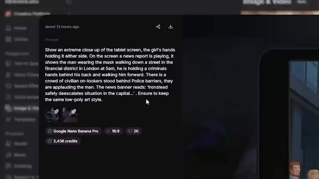
*Gros plan sur le panneau de configuration de l'application affichant le prompt de génération vidéo détaillant la scène du reportage et les paramètres du modèle Google Nano Banana Pro.*

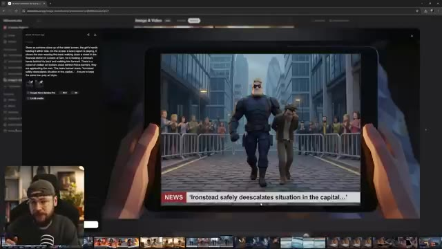
*Vue d'ensemble de l'interface montrant une tablette affichant le résultat de la génération avec le modèle Nano Banana Pro (un homme masqué en costume conduisant un criminel) et le présentateur Jack en médaillon PiP dans le coin inférieur gauche.*

---

### ⏱️ `[00:11:13 - 00:11:45]` | Segment #23

**🔊 Audio (Transcription Intégrale Mot pour Mot en Français) :**
> Donc vous verrez tout au long de ce processus de génération d'images que tous les bandeaux d'information, de manière générale, nous ont donné exactement ce que nous voulions. Et alors que nous faisons simplement défiler vers le haut, c'est vraiment juste encore la même chose. Nous suivons notre script, nous suivons notre storyboard, et nous utilisons les références d'images pertinentes pour obtenir le résultat que nous recherchons. Tout consiste à donner à Nano Banana Pro suffisamment de contexte pour progresser vers le résultat que vous voulez en tant que créateur. Et si nous continuons à faire défiler vers le haut, vous pouvez voir ici que je commence à expérimenter avec des générations de vidéos. C'est parce qu'à ce

**👁️ Analyse Visuelle d'Écran (gemini-3.5-flash-lite) :**
**Interface & Outils** : Navigateur web affichant l'interface de la plateforme de création ElevenLabs (Creative Platform, section Image & Video, onglet History), avec incrustation vidéo (PiP) du créateur en bas à gauche.

**Contenu textuel & Code** : Panneaux textuels avec des prompts détaillés en anglais pour la génération d'images, paramètres techniques ('Google Nano Banana Pro', 'Google Veo V1', ratios d'aspect 16:9, résolutions 1080p, curseurs de paramètres). Bandeau de news visible sur les visuels générés : 'NEWS Ironstead safely deescalates situation in the capital...' et 'NEWS CHAOS IN THE CAPITAL'.

**Action / Démonstration** : Le créateur fait défiler vers le haut l'historique des générations sur l'interface d'ElevenLabs pour montrer les différents résultats d'images et de vidéos générés en suivant son script et son storyboard.

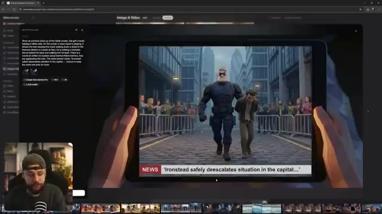
*Interface d'ElevenLabs (section Image & Video) montrant un panneau contextuel avec un prompt textuel décrivant une scène de journal télévisé animé style low-poly.*

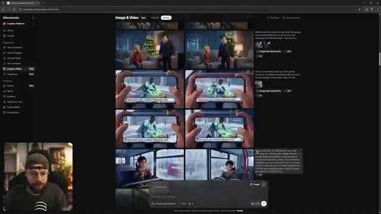
*Interface d'ElevenLabs affichant l'historique des générations d'images et de vidéos avec plusieurs grilles de prévisualisation de scènes thématiques de Noël et d'action.*

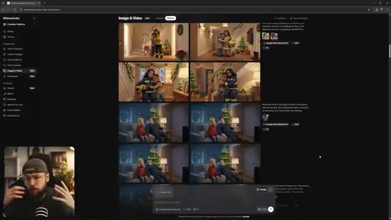
*Interface d'ElevenLabs montrant des miniatures de scènes de retrouvailles de Noël dans un salon avec des personnages en uniforme de pompiers.*

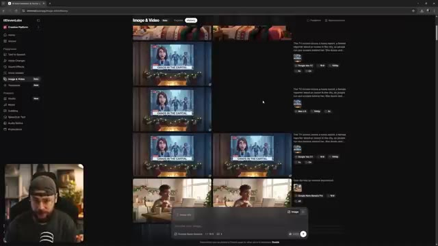
*Interface d'ElevenLabs montrant des générations de reportages télévisés avec le bandeau d'information 'CHAOS IN THE CAPITAL'.*

---

### ⏱️ `[00:11:45 - 00:12:22]` | Segment #24

**🔊 Audio (Transcription Intégrale Mot pour Mot en Français) :**
> point que j'essaie de déterminer quel modèle vidéo va le mieux nous servir. Parce que idéalement, vous voulez juste utiliser le même modèle vidéo tout au long de la publicité si vous le pouvez. Sinon, vous allez commencer à obtenir une ambiance d'incohérence en termes de style d'animation. Donc, si je prends juste mes écouteurs, nous pouvons commencer à parcourir cela. Mon intuition était que VO 3.1 fonctionnerait vraiment très bien, c'est donc la première chose que nous avons testée. Je vais donc aller de l'avant et vous montrer cette génération de test. Il y a du chaos ici dans la ville suite à une série d'incidents qui ont eu lieu. Et vous pouvez voir tout de suite que le problème est que VO 3.1 est en train de modifier ce genre de style low poly du

**👁️ Analyse Visuelle d'Écran (gemini-3.5-flash-lite) :**
**Interface & Outils** : Interface de la plateforme web ElevenLabs (Creative Platform > Image & Video > History) avec un panneau de navigation latéral à gauche et une zone principale affichant l'historique des générations vidéo et des paramètres (modèle Kling / Googlu Veo 3.1, ratio 16:9, etc.).

**Contenu textuel & Code** : Prompts visibles dans l'historique : "The TV screen shows a news report, a female reporter stood on scene in the city, as people run and scream behind her. She ducks and weaves, and speaks with urgency with a British accent. 'There's chaos here in the city, following a string of incidents that took place here this morning, police are currently advising all civilians to stay clear of the area.'" Paramètres : Kling / Googlu Veo 3.1, 16:9, 1080p. Titre à l'écran du reportage : "LIVE NEWS: CHAOS IN THE CAPITAL".

**Action / Démonstration** : Le créateur navigue dans l'historique de ses générations vidéo sur ElevenLabs, examine les différents tests générés avec le modèle Veo 3.1, puis clique sur l'un d'eux pour le lire en grand format dans le lecteur intégré, tout en commentant les résultats en incrustation PiP.

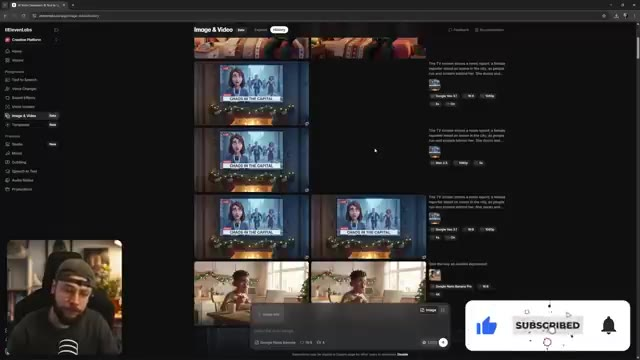
*Interface d'ElevenLabs (Creative Platform, section Image & Video, onglet History) affichant une grille de générations vidéo de style low poly avec une incrustation vidéo PiP du créateur dans le coin inférieur gauche.*

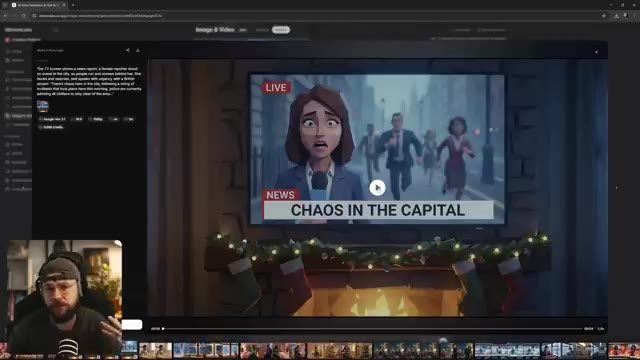
*Interface d'ElevenLabs en mode lecteur vidéo plein écran montrant un reportage télévisé généré par IA avec le titre "CHAOS IN THE CAPITAL" et le créateur visible en incrustation PiP.*

---

### ⏱️ `[00:12:22 - 00:12:50]` | Segment #25

**🔊 Audio (Transcription Intégrale Mot pour Mot en Français) :**
> visage de la femme dans une image beaucoup plus réaliste. Nous ne voulons pas de ça. Donc ce que j'ai fini par faire, c'est tester WAN 2.5 parce que j'estime vraiment beaucoup ce modèle vidéo également. Et c'est ce qu'on a obtenu de WAN. Ouais, disons simplement que ça ne m'envoyait pas les meilleures ondes de prime abord. Donc ce que j'ai fait, c'est que je suis retourné à mon intuition. Je suis retourné à VO 3.1, mais avec une légère modification du prompt textuel.

**👁️ Analyse Visuelle d'Écran (gemini-3.5-flash-lite) :**
**Interface & Outils** : Interface web d'ElevenLabs (Creative Platform, section Image & Video / History) avec une incrustation vidéo (PiP) du créateur en bas à gauche.

**Contenu textuel & Code** : Texte du prompt visible : "The TV screen shows a news report, a female reporter stood on scene in the city, as people run and scream behind her. She ducks and weaves, and speaks with urgency with a British accent. There's chaos here in the city, following a string of incidents that took place here this morning, police are currently advising all civilians to stay clear of the area..." Paramètres visibles : "Google Veo 3.1", "WAN 2.5", "16:9", "1080p".

**Action / Démonstration** : Le présentateur navigue dans l'historique de sa plateforme de génération de vidéos, visionne les résultats obtenus avec différents modèles (WAN 2.5 et Google Veo 3.1) et commente les défauts de rendu.

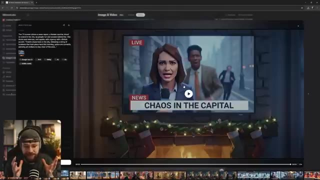
*Interface d'ElevenLabs (Image & Video) montrant la lecture d'une vidéo générée sur un écran de télévision avec Jack en incrustation (PiP).*

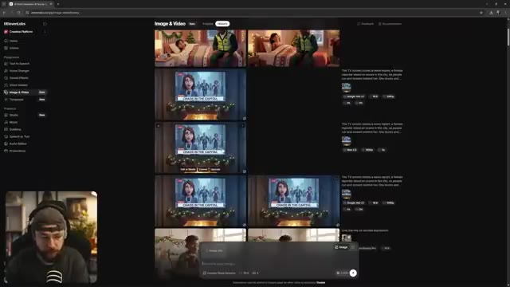
*Vue de l'historique de génération d'images et de vidéos sur la plateforme ElevenLabs montrant plusieurs miniatures.*

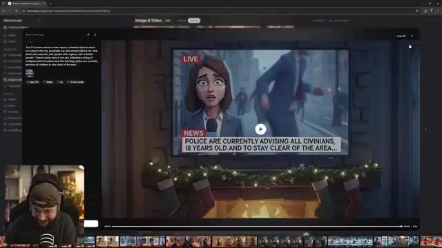
*Visualisation d'un résultat vidéo généré avec WAN 2.5 montrant un reportage télévisé au rendu inattendu.*

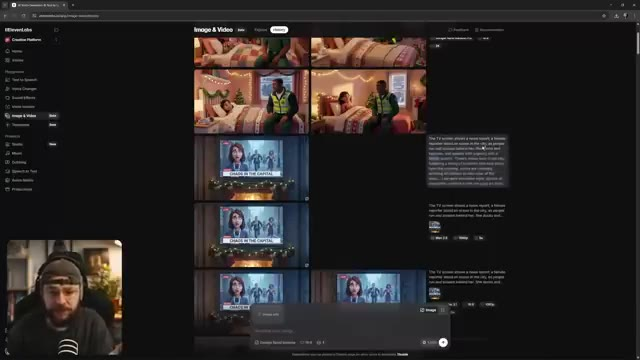
*Retour sur l'interface d'ElevenLabs affichant les différents tests de génération de clips vidéo.*

---

### ⏱️ `[00:12:50 - 00:13:24]` | Segment #26

**🔊 Audio (Transcription Intégrale Mot pour Mot en Français) :**
> J'ai ajouté à la fin le style d'animation low poly pour m'assurer que tous les personnages respectent le style artistique low poly. C'est donc similaire à ce que nous avons ajouté à la fin de nos prompts textuels pour toutes nos générations d'images. Et voici le résultat que nous avons obtenu avec ça ajouté à la fin du prompt. Vous pouvez donc voir que ce n'est toujours pas parfait. D'une manière ou d'une autre, la femme genre sort de la télévision en grimpant. Il y a une explosion qui se produit et qu'on n'avait pas vraiment demandée. C'est assez intense. Cependant, dans mon esprit,

**👁️ Analyse Visuelle d'Écran (gemini-3.5-flash-lite) :**
**Interface & Outils** : Interface web d'ElevenLabs (Creative Platform, section Image & Video, onglet History), avec incrustation vidéo webcam (PiP) du créateur.

**Contenu textuel & Code** : Texte du prompt visible : 'The TV screen shows a news report; a female reporter stood on scene in the city, as people run and scream behind her. She ducks and swerves, and speaks with urgency with a British accent: 'There's chaos here in the city, following a string of incidents that took place here this morning, police are currently advising all civilians to clear of the area...'. Low-poly animation style, ensure all characters conform to the low-poly art style.' Paramètres visibles : Wan 2.5, 1080p, 5s.

**Action / Démonstration** : Le créateur montre son écran avec l'historique des générations sur ElevenLabs, survole le texte d'un prompt avec le curseur de la souris et visionne le résultat vidéo généré.

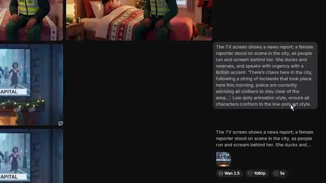
*Gros plan sur l'historique des générations d'images et de vidéos avec affichage détaillé du prompt textuel low-poly.*

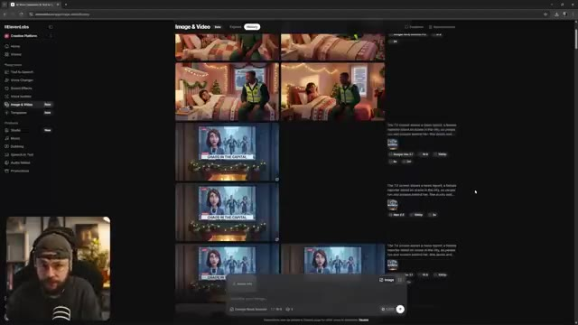
*Vue de l'interface d'ElevenLabs (section Image & Video / History) avec une incrustation vidéo (PiP) du créateur en bas à gauche.*

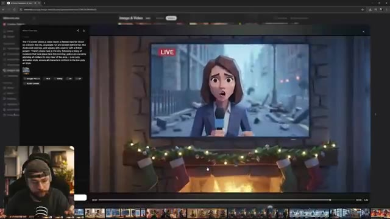
*Visionneuse vidéo plein écran dans ElevenLabs montrant le résultat de l'animation low-poly d'une journaliste dans un salon décoré pour Noël, avec le créateur en incrustation PiP.*

---

### ⏱️ `[00:13:25 - 00:13:44]` | Segment #27

**🔊 Audio (Transcription Intégrale Mot pour Mot en Français) :**
> c'était suffisant comme test pour me dire, pour me donner en quelque sorte l'assurance que VO 3.1 devrait être le modèle vidéo vers lequel nous devons nous tourner. Et un avantage supplémentaire de celui-ci par rapport à d'autres modèles comme Kling 2.5, par exemple, c'est que l'audio est intégré. Maintenant, je n'utiliserai peut-être pas toujours l'audio que nous obtenons en retour, mais c'est bien d'avoir cette option.

**👁️ Analyse Visuelle d'Écran (gemini-3.5-flash-lite) :**
**Interface & Outils** : Application web de génération vidéo avec panneau latéral de configuration et incrustation vidéo du créateur (Picture-in-Picture).

**Contenu textuel & Code** : Texte du prompt visible dans le panneau latéral de gauche décrivant une scène de journal télévisé ("The TV screen shows a news report... low poly animation style").

**Action / Démonstration** : Le créateur parle et commente la démonstration vidéo affichée à l'écran tout en gesticulant.

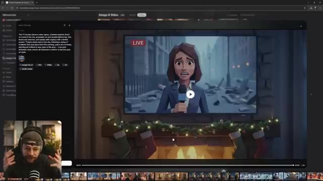
*Interface de l'application web montrant le résultat d'une génération vidéo avec un moniteur affichant une journaliste en direct, et la webcam du créateur incrustée en bas à gauche.*

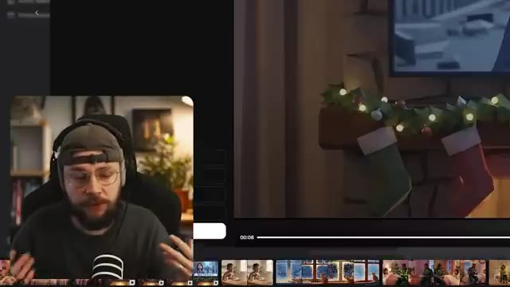
*Vue de l'interface de lecture vidéo avec la barre de progression en bas et la webcam du créateur incrustée sur le côté gauche.*

---

### ⏱️ `[00:13:44 - 00:14:03]` | Segment #28

**🔊 Audio (Transcription Intégrale Mot pour Mot en Français) :**
> Ce que je vais finir par faire au montage, c'est superposer mes propres effets sonores que je vais générer à nouveau dans ElevenLabs, ainsi que la piste musicale, car la musique pour cette publicité va être vraiment, vraiment importante. Et cela m'amène gentiment au point suivant que je veux aborder. Donc, sur le côté gauche ici, vous pouvez voir qu'il y a un onglet intitulé Musique.

**👁️ Analyse Visuelle d'Écran (gemini-3.5-flash-lite) :**
**Interface & Outils** : Interface de la plateforme ElevenLabs avec un menu latéral sombre comprenant les options Playground, Text to Speech, Voice Changer, Sound Effects, Image & Video, Studio et Music.

**Contenu textuel & Code** : Dans l'image 1, un prompt textuel visible dans le volet de gauche décrivant un reportage télévisé avec une reporter féminine. Dans l'image 2, le menu latéral affiche clairement l'option 'Music' sur laquelle le curseur est positionné.

**Action / Démonstration** : Le créateur navigue dans l'interface d'ElevenLabs et montre la liste des onglets disponibles sur le panneau latéral gauche, en particulier l'onglet 'Music'.

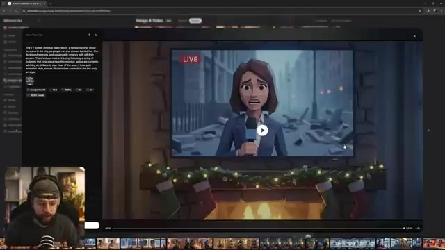
*Interface d'ElevenLabs affichant une vidéo générée de type reportage d'actualité dans un encadré de lecture, avec le créateur en incrustation vidéo (PiP) dans le coin inférieur gauche.*

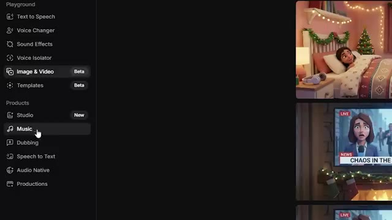
*Panneau latéral gauche d'ElevenLabs montrant la liste des fonctionnalités, avec le curseur de la souris sur l'onglet 'Music' (Musique).*

---

### ⏱️ `[00:14:03 - 00:14:28]` | Segment #29

**🔊 Audio (Transcription Intégrale Mot pour Mot en Français) :**
> Donc laissez-moi cliquer ici. Donc ici nous pouvons ajouter nos descriptions textuelles. Nous pouvons dicter le nombre de générations que nous voulons. Nous pouvons même décider de la durée de notre chanson. Et si nous cliquons sur cet onglet, nous pouvons décider si nous voulons qu'elle ait des paroles ou si nous voulons que ce soit simplement un morceau instrumental. Et si nous cliquons juste ici, nous avons ce morceau que j'ai généré intitulé Corner of My Mind, que je pense que je vais utiliser, ou du moins je pourrais utiliser une légère variation.

**👁️ Analyse Visuelle d'Écran (gemini-3.5-flash-lite) :**
**Interface & Outils** : Interface web d'ElevenLabs (Creative Platform / Music) avec un encadré PiP montrant Jack en bas à gauche.

**Contenu textuel & Code** : Texte "Begin your musical journey", champ de saisie de prompt, options de génération (durée, mode auto), et liste des projets récents incluant "Echo of You", "Corner Of My Mind", "Midnight Study Session", "Streetlight Riot", "Rust & WIP".

**Action / Démonstration** : Le créateur navigue et présente l'interface de génération de musique d'ElevenLabs, montrant le champ de texte et les projets récents.

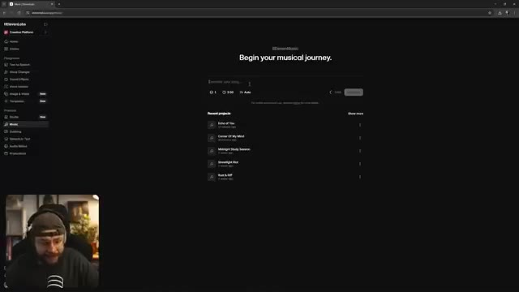
*Interface d'ElevenLabs Music montrant la zone de saisie des prompts textuels et les projets récents.*

---

### ⏱️ `[00:14:28 - 00:15:02]` | Segment #30

**🔊 Audio (Transcription Intégrale Mot pour Mot en Français) :**
> Et pour ce qui est du prompt textuel, je vais juste l'ouvrir ici pour vous afin que vous puissiez y jeter un bon coup d'œil. Je ne vais pas lire tout le texte. Il est assez détaillé. Et avec ce niveau de prompt détaillé, laissez-moi vous montrer le résultat que l'on obtient. J'ai vraiment, vraiment aimé ça, c'était le genre d'ambiance que je recherchais. Il y a évidemment cette tendance depuis ces dernières années en matière de publicités de Noël à gros budget.

**👁️ Analyse Visuelle d'Écran (gemini-3.5-flash-lite) :**
**Interface & Outils** : Interface de la plateforme de création audio ElevenLabs, avec un panneau latéral affichant l'historique et les prompts de génération textuelle, ainsi qu'une timeline audio avec des paroles de chansons.

**Contenu textuel & Code** : Le prompt visible dans le panneau latéral décrit : "A slow, atmospheric indie-folk song with a melancholic, reflective mood. Gentle male vocals with a soft, intimate delivery. Sparse acoustic guitar fingerpicking, subtle warm bass, and light, distant percussion. Include airy reverb to create a sense of space and quiet longing..." Les paroles affichées incluent "Corner Of My Mind", "Verse 1", "Chorus", et "Verse 2".

**Action / Démonstration** : Le créateur montre le prompt détaillé utilisé pour générer la musique et navigue à travers l'interface d'ElevenLabs tout en parlant à la caméra (présente en incrustation PiP).

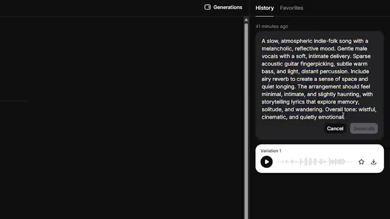
*Gros plan sur un panneau latéral montrant un prompt textuel détaillé pour la génération audio dans une interface de type interface de création.*

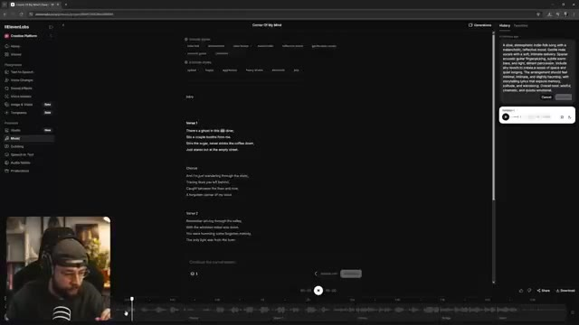
*Interface complète montrant la timeline audio et les paroles de la chanson "Corner Of My Mind" avec un encadré PiP de Jack en bas à gauche.*

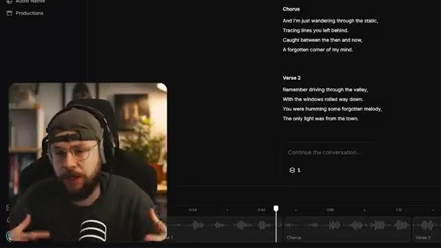
*Vue rapprochée de la timeline et des paroles de la chanson avec Jack visible en bas à gauche dans l'encadré PiP.*

---

### ⏱️ `[00:15:02 - 00:15:35]` | Segment #31

**🔊 Audio (Transcription Intégrale Mot pour Mot en Français) :**
> particulièrement ici au Royaume-Uni où vous avez ce genre de musique pour accompagner la publicité et je pense que ça juxtapose plutôt bien les visuels lorsqu'il s'agit de notre publicité. Nous avons ce style artistique low poly vraiment charmant, innocent, de super-héros qui courent partout. Et je pense que ce style de chanson va vraiment bien amplifier l'émotion derrière notre publicité, en particulier lorsque nous arrivons au rebondissement. Et ce qui est vraiment pratique, c'est que si nous allons ici sur l'onglet de téléchargement et que nous cliquons dessus, vous pouvez voir que nous avons quelques options différentes. Nous pouvons simplement télécharger la chanson entière

**👁️ Analyse Visuelle d'Écran (gemini-3.5-flash-lite) :**
**Interface & Outils** : Interface web d'ElevenLabs (section Musique).

**Contenu textuel & Code** : Paroles visibles ("Chorus", "Verse 2"), interface audio avec timeline en bas, et options de style musical dans le panneau latéral droit.

**Action / Démonstration** : Le créateur commente l'interface d'ElevenLabs tout en gesticulant dans l'encadré vidéo en bas à gauche.

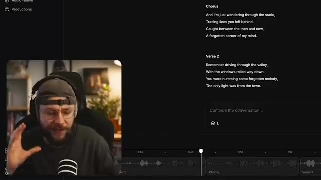
*Interface d'ElevenLabs affichant les paroles d'une chanson avec le créateur en incrustation.*

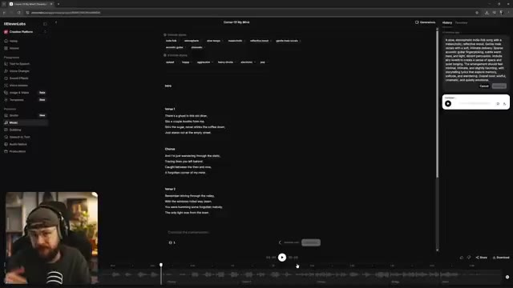
*Interface complète d'ElevenLabs montrant l'éditeur de musique, les options de style et le panneau latéral de génération.*

---

### ⏱️ `[00:15:35 - 00:16:10]` | Segment #32

**🔊 Audio (Transcription Intégrale Mot pour Mot en Français) :**
> comme un fichier mp3 ou WAV ou nous pouvons générer la chanson juste en tant que piste vocale et l'instrumental ou nous pouvons aller de l'avant et générer nos pistes séparées. Donc cela signifie fondamentalement que chaque instrument que vous entendez dans notre piste est généré comme un fichier séparé et nous pouvons tous les assembler au montage et avoir un niveau de contrôle fou sur l'audio de notre publicité. C'est peut-être quelque chose que nous devrons faire. Nous verrons comment cela se passe et vous remarquerez aussi à la minute que notre piste dure trois minutes. J'espérais que la publicité durerait environ 30 secondes, genre 45 secondes max.

**👁️ Analyse Visuelle d'Écran (gemini-3.5-flash-lite) :**
**Interface & Outils** : Interface web d'ElevenLabs (générateur de musique et d'effets audio).

**Contenu textuel & Code** : Options visibles dans le menu déroulant : "Full song", "Vocals & Instrumental" (avec boutons "Generate" et compteur de jetons 2728), "Stems" (Vocals, Bass, Drums, Guitar, Piano & Others, avec compteur de jetons 5455). Timeline audio affichant les sections "Chorus", "Bridge", "Outro" sur une durée de 3 minutes. Paroles de la chanson "Corner Of My Mind" visibles au centre.

**Action / Démonstration** : Le curseur de la souris survole les options de génération de pistes audio et de stems dans l'interface d'ElevenLabs tandis que le créateur présente les différentes options de découpage audio.

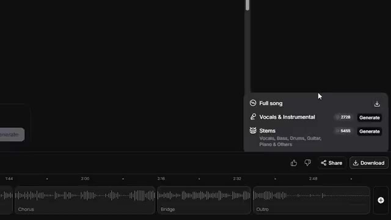
*Interface d'ElevenLabs affichant les options de téléchargement audio avec les modes Full song, Vocals & Instrumental et Stems.*

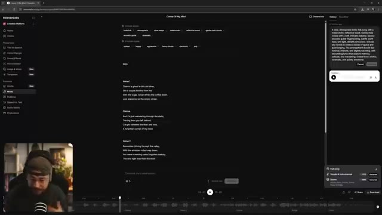
*Interface complète d'ElevenLabs montrant l'éditeur musical avec les paroles ("Corner Of My Mind"), la timeline audio en bas et le créateur visible en incrustation PiP dans le coin inférieur gauche.*

---

### ⏱️ `[00:16:10 - 00:16:29]` | Segment #33

**🔊 Audio (Transcription Intégrale Mot pour Mot en Français) :**
> Mais vous pouvez voir qu'ElevenLabs découpe en quelque sorte la chanson en ces différents segments. Et vous pouvez les faire glisser pour raccourcir les segments. Et si vous cliquez sur la croix ici, vous allez simplement supprimer complètement ce segment. Donc encore une fois, même au sein d'ElevenLabs lui-même, vous disposez d'un niveau de contrôle tout simplement insensé. C'est très pratique lors du montage.

**👁️ Analyse Visuelle d'Écran (gemini-3.5-flash-lite) :**
**Interface & Outils** : Interface web d'ElevenLabs (Music Generator) affichant les paroles, les styles musicaux et une chronologie audio en bas avec des blocs de segments (Intro, Verse 1, Chorus, etc.).

**Contenu textuel & Code** : On peut lire les paroles de la chanson "Corner Of My Mind" avec des sections étiquetées comme "Intro", "Verse 1", "Chorus", "Verse 2", ainsi que le panneau de l'historique et des paramètres audio sur la droite.

**Action / Démonstration** : Le créateur présente l'interface d'ElevenLabs en expliquant la gestion et le découpage des segments musicaux sur la timeline, tout en apparaissant en bas à gauche dans une petite fenêtre PiP.

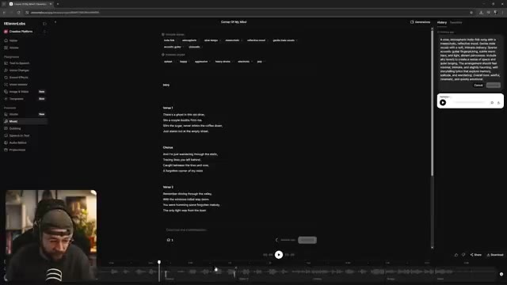
*Interface d'ElevenLabs montrant la chronologie et les paroles d'une chanson découpée en segments, avec le créateur en incrustation vidéo (PiP) dans le coin inférieur gauche.*

---

### ⏱️ `[00:16:29 - 00:16:48]` | Segment #34

**🔊 Audio (Transcription Intégrale Mot pour Mot en Français) :**
> Et bien sûr, en retournant sur l'onglet image et vidéo, en cliquant sur l'historique, nous pouvons revenir à toutes nos générations, principalement des images pour le moment. Mais je pense que maintenant je vais me mettre au travail et générer autant de vidéos que possible. Nous verrons jusqu'où j'irai avec ça ce soir. Peut-être que je reprendrai ça demain matin.

**👁️ Analyse Visuelle d'Écran (gemini-3.5-flash-lite) :**
**Interface & Outils** : Navigateur web affichant la plateforme ElevenLabs (Creative Platform) sur l'onglet "Image & Video", mode "History", avec la webcam du créateur incrustée en bas à gauche.

**Contenu textuel & Code** : Interface utilisateur d'ElevenLabs avec menu latéral (Home, Text to Speech, Voice Changer, Sound Effects, Music, Video, Image & Video, etc.), grille de miniatures de vidéos et d'images générées, onglets "Explore" et "History", et panneau latéral droit affichant les détails et prompts des vidéos sélectionnées.
[DESC_IMAGE_1] Jack navigue sur l'interface d'ElevenLabs et commente les différentes onglets.
[DESC_IMAGE_2] Jack montre l'historique des générations de vidéos.
[DESC_IMAGE_3] Jack fait défiler les résultats dans l'historique.

**Action / Démonstration** : Démonstration pédagogique et présentation du workflow.

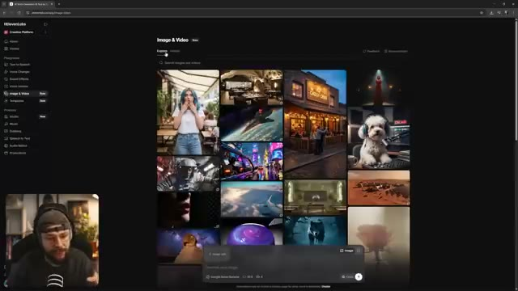
*Interface d'ElevenLabs montrant l'onglet Image & Video et la grille des créations.*

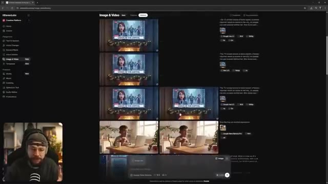
*Navigation dans l'historique des générations vidéo (History) avec les paramètres sur le panneau latéral droit.*

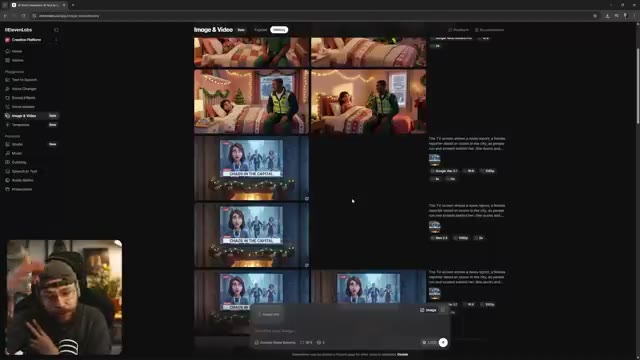
*Défilement dans l'historique des générations avec aperçu des vidéos et prompts associés.*

---

### ⏱️ `[00:16:48 - 00:17:20]` | Segment #35

**🔊 Audio (Transcription Intégrale Mot pour Mot en Français) :**
> Voyons voir comment les choses évoluent. Jusqu'ici, tout va bien. Mais je suis un peu nerveux à propos des générations de vidéos. Je pense que ce sera beaucoup d'essais et d'erreurs. Alors priez pour moi. Bon, nous avons maintenant toutes nos vidéos générées, enfin. C'était un processus d'essais et d'erreurs, comme c'est toujours le cas avec l'IA. Je pense que le meilleur état d'esprit à avoir est de faire face aux difficultés. Il faut en quelque sorte adapter son flux de travail au fur et à mesure. Certains plans fonctionnent très facilement et, évidemment, c'est vraiment agréable.

**👁️ Analyse Visuelle d'Écran (gemini-3.5-flash-lite) :**
**Interface & Outils** : Interface de génération vidéo (type Google Veo) avec panneaux d'aperçu et options de prompt.

**Contenu textuel & Code** : Texte visible : "CHAOS IN THE CAPITAL", "DAY TWO.", "Google Nano Banana", "Google Veo 3.1 Fast", options "Start frame", "End frame".

**Action / Démonstration** : Le créateur parle face caméra tout en affichant l'interface de génération vidéo avec des aperçus de clips générés par IA.

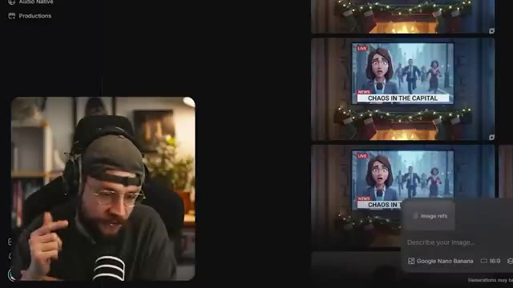
*Interface de génération vidéo montrant des aperçus de clips avec une fenêtre PiP du créateur en bas à gauche.*

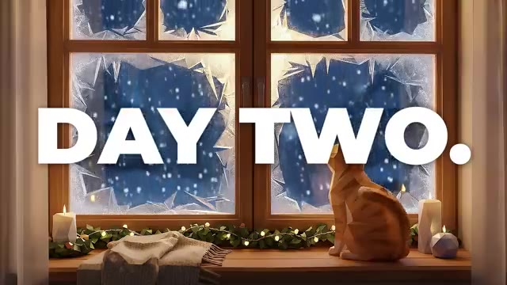
*Visuel généré par IA montrant un chat en origami sur un rebord de fenêtre enneigé avec le texte "DAY TWO.".*

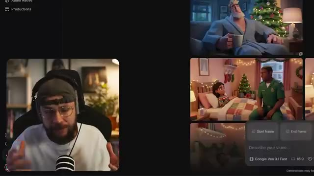
*Interface de génération vidéo avec des aperçus de scènes de Noël et une fenêtre PiP du créateur.*

---

### ⏱️ `[00:17:20 - 00:17:56]` | Segment #36

**🔊 Audio (Transcription Intégrale Mot pour Mot en Français) :**
> d'autres ne le font tout simplement pas et donc vous devez en quelque sorte penser hors des sentiers battus dans la façon dont vous allez aborder ce genre de plans délicats. Par exemple, ces deux plans de notre personnage principal sur le canapé, ils étaient plutôt faciles. Mais quand il s'agit du plan du journal télévisé, par exemple, il y avait quelques problèmes différents ici. Donc ce que vous avez, c'est le mouvement de caméra, mais la femme est en quelque sorte immobile, comme si elle ne marchait pas ou ne courait pas avec ce mouvement de caméra. Fondamentalement, je pense juste que c'est un tout petit peu trop. C'est un peu trop ambitieux. Donc ce qu'on a fini par faire, c'est créer une nouvelle image avec Nano Banana Pro. Cela aide toujours à faire avancer le

**👁️ Analyse Visuelle d'Écran (gemini-3.5-flash-lite) :**
**Interface & Outils** : Navigateur web affichant la plateforme ElevenLabs (section Image & Video) et un lecteur vidéo externe en incrustation.

**Contenu textuel & Code** : Texte du prompt visible sur l'image 3 : 'ALTERNATE SHOT: Above a wall-mounted TV hanging above a fireplace, decorated with Christmas decorations. The TV screen is playing a live news report, a female news reporter on the left of the frame looks panicked. IN SOFT FOCUS, She is stood in front of a crowd of worriless looking people who are behind a police barrier. The news banner reads: 'CHAOS IN THE CAPITAL'. Ensure that everything in the frame is in the low poly art style.' Paramètres visibles : Google Nano Service Pro, 16:9, modèle Seedance.

**Action / Démonstration** : Le créateur navigue dans l'interface d'ElevenLabs pour montrer les différents essais de génération vidéo et commente les problèmes de mouvement de caméra sur le plan du journal télévisé.

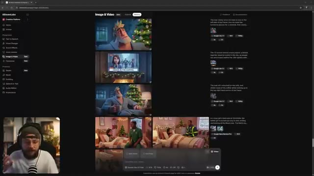
*Interface d'ElevenLabs affichant une galerie de générations vidéo de style low poly avec des plans de personnages.*

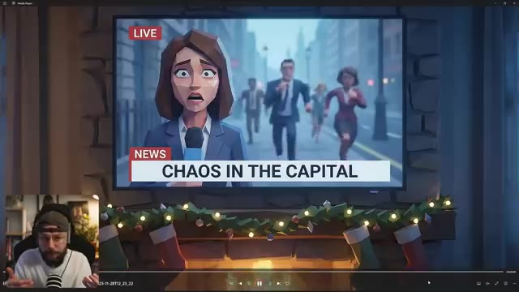
*Lecteur multimédia montrant un plan de journal télévisé avec une présentatrice et la mention 'CHAOS IN THE CAPITAL' sur fond de cheminée décorée pour Noël.*

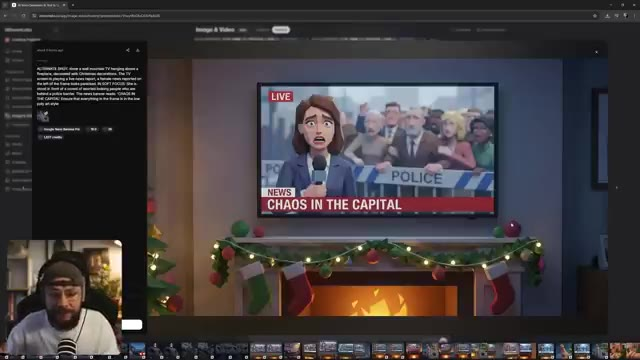
*Interface d'ElevenLabs affichant les détails d'un prompt textuel pour générer une image alternative d'un journal télévisé au-dessus d'une cheminée.*

---

### ⏱️ `[00:17:56 - 00:18:18]` | Segment #37

**🔊 Audio (Transcription Intégrale Mot pour Mot en Français) :**
> l'histoire avance comme nous en avons besoin, mais c'était beaucoup plus indulgent quand il s'agissait de l'animer avec VO 3.1. Vous voulez essentiellement essayer de limiter le nombre de choses qui peuvent mal tourner. Donc si nous jetons un œil à cette génération, vous verrez à quel point c'est vraiment plus indulgent. C'est parfait.

**👁️ Analyse Visuelle d'Écran (gemini-3.5-flash-lite) :**
**Interface & Outils** : Navigateur web affichant une interface de génération vidéo par IA avec un panneau latéral de configuration et une grande fenêtre de visualisation, ainsi qu'un encadré PiP vidéo du créateur en bas à gauche.

**Contenu textuel & Code** : Le prompt visible dans le panneau latéral indique : "ALTERNATE SHOT: show a wall-mounted TV hanging above a fireplace, decorated with Christmas decorations. The TV screen is playing a live news report, a female news reporter on the left of the frame looks panicked. IN SOFT FOCUS: She is stood in front of a crowd of worried looking people who are behind a police barrier. The news banner reads: CHAOS IN THE CAPITAL. Ensure that everything in the frame is in the low poly art style". Des paramètres de modèle (Google Veo / Gen) et le coût en crédits sont affichés.

**Action / Démonstration** : Le créateur présente l'interface et la génération vidéo affichée à l'écran tout en commentant le rendu visuel.

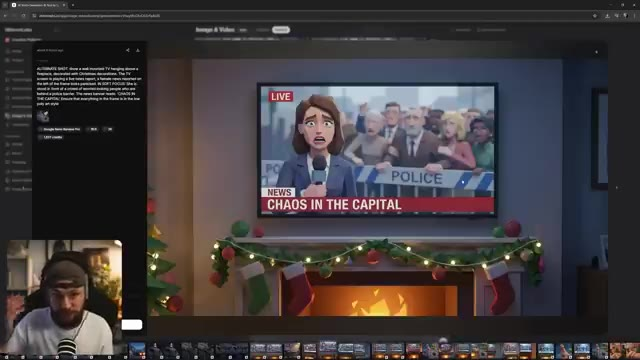
*Interface de l'application de génération vidéo montrant un écran de télévision affichant un reportage d'information avec un style 3D low poly, et le créateur visible en incrustation PiP en bas à gauche.*

---

### ⏱️ `[00:18:18 - 00:18:50]` | Segment #38

**🔊 Audio (Transcription Intégrale Mot pour Mot en Français) :**
> ça fait exactement ce dont nous avons besoin. Et c'est un peu ce que je veux dire par faire avec les moyens du bord. Si vous avez vraiment du mal à générer la vidéo dont vous avez besoin, vous devez peut-être revenir en arrière d'une étape et régénérer l'image de départ. Je pense que la plupart du temps, il s'agit de continuer à raconter votre histoire, en vous facilitant un peu la tâche. Parce que lorsque les gens regardent la publicité terminée, ils ne vont pas se soucier du fait que ça ressemble à ceci plutôt qu'à cette première génération, n'est-ce pas ? Parce que ça aide toujours à faire avancer l'intrigue de la manière dont nous en avons besoin. Et alors que nous continuons

**👁️ Analyse Visuelle d'Écran (gemini-3.5-flash-lite) :**
**Interface & Outils** : Interface web d'ElevenLabs (section "Image & Video") avec un panneau latéral de configuration et une incrustation vidéo (PiP) du créateur en bas à gauche.

**Contenu textuel & Code** : Texte du prompt visible : "The TV screen shows a news report, a female reporter stood on scene in the city, she speaks with urgency... Low poly animation style, ensure all characters conform to the low poly art style. Ensure there is no music added." Paramètres : "Google Veo 3.7", "16:9", "1080p", "8s".

**Action / Démonstration** : Le créateur présente l'interface d'ElevenLabs et navigue à travers l'historique de ses générations vidéo pour illustrer comment ajuster ou régénérer des plans.

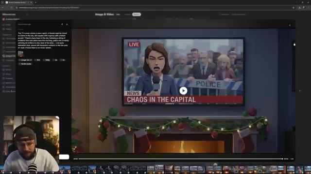
*Interface d'ElevenLabs (section Image & Video) affichant la génération d'un reportage télévisé en 3D low-poly avec Jack en incrustation.*

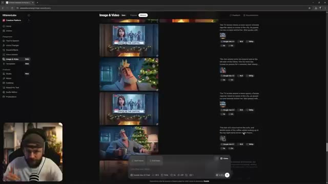
*Historique de génération sur ElevenLabs montrant plusieurs clips vidéo de style animation 3D avec les prompts textuels associés.*

*Visualisation détaillée d'un plan alternatif de journal télévisé sur ElevenLabs avec les options de configuration et le prompt visible.*

---

### ⏱️ `[00:18:50 - 00:19:23]` | Segment #39

**🔊 Audio (Transcription Intégrale Mot pour Mot en Français) :**
> de faire un zoom arrière avec ce plan où la ceinture est censée être attachée lorsque notre super-héros se prépare au combat, il y a eu un petit problème avec ça. Laissez-moi vous montrer ce qui s'est passé. Donc ouais, juste un peu bizarre. Le plan où il met le gant et le genre de pose de héros étaient tout à fait corrects, mais ouais, juste l'attache de la ceinture ne fonctionnait pas et la solution pour cela était en fait vraiment simple pour être honnête. C'était juste d'utiliser une image de début et une image de fin. L'image de début avec la ceinture ouverte, l'image de fin avec la ceinture fermée.

**👁️ Analyse Visuelle d'Écran (gemini-3.5-flash-lite) :**
**Interface & Outils** : Interface web d'ElevenLabs (Creative Platform / Image & Video).

**Contenu textuel & Code** : Texte visible dans les prompts de génération : "The man clips the belt together, dramatically. No music.", paramètres de génération vidéo avec le modèle "Google Veo 2.7 Fast", rapport 16:9, et options "Start Frame" / "End Frame".

**Action / Démonstration** : Le créateur montre un plan vidéo de génération de super-héros où la ceinture s'attache mal, puis présente l'interface d'historique et les options d'images de début et de fin.

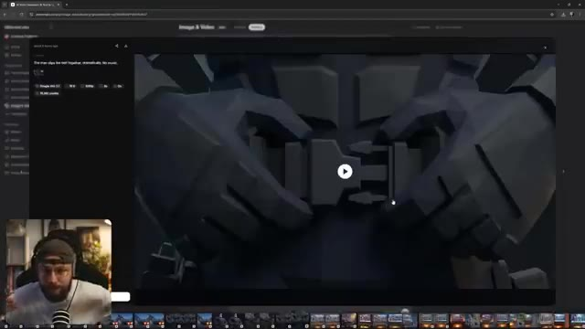
*Interface d'ElevenLabs affichant une vidéo générée en gros plan d'un super-héros attachant sa ceinture.*

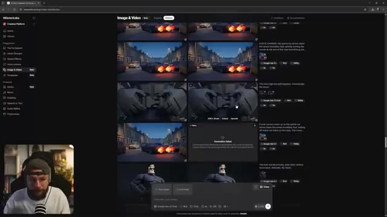
*Interface d'ElevenLabs affichant l'historique des générations d'images et de vidéos avec les options de début et de fin de trame ("Start Frame" / "End Frame").*

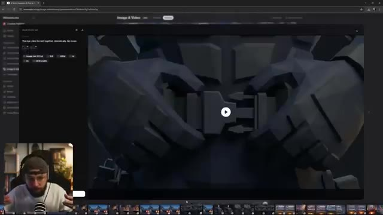
*Interface d'ElevenLabs montrant à nouveau le plan vidéo en gros plan de la ceinture du super-héros en cours d'ajustement.*

---

### ⏱️ `[00:19:23 - 00:19:44]` | Segment #40

**🔊 Audio (Transcription Intégrale Mot pour Mot en Français) :**
> Parce que lorsque vous générez vos images avec Nano Banana Pro, vous avez tout simplement beaucoup plus de contrôle. Et évidemment, vous obtenez vos générations beaucoup plus rapidement que si vous génériez des vidéos. Donc en utilisant les images de début et de fin, nous avons obtenu ce résultat. Et nous coupons simplement à l'intérieur lorsque la génération de vidéo nous donne ce que nous voulons. Nous n'avons pas besoin d'utiliser toute la génération. Maintenant, le plan de la voiture qui roule sur la route.

**👁️ Analyse Visuelle d'Écran (gemini-3.5-flash-lite) :**
**Interface & Outils** : Interface web d'ElevenLabs ("Image & Video") avec panneau latéral gauche de navigation et incrustation vidéo (PiP) du créateur en bas à gauche.

**Contenu textuel & Code** : Historique des générations vidéo, curseurs et boutons pour "Start Frame" et "End Frame", vignettes de prévisualisation des vidéos générées.
[DESC_IMAGE_1] Le créateur montre un exemple de vidéo générée en grand format sur l'interface tout en parlant.
[DESC_IMAGE_2] Le créateur survole et présente les différentes options de génération vidéo basées sur des images de début et de fin.

**Action / Démonstration** : Démonstration pédagogique et présentation du workflow.

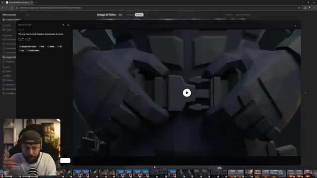
*Interface d'ElevenLabs affichant l'historique des générations avec un aperçu vidéo en plein écran d'un personnage bouclant sa ceinture, et le présentateur en incrustation (PiP).*

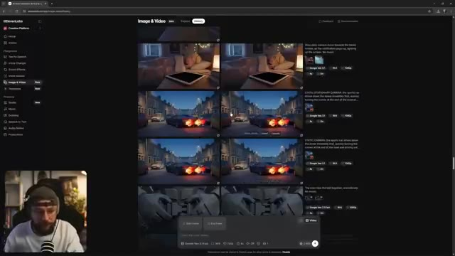
*Interface d'ElevenLabs montrant une grille de plusieurs clips vidéo générés de voitures et de scènes d'intérieur, avec le panneau de sélection des images de début et de fin (Start Frame / End Frame).*

---

### ⏱️ `[00:19:45 - 00:20:07]` | Segment #41

**🔊 Audio (Transcription Intégrale Mot pour Mot en Français) :**
> C'était probablement le plan le plus dur de toute la publicité en fait. Il y a eu beaucoup de générations qui étaient vraiment bizarres, qui ne me donnaient pas du tout ce que je voulais. Et si on continue à faire défiler vers le haut, vous pouvez voir que je finis par régénérer ça un nombre incalculable de fois. Et ce que j'ai fini par faire, c'était d'utiliser Nano Banana Pro, une autre image représentant juste le ciel dégagé.

**👁️ Analyse Visuelle d'Écran (gemini-3.5-flash-lite) :**
**Interface & Outils** : Interface web d'ElevenLabs (section Image & Video > History) avec panneau latéral gauche pour les options et incrustation vidéo (Picture-in-Picture) du créateur en bas à gauche.

**Contenu textuel & Code** : Historique de générations de vidéos incluant des prompts textuels visibles tels que "STATIC CAMERA, the sports car drives down the street incredibly fast...", "Crane up into the sky to see this clear empty blue sky with no sports car visible", avec des paramètres de modèles (Google Veo 2.1, 16:9, 1080p, etc.).

**Action / Démonstration** : Le créateur navigue à travers l'historique de ses générations de vidéos sur ElevenLabs, fait défiler les essais ratés et sélectionne un rendu spécifique de ciel dégagé généré avec Nano Banana Pro.

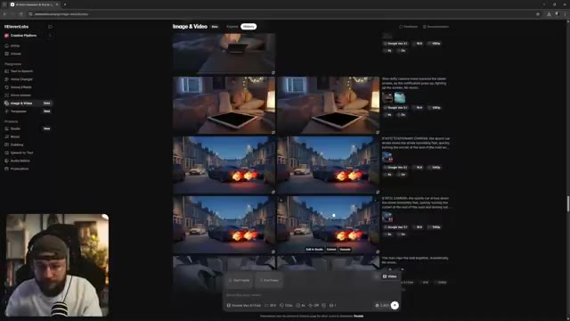
*Interface d'historique de génération d'images et vidéos sur ElevenLabs avec incrustation vidéo du créateur en bas à gauche*

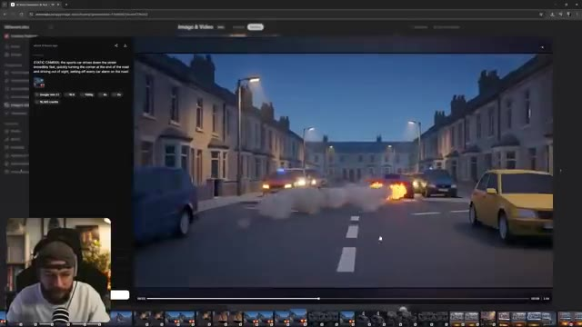
*Visualisation en plein écran d'une vidéo générée montrant une rue de quartier résidentiel avec des voitures de sport et de police en mouvement*

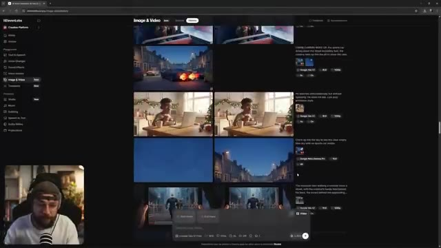
*Vue de l'historique d'ElevenLabs montrant plusieurs vignettes de générations de scènes variées, dont une vue de ciel bleu uni*

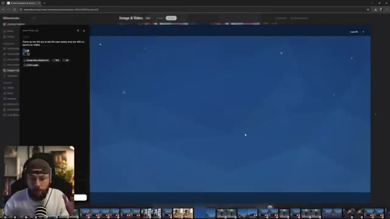
*Visualisation en plein écran de la vidéo finale sélectionnée affichant un ciel bleu dégagé avec quelques étoiles ou nuances*

---

### ⏱️ `[00:20:07 - 00:20:45]` | Segment #42

**🔊 Audio (Transcription Intégrale Mot pour Mot en Français) :**
> Et finalement, nous avons fini par aboutir à ça. Un mouvement de caméra vraiment sympa qui fait une sorte de panoramique vers le haut, s'incline vers le ciel. Et ce à quoi je pense, c'est qu'on peut en quelque sorte fondre ceci dans le plan suivant qui est celui de l'iPad dans la chambre de la jeune fille. Donc ce que j'ai beaucoup constaté en faisant cette publicité par IA, c'est que les images de début et de fin sont incroyablement puissantes si vous essayez d'obtenir un type de génération vidéo très spécifique et j'ai en fait fini par ajouter un tout nouveau plan également, qui est celui de cette voiture de police qui recule et se gare dans la rue où nous avons vu cette voiture de super-héros.

**👁️ Analyse Visuelle d'Écran (gemini-3.5-flash-lite) :**
**Interface & Outils** : Interface web d'ElevenLabs (section Image & Video / History) avec des menus latéraux pour les outils de création audio et vidéo, et un affichage en incrustation (PiP) du créateur en bas à gauche.

**Contenu textuel & Code** : Texte du prompt visible : "CRANE CAMERA MOVE UP: the sports car drives down the street incredibly fast, the camera rises up into the air to show the clear sky. No music." Paramètres visibles : Seedance Gen-3.1, format 16:9, résolution 1080p, options de crédits.

**Action / Démonstration** : Le créateur navigue dans l'historique de ses générations vidéo sur la plateforme ElevenLabs, montrant le rendu d'un plan de voiture avec mouvement de grue vers le ciel, puis l'historique global des clips.

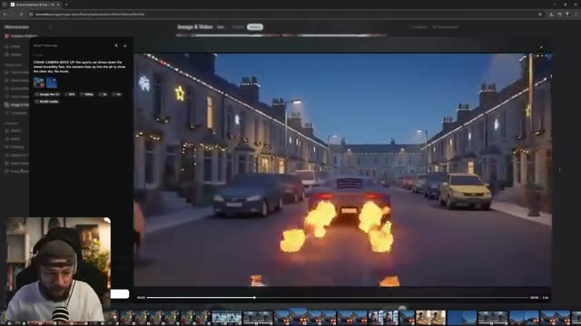
*Interface d'ElevenLabs affichant la génération vidéo d'une voiture de sport roulant dans une rue résidentielle la nuit avec des décors de Noël, et le créateur visible en incrustation PiP.*

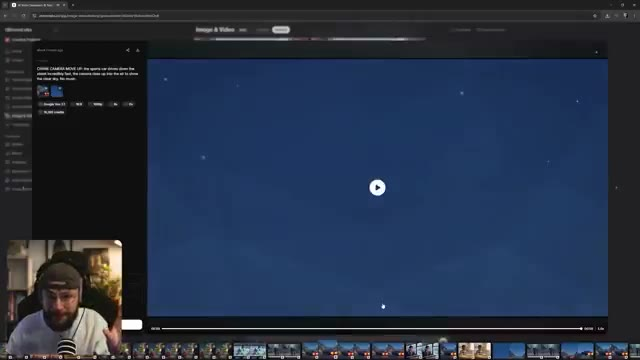
*Interface d'ElevenLabs montrant le résultat de la caméra inclinée vers le ciel nocturne étoilé, avec le créateur en incrustation PiP.*

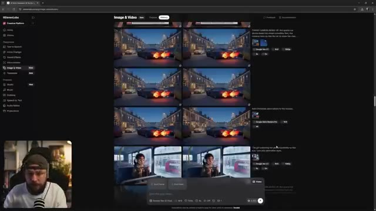
*Historique des générations vidéo sur ElevenLabs montrant plusieurs clips de la voiture et de la jeune fille dans un bus, avec le créateur en incrustation PiP.*

---

### ⏱️ `[00:20:45 - 00:21:22]` | Segment #43

**🔊 Audio (Transcription Intégrale Mot pour Mot en Français) :**
> sortie au début de notre film et vraiment c'est là pour agir comme notre transition en quelque sorte vers le monde réel et c'est en quelque sorte le catalyseur de la révélation que ces gens ne sont pas des super-héros ce sont des héros de la vraie vie parce qu'ils travaillent dans les services d'urgence et encore une fois c'est un flux de travail d'images de début et de fin en utilisant Kling 2.5 encore une fois en fait l'image de début est la voiture de police roulant au milieu de la route l'image de fin est la voiture de police garée et ces deux images ont encore une fois été générées avec Nano Banana Pro. Et encore une fois, quand nous sommes arrivés à ce plan particulier ici où nous avons le paramédic assis au pied du lit de sa fille, cela s'est avéré un peu plus

**👁️ Analyse Visuelle d'Écran (gemini-3.5-flash-lite) :**
**Interface & Outils** : Interface web d'ElevenLabs (section Image & Video / History) sur fond sombre.

**Contenu textuel & Code** : Galerie de vignettes vidéo montrant une voiture de police sur une route de quartier résidentiel, accompagnées de menus de paramètres textuels et de sélections de modèles (Kling 2.5, Google Veo).

**Action / Démonstration** : Le créateur présente l'historique des générations vidéo sur ElevenLabs tout en parlant face à sa webcam incrustée en bas à gauche.

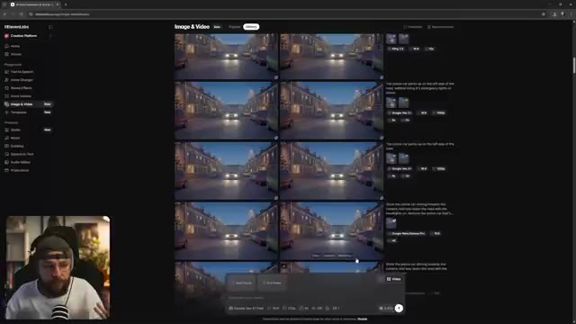
*Interface de la plateforme ElevenLabs montrant l'historique des générations d'images et de vidéos, avec le créateur visible en incrustation PiP dans le coin inférieur gauche.*

---

### ⏱️ `[00:21:22 - 00:21:57]` | Segment #44

**🔊 Audio (Transcription Intégrale Mot pour Mot en Français) :**
> plus difficile que je ne le pensais. Sur le papier, c'est un plan assez facile, n'est-ce pas ? Mais ce sur quoi je n'arrêtais pas de tomber, c'est que le texte sur l'uniforme de notre ambulancier n'arrêtait pas d'être en quelque sorte brouillé. Et c'est un problème assez courant lorsqu'il s'agit de n'importe quel modèle d'IA, en particulier les modèles vidéo. L'image Nano Banana Pro que j'avais avait l'air super, mais dès que je l'ai mise dans VO3.1, c'est l'effet qu'on a eu et ça a juste l'air moche, c'est comme l'un des derniers plans de notre film, on veut que ça ait l'air bien, non ? Alors ce que j'ai fini par faire une fois de plus, c'était de prendre un peu de recul, on est retourné à

**👁️ Analyse Visuelle d'Écran (gemini-3.5-flash-lite) :**
**Interface & Outils** : Interface web de génération d'images et vidéos (ElevenLabs / Creative Platform) avec panneau latéral et grille d'historique, combinée à un lecteur multimédia et une incrustation vidéo PiP du créateur en bas à gauche.

**Contenu textuel & Code** : Texte affiché dans l'interface : "Image & Video", "Google Veo 3.1", prompts de génération ("Chatting to each other and smiling. Low poly animation style.", "In a cozy girl's bedroom at Christmas, there are Christmas decorations, but no tree, the Indian girl is curled up cosy in bed, smiling...").

**Action / Démonstration** : Le créateur navigue dans l'historique de ses générations vidéo pour illustrer le problème de distorsion du texte sur l'uniforme du personnage généré par le modèle d'IA.

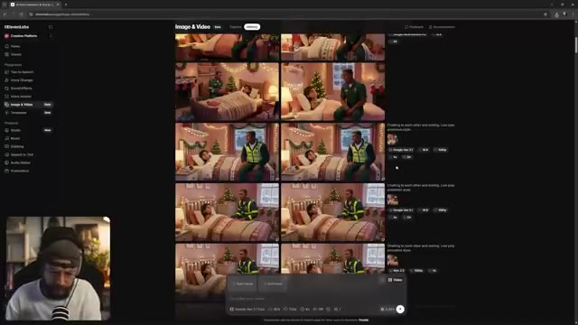
*Interface du logiciel montrant l'historique de génération d'images et de vidéos avec le retour caméra du créateur en incrustation (PiP).*

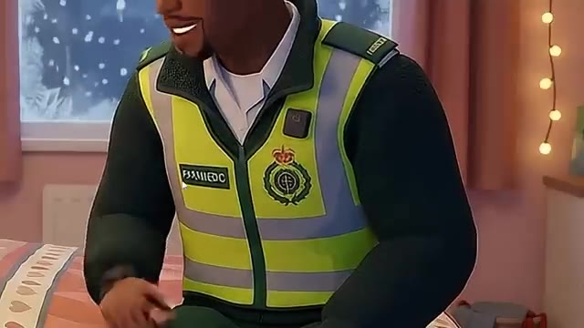
*Gros plan sur le personnage de l'ambulancier dans la vidéo générée, mettant en évidence le texte brouillé et déformé sur son uniforme.*

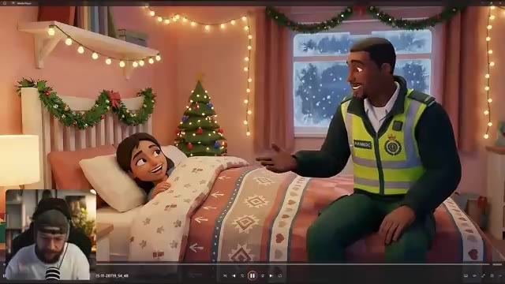
*Visualisation du plan complet dans un lecteur multimédia, montrant une jeune fille alitée et l'ambulancier dans une chambre décorée pour Noël.*

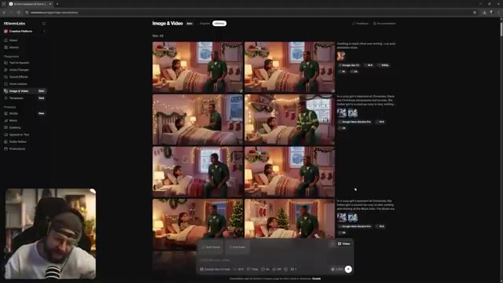
*Interface de la plateforme affichant une grille d'historique de générations de vidéos et d'images avec le panneau de configuration en bas.*

---

### ⏱️ `[00:21:57 - 00:22:33]` | Segment #45

**🔊 Audio (Transcription Intégrale Mot pour Mot en Français) :**
> Nano Banana Pro et génération de nouvelles options avec un uniforme beaucoup plus simple, et le seul texte qu'on peut vraiment voir ici qui soit lisible est NHS. Et si vous regardez ceci depuis les États-Unis au cas où vous ne le sauriez pas, c'est notre service national de santé. C'est les soins de santé gratuits que nous avons ici au Royaume-Uni. Et encore une fois, cette scène sert toujours notre histoire exactement comme nous en avons besoin. Juste parce qu'on a simplifié l'uniforme des ambulanciers pour que le texte ne devienne pas tout brouillon quand on le passe dans VO3.1, ça ne dégrade en rien notre produit final. Encore une fois

**👁️ Analyse Visuelle d'Écran (gemini-3.5-flash-lite) :**
**Interface & Outils** : Navigateur web affichant un outil de génération d'images et de vidéos par IA, avec un panneau de prompt à gauche et un affichage de rendu principal au centre, ainsi qu'une incrustation vidéo (PiP) du présentateur en bas à gauche.

**Contenu textuel & Code** : Texte du prompt visible dans le panneau de gauche décrivant une scène de chambre à Noël avec une jeune fille indienne et un homme en uniforme d'ambulancier britannique affichant le logo « NHS », ainsi qu'un menu déroulant de sélection de modèle (Google Veo/Genmo Pro).

**Action / Démonstration** : Visualisation du rendu vidéo généré par l'IA sur l'écran principal tout en affichant le panneau latéral contenant le prompt textuel et les paramètres de génération.

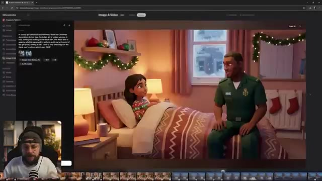
*Interface d'un outil de génération vidéo par IA montrant le rendu avec une jeune fille alitée et un ambulancier portant un uniforme marqué « NHS », avec la vidéo de la webcam du créateur incrustée en bas à gauche.*

---

### ⏱️ `[00:22:33 - 00:23:10]` | Segment #46

**🔊 Audio (Transcription Intégrale Mot pour Mot en Français) :**
> Si vous ne regardiez pas cette vidéo en ce moment, vous n'auriez jamais su qu'il y avait un problème au départ. Donc encore une fois, en donnant à notre personnage un uniforme plus simple et épuré avec seulement quelques lettres très simples dessus, on se facilite vraiment la tâche. Tout consiste à s'adapter au fur et à mesure, à cocher chaque plan un par un jusqu'à ce qu'enfin vous arriviez au point où vous regardez votre dossier de téléchargements et vous vous dites simplement : "Ok, nous avons tous les plans rendus, ils ont tous l'air bien, continuons." D'accord, c'est donc de nombreuses heures plus tard, mais nous avons maintenant le montage final de notre

**👁️ Analyse Visuelle d'Écran (gemini-3.5-flash-lite) :**
**Interface & Outils** : Interface web de génération vidéo (ElevenLabs) et logiciel de montage vidéo Adobe Premiere Pro avec incrustation webcam (PiP) de Jack en bas à gauche.

**Contenu textuel & Code** : Fenêtres de prévisualisation vidéo, panneaux de prompts textuels, timeline de montage avec pistes vidéo et audio, paramètres de transformation et effets.

**Action / Démonstration** : Le créateur montre le processus de génération des plans de personnages par IA puis passe sur le logiciel de montage pour assembler et finaliser le montage vidéo.

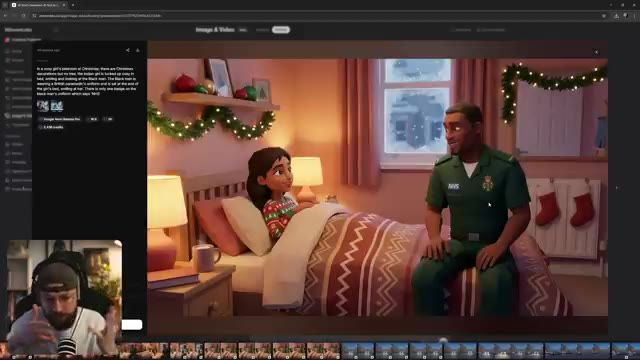
*Interface web montrant un générateur de vidéo par IA avec un personnage en uniforme vert au bord d'un lit*

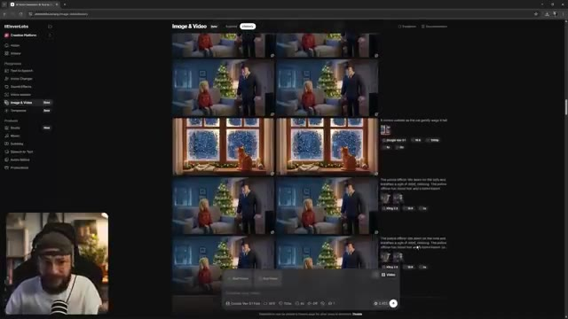
*Interface de la plateforme montrant une grille de vidéos générées avec le panneau de prompts textuels sur le côté*

*Interface du logiciel de montage Adobe Premiere Pro affichant un personnage en peignoir buvant dans une tasse près d'un sapin de Noël*

---

### ⏱️ `[00:23:10 - 00:23:45]` | Segment #47

**🔊 Audio (Transcription Intégrale Mot pour Mot en Français) :**
> Publicité de Noël et comme je suis sûr que vous l'avez probablement deviné, cela a été un véritable travail d'amour. Donc ce que je voulais faire, c'était simplement passer en revue l'ensemble du processus de montage avec autant de détails que possible. Évidemment, vous avez vu les différentes étapes qui nous ont menés au point où nous avons toutes nos vidéos générées et comme pour la majorité des générations nous avons utilisé VO 3.1, nous avions un sound design intégré, mais je suis exigeant quant au moment où j'utilise ou non ce que VO 3.1 me donne pour l'audio et je finis aussi par faire beaucoup de sound design en superposant de nombreuses pistes audio différentes. Je le fais habituellement

**👁️ Analyse Visuelle d'Écran (gemini-3.5-flash-lite) :**
**Interface & Outils** : Adobe Premiere Pro

**Contenu textuel & Code** : Interface de montage Adobe Premiere Pro avec le panneau Source, le moniteur Programme affichant un personnage 3D dans un salon de Noël, le panneau Effets et la timeline multi-pistes.

**Action / Démonstration** : Le créateur montre son écran de montage dans Adobe Premiere Pro tout en expliquant son processus de post-production et de superposition audio.

*Interface d'Adobe Premiere Pro montrant le montage d'une vidéo générée par IA avec un personnage en 3D buvant dans un mug devant un sapin de Noël.*

---

### ⏱️ `[00:23:45 - 00:24:07]` | Segment #48

**🔊 Audio (Transcription Intégrale Mot pour Mot en Français) :**
> soit de trouver des éléments libres de droits sur des sites comme Pixabay, ou si je cherche quelque chose de très spécifique, je peux très bien le générer avec ElevenLabs. Donc sur le site, tout ce que vous avez à faire est de vous rendre sur l'onglet des effets sonores et vous pouvez simplement entrer un texte pour décrire le type d'effet sonore que vous recherchez. Et si je fais défiler vers le bas, vous pouvez voir qu'il y a beaucoup de pistes audio différentes qui composent le montage lui-même.

**👁️ Analyse Visuelle d'Écran (gemini-3.5-flash-lite) :**
**Interface & Outils** : Adobe Premiere Pro et la plateforme web ElevenLabs (section Sound Effects).

**Contenu textuel & Code** : Sur l'image 1 : Panneau de prévisualisation avec une animation 3D d'un personnage buvant du café, panneau d'effets et timeline avec de multiples pistes audio/vidéo. Sur l'image 2 : Interface ElevenLabs avec les catégories d'effets sonores et un champ de saisie textuel "Describe to create". Sur l'image 3 : Timeline détaillée de montage avec des pistes nommées V1, A1, A2, A3 et divers clips vidéo et audio.

**Action / Démonstration** : Le créateur montre son espace de travail de montage vidéo dans Premiere Pro, puis navigue sur le site d'ElevenLabs pour la génération d'effets sonores, et zoome enfin sur la timeline pour illustrer la complexité des pistes audio du projet.

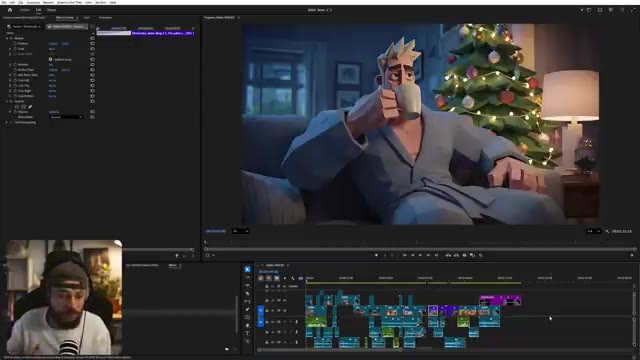
*Interface d'Adobe Premiere Pro montrant un projet de montage vidéo avec une prévisualisation d'un personnage 3D et la chronologie (timeline).*

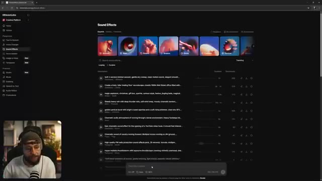
*Interface de la plateforme ElevenLabs sur le web, montrant l'onglet des effets sonores (Sound Effects) avec une barre de recherche textuelle.*

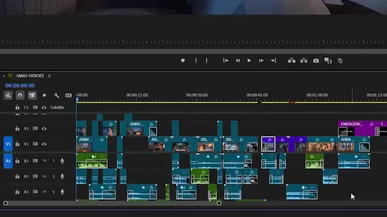
*Gros plan sur la chronologie (timeline) d'un logiciel de montage montrant de nombreuses pistes audio et vidéo superposées.*

---

### ⏱️ `[00:24:07 - 00:24:30]` | Segment #49

**🔊 Audio (Transcription Intégrale Mot pour Mot en Français) :**
> Maintenant, lorsqu'il s'agit de construire le montage lui-même dans Premiere Pro, j'ai en fait laissé notre chanson guider le bal d'une certaine manière. Tout a été construit autour de la musique que nous avons générée dans ElevenLabs. Parce que ce qui était vraiment important pour moi, c'est que lorsque nous avons ce changement dans la musique où elle devient beaucoup plus porteuse d'espoir, cela doit se produire au moment où le public commence à comprendre le rebondissement de notre publicité.

**👁️ Analyse Visuelle d'Écran (gemini-3.5-flash-lite) :**
**Interface & Outils** : Adobe Premiere Pro (logiciel de montage vidéo) avec panneau de contrôle des effets, moniteur de programme, timeline et encadré PiP (Picture-in-Picture) du présentateur en bas à gauche.

**Contenu textuel & Code** : Timeline de montage multipiste avec pistes audio et vidéo, moniteur de programme affichant des plans animés générés par IA (un homme en peignoir buvant une tasse près d'un sapin de Noël, puis une jeune fille avec un casque écoutant de la musique dans un bus enneigé), panneau d'effets (Opacity, Motion, Scale, Rotation), et un bandeau "SUBSCRIBE" animé en bas à droite sur la première image.

**Action / Démonstration** : Le créateur présente son projet de montage vidéo dans Premiere Pro, illustrant la synchronisation entre la musique générée et les séquences visuelles, tandis que le moniteur de programme affiche successivement les différentes scènes animées de la publicité.

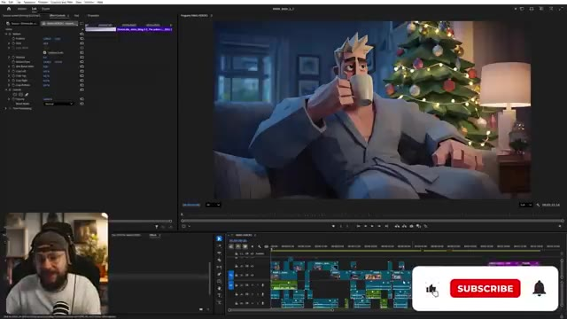
*Interface d'Adobe Premiere Pro montrant un personnage 3D dans un salon de Noël avec une incrustation vidéo (PiP) du créateur en bas à gauche.*

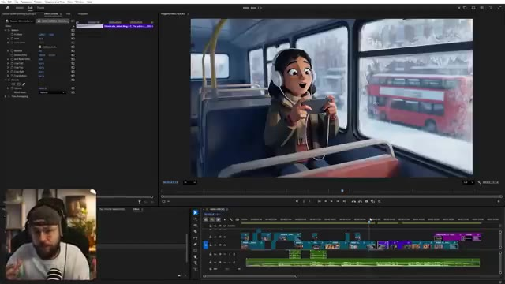
*Interface d'Adobe Premiere Pro montrant une jeune femme dans un bus sous la neige avec une incrustation vidéo (PiP) du créateur en bas à gauche.*

---

### ⏱️ `[00:24:30 - 00:24:53]` | Segment #50

**🔊 Audio (Transcription Intégrale Mot pour Mot en Français) :**
> Donc c'est ce petit morceau ici. Évidemment, quand on voit la voiture de police s'arrêter et qu'on commence en quelque sorte à relier les points, enfin espérons-le de toute façon. La musique générée par IA m'a donc vraiment donné une direction claire quant à la façon dont j'allais assembler tous les visuels. Et bien sûr, nous avions notre script, nous avions aussi notre storyboard sur lequel nous replier. C'est à ce stade, je pense, que la planification que nous avons faite au tout début de la vidéo s'avère vraiment très utile.

**👁️ Analyse Visuelle d'Écran (gemini-3.5-flash-lite) :**
**Interface & Outils** : Adobe Premiere Pro

**Contenu textuel & Code** : Timeline de montage vidéo, pistes audio et vidéo, panneau d'effets (Effect Controls), moniteur de programme affichant des scènes générées par IA (rue avec voiture de police, personnage en peignoir buvant dans une tasse).

**Action / Démonstration** : Le créateur parle face caméra tout en montrant son écran de montage vidéo sous Premiere Pro, illustrant l'agencement des plans et de la timeline.

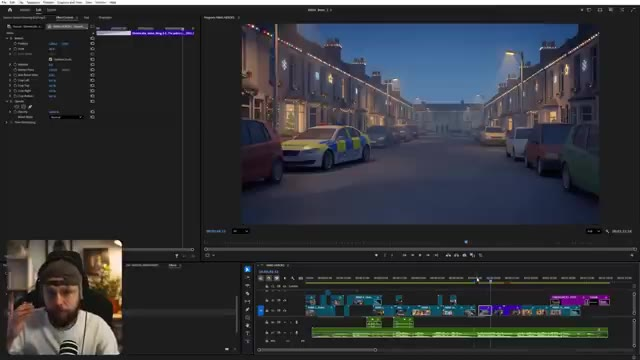
*Interface d'Adobe Premiere Pro affichant la timeline du projet et un plan de rue avec une voiture de police, avec le créateur en incrustation PiP.*

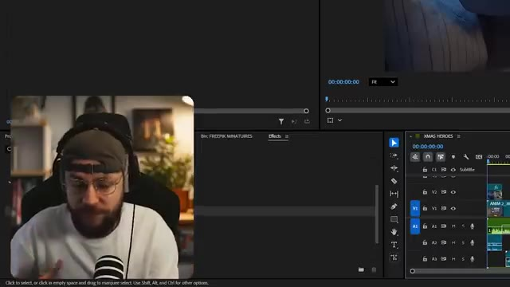
*Interface d'Adobe Premiere Pro montrant la timeline détaillée et les panneaux de montage, avec le créateur en incrustation PiP.*

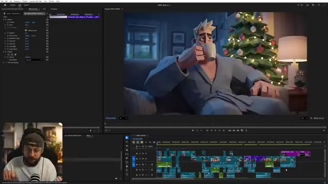
*Interface d'Adobe Premiere Pro affichant le rendu d'un personnage 3D dans un salon près d'un sapin de Noël, avec le créateur en incrustation PiP.*

---

### ⏱️ `[00:24:53 - 00:25:12]` | Segment #51

**🔊 Audio (Transcription Intégrale Mot pour Mot en Français) :**
> Et vraiment en termes de visuels, je n'ai rien fait de bien malin en fait. Il s'agit juste de assembler tous les plans entre eux, en s'en tenant à notre storyboard et sans s'attarder trop longtemps sur un seul plan. En gros, penser au rythme. Une chose que j'ai aimée, c'est ce fondu où l'on regarde le ciel et où l'on bascule en fondu sur le plan de l'iPad.

**👁️ Analyse Visuelle d'Écran (gemini-3.5-flash-lite) :**
**Interface & Outils** : Adobe Premiere Pro (avec incrustation vidéo du créateur en bas à gauche).

**Contenu textuel & Code** : Timeline de montage vidéo, panneau des effets (Effect Controls) à gauche avec les paramètres de mouvement et d'opacité, moniteur source, et moniteur de programme affichant les plans de la vidéo.

**Action / Démonstration** : Le logiciel de montage affiche le projet en cours de lecture, illustrant l'assemblage des plans et la transition en fondu mentionnée par le créateur.

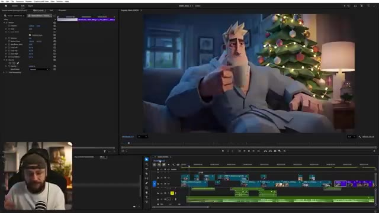
*Interface d'Adobe Premiere Pro montrant le montage d'une scène animée de Noël avec le créateur en incrustation (PiP).*

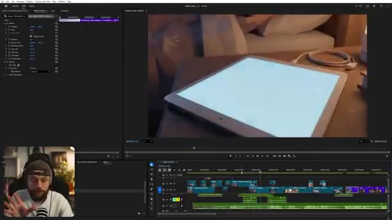
*Interface d'Adobe Premiere Pro montrant la transition en fondu vers le plan de l'iPad, avec le créateur en incrustation (PiP).*

---

### ⏱️ `[00:25:13 - 00:25:46]` | Segment #52

**🔊 Audio (Transcription Intégrale Mot pour Mot en Français) :**
> J'étais plutôt content de ça. Et puis j'ai fini par régénérer certains de ces plans parce que je sentais que l'officier de police que j'avais à l'origine, où il portait une sorte de casque de police britannique, ça ne correspondait pas aussi clairement avec les plans originaux du film et ça aidait vraiment à faire passer le message. Je veux passer un peu de temps à parler de la conception sonore également. Maintenant, évidemment, je ne suis pas un ingénieur du son professionnel ou quoi que ce soit de ce genre, donc je dois juste faire avec le peu de compétences que j'ai et la façon dont je vois les choses, c'est qu'il s'agit d'empiler autant de pistes audio différentes que possible.

**👁️ Analyse Visuelle d'Écran (gemini-3.5-flash-lite) :**
**Interface & Outils** : Logiciel de montage vidéo Adobe Premiere Pro, avec l'interface complète comprenant le moniteur source, le moniteur de programme, la timeline de montage et les panneaux d'effets.

**Contenu textuel & Code** : Panneaux de Premiere Pro, timeline avec plusieurs pistes audio et vidéo superposées, moniteur affichant une séquence animée 3D dans un salon avec un sapin de Noël, et incrustation vidéo (PiP) du créateur en bas à gauche.

**Action / Démonstration** : Le créateur navigue et présente son projet de montage vidéo dans Adobe Premiere Pro tout en expliquant ses choix de régénération de plans et de conception sonore.

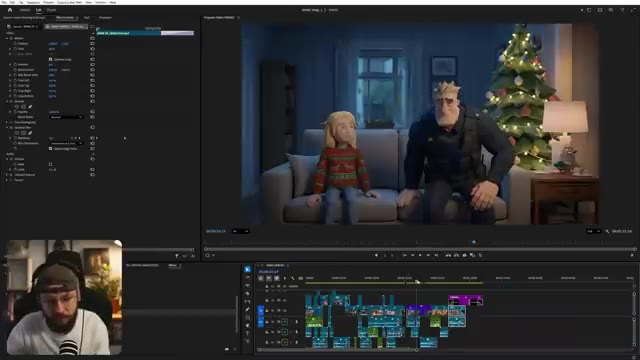
*Interface d'Adobe Premiere Pro montrant un plan du film avec un personnage en uniforme de police assis sur un canapé à côté d'une fillette, avec Jack incrusté en bas à gauche.*

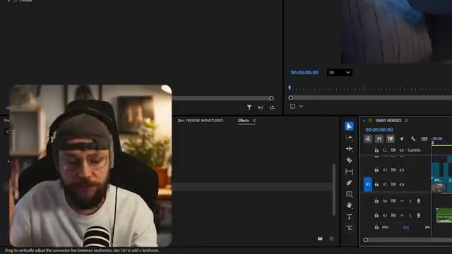
*Interface d'Adobe Premiere Pro centrée sur le panneau de montage audio et vidéo avec la webcam du créateur incrustée en bas à gauche.*

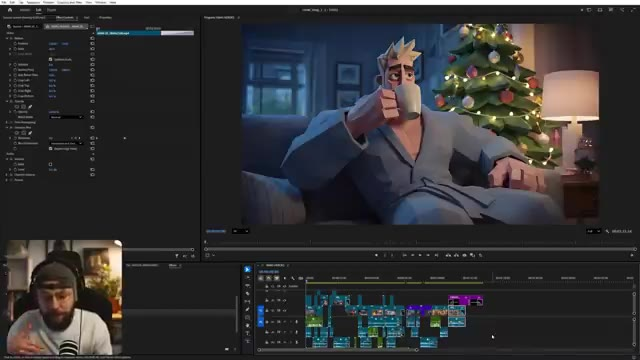
*Interface d'Adobe Premiere Pro affichant un autre plan de la scène avec le personnage principal en peignoir buvant dans une tasse.*

---

### ⏱️ `[00:25:46 - 00:26:20]` | Segment #53

**🔊 Audio (Transcription Intégrale Mot pour Mot en Français) :**
> comme vous sentez que vous devez vendre tous les visuels mais si je coupe notre musique IA, vous verrez à quel point cette piste est cruciale pour l'ensemble du montage. Sans la musique, ça fait vraiment bizarre. Cependant, en regardant ceci, vous allez remarquer pas mal d'effets sonores ambiants que j'ai ajoutés. Donc avec la voiture, on avait initialement juste

**👁️ Analyse Visuelle d'Écran (gemini-3.5-flash-lite) :**
**Interface & Outils** : Adobe Premiere Pro (logiciel de montage vidéo) avec panneau de contrôle des effets à gauche, moniteur de prévisualisation au centre-droite, timeline en bas, et incrustation vidéo (PiP) du présentateur en bas à gauche.

**Contenu textuel & Code** : Dans le moniteur de prévisualisation, on aperçoit une scène animée en 3D d'un personnage en peignoir sur un canapé tenant une tasse, avec un sapin de Noël décoré en arrière-plan. Dans la timeline du bas, de nombreuses pistes audio et vidéo sont découpées et organisées.

**Action / Démonstration** : Le logiciel de montage vidéo Adobe Premiere Pro est affiché à l'écran, montrant le projet en cours de lecture et de modification, tandis que Jack commente les choix sonores et musicaux.

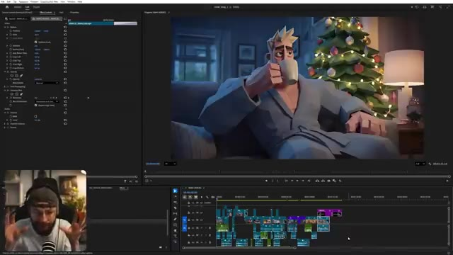
*Interface d'Adobe Premiere Pro montrant le montage vidéo avec un personnage en 3D buvant dans une tasse près d'un sapin de Noël, et Jack en incrustation vidéo (PiP) dans le coin inférieur gauche.*

---

### ⏱️ `[00:26:20 - 00:26:54]` | Segment #54

**🔊 Audio (Transcription Intégrale Mot pour Mot en Français) :**
> un genre de son normal de moteur de voiture qui vient de la génération VO 3.1 mais j'ai ajouté ce son de réacteur pour que ça ressemble plus à une voiture de super-héros et ensuite on a comme le chien qui aboie aussi. Je trouvais ça plutôt marrant et aussi assez réaliste que cette voiture de super-héros bruyante puisse déclencher l'un des chiens du quartier et ça fait aussi office de jolie transition quand on passe à ce plan-ci. J'ai fini par ajouter un effet sonore de notification là aussi parce que quand on voit un élément visuel apparaître, on veut souvent entendre aussi comme un son.

**👁️ Analyse Visuelle d'Écran (gemini-3.5-flash-lite) :**
**Interface & Outils** : Adobe Premiere Pro (panneaux de montage, timeline, prévisualisation du programme, effets audio/vidéo).

**Contenu textuel & Code** : Timeline de montage vidéo avec pistes multiples, panneau d'effets (Effect Controls), et une notification affichant le texte "NEWS: Ironside safely de-escalates situation in the capital...".

**Action / Démonstration** : Le créateur explique l'ajout d'effets sonores et de transitions dans son logiciel de montage vidéo tout en montrant les plans correspondants sur la timeline.

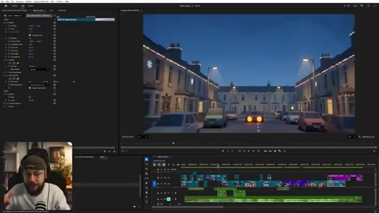
*Interface d'Adobe Premiere Pro montrant le montage d'un plan de rue nocturne avec une voiture aux phares allumés, et Jack en incrustation PiP.*

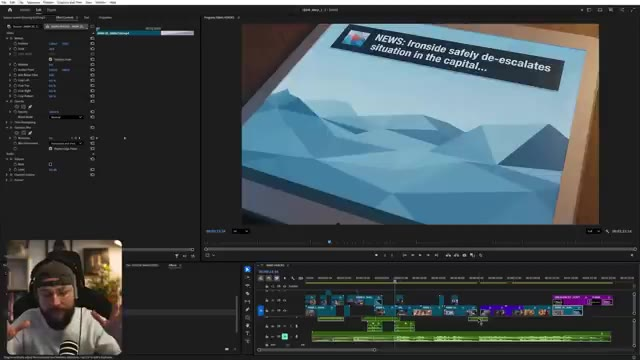
*Interface d'Adobe Premiere Pro montrant un plan avec une notification textuelle d'actualité ("NEWS: Ironside safely de-escalates..."), et Jack en incrustation PiP.*

---

### ⏱️ `[00:26:54 - 00:27:16]` | Segment #55

**🔊 Audio (Transcription Intégrale Mot pour Mot en Français) :**
> Élément déclencheur pour ça. J'ai donc fini par ajouter pas mal de choses ici, du genre plus d'acclamations, d'applaudissements et des trucs comme ça, parce qu'encore une fois, avec VO3.1, c'était assez limité ce genre de choses. Et en fait, j'ai fini par générer tous les reportages d'actualité que l'on peut entendre avec VO3.1. Donc, par exemple, ceci est une génération VO3.1 où j'ai simplement retiré l'audio.

**👁️ Analyse Visuelle d'Écran (gemini-3.5-flash-lite) :**
**Interface & Outils** : Logiciel de montage vidéo Adobe Premiere Pro (panneau de montage, timeline, moniteurs de prévisualisation) avec une incrustation vidéo (PiP) du créateur.

**Contenu textuel & Code** : Timeline de montage Adobe Premiere Pro, moniteur affichant une scène animée sur une tablette avec un bandeau "NEWS", et incrustation vidéo du créateur parlant dans son micro.

**Action / Démonstration** : Le créateur présente son projet de montage vidéo sur Adobe Premiere Pro en expliquant l'utilisation des générations VO3.1 et l'ajout d'effets sonores.

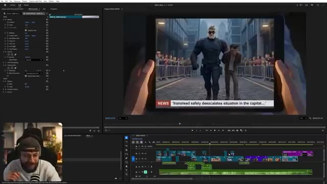
*Interface d'Adobe Premiere Pro montrant la timeline et une vidéo générée affichée sur une tablette, avec Jack en incrustation (PiP) dans le coin inférieur gauche.*

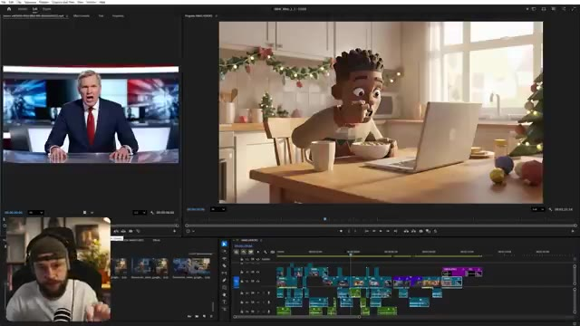
*Interface d'Adobe Premiere Pro montrant un reportage télévisé et un enfant regardant un ordinateur portable, avec Jack en incrustation (PiP) dans le coin inférieur gauche.*

---

### ⏱️ `[00:27:20 - 00:27:54]` | Segment #56

**🔊 Audio (Transcription Intégrale Mot pour Mot en Français) :**
> Et c'est simplement parce que quand j'ai découvert que j'essayais de générer du texte par la parole avec 11labs, j'avais vraiment du mal à assortir la livraison au type de ton qu'on attendrait d'un reportage d'information dramatique et intense, et cette méthode m'a simplement donné un meilleur résultat en gros, et encore une fois, ces genres de reportages aident juste à ajouter un peu plus d'explications sur ce qu'on voit se passer et espérons-le à contextualiser un peu plus le tout, donc cet effet sonore de la voiture qui se gare, c'est assez intéressant parce que l'audio que je

**👁️ Analyse Visuelle d'Écran (gemini-3.5-flash-lite) :**
**Interface & Outils** : Adobe Premiere Pro (logiciel de montage vidéo) avec affichage de la timeline multi-piste, des fenêtres de prévisualisation source/programme et vignette PiP du créateur en bas à gauche.

**Contenu textuel & Code** : Timeline de montage vidéo avec des clips vidéo découpés, pistes audio et vidéo superposées. Dans le moniteur source et programme : séquences animées style Pixar/3D d'un jeune garçon mangeant des céréales (Image 1), d'une fille dans un bus regardant son téléphone (Image 2), et d'un policier dans un salon (Image 3), accompagnées d'un présentateur TV incrusté dans un coin.

**Action / Démonstration** : Le créateur commente son projet de montage vidéo sur Adobe Premiere Pro tandis que la timeline défile et affiche différentes scènes animées et un présentateur télé.

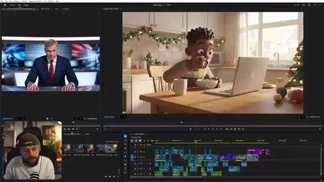
*Interface d'Adobe Premiere Pro montrant un montage vidéo avec un personnage animé en 3D prenant son petit-déjeuner et un encadré de présentateur de journal télévisé.*

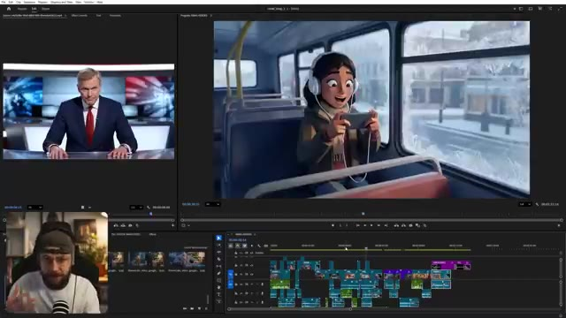
*Interface d'Adobe Premiere Pro montrant une jeune fille animée dans un bus et un présentateur de journal dans l'encadré supérieur gauche.*

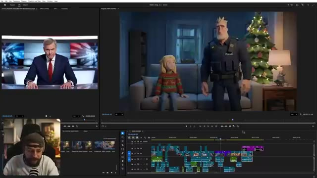
*Interface d'Adobe Premiere Pro montrant une scène d'intérieur de salon avec des personnages animés 3D (un policier et un enfant).*

---

### ⏱️ `[00:27:54 - 00:28:26]` | Segment #57

**🔊 Audio (Transcription Intégrale Mot pour Mot en Français) :**
> utilisé pour cela provenait d'une génération Veo 3.1, maintenant le visuel de cette génération Veo 3.1 était terrible, la voiture ne savait vraiment pas où aller ni où se garer, certainement pas comme un officier de police conduirait, espérons-le en tout cas, mais comme je le dis, l'audio de cette génération Veo 3.1 était vraiment bon, je l'ai vraiment aimé, alors j'ai fini par le prendre et l'ajouter sous cette vidéo générée par Kling 2.5, ce plan ici, c'était une transition entre une image de début et de fin, cela a également été réalisé avec Kling 2.5, j'ai trouvé que

**👁️ Analyse Visuelle d'Écran (gemini-3.5-flash-lite) :**
**Interface & Outils** : Adobe Premiere Pro (logiciel de montage vidéo) incluant un moniteur source, un moniteur de programme, une timeline multipiste et une incrustation vidéo (PiP) du créateur en bas à gauche.

**Contenu textuel & Code** : On aperçoit dans le moniteur de programme une scène de rue nocturne avec une voiture de police britannique stationnée, ainsi que la timeline de montage audio/vidéo détaillée en bas.

**Action / Démonstration** : Le créateur montre son écran de montage vidéo dans Premiere Pro pour illustrer l'assemblage entre l'audio d'une génération Veo 3.1 et les images d'une génération Kling 2.5.

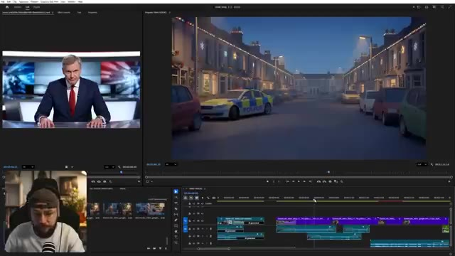
*Interface d'Adobe Premiere Pro avec le montage vidéo d'une voiture de police générée par IA et la webcam du créateur en incrustation.*

---

### ⏱️ `[00:28:26 - 00:29:02]` | Segment #58

**🔊 Audio (Transcription Intégrale Mot pour Mot en Français) :**
> quand j'ai fait ça avec VO 3.1 les yeux n'arrêtaient pas de se déformer d'une manière vraiment bizarre et flippante et évidemment on ne veut pas ça surtout à ce moment de la publicité où elle atteint en quelque sorte son pic émotionnel n'est-ce pas mais ce que j'ai trouvé avec la génération Kling 2.5 c'est que ça avait ce genre de style bizarre d'animation en stop motion ce qui serait super si on avait ça sur toute la publicité mais ce n'est pas le cas c'est plutôt fluide au niveau de l'animation donc ce que j'ai fini par faire c'est en fait d'accélérer ça vous pouvez voir que j'ai fini par le mettre à environ 140 % de vitesse et en m'assurant d'utiliser le flux optique comme interpolation

**👁️ Analyse Visuelle d'Écran (gemini-3.5-flash-lite) :**
**Interface & Outils** : Adobe Premiere Pro (logiciel de montage vidéo).

**Contenu textuel & Code** : Dans Premiere Pro, la fenêtre de réglage de la vitesse du clip affiche "Speed: 139.79 %", "Duration: 00:00:03:09", et dans "Time interpolation", l'option sélectionnée est "Optical flow". Sur la timeline de l'image 1, on aperçoit plusieurs pistes vidéo et audio avec des clips découpés.

**Action / Démonstration** : Le créateur montre son écran de montage sur Adobe Premiere Pro et ajuste la vitesse du clip vidéo à environ 140 % en configurant l'interpolation sur "Optical flow" pour rendre l'animation plus fluide.

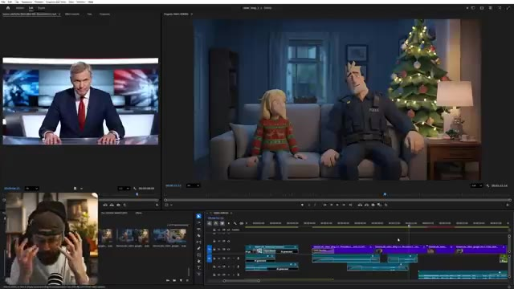
*Interface d'Adobe Premiere Pro montrant la timeline et le moniteur avec une vidéo de personnages animés 3D (un homme en uniforme de police et un enfant sur un canapé près d'un sapin de Noël), avec le créateur en incrustation (PiP) en bas à gauche.*

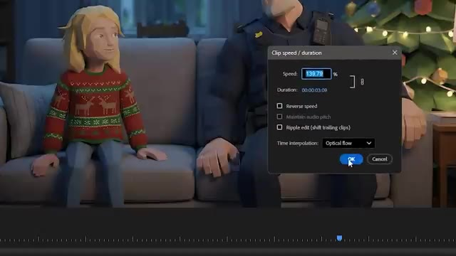
*Fenêtre contextuelle "Clip speed / duration" dans Adobe Premiere Pro réglée à 139,79 % avec l'option d'interpolation temporelle "Optical flow" sélectionnée.*

---

### ⏱️ `[00:29:02 - 00:29:42]` | Segment #59

**🔊 Audio (Transcription Intégrale Mot pour Mot en Français) :**
> méthode. Et ensuite, j'ai fini par réutiliser tous les mêmes extraits audio des reportages pour vraiment faire passer le message, du genre rendre le rebondissement de notre pub vraiment, vraiment clair. Parce qu'en regardant ces plans finaux, j'avais juste l'impression qu'il manquait quelque chose. Évidemment, il y avait la musique, mais ça faisait un peu bizarre. Laissez-moi vous montrer ce que c'était avant. Je ne sais pas, j'avais l'impression qu'il fallait ajouter quelque chose et j'ai continué

**👁️ Analyse Visuelle d'Écran (gemini-3.5-flash-lite) :**
**Interface & Outils** : Adobe Premiere Pro avec incrustation webcam (PiP) de Jack dans le coin inférieur gauche.

**Contenu textuel & Code** : Projet de montage vidéo sur Adobe Premiere Pro comprenant un moniteur de source avec un présentateur TV, un moniteur de programme affichant l'animation (scène de salon avec un sapin de Noël sur l'image 1, scène de chambre avec une fillette et un soignant sur l'image 2), et une timeline multi-pistes complexe en bas.

**Action / Démonstration** : Le créateur montre son écran de montage sur Adobe Premiere Pro pour illustrer son processus de montage et l'utilisation des extraits audio des reportages.

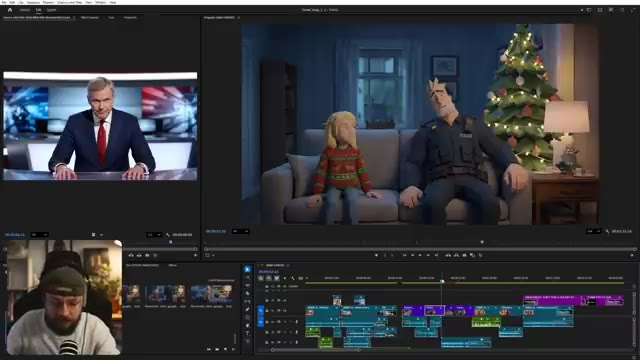
*Interface d'Adobe Premiere Pro montrant le montage vidéo avec un présentateur de journal télévisé à gauche, une scène de salon animée à droite, et Jack visible en incrustation (PiP) dans le coin inférieur gauche.*

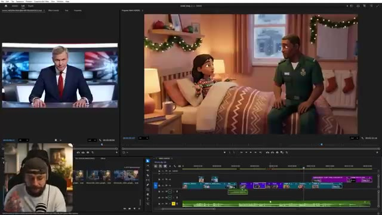
*Interface d'Adobe Premiere Pro montrant le montage d'une autre scène avec un présentateur de journal et une fillette dans une chambre, avec Jack en incrustation dans le coin inférieur gauche.*

---

### ⏱️ `[00:29:42 - 00:30:19]` | Segment #60

**🔊 Audio (Transcription Intégrale Mot pour Mot en Français) :**
> en le regardant en boucle et en pensant à ce que je peux ajouter ici qui va aider avec ça et donc ouais on a fini par opter pour ça. Donc ouais j'aime vraiment le résultat final et on a beaucoup moins l'impression qu'il manque quelque chose et vous verrez tout au long du montage, à peu près toutes mes pistes audio ont des fondus d'entrée et de sortie pour que rien ne surgisse de nulle part et ne soit agressif pour les oreilles.

**👁️ Analyse Visuelle d'Écran (gemini-3.5-flash-lite) :**
**Interface & Outils** : Adobe Premiere Pro

**Contenu textuel & Code** : Timeline de projet nommée "XMAS HEROES", pistes vidéo (V3, V4 avec calque d'ajustement) et pistes audio (A1, A2, A3) avec des courbes de volume en fondu (fade in / fade out).

**Action / Démonstration** : Le créateur montre son écran de montage vidéo sous Premiere Pro en expliquant son processus d'édition audio et de calage des pistes.

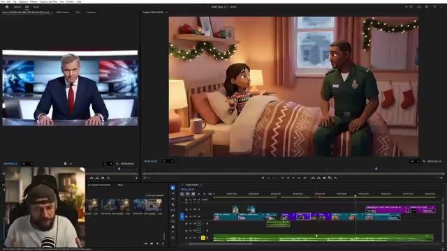
*Interface d'Adobe Premiere Pro montrant la timeline de montage avec un aperçu vidéo d'une scène de Noël et Jack dans un encadré en bas à gauche.*

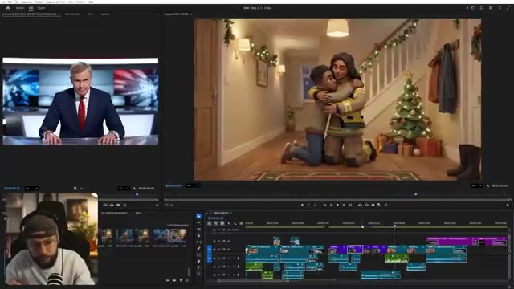
*Interface d'Adobe Premiere Pro affichant une autre scène de Noël animée dans le moniteur de programme avec la timeline en bas.*

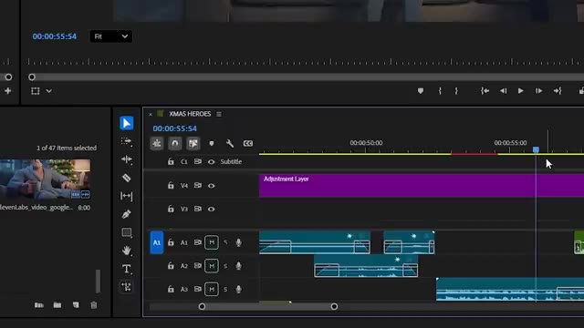
*Gros plan sur la timeline audio d'Adobe Premiere Pro montrant les pistes avec les fondus audio (keyframes).*

---

### ⏱️ `[00:30:19 - 00:30:37]` | Segment #61

**🔊 Audio (Transcription Intégrale Mot pour Mot en Français) :**
> j'aime particulièrement ces reportages d'actualité, ces journalistes qui parlent et dont la voix s'estompe et s'efface doucement, ce qui correspondait exactement à ce que je recherchais la plupart du temps, et c'est un truc de montage assez courant en fin de compte, rien de fou, mais ça aide beaucoup, c'est d'utiliser un effet sonore pour introduire le plan suivant.

**👁️ Analyse Visuelle d'Écran (gemini-3.5-flash-lite) :**
**Interface & Outils** : Adobe Premiere Pro avec affichage des moniteurs source et programme, du panneau de montage (timeline) et de la webcam du créateur (PiP).

**Contenu textuel & Code** : Timeline de montage vidéo avec pistes audio et vidéo, calques d'ajustement violets, et moniteurs montrant des extraits vidéo générés par IA.

**Action / Démonstration** : Le créateur montre son écran de montage dans Adobe Premiere Pro tout en expliquant ses techniques de montage audio et vidéo.

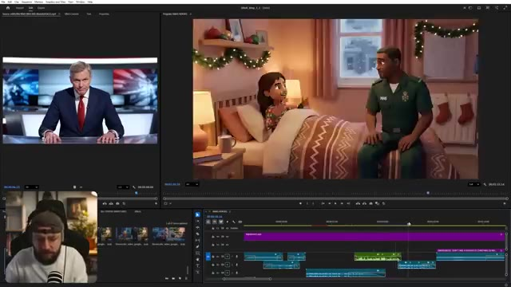
*Interface d'Adobe Premiere Pro montrant le montage de la séquence avec une scène de journal télévisé à gauche et une scène d'animation de Noël à droite, ainsi que le créateur en incrustation (PiP).*

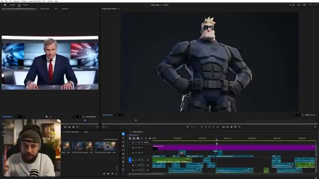
*Interface d'Adobe Premiere Pro affichant un personnage animé de type super-héros sur le moniteur de droite et la timeline du projet en bas.*

---

### ⏱️ `[00:30:38 - 00:30:59]` | Segment #62

**🔊 Audio (Transcription Intégrale Mot pour Mot en Français) :**
> Donc c'est un assez bon exemple ici. Si je continue et que je coupe simplement le son de la piste musicale, vous remarquerez qu'on commence à entendre le bruit de la voiture alors qu'on est encore sur le visuel de notre personnage principal. Et comme je dis, les monteurs font ça tout le temps, mais ça donne juste de très belles transitions fluides.

**👁️ Analyse Visuelle d'Écran (gemini-3.5-flash-lite) :**
**Interface & Outils** : Logiciel de montage vidéo Adobe Premiere Pro, comprenant des panneaux de prévisualisation, un chutier, une timeline multipiste et une fenêtre PiP (Picture-in-Picture) de la webcam de Jack.

**Contenu textuel & Code** : Timeline de montage vidéo avec différentes pistes audio et vidéo, affichage de clips vidéo de personnages et de décors urbains, panneaux de contrôle de lecture et timecode.

**Action / Démonstration** : Le créateur montre son écran de montage sur Adobe Premiere Pro en expliquant le fonctionnement du raccord audio anticipé (J-cut/L-cut) pour assurer une transition fluide entre les plans visuels et sonores.

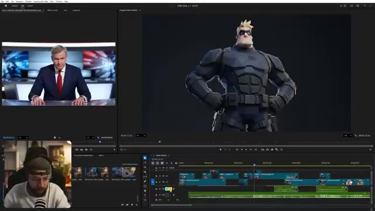
*Interface d'Adobe Premiere Pro montrant la timeline du projet de montage et un personnage musclé en armure à l'écran, avec la webcam de Jack en incrustation.*

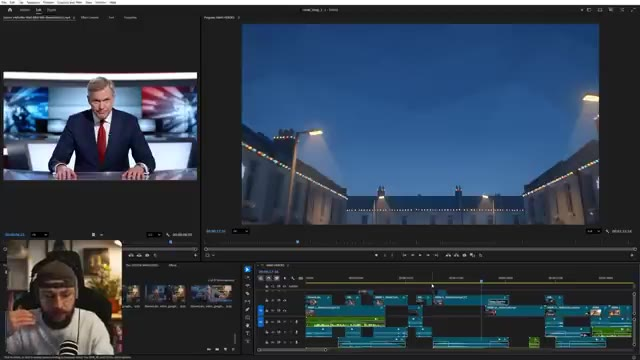
*Interface d'Adobe Premiere Pro montrant un plan extérieur de rue de nuit avec des lampadaires, et la timeline de montage avec Jack en incrustation.*

---

### ⏱️ `[00:31:00 - 00:31:35]` | Segment #63

**🔊 Audio (Transcription Intégrale Mot pour Mot en Français) :**
> Et je trouve que ça prépare plutôt bien le spectateur à ce qui va se passer. Vous remarquerez ici aussi qu'on a des bruits de grillons nocturnes et de l'ambiance également. J'aime vraiment ajouter autant d'ambiance que possible à tout ce que je fabrique avec l'IA. Voilà donc. Nous avons maintenant terminé notre publicité de Noël. Ça a été toute une expérience, je trouve. J'ai beaucoup appris moi-même et j'espère vraiment que vous avez beaucoup appris en regardant ça aussi. Si vous avez apprécié la vidéo, n'oubliez pas de lâcher un gros pouce bleu pour moi. Si vous êtes nouveau, pensez à vous abonner et bien sûr à cliquer sur cette cloche de notification pour ne jamais rien manquer.

**👁️ Analyse Visuelle d'Écran (gemini-3.5-flash-lite) :**
**Interface & Outils** : Adobe Premiere Pro (logiciel de montage vidéo).

**Contenu textuel & Code** : On aperçoit la timeline multi-pistes du projet "XMAS HEROES", des vignettes de médias dans le chutier (clips générés par IA), ainsi que le panneau de prévisualisation vidéo.

**Action / Démonstration** : Le créateur montre son écran de montage dans Adobe Premiere Pro tout en commentant la post-production et l'ajout d'ambiance sonore, avec sa webcam incrustée dans le coin inférieur gauche.

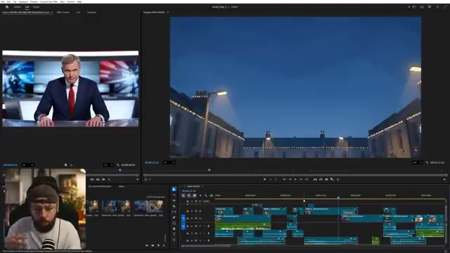
*Capture d'écran du logiciel Adobe Premiere Pro montrant le montage de la publicité de Noël avec la timeline complète, les fenêtres de prévisualisation et la webcam du créateur incrustée en bas à gauche.*

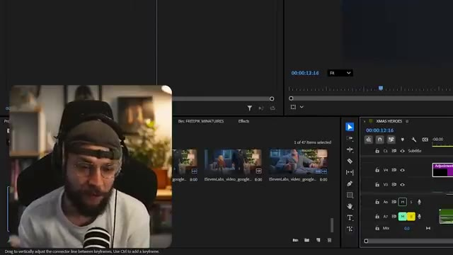
*Vue rapprochée de l'interface d'Adobe Premiere Pro avec le panneau de projet et la timeline active, et la webcam du créateur visible en bas à gauche.*

---

### ⏱️ `[00:31:35 - 00:32:09]` | Segment #64

**🔊 Audio (Transcription Intégrale Mot pour Mot en Français) :**
> futur contenu. Si vous avez des questions du tout, si vous pensez qu'il y a quelque chose que je n'ai pas couvert et que vous voulez approfondir un peu plus, assurez-vous de laisser un commentaire ci-dessous. J'essaie de répondre à autant que possible. Et je pense que maintenant ce sera plutôt approprié de regarder enfin notre publicité de Noël terminée. Faites-moi savoir ce que vous pensez de ma performance. Est-ce que j'ai réussi à vous faire ressentir quelque chose grâce à une publicité qui a été créée entièrement par IA ? Si j'ai réussi à faire ça. Ouais, je suis plutôt content de moi, je dois l'avouer. Les gars, merci beaucoup d'avoir regardé.

**👁️ Analyse Visuelle d'Écran (gemini-3.5-flash-lite) :**
**Interface & Outils** : Adobe Premiere Pro

**Contenu textuel & Code** : Interface de montage vidéo avec panneau de prévisualisation, timeline avec pistes vidéo et audio, et panneau d'effets (Lumetri Color).

**Action / Démonstration** : Le créateur présente l'aperçu du montage final de sa publicité de Noël dans Adobe Premiere Pro, avec une incrustation vidéo de lui-même en bas à gauche.

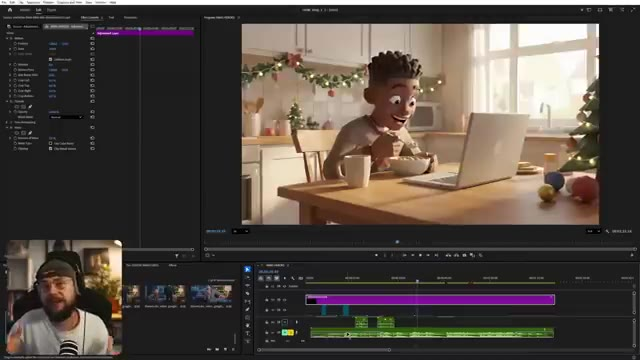
*Le logiciel de montage Adobe Premiere Pro affichant un plan animé en 3D d'un enfant mangeant des céréales.*

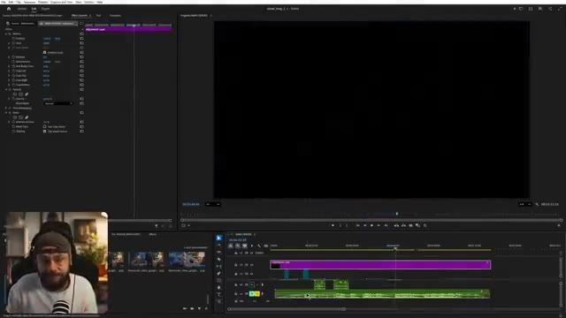
*Le logiciel de montage Adobe Premiere Pro avec un écran noir au milieu de la lecture de la publicité.*

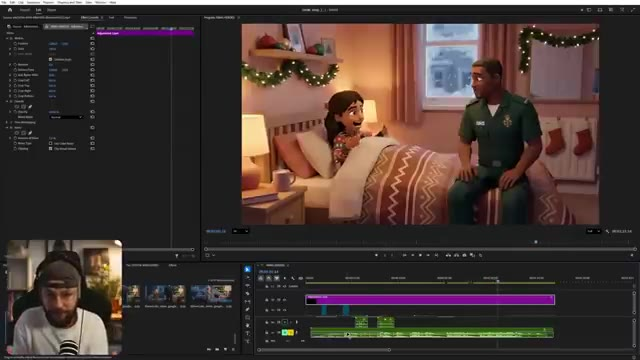
*Le logiciel de montage Adobe Premiere Pro affichant une scène animée dans une chambre avec un père en uniforme et sa fille.*

---

### ⏱️ `[00:32:10 - 00:32:29]` | Segment #65

**🔊 Audio (Transcription Intégrale Mot pour Mot en Français) :**
> Je vous retrouve dans la prochaine vidéo. Passons à notre pub de Noël. C'est le chaos ici dans la ville à la suite d'une série d'incidents qui ont eu lieu ici ce matin. La police conseille actuellement... Il semble y avoir de multiples assaillants armés, monsieur. Tous postés à différents emplacements clés.

**👁️ Analyse Visuelle d'Écran (gemini-3.5-flash-lite) :**
**Interface & Outils** : Adobe Premiere Pro (logiciel de montage vidéo) et extraits d'animation vidéo 3D.

**Contenu textuel & Code** : Texte incrusté à l'écran : "THANK YOU TO OUR EMERGENCY SERVICES".

**Action / Démonstration** : Le créateur montre son écran de montage vidéo dans Premiere Pro, puis diffuse des extraits d'une vidéo publicitaire animée en 3D style Pixar/low-poly.

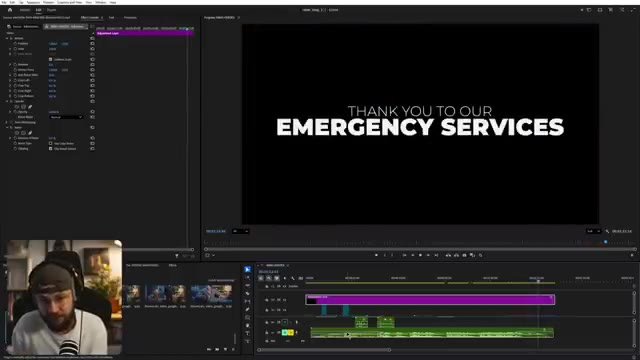
*Interface d'Adobe Premiere Pro avec un aperçu vidéo affichant le texte "THANK YOU TO OUR EMERGENCY SERVICES" et le créateur visible en incrustation (PiP).*

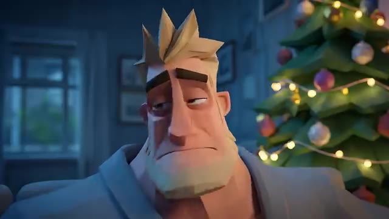
*Scène de film d'animation montrant un personnage fatigué aux cheveux blonds dressés, debout à côté d'un sapin de Noël décoré.*

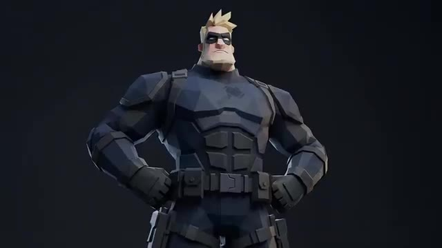
*Personnage en 3D d'allure musclée portant un uniforme tactique noir, les mains sur les hanches devant un fond sombre.*

---

### ⏱️ `[00:32:29 - 00:33:12]` | Segment #66

**🔊 Audio (Transcription Intégrale Mot pour Mot en Français) :**
> Un fantôme se trouve dans ce vieux diner, assis à quelques cabines d'ici, remue le sucre, ne boit jamais son café, regarde fixement la rue vide. Ironstead a une fois de plus ramené la ville au bord de la destruction.

**👁️ Analyse Visuelle d'Écran (gemini-3.5-flash-lite) :**
**Interface & Outils** : Présentation face caméra sans partage d'écran

**Contenu textuel & Code** : Aucune interface logicielle, ligne de code ou prompt visible à l'écran.

**Action / Démonstration** : Le contenu affiché montre des séquences animées d'illustration générées par intelligence artificielle dans un style 3D low-poly, sans aucune démonstration d'outil par le créateur.

---

### ⏱️ `[00:33:12 - 00:33:25]` | Segment #67

**🔊 Audio (Transcription Intégrale Mot pour Mot en Français) :**
> C'est Fiverosa et elle maîtrise le feu ! Incroyable ! est sur les lieux et il semble soigner cet homme blessé. Juste un murmure sur le fil, un coin oublié de mon esprit.

**👁️ Analyse Visuelle d'Écran (gemini-3.5-flash-lite) :**
**Interface & Outils** : Extrait de spot publicitaire animé / Vidéo de démonstration de synthèse visuelle

**Contenu textuel & Code** : Texte affiché à l'écran sur l'image 3 : "EMERGENCIES DON'T TAKE A HOLIDAY AT CHRISTMAS SO NEITHER CAN THEY" (Les urgences ne prennent pas de vacances à Noël, eux non plus). Mention "NHS" sur l'uniforme du secouriste.

**Action / Démonstration** : Déroulement d'une séquence narrative animée montrant des interventions d'urgence et de réconfort suivies d'un message textuel de prévention.

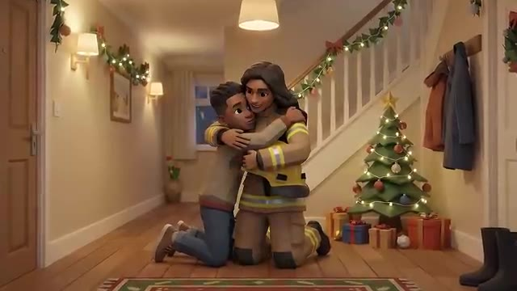
*Séquence vidéo animée montrant une femme pompier en train de faire un câlin chaleureux à un jeune garçon dans un couloir décoré pour Noël.*

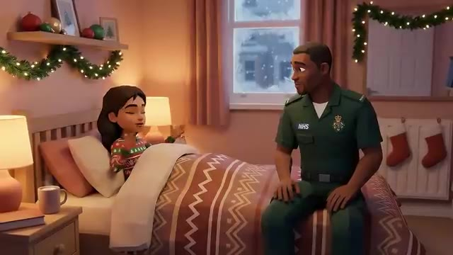
*Séquence vidéo animée montrant un travailleur des urgences (NHS) assis au bord du lit d'une jeune fille malade ou alitée dans une chambre aux tons chaleureux.*

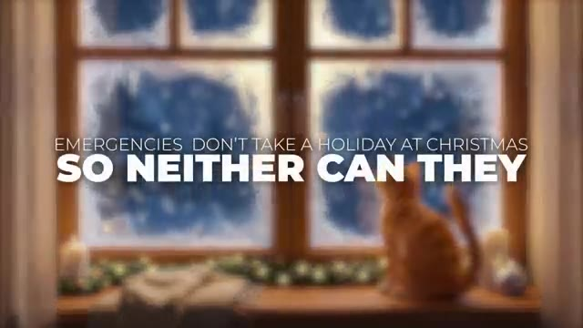
*Séquence finale affichant un chat roux sur un rebord de fenêtre enneigée avec un texte de sensibilisation en surimpression.*

---
