# 🎬 Comment créer des publicités de mode avec l'IA (C'EST ÉPOUSTOUFLANT)

> **Chaîne** : [Jack Vs. AI](https://www.youtube.com/@JackVsAI)  
> **Titre original** : `How to Make Fashion Ads with AI (MIND BLOWING)`  
> **Lien YouTube** : [https://www.youtube.com/watch?v=J_u-XYM1Mng](https://www.youtube.com/watch?v=J_u-XYM1Mng)  
> **Date de publication** : 2025-12-09  
> **Durée** : 17m 19s (`1039s`)  
> **Identifiant vidéo** : `J_u-XYM1Mng`  
> **Fiche Web Interactive** : [2025-12-09_YT-J_u-XYM1Mng_Comment créer des publicités de mode avec l'IA (C'EST ÉPOUSTOUFLANT)_by-whisper-v3-large-turbo+gemini-3.5-flash-lite.html](2025-12-09_YT-J_u-XYM1Mng_Comment créer des publicités de mode avec l'IA (C'EST ÉPOUSTOUFLANT)_by-whisper-v3-large-turbo+gemini-3.5-flash-lite.html)  
> **Captures de démonstration clés** : `112 captures réelles (anti-talking-head)`  
> **Modèles utilisés** : Audio: `large-v3-turbo` (Faster-Whisper int8 VPS) | Vision: `gemini-3.5-flash-lite` (Google AI Studio API)  

---

## 📌 Synthèse Exécutive & Outils

### 📌 Résumé
La vidéo de Jack Vs. AI démontre une révolution totale dans la production de campagnes publicitaires de mode grâce à l'intelligence artificielle générative. En s'affranchissant des contraintes logistiques traditionnelles — location de studios, embauche de mannequins, transports de matériel et budgets pharaoniques —, les créateurs peuvent désormais concevoir des visuels de niveau professionnel directement depuis chez eux. Le tutoriel met en avant un flux de travail fluidifié au sein de la plateforme tout-en-un *LTX*, qui intègre des moteurs de pointe pour générer des images et des vidéos d'un réalisme saisissant tout en préservant une cohérence visuelle parfaite entre les produits réels et les générations virtuelles.

La méthode étape par étape repose sur la constitution préalable d'une bibliothèque d'éléments (*assets*). Le réalisateur montre comment extraire des vêtements de sites e-commerce (comme Carhartt) et importer des visages de célébrités (Taylor Swift, Timothée Chalamet) ou de créateurs (Jack lui-même) pour les injecter directement dans le moteur de génération grâce à la syntaxe de balisage par arobase (`@`). Couplé au modèle *Nano Banana Pro* et à des options de rendu ultra-haute définition (4K au format 16:9), ce système permet de composer des tenues complexes et de placer les sujets dans des décors et des contextes narratifs variés sans effort de description textuelle fastidieux.

Pour les professionnels de la publicité et les artistes d'effets visuels, cette approche représente un gain de temps et d'argent inestimable. Le contrôle précis des textures, du branding des vêtements et de la fidélité physionomique des personnages résout l'un des plus grands défis de l'IA générative : la constance d'une image à l'autre. Qu'il s'agisse de simuler un shooting éditorial pour des marques internationales ou de prototyper des campagnes personnalisées avec des photos d'iPhone de qualité médiocre, ce workflow ouvre des perspectives créatives infinis et redéfinit les standards de l'industrie publicitaire moderne.

### 🛠️ Outils, Modèles & Logiciels Présentés
* **LTX** : Plateforme de production vidéo et d'images par IA tout-en-un intégrant un espace de génération (*genspace*), un storyboard, un éditeur vidéo et une gestion centralisée des éléments.
* **Nano Banana Pro** : Modèle de génération d'images ultra-performant utilisé pour combiner des éléments textuels, vestimentaires et personnages avec un rendu photoréaliste en résolution 4K.
* **Veo 3.1** : Modèle de génération vidéo avancé mentionné dans l'écosystème global des outils de pointe pour animer les visuels créés.
* **Flux** : Technologie de pointe associée aux flux de génération pour maximiser la précision des textures et du respect des prompts.

### 🔑 Points Clés & Enseignements Stratégiques
* **Démocratisation de la production publicitaire** : L'IA permet de réaliser des campagnes de mode haut de gamme sans quitter son domicile, éliminant les coûts liés aux mannequins, aux repérages et au transport.
* **Constitution d'une bibliothèque d'éléments (*Assets*)** : Le workflow commence par l'importation et le nommage précis d'objets (vêtements, accessoires) et de personnages (célébrités ou personnes réelles) dans l'onglet dédié de la plateforme.
* **Utilisation des balises dynamiques (`@`)** : Pour composer une scène, l'utilisation du symbole arobase permet d'appeler instantanément les éléments sauvegardés (ex: `@Taylor`, `@bonnet_rouge`) dans le prompt textuel.
* **Dissociation du sujet et du décor** : Il n'est pas nécessaire de décrire en détail les actions ou l'éclairage des personnages ; l'IA comprend et assemble naturellement les éléments de la tenue sur le sujet désigné.
* **Standardisation du style éditorial** : L'ajout systématique de balises de style à la fin des prompts (ex: *« shooting éditorial de mode, pose décontractée, photographie analogique »*) garantit l'esthétique professionnelle recherchée.
* **Résolution et formats adaptés** : Privilégier les résolutions 2K ou 4K pour un rendu net, et sélectionner le format 16:9 (idéal pour la télévision ou le web), 1:1 ou 9:16 selon la plateforme de diffusion visée.
* **Cohérence de l'image de marque et des produits** : *Nano Banana Pro* assure un respect strict du design, des logos et de la colorimétrie des vêtements du monde réel, évitant les déformations d'une génération à l'autre.
* **Flexibilité des sources de personnages** : Le système fonctionne aussi bien avec des icônes mondiales (Timothée Chalamet) qu'avec des photos amateurs de piètre qualité prises sur iPhone, s'adaptant à tous les profils de créateurs.
* **Personnalisation contextuelle des décors** : Il est possible de faire évoluer le cadre de la narration simplement en modifiant le texte d'ambiance (ex: *« dans une salle d'arcade abandonnée »* ou *« la nuit à la plage en train de courir vers la caméra »*).
* **Gestion native des accessoires préexistants** : Si un personnage de référence possède déjà un accessoire distinctif (comme une casquette à l'envers sur une photo perso), il est inutile de surcharger le prompt, l'IA intégrant naturellement cet attribut.

---

## ⏱️ Chronologie & Transcription Complète Audio & Visuelle (Mot pour Mot)

### ⏱️ `[00:00:00 - 00:00:19]` | Segment #01

**🔊 Audio (Transcription Intégrale Mot pour Mot en Français) :**
> Imaginez pouvoir créer une campagne de mode entière sans même quitter la maison. Oubliez l'embauche de modèles, la recherche de repérages ou le transport de matériel. Parce qu'avec l'IA, vous pouvez obtenir un résultat de niveau professionnel sans pulvériser tout votre budget en une seule journée. Tout le monde autour de vous travaille plus intelligemment, pas plus dur.

**👁️ Analyse Visuelle d'Écran (gemini-3.5-flash-lite) :**
**Interface & Outils** : Présentation face caméra et b-roll visuel sans partage d'écran logiciel.

**Contenu textuel & Code** : Affichage d'une image générée représentant un homme assis dans un décor industriel délabré (b-roll d'illustration), puis plan de Jack dans son studio.

**Action / Démonstration** : Jack présente l'introduction en parlant face caméra, illustré par un exemple visuel généré par IA.

---

### ⏱️ `[00:00:19 - 00:00:41]` | Segment #02

**🔊 Audio (Transcription Intégrale Mot pour Mot en Français) :**
> Et il est temps pour vous de vous mettre à la page. Je suis Jack, je suis artiste d'effets visuels dans l'industrie de la publicité depuis plus d'une décennie maintenant. Et j'ai travaillé pour bon nombre des plus grandes marques de la planète. Dans la vidéo d'aujourd'hui, je vais vous montrer comment créer ces superbes visuels de mode en utilisant n'importe quel modèle et n'importe quel produit que vous aimez. Nous aborderons tous les derniers outils d'IA et je vous guiderai étape par étape à travers le flux de travail.

**👁️ Analyse Visuelle d'Écran (gemini-3.5-flash-lite) :**
**Interface & Outils** : Présentation face caméra sans partage d'écran

**Contenu textuel & Code** : Aucun contenu logiciel ou visuel à l'écran, uniquement le créateur dans son studio.

**Action / Démonstration** : Le créateur s'adresse directement à la caméra en parlant de son parcours et du sujet de la vidéo.

---

### ⏱️ `[00:00:41 - 00:01:16]` | Segment #03

**🔊 Audio (Transcription Intégrale Mot pour Mot en Français) :**
> Donc vous repartirez avec toutes les connaissances nécessaires pour commencer immédiatement. Et si vous aimez la vidéo d'aujourd'hui, les gars, assurez-vous de lâcher un pouce bleu pour moi. Pensez à vous abonner et bien sûr, activez la cloche de notification. Très bien, entrons dans le vif du sujet. Donc pour la vidéo d'aujourd'hui, nous utilisons LTX. LTX. Si vous voulez aller y jeter un œil, vous pouvez cliquer sur le lien en bas dans la description. Maintenant, en plus d'avoir plusieurs des meilleurs outils de génération d'images et de vidéos par IA intégrés à la plateforme, LTX propose un tas de fonctionnalités vraiment utiles pour ce flux de travail spécifique. Donc pour commencer ici sur la page d'accueil, nous voulons cliquer sur l'onglet de génération d'images.

**👁️ Analyse Visuelle d'Écran (gemini-3.5-flash-lite) :**
**Interface & Outils** : Navigateur web affichant la plateforme web LTX (app.ltx.studio) avec une interface sombre, des menus de navigation à gauche et des options de création au centre.

**Contenu textuel & Code** : Sur la page LTX : "FLUX.2", "Recent Projects", "Create Storyboard", "Generate Videos", "Generate Images", "Edit Videos", "LTX-2 API", "Generate 20-sec Video", "Unlock 4K", "Retake". Sur la vidéo illustrée : texte sous-titré "you need to get going".

**Action / Démonstration** : Le créateur présente la plateforme LTX et positionne son curseur sur l'option "Generate Images" de l'interface.

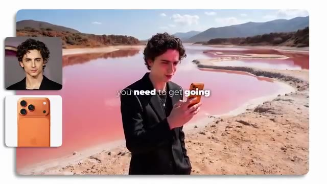
*Extrait vidéo généré montrant un homme ressemblant à Timothée Chalamet au bord d'un lac rose, avec des incrustations d'images montrant son visage et un smartphone.*

*Page d'accueil de la plateforme LTX (app.ltx.studio) affichée à l'écran, avec Jack visible dans un petit encadré vidéo PiP en bas à gauche.*

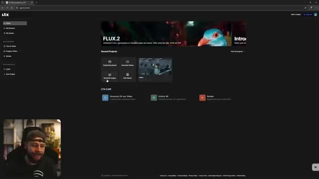
*Page d'accueil de la plateforme LTX (app.ltx.studio) montrant le curseur sur le bouton de génération d'images, avec Jack dans l'encadré PiP.*

---

### ⏱️ `[00:01:17 - 00:01:51]` | Segment #04

**🔊 Audio (Transcription Intégrale Mot pour Mot en Français) :**
> Et la première chose que je vous suggère de faire, si nous allons dans le coin supérieur gauche de l'écran, vous pouvez voir qu'actuellement notre projet s'appelle simplement "sans titre" et je vais aller de l'avant et appeler cela "publicité de mode" et en allant au centre du haut de l'écran il y a différents onglets ici celui dans lequel nous sommes actuellement "gen space" est l'endroit où nous pouvons générer nos images et vidéos ainsi qu'il y a une fonction de storyboard vraiment pratique que je finis souvent par utiliser aussi nous avons également un éditeur vidéo sur la plateforme mais nous voulons commencer par cliquer sur l'onglet des éléments maintenant vous pouvez probablement obtenir un

**👁️ Analyse Visuelle d'Écran (gemini-3.5-flash-lite) :**
**Interface & Outils** : Interface web de LTX Studio avec barre de navigation supérieure affichant les onglets : Elements, Gen Space, Storyboard, et Video Editor. Présence d'un encadré Picture-in-Picture (PiP) de Jack en bas à gauche.

**Contenu textuel & Code** : En haut à gauche, le nom du projet est "Untitled Project". Au centre, les onglets de l'application : "Elements", "Gen Space", "Storyboard", "Video Editor". Au centre de l'écran, le texte "Explore your visuals" accompagné de trois exemples visuels (une maison avec de la fumée rose, une femme au téléphone, un homme avec des lunettes de soleil).

**Action / Démonstration** : Le créateur navigue sur l'interface web de LTX Studio et présente la disposition générale de l'espace de travail et les différents onglets disponibles.

*Interface principale de LTX Studio avec le projet nommé 'Untitled' et les différents onglets de navigation en haut, incluant une incrustation vidéo du créateur en bas à gauche.*

---

### ⏱️ `[00:01:51 - 00:02:18]` | Segment #05

**🔊 Audio (Transcription Intégrale Mot pour Mot en Français) :**
> un aperçu de ce que cet outil propose rien qu'en regardant ce genre d'image ici sur l'écran. Mais allons-y directement et mettons cela en pratique. Maintenant, l'une de mes marques de mode préférées est Carhartt. Alors allons directement sur leur site web. Et je peux littéralement juste aller explorer ici. Et disons que j'aime vraiment ce bonnet rouge ici. Je vais simplement prendre une capture d'écran et je vais l'enregistrer dans mon dossier de téléchargements.

**👁️ Analyse Visuelle d'Écran (gemini-3.5-flash-lite) :**
**Interface & Outils** : Interface d'application IA de gestion d'éléments, navigateur web Google Chrome et outil de capture d'écran Windows (Snipping Tool).

**Contenu textuel & Code** : Texte "Your Elements collection", options "Character", "Object", "Other", site web Carhartt avec affichage de produits (ceinture, bonnet rouge, bonnets noirs), et interface de l'outil capture d'écran.

**Action / Démonstration** : Le créateur navigue sur le web, accède au site de Carhartt, sélectionne un bonnet rouge et effectue une capture d'écran de l'article.

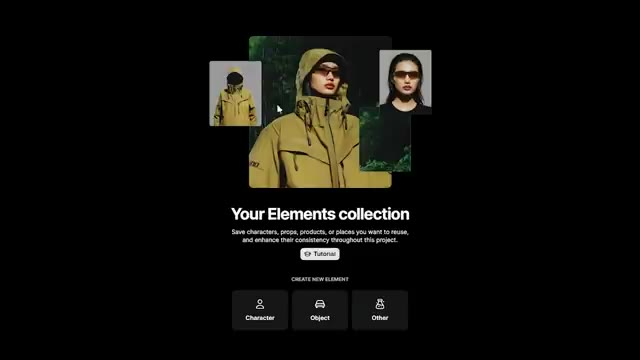
*Interface d'une application IA montrant une collection d'éléments ("Your Elements collection") avec la possibilité de créer et réutiliser des personnages, objets ou autres.*

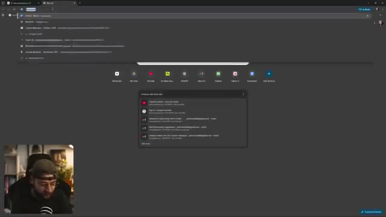
*Navigateur web affichant une barre d'adresse et des suggestions de recherche, avec le créateur visible en incrustation PiP dans le coin inférieur gauche.*

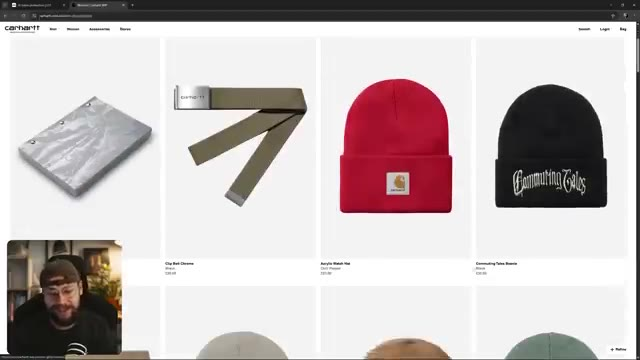
*Site e-commerce de la marque Carhartt montrant une sélection d'accessoires dont un bonnet rouge ("Acrylic Watch Hat").*

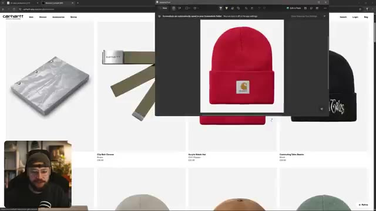
*Utilisation de l'outil de capture d'écran Windows (Snipping Tool) par-dessus le site de Carhartt pour capturer le bonnet rouge.*

---

### ⏱️ `[00:02:19 - 00:02:40]` | Segment #06

**🔊 Audio (Transcription Intégrale Mot pour Mot en Français) :**
> Et si nous continuons à faire défiler vers le bas, trouvons autre chose qui nous plaît. Très bien, j'aime bien l'apparence de cette espèce de polaire ici. Donc une fois de plus, je vais simplement aller de l'avant et l'enregistrer également. Et disons que j'aime aussi beaucoup ces pantalons. Voilà. En retournant sur LTX, je veux cliquer sur l'onglet objet.

**👁️ Analyse Visuelle d'Écran (gemini-3.5-flash-lite) :**
**Interface & Outils** : Navigateur web affichant le site e-commerce Carhartt, outil de capture d'écran Windows Snipping Tool, et interface de l'application web LTX Studio.

**Contenu textuel & Code** : Catalogue de vêtements Carhartt (pantalons, t-shirts graphiques, vestes, polaires), interface de capture d'écran avec l'aperçu d'une veste polaire, et fenêtre modale "Create Element" dans LTX Studio avec les options Character, Object et Other.

**Action / Démonstration** : Le créateur fait défiler une page web e-commerce, prend une capture d'écran d'une polaire pour l'enregistrer, puis bascule sur l'interface de LTX Studio pour sélectionner l'onglet objet.

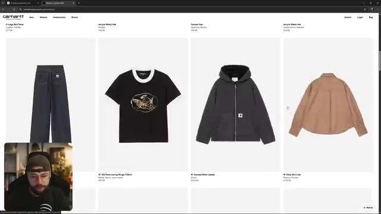
*Navigation sur le site de Carhartt affichant un catalogue de vêtements avec miniature de pantalon, t-shirt, sweat à capuche et chemise.*

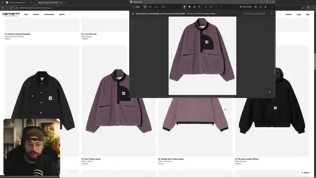
*Utilisation de l'outil de capture d'écran Windows pour isoler et sauvegarder une veste polaire mauve depuis le catalogue Carhartt.*

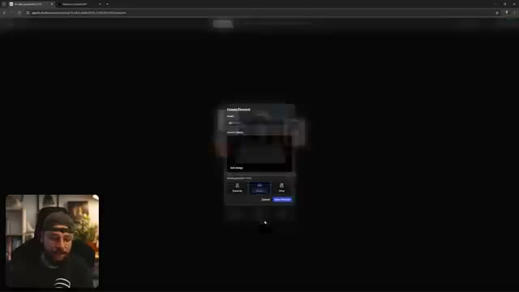
*Interface sombre de l'outil LTX Studio montrant le panneau de création d'élément ("Create Element") avec les onglets "Character", "Object" et "Other".*

---

### ⏱️ `[00:02:40 - 00:03:02]` | Segment #07

**🔊 Audio (Transcription Intégrale Mot pour Mot en Français) :**
> Je peux cliquer sur ajouter une image. Et tout d'abord, importons notre bonnet rouge. Pour ce qui est du nom, vous l'avez deviné, je vais simplement l'appeler Bonnet rouge. Et nous pouvons aller de l'avant et enregistrer l'élément. Si nous cliquons à nouveau sur l'objet, nous pouvons également importer notre polaire. Nous allons simplement appeler cela polaire et enregistrer cet élément. Et enfin, ajoutons l'image de notre pantalon.

**👁️ Analyse Visuelle d'Écran (gemini-3.5-flash-lite) :**
**Interface & Outils** : Interface web de Studio (ou outil de génération vidéo par IA) avec une fenêtre contextuelle de gestion des fichiers et de création d'éléments.

**Contenu textuel & Code** : Noms des éléments saisis : "Red Hat", "FLEECE", options de type d'élément (Character, Object, Other) et boutons "Save Element".

**Action / Démonstration** : Le créateur sélectionne et importe successivement des images de vêtements (bonnet rouge, polaire, pantalon) dans l'interface et les nomme pour créer de nouveaux éléments.

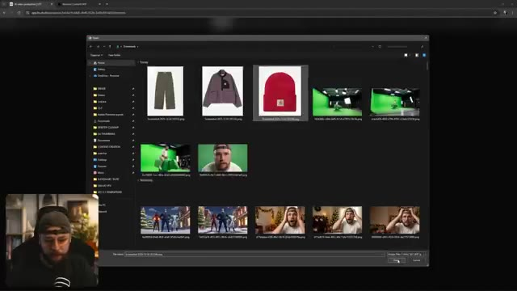
*Interface du système montrant une fenêtre de sélection de fichiers avec le bonnet rouge sélectionné.*

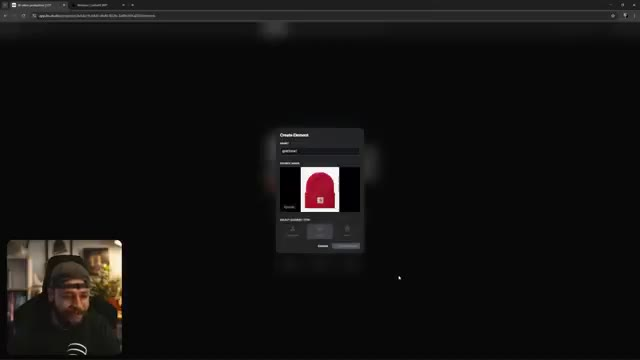
*Interface de création d'élément montrant le champ de texte "Red Hat" et l'image du bonnet rouge.*

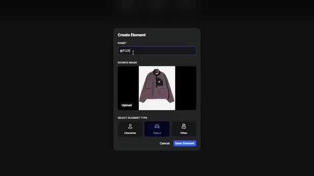
*Interface de création d'élément montrant le champ de texte "fleece" et l'image de la polaire.*

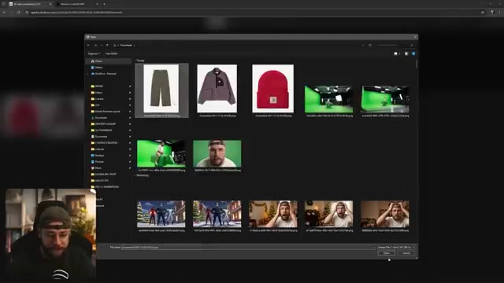
*Interface du système montrant à nouveau la fenêtre de sélection de fichiers pour ajouter le pantalon.*

---

### ⏱️ `[00:03:03 - 00:03:21]` | Segment #08

**🔊 Audio (Transcription Intégrale Mot pour Mot en Français) :**
> Nous appelons celui-ci pantalon kaki. Nous avons donc maintenant une sorte de tenue assemblée. C'est une tenue un peu aléatoire. Nous avons donc besoin de quelqu'un qui va être capable d'assumer ça. Alors allons-y pour Taylor Swift. Donc évidemment, il y a des tonnes d'images différentes que nous pouvons choisir.

**👁️ Analyse Visuelle d'Écran (gemini-3.5-flash-lite) :**
**Interface & Outils** : LTX Studio (application web de production vidéo par IA) et navigateur Google Images.

**Contenu textuel & Code** : Texte "Create Element", nom "@KHAKITROUSERS", catégorie "Object", collection d'éléments avec les vignettes REDHAT, FLEECE et KHAKITROUSERS, barre de recherche Google affichant "taylor swift" avec des filtres et une grille de photos.

**Action / Démonstration** : Le créateur montre la création et l'organisation d'éléments vestimentaires dans LTX Studio avant de basculer sur une recherche Google d'images de Taylor Swift pour trouver un sujet.

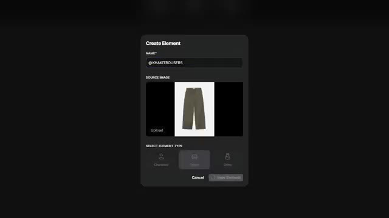
*Fenêtre modale "Create Element" sur l'interface LTX Studio montrant le nom @KHAKITROUSERS et l'image source d'un pantalon kaki.*

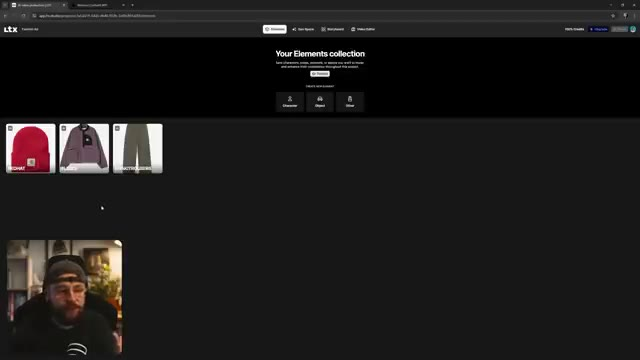
*Interface de la plateforme LTX Studio montrant la collection d'éléments ("Elements collection") avec trois vêtements enregistrés, avec le créateur visible en incrustation vidéo (PiP) dans le coin inférieur gauche.*

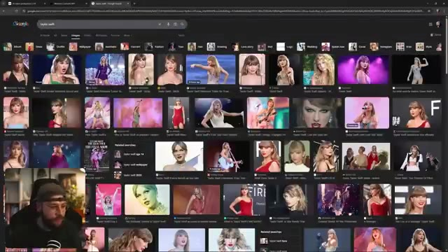
*Navigateur web affichant une recherche d'images Google pour "Taylor Swift" avec de nombreux résultats de photos de la chanteuse, et le créateur visible en bas à gauche.*

---

### ⏱️ `[00:03:21 - 00:03:43]` | Segment #09

**🔊 Audio (Transcription Intégrale Mot pour Mot en Français) :**
> Allons-y pour celui-ci. Donc encore une fois, je vais juste l'enregistrer. Et maintenant je veux cliquer sur l'onglet des personnages et télécharger notre image de Taylor Swift. Pour le nom, nous allons simplement l'appeler Taylor. Et nous pouvons également enregistrer notre élément de personnage. Donc maintenant, en retournant dans l'espace de génération, nous pouvons commencer à générer nos images.

**👁️ Analyse Visuelle d'Écran (gemini-3.5-flash-lite) :**
**Interface & Outils** : Navigateur web avec interface LTX Studio, explorateur de fichiers et Google Images.

**Contenu textuel & Code** : Texte visible : "Taylor", "Create Element", "Source Image", "Select Element Type: Character, Object, Other", "Generate your videos".

**Action / Démonstration** : Le créateur sélectionne et sauvegarde une image de Taylor Swift pour l'importer comme personnage dans l'outil, puis revient sur l'espace de génération de LTX Studio.

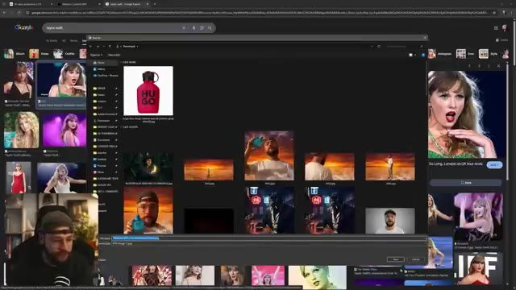
*Navigateur web affichant une recherche Google d'images de Taylor Swift par-dessus l'explorateur de fichiers Windows.*

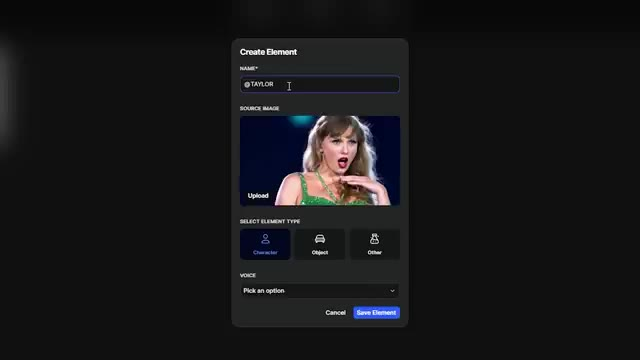
*Interface de création d'élément ("Create Element") avec un champ de nom et une image source de Taylor Swift.*

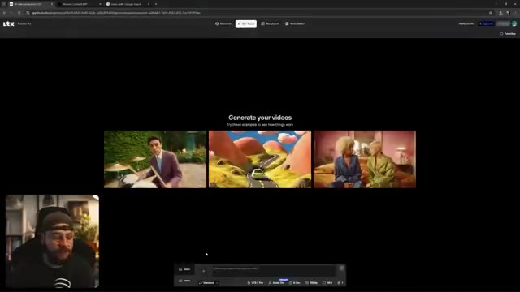
*Interface principale de l'outil LTX Studio ("Gen Space") avec la zone de génération de vidéos et le champ de prompt en bas.*

---

### ⏱️ `[00:03:43 - 00:04:01]` | Segment #10

**🔊 Audio (Transcription Intégrale Mot pour Mot en Français) :**
> Et vous êtes sur le point de voir ce qui est vraiment pratique avec le fait de sauvegarder nos éléments à l'avance. Ce que nous pouvons faire, c'est taper par exemple, contre-plongée de. Et si nous tapons arobase, nous allons ouvrir ce menu de nos différents éléments sauvegardés. Donc nous allons choisir contre-plongée de Taylor.

**👁️ Analyse Visuelle d'Écran (gemini-3.5-flash-lite) :**
**Interface & Outils** : Application web LTX Studio (avec sélection du modèle FLUX.2 Pro et encadré vidéo incrusté du créateur).

**Contenu textuel & Code** : Texte du prompt saisi : « Low angle shot| » puis « Low angle shot of @ » faisant apparaître un menu contextuel avec des éléments enregistrés (dont « TAYLOR »). Paramètres visibles : FLUX.2 Pro, 1080p, 16:9, nombre d'images (3).

**Action / Démonstration** : Le créateur tape du texte dans le champ de prompt de l'interface de l'application et déclenche l'affichage d'un menu contextuel d'éléments sauvegardés grâce au symbole arobase.

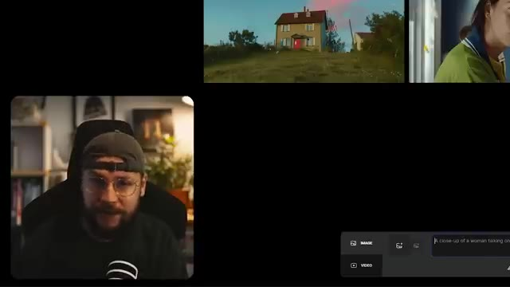
*Interface d'une application de génération avec incrustation vidéo du créateur en bas à gauche et champ de saisie de prompt en bas à droite.*

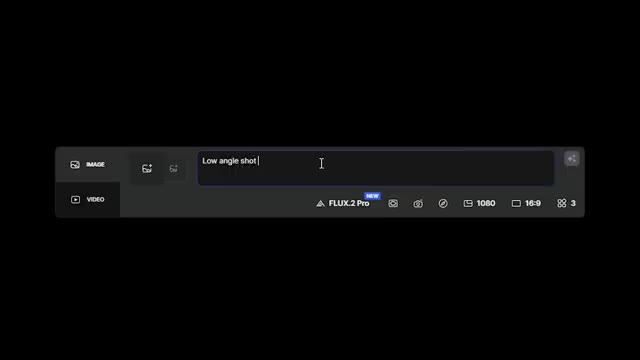
*Gros plan sur la barre de prompt de l'interface montrant le texte « Low angle shot| » avec le modèle FLUX.2 Pro sélectionné.*

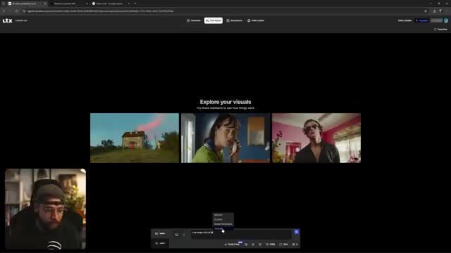
*Interface complète de l'application LTX Studio avec affichage des visuels et apparition d'un menu déroulant contextuel lors de la saisie du symbole arobase dans le champ de prompt.*

---

### ⏱️ `[00:04:02 - 00:04:37]` | Segment #11

**🔊 Audio (Transcription Intégrale Mot pour Mot en Français) :**
> Elle porte le chapeau rouge, la polaire et bien sûr, le pantalon kaki également. Et à la fin de notre prompt, je vais juste ajouter shooting éditorial de mode, pose décontractée, photographie analogique, juste pour donner à notre générateur d'images une idée du type de style que nous visons. Et si nous cliquons dans ce menu ici, nous pouvons examiner les différents modèles d'images que nous proposons. Je vais choisir Nano Banana Pro. Maintenant, en termes de résolution d'image, je suggérerais soit 2 ou 4K. Je vais opter pour la 4K. Et bien sûr, nous avons aussi l'option

**👁️ Analyse Visuelle d'Écran (gemini-3.5-flash-lite) :**
**Interface & Outils** : Interface logicielle de génération d'images par IA avec barre de contrôle inférieure (sélection Image/Video, champ de prompt textuel, choix du modèle, résolution, format et nombre de générations).

**Contenu textuel & Code** : Texte du prompt visible : "Low angle shot of @TAYLOR she is wearing @REDHAT @FLEECE @KHAKITROUSERS Fashion editorial shoot, casual pose, analogue photography." Paramètres visibles : FLUX.2 Pro, puis Nano Banana Pro (Gemini 3), résolution 1080p puis 4K, format 16:9, nombre de générations : 3.

**Action / Démonstration** : Saisie du prompt textuel, ouverture du menu déroulant pour sélectionner le modèle d'image Nano Banana Pro, puis configuration de la résolution en 4K.

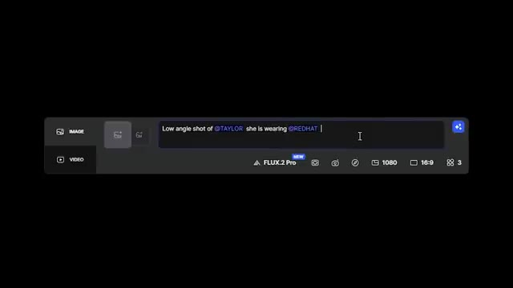
*Interface de génération d'images montrant la barre de saisie de texte avec le prompt en cours de rédaction.*

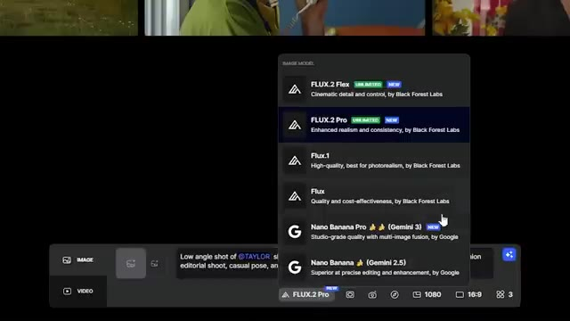
*Déroulement du menu de sélection des modèles d'images affichant différentes options comme FLUX et Nano Banana Pro.*

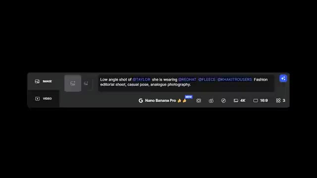
*Barre de configuration finale montrant le modèle Nano Banana Pro sélectionné et la résolution réglée sur 4K.*

---

### ⏱️ `[00:04:37 - 00:05:02]` | Segment #12

**🔊 Audio (Transcription Intégrale Mot pour Mot en Français) :**
> de sélectionner un format 16 par 9, ce qui est ce que vous voudriez pour la télévision ou les publicités en ligne. Et vous avez également 1 par 1 et 9 par 16 pour vos autres plateformes de médias sociaux. Vous pouvez également sélectionner combien de générations nous voulons. C'est sous l'onglet des variations. Je vais simplement aller de l'avant et sélectionner gratuit. Et si nous cliquons sur cette icône ici, nous pouvons envoyer notre génération d'image et voir quels résultats nous obtenons en retour.

**👁️ Analyse Visuelle d'Écran (gemini-3.5-flash-lite) :**
**Interface & Outils** : Interface web de LTX Studio (application de création vidéo par IA) avec retour caméra PiP (Picture-in-Picture) du présentateur Jack en bas à gauche.

**Contenu textuel & Code** : Menu contextuel de sélection de format d'image (16:9, 1:1, 9:16), zone de texte pour le prompt, onglet de variations et bouton de lancement de génération.

**Action / Démonstration** : Le créateur montre comment sélectionner le format d'image adapté aux différentes plateformes, choisit les paramètres de génération et clique sur l'icône pour lancer le rendu.

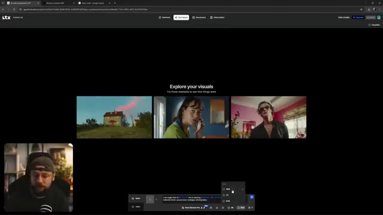
*Interface de LTX Studio montrant la sélection du format d'image (aspect ratio) avec le menu déroulant 16:9, 1:1 et 9:16.*

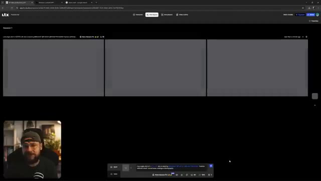
*Interface de LTX Studio affichant la session de génération avec les vignettes en cours de chargement suite au clic sur l'icône de génération.*

---

### ⏱️ `[00:05:02 - 00:05:40]` | Segment #13

**🔊 Audio (Transcription Intégrale Mot pour Mot en Français) :**
> Donc maintenant Nano Banana Pro va combiner tous les différents éléments que nous avons sélectionnés. Et jetez juste un œil à ces images que nous avons obtenues, toutes en résolution 4K. Nous avons Taylor Swift portant exactement la tenue que nous avons assemblée. Et oui, je pense qu'elle l'assume parfaitement. Et je suis sûr que vous pouvez déjà voir le niveau de contrôle fou que nous sommes capables d'avoir en utilisant un outil comme Nano Banana Pro. Et juste pour vous donner un autre exemple, vous pouvez voir que j'ai téléchargé une tenue différente ici nous avons une paire de jeans un sweat à capuche et un bonnet ainsi que Timothée Chalamet donc une fois

**👁️ Analyse Visuelle d'Écran (gemini-3.5-flash-lite) :**
**Interface & Outils** : Interface web de LTX Studio / Studio vidéo avec barre de prompt Nano Banana Pro et galerie d'éléments.

**Contenu textuel & Code** : Texte du prompt : "Low angle shot of @TAYLOR she is wearing @REDHAT @FLEECE @KHAKITROUSERS Fashion editorial shoot, casual pose, analogue photography." Paramètres visibles : "4K", "16:9", "Nano Banana Pro". Collection d'éléments : "Your Elements collection" avec les catégories Character, Object, Other et des vignettes (Jeans, Hoodie, Beanie, Timothée Chalamet).

**Action / Démonstration** : Le créateur montre la génération de plusieurs images 4K de Taylor Swift avec une tenue spécifique, puis présente sa bibliothèque d'éléments texturaux et de personnages pour de futures compositions.

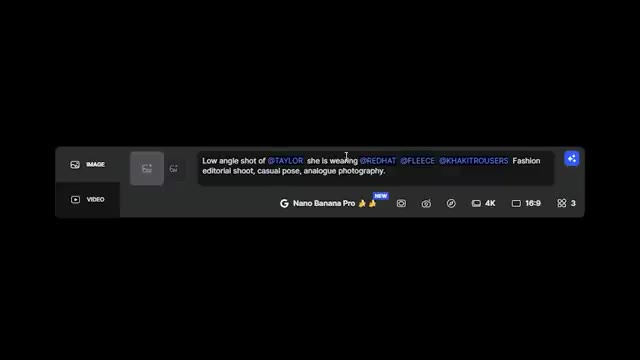
*Interface de saisie de prompt montrant l'utilisation de Nano Banana Pro avec le texte descriptif de Taylor Swift.*

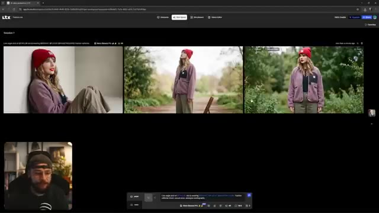
*Interface d'un studio vidéo montrant trois variations d'images générées de Taylor Swift en résolution 4K, avec le créateur visible en incrustation (PiP).*

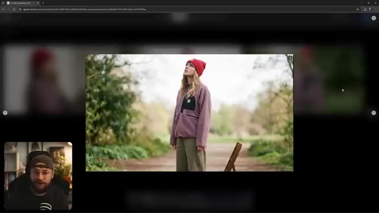
*Gros plan sur l'une des images générées en 4K de Taylor Swift en extérieur dans le studio vidéo.*

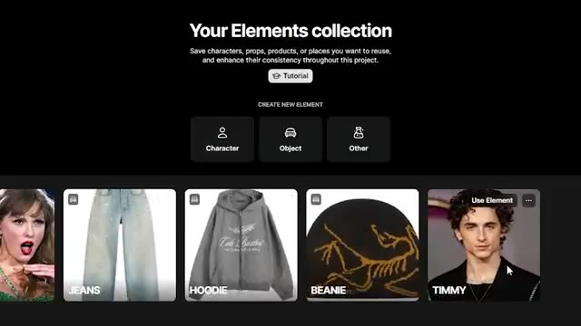
*Écran "Your Elements collection" montrant des éléments enregistrés (Taylor Swift, jeans, sweat à capuche, bonnet, Timothée Chalamet) prêts à être utilisés.*

---

### ⏱️ `[00:05:40 - 00:06:05]` | Segment #14

**🔊 Audio (Transcription Intégrale Mot pour Mot en Français) :**
> encore une fois revenons à notre espace de génération et allons chercher un plan dramatique en plongée de timmy portant le bonnet le jean et bien sûr le sweat à capuche aussi et encore une fois je vais ajouter à la fin shooting éditorial de mode pose décontractée photographie analogique et envoyer ces générations et et gardez à l'esprit aussi que nous ne décrivons pas ce que nous voulons que nos personnages fassent.

**👁️ Analyse Visuelle d'Écran (gemini-3.5-flash-lite) :**
**Interface & Outils** : Navigateur web affichant l'interface de LTX Studio (app.ltx.studio) avec ses onglets (Generations, Gen Space, Storyboard, Video Editor) et sa barre de prompt en bas.

**Contenu textuel & Code** : Texte du prompt visible : "High angle dramatic shot of @TIMMY wearing @BEANIE..." ainsi que les mentions des modèles et paramètres de génération.

**Action / Démonstration** : Le créateur navigue dans l'interface de génération d'images et rédige un prompt textuel en utilisant des balises pour les personnages et les accessoires.

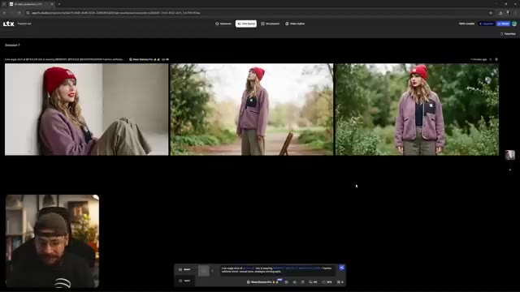
*Interface principale de LTX Studio affichant les résultats de génération et le retour vidéo du créateur en incrustation.*

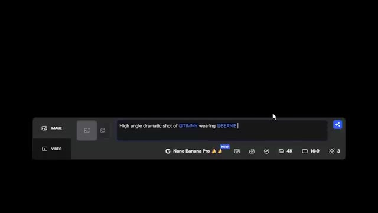
*Gros plan sur la barre de saisie de prompt de l'interface LTX Studio avec le texte en cours de rédaction.*

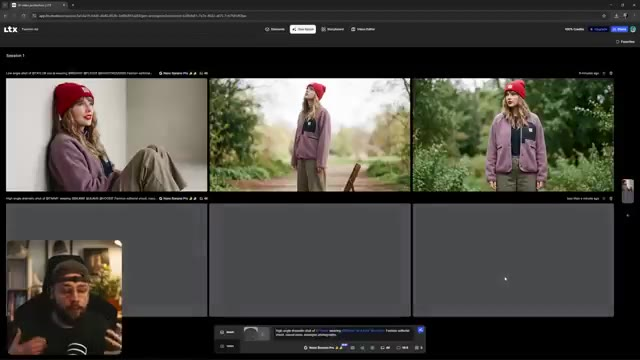
*Interface de LTX Studio montrant la grille de générations d'images avec le nouveau résultat en cours de chargement.*

---

### ⏱️ `[00:06:06 - 00:06:39]` | Segment #15

**🔊 Audio (Transcription Intégrale Mot pour Mot en Français) :**
> Nous ne décrivons pas le décor, ni l'éclairage, ni quoi que ce soit de ce genre. Si nous voulons nous concentrer sur ces détails, nous le pouvons. Et regardez aussi nos générations de Timothée Chalamet. Celles-ci ont l'air incroyablement bien aussi. Maintenant, ce qui est vraiment puissant avec un outil comme Nano Banana Pro et également très important si vous allez travailler sur des campagnes de mode, c'est que l'image de marque, le design de chacun de nos éléments est resté très cohérent avec les produits du monde réel. Vous pouvez voir que la coloration et

**👁️ Analyse Visuelle d'Écran (gemini-3.5-flash-lite) :**
**Interface & Outils** : Studio LTX (application web accessible via navigateur) avec interface de génération vidéo, grille de prévisualisation de sessions et visionneuse d'images intégrée.

**Contenu textuel & Code** : Prompts visibles : "Low-angle shot of @Taylor with a wearing @Polo with @Hoodie Fashion editorial..." et "High-angle cinematic shot of @Timothée wearing @Cole Buxton with @Hoodie Fashion editorial...". Le nom du modèle d'IA "Nano Banana Pro" apparaît dans l'interface.
[DESC_IMAGE_1] L'écran affiche une grille de résultats de génération vidéo dans LTX Studio avec le créateur en incrustation vidéo (PiP) dans le coin inférieur gauche.
[DESC_IMAGE_2] L'écran présente un zoom sur une image de génération de Timothée Chalamet dans un lecteur multimédia.
[DESC_IMAGE_3] L'écran montre un zoom rapproché sur le visage et les vêtements de Timothée Chalamet pour inspecter la fidélité du design.
[DESC_IMAGE_4] L'écran affiche l'image finale en haute résolution montrant le personnage de Timothée Chalamet en plan entier.

**Action / Démonstration** : Le présentateur commente les capacités de génération de l'outil Nano Banana Pro tout en parcourant les différentes créations de portraits de célébrités (Taylor Swift, Timothée Chalamet) et en inspectant les détails des vêtements de marque.

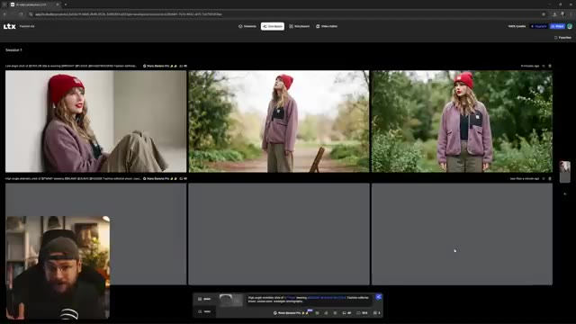
*Interface du studio LTX montrant plusieurs générations vidéo basées sur l'IA (notamment Taylor Swift) avec des prompts textuels visibles.*

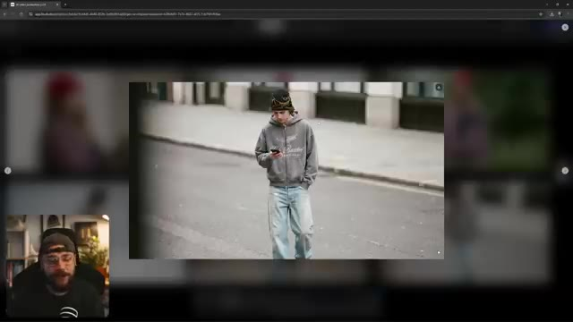
*Visualisation d'une image générée représentant Timothée Chalamet en plan large dans une rue, avec l'interface de visionneuse.*

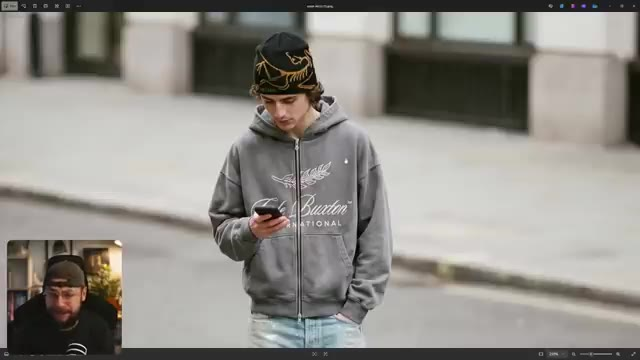
*Gros plan sur l'image générée de Timothée Chalamet, montrant la netteté et les détails fidèles du vêtement (sweat à capuche et bonnet).*

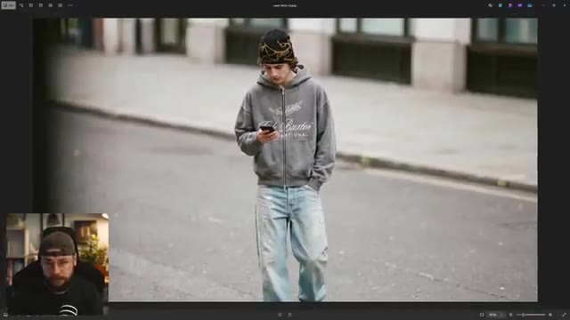
*Affichage en plein écran de la génération de Timothée Chalamet marchant dans la rue en train de regarder son téléphone.*

---

### ⏱️ `[00:06:39 - 00:07:16]` | Segment #16

**🔊 Audio (Transcription Intégrale Mot pour Mot en Français) :**
> l'image de marque de nos articles de vêtements sélectionnés est exactement la même que dans la vraie vie et Taylor Swift ressemble vraiment à Taylor Swift. Même sous différents angles, les produits ont toujours un très beau rendu et sont cohérents. Mais disons que vous ne travaillez pas pour une énorme marque de mode et que vous ne travaillez pas avec ces immenses stars comme Timothée Chalamet et Taylor Swift. Retournons dans l'onglet des éléments et je vais aller télécharger une image de moi-même. La voici, cette photo terrible que j'ai prise avec mon iPhone. Allez-y, ajoutez le nom Jack et sauvegardez l'élément.

**👁️ Analyse Visuelle d'Écran (gemini-3.5-flash-lite) :**
**Interface & Outils** : Application web LTX Studio (app.ltx.studio) avec interface sombre de gestion d'éléments multimédias et de génération vidéo par IA.

**Contenu textuel & Code** : Texte affiché à l'écran : "Your Elements collection", options "Character", "Object", "Other", vignettes nommées "BEANI", "FLEECE", "TROUSERS", "TAYLOR", "JEANS", "HOODIE", "BEANS", "TOMMY". Dans la modale de création : "CREATE ELEMENT", champ "NAME* @JACK", "SOURCE IMAGE", bouton "Upload", "SELECT ELEMENT TYPE", champ "VOICE", boutons "Cancel" et "Save Element".

**Action / Démonstration** : Le créateur navigue à travers les exemples de rendus de célébrités, retourne dans l'onglet des éléments, importe un selfie pris avec son iPhone, nomme l'élément '@JACK' et s'apprête à cliquer sur 'Save Element'.

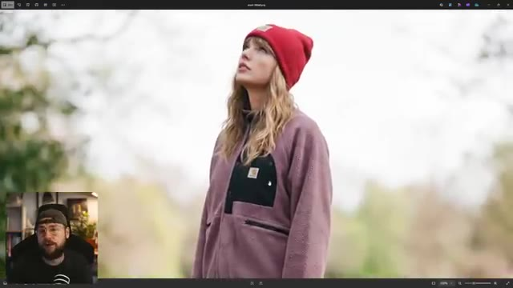
*Aperçu en plein écran d'une vidéo générée par IA représentant Taylor Swift avec un bonnet rouge et une veste polaire, avec la webcam de l'auteur incrustée en bas à gauche.*

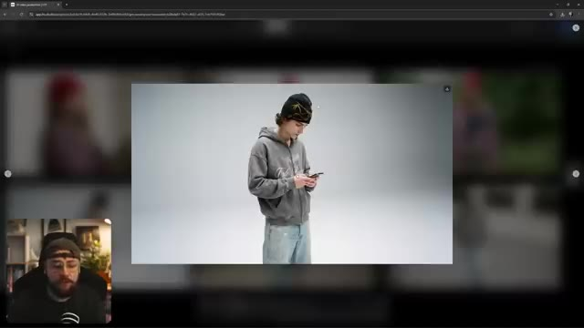
*Interface de la plateforme affichant une vidéo générée d'un mannequin ressemblant à Timothée Chalamet avec un sweat à capuche et un bonnet.*

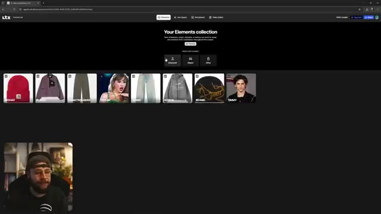
*Vue de l'onglet 'Your Elements collection' de la plateforme LTX Studio montrant plusieurs vignettes d'éléments pré-enregistrés (vêtements et célébrités).*

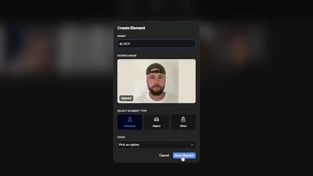
*Fenêtre pop-up de création d'élément 'Create Element' montrant l'importation d'une photo selfie de Jack, le champ nom rempli par '@JACK' et le bouton de sauvegarde.*

---

### ⏱️ `[00:07:16 - 00:07:37]` | Segment #17

**🔊 Audio (Transcription Intégrale Mot pour Mot en Français) :**
> Et maintenant nous pouvons retourner sur genspace. Nous allons effacer la première moitié de notre invite textuelle car nous voulons garder ce bout à la fin. Cela semble nous donner de bons résultats. Donc nous avons simplement opté pour Jack portant la polaire et un jean dans une salle d'arcade abandonnée. Pas besoin d'ajouter de casquette car dans mon image de référence je porte déjà ma casquette de baseball à l'envers.

**👁️ Analyse Visuelle d'Écran (gemini-3.5-flash-lite) :**
**Interface & Outils** : Genspace (application de génération vidéo par IA accessible via navigateur web).

**Contenu textuel & Code** : Le prompt textuel visible dans la barre de saisie est : "@JACK wearing the @FLEECE and @JEANS in an abandoned arcade. Fashion editorial shoot, casual pose, analogue photography." Paramètres visibles : modèle Nano Banana Pro, format 16:9, résolution 4K.

**Action / Démonstration** : Le créateur montre l'interface de l'application Genspace avec ses résultats de génération, puis zoome sur la barre de prompt pour modifier le texte de génération.

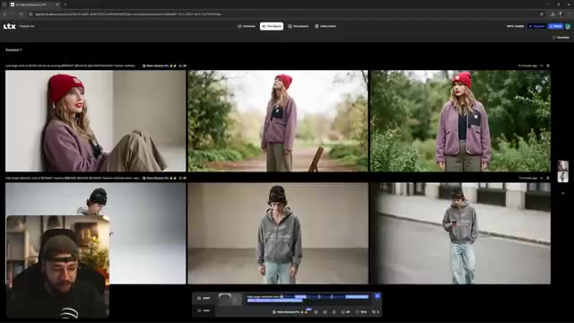
*Interface principale de Genspace montrant une grille de vidéos générées par IA et une incrustation vidéo du créateur dans le coin inférieur gauche.*

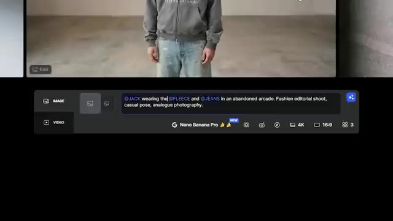
*Gros plan sur la barre de saisie du prompt textuel de Genspace avec le texte "@JACK wearing the @FLEECE and @JEANS in an abandoned arcade".*

---

### ⏱️ `[00:07:37 - 00:07:56]` | Segment #18

**🔊 Audio (Transcription Intégrale Mot pour Mot en Français) :**
> Allons-y et envoyons ceci. Donc vous pouvez voir ici que nous sommes devenus un peu plus spécifiques avec notre prompt en lui donnant une idée de l'emplacement que nous recherchons. Mais nous pouvons également changer à nouveau la tenue et dicter le moment de la journée, par exemple. Donc je dis la nuit à la plage. Cela me donne même une action spécifique.

**👁️ Analyse Visuelle d'Écran (gemini-3.5-flash-lite) :**
**Interface & Outils** : Interface web de LTX Studio avec barre de prompt textuel et options de génération.

**Contenu textuel & Code** : Texte du prompt visible : "@JACK wearing the @HOODIE and @KHAKITROUSERS at night time on the beach. Fashion editorial shoot, casual pose, analogue photography." Paramètres visibles : Modèle "Nano Banana Pro", résolution "4K", format "16:9".

**Action / Démonstration** : Le créateur montre l'interface de génération vidéo et la modification du prompt textuel pour spécifier le lieu, la tenue et le moment de la journée.

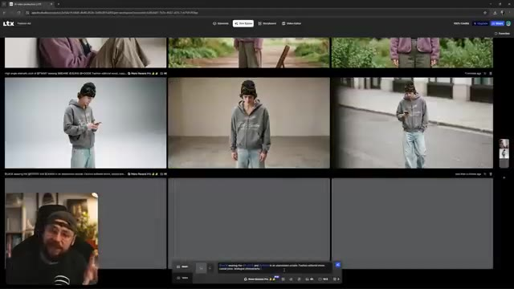
*Interface de l'application de génération vidéo montrant une grille de rendus avec les résultats précédents et le créateur incrusté en bas à gauche.*

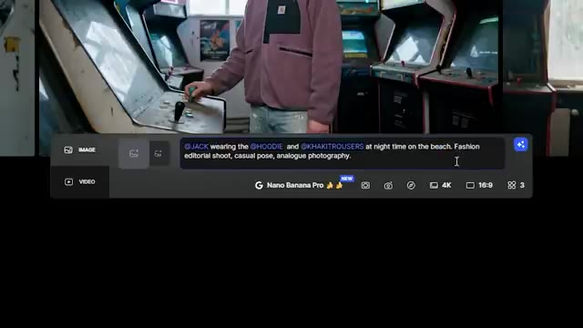
*Gros plan sur la barre de prompt de l'interface montrant le texte saisi pour la génération avec le modèle Nano Banana Pro.*

---

### ⏱️ `[00:07:56 - 00:08:18]` | Segment #19

**🔊 Audio (Transcription Intégrale Mot pour Mot en Français) :**
> Disons en train de courir vers la caméra. Nous allons envoyer celle-ci. Et pendant que notre prochain lot de générations est traité, vous pouvez voir que nous avons reçu quelques résultats ici. Maintenant, vous allez de temps en temps obtenir des résultats que vous ne recherchez pas. Rappelez-vous, c'est encore de l'IA. Il y a toujours une part d'essais et d'erreurs. Mais de manière générale, c'est quand même une image de très haute qualité ici.

**👁️ Analyse Visuelle d'Écran (gemini-3.5-flash-lite) :**
**Interface & Outils** : Interface web d'un outil de production vidéo par IA (type LTX Studio / générateur cloud) avec tableau de bord de résultats en grille, barre de prompt en bas et encadré vidéo (PiP) du présentateur.

**Contenu textuel & Code** : Texte du prompt visible : "@JACK wearing the @HOODIE and @KHAKITROUSERS at night time on the beach. Running towards the camera fashion editorial shoot, casual pose, analogue photography." Paramètres visibles : Modèle "G Nano Banana Pro", résolution "4K", format "16:9", nombre de variations "3".

**Action / Démonstration** : Le créateur envoie une génération de vidéo, puis navigue à travers les différents résultats générés dans la grille du tableau de bord pour en inspecter la qualité.

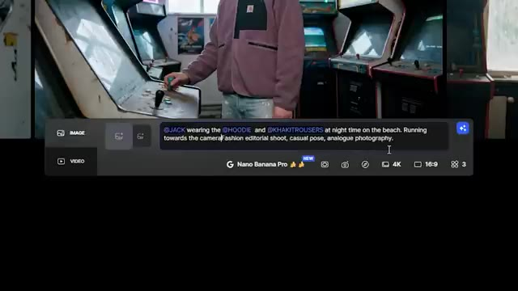
*Interface du générateur vidéo montrant le champ de saisie du prompt avec un rendu d'arcade en arrière-plan.*

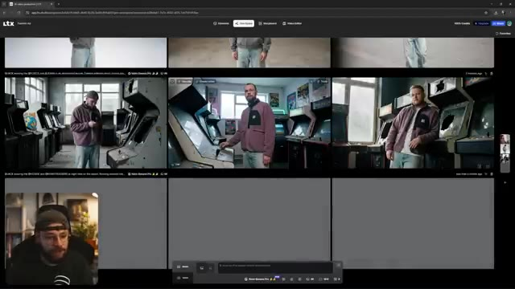
*Interface du tableau de bord affichant plusieurs générations de vidéos avec le flux en incrustation (PiP) du créateur en bas à gauche.*

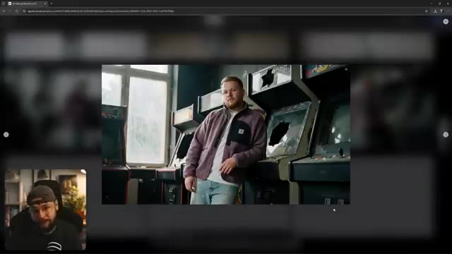
*Gros plan sur un résultat vidéo généré montrant un homme dans une salle d'arcade près de bornes rétro.*

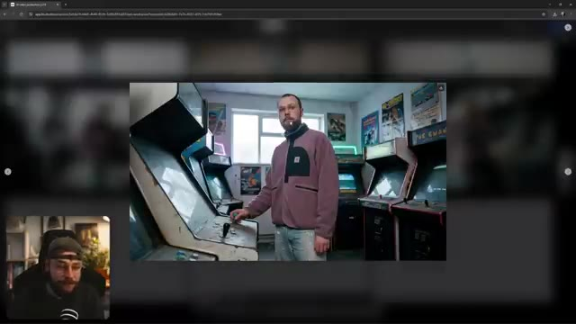
*Gros plan sur un autre résultat vidéo généré montrant un homme jouant sur une borne d'arcade rétro.*

---

### ⏱️ `[00:08:18 - 00:08:37]` | Segment #20

**🔊 Audio (Transcription Intégrale Mot pour Mot en Français) :**
> Ça a été un peu violent avec ma racine des cheveux. Je vous promets que ce n'est pas comme ça. En dehors de ça, la ressemblance générale est bonne et notre décor a vraiment l'air super aussi. Très jolis détails ici avec le genre d'usure sur le bâtiment, ces posters sur le mur et même Pac-Man par ici sur les machines d'arcade.

**👁️ Analyse Visuelle d'Écran (gemini-3.5-flash-lite) :**
**Interface & Outils** : Navigateur web affichant une interface de lecture vidéo avec incrustation (Picture-in-Picture) du créateur.

**Contenu textuel & Code** : Vidéo générée par intelligence artificielle représentant une pièce intérieure remplie de bornes d'arcade rétro (dont une avec le logo Pac-Man visible), des posters au mur, une fenêtre à l'arrière-plan et un personnage ressemblant au créateur vêtu d'une veste en polaire rose et noire.

**Action / Démonstration** : Le lecteur présente le rendu vidéo généré par IA tandis que le créateur commente les détails visuels (usure des bâtiments, posters, machines d'arcade).

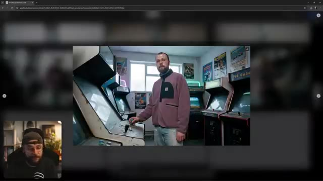
*Capture d'écran du navigateur affichant le lecteur vidéo avec incrustation (PiP) du créateur en bas à gauche et la vidéo générée par IA montrant un personnage dans une salle d'arcade au centre.*

---

### ⏱️ `[00:08:37 - 00:09:14]` | Segment #21

**🔊 Audio (Transcription Intégrale Mot pour Mot en Français) :**
> Et j'aime vraiment beaucoup cette image qu'on a là de moi en train de regarder mon téléphone. On a un joli type de composition de niveau cinématique ici. Donc vous pouvez voir ici qu'on a un tas de nouvelles générations de moi en train de courir sur la plage en portant notre tenue. Malheureusement, avec certaines générations, même si la composition globale a l'air vraiment super, les pantalons ne sont plus kaki, ce qui évidemment n'est pas ce qu'on recherche. Ça adhère par contre très bien à la marque sur le sweat à capuche. Maintenant, bien sûr, on pourrait tout à fait s'arrêter là ou on peut pousser les choses un peu plus loin.

**👁️ Analyse Visuelle d'Écran (gemini-3.5-flash-lite) :**
**Interface & Outils** : Interface web de LTX (ltx.studio) avec un onglet "Gen Space", une barre de navigation supérieure avec des options comme "Elements", "Gen Space", "Storyboard", "Video Editor", et un aperçu vidéo central avec incrustation PiP du créateur.

**Contenu textuel & Code** : URL visible : `app.ltx.studio/...`. Dans l'image 3, des lignes de prompts de génération d'images/vidéos sont visibles sous les miniatures, par exemple "wearing a [SKINNYJACK] hoodie with the hood up... at night time on the beach".

**Action / Démonstration** : Le créateur navigue et commente l'interface de génération vidéo de LTX Studio, en présentant différentes variations de personnages générés par IA dans divers décors (salle d'arcade, plage nocturne, rue urbaine).

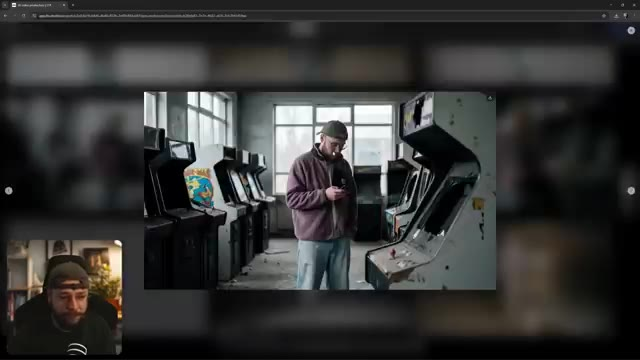
*Interface du logiciel LTX montrant un personnage IA dans une salle de jeux d'arcade abandonnée, avec le créateur incrusté en bas à gauche.*

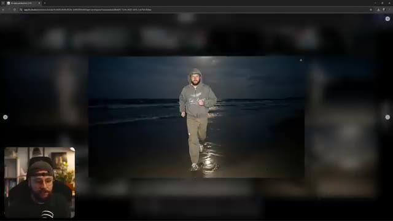
*Interface du logiciel LTX affichant une vidéo générée d'un personnage IA courant sur une plage de nuit, avec le créateur en incrustation PiP.*

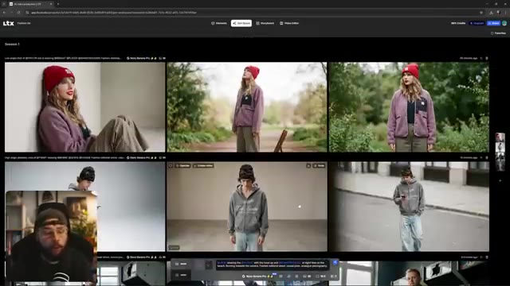
*Interface du logiciel LTX affichant une grille de plusieurs générations d'images et vidéos avec des prompts visibles en bas.*

---

### ⏱️ `[00:09:14 - 00:09:36]` | Segment #22

**🔊 Audio (Transcription Intégrale Mot pour Mot en Français) :**
> niveau en générant des vidéos par intelligence artificielle en utilisant ces images comme cadre de départ. Donc, par exemple, si nous survolons cette image ici de Taylor Swift, vous pouvez voir qu'il y a un onglet qui indique créer une vidéo. Donc si nous cliquons ici, nous allons basculer l'onglet du bas sur vidéo et vous pouvez voir que notre image de Taylor est utilisée comme cadre de départ.

**👁️ Analyse Visuelle d'Écran (gemini-3.5-flash-lite) :**
**Interface & Outils** : Application web LTX Studio (ltx.studio) avec une interface de gestion de projets et de génération de médias, intégrant une incrustation vidéo (PiP) du présentateur en bas à gauche.

**Contenu textuel & Code** : Une grille de plusieurs images générées montrant Taylor Swift avec un bonnet rouge et une veste mauve, ainsi que d'autres personnages dans divers plans. Un encadré en bas de l'interface affiche des détails de prompt et des paramètres de génération.
[DESC_IMAGE_1] Le créateur montre l'interface de LTX Studio où l'on peut voir différentes images générées de Taylor Swift prêtes à être converties en vidéo.

**Action / Démonstration** : Démonstration pédagogique et présentation du workflow.

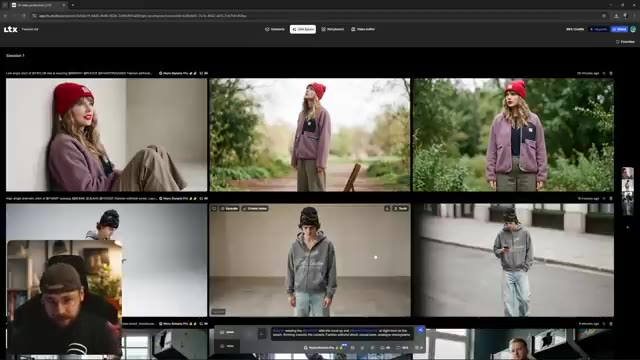
*Interface de l'application LTX Studio affichant une grille d'images générées de Taylor Swift et de modèles, avec la webcam du créateur incrustée en bas à gauche.*

---

### ⏱️ `[00:09:36 - 00:09:56]` | Segment #23

**🔊 Audio (Transcription Intégrale Mot pour Mot en Français) :**
> Pour le prompt textuel, je vais opter pour quelque chose de plutôt simple, un mouvement de caméra dolly lent vers l'arrière alors que Taylor Swift se tient debout avec assurance. Maintenant, nous avons une décision à prendre concernant le modèle vidéo que nous utilisons. Ici, nous avons accès à VO3.1 par exemple, mais nous pouvons aussi utiliser le propre modèle vidéo de LTX, LTX2.

**👁️ Analyse Visuelle d'Écran (gemini-3.5-flash-lite) :**
**Interface & Outils** : Interface web de LTX Studio avec barre de prompt et grille de prévisualisation des vidéos générées.

**Contenu textuel & Code** : Texte du prompt visible en bas : "Slow dolly camera move back as Taylor Swift stands confidently". Menu des modèles affichant : LTX-2 Pro, LTX-2 Fast, LTX-2 Ultra (Coming Soon), Veo 3.1, Veo 3.1 Fast, Veo 2.

**Action / Démonstration** : Le créateur montre son écran de travail sur LTX Studio, navigue dans la galerie de résultats et ouvre le menu de sélection des modèles de génération vidéo.

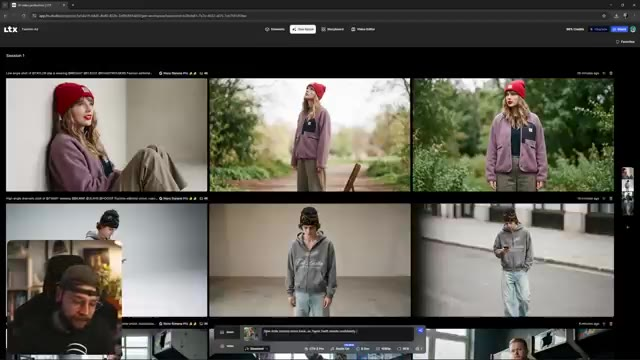
*Interface de la plateforme LTX affichant une galerie de générations de vidéos avec le créateur en incrustation PiP dans le coin inférieur gauche.*

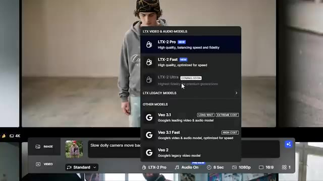
*Menu déroulant des modèles vidéo et audio sur LTX montrant LTX-2 Pro, LTX-2 Fast, LTX-2 Ultra ainsi que les modèles Veo 3.1 et Veo 2.*

---

### ⏱️ `[00:09:56 - 00:10:14]` | Segment #24

**🔊 Audio (Transcription Intégrale Mot pour Mot en Français) :**
> Maintenant, nous n'avons pas vraiment besoin de son ici, donc nous pouvons le désactiver. Nous pouvons dicter la longueur de notre génération. Je vais opter pour huit secondes. Et le truc vraiment sympa, c'est qu'on peut aussi aller jusqu'à une résolution vidéo de 4K. Allons-y donc et sélectionnons-la. Le format d'image, nous allons le garder tel quel.

**👁️ Analyse Visuelle d'Écran (gemini-3.5-flash-lite) :**
**Interface & Outils** : Interface web de LTX Studio avec les onglets "Workspace", "Storyboard", et "Video Editor" en haut, et un flux de travail vidéo affichant plusieurs générations de personnages (femme avec un bonnet rouge et veste polaire, homme avec un sweat à capuche). Le créateur est visible en incrustation (PiP) dans le coin inférieur gauche.

**Contenu textuel & Code** : Dans l'interface LTX Studio, on aperçoit des aperçus vidéo de mode avec des prompts textuels visibles au-dessus des vignettes (ex: "Low-angle shot of @TAYLORS, she is wearing @REDHAT, @FLEECE..."). Des options de paramétrage apparaissent en bas avec des boutons pour la durée et la résolution.

**Action / Démonstration** : Le créateur montre l'interface de LTX Studio où il sélectionne et configure les paramètres de génération vidéo (durée, résolution et désactivation de l'audio).

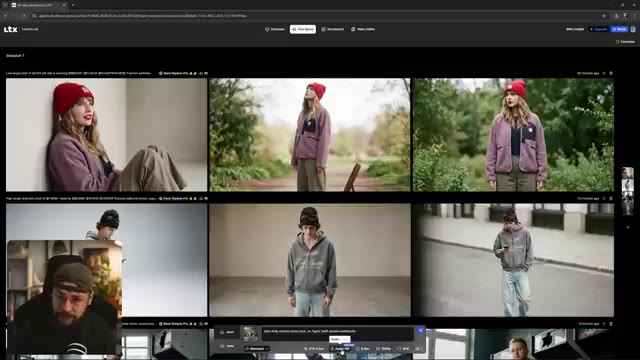
*Interface de LTX Studio montrant une grille de vidéos générées avec le créateur en incrustation (PiP) dans le coin inférieur gauche.*

---

### ⏱️ `[00:10:14 - 00:10:33]` | Segment #25

**🔊 Audio (Transcription Intégrale Mot pour Mot en Français) :**
> Nous allons opter pour du 16 par 9 parce que c'est de cette façon que nous avons généré notre image de départ. Et pour le nombre de générations, allons-y pour en générer trois et les lancer. Maintenant, comme je l'ai dit, vous pourriez simplement utiliser ces images fixes générées par IA si vous vouliez les publier sur les réseaux sociaux pour promouvoir votre propre marque de vêtements, par exemple.

**👁️ Analyse Visuelle d'Écran (gemini-3.5-flash-lite) :**
**Interface & Outils** : LTX Studio (application web de création vidéo par IA)

**Contenu textuel & Code** : Prompt visible : "Slow dolly camera move back, as Taylor Swift stands confidently." Paramètres : Mode Standard, LTX-2 Pro, Audio Off, 8 Sec, 4K, ratio 16:9, nombre de générations réglé à 3.

**Action / Démonstration** : Le créateur sélectionne le format 16:9 et lance la génération de trois variations de vidéos à partir d'une image fixe, puis commente l'utilité potentielle de ces visuels pour promouvoir une marque de vêtements sur les réseaux sociaux.

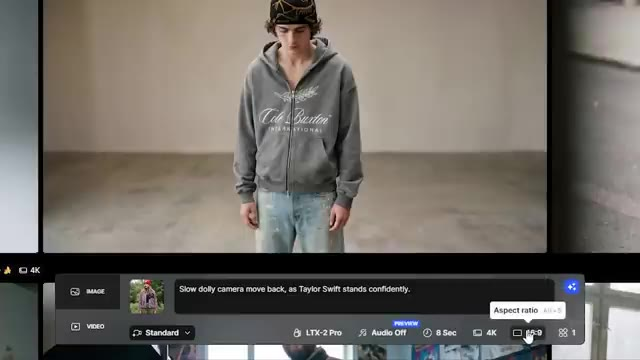
*Interface de l'outil LTX Studio montrant les paramètres de génération avec le ratio 16:9 sélectionné.*

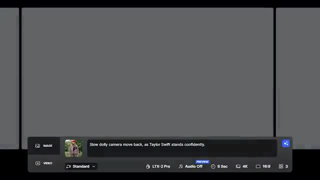
*Interface de LTX Studio affichant les fenêtres de prévisualisation en cours de chargement pour les trois générations demandées.*

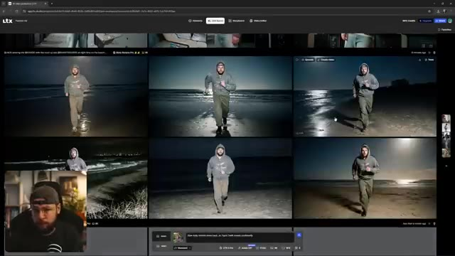
*Vue globale de l'interface de LTX Studio affichant une grille de vidéos générées avec le créateur en incrustation (PiP) dans le coin inférieur gauche.*

---

### ⏱️ `[00:10:33 - 00:10:56]` | Segment #26

**🔊 Audio (Transcription Intégrale Mot pour Mot en Français) :**
> Mais lorsque nous commençons à générer nos vidéos par IA, nous allons vraiment passer au niveau supérieur. Maintenant, alors que les générations de vidéos que nous avons obtenues sont vraiment assez impressionnantes, vous allez commencer à voir l'un des problèmes lorsqu'il s'agit de vidéo par IA. Maintenant, évidemment, nous nous sommes un peu compliqué la vie en utilisant une personnalité publique bien connue comme Taylor Swift.

**👁️ Analyse Visuelle d'Écran (gemini-3.5-flash-lite) :**
**Interface & Outils** : Interface web de génération vidéo par IA (type plateforme cloud de production vidéo) avec lecteur vidéo central, barres de contrôle et encadré PiP du présentateur en bas à gauche.

**Contenu textuel & Code** : Texte visible dans l'interface : "Slow dolly camera move back, as Taylor Swift stands confidently, LTX-2 Pro 4K". On aperçoit également un personnage ressemblant à Taylor Swift portant un bonnet rouge, une veste polaire rose et un pantalon kaki au milieu de feuillages.

**Action / Démonstration** : Le créateur présente l'interface de génération vidéo par IA et commente le résultat visuel affiché en grand écran montrant une fausse vidéo de Taylor Swift générée par LTX-2 Pro.

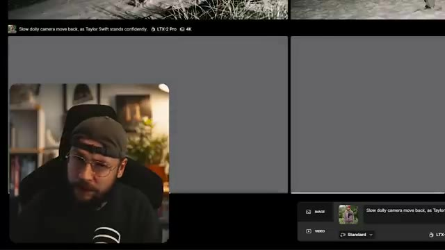
*Interface d'un outil de génération vidéo par IA montrant le prompt textuel et un panneau de configuration avec le créateur en incrustation PiP.*

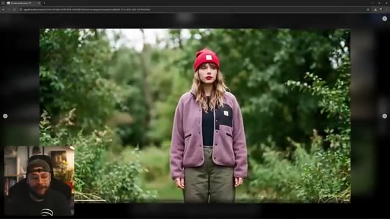
*Affichage à l'écran d'une vidéo générée par IA représentant Taylor Swift habillée en extérieur avec une veste rose et un bonnet rouge dans un décor boisé.*

*Gros plan sur le rendu vidéo de Taylor Swift généré par l'intelligence artificielle dans son décor forestier, avec le créateur en incrustation.*

---

### ⏱️ `[00:10:56 - 00:11:25]` | Segment #27

**🔊 Audio (Transcription Intégrale Mot pour Mot en Français) :**
> Et la chose à comprendre lorsqu'il s'agit de l'IA, en particulier avec la génération de vidéo, c'est que le contexte est très important. Et par là, je veux dire que notre image de départ montre seulement à quoi ressemble Taylor Swift sous cet angle spécifique. Donc dans notre génération vidéo, lorsqu'elle commence à bouger pour tourner la tête, le modèle vidéo doit essentiellement procéder à des suppositions quant à ce à quoi il pense qu'elle pourrait ressembler.

**👁️ Analyse Visuelle d'Écran (gemini-3.5-flash-lite) :**
**Interface & Outils** : Navigateur web affichant une interface de lecteur/visualisation de clips vidéo générés par IA, avec une petite fenêtre PiP (Picture-in-Picture) du présentateur en bas à gauche.

**Contenu textuel & Code** : URL visible dans la barre d'adresse du navigateur (app.studios... / workspace). Vidéo principale montrant une femme portant un bonnet rouge, une veste polaire violette et un pantalon kaki dans une forêt verdoyante.

**Action / Démonstration** : Le lecteur vidéo affiche la lecture d'un clip généré par IA où le personnage bouge et tourne la tête, tandis que le créateur commente et explique les limites de la génération vidéo par IA dans sa webcam PiP.

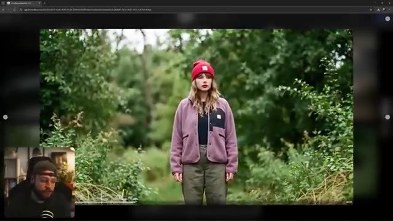
*Interface de prévisualisation vidéo montrant un plan fixe d'une femme ressemblant à Taylor Swift dans un environnement forestier, avec la webcam du créateur en incrustation (PiP) dans le coin inférieur gauche.*

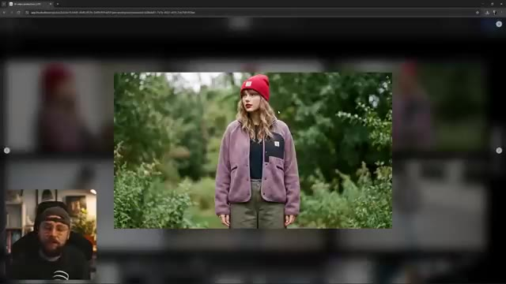
*Interface de prévisualisation vidéo avec la webcam du créateur en PiP montrant un plan où le personnage commence à tourner la tête.*

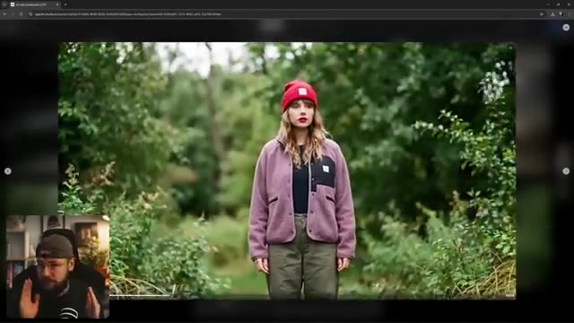
*Interface vidéo en plein écran montrant le personnage de face dans les bois, avec le créateur en incrustation gesticulant des mains.*

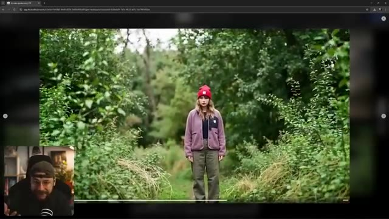
*Interface de lecteur vidéo montrant un plan plus large du personnage dans la forêt, avec le créateur en incrustation souriant.*

---

### ⏱️ `[00:11:25 - 00:11:44]` | Segment #28

**🔊 Audio (Transcription Intégrale Mot pour Mot en Français) :**
> Donc comme je le dis, avec ces exemples, nous nous sommes rendu la vie plutôt difficile. En termes de bons côtés cependant, regardez juste la façon dont le feuillage bouge. C'est incroyablement réaliste, la façon dont notre personnage bouge également. Oui, elle ne ressemble plus vraiment à Taylor Swift, mais cela semble vraiment très réaliste.

**👁️ Analyse Visuelle d'Écran (gemini-3.5-flash-lite) :**
**Interface & Outils** : Interface de navigateur web affichant un outil de production vidéo par IA avec un lecteur vidéo central et une incrustation vidéo (PiP) du créateur en bas à gauche.

**Contenu textuel & Code** : Lecteur multimédia affichant une vidéo générée par IA d'un personnage féminin en veste rose et bonnet rouge dans une forêt, avec une barre de progression en bas.

**Action / Démonstration** : Le lecteur joue la séquence vidéo générée par IA, montrant les mouvements du personnage et du feuillage naturel en arrière-plan pendant que le créateur commente le réalisme des animations.

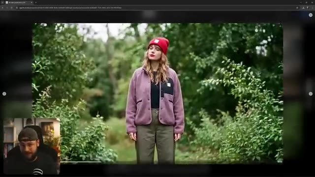
*Aperçu vidéo montrant un personnage ressemblant à Taylor Swift habillé d'une polaire rose et d'un bonnet rouge dans un décor boisé (avec l'animateur en incrustation PiP).*

*Gros plan sur le personnage généré par IA dans la vidéo, mettant en valeur les détails du visage et des vêtements au milieu du feuillage.*

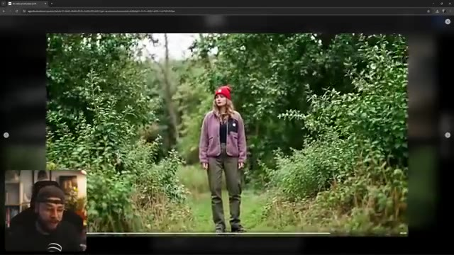
*Vue plus large de la scène forestière générée par IA où le personnage se tient au milieu des arbres et des buissons animés.*

---

### ⏱️ `[00:11:45 - 00:12:07]` | Segment #29

**🔊 Audio (Transcription Intégrale Mot pour Mot en Français) :**
> Même le mouvement de caméra lui-même et l'éclairage, tout donne une impression très photoréaliste. C'est vraiment impressionnant. Les défauts se résument en réalité au manque de contexte. Maintenant, si vous voulez vous simplifier un peu la vie, j'ai une petite astuce. Je vais recliquer sur l'onglet de génération d'images et je vais simplement effacer le champ de texte.

**👁️ Analyse Visuelle d'Écran (gemini-3.5-flash-lite) :**
**Interface & Outils** : Application de génération vidéo par IA (interface web avec lecteur vidéo et panneau de prompt en bas).

**Contenu textuel & Code** : Options visibles dans l'interface : onglets "IMAGE" et "VIDEO", sélecteurs de modèle ("Nano Banana Pro"), options de résolution (4K), format d'image (16:9), et un champ de texte vide pour saisir les prompts.

**Action / Démonstration** : Le créateur navigue dans l'interface de l'outil IA, visionne la vidéo générée d'une femme dans la forêt, puis revient sur l'onglet de génération pour effacer le champ de texte.

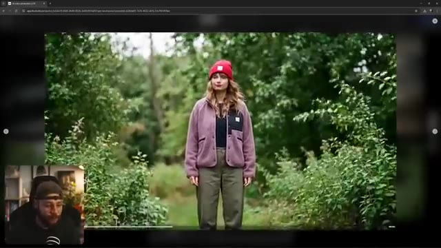
*Aperçu vidéo généré par IA montrant une femme avec un bonnet rouge et une veste polaire violette dans un décor forestier, avec Jack incrusté en bas à gauche.*

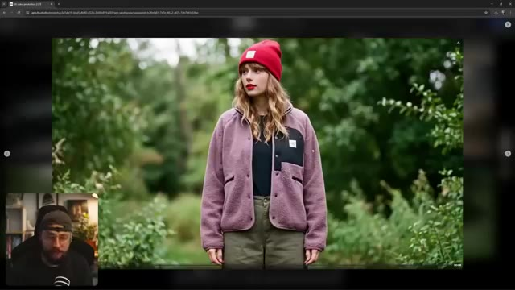
*Gros plan sur la vidéo générée de la femme au bonnet rouge dans la forêt, avec Jack en incrustation PiP.*

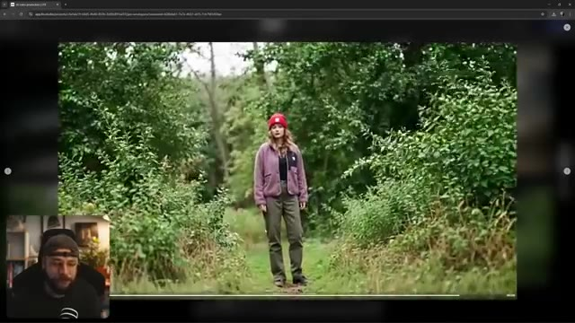
*Plan large de la vidéo générée de la femme au milieu des buissons et des arbres, avec Jack en incrustation PiP.*

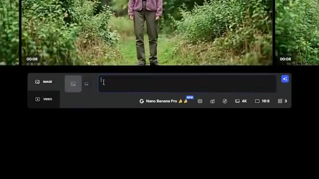
*Interface de l'outil de génération vidéo par IA montrant les onglets Image/Video et le champ de texte vide pour le prompt.*

---

### ⏱️ `[00:12:07 - 00:12:28]` | Segment #30

**🔊 Audio (Transcription Intégrale Mot pour Mot en Français) :**
> En utilisant à nouveau Nano Banana Pro, je vais simplement dire un homme séduisant d'une quarantaine d'années avec une barbe et lancer la génération. Le personnage que nous créons ici est donc entièrement synthétique. Et l'avantage positif de ceci, c'est que personne ne sait à quoi il ressemble, n'est-ce pas ?

**👁️ Analyse Visuelle d'Écran (gemini-3.5-flash-lite) :**
**Interface & Outils** : Interface web de l'application LTX Studio affichant les onglets Elements, Shot Space, Storyboard, Video Editor, avec les boutons de génération vidéo et les paramètres de rapport d'aspect.

**Contenu textuel & Code** : Texte du prompt saisi : "An attractive man in his 40s with a beard", sélecteur de modèle "Nano Banana Pro" actif.

**Action / Démonstration** : Le créateur navigue sur l'interface de l'application web, saisit le prompt textuel pour générer un personnage et lance la génération via le modèle d'intelligence artificielle.

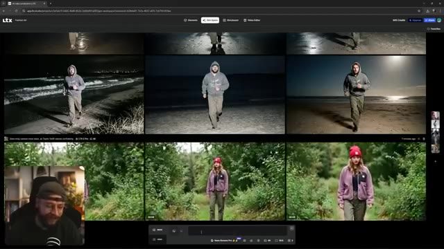
*Interface principale de l'application montrant une grille de vidéos générées avec le créateur en incrustation (PiP) dans le coin inférieur gauche.*

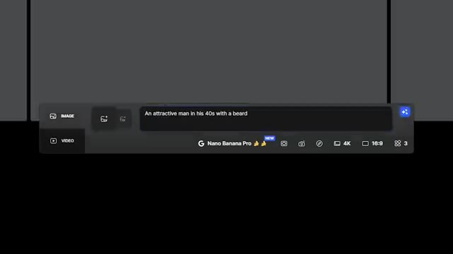
*Gros plan sur la barre de saisie de l'interface avec le texte du prompt et le sélecteur de modèle Nano Banana Pro.*

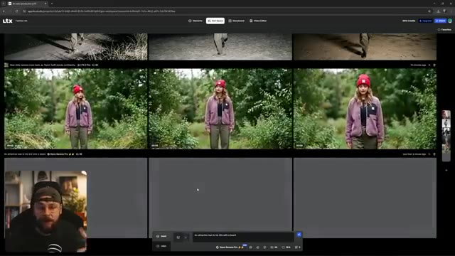
*Vue de l'interface de génération en cours avec la nouvelle ligne en bas qui s'apprête à afficher les résultats.*

---

### ⏱️ `[00:12:28 - 00:13:06]` | Segment #31

**🔊 Audio (Transcription Intégrale Mot pour Mot en Français) :**
> Quand il tourne la tête dans nos générations de vidéos, qui peut dire qu'il ne ressemble pas d'une certaine manière sous un angle spécifique, n'est-ce pas ? Donc mon point ici est que vous pouvez utiliser un personnage généré par IA pour porter les vêtements que vous avez pu concevoir vous-même. Et le résultat final sera beaucoup plus indulgent, mais vous donnera quand même exactement ce que vous recherchez. Vous pouvez donc voir ici par exemple, ce type a l'air plutôt cool, mais disons que je veux qu'il ait une très grosse barbe. Si nous survolons notre image, nous pouvons cliquer sur l'onglet d'édition et vous pouvez voir que ceci est maintenant utilisé comme référence d'image et

**👁️ Analyse Visuelle d'Écran (gemini-3.5-flash-lite) :**
**Interface & Outils** : Application web de génération vidéo (type LTX Studio / outil similaire avec onglets éléments, shot space, storyboard, éditeur vidéo).

**Contenu textuel & Code** : Texte de prompt visible : « An attractive man in his 40s with a beard », modèle « Nano Banana Pro », résolutions et options 4K, 16:9, boutons d'édition d'image et de vidéo.

**Action / Démonstration** : Le créateur navigue dans l'interface de l'application, survole les images générées et montre comment utiliser une image de référence pour modifier le personnage avec une barbe.

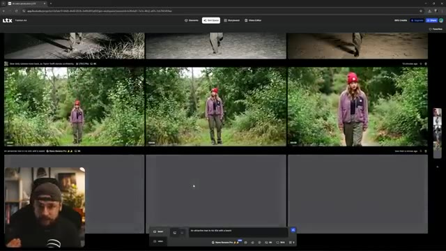
*Interface de l'application montrant une grille de vidéos générées par IA avec le panneau de commande en bas et la webcam du créateur en incrustation.*

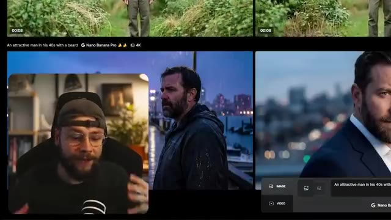
*Affichage de l'interface d'édition vidéo avec un personnage barbu en costume et le panneau de prompt et de référence d'image.*

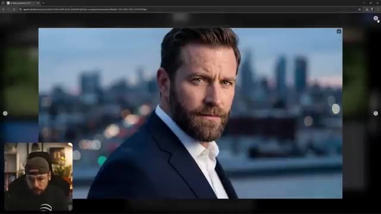
*Gros plan sur l'image générée en plein écran d'un homme en costume avec une barbe sur fond de ville.*

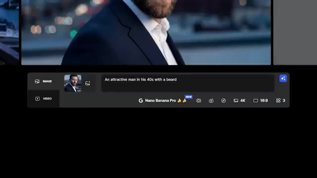
*Zoom sur la barre de prompt et de paramètres montrant le modèle Nano Banana Pro, le format 16:9 et l'image de référence.*

---

### ⏱️ `[00:13:06 - 00:13:35]` | Segment #32

**🔊 Audio (Transcription Intégrale Mot pour Mot en Français) :**
> Nous allons continuer et l'éditer en utilisant Nano Banana Pro. Nous pouvons donc dire : donne à l'homme une barbe beaucoup plus grande et change la couleur de ses yeux pour qu'ils soient d'un bleu perçant. Envoyons donc cette génération et jetons un coup d'œil à ces résultats que nous avons obtenus. C'est insensé. Donc, si nous survolons l'onglet des outils, cliquons ici, je vais enregistrer en tant qu'élément. Nous allons l'appeler l'homme barbu.

**👁️ Analyse Visuelle d'Écran (gemini-3.5-flash-lite) :**
**Interface & Outils** : Application web de génération et d'édition vidéo/image IA (utilisant Nano Banana Pro), avec options de prompts et fenêtres modales de gestion des éléments.

**Contenu textuel & Code** : Texte du prompt suggéré ou saisi ("How would you like to change this image?"), nom de l'outil "Nano Banana Pro", et champ de nommage d'élément avec le texte "BEARDED".

**Action / Démonstration** : Le créateur montre l'utilisation de Nano Banana Pro pour modifier une image, affiche le résultat généré avec une barbe plus grande et des yeux bleus, puis ouvre le panneau pour sauvegarder l'élément sous le nom de "The bearded man".

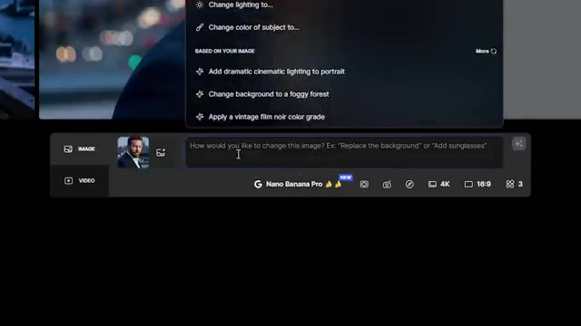
*Interface de Nano Banana Pro montrant la barre de prompt et les suggestions d'édition pour modifier l'image.*

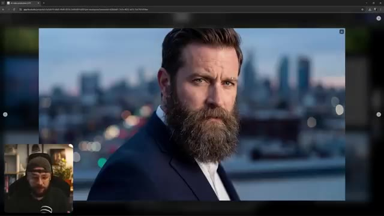
*Affichage du résultat final généré avec le visage modifié (barbe fournie et yeux bleus perçants), avec le créateur en incrustation PiP dans le coin inférieur gauche.*

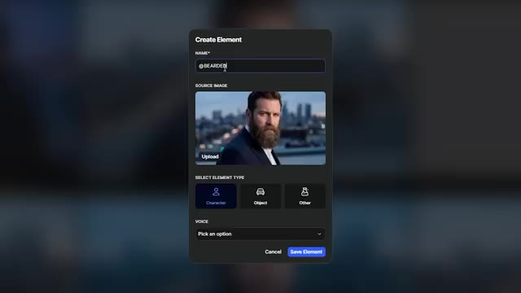
*Fenêtre modale "Create Element" permettant de nommer l'élément "BEARDED" et de l'enregistrer dans l'application.*

---

### ⏱️ `[00:13:36 - 00:14:08]` | Segment #33

**🔊 Audio (Transcription Intégrale Mot pour Mot en Français) :**
> Enregistre ça. Et pour le prompt textuel, on va partir sur une vue en plongée de l'homme barbu assis sur une dune dans le désert. Il porte le bonnet rouge, une polaire et un jean. Donc on envoie ça. Je vais juste faire une légère variation en disant que c'est la nuit. Le man est également assis sur un fauteuil. À côté de lui se trouve une petite table basse avec une lampe posée dessus. Envoie cette génération également. Et alors que notre premier lot de générations arrive, regarde juste la qualité de celles-ci.

**👁️ Analyse Visuelle d'Écran (gemini-3.5-flash-lite) :**
**Interface & Outils** : Interface de l'application web LTX Studio (ltx.studio) avec onglets Elements, Gen Space, Storyboard, Video Editor.

**Contenu textuel & Code** : Texte du prompt visible : "High angle shot of @BEARDEDMAN sitting on a dune in the dessert, it is night time, have the man sat on an armchair, next to him is a small coffee table with a lamp sat on top, he is @REDHAT @FLEECE @JEANS Fashion editorial shoot, casual pose, analogue cinematography." Modèle sélectionné : "Nano Banana Pro". Paramètres : 4K, format 16:9.

**Action / Démonstration** : Le créateur modifie le prompt textuel pour changer le décor (passage au désert avec un bonnet rouge, puis modification pour la nuit avec un fauteuil et une lampe), lance la génération, puis observe l'affichage des résultats à l'écran.

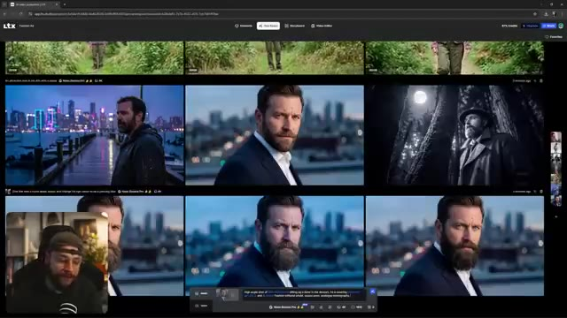
*Interface principale de l'application web de génération vidéo avec une grille de résultats et la caméra PiP de Jack en bas à gauche.*

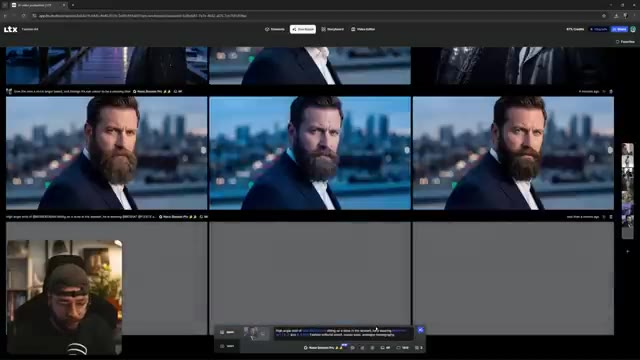
*Affichage de la grille de génération en cours avec les barres de progression et l'éditeur de prompt en bas.*

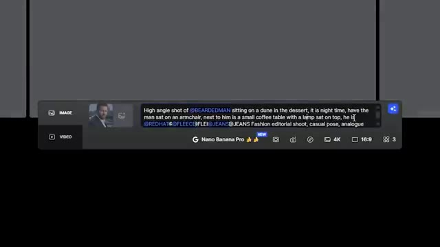
*Gros plan sur la barre de saisie du prompt textuel détaillant la description de la scène nocturne.*

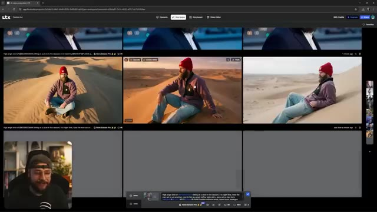
*Affichage des résultats générés montrant l'homme barbu avec bonnet rouge assis dans le désert.*

---

### ⏱️ `[00:14:08 - 00:14:45]` | Segment #34

**🔊 Audio (Transcription Intégrale Mot pour Mot en Français) :**
> des images. Comme je le dis, étant donné que personne ne sait vraiment à quoi ressemble notre personnage dans la vraie vie, ils ne peuvent pas nous dire que sous cet angle ou sous cet autre angle, c'est faux. Cette image-ci est sortie vraiment très jolie. Celle-là, je pense que le ciel a l'air juste un peu faux, mais là encore, celle-ci est très cool. Donc je vais survoler cette image par exemple et cliquer à nouveau sur l'onglet de création de vidéo. Maintenant, cette fois en utilisant Veo 3.1, je vais dire : mouvement de caméra de grue vers le haut pour révéler l'immensité de l'environnement désertique. J'ai l'impression qu'il faut absolument qu'on utilise celle-là aussi. Disons

**👁️ Analyse Visuelle d'Écran (gemini-3.5-flash-lite) :**
**Interface & Outils** : LTX Studio (application web de production vidéo par IA, avec le modèle Veo 3.1 et une incrustation PiP du créateur).

**Contenu textuel & Code** : Prompts textuels visibles : "High angle shot of @BEARDEDMAN sitting on a dune in the desert, it is night time, have the man sat on an armchair, near to a small coffee table with a lamp set on top...", "Crane camera move up to reveal the scale of the desert environment.", modèles Veo 3.1, Nano Banana Pro.

**Action / Démonstration** : Le créateur navigue à travers ses images générées, survole l'une d'elles, sélectionne l'outil de création vidéo, choisit le modèle Veo 3.1 et tape un prompt décrivant un mouvement de caméra.

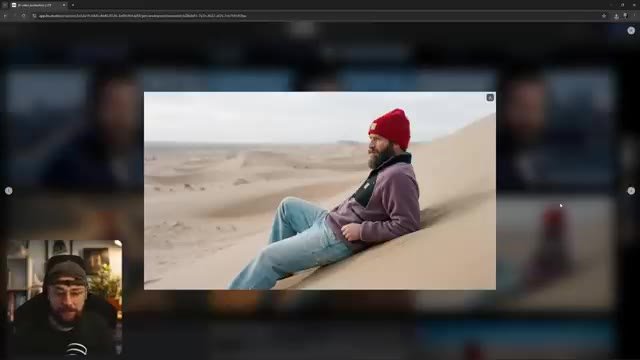
*Interface du navigateur affichant une image agrandie d'un personnage barbu avec un bonnet rouge assis sur une dune de sable, avec une incrustation vidéo du créateur en bas à gauche.*

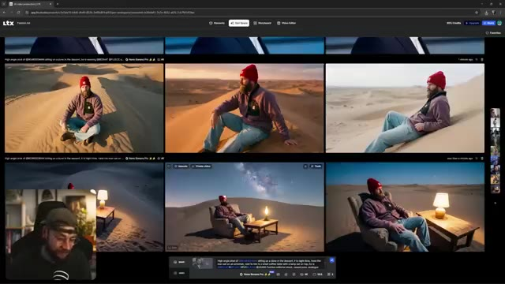
*Grille d'images générées par IA sur la plateforme LTX Studio montrant différentes variations d'un personnage dans le désert, avec l'interface de génération visible en bas.*

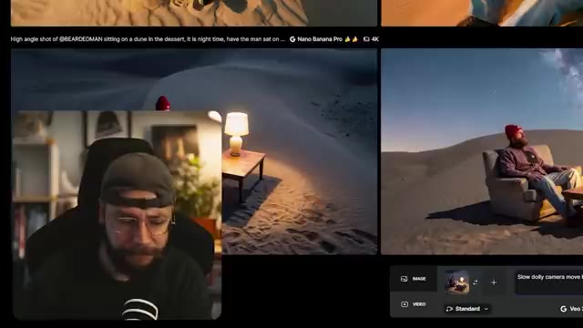
*Gros plan sur l'interface de génération vidéo de LTX Studio avec le modèle Veo 3.1 et les paramètres de caméra.*

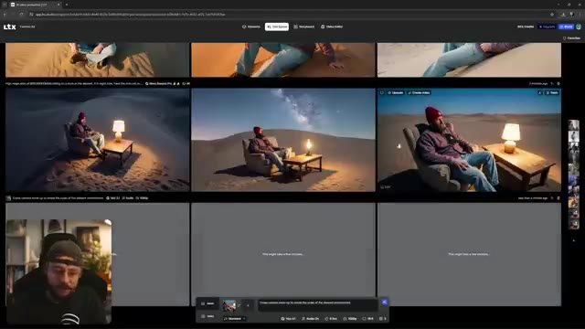
*Lancement de la génération d'une nouvelle vidéo avec le prompt textuel décrivant un mouvement de caméra de grue vers le haut dans le désert.*

---

### ⏱️ `[00:14:45 - 00:15:08]` | Segment #35

**🔊 Audio (Transcription Intégrale Mot pour Mot en Français) :**
> Mouvement de caméra dolly avant. L'homme barbu se tourne vers la caméra et fixe l'objectif avec assurance. Et pour celui-ci, essayons à nouveau LTX2. Je veux trois générations en résolution 4k et nous pourrons ensuite comparer nos résultats. Et vous pouvez voir ici que j'ai sauvegardé quelques éléments de plus.

**👁️ Analyse Visuelle d'Écran (gemini-3.5-flash-lite) :**
**Interface & Outils** : Interface web de LTX (Générateur vidéo IA) avec onglets (Elements, Gen Space, Storyboard, Video Editor), barre de prompt et collection d'éléments sauvegardés.

**Contenu textuel & Code** : Texte du prompt : « Dolly camera move in. The bearded man turns to face the camera and stares into the lens confidently », options de génération (Veo 3.1, Audio On, 8 Sec, 1080p, 16:9, quantité 3), et la collection « Your Elements collection » avec divers visuels d'objets, de vêtements et de portraits.

**Action / Démonstration** : Le créateur montre l'interface de saisie du prompt, puis navigue sur la plateforme pour présenter sa grille de résultats générés et enfin sa collection d'éléments sauvegardés.

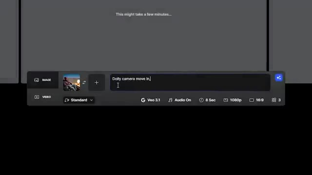
*Interface de l'outil LTX montrant la zone de saisie du prompt textuel « Dolly camera move in... ».*

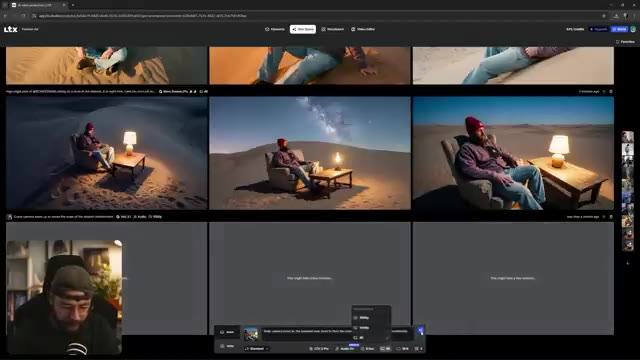
*Interface de LTX affichant une grille de vidéos générées avec la webcam de l'auteur incrustée en bas à gauche.*

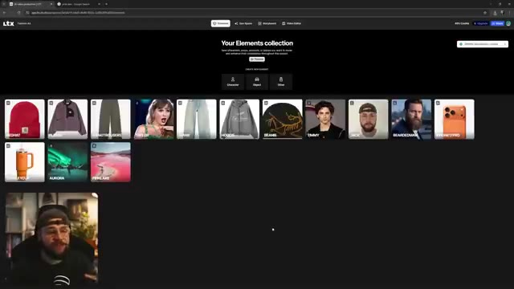
*Page « Your Elements collection » de LTX montrant une grille d'éléments sauvegardés (vêtements, accessoires, personnages) et l'auteur en incrustation PiP.*

---

### ⏱️ `[00:15:08 - 00:15:45]` | Segment #36

**🔊 Audio (Transcription Intégrale Mot pour Mot en Français) :**
> Nous avons l'iPhone 17 Pro comme objet, ainsi que cette gourde Stanley orange et quelques lieux également. Nous avons choisi ce genre de lieu d'aurore boréale en Finlande et ce lac rose, qui je crois est en Australie. Et nous pouvons créer un nouveau prompt textuel comme Timmy tenant un iPhone 17 Pro devant le lac rose ou Taylor Swift tenant une gourde Stanley dans le décor de l'aurore boréale. Les éléments ne se limitent donc pas seulement aux personnages et aux vêtements. Nous pouvons également contrôler les objets et les lieux. Je veux dire, regardez juste cette première génération que nous avons obtenue de

**👁️ Analyse Visuelle d'Écran (gemini-3.5-flash-lite) :**
**Interface & Outils** : Interface de l'application web de génération vidéo LTX Studio, avec barre de prompt et collection d'éléments réutilisables.

**Contenu textuel & Code** : Texte affiché dans le prompt : "@TAYLOR holding a @STANLEYCUP in the location of the @AURORA". Collection d'éléments avec vignettes étiquetées (iPhone 17 Pro, Stanley cup, Aurora, Pink lake).

**Action / Démonstration** : Le créateur montre sa collection d'éléments et tape un prompt interactif pour combiner un personnage, un objet et un lieu avant d'afficher la vidéo générée.

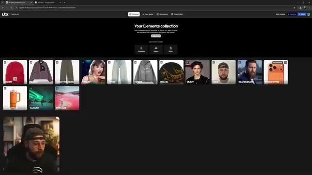
*Interface d'une application web montrant une collection d'éléments (objets, personnages, vêtements) avec un retour vidéo du créateur en incrustation.*

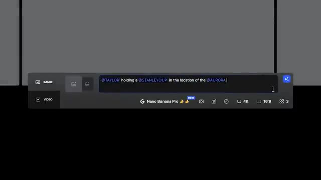
*Barre de saisie de prompt textuel de l'application permettant d'intégrer des éléments spécifiques (@TAYLOR, @STANLEYCUP, @AURORA).*

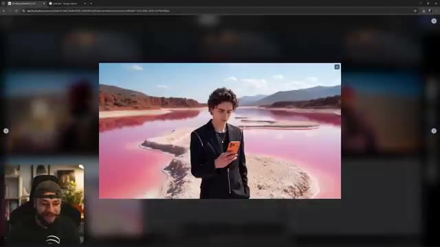
*Résultat vidéo généré montrant un personnage tenant un iPhone 17 Pro devant un lac rose, avec le créateur en incrustation.*

---

### ⏱️ `[00:15:45 - 00:16:23]` | Segment #37

**🔊 Audio (Transcription Intégrale Mot pour Mot en Français) :**
> Timothée Chalamet. Ça a l'air incroyable. Cette génération-ci a vraiment l'air très bien. Nous commençons à perdre un tout petit peu de cohérence encore une fois avec le logo sur notre pull et notre chapeau. C'est donc évidemment quelque chose à garder à l'esprit. Mais une autre fonctionnalité sympa dont je veux vous parler rapidement est que si nous survolons l'onglet d'édition, nous pouvons cliquer sur "retake". Et ici, nous pouvons sélectionner une partie de la vidéo que nous voulons modifier. Je veux donc sélectionner simplement la fin et cliquer sur continuer, et je vais dire que l'homme barbu commence à rire, et ce que LTX va faire c'est...

**👁️ Analyse Visuelle d'Écran (gemini-3.5-flash-lite) :**
**Interface & Outils** : LTX Studio (application web de génération et d'édition de vidéo par IA) avec interface de grille de projets et mode PiP (Picture-in-Picture) du créateur.

**Contenu textuel & Code** : Textes visibles : "Timothee Chalamet", "the retake feature works with any footage", "Select the video part to regenerate", "The bearded man starts laughing", "LTX-2 Pro", "49% Credits".

**Action / Démonstration** : Le créateur navigue dans l'interface de LTX Studio, survole l'onglet d'édition, ouvre l'outil de retake pour sélectionner la fin d'un clip vidéo et saisit un nouveau prompt textuel pour modifier l'action du personnage.

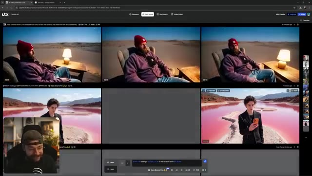
*Interface principale de LTX montrant plusieurs grilles de clips vidéo générés, avec le présentateur en incrustation (PiP).*

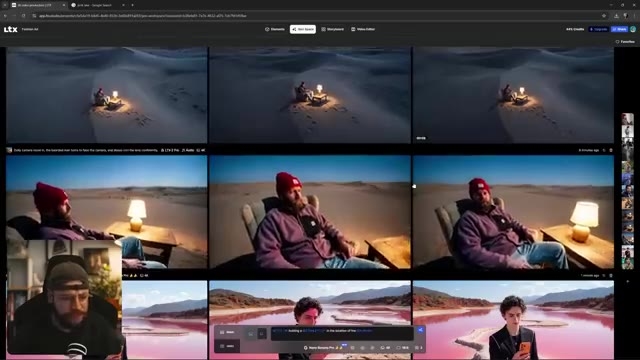
*Interface de LTX affichant de nouveaux plans générés avec différents cadrages du personnage dans le désert.*

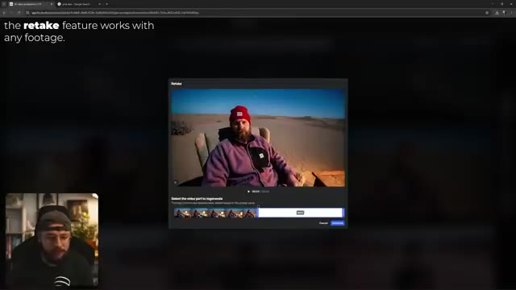
*Fenêtre modale "Retake" ouverte dans LTX permettant de sélectionner une portion spécifique de la vidéo à régénérer via une timeline et un champ de texte.*

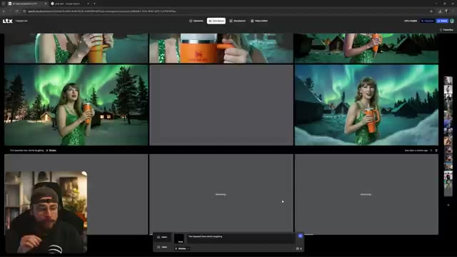
*Écran de LTX montrant le processus de génération en cours avec le prompt textuel saisi "The bearded man starts laughing".*

---

### ⏱️ `[00:16:23 - 00:16:56]` | Segment #38

**🔊 Audio (Transcription Intégrale Mot pour Mot en Français) :**
> redonnez-nous de nouvelles générations où juste la toute fin de notre vidéo est modifiée pour que notre homme barbu, notre personnage, soit en train de rire. Nous pouvons aller jeter un œil à nos générations de retouche ici à la toute fin du clip, notre personnage devrait commencer à rire et comme vous pouvez le voir, il fait exactement cela. Vous pouvez donc maintenant voir à quel point les outils d'IA pour images et vidéos peuvent réellement être puissants et comment ils peuvent vous permettre de créer toute une campagne publicitaire de mode simplement depuis chez vous, simplement depuis votre ordinateur portable.

**👁️ Analyse Visuelle d'Écran (gemini-3.5-flash-lite) :**
**Interface & Outils** : Interface web de LTX Studio (app.studio.ltx.studio) dédiée à la production vidéo par IA, avec le créateur visible en incrustation PiP.

**Contenu textuel & Code** : Menus du studio (Elements, Edit Space, Storyboard, Video Editor), vignettes de génération de vidéos de mode, barres de prompt textuel en bas de l'écran (ex: "The lastson (sic) starts laughing"), crédits restants de l'utilisateur.
[DESC_IMAGE_1] L'écran montre la plateforme LTX Studio avec le résultat des modifications apportées à la fin de la vidéo.
[DESC_IMAGE_2] L'écran présente un rendu vidéo cinématique haute résolution d'un personnage avec un bonnet rouge dans un décor désertique éclairé par une lampe.
[DESC_IMAGE_3] L'écran affiche une galerie de clips vidéo de mode générés par IA dans divers environnements (urbain, intérieur, extérieur).
[DESC_IMAGE_4] L'écran met en avant des scènes de campagne publicitaire générées, montrant notamment un personnage en mouvement sur une plage la nuit.

**Action / Démonstration** : Le créateur navigue et démontre l'utilisation de l'interface LTX Studio pour appliquer des modifications de fin de clip (retake) et visualiser les résultats générés.

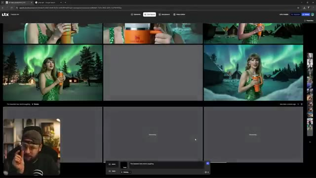
*Interface du studio vidéo LTX montrant une grille de clips générés avec une option de retouche active sur l'un d'eux.*

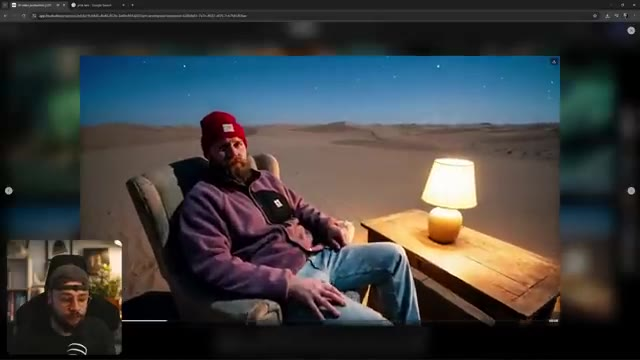
*Visualisation en plein écran du clip vidéo généré montrant un personnage barbu assis dans un fauteuil dans le désert la nuit.*

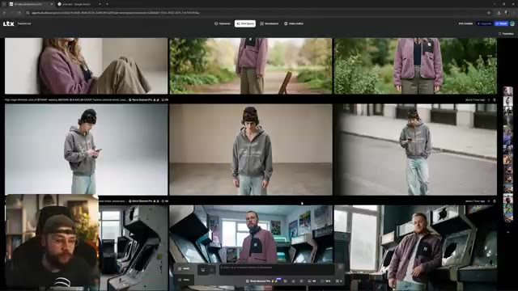
*Interface de LTX affichant une vaste grille de prévisualisations de vidéos de mode avec différents modèles et décors.*

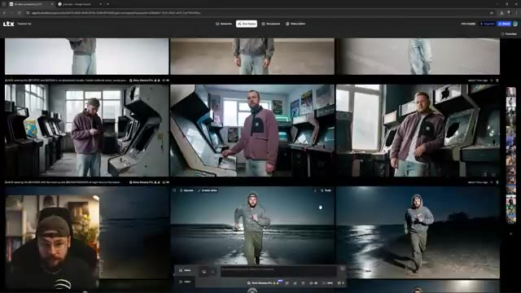
*Grille de l'interface LTX présentant des plans variés, incluant un homme courant sur une plage nocturne.*

---

### ⏱️ `[00:16:57 - 00:17:18]` | Segment #39

**🔊 Audio (Transcription Intégrale Mot pour Mot en Français) :**
> J'espère vraiment que vous avez apprécié la vidéo d'aujourd'hui. Si vous avez la moindre question, n'hésitez pas à la laisser juste en dessous dans la section des commentaires. Comme toujours, si vous avez appris quelque chose aujourd'hui, assurez-vous de pulvériser ce bouton J'aime pour moi. Pensez à vous abonner si vous êtes nouveau et, bien sûr, activez la cloche de notification pour ne jamais manquer aucune future mise en ligne. Les gars, merci beaucoup et je vous retrouve dans la prochaine vidéo.

**👁️ Analyse Visuelle d'Écran (gemini-3.5-flash-lite) :**
**Interface & Outils** : Interface web de LTX Studio (app.ltx.studio) avec un affichage en grille de différentes scènes générées par IA et une incrustation vidéo du créateur (PiP).

**Contenu textuel & Code** : Texte visible dans l'interface : paramètres de génération, invites textuelles ("A close-up of a woman talking on..."), menus de sélection Image / Vidéo, et icônes de réseaux sociaux (like, subscribe).

**Action / Démonstration** : Le créateur s'adresse au public en concluant sa vidéo tandis que l'interface de LTX Studio reste affichée en arrière-plan avec une animation d'appel à l'abonnement.

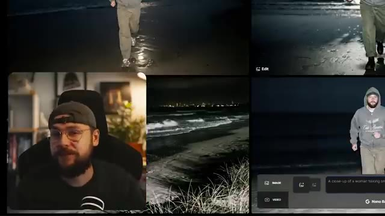
*Interface du studio LTX montrant une grille de vidéos générées avec le créateur incrusté en bas à gauche.*

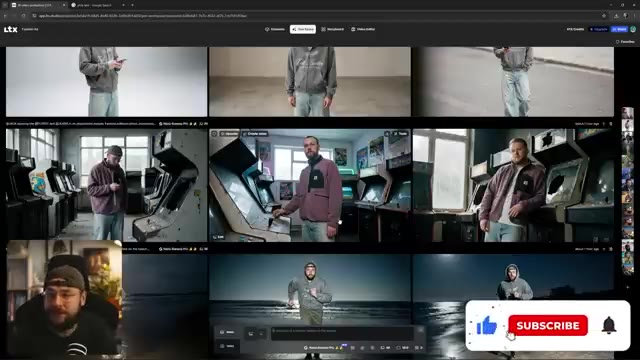
*Interface du studio LTX affichant des aperçus de vidéos et un bouton d'abonnement animé en surimpression.*

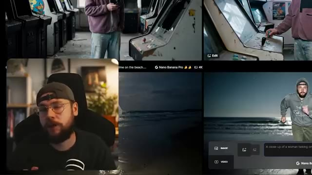
*Gros plan sur l'interface de LTX avec des options de génération d'images et de vidéos.*

---
