# 🎬 Créer des pubs produits haut de gamme avec l'IA (Guide étape par étape)

> **Chaîne** : [Jack Vs. AI](https://www.youtube.com/@JackVsAI)  
> **Titre original** : `Creating Premium Product Ads with AI (Step-by-step)`  
> **Lien YouTube** : [https://www.youtube.com/watch?v=esAfAQV7p9I](https://www.youtube.com/watch?v=esAfAQV7p9I)  
> **Date de publication** : 2025-12-15  
> **Durée** : 20m 01s (`1201s`)  
> **Identifiant vidéo** : `esAfAQV7p9I`  
> **Fiche Web Interactive** : [2025-12-15_YT-esAfAQV7p9I_Créer des pubs produits haut de gamme avec l'IA (Guide étape par étape)_by-whisper-v3-large-turbo+gemini-3.5-flash-lite.html](2025-12-15_YT-esAfAQV7p9I_Créer des pubs produits haut de gamme avec l'IA (Guide étape par étape)_by-whisper-v3-large-turbo+gemini-3.5-flash-lite.html)  
> **Captures de démonstration clés** : `104 captures réelles (anti-talking-head)`  
> **Modèles utilisés** : Audio: `large-v3-turbo` (Faster-Whisper int8 VPS) | Vision: `gemini-3.5-flash-lite` (Google AI Studio API)  

---

## 📌 Synthèse Exécutive & Outils

### 📌 Résumé

Le créateur et expert en effets visuels Jack Vs. AI dévoile dans cette vidéo un flux de travail révolutionnaire pour concevoir des publicités produits haut de gamme en synthèse 3D (CGI) photoréalistes, sans recourir à des logiciels complexes ou à des budgets de production pharaoniques. S'appuyant sur l'écosystème IA de pointe, il démontre qu'il est possible de générer des visuels de qualité commerciale en quelques minutes, en combinant des outils de génération d'images ultra-performants et des plateformes multimédias tout-en-un. La méthode étape par étape présentée s'articule autour de la création minutieuse de clichés publicitaires (les plans larges principaux), suivis de l'animation des visuels, de la synthèse vocale et de l'habillage musical.

L'une des innovations majeures de ce workflow réside dans la double approche de la direction artistique : soit à partir d'une image de référence brute et détériorée (comme une manette de PlayStation usagée) transformée magiquement en un produit de luxe grâce à la puissance des modèles multimodaux, soit entièrement à partir de zéro grâce à des structures de prompts textuels hautement paramétrables. En injectant des variables précises (matériaux comme le métal brossé ou le plastique mat, éclairages de studio, profondeurs de champ cinématographiques), les créateurs peuvent explorer des concepts abstraits ou commerciaux (smartphones déconstruits, montres connectées futuristes, écouteurs, brosses à dents) avec une précision bluffante.

Pour les professionnels de la publicité et les créateurs de contenu, cette approche change radicalement la donne en matière de prototypage et de test d'idées. Elle permet d'obtenir des variations illimitées de plans produits, d'itérer instantanément sur les décors et les angles de vue, et de rivaliser directement avec des agences à gros budget. Ce guide complet s'impose ainsi comme une feuille de route indispensable pour maîtriser la production vidéo publicitaire générée par intelligence artificielle, de la conception visuelle initiale jusqu'au rendu final prêt pour la diffusion.

### 🛠️ Outils, Modèles & Logiciels Présentés

* **ElevenLabs** : Plateforme tout-en-un utilisée à l'origine pour les effets sonores, la musique et les voix off, qui intègre désormais des fonctionnalités avancées de génération d'images et de vidéos.
* **Nano Banana Pro** : Modèle de génération et de transformation d'images de pointe, utilisé pour convertir des maquettes rudimentaires en rendus publicitaires 4K ultraréalistes ou pour créer des visuels à partir de prompts textuels.
* **Sora 2** : Modèle de génération vidéo de nouvelle génération mentionné dans l'écosystème global des flux de travail publicitaires de pointe.
* **Kling** : Solution d'intelligence artificielle spécialisée dans l'animation vidéo et le mouvement de caméras, intégrée dans le processus de dynamisation des plans fixes.
* **Flux** : Modèle de fondation et d'architecture d'image hautement performant exploité pour la texturation et le rendu de surfaces complexes.

### 🔑 Points Clés & Enseignements Stratégiques

* **Démocratisation du CGI publicitaire** : Il est désormais possible d'obtenir des rendus digne d'une production 3D professionnelle haut de gamme sans posséder de compétences en modélisation 3D complexe ni dépenser des milliers d'euros en logiciels spécialisés.
* **Le workflow en quatre étapes strictes** : Structurer la production publicitaire de manière séquentielle en passant par la création des images fixes, l'animation des séquences, la génération de la voix off, puis l'ajout de la bande sonore.
* **Approche hybride par image de référence** : Même un prototype ou une maquette physique abîmée, poussiéreuse et de mauvaise qualité peut servir de base visuelle pour qu'une IA générative la réinterprète en un produit de luxe immaculé.
* **Ingénierie de prompt modulaire pour les produits** : Utiliser une structure de prompt réutilisable basée sur des crochets (ex. `[nom_du_produit]`) permet de tester rapidement une multitude de typologies d'articles (smartphones, montres, écouteurs, accessoires) avec la même direction artistique.
* **Maîtrise des finitions textuelles et matérielles** : Spécifier explicitement les finitions (plastique mat, métal brossé, textures lisses et élégantes) guide l'IA vers des rendus visuels tactiles et hautement crédibles.
* **Cadrage et mise en scène cinématographique** : Intégrer systématiquement des directives professionnelles dans les prompts, telles que "photographie de produit professionnelle", "faible profondeur de champ", "composition cinématographique" et "éclairage de studio".
* **Création du "plan large principal"** : Établir une image clé de référence pour chaque produit, qui servira ensuite de socle visuel stable pour générer toutes les variations de plans secondaires et d'angles de caméra.
* **Gestion des erreurs et approche itérative** : Accepter une part de tâtonnement inhérente à l'IA (comme des coupes de cadrage involontaires) en multipliant les générations (par exemple, lancer 2 à 4 options en parallèle) pour sélectionner le meilleur résultat.
* **Exploration de concepts abstraits et futuristes** : Tirer parti de la créativité des modèles d'image pour concevoir des designs produits avant-gardistes et audacieux (comme des montres connectées abstraites) qu'il serait difficile ou coûteux de prototyper physiquement.
* **Cohérence chromatique et contextuelle** : Réutiliser les couleurs signatures d'une génération à l'autre (comme un fond orange vif ou un dégradé blanc minimaliste) pour assurer l'unité visuelle et l'identité de marque tout au long de la publicité.
* **Continuité de la transition image-vidéo** : Utiliser l'option de survol des images générées pour basculer instantanément de la photo fixe vers l'outil de création vidéo ou l'upscaling 4K en un seul clic.

---

## ⏱️ Chronologie & Transcription Complète Audio & Visuelle (Mot pour Mot)

### ⏱️ `[00:00:00 - 00:00:33]` | Segment #01

**🔊 Audio (Transcription Intégrale Mot pour Mot en Français) :**
> Et si je vous disais que le futur des publicités pour produits est déjà là et que la plupart des gens ne l'ont même pas encore remarqué ? Aujourd'hui, je vais vous montrer comment créer des visuels qui ressemblent à de la pure synthèse 3D (CGI), sans dépenser des milliers en logiciels, studios ou budgets marketing massifs. Imaginez pouvoir produire des prises de vue de qualité commerciale, des maquettes de produits et des campagnes entières dans le temps qu'il faut habituellement rien que pour rédiger votre brief. Ce que vous voyez a été entièrement conçu avec des outils d'IA et si vous ignorez cette nouvelle technologie, je vous promets que vous allez le regretter. Je m'appelle Jack, je suis dans les effets visuels depuis

**👁️ Analyse Visuelle d'Écran (gemini-3.5-flash-lite) :**
**Interface & Outils** : Présentation face caméra / B-roll d'illustrations générées par IA sans affichage d'interface logicielle

**Contenu textuel & Code** : Exemples visuels générés par IA (horloge conceptuelle sur fond sombre, homme souriant tenant un téléphone dans un café, horloge bleue sur un rocher face à la mer, homme souriant tenant une tasse à côté d'une machine à café verte) accompagnés de sous-titres textuels en anglais illustrant la narration ("product ads", "without spending thousands", "in the time it usually takes", "you're going to regret it...").

**Action / Démonstration** : Le flux vidéo présente des exemples de rendus vidéo et d'images de synthèse publicitaires générés par IA enchaînés pour illustrer le discours introductif.

---

### ⏱️ `[00:00:33 - 00:01:10]` | Segment #02

**🔊 Audio (Transcription Intégrale Mot pour Mot en Français) :**
> artiste dans l'industrie publicitaire depuis plus d'une décennie maintenant et j'ai travaillé avec beaucoup des plus grandes marques de la planète. Donc quand je dis que ce flux de travail change la donne, je le pense vraiment. Dans cette vidéo, je vais vous guider à travers tout le processus étape par étape et partager toutes les astuces et conseils qui vous permettront de rivaliser avec des équipes de production à gros budget. Ce flux de travail est incroyable. Et les gars, si vous avez apprécié le contenu d'aujourd'hui, assurez-vous de lâcher un pouce bleu pour moi. Pensez à vous abonner et bien sûr à activer cette cloche de notification. Très bien, entrons dans le vif du sujet. Nous allons commencer par examiner la création de nos images, puis leur animation, ensuite la génération d'une voix off et enfin la génération d'une musique. Alors

**👁️ Analyse Visuelle d'Écran (gemini-3.5-flash-lite) :**
**Interface & Outils** : Présentation visuelle schématique avec des encadrés vidéo sur fond étoilé.

**Contenu textuel & Code** : Trois vignettes vidéo illustrant le processus : deux montrant des objets design texturés et une troisième montrant un homme dans un studio d'enregistrement, reliées par des flèches blanches pointant vers le bas et la droite.

**Action / Démonstration** : Le flux de travail visuel présente étape par étape les différentes phases du montage et de la génération par IA (création d'images, animation, voix off, musique).

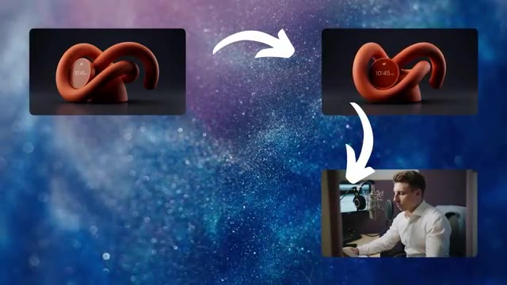
*Schéma animé illustrant les différentes étapes du workflow avec trois visuels représentant la création d'images, leur animation et la génération de voix off.*

---

### ⏱️ `[00:01:10 - 00:01:37]` | Segment #03

**🔊 Audio (Transcription Intégrale Mot pour Mot en Français) :**
> comme toujours, il y aura des horodatages ci-dessous si vous êtes intéressé par une section particulière. N'hésitez pas à naviguer comme vous le souhaitez. Donc pour la vidéo d'aujourd'hui, nous sommes sur ElevenLabs. Maintenant, c'est mon outil de prédilection en ce qui concerne les effets sonores par IA, la musique et la voix off depuis très longtemps. Mais vous savez peut-être ou non qu'ils ont récemment intégré l'image et la vidéo dans la plateforme. Vous pouvez voir en haut à gauche qu'il y a un onglet. Si nous cliquons ici, vous aurez accès à ces fonctionnalités.

**👁️ Analyse Visuelle d'Écran (gemini-3.5-flash-lite) :**
**Interface & Outils** : Interface web d'ElevenLabs (app.elevenlabs.io).

**Contenu textuel & Code** : Menu latéral avec les options Home, Voices, Text to Speech, Voice Changer, Sound Effects, Voice Isolator, Voice & Video (Beta), Templates (Beta), Studio, Music, Dubbing, Speech to Text, Audio Native, Productions. Texte de bienvenue "Good morning, Jack Kennedy".

**Action / Démonstration** : Le créateur navigue sur l'interface d'ElevenLabs et clique sur l'onglet "Image & Video".

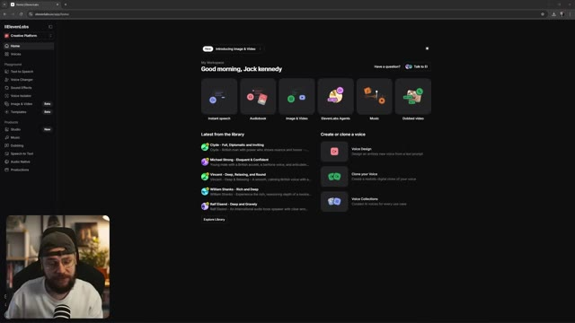
*Interface principale de la plateforme ElevenLabs montrant le tableau de bord avec le créateur en bas à gauche.*

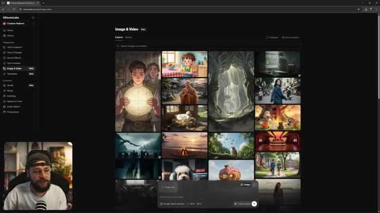
*Page de la fonctionnalité Image & Vidéo sur ElevenLabs affichant une grille de contenus générés.*

---

### ⏱️ `[00:01:37 - 00:01:58]` | Segment #04

**🔊 Audio (Transcription Intégrale Mot pour Mot en Français) :**
> Dans l'onglet d'exploration, vous pouvez voir ce que la communauté a créé. Mais si nous cliquons sur l'historique, vous pouvez voir ce que j'ai fait moi-même personnellement. Tout cela provenait de la publicité de Noël que j'ai récemment publiée. Et comme je l'ai mentionné, la première étape de notre processus va consister à créer des clichés de photographie de produits. C'est là que nous allons pouvoir concevoir notre produit en utilisant l'IA.

**👁️ Analyse Visuelle d'Écran (gemini-3.5-flash-lite) :**
**Interface & Outils** : Navigateur web affichant l'application ElevenLabs (Creative Platform > Image & Video) avec un panneau latéral de navigation et une incrustation vidéo du créateur (PiP) en bas à gauche.

**Contenu textuel & Code** : Éléments visibles : menu latéral (Home, Voices, Text to Speech, Voice Changer, Sound Effects, Voice Isolator, Image & Video, Templates, Studio, Music, Dubbing, Speech to Text, Audio Native, Productions), onglets "Explore" et "History", galerie d'images et de vidéos générées par IA (personnages, décors, animaux), barre de recherche et boîte de prompt de génération ("Describe your image...").

**Action / Démonstration** : Le créateur navigue sur l'interface de la plateforme ElevenLabs, montrant d'abord l'onglet d'exploration des créations communautaires, puis basculant vers son propre historique de générations personnelles.

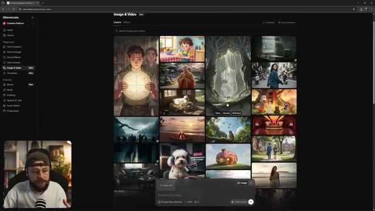
*Interface d'ElevenLabs (onglet Explore) montrant une galerie de créations de la communauté avec une incrustation vidéo PiP du créateur en bas à gauche.*

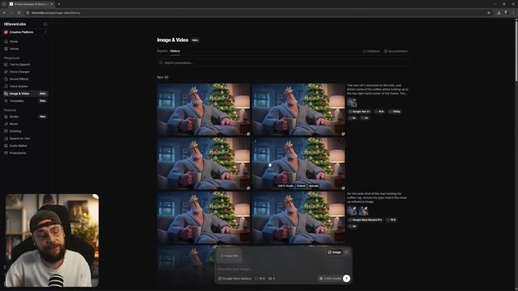
*Interface d'ElevenLabs (onglet History) montrant l'historique des générations personnelles de l'utilisateur liées à la publicité de Noël.*

---

### ⏱️ `[00:01:58 - 00:02:21]` | Segment #05

**🔊 Audio (Transcription Intégrale Mot pour Mot en Français) :**
> Maintenant, il y a vraiment deux approches différentes pour cela. Nous pouvons simplement utiliser une invite textuelle pour générer une image à partir de zéro. Ou vous pouvez voir ici que nous avons cette zone où nous sommes capables de télécharger une image de référence. Maintenant, c'est génial si peut-être vous avez une maquette de produit ou un prototype de produit. et ce que je vais faire est simplement télécharger cette image que j'ai ici d'une manette de PlayStation.

**👁️ Analyse Visuelle d'Écran (gemini-3.5-flash-lite) :**
**Interface & Outils** : Interface web d'ElevenLabs (générateur d'images et de vidéos) avec incrustation vidéo (PiP) du créateur.

**Contenu textuel & Code** : Historique de générations d'images avec des personnages en 3D (style film d'animation), barres de prompt avec le texte 'Describe your image...', modèle 'Google Nano Banana' et option '1,006 credits'.

**Action / Démonstration** : Le créateur montre l'interface de génération d'images, zoome sur la zone de référence d'image, puis ouvre l'explorateur de fichiers pour sélectionner une photo de manette PlayStation.

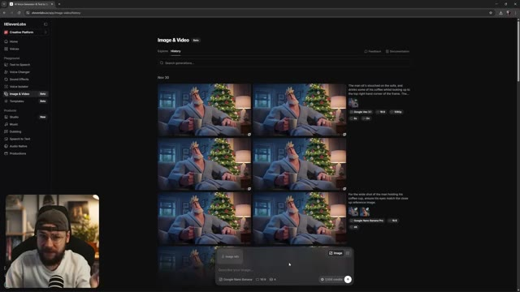
*Interface d'ElevenLabs (Image & Video) montrant l'historique des générations avec une incrustation vidéo de Jack en bas à gauche.*

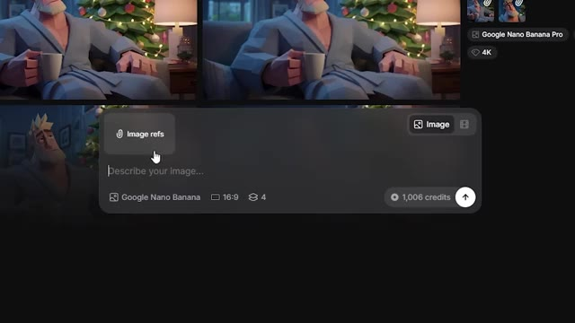
*Gros plan sur la zone de saisie du prompt avec le bouton 'Image refs' sélectionné.*

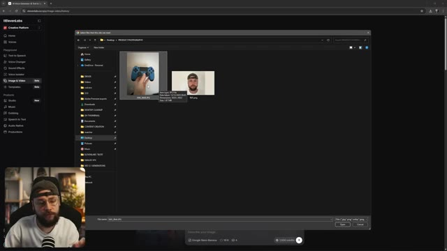
*Fenêtre de sélection de fichiers Windows par-dessus l'interface d'ElevenLabs, affichant une photo d'une manette de PlayStation bleue.*

---

### ⏱️ `[00:02:21 - 00:02:55]` | Segment #06

**🔊 Audio (Transcription Intégrale Mot pour Mot en Français) :**
> Maintenant je sais que c'est peut-être un exemple un peu étrange parce que c'est un produit existant, mais ce que je voulais vous montrer, c'est que cette manette a connu des jours meilleurs. Elle est plutôt abîmée, elle est couverte de crasse, de saleté, de poussière et de toutes ces sortes de fibres de tissu et tout ça. Elle a l'air plutôt répugnante. Même la qualité de l'image elle-même n'est pas si extraordinaire que ça. Alors faites juste un peu travailler votre imagination. C'est essentiellement notre maquette de produit par exemple. J'essaie juste de vous montrer que vous n'avez pas besoin d'avoir la plus belle des maquettes ou des photos pour servir d'image de référence. Maintenant, en ce qui concerne

**👁️ Analyse Visuelle d'Écran (gemini-3.5-flash-lite) :**
**Interface & Outils** : Logiciel de visionnage d'images sous Windows avec une incrustation vidéo (PiP) du présentateur Jack en bas à gauche.

**Contenu textuel & Code** : Une photo montrant une manette de jeu bleue tenue par une main, présentant des traces de saleté, de poussière et des fibres.

**Action / Démonstration** : Le présentateur commente l'état visuel dégradé de la manette affichée à l'écran pour illustrer qu'une image de faible qualité ou imparfaite peut tout à fait servir d'image de référence.

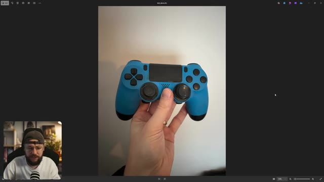
*Affichage d'une image d'une manette de PlayStation bleue usagée et poussiéreuse tenue dans une main, vue dans un logiciel de visionnage d'images avec Jack en médaillon PiP.*

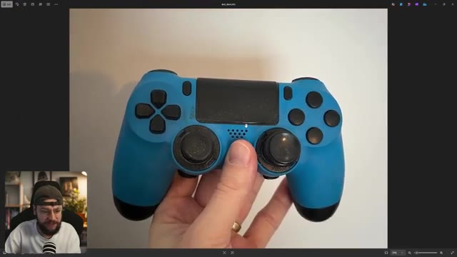
*Gros plan sur la même image de la manette bleue abîmée et couverte de poussière affichée à l'écran.*

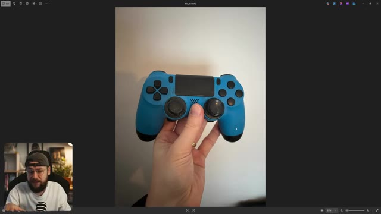
*Retour au plan général de la photo de la manette dans le logiciel de visionnage d'images.*

---

### ⏱️ `[00:02:55 - 00:03:30]` | Segment #07

**🔊 Audio (Transcription Intégrale Mot pour Mot en Français) :**
> le prompt textuel qu'on va utiliser : transforme ce produit en une manette de jeu haut de gamme en métal brossé, intégrant des sections audacieuses en plastique jaune mat. Photographie de produit professionnelle sur fond dégradé blanc clair. Maintenant pour le modèle je veux sélectionner Nano Banana Pro. On va opter pour un format 16 par 9. En termes de résolution, je vais passer à la 4k et on va juste faire deux générations et envoyer tout ça. Ok donc on a reçu nos générations. Vous pouvez voir que la première est un peu loufoque. Ça reste de l'IA, il y a toujours

**👁️ Analyse Visuelle d'Écran (gemini-3.5-flash-lite) :**
**Interface & Outils** : Interface web de génération d'images et de médias (semblable à une plateforme de type ElevenLabs ou outil multimodal similaire) avec panneau latéral gauche et zone de prévisualisation centrale.

**Contenu textuel & Code** : Texte du prompt : "Turn this product into a premium gaming controller made of brushed metals, incorporating bold yellow matte plastic sections. Professional product photography against a clear white gradient backdrop." Paramètres visibles : Google Nano Banana Pro, rapport 16:9, résolution 4K, crédit de génération (1069 / 9091 credits).

**Action / Démonstration** : Le créateur configure les paramètres de génération (modèle, ratio, résolution, nombre de générations) et visualise le résultat généré montrant la manette de jeu.

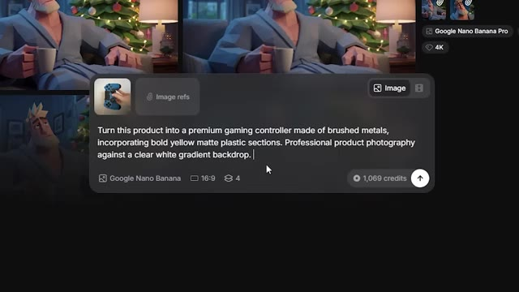
*Interface de génération d'images affichant la boîte de saisie du prompt textuel avec les paramètres du modèle Google Nano Banana Pro, ratio 16:9 et 4 images.*

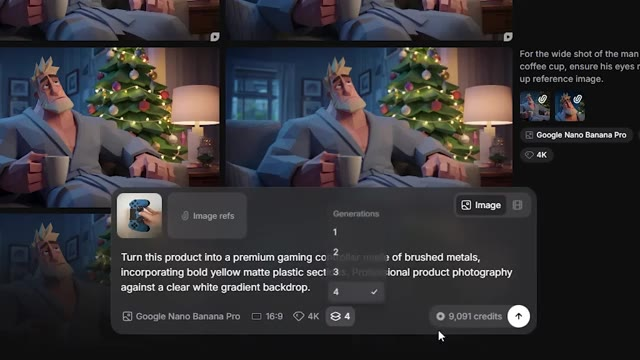
*Interface montrant le menu déroulant du nombre de générations (1, 2, 3, 4) dans la plateforme de génération d'images.*

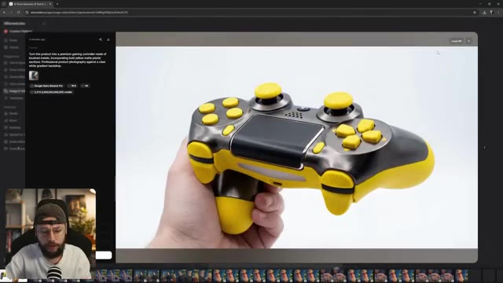
*Résultat de la génération d'images montrant une manette de jeu jaune et grise tenue en main, avec la webcam du créateur (Jack) incrustée dans le coin inférieur gauche.*

---

### ⏱️ `[00:03:30 - 00:04:06]` | Segment #08

**🔊 Audio (Transcription Intégrale Mot pour Mot en Français) :**
> il va y avoir un élément de tâtonnement mais la deuxième image, si l'on procède et la charge en 4K, est vraiment superbe. Elle a très bien adhéré à notre invite textuelle et a même réussi à déterminer que oui, il s'agissait d'une manette usée. Je sais que c'est un exemple très spécifique et de niche, mais ce que j'essaye de vous montrer, c'est que vous pouvez intégrer votre propre maquette de produit ou prototype, même s'il a l'air un peu miteux, et en utilisant un modèle d'image d'IA comme Nano Banana Pro, vous pouvez le transformer en quelque chose comme ça qui a l'air d'une qualité de niveau professionnel. Maintenant, l'autre approche que nous

**👁️ Analyse Visuelle d'Écran (gemini-3.5-flash-lite) :**
**Interface & Outils** : Navigateur web affichant une plateforme de génération d'images/vidéos par IA (type Akool ou similaire) avec une disposition en mode sombre, panneau latéral de prompts à gauche et prévisualisation centrale de l'image.

**Contenu textuel & Code** : Texte du prompt visible : "Turn this product into a premium gaming controller made of brushed metals, incorporating bold yellow matte plastic sections. Professional product photography against a clear white gradient backdrop." Paramètres visibles : "Google Nano Banana Pro", rapport d'aspect "16:9", résolution "4K".

**Action / Démonstration** : Le présentateur commente le rendu visuel de la manette générée par l'IA affichée à l'écran, tout en expliquant le processus d'amélioration de prototypes de produits.

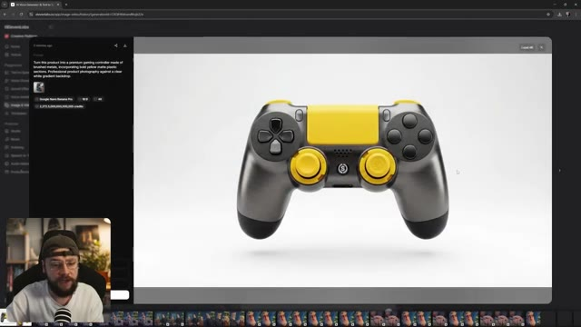
*Interface d'un générateur d'images affichant le résultat de la manette de jeu modifiée en qualité professionnelle.*

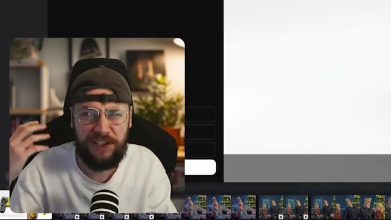
*Gros plan sur le présentateur (Jack) en incrustation (PiP) avec une timeline vidéo visible en bas de l'écran.*

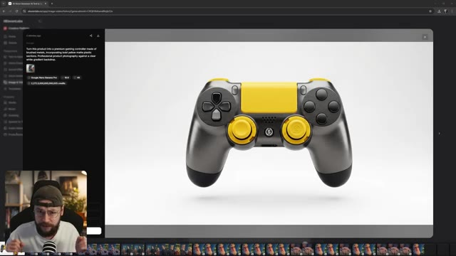
*Interface de l'outil montrant à nouveau le résultat de la manette de jeu avec le prompt textuel sur le panneau latéral gauche.*

---

### ⏱️ `[00:04:06 - 00:04:24]` | Segment #09

**🔊 Audio (Transcription Intégrale Mot pour Mot en Français) :**
> Ce que nous allons aborder maintenant, c'est d'utiliser simplement un prompt textuel plutôt qu'une image de référence. Donc ici, nous créons notre produit entièrement à partir de zéro. Et ce que nous avons réellement ici, c'est une sorte de modèle que j'ai assemblé moi-même. Vous êtes tout à fait invités à le récupérer dans la description de la vidéo si vous souhaitez l'utiliser pour vos propres designs.

**👁️ Analyse Visuelle d'Écran (gemini-3.5-flash-lite) :**
**Interface & Outils** : Interface web d'ElevenLabs (section Image & Video / History) avec un encadré vidéo du présentateur en bas à gauche.

**Contenu textuel & Code** : Historique de générations avec des images de manettes de jeu et de personnages animés, ainsi qu'un prompt affiché : "A product shot of a [premium pair of over-ear headphones]. Smooth and sleek, with a matte finish and bold unique design, utilising a single vibrant colour. It stands in a simple dark gradient environment, it's branding is minimal, with a small memorable logo. Professional product photography, realistic textures, cinematic composition, shallow depth of field, studio lighting."

**Action / Démonstration** : Le créateur présente l'historique des générations dans ElevenLabs et montre un modèle de prompt textuel personnalisable pour la création de produits par IA.

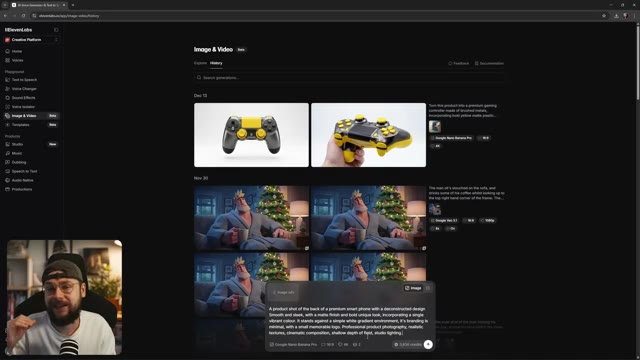
*Interface d'ElevenLabs affichant l'historique des générations d'images et de vidéos, avec le créateur visible en incrustation (PiP).*

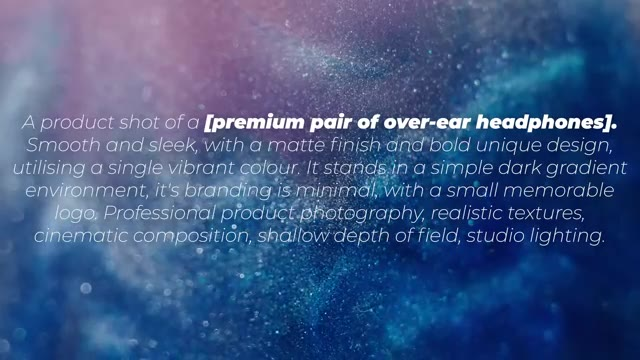
*Gros plan sur un modèle de prompt textuel affiché à l'écran sur un fond texturé bleu, avec les mots clés en surbrillance.*

---

### ⏱️ `[00:04:24 - 00:04:48]` | Segment #10

**🔊 Audio (Transcription Intégrale Mot pour Mot en Français) :**
> Et là où j'ai mentionné le produit, je vais mettre ça entre crochets. Vous pouvez littéralement simplement l'enlever et mettre n'importe quel produit que vous aimez dedans. Et vous me verrez faire ça tout au long de cette section de la vidéo juste pour montrer à quel point cela fonctionne bien. Donc pour le prompt, un plan produit de l'arrière d'un smartphone haut de gamme avec un design déconstruit. Lisse et élégant, avec une finition mate et un look audacieux et unique, incorporant une seule couleur vibrante.

**👁️ Analyse Visuelle d'Écran (gemini-3.5-flash-lite) :**
**Interface & Outils** : Interface web d'ElevenLabs (section Creative Platform -> Image & Video / History) avec une pastille vidéo PiP (Picture-in-Picture) de Jack dans le coin inférieur gauche.

**Contenu textuel & Code** : Texte du prompt visible : "A product shot of the back of a premium smartphone with a deconstructed design. Smooth and sleek, with a matte finish and bold unique look, incorporating a single vibrant colour. It stands against a simple white gradient environment, it's branding is minimal, with a small memorable logo. Professional product photography, realistic textures, cinematic composition, shallow depth of field, studio lighting." Paramètres affichés : Google Nano Banana Pro, rapport 16:9, 4K, 2 crédits, solde de 3 636 crédits.

**Action / Démonstration** : Le créateur montre l'interface d'ElevenLabs et zoome sur les prompts de génération d'images textuelles utilisés pour illustrer ses exemples de produits modifiables.

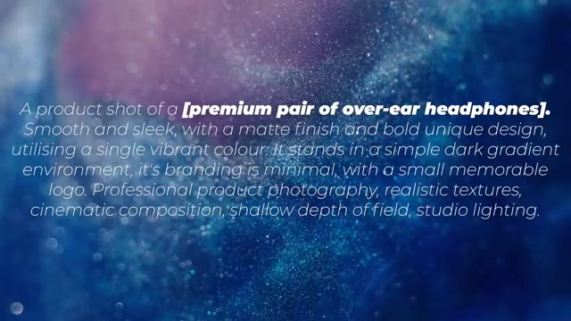
*Gros plan sur le prompt textuel affiché à l'écran avec un texte entre crochets pour un casque audio.*

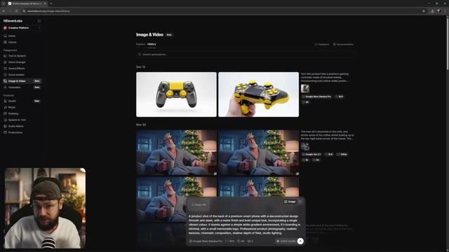
*Interface de la plateforme ElevenLabs montrant l'historique de génération d'images et de vidéos avec une fenêtre contextuelle de prompt.*

*Zoom sur la fenêtre contextuelle affichant le prompt de génération d'image pour le smartphone haut de gamme.*

*Retour à l'interface globale d'ElevenLabs avec la vue d'historique et le flux de travail de l'outil Image & Video.*

---

### ⏱️ `[00:04:48 - 00:05:07]` | Segment #11

**🔊 Audio (Transcription Intégrale Mot pour Mot en Français) :**
> Il se dresse dans un environnement simple en dégradé blanc. Son image de marque est minimale avec un petit logo mémorable. Photographie de produit professionnelle, textures réalistes, composition cinématographique, faible profondeur de champ, éclairage de studio. Donc dans ce cas, je vais aller de l'avant et générer quatre options différentes ici.

**👁️ Analyse Visuelle d'Écran (gemini-3.5-flash-lite) :**
**Interface & Outils** : Interface web d'ElevenLabs (section Image & Video / History) avec une fenêtre modale pop-up affichant les détails d'un prompt et les paramètres de génération.

**Contenu textuel & Code** : Texte du prompt visible dans la modale : "A product shot of the back of a premium smart phone with a deconstructed design. Smooth and sleek, with a matte finish and bold unique look, incorporating a single vibrant colour. It stands against a simple white gradient environment, it's branding is minimal, with a small memorable logo. Professional product photography, realistic textures, cinematic composition, shallow depth of field, studio lighting." Paramètres visibles : modèle "Google Nano Banana Pro", format "16:9", résolution "4K", nombre d'options "2" puis "4", et coût en crédits (3,636 puis 7,272 credits).

**Action / Démonstration** : Le créateur présente l'interface d'ElevenLabs et configure la génération de quatre options d'images de produits à partir d'un prompt textuel détaillé.

*Gros plan sur une fenêtre modale d'ElevenLabs affichant un prompt textuel pour générer des images de produits et le bouton de génération avec le crédit.*

*Vue générale de l'interface d'ElevenLabs (section Image & Video) avec la fenêtre modale de prompt et le créateur visible en incrustation PiP en bas à gauche.*

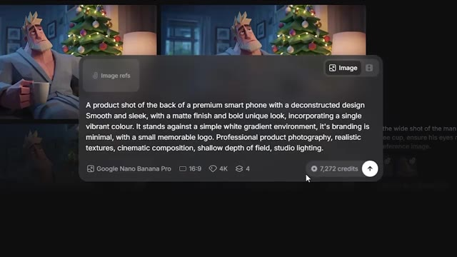
*Gros plan similaire à l'image 1 sur la fenêtre modale d'ElevenLabs affichant le prompt de génération de produit et le compteur de crédits mis à jour.*

---

### ⏱️ `[00:05:08 - 00:05:26]` | Segment #12

**🔊 Audio (Transcription Intégrale Mot pour Mot en Français) :**
> Et nous allons insérer une variante du texte de l'invite, cette fois avec une horloge connectée haut de gamme. Je vais également lancer quatre générations de cela. Nous allons aussi essayer une paire d'écouteurs sans fil haut de gamme dans leur étui de chargement. Et j'aimerais aussi voir à créer une brosse à dents électrique haut de gamme. Très bien, c'est parti.

**👁️ Analyse Visuelle d'Écran (gemini-3.5-flash-lite) :**
**Interface & Outils** : Interface web d'ElevenLabs (section Image & Video - History) affichée en plein écran avec une incrustation vidéo (PiP) de Jack en bas à gauche.

**Contenu textuel & Code** : Dans l'interface d'ElevenLabs, on peut voir l'historique des générations d'images avec des miniatures de manettes de jeu jaunes et grises, ainsi qu'une infobulle affichant un prompt textuel pour une horloge connectée (« A product shot of a premium smart clock... ») et les paramètres associés (modèle Google Nano Banana Pro, ratio 16:9, résolution 4K).

**Action / Démonstration** : Le créateur navigue dans l'historique des générations sur l'interface d'ElevenLabs tout en parlant, tandis qu'une infobulle de prompt s'affiche au bas de l'écran.

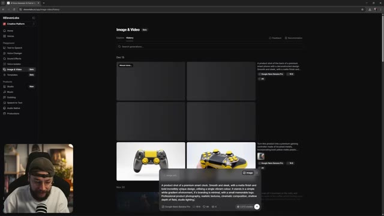
*Interface d'ElevenLabs affichant l'historique des générations d'images et de vidéos, avec Jack en incrustation vidéo (PiP) dans le coin inférieur gauche.*

---

### ⏱️ `[00:05:26 - 00:05:51]` | Segment #13

**🔊 Audio (Transcription Intégrale Mot pour Mot en Français) :**
> Donc nous avons commencé à récupérer nos générations. Regardons cette première ici. Celle-ci a l'air vraiment, vraiment super. Exactement ce que j'imaginais. J'espère que vous pouvez voir à quel point ce flux de travail est puissant rien que pour tester vos idées. Cette horloge ici est très abstraite. Vous pouvez voir ça dans un magasin très haut de gamme et quelqu'un dépensant beaucoup d'argent pour cette montre connectée assez bizarre.

**👁️ Analyse Visuelle d'Écran (gemini-3.5-flash-lite) :**
**Interface & Outils** : Interface web d'ElevenLabs ("Creative Platform" / section "Image & Video" > "History") avec un encadré PiP montrant le créateur en bas à gauche.

**Contenu textuel & Code** : Texte du prompt visible sur l'image 1 : "A product shot of the back of a premium smart phone with a deconstructed design. Smooth and sleek, with a matte finish..." Options sélectionnées : Google Nano Banana Pro, 16:9, 4K, 1,056 credits.

**Action / Démonstration** : Le créateur navigue et zoome sur les différentes générations d'images obtenues dans l'historique de l'interface d'ElevenLabs pour les présenter à l'écran.

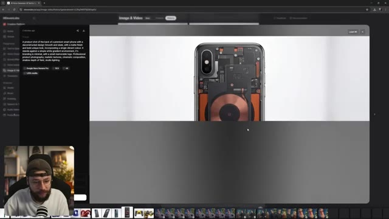
*Interface d'ElevenLabs affichant l'historique des générations avec une vue agrandie d'une image générée représentant l'arrière d'un smartphone au design épuré.*

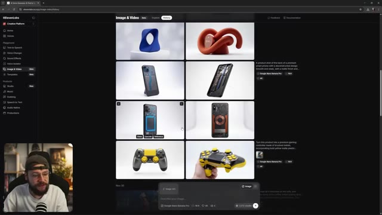
*Interface d'ElevenLabs montrant une grille de plusieurs images et vidéos générées par IA (formes abstraites, smartphones, manettes de jeu).*

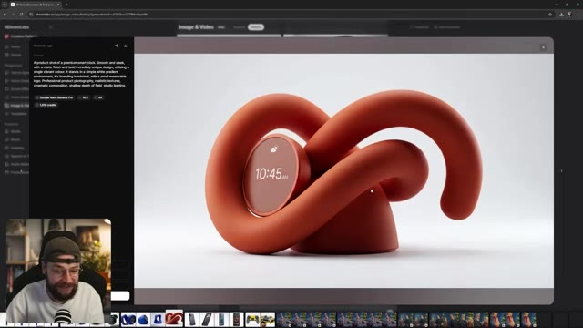
*Interface d'ElevenLabs avec une vue agrandie montrant l'horloge abstraite rouge évoquée par le créateur.*

---

### ⏱️ `[00:05:51 - 00:06:11]` | Segment #14

**🔊 Audio (Transcription Intégrale Mot pour Mot en Français) :**
> Je veux dire, celui-ci a l'air vraiment, vraiment super. J'aime aussi beaucoup celui-ci. C'est en quelque sorte un bon compromis entre quelque chose d'assez abstrait, mais aussi d'assez cool. Quelque chose que vous pourriez voir chez vous. Nous avons aussi nos écouteurs. Encore une fois, ça a l'air vraiment, vraiment propre. J'aime beaucoup cette finition mate que nous avons utilisée pour cela.

**👁️ Analyse Visuelle d'Écran (gemini-3.5-flash-lite) :**
**Interface & Outils** : Interface web d'ElevenLabs (générateur d'images et vidéos / Creative Platform) avec un encadré PiP montrant le présentateur dans son studio.

**Contenu textuel & Code** : Panneau latéral gauche affichant le prompt de génération : "A product shot of a premium smart clock. Smooth and sleek, with a matte finish and bold incredibly unique design..." Paramètres visibles : Google Nano Banana Pro, 16:9, 4K, 1,016 credits.

**Action / Démonstration** : Le présentateur commente à l'écran différentes images de concepts de produits générés par IA affichées dans l'historique de la plateforme.

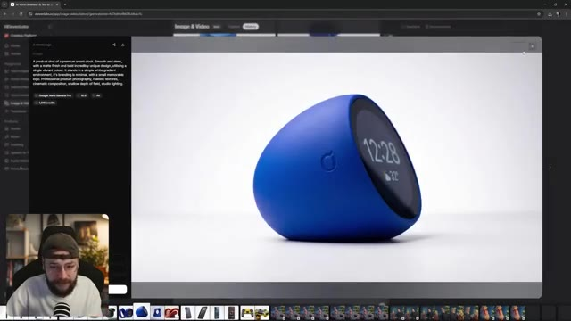
*Interface d'ElevenLabs affichant l'image générée d'un réveil intelligent bleu mat avec le créateur en incrustation PiP.*

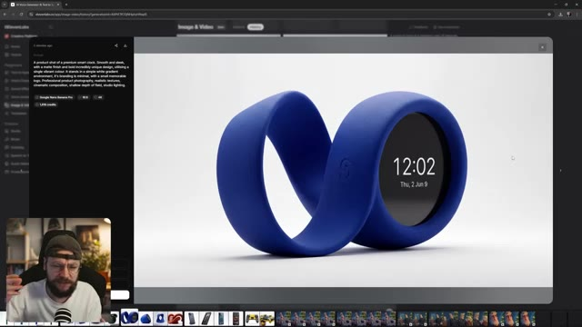
*Interface d'ElevenLabs affichant un concept de montre connectée bleue au design abstrait original avec l'heure 12:02 affichée.*

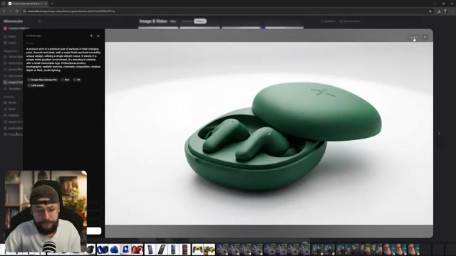
*Interface d'ElevenLabs affichant une image générée d'écouteurs sans fil verts dans leur boîtier de charge ouvert.*

---

### ⏱️ `[00:06:11 - 00:06:33]` | Segment #15

**🔊 Audio (Transcription Intégrale Mot pour Mot en Français) :**
> Et maintenant nous avons aussi notre brosse à dents. Ça a l'air plutôt propre. J'aime bien ça. Vous verrez ici que nous avons eu un petit peu d'erreur avec notre génération où l'on ne peut voir en gros que les deux tiers inférieurs de la brosse à dents, malheureusement. Mais celle-ci a l'air vraiment, vraiment très bien. Donc ce que nous avons essentiellement fait ici, c'est de créer ce que j'appelle souvent le plan large principal.

**👁️ Analyse Visuelle d'Écran (gemini-3.5-flash-lite) :**
**Interface & Outils** : Navigateur web affichant l'interface de la plateforme ElevenLabs ("Image & Video" beta, "History") avec le créateur en incrustation vidéo (PiP) en bas à gauche.

**Contenu textuel & Code** : Texte du prompt visible sur l'image 1 : "A product shot of a premium electric toothbrush. Smooth and sleek, with a matte finish and bold design, utilising a single vibrant colour. It stands in a simple white gradient environment, it's branding is minimal, with a small memorable logo. Professional product photography, realistic textures, cinematic composition, shallow depth of field, studio lighting." Paramètres : "Google Nano Banana Pro", "16:9", "4K".

**Action / Démonstration** : Le créateur présente l'image générée d'une brosse à dents électrique verte sur ElevenLabs, puis commente les résultats de l'historique de génération montrant différentes variations de couleurs.

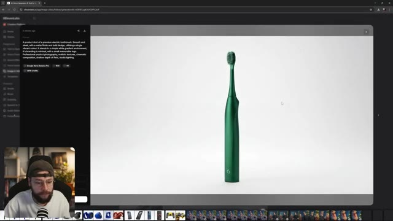
*Interface d'ElevenLabs affichant l'image agrandie d'une brosse à dents électrique verte sur fond blanc, avec le panneau de prompt visible à gauche et la webcam du créateur en incrustation (PiP) en bas à gauche.*

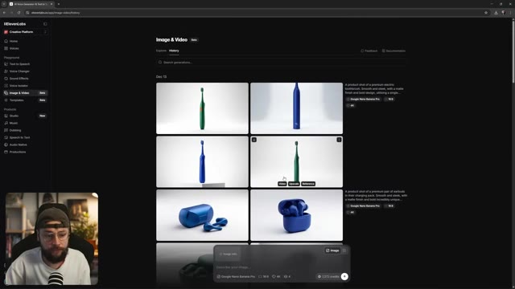
*Historique de génération d'images d'ElevenLabs présentant une grille de rendus (brosses à dents et écouteurs), avec la webcam du créateur en incrustation (PiP) en bas à gauche.*

---

### ⏱️ `[00:06:33 - 00:06:52]` | Segment #16

**🔊 Audio (Transcription Intégrale Mot pour Mot en Français) :**
> C'est désormais notre image de référence clé pour chaque produit. Et si l'on survole un produit spécifique, vous pouvez voir que nous avons ici quelques options différentes. Une pour en créer une vidéo, une pour l'améliorer (upscale), et une pour l'utiliser comme référence. Je vais donc cliquer ici. Utilisons notre horloge au look abstrait très étrange.

**👁️ Analyse Visuelle d'Écran (gemini-3.5-flash-lite) :**
**Interface & Outils** : Interface de la plateforme ElevenLabs (section Image & Video / History) avec une vue en grille des créations.

**Contenu textuel & Code** : Galerie d'images de produits design (écouteurs, montres connectées, horloges abstraites, smartphones). Survol avec trois boutons contextuels : "Video", "Upscale", "Reference".

**Action / Démonstration** : Le curseur de la souris survole différentes images de la grille pour afficher les options de génération vidéo, d'upscaling et de référence.

*Interface d'ElevenLabs affichant une galerie de visuels de produits générés par IA et le curseur survolant une image de smartphone avec des options.*

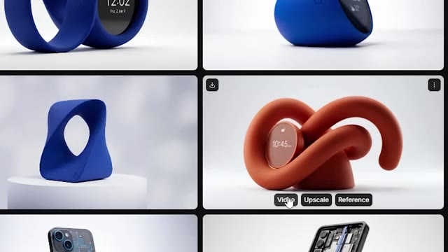
*Gros plan sur la grille d'images de produits d'ElevenLabs avec le curseur pointant sur les boutons Video, Upscale et Reference d'une horloge abstraite orange.*

---

### ⏱️ `[00:06:52 - 00:07:23]` | Segment #17

**🔊 Audio (Transcription Intégrale Mot pour Mot en Français) :**
> Maintenant, pour les invites textuelles, nous pourrions dire quelque chose comme : placer le produit sur un fond en dégradé sombre et minimal, avec un éclairage dramatique percutant. Je vais juste faire deux générations de cela. Je veux aussi utiliser notre image de téléphone ici parce que je l'aime vraiment, vraiment beaucoup. Donc encore une fois, nous allons cliquer sur l'onglet de référence. Et pour l'invite textuelle, essayons : faites pivoter le téléphone pour montrer l'avant, affichez le logo de l'arrière sur l'écran sur un simple fond orange parce que j'aime cette couleur orange que nous avons utilisée ici à l'arrière du produit.

**👁️ Analyse Visuelle d'Écran (gemini-3.5-flash-lite) :**
**Interface & Outils** : Interface web d'ElevenLabs (section Image & Video) avec une disposition en grille d'images générées et une fenêtre contextuelle de prompt textuel.

**Contenu textuel & Code** : Le prompt textuel 1 visible est « Have the product against a dark minimal gradient backdrop, striking dramatic lighting. » avec les options « Google Nano Banana Pro », format 16:9, résolution 4K, et 2 variations. Le prompt textuel 2 visible est « Rotate the phone to show the front, have the logo of the back on the screen against a simple orange backdrop » avec les mêmes paramètres et 4,546 crédits restants.

**Action / Démonstration** : Le créateur navigue dans l'interface d'ElevenLabs, saisit et modifie des prompts textuels pour générer des images et vidéos de produits en utilisant des images de référence.

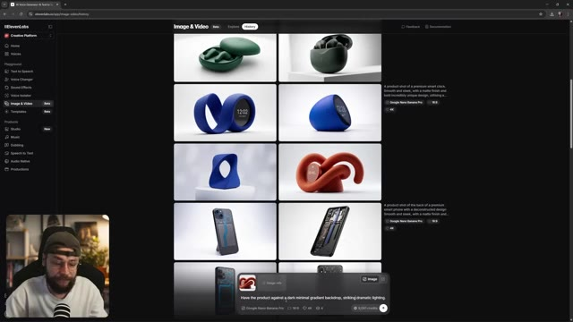
*Interface d'ElevenLabs (Image & Video) affichant une grille de générations d'images de produits et une fenêtre de prompt avec Jack en encadré vidéo (PiP).*

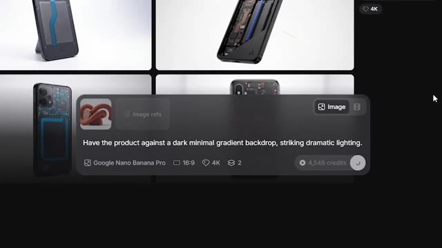
*Gros plan sur la fenêtre de prompt d'ElevenLabs avec le texte « Have the product against a dark minimal gradient backdrop, striking dramatic lighting ».*

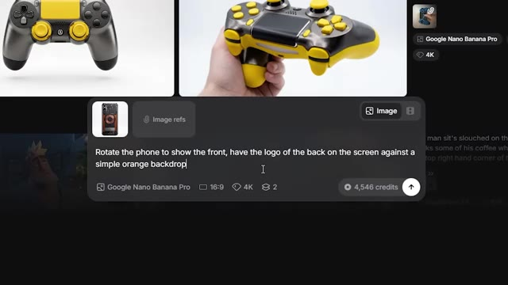
*Gros plan sur la fenêtre de prompt d'ElevenLabs avec le texte « Rotate the phone to show the front, have the logo of the back on the screen against a simple orange backdrop ».*

---

### ⏱️ `[00:07:23 - 00:07:56]` | Segment #18

**🔊 Audio (Transcription Intégrale Mot pour Mot en Français) :**
> Je vais en générer quatre ici parce que je pense que cela a plus de chances d'être un peu difficile d'obtenir l'image que nous recherchons. Et j'aimerais aussi regarder notre brosse à dents ici, notre produit très élégant d'apparence haut de gamme. Encore une fois, utilisons ceci comme référence d'image. Nous pourrions donc dire quelque chose comme montrer un gros plan extrême du bouton orange et du logo et envoyer cette génération. Mais nous pourrions aussi l'utiliser pour avoir un modèle tenant notre produit. Par exemple, nous pourrions dire montrer une femme attrayante tenant la brosse à dents et souriant dans sa salle de bain. Encore une fois

**👁️ Analyse Visuelle d'Écran (gemini-3.5-flash-lite) :**
**Interface & Outils** : Interface web d'ElevenLabs (section "Image & Video") avec panneau de prompt, paramètres (Google Nano Banana Pro, ratio 16:9, 4K) et historique des générations de produits.

**Contenu textuel & Code** : Prompts visibles : "Rotate the phone to show the front, have the logo of the back on the screen against a simple orange backdrop" et "Show an attractive woman holding the toothbrush and smiling in her bathroom." Paramètres : Google Nano Banana Pro, 16:9, 4K, nombre de générations réglé sur 4.

**Action / Démonstration** : Le créateur navigue dans l'historique des images d'ElevenLabs, sélectionne une image de brosse à dents comme référence ("Image refs"), modifie le prompt pour générer une femme tenant la brosse à dents, et règle le nombre de variations à quatre.

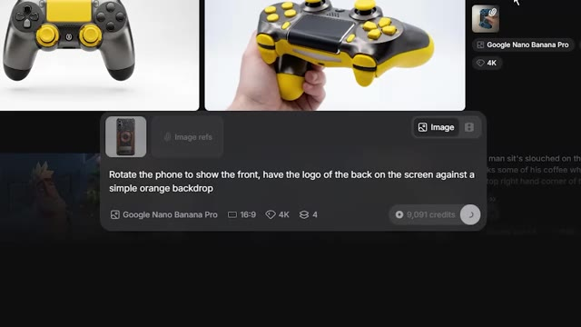
*Gros plan sur l'interface de génération avec un prompt de modification de téléphone et la référence d'image.*

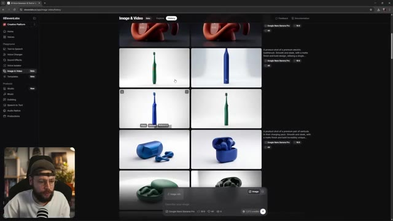
*Interface d'ElevenLabs (section Image & Video) montrant l'historique des générations avec le présentateur en incrustation PiP.*

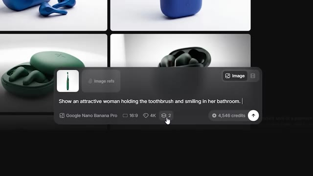
*Interface de l'outil de génération affichant le prompt pour la brosse à dents et la sélection du nombre de variations (4).*

---

### ⏱️ `[00:07:56 - 00:08:30]` | Segment #19

**🔊 Audio (Transcription Intégrale Mot pour Mot en Français) :**
> nous allons faire deux générations pour cela. Donc vous pouvez voir par exemple que nous avons de retour nos générations de notre horloge intelligente qui a l'air vraiment bien et beaucoup plus premium également sur ce fond sombre minimaliste par opposition à ce genre de dégradé blanc que nous avions choisi. Et nous avons nos générations du téléphone également. C'est vraiment très cool. Ça a fait exactement ce qu'on avait dit en fait, ce n'était pas si difficile d'obtenir le type de génération que nous recherchions. Nous avons notre brosse à dents aussi. Celles-ci ont l'air vraiment très bien. La qualité de texture ici est assez incroyable.

**👁️ Analyse Visuelle d'Écran (gemini-3.5-flash-lite) :**
**Interface & Outils** : Interface web de génération vidéo/image (ElevenLabs ou plateforme similaire) avec panneau latéral de prompts et paramètres.

**Contenu textuel & Code** : Texte de prompt visible : "Have the product against a dark minimal gradient backdrop, striking dramatic lighting.", "Rotate the phone to show the front, have the logo of the back on the screen against a simple orange backdrop", "Show an extreme close-up of the orange button and logo". Paramètres : Google Nano Banana Pro, 16:9, 4K.

**Action / Démonstration** : Le créateur navigue et présente les différentes générations de produits (horloge, téléphone, brosse à dents) obtenues via l'IA en commentant leur qualité visuelle et texturée.

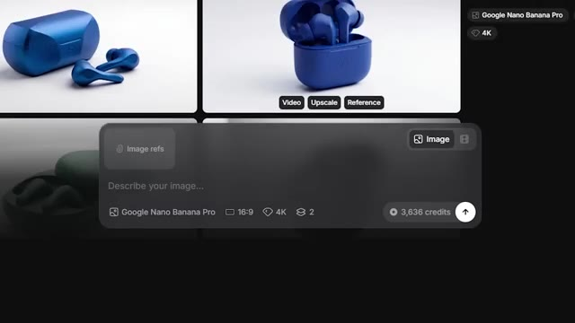
*Interface de la plateforme de génération montrant une grille d'images de produits de type écouteurs sans fil bleus avec un panneau de configuration.*

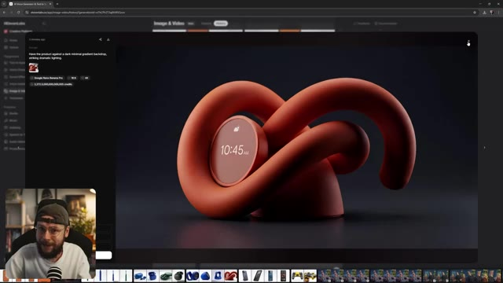
*Affichage d'un rendu vidéo ou image d'une horloge intelligente de forme originale sur fond sombre minimaliste, avec le créateur visible en incrustation (PiP).*

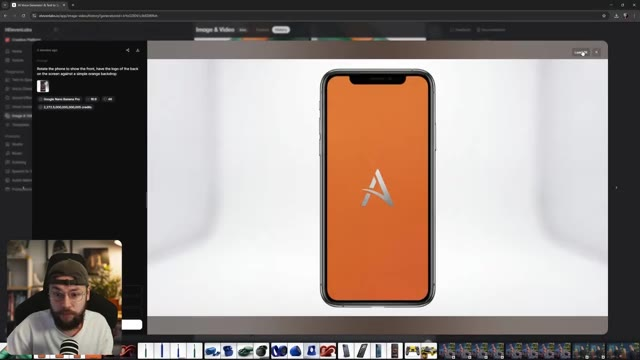
*Affichage d'un rendu d'un smartphone sur fond clair et épuré, avec le créateur visible en incrustation (PiP).*

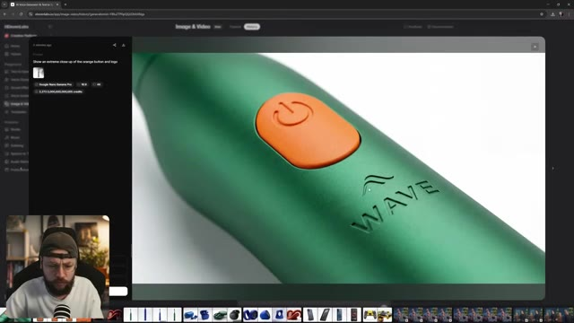
*Gros plan détaillé d'une brosse à dents verte texturée avec un bouton orange et le logo 'WAVE', avec le créateur visible en incrustation (PiP).*

---

### ⏱️ `[00:08:30 - 00:09:03]` | Segment #20

**🔊 Audio (Transcription Intégrale Mot pour Mot en Français) :**
> et nous avons aussi le retour de notre modèle féminin interagissant avec notre produit. Regardez simplement le niveau de qualité ici et l'adhérence, la cohérence dans le produit lui-même. Vous pouvez voir à quel point ce flux de travail devient vraiment polyvalent. Tant de cas d'utilisation différents ici, tellement plus que vous pouvez créer à partir de ces images de départ. Donc maintenant ce que nous pouvons commencer à faire, c'est utiliser les images que nous avons créées, nous pouvons commencer à générer des vidéos. Donc par exemple, je veux aller de l'avant et simplement télécharger cette image que j'

**👁️ Analyse Visuelle d'Écran (gemini-3.5-flash-lite) :**
**Interface & Outils** : Interface de la plateforme ElevenLabs (onglet Image & Video / History) avec une vue PiP (Picture-in-Picture) du présentateur Jack en bas à gauche.

**Contenu textuel & Code** : Le prompt visible dans le panneau latéral est : "Show an attractive woman holding the toothbrush and smiling in her bathroom." Les options incluent le modèle Google Nano Banana Pro, le format 16:9 et l'option 4K. La galerie présente diverses images de produits générées (smartphones, manettes de jeu, formes abstraites).

**Action / Démonstration** : Le présentateur navigue dans l'interface d'ElevenLabs, examine les images générées de la femme tenant le produit et montre la bibliothèque d'images disponibles dans l'historique avant de préparer le téléchargement d'une image pour générer une vidéo.

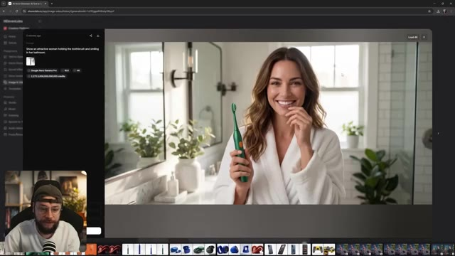
*Interface d'ElevenLabs affichant une image générée d'une femme tenant une brosse à dents électrique dans une salle de bains.*

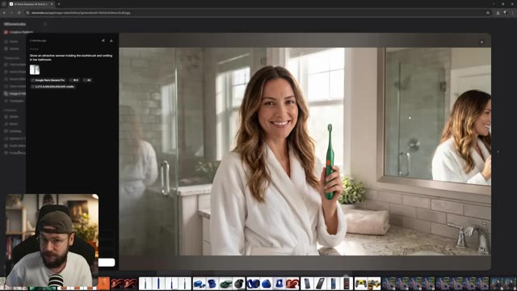
*Interface d'ElevenLabs montrant un zoom légèrement différent sur l'image générée de la femme avec la brosse à dents.*

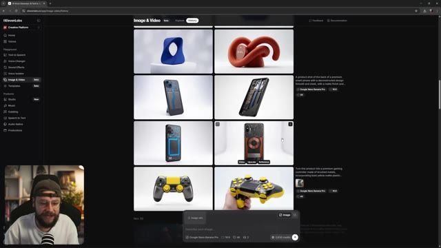
*Galerie d'historique de l'onglet Image & Video d'ElevenLabs présentant différentes créations de produits (smartphones, manettes, objets design).*

---

### ⏱️ `[00:09:03 - 00:09:40]` | Segment #21

**🔊 Audio (Transcription Intégrale Mot pour Mot en Français) :**
> J'ai ici notre téléphone et l'un de ceux que nous avons créés plus tard également. Je vais également le télécharger. En bas ici, je vais basculer sur l'onglet vidéo et si nous basculons sur un modèle vidéo comme Kling 2.5 par exemple, nous pouvons entrer une image de début et de fin. Donc je veux prendre l'arrière du téléphone comme image de début et l'avant du téléphone comme image de fin, et pour le prompt textuel, nous pouvons simplement mettre quelque chose comme : à mesure que la caméra avance, le téléphone pivote pour révéler l'avant. Un scintillement parcourt l'écran du téléphone. Publicité de produit en CGI haut de gamme. Je veux générer, allons-y

**👁️ Analyse Visuelle d'Écran (gemini-3.5-flash-lite) :**
**Interface & Outils** : Interface web d'ElevenLabs (section Image & Video), comportant un panneau latéral avec les onglets Home, Voices, Sound Effects, Image & Video, et une zone principale affichant l'historique des créations et les paramètres vidéo (modèle Kling 2.5, format 16:9, durée 5s, option Start/End frame).

**Contenu textuel & Code** : Texte du prompt visible : « As the camera pushes in the phone rotates to reveal the front, a shimmer runs across the phone screen. Premium CGI product ad. » Modèle sélectionné : Kling 2.5, résolution 1080p, durée 5s, coût de 2 121 crédits.

**Action / Démonstration** : Le présentateur navigue dans l'interface, sélectionne des images de smartphones générées, bascule sur l'onglet vidéo, configure le modèle Kling 2.5 avec une image de début et une image de fin, puis saisit un prompt textuel pour générer une publicité produit.

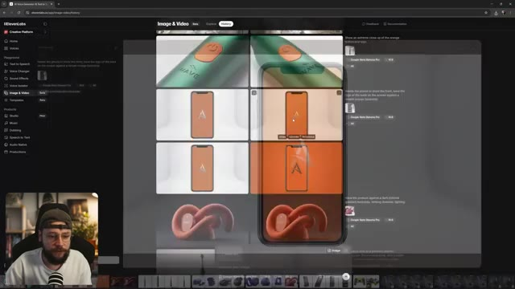
*Interface d'une application web (ElevenLabs - Image & Video) affichant l'historique des générations avec une miniature de smartphone sélectionnée.*

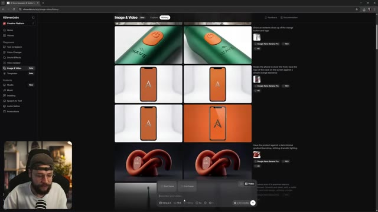
*L'interface montre l'onglet vidéo ouvert en bas avec le modèle Kling 2.5 sélectionné pour paramétrer les images de début et de fin.*

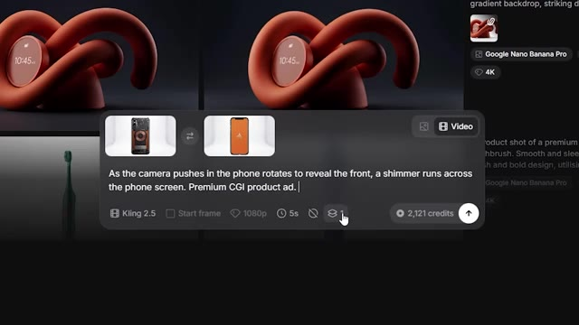
*Gros plan sur le panneau de génération vidéo montrant les images sélectionnées (arrière et avant du téléphone) et le prompt textuel rédigé.*

---

### ⏱️ `[00:09:40 - 00:10:00]` | Segment #22

**🔊 Audio (Transcription Intégrale Mot pour Mot en Français) :**
> pour trois d'entre eux et je veux aussi les faire durer 10 secondes. Envoyons cela. Maintenant, si nous ne voulons pas utiliser de cadre de début et de fin, nous pouvons simplement survoler notre référence d'image ici et cliquer sur l'onglet vidéo. Nous pourrions alors vouloir basculer vers un autre modèle vidéo. Essayons Kling 2.6, l'un de leurs modèles récents.

**👁️ Analyse Visuelle d'Écran (gemini-3.5-flash-lite) :**
**Interface & Outils** : Interface web d'ElevenLabs (section Image & Video) avec superposition des menus de configuration et de génération vidéo IA.

**Contenu textuel & Code** : Texte du prompt visible : « As the camera pushes in the phone rotates to reveal the front, a shimmer runs across the phone screen. Premium CGI product ad. », et les paramètres : « Kling 2.5 », « 10s », « 1080p », « 6,363 credits ». Sur l'image 3, apparition du sélecteur de modèle « Kling 2.6 ».

**Action / Démonstration** : Le curseur de la souris survole l'image de référence pour cliquer sur l'onglet vidéo et sélectionner un autre modèle de génération (Kling 2.6).

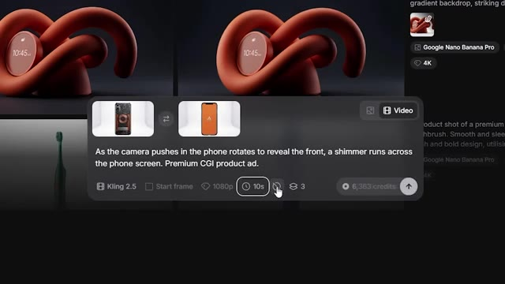
*Interface de génération vidéo montrant les paramètres avec la durée réglée sur 10 secondes et le modèle Kling 2.5.*

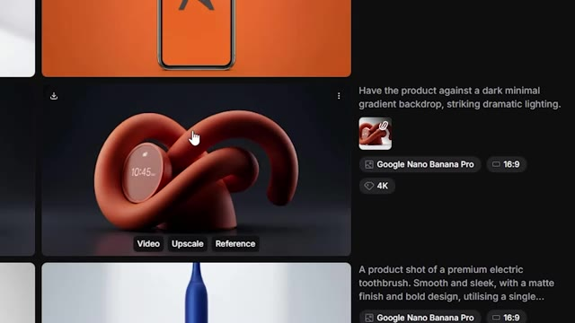
*Survol d'une image générée avec l'apparition des boutons d'options 'Video', 'Upscale' et 'Reference'.*

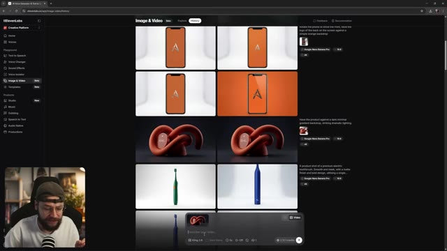
*Interface complète avec le créateur en incrustation (PiP), montrant l'historique des générations d'images et de vidéos et le menu latéral de l'outil.*

---

### ⏱️ `[00:10:00 - 00:10:19]` | Segment #23

**🔊 Audio (Transcription Intégrale Mot pour Mot en Français) :**
> Et essayons quelque chose comme l'horloge intelligente qui tourne lentement tandis que l'arrière-plan passe du noir au blanc. Et encore une fois, publicité de produit en CGI de premier ordre. Nous allons faire cela en dix secondes. Je vais couper l'audio et nous allons enchaîner avec trois autres générations de ceci. Créons également quelque chose d'un peu différent.

**👁️ Analyse Visuelle d'Écran (gemini-3.5-flash-lite) :**
**Interface & Outils** : Navigateur web affichant la plateforme ElevenLabs (section Image & Video) avec superposition des boîtes de dialogue de génération (Kling 2.6).

**Contenu textuel & Code** : Texte du prompt saisi : "The smart clock slowly rotates as the background transitions from black to white. Premium CGI product ad." Paramètres visibles : Kling 2.6, 5s, Audio Off, 2,121 crédits. Grille de miniatures vidéo montrant des brosses à dents et des smartphones.

**Action / Démonstration** : Le créateur montre la saisie d'un prompt textuel pour générer une publicité vidéo CGI de produit à l'aide du modèle Kling 2.6 sur la plateforme ElevenLabs.

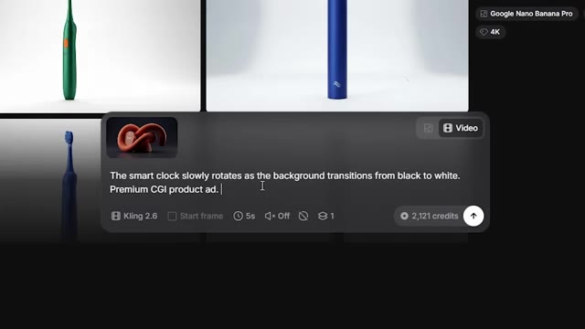
*Gros plan sur une boîte de dialogue de prompt avec le texte de génération et les paramètres Kling 2.6.*

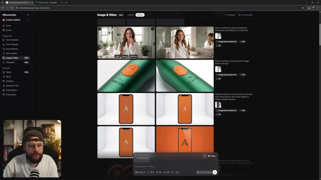
*Vue d'ensemble de l'interface d'ElevenLabs (Image & Video) avec la grille des générations précédentes et le créateur visible en incrustation PiP.*

---

### ⏱️ `[00:10:19 - 00:10:54]` | Segment #24

**🔊 Audio (Transcription Intégrale Mot pour Mot en Français) :**
> Utilisons notre image que nous avons ici de notre mannequin féminin tenant notre brosse à dents haut de gamme. Cliquez à nouveau sur l'onglet vidéo. Faisons une autre génération Kling 2.6 et nous pouvons simplement dire mouvement de caméra dolly lent vers l'avant alors qu'une femme sourit avec confiance à la caméra. Faisons une génération de cinq secondes cette fois. Nous n'avons pas besoin d'audio et obtenons trois générations supplémentaires de ceci. Jetons un coup d'œil. Nous avons notre horloge intelligente par exemple qui a vraiment l'air bien. Elle respecte très bien la cohérence du produit. Je vous le dis, allons de l'avant et téléchargeons ces éléments pour pouvoir regarder

**👁️ Analyse Visuelle d'Écran (gemini-3.5-flash-lite) :**
**Interface & Outils** : ElevenLabs (plateforme web avec module Image & Video)

**Contenu textuel & Code** : Historique des générations, paramètres Kling 2.6 (prompt : "Slow dolly camera move in as the woman confidently smiles at the camera.", 5s, 16:9), affichage des crédits (2,121 crédits, 4,262 crédits).

**Action / Démonstration** : Le créateur navigue dans l'historique des générations vidéo sur ElevenLabs, configure une nouvelle génération Kling 2.6 avec un prompt textuel, et examine le rendu d'une horloge intelligente CGI.

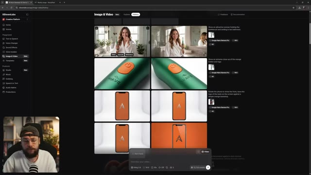
*Interface d'ElevenLabs (section Image & Video History) montrant l'historique des générations avec le panneau du créateur en incrustation (PiP).*

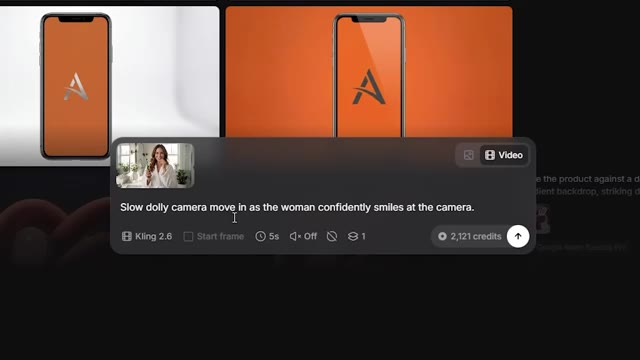
*Gros plan sur le pop-up de génération vidéo Kling 2.6 avec le prompt textuel et les réglages de durée.*

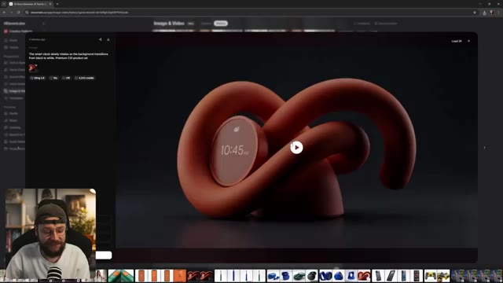
*Visualisation en plein écran du rendu vidéo d'une horloge intelligente dans un design abstrait de type CGI.*

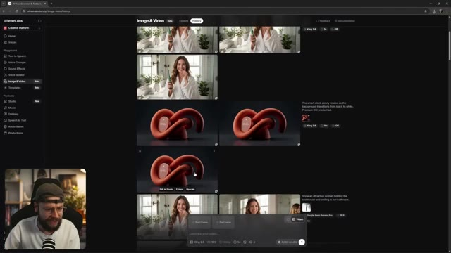
*Retour sur la grille d'historique de l'interface d'ElevenLabs affichant les différentes générations de vidéos de la brosse à dents et de l'horloge.*

---

### ⏱️ `[00:10:54 - 00:11:30]` | Segment #25

**🔊 Audio (Transcription Intégrale Mot pour Mot en Français) :**
> les correctement. Ouais, ça a l'air vraiment bien. Donc ça, c'est notre génération quand on fait juste pivoter le produit et ce que j'aime vraiment. Oh non, en fait, on est en train de faire une transition. C'est notre transition d'arrière-plan du noir au blanc. Ça a l'air vraiment bien. Tout à fait utilisable ici et une belle adhésion à la texture mate du produit lui-même. Jetons un œil à cette génération aussi. C'est un peu saccadé au début là. Vous pouvez voir qu'on perd pas mal de frames, donc cette génération n'a pas tout à fait fonctionné au début. Mais comme je le dis toujours, vous n'êtes pas obligé d'utiliser toute la génération si vous ne voulez pas. Donc dans notre suite logicielle de montage

**👁️ Analyse Visuelle d'Écran (gemini-3.5-flash-lite) :**
**Interface & Outils** : Lecteur multimédia Windows affichant la lecture d'une vidéo de démonstration, avec la webcam du créateur incrustée en PiP (Picture-in-Picture) dans le coin inférieur gauche.

**Contenu textuel & Code** : Affichage d'un objet design orange texturé doté d'un écran rond affichant l'heure "10:45 AM" et une icône météo nuageuse. Barre de lecture du lecteur multimédia visible en bas avec les contrôles de lecture.

**Action / Démonstration** : Le créateur montre la lecture vidéo du produit généré par IA dans un lecteur multimédia tout en commentant la fluidité, les transitions et les éventuelles pertes de frames (saccades).

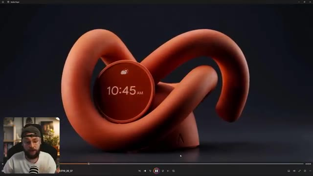
*Lecteur multimédia affichant une vidéo générée par IA montrant un objet orange aux formes complexes avec un écran circulaire affichant 10:45 AM, avec une incrustation vidéo de Jack en bas à gauche.*

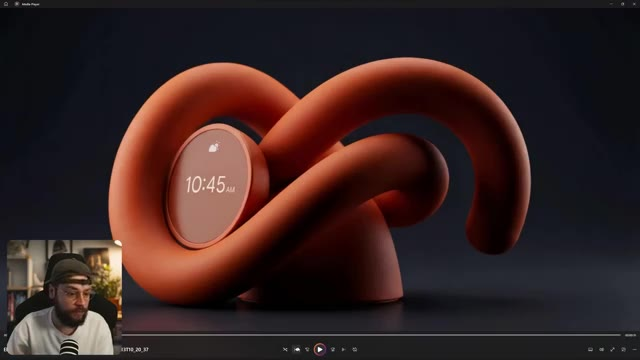
*Lecteur multimédia affichant la suite de la lecture de la vidéo du produit orange sur fond sombre.*

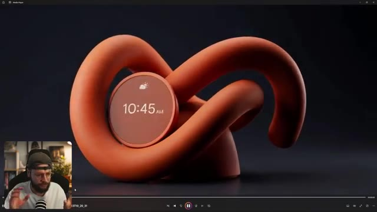
*Lecteur multimédia montrant le produit orange en gros plan, avec Jack gesticulant dans l'encadré incrusté en bas à gauche.*

---

### ⏱️ `[00:11:30 - 00:11:58]` | Segment #26

**🔊 Audio (Transcription Intégrale Mot pour Mot en Français) :**
> de choix, nous pourrions couper le début ici et l'insérer au moment où la cadence d'images semble se stabiliser d'elle-même, et cela fait quelque chose de vraiment sympa ici où nous passons littéralement d'un espace physique à un fond blanc et examinons les détails en termes de construction du produit de notre horloge connectée assez abstraite ici. Elle a complètement inventé l'arrière de l'horloge à partir de zéro et je trouve personnellement que c'est superbe. Est-ce que je l'aurais chez moi ?

**👁️ Analyse Visuelle d'Écran (gemini-3.5-flash-lite) :**
**Interface & Outils** : Lecteur multimédia Windows affichant la lecture vidéo avec le présentateur Jack incrusté en bas à gauche (picture-in-picture).

**Contenu textuel & Code** : Rendu vidéo d'un objet design abstrait orange en forme de nœud organique intègrant un écran circulaire affichant l'heure "10:45 AM" et une icône météo, évoluant d'un fond sombre vers un studio photo à fond blanc.

**Action / Démonstration** : Le lecteur multimédia joue la séquence vidéo générée par IA tandis que Jack commente les détails visuels et la transition de décor en bas à gauche.

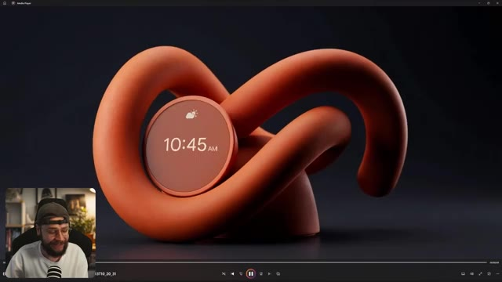
*Visualisation d'une vidéo générée montrant une horloge connectée abstraite de forme organique orange sur fond sombre, avec le présentateur en médaillon PiP en bas à gauche.*

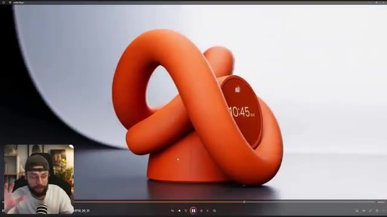
*Poursuite de la vidéo montrant la caméra se déplaçant pour révéler un studio à fond blanc lumineux et mettant en valeur les détails du produit.*

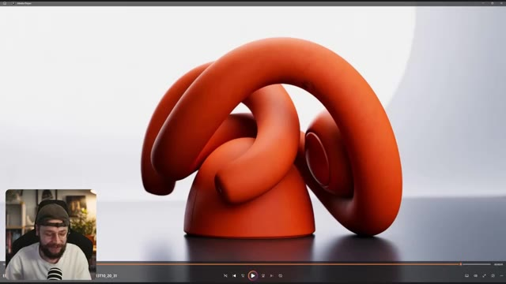
*Plan de la vidéo montrant l'arrière de l'objet abstrait orange généré par l'IA sous un angle différent sur fond blanc.*

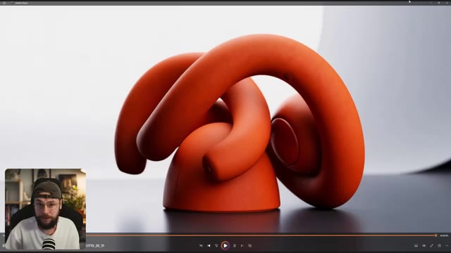
*Plan final de la vidéo montrant l'arrière détaillé de l'horloge connectée abstraite inventée par l'IA.*

---

### ⏱️ `[00:11:58 - 00:12:33]` | Segment #27

**🔊 Audio (Transcription Intégrale Mot pour Mot en Français) :**
> Je ne suis pas tout à fait sûr. Vous pouvez me dire dans les commentaires si vous aimez réellement ce produit. C'est définitivement assez différent. Téléchargeons nos vidéos de notre modèle féminin tenant la bourse à dents également. Jetons un œil à celles-ci. Ouais, ça a l'air super. Nous avons un bon niveau d'adhérence du produit ici. Je pense que cette chute d'images était juste mon ordinateur au fait. Ouais, la génération de vidéo elle-même est bonne mais vous pouvez voir que nous serions capables si nous essayions de construire une publicité entière à partir de zéro. Nous pourrions couper à partir de plus de notre décor de photographie de produits où nos produits sont contre ce genre de toile de fond en dégradé. Vous voyez beaucoup cela dans les publicités télévisées et ensuite

**👁️ Analyse Visuelle d'Écran (gemini-3.5-flash-lite) :**
**Interface & Outils** : Navigateur web (ElevenLabs), Explorateur de fichiers Windows et lecteur multimédia vidéo, avec vignette PiP du créateur.

**Contenu textuel & Code** : Explorateur de fichiers montrant divers dossiers et fichiers multimédias (vidéos de produits, images de personnages, PDF), et interface vidéo d'ElevenLabs avec invite et réglages en bas.

**Action / Démonstration** : Le créateur navigue dans ses fichiers pour récupérer et visionner les vidéos générées de la femme tenant la brosse à dents.

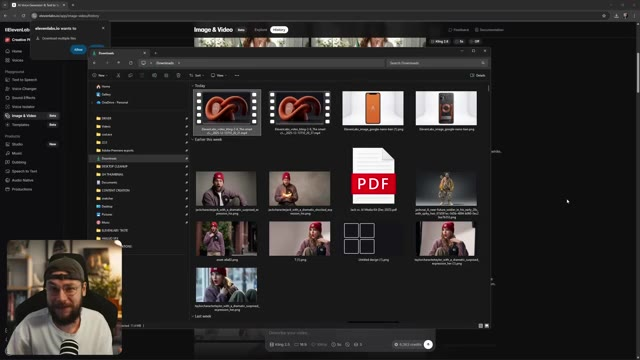
*Explorateur de fichiers Windows ouvert par-dessus l'interface d'ElevenLabs avec la caméra du créateur en incrustation (PiP) en bas à gauche.*

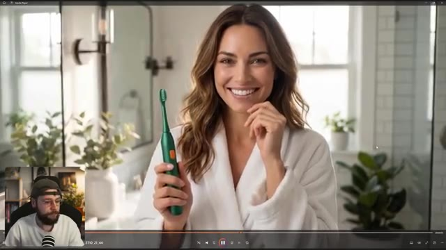
*Lecteur multimédia affichant une vidéo générée par IA montrant un modèle féminin en peignoir tenant une brosse à dents verte dans une salle de bain, avec la caméra du créateur en PiP.*

---

### ⏱️ `[00:12:33 - 00:13:07]` | Segment #28

**🔊 Audio (Transcription Intégrale Mot pour Mot en Français) :**
> couper vers un arrière-plan en prises de vue réelles, plus réaliste et fidèle à la réalité, où nous avons un modèle féminin, par exemple, tenant notre produit chez elle. Maintenant, ces générations-ci, je suis un peu nerveux à leur sujet parce que c'est probablement la chose la plus ambitieuse que nous ayons essayée de créer ici en utilisant Kling 2.5. C'était bien sûr notre image de début et de fin où nous commençons par l'arrière du téléphone et nous essayons d'amener le modèle vidéo à faire pivoter le téléphone et à montrer l'avant avec le logo et aussi à avoir ce scintillement qui traverse l'écran. Voyons voir comment cela s'est passé. Très bien, jetons un œil à

**👁️ Analyse Visuelle d'Écran (gemini-3.5-flash-lite) :**
**Interface & Outils** : Lecteur multimédia plein écran (sur l'image 1) et interface web d'ElevenLabs (sur l'image 2) comprenant un menu latéral à gauche (Home, Voices, Text to Speech, Voice Changer, Sound Effects, Voice Isolator, Image & Video, Templates, Studio, Music, Dubbing, Speech to Text, Audio Native, Productions) et une zone d'historique de générations de vidéos au centre, avec une incrustation vidéo du présentateur (PiP) dans le coin inférieur gauche.

**Contenu textuel & Code** : Sur l'interface ElevenLabs (image 2), on aperçoit des vignettes de générations de vidéos sous la date « Dec 13 » (smartphone au dos, puis la femme tenant un produit), avec des badges indiquant les paramètres (Kling 2.5, 1x) et des prompts textuels visibles dans les descriptions de miniatures (ex: « As the camera pushes in, the phone rotates to reveal the front... », « Slow dolly camera move in as the woman confidently smiles at the camera »), ainsi qu'un compteur de crédits en bas à droite (6,562 credits).

**Action / Démonstration** : Le créateur présente visuellement les résultats générés par IA à l'écran, en passant du rendu vidéo en plein écran montrant la modèle dans la salle de bain à l'historique de l'interface d'ElevenLabs où sont stockées et gérées les différentes versions générées avec Kling 2.5.

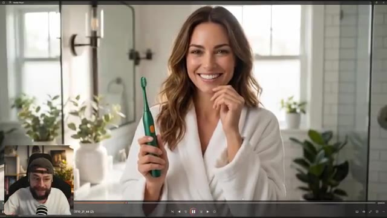
*Lecteur vidéo affichant le rendu de la modèle féminin tenant une brosse à dents verte dans une salle de bain, avec le présentateur incrusté en bas à gauche.*

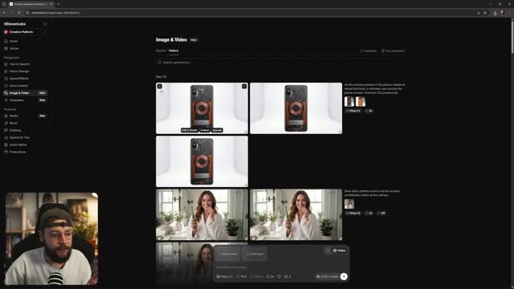
*Interface de la plateforme ElevenLabs (section Image & Video / History) montrant l'historique des générations avec des aperçus de smartphones et de la modèle, et le présentateur en PiP.*

---

### ⏱️ `[00:13:07 - 00:13:43]` | Segment #29

**🔊 Audio (Transcription Intégrale Mot pour Mot en Français) :**
> la première génération. D'accord, ça a l'air vraiment bien. On a eu une chute d'images à ce moment-là. C'était juste mon ordinateur ? Oui, c'était ça. Ça a l'air vraiment super. Exactement ce que je recherchais. La deuxième génération a l'air bien aussi. Oui, elle a fait un travail vraiment formidable sur celle-ci en fait. Je n'avais aucune raison d'être nerveux, il s'avère. Mais vous pouvez voir, espérons-le, le niveau de contrôle que vous êtes capable d'offrir lorsqu'il s'agit de vos générations de vidéos par IA. Spécifiquement avec les images de début et de fin. Si vous savez que vous voulez faire une transition d'un point à un autre en termes de focalisation sur un point spécifique

**👁️ Analyse Visuelle d'Écran (gemini-3.5-flash-lite) :**
**Interface & Outils** : Lecteur multimédia affichant une vidéo générée par IA illustrant un smartphone.

**Contenu textuel & Code** : Visuel d'un smartphone présenté sous différents angles avec un design épuré, un logo 'A', puis une vue transparente des composants internes incluant une bobine de charge par induction. Le présentateur apparaît en incrustation (PiP) dans le coin inférieur gauche.

**Action / Démonstration** : Lecture d'une vidéo générée par IA montrant les différentes générations et animations d'un smartphone, commentée en direct par le créateur dans l'encadré PiP.

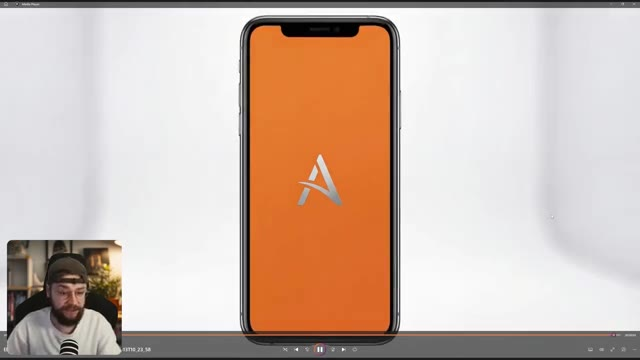
*Rendu vidéo IA montrant un smartphone de face avec un logo en forme de lettre 'A' sur fond orange.*

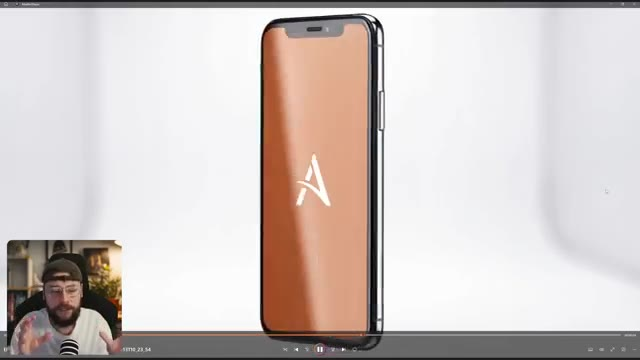
*Rendu vidéo IA montrant une rotation du smartphone en gros plan.*

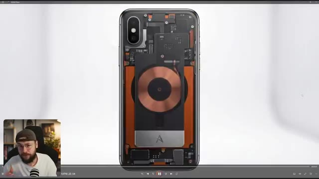
*Rendu vidéo IA montrant l'arrière transparent d'un smartphone révélant ses composants internes et sa bobine de charge sans fil.*

---

### ⏱️ `[00:13:43 - 00:14:06]` | Segment #30

**🔊 Audio (Transcription Intégrale Mot pour Mot en Français) :**
> début du produit au début de la génération de vidéo et ensuite une partie différente du produit à la fin, vous pouvez créer quelque chose comme ça. Et jetons juste un œil rapide sur notre troisième génération Rude Not To. Je m'attends à ce qu'au moins une de ces générations ne soit pas bonne, mais elles ont toutes l'air très similaires, mais elles semblent toutes faire la chose correcte. Elles ont l'air très haut de gamme également.

**👁️ Analyse Visuelle d'Écran (gemini-3.5-flash-lite) :**
**Interface & Outils** : Lecteur multimédia natif (type Windows Media Player) affichant des vidéos générées par IA sur l'écran principal, avec le créateur en incrustation PiP (Picture-in-Picture) dans le coin inférieur gauche.

**Contenu textuel & Code** : Vidéos de démonstration générées par IA montrant un smartphone aux détails réalistes (logo orange, composants internes transparents).

**Action / Démonstration** : Le créateur commente à l'oral les vidéos de générations de produits tout en illustrant ses propos avec des extraits vidéo diffusés à l'écran.

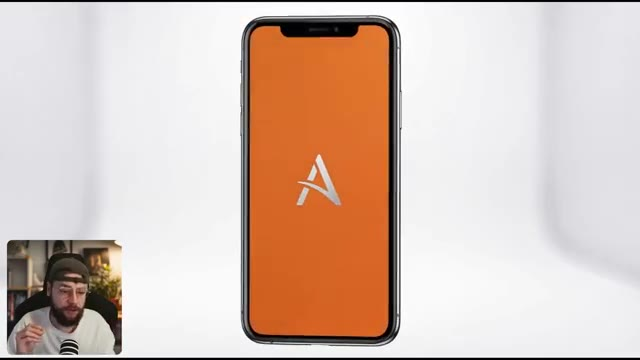
*Affichage à l'écran du rendu vidéo d'un smartphone avec un logo orange, tandis que Jack apparaît en incrustation (PiP) dans le coin inférieur gauche.*

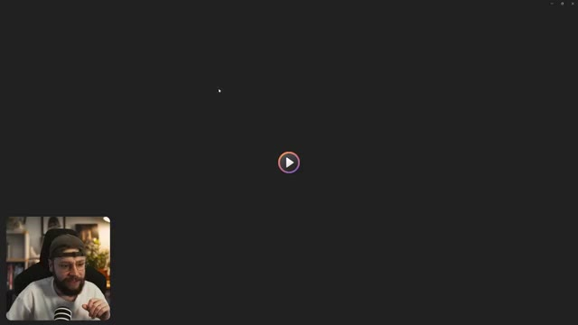
*Lecteur multimédia en cours de chargement sur l'écran d'ordinateur avec le curseur de la souris visible, avec Jack en incrustation PiP.*

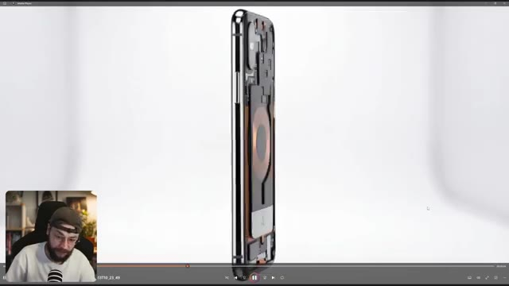
*Lecture vidéo sur le lecteur multimédia d'un smartphone transparent montrant ses composants internes, avec Jack en incrustation PiP.*

---

### ⏱️ `[00:14:07 - 00:14:39]` | Segment #31

**🔊 Audio (Transcription Intégrale Mot pour Mot en Français) :**
> Ouais, je suis plutôt impressionné ici. Donc on a un peu couvert ici la partie visuelle de notre flux de travail. Je veux passer aux capacités audio maintenant qu'elles sont intégrées dans ElevenLabs en tant que plateforme. Alors laissez-moi aller chercher mes casques pour ça. Et si on va sur le coin supérieur gauche, on peut cliquer sur les voix. Et il y a une telle variété de voix différentes proposées ici pour être utilisées dans le cadre de votre voix off pour votre publicité de produit. Et si on clique dessus, on peut obtenir une démo ici. Donc par exemple, ce Jonathan Livingston.

**👁️ Analyse Visuelle d'Écran (gemini-3.5-flash-lite) :**
**Interface & Outils** : ElevenLabs (Plateforme de génération audio et vidéo par IA) - sections Image & Video et Voices.

**Contenu textuel & Code** : Interface web d'ElevenLabs affichant l'historique des projets vidéo et la bibliothèque de voix avec des options de filtrage, des catégories ("Trending voices", "Handpicked for your use case", "Weekly spotlight - Character Voices" incluant Jonathan Livingston).

**Action / Démonstration** : Le créateur navigue dans l'interface d'ElevenLabs, passe de l'onglet vidéo à la bibliothèque de voix pour présenter les fonctionnalités audio.

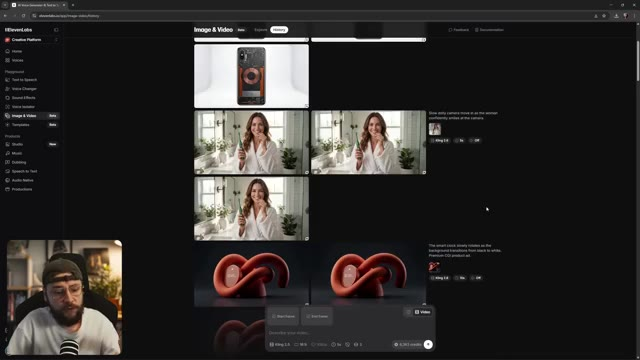
*L'écran affiche l'historique des générations vidéo sur la plateforme ElevenLabs avec des aperçus de vidéos (téléphone, femme avec brosse à dents, objet abstrait rouge).*

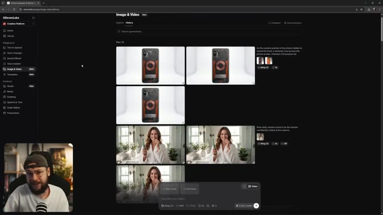
*L'écran montre toujours l'historique des générations vidéo sur ElevenLabs avec les vignettes classées par date du 15 décembre.*

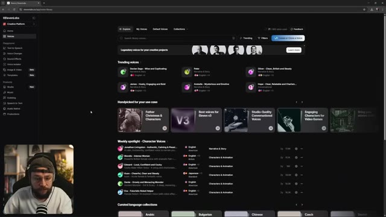
*L'écran bascule sur la bibliothèque de voix ("Voice Library") d'ElevenLabs avec différentes catégories de voix tendance et des profils vocaux comme Jonathan Livingston.*

---

### ⏱️ `[00:14:43 - 00:15:19]` | Segment #32

**🔊 Audio (Transcription Intégrale Mot pour Mot en Français) :**
> Je teste la lecture d'un article de livre ou d'une histoire. Nous avons Eva, l'aide robot futuriste. Bonjour, je suis Eva, comment puis-je vous aider aujourd'hui ? Oh Eva, tu me donnes un peu des vibrations bizarres en fait. Nous sommes toujours quelque chose, mais aucun de nous n'est tout. C'est plutôt sympa en fait, j'aime assez cette voix. Donc si on aime ça, on peut aller cliquer sur "ajouter à mes voix". Maintenant vous pouvez voir que ce symbole a changé pour "utiliser la voix", donc cliquons ici. Donc maintenant nous sommes allés sur ChatGPT et j'utilise juste le plan gratuit pour cela, et nous allons utiliser ChatGPT pour nous aider à rédiger un

**👁️ Analyse Visuelle d'Écran (gemini-3.5-flash-lite) :**
**Interface & Outils** : Interface web d'ElevenLabs (Voice Library) sur l'image #1, puis interface de ChatGPT sur l'image #2, avec la webcam du créateur incrustée en bas à gauche sur les deux images.

**Contenu textuel & Code** : Sur ElevenLabs : catégories "Trending voices", "Handpicked for your use case", "Weekly spotlight - Character Voices" avec des voix comme Declan Sage, Peter, Oliver, James, Eva - Futuristic Robot Helper. Sur ChatGPT : barre de texte "Ask anything", mention "Free plan".

**Action / Démonstration** : Le créateur navigue sur ElevenLabs pour sélectionner une voix de robot (Eva), écoute un aperçu audio, puis bascule sur l'interface de ChatGPT sur le plan gratuit.

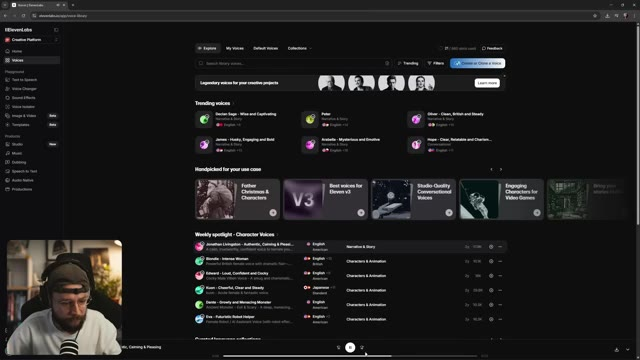
*Interface d'ElevenLabs (bibliothèque de voix) montrant la liste des voix disponibles, avec un encadré PiP du créateur en bas à gauche.*

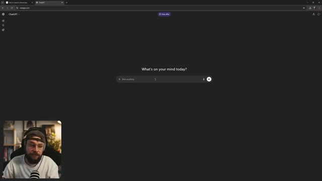
*Interface de ChatGPT (version gratuite) affichant la page d'accueil avec le champ de saisie central, et le créateur visible en incrustation PiP.*

---

### ⏱️ `[00:15:19 - 00:15:54]` | Segment #33

**🔊 Audio (Transcription Intégrale Mot pour Mot en Français) :**
> voix off vraiment très rapidement donc pour le prompt textuel nous allons juste dire écris-moi une voix off pour ma publicité de produit elle décrit une horloge connectée haut de gamme avec un design remarquable le marché cible est constitué d'hommes et de femmes fortunés et obsédés par la technologie cela ne devrait durer que 10 secondes et ne faire qu'une phrase ou deux alors envoyons ça ok vous pouvez voir ce qu'on a obtenu ici le temps parfait une horloge connectée au design remarquable qui anticipe votre journée commande votre espace définit le luxe moderne. Donc nous pouvons copier ceci. En retournant sur ElevenLabs, nous pouvons le coller dans cette section ici.

**👁️ Analyse Visuelle d'Écran (gemini-3.5-flash-lite) :**
**Interface & Outils** : Navigateur web affichant l'interface de ChatGPT en mode sombre, puis l'interface de synthèse vocale (Text to Speech) d'ElevenLabs avec le modèle "Eleven Multilingual v2" et la voix "Bill Russell" ou similaire.

**Contenu textuel & Code** : Sur l'image 1 : la barre de recherche affiche "Ask anything". Sur l'image 2, le texte généré est présent : "Time, perfected. A strikingly designed smart clock that anticipates your day, commands your space, and defines modern luxury."

**Action / Démonstration** : Le créateur navigue entre ChatGPT pour obtenir un texte de voix off publicitaire, puis copie ce résultat pour le coller dans l'interface de synthèse vocale d'ElevenLabs afin de générer l'audio.

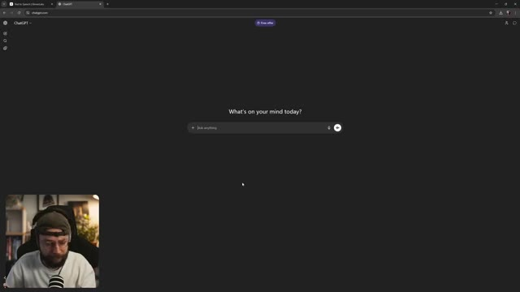
*Interface de ChatGPT montrant la page d'accueil avec le champ de saisie vide et le créateur visible en incrustation PiP.*

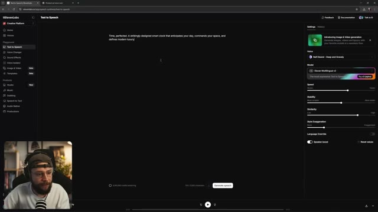
*Interface d'ElevenLabs (Text to Speech) affichant le texte généré collé dans la zone d'édition avec les paramètres de voix sur le panneau latéral droit.*

---

### ⏱️ `[00:15:54 - 00:16:27]` | Segment #34

**🔊 Audio (Transcription Intégrale Mot pour Mot en Français) :**
> Et si nous cliquons sur générer, nous allons récupérer cette ligne lue et perfectionnée avec notre voix. Absolument parfaite. Cela fonctionnerait tellement bien dans une publicité pour un produit haut de gamme en utilisant notre vidéo IA comme arrière-plan. Je savais que j'avais un bon pressentiment pour cette voix, vous savez, c'est exactement ce que j'imaginerais. Ça me rappelle un peu ce qu'on entend parfois dans une pub Dyson. Je ne sais pas si vous êtes d'accord avec ça. Peut-être que je dis n'importe quoi. Dites-le-moi. Et maintenant ce que nous pouvons

**👁️ Analyse Visuelle d'Écran (gemini-3.5-flash-lite) :**
**Interface & Outils** : ElevenLabs (outil Text to Speech) avec affichage du panneau latéral des paramètres vocaux (voix sélectionnée : Ralf Eikeand - Deep and Gravelly, modèle : Eleven Multilingual v2) et un retour vidéo PiP de Jack dans le coin inférieur gauche.

**Contenu textuel & Code** : Texte affiché dans l'éditeur : "Time, perfected. A strikingly designed smart clock that anticipates your day, commands your space, and defines modern luxury". Paramètres visibles : Speed, Stability, Similarity, Style Exaggeration et Speaker boost.

**Action / Démonstration** : Le créateur montre l'interface d'ElevenLabs prête pour la génération de la voix off publicitaire, tout en commentant le résultat escompté.

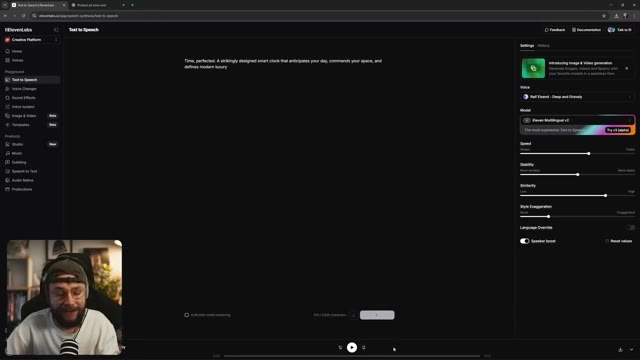
*Interface de l'outil Text to Speech d'ElevenLabs affichant le texte publicitaire et les paramètres vocaux avec un encadré PiP montrant Jack en bas à gauche.*

---

### ⏱️ `[00:16:27 - 00:17:03]` | Segment #35

**🔊 Audio (Transcription Intégrale Mot pour Mot en Français) :**
> ce qu'il faut faire aussi, c'est aller sur l'onglet de musique également. Maintenant, en retournant sur ChatGPT, nous allons lui demander d'écrire un prompt textuel à utiliser avec un générateur de musique par IA. Crée-moi un court morceau de musique d'ambiance à utiliser dans ma publicité de produit. Il faut que ce soit minimal et haut de gamme. Maintenant, vous pouvez voir ici qu'il nous a donné ce prompt vraiment très détaillé, nous pouvons donc le copier et le déposer dans cette section ici sur ElevenLabs. Et nous avons un niveau de contrôle vraiment très appréciable ici lorsqu'il s'agit de notre génération. Nous pouvons donc choisir le nombre de variantes que nous avons. Prenons-en trois. Nous pouvons cliquer sur la durée de notre chanson.

**👁️ Analyse Visuelle d'Écran (gemini-3.5-flash-lite) :**
**Interface & Outils** : ElevenLabs (sections Text to Speech et Music) et ChatGPT.

**Contenu textuel & Code** : Sur l'image 2 : "Write me a text prompt to be used with an AI music generator, to create me a short piece of ambient music to be used within my product ad, it needs to feel minimal and premium." Sur l'image 3 (prompt de musique) : "Minimalist ambient underscore for a luxury tech product ad: slow tempo, clean analogue synth pads, subtle sub-bass, restrained high-end shimmer, no vocals, no percussion, smooth attack and long decay, emotionally neutral but confident, evoking precision, modernity, and quiet wealth; cinematic yet intimate, suitable for a 10-second premium brand reveal" avec options de durée (1), de variance (1:00) et de crédits (1,018 credits).

**Action / Démonstration** : Le créateur montre l'interface d'ElevenLabs, passe sur ChatGPT pour rédiger le prompt textuel, puis revient sur l'onglet de génération musicale d'ElevenLabs pour y coller le prompt et configurer les paramètres de génération.

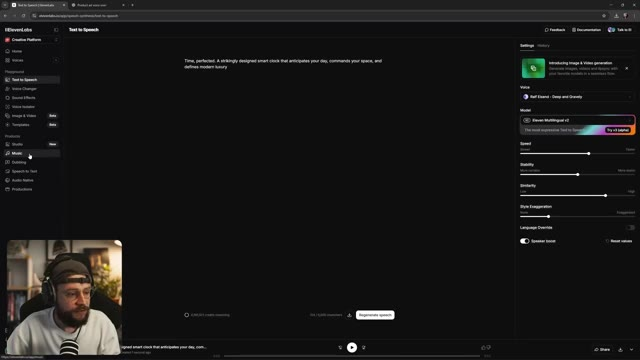
*Interface d'ElevenLabs (Text to Speech) avec le créateur en encadré vidéo (PiP) dans le coin inférieur gauche.*

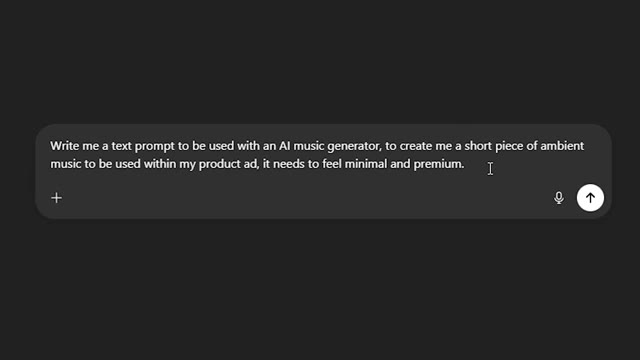
*Interface de ChatGPT affichant la boîte de saisie avec le prompt textuel demandé pour la génération de musique.*

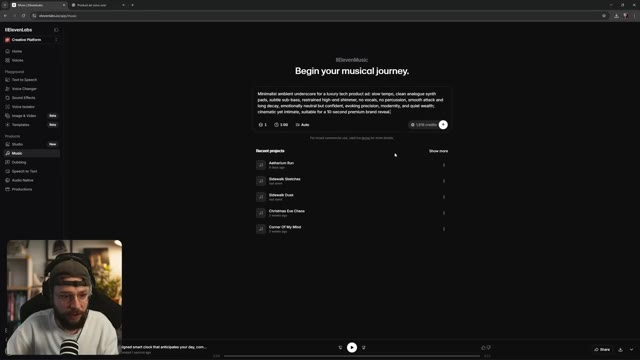
*Interface de l'onglet de génération musicale d'ElevenLabs ("11ElevenMusic") avec le prompt détaillé collé et les options de durée.*

---

### ⏱️ `[00:17:04 - 00:17:43]` | Segment #36

**🔊 Audio (Transcription Intégrale Mot pour Mot en Français) :**
> Donc nous avions dit que nous voulions que cela dure seulement 10 secondes. Allons-y donc pour régler ceci sur personnalisé, et regardez ça, c'est passé directement à 10 secondes, et c'est important cette section ici, nous pouvons ajouter "auto" ce qui va ajouter des paroles ou nous pouvons sélectionner "instrumental", c'est ce que nous voulons, nous ne voulons évidemment aucun chant ou quoi que ce soit, ce serait un petit peu étrange si nous cliquons sur ce bouton ici, nous allons obtenir nos générations, d'accord, nous avons celles-ci de retour, allons-y et écoutons, parfait, vous pouvez vraiment imaginer cela aux côtés de notre génération de vidéo par IA, ce que je vais faire

**👁️ Analyse Visuelle d'Écran (gemini-3.5-flash-lite) :**
**Interface & Outils** : Interface web d'ElevenLabs (module ElevenMusic).

**Contenu textuel & Code** : Texte à l'écran : "Begin your musical journey.", options de durée ("Duration" : Auto, 30s, 1m, 2m, 3m, 4m, Custom), prompt textuel pour une musique de publicité de produit tech minimaliste, options de styles à inclure/exclure, et le lecteur audio en bas avec la piste générée "Variation 1".

**Action / Démonstration** : Le créateur montre le menu déroulant de sélection de la durée de la musique, puis présente le résultat généré dans l'interface d'ElevenLabs qu'il s'apprête à écouter.

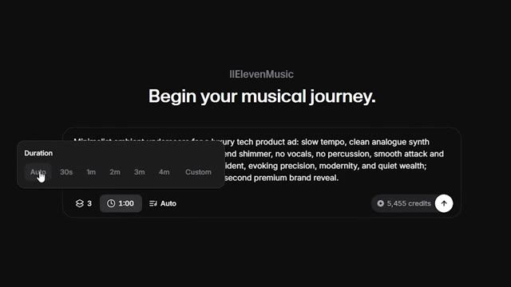
*Interface d'ElevenMusic montrant le menu déroulant de sélection de la durée ("Duration") avec les options Auto, 30s, 1m, 2m, 3m, 4m, et Custom.*

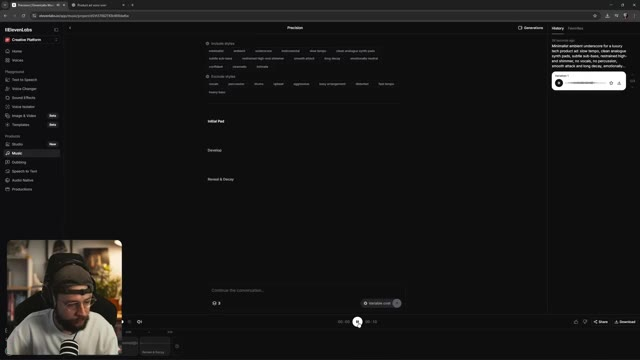
*Interface complète d'ElevenLabs (module Music) avec le panneau latéral, la vue de génération des pistes musicales et le retour vidéo PiP de Jack en bas à gauche.*

---

### ⏱️ `[00:17:43 - 00:18:07]` | Segment #37

**🔊 Audio (Transcription Intégrale Mot pour Mot en Français) :**
> c'est je vais commencer à assembler certains de ces éléments pour que vous ayez une idée de cela. Le temps parachevé. Une horloge connectée au design saisissant qui anticipe votre journée, commande votre espace et définit le luxe moderne. Des variations vraiment subtiles, très clairement conformes au prompt textuel que nous avons créé ici en utilisant ChatGPT.

**👁️ Analyse Visuelle d'Écran (gemini-3.5-flash-lite) :**
**Interface & Outils** : Navigateur web affichant les interfaces d'ElevenLabs (génération musicale) et de ChatGPT, avec une incrustation vidéo (PiP) du créateur en bas à gauche.

**Contenu textuel & Code** : Sur ElevenLabs : "Minimalist ambient underscore for a luxury tech product ad: slow tempo, clean analogue synth pads, subtle sub-bass...". Sur ChatGPT : "Write me a voice off for my product ad..." et "Time, perfected. A strikingly designed smart clock...".

**Action / Démonstration** : Le créateur assemble les différents éléments (voix off, musique, visuels) et commente les résultats obtenus à partir des prompts générés par ChatGPT.

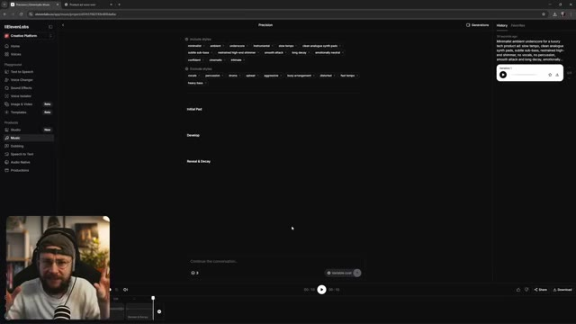
*Interface d'ElevenLabs affichant les styles de musique générés par IA et le lecteur audio dans l'encadré PiP.*

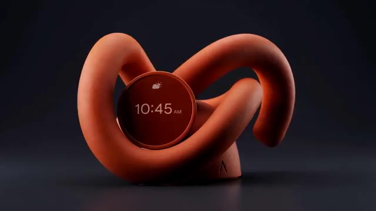
*Rendu vidéo plein écran montrant l'horloge connectée au design artistique et moderne.*

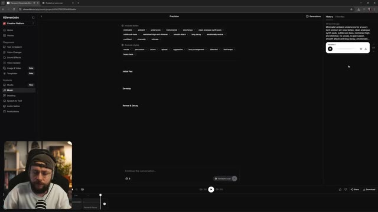
*Interface d'ElevenLabs montrant le panneau de génération audio avec le créateur en incrustation vidéo.*

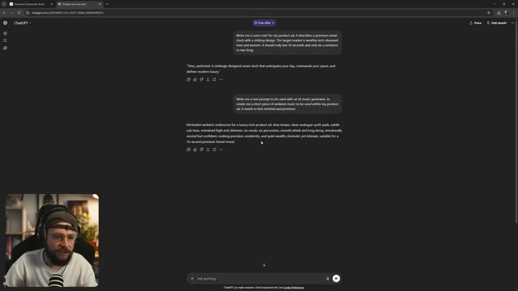
*Interface de ChatGPT affichant les prompts textuels utilisés pour la voix off et la génération musicale.*

---

### ⏱️ `[00:18:07 - 00:18:44]` | Segment #38

**🔊 Audio (Transcription Intégrale Mot pour Mot en Français) :**
> C'est un flux de travail très puissant également, qui combine plusieurs outils d'IA. Je vous suggère vraiment de commencer à faire de même. ChatGPT fait un très bon assistant créatif pour effectuer une partie du travail difficile dans le processus. Mais rappelez-vous que vous, en tant que créateur, vous êtes très, très important. Vous devez en quelque sorte agir comme un filtre par rapport à ce que ces outils d'IA vous renvoient. Vous décidez ce que vous aimez et ce que vous n'aimez pas. Vous décidez également quelles parties des générations vous aimez et n'aimez pas lorsqu'il s'agit des images et des vidéos que nous créons. Ainsi, dans cette très courte vidéo, nous avons créé ces images vraiment frappantes.

**👁️ Analyse Visuelle d'Écran (gemini-3.5-flash-lite) :**
**Interface & Outils** : Navigateur web affichant l'interface de ChatGPT sur l'image #2 et l'interface d'ElevenLabs (Creative Platform) sur l'image #4, avec la vidéo du créateur incrustée en bas à gauche (PiP).

**Contenu textuel & Code** : Sur ChatGPT : des prompts demandant une voix off pour une publicité de montre connectée ("Write me a voice over for my product ad...") et un prompt pour un générateur de musique IA ("Write me a text prompt to be used with an AI music generator..."). Sur ElevenLabs : grille de générations d'images et vidéos d'objets design, avec panneau de contrôle inférieur (Kling 2.5, 16:9, 1080p, 5s, etc.).

**Action / Démonstration** : Le créateur parle en face caméra tout en affichant à l'écran ses processus de travail sur ChatGPT et ElevenLabs, illustrant la combinaison de plusieurs outils d'intelligence artificielle.

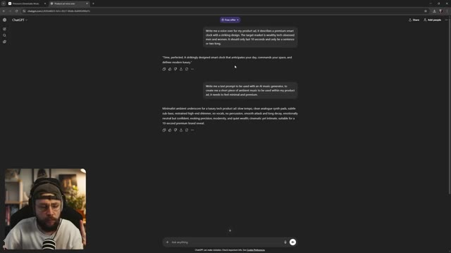
*Interface de ChatGPT affichant des prompts textuels pour la création d'une voix off et d'une ambiance musicale pour une publicité de montre connectée.*

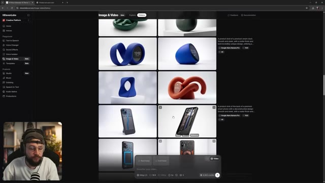
*Interface d'ElevenLabs (section Image & Video) affichant une galerie de visuels générés pour des objets high-tech (montres et smartphones au design futuriste).*

---

### ⏱️ `[00:18:44 - 00:19:20]` | Segment #39

**🔊 Audio (Transcription Intégrale Mot pour Mot en Français) :**
> prises de vue de photographie de produits en utilisant Nano Banana Pro. Nous sommes ensuite passés à leur animation en utilisant Kling, mais bien sûr, vous pourriez tout aussi bien utiliser VO 3.1 par exemple, ou Sora 2. Sora 2 serait vraiment super si vous vouliez opter pour un style de contenu plutôt axé sur l'UGC, comme quelque chose que vous pourriez voir sur vos réseaux sociaux, TikTok, Instagram, des trucs comme ça. Nous avons même créé de la musique et une voix off au rendu vraiment très premium. Tout cela a été créé entièrement au sein d'ElevenLabs. Assez impressionnant si vous voulez mon avis. Les gars, merci beaucoup d'avoir regardé. J'apprécie vraiment le soutien avec tout le

**👁️ Analyse Visuelle d'Écran (gemini-3.5-flash-lite) :**
**Interface & Outils** : Interface web d'ElevenLabs (Creative Platform, section Image & Video / History) avec des menus de génération vidéo (Kling 2.5, formats d'image, curseurs de durée) et un retour vidéo PiP du présentateur.

**Contenu textuel & Code** : Menus de l'application ElevenLabs, invites textuelles ("A product shot of a premium smart clock..."), boutons de modèle (Kling 2.5, 16:9, 1080p, 5s), et crédits restants (6 263 crédits).

**Action / Démonstration** : Le créateur navigue et présente l'interface d'historique d'ElevenLabs avec ses différentes générations d'images et de vidéos de produits animés.

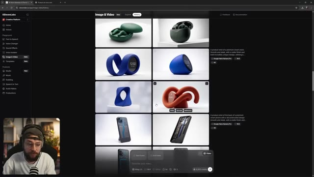
*Interface d'ElevenLabs (section Image & Video) affichant une grille d'images de produits générées avec Google Nano Banana Pro et une incrustation vidéo du créateur en bas à gauche.*

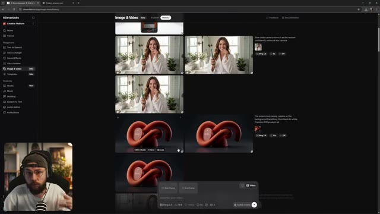
*Interface d'ElevenLabs montrant l'historique des vidéos générées, incluant un aperçu du réveil intelligent rouge et une incrustation vidéo du créateur.*

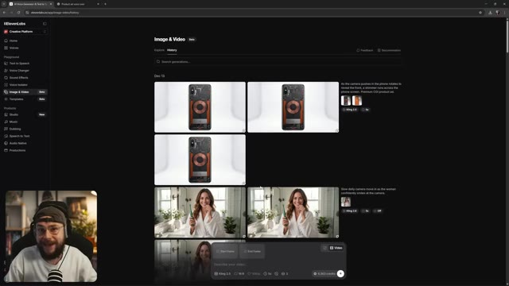
*Interface d'ElevenLabs affichant l'historique des générations de vidéos centrée sur un smartphone au design transparent et une incrustation vidéo du créateur.*

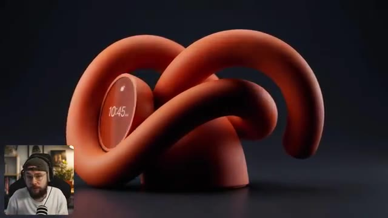
*Gros plan en plein écran sur la vidéo animée du réveil intelligent aux formes organiques de couleur rouge avec le créateur en incrustation PiP en bas à gauche.*

---

### ⏱️ `[00:19:20 - 00:19:58]` | Segment #40

**🔊 Audio (Transcription Intégrale Mot pour Mot en Français) :**
> vidéos. Si vous avez apprécié, assurez-vous de lâcher un pouce bleu pour moi. Si vous êtes nouveau, pensez à vous abonner et bien sûr à activer cette cloche de notification pour ne jamais manquer aucune future mise en ligne. Si vous avez la moindre question, n'hésitez pas à les laisser en bas dans la section commentaires. J'essaie de répondre à un maximum d'entre elles. Et je mettrai également tous les prompts textuels que nous utilisons tout au long de la vidéo dans la description de la vidéo également. Si vous souhaitez aller de l'avant et les copier et les utiliser dans vos propres générations. Nous avons quelques-unes de mes vidéos précédentes à l'écran maintenant. Si vous vouliez aller de l'avant et les consulter, ce serait vraiment super. J'essaie de fournir une quantité de connaissances vraiment formidable et variée lorsqu'il s'agit de ces puissants outils d'IA. Merci comme toujours.

**👁️ Analyse Visuelle d'Écran (gemini-3.5-flash-lite) :**
**Interface & Outils** : Présentation vidéo en incrustation (Picture-in-Picture) montrant le visage du créateur Jack en bas à gauche pendant qu'il présente des rendus visuels générés par IA en plein écran (écouteurs, puis casque audio, puis textures abstraites).

**Contenu textuel & Code** : Bouton interactif YouTube de like et d'abonnement visible en bas à droite sur l'image 1 ; rendus vidéo réalistes générés par IA de produits technologiques (écouteurs et casque audio).

**Action / Démonstration** : Le créateur diffuse en plein écran des exemples de ses vidéos précédentes et des rendus de produits générés par intelligence artificielle tout en s'adressant aux spectateurs et en incitant à s'abonner.

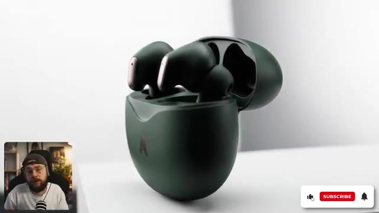
*Présentation en grand format de génération vidéo d'écouteurs intra-auriculaires verts dans leur boîtier de charge, avec le créateur incrusté en bas à gauche et un bouton d'abonnement YouTube en bas à droite.*

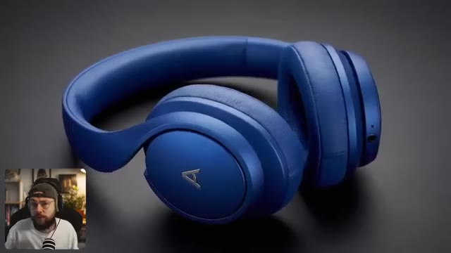
*Affichage en grand format de génération vidéo d'un casque audio bleu haut de gamme avec coussinets rembourrés, avec le créateur en incrustation PiP dans le coin inférieur gauche.*

---

### ⏱️ `[00:19:58 - 00:20:00]` | Segment #41

**🔊 Audio (Transcription Intégrale Mot pour Mot en Français) :**
> for watching guys and I'll catch you in the next video.

**👁️ Analyse Visuelle d'Écran (gemini-3.5-flash-lite) :**
**Interface & Outils** : Jack face caméra ou transition sans partage d'écran.

**Contenu textuel & Code** : Explications orales des concepts et des méthodes de création vidéo IA.

**Action / Démonstration** : Démonstration pédagogique et présentation du workflow.

---
