# 🎬 Créer des bandes-annonces de films par IA (WORKFLOW GRATUIT)

> **Chaîne** : [Jack Vs. AI](https://www.youtube.com/@JackVsAI)  
> **Titre original** : `How to Create Movie Concept Trailers with AI (FREE WORKFLOW)`  
> **Lien YouTube** : [https://www.youtube.com/watch?v=INphz5q2Zrs](https://www.youtube.com/watch?v=INphz5q2Zrs)  
> **Date de publication** : 2026-01-08  
> **Durée** : 17m 28s (`1048s`)  
> **Identifiant vidéo** : `INphz5q2Zrs`  
> **Fiche Web Interactive** : [2026-01-08_YT-INphz5q2Zrs_Créer des bandes-annonces de films par IA (WORKFLOW GRATUIT)_by-whisper-v3-large-turbo+gemini-3.5-flash-lite.html](2026-01-08_YT-INphz5q2Zrs_Créer des bandes-annonces de films par IA (WORKFLOW GRATUIT)_by-whisper-v3-large-turbo+gemini-3.5-flash-lite.html)  
> **Captures de démonstration clés** : `85 captures réelles (anti-talking-head)`  
> **Modèles utilisés** : Audio: `large-v3-turbo` (Faster-Whisper int8 VPS) | Vision: `gemini-3.5-flash-lite` (Google AI Studio API)  

---

## 📌 Synthèse Exécutive & Outils

### 📌 Résumé
La vidéo de Jack Vs. AI démontre comment l'intelligence artificielle révolutionne la conception et le pitch des bandes-annonces cinématographiques grâce à des workflows professionnels accessibles avec un budget de 0 $. L'intervenant, artiste d'effets visuels depuis plus d'une décennie, analyse ce tournant majeur dans l'industrie publicitaire et le cinéma, où le "recasting" de films à succès et la création de concepts originaux deviennent possibles en quelques minutes. L'approche repose sur l'utilisation stratégique d'outils d'IA générative gratuits pour concevoir des visuels de niveau hollywoodien, prouvant que ces concepts ne sont pas de simples gadgets mais des méthodes de production visuelle légitimes.

La méthode étape par étape de Jack s'articule autour de la génération d'images fixes hautement réalistes via des modèles de pointe, suivies d'une structuration narrative sous forme de storyboard. En exploitant des invites textuelles (prompts) de plus en plus détaillées — allant du simple remplacement d'acteur (comme Zendaya en Vaiana) à des mises en scènes complexes avec des configurations de tournage réalistes (comme un Pokémon en prises de vues réelles avec des décors de coulisses) —, les créateurs peuvent s'affranchir de références visuelles complexes. Cette maîtrise du prompt permet de guider la compréhension contextuelle des IA pour obtenir des compositions cinématographiques fidèles, au format 16:9, prêtes à être animées.

Les bénéfices pour les créateurs de vidéo sont immenses : réduction drastique des coûts de pré-production, accélération du prototypage créatif et capacité à générer du contenu viral hautement engageant. En combinant la puissance de recherche et de contextualisation des grands modèles de langage et d'image avec des plateformes de storyboard dédiées, les créateurs indépendants peuvent désormais rivaliser avec les standards visuels de l'industrie publicitaire et cinématographique traditionnelle, transformant instantanément une idée abstraite en un concept visuel tangible et partageable.

### 🛠️ Outils, Modèles & Logiciels Présentés
* **Nano Banana Pro** (via **elemarina.ai**) : Modèle d'image IA (version d'image Gemini 3 Pro) utilisé comme outil principal pour générer des images photoréalistes au format 16:9 grâce à sa puissante compréhension du monde et de la culture populaire.
* **LM Arena** (elemarina.ai) : Plateforme d'accès en ligne permettant de basculer du mode "combat" au chat direct pour exploiter gratuitement divers modèles d'IA générative d'images.
* **LTX** : Plateforme de gestion de projets et de storyboarding permettant de regrouper les images générées et d'organiser la narration séquentielle des bandes-annonces.
* **Premiere Pro** : Logiciel de montage professionnel mentionné pour l'assemblage final et le montage rythmé de la bande-annonce (brièvement introduit dans le positionnement global).
* **Flux** : Modèle d'IA générative mentionné dans l'introduction comme alternative performante pour la création visuelle.

### 🔑 Points Clés & Enseignements Stratégiques
* **Exploiter la compréhension contextuelle du modèle** : Des outils comme Nano Banana Pro intègrent des données de recherche globales (liées à Google), ce qui leur permet de lier spontanément un acteur réel (Zendaya ou Jacob Elordi) à un projet de film spécifique (comme le live-action de *Vaiana* ou *Hercule*) sans nécessiter d'images de référence.
* **Privilégier le chat direct sur les arènes de test** : Sur des plateformes comme *elemarina.ai*, il est recommandé de quitter le mode "combat" par défaut pour utiliser le chat direct, puis d'activer l'icône de génération d'images afin d'accéder aux modèles cibles.
* **Maîtriser l'art du prompt descriptif textuel** : Pour des concepts complexes (comme un casting multiple pour *Hercule* ou *Pokémon*), l'utilisation d'invites textuelles longues et très détaillées concernant les costumes et l'apparence des personnages réduit considérablement le hasard et garantit la fidélité au matériel d'origine.
* **Imposer systématiquement le format 16:9** : Bien que certains modèles puissent ajuster le ratio automatiquement, il est crucial d'inclure explicitement la mention d'un format 16:9 dans le prompt pour garantir une composition adaptée aux standards cinématographiques et vidéo.
* **Éliminer les parasites textuels par consigne négative** : Intégrer la directive « *Assurez-vous qu'il n'y ait aucun texte à l'écran* » dans le prompt permet d'éviter l'apparition d'artefacts d'écriture aléatoires générés par l'IA.
* **Utiliser l'esthétique des "coulisses" (behind-the-scenes) pour plus de crédibilité** : Simuler des plateaux de tournage avec des écrans verts, des éclairages de studio, du matériel audio et des membres d'équipe renforce l'ancrage visuel et l'engagement viral des spectateurs.
* **Anticiper les biais récurrents des IA (Piège à éviter)** : Lors de la génération de plans de type coulisses, les modèles d'IA ont tendance à affubler les techniciens de masques (simulant une ère Covid non désirée) ; il est donc nécessaire de l'interdire explicitement dans le prompt.
* **Gérer les compositions de dos pour susciter la curiosité** : Si l'IA place les acteurs de dos (comme dans l'exemple *Pokémon* avec des chaises personnalisées), cela peut paradoxalement devenir un atout marketing viral en attisant la curiosité du public grâce aux éléments reconnaissants (logos, costumes).
* **Structurer les exports via un storyboard** : Une fois les images validées, l'utilisation de fonctionnalités de type "envoyer vers le storyboard" sur des plateformes comme *LTX* permet de passer de la simple illustration isolée à la construction d'une narration séquentielle cohérente.
* **Anticiper l'animation vidéo gratuite** : Les images fixes obtenues en 16:9 ne constituent qu'une première étape ; elles peuvent ensuite être exportées pour être animées via les meilleurs modèles vidéo IA disponibles sur le marché sans frais supplémentaires.

---

## ⏱️ Chronologie & Transcription Complète Audio & Visuelle (Mot pour Mot)

### ⏱️ `[00:00:00 - 00:00:23]` | Segment #01

**🔊 Audio (Transcription Intégrale Mot pour Mot en Français) :**
> La plupart des gens pensent que ces bandes-annonces de concepts générées par IA ne sont qu'un gadget, mais ils ont tort. C'est l'avenir de la façon dont les films sont pitchés et réalisés. Ce que vous voyez en ce moment n'est pas seulement de l'art de fan. C'est la même logique visuelle utilisée dans la vraie publicité, les effets visuels et le cinéma. Et ça vient juste d'être débloqué avec l'intelligence artificielle. Je suis Jack, je suis artiste d'effets visuels dans l'industrie publicitaire depuis plus d'une décennie maintenant.

**👁️ Analyse Visuelle d'Écran (gemini-3.5-flash-lite) :**
**Interface & Outils** : Présentation de plans visuels générés par IA suivis d'une intervention face caméra sans partage d'écran.

**Contenu textuel & Code** : Texte affiché à l'écran : "AI concept trailers" puis "what you're seeing right now".
[DESC_IMAGE_3] AUCUNE (Jack face caméra)
[DESC_IMAGE_4] AUCUNE (Jack face caméra)

**Action / Démonstration** : Défilement de séquences vidéo conceptuelles réalistes générées par intelligence artificielle illustrant le discours sur les nouveaux standards du pitch cinématographique, puis plan fixe de Jack s'exprimant face caméra dans son studio.

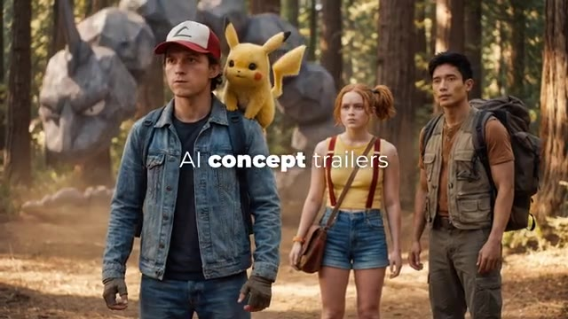
*Extrait vidéo conceptuel généré par IA montrant Tom Holland en Sacha de Bourg Palette avec un Pikachu sur l'épaule dans une forêt avec un Onix en arrière-plan, accompagné du texte "AI concept trailers".*

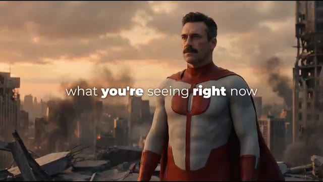
*Extrait vidéo conceptuel généré par IA montrant un super-héros au design inspiré d'Omni-Man sur fond de ville en ruines au crépuscule, accompagné du texte "what you're seeing right now".*

---

### ⏱️ `[00:00:23 - 00:00:42]` | Segment #02

**🔊 Audio (Transcription Intégrale Mot pour Mot en Français) :**
> Et j'ai travaillé avec beaucoup des plus grandes marques de la planète. Et ce qui se passe en ce moment avec l'IA est le plus grand changement créatif que j'aiewitnessé de toute ma carrière. Dans cette vidéo, je vais vous montrer comment les créateurs recasting des films à succès, construisent des concepts de films entièrement nouveaux et génèrent des visuels de niveau hollywoodien sans dépenser un centime.

**👁️ Analyse Visuelle d'Écran (gemini-3.5-flash-lite) :**
**Interface & Outils** : Présentation face caméra sans partage d'écran

**Contenu textuel & Code** : Aucun affichage d'interface logicielle, uniquement du texte de sous-titrage incrusté à l'écran ("on the planet.", "Hollywood-level visuals") et des plans de coupe illustratifs (personnage de type Goku généré par IA).

**Action / Démonstration** : Jack s'exprime face caméra dans son studio, alternant avec des illustrations visuelles générées par intelligence artificielle sans montrer d'outil de travail.

---

### ⏱️ `[00:00:42 - 00:01:05]` | Segment #03

**🔊 Audio (Transcription Intégrale Mot pour Mot en Français) :**
> Ce n'est pas une tendance virale inutile. C'est un flux de travail professionnel qui donne des résultats époustouflants. Imaginez intégrer Zendaya dans Vaiana, insérer Willem Dafoe dans le film Joker, ou créer une bande-annonce de Hercule en prise de vue réelle en n'utilisant que des outils d'IA gratuits. Dans cette vidéo, je vais vous guider à travers tout le processus et vous montrer comment obtenir des résultats cinématographiques avec un budget de 0 $.

**👁️ Analyse Visuelle d'Écran (gemini-3.5-flash-lite) :**
**Interface & Outils** : Générations de vidéos cinématiques générées par intelligence artificielle (B-roll illustratif).

**Contenu textuel & Code** : Texte incrusté à l'écran : "into Moana.", "free AI tools.", "cinematic results".

**Action / Démonstration** : Défilement de séquences vidéo générées par IA illustrant les exemples mentionnés dans la voix off.

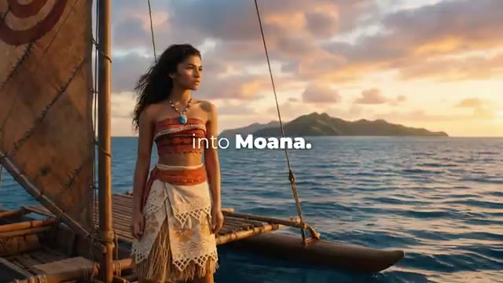
*Génération vidéo IA montrant Zendaya en costume sur un bateau naviguant sur l'océan au coucher du soleil (concept de Vaiana).*

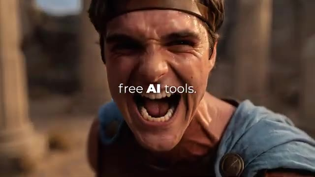
*Génération vidéo IA montrant un personnage musclé en tenue antique criant dans des ruines (concept de Hercule en live-action).*

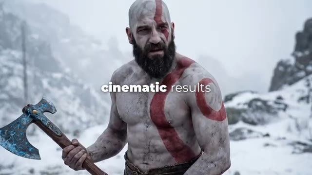
*Génération vidéo IA montrant un personnage peint en blanc avec une hache dans un décor enneigé (concept cinématographique).*

---

### ⏱️ `[00:01:05 - 00:01:41]` | Segment #04

**🔊 Audio (Transcription Intégrale Mot pour Mot en Français) :**
> Ça va faire passer l'utilisation de l'IA pour donner vie à vos idées créatives au niveau supérieur. Très bien, entrons dans le vif du sujet. Commençons donc par réattribuer le rôle de Zendaya dans la prochaine adaptation en prises de vues réelles de Vaiana. Pour ce faire, nous sommes sur elemarina.ai. Je mettrai des liens ci-dessous dans la description de tous les outils que j'utilise et j'inclirai également les invites si vous souhaitez aller de l'avant et les utiliser aussi. Une fois que nous sommes sur LM Arena, nous voulons aller dans le coin supérieur gauche, cliquer là où il est écrit combat et sélectionner plutôt le chat direct. Et puis au centre de l'écran il y a cette icône au milieu qui

**👁️ Analyse Visuelle d'Écran (gemini-3.5-flash-lite) :**
**Interface & Outils** : Navigateur web affichant l'interface du site LM Arena (lmarena.ai) sur fond sombre.

**Contenu textuel & Code** : Texte central 'Welcome back', barre de saisie 'Ask anything...' avec des icônes de contrôle, et bouton 'Battle' dans le coin supérieur gauche.

**Action / Démonstration** : Le créateur présente l'interface d'accueil de LM Arena sur son écran tout en parlant face caméra dans l'encadré en bas à droite.

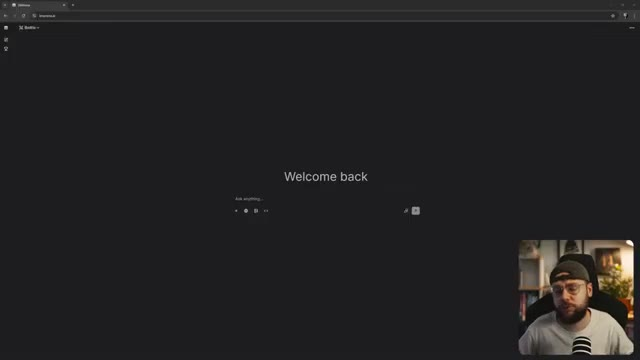
*Interface du site LM Arena affichant un écran d'accueil avec un champ de saisie 'Ask anything...' et la pastille vidéo du créateur en incrustation (PiP).*

---

### ⏱️ `[00:01:41 - 00:02:17]` | Segment #05

**🔊 Audio (Transcription Intégrale Mot pour Mot en Français) :**
> dit générer des images, donc nous voulons cliquer dessus. Par défaut, nous aurons la préversion d'image Gemini 3 Pro sélectionnée, qui est Nano Banana Pro. Maintenant, il y a une grande variété de modèles d'images IA sur le marché, mais Nano Banana Pro est mon favori personnel pour diverses raisons que nous allons aborder tout au long de cette vidéo. Donc la chose vraiment formidable ici, c'est que nous n'avons même pas besoin d'ajouter de références d'images, nous avons juste besoin d'un prompt textuel très solide. Pour cela, nous allons dire : montre Zendaya dans la bande-annonce en live-action de Vaiana. Elle remplace l'actrice actuelle jouant

**👁️ Analyse Visuelle d'Écran (gemini-3.5-flash-lite) :**
**Interface & Outils** : Interface web de génération d'images par IA avec un champ de saisie central et des boutons d'options.

**Contenu textuel & Code** : Texte « Welcome back » en haut, et dans le champ de saisie « Describe the image you want to generate... » avec les boutons « + », « Image », une icône de favori/paramètre et une flèche de validation.

**Action / Démonstration** : L'écran présente l'interface utilisateur pour la saisie des prompts de génération d'images, prête à recevoir les instructions de l'utilisateur.

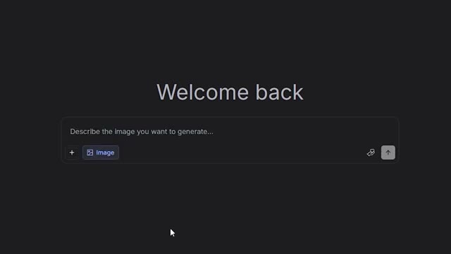
*Interface de génération d'images affichant le champ de saisie du prompt avec un bouton d'ajout d'image et le texte de bienvenue.*

---

### ⏱️ `[00:02:17 - 00:02:40]` | Segment #06

**🔊 Audio (Transcription Intégrale Mot pour Mot en Français) :**
> Moana. Faites en sorte que ce soit photoréaliste. Assurez-vous qu'il n'y ait aucun texte à l'écran. Donnez-y une composition cinématographique. Et pour finir, assurez-vous que l'image soit générée au format 16 par 9. Allons-y donc pour lancer cette génération. Et jetez un œil à ce résultat incroyable dès le départ.

**👁️ Analyse Visuelle d'Écran (gemini-3.5-flash-lite) :**
**Interface & Outils** : Interface web de génération d'images par IA avec un champ de saisie de prompt, un bouton d'importation d'image et un bouton de validation, affichant ensuite le résultat en grand format avec le créateur en incrustation PiP.

**Contenu textuel & Code** : Texte à l'écran : "Welcome back". Prompt saisi : "Show Zendaya in the live action trailer for Moana, she replaces the current actress playing Moana, make it appear photo real. Ensure there is no text on the screen, give it a cinematic composition. Ensure the image is generated in a 16:9 aspect ratio."

**Action / Démonstration** : Saisie et envoi du prompt textuel pour générer une image cinématographique de Zendaya dans le rôle de Vaiana, puis affichage du résultat final généré.

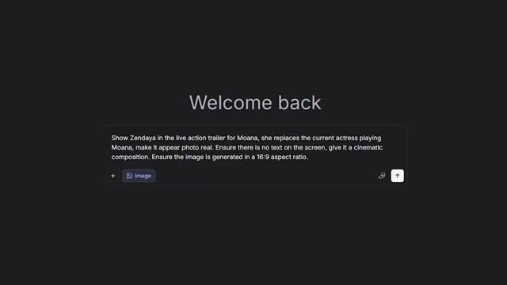
*Interface de l'outil de génération affichant le champ de saisie du prompt textuel sur fond sombre avec le texte "Welcome back"*

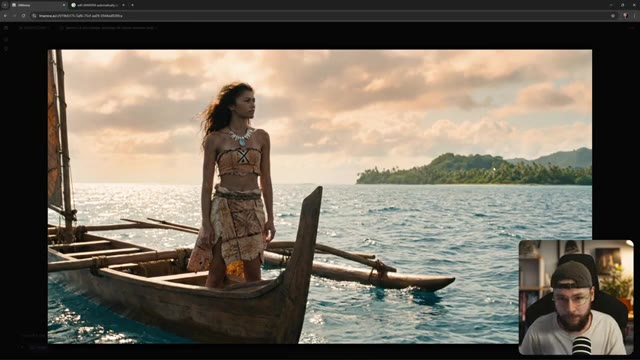
*Résultat de l'image générée en 16:9 montrant Zendaya en tant que Vaiana sur un bateau traditionnel polynésien, avec Jack visible dans un encadré PiP en bas à droite*

---

### ⏱️ `[00:02:40 - 00:03:12]` | Segment #07

**🔊 Audio (Transcription Intégrale Mot pour Mot en Français) :**
> Ce qui est vraiment impressionnant avec Nano Banana Pro, c'est qu'il possède une excellente compréhension du monde. Et c'est tout à fait logique, car il est évidemment lié à la recherche Google, à toutes les données que cette plateforme possède. Il sait donc qui est quelqu'un comme Zendaya et il est au courant du film en prise de vue réelle Vaiana qui va sortir. Et cela signifie que non seulement la qualité de la génération que nous obtenons est superbe, elle a l'air incroyablement réelle, mais aussi que le bateau correspond au bateau qui apparaît dans le film.

**👁️ Analyse Visuelle d'Écran (gemini-3.5-flash-lite) :**
**Interface & Outils** : Navigateur web affichant une vidéo générée par IA en plein écran (type lecteur vidéo ou interface web de démonstration), avec incrustation vidéo du créateur (picture-in-picture).

**Contenu textuel & Code** : Vidéo générée montrant une scène réaliste inspirée du film Vaiana avec Zendaya à bord d'un bateau traditionnel en bois sur l'océan, sous un ciel nuageux.

**Action / Démonstration** : Le créateur présente une vidéo générée par l'IA pour démontrer sa compréhension du contexte culturel et visuel, en affichant un plan détaillé de l'eau et de l'embarcation puis un plan plus large avec le personnage.

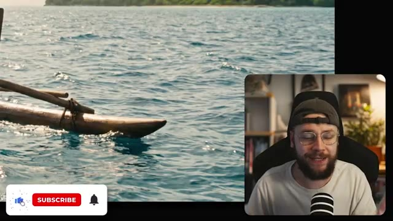
*Gros plan sur une vidéo générée par IA montrant un bateau en bois naviguant sur l'eau, avec le présentateur incrusté en bas à droite.*

*Affichage à l'écran d'une vidéo générée par IA représentant Zendaya sur un bateau polynésien dans un paysage tropical, avec le présentateur en incrustation.*

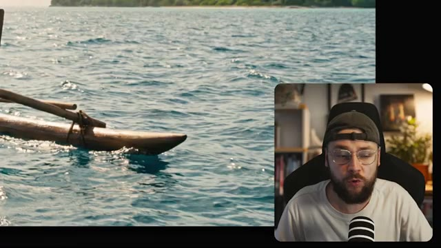
*Gros plan similaire à l'image 1 montrant la coque du bateau et l'eau en mouvement, illustrant la précision de la génération.*

---

### ⏱️ `[00:03:12 - 00:03:48]` | Segment #08

**🔊 Audio (Transcription Intégrale Mot pour Mot en Français) :**
> Zendaya ressemble exactement à ce que vous imagineriez, exactement à quoi elle ressemble dans la vraie vie, et même le décor a l'air correct. Maintenant, le seul inconvénient de notre première génération est la tenue. Le costume de Vaiana ne correspond pas réellement à ce que Vaiana porte dans le film d'animation ou dans le film en live-action, et cela m'amène très gentiment à notre prochain exemple où nous allons générer une autre version live-action d'un film Disney, car ici nous allons utiliser des prompts textuels beaucoup plus longs et détaillés pour entrer dans les détails des costumes des personnages afin de s'assurer que nous ne

**👁️ Analyse Visuelle d'Écran (gemini-3.5-flash-lite) :**
**Interface & Outils** : Navigateur web affichant une vidéo générée par intelligence artificielle (style lecteur vidéo en ligne), avec la webcam du créateur incrustée en bas à droite (Picture-in-Picture).

**Contenu textuel & Code** : Vidéo générée montrant Zendaya sur un bateau en bois traditionnel naviguant sur l'océan, portant une tenue inspirée de Vaiana et un collier de coquillages, avec des îles en arrière-plan et un ciel nuageux.

**Action / Démonstration** : Le créateur commente la génération de vidéo IA affichée à l'écran, en pointant du doigt les détails du costume et du visage de l'actrice Zendaya.

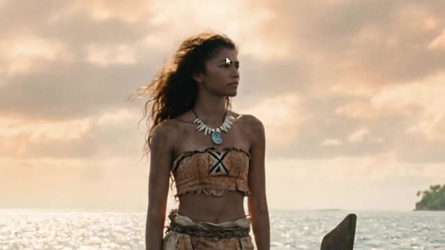
*Gros plan sur la génération vidéo de Zendaya en Vaiana sur une pirogue.*

*Affichage dans un navigateur web de la vidéo de Zendaya en Vaiana, avec le créateur en incrustation (PiP).*

*Affichage continu de l'interface du navigateur web montrant la vidéo générée avec le créateur en incrustation.*

---

### ⏱️ `[00:03:48 - 00:04:22]` | Segment #09

**🔊 Audio (Transcription Intégrale Mot pour Mot en Français) :**
> rencontrer ce problème là. Mais je pense toujours que c'est un excellent début et un bon exemple pour vous montrer ce qui est possible en utilisant une invite textuelle très simple et aucune référence d'image de quelque sorte que ce soit. Et bien sûr, nous pouvons cliquer sur cette icône ici si vous voulez aller de l'avant et télécharger notre image tout à fait gratuitement et nous pouvons l'utiliser, nous pourrons l'animer plus tard avec certains des meilleurs modèles vidéo IA également gratuitement. Je vous montrerai cela vers la fin de la vidéo. Donc pour le prochain exemple, nous allons dire montre une version en prises de vues réelles de Hercule de Disney où Jacob Elordi joue Hercule.

**👁️ Analyse Visuelle d'Écran (gemini-3.5-flash-lite) :**
**Interface & Outils** : Interface web de génération d'images par IA (type assistant de chat IA avec zone de prompt et prévisualisation d'image).

**Contenu textuel & Code** : Texte du prompt visible : "Show a live action version of Disney's Hercules, where Jacob Elordi plays Hercules..." ainsi que le texte de l'exemple précédent concernant Vaiana/Moana avec Zendaya.

**Action / Démonstration** : Le créateur montre le résultat généré d'une image précédente, explique comment la télécharger gratuitement, puis saisit un nouveau prompt pour générer une version live action de Hercule avec Jacob Elordi.

*Image de l'interface montrant le rendu généré d'une actrice sur un bateau avec l'incrustation vidéo du créateur en bas à droite.*

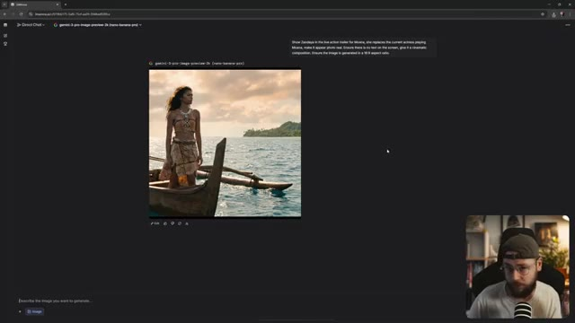
*Interface de génération d'images avec le prompt textuel affiché dans l'encadré en haut à droite.*

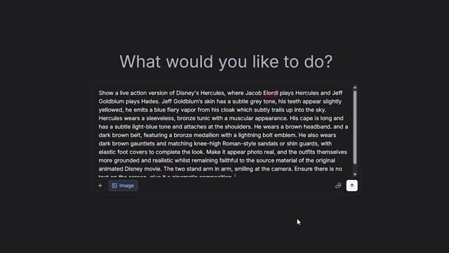
*Interface de l'outil de génération affichant la zone de saisie du prompt pour le prochain exemple avec Jacob Elordi.*

---

### ⏱️ `[00:04:22 - 00:04:57]` | Segment #10

**🔊 Audio (Transcription Intégrale Mot pour Mot en Français) :**
> et Jeff Goldblum joue Hadès. Et ensuite, nous entrons dans une description vraiment très détaillée en ce qui concerne les costumes et l'apparence générale de Jeff Goldblum et de Jacob Elordi. Et cela va signifier que nous laissons beaucoup moins de place au hasard en ce qui concerne cette génération. Alors allons-y et envoyons celle-ci ici. J'avais un peu peur d'avoir fait une erreur ici parce que j'avais oublié de spécifier le format 16 par 9 mais en fait, il s'y est conformé quand même. Mais comme vous pouvez le voir cependant, la ressemblance ici des deux acteurs est assez incroyable. C'est exactement à quoi on s'attendrait

**👁️ Analyse Visuelle d'Écran (gemini-3.5-flash-lite) :**
**Interface & Outils** : Interface web de génération d'images par IA (type application de chat ou plateforme de génération comme Midjourney / interface personnalisée), avec affichage du prompt textuel, des résultats générés, et incrustation vidéo du créateur (PiP).

**Contenu textuel & Code** : Texte du prompt en anglais : "Show a live action version of Disney's Hercules, where Jacob Elordi plays Hercules and Jeff Goldblum plays Hades. Jeff Goldblum's skin has a subtle grey tone, his teeth appear slightly yellowed, he emits a blue fiery vapor from his cloak which subtly trails up into the sky. Hercules wears a sleeveless, bronze tunic with a muscular appearance. His cape is long and has a subtle light-blue tone and attaches at the shoulders. He wears a brown headband, and a dark brown belt, featuring a bronze medallion with a lightning bolt emblem. He also wears dark brown gauntlets and matching knee-high Roman-style sandals or shin guards, with elastic foot covers to complete the look. Make it appear photo real, and the outfits themselves more grounded and realistic whilst remaining faithful to the source material of the original animated Disney movie. The two stand arm in arm, smiling at the camera. Ensure there is no text on the screen, give it a cinematic composition."

**Action / Démonstration** : Le créateur montre le prompt détaillé utilisé pour guider la génération de l'image, puis zoome et révèle le rendu final généré par l'intelligence artificielle mettant en scène les deux acteurs.

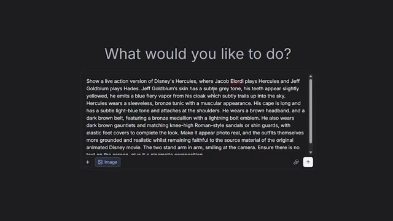
*Interface textuelle montrant le prompt détaillé pour la génération d'une version live-action d'Hercule de Disney avec Jacob Elordi et Jeff Goldblum.*

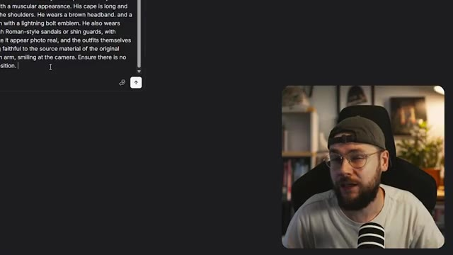
*Interface d'outil de génération avec le prompt visible à l'écran, accompagné du présentateur Jack en incrustation PiP dans le coin inférieur droit.*

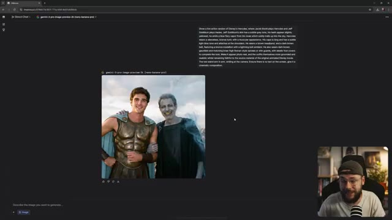
*Résultat de l'image générée par IA montrant Jacob Elordi en Hercule et Jeff Goldblum en Hadès posant bras dessus bras dessous, avec Jack en incrustation PiP.*

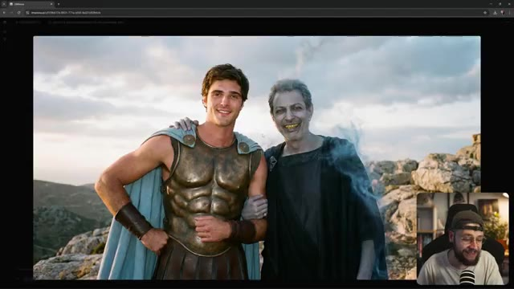
*Affichage en plein écran de l'image générée de haute qualité représentant fidèlement les acteurs dans leurs rôles mythologiques, avec le créateur visible en PiP.*

---

### ⏱️ `[00:04:57 - 00:05:33]` | Segment #11

**🔊 Audio (Transcription Intégrale Mot pour Mot en Français) :**
> voir une adaptation en prise de vues réelle d'Hercule. Et parce que nous avons utilisé ce texte de prompt beaucoup plus détaillé, nous avons obtenu exactement le résultat que nous recherchions. Remarquez également que nous n'avons pas spécifié l'emplacement et pourtant la compréhension du monde de Nano Banana Pro est entrée en action et les a placés dans un endroit qui a du sens. Je vais aller de l'avant et télécharger cet exemple également pour l'utiliser plus tard lorsqu'il s'agira de nos vidéos IA. Ensuite, ce que nous allons examiner est une légère variation de ce concept et c'est plutôt un sentiment de coulisses. Ce sont les sortes de

**👁️ Analyse Visuelle d'Écran (gemini-3.5-flash-lite) :**
**Interface & Outils** : Navigateur web affichant une interface de chat/génération d'images (style Nano Banana Pro / Gemini 3 Pro) avec une vue en incrustation (PiP) du créateur (Jack) dans le coin inférieur droit.

**Contenu textuel & Code** : Texte du prompt visible dans l'image 2 : "Show a live action version of Disney's Hercules, where Jacob Elordi plays Hercules and Jeff Goldblum plays Hades. Jeff Goldblum's skin has a subtle grey tone, his teeth appear slightly yellowed, he emits a blue fiery vapor from his cloak which subtly trails up into the sky..." et l'image générée correspondante montrant les deux acteurs en costume.

**Action / Démonstration** : Le créateur présente l'image générée en grand format puis l'interface complète avec le prompt détaillé, tout en commentant le résultat et la compréhension contextuelle de l'IA.

*Image générée par IA montrant Jacob Elordi en Hercule et Jeff Goldblum en Hadès dans une adaptation en prise de vues réelle, avec Jack en incrustation vidéo (PiP) dans le coin inférieur droit.*

*Interface de chat IA montrant le prompt textuel détaillé et l'image générée d'Hercule et Hadès, avec Jack en incrustation vidéo (PiP) dans le coin inférieur droit.*

---

### ⏱️ `[00:05:33 - 00:06:12]` | Segment #12

**🔊 Audio (Transcription Intégrale Mot pour Mot en Français) :**
> images et vidéos que vous auriez vues dans une grande partie du contenu devenu viral cette année. Et je pense que la raison pour laquelle cela fonctionne vraiment bien, c'est parce que cela vous aide à ancrer ce que vous voyez. Cela le rend un tout petit peu plus crédible. Et je pense que les gens adorent généralement l'ambiance des coulisses. Donc ici, nous allons montrer un plan en prise de vue réelle d'un film à grand succès hollywoodien Pokémon, où Tom Holland joue Sacha Ketchum, Sadie Sink joue Ondine et Manny Jacinto joue Pierre. Faites en sorte que ça paraisse photoréaliste avec les tenues elles-mêmes correspondant à la série animée originale. Et voici le point vraiment important. Assurez-vous qu'il n'y ait pas de texte à l'écran. Donnez

**👁️ Analyse Visuelle d'Écran (gemini-3.5-flash-lite) :**
**Interface & Outils** : Navigateur web affichant une interface de génération d'IA (similaire à un chatbot ou outil multimodal) avec un encadré PiP (Picture-in-Picture) de Jack dans le coin inférieur droit.

**Contenu textuel & Code** : Texte du prompt visible à l'écran : "Show a live action shot from a Hollywood blockbuster Pokemon movie, where Tom Holland plays Ash Ketchum, Sadie Sink plays Misty and Manny Jacinto plays Brock. Make it appear photo real, with the outfits themselves matching the original animated series. Ensure there is no text on the screen, give it a behind-the-scenes look, with green screens, lighting and audio equipment, and crew members visible, ensure none of the crew members are wearing masks."

**Action / Démonstration** : Le créateur montre l'interface où le prompt textuel est rédigé, tout en expliquant la méthode pour créer des images de type making-of réalistes.

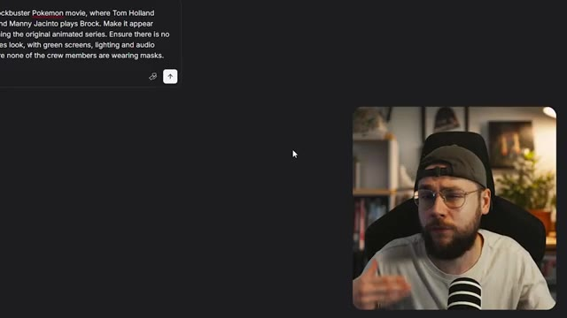
*Interface d'un outil de génération par IA montrant un prompt textuel sur Pokémon, avec Jack incrusté en bas à droite.*

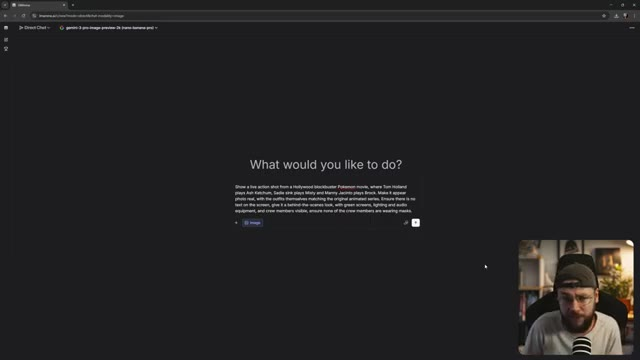
*Vue plus large de l'interface montrant la question "What would you like to do?" au centre et le prompt complet de génération d'images.*

---

### ⏱️ `[00:06:12 - 00:06:40]` | Segment #13

**🔊 Audio (Transcription Intégrale Mot pour Mot en Français) :**
> un aperçu des coulisses avec des écrans verts, de l'éclairage et du matériel audio. Et des membres de l'équipe visibles. S'assurer qu'aucun des membres de l'équipe ne porte de masque parce que dans mes tests, il me semble que je reçois beaucoup de générations d'images où ils portaient des masques. On dirait un peu un retour à l'ère du Covid et je pense que beaucoup d'entre nous n'ont pas vraiment envie de revivre ça. Ok, donc encore une fois, le format par défaut est un ratio 16 par 9. D'une manière générale, ça a l'air vraiment super.

**👁️ Analyse Visuelle d'Écran (gemini-3.5-flash-lite) :**
**Interface & Outils** : Interface web de génération d'images avec zone de texte et bouton de soumission.

**Contenu textuel & Code** : Texte du prompt visible à l'écran : "Show a live action shot from a Hollywood blockbuster Pokemon movie, where Tom Holland plays Ash Ketchum, Sadie sink plays Misty and Manny Jacinto plays Brock. Make it appear photo real, with the outfits themselves matching the original animated series. Ensure there is no text on the screen, give it a behind-the-scenes look, with green screens, lighting and audio equipment, and crew members visible, ensure none of the crew members are wearing masks."

**Action / Démonstration** : Affichage successif du prompt textuel saisi par l'utilisateur, puis de l'image réaliste générée montrant les coulisses d'un tournage sur fond vert avec l'animateur en incrustation PiP.

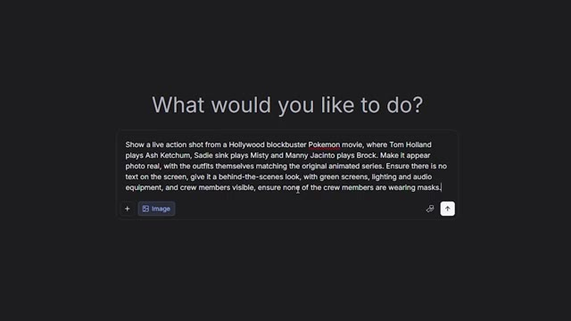
*Interface de génération montrant une boîte de saisie avec le prompt en anglais détaillant la scène de tournage Pokémon.*

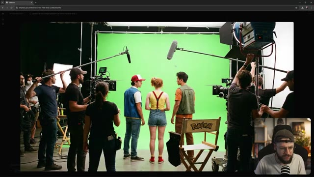
*Résultat de l'image générée montrant un plateau de tournage avec fond vert, des techniciens, et Jack en incrustation vidéo (PiP) dans le coin inférieur droit.*

---

### ⏱️ `[00:06:41 - 00:07:13]` | Segment #14

**🔊 Audio (Transcription Intégrale Mot pour Mot en Français) :**
> C'est légèrement ennuyeux que les acteurs soient tournés de dos. Je ne sais pas trop pourquoi c'est arrivé, mais c'est plutôt cool que le logo Pokémon ait été apposé sur le dos de cette chaise de metteur en scène. Pour être honnête, cela fonctionnerait probablement assez bien dans le cadre d'un concept de vidéo virale, cela attiserait en quelque sorte la curiosité des spectateurs de ne pas pouvoir voir exactement qui sont certains des acteurs, bien que nous ayons bien sûr le visage reconnaissable de Tom Holland et les costumes reconnaissables de la série animée originale également.

**👁️ Analyse Visuelle d'Écran (gemini-3.5-flash-lite) :**
**Interface & Outils** : Navigateur web affichant une image générée par IA représentant des acteurs sur un plateau de tournage avec fond vert, avec un encadré PiP (Picture-in-Picture) du créateur en bas à droite.

**Contenu textuel & Code** : Image générée montrant trois acteurs vus de dos sur un plateau de tournage avec un fond vert (green screen), des projecteurs, des perches micro, et une chaise de metteur en scène portant le logo "Pokémon".

**Action / Démonstration** : Le créateur présente et commente une image générée par IA montrant un faux tournage en coulisses de Pokémon, puis zoome sur l'image pour se concentrer sur les acteurs de dos.

*Image montrant une fausse photo de tournage en studio avec fond vert et une équipe technique autour d'acteurs de dos (ressemblant à Tom Holland), avec le présentateur incrusté en bas à droite.*

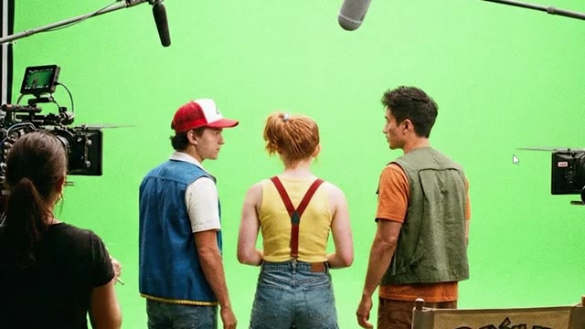
*Gros plan sur les acteurs de dos sur le plateau de tournage virtuel avec fond vert et caméras.*

---

### ⏱️ `[00:07:13 - 00:07:34]` | Segment #15

**🔊 Audio (Transcription Intégrale Mot pour Mot en Français) :**
> c'est donc un autre exemple plutôt sympa ici, faisons en sorte de le télécharger aussi. Maintenant, disons que vous commencez vraiment à vous intéresser à la réalisation de films par IA. Si vous êtes prêt à prendre les choses au sérieux, LTX est une excellente plateforme à découvrir. Et si je clique sur ce projet ici, vous pouvez voir que nous avons continué avec le même concept que nous examinons dans cette vidéo.

**👁️ Analyse Visuelle d'Écran (gemini-3.5-flash-lite) :**
**Interface & Outils** : Navigateur web affichant l'interface de génération d'images puis la plateforme de création vidéo LTX Studio.

**Contenu textuel & Code** : Texte du prompt visible sur l'image 1 : "Show a live action shot from a Hollywood Blockbuster Pokemon movie..." ; interface LTX Studio avec les menus "Home", "My Projects", "Storyboard" et "Video Editor".

**Action / Démonstration** : Le créateur navigue entre une interface de génération d'images et la plateforme LTX Studio pour présenter son projet de film.

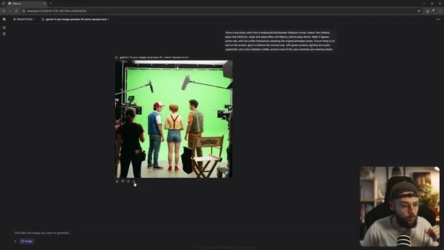
*Interface web affichant une image générée avec le modèle Gemini-3 pro-image-preview représentant un tournage de film Pokémon en prises de vues réelles.*

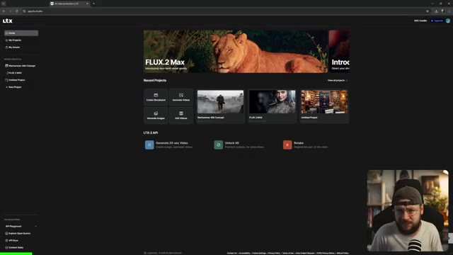
*Tableau de bord principal de la plateforme LTX Studio avec ses projets récents et options de création.*

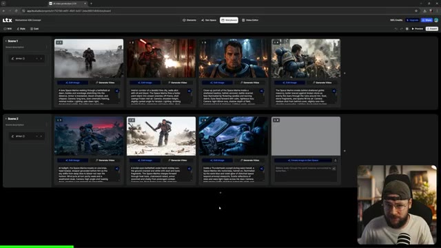
*Interface du mode Storyboard de LTX Studio affichant plusieurs scènes et plans du projet "Warhammer 40K Concept".*

---

### ⏱️ `[00:07:35 - 00:08:08]` | Segment #16

**🔊 Audio (Transcription Intégrale Mot pour Mot en Français) :**
> Vous pouvez voir toute une série d'images vraiment formidables que nous avons générées et si nous avons une génération que nous aimons vraiment, si nous survolons celle-ci, vous pouvez voir dans le coin inférieur droit que nous avons une option pour envoyer vers le storyboard. Maintenant, en passant à notre storyboard, vous pouvez voir que nous commençons à assembler la narration de notre bande-annonce conceptuelle. Une autre fonctionnalité très utile dans LTX est les éléments. Si nous cliquons par exemple sur l'onglet personnage, nous pouvons ajouter une image. Nous pouvons donner un nom à l'élément et nous pouvons cliquer sur enregistrer. Si nous tapons le symbole arobase, vous pouvez voir que cela extrait...

**👁️ Analyse Visuelle d'Écran (gemini-3.5-flash-lite) :**
**Interface & Outils** : LTX (plateforme de production vidéo par IA sur navigateur web)

**Contenu textuel & Code** : Interface web comportant les onglets "Elements", "Gen Space", "Storyboard", "Video Editor", et affichant des images générées de Warhammer 40k, un panneau d'éléments avec un personnage nommé "HENRYCAVILL", et un menu contextuel de prompt avec des suggestions de personnages.

**Action / Démonstration** : Le présentateur navigue dans l'interface de LTX, survole une image pour afficher l'option d'envoi vers le storyboard, montre l'onglet des éléments, puis tape le symbole arobase pour déclencher l'affichage des éléments enregistrés.

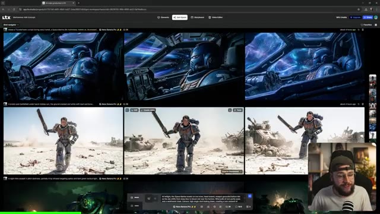
*Interface du logiciel LTX montrant une grille d'images générées de Space Marines avec le créateur en incrustation vidéo (PiP) dans le coin inférieur droit.*

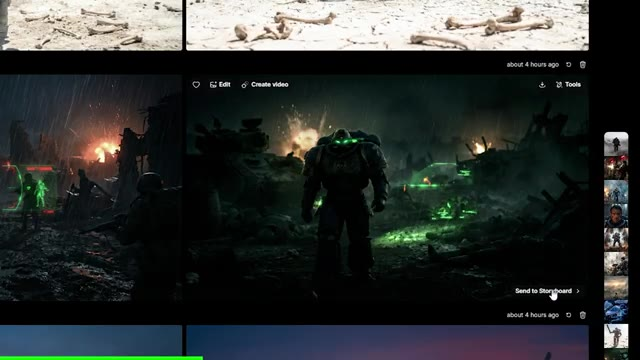
*Gros plan sur une image générée dans LTX avec le menu contextuel affichant l'option "Send to Storyboard" au survol.*

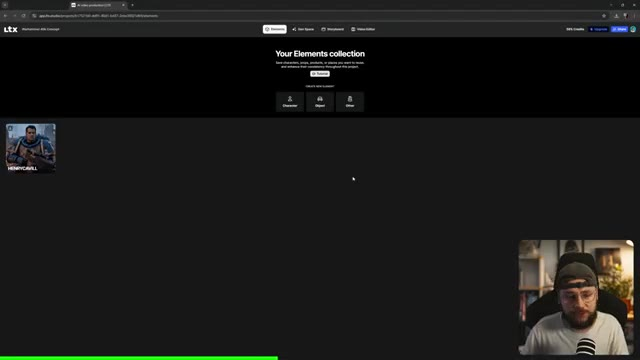
*Vue de la collection "Elements" dans LTX avec la section "Your Elements collection" et un personnage enregistré nommé "HENRYCAVILL".*

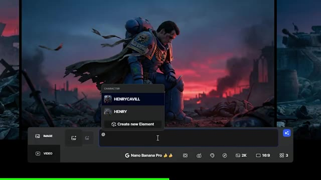
*Interface de génération LTX montrant un menu déroulant de sélection de personnages (HENRYCAVILL, HENRY) au-dessus de la barre de prompt lors de la saisie d'un symbole arobase (@).*

---

### ⏱️ `[00:08:08 - 00:08:43]` | Segment #17

**🔊 Audio (Transcription Intégrale Mot pour Mot en Français) :**
> un menu de nos éléments et nous pouvons sélectionner Henry. Et faisons un prompt du genre Henry dans le désert buvant à une gourde d'eau. Vous pouvez également télécharger des éléments de lieux, d'objets et d'autres personnages. Et cela rend simplement le processus d'ingénierie de vos prompts tellement plus rapide. Et voici la qualité de ce que l'on obtient avec un prompt aussi simple. Vous pouvez voir comment l'espace gen, le storyboard et la fonctionnalité des éléments fonctionnent tous ensemble de manière transparente. Cela aide vraiment à vous donner cette sensation cohérente d'un flux de production réel. Si vous voulez vraiment

**👁️ Analyse Visuelle d'Écran (gemini-3.5-flash-lite) :**
**Interface & Outils** : LTX Studio (application web de production vidéo par IA).

**Contenu textuel & Code** : Texte de prompt visible : « HENRY in the desert drinking from a flask of water, looking as if he has just finished a battle. Gritty, realistic, and photorealistic movie still. » Options sélectionnées : Nano Banana Pro, résolution 2K, format 16:9, 3 variations. Onglets visibles : Elements, Gen Space, Storyboard, Video Editor.

**Action / Démonstration** : Le présentateur navigue dans l'interface de LTX Studio, tape un prompt textuel pour générer une vidéo et présente les fonctionnalités de création de scènes et de storyboarding.

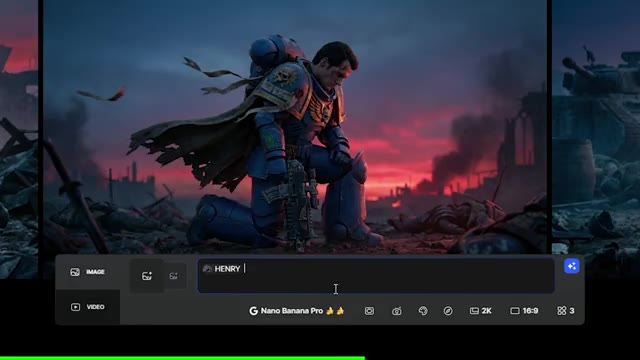
*Interface de LTX Studio affichant le champ de saisie de prompt avec le nom 'HENRY' et un rendu visuel d'un Space Marine à genoux.*

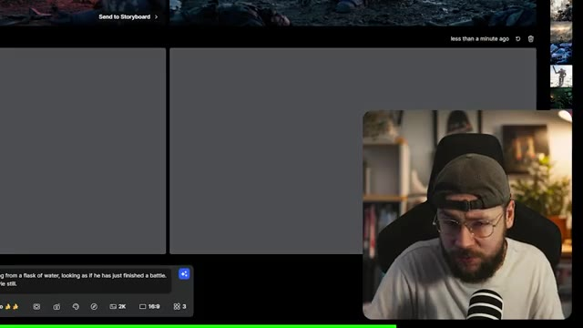
*Interface de LTX Studio montrant le flux de génération de vidéos avec Jack visible en incrustation (PiP) dans le coin inférieur droit.*

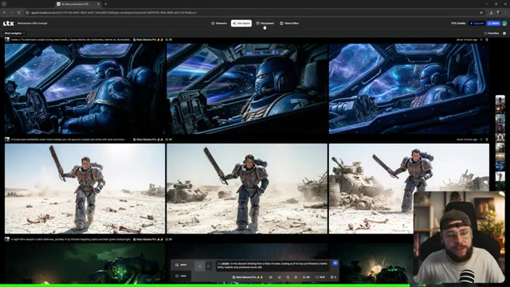
*Vue d'ensemble de l'interface de LTX Studio avec le projet 'Warhammer 40K Concept' et plusieurs grilles de visuels générés par IA.*

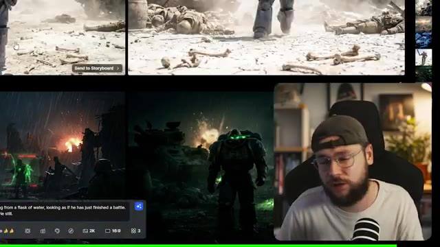
*Grille de résultats de LTX Studio montrant diverses scènes cinématiques de science-fiction avec Jack en incrustation (PiP).*

---

### ⏱️ `[00:08:43 - 00:09:16]` | Segment #18

**🔊 Audio (Transcription Intégrale Mot pour Mot en Français) :**
> allez-y et consultez LTX, vous pouvez cliquer sur le lien en bas dans la description. Merci à eux d'avoir sponsorisé la vidéo d'aujourd'hui, maintenant revenons à notre tutoriel. Et je pense que pour terminer sur un dernier plan des coulisses, regardons une adaptation en prise de vues réelles de Death Note. Maintenant, il y en a déjà eu quelques-unes. Je pense que la plupart des audiences pensent généralement qu'elles n'ont pas été si géniales que ça. La série animée originale est très hautement estimée et les gens ont un peu eu du mal à l'adapter, mais ici nous jetons vraiment toutes nos forces dans ce concept avec certains des meilleurs acteurs de la

**👁️ Analyse Visuelle d'Écran (gemini-3.5-flash-lite) :**
**Interface & Outils** : Navigateur web affichant l'interface de la plateforme LTX (app.ltx.studio) avec une vue en grille de concepts et l'encadré vidéo du créateur en bas à droite.

**Contenu textuel & Code** : Galerie d'images générées de type Warhammer 40k, et sur l'image 2 un long prompt détaillant une scène de Death Note avec Timothée Chalamet, Charlie Heaton et Bill Skarsgård.

**Action / Démonstration** : Le créateur présente l'interface de LTX avec ses galeries de visuels générés, puis bascule vers l'interface textuelle montrant un prompt détaillé pour une adaptation live-action de Death Note.

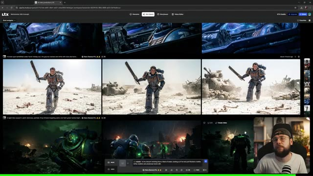
*Interface de LTX montrant une galerie de concepts art de Warhammer 40k avec le créateur en incrustation PiP.*

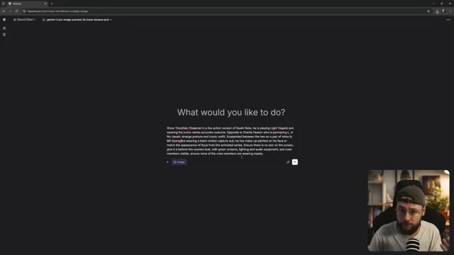
*Interface d'un outil de génération textuelle posant la question 'What would you like to do?' avec un long prompt descriptif pour Death Note.*

---

### ⏱️ `[00:09:16 - 00:09:49]` | Segment #19

**🔊 Audio (Transcription Intégrale Mot pour Mot en Français) :**
> marché. Donc pour le prompt textuel, nous allons dire : montrer Timothée Chalamet dans une version en prise de vues réelles de Death Note. Il joue Light Yagami, qui est le personnage principal de la série si vous ne connaissez pas, et je voulais utiliser cet exemple parce que nous dictons que nous voulons que L ait une posture spécifique. C'est vraiment important pour le personnage, il s'assoit d'une manière assez étrange et si cela manquait, vous n'accrocheriez tout simplement pas à cet exemple, surtout si vous étiez un fan de Death Note, vous vous attendriez à voir L assis de cette façon, et nous avons dit suspendu entre les deux sur une paire

**👁️ Analyse Visuelle d'Écran (gemini-3.5-flash-lite) :**
**Interface & Outils** : Interface web d'un modèle d'IA (similaire à Google Gemini / Imagen) avec un fond sombre, comportant un champ de saisie centré affichant le prompt, et une petite fenêtre vidéo du présentateur (PiP) en bas à droite.

**Contenu textuel & Code** : Le texte du prompt visible dans l'interface : "Show Timothée Chalamet in a live action version of Death Note, he is playing Light Yagami and wearing the iconic series accurate costume. Opposite is Charlie Heaton who is portraying L, in his classic strange posture and iconic outfit. Suspended between the two on a pair of wires is Bill Skarsgård wearing a black motion capture suit, he has make-up painted on his face to match the appearance of Ryuk from the animated series. Ensure there is no text on the screen, give it a behind-the-scenes look, with green screens, lighting and audio equipment, and crew members visible, ensure none of the crew members are wearing masks."

**Action / Démonstration** : Le créateur montre l'interface de l'outil d'IA et le prompt rédigé sur l'écran tout en expliquant sa démarche concernant la posture spécifique du personnage de L.

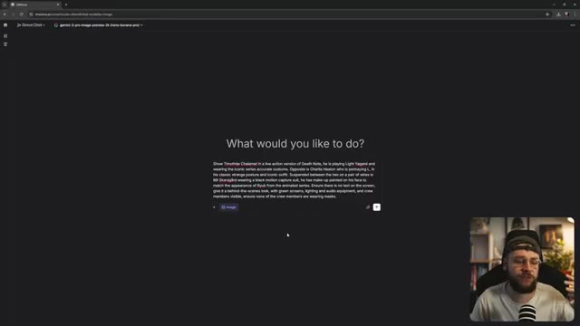
*Interface d'un outil de génération d'image par IA montrant le champ de prompt textuel avec le texte détaillé sur Death Note et Timothée Chalamet, avec la webcam du créateur en incrustation (PiP).*

---

### ⏱️ `[00:09:49 - 00:10:22]` | Segment #20

**🔊 Audio (Transcription Intégrale Mot pour Mot en Français) :**
> de fils est Bill Skarsgård c'est parce que le Shinigami Ryuk est capable de flotter il a ces grandes sortes de plumes noires d'ailes nous avons dit qu'il porte une combinaison de capture de mouvement noire il a du maquillage peint sur son visage pour correspondre à l'apparence de Ryuk de la série animée et juste pour finir nous avons une fois de plus utilisé le même prompt de la génération précédente en spécifiant que nous voulons aller avec cette sorte d'ambiance de coulisses. Allons donc de l'avant et envoyons cette génération aussi et voyons ce que nous obtenons en retour. Et vous aurez vu depuis l'intro que le ciel est vraiment la limite ici.

**👁️ Analyse Visuelle d'Écran (gemini-3.5-flash-lite) :**
**Interface & Outils** : Navigateur web avec interface sombre de génération vidéo IA (style outil multimodal ou LLM), incluant un encadré vidéo PiP du créateur en bas à droite.

**Contenu textuel & Code** : Texte du prompt visible à l'écran : "Show Timothée Chalamet in a live action version of Death Note, he is playing Light Yagami and wearing the iconic series accurate costume. Opposite is Charlie Heaton who is portraying L, in his classic strange posture and iconic outfit. Suspended between the two on a pair of wires is Bill Skarsgård wearing a black motion capture suit, he has make-up painted on his face to match the appearance of Ryuk from the animated series. Ensure there is no text on the screen, give it a behind-the-scenes look, with green screens, lighting and audio equipment, and crew members visible, ensure none of the crew members are wearing masks."

**Action / Démonstration** : Le créateur présente l'interface de l'outil de génération IA et le prompt textuel détaillé utilisé pour créer la scène de Death Note, tout en parlant face à sa caméra.

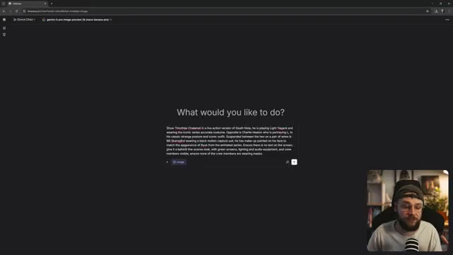
*Interface d'un navigateur web montrant un champ de saisie de prompt textuel pour la génération de vidéo IA avec le présentateur en incrustation vidéo (PiP) dans le coin inférieur droit.*

---

### ⏱️ `[00:10:22 - 00:10:54]` | Segment #21

**🔊 Audio (Transcription Intégrale Mot pour Mot en Français) :**
> Vous pouvez créer tout ce que vous pouvez imaginer. Il suffit de structurer correctement vos prompts textuels et d'inclure la bonne quantité d'informations. Allons voir ceci, c'est exactement ce que je cherchais. Maintenant, bien sûr, nous voulons également télécharger cette image et nous pourrons passer à l'animation de nos images IA en utilisant certains des meilleurs modèles vidéo du marché, entièrement gratuitement eux aussi. Donc pour ce faire, vous devrez d'abord télécharger Discord si ce n'est pas déjà fait, puis vous pourrez cliquer sur le lien ci-dessous dans la description.

**👁️ Analyse Visuelle d'Écran (gemini-3.5-flash-lite) :**
**Interface & Outils** : Navigateur web affichant une image générée par IA, puis interface de l'application Discord.

**Contenu textuel & Code** : Sur l'image #2, une image au style cinématographique d'un plateau de cinéma avec fond vert, équipe de tournage et acteurs. Sur l'image #4, l'interface de Discord avec la liste des salons et des serveurs sur la gauche, ainsi qu'un encart de prompt et de texte explicatif. Une incitation à s'abonner (bouton "SUBSCRIBED" avec une cloche et un pouce bleu) apparaît en bas à gauche.

**Action / Démonstration** : Le créateur montre l'image finale générée qu'il a obtenue, puis présente l'interface de Discord pour inviter les spectateurs à rejoindre le serveur via le lien en description afin d'animer les images gratuitement.

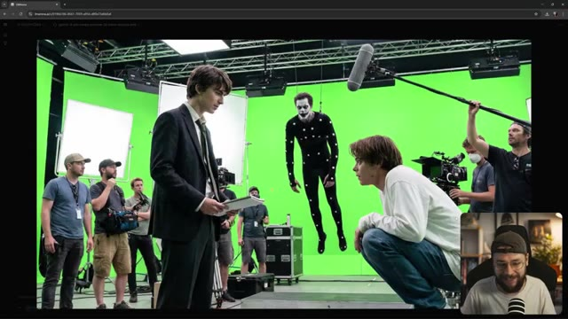
*Affichage d'une image générée par IA montrant un plateau de tournage sur fond vert (green screen) avec des acteurs et une équipe technique.*

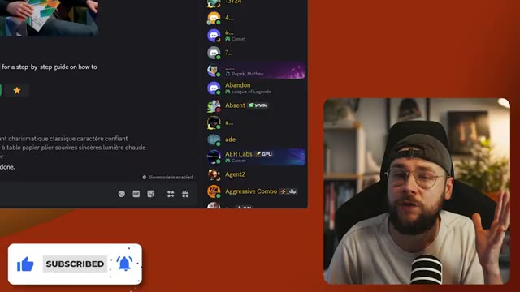
*Interface de Discord affichant des listes de serveurs et des messages textuels sur le serveur communautaire.*

---

### ⏱️ `[00:10:54 - 00:11:28]` | Segment #22

**🔊 Audio (Transcription Intégrale Mot pour Mot en Français) :**
> pour rejoindre le canal Discord de LM Arena. Sur le côté gauche, vous verrez qu'il y a trois arènes vidéo au total, vous pouvez simplement en choisir une au hasard. Je traîne généralement dans l'arène vidéo numéro un et si nous cliquons sur ce champ de message en bas et tapons une barre oblique, vous verrez quelques options différentes apparaître pour nous. Nous voulons sélectionner "image to video" (image vers vidéo) et ici nous pouvons aller de l'avant et glisser-déposer par exemple notre image de Zendaya en Moana et pour le prompt textuel nous allons opter pour quelque chose de très simple à nouveau. Mouvement de caméra dolly lent vers l'avant alors que l'actrice regarde au loin

**👁️ Analyse Visuelle d'Écran (gemini-3.5-flash-lite) :**
**Interface & Outils** : Application Discord (serveur LM Arena).

**Contenu textuel & Code** : Commandes visibles dans l'interface Discord : `/image-to-video`, sélection d'image (`gemini-3-pro-image-preview-2k...`), et champ prompt contenant : "Slow dolly camera move in, as the actress looks out into the distance, she keeps her head still, as her hair gently moves in the wind."

**Action / Démonstration** : Le créateur montre comment naviguer sur le Discord de LM Arena, choisir une arène vidéo, glisser-déposer une image source, et entrer la commande `/image-to-video` avec un prompt textuel pour animer l'image.

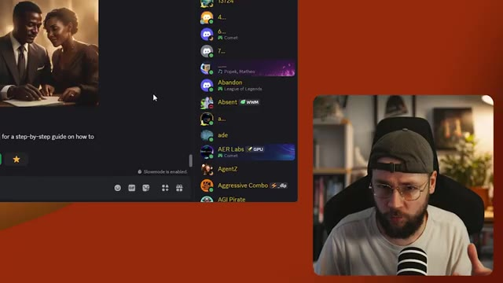
*Démonstration à l'écran @ 00:10:56*

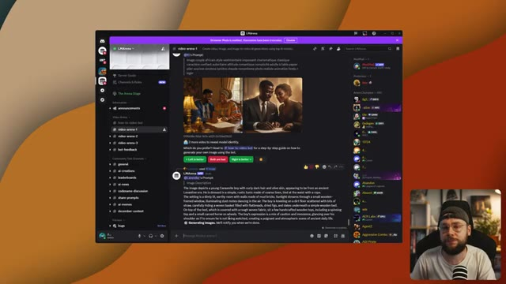
*Démonstration à l'écran @ 00:11:06*

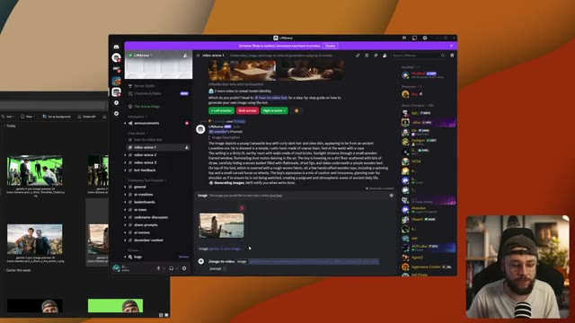
*Démonstration à l'écran @ 00:11:17*

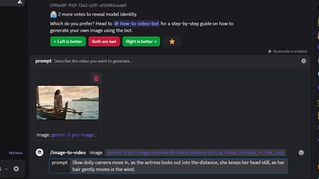
*Démonstration à l'écran @ 00:11:26*

---

### ⏱️ `[00:11:28 - 00:12:02]` | Segment #23

**🔊 Audio (Transcription Intégrale Mot pour Mot en Français) :**
> la distance. Nous allons dire qu'elle garde la tête immobile tandis que ses cheveux bougent doucement dans le vent. Et la raison pour laquelle nous avons précisé cela, c'est parce que les modèles d'IA n'ont que le contexte que nous leur donnons. Par là, je veux dire que si le modèle vidéo décide d'ajouter une certaine rotation au visage de Zendaya, il se peut qu'il ne sache pas à quoi ressemble Zendaya et donc toute l'illusion va être instantanément brisée. C'est donc une astuce intelligente pour contourner ce problème. Allons-y, appuyons sur Entrée et envoyons cette génération. Nous allons retaper une barre oblique, sélectionner image vers vidéo. Et cette fois, nous pouvons télécharger notre image de notre Hercule

**👁️ Analyse Visuelle d'Écran (gemini-3.5-flash-lite) :**
**Interface & Outils** : Interface Discord (LMArena / serveur de génération vidéo par IA) avec une zone de chat, des commandes slash et une incrustation vidéo du présentateur (PiP).

**Contenu textuel & Code** : Texte de prompt visible dans la barre de saisie : « Slow dolly camera move in, as the actress looks out into the distance, she keeps her head still, as her hair gently moves in the wind. » et sélection de l'image source sous forme de fichier.

**Action / Démonstration** : Le créateur montre la rédaction du prompt textuel pour l'outil de génération vidéo par IA dans Discord, puis explique l'importance de garder le visage immobile pour éviter les artefacts de l'IA.

*Interface Discord affichant la commande /image-to-video avec un prompt détaillé décrivant les mouvements de caméra et l'immobilité du visage.*

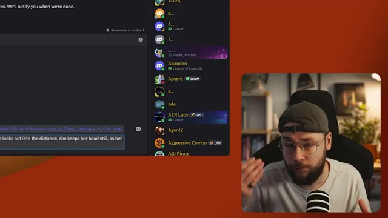
*Interface Discord avec la liste des salons à droite, incluant le créateur Jack en incrustation PiP dans un encadré en bas à droite.*

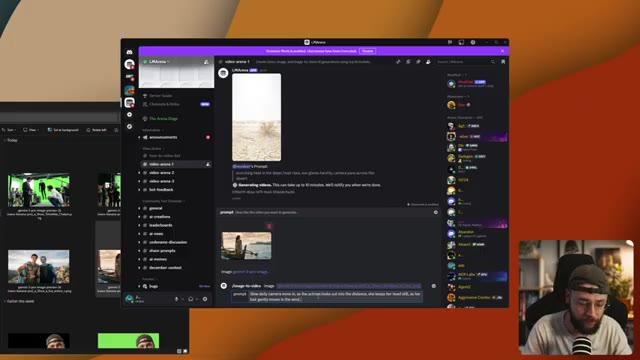
*Vue plus large montrant l'interface Discord d'une plateforme de génération vidéo type LMArena avec des images de prévisualisation sur le côté gauche et Jack en incrustation PiP.*

---

### ⏱️ `[00:12:02 - 00:12:22]` | Segment #24

**🔊 Audio (Transcription Intégrale Mot pour Mot en Français) :**
> adaptation en prise de vue réelle. Optez pour un prompt textuel légèrement différent ici, mouvement de caméra d'appareil portatif alors que Jacob Elordi et Jeff Goldblum rient. Appuyons donc sur entrée une nouvelle fois. Et comme vous pouvez le voir, nous avons récupéré notre génération de notre remake en prise de vue réelle de Vaiana. Allons voir ces derniers.

**👁️ Analyse Visuelle d'Écran (gemini-3.5-flash-lite) :**
**Interface & Outils** : Interface de l'application Discord (LMArena) avec affichage en incrustation (PiP) du créateur en bas à droite.

**Contenu textuel & Code** : Texte du prompt visible : « Handheld device camera movement as Jacob Elordi and Jeff Goldblum laugh. » et images de génération du remake de Vaiana.

**Action / Démonstration** : Le créateur tape un prompt textuel pour une génération vidéo image-par-image et appuie sur entrée pour lancer le rendu.

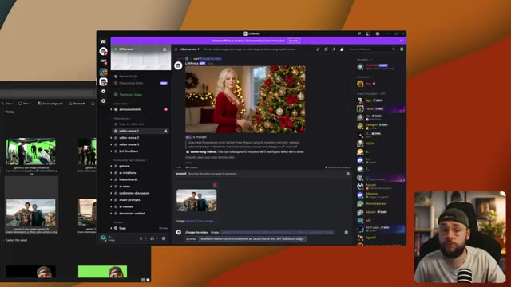
*Interface Discord de LMArena montrant le prompt textuel et la génération en cours, avec le créateur en incrustation PiP.*

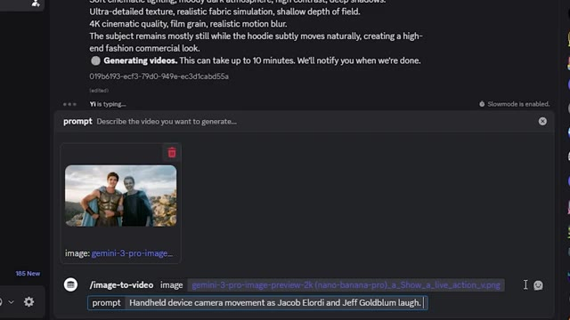
*Gros plan sur la boîte de dialogue de saisie du prompt pour la commande image-to-video.*

*Interface Discord de LMArena affichant les résultats vidéo générés du remake de Vaiana avec les options de vote.*

---

### ⏱️ `[00:12:22 - 00:12:55]` | Segment #25

**🔊 Audio (Transcription Intégrale Mot pour Mot en Français) :**
> Donc en fait cette première est vraiment très très bien. Vous verrez qu'à la fin de vos générations, vous allez obtenir cette carte de fin. C'est essentiellement pour faire la promotion du Discord de LM Arena, mais si vous voulez vraiment utiliser ceci dans votre propre contenu, vous pouvez simplement l'importer dans votre logiciel de montage préféré, quelque chose comme Premiere Pro ou CapCut, et simplement couper cela de la fin de votre génération. Personne ne le saura jamais. Jetons un œil à la deuxième génération. C'est vraiment très bien.

**👁️ Analyse Visuelle d'Écran (gemini-3.5-flash-lite) :**
**Interface & Outils** : Lecteur multimédia Windows / Explorateur de fichiers et interface de LM Arena.

**Contenu textuel & Code** : Texte visible sur l'écran : "gg/LMArena" et aperçus de fichiers multimédias.

**Action / Démonstration** : Le créateur montre la fin d'une vidéo générée par IA contenant une carte promotionnelle (end card) et explique comment la couper au montage.

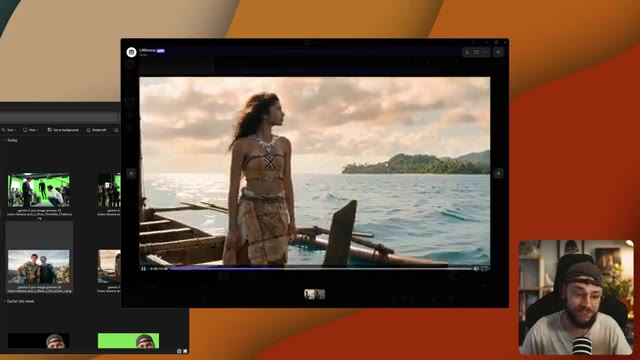
*Aperçu d'une vidéo générée par IA montrant une femme sur un bateau en mer avec le lecteur multimédia et une vue secondaire sur des fichiers, avec le créateur en médaillon.*

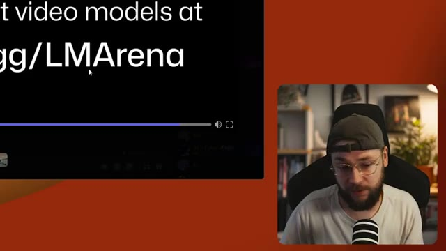
*Gros plan sur la carte de fin d'une génération vidéo affichant le lien vers le Discord de LM Arena, avec le créateur en médaillon.*

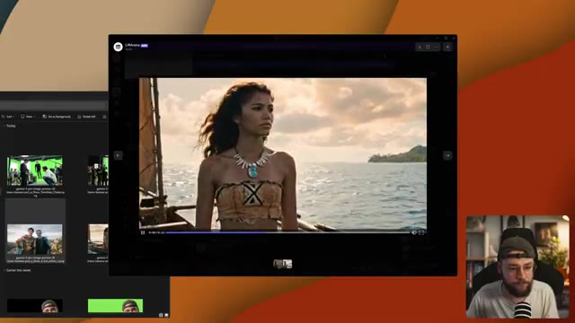
*Même aperçu vidéo de la femme sur le bateau en mer, avec le lecteur multimédia ouvert et le créateur en médaillon.*

---

### ⏱️ `[00:12:55 - 00:13:33]` | Segment #26

**🔊 Audio (Transcription Intégrale Mot pour Mot en Français) :**
> ainsi qu'on peut le voir, cependant, étant donné que la caméra a décidé de faire une sorte de petit mouvement orbital autour de Zendaya, elle commence à ne plus lui ressembler vers la fin de la génération. Donc vraiment, si nous devions choisir, nous opterions pour la première génération. On peut voir ici qu'on peut cliquer sur « gauche est meilleur » et si notre génération récolte assez de votes de la communauté discord, cela va révéler quels modèles vidéo IA ont été utilisés et c'est vraiment l'autre inconvénient d'utiliser des modèles vidéo IA via Elemarina, on ne sait pas ce qu'on va obtenir, on joue vraiment aux dés. Je vais aller de nouveau sélectionner image vers vidéo et glisser notre action réelle.

**👁️ Analyse Visuelle d'Écran (gemini-3.5-flash-lite) :**
**Interface & Outils** : Application Discord et lecteur multimédia sur bureau, avec incrustation vidéo de l'orateur (PiP).

**Contenu textuel & Code** : Boutons de vote Discord (« Left is better », « Both are bad », « Right is better ») et interface de commande `/image-to-video`.

**Action / Démonstration** : Le créateur montre le résultat vidéo généré, explique le processus de vote sur Discord, puis glisse une image pour une nouvelle génération « image-to-video ».

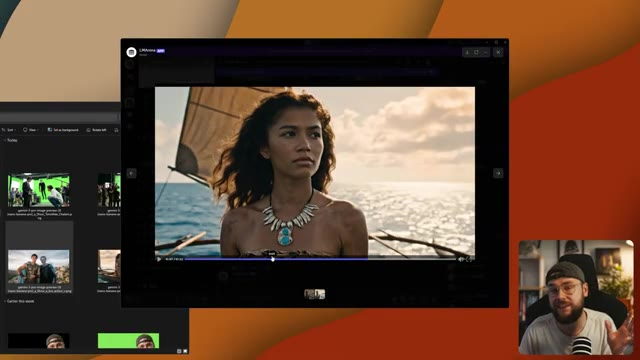
*Interface d'un lecteur vidéo montrant le rendu d'une vidéo générée par IA avec Zendaya sur un bateau.*

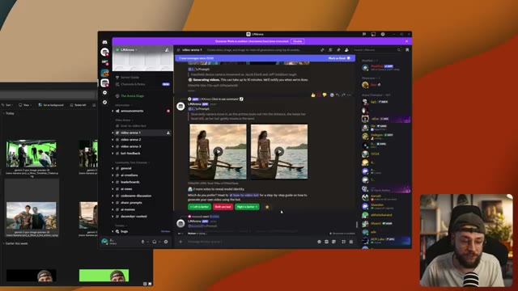
*Interface Discord du serveur LM Arena montrant des options de vote pour comparer deux générations de vidéos IA.*

*Interface de commande Discord montrant le module `/image-to-video` avec une zone de glisser-déposer de fichier.*

---

### ⏱️ `[00:13:33 - 00:14:07]` | Segment #27

**🔊 Audio (Transcription Intégrale Mot pour Mot en Français) :**
> Adaptation de Pokémon et cette fois pour le prompt nous allons dire mouvement de caméra travelling avant lent vers la chaise de casting sur laquelle est inscrit Pokémon et enfin chargeons notre adaptation de Death Note et utilisons un prompt incroyablement simple ici le rire de l'acteur. Vraiment la meilleure chose est de pouvoir expérimenter en utilisant différentes images de départ et différents prompts textuels en comparant les résultats et je vous encourage vivement à regarder les autres vidéos qui sont générées par les membres de la communauté et assurez-vous de voter car en révélant les modèles vidéo

**👁️ Analyse Visuelle d'Écran (gemini-3.5-flash-lite) :**
**Interface & Outils** : Application Discord (LMArena) avec panneau latéral de navigation, zone de discussion centrale pour la génération vidéo et encadré PiP (Picture-in-Picture) du créateur Jack en bas à droite.

**Contenu textuel & Code** : Texte du prompt visible dans la barre de saisie : `/image-to-video prompt: Slow dolly camera move in to the casting chair that reads 'Pokemon'`. On aperçoit également une miniature d'image de prévisualisation verte (Gemini 3 pro image preview 2K) et un résultat de génération en cours au format vidéo verticale.

**Action / Démonstration** : Le créateur montre l'interface de génération vidéo sur Discord, illustrant la saisie d'un prompt textuel combiné à une image pour générer une vidéo.

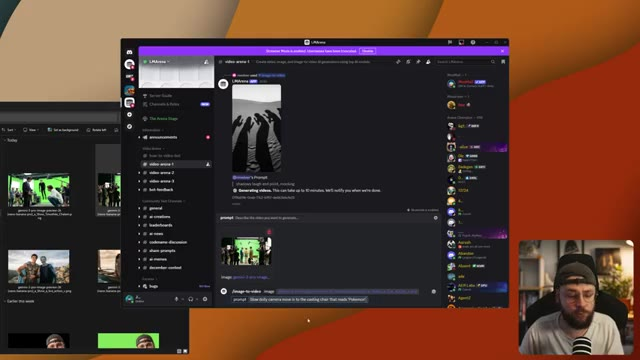
*Interface d'une application Discord (LMArena) affichant un canal de génération de vidéo par IA avec un prompt textuel et une image de référence.*

---

### ⏱️ `[00:14:07 - 00:14:38]` | Segment #28

**🔊 Audio (Transcription Intégrale Mot pour Mot en Français) :**
> qui ont été utilisées pour chaque génération, vous allez commencer à vous familiariser avec celles qui fonctionnent le mieux pour certains cas d'utilisation. C'est l'un des moyens clés pour devenir bon dans l'utilisation de l'IA générative. Ok, nous récupérons nos générations Hercules. Jetons un coup d'œil à celles-ci. Ça a l'air vraiment bien et la ressemblance était en fait superbe en ce qui concerne les deux acteurs, même si nous avons eu une certaine rotation de la tête là-dedans. Vraiment impressionnant. Peut-être que référencer le nom des acteurs a aidé ici.

**👁️ Analyse Visuelle d'Écran (gemini-3.5-flash-lite) :**
**Interface & Outils** : Interface Discord / LMArena (Video Arena)

**Contenu textuel & Code** : Textes visibles : "Compare the best video models at discord.gg/LMArena", prompts de génération de vidéos, listes de modérateurs/utilisateurs Discord.

**Action / Démonstration** : Le créateur présente les résultats de génération vidéo de modèles d'IA sur LMArena, en analysant la qualité des visages et la fidélité des acteurs (Hercules).

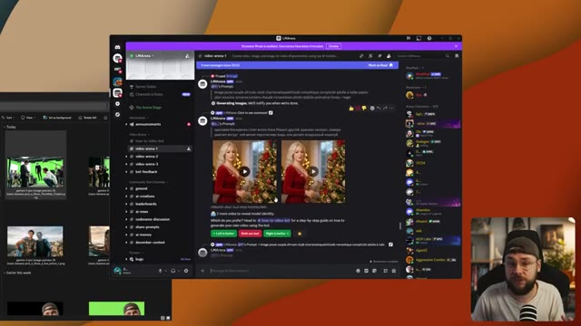
*Interface Discord de LMArena affichant les résultats de génération vidéo avec des exemples de femmes en robe rouge devant un sapin de Noël.*

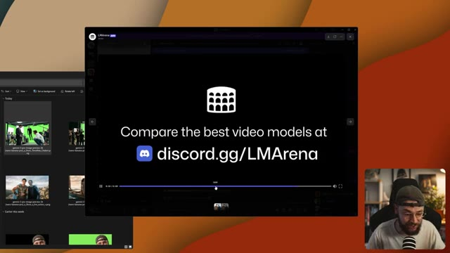
*Écran de LMArena affichant le logo et l'invitation à comparer les meilleurs modèles vidéo via Discord.*

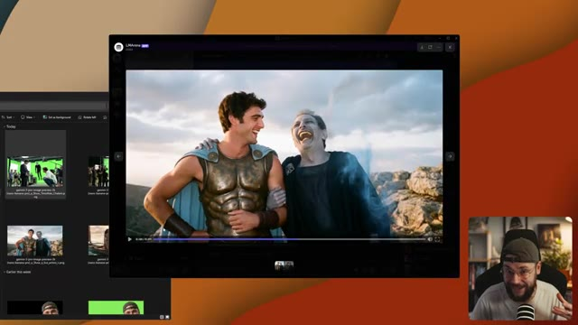
*Lecteur vidéo de LMArena affichant une génération de deux acteurs riant ensemble vêtus de costumes antiques (style Hercules).*

---

### ⏱️ `[00:14:38 - 00:15:11]` | Segment #29

**🔊 Audio (Transcription Intégrale Mot pour Mot en Français) :**
> Un certain niveau de compréhension du monde en ce qui concerne le modèle vidéo utilisé peut-être. Jetez un œil à la génération numéro deux. Vraiment sympa aussi pour être juste. Les deux sont complètement utilisables. Je crois que je préfère la première génération donc nous allons cliquer sur "la gauche est meilleure". Nous retrouvons notre génération Pokémon également. Jetons un œil à celles-ci et nous avions demandé un mouvement de caméra lent de type dolly vers l'arrière de cette chaise. Ça n'a pas fonctionné pour ce modèle vidéo. Jetons un œil au second.

**👁️ Analyse Visuelle d'Écran (gemini-3.5-flash-lite) :**
**Interface & Outils** : Interface de type Discord / LMArena (Video Arena) avec panneau de navigation à gauche, fils de discussion au centre et liste des utilisateurs/serveurs à droite, ainsi qu'une fenêtre de prévisualisation vidéo.

**Contenu textuel & Code** : Texte de prompt visible dans l'interface Discord : "A grand cinematic finale shot! Multiple adult Stone Age humans stand on a ridge overlooking an ancient world at twilight..." et un autre prompt sur des personnages cartoon dans une salle de jeux ("Find cartoon children in a vibrant playroom pick up scattered toys and place them into hobby boards..."). Noms de fichiers miniatures visibles dans le panneau de gauche (ex: "gemini-3-pro-image-preview").

**Action / Démonstration** : Le présentateur navigue entre différentes générations de vidéos IA sur une interface de test comparative (arène de modèles vidéo) et évalue les résultats en comparant les options gauche et droite.

*Interface d'une application de type interface de test vidéo (LMSYS Arena ou similaire) montrant la lecture d'une vidéo générée par IA avec deux hommes en costume de gladiateur riant, avec Jack en incrustation (PiP).*

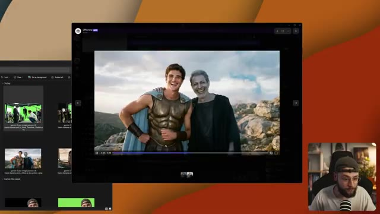
*Affichage de la deuxième génération d'une vidéo générée par IA présentant deux hommes en costume de gladiateur souriant dans un paysage rocheux, avec Jack en incrustation (PiP).*

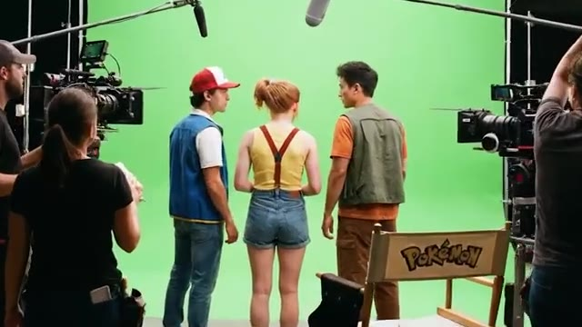
*Vidéo montrant des personnes de dos sur un plateau de tournage devant un fond vert (green screen), avec une chaise de réalisateur comportant le logo Pokémon.*

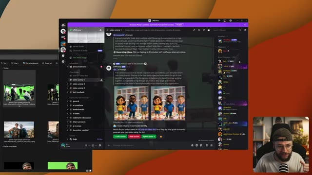
*Interface Discord de LMArena affichant des discussions, des prompts textuels et des comparaisons de générations de vidéos par IA (vidéo arena 1), avec Jack en incrustation (PiP).*

---

### ⏱️ `[00:15:13 - 00:15:31]` | Segment #30

**🔊 Audio (Transcription Intégrale Mot pour Mot en Français) :**
> C'est parti. Ok, alors ça, c'est beaucoup mieux conforme au prompt textuel, et vous pouvez voir que ça pourrait être utilisé comme une sorte de bande-annonce de type teaser. On a aussi un très beau déplacement du point de focus (pull focus) où chacun des personnages Pokémon est flou et on a la chaise de metteur en scène avec notre logo Pokémon qui est bien net.

**👁️ Analyse Visuelle d'Écran (gemini-3.5-flash-lite) :**
**Interface & Outils** : Rendu vidéo généré par intelligence artificielle illustrant un plateau de tournage style making-of.

**Contenu textuel & Code** : Logo officiel "Pokémon" visible sur le dossier de la chaise de metteur en scène au premier plan. Trois personnages de dos (inspirés de Sacha, Ondine et Pierre) face à un fond vert de tournage. Équipement de cinéma visible autour (caméras, perches, techniciens).

**Action / Démonstration** : Effet de profondeur de champ cinématique (focus pull) appliqué par l'IA : la mise au point passe des personnages de l'arrière-plan vers la chaise de réalisateur au premier plan.

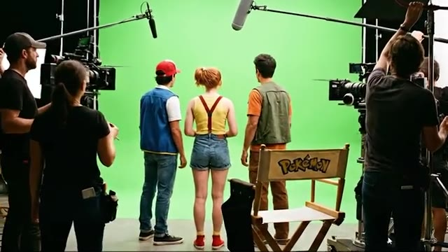
*Génération vidéo IA montrant des acteurs habillés en personnages Pokémon sur un plateau de tournage devant un fond vert, avec une chaise de réalisateur au premier plan arborant le logo Pokémon.*

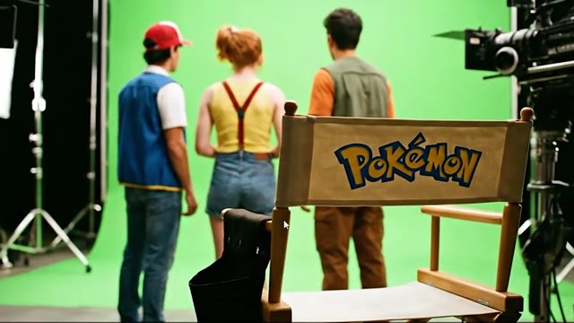
*Gros plan du changement de point (focus pull) montrant la chaise de réalisateur avec le logo Pokémon bien net au premier plan, tandis que les personnages en arrière-plan sont flous.*

---

### ⏱️ `[00:15:32 - 00:15:55]` | Segment #31

**🔊 Audio (Transcription Intégrale Mot pour Mot en Français) :**
> Et enfin, nous allons également jeter un œil à nos générations Death Note. Voyons ce qui se passe ici. Donc, comme il y a eu beaucoup de rotation de tête, les acteurs ont un peu perdu leur ressemblance, malheureusement. Jetez un œil à la génération numéro deux. Donc vous pouvez voir ici que nous perdons beaucoup de ressemblance en utilisant ce prompt textuel très simple.

**👁️ Analyse Visuelle d'Écran (gemini-3.5-flash-lite) :**
**Interface & Outils** : Interface de l'application Discord (LMArena) avec panneau latéral gauche pour les salons et affichage central des messages avec des fenêtres de génération vidéo et un aperçu en incrustation (PiP) du créateur.

**Contenu textuel & Code** : Texte du prompt visible : "The actors laugh." avec des boutons d'évaluation ("Left is better", "Both are tied", "Right is better"). Fichiers et aperçus d'images dans le panneau de gauche.

**Action / Démonstration** : Le créateur montre l'interface de test et de comparaison de modèles de vidéo (LMArena) sur Discord, affichant les résultats de génération vidéo Death Note où les acteurs rient.

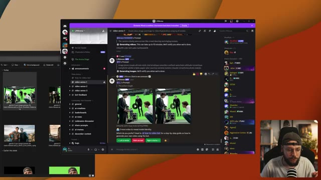
*Interface Discord montrant un salon de discussion LMArena avec des prompts et des résultats de génération vidéo côte à côte, avec la webcam du créateur en incrustation (PiP).*

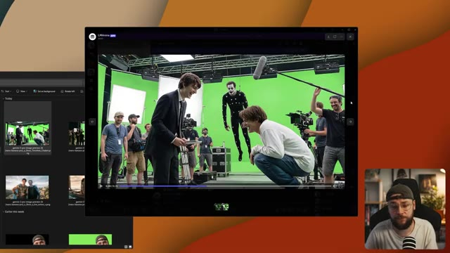
*Lecteur vidéo intégré affichant le rendu de la génération Death Note sur fond vert avec des acteurs qui rient et un personnage suspendu.*

---

### ⏱️ `[00:15:55 - 00:16:14]` | Segment #32

**🔊 Audio (Transcription Intégrale Mot pour Mot en Français) :**
> Je serais curieux de voir si, en étant un peu plus précis en faisant référence aux noms des acteurs, comme nous l'avons fait avec l'exemple d'Hercule, nous obtiendrons un meilleur résultat avec une meilleure ressemblance. Nous allons dire que les acteurs rient. À gauche du cadre se trouve Timothée Chalamet. Au milieu et suspendu à des fils se trouve Bill Skarsgård.

**👁️ Analyse Visuelle d'Écran (gemini-3.5-flash-lite) :**
**Interface & Outils** : Application Discord (serveur LMArena) avec interface de test et de génération d'images/vidéos par IA, incluant un panneau PiP du créateur.

**Contenu textuel & Code** : Texte de prompt visible dans l'image 2 : "The actors laugh, on the left of frame is Timothée Chalamet, in the middle and suspended on wires is Bill Skarsgård and on the right of frame is Charlie Heaton."

**Action / Démonstration** : Le créateur montre son écran de travail sur Discord, explorant les résultats de générations d'images et saisissant un prompt textuel détaillé pour générer une vidéo.

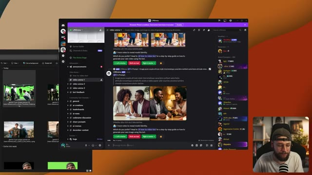
*Interface Discord montrant l'application LMArena avec des comparaisons de générations d'images IA et une incrustation vidéo de Jack en bas à droite.*

*Interface de génération vidéo sur Discord affichant un prompt textuel décrivant une scène avec Timothée Chalamet et Bill Skarsgård.*

---

### ⏱️ `[00:16:14 - 00:16:51]` | Segment #33

**🔊 Audio (Transcription Intégrale Mot pour Mot en Français) :**
> Et à droite du cadre se trouve Charlie Peter. Voyons ce que nous obtenons comme résultat à partir de cela. D'accord, jetons un coup d'œil et voyons si nous avons de meilleurs résultats de génération. Cette fois, c'est la génération numéro un. Une meilleure ressemblance pour les acteurs grâce à l'ajout de leurs noms, génération numéro deux. Oui, encore une fois, je dirais que cela a aidé. Voilà donc qu'en étant plus précis avec nos instructions textuelles, nous avons obtenu un meilleur résultat. Encore une fois, ce n'est pas parfait, mais c'est définitivement une amélioration, alors les gars, donc

**👁️ Analyse Visuelle d'Écran (gemini-3.5-flash-lite) :**
**Interface & Outils** : Interface Discord et plateforme de comparaison de modèles vidéo LM Arena, avec incrustation vidéo du créateur.

**Contenu textuel & Code** : Texte du prompt : "The actors laugh, on the left of frame is Timothée Chalamet, in the middle and suspended on wires is Bill Skarsgård and on the right of frame is Charlie Heaton." Texte LM Arena : "Compare the best video models at discord.gg/LMArena".

**Action / Démonstration** : Le créateur montre les interfaces de génération et de comparaison de modèles d'intelligence artificielle tout en commentant l'évolution des résultats selon la précision des prompts.

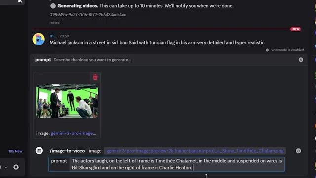
*Interface Discord montrant un prompt d'image-to-video avec la description des acteurs sur le tournage.*

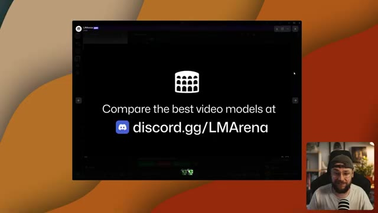
*Écran affichant l'interface de LM Arena avec le lien Discord de comparaison de modèles vidéo, et Jack visible en incrustation PiP.*

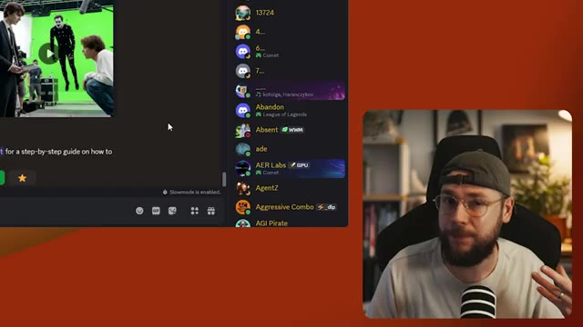
*Interface Discord avec une vidéo en cours de lecture et Jack dans l'encadré PiP dans le coin inférieur droit.*

---

### ⏱️ `[00:16:51 - 00:17:27]` | Segment #34

**🔊 Audio (Transcription Intégrale Mot pour Mot en Français) :**
> Merci beaucoup d'avoir regardé la vidéo d'aujourd'hui, j'espère vraiment qu'elle vous a plu. Si c'est le cas, n'hésitez pas à lâcher un pouce bleu pour moi, si vous êtes nouveau, pensez à vous abonner et bien sûr à activer la cloche de notification pour ne jamais rater de futures publications. Si vous avez la moindre question, assurez-vous de la poser en bas dans la section des commentaires. J'essaie d'y répondre autant que possible. Vous verrez certaines de mes vidéos précédentes sur l'écran en ce moment même si vous voulez aller en consulter quelques-unes. Nous couvrons bien sûr tous les meilleurs modèles d'images et de vidéos par IA sur cette chaîne, il y a donc beaucoup de contenu à découvrir pour vous les gars. J'apprécie le soutien comme toujours les gars et je

**👁️ Analyse Visuelle d'Écran (gemini-3.5-flash-lite) :**
**Interface & Outils** : Affichage de rendus d'images/vidéos générés par IA en plein écran avec la caméra de Jack incrustée (PiP) dans le coin inférieur droit.

**Contenu textuel & Code** : Galerie d'exemples visuels générés par intelligence artificielle illustrant le type de contenu de la chaîne (personnages de culture pop et jeux vidéo réalistes).

**Action / Démonstration** : Défilement de différentes images générées par IA à l'écran pendant que le créateur s'adresse aux spectateurs.

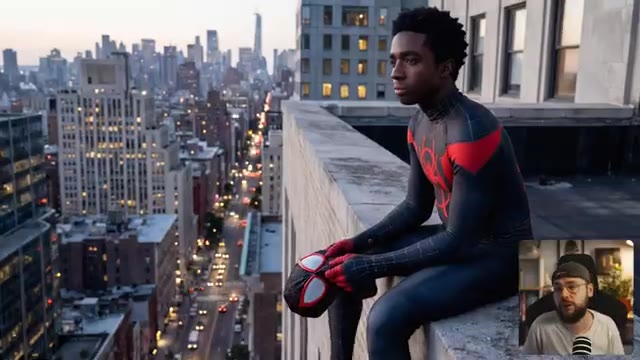
*Image générée par IA représentant un personnage ressemblant à Miles Morales en costume de Spider-Man assis sur un rebord de toit surplombant les toits de New York au crépuscule, avec Jack en incrustation vidéo (PiP) dans le coin inférieur droit.*

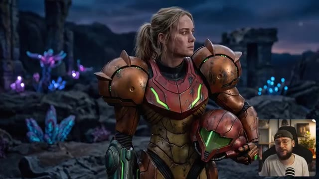
*Image générée par IA représentant Samus Aran (sous les traits de Brie Larson) en armure orange et rouge dans un paysage extraterrestre rocheux parsemé de cristaux lumineux, tenant son casque, avec Jack en incrustation vidéo (PiP).*

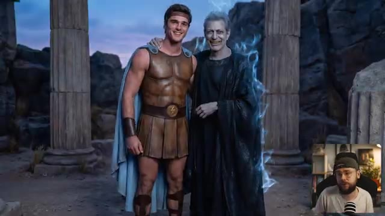
*Image générée par IA représentant un personnage musclé en costume antique style guerrier grec aux côtés d'une divinité sombre entourée de flammes bleues dans un décor de ruines antiques, avec Jack en incrustation vidéo (PiP).*

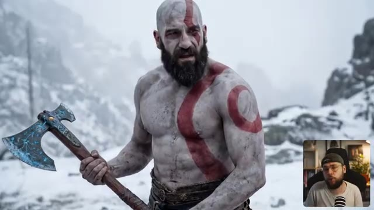
*Image générée par IA représentant Kratos de la franchise God of War dans un paysage enneigé, torse nu, tenant sa hache Léviathan, avec Jack en incrustation vidéo (PiP).*

---

### ⏱️ `[00:17:27 - 00:17:28]` | Segment #35

**🔊 Audio (Transcription Intégrale Mot pour Mot en Français) :**
> Je vous retrouve pour la prochaine.

**👁️ Analyse Visuelle d'Écran (gemini-3.5-flash-lite) :**
**Interface & Outils** : Incrustation vidéo (PiP) du créateur en bas à droite sur une image générée par intelligence artificielle.

**Contenu textuel & Code** : Image principale montrant Kratos torse nu avec ses peintures corporelles rouges et sa hache léviathan dans un décor de montagne enneigé. En bas à droite, le créateur Jack est visible dans son studio face à son micro.

**Action / Démonstration** : Le créateur conclut sa vidéo en affichant une dernière image générée par IA tout en parlant à son audience.

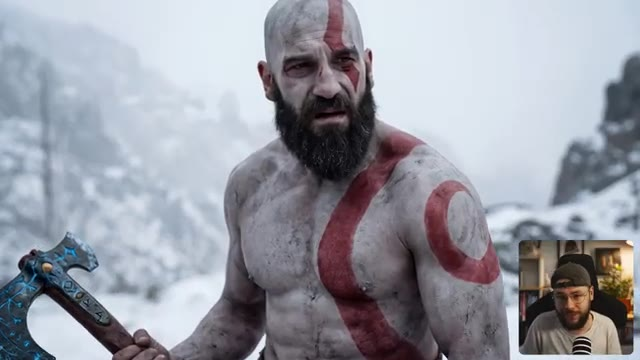
*Image générée par IA représentant Kratos de God of War dans un paysage enneigé, avec le créateur en incrustation PiP.*

---
