# 🎬 La NOUVELLE méthode pour créer des films cinématographiques avec l'IA (La méthode grille 2x2)

> **Chaîne** : [Jack Vs. AI](https://www.youtube.com/@JackVsAI)  
> **Titre original** : `The NEW Way to Create Cinematic Films with AI (2x2 Grid Method)`  
> **Lien YouTube** : [https://www.youtube.com/watch?v=MwftLxzEXk0](https://www.youtube.com/watch?v=MwftLxzEXk0)  
> **Date de publication** : 2026-01-18  
> **Durée** : 23m 01s (`1381s`)  
> **Identifiant vidéo** : `MwftLxzEXk0`  
> **Fiche Web Interactive** : [2026-01-18_YT-MwftLxzEXk0_La NOUVELLE méthode pour créer des films cinématographiques avec l'IA (La méthod_by-whisper-v3-large-turbo+gemini-3.5-flash-lite.html](2026-01-18_YT-MwftLxzEXk0_La NOUVELLE méthode pour créer des films cinématographiques avec l'IA (La méthod_by-whisper-v3-large-turbo+gemini-3.5-flash-lite.html)  
> **Captures de démonstration clés** : `96 captures réelles (anti-talking-head)`  
> **Modèles utilisés** : Audio: `large-v3-turbo` (Faster-Whisper int8 VPS) | Vision: `gemini-3.5-flash-lite` (Google AI Studio API)  

---

## 📌 Synthèse Exécutive & Outils

### 📌 Résumé
La vidéo de Jack, artiste d'effets visuels expérimenté, introduit une petite révolution dans la réalisation de films par intelligence artificielle : la « méthode de la grille 2x2 ». Face au défi majeur de la cohérence visuelle et du découpage dynamique dans les projets cinématiques, Jack propose un flux de travail hybride s'inspirant des productions traditionnelles. En combinant le concept art initial, des fiches de personnages multi-angles et cette nouvelle approche par grille, il parvient à structurer des séquences d'action complexes tout en éliminant les ruptures visuelles souvent observées lors des générations de plans isolés. 

La méthode étape par étape démarre par la création d'images clés sur Midjourney pour l'identité visuelle, avant de basculer vers *Nano Banana Pro* pour figer l'échelle et les fiches de personnages. L'innovation majeure intervient lors de la séquence de combat, où Jack utilise une génération de plans multiples en une seule image (grille 2x2) grâce à des prompts structurés et l'aide de ChatGPT. Cette technique, initialement popularisée par PJ Ace, garantit une continuité narrative saisissante entre les panneaux de storyboard, qui sont ensuite découpés et animés individuellement via des outils vidéo spécialisés.

Pour les créateurs et cinéastes IA, ce tutoriel démontre que le véritable secret ne réside pas seulement dans les outils utilisés, mais dans la rigueur de la mise en scène, la chorégraphie et l'intentionnalité du montage. En adoptant cette approche méthodique — de la conception artistique au découpage précis des prompts vidéo —, les créateurs peuvent enfin s'affranchir du caractère aléatoire de l'IA et produire des œuvres cinématographiques fluides, immersives et hautement professionnelles.

### 🛠️ Outils, Modèles & Logiciels Présentés
* **Higgsfield** : Modèle vidéo principal utilisé pour générer la grande majorité des plans animés du film final à partir d'images de référence.
* **Kling** : Mentionné parmi les modèles vidéo utilisés en synergie au sein du même montage pour diversifier les rendus tout en préservant le style.
* **Midjourney** : Outil de génération d'images initial employé pour le concept art, choisi pour son style unique et mémorable facilitant la création des personnages et décors.
* **Nano Banana Pro** : Modèle d'image central pour tout le projet, utilisé pour la photoréalisation, la création de la bête, les échelles de taille et les fiches de personnages multi-angles.
* **Photoshop** : Logiciel de retouche et de manipulation d'images traditionnelles employé en soutient dans le pipeline de production.
* **Premiere Pro** : Logiciel de montage vidéo final où sont assemblés les différents plans générés pour créer le rythme cinématographique.
* **flux** : Mentionné parmi les flux de production et les technologies intégrées pour optimiser la génération d'images et de vidéos.

### 🔑 Points Clés & Enseignements Stratégiques
* **Démarrer par un visuel clé** : La meilleure façon de surmonter la page blanche consiste à créer 2 à 5 images conceptuelles pour figer le personnage, le style et le lieu avant toute animation.
* **Tirer parti des forces de chaque outil** : Utiliser Midjourney pour le concept art artistique et unique, puis basculer sur Nano Banana Pro pour obtenir un rendu photoréaliste et cohérent.
* **Établir une référence d'échelle rigoureuse** : Mettre en scène les personnages côte à côte (par exemple, le guerrier à la hauteur du genou de la bête) pour ancrer les proportions dès le départ.
* **Créer des fiches de personnages (Character Sheets)** : Demander au modèle d'image de générer le personnage sous différents angles afin de disposer de repères solides pour tous les futurs plans.
* **Adopter la méthode de la grille 2x2** : Générer quatre panneaux de storyboard dans une seule et même image pour forcer l'IA à maintenir une continuité visuelle et stylistique entre les plans d'une même séquence.
* **S'inspirer des techniques de pointe de la communauté** : Intégrer des workflows innovants partagés par d'autres créateurs, comme la méthode de grille 2x2 inspirée par PJ Ace pour les scènes d'action.
* **Structurer les prompts textuels en deux parties** : Diviser le prompt de la grille en une première section définissant le cadre global, et une seconde section décrivant précisément l'action de chaque panneau.
* **Exploiter ChatGPT comme assistant de prompt** : Utiliser de longs échanges avec l'IA textuelle pour concevoir à la fois les prompts d'images de la grille et les prompts d'animation vidéo spécifiques à chaque panneau.
* **Dissocier l'image fixe de l'animation** : Rédiger un prompt textuel dédié à la création visuelle du plan, puis un second prompt textuel totalement indépendant destiné à l'outil d'animation vidéo.
* **Passer d'un flux isolé à un flux groupé** : Abandonner la génération de plans complètement isolés au profit de structures narratives groupées pour renforcer le dynamisme et le rythme du montage final.
* **Maîtriser la mise en scène au-delà de la technique** : Se concentrer sur la chorégraphie, le positionnement des caméras, la tension dramatique et le montage pour que l'IA serve un véritable propos cinématographique.
* **Combiner plusieurs modèles vidéo avec intelligence** : Ne pas hésiter à exploiter les forces de différents moteurs vidéo (comme Higgsfield et Kling) dans un même montage, à condition de maintenir une direction artistique unifiée.

---

## ⏱️ Chronologie & Transcription Complète Audio & Visuelle (Mot pour Mot)

### ⏱️ `[00:00:00 - 00:00:37]` | Segment #01

**🔊 Audio (Transcription Intégrale Mot pour Mot en Français) :**
> Cette toute nouvelle méthode pour créer des vidéos par IA vient de changer la donne. Si vous voulez des scènes qui ressemblent à du vrai cinéma, vous devez utiliser ceci. C'est ce qu'on appelle la méthode de la grille 2x2 et c'est le moyen le plus rapide de transformer une idée en plans intentionnels qui s'enchaînent avec dynamisme et continuité. Je m'appelle Jack, je suis artiste d'effets visuels depuis plus d'une décennie et j'ai travaillé pour bon nombre des plus grandes marques de la planète. Dans cette vidéo, je vais vous montrer comment construire des séquences immersives en utilisant cette nouvelle approche puissante. Et nous aborderons tout le reste, du concept initial et du storyboard jusqu'à la génération d'images et à l'animation vidéo. Il ne s'agit pas seulement d'accessoires, il s'agit de chorégraphie,

**👁️ Analyse Visuelle d'Écran (gemini-3.5-flash-lite) :**
**Interface & Outils** : Présentation face caméra sans partage d'écran (alternant avec des séquences cinématiques d'illustration).

**Contenu textuel & Code** : Texte affiché à l'écran lors des illustrations : "for creating AI videos", "into intentional shots", "immersive sequences".

**Action / Démonstration** : Le créateur s'adresse directement à la caméra dans son studio, tandis que des plans cinématiques illustrent ses propos.

---

### ⏱️ `[00:00:38 - 00:00:58]` | Segment #02

**🔊 Audio (Transcription Intégrale Mot pour Mot en Français) :**
> mise en scène et rythme cinématographique. Et si vous voulez travailler en tant que cinéaste IA, ce sont des compétences que vous devez maîtriser. Et les gars, si vous appréciez le contenu d'aujourd'hui, assurez-vous de lâcher un pouce bleu pour moi, pensez à vous abonner et bien sûr, activez cette cloche de notification. Très bien, plongeons dans le vif du sujet. J'ai donc beaucoup appris durant ce projet. J'ai intégré trois nouvelles approches pour la première fois.

**👁️ Analyse Visuelle d'Écran (gemini-3.5-flash-lite) :**
**Interface & Outils** : Présentation vidéo avec incrustations graphiques et vignette PiP (Picture-in-Picture) du créateur.

**Contenu textuel & Code** : Texte affiché à l'écran : "and if you want to work" (sur l'image 1) et "3 new approaches" (sur l'image 3). Visuels de génération vidéo par intelligence artificielle représentant un guerrier futuriste armé d'une lame lumineuse verte.

**Action / Démonstration** : Le créateur parle de ses méthodes de réalisation tandis que des clips vidéo générés par IA illustrent son propos, alternant avec une vue de sa webcam en incrustation.

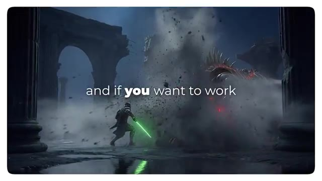
*Extrait vidéo généré par IA montrant un personnage en armure futuriste brandissant une épée laser verte dans des ruines antiques au milieu de poussière et de débris.*

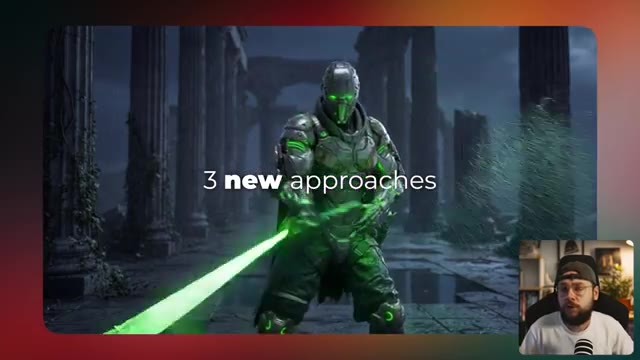
*Extrait vidéo généré par IA (avec incrustation PiP de Jack en bas à droite) montrant le personnage en armure futuriste de face dans des ruines antiques.*

---

### ⏱️ `[00:00:58 - 00:01:32]` | Segment #03

**🔊 Audio (Transcription Intégrale Mot pour Mot en Français) :**
> L'une d'elles est la méthode de la grille 2x2. Si vous voulez vous concentrer là-dessus, n'hésitez pas à naviguer avec les repères temporels ci-dessous pour passer directement à cette section. Une autre est liée à l'utilisation de générations provenant de plusieurs modèles vidéo au sein du même montage, tout en conservant un style visuel cohérent. Et enfin, une nouvelle approche du design de personnages que je pense utiliser pour tous mes projets à l'avenir. Je pense donc qu'il est logique de commencer par là. Maintenant, je ne sais pas pour vous, mais je pense que le plus difficile dans tout projet créatif, c'est de se lancer. Comment faites-vous

**👁️ Analyse Visuelle d'Écran (gemini-3.5-flash-lite) :**
**Interface & Outils** : Présentation vidéo avec incrustation PiP (Picture-in-Picture) du présentateur Jack dans le coin inférieur droit, illustrant les concepts évoqués avec des graphismes, des grilles d'images générées par IA et du texte dynamique à l'écran.

**Contenu textuel & Code** : Texte affiché à l'écran : "2x2 grid method", "VEO 3.1", "KLING 2.6", "new character design approach", "the hardest thing is getting started".

**Action / Démonstration** : Le présentateur introduit les différents sujets et méthodes abordés dans la vidéo (grille 2x2, utilisation de modèles multiples, nouveau design de personnages) tout en affichant des exemples visuels générés par IA et des titres animés.

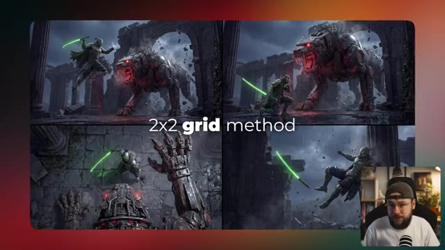
*Illustration de la méthode de la grille 2x2 montrant quatre angles de vue d'un combat entre un guerrier au sabre laser vert et une créature robotique dans des ruines antiques.*

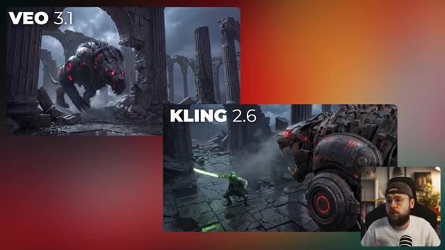
*Comparaison entre deux modèles vidéo, VEO 3.1 et KLING 2.6, illustrant la cohérence visuelle entre différents moteurs de génération.*

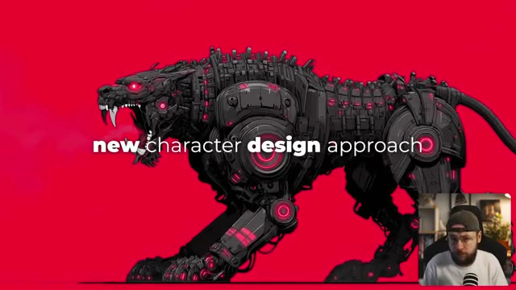
*Présentation d'un concept de design de personnage sur fond rouge, montrant un grand félin cybernétique avec des détails mécaniques et des lumières rouges.*

---

### ⏱️ `[00:01:32 - 00:02:04]` | Segment #04

**🔊 Audio (Transcription Intégrale Mot pour Mot en Français) :**
> pour commencer ? J'ai trouvé que la meilleure façon est d'établir un visuel clé. Ce sont donc deux à cinq images qui vous aideront à figer le personnage, le style, le lieu et des choses comme ça. Pour cette nouvelle méthode, j'ai donc commencé sur Midjourney. Et j'ai utilisé cet outil pour créer du concept art comme vous pouvez le voir à l'écran. Et la raison pour laquelle je fais cela plutôt que de générer directement vos personnages avec un outil comme Nano Banana Pro, c'est que Midjourney, malgré tous ses défauts,

**👁️ Analyse Visuelle d'Écran (gemini-3.5-flash-lite) :**
**Interface & Outils** : Navigateur web affichant l'interface de Midjourney (mode Create), avec une barre latérale à gauche, une barre de recherche en haut et un panneau de détails/prompts à droite.

**Contenu textuel & Code** : Texte du prompt visible sur l'image #3 : "A man in a black metal gear armor with a glowing green sword, in the style of shinichirō watanabe." Texte du prompt visible sur l'image #4 : "A huge part-cybernetic part-organic wolf-like beast in a black metal gear armor with red glowing eyes, and steam protruding from his mouth, in the style of shinichirō watanabe. Against a simple block colour bold red background."

**Action / Démonstration** : Le créateur navigue dans l'interface de Midjourney pour présenter des créations conceptuelles (concept art) de personnages et de créatures futuristes générées pour sa vidéo.

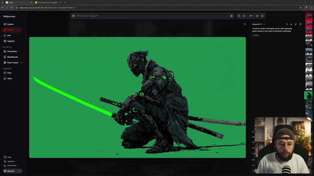
*Interface web de Midjourney montrant un guerrier cybernétique avec une épée verte lumineuse sur fond vert.*

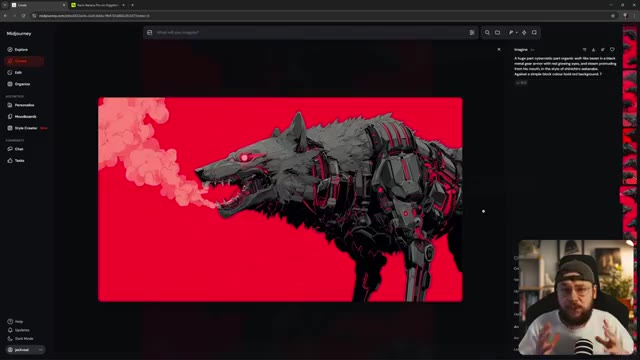
*Interface web de Midjourney montrant un animal cybernétique ressemblant à un loup sur fond rouge avec de la fumée sortant de sa gueule.*

---

### ⏱️ `[00:02:04 - 00:02:37]` | Segment #05

**🔊 Audio (Transcription Intégrale Mot pour Mot en Français) :**
> a tout simplement ce style unique et incroyable. Et je pense qu'à son tour, cela donne lieu à la génération de personnages vraiment mémorables au sein de cette plateforme. Donc, en réalité, nous revenons à une méthode éprouvée que vous verriez utilisée dans des productions plus traditionnelles. Je suis sûr que vous êtes conscients qu'une grande partie du temps, un artiste conceptuel est engagé pour concevoir des personnages et des décors lorsqu'il s'agit de films, de séries TV et même de jeux vidéo. Vous pouvez donc voir ici que j'utilise même la même approche pour créer le

**👁️ Analyse Visuelle d'Écran (gemini-3.5-flash-lite) :**
**Interface & Outils** : Interface web de Midjourney affichée dans un navigateur, avec le créateur visible en incrustation (PiP) dans le coin inférieur droit.

**Contenu textuel & Code** : Texte du prompt visible : "A huge part cybernetic part organic wolf-like beast in a black metal gear armor with red glowing eyes, and steam protruding from his mouth, in the style of shinichiro watanabe. Against a simple block colour bold red background."

**Action / Démonstration** : Le créateur montre l'interface de Midjourney et parcourt différentes variations générées d'un personnage de bête cybernétique pour illustrer sa méthode de conception.

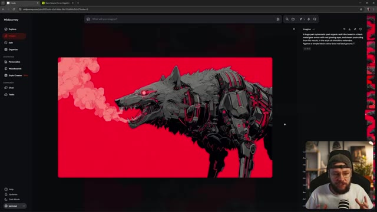
*Interface de Midjourney affichant une image agrandie d'une créature cybernétique inspirée d'un loup sur fond rouge vif avec le prompt textuel visible dans le panneau latéral.*

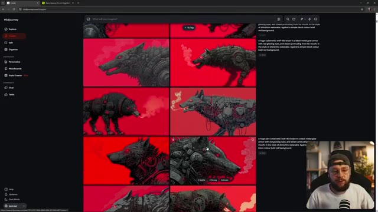
*Interface de Midjourney présentant une grille de résultats de génération d'images avec plusieurs variantes de la créature cybernétique sur fond rouge.*

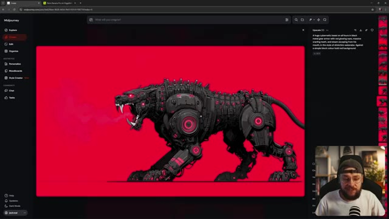
*Interface de Midjourney montrant une autre variante zoomée d'une créature cybernétique menaçante à quatre pattes sur fond rouge avec son prompt textuel détaillé.*

---

### ⏱️ `[00:02:37 - 00:03:02]` | Segment #06

**🔊 Audio (Transcription Intégrale Mot pour Mot en Français) :**
> bête. Et ce que j'ai fait, c'est que j'ai téléchargé ces images pour ensuite les transférer sur Higgsfield, qui est l'endroit où la majorité de nos générations ont eu lieu. C'est ici que nous avons créé tous les éléments de notre film fini. Et en utilisant cette image de référence et un prompt vraiment simple où j'ai juste tapé « rends cette image photoréaliste, pas d'illustration », on obtient ce design de personnage.

**👁️ Analyse Visuelle d'Écran (gemini-3.5-flash-lite) :**
**Interface & Outils** : Navigateur web affichant l'interface de Midjourney (Image 1) et l'interface de la plateforme Higgsfield (Image 2), avec un retour vidéo du créateur en incrustation (PiP) dans le coin inférieur droit.

**Contenu textuel & Code** : Image 1 : Illustration d'une bête cybernétique noire aux yeux rouges, avec le prompt visible dans le panneau latéral droit « A huge cybernetic beast on all fours in black metal gear armors with red glowing eyes, massive snarling tooth, and steam escaping from its mouth... ». Image 2 : Rendu de personnage de type samouraï futuriste tenant une épée verte brillante sur un toit sous la pluie, avec le prompt textuel « Make this image photo real, no illustration » visible dans le panneau latéral droit.

**Action / Démonstration** : Le créateur présente ses processus de génération d'images et de design de personnages en naviguant successivement sur Midjourney puis sur Higgsfield.

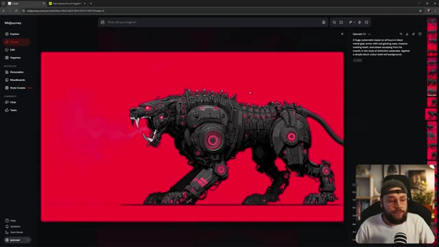
*Interface du navigateur Midjourney montrant une créature cybernétique noire sur fond rouge vif, avec le créateur en incrustation vidéo en bas à droite.*

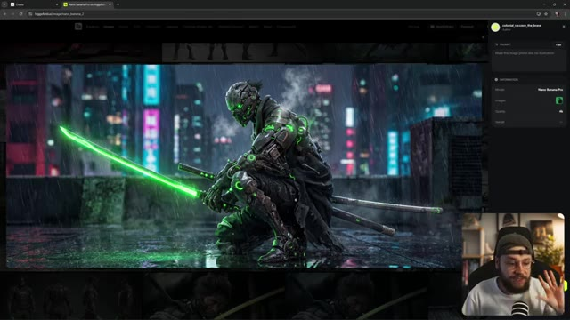
*Interface du site Higgsfield affichant un personnage cybernétique de type samouraï dans une ville futuriste sous la pluie avec une épée lumineuse verte, et le créateur en incrustation vidéo en bas à droite.*

---

### ⏱️ `[00:03:02 - 00:03:21]` | Segment #07

**🔊 Audio (Transcription Intégrale Mot pour Mot en Français) :**
> Et j'espère que vous conviendrez que c'est très unique, marquant et mémorable. Et c'est vraiment important pour notre personnage principal. Et j'ai pris l'illustration de la bête, en la faisant également passer dans Nano Banana Pro avec un prompt textuel très similaire pour obtenir cette image photoréaliste également.

**👁️ Analyse Visuelle d'Écran (gemini-3.5-flash-lite) :**
**Interface & Outils** : Navigateur web affichant l'application d'IA Higgsfield avec un panneau latéral droit pour les prompts et réglages (Nano Banana Pro), et le créateur visible en incrustation vidéo (PiP) dans le coin inférieur droit.

**Contenu textuel & Code** : Le panneau latéral indique le modèle "Nano Banana Pro" et le prompt "Make this image photo-real, no illustration. Realistic man-to-life textures, simple background."

**Action / Démonstration** : Le créateur montre et compare les différentes images générées par l'intelligence artificielle sur son écran.

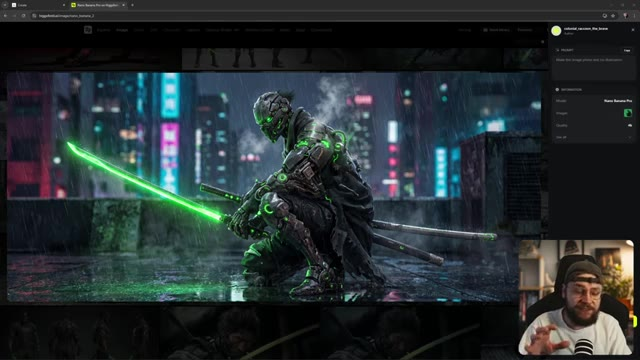
*Image précédente d'un guerrier cyberpunk accroupi avec une lame lumineuse verte sous la pluie.*

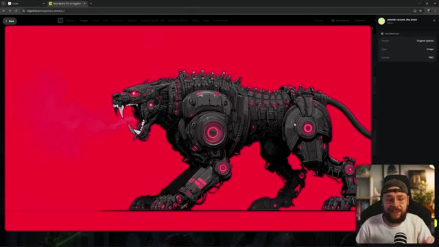
*Illustration originale d'une bête robotique menaçante avec des yeux rouges sur fond rouge uni.*

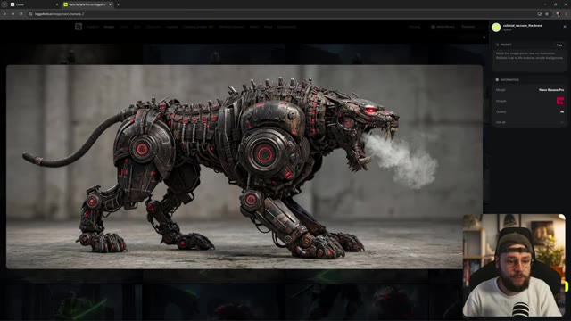
*Résultat photoréaliste de la bête robotique généré via Nano Banana Pro dans un décor industriel.*

---

### ⏱️ `[00:03:22 - 00:03:54]` | Segment #08

**🔊 Audio (Transcription Intégrale Mot pour Mot en Français) :**
> Donc ici, nous avons établi nos deux personnages principaux et créé de superbes références d'images au passage. Et j'ai continué à créer d'autres références de personnages également. Encore une fois en utilisant Nano Banana Pro, c'est le seul modèle d'image que j'ai utilisé pour tout ce projet. Je pense toujours que c'est le meilleur actuellement. Donc ici, nous combinons ces images initiales, notre référence de personnage de la bête ainsi que notre référence de personnage du guerrier. En les passant dans Nano Banana Pro avec un prompt textuel très simple pour montrer la bête et le guerrier dressés contre un simple dégradé.

**👁️ Analyse Visuelle d'Écran (gemini-3.5-flash-lite) :**
**Interface & Outils** : Interface web de Higgsfield (Nano Banana Pro) avec un panneau latéral de configuration, un panneau d'informations et une vue incrustée (PiP) du créateur.

**Contenu textuel & Code** : Texte du prompt visible dans le panneau latéral : « Show the beast and warrior stood against a simple gradient background, the warrior stood is only the height of the beast's knee ». Paramètre de modèle : « Nano Banana Pro ».

**Action / Démonstration** : Le créateur montre son écran de navigation sur l'interface de Higgsfield tout en expliquant le processus de combinaison des références de personnages pour générer une nouvelle image finale.

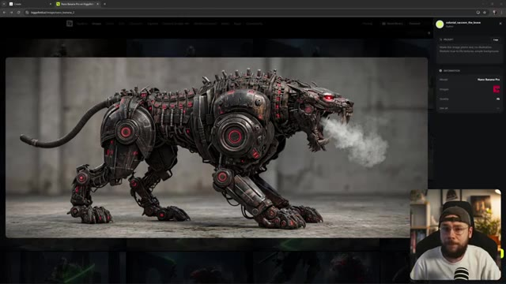
*Interface de Higgsfield montrant le modèle Nano Banana Pro avec la génération de la bête robotique.*

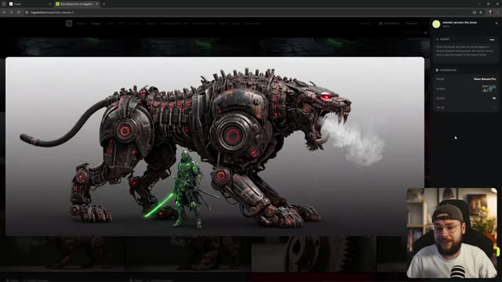
*Interface de Higgsfield montrant la combinaison des références de la bête et du guerrier avec un prompt textuel.*

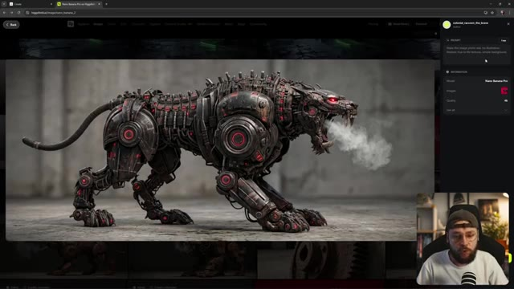
*Interface de Higgsfield affichant l'image détaillée de la bête robotique rugissante crachant de la vapeur.*

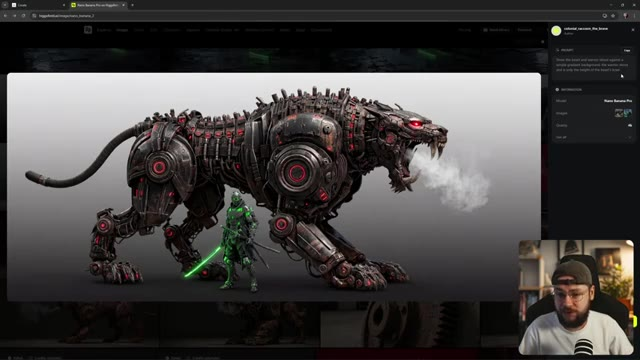
*Interface de Higgsfield affichant le résultat de la génération combinant la bête et le guerrier sur fond de dégradé.*

---

### ⏱️ `[00:03:54 - 00:04:28]` | Segment #09

**🔊 Audio (Transcription Intégrale Mot pour Mot en Français) :**
> arrière-plan. Le guerrier est debout et n'atteint que la hauteur du genou de la bête. Cela sert donc ici de référence d'échelle très importante. Et vous pouvez voir ici que j'ai également utilisé Nano Banana Pro pour créer ces fiches de personnages. C'est là que nous demandons au modèle d'image de prendre la référence du personnage et de montrer la bête sous différents angles. Et bien sûr, j'ai fait de même pour le guerrier. Celles-ci servent donc de références d'image très pratiques lorsque nous allons générer chacune des images qui servent de cadres de départ pour tous nos plans. Et

**👁️ Analyse Visuelle d'Écran (gemini-3.5-flash-lite) :**
**Interface & Outils** : Nano Banana Pro et visionneuse d'images de bureau.

**Contenu textuel & Code** : Texte du prompt visible sur l'image 1 : "Show the beast and warrior stood against a simple gradient background; the warrior stood and is only the height of the beast's knee." Titres jaunes sur les images 2, 3 et 4 : "THE BEAST REFERENCE" et "THE WARRIOR REFERENCE".

**Action / Démonstration** : Le créateur montre les illustrations de référence de taille et les fiches de personnages (character sheets) générées par IA pour la bête et le guerrier.

*Interface de Nano Banana Pro affichant une image générée d'un guerrier cyborg à côté d'une bête robotique géante, avec le panneau de prompt à droite.*

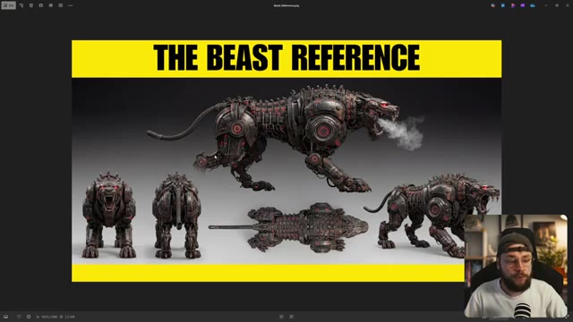
*Visualiseur d'images affichant une planche de référence de la bête robotique sous différents angles, titrée "THE BEAST REFERENCE".*

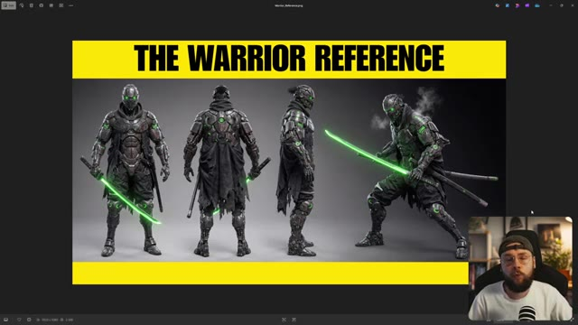
*Visualiseur d'images affichant une planche de référence du guerrier cyborg sous différents angles, titrée "THE WARRIOR REFERENCE".*

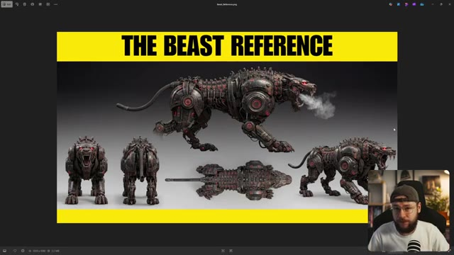
*Visualiseur d'images affichant à nouveau la planche de référence de la bête robotique ("THE BEAST REFERENCE").*

---

### ⏱️ `[00:04:28 - 00:05:06]` | Segment #10

**🔊 Audio (Transcription Intégrale Mot pour Mot en Français) :**
> ce qui nous amène bien sûr joliment à cette étape du processus. Donc ici, vous pouvez voir que j'ai généré le tout premier plan de notre séquence. En termes de référence d'image, j'ai juste utilisé cette référence de personnage ici et nous avons cette invite assez longue qui établit le genre de posture de notre personnage ainsi que l'emplacement. Et ce que nous faisons ici avec ces plans initiaux, c'est de commencer à accumuler un peu de tension. Vraiment un plan super sympa ici aussi où la fusée éclairante monte dans le ciel. J'adore la façon dont cela a éclairé toutes ces gouttes de pluie individuelles. Vraiment super. Donc vous pouvez voir

**👁️ Analyse Visuelle d'Écran (gemini-3.5-flash-lite) :**
**Interface & Outils** : Interface web de Higgsfield AI (création d'images/vidéos).

**Contenu textuel & Code** : Texte du prompt visible : "Show Link exploring a dark mysterious ancient temple from the world of Zelda. Dark environment with the sword glowing, he has a fierce expression. Have Link on the right side of the screen with empty space on the left. Cinematic composition, photo real, 8K skin texture." Paramètres du modèle Nano Banana Pro.

**Action / Démonstration** : Navigation et présentation des différents plans générés et des prompts utilisés pour créer la séquence narrative de la vidéo.

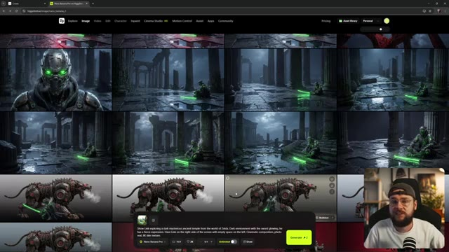
*Grille de vignettes de génération d'images sur l'interface de Higgsfield montrant différentes poses d'un personnage cyborg dans un temple en ruines sous la pluie.*

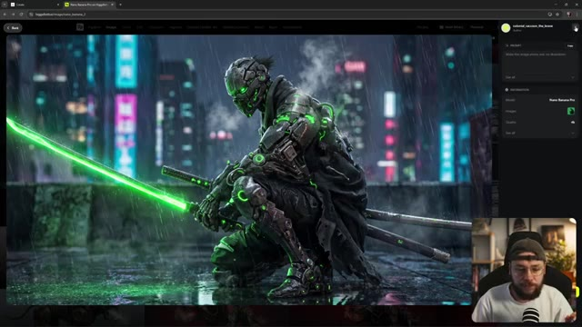
*Gros plan sur une image générée d'un personnage cyborg futuriste armé d'un katana lumineux vert accroupi sous la pluie dans un décor urbain cyberpunk.*

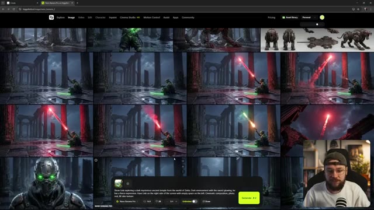
*Grille de vignettes sur Higgsfield montrant la progression d'un personnage tirant une fusée éclairante rouge et verte dans un temple antique.*

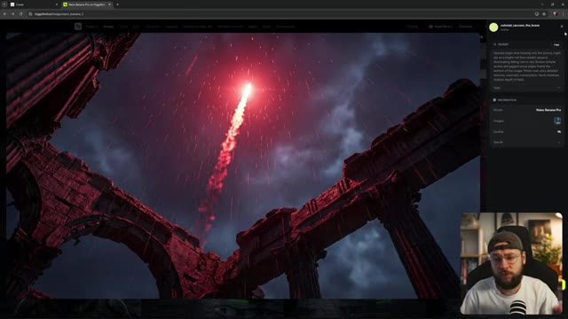
*Gros plan de la fusée éclairante rouge tirée vers le ciel nocturne à travers les arches en ruine d'un temple, illuminant les gouttes de pluie.*

---

### ⏱️ `[00:05:06 - 00:05:38]` | Segment #11

**🔊 Audio (Transcription Intégrale Mot pour Mot en Français) :**
> À ce stade du processus, j'utilise plutôt un flux de production d'IA traditionnel où nous générons simplement chaque image individuellement. Ce qui est nouveau, c'est quand nous sommes entrés dans la séquence de combat plus tard et que nous avons commencé à générer ces grilles de deux par deux. C'est donc une méthode qui a été partagée par PJ Ace et qu'il a utilisée pour sa bande-annonce interdite aux moins de 18 ans de Legend of Zelda. Je vous encourage vraiment à aller jeter un œil à ça. C'est un travail vraiment impressionnant. Alors pourquoi utiliser cette

**👁️ Analyse Visuelle d'Écran (gemini-3.5-flash-lite) :**
**Interface & Outils** : Navigateur web affichant une application de génération d'images par IA avec grille de résultats, options de format, curseurs et champ de prompt textuel (Nano Banana Pro sur Higgsfield), ainsi qu'un lecteur vidéo présentant des extraits du projet de PJ Ace.

**Contenu textuel & Code** : Texte du prompt visible : "Show Link exploring a dark mysterious ancient temple from the world of Zelda. Dark environment with the sword glowing, he has a fierce expression..." Paramètres visibles : rapport d'aspect 16:9, modèle Nano Banana Pro. Crédit Instagram/réseau social @pjacefilms.

**Action / Démonstration** : Le créateur montre l'interface de génération d'images en grille 2x2, puis présente des exemples de clips issus de la bande-annonce de PJ Ace pour illustrer sa méthode de travail.

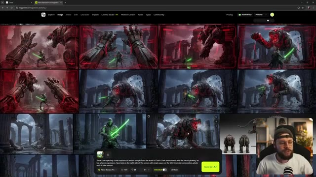
*Interface d'un générateur d'images montrant une grille d'images inspirées de Zelda avec Link et une bête mécanique dans un temple ancien.*

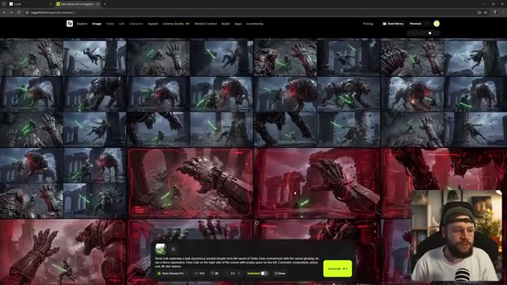
*Interface du générateur montrant une grille détaillée de plans d'action avec des cadrages multiples et des interfaces de visée rouges.*

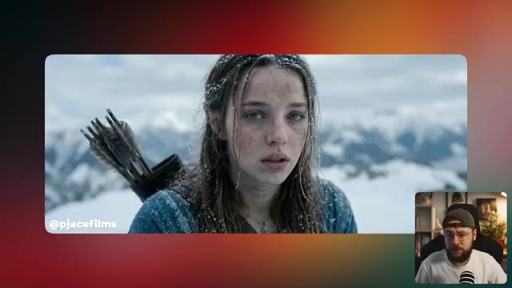
*Extrait vidéo cinématique montrant un personnage féminin avec des flèches dans un paysage enneigé, avec le crédit @pjacefilms.*

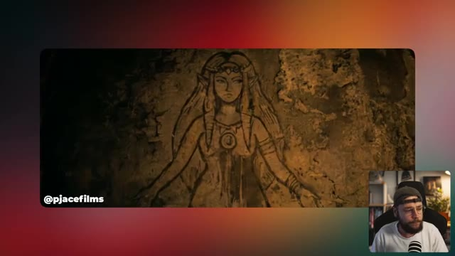
*Extrait vidéo montrant une fresque murale représentant un personnage de type Zelda, avec le crédit @pjacefilms.*

---

### ⏱️ `[00:05:38 - 00:06:17]` | Segment #12

**🔊 Audio (Transcription Intégrale Mot pour Mot en Français) :**
> l'approche a-t-elle seulement de l'importance ? Eh bien, cela signifie que nos images sont créées dans un ensemble plutôt qu'isolées. Parce que chaque panneau de storyboard est créé au sein de la même génération, cela conduit à un plus grand sens de la continuité et de la cohérence. Alors, comment procéder pour créer ces grilles de deux par deux ? Je vais juste aller de l'avant et me déplacer ici pour ne rien bloquer. La première partie du processus consiste à verrouiller nos références d'images. Vous pouvez donc voir ici que nous avons utilisé la feuille de personnage du guerrier, ainsi que celle de la bête. Et puis l'une de mes générations précédentes pour montrer la notion d'échelle.

**👁️ Analyse Visuelle d'Écran (gemini-3.5-flash-lite) :**
**Interface & Outils** : Navigateur web affichant l'interface de l'outil de génération d'images/vidéos Higgsfield AI, avec un panneau latéral de configuration et un affichage incrusté (PiP) du présentateur en bas.

**Contenu textuel & Code** : Interface utilisateur de Higgsfield AI avec des panneaux de contrôle à droite (paramètres de modèle, images de référence, options de téléchargement, boutons Upscale et Download), et des illustrations générées par IA représentant un guerrier au sabre laser vert affrontant un cyborg-bête géant dans des ruines en ruine sous la pluie.

**Action / Démonstration** : Le créateur montre à l'écran une grille de génération d'images 2x2 (puis zoome sur une image spécifique) pour expliquer comment utiliser les références d'images et assurer la cohérence visuelle dans le storyboard.

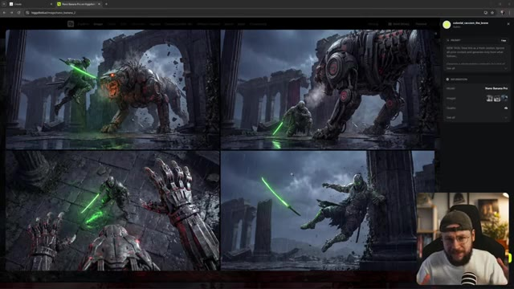
*Interface de l'outil de génération affichant une grille 2x2 de storyboards avec des scènes d'action entre un guerrier et une bête mécanique dans des ruines antiques, avec la vidéo PiP du créateur en bas à droite.*

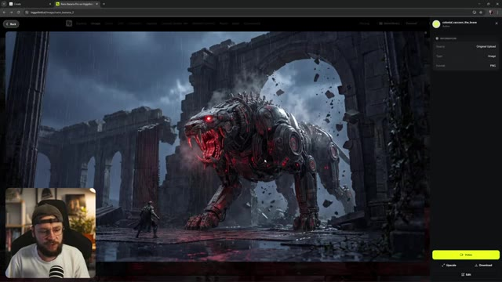
*Interface de l'outil de génération affichant une image agrandie d'une bête mécanique rugissante face à un guerrier dans des ruines, avec la vidéo PiP du créateur en bas à gauche.*

---

### ⏱️ `[00:06:17 - 00:06:51]` | Segment #13

**🔊 Audio (Transcription Intégrale Mot pour Mot en Français) :**
> ainsi que l'emplacement. Et ce qui est vraiment important pour cette méthode, c'est le prompt textuel lui-même. C'est donc un prompt textuel assez long. Nous allons donc le décomposer en sections individuelles. La première moitié pose en quelque sorte ce cadre et est presque directement tirée du prompt de PJ Ace. Et la seconde moitié est l'endroit où j'ai décrit l'action que je veux voir se produire dans chaque panneau de storyboard individuel. Dans l'exemple de PJ Ace, il décrivait en quelque sorte l'action dans un sens assez large et général. Ici, je voulais essayer quelque chose d'un peu

**👁️ Analyse Visuelle d'Écran (gemini-3.5-flash-lite) :**
**Interface & Outils** : Navigateur web affichant l'interface de génération d'images/vidéos (type Higgsfield) avec panneau latéral de prompt et une incrustation vidéo du créateur (PiP).

**Contenu textuel & Code** : Textes de prompts structurés par plans numérotés (FRAME 1, FRAME 2, FRAME 3, FRAME 4) décrivant des plans serrés, des actions de combat avec un sabre/katana vert néon et une bête cybernétique dans un temple en ruines sous la pluie.

**Action / Démonstration** : Le créateur montre l'interface de l'outil IA avec une grille de 4 variations d'images et détaille la structure textuelle de son prompt de storyboard divisé en plusieurs cadres (frames).

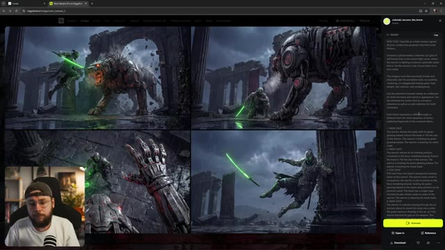
*Interface de l'outil de génération montrant une grille de 4 images de combat entre un guerrier et une bête cybernétique, avec le créateur en incrustation (PiP).*

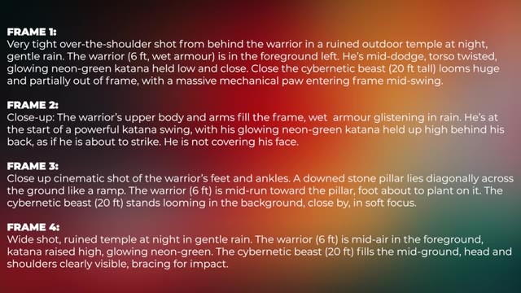
*Diapositive textuelle présentant le découpage détaillé du prompt par 'Frame' (Frame 1 à Frame 4) avec des descriptions de plans précis.*

*Interface de l'outil de génération montrant à nouveau la grille de 4 images de combat et le panneau de texte du prompt à droite.*

---

### ⏱️ `[00:06:51 - 00:07:27]` | Segment #14

**🔊 Audio (Transcription Intégrale Mot pour Mot en Français) :**
> un peu différent, être très précis sur ce que je voulais que Nano Banana Pro crée. Et j'ai eu pas mal d'aide ici de la part de ChatGPT également. Vous pouvez voir une conversation vraiment très longue ici. J'ai essayé le prompting JSON à un moment donné également, mais j'ai vraiment trouvé que cette méthode de grille de deux par deux est vraiment, vraiment super. Comme vous pouvez le voir, je l'ai seulement utilisée avec la séquence de combat. J'étais un peu sceptique, je vais être honnête au début, mais je suis vraiment content de l'avoir intégrée dans mon flux de travail pour ce projet et je l'utiliserai certainement à l'avenir également. Et une fois

**👁️ Analyse Visuelle d'Écran (gemini-3.5-flash-lite) :**
**Interface & Outils** : Navigateur web affichant l'interface d'un outil de génération vidéo (type Higgsfield) et l'interface de ChatGPT, avec le flux vidéo du créateur en PiP.

**Contenu textuel & Code** : Sur l'image 1 : Une grille 2x2 d'images générées montrant différentes scènes d'un combat entre un guerrier et une bête cybernétique, avec le panneau latéral droit contenant un prompt textuel détaillé et des paramètres. Sur l'image 2 : Interface de ChatGPT (version "ChatGPT 5.2 Thinking") affichant des instructions détaillées sur les plans, les mouvements de caméra et des images de prévisualisation.

**Action / Démonstration** : Le créateur montre son flux de travail combinant un outil de génération d'images en grille 2x2 et des prompts textuels complexes générés via ChatGPT pour une séquence de combat.

*Interface d'un outil de génération vidéo par IA montrant une grille 2x2 avec une séquence de combat entre un guerrier au sabre laser vert et une gigantesque bête mécanique, et le créateur en incrustation vidéo (PiP).*

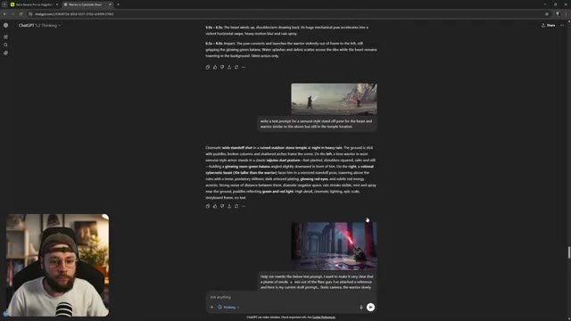
*Interface de ChatGPT montrant de longs échanges de prompts pour concevoir la séquence de combat, avec le créateur en incrustation vidéo (PiP) dans le coin inférieur gauche.*

---

### ⏱️ `[00:07:27 - 00:07:51]` | Segment #15

**🔊 Audio (Transcription Intégrale Mot pour Mot en Français) :**
> Légère modification que j'ai apportée à ce flux de travail est que j'ai demandé à ChatGPT avec cette invite ici d'écrire des invites textuelles pour chacun des quatre panneaux de storyboard individuels. Mais je lui ai en fait demandé de m'écrire une invite textuelle pour l'image, puis une invite textuelle séparée pour la génération vidéo que j'utiliserais pour animer chaque panneau individuel plus tard. Nous y reviendrons donc plus tard dans la vidéo.

**👁️ Analyse Visuelle d'Écran (gemini-3.5-flash-lite) :**
**Interface & Outils** : Interface web de ChatGPT en mode sombre avec affichage de prompts et de réponses textuelles structurées, incluant une incrustation PiP du présentateur.

**Contenu textuel & Code** : Textes de prompts détaillés pour le storyboard, incluant des descriptions de plans cinématographiques ("Panel 1 (Top-Left)", "Starting-frame", "Video prompt") et des consignes techniques pour l'IA.

**Action / Démonstration** : Le créateur montre son écran de travail avec ChatGPT, défilant à travers les prompts textuels générés pour les panneaux du storyboard avant de passer à un gros plan textuel explicatif.

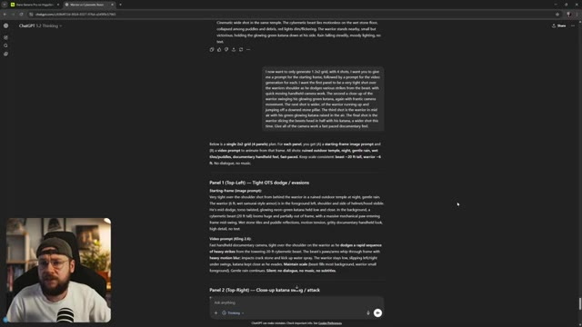
*Interface de ChatGPT affichant les prompts de génération pour les différents panneaux du storyboard, avec une incrustation vidéo du créateur dans le coin inférieur gauche.*

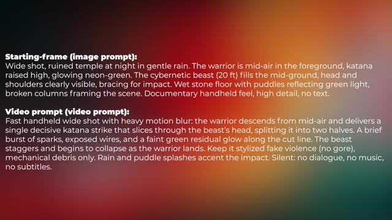
*Gros plan textuel sur fond dégradé rouge et orange détaillant les prompts de l'image de départ (Starting-frame) et de la vidéo (Video prompt).*

---

### ⏱️ `[00:07:51 - 00:08:12]` | Segment #16

**🔊 Audio (Transcription Intégrale Mot pour Mot en Français) :**
> Donc, en ce qui concerne la génération d'images, ce que je demande essentiellement à ChatGPT de faire, c'est d'écrire un prompt pour décrire un moment clé dans chaque morceau d'action. Et ensuite, le prompt vidéo est ce que nous allons appliquer pour animer chacun de ces panneaux. Et j'ai constaté que cela rendait l'ensemble du flux de travail beaucoup plus fonctionnel.

**👁️ Analyse Visuelle d'Écran (gemini-3.5-flash-lite) :**
**Interface & Outils** : Interface web de ChatGPT (ChatGPT 5.2 Thinking) sur navigateur, avec incrustation vidéo du créateur (Picture-in-Picture) en bas à gauche.

**Contenu textuel & Code** : Texte du prompt dans ChatGPT décrivant une grille 2x2 avec 4 plans (Starting frame image prompt et Video prompt pour chaque panneau : "Panel 1 (Top-Left) - Tight OTS dodge / evasions", etc.).

**Action / Démonstration** : Le créateur démontre l'utilisation de ChatGPT pour générer des prompts structurés pour des grilles d'images et des animations vidéo.

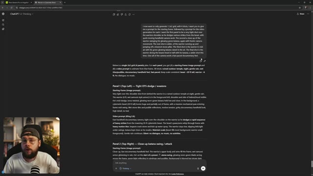
*Interface de ChatGPT affichant un long prompt détaillé et la réponse générée avec la structure des panneaux, tandis que le créateur apparaît en bas à gauche.*

---

### ⏱️ `[00:08:12 - 00:08:42]` | Segment #17

**🔊 Audio (Transcription Intégrale Mot pour Mot en Français) :**
> Donc une fois que vous êtes satisfait de votre grille de deux par deux, celle-ci est celle que j'ai finalement utilisée. Ce que vous voulez faire, c'est recadrer chacun de ces plans individuellement. Vous pouvez donc utiliser quelque chose comme Photoshop ou Canva si vous voulez utiliser un outil gratuit. Vous pouvez donc voir ici que nous avons le cadre un, le cadre deux, le cadre trois et le cadre quatre. Et ce que vous remarquerez peut-être aussi, c'est que nous perdons beaucoup de fidélité visuelle. Notre image a l'air plutôt douce, pas très nette. Les textures sont devenues un peu bizarres.

**👁️ Analyse Visuelle d'Écran (gemini-3.5-flash-lite) :**
**Interface & Outils** : Navigateur web (Higgsfield), Explorateur de fichiers Windows, Visionneuse d'images Windows.

**Contenu textuel & Code** : Interface Higgsfield avec le prompt : "Generate a photorealistic cinematic 2x2 grid of still frames from a live action fight scene, where the warrior is fighting a massive cybernetic beast that is significantly larger than him. Ensure there is a very cinematic..." et le modèle Nano Banana Pro. Fichiers nommés "FIGHT SCENE FRAME 1.png", "FIGHT SCENE FRAME 2.png", etc.

**Action / Démonstration** : Le créateur montre la grille 2x2 d'images générées, puis navigue dans ses dossiers pour présenter le recadrage individuel des différents plans (frames 1 à 4) pour analyser la perte de fidélité visuelle et de netteté des textures.

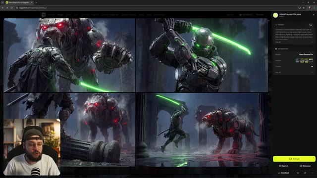
*Grille 2x2 générée montrant un guerrier cyborg affrontant une énorme bête cybernétique avec des épées laser vertes et des yeux rouges lumineux.*

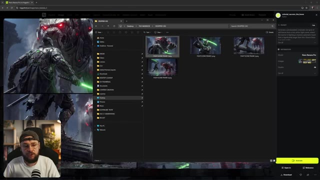
*Explorateur de fichiers Windows affichant les images recadrées individuellement (Frame 1 à 4) extraites de la grille 2x2.*

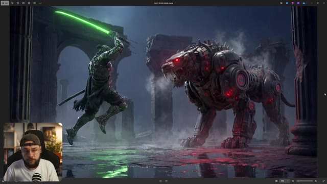
*Visualiseur d'image montrant le plan recadré individuel (cadre 4) du guerrier cyborg sautant face à la bête cybernétique.*

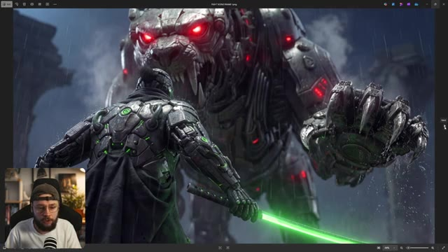
*Visualiseur d'image montrant le plan recadré individuel (cadre 1) en gros plan du guerrier de dos face à la griffe de la bête cybernétique.*

---

### ⏱️ `[00:08:42 - 00:09:14]` | Segment #18

**🔊 Audio (Transcription Intégrale Mot pour Mot en Français) :**
> Et cela, bien sûr, est dû au fait que nous recadrons notre génération 4K. La prochaine étape du processus que PJ Ace a partagée est de passer chacune d'elles dans Nano Banana Pro pour les rééchantillonner efficacement (upscale). Et encore une fois, j'ai expérimenté une légère variation de son flux de travail ici en utilisant ce plan particulier. Donc, si je vous montre le prompt de rééchantillonnage de PJ Ace, il se trouve ici dans le coin supérieur droit. Vous pouvez voir qu'il est très précis quant à la préservation de la composition exacte, du cadrage, de l'angle de caméra.

**👁️ Analyse Visuelle d'Écran (gemini-3.5-flash-lite) :**
**Interface & Outils** : Interface web de Nano Banana Pro (outil de génération et d'upscale d'images par IA).

**Contenu textuel & Code** : Panneau latéral droit affichant le prompt de rééchantillonnage de PJ Ace : "Preserve the exact composition, framing, camera angle, colour grade and subject placement — do not alter or add new elements...". En bas à gauche, incrustation vidéo du créateur Jack dans son studio.

**Action / Démonstration** : Le créateur montre la grille de vignettes dans Nano Banana Pro, puis zoome sur un plan spécifique et zoome sur le panneau latéral droit pour afficher le prompt exact d'upscale.

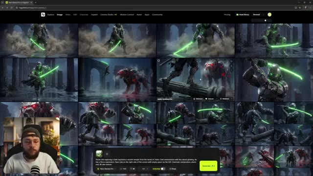
*Capture d'écran de l'interface web de Nano Banana Pro affichant une galerie de vignettes d'images générées avec un panneau de prompt visible en bas.*

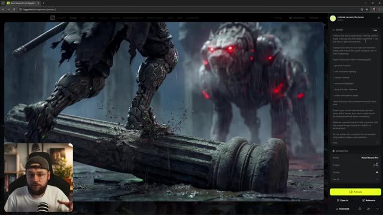
*Gros plan sur l'interface de Nano Banana Pro montrant un plan détaillé de la scène avec le prompt d'upscale affiché dans le panneau latéral droit.*

---

### ⏱️ `[00:09:14 - 00:09:40]` | Segment #19

**🔊 Audio (Transcription Intégrale Mot pour Mot en Français) :**
> en disant de ne pas altérer ou ajouter de nouveaux éléments, et en fait ce prompt fonctionne vraiment très bien. Donc voici notre image recadrée, et si je passe rapidement à notre génération Nano Banana Pro, elle est vraiment très nette et les textures ont l'air vraiment réalistes et agréables. Cependant, la légère variation est que nous pouvons également aller de l'avant et demander à Nano Banana Pro d'apporter des modifications si nous en avons besoin.

**👁️ Analyse Visuelle d'Écran (gemini-3.5-flash-lite) :**
**Interface & Outils** : Interface web de l'outil de génération d'images/vidéos basé sur l'IA (semblable à Higgsfield) avec un panneau de prompt à droite, ainsi qu'une visionneuse d'images de bureau.

**Contenu textuel & Code** : Texte du prompt visible dans le panneau latéral : "Preserve the exact composition, framing, camera angle, colour grade and subject placement — do not alter or add new elements..." et "Model: Nano Banana Pro". En bas de la dernière image, un prompt textuel décrivant une exploration de temple sombre.

**Action / Démonstration** : Le présentateur démontre l'utilisation de l'outil Nano Banana Pro, en montrant les résultats d'une image générée, recadrée et affinée avec des textures réalistes, puis présente la possibilité d'apporter des variations.

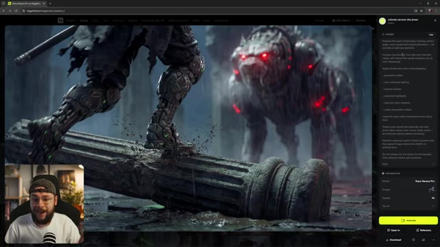
*Interface de l'outil de génération affichant une image détaillée d'un guerrier cyborg faisant face à une bête robotique menaçante avec des yeux rouges, accompagnée d'un panneau latéral contenant les paramètres et instructions de prompt.*

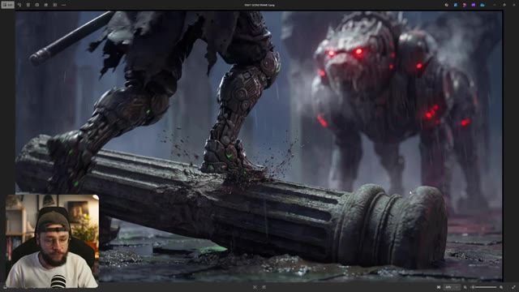
*Visionneuse de fichiers montrant une image recadrée d'une scène de combat détaillée ("FIGHT SCENE FRAME 1.png").*

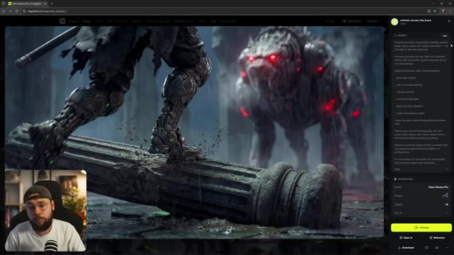
*Retour à l'interface de l'outil de génération montrant l'image finale générée par Nano Banana Pro, nette et texturée.*

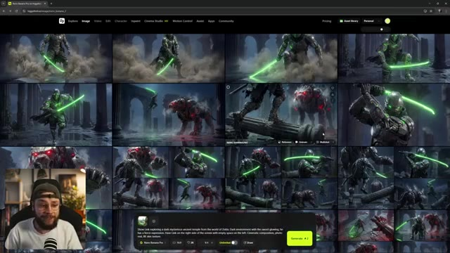
*Galerie complète de l'application montrant une grille de multiples images générées par IA sur le thème de la science-fiction et du combat, avec une invite textuelle visible en bas.*

---

### ⏱️ `[00:09:40 - 00:09:58]` | Segment #20

**🔊 Audio (Transcription Intégrale Mot pour Mot en Français) :**
> Donc par exemple avec l'avant-dernier plan, malgré l'intégration des références d'échelle, c'est toujours incorrect. Le guerrier semble presque de la même taille que la bête ou du moins, on dirait qu'il est très près de la caméra et que la bête est loin. Ça ne fonctionne tout simplement pas comme composition ici.

**👁️ Analyse Visuelle d'Écran (gemini-3.5-flash-lite) :**
**Interface & Outils** : Visionneuse d'images système (avec le créateur en incrustation PiP en bas à gauche)

**Contenu textuel & Code** : Image générée par IA montrant un guerrier futuriste avec une lame lumineuse verte faisant face à un grand félin robotique aux yeux rouges, dans un décor de ruines antiques sous la pluie. Le titre du fichier dans la barre supérieure indique "FIGHT SCENE FRAME - Xpeng".

**Action / Démonstration** : Le plan de l'avant-dernière image est affiché à l'écran pendant que le créateur commente les problèmes d'échelle et de composition.

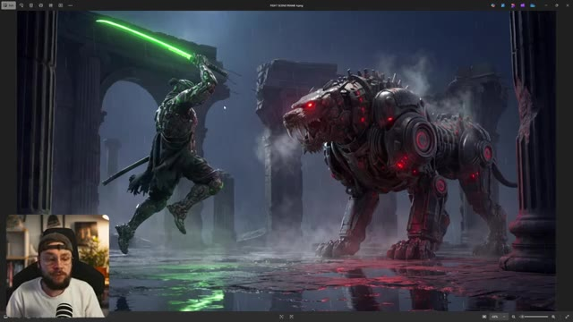
*Visionneuse d'images affichant un plan de combat entre un guerrier au sabre laser vert et une gigantesque bête robotique au milieu de ruines, avec le créateur en incrustation PiP en bas à gauche.*

---

### ⏱️ `[00:09:59 - 00:10:36]` | Segment #21

**🔊 Audio (Transcription Intégrale Mot pour Mot en Français) :**
> Donc ce que j'ai fait, c'est que j'ai légèrement modifié le prompt textuel et j'ai dit : préserver exactement la composition, le cadrage, l'angle de caméra, la palette de couleurs et le placement du sujet, et n'altérer que ce qui suit. Mettre le guerrier beaucoup plus haut dans le ciel, plus près de la bête et faire en sorte que le guerrier fasse la moitié de sa taille actuelle. On est donc passés de ça à ça, ce qui correspond exactement à ce que je recherchais. Et encore une fois, c'est vraiment la chose formidable avec la réalisation de films par IA et les créateurs qui montrent leurs flux de travail, c'est que nous sommes capables de faire ces itérations les uns à partir des autres. Et je dois dire que je trouve ce flux de travail incroyablement puissant. Je vous recommande vraiment d'essayer, les gars, mais

**👁️ Analyse Visuelle d'Écran (gemini-3.5-flash-lite) :**
**Interface & Outils** : Interface web d'un outil de génération d'images/vidéos par IA (type Higgsfield ou similaire) avec panneau latéral de prompts (Prompt, Information, Model : Nano Banana Pro) et retour vidéo/image principal, avec la webcam du créateur en incrustation (PiP) dans le coin inférieur gauche.

**Contenu textuel & Code** : Texte du prompt visible dans le panneau latéral : "Preserve the exact composition framing camera angle, color grade and subject placement only alter the below. Have the warrior much higher in the sky, closer to the beast and make the warrior half the size he is now."

**Action / Démonstration** : Le créateur montre son écran de travail et navigue dans l'interface pour illustrer la modification itérative de ses prompts textuels entre différentes versions d'images générées.

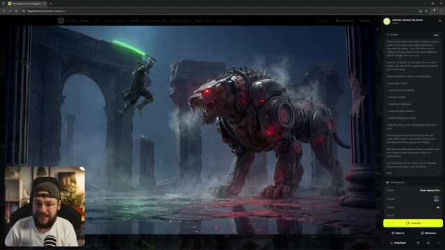
*Interface de l'outil de génération montrant une image principale avec un guerrier sautant vers une bête cybernétique au milieu de ruines, avec le panneau de prompt textuel sur le côté droit.*

*Interface affichant une grille de quatre variantes d'images issues d'itérations du flux de travail de génération par IA.*

---

### ⏱️ `[00:10:36 - 00:11:14]` | Segment #22

**🔊 Audio (Transcription Intégrale Mot pour Mot en Français) :**
> Gardez simplement à l'esprit que, par exemple, si trois de vos quatre panneaux de storyboard ont l'air vraiment bien et que le quatrième n'est pas tout à fait correct, vous pouvez continuer et recadrer celui-ci, pas seulement l'améliorer, mais aussi apporter des modifications à la composition. Rien de tout cela n'est gravé dans le marbre. Vous avez vraiment la possibilité de faire ces améliorations vraiment sympathiques. Ainsi, au fur et à mesure que je fais défiler, vous pouvez voir qu'il s'agissait simplement de générer chacun des plans individuels pour aller du point A, le début du combat, au point B, là où la bête est vaincue. Il y a des plans là-dedans que j'ai fini par ne pas utiliser.

**👁️ Analyse Visuelle d'Écran (gemini-3.5-flash-lite) :**
**Interface & Outils** : Navigateur web affichant l'interface de l'outil de génération vidéo et d'images par IA Higgsfield (Nano Banana Pro), avec le créateur visible en incrustation vidéo (PiP) dans le coin inférieur gauche.

**Contenu textuel & Code** : Panneaux de storyboard générés par IA illustrant une scène de combat de type science-fiction / cyberpunk entre un guerrier armé d'une épée lumineuse verte et une gigantesque bête robotique dans des ruines antiques. Panneau de droite affichant le champ PROMPT et les paramètres de modèle (Nano Banana Pro).

**Action / Démonstration** : Le créateur démontre la génération d'une série de plans de storyboard pour une séquence de combat, illustrant la création des différentes étapes de l'affrontement entre le point A et le point B.

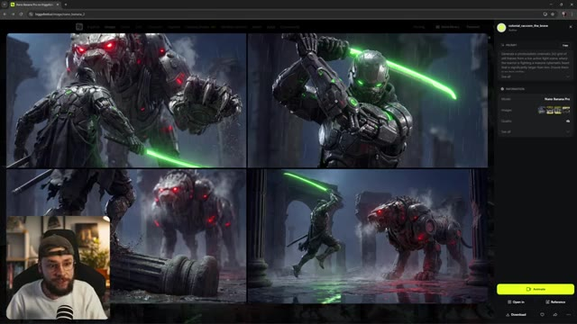
*Interface de Higgsfield montrant une grille de 4 images générées représentant un guerrier avec une épée laser verte face à une bête cybernétique.*

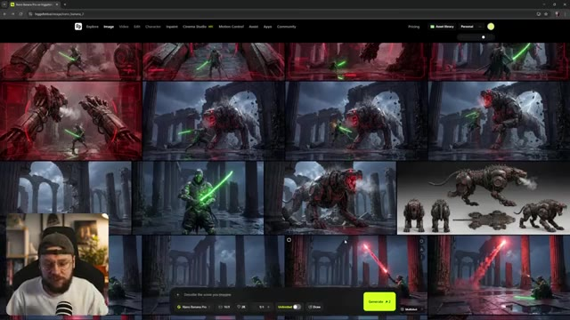
*Interface de Higgsfield montrant une vue d'ensemble avec de nombreux plans de storyboard générés pour la séquence de combat.*

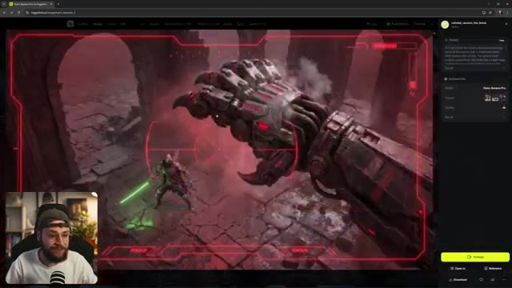
*Interface de Higgsfield affichant un plan détaillé en gros plan d'un combat avec une interface de visée rouge futuriste.*

---

### ⏱️ `[00:11:14 - 00:11:47]` | Segment #23

**🔊 Audio (Transcription Intégrale Mot pour Mot en Français) :**
> ce genre de plan avec un ATH rouge par exemple, j'ai juste trouvé que ça ne collait pas vraiment. J'ai aussi un peu expérimenté avec ce genre de vue plongeante, différents angles de caméra. Ce que j'ai découvert, c'est que lorsque j'ai animé cela avec un modèle vidéo, ça ressemblait un peu trop à un jeu vidéo et ce n'est pas ce que je recherchais, je voulais un film vraiment cinématographique, mais mon processus général consiste simplement à faire une liste des plans pour lesquels je dois générer les images, et ensuite, une fois que c'est fait, nous pouvons passer à l'étape suivante du processus qui est bien sûr

**👁️ Analyse Visuelle d'Écran (gemini-3.5-flash-lite) :**
**Interface & Outils** : Navigateur web affichant l'interface de la plateforme de génération d'images et de vidéos par IA Higgsfield.

**Contenu textuel & Code** : On peut apercevoir des grilles d'images générées d'inspiration science-fiction (combattants avec épées laser, créatures robotiques géantes, ruines antiques). Le panneau de droite indique le prompt : "Show a bird's-eye view looking directly down at this scene" avec des paramètres de modèle comme "Nano Banana Pro".

**Action / Démonstration** : Le créateur montre son processus de sélection et d'expérimentation d'images générées par IA sous différents angles (ATH rouge, vue plongeante) avant de les animer.

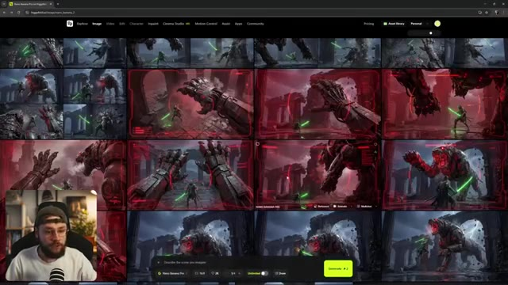
*Interface de Higgsfield montrant une grille d'images générées avec une interface de type ATH (HUD) rouge.*

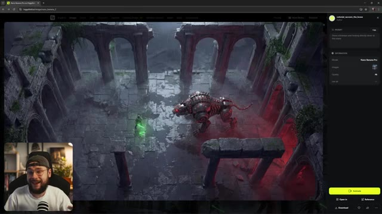
*Vue détaillée sur l'interface de Higgsfield montrant une image en contre-plongée aérienne d'un personnage avec une épée laser face à une créature robotique dans des ruines pluvieuses.*

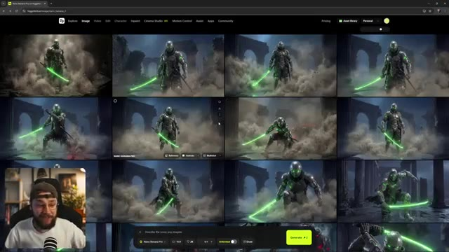
*Grille d'images générées sur Higgsfield représentant un personnage en armure futuriste avec une lame lumineuse verte dans un environnement enfumé.*

---

### ⏱️ `[00:11:47 - 00:12:22]` | Segment #24

**🔊 Audio (Transcription Intégrale Mot pour Mot en Français) :**
> animer chacun de ces plans individuels. Donc pour faire ça sur Higgsfield, nous sommes de retour sur la page d'accueil ici et allons tout en haut à gauche, il y a l'onglet vidéo et cliquez sur créer une vidéo et je pense qu'on peut dire que Kling 2.6 est le meilleur modèle vidéo IA sur le marché en ce moment, non seulement il crée des plans cinématiques et dynamiques vraiment incroyables, mais vous obtenez également un son natif intégré à vos générations et pour la grande majorité de ce film, Kling 2.6 était ce que j'ai utilisé je

**👁️ Analyse Visuelle d'Écran (gemini-3.5-flash-lite) :**
**Interface & Outils** : Interface web de Higgsfield (higgsfield.ai) avec le panneau de création vidéo et les paramètres de Kling 2.6.

**Contenu textuel & Code** : Menus de navigation (Explore, Image, Video, Edit, Character, Inpaint, Cinema Studio, Motion Control, Assist, Apps, Community), options de génération, curseurs de durée et rapport hauteur/largeur (16:9), modèle sélectionné (Kling 2.6).

**Action / Démonstration** : Le créateur navigue sur la plateforme Higgsfield, montre la grille d'images de référence, bascule vers l'onglet de création vidéo et présente les fonctionnalités du modèle Kling 2.6.

*Interface de Higgsfield montrant une grille d'images générées de guerriers cybernétiques avec une épée laser verte.*

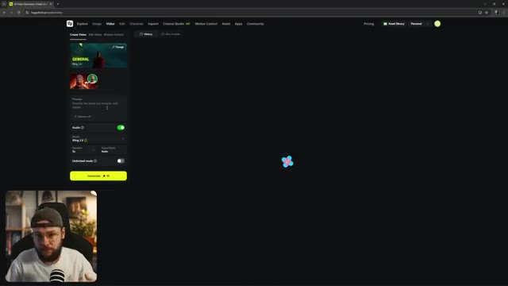
*Interface de Higgsfield dans l'onglet de création vidéo montrant les options de génération avec Kling 2.6.*

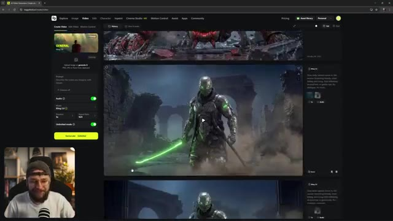
*Interface de Higgsfield affichant l'historique des générations vidéo avec un aperçu du plan du guerrier avec Kling 2.6.*

---

### ⏱️ `[00:12:22 - 00:12:42]` | Segment #25

**🔊 Audio (Transcription Intégrale Mot pour Mot en Français) :**
> J'ai bien utilisé VO 3.1 pour quelques plans ici et là, mais Kling a tout simplement déchiré, pour être honnête avec vous. C'est un outil vraiment impressionnant. Du coup, on va parcourir juste quelques-unes de mes générations préférées obtenues avec Kling ici, comme ça je peux partager les prompts avec vous et vous donner un petit aperçu du flux de travail. Je vais juste mettre mon casque pour ça.

**👁️ Analyse Visuelle d'Écran (gemini-3.5-flash-lite) :**
**Interface & Outils** : Interface web de l'outil de génération vidéo (Kling / Higgsfield) avec panneaux de configuration à gauche et flux de vidéos générées à droite, incluant une incrustation vidéo (PiP) du créateur.

**Contenu textuel & Code** : Menus de l'application (Explore, Image, Video, Edit, etc.), paramètres de modèle (Kling 2.0), durée (5s), format (16:9 ou Auto), mode illimité, et descriptions de prompts visibles sur le panneau latéral droit.

**Action / Démonstration** : Le créateur navigue dans l'interface pour présenter ses générations vidéo et s'apprête à mettre son casque audio.

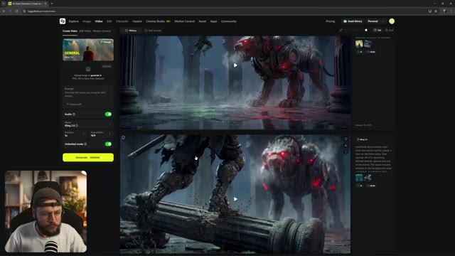
*Interface de l'outil de génération vidéo affichant deux fenêtres de prévisualisation avec des créatures cybernétiques géantes et un encadré PiP du créateur.*

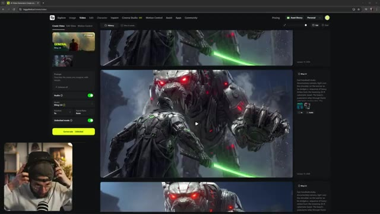
*Interface de génération vidéo montrant une scène d'action entre un guerrier et une bête robotique, le créateur ajustant son casque en bas à gauche.*

---

### ⏱️ `[00:12:42 - 00:13:00]` | Segment #26

**🔊 Audio (Transcription Intégrale Mot pour Mot en Français) :**
> Donc cette génération-ci, par exemple, je l'ai vraiment adorée. Celle-ci a fini par être intégrée dans le film final, mais pas sur toute la longueur. Si vous pouvez voir à la fin, le guerrier fait une sorte de mouvement bizarre qu'on a fini par couper. Comme je le dis toujours, ce n'est pas parce que vous avez généré 10 secondes de séquences que vous devez tout utiliser.

**👁️ Analyse Visuelle d'Écran (gemini-3.5-flash-lite) :**
**Interface & Outils** : Interface web de l'outil de génération vidéo (type Kling / plateforme similaire) avec panneau latéral gauche de contrôle (prompt, audio, modèle, durée, ratio d'aspect), historique des vidéos au centre, et vignette de caméra PiP du présentateur.

**Contenu textuel & Code** : Interface sombre avec des curseurs et boutons de configuration (Kling 2.0 sélectionné, Audio activé, Mode illimité activé, bouton "Generate"), panneau d'historique affichant des vidéos générées montrant un guerrier affrontant une bête cybernétique aux yeux rouges brillants, avec texte descriptif sur le côté droit.

**Action / Démonstration** : Le créateur commente et analyse une séquence vidéo générée par IA affichée à l'écran, montrant le combat entre un guerrier et une bête robotique.

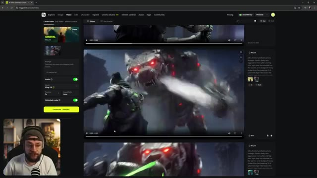
*Interface de l'outil de génération vidéo par IA montrant l'historique des générations avec un aperçu vidéo du combat entre le guerrier et la créature aux yeux rouges, et le créateur dans un encadré PiP en bas à gauche.*

---

### ⏱️ `[00:13:00 - 00:13:33]` | Segment #27

**🔊 Audio (Transcription Intégrale Mot pour Mot en Français) :**
> Essayez de dégager les moments clés qui fonctionnent réellement et servent l'histoire. Donc pour le prompt textuel ici, par exemple, je décris le travail de la caméra de manière assez complexe. Séquence de caméra à l'épaule ultra frénétique, caméra tremblante chaotique, micro-sursauts agressifs et gros soubresauts, serré par-dessus l'épaule du guerrier alors qu'il esquive quatre coups puissants de la bête cybernétique imposante semblable à un tigre de 20 pieds, et une chose que j'ai remarqué que je devais continuellement inclure dans les prompts textuels pour ce plan était de veiller à ce que nous ne voyions pas le visage du petit guerrier armé parce que la plupart du temps

**👁️ Analyse Visuelle d'Écran (gemini-3.5-flash-lite) :**
**Interface & Outils** : Interface web de Higgsfield AI (higgsfield.ai) avec le mode de création vidéo, barre de navigation supérieure (Explore, Image, Video, Edit, Character, Inpaint, Cinema Studio, Motion Control, Assist, Apps, Community), et panneau latéral gauche pour les paramètres (Modèle Kling 2.0, durée, ratio d'aspect, bouton Generate/Unlimited). Incrustation PiP du créateur dans le coin inférieur gauche.

**Contenu textuel & Code** : Le prompt textuel visible sur le panneau latéral droit indique : "Ultra frantic handheld camera footage, chaotic shaky cam, aggressive micro jitter and big jolts, tight over the shoulder of the warrior as he dodges 4 heavy strikes from the towering 20 ft cybernetic tiger like beast."

**Action / Démonstration** : Le créateur présente l'interface de Higgsfield AI tout en expliquant les détails de son prompt textuel pour générer une séquence d'action spécifique avec une caméra à l'épaule très instable.

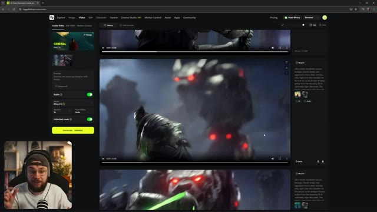
*Interface de l'outil de génération vidéo Higgsfield AI montrant le panneau de contrôle, les options de réglage et l'affichage d'un aperçu vidéo avec Jack en incrustation PiP dans le coin inférieur gauche.*

---

### ⏱️ `[00:13:33 - 00:14:09]` | Segment #28

**🔊 Audio (Transcription Intégrale Mot pour Mot en Français) :**
> par exemple si jamais nous le voyions se retourner son visage ne correspondait pas cela brisait complètement la continuité du reste du film et c'est tout à fait logique parce que c'est notre image de départ où le guerrier tourne le dos à la caméra. Alors comment diable Kling 2.6 sait-il à quoi nous voulons que le guerrier ressemble ? Il ne le sait pas. Les modèles de vidéo par IA ont seulement le contexte que nous sommes capables de leur fournir. Celle-ci était une autre génération vraiment très jolis aussi. J'espère que vous pouvez voir qu'en le regardant juste comme une génération, cela fait un peu plat et bizarre, mais dans le contexte de

**👁️ Analyse Visuelle d'Écran (gemini-3.5-flash-lite) :**
**Interface & Outils** : Interface web de l'outil de génération vidéo Kling (Higgsfield AI), affichant le panneau de configuration à gauche (prompt, options audio/musique Kling 2.6) et les fenêtres de prévisualisation des vidéos générées au centre et à droite, avec incrustation PiP du présentateur.

**Contenu textuel & Code** : Dans le panneau de gauche, le champ de prompt est visible avec du texte descriptif en anglais (mentionnant un guerrier de dos au premier plan, un monstre mécanique en arrière-plan, etc.). Le modèle sélectionné est Kling 2.6. Dans la zone centrale, on aperçoit une vidéo montrant le guerrier de dos tenant une lame lumineuse verte face à une créature robotique aux yeux rouges.

**Action / Démonstration** : Le créateur commente l'interface de Kling et les différentes générations vidéo affichées à l'écran, tout en expliquant les limites du contexte fourni aux modèles d'IA.

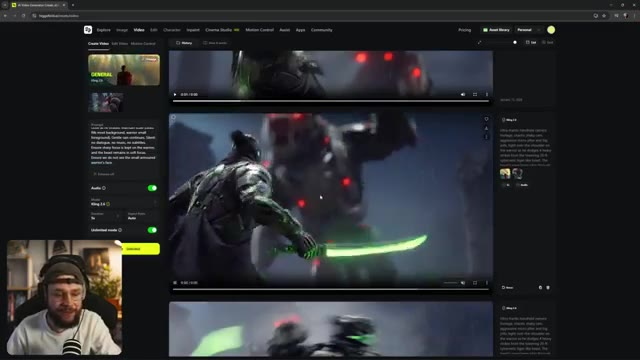
*Interface de l'outil de génération vidéo Kling montrant un guerrier armé de dos face à un monstre mécanique, avec la webcam du créateur incrustée en bas à gauche.*

---

### ⏱️ `[00:14:09 - 00:14:41]` | Segment #29

**🔊 Audio (Transcription Intégrale Mot pour Mot en Français) :**
> l'histoire dans le montage, ça fonctionne vraiment très bien. Maintenant, la génération du guerrier sautant du pilier. C'était plutôt difficile à obtenir. Un peu d'essais et d'erreurs ici, où certaines choses se produisent et que nous ne voulons pas. Ici, il saute en quelque sorte sur et hors du pilier, mais finalement nous avons réussi à obtenir la génération que je recherchais. Donc ici, je décris le travail de caméra comme un plan large documentaire à l'épaule, et c'est parce que nous essayons vraiment de faire en sorte que le modèle vidéo pense à un

**👁️ Analyse Visuelle d'Écran (gemini-3.5-flash-lite) :**
**Interface & Outils** : Navigateur web affichant l'interface d'Higgithink (générateur de vidéo IA), avec le créateur visible en incrustation vidéo (PiP) dans le coin inférieur gauche.

**Contenu textuel & Code** : Panneau latéral gauche affichant un champ de prompt textuel décrivant l'action ("Handheld documentary wide shot, the warrior sprints, plants a foot on the fallen pillar..."), des options de modèle (Kling 2.6), la durée (5s) et le rapport d'aspect (Auto). Dans le panneau de droite, l'historique des générations avec des vignettes.

**Action / Démonstration** : Le créateur montre différentes versions générées d'une scène d'action avec un guerrier et une bête mécanique, expliquant le processus d'essais et d'erreurs pour obtenir le mouvement de caméra et l'action parfaits.

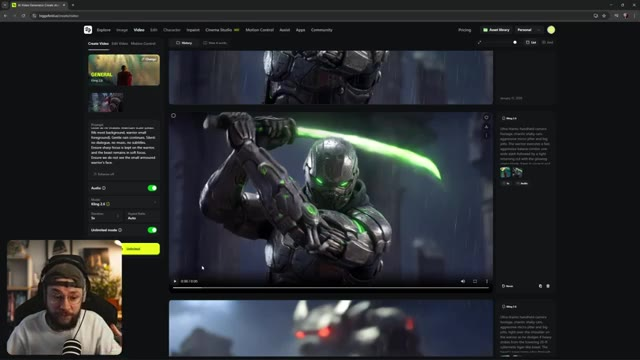
*Interface d'Higgithink affichant la génération d'un guerrier armé avec une épée lumineuse verte sur un fond pluvieux.*

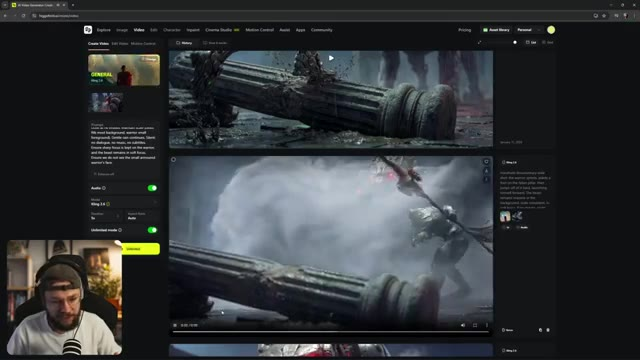
*Interface d'Higgithink montrant des essais de génération ratés ou imparfaits avec de la fumée et des piliers de pierre.*

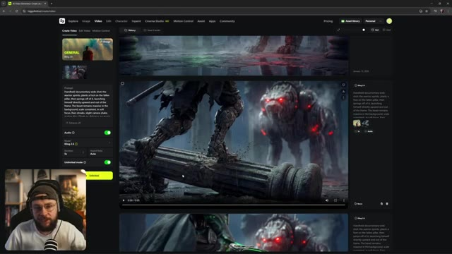
*Interface d'Higgithink montrant la génération finale réussie du guerrier courant sur un pilier face à une bête aux yeux rouges.*

---

### ⏱️ `[00:14:41 - 00:15:15]` | Segment #30

**🔊 Audio (Transcription Intégrale Mot pour Mot en Français) :**
> scène réaliste comme granuleuse par nature je suppose et ce que vous remarquerez c'est que si nous regardons toute la génération ça devient vraiment folle à la fin mais en tant que cinéaste il faut être capable de genre identifier si vous allez obtenir ce moment clé dont vous avez besoin donc je parlais de ça plus tôt juste quand on arrive à ce point je savais que je serais capable de couper vers ce plan final ce plan large ici. Encore une fois cela a pris pas mal d'essais. J'ai eu des générations assez bizarres qui n'étaient tout simplement pas

**👁️ Analyse Visuelle d'Écran (gemini-3.5-flash-lite) :**
**Interface & Outils** : Higgsfield (navigateur web)

**Contenu textuel & Code** : Le panneau de gauche affiche le champ de prompt avec le texte : « Handheld documentary wide shot, the warrior sprints, plants a foot on the fallen pillar, then springs off of it, launching himself directly upward and out of the frame. The beast remains massive in the background, scale consistent, in soft focus. Rain streaks, slight camera shake... ». Les paramètres affichent le modèle « Kling 2.6 », une durée de 5s, et un mode étendu (Unlimited mode).

**Action / Démonstration** : Le créateur présente l'interface de Higgsfield et commente les résultats de génération vidéo affichés à l'écran, tout en montrant sa webcam en bas à gauche.

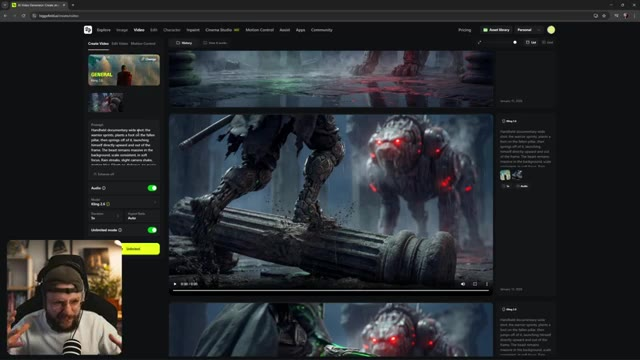
*Interface de Higgsfield montrant les paramètres de génération vidéo, un prompt descriptif et un aperçu vidéo en cours de lecture avec Jack en incrustation (PiP) dans le coin inférieur gauche.*

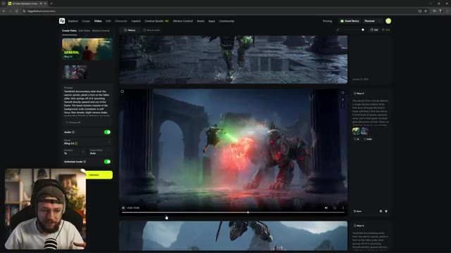
*Interface de Higgsfield montrant la suite de la lecture de la vidéo générée avec le personnage sautant sur la créature monstrueuse, avec Jack visible en incrustation (PiP) dans le coin inférieur gauche.*

---

### ⏱️ `[00:15:15 - 00:15:50]` | Segment #31

**🔊 Audio (Transcription Intégrale Mot pour Mot en Français) :**
> en faisant ce que nous voulions. Un autre ici. Dieu sait ce qui se passe. Celui-ci était plutôt cool mais le genre de design de la bête a beaucoup changé. Donc encore une fois, cela ne répondait pas à nos besoins, mais finalement nous avons obtenu ceci et je suis presque sûr que le processus consistait simplement à relancer le même prompt encore et encore. Un prompt assez simple en réalité. Le guerrier en l'air brandit son katana vers le bas tranchant à travers la tête cybernétique de la bête en la coupant en deux, la tête ne se coupe pas vraiment en deux dans la génération que j'ai utilisée mais j'ai quand même trouvé ça plutôt cool ça ressemble à un

**👁️ Analyse Visuelle d'Écran (gemini-3.5-flash-lite) :**
**Interface & Outils** : Navigateur web affichant l'interface de Higgsfield AI (hikgsfield.ai) avec le panneau de création vidéo et l'historique des générations.

**Contenu textuel & Code** : Le prompt visible dans le panneau latéral indique : "Handheld documentary wide shot the warrior sprints, plants a foot on the fallen pillar, then springs off of it, launching himself directly upward and out of the frame. The beast remains massive in the background, scale consistent, in soft focus. Rain streaks, slight camera shake..." Le modèle sélectionné est "Kling 2.6", durée "5s", rapport d'aspect "Auto".

**Action / Démonstration** : Le créateur montre l'interface de génération vidéo sur Higgsfield AI avec les différents essais de prompts, les paramètres de Kling 2.6 et la vidéo en cours de lecture dans le volet central.

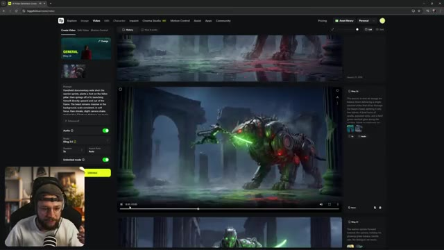
*Interface de Higgsfield AI montrant le panneau de génération vidéo avec le prompt du guerrier et le résultat affiché dans le lecteur principal, avec Jack en incrustation (PiP) en bas à gauche.*

---

### ⏱️ `[00:15:50 - 00:16:29]` | Segment #32

**🔊 Audio (Transcription Intégrale Mot pour Mot en Français) :**
> coup de grâce je dirais et ensuite on termine sur ce très beau plan du guerrier qui respire lourdement alors que la poussière vole du sol donc une fois que j'avais toutes nos générations de vidéos on a pu passer à la dernière partie du projet qui consistait à tout assembler donc c'est ce qu'on va voir ensuite le montage lui-même donc pour cela on est sur Premiere Pro c'est ici qu'on a assemblé notre histoire et comme je parcours la timeline vous verrez j'espère qu'on n'a pas utilisé l'intégralité de la longueur de nos générations mais seulement les moments clés

**👁️ Analyse Visuelle d'Écran (gemini-3.5-flash-lite) :**
**Interface & Outils** : Interface web de génération de vidéo par IA (probablement Kling/Higgfield) et interface d'Adobe Premiere Pro 2023.

**Contenu textuel & Code** : Prompts visibles dans l'interface de génération ("The warrior in mid air swings his katana down slicing through the beast's cybernetic head...") et timeline de montage Adobe Premiere Pro avec des éléments découpés et superposés.

**Action / Démonstration** : Le créateur présente d'abord ses clips générés sur le web puis bascule sur l'interface d'Adobe Premiere Pro pour démontrer le montage et le découpage des moments clés sur la timeline.

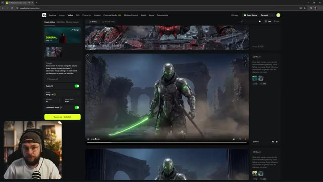
*Interface de la plateforme de génération vidéo montrant le rendu du guerrier cyberpunk avec un sabre laser vert dans un décor en ruines.*

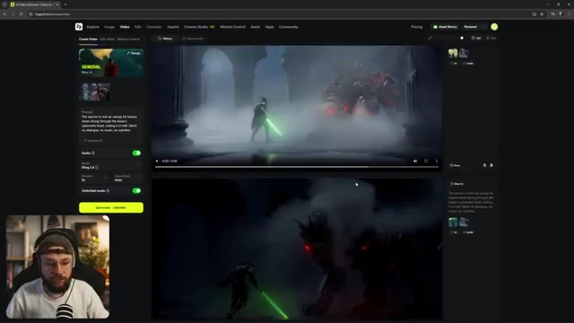
*Interface de la plateforme de génération vidéo montrant un plan large du guerrier face à une bête mécanique dans la brume.*

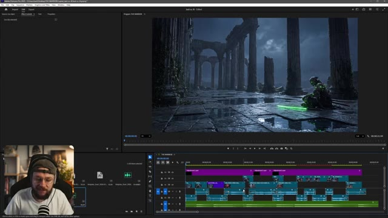
*Interface d'Adobe Premiere Pro montrant la timeline du projet "The Warrior" avec plusieurs pistes vidéo, audio et de calques d'ajustement.*

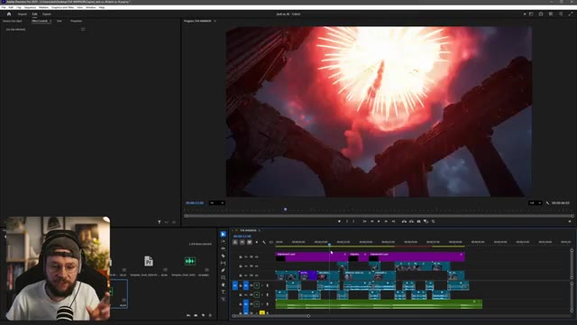
*Interface d'Adobe Premiere Pro montrant la lecture d'une explosion spectaculaire dans le moniteur de programme au-dessus de la timeline.*

---

### ⏱️ `[00:16:29 - 00:17:05]` | Segment #33

**🔊 Audio (Transcription Intégrale Mot pour Mot en Français) :**
> dont nous avons besoin. Et vous verrez également ce que je fais la plupart du temps, c'est ceci, voici la piste audio pour cette génération. L'audio bien sûr que nous avions généré nativement depuis Kling 2.6. Donc ce que nous pouvons faire, c'est désassocier la vidéo de la piste audio, et cela me permet de déplacer celle-ci indépendamment afin de pouvoir étendre cette piste audio au-delà de la fin de ce clip vidéo. Et cela signifie que je peux ajouter ce fondu ici, de sorte qu'on enchaîne en quelque sorte sur le plan suivant sans obtenir aucun de ces bruits parasites désagréables. Maintenant, j'ai mentionné trois nouvelles approches dans l'intro,

**👁️ Analyse Visuelle d'Écran (gemini-3.5-flash-lite) :**
**Interface & Outils** : Adobe Premiere Pro avec un panneau de projet, un panneau d'effets (Effect Controls), une fenêtre de prévisualisation du programme et une timeline multi-pistes. Le créateur apparaît en bas à gauche dans une incrustation vidéo (Picture-in-Picture).

**Contenu textuel & Code** : Dans la timeline, on aperçoit plusieurs pistes vidéo et audio comportant des clips et des calques de montage (notamment un calque violet "Adjustment Layer"). Le moniteur de programme affiche un plan cinématographique montrant un personnage assis dans des ruines de temple avec des colonnes et un sabre laser vert. Le panneau "Effect Controls" à gauche affiche des paramètres de transformation (Position, Scale, Rotation, etc.).

**Action / Démonstration** : Le créateur montre son écran de montage dans Adobe Premiere Pro, expliquant la gestion des pistes audio et vidéo et leur découpage.

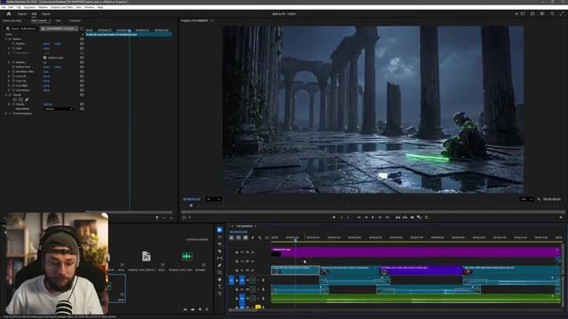
*Interface du logiciel Adobe Premiere Pro montrant la timeline de montage et un aperçu vidéo avec le créateur en incrustation PiP dans le coin inférieur gauche.*

---

### ⏱️ `[00:17:05 - 00:17:44]` | Segment #34

**🔊 Audio (Transcription Intégrale Mot pour Mot en Français) :**
> L'un d'entre eux était lié à l'utilisation de plusieurs modèles vidéo au sein du même film. Le problème auquel on est généralement confronté ici, c'est que chaque modèle vidéo a un aspect et une esthétique légèrement différents. Ce que j'utilisais, c'était principalement Kling 2.6, comme je le disais. Également via Higgsfield, j'ai pu utiliser Google 3.1 également. Le problème avec ça, auquel j'ai fait face et auquel beaucoup d'entre vous ont probablement fait face aussi, c'est que VO3.1 semble appliquer beaucoup de netteté à vos générations. Kling 2.6 ne le fait pas, et si je voulais simplement balancer une génération aléatoire de VO3.1 au milieu de toutes celles de Kling 2.6, ça donnait vraiment l'impression...

**👁️ Analyse Visuelle d'Écran (gemini-3.5-flash-lite) :**
**Interface & Outils** : Adobe Premiere Pro 2025 (logiciel de montage vidéo)

**Contenu textuel & Code** : Timeline de montage avec des pistes vidéo et audio, un panneau de moniteur affichant une scène sombre avec des ruines et un personnage lumineux, un panneau de projet et un encadré PiP du créateur.

**Action / Démonstration** : Le créateur montre son écran de montage vidéo sous forme d'incrustation (PiP) pendant qu'il parle de l'utilisation de différents modèles vidéo.

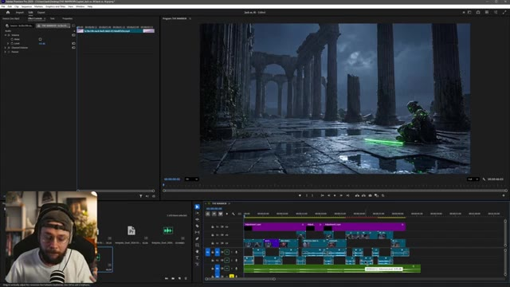
*Interface d'Adobe Premiere Pro montrant la timeline de montage vidéo et un petit encadré PiP du créateur dans le coin inférieur gauche.*

---

### ⏱️ `[00:17:44 - 00:18:20]` | Segment #35

**🔊 Audio (Transcription Intégrale Mot pour Mot en Français) :**
> différent et assez choquant pour le spectateur, ce qui n'est pas bon. Donc, la solution vraiment simple pour cela a été d'ajouter cette couche de réglage que vous pouvez voir tout en haut ici. Donc, si je zoome directement sur le visage du guerrier juste pour vous donner une un peu meilleure vue ici et que je vais désactiver cette couche de réglage, vous pouvez voir à quel point cela fait une différence. Donc ici, nous appliquons un masque flou, vous pouvez voir les niveaux que j'utilise ici, nous utilisons ensuite un peu de netteté après cela et je vais également appliquer un peu de bruit. Ce que je vais faire, c'est simplement désactiver cette couche de bruit.

**👁️ Analyse Visuelle d'Écran (gemini-3.5-flash-lite) :**
**Interface & Outils** : Adobe Premiere Pro

**Contenu textuel & Code** : Timeline de montage vidéo avec des pistes vidéo et audio, panneau d'effet et moniteur de prévisualisation affichant un monstre cybernétique au milieu de ruines antiques. Jack apparaît en incrustation (PiP) dans le coin inférieur gauche.

**Action / Démonstration** : Le créateur présente son écran de montage sur Adobe Premiere Pro, illustrant l'utilisation de calques de réglage et d'effets visuels pour corriger le rendu d'une vidéo.

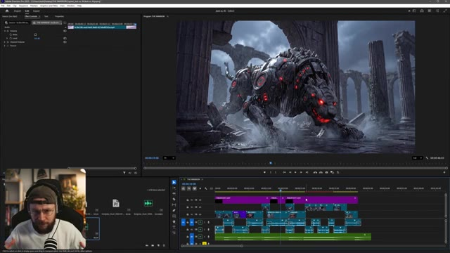
*Interface d'Adobe Premiere Pro montrant la timeline avec des couches de réglage et le moniteur affichant une créature robotique dans des ruines, avec Jack visible dans un encadré PiP en bas à gauche.*

---

### ⏱️ `[00:18:20 - 00:18:56]` | Segment #36

**🔊 Audio (Transcription Intégrale Mot pour Mot en Français) :**
> et ensuite je peux activer et désactiver le calque de réglage pour vous montrer que même la netteté aide beaucoup et cela l'accorde avec le rendu de la génération VO 3.1 la version 3.1 résout en quelque sorte ce problème et je n'essaie pas de faire croire que j'ai réinventé la roue ici pour le cinéma par IA c'est juste une observation que j'ai faite et je sais maintenant que par exemple si je veux utiliser plusieurs modèles vidéo pour le même film VO 3.1 et Kling 2.6 par exemple vous pouvez vous devez juste appliquer de la netteté sur les éléments de Kling 2.6 pour qu'ils ressemblent aux générations VO 3.1 mais même sur la VO 3.1

**👁️ Analyse Visuelle d'Écran (gemini-3.5-flash-lite) :**
**Interface & Outils** : Adobe Premiere Pro

**Contenu textuel & Code** : Panneau "Effect Controls" affichant les réglages de "Motion", "Opacity", "Unsharp Mask" avec le paramètre "Sharpen Amount" réglé à 57, et la timeline montrant les clips vidéo et les pistes audio.

**Action / Démonstration** : Le créateur démontre l'utilisation d'un calque de réglage et de l'effet de netteté dans Adobe Premiere Pro pour harmoniser le rendu visuel entre différents modèles de génération vidéo par IA.

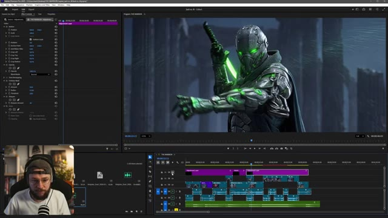
*Interface d'Adobe Premiere Pro montrant un guerrier en armure futuriste avec des éléments lumineux verts et le panneau des options d'effet à gauche avec les réglages de netteté.*

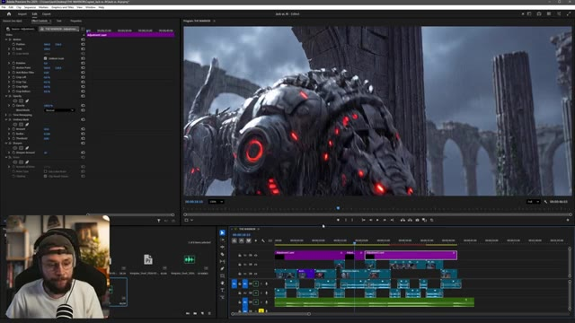
*Interface d'Adobe Premiere Pro affichant une créature robotique canine menaçante dans des ruines antiques sous la pluie, avec le panneau de montage en bas et la webcam du créateur dans le coin inférieur gauche.*

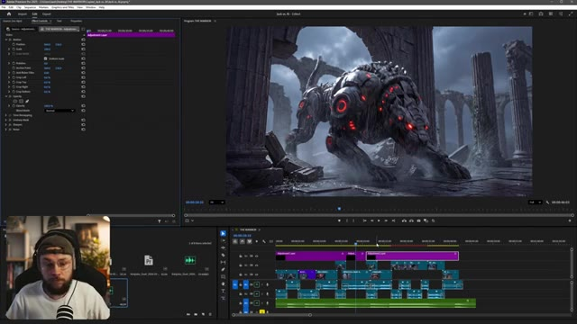
*Interface d'Adobe Premiere Pro affichant la même créature robotique canine dans les ruines, avec la timeline active montrant les calques violets de réglage.*

---

### ⏱️ `[00:18:56 - 00:19:29]` | Segment #37

**🔊 Audio (Transcription Intégrale Mot pour Mot en Français) :**
> générations j'ajoute cette couche de grain de film je pense que ça fait une grande différence ça ajoute juste un peu plus de texture à vos générations ça les fait paraître un peu moins propres ça ajoute un peu de granularité donc la première moitié du montage consiste vraiment à passer d'un plan à un autre de manière très fluide pour créer cette tension le rythme est très lent au début pour poser le reste de l'histoire dans une minute je veux aborder la musique parce qu'elle joue un rôle très important mais ici je veux parler des visuels pendant une seconde parce qu'en passant au

**👁️ Analyse Visuelle d'Écran (gemini-3.5-flash-lite) :**
**Interface & Outils** : Logiciel de montage vidéo professionnel Adobe Premiere Pro avec panneau de prévisualisation, timeline multicouche, panneau d'effets et incrustation vidéo (PiP) du présentateur en bas à gauche.

**Contenu textuel & Code** : Timeline de montage vidéo avec calques d'ajustement violets, pistes audio/vidéo multiples, et moniteur de programme affichant des plans créés par IA (monstre robotique rugissant sous la pluie, puis projectile lumineux dans un décor en ruines).

**Action / Démonstration** : Le créateur présente son projet de montage vidéo dans Adobe Premiere Pro, démontrant la disposition des plans et les calques d'ajustement.

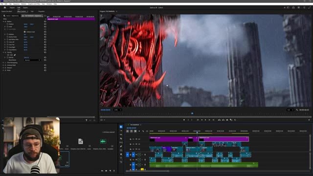
*Interface d'Adobe Premiere Pro affichant le montage vidéo d'un monstre robotique sous la pluie, avec la webcam du créateur en incrustation (PiP) dans le coin inférieur gauche.*

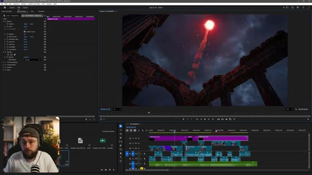
*Interface d'Adobe Premiere Pro montrant la timeline et une scène cinématique extérieure avec un projectile rouge lumineux dans le ciel, avec la webcam du créateur en incrustation (PiP).*

---

### ⏱️ `[00:19:29 - 00:20:01]` | Segment #38

**🔊 Audio (Transcription Intégrale Mot pour Mot en Français) :**
> pour ce qui est de la scène de combat elle-même, j'ai fini par accélérer pas mal des générations Kling 2.6 ici à l'écran, celle-ci aussi et celle-ci ont toutes été beaucoup accélérées donc par exemple si je clique sur cet exemple ici vitesse et durée c'est à 134% de vitesse donc pas vraiment autant que je le pensais jetons un coup d'œil à celle-ci qu'est-ce qu'on a choisi ici 120 celle-ci 115 en fait ce n'est pas une accélération folle mais ça fait une grosse différence peut-être si on fait glisser et

**👁️ Analyse Visuelle d'Écran (gemini-3.5-flash-lite) :**
**Interface & Outils** : Logiciel de montage vidéo Adobe Premiere Pro.

**Contenu textuel & Code** : Noms des calques et des clips sur la timeline (Adjustment Layer, fichiers Kling), paramètres de contrôle des effets (Position, Scale, Opacity), menu contextuel avec l'option "Speed/Duration...", et fenêtre flottante "Clip Speed / Duration" indiquant une vitesse de 134%.

**Action / Démonstration** : Le créateur navigue dans son projet de montage vidéo sur Adobe Premiere Pro et ouvre le menu contextuel de vitesse/durée sur des clips issus de générations Kling 2.6 pour modifier leur vitesse.

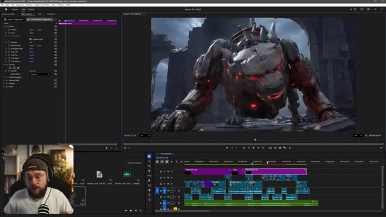
*Interface d'Adobe Premiere Pro montrant la timeline du projet 'THE WARRIOR' et une vidéo générée par Kling 2.6 d'une créature mécanique menaçante.*

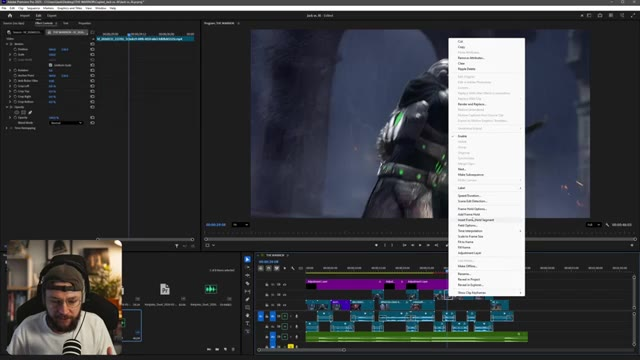
*Interface d'Adobe Premiere Pro avec un menu contextuel ouvert sur un clip vidéo pour modifier la vitesse et la durée.*

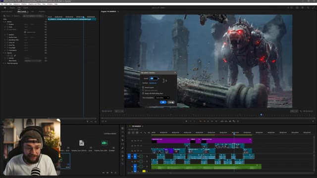
*Interface d'Adobe Premiere Pro affichant la boîte de dialogue contextuelle 'Vitesse / Durée' réglée sur 134 %.*

---

### ⏱️ `[00:20:01 - 00:20:22]` | Segment #39

**🔊 Audio (Transcription Intégrale Mot pour Mot en Français) :**
> Retirez l'un de ces exemples, je vais le dupliquer à nouveau et ensuite je remettrai la vitesse et la durée à 100, on peut faire une sorte de comparaison ici, donc ça c'est la génération d'origine, elle donne une impression assez lente et laborieuse, et la deuxième donne juste l'impression d'être beaucoup plus rapide ou dramatique et ça va vraiment très bien avec la musique aussi.

**👁️ Analyse Visuelle d'Écran (gemini-3.5-flash-lite) :**
**Interface & Outils** : Adobe Premiere Pro 2025

**Contenu textuel & Code** : Panneaux de Premiere Pro : moniteur de programme affichant un guerrier faisant face à une créature robotique géante aux yeux rouges, panneau Effet / Contrôles d'effets (Effect Controls) à gauche, et chronologie (timeline) multi-pistes en bas avec des clips vidéo et audio. Le créateur (Jack) est visible en incrustation (PiP) dans le coin inférieur gauche.

**Action / Démonstration** : Le créateur montre son écran de montage vidéo sous Adobe Premiere Pro, expliquant comment il ajuste la vitesse, la durée et la comparaison des clips vidéo générés par IA par rapport à la musique.

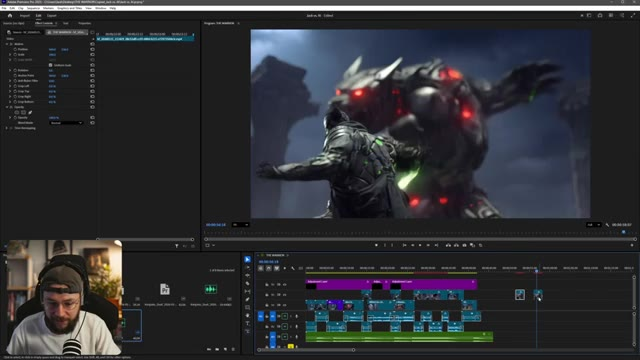
*Interface d'Adobe Premiere Pro montrant la chronologie (timeline), les contrôles d'effets et le moniteur de programme avec une scène d'action générée par IA, ainsi que le créateur dans un encadré PiP en bas à gauche.*

---

### ⏱️ `[00:20:23 - 00:20:41]` | Segment #40

**🔊 Audio (Transcription Intégrale Mot pour Mot en Français) :**
> Donc je pense que le moment est bien choisi pour parler de cette piste audio car elle est vraiment importante pour ce montage. Et ce que je peux faire, c'est simplement afficher la piste audio, l'écouter un peu et en parler. Ces percussions servent presque d'introduction. Elles indiquent en quelque sorte au spectateur qu'il doit prêter attention.

**👁️ Analyse Visuelle d'Écran (gemini-3.5-flash-lite) :**
**Interface & Outils** : Adobe Premiere Pro avec incrustation vidéo (PiP) du créateur en bas à gauche.

**Contenu textuel & Code** : Timeline de montage avec pistes vidéo et audio, moniteur de programme affichant un guerrier en armure futuriste avec une épée lumineuse verte, et une fenêtre de lecteur multimédia affichant une icône musicale avec le titre "THE WARRIOR".

**Action / Démonstration** : Le créateur navigue dans son logiciel de montage, consulte la timeline et ouvre une piste audio externe pour la faire écouter.

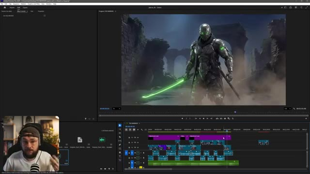
*Interface d'Adobe Premiere Pro montrant la timeline du projet avec le personnage du guerrier dans le moniteur de programme et Jack en incrustation (PiP).*

*Interface d'Adobe Premiere Pro avec une fenêtre de lecteur multimédia ouverte par-dessus pour écouter la piste audio du projet.*

---

### ⏱️ `[00:20:42 - 00:21:17]` | Segment #41

**🔊 Audio (Transcription Intégrale Mot pour Mot en Français) :**
> Cette flûte, je crois, c'est au moment où la fusée éclairante monte dans le ciel. Tout cela sert vraiment bien à créer cette atmosphère, la tension. Puis, dans une minute, on enchaîne sur ces tambours vraiment frénétiques qui correspondent à la scène de combat. Un peu comme des tambours de guerre, et c'est là, quand la musique s'arrête, que j'ai chronométré ce coup mortel, et on a ce dernier petit roulement de tambours et sur ce dernier tambour.

**👁️ Analyse Visuelle d'Écran (gemini-3.5-flash-lite) :**
**Interface & Outils** : Adobe Premiere Pro 2025 et lecteur multimédia Windows (Media Player) superposé.

**Contenu textuel & Code** : Le projet Premiere Pro nommé "Jack vs. AI - Edit.prproj" affiche une timeline de montage avec des pistes audio et vidéo (fichiers audio de "THE WARRIOR" et diverses pistes vertes/bleues de montage). Jack apparaît en bas à gauche dans un encadré PiP (Picture-in-Picture).

**Action / Démonstration** : Jack gesticule tout en expliquant le montage audio et le calage de la musique sur les images dans Premiere Pro.

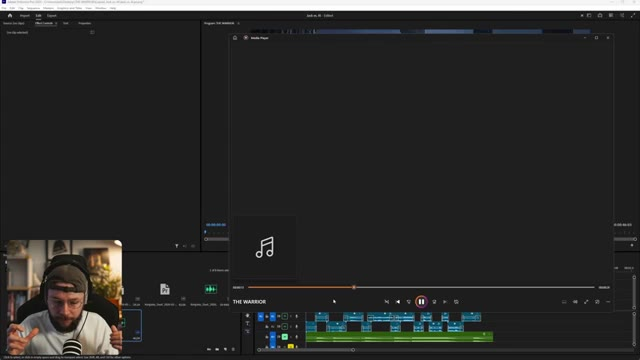
*Interface d'Adobe Premiere Pro avec une fenêtre Media Player superposée montrant la lecture d'un fichier audio, et Jack visible en incrustation (PiP) dans le coin inférieur gauche.*

---

### ⏱️ `[00:21:17 - 00:21:50]` | Segment #42

**🔊 Audio (Transcription Intégrale Mot pour Mot en Français) :**
> temps fort, on coupe au noir, une fin de montage vraiment très sympa et dramatique. Donc j'espère que vous pouvez voir comment tous les éléments visuels sont construits autour de cette piste musicale. C'est vraiment, vraiment important pour façonner ce récit, créer de la tension, créer des enjeux, créer du drame, tout ça à la fois. Et cela étant dit, les gars, je pense que je suis prêt à vous montrer le résultat de ce projet. On peut aller voir le film terminé. Si vous avez apprécié le contenu d'aujourd'hui, n'oubliez pas de lâcher un gros pouce bleu pour moi. Si vous êtes nouveau, pensez à vous abonner et bien sûr, à cliquer sur cette icône de cloche de notification.

**👁️ Analyse Visuelle d'Écran (gemini-3.5-flash-lite) :**
**Interface & Outils** : Adobe Premiere Pro (logiciel de montage vidéo) avec incrustation webcam (PiP) du présentateur.

**Contenu textuel & Code** : Timeline de montage Adobe Premiere Pro, pistes audio et vidéo, interface Media Player, panneau de prévisualisation affichant un plan cinématographique (guerrier dans des ruines sous la pluie), graphiques d'appel à l'action YouTube.

**Action / Démonstration** : Le créateur présente l'interface de montage d'Adobe Premiere Pro tout en commentant le résultat final de son projet vidéo et en incitant les spectateurs à s'abonner.

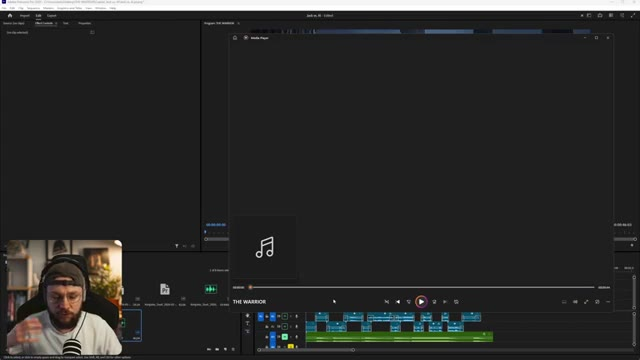
*Interface d'Adobe Premiere Pro avec un lecteur multimédia ouvert par-dessus affichant le titre de la piste 'THE WARRIOR', avec Jack visible en incrustation (PiP) dans le coin inférieur gauche.*

*Interface d'Adobe Premiere Pro montrant la timeline complète du projet vidéo, avec un aperçu du film finalisé représentant un guerrier dans des ruines antiques, et une animation de boutons d'appel à l'action (pouce bleu, abonnement, cloche) dans le coin inférieur droit.*

---

### ⏱️ `[00:21:50 - 00:21:56]` | Segment #43

**🔊 Audio (Transcription Intégrale Mot pour Mot en Français) :**
> pour ne jamais manquer aucun contenu futur. Merci beaucoup d'avoir regardé, les gars. Allons voir le film terminé.

**👁️ Analyse Visuelle d'Écran (gemini-3.5-flash-lite) :**
**Interface & Outils** : Adobe Premiere Pro avec panneau de prévisualisation, chutier et timeline multipiste détaillée, incluant une incrustation vidéo (PiP) du créateur en bas à gauche.

**Contenu textuel & Code** : Timeline de montage comportant plusieurs pistes vidéo, audio et des calques d'ajustement. Dans le moniteur de programme, on aperçoit le rendu du film avec un guerrier futuriste assis près de colonnes antiques.

**Action / Démonstration** : Le créateur présente l'interface de montage final de son projet vidéo dans Adobe Premiere Pro avant de lancer la lecture du film terminé.

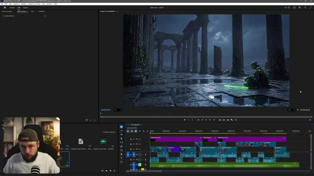
*Interface du logiciel de montage Adobe Premiere Pro avec la timeline du film finalisé et le retour vidéo montrant une scène avec un personnage cyberpunk dans un temple en ruines.*

---
