# 🎬 Créer des publicités animées prêtes pour la télé avec l'IA — Le guide ultime

> **Chaîne** : [Jack Vs. AI](https://www.youtube.com/@JackVsAI)  
> **Titre original** : `How to Build TV Ready Animated Ads With AI — Ultimate Guide`  
> **Lien YouTube** : [https://www.youtube.com/watch?v=xaQNxC1BTHw](https://www.youtube.com/watch?v=xaQNxC1BTHw)  
> **Date de publication** : 2026-01-25  
> **Durée** : 32m 47s (`1967s`)  
> **Identifiant vidéo** : `xaQNxC1BTHw`  
> **Fiche Web Interactive** : [2026-01-25_YT-xaQNxC1BTHw_Créer des publicités animées prêtes pour la télé avec l'IA — Le guide ultime_by-whisper-v3-large-turbo+gemini-3.5-flash-lite.html](2026-01-25_YT-xaQNxC1BTHw_Créer des publicités animées prêtes pour la télé avec l'IA — Le guide ultime_by-whisper-v3-large-turbo+gemini-3.5-flash-lite.html)  
> **Captures de démonstration clés** : `148 captures réelles (anti-talking-head)`  
> **Modèles utilisés** : Audio: `large-v3-turbo` (Faster-Whisper int8 VPS) | Vision: `gemini-3.5-flash-lite` (Google AI Studio API)  

---

## 📌 Synthèse Exécutive & Outils

### 📌 Résumé
Dans cette vidéo, Jack, artiste d'effets visuels chevronné, démontre qu'il est désormais possible de concevoir une publicité animée de qualité télévisuelle en s'appuyant exclusivement sur l'intelligence artificielle. Loin des simples démos techniques, son approche repose sur une méthodologie professionnelle rigoureuse, calquée sur les standards de l'industrie publicitaire. Pour humaniser une thématique bancaire souvent perçue comme froide, il choisit d'animer un personnage attendrissant — un papa pieuvre — au design tricoté et fait main, incarnant les difficultés financières des familles. 

La singularité de ce flux de travail réside dans son inversion méthodologique : au lieu de concevoir l'image avant le son, Jack commence par sculpter la narration. Grâce à la boîte à outils IA d'Artlist, il sélectionne avec précision une voix off chaleureuse et mature (via le profil « Shadow ») en ajustant subtilement les paramètres de stabilité, puis peaufine le rythme des respirations et des silences sous Premiere Pro avant même de générer la moindre image. Cette priorisation de l'audio ancre solidement le projet et dicte la structure émotionnelle du montage.

En combinant des outils de pointe tels que Veo 3.1, Flux et la suite Artlist, Jack prouve qu'un créateur muni de son simple ordinateur portable peut rivaliser avec les productions d'agences coûteuses. Ce guide ultime démontre que la maîtrise de l'IA générative publicitaire ne relève plus du gadget technologique, mais d'une direction artistique structurée, capable d'inspirer la confiance des clients et de générer de réels résultats commerciaux.

### 🛠️ Outils, Modèles & Logiciels Présentés
* **Artlist AI Toolkit** : Plateforme tout-en-un utilisée pour générer et affiner les voix off grâce à une vaste bibliothèque de profils vocaux et de réglages de stabilité.
* **Premiere Pro** : Logiciel de montage traditionnel employé pour nettoyer les pistes audio, éliminer les silences superflus, appliquer des fondues et synchroniser le rythme de la voix avec la musique.
* **Veo 3.1** : Modèle de génération vidéo par IA utilisé pour animer les séquences visuelles du spot publicitaire.
* **Flux** : Modèle de génération d'images et de concepts visuels employé pour concevoir l'esthétique générale et le design des personnages.
* **Nano Banana & Nano Banana Pro** : Outils spécialisés intégrés au processus de création et de stylisation graphique des éléments de l'animation.

### 🔑 Points Clés & Enseignements Stratégiques
1. **Inverser le workflow créatif** : Commencer par la voix off et la musique plutôt que par l'image permet de créer un point d'ancrage solide qui dictera naturellement le rythme et la structure du montage visuel.
2. **Humaniser l'imagerie institutionnelle** : Pour une publicité bancaire, opter pour une direction artistique chaleureuse (comme un style d'animation « fait main » et texturé en tricot) permet de briser la froideur stérile du secteur.
3. **Maîtriser les paramètres de stabilité vocale** : Un taux de stabilité autour de 50 % offre un compromis idéal pour les voix off, garantissant la cohérence tout en conservant une expressivité naturelle.
4. **Sélectionner le bon archétype vocal** : Privilégier des voix matures et légèrement rauques (comme l'option « Shadow ») apporte immédiatement de l'autorité, de la proximité et de la sympathie au message publicitaire.
5. **Nettoyer les respirations au montage** : Le traitement d'une voix off générée par IA nécessite un travail de coupe manuel sous Premiere Pro pour resserrer les silences maladroits et dynamiser le rythme global.
6. **Structurer les générations par sessions** : Utiliser les fonctionnalités d'organisation par dossiers ou sessions sur les plateformes d'IA évite la dispersion et permet de structurer efficacement des centaines d'assets visuels et sonores.
7. **Penser « production réelle » plutôt que « démo »** : Le succès d'une publicité IA repose sur sa capacité à répondre aux exigences narratives et émotionnelles d'un vrai client, et non à exhiber simplement la puissance de calcul des outils.
8. **Appliquer des fondus audio (audio fades)** : Ajouter systématiquement de légers fondues sur les segments de voix off coupés permet d'éviter les micro-coupures sonores abruptes et garantit une écoute fluide.
9. **Associer minimalisme musical et narration** : Choisir une piste musicale de fond épurée mais charmante permet de soutenir la voix off sans saturer l'espace sonore ni parasiter le message principal.
10. **Autonomie et agilité créative** : Démontrer qu'une infrastructure lourde (studio créatif ou grande agence) n'est plus indispensable pour livrer un spot publicitaire soigné et prêt pour la télévision.

---

## ⏱️ Chronologie & Transcription Complète Audio & Visuelle (Mot pour Mot)

### ⏱️ `[00:00:00 - 00:00:24]` | Segment #01

**🔊 Audio (Transcription Intégrale Mot pour Mot en Français) :**
> Si vous pensez que l'IA ne peut pas faire de vrais travaux pour des clients, vous êtes déjà en train de prendre du retard. C'est une publicité prête pour la télévision que j'ai fabriquée en utilisant uniquement des outils d'IA. Et elle tient la route pour une seule raison. Elle est construite comme une vraie publicité et non comme une démo technique. Je ne suis pas ici pour vous vendre des gadgets. Je suis là pour vous montrer comment l'IA s'intègre dans l'animation publicitaire d'une manière que les clients font confiance, approuvent et payent.

**👁️ Analyse Visuelle d'Écran (gemini-3.5-flash-lite) :**
**Interface & Outils** : Présentation de plans cinématiques générés par IA (style stop-motion en laine crochetée), sans affichage d'interface logicielle directe.

**Contenu textuel & Code** : Texte incrusté à l'écran : "can't do real client work", "I made using only AI tools", "sell you gimmicks", "trust, approve".

**Action / Démonstration** : Diffusion d'extraits d'une publicité générée par IA mettant en scène une pieuvre en tricot dans divers décors (cuisine, parc pour enfants).

---

### ⏱️ `[00:00:24 - 00:00:43]` | Segment #02

**🔊 Audio (Transcription Intégrale Mot pour Mot en Français) :**
> Je suis Jack. Je suis artiste d'effets visuels dans l'industrie publicitaire depuis plus d'une décennie maintenant. Et j'ai travaillé pour beaucoup des plus grandes marques de la planète. Et d'ici la fin de cette vidéo, vous aurez le flux de travail exact pour transformer une idée simple en un spot publicitaire soigné et prêt à être diffusé. Pas de studio créatif, pas d'agence coûteuse, juste vous et votre ordinateur portable.

**👁️ Analyse Visuelle d'Écran (gemini-3.5-flash-lite) :**
**Interface & Outils** : Génération de vidéo par IA / B-roll cinématique avec sous-titres animés.

**Contenu textuel & Code** : Texte affiché à l'écran : "you'll have the exact workflow" (Image 2) et "just you and your laptop" (Image 3). Personnages texturés en laine/tricot (stop-motion esthétique).

**Action / Démonstration** : Animation de personnages de poulpes générés par IA illustrant le discours sur la création publicitaire accessible depuis un ordinateur portable.

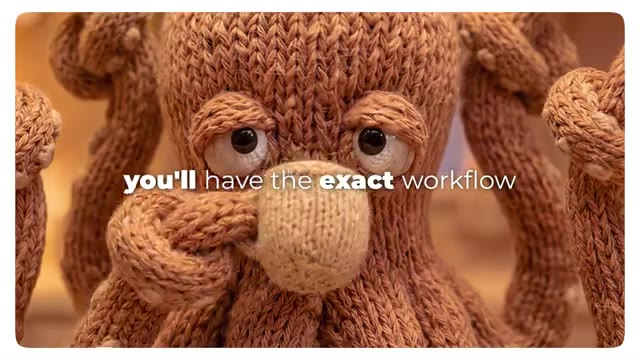
*Génération vidéo par IA montrant un personnage de poulpe en tricot marron clair tenant une tasse, style stop-motion.*

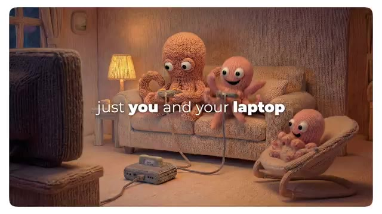
*Scène générée par IA montrant une famille de poulpes en tricot jouant aux jeux vidéo dans un salon chaleureux.*

---

### ⏱️ `[00:00:43 - 00:01:18]` | Segment #03

**🔊 Audio (Transcription Intégrale Mot pour Mot en Français) :**
> Et les gars, si vous appréciez le contenu d'aujourd'hui, n'oubliez pas de lâcher un gros pouce bleu pour moi. Pensez à vous abonner et bien sûr à activer la cloche des notifications. Donc pour créer notre publicité, nous sommes sur Artlist, et un grand merci à eux de m'avoir invité à New York pour découvrir leur nouvelle expérience utilisateur nommée AI Toolkit. C'était super de rencontrer tant d'autres créateurs ainsi que l'équipe d'Artlist elle-même et de pouvoir échanger avec eux sur la façon dont cette expérience a été conçue spécifiquement en pensant aux cinéastes et aux publicitaires. Et bien sûr, c'est exactement ce sur quoi nous nous concentrons avec ce projet. Alors, par où avons-nous commencé ? Bien sûr, tout commence par la conception de

**👁️ Analyse Visuelle d'Écran (gemini-3.5-flash-lite) :**
**Interface & Outils** : Vidéo d'illustration de voyage / vlogging montrant des séquences tournées à New York lors de l'événement Artlist (avec incrustation PiP du créateur en bas à gauche).

**Contenu textuel & Code** : Texte affiché sur le mur lors de l'événement : "Leading the future of AI video production" (Mener l'avenir de la production vidéo par IA).

**Action / Démonstration** : Le créateur montre des images de son voyage à New York, illustrant sa visite des bureaux d'Artlist et sa rencontre avec d'autres créateurs pour découvrir le nouvel outil "AI Toolkit".

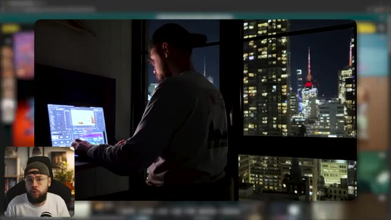
*Jack travaillant sur son ordinateur portable dans une pièce sombre avec vue sur les gratte-ciels illuminés de New York la nuit (vidéo incrustée avec le présentateur en bas à gauche).*

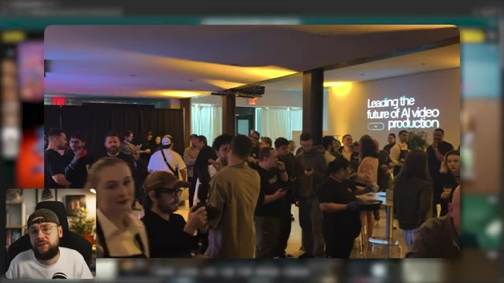
*Vue de l'événement Artlist à New York avec de nombreux créateurs rassemblés et l'inscription "Leading the future of AI video production" projetée sur le mur (vidéo incrustée avec le présentateur en bas à gauche).*

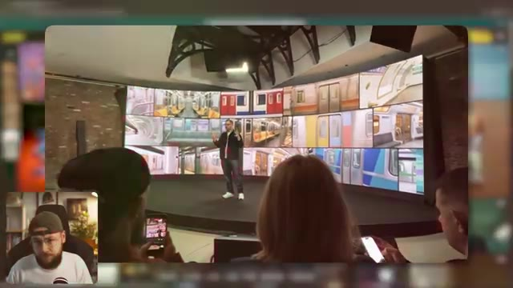
*Présentation sur scène devant un immense écran incurvé affichant des visuels de rames de métro, avec le public de dos (vidéo incrustée avec le présentateur en bas à gauche).*

---

### ⏱️ `[00:01:18 - 00:01:54]` | Segment #04

**🔊 Audio (Transcription Intégrale Mot pour Mot en Français) :**
> cette idée initiale et pour ce projet je voulais me donner pour tâche de créer une publicité pour une banque et cette banque s'adresse spécifiquement aux familles. Donc des parents qui ont peut-être du mal à concilier les dépenses liées à l'accession à la propriété et les besoins de leurs enfants. Donc bien sûr il était très important d'avoir un parent comme personnage principal de notre film et ce que j'ai également décidé assez tôt c'est que je voulais rendre cette publicité animée et c'est simplement parce que parfois je pense que les banques, en particulier les publicités bancaires, peuvent paraître un peu froides et stériles donc il est vraiment important d'essayer de

**👁️ Analyse Visuelle d'Écran (gemini-3.5-flash-lite) :**
**Interface & Outils** : Interface logicielle de gestion de projet / notes (type Notion ou Google Docs) avec une barre de paramètres vidéo en bas (Kling 2.6 Pro, Auto Ratio, 5 sec, Audio, 1080p) et une incrustation caméra du créateur (Picture-in-Picture).

**Contenu textuel & Code** : Texte affiché : "Coral Banking - 'Tied Up'", sections "CONCEPT", "VOICE OVER", "SCRIPT". Paramètres visibles dans la barre inférieure : "Kling 2.6 Pro", "Auto Ratio", "5 sec", "Audio", "1080p", "Negative Prompt", "Guidance Scale".

**Action / Démonstration** : Le créateur présente son projet publicitaire pour une banque, en affichant à l'écran ses notes de concept et de script tout en parlant face à sa webcam.

*Interface d'un document de concept textuel "Coral Banking - Tied Up" avec une incrustation vidéo du créateur en bas à gauche et des visuels en arrière-plan.*

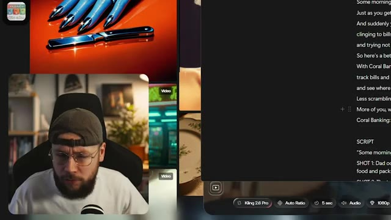
*Vue rapprochée du document de script et de la barre d'outils avec le créateur visible en incrustation.*

---

### ⏱️ `[00:01:54 - 00:02:31]` | Segment #05

**🔊 Audio (Transcription Intégrale Mot pour Mot en Français) :**
> atténuer cela. Donc, comme vous pouvez le voir ici, j'ai écrit assez tôt une publicité au sentiment charmant et chaleureux, avec un style d'animation fait main et un style visuel tricoté imparfait, suivant un papa pieuvre alors qu'il lutte pour équilibrer le côté financier d'être propriétaire et d'avoir des enfants, et après cela, j'ai décidé de m'attaquer à la voix off et c'est un flux de travail différent de ce que je fais habituellement. Je pense que j'ai beaucoup appris en m'attaquant à plus de ces projets récemment et j'ai appris à quel point la voix off ou la narration et la musique sont fondamentales pour tout montage. La plupart du temps, ce sont elles qui en quelque sorte

**👁️ Analyse Visuelle d'Écran (gemini-3.5-flash-lite) :**
**Interface & Outils** : Logiciel de prise de notes Notion et interface de génération vidéo Artlist intégrant Kling 2.6 Pro.

**Contenu textuel & Code** : Titre "Coral Banking - 'Tied Up'", section "CONCEPT" décrivant le papa pieuvre, section "VOICE OVER" avec les lignes du script poétique, et paramètres de génération (Kling 2.6 Pro, Auto Ratio, 5s, Audio, 1080p).

**Action / Démonstration** : Le créateur présente son document de concept et de script tout en commentant son processus de création et d'écriture.

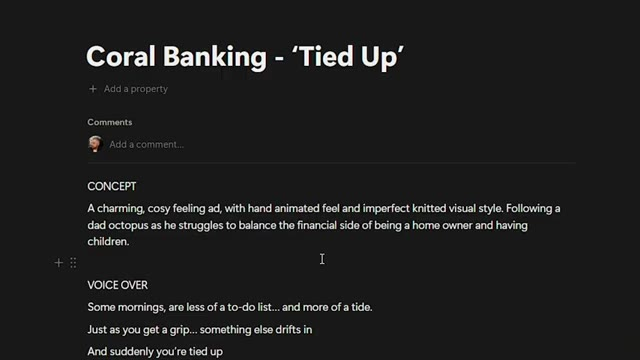
*Page Notion montrant le concept et le script de la publicité pour "Coral Banking - 'Tied Up'".*

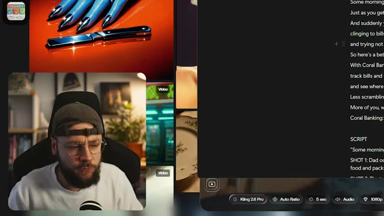
*Écran partagé montrant une page Notion et des panneaux de génération vidéo (Artlist / Kling 2.6 Pro) avec une incrustation vidéo PiP du créateur en bas à gauche.*

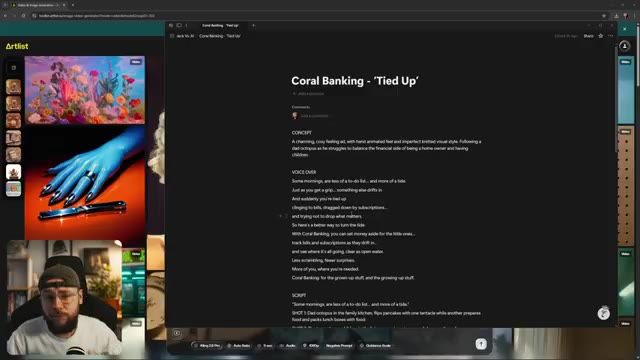
*Vue plus large du bureau montrant l'application Artlist avec les préréglages Kling 2.6 Pro et le script détaillé dans Notion.*

---

### ⏱️ `[00:02:31 - 00:03:05]` | Segment #06

**🔊 Audio (Transcription Intégrale Mot pour Mot en Français) :**
> guidez le montage lui-même. Vous construisez en quelque sorte tous les éléments visuels autour de l'audio et donc j'ai pensé cette fois-ci plutôt que de rétro-concevoir le tout en commençant par le visuel et en revenant à l'audio, commençons simplement par la voix off, cela a plutôt du sens. Donc ce que nous avons ici c'est le script de voix off terminé. Je voulais y intégrer beaucoup de jeux de mots sur les récifs coralliens et la vie marine mais rien de trop cliché ou évident, mais une fois que j'avais ça, j'ai pu retourner sur Artlist et laissez-moi juste mettre mon casque pour cette prochaine partie de la vidéo

**👁️ Analyse Visuelle d'Écran (gemini-3.5-flash-lite) :**
**Interface & Outils** : Navigateur web affichant la plateforme Artlist (toolkit.artlist.io) avec des interfaces de gestion de projet, des notes de script et un outil de génération vidéo par IA intégrant le modèle Kling 2.6 Pro.

**Contenu textuel & Code** : Texte du script visible à l'écran : "Coral Banking - 'Tied Up'", sections "CONCEPT", "VOICE OVER" (avec les lignes "Some mornings, are less of a to-do list... and more of a tide..."), et options de l'outil de génération : "Kling 2.6 Pro", "Auto Ratio", "5 sec", "Audio", "1080p", "Describe the video you want to create".

**Action / Démonstration** : Le créateur navigue dans son document de script sur Artlist, présente les éléments textuels de sa voix off, puis attrape son casque audio pour l'enfiler en vue de la section suivante.

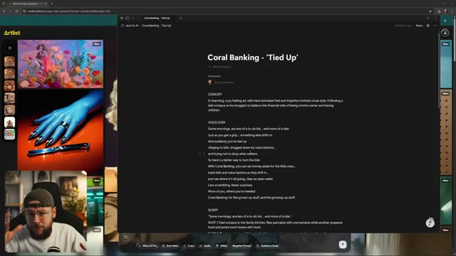
*Interface du site Artlist montrant un document Notion avec le script 'Coral Banking - 'Tied Up'' et une pastille vidéo PiP de Jack en bas à gauche.*

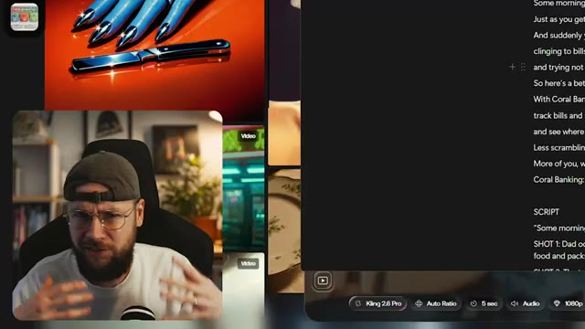
*Gros plan sur le script textuel du projet avec les options de génération vidéo en bas de l'écran (Kling 2.6 Pro, Auto Ratio, 5 sec, 1080p).*

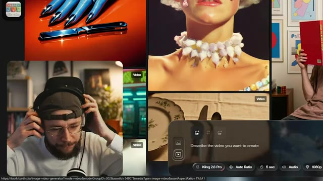
*Jack met son casque audio dans son studio devant l'interface d'Artlist affichant divers médias visuels et un champ de prompt.*

---

### ⏱️ `[00:03:05 - 00:03:40]` | Segment #07

**🔊 Audio (Transcription Intégrale Mot pour Mot en Français) :**
> parce que si nous remontons tout en haut de cette bannière ici, vous pouvez voir que nous avons un onglet pour la vidéo et l'image et un autre onglet pour la voix off, donc nous allons cliquer ici et sur cette page d'accueil nous avons toutes sortes d'exemples si nous allons de l'avant et cliquons sur certains d'entre eux, le prochain exercice va se concentrer sur notre contrôle de la colère mais celui-ci ici un moment enfin quand tout ce que vous avez porté allons-y pour quelque chose d'un peu différent plus qu'une exploration c'était une obsession de savoir ce qu'il y a au-delà du silence. Un peu de ce style de voix de bande-annonce classique là mais une très grande variété

**👁️ Analyse Visuelle d'Écran (gemini-3.5-flash-lite) :**
**Interface & Outils** : Interface web de la plateforme Artlist (toolkit.artlist.io) dédiée aux outils IA, incluant des générateurs de vidéo, d'image et de voix off, avec superposition vidéo PiP du présentateur.

**Contenu textuel & Code** : Texte visible dans l'interface : "New! All your AI tools and models, now organized for you", onglets "Home", "AI Toolkit", "Stock Catalog", et le champ de saisie "Enter your text in English to create a voiceover" avec les options "Eleven v3 (alpha)", "English", "American", "Stability".

**Action / Démonstration** : Le curseur de la souris survole les onglets de navigation et clique sur la section de génération de voix off, tandis que Jack commente les différents exemples audio et styles de voix.

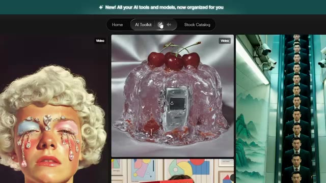
*Interface de la plateforme Artlist montrant les onglets de navigation supérieurs (Home, AI Toolkit, Stock Catalog) avec une sélection de médias générés par IA.*

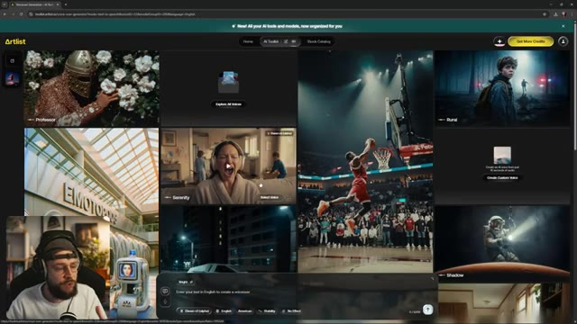
*Page de génération de voix off d'Artlist avec une grille d'exemples de voix et la caméra PiP de Jack dans le coin inférieur gauche.*

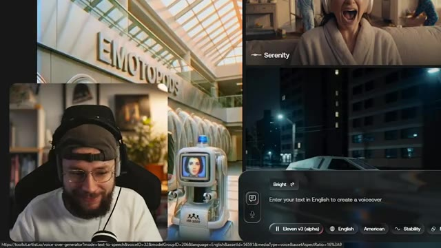
*Gros plan sur l'interface de génération de voix off d'Artlist avec le champ de texte pour la saisie et les paramètres de modèle vocal.*

---

### ⏱️ `[00:03:40 - 00:04:13]` | Segment #08

**🔊 Audio (Transcription Intégrale Mot pour Mot en Français) :**
> d'options différentes quand vous choisissez votre artiste voix off. Et si nous remontons tout en haut à gauche et survolons cette section, vous verrez que cette zone va s'élargir. Et c'est parce que lorsque vous commencez à générer avec la boîte à outils IA, les générations sont placées dans une session. Et si nous cliquons dans cette session ici, c'est juste une très belle façon d'organiser toutes vos générations pour vous. C'est encore plus utile quand il s'agit de générer nos images et vidéos. Donc c'est vraiment aussi simple que de coller votre script. Vous pouvez voir que nous sommes également capables de redimensionner le prompt textuel.

**👁️ Analyse Visuelle d'Écran (gemini-3.5-flash-lite) :**
**Interface & Outils** : Interface web d'Artlist (AI Toolkit / Voice Over Generator) avec une fenêtre PiP (Picture-in-Picture) de la webcam du créateur.

**Contenu textuel & Code** : Textes visibles : "Enter your text in English to create a voiceover", "Eleven v3 (alpha)", "English", "American", "Stability", "Stability 20%", "Stability 50% - preferred", "Eleven Multilingual V2", "AI Toolkit", "Stock Catalog".

**Action / Démonstration** : Le créateur navigue dans l'interface de la boîte à outils IA d'Artlist, survole les sections de sessions de génération, et montre l'organisation des voix off et des scripts textuels.

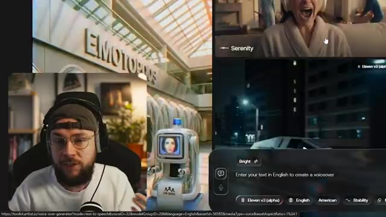
*Interface de l'outil Artlist affichant les options de voix off avec une incrustation vidéo de l'orateur en bas à gauche.*

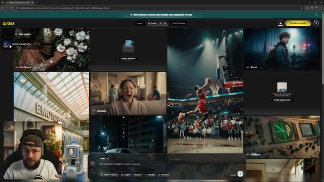
*Vue de l'interface Artlist montrant la grille de sélection des sessions de génération de voix off et de médias.*

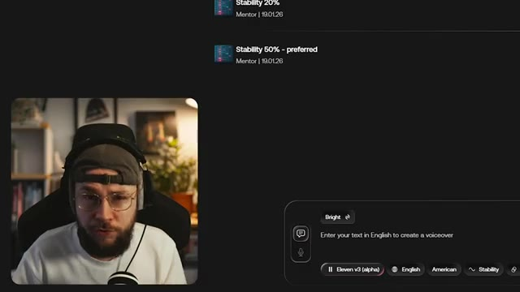
*Gros plan sur l'interface de génération avec les paramètres de stabilité et la zone de saisie du prompt texte.*

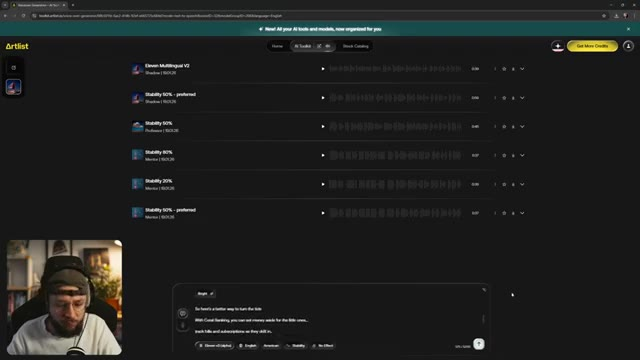
*Affichage complet de l'historique des générations audio avec les ondes sonores et les options de modèles (Eleven v3, Stability, etc.).*

---

### ⏱️ `[00:04:13 - 00:04:48]` | Segment #09

**🔊 Audio (Transcription Intégrale Mot pour Mot en Français) :**
> domaine également. C'est une petite fonctionnalité sympa. Et ensuite, si nous cliquons sur cet onglet de changement de voix, nous avons accès à cette immense bibliothèque de voix. Nous pouvons également activer différents filtres. En affinant les choses en fonction de la catégorie, du genre et de l'âge. Et je savais que je voulais un homme pour doubler notre publicité et je savais que je voulais qu'il soit d'âge mûr pour donner à la voix un peu plus d'autorité, mais aussi pour qu'elle semble assez chaleureuse et confortable. La première voix que j'ai essayée était donc le mentor, qui sonnait comme ceci : Certains matins ressemblent moins à une liste de tâches qu'à une marée. Et

**👁️ Analyse Visuelle d'Écran (gemini-3.5-flash-lite) :**
**Interface & Outils** : Interface web d'Artlist (AI Toolkit / Voiceover Generation) affichée en grand écran, avec un encadré vidéo (PiP) du présentateur en bas à gauche.

**Contenu textuel & Code** : Le site affiche une liste de générations vocales avec des modèles comme "Eleven Multilingual V2", "Stability 50%", "Stability 80%", etc., associés à des profils de voix ("Shadow", "Mentor"). En bas, une boîte de texte montre le script publicitaire ("So here's a better way to turn the tide...") avec des options de configuration (Eleven v3 [Alpha], English, American, Stability, No Effect).

**Action / Démonstration** : Le créateur présente l'interface d'Artlist et les différentes options de génération de voix off tout en parlant, visible dans l'encadré PiP.

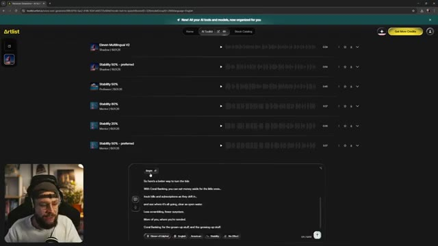
*Interface du site Artlist (AI Toolkit) montrant la liste des pistes audio générées avec leurs ondes sonores et les options de réglage textuel en bas à droite, avec le créateur en incrustation vidéo (PiP) dans le coin inférieur gauche.*

---

### ⏱️ `[00:04:48 - 00:05:23]` | Segment #10

**🔊 Audio (Transcription Intégrale Mot pour Mot en Français) :**
> Bien que j'aie aimé cet artiste de doublage, j'ai simplement trouvé qu'il ne donnait pas vraiment l'ambiance que je recherchais. Ce n'était pas assez chaleureux et confortable, vous voyez. Et vous pouvez voir qu'un certain nombre de ces premières générations ont été étiquetées avec différents pourcentages de stabilité. Donc, lorsque nous générons nos voix, c'est l'un des paramètres que nous pouvons contrôler. Vous pouvez voir ici que si nous survolons cette petite icône, il est écrit de contrôler à quel point la voix sonne expressive ou stable. Une stabilité plus faible rend la voix plus expressive et moins cohérente d'une génération à l'autre. Mais j'ai généralement constaté que 50 % de stabilité semble fonctionner plutôt bien et ici nous sommes également capables de sélectionner tous les différents

**👁️ Analyse Visuelle d'Écran (gemini-3.5-flash-lite) :**
**Interface & Outils** : Interface web de l'outil de génération de voix par IA d'Artlist, avec une vignette vidéo PiP de Jack dans le coin inférieur gauche.

**Contenu textuel & Code** : Texte de la voix off ("Some mornings, are less of a to-do list... and more of a tide..."), réglages de stabilité ("Stability 50%", "Stability 20%", "Stability 80%"), et modèles de voix (Eleven v3 alpha, Eleven Multilingual v2, MiniMax 02 HD, Cartesia Sonic 2).

**Action / Démonstration** : Le créateur montre l'interface de génération vocale, survole l'infobulle du paramètre de stabilité et présente les différents modèles de voix disponibles.

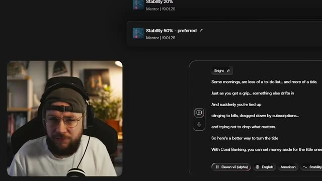
*Interface d'Artlist montrant le texte du doublage et les générations précédentes avec différents niveaux de stabilité.*

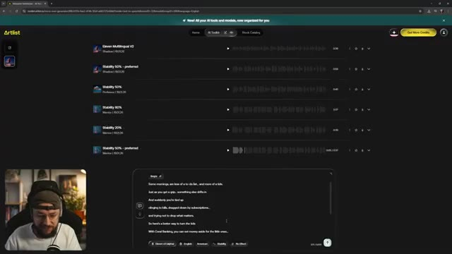
*Vue d'ensemble de l'interface d'Artlist avec la liste des pistes audio générées et la fenêtre de saisie du texte en bas.*

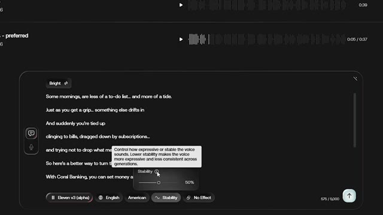
*Gros plan sur le menu déroulant et l'infobulle expliquant le paramètre de stabilité (Stability) de la voix.*

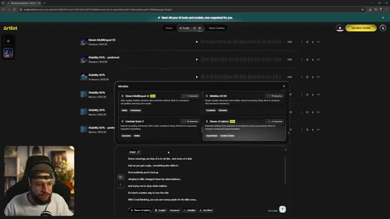
*Affichage du panneau de sélection des modèles de voix (Eleven Multilingual v2, MiniMax 02 HD, Cartesia Sonic 2, Eleven v3).*

---

### ⏱️ `[00:05:23 - 00:05:42]` | Segment #11

**🔊 Audio (Transcription Intégrale Mot pour Mot en Français) :**
> des modèles de voix. Il y a donc différentes voies que nous pouvons emprunter là aussi, qui ont toutes des paramètres légèrement différents. Et finalement, j'ai fini par passer le script par la voix off de l'artiste nommé Shadow, et voici ce que nous avons obtenu. Certains matins ressemblent moins à une liste de choses à faire et plus à une marée.

**👁️ Analyse Visuelle d'Écran (gemini-3.5-flash-lite) :**
**Interface & Outils** : Interface web de la plateforme Artlist (outil de génération de voix off) avec une incrustation vidéo (PiP) du créateur en bas à gauche.

**Contenu textuel & Code** : On aperçoit une fenêtre de sélection de modèles (« Models ») comprenant « Eleven Multilingual v2 », « MiniMax 02 HD », « Cartesia Sonic 2 », et « Eleven v2 (alpha) », ainsi qu'un champ de texte contenant le script avec des phrases comme « Some mornings, are less of a to-do list... and more of a tide. ».

**Action / Démonstration** : Le créateur montre l'interface de sélection des modèles de voix et de génération de voix off sur Artlist, tout en commentant les différentes options disponibles.

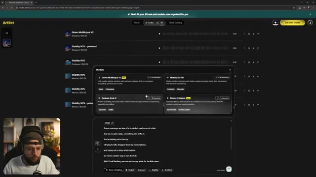
*Interface d'Artlist affichant les différents modèles de voix et la sélection du modèle de synthèse vocale avec un encadré PiP montrant Jack en bas à gauche.*

---

### ⏱️ `[00:05:43 - 00:06:13]` | Segment #12

**🔊 Audio (Transcription Intégrale Mot pour Mot en Français) :**
> Tout de suite, j'ai su que c'était exactement ce que je recherchais. Sa voix a en quelque sorte ce côté un peu rauque qui est agréable et naturel, mais il a aussi un ton très amical et accessible. Et c'est exactement l'ambiance que nous recherchons pour cette publicité animée. Donc ce que j'ai fait, c'est que j'ai cliqué sur cette icône ici pour télécharger la voix off. Et en passant sur Premiere Pro, j'ai découpé toutes ces brèves pauses, car si l'on écoute la voix off en entier, il y a pas mal d'intervalles, le rythme est un peu lent.

**👁️ Analyse Visuelle d'Écran (gemini-3.5-flash-lite) :**
**Interface & Outils** : Artlist (AI Toolkit / Voice Generator) et Adobe Premiere Pro.

**Contenu textuel & Code** : Texte du script visible dans l'encadré en bas : "Some mornings, are less of a to-do list... and more of a tide. Just as you get a grip... something else drifts in. And suddenly you're tied up, clinging to bills, dragged down by subscriptions... and trying not to drop what matters. So here's a better way to turn the tide. With Coral Banking, you can set money aside for the little ones..." Paramètres : Modèle Eleven V3 (Alpha), Voix Shadow, Accent Américain, Langue Anglais.

**Action / Démonstration** : Le créateur navigue sur Artlist pour sélectionner et écouter les options de voix off générées par IA, puis passe sur Adobe Premiere Pro pour éditer la piste audio en supprimant les silences et les pauses.

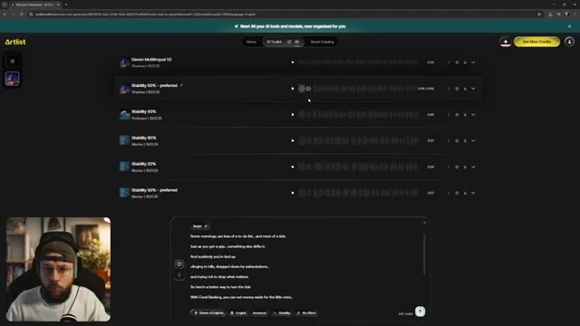
*Interface d'Artlist (AI Toolkit / Voice Generator) affichant plusieurs options de voix off générées (Eleven Multilingual V2, Stability 50% - preferred, etc.) avec le texte du script en bas.*

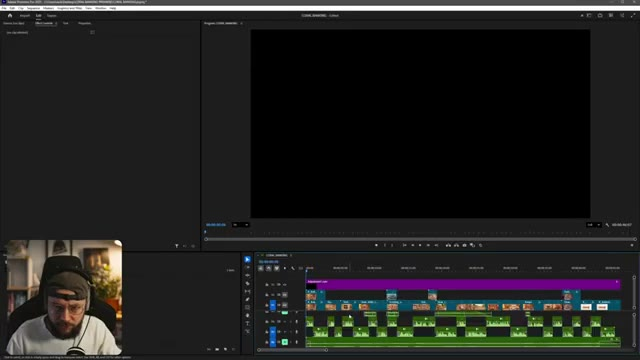
*Interface d'Adobe Premiere Pro montrant la chronologie (timeline) avec une piste vidéo supérieure et de nombreuses pistes audio découpées en segments vert (formes d'onde).*

*Interface d'Artlist (AI Toolkit) similaire montrant les détails d'une piste vocale sélectionnée avec les paramètres du modèle (Eleven V3 Alpha, Shadow, Américain, Anglais).*

---

### ⏱️ `[00:06:13 - 00:06:48]` | Segment #13

**🔊 Audio (Transcription Intégrale Mot pour Mot en Français) :**
> quelque chose d'autre dérive et soudain tu te retrouves coincé à t'accrocher à des factures entraîné vers le bas par des abonnements et à essayer de ne pas lâcher ce qui compte vois-tu certains de ces espaces de respiration sont juste un tout petit peu trop longs donc on traite un peu ça comme une vraie voix off enregistrée je vais dedans et je coupe ces sortes de silences maladroits et si on zoome un tout petit peu ici tu peux voir que j'ai fait un fondu entrant sur chacun de ces clips de la voix off. Et si on écoute juste, je vais te montrer la différence

**👁️ Analyse Visuelle d'Écran (gemini-3.5-flash-lite) :**
**Interface & Outils** : Artlist (outil AI Toolkit) sur l'image 1 et Adobe Premiere Pro sur l'image 2, avec incrustation vidéo (PiP) du créateur en bas à gauche sur les deux images.

**Contenu textuel & Code** : Sur l'image 1, interface d'Artlist avec le texte du prompt vocal : "Some mornings, are less of a to-do list... and more of a tide. Just as you get a grip... something else drifts in... And suddenly you're tied up..." Sur l'image 2, interface d'Adobe Premiere Pro avec le projet nommé "CORAL_BANKING" et la timeline comportant plusieurs pistes vidéo et audio vertes.

**Action / Démonstration** : Le créateur présente d'abord la génération de voix off sur Artlist, puis bascule sur Adobe Premiere Pro pour montrer le montage, la découpe des silences et les fondues sur la timeline audio.

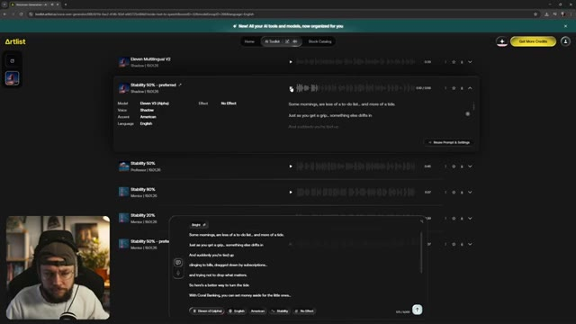
*Interface d'Artlist AI Toolkit montrant les pistes audio générées avec les formes d'onde et les prompts textuels, avec Jack en incrustation vidéo (PiP) dans le coin inférieur gauche.*

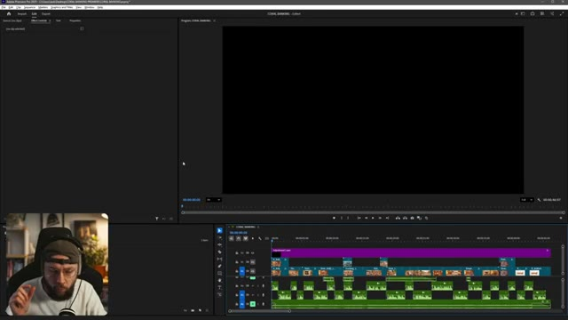
*Interface d'Adobe Premiere Pro montrant la timeline de montage avec les clips vidéo et audio découpés, et Jack en incrustation vidéo (PiP) dans le coin inférieur gauche.*

---

### ⏱️ `[00:06:48 - 00:07:21]` | Segment #14

**🔊 Audio (Transcription Intégrale Mot pour Mot en Français) :**
> dans le genre de rythme. C'est sur quoi j'ai opté. C'était en fait la première partie du montage qui a été pour ainsi dire verrouillée. Certains matins ressemblent moins à une liste de choses à faire qu'à autre chose. Juste au moment où vous reprenez le contrôle, quelque chose d'autre s'infiltre et soudain vous êtes pris au piège. J'étais donc vraiment, vraiment content de cela. J'avais l'impression que c'était un point d'ancrage très solide pour la suite. Et la prochaine étape du processus de montage audio a bien sûr consisté à ajouter la piste musicale. Donc si je désactive le mode muet de cette piste du bas

**👁️ Analyse Visuelle d'Écran (gemini-3.5-flash-lite) :**
**Interface & Outils** : Adobe Premiere Pro (logiciel de montage vidéo)

**Contenu textuel & Code** : Timeline de montage nommée « CORAL BANKING » avec de multiples pistes vidéo (V1, V2, V3) et pistes audio vertes, ainsi qu'une couche d'ajustement violette.

**Action / Démonstration** : Jack présente l'interface de son logiciel de montage et commente ses choix de rythme et de montage audio tout en gesticulant.

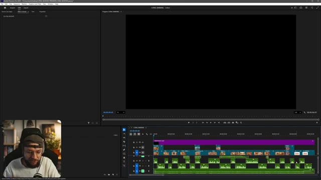
*Interface d'Adobe Premiere Pro montrant la timeline du projet avec les pistes audio et vidéo, avec Jack incrusté en bas à gauche.*

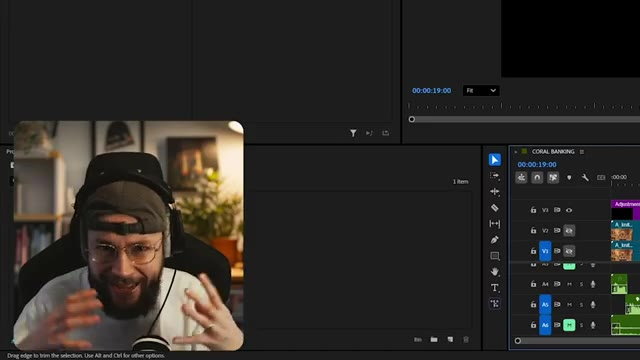
*Gros plan sur Jack incrusté en bas à gauche expliquant le processus de montage dans Adobe Premiere Pro, avec la timeline visible à droite.*

---

### ⏱️ `[00:07:21 - 00:07:47]` | Segment #15

**🔊 Audio (Transcription Intégrale Mot pour Mot en Français) :**
> ici je voulais opter pour quelque chose d'assez minimal mais charmant aussi et ça se synchronise vraiment bien avec la voix off. Donc allons-y et écoutons les deux ensemble. C'est là que le montage commence vraiment. Certains matins ressemblent moins à une liste de tâches et juste au moment où vous reprenez le contrôle, quelque chose d'autre dérive. J'étais donc vraiment heureux de cela comme base pour notre montage.

**👁️ Analyse Visuelle d'Écran (gemini-3.5-flash-lite) :**
**Interface & Outils** : Adobe Premiere Pro

**Contenu textuel & Code** : Timeline de montage nommée "CORAL BANKING", pistes vidéo (V1, V2, V3) et pistes audio avec formes d'ondes vertes, calque d'ajustement violet, et panneau de script affichant des instructions de plans ("SHOT 1", "SHOT 2", etc.) et des lignes de texte du voiceover.

**Action / Démonstration** : Le créateur présente son projet de montage vidéo dans Premiere Pro, démontrant la synchronisation entre la voix off et les éléments visuels sur la timeline.

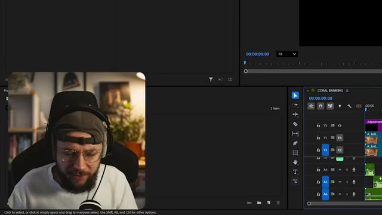
*Interface d'Adobe Premiere Pro montrant la timeline du projet avec des pistes vidéo et audio, et le créateur incrusté en bas à gauche.*

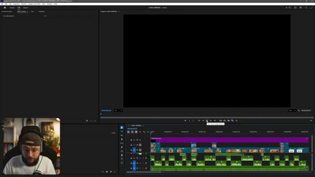
*Vue d'ensemble du projet Adobe Premiere Pro avec la timeline détaillée comportant plusieurs clips et une couche d'ajustement.*

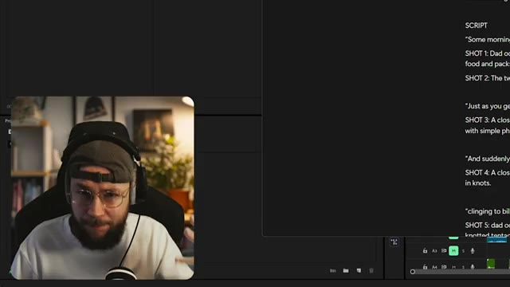
*Affichage de l'interface de montage avec une fenêtre de script textuel visible à droite sur l'écran.*

---

### ⏱️ `[00:07:48 - 00:08:10]` | Segment #16

**🔊 Audio (Transcription Intégrale Mot pour Mot en Français) :**
> La chose suivante que j'ai faite a été d'écrire le script lui-même. Donc, en gros, il s'agissait simplement de prendre des lignes spécifiques de la voix off, puis de réfléchir à chaque plan individuel que je voulais pour accompagner cette ligne spécifique. Donc bien sûr, nous commençons dans la cuisine avec le papa poulpe qui cuisine des crêpes en quelque sorte. Ensuite, nous voulons montrer les enfants qui sautent de haut en bas sur le canapé.

**👁️ Analyse Visuelle d'Écran (gemini-3.5-flash-lite) :**
**Interface & Outils** : Adobe Premiere Pro avec le texte du script affiché dans une fenêtre centrale et la timeline audio/vidéo en bas.

**Contenu textuel & Code** : Le script textuel complet de la vidéo publicitaire "Coral Banking", détaillant les plans (SHOT 1 à SHOT 8) avec les descriptions visuelles et les répliques associées.
[DESC_IMAGE_2_CONTENT] Image fixe d'une animation en stop-motion style feutre/laine représentant un petit poulpe tricoté qui saute sur un canapé clair, avec un bébé poulpe dans un transat à côté.

**Action / Démonstration** : Le créateur montre son processus d'écriture de scénario et d'association plan par plan dans Premiere Pro (Image 1), suivi de l'illustration visuelle concrète d'un des plans du script (Image 2).

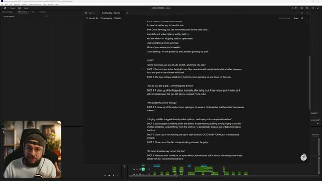
*Interface d'Adobe Premiere Pro montrant le script textuel détaillé du projet avec le créateur en incrustation vidéo (PiP) dans le coin inférieur gauche.*

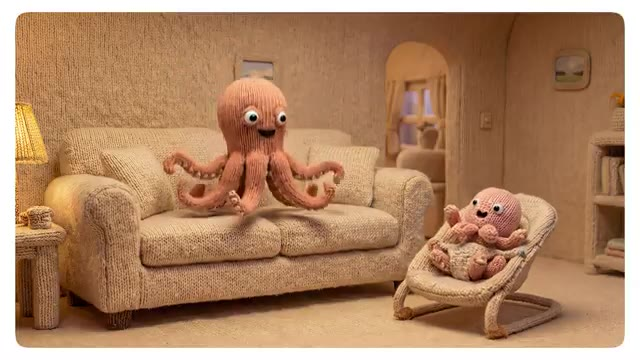
*Rendu vidéo généré par IA montrant un personnage de poulpe en tricot/laine sautant sur un canapé dans un salon chaleureux aux textures tricotées.*

---

### ⏱️ `[00:08:10 - 00:08:45]` | Segment #17

**🔊 Audio (Transcription Intégrale Mot pour Mot en Français) :**
> Je savais que je voulais aussi le montrer dans différents environnements. Donc au supermarché, par exemple. Et j'ai aussi eu cette super idée pendant que j'écrivais le scénario, une sorte de métaphore. Et c'est cette idée que le papa pieuvre est tellement submergé par ses finances que ses tentacules finissent par se nouer. Et c'est bien sûr pour cela que la publicité s'appelle Coral Banking tied up. Donc à ce moment-là, tous les éléments sont en place et j'ai pu retourner sur Artlist une fois de plus. Cette fois-ci en remontant tout en haut vers la bannière principale, l'outil IA, mais en cliquant cette fois-ci sur

**👁️ Analyse Visuelle d'Écran (gemini-3.5-flash-lite) :**
**Interface & Outils** : Adobe Premiere Pro et Artlist (plateforme web)

**Contenu textuel & Code** : Dans l'image 3 : Texte du script de la publicité ('SHOT 5: dad octopus is walking down the aisle...', 'SHOT 6: Close up of him holding the tub of baby formula...'). Dans l'image 4 : Bannière Artlist avec les onglets 'Home', 'AI Toolkit', et 'Stock Catalog', ainsi que des fichiers audio et des lignes de transcription textuelle ('Some mornings, are less of a to-do list...').

**Action / Démonstration** : Le curseur de la souris survole et clique sur l'onglet 'AI Toolkit' dans l'interface d'Artlist, tandis que la vue précédente montrait le déroulement du script dans Adobe Premiere Pro.

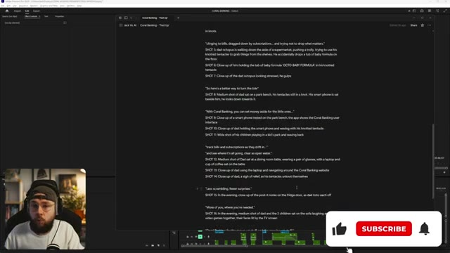
*Capture d'écran du logiciel de montage Adobe Premiere Pro affichant le scénario textuel de la publicité 'Coral Banking - Tied Up' avec le créateur en incrustation vidéo (PiP) dans le coin inférieur gauche.*

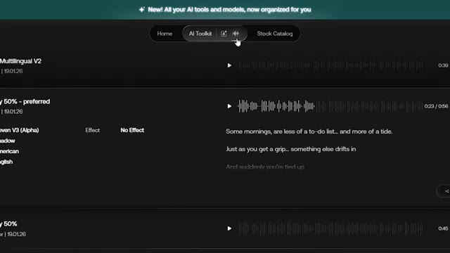
*Interface de la plateforme Artlist montrant la barre de navigation supérieure avec l'onglet 'AI Toolkit' sélectionné et des pistes audio avec formes d'ondes.*

---

### ⏱️ `[00:08:45 - 00:09:19]` | Segment #18

**🔊 Audio (Transcription Intégrale Mot pour Mot en Français) :**
> vidéo et image. Et si je redimensionne juste la fenêtre du prompt textuel ici, vous pouvez voir que nous sommes sur la page d'exploration. C'est super si vous cherchez une sorte d'inspiration. Il y a beaucoup d'exemples vraiment très variés de réalisation de films et de publicités par IA ici à découvrir pour vous les gars. Il suffit de survoler chacun d'eux, ils vont commencer à jouer automatiquement et c'est la même chose pour vos générations également ce qui m'amène gentiment par ici vous pouvez voir toutes mes différentes sessions et je savais que depuis mon script je voulais montrer une partie de l'interface utilisateur de Coral Banks

**👁️ Analyse Visuelle d'Écran (gemini-3.5-flash-lite) :**
**Interface & Outils** : Navigateur web affichant la plateforme Artlist AI Toolkit (page "Explore" / "AI Toolkit") avec un panneau latéral de sessions et une fenêtre de prompt en bas.

**Contenu textuel & Code** : URL "toolkit.artlist.io/image-video-generator", onglets "Home", "AI Toolkit", "Stock Catalog", barre de prompt "Describe the image you want to create", et vignettes labellisées "Video".

**Action / Démonstration** : Le créateur navigue sur la plateforme Artlist AI Toolkit, montre la page d'exploration remplie d'exemples vidéo, puis ouvre le panneau latéral affichant ses différentes sessions de projet.

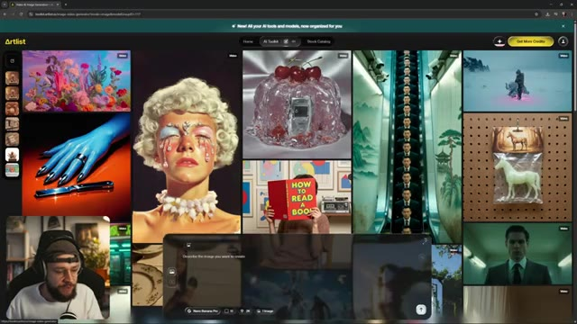
*Vue globale de la page d'exploration d'Artlist AI Toolkit avec différents exemples de vidéos et d'images générées par IA.*

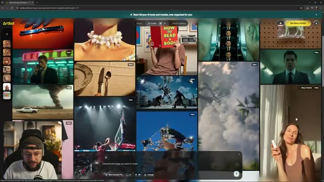
*Défilement de la page d'exploration montrant une variété de créations publicitaires et cinématiques en vignettes vidéo.*

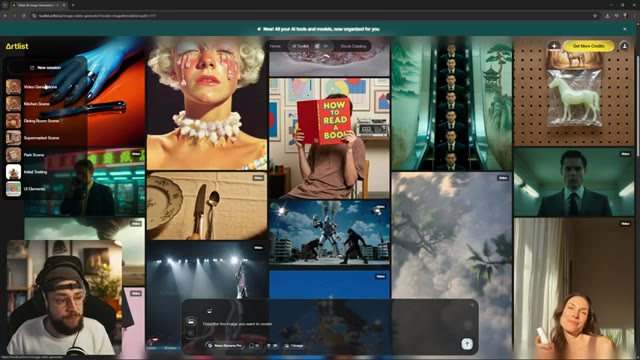
*Affichage du panneau latéral des différentes sessions de travail utilisateur (Video Generations, Kitchen Scene, Dining Room Scene, etc.).*

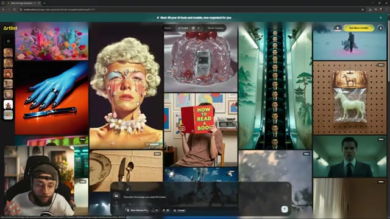
*Retour à la page d'exploration principale avec le curseur survolant les vignettes de démonstration vidéo.*

---

### ⏱️ `[00:09:19 - 00:09:51]` | Segment #19

**🔊 Audio (Transcription Intégrale Mot pour Mot en Français) :**
> sur l'écran du téléphone et l'écran de l'ordinateur portable. Donc encore une fois, cela avait vraiment du sens de commencer par là plutôt que de générer les images de départ pour chaque plan que nous allons animer plus tard, je voulais commencer par créer les éléments de l'interface utilisateur. Nous y voilà donc. Donc ce que nous pouvons faire, bien sûr, c'est aller de l'avant et télécharger une image. J'ai créé en fait une version très basique de ce genre de texte, de police assez similaire, mais je l'ai injectée dans Artlist. J'ai choisi le modèle Nano Banana Pro, qui est le même modèle d'image

**👁️ Analyse Visuelle d'Écran (gemini-3.5-flash-lite) :**
**Interface & Outils** : Navigateur web affichant la plateforme de création Artlist (AI Toolkit / Image & Video Generation) et des maquettes graphiques.

**Contenu textuel & Code** : Texte "Logo mock-up", logo "coral banking", nom du modèle "Nano Banana Pro", interface avec options d'upload et de génération d'images.

**Action / Démonstration** : Le créateur montre l'utilisation de l'outil Artlist et de ses modèles d'IA pour générer des éléments d'interface utilisateur et des maquettes de logo.

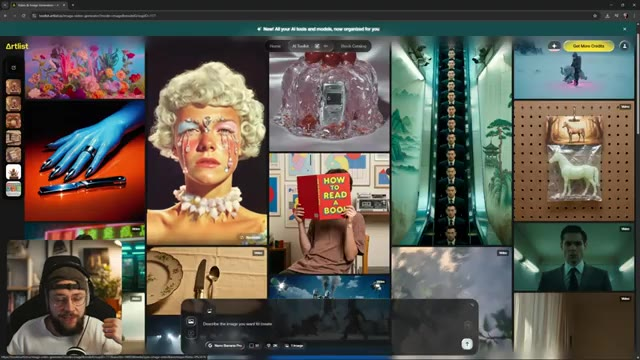
*Interface d'Artlist montrant la galerie d'images et la sélection du modèle Nano Banana Pro, avec Jack incrusté dans le coin inférieur gauche.*

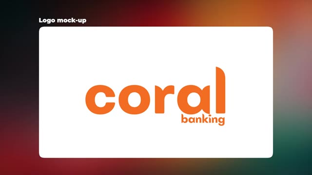
*Maquette de logo sur fond abstrait affichant le texte "coral banking" en orange.*

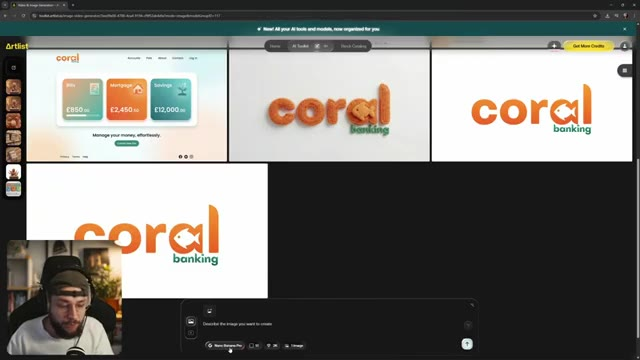
*Interface d'Artlist présentant différentes versions générées d'éléments d'interface et de logos de la marque "coral banking".*

---

### ⏱️ `[00:09:51 - 00:10:29]` | Segment #20

**🔊 Audio (Transcription Intégrale Mot pour Mot en Français) :**
> que j'ai utilisé tout au long de ce projet. Je pense toujours que c'est le meilleur qui soit. Nous pouvons aller de l'avant et choisir notre rapport hauteur/largeur et notre résolution. Je choisis toujours 4k. Nous pouvons également choisir le nombre d'images que nous voulions en retour. Et ce que j'ai fait, c'est que j'ai pris cette référence initiale très simple que j'avais fournie et j'ai simplement demandé à Nano Banana de modifier la lettre A pour qu'elle ressemble un peu plus à un poisson. Restez subtil. Veillez à ce que le texte ait des lignes nettes. Faites en sorte que le mot banking soit d'une couleur verte qui complète l'orange du mot coral. Ajoutez un dégradé subtil à toutes les lettres, une image de marque professionnelle pour un client à gros budget. Et ce que nous avons obtenu était vraiment, vraiment bien,

**👁️ Analyse Visuelle d'Écran (gemini-3.5-flash-lite) :**
**Interface & Outils** : Navigateur web affichant l'interface de génération d'images et de vidéos d'Artlist Toolkit, avec le modèle "Nano Banana Pro".

**Contenu textuel & Code** : Texte du prompt visible : "Change the letter 'a' to look slightly more like a fish, keep it subtle. Ensure the text has sharp lines. Make the 'banking' a green colour that compliments the orange of the word 'coral'. Add a subtle gradient to all lettering. Professional branding for a big budget client." Paramètres : Modèle Nano Banana Pro, rapport 16:9, qualité 2K, format JPEG, date du 19 janvier 2026.

**Action / Démonstration** : Le créateur présente l'interface d'Artlist, sélectionne et zoome sur le résultat de la génération de logo avec le prompt textuel associé pour illustrer son processus de design assisté par IA.

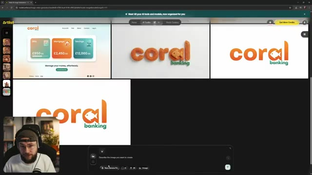
*Interface de l'outil Artlist montrant des exemples de génération d'images et le panneau de prompt inférieur.*

*Affichage détaillé du logo "coral banking" généré avec le panneau latéral affichant le prompt et les paramètres.*

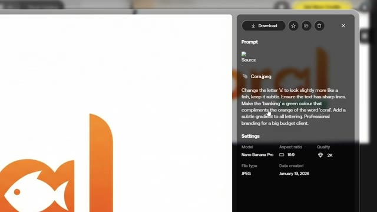
*Gros plan sur le panneau latéral textuel détaillant le prompt exact utilisé pour la modification du logo.*

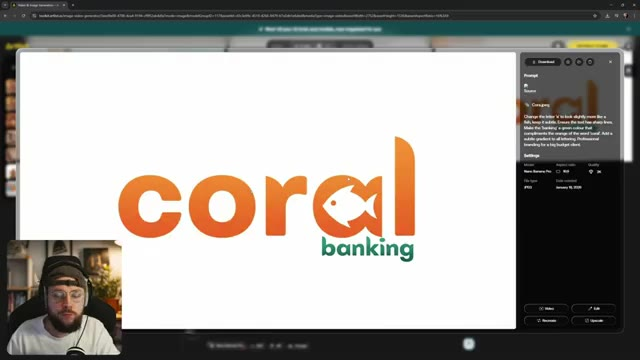
*Affichage du logo généré avec le panneau latéral des paramètres techniques et options d'exportation.*

---

### ⏱️ `[00:10:29 - 00:11:02]` | Segment #21

**🔊 Audio (Transcription Intégrale Mot pour Mot en Français) :**
> exactement ce que je recherchais. Mais en réalité, ce n'était que la première étape, car plus tard nous allons plus loin et nous le faisons passer par ceci. Nous prenons ce logo très graphique et le transformons en ce style tricoté. Et je dois saluer Bayer King AI. Il a publié de très bons prompts textuels l'autre jour et j'ai été très inspiré pour reproduire ce style tricoté. Cela a vraiment contribué à façonner l'esthétique de toute la publicité. C'est un flux de travail très sympa de pouvoir prendre ces graphismes et

**👁️ Analyse Visuelle d'Écran (gemini-3.5-flash-lite) :**
**Interface & Outils** : Interface web d'Artlist (AI Toolkit / Image & Video Generation) avec un panneau d'affichage de résultats de génération d'images et un encadré PiP du créateur en bas à gauche.

**Contenu textuel & Code** : Texte du prompt visible sur l'image 2 : "Turn the logo into a handcrafted knitted wool texture. Every element appears made of soft yarn with visible knitting stitches and fuzzy fibers. Rounded edges, tactile surfaces. No hard lines. Still against the simple white background that does not have the knitted texture." Paramètres visibles : Nano Banana Pro, 1024x1024, Ratio 16:24.

**Action / Démonstration** : Le créateur montre son écran de navigateur web et zoome sur le logo généré au style tricoté pour illustrer son processus de transformation graphique.

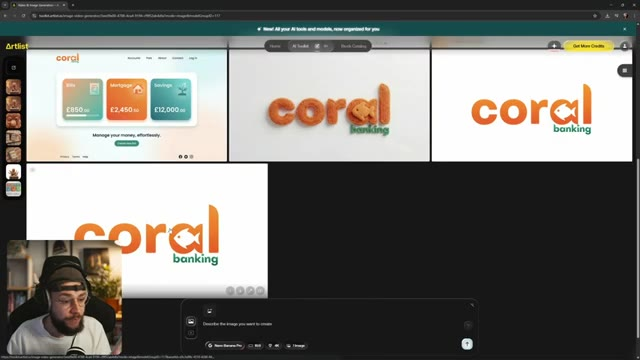
*Interface d'Artlist montrant la galerie de créations avec le logo 'coral banking' et le logo version tricoté.*

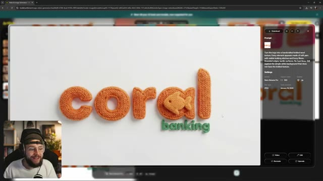
*Gros plan sur l'image générée du logo 'coral banking' en style tricoté avec le panneau de prompt à droite.*

---

### ⏱️ `[00:11:02 - 00:11:39]` | Segment #22

**🔊 Audio (Transcription Intégrale Mot pour Mot en Français) :**
> les faire passer par un style complètement différent pour vraiment leur donner vie et leur apporter plus de caractère. Et ensuite, j'ai pris soin de passer cela par le prompt d'upscale. C'est quelque chose que PJ Ace a fait récemment également. Vous pouvez voir que c'est un effort très collaboratif. Vous pouvez apprendre beaucoup d'autres créateurs dans le domaine de l'IA. J'espère que vous pouvez voir qu'en le faisant passer par ce prompt ici, qui essaie en quelque sorte d'améliorer la résolution, d'augmenter la netteté, d'augmenter la fidélité des éléments textuels, nous finissons par obtenir un très beau résultat ici de Nano Banana Pro. Et vraiment, nous commençons à construire l'esthétique de toute la publicité,

**👁️ Analyse Visuelle d'Écran (gemini-3.5-flash-lite) :**
**Interface & Outils** : Interface web d'Artlist (outil de génération d'images et vidéos par IA) avec le panneau latéral de Nano Banana Pro.

**Contenu textuel & Code** : Texte du prompt visible : « Preserve the exact composition — do not alter or add new elements. Increase resolution to true high-end clarity, with natural sharpness (no AI over sharpening). -keep the same colour temperature and colour tone Do not redraw. Do not stylise. Do not beautify. Only enhance realism and resolution. » Paramètres : Modèle « Nano Banana Pro », format « 16:9 », qualité « 4K », date « January 19, 2026 ».

**Action / Démonstration** : Le créateur présente la galerie de générations d'images sur Artlist et zoome sur le panneau de configuration du prompt d'upscale de Nano Banana Pro pour illustrer l'amélioration de la netteté et de la fidélité textuelle.

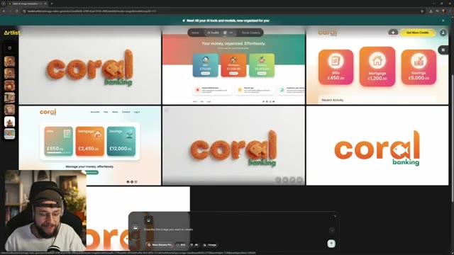
*Vue d'ensemble de l'interface d'Artlist montrant plusieurs maquettes et logos générés pour 'Coral Banking', avec Jack incrusté en bas à gauche.*

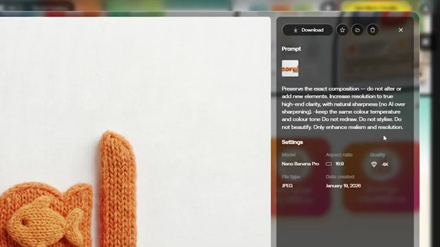
*Gros plan sur le panneau latéral du prompt d'upscale de Nano Banana Pro avec les réglages détaillés.*

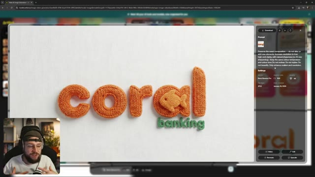
*Affichage de l'image agrandie du logo tricoté 'Coral Banking' avec les options de modification en bas à droite et le panneau de prompt.*

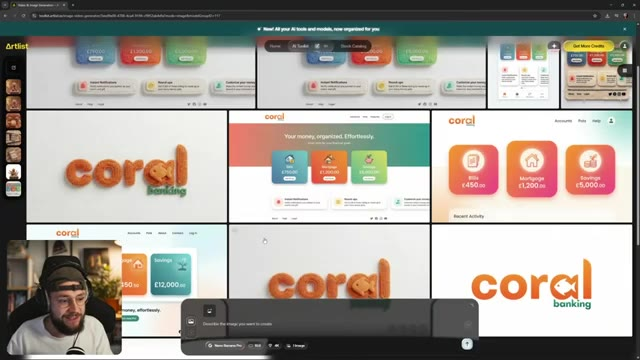
*Retour à la vue d'ensemble de la grille de génération sur Artlist montrant les différentes variations créatives de la publicité.*

---

### ⏱️ `[00:11:39 - 00:12:12]` | Segment #23

**🔊 Audio (Transcription Intégrale Mot pour Mot en Français) :**
> même si nous n'avons même pas encore créé nos personnages. En fait, je n'ai pas du tout fini par utiliser la mise en page web dans la publicité. C'était juste un tout petit peu trop compliqué à traduire dans le reste du style tricoté au sentiment assez simpliste, mais je pense toujours que c'était un exercice créatif vraiment important et bien sûr, le logo tricoté a fini par être affiché tout à la fin de la publicité. Donc maintenant, nous sommes allés de l'avant et nous sommes passés à cette session ici. Vous pouvez voir qu'elle s'intitule Tests initiaux. C'est ici que nous commençons vraiment à entrer dans la conception de personnages et

**👁️ Analyse Visuelle d'Écran (gemini-3.5-flash-lite) :**
**Interface & Outils** : Navigateur web affichant l'outil de génération d'images d'Artlist avec une vue en grille et un panneau de paramètres textuels, incluant un retour vidéo PiP du créateur.

**Contenu textuel & Code** : Texte affiché sur le site Artlist incluant des maquettes de sites web bancaires aux textures tricotées, le logo "coral banking" en laine, et divers concepts artistiques d'une pieuvre cuisinant. Le panneau latéral contient le prompt : "Preserve the exact composition – do not alter or add new elements..." et les réglages du modèle Nano Banana Pro.

**Action / Démonstration** : Le créateur navigue à travers ses maquettes et ses tests visuels sur l'interface d'Artlist tout en commentant ses choix de design et l'évolution du projet vers la conception des personnages.

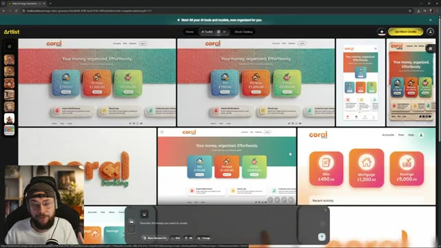
*Interface d'Artlist montrant la grille de projets avec des maquettes de sites web aux motifs tricotés et Jack en incrustation vidéo (PiP).*

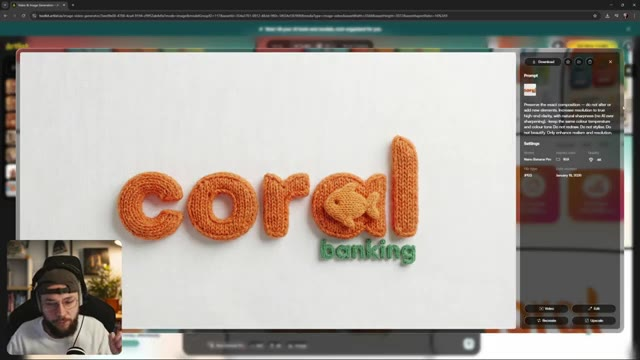
*Gros plan sur le logo "coral banking" en style tricoté avec le panneau de configuration et les paramètres de prompt à droite de l'écran.*

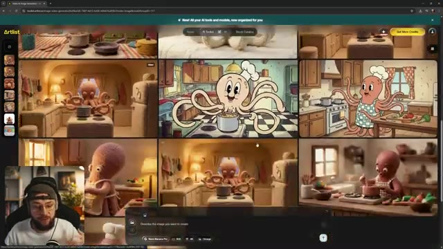
*Grille d'images de test montrant des scènes de cuisine avec une pieuvre et divers styles artistiques de personnages, avec Jack en bas à gauche.*

---

### ⏱️ `[00:12:12 - 00:12:47]` | Segment #24

**🔊 Audio (Transcription Intégrale Mot pour Mot en Français) :**
> Il y a un moment où je débattais du fait de faire un truc style cartoon à l'ancienne. J'ai aussi regardé ces genres de styles d'animation en pâte à modeler, mais il y a quelque chose dans cette ambiance tricotée que j'ai vraiment, vraiment aimée, et c'est l'une des premières choses que j'ai générées. Vous pouvez voir le prompt textuel ici en haut. Plan moyen d'un poucre en train de cuisiner dans une cuisine familiale avec un éclairage chaleureux. Textures de laine tricotée artisanale. Chaque élément semble fait de fil doux avec des points de tricot visibles et des fibres duveteuses. Bords arrondis, surfaces tactiles, pas de lignes dures. Et comme nous remontons...

**👁️ Analyse Visuelle d'Écran (gemini-3.5-flash-lite) :**
**Interface & Outils** : Interface web de la plateforme de génération Artlist avec un panneau latéral de détails et de prompts.

**Contenu textuel & Code** : Texte du prompt visible sur l'image 3 : "Medium shot of an octopus cooking in a family kitchen, with warm lighting. Handcrafted knitted wool texture. Every element appears made of soft yarn with visible knitting stitches and fuzzy fibres. Rounded edges, tactile surfaces. No hard lines." Paramètres : Modèle "Nano Banana Pro", aspect ratio 16:9, qualité 2K, date de création du 17 janvier 2026.

**Action / Démonstration** : Le créateur montre d'abord la grille d'options générées sur l'interface d'Artlist, puis zoome et sélectionne une image pour afficher les détails du prompt textuel et des réglages techniques dans le panneau latéral.

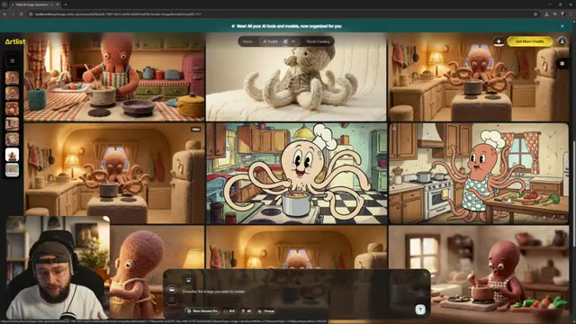
*Interface de la plateforme Artlist montrant une grille de génération d'images avec différents styles (dessin animé, style tricot) et le créateur incrusté en bas à gauche.*

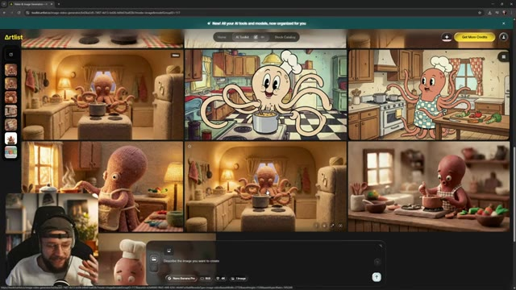
*Navigation dans la grille de résultats de génération sur Artlist avec les différentes propositions d'images de poulpe cuisinant.*

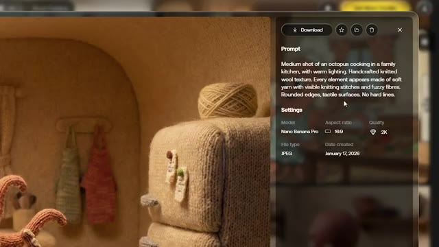
*Gros plan sur un panneau latéral affichant les détails de l'image sélectionnée, incluant le prompt textuel exact et les paramètres de génération (modèle Nano Banana Pro, ratio 16:9, qualité 2K).*

---

### ⏱️ `[00:12:47 - 00:13:23]` | Segment #25

**🔊 Audio (Transcription Intégrale Mot pour Mot en Français) :**
> Dans cette session, j'ai continué à expérimenter avec des styles légèrement différents et finalement, si nous nous dirigeons vers la session de la scène de la cuisine, nous avons commencé à vraiment perfectionner ce design de personnage. Laissez-moi juste faire défiler vers le bas ici. Donc, l'approche que j'ai adoptée était en fait similaire à celle que j'utilisais dans ma dernière vidéo si vous l'avez regardée. C'était un court-métrage et c'est un processus que vous avez peut-être vu beaucoup de cinéastes IA utiliser récemment et c'est cette idée de créer ces grilles de deux par deux qui ressemblent à des panneaux de storyboard. Et la raison pour laquelle c'est une bonne façon d'aborder la création du point de départ

**👁️ Analyse Visuelle d'Écran (gemini-3.5-flash-lite) :**
**Interface & Outils** : Navigateur web affichant l'outil de génération de vidéo/image d'Artlist (Artlist AI Toolkit), avec un encadré vidéo Picture-in-Picture (PiP) du créateur en bas à gauche.

**Contenu textuel & Code** : Texte du prompt visible sur l'image 4 : "Generate a photorealistic cinematic 2x2 grid of still frames from an animated advert with a handcrafted knitted wool texture. Every element appears made of soft yarn with visible knitting stitches and fuzzy fibers. Rounded edges, tactile surfaces. No hard lines. Ensure there is no text visible. Each frame represents a different angle or distance from the same sequence of action, capturing moments where..." Paramètres : Modèle "Nano Banana Pro", format "16:9", qualité "4K". Sur les post-it : "gas", "phone contract", "kid's clubs".

**Action / Démonstration** : Le créateur fait défiler l'écran (scroll) à travers les différentes grilles de storyboards générées par IA pour illustrer sa technique de conception de personnages en style stop-motion tricoté.

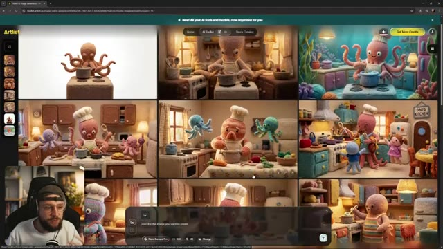
*Interface d'Artlist montrant une grille 3x3 de concepts visuels d'une pieuvre en laine dans une cuisine avec incrustation PiP du créateur.*

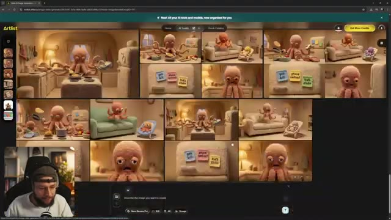
*Navigation dans la grille d'images générées montrant différentes scènes domestiques avec la pieuvre en style feutre/laine.*

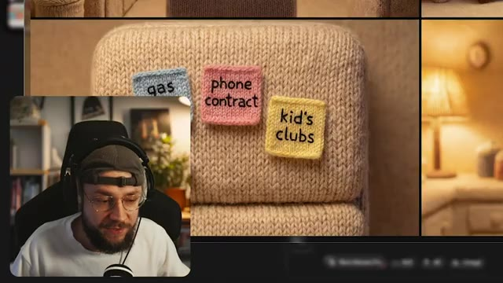
*Gros plan sur un détail d'une image générée montrant des post-it en laine avec les inscriptions "gas", "phone contract" et "kid's clubs".*

*Affichage d'une grille 2x2 détaillée avec le panneau de paramètres textuels et de prompts sur le côté droit.*

---

### ⏱️ `[00:13:23 - 00:13:56]` | Segment #26

**🔊 Audio (Transcription Intégrale Mot pour Mot en Français) :**
> des images de chacun de vos plans, ces images bien sûr qui serviront ensuite à être prises et animées avec des modèles vidéo plus loin dans la vidéo, est-ce que c'est parce que plutôt de générer chaque image complètement séparément l'une de l'autre, nous générons plusieurs images au sein de la même génération et cela signifie que Nano Banana Pro a une plus grande compréhension de la cohérence et de la continuité des personnages. Encore une fois, vous pouvez voir le prompt ici dans le coin supérieur droit. Je les déposerai ci-dessous dans la description de la vidéo si vous souhaitez aller de l'avant et les copier, essayer cette méthode par vous-même.

**👁️ Analyse Visuelle d'Écran (gemini-3.5-flash-lite) :**
**Interface & Outils** : Interface web de génération d'images et de vidéos par IA (Artlist Toolkit) avec panneau latéral de détails du prompt.

**Contenu textuel & Code** : Modèle : Nano Banana Pro. Format : 16:9. Qualité : 4K. Texte du prompt visible : « Generate a photorealistic cinematic 2x2 grid of still frames from an animated advert with a handcrafted knitted wool texture. Every element appears made of soft yarn with visible knitting stitches and fuzzy fibres. »

**Action / Démonstration** : Le créateur présente l'interface d'un outil de génération affichant une grille d'images multiples générées en une seule fois, puis zoome sur le panneau latéral contenant le prompt.

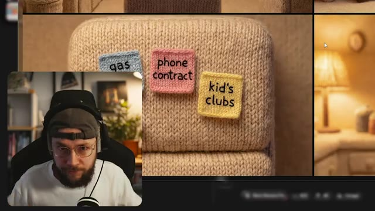
*Zoom sur la grille 2x2 générée montrant en gros plan le réfrigérateur tricoté avec des notes autocollantes texturées.*

*Interface de l'outil de génération affichant la grille complète de 4 images de style stop-motion en laine avec un panneau de prompt visible à droite.*

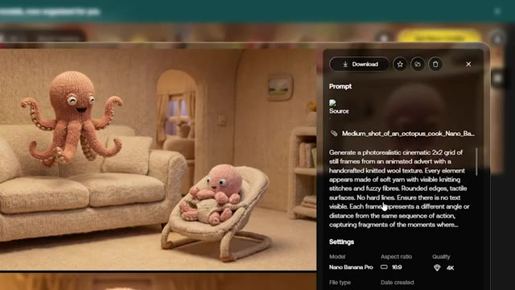
*Gros plan sur le panneau latéral droit affichant le texte complet du prompt et les paramètres de génération du modèle Nano Banana Pro.*

---

### ⏱️ `[00:13:56 - 00:14:30]` | Segment #27

**🔊 Audio (Transcription Intégrale Mot pour Mot en Français) :**
> Ce que nous faisons essentiellement, c'est que le prompt commence par ce cadre qui indique à Nano Banana que nous voulons ces grilles de deux par deux, et ensuite je décris spécifiquement chaque plan numéroté individuel avec ce que je veux que Nano Banana Pro me montre. En termes de référence d'image, nous aurions opté pour cette génération initiale de la pieuvre dans la cuisine qui a vraiment ancré le style pour toutes les générations qui ont suivi, et bien sûr, chacun de ces panneaux de storyboard se rapporte directement au script que j'ai écrit parce que je savais déjà de quels plans j'avais besoin.

**👁️ Analyse Visuelle d'Écran (gemini-3.5-flash-lite) :**
**Interface & Outils** : Interface web d'Artlist (outil de génération d'images/vidéos) et éditeur de texte/notes.

**Contenu textuel & Code** : Texte des prompts pour les plans de storyboard (FRAME 1, FRAME 2, FRAME 3, FRAME 4) décrivant les actions des pieuvres en peluche tricotée, ainsi qu'un script vidéo narratif intitulé "Coral Banking - Tied Up".

**Action / Démonstration** : Le créateur montre son processus de prompt structuré par grille 2x2 et le script correspondant utilisé pour guider la génération par IA.

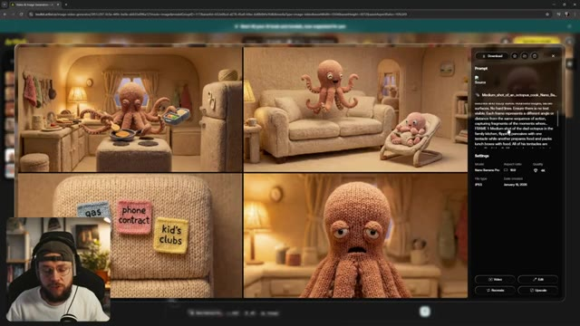
*Interface d'Artlist montrant une grille 2x2 de plans de pieuvre en laine et le panneau de prompt latéral, avec le créateur en incrustation PiP.*

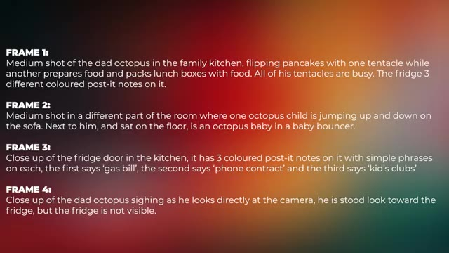
*Texte affiché sur fond coloré détaillant les prompts textuels pour FRAME 1 à FRAME 4 du storyboard.*

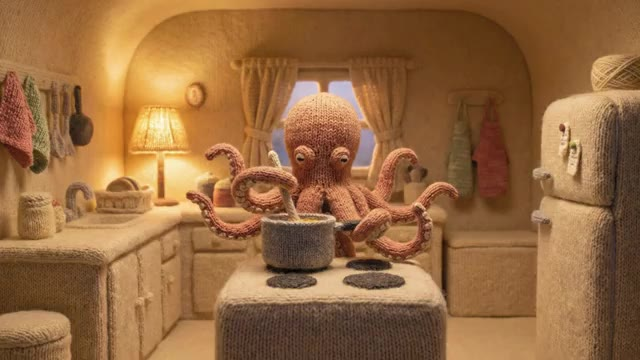
*Visuel généré en gros plan d'une pieuvre en laine cuisinant dans une cuisine tricotée.*

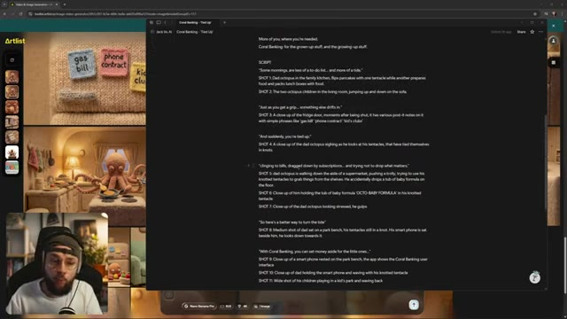
*Interface d'Artlist affichant un document texte de script (Coral Banking - Tied Up) par-dessus les générations d'images, avec le créateur en incrustation PiP.*

---

### ⏱️ `[00:14:30 - 00:15:05]` | Segment #28

**🔊 Audio (Transcription Intégrale Mot pour Mot en Français) :**
> à générer. C'est pourquoi la planification est si importante lorsqu'il s'agit de ces projets et pour tirer le meilleur parti de vos crédits, pour les faire aller plus loin. Une fois que vous êtes satisfait de votre grille deux par deux, vous pouvez passer à l'étape suivante du processus. Nous appliquons ce même prompt d'upscale que j'ai utilisé plus tôt sur le logo de Coral Banking, sauf que j'ajoute simplement cette brève phrase au début : "crop so that only the top left storable panel is shown" (recadrer pour que seul le panneau du storyboard en haut à gauche soit affiché). Ainsi, plutôt que d'avoir à y aller manuellement, à télécharger chaque grille 2x2, à les recadrer dans un autre logiciel puis à les réimporter dans Artlist,

**👁️ Analyse Visuelle d'Écran (gemini-3.5-flash-lite) :**
**Interface & Outils** : Navigateur web affichant l'interface de génération d'images et de vidéos de la plateforme Artlist (toolkit IA, outil Nano Banana Pro).

**Contenu textuel & Code** : Texte du prompt visible : "Crop so that only the top left storyboard panel is shown. Preserve the exact composition — do not alter or add new elements. Increase resolution to true high-end clarity, with natural sharpness (no AI over sharpening). -keep the same colour temperature and colour tone Do not redraw. Do not stylise. Do not beautify. Only enhance realism and resolution." Paramètres : Modèle Nano Banana Pro, 16:9, qualité 4K.

**Action / Démonstration** : Le présentateur explique l'importance de planifier les projets pour économiser les crédits de génération, puis montre comment appliquer un prompt d'upscale et de recadrage directement dans l'outil pour éviter d'isoler manuellement les images dans un logiciel externe.

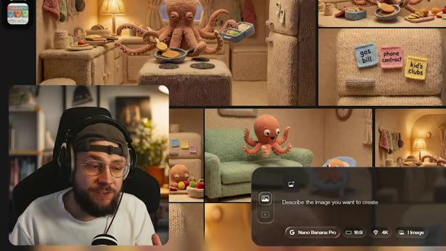
*Interface du générateur d'images Artlist montrant une grille 2x2 de style stop-motion avec une pieuvre cuisinant, et le créateur incrusté en bas à gauche.*

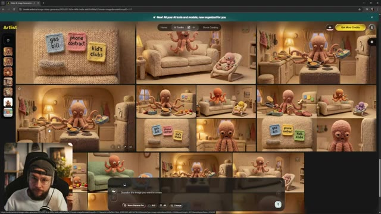
*Vue plus large de l'interface Artlist affichant les multiples grilles d'images générées de la pieuvre en laine.*

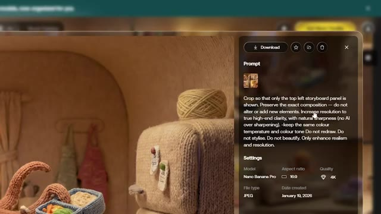
*Panneau latéral d'Artlist affichant les détails d'un prompt d'upscale et de recadrage pour isoler une portion de l'image.*

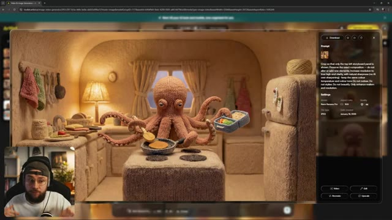
*Résultat du recadrage et de l'upscale appliqué sur le panneau supérieur gauche de la grille montrant la pieuvre cuisinant.*

---

### ⏱️ `[00:15:05 - 00:15:42]` | Segment #29

**🔊 Audio (Transcription Intégrale Mot pour Mot en Français) :**
> nous pouvons en fait tout faire directement ici juste en ajoutant cette phrase très simple au début de notre invite textuelle. Nous rognons donc dans chaque image individuelle puis nous les mettons à l'échelle supérieure, nous y ajoutons des textures plus nettes. Le flux de travail en grille 2x2 est vraiment vraiment super et pouvoir effectuer les recadrages dans Nano Banana Pro sans avoir cette étape supplémentaire le rend encore meilleur. Vous pouvez voir ici ce plan par exemple le niveau de détail textural sur ce frigo et le fait que toutes les lettres sont parfaites et ont toujours cette sensation tricotée. J'étais sérieusement impressionné

**👁️ Analyse Visuelle d'Écran (gemini-3.5-flash-lite) :**
**Interface & Outils** : Interface web d'ArtHub (toolkit.artlist.io/image-video-generator) avec encadré vidéo (PiP) du présentateur en bas à gauche.

**Contenu textuel & Code** : Panneau latéral droit affichant le prompt de recadrage (« Crop so that only the top left storyboard panel is shown... ») et les paramètres : modèle « Nano Banana Pro », aspect ratio « 16:9 », qualité « 4K », fichiers JPG du 19 janvier 2026.

**Action / Démonstration** : Le présentateur commente le résultat du recadrage et de l'amélioration de la texture d'une image générée par IA.

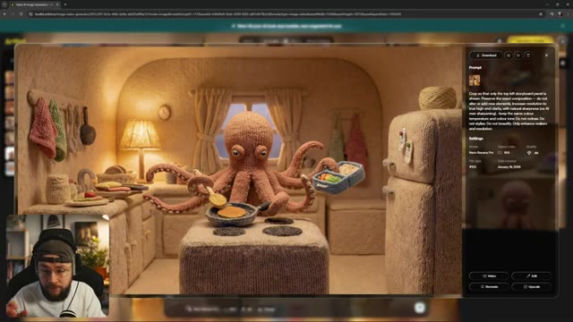
*Interface d'ArtHub montrant le rendu d'une scène de cuisine en laine tricotée avec un poulpe cuisinant et le panneau de paramétrage du modèle Nano Banana Pro.*

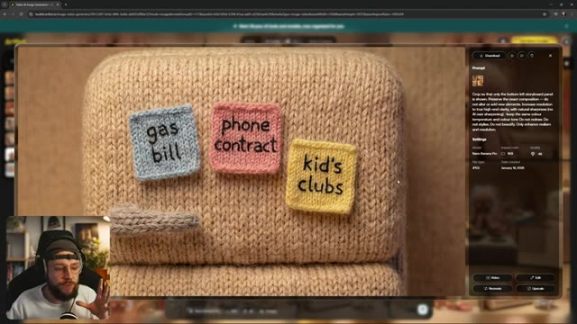
*Gros plan sur la texture d'un réfrigérateur en tricot avec des post-its brodés indiquant « gas bill », « phone contract » et « kid's clubs ».*

---

### ⏱️ `[00:15:42 - 00:16:18]` | Segment #30

**🔊 Audio (Transcription Intégrale Mot pour Mot en Français) :**
> de cela. Donc on avance essentiellement à travers chaque plan de notre script et on les coche au fur et à mesure que j'avance. Je fais aussi des modifications d'images ici. Donc par exemple, je prends ce plan du frigo et je demande à ce qu'un tentacule de pieuvre soit enroulé autour du cadre de la porte. Et une autre bonne façon d'utiliser la grille de deux par deux également est de lui demander simplement de générer des angles alternatifs de la même scène. Évidemment, je savais que pour ce plan je n'avais pas besoin de quatre plans différents mais j'ai quand même demandé de les générer et ensuite j'ai du contenu supplémentaire avec lequel travailler plus tard

**👁️ Analyse Visuelle d'Écran (gemini-3.5-flash-lite) :**
**Interface & Outils** : Navigateur web affichant l'outil de génération vidéo et d'images d'Artlist (Toolkit), avec un panneau latéral de prompt et de paramètres (modèle Nano Banana Pro, rapport 16:9, qualité 4K).

**Contenu textuel & Code** : Texte du prompt visible : "Crop so that only the bottom left storyboard panel is shown... FRAME 2: Show an alternatives shot and camera angle of the same scene." Notes sur le frigo : "gas bill", "phone contract", "kid's clubs". Modèle : Nano Banana Pro. Qualité : 4K.

**Action / Démonstration** : Le créateur montre l'utilisation d'une grille 2x2 pour générer différents plans et angles de caméra à partir d'un script, ainsi que la modification d'images spécifiques.

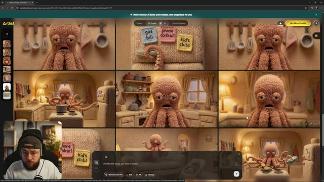
*Interface d'Artlist affichant une grille de 2x2 images générées mettant en scène une pieuvre en peluche dans une cuisine miniature, avec le créateur en incrustation (PiP).*

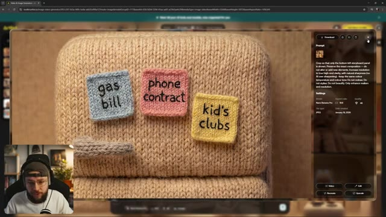
*Gros plan sur une image d'un réfrigérateur en tricot avec des post-its et le panneau latéral de configuration avec le prompt textuel et les paramètres.*

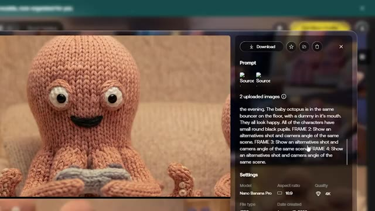
*Gros plan sur une image d'une pieuvre en peluche jouant avec une manette, avec le panneau latéral affichant les images sources et le prompt détaillé.*

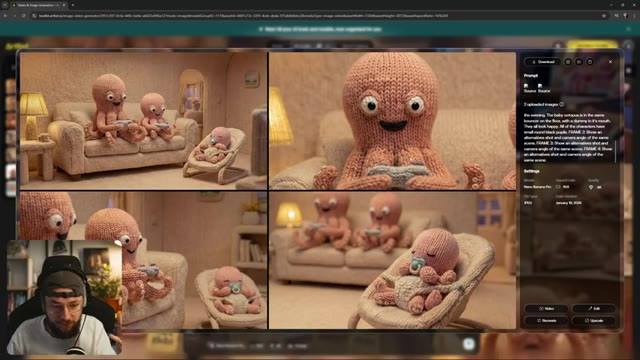
*Affichage d'une grille 2x2 de plans alternatifs montrant une famille de pieuvres en peluche dans un salon, avec le panneau de prompt visible à droite.*

---

### ⏱️ `[00:16:18 - 00:16:42]` | Segment #31

**🔊 Audio (Transcription Intégrale Mot pour Mot en Français) :**
> la ligne. Il y a donc une variété de façons différentes d'utiliser la méthode de la grille 2x2 dans votre génération d'images. Maintenant, en passant à la session séparée pour la scène du supermarché, si je vais de l'avant et ouvre cette grille 2x2 particulière, vous pouvez voir que la méthode a encore très bien fonctionné. J'ai été sérieusement impressionné par la façon dont Nano Banana Pro a été capable de peupler chaque étagère avec ces pots de lait infantile tricotés.

**👁️ Analyse Visuelle d'Écran (gemini-3.5-flash-lite) :**
**Interface & Outils** : Interface web d'Artlist (AI Toolkit) pour la génération d'images et de vidéos par IA, avec une disposition en grille 2x2, des paramètres de modèle (Nano Banana Pro) et un panneau latéral de prompts.

**Contenu textuel & Code** : Modèle utilisé : Nano Banana Pro. Paramètres : format 16:9, qualité 4K. Texte des prompts visibles pour la génération de scènes texturées en laine tricotée. Étiquettes de produits visibles : 'Octo-Milk baby formula' et enseigne 'Coral Mart'.

**Action / Démonstration** : Le créateur navigue dans l'interface d'Artlist, ouvre une session de grille 2x2 spécifique représentant une scène de supermarché et zoome sur les détails générés par l'IA.

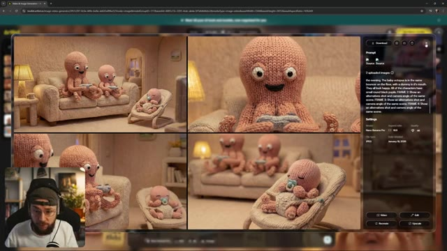
*Interface d'Artlist affichant une grille 2x2 d'images générées représentant des personnages en peluche tricotée dans un salon, avec le panneau de configuration à droite et la webcam du créateur en incrustation.*

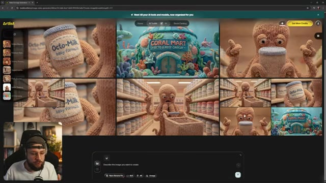
*Interface d'Artlist montrant la bibliothèque de sessions avec différentes grilles 2x2, incluant la scène du supermarché avec des pots de lait pour bébé tricotés ('Octo-Milk').*

*Gros plan sur une grille 2x2 ouverte dans Artlist montrant des scènes de supermarché avec un personnage de poulpe en tricot tenant un pot de 'Octo-Milk' et le supermarché 'Coral Mart'.*

---

### ⏱️ `[00:16:42 - 00:17:04]` | Segment #32

**🔊 Audio (Transcription Intégrale Mot pour Mot en Français) :**
> Vraiment de superbes plans ici. Je voulais aussi générer un plan extérieur du supermarché. Maintenant, je ne pensais même pas que j'allais utiliser celui-ci d'ailleurs, mais il a fini par très bien fonctionner au montage, donc je suis content de l'avoir fait. Encore une fois, ce plan ici, le gros plan sur le lait maternisé, je trouve juste que ça a l'air incroyable, avec toutes ces minuscules petites fibres de tissu qui se détachent de l'élément.

**👁️ Analyse Visuelle d'Écran (gemini-3.5-flash-lite) :**
**Interface & Outils** : Navigateur web affichant l'outil de génération d'images d'Artlist (toolkit.artlist.io), avec une vue en incrustation (PiP) du créateur en bas à gauche.

**Contenu textuel & Code** : Texte visible dans le panneau de prompt (Image 1 et 3) : "Generate a photorealistic cinematic 2x2 grid of still frames from an animated advert with a handcrafted knitted wood texture. Every element appears made of soft yarn with visible knitting stitches and fuzzy fibres. Rounded edges, tactile surfaces. No hard lines...". Paramètres : Modèle "Nano Banana Pro", format 16:9, qualité 4K.

**Action / Démonstration** : Le créateur navigue et zoome sur différentes images générées représentant des scènes de supermarché en style tricoté/laine, en mettant l'accent sur le gros plan d'un pot de lait maternisé.

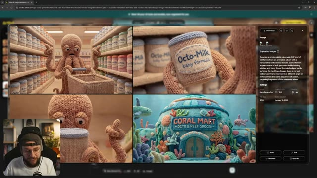
*Interface d'Artlist affichant une grille de 4 images générées par IA sur le thème de la laine et du tricot, avec le créateur en incrustation PiP.*

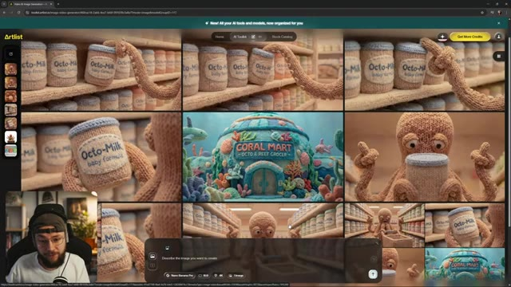
*Interface d'Artlist montrant une vue d'ensemble de plusieurs images de storyboard générées au format tricoté, avec le créateur en bas à gauche.*

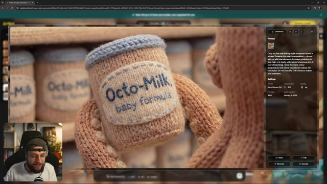
*Gros plan sur une image spécifique du pot de lait maternisé en laine ("Octo-Milk") avec le panneau de configuration et le prompt visible à droite.*

---

### ⏱️ `[00:17:04 - 00:17:26]` | Segment #33

**🔊 Audio (Transcription Intégrale Mot pour Mot en Français) :**
> Vraiment, vraiment impressionnant, ça. En passant également sur la session séparée pour la scène du parc. Je peux en quelque sorte vous montrer le problème que j'ai eu quand j'essayais de traduire l'interface utilisateur du téléphone dans ce style tricoté. Ça ne fonctionnait tout simplement pas correctement. Et je pense vraiment qu'une bonne règle empirique lorsqu'il s'agit d'IA, de publicité et de réalisation de films, c'est que faire plus simple est souvent mieux.

**👁️ Analyse Visuelle d'Écran (gemini-3.5-flash-lite) :**
**Interface & Outils** : Interface web d'Artlist (toolkit.artlist.io) dédiée à la génération d'images et de vidéos par IA, avec un panneau de navigation latéral et un panneau de configuration à droite.

**Contenu textuel & Code** : Menus visibles : "Video Generations", "Kitchen Scene", "Dining Room Scene", "Supermarket Scene", "Park Scene", "Initial Testing", "UI Elements". Paramètres du panneau droit : modèle "Nano Banana Pro", format "16:9", résolution "4K". Prompt visible : "Preserve the exact composition — do not alter or add new elements..."

**Action / Démonstration** : Le créateur navigue à travers ses sessions de projet et zoome sur différentes variantes générées pour la scène du parc afin d'illustrer les difficultés rencontrées avec l'interface utilisateur.

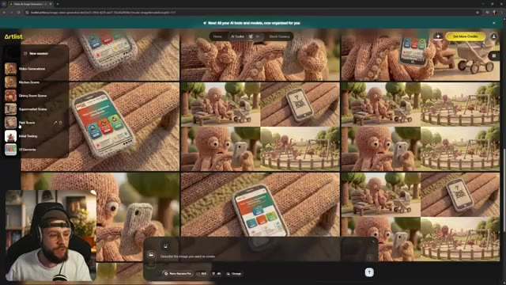
*Interface de l'outil Artlist montrant une grille de storyboard avec des variations de scènes de parc incluant un téléphone au style tricoté et un personnage de poulpe.*

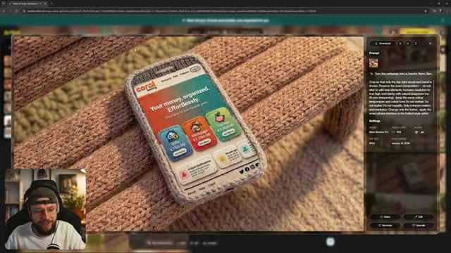
*Gros plan sur une image générée montrant un téléphone portable texturé en tricot posé sur un banc en bois, avec une interface bancaire affichée à l'écran.*

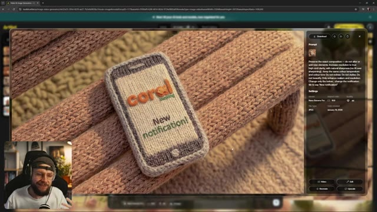
*Gros plan sur une autre version de l'image générée montrant le téléphone tricoté avec le logo "coral banking" et le texte "New notification!".*

---

### ⏱️ `[00:17:26 - 00:18:02]` | Segment #34

**🔊 Audio (Transcription Intégrale Mot pour Mot en Français) :**
> Facilitez-vous un peu la tâche si cela ne nuit en rien au narratif, ce qui n'est pas le cas, n'est-ce pas ? Ça fonctionne toujours exactement comme nous en avons besoin. J'ai réalisé récemment qu'utiliser des outils d'IA, c'est beaucoup de résolution de problèmes. Vous allez rencontrer des problèmes lorsque vous les utilisez et il s'agit de savoir comment vous naviguez à travers ces problèmes. Une fois de plus, en passant à la session de la scène de la salle à manger, vous pouvez voir que j'avais aussi du mal à traduire l'interface utilisateur sur l'écran de l'ordinateur portable. Donc, une fois de plus, j'ai fini par opter pour une approche plus simpliste et cela a très bien fonctionné. Une autre très belle génération ici,

**👁️ Analyse Visuelle d'Écran (gemini-3.5-flash-lite) :**
**Interface & Outils** : Interface web de génération d'images/vidéos par IA (toolkit Artlist) avec panneau latéral de réglages et de prompts textuels.

**Contenu textuel & Code** : Prompts textuels visibles : 'Preserve the exact composition... Only enhance realism and resolution. Change only the below... change the notification tile to say "New notification"'. Paramètres : Modèle 'Nano Banana Pro', Format '16:9', Qualité 4K.

**Action / Démonstration** : Le créateur présente différentes images générées par IA montrant des scènes détaillées avec des personnages en tricot et explique sa démarche de résolution de problèmes techniques.

*Interface d'un outil de génération affichant une image en tricot représentant un smartphone avec la mention 'Coral banking' et 'New notification!' posé sur un banc.*

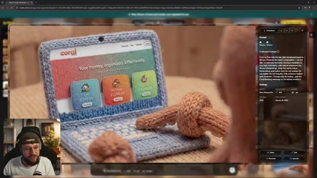
*Interface affichant une image générée d'une pieuvre en tricot manipulant un ordinateur portable affichant une interface bancaire 'Coral'.*

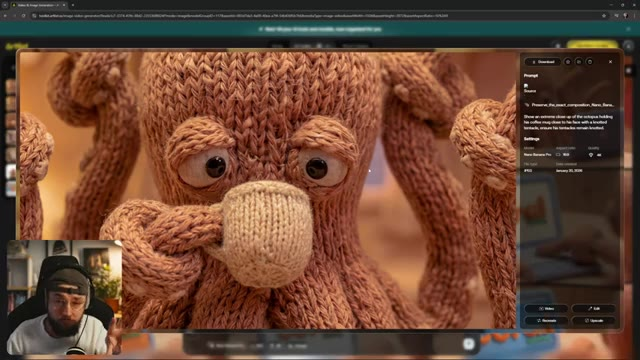
*Gros plan sur une pieuvre en tricot tenant une petite tasse en tricot près de son visage.*

---

### ⏱️ `[00:18:02 - 00:18:35]` | Segment #35

**🔊 Audio (Transcription Intégrale Mot pour Mot en Français) :**
> Quelque chose que j'ai découvert en utilisant ce style spécifique, c'est que les gros plans fonctionnent vraiment très bien. Si vous éloignez vos personnages ou vos objets de la caméra, ils semblent tout de suite moins bien rendre, pour une raison quelconque. Mais lorsqu'ils sont rapprochés comme ici, et qu'on peut voir toutes ces fibres de tissu, le niveau de détail réel et la texture, ainsi que cette sorte de faible profondeur de champ, ça rend vraiment super bien. Donc, une fois qu'on a progressé en validant chaque plan individuel, en obtenant les générations dont je savais qu'elles serviraient correctement le récit, il était temps de passer à la génération de nos vidéos, en prenant...

**👁️ Analyse Visuelle d'Écran (gemini-3.5-flash-lite) :**
**Interface & Outils** : Navigateur web affichant l'interface de la plateforme de création vidéo et d'image Artlist AI Toolkit, avec incrustation vidéo du créateur (Jack) dans le coin inférieur gauche.

**Contenu textuel & Code** : Texte du script et descriptions de plans (ex: SHOT 1, SHOT 2...), interface de génération avec panneau de prompt (Nano Banana Pro, résolution 4K), et grille de vignettes de prévisualisation de plans générés.
[DESC_ACTION_1] Le créateur présente l'interface de l'outil de génération avec un plan rapproché détaillé d'un personnage en tricot, puis montre le script du projet et une grille de plans générés pour illustrer son propos sur les gros plans en vidéo par IA.

**Action / Démonstration** : Démonstration pédagogique et présentation du workflow.

*Interface de génération montrant un gros plan détaillé d'un personnage en tricot (poulpe) tenant une tasse de café avec un panneau latéral affichant les paramètres du prompt et du modèle.*

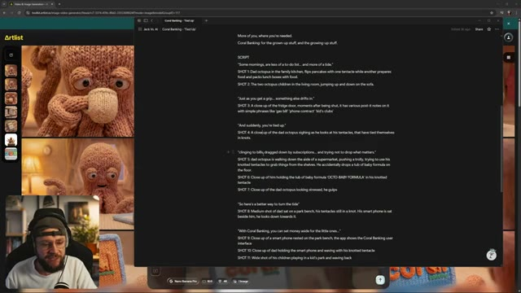
*Affichage d'un document script sur l'écran listant les différents plans (SHOT 1, SHOT 2, etc.) d'un projet intitulé « Coral Banking - Tied Up ».*

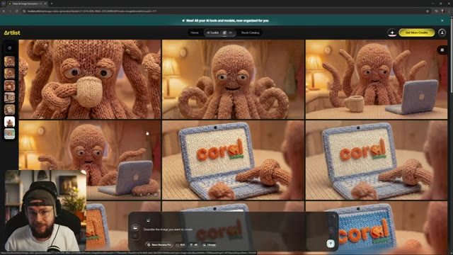
*Grille de vignettes montrant plusieurs plans générés d'un personnage de poulpe en tricot interagissant avec un ordinateur portable affichant le logo « coral ».*

---

### ⏱️ `[00:18:35 - 00:19:09]` | Segment #36

**🔊 Audio (Transcription Intégrale Mot pour Mot en Français) :**
> ces comme nos images de départ en les passant par un générateur de vidéo par IA pour leur donner vie. Donc nous allons passer dans notre session de génération vidéo ici, encore une fois très utile d'avoir toutes nos vidéos IA conservées au même endroit et juste pour vous montrer brièvement comment vous pouvez aller générer vos vidéos, vous pouvez voir que nous avons cet onglet ici, nous pouvons basculer pour générer des vidéos. Nous pouvons aller télécharger une image de référence pour servir de cadre de départ. En cliquant sur cet onglet ici, vous pouvez sélectionner parmi une variété de différents modèles de vidéo par IA. Ce sont quelques-uns des meilleurs sur le marché actuellement.

**👁️ Analyse Visuelle d'Écran (gemini-3.5-flash-lite) :**
**Interface & Outils** : Interface web de la plateforme Artlist (outil de génération de vidéo et d'images par IA) avec l'encadré PiP (Picture-in-Picture) de la webcam du créateur dans le coin inférieur gauche.

**Contenu textuel & Code** : Textes visibles : "Artlist", "Prompt: Show an extreme close up of the octopus holding his coffee mug...", "Settings: Nano Banana Pro, 16:9, 4K", "Kling 2.6 Pro", "Veo 2.0", "Sora 2 Pro", "Kling 1.5", "Wan 2.0", "Halius 2.3".

**Action / Démonstration** : Le créateur navigue dans l'interface d'Artlist, montre une image générée avec ses paramètres, puis clique sur l'onglet de sélection des modèles de génération vidéo pour afficher la liste des différents modèles disponibles sur le marché.

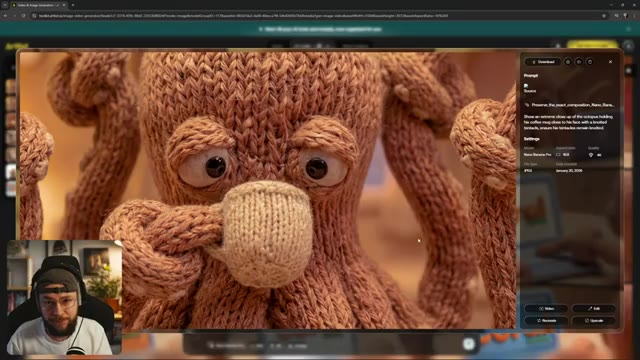
*Interface d'Artlist montrant le panneau de visualisation d'une vidéo générée d'une pieuvre en tricot tenant une tasse, avec les paramètres du prompt et le retour webcam du créateur.*

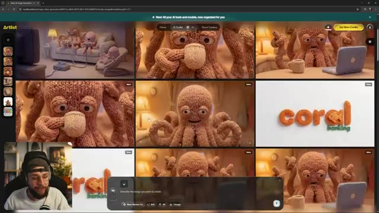
*Interface d'Artlist affichant une galerie de plusieurs clips vidéo générés et la barre de prompt en bas avec le modèle sélectionné 'Nano Banana Pro'.*

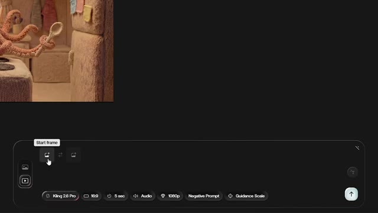
*Interface de génération vidéo montrant le panneau de configuration avec le modèle 'Kling 2.6 Pro' sélectionné et l'option 'Start frame' active.*

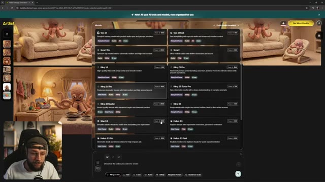
*Fenêtre pop-up de sélection des modèles de vidéo par IA sur Artlist, montrant différentes options comme Veo 2.0, Sora 2 Pro, Kling et Wan 2.0.*

---

### ⏱️ `[00:19:09 - 00:19:34]` | Segment #37

**🔊 Audio (Transcription Intégrale Mot pour Mot en Français) :**
> et j'ai fini par choisir Veo 3.1 pour ce projet particulier parce que je sais qu'il gère vraiment bien l'animation. Bien sûr, nous pouvons sélectionner notre format d'image pour une publicité, nous voulons du 16 par 9, du 9 par 16 pour du contenu social, sélectionner la durée de la séquence. Nous pouvons choisir si nous voulons de l'audio ou non. Nous pouvons définir la résolution. Et une fonctionnalité sympa également est que nous pouvons aussi ajouter un prompt négatif.

**👁️ Analyse Visuelle d'Écran (gemini-3.5-flash-lite) :**
**Interface & Outils** : Interface web d'Artlist AI Toolkit pour la génération vidéo avec le modèle Veo 3.1, dotée d'une barre de contrôle inférieure comportant la sélection du modèle, du format, de la durée, de l'audio, de la résolution et d'un champ pour le prompt négatif.

**Contenu textuel & Code** : Menus déroulants visibles : sélection du format (Aspect Ratio 16:9 et 9:16), logo Google Veo 3.1, durée (4 sec), options audio et résolution 1080p. Exemples de générations d'animation en stop-motion d'une pieuvre dans un décor chaleureux affichés à l'écran.

**Action / Démonstration** : Le créateur montre les différentes options de l'interface de génération vidéo d'Artlist, notamment le menu de sélection du format d'image (16:9 vs 9:16) et les paramètres de Veo 3.1.

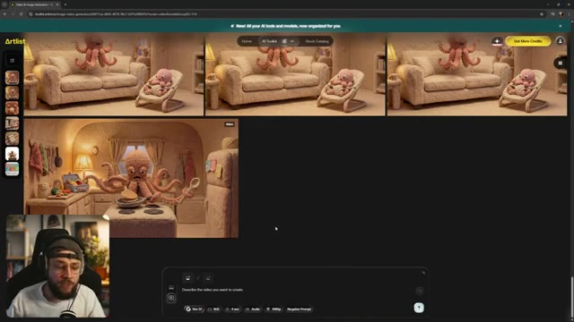
*Interface d'Artlist AI Toolkit montrant les options de génération vidéo avec le modèle Veo 3.1 et la webcam du créateur en incrustation.*

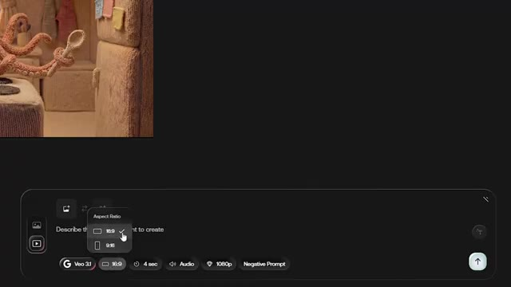
*Gros plan sur le menu de sélection du format d'image (Aspect Ratio) avec les options 16:9 et 9:16 dans l'interface de génération.*

---

### ⏱️ `[00:19:35 - 00:20:09]` | Segment #38

**🔊 Audio (Transcription Intégrale Mot pour Mot en Français) :**
> Et ce que j'ai ajouté à ce champ de prompt négatif pour toutes mes générations, c'était « musique, dialogue », parce que je savais que je ne voulais pas que mes personnages de pieuvres se mettent à parler aléatoirement. Et je savais aussi que j'avais déjà la musique et la voix off en place. Nous n'avions donc pas besoin de toutes ces choses que le VO 3.1 aime vraiment insérer instinctivement dans ses générations. Nous pouvons donc parcourir ces exemples et commencer à parler de ce qui fonctionne bien et des problèmes que j'ai rencontrés. Celui-ci était l'une des premières générations que j'ai assemblées et vous pouvez voir que la pieuvre commence en quelque sorte à marcher. Il a presque l'air d'avoir un corps entier là. Ça ne fonctionne pas vraiment pour ce que nous recherchions. Donc ce que j'ai

**👁️ Analyse Visuelle d'Écran (gemini-3.5-flash-lite) :**
**Interface & Outils** : Navigateur web affichant l'interface de génération vidéo d'Artlist AI (toolkit AI) avec un panneau de configuration des prompts et un encadré vidéo en bas à gauche montrant le créateur face caméra (PiP).

**Contenu textuel & Code** : Dans le panneau latéral de l'image 2, on peut lire le prompt : « Static camera, an octopus in the family kitchen, frantically flipping pancakes with one tentacle while another tentacle prepares food and another tentacle packs lunch boxes. The octopus stays stood in the same place as he cooks, staying stood behind the stove. » et le prompt négatif : « Music, Talking ». Les paramètres indiquent le modèle « Véo 3.1 », un format 16:9, une durée de 4 secondes et une résolution de 1080p.

**Action / Démonstration** : Le créateur présente l'interface d'Artlist AI et commente les différentes générations de vidéos de pieuvres en peluche générées avec le modèle Véo 3.1.

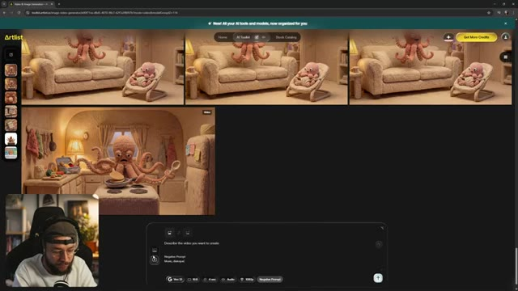
*Interface d'Artlist AI montrant des générations de vidéos d'une pieuvre en peluche dans un salon et une cuisine, avec le créateur en incrustation (PiP).*

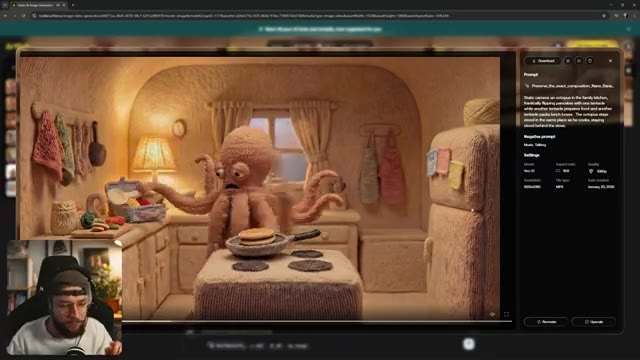
*Visionneuse d'Artlist AI affichant une génération vidéo de la pieuvre cuisinant avec le panneau latéral des détails (Prompt, Negative prompt, Settings) visible à droite.*

---

### ⏱️ `[00:20:09 - 00:20:44]` | Segment #39

**🔊 Audio (Transcription Intégrale Mot pour Mot en Français) :**
> J'ai fini par demander à ce que la pieuvre reste derrière le poêle. Je ne voulais pas qu'elle s'éloigne parce que le modèle vidéo ne sait pas ce qu'est ce personnage ni à quoi il doit ressembler. Donc si on le garde derrière le poêle, on limite en quelque sorte la capacité de VO3.1 à échouer ou à mal interpréter ce que l'on recherche. Ce plan-là dont nous avons parlé plus tôt, je savais que je voulais que le frigo s'ouvre et je pourrais simplement inverser le plan au montage pour que le père ferme le frigo. Mais vous pouvez voir ici que VO3.1 est en train d'ajouter ce gant complètement séparé.

**👁️ Analyse Visuelle d'Écran (gemini-3.5-flash-lite) :**
**Interface & Outils** : Navigateur web affichant l'interface d'Artlist (outil de génération de vidéo IA, section "AI Toolkit").

**Contenu textuel & Code** : Prompts visibles dans le panneau latéral : "Static camera, the tentacle opens up the freezer door, to reveal a thick knitted freezer full of thick knitted frozen food. All in the same knitted style." Paramètres : Model V03.1, Aspect ratio 16:9, Quality 1080p. Notes sur le frigo : "gas bill", "phone contract", "kid's clubs".

**Action / Démonstration** : Le créateur présente l'interface de génération vidéo d'Artlist et commente les résultats de son modèle d'IA (VO3.1) concernant l'animation du réfrigérateur et des personnages en peluche.

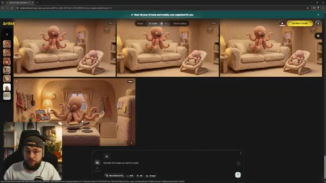
*Interface d'Artlist montrant la grille de prévisualisation des vidéos générées avec le personnage en peluche poulpe.*

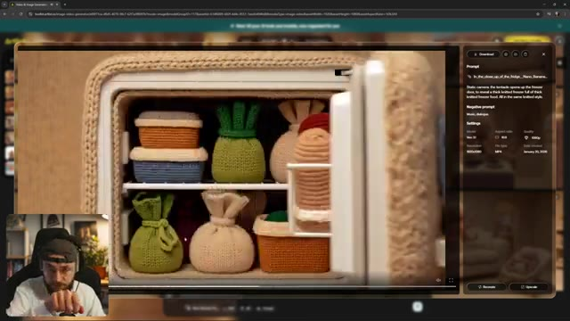
*Gros plan sur l'intérieur du réfrigérateur tricoté en stop-motion avec des aliments en laine, montrant la porte qui s'ouvre.*

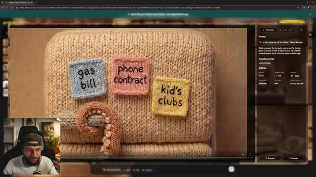
*Vue rapprochée de la porte extérieure du réfrigérateur tricoté avec des notes autocollantes brodées ('gas bill', 'phone contract', 'kid's clubs').*

---

### ⏱️ `[00:20:44 - 00:21:20]` | Segment #40

**🔊 Audio (Transcription Intégrale Mot pour Mot en Français) :**
> truc de main et euh ouais pas ce qu'on cherchait et tout ce que j'ai fait pour résoudre ça c'est juste de relancer le même prompt encore quelques fois et j'ai eu cette génération ici qui a plutôt bien fonctionné tu vas voir ce que je veux dire par plutôt bien tu vois cette tentacule qui entre dans le cadre et ensuite fusionne avec celle qui existe déjà ça m'a un peu inquiété mais après je me suis dit que si je coupais simplement à ce moment précis où la tentacule était déjà fusionnée ça devrait le faire et il s'avère que ça a fonctionné parfaitement pour le montage en inversant simplement ce plan pour que plutôt que la porte du congélateur s'ouvre ce soit

**👁️ Analyse Visuelle d'Écran (gemini-3.5-flash-lite) :**
**Interface & Outils** : Interface web de génération de vidéo par IA avec un lecteur vidéo central, des panneaux de paramètres à droite et une incrustation vidéo PiP du créateur dans le coin inférieur gauche.

**Contenu textuel & Code** : Texte du prompt visible : "Static camera, the tentacle opens up the freezer door, to reveal a thick knitted freezer full of thick knitted frozen food, All in the same knitted style." Notes post-it sur l'image 2 : "gas bill", "phone contract", "kid's clubs".

**Action / Démonstration** : Le créateur montre différentes générations de vidéos par IA illustrant un congélateur et une tentacule en crochet, démontrant le processus de sélection et de montage des plans.

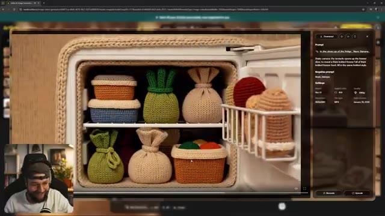
*Interface de l'outil de génération vidéo affichant le rendu d'un réfrigérateur tricoté garni d'aliments en crochet.*

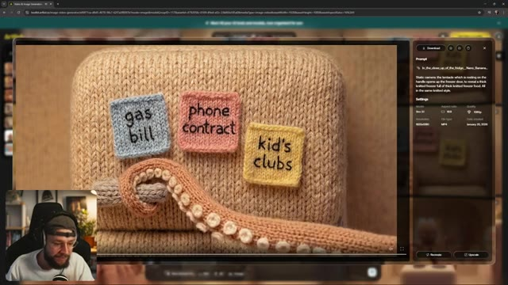
*Gros plan sur une tentacule en tricot interagissant avec la poignée d'un appareil ménager orné de post-its en crochet.*

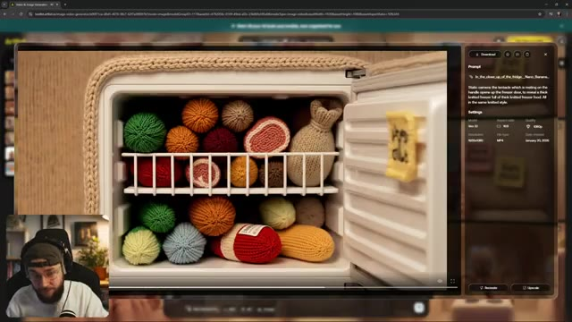
*Vue intérieure d'un congélateur au style tricoté rempli de provisions colorées en pelote de laine et crochet.*

---

### ⏱️ `[00:21:20 - 00:21:57]` | Segment #41

**🔊 Audio (Transcription Intégrale Mot pour Mot en Français) :**
> en fait d'être fermé. Je dois parler de ce plan ici parce que cette génération est probablement ma préférée dans toute la publicité. Il est vraiment très bien réussi. Je n'étais pas sûr que VO 3.1 serait capable de comprendre ce que je cherchais. C'est assez ambitieux pour un modèle vidéo IA. Donc pour le prompt textuel, j'ai dit : mouvement de caméra travelling avant lent, les tentacules de la poulpe restent chacun dans la même position mais s'attachent individuellement en nœuds alors qu'il soupire. Maintenant, à l'origine, je voulais que la boîte de lait pour bébé soit renversée de l'étagère en un seul plan, je ne voulais pas de plan de coupe mais je voulais aussi

**👁️ Analyse Visuelle d'Écran (gemini-3.5-flash-lite) :**
**Interface & Outils** : Interface web d'un outil de génération vidéo par IA (probablement une plateforme de type Luma Dream Machine ou similaire) avec affichage du lecteur vidéo au centre, panneau de prompt et de paramètres à droite, et incrustation vidéo (PiP) du créateur Jack en bas à gauche.

**Contenu textuel & Code** : Le panneau de droite affiche le prompt textuel : « Slow dolly camera move in, the octopus's tentacles each stay in the same position, but individually tie themselves into knots as he sighs. » Modèle : Ver 3.1, Format : 16:9, Qualité : 1080p, Résolution : 1920x1080.

**Action / Démonstration** : Le créateur présente l'interface de génération vidéo tout en commentant le rendu visuel et le prompt utilisé pour animer le personnage de poulpe en tricot.

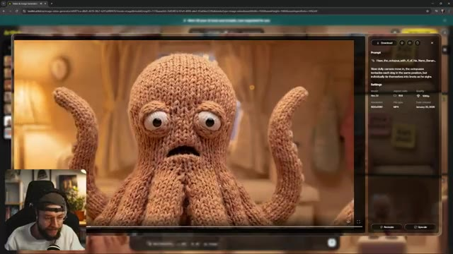
*Interface de l'outil de génération vidéo affichant un gros plan sur le personnage en peluche de poulpe tricoté, avec le panneau latéral détaillant le prompt textuel et les paramètres du modèle VO 3.1.*

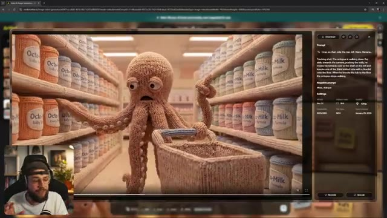
*Interface de l'outil montrant le poulpe tricoté dans une allée de supermarché poussant un caddie entre des étagères de boîtes, avec le panneau latéral affichant les paramètres et les prompts textuels et négatifs.*

---

### ⏱️ `[00:21:57 - 00:22:30]` | Segment #42

**🔊 Audio (Transcription Intégrale Mot pour Mot en Français) :**
> Je savais que c'était assez ambitieux et vous pouvez voir certains des écueils de l'utilisation de cette idée dans un modèle vidéo. Il y a donc évidemment divers problèmes avec cela, principalement que lorsque le pot de lait maternisé se détache de l'étagère, c'est comme un truc massif de taille industrielle, ça ne correspond pas à ce à quoi on s'attend ou à ce qu'on voit dans le plan suivant. Ce que j'ai fini par devoir faire, c'est de retourner sur Nano Banana Pro et de créer un plan alternatif où l'on voit simplement l'étagère et le tentacule qui la fait tomber par accident, et c'est exactement ce que...

**👁️ Analyse Visuelle d'Écran (gemini-3.5-flash-lite) :**
**Interface & Outils** : Navigateur web affichant l'interface de la plateforme Artlist (outil de génération vidéo et d'image IA), avec un panneau latéral droit pour les prompts et réglages (modèle, ratio, résolution), et la webcam du créateur en PiP.

**Contenu textuel & Code** : Sur l'image 1, le panneau de droite affiche le prompt : "Tracking shot. This octopus is walking down the aisle, towards the camera, pushing the trolley, he moves his tentacle over to the shelf on the left and knocks one of the thick knitted tubs with a blue lid onto the floor. When he knocks the tub to the floor the octopus stops walking." et le prompt négatif "Music, dialogue". Les paramètres indiquent le modèle Mini 3.1, ratio 16:9, qualité 1080p.

**Action / Démonstration** : Le créateur présente l'interface de génération vidéo sur Artlist, en montrant les résultats obtenus et les détails du prompt textuel utilisé pour générer la scène du poulpe dans le supermarché.

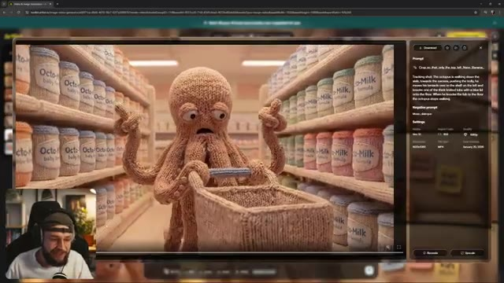
*Interface de l'outil de génération vidéo Artlist montrant un personnage de poulpe en tricot dans une allée de supermarché avec un chariot, avec un encadré PiP du créateur en bas à gauche.*

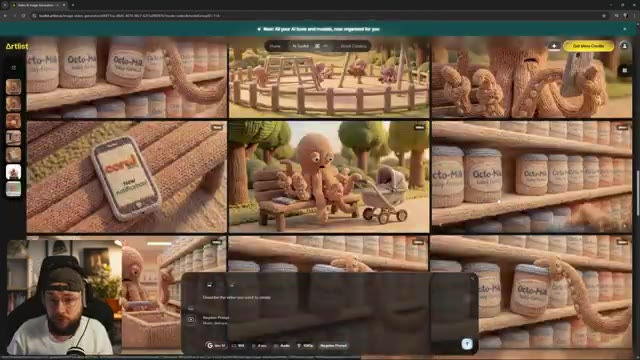
*Grille de prévisualisation de multiples plans vidéo générés sur Artlist, montrant différentes scènes avec le poulpe en tricot, et le créateur visible en incrustation PiP.*

---

### ⏱️ `[00:22:30 - 00:23:04]` | Segment #43

**🔊 Audio (Transcription Intégrale Mot pour Mot en Français) :**
> Je parlais tout à l'heure de résolution de problèmes, parfois vous devez revenir à la partie génération d'images de votre flux de travail juste pour contourner ces problèmes. Maintenant, une autre génération qui m'a vraiment impressionné est celle-ci où les post-it sont barrés. Je ne pensais vraiment pas que cela allait marcher. Donc ce que j'ai fait, c'est que j'ai exécuté ce plan original de la porte du frigo avec la tentacule dedans via Nano Banana Pro et j'ai demandé d'ajouter un stylo tricoté noir épais à la main de la tentacule. J'ai ensuite exécuté cette image via VO 3.1 avec le prompt un statique

**👁️ Analyse Visuelle d'Écran (gemini-3.5-flash-lite) :**
**Interface & Outils** : Interface web de la plateforme Artlist pour la génération d'images et de vidéos par IA, avec incrustation vidéo (PiP) du présentateur en bas à gauche.

**Contenu textuel & Code** : Prompts visibles dans le panneau latéral : « Static shot. The tentacle accidentally knocks the thick knitted baby formula tub off the shelf and it falls directly downward out of the frame. » et « A static camera captures a knitted octopus's tentacle using the knitted black pen it is holding to mark a single large black cross on each colorful post-it note... ». Paramètres : VO 3.1, format 16:9, résolution 1080p.

**Action / Démonstration** : Le créateur montre différentes variations de vidéos générées par IA basées sur des éléments tricotés et commente son processus itératif de modification d'images et de prompts.

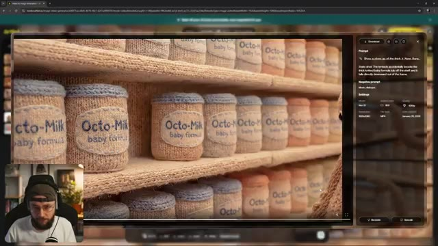
*Interface d'Artlist montrant le détail d'une génération vidéo avec des bocaux tricotés et le panneau latéral affichant les paramètres et le prompt.*

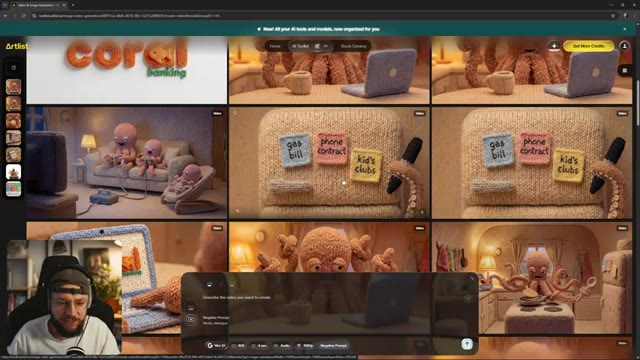
*Grille de prévisualisation sur Artlist affichant plusieurs clips vidéo générés sur le thème de créatures tricotées, avec une incrustation vidéo du créateur en bas à gauche.*

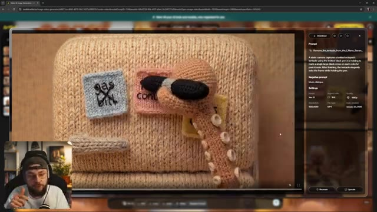
*Gros plan sur Artlist d'une tentacule tricotée barrant des post-it sur un réfrigérateur, avec le panneau de configuration textuel sur le côté droit.*

---

### ⏱️ `[00:23:04 - 00:23:37]` | Segment #44

**🔊 Audio (Transcription Intégrale Mot pour Mot en Français) :**
> la caméra capture le tentacule d'une pieuvre en tricot utilisant le stylo noir en tricot qu'elle tient pour marquer une seule grande croix noire sur chaque post-it coloré. Après avoir terminé, le tentacule sort élégamment du cadre tout en tenant le stylo et j'aurais préféré que le tentacule reste en quelque sorte enroulé autour du stylo comme il le fait dans cette première image ici, mais je pense qu'étant donné le contexte et le style de cette publicité, cela n'a pas trop d'importance et j'étais tellement impressionné par le fait qu'il ait réussi à réaliser cette génération que j'ai absolument dû garder cela dans la publicité finale et je

**👁️ Analyse Visuelle d'Écran (gemini-3.5-flash-lite) :**
**Interface & Outils** : Navigateur web affichant une interface de génération de vidéo par IA avec un panneau latéral droit pour les prompts et les paramètres, une miniature « Starting frame » en haut à gauche, et la webcam de Jack en incrustation (PiP) en bas à gauche.

**Contenu textuel & Code** : Le prompt visible dans le panneau latéral indique : « A static camera captures a knitted octopus's tentacle using the knitted black pen it is holding to mark a single large black cross on each colorful post-it note. After finishing, the tentacle elegantly exits the frame while holding the pen ». Les paramètres affichent notamment « 1080p », « MP4 », et une date de janvier 2025.

**Action / Démonstration** : Le créateur montre l'interface de génération vidéo où l'on observe la lecture de la vidéo générée de la pieuvre en tricot traçant des croix sur des post-it.

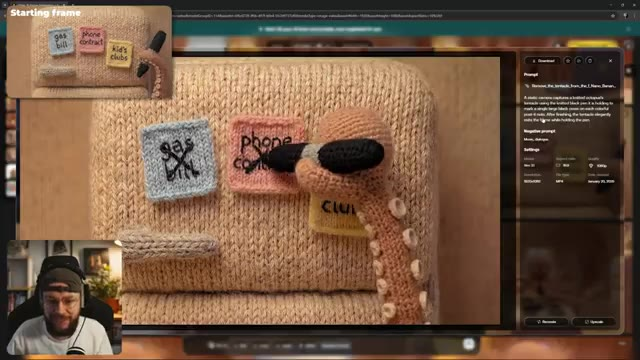
*Interface de l'outil de génération vidéo par IA affichant un aperçu de la vidéo avec une pieuvre en tricot marquant des post-it, et Jack visible en incrustation (PiP) dans le coin inférieur gauche.*

---

### ⏱️ `[00:23:37 - 00:23:57]` | Segment #45

**🔊 Audio (Transcription Intégrale Mot pour Mot en Français) :**
> j'étais vraiment inquiet parce qu'encore une fois, ça peut ne pas sembler être une chose particulièrement ambitieuse d'essayer d'amener un outil d'IA à réaliser cela. Je travaille un peu là-dessus en me disant, je ne sais pas si cela va vraiment pouvoir être généré, et puis je vais devoir tout recommencer à zéro et essayer de réécrire ce plan d'une manière ou d'une autre. Mais le voilà.

**👁️ Analyse Visuelle d'Écran (gemini-3.5-flash-lite) :**
**Interface & Outils** : Interface web de génération d'images/vidéos par IA avec le panneau latéral des prompts et paramètres, et un encadré PiP (Picture-in-Picture) du créateur en bas à gauche.

**Contenu textuel & Code** : Dans le panneau de droite, le prompt visible indique : "A static cosmic captures a knitted octopus's tentacle using the knitted black pen it is holding to mark a single large black cross on each colourful post-it note. After finishing, the tentacle elegantly exits the frame while holding the pen". Le prompt négatif indique : "Blurry, dialogue". Les paramètres affichés incluent le ratio d'aspect (16:9), la graine (seed), et la résolution (1080p). Sur la vidéo générée au centre, on voit un panneau tricoté avec trois post-it (bleu "gas bill", rose "phone contract", jaune "kid's...") et une tentacule de pieuvre en tricot marquant une croix noire avec un stylo.

**Action / Démonstration** : Le créateur partage son écran montrant l'outil de génération vidéo et le résultat animé généré par l'IA, tout en apparaissant en incrustation vidéo (PiP) dans le coin inférieur gauche.

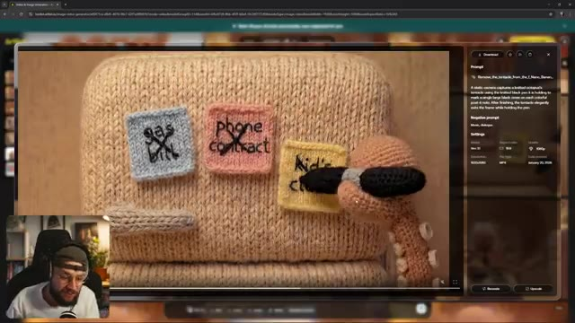
*Interface d'un outil de génération vidéo par IA montrant un plan animé en stop-motion tricoté avec une pieuvre et des post-it barrés, avec le créateur en incrustation PiP.*

---

### ⏱️ `[00:23:57 - 00:24:16]` | Segment #46

**🔊 Audio (Transcription Intégrale Mot pour Mot en Français) :**
> Ça a fonctionné. Et ça a été un sacré soulagement. Je pense que la règle générale, quand il s'agit d'animer vos images créées par IA avec un modèle vidéo, c'est d'opter pour des prompts assez clairs mais simples, et de comprendre aussi que vous rencontrerez des problèmes en cours de route. C'est un peu la façon dont vous gérez ces problèmes.

**👁️ Analyse Visuelle d'Écran (gemini-3.5-flash-lite) :**
**Interface & Outils** : Interface web de l'outil de génération vidéo d'Artlist (Toolkit AI) avec affichage de grilles de vidéos générées, panneaux de prompts, paramètres de modèle et incrustation vidéo du créateur (PiP) dans le coin inférieur gauche.

**Contenu textuel & Code** : Texte visible dans les prompts et interfaces : "gas bill", "phone contract", "Kid's chore", "coral banking", "CORAL MART OCTO & REEF GROCER", "New notification!", invite de prompt "Describe the video you want to create", negative prompt "Music, dialogue", paramètres "Min S1", "4 sec", "1080p".

**Action / Démonstration** : Le créateur navigue et présente l'interface d'Artlist montrant les différentes générations de vidéos d'animation basées sur le style d'art en tricot/laine avec des pieuvres.

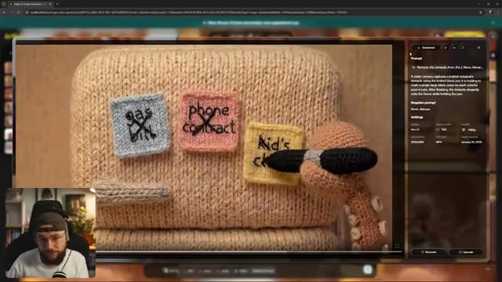
*Interface d'Artlist affichant le résultat vidéo généré d'une pieuvre en tricot marquant un Post-it jaune, avec le panneau de configuration et le prompt sur le côté droit, et le créateur incrusté en bas à gauche.*

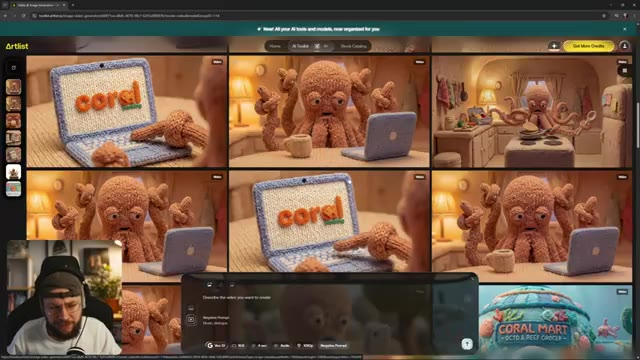
*Interface de la galerie Artlist présentant une grille de plusieurs clips vidéo générés par IA mettant en scène une pieuvre en tricot dans divers décors (devant un ordinateur portable, dans une cuisine), avec le panneau de prompt en bas.*

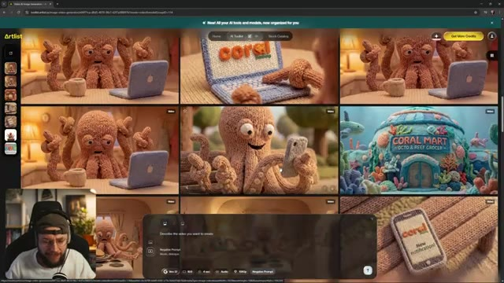
*Interface d'Artlist montrant une grille de vidéos générées avec une pieuvre en tricot utilisant un ordinateur portable, un smartphone, et un bâtiment étiqueté 'Coral Mart', avec le créateur en incrustation PiP.*

---

### ⏱️ `[00:24:16 - 00:24:51]` | Segment #47

**🔊 Audio (Transcription Intégrale Mot pour Mot en Français) :**
> Et je pense que plus vous utilisez ces outils, meilleur vous devenez pour gérer les situations auxquelles vous allez inévitablement faire face. Donc encore une fois, nous nous appuyons sur notre planification ici, le script lui-même. Je le parcourais et à chaque fois qu'une partie du script était terminée, je la sururlignais en vert pour savoir que cette partie du film était faite, et au fil du temps, j'ai réussi à accumuler un stock de superbes générations de vidéos par IA, puis il a été temps de retourner au montage. Comme je le dis les gars, j'ai été vraiment impressionné par le nouveau kit d'outils IA d'Artlist. Vraiment

**👁️ Analyse Visuelle d'Écran (gemini-3.5-flash-lite) :**
**Interface & Outils** : Navigateur web affichant l'interface de la plateforme Artlist (toolkit IA et générateur vidéo/image) avec un encadré PiP (Picture-in-Picture) de la webcam du créateur.

**Contenu textuel & Code** : Éléments visibles à l'écran : logo Artlist, onglets Home, AI Toolkit, Stock Catalog, grille de vidéos miniatures représentant une pieuvre tricotée dans une cuisine et un supermarché, barre de prompt textuel en bas, et script textuel détaillé dans l'image #2 avec des intitulés de plans (SHOT 1, SHOT 2...).

**Action / Démonstration** : Le créateur présente l'interface d'Artlist et sa méthode de suivi de script avec les générations de vidéos IA stockées, tout en parlant face caméra (visible en incrustation PiP).

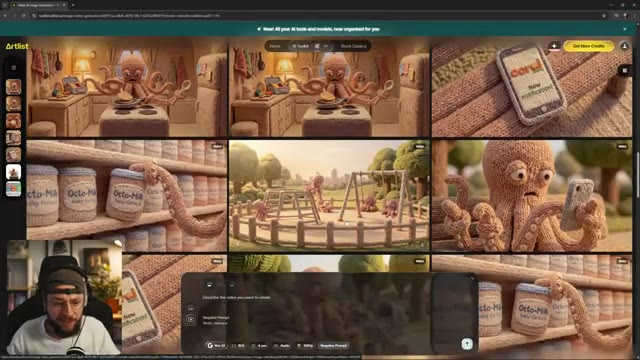
*Interface de la plateforme Artlist affichant une grille de vidéos générées par IA sur le thème d'une pieuvre en tricot, avec un encadré vidéo (PiP) du créateur en bas à gauche.*

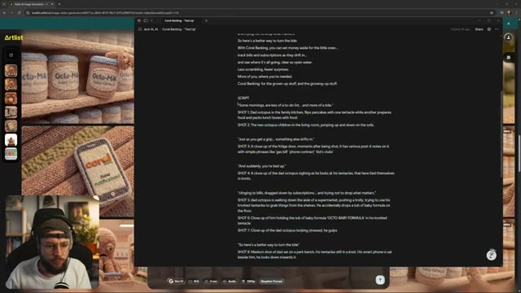
*Interface de la plateforme Artlist avec une fenêtre superposée affichant un document de script textuel (« Coral Banking - Tied up ») par-dessus la grille de générations IA.*

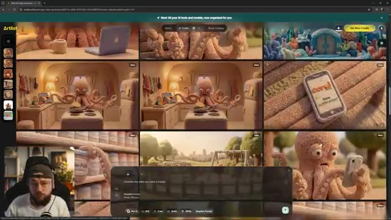
*Interface de la plateforme Artlist montrant une grille de prévisualisations vidéo générées par IA avec le bouton « Get More Credits » en haut à droite.*

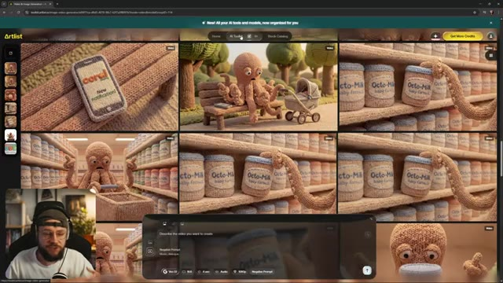
*Interface de la plateforme Artlist montrant les onglets de navigation (« Home », « AI Toolkit », « Stock Catalog ») et une grille de vidéos d'animation en stop-motion tricoté.*

---

### ⏱️ `[00:24:51 - 00:25:20]` | Segment #48

**🔊 Audio (Transcription Intégrale Mot pour Mot en Français) :**
> interface simple et propre avec un excellent niveau de contrôle pour votre génération, donc si vous voulez aller de l'avant et jeter un coup d'œil, vous pouvez cliquer sur le lien en bas dans la description. Donc, comme je l'ai dit plus tôt dans la vidéo, la voix off guide vraiment la narration de toute la publicité. Donc, quand j'ai inséré chacune de nos générations vidéo, je fais simplement des recoupements avec le script pour savoir quels plans correspondent à quelles lignes de voix off. C'était en fait assez facile de assembler tout ça.

**👁️ Analyse Visuelle d'Écran (gemini-3.5-flash-lite) :**
**Interface & Outils** : Interface web d'Artlist (générateur vidéo) et logiciel Adobe Premiere Pro, avec le créateur visible en incrustation PiP (Picture-in-Picture).

**Contenu textuel & Code** : Sur l'image 1 : Interface d'Artlist présentant une grille de vidéos sur le thème de créatures en laine/tricot (poulpe, supermarché, smartphone). Sur l'image 2 : Interface d'Adobe Premiere Pro 2021 avec la chronologie de montage audio/vidéo du projet « CORAL_BANKING ».

**Action / Démonstration** : Le créateur montre d'abord l'interface de génération vidéo d'Artlist avec un panneau de prompt, puis bascule sur Adobe Premiere Pro pour montrer l'assemblage et la synchronisation des clips vidéo avec la voix off sur la timeline.

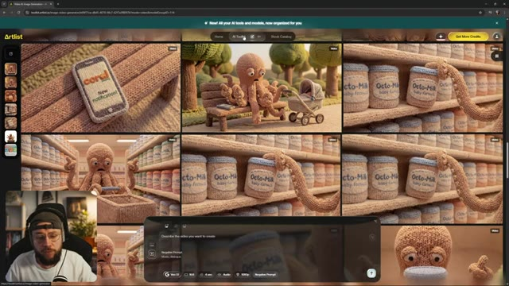
*Interface web d'Artlist affichant une grille de vidéos générées par IA au style tricoté, avec le créateur en incrustation PiP.*

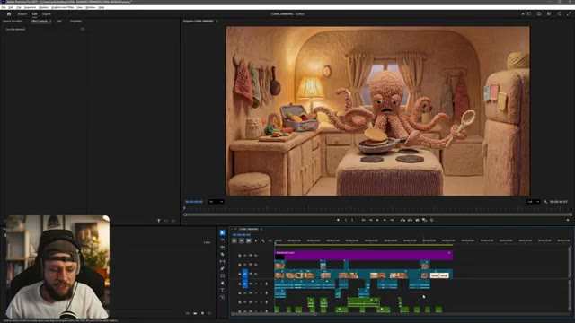
*Interface du logiciel de montage Adobe Premiere Pro montrant le montage de la vidéo avec la chronologie (timeline) et le retour vidéo.*

---

### ⏱️ `[00:25:20 - 00:25:43]` | Segment #49

**🔊 Audio (Transcription Intégrale Mot pour Mot en Français) :**
> Si je parcours simplement, je vais juste couper le son de toutes les pistes audio à mesure qu'on avance plan par plan, et je soulignerai tout type de problème ou de chose que j'ai trouvée intéressante en chemin. Le plan d'ouverture ici a en fait pris pas mal de générations pour être réussi, même s'il est plutôt simple. À l'origine, j'essayais de faire en sorte que le père pieuvre utilise ses différents tentacules pour couper de la nourriture, préparer des boîtes à lunch, tout ce genre de choses.

**👁️ Analyse Visuelle d'Écran (gemini-3.5-flash-lite) :**
**Interface & Outils** : Adobe Premiere Pro 2023 (logiciel de montage vidéo).

**Contenu textuel & Code** : Timeline de montage avec pistes vidéo et audio, panneau Programme affichant un plan de pieuvre en stop-motion cuisinant dans une cuisine tricotée, et panneau Source/Effets. Dans le coin inférieur gauche, le créateur Jack est visible en incrustation (Picture-in-Picture).

**Action / Démonstration** : Le projet de montage vidéo est ouvert et en cours de révision plan par plan sur Adobe Premiere Pro.

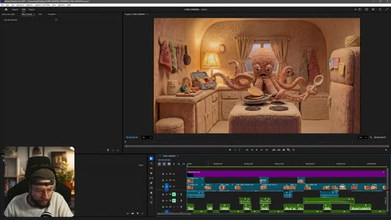
*Interface d'Adobe Premiere Pro montrant la timeline du projet avec des clips vidéo d'une pieuvre en stop-motion dans une cuisine, et le créateur visible en incrustation (PiP) dans le coin inférieur gauche.*

---

### ⏱️ `[00:25:43 - 00:26:19]` | Segment #50

**🔊 Audio (Transcription Intégrale Mot pour Mot en Français) :**
> Mais encore une fois, j'ai dû rendre les choses un peu plus simples pour qu'il fasse simplement des crêpes, en les retournant dans la poêle. Ce plan était assez facile, à relancer simplement, puis on passe à la fermeture de la porte du congélateur. Comme je le disais, c'était un plan inversé que j'ai coupé pour ne pas voir ce tentacule supplémentaire bizarre fusionné qui arrivait, donc je savais que inverser le plan rendrait toute cette génération vidéo plus facile que ce plan particulier. Ici, bien sûr, nous avons ma génération préférée de tout le film. Je n'ai rien eu à faire là, ça a juste très bien fonctionné.

**👁️ Analyse Visuelle d'Écran (gemini-3.5-flash-lite) :**
**Interface & Outils** : Logiciel de montage Adobe Premiere Pro (avec incrustation PiP de Jack en bas à gauche).

**Contenu textuel & Code** : Timeline de montage vidéo, moniteur de programme affichant une créature en peluche ressemblant à une pieuvre dans une cuisine en train de cuisiner avec des crêpes, et panneau des projets.

**Action / Démonstration** : Le logiciel de montage affiche la timeline du projet en cours de lecture avec la séquence vidéo de la pieuvre cuisinant.

*Interface d'Adobe Premiere Pro montrant la timeline du projet avec le plan de la pieuvre en train de cuisiner et la webcam de Jack en incrustation.*

---

### ⏱️ `[00:26:19 - 00:26:52]` | Segment #51

**🔊 Audio (Transcription Intégrale Mot pour Mot en Français) :**
> Maintenant, si je coupe dans ce que j'avais initialement prévu pour le montage, on s'est attardé sur ce plan du supermarché pendant vraiment très longtemps. Ça fait un peu bizarre et maladroit, et d'habitude, quand il s'agit d'une publicité, il y a pas mal de plans différents et de coupes. Donc si je réactive ce calque ici, vous pouvez voir, comme je l'ai dit tout à l'heure, que j'ai fini par utiliser le plan extérieur du supermarché pour servir en quelque sorte de plan de situation pour la scène, et ensuite on coupe sur le père poulpe qui marche dans l'allée, et encore une fois nous avons notre plan supplémentaire ici où le pot est fait tomber de l'étagère, comme je l'ai dit plus tôt.

**👁️ Analyse Visuelle d'Écran (gemini-3.5-flash-lite) :**
**Interface & Outils** : Adobe Premiere Pro

**Contenu textuel & Code** : Timeline de montage vidéo avec plusieurs pistes audio et vidéo, moniteur affichant la vidéo du poulpe dans l'allée du supermarché, et petite fenêtre PiP (Picture-in-Picture) du créateur en bas à gauche.

**Action / Démonstration** : Le créateur montre son écran de montage dans Adobe Premiere Pro, démontrant l'agencement des plans et de la timeline sur le projet vidéo.

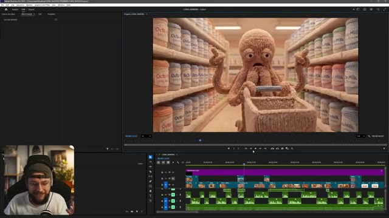
*Interface du logiciel Adobe Premiere Pro montrant la timeline de montage vidéo et le moniteur avec le personnage de poulpe dans le supermarché, ainsi qu'une incrustation vidéo du créateur dans le coin inférieur gauche.*

---

### ⏱️ `[00:26:52 - 00:27:26]` | Segment #52

**🔊 Audio (Transcription Intégrale Mot pour Mot en Français) :**
> J'essayais à l'origine de réaliser ça dans le même plan, mais je n'arrivais tout simplement pas à le faire fonctionner, alors on a notre plan de coupe où ça tombe de l'étagère, puis on a le papa pieuvre qui le regarde, et ensuite on voit que c'est du lait en poudre pour bébé aussi, et c'est important qu'on voie très clairement ce qu'il a lâché parce que la ligne de voix off est « en essayant de ne pas lâcher ce qui compte ». On bascule ensuite sur la scène du parc et en fait, c'était plutôt simple, je dois dire que ces générations n'étaient pas trop difficiles à obtenir, c'est un peu pareil quand notre papa pieuvre est assis à table dans la salle à manger pour finir.

**👁️ Analyse Visuelle d'Écran (gemini-3.5-flash-lite) :**
**Interface & Outils** : Adobe Premiere Pro (interface de montage avec panneau de prévisualisation, timeline multicouche et panneau de projet). Le créateur est visible en incrustation vidéo (PiP) dans le coin inférieur gauche.

**Contenu textuel & Code** : Timeline de montage vidéo avec plusieurs pistes audio et vidéo montrant la structure du projet de la vidéo en stop-motion avec des pieuvres en laine. Le moniteur de programme affiche une scène où une pieuvre en tricot est dans un supermarché avec un caddie, entourée d'étagères remplies de boîtes de conserve de lait pour bébé ("Octo-Milk").

**Action / Démonstration** : Le créateur montre son écran de montage sur Adobe Premiere Pro, illustrant le montage des différents plans de la pieuvre dans le supermarché.

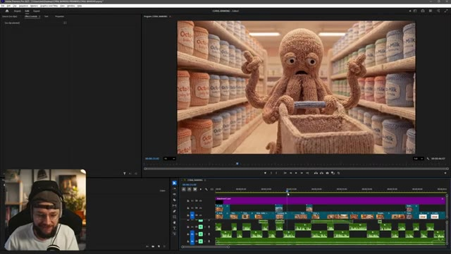
*Interface d'Adobe Premiere Pro montrant le montage vidéo avec le plan de la pieuvre dans le rayon de supermarché et la webcam du créateur en incrustation (PiP).*

---

### ⏱️ `[00:27:26 - 00:28:01]` | Segment #53

**🔊 Audio (Transcription Intégrale Mot pour Mot en Français) :**
> genre en apaisant ses soucis financiers en se connectant à Coral Banking, celui-ci était un plan supplémentaire. J' avais l' impression de m' attarder sur celui-ci pendant trop longtemps. Vous constaterez souvent, lorsque vous faites vos montages, que vous restez accroché à un plan pendant des lustres. Dès que vous ressentez cela, dès que vous regardez votre montage et que cela vous traverse l' esprit, c' est à ce moment-là qu' il faut prendre du recul et générer autre chose pour combler ce vide. À moins que vous essayiez délibérément de donner une impression bizarre, longue ou étirée, ce qui n' est souvent pas le cas lorsqu' il s' agit d' une publicité, vous devez en quelque sorte créer un autre plan pour combler cette lacune, en gros.

**👁️ Analyse Visuelle d'Écran (gemini-3.5-flash-lite) :**
**Interface & Outils** : Adobe Premiere Pro (logiciel de montage vidéo)

**Contenu textuel & Code** : Timeline de montage comportant plusieurs pistes vidéo et audio, un moniteur affichant la vidéo d'un personnage de pieuvre tricotée devant un ordinateur portable, et une fenêtre de prévisualisation PiP montrant le créateur (Jack) dans son studio.

**Action / Démonstration** : Le créateur montre son écran de montage vidéo sous Adobe Premiere Pro tout en expliquant le processus d'édition et la gestion de la durée des plans.

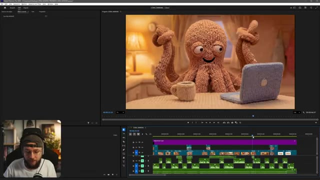
*Interface d'Adobe Premiere Pro montrant la timeline du projet de publicité "Coral Banking" avec la vidéo d'une pieuvre en tricot, et Jack visible dans un encadré PiP en bas à gauche.*

---

### ⏱️ `[00:28:01 - 00:28:37]` | Segment #54

**🔊 Audio (Transcription Intégrale Mot pour Mot en Français) :**
> j'adore vraiment cette génération ici où l'ordinateur portable en tricot a l'air de bouger subtilement de haut en bas et encore une fois avec le plan où l'on barre les post-it ce plan a duré un peu trop longtemps encore une fois je pense que je n'avais même pas de plan supplémentaire donc si je me débarrasse de ça on a juste traversé ça comme ça et on a eu l'impression de le regarder pendant trop longtemps en gros donc encore une fois j'ai fini par générer un autre plan de coupe pour montrer à quel point le papa est heureux par lui-même parce que plus tard on va voir à quel point il est heureux avec les enfants je veux montrer qu'il est heureux par lui-même parce qu'il a en quelque sorte surmonté ces soucis financiers avec coral banking

**👁️ Analyse Visuelle d'Écran (gemini-3.5-flash-lite) :**
**Interface & Outils** : Adobe Premiere Pro (logiciel de montage vidéo).

**Contenu textuel & Code** : Timeline de montage multi-pistes, panneaux d'effets, moniteur de programme affichant des plans vidéo de marionnettes en tricot, et fenêtre PiP du créateur dans le coin inférieur gauche.

**Action / Démonstration** : Le créateur montre son logiciel de montage Adobe Premiere Pro tout en expliquant ses choix de coupe et le timing des plans vidéo générés par IA.

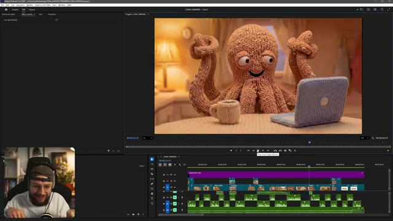
*Interface d'Adobe Premiere Pro montrant la timeline du projet "CORAL BANKING" et un plan en stop-motion d'une pieuvre en tricot face à un ordinateur portable, avec le créateur visible en incrustation PiP.*

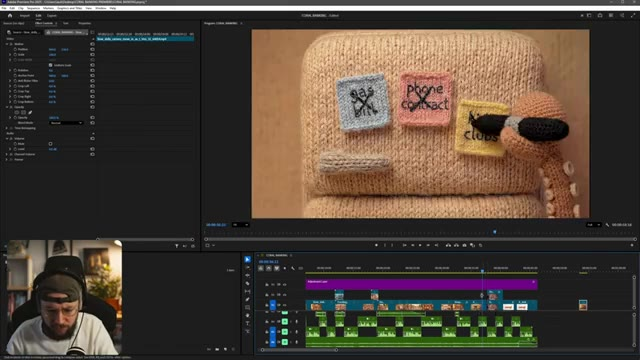
*Interface d'Adobe Premiere Pro montrant le panneau des effets et le moniteur de programme avec un plan de post-it barrés, avec le créateur en incrustation PiP dans le coin inférieur gauche.*

---

### ⏱️ `[00:28:37 - 00:29:12]` | Segment #55

**🔊 Audio (Transcription Intégrale Mot pour Mot en Français) :**
> l'aider. C'est ce moment de satisfaction où il a coché tous ces problèmes et il se dit un peu ouais d'accord on est sur la bonne voie maintenant tu sais. Ses tentacules sont noués et maintenant il peut aller passer un bon moment avec ses enfants. Encore une fois, nous avons cette très belle génération où le poisson sort du de le logo et nage à travers l'écran si je fais juste glisser ça ici je pense que j'ai fini par accélérer ça ouais j'ai fini par accélérer ça énormément à 250 donc laissez-moi remettre ça à sa vitesse normale et vous montrer à quoi ça ressemblait donc très du genre dessiné

**👁️ Analyse Visuelle d'Écran (gemini-3.5-flash-lite) :**
**Interface & Outils** : Adobe Premiere Pro 2021

**Contenu textuel & Code** : Timeline de montage vidéo, panneaux Effets et Contrôles d'effets, aperçu vidéo avec des séquences générées par IA représentant des créatures en tricot (poulpes), et un menu contextuel de la timeline affichant des options de vitesse et de manipulation de clips.

**Action / Démonstration** : Le créateur navigue et démontre son montage vidéo dans Adobe Premiere Pro, expliquant le minutage, la vitesse des clips et les transitions entre les différentes séquences animées générées par IA.

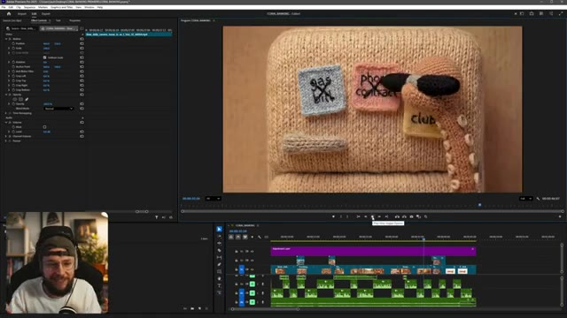
*Interface d'Adobe Premiere Pro montrant un personnage en tricot (poulpe) cochant des tâches sur un tableau mémo.*

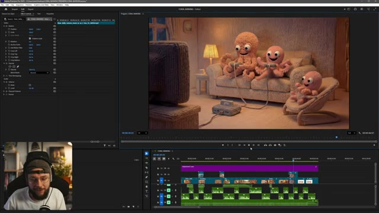
*Interface d'Adobe Premiere Pro montrant une famille de poulpes en tricot jouant aux jeux vidéo sur un canapé.*

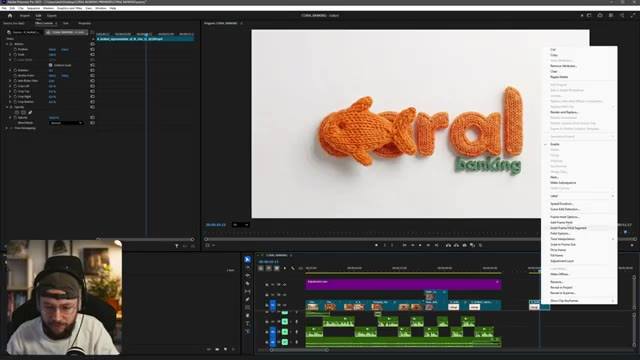
*Interface d'Adobe Premiere Pro montrant un logo animé avec un poisson et le texte "coral banking", avec un menu contextuel ouvert sur la timeline.*

---

### ⏱️ `[00:29:12 - 00:29:30]` | Segment #56

**🔊 Audio (Transcription Intégrale Mot pour Mot en Français) :**
> et laborieux si on y réfléchit, c'est comme le branding essentiel pour Coral Banking, n'est-ce pas ? Donc on ne veut pas vraiment que ce logo soit masqué par ce poisson tricoté pendant des plombes. Et aussi, encore une fois, ça fait un tout petit peu bizarre. Du coup, ce qu'on a fini par faire, c'est accélérer cette première moitié.

**👁️ Analyse Visuelle d'Écran (gemini-3.5-flash-lite) :**
**Interface & Outils** : Adobe Premiere Pro (logiciel de montage vidéo)

**Contenu textuel & Code** : Timeline de montage avec pistes vidéo et audio, panneau des effets (Effect Controls) à gauche, moniteur Programme affichant le rendu du logo 'coral' en texture tricotée avec la mention 'banking' en vert, et encadré PiP (Picture-in-Picture) de Jack dans son studio.

**Action / Démonstration** : Le créateur montre son écran de montage dans Adobe Premiere Pro pour illustrer l'ajustement du rythme et de la vitesse de la vidéo concernant l'apparition du logo de Coral Banking.

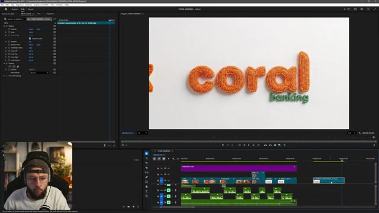
*Interface d'Adobe Premiere Pro montrant le montage vidéo avec le panneau des pistes audio/vidéo et le retour programme affichant le logo 'coral banking' en tricot, avec l'encadré PiP du créateur en bas à gauche.*

---

### ⏱️ `[00:29:30 - 00:29:48]` | Segment #57

**🔊 Audio (Transcription Intégrale Mot pour Mot en Français) :**
> Et puis, au moment où le poisson sort du cadre par la gauche, ça se transforme juste en image fixe. C'est juste une image fixe à ce stade-là. Et sans la voix off, encore une fois, ça fait un peu bizarre. Mais une fois qu'on a la voix off, ça donne un rendu vraiment super. J'ai donc juste ajouté quelques éléments audio supplémentaires.

**👁️ Analyse Visuelle d'Écran (gemini-3.5-flash-lite) :**
**Interface & Outils** : Adobe Premiere Pro (logiciel de montage vidéo) avec la webcam du créateur en incrustation PiP (Picture-in-Picture) dans le coin inférieur gauche.

**Contenu textuel & Code** : Sur la timeline de Premiere Pro : pistes vidéo et audio multiples, calques d'ajustement (Adjustment layer), clips vidéo nommés ("coral_banking", "coral_mart"), et formes d'ondes audio vertes montrant le montage sonore et la superposition de pistes audio. Dans le moniteur du programme : le rendu visuel d'une animation en stop-motion style crochet représentant le texte "coral banking" (Image 1) puis une boutique sous-marine "CORAL MART" (Image 2).

**Action / Démonstration** : Le créateur présente son projet de montage vidéo sur Adobe Premiere Pro, illustrant la synchronisation entre les éléments visuels générés par IA et les pistes audio de voix off et d'effets sonores.

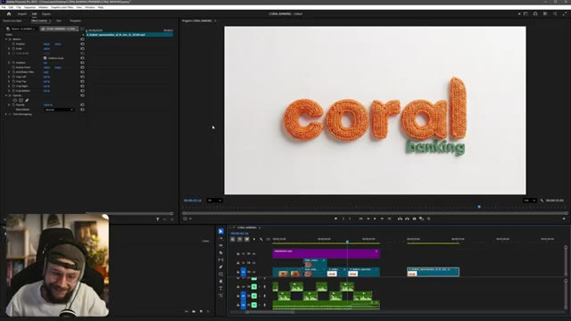
*Interface d'Adobe Premiere Pro montrant le montage d'un projet avec le logo en laine "coral banking" au centre de l'écran et la webcam du créateur en incrustation (PiP) en bas à gauche.*

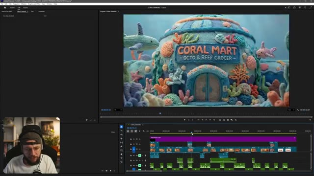
*Interface d'Adobe Premiere Pro montrant le plan d'un décor sous-marin en laine avec l'inscription "CORAL MART - OCTO & REEF GROCER" et la chronologie (timeline) détaillée.*

---

### ⏱️ `[00:29:48 - 00:30:25]` | Segment #58

**🔊 Audio (Transcription Intégrale Mot pour Mot en Français) :**
> On va parcourir tout ça donc d'abord on a cet effet sonore de corde qui se serre pour vraiment vendre cette idée que ses tentacules se nouent et donner l'impression que c'est un peu douloureux et inconfortable, puis avec le plan extérieur du supermarché on a ce son classique sous-marin et ensuite quand on arrive au parc on a des chants d'oiseaux donc c'est assez simple en réalité, ça s'estompe très bien car on a aussi ce genre de son de notification pour le téléphone. Ce que je vais faire aussi, c'est que je vais simplement réactiver ces pistes pour qu'on puisse écouter le montage.

**👁️ Analyse Visuelle d'Écran (gemini-3.5-flash-lite) :**
**Interface & Outils** : Adobe Premiere Pro (logiciel de montage vidéo) avec affichage du moniteur source, du moniteur de programme, de la timeline multipiste et d'une fenêtre de prévisualisation de la webcam du créateur.

**Contenu textuel & Code** : Timeline de montage contenant plusieurs pistes vidéo et audio (marquées par des clips de différentes couleurs et des formes d'ondes audio), le moniteur de programme affichant un personnage de poulpe en tricot.

**Action / Démonstration** : Le créateur commente et présente son montage audio et vidéo dans Adobe Premiere Pro, la tête du créateur étant visible en incrustation (PiP) dans le coin inférieur gauche pendant qu'il explique le placement des effets sonores.

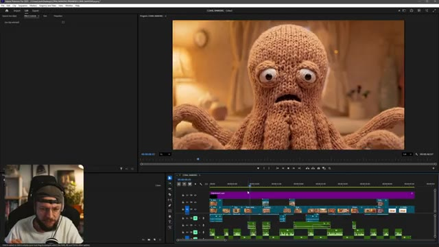
*Interface du logiciel Adobe Premiere Pro montrant la timeline de montage avec les pistes audio et vidéo, ainsi qu'une incrustation vidéo (PiP) du créateur en bas à gauche.*

---

### ⏱️ `[00:30:25 - 00:31:01]` | Segment #59

**🔊 Audio (Transcription Intégrale Mot pour Mot en Français) :**
> sans la voix off ou la musique. Donc bien sûr, tout l'audio que vous entendez maintenant a été généré nativement dans VO 3.1. Nous avons ajouté cela. Vous pouvez donc en quelque sorte travailler par-dessus l'audio que vous obtenez des modèles vidéo pour amplifier certaines choses quand vous pensez que c'est nécessaire. En quelque sorte pour vendre l'atmosphère avec ces sortes de chants d'oiseaux, un joli effet sonore de gorgée également généré nativement dans VO 3.1 et encore une fois nous avons réutilisé ce même genre d'effet sonore de resserrement de corde pour montrer qu'il est en train d'être soulagé à ce moment-là, c'est vraiment bien aussi encore une fois.

**👁️ Analyse Visuelle d'Écran (gemini-3.5-flash-lite) :**
**Interface & Outils** : Logiciel de montage vidéo Adobe Premiere Pro, avec un encadré incrusté (PiP) affichant le créateur en bas à gauche.

**Contenu textuel & Code** : Timeline de montage avec pistes audio et vidéo multiples, fenêtre de prévisualisation affichant une animation en stop-motion d'une pieuvre cuisinant dans une cuisine rustique, et le projet nommé « CORAL_BANKING ».

**Action / Démonstration** : Le créateur présente son projet de montage vidéo dans Premiere Pro, démontrant la synchronisation des pistes audio et des effets sonores générés par IA avec les plans vidéo.

*Interface d'Adobe Premiere Pro montrant la timeline de montage et un plan vidéo généré par IA représentant une pieuvre dans une cuisine.*

---

### ⏱️ `[00:31:01 - 00:31:37]` | Segment #60

**🔊 Audio (Transcription Intégrale Mot pour Mot en Français) :**
> généré de manière native le genre de stylo grattant les post-its et le son du joueur de jeux vidéo vraiment sympa donc voilà les gars nous avons maintenant exploré l'ensemble du processus de création de cette publicité animée. Si vous avez des questions, n'hésitez pas à les laisser en bas dans la section des commentaires. Je répondrai à autant d'entre elles que possible. Si vous avez apprécié le contenu d'aujourd'hui, assurez-vous de lâcher un pouce bleu pour moi. Si vous êtes nouveau, pensez à vous abonner et bien sûr, activez la cloche de notification pour ne jamais manquer aucun contenu futur. Je pense qu'il est maintenant temps de découvrir la publicité animée terminée. Merci beaucoup d'avoir regardé les gars. Je vous retrouve dans la prochaine

**👁️ Analyse Visuelle d'Écran (gemini-3.5-flash-lite) :**
**Interface & Outils** : Adobe Premiere Pro (Image 1) et Artlist AI Toolkit (Image 2), avec incrustation vidéo (PiP) de la webcam du créateur.

**Contenu textuel & Code** : Timeline de montage vidéo avec pistes audio et vidéo pour le projet "CORAL_RANKING" (Image 1). Galerie de vidéos IA, vignettes de prévisualisation et barre de prompt avec options (Seedance, durée, format, etc.) (Image 2).

**Action / Démonstration** : Le créateur parle face caméra tout en affichant son écran de montage vidéo sur Premiere Pro, puis navigue sur la plateforme Artlist AI Toolkit pour montrer des exemples de générations.

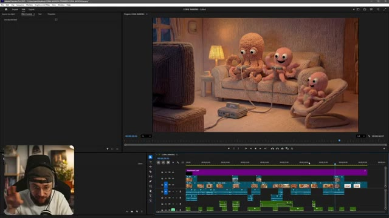
*Interface d'Adobe Premiere Pro affichant la timeline du projet de publicité animée avec des créatures en peluche jouant aux jeux vidéo, avec incrustation vidéo (PiP) du créateur en bas à gauche.*

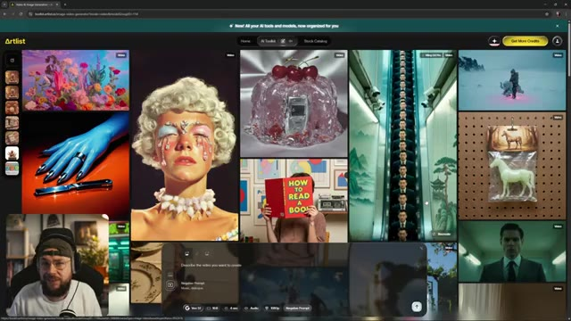
*Interface de la plateforme Artlist AI Toolkit montrant une galerie de vidéos générées par intelligence artificielle et des options de prompts, avec le créateur en incrustation (PiP) en bas à gauche.*

---

### ⏱️ `[00:31:37 - 00:32:11]` | Segment #61

**🔊 Audio (Transcription Intégrale Mot pour Mot en Français) :**
> un. Certaines matinées ressemblent moins à une liste de tâches qu'à un jeu de cache-cache. Juste au moment où vous reprenez le contrôle, autre chose surgit et soudain vous êtes ligoté, agrippé à des factures, alourdi par des abonnements et essayant de ne pas lâcher ce qui compte. Alors voici une meilleure façon de renverser la tendance. Avec Coral Banking, vous pouvez mettre de l'argent de côté pour les petits, suivre les factures et les abonnements à mesure qu'ils arrivent, et voir où tout cela va.

**👁️ Analyse Visuelle d'Écran (gemini-3.5-flash-lite) :**
**Interface & Outils** : Présentation face caméra sans partage d'écran (publicité animée avec une marionnette de poulpe en tricot, aucune interface logicielle ou de démonstration technique).

**Contenu textuel & Code** : Animation vidéo illustrant un poulpe en tricot débordé par ses factures et abonnements, assis sur un banc avec un landau ou devant un ordinateur portable, style stop-motion/artisanal.

**Action / Démonstration** : Animation publicitaire montrant le personnage de poulpe en tricot interagissant avec son environnement (banc public, ordinateur, tasse de café) pour illustrer le stress financier.

---

### ⏱️ `[00:32:11 - 00:32:24]` | Segment #62

**🔊 Audio (Transcription Intégrale Mot pour Mot en Français) :**
> Clair comme de l'eau de roche. Moins de bousculade. Moins de surprises. Plus de vous là où on a besoin de vous. Coral Banking. Pour les trucs de grands et les trucs pour grandir.

**👁️ Analyse Visuelle d'Écran (gemini-3.5-flash-lite) :**
**Interface & Outils** : Présentation vidéo publicitaire animée style stop-motion (sans partage d'écran de logiciel ou outil d'IA)

**Contenu textuel & Code** : Texte publicitaire "coral banking" brodé en maille orange et verte sur fond blanc

**Action / Démonstration** : Affichage de scènes animées avec des personnages en tricot (poulpes) illustrant le service bancaire, puis affichage du logo final de la marque Coral Banking.

---
