# 🎬 Comment créer des influenceurs IA pour des pubs produits (CONTRÔLE TOTAL)

> **Chaîne** : [Jack Vs. AI](https://www.youtube.com/@JackVsAI)  
> **Titre original** : `How to Create AI Influencers for Product Ads (TOTAL CONTROL)`  
> **Lien YouTube** : [https://www.youtube.com/watch?v=FLQxZ0zrNII](https://www.youtube.com/watch?v=FLQxZ0zrNII)  
> **Date de publication** : 2026-02-01  
> **Durée** : 24m 40s (`1480s`)  
> **Identifiant vidéo** : `FLQxZ0zrNII`  
> **Fiche Web Interactive** : [2026-02-01_YT-FLQxZ0zrNII_Comment créer des influenceurs IA pour des pubs produits (CONTRÔLE TOTAL)_by-whisper-v3-large-turbo+gemini-3.5-flash-lite.html](2026-02-01_YT-FLQxZ0zrNII_Comment créer des influenceurs IA pour des pubs produits (CONTRÔLE TOTAL)_by-whisper-v3-large-turbo+gemini-3.5-flash-lite.html)  
> **Captures de démonstration clés** : `126 captures réelles (anti-talking-head)`  
> **Modèles utilisés** : Audio: `large-v3-turbo` (Faster-Whisper int8 VPS) | Vision: `gemini-3.5-flash-lite` (Google AI Studio API)  

---

## 📌 Synthèse Exécutive & Outils

### 📌 Résumé
La vidéo de Jack Vs. AI pose un constat percutant : le public ne rejette pas la publicité, il recherche l'authenticité que seule l'incarnation peut offrir. Pour répondre à ce besoin, l'intelligence artificielle permet désormais de générer des influenceurs virtuels capables de produire du contenu UGC (*User Generated Content*) à une échelle industrielle, sans contrainte logistique, financière ou temporelle. Grâce à des outils de création de personnages de plus en plus sophistiqués, les marques et les créateurs peuvent concevoir de toutes pièces des ambassadeurs sur mesure dotés de caractéristiques uniques (imperfections cutanées, morphologies variées) pour maximiser l'identification et l'engagement du public.

La méthode étape par étape démontrée par Jack repose sur un workflow hybride et puissant. Elle commence par la modélisation granulaire d'un avatar virtuel sur des plateformes spécialisées comme Higgsfield, en insistant sur l'hyperréalisme et les détails singuliers qui brisent l'effet synthétique (taches de naissance, yeux ambre). Ensuite, le processus intègre des technologies de pointe de transfert de mouvement (notamment alimentées par Kling) pour insuffler de la vie à l'avatar. Qu'il s'agisse d'utiliser des modèles de danse viraux ou d'importer sa propre vidéo de référence enregistrée chez soi, le créateur peut projeter n'importe quel mouvement ou jeu d'acteur sur son influenceur IA avec une fluidité déconcertante.

Pour les créateurs de vidéo et les marketeurs, les bénéfices de cette approche sont révolutionnaires. En s'affranchissant des tournages traditionnels, des castings et des budgets pharaoniques, il devient possible de tester une infinité de variations de produits, d'environnements et de scripts en quelques clics. Cette maîtrise du contrôle total offre un avantage concurrentiel massif, transformant radicalement la production publicitaire et ouvrant la voie à une ère où l'artificiel rivalise, voire surpasse, le réel en termes d'efficacité et de rentabilité.

### 🛠️ Outils, Modèles & Logiciels Présentés
* **Higgsfield** : Plateforme centrale utilisée pour la création d'influenceurs virtuels via son studio de personnalisation de personnages et l'exploration de bibliothèques de mouvements.
* **Higgsfield Earn** : Fonctionnalité intégrée permettant de lier ses réseaux sociaux, de générer du contenu UGC par IA et de monétiser son activité.
* **Kling** : Moteur d'IA ultra-puissant gérant le contrôle et le transfert de mouvement pour appliquer des chorégraphies ou des actions de référence sur l'avatar virtuel.
* **Nano Banana Pro** : Outil d'édition et de retouche avancé mentionné pour affiner ou modifier les visuels des influenceurs générés.
* **Veo 3.1** : Modèle vidéo de pointe également identifié dans l'écosystème des outils de génération d'influenceurs et de contenus publicitaires.
* **Flux** : Modèle d'intelligence artificielle hautement performant souvent associé aux flux de travail de génération d'images et de design.

### 🔑 Points Clés & Enseignements Stratégiques
1. **Capitaliser sur l'imperfection humaine** : Intégrer des détails singuliers et réalistes (taches de naissance, albinisme, vitiligo, variations de morphologies) est indispensable pour créer de l'empathie et briser l'effet "robotique" des avatars.
2. **Penser l'avatar comme un personnage de jeu vidéo** : Utiliser les studios de création d'IA à la manière d'un *character builder* permet un contrôle granulaire absolu sur l'identité visuelle de l'influenceur (genre, origine ethnique, couleur des yeux, style capillaire, tatouages).
3. **Privilégier le rendu hyperréaliste** : Activer systématiquement les options de rendu avancé pour maximiser la texture de la peau et la crédibilité physique du personnage dès la première génération.
4. **Exploiter le transfert de mouvement vidéo** : Utiliser des références vidéo (qu'il s'agisse de danses virales ou de vlogs amateurs filmés soi-même) pour dicter les mouvements de l'avatar et lui insuffler une gestuelle naturelle.
5. **Opter pour une résolution de 720p stratégique** : Contrairement aux idées reçues, se limiter à une résolution de 720p pour les transferts de mouvement s'avère souvent plus judicieux, car une qualité légèrement inférieure renforce l'aspect organique et "UGC authentique" du contenu.
6. **Enregistrer ses propres scripts et mouvements** : Filmer ses propres déplacements maladroits ou ses vlogs de démonstration produit une base de mouvement sur mesure qui, une fois appliquée à l'influenceur musclé ou atypique, produit un contraste saisissant et crédible.
7. **Exploiter un flux de travail ouvert** : Ne pas se limiter aux modèles préexistants des plateformes ; combiner la capture de mouvements personnelle avec le moteur de Kling permet une liberté créative totale.
8. **Sécuriser un avantage concurrentiel précoce** : Les influenceurs IA ne dormant jamais et n'augmentant pas leurs tarifs, s'approprier ces outils dès maintenant permet de saturer les canaux publicitaires avant une adoption massive par les marques traditionnelles.
9. **Anticiper l'agilité publicitaire** : Modifier instantanément les vêtements, les décors ou les produits présentés au sein d'une même campagne publicitaire sans avoir à réorganiser de tournage physique.
10. **Rester vigilant face aux artéfacts** : Même si les technologies de Kling et Higgsfield sont bluffantes, une analyse minutieuse de la vidéo finale reste nécessaire pour corriger les éventuelles incohérences cinématiques et garantir un taux de conversion maximal.

---

## ⏱️ Chronologie & Transcription Complète Audio & Visuelle (Mot pour Mot)

### ⏱️ `[00:00:00 - 00:00:34]` | Segment #01

**🔊 Audio (Transcription Intégrale Mot pour Mot en Français) :**
> Bon, arrêtons les conneries. Les spectateurs ne détestent pas les publicités, ils veulent juste du contenu qui a l'air réel. Ou pas ? Ce que vous regardez en ce moment est une influenceuse IA, et elles peuvent générer plus de contenu en une seule journée qu'un créateur ordinaire en une année entière. Une influenceuse IA ne dort jamais, elle ne rate jamais un brief et n'augmente jamais ses tarifs. Et vous pouvez facilement changer l'emplacement, les vêtements et les produits en quelques clics seulement. Dans cette vidéo, je vais vous montrer comment créer votre propre influenceuse IA à partir de zéro. Que vous souhaitiez bâtir une énorme communauté sur les réseaux sociaux ou

**👁️ Analyse Visuelle d'Écran (gemini-3.5-flash-lite) :**
**Interface & Outils** : Présentation face caméra avec intégration d'extraits vidéo d'influenceuses virtuelles générées par IA.

**Contenu textuel & Code** : Texte affiché à l'écran : "more content in just 1 day".

**Action / Démonstration** : Le créateur présente une vidéo d'illustration montrant le rendu réaliste d'une influenceuse virtuelle générée par intelligence artificielle.

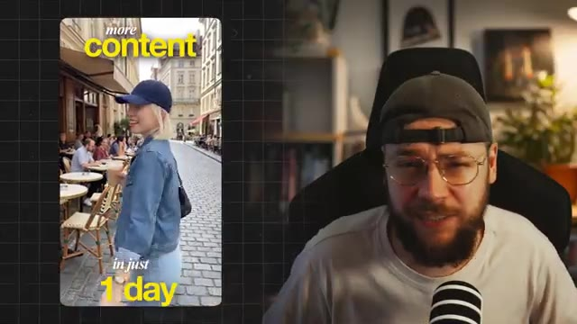
*Affichage d'une vidéo générée par IA montrant une influenceuse marchant dans une rue européenne avec le texte "more content in just 1 day", tandis que Jack commente depuis son studio.*

---

### ⏱️ `[00:00:34 - 00:00:54]` | Segment #02

**🔊 Audio (Transcription Intégrale Mot pour Mot en Français) :**
> remplacer entièrement les campagnes de produits traditionnelles, vous obtenez un contrôle créatif total, une production illimitée et un avantage injuste que la plupart des marques n'ont pas encore perçu. Cela est déjà en train de se produire et les premiers arrivants remporteront une victoire écrasante. Et les gars, si vous appréciez le contenu d'aujourd'hui, n'oubliez pas de lâcher un pouce bleu pour moi, pensez à vous abonner et, bien sûr, à activer la cloche de notification.

**👁️ Analyse Visuelle d'Écran (gemini-3.5-flash-lite) :**
**Interface & Outils** : Présentation face caméra sans partage d'écran

**Contenu textuel & Code** : Aucun écran de logiciel, code ou interface n'est affiché. Les images montrent uniquement Jack s'exprimant face caméra dans son studio avec des superpositions de texte et d'icônes animées (pouce bleu et cloche de notification).

**Action / Démonstration** : Le créateur s'adresse directement à son audience, montrant un produit au début puis s'exprimant face caméra dans son studio pour conclure sa vidéo.

---

### ⏱️ `[00:00:54 - 00:01:23]` | Segment #03

**🔊 Audio (Transcription Intégrale Mot pour Mot en Français) :**
> Très bien, entrons dans le vif du sujet. Donc pour la vidéo d'aujourd'hui, nous sommes sur Higgsfield et tout de suite, vous pouvez voir le thème récurrent de multiples outils d'influenceurs IA. Et c'est parce qu'il y a beaucoup de battage médiatique, beaucoup de buzz autour de ces fonctionnalités et c'est quelque chose qui vaut vraiment le coup d'être exploré, mais sur lequel nous ne allons pas trop nous attarder dans cette vidéo, c'est Higgsfield Earn. Et c'est là que vous pouvez lier vos comptes de réseaux sociaux, créer du contenu généré par l'IA (UGC) et finalement gagner de l'argent dans le processus.

**👁️ Analyse Visuelle d'Écran (gemini-3.5-flash-lite) :**
**Interface & Outils** : Navigateur web affichant la plateforme Higgsfield.ai avec l'interface principale, ses menus de navigation (Explore, Image, Video, Edit, Character, Inpaint, Cinema Studio v2, Motion Control, AI Influencer, etc.) et le retour vidéo du présentateur (Jack) en incrustation (PiP) dans le coin inférieur gauche.

**Contenu textuel & Code** : Sur l'image 1 : En-tête avec les options de menu, bannie magenta "NANO BANANA PRO UNLIMITED FOR 365 DAYS & UNLIMITED ON ALL KLING MODELS", section "WHAT WILL YOU CREATE TODAY?" avec des vignettes (Create Image, Create Video, Motion Control, Edit Image, Nano Banana Pro, Kling Video Edit, Upscale) et le logo "Higgsfield Earn". Sur l'image 2 : Titre "HIGGSFIELD EARN", texte "Join Higgsfield Earn to get paid for your content...", encadré affichant le montant de "$603,932", bouton "Start Earning" et bandeau inférieur "EARN REAL MONEY WITH YOUR AI INFLUENCER".

**Action / Démonstration** : Le présentateur commente la plateforme Higgsfield affichée à l'écran, navigue sur la page d'accueil (image 1) puis présente la section Higgsfield Earn (image 2) tout en parlant face à sa webcam visible dans l'encadré inférieur gauche.

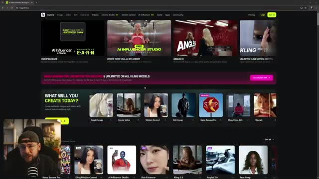
*Page d'accueil du site web de Higgsfield montrant les différentes fonctionnalités d'IA et l'encadré du présentateur en bas à gauche.*

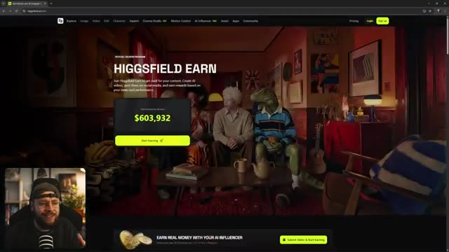
*Page web de présentation de "Higgsfield Earn" avec le montant total des gains affiché ($603,932) et le présentateur en incrustation PiP.*

---

### ⏱️ `[00:01:23 - 00:01:45]` | Segment #04

**🔊 Audio (Transcription Intégrale Mot pour Mot en Français) :**
> Je veux aller de l'avant et cliquer sur cette bannière ici, qui est pour AI Influencer Studio. Allons-y donc. Maintenant, cet outil se comporte exactement comme un créateur de personnage dans un jeu vidéo. Donc, si certains d'entre vous qui regardent aiment le jeu vidéo, cela va vous sembler très familier. Directement, nous avons l'option pour le type de personnage, en commençant par l'humain et en allant jusqu'à différents animaux.

**👁️ Analyse Visuelle d'Écran (gemini-3.5-flash-lite) :**
**Interface & Outils** : Interface web de Higgsfield AI (outil AI Influencer Studio) affichée dans un navigateur web avec incrustation vidéo du présentateur (PiP).

**Contenu textuel & Code** : Menus et options visibles : Explore, Image, Video, Edit, Character, Inpaint, Cinema Studio, AI Influencer, Motion Control, ainsi que le panneau latéral « Character Type » proposant des options telles que Human, Ant, Bee, Octopus, Crocodile, Iguana, Lizard, Alien, Beetle, Reptile, Amphibian, Elf, Mantis.

**Action / Démonstration** : Le créateur navigue sur le site web, sélectionne la bannière « AI Influencer Studio », ouvre l'outil de création de personnage et zoome sur les différentes options de types de personnages disponibles.

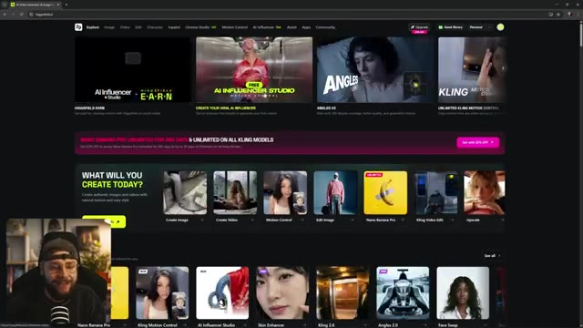
*Page d'accueil de Higgsfield AI montrant différentes bannières et fonctionnalités, avec le créateur en encadré (PiP) en bas à gauche.*

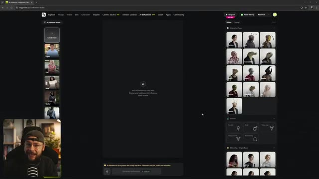
*Interface d'AI Influencer Studio montrant les options de création de personnage sur le panneau latéral droit.*

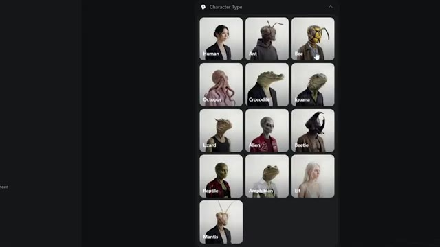
*Gros plan sur le panneau de sélection du type de personnage avec les différentes catégories (humain, fourmi, abeille, pieuvre, crocodile, iguane, etc.).*

---

### ⏱️ `[00:01:45 - 00:02:21]` | Segment #05

**🔊 Audio (Transcription Intégrale Mot pour Mot en Français) :**
> Vous avez même l'option pour les extraterrestres et les elfes. Vous pouvez vraiment devenir assez fou avec ça. Vraiment, vous pouvez devenir aussi unique que vous le souhaitez, mais parce que je veux garder cela axé sur les influenceurs virtuels (UGC IA), sélectionnons humain. En descendant pour le genre, je vais aller de l'avant et sélectionner féminin. Pour l'origine ethnique, optons pour asiatique. Couleur de peau, je vais juste laisser cette partie vide. Vous pouvez également voir que nous pouvons sélectionner notre couleur des yeux. Je pense que je vais choisir l'ambre ici. Maintenant, en descendant un peu plus bas, vous pouvez voir que nous avons accès à différentes affections cutanées. Donc je ne veux pas vraiment minimiser les gens qui vivent avec le vitiligo

**👁️ Analyse Visuelle d'Écran (gemini-3.5-flash-lite) :**
**Interface & Outils** : Interface web de création d'influenceurs virtuels (semblable à un studio de modélisation 3D ou générateur d'avatars IA, ex: Higgsfield AI Influencer Studio) avec panneaux latéraux de configuration et retour vidéo central.

**Contenu textuel & Code** : Menus déroulants et grilles de sélection : "Character Type" (Human, Ant, Bee, Octopus, Crocodile, Iguana, Lizard, Alien, Beetle, Reptile, Amphibian, Elf, Mantis), options de genre, d'ethnicité, de couleur de peau, de couleur des yeux, et section "Skin Conditions" (Vitiligo, Pigmentation, Freckles, Birthmarks, Scars, Burns, Albinism, Cracked/dry..., Wrinkled skin).

**Action / Démonstration** : Le curseur de la souris survole et sélectionne différentes options de personnalisation du personnage (type, genre, ethnie et conditions de peau) dans l'interface de l'application web.

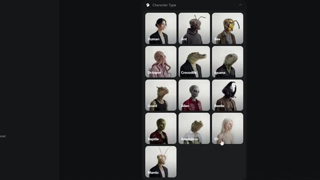
*Gros plan sur le panneau de sélection du type de personnage dans l'interface, montrant diverses options fantastiques et humaines comme Human, Ant, Bee, Octopus, Alien et Elf.*

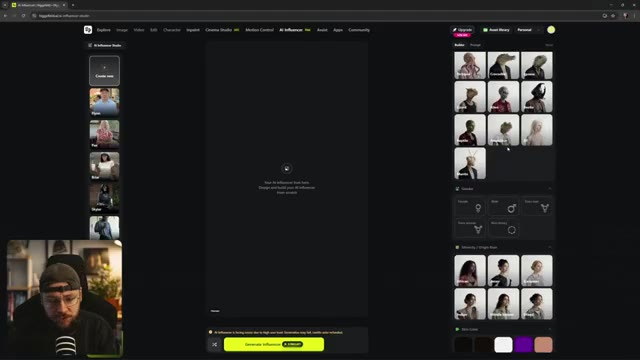
*Vue globale de l'interface du studio d'influenceurs virtuels sur le web avec la webcam du créateur incrustée en bas à gauche, affichant les menus de personnalisation du personnage (genre, origine ethnique, couleur de peau).*

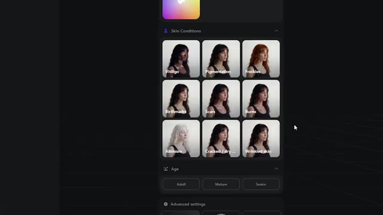
*Gros plan sur les options de conditions de peau (Skin Conditions) dans l'interface, montrant des choix tels que Vitiligo, Pigmentation, Freckles, Scars, Burns et Albinism.*

---

### ⏱️ `[00:02:21 - 00:02:50]` | Segment #06

**🔊 Audio (Transcription Intégrale Mot pour Mot en Français) :**
> et à l'albinisme. Évidemment, lorsque nous parlons de vraies personnes, c'est propre à leur vécu. Donc bien sûr, nous ne cherchons à offenser personne ici, mais en créant notre personnage et en utilisant certaines affections cutanées, différentes couleurs d'yeux et davantage de caractéristiques que nous verrons en faisant défiler plus bas, tout ce que nous faisons, c'est créer un personnage synthétique qui se démarquera. Alors pour cet exemple, allons-y et essayons les taches de naissance. Parce que le caractère unique et l'imperfection sont vraiment ce à quoi les gens se sentent connectés.

**👁️ Analyse Visuelle d'Écran (gemini-3.5-flash-lite) :**
**Interface & Outils** : Navigateur web affichant l'interface d'Higgsfield AI (« AI Influencer Studio »), avec une barre latérale de navigation en haut (Explore, Image, Video, Edit, Character, Inpaint, Cinema Studio, Motion Control, AI Influencer), un panneau de sélection des personnages à gauche, un espace de prévisualisation central et un panneau de réglages détaillés à droite (yeux, cheveux, age, advanced settings). Le présentateur (Jack) apparaît en bas à gauche dans une vignette PiP.

**Contenu textuel & Code** : Dans le panneau de droite, plusieurs options de personnalisation visuelle : miniatures de types d'yeux (notamment des yeux vairons, vairons jaunes, etc.), sélecteur de couleur avec roue chromatique, et grille de styles de coiffures. Un avertissement en bas de l'écran central indique « AI Influencer is facing issues due to high user load... ». Bouton jaune en bas « Generate Influencer ».

**Action / Démonstration** : Le créateur navigue et démontre l'interface de personnalisation des caractéristiques physiques (yeux, cheveux) dans Higgsfield AI, tout en commentant la création d'un personnage synthétique unique.

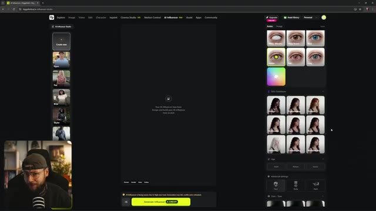
*Interface d'Higgsfield AI (AI Influencer Studio) montrant le panneau de personnalisation des yeux et des cheveux avec le présentateur en incrustation PiP.*

---

### ⏱️ `[00:02:50 - 00:03:10]` | Segment #07

**🔊 Audio (Transcription Intégrale Mot pour Mot en Français) :**
> Et c'est là qu'on a vu ce changement énorme dans la façon dont les produits sont annoncés. C'est pourquoi le contenu de style UGC est si puissant maintenant, parce qu'il y a cette connexion entre le public et le créateur. Donc c'est vraiment là que certaines de ces options vont entrer en jeu. Nous allons sélectionner adulte pour le paramètre d'âge. Et vous pouvez voir que nous avons toutes sortes d'options pour le visage.

**👁️ Analyse Visuelle d'Écran (gemini-3.5-flash-lite) :**
**Interface & Outils** : Interface web de Higgsfield (AI Influencer Studio) avec un panneau de configuration des traits du visage sur la droite, un aperçu central de l'influenceur, et une pastille vidéo PiP (Picture-in-Picture) du présentateur Jack en bas à gauche.

**Contenu textuel & Code** : Le panneau de droite affiche des vignettes de sélection pour les yeux (différentes couleurs dont blanc, marron, bleu, jaune, rouge) et les styles de coiffure/cheveux, suivis d'un paramètre d'âge ("Age") avec les options "Adult", "Mature", "Senior". Le panneau inférieur inclut des réglages avancés ("Face", "Body", "Style") et un bouton jaune "Generate Influencer". En bas à gauche, le créateur Jack porte une casquette et des lunettes, s'exprimant devant un micro dans son studio.

**Action / Démonstration** : Le créateur montre l'interface de personnalisation faciale et de configuration des paramètres d'âge dans l'outil d'influenceur virtuel de Higgsfield.

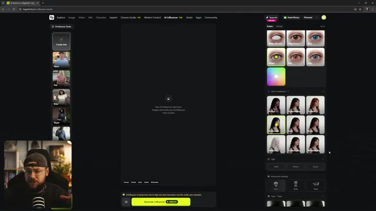
*Interface du studio d'influenceurs IA (Higgsfield) montrant le panneau latéral de personnalisation faciale avec des options d'yeux et de coiffures, ainsi qu'un encadré PiP du créateur.*

---

### ⏱️ `[00:03:10 - 00:03:29]` | Segment #08

**🔊 Audio (Transcription Intégrale Mot pour Mot en Français) :**
> Nous pouvons opter pour un style reptile, mécanique. Pour le corps, c'est pareil, tous les différents types de morphologies. Et ensuite, en ce qui concerne le style, nous pouvons choisir le type de cheveux. Nous pouvons ajouter des tatouages et des piercings. Donc je pense que nous allons opter pour des cheveux longs. Et nous voulons nous assurer de cocher également le style de rendu hyperréaliste.

**👁️ Analyse Visuelle d'Écran (gemini-3.5-flash-lite) :**
**Interface & Outils** : Interface web de Higgsfield (section AI Influencer) affichant un panneau latéral avec des paramètres avancés pour le visage (Eyes - Type, Eyes - Details, Mouth & Teeth). Un encadré PiP (Picture-in-Picture) en bas à gauche montre le présentateur Jack dans son studio.

**Contenu textuel & Code** : Menus de configuration : "Advanced settings", "Face", "Body", "Style". Options pour les yeux : Human, Reptile, Mechanical, Different eyes, Blind eye, Scarred eye, Glowing eye. Options pour la bouche : Small mouth, Large mouth, No teeth, Different teeth, Sharp teeth, Forked tongue, Two tongues. Bouton jaune "Generate Influencer".

**Action / Démonstration** : Le créateur navigue et démontre les différentes options de personnalisation faciale (types d'yeux et de bouches) disponibles dans l'outil de création d'influenceurs virtuels.

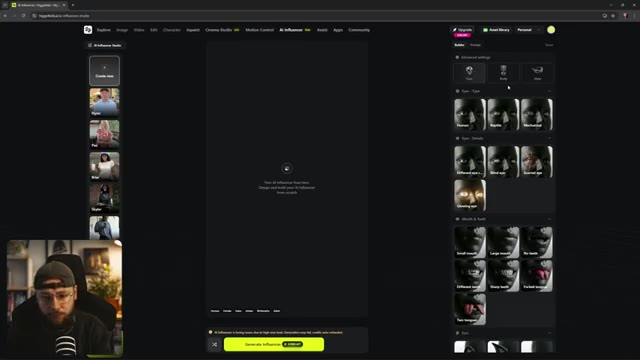
*Interface de l'outil AI Influencer sur Higgsfield montrant les options de personnalisation du visage et des yeux.*

---

### ⏱️ `[00:03:29 - 00:04:06]` | Segment #09

**🔊 Audio (Transcription Intégrale Mot pour Mot en Français) :**
> Donc allons-y, cliquons sur générer et voyons ce que l'on obtient. Et voilà, nous avons notre première génération de notre influenceur appelé Crosby. Mais disons, par exemple, que nous voulons en fait que notre influenceur ait des yeux gris à la place. Nous pouvons sélectionner cela, désélectionner ambre et cliquer à nouveau sur générer et pendant que nous patientons, je vais juste faire défiler vers le bas et vous montrer quelques-uns des autres exemples que nous avons ici sur Higgsfield, vous pouvez donc voir différents influenceurs IA très uniques ici. Nous avons Jupiter qui est un homme fourmi à part entière, très unique, je veux dire, nous avons même Dorian qui est un homme poulpe, donc vous pouvez vraiment obtenir

**👁️ Analyse Visuelle d'Écran (gemini-3.5-flash-lite) :**
**Interface & Outils** : Higgsfield AI (Navigateur web - AI Influencer Studio)

**Contenu textuel & Code** : Menus de configuration de l'influenceur virtuel (sélection des yeux : Black, Purple, Green, White, Brown, Black (Solid:Void), White (Blind:E..., Deep Brown, Blue, Amber, Red, Grey), styles de coiffure, options d'accessoires et de tatouages, et exemples de personnages créés (Crosby, Flynn, Paz, Briar, Skylar, Jupiter, Doris, Cnyx, Dorian)).

**Action / Démonstration** : Le présentateur clique sur les boutons de génération, modifie les paramètres de couleur des yeux (passage d'ambre à gris) et fait défiler la liste des influenceurs existants pour présenter des exemples uniques comme Jupiter et Dorian.

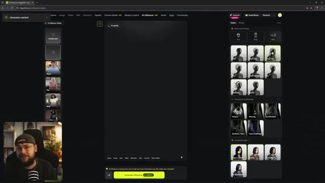
*Interface d'Higgsfield AI Influencer Studio montrant le panneau latéral avec les paramètres de coiffure et le bouton de génération.*

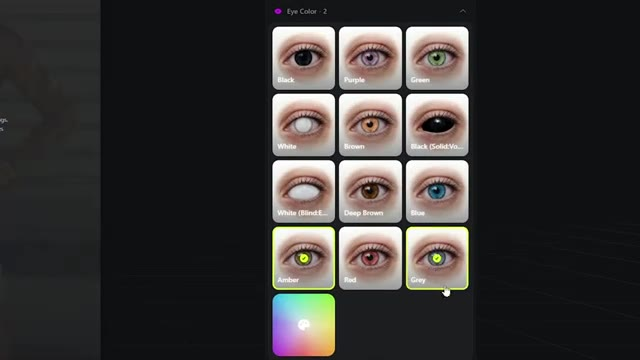
*Gros plan sur la palette de sélection de la couleur des yeux avec les options Amber et Grey.*

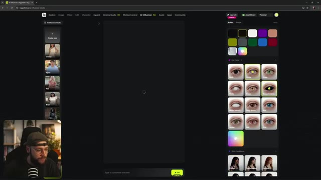
*Interface principale de Higgsfield affichant la zone centrale de prévisualisation en chargement et les paramètres de personnalisation.*

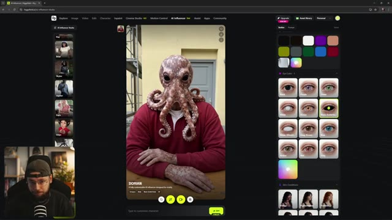
*Affichage du personnage généré "Dorian" habillé en rouge avec une tête de poulpe dans Higgsfield AI.*

---

### ⏱️ `[00:04:06 - 00:04:40]` | Segment #10

**🔊 Audio (Transcription Intégrale Mot pour Mot en Français) :**
> aussi fou avec ça que vous le voudriez probablement, mais disons simplement que nous sommes satisfaits de notre deuxième génération et que nous pensons que cet influenceur a un potentiel viral. Nous avons d'autres options, nous avons ici l'option d'aller de l'avant et d'effectuer des modifications avec nano banana pro, nous allons approfondir cela plus tard dans la vidéo, mais nous avons aussi cette option de caméra ici et si nous cliquons dessus, vous pouvez voir un petit aperçu de la bibliothèque de mouvements de Higgsfield, allons-y et cliquons sur explorer plus pour avoir accès à la bibliothèque complète maintenant vous pouvez voir que automatiquement

**👁️ Analyse Visuelle d'Écran (gemini-3.5-flash-lite) :**
**Interface & Outils** : Interface web de Higgsfield (higgsfield.ai), studio de génération vidéo et d'influenceurs IA, avec panneaux de configuration et prévisualisations.

**Contenu textuel & Code** : Noms des personnages (AMY, CROSBY), options de personnalisation ("Eye Color", "Skin Condition"), catégories de navigation (Explore, Image, Video, Edit, Character, Inpaint, Cinema Studio, Motion Control, AI Influencer), et le titre "RECREATE ANY MOTION WITH YOUR IMAGE".

**Action / Démonstration** : Navigation dans l'interface de Higgsfield, sélection de personnages virtuels, survol des options et ouverture de la bibliothèque de mouvements ("Motion Control").

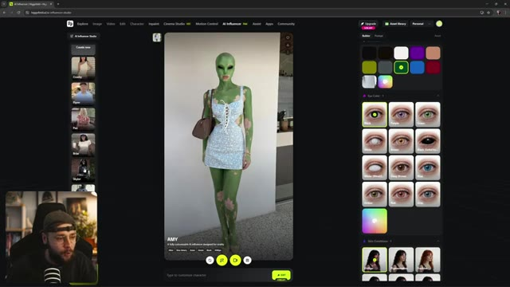
*Interface de l'outil AI Influencer sur Higgsfield montrant un personnage extraterrestre vert nommé AMY et les options de personnalisation.*

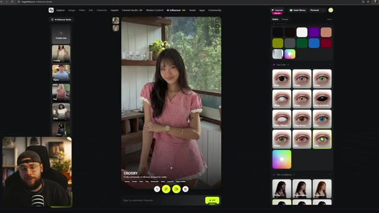
*Interface de l'outil AI Influencer montrant un autre personnage nommé CROSBY dans un intérieur.*

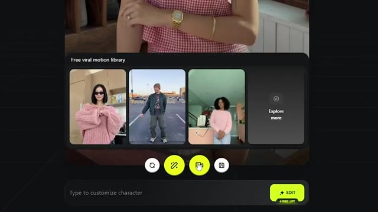
*Pop-up affichant la bibliothèque de mouvements viraux gratuits ("Free viral motion library") avec des aperçus vidéo et l'option "Explore more".*

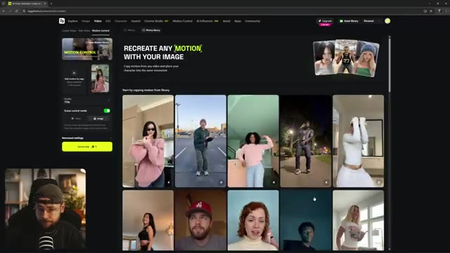
*Page complète de la bibliothèque de mouvements ("Motion Control") sur Higgsfield avec de multiples vignettes de vidéos pour recréer n'importe quel mouvement.*

---

### ⏱️ `[00:04:40 - 00:05:17]` | Segment #11

**🔊 Audio (Transcription Intégrale Mot pour Mot en Français) :**
> notre influenceur IA est utilisé comme référence d'image et ce que nous avons ici est le contrôle de mouvement de Kling qui est un outil d'IA incroyablement puissant dont je suis sûr que vous êtes familiers. Si ce n'est pas le cas, commencez à l'utiliser car c'est hallucinant. Donc si nous faisons défiler vers le bas ici, vous pouvez voir de nombreux exemples différents de danses de style viral. Maintenant disons simplement que nous aimons vraiment cette danse ici. Si nous cliquons dessus, elle sera alors utilisée comme référence vidéo. Le mouvement de cette vidéo sera donc appliqué à notre référence d'image. Vous pouvez voir que nous pouvons sélectionner 720p.

**👁️ Analyse Visuelle d'Écran (gemini-3.5-flash-lite) :**
**Interface & Outils** : Interface web de Kling AI (section Motion Control) montrant le panneau de configuration à gauche et une galerie de vidéos de référence de danse à droite.

**Contenu textuel & Code** : Textes visibles : "RECREATE ANY MOTION WITH YOUR IMAGE", "Motion Control", "Quality 720p", "Scene control mode", "Generate 5", "Advanced settings".

**Action / Démonstration** : Le créateur montre comment importer une image de référence d'influenceur IA, configurer les paramètres de contrôle de mouvement et naviguer dans la bibliothèque de danses virales.

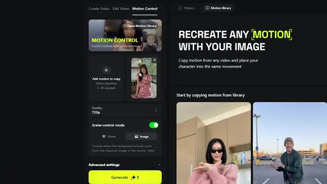
*Gros plan sur le panneau de configuration de l'outil Motion Control avec les options de qualité 720p et le bouton de génération jaune.*

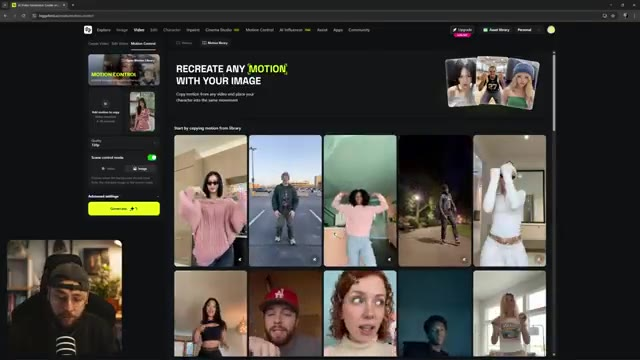
*Vue d'ensemble de l'interface Kling Motion Control avec la bibliothèque de vidéos de danse virales, incluant une incrustation vidéo (PiP) du créateur en bas à gauche.*

---

### ⏱️ `[00:05:17 - 00:05:52]` | Segment #12

**🔊 Audio (Transcription Intégrale Mot pour Mot en Français) :**
> ou 1080p. Je vais simplement m'en tenir à 720. C'est le grand avantage de l'UGC. Parfois, ces options de résolution légèrement inférieures fonctionnent mieux parce qu'elles semblent plus naturelles, plus imparfaites. Et vous pouvez également voir que si nous ouvrons ce champ de paramètres avancés, nous pouvons entrer un prompt si nous voulons être vraiment précis sur le transfert de mouvement. Mais pour les besoins d'un exemple simple initial, allons-y et cliquons sur générer. Et vous pouvez voir ici que nous avons récupéré notre génération et vous pouvez voir à quel point le transfert de mouvement fait un excellent travail en appliquant cette vidéo

**👁️ Analyse Visuelle d'Écran (gemini-3.5-flash-lite) :**
**Interface & Outils** : Higgsfield AI (outil de génération vidéo par IA - Motion Control)

**Contenu textuel & Code** : Interface utilisateur avec options de qualité (720p), réglages avancés (Advanced settings), bouton "Generate", et grille de vidéos de référence pour le transfert de mouvement.
[CONTENU_ADD] Affichage du résultat vidéo généré avec une interface de lecture (0:10/0:14).

**Action / Démonstration** : Le présentateur explique les choix de résolution et lance la génération par transfert de mouvement sur l'interface de Higgsfield AI avant de montrer le résultat final obtenu.

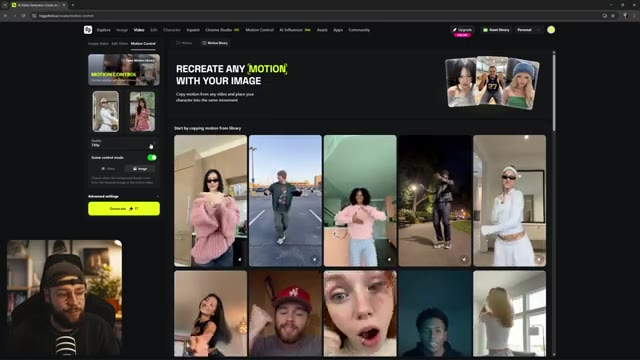
*Interface de Higgsfield AI montrant le panneau de contrôle de mouvement et la bibliothèque de vidéos.*

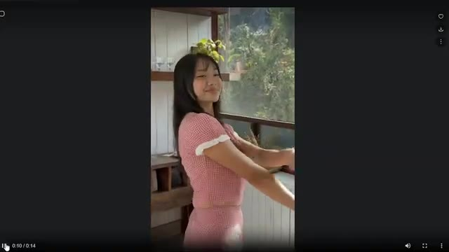
*Résultat de la génération vidéo après le transfert de mouvement montrant une femme dans un haut rose.*

---

### ⏱️ `[00:05:52 - 00:06:17]` | Segment #13

**🔊 Audio (Transcription Intégrale Mot pour Mot en Français) :**
> référence à notre image, à notre influenceur que nous venons de concevoir. Maintenant, bien sûr, il y a beaucoup de choses que vous pouvez déjà faire avec ces modèles dans Higgsfield. J'espère que vous commencez à réaliser que nous pouvons appliquer n'importe quelle référence vidéo à n'importe quelle référence d'image pour lui donner vie et créer ces mouvements réalistes. Nous ne sommes donc pas limités à l'utilisation de ces seuls modèles Higgsfield.

**👁️ Analyse Visuelle d'Écran (gemini-3.5-flash-lite) :**
**Interface & Outils** : Interface web de la plateforme d'intelligence artificielle Higgsfield (section Video / Motion Control).

**Contenu textuel & Code** : Menus de navigation (Explore, Image, Video, Edit, Character, Inpaint, Cinema Studio, Motion Control, AI Influencer, Assist, Apps, Community), options de format de génération (Quality 720p, Scene control mode avec bascule Image/Video), bouton jaune "Generate" avec icône d'éclair, et grille de miniatures vidéo variées (danse, fitness, expressions).

**Action / Démonstration** : Le créateur navigue à travers l'interface de Higgsfield et montre la bibliothèque de modèles vidéo disponibles pour le contrôle des mouvements.

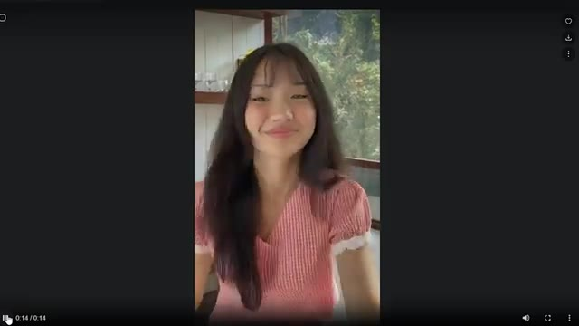
*Aperçu en plein écran d'une vidéo générée montrant une jeune femme souriante dans un intérieur.*

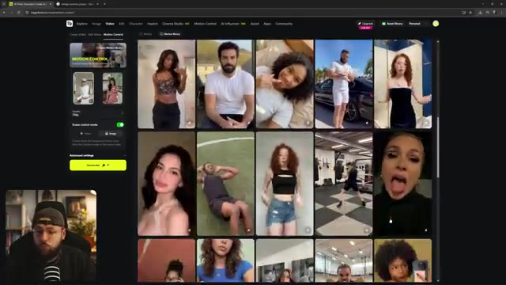
*Interface de la plateforme Higgsfield affichant une galerie de modèles de vidéos (Motion Control) et le créateur en incrustation (PiP).*

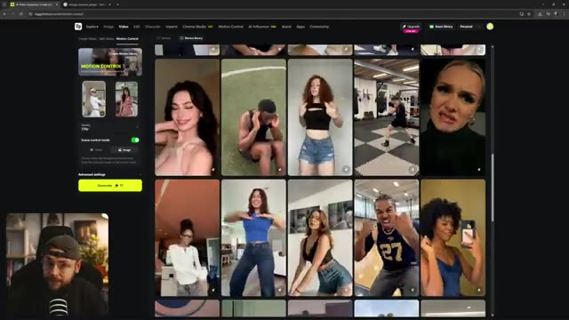
*Interface de Higgsfield montrant la navigation dans la bibliothèque de mouvements (Motion Control) avec divers clips de démonstration.*

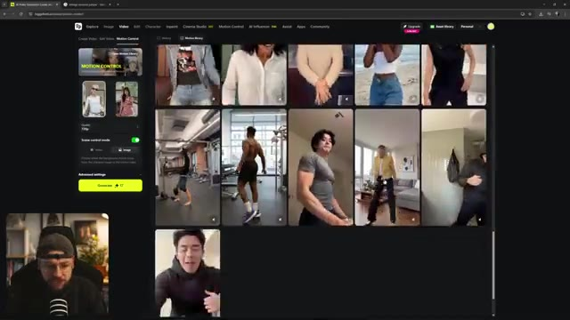
*Suite de la navigation dans la bibliothèque de modèles vidéo de Higgsfield avec le panneau de contrôle latéral.*

---

### ⏱️ `[00:06:17 - 00:06:56]` | Segment #14

**🔊 Audio (Transcription Intégrale Mot pour Mot en Français) :**
> Le ciel est vraiment la limite avec le transfert de mouvement. Et bien sûr, vous avez tous vu dans l'intro que je marchais simplement dans les rues juste devant chez moi, très maladroitement, en faisant ce vlog, et j'ai pu prendre cette vidéo et l'appliquer à cet influenceur très musclé qui ne me ressemble pas du tout et obtenir un résultat très réaliste. Donc le fait que vous puissiez enregistrer votre propre contenu, votre propre script, par exemple, en jouant comme vous le souhaitez, puis utiliser le contrôle de mouvement pour l'appliquer à votre influenceur IA, c'est vraiment puissant.

**👁️ Analyse Visuelle d'Écran (gemini-3.5-flash-lite) :**
**Interface & Outils** : Navigateur web affichant l'interface de l'outil de création vidéo (avec la fonctionnalité Motion Control et une incrustation vidéo du créateur dans le coin inférieur gauche).

**Contenu textuel & Code** : Menus de navigation (Explore, Image, Video, Edit, Character, Inpaint, Cinema Studio, Motion Control, AI Influencer), vignettes de vidéos de référence, paramètres de génération et aperçu du rendu final d'un influenceur musclé tenant un micro sur une plage.

**Action / Démonstration** : Navigation dans l'interface et démonstration des fonctionnalités de transfert de mouvement (Motion Control) et de génération d'influenceurs virtuels.

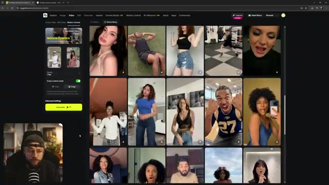
*Interface de l'outil de Motion Control montrant une bibliothèque de vidéos de référence avec le créateur visible en incrustation (PiP).*

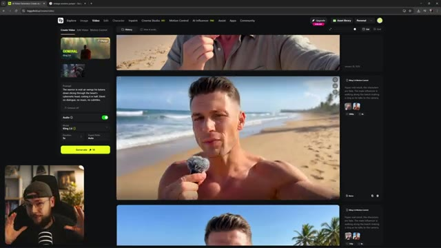
*Interface de génération vidéo montrant le résultat d'un influenceur IA musclé sur une plage avec le créateur en incrustation (PiP).*

---

### ⏱️ `[00:06:56 - 00:07:24]` | Segment #15

**🔊 Audio (Transcription Intégrale Mot pour Mot en Français) :**
> et un flux de travail ouvert. Et si je remonte un tout petit peu plus, nous avons un autre exemple ici, qui est bien sûr très similaire, mais avec un influenceur IA juste légèrement différent. Quelqu'un qui n'a pas passé tout à fait autant de temps à la gym que ce type, une sorte de variante de lui. Mais on peut voir une fois de plus que le mouvement est transféré de manière assez impeccable, et c'est vraiment impressionnant. Et bien sûr, en remontant encore, j'ai quelques exemples différents.

**👁️ Analyse Visuelle d'Écran (gemini-3.5-flash-lite) :**
**Interface & Outils** : Interface web de Higgsfield AI (création vidéo, panneau latéral avec les prompts, historique, paramètres et aperçu vidéo avec encadré PiP du créateur en bas à gauche).

**Contenu textuel & Code** : Panneau de génération avec le prompt visible : "The warrior in mid air swings his katana down slicing through the beast's cybernetic head, cutting it in half. Silent, no dialogue, no music, no subtitles", sélecteur de modèle "Kling 2.0", durée "5s", ratio d'aspect "Auto", bouton jaune "Generate 10". Panneau latéral droit avec l'historique et les descriptions ("Hyper real result, the characters are fake. The male influencer is walking along the beach making a vlog or be talky to the camera").

**Action / Démonstration** : Le créateur fait défiler vers le haut l'interface web de Higgsfield pour présenter différents exemples de vidéos générées avec des variations d'influenceurs IA et un transfert de mouvement fluide.

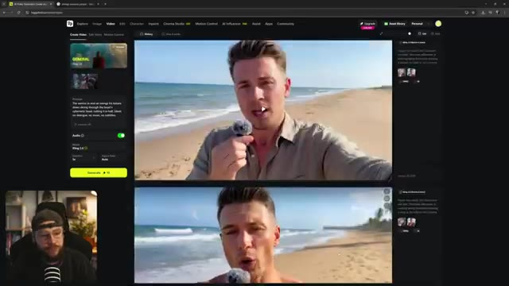
*Interface de l'outil Higssfield affichant des exemples de transferts de mouvement d'influenceurs IA sur une plage.*

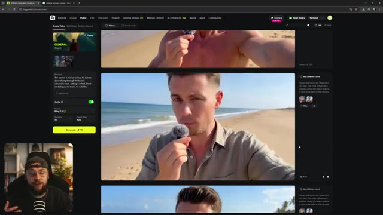
*Le créateur fait défiler l'historique des vidéos générées sur Higssfield montrant différents influenceurs virtuels.*

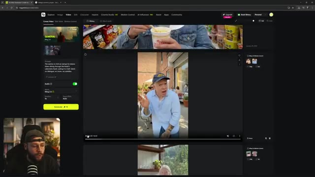
*Défilement de l'interface montrant une nouvelle vidéo verticale d'un autre influenceur IA dans une rue.*

---

### ⏱️ `[00:07:24 - 00:07:44]` | Segment #16

**🔊 Audio (Transcription Intégrale Mot pour Mot en Français) :**
> Encore une fois, en utilisant certains des modèles de mouvement ici sur Higgsfield, juste pour vous montrer, si on ouvre ça complètement, à quel point ce transfert de mouvement est vraiment réaliste. Maintenant, bien sûr, ce n'est pas parfait. Les plus observateurs d'entre vous auront peut-être remarqué qu'il y a quelques problèmes avec certains de nos personnages en arrière-plan. Nous avons un peu de morphing qui se produit ici.

**👁️ Analyse Visuelle d'Écran (gemini-3.5-flash-lite) :**
**Interface & Outils** : Interface web de la plateforme Higgsfield (avec menus Explore, Image, Video, Edit, Character, Inpaint, Cinema Studio, Motion Control, etc.) affichée en arrière-plan avec la webcam du présentateur en incrustation (PiP).

**Contenu textuel & Code** : Panneau latéral gauche avec des options de paramétrage de vidéo (modèle Kling 1.5, Audio activé, curseurs de durée, bouton Generate jaune) et aperçu vidéo au centre montrant un personnage dans une rue commerçante.

**Action / Démonstration** : Le navigateur présente la lecture d'une vidéo générée par IA illustrant un transfert de mouvement, tandis que l'interface de l'outil et ses réglages restent visibles autour de la vidéo principale.

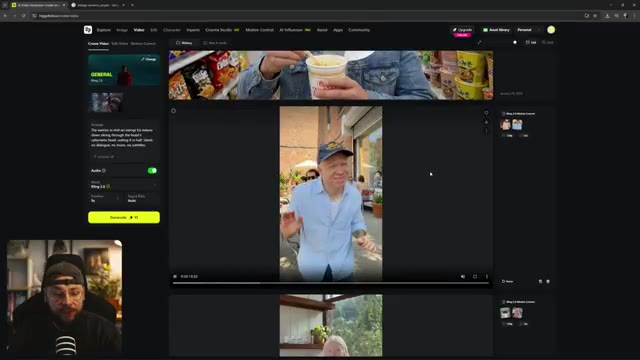
*Interface de l'outil Higgsfield affichant une vidéo générée avec des options de contrôle de mouvement et un encadré PiP du créateur.*

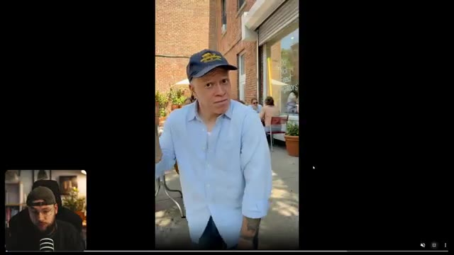
*Gros plan sur la vidéo générée montrant un personnage en chemise bleue et casquette se déplaçant en extérieur devant un café.*

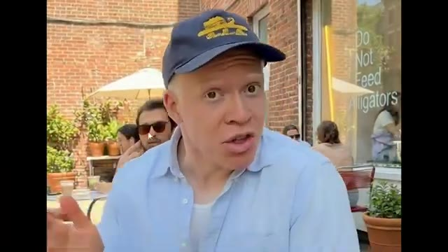
*Gros plan resserré sur le personnage principal de la vidéo avec l'arrière-plan du café et des clients attablés.*

---

### ⏱️ `[00:07:44 - 00:08:19]` | Segment #17

**🔊 Audio (Transcription Intégrale Mot pour Mot en Français) :**
> Donc, de manière générale, je suggérerais de s'en tenir à des exemples où il n'y a pas trop de mouvement en arrière-plan. C'est pourquoi, par exemple, notre exemple de la plage a vraiment très bien fonctionné. Il n'y a pas grand-chose qui puisse mal tourner, mais ce que j'ai trouvé vraiment impressionnant avec ça, par exemple, c'est que si je balance les images originales à l'écran en ce moment, je suis bien sûr en train de descendre la rue, je me déplace dans l'espace physique, et cela s'applique de manière très significative à notre image de référence : notre personnage, notre influenceur IA, se déplace donc également le long de la plage tout comme je me déplaçais le long de

**👁️ Analyse Visuelle d'Écran (gemini-3.5-flash-lite) :**
**Interface & Outils** : Navigateur web affichant l'interface de génération vidéo (type Higgsfield / Kling AI) avec panneau de configuration à gauche et lecteur vidéo central.

**Contenu textuel & Code** : Menus de l'application vidéo, options de prompt (ex: "The warrior in zzz..."), paramètres de génération, vignettes d'historique et affichage de la vidéo de référence.

**Action / Démonstration** : Le créateur démontre l'interface de génération vidéo et compare les mouvements de la caméra entre sa propre séquence filmée dans la rue et la génération de l'influenceur IA sur la plage.

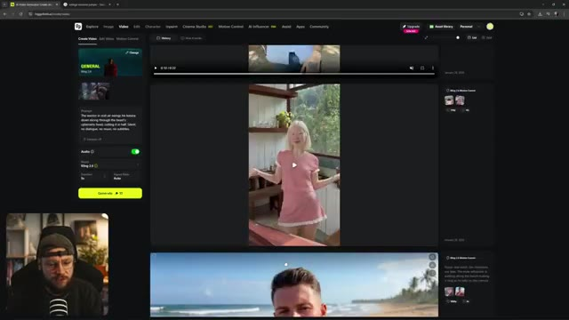
*Interface du site web d'IA montrant une vidéo générée d'un influenceur sur une plage, avec la webcam du créateur en incrustation (PiP) dans le coin inférieur gauche.*

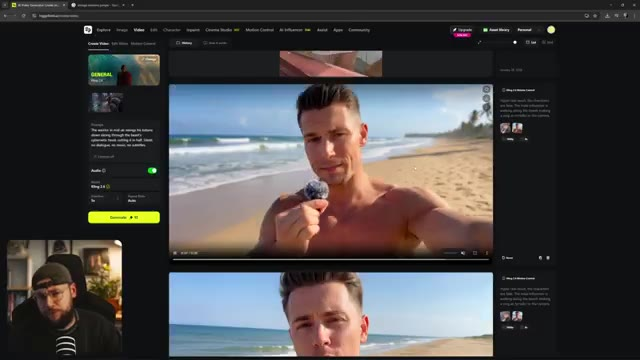
*Interface du site web d'IA montrant un gros plan de la vidéo de l'influenceur sur la plage, avec la webcam du créateur dans le coin inférieur gauche.*

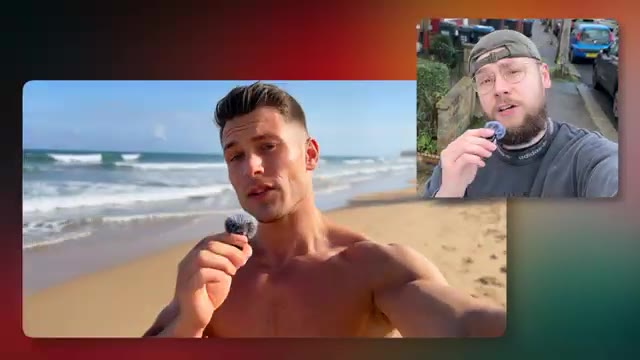
*Comparaison vidéo en split-screen montrant à gauche l'influenceur IA sur la plage et à droite la vidéo originale du créateur marchant dans la rue.*

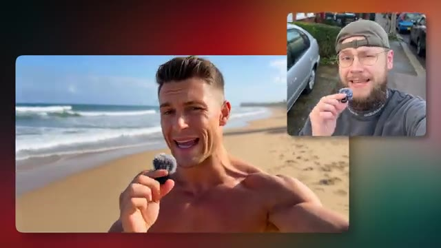
*Poursuite de la comparaison vidéo en split-screen entre l'influenceur IA sur la plage et la vidéo originale du créateur en extérieur.*

---

### ⏱️ `[00:08:19 - 00:08:53]` | Segment #18

**🔊 Audio (Transcription Intégrale Mot pour Mot en Français) :**
> la route. Cela ressemble à un espace physique réaliste. L'éclairage sur son corps, son visage, le genre de rides de la peau lorsqu'il prononce certaines lignes est vraiment très convaincant. Maintenant, j'ai l'impression que nous avons bien couvert la partie tendances virales et croissance sur les réseaux sociaux de la vidéo, mais ce que j'aimerais aborder maintenant, c'est l'UGC par IA, le contenu généré par les utilisateurs, et c'est là que nous poussons ces méthodes et ces flux de travail encore plus loin afin de vendre un produit particulier.

**👁️ Analyse Visuelle d'Écran (gemini-3.5-flash-lite) :**
**Interface & Outils** : Higgsfield AI (plateforme web de génération de vidéos par IA)

**Contenu textuel & Code** : Interface utilisateur avec paramètres de génération (Kling 2.6, curseurs, prompt visible dans la barre latérale : "The warrior in mid-air swings his katana down slicing through the beast's cybernetic head...").

**Action / Démonstration** : Le créateur présente l'interface de Higgsfield AI montrant des exemples de vidéos générées par IA sur fond de plage, tandis qu'il apparaît en incrustation (PiP) dans le coin inférieur gauche.

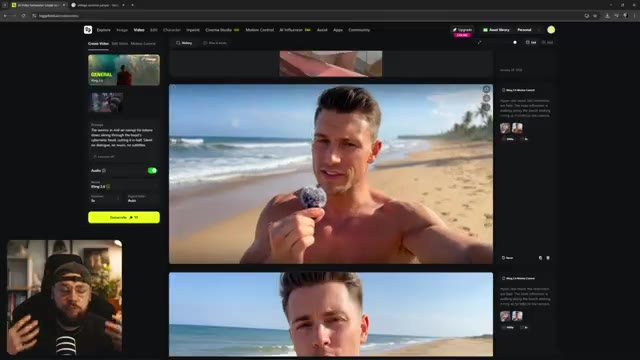
*Interface du logiciel Higgsfield AI affichant un aperçu vidéo avec génération de type UGC sur une plage.*

---

### ⏱️ `[00:08:53 - 00:09:28]` | Segment #19

**🔊 Audio (Transcription Intégrale Mot pour Mot en Français) :**
> Et comme je l'ai mentionné plus tôt, c'est une approche très puissante, que vous soyez une grande marque ou une plus petite marque qui vient tout juste de débuter, car souvent, pour certains publics et données démographiques, ils se connectent beaucoup plus au contenu généré par les utilisateurs plutôt qu'à la publicité traditionnelle. Alors, comment pourrions-nous aller de l'avant et passer à la vitesse supérieure pour exploiter notre influenceur, le préparer à des publicités de produits de style UGC ? Comme je l'ai mentionné plus tôt, nous avons cet emblème ici qui indique "éditer dans Nano Banana Pro". Nous allons donc cliquer dessus et vous pouvez voir tout un tas d'autres influenceurs IA ici que j'

**👁️ Analyse Visuelle d'Écran (gemini-3.5-flash-lite) :**
**Interface & Outils** : Interface web de la plateforme Higgsfield AI (section AI Influencer Studio et Nano Banana Pro).

**Contenu textuel & Code** : On observe le nom du personnage "CROSBY" (A fully customizable AI influencer designed for virality), des onglets de configuration (Human, Female, 3d, Grp, Birdman, etc.), des sélecteurs de genre, d'origine ethnique et une barre de prompt en bas avec le sélecteur de modèle "Nano Banana Pro", le ratio "16:9", et le bouton "Generate".

**Action / Démonstration** : Le créateur navigue dans l'interface de création d'influenceurs virtuels, montre le personnage sélectionné et se dirige vers l'outil Nano Banana Pro pour configurer des publicités de type UGC.

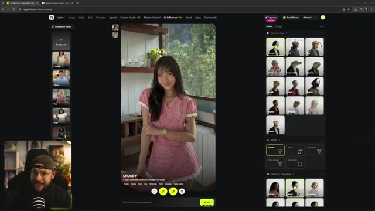
*Interface du studio d'influenceurs IA montrant le personnage Crosby en aperçu central avec les options de personnalisation à droite et la webcam du créateur en incrustation (PiP).*

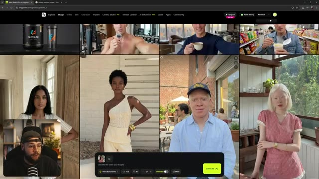
*Galerie de différents influenceurs IA et produits avec la barre de prompt et le modèle "Nano Banana Pro" sélectionnés.*

---

### ⏱️ `[00:09:28 - 00:10:02]` | Segment #20

**🔊 Audio (Transcription Intégrale Mot pour Mot en Français) :**
> créé plus tôt. Actuellement, nous examinons notre toute dernière création ici et vous pouvez voir qu'en cliquant sur cet emblème « modifier avec Nano Banana Pro », notre influenceur IA est utilisé comme référence d'image. Bien sûr, le modèle d'image IA utilisé est Nano Banana Pro. Il y a beaucoup plus d'options ici sur Higgsfield, dont beaucoup ont également des exécutions illimitées, c'est donc formidable de les expérimenter, mais honnêtement, peu importe ce que les autres vous disent, Nano Banana Pro est de loin le meilleur modèle d'image disponible. En ce moment, je ne vois vraiment aucun besoin d'utiliser autre chose que cela parce que

**👁️ Analyse Visuelle d'Écran (gemini-3.5-flash-lite) :**
**Interface & Outils** : Navigateur web affichant la plateforme de création vidéo et d'images par IA Higgsfield (section image, onglets Explorer, Video, Edit, Character, Inpaint, Cinema Studio, AI Influencer, etc.) avec la webcam du créateur en incrustation (PiP) en bas à gauche.

**Contenu textuel & Code** : Texte visible : "Describe the scene you imagine", "Nano Banana Pro", "16:9", "2K", options "Unlimited", bouton de génération "Generate ✨ 2", et menu déroulant listant de nombreux modèles (Higgsfield Goat, Higgsfield Face Swap, Nano Banana Pro, Nano Banana, Seedream 4.5, Seedream 4.0, GPT Image 1.5, Z Image, Kling O1, FLUX.2 Pro, Flux.2 Flex, etc.).

**Action / Démonstration** : Le créateur présente l'interface de Higgsfield, montre l'utilisation d'une influenceuse IA comme image de référence, et parcourt la liste des différents modèles d'IA disponibles sur la plateforme.

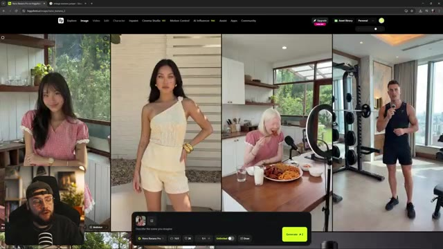
*Interface de la plateforme Higgsfield montrant le panneau de génération d'images avec le modèle Nano Banana Pro sélectionné et l'influenceuse IA en référence.*

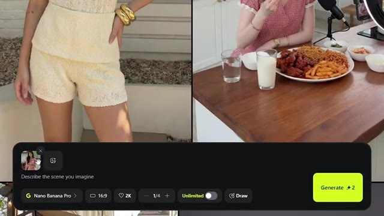
*Gros plan sur la barre de commande de génération d'images avec le bouton du modèle réglé sur Nano Banana Pro et l'option Unlimited active.*

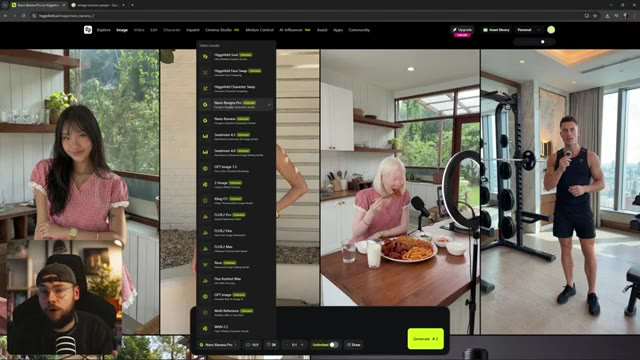
*Interface de Higgsfield affichant le menu déroulant de sélection des modèles d'IA disponibles (Higgsfield Goat, Face Swap, Nano Banana Pro, Seedream, etc.).*

---

### ⏱️ `[00:10:02 - 00:10:35]` | Segment #21

**🔊 Audio (Transcription Intégrale Mot pour Mot en Français) :**
> c'est tellement bien. Donc je viens d'ouvrir mes téléchargements ici et vous pouvez voir que j'ai enregistré quelques images de vêtements. Nous avons ce sweat à capuche oversize Nike et cette casquette qui vient en fait de la brasserie Beaver Town. Donc si on glisse et dépose chacun de ceux-ci dans ce champ ici où nous pouvons télécharger des images, laissez-moi juste attraper la casquette de la brasserie Beaver Town aussi. Donc j'ai écrit un prompt textuel très simple ici également. J'ai juste dit change la tenue de l'influenceuse pour qu'elle porte un short en jean, le sweat à capuche noir Nike et la casquette de baseball bleue avec l'emblème de crâne. Assure

**👁️ Analyse Visuelle d'Écran (gemini-3.5-flash-lite) :**
**Interface & Outils** : Navigateur web affichant l'explorateur de fichiers Windows et une application de génération/édition d'images par IA (type plateforme d'influence virtuelle).

**Contenu textuel & Code** : Texte du prompt visible : « Change the female influencer's outfit, so that she is wearing jean shorts, the black Nike hoodie, and the blue baseball cap with the skull emblem. Ensure that the clothing items realistically match the lighting of the scene. Preserve the existing composition and details. » Paramètres : Nano Banana Pro, format 16:9, Unlimited.

**Action / Démonstration** : Le créateur navigue dans ses dossiers de téléchargement pour sélectionner des images de vêtements et rédige un prompt pour modifier la tenue d'une influenceuse virtuelle.

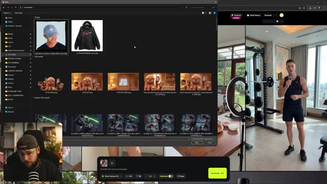
*Le créateur montre son dossier de téléchargements avec des images de vêtements et l'interface de génération d'images.*

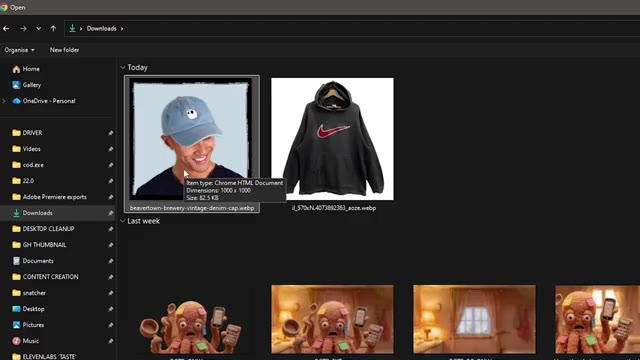
*Gros plan sur le dossier de téléchargements affichant les détails des fichiers d'images de vêtements.*

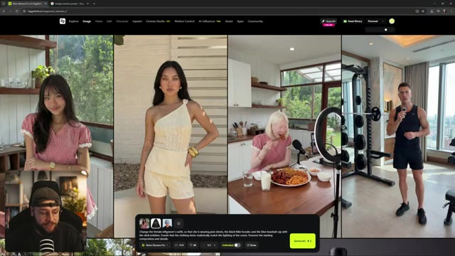
*Vue de l'interface de l'outil IA montrant le prompt textuel et les images importées pour la modification.*

*Gros plan sur la zone de saisie du prompt textuel décrivant les modifications de vêtements à effectuer.*

---

### ⏱️ `[00:10:35 - 00:11:09]` | Segment #22

**🔊 Audio (Transcription Intégrale Mot pour Mot en Français) :**
> que les articles vestimentaires correspondent de manière réaliste à l'éclairage de la scène. Préservez la composition et les détails existants. J'ai encore quelques options ici avant de passer à la génération. Nous voulons changer notre format d'image en 9 par 16. Pour la résolution, nous pouvons aller jusqu'à 4k mais nous avons des exécutions illimitées en 2k. Je vais simplement utiliser cela. Nous pouvons cliquer sur générer. Maintenant, si je fais défiler un peu plus bas, vous allez également voir des produits que j'ai créés dans Nano Banana Pro également. Vous pouvez voir le texte de l'invite textuelle en haut à droite de l'écran ici si

**👁️ Analyse Visuelle d'Écran (gemini-3.5-flash-lite) :**
**Interface & Outils** : Interface web de Higgsfield (Nano Banana Pro), outil de génération d'images et vidéos par IA.

**Contenu textuel & Code** : Texte du prompt : "Change the female influencer's outfit, so that she is wearing jean shorts, the black Nike hoodie, and the blue baseball cap with the skull emblem. Ensure that the clothing items realistically match the lighting of the scene. Preserve the existing composition and details." Paramètres visibles : Nano Banana Pro, 16:9, 2K, mode illimité activé. Sur l'image 4, affichage d'un visuel de produit de fitness "Elevate Protein" avec un pot de protéines et un shaker noir et bleu.

**Action / Démonstration** : Le présentateur montre l'interface de l'outil Nano Banana Pro, déroule le menu des formats d'image pour sélectionner le format 9:16, configure la résolution en 2k, lance la génération, puis fait défiler la page pour montrer d'autres produits créés avec l'outil.

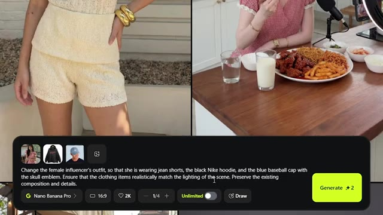
*Interface de l'application montrant une boîte de dialogue avec un prompt textuel détaillé et des réglages de format et de résolution.*

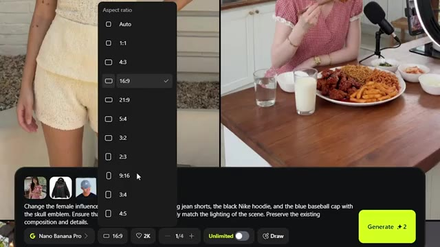
*Menu déroulant des formats d'image (Aspect ratio) ouvert avec les options de dimensions (1:1, 4:3, 16:9, 21:9, 5:4, 3:2, 2:3, 9:16, etc.).*

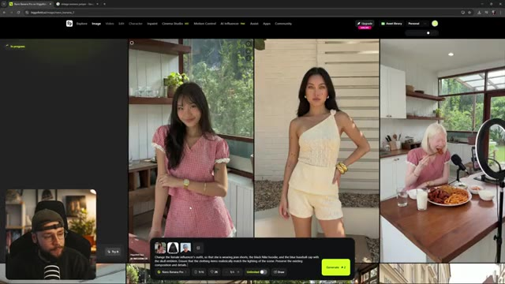
*Interface principale de Higgsfield (Nano Banana Pro) montrant plusieurs images générées et le créateur visible en incrustation vidéo (PiP) dans le coin inférieur gauche.*

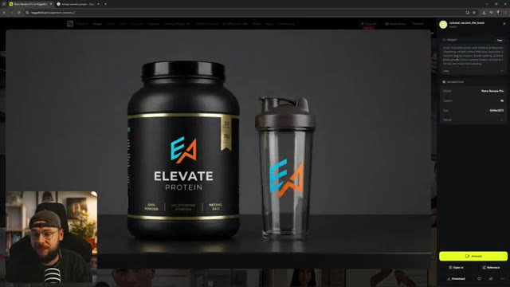
*Affichage du rendu d'un produit (« Elevate Protein » : pot de protéines et shaker) avec le panneau latéral droit affichant le prompt textuel et les paramètres.*

---

### ⏱️ `[00:11:09 - 00:11:45]` | Segment #23

**🔊 Audio (Transcription Intégrale Mot pour Mot en Français) :**
> vous vouliez aller de l'avant et utiliser cela comme une sorte de modèle encore une fois c'est un prompt textuel assez simple si nous survolons cette image vous pouvez voir qu'il y a une icône qui indique référence donc je vais aller de l'avant et cliquer dessus et maintenant cela a été ajouté à notre champ en bas ici également et je vais juste ajouter au prompt textuel faites tenir à l'influenceuse le shaker de protéine noir de marque allez-y et lancez cette génération je vais supprimer la référence d'image de notre poudre de protéine et par ici nous avons de la sauce piquante un genre de hot plus haut de gamme

**👁️ Analyse Visuelle d'Écran (gemini-3.5-flash-lite) :**
**Interface & Outils** : Interface de génération d'images par IA (type Higgsfield) avec panneaux de configuration et prompts textuels.

**Contenu textuel & Code** : Prompts textuels de génération d'images, paramètres "Nano Banana Pro", dimensions, rapport d'aspect, options de référence d'image et boutons de génération.

**Action / Démonstration** : Le créateur montre des exemples de prompts, configure des références d'images et explique comment modifier les éléments visuels d'une génération à l'autre.

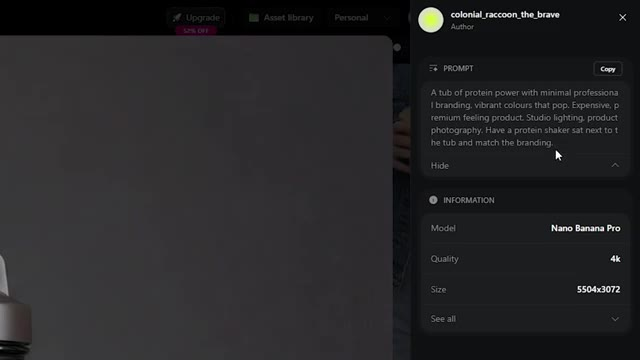
*Interface d'un générateur d'image montrant un prompt textuel décrivant un pot de protéine et les paramètres de qualité (Nano Banana Pro, 4K, 5504x3072).*

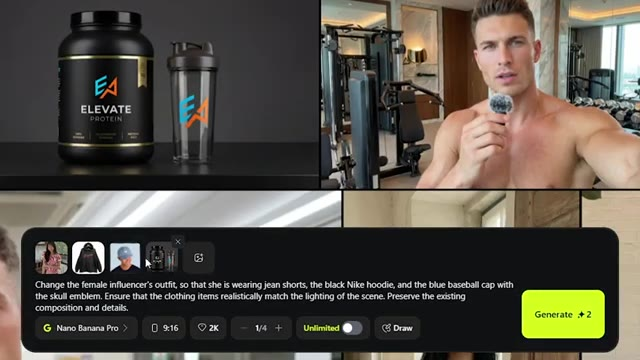
*Vue partagée montrant un pot de protéine et un shaker, le créateur face caméra, et une barre de prompt en bas avec des images de référence et un bouton "Generate".*

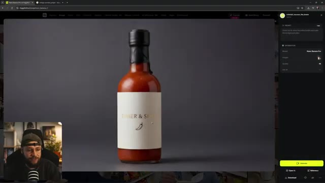
*Interface montrant une bouteille de sauce piquante étiquetée "EMBER & SPICE" avec le créateur en incrustation (PiP) en bas à gauche et les options de téléchargement à droite.*

---

### ⏱️ `[00:11:45 - 00:12:24]` | Segment #24

**🔊 Audio (Transcription Intégrale Mot pour Mot en Français) :**
> sauce qui s'appelle ember and spice donc encore une fois survolons ceci et cliquons sur l'onglet de référence nous pouvons nous débarrasser de cette portion à la fin et dire simplement faire tenir la petite bouteille de sauce piquante par l'influenceuse et encore une fois allons-y et envoyons également cette génération et si nous faisons défiler vers le haut de la page regardez simplement quel excellent travail fait Nano Banana Pro c'est complètement fluide il a appliqué nos références d'image parfaitement et tout le reste est resté cohérent tout comme nous l'avons demandé l'emplacement la scène elle-même correspond exactement mais même jusqu'aux moindres

**👁️ Analyse Visuelle d'Écran (gemini-3.5-flash-lite) :**
**Interface & Outils** : Interface web de l'outil de génération d'images/vidéos Nano Banana Pro sur Higgfield, avec panneau de prompt, paramètres et références.

**Contenu textuel & Code** : Texte du prompt : "Change the female influencer's outfit, so that she is wearing jean shorts, the black Nike hoodie, and the blue baseball cap with the skull emblem. Ensure that the clothing items realistically match the lighting of the scene. Preserve the existing composition and details. Have the female influencer hold the small bottle of hot sauce." Modèle : Nano Banana Pro. Paramètres : format 9:16, qualité 2K.

**Action / Démonstration** : Le créateur survole l'interface, clique sur les onglets de référence, modifie le prompt pour ajouter la bouteille de sauce piquante et lance la génération.

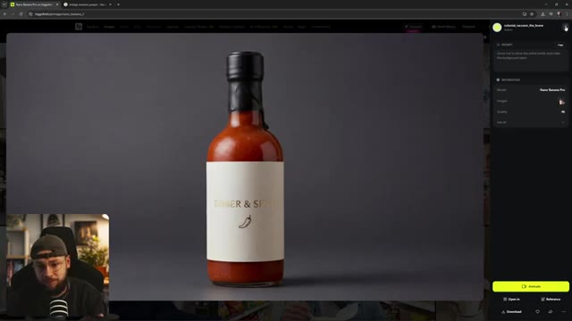
*Démonstration à l'écran @ 00:11:47*

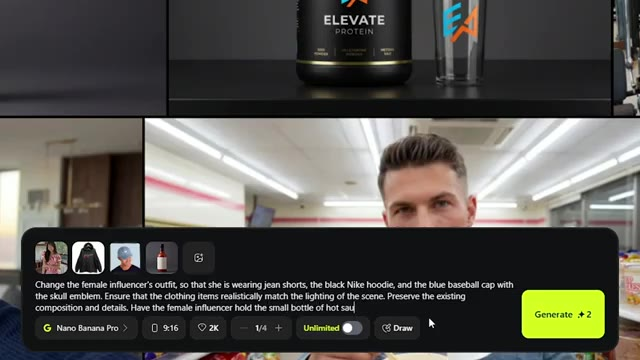
*Démonstration à l'écran @ 00:11:58*

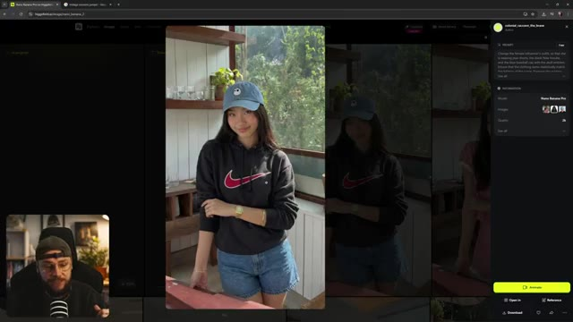
*Démonstration à l'écran @ 00:12:11*

*Démonstration à l'écran @ 00:12:22*

---

### ⏱️ `[00:12:24 - 00:12:56]` | Segment #25

**🔊 Audio (Transcription Intégrale Mot pour Mot en Français) :**
> des détails comme les bijoux de nos influenceurs ont également fait leur retour dans cette génération ici de notre influenceur tenant le shaker de protéines. Maintenant, Nano Banana Pro a en fait franchi une étape supplémentaire ici parce que si nous retournons à l'image de référence elle-même, le shaker de protéines n'a pas réellement d'Elevate Protein dessus. Mais le modèle d'image de Google a décidé de fusionner les deux ensemble et nous obtenons ce résultat, qui est toujours assez impressionnant. Et gardez à l'esprit que si ce n'était pas ce que nous voulions, si nous voulions correspondre exactement à notre produit. Si nous survolons simplement le dessus,

**👁️ Analyse Visuelle d'Écran (gemini-3.5-flash-lite) :**
**Interface & Outils** : Navigateur web affichant la plateforme Higgsfield (avec l'outil Nano Banana Pro) et un encadré PiP (Picture-in-Picture) du créateur en bas à gauche.

**Contenu textuel & Code** : Texte du prompt visible dans l'interface : 'Change the female influencer's outfit, so that she is wearing jean shorts, the black Nike hoodie, and the blue baseball cap with the skull emblem. Ensure that the clothing items realistically match the lighting of the scene. Preserve the existing composition and details. Have the female influencer hold the small bottle of hot sauce.' Paramètres et boutons comme 'Nano Banana Pro', 'Reference', 'Animate', 'Multishot', et le bouton vert 'Generate'.

**Action / Démonstration** : Le créateur navigue sur l'interface de Higgsfield, commente les détails des images générées et montre comment le modèle d'IA a fusionné des éléments visuels.

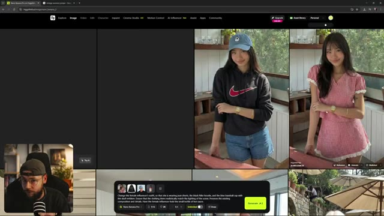
*Interface web de Higgsfield montrant des variations d'images générées avec une influenceuse et l'incrustation vidéo du créateur en bas à gauche.*

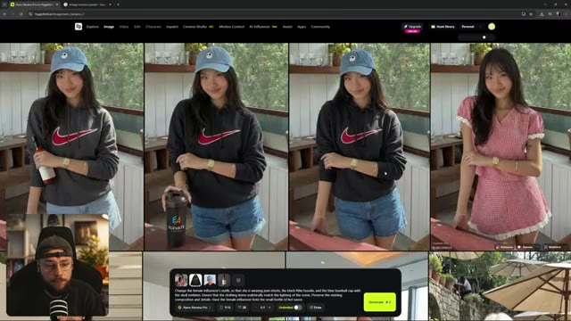
*Gros plan sur l'image générée montrant l'influenceuse tenant un shaker de protéines avec le logo 'Elevate'.*

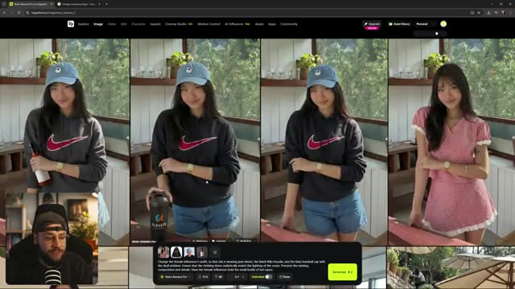
*Vue de l'interface montrant le panneau de prompt et les options de génération de Nano Banana Pro.*

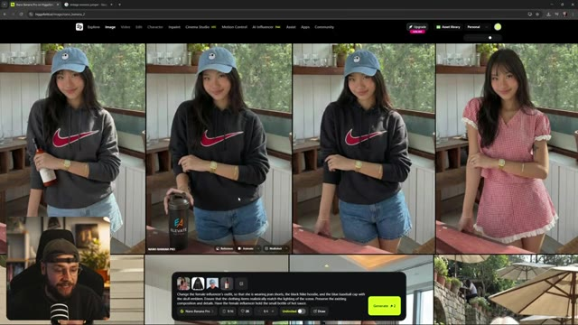
*Poursuite de la démonstration sur la grille d'images générées avec le curseur de la souris survolant l'interface.*

---

### ⏱️ `[00:12:56 - 00:13:30]` | Segment #26

**🔊 Audio (Transcription Intégrale Mot pour Mot en Français) :**
> nous pouvons continuer et supprimer toutes ces autres références d'images, survoler ici et cliquer sur référence, et nous pouvons simplement insérer un prompt textuel très simple comme supprimer l'inscription qui dit elevate protein sur le shaker de protéines, c'est un changement très simple à réaliser pour nano banana Pro, cela signifie que nous pouvons vraiment verrouiller la cohérence de notre produit afin de pouvoir correspondre exactement au produit du monde réel, nous avons également récupéré notre génération de l'influenceur tenant notre sauce piquante et encore une fois Nanogonana Pro a fait un très bon travail. Alors qu'en est-il lorsque nous voulons

**👁️ Analyse Visuelle d'Écran (gemini-3.5-flash-lite) :**
**Interface & Outils** : Interface web d'Higgsfield (outil Nano Banana Pro) avec un panneau de prompt textuel flottant en bas, des boutons de génération, et une incrustation vidéo (PiP) du créateur Jack dans le coin inférieur gauche.

**Contenu textuel & Code** : Texte du prompt visible : « Remove the writing that says 'ELEVATE PROTEIN' from the protein shaker. » Paramètres : modèle Nano Banana Pro, ratio 9:16, option Unlimited active, bouton « Generate ✨ 2 ».

**Action / Démonstration** : Le créateur démontre la modification d'un prompt textuel pour supprimer un texte spécifique sur un produit (shaker de protéines) afin d'assurer la cohérence du produit réel, puis survole les options de référence.

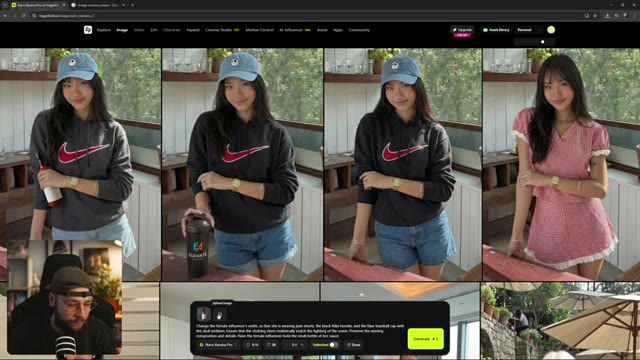
*Interface d'Higgsfield affichant quatre variantes d'images générées par IA avec un panneau de prompt en bas et une incrustation vidéo de Jack en bas à gauche.*

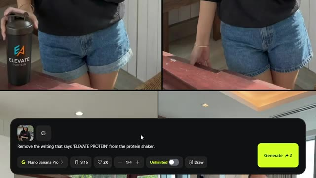
*Gros plan sur le panneau de génération de texte de l'outil Nano Banana Pro montrant le prompt de modification du shaker.*

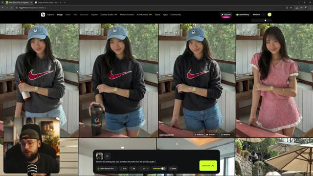
*Vue de l'interface principale avec le menu d'options contextuelles affichant Reference, Animate et Multishot au survol de l'image.*

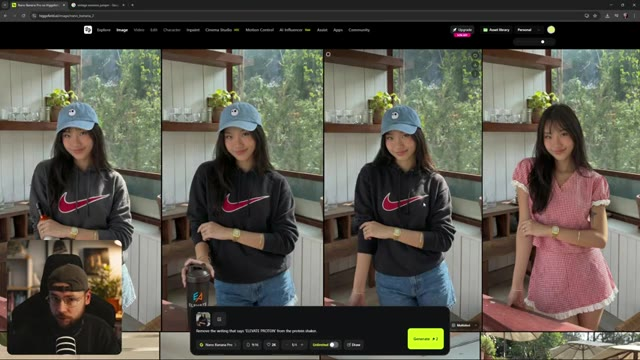
*Retour à la vue d'ensemble de la grille d'images générées avec l'interface de contrôle de génération active.*

---

### ⏱️ `[00:13:30 - 00:14:05]` | Segment #27

**🔊 Audio (Transcription Intégrale Mot pour Mot en Français) :**
> allons-nous de l'avant et commençons à donner vie à nos images très sur mesure ? Eh bien pour faire cela, je vais remonter dans le coin supérieur gauche et cliquer sur l'onglet créer une vidéo, car il y a ici quelques approches différentes pour créer du contenu vidéo en utilisant votre influenceur IA, et c'est bien sûr si nous voulons être un peu plus précis que d'utiliser simplement les modèles sur Higgsfield, mais rappelez-vous, comme je l'ai dit plus tôt, si vous avez vu une tendance virale sur TikTok, vous pouvez simplement enregistrer cela sur votre téléphone, vous pouvez passer au contrôle de mouvement en haut à gauche ici et vous pouvez ajouter cette danse virale.

**👁️ Analyse Visuelle d'Écran (gemini-3.5-flash-lite) :**
**Interface & Outils** : Navigateur web affichant l'interface de la plateforme Higgsfield AI (onglets Explore, Image, Video, Edit, Character, Inpaint, Cinema Studio, Motion Control, AI Influencer).

**Contenu textuel & Code** : Menus de navigation en haut, options de création vidéo, paramètres de modèle (Kling 2.0), curseur de durée (1s), rapport d'aspect (16:9), bouton 'Generate' jaune et section 'Motion Control' avec options de qualité et de mode de scène.

**Action / Démonstration** : Le créateur navigue dans l'interface de Higgsfield, clique sur l'onglet 'Create Video' puis bascule vers l'onglet 'Motion Control' pour montrer comment importer des tendances virales et animer un influenceur IA.

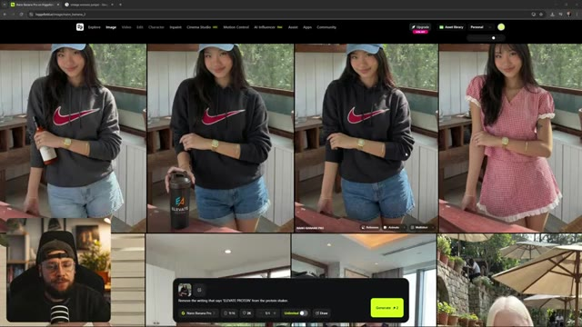
*Interface de Higgsfield montrant une galerie d'images générées de l'influenceuse IA dans différents styles et tenues.*

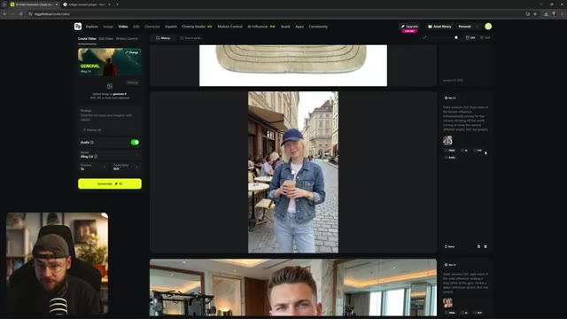
*Interface de création de vidéo sur Higgsfield avec les options de génération, un aperçu vidéo central et les paramètres de modèle Kling 2.0.*

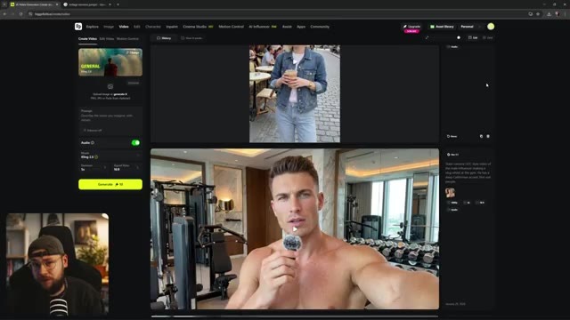
*Vue détaillée de l'interface de Higgsfield montrant les onglets de génération vidéo et les aperçus de clips avec des influenceurs IA.*

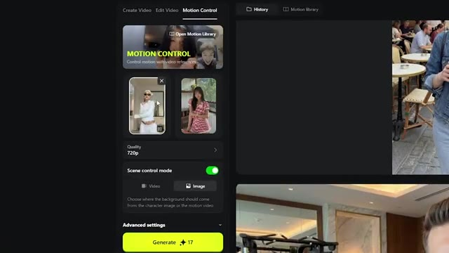
*Interface de l'onglet 'Motion Control' sur Higgsfield permettant de sélectionner des références de mouvement et de vidéo pour animer l'influenceur.*

---

### ⏱️ `[00:14:05 - 00:14:34]` | Segment #28

**🔊 Audio (Transcription Intégrale Mot pour Mot en Français) :**
> par exemple comme référence vidéo et appliquez cela à votre référence d'image d'influenceur IA. Mais disons que nous voulons être très pratiques dans la façon dont nous générons nos vidéos IA. J'ai quelques exemples différents ici, dont certains sont au format paysage et d'autres au format portrait. Nous avons ici par exemple notre influenceur de l'intro, sauf que maintenant il fait un vlog où il essaie des nouilles achetées en magasin dans un style de magasin 7-Eleven. Donc si nous allons simplement regarder ce clip.

**👁️ Analyse Visuelle d'Écran (gemini-3.5-flash-lite) :**
**Interface & Outils** : Interface web de l'outil de création vidéo (probablement Higgsfield AI), affichant des onglets de navigation (Explore, Image, Video, Edit, Character, Inpaint, Cinema Studio, Motion Control, AI Influencer), des options de modèle (Kling 2.0), des paramètres de durée et de format (Aspect Ratio 16:9), ainsi qu'une incrustation webcam (PiP) du créateur dans le coin inférieur gauche.

**Contenu textuel & Code** : Texte du prompt visible sur le panneau latéral : "Static camera UGC style video of the male influencer enthusiastically trying shop bought noodles for the first time. He has a deep Californian accent, first-person perspective." Paramètres visibles : Modèle "Kling 2.0", Durée "5s", Export Ratio "16:9".

**Action / Démonstration** : Le créateur présente l'interface de génération vidéo sur son écran, montrant différents exemples de formats (paysage et portrait) et lance la lecture d'un clip vidéo généré par IA représentant un influenceur mangeant des nouilles dans une supérette.

*Interface de l'outil de génération vidéo (onglet Motion Control) montrant des options de contrôle de mouvement et de qualité.*

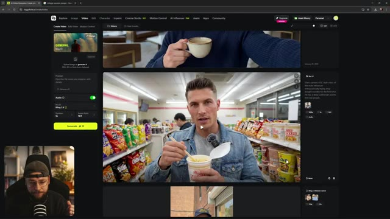
*Interface de la plateforme de génération vidéo affichant un exemple de vlog généré par IA avec un influenceur dans une épicerie, avec une incrustation vidéo (PiP) du créateur.*

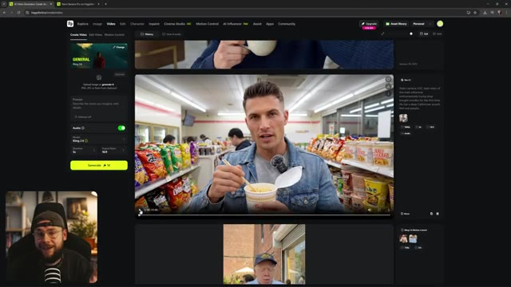
*Même interface que l'image précédente montrant le clip vidéo en cours de lecture avec la barre de progression.*

---

### ⏱️ `[00:14:34 - 00:15:02]` | Segment #29

**🔊 Audio (Transcription Intégrale Mot pour Mot en Français) :**
> Oh mon dieu, ceux-là sont vraiment trop bien. Alors, comment avons-nous généré ça ? Eh bien, tout commence par une image de départ et si je vais l'ouvrir, vous pouvez voir autre chose que j'ai généré avec Nano Banana Pro. Tout ce que nous avons fait, c'est télécharger l'image de référence de notre influenceur sur la plage, et j'ai simplement donné à Nano Banana Pro le texte descriptif : plan style vlog du même influenceur masculin faisant un vlog dans un magasin 7-Eleven.

**👁️ Analyse Visuelle d'Écran (gemini-3.5-flash-lite) :**
**Interface & Outils** : Interface web de l'outil de génération vidéo/image par IA (Higgfield / Nano Banana Pro).

**Contenu textuel & Code** : Texte du prompt visible : « Vlog style shot of the same male influencer making a vlog in a 7/11 store. Change his clothes. He is making shop bought noodles. Ensure to have the influencer looking directly down the lens. Shot on iPhone, shallow depth of field. ». Paramètre modèle : « Nano Banana Pro », qualité « 4k ».

**Action / Démonstration** : Le créateur navigue dans l'interface de l'outil d'IA pour montrer l'image de départ (starting frame) et le panneau de configuration contenant le prompt de génération de l'influenceur dans le 7-Eleven.

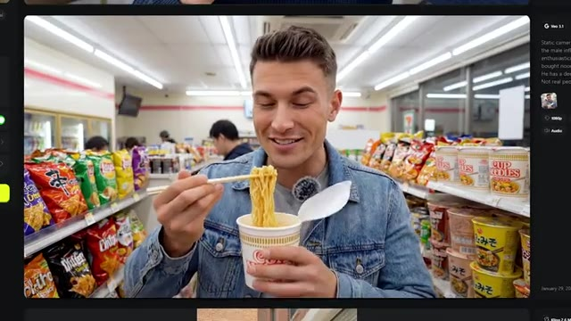
*Interface de l'outil de génération vidéo montrant l'influenceur en train de manger des nouilles instantanées dans une supérette.*

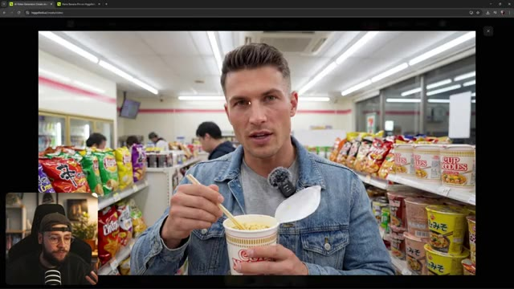
*Interface de la plateforme de génération affichant la vidéo de l'influenceur dans le 7-Eleven avec l'incrustation vidéo du créateur en bas à gauche.*

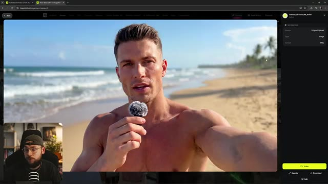
*Interface de l'outil montrant l'image de départ (starting frame) de l'influenceur sur une plage tropicale, avec l'incrustation vidéo du créateur.*

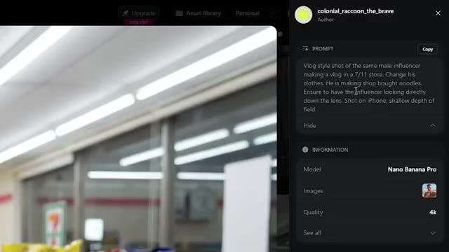
*Panneau latéral droit affichant le prompt textuel exact et les paramètres du modèle Nano Banana Pro (modèle sélectionné, image source et qualité 4K).*

---

### ⏱️ `[00:15:02 - 00:15:28]` | Segment #30

**🔊 Audio (Transcription Intégrale Mot pour Mot en Français) :**
> Change ses vêtements. Il prépare des nouilles achetées en magasin. Assurez-vous que l'influenceur regarde directement dans l'objectif de la caméra, tourné sur iPhone, avec une faible profondeur de champ. Maintenant, la raison pour laquelle je demande que la première image montre notre influenceur regardant directement dans l'objectif de la caméra, c'est que si dans notre première image il regardait vers le bas comme ceci, le modèle vidéo n'a pas le contexte de son apparence directe.

**👁️ Analyse Visuelle d'Écran (gemini-3.5-flash-lite) :**
**Interface & Outils** : Interface web de l'outil de génération vidéo et image (style Higgsfield) avec un panneau latéral de prompts et de paramètres (Model: Nano Banana Pro, Quality: 4k).

**Contenu textuel & Code** : Texte du prompt visible : "Vlog style shot of the same male influencer making a vlog in a 7/11 store. Change his clothes. He is making shop bought noodles. Ensure to have the influencer looking directly down the lens. Shot on iPhone, shallow depth of field."

**Action / Démonstration** : Le créateur démontre l'interface de génération d'image/vidéo en expliquant l'importance du cadrage et du regard de l'influenceur dans la première image (starting frame) pour donner le contexte au modèle d'intelligence artificielle.

*Interface de l'outil de génération affichant le panneau de prompt et les informations du modèle avec un aperçu de l'arrière-plan d'un magasin 7/11.*

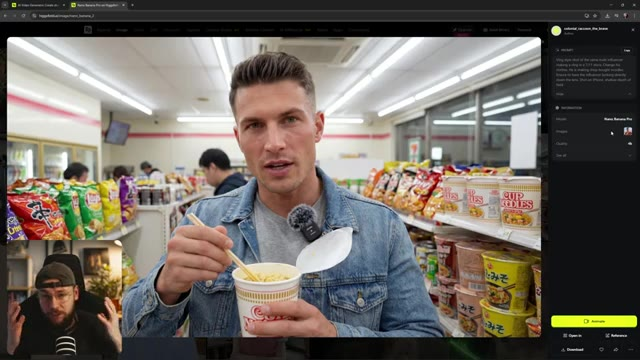
*Interface complète montrant l'influenceur généré mangeant des nouilles dans un magasin, avec le panneau de prompt à droite et le créateur en incrustation (PiP) en bas à gauche.*

---

### ⏱️ `[00:15:29 - 00:15:54]` | Segment #31

**🔊 Audio (Transcription Intégrale Mot pour Mot en Français) :**
> Maintenant, ça ne nous dérange pas si le modèle vidéo s'avance et commence à bouger la tête pour donner un air plus réaliste, le mouvement en soi. Ça n'aura pas autant d'importance car il a le contexte de son apparence de face. Ce sera beaucoup plus indulgent. Mais si la première image que nous avons donnée à un modèle vidéo IA montrait notre influenceur en train de, vous savez, regarder un peu comme ça, où il ne sait pas à quoi il ressemble correctement, alors nous aurons des problèmes parce qu'alors les modèles vidéo vont devoir commencer à deviner.

**👁️ Analyse Visuelle d'Écran (gemini-3.5-flash-lite) :**
**Interface & Outils** : Navigateur web affichant l'interface de Higgsfield AI, avec un panneau latéral droit contenant des options de prompts et de modèles (Nano Banana Pro), et un encadré PiP (Picture-in-Picture) de Jack dans son studio.

**Contenu textuel & Code** : Dans le panneau de droite de Higgsfield, un prompt textuel visible : "Vlog style shot of the same influencer making a vlog in a 7/11 store. Change his clothes. He is making shop bought noodles. Ensure to have the influencer looking directly down the lens. Shot on iPhone, shallow depth of field." Le modèle sélectionné est "Nano Banana Pro".

**Action / Démonstration** : Le créateur montre un exemple d'interface de génération vidéo par IA avec un panneau de configuration à droite et une image prévisualisée de l'influenceur mangeant des nouilles dans une supérette.

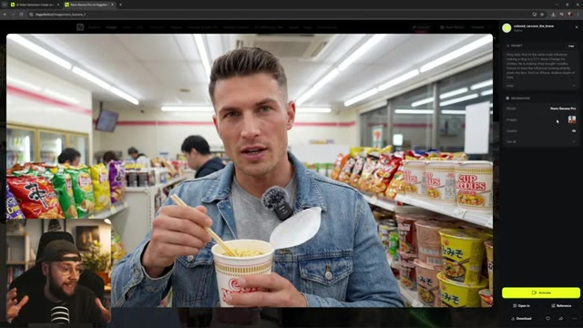
*Interface du navigateur web affichant un outil de génération vidéo par IA (Higgsfield) avec le panneau de paramètres à droite et un encadré PiP du créateur en bas à gauche.*

---

### ⏱️ `[00:15:55 - 00:16:29]` | Segment #32

**🔊 Audio (Transcription Intégrale Mot pour Mot en Français) :**
> Je vais perdre cette cohérence de personnage qui est vraiment importante pour, vous savez, développer les réseaux sociaux, mais aussi pour vendre vos produits grâce au contenu généré par les utilisateurs (UGC). Nous avons donc créé notre image de départ. Nous sommes allés de l'avant et avons ajouté le prompt caméra statique. Vidéo de style UGC de l'influenceur masculin essayant avec enthousiasme des nouilles achetées en magasin pour la première fois. Il a un accent californien prononcé, ce ne sont pas de vraies personnes. J'ai bien sûr activé l'onglet audio et pour le modèle vidéo, je vous suggère d'aller utiliser Google Veo 3.1.

**👁️ Analyse Visuelle d'Écran (gemini-3.5-flash-lite) :**
**Interface & Outils** : Interface de la plateforme web Higgsfield (higgfiel.ai) dédiée à la génération de vidéos par IA et de personnages influenceurs.

**Contenu textuel & Code** : Texte du prompt : "Static camera: UGC style video of the male influencer enthusiastically trying shop bought noodles for the first time. He has a deep Californian accent. Not real people." Options visibles : Audio (activé), Modèles listés : Higgsfield, OpenAI Sora 2, Google Veo, Wan, Kling, Minimax Hailuo, Seedance, Google Veo 3.1.

**Action / Démonstration** : Le créateur montre l'interface de génération vidéo sur Higgsfield, saisit ou affiche le prompt textuel, active l'option audio et navigue dans les menus pour sélectionner le modèle Google Veo 3.1.

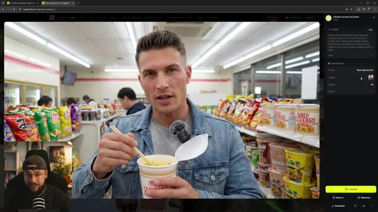
*Interface d'Higgsfield montrant un influenceur en train de manger des nouilles avec le panneau de prompt à droite.*

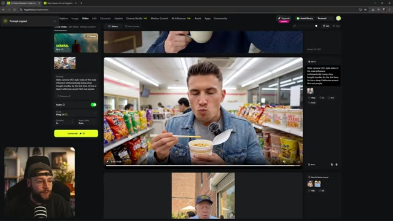
*Interface de génération vidéo sur Higgsfield avec le prompt affiché et le bouton de lecture vidéo.*

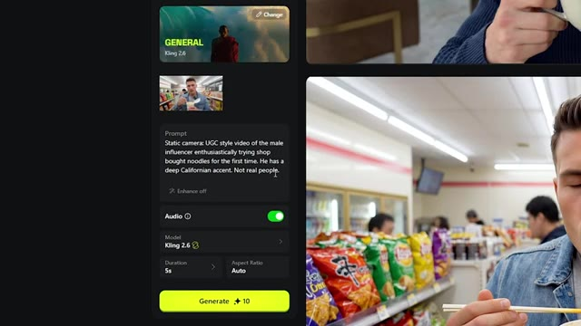
*Gros plan sur le panneau de configuration du prompt et le choix du modèle vidéo dans Higgsfield.*

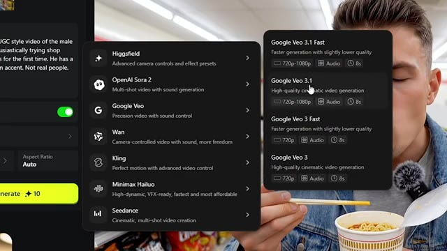
*Menu déroulant des modèles de génération vidéo affichant Google Veo 3.1 et d'autres alternatives.*

---

### ⏱️ `[00:16:29 - 00:16:50]` | Segment #33

**🔊 Audio (Transcription Intégrale Mot pour Mot en Français) :**
> Et il y a quelques points sur lesquels je veux me concentrer concernant le prompt textuel. Nous demandons à notre influenceur d'avoir un accent californien prononcé et ici nous essayons de verrouiller non seulement la cohérence des personnages mais aussi un niveau de cohérence vocale également. Donc si vous voulez bien regarder cette génération suivie de certaines des autres générations que j'ai faites après.

**👁️ Analyse Visuelle d'Écran (gemini-3.5-flash-lite) :**
**Interface & Outils** : Interface web de Higgsfield AI (higgsfield.ai) avec le créateur en incrustation (Picture-in-Picture) dans le coin inférieur gauche.

**Contenu textuel & Code** : Le prompt visible dans l'interface indique : "Static camera, UGC style video of the male influencer enthusiastically trying shop bought noodles for the first time. He has a deep Californian accent. Not real people." Paramètres affichés : Modèle Google Veo 3.1, Qualité 720p, Ratio 16:9, Durée 5s.

**Action / Démonstration** : Le créateur présente l'interface de Higgsfield AI et le résultat de la génération vidéo où l'influenceur virtuel déguste des nouilles instantanées dans un magasin.

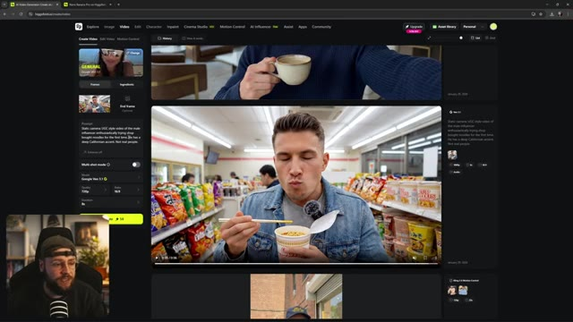
*Interface de l'outil de génération vidéo Higgsfield montrant un influenceur virtuel masculin mangeant des nouilles dans une supérette.*

---

### ⏱️ `[00:16:50 - 00:17:24]` | Segment #34

**🔊 Audio (Transcription Intégrale Mot pour Mot en Français) :**
> Oh mon dieu, ils sont vraiment trop bien. Salut les gars, bienvenue sur la chaîne, je voulais juste vous faire une rapide visite du nouveau chez-moi. Salut les gars, bienvenue sur la chaîne, aujourd'hui on se fait une grosse séance de muscu pour les pectoraux. J'espère que vous conviendrez qu'en ajoutant cela au prompt textuel, nous avons réussi à obtenir ce genre de constance avec la voix de notre influenceur. Et aussi en ajoutant "pas de vraies personnes" à la fin ici, on essaie en quelque sorte de contourner certaines restrictions imposées par les modèles d'images et de vidéos de Google. Google aime bien intégrer un peu de bureaucratie dans ses outils d'IA.

**👁️ Analyse Visuelle d'Écran (gemini-3.5-flash-lite) :**
**Interface & Outils** : Interface web de l'outil de génération vidéo Higgfield avec un affichage en Picture-in-Picture (PiP) de la webcam de Jack en bas à gauche.

**Contenu textuel & Code** : Texte du prompt visible : "Static camera UGC style video of the male influencer enthusiastically trying shop bought noodles for the first time. He has a deep Californian accent. Not real people." Paramètres visibles : Model: Google Veo 1.1, Quality: 720p, Ratio: 16:9, Duration: 5s.

**Action / Démonstration** : Présentation de l'interface de génération vidéo sur Higgfield et visualisation de différents clips vidéo générés par IA mettant en scène un influenceur virtuel.

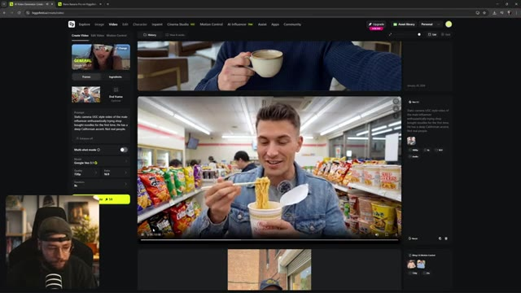
*Interface de l'outil Higgfield montrant la génération d'une vidéo de l'influenceur virtuel mangeant des nouilles dans une supérette.*

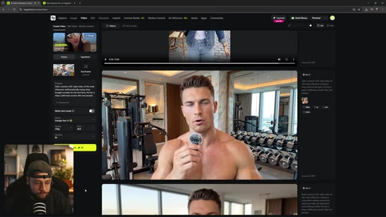
*Interface de l'outil Higgfield montrant une vidéo générée de l'influenceur virtuel dans une salle de sport, avec la webcam de Jack en médaillon.*

---

### ⏱️ `[00:17:24 - 00:18:02]` | Segment #35

**🔊 Audio (Transcription Intégrale Mot pour Mot en Français) :**
> et ça peut être un peu restrictif quand vous essayez de les utiliser pour créer du contenu, même si vous accédez aux outils d'IA de Google via différentes plateformes comme Higgsfield, par exemple. Donc, en ajoutant "pas de vraies personnes" à la fin, j'essaie essentiellement de dire à VO 3.1 : ne stressez pas parce que j'essaie de faire un deepfake ou quelque chose comme ça. Cette personne est synthétique. Elle n'existe pas vraiment. Et je suis sûr que vous avez deviné maintenant que pour les autres exemples ici de notre influenceur masculin, nous avons simplement créé une nouvelle image de départ. Celle-ci ici de lui dans son appartement très luxueux et celle-ci de lui à la salle de sport,

**👁️ Analyse Visuelle d'Écran (gemini-3.5-flash-lite) :**
**Interface & Outils** : Interface web de la plateforme Higgsfield (section de création vidéo avec panneau de prompts à gauche, aperçu vidéo central et historique à droite).

**Contenu textuel & Code** : Texte du prompt visible : 'Static camera UGC style video of the male influencer enthusiastically trying deep bought noodles for the first time. He has a deep Californian accent. Not real people.' Paramètres visibles : Model: Google Veo 3.1, Quality: 720p, Ratio: 16:9.

**Action / Démonstration** : Le créateur présente l'interface de Higgsfield et démontre les différents exemples de générations de vidéos pour l'influenceur masculin (à la salle de sport et dans l'appartement).

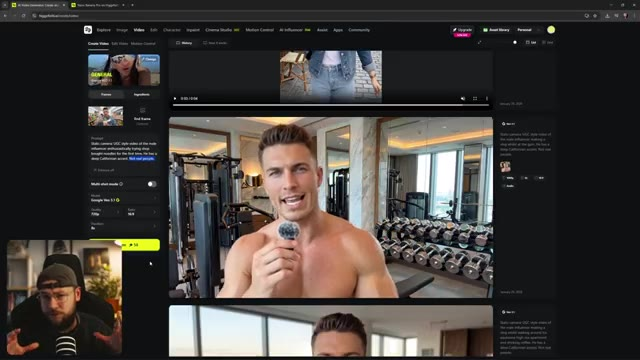
*Interface de la plateforme Higgsfield montrant les réglages de génération de vidéo, avec le prompt incluant la mention 'Not real people.' et la pastille du créateur en incrustation (PiP).*

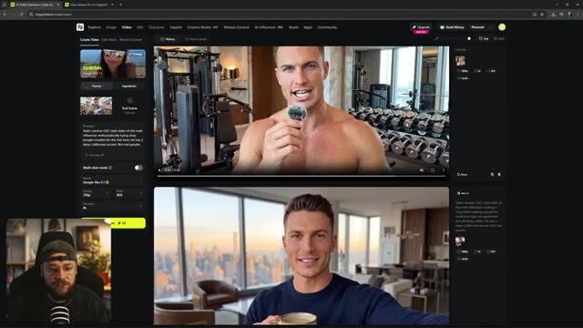
*Interface de Higgsfield affichant deux exemples de vidéos générées : l'influenceur à la salle de sport et dans son appartement luxueux.*

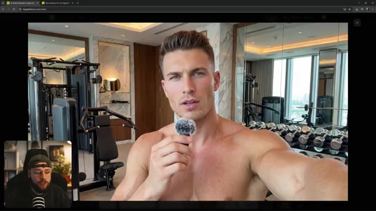
*Gros plan sur l'exemple vidéo généré montrant l'influenceur masculin dans une salle de sport, avec Jack visible en incrustation (PiP) dans le coin inférieur gauche.*

---

### ⏱️ `[00:18:02 - 00:18:39]` | Segment #36

**🔊 Audio (Transcription Intégrale Mot pour Mot en Français) :**
> qui donne aussi l'impression que cela pourrait en fait faire partie de son appartement donc mon gars s'en sort très bien. Encore une fois juste pour vous ramener à la génération d'images, vous pouvez voir ici qu'une fois de plus nous utilisons cette référence d'image originale de notre influenceur sur la plage. Pour cet exemple de plan de type vlog du même influenceur masculin faisant un vlog dans un appartement de grand standing aux allures coûteuses, il change de vêtements, il tient une tasse de café et ensuite avec cet exemple de plan de type vlog avec la même référence d'image du même influenceur masculin faisant un vlog dans une salle de sport luxueuse. Si je fais défiler un peu plus vers le haut également, nous avons un exemple vertical de notre influenceur masculin. Cette fois-ci je suis allé

**👁️ Analyse Visuelle d'Écran (gemini-3.5-flash-lite) :**
**Interface & Outils** : Interface web de la plateforme de génération vidéo et d'images "Higgsfield" avec un panneau de prévisualisation, une galerie de médias et un panneau latéral de configuration de prompt.

**Contenu textuel & Code** : On peut lire des prompts textuels descriptifs comme « Vlog style shot of the same male influencer making a vlog in an expensive looking gym... » ainsi que les réglages du modèle "Nano Banana Pro" et des miniatures de référence.

**Action / Démonstration** : Le créateur montre et commente les différentes générations d'images et de vidéos de l'influenceur virtuel dans divers décors (salle de sport, appartement, etc.), en faisant défiler les formats et les prompts.

*Aperçu en grand écran de l'influenceur dans une salle de sport luxueuse avec le créateur incrusté en bas à gauche.*

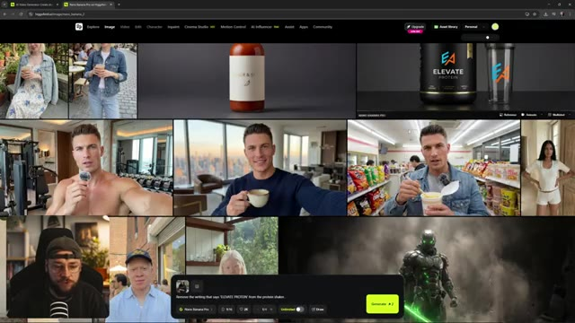
*Vue de la galerie de l'interface avec plusieurs exemples de génération de l'influenceur et la boîte de dialogue en bas.*

*Panneau latéral affichant les détails et le prompt textuel de la génération de l'influenceur en plan vlog dans une salle de sport.*

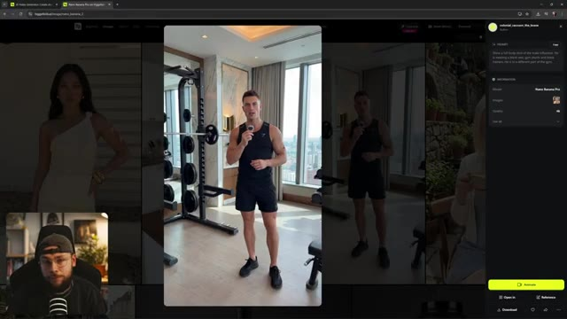
*Affichage d'un exemple de format vertical montrant l'influenceur en plan complet dans la salle de sport.*

---

### ⏱️ `[00:18:39 - 00:19:02]` | Segment #37

**🔊 Audio (Transcription Intégrale Mot pour Mot en Français) :**
> vas-y et j'ai utilisé la référence d'image que je viens de générer de lui dans la salle de sport et pour le prompt textuel affiche un plan en pied de l'influenceur masculin. Il porte un débardeur noir, un short de sport et des baskets noires et vous pouvez voir que Nano Banana Pro a appliqué la marque Gymshark à notre influenceur. C'est vraiment un point fort du modèle d'image de Google. Il a ce niveau fou de compréhension du monde.

**👁️ Analyse Visuelle d'Écran (gemini-3.5-flash-lite) :**
**Interface & Outils** : Interface web de Nano Banana Pro (Higgsfield) avec un panneau latéral de prompts, le modèle sélectionné et une vue PiP du créateur dans le coin inférieur gauche.

**Contenu textuel & Code** : Texte du prompt visible : 'Show a full body shot of the male influencer. He is wearing a black vest, gym shorts and black trainers.' et nom du modèle 'Nano Banana Pro'.

**Action / Démonstration** : Le créateur démontre l'utilisation d'une image de référence pour générer un nouveau plan en pied avec le modèle d'IA Nano Banana Pro, mettant en valeur sa capacité à appliquer correctement des marques comme Gymshark.

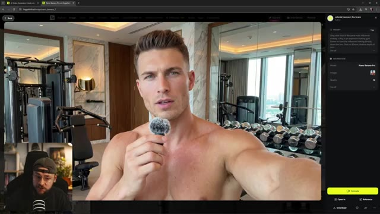
*Interface du générateur d'images Nano Banana Pro montrant l'influenceur dans une salle de sport et le panneau de configuration latéral.*

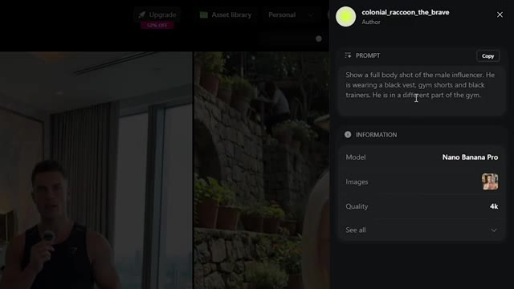
*Gros plan sur le panneau latéral du prompt textuel de Nano Banana Pro avec la description de la tenue de l'influenceur.*

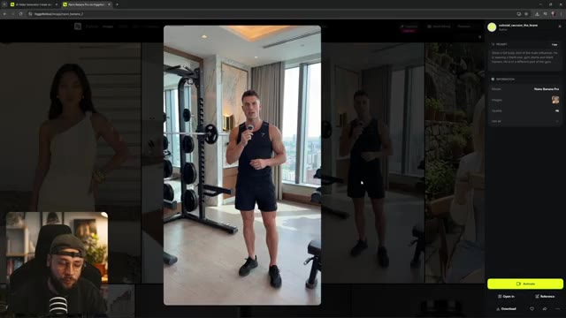
*Affichage du résultat en pied de l'influenceur généré par l'IA avec la marque Gymshark sur le débardeur.*

---

### ⏱️ `[00:19:02 - 00:19:40]` | Segment #38

**🔊 Audio (Transcription Intégrale Mot pour Mot en Français) :**
> Elle est capable d'en gros de prendre un tas de décisions vraiment intelligentes lorsqu'il s'agit de générer votre image. C'est donc la première façon de générer du contenu vidéo pour l'UGC. Bien sûr, même créer des images fixes peut être vraiment super pour se bâtir une communauté et aussi pour l'UGC. Plein de comptes de réseaux sociaux immenses là-hour ne font que publier des images. Nous avons examiné la création des images de départ avec Nano Banana Pro puis l'utilisation de Google VO 3.1 pour leur donner vie avec ce style UGC. Mais et si je vous disais qu'il y a une autre façon de modifier des vidéos existantes et de déposer de nouvelles

**👁️ Analyse Visuelle d'Écran (gemini-3.5-flash-lite) :**
**Interface & Outils** : Navigateur web affichant l'interface de la plateforme de génération vidéo et d'images par IA Higgsfield.ai, avec la webcam du créateur incrustée en bas à gauche.

**Contenu textuel & Code** : Menus de Higgsfield (Explore, Image, Video, Edit, Character, Inpaint, Cinema Studio, Motion Control, AI Influencer, Assist, Apps, Community). Modèles visibles : Nano Banana Pro et Google Veo 3.1. Paramètres : qualité 720p, format 16:9, durée 5s. Prompts textuels pour l'UGC.

**Action / Démonstration** : Le créateur navigue à travers l'interface de Higgsfield, montrant des exemples de générations d'images fixes et de vidéos de style UGC.

*Interface du générateur Higgsfield montrant une grille d'images de personnages générés et un panneau d'information latéral.*

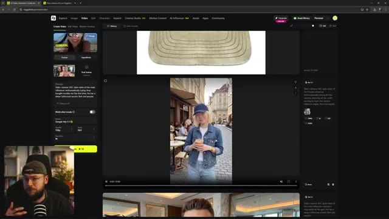
*Interface de Higgsfield Video montrant les paramètres de génération vidéo avec le modèle Google Veo 3.1 et l'aperçu d'une vidéo UGC.*

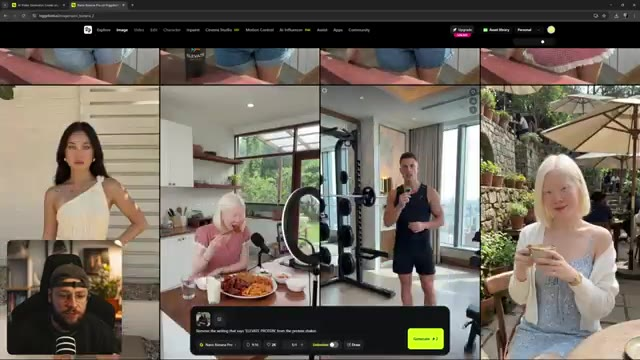
*Grille d'images de personnages dans Higgsfield avec un outil de retouche textuelle actif en bas.*

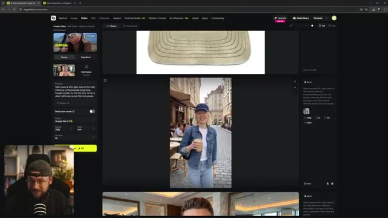
*Interface de Higgsfield Video affichant l'éditeur de génération vidéo avec le panneau latéral de configuration et l'aperçu du projet.*

---

### ⏱️ `[00:19:40 - 00:20:11]` | Segment #39

**🔊 Audio (Transcription Intégrale Mot pour Mot en Français) :**
> des produits dedans ? Nous sommes donc toujours sur la page de création de vidéo sur Higgsfield. En haut à gauche ici, vous pouvez voir que nous avons plusieurs options différentes. Nous avons "create video", nous avons "motion control", comme nous l'utilisions plus tôt dans la vidéo. Mais nous avons aussi cette option ici pour "edit video". Maintenant, ceci utilise l'outil 01 edit de Kling qui nous permet d'apporter des modifications à un contenu vidéo existant. Vous pouvez donc voir que cet onglet ici sert à télécharger la vidéo elle-même. La durée requise est de trois à dix secondes.

**👁️ Analyse Visuelle d'Écran (gemini-3.5-flash-lite) :**
**Interface & Outils** : Navigateur web affichant l'interface de la plateforme de génération vidéo IA Higgsfield, avec le visage du créateur en incrustation (PiP) dans le coin inférieur gauche sur les images 1 et 3.

**Contenu textuel & Code** : Menus déroulants et options de Higgsfield : Explore, Image, Video, Edit, Character, Inpaint, Cinema Studio v1.5, Motion Control, AI Influencer, Create Video, Edit Video, Kling 01 Edit, Upload a video to edit (Duration required: 3-10 secs), Upload images & elements.

**Action / Démonstration** : Le curseur de la souris navigue à travers les menus et onglets de l'interface Higgsfield pour montrer les fonctionnalités de création, de contrôle de mouvement et d'édition vidéo (Kling 01 Edit).

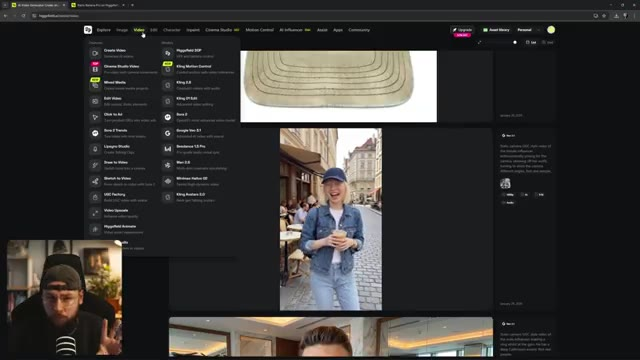
*Interface du site Higgsfield montrant le menu déroulant avec les options vidéo, incluant "Create Video", "Motion Control" et "Edit Video".*

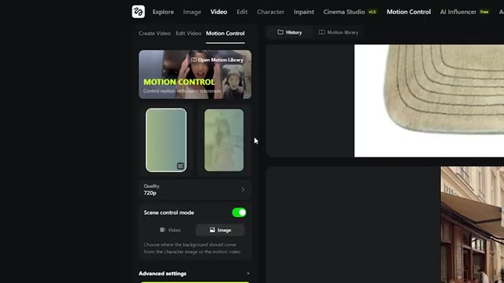
*Interface de Higgsfield sur l'onglet "Motion Control" avec les options de contrôle de mouvement et de qualité.*

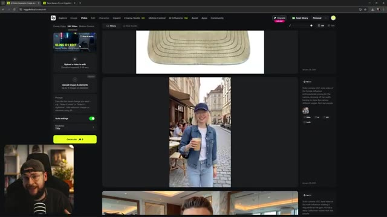
*Interface de Higgsfield sur l'onglet "Edit Video" montrant les options de l'outil Kling 01 Edit.*

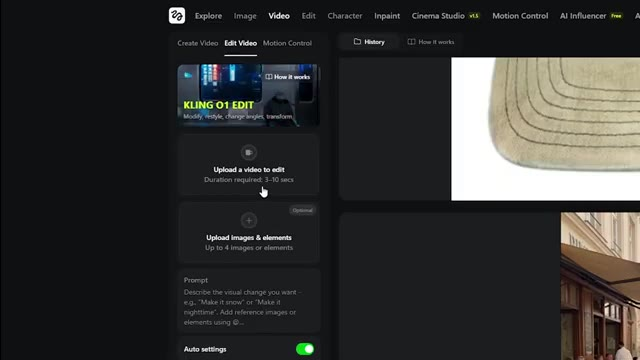
*Gros plan sur le panneau latéral de l'onglet "Edit Video" indiquant la durée requise de 3 à 10 secondes pour le téléchargement.*

---

### ⏱️ `[00:20:11 - 00:20:47]` | Segment #40

**🔊 Audio (Transcription Intégrale Mot pour Mot en Français) :**
> Et puis ici, nous pouvons charger des images et des éléments, jusqu'à quatre d'entre eux. Et bien sûr, en dessous, nous avons la possibilité d'entrer un texte de description (prompt) puis de choisir notre résolution également, et je veux aller de l'avant et vous ramener à notre contenu de vlog ici où notre influenceur masculin mange des nouilles dans le 7-Eleven, disons qu'une marque vous approche et veut faire une collaboration, sauf qu'ils veulent le faire sur un contenu vidéo existant, nous ne pourrions normalement jamais faire cela, mais avec ces outils d'IA comme Kling 01, vous le pouvez, alors laissez-moi simplement y aller et

**👁️ Analyse Visuelle d'Écran (gemini-3.5-flash-lite) :**
**Interface & Outils** : Interface web de l'outil d'IA Higgsfield (section d'édition vidéo Kling O1 Edit).

**Contenu textuel & Code** : Menus de navigation (Explore, Image, Video, Edit, Character, Inpaint, Cinema Studio, Motion Control, AI Influencer), options de téléchargement de vidéo, de téléchargement d'images et d'éléments ("Up to 4 images or elements"), zone de texte "Prompt", options de résolution ("720p"), bouton jaune "Generate", et aperçu de la vidéo de l'influenceur dans un 7-Eleven.

**Action / Démonstration** : Le curseur de la souris survole l'option de chargement d'images et d'éléments dans l'interface d'édition, puis la vue s'élargit pour montrer la vidéo d'un influenceur dans un 7-Eleven avec le créateur visible en incrustation (PiP) dans le coin inférieur gauche.

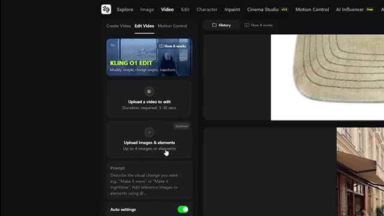
*Interface de Higgsfield (section Kling O1 Edit) montrant les options de chargement d'images et d'éléments.*

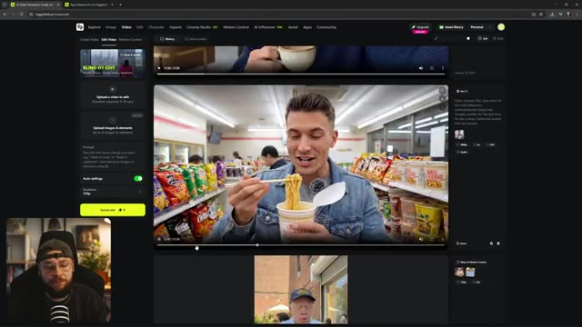
*Interface de Higgsfield montrant la vidéo du vlog avec l'influenceur mangeant des nouilles dans un 7-Eleven, avec un encadré PiP du présentateur.*

---

### ⏱️ `[00:20:47 - 00:21:25]` | Segment #41

**🔊 Audio (Transcription Intégrale Mot pour Mot en Français) :**
> faites défiler vers le haut ici et tout de suite vous allez voir le résultat que nous avons obtenu. Donc bien sûr nous avons commencé par télécharger la vidéo d'origine qui était bien sûr celle-ci en bas. Ensuite nous avons téléchargé une image d'une casquette de baseball Stussy et ensuite de quelques lunettes de soleil Balenciaga je crois que c'était ça. Et encore une fois un prompt textuel vraiment simple ici : change la tenue de l'influenceur masculin de sorte qu'il porte et si nous tapons arobase alors nous pouvons sélectionner l'image un qui a été assignée à la casquette de baseball Stussy et ensuite l'image deux qui correspond aux lunettes de soleil Balenciaga. Nous demandons donc à Kling 01 de prendre

**👁️ Analyse Visuelle d'Écran (gemini-3.5-flash-lite) :**
**Interface & Outils** : Interface web de Kling O1 / Higgsfield AI sur navigateur, comportant un panneau latéral gauche pour le prompt et l'import de médias, et un écran de visualisation central.

**Contenu textuel & Code** : Texte du prompt visible : "Swap the male influencer's outfit so that he is wearing @image 1 @image 2". Paramètres visibles : "Auto settings", "Resolution 720p", bouton "Generate".

**Action / Démonstration** : Le curseur de la souris clique et sélectionne "Image 1" dans le menu déroulant après avoir tapé le symbole "@" dans le champ de texte du prompt.

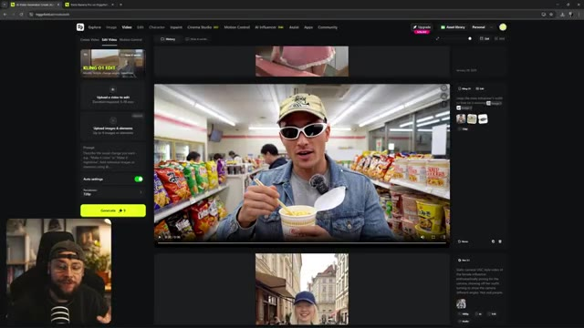
*Interface de l'outil Kling O1 sur la plateforme web montrant le panneau d'édition vidéo avec le résultat importé d'un influenceur dans une supérette.*

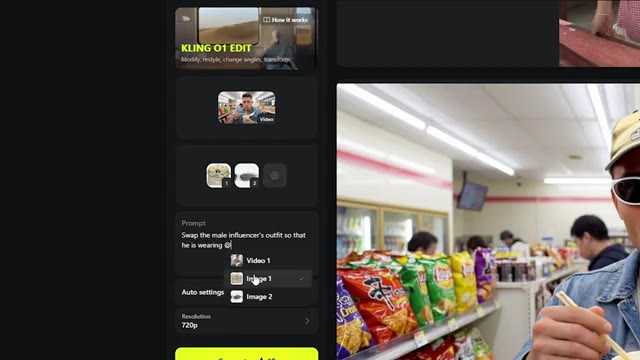
*Gros plan sur le panneau de configuration du prompt avec l'apparition du menu contextuel permettant de sélectionner les images de référence @image 1.*

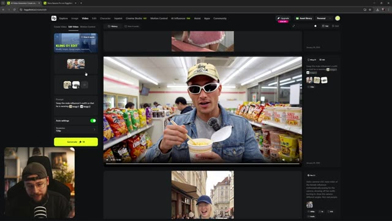
*Interface de l'outil Kling O1 montrant le prompt complété avec les balises @image 1 et @image 2 intégrées.*

---

### ⏱️ `[00:21:25 - 00:22:00]` | Segment #42

**🔊 Audio (Transcription Intégrale Mot pour Mot en Français) :**
> ces éléments et appliquez-les à la séquence vidéo existante et laissez-moi vous montrer ce que nous obtenons en retour. Oh mon dieu, ils sont vraiment tellement bons. Donc je veux aller de l'avant et afficher ceci en plein écran pour que nous puissions vraiment scruter cela. Nous parlerons du bon et du mauvais. Le plan lui-même a perdu un peu de texture en particulier en ce qui concerne la peau, une bonne façon de contourner cela serait d'appliquer une couche de bruit ou de grain de pellicule par-dessus pour en quelque sorte ramener cela pour le rendre un peu moins parfait comme je l'mentionné plus tôt si vous créez du contenu vertical, cela va juste

**👁️ Analyse Visuelle d'Écran (gemini-3.5-flash-lite) :**
**Interface & Outils** : Interface web de Higgsfield AI (higgsfield.ai/studio) avec options de montage vidéo, paramètres de prompt et bouton de génération, avec incrustation PiP du créateur en bas à gauche.

**Contenu textuel & Code** : Texte visible dans l'interface : "Swap the male influencer's outfit so that he is wearing [Image 1] [Image 2]", paramètres "Auto settings" activés et résolution fixée à "720p", avec un bouton de génération jaune "Generate 10".

**Action / Démonstration** : Le créateur montre l'interface de l'outil de génération vidéo, lance le rendu, puis bascule la vidéo en plein écran pour analyser le résultat généré et discuter de la perte de texture sur la peau.

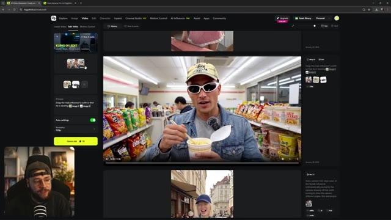
*Interface complète de l'outil Higgsfield AI montrant le panneau d'édition vidéo à gauche et le lecteur vidéo principal au centre avec un influenceur dans une supérette.*

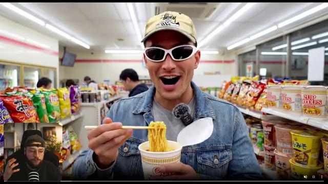
*Passage de la vidéo en mode plein écran (avec le créateur en vignette Picture-in-Picture en bas à gauche) montrant l'influenceur mangeant des nouilles dans une supérette.*

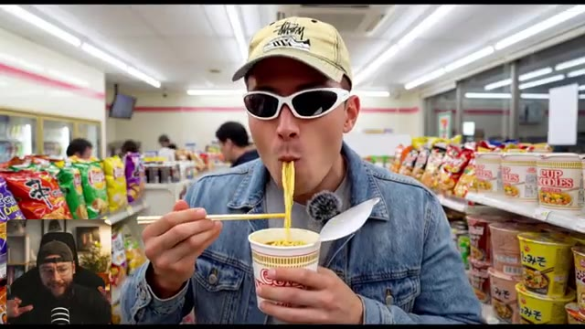
*Gros plan sur le plan vidéo généré par IA où l'influenceur mange des nouilles instantanées avec des baguettes dans un magasin.*

---

### ⏱️ `[00:22:00 - 00:22:37]` | Segment #43

**🔊 Audio (Transcription Intégrale Mot pour Mot en Français) :**
> naturellement être un peu plus indulgent je fais ça en horizontal pour qu'on puisse vraiment pointer du doigt les pièges la plupart de l'UGC va être vertical ça va être regardé sur un téléphone et donc par nature c'est juste plus indulgent mais on scrute vraiment ça n'est-ce pas on a aussi des déformations sur la casquette elle-même mais pour parler de certaines bonnes choses ces reflets dans les lunettes de soleil ont l'air incroyablement réalistes pour moi aussi la façon dont Kling a juste réussi à mettre une casquette de baseball et des lunettes de soleil sur le visage de notre influenceur masculin et le suivi d'objet avec

**👁️ Analyse Visuelle d'Écran (gemini-3.5-flash-lite) :**
**Interface & Outils** : Présentation vidéo avec incrustation PiP (Picture-in-Picture) du créateur Jack dans le coin inférieur gauche.

**Contenu textuel & Code** : Vidéo générée montrant un homme asiatique portant une veste en jean, une casquette beige et des lunettes de soleil blanches, tenant une tasse de nouilles instantanées dans un magasin d'alimentation.

**Action / Démonstration** : L'influenceur virtuel mange des nouilles avec des baguettes dans un décor de supérette tandis que le créateur commente les détails visuels.

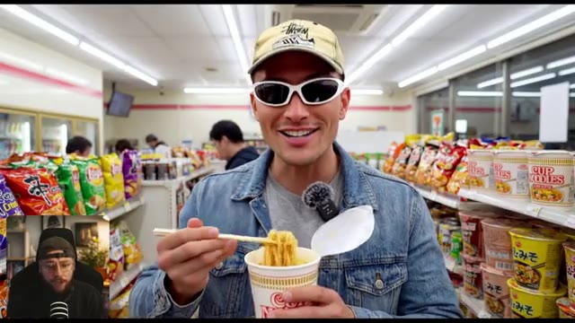
*Vidéo UGC générée par IA montrant un influenceur dans une supérette mangeant des nouilles instantanées, avec Jack en incrustation (PiP) en bas à gauche.*

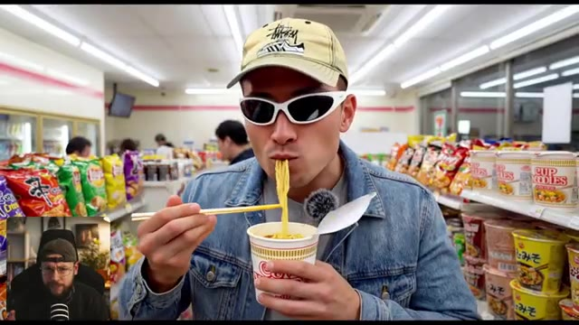
*Gros plan sur l'influenceur IA mangeant des nouilles dans la supérette, avec Jack visible dans le coin inférieur gauche.*

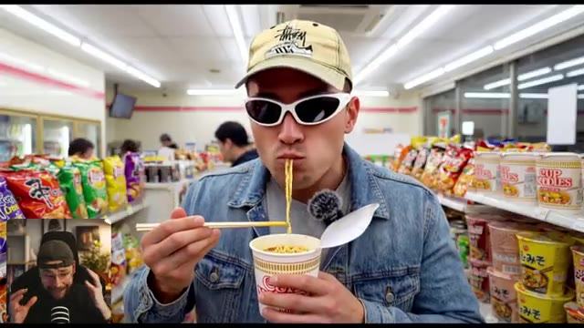
*Retour à la vue globale de l'influenceur IA tenant ses baguettes, avec Jack réagissant dans l'encadré PiP.*

---

### ⏱️ `[00:22:37 - 00:23:13]` | Segment #44

**🔊 Audio (Transcription Intégrale Mot pour Mot en Français) :**
> que cette rotation de tête en 3D, même quand il s'agit de mouvements en quelque sorte subtils, est vraiment tout à fait impressionnante. Il y a donc en fait tellement de façons différentes de réutiliser et concevoir votre contenu de style UGC. Vous pouvez bien sûr aller de l'avant et créer des produits, vous pouvez les intégrer dans vos images de départ, nous pouvons changer ce que portent nos personnages, nous pouvons changer l'endroit où ils se trouvent également, par exemple nous pouvons créer autant d'influenceurs IA que nous le voulons, je pense que c'est la meilleure façon parce que cela vous donne un niveau de contrôle vraiment solide sans sacrifier ce genre de détail textuel.

**👁️ Analyse Visuelle d'Écran (gemini-3.5-flash-lite) :**
**Interface & Outils** : Navigateur web affichant l'interface de la plateforme de génération vidéo par IA Higgsfield (avec menu comprenant Explore, Image, Video, Edits, Character, Inpaint, Cinema Studio, Motion Control, AI Influencer, Assist, Apps, Community).

**Contenu textuel & Code** : Panneau latéral visible sur l'image #4 avec le prompt : "Show a full body shot of the male influencer. He is wearing a black vest, gym shorts and black trainers. He is in a different part of the gym." Paramètres visibles : modèle "Nano Banana Pro", option "Animate".

**Action / Démonstration** : Le créateur navigue à travers différents exemples de vidéos et de visuels générés par IA sur la plateforme Higgsfield, démontrant la variété des décors, vêtements et personnages que l'on peut réutiliser et modifier.

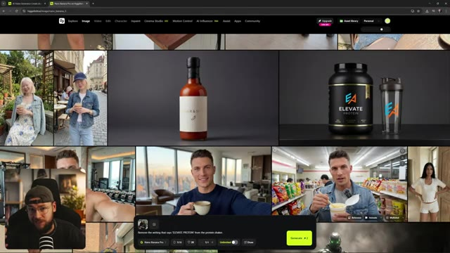
*Interface de la plateforme Higgsfield affichant une grille de plusieurs vidéos et images générées par IA (influenceurs, produits, shaker de protéines).*

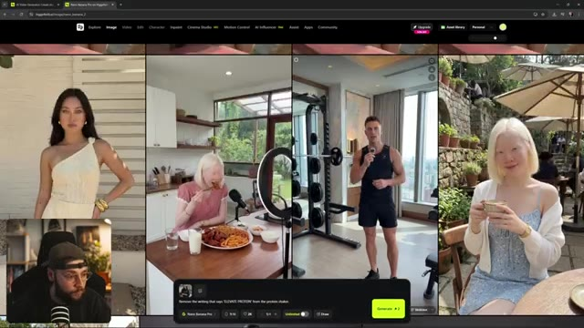
*Interface de Higgsfield montrant une autre sélection de visuels générés par IA, incluant des influenceurs dans différentes poses et environnements (cuisine, salle de sport, terrasse).*

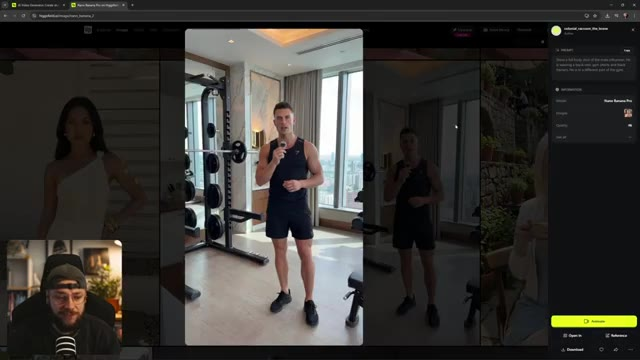
*Interface de Higgsfield montrant le panneau latéral avec un prompt textuel pour générer une vidéo de l'influenceur en pied dans une salle de sport.*

---

### ⏱️ `[00:23:13 - 00:23:51]` | Segment #45

**🔊 Audio (Transcription Intégrale Mot pour Mot en Français) :**
> mais je pense toujours que c'est vraiment impressionnant la façon dont nous sommes capables d'utiliser un outil comme Kling 01 pour faire ce genre de modifications sur notre contenu et j'espère que vous avez vu tout au long de cette vidéo à quel point il y a du potentiel dans la création d'UGC par IA. Donc si nous retournons directement à notre première étape, nous avons bien sûr l'AI Influencer Studio où nous sommes capables de créer notre influenceur à partir de zéro et de décider de tous ces paramètres uniques. Nous pouvons ensuite aller de l'avant et modifier notre image en utilisant Nano Banana Pro en changeant l'emplacement, en ajoutant des vêtements différents, des produits différents aussi et puis nous pourrions apporter

**👁️ Analyse Visuelle d'Écran (gemini-3.5-flash-lite) :**
**Interface & Outils** : Higgsfield (plateforme web de création et d'édition de contenu par IA)

**Contenu textuel & Code** : Menus de navigation (Explore, Image, Video, Edits, Character, Inpaint, Cinema Studio, Motion Control, AI Influencer, Assist, Apps, Community), options de génération, curseurs de paramètres, et section AI Influencer Studio.

**Action / Démonstration** : Le créateur navigue à travers les différentes fonctionnalités de la plateforme Higgsfield pour illustrer les étapes de création et de modification d'influenceurs virtuels.

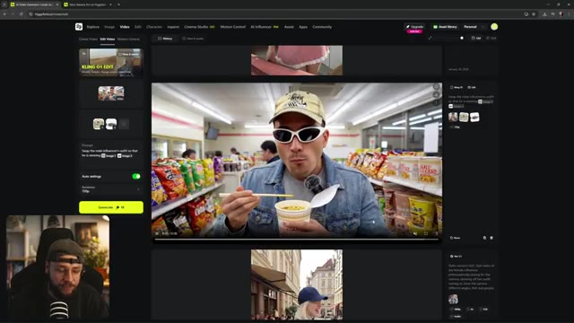
*Interface d'édition vidéo montrant l'outil de modification de tenue et de scène avec un personnage mangeant dans une supérette.*

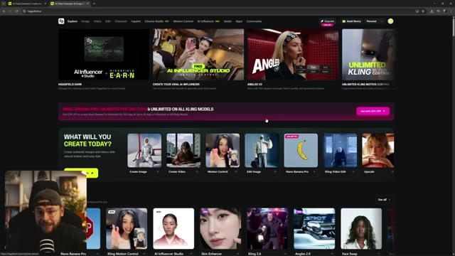
*Page d'accueil de la plateforme avec différents outils d'IA et options de création d'influenceurs.*

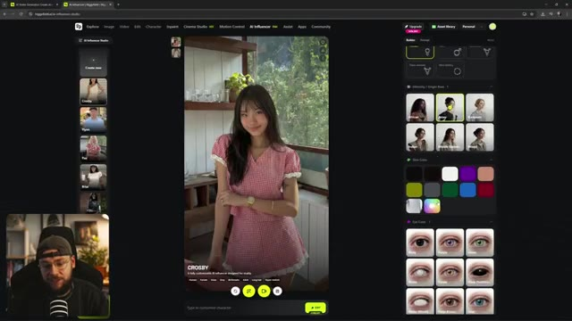
*Interface de l'AI Influencer Studio permettant de personnaliser les paramètres uniques d'un personnage (ethnie, couleur des yeux, etc.).*

---

### ⏱️ `[00:23:51 - 00:24:27]` | Segment #46

**🔊 Audio (Transcription Intégrale Mot pour Mot en Français) :**
> ces images fixes à la vie avec google vo 3.1 ou utiliser kling 01 par exemple pour apporter des modifications à des vidéos existantes les gars j'espère vraiment que vous avez apprécié le contenu d'aujourd'hui si vous avez la moindre question, n'hésitez pas à la poser en bas dans la section des commentaires j'essaie toujours de répondre au maximum d'entre eux si vous avez apprécié le contenu d'aujourd'hui assurez-vous de lâcher un pouce bleu pour moi si vous êtes nouveau pensez à vous abonner et bien sûr activez cette cloche de notification pour ne jamais rater de futures publications. Je vais maintenant afficher quelques-unes de mes précédentes publications sur l'écran en ce moment si vous souhaitez aller les voir. Et cela étant dit, je vous retrouve dans la

**👁️ Analyse Visuelle d'Écran (gemini-3.5-flash-lite) :**
**Interface & Outils** : Interface web d'un outil de génération vidéo par intelligence artificielle (similaire à Kling / Runway) avec menus d'édition, timeline et paramètres de génération.

**Contenu textuel & Code** : Boutons de génération, curseurs de réglage, aperçu vidéo au centre, et vignettes dans la barre latérale gauche.

**Action / Démonstration** : Le créateur montre l'interface de l'outil de génération vidéo et d'édition tout en parlant à l'écran.

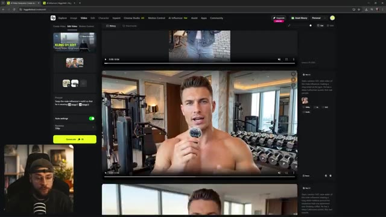
*Interface d'un générateur vidéo IA montrant des aperçus de vidéos et un encadré PiP du créateur en bas à gauche.*

---

### ⏱️ `[00:24:27 - 00:24:27]` | Segment #47

**🔊 Audio (Transcription Intégrale Mot pour Mot en Français) :**
> prochaine vidéo.

**👁️ Analyse Visuelle d'Écran (gemini-3.5-flash-lite) :**
**Interface & Outils** : Présentation face caméra sans partage d'écran

**Contenu textuel & Code** : Aucun texte, code ou interface visible sur l'image qui présente un fond coloré flou (speaker-only ou transition).

**Action / Démonstration** : Aucune action de démonstration visible.

---
