# 🎬 Comment utiliser Kling 3.0 pour la réalisation de films par IA

> **Chaîne** : [Jack Vs. AI](https://www.youtube.com/@JackVsAI)  
> **Titre original** : `How to use Kling 3.0 for AI Filmmaking`  
> **Lien YouTube** : [https://www.youtube.com/watch?v=tqZ0JuUevwA](https://www.youtube.com/watch?v=tqZ0JuUevwA)  
> **Date de publication** : 2026-02-04  
> **Durée** : 20m 38s (`1238s`)  
> **Identifiant vidéo** : `tqZ0JuUevwA`  
> **Fiche Web Interactive** : [2026-02-04_YT-tqZ0JuUevwA_Comment utiliser Kling 3.0 pour la réalisation de films par IA_by-whisper-v3-large-turbo+gemini-3.5-flash-lite.html](2026-02-04_YT-tqZ0JuUevwA_Comment utiliser Kling 3.0 pour la réalisation de films par IA_by-whisper-v3-large-turbo+gemini-3.5-flash-lite.html)  
> **Captures de démonstration clés** : `108 captures réelles (anti-talking-head)`  
> **Modèles utilisés** : Audio: `large-v3-turbo` (Faster-Whisper int8 VPS) | Vision: `gemini-3.5-flash-lite` (Google AI Studio API)  

---

## 📌 Synthèse Exécutive & Outils

### 📌 Résumé
La vidéo de Jack, artiste d'effets visuels chevronné, met en lumière **Kling 3.0**, qualifiée de mise à jour révolutionnaire dans le domaine de la vidéo par intelligence artificielle pour les cinéastes et les publicitaires. Cet outil intègre désormais des fonctionnalités majeures telles que le prompt multi-plans, l'audio natif, une génération étendue jusqu'à 15 secondes et, surtout, un système inédit de gestion d'éléments de référence multiples. Ce dernier permet de verrouiller la cohérence visuelle des personnages et des objets sous n'importe quel angle, résolvant ainsi l'un des défis les plus persistants de la production vidéo par IA.

Pour exploiter ce potentiel, Jack détaille un flux de travail (workflow) de pointe en deux étapes principales. D'abord, il utilise **Nano Banana Pro** pour concevoir des visuels clés et des images de départ d'une netteté remarquable en 4K à partir de simples esquisses ou de basses résolutions. Ensuite, il importe ces éléments dans Kling 3.0 via la plateforme **Higgsfield**, en associant des banques d'images sous divers angles (face, profil, dos) dans l'onglet « Elements ». Cette méthode permet d'obtenir des mouvements de caméra complexes, comme une orbite 3D complète autour d'un sujet, tout en maintenant une fidélité parfaite du personnage et des accessoires.

Pour les créateurs de contenu et les publicitaires, cette synergie entre Kling 3.0 et Nano Banana Pro représente un gain de temps et de productivité considérable. Elle offre la possibilité de produire des séquences publicitaires sophistiquées, des clips de science-fiction ou des "visuels clés" immersifs avec un niveau de contrôle professionnel inédit. Bien que des artefacts mineurs puissent encore survenir sporadiquement, ce processus structuré démocratise l'accès à une réalisation visuelle haut de gamme, auparavant réservée aux studios dotés de budgets massifs d'effets visuels.

### 🛠️ Outils, Modèles & Logiciels Présentés
* **Kling 3.0** : Le modèle vidéo principal de pointe, offrant une génération jusqu'à 15 secondes, un contrôle multi-plans, un audio natif et une cohérence accrue grâce aux éléments.
* **Higgsfield** : La plateforme d'hébergement et d'accès centralisée qui propose des interfaces intuitives et des offres groupées pour utiliser Kling 3.0 et Nano Banana Pro.
* **Nano Banana Pro** : Le modèle de génération d'images haute résolution utilisé en amont pour créer des cadres de départ et des visuels clés en 4K d'une qualité irréprochable.
* **Flux** : L'écosystème technologique global sous-jacent et complémentaire mobilisé pour structurer les rendus de prompts textuels et visuels.

### 🔑 Points Clés & Enseignements Stratégiques
* **Révolution de la cohérence des personnages** : L'utilisation de banques d'images multi-angles dans l'onglet « Elements » de Kling 3.0 résout enfin l'instabilité morphologique lors des mouvements de caméra complexes.
* **Le test de l'orbite 3D** : Une rotation de caméra à 360 degrés autour d'un sujet sert de banc d'essai ultime pour valider la robustesse de la cohérence spatiale et corporelle d'un modèle vidéo.
* **Cohérence des objets et des produits** : La fonctionnalité « Elements » s'applique non seulement aux visages humains, mais aussi aux objets manufacturés et aux logos 3D, ouvrant la voie à la publicité de produits par IA.
* **Le workflow de l'image de départ (Key Visual)** : Ne jamais générer une vidéo en partant de zéro ; il est stratégique de concevoir d'abord une image de haute qualité pour l'utiliser comme point d'ancrage visuel.
* **Optimisation avec Nano Banana Pro** : Cet outil permet d'upscaler et de transformer des images de basse qualité (comme un logo pixelisé) en rendus 4K sophistiqués au format 16:9 prêts à être animés.
* **Maîtrise de la durée des clips** : Le curseur de durée de Kling 3.0 permet d'ajuster précisément la génération de 3 à 15 secondes selon les besoins narratifs du plan.
* **Simplicité des prompts textuels** : Coupler une image de départ hautement détaillée et des éléments de référence permet d'utiliser des prompts textuels relativement simples et directs sans perdre en complexité visuelle.
* **Gestion des angles multiples** : Pour créer un élément de personnage efficace, il est recommandé de télécharger des vues de face, de profil, de trois-quarts et de dos afin que l'IA comprenne le volume 3D du sujet.
* **Flexibilité du multi-plans** : L'activation de l'option multi-plans (lorsqu'elle est combinée aux curseurs de durée) facilite le découpage et le montage dynamique de scènes complexes.
* **Acceptation des limites technologiques** : Même avec les performances de Kling 3.0, des résultats imprévisibles ou "bizarres" peuvent survenir occasionnellement, nécessitant parfois plusieurs essais de génération.
* **Synergie publicitaire** : L'alliance d'un rendu de produit précis et d'un personnage récurrent permet de créer des spots publicitaires cohérents, uniformes et taillés pour les marques.

---

## ⏱️ Chronologie & Transcription Complète Audio & Visuelle (Mot pour Mot)

### ⏱️ `[00:00:00 - 00:00:19]` | Segment #01

**🔊 Audio (Transcription Intégrale Mot pour Mot en Français) :**
> Kling 3 est peut-être la plus grande mise à jour de la vidéo par IA que nous ayons jamais eue, et cela représente un énorme bond en avant pour les cinéastes et les publicitaires. Imaginez un seul outil qui couvre le prompt multi-plans, la cohérence des personnages et l'audio natif, tout en générant jusqu'à 15 secondes de séquences.

**👁️ Analyse Visuelle d'Écran (gemini-3.5-flash-lite) :**
**Interface & Outils** : Présentation face caméra sans partage d'écran

**Contenu textuel & Code** : Aucun texte, prompt ou interface logicielle affichés.

**Action / Démonstration** : Jack apparaît à l'écran en train de parler et d'illustrer ses propos avec des animations visuelles générées par IA incrustées en arrière-plan ou autour de lui.

---

### ⏱️ `[00:00:19 - 00:00:53]` | Segment #02

**🔊 Audio (Transcription Intégrale Mot pour Mot en Français) :**
> Ouais, c'est un changement absolu pour les créateurs. Je m'appelle Jack, je suis artiste d'effets visuels dans l'industrie publicitaire depuis plus d'une décennie maintenant, et j'ai travaillé pour bon nombre des plus grandes marques de la planète. Aujourd'hui, je révèle tout ce que vous devez savoir sur Kling 3. Nous allons couvrir toutes les nouvelles fonctionnalités insensées de cette mise à jour, y compris la possibilité de télécharger des éléments, des références multiples qui seront utilisées dans votre génération pour verrouiller un niveau de cohérence des personnages époustouflant. Et les gars, si vous appréciez le contenu d'aujourd'hui, assurez-vous de lâcher un pouce bleu pour moi, pensez à vous abonner et bien sûr à activer cette cloche de notification. D'accord,

**👁️ Analyse Visuelle d'Écran (gemini-3.5-flash-lite) :**
**Interface & Outils** : Présentation face caméra sans partage d'écran (Jack dans son studio avec micro, étagères et plantes en arrière-plan)

**Contenu textuel & Code** : Texte affiché à l'écran : "game changer", puis "generation", et un widget de réseaux sociaux animés (pouce bleu, bouton "SUBSCRIBED" et cloche de notification).

**Action / Démonstration** : Jack s'exprime face caméra en studio, illustré par quelques plans cinématiques de type B-roll générés par IA et des animations de sous-titres et d'abonnements.

---

### ⏱️ `[00:00:53 - 00:01:28]` | Segment #03

**🔊 Audio (Transcription Intégrale Mot pour Mot en Français) :**
> entrons dans le vif du sujet. La structure de la vidéo d'aujourd'hui est donc construite autour de chacune des nouvelles fonctionnalités de Kling. Vous trouverez des repères temporels ci-dessous si vous aviez un sujet particulier sur lequel vous vouliez vous concentrer, n'hésitez donc pas à naviguer vers les chapitres pertinents comme bon vous semble. Pour accéder à Kling 3.0, nous sommes sur Higgsfield, et ils ont actuellement de superbes offres pour Kling et Nano Banana Pro. Si vous souhaitez aller les voir, vous pouvez cliquer sur le lien en bas dans la description. Pour commencer à utiliser Kling 3.0, nous voulons aller dans le coin supérieur gauche, survoler l'onglet vidéo et cliquer sur "Créer une vidéo". Une fois ici, si ce n'est pas déjà fait

**👁️ Analyse Visuelle d'Écran (gemini-3.5-flash-lite) :**
**Interface & Outils** : Navigateur web affichant la plateforme Higgsfield (higgsfield.ai) avec l'interface de génération vidéo de Kling 3.0.

**Contenu textuel & Code** : Sur l'image 3 : Bannières promotionnelles "KLING 3.0 EXCLUSIVE EARLY ACCESS & 365 UNLIMITED NANO BANANA PRO", catégories de création (Explore, Image, Video, Edit, Character, Inpaint, Vibe Motion, Cinema Studio, Motion Control, AI Influencer, Apps, Community). Sur l'image 4 : Menu latéral gauche avec les options de génération (Modèle Kling 3.0, durée 5s, format 16:9, résolution 720p) et zone de prompt textuel ("Static camera UGC style video of the male influencer enthusiastically trying shop bought noodles...").

**Action / Démonstration** : L'animateur présente la plateforme Higgsfield, montre l'accès aux différentes fonctionnalités de Kling 3.0 et navigue vers l'onglet de création vidéo.

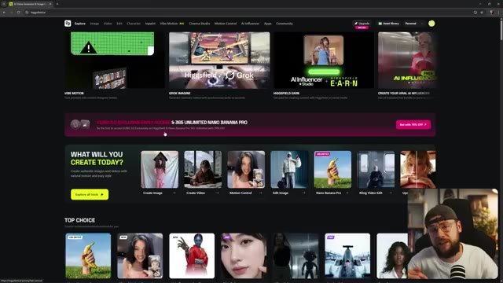
*Page d'accueil de la plateforme Higgsfield montrant les différentes offres et outils disponibles, avec la pastille de l'animateur en bas à droite.*

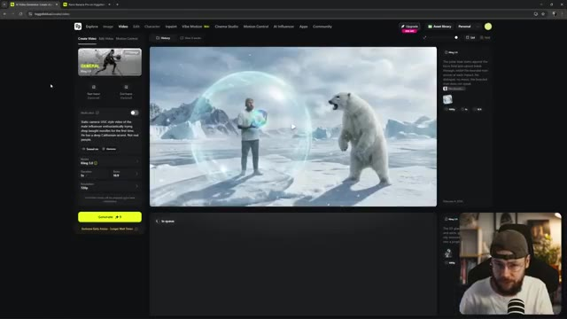
*Interface de création de vidéo sur Higgsfield avec Kling 3.0, affichant un aperçu de génération vidéo d'un homme face à un ours polaire dans une bulle de verre.*

---

### ⏱️ `[00:01:28 - 00:02:00]` | Segment #04

**🔊 Audio (Transcription Intégrale Mot pour Mot en Français) :**
> avec Kling 3.0 sélectionné, vous pouvez aller de l'avant et cliquer dans l'onglet du modèle, aller vers Kling, puis cliquer tout en haut de la liste ici, et la première chose que je veux aborder est cette nouvelle méthode pour garantir la cohérence des personnages lors de vos générations de vidéos. Bien sûr, nous pouvons donc cliquer sur cet onglet ici pour importer une image de départ, et la génération de vidéo que je veux vous montrer est celle-ci. Celle-ci serait bien sûr l'image de départ pour cela, nous avons ce bouton bascule pour les générations multi-plans. Nous allons aborder cela un peu plus tard dans la vidéo. Donc nous allons juste

**👁️ Analyse Visuelle d'Écran (gemini-3.5-flash-lite) :**
**Interface & Outils** : Interface web de génération de vidéo (Kling / Higgsfield) avec panneaux de configuration, sélecteur de modèle et zone de prévisualisation vidéo.

**Contenu textuel & Code** : Paramètres visibles : modèle Kling 3.0, option de cadre de départ (Start frame), bouton d'activation "Multi-shot", ratio 16:9, résolution 720p, et bouton de génération "Generate".

**Action / Démonstration** : Le présentateur navigue dans l'interface de l'outil de génération vidéo et zoome sur le bouton bascule de l'option multi-plans (multi-shot).

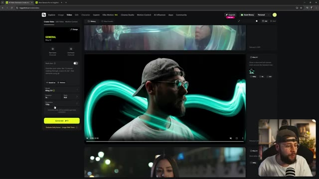
*Interface de l'outil de génération vidéo affichant les options de modèle Kling 3.0 et la prévisualisation d'une vidéo avec des néons verts.*

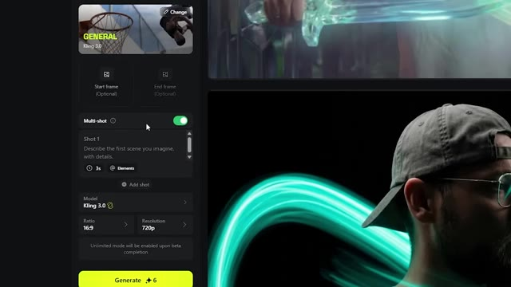
*Gros plan sur l'interface montrant le bouton d'activation pour les générations de plans multiples (multi-shot) avec Kling 3.0.*

---

### ⏱️ `[00:02:00 - 00:02:35]` | Segment #05

**🔊 Audio (Transcription Intégrale Mot pour Mot en Français) :**
> éteignez ça pour l'instant. Et bien sûr ici nous avons notre champ pour saisir notre prompt textuel. Et avec cet exemple j'ai juste opté pour quelque chose de très simple. Montrer une orbite de caméra lente et complète autour de l'homme barbu. Et ce type de mouvement de caméra est un test assez brutal en ce qui concerne la cohérence des personnages. Parce qu'on ne fait pas seulement voir le personnage sous différents angles en coupant entre eux. Nous effectuons littéralement cette rotation 3D autour du sujet. Et donc cela met vraiment en évidence tous les problèmes assez clairement. Je suis vraiment heureux de dire cependant que cette génération

**👁️ Analyse Visuelle d'Écran (gemini-3.5-flash-lite) :**
**Interface & Outils** : Interface web de Higgsfield (hoggyfield.ai/create/video) avec onglets de navigation (Explore, Image, Video, Edit, Character, etc.), panneau latéral de configuration du modèle Kling 3.0, et incrustation vidéo (PiP) du présentateur en bas à droite.

**Contenu textuel & Code** : Modèle sélectionné : Kling 3.0. Paramètres visibles : Durée 5s / 10s, Résolution 720p / 1080p, Ratio 16:9. Prompt textuel saisi : "Show a slow and full camera orbit around the bearded man". Bouton "Generate" jaune avec coût en crédits (20).

**Action / Démonstration** : Le créateur montre l'interface de l'outil de génération vidéo IA, présente les paramètres et le champ de saisie du prompt, puis commente le résultat visuel affiché à l'écran tout en gesticulant dans l'encadré PiP.

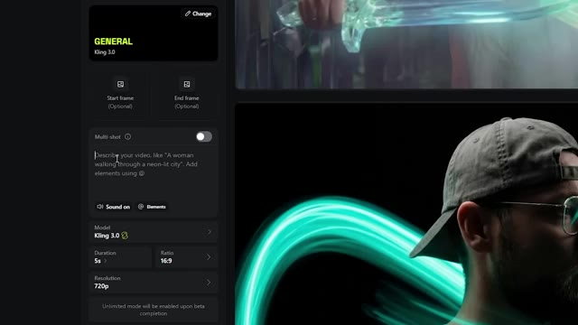
*Interface de Higgsfield montrant les paramètres du modèle Kling 3.0 et la zone de saisie du prompt textuel.*

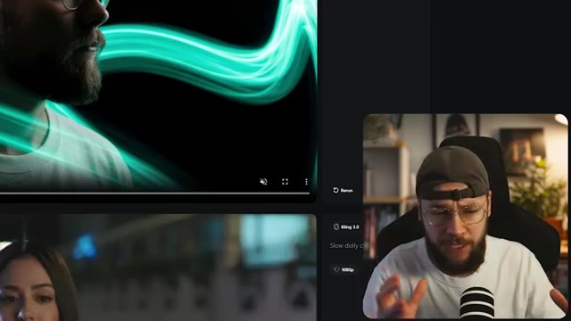
*Affichage du lecteur vidéo montrant le rendu du personnage barbu avec des traînées de lumière verte, et incrustation vidéo du créateur (PiP) dans le coin inférieur droit.*

*Vue d'ensemble de l'interface de Higgsfield avec les résultats générés et le créateur visible en incrustation PiP.*

---

### ⏱️ `[00:02:35 - 00:03:10]` | Segment #06

**🔊 Audio (Transcription Intégrale Mot pour Mot en Français) :**
> était très efficace. Et tout cela se résume à cette nouvelle fonctionnalité ici sur ce petit onglet qui dit elements. Donc si nous cliquons ici, vous pouvez voir quelques éléments que j'ai déjà créés. Maintenant, c'est un processus vraiment simple. Nous cliquons sur create new element et nous téléchargeons différentes références de notre personnage sous différents angles de caméra. Nous pouvons donner un nom à la référence ainsi qu'une courte description, puis enregistrer le tout. Vous pouvez voir ici Higgsfield le décrit comme un ensemble d'images d'un personnage ou d'un objet qui garde son apparence cohérente dans toute la vidéo. Donc dans mon

**👁️ Analyse Visuelle d'Écran (gemini-3.5-flash-lite) :**
**Interface & Outils** : Interface web de Higgsfield AI (hikky.ai) avec le mode vidéo, le panneau latéral de paramètres et la vue PiP du créateur.

**Contenu textuel & Code** : Texte à l'écran : "Elements", "CREATE YOUR ELEMENTS", "A set of images of one character or object that keeps its look consistent across the whole video", "Create new element", "New element", "Upload images or video", "Element name (Required)", "Description (Required)".

**Action / Démonstration** : Le créateur navigue dans l'interface de Higgsfield AI, clique sur l'onglet des éléments et présente les options permettant de créer un nouvel élément de personnage cohérent.

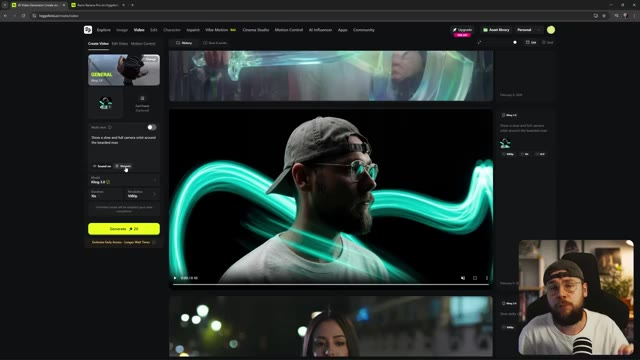
*Interface principale de Higgsfield AI montrant le panneau de génération vidéo et les onglets de configuration.*

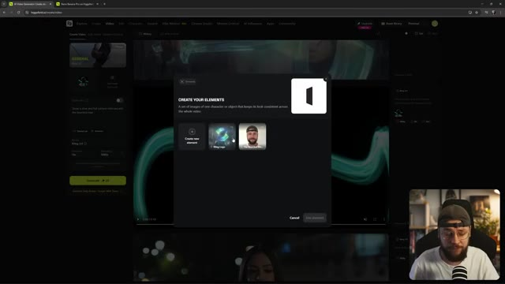
*Fenêtre contextuelle "Create Your Elements" affichant les éléments existants et l'option pour créer un nouvel élément.*

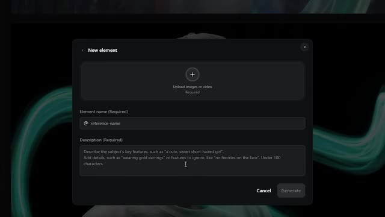
*Formulaire de création d'un nouvel élément avec des champs pour télécharger des images/vidéos, un nom de référence et une description.*

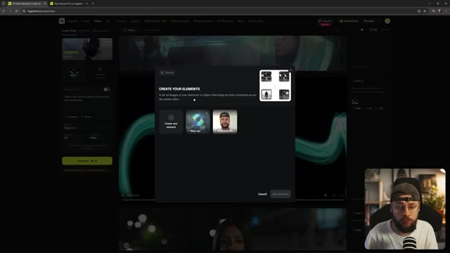
*Fenêtre contextuelle "Create Your Elements" montrant la sélection et l'aperçu d'un élément de personnage.*

---

### ⏱️ `[00:03:10 - 00:03:47]` | Segment #07

**🔊 Audio (Transcription Intégrale Mot pour Mot en Français) :**
> car j'en ai un qui s'appelle l'homme barbu. Si je clique sur modifier, je peux vous montrer les exemples que nous avons ici. Nous avons donc moi de face face à la caméra, moi en léger profil, un angle de caméra un peu plus éloigné de moi debout dans mon jardin et puis une vue de moi de dos. Et ce que j'ai également créé, c'est cet élément ici du logo Kling, cette sorte de rendu 3D en verre. Nous avons donc une vue de face de cette sorte de sculpture du logo Kling et puis différents angles de caméra également. Ainsi, nous sommes non seulement capables d'assurer la cohérence des personnages, mais aussi la cohérence des objets et des produits. Et ce

**👁️ Analyse Visuelle d'Écran (gemini-3.5-flash-lite) :**
**Interface & Outils** : Interface web de l'outil de génération vidéo Higgsfield AI (avec vue complète de l'application et fenêtre modale d'édition d'élément).

**Contenu textuel & Code** : Fenêtre modale "Edit element" avec le nom "The Bearded Man V2" (puis "Kling Logo") et la description textuelle "Bearded man, backwards baseball cap, gold rimmed rounded rectangular glasses, plain white t-shirt.". Boutons "Cancel" et "Save".

**Action / Démonstration** : Le créateur montre l'interface de modification des éléments avec les différents angles de caméra pour la cohérence des personnages et des objets.

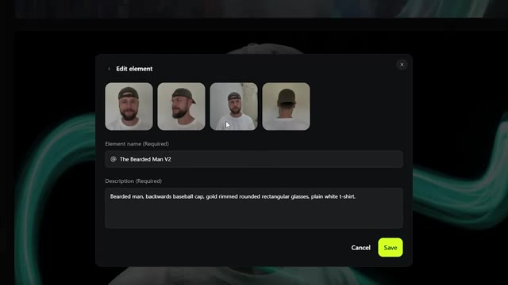
*Interface de l'outil montrant la fenêtre d'édition d'élément avec quatre angles de vue différents d'un homme barbu.*

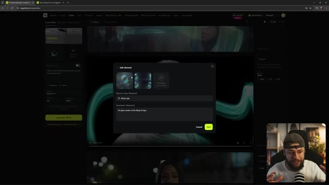
*Interface complète de l'application web avec la fenêtre d'édition affichant les rendus 3D du logo Kling et le créateur visible en incrustation (PiP) dans le coin inférieur droit.*

---

### ⏱️ `[00:03:47 - 00:04:24]` | Segment #08

**🔊 Audio (Transcription Intégrale Mot pour Mot en Français) :**
> pourquoi j'ai dit dans l'intro que Kling 3.0 sera un outil très puissant lorsqu'il s'agit à la fois de la réalisation de films par IA et de la publicité. Donc une fois que vos éléments sont créés, nous pouvons simplement sélectionner les éléments pertinents ici et cliquer sur utiliser l'élément. Maintenant, nous pouvons également sélectionner la durée de notre clip, nous pouvons aller jusqu'à 15 secondes, mais ce qui est vraiment bien, c'est que c'est sur un curseur, donc nous pouvons être vraiment précis sur la durée de génération que nous voulons. Nous n'voulons peut-être que trois secondes, mais de même, nous pouvons aller jusqu'à 15 secondes si nous le choisissons, et c'est vraiment pratique lorsqu'il s'agit de multi-plans

**👁️ Analyse Visuelle d'Écran (gemini-3.5-flash-lite) :**
**Interface & Outils** : Interface web de génération vidéo (type Kling / Kling 3.0) avec options de durée, de sélection d'éléments, de mode multi-shot et bouton 'Generate'.

**Contenu textuel & Code** : Texte du prompt visible : 'Show a slow and full camera orbit around the bearded man', sélecteurs 'Sound on', 'Elements', modèle 'Kling 3.0', durée réglable jusqu'à 15 secondes, curseur de durée ('Choose duration 6s').

**Action / Démonstration** : Le créateur montre comment sélectionner des éléments pré-faits, ajuster la durée de génération de la vidéo à l'aide d'un curseur précis allant jusqu'à 15 secondes, et configure les paramètres pour la génération de clips multi-plans.

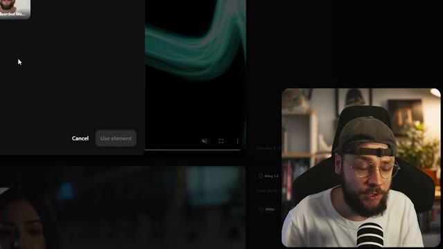
*Interface de l'application montrant une fenêtre contextuelle pour sélectionner des éléments avec le bouton 'Use element'.*

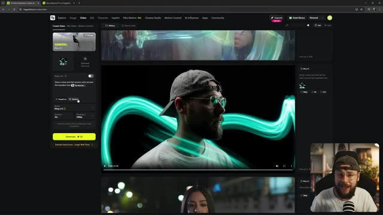
*Interface complète montrant le panneau de génération de vidéo Kling 3.0 avec les options de durée et de prompt.*

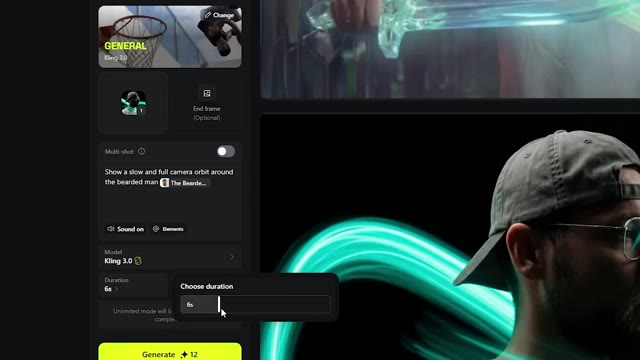
*Fenêtre contextuelle de sélection de la durée sous forme de curseur pour régler le clip vidéo.*

---

### ⏱️ `[00:04:24 - 00:05:01]` | Segment #09

**🔊 Audio (Transcription Intégrale Mot pour Mot en Français) :**
> génération comme vous le verrez plus tard dans la vidéo. Et puis bien sûr, nous sommes également capables de sélectionner la résolution. Jetons donc un œil au résultat que nous avons obtenu à partir de ce simple prompt textuel et en utilisant notre élément de l'homme barbu. Allons-y et ouvrons ceci en plein écran et nous pouvons vraiment y jeter un bon coup d'œil parce que le résultat est vraiment vraiment très impressionnant, probablement la meilleure cohérence de personnage que j'ai vue d'un modèle vidéo à ce jour facilement, et nous avons un autre exemple vraiment très impressionnant ici que je veux vous montrer les gars mais brièvement si vous vous demandez comment je

**👁️ Analyse Visuelle d'Écran (gemini-3.5-flash-lite) :**
**Interface & Outils** : Navigateur web affichant l'interface de l'outil de génération vidéo (probablement Higgsfield ou Kling AI Studio) avec un panneau de configuration à gauche, l'historique des générations au centre, et la webcam du présentateur en incrustation PiP en bas à droite.

**Contenu textuel & Code** : Menus visibles : Explore, Image, Video, Edit, Character, Inpaint, Vibe Motion, Cinema Studio, Motion Control, AI Influences, Apps, Community. Options de génération : Modèle "Kling 3.0", durée "15s", résolution "1080p", prompt textuel incluant "The Bearded Man". Bouton "Generate (30)".

**Action / Démonstration** : Le présentateur commente les résultats de génération vidéo affichés à l'écran, navigue dans l'interface et montre un exemple de cohérence de personnage avec un homme barbu.

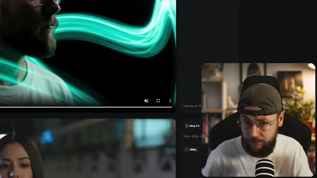
*Aperçu vidéo en cours de lecture montrant un homme barbu de profil avec des traînées lumineuses vertes, avec la webcam du créateur en incrustation (PiP).*

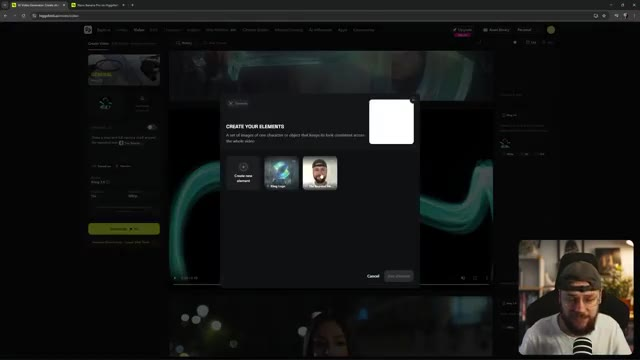
*Interface de l'outil de génération vidéo sur navigateur web, affichant une modale de sélection d'éléments ("Create your elements") avec un personnage barbu défini, et la webcam du créateur en incrustation.*

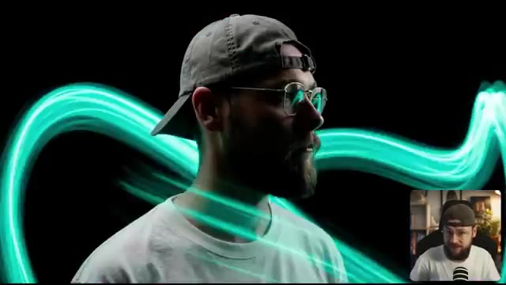
*Résultat vidéo en plein écran d'un homme barbu en profil avec des vagues de lumière verte en arrière-plan, et la webcam du créateur en bas à droite.*

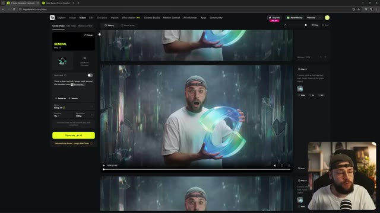
*Interface complète de l'application de génération vidéo affichant le panneau de configuration avec le modèle Kling 3.0, les paramètres de durée et de résolution, ainsi qu'un aperçu d'un personnage tenant un objet lumineux.*

---

### ⏱️ `[00:05:01 - 00:05:34]` | Segment #10

**🔊 Audio (Transcription Intégrale Mot pour Mot en Français) :**
> créé les images de départ pour mes générations de vidéos, celles-ci ont toutes été faites en utilisant Nano Banana Pro et je savais que je voulais créer ce qu'on appelle souvent un visuel clé pour l'intro de cette vidéo et pour ce visuel clé je voulais me voir tenir cette sorte de sculpture en verre du logo Kling et être dans cet environnement étrange et hors du commun. Maintenant, c'est un très bon flux de travail ici, n'est-ce pas ? Donc ce que j'ai fait, c'est que j'ai téléchargé cette image de assez mauvaise qualité du logo Kling. J'ai sélectionné Nano Banana Pro, nous

**👁️ Analyse Visuelle d'Écran (gemini-3.5-flash-lite) :**
**Interface & Outils** : Interface de la plateforme web Higgsfield (site web affichant les onglets Explorer, Image, Video, Edit, etc., avec un menu de génération incluant le modèle Nano Banana Pro).

**Contenu textuel & Code** : Texte du prompt visible en bas : "Remove the writing that says 'ELEVATE PROTEIN' from the protein shake" dans l'image 1 et 2, puis champ vide "Describe the scene you imagine" dans l'image 3. Paramètres visibles : modèle "Nano Banana Pro", format "9:16", crédits "2K", curseur "1/4", option "Unlimited" activée, et bouton vert "Generate".

**Action / Démonstration** : Le créateur présente la galerie d'images générées par IA sur la plateforme Higgsfield, montrant différentes variations du visuel clé de son personnage tenant le logo Kling, avant de se concentrer sur la zone de prompt.

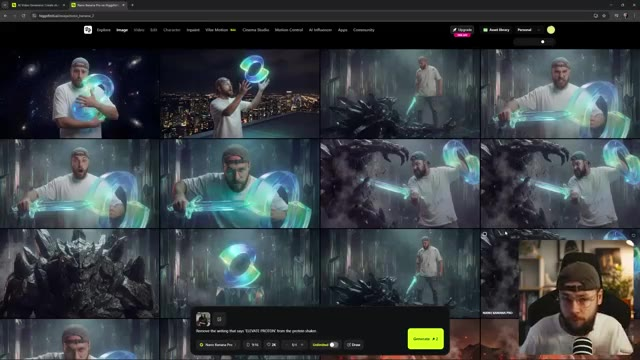
*Interface d'Higgsfield affichant une grille de rendus générés montrant le créateur tenant des sculptures de logo irisées dans divers environnements fantastiques, avec un encadré PiP du créateur en bas à droite.*

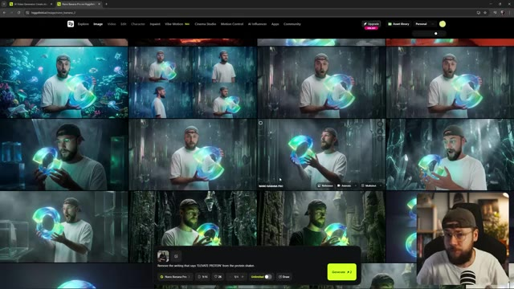
*Interface d'Higgsfield présentant une autre grille de résultats générés par IA avec des variations d'éclairage et de décors sous-marins ou de ruines mystiques.*

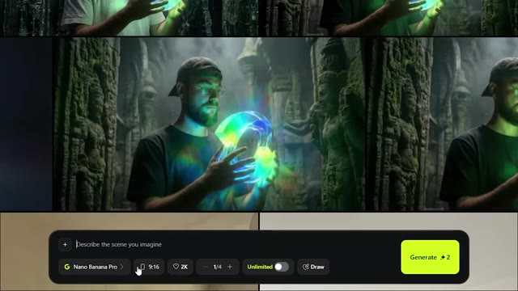
*Gros plan sur la barre de prompt d'Higgsfield avec le modèle Nano Banana Pro sélectionné et le champ de saisie 'Describe the scene you imagine'.*

---

### ⏱️ `[00:05:34 - 00:06:08]` | Segment #11

**🔊 Audio (Transcription Intégrale Mot pour Mot en Français) :**
> l'aurait mis en 16 par 9 et sélectionné 4k et pour le texte du prompt encore une fois très simple créer un rendu 3D du logo attaché fait de verre lumineux dans un environnement sombre simple et c'est ce que nous obtenez en retour regardez juste la qualité ici maintenant nous pouvons combiner ce nouvel actif de la sculpture 3D avec des références d'image de moi-même et un texte prompt comme montrer l'homme barbu debout dans un temple extraterrestre sombre en verre. L'homme barbu tient un grand objet 3D en verre brillant aux couleurs vibrantes

**👁️ Analyse Visuelle d'Écran (gemini-3.5-flash-lite) :**
**Interface & Outils** : Interface web d'un outil de génération vidéo/image par IA (Nano Banana Pro / Higgsfield) avec panneaux de configuration, de prompts et prévisualisation.

**Contenu textuel & Code** : Texte du prompt visible : "Create a 3d render of the attached logo made of glowing glass in a simple dark environment" et "Show the bearded man standing in a dark alien temple made of glass. The bearded man is holding a large, vibrantly colored glowing glass 3D object". Paramètres : 16:9, qualité 4K, modèle Nano Banana Pro.

**Action / Démonstration** : Le créateur démontre le réglage des paramètres de format et de résolution, la saisie d'un prompt textuel, l'utilisation d'une image de référence personnelle et l'obtention du résultat final combiné.

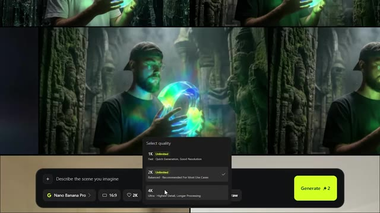
*Interface de l'outil de génération montrant les options de format 16:9 et de qualité réglée sur 4K avec un aperçu vidéo généré.*

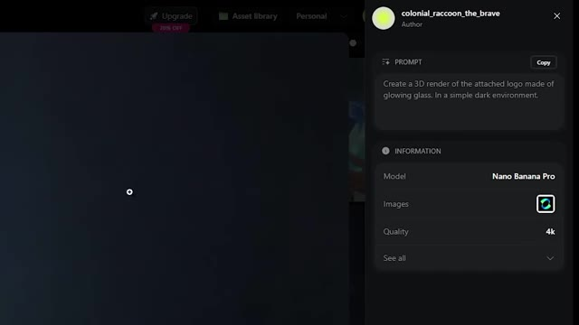
*Panneau latéral affichant les détails du prompt textuel 3D et le modèle Nano Banana Pro.*

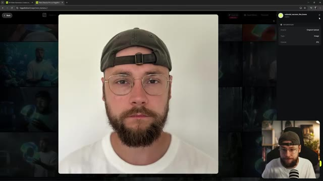
*Affichage d'une image de référence personnelle avec la webcam du créateur incrustée en bas à droite (PiP).*

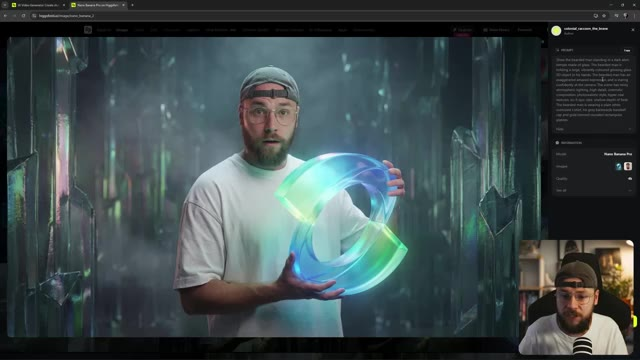
*Rendu final combinant le personnage et l'objet 3D dans un temple de verre sombre avec le panneau de prompt visible à droite.*

---

### ⏱️ `[00:06:08 - 00:06:43]` | Segment #12

**🔊 Audio (Transcription Intégrale Mot pour Mot en Français) :**
> dans ses mains. Et beaucoup plus de détails en termes de style et une description de moi-même également. Donc Nano Banana Pro combine cet actif ici que nous avons créé avec la référence d'image de moi-même et le résultat que nous obtenons est assez incroyable. Et cette référence d'image ici est ce que je suis allé brancher dans Nano Banana Pro à plusieurs reprises en lui donnant divers prompts textuels différents, donc vous me voyez en train de me faire traîner à travers les nuages. Nous avons le plan ici de moi l'utilisant un peu comme un surf dans cette rivière de lave. C'est donc le processus général que je suis pour

**👁️ Analyse Visuelle d'Écran (gemini-3.5-flash-lite) :**
**Interface & Outils** : Interface web de Nano Banana Pro (Higgsfield) avec onglets de navigation, panneau de prompts et bibliothèque d'actifs.

**Contenu textuel & Code** : Prompts textuels visibles : "Show the bearded man standing in a dark alien temple made of glass...", paramètres du modèle Nano Banana Pro.

**Action / Démonstration** : Le créateur montre son processus de génération d'images par IA en combinant une référence visuelle et des prompts textuels variés.

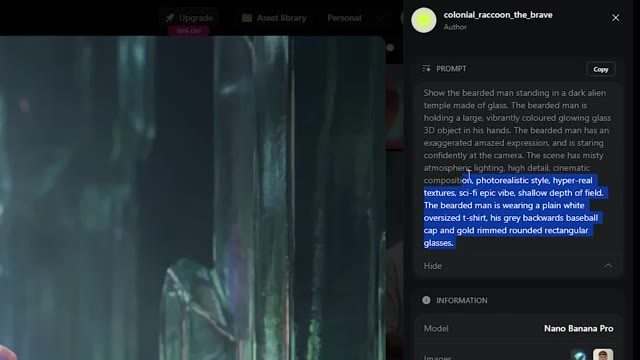
*Interface de Nano Banana Pro affichant un prompt textuel détaillé sur le panneau latéral droit.*

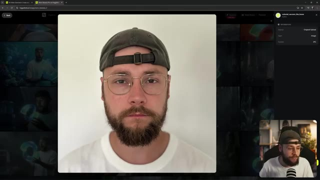
*Affichage de l'image de référence du créateur (visage) avec l'incrustation vidéo du créateur en bas à droite.*

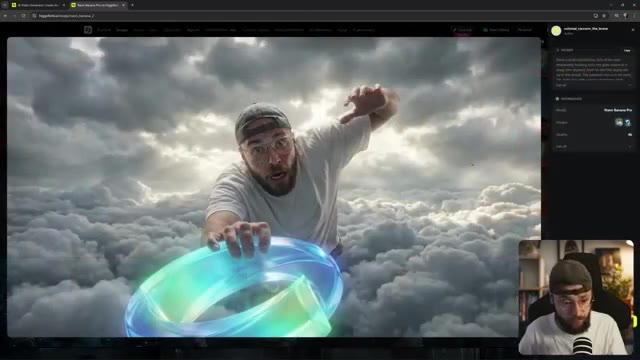
*Rendu généré par IA montrant le créateur tiré à travers les nuages en tenant un objet lumineux.*

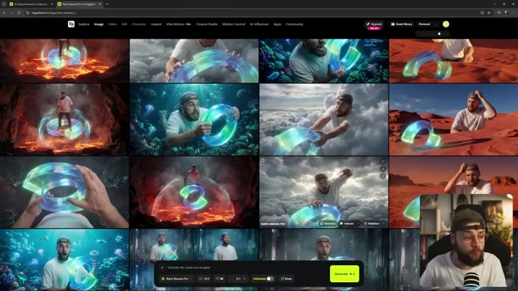
*Galerie d'images générées par IA sur Nano Banana Pro présentant différentes variations du créateur avec l'objet en verre.*

---

### ⏱️ `[00:06:43 - 00:07:17]` | Segment #13

**🔊 Audio (Transcription Intégrale Mot pour Mot en Français) :**
> la création de cadres de départ que nous prenons ensuite dans Kling 3.0 et que nous animons. Un flux de travail de réalisation de films par IA très puissant. Mais c'est ainsi que nous avons créé le cadre de départ pour cette génération ici et nous avons demandé à nouveau une orbite de caméra alors que l'homme barbu regarde fixement l'objet en verre et vous verrez qu'une fois de plus nous atteignons un niveau vraiment assez incroyable de cohérence des personnages en utilisant les éléments de Kling 3.0, exactement le même processus que je vous ai montré pour ce premier plan donc peut-être juste le personnage

**👁️ Analyse Visuelle d'Écran (gemini-3.5-flash-lite) :**
**Interface & Outils** : Interface web de génération vidéo IA (style Kling / Higgsfield Studio) avec panneau latéral de configuration et affichage des rendus.

**Contenu textuel & Code** : Texte visible dans l'interface : "Show a slow and full camera orbit around the bearded man", "Kling 3.0", "15s", "1080p", "Nano Banana Pro".

**Action / Démonstration** : Le créateur montre la galerie d'images et de vidéos générées, puis lance la lecture d'une animation montrant une rotation de caméra autour du personnage.

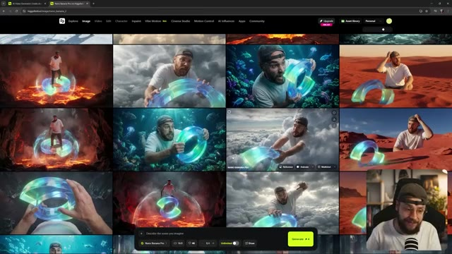
*Interface de la plateforme de génération vidéo montrant une galerie de frames et d'images créées avec les prompts utilisateur.*

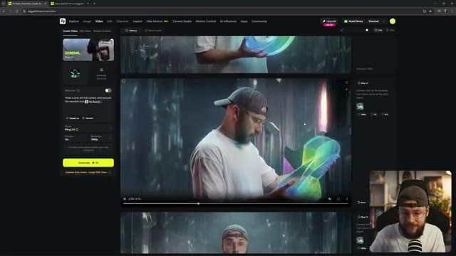
*Interface de Kling 3.0 montrant le lecteur vidéo avec un plan en cours de lecture et les paramètres de génération textuelle et technique sur le panneau latéral gauche.*

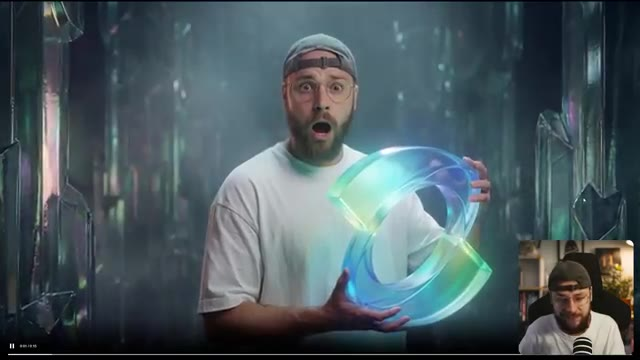
*Gros plan sur le rendu vidéo animé généré par l'IA montrant un personnage barbu tenant un objet lumineux en verre dans un décor fantastique.*

---

### ⏱️ `[00:07:17 - 00:07:54]` | Segment #14

**🔊 Audio (Transcription Intégrale Mot pour Mot en Français) :**
> La cohérence dans les générations de vidéo par intelligence artificielle vient peut-être d'être résolue. Maintenant, ça ne va pas fonctionner à chaque fois, vous allez obtenir des résultats un peu bizarres de temps en temps, mais de manière générale, c'est un flux de travail incroyablement puissant. Cela résout un véritable problème qui existe depuis que l'IA a commencé à être utilisée pour générer des vidéos. Je vous encourage donc vivement à tester ce flux de travail. Créez votre image de départ en utilisant Nano Banana Pro par exemple, écrivez un simple prompt textuel, puis créez vos éléments avec vos images de référence de personnage.

**👁️ Analyse Visuelle d'Écran (gemini-3.5-flash-lite) :**
**Interface & Outils** : Navigateur web affichant l'interface de la plateforme de génération vidéo par IA Higgsfield (higgsfield.ai/create/video).

**Contenu textuel & Code** : Texte visible dans l'interface : "Explore", "Image", "Video", "Edit", "Character", "Inpaint", "Vibe Motion", "Cinema Studio", "Motion Control", "AI Influencers", "Apps", "Community", "Create Video", "General", "Kling 3.0", "Model", "Duration: 5s", "Resolution: 1080p", "Generate", "CREATE YOUR ELEMENTS: A set of images of raw character or object that keeps its look consistent across the whole video", "Create new element".

**Action / Démonstration** : Le créateur navigue sur la plateforme Higgsfield AI et ouvre la boîte de dialogue permettant de créer et d'ajouter des éléments de référence pour assurer la cohérence visuelle des personnages.

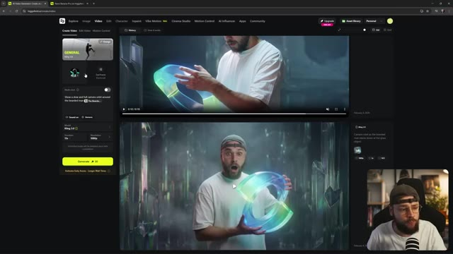
*Interface de Higgsfield AI montrant le panneau de génération vidéo et l'aperçu de clips générés.*

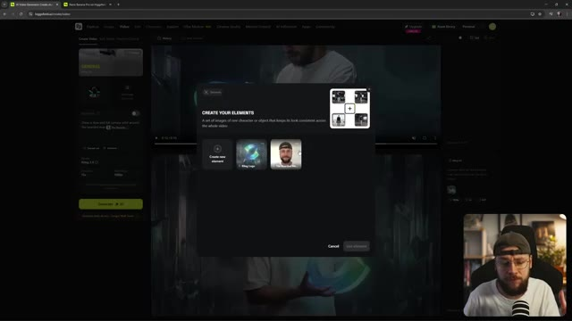
*Fenêtre pop-up "Create Your Elements" dans l'interface de Higgsfield AI pour gérer les références de personnages.*

---

### ⏱️ `[00:07:54 - 00:08:31]` | Segment #15

**🔊 Audio (Transcription Intégrale Mot pour Mot en Français) :**
> Tout cela combiné peut donner des résultats vraiment très jolis et cohérents, ce qui est vraiment ce que nous recherchons. Maintenant, la prochaine chose dont je veux parler, ce sont les générations multi-plans, un autre changement radical avec cette sortie de Kling, et ce que vous voyez dans cette génération à l'écran en ce moment a été utilisé dans l'intro de cette vidéo. Alors, comment cela fonctionne-t-il exactement ? Comment pouvons-nous obtenir tous ces différents plans variés à partir d'une seule génération de 15 secondes ? Laissez-moi vous montrer. Donc, ce que nous voulons faire tout d'abord, c'est importer à nouveau notre image de référence, la même que

**👁️ Analyse Visuelle d'Écran (gemini-3.5-flash-lite) :**
**Interface & Outils** : Application web de génération vidéo (type plateforme Kling / interface de création vidéo avec panneau latéral de configuration et aperçu central, incluant un retour vidéo PiP du créateur en bas à droite).

**Contenu textuel & Code** : Modèle sélectionné : Kling 3.0, durée 15s, résolution 1080p, bouton "Generate", et prompts textuels visibles dans le panneau latéral (ex: "Camera orbit as the bearded man stares down at the glass object").

**Action / Démonstration** : Le créateur présente l'interface de l'outil de génération vidéo et commente les options de plans multiples et les paramètres affichés à l'écran.

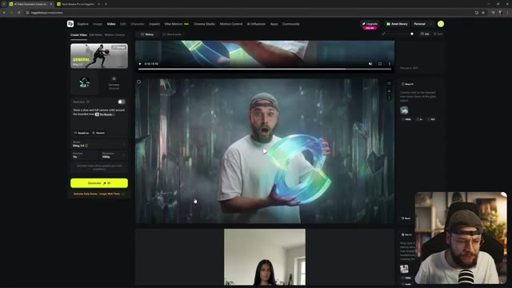
*Interface de l'outil de génération vidéo affichant l'éditeur principal avec un aperçu vidéo central et les paramètres à gauche, incluant le modèle Kling 3.0.*

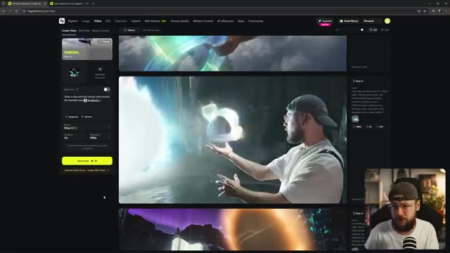
*Interface du générateur vidéo montrant un autre plan de la génération avec le panneau de configuration du prompt textuel sur la droite.*

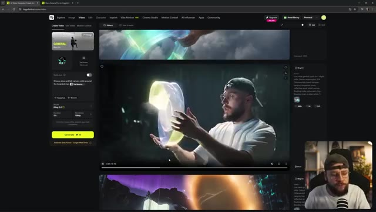
*Interface montrant une autre image clé de la vidéo générée dans le lecteur principal de l'application.*

---

### ⏱️ `[00:08:31 - 00:08:56]` | Segment #16

**🔊 Audio (Transcription Intégrale Mot pour Mot en Français) :**
> Vous pouvez voir sur l'écran en ce moment que nous avons généré avec Nano Banana Pro. Et ensuite, nous voulons activer cette option ici pour le multi-shot. Cela nous permet d'ajouter plusieurs plans au sein de la même génération. Et la façon dont je m'y suis pris pour les rédiger a été d'utiliser ChatGPT. Donc, juste à titre d'exemple, j'ai dit : écris-moi un prompt multi-shot qui montre un homme barbu dans un environnement d'un autre monde.

**👁️ Analyse Visuelle d'Écran (gemini-3.5-flash-lite) :**
**Interface & Outils** : Navigateur web affichant l'interface d'une application de génération vidéo (type Higgsfield ou similaire) sur l'image #1, et l'interface de ChatGPT sur l'image #2, avec une incrustation vidéo (PiP) du créateur en bas à droite dans les deux images.

**Contenu textuel & Code** : Sur l'image #1, le panneau de gauche affiche les paramètres du modèle "Kling 3.0", une durée de "15s", une résolution "1080p", et le bouton "Generate 30". Le champ de prompt indique "Camera orbit as the bearded man stares down at the glass object...". Sur l'image #2, la page affiche "Ready when you are." et un champ de saisie "Ask anything" avec le badge "Thinking".

**Action / Démonstration** : Sur l'image #1, le créateur présente l'interface de génération vidéo et ses options. Sur l'image #2, le navigateur bascule sur l'onglet ChatGPT pour montrer la rédaction des prompts.

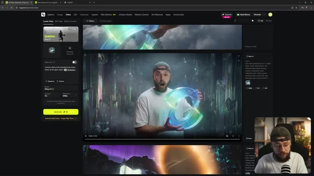
*Interface de l'outil de génération vidéo affichant un aperçu de vidéo avec un homme barbu tenant un objet lumineux, avec des paramètres de modèle et de prompt sur le panneau de gauche.*

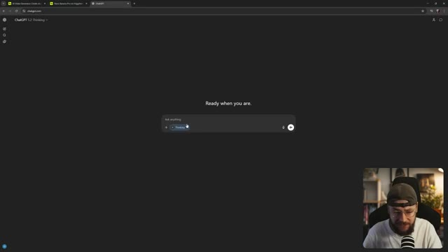
*Interface de ChatGPT (chatgpt.com) avec le champ de saisie central montrant le mode "Thinking" actif.*

---

### ⏱️ `[00:08:56 - 00:09:16]` | Segment #17

**🔊 Audio (Transcription Intégrale Mot pour Mot en Français) :**
> Pour une légère variation ici, il combat une énorme bête et gagne. Utilisez une variété d'angles de caméra pour garantir que la scène soit dynamique et bien rythmée. Rédigez cela sous forme de prompts individuels afin que chacun puisse être inséré directement dans un générateur de vidéo par IA. Soyez précis quant à la position et aux actions des personnages ainsi qu'aux objectifs utilisés pour chaque plan.

**👁️ Analyse Visuelle d'Écran (gemini-3.5-flash-lite) :**
**Interface & Outils** : Interface web de ChatGPT (ChatGPT 5.2 Thinking) affichée dans un navigateur sur fond sombre, avec un encadré PiP (Picture-in-Picture) de Jack dans le coin inférieur droit devant son micro et son studio.

**Contenu textuel & Code** : Le texte du prompt visible dans l'interface est : « Write me a multi-shot prompt that shows a bearded man in an otherworldly environment, he is fighting a huge beast and wins. Use a variety of camera angles to ensure the scene is dynamic and well paced. Write this as individual prompts so each can be directly dropped into an AI video generator. Be specific about character position and actions, as well as the lenses used for each shot. All action needs to happen within 15 seconds, with each shot lasting a minimum of 3 seconds. Ensure the bearded man is wearing a plain white t-shirt, grey backwards baseball cap, beige cargo trousers and white vintage trainers. Ensure each prompt is a maximum of 500 characters each. »

**Action / Démonstration** : La page de ChatGPT affiche le prompt en train d'être formulé ou visualisé au centre de l'écran sombre, tandis que Jack est visible en bas à droite en train de parler et d'animer sa vidéo.

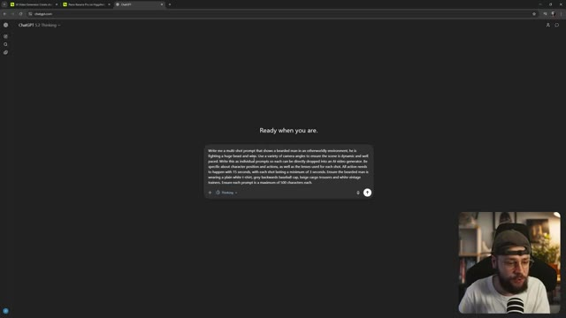
*Interface du navigateur affichant l'interface de ChatGPT 5.2 avec un prompt textuel détaillé pour la génération de plans multiples, et un encadré PiP de Jack dans le coin inférieur droit.*

---

### ⏱️ `[00:09:16 - 00:09:36]` | Segment #18

**🔊 Audio (Transcription Intégrale Mot pour Mot en Français) :**
> Toute l'action doit se dérouler en 15 secondes avec chaque plan durant un minimum de 3 secondes et c'est parce que c'est le minimum que nous pouvons atteindre avec chaque plan lors de la génération multi-plans. Et je viens d'ajouter une brève description de moi-même pour jouer l'avocat du diable ici. ChatGPT pourrait commencer à m'habiller avec des vêtements différents.

**👁️ Analyse Visuelle d'Écran (gemini-3.5-flash-lite) :**
**Interface & Outils** : Navigateur web affichant l'interface de ChatGPT et l'interface de l'outil de génération vidéo par IA Higgsfield AI (hikggsfield.ai/ai/video).

**Contenu textuel & Code** : Texte du prompt dans ChatGPT : "Write me a multi-shot prompt that shows a bearded man in an otherworldly environment, he is fighting a huge beast and wins. Use a variety of camera angles to ensure the scene is dynamic and well paced. Write this as individual prompts so each can be directly dropped into an AI video generator. Be specific about character position and actions, as well as the lenses used for each shot. All action needs to happen with 15 seconds, with each shot lasting a minimum of 3 seconds. Ensure the bearded man is wearing a plain white t-shirt, grey backwards baseball cap, beige cargo trousers and white vintage trainers. Ensure each prompt is a maximum of 500 characters each." Dans Higgsfield : réglages de plans multiples (Shot 1, Shot 2, Shot 3, Shot 4, Shot 5), option "Multi-shot" activée.

**Action / Démonstration** : Le créateur présente son écran montrant une requête textuelle rédigée dans ChatGPT pour générer des prompts vidéo multi-plans, puis bascule sur l'interface de génération vidéo de Higgsfield AI pour configurer les différents plans d'une vidéo.

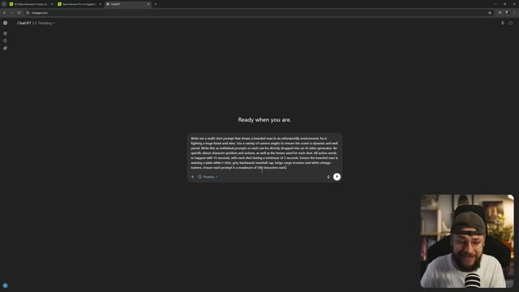
*Interface de ChatGPT affichant un prompt détaillé demandant une génération multi-plans avec des contraintes de durée, avec une incrustation vidéo du créateur en bas à droite.*

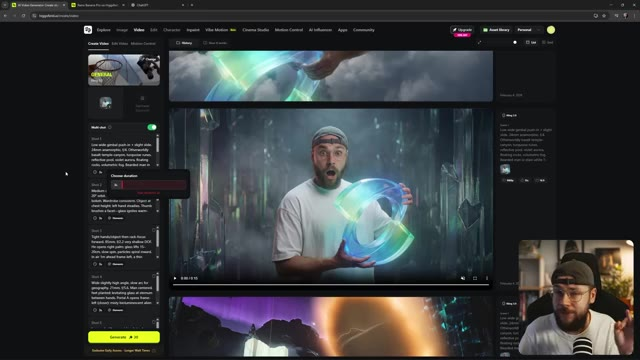
*Interface de Higgsfield AI affichant le panneau de configuration "Multi-shot" avec plusieurs plans définis, une vidéo générée montrant le créateur tenant un objet lumineux, et le créateur visible en incrustation.*

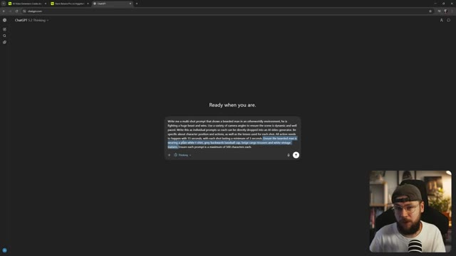
*Interface de ChatGPT montrant le texte du prompt en cours de sélection ou de surbrillance, avec une incrustation vidéo du créateur en bas à droite.*

---

### ⏱️ `[00:09:36 - 00:09:58]` | Segment #19

**🔊 Audio (Transcription Intégrale Mot pour Mot en Français) :**
> À la fin, j'ai dit de veiller à ce que chaque prompt fasse un maximum de 500 caractères chacun, car vous ne pouvez pas entrer plus de 500 caractères dans chacun de ces champs de texte de prompt. Je mettrai ce modèle de prompt, soit dit en passant, en bas dans la description si vous voulez aller de l'avant et l'utiliser. Envoyons donc ceci. Nous pouvons jeter un œil à un exemple que ChatGPT nous donne pour rendre le processus très facile.

**👁️ Analyse Visuelle d'Écran (gemini-3.5-flash-lite) :**
**Interface & Outils** : Navigateur web affichant l'interface de ChatGPT et l'outil de génération vidéo Higgsfield AI.

**Contenu textuel & Code** : Texte du prompt dans ChatGPT : "Write me a multi-shot prompt that shows a bearded man in an otherworldly environment... Ensure each prompt is a maximum of 500 characters each." (Surligné en bleu). Sur Higgsfield AI, affichage de clips vidéo générés et d'une interface de multi-shot avec des champs de prompts.

**Action / Démonstration** : Le créateur montre des exemples de prompts sur ChatGPT et l'interface de génération vidéo sur Higgsfield AI, tout en parlant face à sa webcam en incrustation.

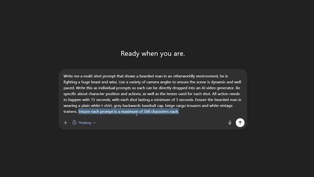
*Interface de ChatGPT affichant un long prompt textuel avec une ligne de texte surlignée en bleu.*

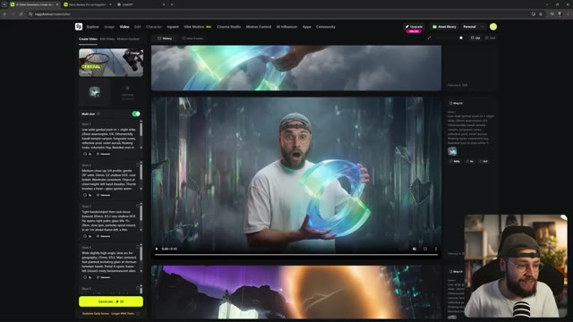
*Interface de Higgsfield AI avec le créateur visible en incrustation (PiP) dans le coin inférieur droit, montrant un aperçu vidéo généré au centre.*

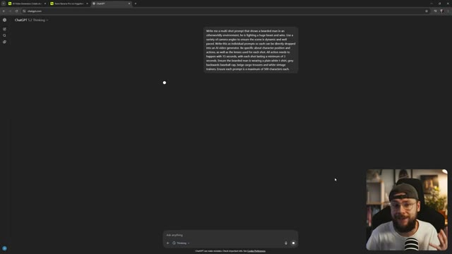
*Interface de ChatGPT dans le navigateur avec le créateur en incrustation (PiP) dans le coin inférieur droit.*

---

### ⏱️ `[00:09:58 - 00:10:32]` | Segment #20

**🔊 Audio (Transcription Intégrale Mot pour Mot en Français) :**
> Juste comme ça, nous avons récupéré exactement ce dont nous avions besoin. Nous avons une variété de plans différents et chaque prompt textuel de ChatGPT décrit l'objectif utilisé, le type d'angle de caméra ainsi que, bien sûr, l'action de notre scène de combat où nous combattons cette bête. Ce que nous ferions donc, c'est copier et coller chaque prompt dans chacune de ces sections individuelles ici, et bien sûr dans cet exemple, la sculpture 3D Kling crée tous ces portails devant moi. Je ne vais pas entrer trop en détail dans chaque prompt textuel pour chaque plan.

**👁️ Analyse Visuelle d'Écran (gemini-3.5-flash-lite) :**
**Interface & Outils** : Navigateur web affichant ChatGPT et une plateforme de génération vidéo par IA (interface de type Kling ou similaire avec options multi-shot).

**Contenu textuel & Code** : Textes de prompts ChatGPT détaillant plusieurs plans ("SHOT 1 (3s, 18mm wide...)") avec des descriptions précises d'angles de caméra, de mouvements et d'actions du personnage face à une bête cornue.

**Action / Démonstration** : Le créateur montre comment les prompts textuels générés par ChatGPT décrivent précisément les plans de caméra et l'action, prêts à être copiés-collés dans l'outil de génération vidéo.

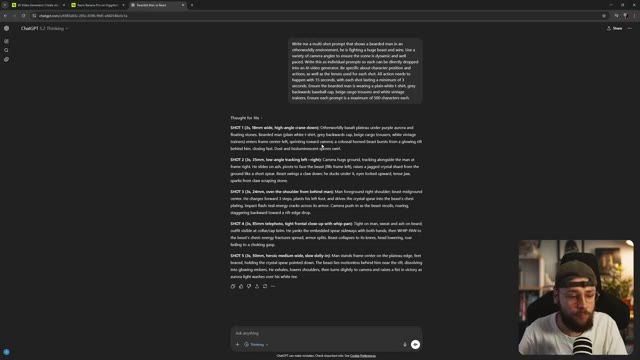
*Interface de ChatGPT affichant les prompts détaillés pour les différents plans d'une scène de combat avec une bête.*

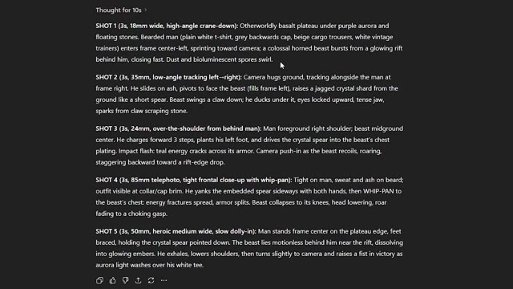
*Gros plan sur le texte généré par ChatGPT détaillant les plans 1 à 5 avec les choix de focales et d'angles de caméra.*

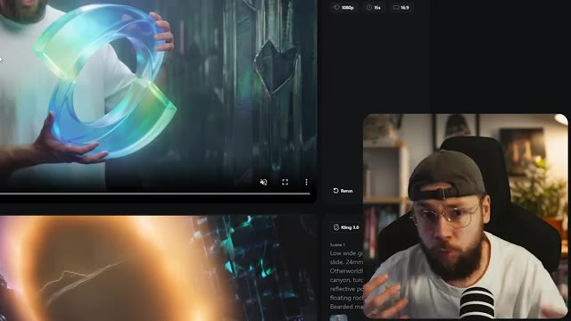
*Interface de l'outil de génération vidéo montrant un aperçu vidéo en cours de lecture et le créateur en incrustation.*

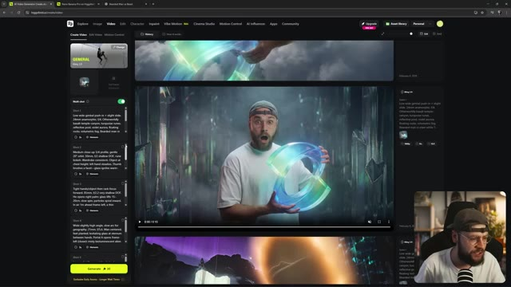
*Interface complète de l'application de création vidéo avec les sections de plans multiples (multi-shot) à gauche et les résultats visuels au centre.*

---

### ⏱️ `[00:10:32 - 00:11:09]` | Segment #21

**🔊 Audio (Transcription Intégrale Mot pour Mot en Français) :**
> mais je veux, bien sûr, jeter un œil au résultat que nous avons obtenu parce qu'il était assez incroyable. Quand j'ai regardé ça pour la première fois, ça a été un petit moment pour moi, pour être honnête avec vous. Allons-y et ouvrons-le en plein écran. Le genre de complexité de ce que nous demandons à Kling de réaliser ici. Je ne pensais honnêtement pas que cela allait fonctionner. Et quand ça l'a fait, c'était un moment assez excitant, de manière générale j'essaie de d'éviter les prompts complexes et les décors complexes comme celui-ci quand il s'agit de réalisation de films par IA, mais je pense que nous avons peut-être maintenant franchi un cap, je pense que des choses comme ça

**👁️ Analyse Visuelle d'Écran (gemini-3.5-flash-lite) :**
**Interface & Outils** : Interface web de Higgsfield AI avec panneau de création vidéo "Create Video", paramètres multi-plans (Multi-shot), et vue PiP (Picture-in-Picture) du créateur en bas à droite.

**Contenu textuel & Code** : Texte visible dans les blocs de prompts : "Shot 1: Low wide gimbal push in + slight slide, 24mm anamorphic, D6. Otherworldly basalt temple canyon, turquoise runes, reflective pool, violet aurora..." et divers paramètres de plans (Shot 2, Shot 3, Shot 4).

**Action / Démonstration** : Le créateur navigue dans l'interface de Higgsfield, examine les résultats de génération vidéo multi-plans et zoome en plein écran sur la vidéo générée par l'IA.

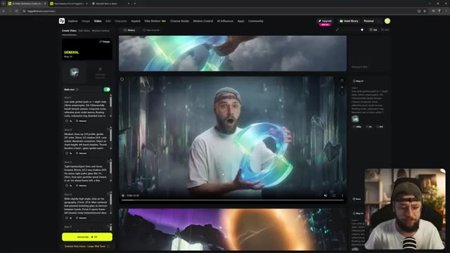
*Interface de Higgsfield AI montrant le panneau de contrôle de génération vidéo avec des invites textuelles multi-plans et le lecteur vidéo principal au centre.*

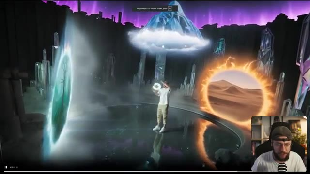
*Vue en plein écran du rendu vidéo généré par IA montrant un personnage dans un décor fantastique avec des portails magiques lumineux.*

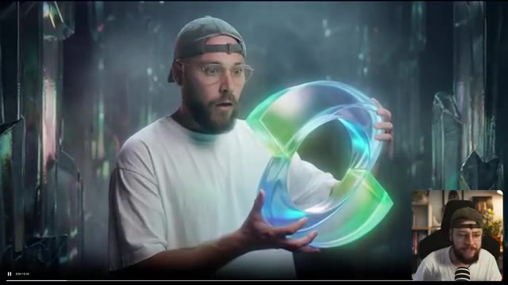
*Gros plan sur le personnage tenant un objet circulaire iridescent lumineux dans un décor de cristaux.*

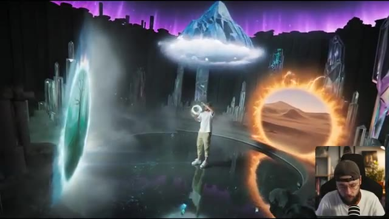
*Vue générale du décor fantastique avec des portails lumineux et un personnage au centre tenant une sphère lumineuse.*

---

### ⏱️ `[00:11:09 - 00:11:37]` | Segment #22

**🔊 Audio (Transcription Intégrale Mot pour Mot en Français) :**
> vont maintenant être possibles et pour chaque prompt textuel, nous sommes capables d'ajouter nos éléments également afin de garantir ce niveau de cohérence des personnages, donc je vous suggère vivement de le faire, mais je veux dire qu'on me voit sous différents angles de caméra et j'ai l'air bien et cohérent. Et le seul petit problème auquel nous sommes confrontés ici avec cette génération, c'est que moi en tant que personnage, je suis loin de la caméra. Et cela semble être un problème pour pratiquement tous les modèles de vidéo par IA.

**👁️ Analyse Visuelle d'Écran (gemini-3.5-flash-lite) :**
**Interface & Outils** : Interface du site web Higgsfield (higgsfield.ai/video) avec un panneau de configuration "Multi-shot" à gauche, un historique et un lecteur vidéo principal au centre.

**Contenu textuel & Code** : Prompts textuels pour les différents plans : "Shot 1: Low-wide gimbal push-in...", "Shot 2: Medium close-up 3/4 profile...", "Shot 3: Tight handy/objest then rack focus...", "Shot 4: Wide slightly high angle...". Paramètres visibles comme le bouton "Generate" et les options de ratio/résolution.

**Action / Démonstration** : Le créateur montre l'interface de génération vidéo par IA de Higgsfield, puis zoome sur les différentes prises de vues générées pour analyser la cohérence du personnage et le problème de l'échelle à distance.

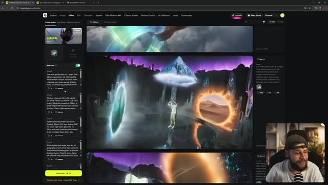
*Interface de Higgsfield montrant le panneau de génération avec plusieurs plans (Multi-shot) et la vidéo générée d'un personnage dans un temple de cristaux avec des portails.*

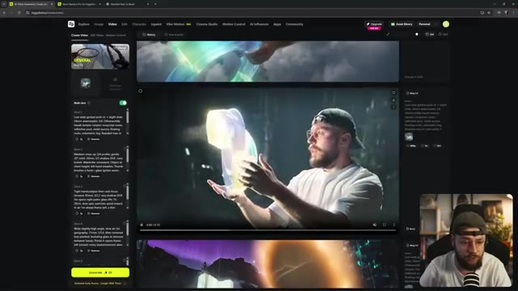
*Lecteur vidéo intégré dans Higgsfield montrant un plan rapproché du personnage manipulant un objet lumineux holographique entre ses mains.*

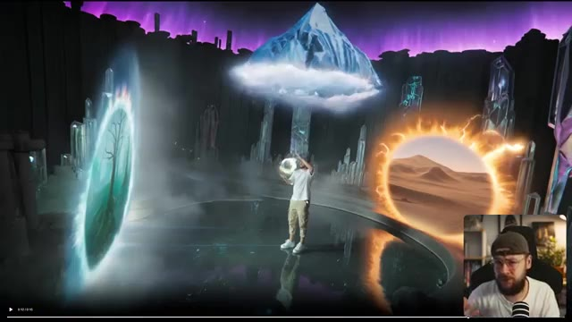
*Vue agrandie de la vidéo générée montrant le personnage en plan large, minuscule au centre d'une vaste salle souterraine entourée de cristaux géants et de portails.*

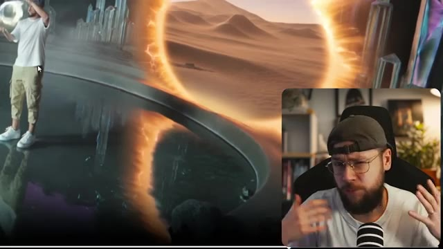
*Gros plan sur la vidéo générée montrant le personnage très éloigné de la caméra, illustrant le problème de distance mentionné dans le commentaire audio.*

---

### ⏱️ `[00:11:38 - 00:12:10]` | Segment #23

**🔊 Audio (Transcription Intégrale Mot pour Mot en Français) :**
> Si votre personnage est proche de la caméra, les résultats sont plutôt excellents. Quand ils sont loin dans ce genre de plan large ou plan de situation, vous commencez à rencontrer des problèmes. Les visages se réduisent en bouillie et je ne sais pas pourquoi cela arrive, c'est assez frustrant, mais c'est l'un des écueils de cette génération particulière et d'autres que j'ai obtenues de Kling 3.0, alors gardez cela à l'esprit les gars, bien sûr je ne veux pas seulement parler des bonnes choses, nous devons parler des problèmes également. Ce que j'aimerais aborder maintenant, c'est la génération de style texte vers vidéo, alors si je clique simplement

**👁️ Analyse Visuelle d'Écran (gemini-3.5-flash-lite) :**
**Interface & Outils** : Interface web de génération de vidéo par IA (Kling 3.0 / plateforme type Higgsfield/Kling) avec aperçu vidéo principal et panneaux de configuration de plans.

**Contenu textuel & Code** : Panneaux textuels avec des descriptions de plans ("Multi-shot", "Shot 1", "Shot 2", etc.), curseur vert "Generate", et vignettes de résultats de génération vidéo.

**Action / Démonstration** : Le créateur montre des exemples de vidéos générées avec des plans larges, illustrant le problème de perte de détails sur les visages, puis revient à l'interface de l'outil de génération.

*Extrait vidéo généré par IA montrant un personnage dans un décor fantastique avec des portails magiques et un encadré PiP du créateur.*

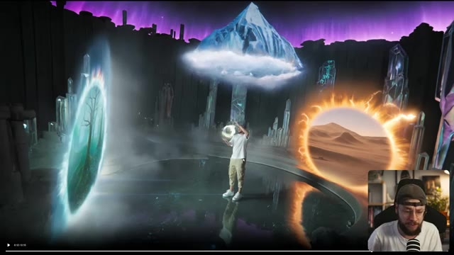
*Extrait vidéo similaire au précédent affichant le plan large fantastique et le créateur dans l'encadré PiP.*

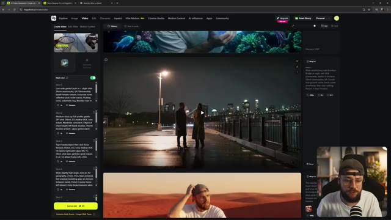
*Interface de l'outil de génération vidéo Kling 3.0 / plateforme web affichant des plans et des prompts textuels dans un panneau latéral.*

---

### ⏱️ `[00:12:10 - 00:12:37]` | Segment #24

**🔊 Audio (Transcription Intégrale Mot pour Mot en Français) :**
> ici ça va remplacer qu'on peut supprimer l'image de début parce qu'on n'en a pas utilisé une pour cette génération particulière. Maintenant, encore une fois, j'ai demandé à ChatGPT de m'aider à rédiger chacun de ces prompts individuels où il y a ce couple qui se dispute et je vais mettre mes écouteurs pour celui-ci. Donc bien sûr, nous utilisons une méthode différente pour la génération de vidéo par IA où nous ne créons pas d'image de départ, nous nous basons simplement sur les prompts textuels.

**👁️ Analyse Visuelle d'Écran (gemini-3.5-flash-lite) :**
**Interface & Outils** : Interface web de Higgsfield (higgsfield.ai) avec le mode "Create Video" et le paramètre "Multi-shot" activé, affichant les différents plans textuels et un encadré PiP (Picture-in-Picture) de Jack dans le coin inférieur droit.

**Contenu textuel & Code** : On peut voir des champs de texte pour les prompts textuels ("Multi-shot"), avec des descriptions de plans détaillées incluant les mouvements de caméra et l'éclairage. L'écran principal affiche un aperçu vidéo nocturne d'un couple sur une promenade au bord de l'eau avec des gratte-ciels en arrière-plan.

**Action / Démonstration** : Le créateur montre l'interface de génération vidéo multi-plans basée uniquement sur du texte (sans image de départ) sur la plateforme Higgsfield, tout en expliquant sa méthode de prompt rédigée avec ChatGPT.

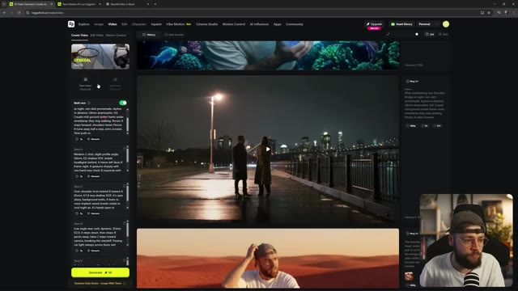
*Interface de l'outil de génération vidéo Higgsfield montrant la configuration de plusieurs plans avec des prompts textuels pour une scène de couple.*

---

### ⏱️ `[00:12:37 - 00:13:12]` | Segment #25

**🔊 Audio (Transcription Intégrale Mot pour Mot en Français) :**
> C'est la seule chose sur laquelle Kling 3.0 peut s'appuyer. C'est donc toujours intéressant de servir de point de comparaison. Je voulais une scène où ce couple se dispute près du pont de Brooklyn, alors jetons un coup d'œil au résultat que nous avons obtenu. Ne fais pas ça. Je t'en supplie. Donc, pour moi, c'était vraiment impressionnant une fois de plus. L'une des améliorations de Kling 3.0 est une plus grande sorte de

**👁️ Analyse Visuelle d'Écran (gemini-3.5-flash-lite) :**
**Interface & Outils** : Interface web de l'outil de génération vidéo Higgsfield.ai / Kling 3.0 avec panneau de prompts multi-shots à gauche et lecteur vidéo principal au centre.

**Contenu textuel & Code** : Multi-shot activé, prompts détaillés pour chaque plan décrivant la scène nocturne, la promenade mouillée, la skyline, les personnages (Person A, Person B), l'éclairage (faible profondeur de champ, phares de voiture), les mouvements de caméra et les interactions.

**Action / Démonstration** : Le créateur présente l'interface de génération vidéo par IA et diffuse un exemple de vidéo multi-shot mettant en scène un couple en train de se disputer la nuit près du pont de Brooklyn.

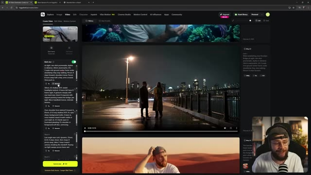
*Interface de l'outil vidéo IA montrant les paramètres de multi-shot et de prompts textuels détaillés avec une fenêtre de prévisualisation de la scène du couple près du pont de Brooklyn.*

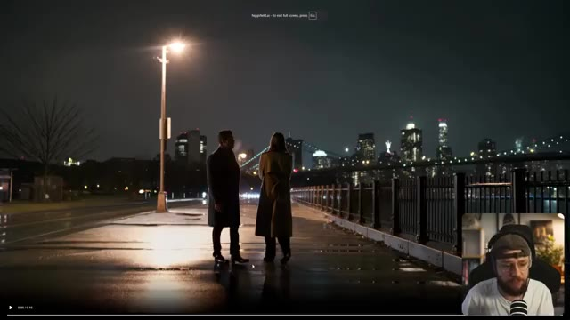
*Aperçu en plein écran de la vidéo générée montrant un couple de dos sur une promenade nocturne face à la skyline et au pont de Brooklyn illuminé.*

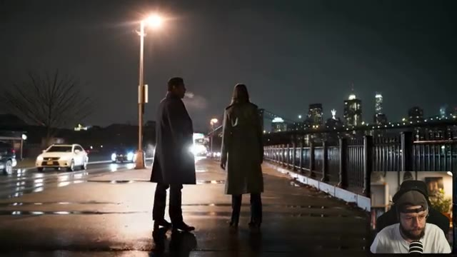
*Gros plan sur le couple de dos lors de la scène nocturne près de la route avec des voitures et le pont de Brooklyn en arrière-plan.*

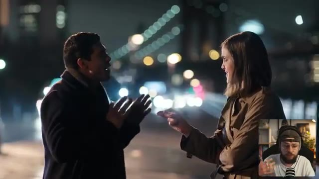
*Gros plan de profil sur le couple en train de se disputer sur la promenade, avec l'homme gesticulant des mains et la femme de face.*

---

### ⏱️ `[00:13:12 - 00:13:45]` | Segment #26

**🔊 Audio (Transcription Intégrale Mot pour Mot en Français) :**
> de l'impact émotionnel de ces performances de nos acteurs par IA et je pense que c'est un très bon exemple. Il y a beaucoup de choses impressionnantes ici. Ce plan en particulier a l'air tout simplement incroyable pour moi. On peut parler longuement de la texture de la peau et de ses mèches de cheveux rebelles également. Cela semble incroyablement réel et vraiment tout à fait naturel également. Avoir réussi cela uniquement avec des invites textuelles, ouais, c'est assez fou. Et ce prompt multi-plans marque un véritable moment, un véritable développement quand il

**👁️ Analyse Visuelle d'Écran (gemini-3.5-flash-lite) :**
**Interface & Outils** : Interface web de la plateforme de génération vidéo par IA Higgsfield (higgsfield.ai) avec le mode d'édition de vidéo, les onglets Explore, Image, Video, Edit, Character, Inpaint, Vibe Motion, Cinema Studio, et un panneau latéral affichant les configurations de "Multi-shot".

**Contenu textuel & Code** : Texte des prompts de génération pour chaque plan ("Shot 1", "Shot 2", etc.) décrivant les paramètres de caméra (24mm, 35mm, 85mm), l'éclairage ("shallow DOF", "bokeh headlights"), les mouvements des personnages ("A steps close", "B points away") et les détails textuels dans les panneaux de l'interface Higgsfield.

**Action / Démonstration** : Le créateur commente l'impact émotionnel et la qualité visuelle des performances des acteurs virtuels, en faisant défiler et en analysant les différents plans et prompts multi-plans sur l'interface de l'outil de génération vidéo.

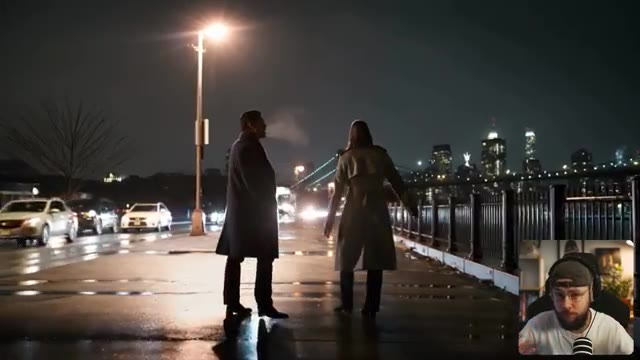
*Extrait vidéo généré par IA montrant un couple de dos sur une promenade urbaine nocturne avec un pont illuminé en arrière-plan et des voitures circulant sur la route humide, avec l'encadré PiP du créateur en bas à droite.*

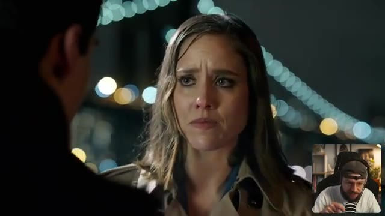
*Gros plan serré sur le visage d'une actrice générée par IA exprimant une émotion intense, avec des mèches de cheveux rebelles et un éclairage nocturne bokeh en arrière-plan, et l'encadré PiP du créateur en bas à droite.*

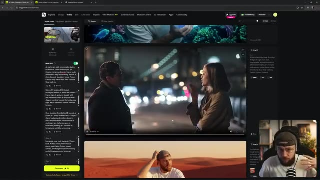
*Interface de l'outil de génération vidéo par IA Higgsfield affichant l'éditeur avec des prompts multi-plans dans le panneau latéral gauche et la vidéo du couple en cours de lecture au centre, avec l'encadré PiP du créateur en bas à droite.*

---

### ⏱️ `[00:13:45 - 00:14:17]` | Segment #27

**🔊 Audio (Transcription Intégrale Mot pour Mot en Français) :**
> en matière de création de films par IA, car traditionnellement, nous aurions dû utiliser un outil comme Nano Banana Pro pour créer chacune des images de départ pour chaque plan individuel, puis les animer. Mais en utilisant la génération multi-plans avec Kling 3.0, nous pouvons créer toute une sorte d'histoire autonome avec plusieurs plans, plusieurs angles de caméra, des dialogues, tout ce que vous pourriez souhaiter, le tout en une seule génération. Et juste pour vous montrer un autre exemple basé sur du texte vers vidéo, ceci...

**👁️ Analyse Visuelle d'Écran (gemini-3.5-flash-lite) :**
**Interface & Outils** : Navigateur web affichant l'interface de l'outil vidéo (probablement Higgsfield ou Kling), avec les menus de création (Create Video, Multi-shot, options de génération) et un encadré PiP montrant le créateur en bas à droite.

**Contenu textuel & Code** : On observe le panneau de configuration à gauche avec le bouton "Multi-shot" activé, plusieurs blocs de texte pour les différents plans ("Shot 1", "Shot 2", etc.) contenant des descriptions techniques et artistiques (ex: "at night, rain slick promenade, skyline in distance", "50mm, f/2 shallow DOF"), ainsi qu'un bouton jaune "Generate".

**Action / Démonstration** : Le créateur navigue et présente l'interface de génération vidéo multi-plans, montrant les différents calques de plans et les paramètres de caméra modifiables.

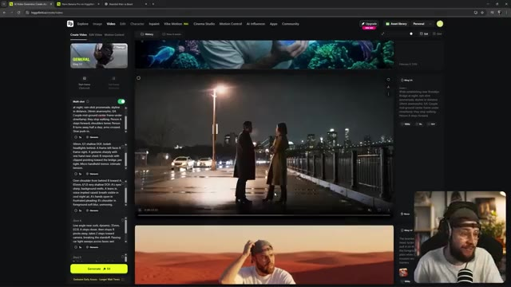
*Interface de l'outil de génération vidéo affichant la chronologie avec l'option multi-shot activée et plusieurs prompts textuels pour différentes prises de vue.*

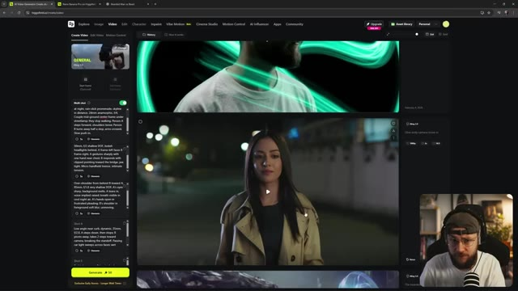
*Interface de génération vidéo montrant le rendu d'un plan rapproché d'une femme avec des néons et des effets de lumière en arrière-plan.*

---

### ⏱️ `[00:14:17 - 00:14:53]` | Segment #28

**🔊 Audio (Transcription Intégrale Mot pour Mot en Français) :**
> c'était en fait un peu un heureux accident parce que je voulais importer une image de départ de moi-même dans l'un de ces types de scènes que nous regardions avant mais j'ai oublié de l'ajouter donc le prompt était simplement mouvement de caméra dolly lent vers l'avant et voici le résultat que vous pouvez obtenir avec Kling 3.0 avec un prompt aussi simple. Encore une fois, le niveau de réalisme ici, la texture de la peau, l'imperfection aussi, les cheveux rebelles, la faible profondeur de champ, tout ici a l'air incroyable. L'éclairage sur sa joue ici où l'on peut voir de subtiles imperfections. Cette génération, c'était un heureux

**👁️ Analyse Visuelle d'Écran (gemini-3.5-flash-lite) :**
**Interface & Outils** : Interface web de génération vidéo (style Higgsfield ou Kling AI) avec panneau latéral de prompts et affichage en Picture-in-Picture du créateur.

**Contenu textuel & Code** : Texte du prompt visible sur le panneau latéral : « slow dolly camera move in », paramètres de génération, et aperçu de la vidéo générée avec une femme de face portant un trench-coat beige dans un décor urbain nocturne.

**Action / Démonstration** : Le créateur présente l'interface de l'outil et les résultats de génération vidéo avec Kling 3.0, en commentant le rendu visuel et le réalisme.

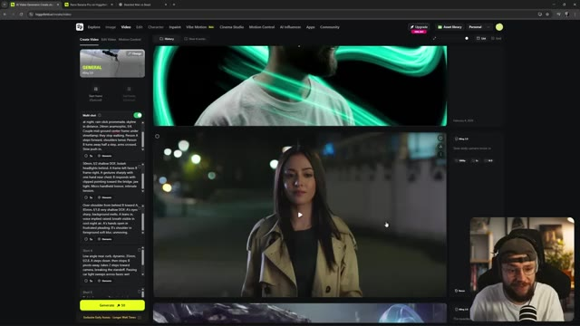
*Interface de l'outil de génération vidéo affichant le panneau de contrôle avec le prompt « slow dolly camera move in » et un aperçu vidéo au centre avec une caméra PiP du créateur dans le coin inférieur droit.*

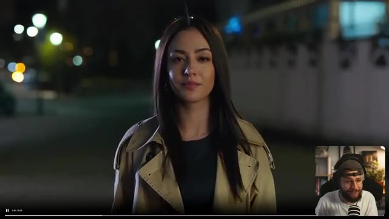
*Affichage en plein écran de la vidéo générée montrant une femme de face en manteau beige dans une rue nocturne avec une faible profondeur de champ, et la caméra PiP du créateur dans le coin inférieur droit.*

---

### ⏱️ `[00:14:53 - 00:15:26]` | Segment #29

**🔊 Audio (Transcription Intégrale Mot pour Mot en Français) :**
> accident, mais quel bel exemple de ce dont Kling 3.0 est capable de générer. Vous n'avez donc pas nécessairement besoin de passer par la création de toutes vos images de départ en utilisant Nano Banana Pro. Bien sûr, c'est la voie à suivre si vous voulez un plus grand niveau de contrôle, mais vous pouvez simplement opter pour la génération de texte en vidéo et obtenir quand même des résultats tout à fait incroyables, en particulier en utilisant les générations multi-plans si vous voulez englober toute une histoire dans une génération de 15 secondes par exemple.

**👁️ Analyse Visuelle d'Écran (gemini-3.5-flash-lite) :**
**Interface & Outils** : Navigateur web affichant l'interface de la plateforme de génération vidéo Higgsfield avec les options Kling 3.0 et Nano Banana Pro, incluant une vue incrustée (PiP) du créateur en bas à droite.

**Contenu textuel & Code** : Menus de navigation de Higgsfield (Explore, Image, Video, Edit, Character, Inpaint, Vibe Motion, Cinema Studio, Motion Control, AI Influencers, Apps, Community), options de génération Kling 3.0, et champs de texte avec des prompts pour les différents plans de la vidéo (Multi-shot).

**Action / Démonstration** : Le créateur commente et présente à l'écran les capacités de génération vidéo de Kling 3.0 et l'utilisation des plans multiples pour raconter une histoire complète.

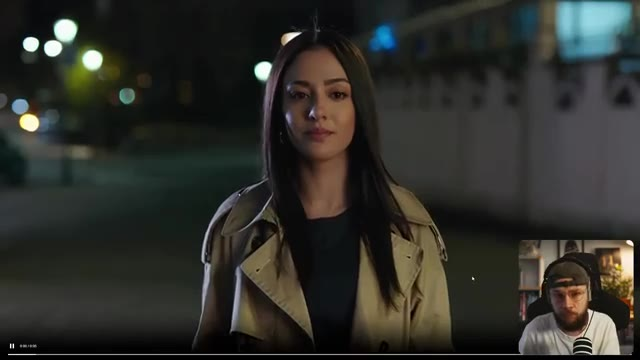
*Extrait vidéo généré par IA montrant une femme de face sur un trottoir nocturne, avec le créateur en incrustation (PiP).*

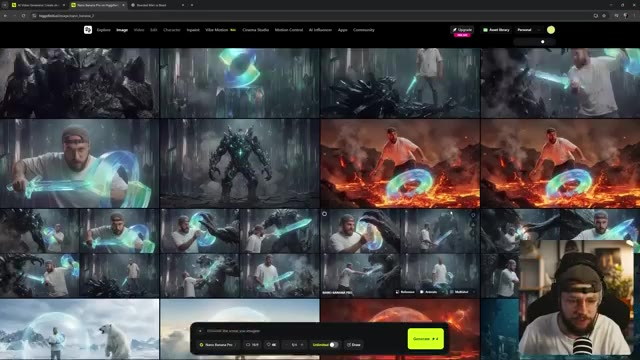
*Interface web d'Higgsfield présentant une grille d'images générées, avec le créateur en incrustation (PiP) dans le coin inférieur droit.*

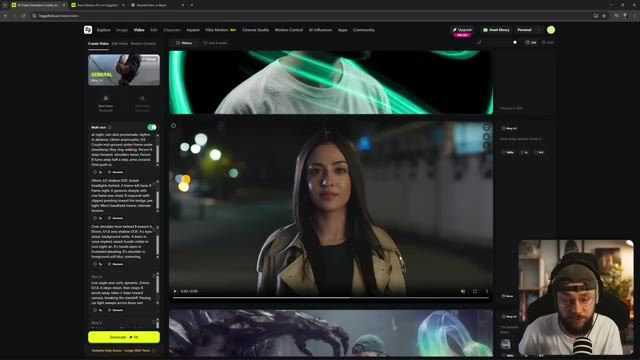
*Interface de génération vidéo multi-plans d'Higgsfield avec Kling 3.0 affichant une scène nocturne et des prompts textuels détaillés, et le créateur en incrustation (PiP).*

---

### ⏱️ `[00:15:26 - 00:15:47]` | Segment #30

**🔊 Audio (Transcription Intégrale Mot pour Mot en Français) :**
> Maintenant, pour aborder brièvement certains des problèmes, certains des écueils que j'ai rencontrés lors de l'utilisation de Kling 3.0. Par exemple, nous pouvons parler du fait qu'il semble adorer mettre des dialogues aléatoires dans vos générations, même lorsque vous lui spécifiez de ne pas le faire. Vous pouvez donc voir ici avec ce texte de prompt, j'ai dit pas de musique, pas de dialogue.

**👁️ Analyse Visuelle d'Écran (gemini-3.5-flash-lite) :**
**Interface & Outils** : Interface web de génération vidéo par IA (Kling 3.0 via l'outil Higgsfield).

**Contenu textuel & Code** : Prompts textuels visibles : "Slow dolly camera move in, no dialogue no music. the man does not speak, he looks forward determined." et options de génération multi-shot avec paramètres de caméra.

**Action / Démonstration** : Le créateur montre l'interface de génération vidéo avec les prompts textuels utilisés pour illustrer le problème des dialogues indésirables générés par l'IA.

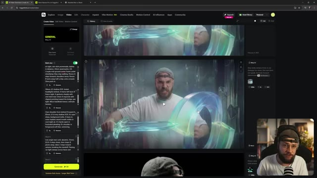
*Interface de l'outil vidéo IA montrant le panneau de génération avec des prompts textuels multishot et le créateur en incrustation PiP en bas à droite.*

*Gros plan sur le panneau latéral de l'interface montrant le prompt textuel spécifique avec les instructions "no dialogue no music".*

---

### ⏱️ `[00:15:47 - 00:16:24]` | Segment #31

**🔊 Audio (Transcription Intégrale Mot pour Mot en Français) :**
> L'homme ne parle pas. Il regarde devant lui, déterminé. Et regardez ce qu'on a obtenu en retour. Donc je ne sais pas trop quelle langue c'est, on dirait un peu le langage des Sims, euh mais c'est manifestement un manque de respect du prompt ici, car on spécifie explicitement de ne pas faire parler ce type et pourtant Kling a l'air d'ignorer ça. C'est bizarre parce qu'on a obtenu des résultats vraiment très complexes, et ensuite ça semble peiner sur quelque chose de pourtant très basique. Et c'est un autre très bon exemple parce que la génération en elle-même est vraiment incroyable, mais encore une fois Kling a

**👁️ Analyse Visuelle d'Écran (gemini-3.5-flash-lite) :**
**Interface & Outils** : Interface de la plateforme web de génération vidéo Kling (avec encadré PiP du créateur en bas à droite).

**Contenu textuel & Code** : Texte du prompt visible à l'écran : "Slow dolly camera move in, no dialogue no music. the man does not speak, he looks forward determined." Paramètres : 1080p, 4s, 16:9. Panneau de contrôle multi-shots avec plusieurs plans décrits textuellement.

**Action / Démonstration** : Le créateur commente l'interface de Kling et les résultats générés tout en naviguant dans l'historique et les options de prompts de l'outil de génération vidéo par IA.

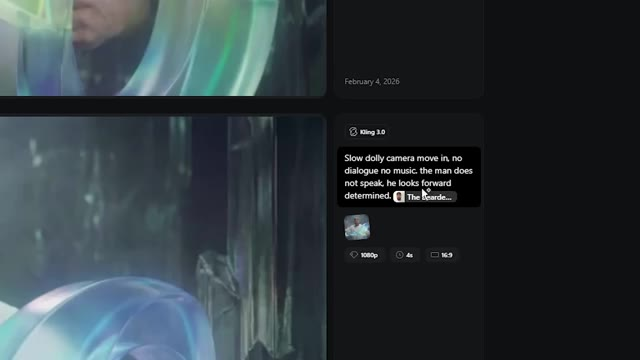
*Démonstration à l'écran @ 00:15:49*

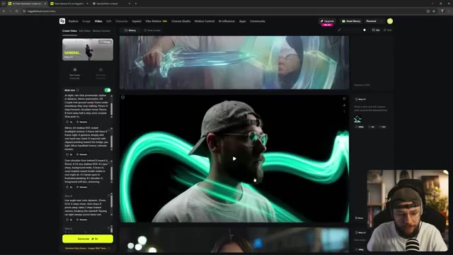
*Démonstration à l'écran @ 00:16:12*

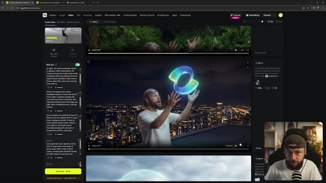
*Démonstration à l'écran @ 00:16:22*

---

### ⏱️ `[00:16:24 - 00:17:01]` | Segment #32

**🔊 Audio (Transcription Intégrale Mot pour Mot en Français) :**
> ajouté dans ce dialogue maintenant un peu de ma faute parce que je n'ai pas spécifié dans le prompt textuel de ne pas ajouter de dialogue mais quand même avec d'autres modèles vidéo vous n'obtisseriez pas nécessairement ce dialogue aléatoire ajouté ça ne me dérangerait pas trop si ça avait un quelconque sens mais jetons un coup d'œil et vous verrez le problème. J'aime toujours beaucoup le visuel quand il s'agit de cette génération. Vraiment très impressionnant. Superbe niveau de cohérence des personnages en utilisant encore une fois la fonction d'éléments mais que

**👁️ Analyse Visuelle d'Écran (gemini-3.5-flash-lite) :**
**Interface & Outils** : Interface web de Higgsfield AI (plateforme de génération vidéo) avec panneau de contrôle à gauche et affichage des vidéos générées.

**Contenu textuel & Code** : Texte de prompt multi-shot visible dans le panneau de gauche (« at night, rain slick promenade... »), options de génération, et vignette vidéo avec l'indication « Kling 3.0 ».

**Action / Démonstration** : Le créateur montre l'interface de Higgsfield et analyse le rendu visuel généré mettant en scène un personnage interagissant avec un objet lumineux.

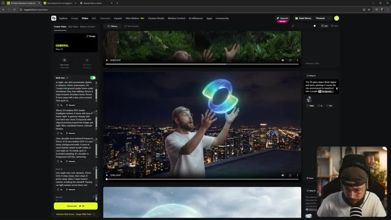
*Interface de Higgsfield montrant les réglages de génération vidéo avec des prompts textuels multi-shots et le lecteur vidéo principal au centre.*

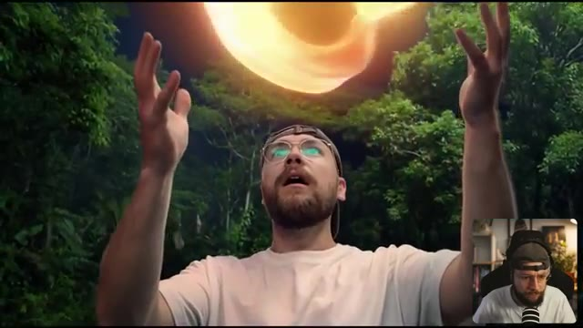
*Aperçu vidéo généré montrant un personnage barbu levant les mains vers un objet lumineux brillant dans un décor de jungle dense.*

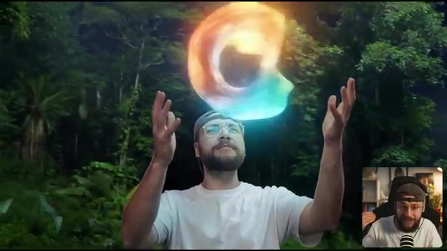
*Aperçu vidéo montrant la continuité de l'animation avec l'objet en lévitation au-dessus du personnage dans la jungle.*

---

### ⏱️ `[00:17:01 - 00:17:38]` | Segment #33

**🔊 Audio (Transcription Intégrale Mot pour Mot en Français) :**
> parler au hasard c'est un peu ennuyeux. On ne veut pas vraiment ou on n'a pas vraiment besoin de ça là. Et un autre exemple ici le problème dont je parlais tout à l'heure où le personnage est assez loin de la caméra encore une fois Kling 3.0 semble avoir un peu de mal ici on peut voir que les lunettes sont tombées de mon visage genre je ne les ai plus je ne les porte plus et juste mon visage a l'air globalement très plastifié animé mais pas vraiment d'une belle manière donc si vous le pouvez essayez de garder vos personnages près de la caméra et vous n'aurez pas ces problèmes mais bien sûr c'est important de souligner ces

**👁️ Analyse Visuelle d'Écran (gemini-3.5-flash-lite) :**
**Interface & Outils** : Kling 3.0 (outil de génération vidéo par IA) / Vidéo de démonstration avec incrustation PiP du créateur en bas à droite.

**Contenu textuel & Code** : Générations vidéo par IA illustrant les artefacts visuels et les limites du modèle Kling 3.0 lorsque le sujet est éloigné de la caméra.

**Action / Démonstration** : Le créateur présente des exemples vidéo générés par IA pour illustrer les problèmes de rendu (perte de lunettes, aspect plastifié du visage) lorsque le personnage est trop éloigné de la caméra.

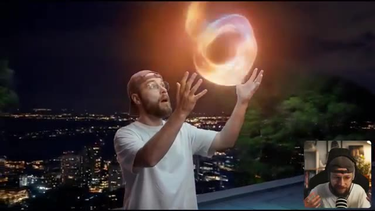
*Démonstration vidéo générée par IA montrant le créateur de profil tenant un objet lumineux sur un toit urbain nocturne, avec un encadré PiP du créateur en bas à droite.*

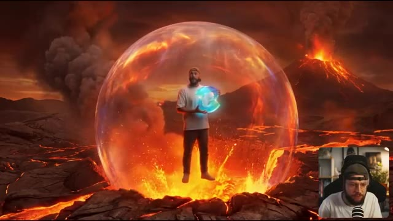
*Démonstration vidéo générée par IA montrant le créateur en pied à l'intérieur d'une bulle de protection dans un paysage volcanique, avec un encadré PiP du créateur en bas à droite.*

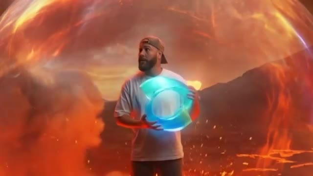
*Démonstration vidéo générée par IA montrant un plan rapproché du créateur tenant un objet lumineux dans un environnement de lave en fusion.*

---

### ⏱️ `[00:17:38 - 00:18:16]` | Segment #34

**🔊 Audio (Transcription Intégrale Mot pour Mot en Français) :**
> des problèmes. Un tas d'exemples ici également où je génère simplement une image de départ avec Nano Banana Pro. Certaines de ces images sont bien sûr moi dans le désert avec la sculpture Kling au premier plan, donc c'est simplement animé avec un flux de travail plus traditionnel lorsqu'il s'agit de générations de vidéos par IA via Kling 3.0, avec un simple prompt textuel ici, juste une seule image de départ, mais bien sûr en utilisant toujours la fonction d'éléments juste pour verrouiller cette cohérence des personnages. C'était une génération vraiment super aussi, vraiment sympa et dynamique et avec de superbes effets sonores aussi et

**👁️ Analyse Visuelle d'Écran (gemini-3.5-flash-lite) :**
**Interface & Outils** : Navigateur web affichant l'interface de l'outil de génération vidéo et d'image Kling 3.0 / Nano Banana Pro, avec le flux de travail et les options de prompts multi-shots.

**Contenu textuel & Code** : Menus de l'application, paramètres de génération vidéo, prompts textuels détaillant les plans, les mouvements de caméra et les descriptions des personnages (ex: "The bearded man scratches his head...", "Nano Banana Pro").

**Action / Démonstration** : Le créateur présente son interface de génération vidéo par IA, montrant les différentes étapes entre la création de l'image de départ (Nano Banana Pro) et l'animation vidéo via Kling 3.0 avec la cohérence des éléments.

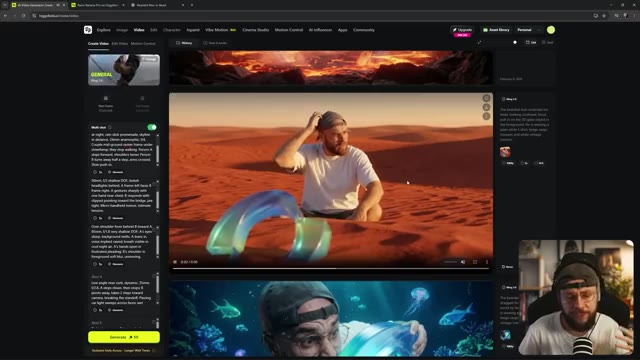
*Interface de l'outil vidéo montrant une génération dans le désert avec un objet en verre sculpté au premier plan et le créateur en incrustation PiP.*

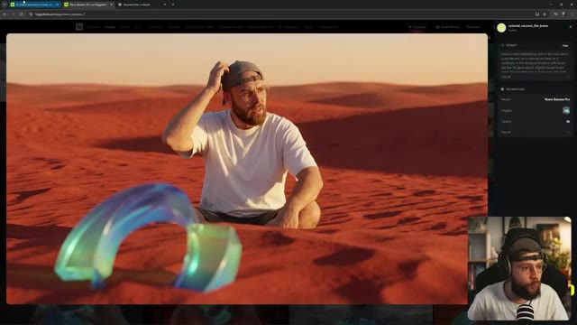
*Interface de génération d'image montrant le plan fixe du créateur dans le désert avec l'objet en verre, généré avec Nano Banana Pro.*

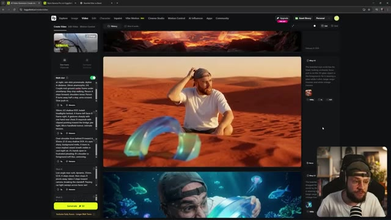
*Interface de l'outil vidéo Kling 3.0 affichant les paramètres multi-plans et les prompts textuels associés à la génération dans le désert.*

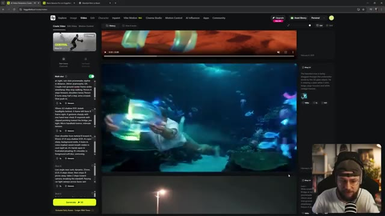
*Interface de l'outil vidéo montrant une scène sous-marine animée avec le personnage interagissant avec l'objet lumineux.*

---

### ⏱️ `[00:18:16 - 00:18:51]` | Segment #35

**🔊 Audio (Transcription Intégrale Mot pour Mot en Français) :**
> bien sûr c'est l'un des autres avantages de ce modèle c'est devenu un peu la norme maintenant d'avoir l'audio natif avec vos générations de vidéo pour beaucoup des meilleurs modèles sur le marché mais quand même Kling 3.0 semble faire un travail bien cohérent à ce niveau-là et un point sur lequel je voulais juste finir brièvement ici c'était un exemple de rendu de texte parce que c'est l'une des prétendues améliorations de Kling 3.0 donc ce que j'ai fait c'est que j'ai demandé à chat gpt de me rédiger un prompt textuel vraiment très intense j'ai dit je veux que ce soit vraiment difficile à générer en gros

**👁️ Analyse Visuelle d'Écran (gemini-3.5-flash-lite) :**
**Interface & Outils** : Interface web de Higgsfield (higgsfield.ai) avec le mode de génération vidéo, le panneau de configuration des prompts à gauche, et le flux vidéo principal au centre.

**Contenu textuel & Code** : Le panneau de prompt affiche : « [1s] 16:9 photorealistic cinematic single continuous shot (no cuts). Empty night street, light rain, wet reflective ground, no humans or animals, no fantasy. Camera slow dolly forward with slight parallax, realistic exposure. The online text is text consistency: every sign must stay perfectly stable, spelled correctly, readable, and unchanged despite camera motion, shallow DOF. » Le paramètre du modèle est défini sur « Kling 3.0 », la durée sur « 15s », le ratio sur « 16:9 » et la résolution sur « 1080p ». Sur l'écran central, le texte « JACK VS. AI » est nettement affiché sur un panneau lumineux.

**Action / Démonstration** : Le créateur navigue sur l'interface de Higgsfield et présente les résultats de génération vidéo de Kling 3.0, en insistant sur le rendu et la stabilité du texte sur un panneau publicitaire urbain de nuit.

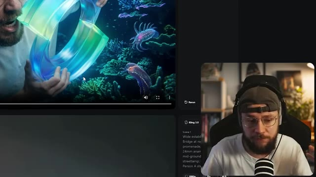
*Interface d'un générateur vidéo montrant le rendu d'une forme géométrique transparente sous-marine avec le créateur en incrustation PiP.*

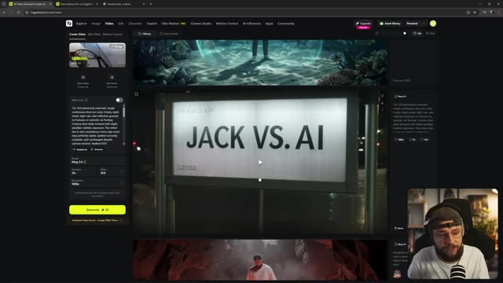
*Interface de Higgsfield affichant une vidéo générée avec le texte « JACK VS. AI » affiché sur un panneau lumineux de rue de nuit sous la pluie.*

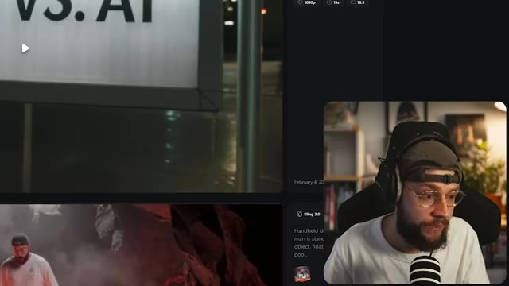
*Gros plan sur le rendu vidéo d'un panneau publicitaire affichant le texte « VS. AI » avec le créateur en incrustation dans le coin inférieur droit.*

---

### ⏱️ `[00:18:51 - 00:19:24]` | Segment #36

**🔊 Audio (Transcription Intégrale Mot pour Mot en Français) :**
> et ce que j'ai fini par obtenir comme exemple était une sorte d'horaire pour un bus ou un train et malheureusement ce que vous remarquerez peut-être est qu'il reste pas mal de problèmes en ce qui concerne le rendu du texte bien sûr c'est un exemple vraiment extrême euh peut-être qu'il y a eu des choses que j'aurais pu faire pour l'améliorer un peu mais je pense qu'il y a vraiment certains problèmes ici le texte « jack versus ai » a l'air bien donc le texte simple semble fonctionner correctement mais ensuite

**👁️ Analyse Visuelle d'Écran (gemini-3.5-flash-lite) :**
**Interface & Outils** : Présentation vidéo de rendus d'images/vidéos générées par IA avec incrustation PiP du créateur dans le coin inférieur droit.

**Contenu textuel & Code** : Texte affiché 'JACK VS. AI', affiches de rue et horaires de bus/train générés par IA contenant des glyphes et du texte corrompu ou illisible.

**Action / Démonstration** : Le créateur montre des exemples de vidéos générées par IA pour illustrer les problèmes de rendu et de cohérence du texte.

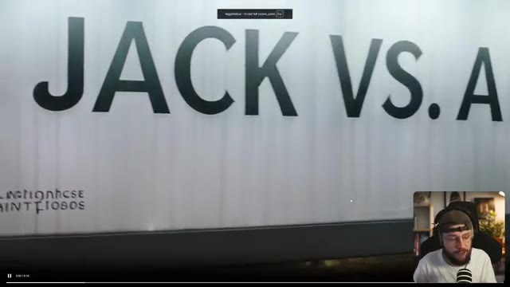
*Extrait vidéo généré par IA montrant un grand texte 'JACK VS. AI' sur un panneau.*

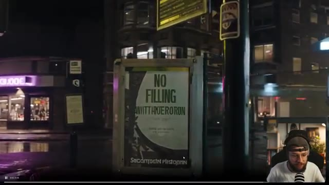
*Extrait vidéo montrant une rue la nuit avec une affiche publicitaire présentant des erreurs de rendu textuel généré par IA.*

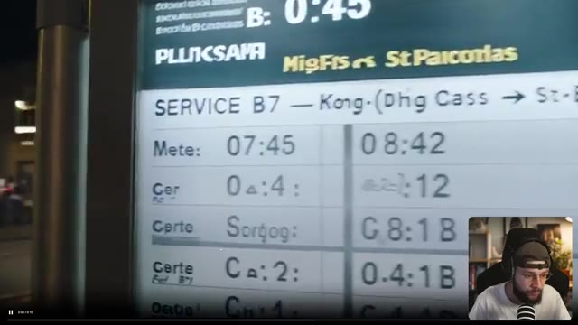
*Gros plan sur un panneau d'affichage d'horaires de transports en commun généré par IA comportant des incohérences textuelles.*

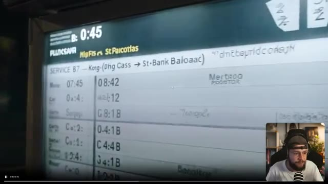
*Poursuite de la présentation du panneau d'affichage des horaires montrant les défauts du texte généré par l'IA.*

---

### ⏱️ `[00:19:24 - 00:19:57]` | Segment #37

**🔊 Audio (Transcription Intégrale Mot pour Mot en Français) :**
> il semble juste y avoir beaucoup de sortes de problèmes bizarres en cours, que ce soit censé être dans une autre langue, je ne suis pas sûr, je pense juste que ça n'a pas fait le bon travail, il y a juste quelques étranges artefacts, un étrange usage de la langue et des symboles et des choses comme ça. Le mouvement de caméra lui-même a l'air super, l'éclairage, la façon dont il est dynamique en se déplaçant dans cet espace 3D, mais oui, il semble qu'il y ait encore quelques problèmes avec le rendu de texte complexe, un exemple brutal, mais quelque chose que

**👁️ Analyse Visuelle d'Écran (gemini-3.5-flash-lite) :**
**Interface & Outils** : Vidéo de démonstration en plein écran avec incrustation (PiP) du créateur en bas à droite.

**Contenu textuel & Code** : Texte affiché sur les panneaux de la vidéo générée : 'NS BOA', 'PIOOIHT AVE', 'NO FILLING', 'JACK VS. AI', 'SERVICE B7', 'Mete: 07:45'.

**Action / Démonstration** : Le créateur commente les artefacts visuels et les erreurs de rendu de texte dans une vidéo générée par intelligence artificielle.

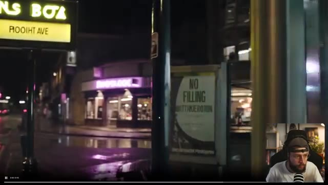
*Extrait vidéo généré par IA montrant une rue nocturne avec un panneau d'affichage affichant du texte corrompu et le créateur dans un encadré PiP.*

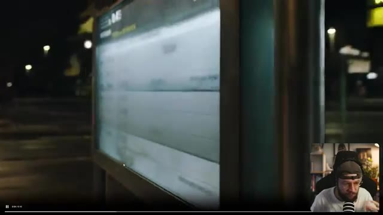
*Gros plan sur un panneau d'affichage lumineux dans la vidéo générée par IA présentant des artefacts et du texte illisible.*

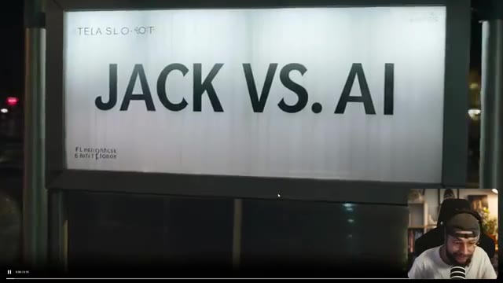
*Gros plan sur un panneau d'affichage avec le texte 'JACK VS. AI' généré par IA et des caractères corrompus en haut à gauche.*

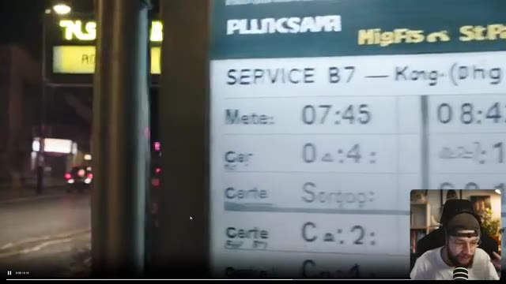
*Gros plan sur un panneau d'affichage d'horaires de transport affichant des textes et chiffres corrompus (ex: 'SERVICE B7', 'Mete: 07:45').*

---

### ⏱️ `[00:19:57 - 00:20:33]` | Segment #38

**🔊 Audio (Transcription Intégrale Mot pour Mot en Français) :**
> Je voulais vous transmettre ça, alors voilà les gars, dites-moi si vous avez réussi à vous connecter et à tester Kling 3.0, ce que vous pensez du modèle vidéo. Moi-même, j'ai été généralement vraiment très impressionné. Les plus gros arguments de vente pour moi sont la cohérence des personnages et les générations multi-plans. J'ai hâte de jouer encore un peu avec ça. Bien sûr, on effleure à peine la surface ici. Et cela étant dit, les gars, si vous avez apprécié la vidéo d'aujourd'hui, assurez-vous de lui mettre un gros pouce bleu. Si vous êtes nouveau, pensez à vous abonner et bien sûr, à cliquer sur l'icône de la cloche de notification. Je vais afficher quelques-unes de mes vidéos précédentes sur l'écran dès maintenant si vous souhaitez y jeter un œil.

**👁️ Analyse Visuelle d'Écran (gemini-3.5-flash-lite) :**
**Interface & Outils** : Modèle de génération vidéo par intelligence artificielle Kling 3.0 (avec incrustation vidéo du créateur Jack dans le coin inférieur droit).

**Contenu textuel & Code** : Rendu vidéo généré par IA montrant : un arrêt de bus urbain de nuit, un personnage volant au-dessus des nuages, un personnage de dos avec des flux lumineux, et un symbole holographique sur socle de cristal.

**Action / Démonstration** : Présentation de différents extraits vidéo générés par Kling 3.0 illustrant les capacités de cohérence des personnages et de multi-plans du modèle.

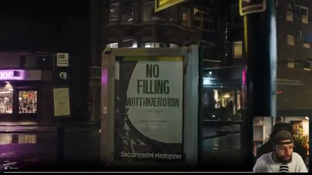
*Démonstration du modèle vidéo Kling 3.0 montrant une scène urbaine de nuit avec un panneau d'affichage et le créateur en incrustation PiP.*

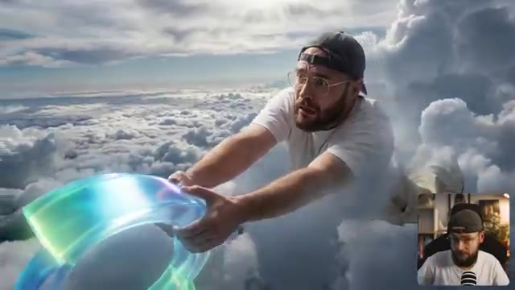
*Démonstration du modèle Kling 3.0 montrant le personnage généré par IA volant dans le ciel au milieu des nuages et manipulant un anneau lumineux coloré.*

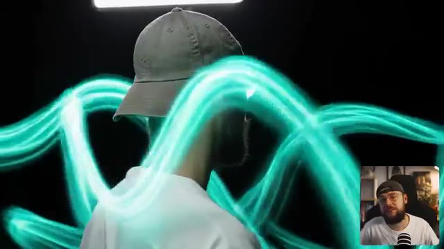
*Démonstration du modèle Kling 3.0 montrant le personnage de dos entouré de traînées lumineuses vertes fluo en mouvement.*

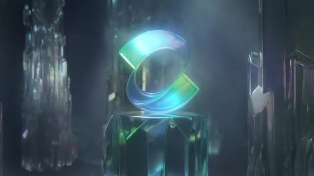
*Démonstration du modèle Kling 3.0 affichant un logo ou un objet brillant en lévitation sur un socle de cristal dans un décor futuriste.*

---

### ⏱️ `[00:20:33 - 00:20:37]` | Segment #39

**🔊 Audio (Transcription Intégrale Mot pour Mot en Français) :**
> et allez voir certains d'entre eux. Et merci beaucoup d'avoir regardé et passez une excellente journée.

**👁️ Analyse Visuelle d'Écran (gemini-3.5-flash-lite) :**
**Interface & Outils** : Présentation face caméra / Animation de fin de vidéo sans partage d'écran logiciel.

**Contenu textuel & Code** : Affichage d'un logo lumineux abstrait de type 3D aux reflets verts et iridescents sur un socle en cristal entouré de structures cristallines.

**Action / Démonstration** : Animation graphique de clôture de la vidéo.

---
