# 🎬 Comment créer des mouvements de caméra cinématiques avec l'IA (Masterclass Kling 3.0)

> **Chaîne** : [Jack Vs. AI](https://www.youtube.com/@JackVsAI)  
> **Titre original** : `How to Create Cinematic Camera Movement with AI (Kling 3.0 Masterclass)`  
> **Lien YouTube** : [https://www.youtube.com/watch?v=TKkg-8P7jTM](https://www.youtube.com/watch?v=TKkg-8P7jTM)  
> **Date de publication** : 2026-02-16  
> **Durée** : 25m 11s (`1511s`)  
> **Identifiant vidéo** : `TKkg-8P7jTM`  
> **Fiche Web Interactive** : [2026-02-16_YT-TKkg-8P7jTM_Comment créer des mouvements de caméra cinématiques avec l'IA (Masterclass Kling_by-whisper-v3-large-turbo+gemini-3.5-flash-lite.html](2026-02-16_YT-TKkg-8P7jTM_Comment créer des mouvements de caméra cinématiques avec l'IA (Masterclass Kling_by-whisper-v3-large-turbo+gemini-3.5-flash-lite.html)  
> **Captures de démonstration clés** : `105 captures réelles (anti-talking-head)`  
> **Modèles utilisés** : Audio: `large-v3-turbo` (Faster-Whisper int8 VPS) | Vision: `gemini-3.5-flash-lite` (Google AI Studio API)  

---

## 📌 Synthèse Exécutive & Outils

### 📌 Résumé
Dans cette masterclass dédiée à la réalisation vidéo par intelligence artificielle, Jack, artiste VFX chevronné dans la publicité, démontre comment s'affranchir des limitations des prompts textuels basiques pour véritablement diriger les mouvements de caméra. L'idée centrale est de cesser de « prompter au hasard » et d'adopter un contrôle de mise en scène chirurgical pour transformer des scripts prometteurs en productions cinématiques à fort impact émotionnel, capables de captiver l'audience de bout en bout.

Pour y parvenir, Jack dévoile un flux de travail hybride (Image-to-Video) hautement stratégique. La première étape consiste à générer un « visuel clé » (keyframe) ultra-précis — garantissant la cohérence du personnage, du lieu et du style — via des outils de pointe comme Nano Banana Pro. Une fois cette base validée, l'image est injectée dans un modèle d'animation puissant tel que Kling 3, capable d'interpréter des instructions de mise en scène complexes.

La méthode repose sur l'utilisation de ChatGPT pour concevoir des prompts textuels structurés et détaillés. Jack met en lumière deux styles de mouvements de caméra très recherchés : le style « mocap / bras robotique » (caractérisé par des passes latérales rapides et des accélérations asymétriques sans artéfacts) et le plan subjectif ou « gréement verrouillé » (donnant l'illusion que la caméra est physiquement attachée au sujet). En découpant le mouvement en micro-séquences temporelles, les créateurs obtiennent un rendu ultra-dynamique digne des plus grandes productions publicitaires, réduisant ainsi drastiquement les barrières techniques et financières.

### 🛠️ Outils, Modèles & Logiciels Présentés
* **Artlist** : Plateforme hôte regroupant les outils d'IA et organisant les générations de visuels et de vidéos en sessions de travail individuelles.
* **Nano Banana Pro** : Modèle de génération d'images de pointe utilisé pour créer le visuel clé initial (personnage, décor, style, format 16:9 et résolution 4K).
* **Kling 3** (ou Kling 3.0) : Modèle de génération et d'animation vidéo avancé capable de restituer des mouvements de caméra complexes et hyper-réalistes à partir d'images de départ et de prompts structurés.
* **ChatGPT** : Assistant conversationnel employé pour rédiger, structurer et détailler les prompts de mouvements de caméra complexes (gestion des axes, des vitesses et du timing).

### 🔑 Points Clés & Enseignements Stratégiques
* **Adopter le flux Image-to-Video** : Privilégier systématiquement une image de départ solide plutôt qu'une génération entièrement textuelle pour garantir un contrôle total sur le résultat final.
* **Verrouiller le visuel clé (Keyframe)** : Fixer dès le départ l'identité du personnage, le lieu et le style artistique, car tous les plans ultérieurs découleront de cette référence visuelle unique.
* **Collaborer avec ChatGPT pour les prompts** : Utiliser l'intelligence artificielle textuelle pour concevoir des instructions de caméras sophistiquées en décrivant précisément les dynamiques, les vitesses et les axes.
* **Maîtriser le style « Bras robotique / Motion Control »** : Reproduire l'esthétique des équipements de tournage lourds grâce à l'IA en programmant des passes latérales rapides, des accélérations vives et des variations d'échelle sans tremblements parasites.
* **Simuler des plans subjectifs verrouillés (Rig Fixe)** : Créer l'illusion que la caméra est physiquement fixée au corps ou à la tête du personnage pour offrir des perspectives de suivi dynamiques et immersives face à des décors en mouvement (forte parallaxe).
* **Découper le mouvement par séquences temporelles** : Demander à ChatGPT de diviser le prompt vidéo en moments clés numérotés et répartis uniformément sur la durée de la génération (par exemple sur 15 secondes avec Kling 3).
* **Assurer la stabilité du sujet** : Intégrer explicitement dans les prompts des instructions maintenant le visage et la tenue du personnage stables, centrés et sans artéfacts malgré les soubresauts de la caméra.
* **Intégrer des mouvements non-humains pour se démarquer** : Utiliser des trajectoires erratiques, des micro-secousses ou des plongeons vers des gros plans extrêmes pour dynamiser des projets publicitaires et capter instantanément l'attention.
* **Optimiser les paramètres techniques** : Configurer rigoureusement le format d'image (ex. 16:9) et la résolution (4K) en amont lors de la phase de génération d'image de départ.
* **Exploiter l'organisation par sessions** : Utiliser l'interface d'Artlist pour cloisonner et retrouver facilement ses différentes sessions de génération d'images et de vidéos au cours d'un même projet.

---

## ⏱️ Chronologie & Transcription Complète Audio & Visuelle (Mot pour Mot)

### ⏱️ `[00:00:00 - 00:00:37]` | Segment #01

**🔊 Audio (Transcription Intégrale Mot pour Mot en Français) :**
> Les méthodes bizarres sont mortes. Oubliez le fait de payer des milliers pour des caméras, de l'éclairage et du matériel de son, car la barrière à l'entrée vient d'être réduite en cendres. L'IA vous remet aux commandes. Vous n'avez pas besoin de permission, vous avez juste besoin d'un ordinateur portable et d'une idée. Je m'appelle Jack, je suis artiste d'effets visuels dans l'industrie publicitaire depuis plus d'une décennie maintenant et j'ai travaillé pour nombre des plus grandes marques de la planète. Et dans la vidéo d'aujourd'hui, vous apprendrez comment arrêter de prompter pour des mouvements de caméra et commencer à les diriger. Je vais transmettre des compétences essentielles qui propulseront vos productions IA au niveau supérieur afin que votre audience cesse de décrocher et commence à se sentir connectée. Vous pouvez écrire le plus incroyable

**👁️ Analyse Visuelle d'Écran (gemini-3.5-flash-lite) :**
**Interface & Outils** : Présentation face caméra sans partage d'écran

**Contenu textuel & Code** : Aucune interface logicielle, ligne de code ou paramètre technique visible. Les images affichent des plans cinématiques générés par IA (personnage féminin avec des marques rouges sur le visage, boussole sophistiquée dans des mains gantées, plan aérien d'un personnage en chute libre) ainsi que Jack dans son studio.

**Action / Démonstration** : Démonstration pédagogique et présentation du workflow.

---

### ⏱️ `[00:00:37 - 00:00:59]` | Segment #02

**🔊 Audio (Transcription Intégrale Mot pour Mot en Français) :**
> script pour une scène mais si les mouvements de caméra ne sont pas corrects, tout ce potentiel est gâché. Ne vous inquiétez pas cependant, car nous allons régler ça. Si vous appréciez le contenu d'aujourd'hui les gars, assurez-vous de bombarder un like pour moi, pensez à vous abonner et bien sûr à activer cette icône de cloche de notification. Allez, c'est parti. Donc pour la vidéo d'aujourd'hui, nous sommes sur Artlist et si vous voulez aller les voir, vous pouvez cliquer sur le lien en bas dans la description.

**👁️ Analyse Visuelle d'Écran (gemini-3.5-flash-lite) :**
**Interface & Outils** : Interface web de la plateforme Artlist (AI Toolkit) avec navigation supérieure (Home, AI Toolkit, Stock Catalog, Studio) et cartes de fonctionnalités IA (AI Image, AI Video, AI Voiceover).

**Contenu textuel & Code** : Texte visible à l'écran : "camera moves", "Start creating with the AI Toolkit +", "AI Image", "AI Video", "AI Voiceover", et des aperçus de modèles comme Kling 3.0, Sora 2 Pro, Nano Banana Pro, Eleven v3.

**Action / Démonstration** : Présentation visuelle d'un extrait de vidéo montrant des mouvements de caméra, suivie d'un changement vers la capture d'écran du site Artlist pendant que le présentateur parle.

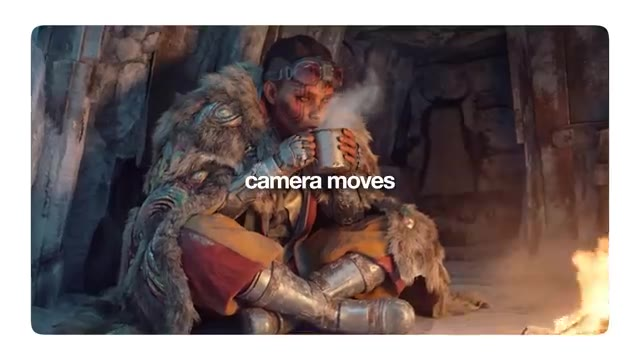
*Séquence vidéo montrant un personnage dans un décor enneigé avec le texte à l'écran 'camera moves'.*

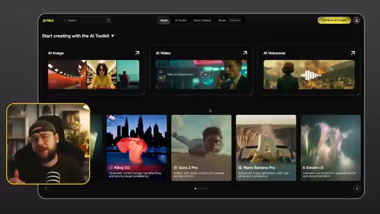
*Interface de la plateforme Artlist affichant le tableau de bord 'AI Toolkit' avec différentes sections créatives et un encadré PiP montrant Jack en bas à gauche.*

---

### ⏱️ `[00:00:59 - 00:01:18]` | Segment #03

**🔊 Audio (Transcription Intégrale Mot pour Mot en Français) :**
> Pour commencer, nous voulons nous rendre dans la boîte à outils d'IA et cliquer sur la section vidéo et image. Maintenant, l'une des choses que j'aime vraiment à propos de cette plateforme, c'est que vos générations sont organisées en sessions individuelles. Ainsi, vous pouvez voir sur le côté gauche ici, par exemple, nous avons une session pour les générations d'images et pour les générations de vidéos.

**👁️ Analyse Visuelle d'Écran (gemini-3.5-flash-lite) :**
**Interface & Outils** : Interface web d'Artlist (AI Toolkit)

**Contenu textuel & Code** : Menus "AI Toolkit", "AI Image", "AI Video", "AI Voiceover", et vignettes de modèles comme Kling 3.0, Sora 2 Pro, Nano Banana Pro, et Eleven v3. Panneau latéral gauche avec "New session", "Image Gen", "Video Gen", "Video Generations".

**Action / Démonstration** : Le créateur navigue dans l'interface de la plateforme Artlist, montrant les différentes sections d'outils d'IA puis l'organisation des sessions dans le panneau latéral.

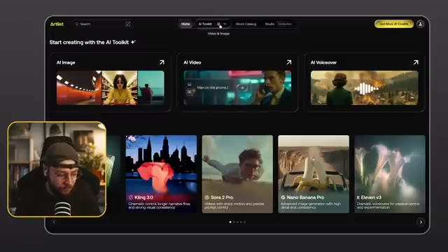
*Interface principale d'Artlist montrant la boîte à outils d'IA avec les options de génération d'images et de vidéos.*

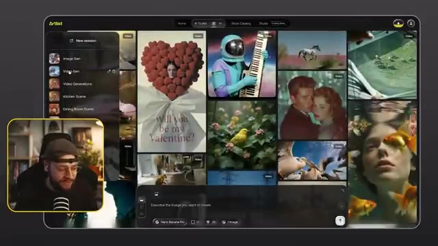
*Interface d'Artlist affichant le panneau latéral des sessions individuelles pour les générations d'images et de vidéos.*

---

### ⏱️ `[00:01:18 - 00:01:53]` | Segment #04

**🔊 Audio (Transcription Intégrale Mot pour Mot en Français) :**
> Et je veux juste jeter un coup d'œil très rapide sur la scène de la génération d'images. On ne va pas s'attarder ici trop longtemps parce que vous avez cliqué sur cette vidéo pour regarder les mouvements de caméra, mais je voulais quand même vous montrer comment nous avons créé certaines de ces images de départ. Maintenant, bien sûr, lorsqu'il s'agit de générer des vidéos par IA, nous pouvons simplement utiliser un prompt textuel, mais personnellement, je privilégie toujours un flux de travail image vers vidéo. C'est donc là que nous utiliserons un outil comme Nano Banana Pro pour générer ces images de départ, puis que nous irons les animer avec un modèle vidéo comme Kling 3 par exemple, et cela nous donne juste beaucoup plus de contrôle lorsqu'il s'agit de notre résultat final.

**👁️ Analyse Visuelle d'Écran (gemini-3.5-flash-lite) :**
**Interface & Outils** : Interface web de la plateforme Artlist (AI Toolkit) comprenant une grille d'images générées par IA, un champ de prompt textuel flottant avec le modèle "Nano Banana Pro" sélectionné, et une incrustation vidéo (PiP) du créateur en bas à gauche.

**Contenu textuel & Code** : Textes visibles : "Artlist", "Home", "AI Toolkit", "Stock Catalog", "Studio", "Describe the image you want to create", "Nano Banana Pro", options "1:1", "2K", "1 Image". Le contenu visuel montre une grille d'images variées incluant des loups dans la neige, des crânes en feu, un feu de camp et des personnages fantastiques.

**Action / Démonstration** : Le créateur présente l'interface d'Artlist et montre la galerie d'images tout en expliquant son flux de travail allant de la génération d'images avec "Nano Banana Pro" à l'animation vidéo.

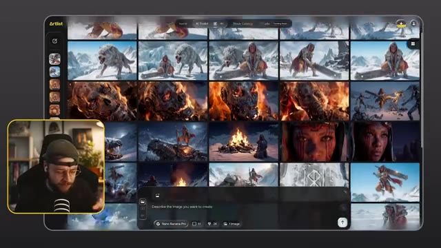
*Interface de la plateforme Artlist affichant une galerie d'images générées par IA avec un panneau de prompt "Nano Banana Pro" en bas.*

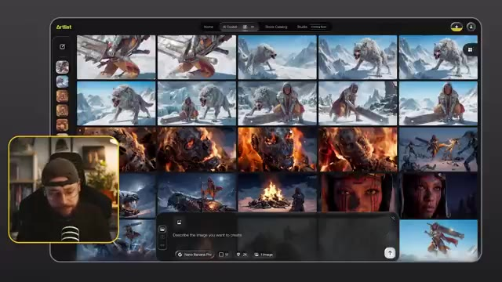
*Défilement de la grille d'images sur l'interface Artlist avec le créateur en incrustation vidéo (PiP) dans le coin inférieur gauche.*

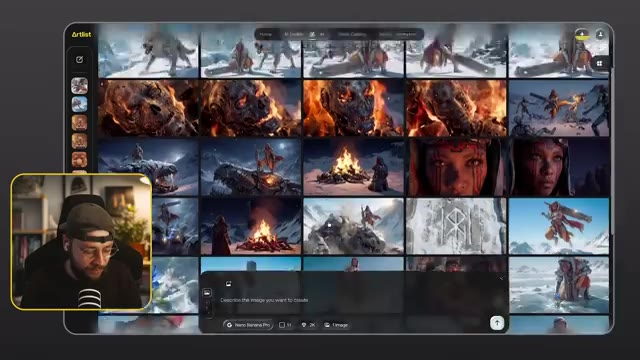
*Vue continue de la galerie d'images sur Artlist montrant différentes scènes de fantasy et de science-fiction générées par IA.*

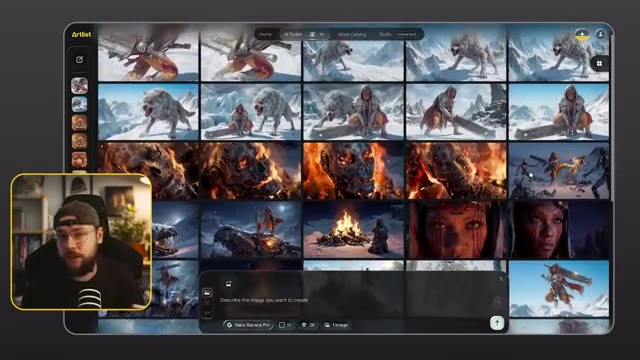
*Gros plan sur l'interface Artlist avec la barre de saisie de prompt "Describe the image you want to create" et le sélecteur "Nano Banana Pro".*

---

### ⏱️ `[00:01:53 - 00:02:13]` | Segment #05

**🔊 Audio (Transcription Intégrale Mot pour Mot en Français) :**
> La première étape que je fais toujours lorsqu'il s'agit de ma génération d'images, c'est de configurer un visuel clé comme celui que vous pouvez voir à l'écran maintenant. Donc, pour le visuel clé, nous voulons vraiment verrouiller des aspects comme le personnage, le lieu et le style, car tout va naître de cette image. Il est donc très, très important de bien le faire.

**👁️ Analyse Visuelle d'Écran (gemini-3.5-flash-lite) :**
**Interface & Outils** : Interface de la plateforme Artlist (AI Toolkit / Image Generation) avec une vue en grille des créations et un panneau de détails latéral.

**Contenu textuel & Code** : Galerie d'images générées avec un thème de science-fiction/fantasy hivernal. Sur l'image 2, le panneau latéral indique le modèle (Nano Banana Pro), le format (16:9), la qualité (4K) et le prompt textuel utilisé.

**Action / Démonstration** : Le créateur présente son interface de génération d'images et met en valeur un visuel clé central représentant un personnage dans un environnement enneigé.

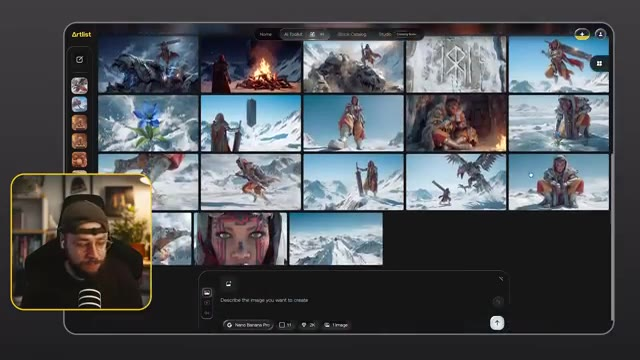
*Interface d'Artlist affichant une galerie de visuels générés par IA dans un décor enneigé, avec la webcam du créateur en incrustation.*

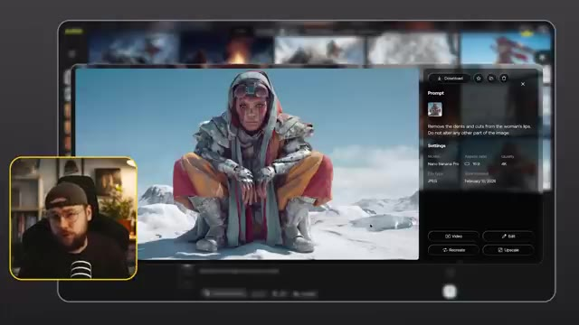
*Gros plan sur l'image clé sélectionnée montrant un personnage fantastique accroupi dans un paysage enneigé, avec le panneau des paramètres à droite.*

---

### ⏱️ `[00:02:13 - 00:02:31]` | Segment #06

**🔊 Audio (Transcription Intégrale Mot pour Mot en Français) :**
> Et juste pour vous donner un exemple, si nous cliquons sur cet onglet ici qui s'appelle édition, nous allons utiliser ce visuel clé comme référence d'image. Nous avons déjà Nano Banana Pro de sélectionné. Nous voulons définir notre format d'image à 16 par 9. Nous voulons également sélectionner la résolution 4K. Nous pouvons sélectionner la quantité d'images que nous voulons en retour.

**👁️ Analyse Visuelle d'Écran (gemini-3.5-flash-lite) :**
**Interface & Outils** : Interface de la plateforme Artlist AI Toolkit avec un panneau latéral de paramètres et une vue en grille des créations.

**Contenu textuel & Code** : Texte visible sur le panneau latéral : "Prompt: Remove the dents and cuts from the woman's lips. Do not alter any other part of the image." Paramètres : modèle "Nano Banana Pro", format "16:9", qualité "4K". En bas de l'écran 2 : "Nano Banana Pro", rapport d'aspect 1:1 (ou 16:9), résolution 2K/4K.

**Action / Démonstration** : Le créateur montre l'interface d'édition d'une image générée par IA sur Artlist, en expliquant comment configurer les paramètres de format, de résolution et de modèle.

*Interface d'Artlist montrant une image sélectionnée d'un personnage dans la neige avec les boutons d'options d'édition à droite et le présentateur en incrustation PiP.*

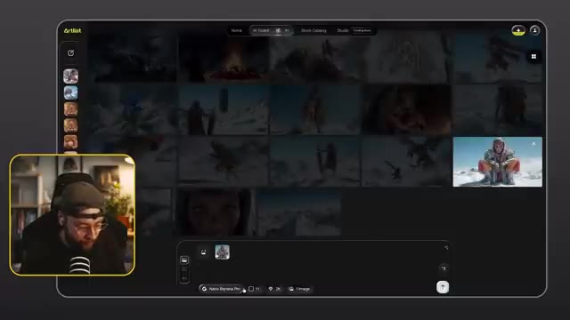
*Interface d'Artlist affichant la bibliothèque d'images avec le panneau de configuration en bas (Nano Banana Pro, format 16:9, résolution 4K) et le présentateur en incrustation PiP.*

---

### ⏱️ `[00:02:31 - 00:03:04]` | Segment #07

**🔊 Audio (Transcription Intégrale Mot pour Mot en Français) :**
> Allons-y simplement pour une ici pour cet exemple. Et nous pouvons saisir un prompt du genre montrer la même image de nuit. La même femme est allongée en train de dormir sous une épaisse couverture de fourrure. Nous pouvons envoyer ceci. Et c'est exactement le même processus que j'ai suivi pour générer chacune des images de départ que vous pouvez voir ici et vous pouvez voir ici que nous avons récupéré notre résultat de Nano Banana Pro donc si nous voulions avoir un plan où la femme dort sous les étoiles voilà à quel point c'est simple avec ce modèle d'image mais comme vous pouvez le voir ici nous avons une très grande variété de toutes sortes de

**👁️ Analyse Visuelle d'Écran (gemini-3.5-flash-lite) :**
**Interface & Outils** : Interface de la plateforme Artlist (AI Toolkit) affichant une galerie d'images générées par IA avec des options de prompts et de modèles.

**Contenu textuel & Code** : Texte du prompt visible : « Show the same image at night, the same woman is laid down sleeping under a thick fur blanket. » Modèle utilisé : Nano Banana Pro, format 16:9, résolution 4K.

**Action / Démonstration** : Le créateur démontre comment modifier un prompt sur Artlist pour générer une variante nocturne d'une image existante à l'aide du modèle Nano Banana Pro.

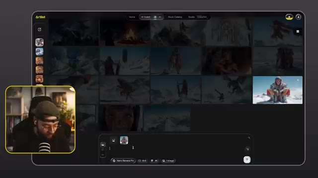
*Interface d'Artlist montrant la bibliothèque d'images générées et une fenêtre de prompt avec le modèle Nano Banana Pro.*

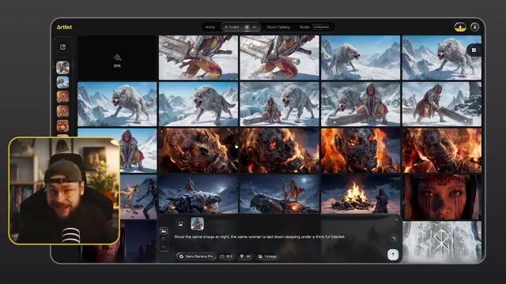
*Interface d'Artlist avec le champ de prompt rempli pour modifier l'image de la femme dormant sous la neige.*

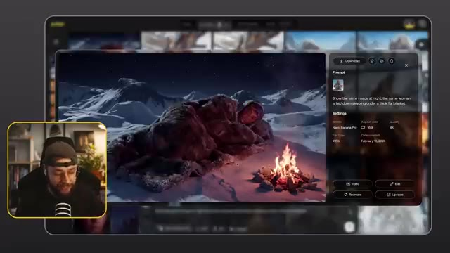
*Fenêtre de résultat détaillée sur Artlist affichant l'image générée de la femme dormant sous une couverture de fourrure près d'un feu de camp la nuit sous un ciel étoilé.*

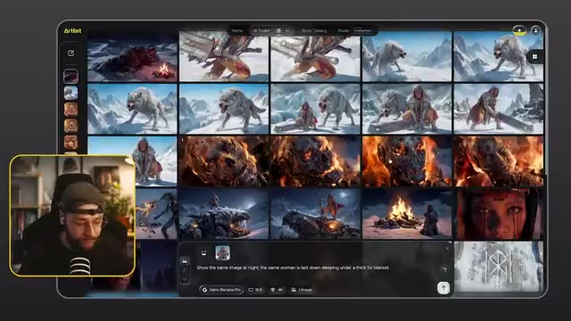
*Retour à la vue d'ensemble de la bibliothèque d'images générées sur Artlist.*

---

### ⏱️ `[00:03:04 - 00:03:39]` | Segment #08

**🔊 Audio (Transcription Intégrale Mot pour Mot en Français) :**
> différents angles de caméra ici où notre personnage principal participe à différentes actions, elle interagit avec différents accessoires, différents personnages, elle est dans toutes sortes de positions différentes et même à différents moments de la journée également donc une fois que vous avez ce genre de sélection ici, nous pouvons maintenant passer à l'animation de ces images de départ alors allons-y et cliquons dans la session de génération vidéo maintenant je veux commencer par jeter un œil à deux styles de mouvements de caméra assez différents qui sont très populaires en ce moment nous avons le style mocap ou bras robotique maintenant dans le style traditionnel

**👁️ Analyse Visuelle d'Écran (gemini-3.5-flash-lite) :**
**Interface & Outils** : Interface de la plateforme Artlist avec grille de vignettes et outils de génération IA, incluant un retour vidéo PiP du créateur.

**Contenu textuel & Code** : Texte du prompt visible : "Show the same image at night, the same woman is laid down sleeping under a thick fur blanket" avec les paramètres de modèle "Nano Banana Pro", format 16:9, et curseurs de configuration.

**Action / Démonstration** : Le créateur montre la sélection variée d'images de personnages générées sur Artlist, puis passe à l'animation et à la démonstration des mouvements de caméra.

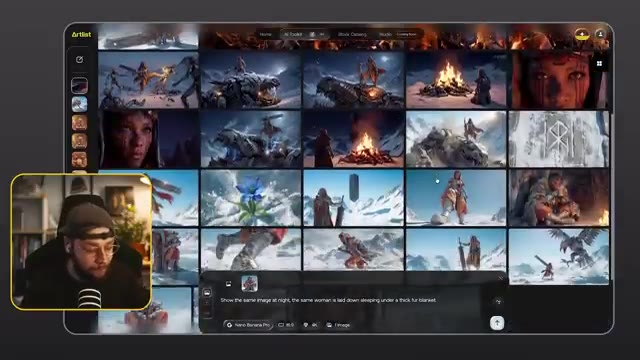
*Interface d'Artlist affichant une galerie de générations d'images avec les différentes poses et angles du personnage principal, et Jack en incrustation vidéo (PiP).*

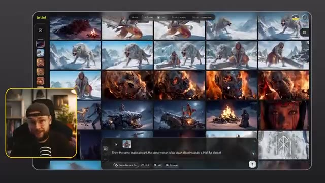
*Poursuite de la présentation de la grille d'images sur Artlist montrant les différentes scènes et interactions du personnage.*

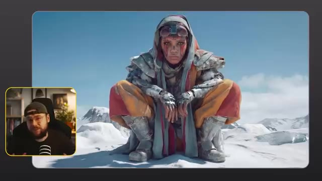
*Gros plan sur une image générée montrant le personnage principal accroupi dans un paysage enneigé.*

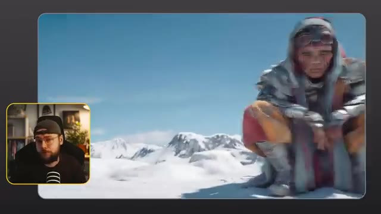
*Animation en cours d'un plan de caméra montrant le personnage principal dans le paysage enneigé.*

---

### ⏱️ `[00:03:39 - 00:04:16]` | Segment #09

**🔊 Audio (Transcription Intégrale Mot pour Mot en Français) :**
> productions, c'est un équipement vraiment très cher où l'on programme des mouvements de caméra très précis, on pose des repères (keyframes) essentiellement, et ce bras robotique très lourd et coûteux déplace la caméra entre différents points beaucoup plus rapidement qu'un opérateur humain ne pourrait le faire. Nous pouvons réellement obtenir ce rendu avec l'IA, et nous avons également le plan subjectif ou le gréement verrouillé, et c'est là que l'on a l'impression que la caméra est presque attachée à notre personnage. Encore une fois, cela donne un point de vue vraiment unique et un style de mouvement également très unique. Je vois ces types

**👁️ Analyse Visuelle d'Écran (gemini-3.5-flash-lite) :**
**Interface & Outils** : Présentation vidéo avec incrustation PiP du présentateur Jack (Jack Vs. AI) commentant des exemples de rendus vidéo générés par IA.

**Contenu textuel & Code** : Générations vidéo de science-fiction / fantasy montrant un personnage guerrier dans un paysage enneigé avec des mouvements de caméra dynamiques (type bras robotique et plan subjectif).

**Action / Démonstration** : Le créateur illustre ses propos sur les mouvements de caméra robotiques et les plans subjectifs générés par IA à l'aide d'exemples vidéo dynamiques.

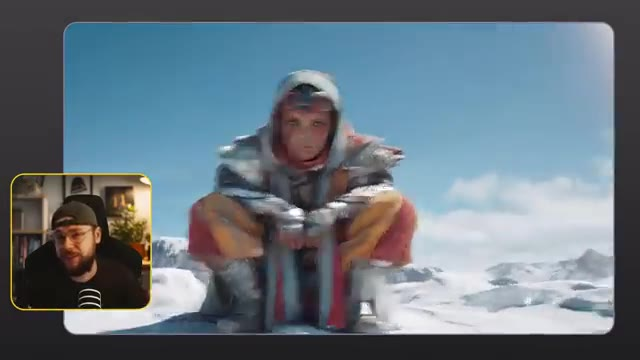
*Rendu vidéo IA montrant un personnage accroupi dans un décor enneigé avec Jack en incrustation PiP.*

*Gros plan du personnage accroupi avec des marques sur le visage dans le paysage enneigé.*

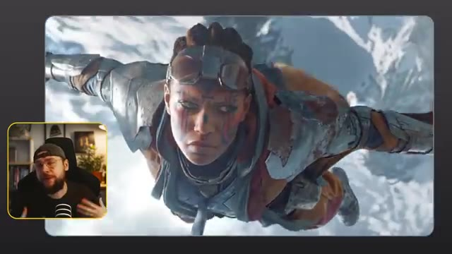
*Plan subjectif en plein vol ou en chute, caméra fixée au personnage dans un environnement de montagne enneigée.*

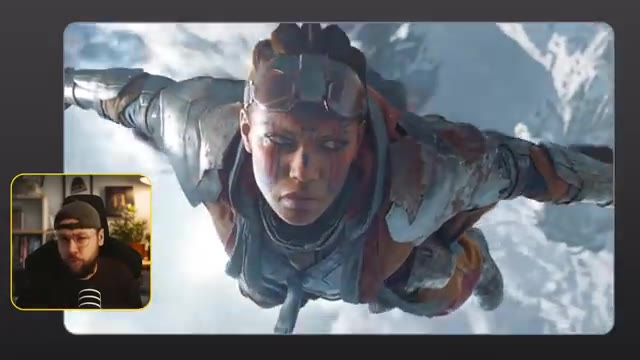
*Poursuite du plan subjectif en vol avec un effet de caméra attachée au personnage.*

---

### ⏱️ `[00:04:16 - 00:04:44]` | Segment #10

**🔊 Audio (Transcription Intégrale Mot pour Mot en Français) :**
> des mouvements de caméra étant beaucoup utilisés, je voulais commencer par ceux-là parce que Kling 3 crée vraiment des générations incroyables en utilisant les prompts que je vais partager avec vous les gars. Donc la façon dont je rédigerais ces prompts personnellement serait en utilisant ChatGPT. Je mettrais un prompt du genre : écris-moi un prompt textuel pour un modèle de vidéo par IA qui a un mouvement de caméra de type bras robotisé slash contrôle de mouvement, caractérisé par des passes latérales rapides, des accélérations vives, mais sans tremblement.

**👁️ Analyse Visuelle d'Écran (gemini-3.5-flash-lite) :**
**Interface & Outils** : Interface sombre de type ChatGPT affichant la question « What can I help with? » avec une zone de saisie de texte.

**Contenu textuel & Code** : Texte du prompt visible dans l'interface : « Write me a text prompt for an AI video model that has robotic arm / motion control style rig camera movement, characterised by fast lateral passes, snappy accelerations, but no shake. Ensure the character's face and outfit remain stable and artefact free. »

**Action / Démonstration** : Le créateur montre un exemple de génération vidéo générée par IA représentant un personnage en vol, puis passe sur une interface textuelle (ChatGPT) où est rédigé un prompt détaillé pour concevoir ces mouvements de caméra.

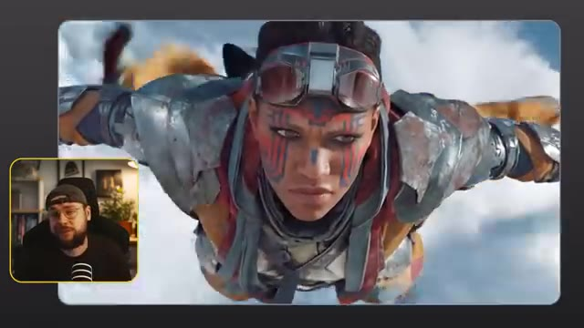
*Génération vidéo IA montrant un personnage féminin en armure dans le ciel avec un encadré PiP de Jack.*

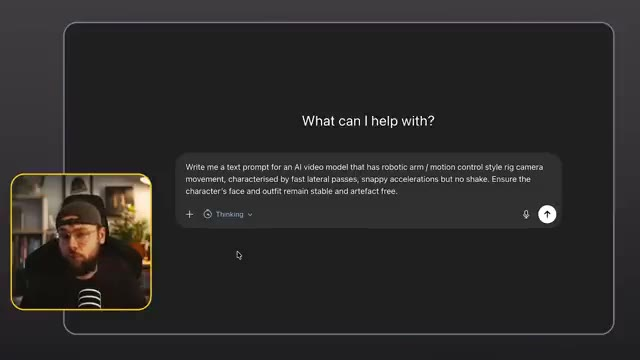
*Interface de ChatGPT affichant un prompt textuel pour générer des mouvements de caméra avec un encadré PiP de Jack.*

---

### ⏱️ `[00:04:44 - 00:05:19]` | Segment #11

**🔊 Audio (Transcription Intégrale Mot pour Mot en Français) :**
> Assurez-vous que le visage et la tenue du personnage restent stables et sans artefacts. Et ensuite, vous voulez simplement continuer en décrivant ce que vous voulez voir avec votre génération. Ce prompt ici est essentiellement un modèle qui va verrouiller ce style de mouvement de caméra et vous donner ce résultat très spécifique. Mais c'est à vous, en tant que créateur, de transmettre exactement ce que vous voulez voir, ce que vous voulez que votre personnage fasse ou ce qui se passe dans votre lieu. Et un autre conseil est de dire combien de temps vous voulez que votre génération dure, car vous pouvez demander à ChatGPT d'atteindre certaines clés

**👁️ Analyse Visuelle d'Écran (gemini-3.5-flash-lite) :**
**Interface & Outils** : Interface de ChatGPT (image 1) et interface de la plateforme Artlist (image 2), toutes deux accompagnées d'un encadré Picture-in-Picture (PiP) du créateur en bas à gauche.

**Contenu textuel & Code** : Image 1 : Texte "What can I help with?" et prompt saisi : "Write me a text prompt for an AI video model that has robotic arm / motion control style rig camera movement, characterised by fast lateral passes, snappy accelerations but no shake. Ensure the character's face and outfit remain stable and artefact free.". Image 2 : Grille de vignettes vidéo dans un environnement enneigé et un champ de saisie de prompt en bas avec le texte "Show the same image at night, the same woman is laid down sleeping under a thick fur blanket."

**Action / Démonstration** : Le créateur montre son écran pour illustrer la rédaction de prompts textuels destinés à guider des modèles de génération vidéo par intelligence artificielle, en expliquant comment structurer les instructions de mouvement de caméra et de stabilité des personnages.

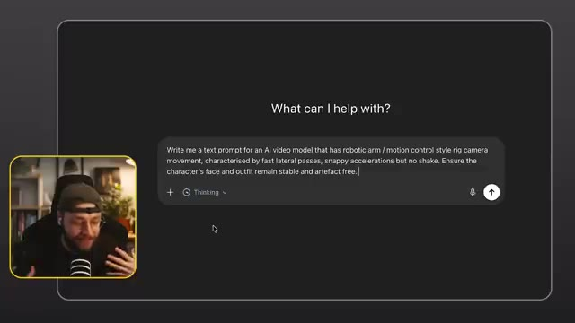
*Interface d'un assistant textuel (type ChatGPT) affichant un prompt détaillé pour un modèle vidéo IA avec un encadré PiP du créateur.*

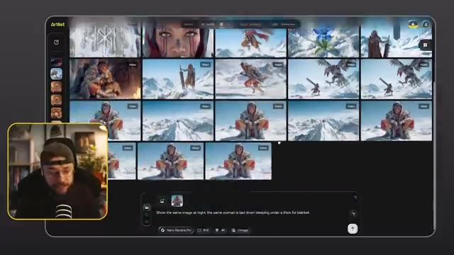
*Interface de la plateforme Artlist montrant une grille de vidéos générées par IA dans un décor enneigé avec une zone de prompt en bas.*

---

### ⏱️ `[00:05:19 - 00:05:52]` | Segment #12

**🔊 Audio (Transcription Intégrale Mot pour Mot en Français) :**
> moments et de les répartir uniformément sur, disons, 15 secondes par exemple, lorsqu'il s'agit de Kling 3. J'ai donc des tonnes d'exemples vraiment formidables ici qui capturent très joliment ce style de mouvement très spécifique. Vous pouvez voir que nous sommes capables de faire une orbite autour de notre personnage. Nous pouvons passer d'un plan large à un gros plan extrême incroyablement rapidement, mais en fait, c'est l'une des générations les plus détendues. Je vais aller de l'avant et vous montrer mon préféré et c'est celui-ci.

**👁️ Analyse Visuelle d'Écran (gemini-3.5-flash-lite) :**
**Interface & Outils** : Interface web d'Artlist affichant une galerie de vidéos générées par IA, avec une zone de prompt textuel et un panneau d'inspection des paramètres vidéo.

**Contenu textuel & Code** : Texte du prompt visible sur l'image 2 : "Start with a kneeling woman centered in frame. Camera performs a fast lateral pass left-to-right while keeping her centered via pan compensation, then a brief crash push-in to the face, then a quick pull-back to the original distance, then a fast pass right-to-left returning to the starting centered framing. No circular motion. Robotic arm / motion control, snappy accelerations but no shake. Stable face." Paramètres visibles : Model Kling 3.0, Aspect ratio 16:9, Resolution 1920x1072.

**Action / Démonstration** : Le créateur présente l'interface d'Artlist montrant les différentes générations de vidéos basées sur Kling 3 avec des mouvements de caméra dynamiques, puis zoome sur un exemple précis avec son panneau de configuration.

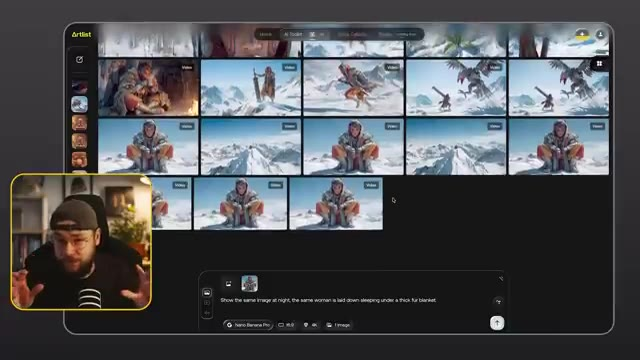
*Interface d'Artlist montrant une grille de vidéos générées avec un champ de prompt en bas contenant le texte de génération.*

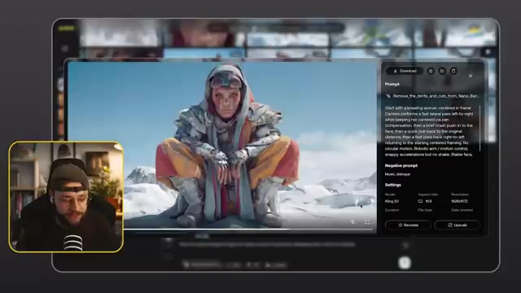
*Visionneuse vidéo d'Artlist affichant un plan rapproché d'un personnage accroupi dans la neige avec le panneau de prompt et les réglages détaillés sur le côté droit.*

---

### ⏱️ `[00:05:52 - 00:06:27]` | Segment #13

**🔊 Audio (Transcription Intégrale Mot pour Mot en Français) :**
> génération ici où le bras robotisé effectue ces mouvements de caméra vraiment erratiques et fous et c'est littéralement comme un plongeon vers ce gros plan extrême et on ressent vraiment à quel point ce mouvement de caméra est viscéral et expressif. Donc vous pouvez voir le prompt textuel assez complexe sur le côté droit ici. Je vais veiller à mettre tout cela en bas dans la description au passage si vous voulez aller les tester sur vos propres projets. Et vous pouvez voir avec cet exemple que chat gpt a découpé chaque moment clé et les a numérotés donc nous avons un micro snap instantané

**👁️ Analyse Visuelle d'Écran (gemini-3.5-flash-lite) :**
**Interface & Outils** : Interface d'une application de génération vidéo par IA (Kling 3.0) affichant une vidéo en cours de lecture, un panneau de prompt textuel à droite et les paramètres techniques (modèle Kling 3.0, format 16:9, résolution 1920x1072), avec le créateur Jack visible dans une petite fenêtre PiP en bas à gauche.

**Contenu textuel & Code** : Texte visible dans le prompt : "Start with a kneeling woman centered in frame. Execute a rapid sequence of motion-control moves with extreme, snappy accelerations and clean deceleration beats: (1) instant micro snap left, then micro snap right (two quick lateral jolts) while keeping her face centered via pan compensation, (2) a very fast left-to-right lateral pass across her her with a hard stop, (3) immediate crash push-in to an extreme close-up of the face;". Paramètres : Modèle "Kling 3.0", Ratio "16:9", Résolution "1920x1072". Negative prompt : "Music, dialogue".

**Action / Démonstration** : Le lecteur vidéo intégré à l'interface joue la séquence générée par IA montrant des mouvements de caméra dynamiques et erratiques commandés par le prompt textuel, tandis que Jack commente et explique le processus en incrustation PiP.

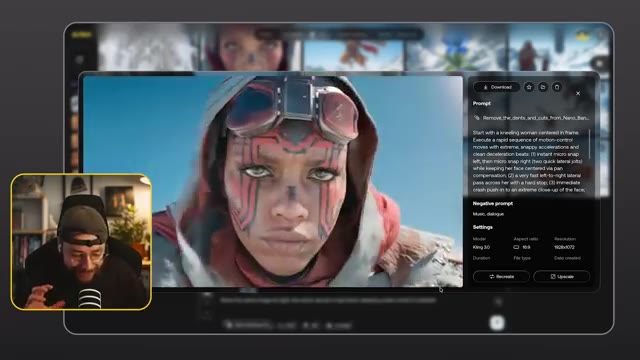
*Gros plan extrême sur le visage d'une femme avec le panneau de prompt et les réglages du modèle Kling 3.0 à droite, et Jack en incrustation PiP.*

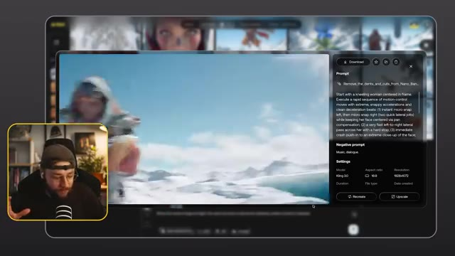
*Mouvement de caméra rapide et latéral avec flou de mouvement montrant un paysage enneigé, panneau de prompt à droite et Jack en incrustation PiP.*

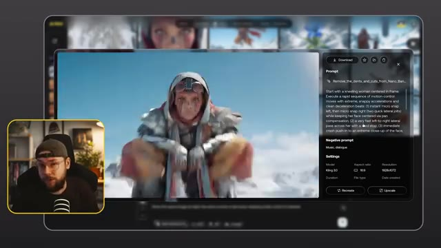
*Vue en plan large d'une femme agenouillée dans la neige avec les bras écartés, panneau de prompt à droite et Jack en incrustation PiP.*

---

### ⏱️ `[00:06:27 - 00:07:04]` | Segment #14

**🔊 Audio (Transcription Intégrale Mot pour Mot en Français) :**
> à gauche puis micro-secousse à droite, des secousses latérales rapides tout en gardant son visage centré via la compensation de panoramique. C'est donc un prompt très détaillé ici, mais c'est juste un type de mouvement de caméra très spécifique et unique qui ne fait pas humain, et parfois c'est sympa de l'intégrer dans vos projets pour un moment précis où vous aimeriez vous démarquer. Ça fonctionne aussi très bien pour la publicité. Je pense donc que c'est un excellent style de mouvement de caméra à ajouter à votre boîte à outils. Maintenant, ensuite, je veux passer à ce plan de style point de vue ou grig fixe. Allons donc ouvrir ceci.

**👁️ Analyse Visuelle d'Écran (gemini-3.5-flash-lite) :**
**Interface & Outils** : Plateforme Artlist (AI Toolkit / Video generation interface).

**Contenu textuel & Code** : Prompt visible : « Start with a kneeling woman centered in frame. Execute a rapid sequence of motion-control moves with extreme, snappy accelerations and clean deceleration beats: (1) instant micro snap left, then micro snap right (two quick lateral jolts) while keeping her face centered via pan compensation; (2) a very fast left-to-right lateral pass across her with a hard stop; (3) immediate crash push-in to an extreme close-up of the face; ». Paramètres : Modèle Kling 3.0, ratio 16:9, résolution 1920x1072. Prompt de la troisième image : « Show the same image at night, the same woman is laid down sleeping under a thick fur blanket ».

**Action / Démonstration** : Le créateur montre l'interface d'Artlist, lit un prompt détaillé de mouvement de caméra, puis passe à une vue de la galerie de projets.

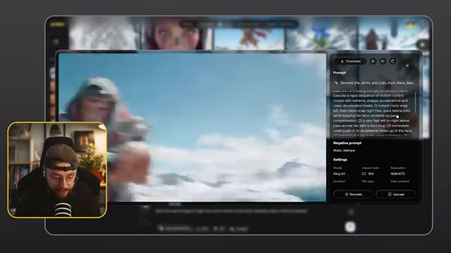
*Interface d'Artlist montrant un aperçu vidéo avec le panneau de prompt textuel et les paramètres du modèle Kling 3.0.*

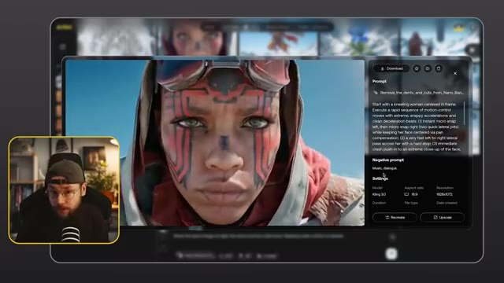
*Gros plan sur la vidéo générée dans Artlist montrant le visage du personnage féminin avec des peintures faciales.*

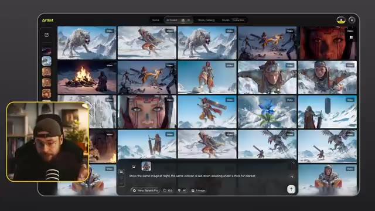
*Galerie de projets et de miniatures de vidéos générées sur la plateforme Artlist avec un champ de saisie de prompt en bas.*

---

### ⏱️ `[00:07:04 - 00:07:40]` | Segment #15

**🔊 Audio (Transcription Intégrale Mot pour Mot en Français) :**
> et jetez un œil ici. Donc pour le prompt textuel, nous disons : créez un plan à haute vitesse ultra-réaliste avec la caméra agrippant physiquement la tête de la femme, comme si elle était montée ou fermement maintenue, tout en maintenant une perspective de suivi verrouillée. La femme reste centrée et stable tandis que le vaste paysage montagneux défile à toute allure. Forte parallaxe, la femme réalise des figures aériennes et un salto. Un suivi net et précis maintient la tête de la femme centrée. Et vous connaissez probablement ce style de plan. La façon dont cela serait réalisé dans une production réelle est que l'acteur pourrait bien porter

**👁️ Analyse Visuelle d'Écran (gemini-3.5-flash-lite) :**
**Interface & Outils** : Interface web d'un outil de génération de vidéo par IA (similaire à Kling ou autre plateforme de génération) avec un panneau latéral de paramètres et de prompt textuel, et un encadré PiP (Picture-in-Picture) du créateur en bas à gauche.

**Contenu textuel & Code** : Texte du prompt : "Create an ultra realistic high speed shot with the camera physically gripping the woman's head as if mounted or tightly held maintaining a locked trailing perspective. The woman stays centered and stable while the vast mountainous landscape rushes past. Heavy parallax, the woman performs aerial turns at a flip. Clean, precise tracking keeps the woman's head centered." Paramètres visibles : Model: Kling 3.0, Aspect ratio: 16:9, Quality: Standard, Resolution: 1920x1076, Duration: 10 sec, File type: MP4.

**Action / Démonstration** : Le créateur commente et présente la génération d'une vidéo réaliste de sport extrême en chute libre tout en affichant l'interface complète de l'outil avec le prompt et les paramètres techniques.

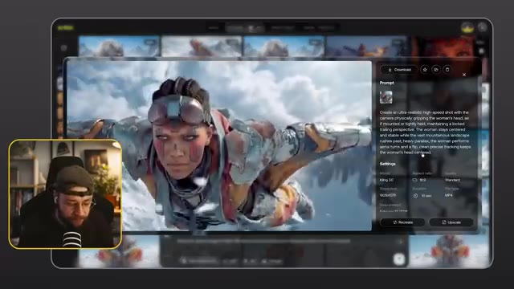
*Interface d'un générateur de vidéo par IA affichant un plan de femme en chute libre avec un prompt détaillé et des paramètres techniques (Kling 3.0, 16:9, 10s).*

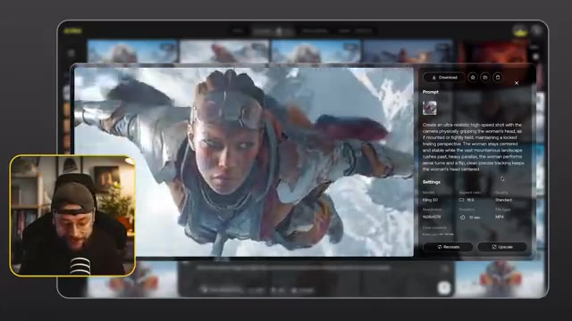
*La même interface de génération vidéo montrant la progression de la lecture de la vidéo de la femme en chute libre.*

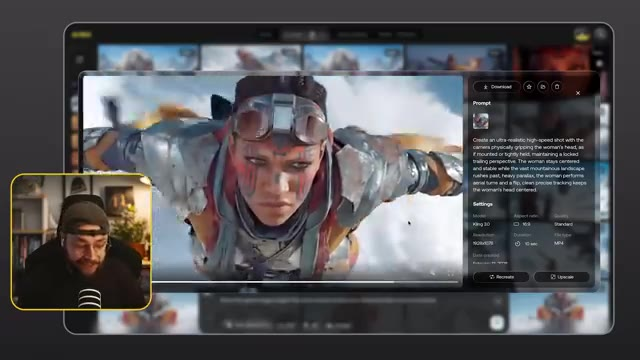
*Vue continue de l'interface avec le lecteur vidéo en cours de lecture et les options de téléchargement et de modification.*

---

### ⏱️ `[00:07:40 - 00:08:15]` | Segment #16

**🔊 Audio (Transcription Intégrale Mot pour Mot en Français) :**
> un vrai support de caméra fixé dessus et cela devrait être retiré en post-production par un artiste d'effets visuels par exemple, mais encore une fois, cela donne juste un style de mouvement de caméra vraiment unique et une perspective vraiment unique également, et rappelez-vous que ces invites textuelles peuvent simplement être utilisées comme un cadre de travail. Si vous avez un type de plan différent, peut-être que vous voyez un animal par exemple, nous remplaçons juste le mot femme par tigre, guépard ou autre et vous allez obtenir un résultat très similaire parce qu'avec ce cadre de travail d'invite, nous intégrons ce type de mouvement de caméra et c'est à vous de décider comment l'utiliser pour votre

**👁️ Analyse Visuelle d'Écran (gemini-3.5-flash-lite) :**
**Interface & Outils** : Interface de Kling 3.0 affichant un lecteur vidéo au centre et un panneau de détails à droite avec le prompt textuel et les réglages (modèle Kling 3.0, ratio 16:9, qualité Standard, résolution 1920x1078, durée 10 sec, type MP4), avec une incrustation vidéo (PiP) du créateur en bas à gauche.

**Contenu textuel & Code** : Texte du prompt visible : "Create an ultra-realistic high-speed shot with the camera physically gripping the woman's head, as if mounted or tightly held, maintaining a locked trailing perspective. The woman stays centered and stable while the vast mountainous landscape rushes past, heavy parallax, the woman performs aerial turns and a flip, clean precise tracking keeps the woman's head centered." Paramètres visibles : Model Kling 3.0, Aspect ratio 16:9, Quality Standard, Resolution 1920x1078, Duration 10 sec, File type MP4.

**Action / Démonstration** : Le créateur parle en direct dans son studio tandis que son écran affiche une interface de génération vidéo par IA (Kling 3.0) montrant le résultat d'un plan caméra ultra-réaliste fixé sur la tête d'un personnage féminin en mouvement rapide.

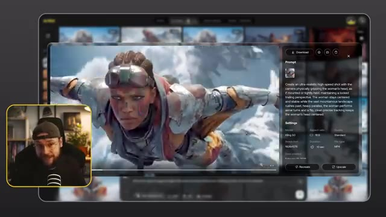
*Interface logicielle (Kling 3.0) montrant le rendu vidéo d'un personnage en chute libre avec un panneau latéral de paramètres et de prompt, avec le créateur en incrustation PiP.*

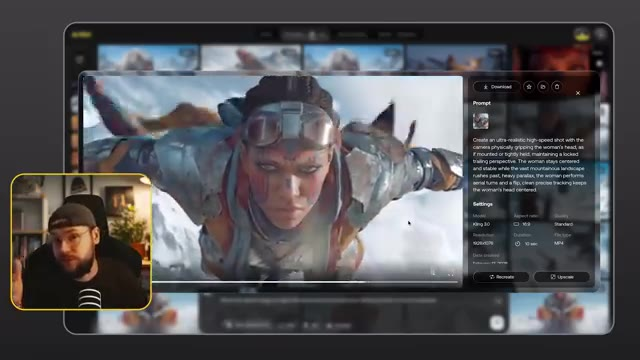
*Interface logicielle (Kling 3.0) montrant la suite du rendu vidéo du personnage en chute libre avec les paramètres de génération visibles, et le créateur en incrustation PiP.*

---

### ⏱️ `[00:08:15 - 00:08:54]` | Segment #17

**🔊 Audio (Transcription Intégrale Mot pour Mot en Français) :**
> propres projets. Passons maintenant à des mouvements de caméra plus traditionnels mais tout aussi importants pour vos projets, nous avons le tilt, et vous pouvez voir ici que j'ai utilisé une image de début et de fin. Encore une fois, j'utilise Nano Banana Pro pour créer cette image de cette rune gravée sur ce sol en pierre enneigé. C'est donc notre image de départ, puis nous avons ce plan en très contre-plongée regardant notre personnage, donc Kling 3 va aller de l'avant et générer la transition entre ces deux points en utilisant notre invite textuelle, nous demandons donc un mouvement vertical fluide vers le haut à vitesse constante avec une stabilité semblable à celle d'un trépied.

**👁️ Analyse Visuelle d'Écran (gemini-3.5-flash-lite) :**
**Interface & Outils** : Interface du logiciel de génération vidéo Kling AI (Kling 3.0), affichée avec une incrustation (PiP) du créateur en bas à gauche.

**Contenu textuel & Code** : Prompt visible sur l'interface : "Smooth vertical tilt upward at constant speed. Tripod-like stability. No pan, no roll, no dolly." Paramètres : Kling 3.0, rapport 16:9, résolution 1280x720, durée 5s.

**Action / Démonstration** : Le créateur montre l'interface de Kling 3.0 illustrant l'utilisation d'images de début et de fin pour générer un mouvement de caméra de type tilt vertical.

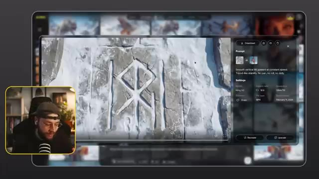
*Interface de Kling 3 montrant un aperçu vidéo avec le prompt de transition verticale et les paramètres de génération.*

---

### ⏱️ `[00:08:54 - 00:09:30]` | Segment #18

**🔊 Audio (Transcription Intégrale Mot pour Mot en Français) :**
> pas de panoramique, pas de rotation, pas de travelling, juste pour vous montrer brièvement comment générer des vidéos dans la boîte à outils d'IA si vous n'êtes pas familiarisé, nous voulons cliquer sur cette icône ici pour basculer vers la génération de vidéo, nous pouvons aller de l'avant et déposer notre prompt textuel pour ajouter notre image de départ, nous allons cliquer sur cette icône ici, nous pouvons simplement sélectionner choisir parmi vos générations, donc nous ferions défiler vers le bas pour trouver l'image de la rune sculptée dans le sol et ensuite sur l'image de fin qui bien sûr est optionnelle encore une fois nous allons sélectionner choisir parmi nos créations et nous recherchons ce plan en contre-plongée vraiment cool de notre personnage féminin

**👁️ Analyse Visuelle d'Écran (gemini-3.5-flash-lite) :**
**Interface & Outils** : Interface web d'Artlist (AI Toolkit) avec affichage en Picture-in-Picture du créateur dans le coin inférieur gauche.

**Contenu textuel & Code** : Texte du prompt visible sur l'image #2 : "Smooth vertical tilt upward at constant speed. Tripod-like stability. No pan, no roll, no dolly" avec les paramètres de génération (Veo 3.1, 16:9, 4 sec, Audio, 1080p). Sur l'image #1, affichage des détails d'un fichier vidéo (Kling 3.0, 16:9, 1280x716, 5 sec).

**Action / Démonstration** : Le créateur navigue dans l'interface de génération vidéo d'Artlist, montrant les options de sélection d'images de début et de fin ainsi que les paramètres de caméra.

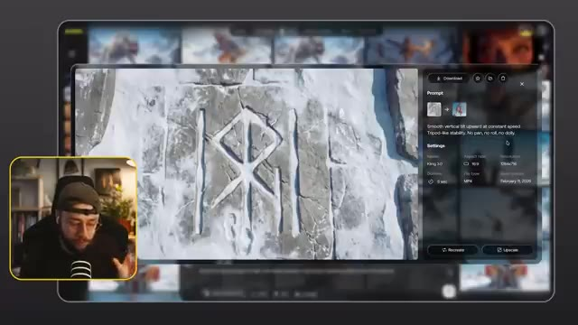
*Interface d'Artlist AI Toolkit affichant les détails d'une vidéo générée avec l'image d'une rune gravée.*

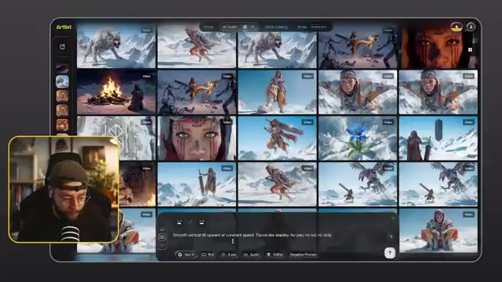
*Interface principale d'Artlist AI Toolkit montrant la grille des générations et la barre de prompt vidéo en bas.*

---

### ⏱️ `[00:09:30 - 00:10:05]` | Segment #19

**🔊 Audio (Transcription Intégrale Mot pour Mot en Français) :**
> Pour le modèle, nous voulons sélectionner Kling 3 car c'est le meilleur modèle de vidéo par IA sur le marché actuellement. Le ratio d'aspect, bien sûr, nous voulons qu'il corresponde à nos images d'entrée. Donc 16 par 9, nous voulons l'audio activé. Et la longueur de la génération dépend vraiment de vous les gars. Mais avec un mouvement de bascule, je suggérerais quelque chose autour de quatre à cinq secondes parce que vous ne voulez pas que cela prenne trop de temps. Parfois, pour les générations de certains mouvements de caméra, vous obtiendrez un meilleur résultat avec une longueur de génération plus courte. Je veux m'assurer que pro est sélectionné et vous avez également l'option pour les invites négatives. Il est souvent très utile d'y inclure des choses comme de la musique et des dialogues.

**👁️ Analyse Visuelle d'Écran (gemini-3.5-flash-lite) :**
**Interface & Outils** : Interface de la plateforme Artlist (AI Toolkit) affichant une grille de modèles de génération vidéo par IA (Veo 3.1, Kling 3.0, Grok Imagine, Sora 2, Seedance 1.5 Pro) avec une vue PiP du créateur en bas à gauche.

**Contenu textuel & Code** : Noms des modèles d'IA visibles : Veo 3.1, Kling 3.0, Grok Imagine, Sora 2, Sora 2 Pro, Seedance 1.5 Pro. Options de paramètres en bas : format 16:9, durée (4 à 5 secondes), option audio, mode Pro, et invite négative (Negative Prompt). Prompt textuel visible : « Smooth vertical tilt upward at constant speed: Tripod-like stability. No pan, no roll, no dolly. »

**Action / Démonstration** : Le curseur sélectionne le modèle Kling 3.0, puis clique sur le menu de durée pour choisir une génération de 5 secondes.

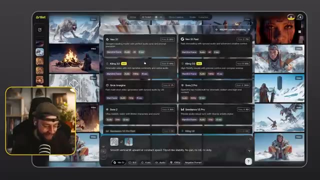
*Interface d'Artlist montrant la sélection du modèle vidéo Kling 3.0 avec la grille de choix des modèles et les paramètres de génération.*

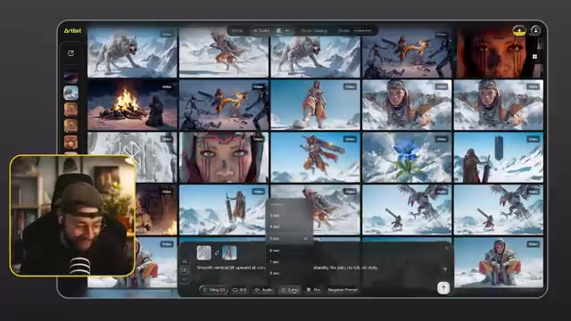
*Interface d'Artlist montrant le menu déroulant pour configurer la durée de la génération vidéo (réglée sur 5 secondes).*

---

### ⏱️ `[00:10:05 - 00:10:43]` | Segment #20

**🔊 Audio (Transcription Intégrale Mot pour Mot en Français) :**
> ici si vous ne voulez pas que l'une de ces choses soit intégrée dans vos générations, ce qui est très utile lorsqu'il s'agit de projets de films. Vous pourriez vouloir ajouter votre propre musique lors du montage lui-même par exemple, de sorte que vous ne voulez pas vraiment que ces éléments soient intégrés dans vos générations. C'est le processus pour générer des vidéos dans la boîte à outils Artlist AI, alors allons de l'avant et regardons la génération que nous avons obtenue. Et ce mouvement de caméra fonctionne vraiment bien comme une révélation parce que nous montrons un certain élément et ensuite nous inclinons la caméra vers le haut pour voir le personnage et sa réaction. Instantanément, nous savons en tant que spectateur que quoi que nous regardions, c'est très important.

**👁️ Analyse Visuelle d'Écran (gemini-3.5-flash-lite) :**
**Interface & Outils** : Interface de la boîte à outils Artlist AI avec un affichage en grille des vidéos générées et un panneau de lecture/paramètres détaillé.

**Contenu textuel & Code** : Texte du prompt : « Smooth vertical tilt upward at constant speed. Tripod-like stability. No pan, no roll, no dolly ». Paramètres : Modèle Kling 3.0, format 16:9, résolution 1280x710, durée 5 sec.

**Action / Démonstration** : Le présentateur explique les avantages de ne pas inclure de musique ou de dialogues automatiques dans les générations IA, puis présente le résultat vidéo obtenu avec le mouvement de caméra de type « reveal ».

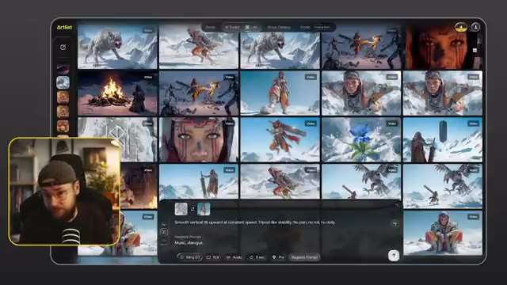
*Interface d'Artlist AI montrant une galerie de vidéos générées avec le prompt et les paramètres visibles en bas.*

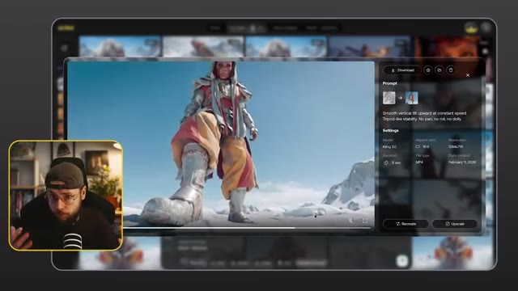
*Visualisation de la vidéo générée dans Artlist AI, montrant un plan en contre-plongée avec un mouvement de caméra de bas vers le haut révélant le personnage.*

---

### ⏱️ `[00:10:43 - 00:11:10]` | Segment #21

**🔊 Audio (Transcription Intégrale Mot pour Mot en Français) :**
> Nous ne savons peut-être pas pourquoi, mais c'est significatif pour le personnage et c'est une façon assez intéressante de réaliser cette révélation. Évidemment, il y a énormément de façons différentes d'utiliser le mouvement de caméra en inclinaison (tilt). Encore une fois, nous aurions pu l'utiliser dans l'autre sens également, en commençant par observer notre personnage féminin pour préserver un peu plus longtemps la révélation, afin que le spectateur se demande pourquoi elle a cette réaction, puis en inclinant la caméra vers le bas pour montrer la rune gravée dans le sol.

**👁️ Analyse Visuelle d'Écran (gemini-3.5-flash-lite) :**
**Interface & Outils** : Interface de la plateforme de génération vidéo Kling AI, avec une fenêtre de prévisualisation vidéo au centre et un panneau latéral droit contenant les détails du prompt et les paramètres techniques, ainsi qu'un encadré Picture-in-Picture montrant le présentateur dans son studio.

**Contenu textuel & Code** : Texte du prompt visible : "Smooth vertical tilt upward at constant speed. Tripod-like stability. No pan, no roll, no dolly". Paramètres : Version Kling 3.0, Aspect ratio 16:9, Résolution 1280x720, Durée 5 sec, Format MP4, Date February 11, 2026.

**Action / Démonstration** : Visualisation d'un rendu vidéo généré par intelligence artificielle montrant un mouvement de caméra de type tilt vertical vers le haut sur des bottes et des traces de pas dans la neige, tandis que le créateur commente les choix de mise en scène.

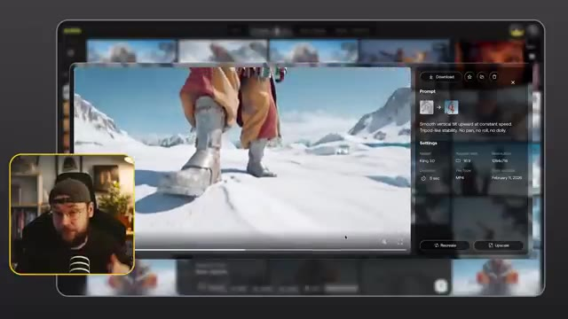
*Interface de l'outil de génération vidéo Kling AI affichant un plan de caméra avec mouvement de tilt vertical vers le haut dans un paysage enneigé.*

---

### ⏱️ `[00:11:10 - 00:11:46]` | Segment #22

**🔊 Audio (Transcription Intégrale Mot pour Mot en Français) :**
> Cela donne vraiment un sentiment de découverte, mais on se sent aussi un peu intimidés par notre personnage féminin en raison de ce plan en contre-plongée et du style de révélation également. Elle a l'air vraiment très dominante grâce à ce mouvement de caméra et à l'angle lui-même qui fonctionnent ensemble. Et le prochain style de mouvement de caméra que je veux examiner est le traveling avant ("dolly in"). Donc j'aime vraiment, vraiment beaucoup ce plan ici où notre personnage se cache en quelque sorte dans une sorte de grotte. Elle a une sorte de fourrure extraterrestre bizarre drapée sur elle et elle boit une gorgée de café dans cette tasse en fer-blanc. Vous pouvez voir que pour le prompt textuel, nous avons dit

**👁️ Analyse Visuelle d'Écran (gemini-3.5-flash-lite) :**
**Interface & Outils** : Interface de l'outil de génération vidéo Kling 3.0 avec une fenêtre modale de prévisualisation, affichant le lecteur vidéo, le prompt textuel, le modèle utilisé (Kling 3.0), le format (16:9), la résolution (1280x716 / 1920x1076), la durée (5 s) et les options "Recreate" et "Upscale". Le créateur apparaît également en médaillon Picture-in-Picture (PiP) dans le coin inférieur gauche.

**Contenu textuel & Code** : Texte du prompt visible sur l'image 1 : "Smooth vertical tilt upward at constant speed. Tripod-like stability. No pan, no roll, no dolly." Texte du prompt visible sur l'image 2 : "Camera dollies forward in a straight line toward the woman. Smooth stabilised motion. No zoom. The woman sips from the cup of coffee and wraps up in the blanket." Paramètres techniques : Modèle Kling 3.0, ratio 16:9, durée 5 sec, fichier MP4.

**Action / Démonstration** : Le créateur commente les mouvements de caméra générés par IA tandis que l'interface affiche les vidéos générées et les détails des prompts correspondants dans une fenêtre contextuelle.

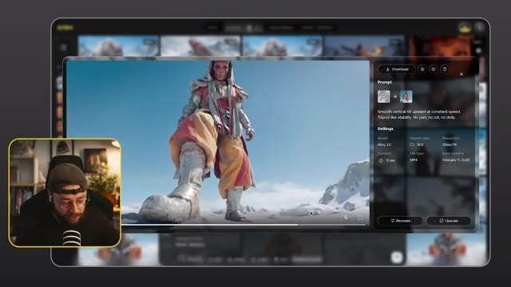
*Interface de l'outil montrant la vidéo du personnage en contre-plongée avec les détails du prompt et les paramètres techniques (Kling 3.0).*

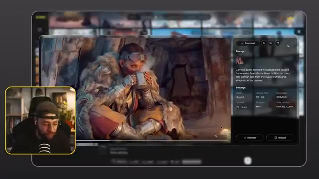
*Interface montrant le personnage dans la grotte buvant du café avec le panneau latéral affichant le prompt de traveling avant ("dolly in").*

---

### ⏱️ `[00:11:46 - 00:12:11]` | Segment #23

**🔊 Audio (Transcription Intégrale Mot pour Mot en Français) :**
> La caméra avance en ligne droite vers la femme. Mouvement fluide et stabilisé, pas de zoom. La femme boit une gorgée de café et s'enveloppe dans la couverture. Nous combinons donc un prompt textuel pour décrire le mouvement de caméra avec une description de l'action que nous voulons que notre personnage réalise. J'utilise des mouvements de caméra dolly avant et arrière dans mes projets tout le temps parce que je trouve juste qu'ils font vraiment cinématiques.

**👁️ Analyse Visuelle d'Écran (gemini-3.5-flash-lite) :**
**Interface & Outils** : Interface logicielle de génération vidéo avec un panneau latéral droit affichant les détails du prompt et des paramètres, et un encadré PiP (Picture-in-Picture) du créateur en bas à gauche.

**Contenu textuel & Code** : Texte du prompt visible : « Camera dollies forward in a straight line toward the woman. Smooth, stabilized motion, no zoom. The woman sips from the cup of coffee, and wraps up in the blanket. » Paramètres visibles : Model: Kling 3.0, Aspect ratio: 16:9, Resolution: 1280x720, Duration: 5 sec, File type: MP4.

**Action / Démonstration** : L'écran présente un aperçu vidéo généré par IA montrant une femme en tenue de survivaliste buvant une tasse fumante, avec un panneau de détails et de configuration de génération sur le côté droit.

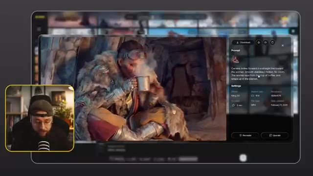
*Interface de génération vidéo montrant une femme dans un décor post-apocalyptique ou hivernal avec le prompt textuel et les paramètres de la vidéo.*

---

### ⏱️ `[00:12:12 - 00:12:31]` | Segment #24

**🔊 Audio (Transcription Intégrale Mot pour Mot en Français) :**
> Et ça fonctionne vraiment très bien ici parce que la femme est en train de se blottir. Et au fur et à mesure qu'elle le fait, on a l'impression qu'on se rapproche d'elle. Ça évoque donc cette sensation de chercher du confort et cette proximité qu'on ressent avec le personnage en tant que spectateur. C'est comme si on était attirés dans sa chaude caverne.

**👁️ Analyse Visuelle d'Écran (gemini-3.5-flash-lite) :**
**Interface & Outils** : Interface web de Kling 3.0 avec un panneau latéral affichant les détails du prompt, les paramètres de génération (modèle Kling 3.0, format 16:9, résolution 1920x1076, durée de 5 secondes, format MP4) et des boutons d'action (Recreate, Upscale), avec la webcam du créateur en PiP en bas à gauche.

**Contenu textuel & Code** : Texte visible dans le panneau de prompt : "Camera dollies forward in a straight line toward the woman. Smooth stabilised motion. No zoom. The woman sips from the cup of coffee, and wraps up in the blanket..." Paramètres affichés : Kling 3.0, 16:9, 1920x1076, 5 sec, MP4.

**Action / Démonstration** : Le créateur commente l'interface de Kling 3.0 et la vidéo générée montrant une femme emmitouflée dans une couverture buvant dans une tasse à l'intérieur d'une structure rocheuse, illustrant le mouvement de caméra avant (dolly).

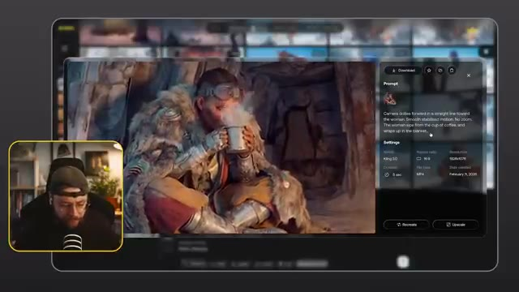
*Interface de l'outil de génération vidéo Kling 3.0 affichant un extrait de vidéo générée avec le prompt textuel et les paramètres de rendu, tandis que le créateur apparaît en incrustation PiP dans le coin inférieur gauche.*

---

### ⏱️ `[00:12:32 - 00:13:08]` | Segment #25

**🔊 Audio (Transcription Intégrale Mot pour Mot en Français) :**
> Nous pouvons ressentir le feu contre nous. Et j'utilise aussi cela sur le plan de tous les robots en train de brûler également. Et c'est ce que je veux dire par le fait que cela procure un sentiment très différent en raison de ce que nous voyons ici. C'est un peu comme si cela amplifiait l'intensité de ce que nous regardons, et cela donne une impression un peu sauvage en réalité, et un peu intimidante, un peu effrayante, et aussi la façon dont notre personnage féminin agit, qui a l'air un peu triste également, il y a beaucoup de réactions émotionnelles dues au type de mouvement de caméra dolly que nous utilisons et à ce que nous voyons à l'écran à ce moment-là.

**👁️ Analyse Visuelle d'Écran (gemini-3.5-flash-lite) :**
**Interface & Outils** : Interface de l'outil de génération vidéo Kling 3.0 avec panneau de prévisualisation vidéo, panneau latéral affichant le prompt, les paramètres techniques (Model: Kling 3.0, Aspect ratio: 16:9, Resolution: 1920x1076, Duration: 5 sec) et encadré PiP du créateur dans le coin inférieur gauche.

**Contenu textuel & Code** : Texte du prompt visible : "Camera dollies forward in a straight line toward the woman. Smooth stabilised motion, No zoom. The woman sips from the cup of coffee and wraps up in the blanket..." (Image 1) et "Camera dollies forward in a straight line. Smooth stabilised motion, No zoom. The fire blazes and the woman stays very still, shoulders and chest rising as if she is breathing heavily, we do not see her face" (Image 2).

**Action / Démonstration** : Le créateur commente les plans vidéo générés par IA et explique l'impact des mouvements de caméra dolly et de l'éclairage sur l'intensité émotionnelle de la scène.

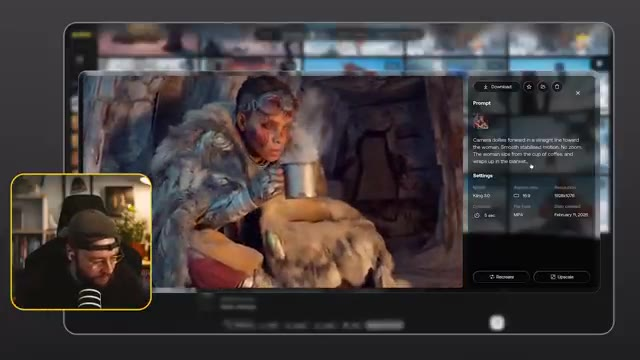
*Interface de Kling 3.0 montrant une femme tenant une tasse dans un abri avec les paramètres du prompt et de la caméra.*

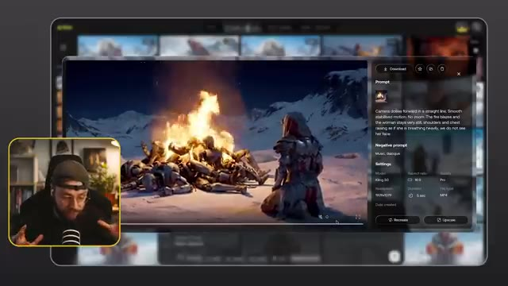
*Interface de Kling 3.0 montrant une femme assise face à un feu de camp de robots en train de brûler dans un paysage enneigé.*

---

### ⏱️ `[00:13:08 - 00:13:43]` | Segment #26

**🔊 Audio (Transcription Intégrale Mot pour Mot en Français) :**
> et nous avons un autre très bel exemple ici d'un mouvement de caméra en marche arrière donc un mouvement de travelling arrière ou un recul vous pouvez voir le prompt textuel ici très similaire au premier que je venais de vous montrer nous avons une image de départ un très beau gros plan macro de cette fleur bleue en quelque sorte coincée dans un lac gelé puis un plan moyen de notre personnage féminin qui s'approche pour la ramasser donc une fois de plus kling va créer une transition entre l'image de début et de fin en utilisant notre prompt textuel allons voir le résultat que nous avons obtenu ici vraiment très bien encore une fois

**👁️ Analyse Visuelle d'Écran (gemini-3.5-flash-lite) :**
**Interface & Outils** : Interface de l'application Kling AI avec le panneau latéral affichant les détails du prompt, les paramètres (Modèle Kling 3.0, format 16:9, résolution 1920x1076, durée 5 secondes) et les vignettes des images de début et de fin.

**Contenu textuel & Code** : Texte du prompt visible : 'Dolly Out / Pull-back: camera dollies backward in a straight line away from the frame centre, Smooth stabilised motion, No zoom.'

**Action / Démonstration** : Le créateur démontre la génération d'une transition vidéo entre une image de départ (gros plan) et une image d'arrivée (plan moyen) réalisée avec Kling AI en utilisant un mouvement de caméra en recul.

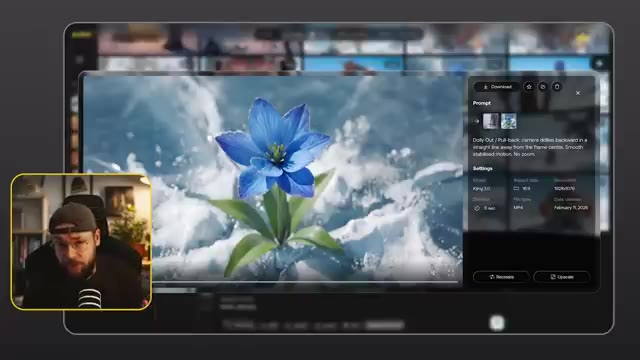
*Interface de l'outil Kling affichant le début de la vidéo avec un gros plan sur une fleur bleue dans la glace.*

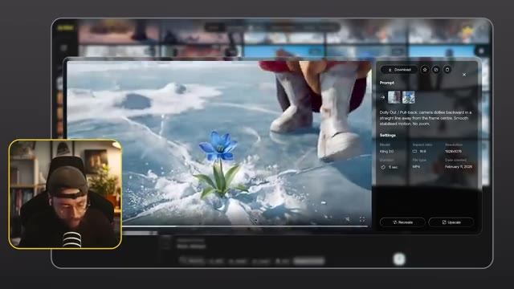
*Interface de l'outil Kling affichant la fin de la vidéo avec un plan moyen montrant le personnage féminin.*

---

### ⏱️ `[00:13:43 - 00:14:14]` | Segment #27

**🔊 Audio (Transcription Intégrale Mot pour Mot en Français) :**
> fonctionne de manière similaire au tilt en nous permettant de faire l'expérience de cette révélation mais je ne sais pas, je préfère un peu ça au tilt, je veux dire que ça fonctionne mieux à mon avis pour le genre de disposition de cette scène, la mise en place je suppose qu'on devrait dire, genre où se trouve l'accessoire par rapport à notre personnage, mais ouais dolly in, dolly out, un mouvement de caméra incroyable et polyvalent que vous devriez utiliser beaucoup. Et le prochain mouvement de caméra que je veux examiner est ce style à la main ici.

**👁️ Analyse Visuelle d'Écran (gemini-3.5-flash-lite) :**
**Interface & Outils** : Interface utilisateur d'un outil de génération vidéo par IA (probablement Kling AI ou similaire) affichant une vidéo en cours de lecture, un panneau latéral avec le prompt, le modèle utilisé (Kling 3.0), le format (16:9), la résolution (1920x1076), la durée (5s), et des boutons de téléchargement, recréation et upscale.

**Contenu textuel & Code** : Texte du prompt visible : "Dolly Out / Pull-back: camera dollies backward in a straight line away from the frame centre. Smooth stabilised motion. No zoom." Paramètres : Model: Kling 3.0, Aspect ratio: 16:9, Resolution: 1920x1076, Duration: 5 sec, File type: MP4, Date created: February 11, 2026.

**Action / Démonstration** : Le logiciel affiche la lecture d'une vidéo générée illustrant un mouvement de caméra dolly out (dé zoom en reculant), révélant progressivement l'environnement autour d'une fleur bleue puis d'un personnage agenouillé dans un décor hivernal.

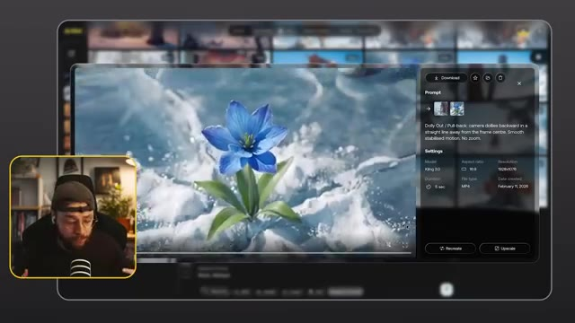
*Interface du logiciel montrant une vidéo générée par IA d'une fleur bleue au centre, avec les paramètres et le prompt de mouvement de caméra dolly out sur le panneau latéral droit, et Jack en incrustation PiP dans le coin inférieur gauche.*

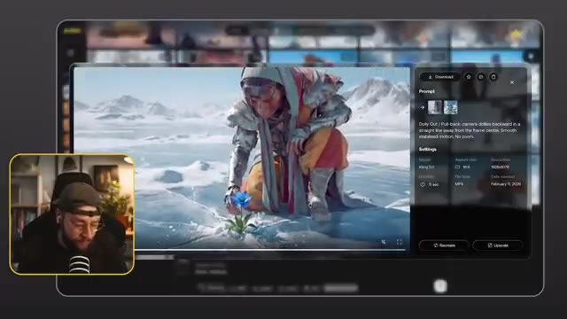
*Interface du logiciel montrant la suite de la vidéo générée avec l'apparition d'un personnage près de la fleur bleue sur la glace, avec les mêmes panneaux de contrôle à droite et Jack en incrustation PiP à gauche.*

---

### ⏱️ `[00:14:14 - 00:14:36]` | Segment #28

**🔊 Audio (Transcription Intégrale Mot pour Mot en Français) :**
> Pour le prompt, nous avons dit : la femme sprint en avant de façon spectaculaire, mouvement de caméra à l'épaule frénétique avec un tremblement naturel et une stabilisation imparfaite, translation réactive et légèrement inégale sans zoom intentionnel. Et ici nous créons un sentiment de réalisme brut, une sorte d'anxiété, de chaos et d'intensité.

**👁️ Analyse Visuelle d'Écran (gemini-3.5-flash-lite) :**
**Interface & Outils** : Interface web de génération vidéo avec une fenêtre modale de prévisualisation, un panneau latéral détaillant le prompt textuel et les paramètres (modèle Kling 3.0, ratio 16:9, résolution 1920x1076, durée 5 sec), ainsi qu'une incrustation vidéo du présentateur (PiP).

**Contenu textuel & Code** : Texte du prompt : "The woman sprints forward dramatically. Frantic handheld camera movement with natural shake and imperfect stabilization. Responsive, slightly uneven translation with no intentional zoom." Paramètres : Model: Kling 3.0, Aspect ratio: 16:9, Resolution: 1920x1076, Duration: 5 sec, File type: MP4, Date created: February 10, 2025.

**Action / Démonstration** : Le curseur de la souris survole le panneau latéral de l'interface pendant que la vidéo de la femme courant dans la neige est jouée en boucle.

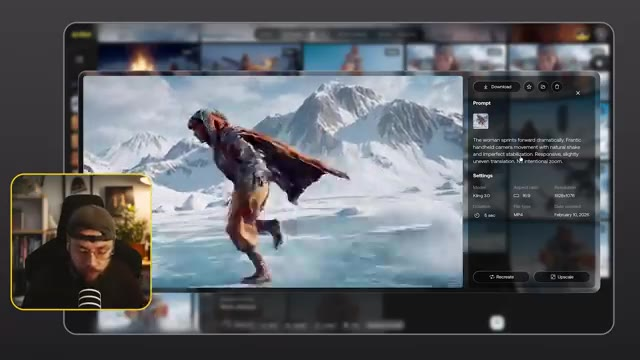
*Interface de l'application affichant une vidéo générée d'une femme courant dans un paysage enneigé avec le panneau des paramètres et le prompt sur le côté droit, et le créateur visible en incrustation (PiP) en bas à gauche.*

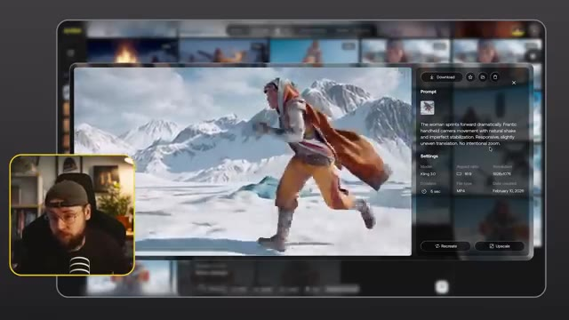
*Poursuite de la lecture de la vidéo générée montrant la femme en plein sprint dans la neige, avec les mêmes détails de prompt et de paramètres visibles dans le panneau latéral droit.*

---

### ⏱️ `[00:14:36 - 00:14:59]` | Segment #29

**🔊 Audio (Transcription Intégrale Mot pour Mot en Français) :**
> Nous nous sentons hors de contrôle parce que l'opérateur de caméra est lui-même en quelque sorte hors de contrôle. Il a du mal à suivre et à capturer ce mouvement. Et personnellement, je pense que ce style de mouvement de caméra a ce côté brut de style documentaire et cela fonctionne vraiment très bien lorsqu'il s'agit de projets de science-fiction et de fantasy, car cela aide à ancrer le matériel que vous voyez.

**👁️ Analyse Visuelle d'Écran (gemini-3.5-flash-lite) :**
**Interface & Outils** : Interface web de Kling avec affichage d'une modale de prévisualisation vidéo, panneau latéral droit contenant le prompt, le modèle (Kling 3.0), le format (16:9), la résolution (1920x1076), la durée (5 sec) et le format de fichier (MP4). Incrustation vidéo (PiP) du présentateur Jack en bas à gauche.

**Contenu textuel & Code** : Texte du prompt visible : "The woman sprints forward dramatically. Frantic handheld camera movement with natural shake and imperfect stabilization. Responsive, slightly uneven translation. No intentional zoom." Paramètres : Modèle Kling 3.0, Aspect ratio 16:9, Résolution 1920x1076, Durée 5 sec, File type MP4.

**Action / Démonstration** : Visualisation d'une génération vidéo de science-fiction/fantasy avec un mouvement de caméra saccadé et organique, tandis que le créateur commente les choix de style de caméra.

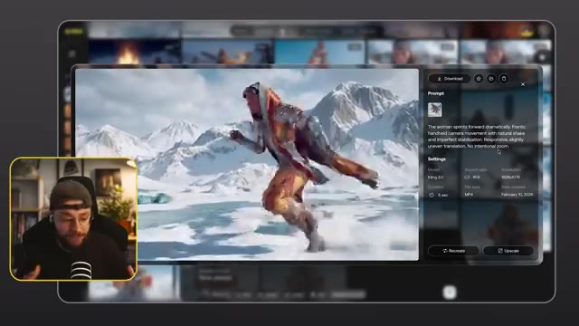
*Interface de Kling montrant la vidéo d'une femme courant dans un paysage enneigé avec le panneau des paramètres et le prompt textuel.*

---

### ⏱️ `[00:14:59 - 00:15:32]` | Segment #30

**🔊 Audio (Transcription Intégrale Mot pour Mot en Français) :**
> C'est un peu l'exact opposé d'un zoom avant ou arrière, un mouvement de caméra très cinématique. Ici, ça fait incroyablement frénétique, très brut, très documentaire, donc encore une fois, on se sent très connecté au personnage, mais d'une manière assez différente. On dirait qu'elle traverse un moment intense, vous voyez, elle a du mal à arriver là où elle doit aller. On ressent un peu la même chose grâce au type de mouvement de caméra. Et en contraste, maintenant, je vais vous montrer un plan de suivi sur le

**👁️ Analyse Visuelle d'Écran (gemini-3.5-flash-lite) :**
**Interface & Outils** : Interface de l'outil de génération vidéo Kling 3.0 avec une fenêtre pop-up affichant la vidéo générée, le panneau des paramètres techniques à droite et l'encadré PiP du créateur en bas à gauche.

**Contenu textuel & Code** : Texte du prompt visible : "The woman sprints forward dramatically. Frantic handheld camera movement with natural shake and imperfect stabilization. Responsive, slightly uneven translation. No intentional zoom." Paramètres : Model: Kling 3.0, Aspect ratio: 16:9, Resolution: 1920x1076, Duration: 5 sec, File type: MP4, Date created: February 10, 2026.

**Action / Démonstration** : Le créateur présente une vidéo générée par IA illustrant un mouvement de caméra frénétique et documentarisé, tout en commentant l'effet d'immersion et de tension qu'il procure.

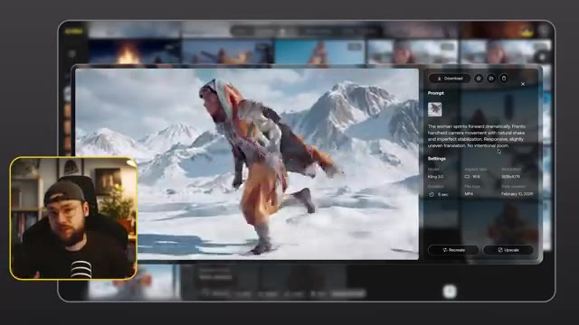
*Interface montrant une vidéo générée par IA d'une femme courant dans la neige avec une caméra portée frénétique, et le panneau des paramètres du modèle Kling 3.0.*

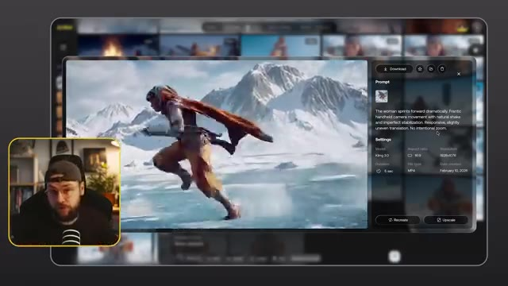
*Poursuite de la vidéo de démonstration avec le même panneau de configuration et le prompt descriptif visible à droite.*

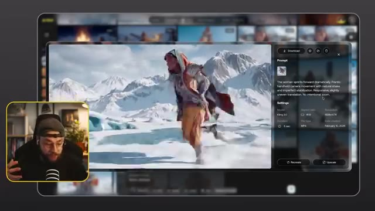
*Vue similaire de l'interface de génération vidéo avec le personnage en mouvement dans un paysage enneigé.*

---

### ⏱️ `[00:15:32 - 00:16:11]` | Segment #31

**🔊 Audio (Transcription Intégrale Mot pour Mot en Français) :**
> exactement la même image de départ parce que c'est un point de comparaison vraiment intéressant, donc c'est celle-ci. Donc pour le plan de caméra en suivi, on dit de faire translater la caméra vers l'avant à un rythme de course régulier, correspondant à la vitesse du sujet en mouvement, un suivi stabilisé, pas de zoom. Donc la performance elle-même est très, très similaire mais le type de mouvement de caméra est très différent. Celui-ci donne l'impression d'être beaucoup plus cinématographique et on se sent aussi beaucoup plus en contrôle en tant que spectateur. Avec la prise de vue à l'appareil tenu à la main et tremblant, on se sentait aussi hors de contrôle que notre personnage féminin ici, mais j'ai l'impression un petit peu
[VALID_VALID_IMAGES] 2
[DESC_IMAGE_2] Interface de Kling montrant la vidéo d'un personnage courant dans un paysage enneigé avec le panneau de prompt et les paramètres techniques sur le côté, et Jack incrusté en bas à gauche.

**👁️ Analyse Visuelle d'Écran (gemini-3.5-flash-lite) :**
**Interface & Outils** : Interface de Kling 3.0 avec panneau de prévisualisation vidéo, panneau de prompt textuel et paramètres de génération (Model : Kling 3.0, Aspect ratio : 16:9, Quality : Pro, Resolution : 1920x1076, Duration : 5 sec, File type : MP4).

**Contenu textuel & Code** : Prompt visible : "Tracking camera shot, have the camera translate forward at a steady running pace, matching the moving subject's speed. Stabilised tracking. No zoom." Paramètres de génération Kling 3.0.

**Action / Démonstration** : Le créateur présente l'interface de l'outil Kling affichant le résultat vidéo et le prompt utilisé pour le plan de suivi stabilisé.

---

### ⏱️ `[00:16:11 - 00:16:44]` | Segment #32

**🔊 Audio (Transcription Intégrale Mot pour Mot en Français) :**
> Il y a plus de déconnexion ici. J'ai l'impression d'être en contrôle et j'ai l'impression d'assister simplement à ce qui se passe. Je n'ai pas l'impression d'en faire partie. Donc ça dépend vraiment de ce que vous voulez. Il y a des cas d'usage pour les deux, mais je pense que c'est un point de comparaison vraiment intéressant d'avoir ce mouvement de caméra à main par rapport au plan de caméra en travelling. Encore une fois, deux mouvements de caméra vraiment incroyables et puissants à avoir dans vos projets d'IA. Maintenant, je veux passer à autre foi et jeter un œil à la grue ou au mouvement de grue vers le haut. C'est une révélation incroyable de l'environnement. Allons-y et ouvrons

**👁️ Analyse Visuelle d'Écran (gemini-3.5-flash-lite) :**
**Interface & Outils** : Interface de l'outil de génération vidéo Kling avec panneau de configuration latéral (Prompt, Settings, Model Kling 3.0, aspect ratio 16:9, qualité Pro, résolution 1920x1076, durée 5 sec, format MP4).

**Contenu textuel & Code** : Texte du prompt visible : 'Tracking camera shot, have the camera translate forward at a steady running pace, matching the moving subject's speed. Stabilised tracking. No zoom.' Paramètres : Model Kling 3.0, Aspect ratio 16:9, Quality Pro, Resolution 1920x1076, Duration 5 sec, File type MP4, Date created February 13, 2026.

**Action / Démonstration** : Le créateur présente une vidéo générée par IA avec un mouvement de travelling (tracking shot) et analyse les paramètres techniques et textuels associés dans l'interface de l'outil.

*Interface de l'application affichant une vidéo générée par IA montrant un personnage en armure courant dans un paysage enneigé, avec un panneau latéral détaillant le prompt textuel et les paramètres techniques (Kling 3.0), et le créateur visible en incrustation (PiP) dans le coin inférieur gauche.*

---

### ⏱️ `[00:16:44 - 00:17:23]` | Segment #33

**🔊 Audio (Transcription Intégrale Mot pour Mot en Français) :**
> cette génération ici. Donc vous pouvez voir que la grue s'élève en quelque sorte dans le ciel. Je veux dire, ça monte tellement haut, ça ressemble plutôt à un plan de drone si l'on essaie d'en parler. dans un sens réaliste mais le style de mouvement de caméra ressemble à un plan de grue d'accord donc ce que nous avons c'est ce même angle en plongée que nous utilisons pour l'une de nos générations précédentes alors que la grue s'élève avec la caméra montée dessus nous avons vraiment une sensation d'échelle notre personnage féminin a l'air minuscule au milieu de cet environnement montagneux enneigé incroyablement vaste donc cela fonctionne vraiment très bien comme révélation également

**👁️ Analyse Visuelle d'Écran (gemini-3.5-flash-lite) :**
**Interface & Outils** : Interface de l'outil de génération vidéo Kling 3.0 avec panneau de lecture et paramètres techniques à droite.

**Contenu textuel & Code** : Prompt visible : "Camera rises vertically upward smoothly (boom up), to reveal the vast snowy mountainous landscape, making the woman appear small in comparison. No pan, no tilt, no zoom." Paramètres : Model Kling 3.0, Aspect ratio 16:9, Quality Standard, Resolution 1920x1078, Duration 8 sec.

**Action / Démonstration** : Le créateur montre la lecture vidéo d'une génération Kling où la caméra monte vers le ciel pour révéler l'immensité du paysage enneigé.

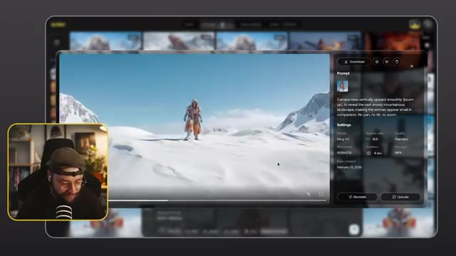
*Interface de Kling montrant la vidéo générée avec le personnage féminin minuscule dans un paysage enneigé.*

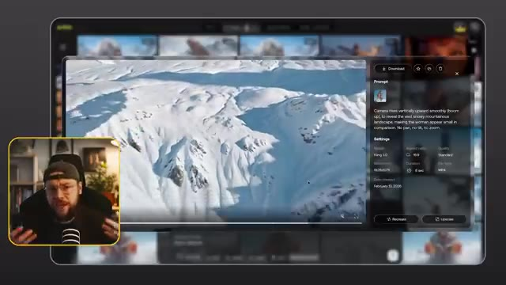
*Interface de Kling montrant la caméra s'élevant verticalement pour révéler le vaste paysage montagneux.*

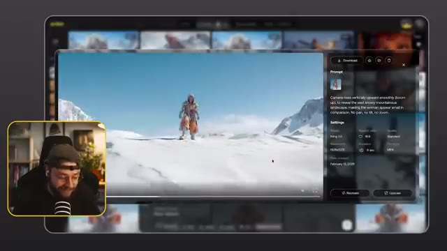
*Interface de Kling montrant à nouveau le personnage féminin au centre du paysage enneigé.*

---

### ⏱️ `[00:17:23 - 00:17:55]` | Segment #34

**🔊 Audio (Transcription Intégrale Mot pour Mot en Français) :**
> mais cette fois pour notre lieu. Nous ressentons vraiment ce sentiment d'échelle. Le prompt textuel que nous avons indiqué, la caméra s'élève verticalement vers le haut de manière fluide, boom up, pour révéler le vaste paysage montagneux enneigé, faisant apparaître la femme petite en comparaison. Pas de panoramique, pas d'inclinaison et pas de zoom. Et vous pouvez voir ici que j'ai dû inclure une description de l'environnement parce que nous nous souvenons que nous n'avons pas utilisé de cadre de fin, nous ne faisons pas de transition vers une image que nous avons créée avec nano banana par exemple

**👁️ Analyse Visuelle d'Écran (gemini-3.5-flash-lite) :**
**Interface & Outils** : Interface web de génération de vidéo par IA (Kling) affichant un lecteur vidéo au centre avec des options de téléchargement, de partage et un panneau latéral de réglages et de prompt.

**Contenu textuel & Code** : Texte du prompt visible : "Camera rises vertically upward smoothly (boom up), to reveal the vast snowy mountainous landscape, making the woman appear small in comparison. No pan, no tilt, and no zoom." Paramètres : Model: Kling 3.0, Aspect ratio: 16:9, Quality: Standard, Resolution: 1920x1076, Duration: 5 sec.

**Action / Démonstration** : Le créateur présente l'interface de génération vidéo et la lecture du rendu montrant l'effet de caméra ascendant.

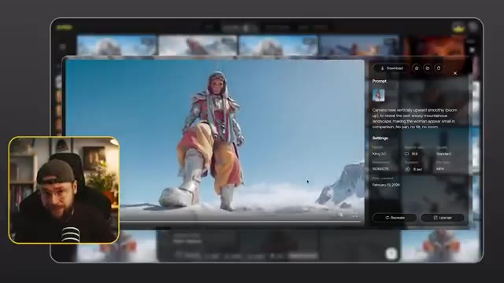
*Interface de visualisation d'une vidéo générée montrant une femme guerrière dans un paysage enneigé avec le panneau de prompt et les paramètres sur le côté droit.*

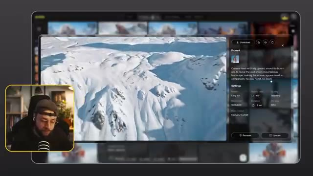
*Aperçu de la vidéo montrant le mouvement de caméra vertical ascendant (boom up) révélant le vaste paysage montagneux enneigé.*

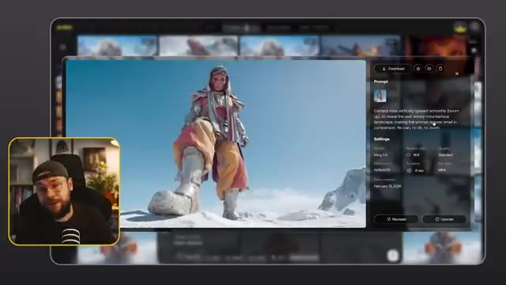
*Retour au début de la vidéo générée montrant la femme dans le paysage enneigé avec les détails du prompt et des paramètres.*

---

### ⏱️ `[00:17:55 - 00:18:28]` | Segment #35

**🔊 Audio (Transcription Intégrale Mot pour Mot en Français) :**
> Le modèle de vidéo IA n'a aucune idée du contexte de ce à quoi nous voulons que le résultat final ressemble, donc nous devons absolument lui donner un certain contexte pour cela, pour dire c'est ce que je veux que tu révèles. Heureusement, avec le paysage enneigé, ça fonctionne vraiment très bien, il n'y a rien de trop compliqué qui s'y passe. Si vous vouliez quelque chose de vraiment complexe, disons comme un château ou des ruines ou un vaisseau spatial fou ou quelque chose comme ça, je suggérerais de créer une image de fin vers laquelle effectuer une transition, mais un autre

**👁️ Analyse Visuelle d'Écran (gemini-3.5-flash-lite) :**
**Interface & Outils** : Interface web de génération et de prévisualisation vidéo (Kling 3.0), affichant un lecteur vidéo central avec superposition des détails du prompt et des paramètres techniques dans un panneau latéral à droite, et un encadré PiP (Picture-in-Picture) du créateur en bas à gauche.

**Contenu textuel & Code** : Texte du prompt visible : « Camera rises vertically upward smoothly (boom up), to reveal the vast snowy mountainous landscape, making the woman appear small in comparison. No pan, no tilt, no zoom. » Paramètres : Modèle Kling 3.0, Aspect ratio 16:9, Quality Standard, Résolution 1920x1076, Durée 8 sec, File type MP4, Date created February 13, 2026.

**Action / Démonstration** : Le créateur commente la démonstration vidéo où la caméra s'élève verticalement pour révéler le paysage enneigé, illustrant le passage d'une vue rapprochée (Image 2) à une vue aérienne globale (Image 1).

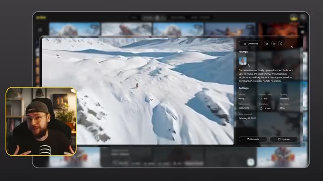
*Interface de l'outil de génération vidéo affichant la vue aérienne d'un vaste paysage enneigé avec une petite silhouette, et le panneau latéral avec le prompt et les paramètres techniques (Kling 3.0, 1920x1076, 8 sec).*

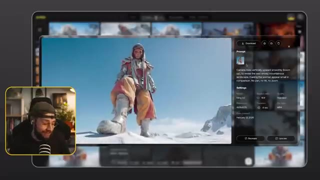
*Interface montrant le plan rapproché d'un personnage féminin dans un paysage enneigé, avec le même panneau latéral affichant les détails du prompt de la caméra.*

---

### ⏱️ `[00:18:28 - 00:19:00]` | Segment #36

**🔊 Audio (Transcription Intégrale Mot pour Mot en Français) :**
> un mouvement de caméra cinématographique vraiment cool, vraiment intense pour vous les gars à utiliser là et le prochain plan que je veux aller de l'avant et examiner est un zoom brusque donc encore une fois nous faisons une transition entre une image de début et de fin nous commençons sur ce plan moyen et ensuite nous faisons un zoom brusque sur le très gros plan où nous pouvons vraiment apprécier à quel point Nano Banana Pro est incroyable et comment il fonctionne vraiment bien aux côtés de Kling 3. Ici, nous avons en quelque sorte cette intensité émotionnelle et nous pouvons également apprécier ce genre de

**👁️ Analyse Visuelle d'Écran (gemini-3.5-flash-lite) :**
**Interface & Outils** : Interface web de Kling AI (version 3.0) avec un panneau de prévisualisation vidéo, des options de téléchargement et les détails techniques du prompt.

**Contenu textuel & Code** : Modèle : Kling 3.0, Aspect ratio : 16:9, Résolution : 1920x1072, Durée : 3 sec, Prompt : "Very fast optical zoom in with an abrupt stop framing the woman's face. Camera position fixed. No dolly."

**Action / Démonstration** : Le créateur commente et démontre une transition vidéo par zoom rapide ("crash zoom") réalisée avec le modèle Kling 3.0 à partir d'un plan moyen vers un très gros plan.

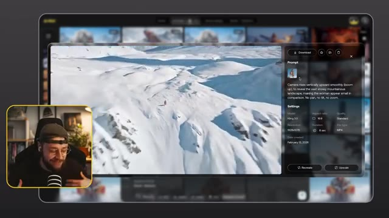
*Interface de l'application Kling affichant un plan large d'un paysage enneigé avec une petite silhouette et les paramètres du modèle Kling 3.0.*

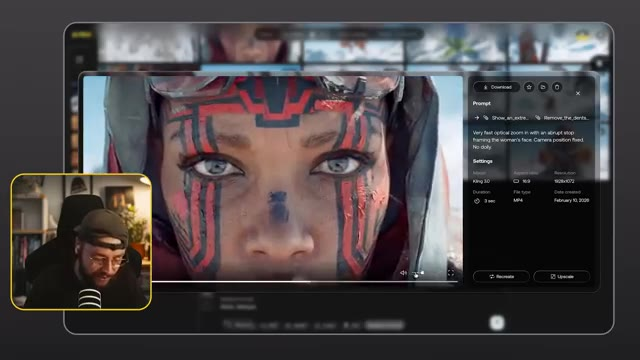
*Gros plan extrême du visage d'un personnage avec des peintures faciales rouges, illustrant l'effet de zoom brusque (crash zoom).*

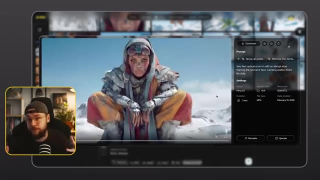
*Plan moyen d'un personnage accroupi dans un décor enneigé avant l'effet de zoom.*

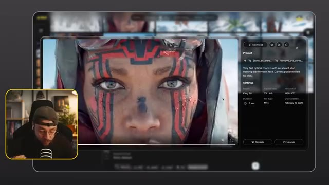
*Gros plan fixe final sur le visage du personnage après la transition par zoom rapide.*

---

### ⏱️ `[00:19:00 - 00:19:36]` | Segment #37

**🔊 Audio (Transcription Intégrale Mot pour Mot en Français) :**
> pores visibles et la texture de la peinture faciale également. Vraiment cool. Pour le prompt textuel, zoom optique avant très rapide avec un arrêt brusque cadrant le visage de la femme. Donc encore une fois, nous voulons être clairs sur l'endroit où nous voulons terminer. Position de la caméra fixe. Pas de dolly. Vous pouvez voir que j'ai opté pour une génération de trois secondes ici pour m'assurer que le zoom rapide se produise assez vite. Rappelez-vous bien sûr, les gars, vous pouvez si vous voulez aller de l'avant et accélérer le zoom rapide au montage. Il vaut mieux qu'il soit plus lent lors de votre génération par IA, puis vous allez de l'avant et vous l'accélérez au montage

**👁️ Analyse Visuelle d'Écran (gemini-3.5-flash-lite) :**
**Interface & Outils** : Interface de l'outil de génération vidéo Kling (Kling 3.0) montrant le panneau de visualisation vidéo à gauche et le panneau latéral avec le prompt, les paramètres (Modèle Kling 3.0, format 16:9, résolution 1920x1072, durée 3s) et les boutons Recreate/Upscale à droite. Le créateur est visible en incrustation Picture-in-Picture (PiP) dans le coin inférieur gauche.

**Contenu textuel & Code** : Texte du prompt visible : "Very fast optical zoom in with an abrupt stop framing the woman's face. Camera position fixed. No dolly." Paramètres : Modèle : Kling 3.0, Aspect ratio : 16:9, Résolution : 1920x1072, Durée : 3 sec, File type : MP4, Date created : February 10, 2025.

**Action / Démonstration** : Le créateur présente l'interface de Kling 3.0 en expliquant les détails du prompt textuel et les paramètres utilisés pour obtenir un effet de zoom rapide ("crash zoom").

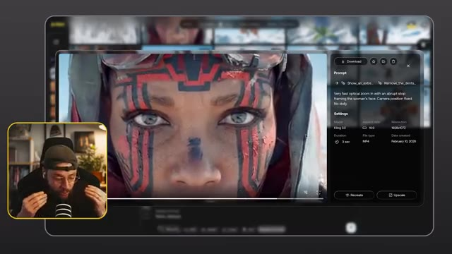
*Interface de Kling 3.0 affichant le lecteur vidéo d'un gros plan de visage de femme avec le prompt textuel et les paramètres de génération, avec le créateur en incrustation PiP.*

---

### ⏱️ `[00:19:36 - 00:20:11]` | Segment #38

**🔊 Audio (Transcription Intégrale Mot pour Mot en Français) :**
> si vous voulez, ça vous donne juste un tout petit peu plus de flexibilité. On a un autre exemple ici où on commence sur un plan large et ensuite on fonce sur ce très gros plan, donc on obtient vraiment plus une sensation d'échelle, plus une sensation de lieu et ce zoom rapide donne une impression encore plus dramatique. Encore une fois, c'est juste en utilisant exactement le même prompt textuel qu'avant, donc le prochain mouvement de caméra que je veux examiner est un balayage rapide (whip pan). Maintenant, ça ne va pas marcher pour tous les projets parce que ça a un ressenti très spécifique. Ce mouvement de caméra a beaucoup de caractère, j'ai l'impression. Donc encore une fois, nous sommes

**👁️ Analyse Visuelle d'Écran (gemini-3.5-flash-lite) :**
**Interface & Outils** : Interface de génération vidéo par IA (Kling 3.0) avec un lecteur multimédia central et un panneau de propriétés sur le côté droit.

**Contenu textuel & Code** : Prompt visible : "Very fast optical zoom in with an abrupt stop framing the woman's face. Camera position fixed. No dolly." Paramètres : Modèle Kling 3.0, ratio 16:9, résolution 1920x1072, durée 3 sec, type de fichier MP4, date de création 10 février 2026.

**Action / Démonstration** : Le créateur présente un exemple vidéo illustrant un mouvement de caméra en zoom rapide (crash zoom) sur un plan de personnage dans la neige.

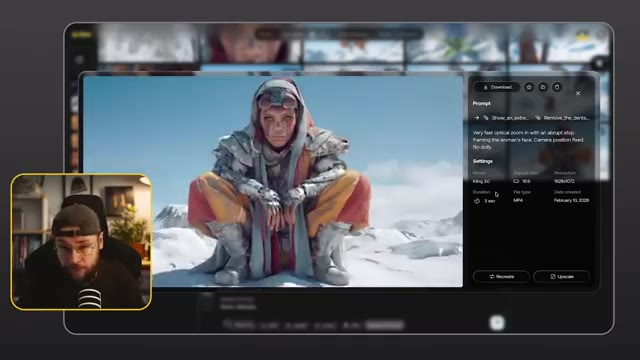
*Interface logicielle affichant la lecture d'une vidéo générée montrant un personnage accroupi dans un paysage enneigé, avec le panneau de configuration à droite et la caméra PiP de Jack en bas à gauche.*

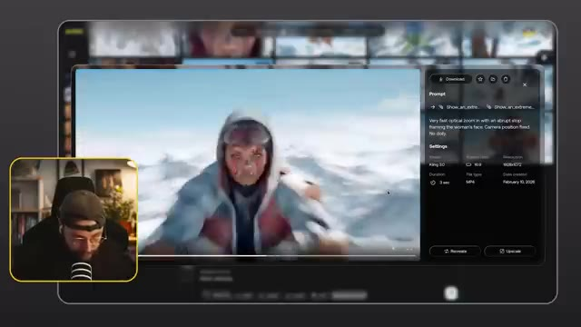
*Interface logicielle montrant le mouvement de crash zoom en cours de lecture sur la vidéo du personnage dans la neige, avec le panneau de paramètres visible à droite.*

---

### ⏱️ `[00:20:11 - 00:20:50]` | Segment #39

**🔊 Audio (Transcription Intégrale Mot pour Mot en Français) :**
> en utilisant une image de début et une image de fin. L'image de début est le loup et l'image de fin est notre personnage féminin prêt à le combattre et à nouveau nous avons une révélation qui se produit ici. La caméra passe donc très rapidement d'un sujet à un autre. Nous pourrions passer d'un endroit à un autre ou d'un accessoire au personnage, il y a toutes sortes de façons d'utiliser cela dans vos projets, le texte du prompt panoramique horizontal extrêmement rapide avec un fort flou de mouvement, puis une stabilisation nette sur une image stable sans translation, sans zoom le loup et la femme se préparent au combat, donc encore une fois une description de

**👁️ Analyse Visuelle d'Écran (gemini-3.5-flash-lite) :**
**Interface & Outils** : Interface de l'outil de génération vidéo Kling 3.0 affichant une fenêtre de prévisualisation vidéo, un panneau de prompt textuel à droite et le présentateur en incrustation PiP dans le coin inférieur gauche.

**Contenu textuel & Code** : Texte du prompt visible : « Extremely fast horizontal whip pan with heavy motion blur, then a sharp settle into a stable frame, no translation, no zoom. The wolf and woman prepare for battle ». Paramètres visibles : modèle Kling 3.0, format 16:9, qualité Pro, résolution 1920x1072, durée 5s, fichier MP4.

**Action / Démonstration** : La vidéo en cours de lecture montre d'abord un flou de mouvement de balayage horizontal (whip pan) entre les deux plans, puis se stabilise sur le personnage féminin accroupi avec une épée dans un paysage enneigé.

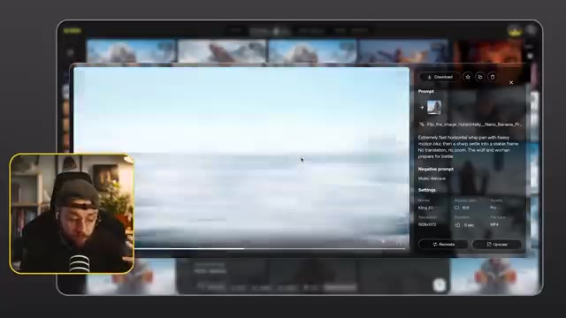
*Interface de génération vidéo montrant un effet de balayage rapide (whip pan) avec flou de mouvement horizontal et le créateur en médaillon PiP.*

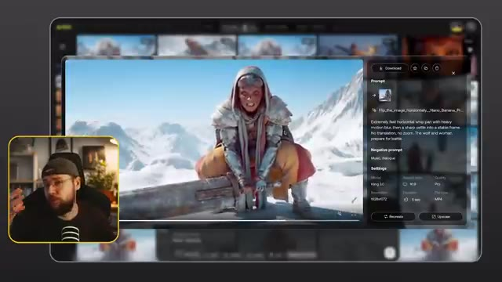
*Interface de génération vidéo montrant l'image finale stabilisée avec la femme prête au combat dans la neige et le créateur en médaillon PiP.*

---

### ⏱️ `[00:20:50 - 00:21:27]` | Segment #40

**🔊 Audio (Transcription Intégrale Mot pour Mot en Français) :**
> le mouvement de caméra et une description assez simple de l'action que nous voulons que nos personnages nous montrent à l'écran maintenant comme je le dis vous pouvez vraiment utiliser efficacement ce type de mouvement de caméra comme transition dans votre film donc nous pourrions passer du jour à la nuit nous pourrions passer d'un temps ensoleillé à un temps pluvieux nous pourrions aller dans un endroit complètement différent grâce à la quantité de flou de mouvement cela donne à ces transitions un aspect plutôt fluide et naturel mais ici nous évoquons en quelque sorte ce sentiment je ne sais pas ça fait un peu cliché c'est cool aussi j'aime le résultat mais comme je l'ai dit au

**👁️ Analyse Visuelle d'Écran (gemini-3.5-flash-lite) :**
**Interface & Outils** : Interface web de génération de vidéo (probablement Kling AI), incluant un panneau latéral avec le prompt, les paramètres de génération (modèle Kling 3.0, rapport 16:9, qualité Pro, résolution 1920x1072, durée 5s, format MP4) et un encadré vidéo principal avec le créateur en incrustation (PiP) en bas à gauche.

**Contenu textuel & Code** : Prompt visible dans l'interface : "Extremely fast horizontal whip pan with heavy motion blur, then a sharp settle into a stable frame. No translation, no zoom. The wolf and woman prepare for battle." Négatif prompt : "Music, dialogue." Paramètres : Model: Kling 3.0, Aspect ratio: 16:9, Quality: Pro, Resolution: 1920x1072, Duration: 5 sec, File type: MP4.

**Action / Démonstration** : Le créateur commente une séquence vidéo générée par IA illustrant un mouvement de caméra rapide (whip pan) avec flou de mouvement, révélant successivement un loup puis une femme guerrière dans un paysage de montagnes enneigées.

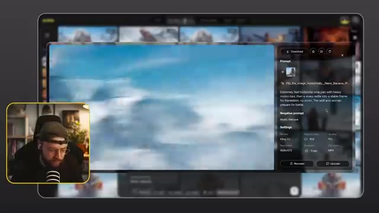
*Interface de l'outil de génération vidéo affichant un mouvement de caméra rapide avec flou de mouvement (whip pan) sur un paysage enneigé.*

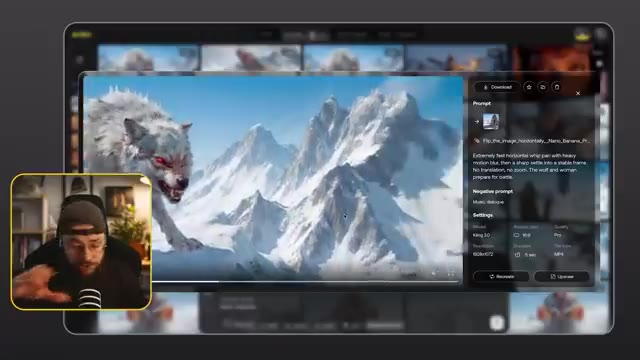
*Affichage du rendu vidéo avec un loup menaçant aux yeux rouges sur fond de montagnes enneigées.*

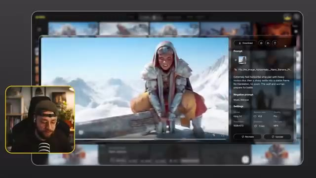
*Affichage du rendu vidéo montrant une femme guerrière accroupie dans la neige avec une grande épée.*

---

### ⏱️ `[00:21:27 - 00:21:59]` | Segment #41

**🔊 Audio (Transcription Intégrale Mot pour Mot en Français) :**
> Le début, cela ne va pas fonctionner pour chacun de vos projets. Je pense que cela me procure une sensation de jeu de combat ou quelque chose comme ça, plus comme un film stylisé ou une émission de télévision, je suppose que je devrais dire, ça a ce genre de sensation en ce moment. Jetons un coup d'œil à quelque chose de tout à fait différent : nous avons ce plan en orbite ou à 360 degrés. Maintenant, ce mouvement de caméra peut sembler très épique, mais il peut aussi paraître, avec le bon contexte, assez romantique également. Vous voyez ces plans en orbite ou à 360 degrés utilisés...

**👁️ Analyse Visuelle d'Écran (gemini-3.5-flash-lite) :**
**Interface & Outils** : Interface web de Kling 3.0 avec un panneau latéral affichant les prompts, négatifs de prompts et réglages techniques (modèle, format d'image, résolution, durée).

**Contenu textuel & Code** : Image #1 : Prompt "Extremely fast horizontal whip pan with heavy motion blur...", modèle Kling 3.0, 16:9, 1920x1076, durée 5 sec. Image #2 : Prompt "Full 360-degree stabilised orbit around the subject...", modèle Kling 3.0, 16:9, 1920x1076, durée 7 sec.

**Action / Démonstration** : Le créateur présente l'interface de Kling et visionne des clips vidéo générés par IA illustrant différents mouvements de caméra (balayage rapide et rotation orbitale à 360 degrés).

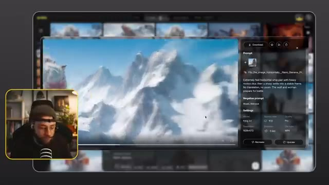
*Interface de l'outil de génération vidéo Kling montrant une vidéo de paysage montagneux avec des paramètres de prompt.*

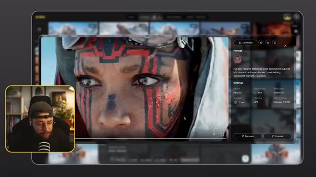
*Interface de Kling montrant un gros plan de personnage avec un mouvement de caméra orbital à 360 degrés et les détails du prompt.*

---

### ⏱️ `[00:21:59 - 00:22:38]` | Segment #42

**🔊 Audio (Transcription Intégrale Mot pour Mot en Français) :**
> dans beaucoup de films romantiques et pour moi je trouve que ça fait juste assez poétique peut-être un peu comme une danse quand vous voyez vos personnages interagir entre eux ici bien sûr ça fait beaucoup plus épique et ça me donne un peu une sensation de chaos et comme si notre personnage voyait quelque chose qui la submerge un peu pour vous donner une bonne idée de contraste ici nous avons cette belle image de départ où notre personnage féminin se tient debout sur un pic enneigé et elle a son épée à la main maintenant en utilisant le même prompt qui est à 360 degrés complet

**👁️ Analyse Visuelle d'Écran (gemini-3.5-flash-lite) :**
**Interface & Outils** : Interface de génération vidéo par IA (type Kling 3.0) avec panneau de prévisualisation, paramètres techniques et prompt textuel sur le côté droit, et incrustation vidéo du créateur (PiP).

**Contenu textuel & Code** : Prompt visible : « Full 360-degree stabilised orbit around the subject at constant radius and speed, maintaining consistent framing. No zoom. ». Paramètres : Modèle Kling 3.0, Format 16:9, Résolution 1920x1076, Durée 7s.

**Action / Démonstration** : Le créateur commente l'effet visuel de la vidéo générée qui effectue une orbite à 360 degrés autour du sujet dans un paysage enneigé.

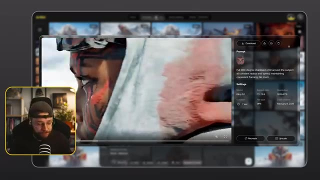
*Interface montrant le rendu vidéo avec un mouvement de caméra en orbite autour du personnage et les paramètres textuels.*

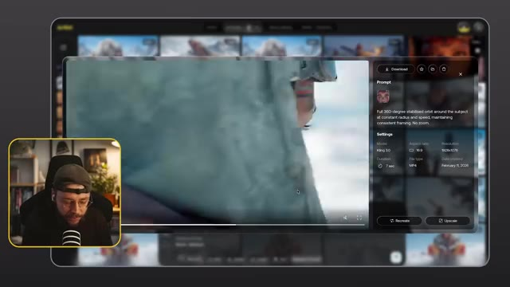
*Poursuite de la lecture de la vidéo en orbite à 360 degrés autour du visage du personnage.*

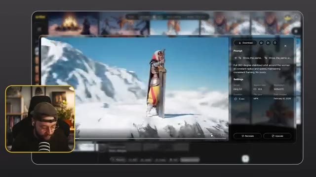
*Affichage de l'image de départ montrant le personnage féminin sur un pic enneigé avec une épée.*

---

### ⏱️ `[00:22:38 - 00:23:13]` | Segment #43

**🔊 Audio (Transcription Intégrale Mot pour Mot en Français) :**
> orbite stabilisée autour de la femme à rayon et vitesse constants maintenant un cadrage cohérent pas de zoom donne une sensation très différente ici n'est-ce pas parce qu'on n'utilise plus le gros plan extrême celle-ci est vraiment utilisée plutôt comme une révélation d'environnement donc on a une idée de l'emplacement grâce à la posture qu'a notre personnage parce qu'elle est un peu plus haut elle a l'air très fière très forte ça la fait paraître très différente de la première génération. Et c'est ce que je dis. Vous pouvez utiliser ces mouvements de caméra de toutes sortes de manières différentes.

**👁️ Analyse Visuelle d'Écran (gemini-3.5-flash-lite) :**
**Interface & Outils** : Interface de génération vidéo IA (style Kling 3.0) avec un panneau latéral affichant les détails du prompt et les paramètres techniques (Model: Kling 3.0, Aspect ratio: 16:9, Resolution: 1920x1072, Duration: 5 sec), et une incrustation PiP du créateur dans le coin inférieur gauche.

**Contenu textuel & Code** : Texte du prompt visible : "Full 360-degree stabilized orbit around the woman at constant radius and speed, maintaining consistent framing. No zoom." Paramètres : Modèle Kling 3.0, format 16:9, résolution 1920x1072, durée 5s.

**Action / Démonstration** : Le créateur commente l'affichage à l'écran de la vidéo générée montrant une orbite stabilisée autour du personnage féminin dans un décor de montagnes enneigées.

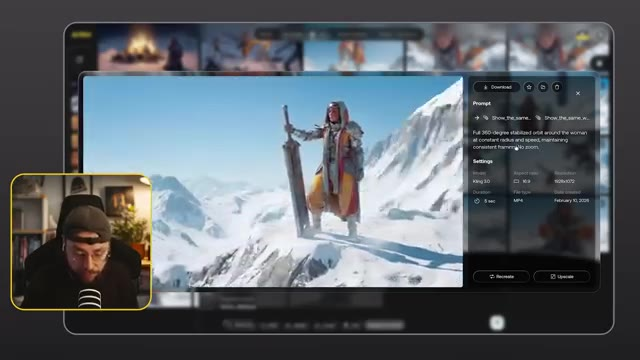
*Interface de génération vidéo montrant le rendu de la femme guerrière dans un paysage enneigé avec les détails du prompt et des paramètres techniques, et le créateur incrusté en bas à gauche.*

---

### ⏱️ `[00:23:13 - 00:23:50]` | Segment #44

**🔊 Audio (Transcription Intégrale Mot pour Mot en Français) :**
> Ils affectent vraiment l'image de départ de façon complètement différente. Voilà, les gars. J'espère vraiment que vous avez apprécié la vidéo d'aujourd'hui. J'ai partagé toute une série de mouvements de caméra vraiment utiles et les invites que vous pouvez utiliser pour obtenir ces résultats dans vos projets d'IA. Maintenant, souvenez-vous qu'en créant nos images de départ, nous pouvons être beaucoup plus précis sur nos résultats finaux et rappelez-vous également à quel point il peut être puissant d'utiliser le flux de travail des cadres de début et de fin avec un modèle vidéo comme Kling 3, car encore une fois, vous êtes plus précis, vous jouez moins aux dés, n'est-ce pas, vous augmentez vos chances...

**👁️ Analyse Visuelle d'Écran (gemini-3.5-flash-lite) :**
**Interface & Outils** : Interface web d'Artlist avec la section Kling 3.0, affichant une grille de clips vidéo générés et des panneaux de configuration de prompts.

**Contenu textuel & Code** : Texte visible sur l'image 1 : "Full 360-degree stabilized orbit around the woman at constant radius and speed, maintaining consistent framing. No zoom." Paramètres : Kling 3.0, 16:9, 1920x1072, 5 sec. Texte visible sur l'image 2 et 3 : "Smooth vertical tilt upward at constant speed. Tripod-like stability. No pan, no roll, no dolly."

**Action / Démonstration** : Le créateur présente l'interface d'Artlist tout en expliquant l'utilisation des mouvements de caméra et des workflows de début et de fin d'image pour Kling 3.

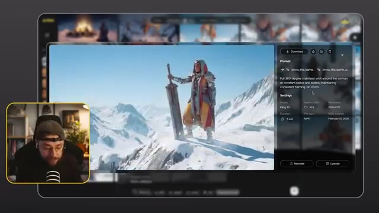
*Interface d'Artlist montrant les détails d'une génération vidéo avec Kling 3.0 et un prompt descriptif.*

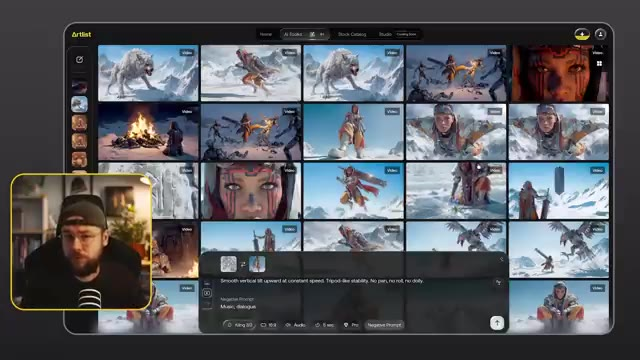
*Grille de vignettes de projets vidéo sur Artlist avec un panneau de prompt ouvert en bas.*

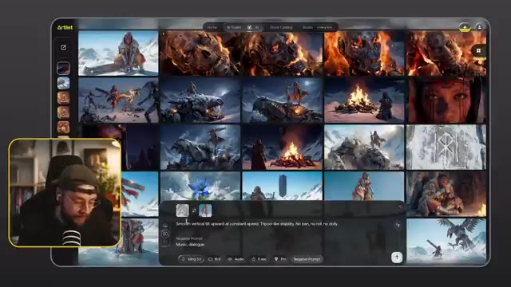
*Grille de vignettes de projets vidéo sur Artlist montrant des paysages de neige et de créatures.*

---

### ⏱️ `[00:23:50 - 00:24:26]` | Segment #45

**🔊 Audio (Transcription Intégrale Mot pour Mot en Français) :**
> les chances d'obtenir le type de génération que vous voulez et tout le monde adore ça parce que ça signifie que vous allez gaspiller moins de crédits dans le processus. Ma recommandation, créez plein d'angles de caméra vraiment variés avec vos images de départ avec un outil comme Nano Banana Pro, puis passez sur Kling 3, générez vos vidéos, animez ces images en leur donnant vie avec une variété d'angles de caméra différents et pensez simplement à la façon dont vous voulez que le spectateur se sente lorsqu'il vit chaque plan individuel, quelle réaction émotionnelle vous voulez obtenir de votre spectateur parce qu'une fois que vous

**👁️ Analyse Visuelle d'Écran (gemini-3.5-flash-lite) :**
**Interface & Outils** : Interface de la plateforme Artlist (AI Toolkit) avec panneau de génération Kling 3.0, paramètres d'aspect ratio, mode Pro et invite textuelle.

**Contenu textuel & Code** : Texte du prompt visible dans l'interface : "Smooth vertical tilt upward at constant speed. Tripod-like stability. No pan, no roll, no dolly". Prompt négatif : "Music, dialogue". Paramètres : Kling 3.0, 16:9, Audio, 5 sec, Pro.

**Action / Démonstration** : Le créateur présente l'interface d'Artlist avec la grille d'images et de vidéos générées, puis bascule sur un extrait vidéo montrant une scène d'action cinématique.

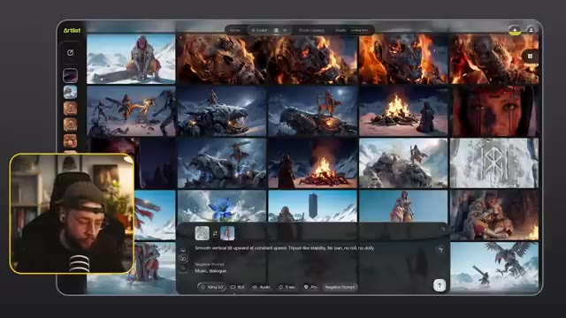
*Interface d'Artlist montrant une galerie d'images générées de guerriers dans la neige avec une incrustation vidéo du créateur en bas à gauche.*

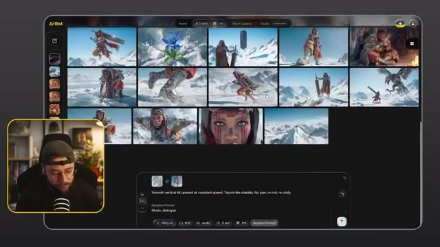
*Interface d'Artlist affichant une autre sélection d'images avec le panneau de prompt et de paramètres en bas.*

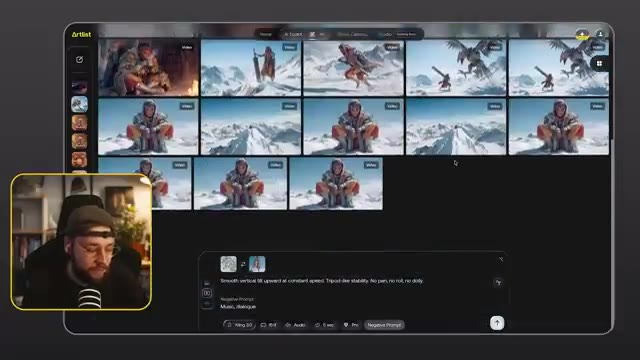
*Interface d'Artlist montrant les vignettes de vidéos générées avec le panneau de configuration Kling 3.0 visible en bas.*

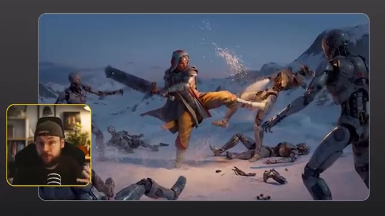
*Rendu vidéo en plein écran montrant une scène de combat dynamique avec un personnage en armure affrontant des robots humanoïdes dans un paysage enneigé.*

---

### ⏱️ `[00:24:26 - 00:25:00]` | Segment #46

**🔊 Audio (Transcription Intégrale Mot pour Mot en Français) :**
> commencez à entrer dans cet état d'esprit vous allez vraiment devenir un cinéaste IA vous allez commencer à diriger les générations plutôt que de rester assis là à prompter machinalement vous réfléchissez vraiment aux résultats que vous voulez obtenir comment vous allez faire avancer l'intrigue comment vous allez raconter l'histoire que vous voulez et comment vous allez maintenir l'engagement de votre spectateur les gars si vous avez apprécié le contenu d'aujourd'hui assurez-vous de me lâcher un pouce bleu si vous êtes nouveau pensez à vous abonner et bien sûr activez la cloche de notification pour ne jamais manquer aucun futur contenu merci beaucoup d'avoir regardé les gars je vais afficher quelques-unes de mes autres vidéos sur

**👁️ Analyse Visuelle d'Écran (gemini-3.5-flash-lite) :**
**Interface & Outils** : Vidéo de démonstration générée par IA montrant un court-métrage de science-fiction, avec un encadré PiP (Picture-in-Picture) de Jack parlant dans son studio.

**Contenu textuel & Code** : Séquences vidéo de haute qualité générées par intelligence artificielle mettant en scène un personnage féminin explorant un monde de montagnes enneigées, découvrant un monolithe flottant et une fleur sur la glace.

**Action / Démonstration** : Le créateur illustre son propos sur la réalisation de films par IA en montrant des exemples de scènes narratives générées.

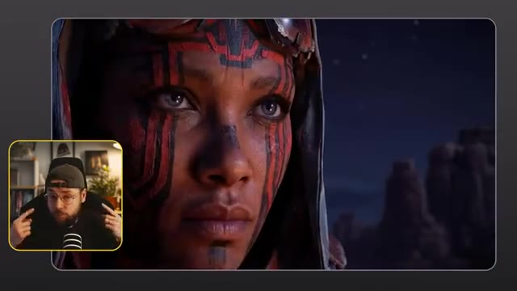
*Gros plan sur le visage d'un personnage féminin futuriste avec des peintures faciales rouges et des lunettes de protection sur le front, regardant vers le haut.*

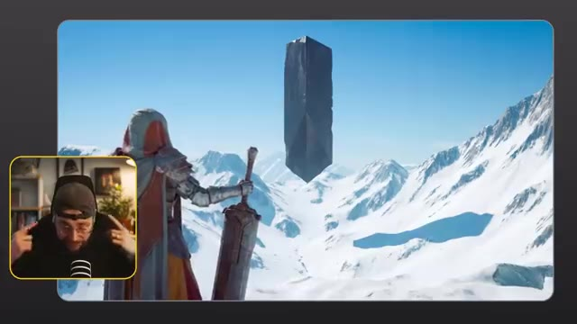
*Vue de dos d'un personnage en armure avec une grande épée, observant un grand monolithe noir flottant au-dessus de montagnes enneigées.*

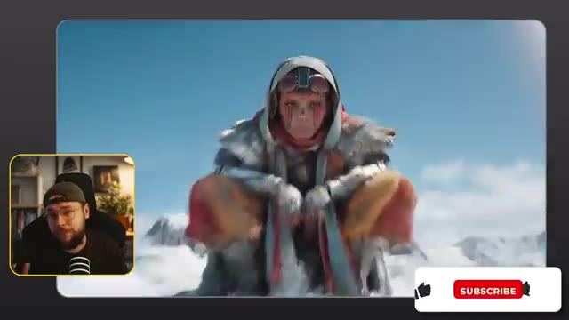
*Personnage accroupi au premier plan dans un paysage enneigé et montagneux, regardant fixement vers la caméra.*

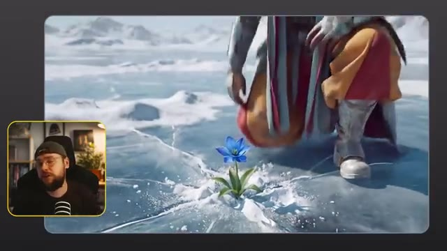
*Gros plan sur un personnage s'agenouillant près d'une fleur bleue lumineuse qui pousse à travers la glace fissurée.*

---

### ⏱️ `[00:25:00 - 00:25:18]` | Segment #47

**🔊 Audio (Transcription Intégrale Mot pour Mot en Français) :**
> l'écran en ce moment si vous voulez aller de l'avant et jeter un œil à certains des autres tutoriels que j'ai postés bonne chance avec vos propres projets les gars et je vous retrouve dans la prochaine vidéo

**👁️ Analyse Visuelle d'Écran (gemini-3.5-flash-lite) :**
**Interface & Outils** : Affichage de rendus de vidéos générées par intelligence artificielle en plein écran avec une vignette incrustée (Picture-in-Picture) du présentateur Jack dans son studio.

**Contenu textuel & Code** : Visuels de démonstration vidéo générés par IA illustrant des paysages enneigés et des personnages dans un décor hivernal.

**Action / Démonstration** : Présentation de exemples de clips vidéo générés par IA pendant que le créateur conclut la vidéo et invite les spectateurs à regarder d'autres tutoriels.

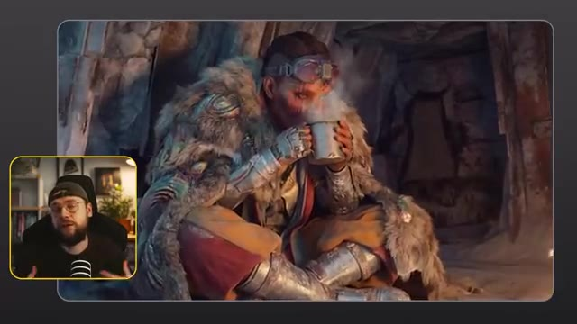
*Rendu vidéo généré par IA montrant un personnage de type aventurier futuriste/post-apocalyptique dans une caverne, buvant dans une tasse fumante, avec le créateur en incrustation PiP dans le coin inférieur gauche.*

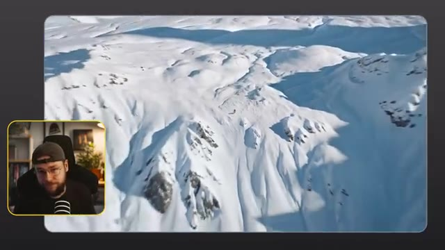
*Rendu vidéo généré par IA montrant une vue aérienne de montagnes enneigées, avec le créateur en incrustation PiP dans le coin inférieur gauche.*

---
