# 🎬 Comment créer des personnages cohérents dans vos vidéos IA (ANGLES DE CAMÉRA ILLIMITÉS !)

> **Chaîne** : [Jack Vs. AI](https://www.youtube.com/@JackVsAI)  
> **Titre original** : `How to Create Consistent Characters in Your AI Videos (UNLIMITED CAMERA ANGLES!)`  
> **Lien YouTube** : [https://www.youtube.com/watch?v=DJsprWiw130](https://www.youtube.com/watch?v=DJsprWiw130)  
> **Date de publication** : 2026-02-28  
> **Durée** : 17m 01s (`1021s`)  
> **Identifiant vidéo** : `DJsprWiw130`  
> **Fiche Web Interactive** : [2026-02-28_YT-DJsprWiw130_Comment créer des personnages cohérents dans vos vidéos IA (ANGLES DE CAMÉRA ILL_by-whisper-v3-large-turbo+gemini-3.5-flash-lite.html](2026-02-28_YT-DJsprWiw130_Comment créer des personnages cohérents dans vos vidéos IA (ANGLES DE CAMÉRA ILL_by-whisper-v3-large-turbo+gemini-3.5-flash-lite.html)  
> **Captures de démonstration clés** : `85 captures réelles (anti-talking-head)`  
> **Modèles utilisés** : Audio: `large-v3-turbo` (Faster-Whisper int8 VPS) | Vision: `gemini-3.5-flash-lite` (Google AI Studio API)  

---

## 📌 Synthèse Exécutive & Outils

### 📌 Résumé
La réalisation de vidéos par intelligence artificielle se heurte historiquement à un écueil majeur : la rupture instantanée de l'illusion dès que le personnage généré quitte son image fixe, bouge ou change d'angle de caméra. Dans cette vidéo, Jack Vs. AI dévoile un flux de travail révolutionnaire qui résout enfin ce problème de cohérence, permettant d'intégrer son propre sosie numérique dans des clips dynamiques aux angles de vue illimités sans distorsion ni effet de "morphing" indésirable.

La méthode repose sur une synergie d'outils de pointe hébergés sur la plateforme Higgsfield, combinant la création d'images ultra-réalistes via Soul 2.0 ou Nano Banana Pro, et l'animation intelligente propulsée par Kling 3. L'étape clé de ce processus réside dans l'utilisation de la fonctionnalité « éléments » de Kling. Plutôt que de se fier à une unique image de départ — contraignant l'IA à deviner les traits du visage sous de nouveaux angles —, le créateur téléverse un jeu de photographies de référence variées (différents angles, expressions, gros plans et accessoires). 

Cette approche multidimensionnelle nourrit le modèle vidéo d'un contexte anatomique complet. Le résultat est un changement de paradigme absolu pour les créateurs de contenu : la caméra peut désormais orbiter autour du sujet, effectuer des mouvements amples et complexes tout en préservant une ressemblance saisissante et un réalisme cinématique saisissant, ouvrant la voie à une nouvelle ère de narration personnelle par l'IA.

---

### 🛠️ Outils, Modèles & Logiciels Présentés
* **Higgsfield** : Plateforme centralisée incontournable regroupant l'ensemble des modèles d'IA nécessaires pour générer des images et piloter des animations vidéo cohérentes.
* **Soul 2.0** : Modèle d'image intégré à Higgsfield, idéal pour la photographie de mode et le contenu utilisateur, permettant de verrouiller un style et d'intégrer des personnages sans effort textuel complexe grâce à des préréglages.
* **Nano Banana Pro** : Modèle d'image haut de gamme (mentionné également sous l'appellation de modèle Google), parfait pour obtenir des rendus cinématiques de haute précision nécessitant l'importation manuelle d'images de référence.
* **Kling 3 (ou Kling 3.0)** : Modèle d'animation vidéo de pointe au cœur du workflow, doté de la fonctionnalité révolutionnaire des « éléments » qui élimine les approximations de l'IA lors des mouvements de caméra.

---

### 🔑 Points Clés & Enseignements Stratégiques
* **Constitution d'une banque de référence variée** : Avant de débuter, il est impératif de capturer des gros plans du visage bien éclairés, sous des angles et avec des expressions multiples, en incluant ou non les accessoires désirés pour nourrir efficacement l'IA.
* **Exploitation de Soul 2.0 pour l'accessibilité** : Ce modèle permet de créer rapidement des images réalistes et des personnages personnalisés en sélectionnant simplement des préréglages de style préexistants, réduisant drastiquement l'écriture de prompts.
* **Précision textuelle dans Soul 2.0** : Pour affirmer des détails spécifiques (comme des lunettes à monture dorée ou une casquette à l'envers), l'utilisation d'un prompt descriptif précis garantit la fidélité des accessoires par rapport aux images de référence.
* **Orientation cinématique avec Nano Banana Pro** : Préféré à Soul 2.0 pour des projets à forte ambition visuelle, ce modèle exige l'importation manuelle d'un ou deux gros plans ciblés combinés à un prompt décrivant le décor, l'éclairage et la tenue.
* **Le piège de l'image unique en animation** : Se fier à une seule image de départ contraint le modèle vidéo à deviner l'apparence du personnage dès que celui-ci ou la caméra bouge, menant inévitablement à des approximations visuelles.
* **L'arme secrète des « Éléments » sur Kling 3** : Cette fonctionnalité permet de téléverser un ensemble d'images sous plusieurs angles pour alimenter directement le générateur d'une référence multidimensionnelle permanente.
* **Catégorisation et description des éléments** : Lors de la création d'un élément dans Kling, il est recommandé de nommer précisément le sujet, de le classer (personnage, lieu, accessoire) et d'ajouter une brève description pour maximiser la compréhension contextuelle par l'IA.
* **Rédaction du prompt vidéo comme un scénario** : L'invite textuelle destinée à l'animation doit décrire explicitement l'action en cours, les dialogues, les mouvements de caméra, ainsi que l'ambiance et le ton global de la scène.
* **Liberté totale des mouvements de caméra** : Grâce au référencement multi-angles des éléments, le modèle Kling 3 autorise des prises de vue dynamiques et complexes — telles qu'une orbite complète de la caméra autour du sujet — sans briser l'illusion de ressemblance.
* **Suppression des artéfacts de transition** : Contrairement aux anciennes méthodes basées sur des interpolations de trames de début et de fin (qui génèrent du morphing et des distorsions bizarres), l'utilisation d'éléments maintient une cohérence structurelle fluide du personnage en mouvement.

---

## ⏱️ Chronologie & Transcription Complète Audio & Visuelle (Mot pour Mot)

### ⏱️ `[00:00:00 - 00:00:34]` | Segment #01

**🔊 Audio (Transcription Intégrale Mot pour Mot en Français) :**
> Obtenir des personnages cohérents peut sembler impossible avec la réalisation de films par intelligence artificielle, surtout si vous essayez de vous mettre dans votre génération. Pourtant, les images fixes peuvent être assez indulgentes, mais vous constaterez peut-être que dès que vous les animez, tout s'effondre. Peut-être réussissez-vous à obtenir une partie d'une génération qui a l'air correcte, mais dès que vous changez d'angle de caméra ou que vous demandez à votre personnage de jouer un vrai rôle, tout semble faux. L'illusion est brisée parce que le personnage ne vous ressemble tout simplement plus. Mais comme vous pouvez le voir à partir de ces clips, il y a une solution à ce problème. Et ce nouveau

**👁️ Analyse Visuelle d'Écran (gemini-3.5-flash-lite) :**
**Interface & Outils** : Présentation vidéo avec incrustation PiP (Picture-in-Picture) de Jack en studio dans le coin inférieur droit.

**Contenu textuel & Code** : Texte affiché à l'écran au fil de la narration : "FEEL" (sur l'image 1) et "FIX" (sur l'image 4).

**Action / Démonstration** : Démonstration de différents clips vidéo générés par intelligence artificielle mettant en scène le créateur dans divers décors (tranchées, plage, rue, intérieur) avec des angles de caméra variés.

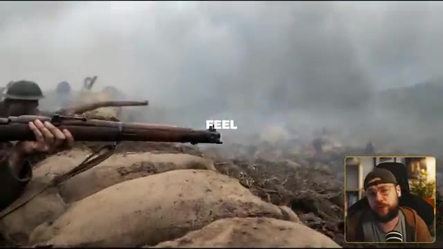
*Extrait vidéo généré par IA montrant un soldat avec un casque dans des tranchées enfumées, avec Jack visible en incrustation PiP en bas à droite.*

*Extrait vidéo généré par IA montrant le visage du créateur (Jack) sur une plage près de vagues, avec l'incrustation PiP de Jack en bas à droite.*

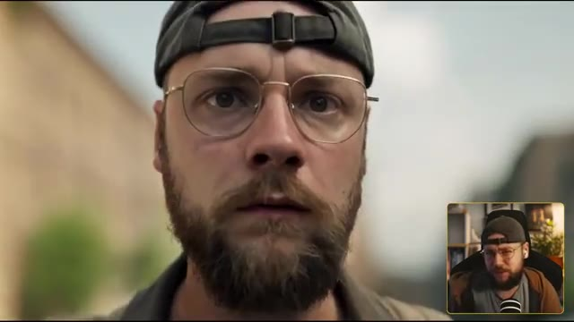
*Extrait vidéo généré par IA montrant un gros plan du visage de Jack en extérieur, avec l'incrustation PiP de Jack en bas à droite.*

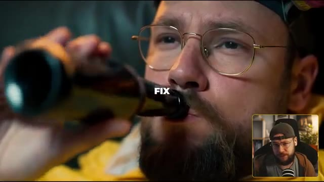
*Extrait vidéo généré par IA montrant Jack en gros plan buvant dans une bouteille, avec l'incrustation PiP de Jack en bas à droite.*

---

### ⏱️ `[00:00:34 - 00:01:08]` | Segment #02

**🔊 Audio (Transcription Intégrale Mot pour Mot en Français) :**
> la méthode va redéfinir ce qui est possible en matière de réalisation de films par IA. C'est ainsi que l'on crée des vidéos par IA qui vous ressemblent vraiment. Nous allons commencer par générer des images cinématiques par IA avec votre sosie. Ensuite, nous passerons à leur transformation en vidéos par IA grâce au flux de travail parfait pour verrouiller la cohérence des personnages. Comme toujours, vous trouverez des repères temporels ci-dessous, alors n'hésitez pas à naviguer comme vous le souhaitez. Avant de commencer, je veux que vous fassiez une chose pour moi. Prenez un ensemble d'images de vous-même, concentrez-vous sur l'obtention de gros plans bien éclairés de votre visage,

**👁️ Analyse Visuelle d'Écran (gemini-3.5-flash-lite) :**
**Interface & Outils** : Présentation vidéo avec incrustation PiP (Picture-in-Picture) du créateur face caméra.

**Contenu textuel & Code** : Texte affiché : « 1. CREATING CINEMATIC AI IMAGES WITH YOUR LIKENESS », « Take a set of reference images », « Focus on... Well-lit close ups ». Grille de 6 photos de référence montrant un homme barbu avec des lunettes sous divers angles.

**Action / Démonstration** : Le créateur montre des exemples visuels de prises de vue en voiture et illustre la prise de photos de référence avec des gros plans du visage.

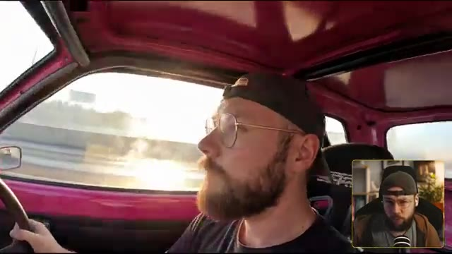
*Extrait vidéo cinématique montrant une personne au volant d'une voiture rose, avec le créateur en incrustation PiP dans le coin inférieur droit.*

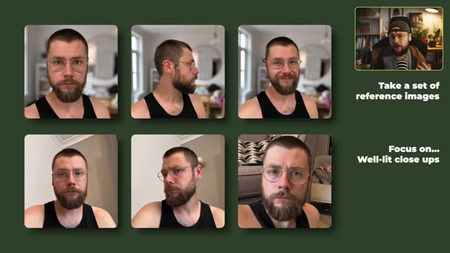
*Présentation de six photos de référence d'un visage sous différents angles, accompagnées de texte explicatif et du créateur en incrustation PiP dans le coin supérieur droit.*

---

### ⏱️ `[00:01:08 - 00:01:42]` | Segment #03

**🔊 Audio (Transcription Intégrale Mot pour Mot en Français) :**
> intégrez des angles et des expressions différents et assurez-vous de porter tous les accessoires que vous souhaitez que votre personnage ait dans vos vidéos IA. Prenez-en avec des accessoires en moins, ajoutez quelques plans en pied, obtenez simplement une belle sélection d'images variées. Ensuite, nous allons nous rendre sur Higgsfield car nous y aurons accès à des outils IA vraiment importants. Nous avons Sol 2.0 et Nano Banana Pro pour créer des images IA et Kling 3 pour donner vie à ces images mais aussi pour une nouvelle fonctionnalité arrivée avec cette mise à jour. Et c'est notre arme secrète pour verrouiller le personnage.

**👁️ Analyse Visuelle d'Écran (gemini-3.5-flash-lite) :**
**Interface & Outils** : Interface de présentation visuelle avec des exemples de photographies de référence et des icônes de logiciels de génération d'images.

**Contenu textuel & Code** : Texte affiché : "Take a set of reference images", "Focus on... Well-lit close ups", "Varied angles & expressions", ainsi que des icônes représentant des outils d'IA (Sol 2.0 et Nano Banana Pro).

**Action / Démonstration** : Le créateur illustre visuellement les types d'images de référence nécessaires pour maintenir la cohérence d'un personnage, puis présente les outils de la plateforme Higgsfield.

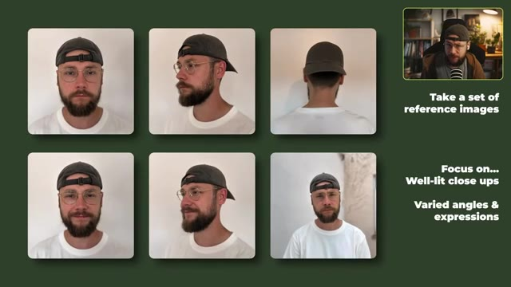
*Grille d'exemples de photos de référence du visage sous différents angles avec consignes textuelles à l'écran.*

*Affichage de deux icônes de logiciels (Sol 2.0 et Nano Banana Pro) sur fond flou avec incrustation du créateur en haut à droite.*

---

### ⏱️ `[00:01:42 - 00:02:16]` | Segment #04

**🔊 Audio (Transcription Intégrale Mot pour Mot en Français) :**
> cohérence avec nos vidéos IA. On verra ça plus tard. Je veux commencer par créer nos images de départ. Donc pour faire ça depuis la page d'accueil, vous voulez aller dans le coin supérieur gauche, survoler "image" et cliquer sur "créer une image". Avec Soul 2.0 sélectionné dans la liste des modèles, vous verrez que nous avons une option ici pour ajouter un personnage. Donc si nous entrons là-dedans, vous voulez aller sur "créer un nouveau personnage" et ici vous pouvez aller de l'avant et télécharger cette sélection d'images que nous avons prises plus tôt. Vous pouvez voir sur le côté droit que nous avons un bon score ici, donc nous pouvons descendre et cliquer

**👁️ Analyse Visuelle d'Écran (gemini-3.5-flash-lite) :**
**Interface & Outils** : Interface web d'un générateur d'images et de vidéos par IA (type Seedance / Soul 2.0) avec menu supérieur, options de modélisation et encadré de webcam du créateur.

**Contenu textuel & Code** : Texte visible : "Explore", "Image", "Video", "Edit", "Character", "Soul 2.0", "Create new character", "Number of images: 26 (Good)", "Quality: 2316px (Perfect)", "Create -> 25".

**Action / Démonstration** : Le créateur navigue dans l'interface, clique sur l'option de création de personnage, puis sélectionne et importe un ensemble de photos préalablement prises pour entraîner le modèle.

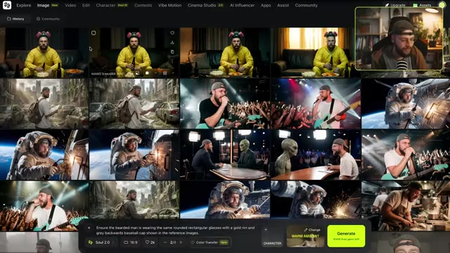
*Interface de l'outil de génération d'images par IA montrant une grille de créations avec Jack dans différents contextes et la webcam incrustée en haut à droite.*

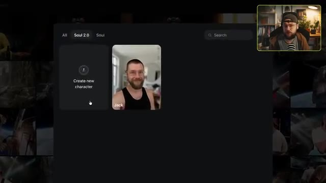
*Interface de sélection et de création de personnages ("Create new character") montrant le profil de Jack.*

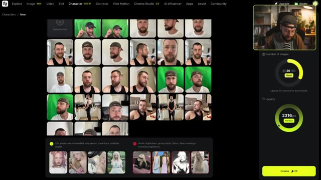
*Page de téléchargement et d'analyse d'un lot de photos pour la création d'un personnage personnalisé, avec scores de qualité et de quantité affichés à droite.*

---

### ⏱️ `[00:02:16 - 00:02:35]` | Segment #05

**🔊 Audio (Transcription Intégrale Mot pour Mot en Français) :**
> créer. Et avec votre personnage sélectionné, nous pouvons aller sur cet onglet suivant et cliquer sur « changer », et nous avons accès à une grande variété de préréglages. Maintenant, vous pouvez sélectionner parmi ceux-ci celui qui vous plaît et cela va verrouiller ce style spécifique sans même que vous ayez besoin d'écrire un prompt textuel.

**👁️ Analyse Visuelle d'Écran (gemini-3.5-flash-lite) :**
**Interface & Outils** : Interface web de génération vidéo par IA (Seedance) avec un panneau supérieur de navigation et une incrustation vidéo (PiP) du créateur en haut à droite.

**Contenu textuel & Code** : Menus de préréglages ('All presets', 'Mood', 'Styles', 'Camera'), vignettes d'exemples de styles visuels ('Mystique city', 'Candy pop', 'Frutiger aero', 'Warm ambient', 'Theatrical light', etc.) et bouton 'Use preset'.

**Action / Démonstration** : Le curseur de la souris survole et parcourt la grille de préréglages de styles pour montrer les différentes options disponibles dans l'interface.

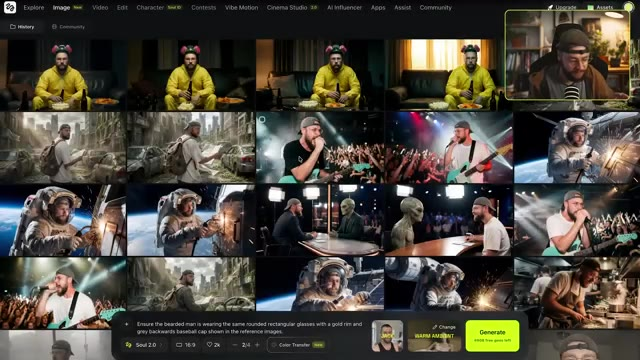
*Interface principale avec le bouton 'Change' et le paramètre 'Warm Ambient' sélectionné pour le personnage.*

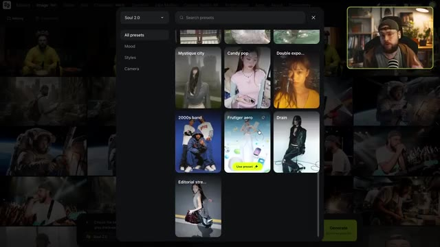
*Fenêtre contextuelle affichant la bibliothèque de préréglages (presets) de style avec des vignettes comme 'Frutiger aero'.*

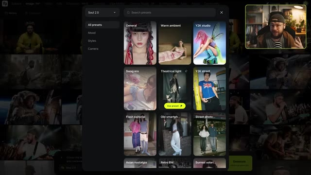
*Fenêtre contextuelle montrant d'autres options de préréglages de style comme 'Theatrical light' et 'Y2K studio'.*

---

### ⏱️ `[00:02:35 - 00:03:04]` | Segment #06

**🔊 Audio (Transcription Intégrale Mot pour Mot en Français) :**
> Mais si vous voulez être très précis concernant les vêtements et les accessoires, vous pouvez aller de l'avant et écrire quelque chose comme : assurez-vous que l'homme barbu porte les mêmes lunettes rectangulaires arrondies avec une monture dorée et une casquette de baseball grise portée à l'envers montrées dans les images de référence. Vous pouvez voir ici que j'ai chargé une quantité de générations à l'aspect vraiment réaliste simplement en parcourant et en testant les différents préréglages. Vous pouvez obtenir des images de très bonne qualité ici avec zéro effort.

**👁️ Analyse Visuelle d'Écran (gemini-3.5-flash-lite) :**
**Interface & Outils** : Interface web de Higgsfield AI (Soul 2.0), affichant des galeries d'images générées, des options de préréglages (presets), des sélections de personnages et un champ de prompt textuel.

**Contenu textuel & Code** : Texte du prompt visible : « Ensure the bearded man is wearing the same rounded rectangular glasses with a gold rim and grey backwards baseball cap shown within the reference images. » Paramètres : modèle « Soul 2.0 », rapport d'aspect 16:9, options « Color Transfer », préréglages comme « Warm Ambient » ou « Street photography ».

**Action / Démonstration** : Le créateur navigue à travers l'interface de l'outil IA, montre les différentes générations d'images réalistes obtenues via les préréglages, et présente la zone de saisie du prompt textuel pour affiner les détails vestimentaires.

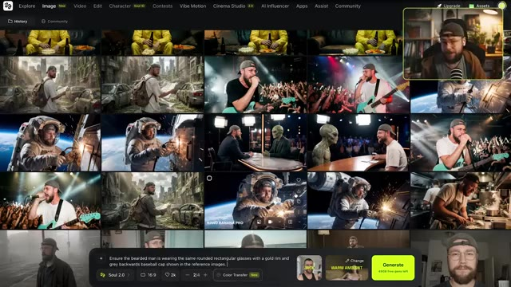
*Interface de l'outil de génération d'images affichant une galerie de résultats et le champ de saisie du prompt textuel en bas.*

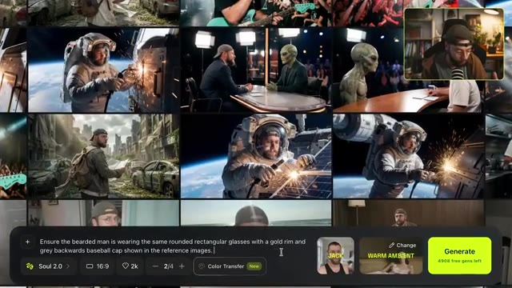
*Gros plan sur la barre de saisie du prompt avec les options de modèle « Soul 2.0 » et le bouton de génération vert.*

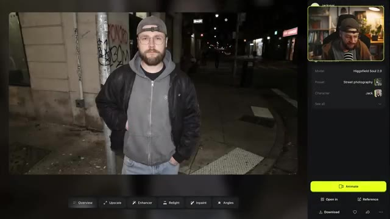
*Visualisation d'une image générée représentant un homme barbu avec des lunettes dans une rue sombre la nuit, avec les panneaux de configuration à droite.*

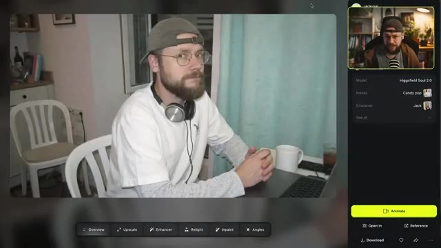
*Visualisation d'une autre image générée montrant le même personnage assis à un bureau dans une pièce intérieure, avec le panneau de configuration latéral.*

---

### ⏱️ `[00:03:04 - 00:03:41]` | Segment #07

**🔊 Audio (Transcription Intégrale Mot pour Mot en Français) :**
> Je veux dire, celle-ci est assez folle par son réalisme. Alors que Soul 2.0 est génial pour la photographie de mode et le contenu généré par les utilisateurs, si vous cherchez quelque chose de plus cinématique, vous allez vouloir passer à Nano Banana Pro. Et avant qu'on entre dans le vif du sujet, les gars, si vous appréciez le contenu d'aujourd'hui, assurez-vous de me lâcher un gros pouce bleu, pensez à vous abonner et, bien sûr, activez la cloche de notification. Maintenant, pour le modèle d'image de Google, vous devrez cliquer sur cette icône et importer manuellement chacune de vos images de référence. Je sélectionnerais un ou deux gros plans qui ont un angle et une expression similaires à ce que vous voulez dans votre image IA. Et ensuite, vous pouvez ajouter un

**👁️ Analyse Visuelle d'Écran (gemini-3.5-flash-lite) :**
**Interface & Outils** : Interface de la plateforme de génération vidéo et image Higgsfield AI avec incrustation vidéo PiP du créateur.

**Contenu textuel & Code** : Menus de sélection de modèles (Higgsfield Soul 2.0, Seedream 5.0 lite, Nano Banana Pro), explorateur de fichiers montrant des dossiers de référence ("Higgsfield refs", "Style references", "Portraits"), boutons "Generate" et paramètres d'image.

**Action / Démonstration** : Le créateur navigue dans l'interface, sélectionne des modèles de génération d'image et ouvre l'explorateur de fichiers pour importer des images de référence.

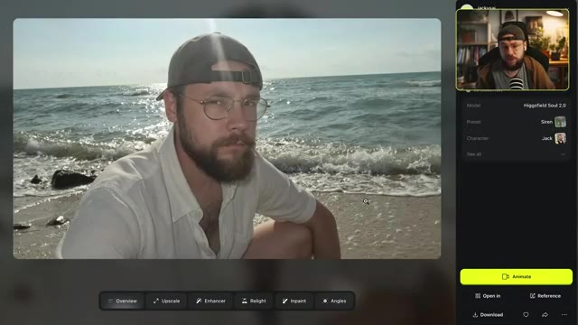
*Interface d'Higgsfield montrant un rendu ultra-réaliste sur une plage avec des options de retouche.*

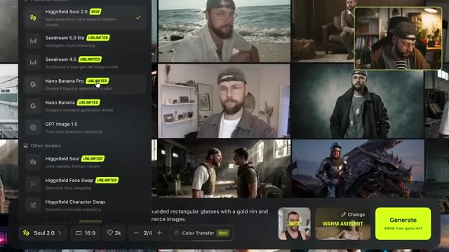
*Menu déroulant de sélection des modèles d'IA avec Soul 2.0 et Nano Banana Pro.*

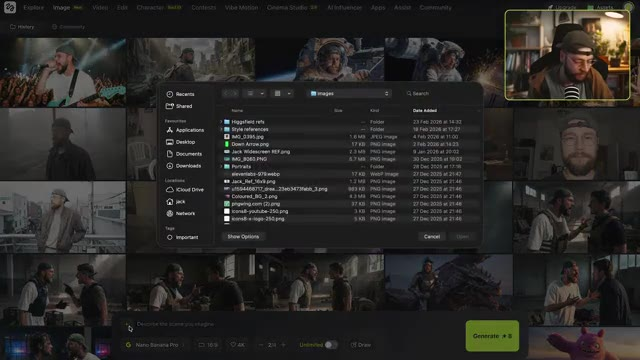
*Fenêtre de sélection de fichiers système superposée sur l'interface d'IA pour importer des images de référence.*

---

### ⏱️ `[00:03:41 - 00:04:03]` | Segment #08

**🔊 Audio (Transcription Intégrale Mot pour Mot en Français) :**
> invite textuelle qui décrit votre scène, votre lieu et vos vêtements, ainsi que le style d'image que vous recherchez. Et n'oubliez pas, vous trouverez tous les invites textuels que j'allais utiliser ci-dessous dans la description de la vidéo. Allons-y et lançons cette génération juste pour pouvoir vous montrer ce qui est possible. Donc, comme vous pouvez le voir, nous avons récupéré nos générations et la ressemblance est vraiment assez impressionnante.

**👁️ Analyse Visuelle d'Écran (gemini-3.5-flash-lite) :**
**Interface & Outils** : Interface web de génération d'images par IA avec panneau de prompt et options de format.

**Contenu textuel & Code** : Texte du prompt visible : "Show the bearded man as a samurai in ancient Japan, ensure he is still wearing his rounded rectangular glasses. The bearded man is wearing a samurai hat and period accurate clothing, holding his sheathed katana. Photo real, cinematic composition, dramatic lighting. Just before a battle." Paramètres : Nano Banana Pro, format 16:9, résolution 4K.

**Action / Démonstration** : Le créateur montre l'interface de génération d'images, lance le processus puis affiche le résultat impressionnant de la ressemblance du personnage en samouraï.

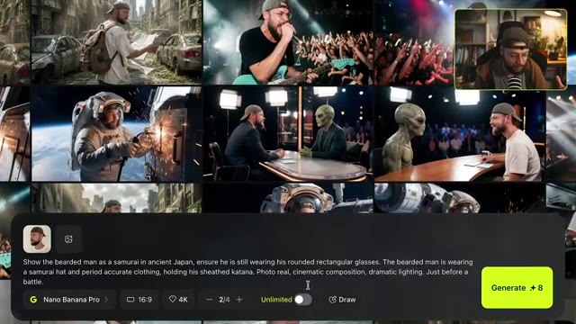
*Interface d'un générateur d'images montrant le prompt textuel sur le samouraï et le bouton de génération.*

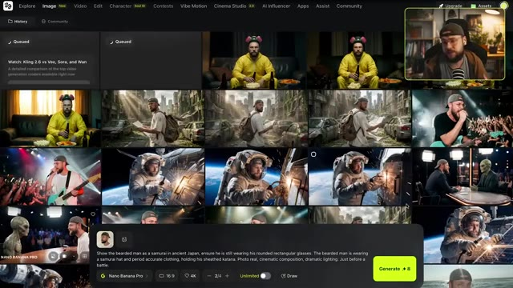
*Vue d'ensemble de la bibliothèque de générations avec un encadré PiP du présentateur.*

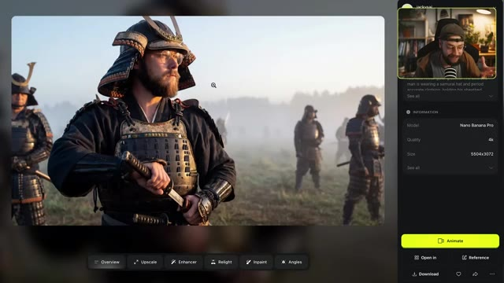
*Résultat de génération affichant un samouraï avec une armure traditionnelle japonaise, des lunettes et un katana.*

---

### ⏱️ `[00:04:03 - 00:04:38]` | Segment #09

**🔊 Audio (Transcription Intégrale Mot pour Mot en Français) :**
> nano banana pro brille vraiment ici, je ne sais pas s'il y a vraiment eu un samouraï qui portait des lunettes, peut-être que vous pouvez me corriger si je me trompe. Nous avons donc créé une très belle sélection de différents types d'images IA ici en utilisant à la fois nano banana pro et soul 2.0. Mais comme je le disais plus tôt, c'est la partie facile en quelque sorte. Comment allons-nous faire pour que notre personnage reste cohérent dans nos vidéos IA ? Pour faire cela, j'aimerais que vous survoliez l'image que vous souhaitez animer et que vous cliquiez sur cet onglet ici qui s'appelle anime. Maintenant, c'est très important. Assurez-vous que pour le modèle vidéo vous

**👁️ Analyse Visuelle d'Écran (gemini-3.5-flash-lite) :**
**Interface & Outils** : Interface web de génération d'images et de vidéos par IA (type plateforme créative avec onglets Explore, Image, Video, Edit, etc., et vue PiP de Jack en haut à droite).

**Contenu textuel & Code** : Textes visibles : "Model: Nano banana pro", "Quality: 4k", "Size: 5504x3072", "Animate", prompts de génération pour samouraï en armure et astronaute, paramètres de modèle vidéo (Kling 2.6).

**Action / Démonstration** : Le créateur présente différentes images générées d'un samouraï et d'un astronaute, puis montre l'interface de création vidéo et les options de modèles d'animation.

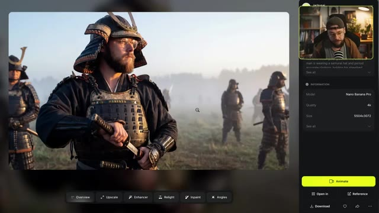
*Interface d'une application montrant une image générée d'un samouraï avec des informations sur le modèle (Nano banana pro, résolution 4k).*

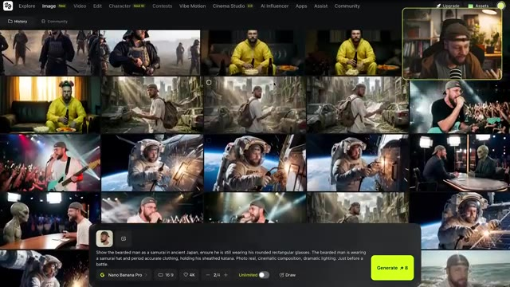
*Galerie de différentes images générées par IA avec un panneau de prompt textuel en bas.*

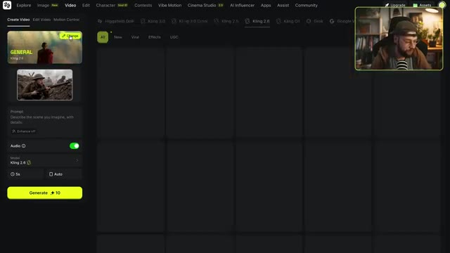
*Interface de génération vidéo montrant les options de modèles (Kling 2.6) et les paramètres de création.*

---

### ⏱️ `[00:04:38 - 00:05:16]` | Segment #10

**🔊 Audio (Transcription Intégrale Mot pour Mot en Français) :**
> avoir Kling 3 sélectionné. Et ensuite, vous devrez ajouter un prompt textuel qui décrit toute action se déroulant, tout dialogue et mouvement de caméra, ainsi que le style et le ton globaux. Pensez-y comme à l'écriture d'un scénario pour un film. Et maintenant, jetons un coup d'œil à cette arme secrète dont je parlais pour verrouiller la cohérence de notre personnage, cela s'appelle des éléments. Si vous cliquez sur cet onglet, vous pouvez créer un nouvel élément et ici, je veux que vous téléchargez ce jeu d'images que vous avez prises de vous-même un peu plus tôt, mais en étant un peu plus sélectif. J'ai donc un personnage de moi portant un chapeau et un autre sans.

**👁️ Analyse Visuelle d'Écran (gemini-3.5-flash-lite) :**
**Interface & Outils** : Kling 3.0 (interface web de génération de vidéo par IA avec menu supérieur, panneau de prompts et gestion des éléments).

**Contenu textuel & Code** : Texte du prompt : "Intense World War 2 scene, bullets flying overhead, frantic explosions, soldiers shooting and ducking for cover, muzzle flashes, war drama, the bearded man fires his gun several times, appearing focused, the camera orbits around to end directly in front of the bearded man. No music." Noms des éléments : "Create new", "JackNoHat", "KlingREF", "Jack-1".

**Action / Démonstration** : Le créateur démontre l'utilisation de l'interface de Kling 3.0, saisit un prompt textuel détaillé, puis ouvre le gestionnaire d'éléments ("Elements") pour sélectionner et appliquer des images de référence de personnage afin de maintenir la cohérence visuelle.

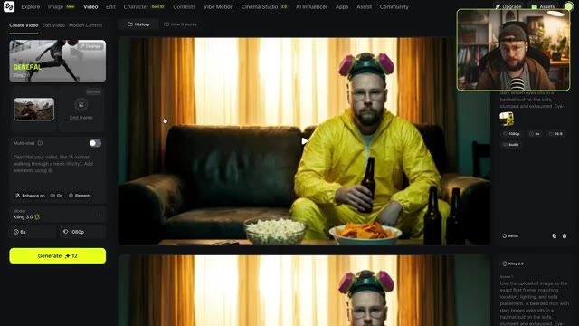
*Interface principale de Kling 3.0 avec le champ de texte et le rendu vidéo en arrière-plan.*

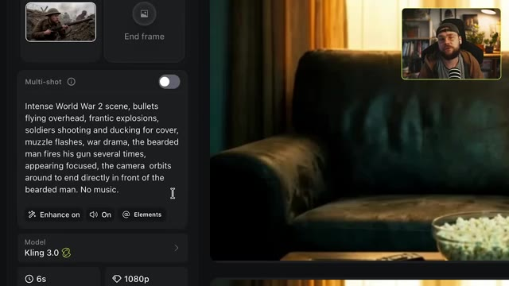
*Gros plan sur le panneau de prompt textuel de Kling 3.0 décrivant une scène de la Seconde Guerre mondiale.*

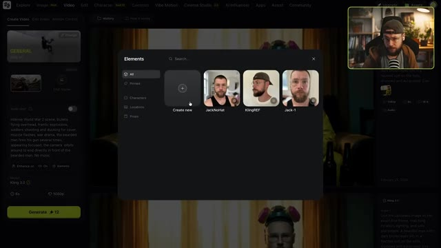
*Fenêtre modale "Elements" ouverte sur Kling 3.0 montrant la liste des éléments de personnages créés ("JackNoHat", "KlingREF", "Jack-1").*

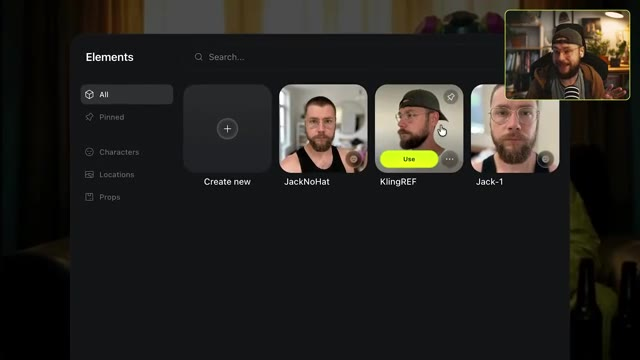
*Zoom sur la sélection d'un élément de personnage ("KlingREF") avec le bouton "Use" en surbrillance dans l'onglet Elements.*

---

### ⏱️ `[00:05:16 - 00:05:45]` | Segment #11

**🔊 Audio (Transcription Intégrale Mot pour Mot en Français) :**
> et cela s'avère vraiment très pratique pour certaines générations. Je vous montrerai ce que je veux dire plus tard. Vous pouvez donc donner un nom à votre élément. Vous pouvez aussi sélectionner une catégorie. Le personnage ici, par exemple, mais nous pouvons également ajouter un lieu ou un accessoire ainsi qu'une brève description. Ensuite, allez-y et cliquez sur créer. Nous pouvons ensuite survoler l'élément approprié. Et en cliquant sur utiliser, nous donnons à Kling une référence de personnage sous plusieurs angles. Vous pouvez voir qu'il a été ajouté directement à notre invite textuelle.

**👁️ Analyse Visuelle d'Écran (gemini-3.5-flash-lite) :**
**Interface & Outils** : Interface de l'outil de génération vidéo par IA Kling (Kling 3.0).

**Contenu textuel & Code** : Menus "Elements", "New element", catégories ("Auto", "Character", "Location", "Prop"), champs de texte pour le nom et la description, et un prompt textuel décrivant une scène de guerre : "Intense World War 2 scene, bullets flying overhead...".

**Action / Démonstration** : Le créateur montre la navigation dans les éléments, la configuration d'un nouveau profil de personnage avec plusieurs angles de vue, et l'intégration de la référence du personnage dans le prompt de génération vidéo.

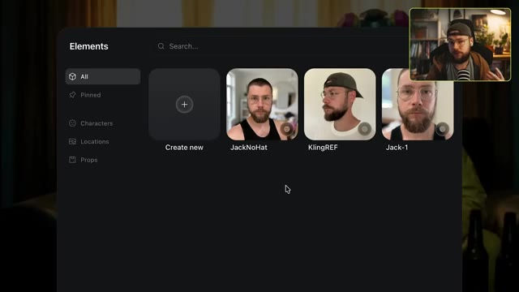
*Interface de la section "Elements" montrant les profils de personnages existants et l'option "Create new".*

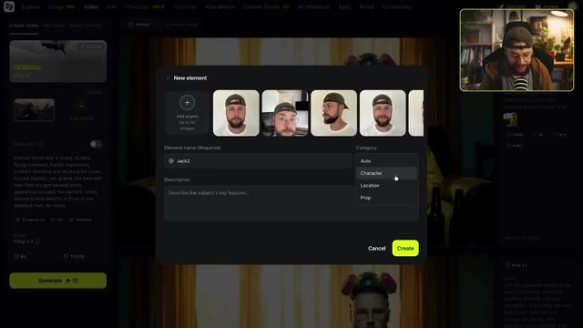
*Fenêtre de création d'un nouvel élément avec l'attribution d'un nom "@ Jack2" et le choix de la catégorie "Character".*

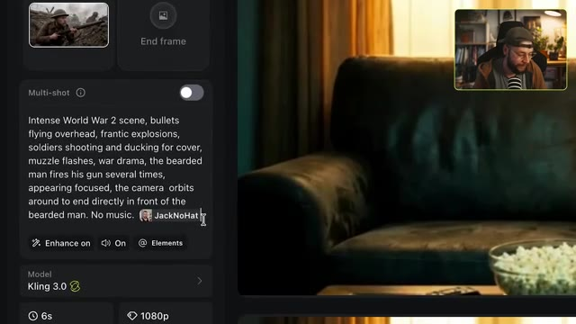
*Panneau de configuration du prompt textuel montrant l'insertion de l'élément de personnage("@ JackNoHat") directement dans le texte.*

---

### ⏱️ `[00:05:45 - 00:06:05]` | Segment #12

**🔊 Audio (Transcription Intégrale Mot pour Mot en Français) :**
> Si vous donnez seulement une image de départ à Kling, il sait seulement à quoi vous ressemblez sous cet angle spécifique. Donc, chaque fois que votre personnage ou la caméra bouge, il y a un élément de devinette. Kling doit faire une supposition éclairée sur ce à quoi vous pourriez ressembler en contre-plongée ou à quoi vous pourriez ressembler si vous étiez en colère, par exemple.

**👁️ Analyse Visuelle d'Écran (gemini-3.5-flash-lite) :**
**Interface & Outils** : Présentation face caméra sans partage d'écran

**Contenu textuel & Code** : Aucun contenu logiciel ou visuel affiché, uniquement le présentateur (Jack) dans son studio devant son micro.

**Action / Démonstration** : Le créateur parle face caméra en gesticulant légèrement pour expliquer le fonctionnement de Kling.

---

### ⏱️ `[00:06:05 - 00:06:26]` | Segment #13

**🔊 Audio (Transcription Intégrale Mot pour Mot en Français) :**
> Mais télécharger nos éléments aide à résoudre ce problème en réduisant l'incertitude. Tout ce qu'il reste à faire, c'est de sélectionner la durée de notre vidéo ainsi que notre résolution souhaitée, et de cliquer sur générer. Ce sur quoi je veux que vous vous concentriez, c'est le fait que moi-même, en tant que personnage dans notre génération par IA, je bouge d'une manière très dynamique.

**👁️ Analyse Visuelle d'Écran (gemini-3.5-flash-lite) :**
**Interface & Outils** : Interface de l'outil de génération vidéo Kling AI (modèle Kling 3.0), avec un encadré PiP montrant le créateur en haut à droite.

**Contenu textuel & Code** : Modèle Kling 3.0 sélectionné, réglages de durée (6s), de résolution (1080p), et prompt descriptif visible dans le panneau latéral.

**Action / Démonstration** : Le créateur montre l'interface de Kling AI, explique comment configurer les paramètres de génération et présente le résultat vidéo dynamique d'un soldat en mouvement.

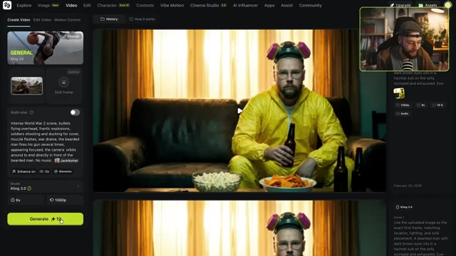
*Interface de Kling 3.0 affichant le panneau de génération vidéo, un prompt descriptif et le bouton de génération.*

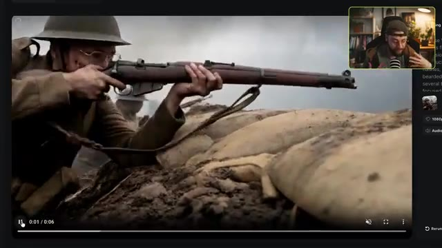
*Résultat vidéo généré dans Kling 3.0 montrant un soldat de la Première Guerre mondiale dans une tranchée.*

---

### ⏱️ `[00:06:27 - 00:06:47]` | Segment #14

**🔊 Audio (Transcription Intégrale Mot pour Mot en Français) :**
> La caméra tourne autour de moi en tant que personnage et pourtant cette cohérence se maintient. Je ne remets cela nullement en question. Et tout cela grâce aux éléments que nous avons téléversés. Le fait que Kling dispose d'une référence pour m'observer sous différents angles et intégrer cela dans notre génération.

**👁️ Analyse Visuelle d'Écran (gemini-3.5-flash-lite) :**
**Interface & Outils** : Interface de lecteur vidéo de plateforme web (type Kling ou autre outil de génération vidéo par IA) avec une incrustation vidéo du créateur (PiP) dans le coin supérieur droit.

**Contenu textuel & Code** : Panneau latéral droit affichant des détails de prompt ou de configuration de génération (« ...se ...sion ...hashes ...bearded ...several ...focused »), et un lecteur affichant une vidéo générée de 6 secondes avec des icônes de contrôle de lecture.

**Action / Démonstration** : Lecture d'une vidéo générée par IA montrant un personnage de soldat dans une tranchée lors de la Première Guerre mondiale, tandis que le créateur commente en direct dans l'encadré PiP.

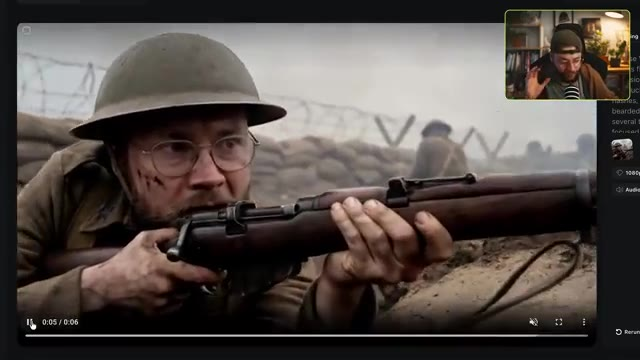
*Un soldat en uniforme de la Première Guerre mondiale tenant un fusil dans une tranchée, avec le créateur visible en incrustation PiP.*

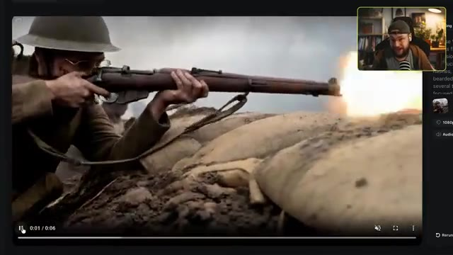
*Le soldat tire avec son fusil dans la tranchée, créant une forte déflagration lumineuse, avec le créateur en incrustation PiP.*

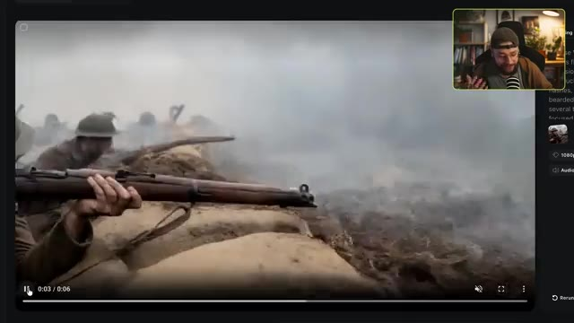
*Vue en mouvement montrant la fumée et l'action dans la tranchée avec des soldats générés par IA.*

---

### ⏱️ `[00:06:47 - 00:07:05]` | Segment #15

**🔊 Audio (Transcription Intégrale Mot pour Mot en Français) :**
> Et je veux continuer et jeter un œil à quelques exemples supplémentaires ici. Remarquez, les gars, l'image de départ où l'on peut à peine voir mon visage. Je suis dans une sorte de profil strict ici par rapport à la caméra. Et pourtant, la caméra est capable de faire une orbite complète autour de moi.

**👁️ Analyse Visuelle d'Écran (gemini-3.5-flash-lite) :**
**Interface & Outils** : Interface web de Kling AI (Kling 3.0) avec panneau de contrôle à gauche et affichage de la vidéo au centre.

**Contenu textuel & Code** : Panneau de configuration Kling 3.0 avec le prompt visible : "Intense World War 2 scene... the camera orbits around to end directly in front of the bearded man." Modèle Kling 3.0 sélectionné, durée 6s, 1080p.

**Action / Démonstration** : Le créateur présente une vidéo générée par IA montrant un mouvement de caméra complexe (orbit full) qui passe d'un profil serré à une vue de face à l'intérieur d'un véhicule.

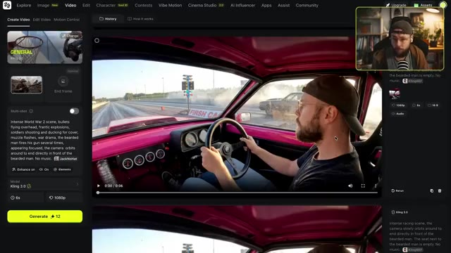
*Interface de l'outil de génération vidéo Kling montrant la vidéo générée d'une vue de profil à l'intérieur d'une voiture de course rose, avec le créateur en incrustation (PiP).*

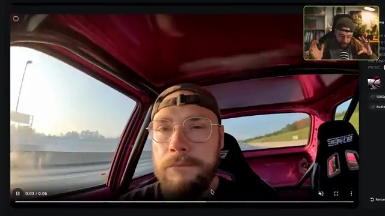
*Visionnage de la vidéo générée montrant la fin de l'orbite caméra avec le visage du créateur de face, avec le créateur en incrustation (PiP).*

---

### ⏱️ `[00:07:05 - 00:07:24]` | Segment #16

**🔊 Audio (Transcription Intégrale Mot pour Mot en Français) :**
> Et quand vous me voyez de face, ça me ressemble toujours. Maintenant, traditionnellement, sans l'utilisation d'éléments avec Kling 3, ce serait complètement de la devinette pour un modèle de vidéo par IA, car il n'a que le contexte qu'on lui fournit au début du plan avec l'image de départ.

**👁️ Analyse Visuelle d'Écran (gemini-3.5-flash-lite) :**
**Interface & Outils** : Interface de lecteur vidéo de type web avec barre de lecture, boutons de volume et icône de plein écran, incluant une incrustation (PiP) de Jack dans le coin supérieur droit.

**Contenu textuel & Code** : Une vidéo de démonstration montrant un travelling circulaire généré par IA autour d'un conducteur à l'intérieur d'un habitacle de voiture rose. La barre de lecture indique 0:01 à 0:06.

**Action / Démonstration** : La caméra virtuelle tourne autour du conducteur dans la voiture, passant d'une vue de profil à une vue de face frontale.

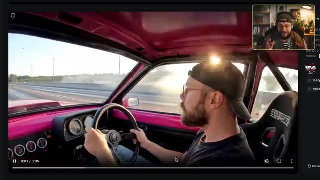
*Extrait vidéo généré par IA montrant un personnage ressemblant à Jack au volant d'une voiture rose de profil, avec une incrustation de Jack en haut à droite.*

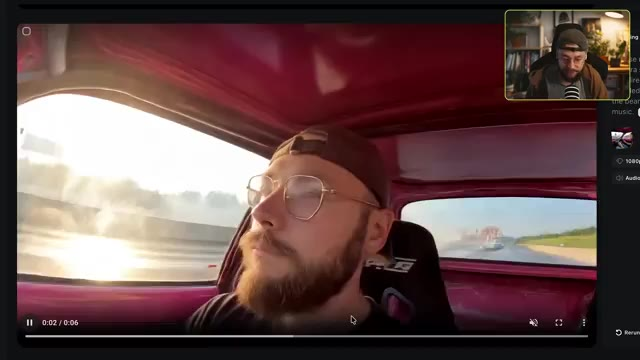
*Extrait vidéo montrant la caméra faisant une rotation pour passer d'un profil à une vue de trois quarts du personnage.*

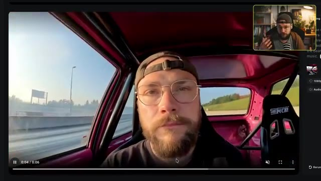
*Extrait vidéo montrant le personnage désormais de face, regardant directement la caméra pendant la conduite.*

---

### ⏱️ `[00:07:24 - 00:07:42]` | Segment #17

**🔊 Audio (Transcription Intégrale Mot pour Mot en Français) :**
> Mais à cause de ces éléments, il est capable d'incorporer vraiment de manière significative nos références d'images, ces différents angles de nous en tant que personnage dans nos générations. Et c'est un véritable changement de donne. Avant, peut-être qu'on aurait pu faire une transition de trame de début et de fin.

**👁️ Analyse Visuelle d'Écran (gemini-3.5-flash-lite) :**
**Interface & Outils** : Interface de lecteur vidéo web avec commandes de lecture, barre de progression (0:02 / 0:06), options de résolution et vignette incrustée (PiP) du créateur.

**Contenu textuel & Code** : Vidéo générée par IA montrant un homme barbu avec des lunettes et une casquette au volant d'une voiture rose de type sportive/course avec un arceau de sécurité, sur fond de route ensoleillée. Menu latéral avec indicateur 1080p et icône audio.

**Action / Démonstration** : Lecture d'une vidéo générée par IA démontrant l'intégration réussie de références de personnages et d'angles multiples dans un habitacle de véhicule, tandis que le créateur commente en voix off.

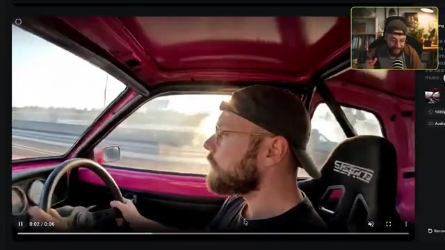
*Interface de lecteur vidéo montrant une génération IA photoréaliste d'une personne conduisant une voiture rose à l'intérieur de l'habitacle, avec le créateur en incrustation (PiP) dans le coin supérieur droit.*

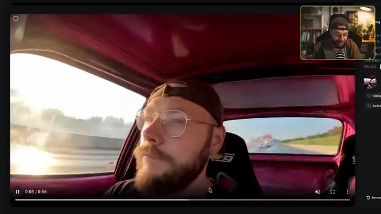
*Poursuite de la lecture de la vidéo générée montrant la personne au volant avec une vue latérale et le paysage qui défile à travers la vitre, et le créateur toujours visible en incrustation PiP.*

---

### ⏱️ `[00:07:43 - 00:08:19]` | Segment #18

**🔊 Audio (Transcription Intégrale Mot pour Mot en Français) :**
> Mais vous trouvez qu'on obtient une sorte de morphing et de distorsion bizarres où le modèle vidéo essaie d'aller du plan A au plan B et de garder cette cohérence, mais comme il référence constamment nos éléments, il verrouille vraiment ce niveau d'une manière vraiment impressionnante et nous devons jeter un œil ici à moi vivant mon fantasme en tant que chanteur d'un groupe de rock you and me we're never gonna stop donc encore une fois au début de la génération une grande partie de mon visage est masquée par le microphone et mon visage est à un endroit très différent

**👁️ Analyse Visuelle d'Écran (gemini-3.5-flash-lite) :**
**Interface & Outils** : Interface web de l'outil de génération vidéo Kling 3.0 avec un lecteur vidéo central, des panneaux de configuration latéraux et une incrustation vidéo du créateur.

**Contenu textuel & Code** : On peut lire des paramètres de génération vidéo sous le modèle Kling 3.0, des sélections de résolution (1080p), de durée (6s), ainsi que des instructions textuelles décrivant une scène de concert.

**Action / Démonstration** : Le créateur commente et analyse le résultat d'une génération vidéo IA montrant sa propre transformation en chanteur de rock, en illustrant ses propos par des exemples visuels.

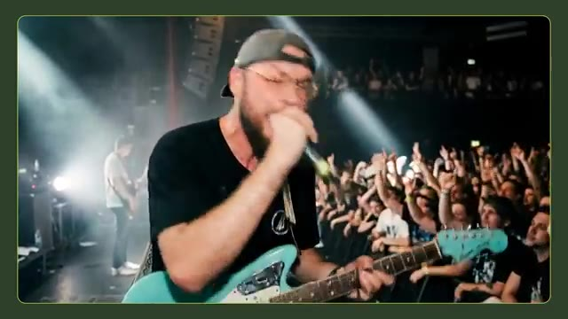
*Aperçu en plein écran d'une vidéo générée par IA montrant le créateur en concert rock avec un micro et une guitare électrique face à un public en délire.*

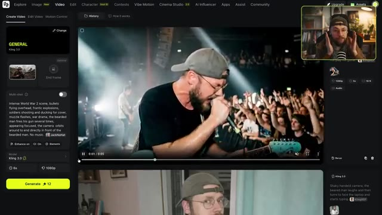
*Interface de l'outil de génération vidéo Kling 3.0 affichant le rendu de la vidéo du concert rock au centre, les paramètres à gauche, et le créateur incrusté en haut à droite.*

---

### ⏱️ `[00:08:19 - 00:08:53]` | Segment #19

**🔊 Audio (Transcription Intégrale Mot pour Mot en Français) :**
> angle par rapport à la caméra par rapport à la fin du plan et pourtant ça a l'air de nouveau de moi grâce à ces éléments. Nous testons cela avec des exemples vraiment dynamiques ici. Nous n'avons vraiment regardé que des générations que j'ai produites en utilisant Nano Banana Pro comme image de départ. Je veux jeter un œil à cette génération ici en utilisant Sol 2.0. Nous avons créé la première image avec le propre modèle d'image de Higgsfield pour cela et c'est incroyablement réaliste ici donc dès le départ cela semble incroyablement réel

**👁️ Analyse Visuelle d'Écran (gemini-3.5-flash-lite) :**
**Interface & Outils** : Interface web de génération de vidéo par IA (probablement Kling AI / Higgsfield) avec panneaux latéraux, sélecteur de modèle et zone de prévisualisation vidéo.

**Contenu textuel & Code** : Menus de navigation en haut (Explore, Image, Video, Edit, Character, etc.), panneau latéral gauche avec options de création, sélection de modèle (Kling 3.0), bouton 'Generate' jaune, et paramètres techniques affichés à droite.

**Action / Démonstration** : Le créateur présente des exemples de vidéos générées par IA sur son écran, démontrant le réalisme et la cohérence des mouvements de caméra et des personnages.

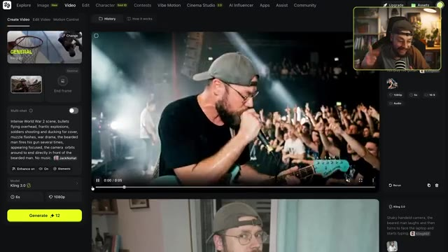
*Interface web affichant un lecteur vidéo central montrant un homme barbu jouant de la guitare dans une foule, avec le créateur en incrustation PiP.*

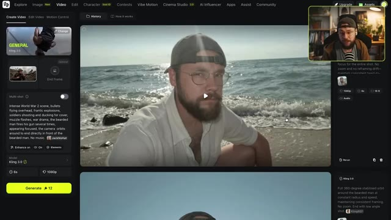
*Interface web affichant un lecteur vidéo central montrant le même homme sur une plage au bord de l'eau, avec le panneau de configuration latéral.*

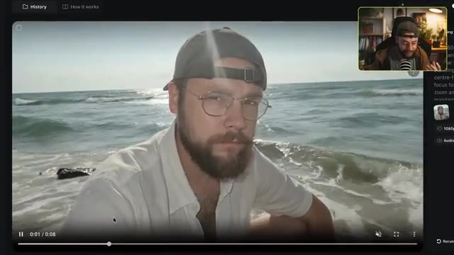
*Vue agrandie du lecteur vidéo montrant la scène de la plage avec l'homme barbu et le créateur visible en incrustation dans le coin supérieur droit.*

---

### ⏱️ `[00:08:53 - 00:09:29]` | Segment #20

**🔊 Audio (Transcription Intégrale Mot pour Mot en Français) :**
> et ce qui se passe c'est que moi en tant que personnage je me lève et on se retrouve avec ce plan en contre-plongée et tout cela a l'air vraiment très réaliste genre je ne remets absolument pas cela en question et cette interaction de la lumière avec le soleil est sérieusement impressionnante ça aide juste à rajouter du réalisme ici la physique des vagues derrière moi tout est vraiment au point donc vous pouvez voir une combinaison assez puissante là Higgsfield Soul 2.0 associé à Kling 3 et nos éléments et juste brièvement un autre

**👁️ Analyse Visuelle d'Écran (gemini-3.5-flash-lite) :**
**Interface & Outils** : Interface de plateforme web de génération vidéo par IA (probablement Higgsfield Soul 2.0 / Kling) avec lecteur multimédia intégré, panneau latéral d'options et miniature vidéo.

**Contenu textuel & Code** : Affichage d'une vidéo générée par IA mettant en scène le créateur (Jack) sur une plage, avec des commandes de lecture vidéo en bas et une incrustation vidéo (PiP) du créateur en haut à droite.

**Action / Démonstration** : Le créateur montre et commente une vidéo générée par IA où le personnage se lève en contre-plongée sur une plage, en analysant le réalisme de l'éclairage et de la physique des vagues.

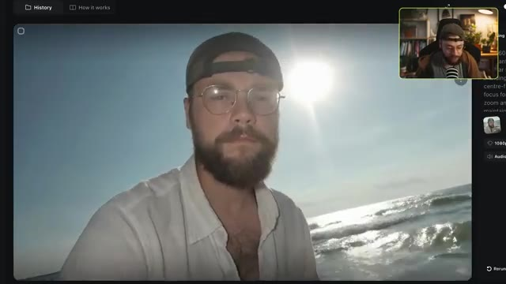
*Interface de lecture vidéo montrant la génération IA d'un personnage se levant sur une plage avec une lumière solaire intense et un effet de contre-plongée.*

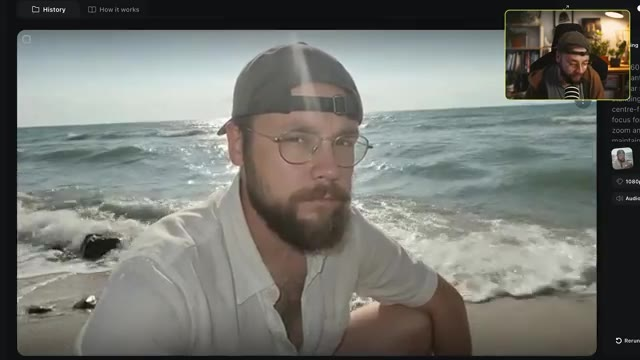
*Interface de lecture vidéo montrant le personnage accroupi au bord de l'eau sur la plage avec des vagues en arrière-plan.*

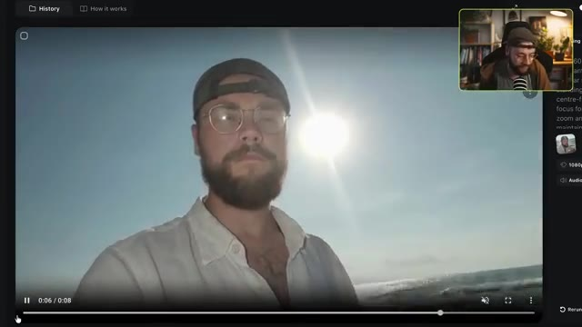
*Interface de lecture vidéo avec barre de progression montrant le plan en contre-plongée du personnage debout sur la plage.*

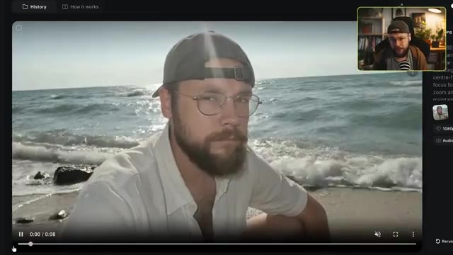
*Interface de lecture vidéo montrant le début de la vidéo générée avec le personnage accroupi au premier plan.*

---

### ⏱️ `[00:09:29 - 00:09:59]` | Segment #21

**🔊 Audio (Transcription Intégrale Mot pour Mot en Français) :**
> Exemple de Soul 2.0 ici, l'image de départ a vraiment une ambiance de vieil appareil photo numérique, on dirait que je suis en vacances ou quelque chose comme ça et que je travaille sur mon ordinateur portable, jetons un coup d'œil à ça. Donc encore une fois, tout cela a l'air incroyablement réaliste. Mes seules critiques ici, ce sont mes cheveux. Ils devraient être plus courts puisque nous fournissons ces éléments pour verrouiller cela.

**👁️ Analyse Visuelle d'Écran (gemini-3.5-flash-lite) :**
**Interface & Outils** : Interface web de génération vidéo par IA, affichant un menu supérieur (Explore, Image, Video, Edit, Character, Soul ID, etc.), un panneau de configuration à gauche avec les options de création de vidéo, et un encadré PiP (Picture-in-Picture) du créateur en haut à droite.

**Contenu textuel & Code** : Texte descriptif dans le panneau latéral gauche concernant les mouvements de caméra et les actions, sélection du modèle Kling 3.0, bouton "Generate", et paramètres de résolution (1080p, 5s, 16:9).
[Démonstration de l'interface de génération vidéo] L'écran présente un exemple de vidéo générée où l'on voit le créateur assis avec un ordinateur portable, avec des options de configuration et de contrôle des éléments actifs à l'écran.

**Action / Démonstration** : Démonstration pédagogique et présentation du workflow.

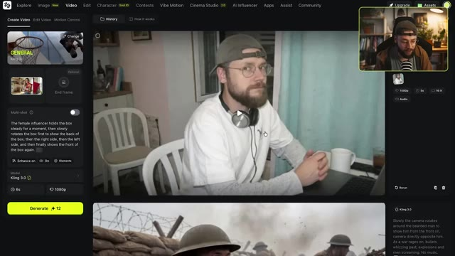
*Interface de l'outil montrant un exemple de génération avec un aperçu vidéo central et les paramètres de contrôle sur les côtés, incluant le modèle Kling 3.0.*

---

### ⏱️ `[00:09:59 - 00:10:36]` | Segment #22

**🔊 Audio (Transcription Intégrale Mot pour Mot en Français) :**
> Et j'ai bien une coupe militaire (buzz cut) dans toutes les images de référence que j'ai téléchargées pour que Kling 3.0 les utilise. De plus, mes dents ont l'air un peu étranges. Je suis un peu en train d'être hypercritique ici, mais leur forme et leur blancheur enlèvent un peu de réalisme, mais il y a beaucoup de choses à aimer ici, c'est vraiment impressionnant. Ce que j'aimerais faire maintenant, c'est examiner l'utilisation de la même méthode pour la cohérence des personnages dans le prompting multi-plans. C'est donc une autre fonctionnalité de Kling 3 où nous pouvons créer une scène entière où l'on effectue des coupes entre

**👁️ Analyse Visuelle d'Écran (gemini-3.5-flash-lite) :**
**Interface & Outils** : Interface web de Kling 3.0 (Kling AI).

**Contenu textuel & Code** : Modèle Kling 3.0, paramètres de génération vidéo, prompt descriptif dans le panneau latéral gauche (« The female influencer holds the box... »).

**Action / Démonstration** : Le créateur présente l'interface de Kling 3.0 tout en commentant les résultats de génération vidéo et les fonctionnalités de cohérence de personnage.

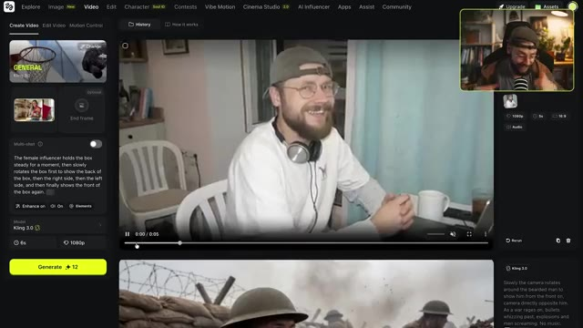
*Interface de Kling 3.0 affichant le panneau de génération vidéo avec un aperçu de personnage généré et le créateur en incrustation (PiP).*

---

### ⏱️ `[00:10:36 - 00:11:11]` | Segment #23

**🔊 Audio (Transcription Intégrale Mot pour Mot en Français) :**
> différents angles de caméra et raconter une histoire autonome au sein d'une seule génération. Et encore une fois, nous pouvons utiliser des éléments pour que, peu importe l'angle de caméra vers lequel nous coupons, notre personnage nous ressemble toujours. Voyons donc comment nous pouvons réaliser cela. Tout d'abord, nous voulons cliquer sur ce bouton bascule ici pour activer le multi-shot, puis sélectionner personnalisé. Et ici, nous pouvons ajouter des invites textuelles pour chaque plan entre lesquels nous voulons que Cling coupe. Maintenant, j'ai un cadre d'invite assez utile que vous pouvez simplement déposer dans chat GPT. Vous voudrez vous assurer de télécharger votre image de départ.

**👁️ Analyse Visuelle d'Écran (gemini-3.5-flash-lite) :**
**Interface & Outils** : Kling AI et Finder macOS (avec incrustation vidéo du créateur dans le coin supérieur droit).

**Contenu textuel & Code** : Menus de configuration multi-shot ("Shot 1", "Shot 2", "Shot 3"), prompts textuels de cadrage (ex: "Use the uploaded image as the exact first frame...", "Cut to tight medium close-up, 50mm lens..."), liste de fichiers image et vidéo (JPEG, MP4) dans les téléchargements macOS.

**Action / Démonstration** : Le créateur montre l'interface de génération multi-shot sur Kling AI, puis ouvre le Finder pour illustrer la sélection et le téléchargement de l'image de départ.

*Interface de l'outil Kling AI montrant le panneau multi-shot avec les différents plans configurés et la vidéo générée d'un personnage en costume hazmat.*

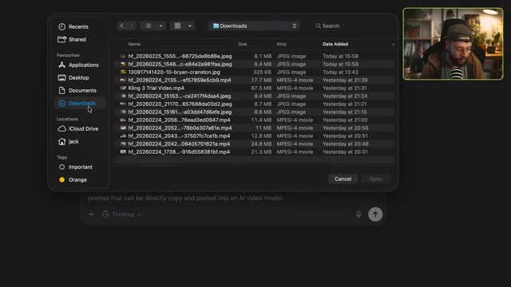
*Fenêtre de sélection de fichiers du Finder macOS affichant le dossier des téléchargements pour importer une image de départ.*

---

### ⏱️ `[00:11:11 - 00:11:47]` | Segment #24

**🔊 Audio (Transcription Intégrale Mot pour Mot en Français) :**
> à côté et il va simplement rédiger un prompt multi-plans pour vous. Vous pouvez le copier et le coller directement dans Higgsfield. Et une brève remarque que je tiens à faire, c'est que j'ai spécifié que la durée totale de génération devait être de 10 secondes et vous pouvez générer jusqu'à 15 secondes avec Kling 3, mais vous remarquerez peut-être que la synchronisation labiale devient un peu bizarre si vous vous aventurez dans cette zone de 15 secondes. Si vous voulez vraiment une génération qui dure aussi longtemps, essayez de faire en sorte que votre dialogue se produisez uniquement dans les 10 premières secondes et gardez l'action vers la

**👁️ Analyse Visuelle d'Écran (gemini-3.5-flash-lite) :**
**Interface & Outils** : Interface de chat web (style Claude ou ChatGPT) avec une zone de texte, un bouton d'envoi et un aperçu d'image importée en haut de la boîte de dialogue, incluant Jack dans un petit encadré vidéo (PiP) en haut à droite.

**Contenu textuel & Code** : Texte affiché à l'écran : "What's on your mind today?" et dans la boîte de saisie : "Write me a multi-shot prompt that describes the below scene using the uploaded image as the first shot... A bearded man sitting in a hazmat suit on a sofa... Be specific about character position and actions..." On y voit aussi une vignette montrant un homme barbu en combinaison de protection jaune sur un canapé.

**Action / Démonstration** : Le créateur montre l'interface du chatbot où un prompt complet est rédigé pour demander la création de prompts vidéo multi-plans basés sur une image de référence.

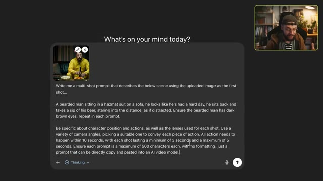
*Interface d'un chatbot textuel (type Claude) montrant une image importée d'un homme en combinaison jaune et un prompt textuel détaillé pour générer un prompt vidéo multi-plans.*

---

### ⏱️ `[00:11:47 - 00:12:19]` | Segment #25

**🔊 Audio (Transcription Intégrale Mot pour Mot en Français) :**
> les cinq derniers. Donc on peut simplement copier ce prompt ici et ce sera pour le troisième plan de notre séquence. Vous remarquerez qu'on peut aussi dicter la durée souhaitée pour chacune de nos générations et la chose utile avec ce cadre de prompt, c'est qu'il donne une indication de ce qu'il faut utiliser. Donc ce plan-là par exemple est censé durer quatre secondes et ensuite ce que vous voulez vous assurer de faire à la fin de votre prompt c'est d'aller sélectionner votre élément et c'est de ça dont je parlais plus tôt où il est utile d'avoir une version de

**👁️ Analyse Visuelle d'Écran (gemini-3.5-flash-lite) :**
**Interface & Outils** : Interface de l'application de génération vidéo (type Kling AI) avec panneau de configuration des plans, curseur de durée et gestion des éléments/personnages.

**Contenu textuel & Code** : Texte des prompts pour chaque plan ("Shot 1", "Shot 2", "Shot 3"), options de durée (ex: 6s, curseur de durée), et la bibliothèque d'éléments avec des profils de personnages étiquetés "JackNoHat", "KlingREF", "Jack-1".

**Action / Démonstration** : Sélection et manipulation du texte des prompts, ajustement de la durée des plans et ouverture du sélecteur d'éléments pour associer un personnage.

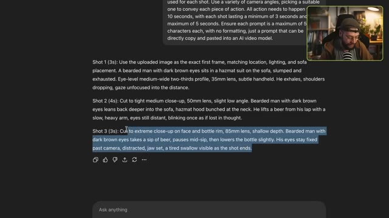
*Interface textuelle affichant les différents plans (Shot 1, Shot 2, Shot 3) avec leurs prompts de génération respectifs.*

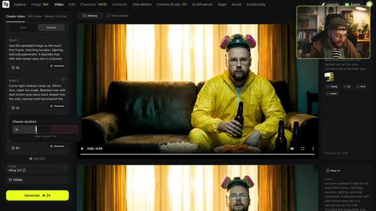
*Interface de génération vidéo avec le panneau latéral gauche montrant les options de durée et les plans, et une fenêtre de prévisualisation au centre.*

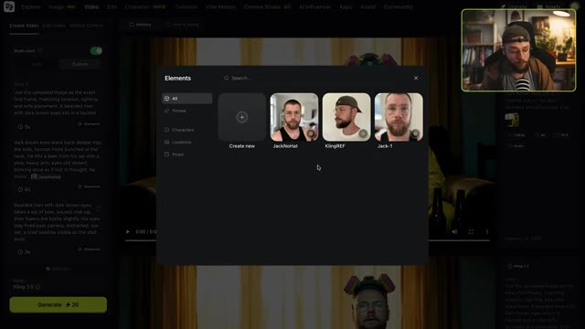
*Fenêtre modale "Elements" affichant des options de sélection de personnages (JackNoHat, KlingREF, Jack-1) pour la génération.*

---

### ⏱️ `[00:12:19 - 00:13:04]` | Segment #26

**🔊 Audio (Transcription Intégrale Mot pour Mot en Français) :**
> moi où je n'ai pas de casquette. Si nous sélectionnons celle-ci, Kling ne va pas essayer de mettre la casquette de baseball sous le masque à gaz, ce qui est arrivé lors de certains de mes tests. Maintenant, techniquement, Kling faisait ce qu'il fallait. Il utilisait nos images de référence de manière très significative, mais il est utile d'avoir des variations du même personnage pour qu'ils fonctionnent mieux avec certains prompts. Et cela étant dit, nous pouvons aller de l'avant et cliquer sur générer. Jetons un coup d'œil au résultat que nous avons obtenu de ce prompt multi-plans particulier. Des trucs sérieusement impressionnants ici. Peu importe quelle caméra

**👁️ Analyse Visuelle d'Écran (gemini-3.5-flash-lite) :**
**Interface & Outils** : Interface web de génération de vidéo par IA (probablement Kling ou une plateforme similaire de type Kling AI) avec panneau latéral de prompts multi-plans ("Multi-shot"), options de configuration (Auto/Custom) et lecteur vidéo central.

**Contenu textuel & Code** : Textes visibles dans les blocs de prompts de l'interface : "Shot 1: Use the uploaded image as the exact first frame, matching location, lighting, and sofa placement...", blocs de texte descriptifs pour les plans suivants, bouton jaune de génération "Generate ✨ 20", et sélecteur de modèle "Kling 3.0".

**Action / Démonstration** : Le créateur présente l'interface de génération vidéo multi-plans, commente le comportement du modèle Kling concernant les références d'images, puis s'apprête à lancer la génération et à visionner le résultat obtenu.

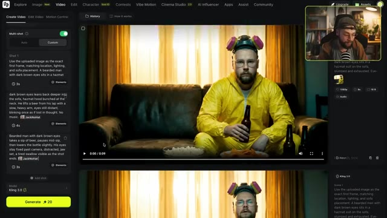
*Interface de l'outil de génération vidéo affichant l'éditeur multi-plans avec le rendu d'un personnage en combinaison hazmat sur un canapé, et Jack en incrustation vidéo (PiP).*

*Vue similaire de l'interface de l'outil de génération vidéo montrant les différents plans et les options du modèle Kling 3.0 avec la vidéo générée au centre.*

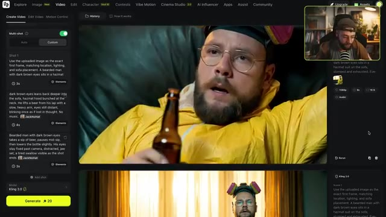
*Gros plan dans l'interface de l'outil montrant le rendu vidéo avec le personnage tenant une bouteille de bière dans le plan généré.*

---

### ⏱️ `[00:13:04 - 00:13:39]` | Segment #27

**🔊 Audio (Transcription Intégrale Mot pour Mot en Français) :**
> angle que vous regardez, peu importe à quel point vous êtes proche de moi en tant que sujet, cela tient vraiment, vraiment la route, en particulier lorsqu'il s'agit de ce niveau de pores visibles et de ce genre d'imperfections dans ma barbe, des rides sur la combinaison hazmat, de la façon dont cela réagit au mouvement, des reflets sur la bouteille de bière, de l'éclairage sur les montants de mes lunettes, il y a beaucoup à apprécier ici et nous avons un autre très bon exemple ici où j'anime une sorte de talk-show et j'interviewe un

**👁️ Analyse Visuelle d'Écran (gemini-3.5-flash-lite) :**
**Interface & Outils** : Interface web de Kling (génération de vidéo par IA) avec panneaux de configuration multi-shot, prompts textuels et un encadré vidéo (PiP) du présentateur Jack en haut à droite.

**Contenu textuel & Code** : Textes de prompts visibles sur le panneau latéral gauche décrivant les plans ('Use the uploaded image as the exact first frame...', 'dark brown eyes leans back deeper into the sofa...', 'Bearded man with dark brown eyes takes a sip of beer...'), paramètres du modèle Kling 3.0, option Multi-shot activée, et bouton de génération 'Generate 20'.

**Action / Démonstration** : Le logiciel présente des exemples de vidéos générées par IA avec des plans successifs (multi-shot) détaillant le comportement physique réaliste des personnages, tandis que le créateur commente les détails visuels dans l'incrustation vidéo en haut à droite.

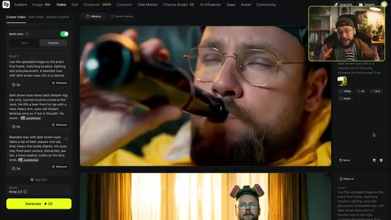
*Interface de Kling montrant un gros plan sur le personnage en combinaison hazmat buvant de la bière, avec le créateur en incrustation vidéo (PiP) dans le coin supérieur droit.*

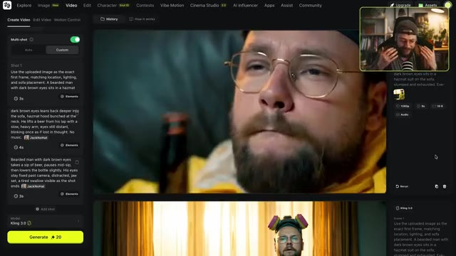
*Interface de Kling montrant le personnage en combinaison hazmat faisant une pause en buvant, avec le créateur en incrustation vidéo (PiP) dans le coin supérieur droit.*

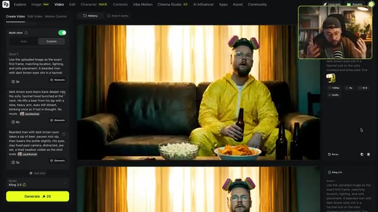
*Interface de Kling montrant un plan plus large du personnage en combinaison hazmat assis sur le canapé avec des boissons et des snacks, avec le créateur en incrustation vidéo (PiP).*

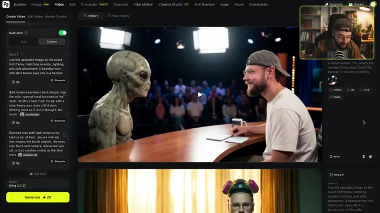
*Interface de Kling montrant un autre exemple de vidéo générée où le présentateur interviewe un extraterrestre sur un plateau de talk-show, avec le créateur en incrustation vidéo (PiP).*

---

### ⏱️ `[00:13:39 - 00:14:16]` | Segment #28

**🔊 Audio (Transcription Intégrale Mot pour Mot en Français) :**
> alien. Donc c'est quoi le truc le plus bizarre sur Terre ? Sois honnête. Oh, ça doit être le sommeil. Vous, les humains, vous restez juste allongés comme des morts pendant huit heures. Genre, non, bougez-vous, faites des trucs. Et ce sur quoi je veux que vous vous concentriez ici, c'est qu'avec la frame de départ qu'on a fournie, Kling, la moitié de mon visage est manquante à cause de cette vue de profil très dure, il manque ce contexte. Et pourtant, quand on coupe sur ce plan par-dessus l'épaule où il me regarde de face, ça ressemble toujours à mon visage. Et c'est purement grâce à l'utilisation de nos éléments. Et y a même cette petite fossette dans ma barbe, que je déteste d'ailleurs,

**👁️ Analyse Visuelle d'Écran (gemini-3.5-flash-lite) :**
**Interface & Outils** : Interface web de l'outil de génération vidéo Kling (mode Multi-shot).

**Contenu textuel & Code** : Paramètres de génération vidéo avec des segments de plans (Shot 1, Shot 2, Shot 3), des prompts textuels détaillés décrivant les actions (« Use the uploaded image as the exact first frame... »), des icônes d'éléments d'IA, et le bouton jaune « Generate 20 ».

**Action / Démonstration** : Le créateur commente l'interface de Kling et l'utilisation de la fonction "Elements" pour maintenir la cohérence faciale entre les plans de profil et de face.

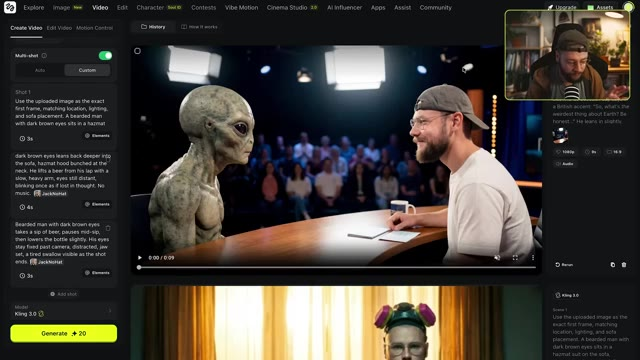
*Interface du générateur vidéo Kling montrant la timeline de multi-shots avec un plan large de l'alien face au présentateur sur un plateau TV, et le créateur visible en incrustation PiP.*

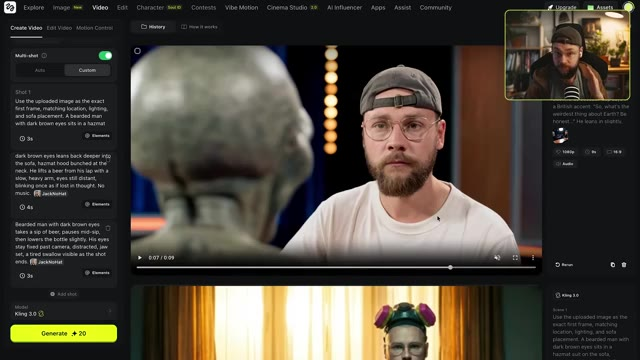
*Interface Kling affichant un plan rapproché par-dessus l'épaule de l'alien montrant le visage du présentateur de face, avec la webcam PiP du créateur en haut à droite.*

---

### ⏱️ `[00:14:16 - 00:14:45]` | Segment #29

**🔊 Audio (Transcription Intégrale Mot pour Mot en Français) :**
> mais juste la preuve de la manière dont nos éléments sont utilisés de façon significative dans la génération de vidéo. Nous devrions définitivement jeter un œil à cet exemple ici également. Évidemment très inspiré par The Last of Us. Encore une fois, nous coupons vers une très large gamme, une grande variété d'angles de caméra.

**👁️ Analyse Visuelle d'Écran (gemini-3.5-flash-lite) :**
**Interface & Outils** : Interface web de génération vidéo par intelligence artificielle (style Kling 3.0 / Seedance) avec panneau latéral de prompts multi-shots et retour vidéo central.

**Contenu textuel & Code** : Prompts textuels visibles dans le panneau de gauche ("Shot 1: Use the uploaded image...", "dark brown eyes leans back deeper...", "Bearded man with dark brown eyes takes a sip..."), paramètres de génération, modèle Kling 3.0, bouton "Generate +20".

**Action / Démonstration** : Navigation et démonstration de différents plans vidéo générés par IA illustrant la variété des angles de caméra et l'utilisation d'éléments visuels.

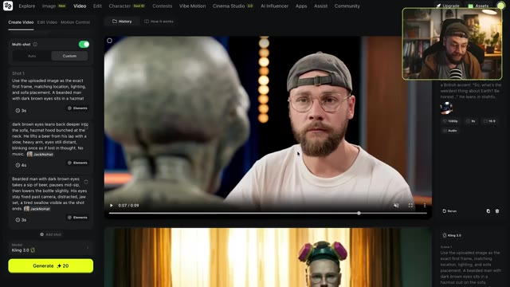
*Interface de l'outil de génération vidéo affichant un plan intérieur avec un personnage barbu et une créature extraterrestre, avec le présentateur en incrustation.*

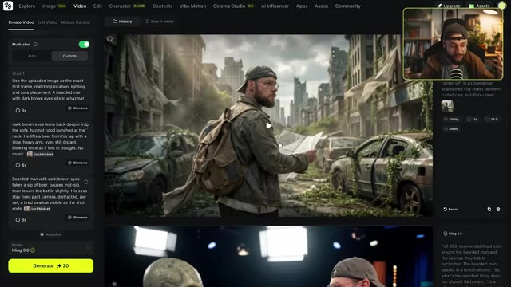
*Interface montrant un plan large généré par IA inspiré de The Last of Us, avec un personnage tenant une carte dans une rue abandonnée envahie par la végétation.*

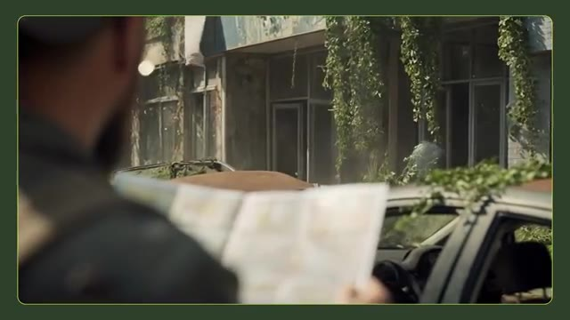
*Gros plan en plein écran sur un plan de coupe de la vidéo générée montrant le personnage de dos tenant une carte dans un décor post-apocalyptique.*

*Interface montrant un autre angle de caméra dans la même rue post-apocalyptique, avec le personnage avançant en regardant une carte.*

---

### ⏱️ `[00:14:45 - 00:15:04]` | Segment #30

**🔊 Audio (Transcription Intégrale Mot pour Mot en Français) :**
> Et cette cohérence des personnages est toujours verrouillée. Et ce plan final, ce très gros plan est si réaliste. Ces pores visibles, la texture de ma barbe, tout a l'air vraiment, vraiment super. Et nous avons même un très beau design sonore ici de la part de Kling également.

**👁️ Analyse Visuelle d'Écran (gemini-3.5-flash-lite) :**
**Interface & Outils** : Interface web de génération de vidéo par IA (Kling AI) avec des onglets de configuration à gauche (Multi-shot, prompts textuels), une fenêtre de prévisualisation centrale et les commandes du modèle (Kling 3.0) à droite. Le créateur apparaît en incrustation vidéo (PiP) dans le coin supérieur droit.

**Contenu textuel & Code** : Prompts textuels pour les différents plans de la séquence vidéo multi-shot, réglages du modèle Kling 3.0 (résolution 1080p, durée, format 16:9), et options de génération.
[DESC_ACTION] La vidéo générée par l'IA est jouée à l'écran, montrant d'abord un très gros plan réaliste d'un personnage, puis un plan large dans une rue dévastée, illustrant la cohérence des personnages et le réalisme des détails texturés.

**Action / Démonstration** : Démonstration pédagogique et présentation du workflow.

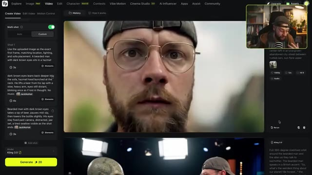
*Interface de l'outil vidéo montrant le rendu réaliste d'un très gros plan (extrême close-up) d'un homme barbu avec des lunettes.*

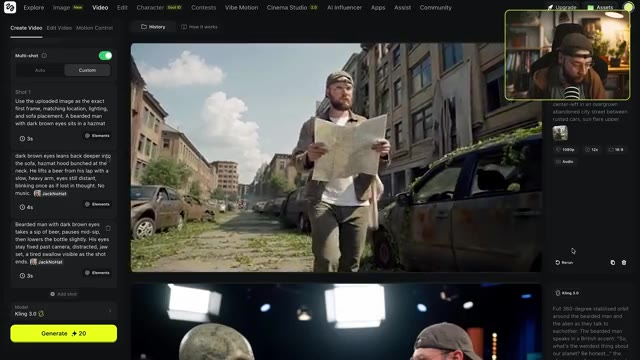
*Interface de l'outil vidéo montrant le rendu d'un homme marchant dans une rue abandonnée en tenant une carte.*

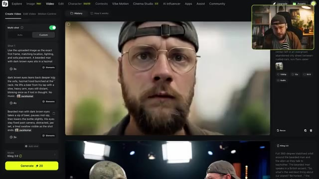
*Interface de l'outil vidéo affichant à nouveau le rendu en très gros plan du personnage avec une grande netteté.*

---

### ⏱️ `[00:15:04 - 00:15:23]` | Segment #31

**🔊 Audio (Transcription Intégrale Mot pour Mot en Français) :**
> Comme vous pouvez le voir, il est possible d'obtenir de superbes résultats avec les outils d'IA dont nous disposons. Mais je tiens à aborder rapidement certains inconvénients concernant Kling 3. Nous en avons déjà parlé plus tôt, mais la synchronisation labiale a encore du chemin à faire. Vous remarquerez que parfois, elle a tendance à dériver.

**👁️ Analyse Visuelle d'Écran (gemini-3.5-flash-lite) :**
**Interface & Outils** : Vidéo générée par intelligence artificielle affichée en grand écran, avec Jack visible dans un petit encadré PiP (Picture-in-Picture) en haut à droite.

**Contenu textuel & Code** : Texte affiché en bas à gauche de la vidéo : 'Lip syncing issues'. Visuel d'un extraterrestre gris à l'aspect réaliste en train de parler devant un public flouté.

**Action / Démonstration** : La vidéo montre un personnage extraterrestre généré par IA dont les mouvements de bouche illustrent le problème de synchronisation labiale évoqué par Jack.

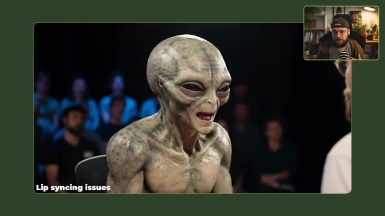
*Vidéo générée par IA montrant un extraterrestre parlant face à un public, avec un encadré PiP de Jack en haut à droite et le texte 'Lip syncing issues' en bas à gauche.*

---

### ⏱️ `[00:15:23 - 00:15:59]` | Segment #32

**🔊 Audio (Transcription Intégrale Mot pour Mot en Français) :**
> les choses se compliquent un peu, en particulier lorsqu'il s'agit de ces générations de 15 secondes, quelque chose peut vraiment mal tourner avec elles, alors essayez de les éviter. Comme je l'ai dit plus tôt, gardez vos dialogues dans les 10 premières secondes et mettez peut-être juste un peu d'action à la fin, ces 5 dernières, ou gardez simplement toute la génération à 10 secondes si vous voulez jouer la carte de la sécurité. Et nous obtenons encore occasionnellement ces cas de distorsion lorsque nous demandons des mouvements vraiment dynamiques ou dramatiques. Donc, bien que cet outil soit vraiment impressionnant, essayez de garder les inconvénients à l'esprit.

**👁️ Analyse Visuelle d'Écran (gemini-3.5-flash-lite) :**
**Interface & Outils** : Démonstration vidéo avec incrustation (PiP) du créateur en haut à droite.

**Contenu textuel & Code** : Textes incrustés à l'écran : "Lip syncing issues" sur les images 1 et 2, et "Warping artefacts" sur l'image 3.

**Action / Démonstration** : Le créateur illustre ses propos sur les défauts de génération (problèmes de synchronisation labiale et distorsions) en affichant des exemples de vidéos générées par IA.

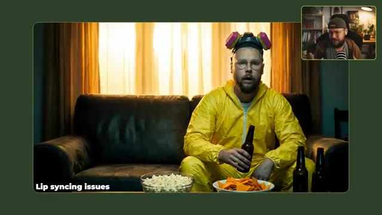
*Exemple de vidéo générée par IA montrant des problèmes de synchronisation labiale ('Lip syncing issues').*

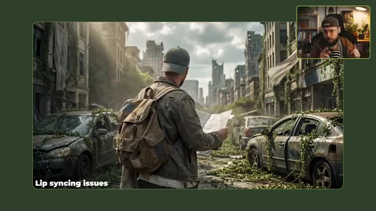
*Exemple de vidéo générée par IA montrant un survivant dans un paysage urbain post-apocalyptique avec des problèmes de synchronisation labiale.*

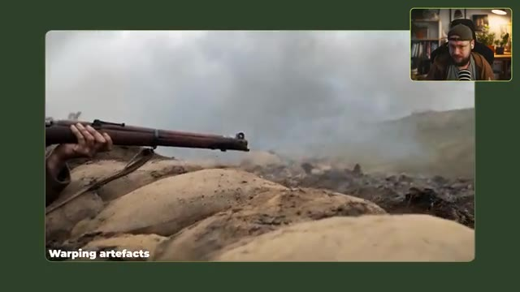
*Exemple de vidéo générée par IA montrant une scène de tranchée militaire avec des artefacts de distorsion ('Warping artefacts').*

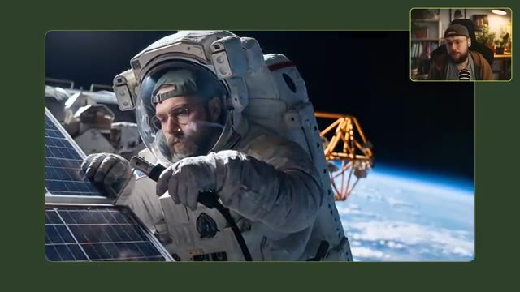
*Exemple de vidéo générée par IA montrant un astronaute travaillant sur des panneaux solaires dans l'espace.*

---

### ⏱️ `[00:15:59 - 00:16:31]` | Segment #33

**🔊 Audio (Transcription Intégrale Mot pour Mot en Français) :**
> quand vous l'utilisez et exploitez les points forts du modèle vidéo. Je pense que tout le monde attend désespérément C-Dance 2.0 en ce moment. Je pense que cela va marquer un saut vraiment significatif en matière de vidéo par IA. Les outils évoluent constamment, mais le point vraiment formidable est que les flux de travail s'appliqueront à n'importe quel outil d'IA générative. Alors rappelez-vous que ce n'est jamais une perte de temps. Vous apprenez des compétences transférables. Devenir bon avec Nano Banana Pro ou Cling 3 par exemple signifie que vous êtes probablement

**👁️ Analyse Visuelle d'Écran (gemini-3.5-flash-lite) :**
**Interface & Outils** : Présentation vidéo avec incrustation d'écran (PiP) de l'animateur en studio.

**Contenu textuel & Code** : Affichage d'un exemple de clip vidéo généré par intelligence artificielle montrant un homme de face au milieu de hautes herbes sous un ciel nuageux.

**Action / Démonstration** : Le créateur commente les points forts des modèles de vidéo par IA tout en illustrant ses propos avec un exemple de génération vidéo à l'écran, son visage apparaissant en médaillon.

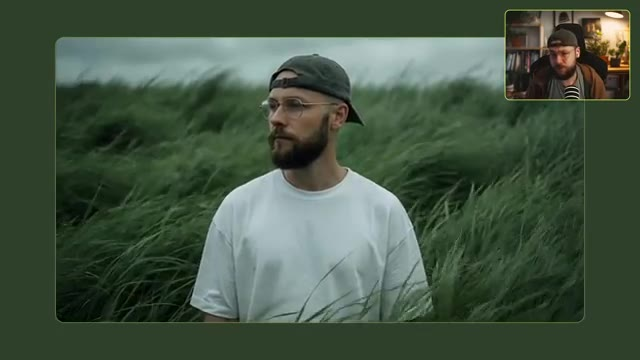
*Extrait vidéo généré par IA montrant un homme dans un champ de hautes herbes agitées par le vent, avec le créateur incrusté en petit format (PiP) dans le coin supérieur droit.*

---

### ⏱️ `[00:16:31 - 00:17:04]` | Segment #34

**🔊 Audio (Transcription Intégrale Mot pour Mot en Français) :**
> va être bon avec n'importe quel modèle d'image ou de vidéo par IA qui sortira à l'avenir. Les gars, si vous avez aimé la vidéo d'aujourd'hui, assurez-vous de lâcher un pouce bleu pour moi. Si vous êtes nouveau, pensez à vous abonner et bien sûr à activer cette cloche de notification pour ne jamais manquer aucun contenu futur. Si vous avez des questions, assurez-vous de les poser en bas dans la section des commentaires, j'essaie toujours de répondre à autant d'entre elles que possible. Passez une excellente journée les gars, bonne chance avec vos propres projets et je vous retrouve dans la prochaine vidéo.

**👁️ Analyse Visuelle d'Écran (gemini-3.5-flash-lite) :**
**Interface & Outils** : Présentation face caméra sans partage d'écran

**Contenu textuel & Code** : Aucun contenu logiciel ou technique affiché à l'écran, uniquement le créateur (Jack) s'adressant à son audience avec une incitation graphique animée "SUBSCRIBED" et une icône de cloche de notification sur l'image #2.

**Action / Démonstration** : Jack s'adresse directement à la caméra dans son studio, concluant sa vidéo en invitant les spectateurs à s'abonner, à aimer et à laisser des commentaires.

---
