# 🎬 Créer son studio d'animation solo avec l'IA

> **Chaîne** : [Jack Vs. AI](https://www.youtube.com/@JackVsAI)  
> **Titre original** : `How to Build a Solo Animation Studio with AI`  
> **Lien YouTube** : [https://www.youtube.com/watch?v=s4b8iU3ecTs](https://www.youtube.com/watch?v=s4b8iU3ecTs)  
> **Date de publication** : 2026-03-19  
> **Durée** : 25m 25s (`1525s`)  
> **Identifiant vidéo** : `s4b8iU3ecTs`  
> **Fiche Web Interactive** : [2026-03-19_YT-s4b8iU3ecTs_Créer son studio d'animation solo avec l'IA_by-whisper-v3-large-turbo+gemini-3.5-flash-lite.html](2026-03-19_YT-s4b8iU3ecTs_Créer son studio d'animation solo avec l'IA_by-whisper-v3-large-turbo+gemini-3.5-flash-lite.html)  
> **Captures de démonstration clés** : `99 captures réelles (anti-talking-head)`  
> **Modèles utilisés** : Audio: `large-v3-turbo` (Faster-Whisper int8 VPS) | Vision: `gemini-3.5-flash-lite` (Google AI Studio API)  

---

## 📌 Synthèse Exécutive & Outils

### 📌 Résumé
La démocratisation de l'animation par l'intelligence artificielle révolutionne un secteur traditionnellement cloisonné, exigeant de vastes équipes et des budgets colossaux. Dans cette vidéo, Jack démontre qu'il est désormais possible de concevoir seul un studio d'animation virtuel complet en un temps record. En s'appuyant sur un flux de travail non linéaire basé sur des nœuds (node-based workflow) directement hébergé dans **ElevenLabs Flows**, il connecte les meilleures briques technologiques du marché — de la génération d'images à la synthèse vocale en passant par l'animation vidéo. Cette approche élimine les frictions liées au basculement entre de multiples fenêtres et permet d'automatiser et d'itérer efficacement sur un canevas unique.

La méthode pas à pas de Jack repose sur une logique "image vers vidéo" (image-to-video), bien plus qualitative et contrôlable que la simple génération textuelle. Tout commence par l'importation d'une image de référence personnelle, injectée ensuite dans des modèles de pointe comme **Nano Banana 2** ou **SeaDream 5 Lite** via des prompts textuels précis. Cette étape permet d'explorer des styles graphiques variés (dessin animé, style Pixar, rendu 3D ou anime) tout en conservant la cohérence du personnage. L'utilisation stratégique de feuilles de personnages (*character sheets*) générées au préalable garantit ensuite une transition fluide vers des scènes dynamiques et des modèles vidéo complexes tels que **Kling 03**.

Pour les créateurs de contenu, les réalisateurs indépendants et les agences publicitaires, ce workflow représente un bond en avant magistral. Non seulement il réduit drastiquement les coûts de production, mais il offre également un contrôle créatif granulaire d'une puissance inédite. En combinant la génération visuelle multi-modèle, l'animation par référence omni et l'intégration future du doublage et du sound design, ce tutoriel pose les bases d'un nouveau standard de production où l'unicité de la vision artistique prime sur la lourdeur logistique traditionnelle.

### 🛠️ Outils, Modèles & Logiciels Présentés
* **ElevenLabs (Flows)** : Plateforme centrale d'orchestration basée sur des nœuds qui permet d'enchaîner et d'automatiser différents outils d'IA sur un seul et même canevas.
* **Nano Banana 2** : Modèle de génération d'images haut de gamme, considéré comme le meilleur du marché pour sa fidélité aux références et ses rendus en résolution 4K.
* **SeaDream 5 Lite** : Modèle alternatif de génération d'images utilisé en concurrence directe avec Nano Banana 2 pour comparer les styles et les résultats (résolution 3K).
* **Kling (03)** : Modèle de génération de vidéo par IA de pointe, optimisé pour exploiter des images de référence et des feuilles de personnages (notamment le mode omni).
* **Premiere Pro** : Logiciel de montage traditionnel mentionné pour l'assemblage final, bien que le cœur du pipeline d'animation soit géré par l'IA.
* **Topaz** : Outil d'amélioration de la résolution et de stabilisation souvent utilisé en post-production pour finaliser le rendu visuel.
* **Flux** : Écosystème technologique et d'architecture d'IA sous-jacent facilitant la cohérence et l'interopérabilité des modèles.

### 🔑 Points Clés & Enseignements Stratégiques
* **Adopter les flux de travail par nœuds (*node-based workflows*)** : Empruntés aux effets visuels (VFX), ils offrent un contrôle supérieur, évitent le jonglage entre applications et permettent de comparer visuellement plusieurs branches de génération simultanément.
* **Privilégier l'approche *Image-to-Video* (Image vers Vidéo)** : Plutôt que de partir d'un simple prompt textuel, utiliser une image de départ garantit une bien meilleure consistance visuelle et un contrôle accru indispensable pour la réalisation cinématographique.
* **Réutiliser les nœuds de texte** : Centraliser les prompts dans un nœud textuel unique relié à plusieurs modèles de génération d'images évite les copier-coller répétitifs et fluidifie l'expérimentation.
* **Exploiter la concurrence des modèles en parallèle** : Brancher une même référence sur plusieurs IA (comme Nano Banana 2 et SeaDream 5 Lite) permet d'évaluer instantanément le style qui correspond le mieux à la direction artistique du projet.
* **Générer des feuilles de personnages (*character sheets*)** : Créer une planche regroupant plusieurs angles de vue et expressions d'un même personnage est une étape cruciale pour stabiliser les modèles vidéo par IA par la suite.
* **Viser la plus haute résolution disponible** : Régler systématiquement les générations sur du 3K ou du 4K dès l'étape de l'image fixe pour préserver les détails lors des transformations animées ultérieures.
* **Maintenir des prompts simples mais descriptifs** : Décrire précisément le sujet, le style (ex: style dessin animé, Pixar), l'arrière-plan (fond uni en dégradé) et les vêtements (t-shirt blanc surdimensionné, pantalon cargo) pour guider efficacement l'IA.
* **Anticiper l'animation complexe par étapes** : Commencer par définir l'identité visuelle du personnage, puis le placer dans des contextes narratifs progressifs (ex: temple ancien, toits d'une ville japonaise en skateboard).
* **Conserver les frameworks de prompts dans la description** : Capitaliser sur des structures de prompts éprouvées et documentées pour les réutiliser d'un projet à l'autre sans repartir de zéro.
* **Intégrer la chaîne de post-production complète** : Comprendre que l'IA gère l'animation brute, mais que des outils de finition (comme Premiere Pro pour le montage et Topaz pour l'upscaling) restent nécessaires pour un rendu professionnel final.

---

## ⏱️ Chronologie & Transcription Complète Audio & Visuelle (Mot pour Mot)

### ⏱️ `[00:00:00 - 00:00:32]` | Segment #01

**🔊 Audio (Transcription Intégrale Mot pour Mot en Français) :**
> L'animation a toujours été enfermée derrière de grandes équipes, des budgets encore plus grands et des mois de travail. Mais les choses ont changé. Ce que vous voyez en ce moment même a été construit en utilisant uniquement des outils d'IA et les résultats sont sérieusement impressionnants. Au cours des derniers mois, la vidéo par IA, la génération d'images et la synthèse vocale se sont beaucoup améliorées. Mais la véritable avancée n'est pas seulement de meilleurs modèles, c'est la capacité de les combiner en un seul flux de travail d'animation. Dans la vidéo d'aujourd'hui, nous couvrirons la génération de personnages et d'environnements, la transformation d'images statiques en scènes animées,

**👁️ Analyse Visuelle d'Écran (gemini-3.5-flash-lite) :**
**Interface & Outils** : Interface de flux de travail nodal (style nœuds/nodes sur fond sombre avec barre d'outils inférieure et options de partage en haut à droite).

**Contenu textuel & Code** : Texte visible au centre de l'interface : "ability to", blocs de nœuds avec miniatures vidéo et champs de texte de prompts (ex: "Nano Banana 2", options 16:9, boutons "Run"). En haut à gauche : "Flows", "Temple Portal Sc...". En haut à droite : "53%", boutons d'export et "Share".

**Action / Démonstration** : Le créateur montre un flux de travail visuel complexe connectant différents blocs de génération vidéo et d'images par IA.

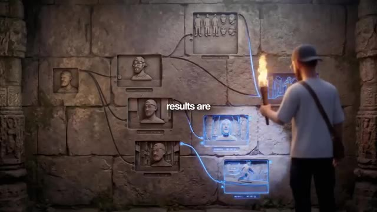
*Gros plan sur une animation montrant un personnage examinant un mur de pierre sculpté avec des schémas reliés par des flux lumineux bleus.*

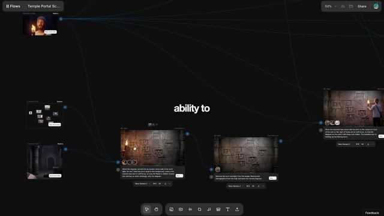
*Interface de flux de travail visuel (nodes/workflows) sur fond sombre montrant des blocs connectés par des lignes de liaison.*

---

### ⏱️ `[00:00:32 - 00:01:04]` | Segment #02

**🔊 Audio (Transcription Intégrale Mot pour Mot en Français) :**
> doublage, voix off professionnelles et design sonore. À la fin, vous saurez exactement comment produire votre propre animation par IA à partir de zéro. Et si vous aimez le contenu d'aujourd'hui, les gars, assurez-vous de lâcher un pouce bleu pour moi, pensez à vous abonner et, bien sûr, à activer cette cloche de notification. Très bien, entrons directement dans le vif du sujet. Pour accéder à nos outils d'IA, nous allons utiliser Flows sur ElevenLabs. Et comme son nom l'indique, vous pouvez faire s'enchaîner un outil d'IA dans un autre afin de créer un pipeline d'animation complet sur un seul et même canevas. Ne paniquez pas devant tout cela, les gars, je sais que cela peut sembler

**👁️ Analyse Visuelle d'Écran (gemini-3.5-flash-lite) :**
**Interface & Outils** : Interface de Flows sur ElevenLabs (canevas de nodes/nœuds connectés).

**Contenu textuel & Code** : Textes des prompts visibles sur les nœuds du canevas, réglages de formats (Nano Banana 2, 16:9), barre d'outils inférieure avec icônes de lecture, audio et paramètres.

**Action / Démonstration** : Le créateur présente l'interface graphique de Flows sur ElevenLabs en expliquant le principe des nœuds interconnectés pour créer un pipeline d'animation.

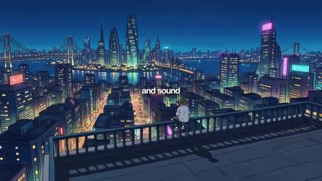
*Rendu visuel animé d'une ville futuriste cyberpunk de nuit avec un personnage assis sur un toit et du texte incrusté.*

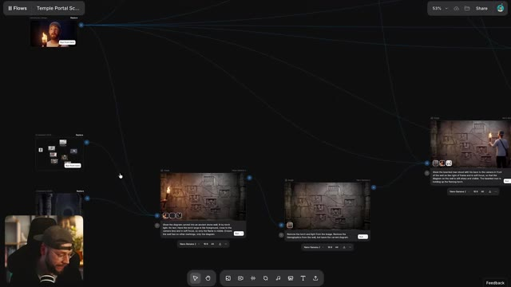
*Interface de Flows sur ElevenLabs affichant un canevas interactif avec des nœuds de génération d'images et de vidéos, et une incrustation vidéo du créateur dans le coin inférieur gauche.*

---

### ⏱️ `[00:01:04 - 00:01:37]` | Segment #03

**🔊 Audio (Transcription Intégrale Mot pour Mot en Français) :**
> compliqué mais nous allons tout décortiquer en détail et c'est en réalité beaucoup plus simple qu'il n'y paraît et il y a de très puissants avantages à utiliser ce type de flux de travail. Premièrement, vous n'avez pas à jongler entre différentes fenêtres pour accéder à différents outils, ce qui peut vraiment ralentir votre processus. Vous pouvez également automatiser des flux de travail ainsi que comparer les résultats de différents modèles pour voir quelle génération correspond le mieux à votre projet. Ce que nous allons faire pour commencer, c'est remonter dans ce coin supérieur gauche ici et cliquer sur l'onglet retour car je veux commencer par un peu plus

**👁️ Analyse Visuelle d'Écran (gemini-3.5-flash-lite) :**
**Interface & Outils** : ElevenLabs (section Flows / Flow Alpha) avec interface en mode sombre et incrustation vidéo (PiP) du créateur.

**Contenu textuel & Code** : On peut lire les projets "Animation Workflow" et "Temple Portal Scene", ainsi que les boutons "New Flow", "Feedback", "Docs", "Ask", "Share". Dans le menu latéral : "Home", "Voices", "Studio", "Flows (New)", "Files", "Text to Speech", "Speech to Text", "Voice Changer", "Sound Effects", "Image & Video", "Music", "More tools".

**Action / Démonstration** : Le créateur navigue dans l'interface de l'outil de flux de travail (Flows) d'ElevenLabs et clique dans le coin supérieur gauche sur l'onglet de retour pour revenir à la vue d'ensemble des projets.

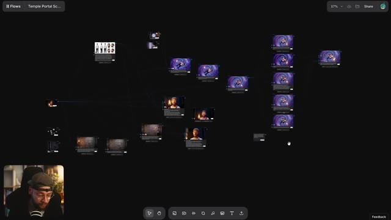
*Interface d'ElevenLabs (section Flows) montrant le projet "Temple Portal Scene" sous forme de nœuds interconnectés (mindmap), avec le créateur en incrustation PiP dans le coin inférieur gauche.*

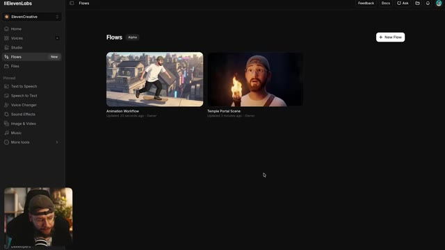
*Interface principale d'ElevenLabs (section Flows Alpha) affichant les projets récents "Animation Workflow" et "Temple Portal Scene", avec le créateur en incrustation PiP.*

---

### ⏱️ `[00:01:37 - 00:02:15]` | Segment #04

**🔊 Audio (Transcription Intégrale Mot pour Mot en Français) :**
> d'un flux de travail simple. Nous reparlerons un peu plus de ce que j'ai réellement fait ici dans une minute. Je veux juste recommencer un nouveau processus entièrement à partir de zéro. Donc, au bas de l'écran, vous pouvez voir que nous avons différentes options ici. Nous pouvons insérer un nœud de génération d'images, de génération de vidéos, de synthèse vocale, un générateur d'effets sonores, de musique, de composition, de texte, et nous pouvons également télécharger nos propres médias. Et c'est ce que je veux faire. Je veux insérer une image de référence que j'ai de moi-même. Nous allons donc simplement faire glisser celle-ci ici dans un espace vide.

**👁️ Analyse Visuelle d'Écran (gemini-3.5-flash-lite) :**
**Interface & Outils** : Interface web de type tableau de blanc infini / éditeur de nœuds (workflow visuel avec barre d'outils en bas pour ajouter des nœuds de génération d'image, vidéo, audio, texte et importer des médias).

**Contenu textuel & Code** : Menus d'options en bas de l'écran avec icônes (génération d'images, de vidéos, synthèse vocale, effets sonores, musique, texte, upload), nom du projet en haut à gauche ("Animation Workflow"), barre de zoom à 38% / 47% et bouton "Share".

**Action / Démonstration** : Le présentateur explique les différentes options de nœuds disponibles en bas de l'écran et se prépare à faire glisser une image de référence personnelle dans l'espace de travail vide.

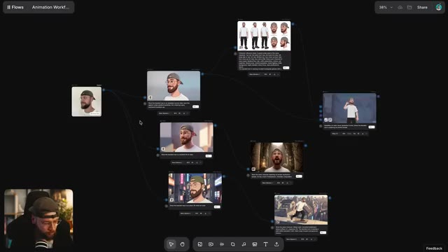
*Interface de flux de travail par nœuds affichant plusieurs nœuds connectés de génération d'images et de vidéos IA à partir d'une photo de référence de Jack.*

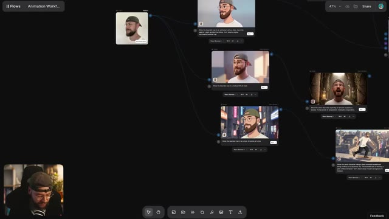
*Vue zoomée du canevas de l'application montrant l'organisation des nœuds interconnectés.*

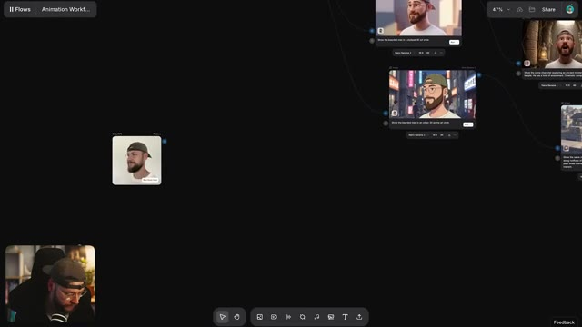
*Vue centrée sur l'espace de travail vide avec une photo de référence isolée sur la gauche, prête pour une manipulation.*

---

### ⏱️ `[00:02:15 - 00:02:52]` | Segment #05

**🔊 Audio (Transcription Intégrale Mot pour Mot en Français) :**
> pour commencer. Et si j'appuie sur la touche Contrôle de mon clavier et que je fais défiler avec mon pavé tactile, nous pouvons zoomer très précisément. Vous pouvez voir que j'ai cette icône ici. Et si je clique dessus et que je fais glisser le tuyau vers un espace vide et que je le relâchez, nous allons obtenir ce menu de différentes options. Et je veux aller de l'avant et sélectionner la génération d'images. Nous pouvons en quelque sorte dézoomer un peu ici. Pour le modèle, je veux aller de l'avant et sélectionner Nano Banana 2 parce que c'est le meilleur modèle d'image IA sur le marché en ce moment. Notre format d'image est déjà réglé sur 16 par 9. C'est exactement ce que nous voulons pour notre animation IA, mais nous voulons nous assurer que la résolution est réglée sur

**👁️ Analyse Visuelle d'Écran (gemini-3.5-flash-lite) :**
**Interface & Outils** : Interface de type nœud (Node-based workflow interface) avec des options de génération d'IA.

**Contenu textuel & Code** : Noms des nœuds ('IMG_7973', 'Image', 'Nano Banana 2'), options du menu contextuel ('Upscale', 'Edit image', 'Video generation', 'Image generation', 'Lipsync generation'), paramètres de modèle ('Nano Banana 2', rapport d'aspect '16:9', résolution '1K'), et champ de texte 'Describe the image...'.

**Action / Démonstration** : Le créateur montre comment zoomer avec le pavé tactile, glisser un lien (pipe) depuis une icône pour ouvrir le menu d'options, sélectionner l'option de génération d'image et configurer le modèle Nano Banana 2.

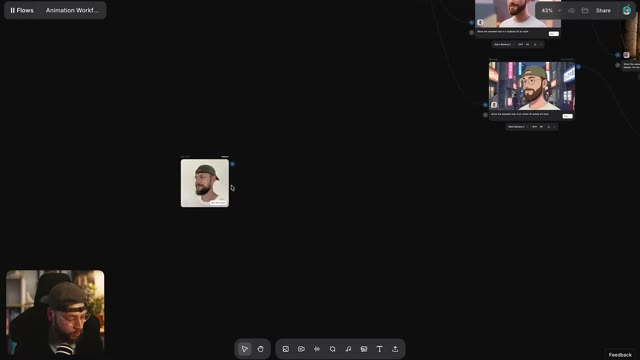
*Interface de flux de travail sous forme de nœuds montrant une image source de Jack et un aperçu général.*

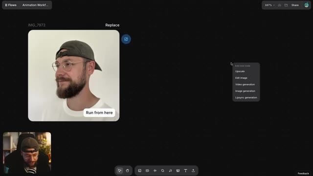
*Gros plan sur l'interface avec le menu contextuel affichant les options 'Upscale', 'Edit image', 'Video generation', 'Image generation' et 'Lipsync generation'.*

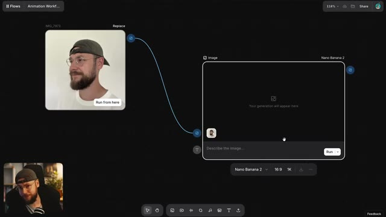
*Création d'un nouveau nœud 'Image' avec le modèle 'Nano Banana 2', un format 16:9 et une résolution réglée sur 1K.*

---

### ⏱️ `[00:02:52 - 00:03:26]` | Segment #06

**🔊 Audio (Transcription Intégrale Mot pour Mot en Français) :**
> 4k. Donc ici, nous utilisons simplement ce tuyau pour connecter notre image de référence à Nano Banana 2, qui est hébergé dans ce nœud. Et c'est ce que nous regardons ici. C'est un flux de travail basé sur les nœuds, ce qui est en fait très courant dans les effets visuels, ce qui est bien sûr mon parcours, donc cela me semble très familier, même si pour vous les gars, vous êtes peut-être plus habitués au montage basé sur la timeline. Les flux de travail basés sur les nœuds vous donnent beaucoup plus de contrôle, c'est pourquoi ils sont parfaits pour les VFX et pourquoi vous les voyez apparaître de plus en plus en matière d'intelligence artificielle générative. Alors allons-y

**👁️ Analyse Visuelle d'Écran (gemini-3.5-flash-lite) :**
**Interface & Outils** : Interface de type nœud (node-based workflow) pour générateur d'IA vidéo/image (similaire à ComfyUI ou Flows).

**Contenu textuel & Code** : Nœuds connectés par des liens bleus avec des aperçus d'images, des zones de texte "Describe the image...", des menus de sélection de modèles ("Nano Banana 2", "Nano Banana 1"), des options de format (16:9) et de résolution (4K).

**Action / Démonstration** : Le créateur montre et explique le fonctionnement d'un flux de travail par nœuds, en zoomant et en reliant une image de référence à un nœud de génération.

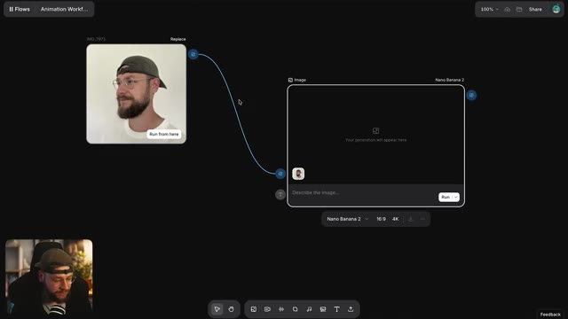
*Vue rapprochée d'un flux de travail par nœuds montrant la connexion entre une image de référence et le nœud Nano Banana 2.*

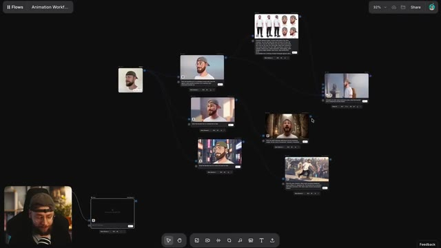
*Vue d'ensemble dézoomée d'un flux de travail par nœuds étendu avec de multiples branches de génération d'images et de vidéos.*

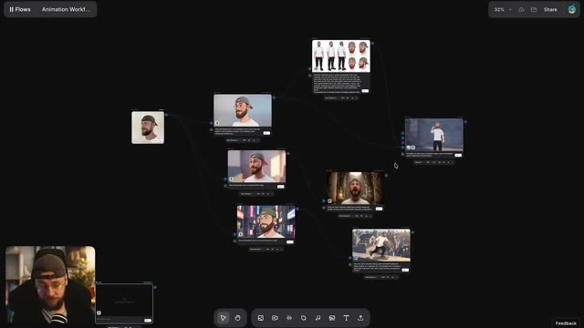
*Vue d'ensemble du flux de travail par nœuds montrant une modification active de la connexion d'un nœud vers un autre.*

---

### ⏱️ `[00:03:26 - 00:03:49]` | Segment #07

**🔊 Audio (Transcription Intégrale Mot pour Mot en Français) :**
> Effectuons un zoom arrière ici. Maintenant, nous pouvons bien sûr simplement entrer une consigne textuelle (prompt) directement dans le nœud, mais ce qui est plutôt utile, c'est que nous pouvons insérer un nœud de texte en cliquant sur cette icône ici dans ce petit menu en bas de l'écran. Et je vais vous montrer pourquoi c'est utile dans une seconde. Je vais aller de l'avant et déposer un prompt textuel ici. On indique simplement de montrer l'homme barbu dans un style de dessin animé.

**👁️ Analyse Visuelle d'Écran (gemini-3.5-flash-lite) :**
**Interface & Outils** : Interface utilisateur web de type graphe/nœuds (flows) pour la génération de vidéo par intelligence artificielle, avec une barre d'outils inférieure comportant plusieurs icônes de contrôle et un encadré vidéo (Picture-in-Picture) du présentateur en bas à gauche.

**Contenu textuel & Code** : On observe un nœud d'entrée contenant une image de Jack avec une casquette et une barbe, relié à un nœud de génération nommé "Nano Banana 2". Le champ de texte indique "Describe the image...", et les paramètres de modèle visibles incluent "Nano Banana 2", "16:9", et "4K". Un menu d'icônes est visible en bas de l'écran.

**Action / Démonstration** : Le présentateur montre l'interface graphique de travail et explique comment insérer un nœud de texte à l'aide de la barre d'outils inférieure pour ajouter un prompt.

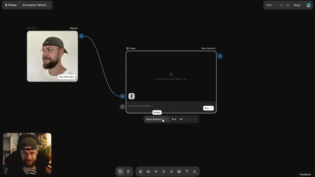
*Interface d'un logiciel de flux de travail par IA affichant des nœuds de traitement d'image et une incrustation vidéo du créateur en bas à gauche.*

---

### ⏱️ `[00:03:49 - 00:04:11]` | Segment #08

**🔊 Audio (Transcription Intégrale Mot pour Mot en Français) :**
> Placez-le devant un fond uni en dégradé. Il porte une casquette de baseball grise à l'envers. Nous pouvons donc connecter ce tuyau de texte ici et vous pouvez voir automatiquement qu'il a rempli ce champ ici. Alors pourquoi est-ce utile ? Eh bien, nous pouvons aller de l'avant et ajouter un autre nœud de génération d'image, mais pour le modèle, cette fois, sélectionnons SeaDream 5 Lite, par exemple.

**👁️ Analyse Visuelle d'Écran (gemini-3.5-flash-lite) :**
**Interface & Outils** : Interface logicielle de type éditeur de flux basé sur des nœuds (workflow visuel avec des blocs connectés par des liens).

**Contenu textuel & Code** : Un nœud textuel affichant le prompt : "Show the bearded man in an animated cartoon style, have him against a plain gradient backdrop. He is wearing a grey backwards baseball cap." et un bouton "Run from here". En bas à gauche, une incrustation vidéo montre le présentateur en studio.

**Action / Démonstration** : Le créateur montre l'interface de l'éditeur de flux et explique comment connecter les nœuds de texte et de génération d'image pour automatiser les champs.

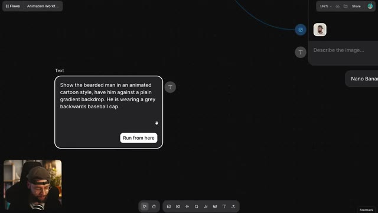
*Interface d'un outil de type nœuds (nodes) montrant un bloc de texte avec un prompt de génération et la webcam du créateur en incrustation (PiP).*

---

### ⏱️ `[00:04:12 - 00:04:36]` | Segment #09

**🔊 Audio (Transcription Intégrale Mot pour Mot en Français) :**
> Une fois de plus, nous allons relier la référence d'image à la même référence d'image, mais nous pouvons également relier ce tuyau de texte au même nœud de texte. Ainsi, nous n'avons pas besoin de faire un copier-coller de nos prompts. Je veux m'assurer d'avoir sélectionné la plus haute résolution pour SeaDream 5 Lite, qui est 3K. Nous pouvons lancer nos deux nœuds de génération d'images afin de pouvoir comparer nos résultats.

**👁️ Analyse Visuelle d'Écran (gemini-3.5-flash-lite) :**
**Interface & Outils** : Interface logicielle de type arborescence de nœuds (flows) avec une vue PiP (Picture-in-Picture) du créateur en bas à gauche.

**Contenu textuel & Code** : Nœuds de flux avec un prompt textuel visible : « Show the bearded man in an animated cartoon style, have him against a plain gradient backdrop. He is wearing a grey backwards baseball cap ». Paramètres de résolution et formats visibles (16:9, 4K, 2K). Modèles de génération nommés « Nano Banana 2 » et « SeaDream 5 Lite ».

**Action / Démonstration** : Le créateur connecte les flux de données entre les nœuds d'image et de texte pour alimenter simultanément deux générateurs différents.

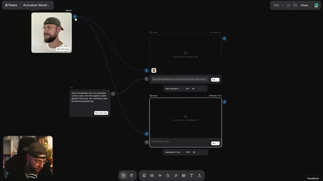
*Interface de type nœuds (flows) montrant la connexion d'une image de référence et d'un nœud textuel vers deux moteurs de génération d'images différents (Nano Banana 2 et SeaDream 5 Lite).*

---

### ⏱️ `[00:04:36 - 00:05:12]` | Segment #10

**🔊 Audio (Transcription Intégrale Mot pour Mot en Français) :**
> Et bien sûr ici nous regardons le tout début du processus d'animation qui est la génération d'images. Nous créons des images de départ que nous allons animer plus tard dans la vidéo. Vous pouvez simplement créer des vidéos par IA avec des invites textuelles, mais un flux de travail image vers vidéo est définitivement la meilleure voie à suivre. Cela vous donne beaucoup plus de contrôle sur vos résultats finaux, donc si vous essayez d'utiliser l'IA pour la réalisation de films ou la publicité, à mon avis c'est la seule façon de procéder. Allons de l'avant et zoomons ici. Nous avons donc notre première génération provenant de Nano Banana 2. Vous pouvez voir que le

**👁️ Analyse Visuelle d'Écran (gemini-3.5-flash-lite) :**
**Interface & Outils** : Interface logicielle de type tableau de bord avec des nœuds connectés (Animation Workflow) et une vue PiP (Picture-in-Picture) du présentateur en bas à gauche.

**Contenu textuel & Code** : Texte du prompt visible : "Show the bearded man in an animated cartoon style, have...", réglages visibles : "Nano Banana 2", "16:9", "4K", et un autre nœud en dessous nommé "Seedream 5 Lite".

**Action / Démonstration** : Le créateur montre son écran d'interface de flux de travail par IA avec un zoom sur la génération d'image Nano Banana 2.

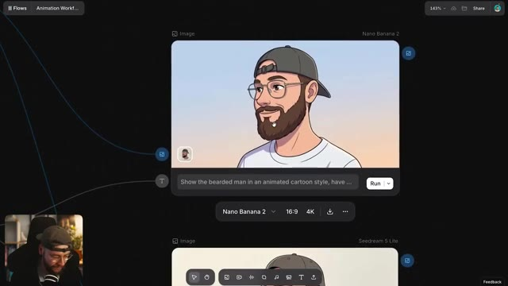
*Interface de flux de travail montrant un nœud de génération d'image avec Nano Banana 2 affichant un avatar de dessin animé.*

---

### ⏱️ `[00:05:12 - 00:05:50]` | Segment #11

**🔊 Audio (Transcription Intégrale Mot pour Mot en Français) :**
> la ressemblance est vraiment très précise là-dedans. Je préfère définitivement ça à ce qu'on a obtenu avec Seedream 5 Lite. Mais vous pouvez voir ici qu'il est vraiment utile de pouvoir en quelque sorte croiser plusieurs générations de différents modèles d'images les unes à côté des autres. Et si nous remontons simplement vers l'exemple existant, vous pouvez voir que j'ai utilisé un prompt très similaire ici et j'ai obtenu un résultat vraiment sympa, on dirait une sorte de dessin animé Pixar. Si on dézoome juste un tout petit peu plus, on peut voir un rendu d'aspect plus 3D là, qui est vraiment très très bien aussi, et puis davantage d'un style anime comme

**👁️ Analyse Visuelle d'Écran (gemini-3.5-flash-lite) :**
**Interface & Outils** : Interface logicielle de type tableau de bord "Animation Workflow" ou flux de travail par IA (sous forme de nœuds/nodes sur fond sombre).

**Contenu textuel & Code** : Textes visibles dans les boîtes de prompt : "Show the bearded man in an animated cartoon style, have him against a plain gradient backdrop. He is wearing a grey backwards baseball cap." et "Show the bearded man in an urban 3D anime art style". Modèles indiqués : Nano Banana 2 et Seedream 5 Lite, format 16:9, résolution 4K.

**Action / Démonstration** : Le créateur navigue et zoome dans son interface de flux de travail pour comparer différentes générations d'images IA côte à côte.

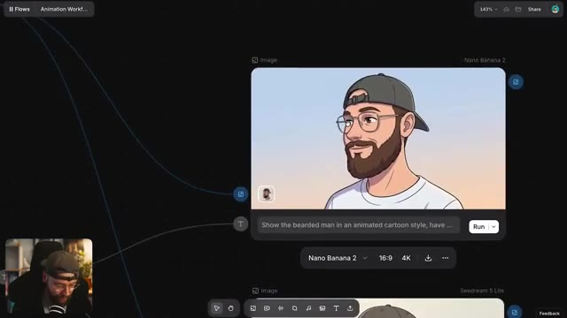
*Interface de flux de travail montrant un résultat de génération d'image de dessin animé avec le modèle Nano Banana 2.*

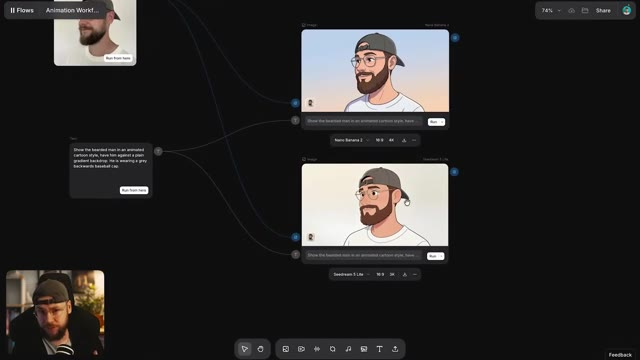
*Vue d'ensemble du flux de travail montrant plusieurs générations d'images côte à côte avec Nano Banana 2 et Seedream 5 Lite.*

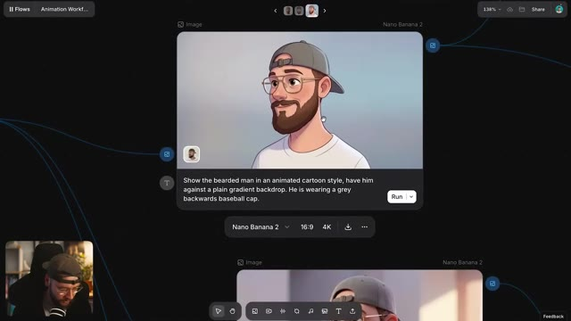
*Zoom arrière sur le flux de travail affichant les détails du prompt textuel de génération d'image.*

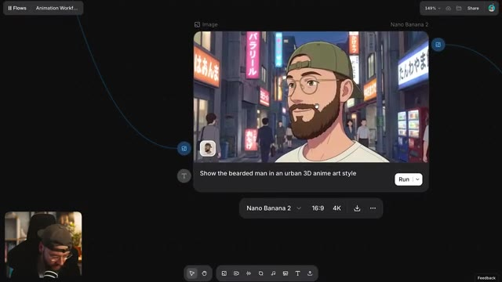
*Affichage d'un rendu de style anime urbain généré dans le flux de travail.*

---

### ⏱️ `[00:05:50 - 00:06:28]` | Segment #12

**🔊 Audio (Transcription Intégrale Mot pour Mot en Français) :**
> Eh bien voilà, c'est vraiment génial de montrer l'expérimentation maintenant on peut s'écarter de ça en ajoutant d'autres nœuds de génération d'images. On peut par exemple prendre ce rendu 3D ici et l'utiliser comme référence d'image, le brancher dans un autre nœud de génération d'images. On peut dire de montrer le même personnage explorant un temple ancien et mystérieux. Il a l'air émerveillé, composition cinématographique, et on récupère une image IA de très haute qualité comme celle que vous pouvez voir sur l'écran en ce moment même. Et ici nous avons aussi notre génération d'images animées en utilisant celle-ci comme référence d'image et un

**👁️ Analyse Visuelle d'Écran (gemini-3.5-flash-lite) :**
**Interface & Outils** : Interface de type workflow à nœuds (style nœuds interconnectés pour IA, semblable à ComfyUI ou outils de flux similaires) avec mini-vue PiP du créateur en bas à gauche.

**Contenu textuel & Code** : Prompts visibles : "Show the bearded man in a stylised 3D art style", "Show the same character exploring an ancient mysterious temple. He has a look of amazement. Cinematic composition.", "Show the bearded man in an urban 3D anime art style". Paramètres : Nano Banana 2, 16:9, 4K.

**Action / Démonstration** : Le créateur navigue à travers l'interface de nœuds, zoome sur différents blocs de génération et illustre comment connecter des images de référence pour créer de nouvelles variations.

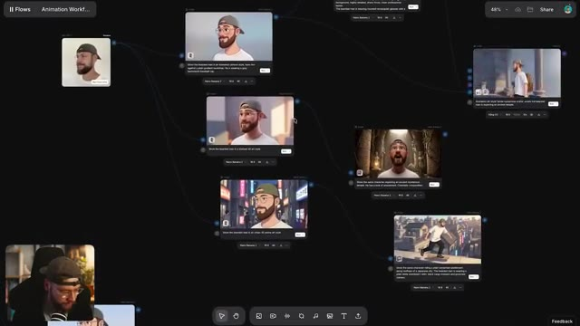
*Vue d'ensemble de l'interface de nœuds (flow) montrant plusieurs nœuds de génération d'images connectés entre eux avec différents styles visuels.*

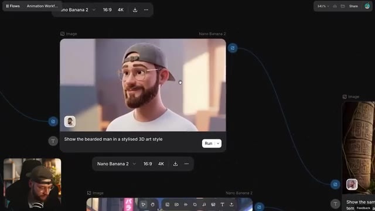
*Gros plan sur un nœud de génération d'images montrant un personnage en rendu 3D stylisé avec le prompt correspondant.*

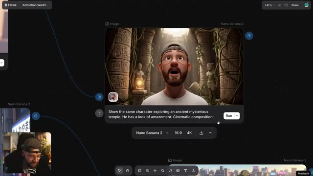
*Gros plan sur un nœud de génération montrant le personnage explorant un temple mystérieux avec le prompt détaillé.*

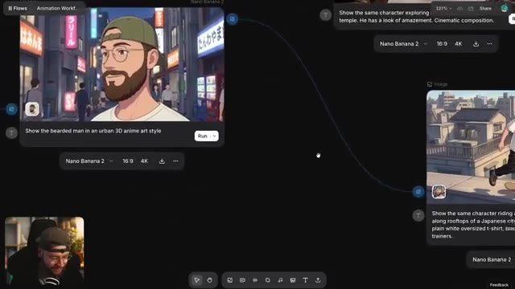
*Gros plan sur des nœuds de génération montrant un style anime urbain et un personnage sur un toit.*

---

### ⏱️ `[00:06:28 - 00:07:04]` | Segment #13

**🔊 Audio (Transcription Intégrale Mot pour Mot en Français) :**
> invite textuel disant de montrer le même personnage faisant du skateboard sur des toits d'une ville japonaise. L'homme barbu porte un t-shirt blanc uni surdimensionné, un pantalon cargo noir et des baskets Gorpcore. Ainsi, nous pouvons explorer différents styles avec nos nœuds de génération d'images initiaux, puis nous pouvons ajouter à cela et commencer à placer nos personnages dans des scènes spécifiques tout en maintenant ce style juste grâce à la qualité de Nano Banana 2. Et vous pouvez voir que les invites elles-mêmes sont assez simples, sauf celle-ci où j'ai réellement fait

**👁️ Analyse Visuelle d'Écran (gemini-3.5-flash-lite) :**
**Interface & Outils** : Interface logicielle de type nœuds (Workflow / Flow node-based interface, similaire à ComfyUI ou Seedance), avec une barre supérieure affichant les boutons "Flows", "Animation Workflow", "Share", et une barre d'outils inférieure.

**Contenu textuel & Code** : Prompts visibles : "Show the same character riding a plain unmarked skateboard along rooftops of a Japanese city. The bearded man is wearing a plain white oversized t-shirt, black cargo trousers and gorpcore trainers.", "Show the bearded man in a stylized 3d art style", "Show the bearded man in an urban 3d anime art style", "Show the same character exploring an ancient mysterious temple...". Modèle sélectionné : "Nano Banana 2" et "Kling 0.3".

**Action / Démonstration** : Le créateur zoome et navigue à travers un flux de travail complexe basé sur des nœuds, reliant différentes générations d'images et de vidéos pour maintenir la cohérence d'un personnage.

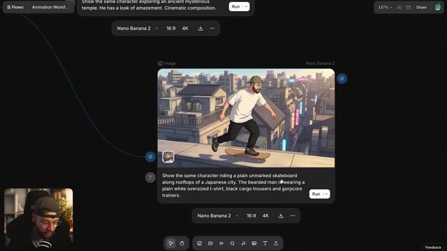
*Interface d'un espace de travail montrant un nœud avec l'image générée d'un personnage sur un skateboard sur les toits d'une ville japonaise et son prompt textuel.*

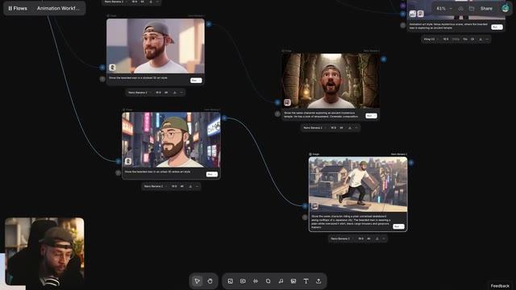
*Vue d'ensemble du flux de travail (« Animation Workflow ») connectant plusieurs nœuds de génération d'images avec Nano Banana 2 et Kling 0.3.*

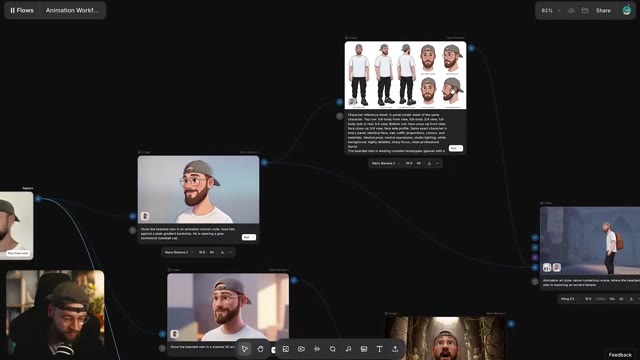
*Vue dézoomée du flux de travail montrant une feuille de référence de personnage (« character reference sheet ») et plusieurs nœuds connectés.*

---

### ⏱️ `[00:07:04 - 00:07:23]` | Segment #14

**🔊 Audio (Transcription Intégrale Mot pour Mot en Français) :**
> allez-y et j'ai créé une feuille de personnage. Je ne vais pas parcourir ce prompt parce que comme vous pouvez le voir, il est assez long. Je les mettrai en bas dans la description de la vidéo si vous voulez aller de l'avant et les utiliser comme vos propres frameworks. Mais une feuille de personnage peut être vraiment utile, surtout quand il s'agit de générer des vidéos par IA. Nous allons donc explorer cela un peu plus tard.

**👁️ Analyse Visuelle d'Écran (gemini-3.5-flash-lite) :**
**Interface & Outils** : Interface logicielle de création par flux (flows) avec un panneau central contenant une image de character sheet (feuille de personnage) et un champ de prompt textuel.

**Contenu textuel & Code** : Texte du prompt visible : 'Character reference sheet, 6-panel model sheet of the same character. Top row: full-body front view, full-body 3/4 view, full-body side or rear 3/4 view. Bottom row: face close-up front view, face close-up 3/4 view, face side profile. Same exact character in every panel, identical face, hair, outfit, proportions, colours, and materials. Neutral pose, neutral expression, studio lighting, white background, highly detailed, sharp focus, clean professional layout.' Bouton 'Run' et paramètres (Nano Banana 2, 16:9, 4K).

**Action / Démonstration** : Le créateur montre à l'écran l'interface affichant la feuille de personnage et le prompt textuel associé qu'il utilise comme framework.

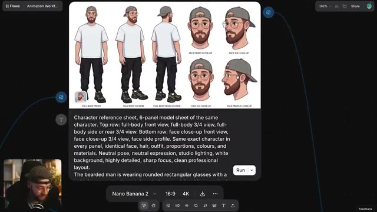
*Interface logicielle de type nœuds (flows) affichant une feuille de référence de personnage générée par IA (model sheet à 6 panneaux) et son prompt textuel détaillé.*

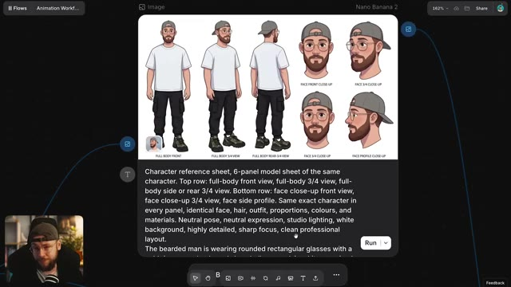
*Vue similaire de l'interface avec le curseur sur le bouton 'Run', montrant la feuille de personnage et son prompt textuel de génération.*

---

### ⏱️ `[00:07:23 - 00:07:42]` | Segment #15

**🔊 Audio (Transcription Intégrale Mot pour Mot en Français) :**
> Je vais vous montrer comment nous pouvons les utiliser. Mais essentiellement, nous prenons simplement cette génération d'image ici. Nous appliquons le prompt et cela nous donne une variété d'angles différents pour notre personnage. Nous avons des plans en pied sur la gauche ici, puis des gros plans de mon visage sous différents angles également.

**👁️ Analyse Visuelle d'Écran (gemini-3.5-flash-lite) :**
**Interface & Outils** : Interface de type tableau blanc / nœuds (style mind-map / workflow visuel) avec des boîtes de génération d'images IA.

**Contenu textuel & Code** : Texte du prompt visible : "Character reference sheet, 6-panel model sheet of the same character. Top row: full-body front view, full-body 3/4 view, full-body side or rear 3/4 view. Bottom row: face close-up front view, face close-up 3/4 view, face side profile..." et des libellés sous les images ("FULL BODY FRONT", "FACE FRONT CLOSE-UP").

**Action / Démonstration** : Le créateur navigue et zoome sur le canvas pour montrer les différentes générations d'images et plans de personnages obtenus à partir du prompt.

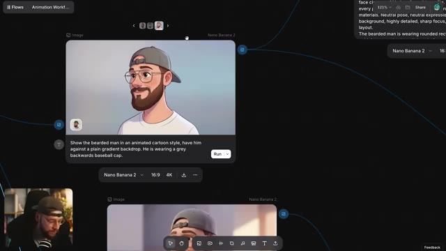
*Interface d'un outil de nœuds montrant une image générée d'un personnage de dessin animé avec un prompt textuel.*

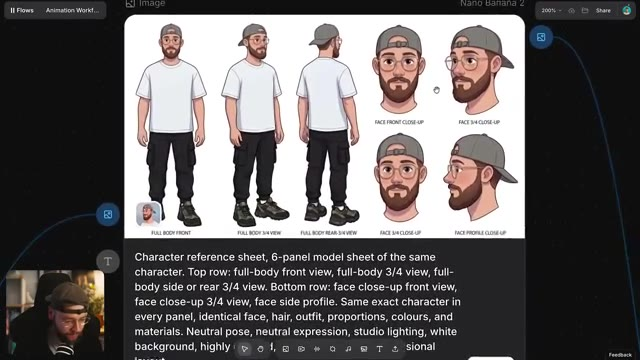
*Feuille de référence de personnage en 6 panneaux affichant des vues en pied et des gros plans du visage sous divers angles.*

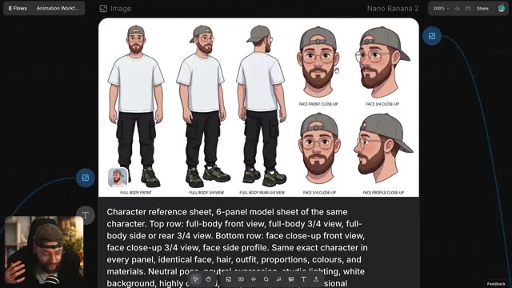
*Même feuille de référence de personnage avec le curseur survolant un des gros plans du visage et le texte du prompt visible en bas.*

---

### ⏱️ `[00:07:42 - 00:08:03]` | Segment #16

**🔊 Audio (Transcription Intégrale Mot pour Mot en Français) :**
> Et tout cela est vraiment utile pour les modèles de vidéo par IA, en particulier Kling 03. C'est un modèle de référence omni. Et cela signifie que nous pouvons lui fournir plusieurs images de référence pour garantir un très bon niveau de cohérence des personnages. Bien sûr, c'est très important pour l'animation par IA.

**👁️ Analyse Visuelle d'Écran (gemini-3.5-flash-lite) :**
**Interface & Outils** : Interface de type éditeur de nœuds (workflow graphique) montrant des blocs de génération d'images et de fiches de personnages (Nano Banana 2).

**Contenu textuel & Code** : Texte du prompt visible : "Character reference sheet, 6-panel model sheet of the same character. Top row: full-body front view, full-body 3/4 view, full-body side or rear 3/4 view. Bottom row: face close-up front view, face close-up 3/4 view, face side profile..." Paramètres visibles : 16:9, 4K, bouton "Run".

**Action / Démonstration** : Le créateur présente un workflow de génération d'images connectées entre elles pour maintenir la cohérence des personnages.

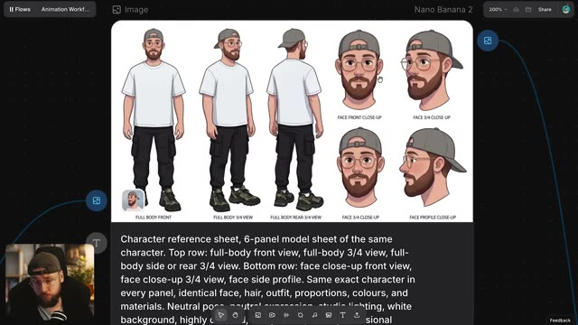
*Gros plan sur une interface de nœuds montrant une fiche de référence de personnage avec plusieurs angles de vue et un prompt textuel détaillé.*

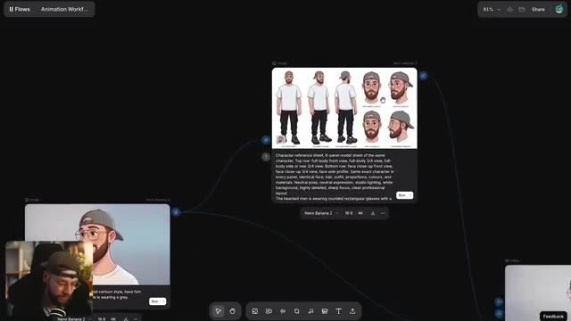
*Vue d'ensemble d'un flux de travail (workflow) avec des nœuds connectés pour la génération de personnages et de vidéos.*

---

### ⏱️ `[00:08:03 - 00:08:28]` | Segment #17

**🔊 Audio (Transcription Intégrale Mot pour Mot en Français) :**
> Donc déplaçons simplement ce nœud de génération vidéo vers le haut, juste pour qu'il ne gêne pas. Je veux aller cliquer ici pour ajouter un nouveau nœud de génération vidéo. Nous allons zoomer ici. Et si nous cliquons sur la liste des modèles, je veux sélectionner Kling 03, qui est le modèle Omni Reference. Maintenant, vous pouvez voir qu'avec le nœud de génération vidéo, nous avons beaucoup plus d'entrées que nous pouvons utiliser.

**👁️ Analyse Visuelle d'Écran (gemini-3.5-flash-lite) :**
**Interface & Outils** : Interface de type nœud (Workflow de génération vidéo avec Kling 03).

**Contenu textuel & Code** : Nœuds de génération vidéo, liste de modèles avec Kling 03, paramètres (16:9, 1080p, 4s), zone de prompt "Describe the video...".

**Action / Démonstration** : Le créateur montre l'interface de workflow par nœuds, zoome sur un nouveau nœud de génération vidéo et sélectionne le modèle Kling 03.

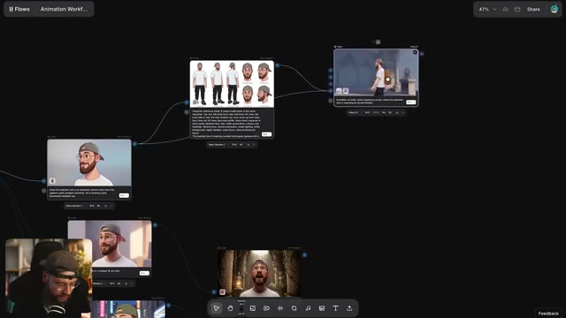
*Vue d'ensemble du workflow sous forme de nœuds sur une interface de génération vidéo, avec le créateur en incrustation PiP en bas à gauche.*

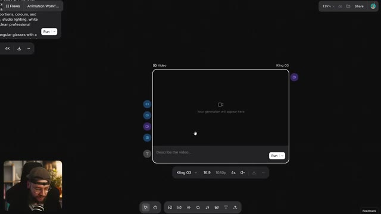
*Gros plan sur un nouveau nœud de génération vidéo avec le modèle Kling 03 sélectionné et ses paramètres affichés.*

---

### ⏱️ `[00:08:28 - 00:09:03]` | Segment #18

**🔊 Audio (Transcription Intégrale Mot pour Mot en Français) :**
> Nous avons la frame de début, la frame de fin, la vidéo de référence, et ensuite les images de référence. Et c'est ce dont nous parlions plus tôt, où notre feuille de personnage va s'avérer vraiment pratique. Nous avons aussi ce même champ de saisie de texte si nous voulons tester plusieurs modèles de génération vidéo côte à côte. Donc ce que je vais faire, c'est simplement insérer un prompt textuel assez simple ici. Nous allons dire : style d'art d'animation, scène tendue et mystérieuse où l'homme barbu explore un temple ancien. Nous allons donc laisser beaucoup de place au hasard ici. Nous allons simplement

**👁️ Analyse Visuelle d'Écran (gemini-3.5-flash-lite) :**
**Interface & Outils** : Interface web de génération vidéo par IA, affichant le modèle "Kling O3", un espace de prévisualisation central, un champ de saisie de texte "Describe the video...", et des paramètres en bas (Kling O3, 16:9, 1080p, 4s). Le visage du créateur apparaît en incrustation (PiP) dans le coin inférieur gauche.

**Contenu textuel & Code** : Texte du champ de saisie : "Describe the video...". Bouton "Run". Options de paramètres : "Kling O3", format "16:9", résolution "1080p", durée "4s".

**Action / Démonstration** : Le créateur montre l'interface de l'outil de génération vidéo en mettant en avant les différentes options d'entrée (frames de début/fin, référence vidéo, images de référence) et le champ de saisie de texte.

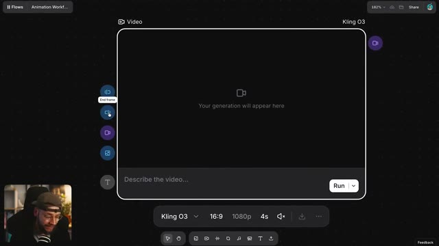
*Interface de l'outil de génération vidéo montrant le panneau de contrôle avec le champ de prompt, les options de frame de fin et le modèle Kling O3.*

---

### ⏱️ `[00:09:03 - 00:09:38]` | Segment #19

**🔊 Audio (Transcription Intégrale Mot pour Mot en Français) :**
> je vais voir ce que cling03 est capable de faire en lui donnant un prompt assez vague et libre pour qu'il puisse en quelque sorte exprimer ses muscles créatifs je suppose. Maintenant je ne vais pas vraiment utiliser l'image de début ou de fin ici. Ce que je vais utiliser par contre ce sont nos images de référence. Je peux donc faire glisser un tuyau ici et le connecter à notre feuille de personnage. Je vais également faire glisser un autre tuyau vers l'image initiale que nous avons générée ici. Cling 03 va avoir accès. Il va faire référence à la fois à la feuille de personnage, aux multiples angles de notre personnage, ainsi qu'à cette très belle

**👁️ Analyse Visuelle d'Écran (gemini-3.5-flash-lite) :**
**Interface & Outils** : Interface de workflow par nœuds (type ComfyUI / Kling Flows) avec fenêtres de prévisualisation d'images et de génération vidéo.

**Contenu textuel & Code** : Texte du prompt visible : 'Animation art style: tense mysterious scene, where the bearded man is exploring an ancient temple.' Paramètres Kling O3, 16:9, 1080p, 4s.

**Action / Démonstration** : Le créateur montre l'interface de workflow et explique comment connecter les images de référence et la feuille de personnage au module vidéo de Kling O3.

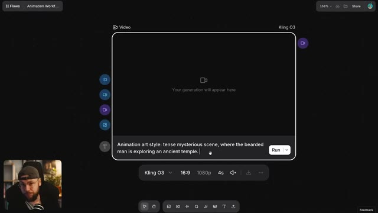
*Interface de nœuds montrant une fenêtre de génération vidéo Kling O3 avec un prompt textuel sur un style d'animation mystérieux.*

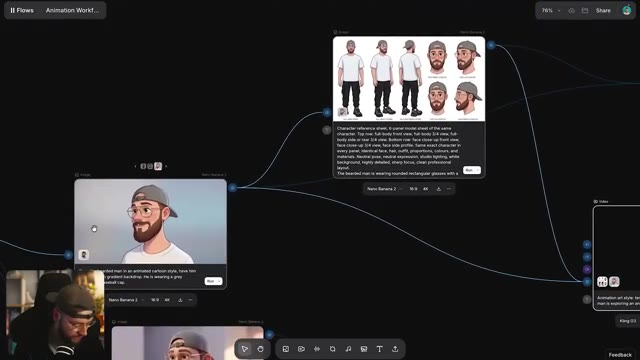
*Vue d'ensemble du workflow par nœuds montrant la feuille de personnage et l'image initiale connectées par des liens.*

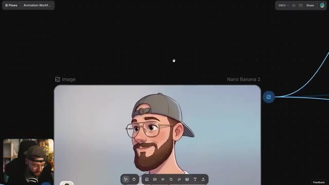
*Gros plan sur l'image initiale du personnage généré dans l'interface de workflow.*

---

### ⏱️ `[00:09:38 - 00:10:21]` | Segment #20

**🔊 Audio (Transcription Intégrale Mot pour Mot en Français) :**
> image haute fidélité du genre de visuel clé que nous avons créé. En termes de durée, allons-y pour porter cela à 10 secondes. Nous avons également cette icône ici. Si nous voulons générer du son, nous devons aller l'activer. Alors voilà. Allons-y et cliquons sur exécuter. Nous avons donc obtenu une génération de très haute qualité ici où Kling O3, grâce à nos références d'image que nous utilisons, a vraiment verrouillé un super niveau de cohérence des personnages et du style également.

**👁️ Analyse Visuelle d'Écran (gemini-3.5-flash-lite) :**
**Interface & Outils** : Interface de type nœuds (node-based workflow) avec un espace de travail interactif pour la génération d'images (Nano Banana 2) et de vidéos par IA (Kling O3).

**Contenu textuel & Code** : Textes visibles : "Show the bearded man in an animated cartoon style, have him against a plain gradient backdrop. He is grey backwards baseball cap." et "Animation art style: tense mysterious scene, where the bearded man is exploring an ancient temple.", paramètres réglés sur Kling O3, format 16:9, résolution 1080p, durée 10s.

**Action / Démonstration** : Le créateur navigue dans l'interface de workflow, configure les paramètres de durée à 10 secondes sur Kling O3, active l'option audio et lance l'exécution pour obtenir la vidéo finale générée par IA.

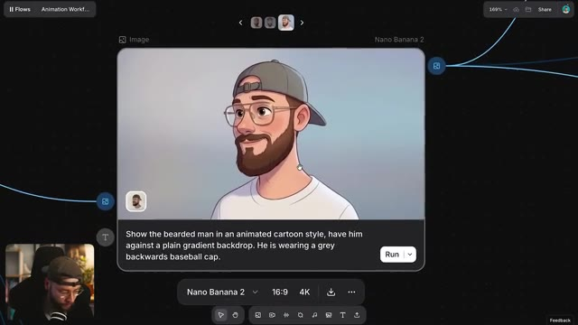
*Interface du logiciel montrant la génération d'image du personnage avec le modèle Nano Banana 2 et le prompt textuel.*

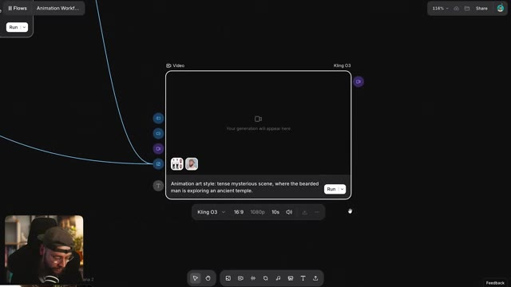
*Interface de génération vidéo Kling O3 avec les paramètres de durée réglés à 10 secondes et les images de référence.*

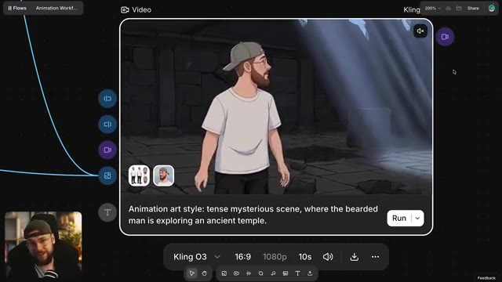
*Résultat de la génération vidéo avec Kling O3 montrant le personnage animé explorant un temple ancien.*

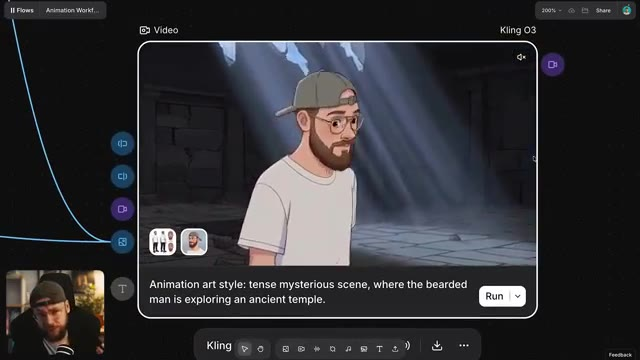
*Gros plan sur la vidéo générée montrant le personnage du barbu explorant les ruines du temple avec des rayons de lumière.*

---

### ⏱️ `[00:10:22 - 00:10:44]` | Segment #21

**🔊 Audio (Transcription Intégrale Mot pour Mot en Français) :**
> Et même le sound design que Kling a ajouté est vraiment efficace pour créer cette ambiance mystérieuse que nous recherchons. Maintenant, disons que nous soyons vraiment satisfaits de cette génération. Ce que nous pouvons faire, c'est cliquer sur cette icône ici, faire glisser un nouveau tuyau et le relâcher. Et vous pouvez voir que nous avons une option, enfin, différentes options, mais nous voulons sélectionner "upscale" (mise à l'échelle) maintenant.

**👁️ Analyse Visuelle d'Écran (gemini-3.5-flash-lite) :**
**Interface & Outils** : Interface utilisateur de type node-based (style ComfyUI ou Flows) intégrée à Kling, avec un retour vidéo central et des commandes de nœuds.

**Contenu textuel & Code** : Texte du prompt visible : "Animation art style: tense mysterious scene, where the bearded man is exploring an ancient temple." Paramètres : Kling O3, 16:9, 1080p, 10s. Menu d'options : Upscale, Edit video, Mix with audio, Lipsync generation.

**Action / Démonstration** : Le créateur montre comment faire glisser un tuyau depuis un nœud de génération vidéo dans l'interface Kling pour ouvrir le menu d'options et sélectionner l'option d'amélioration (upscale).

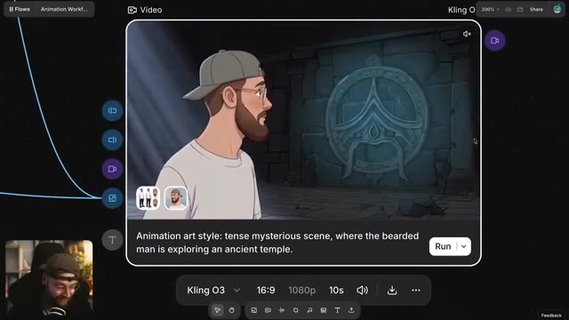
*Interface de nœuds de Kling montrant la vidéo générée d'un homme barbu explorant un temple ancien avec les paramètres visibles.*

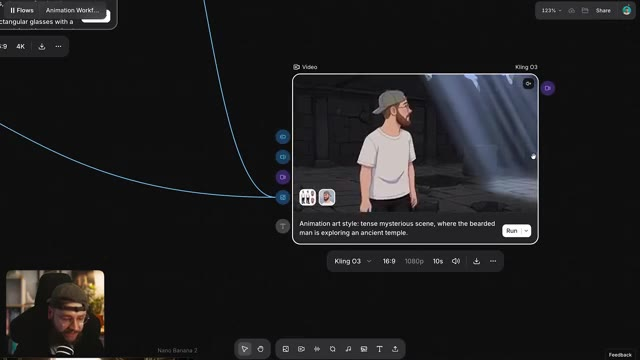
*Dézoom sur l'interface en nœuds de Kling montrant le workflow global de génération vidéo.*

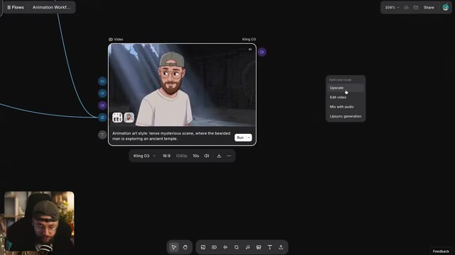
*Menu contextuel affichant les options "Upscale", "Edit video", "Mix with audio" et "Lipsync generation" après avoir tiré un nœud.*

---

### ⏱️ `[00:10:44 - 00:11:16]` | Segment #22

**🔊 Audio (Transcription Intégrale Mot pour Mot en Français) :**
> Évidemment, Kling 03 plafonne à 1080p, mais nous pouvons utiliser Topaz ici dans ElevenLabs Flow. Nous avons sélectionné l'upscaling vidéo Topaz. Nous pouvons monter jusqu'à 3840 par 2160. Et pour la fréquence d'images, laissez-la définitivement sur "identique à la source". Nous voulons correspondre à ce que nous avons obtenu de Kling 03 ici et pendant que notre upscale Topaz s'exécute, nous allons expérimenter avec certains des autres outils que nous avons à disposition. Par exemple, ajoutons un nœud de synthèse vocale ici.

**👁️ Analyse Visuelle d'Écran (gemini-3.5-flash-lite) :**
**Interface & Outils** : ElevenLabs Flow (interface de type nœuds / canvas de génération multimédia).

**Contenu textuel & Code** : Nœuds visibles : "Kling 03" (prompt : "Animation art style: tense mysterious scene, where the bearded man is exploring an ancient temple.", réglages 16:9, 1080p, 10s) et "Topaz Video Upscale" (réglage 3840 x 2160, "Same as source").

**Action / Démonstration** : Le créateur montre la configuration des nœuds de traitement vidéo, ajuste les paramètres de résolution avec Topaz Video Upscale et lance l'exécution du rendu.

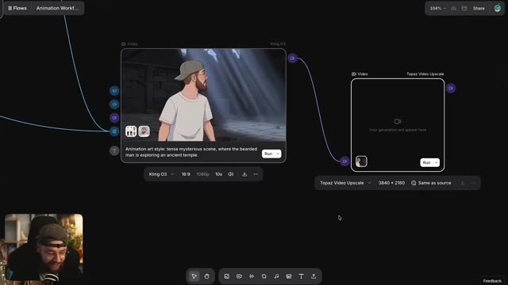
*Interface d'ElevenLabs Flow montrant le nœud Kling 03 connecté à un nœud de redimensionnement vidéo Topaz Video Upscale configuré en 3840x2160.*

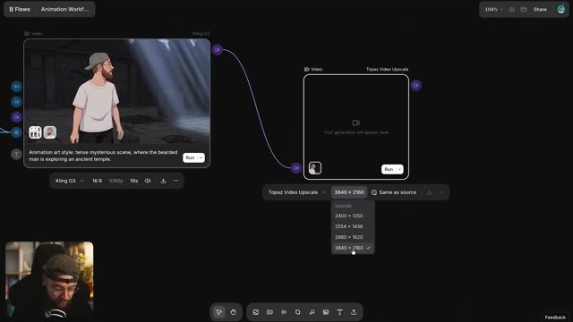
*Sélection du menu déroulant de résolution Topaz Video Upscale montrant les options de mise à l'échelle jusqu'à 3840 x 2160.*

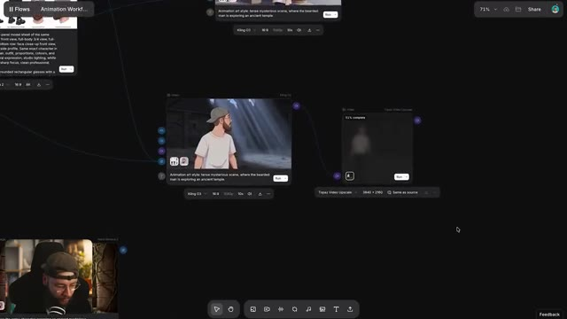
*Lancement du traitement d'upscaling vidéo Topaz dans le flux de travail avec la progression visible (9% completed).*

---

### ⏱️ `[00:11:16 - 00:11:54]` | Segment #23

**🔊 Audio (Transcription Intégrale Mot pour Mot en Français) :**
> Donc nous pouvons aller de l'avant et sélectionner le modèle spécifique d'ElevenLabs. Je vais sélectionner 11v3 qui est leur dernière version. Nous pouvons ensuite choisir parmi leur immense bibliothèque de voix. Il y en avait une que j'aimais bien. Je crois que c'est James, celle-ci. Le mal est le mal. Moindre, plus grand, moyen. Donc ça correspond un peu à l'ambiance de ce qu'on recherche, n'est-ce pas ? Je veux un narrateur qui va aider à raconter notre histoire. Sélectionnons donc celle-ci, James, sérieux et grave. Donc pour le texte à saisir, je vais dire : si seulement j'avais su ce qui m'avait éveillé ce jour-là. J'étais fou de chercher la cité perdue.

**👁️ Analyse Visuelle d'Écran (gemini-3.5-flash-lite) :**
**Interface & Outils** : Interface graphique de type nœuds (workflow visuel) intégrant des modules de génération vidéo (Kling), d'upscaling (Topaz) et de synthèse vocale (ElevenLabs). Une vignette PiP (Picture-in-Picture) en bas à gauche montre le créateur face à son écran.

**Contenu textuel & Code** : Nœud de génération "Text to Speech" avec le modèle "Eleven Multilingual v2" (Image 1) puis "Eleven v3" (Image 2). Sélection de la voix "James - Serious & Grim". Prompt textuel entré : "If only I'd known what I awoke that day, I was a fool to be searching for The Lost City...". Nœuds annexes : Kling O3 (16:9, 1080p, 10s) avec le prompt "Animation art style: tense mysterious scene, where the bearded man is exploring an ancient temple" et Topaz Video Upscale (3840 x 2160).

**Action / Démonstration** : Le créateur sélectionne et configure les paramètres du module text-to-speech d'ElevenLabs dans l'interface du workflow, choisissant le modèle v3 et la voix de narrateur, puis saisit son texte narratif.

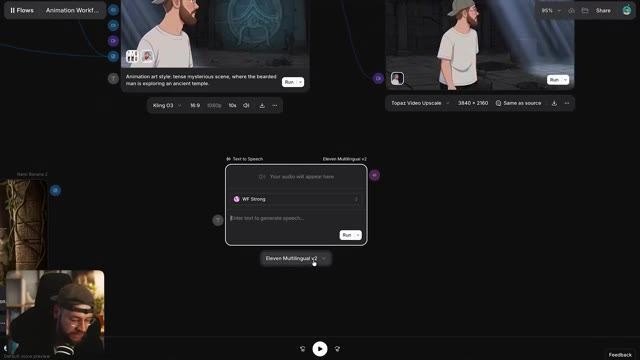
*Interface de nœuds (workflow) montrant un bloc Text to Speech avec le menu déroulant Eleven Multilingual v2 et le flux de travail d'animation.*

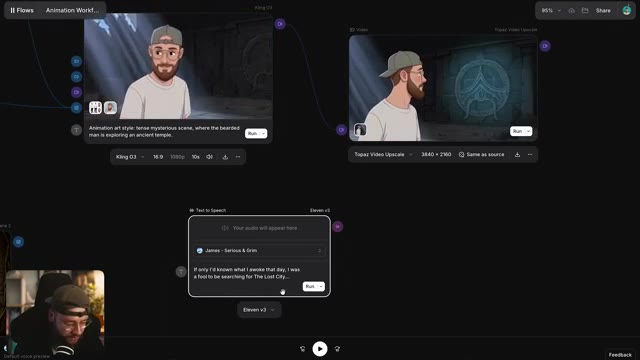
*Interface de nœuds montrant le bloc Text to Speech configuré avec la voix "James - Serious & Grim" et le prompt textuel saisi.*

---

### ⏱️ `[00:11:54 - 00:12:25]` | Segment #24

**🔊 Audio (Transcription Intégrale Mot pour Mot en Français) :**
> Donc nous pouvons y aller et exécuter ce nœud de synthèse vocale particulier ici. Nous allons récupérer notre génération. Si seulement j'avais su ce que j'ai éveillé ce jour-là. J'ai été assez fou pour chercher la cité perdue. Parfait. C'est exactement ce que nous recherchons. Maintenant, ce que nous pouvons également faire, c'est ajouter un nœud de génération musicale. Maintenant, nous recherchons une musique de film ici pour accentuer ce sentiment mystérieux de notre animation. Je veux donc aller désactiver ce bouton bascule pour les paroles parce que nous ne voulons pas de chant dans notre génération.

**👁️ Analyse Visuelle d'Écran (gemini-3.5-flash-lite) :**
**Interface & Outils** : Interface de type nœuds (node-based workflow, type ComfyUI ou plateforme similaire) avec le créateur en incrustation vidéo (PiP) dans le coin inférieur gauche.

**Contenu textuel & Code** : Nœud "Text to Speech" (Eleven v3) avec le prompt : "If only I'd known what I awoke that day, I was a fool to be searching for The Lost City...". Nœud vidéo "Kling O3" et nœud "Topaz Video Upscale". Nouveau nœud "Music" (Eleven Music) avec un interrupteur "Lyrics" désactivé et un champ "Describe the music to generate...".

**Action / Démonstration** : Le créateur montre l'interface de workflow, lance la génération audio text-to-speech, puis ajoute un nœud de génération musicale et désactive l'option des paroles.

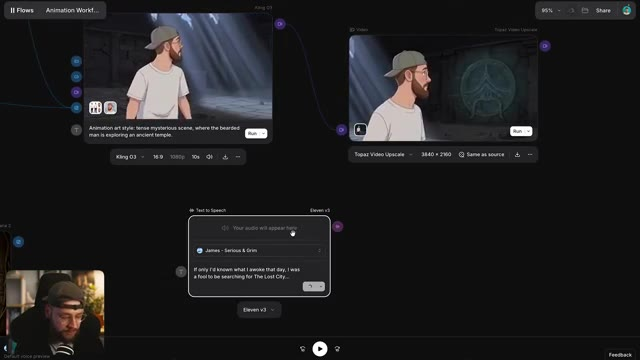
*Interface d'un workflow de nœuds montrant un nœud Text to Speech en cours d'exécution avec le texte du dialogue.*

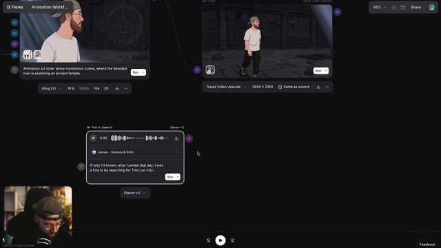
*Le nœud Text to Speech a généré l'audio avec sa forme d'onde visible et le bouton de lecture.*

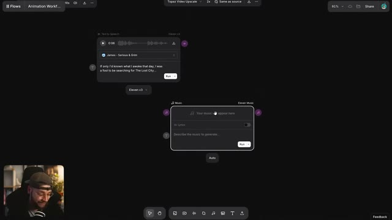
*Ajout d'un nouveau nœud de génération musicale (Music) avec le bouton de désactivation des paroles (Lyrics).*

---

### ⏱️ `[00:12:26 - 00:13:03]` | Segment #25

**🔊 Audio (Transcription Intégrale Mot pour Mot en Français) :**
> Parmi les consignes textuelles, je vais opter pour une partition de film cinématique, explorant un temple ancien et faisant une découverte fascinante, minimale et ambiante. Et nous voulons aussi nous assurer que notre partition a la même longueur que notre génération vidéo ici. Vous pouvez voir que nous avons terminé notre mise à l'échelle Topaz également. Donc au bas de notre nœud de génération de musique, nous avons l'option de taper une durée personnalisée. Donc vous voulez taper comme ceci pour que nous ayons juste 10 secondes de génération. Allez-y et exécutez ce nœud également. D'accord, allons écouter

**👁️ Analyse Visuelle d'Écran (gemini-3.5-flash-lite) :**
**Interface & Outils** : Interface de type nœuds (nodes workflow) avec incrustation vidéo du présentateur (PiP) dans le coin inférieur gauche.

**Contenu textuel & Code** : Nœud de musique affichant le prompt : "Cinematic film score, exploring an ancient temple and making a fascinating discovery. Minimal and ambient." ainsi qu'un nœud de synthèse vocale "Text to Speech" avec la voix "James - Serious & Grim".

**Action / Démonstration** : Le créateur montre son écran de travail avec les différents nœuds connectés pour la génération de la vidéo, de la voix off et de la musique d'ambiance.

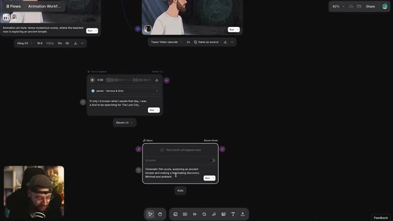
*Interface de flux de travail montrant les nœuds de génération vidéo, de synthèse vocale (ElevenLabs) et de génération musicale avec le prompt de la bande originale.*

---

### ⏱️ `[00:13:03 - 00:13:40]` | Segment #26

**🔊 Audio (Transcription Intégrale Mot pour Mot en Français) :**
> c'est. C'est sympa et minimaliste, mais ça aide vraiment à rehausser un peu cette ambiance. Maintenant, quelque chose d'autre qui est plutôt pratique dans la plateforme Flow, c'est le nœud de composition. Je vais donc en placer un. Vous pouvez voir que nous avons une entrée pour la vidéo et une entrée pour l'audio également. Et pourquoi je pense que c'est vraiment utile, si vous cliquez sur exécuter, c'est que ça va nous permettre de combiner ces deux éléments ensemble et de commencer à avoir une idée de la façon dont notre montage pourrait fonctionner. Je voudrais personnellement encore

**👁️ Analyse Visuelle d'Écran (gemini-3.5-flash-lite) :**
**Interface & Outils** : Plateforme de montage vidéo par flux (Flow) avec une interface de type nœuds (nodes) et une vue PiP (Picture-in-Picture) de Jack en bas à gauche.

**Contenu textuel & Code** : On aperçoit plusieurs blocs de nœuds : un bloc audio "Eleven v3", un bloc de génération musicale "Eleven Music" avec le texte de prompt "Cinematic film score, exploring an ancient temple and making a fascinating discovery. Minimal and ambient.", un nœud "Topaz Video Upscale" réglé sur "2x", et des options de menu en bas (lecture, paramètres, outils).

**Action / Démonstration** : Le créateur navigue sur l'interface en nœuds de la plateforme Flow, mettant en place et connectant différents blocs de traitement vidéo, audio et musical.

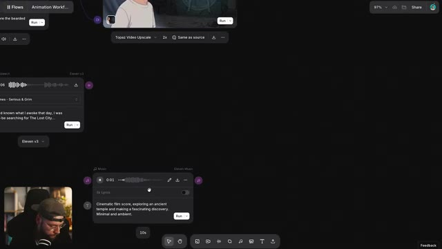
*Interface de la plateforme Flow montrant les différents nœuds (vidéo, audio, musique) avec une incrustation vidéo de Jack en bas à gauche.*

---

### ⏱️ `[00:13:40 - 00:14:09]` | Segment #27

**🔊 Audio (Transcription Intégrale Mot pour Mot en Français) :**
> Télécharger chaque ressource individuellement et les assembler dans un logiciel comme Premiere Pro, bien qu'ils aient un éditeur ici au sein de la plateforme ElevenLabs. C'est juste ma préférence personnelle. Mais ce nœud de composition est vraiment utile pour commencer à esquisser vos idées. Vous testez pour vous assurer que vos actifs visuels et audio vont bien s'associer. Et ce qu'il ne vous permet pas de faire pour l'instant, c'est d'avoir plus d'une source audio.

**👁️ Analyse Visuelle d'Écran (gemini-3.5-flash-lite) :**
**Interface & Outils** : L'interface d'ElevenLabs Flows (un outil de nœuds de composition pour l'IA) est affichée à l'écran, avec un encadré PiP (Picture-in-Picture) montrant Jack face caméra dans son studio.

**Contenu textuel & Code** : On distingue plusieurs blocs de nœuds : des blocs de génération vidéo (Kling 03), un bloc de texte vers la parole ("Text to Speech" avec la voix James - Serious & Grim), un bloc de musique ("Eleven Music") et un nœud central de composition montrant l'assemblage des médias.

**Action / Démonstration** : Le créateur présente l'interface de composition nodale d'ElevenLabs, illustrant comment les différents blocs vidéo et audio se connectent entre eux pour créer un assemblage visuel et sonore.

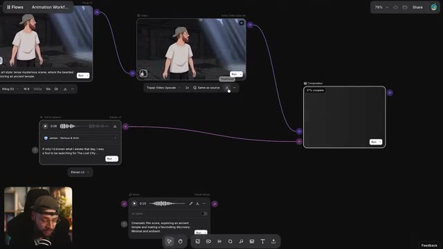
*Interface d'ElevenLabs Flows montrant les différents nœuds d'actifs vidéo, audio et de composition.*

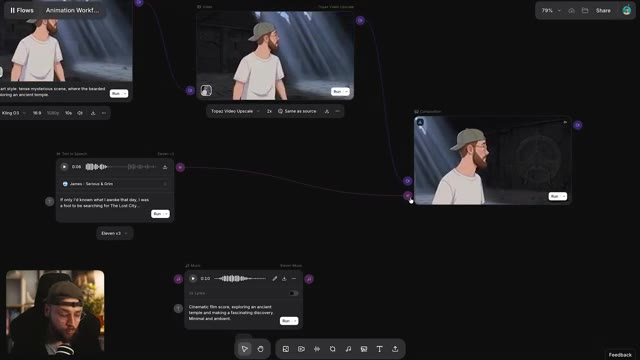
*Vue détaillée du nœud de composition dans ElevenLabs Flows combinant les flux vidéo et audio.*

---

### ⏱️ `[00:14:09 - 00:14:45]` | Segment #28

**🔊 Audio (Transcription Intégrale Mot pour Mot en Français) :**
> c'est un autre retour que je transmettrais à l'équipe parce que ce serait vraiment utile pour commencer à avoir une idée de la façon dont vos assets vont se combiner ensemble car en général on a probablement envie d'une voix off et d'un peu de musique aussi j'espère qu'ils pourront l'ajouter dans un avenir proche parce que ce sera vraiment très très utile mais allons voir le résultat de notre nœud de composition où nous avons combiné notre génération de vidéo par IA de Kling03 avec notre voix off de 11 v 3 si seulement j'avais su ce que j'avais réveillé ce jour-là j'étais un fou de chercher la cité perdue

**👁️ Analyse Visuelle d'Écran (gemini-3.5-flash-lite) :**
**Interface & Outils** : Interface de type nœuds (Workflow UI) sur fond sombre permettant de relier des blocs de génération vidéo (Kling O3), de traitement (Topaz Video Upscale), d'audio (Eleven v3) et de composition.

**Contenu textuel & Code** : Nœud Kling O3 avec le prompt « art style: tense mysterious scene, where the bearded... exploring an ancient temple ». Nœud Text to Speech « Eleven v3 » avec la voix « James - Serious & Grim » et le texte « If only i'd known what i awoke that day, i was a fool to be searching for The Lost City ». Nœud de musique « Eleven Music » avec le prompt « Cinematic film score, exploring an ancient temple... ». Bouton de partage « Share » en haut à droite avec un zoom à 79% puis 143%.

**Action / Démonstration** : Le créateur navigue et zoome dans son interface de nœuds (workflow) pour montrer les connexions logiques entre la génération vidéo, le traitement audio et la composition finale du plan.

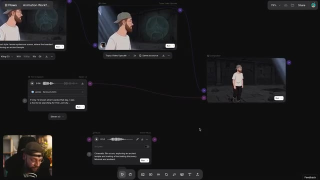
*Interface complète montrant le workflow de nœuds avec les connexions entre Kling O3, Text to Speech (Eleven v3), Topaz Video Upscale et le nœud de composition finale.*

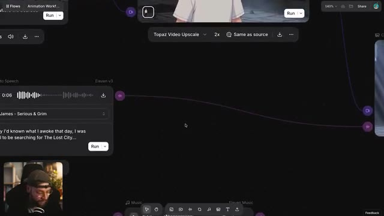
*Zoom avant sur l'interface du workflow montrant la liaison filaire (connexion violette) entre le module audio Text to Speech et le nœud de composition.*

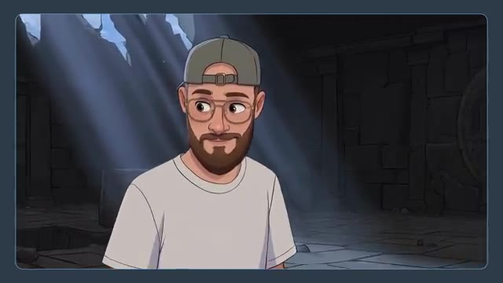
*Résultat vidéo généré en plein écran montrant le personnage animé dans le temple ancien avec des faisceaux lumineux traversant le toit effondré.*

---

### ⏱️ `[00:14:45 - 00:15:15]` | Segment #29

**🔊 Audio (Transcription Intégrale Mot pour Mot en Français) :**
> Et cela fonctionne vraiment, vraiment très bien. Vous pouvez voir que si nous allons de l'avant et commençons à télécharger nos ressources, elles vont fonctionner de manière très significative ensemble au sein de notre montage. Et nous pouvons bien sûr aussi aller de l'avant et déconnecter ce tuyau et configurer notre musique pour qu'elle soit à nouveau la référence audio, exécuter ce nœud de composition pour voir comment notre musique s'intègre dans notre génération vidéo.

**👁️ Analyse Visuelle d'Écran (gemini-3.5-flash-lite) :**
**Interface & Outils** : Interface de type éditeur de flux basé sur des nœuds (workflow nodal) avec un encadré vidéo (PiP) de l'animateur en bas à gauche.

**Contenu textuel & Code** : Nœuds de génération vidéo (Kling), nœuds audio (Text-to-Speech, musique), nœud de composition finale avec des boutons « Run », et des curseurs de zoom/options en haut à droite.

**Action / Démonstration** : Visualisation et manipulation d'un flux de travail nodal connectant des assets vidéo et audio pour la composition finale.

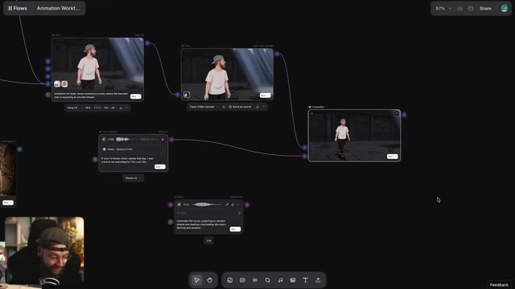
*Interface de flux de travail par nœuds montrant des blocs de génération vidéo et audio avec un encadré PiP de l'animateur en bas à gauche.*

---

### ⏱️ `[00:15:25 - 00:16:01]` | Segment #30

**🔊 Audio (Transcription Intégrale Mot pour Mot en Français) :**
> J'espère que vous commencez à bien réaliser à quel point ce flux de travail est puissant. En tant que personne qui crée constamment différents contenus avec l'IA, je trouve cela vraiment, vraiment utile. Vous pouvez également sélectionner tous vos nœuds et les déplacer ensemble en bloc, ce qui est également très pratique, de sorte que nous pouvons les décaler ici ; vous pouvez avoir différents types de flux de travail existant sur la même zone de travail si vous le souhaitez. Nous avons donc examiné un bon nombre de fonctionnalités utiles que vous avez ici dans Flow, mais nous n'avons pas encore abordé l'automatisation, c'est donc ce que je veux examiner ensuite.

**👁️ Analyse Visuelle d'Écran (gemini-3.5-flash-lite) :**
**Interface & Outils** : Interface de l'application Flow avec un canevas de nœuds (workflow de génération vidéo par IA).

**Contenu textuel & Code** : Nœuds interconnectés avec des aperçus vidéo, des boîtes de texte et des paramètres (Kling 1.5, Topaz Video Upscale, ElevenLabs, etc.).

**Action / Démonstration** : Le créateur présente l'interface de Flow avec les nœuds et les flux de travail interconnectés sur le canevas.

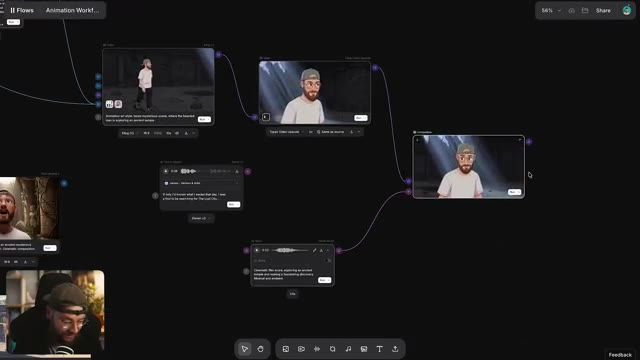
*Interface de l'application Flow affichant un espace de travail sous forme de nœuds interconnectés, avec une miniature vidéo et le créateur visible en incrustation (PiP) dans le coin inférieur gauche.*

---

### ⏱️ `[00:16:02 - 00:16:34]` | Segment #31

**🔊 Audio (Transcription Intégrale Mot pour Mot en Français) :**
> C'est là que nous pouvons configurer un flux de travail complet et le déclencher à la toute fin afin qu'il active chaque nœud dans l'ordre, et nous n'avons plus qu'à nous asseoir et regarder tout le processus se dérouler. Pour commencer, nous venons d'insérer notre même image de référence ici, allons-y et ajoutons un nœud de génération d'image, je veux m'assurer que celui-ci est défini sur Nano Banana 2 et qu'il est également réglé sur une résolution 4K. J'ai entré un prompt qui va prendre notre image de référence et la convertir en un

**👁️ Analyse Visuelle d'Écran (gemini-3.5-flash-lite) :**
**Interface & Outils** : Interface de type nœuds (Workflows / Flows) pour la création et l'automatisation de génération d'images et de vidéos par IA.

**Contenu textuel & Code** : Modèle affiché : "Nano Banana 2". Résolutions : "16:9", "1K" puis "4K". Prompt visible dans l'image 3 : "Show the bearded man in a cozy handcrafted stylised 3D animation scene, angular facial proportions, papier-mâché and carved wood textures, matte clay materials, miniature diorama set, warm earth-tone palette, soft cinematic interior lighting, tactile handmade surfaces, storybook composition, indie animated short film aesthetic, soulful and nostalgic mood. He is wearing a dark grey backwards baseball cap, rounded rectangular glasses with gold rims and a plain white oversized t-shirt."

**Action / Démonstration** : Le créateur montre l'interface de ses workflows par nœuds, connecte une image de référence à un nouveau nœud de génération d'image, configure le modèle Nano Banana 2, sélectionne la résolution 4K et saisit le prompt détaillé.

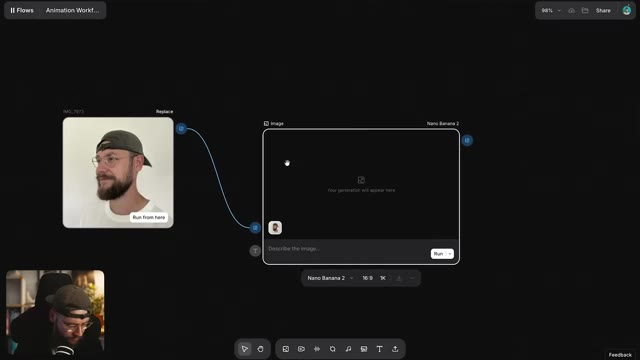
*Interface de flux de travail montrant l'ajout d'un nœud d'image avec le modèle Nano Banana 2 et le format 16:9 1K relié à l'image de référence.*

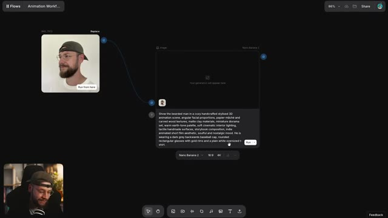
*Interface de flux de travail montrant le prompt textuel saisi dans le nœud Nano Banana 2 réglé sur 4K.*

---

### ⏱️ `[00:16:34 - 00:16:53]` | Segment #32

**🔊 Audio (Transcription Intégrale Mot pour Mot en Français) :**
> scène d'animation 3D stylisée, chaleureuse et artisanale, avec des proportions de visage un peu angulaires et une texture de type papier mâché ou bois sculpté. Maintenant à partir de cela, je vais ajouter un autre nœud de génération d'image. Encore une fois, je veux m'assurer que c'est bien un banana 2 IA, en résolution 4K.

**👁️ Analyse Visuelle d'Écran (gemini-3.5-flash-lite) :**
**Interface & Outils** : Interface de type workflow de nœuds (style ComfyUI ou outil similaire) avec un panneau de prompt textuel, des options de format (16:9, 4K, modèle Nano Banana 2) et un retour vidéo du créateur (PiP) en bas à gauche.

**Contenu textuel & Code** : Texte visible dans le nœud de génération : "Show the bearded man in a cozy handcrafted stylized 3D animation scene, angular facial proportions, papier-mâché and carved wood textures, matte clay materials, miniature diorama set, warm earth-tone palette, soft cinematic interior lighting, tactile handmade surfaces, storybook composition, indie animated short film aesthetic, soulful and nostalgic mood. He is wearing a dark grey backwards baseball cap, rounded rectangular glasses with gold rims and a plain white oversized t-shirt." Paramètres visibles : "Nano Banana 2", "16:9", "4K".

**Action / Démonstration** : Le workflow est affiché à l'écran avec un nœud d'image source relié à un nœud de génération contenant le prompt de transformation en animation 3D, tandis que le créateur est visible en incrustation.

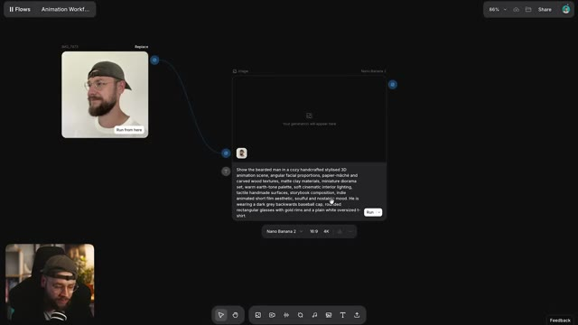
*Interface de nœuds montrant un workflow de génération d'image avec un prompt détaillé pour transformer l'homme barbu en personnage d'animation 3D stylisé, avec une incrustation vidéo du créateur en bas à gauche.*

---

### ⏱️ `[00:16:54 - 00:17:32]` | Segment #33

**🔊 Audio (Transcription Intégrale Mot pour Mot en Français) :**
> Et je vais dire, montre le même homme barbu volant sur un dragon. Assure-toi que le style reste cohérent. Maintenant, ensuite, je veux aller de l'avant et ajouter un nœud de génération de vidéo. Je vais aller directement sur Cling 3 parce que c'est le meilleur modèle de vidéo par IA sur le marché en ce moment, donc on va dire que l'homme barbu vole sur le dragon, il tourne la tête en observant ses environs, soudain le dragon plonge et lui et l'homme barbu sortent rapidement du cadre, ajoutons à la fin un style animé à la main, je vais aussi dire pas de musique et pas de dialogue pour des raisons qui vont bientôt devenir...

**👁️ Analyse Visuelle d'Écran (gemini-3.5-flash-lite) :**
**Interface & Outils** : Outil de flux de travail visuel (basé sur des nœuds interconnectés) avec une interface sombre.

**Contenu textuel & Code** : Nœuds de génération d'images affichant le prompt : "Show the same bearded man flying a dragon, ensure the style remains consistent." Paramètres visibles : Nano Banana 2, format 16:9, résolution 4K. Encadré PiP du créateur visible en bas à gauche.

**Action / Démonstration** : Le créateur montre son écran de travail avec un éditeur de nœuds et commente l'ajout d'un nouveau prompt pour maintenir la cohérence stylistique.

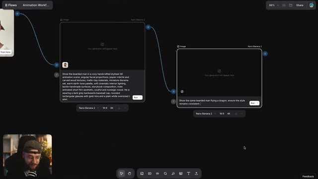
*Interface d'un outil de flux de travail par nœuds (Workflow) montrant la création de nœuds de génération d'images avec des prompts textuels, avec un encadré PiP du créateur en bas à gauche.*

---

### ⏱️ `[00:17:32 - 00:18:09]` | Segment #34

**🔊 Audio (Transcription Intégrale Mot pour Mot en Français) :**
> clair. Je vais ajouter un nœud de composition et relier l'entrée vidéo à ce qui sera notre génération Kling 3. Et ensuite, je vais ajouter un nœud de génération de musique. Et une fois de plus, je vais désactiver l'option des paroles parce que je veux juste une musique de film. Nous allons dire une musique de film épique et cinématique, un dragon et son cavalier planant majestueusement dans le ciel, puis plongeant rapidement hors champ. Et une fois de plus, je veux m'assurer que nous mettons une durée de 10 secondes afin qu'elle corresponde à la durée de notre génération Kling 3. Et nous

**👁️ Analyse Visuelle d'Écran (gemini-3.5-flash-lite) :**
**Interface & Outils** : Interface logicielle de type nœuds (flows) avec un espace de travail sombre, affichant divers blocs de génération (Kling 3.0, Composition) reliés par des liens de connexion. Un encadré PiP (Picture-in-Picture) en bas à gauche montre le créateur face à son écran.

**Contenu textuel & Code** : On distingue les blocs "Kling 3.0" avec un prompt textuel décrivant un homme barbu volant sur un dragon, et un bloc "Composition" vide sur la droite. En bas à gauche, le créateur est visible en petit format.

**Action / Démonstration** : Le créateur montre son écran de travail en train de configurer les nœuds de composition et de génération vidéo dans l'interface par nœuds.

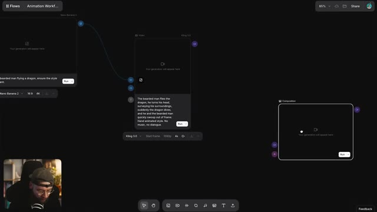
*Interface d'un outil de type workflow par nœuds (Flows / ComfyUI) montrant le raccordement d'un nœud de génération vidéo Kling 3.0 avec un nœud de composition.*

---

### ⏱️ `[00:18:09 - 00:18:45]` | Segment #35

**🔊 Audio (Transcription Intégrale Mot pour Mot en Français) :**
> on peut relier notre entrée audio à notre nœud de génération de musique. Vous pouvez donc voir ici que nous avons configuré tout ce flux de travail et qu'il est prêt pour l'automatisation car si nous faisons un zoom avant sur cet onglet d'exécution, cliquez ici, vous pouvez voir qu'il y a une option qui dit exécuter jusqu'ici et qui dit exécute ce nœud et tous les nœuds qui y mènent et c'est ce dont nous parlions plus tôt cette idée d'automatisation alors allons-y et lançons cela et vous allez voir maintenant que chaque partie du processus chaque ia

**👁️ Analyse Visuelle d'Écran (gemini-3.5-flash-lite) :**
**Interface & Outils** : Interface de type nœuds (Workflow / ComfyUI ou outil similaire) avec incrustation vidéo PiP du créateur dans le coin inférieur gauche.

**Contenu textuel & Code** : Nœuds visibles : texte descriptif ('The bearded man flies the dragon...'), module Kling 3.0 (1080p, 10s), et module de génération musicale 'Eleven Music' avec le prompt 'Epic cinematic film score, a dragon rider, soaring majestically through the sky, then quickly diving out of frame.'

**Action / Démonstration** : Le créateur montre un workflow automatisé reliant l'audio et la génération musicale, avec l'incrustation vidéo du créateur penché vers son micro en bas à gauche.

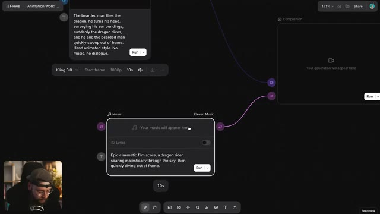
*Interface de workflow montrant la liaison entre un nœud de texte, un nœud Kling 3.0 et un nœud de génération musicale Eleven Music.*

---

### ⏱️ `[00:18:45 - 00:19:27]` | Segment #36

**🔊 Audio (Transcription Intégrale Mot pour Mot en Français) :**
> l'outil va fonctionner dans l'ordre et ensuite nous allons automatiquement obtenir notre résultat final pour que nous puissions suivre ici alors que chaque étape de notre processus s'est déroulée en commençant par le visuel clé puis en passant à notre personnage sur le dragon puis la génération vidéo elle-même bien sûr nous avons aussi notre génération musicale à partir d'ici sur 11 music et enfin la dernière étape de notre processus la composition elle-même allons y jeter un œil donc c'est vraiment impressionnant d'être capable de simplement configurer tout cela

**👁️ Analyse Visuelle d'Écran (gemini-3.5-flash-lite) :**
**Interface & Outils** : Interface de type workflow visuel par nœuds (type ComfyUI ou interface customisée) sur fond noir avec une barre d'outils inférieure et un encadré PiP montrant le créateur.

**Contenu textuel & Code** : Nœuds de traitement enchaînés : image source (visage de Jack), génération du visuel clé (Nano Banana 2 avec description textuelle de style argile/pâte à modeler), génération du personnage sur dragon, génération vidéo (Kling 3.0), génération audio (11 Music) et étape finale de composition.

**Action / Démonstration** : Le créateur montre et survole le workflow complet en expliquant séquentiellement chaque étape du processus de création, du visuel clé jusqu'à la composition finale.

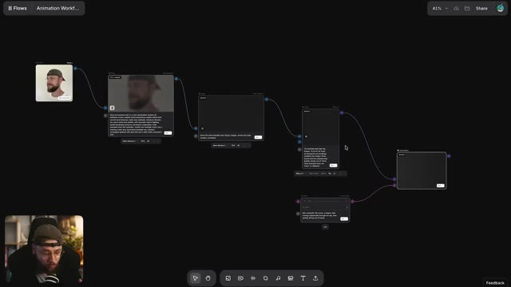
*Vue d'ensemble du workflow complet d'animation basé sur des nœuds interconnectés montrant les différentes étapes du processus.*

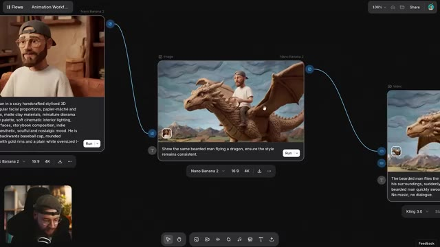
*Gros plan sur l'étape centrale du workflow montrant la génération du personnage sur le dragon avec le modèle Nano Banana 2.*

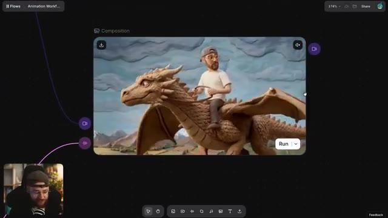
*Affichage de l'étape finale de composition regroupant la vidéo et l'audio pour le rendu final.*

---

### ⏱️ `[00:19:27 - 00:20:00]` | Segment #37

**🔊 Audio (Transcription Intégrale Mot pour Mot en Français) :**
> ces nœuds, il suffit de les déclencher à la fin du processus, d'aller faire une machine ou je ne sais quoi, de se faire une tasse de thé et de revenir pour voir une composition terminée. En termes d'automatisation, c'est en réalité un flux de travail assez simple. On pourrait faire des choses assez complexes si on le voulait et déclencher de multiples compositions se produisant toutes en même temps. On pourrait générer simultanément chaque plan pour une scène entière tout en conservant ce niveau de contrôle très précis. Donc maintenant que

**👁️ Analyse Visuelle d'Écran (gemini-3.5-flash-lite) :**
**Interface & Outils** : Logiciel de flux de travail (Workflow) basé sur des nœuds interconnectés.

**Contenu textuel & Code** : Nœuds de génération d'images et de vidéos connectés entre eux avec des lignes de liaison, affichant des aperçus visuels de personnages (homme barbu) et de dragons, ainsi que des boîtes de texte contenant des prompts descriptifs.

**Action / Démonstration** : Le créateur montre et explique un workflow d'automatisation par nœuds permettant d'enchaîner plusieurs étapes de génération vidéo de manière simultanée.

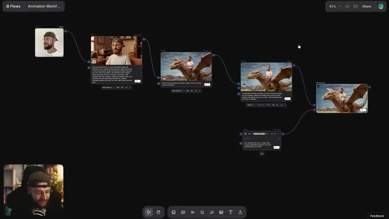
*Interface d'un logiciel de flux de travail par nœuds (type ComfyUI) montrant une composition vidéo en cours d'élaboration avec des blocs connectés et des fenêtres de prévisualisation, avec un encadré PiP de Jack en bas à gauche.*

---

### ⏱️ `[00:20:00 - 00:20:35]` | Segment #38

**🔊 Audio (Transcription Intégrale Mot pour Mot en Français) :**
> J'ai en quelque sorte expliqué comment fonctionne réellement Flows, je veux revenir à cet exemple initial que je vous montrais au début de la vidéo. Nous pouvons aller de l'avant et commencer à décortiquer cela maintenant. Donc si nous zoomez juste ici, il s'agit bien sûr d'un nœud de génération d'images Nano Banana 2. En termes de références d'images, nous avons en fait une partie de ce que j'ai fini par utiliser pour la miniature de cette vidéo afin de donner une idée de l'emplacement. Ensuite, si nous zoomons ici, il s'agit d'une capture d'écran provenant de 11 Labs Flows.

**👁️ Analyse Visuelle d'Écran (gemini-3.5-flash-lite) :**
**Interface & Outils** : Interface de type workflow visuel par nœuds (application Flows), avec une barre d'outils en bas, un affichage pourcentage en haut à droite et une petite incrustation vidéo du créateur dans le coin inférieur gauche.

**Contenu textuel & Code** : Nœuds de génération d'images et de traitement vidéo interconnectés, text and image prompt parameters, nano banana 2 image generation node, 11 labs flows.

**Action / Démonstration** : Le créateur montre et commente l'interface de son workflow de génération par IA, en expliquant le rôle des différents nœuds et des références d'images utilisées pour sa vidéo.

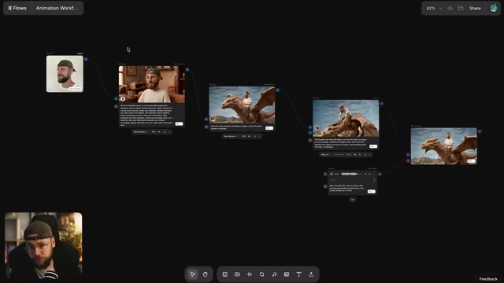
*Interface complète montrant le workflow sous forme de nœuds reliés entre eux, avec le créateur en incrustation (PiP) en bas à gauche.*

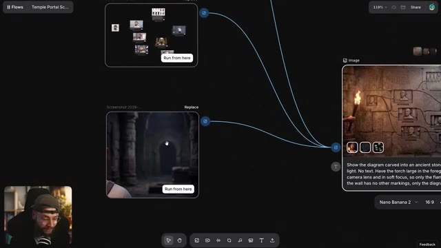
*Gros plan sur le nœud Nano Banana 2 avec des références d'images et un autre nœud montrant une capture d'écran, avec le créateur en incrustation (PiP) en bas à gauche.*

---

### ⏱️ `[00:20:35 - 00:20:53]` | Segment #39

**🔊 Audio (Transcription Intégrale Mot pour Mot en Français) :**
> toile et nous avons aussi, très important, notre visuel clé de notre personnage parce que cela ancre en quelque sorte notre style et pour le prompt textuel, nous demandons à Nano Banana 2 de sculpter onze flux ElevenLabs dans ce mur de temple ancien.

**👁️ Analyse Visuelle d'Écran (gemini-3.5-flash-lite) :**
**Interface & Outils** : Interface de type mindmap / canevas de nœuds (style flux de travail IA), avec barre d'outils en bas et encadré PiP (Picture-in-Picture) du créateur.

**Contenu textuel & Code** : Texte du prompt visible : « Show the diagram carved into an ancient stone wall, lit by torch light. No text. Have the torch large in the foreground, close to the camera lens and in soft focus, so only the flame is visible. Ensure the wall has no other markings, only the diagram. » Paramètres visibles : « Nano Banana 2 », format « 16:9 », résolution « 4K ».

**Action / Démonstration** : Le curseur de la souris survole ou interagit avec l'interface du canevas, montrant les nœuds de génération connectés entre eux.

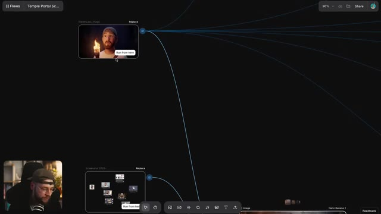
*Vue d'ensemble d'une interface de nœuds (canvas) montrant le flux créatif avec un encadré vidéo du créateur en bas à gauche.*

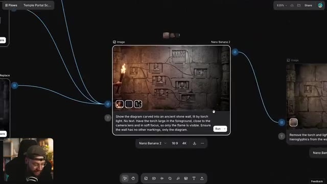
*Gros plan sur un nœud d'image utilisant Nano Banana 2, affichant un prompt textuel pour générer un diagramme sculpté dans un mur de pierre ancien.*

---

### ⏱️ `[00:20:54 - 00:21:14]` | Segment #40

**🔊 Audio (Transcription Intégrale Mot pour Mot en Français) :**
> Nous passons ensuite à l'ajout d'un autre nœud de génération d'image juste pour polir ce que nous avons créé ici, parce que je n'aimais pas les hiéroglyphes sur le mur. Je trouvais que c'était un peu encombré et je voulais vraiment me concentrer sur le fait d'avoir la disposition des flux 11 Labs comme point focal. Et puis nous passons à un autre nœud de génération d'image ici.

**👁️ Analyse Visuelle d'Écran (gemini-3.5-flash-lite) :**
**Interface & Outils** : Interface de type nœuds (nodes) / flux de travail (flows) avec des blocs d'images interconnectés par des lignes bleues, incluant des options de format (16:9), résolution (4K) et un bouton "Run".

**Contenu textuel & Code** : Prompts visibles : "Remove the torch and light from the image. Remove the hieroglyphics from the wall, but leave the carved diagram." et "Show the bearded man stood with his back to the camera in front of the wall on the right of frame and in soft focus..." Modèle sélectionné : Nano Banana 2.

**Action / Démonstration** : Le créateur navigue et zoome dans son interface de flux pour modifier et ajouter des nœuds de génération d'image afin d'ajuster les détails visuels du décor.

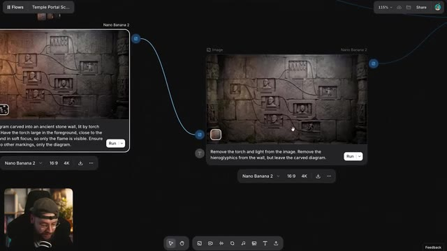
*Interface de flux de travail montrant un nœud de génération d'image avec le prompt de modification pour supprimer les hiéroglyphes du mur, avec une incrustation vidéo du créateur en bas à gauche.*

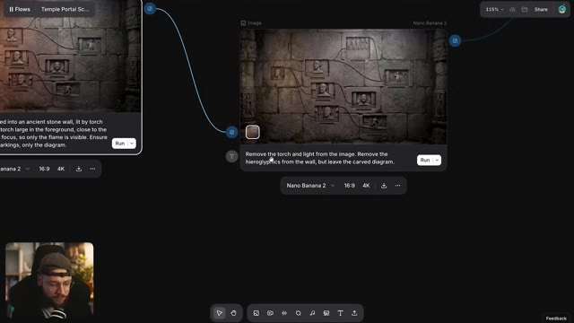
*Gros plan sur le nœud de génération d'image et son prompt texte visant à nettoyer le mur de ses hiéroglyphes.*

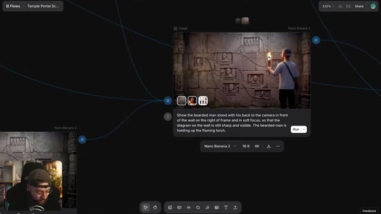
*Affichage d'un nouveau nœud de génération d'image dans l'interface de flux montrant un personnage barbu tenant une torche face au mur sculpté.*

---

### ⏱️ `[00:21:14 - 00:21:33]` | Segment #41

**🔊 Audio (Transcription Intégrale Mot pour Mot en Français) :**
> Maintenant, nous connectons notre fiche de personnage. Nous en avons parlé un peu plus tôt sur l'utilité que cela a pour garantir la cohérence des personnages sous différents angles. Nous connectons également notre visuel clé. Vous pouvez voir toutes les connexions qui indiquent très clairement ce qui est injecté dans ce nœud de génération d'images.

**👁️ Analyse Visuelle d'Écran (gemini-3.5-flash-lite) :**
**Interface & Outils** : Interface de workflow sous forme de tableau de bord ou de canevas infini (type ComfyUI ou outil similaire), avec une incrustation vidéo (PiP) du créateur en bas à gauche.

**Contenu textuel & Code** : Un espace de travail sombre affichant un graphe de nœuds reliés par des lignes ("pipes") connectant différentes images, des feuilles de personnages et des visuels clés vers des nœuds de génération d'images. Le coin supérieur gauche affiche "Flows" et "Temple Portal Sc...", et le coin supérieur droit indique "32%".

**Action / Démonstration** : Le créateur montre son écran de travail en expliquant comment connecter les différentes fiches de personnages et visuels clés à l'aide de connexions (pipes) dans le workflow de génération d'images.

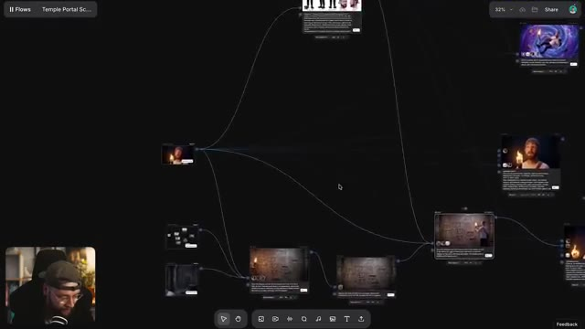
*Interface de type nœud (Workflow) montrant la connexion d'une feuille de personnage et d'un visuel clé vers un nœud de génération d'images avec le créateur en incrustation (PiP).*

---

### ⏱️ `[00:21:33 - 00:22:05]` | Segment #42

**🔊 Audio (Transcription Intégrale Mot pour Mot en Français) :**
> Et bien sûr, nous branchons aussi cette image ici. Et ce que nous demandons à Nano Banana 2 de faire, c'est d'ajouter un personnage, l'homme barbu, de dos par rapport à la caméra et en léger flou artistique, tenant une torche. Et ensuite, tout cela, à la toute fin du processus, est envoyé dans un nœud de génération vidéo utilisant à nouveau Kling 03. Un prompt multi-plans ici où nous demandons à Kling de couper entre plusieurs angles de caméra. Donc pour l'image de départ, nous utilisons notre clé...

**👁️ Analyse Visuelle d'Écran (gemini-3.5-flash-lite) :**
**Interface & Outils** : Interface de type nœud (workflow de génération visuelle par IA, type ComfyUI ou similaire).

**Contenu textuel & Code** : Texte du prompt visible sur l'image 2 : "Show the bearded man stood with his back to the camera in front of the wall on the right of frame and in soft focus, so that the diagram on the wall is still sharp and visible. The bearded man is holding up the flaming torch." Paramètres : Nano Banana 2, 16:9, 4K.

**Action / Démonstration** : Le créateur montre la manipulation des nœuds et des prompts dans l'interface de workflow pour ajouter un personnage avec une torche et enchaîner avec un nœud de génération vidéo Kling.

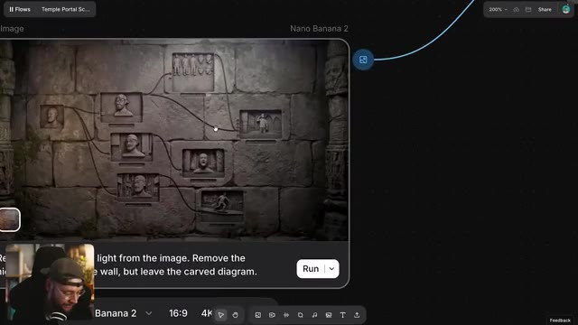
*Interface de workflow montrant un nœud d'image de mur de pierre sculpté avec des connexions.*

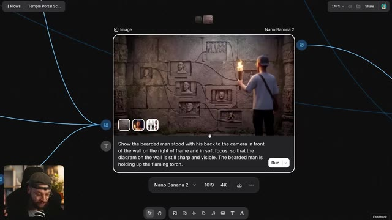
*Interface montrant l'ajout d'un homme barbu de dos tenant une torche devant le diagramme sur le mur.*

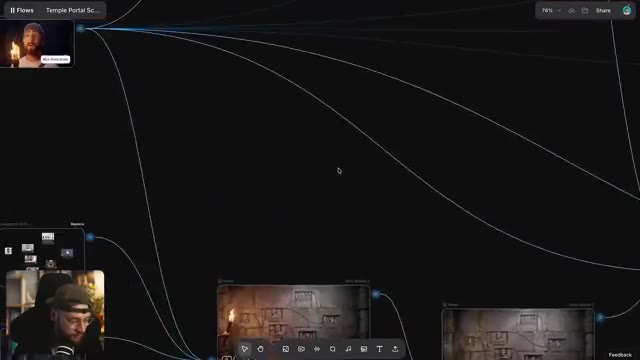
*Vue d'ensemble du workflow sous forme de graphe de nœuds connectés sur fond noir.*

---

### ⏱️ `[00:22:05 - 00:22:37]` | Segment #43

**🔊 Audio (Transcription Intégrale Mot pour Mot en Français) :**
> visuel. L'image finale qu'on utilise, celle-ci, a nécessité différentes étapes de raffinement pour obtenir exactement ce qu'on voulait. Et en ce qui concerne les images de référence, on fait à nouveau appel à notre feuille de personnage ici. Et ce qu'on obtient au final, c'est une séquence animée vraiment fluide et cohérente sur laquelle on a eu un très bon niveau de contrôle. Et souvenez-vous, si on le voulait, on pourrait lancer un upscaling Topaz ici. Si on voulait augmenter la résolution de

**👁️ Analyse Visuelle d'Écran (gemini-3.5-flash-lite) :**
**Interface & Outils** : Interface de type graphe de nœuds (workflow d'IA générative) avec une incrustation vidéo (PiP) du présentateur en bas à gauche.

**Contenu textuel & Code** : Textes de prompts visibles : "[OPENING SHOT] Close up: the bearded man cautiously walks forward holding a flaming torch... [CUT TO SHOT TWO] Wide establishing shot: Ancient temple interior...". Paramètres : Kling O3, 1080p, 10s, Topaz Video Upscale 3856 x 2144.

**Action / Démonstration** : Le créateur navigue et zoome dans son graphe de nœuds pour expliquer les étapes de raffinement de l'image finale et l'option d'upscaling Topaz.

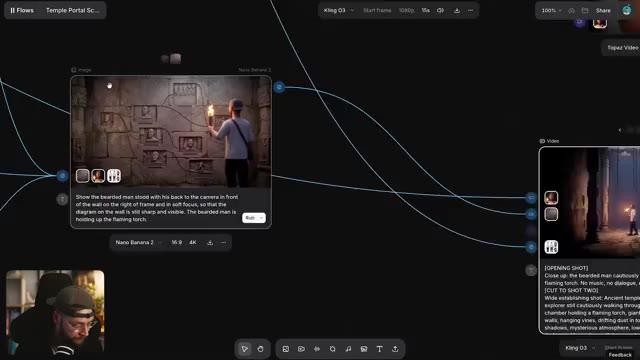
*Interface de nœuds montrant un nœud d'image avec un prompt textuel et un aperçu d'un explorateur tenant une torche face à un mur sculpté.*

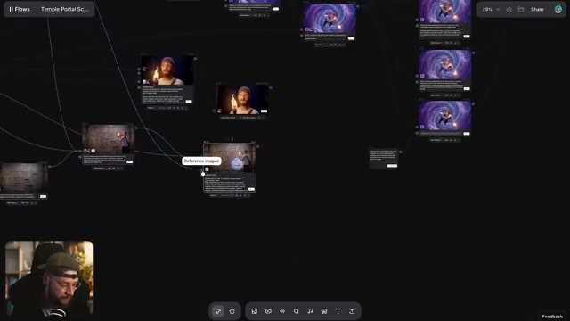
*Vue d'ensemble dézoomée de l'interface de nœuds avec plusieurs blocs connectés, mettant en avant les images de référence du personnage.*

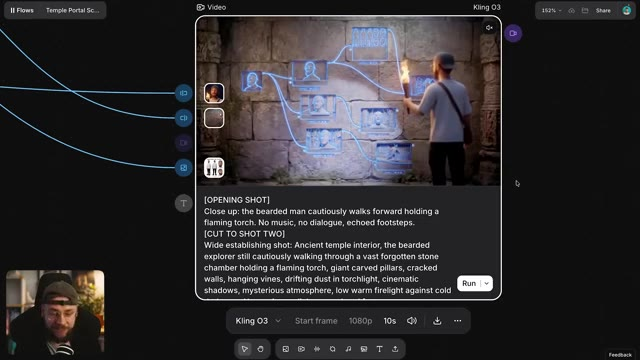
*Gros plan sur un nœud vidéo Kling montrant l'image animée de l'explorateur et le texte descriptif des plans.*

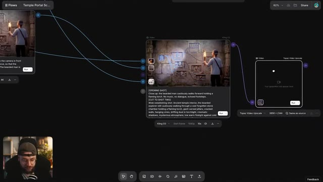
*L'interface de nœuds s'élargit pour inclure un nœud 'Topaz Video Upscale' connecté à la fin de la chaîne de production.*

---

### ⏱️ `[00:22:37 - 00:23:03]` | Segment #44

**🔊 Audio (Transcription Intégrale Mot pour Mot en Français) :**
> notre sortie, nous pourrions également ajouter un nœud de génération musicale si nous voulions ajouter une bande originale de film pour accentuer l'ambiance, ou nous pouvons ajouter un nœud de synthèse vocale si nous voulions ajouter une autre voix off. Il y a beaucoup d'options créatives proposées ici. Maintenant, quelque chose que nous n'avons pas vraiment abordé dans cette vidéo, c'est en fait de faire parler nos personnages animés dans les générations de vidéos.

**👁️ Analyse Visuelle d'Écran (gemini-3.5-flash-lite) :**
**Interface & Outils** : Interface graphique de type nœuds (nodes) avec des fenêtres de prévisualisation vidéo, des blocs de texte de prompt, et une barre d'outils de bas de page.

**Contenu textuel & Code** : On peut lire des blocs de texte de prompt descriptifs comme "[OPENING SHOT] Close up: the bearded man cautiously walks forward holding a flaming torch...", des paramètres de modèle comme "Kling 03", "1080p", "10s", ainsi que des icônes d'outils (musique, texte, vidéo, etc.) dans la barre inférieure.

**Action / Démonstration** : Le créateur présente l'interface de travail basée sur des nœuds et survole la barre d'outils avec le curseur pour montrer l'ajout de nodes musicaux ou vocaux.

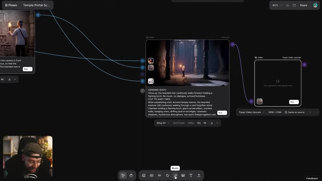
*Interface de type nœuds (nodes) montrant le workflow de génération vidéo avec Kling 03 et Topaz Video Upscale, ainsi que la barre d'outils inférieure.*

---

### ⏱️ `[00:23:04 - 00:23:39]` | Segment #45

**🔊 Audio (Transcription Intégrale Mot pour Mot en Français) :**
> Et la raison pour laquelle je n'ai pas abordé ce sujet, c'est parce qu'il y a un très gros problème ici. Il s'agit de garantir la cohérence des voix sur plusieurs générations de vidéos. Maintenant, Eleven Labs a en fait créé un outil qui aide à résoudre ce problème appelé changeur de voix (voice changer) et c'est là que, comme son nom l'indique, vous êtes capable de modifier une voix existante au sein d'une génération de vidéo ou d'audio pour les verrouiller afin de les rendre cohérentes pour qu'elles aient toutes la même voix. Le problème, c'est qu'à l'heure actuelle, ce n'est pas disponible dans 11labs flow, c'est probablement mon plus grand retour que je vais transmettre.

**👁️ Analyse Visuelle d'Écran (gemini-3.5-flash-lite) :**
**Interface & Outils** : Interface web d'Eleven Labs (tableaux de bord et outil de création "Flows" par nœuds).

**Contenu textuel & Code** : Dans l'image #2 : "My Workspace", "Good morning, Jack kennedy", "Instant speech", "Audiobook", menu avec "Voice Changer". Dans l'image #3 : Interface de nœuds avec "Kling 03", "Topaz Video Upscale", "Text to Speech" avec le modèle "Eleven Multilingual v2" et la voix "Tyre - Southern Urban Narrator".

**Action / Démonstration** : Le créateur montre l'interface d'Eleven Labs, navigue dans le menu latéral puis présente l'interface de travail "Flows" sous forme de nœuds interconnectés.

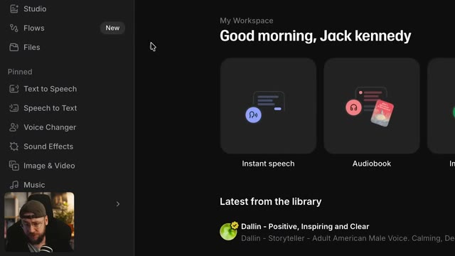
*Interface principale d'Eleven Labs ("My Workspace") montrant le menu latéral avec les options Studio, Flows, Text to Speech, Voice Changer et Sound Effects.*

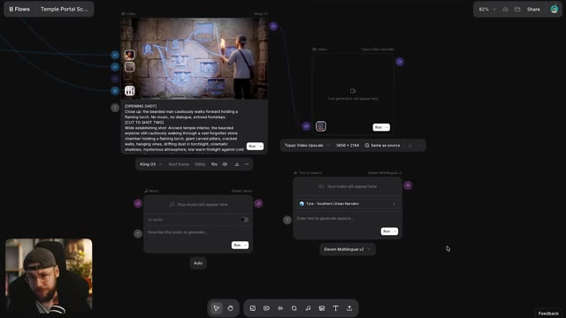
*Interface d'ElevenLabs Flows montrant les différents nœuds de génération vidéo (Kling), audio et de mise à l'échelle (Topaz Video Upscale) connectés entre eux.*

---

### ⏱️ `[00:23:39 - 00:24:11]` | Segment #46

**🔊 Audio (Transcription Intégrale Mot pour Mot en Français) :**
> à ces gars-là parce que je pense qu'une fois que cela sera ajouté, cela va devenir une vraie force quand il s'agit d'animation par IA. Un autre petit problème également, si je me débarrasse de ces nœuds ici, c'est que si je sélectionne ce nœud et que j'appuie sur commande c puis commande v, on s'attendrait un peu à dupliquer le nœud entier, n'est-ce pas ? Mais au lieu de ça, non, on vous donne un nœud de texte, donc en fait, vous dupliquez simplement le prompt textuel. J'aimerais vraiment pouvoir sélectionner le nœud,

**👁️ Analyse Visuelle d'Écran (gemini-3.5-flash-lite) :**
**Interface & Outils** : Interface utilisateur sous forme de graphe de nœuds (style ComfyUI ou outil de flux de travail similaire) avec une barre d'outils en bas et un encadré PiP (Picture-in-Picture) montrant Jack face caméra dans le coin inférieur gauche.

**Contenu textuel & Code** : On observe plusieurs nœuds reliés entre eux : un nœud vidéo principal avec un aperçu montrant un explorateur dans un temple, des blocs de texte contenant des prompts descriptifs ("[OPENING SHOT]...", "[CUT TO SHOT TWO]..."), un nœud "Topaz Video Upscale", un nœud "Text to Speech" avec la voix "Tyre - Southern Urban Narrator", ainsi qu'un nœud musical "Eleven Music".

**Action / Démonstration** : Le flux de travail de l'interface de nœuds est affiché à l'écran tandis que le présentateur manipule virtuellement les blocs et explique le problème du copier-coller des nœuds.

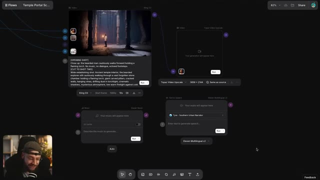
*Interface d'un logiciel de nœuds avec des blocs de génération vidéo Kling, Topaz Video Upscale et Text to Speech, avec le présentateur en incrustation vidéo (PiP) dans le coin inférieur gauche.*

---

### ⏱️ `[00:24:12 - 00:24:37]` | Segment #47

**🔊 Audio (Transcription Intégrale Mot pour Mot en Français) :**
> commande C, commande V, et ensuite obtenir une duplication de ça. Ça va être une amélioration vraiment géniale aussi. Quelque chose d'autre que j'imagine être assez simple à ajouter, mais aussi vraiment utile pour les créateurs d'IA, c'est un nœud qui extrairait la première ou la dernière image d'une génération vidéo, parce qu'ensuite vous allez pouvoir commencer à assembler toutes vos générations vidéo ensemble.

**👁️ Analyse Visuelle d'Écran (gemini-3.5-flash-lite) :**
**Interface & Outils** : Interface logicielle de type graphe de nœuds (workflow de génération vidéo par IA, style ComfyUI ou similaire).

**Contenu textuel & Code** : Blocs de nodes avec des aperçus de vidéos générées, des scripts textuels (prompts décrivant un homme barbu tenant une torche enflammée dans un temple ancien) et des boutons de contrôle.

**Action / Démonstration** : Le créateur présente son interface de workflow et discute de l'amélioration des fonctionnalités de duplication et d'extraction d'images pour relier les séquences vidéo.

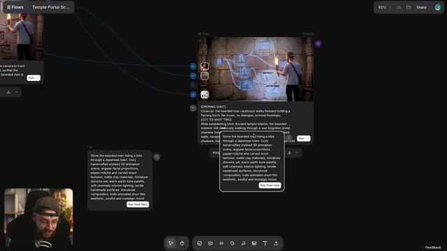
*Interface de nœuds de création vidéo montrant un graphe de flux avec des blocs de prompts et des aperçus vidéo, avec le créateur en incrustation.*

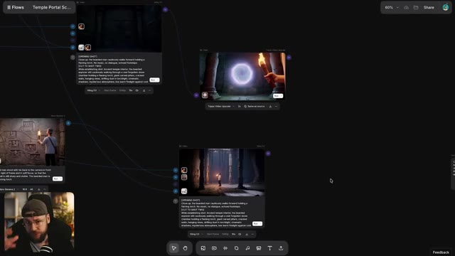
*Vue plus large du graphe de nœuds de génération vidéo avec plusieurs blocs connectés et un aperçu montrant un portail mystique lumineux.*

---

### ⏱️ `[00:24:37 - 00:25:12]` | Segment #48

**🔊 Audio (Transcription Intégrale Mot pour Mot en Français) :**
> Évidemment, Kling se limite à 15 secondes et vous pouvez y faire du prompting multi-plans pour créer une scène. Mais si vous pouvez ensuite prendre la dernière image de cette scène, puis animer à partir de celle-ci, vous pouvez créer un court-métrage entier dans le même flux de travail. Cela peut être vraiment puissant, surtout lorsque vous le combinez avec un changeur de voix, donc j'aime vraiment cet outil, j'ai été vraiment très impressionné par lui. C'est en fait l'un des premiers flux de travail basés sur des nœuds d'IA que j'ai testés. J'espère vraiment que vous avez apprécié la vidéo d'aujourd'hui, si c'est le cas...

**👁️ Analyse Visuelle d'Écran (gemini-3.5-flash-lite) :**
**Interface & Outils** : Interface utilisateur d'un outil de création vidéo par IA basé sur des nœuds (node-based workflow), avec un encadré PiP (Picture-in-Picture) montrant le créateur en bas à gauche.

**Contenu textuel & Code** : Nœuds de génération avec aperçus vidéo et textuels de scènes ("Temple Portal Scene", prompts descriptifs avec des détails sur les plans et l'éclairage).

**Action / Démonstration** : Le flux de travail à nœuds est affiché à l'écran, illustrant la connexion entre les différentes scènes et générations de vidéos.

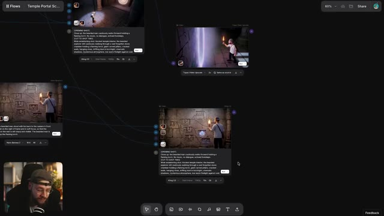
*Interface d'un logiciel de flux de travail à nœuds (node-based) montrant des blocs de génération vidéo avec des aperçus de scènes et des prompts textuels.*

---

### ⏱️ `[00:25:12 - 00:25:24]` | Segment #49

**🔊 Audio (Transcription Intégrale Mot pour Mot en Français) :**
> Assurez-vous de lâcher un pouce bleu pour moi, si vous êtes nouveau pensez à vous abonner et bien sûr activez cette icône de cloche de notification pour ne jamais manquer aucun contenu futur, bonne chance avec vos propres projets et je vous retrouve dans la prochaine vidéo.

**👁️ Analyse Visuelle d'Écran (gemini-3.5-flash-lite) :**
**Interface & Outils** : Présentation face caméra sans partage d'écran

**Contenu textuel & Code** : Aucun contenu logiciel ou technique affiché. Un bandeau graphique YouTube animé apparaît en bas à droite incitant à aimer et s'abonner.

**Action / Démonstration** : Jack est assis dans son studio face à la caméra et s'adresse aux spectateurs pour conclure la vidéo.

---
