# 🎬 Cet outil rend la création de films par IA ultra facile

> **Chaîne** : [Jack Vs. AI](https://www.youtube.com/@JackVsAI)  
> **Titre original** : `This Tool Makes AI Filmmaking EASY`  
> **Lien YouTube** : [https://www.youtube.com/watch?v=L7ufHNtj5Rg](https://www.youtube.com/watch?v=L7ufHNtj5Rg)  
> **Date de publication** : 2026-03-23  
> **Durée** : 12m 30s (`750s`)  
> **Identifiant vidéo** : `L7ufHNtj5Rg`  
> **Fiche Web Interactive** : [2026-03-23_YT-L7ufHNtj5Rg_Cet outil rend la création de films par IA ultra facile_by-whisper-v3-large-turbo+gemini-3.5-flash-lite.html](2026-03-23_YT-L7ufHNtj5Rg_Cet outil rend la création de films par IA ultra facile_by-whisper-v3-large-turbo+gemini-3.5-flash-lite.html)  
> **Captures de démonstration clés** : `37 captures réelles (anti-talking-head)`  
> **Modèles utilisés** : Audio: `large-v3-turbo` (Faster-Whisper int8 VPS) | Vision: `gemini-3.5-flash-lite` (Google AI Studio API)  

---

## 📌 Synthèse Exécutive & Outils

### 📌 Résumé
La création de vidéos par intelligence artificielle souffre traditionnellement d'un manque de contrôle créatif, s'apparentant souvent à un jeu de hasard où la génération de multiples clips aléatoires ne garantit aucune cohérence narrative ou visuelle. Dans cette vidéo, Jack démontre qu'il est désormais possible de s'affranchir de cette limite grâce à l'outil **Cinema Studio 2.5** de Higgsfield. En s'appuyant sur un système unifié, il devient possible de maintenir le même personnage, un éclairage contrôlé et des plans cohérents tout en dirigeant précisément la caméra sans recourir à des prompts complexes. Pour illustrer cette avancée, Jack entreprend la réalisation d'un court-métrage de science-fiction dystopique centré sur une crise d'infertilité, incarné par un personnage de charognard mélancolique.

La méthode pas à pas présentée repose sur une phase préparatoire rigoureuse : conceptualisation de l'histoire, rédaction d'un script hybride faisant office de liste de plans, et génération d'actifs visuels initiaux. Grâce à des modèles d'image avancés, Jack crée une feuille de personnage (character sheet) et des décors caractérisés par une palette chromatique orange marquée, évoquant l'idée d'une prison psychologique et environnementale. L'utilisation conjointe de **Nano Banana 2**, de **Nano Banana Pro** et du modèle propriétaire *Soul Cinema* de Higgsfield permet de verrouiller l'identité visuelle du protagoniste avant même d'entrer dans l'étape de génération vidéo proprement dite.

Enfin, le cœur du tutoriel décortique l'utilisation pratique de Cinema Studio 2.5 à travers des plans uniques et multi-plans (*multi-shot*). Jack montre comment importer des images de référence, assigner des personnages et des environnements via un panneau de direction intuitive, et paramétrer des aspects techniques précis tels que les mouvements de caméra à main levée, les rampes de vitesse (*speed ramps*) et la durée des plans. Cette approche hybride entre direction artistique humaine et automatisation par l'IA offre aux créateurs un contrôle inédit, transformant l'outil technologique en un véritable prolongement de leur vision artistique.

### 🛠️ Outils, Modèles & Logiciels Présentés
* **Cinema Studio 2.5** : Le logiciel de référence développé par Higgsfield permettant de diriger des plans, des mouvements de caméra et des acteurs virtuels de manière unifiée et sans prompts complexes.
* **Higgsfield** : La plateforme globale hébergeant les outils de création et les séries originales, reconnue pour son écosystème de production vidéo de pointe.
* **Nano Banana 2** : Un modèle d'image utilisé pour concevoir les feuilles de personnages (*character sheets*) et les décors initiaux garantissant la cohérence visuelle.
* **Nano Banana Pro** : Une version avancée du modèle d'image exploitée pour peaufiner les éléments visuels complexes et travailler la colorimétrie des scènes.
* **Soul Cinema** : Le modèle d'image propriétaire de Higgsfield mis en avant pour la génération de plans cinématographiques haut de gamme, tel qu'utilisé dans le film *Arena Zero*.

### 🔑 Points Clés & Enseignements Stratégiques
* **Priorité à la vision humaine** : L'IA ne remplace pas le processus créatif ; elle sert d'accélérateur pour donner vie à une idée originale et personnelle que l'outil ne peut pas inventer à la place du créateur.
* **Le piège du hasard** : La production vidéo par IA ne doit plus reposer sur la génération aveugle de dizaines de clips aléatoires, mais sur un pipeline de construction unifié garantissant la continuité narrative.
* **Conception d'une feuille de personnage** : L'utilisation d'images de référence combinée à Nano Banana 2 permet de figer l'apparence d'un protagoniste pour assurer sa recognoscibilité à travers différentes scènes.
* **Symbolisme chromatique fort** : L'intégration d'une couleur dominante récurrente (comme l'orange vif) renvoie visuellement à un thème narratif précis, tel que l'enfermement psychologique ou carcéral des personnages.
* **Le script orienté réalisation** : Rédiger un script hybride qui intègre dès le départ les types de plans et les mouvements de caméra facilite grandement la traduction visuelle ultérieure dans l'IA.
* **Gestion des prompts allégés** : Lorsque l'image de départ est suffisamment descriptive et explicite, il est stratégiquement pertinent de réduire ou d'omettre le texte textuel dans le prompt pour laisser l'image faire le travail principal.
* **Utilisation du panneau du directeur** : L'interface de Higgsfield permet de taguer directement le personnage et l'emplacement à partir d'images importées, évitant ainsi d'avoir recours à de longs prompts textuels complexes.
* **Stylisation par la caméra à main levée** : Sélectionner manuellement un mouvement de caméra "à main levée" insuffle un style granuleux et brut, parfaitement adapté pour retranscrire une ambiance sombre ou dystopique.
* **Contrôle de la durée des plans** : Ajuster finement la longueur des séquences (généralement entre 3 et 5 secondes) permet de rythmer le montage final et d'éviter des actions trop longues ou décousues.
* **Optimisation pour le montage audio** : Intégrer des mentions textuelles spécifiques dans les invites, telles que "pas de musique" et "pas de dialogue", simplifie considérablement la phase ultérieure de post-production sonore.
* **Maîtrise des rampes de vitesse (*speed ramps*)** : L'outil offre la possibilité d'ajuster ou de laisser en mode automatique les variations de vitesse, bien qu'un style plus brut nécessite parfois de désactiver ces effets pour conserver la sobriété de la scène.
* **Cohérence multi-plans** : Le mode *multi-shot* manuel permet de segmenter une scène complexe en plusieurs sous-plans tout en conservant le même ancrage visuel et narratif pour les personnages impliqués.

---

## ⏱️ Chronologie & Transcription Complète Audio & Visuelle (Mot pour Mot)

### ⏱️ `[00:00:00 - 00:00:18]` | Segment #01

**🔊 Audio (Transcription Intégrale Mot pour Mot en Français) :**
> Jusqu'à présent, la vidéo par intelligence artificielle n'était pas une question de réalisation, c'était un jeu de hasard. Vous générez 50 clips et espérez qu'au final quelque chose fonctionne. Mais ce que vous regardez en ce moment n'a pas été généré aléatoirement, cela a été construit à l'intérieur d'un seul et même système. Même personnage, éclairage contrôlé et plans cohérents.

**👁️ Analyse Visuelle d'Écran (gemini-3.5-flash-lite) :**
**Interface & Outils** : Présentation face caméra sans partage d'écran

**Contenu textuel & Code** : Aucun affichage d'interface logicielle, uniquement des extraits de clips vidéo générés par IA illustrant le propos (un personnage allongé dans une pièce exigüe, deux détenus à table dans une cantine, un homme regardant un petit médaillon).

**Action / Démonstration** : Le créateur présente des exemples visuels de clips vidéo générés par IA pour illustrer son discours sur la cohérence des personnages et l'absence de hasard.

---

### ⏱️ `[00:00:18 - 00:00:51]` | Segment #02

**🔊 Audio (Transcription Intégrale Mot pour Mot en Français) :**
> Chaque scène, mouvement de caméra et plan est dirigé. Jusqu'à récemment, obtenir ce niveau de cohérence avec l'IA demandait beaucoup d'étapes compliquées, mais ce nouvel outil change la donne. Vous pouvez engager des acteurs, construire votre scène et diriger la caméra sans prompts complexes. C'est Cinema Studio 2.5 de Hicksfield. Et dans la vidéo d'aujourd'hui, nous allons tester l'outil en profondeur en construisant un film cinématographique complet. Je vais vous montrer comment contrôler vos plans, vos personnages et votre univers pour que vos films générés par IA aient un véritable style et un impact fort. Et

**👁️ Analyse Visuelle d'Écran (gemini-3.5-flash-lite) :**
**Interface & Outils** : Présentation face caméra sans partage d'écran (les images 2, 3 et 4 sont des plans de coupe cinématographiques générés par IA illustrant le sujet, et non une démonstration d'interface ou de logiciel).

**Contenu textuel & Code** : Aucun texte textuel ou d'interface visible (sous-titres automatiques en anglais incrustés sur les plans de coupe).

**Action / Démonstration** : Jack s'exprime face caméra dans son studio, puis la vidéo présente des séquences cinématographiques illustratives générées par IA où il apparaît dans le rôle d'un pilote de vaisseau spatial.

---

### ⏱️ `[00:00:51 - 00:01:26]` | Segment #03

**🔊 Audio (Transcription Intégrale Mot pour Mot en Français) :**
> les gars si vous appréciez la vidéo d'aujourd'hui assurez-vous de mettre un pouce bleu pour moi, pensez à vous abonner et bien sûr à cliquer sur l'icône de notification de la cloche. Très bien, entrons dans le vif du sujet. Tout d'abord, nous avons besoin de notre idée et bien que l'IA puisse vous aider à combler certains blancs, toutes les meilleures idées viennent de vous, le créateur. L'IA ne peut pas penser comme nous, c'est juste un outil pour donner vie à vos idées plus rapidement, et non un remplacement du processus créatif. Pour mon court-métrage, je voulais faire un saut en avant vers un futur dystopique. Il fallait une sorte de conflit, quelque chose que nous puissions introduire mais aussi

**👁️ Analyse Visuelle d'Écran (gemini-3.5-flash-lite) :**
**Interface & Outils** : Présentation vidéo avec extraits de courts-métrages générés par IA et incrustations du créateur (PiP)

**Contenu textuel & Code** : Texte à l'écran : "The conflict." sur l'image 4

**Action / Démonstration** : Le créateur illustre son propos sur le processus de création d'une idée de court-métrage dystopique en montrant des visuels générés par IA illustrant le futur et le conflit.

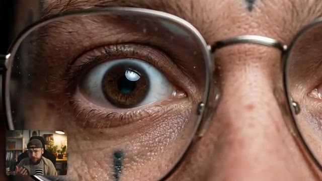
*Gros plan ultra-détaillé d'un œil derrière des lunettes avec incrustation vidéo du créateur dans le coin inférieur gauche*

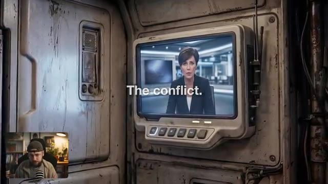
*Écran de moniteur futuriste affichant une présentatrice de journal télévisé avec le texte 'The conflict.' à l'écran et incrustation du créateur*

---

### ⏱️ `[00:01:26 - 00:01:45]` | Segment #04

**🔊 Audio (Transcription Intégrale Mot pour Mot en Français) :**
> résolu en peu de temps. Pour cela, j'ai choisi une crise d'infertilité. Dans cet avenir brutal, les humains n'ont plus le don d'avoir des enfants. Ainsi, de la même manière, notre monde doit être stérile et les personnages qui l'occupent doivent sembler dénués d'espoir. Voici donc notre personnage principal.

**👁️ Analyse Visuelle d'Écran (gemini-3.5-flash-lite) :**
**Interface & Outils** : Incrustation vidéo (Picture-in-Picture) du créateur Jack dans son studio en bas à gauche, affichant à l'écran principal des séquences vidéo cinématiques générées par intelligence artificielle illustrant le monde futuriste.

**Contenu textuel & Code** : Rendu visuel d'une production cinématographique de science-fiction générée par IA : un écran de contrôle rustique, puis des portraits expressifs de personnages aux visages marqués par des tatouages dans un univers dystopique.

**Action / Démonstration** : Le créateur commente et présente des extraits visuels de sa création de film de science-fiction par IA, illustrant l'univers stérile et le design des personnages.

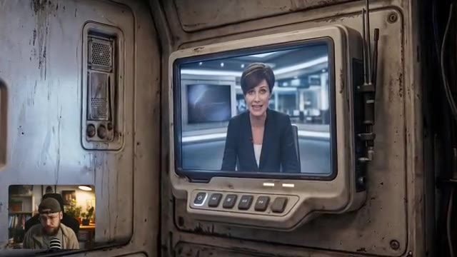
*Séquence vidéo générée par IA montrant un écran de télévision intégré dans un décor futuriste austère, diffusant un journal télévisé avec une présentatrice, avec le créateur en incrustation PiP en bas à gauche.*

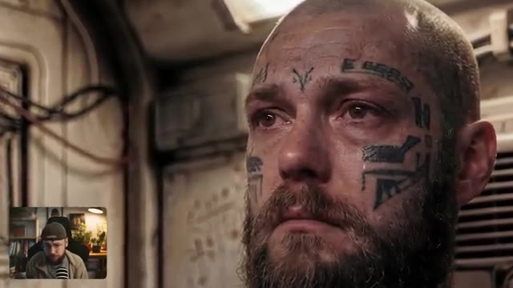
*Gros plan d'un personnage masculin généré par IA au visage tatoué, l'air triste et désolé, avec le créateur en incrustation PiP en bas à gauche.*

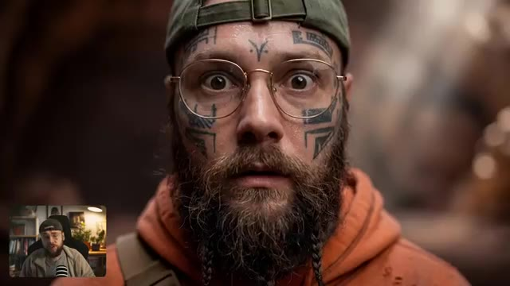
*Gros plan du personnage principal barbu, portant des lunettes rondes et des tatouages faciaux, regardant fixement la caméra avec stupéfaction, avec le créateur en incrustation PiP en bas à gauche.*

---

### ⏱️ `[00:01:45 - 00:02:03]` | Segment #05

**🔊 Audio (Transcription Intégrale Mot pour Mot en Français) :**
> C'est une version alternative de moi, un pilote devenu charognard. À l'intérieur de Higgsfield, j'ai téléchargé des images de référence de moi-même et j'ai utilisé Nano Banana 2 pour créer une feuille de personnage avec un prompt que vous pouvez voir à l'écran maintenant. Tous mes prompts seront en bas dans la description de la vidéo, d'ailleurs.

**👁️ Analyse Visuelle d'Écran (gemini-3.5-flash-lite) :**
**Interface & Outils** : Higgsfield (plateforme de génération d'images et vidéos par IA) avec le modèle Nano Banana Pro sélectionné.

**Contenu textuel & Code** : On peut voir une grille de résultats présentant différentes feuilles de personnages (character sheets) du personnage (homme barbu avec des tatouages faciaux et une capuche orange), ainsi qu'une barre de prompt ("Describe the scene you imagine"), le sélecteur de modèle "Nano Banana Pro", des icônes de format (16:9), de résolution (4K) et un bouton "Generate".

**Action / Démonstration** : Le créateur montre l'interface de Higgsfield où sont affichées plusieurs variations de feuilles de personnages créées à partir de ses images de référence.

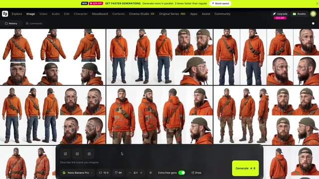
*Interface de la plateforme Higgsfield montrant une grille de feuilles de personnages générées par IA avec le modèle Nano Banana Pro.*

---

### ⏱️ `[00:02:03 - 00:02:24]` | Segment #06

**🔊 Audio (Transcription Intégrale Mot pour Mot en Français) :**
> Cette feuille va s'avérer vraiment très utile plus tard lorsqu'il s'agira de verrouiller la cohérence de notre personnage. Notre charognard est misérable. Il n'a absolument aucun espoir. Et pour rendre les choses encore plus brutales pour lui, nous allons laisser entendre qu'il est sans sa femme et son enfant. Peut-être sont-ils quelque part hors de la planète ou peut-être que quelque chose de vraiment terrible leur est arrivé.

**👁️ Analyse Visuelle d'Écran (gemini-3.5-flash-lite) :**
**Interface & Outils** : Interface web de génération/gestion d'images IA avec un panneau de détails textuels à droite, des outils d'édition en bas (Overview, Upscale, Enhancer, Relight, Inpaint, Angles), et une incrustation vidéo (PiP) du créateur en bas à gauche.

**Contenu textuel & Code** : Texte du prompt visible dans le panneau latéral : "Photo real character sheet against a simple white background of the bearded man as a rugged near future pilot turned scavenger...". Boutons d'action visibles en bas du panneau : "Animate", "Open in", "Reference", "Download".

**Action / Démonstration** : Le créateur montre une planche de référence de personnage générée par IA ("character sheet") tout en parlant de la cohérence du personnage et de son background narratif.

*Interface d'une application de génération d'images affichant une planche de référence (character sheet) d'un personnage de charognard avec des vues multiples, accompagnée d'un panneau latéral contenant le prompt détaillé.*

---

### ⏱️ `[00:02:24 - 00:02:46]` | Segment #07

**🔊 Audio (Transcription Intégrale Mot pour Mot en Français) :**
> La vie de ce type est brutale. Il a donc besoin de quelque chose qui se présente pour l'aider à croire en un avenir meilleur. Et si vous voulez découvrir ce qu'il découvre, vous devrez attendre la fin de la vidéo pour regarder le film terminé. Maintenant que nous avons notre personnage principal et une idée de notre histoire, il est temps d'écrire le script. La façon dont j'aborde cela se situe quelque part entre un script et une liste de plans.

**👁️ Analyse Visuelle d'Écran (gemini-3.5-flash-lite) :**
**Interface & Outils** : Interface web de génération/gestion d'images (avec panneau de détails et options Animate, Upscale, Relight, etc.) et traitement de texte pour le scénario.

**Contenu textuel & Code** : Texte du prompt visible sur l'image 3 : "Photo real character sheet against a simple white background of the bearded man as a rugged near future pilot turned scavenger..." ; texte du script sur l'image 4 décrivant la scène d'ouverture avec le réveil, la pièce de vie désordonnée et le reportage d'information.

**Action / Démonstration** : Le créateur montre la conception graphique du personnage principal puis présente le script écrit de la première scène de son film.

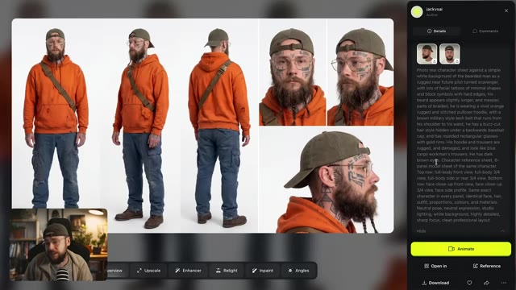
*Interface de génération d'images affichant une feuille de personnages (character sheet) du protagoniste sous différents angles, avec le prompt détaillé sur le panneau latéral droit.*

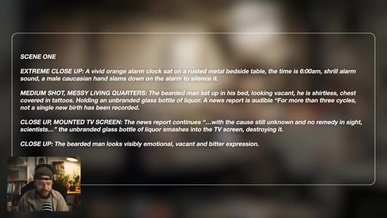
*Écran affichant le texte du script de la première scène ("SCENE ONE"), décrivant les plans (EXTREME CLOSE UP, MEDIUM SHOT, CLOSE UP) et les actions du personnage.*

---

### ⏱️ `[00:02:46 - 00:03:06]` | Segment #08

**🔊 Audio (Transcription Intégrale Mot pour Mot en Français) :**
> Plutôt que de simplement écrire l'histoire, je détaille en fait des éléments comme le type de plan. Et je réfléchis même à la façon dont je veux que la caméra bouge. Et la plupart du temps, je peux réellement les reprendre directement et les utiliser comme prompts pour créer mes images de départ. Et c'est la prochaine étape pour créer les images qui serviront ensuite à animer.

**👁️ Analyse Visuelle d'Écran (gemini-3.5-flash-lite) :**
**Interface & Outils** : Interface de génération d'images par IA et document de script textuel (avec incrustation vidéo PiP du créateur).

**Contenu textuel & Code** : Texte du scénario de la scène 1 détaillant les plans ("EXTREME CLOSE UP", "MEDIUM SCHOT, MESSY LIVING QUARTERS", "CLOSE UP, MOUNTED TV SCREEN") et grille de résultats de génération d'images avec le bouton "Generate".

**Action / Démonstration** : Le créateur montre son processus de conception, passant de l'écriture détaillée des plans de caméra à leur utilisation directe comme prompts pour générer les images de départ.

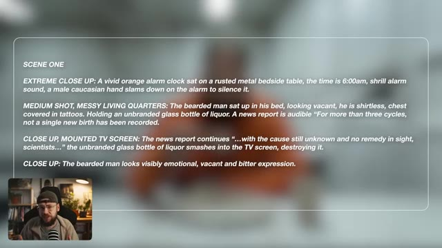
*Texte de scénario structuré montrant les détails de plans ("SCENE ONE", "EXTREME CLOSE UP", "MEDIUM SCHOT") avec un aperçu flouté en arrière-plan et le créateur incrusté en bas à gauche.*

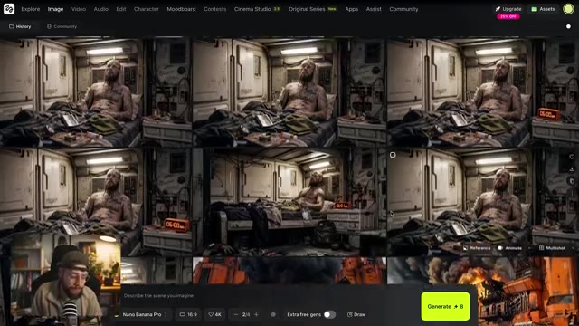
*Interface de génération d'images affichant une grille de rendus générés par IA représentant un homme barbu dans une pièce, avec la caméra du créateur en incrustation PiP en bas à gauche.*

---

### ⏱️ `[00:03:06 - 00:03:29]` | Segment #09

**🔊 Audio (Transcription Intégrale Mot pour Mot en Français) :**
> Ici encore une fois, j'ai utilisé un mélange de Nano Banana Pro et 2, et je voulais me concentrer vraiment sur l'utilisation de la couleur. Vous remarquerez encore et encore cet orange très vif, et cela me fait instantanément penser à un uniforme de prison, et c'est bien l'idée. Tous ces personnages sont en quelque sorte piégés dans leur propre type de prison à cause de la morosité de leur réalité.

**👁️ Analyse Visuelle d'Écran (gemini-3.5-flash-lite) :**
**Interface & Outils** : Interface web de génération d'images (style application de type Leonardo.ai ou Midjourney web) avec une barre de prompt en bas, des réglages de format 16:9, l'option Nano Banana Pro sélectionnée, et un bouton jaune "Generate".

**Contenu textuel & Code** : Texte de la barre de prompt : "Describe the scene you imagine". Paramètres visibles : "Nano Banana Pro", format "16:9", résolution "4K", mode de génération "2/4 +".

**Action / Démonstration** : Le créateur navigue à travers une grille de concepts artistiques générés par IA illustrant des prisonniers dans un univers carcéral et dystopique, tout en s'exprimant face à sa webcam.

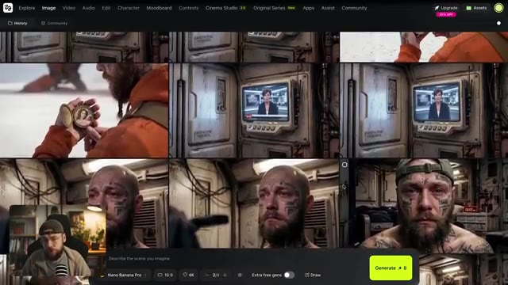
*Interface d'un générateur d'images affichant une grille de 6 visuels de prisonniers avec des uniformes orange vif et des décors métalliques, avec la webcam du créateur en incrustation (PiP).*

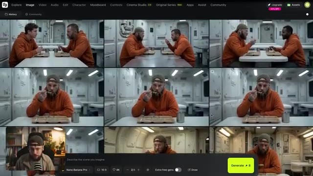
*Interface du générateur affichant une grille de scènes de réfectoire de prison avec des personnages en sweat à capuche orange, avec la webcam du créateur en PiP en bas à gauche.*

---

### ⏱️ `[00:03:29 - 00:04:06]` | Segment #10

**🔊 Audio (Transcription Intégrale Mot pour Mot en Français) :**
> La couleur ressort beaucoup au fil de notre film. Le réveil, l'énorme machine à récolter et même le vaisseau de notre charognard. C'est une façon d'essayer de rendre chaque plan un tout petit peu plus unique et mémorable. Avant de commencer à générer nos clips vidéo, je tiens à saluer Higgsfield Original Series et leur premier film Arena Zero. C'est un travail vraiment impressionnant et chaque plan a été généré à l'aide de Soul Cinema, qui est en fait le modèle d'image propre à Higgsfield. Honnêtement, c'est fou ce qu'une petite équipe a réussi à réaliser, alors bravo à eux.

**👁️ Analyse Visuelle d'Écran (gemini-3.5-flash-lite) :**
**Interface & Outils** : Lecteur vidéo / Montage affichant des extraits du film en cours de discussion avec une incrustation (PiP) de Jack dans le coin inférieur gauche.

**Contenu textuel & Code** : On peut apercevoir le logo incrusté dans le coin supérieur droit indiquant « HIGGSFIELD AI ORIGINAL SERIES » lors de la diffusion des extraits d'Arena Zero.

**Action / Démonstration** : Le créateur commente visuellement ses propres choix artistiques de plans (grotte lumineuse) puis diffuse des extraits de la série « Arena Zero » de Higgsfield en incrustant sa webcam en bas à gauche.

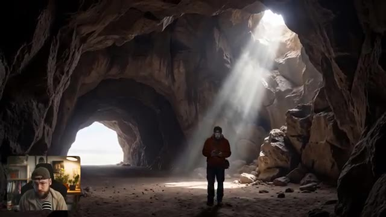
*Extrait du film montrant un personnage explorant une grande grotte rocheuse éclairée par un faisceau lumineux zénithal, avec une incrustation de Jack en bas à gauche.*

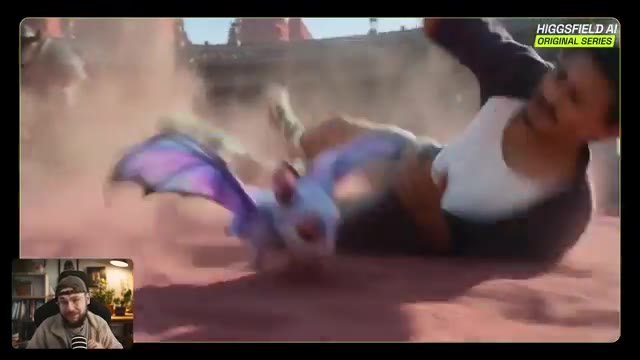
*Extrait du film d'animation « Arena Zero » (Higgsfield AI Original Series) montrant un personnage en train de chuter au sol aux côtés d'une créature ailée mauve, avec un bandeau « HIGGSFIELD AI ORIGINAL SERIES » en haut à droite.*

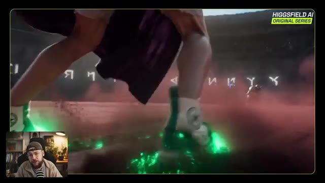
*Extrait d'« Arena Zero » montrant des pieds chaussés de bottes lumineuses vertes foulant le sol d'une arène poussiéreuse, avec le même logo Higgsfield en haut à droite.*

---

### ⏱️ `[00:04:06 - 00:04:43]` | Segment #11

**🔊 Audio (Transcription Intégrale Mot pour Mot en Français) :**
> Cela étant dit, allons-y et cliquons sur Cinema Studio 2.5. Maintenant, il y a beaucoup de contrôles différents ici, mais ils sont tous vraiment importants. Et ce qui est génial, c'est qu'ils nous permettent d'entrer des invites assez simples, tout en contrôlant les aspects plus techniques de notre génération en choisissant, par exemple, notre type de mouvement de caméra. Nous pouvons expérimenter avec différents types de rampes de vitesse et même choisir le genre de film que nous cherchons à créer pour influencer notre style de génération. Nous allons commencer par des générations de plans uniques. Maintenant, dans le premier plan, nous avons notre

**👁️ Analyse Visuelle d'Écran (gemini-3.5-flash-lite) :**
**Interface & Outils** : Interface de Cinema Studio 2.5 avec encadré vidéo (PiP) du présentateur en bas à gauche.

**Contenu textuel & Code** : Texte central : "What would you shoot with infinite budget?". Panneau de contrôle inférieur (Director Panel) avec options de mouvement, rampe de vitesse, durée, format 16:9, 1080p, et bouton "Generate". Sur l'image 3, rendu visuel d'un homme barbu tenant une bouteille dans une pièce au décor industriel de science-fiction, avec un réveil affichant 06:00 AM.

**Action / Démonstration** : Le créateur présente l'interface logicielle de Cinema Studio 2.5 puis dévoile un premier plan généré de type "single shot".

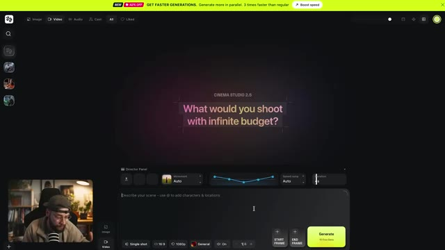
*Interface de Cinema Studio 2.5 montrant le panneau du directeur et la zone de saisie du prompt.*

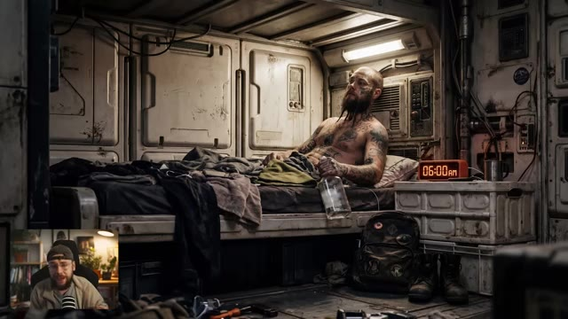
*Aperçu d'un plan généré montrant un homme barbu et tatoué allongé sur un lit dans un espace exigu et futuriste.*

---

### ⏱️ `[00:04:43 - 00:05:20]` | Segment #12

**🔊 Audio (Transcription Intégrale Mot pour Mot en Français) :**
> charognard dans ses quartiers d'habitation donc nous voulons aller de l'avant et télécharger notre image de départ. 6 heures du matin et il est en train de boire et on dirait presque qu'il y est depuis un moment. Son environnement nous en dit aussi long sur son état d'esprit. Parce que l'image fait déjà beaucoup par elle-même, je ne vais même pas entrer de texte de prompt. Je vais simplement utiliser le panneau du réalisateur pour ajouter notre personnage. Vous verrez que cela va descendre dans la section des prompts. Et je vais également ajouter notre emplacement. Donc c'est notre fiche personnage que nous avons faite un peu plus tôt et une image des quartiers d'habitation que j'ai faite avec

**👁️ Analyse Visuelle d'Écran (gemini-3.5-flash-lite) :**
**Interface & Outils** : Interface de l'application de génération vidéo Cinema Studio 2.5, avec incrustation vidéo (PiP) du présentateur en bas à gauche.

**Contenu textuel & Code** : Texte central "What would you shoot with infinite budget?", panneau du réalisateur (Director Panel) en bas avec le tag personnage "Jack_SCAV", options de mouvement "Auto", rampe de vitesse "Slow mo", et bouton "Generate" (10 free gen).

**Action / Démonstration** : Le créateur présente l'image générée du personnage dans son quartier, puis montre l'interface de l'outil avec l'ajout du personnage et de l'emplacement via le panneau du réalisateur.

*Rendu visuel d'un personnage de charognard tatoué et barbu dans ses quartiers exigus, avec incrustation du présentateur en bas à gauche.*

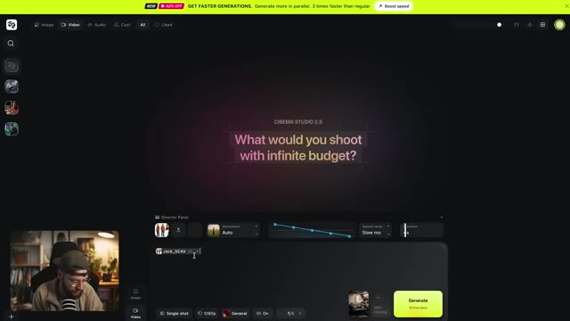
*Interface du logiciel Cinema Studio 2.5 montrant le panneau du réalisateur (Director Panel) et la zone de prompt avec le personnage ajouté.*

---

### ⏱️ `[00:05:20 - 00:05:53]` | Segment #13

**🔊 Audio (Transcription Intégrale Mot pour Mot en Français) :**
> Nano Banana 2. Je vais sélectionner le mouvement de caméra à la main pour donner un style granuleux qui corresponde aux visuels et je vais opter pour une durée de génération d'environ cinq secondes. Je ne vais même rien toucher d'autre. Allons-y et cliquons sur générer. Ça fait exactement ce qu'on recherche. La génération d'images fait en quelque sorte le plus gros du travail ici, mais Cinema 2.5 rend la génération de vidéo vraiment rapide et simple. On va juste rincer et répéter et on obtiendra le

**👁️ Analyse Visuelle d'Écran (gemini-3.5-flash-lite) :**
**Interface & Outils** : Cinema Studio 2.5 (outil de génération vidéo par IA)

**Contenu textuel & Code** : Options de mouvements de caméra (« Camera movement » : Static, Handheld, Zoom Out, Zoom in, Camera follows, Pan left), panneau du directeur (« Director Panel »), bouton « Generate » jaune/vert, et affichage de 4 variations ou plans générés incluant un réveil à 06:00 AM et un personnage tatoué.

**Action / Démonstration** : Le créateur sélectionne un mouvement de caméra à la main (« Handheld ») dans l'interface, règle la durée à 5 secondes et lance la génération vidéo en cliquant sur le bouton « Generate ».

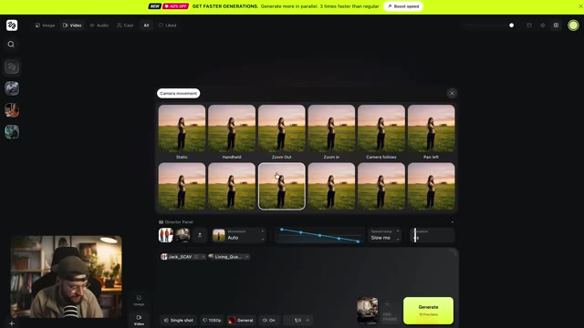
*Interface de Cinema Studio 2.5 montrant le panneau de configuration des mouvements de caméra (« Camera movement ») avec différentes options de plans (Static, Handheld, Zoom Out, etc.).*

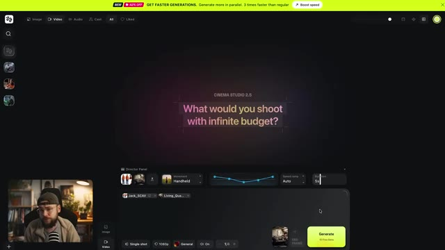
*Interface principale de Cinema Studio 2.5 avec le panneau du directeur (« Director Panel ») affichant la durée de 5 secondes et le bouton vert « Generate ».*

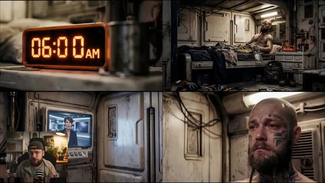
*Affichage en grille de 4 séquences vidéo générées montrant un réveil affichant 06:00 AM, un homme tatoué dans une pièce industrielle, un écran de télévision montrant une présentatrice d'information, et un gros plan du visage de l'homme tatoué.*

---

### ⏱️ `[00:05:53 - 00:06:27]` | Segment #14

**🔊 Audio (Transcription Intégrale Mot pour Mot en Français) :**
> trois plans supplémentaires dont nous avons besoin pour terminer notre première séquence. Ensuite, je veux avoir un aperçu de la routine de notre personnage. Je veux le montrer en train de prendre probablement le petit-déjeuner le plus misérable de tous les temps. Pour ce faire, nous allons sélectionner multi-shot manuel, puis nous pourrons importer notre image de départ de notre personnage à l'intérieur de cette cantine assez horrible. Vous pouvez donc voir que ceci est déjà découpé en plusieurs plans que nous pouvons contrôler individuellement, donc nous allons sélectionner la première scène. Pour notre prompt, je vais simplement dire : l'homme barbu mange la nourriture avec une expression vide.

**👁️ Analyse Visuelle d'Écran (gemini-3.5-flash-lite) :**
**Interface & Outils** : Interface web de génération vidéo par IA avec un panneau de contrôle pour le mode "Multi-shot Manual", des options de sélection de scènes (Scene 1, Scene 2) et un champ de prompt textuel.

**Contenu textuel & Code** : Texte du prompt mentionné à l'oral ("the bearded man eats the food with a vacant expression"), options de paramètres de caméra et de mouvement (Static, Auto), et un bouton vert "Generate".

**Action / Démonstration** : Le créateur montre l'interface de l'outil de génération vidéo et navigue à travers les différents panneaux pour configurer les plans multiples de la séquence.

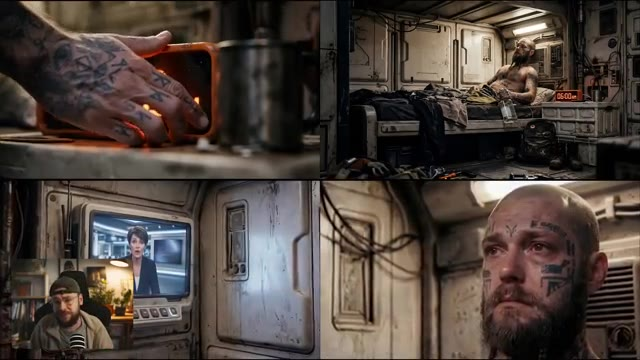
*Montage vidéo à quatre panneaux montrant différentes scènes générées du personnage et une incrustation de Jack dans le coin inférieur gauche.*

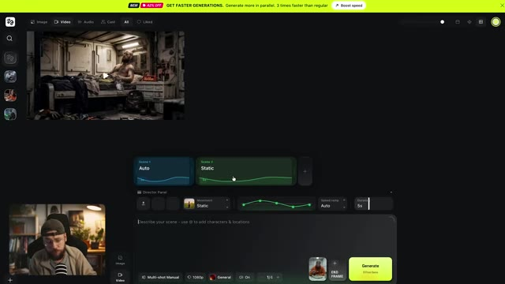
*Interface logicielle de génération vidéo avec un panneau de contrôle à plusieurs plans, des options de mouvement et un bouton "Generate".*

---

### ⏱️ `[00:06:28 - 00:07:03]` | Segment #15

**🔊 Audio (Transcription Intégrale Mot pour Mot en Français) :**
> Nous pouvons continuer dans le panneau du réalisateur et étiqueter notre personnage également, et à la fin je vais simplement taper pas de musique et pas de dialogue juste pour rendre les choses un peu plus faciles lors du montage. Donc la durée de ce plan est déjà de trois secondes, c'est parfait pour ce que nous voulons, mais nous voulons sélectionner le mouvement de caméra à la main car comme je le dis, je veux que ce film ait un style vraiment brut et ce type de mouvement de caméra se prête vraiment à ce genre d'ambiance. Maintenant allons-y et passons à la scène 2 le plan suivant. Pour ce texte d'invite nous allons dire passer à l'homme sur

**👁️ Analyse Visuelle d'Écran (gemini-3.5-flash-lite) :**
**Interface & Outils** : Interface de l'outil de génération vidéo IA (Seedance) avec panneau du réalisateur et incrustation vidéo PiP du créateur en bas à gauche.

**Contenu textuel & Code** : Éléments visibles : "Create new", "Living_Quarters", "Jack_SCAV", "JackNoHat", "KlingREF", "Jack-1". Paramètres de durée réglés sur "3s". Prompt textuel visible : "The bearded man eats the food with a vacant expression @Jack_SCAV no music, no dialogue."

**Action / Démonstration** : Le créateur sélectionne un personnage dans le panneau des éléments pour l'assigner à la scène, puis configure la durée et le type de mouvement de caméra dans le panneau du réalisateur.

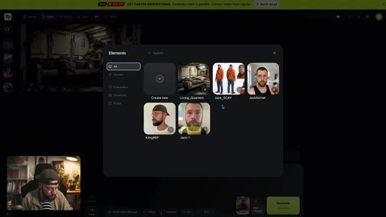
*Fenêtre contextuelle "Elements" affichant les différents personnages et décors disponibles pour le projet.*

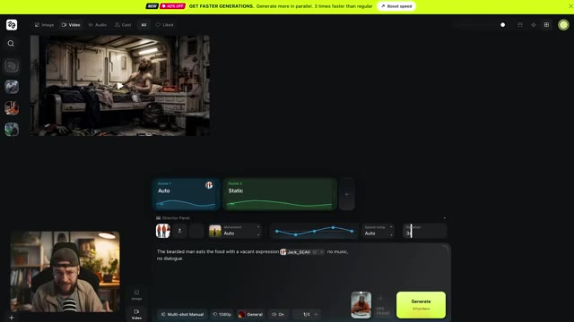
*Panneau du réalisateur avec les paramètres de durée et les options de mouvement de caméra.*

---

### ⏱️ `[00:07:03 - 00:07:32]` | Segment #16

**🔊 Audio (Transcription Intégrale Mot pour Mot en Français) :**
> La gauche parle à l'homme sur sa droite. C'est juste une punition mec, je te le dis. Tout ça arrive pour une raison. L'homme sur la droite hoche la tête. Et maintenant, dans le panneau du réalisateur, je veux aller de l'avant et importer une image. Nous allons utiliser celle-ci et quand nous cliquons sur importer, elle va être étiquetée dans notre prompt. Encore une fois, je vais ajouter "pas de musique" à la fin du prompt et une fois de plus, sélectionnons le mouvement de caméra à main levée pour garder la cohérence pendant toute cette scène.

**👁️ Analyse Visuelle d'Écran (gemini-3.5-flash-lite) :**
**Interface & Outils** : Interface de l'application de génération vidéo (type Luma Dream Machine / Runway ou similaire) avec une fenêtre de retour vidéo en haut à gauche et le panneau du réalisateur (Director Panel) en bas. Le créateur apparaît en incrustation (PiP) dans le coin inférieur gauche.

**Contenu textuel & Code** : Texte visible dans la zone de prompt : "CUT TO: The man on the left is speaking to the man on his right: "This is all a punishment man, I'm telling you. This is all happening for a reason..." the man on the right nods." Bouton "Generate" vert et options de configuration de la caméra (Handheld, Static).

**Action / Démonstration** : Le créateur présente l'interface de génération vidéo, montre le panneau du réalisateur et explique la configuration des mouvements de caméra et du prompt textuel.

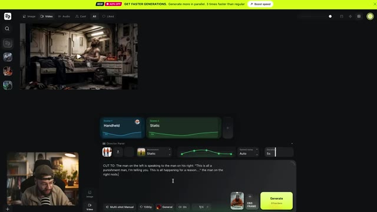
*Interface du logiciel de génération vidéo par IA montrant le panneau du réalisateur avec le prompt textuel et un retour vidéo.*

---

### ⏱️ `[00:07:32 - 00:08:09]` | Segment #17

**🔊 Audio (Transcription Intégrale Mot pour Mot en Français) :**
> Speed ramp, je le laisse toujours sur auto pour cette scène particulière. C'est un peu plus stylisé, on ne veut pas vraiment ça ici, mais je veux m'assurer que la longueur du plan est d'environ quatre secondes. Je pense que cinq pourrait être un tout petit peu trop long. Maintenant, je veux ajouter une dernière scène ici. Je vais la faire durer quatre secondes à nouveau, je pense. Et pour le prompt, nous allons dire l'homme barbu lève les yeux de sa nourriture avec une expression vide. Pas de musique, pas de dialogue encore une fois. Et puis, si on appuie sur alt sur notre clavier, on peut taguer notre personnage à nouveau et c'est vraiment important parce que dans la frame de départ, je regarde en fait loin de la caméra.

**👁️ Analyse Visuelle d'Écran (gemini-3.5-flash-lite) :**
**Interface & Outils** : Interface web de génération vidéo par IA (style storyboard multi-plans avec Director Panel).

**Contenu textuel & Code** : Texte du prompt visible dans le champ de description : « CUT TO: The man on the left is speaking to the man on his right: "This is all a punishment man, I'm telling you. This is all happening for a reason..." the man on the right nods. 🎬 Image 1 🔀 No music. » ; paramètres affichés : Speed ramp : Auto, Durée : 5s, mode Multi-shot Manual, 1080p.

**Action / Démonstration** : Le créateur navigue et démontre l'interface de l'outil, ajustant les paramètres de scène, de durée et de speed ramp, tout en expliquant la configuration des prompts et du cadrage.

*Interface de l'outil de génération vidéo montrant le panneau du réalisateur (Director Panel) avec les scènes, les réglages de mouvement, la vitesse (Speed ramp réglée sur Auto), la durée et le champ de prompt textuel, avec le créateur visible en incrustation (PiP) dans le coin inférieur gauche.*

---

### ⏱️ `[00:08:09 - 00:08:43]` | Segment #18

**🔊 Audio (Transcription Intégrale Mot pour Mot en Français) :**
> et dans le prompt nous demandons à notre personnage de lever les yeux sans faire référence à la fiche de personnage, le modèle vidéo IA ne sait pas à quoi je ressemble sous cet angle. Cela aide donc à verrouiller cette cohérence de personnage. Allons-y et ajoutons notre mouvement de caméra à la main une fois de plus, et nous pouvons aller cliquer sur générer. C'est tout une punition, mec. Je te le dis, tout cela arrive pour une raison. Juste comme ça, nous avons une scène entière avec plusieurs

**👁️ Analyse Visuelle d'Écran (gemini-3.5-flash-lite) :**
**Interface & Outils** : Interface de l'outil de génération vidéo par IA (Seedance) avec panneau de contrôle, paramètres de mouvements de caméra et boîte de prompt textuel.

**Contenu textuel & Code** : Texte du prompt visible dans l'interface : "The bearded man looks up from his food with a vacant expression No music, no dialogue." Paramètres visibles : modes de caméra, durée (4s), résolution 1080p, bouton "Generate".

**Action / Démonstration** : Le créateur montre l'interface de génération vidéo et un exemple de plan généré par IA où le personnage mange puis lève les yeux.

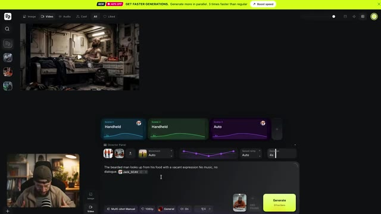
*Interface de l'application de génération vidéo montrant le panneau du réalisateur et un aperçu vidéo en haut à gauche, avec une incrustation vidéo (PiP) du créateur en bas à gauche.*

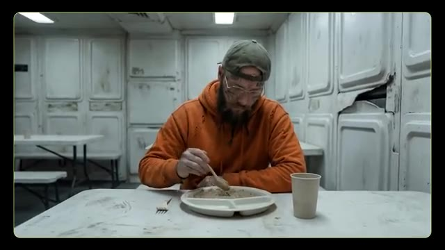
*Gros plan montrant le rendu généré d'un homme barbu en sweat à capuche orange en train de manger à une table dans une pièce de type industriel.*

---

### ⏱️ `[00:08:43 - 00:09:15]` | Segment #19

**🔊 Audio (Transcription Intégrale Mot pour Mot en Français) :**
> plans de coupe, cohérence des personnages et des lieux. Plus important encore, nous faisons un peu plus de construction de monde ici. Les membres de l'équipage suggèrent que la crise de l'infertilité est une sorte de punition divine et notre personnage principal qui a choisi de s'asseoir tout seul lève simplement les yeux vers les membres de l'équipage. Il n'a même pas besoin de parler mais nous pouvons simplement deviner que cette idée de la crise comme punition divine lui pèse. Il en a assez de ce genre de conversation. Cette

**👁️ Analyse Visuelle d'Écran (gemini-3.5-flash-lite) :**
**Interface & Outils** : Présentation vidéo avec incrustation PiP (Picture-in-Picture) de Jack dans le coin inférieur gauche.

**Contenu textuel & Code** : Aucun texte ni interface logicielle visible, uniquement des extraits vidéo générés par intelligence artificielle illustrant la narration.

**Action / Démonstration** : Diffusion d'un plan de coupe illustrant la scène de discussion entre les membres d'équipage dans la cantine, suivi du gros plan sur le regard du personnage principal.

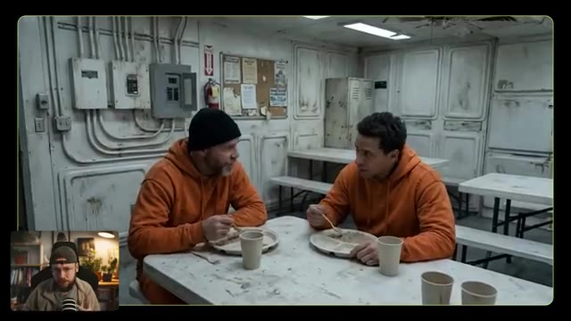
*Extrait vidéo généré par IA montrant deux membres d'équipage en tenue orange attablés dans une cantine de vaisseau spatial délabrée.*

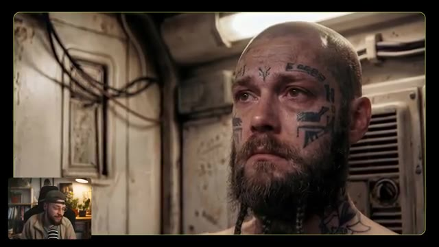
*Gros plan sur le visage tatoué du personnage principal levant les yeux avec lassitude, avec Jack visible en incrustation PiP.*

---

### ⏱️ `[00:09:15 - 00:09:53]` | Segment #20

**🔊 Audio (Transcription Intégrale Mot pour Mot en Français) :**
> ce n'est pas dieu qui punit l'humanité, c'est simplement la réalité brutale du monde ou de l'univers dans lequel vivent ces personnages. Maintenant, nous pouvons utiliser une combinaison de prompts à plan unique et à plans multiples pour développer le reste de notre histoire. Nous montrons davantage la routine du charognard, ce qui manque à sa vie et le paysage stérile qui l'entoure. Et puis nous montrons quelque chose de différent, de nouveau, une rupture dans sa routine. Il est parti à la recherche de fournitures dans son vaisseau et soudain, quelque chose apparaît sur son radar, et cela n'arrive jamais. Il plonge, atterrit et se dirige vers un réseau de grottes pour

**👁️ Analyse Visuelle d'Écran (gemini-3.5-flash-lite) :**
**Interface & Outils** : Présentation face caméra sans partage d'écran

**Contenu textuel & Code** : Aucun texte ni interface logicielle visible (le créateur présente des exemples visuels générés par IA en plein écran avec une incrustation vidéo "Picture-in-Picture" de lui-même en bas à gauche).
[DESC_IMAGE_1] Le créateur commente une image générée montrant un personnage barbu avec des tatouages faciaux dans un intérieur.
[DESC_IMAGE_2] Le créateur parle face caméra dans son studio avec son microphone et une étagère en arrière-plan.
[DESC_IMAGE_3] Le créateur montre une autre illustration générée par IA en gros plan d'un personnage portant des lunettes et des tatouages.
[DESC_IMAGE_4] Le créateur présente une image de synthèse montrant un véhicule sphérique orange futuriste sur un sol désertique et un personnage marchant vers une entrée de grotte.

**Action / Démonstration** : Démonstration pédagogique et présentation du workflow.

---

### ⏱️ `[00:09:53 - 00:10:28]` | Segment #21

**🔊 Audio (Transcription Intégrale Mot pour Mot en Français) :**
> enquêter et là il trouve cette chose qu'il cherchait, l'espoir dont il a besoin. Une fois que tous nos plans sont générés, il s'agit de les importer dans le montage et là nous pouvons jouer avec le timing, les plans de coupe et ajouter des effets sonores supplémentaires et de la musique. Ce sont ces touches finales supplémentaires qui élèvent vraiment tout le projet. Maintenant rappelez-vous qu'il va y avoir beaucoup de mauvaises générations qui n'entreront jamais dans le montage, c'est juste la nature de l'IA. C'est vraiment similaire à être sur un plateau de tournage et que cela prenne une éternité juste pour obtenir cette prise parfaite. Croyez-moi, j'ai

**👁️ Analyse Visuelle d'Écran (gemini-3.5-flash-lite) :**
**Interface & Outils** : Adobe Premiere Pro (logiciel de montage vidéo) avec panneau de projet, timeline multi-pistes, moniteurs source et programme, et fenêtres d'effets.

**Contenu textuel & Code** : Noms des fichiers multimédias dans le chutier ("HF_20260319_211537", "Cinema Studio 2.5"), nom du projet "H.O.P.E Short Film", calques d'effet ("Adjustment Layer"), pistes vidéo (V1 à V5) et audio (A1 à A6).

**Action / Démonstration** : Le créateur montre son processus de montage vidéo sous Adobe Premiere Pro, assemblant les différents plans générés par IA, ajustant le timing et superposant les pistes audio et vidéo.

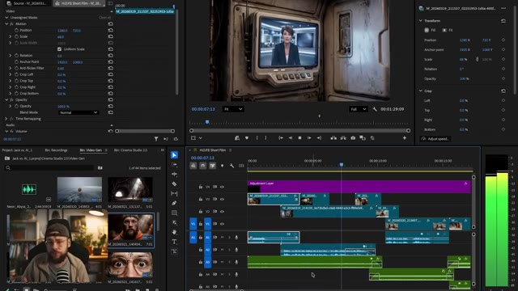
*Interface d'Adobe Premiere Pro montrant la timeline de montage du court-métrage H.O.P.E. avec le panneau de prévisualisation et les pistes audio/vidéo.*

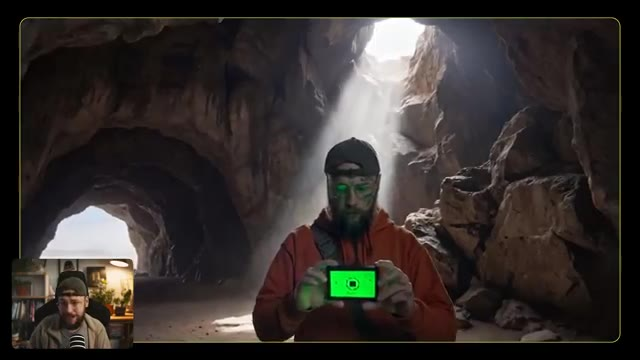
*Séquence vidéo générée montrant un personnage barbu dans une grotte éclairée par la lumière du jour, avec Jack en incrustation (PiP) dans le coin inférieur gauche.*

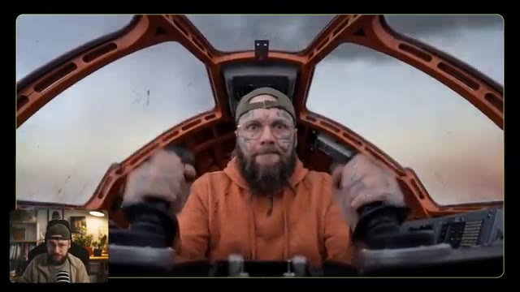
*Séquence vidéo générée montrant un personnage barbu pilotant un vaisseau spatial avec les mains sur les joysticks, avec Jack en incrustation (PiP) dans le coin inférieur gauche.*

---

### ⏱️ `[00:10:28 - 00:11:05]` | Segment #22

**🔊 Audio (Transcription Intégrale Mot pour Mot en Français) :**
> là et cela peut prendre beaucoup plus de temps que l'IA la plupart du temps. Même les générations qui fonctionnent ont des parties où il se passe des choses bizarres. Le montage est l'endroit où nous pouvons être sélectifs et simplement choisir ces moments qui fonctionnent et aident à raconter notre histoire. Cela étant dit les gars, si vous avez la moindre question, assurez-vous de la laisser en bas dans la section commentaires. J'essaie toujours de répondre à autant d'entre eux que possible. Si vous avez apprécié le contenu d'aujourd'hui, assurez-vous de me lâcher un gros pouce bleu. Pensez à vous abonner si vous êtes nouveau et bien sûr activez la cloche de notification pour ne jamais manquer de futures publications. Maintenant, allons visionner le film terminé.

**👁️ Analyse Visuelle d'Écran (gemini-3.5-flash-lite) :**
**Interface & Outils** : Adobe Premiere Pro (logiciel de montage vidéo)

**Contenu textuel & Code** : Timeline de montage avec calques vidéo (V1-V4), pistes audio (A1-A4), panneau d'effets/contrôles de trajectoire, chutier avec vignettes de clips et petit retour caméra de Jack (PiP).

**Action / Démonstration** : Présentation du logiciel de montage Adobe Premiere Pro avec la timeline du film en cours de finalisation.

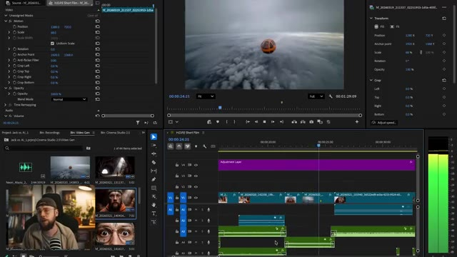
*Interface d'Adobe Premiere Pro montrant la timeline du montage vidéo, le panneau de prévisualisation avec une sphère au-dessus des nuages, et un encadré PiP de Jack dans le panneau de projet en bas à gauche.*

---

### ⏱️ `[00:11:05 - 00:11:21]` | Segment #23

**🔊 Audio (Transcription Intégrale Mot pour Mot en Français) :**
> J'espère que ça te plaît. Depuis plus de trois cycles, pas une seule nouvelle naissance n'a été enregistrée, la cause restant inconnue et aucun remède en vue. C'est un châtiment, mec, je te le dis, tout cela arrive pour une raison.

**👁️ Analyse Visuelle d'Écran (gemini-3.5-flash-lite) :**
**Interface & Outils** : Présentation face caméra sans partage d'écran

**Contenu textuel & Code** : Aucune interface logicielle ou de génération d'IA affichée à l'écran.

**Action / Démonstration** : Le créateur présente une séquence vidéo narrative générée par IA illustrant l'histoire, sans montrer d'outil de travail.

---
