# 🎬 Comment utiliser Kling Motion pour le cinéma IA (ÉPOUSTOUFLANT)

> **Chaîne** : [Jack Vs. AI](https://www.youtube.com/@JackVsAI)  
> **Titre original** : `How to Use Kling Motion for AI Filmmaking (MIND BLOWING)`  
> **Lien YouTube** : [https://www.youtube.com/watch?v=ncD-OSWBWi0](https://www.youtube.com/watch?v=ncD-OSWBWi0)  
> **Date de publication** : 2026-04-03  
> **Durée** : 14m 23s (`863s`)  
> **Identifiant vidéo** : `ncD-OSWBWi0`  
> **Fiche Web Interactive** : [2026-04-03_YT-ncD-OSWBWi0_Comment utiliser Kling Motion pour le cinéma IA (ÉPOUSTOUFLANT)_by-whisper-v3-large-turbo+gemini-3.5-flash-lite.html](2026-04-03_YT-ncD-OSWBWi0_Comment utiliser Kling Motion pour le cinéma IA (ÉPOUSTOUFLANT)_by-whisper-v3-large-turbo+gemini-3.5-flash-lite.html)  
> **Captures de démonstration clés** : `57 captures réelles (anti-talking-head)`  
> **Modèles utilisés** : Audio: `large-v3-turbo` (Faster-Whisper int8 VPS) | Vision: `gemini-3.5-flash-lite` (Google AI Studio API)  

---

## 📌 Synthèse Exécutive & Outils

### 📌 Résumé
La vidéo de Jack Vs. AI met en lumière le potentiel révolutionnaire de **Kling Motion Control** (Kling 3 Motion Control) pour l'industrie du cinéma indépendant et publicitaire, en démocratisant le transfert de mouvement par intelligence artificielle. Cette technologie permet de s'affranchir des contraintes et des coûts exorbitants de la capture de mouvement traditionnelle (mocap) ou de la synthèse d'images 3D complexe (CG). En se passant de consignes textuelles complexes, le créateur fournit directement une vidéo de référence (performance pilote) couplée à une image de départ (générée par IA), offrant ainsi un contrôle total sur le timing, les expressions faciales et le jeu d'acteur, tout en minimisant le gaspillage de crédits de calcul.

Au fil des cas pratiques démontrés — qu'il s'agisse d'animer une créature poilue pour une publicité, de transformer une performance humaine en un chat photoréaliste habillé, ou d'animer un personnage d'elfe dans un décor fantastique —, Jack détaille un flux de travail fluide et rigoureux. Il intègre des plateformes comme Artlist, des générateurs d'images de pointe et des logiciels de retouche pour optimiser chaque étape de production. L'analyse démontre non seulement la puissance de Kling pour mapper avec précision les mouvements complexes (yeux, nez, bouche, vêtements), mais aussi ses limites actuelles, notamment la gestion des arrière-plans immobiles ou les mouvements en plan large, ouvrant la voie à des solutions de contournement créatives par composition d'éléments.

Cette approche avant-gardiste redéfinit les standards de la production vidéo assistée par IA, permettant aux créateurs de générer des séquences hautement personnalisées et crédibles en quelques minutes. En combinant des sources visuelles de qualité et des techniques de retouche ciblées, les cinéastes peuvent désormais insuffler une vie organique et émotionnelle à des personnages fantastiques ou animaliers, ouvrant des perspectives immenses pour le storytelling visuel et la création de contenus publicitaires à moindre coût.

### 🛠️ Outils, Modèles & Logiciels Présentés
* **Kling (et Kling Motion / Kling 3 Motion Control)** : Modèle d'intelligence artificielle principal utilisé pour le transfert de mouvement vidéo à vidéo, permettant de mapper la performance d'une vidéo pilote sur une image de départ fixe.
* **Kling 3 (Version standard)** : Modèle d'IA utilisé pour générer des mouvements d'arrière-plan textuels indépendants (comme des rivières de lave ou des paysages dynamiques).
* **Nano Banana (et Nano Banana 2)** : Outil de génération d'images et d'édition intelligente employé pour créer les cadres de départ (personnages, créatures, décors) et nettoyer ou modifier des éléments visuels précis.
* **Artlist** : Plateforme de flux de travail vidéo intégrant les outils de pointe et hébergeant les sessions de génération Kling Motion Control.
* **Photoshop** : Logiciel de retouche d'image utilisé pour nettoyer manuellement les plans et supprimer les éléments indésirables en arrière-plan.
* **Premiere Pro** : Logiciel de montage vidéo mentionné pour l'assemblage et la post-production des séquences.
* **Topaz** : Logiciel d'amélioration et de mise à l'échelle (upscaling) pour optimiser la résolution et la netteté des rendus finaux.

### 🔑 Points Clés & Enseignements Stratégiques
* **Suppression des prompts textuels complexes** : Le succès du transfert de mouvement repose sur l'image et la vidéo pilote, rendant les instructions textuelles superflues pour la génération du mouvement lui-même.
* **Règle du acteur unique** : Ne présenter qu'un seul acteur par plan source pour éviter les interférences et garantir un mapping facial et corporel propre.
* **Gestion des obstructions** : S'assurer qu'aucun accessoire ou autre acteur ne bloque le visage ou les membres de l'acteur dans la vidéo de référence.
* **Cohérence du cadrage** : Faire correspondre le cadrage et l'orientation de la vidéo pilote avec l'image cible pour optimiser la crédibilité du résultat final.
* **Maîtrise de l'éclairage** : Opter pour un éclairage uniforme et de bonne qualité sur les sources, en évitant les ombres dures qui perturbent l'interprétation par l'IA.
* **Simplification des décors et costumes** : Privilégier des arrière-plans neutres et des vêtements simples pour focaliser l'algorithme sur le sujet principal.
* **Vitesse de mouvement modérée** : Préférer une vitesse de mouvement mesurée à des actions ultra-rapides pour éviter les artefacts de flou cinétique.
* **Impact du cadrage sur les dialogues** : Pour les plans parlés, privilégier des plans serrés (moyens ou gros plans) afin que les mouvements de la bouche soient suffisamment définis pour un rendu réaliste.
* **Gestion des objets au premier plan** : Kling gère efficacement les objets solides (comme une épée), comprenant qu'ils ne doivent pas subir de déformations fluides.
* **Résolution et durée** : Le système permet de générer jusqu'à 30 secondes de vidéo avec une résolution atteignant 1080p.
* **Contournisation des arrière-plans statiques** : Pour pallier le manque de dynamisme des arrière-plans générés par Kling Motion, une astuce consiste à dissocier le personnage du décor, à animer l'arrière-plan séparément avec Kling 3 standard, puis à recomposer le tout.

---

## ⏱️ Chronologie & Transcription Complète Audio & Visuelle (Mot pour Mot)

### ⏱️ `[00:00:00 - 00:00:35]` | Segment #01

**🔊 Audio (Transcription Intégrale Mot pour Mot en Français) :**
> Je m'amuse avec Kling Motion depuis un moment maintenant et vous pouvez vraiment créer des trucs de fou. C'est là qu'on importe une vidéo de référence et qu'on demande à Kling d'appliquer cette performance sur quelque chose de complètement différent. On utilise essentiellement l'intelligence artificielle pour remplacer la capture de mouvement traditionnelle qui est bien sûr incroyablement coûteuse. Ce qui est génial avec ce flux de travail, c'est qu'on laisse très peu de place au hasard. On ne donne pas de consignes textuelles à l'IA, on lui montre exactement ce qu'on veut générer. Cela signifie un meilleur contrôle en termes de timing et de performance et par conséquent, moins de crédits gaspillés et qui n'en veut pas

**👁️ Analyse Visuelle d'Écran (gemini-3.5-flash-lite) :**
**Interface & Outils** : Interface de démonstration vidéo Kling Motion montrant un comparatif visuel (vidéo source et résultat généré).

**Contenu textuel & Code** : Texte affiché à l'écran : "We are not prompting the AI..." et superposition d'une petite vignette vidéo en haut à gauche montrant le visage d'une femme pleurant, mappée sur un personnage de science-fiction à la peau violette.

**Action / Démonstration** : Visualisation du résultat de la génération par IA montrant le transfert de la performance faciale de la vidéo de référence vers le personnage généré.

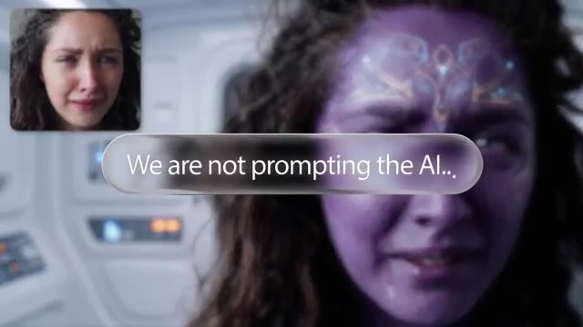
*Démonstration du transfert de mouvement Kling Motion avec une vidéo de référence incrustée en haut à gauche et le personnage généré en violet à l'écran.*

---

### ⏱️ `[00:00:35 - 00:00:54]` | Segment #02

**🔊 Audio (Transcription Intégrale Mot pour Mot en Français) :**
> J'adore ça. Aujourd'hui, je vais vous enseigner le flux de travail et tout ce que j'ai appris en chemin, et nous ferons quelques tests pour voir jusqu'où nous pouvons pousser ces outils. Si vous aimez cette vidéo, assurez-vous de laisser un pouce bleu pour moi, pensez à vous abonner et, bien sûr, à activer cette cloche de notification. Très bien, entrons dans le vif du sujet. La première chose que nous devons faire est de penser à notre séquence d'images source.

**👁️ Analyse Visuelle d'Écran (gemini-3.5-flash-lite) :**
**Interface & Outils** : Interface utilisateur d'une plateforme de génération de vidéo par IA présentant un catalogue de modèles (Veo 3.1, Kling 3.0, Kling O3, Grok Imagine, Sora 2 Pro) sous forme de grille avec des étiquettes de tags techniques.

**Contenu textuel & Code** : Texte affiché : "WORK FLOW", noms des modèles d'IA (Veo 3.1, Kling 3.0, Grok Imagine, Sora 2 Pro), descriptions et tags de fonctionnalités (Start/End Frame, Audio, 4K, 8 sec, 1080p, 15 sec, Video Input, 30 sec). Un encadré à gauche montre une illustration style anime d'un personnage touchant son ventre.

**Action / Démonstration** : Visualisation d'une interface de sélection de modèles d'IA pour le flux de travail vidéo, avec un curseur de souris pointant sur l'option "Kling 3.0 Motion Control".

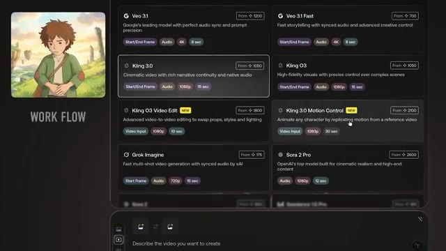
*Interface d'une application ou plateforme de génération vidéo par IA montrant divers modèles disponibles (Veo 3.1, Kling 3.0, Grok Imagine, Sora 2 Pro) avec des options de configuration, un aperçu d'animation style Ghibli à gauche et le texte "WORK FLOW".*

---

### ⏱️ `[00:00:54 - 00:01:15]` | Segment #03

**🔊 Audio (Transcription Intégrale Mot pour Mot en Français) :**
> Si nos performances de pilotage sont mauvaises, alors notre génération va être nulle. C'est simple. Il y a six règles d'or que vous devez appliquer lors de la recherche de vos images sources. Cela semble beaucoup, mais la plupart relèvent du bon sens. Premièrement, ne présentez qu'un seul acteur par plan. Ne laissez pas des accessoires ou d'autres acteurs bloquer le visage ou les membres de l'acteur.

**👁️ Analyse Visuelle d'Écran (gemini-3.5-flash-lite) :**
**Interface & Outils** : Présentation vidéo avec incrustations graphiques explicatives et illustrations pédagogiques.

**Contenu textuel & Code** : Texte affiché : "FIRST JOB: THINK ABOUT INPUT FOOTAGE", "POOR DRIVER FOOTAGE", "DO NOT BLOCK THE PERFORMER", ainsi qu'une coche verte et une croix rouge sur les exemples de mannequins.

**Action / Démonstration** : Le créateur présente visuellement des exemples de bonnes et mauvaises pratiques pour les images sources à travers des schémas et des illustrations.

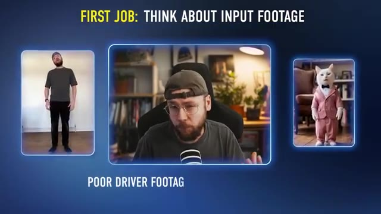
*Graphique explicatif montrant Jack au centre avec des exemples de mauvaises images de référence ("poor driver footage") de chaque côté.*

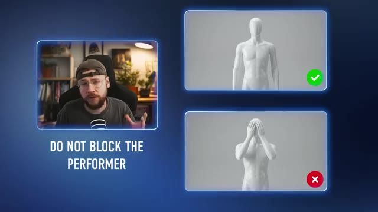
*Illustration schématique avec Jack à gauche et deux exemples de mannequins montrant les bonnes (coche verte) et mauvaises (croix rouge) pratiques pour ne pas bloquer l'acteur.*

---

### ⏱️ `[00:01:15 - 00:01:49]` | Segment #04

**🔊 Audio (Transcription Intégrale Mot pour Mot en Français) :**
> Assurez-vous de faire correspondre le cadrage et l'orientation de l'image cible du mieux que vous pouvez. Optez pour un bon éclairage uniforme sans ombres dures. Ayez des arrière-plans et des vêtements simples et enfin préférez une vitesse modérée à un mouvement ultra rapide. J'ai déjà préparé une belle sélection de séquences d'entrée et toute une charge de cadres de départ intéressants faits avec nano banana 2 alors regardons comment générer nos vidéos pour faire cela nous sommes sur artlist qui vient juste d'ajouter des flux de travail vidéo à vidéo sur la plateforme ce qui inclut bien sûr

**👁️ Analyse Visuelle d'Écran (gemini-3.5-flash-lite) :**
**Interface & Outils** : Interface web d'Artlist (AI Toolkit) avec incrustation vidéo du créateur (Picture-in-Picture).

**Contenu textuel & Code** : Texte à l'écran : "MATCH THE FRAMING AND ORIENTATION" (Image 1), "USE MODERATE" (Image 2), et sur l'interface Artlist (Image 4) : "Start creating with the AI Toolkit", "AI Image", "AI Video", "AI Music", "AI Voiceover", "Lyria 3 Pro", "Nano Banana 2", "Kling 3.0 Motion Control".

**Action / Démonstration** : Le créateur présente visuellement des conseils de cadrage et de vitesse de mouvement via des exemples animés, puis bascule sur la navigation de la plateforme Artlist pour montrer les flux de travail vidéo à vidéo.

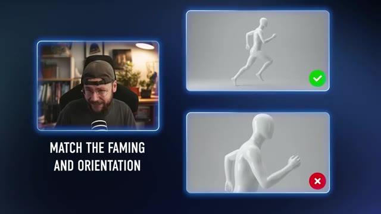
*L'écran montre deux exemples de mannequins 3D pour illustrer le cadrage et l'orientation corrects (avec une coche verte) et incorrects (avec une croix rouge).*

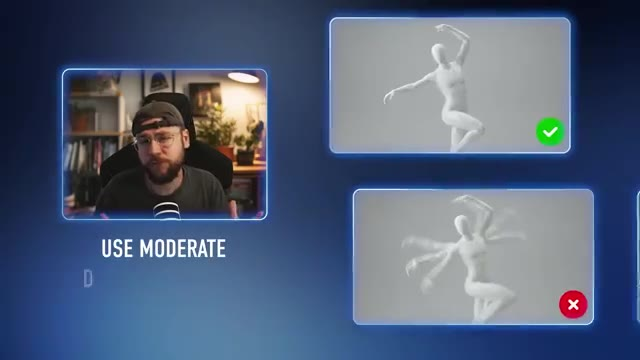
*L'écran montre deux exemples de mouvements de danse de mannequins 3D pour illustrer une vitesse de mouvement modérée (coche verte) par rapport à un mouvement trop rapide ou chaotique (croix rouge).*

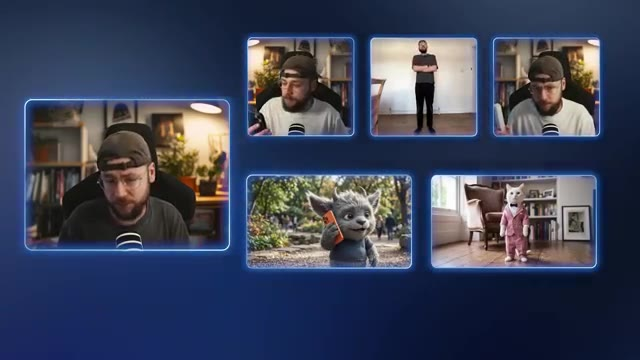
*L'écran montre une sélection d'extraits vidéo d'entrée et de cadres de départ générés, incluant un monstre gris au téléphone et un chat humanoïde en costume.*

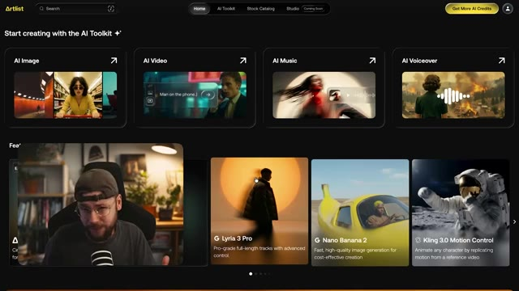
*L'interface web de la plateforme Artlist affichant les différents outils d'intelligence artificielle disponibles (AI Image, AI Video, AI Music, AI Voiceover) et des modèles comme Lyria 3 Pro, Nano Banana 2 et Kling 3.0 Motion Control.*

---

### ⏱️ `[00:01:49 - 00:02:26]` | Segment #05

**🔊 Audio (Transcription Intégrale Mot pour Mot en Français) :**
> mouvement de pince. Donc pour commencer, nous allons vouloir aller sur leur boîte à outils d'IA, et ensuite nous pouvons créer une nouvelle session pour garder tous nos éléments bien organisés. Une fois ici, nous voulons nous assurer que l'onglet vidéo est sélectionné et pour le modèle, nous voulons sélectionner Kling 3 motion control. Vous pouvez voir que nous avons cette zone pour télécharger notre image, donc c'est ici que nous pouvons déposer l'une des images de départ que nous avons faites avec Nano Banana 2. Et sur le côté droit, nous pouvons télécharger notre source vidéo et nous pouvons générer jusqu'à 30 secondes de vidéo avec une résolution allant jusqu'à 1080p. Pour commencer

**👁️ Analyse Visuelle d'Écran (gemini-3.5-flash-lite) :**
**Interface & Outils** : Interface web d'Artlist (AI Toolkit) avec la boîte à outils de génération et l'onglet vidéo.

**Contenu textuel & Code** : Texte affiché : "Start creating with the AI Toolkit", "Featured AI models", "Lyria 3 Pro", "Nano Banana 2", "Kling 3.0 Motion Control", "UPLOAD IMAGE: DROP IN STARTING FRAME MADE IN NANO BANANA 2".

**Action / Démonstration** : Le créateur navigue dans l'interface de la boîte à outils d'IA, sélectionne l'onglet vidéo et le modèle Kling 3.0 Motion Control pour importer une image de départ.

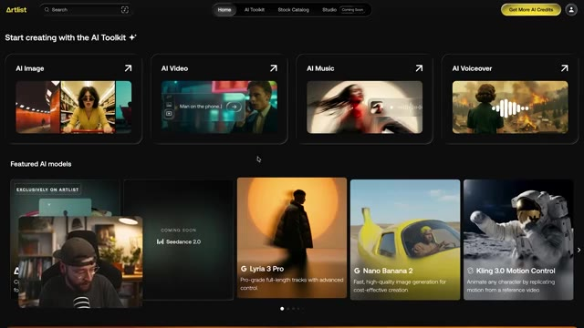
*Interface de la boîte à outils d'IA d'Artlist montrant les différentes options de création et les modèles vedettes.*

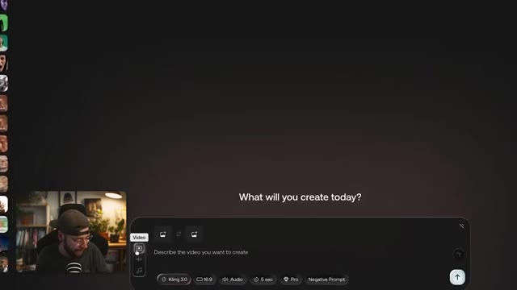
*Interface de génération vidéo avec le panneau de sélection des options et le modèle Kling 3.0 sélectionné.*

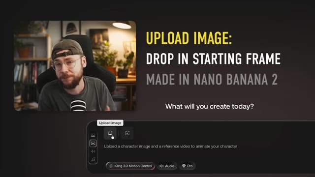
*Interface de téléchargement d'image avec superposition graphique explicative pour déposer l'image de départ.*

---

### ⏱️ `[00:02:26 - 00:03:07]` | Segment #06

**🔊 Audio (Transcription Intégrale Mot pour Mot en Français) :**
> Je veux jeter un œil à l'application de notre performance sur un personnage animé. Nous avons créé cette créature poilue qui marche dans le parc et parle au téléphone. Vous pourriez imaginer que le cas d'usage ici pourrait être une publicité pour iPhone par exemple. Nous devons entrer une sorte de texte indicatif donc je vais juste insérer quelque chose de très générique ici mais pour autant que je sache, cela n'influence en réalité pas du tout la génération. Et avec notre image de départ et notre vidéo pilote téléchargées, nous pouvons passer à l'action et cliquer sur générer. Hé, j'appelais juste pour prendre des nouvelles. Oh d'accord, je suppose que je vais euh je vais te parler bientôt.

**👁️ Analyse Visuelle d'Écran (gemini-3.5-flash-lite) :**
**Interface & Outils** : Interface de l'outil de génération vidéo Kling 3.0 Motion Control, avec options de prompt textuel et importation d'image/vidéo.

**Contenu textuel & Code** : Texte à l'écran : "FIRST STEP: APPLY OUR PERFORMANCE TO ANIMATED CHARACTERS", "What will you create today?", et dans le champ de prompt : "Animated movie.". Boutons visibles : "Kling 3.0 Motion Control", "Audio", "Pro".

**Action / Démonstration** : Le créateur montre l'interface de Kling 3.0, saisit un prompt textuel générique, importe une image de départ et une vidéo de référence, puis lance la génération pour animer la créature.

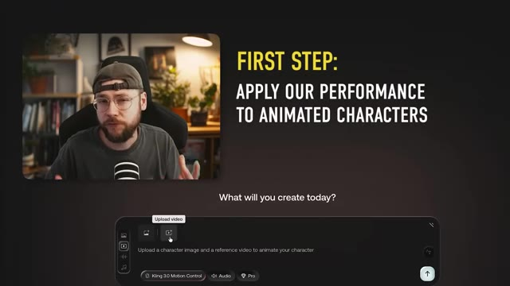
*Interface de Kling 3.0 Motion Control avec les étapes pour appliquer la performance à un personnage animé.*

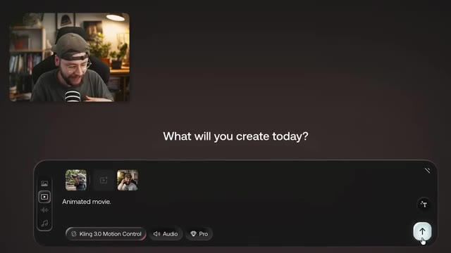
*Interface de Kling 3.0 montrant le prompt textuel générique 'Animated movie' et les fichiers importés.*

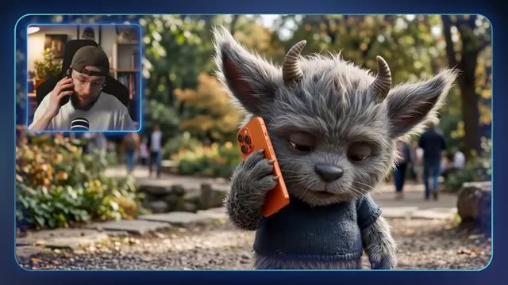
*Rendu vidéo de la créature poilue aux petites cornes marchant dans le parc en téléphonant, avec Jack en incrustation vidéo (PiP) dans le coin supérieur gauche.*

---

### ⏱️ `[00:03:07 - 00:03:40]` | Segment #07

**🔊 Audio (Transcription Intégrale Mot pour Mot en Français) :**
> Je pense que ce résultat est vraiment impressionnant. L'expression faciale et l'émotion transparaissent vraiment malgré mon jeu d'acteur plutôt terrible. Ce que vous remarquerez cependant, c'est que le mouvement des personnages en arrière-plan est un peu étrange. Une option ici serait de supprimer ces personnages en utilisant Photoshop ou nous pourrions tout simplement aller modifier notre prompt dans Nano Banana 2 pour qu'il soit plus clair que nous voulons seulement notre personnage principal dans le plan. Si nous régénérons avec notre image nettoyée, nous obtenons un résultat comme

**👁️ Analyse Visuelle d'Écran (gemini-3.5-flash-lite) :**
**Interface & Outils** : Présentation face caméra sans partage d'écran

**Contenu textuel & Code** : Aucun contenu logiciel ou interface affiché, uniquement Jack dans son studio avec une étagère en arrière-plan.

**Action / Démonstration** : Jack s'exprime face caméra en plan rapproché buste dans son studio.

---

### ⏱️ `[00:03:40 - 00:04:14]` | Segment #08

**🔊 Audio (Transcription Intégrale Mot pour Mot en Français) :**
> ce. Maintenant je veux voir quels résultats nous pouvons obtenir en prenant notre performance humaine et en l'appliquant à une image photoréaliste d'un animal. Nous nous intéressons donc vraiment à la façon dont Plink peut mapper le mouvement des yeux, du nez et de la bouche sur le chat. Les animaux photoréalistes qui jouent ou qui parlent sont très présents dans les publicités télévisées. Et faire cela traditionnellement coûte très cher car cela nécessite de la synthèse d'images (CG). Il faut souvent filmer le nouvel animal pour de vrai puis faire ce qu'on appelle un remplacement de museau (muzzle replacement). Et parfois le

**👁️ Analyse Visuelle d'Écran (gemini-3.5-flash-lite) :**
**Interface & Outils** : Kling 3.0 Motion Control et interface de montage vidéo avec incrustation PiP (Picture-in-Picture) du présentateur.

**Contenu textuel & Code** : Texte à l'écran : "SECOND STEP:", "What will you create today?", "Kling 3.0 Motion Control", "Audio", "Pro", ainsi que "OFTEN REQUIRES FILMING THE ANIMAL".

**Action / Démonstration** : Le présentateur explique les étapes de contrôle de mouvement sur une image de chat tout en montrant l'interface de Kling 3.0, puis illustre le processus de modélisation 3D d'un animal avec un maillage (wireframe).

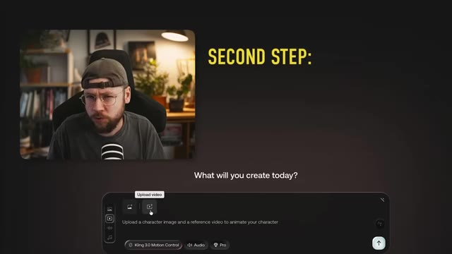
*Interface de l'outil Kling 3.0 Motion Control avec incrustation PiP du créateur.*

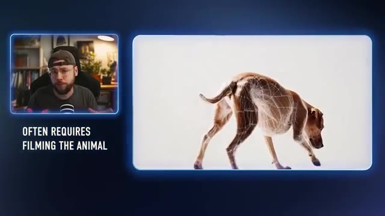
*Animation montrant un chien en image de synthèse avec un maillage 3D (wireframe) et incrustation PiP du créateur.*

---

### ⏱️ `[00:04:14 - 00:04:50]` | Segment #09

**🔊 Audio (Transcription Intégrale Mot pour Mot en Français) :**
> l'animal entier doit être un atout 3D. Mais allons-y et déposons cette image ici de notre chat portant un très beau costume. Et nous avons notre vidéo de pilotage de moi en train de parler. Allons-y et cliquons sur générer et voyons comment Kling aborde cela. Voyons à quel point ce transfert de mouvement fonctionne bien sur un personnage animal. Est-ce que cela a l'air et se sent convaincant ? Un autre résultat impressionnant ici. Il y a une belle quantité d'expression qui passe. Le mouvement de la bouche semble plutôt bien synchronisé. Tout a l'air plutôt soigné. Même ce mouvement du haut du corps est bien appliqué aux bras du chat,

**👁️ Analyse Visuelle d'Écran (gemini-3.5-flash-lite) :**
**Interface & Outils** : Interface de l'outil de génération vidéo Kling avec panneau de contrôle des mouvements (Motion Control) et champ de prompt textuel.

**Contenu textuel & Code** : Texte du prompt "Animated movie.", options "Kling 3.0 Motion Control", "Audio", "Pro", et vignettes d'importation d'images/vidéos.

**Action / Démonstration** : Le créateur importe l'image du chat en costume et sa propre vidéo de référence pour tester le transfert de mouvement et lance la génération.

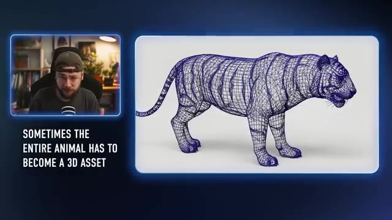
*Modèle 3D filaire d'un tigre montrant l'animal entier converti en asset 3D.*

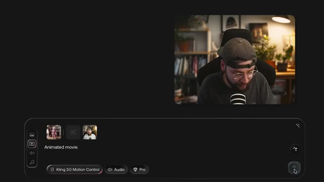
*Interface de Kling 3.0 Motion Control montrant les options de génération avec l'image du chat en costume et la vidéo de référence.*

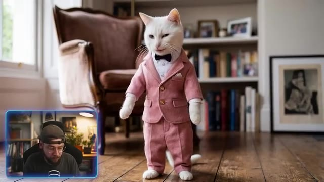
*Résultat généré montrant un chat blanc bipède vêtu d'un élégant costume rose avec un nœud papillon dans un salon.*

---

### ⏱️ `[00:04:50 - 00:05:28]` | Segment #10

**🔊 Audio (Transcription Intégrale Mot pour Mot en Français) :**
> torse et les jambes. Maintenant, j'ai aussi essayé un plan en pied qui a été filmé sur mon iPhone. L'idée étant que le cadrage serait plus proche de la génération Nano Banana 2. Et bien que le mouvement des bras ait été très bien transféré, comme ma bouche était évidemment assez petite dans le cadre, le rendu de la parole n'est tout simplement pas très beau. Donc, si vous pouvez l'éviter, essayez de prioriser la parole en cadrant plus serré avec votre vidéo de référence ou le mouvement en filmant un plan moyen ou large. Jetons également un coup d'œil à ce personnage d'elfe debout dans une forêt. Vous pouvez imaginer cela faisant partie d'un film fantastique.

**👁️ Analyse Visuelle d'Écran (gemini-3.5-flash-lite) :**
**Interface & Outils** : Présentation vidéo intégrée avec comparatif visuel (split-screen / incrustation PiP) montrant le sujet réel à gauche et le résultat généré à droite, ainsi que le créateur en bas au centre.

**Contenu textuel & Code** : Vidéo comparative illustrant un plan en pied d'un homme et son rendu de chat anthropomorphe en costume élégant rose et nœud papillon.

**Action / Démonstration** : Le créateur présente visuellement un exemple de plan large comparant la source filmée à l'iPhone et le résultat généré par IA.

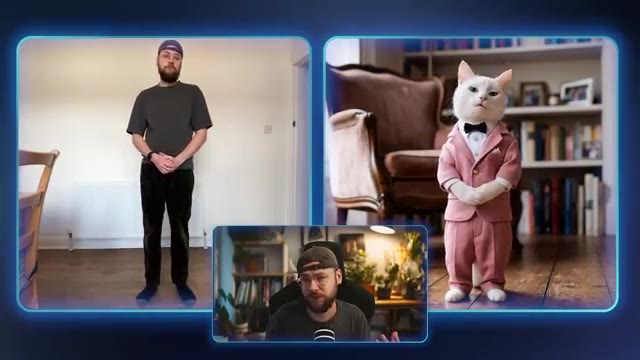
*Démonstration à l'écran montrant à gauche la vidéo de référence filmée à l'iPhone en plan large, et à droite le résultat généré sous forme de chat humanoïde en costume rose.*

---

### ⏱️ `[00:05:28 - 00:06:03]` | Segment #11

**🔊 Audio (Transcription Intégrale Mot pour Mot en Français) :**
> Avec l'enregistrement, je tenais ce morceau de petite lumière et je faisais un peu semblant que c'était le bâton, mais je veux vraiment me concentrer sur les mouvements subtils du visage et voir à quel point ça se retranscrit bien. Alors allons-y et cliquons sur générer. Quelque chose arrive. Nous devons y aller. Encore un assez super résultat pour être honnête. J'adore la façon dont mes mouvements de tête font bouger les cheveux de l'elfe, le collier et la cape d'une manière très spécifique. Ce que j'aime aussi, c'est

**👁️ Analyse Visuelle d'Écran (gemini-3.5-flash-lite) :**
**Interface & Outils** : Présentation face caméra sans partage d'écran

**Contenu textuel & Code** : Aucun contenu textuel ou interface logicielle visible à l'écran, uniquement Jack dans son studio avec un micro et un décor d'étagères et de plantes.

**Action / Démonstration** : Jack s'adresse directement à la caméra en expliquant son processus de test sur les mouvements faciaux et la génération vidéo par IA.

---

### ⏱️ `[00:06:03 - 00:06:30]` | Segment #12

**🔊 Audio (Transcription Intégrale Mot pour Mot en Français) :**
> que Kling comprend que l'épée est un élément de premier plan solide. Donc il n'essaie pas par erreur d'appliquer un quelconque mouvement de fluide à cet objet. Je ne suis pas très sûr pourquoi notre bâton fume en quelque sorte. Il y a une sorte de truc de vapeur qui en sort pour une raison quelconque. Mais c'est quand même un autre exemple vraiment impressionnant de transfert de mouvement par IA. Ensuite, je veux prendre notre personnage animé ici dans ce plan en pied.

**👁️ Analyse Visuelle d'Écran (gemini-3.5-flash-lite) :**
**Interface & Outils** : Interface web d'Artlist (galerie de créations et sélection d'images générées par IA).

**Contenu textuel & Code** : Texte « Choose from Your Creations » dans la fenêtre modale avec plusieurs vignettes de personnages générés par IA (un samouraï, un homme dans un paysage volcanique, un personnage animé dans la neige, une créature pelucheuse).

**Action / Démonstration** : Le créateur montre un exemple de vidéo générée par Kling avec un personnage elfe, puis navigue dans l'interface d'Artlist pour sélectionner un personnage animé en pied en vue de la prochaine étape de démonstration du transfert de mouvement.

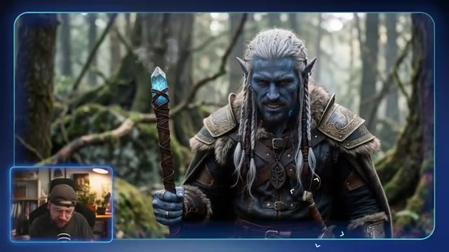
*Rendu vidéo d'un personnage elfe à la peau bleue tenant un bâton magique dans une forêt, avec le présentateur en médaillon PiP en bas à gauche.*

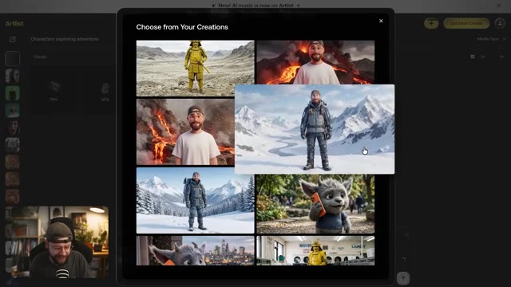
*Interface de la plateforme Artlist affichant une galerie de créations avec une fenêtre modale « Choose from Your Creations » et le présentateur en médaillon PiP.*

---

### ⏱️ `[00:06:30 - 00:07:14]` | Segment #13

**🔊 Audio (Transcription Intégrale Mot pour Mot en Français) :**
> Et pour la vidéo de référence, nous partons sur cette rotation complète du corps. Ce qui va être intéressant ici, c'est que Kling va devoir inventer à quoi ressemble le dos de notre personnage, car il n'a aucune référence ou contexte pour cette vue arrière de notre personnage. Tout ce qu'il a, c'est la frame de départ. Est-ce qu'il va réussir son coup ou est-ce que tout va s'effondrer ? Je veux aussi ajouter un prompt textuel très simple. Nous allons juste dire une douce chute de neige pour voir si cela influence notre génération. Allons-y et envoyons ceci également. Bien que ce résultat soit vraiment impressionnant une fois de plus,

**👁️ Analyse Visuelle d'Écran (gemini-3.5-flash-lite) :**
**Interface & Outils** : Interface de l'outil Kling (v3.0 Motion Control) avec zone de saisie de prompt, boutons d'options (Audio, Pro) et vignettes de prévisualisation multimédia.

**Contenu textuel & Code** : Texte du prompt visible : « Animated movie. » (Image 1) puis « Gentle falling snow. » (Image 3). Options sélectionnées : « Kling 3.0 Motion Control », « Audio », « Pro ».

**Action / Démonstration** : Le créateur montre l'interface de l'outil de génération IA en incrustation, puis tape et modifie le prompt textuel pour ajouter l'effet de neige.

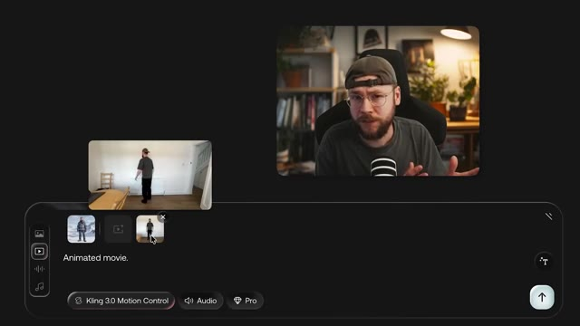
*Interface de l'outil de génération vidéo avec une fenêtre PiP montrant le créateur et un aperçu vidéo de rotation corporelle.*

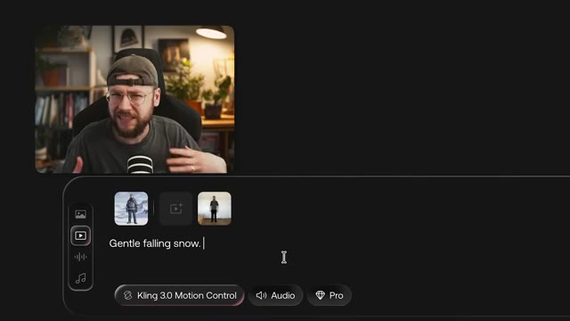
*Interface de l'outil montrant le prompt textuel « Gentle falling snow. » avec les vignettes de référence et le créateur en incrustation PiP.*

---

### ⏱️ `[00:07:14 - 00:07:50]` | Segment #14

**🔊 Audio (Transcription Intégrale Mot pour Mot en Français) :**
> Vous allez commencer à remarquer l'un des pièges de Kling motion, c'est que l'arrière-plan a l'air vraiment sans vie. La neige n'est pas animée malgré nos invites textuelles, mais je veux expérimenter ici avec une solution de contournement pour une idée que j'ai eue afin de résoudre ce problème. J'ai donc créé cette nouvelle image ici. Et ce que nous allons faire, c'est cliquer sur l'onglet d'édition pour que je puisse utiliser Nano Banana 2 afin d'apporter un changement ici. Pour l'invite textuelle, nous allons dire de retirer l'homme de l'image, mais de préserver tous les autres détails. Nous voulons nous assurer que nous générons également en résolution 4K.

**👁️ Analyse Visuelle d'Écran (gemini-3.5-flash-lite) :**
**Interface & Outils** : Interface logicielle de génération d'image/vidéo IA incluant le modèle Nano Banana 2 et un affichage en incrustation (PiP) du créateur.

**Contenu textuel & Code** : Texte du prompt visible dans la boîte de dialogue : "Remove the man from the image. Preserve all other details." Paramètres visibles : "Nano Banana 2", rapport d'aspect "16:9", résolution "2K", "1 Image".

**Action / Démonstration** : Le créateur montre l'interface de l'outil d'IA et le prompt textuel saisi pour modifier l'image en retirant le personnage.

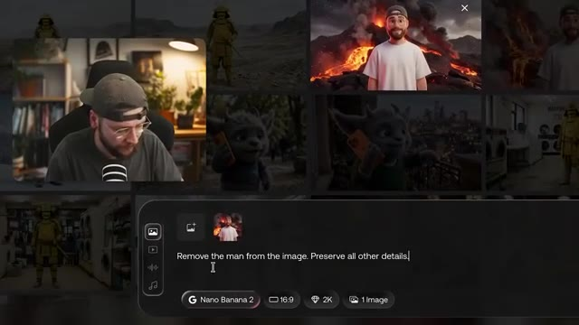
*Interface de l'outil d'IA avec affichage de vignettes d'images générées, d'une petite fenêtre PiP de Jack et d'une boîte de dialogue de prompt avec le modèle Nano Banana 2.*

---

### ⏱️ `[00:07:50 - 00:08:25]` | Segment #15

**🔊 Audio (Transcription Intégrale Mot pour Mot en Français) :**
> Bien sûr. Nous avons donc notre génération Nano Banana 2 ici. Nous voulons maintenant cliquer sur l'onglet de génération de vidéo. Et je vais aller insérer ce prompt ici. Caméra fixe, rivières de lave qui coulent, vapeur et fumée s'élevant dans le ciel et tisons flottants. Faux lieu, paysage fictif, pas de musique, pas de dialogue. Et ici nous allons utiliser Kling 3, juste la version standard pour générer notre vidéo d'arrière-plan. J'ai donc cette génération de mouvement Kling de moi en train de parler, mais comme vous pouvez le voir, elle a toujours cet arrière-plan sans vie.

**👁️ Analyse Visuelle d'Écran (gemini-3.5-flash-lite) :**
**Interface & Outils** : Interface web d'Artlist, panneau de génération de prompt, menu de sélection des modèles d'IA (Kling 3.0, Veo 3.1, etc.) et lecteur vidéo QuickTime.

**Contenu textuel & Code** : Prompt texte : "Static camera, lava rivers flowing, steam and smoke billowing into the sky and embers floating. Fake location, fictional landscape, no music, no dialogue." Paramètres : Nano Banana 2, modèle Kling 3.0, format 16:9, qualité 4K.

**Action / Démonstration** : Le créateur montre l'interface d'Artlist, sélectionne l'onglet de génération vidéo, saisit le prompt pour le décor volcanique, choisit le modèle Kling 3.0 et présente le résultat final de l'animation.

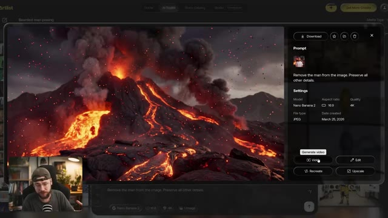
*Interface d'Artlist montrant l'image générée d'un volcan avec des rivières de lave et les options de génération vidéo.*

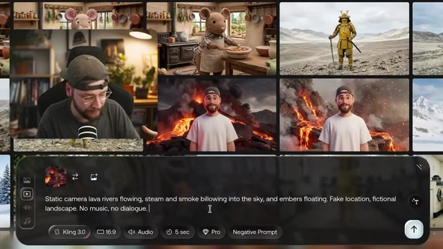
*Interface de prompt textuel affichant le texte descriptif du paysage volcanique et la sélection du modèle Kling 3.0.*

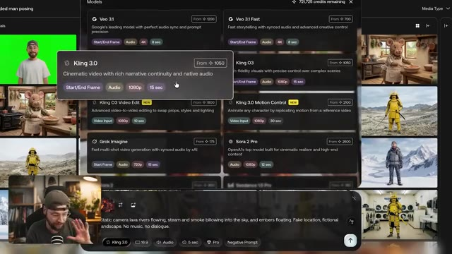
*Fenêtre de sélection des modèles d'IA avec les détails du modèle Kling 3.0 et d'autres alternatives.*

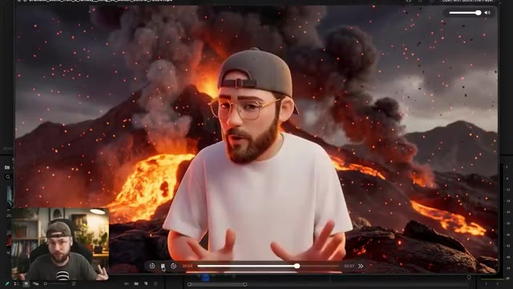
*Aperçu de la vidéo finale générée par Kling montrant le personnage animé sur fond de volcan en éruption.*

---

### ⏱️ `[00:08:25 - 00:08:46]` | Segment #16

**🔊 Audio (Transcription Intégrale Mot pour Mot en Français) :**
> Vous pouvez donc importer ceci dans Premiere Pro ou votre logiciel de montage de choix. Ce que nous avons donc, c'est la couche supérieure, qui est la sortie de mouvement Kling de moi parlant à la caméra. Ensuite, en dessous, nous avons notre génération Kling 3 où les rivières de lave coulent, les braises se déplacent, la fumée s'élève, tout ce genre de bonnes choses.

**👁️ Analyse Visuelle d'Écran (gemini-3.5-flash-lite) :**
**Interface & Outils** : Adobe Premiere Pro (logiciel de montage vidéo)

**Contenu textuel & Code** : Timeline de montage comportant plusieurs pistes vidéo (V1 à V5) et audio (A1 à A4). Dans la fenêtre de projet, des fichiers multimédias nommés "Dramatic_scene_from_a_fantasy_Kling_30_Motion_Control_72824.mp4" et des clips vidéo montrant Jack et un paysage volcanique. Une fenêtre de dossiers de téléchargements macOS est également ouverte en surimpression sur l'image 1.

**Action / Démonstration** : Le créateur montre son écran de montage vidéo sous Premiere Pro, illustrant la superposition de ses calques vidéo entre la séquence tournée face caméra et la génération Kling 3 d'un paysage volcanique.

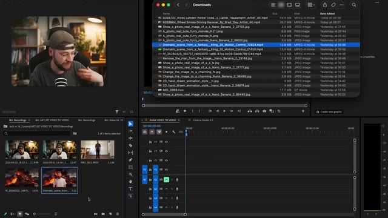
*Interface d'Adobe Premiere Pro montrant la timeline de montage et un encadré vidéo incrusté du créateur dans le coin supérieur gauche.*

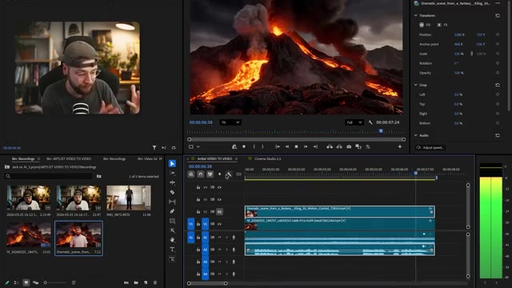
*Interface d'Adobe Premiere Pro avec le panneau de montage détaillé montrant deux pistes superposées et le rendu vidéo d'un volcan en éruption dans le moniteur de prévisualisation.*

---

### ⏱️ `[00:08:46 - 00:09:24]` | Segment #17

**🔊 Audio (Transcription Intégrale Mot pour Mot en Français) :**
> Et ce que nous pouvons faire, c'est sélectionner l'outil de masque d'objet, puis sélectionner notre personnage. Voyez, j'ai besoin d'ajouter les yeux ici et même cette partie de mon chat pour une raison quelconque. Et avec tout cela sélectionné, nous pouvons aller de l'avant et cliquer sur le suivi du masque sélectionné vers l'avant et vers l'arrière, et maintenant nous pouvons faire glisser ce masque d'objet sur l'opacité et vous verrez que cela va me découper de l'arrière-plan et me placer au-dessus de ce nouvel arrière-plan en mouvement provenant de Kling 3, et comme vous pouvez le voir, nous avons combiné avec succès notre génération de mouvement Kling avec Kling 3.

**👁️ Analyse Visuelle d'Écran (gemini-3.5-flash-lite) :**
**Interface & Outils** : Logiciel de montage vidéo (similaire à Adobe Premiere Pro) avec panneaux de timeline, moniteur de programme, chutier et panneau des propriétés.

**Contenu textuel & Code** : Noms de clips visibles dans le chutier et la timeline tels que "Artlist VIDEO TO VIDEO", "Dramatic_scene_from_a_fantasy__Kling_30_Motion_Control_72624.mp4", et paramètres de transformation (échelle à 135%, opacité 100%).

**Action / Démonstration** : Le créateur démontre le masquage et le détourage d'un personnage pour l'incruster sur un nouvel arrière-plan vidéo généré par IA dans un logiciel de montage.

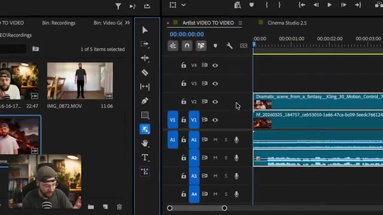
*Interface d'un logiciel de montage vidéo montrant la timeline avec plusieurs pistes vidéo et audio et les fichiers sources importés.*

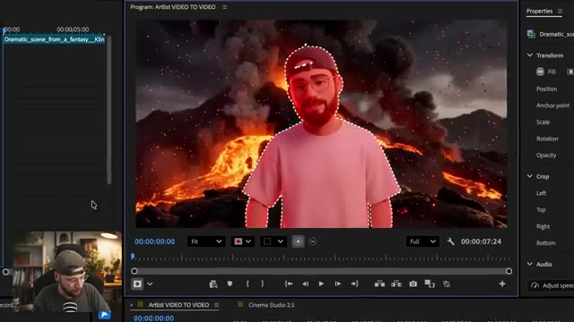
*Aperçu du moniteur dans le logiciel de montage affichant le personnage détouré avec un contour pointillé rouge sur un arrière-plan volcanique en mouvement.*

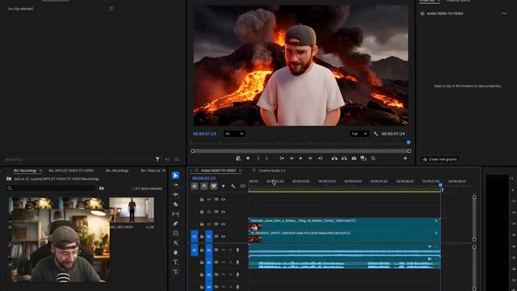
*Vue globale de l'interface de montage montrant la chronologie et les fenêtres de prévisualisation combinant les calques vidéo.*

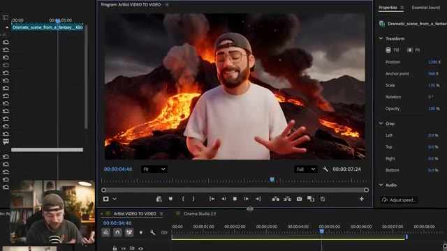
*Fenêtre de prévisualisation montrant le personnage superposé au paysage volcanique animé, avec le panneau des propriétés sur le côté droit.*

---

### ⏱️ `[00:09:24 - 00:10:02]` | Segment #18

**🔊 Audio (Transcription Intégrale Mot pour Mot en Français) :**
> arrière-plan. Instantanément, cela prend beaucoup plus vie. Ça a l'air beaucoup plus haut de gamme. Nous tirons parti de ce transfert de mouvement par IA ainsi que des générations standard d'image à vidéo par IA. Et le résultat final s'est assemblé de manière vraiment agréable. C'est donc une bonne petite astuce de contournement pour vous et vos projets. L'inconvénient ici est que pour que ce flux de travail fonctionne, nous devons utiliser un plan fixe, mais nous pouvons toujours ajouter un mouvement de caméra au montage, donc juste un léger zoom avant ou nous pourrions même appliquer un mouvement de caméra à l'épaule qui insufflerait vraiment un peu plus de vie à cette fin.

**👁️ Analyse Visuelle d'Écran (gemini-3.5-flash-lite) :**
**Interface & Outils** : Logiciel de montage vidéo de type Adobe Premiere Pro avec panneau de propriétés et timeline, affichant un plan vidéo généré par IA intégrant un personnage 3D sur fond volcanique.

**Contenu textuel & Code** : Dans Premiere : nom du fichier "Dramatic_scene_from_a_fantasy_Kling", réglages de transformation (Position 1280X, Échelle 135%, Opacité 100%), timeline avec pistes vidéo et audio. Le contenu principal affiché est une vidéo générée par IA montrant un avatar 3D parlant devant une coulée de lave volcanique.

**Action / Démonstration** : Le créateur montre un plan vidéo fixe généré par IA intégré dans son logiciel de montage, illustrant le résultat d'un flux de travail combinant transfert de mouvement et génération image-à-vidéo.

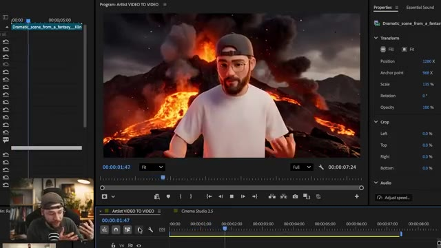
*Interface d'un logiciel de montage vidéo (type Adobe Premiere) montrant le rendu d'un personnage 3D animé devant un volcan en éruption, avec le créateur en incrustation (PiP).*

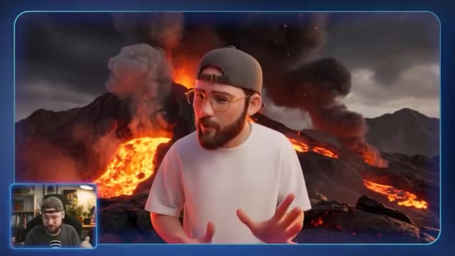
*Gros plan sur le rendu vidéo cinématique du personnage 3D animé sur fond de volcan, avec le créateur en incrustation PiP dans le coin inférieur gauche.*

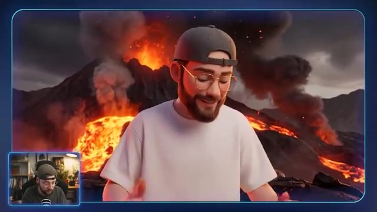
*Suite du rendu vidéo cinématique du personnage 3D en plan fixe, avec le créateur en incrustation PiP dans le coin inférieur gauche.*

---

### ⏱️ `[00:10:02 - 00:10:31]` | Segment #19

**🔊 Audio (Transcription Intégrale Mot pour Mot en Français) :**
> résultat. Maintenant, si vous ne voulez pas utiliser de séquences de vous-même, vous avez l'option d'utiliser des images de stock à la place, et Artlist possède une très bonne bibliothèque pour cela directement au sein de la plateforme. Vous voulez simplement aller dans le catalogue de stock en haut, puis aller vers la section des séquences. Un bon flux de travail ici est de télécharger un actif que vous aimez, de l'importer dans Premiere ou votre logiciel de montage de choix, et d'aller exporter la première image de la séquence.

**👁️ Analyse Visuelle d'Écran (gemini-3.5-flash-lite) :**
**Interface & Outils** : Plateforme web Artlist (Image 2) et logiciel de montage Adobe Premiere Pro (Image 4).

**Contenu textuel & Code** : Sur Artlist : menus "Royalty-Free Music", "Sound Effects", "Footage", "Video Templates", "AI Toolkit", "Stock Catalog". Sur Premiere Pro : fenêtre "Export Frame" avec les champs "Name" (Artlist VIDEO TO VIDEO.00_00_00_00), "Format" (JPEG), "Path" (/Users/jack/Desktop), ainsi que les boutons "Cancel" et "OK".

**Action / Démonstration** : Le créateur présente l'interface d'Artlist pour trouver des vidéos de stock, puis montre la fenêtre d'exportation d'une image fixe ("Export Frame") dans Adobe Premiere Pro.

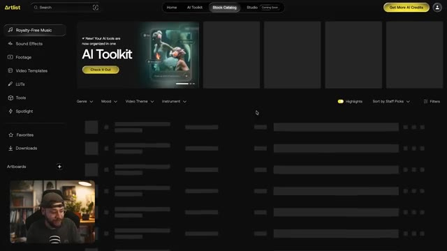
*Interface de la plateforme Artlist montrant le menu du catalogue de stock et les options de recherche de séquences.*

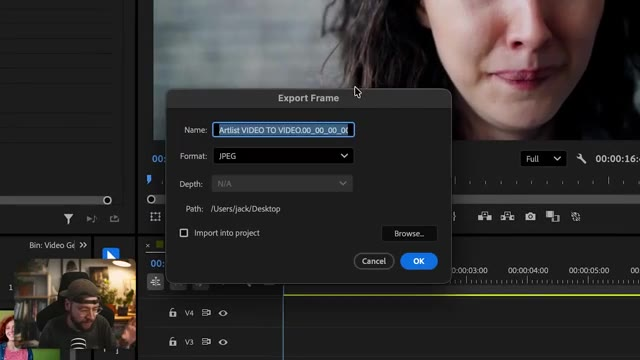
*Interface d'Adobe Premiere Pro affichant la fenêtre de dialogue "Export Frame" par-dessus la timeline du projet.*

---

### ⏱️ `[00:10:31 - 00:10:51]` | Segment #20

**🔊 Audio (Transcription Intégrale Mot pour Mot en Français) :**
> Nous pouvons ensuite utiliser Nano Banana pour transformer le personnage et le décor tout en préservant le cadrage et la composition. Nous suivons ensuite le même processus en téléversant notre image Nano Banana 2, puis en téléversant également nos séquences vidéo. Et regardez simplement avec quelle efficacité cette performance émotionnelle est retranscrite.

**👁️ Analyse Visuelle d'Écran (gemini-3.5-flash-lite) :**
**Interface & Outils** : Interface web d'Artlist (AI Tools) avec panneau de configuration latéral pour Nano Banana 2, gestion des prompts, réglages de modèle et d'aspect ratio.

**Contenu textuel & Code** : Texte du prompt visible : "Match the framing and composition of the original shot, as well as the scale and pose of the original character. Change the character to be a purple humanoid alien with realistic skin texture and visible pores. Give the alien facial tattoos, change the background to be the white plastic walls of a space ship interior." Paramètres : Model: Nano Banana 2, Aspect ratio: 16:9, Quality: 4K.

**Action / Démonstration** : Le créateur montre l'interface de génération d'image avec Nano Banana 2 et compare ensuite le rendu final transformé avec la performance émotionnelle d'origine.

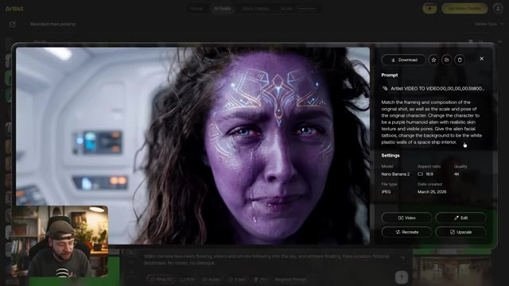
*Interface de la plateforme Artlist montrant les paramètres de Nano Banana 2 avec le prompt textuel de transformation du personnage en alien violet.*

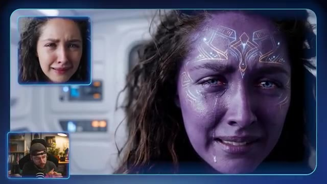
*Comparaison visuelle côte à côte entre la vidéo source originale et le résultat transformé en alien violet, avec le créateur en incrustation PiP.*

---

### ⏱️ `[00:10:51 - 00:11:10]` | Segment #21

**🔊 Audio (Transcription Intégrale Mot pour Mot en Français) :**
> Le seul problème ici, c'est que la larme est en quelque sorte figée. Et le plan semble perdre et reprendre légèrement la mise au point. C'est quelque chose que j'ai remarqué à travers plusieurs générations de mouvements de Kling. Mais la façon dont la peau et les cheveux bougent est vraiment précise quand on compare aux images sources.

**👁️ Analyse Visuelle d'Écran (gemini-3.5-flash-lite) :**
**Interface & Outils** : Interface de montage vidéo avec affichage d'extraits générés par IA et incrustation PiP du créateur.

**Contenu textuel & Code** : Affichage d'une vidéo principale générée par IA montrant un personnage féminin au visage maquillé de violet et de motifs lumineux, avec un encadré montrant la source originale et le créateur dans le coin inférieur gauche.

**Action / Démonstration** : Le créateur illustre son analyse comparative entre les mouvements générés par l'IA (peau, cheveux, larmes) et les images sources tout en parlant face à sa caméra.

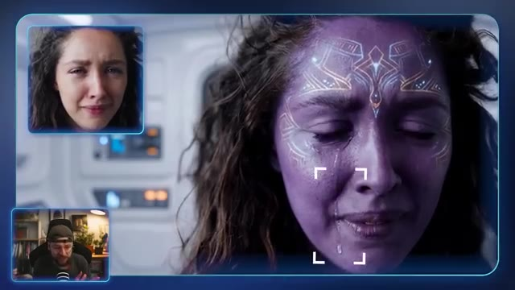
*Extrait vidéo comparatif affichant un gros plan sur le visage d'un personnage féminin aux teintes violettes avec des motifs lumineux, et un encadré montrant l'image source, avec Jack en incrustation (PiP) dans le coin inférieur gauche.*

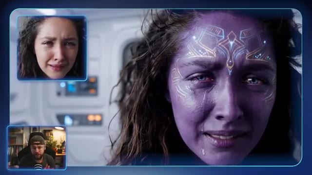
*Extrait vidéo similaire montrant le visage du personnage féminin avec une larme figée, comparé à l'image source dans un petit encadré, avec Jack visible en incrustation (PiP) dans le coin inférieur gauche.*

---

### ⏱️ `[00:11:10 - 00:11:31]` | Segment #22

**🔊 Audio (Transcription Intégrale Mot pour Mot en Français) :**
> Et juste pour vous montrer un plan dynamique en pied, nous avons pris des images d'archive de la bibliothèque Artlist et les avons appliquées à notre samouraï pour le faire danser. Ce qui est impressionnant pour moi, c'est l'interaction avec le sol ainsi que ces ombres réalistes. Cela semble très crédible et, plus important encore, cela a du sens physiquement.

**👁️ Analyse Visuelle d'Écran (gemini-3.5-flash-lite) :**
**Interface & Outils** : Lecteur vidéo / Montage vidéo avec incrustations (Picture-in-Picture) de séquences d'archives et de référence sur fond vert.

**Contenu textuel & Code** : Images d'archive de la bibliothèque Artlist représentant un paysage enneigé avec un samouraï doré animé, et une vidéo de référence sur fond vert en haut à gauche.

**Action / Démonstration** : Le samouraï doré danse dans un décor enneigé en interagissant de manière réaliste avec le sol et les ombres, tandis que le mouvement original d'une danseuse sur fond vert est visible en insert.

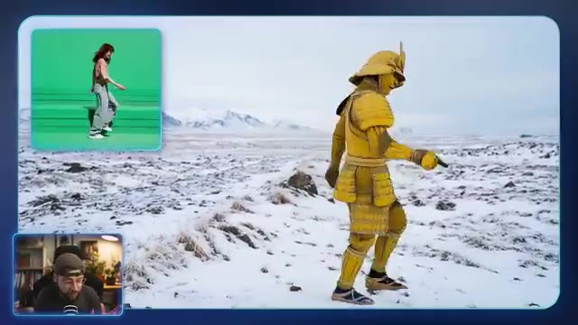
*Vidéo d'un samouraï doré dansant dans un paysage enneigé, avec un insert vidéo sur fond vert en haut à gauche montrant le mouvement de référence original et le créateur en bas à gauche.*

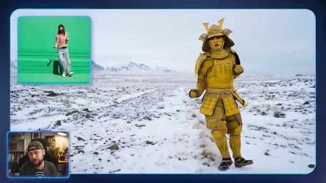
*Suite de la séquence montrant le samouraï doré en train de danser dans la neige, avec les mêmes inserts incrustés à l'écran.*

---

### ⏱️ `[00:11:31 - 00:12:04]` | Segment #23

**🔊 Audio (Transcription Intégrale Mot pour Mot en Français) :**
> Parfois, l'IA a du mal avec ça. La façon dont l'armure bouge a aussi l'air exactement telle que vous l'imagineriez. Et même le mouvement de caméra a été appliqué de manière vraiment convaincante. Maintenant, je veux aborder brièvement certains des inconvénients de Kling motion. Le premier est que souvent la synchronisation labiale n'est pas tout à fait parfaite. On a parfois l'impression que la bouche ne bouge pas assez ou qu'elle est un peu en décalage par rapport à la parole. Nous avons également le problème que nous ne pouvons montrer qu'un seul personnage par plan et évidemment c'est un peu restrictif du point de vue de la narration.

**👁️ Analyse Visuelle d'Écran (gemini-3.5-flash-lite) :**
**Interface & Outils** : Interface de montage vidéo avec affichage de vignettes, incrustations vidéo (PiP) et texte synthétique.

**Contenu textuel & Code** : Texte à l'écran : "LIP SYNC ISN'T QUITE PERFECT", "MOVEMENT FEELS INCOMPLETE", "LAGGING BEHIND", "CAN ONLY SHOW ONE CHARACTER PER SHOT", "RESTRICTIVE FOR STORYTELLING".

**Action / Démonstration** : Le présentateur commente les défauts de Kling Motion en affichant des exemples visuels de synchronisation labiale imparfaite et de limitation à un seul personnage par plan.

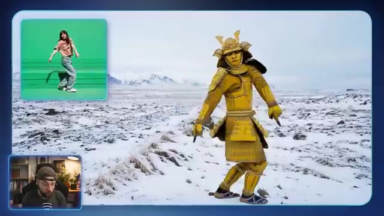
*Démonstration d'une génération de samouraï doré en armure dans un paysage enneigé avec incrustation d'une danseuse sur fond vert.*

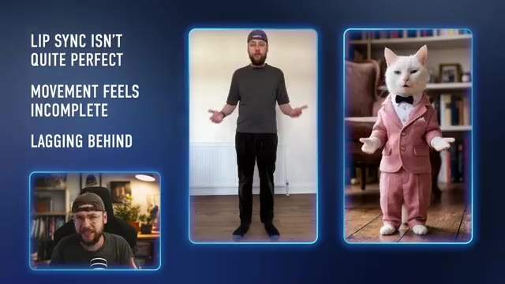
*Présentation des inconvénients de Kling Motion avec du texte à l'écran et des exemples de vidéos comparatives.*

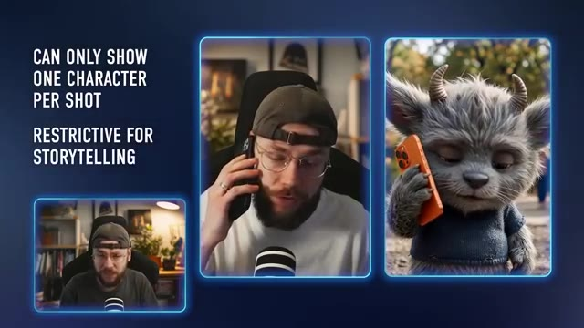
*Illustration de la limitation à un seul personnage par plan avec une comparaison visuelle d'un personnage au téléphone.*

---

### ⏱️ `[00:12:04 - 00:12:26]` | Segment #24

**🔊 Audio (Transcription Intégrale Mot pour Mot en Français) :**
> Cela est pourtant logique. C'est déjà assez impressionnant que Kling puisse détecter un seul personnage et reproduire de manière convaincante ses mouvements. Mais appliquer le même processus à plusieurs personnages, tout devient incroyablement complexe. C'est peut-être un jour possible, mais pas tout de suite. Et enfin, nous devons parler de la fidélité de vos générations.

**👁️ Analyse Visuelle d'Écran (gemini-3.5-flash-lite) :**
**Interface & Outils** : Incrustation vidéo (PiP) avec le présentateur en bas à gauche et un grand écran de démonstration montrant un rendu vidéo généré par IA.

**Contenu textuel & Code** : Rendu vidéo d'un personnage en armure traditionnelle japonaise dorée sur un sol enneigé avec des montagnes en arrière-plan.

**Action / Démonstration** : Le samouraï en armure effectue des mouvements de combat ou des gestes dans la neige, illustrant les capacités de génération de mouvements d'un outil d'IA.

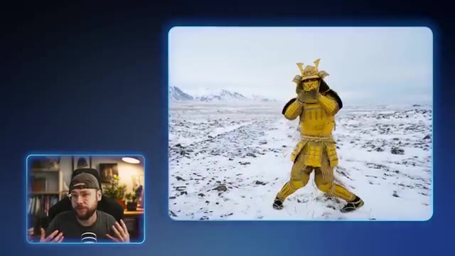
*Vidéo générée par IA montrant un samouraï en armure dorée effectuant des mouvements dans un paysage enneigé, avec le présentateur incrusté en bas à gauche.*

---

### ⏱️ `[00:12:26 - 00:13:01]` | Segment #25

**🔊 Audio (Transcription Intégrale Mot pour Mot en Français) :**
> Et il y a ici deux problèmes distincts. Le premier est que s'il y a trop de mouvements de pilotage dans votre vidéo de référence, vous allez commencer à obtenir une sorte de déchirement vraiment désagréable. et c'est tout à fait typique, même d'un simple Kling 3 normal avec un flux de travail texte-vers-vidéo ou image-vers-vidéo. Chaque fois que le mouvement est vraiment intense et que l'on s'attendrait à voir un flou de mouvement si cela avait été tourné pour de vrai, on a tendance à obtenir ce genre d'artefacts tranchants et c'est juste un problème quand il s'agit de Kling 3. Et le problème suivant est en quelque sorte l'opposé. Vos générations peuvent paraître assez douces.

**👁️ Analyse Visuelle d'Écran (gemini-3.5-flash-lite) :**
**Interface & Outils** : Capture d'écran vidéo avec superposition de texte et incrustation (PiP) du créateur face caméra dans son studio.

**Contenu textuel & Code** : Texte à l'écran : "TOO MUCH DRIVING MOVEMENT IN THE VIDEO REFERENCE LEADS TO 'TEARING' IN GENERATED VIDEO".

**Action / Démonstration** : Le créateur présente un exemple visuel illustrant les défauts de génération vidéo (artefacts de déchirement sur le personnage de samouraï en armure dorée dans la neige).

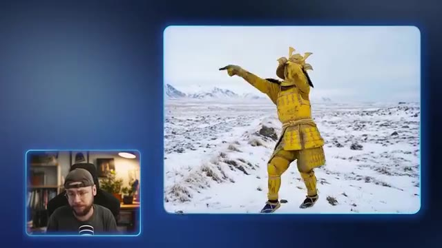
*Démonstration vidéo d'un personnage en armure dorée dans un paysage enneigé, avec le créateur en incrustation (PiP) dans le coin inférieur gauche.*

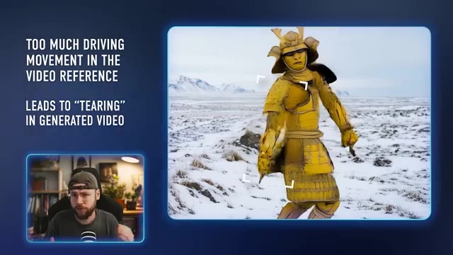
*Gros plan sur le personnage en armure dorée illustrant les artefacts de déchirement ("tearing"), avec du texte explicatif à gauche et le créateur en PiP.*

---

### ⏱️ `[00:13:01 - 00:13:32]` | Segment #26

**🔊 Audio (Transcription Intégrale Mot pour Mot en Français) :**
> Les détails texturaux fins finissent souvent par se perdre, et même en utilisant un outil de mise à l'échelle comme Topaz, cela ne résout pas nécessairement ce problème. Une fois que ces détails sont perdus, il est vraiment difficile de les ramener ou de les imiter de manière convaincante. La meilleure solution que j'ai trouvée est d'ajouter une couche de grain de pellicule par-dessus vos générations dans le logiciel de montage de votre choix. Cela ajoute juste un tout petit peu plus de texture et, espérons-le, empêche le spectateur de se poser trop de questions.

**👁️ Analyse Visuelle d'Écran (gemini-3.5-flash-lite) :**
**Interface & Outils** : Interface de montage vidéo avec affichage de rendu (génération vidéo par IA d'un chat habillé) et incrustation vidéo (PiP) du présentateur Jack en bas à gauche.

**Contenu textuel & Code** : Texte à l'écran : "FINE TEXTURAL DETAILS OFTEN GET LOST" (Image 1), "DIFFICULT TO GET THESE DETAILS BACK ONCE THEY'RE LOST" (Image 2), "ADDING A LAYER OF FILM GRAIN ON TOP OF YOUR GENERATIONS" (Image 3). Vidéo d'un chat anthropomorphe blanc portant un costume rose et un nœud papillon dans un salon.

**Action / Démonstration** : Le créateur présente une vidéo générée par IA pour illustrer la perte de détails texturaux et démontre visuellement l'effet avec des annotations textuelles.

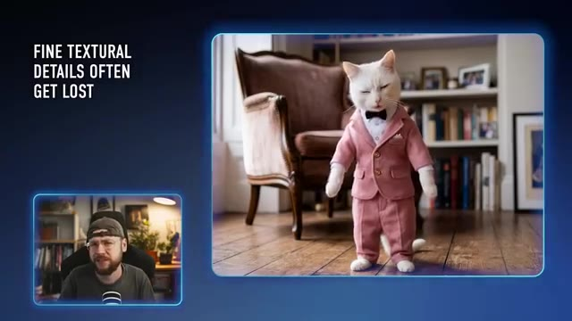
*Vidéo générée montrant un chat anthropomorphe en costume rose, avec un encadré PiP de Jack en bas à gauche et du texte explicatif à gauche.*

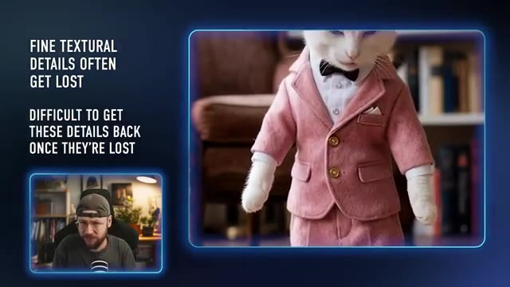
*Gros plan sur le chat anthropomorphe en costume rose, avec un encadré PiP de Jack et du texte explicatif sur la perte des détails.*

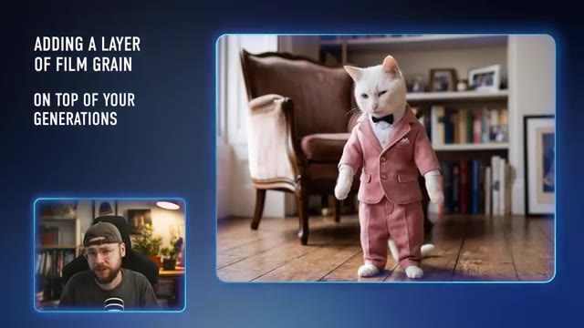
*Vidéo générée du chat anthropomorphe avec du texte explicatif à gauche concernant l'ajout d'une couche de grain de film, et Jack en encadré PiP.*

---

### ⏱️ `[00:13:32 - 00:13:54]` | Segment #27

**🔊 Audio (Transcription Intégrale Mot pour Mot en Français) :**
> Avec tout cela en tête, je pense que l'application la plus impressionnante ici est le mappage des mouvements humains sur des personnages animés. Je pense que c'est beaucoup plus indulgent et que cela met vraiment en valeur les points forts du modèle. Je pense vraiment que c'est un outil incroyable et qu'il y a tout un tas de cas d'utilisation réels ici en matière de réalisation de films et de publicité.

**👁️ Analyse Visuelle d'Écran (gemini-3.5-flash-lite) :**
**Interface & Outils** : Présentation vidéo avec incrustations graphiques et multiples fenêtres de comparaison visuelle (PiP).

**Contenu textuel & Code** : Pas de texte ou de code visible, affichage d'une comparaison visuelle entre un personnage animé et les mouvements de référence.

**Action / Démonstration** : Le créateur illustre son propos en montrant le résultat du mappage des mouvements sur des personnages animés et réalistes.

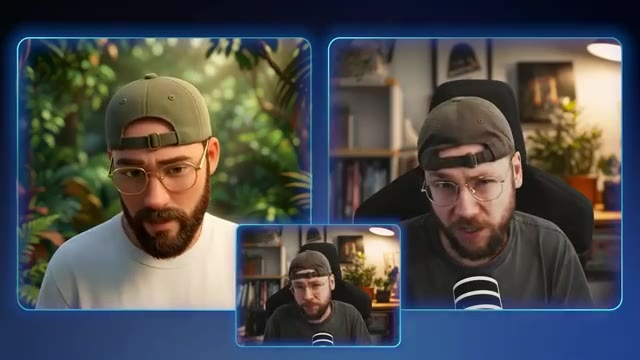
*Comparaison vidéo montrant un personnage IA réaliste reproduisant les mouvements humains de Jack.*

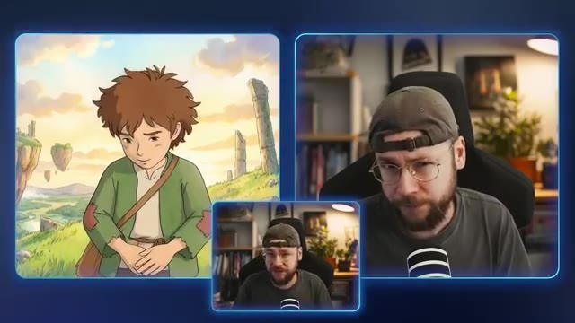
*Animation style Ghibli reproduisant les mouvements de Jack dans le cadre de la démonstration du modèle.*

---

### ⏱️ `[00:13:54 - 00:14:13]` | Segment #28

**🔊 Audio (Transcription Intégrale Mot pour Mot en Français) :**
> Assurez-vous simplement d'appliquer ces six règles d'or que nous avons abordées au début de la vidéo. Chaque fois que vous recherchez vos séquences de conduite. Si vous avez la moindre question, n'hésitez pas à la laisser ci-dessous dans la section des commentaires. J'essaie toujours de répondre à un maximum d'entre elles. Si vous avez apprécié le contenu d'aujourd'hui, n'hésitez pas à lâcher un pouce bleu pour moi.

**👁️ Analyse Visuelle d'Écran (gemini-3.5-flash-lite) :**
**Interface & Outils** : Présentation face caméra sans partage d'écran

**Contenu textuel & Code** : Le créateur Jack s'adresse directement aux spectateurs depuis son studio avec des étagères et des plantes en arrière-plan. Un texte animé "6 GOLDEN" apparaît brièvement sur l'image 1, et un bouton "SUBSCRIBE" apparaît sur l'image 3.

**Action / Démonstration** : Le créateur parle face caméra pour conclure la vidéo et inciter à s'abonner et commenter.

---

### ⏱️ `[00:14:13 - 00:14:23]` | Segment #29

**🔊 Audio (Transcription Intégrale Mot pour Mot en Français) :**
> Pensez à vous abonner et bien sûr, activez cette cloche de notification pour ne jamais manquer aucun contenu futur. J'apprécie vraiment que vous ayez regardé la vidéo d'aujourd'hui. Je vous retrouve dans la prochaine.

**👁️ Analyse Visuelle d'Écran (gemini-3.5-flash-lite) :**
**Interface & Outils** : Présentation face caméra sans partage d'écran

**Contenu textuel & Code** : Aucun contenu textuel, prompt ou interface logicielle visible à l'écran.

**Action / Démonstration** : Jack s'adresse directement à son audience depuis son studio, invitant les spectateurs à s'abonner et à activer les notifications en conclusion de la vidéo.

---
