# 🎬 Seedance 2.0 est ENFIN là… Est-il meilleur que Kling 3.0 ?

> **Chaîne** : [Jack Vs. AI](https://www.youtube.com/@JackVsAI)  
> **Titre original** : `Seedance 2.0 is FINALLY here… Does it beat Kling 3.0?`  
> **Lien YouTube** : [https://www.youtube.com/watch?v=xS6WVR82nQE](https://www.youtube.com/watch?v=xS6WVR82nQE)  
> **Date de publication** : 2026-04-04  
> **Durée** : 21m 43s (`1303s`)  
> **Identifiant vidéo** : `xS6WVR82nQE`  
> **Fiche Web Interactive** : [2026-04-04_YT-xS6WVR82nQE_Seedance 2.0 est ENFIN là… Est-il meilleur que Kling 3.0_by-whisper-v3-large-turbo+gemini-3.5-flash-lite.html](2026-04-04_YT-xS6WVR82nQE_Seedance 2.0 est ENFIN là… Est-il meilleur que Kling 3.0_by-whisper-v3-large-turbo+gemini-3.5-flash-lite.html)  
> **Captures de démonstration clés** : `101 captures réelles (anti-talking-head)`  
> **Modèles utilisés** : Audio: `large-v3-turbo` (Faster-Whisper int8 VPS) | Vision: `gemini-3.5-flash-lite` (Google AI Studio API)  

---

## 📌 Synthèse Exécutive & Outils

### 📌 Résumé
La vidéo de Jack Vs. AI analyse en profondeur l'arrivée tant attendue de **Seedance 2.0** sur la plateforme Higgsfield, qualifié d'outil vidéo par IA le plus dangereux et impressionnant à ce jour. Malgré des retards et des polémiques, le modèle redéfinit les standards de la génération multimodale en acceptant simultanément des images, des vidéos et des flux audio comme bases de prompt. L'analyste décortique le processus pas à pas : sélection du modèle (avec une option *Fast* plus économique), importation des médias de référence, utilisation du symbole arobase (`@`) pour structurer les prompts multi-plans, et application de techniques de contournement de la modération (comme l'utilisation de termes fictifs pour décrire le personnage). 

L'expérimentation démontre la supériorité de Seedance 2.0 face à **Kling 3.0** à travers des tests exigeants, notamment une transformation complexe en costume de super-héros et une scène d'action aérienne de style anime. Si Seedance 2.0 est actuellement bridé à une résolution de 720p et réservé aux abonnements professionnels et d'équipe (hors Japon et États-Unis), il surclasse nettement ses concurrents en termes de cohérence des personnages, de rendu des textures et de dynamisme. L'enseignement majeur pour les créateurs est l'adoption d'un workflow itératif : générer plusieurs variations d'une même séquence multi-shots pour trier et assembler les meilleurs plans au montage final, contournant ainsi les imperfections inhérentes aux mouvements physiques complexes de l'IA.

### 🛠️ Outils, Modèles & Logiciels Présentés
* **Seedance** : Modèle de génération vidéo par IA de premier plan, dont la version 2.0 révolutionne le marché grâce à ses capacités multimodales avancées.
* **Seedance 2.0** : La version phare, offrant des résultats visuels exceptionnels et une gestion poussée des références multiples, bien que limitée à une résolution 720p.
* **Seedance 2.0 Fast** : Variante optimisée pour la vitesse et le coût, au détriment d'une partie de la fidélité visuelle.
* **Higgsfield** : La plateforme cloud hébergeant Seedance 2.0, accessible via des abonnés professionnels ou d'équipe selon les restrictions géographiques.
* **Kling** / **Kling 3.0** : Modèle vidéo concurrent de référence sur le marché, utilisé ici pour un benchmark comparatif rigoureux face à Seedance 2.0.
* **Nano Banana** : Mentionné dans l'écosystème global des outils d'IA associés aux flux de travail vidéo.
* **Nano Banana Pro** : Version avancée liée aux outils créatifs annexes de la chaîne de production.
* **Topaz** : Logiciel d'optimisation et d'upscaling souvent requis pour pallier les limitations de résolution des modèles natifs.
* **flux** : Modèle text-to-image ou d'assistance graphique intégré aux étapes préparatoires du design visuel.

### 🔑 Points Clés & Enseignements Stratégiques
* **Accès et restrictions géographiques** : Seedance 2.0 est actuellement restreint aux abonnements professionnels et d'équipe sur Higgsfield, et indisponible au Japon et aux États-Unis.
* **Multimodalité native** : Capacité unique d'importer simultanément des images, des vidéos et des fichiers audio pour nourrir la génération de base.
* **Syntaxe de ciblage par arobase (`@`)** : Utilisation du symbole `@` dans la rédaction des prompts pour référencer précisément chaque média importé (image 1, image 2, etc.) et orchestrer les transitions.
* **Stratégie de contournement de la modération** : Qualifier le personnage principal de « barbu fictif » permet de réduire les blocages des filtres de sécurité et d'accélérer l'obtention des résultats.
* **Gestion des compromis techniques** : Le modèle est actuellement bloqué à une résolution de 720p, nécessitant des outils d'upscaling externes (comme Topaz) pour une diffusion en haute définition, un compromis largement compensé par la qualité des textures.
* **Optimisation des prompts textuels** : Intégration de consignes strictes en fin de prompt (ex: « pas de logos, pas de texte, pas de musique, seulement des effets sonores ») pour garder le contrôle sur la post-production audio-visuelle.
* **Supériorité face à Kling 3.0** : Dans les tests comparatifs (transformation de costume et scènes d'action), Seedance 2.0 produit des mouvements beaucoup plus fluides et évite les artefacts de type « déchirement net » observés chez la concurrence.
* **Gestion des plans multiples (*Multi-shot prompting*)** : La génération de cascades aériennes complexes ou de mouvements physiques intenses provoque inévitablement des incohérences qu'il faut anticiper.
* **Workflow de tri itératif** : La méthode professionnelle consiste à générer un grand nombre de variations avec le même prompt et les mêmes références, puis à isoler et assembler au montage uniquement les plans qui fonctionnent parfaitement.
* **Vitesse des serveurs** : En raison de son accessibilité restreinte aux comptes pro, les temps de génération sur les serveurs de Higgsfield restent actuellement très rapides et confortables pour les créateurs.

---

## ⏱️ Chronologie & Transcription Complète Audio & Visuelle (Mot pour Mot)

### ⏱️ `[00:00:02 - 00:01:08]` | Segment #01

**🔊 Audio (Transcription Intégrale Mot pour Mot en Français) :**
> Seed Dance 2.0 est sans aucun doute l'outil d'IA le plus dangereux qui ait été publié jusqu'à présent. Après des mois d'attente, une polémique massive et des retards successifs, Seed Dance 2 est enfin là.

**👁️ Analyse Visuelle d'Écran (gemini-3.5-flash-lite) :**
**Interface & Outils** : Présentation vidéo illustrant les capacités du modèle Seed Dance 2 (générations vidéo par IA).

**Contenu textuel & Code** : Rendu de vidéos photoréalistes générées par intelligence artificielle (téléphone rose, moto de nuit sous un pont urbain).

**Action / Démonstration** : Démonstration visuelle des capacités de génération vidéo de Seed Dance 2 illustrant les propos de l'animateur.

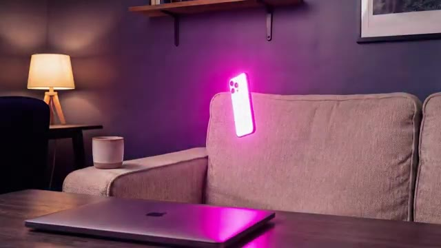
*Génération vidéo IA montrant un téléphone portable rose lumineux posé sur un canapé, avec un ordinateur portable au premier plan.*

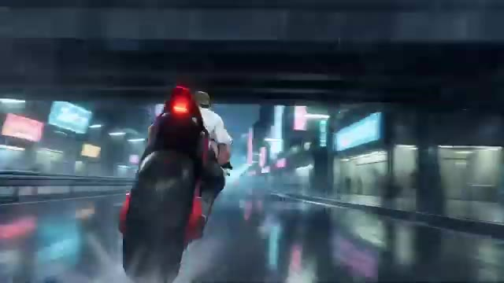
*Génération vidéo IA montrant une moto sportive roulant de nuit sur une route mouillée sous un pont, avec des lumières néons de ville en arrière-plan.*

---

### ⏱️ `[00:01:08 - 00:01:29]` | Segment #02

**🔊 Audio (Transcription Intégrale Mot pour Mot en Français) :**
> Dans la vidéo d'aujourd'hui, nous allons répondre à la question que tout le monde se pose. Est-ce vraiment aussi bien que les créateurs le prétendent, ou s'agit-il simplement d'un nouveau cas de battage médiatique sans fondement ? Je vais vous montrer exactement comment l'outil fonctionne et comment rédiger un prompt correctement. Et nous allons comparer C-Dance 2 face à Kling 3.0 pour vous donner un point de comparaison vraiment solide.

**👁️ Analyse Visuelle d'Écran (gemini-3.5-flash-lite) :**
**Interface & Outils** : Présentation vidéo avec incrustation (PiP) du créateur face caméra.

**Contenu textuel & Code** : Visuels de démonstration générés par IA (navire de guerre, monstre, paysage marécageux, effet holographique).

**Action / Démonstration** : Démonstration de séquences vidéo générées par intelligence artificielle illustrant les capacités des outils comparés.

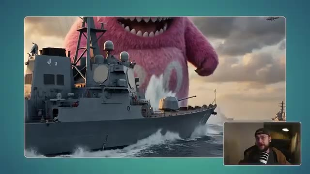
*Rendu vidéo généré par IA montrant un grand monstre rose poilu derrière un navire militaire en mer.*

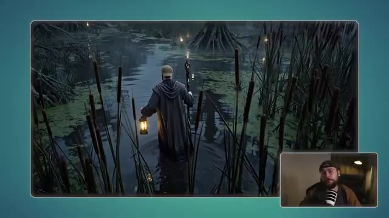
*Rendu vidéo généré par IA montrant un personnage de dos avec une lanterne et un bâton magique dans un marécage.*

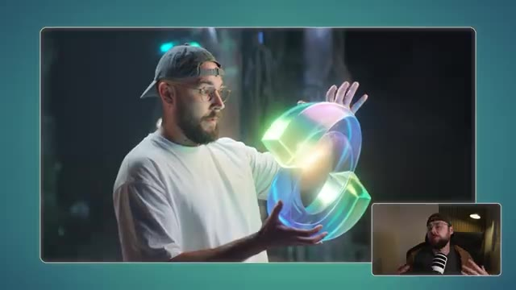
*Rendu vidéo montrant le présentateur (Jack) tenant un logo lumineux et abstrait en forme de lettre « C » dans un décor futuriste.*

---

### ⏱️ `[00:01:29 - 00:01:56]` | Segment #03

**🔊 Audio (Transcription Intégrale Mot pour Mot en Français) :**
> Et les gars, si vous appréciez le contenu d'aujourd'hui, n'oubliez pas de mettre un gros pouce bleu pour moi. Pensez à vous abonner et bien sûr, activez cette cloche de notification. Bon, passons aux choses sérieuses. Alors pour accéder à C-Dance 2, nous sommes sur Higgsfield. Et pour utiliser l'outil, il suffit d'aller cliquer sur cette bannière ici. Actuellement, vous ne pouvez utiliser C-Dance 2 qu'avec les abonnements professionnels ou d'équipe de Higgsfield, et c'est disponible pour toutes les régions sauf le Japon et les États-Unis.

**👁️ Analyse Visuelle d'Écran (gemini-3.5-flash-lite) :**
**Interface & Outils** : Interface web de la plateforme Higgsfield (avec Seedance 2.0).

**Contenu textuel & Code** : Texte affiché : "SEEDANCE 2.0", "OFFICIALLY ON HIGGSFIELD", "The Most Powerful AI Video Generation", "Start Generating", et divers onglets du site (Explore, Image, Video, Audio, Chat, Edit, Character, Moodboard, Cinema Studio).

**Action / Démonstration** : Le créateur présente l'interface du site web Higgsfield et montre la bannière pour accéder à Seedance 2.

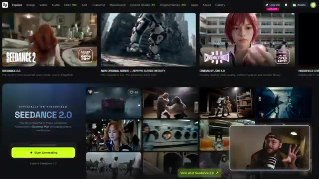
*Interface du site Higgsfield affichant la bannière et les aperçus de Seedance 2.0, avec une petite incrustation vidéo du créateur dans le coin inférieur droit.*

---

### ⏱️ `[00:01:56 - 00:02:19]` | Segment #04

**🔊 Audio (Transcription Intégrale Mot pour Mot en Français) :**
> J'espère que cela changera très bientôt. Utiliser C-Dance 2 va sembler assez familier par rapport à beaucoup d'autres modèles vidéo sur Higgsfield. Vous avez cette section tout en haut ici où nous pouvons importer des médias. Mais la différence ici, c'est que ce n'est pas aussi simple que de simplement importer une image de début ou de fin. Nous pouvons importer des images, des vidéos et même de l'audio, qui serviront tous de base à notre génération.

**👁️ Analyse Visuelle d'Écran (gemini-3.5-flash-lite) :**
**Interface & Outils** : Interface web de Higgsfield (outil Seedance 2.0) comportant un menu supérieur de navigation (Explore, Image, Video, Audio, Chat, Edit, etc.), un panneau latéral de configuration à gauche (Upload media, Prompt, Model Seedance 2.0, durée 10s, format 16:9, résolution 720p, bouton Generate +60) et une zone centrale d'affichage vidéo.

**Contenu textuel & Code** : Texte du prompt vide (« Describe your scene in detail. Use @ to reference assets »), modèle « Seedance 2.0 », paramètres de génération (10s, 16:9, 720p), onglets de la fenêtre de téléchargement (« Uploads », « Image Generations », « Video Generations », « Elements », « Liked »), bouton « Upload media » avec un message d'avertissement (« Protected content is not allowed »).

**Action / Démonstration** : Le présentateur explique et commente l'interface de Higgsfield et Seedance 2.0 tout en naviguant visuellement dans les options de téléchargement de médias (images, vidéos, audio) pour la génération vidéo.

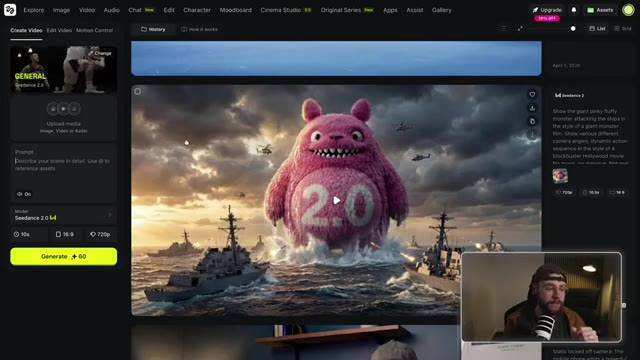
*Interface de la plateforme Higgsfield montrant le panneau de génération de Seedance 2.0 avec une image de monstre rose, et le créateur visible en incrustation PiP.*

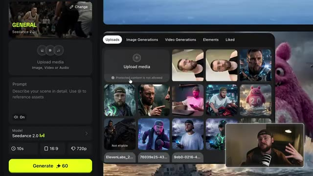
*Fenêtre contextuelle d'importation de médias (« Uploads ») sur Higgsfield avec une grille d'images et de vidéos générées, et le créateur en incrustation PiP.*

---

### ⏱️ `[00:02:19 - 00:02:41]` | Segment #05

**🔊 Audio (Transcription Intégrale Mot pour Mot en Français) :**
> Et lorsque nous rédigeons nos prompts, si nous appuyons sur la touche arobase, nous obtenons ce menu déroulant où nous pouvons sélectionner l'une de ces références d'image, de vidéo ou d'audio que nous avons téléchargées. En ce qui concerne la sélection du modèle, nous avons également C-Dance 2.0 Fast, qui fait exactement ce à quoi vous vous attendez. Des générations plus rapides à un coût inférieur, mais avec des résultats moins impressionnants.

**👁️ Analyse Visuelle d'Écran (gemini-3.5-flash-lite) :**
**Interface & Outils** : Interface web de Seedance 2.0 affichant le panneau de configuration des prompts, les options de téléchargement de médias et le menu de sélection des modèles (Featured models incluant Seedance 2.0, Seedance 2.0 Fast, Kling 3.0, etc.).

**Contenu textuel & Code** : Texte du prompt avec le symbole '@' et menu déroulant des assets uploadés (Living_Quarters, JackNoHat, KlingREF, Jack-1) ; menu de sélection de modèles affichant 'Seedance 2.0 Fast NEW FOR BUSINESS PLANS'.

**Action / Démonstration** : Le créateur montre comment utiliser le symbole '@' pour accéder aux références de médias téléchargés et survole le menu de sélection des différents modèles de génération vidéo.

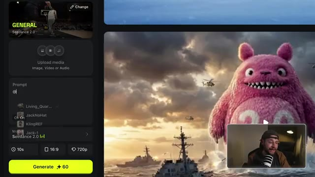
*Interface de l'outil montrant le menu déroulant des références (marques '@') lors de la saisie d'un prompt.*

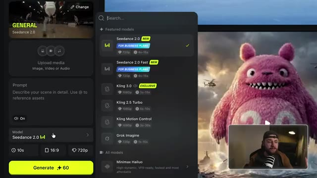
*Interface montrant le menu déroulant de sélection des modèles d'IA avec Seedance 2.0 Fast.*

---

### ⏱️ `[00:02:41 - 00:03:04]` | Segment #06

**🔊 Audio (Transcription Intégrale Mot pour Mot en Français) :**
> Nous pouvons également sélectionner la durée, le format d'image et la résolution. Et vous remarquerez immédiatement ici que l'un des inconvénients de ce modèle est que nous sommes bloqués à une résolution de 720p, ce qui est plutôt bas par les standards d'aujourd'hui. Cependant, les générations que vous pouvez obtenir avec Seedance 2 sont également incomparables à tout ce qui existe sur le marché.

**👁️ Analyse Visuelle d'Écran (gemini-3.5-flash-lite) :**
**Interface & Outils** : Interface de l'outil de génération vidéo Seedance 2.0 (avec incrustation vidéo du créateur en bas à droite).

**Contenu textuel & Code** : Menus de configuration visibles : "Choose duration" (réglé sur 10s), paramètres de format "16:9", résolution "720p", champ "Prompt", et bouton "Generate 60" avec un curseur de souris pointant dessus.

**Action / Démonstration** : Le créateur montre l'interface de Seedance 2.0 et le curseur clique sur le bouton de génération, tandis que son visage apparaît dans un encadré PiP.

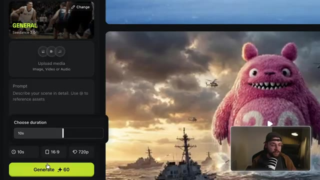
*Interface de Seedance 2.0 montrant les paramètres de durée (10s), de format (16:9) et de résolution (720p) avec le bouton de génération.*

---

### ⏱️ `[00:03:04 - 00:03:25]` | Segment #07

**🔊 Audio (Transcription Intégrale Mot pour Mot en Français) :**
> C'est donc un compromis qui en vaut largement la peine. Ce que je veux faire dans cette vidéo, c'est recréer certaines des générations que vous avez pu voir dans l'intro. Et ensuite, nous allons également comparer ces générations à Kling 3.0. C'est sans doute le meilleur modèle vidéo IA sur le marché. Mais est-ce que C-Dance 2 est arrivé et lui a volé sa couronne ?

**👁️ Analyse Visuelle d'Écran (gemini-3.5-flash-lite) :**
**Interface & Outils** : Incrustation vidéo (PiP) d'un flux webcam dans un coin de l'écran affichant une génération vidéo IA.

**Contenu textuel & Code** : Rendu vidéo IA au style anime montrant un personnage barbu avec des lunettes et une casquette dans un décor urbain nocturne.

**Action / Démonstration** : Le créateur présente une vidéo générée par intelligence artificielle en illustration de son propos, tout en s'affichant en incrustation (PiP).

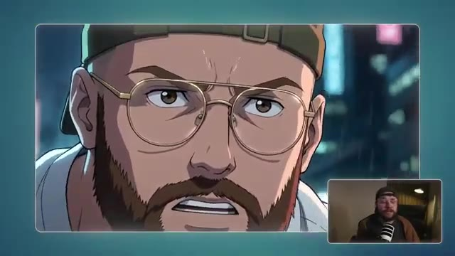
*Affichage d'une génération de vidéo IA au style anime représentant le visage du créateur, avec un encadré PiP (Picture-in-Picture) montrant Jack en train de parler dans son studio.*

---

### ⏱️ `[00:03:26 - 00:03:58]` | Segment #08

**🔊 Audio (Transcription Intégrale Mot pour Mot en Français) :**
> Nous allons le découvrir. Donc ce que nous voulons faire pour notre premier exemple, c'est que je vais sélectionner cette première image de moi debout sur un toit, ayant l'air de porter des vêtements normaux. et puis la deuxième image me montre en costume de super-héros. Maintenant, je ne vais pas lire tout le texte du prompt car il est un peu long, mais vous trouverez tous mes prompts ci-dessous dans la description. Si vous voulez les utiliser pour vos propres projets, mais vous pouvez voir que je tague l'image un lorsque je décris l'homme barbu fictif, moi et

**👁️ Analyse Visuelle d'Écran (gemini-3.5-flash-lite) :**
**Interface & Outils** : Interface de l'outil de génération vidéo par IA Seedance 2.0, avec un panneau de sélection de médias (Uploads, Image Generations, Video Generations, Elements, Liked), un champ de prompt textuel et un aperçu vidéo en arrière-plan.

**Contenu textuel & Code** : Texte du prompt visible : "A fictional bearded adult man [Image 1] snaps a wrist device; wide shot as luminous energy and nano-panels spiral in with crisp mechanical clicks—boots, gauntlets, chest, shoulders—cut to macro inserts of seams locking, sparks and cold mist; tracking move to tight reaction, then slow orbit as rim light carves the...". Paramètres : Modèle "Seedance 2.0", durée "10s", format "16:9", résolution "720p".

**Action / Démonstration** : Le créateur navigue dans la galerie de médias importés de l'interface Seedance 2.0, sélectionne les images de référence (première image sur un toit et seconde image en super-héros), puis montre le prompt textuel associé dans le panneau de gauche.

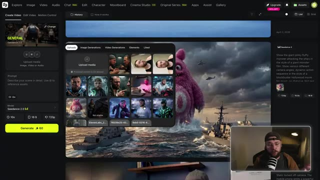
*Interface de Seedance 2.0 montrant une galerie pop-up de médias importés avec plusieurs photos du créateur et une vidéo de fond montrant un monstre rose attaquant des navires militaires.*

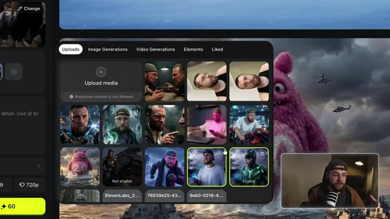
*Gros plan sur la galerie pop-up de Seedance 2.0 où le curseur survole et sélectionne l'image du créateur en tenue de super-héros taguée comme "Eligible".*

![Affichage du panneau de prompt dans Seedance 2.0 avec le texte du prompt intégrant la balise "[Image 1]" et les paramètres de génération (modèle Seedance 2.0, durée 10s, format 16:9, résolution 720p).](screenshots/YT-xS6WVR82nQE/frame_015_00-03-48.jpg)
*Affichage du panneau de prompt dans Seedance 2.0 avec le texte du prompt intégrant la balise "[Image 1]" et les paramètres de génération (modèle Seedance 2.0, durée 10s, format 16:9, résolution 720p).*

---

### ⏱️ `[00:03:58 - 00:04:31]` | Segment #09

**🔊 Audio (Transcription Intégrale Mot pour Mot en Français) :**
> puis l'image deux vers la fin du prompt qui est l'endroit où je suis équipé pour dire à C-Dance 2 que je veux que ce plan serve de sorte de transition. Et le fait de me décrire comme un homme barbu fictif est une tentative de contourner tout type de modération essentiellement. Cela peut être nécessaire ou non pour chaque vidéo que vous essayez de générer. C'est juste une habitude que j'ai prise parce que cela signifie que vous êtes plus susceptible d'obtenir une génération sans qu'elle soit bloquée et vous ferez moins d'attente. Vous obtiendrez les résultats que vous voulez plus rapidement. Et juste à la fin du prompt ici, nous disons

**👁️ Analyse Visuelle d'Écran (gemini-3.5-flash-lite) :**
**Interface & Outils** : Interface web de Seedance 2.0 avec disposition en trois colonnes : panneau de configuration et de prompt à gauche, lecteur vidéo et prévisualisation au centre, et flux d'historique/inspirations à droite.

**Contenu textuel & Code** : Texte du prompt visible : "A fictional bearded adult man Image 1 snaps a wrist device, wide shot as luminous energy and nano-panels spiral in with crisp mechanical clicks—boots, gauntlets, chest, shoulders—cut to macro inserts of seams locking, sparks and cold mist..." et paramètres du modèle (Seedance 2.0, durée 10s, format 16:9, résolution 720p).

**Action / Démonstration** : Le créateur présente l'interface de Seedance 2.0 en expliquant sa méthode de rédaction de prompts pour éviter la censure et obtenir des générations fluides, tout en montrant l'écran de travail avec incrustation de sa webcam.

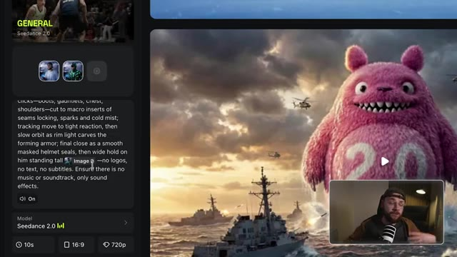
*Interface de l'outil Seedance 2.0 montrant le panneau de prompt à gauche et un aperçu vidéo principal avec un monstre rose poilu géant attaquant des navires de guerre, avec l'incrustation vidéo du créateur en bas à droite.*

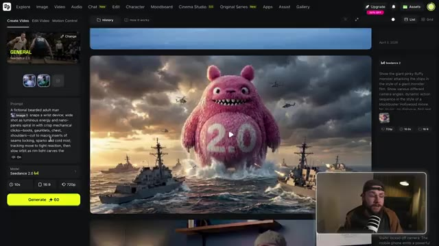
*Interface complète de Seedance 2.0 affichant les menus supérieurs (Explore, Image, Video, Audio, etc.), le prompt textuel détaillé dans le panneau latéral gauche et le bouton jaune "Generate" avec le coût en jetons.*

---

### ⏱️ `[00:04:31 - 00:05:03]` | Segment #10

**🔊 Audio (Transcription Intégrale Mot pour Mot en Français) :**
> pas de logos, pas de texte, pas de sous-titres. Assurez-vous qu'il n'y a pas de musique ou de bande sonore, seulement des effets sonores. Cela étant dit, allons-y et cliquons sur générer. Nous avons donc notre premier résultat et il est vraiment très impressionnant, mais aussi assez différent de ce qui a été utilisé dans l'intro. Une chose que je dirai, c'est que les générations arrivent assez rapidement en ce moment sur Higgsfield. C'est peut-être simplement parce que C-Dance 2 est restreint aux forfaits professionnels et équipes pour l'instant, donc ces serveurs ne sont pas surchargés.

**👁️ Analyse Visuelle d'Écran (gemini-3.5-flash-lite) :**
**Interface & Outils** : Interface de l'outil de génération vidéo Higgsfield avec panneau de prompt et sélection du modèle Seedance 2.0.

**Contenu textuel & Code** : Texte du prompt visible : « no logos, no text, no subtitles. Ensure there is no music or soundtrack, only sound effects... » et sélection du modèle « Seedance 2.0 ».

**Action / Démonstration** : Le créateur présente l'interface de génération avec le prompt saisi et affiche ensuite le premier résultat vidéo généré.

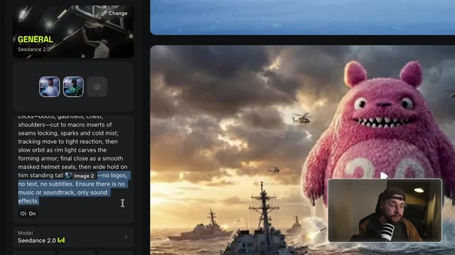
*Interface de Higgsfield montrant le prompt textuel et le modèle Seedance 2.0 avec une incrustation vidéo du créateur en bas à droite.*

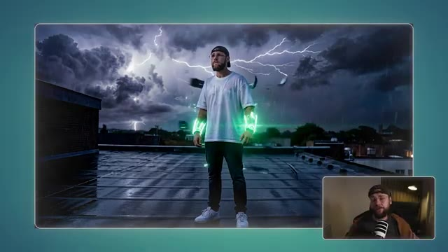
*Résultat de la génération vidéo IA montrant un homme sur un toit sous un orage avec des effets lumineux verts, et une incrustation vidéo du créateur.*

---

### ⏱️ `[00:05:03 - 00:05:24]` | Segment #11

**🔊 Audio (Transcription Intégrale Mot pour Mot en Français) :**
> Mais c'est un changement agréable de pouvoir cliquer sur générer sur un nouveau modèle sur n'importe quelle plateforme et d'obtenir sa génération assez rapidement. Maintenant, le seul problème que je signalerai, c'est que nous avons ces genres de fragments d'armure qui flottent autour du personnage. Les pièces d'armure se verrouillent, puis nous passons à ce gros plan et les pièces d'armure se verrouillent à nouveau.

**👁️ Analyse Visuelle d'Écran (gemini-3.5-flash-lite) :**
**Interface & Outils** : Vidéo de démonstration avec incrustation inc (PiP) du créateur en bas à droite.

**Contenu textuel & Code** : Génération vidéo montrant un personnage en armure lumineuse verte sur un toit sous un orage.

**Action / Démonstration** : Le personnage porte une armure futuriste tandis que des fragments flottants s'assemblent autour de lui.

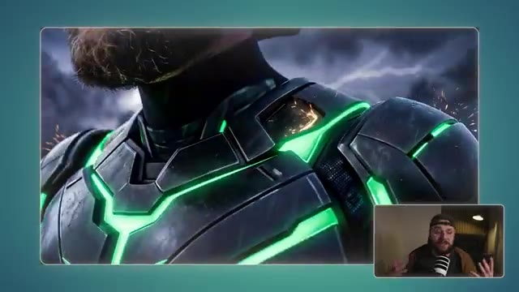
*Gros plan sur le torse d'une armure futuriste aux lumières vertes avec le présentateur incrusté en bas à droite.*

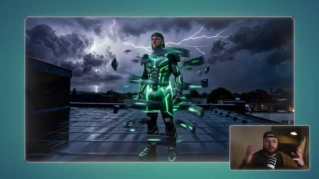
*Vue en pied d'un personnage avec des fragments d'armure flottants sur un toit sous un ciel orageux avec le présentateur incrusté en bas à droite.*

---

### ⏱️ `[00:05:24 - 00:05:43]` | Segment #12

**🔊 Audio (Transcription Intégrale Mot pour Mot en Français) :**
> Il y a donc ce léger manque de continuité, je suppose qu'on pourrait appeler ça comme ça, mais on pourrait simplement couper sur ce gros plan plus rapidement avant qu'ils ne se fixent sur le plan large. Et le reste a l'air plutôt super. J'ai l'impression que l'arrière-plan est peut-être un peu sans vie, mais les gros plans sont vraiment très impressionnants.

**👁️ Analyse Visuelle d'Écran (gemini-3.5-flash-lite) :**
**Interface & Outils** : Lecteur vidéo ou logiciel de montage affichant la vidéo analysée avec incrustation PiP du créateur dans le coin inférieur droit.

**Contenu textuel & Code** : Séquence vidéo générée par IA représentant un personnage en armure technologique lumineuse verte, sur fond de toiture urbaine avec un ciel orageux et des éclairs.
[DESC_IMAGE_1] Le créateur commente les détails visuels et la continuité du plan en analysant le rendu vidéo généré.

**Action / Démonstration** : Analyse et critique des plans larges et des gros plans de la vidéo générée par l'intelligence artificielle.

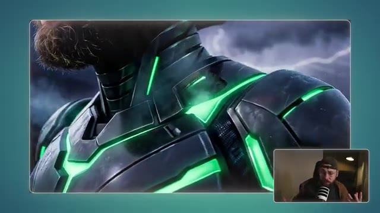
*Gros plan cinématique sur l'armure futuriste verte et noire portée par le personnage avec le créateur en incrustation (PiP).*

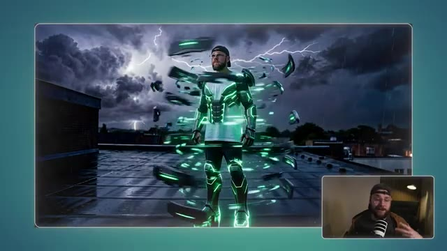
*Plan large montrant le personnage sur un toit sous un ciel d'orage avec des pièces d'armure en lévitation autour de lui, et le créateur en incrustation (PiP).*

---

### ⏱️ `[00:05:43 - 00:06:04]` | Segment #13

**🔊 Audio (Transcription Intégrale Mot pour Mot en Français) :**
> Le niveau de détail des textures pour une génération en 720p est vraiment plutôt sympa. La cohérence des personnages a l'air vraiment bonne, et la façon dont l'armure vient en quelque sorte se replier sur ma tête a l'air vraiment super. Maintenant, allons-y et comparons cela à Kling 3. Il s'agit maintenant d'une génération à partir d'une image de début et de fin en utilisant exactement le même prompt.

**👁️ Analyse Visuelle d'Écran (gemini-3.5-flash-lite) :**
**Interface & Outils** : Vidéo de démonstration principale avec incrustation PiP du créateur (Jack) dans le coin inférieur droit.

**Contenu textuel & Code** : Génération vidéo IA montrant un personnage en armure futuriste avec des détails texturaux de haute qualité et des effets d'animation complexes.

**Action / Démonstration** : Le créateur montre et commente les détails visuels d'une vidéo générée par IA en 720p.

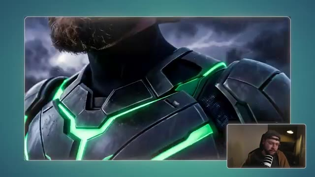
*Gros plan sur les détails texturaux de l'armure high-tech avec des liserés lumineux verts.*

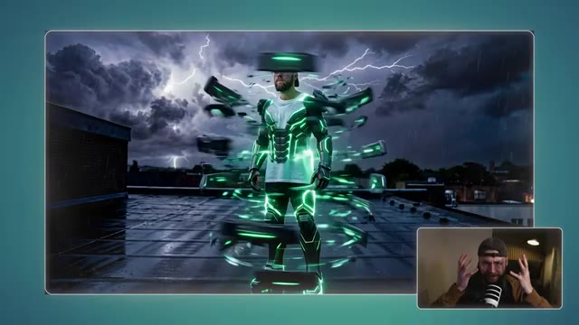
*Vue globale montrant l'assemblage de l'armure cybernétique autour du personnage sous un ciel orageux.*

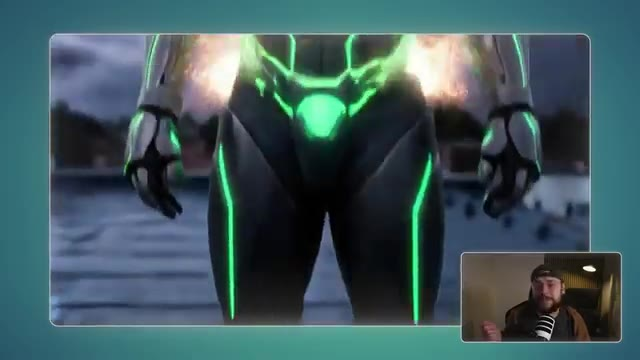
*Gros plan sur le bas de l'armure technologique et les effets de lumière.*

---

### ⏱️ `[00:06:04 - 00:06:38]` | Segment #14

**🔊 Audio (Transcription Intégrale Mot pour Mot en Français) :**
> Et pour être tout à fait honnête, la différence est flagrante. Il y a beaucoup de problèmes avec la génération Kling 3. Il y a des artefacts vraiment désagréables et les effets visuels eux-mêmes ne sont tout simplement pas très dynamiques ou impressionnants. Je pense que le gros plan à la fin est plutôt sympa, mais Sea Dance 2 l'emporte définitivement ici. Et juste pour vous donner un autre exemple de Kling 3, je ne sais pas ce qui se passe dans celui-ci, il y a tellement de problèmes à compter et à la fin je tiens ce petit microphone, je ne sais pas pourquoi.

**👁️ Analyse Visuelle d'Écran (gemini-3.5-flash-lite) :**
**Interface & Outils** : Affichage de vidéos générées par IA (Kling 3) avec incrustation vidéo (PiP) du créateur Jack dans son studio.

**Contenu textuel & Code** : Rendu vidéo d'un personnage en armure noire et verte (style cyberpunk/sci-fi) sur fond de ciel nuageux orageux, puis sur un toit avec des flammes bleues.

**Action / Démonstration** : Présentation comparative des exemples de vidéos générées par Kling 3, en commentant les défauts et artefacts visuels.

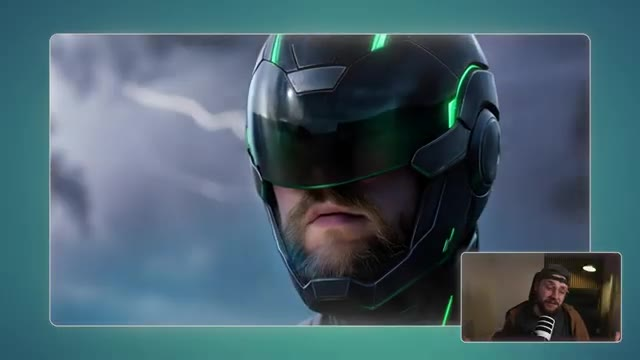
*Gros plan du personnage en armure futuriste avec des liserés verts, généré par IA, avec le créateur en incrustation PiP.*

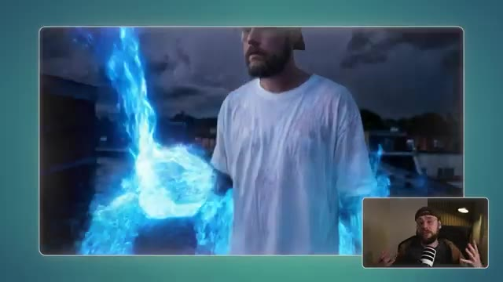
*Le personnage en t-shirt blanc sur un toit avec des effets spéciaux de flammes bleues étranges autour de ses mains, avec le créateur en PiP.*

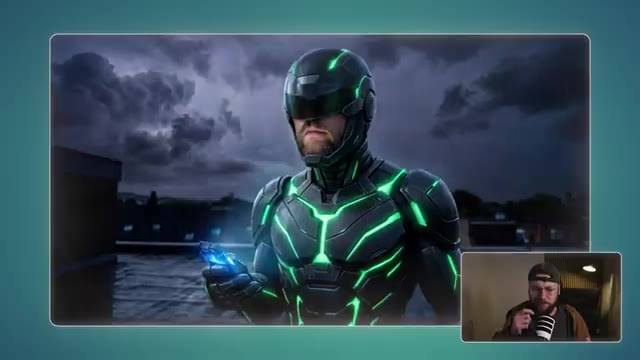
*Plan large du personnage en armure technologique futuriste tenant un objet lumineux dans sa main sur un toit, avec le créateur en PiP.*

---

### ⏱️ `[00:06:38 - 00:07:15]` | Segment #15

**🔊 Audio (Transcription Intégrale Mot pour Mot en Français) :**
> c'est le cas oui Sea Dance 2 remporte définitivement la palme pour celui-ci ensuite je veux aller de l'avant et générer une scène de style anime donc si nous allons dans nos médias importés je peux sélectionner cette image particulière ici et pour le texte d'invite nous demandons une scène de chasse de style anime mettant en vedette un homme barbu fictif et se déroulant dans une ville futuriste allons de l'avant et testons celle-ci ici maintenant j'ai quelques résultats que je veux partager avec vous les gars pour cette génération particulière parce que c'est un test assez brutal pour un modèle vidéo IA parce que nous demandons une cascade aérienne à

**👁️ Analyse Visuelle d'Écran (gemini-3.5-flash-lite) :**
**Interface & Outils** : Application web de génération de vidéo par IA avec interface de gestion des médias (onglets Uploads, Image Generations, Video Generations, Elements, Liked).

**Contenu textuel & Code** : Galerie d'images et de vidéos importées montrant divers rendus (personnages barbus, armures cyberpunk, créatures roses, etc.), vignette de sélection active, et incrustation vidéo du créateur en bas à droite.

**Action / Démonstration** : Le créateur montre des exemples de rendus générés par IA et navigue dans son interface de médias pour sélectionner l'image de départ d'une scène de poursuite en moto.

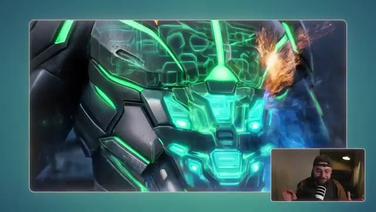
*Rendu vidéo de science-fiction montrant un personnage en armure futuriste avec des lumières vertes.*

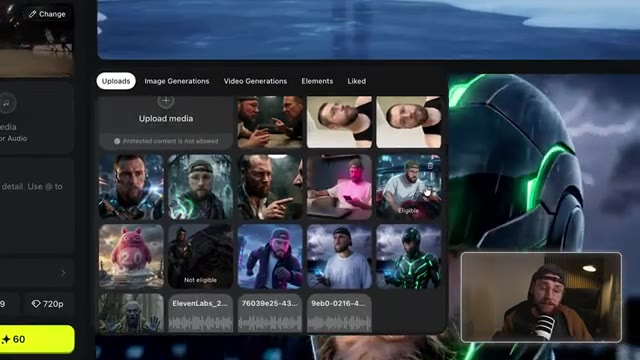
*Interface de la plateforme de génération vidéo montrant la galerie des médias importés et le panneau de sélection d'images.*

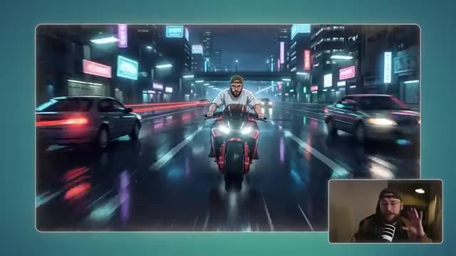
*Rendu vidéo généré en style anime montrant un homme barbu sur une moto rouge roulant dans une rue de ville futuriste sous la pluie.*

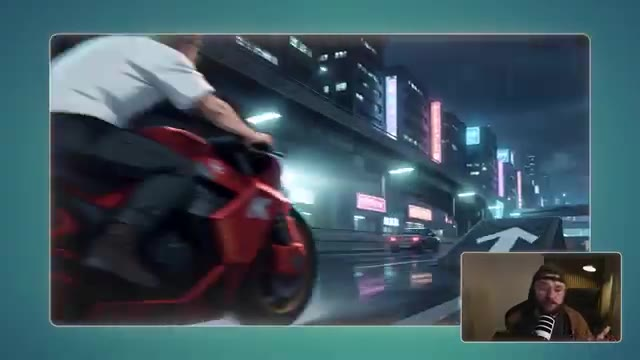
*Rendu vidéo en style anime montrant l'homme sur sa moto rouge s'approchant d'une rampe de saut dans une ville nocturne.*

---

### ⏱️ `[00:07:15 - 00:07:40]` | Segment #16

**🔊 Audio (Transcription Intégrale Mot pour Mot en Français) :**
> exécuté donc il y a beaucoup de choses physiques qui peuvent mal tourner et vous pouvez voir avec notre première génération que c'est exactement ce qui se passe la moto recule en quelque sorte pendant une très grande partie de la génération quand la cascade se produit c'est plutôt correct mais ce n'est pas particulièrement dynamique ou excitant pour être tout à fait honnête. Maintenant notre essai suivant a eu beaucoup plus de succès je dirais.

**👁️ Analyse Visuelle d'Écran (gemini-3.5-flash-lite) :**
**Interface & Outils** : Lecteur vidéo / montage montrant des extraits de générations de vidéo par IA avec incrustation PiP du créateur dans le coin inférieur droit.

**Contenu textuel & Code** : Visuels de vidéos générées par IA représentant un personnage barbu casquette/t-shirt blanc pilotant une moto rouge dans un décor urbain futuriste de nuit sous la pluie.

**Action / Démonstration** : Démonstration visuelle à l'écran des défauts de génération de la première version de la vidéo (la moto reculant sur la route) pendant que le créateur commente l'analyse.

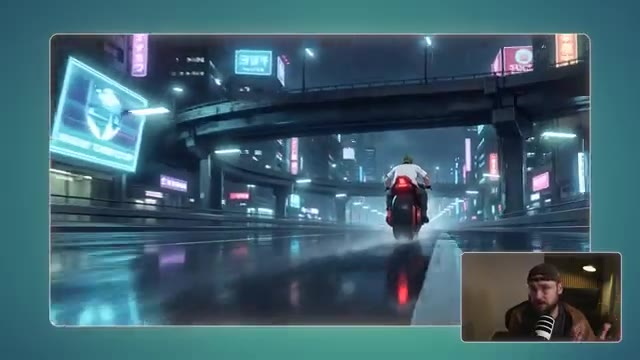
*Extrait vidéo généré par IA montrant un motard de dos roulant sur une route mouillée sous un pont dans une ville futuriste de type cyberpunk nocturne, avec Jack visible en incrustation PiP en bas à droite.*

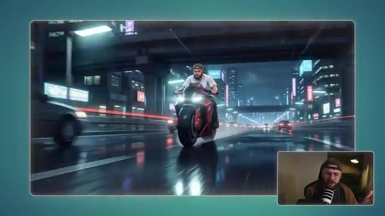
*Extrait vidéo montrant le motard de face sur sa moto rouge, roulant sur la route détrempée avec des enseignes lumineuses et le flux de circulation en arrière-plan, avec Jack en incrustation PiP.*

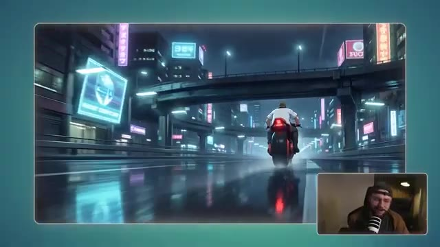
*Extrait vidéo montrant à nouveau la moto vue de dos sur la route mouillée sous le pont urbain, illustrant les mouvements de la première génération, avec Jack en incrustation PiP.*

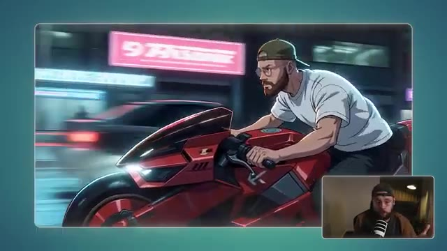
*Gros plan de l'extrait vidéo montrant le motard de profil sur sa moto rouge dans la rue urbaine illuminée, avec Jack en incrustation PiP.*

---

### ⏱️ `[00:07:40 - 00:08:15]` | Segment #17

**🔊 Audio (Transcription Intégrale Mot pour Mot en Français) :**
> J'aime vraiment beaucoup le style anime, ce genre d'ondulation de mon t-shirt et même si cette cascade est plus impressionnante par certains aspects, il y a aussi quelques défauts qui s'y produisent. La cascade elle-même n'a pas vraiment beaucoup de sens mais bien sûr nous testons ici le multi-shot prompting et la réalité avec l'IA c'est que chaque plan que vous allez en obtenir ne va pas fonctionner. Il s'agit donc de faire le tri pour vos montages entre les plans qui fonctionnent et ceux qui ne fonctionnent pas. Et j'ai constaté qu'avec Seedance 2.0, si vous faites une variété de prompts multi-shots en utilisant le même prompt et les mêmes images de référence,

**👁️ Analyse Visuelle d'Écran (gemini-3.5-flash-lite) :**
**Interface & Outils** : Démonstration vidéo de scènes animées générées par IA (Seedance 2.0) avec vignette PiP (Picture-in-Picture) du présentateur en bas à droite.

**Contenu textuel & Code** : Visuels de style anime représentant un personnage (le créateur) sur une moto rouge futuriste dans un environnement urbain nocturne (rues éclairées, néons, ambiance cyberpunk), accompagnés d'une petite incrustation vidéo du créateur parlant dans son micro.

**Action / Démonstration** : Le créateur commente et présente à l'écran différents plans (multi-shots) générés par IA illustrant une séquence d'action à moto dans un style anime.

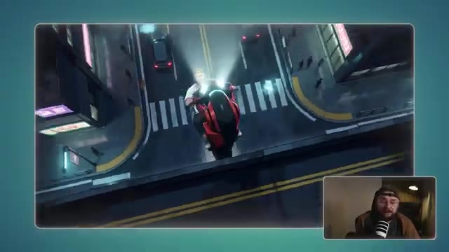
*Séquence vidéo générée par IA montrant une vue aérienne en plongée d'une moto rouge roulant en ville la nuit, avec incrustation du créateur en bas à droite.*

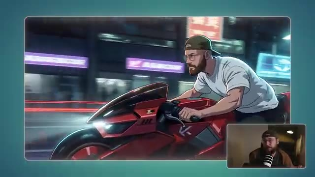
*Séquence vidéo générée par IA montrant un motard portant une casquette et des lunettes pilotant une moto rouge de profil en milieu urbain nocturne.*

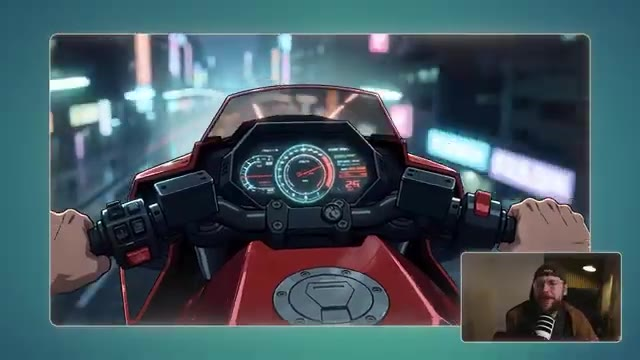
*Séquence vidéo générée par IA montrant une vue subjective (POV) depuis le guidon d'une moto rouge avec tableau de bord illuminé en ville de nuit.*

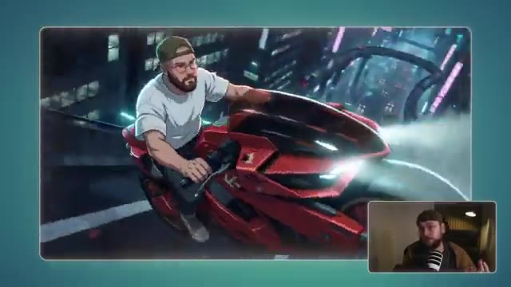
*Séquence vidéo générée par IA montrant une moto rouge effectuant une cascade en hauteur dans un décor urbain cyberpunk inspiré de l'anime.*

---

### ⏱️ `[00:08:16 - 00:08:50]` | Segment #18

**🔊 Audio (Transcription Intégrale Mot pour Mot en Français) :**
> et vous pouvez simplement y aller et choisir chaque plan qui fonctionne et les combiner tous ensemble, c'est essentiellement le flux de travail que j'ai utilisé pour l'intro, vous pouvez obtenir de très bons résultats. Et encore une fois, si nous allons de l'avant et comparons cette génération à ce que nous avons obtenu de Kling 3 en utilisant le même prompt et la même image de référence, j'aime en fait beaucoup ce que Kling 3 nous a donné également, le problème est juste ce vilain effet d'artefacts qui semble toujours se produire lorsque vous vous attendez à voir un flou de mouvement avec Kling 3, vous obtenez juste cette sorte de déchirement net vraiment bizarre, je vais essayer de le mettre en pause sur l'image pour que vous puissiez vraiment voir

**👁️ Analyse Visuelle d'Écran (gemini-3.5-flash-lite) :**
**Interface & Outils** : Présentation vidéo avec incrustation (PiP) du créateur Jack dans son studio en bas à droite, affichant des exemples de génération de vidéo par IA en plein écran.

**Contenu textuel & Code** : Générations vidéo de style anime/cyberpunk montrant un personnage barbu avec casquette et t-shirt blanc (le créateur) pilotant une moto rouge futuriste dans un décor urbain nocturne de style néo-Tokyo.

**Action / Démonstration** : Le créateur commente et compare des clips vidéo générés par IA, en pointant les défauts techniques, les artefacts de mouvement et le flou de bougé (« motion blur ») des modèles vidéo.

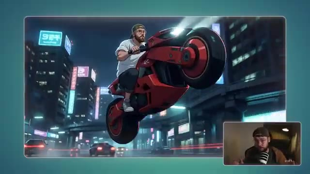
*Génération vidéo IA de Jack sur une moto rouge futuriste effectuant un saut dans une ville nocturne cyberpunk inspirée d'Akira, avec incrustation du créateur en bas à droite.*

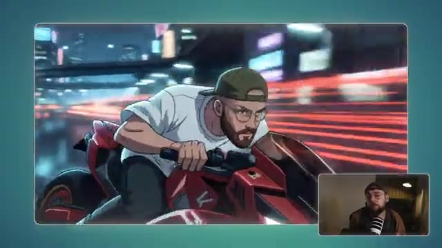
*Gros plan sur la génération vidéo de Jack pilotant la moto rouge avec des traînées de lumière en arrière-plan, illustrant le rendu d'un plan vidéo IA.*

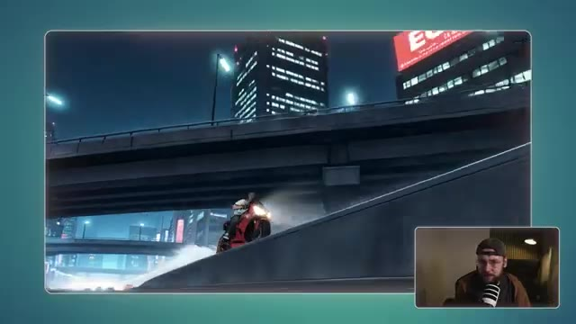
*Plan large d'un pont autoroutier urbain de nuit où la moto rouge circule, montrant les artefacts visuels et le flou de mouvement de Kling 3.*

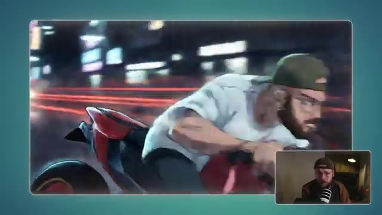
*Gros plan ultra-rapproché de Jack sur sa moto rouge montrant les artefacts numériques et le flou de mouvement saccadé mentionnés dans le commentaire.*

---

### ⏱️ `[00:08:50 - 00:09:22]` | Segment #19

**🔊 Audio (Transcription Intégrale Mot pour Mot en Français) :**
> clairement. C'est un vrai problème si vous essayez d'utiliser ces générations dans le cadre d'un cas d'usage réel ou professionnel. Cependant, les angles de caméra, le côté un peu dynamique de cette génération, il y a encore beaucoup de choses à apprécier ici. Je pense que Kling 3 s'en est plutôt bien tiré. Il a tiré son épingle du jeu. C'est respectable. Maintenant, allons-y et montrons cet exemple de style d'animation Pixar ici. Maintenant, j'étais en fait assez surpris que cela soit jugé éligible. Je pensais peut-être que j'allais frôler le genre de

**👁️ Analyse Visuelle d'Écran (gemini-3.5-flash-lite) :**
**Interface & Outils** : Interface web de Seedance 2.0 (ou version similaire) avec panneau latéral de configuration et onglets de gestion des médias (Uploads, Image Generations, Video Generations).

**Contenu textuel & Code** : Texte de prompt visible dans le panneau latéral : "Anime style chase scene featuring a fictional bearded man and set in a futuristic city..." Paramètres : Modèle Seedance 2.0, 10s, 16:9, 720p. Vignettes avec mentions "Eligible" et "Not eligible".

**Action / Démonstration** : Le présentateur commente la vidéo générée montrant un personnage en moto, puis navigue dans l'interface de Seedance pour montrer la sélection des exemples éligibles.

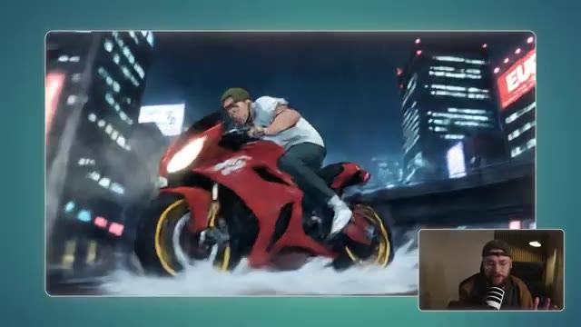
*Extrait vidéo d'un personnage stylisé en moto dans une rue urbaine nocturne.*

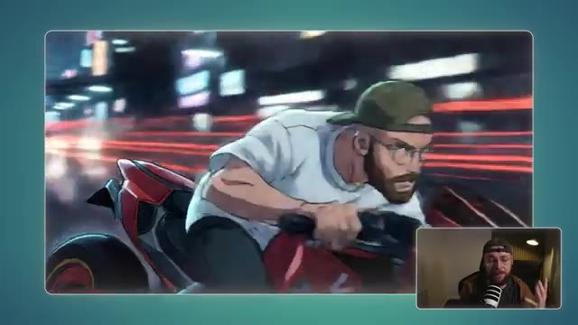
*Gros plan sur le personnage conduisant la moto à vive allure avec un effet de filé en arrière-plan.*

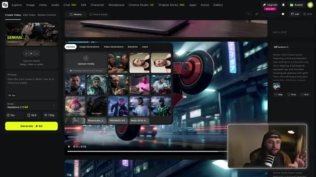
*Interface de l'outil Seedance avec la galerie de médias importés et un panneau de génération vidéo.*

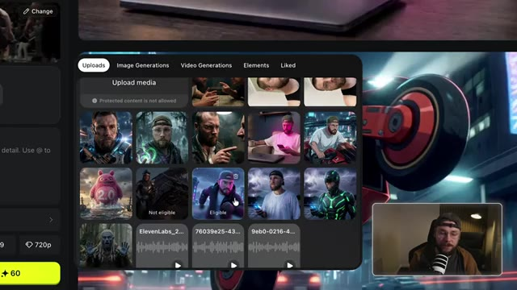
*Zoom sur la grille de sélection des médias dans Seedance montrant des vignettes marquées comme 'Eligible' ou 'Not eligible'.*

---

### ⏱️ `[00:09:22 - 00:10:00]` | Segment #20

**🔊 Audio (Transcription Intégrale Mot pour Mot en Français) :**
> restriction de propriété intellectuelle potentielle ici mais non, elle a été jugée éligible, donc on peut continuer et l'utiliser. Encore une fois, nous avons inséré un prompt textuel assez long pour obtenir une scène multi-plans où la version animée de moi combat ces monstres de glace. Et vous pouvez voir que jusqu'à présent, nous n'utilisons qu'une ou deux références d'image pour ces premières générations, c'est donc un flux de travail assez simple en ce moment juste pour vous montrer qu'il n'est pas nécessaire de devenir fou pour obtenir de superbes résultats, allons-y et envoyons cette deuxième génération aussi, donc encore une fois nous avons un très beau résultat ici, j'adore la façon dont les monstres de glace...

**👁️ Analyse Visuelle d'Écran (gemini-3.5-flash-lite) :**
**Interface & Outils** : Interface web de Seedance 2.0 avec panneau latéral de configuration, champ de prompt textuel et bibliothèque de médias ("Uploads").

**Contenu textuel & Code** : Texte du prompt visible : "Stylized 3D animated fantasy at icy tundra dusk (blue hour, aurora). A fictional bearded adult man runs, stops as frostbound humanoid ice constructs crack up from the ground one by one. He steadies, determined, exhales, summons an emerald energy blade of light. Multi-angle cinematic coverage: wide, low around reveal, close reaction." Paramètres de génération : Modèle "Seedance 2.0", durée "10s", format "16:9", résolution "720p".

**Action / Démonstration** : Le créateur montre la sélection d'images de référence dans sa médiathèque, puis présente le prompt textuel et le résultat vidéo généré avec des monstres de glace.

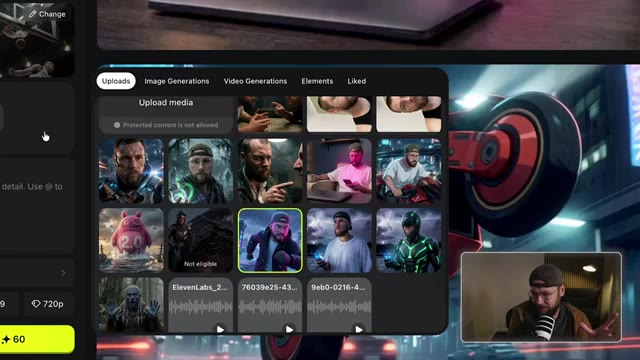
*Interface de l'outil de génération vidéo avec une fenêtre modale affichant la médiathèque d'images téléchargées ("Uploads").*

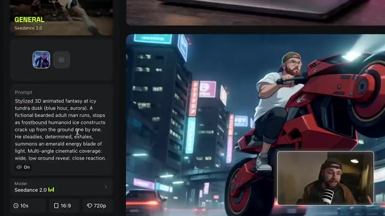
*Interface de Seedance 2.0 affichant le panneau de prompt textuel avec une scène de motard cyberpunk et l'encadré PiP du créateur.*

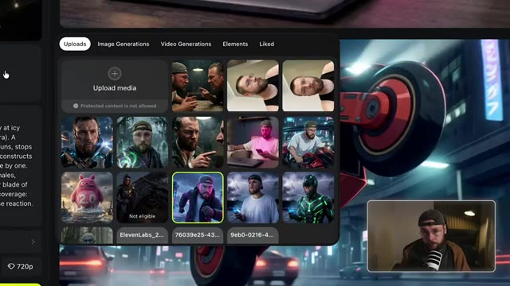
*Même interface que l'image 1 montrant la grille d'images de la médiathèque de téléchargement avec des aperçus miniatures.*

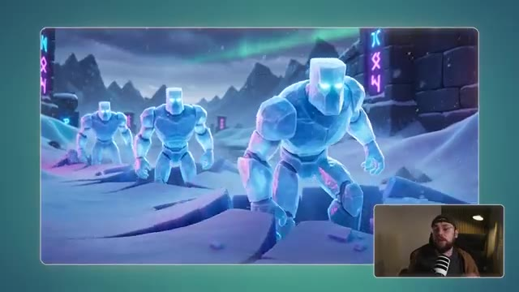
*Rendu vidéo généré montrant des créatures humanoïdes de glace lumineuses sortant de fissures dans le sol enneigé.*

---

### ⏱️ `[00:10:00 - 00:10:34]` | Segment #21

**🔊 Audio (Transcription Intégrale Mot pour Mot en Français) :**
> des monstres sortent du sol de près avec moi en soufflant ce souffle glacé mais ensuite la scène de combat en elle-même je ne sais pas ça a l'air un peu basique comparé à ce que j'ai réussi à générer pour l'intro ça n'a tout simplement pas le même genre d'impact ou le genre de nature dynamique que j'ai obtenu ce que j'utilise dans l'intro et avec la deuxième génération il y a beaucoup de choses à aimer ici quand même les angles de caméra sont super et les mouvements de caméra sont vraiment cool aussi ensuite la scène de combat ici n'a pas vraiment beaucoup de sens je ne pense pas que je sois vraiment en train de faire contact avec qui que ce soit

**👁️ Analyse Visuelle d'Écran (gemini-3.5-flash-lite) :**
**Interface & Outils** : Lecteur vidéo / Montage affichant les clips de génération IA (avec le créateur en incrustation PiP en bas à droite).

**Contenu textuel & Code** : Rendu vidéo de style animation 3D avec des golems de glace, des décors de ruines nordiques lumineuses et un avatar du créateur, accompagnés d'une incrustation du créateur en studio.

**Action / Démonstration** : Le créateur commente et analyse les clips vidéo de combat générés par IA, illustrant ses propos sur les mouvements de caméra et les animations.

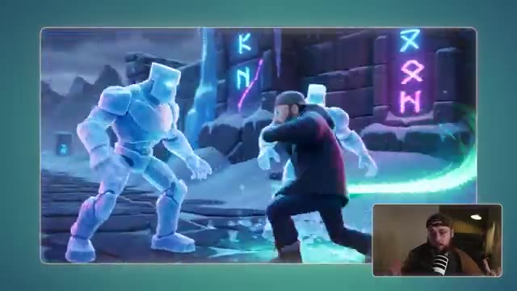
*Scène de combat animée entre un personnage et un golem de glace dans un décor hivernal.*

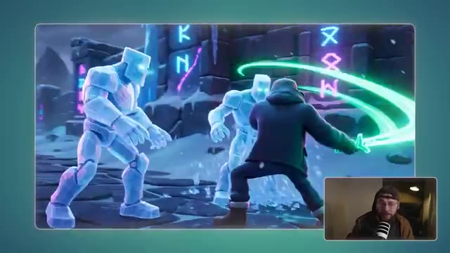
*Gros plan sur le combat avec une traînée lumineuse verte et des golems de glace en arrière-plan.*

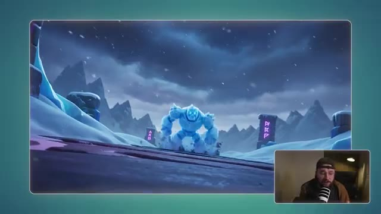
*Un monstre de glace émergeant du sol en gros plan dans un paysage enneigé.*

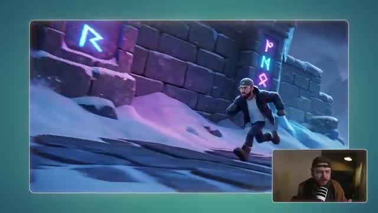
*Un personnage courant le long d'un mur en pierre gravé de runes lumineuses.*

---

### ⏱️ `[00:10:34 - 00:11:08]` | Segment #22

**🔊 Audio (Transcription Intégrale Mot pour Mot en Français) :**
> ces monstres gelés même si le design de l'épée est vraiment sympa, je fais juste un peu comme si je l'agitais et ils meurent pour une raison inconnue, donc je pense que ce que je décris que l'on voit ici avec ces générations est un léger décalage en termes de logique du monde, je suis sûr que si nous relancions le même prompt assez de fois, nous obtiendrions une qualité similaire à ce que nous avions dans l'intro cependant, mais encore une fois, c'est tout le but de cet exercice de vous montrer les gars c'est de l'ia, vous n'allez pas toujours obtenir ce que vous voulez à la première, deuxième, troisième, quatrième, peut-être même cinquième génération

**👁️ Analyse Visuelle d'Écran (gemini-3.5-flash-lite) :**
**Interface & Outils** : Affichage d'un rendu vidéo généré par IA dans une fenêtre principale avec le créateur en incrustation (PiP).

**Contenu textuel & Code** : Rendu visuel d'un personnage de style animé 3D portant des lunettes rondes, une casquette à l'envers et une veste sombre, dans un paysage de montagnes enneigées.

**Action / Démonstration** : Le personnage généré regarde fixement la caméra dans un environnement enneigé, tandis que le créateur parle en bas à droite.

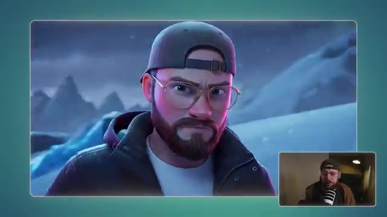
*Génération vidéo IA montrant un personnage barbu avec des lunettes et une casquette dans un décor de montagne enneigée, avec un encadré PiP du créateur dans le coin inférieur droit.*

---

### ⏱️ `[00:11:08 - 00:11:44]` | Segment #23

**🔊 Audio (Transcription Intégrale Mot pour Mot en Français) :**
> mais vous pouvez obtenir de très bons résultats avec Seedance aussi si vous persistez, parfois ces résultats viendront plus vite que d'autres. Maintenant, en comparant cela à ce que nous avons obtenu de Kling 3, bien que j'aime ce que Kling a généré ici, il y a des trucs bizarre qui se passent, n'est-ce pas ? Je pense que le design des bêtes de glace est vraiment plutôt cool, et je n'utilise pas vraiment une épée, c'est plutôt ce genre de truc en forme de fouet vert. Et encore une fois, c'est le même problème, à chaque fois qu'on s'attend à un flou de mouvement, on obtient cette horrible distorsion/déchirure, et c'est un vrai problème. Gardez à l'esprit les gars, si vous deviez exécuter cela

**👁️ Analyse Visuelle d'Écran (gemini-3.5-flash-lite) :**
**Interface & Outils** : Visualiseur vidéo intégré avec incrustation Picture-in-Picture (PiP) montrant le créateur en studio.

**Contenu textuel & Code** : Génération vidéo IA de type fantasy/action dans un environnement enneigé, mettant en scène un personnage avec une arme magique verte affrontant des créatures de glace.

**Action / Démonstration** : Le créateur commente et analyse les défauts visuels (distorsions, déchirures d'image lors des mouvements rapides) de la vidéo générée par Kling tout en affichant le rendu à l'écran.

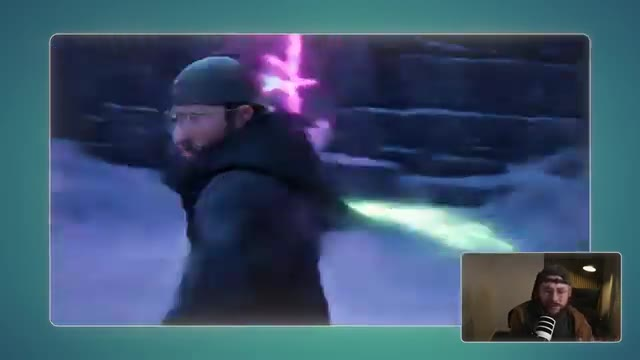
*Affichage d'une vidéo générée par IA montrant un personnage dans un décor enneigé avec un effet de fouet lumineux vert et le créateur en incrustation PiP.*

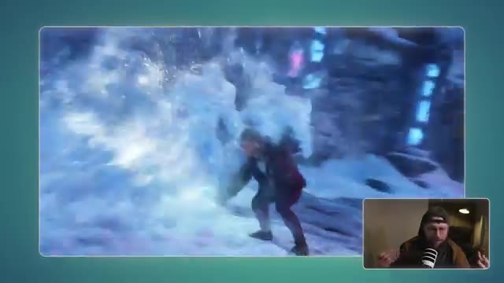
*Affichage d'une vidéo générée par IA montrant une bête de glace et un personnage en plein combat avec des artefacts de flou de mouvement et le créateur en encadré PiP.*

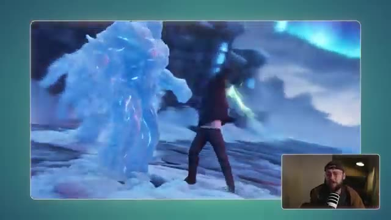
*Affichage d'une vidéo générée par IA montrant le design détaillé d'une créature de glace géante face au personnage brandissant une arme lumineuse, avec le créateur en PiP.*

---

### ⏱️ `[00:11:44 - 00:12:20]` | Segment #24

**🔊 Audio (Transcription Intégrale Mot pour Mot en Français) :**
> à travers comme Topaz pour le mettre à l'échelle, ça ne va pas résoudre ce problème, c'est en quelque sorte intégré, la seule façon dont je pense que vous pourriez résoudre ceci, c'est qu'il faudrait faire appel à un artiste VFX ou quelque chose comme ça pour parcourir et peindre manuellement ces images pour simuler essentiellement le flou de mouvement, et ce n'est vraiment pas ce que vous voulez de vos générations de vidéos par IA, vous ne voulez pas être restreint, mais vous ne voulez pas avoir à penser "je ne peux pas rendre les choses trop excitantes parce que Kling va paniquer", nous ne semble pas avoir ce problème avec Seedance 2 et les scènes de combat que nous obtenons.

**👁️ Analyse Visuelle d'Écran (gemini-3.5-flash-lite) :**
**Interface & Outils** : Présentation vidéo avec incrustation (PiP) de Jack face caméra dans son studio et affichage de clips vidéo générés par intelligence artificielle en grand format principal.

**Contenu textuel & Code** : Séquences vidéo animées par IA illustrant les problèmes de flou de mouvement et de rendu sur les scènes d'action générées par Kling.

**Action / Démonstration** : Le créateur commente et analyse des exemples de générations vidéo IA pour illustrer les limites techniques du flou de mouvement et des scènes de combat.

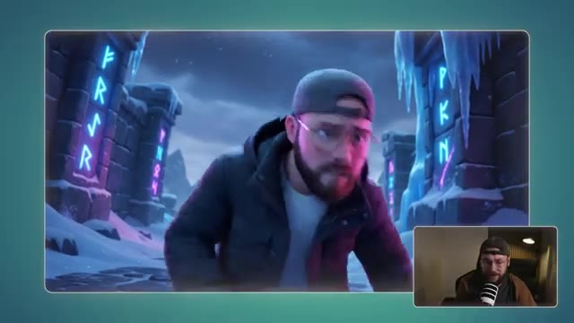
*Extrait vidéo généré par IA montrant un personnage barbu avec une casquette dans un décor enneigé avec des piliers de glace lumineux.*

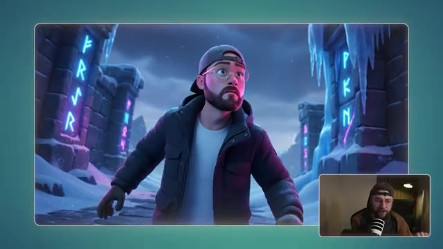
*Poursuite de l'extrait vidéo du personnage dans le décor enneigé, illustrant le rendu d'animation généré par Kling.*

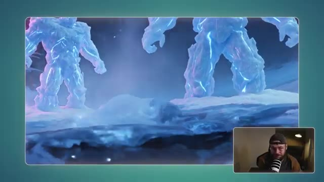
*Extrait vidéo montrant des créatures ou des géants de glace menaçants dans un paysage glacial.*

---

### ⏱️ `[00:12:20 - 00:12:57]` | Segment #25

**🔊 Audio (Transcription Intégrale Mot pour Mot en Français) :**
> à partir de c dance 2 également, j'ai préféré qu'ils aient un peu plus de sens même s'ils n'étaient pas parfaits donc ouais je pense que c dance l'emporte sur celui-ci aussi maintenant un autre des plans vfx que vous auriez vus dans l'intro c'est moi genre en train d'être téléporté ou aspiré dans mon téléphone quand je clique pour activer c dance 2 et c'est un exemple cool pour moi parce que j'avais une intention assez claire de ce que je voulais comment je m'attendais à ce que ces effets visuels soient générés et j'ai eu des problèmes par le passé pour amener un générateur de vidéo par IA à donner vie à mes idées

**👁️ Analyse Visuelle d'Écran (gemini-3.5-flash-lite) :**
**Interface & Outils** : Extrait de la vidéo de démonstration du créateur intégrant des effets spéciaux générés par IA (avec incrustation PiP du créateur dans le coin).

**Contenu textuel & Code** : Aucun texte, prompt ou paramètre textuel visible à l'écran, uniquement un rendu vidéo d'effets spéciaux (VFX).

**Action / Démonstration** : Diffusion d'un clip vidéo illustrant l'effet de lévitation d'un smartphone, avec le créateur en coin d'écran commentant le plan.

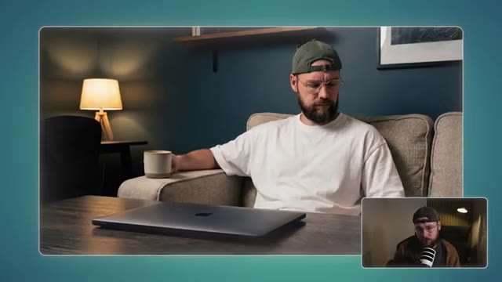
*Démonstration vidéo d'un effet visuel montrant un homme assis sur un canapé avec un ordinateur portable, avec le créateur en incrustation (PiP) dans le coin inférieur droit.*

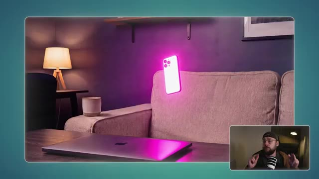
*Démonstration vidéo des effets visuels (VFX) montrant un téléphone portable lévitant et illuminé d'une lueur rose vif au-dessus du canapé, avec le créateur en PiP.*

---

### ⏱️ `[00:12:57 - 00:13:19]` | Segment #26

**🔊 Audio (Transcription Intégrale Mot pour Mot en Français) :**
> exactement comme je les avais imaginées. La plupart du temps, on doit un peu s'adapter à ce qu'on nous donne, mais la génération que j'obtenais de C-Dance 2 était exactement ce que j'avais imaginé. C'était parfait. Donc, pour recréer ceci, nous allons sélectionner cette image ici, qui est à nouveau jugée éligible. Il ne semble donc pas y avoir de problème à utiliser la ressemblance de vrais humains.

**👁️ Analyse Visuelle d'Écran (gemini-3.5-flash-lite) :**
**Interface & Outils** : Interface web d'un outil de génération vidéo par IA (probablement Seedance/C-Dance), affichant un panneau de sélection de médias avec des onglets (Uploads, Image Generations, Video Generations, Elements, Liked) et un retour PiP (Picture-in-Picture) du présentateur en bas à droite.

**Contenu textuel & Code** : Dans la galerie de l'interface, plusieurs vignettes d'images générées ou téléchargées dont certaines portent la mention "Eligible" ou "Not eligible". Sur la grande image de l'écran principal (image #3), on aperçoit un personnage de style 3D/animé inspiré du créateur avec des lunettes et une veste verte, tenant une épée laser.

**Action / Démonstration** : Le créateur navigue à travers sa bibliothèque de médias et sélectionne une image spécifique ("eligible") pour illustrer ses propos sur l'utilisation de la ressemblance humaine dans la génération IA.

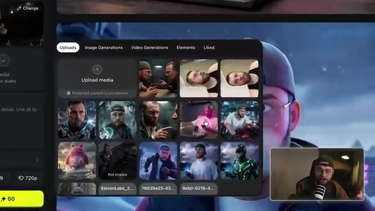
*Interface logicielle montrant une bibliothèque de médias avec un menu contextuel de téléchargements d'images ("Uploads", "Image Generations", etc.) et le retour vidéo du créateur en incrustation (PiP).*

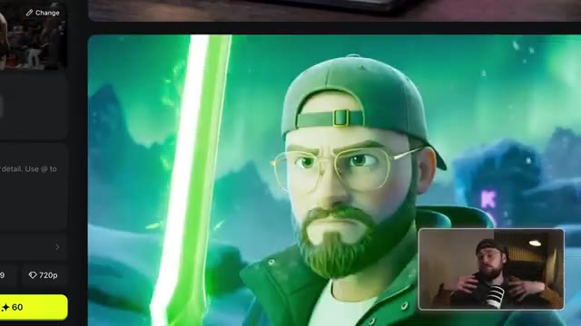
*Visualisation d'une image générée par IA représentant un personnage animé tenant une épée lumineuse verte, avec le retour vidéo du créateur en bas à droite (PiP).*

---

### ⏱️ `[00:13:19 - 00:13:54]` | Segment #27

**🔊 Audio (Transcription Intégrale Mot pour Mot en Français) :**
> évidemment je ne suis pas une célébrité ou quoi que ce soit mais nous avons vu avec des modèles par le passé comme VO que cela peut être bloqué comme une vraie ressemblance humaine donc pas de problème avec ça ici et ensuite nous avons juste ce prompt avec une caméra fixe verrouillée qui décrit l'effet visuel que je recherche donc nous pouvons y aller et cliquer sur générer maintenant je n'aime pas autant ce résultat que celui que j'ai utilisé dans l'intro mais quand même il y a beaucoup de choses sympas qui se passent ici j'adore ce genre de tremblement de caméra quand je me fais aspirer dans ce portail et aussi la façon dont le téléphone oscille et se retourne dans les airs

**👁️ Analyse Visuelle d'Écran (gemini-3.5-flash-lite) :**
**Interface & Outils** : Interface web de Seedance 2.0 (outil de génération de vidéo par IA) avec panneau de prompt latéral, réglages de durée (10s), format (16:9) et résolution (720p).

**Contenu textuel & Code** : Texte du prompt visible : "Static locked off camera: The mobile phone emits a powerful bright vivid pink light, suddenly the bearded man is sucked inside of the phone, with a bright pink flash, as a magical portal has drawn him in. The phone hovers in the air for a moment, then drops. No music, no dialogue"

**Action / Démonstration** : Le créateur montre l'interface de Seedance 2.0 avec le prompt saisi, puis présente le résultat de la vidéo générée montrant l'effet visuel d'aspiration et de lévitation du téléphone.

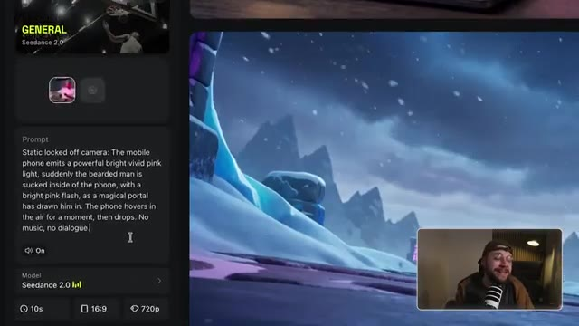
*Interface de l'outil Seedance 2.0 montrant le prompt textuel et le panneau de configuration avec le retour vidéo à l'écran et la webcam incrustée de Jack.*

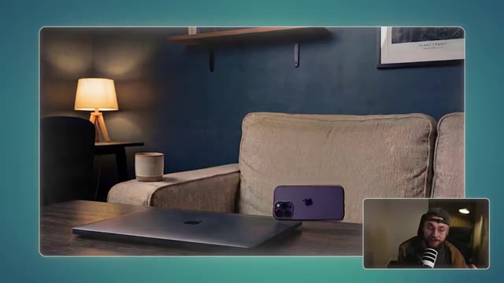
*Aperçu de la vidéo générée montrant un salon avec un ordinateur portable et un téléphone violet posé sur le canapé, avec la webcam incrustée de Jack en bas à droite.*

---

### ⏱️ `[00:13:54 - 00:14:28]` | Segment #28

**🔊 Audio (Transcription Intégrale Mot pour Mot en Français) :**
> et ensuite bascule et touche le ordinateur portable est plutôt sympa bien qu'il y ait une sorte de physique bancale qui se produit pendant quelques moments et juste pour vous montrer un autre exemplaire qui est assez différent plus d'une ambiance distordue où je suis très lentement attiré dans ce portail j'aime vraiment la façon dont le téléphone flotte en quelque sorte en suspension dans les airs puis tombe lentement et doucement sur le canapé. Alors oui, Seedance 2 fait vraiment un bon travail pour donner vie à ce genre d'effets visuels très spécifiques que j'avais en tête. Il vous donne des variations parmi lesquelles choisir,

**👁️ Analyse Visuelle d'Écran (gemini-3.5-flash-lite) :**
**Interface & Outils** : Affichage de rendus vidéo générés par Seedance 2 avec le créateur visible en incrustation PiP dans le coin inférieur droit.

**Contenu textuel & Code** : Rendu visuel d'un salon avec un ordinateur portable au premier plan, un canapé, une lampe allumée et un smartphone en lévitation ou en train de chuter.

**Action / Démonstration** : Le smartphone flotte dans les airs au-dessus du canapé puis descend et se pose doucement sur le coussin.

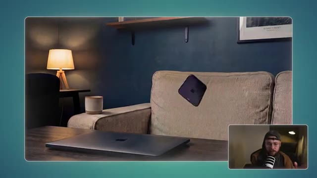
*Démonstration vidéo générée par IA montrant un smartphone planant au-dessus d'un canapé, avec le créateur en incrustation (PiP).*

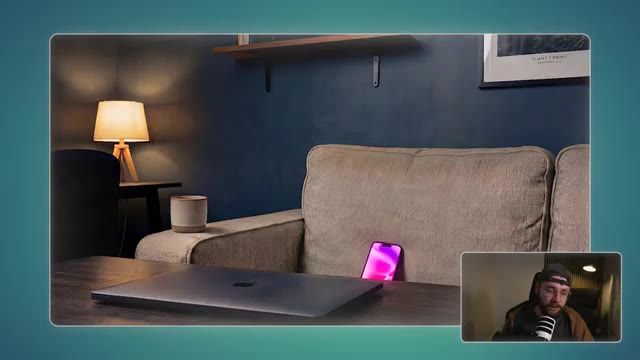
*Démonstration vidéo générée par IA montrant le smartphone en train de se poser délicatement sur le canapé, avec le créateur en incrustation (PiP).*

---

### ⏱️ `[00:14:29 - 00:15:03]` | Segment #29

**🔊 Audio (Transcription Intégrale Mot pour Mot en Français) :**
> mais bon nombre d'entre eux sont vraiment très bien. Beaucoup ont de sérieux atouts. Maintenant, Kling en revanche. Kling. Je ne sais pas trop quoi dire ici. Ce n'est pas très engageant. Aussi impressionnant que soit le modèle Kling 3, je me suis heurté à ce problème à de nombreuses reprises. Comme je l'ai dit, j'ai une vision très précise en tête du type d'effet que je recherche. Et il m'est arrivé à maintes reprises de ne tout simplement pas réussir à faire faire à Kling ce que je voulais. Et on se retrouve avec ce plan qui a l'air vraiment bizarre. Soyons honnêtes. Et juste pour vous montrer quelques autres exemples,

**👁️ Analyse Visuelle d'Écran (gemini-3.5-flash-lite) :**
**Interface & Outils** : Incrustation vidéo (PiP) du créateur sur fond de démonstration visuelle d'un salon généré par IA.

**Contenu textuel & Code** : Génération vidéo d'un intérieur de salon avec un canapé beige, une lampe de table, une tasse et un ordinateur portable Apple fermé sur le bureau.

**Action / Démonstration** : Présentation visuelle d'un exemple de rendu vidéo généré par IA pendant que le créateur parle en incrustation PiP.

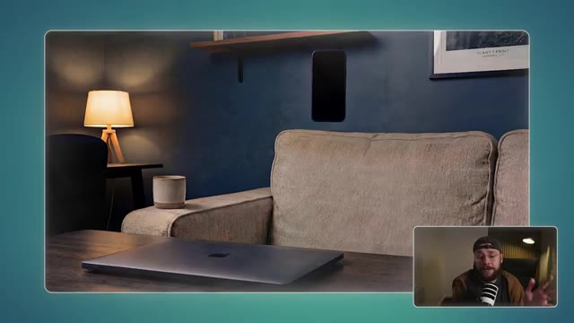
*Affichage d'une génération vidéo d'un salon avec un ordinateur portable fermé au premier plan et le créateur visible en incrustation (PiP) dans le coin inférieur droit.*

---

### ⏱️ `[00:15:03 - 00:15:40]` | Segment #30

**🔊 Audio (Transcription Intégrale Mot pour Mot en Français) :**
> Ce que j'ai fait, c'est que j'ai téléchargé cette image de référence de moi ici en tant que sorcier dans une sorte de marécage hanté. Toutes ces images ont été générées en utilisant soit Nano Banana Pro, soit Nano Banana 2, et encore une fois, nous visons un prompt multi-plans. Mon idée ici, bien sûr, est que si nous pouvons obtenir de bonnes générations multi-plans, et si vous voulez juste des plans uniques, cela va évidemment fonctionner aussi, donc c'est super pour vos projets créatifs. Et ici, je voulais tester si le discours tenait la route quand il s'agit de cela. Allons voir ce que nous avons obtenu. Quelque chose ici se souvient...

**👁️ Analyse Visuelle d'Écran (gemini-3.5-flash-lite) :**
**Interface & Outils** : Interface de l'outil Seedance 2.0 montrant les champs de prompt textuel, l'image de référence importée et les options de modèle.

**Contenu textuel & Code** : Texte du prompt visible : "Single-location, continuous dusk scene in a fog-choked haunted swamp: a weathered bearded wizard in plain dark robes wades through black water beneath twisted trees, whispering, 'Something here remembers me,' in a British accent. Start wide over the reeds, track behind as lantern light shakes, cut to close reactions and detail." Modèle : Seedance 2.0. Paramètres : 10s, 16:9, 720p.

**Action / Démonstration** : Le créateur montre l'interface de Seedance 2.0 avec le prompt détaillé d'une scène de marécage hanté, puis affiche le résultat vidéo généré avec le personnage du sorcier.

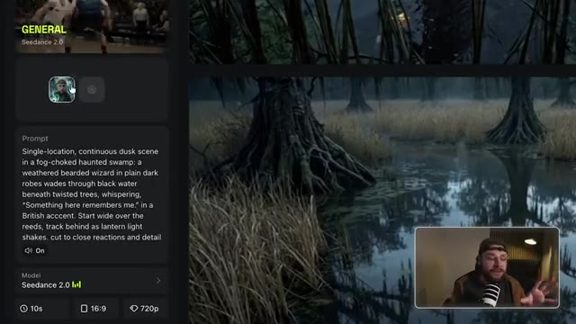
*Interface de Seedance 2.0 affichant le prompt, l'image de référence et les paramètres de génération avec le créateur en incrustation (PiP).*

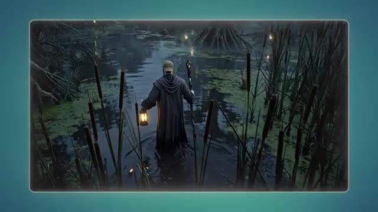
*Aperçu vidéo généré montrant un sorcier de dos marchant dans un marécage sombre avec une lanterne.*

---

### ⏱️ `[00:15:40 - 00:16:14]` | Segment #31

**🔊 Audio (Transcription Intégrale Mot pour Mot en Français) :**
> moi. Montre-toi. Donc je pense que c'est vraiment assez impressionnant. On a vraiment l'impression d'une scène de film et c'est ce que je trouve vraiment incroyable avec C-Dance 2. Il est capable de construire ces mondes et ces scènes qui vous attirent vraiment dedans. C'est un pas en avant vraiment fondamental pour la génération de vidéo par IA et je le ressens vraiment. La synchronisation labiale a l'air bonne. Le jeu d'acteur semble en quelque sorte

**👁️ Analyse Visuelle d'Écran (gemini-3.5-flash-lite) :**
**Interface & Outils** : Affichage d'extraits vidéo générés par intelligence artificielle avec incrustation PiP (Picture-in-Picture) du créateur.

**Contenu textuel & Code** : Aucun texte, prompt ou interface logicielle visible, uniquement des rendus vidéo cinématiques générés par IA.
[DESC_IMAGE_3_CORRECTION]

**Action / Démonstration** : Le créateur présente et commente à l'écran un extrait de vidéo générée par IA illustrant un personnage cinématique.

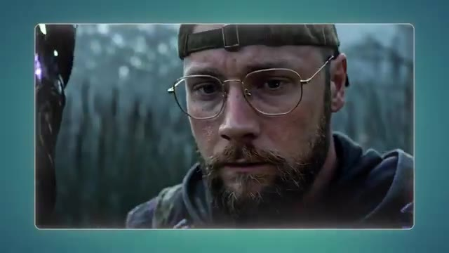
*Extrait vidéo généré par IA montrant un personnage barbu avec des lunettes dans un décor sombre et mystérieux (type marécage).*

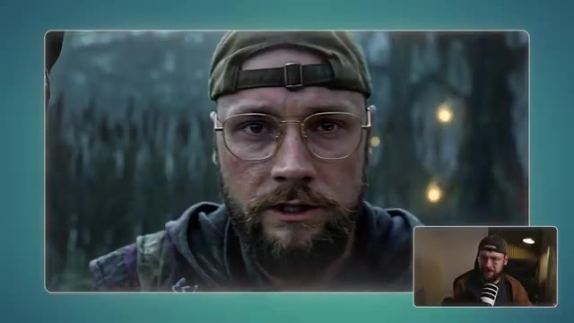
*Extrait vidéo généré par IA avec un encadré PiP montrant Jack dans son studio en train de commenter.*

---

### ⏱️ `[00:16:14 - 00:16:50]` | Segment #32

**🔊 Audio (Transcription Intégrale Mot pour Mot en Français) :**
> dramatique et crédible. Il y a une belle ambiance de ton là-dedans. Le seul problème que nous avons ici, c'est qu'en avançant, cette espèce de zombie des marécages attrape ma cheville et je continue simplement à avancer complètement insensible. Croyez-moi, si cela arrivait, je serais en train de flipper. Il y a donc ce léger décalage logique où l'on s'attendrait à ce que Sea Dance comprenne peut-être qu'il devrait y avoir ce type de réaction ou peut-être tout simplement à ne pas inclure ce plan. Mais quand même, je trouve que c'est vraiment, vraiment impressionnant. Il y a aussi un excellent niveau de cohérence des personnages ici, étant donné

**👁️ Analyse Visuelle d'Écran (gemini-3.5-flash-lite) :**
**Interface & Outils** : Affichage vidéo incrusté (PiP) d'un rendu généré par IA en grand format, avec le créateur visible dans un encadré en bas à droite.

**Contenu textuel & Code** : Rendu vidéo de type cinématique fantastique avec un personnage masculin (barbe, casquette à l'envers, lunettes) explorant un marais brumeux la nuit.

**Action / Démonstration** : Le créateur commente l'animation vidéo générée par IA tout en illustrant son propos avec des extraits visuels montrant les réactions du personnage dans l'environnement marécageux.

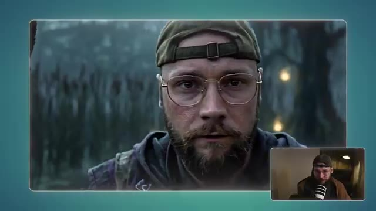
*Visuel de démonstration généré par IA montrant un personnage en gros plan dans un environnement brumeux.*

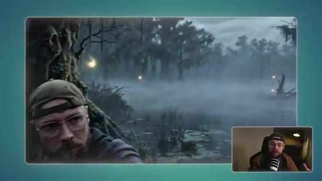
*Visuel de démonstration généré par IA montrant le personnage marchant dans un paysage marécageux brumeux.*

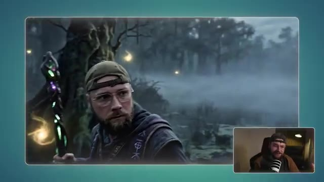
*Visuel de démonstration généré par IA montrant le personnage tenant un bâton lumineux dans un décor sombre et mystique.*

---

### ⏱️ `[00:16:50 - 00:17:24]` | Segment #33

**🔊 Audio (Transcription Intégrale Mot pour Mot en Français) :**
> Tout ce que j'ai donné à Sea Dance 2, c'est cette seule image de référence de moi en sorcier barbu. C'est vraiment cool. Et je voulais aussi proposer quelque chose de plus ancré dans la réalité, en examinant comment Sea Dance 2 gère la génération de dialogues. Nous utilisons donc cette image ici, qui ressemble à une sorte de scène de gangster où se produit une confrontation. Et là encore, un prompt assez long, qui décrit simplement la scène. Le genre de scène classique qu'on s'imaginerait voir dans un film de gangsters. Jetons donc un œil à ce qu'on a obtenu avec ça.

**👁️ Analyse Visuelle d'Écran (gemini-3.5-flash-lite) :**
**Interface & Outils** : Interface web de Seedance 2 (Seedance 2.0).

**Contenu textuel & Code** : Texte du prompt visible dans l'interface : "Single-location, continuous night scene in a dim back-room office above a shuttered club: a rugged bearded conman in a worn suit argues with a tense fellow gangster beside a scarred desk, cigarette haze in the air. Start wide, track sideways as they circle, cut to tight reaction close-ups, insert trembling hands and a ticking watch." Paramètres : Modèle Seedance 2.0, durée 10s, format 16:9, résolution 720p.

**Action / Démonstration** : Le créateur présente un extrait vidéo généré à partir d'une image de référence, puis montre l'interface de Seedance 2 avec le prompt détaillé d'une scène de confrontation de gangsters dans un bureau.

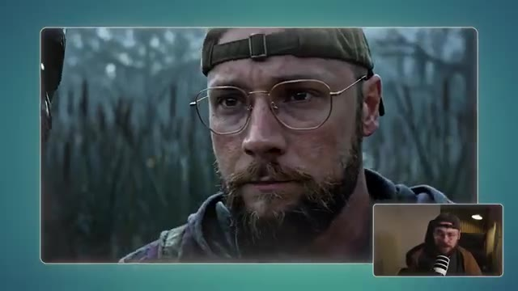
*Extrait vidéo généré montrant un personnage barbu avec des lunettes et une casquette dans une ambiance sombre.*

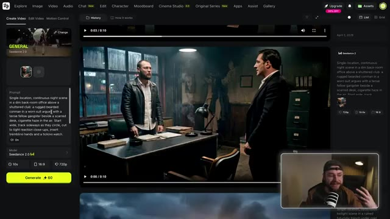
*Interface de l'outil Seedance 2 montrant le lecteur vidéo de la scène de gangsters et le panneau de prompt à gauche.*

---

### ⏱️ `[00:17:24 - 00:18:00]` | Segment #34

**🔊 Audio (Transcription Intégrale Mot pour Mot en Français) :**
> Je suis un arnaqueur, je ne suis pas un voleur, tu m'as volé, je t'ai arnaqué, ce n'est pas la même chose, tu connaissais les règles, tu as tenté ta chance et tu as perdu, ne me fais pas regretter de ne pas t'avoir tué quand j'en ai eu l'occasion. Donc, beaucoup de bon et de mauvais dans cette génération, donc un bon exemple pour analyser la cohérence des personnages, c'est un peu bancal dans ce plan large, ça ne me ressemble pas vraiment, le dialogue est plutôt bon, l'un des problèmes est que ça ressemble un peu à Tom Hardy qui a une discussion animée avec moi, n'est-ce pas ? Donc l'un des problèmes potentiels ici avec Seedance 2, c'est que c'est en fait...

**👁️ Analyse Visuelle d'Écran (gemini-3.5-flash-lite) :**
**Interface & Outils** : Affichage vidéo d'un contenu généré par intelligence artificielle (Seedance 2), avec incrustation PiP (Picture-in-Picture) du présentateur Jack dans l'image 3.

**Contenu textuel & Code** : Aucun texte, code ou prompt textuel n'est affiché à l'écran ; uniquement le rendu vidéo d'une scène de confrontation dramatique générée par IA.

**Action / Démonstration** : Diffusion d'un extrait de vidéo générée par IA illustrant un dialogue conflictuel entre deux personnages pour analyser la consistance des personnages et la ressemblance avec des acteurs connus.

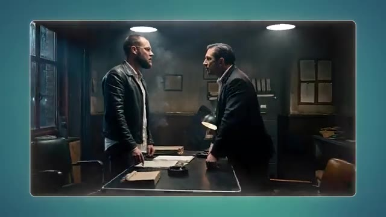
*Plan large généré par IA montrant une confrontation tendue entre deux hommes dans un bureau sombre, avec Jack dans le rôle de l'un des personnages.*

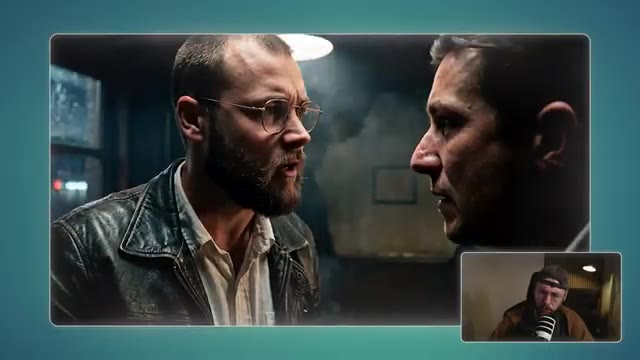
*Gros plan sur les deux personnages en train de se disputer, avec un encadré incrusté (PiP) de Jack en bas à droite parlant dans son micro.*

---

### ⏱️ `[00:18:00 - 00:18:32]` | Segment #35

**🔊 Audio (Transcription Intégrale Mot pour Mot en Français) :**
> y compris des acteurs connus et de la propriété intellectuelle dans certaines générations malgré tout le genre de modération et de bureaucratie intégrées dedans donc il ne veut pas que vous puissiez utiliser de la propriété intellectuelle ou des acteurs connus ou des divertisseurs mais il peut les mettre dans vos générations sans que vous le lui demandiez et c'est problématique et impressionnant en même temps je suppose. Quelques-uns des plans de coupe n'ont pas vraiment beaucoup de sens mais ensuite ce plan de la Rolex qui ressemble un peu à un placement produit bizarre et maladroit

**👁️ Analyse Visuelle d'Écran (gemini-3.5-flash-lite) :**
**Interface & Outils** : Vidéo de démonstration en plein écran avec un encadré incrusté (Picture-in-Picture) du présentateur en bas à droite.

**Contenu textuel & Code** : Aucun texte, prompt ou paramètre textuel n'est affiché à l'écran. Seuls des clips vidéo générés par IA sont présentés.

**Action / Démonstration** : Visualisation d'extraits vidéo générés par intelligence artificielle illustrant les propos du présentateur, montrant successivement une scène de bureau avec deux hommes puis un gros plan sur une montre Rolex.

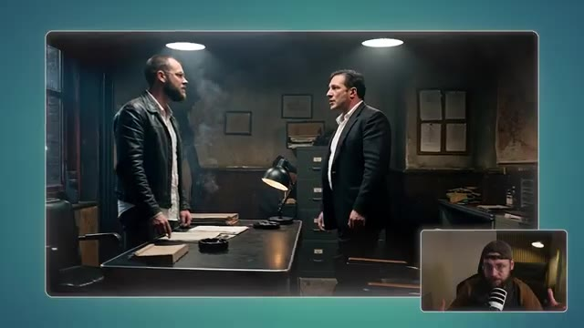
*Extrait vidéo généré par IA montrant deux hommes en train de discuter dans un bureau sombre, avec l'encadré du présentateur en bas à droite*

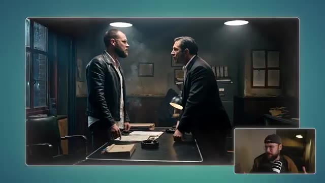
*Gros plan sur la scène de discussion entre les deux hommes dans le bureau, avec l'encadré du présentateur en bas à droite*

*Gros plan sur une montre Rolex bicolore tenue dans une main, avec l'encadré du présentateur en bas à droite*

---

### ⏱️ `[00:18:32 - 00:19:10]` | Segment #36

**🔊 Audio (Transcription Intégrale Mot pour Mot en Français) :**
> est tout à fait impressionnant en soi, car cela ressemble vraiment à une vraie Rolex, vous voyez, les détails là-dedans sont plutôt cool. Je suis vraiment content d'avoir généré ceci parce que j'ai l'impression que cela englobe bien beaucoup des bons et des mauvais côtés de Seedance aussi, et je pense que cela nous amène gentiment à aborder certains des problèmes de Seedance 2 parce que, aussi impressionnant soit-il, il n'est pas sans problèmes. Le premier est cette limite de résolution à 720p. Je trouve cela assez restrictif, surtout en ce qui concerne les cas d'utilisation professionnelle, et plus encore l'aspect général de compression que vous allez

**👁️ Analyse Visuelle d'Écran (gemini-3.5-flash-lite) :**
**Interface & Outils** : Présentation vidéo avec incrustation (PiP) du créateur en bas à droite.

**Contenu textuel & Code** : Générations vidéo par IA illustrant les capacités et les défauts de Seedance 2 (montre, expressions faciales, scènes d'intérieur).

**Action / Démonstration** : Le créateur commente les exemples vidéo générés par l'IA affichés à l'écran principal tout en apparaissant en bas à droite.

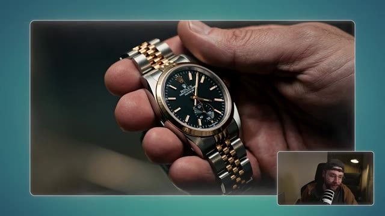
*Extrait vidéo généré par IA montrant une main tenant une montre Rolex bicolore avec un cadran noir.*

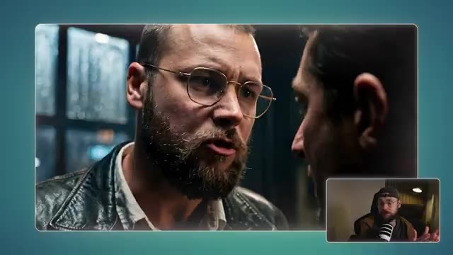
*Extrait vidéo généré par IA montrant un homme barbu portant des lunettes en train de parler de près.*

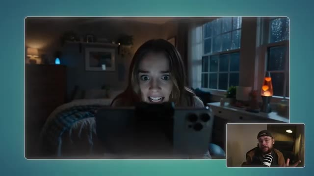
*Extrait vidéo généré par IA montrant une jeune femme effrayée regardant l'écran d'un smartphone.*

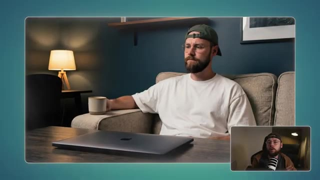
*Extrait vidéo généré par IA montrant un homme assis sur un canapé tenant une tasse avec un ordinateur portable fermé devant lui.*

---

### ⏱️ `[00:19:10 - 00:19:31]` | Segment #37

**🔊 Audio (Transcription Intégrale Mot pour Mot en Français) :**
> Créez avec vos générations C-Dance 2. Elles ont super allure sur les réseaux sociaux, mais si vous les projetez sur un grand écran, vous allez probablement rencontrer des problèmes. Comme je le disais plus tôt, même si vous passez cela par un suréchantillonneur (upscaler), vous aurez toujours cette compression apparente. Ça ne va pas magiquement régler le problème. C'est en quelque sorte intégré à votre génération.

**👁️ Analyse Visuelle d'Écran (gemini-3.5-flash-lite) :**
**Interface & Outils** : Présentation vidéo avec incrustation (PiP - Picture-in-Picture) du créateur en bas à droite.

**Contenu textuel & Code** : Exemples visuels de vidéos générées par IA illustrant les problèmes de qualité et de compression sur grand écran.

**Action / Démonstration** : Le créateur commente en voix the off (avec sa caméra en PiP) des exemples de clips vidéo générés par IA affichés à l'écran principal.

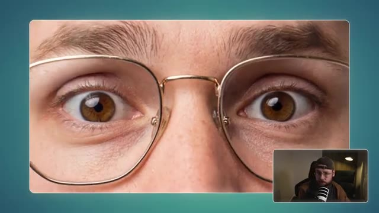
*Gros plan très rapproché généré par IA sur les yeux d'une personne portant des lunettes, avec le créateur en incrustation (PiP) en bas à droite.*

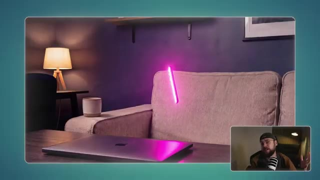
*Scène de salon générée par IA montrant un canapé, une lampe allumée et un bâton lumineux rose flottant en lévitation, avec le créateur en incrustation (PiP) en bas à droite.*

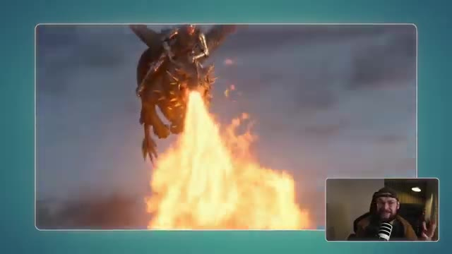
*Scène d'action générée par IA montrant un cavalier sur une créature volante crachant du feu, avec le créateur en incrustation (PiP) en bas à droite.*

---

### ⏱️ `[00:19:31 - 00:20:08]` | Segment #38

**🔊 Audio (Transcription Intégrale Mot pour Mot en Français) :**
> Donc, espérons qu'à l'avenir ByteDance trouve un moyen de résoudre ce problème. Et le prochain problème, ce genre de sentiment de censure ou de lourdeur administrative, ces lettres de mise en demeure des studios d'Hollywood semblent vraiment avoir fait des dégâts ici. Les choses vont définitivement devenir restrictives, surtout si vous essayez de vous approcher de la propriété intellectuelle existante. Je suppose donc que si vous utilisez des outils d'IA pour créer quelque chose qui semble réellement frais et original, j'aimerais espérer que vous ne rencontreriez pas ces problèmes de manière aussi prononcée. Donc, du côté positif, c'est en quelque sorte une motivation pour

**👁️ Analyse Visuelle d'Écran (gemini-3.5-flash-lite) :**
**Interface & Outils** : Séquence vidéo avec incrustation PiP (Picture-in-Picture) de Jack dans le coin inférieur droit.

**Contenu textuel & Code** : Générations vidéo d'IA illustrant des scènes de science-fiction et des personnages cinématographiques.

**Action / Démonstration** : Le créateur commente les problèmes de droits d'auteur et de censure tout en diffusant des extraits de vidéos générées par IA à l'écran.

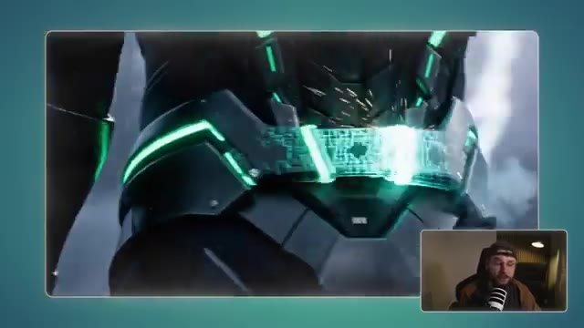
*Séquence vidéo générée par IA montrant un gros plan sur la ceinture technologique lumineuse d'un personnage en armure futuriste.*

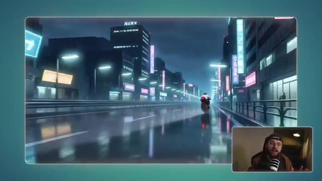
*Séquence vidéo générée par IA montrant une rue urbaine de nuit sous la pluie, avec un personnage de dos conduisant une moto.*

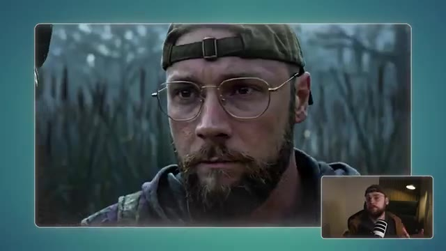
*Séquence vidéo générée par IA montrant un gros plan sur un personnage barbu avec des lunettes et une casquette dans un décor naturel.*

---

### ⏱️ `[00:20:08 - 00:20:40]` | Segment #39

**🔊 Audio (Transcription Intégrale Mot pour Mot en Français) :**
> créez vos propres personnages, vos propres idées, vos propres histoires en utilisant les outils. Vous devriez être plus en sécurité de cette façon. Le rendu de texte semble également poser un problème. J'ai eu des générations où le texte a l'air plutôt bizarre et en contraste ici Cling 3 fait vraiment un très bon travail pour préserver de très petits détails de texte fins. Vraiment impressionnant pour ce modèle vidéo. Pas tant que ça quand il s'agit de C-Dance 2 dans ce domaine particulier. Et mon approche personnelle avec laquelle je vais beaucoup expérimenter

**👁️ Analyse Visuelle d'Écran (gemini-3.5-flash-lite) :**
**Interface & Outils** : Démonstration vidéo avec incrustation (PiP) du présentateur.

**Contenu textuel & Code** : Affichage d'une génération vidéo par IA dans une rue de style cyberpunk/urbain nocturne avec un personnage sur une moto volante et du texte illisible ou stylisé sur un grand panneau publicitaire.

**Action / Démonstration** : Le créateur illustre ses propos sur le rendu des détails textuels et visuels par les modèles vidéo en montrant un exemple de génération à l'écran.

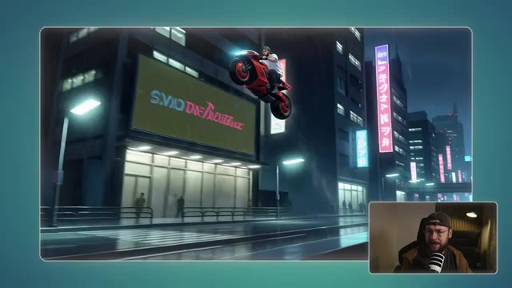
*Vidéo générée par IA montrant un personnage sur une moto rouge futuriste volant dans une rue urbaine nocturne, avec un panneau lumineux affichant du texte stylisé et un encadré de Jack face caméra.*

---

### ⏱️ `[00:20:40 - 00:21:04]` | Segment #40

**🔊 Audio (Transcription Intégrale Mot pour Mot en Français) :**
> pour aller de l'avant est de combiner réellement C-Dance 2 avec Cling 3 parce qu'il y a certaines choses que Cling fait mieux. Il y a certaines choses que C-Dance fait mieux. C'est réellement la voie que j'ai suivie pour l'intro. Il y a quelques générations sournoises de Cling 3 glissées là-dedans où j'ai eu du mal à obtenir les résultats que je voulais de C-Dance 2 ou en heurtant certaines restrictions bizarres.

**👁️ Analyse Visuelle d'Écran (gemini-3.5-flash-lite) :**
**Interface & Outils** : Interface de génération vidéo et application mobile Seedance 2.0 (affichage en incrustation PiP de la caméra du créateur dans le coin inférieur droit).

**Contenu textuel & Code** : Texte affiché sur l'écran du smartphone : « SEEDANCE 2.0 » et un bouton « ENTER ».

**Action / Démonstration** : Le créateur illustre son propos en montrant à l'écran des exemples de vidéos générées (Kling / Seedance) et un écran de smartphone affichant Seedance 2.0 tout en parlant face caméra.

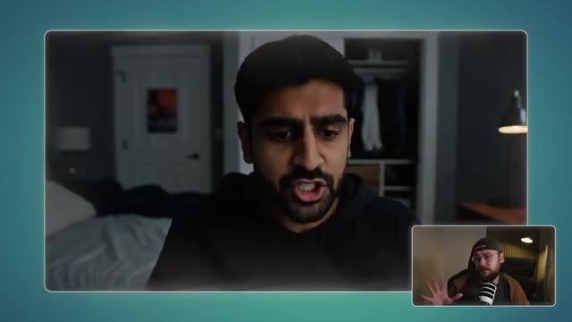
*Génération vidéo IA avec incrustation du créateur en incrustation PiP dans le coin inférieur droit.*

*Autre génération vidéo IA montrant un homme assis sur un canapé avec un ordinateur portable et une tasse, avec le créateur en incrustation PiP.*

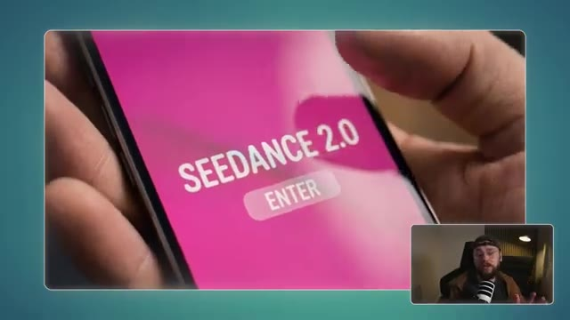
*Gros plan sur un écran de smartphone affichant l'interface rose de Seedance 2.0 avec un bouton « ENTER », avec le créateur en encadré PiP.*

---

### ⏱️ `[00:21:04 - 00:21:32]` | Segment #41

**🔊 Audio (Transcription Intégrale Mot pour Mot en Français) :**
> Mais cela étant dit, les gars, j'espère vraiment que vous avez apprécié la vidéo d'aujourd'hui. Je pense que nous avons fait une analyse et une exploration assez approfondies de Seedance 2. Évidemment, c'est encore assez récent, il y a donc beaucoup plus à explorer ici. Cela étant dit, si vous voulez me soutenir, assurez-vous d'aimer cette vidéo. Si vous êtes nouveau, pensez à vous abonner et bien sûr, activez la cloche de notification pour ne jamais manquer aucun contenu futur ou aucun futur chargement où nous explorons Seedance 2 plus en détail.

**👁️ Analyse Visuelle d'Écran (gemini-3.5-flash-lite) :**
**Interface & Outils** : Présentation face caméra sans partage d'écran

**Contenu textuel & Code** : Aucun contenu logiciel ou visuel affiché à l'écran, uniquement le créateur dans son studio.

**Action / Démonstration** : Le créateur s'adresse directement à son audience face caméra pour conclure la vidéo.

---

### ⏱️ `[00:21:32 - 00:21:42]` | Segment #42

**🔊 Audio (Transcription Intégrale Mot pour Mot en Français) :**
> Merci beaucoup d'avoir regardé les gars. Si vous souhaitez aller de l'avant et consulter un peu plus de mon contenu, vous pouvez le faire en cliquant sur la vidéo à l'écran dès maintenant. Sinon, je vous retrouve dans la prochaine.

**👁️ Analyse Visuelle d'Écran (gemini-3.5-flash-lite) :**
**Interface & Outils** : Présentation face caméra sans partage d'écran

**Contenu textuel & Code** : Aucun contenu logiciel ou visuel affiché à l'écran, uniquement le créateur dans son studio.

**Action / Démonstration** : Le créateur s'adresse directement à son public pour conclure la vidéo et inciter à regarder d'autres contenus.

---
