# 🎬 Comment se cloner avec l'IA et ne plus JAMAIS filmer

> **Chaîne** : [Jack Vs. AI](https://www.youtube.com/@JackVsAI)  
> **Titre original** : `How to Clone Yourself With AI and NEVER Film Again`  
> **Lien YouTube** : [https://www.youtube.com/watch?v=9_1tIRHfomQ](https://www.youtube.com/watch?v=9_1tIRHfomQ)  
> **Date de publication** : 2026-04-09  
> **Durée** : 17m 06s (`1026s`)  
> **Identifiant vidéo** : `9_1tIRHfomQ`  
> **Fiche Web Interactive** : [2026-04-09_YT-9_1tIRHfomQ_Comment se cloner avec l'IA et ne plus JAMAIS filmer_by-whisper-v3-large-turbo+gemini-3.5-flash-lite.html](2026-04-09_YT-9_1tIRHfomQ_Comment se cloner avec l'IA et ne plus JAMAIS filmer_by-whisper-v3-large-turbo+gemini-3.5-flash-lite.html)  
> **Captures de démonstration clés** : `60 captures réelles (anti-talking-head)`  
> **Modèles utilisés** : Audio: `large-v3-turbo` (Faster-Whisper int8 VPS) | Vision: `gemini-3.5-flash-lite` (Google AI Studio API)  

---

## 📌 Synthèse Exécutive & Outils

### 📌 Résumé
La création de contenu vidéo à fort volume représente un défi éreintant pour les créateurs modernes, souvent confrontés à l'épuisement professionnel, aux contraintes logistiques et aux urgences de production. Dans cette vidéo, le créateur Jack Vs. AI dévoile une solution radicale pour s'affranchir du tournage traditionnel : le clonage numérique complet grâce à l'intelligence artificielle. En s'appuyant sur des technologies de pointe, il démontre qu'il est possible de générer des vidéos au rendu photoréaliste d'une personne — incluant ses expressions faciales, sa gestuelle, sa voix et ses vêtements — en partant d'une simple séquence de 15 secondes et d'un échantillon audio. 

La méthode étape par étape présentée repose sur l'utilisation de la plateforme HeyGen, depuis l'importation brute de la vidéo de référence jusqu'à la vérification rigoureuse de l'identité pour des raisons de sécurité éthique. Jack détaille ensuite comment personnaliser l'avatar en modifiant son "look de base" à l'aide d'une image neutre ou d'éléments de scène contextuels, permettant ainsi de simuler des décors de studio professionnels et des tenues variées sans budget de production réel. Enfin, le processus aborde le clonage vocal à travers différents moteurs text-to-speech, soulignant les nuances d'intonation et l'impact des accents régionaux sur la fidélité du résultat final.

Cette approche révolutionnaire change la donne pour les marques et les créateurs en quête de productivité. Elle permet de multiplier la cadence de publication par dix tout en préservant la qualité perçue. Que ce soit pour pallier une absence de studio, gérer des révisions urgentes de clients ou automatiser des flux de production, l'avatar IA offre une flexibilité inédite, redéfinissant les frontières de la post-production et de la création de contenu vidéo.

### 🛠️ Outils, Modèles & Logiciels Présentés
* **HeyGen** : La plateforme principale utilisée pour l'entraînement, la génération et la personnalisation de l'avatar IA ainsi que pour le clonage vidéo.
* **11labs v3** : Le modèle de synthèse vocale testé pour le clonage audio, évalué pour sa capacité à reproduire le timbre et le dynamisme de la voix originale.
* **Phish** : Un autre modèle de clonage et de synthèse vocale proposé dans l'écosystème pour générer la voix de l'avatar à partir d'un fichier audio pré-enregistré.

### 🔑 Points Clés & Enseignements Stratégiques
* **Optimisation de la vidéo de référence** : Utiliser un enregistrement brut de 15 secondes sans script rigide permet de capturer des pauses naturelles, des hésitations et des mouvements oculaires authentiques indispensables pour l'IA.
* **Sécurité et vérification d'identité** : Le système exige une validation par lecture d'un code face à la webcam afin d'empêcher l'usurpation d'identité non consentie et l'utilisation malveillante des avatars.
* **Gestion des accessoires complexes** : Le port de lunettes ou de casquettes peut bloquer partiellement le visage, mais l'IA moderne de HeyGen parvient tout de même à traiter ces éléments avec un résultat visuel convaincant.
* **Maîtrise du look de base** : Téléverser une image fixe avec une expression neutre permet d'éviter que l'outil ne sélectionne automatiquement une frame aux expressions faciales inappropriées extraites de la vidéo brute.
* **Verrouillage de la cohérence des personnages** : L'utilisation d'images de référence multiples dans les éléments de scène aide à stabiliser l'apparence de l'avatar à travers différentes générations de décors.
* **Personnalisation radicale des décors** : Il est possible de modifier instantanément l'environnement et la garde-robe de l'avatar (du sweat décontracté au costume de studio sophistiqué avec éclairage dramatique) via des prompts textuels.
* **Dissociation audio-visuelle** : Le workflow permet de produire du contenu en important simplement un fichier audio pré-enregistré, libérant ainsi le créateur de la nécessité physique d'être présent dans son studio.
* **Comparaison des modèles vocaux** : Les différents moteurs de clonage vocal (comme 11labs ou Phish) réagissent différemment selon la complexité du timbre, nécessitant des tests d'écoute pour trouver le meilleur compromis en termes d'énergie et d'émotion.
* **Défis liés aux accents régionaux** : Les accents spécifiques ou prononcés (comme l'anglais du sud de l'Angleterre) peuvent altérer la fluidité du clonage vocal automatisé, générant parfois un rendu légèrement monotone.
* **Gain de productivité massif** : Cette méthode permet de multiplier par dix le volume de production de contenu tout en s'affranchissant des contraintes matérielles, des déplacements et de la fatigue liée aux tournages répétés.

---

## ⏱️ Chronologie & Transcription Complète Audio & Visuelle (Mot pour Mot)

### ⏱️ `[00:00:00 - 00:00:19]` | Segment #01

**🔊 Audio (Transcription Intégrale Mot pour Mot en Français) :**
> La création de contenu est putain de brutale. Comment êtes-vous censé publier chaque jour sans perdre la tête ? Et si le projet parfait débarque de votre marque de rêve et que vous n'êtes nulle part près de votre installation ? Ou qu'un client a besoin de révisions maintenant et que votre emploi du temps est déjà surchargé ? C'est suffisant pour vous donner envie de jeter l'éponge, mais j'ai une confession à faire.

**👁️ Analyse Visuelle d'Écran (gemini-3.5-flash-lite) :**
**Interface & Outils** : Présentation face caméra et scènes d'illustration par Jack Vs. AI, sans partage d'écran de logiciel ou démonstration technique.

**Contenu textuel & Code** : Texte à l'écran : "CONTENT CREATION IS F*CKING BRUTAL", "PERFECT PROJECT LANDS", "NOWHERE NEAR YOUR SETUP", "IT'S ENOUGH MAKE YOU WANT TO THROW IN THE TOWEL...".

**Action / Démonstration** : Jack illustre la difficulté de la création de contenu à travers des saynètes et s'exprime face caméra dans son studio.

---

### ⏱️ `[00:00:19 - 00:00:55]` | Segment #02

**🔊 Audio (Transcription Intégrale Mot pour Mot en Français) :**
> Ces plans de face, ils n'étaient pas réels. C'était mon avatar IA. Il a l'exacte apparence et la voix de moi-même. Il peut être stylisé comme je le veux, placé dans n'importe quel environnement que je choisis et utilisé pour créer du contenu sans jamais avoir besoin d'une caméra, et cela change tout pour les créateurs et les marques qui essaient d'augmenter leur volume de production sans s'épuiser complètement. Dans la vidéo d'aujourd'hui, je vais vous montrer comment construire votre propre avatar IA réaliste en téléversant seulement 15 secondes de séquence et comment vous pouvez multiplier par 10 votre production sans sacrifier la qualité. Avant d'entrer dans le vif du sujet, je suis Jack.

**👁️ Analyse Visuelle d'Écran (gemini-3.5-flash-lite) :**
**Interface & Outils** : Présentation face caméra sans partage d'écran

**Contenu textuel & Code** : Aucun texte ou interface logicielle visible (uniquement des graphiques textuels de sous-titres : "IN TODAYS VIDEO BUILD YOU OWN AI AVATAR" sur l'image 3 et "10X OUTPUT" / "WITHOUT SACRIFICING QUALITY" sur l'image 4).

**Action / Démonstration** : Jack s'adresse directement à la caméra en plan-séquence dans son studio de création.

---

### ⏱️ `[00:00:55 - 00:01:17]` | Segment #03

**🔊 Audio (Transcription Intégrale Mot pour Mot en Français) :**
> et si vous voulez rester informés de tous les derniers outils et plateformes d'IA, assurez-vous de lâcher un pouce bleu sur cette vidéo et pensez à vous abonner. Pour commencer à créer, nous sommes sur HeyGen, et sur la page d'accueil, vous voulez aller sur créer votre propre avatar IA. Maintenant nous avons une option ici pour créer un personnage virtuel, ce qui est utile si vous ne cherchez pas à recréer l'apparence de quelqu'un.

**👁️ Analyse Visuelle d'Écran (gemini-3.5-flash-lite) :**
**Interface & Outils** : Navigateur web affichant une chaîne YouTube (Image 1) puis l'interface de la plateforme de génération vidéo HeyGen (Images 2 et 3).

**Contenu textuel & Code** : Sur l'image 1, miniatures de vidéos YouTube avec des titres comme 'Seedance 2.0 is FINALLY here', 'How to use Kling 3.0'. Sur l'image 2, tableau de bord HeyGen avec le texte 'Hey Jack, where do you want to start?' et des options (AI Studio, Video Agent, Script to Video, Avatars, Translate, Upscale video). Sur l'image 3, interface 'Create a new avatar' avec deux choix : 'Clone a real person' et 'Create a virtual character', avec un sous-titre en bas : 'CREATE A VIRTUAL CHARACTER USEFUL TO AVOID USING SOMEONE'S LIKENESS'.

**Action / Démonstration** : Le créateur navigue d'abord sur une page YouTube pour introduire son sujet, puis bascule sur l'interface de l'outil HeyGen pour montrer comment accéder à la création d'un avatar virtuel et présenter les différentes options disponibles.

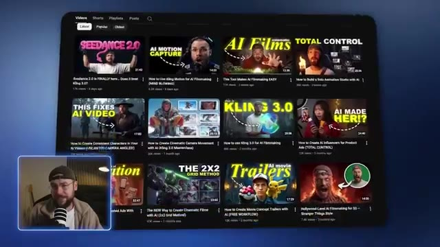
*Navigation sur une chaîne YouTube affichant différentes miniatures de vidéos de tutoriels sur l'IA avec Jack en incrustation PiP.*

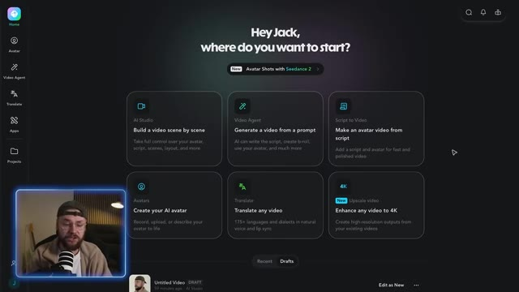
*Page d'accueil de la plateforme HeyGen montrant les différentes options de création vidéo et d'avatars.*

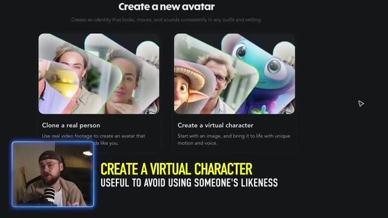
*Page de création d'avatar sur HeyGen avec les options 'Clone a real person' et 'Create a virtual character'.*

---

### ⏱️ `[00:01:17 - 00:01:53]` | Segment #04

**🔊 Audio (Transcription Intégrale Mot pour Mot en Français) :**
> Ou nous pouvons cloner une vraie personne, ce qui est bien sûr sur quoi nous nous concentrons, alors nous allons aller de l'avant et cliquer là-dessus. La première étape consiste à télécharger juste 15 secondes de séquences de vous-même, qu'Heygen utilisera ensuite pour entraîner votre avatar IA. Donc ici, il va recréer vos manières, votre style de présentation et appliquer cela au mouvement de la vidéo. Nous pouvons enregistrer via une webcam. Nous pouvons à la place utiliser notre téléphone, ou nous pouvons télécharger des séquences. Je vais glisser-déposer cette vidéo que j'ai prise de moi-même. Et honnêtement, c'est juste moi en train de raconter n'importe quoi. Je dis juste les

**👁️ Analyse Visuelle d'Écran (gemini-3.5-flash-lite) :**
**Interface & Outils** : Heygen (outil de génération et clonage de vidéo par IA)

**Contenu textuel & Code** : Texte à l'écran : "Create a new avatar", "Clone a real person", "Create a virtual character", "Create your Avatar in 15 seconds", "Record via webcam", "Record via phone", "upload footage", "Landscape", "MacBook Pro Cam", "Default - MacBook", "I'm ready".

**Action / Démonstration** : Le créateur navigue dans l'interface d'Heygen, survole l'option de clonage d'une vraie personne, puis explore les différentes méthodes d'enregistrement (webcam, téléphone, et téléchargement de séquences).

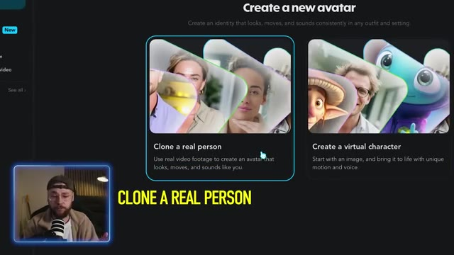
*Interface d'Heygen montrant l'option 'Clone a real person' pour créer un avatar à partir d'une vraie personne.*

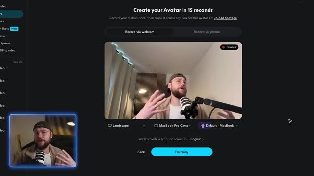
*Interface d'Heygen pour la création d'avatar avec l'option d'enregistrement 'Record via webcam'.*

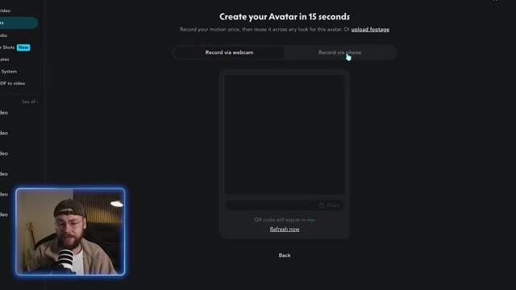
*Interface d'Heygen affichant l'option 'Record via phone' avec un espace pour un code QR.*

---

### ⏱️ `[00:01:53 - 00:02:27]` | Segment #05

**🔊 Audio (Transcription Intégrale Mot pour Mot en Français) :**
> les premières choses qui me sont venues à l'esprit, mais je pense que c'est bien parce que je ne livre pas quelque chose qui a été scripté, il y a donc beaucoup de pauses et de silences naturels au milieu de la référence vidéo. Mes gestes de la main, la rotation de la tête, ces mouvements subtils des yeux se produisent tous de la même manière que si j'avais une conversation normale avec quelqu'un, et tout cela va être très utile lorsqu'il s'agira d'entraîner l'IA. Nous pouvons donc ajouter un nom pour notre avatar, puis cliquer sur créer. Le processus se déroule donc très rapidement et comme vous

**👁️ Analyse Visuelle d'Écran (gemini-3.5-flash-lite) :**
**Interface & Outils** : Interface de création d'avatar (style HeyGen ou similaire) avec un menu latéral sombre et une fenêtre principale de confirmation de génération d'avatar, incluant une incrustation vidéo (PiP) du créateur.

**Contenu textuel & Code** : Texte à l'écran : "Your Avatar is ready to use!", "Choose your avatar's voice, then start creating videos!", et un bouton bleu "Use in a video". Dans le panneau latéral gauche : "Avatar", "Video Agent", "Translate", "Apps", "Projects", "Avatars", "AI Studio", "Avatar Shots New", "Templates", "Brand System", "PPT/PDF to video", "Recent", "Untitled Video".

**Action / Démonstration** : Le créateur montre l'interface de l'application de création d'avatar qui indique que le traitement est terminé avec succès et que l'avatar est prêt à être utilisé.

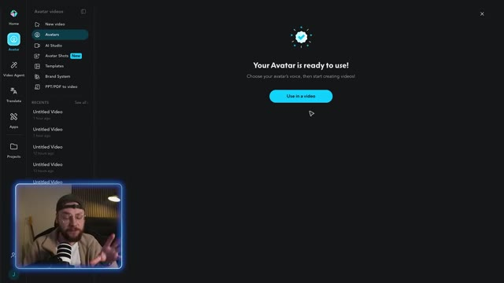
*Interface montrant que l'avatar est prêt à être utilisé avec un bouton bleu 'Use in a video' et le créateur en incrustation vidéo (PiP) dans le coin inférieur gauche.*

---

### ⏱️ `[00:02:27 - 00:02:51]` | Segment #06

**🔊 Audio (Transcription Intégrale Mot pour Mot en Français) :**
> On peut voir que nous avons maintenant l'option d'utiliser notre avatar dans une vidéo. Maintenant, nous avons une étape très importante ici pour vérifier notre identité. C'est pour que nous ne puissions pas simplement aller cloner n'importe qui et leur faire dire des choses qu'ils ne diraient pas. Donc, une fois que j'ai cliqué sur vérifier, tout ce que j'ai à faire est de lire ce code à haute voix devant ma webcam et en 30 à 60 secondes notre avatar sera approuvé.

**👁️ Analyse Visuelle d'Écran (gemini-3.5-flash-lite) :**
**Interface & Outils** : Interface de la plateforme HeyGen montrant les options de création et de vérification d'avatar.

**Contenu textuel & Code** : Textes visibles : 'Your Avatar is ready to use!', 'Verify identity', '8 - HeyGen - 8', 'Avatar Verified'.
[DESC_IMAGE_1] L'utilisateur visualise l'écran de préparation de l'avatar et s'apprête à passer à l'étape suivante.
[DESC_IMAGE_2] L'utilisateur effectue la vérification d'identité en lisant le code affiché face à sa webcam.
[DESC_IMAGE_3] L'avatar est officiellement vérifié et validé dans l'interface de l'outil HeyGen.

**Action / Démonstration** : Démonstration pédagogique et présentation du workflow.

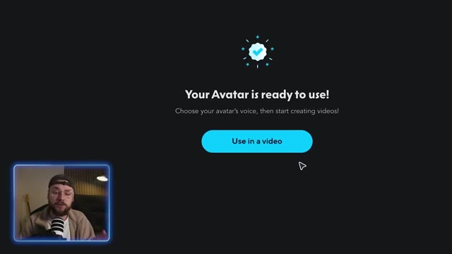
*Écran de confirmation indiquant que l'avatar est prêt à être utilisé avec un bouton bleu 'Use in a video'.*

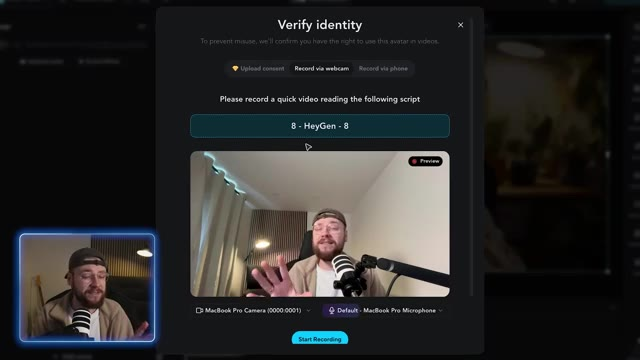
*Interface de vérification d'identité avec la webcam active et le code à lire à voix haute '8 - HeyGen - 8'.*

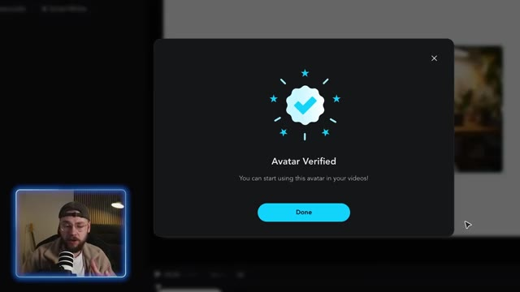
*Fenêtre de confirmation pop-up indiquant 'Avatar Verified' avec un bouton 'Done'.*

---

### ⏱️ `[00:02:51 - 00:03:27]` | Segment #07

**🔊 Audio (Transcription Intégrale Mot pour Mot en Français) :**
> Simple comme bonjour. Et maintenant, nous pouvons nous lancer dans la conception de notre look, ce qui est l'un des principaux avantages d'avoir un avatar IA, car nous pouvons les adapter spécifiquement à n'importe quel cas d'usage. Nous pourrions vouloir que les vêtements ou l'arrière-plan fassent décontracté, ou nous pourrions vouloir opter pour la direction opposée et choisir quelque chose de beaucoup plus formel. Maintenant, la première chose que je veux faire est de survoler cette image de moi en bas et de sélectionner « changer le look de base » (change base look), et maintenant j'ai la possibilité de téléverser cette photo fixe que j'ai prise de moi dans ma configuration normale avec une expression très neutre. Alors allons-y.

**👁️ Analyse Visuelle d'Écran (gemini-3.5-flash-lite) :**
**Interface & Outils** : Interface web d'un outil de création d'avatars IA avec panneau de script à gauche, zone de prévisualisation centrale et options de design de look à droite.

**Contenu textuel & Code** : Texte visible dans l'interface : "Avatar videos", "Untitled Video", "Brand System", "Design Look With AI", "Change base look", "Describe the edits you'd like to make to", "16:9", "Generate".

**Action / Démonstration** : Le créateur survole une image miniature dans l'interface de design d'avatar pour sélectionner l'option de modification du look de base.

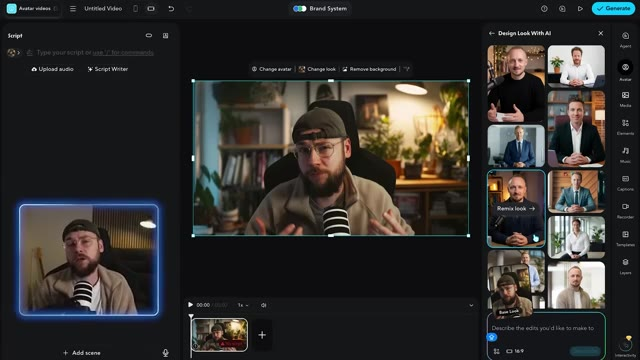
*Interface de l'application de création d'avatars IA montrant le panneau latéral avec différentes options de design de look et la vidéo principale de l'orateur.*

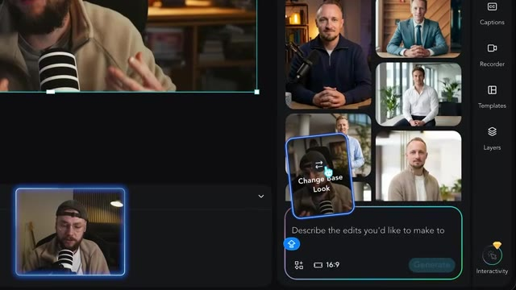
*Gros plan sur l'interface montrant le survol de l'image miniature avec l'option « Change Base Look » affichée.*

---

### ⏱️ `[00:03:27 - 00:03:46]` | Segment #08

**🔊 Audio (Transcription Intégrale Mot pour Mot en Français) :**
> et déposez ça là. Maintenant, si nous ne changeons pas notre look de base ici, HeyGen va automatiquement parcourir et sélectionner une image de cette séquence vidéo que nous avons téléchargée un peu plus tôt. Et ça conviendra peut-être très bien pour vous, mais j'ai réalisé que je fais beaucoup de têtes bizarres quand je parle face caméra.

**👁️ Analyse Visuelle d'Écran (gemini-3.5-flash-lite) :**
**Interface & Outils** : Présentation face caméra sans partage d'écran logiciel.

**Contenu textuel & Code** : Aucun contenu textuel, interface ou prompt visible.

**Action / Démonstration** : Le créateur parle face caméra en gesticulant devant son micro.

---

### ⏱️ `[00:03:47 - 00:04:14]` | Segment #09

**🔊 Audio (Transcription Intégrale Mot pour Mot en Français) :**
> L'outil a donc du mal à trouver une expression neutre, ce qui est finalement ce que nous recherchons ici. Et vous pouvez voir qu'un problème est signalé ici, et c'est parce que je porte mes lunettes et ma casquette, qui bloquent efficacement mon visage. Mais vous savez quoi ? Je vais laisser ça tel quel. C'est comme ça que je m'habille pour mes vidéos. Je veux donc voir comment HeyGen gère réellement cette situation. Est-ce que ça peut quand même donner un résultat convaincant avec ces éléments présents ?

**👁️ Analyse Visuelle d'Écran (gemini-3.5-flash-lite) :**
**Interface & Outils** : HeyGen (interface de création vidéo par IA)

**Contenu textuel & Code** : Messages d'avertissement visibles : "Not recommended as a base look", "Quality issues in this image can affect how closely new looks resemble you", "Face visibility & Accessories", "10 passed checks", ratio 16:9, options de style et de design.

**Action / Démonstration** : Le créateur montre l'interface de HeyGen avec un avertissement de qualité lié à ses lunettes et sa casquette, expliquant qu'il souhaite tester l'outil avec sa tenue habituelle.

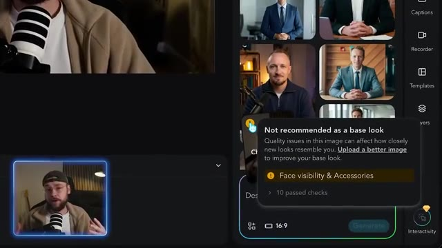
*Gros plan sur l'interface de HeyGen montrant un avertissement concernant la visibilité du visage et les accessoires.*

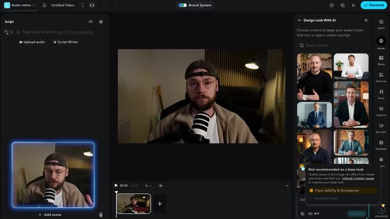
*Vue complète de l'interface HeyGen montrant le panneau de script, la timeline vidéo et les options de design avec l'alerte d'accessoires.*

---

### ⏱️ `[00:04:14 - 00:04:32]` | Segment #10

**🔊 Audio (Transcription Intégrale Mot pour Mot en Français) :**
> Maintenant, vous pouvez voir que nous avons tout un tas de looks prédéfinis et que n'importe lequel dont le style nous plaît, nous pouvons simplement cliquer sur "remix look" et nous pouvons en envoyer autant que nous le voulons ici. Et si nous cliquons sur "view", nous pouvons voir chacun d'eux en cours de génération au fur et à mesure.

**👁️ Analyse Visuelle d'Écran (gemini-3.5-flash-lite) :**
**Interface & Outils** : Interface logicielle de type montage vidéo ou avatar IA avec barre latérale d'outils (Avatar, Media, Elements, Music, Captions, Recorder, Templates, Layers) et grille de sélection de styles.

**Contenu textuel & Code** : Panneau latéral avec des vignettes de styles prédéfinis (looks), bouton "Remix look", et vignettes de génération en cours avec indication de progression ("34%").

**Action / Démonstration** : Le curseur survole une option "Remix look" sur une vignette de style, puis l'écran suivant montre la progression de la génération des avatars modifiés.

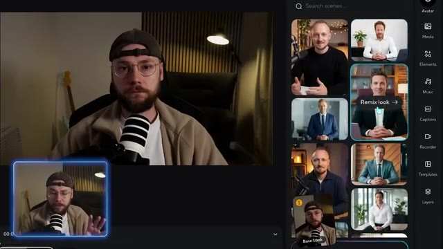
*Interface de l'application montrant la bibliothèque de looks prédéfinis avec l'option "Remix look" survolée.*

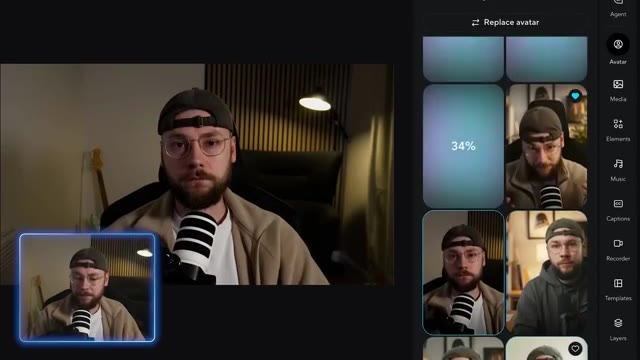
*Interface montrant le panneau latéral avec des aperçus en cours de génération, dont un affichant "34%".*

---

### ⏱️ `[00:04:32 - 00:04:54]` | Segment #11

**🔊 Audio (Transcription Intégrale Mot pour Mot en Français) :**
> Mais si nous voulons avoir un tout petit peu plus de contrôle sur cette étape du processus, ce que nous pouvons faire, c'est survoler cette icône ici et sélectionner quelques éléments de scène. Si je clique dessus, vous pouvez voir que j'ai quelques images de référence de moi-même. Je vais donc aller de l'avant et sélectionner ces deux-là. Et cela va essentiellement aider à verrouiller la cohérence des personnages.

**👁️ Analyse Visuelle d'Écran (gemini-3.5-flash-lite) :**
**Interface & Outils** : Interface de création vidéo par IA (similaire à HeyGen ou outil similaire) avec panneau de gestion des éléments de scène et prévisualisation vidéo.

**Contenu textuel & Code** : Texte visible : "Add a scene element", "Upload or select up to 3 images to reference specific products, objects, or outfits in your avatar", "Design Look With AI".

**Action / Démonstration** : Le créateur montre l'interface de sélection des éléments de scène et sélectionne deux images de référence de lui-même pour assurer la cohérence du personnage.

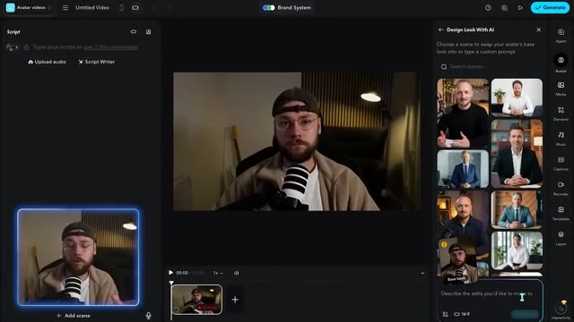
*Interface logicielle de création vidéo avec panneau latéral permettant de choisir des éléments de scène ou des avatars.*

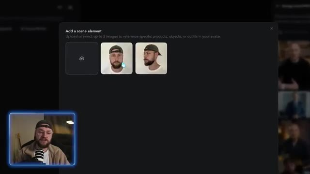
*Fenêtre contextuelle "Add a scene element" affichant deux images de référence du visage du créateur.*

---

### ⏱️ `[00:04:54 - 00:05:14]` | Segment #12

**🔊 Audio (Transcription Intégrale Mot pour Mot en Français) :**
> Donc nous pourrions opter pour quelque chose de plutôt simple, comme montrer le même homme barbu portant un sweat à capuche gris. Allez-y et lancez cette génération. Ou peut-être un changement un peu plus radical. Nous dirons donc de montrer le même homme barbu dans une veste de travail et un t-shirt gris foncé à l'intérieur d'un studio de podcast avec un éclairage violet dramatique.

**👁️ Analyse Visuelle d'Écran (gemini-3.5-flash-lite) :**
**Interface & Outils** : Interface logicielle de génération vidéo par IA avec panneaux latéraux (Recorder, Templates, Layers, Interactivity), grille de prévisualisations et zone de prompt.

**Contenu textuel & Code** : Texte visible dans le champ de prompt : "Show the same bearded man wearing a grey hoodie." Bouton "Generate" bleu, format 16:9, et vignette étiquetée "Base Look".

**Action / Démonstration** : Le créateur montre l'interface de génération avec le prompt saisi pour recréer le personnage avec un sweat à capuche gris.

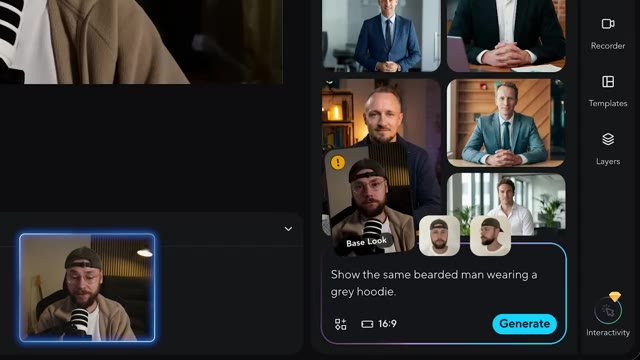
*Interface de l'outil de génération vidéo montrant une grille de prévisualisations, une vignette "Base Look" et un champ de prompt textuel.*

---

### ⏱️ `[00:05:14 - 00:05:34]` | Segment #13

**🔊 Audio (Transcription Intégrale Mot pour Mot en Français) :**
> Et si nous allons dans l'aperçu maintenant, vous verrez que nous avons cette très grande variété de looks différents. Des arrière-plans alternatifs, des vêtements et une orientation. Juste une sélection massive parmi laquelle vous pouvez choisir. Cela signifie que vous pouvez refaire le studio ou la garde-robe de votre avatar sans avoir à dépenser des milliers d'euros en réalité.

**👁️ Analyse Visuelle d'Écran (gemini-3.5-flash-lite) :**
**Interface & Outils** : Interface de création d'avatar avec panneau de sélection à droite (Avatar, Media, Elements, Music, Captions, Recorder, Templates, Layers) et un écran vidéo à gauche affichant l'animateur et des mots clés.

**Contenu textuel & Code** : Texte à l'écran : "BACKGROUND", "CLOTHING", "ORIENTATION". Dans le panneau latéral : en-tête "Jack Kennedy", option "Replace avatar", et une grille de vignettes montrant différentes tenues et arrière-plans pour l'avatar. Un bouton bleu "Generate" en haut à droite.

**Action / Démonstration** : Le créateur présente l'interface logicielle et le panneau latéral permettant de modifier l'apparence, l'arrière-plan et les vêtements de l'avatar.

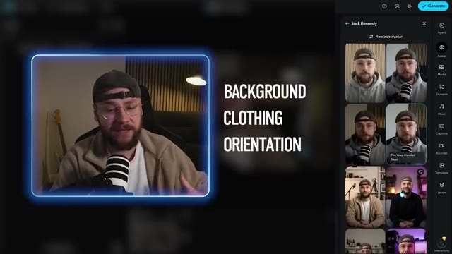
*Interface de l'outil montrant un panneau latéral avec une grille d'avatars aux styles variés et du texte à l'écran listant 'BACKGROUND, CLOTHING, ORIENTATION'.*

---

### ⏱️ `[00:05:35 - 00:05:53]` | Segment #14

**🔊 Audio (Transcription Intégrale Mot pour Mot en Français) :**
> Ce processus consiste à avoir de la variété et à vous donner le plus de contrôle possible. Maintenant, en ce qui concerne notre voix, nous avons plusieurs options différentes. Si vous avez un enregistrement de bonne qualité de vous-même prononçant votre script, vous pouvez vous rendre sur le côté gauche et cliquer sur l'option de téléchargement audio.

**👁️ Analyse Visuelle d'Écran (gemini-3.5-flash-lite) :**
**Interface & Outils** : Interface d'un logiciel de création de vidéos par avatar IA (type HeyGen ou similaire) avec panneau latéral de configuration de l'avatar et de la voix.

**Contenu textuel & Code** : Texte visible dans l'interface : "Avatar videos", "Untitled Video", "Brand System", "Script", "Type your script or use '/' for commands", "Upload audio", "Script Writer", "Avatar & Voice (Scene 1)", "Jack Kennedy", "Avatar V".

**Action / Démonstration** : Le curseur de la souris survole ou clique sur les options de configuration vocale et de téléchargement audio sur le côté gauche de l'interface.

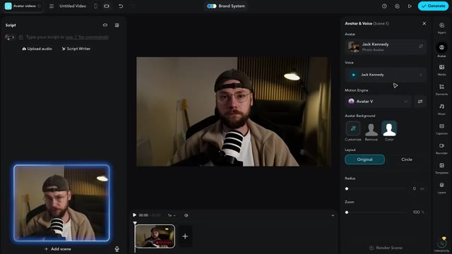
*Interface complète de l'application de création de vidéos par avatar montrant le panneau latéral des options vocales et l'aperçu de la scène.*

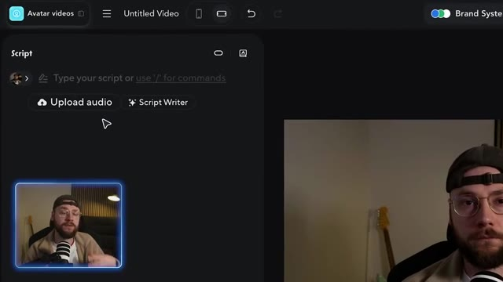
*Gros plan sur le panneau de script à gauche de l'interface montrant les boutons "Upload audio" et "Script Writer".*

---

### ⏱️ `[00:05:53 - 00:06:26]` | Segment #15

**🔊 Audio (Transcription Intégrale Mot pour Mot en Français) :**
> Cet audio sera ensuite appliqué sur votre avatar IA et j'obtiens de très bons résultats de cette façon. Disons donc qu'il n'est pas pratique pour vous d'être dans votre studio à la maison, mais que vous voulez quand même produire du contenu. Vous pouvez balancer un enregistrement audio et laisser HeyGen s'occuper de la partie visuelle. L'autre option est de survoler cet onglet ici pour la voix et de cliquer dessus. Et vous pouvez voir que j'ai déjà une voix créée ici, mais si nous cliquons sur "changer", vous verrez que nous avons l'option de cloner, concevoir une voix ou importer depuis un tiers.

**👁️ Analyse Visuelle d'Écran (gemini-3.5-flash-lite) :**
**Interface & Outils** : HeyGen (interface de création d'avatars et de clonage vocal)

**Contenu textuel & Code** : Menus et paramètres visibles : "Edit Voice", "Jack Kennedy", "Voice clone", "Improve this voice", "Switch voice", curseurs "Speed" et "Volume" à 100%, onglets latéraux (Agent, Avatar, Media, Elements, Music, Captions, Recorder, Templates), option "Import from 3rd party", "Voice Clone".

**Action / Démonstration** : Le créateur montre l'interface de HeyGen avec les options de gestion de la voix et du clonage vocal.

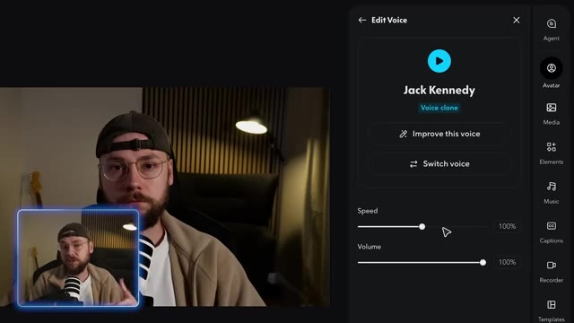
*Interface HeyGen montrant les options de configuration de la voix "Jack Kennedy" avec curseurs de vitesse et de volume.*

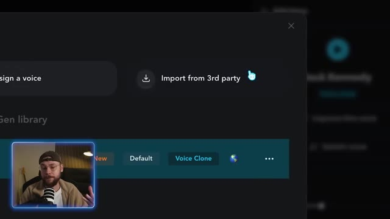
*Fenêtre modale HeyGen montrant les options de clonage, de design de voix et d'importation depuis un tiers.*

---

### ⏱️ `[00:06:26 - 00:07:01]` | Segment #16

**🔊 Audio (Transcription Intégrale Mot pour Mot en Français) :**
> Donc ici, nous voulons aller de l'avant et cliquer sur cloner votre voix. Maintenant, nous avons l'option d'enregistrer directement dans HeyGen. Encore une fois, nous pouvons importer un fichier audio. Je vais donc suivre cette voie. Une fois de plus, je peux aller de l'avant et déposer mon fichier audio pré-enregistré. Cela étant dit, nous pouvons cliquer sur générer la voix et attendre pendant que notre voix est clonée. Une fois que c'est traité, vous verrez que nous avons quelques options différentes, chacune utilisant un modèle de voix IA différent. Maintenant, allons écouter cela. Un excellent clone vocal doit sembler clair, énergique, et exactement comme vous.

**👁️ Analyse Visuelle d'Écran (gemini-3.5-flash-lite) :**
**Interface & Outils** : Interface web de HeyGen (fenêtre modale "Create voice clone").

**Contenu textuel & Code** : Fenêtre modale "Create voice clone" avec les onglets "Record audio" et "Upload audio", instructions de lecture d'un texte d'exemple ("OH my gosh... I can HARDLY sit still right now..."), sélection de la langue (English) et du microphone (MacBook Pro Microphone), bouton d'enregistrement rouge avec compteur (00:00 / 00:30). Encadré PiP montrant Jack dans son studio.

**Action / Démonstration** : Le créateur montre l'interface de clonage vocal de HeyGen, illustrant les options d'enregistrement ou d'importation d'un fichier audio.

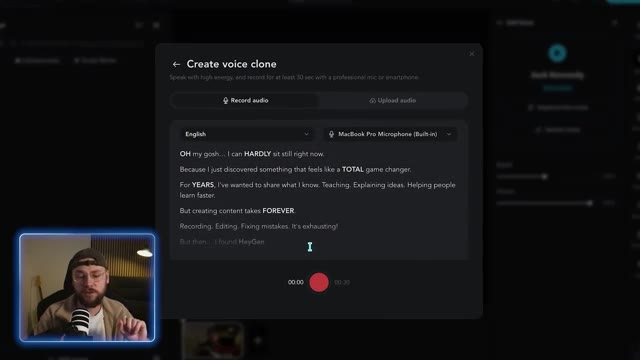
*Interface HeyGen affichant la fenêtre modale de création de clone vocal avec les options d'enregistrement direct et un encadré PiP du présentateur dans le coin inférieur gauche.*

---

### ⏱️ `[00:07:01 - 00:07:39]` | Segment #17

**🔊 Audio (Transcription Intégrale Mot pour Mot en Français) :**
> Ouais, d'accord. Celle-là ne fait pas l'affaire. Essayons 11labs v3. Fermez les yeux. Est-ce que ça ressemble à votre voix ? Si vous aimez ce que vous entendez, créons votre premier. Donc, pour les deux résultats d'11labs, je ne suis pas vraiment convaincu. Allons-y et essayons Phish. Salut, je suis ravi que tu sois là. Voici l'aperçu de ton clone vocal. Écoute rapidement. Donc, même si ça me ressemble un peu, je ne pense pas que ce soit parfait à 100 %. C'est un peu monotone et il n'y a pas beaucoup d'émotion ou d'enthousiasme dans le rendu. Cependant, c'est la meilleure des options que nous avons ici. Donc je vais cliquer sur

**👁️ Analyse Visuelle d'Écran (gemini-3.5-flash-lite) :**
**Interface & Outils** : Interface de clonage vocal (probablement HeyGen ou outil similaire) avec gestion des modèles audio ElevenLabs et Fish, incluant une incrustation vidéo PiP (Picture-in-Picture) du créateur.

**Contenu textuel & Code** : Textes visibles : "Voice clone ready", "HeyGen_Audio_Training_2", "ElevenLabs", "ElevenLabs V3", "Fish", "Re-record", "Use this voice", "MY VOICE CLONE", "SPEECH IS A LITTLE MONOTONAL".

**Action / Démonstration** : Le créateur navigue à travers différentes options de modèles de clonage vocal (ElevenLabs, ElevenLabs V3, Fish) pour comparer le rendu audio par rapport à sa propre voix.

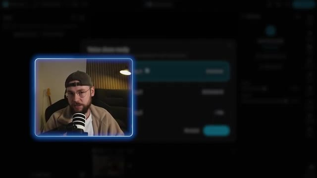
*Interface de clonage vocal affichant les options de test avec incrustation vidéo PiP du créateur.*

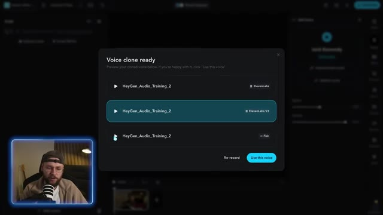
*Fenêtre modale "Voice clone ready" montrant les différentes options ElevenLabs et Fish, avec le créateur en PiP.*

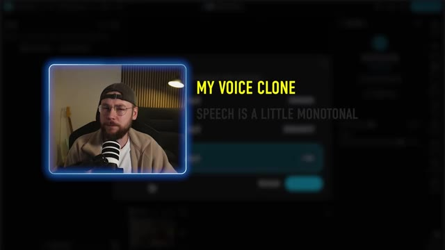
*Affichage du texte incrusté "MY VOICE CLONE" et "SPEECH IS A LITTLE MONOTONAL" pendant la revue des voix.*

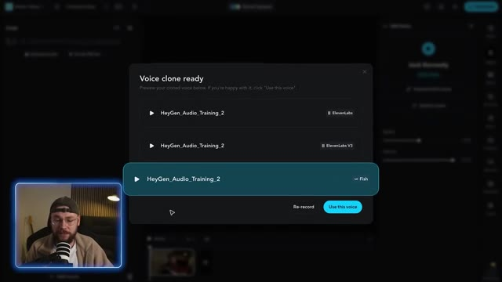
*Sélection de l'option de clonage vocal "Fish" dans l'interface de test.*

---

### ⏱️ `[00:07:39 - 00:08:12]` | Segment #18

**🔊 Audio (Transcription Intégrale Mot pour Mot en Français) :**
> utilisez cette voix. Maintenant, la difficulté pour cloner ma voix est peut-être due au fait que j'ai un accent un peu bizarre. Je suis né et j'ai grandi dans le sud de l'Angleterre, ce qui donne un accent plutôt huppé, j'imagine qu'on pourrait dire, mais maintenant j'habite dans le sud de Londres. Il y a donc en quelque sorte deux opposés polaires dans mon accent qui se manifestent au fil des phrases, vous savez, c'est donc peut-être un peu difficile pour un modèle d'IA de vraiment saisir ou comprendre mon accent spécifique. Comme je le dis, cependant, si je devais utiliser cet outil, je me contenterais de télécharger un audio. Et de cette façon,

**👁️ Analyse Visuelle d'Écran (gemini-3.5-flash-lite) :**
**Interface & Outils** : Interface logicielle de clonage vocal (avec panneau de script et options 'Upload audio' / 'Script Writer') et incrustation vidéo de Jack.

**Contenu textuel & Code** : Texte visible : 'Script', 'Type your script or use '/' for commands', 'Upload audio', 'Script Writer'.

**Action / Démonstration** : Le curseur de la souris clique sur le bouton 'Upload audio' de l'interface pendant que Jack s'exprime.

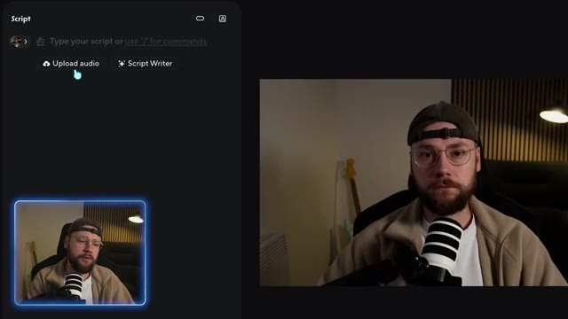
*Interface de l'outil de clonage vocal montrant la zone de script et le bouton 'Upload audio', avec Jack en incrustation vidéo (PiP)*

---

### ⏱️ `[00:08:12 - 00:08:37]` | Segment #19

**🔊 Audio (Transcription Intégrale Mot pour Mot en Français) :**
> vous savez que la voix va sembler naturelle parce que c'est en fait la vôtre. Vous verrez également sur le côté gauche, nous pouvons insérer ici le script que nous aimerions voir lu par notre avatar IA. Et il y a également quelques options différentes ici pour verrouiller ce ton spécifique. Si nous cliquons sur l'onglet style de diffusion, nous pouvons diriger notre voix en décrivant le type d'émotion que nous recherchons.

**👁️ Analyse Visuelle d'Écran (gemini-3.5-flash-lite) :**
**Interface & Outils** : Interface HeyGen (panneau de script à gauche, fenêtre de prévisualisation vidéo au centre, panneau de configuration avatar à droite).

**Contenu textuel & Code** : Texte du script visible à l'écran commençant par « Content creation is f****** brutal... » et options de l'avatar (Avatar, Voice, Motion Engine, Avatar Background, Layout, Delivery style).

**Action / Démonstration** : Le créateur montre l'interface de HeyGen, déplace son curseur et zoome sur l'option de style de diffusion pour contrôler l'émotion de l'avatar.

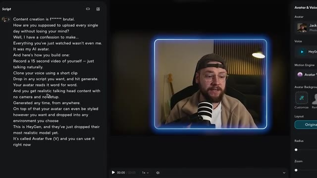
*Interface de l'outil HeyGen affichant le panneau de script à gauche et l'avatar vidéo au centre avec ses paramètres à droite.*

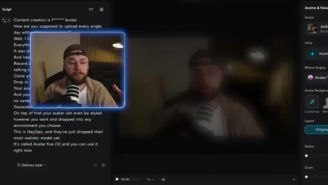
*Interface de HeyGen montrant l'apparition de l'onglet « Delivery style » en bas à gauche sous le script.*

---

### ⏱️ `[00:08:37 - 00:08:59]` | Segment #20

**🔊 Audio (Transcription Intégrale Mot pour Mot en Français) :**
> Nous pouvons également utiliser le miroir de voix. C'est donc là que nous pouvons nous enregistrer, puis HeyGen fera correspondre l'interprétation en utilisant le clone vocal pour rapprocher un peu plus les choses de notre son réel. Et puis nous pouvons, bien sûr, également utiliser l'amélioration automatique pour ajouter des balises afin de contrôler l'émotion, le rythme et les effets sonores si vous voulez un parcours plus direct.

**👁️ Analyse Visuelle d'Écran (gemini-3.5-flash-lite) :**
**Interface & Outils** : HeyGen (interface de création vidéo par IA avec panneau de script à gauche, aperçu vidéo au centre et paramètres d'avatar/voix à droite)

**Contenu textuel & Code** : Texte du script : "Content creation is f****** brutal...", options de style de livraison incluant "Direct voice", "Mirror voice" ("Record yourself, we'll match your delivery in the selected voice") et "Auto-enhance" ("Automatically adds tags to control emotion, pacing, and sound effects").

**Action / Démonstration** : Le curseur de la souris survole et sélectionne l'option "Mirror voice" puis "Auto-enhance" dans l'interface de HeyGen.

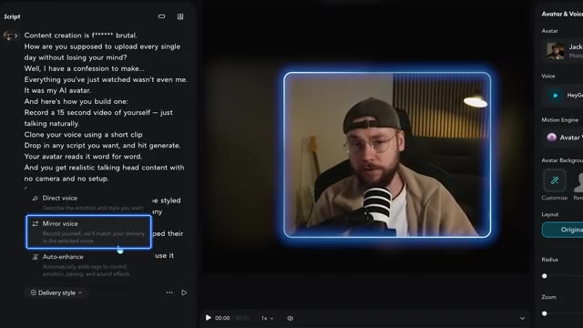
*Interface HeyGen montrant l'option "Mirror voice" sélectionnée dans le panneau de script.*

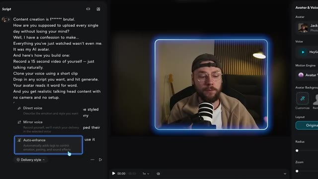
*Interface HeyGen montrant l'option "Auto-enhance" sélectionnée dans le panneau de script.*

---

### ⏱️ `[00:08:59 - 00:09:27]` | Segment #21

**🔊 Audio (Transcription Intégrale Mot pour Mot en Français) :**
> Allons-y et testons le clonage vocal ici. Donc nous allons simplement utiliser le microphone de base intégré à notre ordinateur portable ici. Ce microphone est configuré avec mon installation d'enregistrement donc il ne va pas être utilisé pour cela. Comment est-on censé publier du contenu tous les jours sans perdre la tête ? Eh bien, j'ai une confession à faire. Donc, une fois cela enregistré, nous pouvons aller de l'avant et cliquer sur appliquer. Très bien, écoutons le résultat que nous avons obtenu. Comment est-on censé publier du contenu tous les jours sans perdre la tête ?

**👁️ Analyse Visuelle d'Écran (gemini-3.5-flash-lite) :**
**Interface & Outils** : HeyGen (application web de génération d'avatars et de synthèse vocale par IA)

**Contenu textuel & Code** : Fenêtres modales de clonage vocal ("Mirror your voice"), options "Record audio" et "Upload audio", sélection du microphone intégré (MacBook Pro Microphone), script textuel affiché dans le panneau de gauche et options d'avatar à droite (Avatar 5).

**Action / Démonstration** : Le créateur montre l'interface de HeyGen pour enregistrer sa voix et appliquer le clonage vocal, puis écoute le résultat.

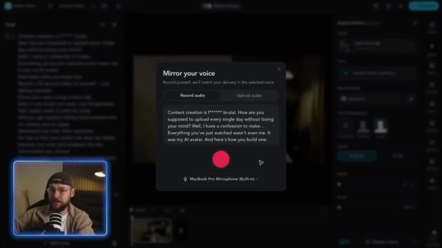
*Interface HeyGen affichant la fenêtre contextuelle de clonage vocal 'Mirror your voice' avec un enregistreur audio.*

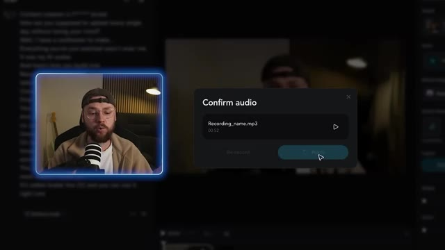
*Interface HeyGen affichant la fenêtre de confirmation audio 'Confirm audio' avec un bouton 'Apply'.*

*Interface HeyGen affichant le panneau d'édition de script et les paramètres de l'avatar avec une incrustation vidéo du créateur.*

---

### ⏱️ `[00:09:27 - 00:10:00]` | Segment #22

**🔊 Audio (Transcription Intégrale Mot pour Mot en Français) :**
> Eh bien, j'ai une confession à vous faire. Tout ce que vous venez de voir n'était même pas moi. C'était mon avatar IA, donc encore une fois, bien que ce ne soit pas parfait, je pense que c'est plus proche que d'utiliser simplement le clone vocal de base, je pense que le mirroring aide un peu à l'améliorer et à se rapprocher de mes types de maniérismes pour notre moteur de mouvement. Nous voulons vraiment utiliser l'avatar 5, c'est le dernier modèle de HeyGen et cela mènera à ces mouvements vraiment agréables et naturels qui se marieront bien avec votre clone vocal. En ce qui concerne l'arrière-plan, vous pouvez le personnaliser en sélectionnant l'un des fonds de catalogue.

**👁️ Analyse Visuelle d'Écran (gemini-3.5-flash-lite) :**
**Interface & Outils** : Interface HeyGen (logiciel de création d'avatars par IA), comportant un panneau de script textuel à gauche, un lecteur vidéo central avec l'avatar et un panneau de configuration à droite (Avatar, Voice, Motion Engine, Avatar Background, Layout, Radius, Zoom).

**Contenu textuel & Code** : Texte du script visible à l'écran (« Content creation is brutal... »), réglages de l'avatar (« Jack Kennedy », « HeyGen_Audio_Training_2 », « Motion Engine: Avatar V »), et menus déroulants proposant les versions Avatar V (Premium, « Moves like you. Motion adapts to script »), Avatar IV et Avatar III.

**Action / Démonstration** : Le créateur montre l'interface de HeyGen en expliquant l'utilisation de l'avatar IA et sélectionne ou survole le paramètre du moteur de mouvement « Avatar V ».

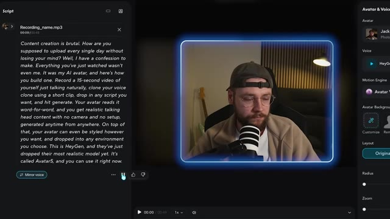
*Interface de l'application HeyGen montrant le panneau de script à gauche et l'aperçu vidéo de l'avatar au centre.*

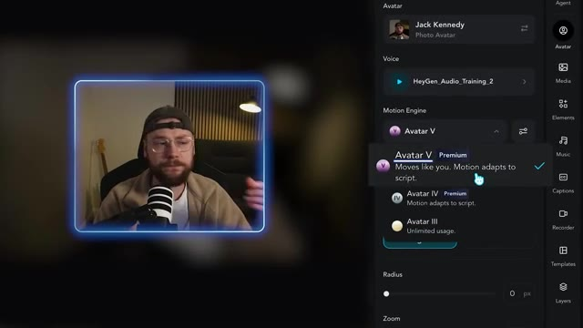
*Interface de HeyGen affichant le panneau latéral de sélection du moteur de mouvement avec l'option « Avatar V » mise en avant.*

---

### ⏱️ `[00:10:00 - 00:10:34]` | Segment #23

**🔊 Audio (Transcription Intégrale Mot pour Mot en Français) :**
> des images disponibles sur HeyGen. Vous pouvez également supprimer directement l'arrière-plan ou aller de l'avant et ajouter une couleur spécifique à la place, comme cette couleur de fond vert. Très utile lorsqu'il s'agit du montage. Vous pouvez voir à partir de ce résultat que cela ne fait pas un travail parfait pour m'isoler de l'arrière-plan. C'est probablement parce qu'il n'y a pas tellement de contraste entre, par exemple, cette chaise et puis la chaise là-bas derrière moi. Mais c'est probablement assez bien si vous l'utilisez simplement pour du contenu social, des TikToks et des choses comme ça où ça va être assez petit dans le cadre. Si nous revenons à

**👁️ Analyse Visuelle d'Écran (gemini-3.5-flash-lite) :**
**Interface & Outils** : Interface HeyGen (éditeur vidéo et studio d'avatars avec panneau de script à gauche, aperçu central et options d'avatar et de voix à droite).

**Contenu textuel & Code** : Texte du script visible à gauche ("So I first started experimenting..."), options "Avatar Background" ("Customize", "Remove", "Color", "Original"), panneau "Background Color" avec code couleur hexadécimal (#1AFF00).

**Action / Démonstration** : Le créateur démontre l'utilisation des options de suppression et de modification de l'arrière-plan (fond vert) sur l'interface HeyGen, tout en expliquant les limites du détourage automatique selon le contraste.

*Interface HeyGen montrant les options de personnalisation de l'arrière-plan de l'avatar et l'incrustation vidéo du créateur en bas à gauche.*

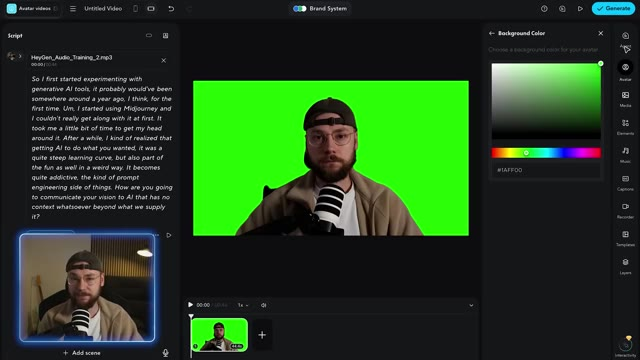
*Interface HeyGen affichant le sélecteur de couleur d'arrière-plan avec un écran vert appliqué à l'avatar.*

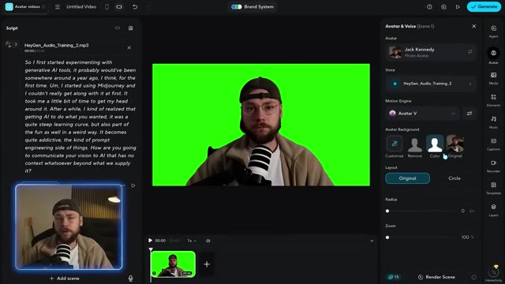
*Interface HeyGen montrant le retour aux options de l'arrière-plan de l'avatar avec les boutons de configuration.*

---

### ⏱️ `[00:10:34 - 00:11:09]` | Segment #24

**🔊 Audio (Transcription Intégrale Mot pour Mot en Français) :**
> notre arrière-plan d'origine, nous pouvons également utiliser cette option de recadrage en cercle ici qui est vraiment utile si vous créez du contenu de style tutoriel et en raison du fonctionnement d'Avatar 5, il est tout à fait viable d'utiliser cet outil pour faire du contenu long comme vous vous y attendriez pour des tutoriels, donc ce flux de travail pourrait être vraiment très pratique. Tout, des visuels à votre voix, va rester bien cohérent que vous génériez des clips de 30 secondes ou des clips dépassant 10 minutes. Vous allez avoir cette cohérence là pour une variété de cas d'utilisation. Pour cet exemple cependant, nous pouvons simplement aller de l'avant et cliquer

**👁️ Analyse Visuelle d'Écran (gemini-3.5-flash-lite) :**
**Interface & Outils** : Interface web d'un outil de génération d'avatairs vidéo par IA (type HeyGen / Avatar V) avec panneau de script à gauche, aperçu vidéo central et panneau de paramètres d'avatar et de voix à droite.

**Contenu textuel & Code** : Texte du script visible dans le panneau latéral de gauche, paramètres "Avatar Background", options de disposition "Original" et "Circle", curseurs de "Radius" et "Zoom".

**Action / Démonstration** : Le créateur montre l'utilisation de l'option de recadrage circulaire pour l'arrière-plan de l'avatar et ajuste les paramètres de disposition.

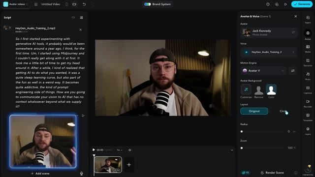
*Interface du logiciel de création d'avatars IA montrant l'éditeur de scène avec l'option de disposition en cercle sélectionnée.*

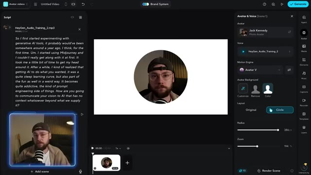
*Interface de création d'avatar montrant le rendu vidéo avec le sujet recadré dans un cercle sur fond blanc uni.*

---

### ⏱️ `[00:11:09 - 00:11:43]` | Segment #25

**🔊 Audio (Transcription Intégrale Mot pour Mot en Français) :**
> original et une fois que nous sommes satisfaits de tout le reste, nous pouvons aller tout en haut à droite et cliquer sur générer. Nous avons ici un ensemble d'options incluant la résolution et le format également, webm si nous voulons un arrière-plan transparent par exemple. Une fois que vous avez verrouillé tous ces détails, vous pouvez cliquer sur soumettre ce qui est utile aussi c'est que nous pouvons également enregistrer ce modèle donc nous pourrions aller de l'avant et l'appeler quelque chose comme jack studio afin de pouvoir le réutiliser plus tard et maintenant il s'agit juste d'attendre que notre génération arrive donc nous avons ici toute une série de générations différentes

**👁️ Analyse Visuelle d'Écran (gemini-3.5-flash-lite) :**
**Interface & Outils** : Interface de la plateforme HeyGen (génération de vidéos par avatar IA).

**Contenu textuel & Code** : Menus de configuration d'avatar et de voix, paramètres de génération vidéo ("Generate Video", "Title: Jack test", "Resolution: 1080p", "Fps: 25", "Format: MP4 / WebM (transparent background)"), et galerie de projets dans le tableau de bord ("Projects", "Side angle", "Vertical", "Voice Mirroring", "Jack test").

**Action / Démonstration** : Le créateur montre comment accéder aux options de génération, sélectionner le format WebM avec fond transparent, puis présente la bibliothèque de toutes les vidéos générées.

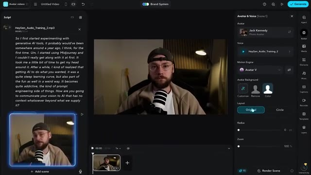
*Interface HeyGen montrant l'éditeur vidéo avec le panneau de script à gauche et les réglages d'avatar à droite.*

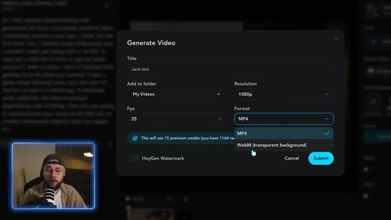
*Fenêtre contextuelle de génération vidéo sur HeyGen permettant de choisir la résolution, les FPS et le format (MP4 ou WebM avec fond transparent).*

*Tableau de bord HeyGen (Projects) affichant la bibliothèque de vidéos générées avec différents avatars et arrière-plans.*

---

### ⏱️ `[00:11:43 - 00:12:17]` | Segment #26

**🔊 Audio (Transcription Intégrale Mot pour Mot en Français) :**
> que j'ai fabriquée ici à l'intérieur de HeyGen et pour finir la vidéo, je voulais aller de l'avant et jeter un œil à certaines d'entre elles dans les plus grands détails. Alors tout d'abord, regardons notre sorte d'exemple principal ici où cela correspond au cadrage que vous pouvez voir sur ma webcam en ce qui concerne mon visage en ce moment. Donc juste un rappel que la voix que vous pouvez entendre était un fichier audio téléchargé, donc vraiment avec cet exemple, nous nous concentrons sur les visuels. À quel point les mouvements du visage et du haut du corps ainsi que ce genre de gestes de la main sont-ils réalistes ?

**👁️ Analyse Visuelle d'Écran (gemini-3.5-flash-lite) :**
**Interface & Outils** : HeyGen (plateforme de génération d'avatairs par IA)

**Contenu textuel & Code** : Noms des projets visibles : "Side angle", "Vertical", "Voice Mirroring", "Jack test", "Untitled Video". Boutons d'édition ("Edit", "New revision in AI Studio", "Translate"). Texte incrusté en bas à droite : "THE VOICE IS AN UPLOADED AUDIO FILE". Résumé en bas : "Discover the challenges and fun of prompt engineering with AI art tools like Midjourney."

**Action / Démonstration** : Le curseur de la souris navigue à travers la grille de projets HeyGen puis sélectionne une vidéo spécifique pour l'afficher en grand format avec les options d'édition.

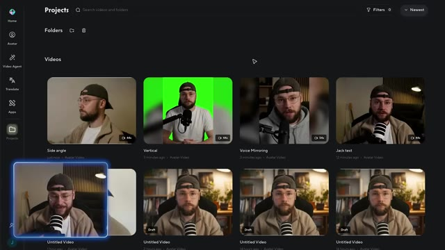
*Interface HeyGen montrant la bibliothèque de projets avec différentes vidéos d'avatairs générés.*

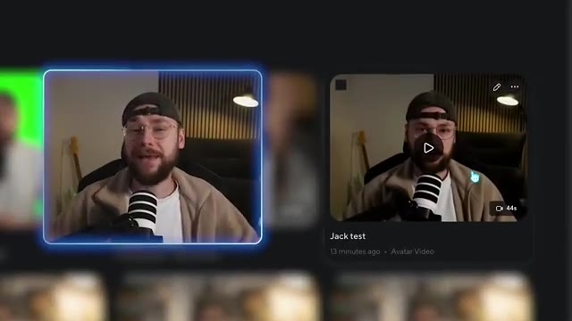
*Gros plan sur la sélection d'une vignette de vidéo dans HeyGen.*

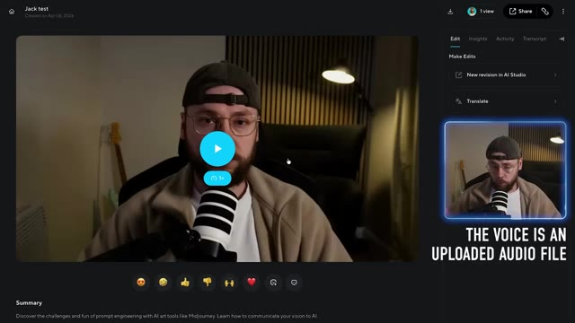
*Interface de lecture d'une vidéo générée dans HeyGen avec un encadré incrusté et du texte explicatif.*

---

### ⏱️ `[00:12:17 - 00:12:51]` | Segment #27

**🔊 Audio (Transcription Intégrale Mot pour Mot en Français) :**
> aussi. Après un certain temps, je me suis rendu compte qu'amener l'IA à faire ce que l'on voulait demandait une courbe d'apprentissage assez raide, mais que cela faisait aussi partie du plaisir d'une certaine manière, cela devient assez addictif, tout ce qui touche au prompting. Comment allez-vous communiquer votre vision à une IA qui n'a absolument aucun contexte au-delà de ce qu'on lui fournit ? Je dois donc dire que je trouve cela vraiment très impressionnant. Ces mouvements de yeux subtils, la façon dont ma tête pivote,

**👁️ Analyse Visuelle d'Écran (gemini-3.5-flash-lite) :**
**Interface & Outils** : Présentation face caméra sans partage d'écran

**Contenu textuel & Code** : Aucun contenu logiciel, code, prompt ou interface n'est affiché.

**Action / Démonstration** : Jack s'exprime face caméra dans son studio, gesticulant des mains pour illustrer ses propos sur l'intelligence artificielle.

---

### ⏱️ `[00:12:51 - 00:13:27]` | Segment #28

**🔊 Audio (Transcription Intégrale Mot pour Mot en Français) :**
> et vous pouvez voir les reflets lumineux qui se déplacent dans mes lunettes. Il s'avère que l'utilisation de ces accessoires n'a causé aucun problème réel du tout, malgré le fait qu'ils aient été signalés. Probablement ce que je trouve le plus impressionnant à propos de HeyGen, c'est le mouvement de synchronisation labiale. Ça a l'air vraiment très bien réussi. Il n'y a rien qui semble particulièrement artificiel là-dedans, ce qui est vraiment super. On peut voir ici que HeyGen a vraiment appliqué de manière significative les séquences vidéo que nous avons téléchargées au début pour entraîner notre avatar. Il bouge et se comporte vraiment comme je le fais.

**👁️ Analyse Visuelle d'Écran (gemini-3.5-flash-lite) :**
**Interface & Outils** : Présentation face caméra sans partage d'écran

**Contenu textuel & Code** : Aucun texte, prompt ou interface logicielle visible à l'écran.

**Action / Démonstration** : Jack s'exprime face caméra en plateau dans son studio, gesticulant pour illustrer son propos sur l'avatar HeyGen.

---

### ⏱️ `[00:13:27 - 00:13:50]` | Segment #29

**🔊 Audio (Transcription Intégrale Mot pour Mot en Français) :**
> quand je m'adresse directement à la caméra. Maintenant, je veux jeter un œil à un exemple vertical que vous pourriez utiliser pour du contenu court. Et cela utilise aussi le clonage de voix. Donc c'est ici que nous avons notre clone vocal et nous utilisions simplement le microphone intégré de mon ordinateur portable pour lire le script en utilisant mes propres intonations.

**👁️ Analyse Visuelle d'Écran (gemini-3.5-flash-lite) :**
**Interface & Outils** : Interface web ou de logiciel de montage/visualisation vidéo affichant un lecteur au format vertical (Reels/Shorts) au centre avec des boutons de réaction en bas, et une incrustation vidéo PiP du créateur dans un cadre bleu en bas à gauche.

**Contenu textuel & Code** : Un lecteur vidéo vertical affichant une vidéo de Jack, sur fond sombre avec divers menus de navigation et boutons de réaction.

**Action / Démonstration** : Le créateur présente une vidéo au format vertical sur son écran, illustrant l'utilisation du clonage de voix pour du contenu court.

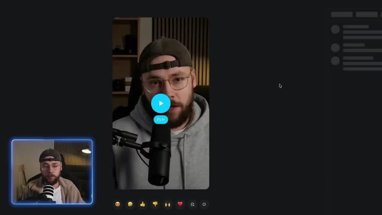
*Aperçu d'un lecteur vidéo au format vertical (Shorts/Reels) montrant une vidéo de démonstration avec le créateur, intégré dans une interface de type logiciel ou plateforme web de retouche/visualisation avec incrustation PiP du créateur en bas à gauche.*

---

### ⏱️ `[00:13:50 - 00:14:09]` | Segment #30

**🔊 Audio (Transcription Intégrale Mot pour Mot en Français) :**
> Et ensuite, cela est appliqué au clone vocal pour essayer de le rapprocher de mon accent réel. Écoutons donc cet exemple. Comment es-tu censé publier une vidéo tous les jours sans perdre la boule ? Eh bien, j'ai une confession à vous faire. Tout ce que vous venez de regarder n'était même pas moi.

**👁️ Analyse Visuelle d'Écran (gemini-3.5-flash-lite) :**
**Interface & Outils** : Interface de lecture vidéo avec incrustation PiP (Picture-in-Picture) du présentateur en bas à gauche et icônes d'évaluation sous la vidéo centrale.

**Contenu textuel & Code** : Interface utilisateur avec des emojis et icônes de réaction en bas de la vidéo centrale.

**Action / Démonstration** : Le créateur montre un exemple de vidéo en cours de lecture au centre de l'écran tout en apparaissant en incrustation PiP en bas à gauche.

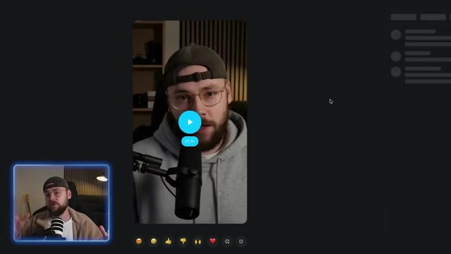
*Interface logicielle affichant une vidéo verticalement avec un encadré incrusté (PiP) du créateur en bas à gauche et des options d'interaction en bas.*

---

### ⏱️ `[00:14:09 - 00:14:47]` | Segment #31

**🔊 Audio (Transcription Intégrale Mot pour Mot en Français) :**
> était mon avatar IA. Donc encore une fois, les gestes des mains et ces mouvements faciaux subtils sont vraiment parfaits. La voix, bien que ce ne soit pas parfait, je pense que le mirroring vocal a réussi à faire pencher la balance un peu plus vers ma vraie façon de parler. Je continuerais quand même à privilégier l'importation d'un fichier audio pour être tout à fait honnête. Mais vous pouvez voir ici qu'en utilisant HeyGen, vous pourriez tout à fait l'utiliser pour du contenu court format, je pense. Ça ne donne pas cette ambiance d'avatars IA où ils ont l'air très rigides et sans vie. Il y a beaucoup plus de réalisme humaniste qui se dégage ici. Et nous allons

**👁️ Analyse Visuelle d'Écran (gemini-3.5-flash-lite) :**
**Interface & Outils** : Présentation face caméra sans partage d'écran (intégration de graphismes textuels et d'un avatar vidéo incrusté, mais aucun logiciel ou outil n'est affiché à l'écran).

**Contenu textuel & Code** : Texte affiché à l'écran : "VOICE MIRRORING RECORDED ON LAPTOP MICROPHONE AND APPLIED TO HIGH QUALITY VOICE CLONE", "VOICE GENERATION VOICE MIRRORING IS CLOSER TO HOW I ACTUALLY SOUND", "USING HEYGEN DEFINITELY USABLE FOR GENERATING SHORT FORM", "USING HEYGEN GENERATED AVATARS DON'T FEEL TOO STIFF OR LIFELESS".

**Action / Démonstration** : Le créateur parle face caméra tout en gesticulant, illustré par des encadrés montrant son avatar IA et des textes récapitulatifs.

---

### ⏱️ `[00:14:47 - 00:15:19]` | Segment #32

**🔊 Audio (Transcription Intégrale Mot pour Mot en Français) :**
> finissons par jeter un rapide coup d'œil à notre exemple de fond vert également ici. Après un certain temps, je me suis rendu compte que faire faire à l'IA ce que l'on voulait demandait un apprentissage assez difficile, mais c'était aussi une part du plaisir d'une certaine manière. Ça devient assez addictif, tout le côté ingénierie de prompt. Comment allez-vous communiquer votre vision à une IA qui n'a absolument aucun contexte au-delà de ce que nous lui fournissons ? Donc encore une fois, la performance de mon avatar a l'air plutôt pas mal.

**👁️ Analyse Visuelle d'Écran (gemini-3.5-flash-lite) :**
**Interface & Outils** : Interface logicielle de prévisualisation vidéo avec panneau latéral et incrustation (PiP) du créateur.

**Contenu textuel & Code** : Vidéo verticale montrant Jack sur fond vert, boutons d'interaction et de lecture, encadré PiP de Jack dans son studio avec son micro.

**Action / Démonstration** : Le créateur montre un exemple de vidéo sur fond vert via une interface logicielle tout en continuant sa présentation.

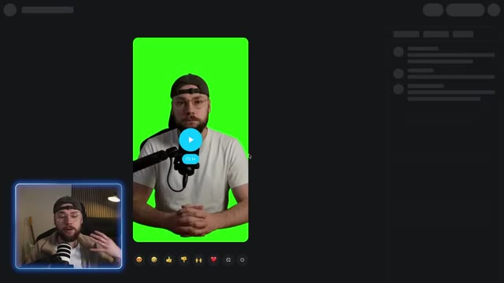
*Interface logicielle affichant une vidéo verticale sur fond vert avec des options de lecture et un encadré PiP de Jack en bas à gauche.*

---

### ⏱️ `[00:15:19 - 00:15:51]` | Segment #33

**🔊 Audio (Transcription Intégrale Mot pour Mot en Français) :**
> super, je pense. Et c'est sympa de voir cette vue de caméra légèrement différente si vous vouliez l'utiliser pour certains de vos montages. Nous pouvons redessiner l'image elle-même, l'image de base, puis appliquer le mouvement et la voix de notre avatar à celle-ci si vous voulez un peu changer les choses. Là où nous rencontrons quelques difficultés, c'est au niveau du masquage par IA, où l'on peut voir l'arrière-plan clignoter de manière intermittente autour des doigts, des poignets et de ce genre de choses. Encore une fois, je pense que c'est probablement parce qu'il n'y a pas énormément de contraste entre les éléments de premier plan dans le plan que vous pouvez voir.

**👁️ Analyse Visuelle d'Écran (gemini-3.5-flash-lite) :**
**Interface & Outils** : Présentation vidéo avec incrustation d'avatar sur fond bleu et panneaux de texte explicatifs.

**Contenu textuel & Code** : Texte à l'écran : 'LIMITATIONS', 'DIFFICULTY WITH AI MASKING BACKGROUND FLICKERS AROUND FINGERS AND WRISTS', 'CAUSED BY LACK OF CONTRAST BETWEEN BACKGROUND AND SUBJECT'.

**Action / Démonstration** : Le présentateur explique les limites techniques de l'IA en matière de masquage et de contraste, illustrées par des puces textuelles à l'écran.

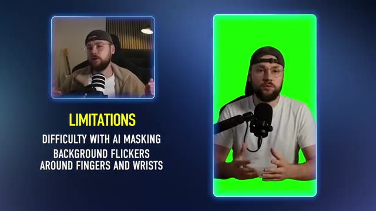
*Affichage d'un panneau textuel avec le titre 'LIMITATIONS' listant les problèmes de masquage par IA et de scintillement autour des doigts et des poignets.*

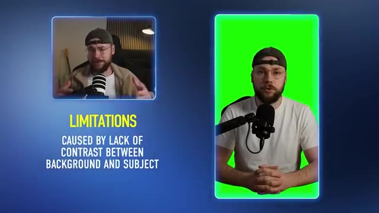
*Affichage d'un panneau textuel expliquant que ces limitations sont causées par le manque de contraste entre l'arrière-plan et le sujet.*

---

### ⏱️ `[00:15:51 - 00:16:24]` | Segment #34

**🔊 Audio (Transcription Intégrale Mot pour Mot en Français) :**
> en ce moment. Et les éléments d'arrière-plan, la couleur de cette chaise, par exemple, très similaire à la couleur de la chaise derrière moi. Donc si vous aviez un vrai écran vert là-bas, cela devrait éliminer ce problème. L'IA a du mal à comprendre ce qui est un élément de premier plan et d'arrière-plan. Essentiellement toujours, je veux dire, le contenu social est très indulgent. Je pense toujours que cela pourrait être viable dans un montage pour être tout à fait honnête. Ceci étant dit cependant, les gars, j'espère vraiment que vous avez apprécié la vidéo d'aujourd'hui. Si vous avez la moindre question, assurez-vous de les laisser en bas

**👁️ Analyse Visuelle d'Écran (gemini-3.5-flash-lite) :**
**Interface & Outils** : Interface de montage vidéo avec habillage graphique, incrustations vidéo et affichage textuel de démonstration (fond bleu, encadrés stylisés).

**Contenu textuel & Code** : Texte affiché à l'écran : "LIMITATIONS CAUSED BY LACK OF CONTRAST BETWEEN BACKGROUND AND SUBJECT" (Limitations causées par le manque de contraste entre l'arrière-plan et le sujet).

**Action / Démonstration** : Le créateur présente visuellement des exemples de détourage et de masquage par IA en comparant les arrière-plans et les chaises, puis s'adresse directement à l'audience en fin de vidéo.

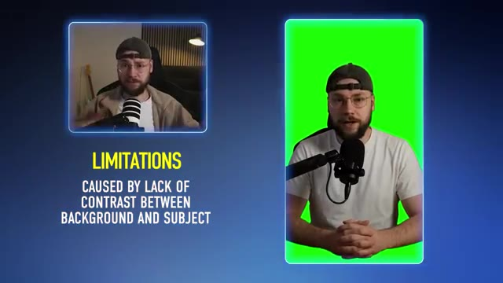
*Démonstration graphique montrant les limitations du détourage par IA en raison du manque de contraste entre l'arrière-plan et le sujet, avec incrustation vidéo et fond vert.*

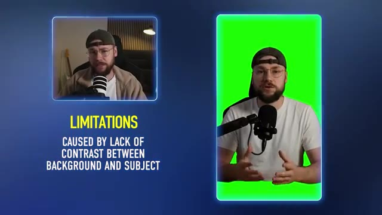
*Poursuite de la démonstration graphique avec le créateur expliquant les problèmes de détection entre premier plan et arrière-plan.*

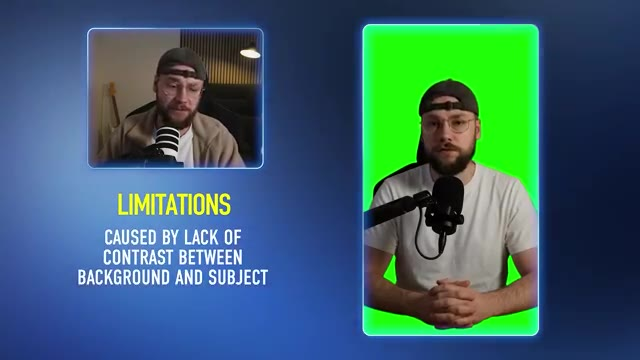
*Vue finale du montage graphique de démonstration avant la transition vers la caméra principale.*

---

### ⏱️ `[00:16:24 - 00:16:57]` | Segment #35

**🔊 Audio (Transcription Intégrale Mot pour Mot en Français) :**
> en dessous dans la section des commentaires. J'essaie toujours d'en répondre à autant que possible. Si vous souhaitez me soutenir, vous pouvez aller lâcher un pouce bleu sur cette vidéo. Et bien sûr, pensez à vous abonner afin que je puisse vous tenir au courant de toutes les dernières plateformes et outils d'IA. Nous avons exploré HeyGen avec beaucoup de détails. Aujourd'hui, nous avons jeté un œil à leur nouveau modèle Avatar 5. Et si vous souhaitez l'utiliser vous-même pour vos propres projets créatifs, vous trouverez un lien vers l'outil juste en dessous dans la description de la vidéo. J'apprécie vraiment que vous ayez regardé aujourd'hui, si vous vouliez

**👁️ Analyse Visuelle d'Écran (gemini-3.5-flash-lite) :**
**Interface & Outils** : HeyGen (Avatar 5) et interface de navigation YouTube/vidéos.

**Contenu textuel & Code** : Interface HeyGen avec panneau latéral droit montrant différents avatars, options de styles et de prompts textuels (« Describe the edits you'd like to make to »), ainsi qu'une grille de miniatures de vidéos YouTube.

**Action / Démonstration** : Le créateur présente l'interface du logiciel HeyGen et ses différentes options d'avatars tout en s'exprimant face à la caméra.

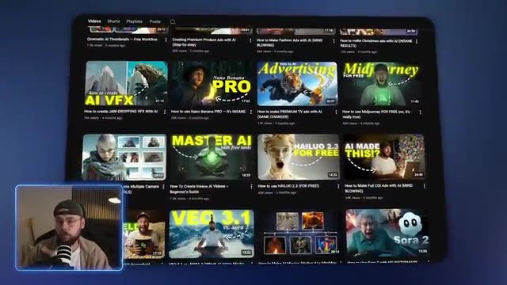
*Affichage d'une grille de vidéos sur l'écran avec Jack en incrustation PiP dans le coin inférieur gauche.*

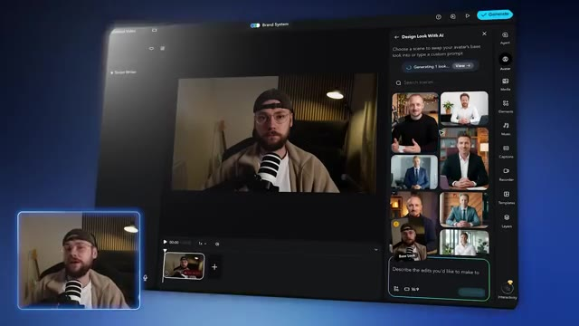
*Interface de l'outil HeyGen affichant l'édition vidéo avec Avatar 5 et la bibliothèque de looks/avatars sur le côté droit.*

---

### ⏱️ `[00:16:57 - 00:17:06]` | Segment #36

**🔊 Audio (Transcription Intégrale Mot pour Mot en Français) :**
> allez-y et consultez un peu plus de mon contenu, vous pouvez cliquer sur la vidéo à l'écran maintenant sinon passez une excellente fin de journée les gars et je vous retrouve dans la prochaine

**👁️ Analyse Visuelle d'Écran (gemini-3.5-flash-lite) :**
**Interface & Outils** : Présentation face caméra sans partage d'écran

**Contenu textuel & Code** : Aucun contenu logiciel ou visuel affiché à l'écran, uniquement le créateur Jack dans son studio.

**Action / Démonstration** : Le créateur parle face caméra pour conclure la vidéo et inciter le spectateur à regarder une autre vidéo.

---
