# 🎬 Comment utiliser Seedance 2.0 pour le cinéma IA (Workflow complet)

> **Chaîne** : [Jack Vs. AI](https://www.youtube.com/@JackVsAI)  
> **Titre original** : `How to Use Seedance 2.0 for AI Filmmaking (Full Workflow)`  
> **Lien YouTube** : [https://www.youtube.com/watch?v=suIwxbO-_ZE](https://www.youtube.com/watch?v=suIwxbO-_ZE)  
> **Date de publication** : 2026-04-12  
> **Durée** : 19m 39s (`1179s`)  
> **Identifiant vidéo** : `suIwxbO-_ZE`  
> **Fiche Web Interactive** : [2026-04-12_YT-suIwxbO-_ZE_Comment utiliser Seedance 2.0 pour le cinéma IA (Workflow complet)_by-whisper-v3-large-turbo+gemini-3.5-flash-lite.html](2026-04-12_YT-suIwxbO-_ZE_Comment utiliser Seedance 2.0 pour le cinéma IA (Workflow complet)_by-whisper-v3-large-turbo+gemini-3.5-flash-lite.html)  
> **Captures de démonstration clés** : `78 captures réelles (anti-talking-head)`  
> **Modèles utilisés** : Audio: `large-v3-turbo` (Faster-Whisper int8 VPS) | Vision: `gemini-3.5-flash-lite` (Google AI Studio API)  

---

## 📌 Synthèse Exécutive & Outils

### 📌 Résumé
La vidéo de Jack Vs. AI met en lumière une avancée majeure dans la réalisation de films par intelligence artificielle grâce à **Seedance 2.0** (accessible via la plateforme Higgsfield). Jack démontre comment cet outil révolutionnaire dépasse ses concurrents (comme Kling 3) en gérant des effets visuels complexes et en comprenant véritablement le langage cinématographique. À travers la création d'un court métrage narratif et ambitieux divisé en trois actes — retraçant la vie d'un scénariste dont l'imagination prend vie —, il expose un workflow de production complet, contrôlé et hautement reproductible.

Le processus repose sur une direction artistique rigoureuse, initiée par la génération de planches de personnages et de visuels clés à l'aide de **Nano Banana Pro**, garantissant ainsi une cohérence visuelle parfaite. Pour nourrir **Seedance 2.0**, Jack utilise un framework de multi-prompt optimisé par **Claude**, capable de transformer des descriptions vagues en instructions cinématographiques ultra-détaillées incluant les mouvements de caméra et les choix d'objectifs. Cette méthode hybride combine la précision de l'image de référence et la puissance générative du modèle pour produire des plans immersifs de 15 secondes en résolution 720p au format 16:9.

Pour les créateurs de contenu et les réalisateurs indépendants, ce tutoriel valide l'idée que l'IA générative n'est plus un simple générateur de clips aléatoires, mais un véritable studio de pré-visualisation et de production. En structurant son récit autour d'une transition tonale — de l'émerveillement enfantin au drame plus sombre — et en maîtrisant les paramètres de Seedance 2.0, Jack prouve qu'il est possible de concevoir des œuvres narratives complexes, riches en effets spéciaux, avec un contrôle créatif total et sans nécessiter une infrastructure lourde.

### 🛠️ Outils, Modèles & Logiciels Présentés
* **Seedance 2.0 (C-Dance 2)** : Modèle de génération vidéo cinématique phare, capable de gérer des effets visuels complexes, des scènes riches et une cohérence narrative poussée.
* **Higgsfield** : Plateforme cloud hébergeant Seedance 2.0, désormais ouverte à tous les utilisateurs sans nécessiter de forfait entreprise.
* **Nano Banana Pro** : Générateur d'images utilisé en amont pour créer les planches de personnages, les variations d'âge et les visuels clés cinématiques.
* **Claude** : Assistant IA conversationnel exploité via un framework de multi-prompt pour transformer des idées de scènes vagues en instructions techniques détaillées.
* **ChatGPT / Gemini** : Mentionnés comme alternatives possibles pour intégrer le framework de multi-prompt textuel.
* **Seedance 2 Fast** : Version allégée du modèle, écartée au profit de la version standard pour garantir une qualité optimale.
* **Kling 3** : Modèle concurrent mentionné à titre de comparaison pour souligner la supériorité de Seedance 2.0 sur les effets visuels.
* **Topaz** : Outil d'amélioration de la résolution (mentionné dans la liste des outils identifiés, bien que non développé dans l'extrait).
* **Flux** : Modèle de génération d'image (mentionné dans la liste des outils identifiés).
* **ElevenLabs** : Outil de synthèse vocale et audio (mentionné dans la liste des outils identifiés).

### 🔑 Points Clés & Enseignements Stratégiques
* **Prioriser les images de référence** : Utiliser des visuels de départ et des planches de personnages plutôt que de simples prompts textuels évite la loterie visuelle et garantit un contrôle créatif supérieur.
* **Structurer une narration en trois actes** : Diviser un court métrage par tranches d'âge ou d'évolution tonale permet de tester l'adaptabilité d'un modèle d'IA sur la transition des émotions et des décors.
* **Exploiter un framework de multi-prompt** : Soumettre une description narrative brute à Claude permet d'obtenir un prompt structuré incluant des indications précises de mise en scène, de mouvements de caméra et de choix d'objectifs.
* **Verrouiller la cohérence des personnages** : Associer l'image clé de la scène à une feuille de modèle de personnage dans Seedance 2.0 assure la stabilité morphologique du sujet à travers les plans.
* **Sélectionner la bonne version du modèle** : Préférer systématiquement le modèle de base « Seedance 2 » au détriment de la variante « Fast » pour maximiser la qualité visuelle et le respect des consignes cinématiques.
* **Optimiser les paramètres de génération** : Configurer la durée des clips à 15 secondes, opter pour un format 16:9 et exiger la plus haute résolution disponible (720p) pour s'aligner sur les standards du cinéma.
* **Maîtriser les effets visuels complexes** : Seedance 2.0 surclasse ses rivaux (comme Kling 3) lorsqu'il s'agit d'animer des interactions dynamiques et fantastiques (ex: un dessin en papier qui se transforme en créature vivante).
* **Anticiper l'utilisation des références audio** : Bien que les références vidéo soient jugées secondaires, l'utilisation astucieuse de pistes audio de référence dans Seedance 2.0 constitue un levier puissant à explorer.
* **Simplifier la saisie humaine** : L'utilisateur n'a besoin de renseigner manuellement que les éléments de base (personnage, action, lieu, moment de la journée), l'IA se chargeant de complexifier le rendu technique.
* **Compréhension native du cinéma** : La force principale de Seedance 2.0 réside dans sa capacité à interpréter intuitivement le langage visuel requis pour qu'une séquence ressemble à un véritable film.

---

## ⏱️ Chronologie & Transcription Complète Audio & Visuelle (Mot pour Mot)

### ⏱️ `[00:00:00 - 00:00:19]` | Segment #01

**🔊 Audio (Transcription Intégrale Mot pour Mot en Français) :**
> C-Dance 2 vient de bouleverser complètement la réalisation de films par intelligence artificielle. Vos idées créatives les plus folles sont enfin à portée de main. Cet outil ne se contente pas de générer des clips, il crée des scènes de film à part entière qui semblent riches et immersives, et peut s'attaquer à des effets visuels complexes là où tous les autres modèles échouent.

**👁️ Analyse Visuelle d'Écran (gemini-3.5-flash-lite) :**
**Interface & Outils** : Démonstration vidéo de scènes cinématographiques générées par IA (C-Dance 2)

**Contenu textuel & Code** : Textes incrustés à l'écran affichant une partie du discours ("just blew AI filmmaking", "just generate clips", "where every other") et superproductions visuelles fantastiques générées par IA.

**Action / Démonstration** : Présentation de plans cinématiques et d'effets visuels complexes illustrant les capacités du modèle de génération vidéo C-Dance 2.

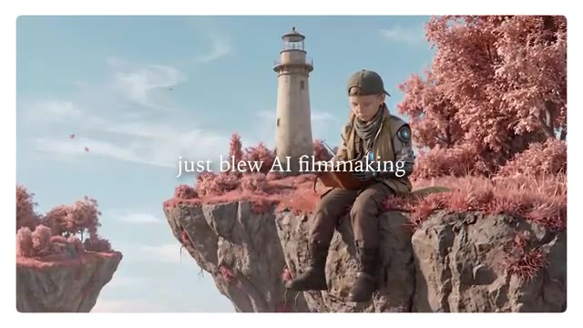
*Scène générée par IA montrant un jeune garçon assis sur une falaise aux roches roses près d'un phare, écrivant dans un carnet.*

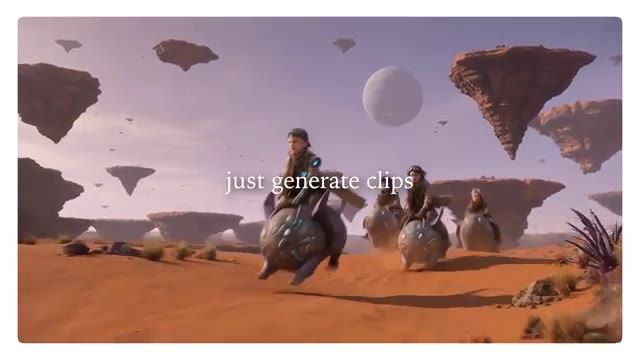
*Scène générée par IA montrant plusieurs personnages chevauchant des créatures étranges dans un paysage désertique avec des îles flottantes.*

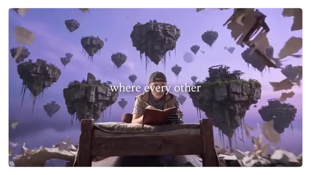
*Scène générée par IA montrant un personnage allongé sur un lit au milieu d'îles flottantes dans un ciel violet avec des débris en lévitation.*

---

### ⏱️ `[00:00:19 - 00:00:47]` | Segment #02

**🔊 Audio (Transcription Intégrale Mot pour Mot en Français) :**
> La bataille pour une véritable IA cinématique est enfin là, et C-Dance 2 est l'arme que vous attendiez. Aujourd'hui, je vais vous montrer comment le maîtriser en construisant un court métrage ambitieux de zéro. Pas d'artifices, juste un flux de travail contrôlé mais puissant que vous pouvez appliquer à vos propres projets créatifs. Avant de commencer, je suis Jack et si vous voulez rester à jour avec tous les derniers outils d'IA, assurez-vous de lâcher un pouce bleu sur cette vidéo et pensez à vous abonner. Bon, passons aux choses sérieuses.

**👁️ Analyse Visuelle d'Écran (gemini-3.5-flash-lite) :**
**Interface & Outils** : Présentation face caméra sans partage d'écran

**Contenu textuel & Code** : Aucun contenu logiciel ou interface affiché, uniquement des extraits de films générés par IA illustrant le discours et Jack face caméra dans son studio.

**Action / Démonstration** : Jack s'adresse directement aux spectateurs en face caméra dans son studio et présente des extraits vidéo générés par intelligence artificielle illustrant le sujet.

---

### ⏱️ `[00:00:47 - 00:01:20]` | Segment #03

**🔊 Audio (Transcription Intégrale Mot pour Mot en Français) :**
> Donc pour le concept de notre court métrage, j'ai opté pour quelque chose d'un peu méta. Quand j'étais petit, j'étais plutôt timide et silencieux, mais j'adorais écrire et créer des personnages. Donc, bien que je sois resté dans mon coin, mon imagination partait dans tous les sens et je me suis dit que ce serait cool de partir de cette idée et de me mettre en scène dans le film en tant que personnage, mais en poussant les choses un peu plus loin en disant que tout ce que le personnage écrit devient réel. Je voulais montrer qu'il créait ces superbes

**👁️ Analyse Visuelle d'Écran (gemini-3.5-flash-lite) :**
**Interface & Outils** : Présentation vidéo avec extraits de films générés par IA et incrustation (PiP) du créateur en haut à droite.

**Contenu textuel & Code** : Texte à l'écran « The concept. » et extraits visuels fantastiques illustrant le court-métrage en développement.

**Action / Démonstration** : Le créateur illustre son propos en diffusant des visuels et concepts artistiques issus de sa production de court-métrage.

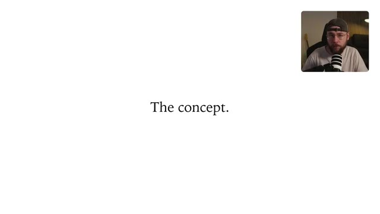
*Écran titre affichant le texte « The concept. » sur fond blanc, avec un encadré PiP de Jack dans son studio.*

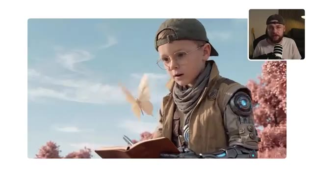
*Extrait du court-métrage montrant un jeune garçon portant des lunettes et une casquette, écrivant dans un carnet avec un papillon qui s'envole, incrusté avec le flux vidéo de Jack dans le coin supérieur droit.*

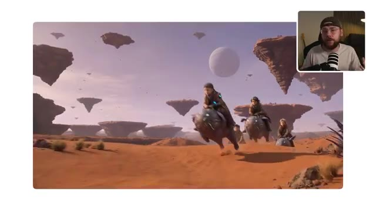
*Extrait du court-métrage montrant des personnages chevauchant des créatures dans un paysage désertique avec des îles flottantes dans le ciel, avec Jack visible en incrustation PiP.*

---

### ⏱️ `[00:01:20 - 00:01:38]` | Segment #04

**🔊 Audio (Transcription Intégrale Mot pour Mot en Français) :**
> créatures, personnages et mondes, mais aussi en créant des méchants sans même le savoir. J'ai donc décidé de diviser le film en trois sections distinctes. La première va être entièrement consacrée à la jeunesse. Nous allons donc voir notre scénariste alors qu'il est un petit garçon de cinq ou six ans au début de son périple.

**👁️ Analyse Visuelle d'Écran (gemini-3.5-flash-lite) :**
**Interface & Outils** : Lecteur vidéo / montage avec incrustation PiP (Picture-in-Picture) du créateur en studio.

**Contenu textuel & Code** : Rendu vidéo d'animation 3D montrant un paysage de canyon rouge et des personnages montés sur des créatures violettes, suivi d'un gros plan sur un enfant dessinant un motif magique lumineux.

**Action / Démonstration** : Diffusion d'extraits vidéo du court-métrage généré par IA illustrant la description du découpage du film en trois parties (la jeunesse du protagoniste).

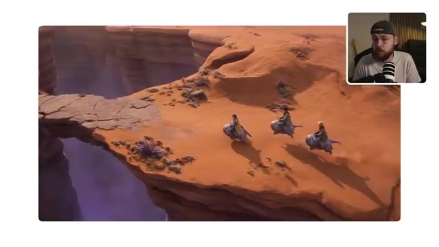
*Séquence vidéo générée par IA montrant des cavaliers chevauchant des créatures sur un pont rocheux dans un canyon désertique, avec le créateur en médaillon (PiP).*

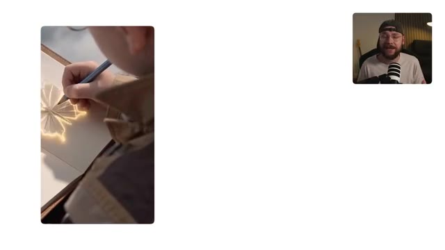
*Séquence vidéo générée par IA montrant un jeune garçon en train de dessiner avec un effet lumineux magique sur son carnet, avec le créateur en médaillon (PiP).*

---

### ⏱️ `[00:01:38 - 00:02:02]` | Segment #05

**🔊 Audio (Transcription Intégrale Mot pour Mot en Français) :**
> La deuxième section va porter sur lui en tant qu'adolescent, où il commence vraiment à découvrir l'étendue de son pouvoir. Et la dernière section le montre à l'âge adulte réalisant qu'il a aussi créé le mal et qu'il doit maintenant aller régler ça. Donc dans ce court métrage, nous allons non seulement montrer le passage du temps, mais nous allons aussi avoir une véritable transition en termes de ton.

**👁️ Analyse Visuelle d'Écran (gemini-3.5-flash-lite) :**
**Interface & Outils** : Présentation face caméra sans partage d'écran (les images 1 et 2 montrent des extraits de vidéo IA insérés à l'écran, mais aucune interface de travail n'est manipulée).

**Contenu textuel & Code** : Aucun texte ou interface logicielle visible.

**Action / Démonstration** : Jack s'exprime face caméra en studio avec incrustation d'extraits du court métrage de fiction généré par IA.

---

### ⏱️ `[00:02:03 - 00:02:27]` | Segment #06

**🔊 Audio (Transcription Intégrale Mot pour Mot en Français) :**
> Ça va commencer de façon très excitante et pleine d'espoir pour devenir beaucoup plus sombre et sinistre vers la fin. Ça va vraiment mettre en place tous les éléments pour montrer ce qui pourrait se passer si cela devait devenir un long métrage. Maintenant, avant de commencer à utiliser C-Dance 2, nous voulons générer quelques images IA pour définir nos personnages et nos scènes. Et pour cela, bien sûr, Nano Banana Pro est notre meilleur ami.

**👁️ Analyse Visuelle d'Écran (gemini-3.5-flash-lite) :**
**Interface & Outils** : Présentation vidéo avec incrustation PiP (Picture-in-Picture) du créateur face caméra.

**Contenu textuel & Code** : Texte affiché : "THE WRITER" sur l'image 2, et "AI image generation." sur l'image 3.

**Action / Démonstration** : Le créateur parle en arrière-plan (PiP) pendant que des illustrations visuelles thématiques en lien avec le sujet de la vidéo s'affichent à l'écran.

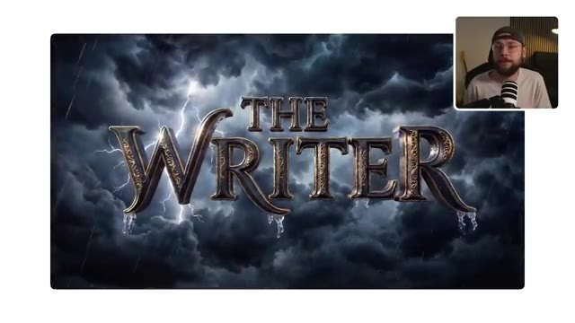
*Image de présentation avec le titre "THE WRITER" sur fond de ciel orageux avec des éclairs, et le créateur en incrustation PiP dans le coin supérieur droit.*

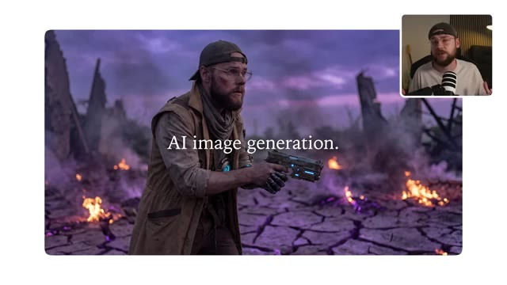
*Visuel généré par IA montrant un personnage dans un paysage post-apocalyptique avec le texte "AI image generation", et le créateur en incrustation PiP dans le coin supérieur droit.*

---

### ⏱️ `[00:02:28 - 00:03:00]` | Segment #07

**🔊 Audio (Transcription Intégrale Mot pour Mot en Français) :**
> Vous pouvez bien sûr simplement utiliser des prompts textuels avec n'importe quel générateur de vidéo par IA, mais vous jouez vraiment à pile ou face de cette façon. Utiliser des images de référence va vous donner beaucoup plus de contrôle sur le résultat final. Donc d'abord, j'ai créé cette planche de personnages avec une version légèrement redessinée de moi-même portant ce genre de costume de design de science-fiction et de fantasy sympa. Et en utilisant cela comme image de référence, j'en ai fait deux variations. Premièrement, moi en jeune garçon, puis moi en adolescent dans le même monde.

**👁️ Analyse Visuelle d'Écran (gemini-3.5-flash-lite) :**
**Interface & Outils** : Présentation visuelle de rendus générés par IA et d'une planche de personnages, avec incrustation vidéo (PiP) du créateur en haut à droite.

**Contenu textuel & Code** : Texte affiché à l'écran sur l'image 3 : "Character sheet." Images générées par IA illustrant le concept art du personnage (vêtements post-apocalyptiques/sci-fi, casquette à l'envers, lunettes, bras robotique lumineux, foulard).

**Action / Démonstration** : Démonstration visuelle des images de référence et des variations de personnages générées à partir de la planche de personnages.

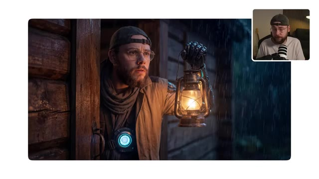
*Image générée par IA montrant le personnage du créateur avec un bras cybernétique et une lanterne, ouvrant une porte en bois sous la pluie la nuit (avec le créateur en incrustation PiP).*

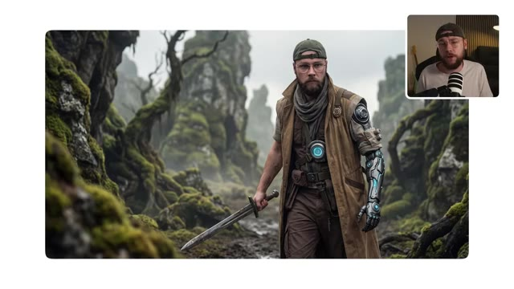
*Image générée par IA montrant le personnage du créateur tenant une épée dans un paysage rocheux moussu (avec le créateur en incrustation PiP).*

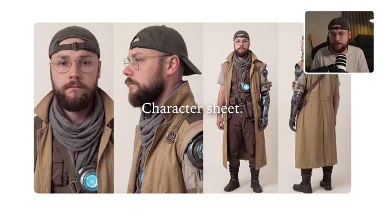
*Planche de personnages (Character sheet) générée par IA montrant plusieurs vues (visage, profil, plein pied de face et de dos) du créateur avec son costume sci-fi/fantasy et son bras cybernétique (avec le créateur en incrustation PiP).*

---

### ⏱️ `[00:03:00 - 00:03:34]` | Segment #08

**🔊 Audio (Transcription Intégrale Mot pour Mot en Français) :**
> Vous trouverez tous mes prompts un peu plus bas dans la description de la vidéo au fait si vous voulez en utiliser certains pour vos propres projets. Maintenant, en utilisant ces feuilles de personnages comme référence d'image, j'ai utilisé Nano Banana Pro une fois de plus pour générer ces visuels clés cinématiques. Ce sont tous des moments vraiment importants que je savais que je voulais montrer tout au long du film et qui aident à ancrer le sens du style que je recherchais. Et nous amènerons chacun d'eux dans Sea Dance 2 pour leur donner vie et commencer à façonner les scènes qui composeront notre film. Donc, avec notre concept cartographié et notre

**👁️ Analyse Visuelle d'Écran (gemini-3.5-flash-lite) :**
**Interface & Outils** : Présentation vidéo avec incrustation PiP (Picture-in-Picture) de l'animateur en haut à droite et affichage de visuels générés par IA en grand format.

**Contenu textuel & Code** : Texte affiché à l'écran : "Key visuals." sur l'image #3.

**Action / Démonstration** : Le créateur présente des visuels clés générés par IA pour illustrer son processus de création cinématographique.

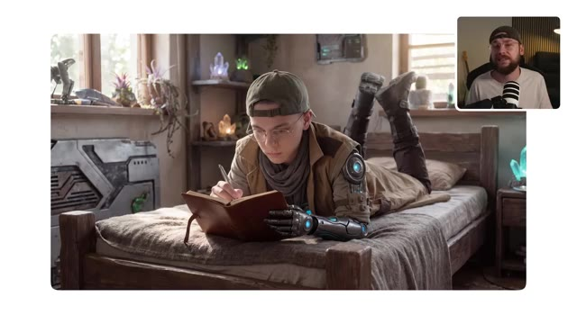
*Visuel clé cinématique généré par IA montrant un personnage allongé sur un lit en train d'écrire, avec un encadré PiP du créateur en haut à droite*

*Visuel clé cinématique affichant le texte "Key visuals.", montrant le personnage dans un paysage post-apocalyptique avec une arme futuriste, et le créateur en incrustation PiP*

---

### ⏱️ `[00:03:34 - 00:04:11]` | Segment #09

**🔊 Audio (Transcription Intégrale Mot pour Mot en Français) :**
> des fiches de personnages et des visuels clés générés, nous sommes maintenant prêts à plonger dans C-Dance 2. Donc pour accéder à l'outil, nous sommes sur Higgsfield et il est maintenant disponible pour tout le monde. Vous n'avez plus besoin d'avoir un forfait entreprise ou équipe pour utiliser C-Dance 2. Donc nous voulons nous rendre en haut à gauche de la page, survoler l'onglet vidéo et ensuite cliquer sur C-Dance 2. La première chose que nous voulons faire est d'importer tout média pertinent. Maintenant, ce sont bien sûr nos visuels clés que nous avons générés plus tôt en utilisant Nano Banana Pro. Donc par exemple dans la première scène, nous voulons montrer le jeune

**👁️ Analyse Visuelle d'Écran (gemini-3.5-flash-lite) :**
**Interface & Outils** : Interface web de la plateforme Higgsfield / Seedance 2.0 avec un mode PiP (Picture-in-Picture) montrant le créateur.

**Contenu textuel & Code** : Texte affiché à l'écran : « Higgsfield are also offering unlimited Seedance 2.0 plus free generations, currently up to 70% off. ». Boutons et options visibles : « Create Video », « Edit Video », « Motion Control », « Upload media », « Prompt », « Elements », « Seedance 2.0 », « 15s », « 16:9 », « 720p », « Generate +90 », et les onglets de la médiathèque (« Uploads », « Image Generations », « Video Generations », « Elements », « Liked ») avec des vignettes d'images (certaines marquées « Check eligibility », d'autres « Eligible »).

**Action / Démonstration** : Le curseur de la souris survole et sélectionne des éléments dans l'interface de Seedance 2.0 pour importer des visuels clés générés précédemment.

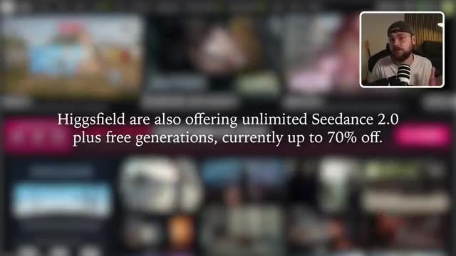
*Interface de la plateforme Higgsfield affichant une vue d'ensemble avec un encart textuel sur l'offre Seedance 2.0.*

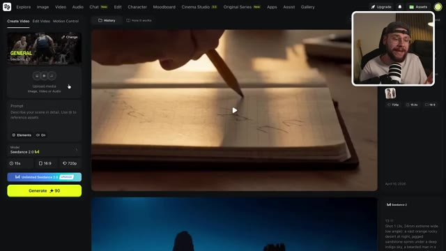
*Interface de création vidéo Seedance 2.0 sur Higgsfield montrant le panneau de contrôle à gauche et un aperçu vidéo central d'un carnet et d'un crayon.*

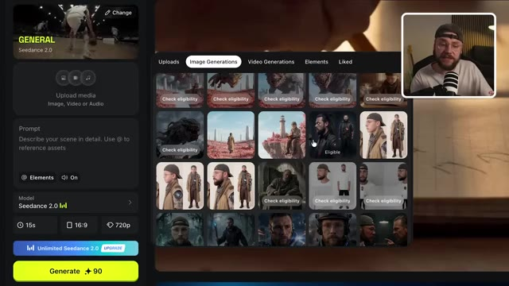
*Fenêtre modale de sélection de médias (« Image Generations ») par-dessus l'interface de Seedance 2.0, montrant différentes images générées par IA.*

---

### ⏱️ `[00:04:11 - 00:04:47]` | Segment #10

**🔊 Audio (Transcription Intégrale Mot pour Mot en Français) :**
> version de notre personnage principal assis au bord de cette île flottante et écrivant dans son carnet pour que nous puissions continuer et sélectionner ceci ici. Maintenant, vous pouvez également télécharger des références vidéo et audio sur Seedance 2. Je trouve les références vidéo pas si utiles que ça, mais il y a une astuce vraiment ingénieuse que vous pouvez faire avec les références audio que je vais aborder plus tard dans la vidéo, alors assurez-vous de rester à l'écoute pour cela. Maintenant, à côté de l'image que j'ai réellement générée de notre scène, je veux aller de l'avant et sélectionner notre feuille de personnage également et cela va aider à verrouiller la cohérence de notre personnage.

**👁️ Analyse Visuelle d'Écran (gemini-3.5-flash-lite) :**
**Interface & Outils** : Interface du logiciel de génération vidéo Seedance 2.0 avec une disposition comprenant un panneau latéral gauche de configuration, une grille centrale de sélection d'actifs (Uploads, Image Generations, Video Generations, Elements, Liked), et un encadré PiP (Picture-in-Picture) de la caméra frontale du créateur.

**Contenu textuel & Code** : On peut lire dans l'interface de Seedance 2.0 : "GENERAL", "Seedance 2.0", "Upload media", "Image, Video or Audio", "Prompt", "Describe your scene in detail. Use @ to reference assets", "@ Elements", "🔊 On", "Model", "Seedance 2.0", "15s", "16:9", "720p", "Unlimited Seedance 2.0 UPGRADE", "Generate ✨ 90". Dans la grille d'images, on aperçoit divers onglets ("Uploads", "Image Generations", "Video Generations", "Elements", "Liked") et des vignettes d'images générées par IA avec des libellés comme "Check eligibility" ou "Eligible".

**Action / Démonstration** : Le créateur navigue et clique dans la grille de sélection des images générées pour choisir l'image de la scène puis la feuille de personnage afin d'assurer la cohérence du personnage dans Seedance 2.0.

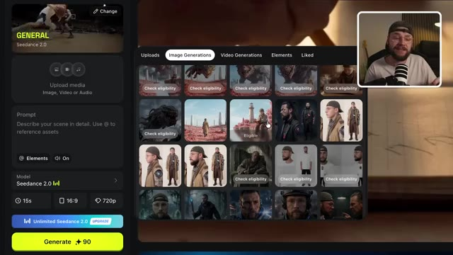
*Interface de Seedance 2.0 montrant le panneau de sélection des images générées et le créateur dans un encadré PiP.*

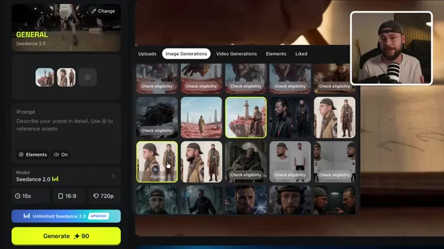
*Interface de Seedance 2.0 montrant la sélection simultanée de l'image principale de la scène et de la feuille de personnage pour verrouiller la cohérence.*

---

### ⏱️ `[00:04:47 - 00:05:06]` | Segment #11

**🔊 Audio (Transcription Intégrale Mot pour Mot en Français) :**
> comme je l'ai mentionné plus tôt. C'est donc l'ensemble des médias ou références dont nous avons besoin. Ensuite, bien sûr, nous devons travailler sur notre invite textuelle et j'ai en fait créé un cadre de multi-invites vraiment utile que vous pouvez intégrer directement dans Claude, ChatGPT, Gemini, ou peu importe votre préférence.

**👁️ Analyse Visuelle d'Écran (gemini-3.5-flash-lite) :**
**Interface & Outils** : Interface de Seedance 2.0 (image 1) et interface d'un assistant textuel IA comme Claude (image 2), avec un encadré PiP (Picture-in-Picture) montrant Jack face caméra.

**Contenu textuel & Code** : Image 1 : menu contextuel avec des onglets "Uploads", "Image Generations", "Video Generations", "Elements", "Liked", et des vignettes d'images étiquetées "Eligible" ou "Check eligibility". Panneau de gauche avec "GENERAL", modèle "Seedance 2.0", durée "15s", format "16:9", résolution "720p". Image 2 : texte complet d'un prompt pour IA structurant un plan multi-shot de 15 secondes avec des directives sur la taille des plans, les objectifs (ex: 24mm, 35mm), les angles et mouvements de caméra.

**Action / Démonstration** : Jack démontre la sélection des médias de référence dans l'interface de Seedance puis présente un cadre de multi-prompt textuel à utiliser dans un LLM.

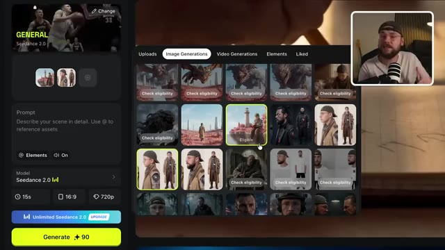
*Interface de Seedance 2.0 affichant une galerie de sélections d'images générées et les paramètres de configuration.*

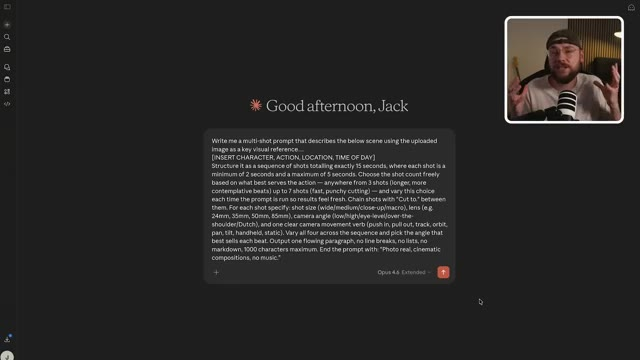
*Interface d'une application textuelle (semblable à Claude ou ChatGPT) affichant un prompt complexe de multi-plans.*

---

### ⏱️ `[00:05:07 - 00:05:42]` | Segment #12

**🔊 Audio (Transcription Intégrale Mot pour Mot en Français) :**
> Mais ce qui est utile avec ça, c'est que vous pouvez être assez vague et décrire très grossièrement la scène que vous recherchez, puis Claude nous redonne un prompt descriptif vraiment détaillé que nous pouvons ensuite prendre et déposer directement dans C-Dance 2 pour obtenir les meilleurs résultats. Bien sûr, je mettrai également ce framework ci-dessous dans la description de la vidéo. Et pour obtenir les meilleurs résultats avec cela, nous voudrons également aller de l'avant et télécharger notre référence visuelle clé pour cette scène. Donc dans notre cas, c'est ce plan ici, alors allons-y et déposons-le. Et ensuite cette section ici est la seule partie

**👁️ Analyse Visuelle d'Écran (gemini-3.5-flash-lite) :**
**Interface & Outils** : Interface web de Claude avec un encadré de prompt textuel et une incrustation vidéo (Picture-in-Picture) du créateur en haut à droite.

**Contenu textuel & Code** : Texte de bienvenue « Good afternoon, Jack » et un prompt détaillé destiné à Claude : « Write me a multi-shot prompt that describes the below scene using the uploaded image as a key visual reference... [INSERT CHARACTER, ACTION, LOCATION, TIME OF DAY]... ». Le modèle sélectionné en bas est « Opus 4.6 Extended ».

**Action / Démonstration** : Le créateur présente l'interface de l'assistant IA Claude tout en expliquant comment utiliser un prompt structuré pour générer des descriptions de plans détaillées.

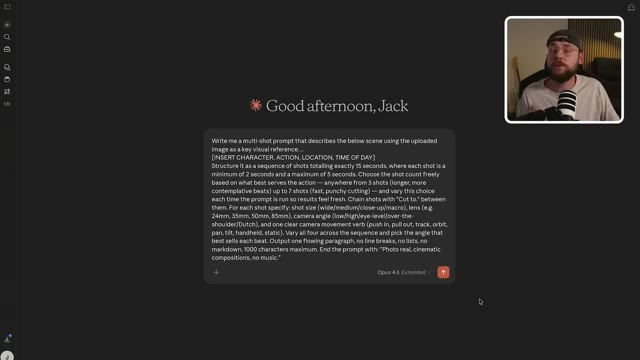
*Interface de Claude affichant un prompt textuel structuré pour générer un prompt multi-plans, avec le créateur en incrustation vidéo (PiP) dans le coin supérieur droit.*

---

### ⏱️ `[00:05:42 - 00:06:17]` | Segment #13

**🔊 Audio (Transcription Intégrale Mot pour Mot en Français) :**
> dont vous devez vous soucier. Vous voulez aller de l'avant et compléter votre personnage, toute action qui se produit, l'emplacement et le moment de la journée. Comme je l'ai dit, donnez simplement une description approximative de ce que vous recherchez. Donc je vais aller de l'avant et déposer ceci ici. Il est dit que nous montrons le garçon assis au bord d'une falaise, écrivant dans un carnet en cuir brun. Soudain, un papyrus en papier lumineux s'élève de la page et passe en battant des ailes devant ses yeux écarquillés. Son visage s'illumine d'un rire étonné. Le papillon en papier se transforme en un vrai papillon lumineux en s'envolant. C'est donc plutôt descriptif.

**👁️ Analyse Visuelle d'Écran (gemini-3.5-flash-lite) :**
**Interface & Outils** : Interface sombre d'un assistant IA (type Claude ou autre modèle de langage étendu), avec une boîte de texte contenant un prompt détaillé et un encadré vidéo du présentateur (PiP).

**Contenu textuel & Code** : Texte affiché à l'écran : "Good afternoon, Jack" et un prompt complet demandant de rédiger un prompt multi-plans décrivant une scène à partir d'une image de référence, incluant des consignes de durée, de cadrage, de focale et de mouvement de caméra.

**Action / Démonstration** : L'écran présente un exemple de prompt textuel complexe pour la génération vidéo par IA, tandis que le créateur commente les éléments à y inclure (personnage, action, lieu, moment de la journée).

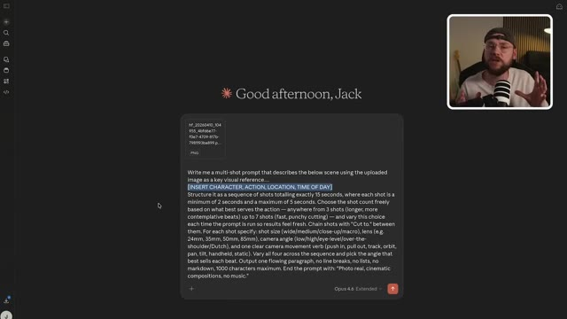
*Interface d'un outil d'intelligence artificielle montrant un prompt textuel structuré pour la génération de plans multiples avec le créateur en incrustation vidéo (PiP) dans le coin supérieur droit.*

---

### ⏱️ `[00:06:17 - 00:06:40]` | Segment #14

**🔊 Audio (Transcription Intégrale Mot pour Mot en Français) :**
> Donc vous n'avez pas besoin d'aller aussi loin si vous ne le voulez pas. Donc juste pour être clair, la seule chose que j'ai ajoutée à ce cadre de prompt est une description vague de ma scène. Allons-y donc et envoyons ceci pour voir ce que nous obtenons en retour de Claude. Et juste comme ça, nous avons récupéré ce prompt multi-plans hyper détaillé, qui décrit chacun des différents plans que nous voulons composer pour notre génération.

**👁️ Analyse Visuelle d'Écran (gemini-3.5-flash-lite) :**
**Interface & Outils** : Interface web de Claude avec un encadré PiP de Jack en haut à droite.

**Contenu textuel & Code** : Texte du prompt visible : "Write me a multi-shot prompt that describes the below scene using the uploaded image as a key visual reference..." ainsi qu'une image attachée en médaillon avec un nom de fichier. Le modèle affiché en bas à droite est "Opus 4.6 Extended".

**Action / Démonstration** : Le créateur montre l'interface de Claude et le prompt qu'il a rédigé pour obtenir une structure de plans cinématographiques.

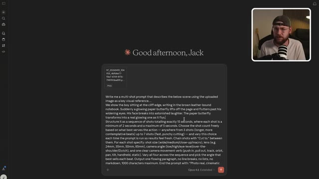
*Interface de Claude montrant un prompt détaillé pour générer un prompt multi-plans avec une image de référence.*

---

### ⏱️ `[00:06:41 - 00:07:19]` | Segment #15

**🔊 Audio (Transcription Intégrale Mot pour Mot en Français) :**
> Ça entre même dans les détails des mouvements de caméra et du type d'objectifs que nous voulons utiliser pour chaque plan. C'est à ce point utile. Tout ce que nous avons à faire, c'est de copier ceci, puis nous pouvons retourner sur Higgsfield et le coller dans la section de prompt. Maintenant, pour le modèle, nous voulons nous assurer d'avoir sélectionné Seedance 2 au lieu de Seedance 2 Fast pour obtenir les meilleurs résultats. Nous voulons également nous assurer de choisir 15 secondes comme durée, cela fait simplement partie de ce cadre de prompt spécifique. Vous voulez également générer dans un format d'image 16 par 9 et avec la plus haute résolution disponible, soit 720p.

**👁️ Analyse Visuelle d'Écran (gemini-3.5-flash-lite) :**
**Interface & Outils** : Interface de Claude (image 1) et interface de Higgsfield (image 2) avec un encadré PiP du créateur.

**Contenu textuel & Code** : Texte détaillé de prompt décrivant un jeune garçon écrivant dans un carnet en cuir avec des spécifications de plans (Wide shot, 24mm, Close-up, 50mm, Macro, 85mm). Paramètres sur Higgsfield : modèle Seedance 2, 15s, 16:9, 720p.

**Action / Démonstration** : Le créateur montre le prompt généré sur Claude puis passe sur l'interface de Higgsfield pour configurer les paramètres de génération vidéo.

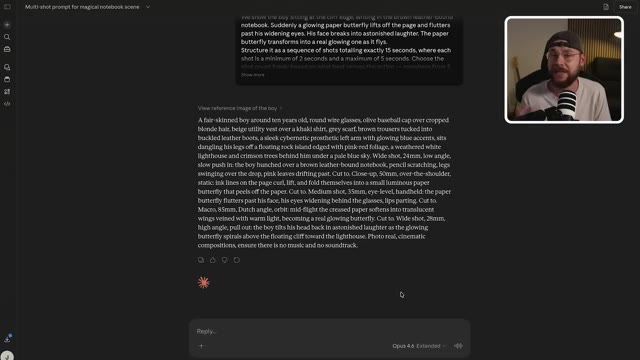
*Interface de Claude montrant un prompt textuel détaillé avec des instructions sur les mouvements de caméra et les types d'objectifs pour une scène de carnet magique.*

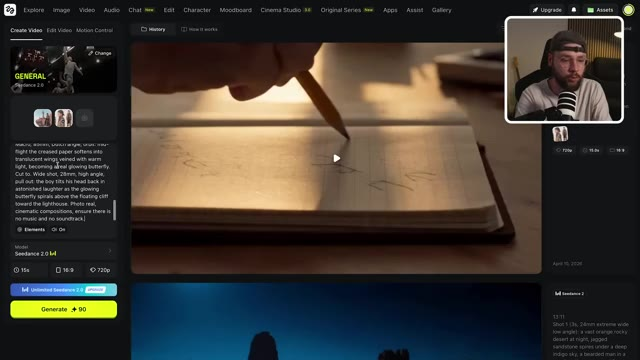
*Interface de Higgsfield montrant la configuration des paramètres de génération vidéo avec le modèle Seedance 2, une durée de 15 secondes, un format 16:9 et une résolution de 720p.*

---

### ⏱️ `[00:07:19 - 00:07:44]` | Segment #16

**🔊 Audio (Transcription Intégrale Mot pour Mot en Français) :**
> Allons-y et envoyons cette génération. Chaque fois que quelqu'un m'a demandé pourquoi Sea Dance 2 valait le détour, je lui ai généralement dit la même chose.

**👁️ Analyse Visuelle d'Écran (gemini-3.5-flash-lite) :**
**Interface & Outils** : Démonstration de vidéos générées par IA (Sea Dance 2) illustrant les propos du créateur.

**Contenu textuel & Code** : Visuels de génération vidéo montrant un univers fantastique avec des îles flottantes, un phare et un enfant interagissant avec un papillon lumineux sortant d'un carnet.

**Action / Démonstration** : Le créateur alterne entre des plans de présentation dans son studio face caméra et la diffusion d'exemples de vidéos générées par IA.

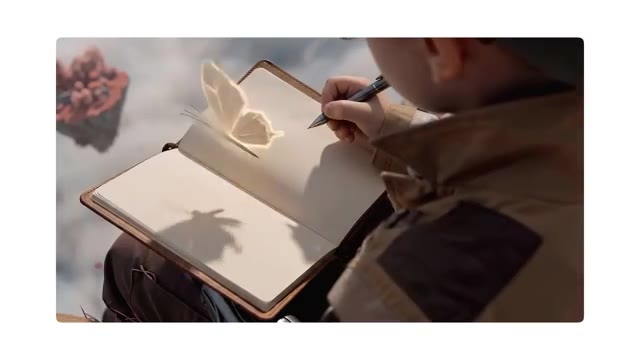
*Gros plan sur une vidéo générée par IA montrant un jeune garçon assis sur une île flottante en train d'écrire dans un carnet d'où s'envole un papillon de lumière.*

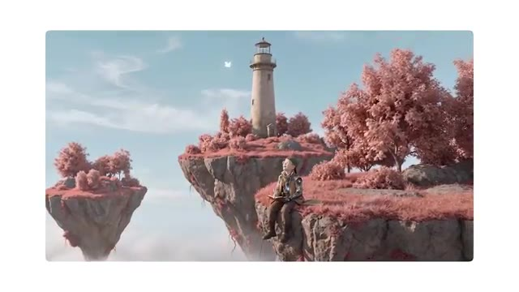
*Vue plus large de la scène onirique avec des îles flottantes roses, un phare et le garçon regardant un papillon s'envoler.*

---

### ⏱️ `[00:07:44 - 00:08:04]` | Segment #17

**🔊 Audio (Transcription Intégrale Mot pour Mot en Français) :**
> Et c'est simplement qu'il comprend le cinéma. Il saisit ce qui doit être montré dans une scène pour donner l'impression d'un vrai film. Maintenant, évidemment, nous avons donné à C-Dance 2 un bon point de départ avec nos références d'images et notre invite très détaillée. Mais en réalité, nous n'avons pas eu à faire tant de travail que ça pour obtenir un résultat de ce niveau.

**👁️ Analyse Visuelle d'Écran (gemini-3.5-flash-lite) :**
**Interface & Outils** : Extrait de vidéo générée par l'IA Seedance 2 montrant un personnage de jeune garçon écrivant/dessinant dans un univers fantastique (avec incrustation vidéo du créateur Jack en haut à droite).

**Contenu textuel & Code** : Séquence cinématique générée par IA : un jeune garçon au bras bionique sur une île flottante inspirée d'un monde onirique, un phare, un papillon lumineux s'échappant d'un carnet.

**Action / Démonstration** : Le créateur commente les capacités cinématiques de l'outil Seedance 2 pendant la lecture de cette séquence vidéo illustrative générée par IA.

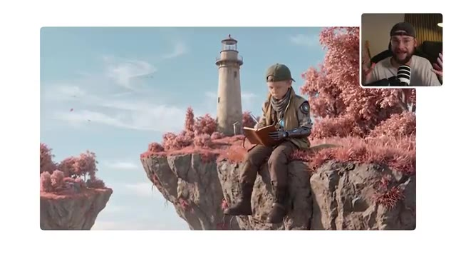
*Rendu vidéo généré par IA montrant un jeune garçon assis sur une île flottante au bord d'une falaise, avec un phare en arrière-plan, un carnet à la main.*

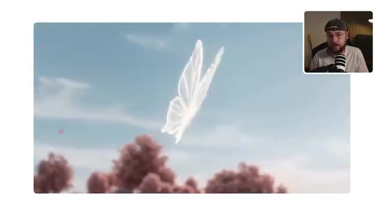
*Rendu vidéo généré par IA montrant un papillon lumineux et translucide volant dans le ciel au-dessus de paysages rocheux aux teintes roses.*

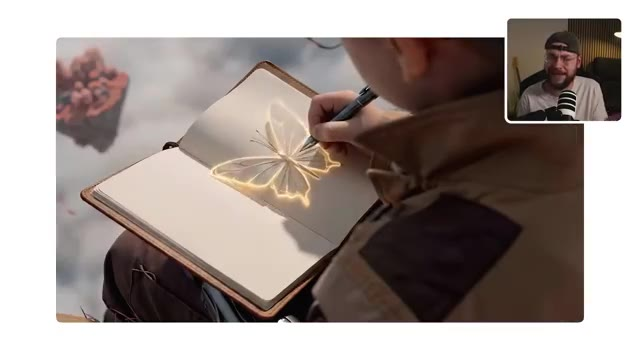
*Rendu vidéo en gros plan montrant le jeune garçon en train de dessiner un papillon lumineux et étincelant sur les pages de son carnet.*

---

### ⏱️ `[00:08:04 - 00:08:27]` | Segment #18

**🔊 Audio (Transcription Intégrale Mot pour Mot en Français) :**
> Et nous devons parler également de cet effet visuel du papillon en papier qui se soulève de la page et s'envole. C'est exactement ce que nous recherchons. Et c'est là que C-Dance 2 surpasse largement Cling 3. Je peux presque garantir que si je mets le même prompt et les mêmes images de départ dans Cling 3, je n'obtiendrais tout simplement pas un résultat comme celui-ci.

**👁️ Analyse Visuelle d'Écran (gemini-3.5-flash-lite) :**
**Interface & Outils** : Démonstration vidéo de résultats générés par IA (Sora/Seedance vs Kling) avec incrustation PiP (Picture-in-Picture) du présentateur Jack dans le coin supérieur droit.

**Contenu textuel & Code** : Génération vidéo IA montrant un garçon style steampunk/cyborg sur une île volante, avec un papillon en papier interactif sortant d'une page de carnet.

**Action / Démonstration** : Le créateur commente et analyse la qualité de l'effet visuel de transition où le papillon en papier prend vie et s'envole de la page.

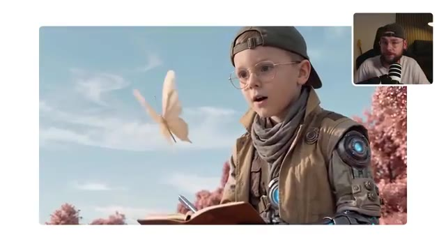
*Gros plan sur un jeune garçon cyborg émerveillé observant un papillon en papier blanc s'envoler d'un carnet qu'il tient.*

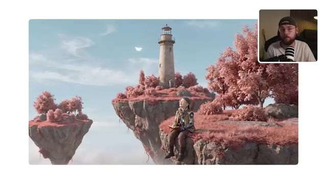
*Plan large sur le garçon assis au bord d'une île flottante surréaliste avec un phare, regardant le papillon s'envoler.*

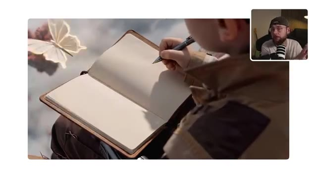
*Gros plan en plongée sur les mains du garçon écrivant ou dessinant dans un carnet ouvert pendant que le papillon en papier s'élève.*

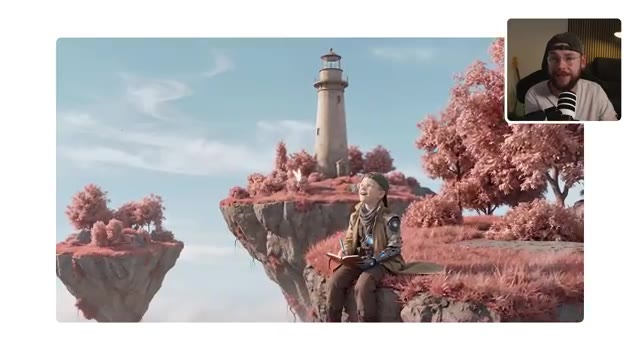
*Plan large similaire montrant l'île flottante surréaliste avec des arbres aux feuilles roses et un phare en arrière-plan.*

---

### ⏱️ `[00:08:27 - 00:08:47]` | Segment #19

**🔊 Audio (Transcription Intégrale Mot pour Mot en Français) :**
> All right, now I want to go ahead and generate one of our scenes with the teenage version of our character. So I'm going to clear out our text prompt and I'm also going to remove both of our image references as well. Let's first add in our character sheet for the teenage boy. And for this scene, I know that I want it to start with him on his bed scribbling in his notebook.

**👁️ Analyse Visuelle d'Écran (gemini-3.5-flash-lite) :**
**Interface & Outils** : Jack face caméra ou transition sans partage d'écran.

**Contenu textuel & Code** : Explications orales des concepts et des méthodes de création vidéo IA.

**Action / Démonstration** : Démonstration pédagogique et présentation du workflow.

---

### ⏱️ `[00:08:47 - 00:09:07]` | Segment #20

**🔊 Audio (Transcription Intégrale Mot pour Mot en Français) :**
> Et nous allons également lui montrer en train de rencontrer cette créature vraiment incroyable aussi au bord d'une cascade. C'est tout ce dont nous avons besoin en termes de références d'images. Maintenant, nous avons besoin de notre prompt. Donc, en retournant sur Claude maintenant dans le tout même chat, nous pouvons dire applique le même cadre à cette scène.

**👁️ Analyse Visuelle d'Écran (gemini-3.5-flash-lite) :**
**Interface & Outils** : Interface de Seedance 2.0 (panneau de génération vidéo, modèles, paramètres de durée et de format) et interface de l'assistant IA Claude.

**Contenu textuel & Code** : Texte visible sur l'interface de Seedance : "Prompt: Describe your scene in detail. Use @ to reference assets", "Model: Seedance 2.0", "15s", "16:9", "720p". Texte sur l'interface de Claude : "Multi-shot prompt for magical notebook scene", "apply the same framework...", "Opus 4.6 Extended".

**Action / Démonstration** : Le créateur navigue dans la galerie de Seedance pour choisir des images de référence, puis bascule sur l'interface de Claude pour y saisir un nouveau prompt textuel.

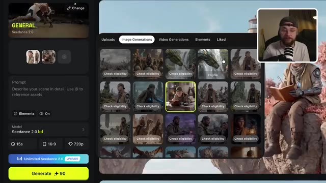
*Interface de Seedance 2.0 affichant une galerie contextuelle d'images générées pour sélectionner une référence visuelle.*

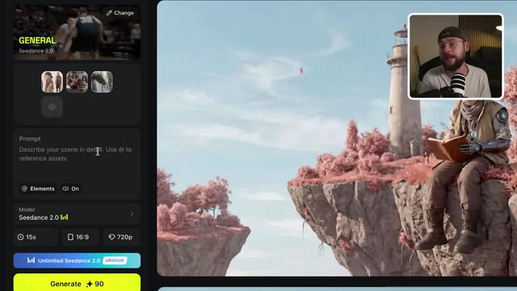
*Interface de Seedance 2.0 montrant les vignettes de référence sélectionnées et le panneau de prompt vide.*

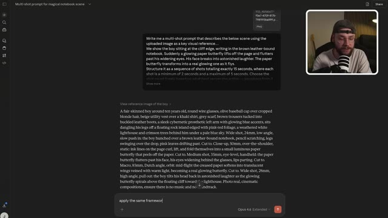
*Interface de l'outil Claude affichant le chat textuel avec le prompt et la réponse générée, où l'utilisateur tape sa commande.*

---

### ⏱️ `[00:09:08 - 00:09:30]` | Segment #21

**🔊 Audio (Transcription Intégrale Mot pour Mot en Français) :**
> Et je veux aussi aller de l'avant et télécharger chacune de ces mêmes images de référence afin de donner à Claude beaucoup de contexte. Nous pouvons insérer notre description de cette scène pour montrer exactement ce que nous recherchons et envoyer le tout. Très bien. Copions donc tout ceci. Revenons sur Higgsfield, déposons-le dans le champ de prompt, puis cliquons sur générer.

**👁️ Analyse Visuelle d'Écran (gemini-3.5-flash-lite) :**
**Interface & Outils** : Interface web de Claude et interface de génération vidéo (Higgsfield / Seedance) avec incrustation PiP du créateur.

**Contenu textuel & Code** : Prompts textuels décrivant une scène avec un garçon et un carnet magique, ainsi que des images de référence importées.

**Action / Démonstration** : Le créateur montre l'importation de références visuelles et de descriptions textuelles dans Claude, puis copie le résultat pour le coller dans l'outil de génération vidéo Higgsfield avant de lancer la génération.

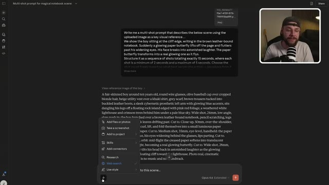
*Interface de Claude avec le menu d'ajout de fichiers ouvert et le créateur visible en incrustation PiP.*

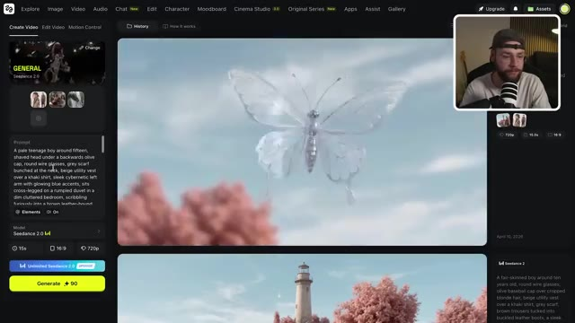
*Interface de génération vidéo (Seedance / Higgsfield) avec le prompt collé dans le champ texte et le bouton de génération.*

---

### ⏱️ `[00:09:45 - 00:10:19]` | Segment #22

**🔊 Audio (Transcription Intégrale Mot pour Mot en Français) :**
> Nous devons reparler de ces visuels. Cet effet de la chambre du garçon qui se démonte en quelque sorte pour révéler ce paysage fou, et ensuite nous passons à sa rencontre avec cette créature serpent vraiment cool. Honnêtement, ce dont Sea Dance 2 est capable est vraiment fou. Je trouvais par le passé que je devais en quelque sorte filtrer un peu mes idées avant de les exécuter dans un générateur de vidéos. Je n'ai tout simplement pas l'impression qu'on doive faire ça avec Sea Dance. C'est tellement performant et ça a ce niveau de

**👁️ Analyse Visuelle d'Écran (gemini-3.5-flash-lite) :**
**Interface & Outils** : Extrait vidéo généré par intelligence artificielle (SeaDance 2) affiché à l'écran, avec incrustation vidéo (PiP) de Jack parlant dans son studio en haut à droite.

**Contenu textuel & Code** : Rendu visuel d'une cinématique fantastique générée par IA : un personnage aux traits réalistes portant un bras prothétique/robotique, des décors naturels luxuriants avec des cascades et des îles flottantes, et une créature reptilienne/serpent détaillée.

**Action / Démonstration** : Le créateur commente et analyse des séquences vidéo générées par IA qui s'enchaînent à l'écran, illustrant les capacités de génération de Seedance 2.

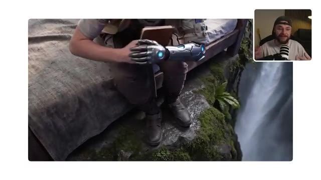
*Génération vidéo par IA montrant un jeune homme assis au bord d'une cascade avec un bras robotique et un carnet.*

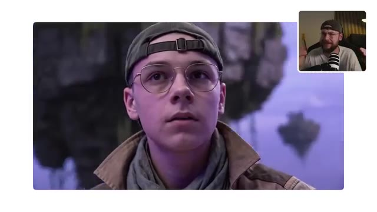
*Génération vidéo par IA montrant le jeune homme avec des lunettes et une casquette regardant un paysage fantastique avec des îles flottantes.*

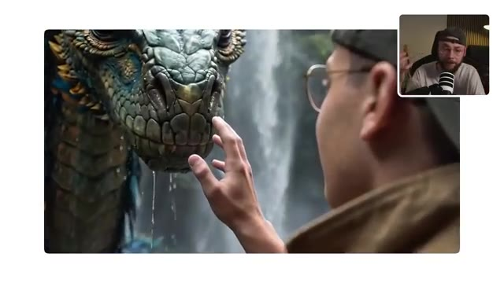
*Génération vidéo par IA montrant le jeune homme tendant la main vers une créature serpent fantastique près d'une cascade.*

---

### ⏱️ `[00:10:19 - 00:10:54]` | Segment #23

**🔊 Audio (Transcription Intégrale Mot pour Mot en Français) :**
> compréhension cinématographique. Pratiquement tout ce que vous pouvez imaginer, vous étiez capable de lui donner vie avec cet outil et maintenant ce que j'aimerais faire, c'est regarder une scène de combat, donc ça va ressembler à un face-à-face entre deux versions différentes du même personnage. Je pense que ça devrait être plutôt cool. Je pense que jusqu'à présent, nous avons vraiment bien testé la capacité de Seedance en ce qui concerne les effets visuels ainsi que la sorte de compréhension cinématographique, mais maintenant je veux tester sa physique car, comme je suis sûr que vous le savez bien, c'est souvent un problème lorsqu'il s'agit de vidéo par IA, alors comment Seedance 2 va

**👁️ Analyse Visuelle d'Écran (gemini-3.5-flash-lite) :**
**Interface & Outils** : Interface de l'outil de génération vidéo Seedance 2 (onglets Explore, Image, Video, Audio, Chat, etc.), avec panneau latéral gauche pour les prompts et modèle Seedance 2.0.

**Contenu textuel & Code** : Texte du prompt visible : "Wide shot, 28mm, low angle, tilt up: behind a thundering waterfall a colossal feathered serpent uncoils..." et paramètres de modèle Seedance 2.0 (durée 6s, format 16:9, résolution 720p).

**Action / Démonstration** : Le créateur présente des exemples de vidéos générées avec Seedance 2 illustrant la compréhension cinématographique et les effets visuels avant d'aborder le test de la physique.

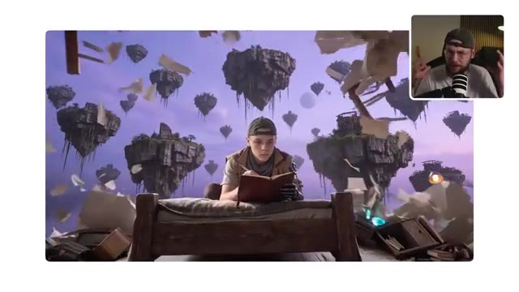
*Rendu vidéo de Seedance 2 montrant un personnage sur un lit dans un monde fantastique avec des îles flottantes, et le créateur dans un encadré PiP.*

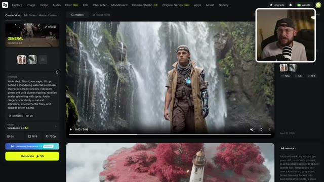
*Interface principale de l'outil Seedance 2 affichant les paramètres de génération vidéo et un aperçu du personnage devant une cascade.*

---

### ⏱️ `[00:10:54 - 00:11:30]` | Segment #24

**🔊 Audio (Transcription Intégrale Mot pour Mot en Français) :**
> pour faire face à une scène de combat. Donc d'abord je vais sélectionner la feuille de personnage pour notre version adulte du personnage principal et ensuite cette feuille de personnage pour sa version maléfique également. Et je ne vais pas télécharger de visuel clé ici. Je veux voir comment Sea Dance gère le simple fait d'avoir les feuilles de personnage comme référence. En retournant une fois de plus dans le même chat au sein de Claude, je veux d'abord aller télécharger mes deux feuilles de personnage pour le personnage gentil et le méchant. Et pour le prompt je vais dire j'ai téléchargé des feuilles de personnage pour référence, maintenant appliquez le même cadre au

**👁️ Analyse Visuelle d'Écran (gemini-3.5-flash-lite) :**
**Interface & Outils** : Seedance 2.0 et Claude (avec incrustation vidéo PiP du créateur).

**Contenu textuel & Code** : Sur l'image 1 : interface Seedance 2.0 avec onglets "Uploads", "Image Generations", grille de vignettes d'images, panneau de prompt et bouton de génération "Generate". Sur l'image 2 : interface de Claude avec un long texte descriptif de scène et un champ de saisie en bas avec le prompt "I've uploaded character sheets for reference, now apply the same framework to the below...".

**Action / Démonstration** : Le créateur montre la sélection de feuilles de personnage dans Seedance puis bascule vers l'interface de Claude pour y entrer un prompt basé sur ces références.

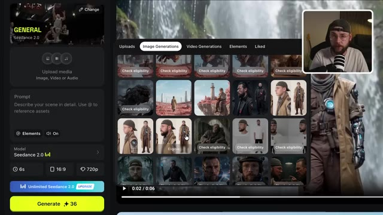
*Interface de Seedance 2.0 montrant la sélection de feuilles de personnage et d'images générées.*

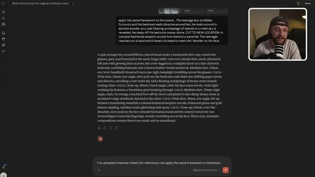
*Interface de Claude montrant un prompt textuel pour appliquer les feuilles de personnage à une scène.*

---

### ⏱️ `[00:11:30 - 00:12:20]` | Segment #25

**🔊 Audio (Transcription Intégrale Mot pour Mot en Français) :**
> en dessous, l'écrivain barbu fait face à une version maléfique de lui-même de part et d'autre d'un paysage brisé. Ils tiennent tous les deux de grandes épées, ils se chargent l'un l'autre et se lancent dans une bataille intense. Continuons donc pour voir quel résultat nous obtenons à partir de ceci également. Nous allons donc reprendre tout ce texte de prompt, le ramener sur Higgsfield et le déposer dans le champ de texte du prompt. Cliquons donc sur générer et voyons les résultats que nous obtenons pour cette scène de combat. Nous avons donc récupéré deux générations que je veux examiner ici. Voici la première. Maintenant, pour ma part, même si je pense qu'il y a vraiment quelques

**👁️ Analyse Visuelle d'Écran (gemini-3.5-flash-lite) :**
**Interface & Outils** : Interface de la plateforme de génération vidéo Higgsfield avec panneau de prompt textuel et zone de téléchargement de médias.

**Contenu textuel & Code** : Texte du prompt décrivant le combat entre l'écrivain barbu et sa version maléfique : "the bearded writer faces an evil version of himself across a shattered landscape they are both holding great swords they charge at each other and launch into an intense battle", ainsi qu'un prompt détaillé sur un jeune garçon et un serpent à plumes.

**Action / Démonstration** : Le créateur montre son interface de génération sur Higgsfield avec le prompt saisi et affiche le résultat vidéo de la scène de combat entre les deux personnages.

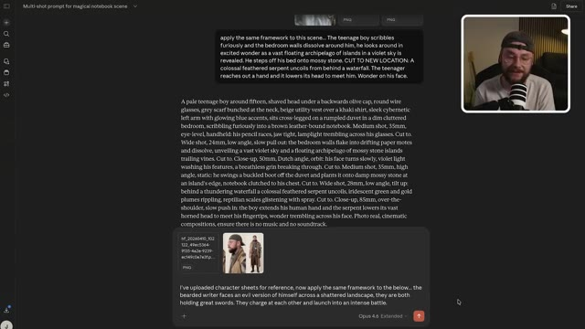
*Interface de Higgsfield montrant un prompt textuel complexe de description de scène multi-plans et l'importation de feuilles de personnages avec le créateur en incrustation vidéo (PiP) dans le coin supérieur droit.*

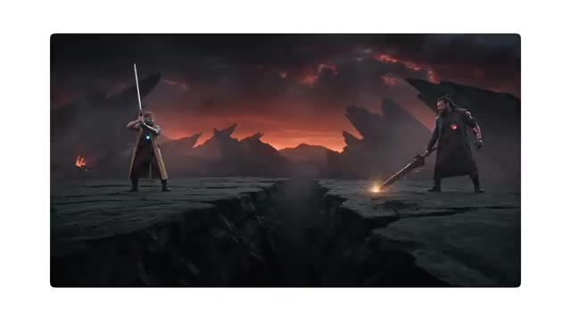
*Aperçu vidéo généré par l'IA montrant deux personnages armés d'épées se faisant face sur un paysage brisé sous un ciel dramatique.*

---

### ⏱️ `[00:12:20 - 00:13:00]` | Segment #26

**🔊 Audio (Transcription Intégrale Mot pour Mot en Français) :**
> Des choses impressionnantes qui se passent ici, ça fait un peu bizarre, un style d'effets visuels sur fond vert. Le contact dans la scène de combat est plutôt bon. Il n'y a rien qui semble particulièrement maladroit ou bizarre, ce qui est un problème qu'on rencontre souvent avec ce genre de tests de physique avec l'IA, donc il y a beaucoup à aimer ici, je préfère la deuxième génération maintenant, gardez...

**👁️ Analyse Visuelle d'Écran (gemini-3.5-flash-lite) :**
**Interface & Outils** : Lecteur vidéo / Montage affichant des clips générés par intelligence artificielle avec incrustation PiP du créateur.

**Contenu textuel & Code** : Rendu visuel d'un combat cinématographique généré par IA (personnages fantastiques, bras robotiques, décors rocheux/lave).

**Action / Démonstration** : Visualisation d'extraits de tests de physique et de scènes d'action générés par IA commentés par le créateur.

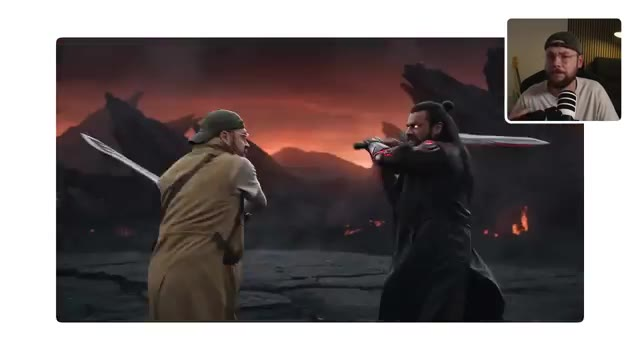
*Extrait vidéo généré par IA montrant un combat à l'épée dans un décor volcanique, avec Jack incrusté en miniature (PiP) en haut à droite.*

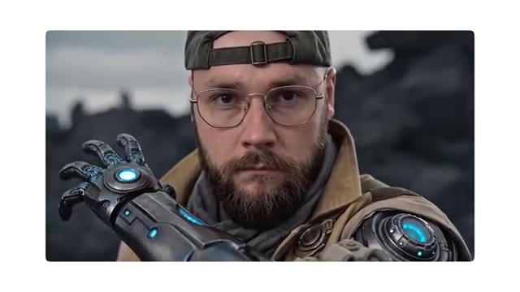
*Gros plan sur le personnage généré par IA inspiré de Jack, portant un bras robotique futuriste lumineux.*

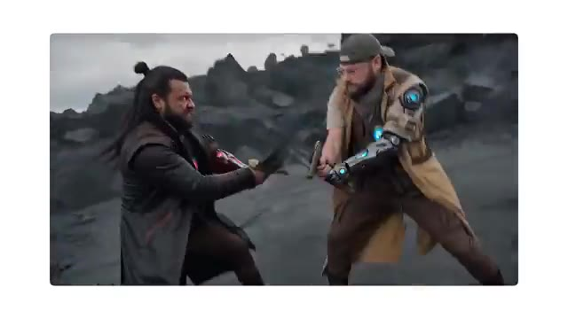
*Scène d'action générée par IA montrant les deux combattants au corps à corps dans un environnement rocailleux.*

---

### ⏱️ `[00:13:00 - 00:13:36]` | Segment #27

**🔊 Audio (Transcription Intégrale Mot pour Mot en Français) :**
> Notez bien aussi que nous n'avons pas donné à Seedance 2 une référence pour l'emplacement, tout cela provient directement du modèle. Tout ce que nous lui avons donné, ce sont les fiches de personnages pour nous assurer d'avoir ce niveau de cohérence des personnages, qu'il respecte vraiment très bien. Je pense que cette scène de combat est beaucoup mieux. Il y a deux ou trois plans là-dedans qui semblent un peu maladroits et gauches, mais de manière générale, c'est vraiment très bien. Maintenant, j'ai dit plus tôt que je voulais aborder une astuce que j'ai trouvée lorsqu'il s'agit d'utiliser des références audio dans Seedance 2. Je savais que

**👁️ Analyse Visuelle d'Écran (gemini-3.5-flash-lite) :**
**Interface & Outils** : Logiciel de montage ou lecteur vidéo présentant des extraits générés par Seedance 2 avec incrustation caméra (PiP) du créateur.

**Contenu textuel & Code** : Générations vidéo de scènes de combat et gros plans de personnages avec cohérence visuelle.

**Action / Démonstration** : Le créateur commente les plans d'action générés par l'IA et la cohérence des personnages.

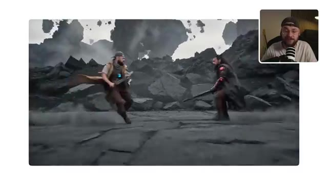
*Extrait vidéo généré par IA montrant un combat entre deux personnages dans un décor rocheux, avec une incrustation de Jack (PiP) en haut à droite.*

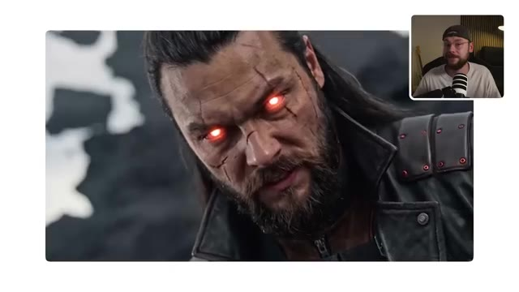
*Gros plan sur le visage d'un personnage avec des yeux brillants rouges, généré par IA, avec une incrustation de Jack (PiP) en haut à droite.*

---

### ⏱️ `[00:13:36 - 00:14:11]` | Segment #28

**🔊 Audio (Transcription Intégrale Mot pour Mot en Français) :**
> la voix off allait être vraiment importante pour ce film. Visuellement, je savais que j'avais des idées vraiment cool, mais la voix off allait être là pour contextualiser tout ce que le spectateur voit et lui donner un aperçu de l'histoire pour donner à le tout un peu plus de sens plutôt que de simplement ressembler à une combinaison de vignettes vraiment cool. Et au lieu d'utiliser un générateur de voix IA pour cela, j'ai en fait fini par tout créer à l'intérieur de C-Dance 2 également. Et ce que j'ai fait, c'est que j'ai téléchargé cet extrait audio ici de la voix de conteur d'un vieil homme que j'ai vraiment

**👁️ Analyse Visuelle d'Écran (gemini-3.5-flash-lite) :**
**Interface & Outils** : Interface web de Seedance 2.0 (ou Seedance 2), affichant le panneau de création de vidéo avec les options de modèle (Seedance 2.0), les paramètres de durée (15s), le ratio (16:9), la résolution (720p) et une fenêtre de découpage audio (Trim audio).

**Contenu textuel & Code** : Sur l'image 1 : Affichage d'un prompt textuel partiel décrivant une scène ("man, dramatically telling a tale, soothing yet captivating delivery..."). Paramètres du modèle : Seedance 2.0, durée 15s, 16:9, 720p. Bouton de génération "Generate 90". Sur l'image 3 : Fenêtre modale "Trim audio" avec affichage de la forme d'onde audio, durée restante "13s remaining", et boutons "Cancel" / "Save".

**Action / Démonstration** : Le créateur montre l'interface de Seedance 2.0 avec un aperçu vidéo généré d'un vieil homme sur un trône, puis démontre l'outil de découpage d'un fichier audio (Trim audio) pour la voix off.

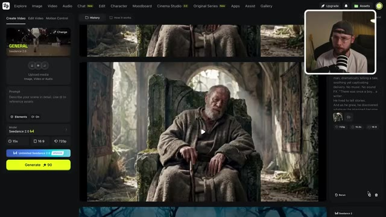
*Interface de Seedance 2.0 montrant le rendu vidéo d'un vieil homme assis sur un trône en pierre, avec le créateur en incrustation (PiP).*

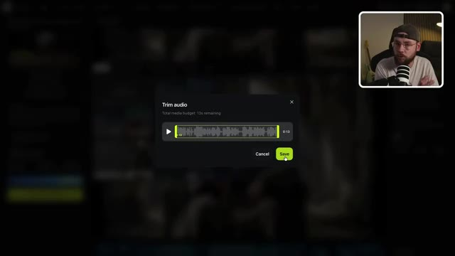
*Fenêtre « Trim audio » (découpage audio) sur l'interface de Seedance avec la forme d'onde et les boutons Cancel/Save, et le créateur en incrustation (PiP).*

---

### ⏱️ `[00:14:11 - 00:14:48]` | Segment #29

**🔊 Audio (Transcription Intégrale Mot pour Mot en Français) :**
> aimé. Et j'ai aussi pris les devants pour ajouter une image de référence également, juste au cas où je voudrais utiliser la génération de vidéo. Je ne l'ai pas fait au final, mais c'est bien d'avoir l'option. Et pour le prompt textuel, j'ai dit : un homme racontant un conte de manière dramatique, une livraison apaisante mais captivante, pas de musique, pas d'effets sonores, puis j'ai inséré une certaine quantité du script de voix off que je savais fonctionner dans les 15 secondes. Si vous mettez tout le script dedans, il est lu très très rapidement et évidemment vous ne voulez pas ça, et puis à la fin du prompt j'ai mis : assurez-vous d'utiliser la même voix que dans la référence. Donc

**👁️ Analyse Visuelle d'Écran (gemini-3.5-flash-lite) :**
**Interface & Outils** : Interface web de Seedance 2.0 (outil de génération vidéo par IA).

**Contenu textuel & Code** : Texte du prompt visible : "man, dramatically telling a tale, soothing yet captivating delivery. No music. No sound FX. "There was once a boy... a writer. He lived to tell stories. And as he grew, he discovered whatever he imagined became real." ensure to use the same voice in the reference". Paramètres visibles : Modèle Seedance 2.0, durée 15s, format 16:9, résolution 720p. Bouton de génération "Generate 90".

**Action / Démonstration** : Le créateur montre l'interface de Seedance 2.0 en naviguant dans les fichiers multimédias et en affichant le prompt textuel ainsi que le résultat vidéo généré d'un vieil homme sur son trône, avec sa webcam incrustée (Picture-in-Picture) en haut à droite.

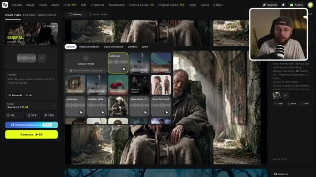
*Interface de Seedance 2.0 affichant une fenêtre de sélection de médias avec des fichiers audio et d'images téléchargés.*

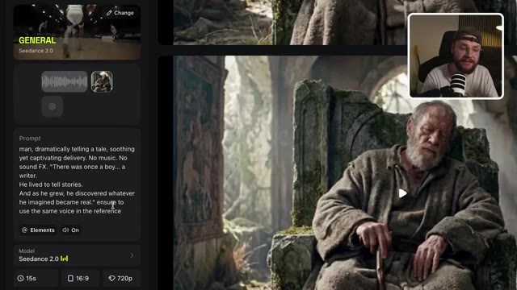
*Interface de Seedance 2.0 montrant le prompt textuel détaillé et les paramètres de génération vidéo réglés sur 15s, format 16:9, 720p.*

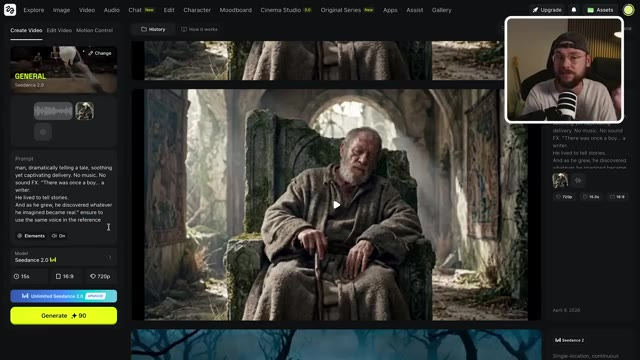
*Interface de Seedance 2.0 montrant le résultat vidéo généré représentant un vieil homme assis sur un trône de pierre.*

---

### ⏱️ `[00:14:48 - 00:15:08]` | Segment #30

**🔊 Audio (Transcription Intégrale Mot pour Mot en Français) :**
> à chaque fois je réutilise simplement le même prompt mais je remplace juste une partie différente du dialogue Et ce que j'ai récupéré, ce sont quatre générations différentes, toutes avec exactement la même voix. Il était une fois un garçon, un écrivain. Il façonnait des mondes impossibles.

**👁️ Analyse Visuelle d'Écran (gemini-3.5-flash-lite) :**
**Interface & Outils** : Interface de la plateforme de génération vidéo Seedance (navigation supérieure avec Explore, Image, Video, Audio, Chat, Edit, etc. et panneau latéral gauche de configuration avec le champ de prompt et le modèle "Seedance 2.0").

**Contenu textuel & Code** : Texte du prompt visible : "man, dramatically telling a tale, soothing yet captivating delivery. No music. No sound FX. "There was once a boy... a writer. He lived to tell stories. And as he grew, he discovered whatever he imagined became real." ensure to use the same voice in the reference". Paramètres visibles : durée 15s, format 16:9, résolution 720p, modèle Seedance 2.0.

**Action / Démonstration** : Le créateur montre son écran de travail sur Seedance, modifiant les dialogues tout en conservant le même prompt textuel et les mêmes paramètres pour générer plusieurs plans cohérents.

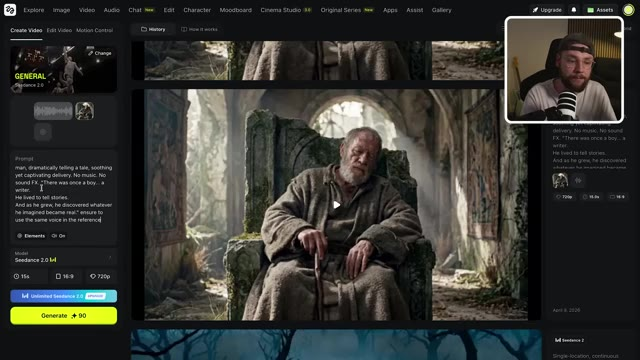
*Interface de Seedance montrant le panneau de prompt à gauche et le rendu vidéo d'un vieil homme assis sur un trône de pierre au centre, avec le créateur en incrustation (PiP).*

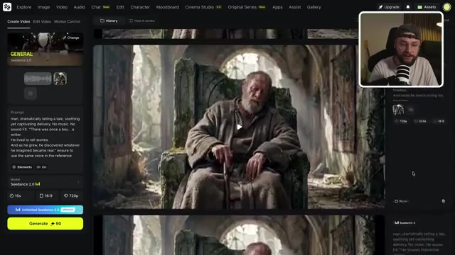
*Poursuite de la démonstration sur Seedance avec l'affichage de la vidéo générée montrant le vieil homme dans son décor médiéval délabré.*

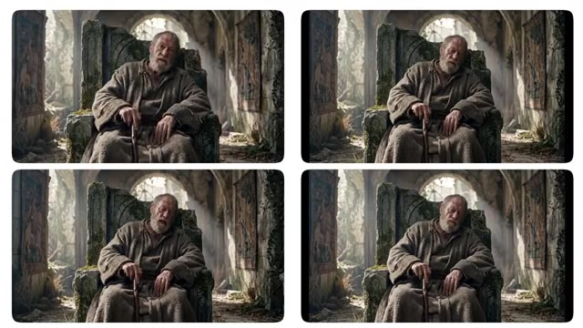
*Affichage d'une grille de quatre générations vidéo différentes (split-screen 2x2) montrant le même personnage âgé parlant avec des variations de mouvements.*

---

### ⏱️ `[00:15:08 - 00:15:28]` | Segment #31

**🔊 Audio (Transcription Intégrale Mot pour Mot en Français) :**
> Chaque lumière projette une ombre. À chaque miracle correspond une conséquence. Obtenir une consistance vocale en matière de vidéo par IA a longtemps été un vrai problème. Je crois que je vais en fait faire une vidéo séparée à ce sujet parce que je pense que c'est assez énorme, mais c'est vraiment cool de pouvoir obtenir la même voix répétée à travers ces multiples générations.

**👁️ Analyse Visuelle d'Écran (gemini-3.5-flash-lite) :**
**Interface & Outils** : Interface de la plateforme de génération vidéo Seedance, affichant les menus supérieurs (Explore, Image, Video, Audio, Chat, Edit, Character, Moodboard, Cinema Studio, etc.), le panneau de création à gauche avec le champ de prompt, et la zone de prévisualisation centrale.

**Contenu textuel & Code** : Dans le panneau de prompt à gauche, on peut lire : "man, dramatically telling a tale, soothing yet captivating delivery. No music. No sound FX. 'There was once a boy... a writer. He lived to tell stories. And as he grew, he discovered whatever he imagined became real.' ensure to use the same voice in the reference". Paramètres visibles : modèle "Seedance 2.0", durée "15s", format "16:9", résolution "720p".

**Action / Démonstration** : Le créateur montre un exemple de génération vidéo basé sur un personnage âgé dans un décor de château en ruine, illustrant le problème de la constance de la voix et du rendu cinématique sur plusieurs générations.

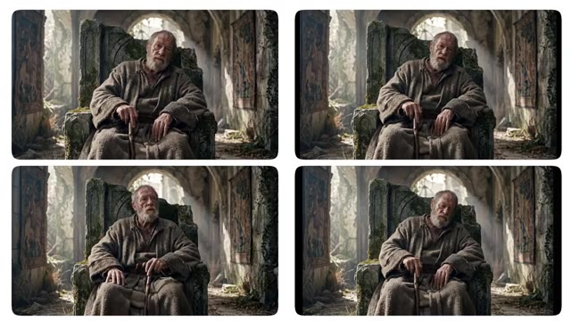
*Grille de quatre aperçus d'une vidéo générée par IA montrant un vieil homme barbu assis sur un trône de pierre dans un décor médiéval.*

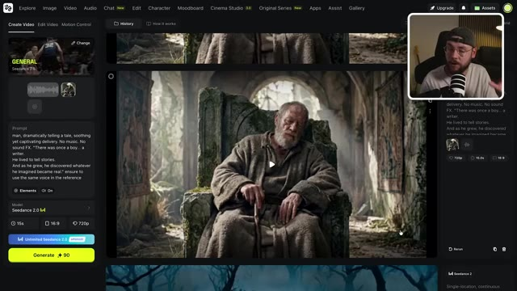
*Interface du logiciel de création vidéo par IA (Seedance) avec un aperçu vidéo central, un panneau de prompt textuel à gauche et le créateur en incrustation vidéo (PiP) dans le coin supérieur droit.*

---

### ⏱️ `[00:15:29 - 00:16:02]` | Segment #32

**🔊 Audio (Transcription Intégrale Mot pour Mot en Français) :**
> Alors je les ai prises, je les ai assemblées au montage et ensuite nous avions notre base pour la narration. Donc maintenant que nous avons toutes nos générations de vidéo et d'audio, nous pouvons passer au montage. Une petite note : Seedance 2 ne peut générer qu'en 720p malheureusement. Ce que j'ai tendance à faire, c'est de passer toutes mes générations de vidéos préférées dans un suréchantillonneur vidéo. Donc sur Higgsfield, si nous allons sur l'onglet vidéo, vous pouvez voir qu'il y a une option ici pour l'amélioration de vidéo, donc nous allons cliquer dessus et tout ce que vous avez à faire est de glisser-déposer votre clip vidéo de Seedance 2. Je veux

**👁️ Analyse Visuelle d'Écran (gemini-3.5-flash-lite) :**
**Interface & Outils** : Interface de la plateforme de génération vidéo Seedance et Higgsfield avec menu déroulant et incrustation vidéo PiP du créateur dans le coin supérieur droit.

**Contenu textuel & Code** : Menus de Seedance 2.0 ('Create Video', 'Prompt', 'Seedance 2.0', '720p', '15s', '16:9') et onglet 'Video' de Higgsfield listant diverses options ('Create Video', 'Cinema Studio Video', 'Mixed Media', 'Edit Video', 'Click to Ad', 'Sora 2 Trends', 'Lipsyno Studio', 'Draw to Video', 'Sketch to Video', 'UGC Factory', 'Video Upscale', 'Higgsfield Animate', 'Vibe Motion', 'Recast Studio') et des modèles ('Seedance 2.0', 'Kling 3.0', 'Sora 2', 'Google Veo 3.1', etc.).

**Action / Démonstration** : Le créateur navigue dans l'interface de la plateforme, survole les menus pour montrer l'onglet vidéo et les options de suréchantillonnage (upscale), puis importe un clip par glisser-déposer.

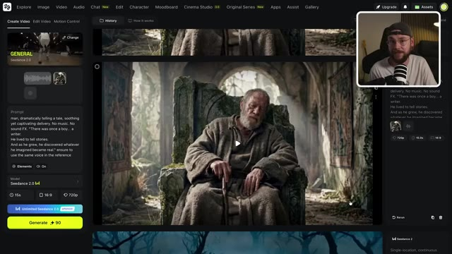
*Interface de Seedance 2.0 affichant un plan large d'un homme âgé assis sur un trône en pierre moussue.*

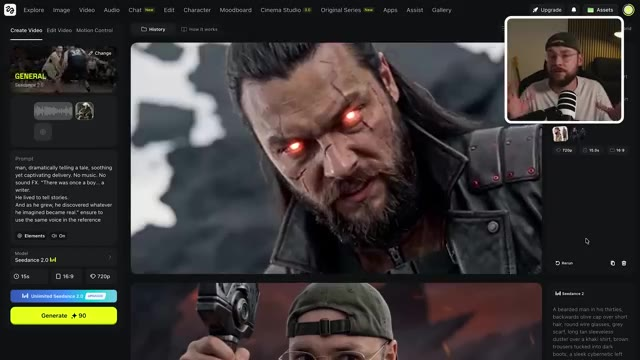
*Interface de Seedance 2.0 montrant un gros plan d'un personnage avec des yeux brillants et un manteau en cuir.*

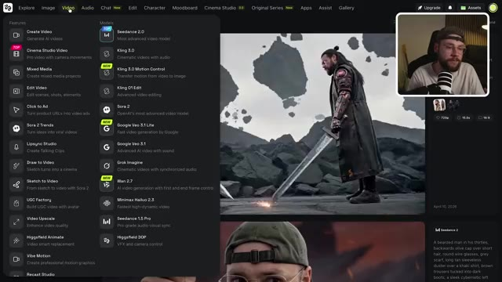
*Menu déroulant de l'onglet 'Video' sur l'interface de Higgsfield montrant les fonctionnalités et les modèles disponibles, dont 'Video Upscale'.*

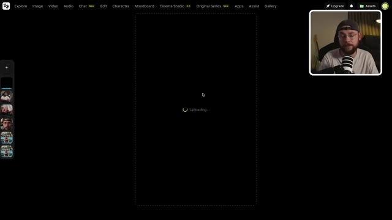
*Écran noir de l'outil d'upscaling de Higgsfield avec le message 'Uploading...' au centre et des miniatures à gauche.*

---

### ⏱️ `[00:16:02 - 00:16:40]` | Segment #33

**🔊 Audio (Transcription Intégrale Mot pour Mot en Français) :**
> Assurez-vous que Topaz Video est sélectionné pour le facteur d'échelle, nous voulons également sélectionner 4K et dans les paramètres avancés, il y a aussi une option pour l'interpolation d'images. Je choisirais soit 24 ips soit 30 et cela peut aider à lisser un peu de ce mouvement saccadé ou de ces images mortes que vous obtenez parfois avec les générations de C-Dance 2, cela pourrait valoir la peine d'essayer si vous avez des problèmes avec cela et une fois que votre mise à l'échelle a fini de se générer, il suffit de la télécharger et vous pouvez l'importer dans le montage. J'ai aussi tendance à ajouter ce calque d'ajustement à tous mes montages IA et ceci

**👁️ Analyse Visuelle d'Écran (gemini-3.5-flash-lite) :**
**Interface & Outils** : Application web de génération/upscale vidéo et interface d'Adobe Premiere Pro avec incrustation vidéo PiP du créateur en haut à droite.

**Contenu textuel & Code** : Sur l'image 1 : options d'upscale avec "Topaz Video", "Scale factor 3840x2160", boutons "Original", "1x", "2x", "4K", bouton "Upscale". Sur l'image 2 : timeline de montage avec un calque violet nommé "Adjustment Layer", panneau Effets, panneau Options d'effet et aperçu vidéo d'un phare.

**Action / Démonstration** : Le créateur montre les réglages d'upscale 4K avec Topaz Video puis bascule sur son logiciel de montage vidéo pour illustrer l'utilisation d'un calque d'ajustement.

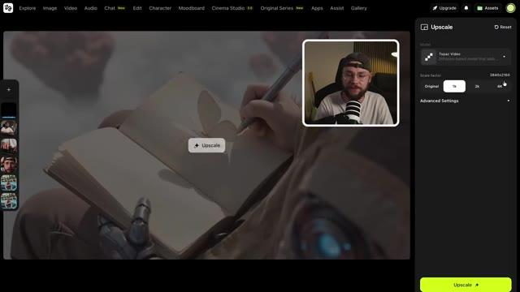
*Interface d'une application web avec un panneau d'upscale sur la droite et un encadré PiP du créateur.*

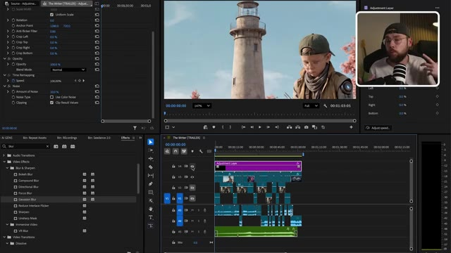
*Interface d'un logiciel de montage vidéo (Adobe Premiere Pro) avec une piste de calque d'ajustement visible sur la timeline.*

---

### ⏱️ `[00:16:40 - 00:17:15]` | Segment #34

**🔊 Audio (Transcription Intégrale Mot pour Mot en Français) :**
> contient un tout petit peu de netteté mais aussi une couche de grain de pellicule et cela aide vraiment à ajouter un peu plus de texture. Parfois, l'IA peut sembler un peu trop parfaite, un peu trop lisse. Donc le grain de pellicule peut vous aider à naviguer cela assez rapidement et facilement. Maintenant, la base de notre montage est cette voix off que nous avons générée du narrateur. Et puis en dessous, nous avons cette piste audio que j'ai en fait générée dans ElevenLabs. Et ensuite, il s'agissait simplement de choisir toutes mes générations préférées pour chacune de ces trois sections distinctes : la jeunesse, le genre teenage...

**👁️ Analyse Visuelle d'Écran (gemini-3.5-flash-lite) :**
**Interface & Outils** : Adobe Premiere Pro (panneaux Effets, Montage/Timeline, Source et Programme).

**Contenu textuel & Code** : Panneaux de Premiere Pro : Effets de flou (Gaussian Blur, Sharpen), paramètres de calque d'ajustement (Adjustment Layer), et incrustation vidéo du créateur dans le coin supérieur droit.

**Action / Démonstration** : Le créateur montre son espace de travail de montage vidéo sur Premiere Pro tout en expliquant l'utilisation du grain de pellicule et des pistes audio.

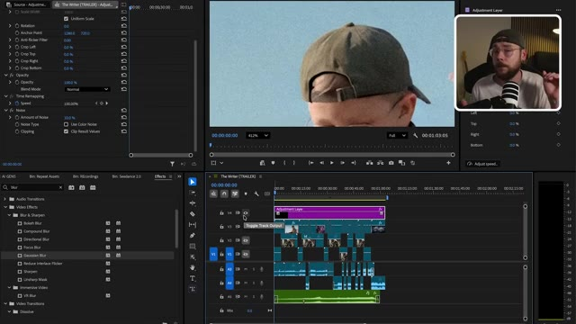
*Interface d'Adobe Premiere Pro montrant la timeline de montage et un aperçu vidéo avec une incrustation (PiP) du créateur.*

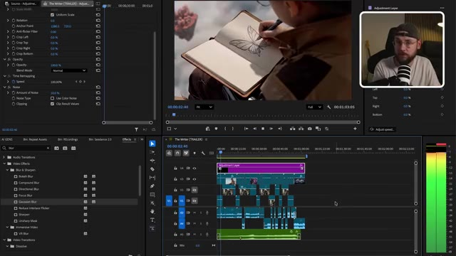
*Interface d'Adobe Premiere Pro affichant un autre plan de la timeline avec une séquence de dessin de papillon et l'incrustation du créateur.*

---

### ⏱️ `[00:17:15 - 00:17:53]` | Segment #35

**🔊 Audio (Transcription Intégrale Mot pour Mot en Français) :**
> années et puis les années adultes plus sombres et simplement les superposer au-dessus de notre voix off et de notre piste audio, il s'agit d'être sélectif sur les générations qui fonctionnent et celles qui ne fonctionnent pas, et quand il s'agit de ces générations multi-plans, de simplement extraire les éléments qui s'intègrent dans le montage, et c'est vraiment la partie où l'IA ne peut tout simplement pas vous aider, vous devez en quelque sorte vous entraîner à être un cinéaste, à comprendre le rythme et à comprendre ce que le spectateur s'attend à voir, et honnêtement, la façon dont j'essaie de m'améliorer là-dedans, c'est simplement en regardant autant de films et de séries télévisées que je peux et en ayant

**👁️ Analyse Visuelle d'Écran (gemini-3.5-flash-lite) :**
**Interface & Outils** : Logiciel de montage vidéo Adobe Premiere Pro (avec incrustation caméra du créateur en haut à droite).

**Contenu textuel & Code** : Timeline de montage multi-pistes, panneaux d'effets (Gaussian Blur, etc.), moniteur de programme affichant des plans générés par IA (un enfant souriant sur un véhicule, puis un homme marchant dans des ruines), et vumètre audio.

**Action / Démonstration** : Le créateur montre son écran de montage Adobe Premiere Pro pour illustrer le processus de sélection et de montage de plans générés par IA.

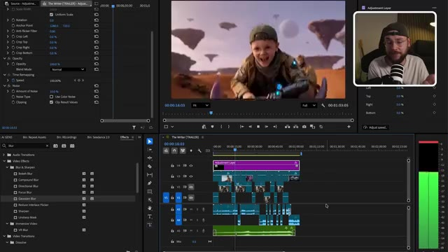
*Interface d'Adobe Premiere Pro montrant le montage d'une vidéo avec un enfant souriant dans un paysage désertique, avec Jack en incrustation vidéo (PiP).*

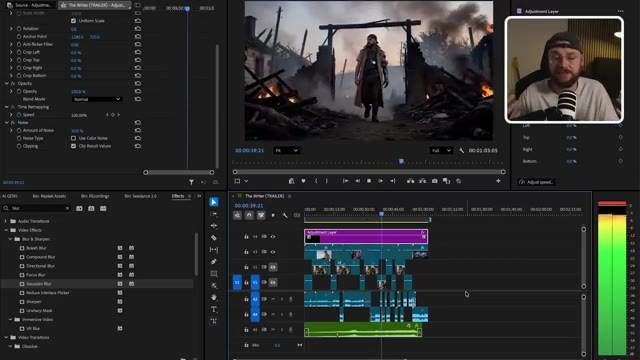
*Interface d'Adobe Premiere Pro montrant un personnage adulte marchant dans un décor détruit, avec Jack en incrustation vidéo (PiP).*

---

### ⏱️ `[00:17:53 - 00:18:26]` | Segment #36

**🔊 Audio (Transcription Intégrale Mot pour Mot en Français) :**
> tout à fait une approche analytique en tant que spectateur essayant de réfléchir aux raisons pour lesquelles le cinéaste a pris cette décision et à ce que cela vous fait ressentir pendant que vous regardez la pièce mais honnêtement j'adore absolument Sea Dance 2. J'ai hâte de l'expérimenter davantage. Il y aura certainement un tas de contenu que je ferai sur cet outil. Alors assurez-vous de lâcher un pouce bleu sur cette vidéo et pensez également à vous abonner pour ne rien manquer de tout cela. Si vous avez la moindre question, assurez-vous de la poser en bas dans la section des commentaires et je répondrai à autant que je peux. Et

**👁️ Analyse Visuelle d'Écran (gemini-3.5-flash-lite) :**
**Interface & Outils** : Adobe Premiere Pro

**Contenu textuel & Code** : Timeline de montage vidéo, panneau des effets (Effets audio, Vidéo, Flou et netteté, Flou gaussien), panneau d'options d'effet (Source, Opacité, Bruit), lecteur vidéo central et vumètre audio à droite. Encadré PiP montrant Jack face caméra.

**Action / Démonstration** : Le créateur présente son interface de montage vidéo tout en parlant à l'écran.

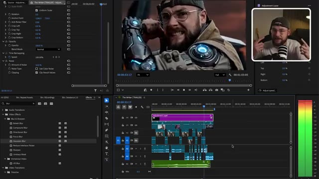
*Interface d'Adobe Premiere Pro avec le projet vidéo en cours de montage et un encadré PiP de Jack en haut à droite*

---

### ⏱️ `[00:18:26 - 00:18:48]` | Segment #37

**🔊 Audio (Transcription Intégrale Mot pour Mot en Français) :**
> Ceci étant dit, les gars, jetons un œil à notre court-métrage terminé. Il s'appelle The Writer. J'espère vraiment qu'il vous plaira. Je vous retrouve pour le prochain. Il était une fois un garçon, un écrivain. Il vivait pour raconter des histoires, et en grandissant, il a découvert que tout ce qu'il imaginait devenait réel.

**👁️ Analyse Visuelle d'Écran (gemini-3.5-flash-lite) :**
**Interface & Outils** : Présentation du court-métrage généré par IA (images d'illustration de la vidéo "The Writer").

**Contenu textuel & Code** : Séquence narrative animée montrant un enfant écrivain avec un carnet magique dans un univers fantastique aux arbres roses et îles flottantes.

**Action / Démonstration** : Le créateur diffuse un extrait de son court-métrage d'animation généré par intelligence artificielle pour illustrer son propos.

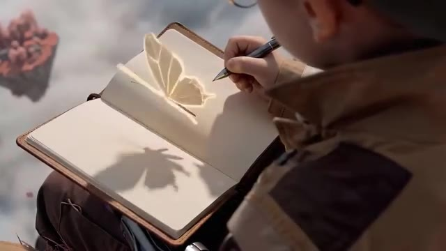
*Extrait du court-métrage montrant le jeune garçon écrivain dessinant un papillon lumineux qui semble prendre vie dans son carnet.*

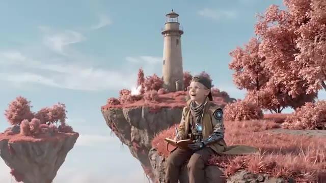
*Extrait du court-métrage montrant le garçon assis sur une île flottante avec un phare, regardant émerveillé autour de lui.*

---

### ⏱️ `[00:18:49 - 00:19:13]` | Segment #38

**🔊 Audio (Transcription Intégrale Mot pour Mot en Français) :**
> Il a façonné des mondes impossibles, invoqué de magnifiques créatures et insufflé la vie aux merveilles et aux rêves de héros au-delà de toute imagination. Mais il ne comprenait pas encore une vérité plus profonde. Chaque lumière projette une ombre, et tandis qu'il construisait son paradis, autre chose prenait forme dans l'obscurité.

**👁️ Analyse Visuelle d'Écran (gemini-3.5-flash-lite) :**
**Interface & Outils** : Présentation cinématographique et narrative générée par IA (pas de partage d'écran de logiciel ou d'outil de travail).

**Contenu textuel & Code** : Séquence vidéo narrative montrant un personnage (représentant Jack plus jeune ou un avatar) dans différents décors fantastiques et oniriques générés par intelligence artificielle : un enfant montant une créature au milieu d'îles flottantes, un adolescent écrivant dans un carnet entouré d'éléments en lévitation, un personnage touchant un grand dragon devant une cascade, et un homme barbu explorant un marécage ténébreux et brumeux.

**Action / Démonstration** : Séquence cinématique d'illustration narrative sans démonstration logicielle directe.

---

### ⏱️ `[00:19:13 - 00:19:30]` | Segment #39

**🔊 Audio (Transcription Intégrale Mot pour Mot en Français) :**
> Pour chaque monde qu'il a créé, quelque chose a suivi. Pour chaque miracle, une conséquence. Pour chaque conte, désormais l'écrivain doit devenir le guerrier. Car son histoire a pris vie de manière autonome.

**👁️ Analyse Visuelle d'Écran (gemini-3.5-flash-lite) :**
**Interface & Outils** : Présentation de séquences cinématiques générées par IA (illustrations narratives sans interface logicielle visible)

**Contenu textuel & Code** : Rendu visuel d'une vidéo générée par IA mettant en scène le créateur (Jack) sous les traits d'un personnage de fiction cybernétique dans un univers post-apocalyptique en ruines, interagissant avec des enfants effrayés, puis brandissant des armes futuristes et une épée.

**Action / Démonstration** : Le personnage de l'écrivain évolue d'un rôle protecteur et compatissant (genou à terre auprès d'enfants) vers un rôle de guerrier armé et combatif dans un décor ravagé.

---
