# 🎬 Comment utiliser Seedance 2.0 pour des pubs de mode par IA (Workflow complet)

> **Chaîne** : [Jack Vs. AI](https://www.youtube.com/@JackVsAI)  
> **Titre original** : `How to use Seedance 2.0 for AI Fashion Ads (Full Workflow)`  
> **Lien YouTube** : [https://www.youtube.com/watch?v=7lLrBwRwij0](https://www.youtube.com/watch?v=7lLrBwRwij0)  
> **Date de publication** : 2026-04-26  
> **Durée** : 18m 17s (`1097s`)  
> **Identifiant vidéo** : `7lLrBwRwij0`  
> **Fiche Web Interactive** : [2026-04-26_YT-7lLrBwRwij0_Comment utiliser Seedance 2.0 pour des pubs de mode par IA (Workflow complet)_by-whisper-v3-large-turbo+gemini-3.5-flash-lite.html](2026-04-26_YT-7lLrBwRwij0_Comment utiliser Seedance 2.0 pour des pubs de mode par IA (Workflow complet)_by-whisper-v3-large-turbo+gemini-3.5-flash-lite.html)  
> **Captures de démonstration clés** : `87 captures réelles (anti-talking-head)`  
> **Modèles utilisés** : Audio: `large-v3-turbo` (Faster-Whisper int8 VPS) | Vision: `gemini-3.5-flash-lite` (Google AI Studio API)  

---

## 📌 Synthèse Exécutive & Outils

### 📌 Résumé
Dans cette vidéo, Jack démontre comment révolutionner la production de campagnes de mode grâce à l'intelligence artificielle, en réduisant drastiquement les coûts et les délais de tournage traditionnels. En combinant des outils de pointe au sein d'une plateforme unifiée, les créateurs peuvent concevoir des mannequins sur mesure, appliquer des vêtements et logos personnalisés, et orchestrer des tournages virtuels d'une cohérence visuelle saisissante. Le flux de travail présenté permet de maîtriser l'intégralité de la chaîne de création, du design des pièces vestimentaires jusqu'aux plans cinématographiques finaux.

La méthode repose sur un processus séquentiel structuré en deux phases majeures : le « cadrage » et la « réalisation ». Dans un premier temps, l'utilisation d'outils de génération d'images et de feuilles de personnages (*character sheets*) garantit l'homogénéité visuelle des mannequins à travers différents angles. Dans un second temps, l'intégration de modèles vidéo de nouvelle génération permet d'animer ces personnages dans des décors réalistes, en contrôlant précisément les paramètres de prise de vue tels que la résolution en 4K, les formats d'image adaptés aux réseaux sociaux (16:9, 9:16, 1:1), ainsi que les choix de caméras et d'objectifs.

Pour les marques, les agences et les créateurs de contenu, cette approche offre une alternative puissante pour alimenter les réseaux sociaux, prototyper des collections ou concevoir des publicités vidéo complètes. En s'affranchissant des contraintes logistiques du monde réel, les créateurs gardent le contrôle total sur la direction artistique, l'éclairage et l'emplacement, transformant une simple idée de design en une campagne marketing de qualité professionnelle sans quitter leur studio.

### 🛠️ Outils, Modèles & Logiciels Présentés
* **Artlist Studio** : Plateforme de production vidéo par IA tout-en-un conçue pour les créateurs et les équipes, centralisant le cadrage, la gestion des personnages et la réalisation de vidéos.
* **Seedance 2.0** : Modèle vidéo de pointe utilisé dans la phase de réalisation pour donner vie aux images et créer des séquences animées fluides et cinématographiques.
* **Nano Banana Pro** : Modèle de génération d'images ultra-performant intégré pour concevoir les designs initiaux, appliquer les logos sur les vêtements et générer les variations de personnages.
* **Claude** : Assistant textuel mentionné dans l'écosystème global de création et d'idéation pour le branding et la structuration des projets.
* **Flux** : Modèle de génération visuelle de référence pour la création d'actifs graphiques et de textures de haute qualité.

### 🔑 Points Clés & Enseignements Stratégiques
* **Maîtrise de la cohérence des personnages** : L'utilisation de feuilles de personnages (*character sheets*) automatisées permet de conserver les traits physiques, les tatouages et les expressions d'un mannequin à travers différents plans et angles de vue sans effort manuel.
* **Intégration transparente du e-commerce** : Il est possible d'importer ses propres créations vestimentaires et logos pour les appliquer de manière réaliste sur les modèles IA grâce à des prompts textuels simples.
* **Segmentation du workflow créatif** : Séparer strictement la phase de « cadrage » (création des personnages et des décors) de la phase de « réalisation » (animation vidéo) garantit un contrôle artistique optimal à chaque étape.
* **Optimisation multiformat native** : La plateforme permet de générer des contenus adaptés à toutes les plateformes de diffusion, du format horizontal 16:9 pour le web ou la TV aux formats verticaux 9:16 (TikTok, Instagram Reels, Shorts) et carrés 1:1.
* **Exigence de la haute résolution** : Le choix systématique de la sortie en résolution 4K est recommandé pour maximiser le niveau de détail des textures de tissus, des logos et des visages, essentiels dans l'industrie de la mode.
* **Contrôle cinématographique avancé** : Le paramétrage fin des caméras, des objectifs et des styles visuels (comme l'émulation de caméscopes VHS) permet d'imprimer une identité visuelle unique et stylisée à la campagne.
* **Gestion des décors sur mesure** : L'utilisation de décors pré-générés ou personnalisés (comme une station de métro) permet de contextualiser immédiatement les collections de streetwear ou de prêt-à-porter dans des environnements urbains crédibles.
* **Personnalisation des attributs physiques** : Les prompts textuels permettent d'affiner précisément l'apparence des mannequins (vêtements spécifiques, accessoires, expressions faciales audacieuses) pour coller exactement à l'identité de la marque.
* **Réduction drastique des budgets de production** : Le workflow virtuel élimine les coûts logistiques liés aux locations de studios, aux cachets des mannequins et aux équipes de tournage pour les phases de prototypage et de publicité.
* **Flexibilité du prototypage rapide** : Tester de multiples variations de design, de coloris ou de coupes de vêtements en quelques clics permet d'itérer à grande vitesse avant de lancer une production réelle.

---

## ⏱️ Chronologie & Transcription Complète Audio & Visuelle (Mot pour Mot)

### ⏱️ `[00:00:00 - 00:00:34]` | Segment #01

**🔊 Audio (Transcription Intégrale Mot pour Mot en Français) :**
> Je m'apprête à faire économiser des milliers de dollars à votre marque. Le contenu de mode généré par IA semblait auparavant maladroit et incohérent. C-Dance 2 a changé la donne. Avec le système que je vais vous présenter, vous pouvez créer une campagne de mode entière sans jamais quitter votre maison. Vous pouvez concevoir vos modèles pour qu'ils aient l'apparence et le comportement de votre choix, appliquer n'importe laquelle de vos propres créations de vêtements, et tout contrôler dans le tournage. Les caméras, les objectifs, l'éclairage et l'emplacement. Vous êtes toujours aux commandes, vous ne gaspillez simplement pas tout votre budget en une seule journée. Ce flux de travail est parfait pour les réseaux sociaux.

**👁️ Analyse Visuelle d'Écran (gemini-3.5-flash-lite) :**
**Interface & Outils** : Interface de type application mobile affichant un Reel Instagram vertical.

**Contenu textuel & Code** : Interface Instagram avec icônes de likes (6542), commentaires (1000), partages (500), et un mannequin portant un vêtement personnalisé.

**Action / Démonstration** : Présentation d'un exemple de publication sur les réseaux sociaux montrant le résultat visuel d'une campagne de mode générée par IA.

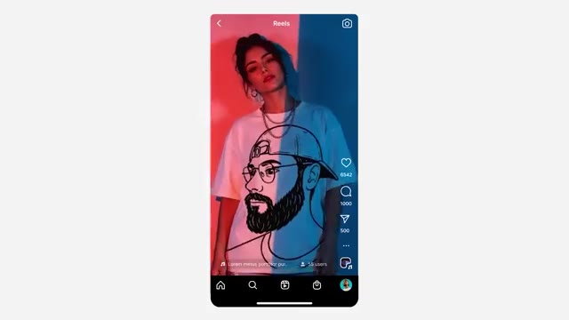
*Interface de type application mobile affichant un Reel Instagram avec un mannequin portant un t-shirt imprimé sous un éclairage bicolore rouge et bleu*

---

### ⏱️ `[00:00:34 - 00:00:54]` | Segment #02

**🔊 Audio (Transcription Intégrale Mot pour Mot en Français) :**
> contenu, des tournages de prototypes et des publicités TV complètes. Et je vais partager toutes les astuces et conseils importants tout au long du parcours, ainsi que les détails que les autres créateurs de contenu ne vous disent pas. Avant de commencer, je suis Jack, et si vous voulez rester à la pointe des derniers outils d'IA, assurez-vous de lâcher un pouce bleu sur cette vidéo et de vous abonner. Très bien, entrons dans le vif du sujet.

**👁️ Analyse Visuelle d'Écran (gemini-3.5-flash-lite) :**
**Interface & Outils** : Présentation face caméra sans partage d'écran

**Contenu textuel & Code** : Aucune interface logicielle, affichage de séquences vidéo illustratives générées par IA et du créateur dans son studio.

**Action / Démonstration** : Le présentateur s'adresse directement à la caméra, illustré par des séquences vidéo avec du texte incrusté à l'écran.

---

### ⏱️ `[00:00:54 - 00:01:14]` | Segment #03

**🔊 Audio (Transcription Intégrale Mot pour Mot en Français) :**
> Donc pour accéder à C-Dance 2, nous sommes sur Artlist qui vient de lancer Studio. Maintenant, c'est une plateforme de production par IA conçue pour les créateurs et les équipes. Et vous pouvez voir que j'ai déjà quelques projets de construits. Nous allons en créer un tout nouveau.

**👁️ Analyse Visuelle d'Écran (gemini-3.5-flash-lite) :**
**Interface & Outils** : Interface web d'Artlist Studio avec la section "My Projects" et un panneau PiP du créateur.

**Contenu textuel & Code** : Texte visible : "Featured assets", "Open project", "My Projects", "+ New Project", "#2 Just now", "#1 3 days ago".

**Action / Démonstration** : Le créateur présente l'interface d'Artlist Studio et ses projets existants avant d'en créer un nouveau.

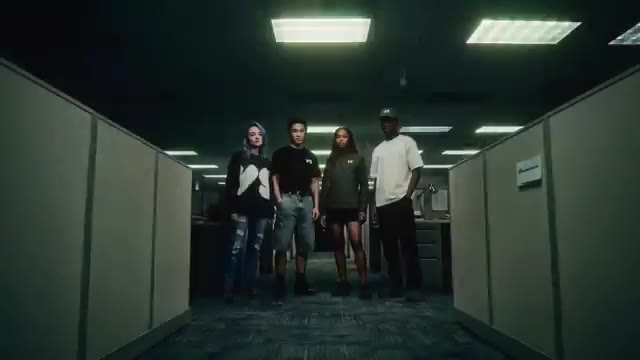
*Rendu visuel cinématographique d'un groupe de quatre personnes debout dans un couloir de bureau sombre entre des cloisons, filmé avec un éclairage dramatique.*

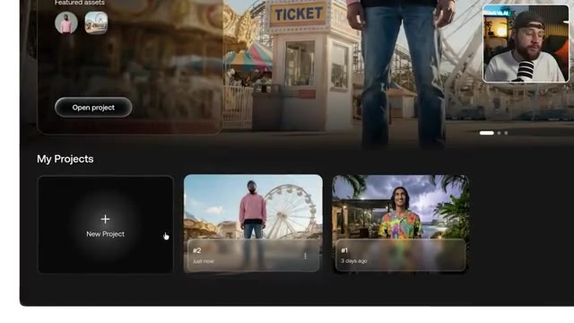
*Interface de la plateforme Artlist Studio montrant les projets existants (My Projects) avec la possibilité d'en créer un nouveau, avec une vignette vidéo de fête foraine en arrière-plan et un encadré PiP du créateur en haut à droite.*

---

### ⏱️ `[00:01:15 - 00:01:39]` | Segment #04

**🔊 Audio (Transcription Intégrale Mot pour Mot en Français) :**
> Donc appelons cela notre campagne de mode. Allez-y et cliquez sur créer. Ainsi, Artlist Studio est divisé en deux sections distinctes. Premièrement, nous avons le cadrage où nous pouvons utiliser un outil comme Nano Banana Pro pour créer nos images IA. Ensuite, nous avons la réalisation et c'est là que nous prenons ces images IA et les faisons naître à l'esprit en utilisant un modèle vidéo comme Sea Dance 2.

**👁️ Analyse Visuelle d'Écran (gemini-3.5-flash-lite) :**
**Interface & Outils** : Artlist Studio (Nano Banana Pro / Sea Dance 2)

**Contenu textuel & Code** : Texte visible dans la boîte de dialogue : « Fashion Campaign », « Cancel », « Create Project ». Texte dans l'interface de cadrage : « Nano Banana Pro », « 4K », « 16:9 », « ARRI Alexa 35 », « Framing », « Directing », « Describe your frame's composition and mood. Use @ to add characters and locations. »

**Action / Démonstration** : Le créateur montre la création d'un nouveau projet nommé « Fashion Campaign » puis présente les deux sections de l'interface d'Artlist Studio (Framing et Directing).

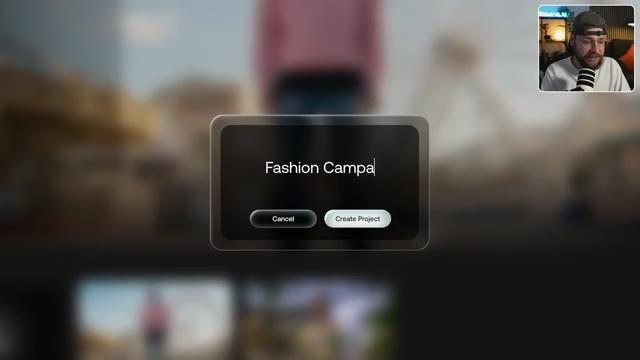
*Interface d'Artlist Studio affichant une boîte de dialogue pour nommer le projet « Fashion Campaign » avec les boutons « Cancel » et « Create Project », sur fond flouté d'une image générée.*

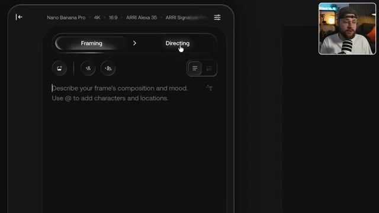
*Interface de l'outil Nano Banana Pro dans Artlist Studio montrant les onglets « Framing » et « Directing », ainsi que le champ de texte pour décrire la composition.*

---

### ⏱️ `[00:01:40 - 00:02:01]` | Segment #05

**🔊 Audio (Transcription Intégrale Mot pour Mot en Français) :**
> Ne nous emballons pas trop vite cependant. Nous allons revenir au cadrage. Et la première chose que nous voulons faire est d'ajouter un personnage. Une fois que j'ai cliqué là-dessus, vous pouvez voir que nous avons cette immense collection de personnages pré-générés, de tous âges, ethnies, professions, tout ce que vous pourriez éventuellement vouloir pour tous vos projets créatifs.

**👁️ Analyse Visuelle d'Écran (gemini-3.5-flash-lite) :**
**Interface & Outils** : Application web Seedance 2.0 avec une interface sombre comportant des menus de cadrage et de sélection de personnages.

**Contenu textuel & Code** : Texte affiché : "Framing", "Directing", "Describe the scene's action, including how the characters move, act and speak", et dans la modale : "Choose or create a character", avec des noms de personnages comme Frederick, Eric, Riley, Jamie, Yana, Erin, Noah, etc., ainsi que les boutons "Cancel" et "+ New Character".

**Action / Démonstration** : Le créateur navigue dans l'interface, clique pour ouvrir la bibliothèque de personnages et montre la grille complète des profils disponibles.

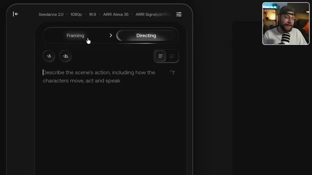
*Interface principale montrant l'onglet Cadrage (Framing) et la zone de description de la scène.*

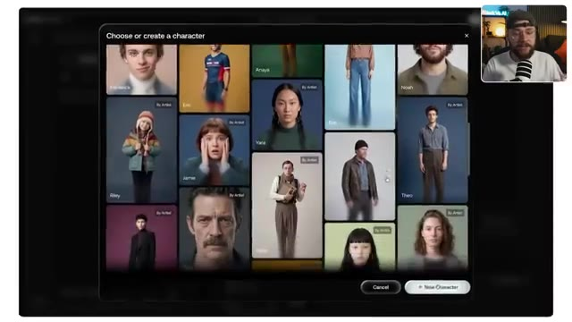
*Fenêtre contextuelle affichant une galerie de personnages pré-générés à sélectionner.*

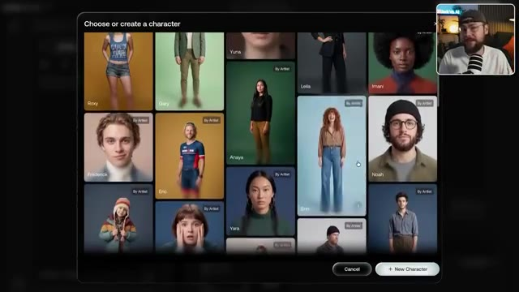
*Fenêtre contextuelle de sélection de personnages avec défilement de la grille de profils variés.*

---

### ⏱️ `[00:02:01 - 00:02:20]` | Segment #06

**🔊 Audio (Transcription Intégrale Mot pour Mot en Français) :**
> Nous pouvons également aller de l'avant et créer notre propre nouveau personnage à partir de zéro. Mais je veux essayer certaines de ces options pré-générées. En faisant défiler, nous cherchons quelqu'un qui a l'air de pouvoir travailler comme mannequin. Et tout de suite, j'ai quelques options différentes que j'aime ici. Daichi a l'air cool.

**👁️ Analyse Visuelle d'Écran (gemini-3.5-flash-lite) :**
**Interface & Outils** : Interface logicielle de création de personnages dotée d'une grille de sélection ("Choose or create a character") avec des vignettes de personnages réalistes générés par IA.

**Contenu textuel & Code** : Titre "Choose or create a character", bouton "+ New Character", et vignettes étiquetées avec des prénoms (Imogen, Goran, Luca, Zaria, Nico, Frederick, Eric, Anaya, Yara, Jamie, Noah, Hugo, Simon, Jaden, Terry, Daichi, Aiko, etc.) et des mentions "By Artist". Boutons "Cancel" et "+ New Character" en bas.

**Action / Démonstration** : Le curseur de la souris survole l'interface et fait défiler la grille de sélection pour parcourir les différents modèles de personnages pré-générés.

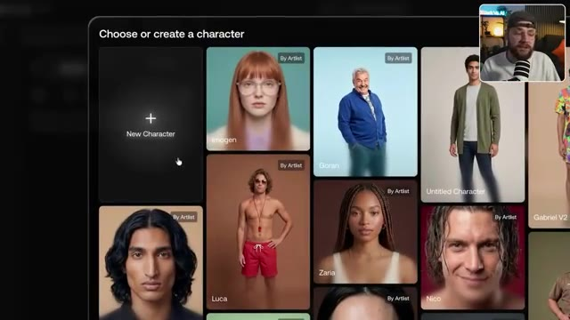
*Interface montrant l'option "New Character" et une grille de personnages pré-générés incluant Imogen, Goran, Luca, Zaria et Nico.*

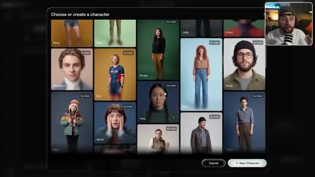
*Défilement de la grille de personnages pré-générés affichant divers profils comme Frederick, Eric, Anaya, Yara, Jamie et Noah.*

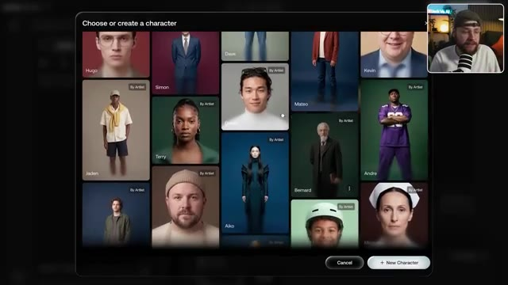
*Vue de la grille de personnages avec en surbrillance le personnage nommé Daichi au centre, ainsi que Hugo, Simon, Jaden, Terry et Aiko.*

---

### ⏱️ `[00:02:20 - 00:02:42]` | Segment #07

**🔊 Audio (Transcription Intégrale Mot pour Mot en Français) :**
> J'espère que je prononce son nom correctement. Jaden ainsi qu'Elias. Commençons par Daichi et voyons comment cela se passe. Donc, si nous survolons ces trois points ici, nous avons l'option de voir et modifier. Et en cliquant dessus, nous pouvons maintenant apporter quelques modifications à notre personnage. Ce que je vais faire, c'est importer une image de référence de mon produit.

**👁️ Analyse Visuelle d'Écran (gemini-3.5-flash-lite) :**
**Interface & Outils** : Artlist Studio (version bêta) - Interface de création et d'édition de personnages virtuels pour campagnes de mode.

**Contenu textuel & Code** : Texte affiché : "Choose or create a character", noms des personnages (Hugo, Simon, Dave, Mateo, Kevin, Jaden, Terry, Daichi, Bernard, Andre), options vocales ("Approachable and...", "Commanding and..."), et barre de prompt "Describe the changes you want to make" avec les options "Match exactly", "Inspiration", "Upload image", "Choose from your creations".

**Action / Démonstration** : Le curseur de la souris survole le personnage de Daichi, clique pour ouvrir son profil d'édition, puis clique sur l'icône d'importation pour ouvrir le menu contextuel permettant d'uploader une image de produit.

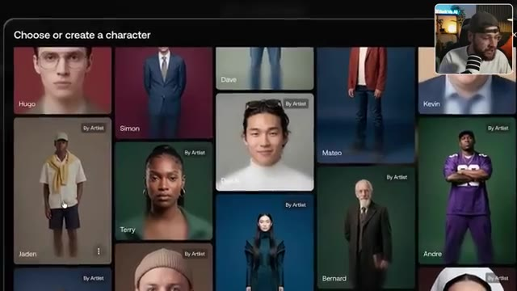
*Interface d'Artlist Studio montrant une grille de personnages disponibles à choisir ou créer.*

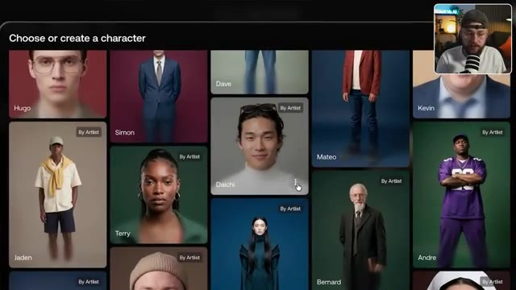
*Survol du personnage 'Daichi' faisant apparaître les trois points d'options.*

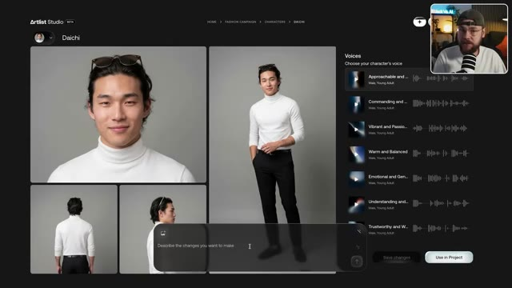
*Page d'édition du personnage 'Daichi' avec les différentes vues et options de voix.*

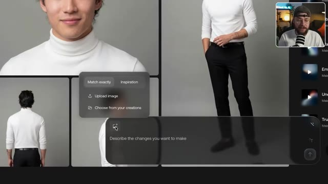
*Ouverture du menu contextuel permettant d'importer une image de référence ou d'utiliser une inspiration.*

---

### ⏱️ `[00:02:42 - 00:03:00]` | Segment #08

**🔊 Audio (Transcription Intégrale Mot pour Mot en Français) :**
> Vous pouvez voir que nous avons la option de choisir parmi nos propres créations. Et j'ai toute une série de designs de vêtements que j'ai faits ici en utilisant l'AI Toolkit d'Artlist et Nano Banana Pro. Donc je voulais viser une esthétique vraiment épurée et minimale pour ma marque de streetwear.

**👁️ Analyse Visuelle d'Écran (gemini-3.5-flash-lite) :**
**Interface & Outils** : Artlist Studio et Canva

**Contenu textuel & Code** : Menus d'options de création, galerie de vêtements personnalisés incluant des sweat-shirts, vestes, casquettes et t-shirts graphiques, ainsi qu'une interface de design Canva avec des variations de logos "vs.".

**Action / Démonstration** : Le créateur navigue dans l'interface d'Artlist Studio, sélectionne l'option "Choose from your creations" pour ouvrir la galerie de ses designs, puis montre des projets graphiques sur Canva.

*Interface d'Artlist Studio montrant le menu déroulant avec l'option "Choose from your creations".*

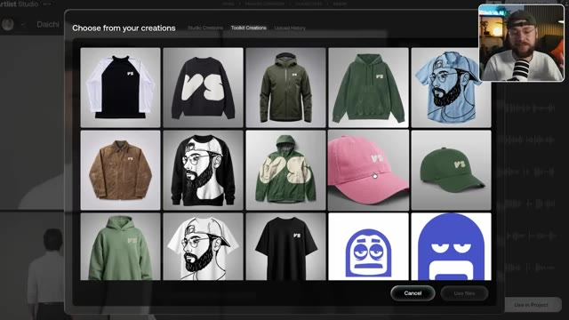
*Galerie contextuelle "Choose from your creations" affichant une grille de designs de vêtements (sweat-shirts, vestes, casquettes, t-shirts).*

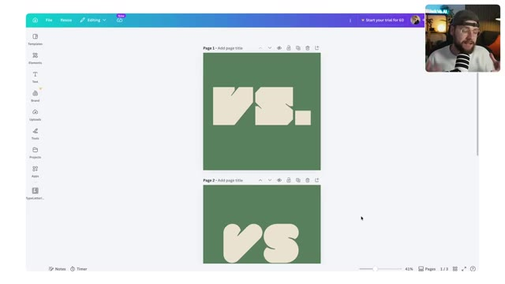
*Interface de Canva affichant des maquettes de logos avec les lettres "vs." sur fond vert.*

---

### ⏱️ `[00:03:01 - 00:03:38]` | Segment #09

**🔊 Audio (Transcription Intégrale Mot pour Mot en Français) :**
> Et c'est basé sur mon nom, Jack vs. AI. Je voulais me concentrer uniquement sur le lettrage pour « versus ». Et tout ce que je fais vraiment quand j'expérimente le branding, c'est que je tape simplement le nom que je recherche et je bascule entre différentes polices jusqu'à ce que je trouve quelque chose qui fonctionne selon moi, et j'hésitais entre ces deux dernières options ici, et j'ai fini par choisir celle-ci. Vous me direz si vous pensez que j'ai pris la bonne décision. J'ai donc téléchargé ce logo que j'ai créé ici, puis je suis retourné dans la boîte à outils Artlist AI. J'ai simplement utilisé Nano Banana Pro avec un niveau très basique...

**👁️ Analyse Visuelle d'Écran (gemini-3.5-flash-lite) :**
**Interface & Outils** : Canva et Artlist Studio (avec incrustation vidéo PiP du créateur dans le coin supérieur droit).

**Contenu textuel & Code** : Sur l'image 1 : Interface Canva avec deux pages de design montrant le mot "vs." en typographies différentes sur fond vert. Sur l'image 2 : Interface Artlist Studio affichant divers vêtements (sweats, t-shirts, vestes, casquettes) arborant le logo "vs" et des illustrations de personnages.

**Action / Démonstration** : Le créateur montre les différentes options de design typographique sur Canva, puis présente la bibliothèque de créations de la boîte à outils Artlist AI.

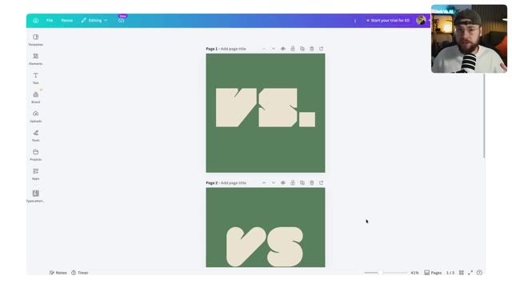
*Interface de Canva montrant deux options de design de logo pour "vs" avec un encadré PiP de Jack en haut à droite.*

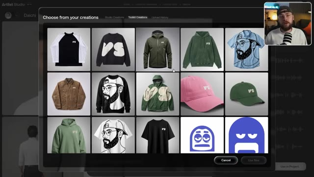
*Interface d'Artlist Studio affichant une galerie de créations vestimentaires et de logos ("Choose from your creations").*

---

### ⏱️ `[00:03:38 - 00:03:59]` | Segment #10

**🔊 Audio (Transcription Intégrale Mot pour Mot en Français) :**
> invite demandant à l'outil d'appliquer le logo à différents types de vêtements et vous pouvez voir ici également que je me suis un peu amusé. J'ai appliqué cette sorte de version dessinée à la main et esquissée de moi-même sur des articles de vêtements également mais dans ce cas ce que je veux faire c'est utiliser le t-shirt. Donc nous pouvons sélectionner ceci puis choisir utiliser le fichier.

**👁️ Analyse Visuelle d'Écran (gemini-3.5-flash-lite) :**
**Interface & Outils** : Artlist Studio (interface web de création de contenu et d'application de designs sur des vêtements).

**Contenu textuel & Code** : En-tête de fenêtre "Choose from your creations", onglets "Studio Creations", "Toolkit Creations", "Upload History". Boutons "Cancel" et "Use file". Mention "Selected" sur un t-shirt noir et "1 file selected". En incrustation (PiP), le créateur Jack avec son micro.

**Action / Démonstration** : Le curseur de la souris survole puis sélectionne un t-shirt noir au sein de la galerie de créations, avant de cliquer sur le bouton "Use file" pour valider le choix du fichier.

*Interface d'Artlist Studio affichant une galerie de sélections de vêtements ("Choose from your creations") intégrant différents designs et logos.*

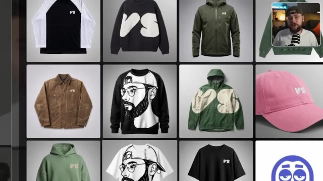
*Vue rapprochée de la grille de créations vestimentaires dans Artlist Studio montrant plusieurs types de vêtements avec le visage esquissé du créateur.*

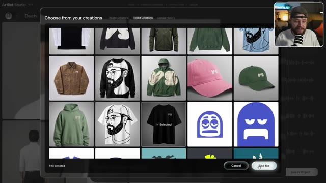
*L'interface d'Artlist Studio montrant un t-shirt noir sélectionné avec la mention "Selected" et le bouton "Use file" cliqué en bas à droite.*

---

### ⏱️ `[00:03:59 - 00:04:18]` | Segment #11

**🔊 Audio (Transcription Intégrale Mot pour Mot en Français) :**
> Et ensuite pour notre prompt, nous allons dire de prendre l'homme portant le t-shirt noir dans l'image de référence. Il porte également un short large délavé à l'acide et des bottes en cuir noir. Retirez ses lunettes de soleil. Donnez-lui une expression faciale audacieuse avec de la confiance et de l'attitude. Alors allons-y et envoyons cette variation.

**👁️ Analyse Visuelle d'Écran (gemini-3.5-flash-lite) :**
**Interface & Outils** : Interface web de génération d'images avec panneau de prompts et encadré vidéo PiP du créateur en haut à droite.

**Contenu textuel & Code** : Texte du prompt visible dans la boîte de dialogue : "Have the man wearing the black t-shirt in the reference image. He is also wearing baggy acid wash shorts and black leather boots, Remove his sunglasses, give him a bold facial expression, with confidence and attitude."

**Action / Démonstration** : Le créateur montre l'interface de l'outil de génération tout en saisissant et préparant l'envoi du prompt textuel pour modifier les vêtements et l'expression du personnage de référence.

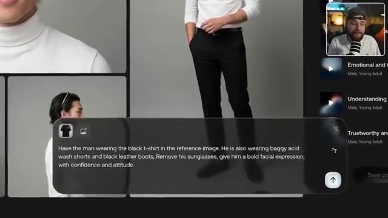
*Interface de génération d'image avec une boîte de saisie de texte affichant le prompt de modification du personnage et l'incrustation vidéo du créateur en haut à droite.*

---

### ⏱️ `[00:04:18 - 00:04:55]` | Segment #12

**🔊 Audio (Transcription Intégrale Mot pour Mot en Français) :**
> Et juste comme ça, je trouve que Daichi a super fière allure. Il porte le vêtement que nous avons conçu avec ce logo dessus, il porte aussi ces short délavés à l'acide et ces bottes en cuir noir. L'étape suivante est donc de cliquer sur générer des angles. Ce qui se passe ici, c'est qu'Artlist Studio nous construit une feuille de personnage, et c'est vraiment utile pour garantir la cohérence des personnages lorsque nous allons générer nos images et vidéos par IA dans un instant. Habituellement, il faudrait réaliser ce processus manuellement en utilisant un prompt assez détaillé, mais ici vous pouvez voir qu'Artlist Studio

**👁️ Analyse Visuelle d'Écran (gemini-3.5-flash-lite) :**
**Interface & Outils** : Artlist Studio (version bêta)

**Contenu textuel & Code** : Texte affiché : "Artlist Studio BETA", "Daichi", "Complete your character: Generate more angles to keep your character consistent and realistic across every shot. Generate Angles", "Voices: Choose your character's voice", "Approachable and...", "Commanding and...", "Vibrant and P...", "Warm and Bal...", "Emotional an...", "Understanding...", "Trustworthy a...", "Save changes", "Use in Project". Prompt visible : "Have the man wearing the black t-shirt in the reference image. He is also wearing baggy acid wash shorts and black leather boots. Remove his sunglasses, give him a bold facial expression, with confidence and attitude."

**Action / Démonstration** : Le créateur présente l'interface d'Artlist Studio pour générer les différents angles de vue (character sheet) d'un personnage virtuel nommé Daichi afin d'assurer sa cohérence visuelle.

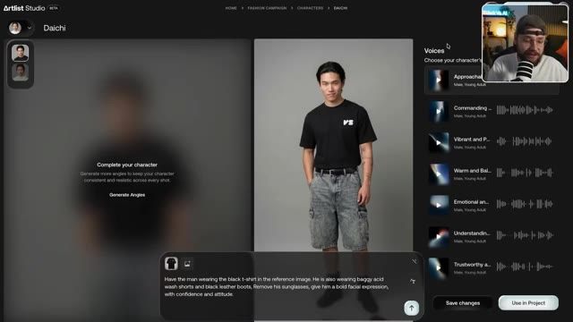
*Interface d'Artlist Studio montrant le personnage Daichi avec le bouton "Generate Angles" pour créer une feuille de personnage.*

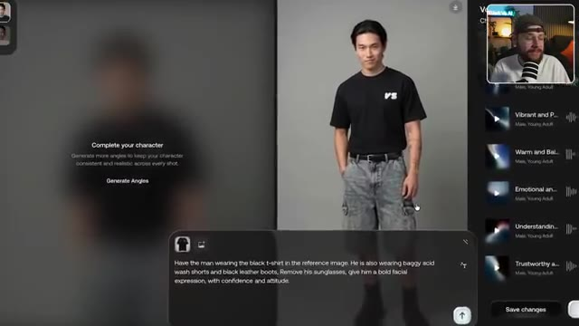
*Interface d'Artlist Studio pendant la sélection ou le survol de la fonctionnalité de génération d'angles pour Daichi.*

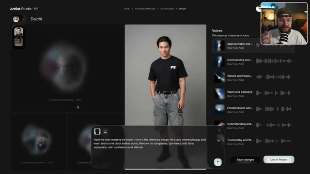
*Interface d'Artlist Studio montrant la génération en cours de la feuille de personnage avec un indicateur de progression à 22%.*

---

### ⏱️ `[00:04:55 - 00:05:28]` | Segment #13

**🔊 Audio (Transcription Intégrale Mot pour Mot en Français) :**
> s'occupe de ce genre de choses pour nous en arrière-plan. Et si nous réduisons la taille de notre boîte de saisie, nous pouvons examiner de plus près les variations que nous avons obtenues. Et je pense qu'elles ont toutes l'air bien. Nous avons deux expressions différentes là-bas, un beau gros plan. La cohérence des personnages est définitivement là. Nous avons un profil, une sorte de vue à mi-corps, et puis une vue de dos également. Et je pense que tout cela a l'air bien. Fait crucial également, ces détails plus fins comme le tatouage de Daichi s'alignent tous joliment, donc je suis plutôt content de ça. Ce que nous pouvons faire maintenant, c'est

**👁️ Analyse Visuelle d'Écran (gemini-3.5-flash-lite) :**
**Interface & Outils** : Interface web d'Artlist Studio (BETA) dédiée à la création de personnages pour campagnes de mode, avec panneau latéral de voix ("Voices") et boîte de prompt textuel.

**Contenu textuel & Code** : Texte du prompt visible : "Have the man wearing the black t-shirt in the reference image. He is also wearing baggy acid wash shorts and black leather boots, Remove his sunglasses, give him a bold facial expression, with confidence and attitude." Options vocales listées : "Approachable and...", "Commanding and...", "Vibrant and Passio...", "Warm and Balanced", "Emotional and Gen...", "Understanding and...", "Trustworthy and W...". Nom du personnage : "Daichi".

**Action / Démonstration** : Le créateur navigue et zoome sur les différentes variations et expressions du personnage généré par IA, démontrant la cohérence des traits et des détails (comme le tatouage).

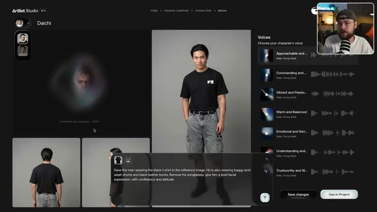
*Interface d'Artlist Studio montrant la génération d'un personnage nommé Daichi avec plusieurs variations et options vocales.*

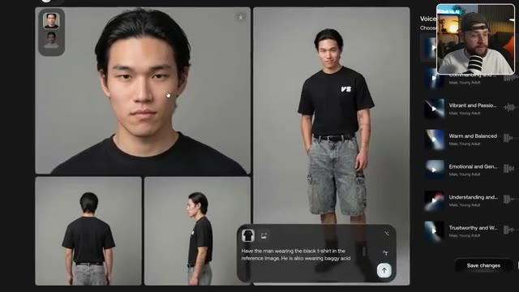
*Vue rapprochée de l'interface d'Artlist Studio affichant les différentes expressions et angles du personnage Daichi.*

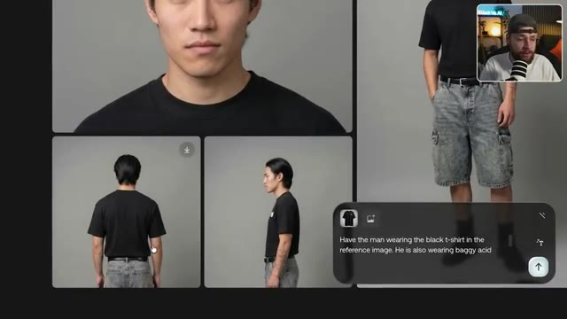
*Zoom sur l'interface montrant les détails des différentes vues (de dos et de profil) du personnage Daichi.*

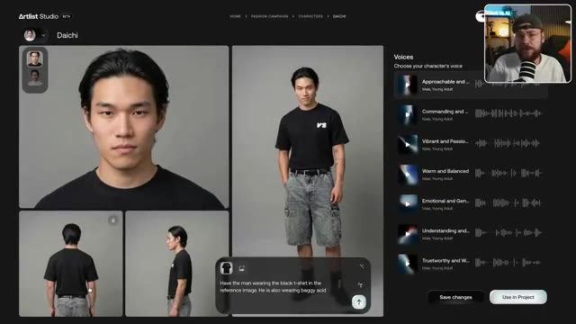
*Retour à la vue d'ensemble de l'interface d'Artlist Studio avec les options vocales et les boutons de sauvegarde.*

---

### ⏱️ `[00:05:28 - 00:05:59]` | Segment #14

**🔊 Audio (Transcription Intégrale Mot pour Mot en Français) :**
> Rendez-vous en haut pour modifier le nom de notre modèle et disons simplement Daichi Streetwear. Si nous le voulions, nous pourrions même attribuer une voix spécifique à notre personnage. Pour ce cas d'utilisation, nous n'allons en fait faire parler aucun de nos personnages car c'est pour notre campagne de mode, mais cela reste une fonctionnalité utile pour vos projets créatifs. Cela étant dit, nous pouvons maintenant aller dans le coin inférieur droit de la page et sélectionner utiliser dans le projet. J'ai également pris les devants et créé Jaden ici aussi.

**👁️ Analyse Visuelle d'Écran (gemini-3.5-flash-lite) :**
**Interface & Outils** : Artlist Studio (version bêta), interface web de création de personnages et campagnes de mode par IA.

**Contenu textuel & Code** : Noms des modèles ("Daichi", "Daichi - Streetwear", "Jaden"), options de voix ("Approachable and...", "Commanding and...", "Vibrant and Passio...", "Warm and Balanced", etc.), champs de texte descriptifs des tenues, boutons "Save changes" et "Use in Project".

**Action / Démonstration** : Le créateur montre comment renommer le modèle IA, sélectionne les options de voix, parcourt l'interface et présente un second personnage nommé Jaden.

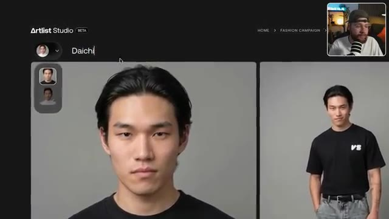
*Interface d'Artlist Studio affichant le modèle Daichi avec son nom en cours d'édition.*

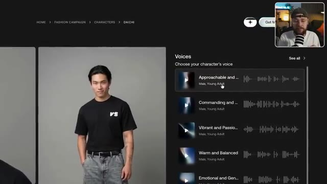
*Panneau latéral de sélection des voix "Voices" dans Artlist Studio pour le personnage Daichi.*

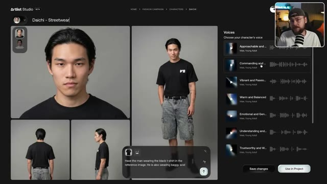
*Interface complète d'Artlist Studio avec le nom modifié en "Daichi - Streetwear", les différents angles du modèle et les options de voix.*

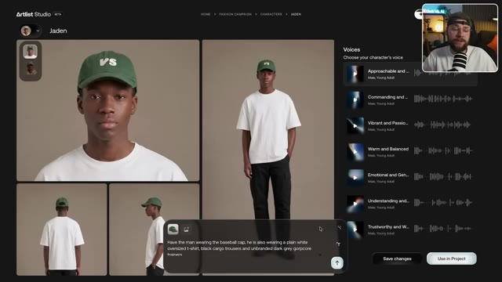
*Interface d'Artlist Studio montrant le second personnage créé nommé Jaden avec des vêtements blancs et une casquette verte.*

---

### ⏱️ `[00:05:59 - 00:06:31]` | Segment #15

**🔊 Audio (Transcription Intégrale Mot pour Mot en Français) :**
> Il porte notre casquette de baseball Versus. Nous avons aussi Roxy qui porte notre pull-tricoté oversized. Et enfin, nous avons Zaria qui porte notre veste coupe-vent. J'ai donc maintenant une très belle sélection de différents personnages portant tous mes propres designs de vêtements. Et ce que nous pouvons faire maintenant, c'est sélectionner un personnage à utiliser pour notre première génération. Commençons donc par Daichi. On le sélectionne puis on clique sur "utiliser dans le projet". Et maintenant, nous pouvons aller ajouter un emplacement pour notre scène. Et une fois

**👁️ Analyse Visuelle d'Écran (gemini-3.5-flash-lite) :**
**Interface & Outils** : Artlist Studio (interface web de création de campagnes de mode par IA)

**Contenu textuel & Code** : Noms des personnages (Jaden, Roxy, Zaria, Daichi), options de voix (Voices), options de design, et options de localisation ("Choose or create a location", "Entertainment Park", "Suburbs", "Busy European City").

**Action / Démonstration** : Présentation et sélection des personnages générés par IA avec leurs vêtements personnalisés, puis navigation vers le choix des décors pour la scène.

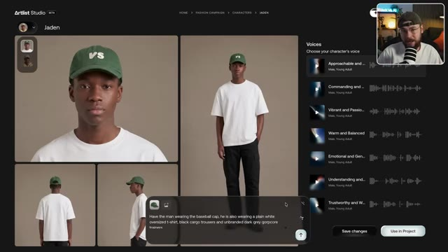
*Interface d'Artlist Studio montrant le personnage Jaden portant une casquette de baseball verte avec le logo "VS"*

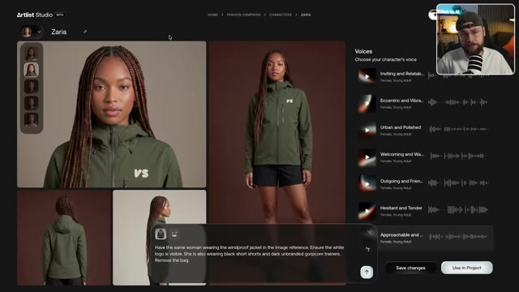
*Interface d'Artlist Studio montrant le personnage Zaria portant une veste coupe-vent kaki avec le logo "VS"*

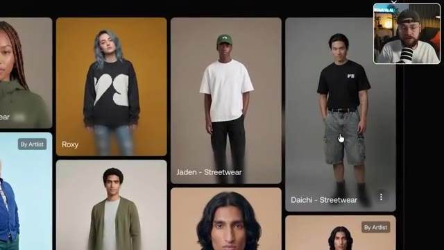
*Galerie des différents personnages du projet dans Artlist Studio, montrant Roxy, Jaden et la sélection du personnage Daichi*

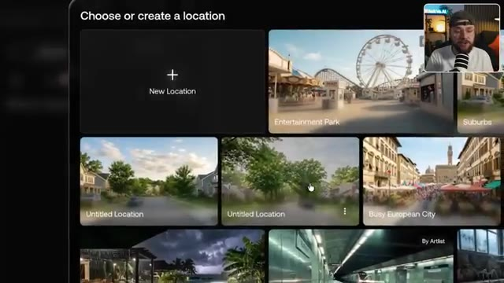
*Écran de sélection des emplacements (locations) pour la scène dans Artlist Studio avec différentes options de décors*

---

### ⏱️ `[00:06:31 - 00:07:05]` | Segment #16

**🔊 Audio (Transcription Intégrale Mot pour Mot en Français) :**
> encore une fois, vous pouvez voir toute une charge d'options pré-générées ici parmi lesquelles nous pouvons aller piocher et choisir. Je me dis que pour la première scène, choisissons le métro. Donc on va le sélectionner et ensuite cliquer sur utiliser dans le projet. Donc pour le prompt, je vais juste opter pour quelque chose de vraiment basique. Nous disons Daichi assis sur un banc dans le métro, en taguant à la fois le personnage et l'emplacement. Il fixe la caméra avec assurance. Et maintenant nous avons toute une charge d'autres options aussi. Tout en haut ici, nous avons un petit menu déroulant. Nous pouvons sélectionner le modèle d'image que nous voulons utiliser. Nano Banana

**👁️ Analyse Visuelle d'Écran (gemini-3.5-flash-lite) :**
**Interface & Outils** : Artlist Studio BETA (outil de génération de vidéo par IA) avec affichage incrusté (PiP) du créateur Jack en haut à droite.

**Contenu textuel & Code** : Sur l'image 1 : fenêtre modale "Choose or create a location" avec des aperçus de lieux (Untitled Location, Subway 1, Pink Abandoned Pool, School lockers, Rooftop, Courtroom, Underground, Waiting room, Low Class Business 1, Supermarket), boutons "Cancel" et "+ New Location". Sur l'image 2 : en haut à gauche, menu déroulant "Nano Banana Pro", résolutions "4K", "16:9", et modèles de caméras "ARRI Alexa 35", "ARRI Signature Prime", onglets "Framing" et "Directing", tags personnages/lieux "Daichi - Streetwear", "Subway 1".

**Action / Démonstration** : Le créateur montre la grille de sélection des lieux pré-générés, sélectionne le métro ("Subway 1"), puis bascule sur l'interface principale du projet pour configurer le prompt et le modèle d'image Nano Banana.

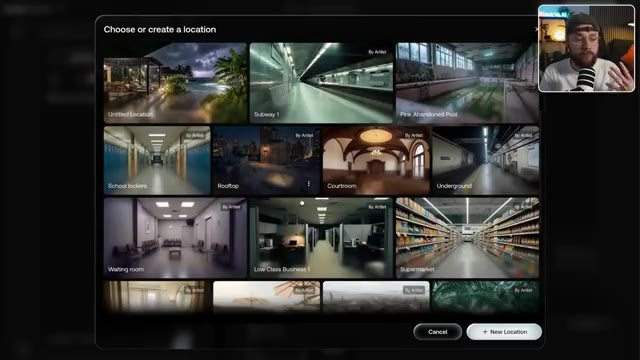
*Interface d'Artlist Studio affichant une grille d'options de lieux pré-générés pour choisir le décor du projet.*

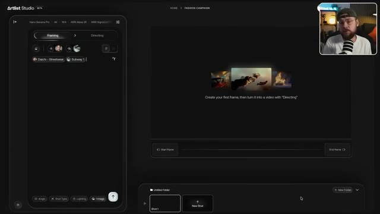
*Interface principale d'Artlist Studio BETA montrant les panneaux de configuration du projet et la sélection du modèle Nano Banana.*

---

### ⏱️ `[00:07:05 - 00:07:40]` | Segment #17

**🔊 Audio (Transcription Intégrale Mot pour Mot en Français) :**
> Pro est le meilleur sur le marché actuellement. Nous pouvons sélectionner notre résolution de sortie. Nous voulons toujours choisir la 4K pour cela. Plus nous avons de détails, mieux c'est. Et ensuite, nous avons notre format d'image. Et c'est génial parce que cela signifie que vous pouvez aussi générer du contenu pour les plateformes sociales. Donc du 1:1 et du 9:16 pour TikTok et Instagram, YouTube Shorts, tout ce genre de bonnes choses. Dans ce cas, cependant, je veux m'en tenir au 16:9, mais nous pouvons également sélectionner différentes caméras et objectifs. Et cela va, bien sûr, influencer l'apparence de notre génération. Donc si nous

**👁️ Analyse Visuelle d'Écran (gemini-3.5-flash-lite) :**
**Interface & Outils** : Artlist Studio (BETA) - Interface de génération vidéo/image par IA.

**Contenu textuel & Code** : Menus de sélection de modèles ("Flux 2.0 Flash", "Nano Banana 2", "Nano Banana Pro", "Seedream 5.0"), boutons de résolution (2K, 4K, 1K), formats d'image (16:9, 9:16, 1:1), et sélection de matériel (ARRI Alexa 35, ARRI Signature Prime).

**Action / Démonstration** : Le curseur de la souris survole et sélectionne "Nano Banana Pro" dans l'interface d'Artlist Studio.

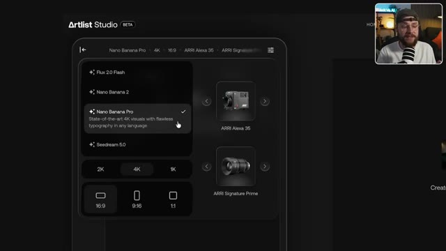
*Interface d'Artlist Studio montrant les options de sélection des modèles d'IA, de la résolution 4K, du format 16:9 et des caméras/objectifs ARRI.*

---

### ⏱️ `[00:07:40 - 00:08:03]` | Segment #18

**🔊 Audio (Transcription Intégrale Mot pour Mot en Français) :**
> il suffit de faire défiler les différentes caméras proposées ici. Il y a vraiment une bonne variété. Vous pouvez opter pour quelque chose de plus stylisé également, comme un caméscope VHS. Nous expérimenterons peut-être cela plus tard. Et bien sûr, les différents objectifs auront également un effet sur vos générations. Cependant, vous pouvez tout aussi bien les laisser en mode automatique si vous le souhaitez. C'est entièrement à vous de voir les gars.

**👁️ Analyse Visuelle d'Écran (gemini-3.5-flash-lite) :**
**Interface & Outils** : Artlist Studio (version bêta) avec un panneau de configuration de génération vidéo affichant les modèles, résolutions (2K, 4K, 1K), formats (16:9, 9:16, 1:1) et options de caméras/objectifs.

**Contenu textuel & Code** : On peut lire les modèles de génération (Flux 2.0 Flash, Nano Banana 2, Nano Banana Pro, Seedream 5.0), les boutons de résolution (2K, 4K, 1K), les formats d'image (16:9, 9:16, 1:1) et les visuels des caméras et objectifs (ARRI Alexa 35, ARRI Signature Prime). Jack apparaît également dans un encadré PiP en haut à droite.

**Action / Démonstration** : Le curseur de la souris survole les options de sélection de caméra pour faire défiler les différents types de caméras et d'objectifs disponibles dans l'interface.

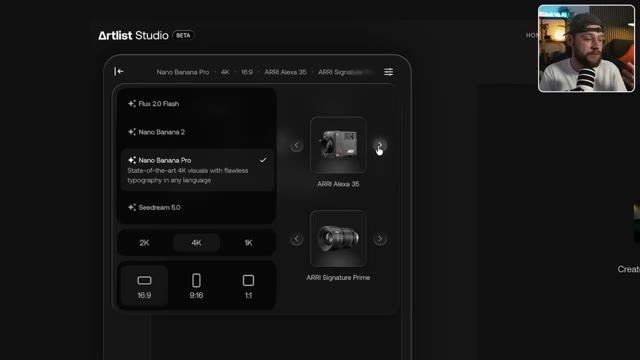
*Interface d'Artlist Studio montrant les options de sélection des caméras et des objectifs avec les préréglages (ARRI Alexa 35, ARRI Signature Prime).*

---

### ⏱️ `[00:08:03 - 00:08:41]` | Segment #19

**🔊 Audio (Transcription Intégrale Mot pour Mot en Français) :**
> Pour commencer, je veux opter pour quelque chose de tout à fait cinématique. Je vais donc choisir l'Arri Alexa 35 et nous allons simplement garder cet objectif Arri signature prime également. Maintenant, en bas, nous avons aussi tout un tas d'autres options, en commençant par l'angle de caméra. Je veux opter pour un angle en contre-plongée ici. Je pense que cela fonctionne plutôt bien dans le contexte d'une campagne de mode et cela va donner à Daichi un air assez dominant dans le cadre également. Je pense que ça va plutôt bien fonctionner. Nous pouvons aussi sélectionner notre type de plan. Je pense que pour cela, je vais choisir un plan moyen, puis nous pourrons même contrôler notre éclairage. Nous avons un tas d'options différentes ici. Je pense que pour cette scène en particulier

**👁️ Analyse Visuelle d'Écran (gemini-3.5-flash-lite) :**
**Interface & Outils** : Interface web d'Artlist Studio (BETA) montrant un panneau de configuration de génération vidéo avec des options de modèles, de résolution, de format et de matériel de caméra.

**Contenu textuel & Code** : On peut lire les options de modèles comme Flux 2.0 Flash, Nano Banana 2, Nano Banana Pro (sélectionné avec la mention "State-of-the-art 4K visuals with flawless typography in any language") et Seedream 5.0. Les résolutions incluent 2K, 4K, 1K. Les formats d'image sont 16:9, 9:16, 1:1. Le choix de la caméra montre l'Arri Alexa 35 et un emplacement pour la lentille (Camera lens) réglé sur Auto. Jack apparaît en incrustation PiP en haut à droite.

**Action / Démonstration** : Le créateur présente l'interface d'Artlist Studio et montre la sélection du modèle de caméra Arri Alexa 35.

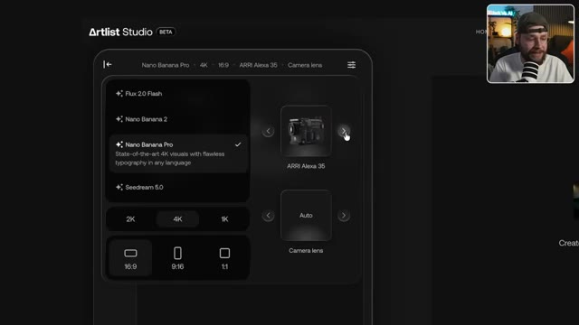
*Interface d'Artlist Studio montrant les réglages de caméra avec la sélection de l'Arri Alexa 35 et le format 16:9.*

---

### ⏱️ `[00:08:41 - 00:09:14]` | Segment #20

**🔊 Audio (Transcription Intégrale Mot pour Mot en Français) :**
> Je vais simplement laisser cela sur automatique et avec ça nous sommes prêts à envoyer quelques générations. Nous pouvons aussi choisir le nombre d'images que nous avons générées. Je pense qu'allons pour trois images pour celle-ci afin d'avoir un peu de sélection parmi laquelle choisir. Ceci étant dit, nous pouvons lancer nos générations. La première génération s'est un peu mal passée. Il regarde fixement le mur, ce qui est un peu plus bizarre. Je pense que tu aurais une position de banc comme ça ou tu choisirais de t'asseoir là juste à regarder fixement ce mur métallique. Mais la deuxième génération a l'air vraiment très bien.

**👁️ Analyse Visuelle d'Écran (gemini-3.5-flash-lite) :**
**Interface & Outils** : Interface web de génération de vidéo par IA avec panneau de configuration des paramètres de caméra, d'éclairage et d'angle de prise de vue.

**Contenu textuel & Code** : Menus de réglage d'éclairage (Auto, Golden Hour, Blue Hour, Natural, Hard Light, Neon, Rim Light, Diffused), paramètres de prise de vue (Low Angle, Medium), et interface de projet ("Fashion Campaign", "Shot 1", "New Shot").

**Action / Démonstration** : Le créateur montre le menu des styles d'éclairage en mode automatique, puis commente les résultats générés de l'homme assis sur un banc de métro.

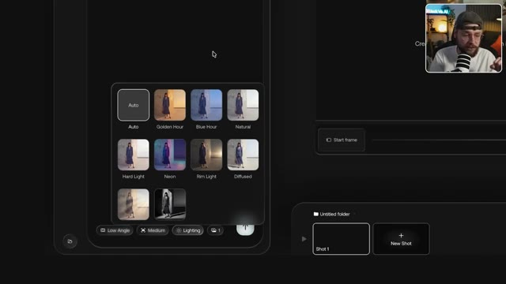
*Interface logicielle affichant un menu déroulant de préréglages d'éclairage (Auto, Golden Hour, Blue Hour, Natural, etc.)*

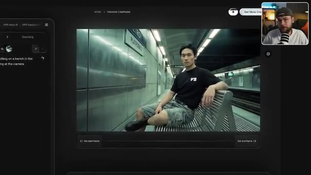
*Résultat de la première génération montrant un homme assis sur un banc dans une station de métro, regardant fixement le mur*

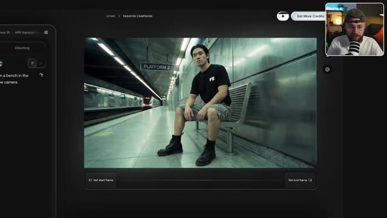
*Résultat de la deuxième génération montrant l'homme assis sur le banc de profil dans la station de métro avec une meilleure composition*

---

### ⏱️ `[00:09:14 - 00:09:38]` | Segment #21

**🔊 Audio (Transcription Intégrale Mot pour Mot en Français) :**
> Et la troisième génération a l'air sympa aussi. Donc on a quelques options avec lesquelles jouer ici. Une fois que vous avez une image générée par IA qui vous plaît, on peut descendre ici et la définir comme notre image de départ. On peut aussi définir une image de fin. Si on veut que le modèle vidéo qu'on choisit crée une transition entre les points A et B. Mais pour cet exemple, je veux juste utiliser une image de départ.

**👁️ Analyse Visuelle d'Écran (gemini-3.5-flash-lite) :**
**Interface & Outils** : Interface web d'un outil de génération vidéo par IA (avec le créateur en incrustation vidéo PiP en haut à droite).

**Contenu textuel & Code** : On observe le texte "HOME > FASHION CAMPAIGN", un bouton "Get More Credits", une image centrale montrant un homme asiatique assis sur un banc dans une station de métro sombre, et en bas de l'image les boutons de contrôle "Set start frame" et "Set end frame". Un panneau latéral gauche permet de saisir des prompts.

**Action / Démonstration** : Le créateur montre l'interface de l'outil de génération vidéo et explique comment sélectionner ou configurer une image de départ ("start frame") pour animer la vidéo.

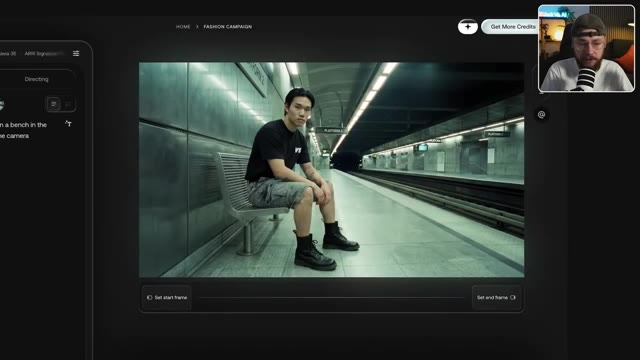
*Interface d'un générateur de vidéo par IA affichant une image générée d'un homme assis sur un banc de station de métro avec les boutons "Set start frame" et "Set end frame".*

---

### ⏱️ `[00:09:38 - 00:10:13]` | Segment #22

**🔊 Audio (Transcription Intégrale Mot pour Mot en Français) :**
> Nous sommes maintenant prêts à passer à l'onglet de direction. Et si j'appuie sur arobase sur mon clavier, cela nous permet de taguer nos personnages et nos lieux. Tout d'abord, nous voulons donc taguer Daichi. J'ai donc rédigé le reste de mon invite ici et j'ai délibérément été assez vague. Tout ce que j'ai vraiment demandé à ce qui se produise, c'est que Daichi baisse légèrement la tête comme s'il posait pour la caméra. Mais ce que nous pouvons faire maintenant si vous le souhaitez, c'est utiliser l'amplificateur d'invite intégré d'Artlist, qui va étoffer notre invite et ajouter plein d'autres détails utiles, alors allons-y et lançons cela, donc

**👁️ Analyse Visuelle d'Écran (gemini-3.5-flash-lite) :**
**Interface & Outils** : Artlist Studio (BETA) avec un aperçu vidéo sur la droite montrant un personnage assis sur un banc, et un panneau de contrôle sur la gauche comportant les onglets "Framing" et "Directing", ainsi qu'une zone de texte pour décrire l'action de la scène.

**Contenu textuel & Code** : Texte visible dans la zone de saisie : "Describe the scene's action, including how the characters move, act and speak". Paramètres en haut du panneau : Seedance 2.0, 1080p, 16:9, ARRI Alexa 35, ARRI Signature. Vignettes de personnages pour le taggage. En haut à droite, une incrustation vidéo (PiP) du présentateur Jack dans son studio.

**Action / Démonstration** : Le curseur de la souris clique sur l'onglet "Directing" dans l'interface d'Artlist Studio pour configurer la mise en scène du personnage Daichi.

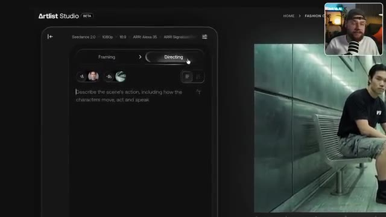
*Interface d'Artlist Studio montrant l'onglet de direction (Directing) et le champ de saisie du prompt pour le personnage Daichi.*

---

### ⏱️ `[00:10:13 - 00:10:46]` | Segment #23

**🔊 Audio (Transcription Intégrale Mot pour Mot en Français) :**
> Vous pouvez voir que l'améliorateur de prompt a fait exactement ce que nous voulions qu'il fasse, nous lui avons juste donné quelque chose de très simple et il nous a fourni beaucoup plus d'informations utiles que le modèle vidéo pourra utiliser. Maintenant, bien sûr, nous pouvons aller modifier n'importe quel paramètre que nous voulons, Artlist Studio va automatiquement reporter vos paramètres du cadrage à la mise en scène, mais si vous vouliez changer quoi que ce soit, bien sûr vous le pouvez, et tout en bas ici nous pouvons changer la durée de ce que nous allons faire générer. Je vais simplement régler cela à cinq secondes, je ne pense pas que ce...

**👁️ Analyse Visuelle d'Écran (gemini-3.5-flash-lite) :**
**Interface & Outils** : Artlist Studio (interface web sombre avec panneau de contrôle à gauche et aperçu vidéo à droite, incluant un encadré PiP de Jack en haut à droite).

**Contenu textuel & Code** : Texte du prompt généré : « Daichi - Streetwear shifts on the bench and holds a confident gaze toward the camera... », options Framing/Directing, et menu déroulant de durée allant de 4 sec à 15 sec.

**Action / Démonstration** : Le présentateur montre le résultat du prompt enrichi dans l'interface, puis clique sur le menu de durée au bas de l'écran pour le régler à 5 secondes.

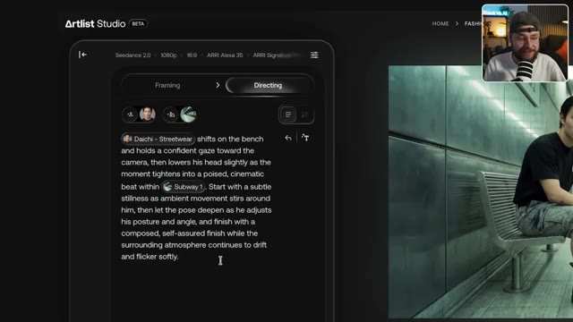
*Interface d'Artlist Studio montrant le prompt détaillé généré pour le modèle vidéo Seedance 2.0 dans l'onglet Directing.*

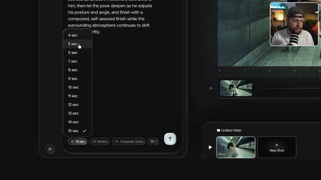
*Interface d'Artlist Studio montrant le menu déroulant pour sélectionner la durée de génération, avec 5 secondes sur le point d'être sélectionné.*

---

### ⏱️ `[00:10:46 - 00:11:14]` | Segment #24

**🔊 Audio (Transcription Intégrale Mot pour Mot en Français) :**
> n'a pas besoin d'être trop long. Ce qui est bien aussi, c'est qu'on peut décrire le mouvement de caméra, et comme c'est pour une campagne de streetwear, je veux opter pour un mouvement de caméra à l'épaule, je pense que ça va plutôt bien fonctionner. Si nous avions Daichi qui parle aussi, c'est ici qu'on pourrait utiliser la voix de personnage attribuée qu'on aurait pu ajouter plus tôt. Et on peut aussi choisir le nombre de vidéos qu'on veut recevoir en retour. Optons simplement pour deux à ce stade et envoyons tout ça. Nous avons récupéré nos générations maintenant.

**👁️ Analyse Visuelle d'Écran (gemini-3.5-flash-lite) :**
**Interface & Outils** : Interface logicielle de génération de vidéo par IA avec panneau de prompt, paramètres de durée, de mouvement (Motion) et de voix de personnage (Character Voice).

**Contenu textuel & Code** : Texte du prompt décrivant les mouvements d'un personnage dans une atmosphère de station de métro, avec des boutons de paramétrage ('5 sec', 'Motion', 'Character Voice') et une vignette de plan ('Shot 1').

**Action / Démonstration** : Le créateur survole et sélectionne le bouton de paramétrage du mouvement (Motion) pour configurer les mouvements de caméra de la vidéo.

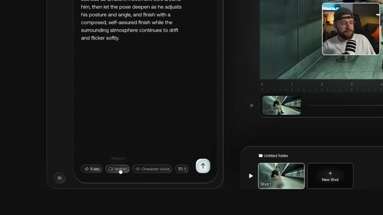
*Interface de l'application de génération vidéo montrant les options de prompt textuel et de configuration des mouvements de caméra et des voix de personnages.*

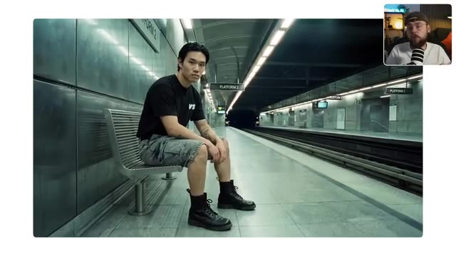
*Affichage du rendu vidéo généré montrant un homme assis sur un banc dans une station de métro.*

---

### ⏱️ `[00:11:14 - 00:11:50]` | Segment #25

**🔊 Audio (Transcription Intégrale Mot pour Mot en Français) :**
> Le premier exemple est un peu plat et sans vie, bien qu'on ait ce joli effet de tremblement de caméra à main, subtil mais présent. Mais la deuxième génération, je l'ai beaucoup plus appréciée. J'aime ce mouvement de caméra lent et régulier vers l'avant. Et je trouve que la façon dont Daichi bouge et prend la pose est parfaite pour une campagne de mode. Ça ne fait pas exagéré ni cliché, mais il a ce regard fort et confiant qui fixe directement l'objectif de la caméra tout au long du plan. Et je peux vraiment voir cela s'intégrer dans une campagne de mode, une publicité télé, sur les réseaux...

**👁️ Analyse Visuelle d'Écran (gemini-3.5-flash-lite) :**
**Interface & Outils** : Lecteur vidéo / démonstration de rendus de génération vidéo par IA avec incrustation (PiP) du créateur Jack dans le coin supérieur droit.

**Contenu textuel & Code** : Visuels de génération vidéo IA représentant un homme asiatique habillé en streetwear (t-shirt noir, short cargo, bottes) assis sur un banc métallique sur le quai d'une station de métro moderne, avec des panneaux indiquant "PLATFORM 2" et un encadré PiP de Jack dans son studio.

**Action / Démonstration** : Le créateur présente et compare deux générations de vidéos IA, en illustrant ses propos par la diffusion à l'écran des clips vidéo de démonstration.

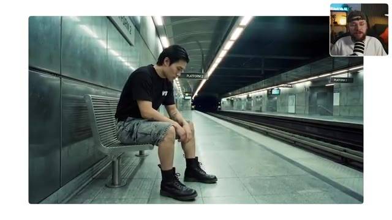
*Rendu vidéo IA montrant un homme assis sur un banc de station de métro (plateforme 2), avec un petit encadré PiP du créateur en haut à droite.*

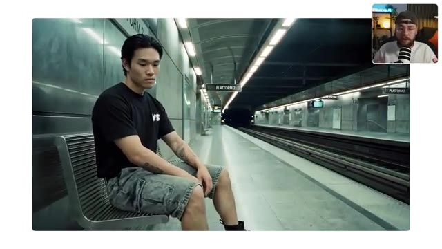
*Rendu vidéo IA de la deuxième génération avec un mouvement de caméra avant progressif sur l'homme assis sur le banc de métro.*

*Rendu vidéo IA montrant l'homme qui redresse la tête et commence à regarder fixement vers l'objectif.*

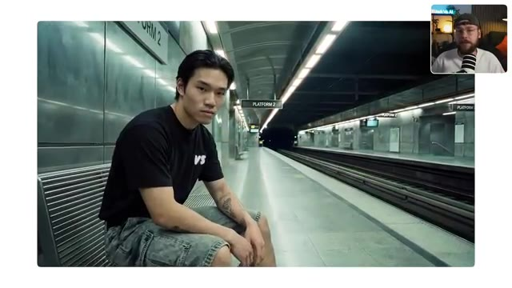
*Rendu vidéo IA montrant un plan rapproché de l'homme fixant directement la caméra avec assurance dans la station de métro.*

---

### ⏱️ `[00:11:50 - 00:12:27]` | Segment #26

**🔊 Audio (Transcription Intégrale Mot pour Mot en Français) :**
> Créez tout ce que vous voulez vraiment, assez joliment et naturellement, donc ceci bien sûr utilise simplement Artlist Studio pour créer un plan unique, mais quelque chose de vraiment puissant et que nous pouvons faire avec C-Dance 2, c'est d'avoir une sortie multi-plans, de sorte que nous pouvons avoir une génération de 15 secondes de long avec tout un tas de coupes différentes, de plans différents à l'intérieur, provenant de différents angles avec différents mouvements qui se produisent, une scène entière vraiment dans cette durée de 15 secondes. Donc je veux examiner cela ensuite, alors nous retournons à l'outil de cadrage maintenant, nous avons ajouté Zaria comme notre personnage.

**👁️ Analyse Visuelle d'Écran (gemini-3.5-flash-lite) :**
**Interface & Outils** : Artlist Studio (version Beta), avec une interface sombre comportant des menus de configuration de plans ("Framing", "Directing"), des options de sélection de caméras, de personnages et de formats, ainsi qu'une fenêtre de prévisualisation vidéo.

**Contenu textuel & Code** : Texte visible sur l'interface : "Artlist Studio BETA", "HOME", "FASHION CAMP...", "Nano Banana Pro", "4K", "16:9", "ARRI Alexa 35", "Framing", "Directing", "Zaria - Streetwear", "PLATFORM 2".

**Action / Démonstration** : Le créateur montre un exemple de génération vidéo cinématique dans Artlist Studio, puis navigue dans l'interface de cadrage pour ajouter le personnage Zaria et configurer les plans multiples.

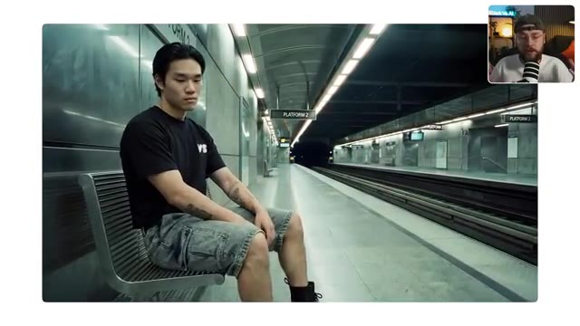
*Rendu visuel d'un plan unique généré montrant un jeune homme assis sur un banc dans une station de métro (Platform 2), avec le visage du créateur visible en incrustation PiP.*

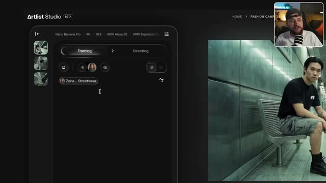
*Interface d'Artlist Studio Beta montrant le panneau de configuration du cadrage avec le personnage Zaria - Streetwear sélectionné et le rendu visuel du métro à l'écran, avec le créateur en PiP.*

---

### ⏱️ `[00:12:27 - 00:13:00]` | Segment #27

**🔊 Audio (Transcription Intégrale Mot pour Mot en Français) :**
> Et je veux continuer et chercher un nouvel emplacement maintenant, j'ai l'impression que la mettre dans ce terrain de basket de New York pourrait très bien fonctionner, ça correspond plutôt bien à notre ambiance streetwear, allons-y et sélectionnons ceci et choisissons utiliser dans le projet. Donc pour le prompt cette fois-ci, nous allons dire : Zaria se tient debout avec assurance à l'intérieur du terrain de basket de New York. Elle regarde directement l'objectif de la caméra et elle tient une boisson givrée rouge car je veux lui donner un petit accessoire cette fois. Allons chercher un angle différent également. Je pense que pour celui-ci,

**👁️ Analyse Visuelle d'Écran (gemini-3.5-flash-lite) :**
**Interface & Outils** : Artlist Studio (BETA) - Interface de génération de vidéo par IA avec sélection de lieux, de cadrages et de prompts textuels.

**Contenu textuel & Code** : Textes visibles : « Choose or create a location », « NY Basketball Court », « Zaria - Streetwear standing confidently inside the New York Basketball Court... », options de cadrage (Low Angle, Eye Level, High Angle, Overhead, Over the Shoulder, Dutch Angle, Bird's Eye).

**Action / Démonstration** : Le créateur navigue à travers les différents emplacements disponibles, sélectionne le terrain de basket de New York, tape ou modifie le prompt textuel et ouvre le menu de sélection des angles de caméra.

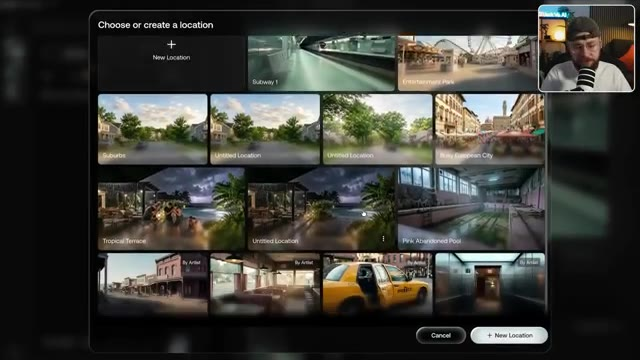
*Interface d'Artlist Studio montrant la grille de sélection des lieux (« Choose or create a location »).*

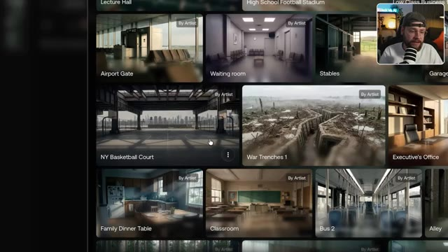
*Sélection du lieu « NY Basketball Court » dans la bibliothèque d'environnements d'Artlist Studio.*

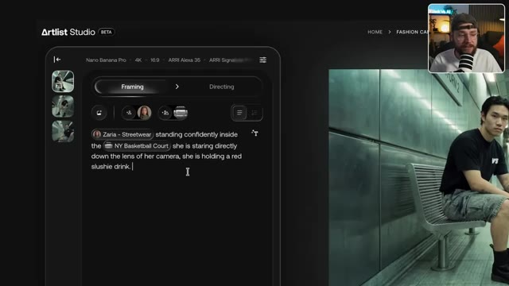
*Champ de texte affichant le prompt de génération de la scène avec Zaria et le terrain de basket de New York.*

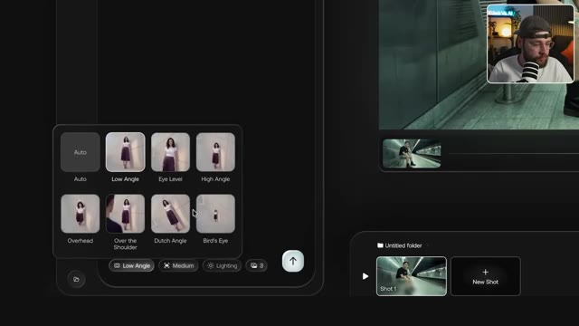
*Menu déroulant des angles de caméra (« Low Angle », « Eye Level », « High Angle », « Overhead », etc.) dans Artlist Studio.*

---

### ⏱️ `[00:13:01 - 00:13:37]` | Segment #28

**🔊 Audio (Transcription Intégrale Mot pour Mot en Français) :**
> allons-y pour une hauteur des yeux. On va s'en tenir à un plan moyen. J'ai l'impression que ça a plutôt bien fonctionné avant et de toute façon ça va être une sortie multi-plans, donc on va avoir une variété de différents angles de caméra intégrés. Maintenant pour l'éclairage je pense qu'on va opter pour l'heure dorée. Je pense que ça pourrait très bien fonctionner. Et pour les générations, allons-en juste pour deux cette fois-ci. Très bien, envoyons tout ça. D'accord, donc on a récupéré notre sortie de Nano Banana Pro. Je préfère l'éclairage pour cette génération-ci, mais notre boisson glacée n'a pas de paille. Donc on va devoir choisir celle-ci où

**👁️ Analyse Visuelle d'Écran (gemini-3.5-flash-lite) :**
**Interface & Outils** : Artlist Studio (interface de génération vidéo par IA).

**Contenu textuel & Code** : Paramètres visibles : 'Eye Level', 'Medium', 'Lighting', nombre de générations '2'. Prompt texte : 'Zaris - Streetwear - standing confidently inside the NY Basketball Court, she is staring directly down the lens of her camera, she is holding a red slushie drink.'

**Action / Démonstration** : Le créateur sélectionne les paramètres de cadrage et d'éclairage, lance la génération, puis analyse et compare les différents résultats vidéo obtenus (Nano Banana Pro outputs).

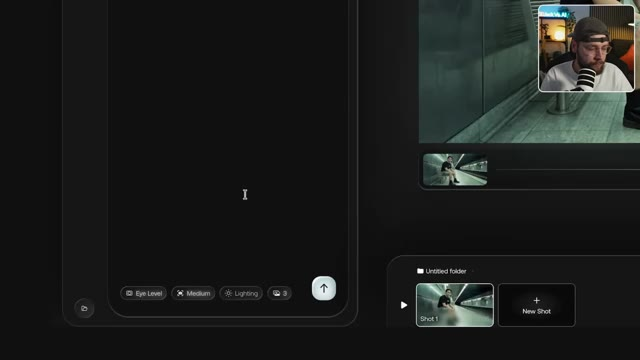
*Interface d'Artlist Studio montrant les réglages de paramètres de caméra avec les options 'Eye Level', 'Medium', 'Lighting' et le bouton de génération.*

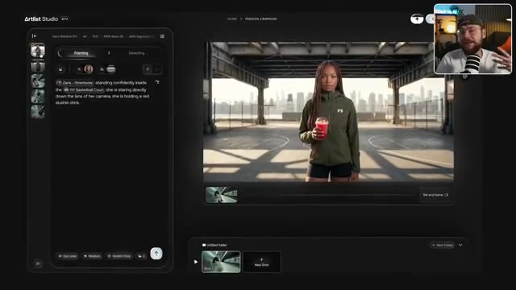
*Interface d'Artlist Studio affichant le résultat généré avec une femme tenant une boisson rouge sur un terrain de basket urbain sous l'éclairage de l'heure dorée.*

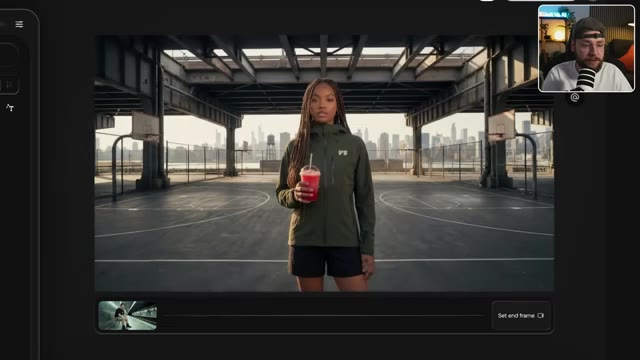
*Gros plan sur le rendu vidéo dans l'interface montrant le personnage tenant une boisson avec une paille dans un autre plan généré.*

---

### ⏱️ `[00:13:37 - 00:14:11]` | Segment #29

**🔊 Audio (Transcription Intégrale Mot pour Mot en Français) :**
> Je trouve toujours que c'est vraiment bien, pour être honnête. Donc ce qu'on peut faire, c'est supprimer notre ancienne image de départ et définir la nouvelle. Et maintenant, nous sommes prêts à basculer sur l'onglet de direction. Et ce que je vais également faire ici, c'est basculer vers Claude. Cela va nous aider à rédiger notre prompt multi-plans très facilement. Ce que j'ai demandé à Claude de faire, c'est de charger le framework de prompt pour la mode. Et c'est une compétence que j'ai en fait construite moi-même. Et si vous voulez accéder à mes compétences Claude que j'ai rassemblées, vous pouvez rejoindre ma communauté School gratuite. Vous trouverez un lien pour cela ci-dessous.

**👁️ Analyse Visuelle d'Écran (gemini-3.5-flash-lite) :**
**Interface & Outils** : Interface logicielle de génération vidéo (type Seedance) sur l'image 1, interface web de l'assistant IA Claude sur l'image 2, et plateforme communautaire School sur l'image 3.

**Contenu textuel & Code** : Sur l'image 1 : Bouton "Set end frame". Sur l'image 2 : "Happy Tuesday, Jack", "How can I help you today?", sélecteur "Sonnet 4.6 Adaptive", options "Write", "Create", "Learn", "Code", "Life stuff". Sur l'image 3 : Publications de Jack Kennedy ("How to Use Seedance 2.0 for AI Filmmaking (FULL PROMPTS)", "Sneak peak of what we've got coming up...") et d'April Jordan ("Beginner question"), panneau latéral "Jack Vs. AI Workflows" avec le bouton "INVITE PEOPLE".

**Action / Démonstration** : Le créateur montre la modification d'une image de fin dans l'interface vidéo, puis bascule vers l'interface de Claude et enfin présente sa communauté School en ligne.

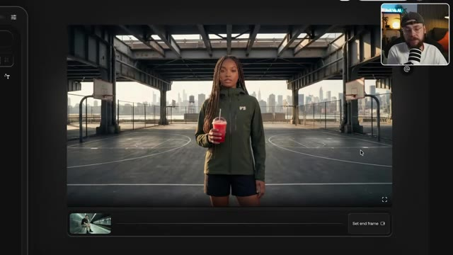
*Interface de l'outil de génération vidéo affichant une femme tenant une boisson sur un terrain de basketball avec un bouton de définition d'image de fin.*

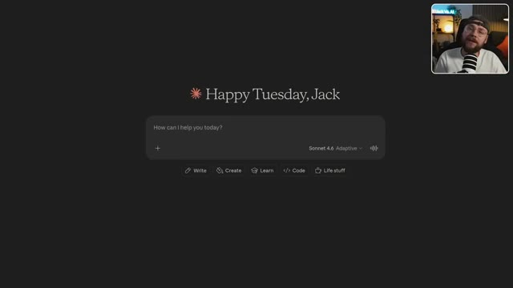
*Interface de l'assistant IA Claude avec le message de salutation et la barre de saisie des prompts.*

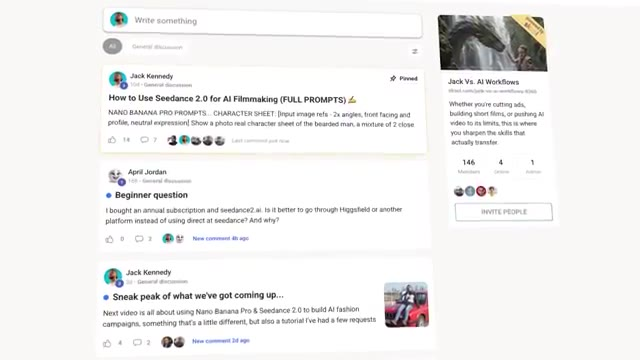
*Capture d'écran de la communauté School montrant les publications et discussions du groupe "Jack Vs. AI Workflows".*

---

### ⏱️ `[00:14:11 - 00:14:43]` | Segment #30

**🔊 Audio (Transcription Intégrale Mot pour Mot en Français) :**
> dans la description de la vidéo. Donc ce qu'on veut d'abord faire ici, c'est télécharger notre image que nous avons générée à l'intérieur d'Artlist Studio. Je vais donc aller l'importer dans Claude. Et je peux ajouter un prompt vraiment simple. Par exemple : la femme se tient en posant, beaucoup d'attitude, prend de temps en temps des gorgées de la boisson glacée. Maintenant, si j'envoie ceci, ma compétence Claude va prendre ce prompt vraiment basique et l'enrichir avec tout un tas de détails. Il va

**👁️ Analyse Visuelle d'Écran (gemini-3.5-flash-lite) :**
**Interface & Outils** : Interface web de l'assistant IA Claude avec un design sombre (mode sombre) et un encadré PiP (Picture-in-Picture) de Jack dans le coin supérieur droit.

**Contenu textuel & Code** : Texte visible dans l'interface : "Reply...", "Sonnet 4.6 Adaptive", "Add files, connectors, and more /", "Loaded. Fashion Campaign Prompt Framework is ready", et le prompt textuel "The woman stands posing, lots of attitude, takes occasional sips of the slushy drink."

**Action / Démonstration** : Le créateur navigue dans l'interface de Claude, importe une image générée depuis Artlist Studio et y associe un prompt textuel descriptif simple pour le transformer.

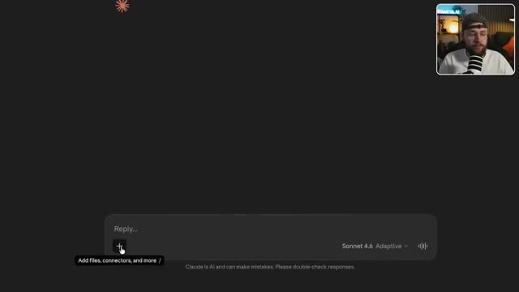
*Interface de l'outil Claude montrant la zone de saisie avec le curseur sur le bouton '+' pour ajouter des fichiers.*

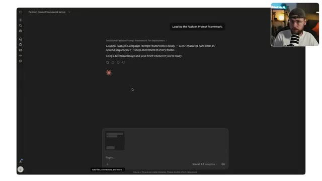
*Interface de Claude affichant le paramétrage "Fashion Prompt Framework setup" et un message de confirmation de chargement du framework.*

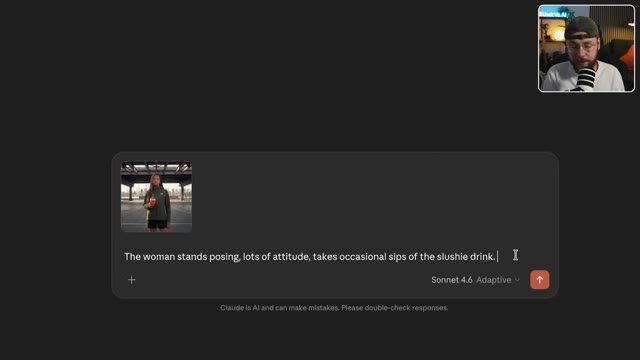
*Interface de Claude montrant l'image importée d'une femme avec le prompt textuel associé saisi dans la barre de discussion.*

---

### ⏱️ `[00:14:43 - 00:15:20]` | Segment #31

**🔊 Audio (Transcription Intégrale Mot pour Mot en Français) :**
> donne-nous une variété de plans différents sous différents angles, différents mouvements de caméra. Il va également décrire ce que nous voulons que notre personnage fasse pour chacun et nous façonner une scène entière multi-plans. Il décrira même la durée de chaque plan ainsi que leurs objectifs. Et juste comme ça, nous récupérons notre prompt et il suffit de le copier, puis de se rendre sur Artlist Studio et de le coller. Nous voulons bien sûr nous assurer de régler notre durée à 15 secondes. Toute la compétence Claude est conçue autour de cette durée.

**👁️ Analyse Visuelle d'Écran (gemini-3.5-flash-lite) :**
**Interface & Outils** : Claude (interface de chat textuel) et Artlist Studio (application de création vidéo par IA).

**Contenu textuel & Code** : Texte du prompt visible : "The woman stands posing, lots of attitude, takes occasional sips of the slushie drink." Paramètres dans Artlist Studio : Seedance 2.0, 1080p, 16:9, ARRI Alexa 35, ARRI Signature.

**Action / Démonstration** : Le créateur montre la génération d'un prompt textuel détaillé sur Claude, puis bascule sur l'interface d'Artlist Studio pour y insérer le prompt généré et configurer les paramètres de la scène.

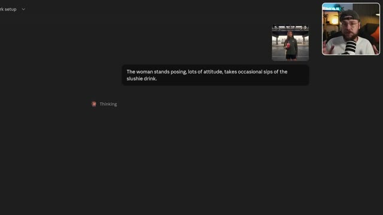
*Interface d'une application de type LLM (Claude) affichant un prompt textuel décrivant une femme posant et buvant une boisson, avec le statut "Thinking".*

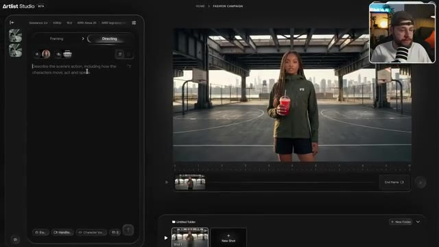
*Interface de l'outil Artlist Studio (BETA) montrant une interface de génération vidéo avec un aperçu de scène sous un pont et le champ de saisie du prompt.*

---

### ⏱️ `[00:15:20 - 00:15:52]` | Segment #32

**🔊 Audio (Transcription Intégrale Mot pour Mot en Français) :**
> Je vais laisser le mouvement de caméra à la main là-dessus parce que je pense que ça fonctionne tout simplement pour ce type de campagne et cela étant dit nous pouvons lancer notre génération et pouf nous avons récupéré notre rendu seedance 2 et je pense que c'est vraiment très réussi c'est exactement ce que nous cherchons nous avons un personnage cohérent un produit cohérent et un lieu cohérent également claude a aussi fait un excellent travail en écrivant le prompt pour nous il nous a fourni un très bon mélange

**👁️ Analyse Visuelle d'Écran (gemini-3.5-flash-lite) :**
**Interface & Outils** : Interface de Seedance avec panneau de sélection des mouvements de caméra et chronologie des plans (Shot 1, New Shot).

**Contenu textuel & Code** : Texte de prompt visible en arrière-plan sur Seedance (Medium, 35mm, eye-level, handheld...), options de mouvements (Auto, Static, Handheld, Pan Left, Pan Right, Tilt Up, Tilt Down, Zoom In) et affichage des rendus vidéo finaux.

**Action / Démonstration** : Le créateur montre l'interface de Seedance, valide les options de caméra, puis présente les résultats de la génération vidéo mettant en valeur la cohérence du personnage, du produit et du lieu.

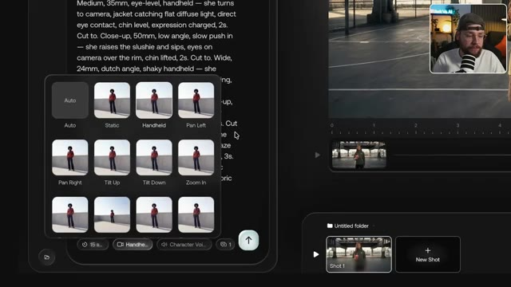
*Interface de Seedance montrant les options de mouvements de caméra et les différents plans de la campagne.*

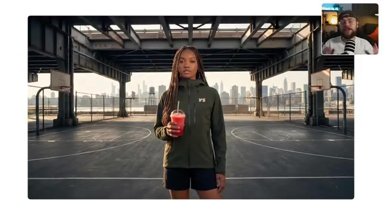
*Premier rendu vidéo généré montrant la femme tenant une boisson sur un terrain de basketball urbain.*

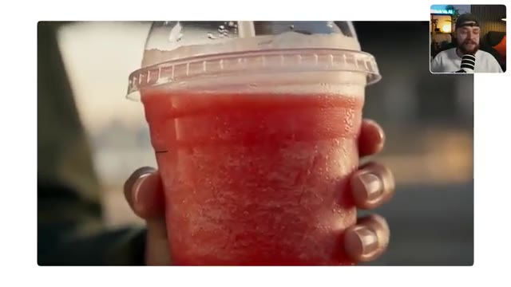
*Gros plan sur le gobelet de boisson rouge tenu par la main du personnage, démontrant la cohérence du produit.*

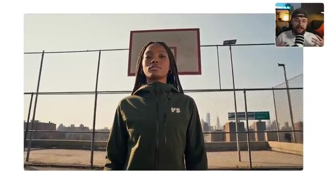
*Plan en contre-plongée sur le personnage principal féminin avec un panneau de basket en arrière-plan.*

---

### ⏱️ `[00:15:52 - 00:16:30]` | Segment #33

**🔊 Audio (Transcription Intégrale Mot pour Mot en Français) :**
> des angles de caméra et des mouvements différents également sans avoir à y mettre le moindre effort. J'aime aussi beaucoup la façon dont il a intégré la boisson glacée dans la scène. Il a vraiment mis le paquet pour utiliser cet accessoire de manière dynamique et intéressante, et bien sûr tout cela est grandement aidé par la façon dont Sea Dance 2 est vraiment bon pour produire des mouvements et des visuels réalistes, et ce que j'ai fait ensuite, c'est simplement générer toute une série d'options différentes, de scènes différentes en utilisant nos autres personnages dans de nouveaux emplacements, bien sûr une fois que vous avez tout

**👁️ Analyse Visuelle d'Écran (gemini-3.5-flash-lite) :**
**Interface & Outils** : Seedance 2.0 (vidéo générée par IA avec incrustation PiP du créateur dans le coin supérieur droit)

**Contenu textuel & Code** : Rendu vidéo de haute qualité généré par IA montrant un personnage féminin réaliste dans un environnement urbain, tenant une boisson glacée.

**Action / Démonstration** : Démonstration de plans de caméra dynamiques et de la qualité de rendu réaliste des mouvements et des textures (gobelet, condensation, boisson) par Seedance 2.

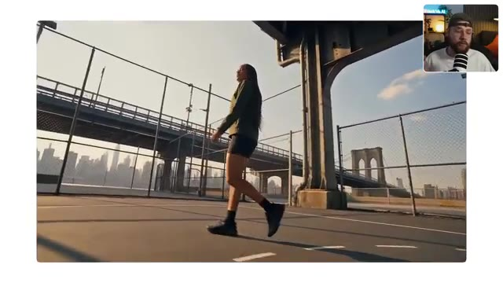
*Génération vidéo IA montrant une femme marchant sous un pont urbain en plein air (Seedance 2).*

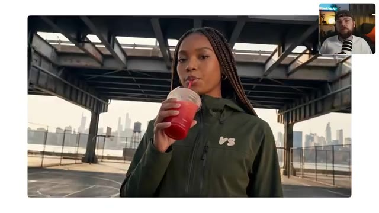
*Gros plan sur la femme buvant dans un gobelet de boisson glacée rouge, avec le logo 'VS' visible sur sa veste.*

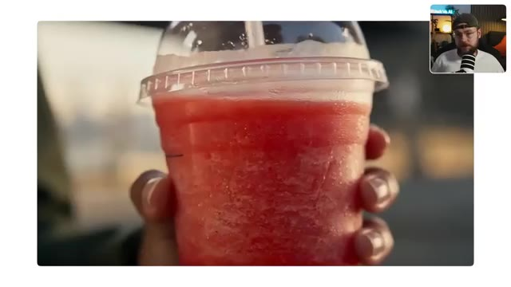
*Très gros plan ultra-détaillé sur le gobelet de boisson glacée rouge tenu dans la main.*

---

### ⏱️ `[00:16:30 - 00:17:08]` | Segment #34

**🔊 Audio (Transcription Intégrale Mot pour Mot en Français) :**
> vos générations assemblées et vous avez l'impression d'avoir une belle variété une bonne quantité de séquences à exploiter vous pouvez passer au montage et un conseil rapide pour vous aussi Artlist possède également un très super catalogue de stock qui est vraiment utile lorsque vous essayez de trouver le bon type de piste musicale. Maintenant, j'utilise cela assez souvent si nous allons dans les filtres dans le coin supérieur droit, nous pouvons réduire la durée de la piste tout en bas. J'opte généralement pour quelque chose d'une minute environ. Nous pouvons même filtrer le BPM, nous pouvons opter pour des choses comme l'ambiance, nous pouvons choisir le thème de la vidéo,

**👁️ Analyse Visuelle d'Écran (gemini-3.5-flash-lite) :**
**Interface & Outils** : Interface web de la plateforme Artlist avec ses menus de navigation et ses options de filtrage audio.

**Contenu textuel & Code** : Menus visibles : Home, AI Toolkit, Stock Catalog, Studio. Filtres de durée (Duration), BPM, Genre, Mood, Video Theme et Instrument. Pistes audio listées avec leur durée et leurs ondes sonores.

**Action / Démonstration** : Le curseur de la souris navigue dans les menus et ajuste les filtres de durée et d'ambiance pour la sélection musicale.

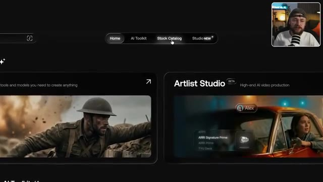
*Interface du site Artlist montrant la navigation dans le catalogue de stock et les onglets principaux.*

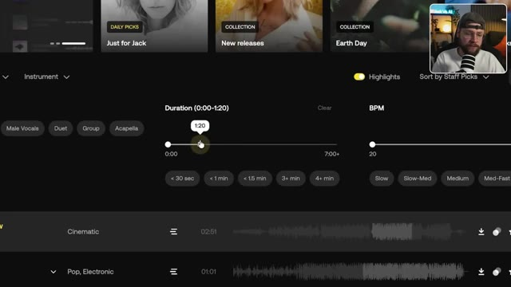
*Interface de filtrage d'Artlist montrant le curseur de durée réglé sur environ une minute et vingt secondes.*

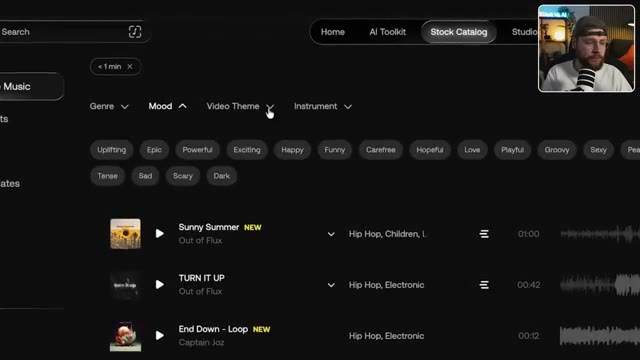
*Interface de recherche d'Artlist montrant les options de filtrage par humeur (Mood) et par thème de vidéo.*

---

### ⏱️ `[00:17:08 - 00:17:43]` | Segment #35

**🔊 Audio (Transcription Intégrale Mot pour Mot en Français) :**
> les instruments que nous voulons présents ainsi que le genre. Il y a beaucoup de choix différents ici mais aussi des moyens de cibler pour trouver exactement ce que vous voulez. Et quand il s'agit du montage, il est généralement beaucoup plus facile de construire vos visuels autour de la musique plutôt que l'inverse. Si vous construisez tout votre montage et qu'ensuite vous essayez de trouver de la musique pour aller avec, vous allez probablement galérer. Mais si vous choisissez votre piste en premier, vous pouvez ensuite construire vos visuels autour. Ainsi, vous pouvez jouer avec certains éléments de la piste. Vous pouvez faire du beat matching. Vous pouvez en quelque sorte

**👁️ Analyse Visuelle d'Écran (gemini-3.5-flash-lite) :**
**Interface & Outils** : Interface web de catalogue de musiques libres de droits et interface de logiciel de montage vidéo (type Premiere Pro / DaVinci Resolve) avec incrustation PiP du créateur.

**Contenu textuel & Code** : Sur l'image 1 : Filtres d'instruments ("Acoustic Drums", "Acoustic Guitar", "Backing Vocals", "Bass", "Bells", "Brass", "Claps & Snaps", "Electric Guitar", "Electronic Drums", "Orchestra", "Pads", "Percussion", "Piano", "Special Wind Instruments", "Strings", "Synth", "Vocal", "Whistle", "Woodwinds") et pistes audio ("Sunny Summer", "Turn It Up", "End Down - Loop"). Sur l'image 3 : Timeline de montage avec des clips vidéo nommés ("The woman...", "Shaky_handheld_camera_work...") et une piste audio verte.

**Action / Démonstration** : Le créateur navigue dans une bibliothèque musicale en sélectionnant des instruments, puis illustre le montage vidéo en alignant des clips visuels sur une piste audio.

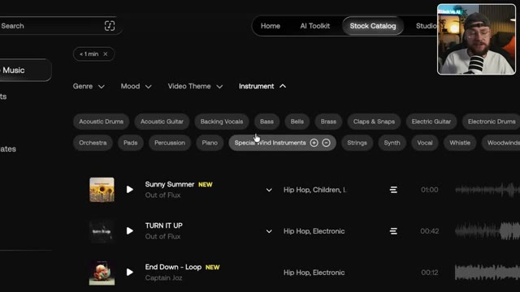
*Interface de catalogue musical montrant les filtres d'instruments avec le créateur visible en incrustation PiP.*

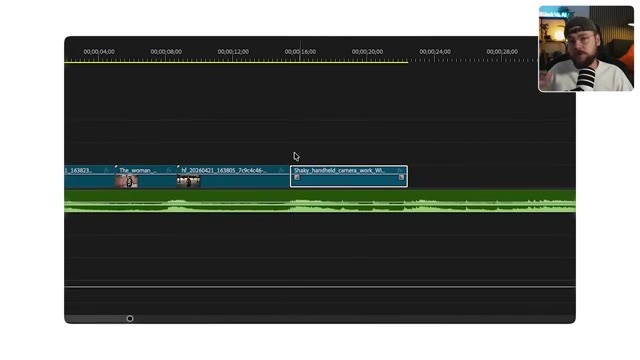
*Timeline de logiciel de montage vidéo affichant des clips visuels alignés sur une piste audio verte avec le créateur en incrustation PiP.*

---

### ⏱️ `[00:17:43 - 00:18:16]` | Segment #36

**🔊 Audio (Transcription Intégrale Mot pour Mot en Français) :**
> ajoutez tout un tas de coupes rapides s'il y a une section frénétique dans la musique. Ou s'il y a une montée ou un crescendo musical, vous pouvez choisir de rester sur un plan un peu plus longtemps pour créer ce type de tension et ce mariage entre le visuel et l'audio. J'espère vraiment que vous avez apprécié la vidéo d'aujourd'hui. Si vous avez la moindre question, assurez-vous de la laisser en bas dans la section des commentaires. Si vous vouliez aller jeter un œil à un peu plus de mon contenu, vous pouvez le faire en cliquant sur la vidéo à l'écran maintenant. Ceci étant dit, je vous retrouve dans la prochaine.

**👁️ Analyse Visuelle d'Écran (gemini-3.5-flash-lite) :**
**Interface & Outils** : Logiciel de montage vidéo (type Adobe Premiere Pro) avec panneau de prévisualisation et ligne temporelle (timeline) comportant des pistes vidéo et audio.

**Contenu textuel & Code** : Pistes de montage vidéo avec une couche de réglage ("Adjustment Layer") et des clips vidéo montrant quatre personnes debout dans un bureau de style open space. Incrustation vidéo du créateur en haut à droite.

**Action / Démonstration** : Le créateur montre un exemple de montage vidéo avec un plan fixe de personnages dans un bureau sur la timeline du logiciel de montage.

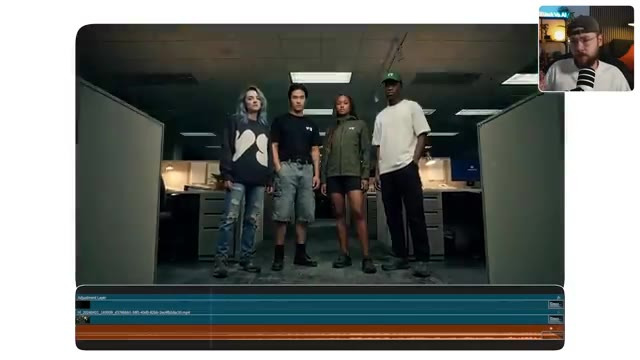
*Capture d'écran d'un logiciel de montage vidéo (type Premiere Pro) montrant une scène avec quatre personnes dans un bureau, avec le créateur en incrustation (PiP) dans le coin supérieur droit.*

---
