# 🎬 Comment utiliser Seedance 2.0 pour la publicité par IA (Workflow complet)

> **Chaîne** : [Jack Vs. AI](https://www.youtube.com/@JackVsAI)  
> **Titre original** : `How to Use Seedance 2.0 for AI Advertising (Full Workflow)`  
> **Lien YouTube** : [https://www.youtube.com/watch?v=ClIaRcvwnTQ](https://www.youtube.com/watch?v=ClIaRcvwnTQ)  
> **Date de publication** : 2026-04-30  
> **Durée** : 17m 49s (`1069s`)  
> **Identifiant vidéo** : `ClIaRcvwnTQ`  
> **Fiche Web Interactive** : [2026-04-30_YT-ClIaRcvwnTQ_Comment utiliser Seedance 2.0 pour la publicité par IA (Workflow complet)_by-whisper-v3-large-turbo+gemini-3.5-flash-lite.html](2026-04-30_YT-ClIaRcvwnTQ_Comment utiliser Seedance 2.0 pour la publicité par IA (Workflow complet)_by-whisper-v3-large-turbo+gemini-3.5-flash-lite.html)  
> **Captures de démonstration clés** : `85 captures réelles (anti-talking-head)`  
> **Modèles utilisés** : Audio: `large-v3-turbo` (Faster-Whisper int8 VPS) | Vision: `gemini-3.5-flash-lite` (Google AI Studio API)  

---

## 📌 Synthèse Exécutive & Outils

### 📌 Résumé

Dans cette vidéo de Jack Vs. AI, le créateur démontre la puissance des pipelines de production vidéo entièrement générés par intelligence artificielle en concevant de zéro une publicité percutante pour un médicament contre le rhume des foins. Face à un brief potentiellement classique et ennuyeux, Jack choisit une approche créative et métaphorique audacieuse : personnifier les symptômes allergiques à travers un monstre charismatique que l'héroïne, April, finit par terrasser. Ce projet, qui aurait exigé une équipe de tournage de trois jours il y a à peine six mois, a été entièrement réalisé depuis un ordinateur portable en combinant l'idéation textuelle, la génération d'images haute fidélité et la création de séquences vidéo multi-plans cohérentes.

Le secret de ce workflow réside dans la synergie entre de grands modèles de langage et des générateurs de vidéo de pointe. Jack structure son processus créatif en définissant d'abord un visuel clé fort, puis en élaborant des feuilles de personnages rigoureuses (character sheets) pour garantir la continuité visuelle. L'utilisation stratégique de Seedance 2.0 permet de s'affranchir du montage fastidieux plan par plan grâce à sa capacité à générer nativement des séquences dynamiques connectées de 15 secondes. L'intégration de Claude en amont permet d'automatiser la rédaction de prompts cinématographiques ultra-détaillés, gérant les angles de caméra, les mouvements et l'absence cruciale de musique intégrée.

Pour les créateurs de contenu, les publicitaires et les agences, ce tutoriel offre un modèle de production reproductible et extrêmement rapide. Il prouve qu'avec une direction artistique claire, une bonne gestion des références visuelles et une maîtrise des prompts multi-plans, il est possible de rivaliser avec des productions traditionnelles coûteuses. Ce pipeline démontre que l'IA ne sert plus seulement à créer des illustrations isolées, mais permet de raconter de véritables histoires visuelles cohérentes, ouvrant la voie à une nouvelle ère pour la publicité de marque et les commandes clients.

### 🛠️ Outils, Modèles & Logiciels Présentés

* **Claude** : Utilisé comme assistant stratégique et rédacteur de prompts pour concevoir l'identité de marque, structurer le traitement narratif et générer des prompts multi-plans détaillés.
* **Higgsfield AI** : La plateforme principale hébergeant les outils de génération et servant d'environnement central pour orchestrer le projet.
* **Kling** : Mentionné dans l'écosystème global des modèles de génération vidéo par IA.
* **Nano Banana** : Utilisé pour les premières phases de génération d'images et de tests itératifs basés sur les retours de Claude.
* **Nano Banana Pro** : Modèle de génération d'images haute résolution (4K) employé pour créer le visuel clé du monstre, le personnage d'April, le packaging du produit et les feuilles de personnages (character sheets).
* **Premiere Pro** : Logiciel de montage traditionnel évoqué pour l'assemblage final des différentes séquences vidéo.
* **Seedance** / **Seedance 2.0** : Le modèle phare de génération vidéo par IA, salué pour sa capacité extraordinaire à produire des scènes à plans multiples fluides, cohérentes et dynamiques sans musique parasite.
* **Topaz** : Logiciel d'upscaling et d'optimisation de la qualité vidéo mentionné pour le traitement post-génération.
* **Flux** : Modèle d'intelligence artificielle intégré dans l'écosystème de création visuelle.

### 🔑 Points Clés & Enseignements Stratégiques

* **Définir un visuel clé fondateur** : Commencer toujours le projet par la création d'une image maîtresse forte (le monstre des allergies dans ce cas) pour servir de boussole créative et donner vie au reste de l'idée.
* **Subvertir les briefs classiques** : Transformer un sujet ennuyeux ou institutionnel (comme un médicament contre les allergies) en une narration visuelle originale et décalée pour surprendre et captiver le public.
* **Structurer la narration en trois actes** : Diviser la publicité de manière claire — le chaos semé par le monstre, la présentation du personnage vulnérable, puis la confrontation finale victorieuse.
* **Générer systématiquement des feuilles de personnages** : Regrouper les références visuelles du monstre et du héros (April) pour les réinjecter dans les outils de génération vidéo et garantir une stricte continuité visuelle.
* **Exploiter la puissance des prompts multi-plans de Seedance 2.0** : Utiliser la capacité du modèle à créer des séquences connectées de plusieurs plans en une seule génération, évitant ainsi le piège d'assembler des dizaines de clips isolés.
* **Programmer Claude pour rédiger des prompts cinématographiques** : Fournir à l'IA textuelle un cadre de prompt multi-plans pour qu'elle décrive précisément l'action, le type d'objectif, l'angle de caméra, les mouvements et la durée de chaque plan.
* **Exiger une résolution maximale (4K)** : Veiller à ce que toutes les générations d'images initiales soient réglées sur la plus haute qualité possible pour maximiser le rendu final du modèle vidéo.
* **Forcer l'absence de musique dans les prompts** : Inclure des consignes textuelles spécifiques pour empêcher Seedance 2.0 d'intégrer une bande sonore, éliminant ainsi les coupures musicales cauchemardesques lors du montage des clips de 15 secondes.
* **Travailler dans un ordre stratégique (générer la fin en premier)** : Concevoir d'abord la scène finale du produit et de la confrontation, car elle influence directement la cohérence esthétique et narrative des scènes précédentes.
* **Accepter et masquer les imperfections mineures** : Composer avec les limites actuelles des modèles vidéo (comme l'illisibilité occasionnelle du texte sur les vitrines) en s'assurant que le dynamisme visuel détourne l'attention du spectateur.

---

## ⏱️ Chronologie & Transcription Complète Audio & Visuelle (Mot pour Mot)

### ⏱️ `[00:00:00 - 00:00:54]` | Segment #01

**🔊 Audio (Transcription Intégrale Mot pour Mot en Français) :**
> J'ai réalisé toute cette publicité de produit en utilisant uniquement l'IA. Jetez un œil. Il y a six mois, cela aurait nécessité toute une équipe de production et un tournage de trois jours.

**👁️ Analyse Visuelle d'Écran (gemini-3.5-flash-lite) :**
**Interface & Outils** : Présentation vidéo de clips générés par intelligence artificielle (publicité de produit).

**Contenu textuel & Code** : Texte affiché à l'écran : "entire product ad". Sur la boîte de médicament tenue par l'actrice : "BLOOM", "HAYFEVER AND ALLERGY RELIEF MEDICINE", "Original", "CONTAINS LORATADINE - ALWAYS READ THE LABEL".

**Action / Démonstration** : La vidéo montre des extraits de la publicité générée par IA illustrant une femme souffrant d'allergies qui utilise un médicament, suivis du créateur (Jack) qui s'exprime face caméra dans son studio.

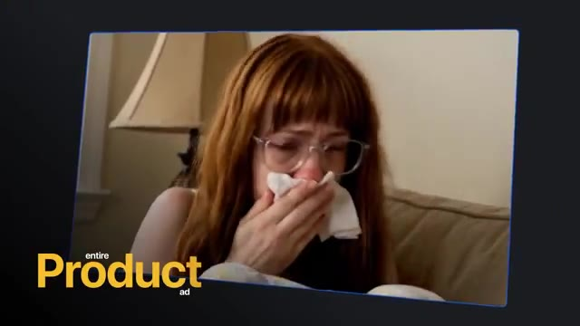
*Extrait de la publicité générée par IA montrant une jeune femme rousse avec des lunettes, en pleurs, se mouchant dans un mouchoir, encadré avec un carton jaune portant le texte "entire product ad".*

*Gros plan sur la jeune femme rousse avec des lunettes, les yeux larmoyants, se mouchant dans un mouchoir en papier dans une pièce intérieure.*

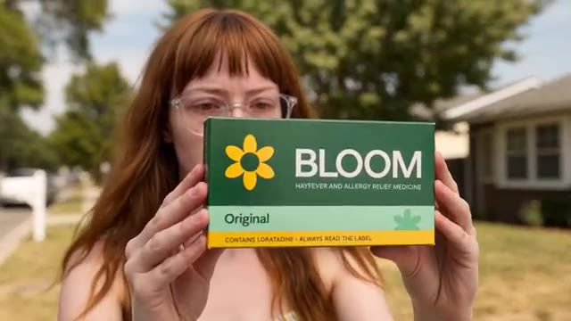
*La jeune femme rousse tient et présente à la caméra une boîte de médicament verte et blanche de la marque fictive "BLOOM".*

---

### ⏱️ `[00:00:54 - 00:01:12]` | Segment #02

**🔊 Audio (Transcription Intégrale Mot pour Mot en Français) :**
> Mais j'ai réalisé tout le projet moi-même avec seulement mon ordinateur portable. J'ai écrit les prompts en utilisant Claude, généré les visuels avec Nano Banana Pro, et donné vie à le tout avec C-Dance 2. Aujourd'hui, je vais vous enseigner tout mon flux de travail, afin que vous puissiez repartir avec un pipeline de production complet que vous pourrez appliquer à n'importe quel brief.

**👁️ Analyse Visuelle d'Écran (gemini-3.5-flash-lite) :**
**Interface & Outils** : Interface logicielle de type pipeline nodulaire et schéma d'architecture de workflow d'intelligence artificielle.
[DESC_IMAGE_1 CONTENU] Boîte verte et jaune avec le texte 'BLOOM'.
[DESC_IMAGE_2 CONTENU] Grilles d'images de character design (monstre jaune texturé sous 4 angles, femme rousse sous 4 angles) et panneau de prompts textuels sur la gauche.
[DESC_IMAGE_3 CONTENU] Icônes de services reliées par des lignes bleues avec les labels 'nano-banana', 'claude' et 'higgsfield'.

**Contenu textuel & Code** : Explications orales des concepts et des méthodes de création vidéo IA.

**Action / Démonstration** : Démonstration visuelle illustrant les étapes de production du projet avec des plans générés par IA, un schéma de pipeline de nœuds et une vue d'ensemble des outils d'IA utilisés.

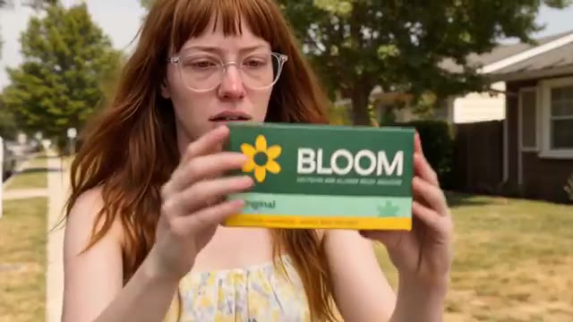
*Extrait vidéo généré par IA montrant une jeune femme rousse tenant une boîte de médicaments 'BLOOM' devant une maison.*

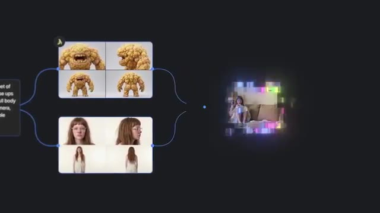
*Interface graphique montrant un pipeline de nœuds reliant des grilles de rendus visuels (monstre et personnage) vers un rendu final assemblé.*

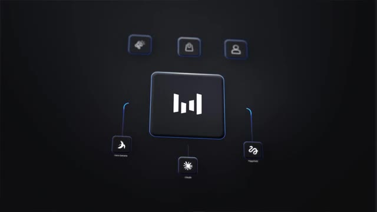
*Schéma d'architecture de workflow montrant l'outil central relié à différents services d'IA (nano-banana, claude, higgsfield).*

---

### ⏱️ `[00:01:12 - 00:01:31]` | Segment #03

**🔊 Audio (Transcription Intégrale Mot pour Mot en Français) :**
> Publicitaires pour produits, campagnes de marque, travail pour des clients, tout ce dont vous avez besoin. Avant de commencer, je m'appelle Jack. Et si vous voulez rester à la pointe de tous les derniers outils d'IA, assurez-vous de lâcher un pouce bleu sur cette vidéo et pensez à vous abonner. Très bien, entrons dans le vif du sujet. Donc, je voulais m'attaquer à une publicité pour un produit pour ce projet, plus précisément un médicament contre le rhume des foins et les allergies.

**👁️ Analyse Visuelle d'Écran (gemini-3.5-flash-lite) :**
**Interface & Outils** : Interface de présentation graphique animée et incrustation vidéo PiP du créateur en studio.

**Contenu textuel & Code** : Textes visibles : 'Ads', 'Campaign', 'client work', et sur la boîte de produit : 'BLOOM', 'HAYFEVER AND ALLERGY RELIEF MEDICINE', 'Original', 'CONTAINS LORATADINE - ALWAYS READ THE LABEL'.

**Action / Démonstration** : Le créateur introduit visuellement les différents types de projets publicitaires abordés, puis présente l'image du produit fictif sur lequel il va travailler.

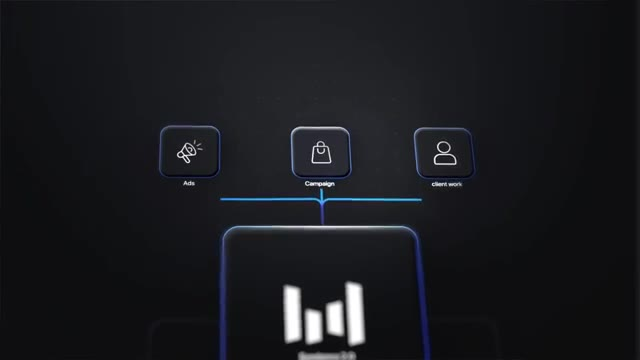
*Graphique montrant trois icônes d'applications : 'Ads', 'Campaign' et 'client work' reliées entre elles.*

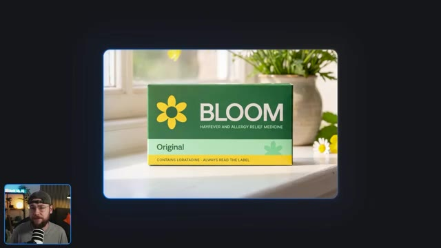
*Visuel généré par IA d'une boîte de médicament contre les allergies nommée 'BLOOM' posée sur un rebord de fenêtre, avec le créateur en incrustation PiP.*

---

### ⏱️ `[00:01:31 - 00:01:52]` | Segment #04

**🔊 Audio (Transcription Intégrale Mot pour Mot en Français) :**
> Évidemment, cela court le risque d'être assez classique et ennuyeux, mais je crois fermement qu'il y a toujours une manière créative d'aborder chaque type de brief. Et c'est pourquoi j'ai choisi de représenter les symptômes du rhume des foins avec ce monstre. C'était la première image que j'ai générée pour le projet. Je vais vous expliquer exactement comment j'ai fait cela dans un instant.

**👁️ Analyse Visuelle d'Écran (gemini-3.5-flash-lite) :**
**Interface & Outils** : Présentation vidéo avec incrustation Picture-in-Picture (PiP) de Jack face caméra dans son studio.

**Contenu textuel & Code** : Texte sur la boîte de médicament : "BLOOM - HAYFEVER AND ALLERGY RELIEF MEDICINE - Original - CONTAINS LORATADINE".

**Action / Démonstration** : La vidéo montre d'abord une scène cinématographique avec une actrice présentant une boîte de médicament, puis un plan large généré par IA d'un monstre de pollen géant dans une rue, tandis que Jack commente en voix off et apparaît en médaillon.

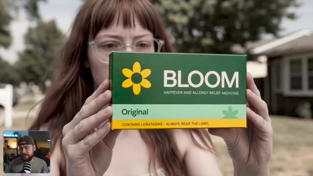
*Une femme tenant une boîte de médicament "BLOOM" contre le rhume des foins, avec un encadré de Jack en bas à gauche.*

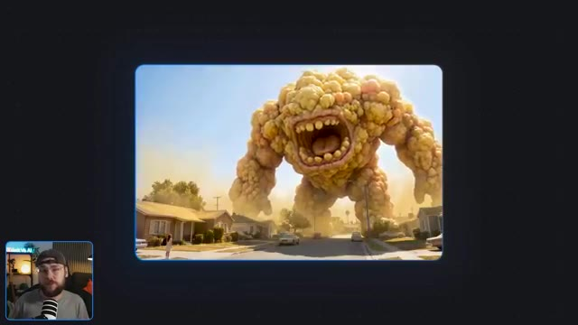
*Un monstre géant fait de pollen rugissant au milieu d'une rue résidentielle, avec Jack en incrustation vidéo en bas à gauche.*

---

### ⏱️ `[00:01:52 - 00:02:13]` | Segment #05

**🔊 Audio (Transcription Intégrale Mot pour Mot en Français) :**
> C'est notre visuel clé, il va donc servir de base à tout ce qui suit. Je trouve toujours que commencer un projet est vraiment difficile, mais une fois que mon visuel clé est défini, l'idée prend pour ainsi dire vie d'elle-même. Je savais que je voulais diviser la publicité en trois sections distinctes. La première montrerait le monstre en train de courir partout en faisant des ravages.

**👁️ Analyse Visuelle d'Écran (gemini-3.5-flash-lite) :**
**Interface & Outils** : Présentation vidéo avec incrustation (PiP) du créateur dans le coin inférieur gauche.

**Contenu textuel & Code** : Sur l'image #3, du texte est visible : "ACT ONE - THE MONITOR" ainsi qu'une phrase descriptive en bas à gauche de la vignette. Des vignettes de storyboard illustrent les différentes scènes du projet publicitaire.

**Action / Démonstration** : Le créateur présente les visuels clés et la structure de sa publicité en illustrant ses propos par des images générées et des storyboards à l'écran.

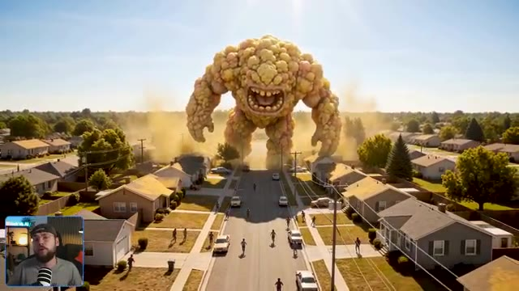
*Rendu visuel d'un monstre géant menaçant progressant dans une rue résidentielle avec le créateur en médaillon PiP.*

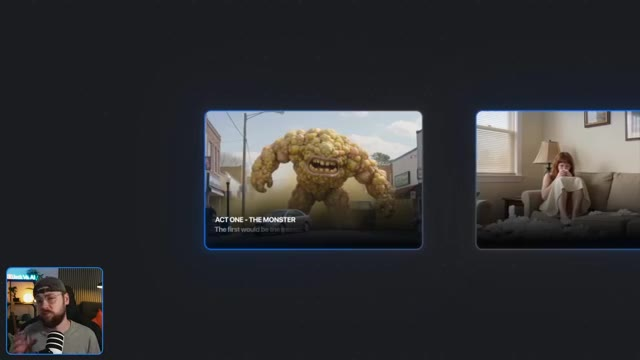
*Présentation d'un storyboard en deux parties illustrant les actes de la publicité, avec le créateur en médaillon PiP.*

---

### ⏱️ `[00:02:13 - 00:02:33]` | Segment #06

**🔊 Audio (Transcription Intégrale Mot pour Mot en Français) :**
> Le deuxième présente notre personnage et nous montre qu'il souffre d'allergies. Et la troisième et dernière scène est la confrontation, lorsque notre personnage affronte le monstre des allergies et le vainc. J'ai donc écrit tout cela dans un traitement très simple qui décrit simplement chaque scène. Et une fois la planification terminée, j'ai pu commencer à créer.

**👁️ Analyse Visuelle d'Écran (gemini-3.5-flash-lite) :**
**Interface & Outils** : Interface de présentation vidéo montrant un plan narratif en trois actes illustré par des vignettes visuelles.

**Contenu textuel & Code** : Texte affiché sous les vignettes : "ACT ONE - THE MONSTER: The first would be the monster attacking the town." ; "ACT TWO - MEET APRIL: The second introduces our character and shows us that they're suffering from allergies." ; "ACT THREE - THE CONFRONTATION: The third and final scene is the confrontation..."

**Action / Démonstration** : Le créateur présente son plan narratif en trois actes découpé pour le projet vidéo publicitaire.

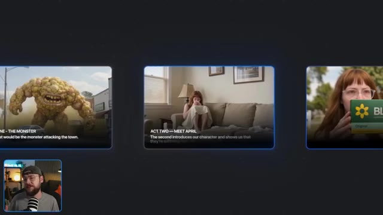
*Présentation des trois actes de l'histoire du projet publicitaire sur les allergies avec incrustation PiP du créateur en bas à gauche.*

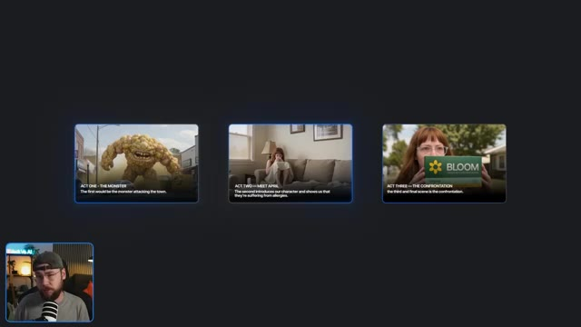
*Vue agrandie des trois actes du traitement narratif affichés à l'écran, avec incrustation PiP du créateur.*

---

### ⏱️ `[00:02:33 - 00:02:52]` | Segment #07

**🔊 Audio (Transcription Intégrale Mot pour Mot en Français) :**
> Donc tous les visuels de ce projet ont été construits sur une plateforme appelée Higgsfield AI. Et je mettrai un lien en bas dans la description si vous voulez suivre en même temps. J'ai mentionné plus tôt que le premier élément que j'ai généré pour ce projet était le monstre lui-même. Ça a été fait en utilisant un prompt conçu à l'intérieur de Claude.

**👁️ Analyse Visuelle d'Écran (gemini-3.5-flash-lite) :**
**Interface & Outils** : Higgsfield AI (Image #1) et l'interface de l'assistant conversationnel Claude (Image #2), avec l'incrustation vidéo du créateur (PiP) dans le coin inférieur gauche.

**Contenu textuel & Code** : Image #1 : Panneau de détails avec le modèle "Nano Banana Pro", la qualité 4k, la résolution 5504x3072, et le prompt textuel décrivant un monstre de pollen photoréaliste dans une rue de banlieue américaine. Image #2 : Interface de Claude montrant le prompt détaillé du concept de monstre "Hay fever monster ad concept" et des instructions textuelles sur l'éclairage, l'échelle et les cadrages.

**Action / Démonstration** : Le créateur montre d'abord l'image du monstre générée sur la plateforme Higgsfield AI, puis bascule sur l'interface de l'assistant Claude pour présenter le prompt textuel utilisé pour concevoir le monstre.

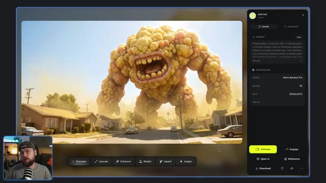
*Interface de la plateforme Higgsfield AI affichant l'image générée d'un monstre géant ressemblant à du pollen au milieu d'une rue de banlieue américaine.*

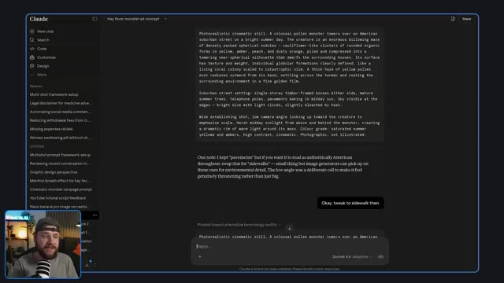
*Interface de l'assistant IA Claude affichant une conversation contenant le prompt détaillé pour le concept publicitaire du monstre.*

---

### ⏱️ `[00:02:53 - 00:03:27]` | Segment #08

**🔊 Audio (Transcription Intégrale Mot pour Mot en Français) :**
> Je viens de décrire ce que je voulais et Claude m'a redonné ce prompt vraiment détaillé. Il y a eu un peu d'allers-retours où je lançais quelques générations sur Nano Banana, puis je retournais voir Claude pour lui demander d'apporter quelques modifications au prompt. Donc après pas mal d'allers-retours, je me suis retrouvé avec toutes ces très belles options parmi lesquelles choisir, et j'ai fini par choisir cette image particulière ici. Je dois quand même saluer cette génération-là aussi. Je trouve qu'elle est vraiment, vraiment cool. C'est juste qu'elle n'avait pas la structure faciale que je recherchais. Assurez-vous vraiment de générer en 4K. Au fait,

**👁️ Analyse Visuelle d'Écran (gemini-3.5-flash-lite) :**
**Interface & Outils** : Interface web de Seedance (Seedance Studio) et interface de notes/texte textuelle.

**Contenu textuel & Code** : Texte de prompt descriptif pour une image photoréaliste d'un monstre de pollen colossal menaçant une rue de banlieue américaine ("Photorealistic cinematic still. A colossal pollen monster towers over an American suburban street..."), paramètres visibles incluant "Nano Banana Pro", format "16:9", et résolution "4K".

**Action / Démonstration** : Le créateur montre les différentes étapes de son workflow, du prompt textuel détaillé sur Claude jusqu'à la grille de sélection des images générées et le paramétrage de la résolution en 4K.

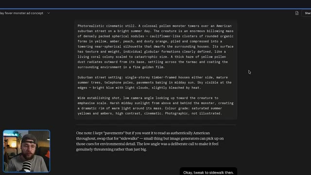
*Interface textuelle affichant un prompt détaillé et des notes de révision pour un concept de monstre géant.*

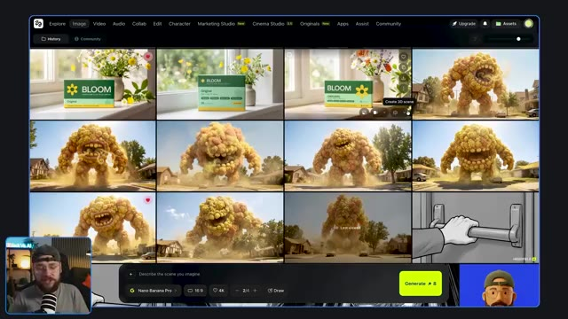
*Galerie de générations d'images IA sur l'interface de Seedance montrant différentes variations d'un monstre de pollen géant dans une rue résidentielle.*

*Gros plan sur la barre de paramètres de génération de Seedance mettant en avant le réglage de résolution 4K.*

---

### ⏱️ `[00:03:27 - 00:04:03]` | Segment #09

**🔊 Audio (Transcription Intégrale Mot pour Mot en Français) :**
> vous voulez que vos images soient de la plus haute qualité possible. Le personnage suivant dont j'avais besoin était notre héros qui souffre de rhume des foins. J'ai décidé d'opter pour ce personnage féminin ici que nous allons appeler April. Je voulais qu'elle ait l'air un peu ringarde et plutôt insoupçonnable pour que, lorsqu'elle finit par battre le monstre des allergies, cela surprenne le public. Et la dernière image dont nous avions besoin était le produit lui-même. Donc pour fabriquer cela, j'ai en fait utilisé Claude encore une fois. Je lui ai demandé de me concevoir toute une marque pour le rhume des foins, puis de m'écrire un prompt pour que je puisse appliquer le graphisme sur une boîte. J'ai ensuite

**👁️ Analyse Visuelle d'Écran (gemini-3.5-flash-lite) :**
**Interface & Outils** : Interface de génération d'images et interface de discussion textuelle avec l'intelligence artificielle Claude, avec incrustation vidéo PiP du créateur dans le coin inférieur gauche.

**Contenu textuel & Code** : Texte du prompt visible : "Photorealistic lifestyle product shot, bright airy windowsill, soft natural daylight. A hayfever and allergy relief medicine box called 'BLOOM'..." et nom du modèle "Nano Banana Pro".

**Action / Démonstration** : Le créateur montre les différentes étapes de création des éléments visuels de sa vidéo : le monstre d'allergie, le personnage principal April, le packaging du produit et le prompt utilisé sur Claude pour concevoir la marque.

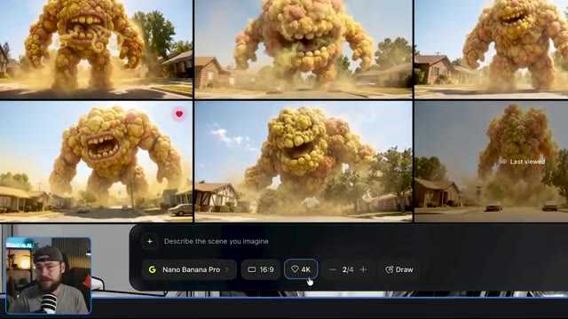
*Grille de génération d'images par IA montrant le monstre d'allergie dans une rue résidentielle avec l'interface de l'outil en bas.*

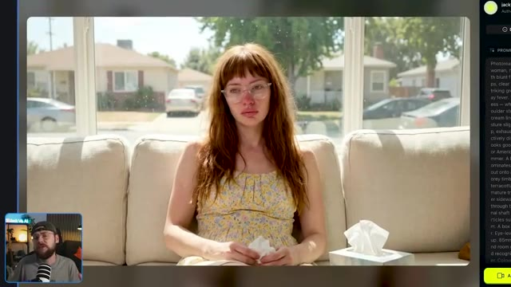
*Affichage du personnage féminin (April) assis sur un canapé avec des mouchoirs, luttant contre le rhume des foins.*

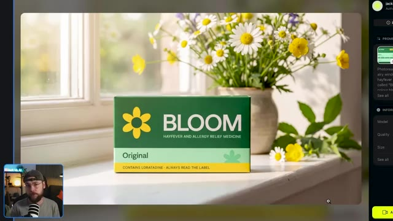
*Gros plan sur une boîte de médicament de marque "BLOOM" posée sur un rebord de fenêtre avec des fleurs.*

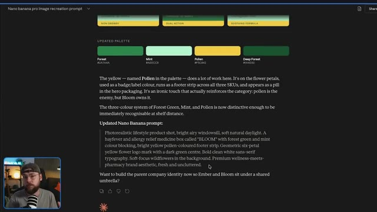
*Interface de l'assistant Claude affichant une palette de couleurs et un prompt textuel pour générer le packaging du produit.*

---

### ⏱️ `[00:04:03 - 00:04:27]` | Segment #10

**🔊 Audio (Transcription Intégrale Mot pour Mot en Français) :**
> je viens de prendre quelques captures d'écran directement du chat Claude, je les ai glissées dans Nano Banana Pro et j'ai utilisé le prompt que Claude m'a écrit. Et c'est le résultat que j'ai obtenu, exactement ce que je cherchais. Et un conseil vraiment important pour vous les gars est de vous assurer de toujours créer une feuille de personnages. Donc pour faire cela, j'ai donné à Nano Banana Pro mes références d'images d'avril ainsi que du monstre de l'allergie.

**👁️ Analyse Visuelle d'Écran (gemini-3.5-flash-lite) :**
**Interface & Outils** : Interface de l'application de génération d'IA Nano Banana Pro (avec incrustation vidéo du créateur en bas à gauche).

**Contenu textuel & Code** : Texte du prompt visible sur l'image #2 : "Photorealistic lifestyle product shot, bright airy windowsill, soft natural daylight. A hayfever and allergy relief medicine box called "BLOOM" with forest green and mint colour blocking..." et options du modèle Nano Banana Pro (résolution 4K, format 16:9).

**Action / Démonstration** : Le créateur montre des exemples concrets de designs de packaging générés à partir des prompts de Claude, puis présente la grille d'images générées incluant les personnages (April et le monstre).

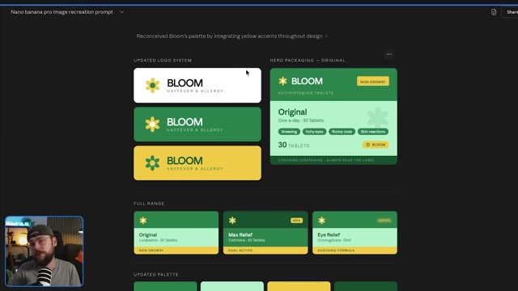
*Interface utilisateur montrant des concepts de design de logo et d'emballage pour le produit "BLOOM", avec Jack visible en incrustation PiP.*

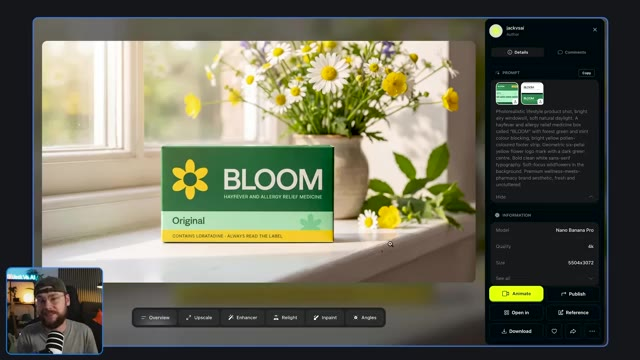
*Interface de génération d'image Nano Banana Pro affichant une photo réaliste d'une boîte de médicament Bloom près d'un rebord de fenêtre avec des fleurs.*

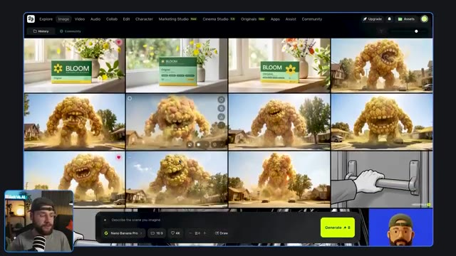
*Grille de résultats de génération avec des images du produit et du monstre de l'allergie, sur l'interface de Nano Banana Pro.*

---

### ⏱️ `[00:04:27 - 00:04:46]` | Segment #11

**🔊 Audio (Transcription Intégrale Mot pour Mot en Français) :**
> Et ensuite j'ai utilisé mon prompt pour générer chacune de ces feuilles de personnages. Je suis ensuite allé de l'avant et j'ai fait cette image de fin de produit ici. En termes de références d'images, j'utilise la feuille de personnage d'April et ensuite cette image que nous avons générée de notre médicament contre le rhume des foins. En plus d'un prompt assez simple que j'ai juste écrit moi-même.

**👁️ Analyse Visuelle d'Écran (gemini-3.5-flash-lite) :**
**Interface & Outils** : Interface web de génération d'images par IA avec panneau latéral de détails, prompts et paramètres (Modèle Nano Banana Pro, qualité 4k, résolution 5504x3072).

**Contenu textuel & Code** : Textes des prompts visibles : "Show a photo-real character sheet of the monster..." et "Premium TV ad end frame. Show the woman sat with her friends having a picnic...". Utilisation de deux images de référence en haut du panneau de prompt.

**Action / Démonstration** : Le créateur montre ses fiches de personnages générées par IA et l'image publicitaire de fin de spot avec le produit de pharmacie, tout en expliquant l'utilisation des images de référence et de ses prompts.

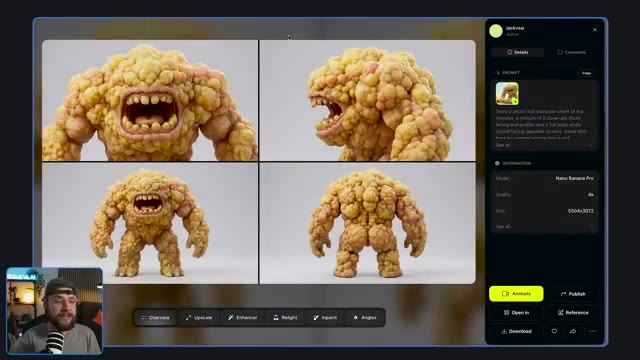
*Interface affichant la feuille de personnage d'un monstre texturé avec quatre angles de vue différents.*

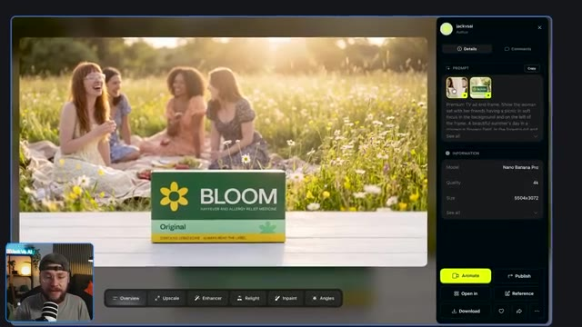
*Interface affichant une image de fin de publicité pour une boîte de médicament "BLOOM" dans un champ de fleurs.*

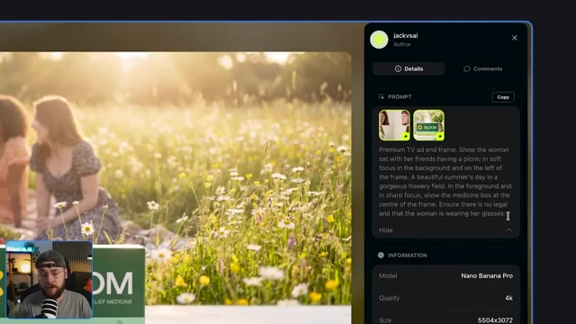
*Gros plan sur le panneau latéral du prompt et des paramètres du modèle pour l'image publicitaire.*

---

### ⏱️ `[00:04:46 - 00:05:10]` | Segment #12

**🔊 Audio (Transcription Intégrale Mot pour Mot en Français) :**
> Je savais que j'avais besoin d'un plan de produit phare pour la fin de la publicité. C'était donc très important d'obtenir également ce décor. Et avec cela, j'étais prêt à commencer à donner vie à tout en utilisant C-Dance 2. Ce qui est vraiment génial avec ce modèle de vidéo par IA, c'est qu'il est extraordinaire pour créer des scènes à plans multiples. Par là, je veux dire que nous n'avons pas besoin de générer chaque plan individuellement pour ensuite tous les assembler.

**👁️ Analyse Visuelle d'Écran (gemini-3.5-flash-lite) :**
**Interface & Outils** : Interface logicielle de génération vidéo et d'images (style Seedance/plateforme créative) avec panneaux de prompts et de paramètres.

**Contenu textuel & Code** : Texte visible sur l'image 1 dans le prompt : "Premium TV ad end frame. Show the woman set with her friends having a picnic in soft focus...". Sur l'image 2 : "STEP 3 : VIDEO GENE[RATION]". Sur l'image 3 : "SEEDANCE 2.0". Sur l'image 1 (paramètres) : Modèle "Nano Banana Pro", Qualité "4k", Résolution "5504x3072".

**Action / Démonstration** : Le créateur montre différentes étapes de son processus de création, en passant d'une image fixe de produit à une transition textuelle, puis à des extraits de vidéos générées multi-plans par l'IA Seedance 2.0.

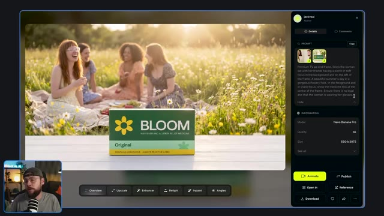
*Interface de génération montrant une boîte de produit 'BLOOM' avec des femmes en arrière-plan et le panneau de configuration du prompt à droite.*

![Écran noir affichant le titre de transition 'STEP 3 : VIDEO GENE[RATION]' au centre.](screenshots/YT-ClIaRcvwnTQ/frame_031_00-04-55.jpg)
*Écran noir affichant le titre de transition 'STEP 3 : VIDEO GENE[RATION]' au centre.*

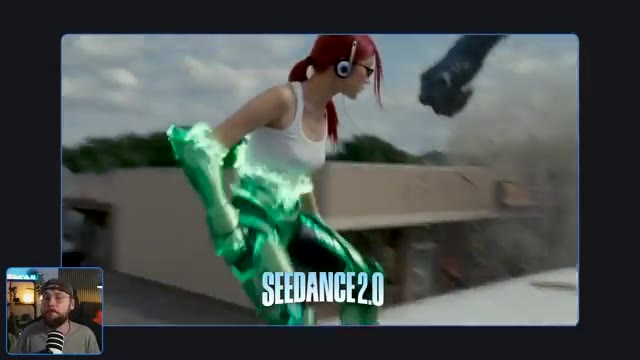
*Extrait vidéo défilant montrant une femme avec des écouteurs et un effet énergétique vert, avec le logo 'SEEDANCE 2.0'.*

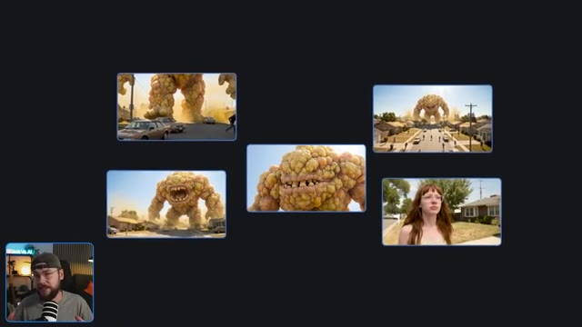
*Écran affichant une grille de plusieurs aperçus vidéo générés montrant un monstre rocheux et des scènes de rue.*

---

### ⏱️ `[00:05:10 - 00:05:45]` | Segment #13

**🔊 Audio (Transcription Intégrale Mot pour Mot en Français) :**
> À la place, nous pouvons demander à C-Dance de générer une séquence entière qui semble connectée et cohérente. Maintenant, j'ai en fait travaillé dans un ordre un peu bizarre ici. J'ai généré la scène finale en premier et c'est parce que je savais à quel point ce serait important mais aussi que cela influencerait les scènes précédentes. Donc, tout d'abord, j'ai téléchargé toutes mes images de référence, ce que vous pouvez faire en cliquant dans cette section ici, vous pouvez donc voir que j'ai ajouté les feuilles de personnages du monstre ainsi qu'April, ainsi que ce premier plan que j'ai généré du monstre et du produit lui-même.

**👁️ Analyse Visuelle d'Écran (gemini-3.5-flash-lite) :**
**Interface & Outils** : Seedance (version 2.0 / plateforme de génération vidéo par IA) avec panneaux latéraux de gestion des médias, des prompts et des références visuelles.

**Contenu textuel & Code** : On peut apercevoir des vignettes de prévisualisation (feuilles de personnages d'April et du monstre), des onglets de téléchargement de médias (Uploads, Image Generations, Video Generations) et des zones de prompt textuel décrivant la scène (ex: "Wide shot, 24mm, low angle, static — auburn-haired woman...").

**Action / Démonstration** : Le créateur montre son interface de travail sur Seedance, démontre comment il importe et organise ses images de référence, et explique sa méthode de génération en commençant par la scène finale.

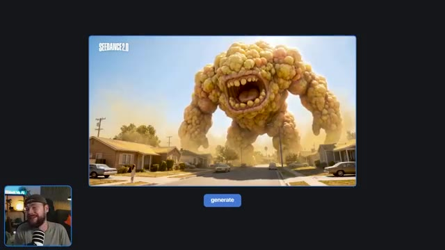
*Interface de Seedance 2.0 affichant le rendu visuel d'un monstre géant dans une rue résidentielle avec le bouton de génération.*

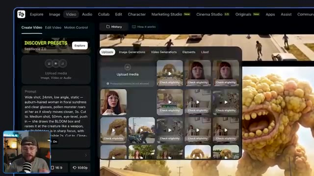
*Interface de l'outil Seedance montrant le panneau de téléchargement et la grille de médias avec les images de référence et de génération.*

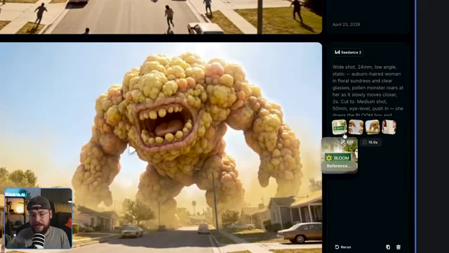
*Interface de Seedance affichant le rendu vidéo principal à l'écran avec les vignettes des images de référence associées sur le panneau latéral.*

---

### ⏱️ `[00:05:45 - 00:06:18]` | Segment #14

**🔊 Audio (Transcription Intégrale Mot pour Mot en Français) :**
> Et ensuite j'avais besoin d'un prompt et c'est là que Claude s'avère vraiment pratique. D'abord, vous voulez demander à Claude de charger le cadre du prompt multi-plans. Maintenant, c'est une compétence que j'ai développée moi-même et si vous aimeriez essayer ceci, vous trouverez un téléchargement gratuit pour cela sur ma communauté School aux côtés de tous les prompts que j'ai utilisés également. Il y aura un lien pour cela en bas dans la description. Donc d'abord vous voulez aller de l'avant et télécharger toutes les mêmes références d'images pour donner à Claude plus de contexte et ensuite nous pouvons aller de l'avant et copier ce traitement vraiment simple que j'ai écrit.

**👁️ Analyse Visuelle d'Écran (gemini-3.5-flash-lite) :**
**Interface & Outils** : Interface sombre de l'assistant IA Claude avec une bulle de message "Load up the multi-shot framework" et la réponse de Claude indiquant que le framework est prêt. Présence d'un petit encadré vidéo (PiP) du créateur en bas à gauche.

**Contenu textuel & Code** : Texte affiché : "Load up the multi-shot framework." dans une bulle de dialogue, et réponse de Claude : "Loaded. Multi-shot framework is ready — 15 seconds, 3-7 shots, one flowing paragraph, under 1,000 characters. What's the scene? Drop a reference image and brief, or just tell me the setup."

**Action / Démonstration** : Le créateur montre l'écran de l'interface Claude où le framework multi-plans est chargé et prêt à recevoir les instructions et images de référence.

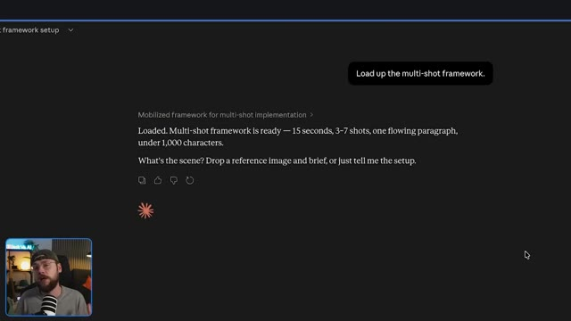
*Interface de l'assistant Claude affichant le chargement du framework multi-plans avec un encadré vidéo du créateur en bas à gauche.*

---

### ⏱️ `[00:06:18 - 00:06:55]` | Segment #15

**🔊 Audio (Transcription Intégrale Mot pour Mot en Français) :**
> plus tôt sur ce qui décrit simplement ce que nous voulons qu'il se passe dans la scène et si j'envoie ceci, Claude va nous renvoyer un prompt très détaillé. Maintenant, cela va décrire l'action dans chaque plan mais aussi le type d'objectif, l'angle de caméra, tout mouvement de caméra et même la durée du plan. Donc nous pouvons simplement copier ce prompt et le coller directement dans C-Dance 2. Nous voulons nous assurer que notre durée est réglée sur 15 secondes, 16 par 9 comme format d'image et aussi que nous avons sélectionné la résolution 1080p. Ceci étant dit, vous êtes prêts à cliquer sur générer et c'était mon

**👁️ Analyse Visuelle d'Écran (gemini-3.5-flash-lite) :**
**Interface & Outils** : Assistant textuel Claude (Image 1) et interface de l'outil de génération vidéo C-Dance 2 / Seedance avec options de format, résolution et durée (Image 2).

**Contenu textuel & Code** : Texte de prompt détaillé sur Claude décrivant une femme face à un monstre (« The woman steps onto the street... ») et paramètres de génération vidéo (durée, ratio 16:9, résolution 1080p, bouton Generate jaune).

**Action / Démonstration** : Le créateur montre la génération d'un prompt détaillé via Claude, puis la configuration des paramètres de l'outil de génération vidéo avant de lancer le rendu.

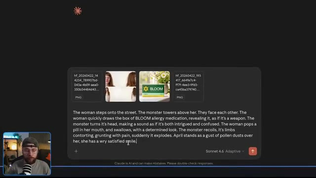
*Interface de l'assistant Claude affichant le texte détaillé généré par l'IA décrivant les actions d'une scène avec des images de référence.*

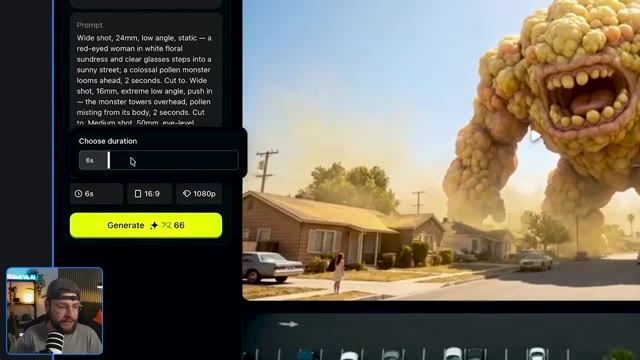
*Interface de génération vidéo montrant le panneau de configuration avec le prompt détaillé, le choix de la durée, le format 16:9, la résolution 1080p et un aperçu vidéo avec un monstre géant.*

---

### ⏱️ `[00:06:55 - 00:07:30]` | Segment #16

**🔊 Audio (Transcription Intégrale Mot pour Mot en Français) :**
> premier résultat. C'est juste un excellent exemple de C-Dance 2 faisant ce qu'il fait de mieux, en produisant ces superbes séquences d'effets visuels dynamiques mieux que tous les autres modèles du marché. Ce qui est également très important, c'est que nous n'avons aucune musique intégrée à notre génération. Si c'était le cas, ce serait

**👁️ Analyse Visuelle d'Écran (gemini-3.5-flash-lite) :**
**Interface & Outils** : Démonstration vidéo de génération de plans par le modèle d'IA "C-Dance 2", avec incrustation PiP (Picture-in-Picture) de Jack dans le coin inférieur gauche sur certaines images.

**Contenu textuel & Code** : Génération vidéo cinématique de type science-fiction / catastrophe montrant une créature monstrueuse et des effets de fumée/poussière dans un environnement suburbain américain.

**Action / Démonstration** : Le créateur présente une séquence vidéo générée par le modèle C-Dance 2 illustrant des effets visuels dynamiques.

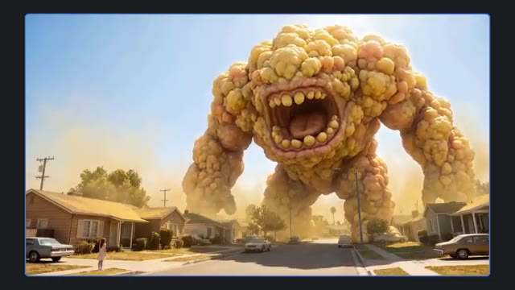
*Séquence vidéo générée par IA montrant un monstre gigantesque fait de bulles dorées hurlant dans une rue résidentielle.*

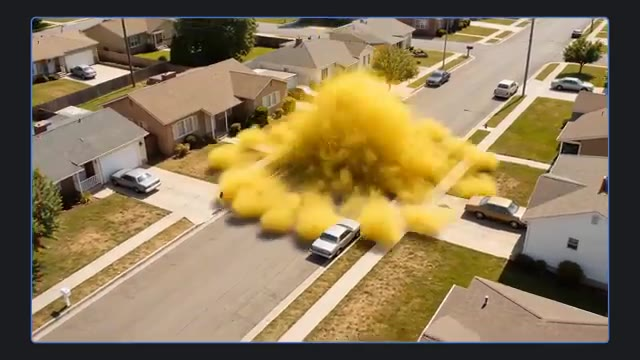
*Vue aérienne montrant une explosion ou un nuage de poussière jaune au milieu d'un quartier pavillonnaire.*

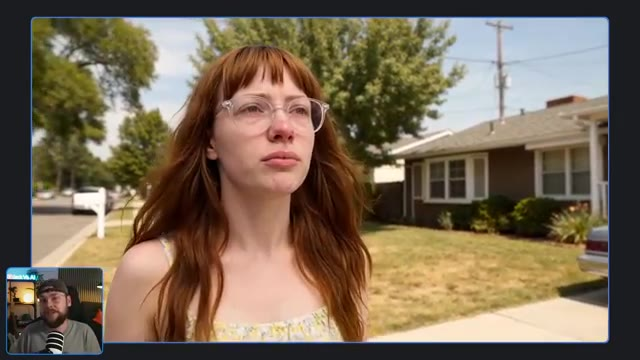
*Plan rapproché d'une jeune femme rousse avec des lunettes dans une rue résidentielle, avec Jack incrusté en bas à gauche.*

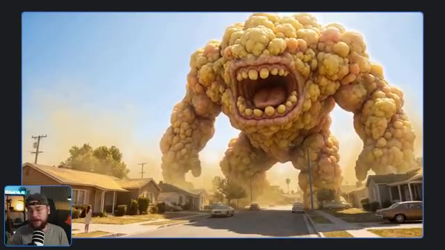
*Séquence vidéo du monstre gigantesque dans la rue résidentielle, avec Jack incrusté dans le coin inférieur gauche.*

---

### ⏱️ `[00:07:30 - 00:08:03]` | Segment #17

**🔊 Audio (Transcription Intégrale Mot pour Mot en Français) :**
> Un vrai problème lorsqu'il s'agit de notre montage et que nous voulons assembler toutes nos scènes individuelles. Vous allez avoir de la musique qui coupe et revient entre chaque génération de 15 secondes. Ce serait juste un cauchemar. Mais notre invite de Claude utilise un certain langage pour s'assurer que Seedance 2 n'inclut pas de musique, ce qui est génial. La scène suivante que j'ai générée était beaucoup plus simple. C'est donc celle où le monstre traverse simplement la ville en semant le chaos complet. La seule référence d'image que j'ai donnée à la fois à Seedance 2 et à Claude était la feuille de personnage pour le monstre.

**👁️ Analyse Visuelle d'Écran (gemini-3.5-flash-lite) :**
**Interface & Outils** : Seedance 2 (interface web de génération de vidéo par IA avec panneau de prompts et options de format 16:9, résolution 1080p, durée de 15,0s).

**Contenu textuel & Code** : Texte du prompt visible sur le panneau latéral : "Extreme wide, 14mm, high angle, pull out — a vast pollen creature erupts through a small American main street, shops and barber poles crumbling under its weight, crowds scattering unharmed, 3s. Cut to, low angle wide, 74mm..." Indication de l'outil "Seedance 2" et miniature de référence ("Reference..."). Date : April 23, 2026.

**Action / Démonstration** : Le créateur montre l'interface de Seedance 2 et zoome sur les paramètres et le prompt textuel utilisé pour générer la scène du monstre.

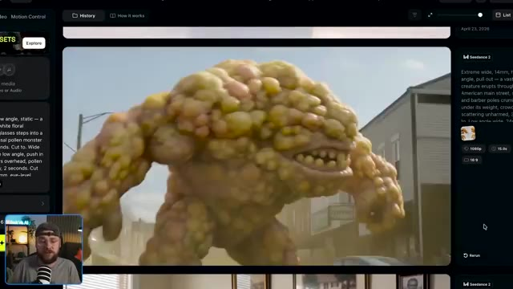
*Interface de l'outil Seedance 2 montrant le rendu vidéo du monstre et le panneau latéral avec les paramètres et le prompt textuel.*

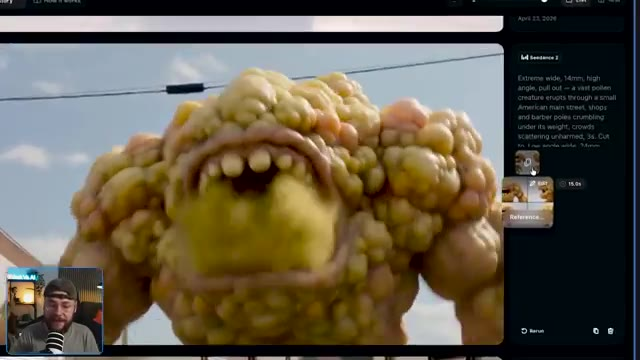
*Interface de Seedance 2 avec zoom sur le panneau latéral affichant les détails de la génération et les images de référence.*

---

### ⏱️ `[00:08:03 - 00:08:35]` | Segment #18

**🔊 Audio (Transcription Intégrale Mot pour Mot en Français) :**
> J'ai une fois de plus donné à Claude mon traitement décrivant la scène, j'ai pris le prompt qu'il m'a fourni, je l'ai collé dans Seedance 2 et voilà ce que j'ai obtenu. Je savais que le résultat serait vraiment bon parce que Seedance 2 est tout simplement très fort sur ce genre de contenu, mais aussi parce qu'il est assez indulgent quand on entre dans

**👁️ Analyse Visuelle d'Écran (gemini-3.5-flash-lite) :**
**Interface & Outils** : Logiciel de prise de notes/gestion de projet (Notion) et lecteur/visionneuse vidéo présentant le rendu généré par le modèle d'IA Seedance 2.

**Contenu textuel & Code** : Texte du projet de traitement visible sur l'écran Notion : "Allergy Monster - Treatment", "ACT ONE - THE MONSTER", "A vast creature erupts into a small American town...", et affichage d'une vignette vidéo 1080p issue de Seedance 2.

**Action / Démonstration** : Le créateur présente son document de traitement de projet textuel généré via Claude, puis montre la séquence vidéo générée par IA correspondante dans Seedance 2 représentant un monstre d'allergie attaquant une ville.

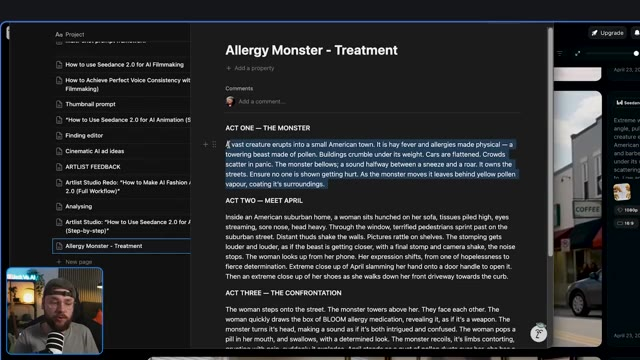
*Interface de Notion affichant le document de traitement 'Allergy Monster - Treatment' avec le texte du projet sélectionné et un aperçu miniature sur le côté.*

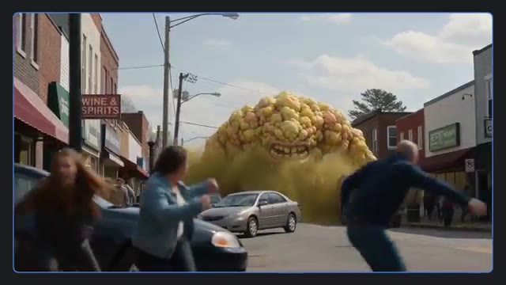
*Rendu vidéo généré par IA montrant un monstre fait de pollen et de bulles surgissant dans une rue de petite ville américaine tandis que des passants s'enfuient en panique.*

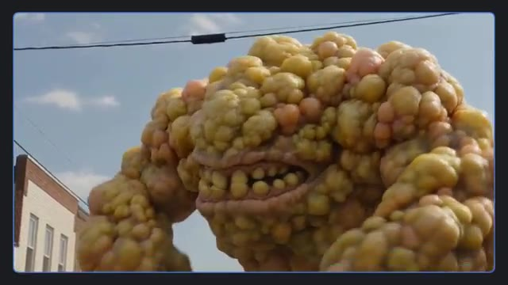
*Gros plan sur le monstre texturé en boursouflures jaunes et beiges avec de grands yeux et des dents proéminentes.*

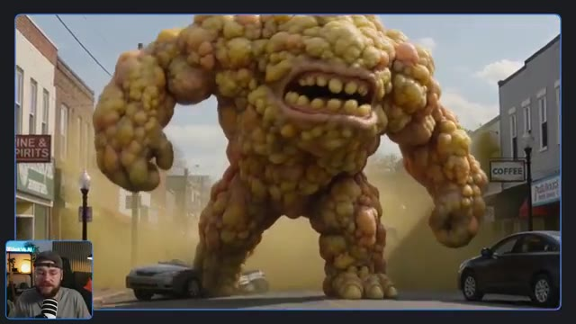
*Plan large du monstre géant de pollen piétinant des voitures et dégageant de la poussière jaune dans une rue commerçante.*

---

### ⏱️ `[00:08:35 - 00:09:11]` | Segment #19

**🔊 Audio (Transcription Intégrale Mot pour Mot en Français) :**
> les scènes suivantes vont accorder beaucoup plus d'attention à la logique et à la continuité du monde. Si je devais être critique, je signalerais que certains textes sur les vitrines des magasins sont un peu illisibles, et c'est clairement le point négatif de Seedance 2, mais j'ai l'impression qu'il se passe assez de choses pour que, espérons-le, le spectateur ne le remarque pas. Ensuite, j'ai généré cette scène du monstre qui piétine les banlieues, juste pour avoir plus de séquences à exploiter lors du montage, mais aussi pour servir de référence vidéo pour la suite, car maintenant je devais générer cela.

**👁️ Analyse Visuelle d'Écran (gemini-3.5-flash-lite) :**
**Interface & Outils** : Interface web de Seedance 2 avec panneau latéral de génération et lecteur vidéo.

**Contenu textuel & Code** : Texte du prompt visible dans le panneau latéral de Seedance 2 : "Extreme wide, 14mm lens, angle, static - a white floral... creature erupts through American main street and barber poles cr..., scattering unharmed to, 1080p, 15.0s".

**Action / Démonstration** : Le créateur présente l'interface de Seedance 2 et le rendu vidéo en cours d'analyse dans son flux de travail.

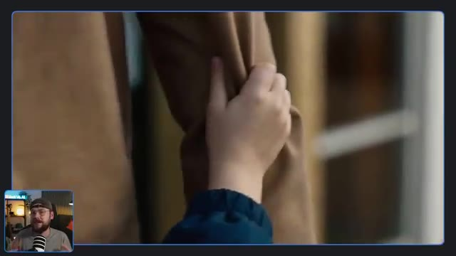
*Extrait vidéo montrant un enfant agrippant le vêtement d'une personne plus grande, avec incrustation du créateur en bas à gauche.*

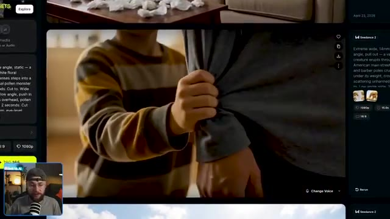
*Interface de l'outil Seedance 2 montrant le lecteur vidéo principal avec l'enfant agrippant le vêtement et le panneau latéral avec le prompt textuel et les paramètres.*

---

### ⏱️ `[00:09:11 - 00:09:48]` | Segment #20

**🔊 Audio (Transcription Intégrale Mot pour Mot en Français) :**
> scène intermédiaire où nous rencontrons April. Pour cela, j'ai utilisé la feuille de personnage d'April comme l'une des références, mais j'ai également utilisé de petites sections de deux de mes générations vidéo. Donc, pour faire cela sur l'onglet d'importation de médias, vous pouvez vous rendre dans vos générations vidéo, puis lorsque vous sélectionnez un clip, Higgsfield va vous inviter à découper une section de celui-ci. J'ai donc choisi la scène du monstre piétinant les banlieues ainsi qu'April debout au bas de son pavé juste avant de prendre le médicament. L'idée ici était de donner à Seedance 2 autant de contexte que possible.

**👁️ Analyse Visuelle d'Écran (gemini-3.5-flash-lite) :**
**Interface & Outils** : Interface de l'application web de génération vidéo Higgsfield / Seedance 2.

**Contenu textuel & Code** : On peut lire des onglets comme "Uploads", "Image Generations", "Video Generations", un bouton "Upload media", et des paramètres de génération vidéo avec le modèle "Seedance 2.0" réglé sur 15s, 16:9 et 1080p, ainsi qu'un coût de 165 jetons.

**Action / Démonstration** : Le créateur montre comment importer et découper des clips vidéo générés précédemment pour les utiliser comme références contextuelles dans Seedance 2.

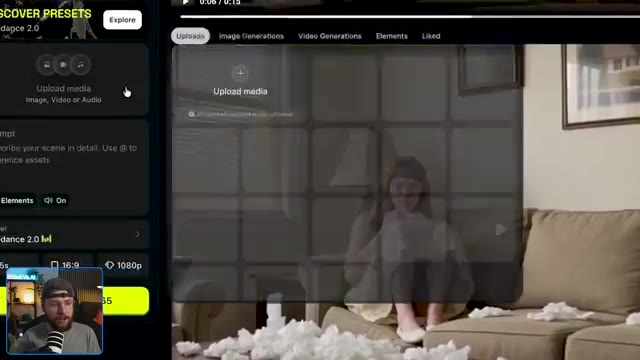
*Interface de Higgsfield montrant la sélection et l'importation de médias vidéo depuis l'onglet dédié avec aperçu d'une scène d'intérieur.*

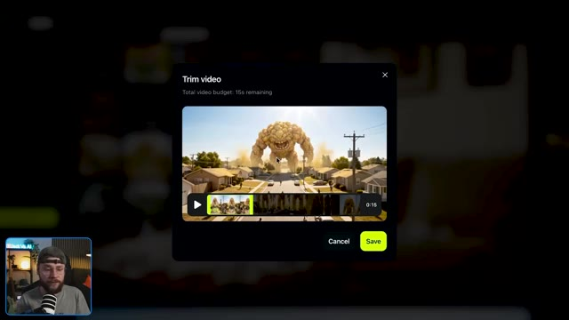
*Fenêtre de découpage vidéo ("Trim video") dans Higgsfield affichant une scène de monstre géant dans une rue résidentielle et une timeline de 15 secondes.*

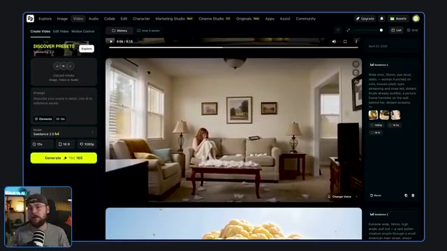
*Interface complète de Seedance 2 avec le panneau latéral affichant les paramètres de génération, les modèles et le prompt textuel descriptif.*

---

### ⏱️ `[00:09:48 - 00:10:26]` | Segment #21

**🔊 Audio (Transcription Intégrale Mot pour Mot en Français) :**
> pour qu'il comprenne ce qui se passe et où. De sorte que lorsque nous lui demandons de montrer April quitter sa porte d'entrée et marcher le long de son allée, il soit plus susceptible de nous donner ce que nous voulons. Donc vous connaissez la chanson à ce stade. Vous prenez votre traitement simple et vous le déposez dans Claude. Vous prenez le prompt qu'il nous donne, vous le déposez dans Seedance 2. Vous appuyez sur générer et voilà ce qu'on a obtenu. Maintenant, j'étais vraiment content

**👁️ Analyse Visuelle d'Écran (gemini-3.5-flash-lite) :**
**Interface & Outils** : Interface de l'outil de génération vidéo Seedance 2.0 (avec mini-vue webcam du créateur) et interface de l'assistant IA Claude.

**Contenu textuel & Code** : Texte du prompt détaillé dans Claude : « Inside an American suburban home, a woman sits hunched on her sofa... Extreme close up of April slamming her hand onto a door handle to open it. Then an extreme close up of her shoes as she walks down her front driveway towards the curb. » Paramètres visibles dans Seedance : Seedance 2.0, 15s, 16:9, 1080p.

**Action / Démonstration** : Le créateur montre les différentes étapes du workflow, de la génération du script textuel dans Claude à la création et prévisualisation des plans vidéo dans Seedance 2.0.

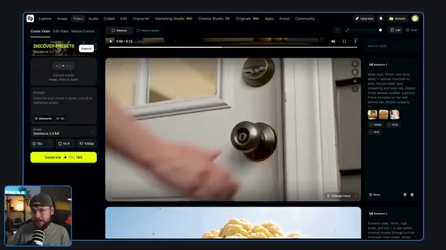
*Interface de Seedance 2.0 montrant la lecture d'une vidéo générée d'une main ouvrant une porte.*

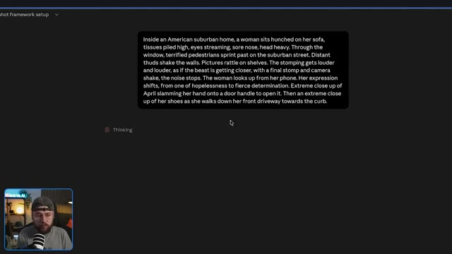
*Interface de Claude affichant le texte narratif du traitement et le statut 'Thinking'.*

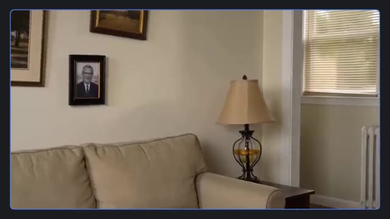
*Aperçu de la vidéo générée montrant un salon américain avec canapé et lampe sur fond de mur beige.*

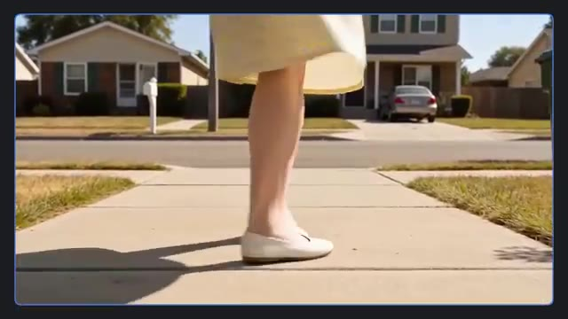
*Aperçu de la vidéo générée montrant les jambes et chaussures d'une personne marchant sur le trottoir d'une rue pavillonnaire.*

---

### ⏱️ `[00:10:26 - 00:11:02]` | Segment #22

**🔊 Audio (Transcription Intégrale Mot pour Mot en Français) :**
> avec la façon dont cette scène est sortie. J'adore la performance d'April et les cadres de photos qui tombent du mur. Tout fonctionne très bien jusqu'à la fin. Il y a un problème avec le plan de la poignée de porte où Seedance 2 montre l'extérieur de la maison avec ce revêtement gris. Et puis dans ce plan final, April ouvre sa porte d'entrée et marche sur son allée bien qu'elle soit déjà à l'extérieur de la maison. Mais c'était en fait une correction assez simple, juste un cas de recadrage dans nos plans pour masquer ces détails et je voulais en fait qu'ils soient comme des extrêmes

**👁️ Analyse Visuelle d'Écran (gemini-3.5-flash-lite) :**
**Interface & Outils** : Logiciel de montage vidéo ou lecteur affichant des extraits de la vidéo générée avec incrustation PiP (Picture-in-Picture) du présentateur Jack dans le coin inférieur gauche.

**Contenu textuel & Code** : Aucun texte, prompt ou paramètre technique affiché à l'écran, uniquement les séquences vidéo analysées par le créateur.
[DESC_IMAGE_4] Extrait vidéo montrant un plan rapproché d'une main manipulant une poignée de porte, identique au plan précédent.

**Action / Démonstration** : Le créateur commente et illustre les défauts de continuité de ses plans générés par IA, montrant successivement l'actrice sur le canapé, la prise de la poignée de porte et la sortie incohérente à l'extérieur.

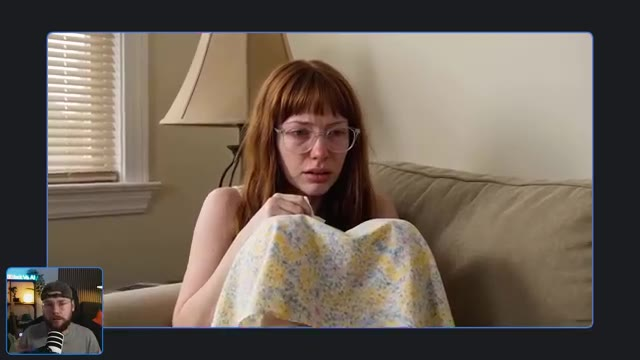
*Extrait vidéo montrant le personnage d'April assis sur un canapé avec un tissu fleuri, avec Jack visible en incrustation PiP dans le coin inférieur gauche.*

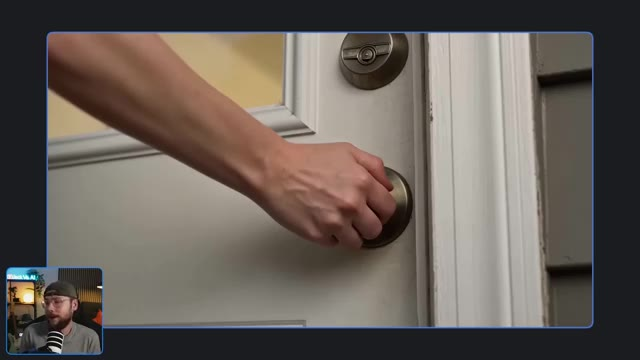
*Extrait vidéo montrant un plan rapproché d'une main saisissant une poignée de porte, avec Jack visible en incrustation PiP.*

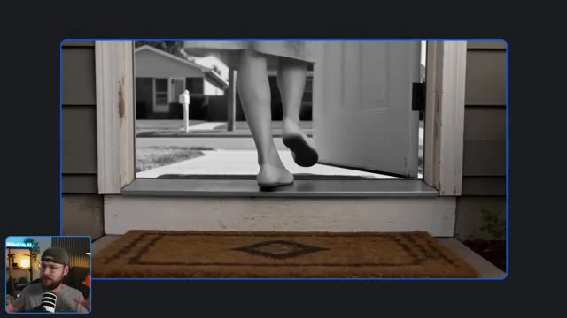
*Extrait vidéo en noir et blanc montrant les jambes d'un personnage sortant de la maison par la porte ouverte, avec Jack en incrustation PiP.*

---

### ⏱️ `[00:11:02 - 00:11:38]` | Segment #23

**🔊 Audio (Transcription Intégrale Mot pour Mot en Français) :**
> gros plans de toute façon. Donc problème résolu assez facilement ici. Maintenant, j'ai en fait seulement utilisé une seule génération de plan pour tout le montage. Et ce que j'ai fait ici, c'est que j'ai pris une image fixe de l'une de mes générations multi-plans et je l'ai utilisée comme référence d'image. Et puis j'ai juste écrit ce prompt très simple pour faire éternuer April. Je pensais que ce serait bien d'avoir ce contraste du monstre qui rugit puis de couper sur April qui éternue. Bizarrement cependant, Seedance ne voulait tout simplement pas me donner ce que je voulais. Il n'arrêtait pas de faire tousser April. Donc j'ai fini par générer ce plan unique en utilisant Kling 3.

**👁️ Analyse Visuelle d'Écran (gemini-3.5-flash-lite) :**
**Interface & Outils** : Adobe Premiere Pro et l'interface web de Seedance 2.0 (avec mini-fenêtre PiP de Jack dans le coin inférieur gauche sur toutes les images).

**Contenu textuel & Code** : Dans Seedance 2.0, le prompt visible indique : « Wide shot, 24mm, high angle, static — a red-eyed young woman in a white floral sundress and clear glasses sits hunched on a sofa, tissues piled around her... ».

**Action / Démonstration** : Le créateur montre d'abord un plan de coupe d'une poignée de porte, puis navigue dans son logiciel de montage Adobe Premiere Pro, avant de présenter l'interface de génération Seedance pour expliquer comment il a tenté de générer l'éternuement d'April avant de se tourner vers Kling.

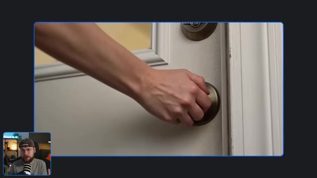
*Gros plan montrant une main en train d'ouvrir une poignée de porte, avec Jack visible en incrustation PiP dans le coin inférieur gauche.*

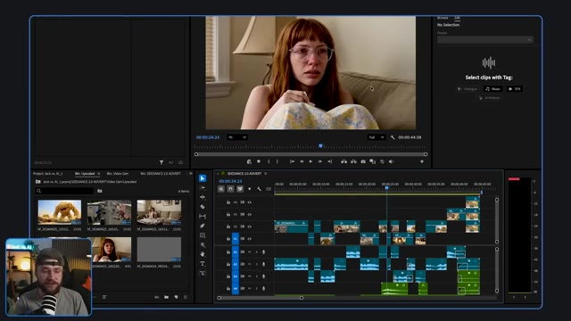
*Interface du logiciel de montage Adobe Premiere Pro affichant la timeline, le chutier avec des clips de monstres et de personnages, et le moniteur de prévisualisation.*

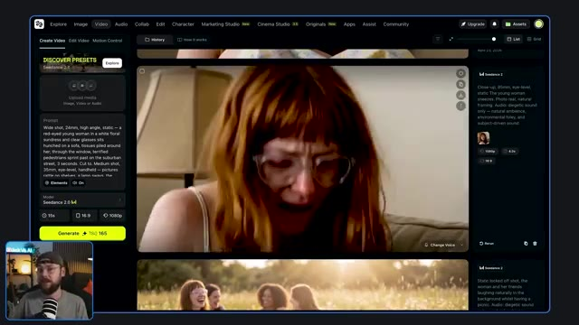
*Interface web de Seedance 2.0 affichant un panneau de génération vidéo, un prompt textuel détaillé et un aperçu vidéo du personnage d'April.*

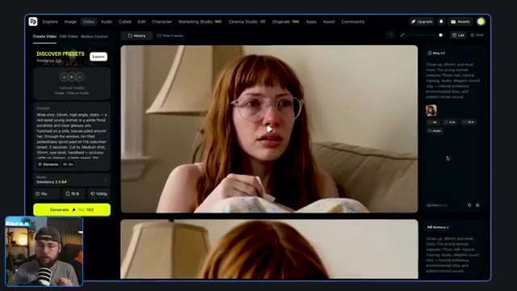
*Interface web de Seedance 2.0 / Kling montrant le panneau de génération et les paramètres pour le plan d'April éternuant.*

---

### ⏱️ `[00:11:38 - 00:12:00]` | Segment #24

**🔊 Audio (Transcription Intégrale Mot pour Mot en Français) :**
> qui peut maintenant sortir en résolution 4K, ce qui est parfait. Donc ça s'intègre vraiment bien dans le montage. Et enfin, j'ai simplement animé notre image de fin en utilisant ce prompt très simple. Tout étant généré, il était temps de passer au montage. Avant d'importer le tout dans Premiere Pro, j'ai pris soin d'augmenter la résolution de toutes mes séquences.

**👁️ Analyse Visuelle d'Écran (gemini-3.5-flash-lite) :**
**Interface & Outils** : Interface vidéo avec menu de sélection de résolution et écran de transition graphique de montage.

**Contenu textuel & Code** : Menu 'Quality' avec les options : 2160p 4K, 1080p FHD, 720p HD. Texte de transition : 'STEP 4 : THE EDIT'.

**Action / Démonstration** : Sélection de la résolution 4K dans le lecteur et transition vers l'étape de montage vidéo.

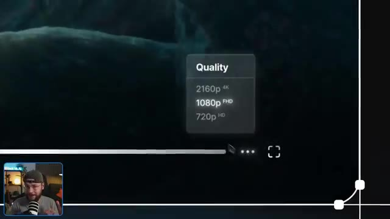
*Interface montrant le menu des options de qualité avec les résolutions 2160p (4K), 1080p (FHD) et 720p (HD), avec un encadré PiP du créateur dans le coin inférieur gauche.*

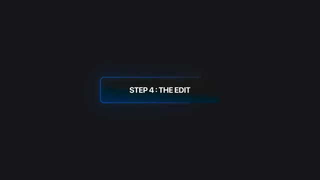
*Écran graphique affichant le titre de transition 'STEP 4 : THE EDIT' dans un encadré lumineux bleu.*

---

### ⏱️ `[00:12:01 - 00:12:19]` | Segment #25

**🔊 Audio (Transcription Intégrale Mot pour Mot en Français) :**
> Seedance 2 sort en 1080p, ce qui est un peu faible. Donc si vous êtes prêts à dépenser les crédits, je pense que ça en vaut vraiment la peine. Maintenant, vous pouvez aussi le faire directement à l'intérieur de Higgsfield. Vous voulez aller dans l'onglet vidéo, survoler celui-ci puis descendre sur l'option d'agrandissement vidéo (video upscale). Vous voudrez ensuite glisser-déposer votre clip.

**👁️ Analyse Visuelle d'Écran (gemini-3.5-flash-lite) :**
**Interface & Outils** : Interface de la plateforme web Higgsfield (avec Seedance 2.0) et le Finder du système macOS.

**Contenu textuel & Code** : Menus de résolution (480p, 720p, 1080p), modèle Seedance 2.0, paramètres de prompt, et fichiers vidéo MPEG-4 dans le Finder macOS.

**Action / Démonstration** : Sélection de la résolution 1080p dans les menus, navigation sur la plateforme Higgsfield, et préparation du glisser-déposer d'un clip vidéo.

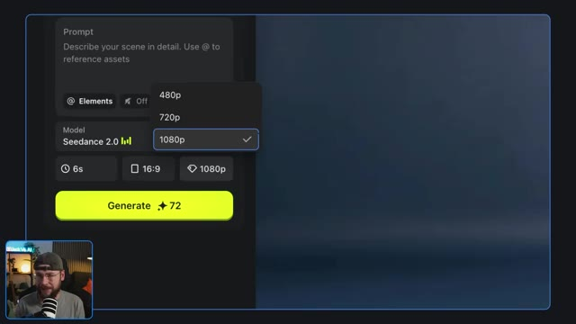
*Gros plan sur le menu déroulant de sélection de résolution montrant les options 480p, 720p et 1080p avec Seedance 2.0 dans l'interface de Higgsfield.*

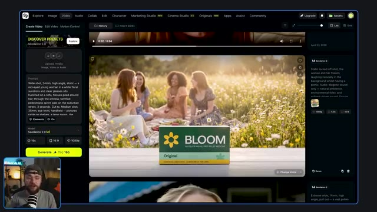
*Interface complète de Higgsfield montrant la génération d'une vidéo publicitaire avec un plan de femmes en pique-nique et une boîte de médicament 'Bloom' au premier plan.*

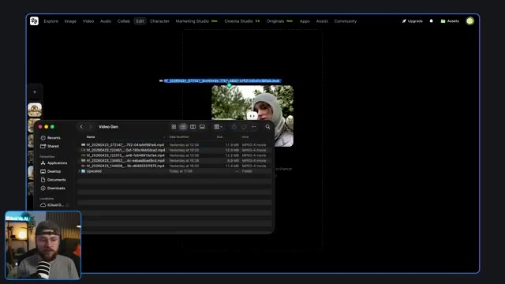
*Interface de Higgsfield avec une fenêtre du Finder macOS ouverte par-dessus pour faire un glisser-déposer d'un clip vidéo à upscale.*

---

### ⏱️ `[00:12:19 - 00:12:51]` | Segment #26

**🔊 Audio (Transcription Intégrale Mot pour Mot en Français) :**
> Assurez-vous que Topaz Video soit sélectionné comme modèle, puis choisissez 4K comme résolution. Et ensuite dans les paramètres avancés, assurez-vous d'avoir sélectionné Starlight Precise 2.5. C'est leur dernier modèle. Et j'active également mon interpolation d'images. C'est pour essayer de se débarrasser de ces fichues images mortes et de ces saccades qu'on peut parfois avoir avec C-Dance 2. Je règle généralement ceci à 30 fps, et assurez-vous que le ralenti est également réglé sur zéro. J'ai donc toutes mes séquences mises à l'échelle.

**👁️ Analyse Visuelle d'Écran (gemini-3.5-flash-lite) :**
**Interface & Outils** : Interface web de production vidéo avec un panneau latéral "Upscale" comportant des options de modèles d'IA et de réglages avancés (avec un encadré PiP du créateur en bas à gauche).

**Contenu textuel & Code** : Panneau "Upscale", modèle "Topaz Video", options d'échelle "Original", "2k", "4K", section "Advanced Settings", "Enhancement" activé, préréglage "Starlight Precise 2.5", "Frame Interpolation" activé réglé sur "30 fps", "Slow motion" réglé sur "0x".

**Action / Démonstration** : Le créateur sélectionne et configure les paramètres d'upscaling vidéo et d'interpolation d'images sur l'interface de l'outil.

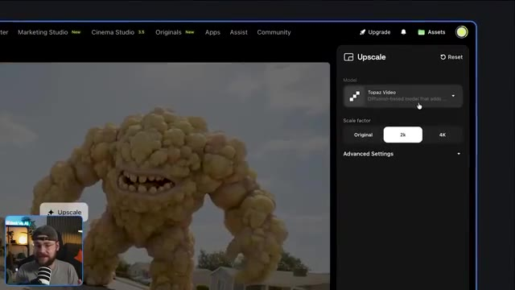
*Interface de l'application montrant le panneau Upscale avec le modèle Topaz Video sélectionné et les options de résolution (Original, 2k, 4K).*

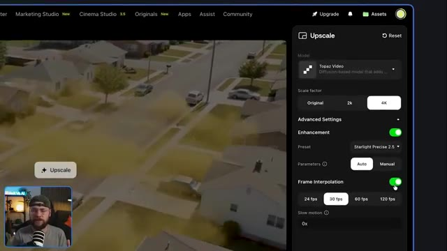
*Interface de l'application montrant les paramètres avancés avec le préréglage Starlight Precise 2.5, l'activation de l'interpolation d'images à 30 fps et le ralenti à 0x.*

---

### ⏱️ `[00:12:51 - 00:13:24]` | Segment #27

**🔊 Audio (Transcription Intégrale Mot pour Mot en Français) :**
> téléchargé et déposé dans Premiere Pro. Et il s'agit de traiter vos générations comme des prises d'une vue. Tout est question d'être sélectif et de comprendre que chaque génération ne va pas fonctionner et que vous n'avez pas toujours besoin d'utiliser toute la longueur d'une génération non plus. Je pense que certaines personnes tombent dans le piège de sentir qu'elles doivent tout utiliser ce qu'elles génèrent parce que cela leur coûte des crédits. Mais rappelez-vous simplement, les vrais films et publicités ne fonctionnent pas de cette façon. Ils n'utilisent pas tout ce qu'ils ont tourné juste parce qu'ils l'ont. Il s'agit de

**👁️ Analyse Visuelle d'Écran (gemini-3.5-flash-lite) :**
**Interface & Outils** : Adobe Premiere Pro (interface de montage vidéo avec timeline, panneaux de chutier, moniteurs source et programme).

**Contenu textuel & Code** : Interface d'Adobe Premiere Pro avec un projet nommé "Jack vs. AI (SEEDANCE 2.0 ADVERT/Video Gen Upscaled)", affichant plusieurs clips vidéo dans le chutier et des pistes audio/vidéo assemblées sur la timeline.

**Action / Démonstration** : Le logiciel de montage vidéo Adobe Premiere Pro est affiché à l'écran, illustrant le processus de tri et de montage des clips vidéo générés par IA.

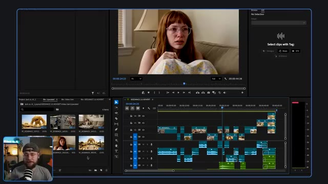
*Interface d'Adobe Premiere Pro montrant la timeline d'un projet de publicité avec le chutier et les aperçus vidéo, avec incrustation du créateur en bas à gauche.*

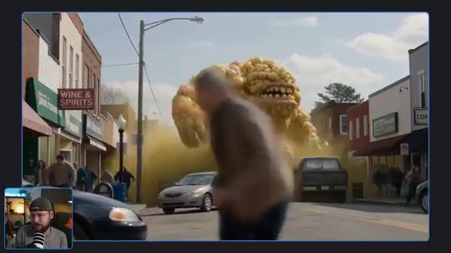
*Extrait vidéo généré par IA montrant un monstre gélatineux dans une rue commerçante avec un personnage en mouvement au premier plan, avec incrustation du créateur en bas à gauche.*

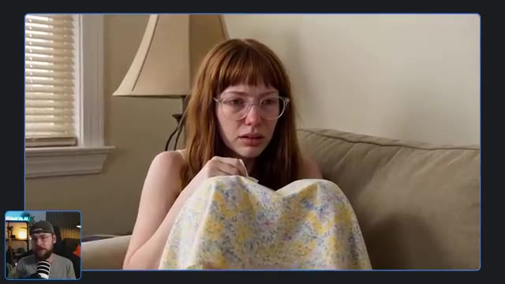
*Extrait vidéo généré par IA montrant une jeune femme rousse avec des lunettes assise sur un canapé, l'air triste, avec incrustation du créateur en bas à gauche.*

---

### ⏱️ `[00:13:24 - 00:13:56]` | Segment #28

**🔊 Audio (Transcription Intégrale Mot pour Mot en Français) :**
> en appliquant la même logique à l'IA. Donc la première scène utilisait pratiquement la génération exactement telle que C-Dance l'avait produite. J'ai juste fini par supprimer ce gros plan ici où l'enfant attrape le manteau de ses parents. Je n'aimais pas vraiment ce plan. Ensuite, nous avons le rugissement du monstre et une coupe instantanée sur April qui éternue. Pour ajouter ce contraste ainsi qu'un peu d'humour à ce qui a été un début de publicité assez intense et le fait que la musique s'arrête également ici avec l'éternuement ajoute également

**👁️ Analyse Visuelle d'Écran (gemini-3.5-flash-lite) :**
**Interface & Outils** : Logiciel de montage vidéo (type Adobe Premiere Pro) avec affichage en Picture-in-Picture de Jack en bas à gauche.

**Contenu textuel & Code** : Noms de projets visibles ("SEEDANCE 2.0 ADVERT", "Jack vs. AI_1.prproj"), chutier avec vignettes de clips générés par IA (monstre, enfant agrippant un manteau, femme éternuant), timeline avec pistes vidéo et audio, panneau d'effets sonores à droite ("Select clips with Tag: Dialogue, Music, SFX").

**Action / Démonstration** : Le créateur navigue dans son logiciel de montage et montre les modifications apportées à la timeline (suppression de plans, ajustement des coupes sur l'audio et la vidéo).

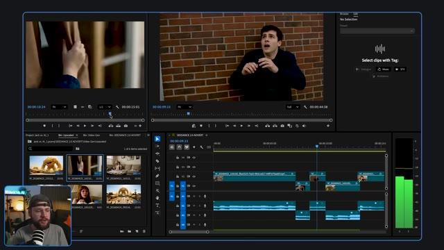
*Interface d'un logiciel de montage vidéo montrant le projet Seedance 2.0 avec les clips de la publicité et les pistes audio.*

*Interface du logiciel de montage vidéo montrant le montage de la scène d'avril éternuant sur le canapé.*

---

### ⏱️ `[00:13:56 - 00:14:30]` | Segment #29

**🔊 Audio (Transcription Intégrale Mot pour Mot en Français) :**
> à l'humour et semble tout à fait inattendu. Nous faisons ensuite revenir la musique pour qu'elle serve de montée en puissance afin de montrer qu'April prend son courage à deux mains pour sortir et affronter le monstre. J'ai fini par raccourcir considérablement ce plan ici parce que dans la génération d'origine, il était assez long, et là encore, nous avons ce très beau contraste entre les pieds d'April qui marchent et le monstre qui piétine à travers les banlieues. Ensuite, pour la scène de confrontation, je n'ai pas vraiment beaucoup édité la génération d'origine, il s'agissait simplement de raccourcir certains de ces plans pour faire

**👁️ Analyse Visuelle d'Écran (gemini-3.5-flash-lite) :**
**Interface & Outils** : Adobe Premiere Pro avec un encadré PiP (Picture-in-Picture) de la caméra de Jack.

**Contenu textuel & Code** : Fenêtres de visualisation des clips, panneau Projet avec des vignettes de vidéos générées par IA, et chronologie (timeline) multi-pistes contenant des clips vidéo et des pistes audio.
[TRANSMISSION] L'écran affiche le montage des séquences vidéo générées par IA sur la timeline de Premiere Pro, tandis que Jack commente ses choix de montage.

**Action / Démonstration** : Démonstration pédagogique et présentation du workflow.

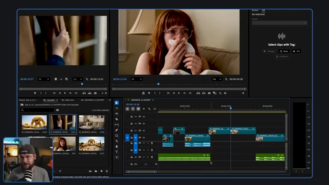
*Interface d'un logiciel de montage vidéo (Adobe Premiere Pro) avec un encadré PiP montrant Jack en bas à gauche.*

---

### ⏱️ `[00:14:30 - 00:15:06]` | Segment #30

**🔊 Audio (Transcription Intégrale Mot pour Mot en Français) :**
> les choses ont l'air un peu plus dynamiques et la musique fait un gros travail ici pour monter en puissance jusqu'au moment où le monstre explose. Au niveau de l'audio, j'introduis en fondu enchaîné quelques sons d'ambiance, donc on a des oiseaux qui chantent et une légère brise, et ensuite on coupe directement vers l'image de fin. Maintenant, j'ai en fait fini par découper ça en trois couches distinctes parce que je voulais flouter un peu plus l'arrière-plan pour que le texte incrusté soit plus lisible. Si je désactive ce flou, vous pouvez voir que c'est assez difficile à lire, n'est-ce pas ? Mais quand on le réactive, ça rend plutôt bien. Ça fonctionne très bien comme plan de fin de produit.

**👁️ Analyse Visuelle d'Écran (gemini-3.5-flash-lite) :**
**Interface & Outils** : Adobe Premiere Pro (logiciel de montage vidéo)

**Contenu textuel & Code** : Timeline de projet vidéo avec pistes multiples (V1, V2, V3, A1, A2...), chutier nommé "Bin Upscaled", panneaux de prévisualisation et panneau de contrôle des effets affichant "Gaussian Blur" avec des curseurs de réglage.

**Action / Démonstration** : Le créateur montre son montage vidéo sur Premiere Pro, détaillant l'agencement des pistes audio et vidéo, puis les réglages d'effets de flou gaussien appliqués sur les calques.

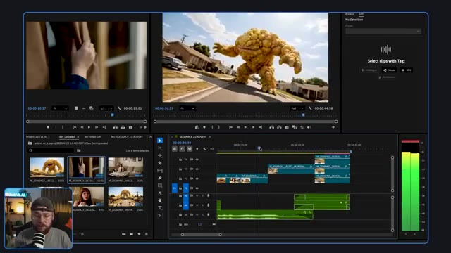
*Interface d'Adobe Premiere Pro montrant la timeline multipiste, le chutier de médias et deux moniteurs de prévisualisation, avec un encadré PiP du créateur en bas à gauche.*

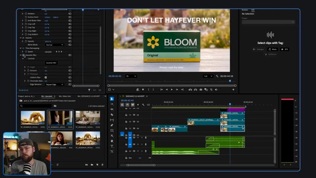
*Interface d'Adobe Premiere Pro affichant le panneau des options d'effet avec le réglage du flou gaussien et le moniteur de programme montrant le plan de fin de produit avec du texte.*

---

### ⏱️ `[00:15:06 - 00:15:42]` | Segment #31

**🔊 Audio (Transcription Intégrale Mot pour Mot en Français) :**
> cadre. Donc, vraiment simplement, si je désactive ces deux calques supérieurs, voici le calque arrière sur lequel nous avons simplement appliqué un flou complet. Ensuite, j'ai simplement rogné cette partie du plan ici, évidemment sans flou. C'est donc superposé sur l'arrière-plan flou. Et ensuite, j'ai simplement masqué le produit lui-même. Et encore une fois, il n'a pas de flou. La seule chose affectée par le flou est donc l'arrière-plan lui-même. Par-dessus le tout, j'ai simplement ce calque d'effet ici, qui ajoute beaucoup de grain pellicule. Si je zoomez, vous allez pouvoir voir. C'est assez intense.

**👁️ Analyse Visuelle d'Écran (gemini-3.5-flash-lite) :**
**Interface & Outils** : Adobe Premiere Pro

**Contenu textuel & Code** : Panneau de projet, timeline multipiste avec pistes vidéo (V1 à V4) et audio, panneau d'effets avec les réglages du flou gaussien (Gaussian Blur), moniteur de prévisualisation affichant une vidéo avec le texte "DON'T LET HAYFEVER WIN" et le produit Bloom flouté en arrière-plan. Petit encadré PiP (Picture-in-Picture) de Jack en bas à gauche.

**Action / Démonstration** : Le créateur démontre la superposition de calques avec effet de flou et de masquage sur une vidéo publicitaire dans Adobe Premiere Pro.

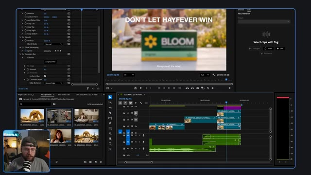
*Interface du logiciel de montage Adobe Premiere Pro montrant la timeline, les calques vidéo, le panneau d'effets et le moniteur de prévisualisation avec le produit Bloom.*

---

### ⏱️ `[00:15:42 - 00:16:09]` | Segment #32

**🔊 Audio (Transcription Intégrale Mot pour Mot en Français) :**
> Et je pense que cela aide simplement à ajouter cette texture que l'IA manque souvent. Et il est vraiment très important que lorsque vous floutez quelque chose comme l'arrière-plan, par exemple, comme je l'ai fait sur l'image finale, vous alliez rajouter du grain de pellicule par-dessus tout cela juste pour tout lier à nouveau. En termes d'effets sonores, j'ai pratiquement juste utilisé tout ce qui était intégré nativement dans les générations Seedance 2 et j'ai ajouté quelques éléments ici et là.

**👁️ Analyse Visuelle d'Écran (gemini-3.5-flash-lite) :**
**Interface & Outils** : Adobe Premiere Pro, avec un encadré PiP (Picture-in-Picture) de Jack dans le coin inférieur gauche.

**Contenu textuel & Code** : Panneau de montage chronologique (Timeline) avec des pistes vidéo et audio, panneau d'effets (Motion, Opacity, Time Remapping, Noise), et aperçu d'une vidéo montrant une personne tenant un mouchoir.

**Action / Démonstration** : Le créateur montre son écran de montage vidéo sous Adobe Premiere Pro où il ajuste les paramètres d'effet et le grain sur les clips générés.

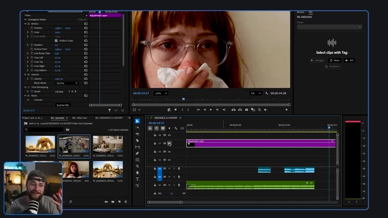
*Interface d'Adobe Premiere Pro montrant le montage d'une vidéo avec le panneau des effets et la timeline, avec un encadré PiP de Jack en bas à gauche.*

---

### ⏱️ `[00:16:09 - 00:16:30]` | Segment #33

**🔊 Audio (Transcription Intégrale Mot pour Mot en Français) :**
> Tout d'abord, j'ai ajouté cette montée en puissance qui se prépare pour le moment où April va attraper la poignée de porte. C'est juste pour créer un peu de tension et aussi de l'attente chez le spectateur qu'il va se passer quelque chose, que quelque chose va changer. Et j'ai aussi ajouté ce petit son de sifflement subtil quand April révèle la boîte de médicaments.

**👁️ Analyse Visuelle d'Écran (gemini-3.5-flash-lite) :**
**Interface & Outils** : Adobe Premiere Pro avec un panneau de montage, un moniteur de prévisualisation et l'incrustation vidéo (PiP) du créateur en bas à gauche.

**Contenu textuel & Code** : Timeline de montage avec pistes vidéo et audio, chutier contenant différents clips vidéo générés, et paramètres de contrôle des effets vidéo sur le panneau de gauche.

**Action / Démonstration** : Le logiciel de montage affiche la timeline du projet avec le positionnement des clips vidéo et des pistes audio correspondantes aux effets sonores décrits.

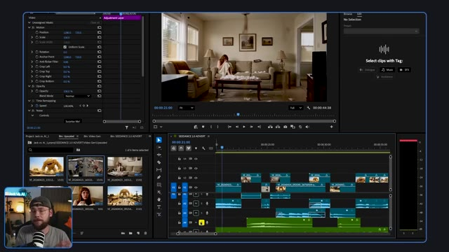
*Interface d'un logiciel de montage vidéo (Adobe Premiere Pro) avec une vue sur un plan d'intérieur où une femme est assise sur un canapé, avec un encadré PiP du créateur dans le coin inférieur gauche.*

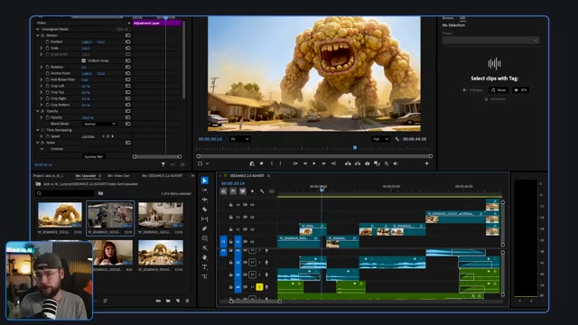
*Interface du même logiciel de montage vidéo affichant un autre plan de la vidéo avec un monstre géant dans une rue résidentielle, et l'encadré PiP du créateur en bas à gauche.*

---

### ⏱️ `[00:16:32 - 00:16:50]` | Segment #34

**🔊 Audio (Transcription Intégrale Mot pour Mot en Français) :**
> Ça ressemble un peu à une épée qu'on sort de son fourreau ou quelque chose comme ça, et c'est exactement l'idée. L'humour réside dans le fait qu'elle utilise ce médicament comme si c'était une arme contre le monstre et donc contre son allergie. Et c'est à peu près tout. Comme toujours les gars, si vous avez la moindre question, n'hésitez pas à les laisser plus bas dans la section des commentaires.

**👁️ Analyse Visuelle d'Écran (gemini-3.5-flash-lite) :**
**Interface & Outils** : Adobe Premiere Pro avec incrustation vidéo (PiP) du créateur.

**Contenu textuel & Code** : Sur l'écran de montage, on peut voir la timeline, les pistes audio/vidéo, le panneau de prévisualisation montrant une femme rousse tenant une boîte verte avec l'inscription "BLOOM - HAYFEVER AND ALLERGY RELIEF MEDICINE - Original", ainsi que des chutiers avec des clips générés par IA représentant un monstre et des scènes urbaines.

**Action / Démonstration** : Le créateur présente l'interface de montage vidéo tout en expliquant le montage humoristique de la publicité générée par IA.

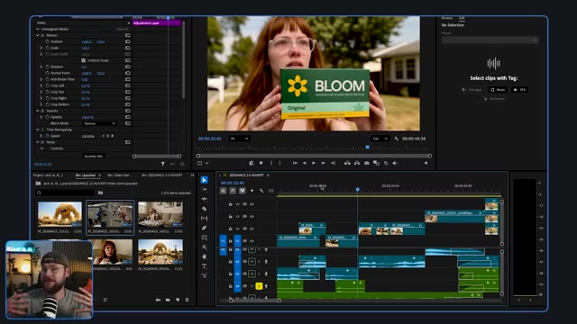
*Interface d'un logiciel de montage vidéo (Adobe Premiere Pro) affichant une timeline complexe, un panneau de prévisualisation avec une femme tenant une boîte de médicaments "BLOOM", et un encadré PiP montrant Jack dans son studio.*

---

### ⏱️ `[00:16:50 - 00:17:04]` | Segment #35

**🔊 Audio (Transcription Intégrale Mot pour Mot en Français) :**
> J'essaie toujours de répondre à autant que possible. Si vous avez apprécié la vidéo d'aujourd'hui, n'oubliez pas de l'aimer pour moi et pensez à vous abonner. Cela étant dit, jetons un dernier coup d'œil à la publicité terminée. Je vous retrouve dans la prochaine.

**👁️ Analyse Visuelle d'Écran (gemini-3.5-flash-lite) :**
**Interface & Outils** : Présentation face caméra sans partage d'écran

**Contenu textuel & Code** : Aucune interface logicielle, aucun code ou prompt visible. Uniquement Jack dans son studio avec les boutons de souscription YouTube et les statistiques de la vidéo en superposition sur l'image 2.

**Action / Démonstration** : Jack s'adresse directement à son audience face caméra dans son studio pour conclure la vidéo.

---
