# 🎬 Claude + Seedance 2.0 = UNE ANIMATION IA INCROYABLE

> **Chaîne** : [Jack Vs. AI](https://www.youtube.com/@JackVsAI)  
> **Titre original** : `Claude + Seedance 2.0 = INCREDIBLE AI ANIMATION`  
> **Lien YouTube** : [https://www.youtube.com/watch?v=FSfjVOG3tAE](https://www.youtube.com/watch?v=FSfjVOG3tAE)  
> **Date de publication** : 2026-05-05  
> **Durée** : 26m 43s (`1603s`)  
> **Identifiant vidéo** : `FSfjVOG3tAE`  
> **Fiche Web Interactive** : [2026-05-05_YT-FSfjVOG3tAE_Claude + Seedance 2.0 = UNE ANIMATION IA INCROYABLE_by-whisper-v3-large-turbo+gemini-3.5-flash-lite.html](2026-05-05_YT-FSfjVOG3tAE_Claude + Seedance 2.0 = UNE ANIMATION IA INCROYABLE_by-whisper-v3-large-turbo+gemini-3.5-flash-lite.html)  
> **Captures de démonstration clés** : `99 captures réelles (anti-talking-head)`  
> **Modèles utilisés** : Audio: `large-v3-turbo` (Faster-Whisper int8 VPS) | Vision: `gemini-3.5-flash-lite` (Google AI Studio API)  

---

## 📌 Synthèse Exécutive & Outils

### 📌 Résumé
La vidéo de Jack Vs. AI démontre comment un créateur solo peut concevoir de A à Z un film d'animation publicitaire au design minimaliste et épuré, un standard visuel très recherché aujourd'hui. En s'appuyant sur l'interface nodale **ElevenLabs Flows**, Jack orchestre un pipeline de production ultra-rapide combinant l'intelligence artificielle conversationnelle, la génération d'images de pointe et l'animation cohérente. Le processus narratif commence par l'idéation d'un concept publicitaire fort — illustrant la difficulté de découvrir de nouvelle musique à travers la métaphore visuelle d'un personnage coincé au fond d'un trou — avant d'être traduit en un traitement textuel structuré et découpé en scènes.

La méthode repose ensuite sur une approche méthodique de la cohérence visuelle et de l'asset management. Jack utilise **Claude** pour concevoir l'identité de marque complète (du logo minimaliste aux codes hexadécimaux des palettes de couleurs), tandis que le modèle **Nano Banana Pro** génère les images clés, les accessoires et la cruciale fiche de personnage. En injectant ces éléments en tant que références textuelles et visuelles (via les connexions nodales), l'IA reçoit le contexte indispensable pour alimenter les modèles de génération vidéo comme **Seedance 2.0**. Cette technique de « comblement d'écart » entre l'intention humaine et la compréhension de la machine garantit un univers graphique unifié.

Pour les créateurs de vidéo, ce workflow révolutionne les standards de l'industrie en s'affranchissant des studios traditionnels et des années d'apprentissage technique. En structurant son projet de la conception textuelle à la génération d'actifs spécifiques (plans du personnage, accessoires 3D, plans de fin), Jack prouve que l'avenir de l'animation réside dans la direction artistique rigoureuse, l'itération intelligente et la maîtrise des flux de travail multimodaux basés sur des nœuds.

### 🛠️ Outils, Modèles & Logiciels Présentés
* **Claude** : Utilisé comme assistant stratégique et créatif pour concevoir le concept narratif, rédiger les prompts textuels, développer l'identité de marque complète (logo, palettes de couleurs) et fournir des codes hexadécimaux précis.
* **ElevenLabs Flows** : Plateforme de production visuelle et audio basée sur des nœuds, permettant d'enchaîner visuellement les générateurs d'images, de vidéos et d'audio pour un workflow unifié.
* **Nano Banana Pro** : Modèle de génération d'images de haute qualité utilisé pour créer les visuels de base, les accessoires 3D, les arrière-plans et la fiche de personnage en résolution 4K.
* **Seedance** (et **Seedance 2.0**) : Modèle de génération et d'animation vidéo exploitant les fiches de personnages et les références visuelles pour animer les plans en conservant une parfaite cohérence spatiale et stylistique.
* **Topaz** : Mentionné dans la liste des outils, employé traditionnellement pour l'upscaling et l'optimisation finale de la qualité vidéo.
* **Premiere Pro** : Logiciel de montage traditionnel utilisé pour assembler, synchroniser et finaliser le montage final du film d'animation.

### 🔑 Points Clés & Enseignements Stratégiques
* **Démocratisation de l'animation** : La création d'un film d'animation publicitaire complet ne nécessite plus des studios entiers ni des années d'expérience, mais simplement une idée claire et un workflow IA structuré.
* **L'efficacité des interfaces nodales** : Utiliser un outil basé sur des nœuds comme *ElevenLabs Flows* permet de visualiser clairement l'enchaînement des étapes (générateurs d'images, de vidéos et d'audio) et de connecter logiquement les sources aux destinations.
* **Le choix de la qualité native** : Dès la génération d'images avec *Nano Banana Pro*, il est impératif de paramétrer le format en 16:9 et de sélectionner la résolution 4K pour garantir la meilleure base visuelle possible avant l'animation.
* **L'utilisation de références réelles** : Injecter de véritables photos personnelles comme références d'image dans *Nano Banana Pro* permet d'orienter l'apparence du personnage tout en maintenant un style artistique spécifique (minimaliste et épuré).
* **Traduire l'abstrait en littéral** : Pour une publicité ou un format court, il est stratégique de rendre un concept abstrait (comme une « routine musicale ») visuellement littéral et immédiat (un personnage coincé au fond d'un trou) pour une compréhension instantanée par le spectateur.
* **La création indispensable d'une fiche de personnage** : Avant de passer à la vidéo, regrouper les différentes vues et expressions d'un personnage sur une seule image sert de référence contextuelle majeure pour les modèles d'animation.
* **Combler l'écart créatif avec l'IA** : L'IA ne sait pas ce que vous pensez ; le succès d'un projet repose sur la capacité du créateur à fournir un contexte extrêmement clair, des fiches de style et des instructions précises pour guider la machine.
* **L'itération avec les assistants textuels** : Ne jamais se contenter de la première réponse de *Claude* ; l'affinement par des allers-retours itératifs permet d'obtenir une identité de marque professionnelle, incluant palettes de couleurs et codes hexadécimaux précis.
* **L'anticipation des accessoires clés** : Isoler et générer séparément les accessoires récurrents (comme le lecteur de musique ou le logo 3D) assure une cohérence visuelle parfaite lorsqu'ils sont réinjectés dans les différentes scènes.
* **Le contrôle rigoureux du contexte visuel** : Pour obtenir exactement le résultat escompté dans une génération vidéo (par exemple, montrer l'avant ou l'arrière d'un objet), il faut alimenter le modèle avec les visuels de référence strictement correspondants pour éviter les erreurs d'interprétation de l'IA.

---

## ⏱️ Chronologie & Transcription Complète Audio & Visuelle (Mot pour Mot)

### ⏱️ `[00:00:00 - 00:00:19]` | Segment #01

**🔊 Audio (Transcription Intégrale Mot pour Mot en Français) :**
> Créer du contenu animé avec l'IA n'a jamais été aussi simple. Ce qui nécessékait autrefois des studios entiers peut désormais être créé par une seule personne. Et cela ouvre la porte à quelque chose d'énorme. Vous n'avez plus besoin d'années d'expérience en animation, vous avez juste besoin d'une idée. Dans la vidéo d'aujourd'hui, je vais vous apprendre comment j'ai construit ce film d'animation.

**👁️ Analyse Visuelle d'Écran (gemini-3.5-flash-lite) :**
**Interface & Outils** : Présentation face caméra sans partage d'écran (pour les images 2 et 3) et extrait visuel de film d'animation (pour l'image 1).

**Contenu textuel & Code** : Texte affiché à l'écran : « building animated content with AI ».

**Action / Démonstration** : Le créateur présente l'introduction de sa vidéo en montrant d'abord un aperçu d'animation cinématique, puis en parlant directement face caméra dans son studio.

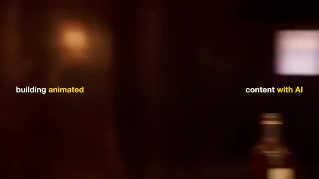
*Extrait vidéo cinématique flou avec incrustation de texte jaune « building animated content with AI »*

---

### ⏱️ `[00:00:19 - 00:00:54]` | Segment #02

**🔊 Audio (Transcription Intégrale Mot pour Mot en Français) :**
> Avec cette esthétique minimale et épurée qu'on voit partout en ce moment. Et les gars, si vous appréciez le contenu d'aujourd'hui, n'oubliez pas de lâcher un gros pouce bleu pour moi. Pensez à vous abonner et bien sûr, activez la cloche de notification, d'accord ? Entrons dans le vif du sujet : pour aborder ce projet d'animation, nous sommes de retour sur ElevenLabs Flows. La dernière vidéo que j'ai faite à ce sujet, vous l'avez absolument adoré, donc c'était tout à fait naturel de revenir sur cet outil. Et ce que j'aime avec Flows, c'est que c'est basé sur des nœuds, donc on peut réellement voir comment chaque étape du processus s'enchaîne dans la suivante, et c'est représenté par ces connecteurs ici, chaque...

**👁️ Analyse Visuelle d'Écran (gemini-3.5-flash-lite) :**
**Interface & Outils** : Interface de l'application web ElevenLabs Flows (outil de création basé sur des nœuds) avec incrustation webcam du créateur.

**Contenu textuel & Code** : Nœuds de flux connectés, images de référence de Jack de face et de profil, paramètres de génération de modèle 3D ("Nano Banana Pro"), et texte descriptif ("A stylized 3D character portrait rendered in a tactile...").

**Action / Démonstration** : Navigation et zoom dans l'espace de travail nodal d'ElevenLabs Flows pour expliquer le fonctionnement des connecteurs entre les étapes du projet d'animation.

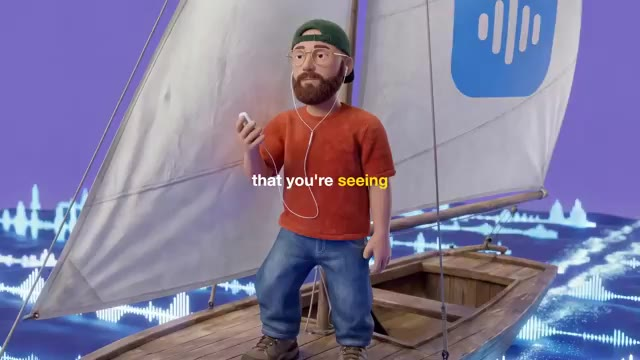
*Animation 3D montrant un personnage barbu sur un voilier avec un fond violet et des ondes sonores.*

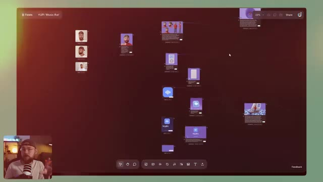
*Interface de ElevenLabs Flows affichant un graphe de nœuds complet à l'échelle globale.*

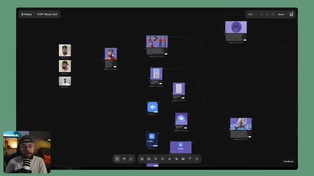
*Vue rapprochée de l'interface d'ElevenLabs Flows avec la webcam du créateur incrustée en bas à gauche.*

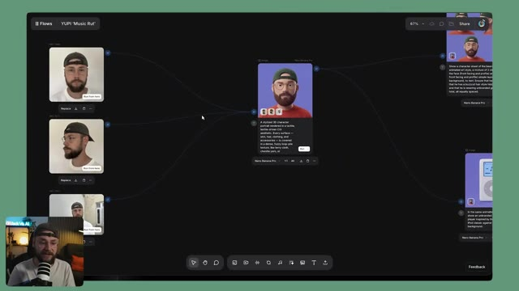
*Zoom sur les nœuds de l'interface ElevenLabs Flows montrant les images sources de Jack et le nœud central de génération 3D avec les connecteurs.*

---

### ⏱️ `[00:00:54 - 00:01:30]` | Segment #03

**🔊 Audio (Transcription Intégrale Mot pour Mot en Français) :**
> ces nœuds représentent un générateur d'images, de vidéos ou de l'audio et vous voyez beaucoup de superbes aperçus ici de ce que j'ai créé mais si vous voulez voir l'animation finie vous devrez rester jusqu'à la fin de la vidéo mais avant d'entrer trop profondément dans ce genre de choses comme toujours le projet commence par une idée je savais très tôt que je voulais cette esthétique vraiment épurée et minimaliste donc cette image ici est en fait la première chose que j'ai générée. Donc cela a été fait en utilisant un nœud de génération d'images et nous faisons tourner le modèle Nano Banana Pro. Donc pour charger des nœuds c'est vraiment simple vous pouvez simplement aller

**👁️ Analyse Visuelle d'Écran (gemini-3.5-flash-lite) :**
**Interface & Outils** : Interface de type graphe de nœuds (node-based workflow, similaire à ComfyUI ou une application dédiée de workflow IA) avec une barre d'outils flottante en bas, un indicateur de zoom en haut à droite et une incrustation vidéo (PiP) du créateur en bas à gauche.

**Contenu textuel & Code** : Modèle affiché : "Nano Banana Pro". Prompt visible partiellement : "A stylized 3D character portrait rendered in a tactile, tactile-driven CGI aesthetic. Every surface — skin, hair, clothing, and accessories — is rendered in a dense, fuzzy loop-pile texture, like terry cloth, chenille yarn, or...". Nœuds d'entrée (inputs) étiquetés "Ryan Front Face" et nœuds de sortie/génération interconnectés.

**Action / Démonstration** : Le créateur navigue et zoome sur son canevas de nœuds (workflow) pour présenter la structure de son projet de génération d'IA, puis zoome sur le nœud initial de génération d'image avec Nano Banana Pro.

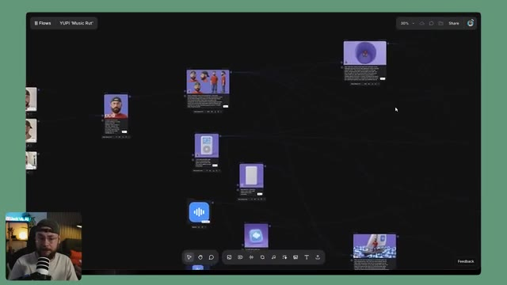
*Vue d'ensemble d'une interface de nœuds (style node-based workflow) montrant plusieurs nœuds connectés représentant des blocs de génération d'images, de vidéos et d'audio, avec Jack incrusté en bas à gauche.*

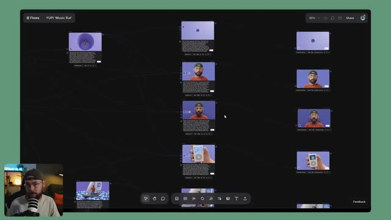
*Navigation par panoramique (panning) sur le canevas de nœuds montrant d'autres nœuds connectés avec des aperçus d'images et de scènes animées minimalistes.*

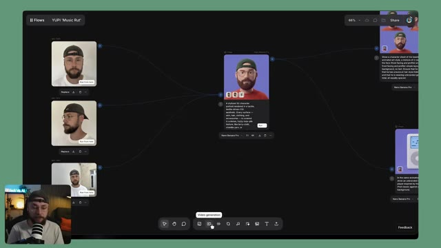
*Gros plan sur un nœud central de génération d'images utilisant le modèle Nano Banana Pro, relié à des images de référence à gauche et affichant un prompt textuel.*

---

### ⏱️ `[00:01:30 - 00:02:05]` | Segment #04

**🔊 Audio (Transcription Intégrale Mot pour Mot en Français) :**
> jusqu'à cette barre d'outils en bas de l'écran, nous allons cliquer sur la génération d'image dans ce cas-ci, il suffit de la déplacer dans cet espace vide. Pour le modèle, nous allons sélectionner Nano Banana Pro. Le format 16 par 9 est parfait pour le film que nous réalisons et pour la résolution, vous voulez toujours choisir la 4k, vous voulez la meilleure qualité d'image possible et en revenant à notre exemple, vous pouvez voir que j'ai inséré de vraies photos de moi et qu'elles sont utilisées comme références d'image à l'intérieur de Nano Banana Pro, ce qui est représenté par ces connecteurs ici, donc ceux-ci donnent à Google

**👁️ Analyse Visuelle d'Écran (gemini-3.5-flash-lite) :**
**Interface & Outils** : Interface logicielle de type tableau blanc / nœuds (style flux de travail visuel avec des boîtes de génération et des connecteurs).

**Contenu textuel & Code** : Modèle visible : "Nano Banana Pro". Paramètres : format "16:9", résolution "4K". Texte de prompt visible : "A stylized 3D character portrait rendered in a tactile...".

**Action / Démonstration** : Le créateur montre comment ajouter un module de génération d'image depuis la barre d'outils inférieure, le configure en 16:9 et 4K, et explique l'utilisation de photos personnelles comme références connectées.

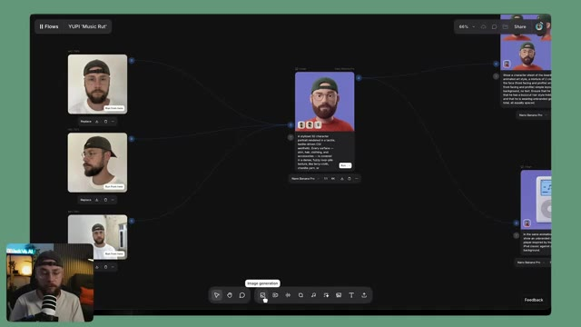
*Interface de l'outil avec la barre d'outils en bas où le curseur survole l'option de génération d'image, montrant les photos de référence connectées au modèle Nano Banana Pro.*

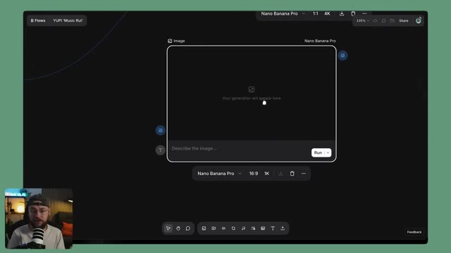
*Nouvelle boîte de génération d'image vide ajoutée à l'espace de travail avec les options de modèle Nano Banana Pro, format 16:9 et résolution 4K.*

*Retour au nœud principal de Nano Banana Pro avec les connecteurs reliant les photos de référence de l'utilisateur au modèle central.*

---

### ⏱️ `[00:02:05 - 00:02:40]` | Segment #05

**🔊 Audio (Transcription Intégrale Mot pour Mot en Français) :**
> Le modèle d'image donne une très bonne idée de ce à quoi nous voulons que notre personnage ressemble, mais bien sûr, le style est très différent de quelque chose de photoréaliste. Le prompt textuel que j'ai entré était donc également très important, et celui-ci a en fait été conçu en utilisant Claude. Et comme toujours, vous trouverez tous mes prompts textuels et mes compétences Claude sur ma communauté School. Vous trouverez un lien pour cela juste en dessous dans la description. J'ai donc vraiment adoré cette génération ici comme point de départ, mais ensuite j'ai eu besoin de réfléchir au type de projet pour lequel elle pourrait fonctionner, et j'ai atterri sur l'idée d'une application musicale. Maintenant, je ne sais pas à propos de

**👁️ Analyse Visuelle d'Écran (gemini-3.5-flash-lite) :**
**Interface & Outils** : Interface de type nœuds (nodes) pour la génération d'images par IA avec un panneau de prévisualisation et des options de configuration (Nano Banana Pro, format 1:1, résolution 4K).

**Contenu textuel & Code** : Texte du prompt visible : "A stylized 3D character portrait rendered in a tactile, textile-driven CGI aesthetic. Every surface — skin, hair, clothing, and accessories — is covered in a dense, fuzzy loop-pile texture, like terry-cloth, chenille yarn, or..." Paramètres : Nano Banana Pro, 1:1, 4K.

**Action / Démonstration** : Le flux de travail visuel présente la connexion entre les photos de référence et le prompt de génération stylisée du personnage 3D.

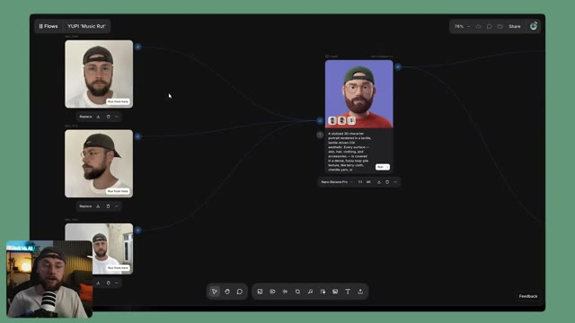
*Interface de travail montrant les différentes photos de référence du personnage reliées par des nœuds au générateur d'image principal.*

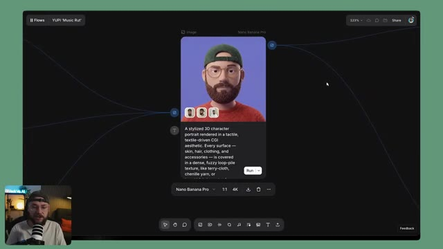
*Gros plan sur le nœud de génération d'image principale affichant le rendu 3D stylisé du personnage avec le prompt textuel associé.*

---

### ⏱️ `[00:02:40 - 00:03:19]` | Segment #06

**🔊 Audio (Transcription Intégrale Mot pour Mot en Français) :**
> vous les gars, mais je trouve vraiment difficile de découvrir de nouvelle musique que j'aime vraiment. Donc je finis par écouter toujours la même chose encore et encore et puis j'ai eu cette idée d'être coincé dans une routine musicale. Vous verrez assez souvent que les publicités prennent quelque chose de très abstrait et le rendent assez littéral et c'est parce que le spectateur a besoin de comprendre le concept et le produit en un très court laps de temps. Donc j'ai rapidement su que je voulais montrer notre personnage coincé au fond d'un trou pour représenter cette routine musicale. Et puis notre application apparaîtrait physiquement devant

**👁️ Analyse Visuelle d'Écran (gemini-3.5-flash-lite) :**
**Interface & Outils** : Animations 3D de personnages et d'interfaces logicielles intégrées avec incrustation vidéo (PiP) du créateur.

**Contenu textuel & Code** : Texte à l'écran : "Stuck in a musical rut". Icône d'application 3D bleue avec des ondes audio.

**Action / Démonstration** : Présentation d'animations 3D illustrant le concept de la routine musicale et l'apparition de l'application.

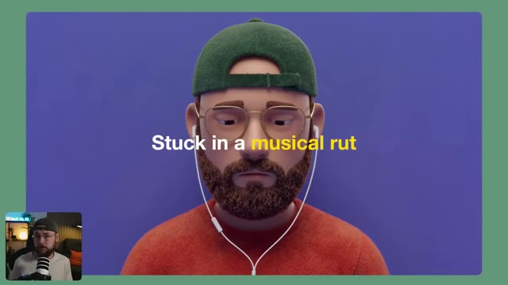
*Animation 3D d'un personnage portant des écouteurs sur fond violet avec le texte "Stuck in a musical rut" et Jack visible en incrustation (PiP) dans le coin inférieur gauche.*

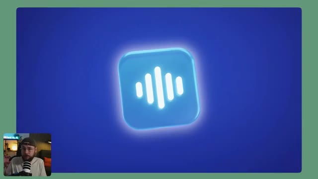
*Animation 3D d'une icône d'application bleue lumineuse avec des ondes sonores blanches, et Jack visible en incrustation (PiP) dans le coin inférieur gauche.*

---

### ⏱️ `[00:03:19 - 00:03:42]` | Segment #07

**🔊 Audio (Transcription Intégrale Mot pour Mot en Français) :**
> d'une manière ou d'une autre, le remonter et le sortir du trou pour qu'il puisse à nouveau profiter de la musique. Ce que j'ai fait, c'est que j'ai écrit tout cela dans un traitement vraiment simple qui décrivait chaque scène. Et avec cela, toute la planification était réglée et je pouvais passer à la génération de mes visuels. Maintenant, quelque chose de très important à faire au début, c'est d'aller de l'avant et de construire une fiche de personnage.

**👁️ Analyse Visuelle d'Écran (gemini-3.5-flash-lite) :**
**Interface & Outils** : Logiciel de workflow par nœuds (type ComfyUI ou interface de génération par IA) et écran de traitement textuel.

**Contenu textuel & Code** : Texte à l'écran : « Scene One », « Scene Two », « Scene Three » avec descriptions détaillées des plans. Texte de transition : « Step Two Image Generation ». Prompt visible dans l'interface de nœuds : « Show a character sheet of the bearded man, in the same animated art style, a mixture of 2 close ups framed tightly around the face... » Paramètres visibles : « Nano Banana Pro », « 16:9 », « 4K ».

**Action / Démonstration** : Présentation successive d'un visuel artistique du personnage, du script/traitement de la vidéo, d'un écran de titre d'étape, puis de l'interface de génération de la fiche personnage.

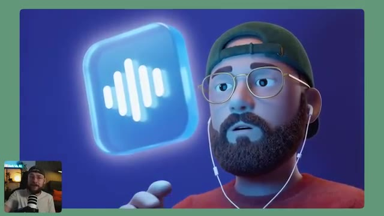
*Rendu visuel 3D animé du personnage barbu avec des écouteurs et un logo musical lumineux sur fond bleu.*

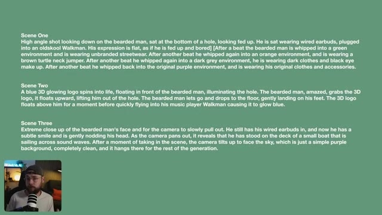
*Document texte contenant le traitement détaillé divisé en trois scènes décrivant les actions et les mouvements de caméra.*

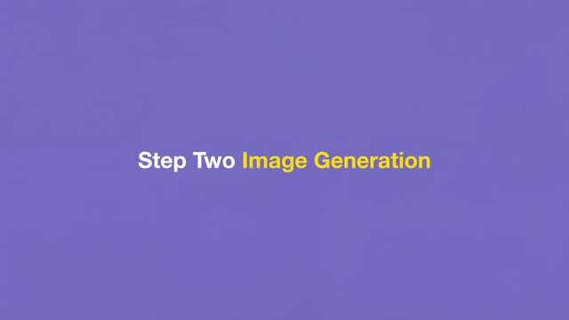
*Écran de transition sur fond violet avec le texte blanc et jaune « Step Two Image Generation ».*

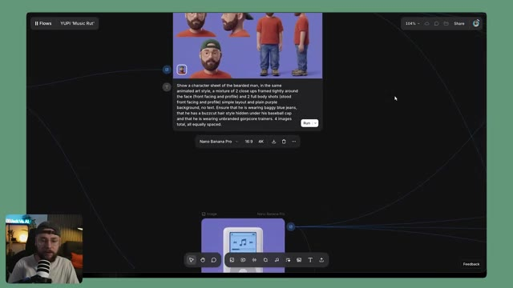
*Interface de nœuds (type workflow) montrant la génération d'une feuille de personnage (character sheet) avec des visuels 3D et un prompt textuel.*

---

### ⏱️ `[00:03:43 - 00:04:17]` | Segment #08

**🔊 Audio (Transcription Intégrale Mot pour Mot en Français) :**
> Donc vous pouvez voir que j'utilise cette première image que j'ai générée ici comme référence et ensuite j'y ajoute ce prompt textuel. La raison pour laquelle c'est si important, c'est parce que nous allons l'injecter comme référence d'image pour le modèle vidéo que nous allons utiliser, qui est C-Dance 2, et cela va donner à C-Dance un contexte sur l'apparence de notre personnage sous différents angles. Ainsi, il ne fait pas que deviner. Une grande partie de la réussite avec ces outils d'IA consiste à leur donner du contexte, à leur montrer très clairement exactement le type de résultats que vous recherchez. Rappelez-vous que vous savez ce que vous voulez.

**👁️ Analyse Visuelle d'Écran (gemini-3.5-flash-lite) :**
**Interface & Outils** : Interface de type éditeur de nœuds (workflow visuel de génération d'IA).

**Contenu textuel & Code** : Texte du prompt visible : « A stylized 3D character portrait rendered in a tactile, textile-driven CGI aesthetic... » et « Show a character sheet of the bearded man, in the same animated art style... ».

**Action / Démonstration** : Le créateur montre l'utilisation d'une image de référence combinée à un prompt textuel dans un graphe de nœuds pour alimenter un modèle vidéo.

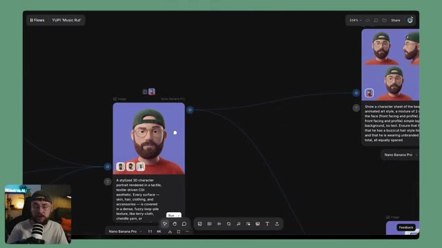
*Interface de nœuds montrant la première image générée d'un personnage 3D et le prompt textuel associé.*

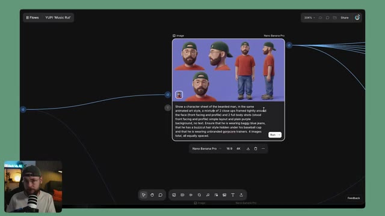
*Gros plan sur la planche de modèles (character sheet) générée avec les différentes vues du personnage 3D et son prompt détaillé.*

---

### ⏱️ `[00:04:17 - 00:04:53]` | Segment #09

**🔊 Audio (Transcription Intégrale Mot pour Mot en Français) :**
> parce que l'idée vient de vous, mais l'IA n'en a aucune idée. Elle ne sait pas qui vous êtes. Elle ne peut pas penser comme vous pensez. Donc, une grande partie du succès avec les outils d'IA consiste à être capable de combler cet écart. Et vous pouvez voir que j'ai aussi généré cette image ici du lecteur de musique, parce que je savais que ce serait un accessoire vraiment important tout au long du projet. Nous avons même généré l'arrière également, parce que je savais que cela serait utile pour certaines générations de vidéos. Et parce que tout est branché, connecté à cette référence de style originale,

**👁️ Analyse Visuelle d'Écran (gemini-3.5-flash-lite) :**
**Interface & Outils** : Interface logicielle de type nœuds (nodes) / tableau blanc interactif de génération par IA (avec des blocs connectés par des liens bleus, menu inférieur d'outils, et modèle Nano Banana Pro).

**Contenu textuel & Code** : Prompts visibles : "In the same animation style show an unbranded music player inspired by the white iPod classic against a purple background." et "Show the back of the same device, it has a plain white matte texture, and is unbranded." sur l'image 2. Prompt pour le personnage 3D sur l'image 3 : "A stylized 3D character portrait rendered in a tactile, textile-driven CGI aesthetic..."

**Action / Démonstration** : Le créateur montre l'interface de travail connectée où différents éléments graphiques (le lecteur de musique, son dos, et le personnage 3D) sont générés et reliés entre eux pour maintenir une cohérence de style.

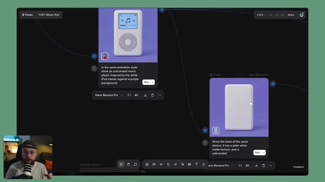
*Interface de nœuds (flow-based interface) montrant la génération d'un lecteur de musique type iPod et de son dos avec le modèle Nano Banana Pro.*

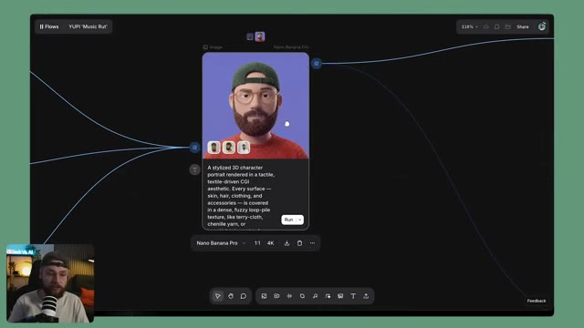
*Interface de nœuds montrant un nœud de génération de personnage 3D stylisé (avatar de Jack) avec Nano Banana Pro relié par des connexions bleues.*

---

### ⏱️ `[00:04:54 - 00:05:29]` | Segment #10

**🔊 Audio (Transcription Intégrale Mot pour Mot en Français) :**
> tout semble cohérent. On a l'impression que ça fait partie du même univers. Et si je fais défiler un peu plus vers le bas ici, vous verrez que j'ai en fait généré cette version 3D du logo de notre application. Donc pour concevoir la marque, j'ai utilisé Claude. J'ai lancé une nouvelle discussion et j'ai dit : j'aimerais que tu m'aides à concevoir un logo et une identité de marque pour mon application de musique appelée UP. Je voulais utiliser du bleu comme couleur principale et je voulais un design épuré, minimaliste mais aussi mémorable. Et bien sûr, il y a eu pas mal d'aller-retours entre moi et l'IA. Il ne faut jamais se contenter de la première réponse ou de la première idée.

**👁️ Analyse Visuelle d'Écran (gemini-3.5-flash-lite) :**
**Interface & Outils** : Image 1 : Interface de nœuds / mindmap avec des aperçus d'images générées et des descriptions. Image 2 : Interface de Claude AI avec un prompt utilisateur et des blocs de texte structurés.

**Contenu textuel & Code** : Image 1 : Nœuds connectés avec des cartes contenant des prompts et miniatures (personnage 3D, lecteur de musique rétro). Image 2 : Prompt de l'utilisateur : "I'd like you to help me design a logo and brand identity for my music app called YUPI, I want it to use blue as the primary colour. I want it to have a clean minimal design, but be memorable." Réponse détaillée de Claude sur l'identité de marque, la palette de couleurs (bleu et vert menthe #00E5A0), la typographie (Inter et JetBrains Mono).

**Action / Démonstration** : Le créateur montre son espace de travail visuel avec les éléments générés puis bascule sur l'interface de Claude pour expliquer la phase de conception de la marque.

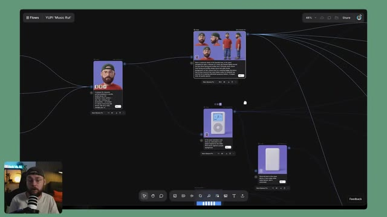
*Interface de type tableau de bord ou espace de travail visuel montrant des nœuds interconnectés contenant des visuels générés par IA et des descriptions textuelles.*

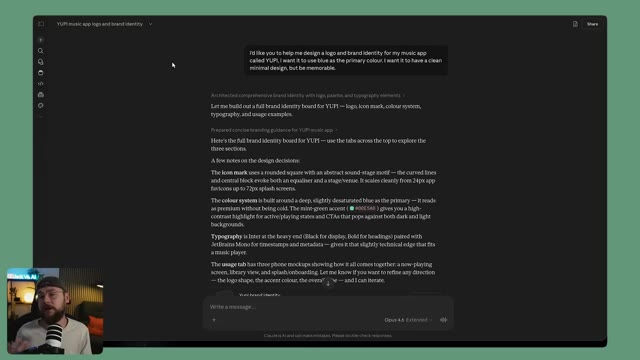
*Interface de Claude (assistant IA) affichant un prompt textuel pour concevoir une identité de marque et la réponse détaillée de l'IA.*

---

### ⏱️ `[00:05:29 - 00:05:52]` | Segment #11

**🔊 Audio (Transcription Intégrale Mot pour Mot en Français) :**
> ça vous donne. Tout tourne autour du raffinement et de l'itération. Et finalement, il a assemblé toute cette identité de marque ici. C'est vraiment impressionnant qu'il soit capable de faire ça, mais il peut aussi vous donner différentes palettes de couleurs parmi lesquelles choisir. Vous pouvez donc interagir avec Claude ici. J'aimais bien la version Arctique et vous pouvez voir que lorsque je la sélectionne, cela change tout.

**👁️ Analyse Visuelle d'Écran (gemini-3.5-flash-lite) :**
**Interface & Outils** : Interface web de Claude (avec incrustation vidéo du créateur en bas à gauche).

**Contenu textuel & Code** : Texte de conversation avec l'assistant IA Claude proposant des options d'identité visuelle, des concepts de logos et des alternatives créatives pour une application musicale ("Yupi music app logo and brand identity", options Clean, Glitch, Radial, Melt, Negative).

**Action / Démonstration** : Le créateur présente l'écran de l'interface de Claude et discute des différentes options de design générées pour l'identité de marque.

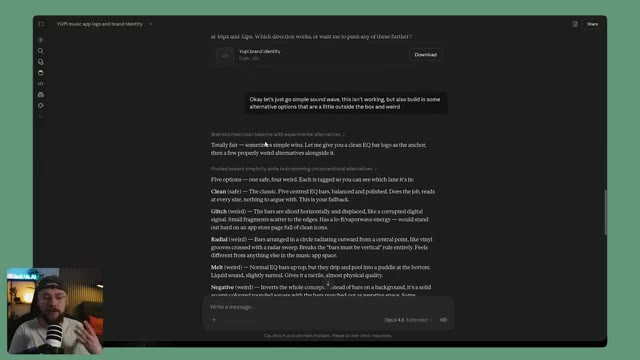
*Interface de Claude montrant les suggestions d'identité de marque et les options de design pour une application musicale.*

---

### ⏱️ `[00:05:52 - 00:06:25]` | Segment #12

**🔊 Audio (Transcription Intégrale Mot pour Mot en Français) :**
> Si je fais défiler vers le bas, cela m'a même donné le code hexadécimal des différentes couleurs qui ont été utilisées dans le design et nous pouvons voir la marque en contexte également. Donc d'une certaine manière sous la forme de l'application elle-même, vraiment très impressionnant. Donc une fois que j'ai été satisfait de l'identité de marque, j'ai simplement dit à Claude d'exporter le logo en JPEG ou PNG. J'ai donc ensuite simplement déposé le logo dans flows. Je l'ai lié à un nœud de génération d'images. Encore une fois, en utilisant Nano Banana Pro, un texte de commande vraiment simple,

**👁️ Analyse Visuelle d'Écran (gemini-3.5-flash-lite) :**
**Interface & Outils** : Interface divisée affichant un assistant textuel (type Claude) à gauche et un panneau de design d'identité de marque à droite (Image #1), puis l'interface de l'outil de nœuds "Flows" avec le modèle Nano Banana Pro (Images #2 et #3).

**Contenu textuel & Code** : Codes hexadécimaux de couleurs (ex: #FFFFFF, #B9D1FF, etc.), variants de logo "YUPI", et le prompt textuel dans Flows : "Turn this app logo tile into a glowing 3D render floating against a simple purple background". Paramètres visibles : Nano Banana Pro, format 1:1, résolution 4K.

**Action / Démonstration** : Le créateur montre les codes couleur de l'application, puis passe à l'interface de Flows où il glisse le logo pour le connecter à un nœud de génération d'image IA avec un prompt textuel.

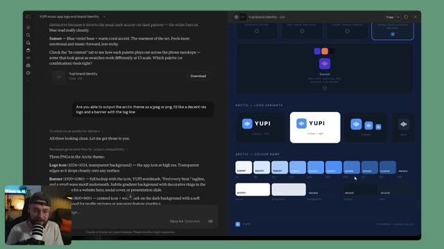
*Affichage des codes hexadécimaux des couleurs et de l'identité visuelle de l'application Yupi (thème Arctic).*

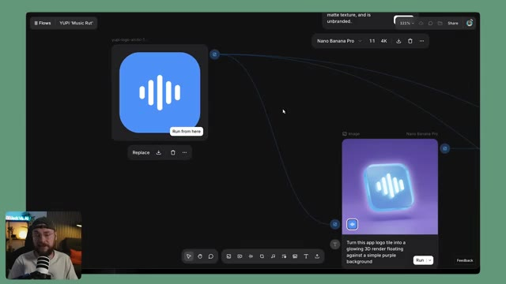
*Interface de Flows montrant le logo importé relié à un nœud de génération d'images avec Nano Banana Pro.*

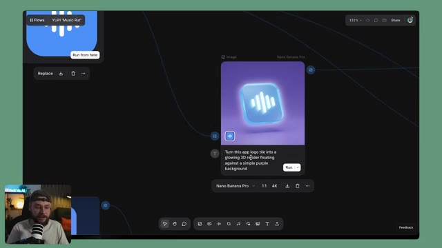
*Gros plan sur le nœud de génération d'images et le prompt textuel utilisé dans Flows.*

---

### ⏱️ `[00:06:25 - 00:06:50]` | Segment #13

**🔊 Audio (Transcription Intégrale Mot pour Mot en Français) :**
> et vous obtenez ce résultat très propre. C'est exactement ce que je recherchais pour la version 3D lumineuse du logo de notre application UP. Et j'ai aussi créé ce plan de fin vraiment simple pour notre publicité. Cela a été fait simplement en combinant une partie de l'image de marque générée par Claude avec ce même genre de fond couleur lavande. Encore une fois, un prompt assez simple ici, mais un autre atout intéressant à avoir verrouillé.

**👁️ Analyse Visuelle d'Écran (gemini-3.5-flash-lite) :**
**Interface & Outils** : Interface logicielle de type flux ou nodes avec un panneau de prévisualisation d'image (Nano Banana Pro) et une barre d'outils en bas. Un encadré vidéo PiP montre Jack dans son studio en bas à gauche.

**Contenu textuel & Code** : Texte du prompt visible : "Turn this app logo tile into a glowing 3D render floating against a simple purple background". Options affichées : "Nano Banana Pro", format "1:1", résolution "4K".

**Action / Démonstration** : Le créateur montre le résultat visuel 3D et le prompt associé dans l'interface de l'application.

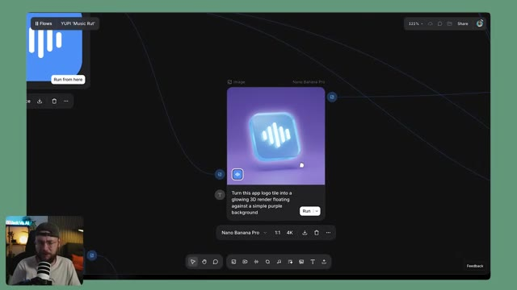
*Interface d'un outil de nœuds montrant le résultat 3D lumineux du logo avec le prompt textuel et les options de génération.*

---

### ⏱️ `[00:06:50 - 00:07:11]` | Segment #14

**🔊 Audio (Transcription Intégrale Mot pour Mot en Français) :**
> Donc les premières étapes du projet consistaient vraiment à accumuler autant d'actifs d'images utiles que possible. C'est plutôt pour être utilisé comme des références et des sortes d'éléments graphiques. Mais vous verrez que j'ai aussi produit quelques visuels clés qui seraient réellement montrés dans le film final.

**👁️ Analyse Visuelle d'Écran (gemini-3.5-flash-lite) :**
**Interface & Outils** : Interface de tableau de bord / mind-map de type nœuds (flows) sur fond noir, avec une barre d'outils flottante en bas et un encadré PiP (Picture-in-Picture) de Jack dans le coin inférieur gauche.

**Contenu textuel & Code** : Affichage de miniatures d'images, de portraits de personnages sous différents angles, d'icônes, de rendus 3D (comme un lecteur MP3 ou un petit voilier) reliés par des lignes de connexion sur le canevas. Le titre du projet "YUPI 'Music Rut'" apparaît en haut à gauche.

**Action / Démonstration** : Le créateur montre son espace de travail organisationnel sous forme de flux de travail interconnectés regroupant toutes les ressources graphiques et visuelles du projet.

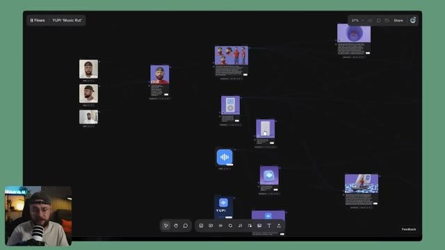
*Interface de type mind-map ou tableau de flux affichant des assets d'images, des personnages 3D et des éléments graphiques liés au projet, avec Jack visible en Picture-in-Picture dans le coin inférieur gauche.*

---

### ⏱️ `[00:07:12 - 00:07:31]` | Segment #15

**🔊 Audio (Transcription Intégrale Mot pour Mot en Français) :**
> Donc, par exemple, nous avons ce plan ici du personnage au fond du trou. C'est simplement parce que j'avais une idée très précise de la façon dont je voulais que cela rende. Donc, en ce qui concerne les références d'images, un tout petit peu petites là, mais vous pouvez voir que nous avons injecté la feuille de personnages ainsi que l'image que j'ai générée du lecteur de musique.

**👁️ Analyse Visuelle d'Écran (gemini-3.5-flash-lite) :**
**Interface & Outils** : Interface web de type nœuds / flux de travail (Workflow / Flow) avec des boîtes de génération d'images, des prompts textuels et des connexions visuelles, accompagnée d'un encadré PiP (Picture-in-Picture) montrant Jack face caméra dans son studio.

**Contenu textuel & Code** : Texte du prompt visible : "High angle shot looking straight down into a perfectly circular, extremely deep hole cut into a flat, featureless surface. The hole drops far down — the character at the bottom is small and distant, dwarfed by the sheer vertical depth of the shaft." Paramètres de génération visibles : Nano Banana Pro, rapport 16:9, résolution 4K.

**Action / Démonstration** : Le créateur montre l'interface de son flux de travail avec une vue rapprochée d'un nœud contenant l'image du personnage au fond d'un trou, puis zoome en arrière pour révéler la structure globale des nœuds interconnectés.

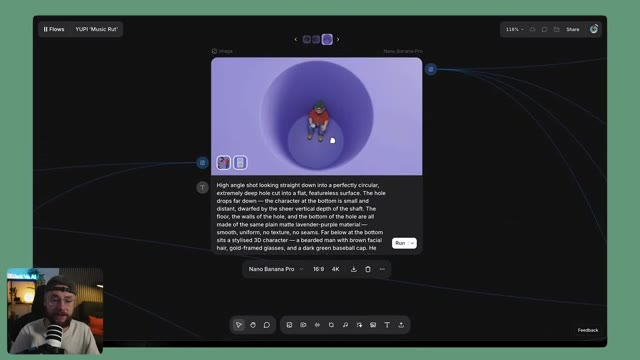
*Interface d'un outil de nœuds montrant un plan en contre-plongée d'un personnage au fond d'un cylindre violet avec un champ de texte de prompt et le présentateur en incrustation.*

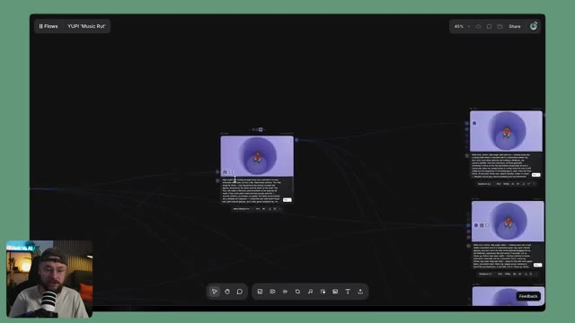
*Vue dézoomée de l'interface de nœuds montrant plusieurs nœuds connectés avec des aperçus de plans similaires et le présentateur en incrustation en bas à gauche.*

---

### ⏱️ `[00:07:31 - 00:07:52]` | Segment #16

**🔊 Audio (Transcription Intégrale Mot pour Mot en Français) :**
> Encore une fois, vous pouvez voir les connecteurs qui affluent vers ce nœud ici. Et je voulais aussi générer la scène du bateau. Donc, c'est à ce moment-là que notre personnage a réussi à s'échapper de ce trou et qu'il profite à nouveau de la musique. Alors ici, nous injectons la fiche de personnage, mais nous mettons aussi l'arrière du lecteur de musique.

**👁️ Analyse Visuelle d'Écran (gemini-3.5-flash-lite) :**
**Interface & Outils** : Interface graphique interactive de type tableau de nœuds (flows, style ComfyUI ou outil similaire) avec des blocs d'images, des connecteurs de flux, des barres de prompts et des outils de contrôle en bas d'écran.

**Contenu textuel & Code** : On peut lire des prompts textuels descriptifs dans les blocs, par exemple : "Wide shot: the same bearded man in a backwards green cap, gold-rimmed glasses, red t-shirt..." ainsi que des logos "YUPI" et des icônes d'ondes sonores. Le modèle utilisé indiqué est "Nano Banana Pro".

**Action / Démonstration** : Le créateur navigue et zoome dans son tableau de nœuds pour montrer comment les différents éléments visuels (fiche personnage, arrière du lecteur de musique) sont connectés pour générer la scène du bateau.

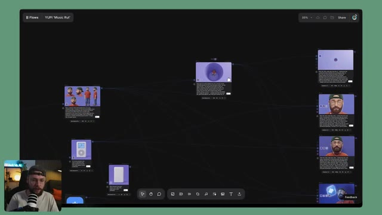
*Vue d'ensemble d'une interface de type tableau de flots (flows) montrant plusieurs nœuds connectés entre eux avec des images et des prompts.*

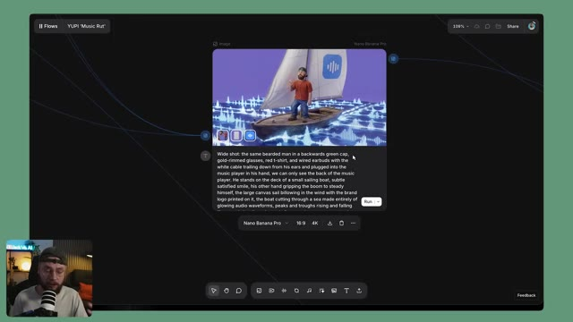
*Gros plan sur un nœud d'image montrant le rendu d'un personnage sur un voilier naviguant sur une mer d'ondes audio lumineuses, avec le prompt textuel associé.*

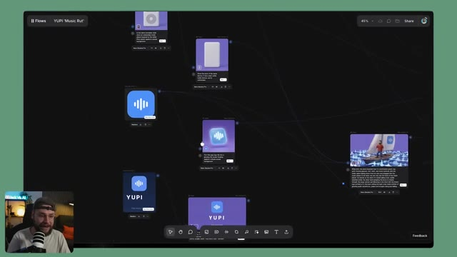
*Dézoom du tableau de flux montrant la disposition de divers nœuds (lecteur de musique, logos, arrière-plans) reliés par des connecteurs.*

---

### ⏱️ `[00:07:52 - 00:08:12]` | Segment #17

**🔊 Audio (Transcription Intégrale Mot pour Mot en Français) :**
> Souvenez-vous, je disais plus tôt que cela serait utile, cette idée de contexte. Si je donnais l'avant à Nano Banana Pro, il allait probablement montrer l'avant du lecteur de musique. Il faut donc être très précis avec lui. Et une autre chose cool, c'est que j'ai utilisé l'image de référence du logo UP et j'ai fini par demander à ce qu'il soit affiché sur la voile du bateau.

**👁️ Analyse Visuelle d'Écran (gemini-3.5-flash-lite) :**
**Interface & Outils** : Interface de type nœud / tableau blanc (node-based canvas) pour la génération d'images et de vidéos par IA (style ComfyUI ou outil propriétaire).

**Contenu textuel & Code** : Prompts textuels visibles : "Show the back of the same device, it has a plain white matte texture, and is unbranded." et "Wide shot: the same bearded man in a backwards green cap, gold-rimmed glasses, red t-shirt, and wired earbuds...". Paramètres : Nano Banana Pro, rapport 1:1 et 16:9, résolution 4K.

**Action / Démonstration** : Le créateur navigue dans son interface de flux de travail par IA pour expliquer la gestion du contexte et des références d'images.

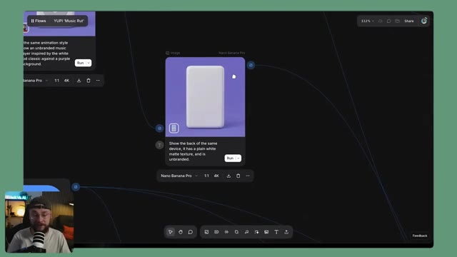
*Interface de flux de travail montrant un nœud Nano Banana Pro avec une image générée d'un lecteur de musique blanc sur fond violet et son prompt textuel.*

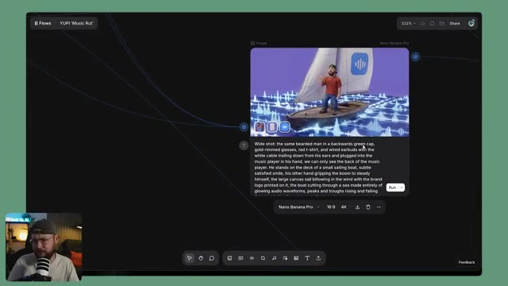
*Interface montrant un plan large généré avec un personnage sur un voilier et le logo UP sur la voile.*

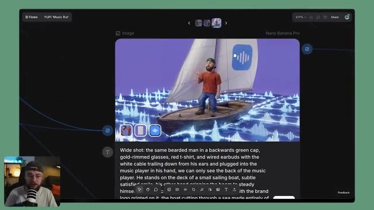
*Gros plan sur l'interface du générateur d'images affichant le voilier, le personnage et le prompt détaillé.*

---

### ⏱️ `[00:08:12 - 00:08:31]` | Segment #18

**🔊 Audio (Transcription Intégrale Mot pour Mot en Français) :**
> Donc ça rend vraiment très bien et il navigue en quelque sorte sur ces ondes sonores. Donc maintenant que toutes mes images ont été générées, ce qui est représenté par la première moitié du graphe de nœuds ici, je peux me lancer dans Seedance 2 et commencer à générer les vidéos pour le projet.

**👁️ Analyse Visuelle d'Écran (gemini-3.5-flash-lite) :**
**Interface & Outils** : Interface de type graphe de nœuds (node graph) pour la création et la génération de contenu par IA, affichant des visualisations de prompts et des aperçus d'images.

**Contenu textuel & Code** : Texte visible dans l'interface : "Wide shot: the same bearded man in a backwards green cap, gold-rimmed glasses, red t-shirt, and wired earbuds...", et à l'écran 3 : "Step Three Video Generation".

**Action / Démonstration** : Le créateur montre un nœud particulier de son graphe de travail avant d'afficher une transition animée en 3D introduisant la troisième étape du processus de création vidéo.

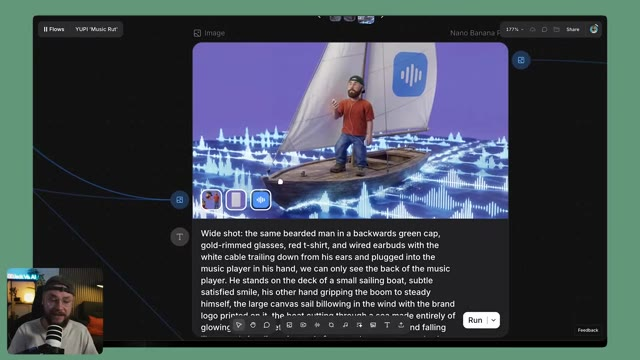
*Gros plan sur un nœud spécifique du graphe montrant l'image générée d'un personnage sur un voilier naviguant sur des ondes sonores avec son prompt textuel détaillé.*

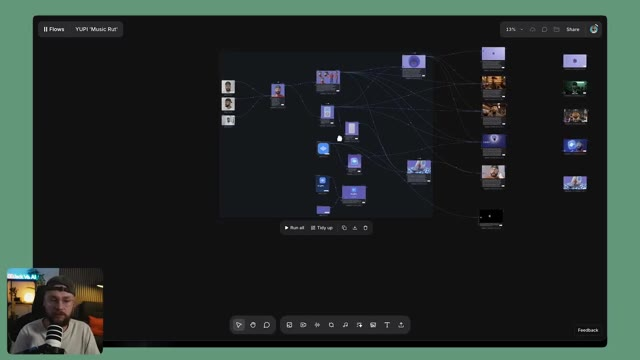
*Vue d'ensemble d'un graphe de nœuds complexe (node graph) dans une interface de création par IA, illustrant la première moitié du projet avec toutes les images générées.*

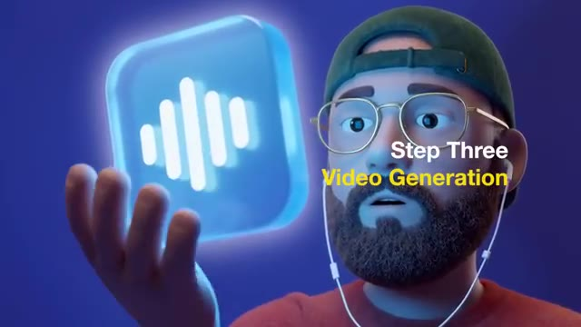
*Illustration animée 3D du personnage barbu avec des écouteurs, tenant une icône d'ondes sonores lumineuse, avec le texte superposé "Step Three Video Generation".*

---

### ⏱️ `[00:08:31 - 00:08:51]` | Segment #19

**🔊 Audio (Transcription Intégrale Mot pour Mot en Français) :**
> Donc si je vais de l'avant et que j'ajoute un nœud de génération de vidéo, je vais l'afficher ici. Nous voulons changer le modèle pour C dance 2. et immédiatement vous allez remarquer que nous avons un tas d'entrées différentes ici. Donc nous avons l'image de début, nous avons l'image de fin. C'est exactement ce à quoi vous vous attendriez. Très courant pour vos modèles de génération de vidéo.

**👁️ Analyse Visuelle d'Écran (gemini-3.5-flash-lite) :**
**Interface & Outils** : Interface de type nœuds (flows) sur fond noir, avec un panneau de contrôle inférieur et une vignette de prévisualisation du présentateur (Jack Vs. AI) en bas à gauche.

**Contenu textuel & Code** : On observe des boîtes de nœuds reliées par des lignes, affichant des blocs de texte de prompts et des aperçus vidéo, ainsi que des boutons de configuration et une barre d'outils contextuelle en bas de l'écran.

**Action / Démonstration** : Le créateur navigue et manipule les nœuds de génération de vidéo dans l'interface de l'application.

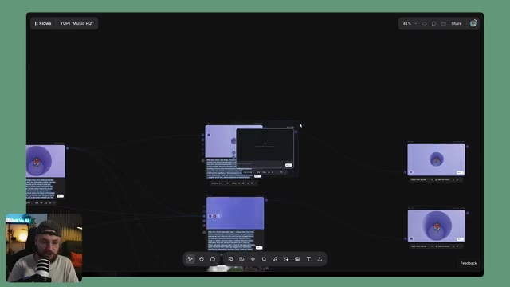
*Interface d'un logiciel de nœuds montrant un espace de travail avec plusieurs blocs de génération vidéo et un aperçu des entrées (start frame, end frame).*

---

### ⏱️ `[00:08:52 - 00:09:27]` | Segment #20

**🔊 Audio (Transcription Intégrale Mot pour Mot en Français) :**
> Mais nous avons également la possibilité d'ajouter des images de référence, des vidéos de référence et aussi de l'audio de référence. Il y a donc beaucoup de choses que l'on peut faire ici avec Seedance 2. C'est un modèle multi-références. Et nous pouvons également sélectionner le format d'image et la résolution. Ils ont désormais ajouté le 1080p, donc la qualité est bien meilleure qu'avant. Vous pouvez sélectionner la durée de vos générations, et il y a aussi ce bouton à bascule ici si vous voulez que de l'audio soit également généré. Je ne sais pas pourquoi on désactiverait jamais cette option, elle semble être désactivée par défaut.

**👁️ Analyse Visuelle d'Écran (gemini-3.5-flash-lite) :**
**Interface & Outils** : Interface web de Seedance 2.0 avec un mode de prévisualisation "Flows", comprenant une zone de génération centrale, une barre de saisie de prompt ("Describe the video..."), un bouton de lancement ("Run"), et des options de format (16:9, 720p, 4s). En bas à gauche, une incrustation vidéo (PiP) montre le présentateur Jack dans son studio.

**Contenu textuel & Code** : Texte visible : "Describe the video...", "Seedance 2.0", boutons de paramètres "16:9", "720p", "4s", et des infobulles contextuelles comme "Reference images".

**Action / Démonstration** : Le curseur de la souris survole les options de référence sur le panneau latéral de l'interface Seedance 2.0, mettant en valeur les outils d'importation d'images de référence pendant que le présentateur commente les fonctionnalités omni-références du modèle.

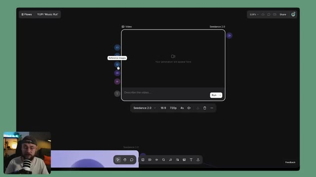
*Interface principale de Seedance 2.0 montrant le panneau de génération vidéo, la zone de prompt et les options de référence avec le curseur pointant sur l'icône des images de référence.*

---

### ⏱️ `[00:09:27 - 00:10:03]` | Segment #21

**🔊 Audio (Transcription Intégrale Mot pour Mot en Français) :**
> à l'intérieur de Flow, assurez-vous vraiment d'activer cette option, même si vous finissez par ne pas utiliser l'audio intégré à vos générations, j'ai l'impression que vous devriez quand même le faire pour avoir au moins l'option. Maintenant, la grande majorité des générations que j'ai assemblées pour ce projet étaient des générations multi-plans, contrairement à cet exemple ici du trou où nous avons juste un plan unique avec ces générations en dessous où nous coupons vers différentes scènes. Donc allons-y et prenons cet exemple ici, c'est donc là que nous coupons vers l'homme barbu, il est dans le trou et puis nous

**👁️ Analyse Visuelle d'Écran (gemini-3.5-flash-lite) :**
**Interface & Outils** : Interface de l'application Seedance 2.0 avec une vue de type canvas/nodes, comprenant une zone de prévisualisation vidéo, un champ de prompt et une barre d'outils de paramètres (Seedance 2.0, 16:9, 1080p, durée, audio, téléchargement, suppression). Présence d'une incrustation vidéo (PiP) du créateur (Jack) en bas à gauche.

**Contenu textuel & Code** : Texte du prompt visible sur l'image 2 : "Wide shot, 24mm, high angle, static — looking down into a hole where a bearded man in a backwards green cap, gold-rimmed glasses, and red t-shirt sits with wired earbuds plugged into an old Walkman, expression flat and bored, 3 seconds. Cut to. Close-up, 50mm, eye-level, static — his face centred in frame, earbuds in, eyes dull, fed up, 3 seconds. Cut to. Close-up, 50mm, eye-level, whip pan right — dimly lit club with neon green lights, oversized chain, fitted cap, baggy jersey, earbuds in, same fed-up expression, 2 seconds. Cut to. Close-up..." Paramètres visibles : Seedance 2.0, 16:9, 1080p, 15s.

**Action / Démonstration** : Le curseur de la souris survole l'icône de l'audio dans les paramètres de Seedance sur l'image 1, puis l'interface présente un projet complet avec un prompt multi-plans détaillé sur l'image 2.

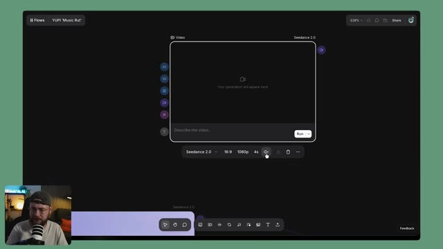
*Interface de Seedance 2.0 montrant le panneau de configuration avec le curseur sur l'icône audio, et Jack en incrustation (PiP) en bas à gauche.*

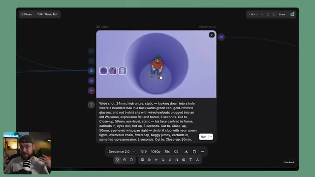
*Interface de Seedance 2.0 affichant un prompt textuel détaillé décrivant un plan large dans un trou avec un homme barbu, et Jack en incrustation (PiP) en bas à gauche.*

---

### ⏱️ `[00:10:03 - 00:10:36]` | Segment #22

**🔊 Audio (Transcription Intégrale Mot pour Mot en Français) :**
> sorte de panoramique rapide en fouet ("whip pan") vers ces différentes versions alternatives du personnage pour représenter différents genres de musique. Donc, en termes de références d'images, nous avons le visuel clé du personnage coincé au fond du trou, nous avons la feuille de personnages, et puis nous avons cette image que nous avons générée du lecteur de musique également. Tout cela est vraiment important pour cette génération de vidéo particulière. Vous ne voulez pas nécessairement utiliser les mêmes références d'images pour toutes vos générations de vidéos. Ça doit être en quelque sorte sur mesure pour chacune. Vous devez réfléchir à ce que vous donnez à Seedance 2. Maintenant, pour

**👁️ Analyse Visuelle d'Écran (gemini-3.5-flash-lite) :**
**Interface & Outils** : Interface logicielle de Seedance 2.0 avec un système de nœuds (Flows) et des fenêtres de prévisualisation vidéo.

**Contenu textuel & Code** : Texte des prompts de génération vidéo décrivant les plans caméras (ex: "Wide shot, 24mm, high angle, static — looking down into a hole where a bearded man..."). Paramètres affichés en bas des blocs : Seedance 2.0, 16:9, 1080p, 15s.

**Action / Démonstration** : Le créateur montre l'interface de Seedance 2.0 en zoomant et dézoomant sur les nœuds de génération vidéo et en survolant les images de référence.

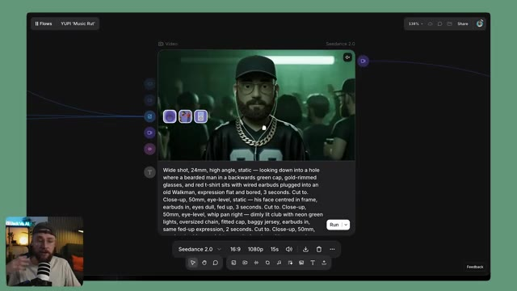
*Interface de Seedance 2.0 montrant un plan rapproché du personnage avec des écouteurs et un prompt détaillé.*

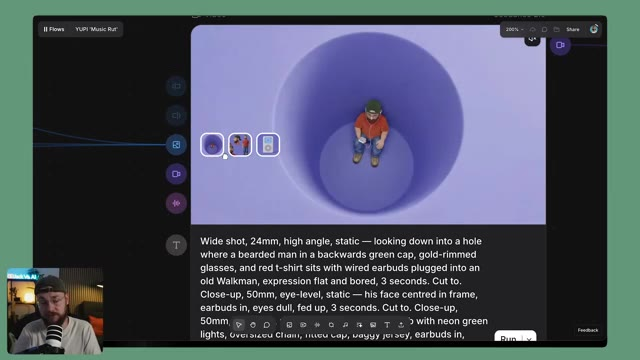
*Interface de Seedance 2.0 montrant une vue en plongée du personnage coincé au fond d'un trou violet, avec trois vignettes de référence d'images.*

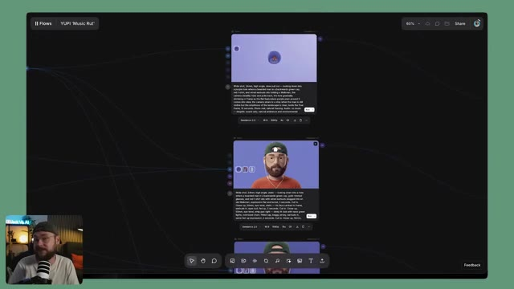
*Vue d'ensemble du graphe de flux (Node-based interface) dans Seedance 2.0 connectant plusieurs blocs de génération vidéo.*

---

### ⏱️ `[00:10:36 - 00:11:08]` | Segment #23

**🔊 Audio (Transcription Intégrale Mot pour Mot en Français) :**
> pour écrire ce prompt j'ai encore une fois utilisé Claude. Pour faire cela, j'ai dit de charger le cadre de prompt multi-shot. C'est l'une des compétences de Claude que j'ai mises en place et dont je parlais au début de la vidéo. Vous pouvez voir ici qu'il charge le prompt et qu'il vous demande de fournir toutes les images de référence possibles. Je lui ai donc simplement donné la feuille de personnage pour cet exemple particulier. Ceci est ma description simple de la première scène que je voulais montrer et vous pouvez voir juste après cela que Claude me redonne ce vraiment

**👁️ Analyse Visuelle d'Écran (gemini-3.5-flash-lite) :**
**Interface & Outils** : Interface de l'application de génération vidéo Seedance 2.0 (image #1) et interface web de l'assistant conversationnel Claude (image #2).

**Contenu textuel & Code** : Sur l'image #1 : un prompt textuel décrivant un plan large avec une caméra fixe de 24 mm sur un homme barbu dans un trou tubulaire, avec des paramètres configurés sur Seedance 2.0 (16:9, 1080p, 15s). Sur l'image #2 : le texte du "Multi-shot Cinematic Prompt Builder" détaillant les contraintes clés (1000 caractères max, séquence de 15 secondes, plans de 2 à 5 secondes) et les éléments requis (image de référence, action, lieu, moment de la journée).

**Action / Démonstration** : Le créateur montre son écran de travail pour illustrer comment il utilise Claude pour concevoir des prompts multi-plans détaillés, puis comment il les intègre dans l'outil de génération vidéo Seedance.

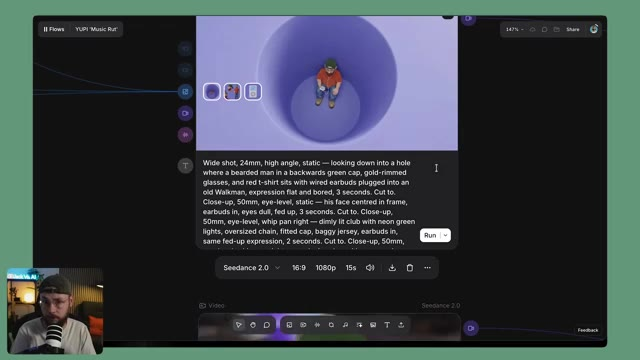
*Interface de l'outil Seedance 2.0 montrant le prompt textuel descriptif et les paramètres de génération vidéo.*

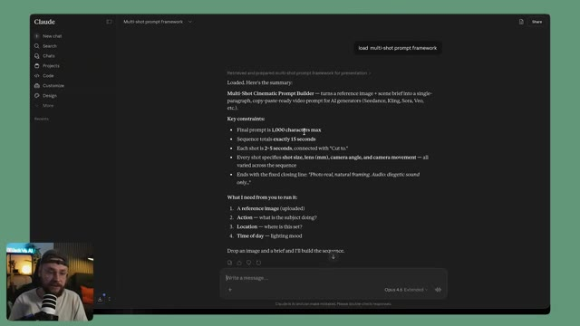
*Interface de l'assistant IA Claude affichant le cadre de prompt multi-shot chargé et ses contraintes clés.*

---

### ⏱️ `[00:11:08 - 00:12:02]` | Segment #24

**🔊 Audio (Transcription Intégrale Mot pour Mot en Français) :**
> un prompt détaillé qui décrit les angles de caméra, les objectifs de caméra, tout mouvement présent dans chaque plan individuel et qui indique toujours qu'on va couper vers le plan suivant. Il y a une belle variété de styles de plans différents ici, mais le plus important est qu'il retranscrit toute l'action au sein de cette génération multi-plans que nous voulons. Il suffit donc d'aller de l'avant, de copier ceci et de le coller dans le nœud de génération vidéo pour C-Dance 2. Allons donc jeter un œil à la génération brute que j'ai obtenue pour cette scène particulière ici. Maintenant, j'ai vraiment

**👁️ Analyse Visuelle d'Écran (gemini-3.5-flash-lite) :**
**Interface & Outils** : Interface web de l'assistant IA Claude avec une incrustation vidéo (PiP) du créateur en bas à gauche, puis affichage d'un rendu vidéo généré par IA en plein écran.

**Contenu textuel & Code** : Texte de prompt visible dans Claude décrivant une séquence visuelle multi-plans : "Wide shot, 24mm, high angle, static - locking down into a hole where a bearded in a backwards green cap, gold-rimmed glasses, and red t-shirt sits with wired earbuds plugged into an old Walkman..." et des détails sur les plans suivants (Medium shot, Close-up, etc.).

**Action / Démonstration** : Le créateur montre l'interface de Claude avec le prompt détaillé conçu pour la génération vidéo multi-plans, puis présente le résultat vidéo brut généré par l'IA mettant en scène le personnage 3D.

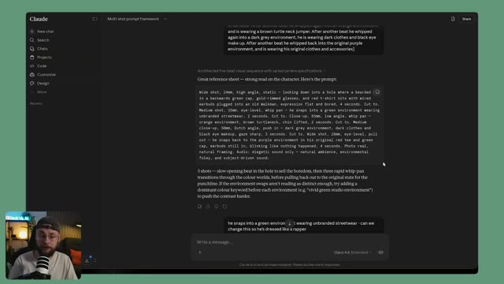
*Interface de l'assistant IA Claude affichant un prompt textuel détaillé décrivant des plans de caméra multiples (angles, mouvements, objectifs) avec une incrustation vidéo du créateur dans le coin inférieur gauche.*

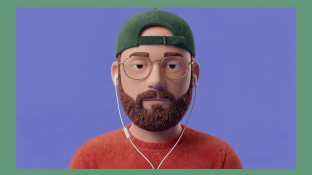
*Rendu vidéo brut généré par IA montrant un personnage animé en 3D (avatar du créateur avec une casquette verte, des lunettes et des écouteurs) sur un fond uni violet.*

---

### ⏱️ `[00:12:02 - 00:12:37]` | Segment #25

**🔊 Audio (Transcription Intégrale Mot pour Mot en Français) :**
> comme ceci mais ça n'était pas sans ses problèmes le premier plan par exemple en regardant vers le bas dans le trou c'est vraiment sans vie il ne s'y passe absolument rien on aurait aussi bien pu avoir une simple image fixe et c'est pourquoi j'ai fini par générer précisément ce plan d'ouverture initial sous forme de génération de plan unique vous pouvez faire cela en utilisant la même compétence claude d'ailleurs vous avez juste à dire à claude je veux juste une génération de plan unique pour ce prompt particulier et il l'incorporera simplement dans le même cadre donc vous pouvez voir ici c'est beaucoup plus simpliste en termes de prompt

**👁️ Analyse Visuelle d'Écran (gemini-3.5-flash-lite) :**
**Interface & Outils** : Seedance (flows vidéo) et Claude (IA conversationnelle).

**Contenu textuel & Code** : Textes de prompts décrivant des plans larges ("Wide shot, 24mm, high angle, slow pull out...") et interface de Seedance avec options de format, résolution et durée.
[DESC_IMAGE_2] Navigation dans l'interface de Seedance pour illustrer les problèmes de plans jugés sans vie.
[DESC_IMAGE_3] Visualisation du prompt modifié dans Claude pour générer un plan unique.
[DESC_IMAGE_4] Affichage du rendu vidéo dans Seedance suite aux modifications.

**Action / Démonstration** : Démonstration pédagogique et présentation du workflow.

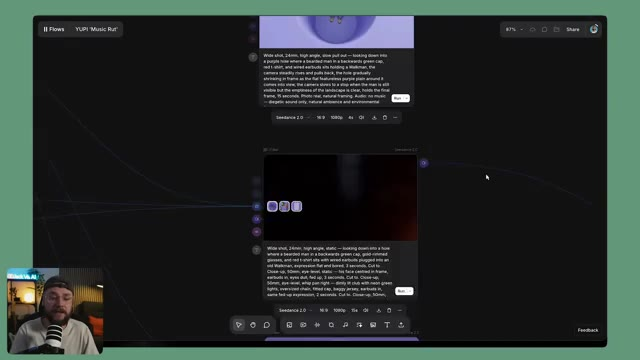
*Interface de Seedance montrant les flux de génération vidéo et les prompts de plans.*

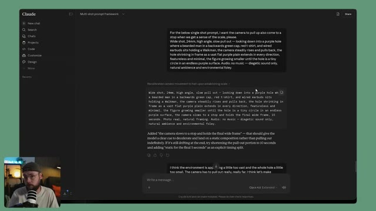
*Interface de Claude affichant un échange textuel sur le framework de prompt multi-plan et la génération de plans uniques.*

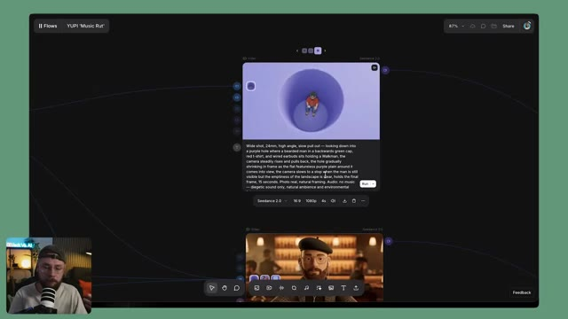
*Interface de Seedance montrant l'aperçu du plan avec un homme au fond d'un trou violet.*

---

### ⏱️ `[00:12:37 - 00:13:13]` | Segment #26

**🔊 Audio (Transcription Intégrale Mot pour Mot en Français) :**
> beaucoup plus court et j'ai juste opté pour une génération de quatre secondes ici la plus courte option que vous ayez et c'est ce qui a fini par se retrouver dans le montage final donc je savais que je pouvais simplement remplacer le plan problématique initial de cette séquence par celui-ci maintenant l'autre problème avec cette génération c'est que la musique heavy metal pour cette version du personnage manquait complètement. Maintenant, plutôt que de continuer à régénérer et à dépenser des crédits, il vaut mieux réfléchir à la façon d'utiliser ce qui fonctionne. Et j'ai juste pensé que je pouvais simplement retirer l'audio de ces générations.

**👁️ Analyse Visuelle d'Écran (gemini-3.5-flash-lite) :**
**Interface & Outils** : Interface logicielle de Seedance 2.0 avec une vue en nœuds (node-based UI), affichant des fenêtres de prévisualisation vidéo, des prompts textuels et des options de paramétrage (durée, résolution 1080p, ratio 16:9).

**Contenu textuel & Code** : On peut lire le prompt textuel dans le bloc vidéo : « Wide shot, 24mm, high angle, slow pull out... » ainsi que le menu de sélection de durée (4s à 10s) où 4s est sélectionné.

**Action / Démonstration** : L'utilisateur démontre la modification de la durée de la génération vidéo dans l'interface de Seedance en sélectionnant l'option la plus courte de 4 secondes.

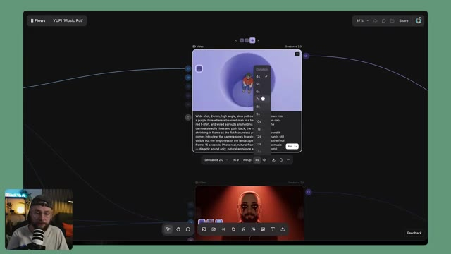
*Interface de Seedance 2.0 montrant le menu déroulant de sélection de la durée de génération vidéo, réglée sur 4 secondes.*

---

### ⏱️ `[00:13:13 - 00:13:32]` | Segment #27

**🔊 Audio (Transcription Intégrale Mot pour Mot en Français) :**
> Les visuels fonctionnaient vraiment très bien et remplacer l'audio ne serait en fait pas si difficile. Tout ce dont nous avons besoin, c'est d'un effet sonore de coup de fouet pour signifier en quelque sorte ce mouvement de caméra en panoramique rapide. Maintenant, vous je pourrais utiliser ElevenLabs pour générer des fragments de musique afin de remplir chaque section de la scène.

**👁️ Analyse Visuelle d'Écran (gemini-3.5-flash-lite) :**
**Interface & Outils** : Présentation face caméra sans partage d'écran

**Contenu textuel & Code** : Aucun contenu logiciel ou visuel à l'écran, uniquement Jack dans son studio avec son micro et le néon "Jack Vs. AI" en arrière-plan.

**Action / Démonstration** : Jack s'exprime face caméra en faisant des gestes des mains pour expliquer son processus de montage et de conception sonore.

---

### ⏱️ `[00:13:32 - 00:13:51]` | Segment #28

**🔊 Audio (Transcription Intégrale Mot pour Mot en Français) :**
> C'est donc exactement ce que nous avons fait. Et j'ai aussi lancé une autre génération avec un prompt très, très similaire. La seule modification que j'ai apportée ici, c'est que je voulais que le personnage soupire lorsqu'on revient sur lui, pour vraiment accentuer l'idée qu'il en a assez d'être coincé dans cette routine musicale.

**👁️ Analyse Visuelle d'Écran (gemini-3.5-flash-lite) :**
**Interface & Outils** : Interface web de Seedance (mode Flows), avec incrustation vidéo PiP du créateur dans le coin inférieur gauche.

**Contenu textuel & Code** : On distingue le projet intitulé « YUPI 'Music Rut' » dans Seedance 2.0, ainsi qu'un bloc de génération textuel affichant un prompt détaillé pour le plan vidéo (décrivant une caméra en plongée, un homme barbu avec une casquette verte, des lunettes, un t-shirt rouge avec des écouteurs filaires reliés à un Walkman, l'expression ennuyée, etc.).

**Action / Démonstration** : Le créateur montre l'interface de Seedance en plein écran pour illustrer la création de séquences vidéo et l'ajustement du prompt textuel.

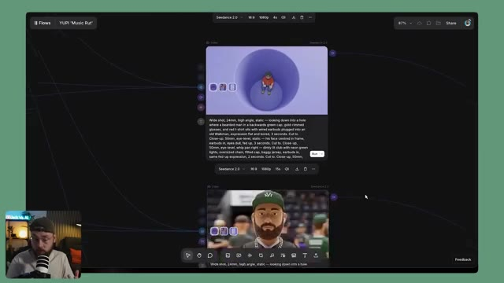
*Interface de Seedance montrant un flux de travail (flow) avec des blocs de génération vidéo contenant des prompts textuels et des aperçus visuels.*

---

### ⏱️ `[00:13:51 - 00:14:14]` | Segment #29

**🔊 Audio (Transcription Intégrale Mot pour Mot en Français) :**
> Et en fait, cette génération dans l'ensemble était plutôt mauvaise comparée à la première. La seule chose que j'ai aimée, c'était le personnage qui soupire. Du coup, je me suis dit que j'allais juste couper cette fin-là et la coller à la fin de cette première génération. Je n'ai également aucune idée de ce qui se passe avec les cheveux de ce personnage dans ce plan particulier.

**👁️ Analyse Visuelle d'Écran (gemini-3.5-flash-lite) :**
**Interface & Outils** : Interface web de Seedance 2.0 (outil de génération vidéo par IA sous forme de nœuds/flux), avec le créateur visible en incrustation PiP (Picture-in-Picture) en bas à gauche.

**Contenu textuel & Code** : Blocs de texte contenant des prompts en anglais détaillant les plans ('Wide shot, 24mm, high angle, static...', 'Close-up, 50mm, eye-level, static...'), des paramètres de format (16:9, 1080p, 15s) et des boutons de contrôle.

**Action / Démonstration** : Le créateur montre l'interface de Seedance pour illustrer sa session de montage et de sélection des meilleures parties de clips générés, puis zoome sur l'image pour pointer un défaut visuel sur la tête du personnage.

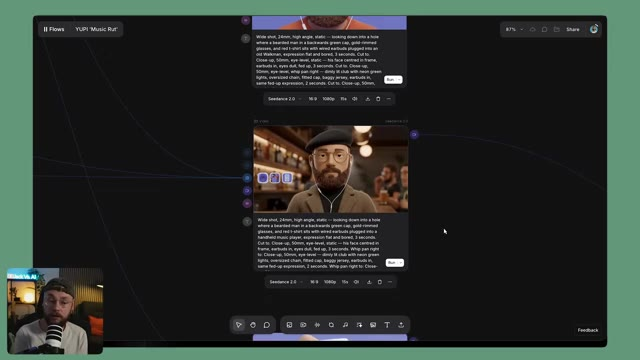
*Interface de Seedance montrant un projet vidéo sous forme de flux (flows) avec des blocs de prompts et des aperçus de génération.*

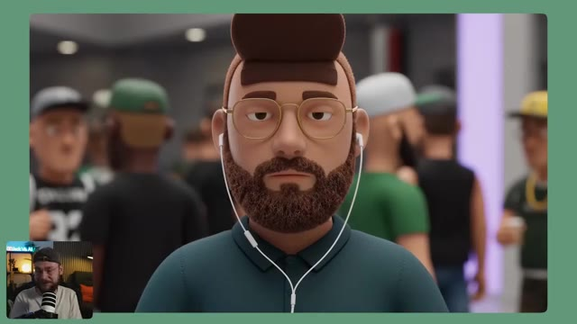
*Gros plan sur une génération de vidéo 3D montrant un personnage barbu avec des écouteurs et une coiffe étrange, illustrant un bug visuel des cheveux.*

---

### ⏱️ `[00:14:15 - 00:14:35]` | Segment #30

**🔊 Audio (Transcription Intégrale Mot pour Mot en Français) :**
> Ne demandez pas. L'IA est juste devenue un peu folle sur celui-là. Maintenant, la scène suivante était vraiment très ambitieuse. Si vous aviez essayé de demander à un modèle vidéo par IA de réussir ça ne serait-ce qu'il y a quelques mois, il aurait sérieusement eu du mal. Mais Seedance 2 est tout simplement très, très bon, pour être honnête. Jetons un œil à la génération brute, puis nous verrons comment je l'ai assemblée.

**👁️ Analyse Visuelle d'Écran (gemini-3.5-flash-lite) :**
**Interface & Outils** : Interface de Seedance 2.0 (outil de génération vidéo par IA sous forme de nœuds/flux), avec un retour vidéo en PiP du créateur dans le coin inférieur gauche.

**Contenu textuel & Code** : Texte du prompt visible dans Seedance 2.0 : "Close-up, 50mm, eye-level, static - a blue 3D glowing logo spins to life in darkness, casting light across the purple walls of a hole, 3 seconds. Cut to: Close-up, 85mm, low angle, push in - a bearded man in a backwards green-cap, gold-rimmed glasses, red t-shirt, and wired earbuds stares up at it, face lit blue, eyes wide with amazement..." Paramètres affichés : Seedance 2.0, 16:9, 1080p, 11s.

**Action / Démonstration** : Le créateur montre un exemple de génération vidéo IA de style 3D, puis bascule sur l'interface de Seedance 2.0 pour présenter le flux de travail et les prompts utilisés.

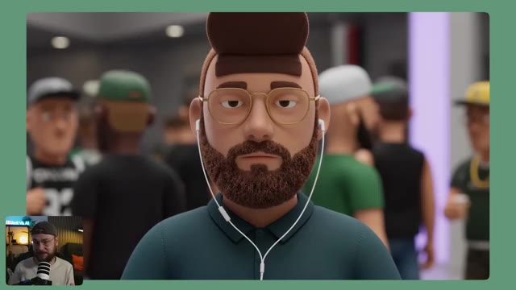
*Rendu vidéo en 3D d'un personnage stylisé avec le créateur en incrustation PiP en bas à gauche.*

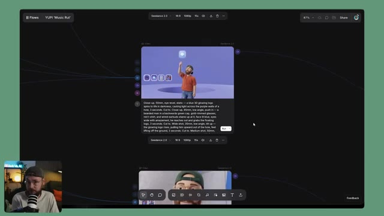
*Interface du logiciel Seedance 2.0 montrant un flux de travail (flows) avec des blocs de prompts et de génération vidéo.*

---

### ⏱️ `[00:14:36 - 00:14:56]` | Segment #31

**🔊 Audio (Transcription Intégrale Mot pour Mot en Français) :**
> Donc ça fait exactement ce que je voulais. J'étais vraiment très impressionné par cette génération.

**👁️ Analyse Visuelle d'Écran (gemini-3.5-flash-lite) :**
**Interface & Outils** : Présentation vidéo d'animation 3D (pas d'interface de logiciel ou d'outil SaaS affichée).

**Contenu textuel & Code** : Icône graphique stylisée représentant des ondes sonores et avatar animé 3D de type personnage virtuel.

**Action / Démonstration** : Animation visuelle montrant un logo ou une icône d'application lumineuse, puis un personnage 3D interagissant avec un smartphone.

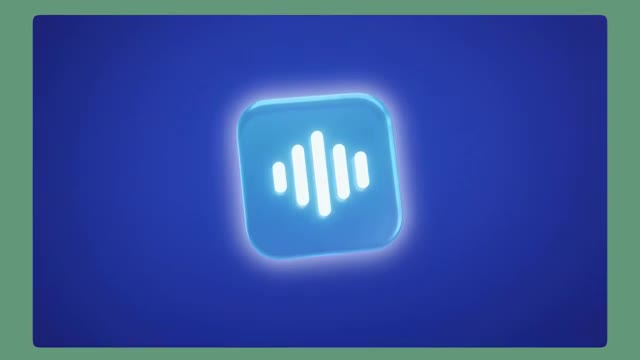
*Animation d'une icône d'application bleue brillante avec des ondes sonores sur fond bleu uni.*

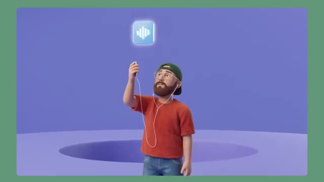
*Animation d'un avatar 3D portant une casquette et un t-shirt rouge, tenant un téléphone avec des écouteurs sous une icône d'application flottante.*

---

### ⏱️ `[00:14:57 - 00:15:32]` | Segment #32

**🔊 Audio (Transcription Intégrale Mot pour Mot en Français) :**
> C'est parfait, pour être honnête avec vous. Donc, en termes de références d'images que nous injectons, nous avons le plan du trou, nous avons le rendu 3D du logo, nous avons le lecteur de musique et ensuite nous avons la feuille de personnage. Nous fournissons donc à Seedance 2 beaucoup de contexte, et il l'utilise évidemment en combinaison avec notre assez long prompt textuel de Claude. Et pour la scène finale ici, je voulais commencer par un très gros plan du personnage, maintenant il a l'air plutôt heureux, puis faire un léger zoom arrière.

**👁️ Analyse Visuelle d'Écran (gemini-3.5-flash-lite) :**
**Interface & Outils** : Interface logicielle de Seedance 2.0 (éditeur basé sur des nœuds / flux de travail vidéo par IA) avec un panneau de prompt textuel, des vignettes de référence d'image et des paramètres de format (16:9, 1080p, durée en secondes).

**Contenu textuel & Code** : Textes des prompts de génération visibles dans les blocs : "Close-up, 50mm, eye-level, static — a blue 3D glowing logo spins to life in darkness..." et "Extreme close-up, 85mm, eye-level, slow pull out — the bearded man in a backwards green cap...". Paramètres Seedance 2.0 (16:9, 1080p, 8s / 15s). Icônes de sélection de références d'images (trou, logo 3D, lecteur de musique, personnage).

**Action / Démonstration** : Le créateur navigue dans l'interface de Seedance 2.0, présente les différentes références d'images utilisées pour alimenter le modèle et détaille le prompt textuel et les choix de cadrage pour la scène finale.

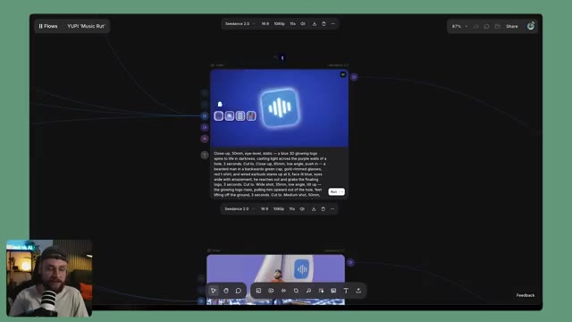
*Interface de Seedance 2.0 montrant le nœud principal avec le rendu 3D du logo lumineux et le prompt détaillé associé.*

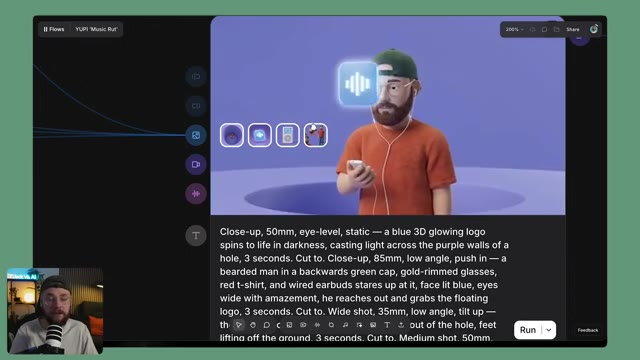
*Interface de Seedance 2.0 affichant les références d'images injectées (trou, logo, lecteur de musique, personnage) et le plan du personnage heureux.*

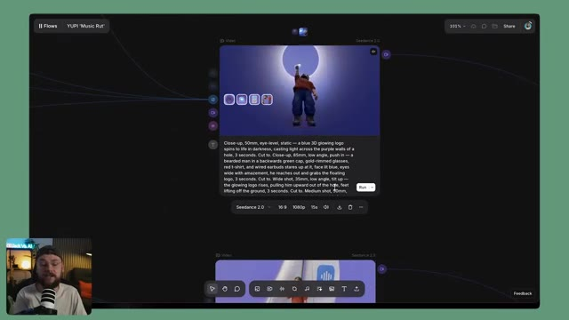
*Interface de Seedance 2.0 montrant le plan large du personnage attrapant le logo flottant hors du trou.*

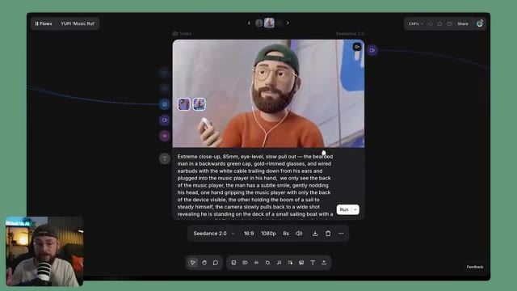
*Interface de Seedance 2.0 affichant le plan de très gros plan du personnage avec le prompt descriptif détaillé pour la scène finale.*

---

### ⏱️ `[00:15:32 - 00:16:05]` | Segment #33

**🔊 Audio (Transcription Intégrale Mot pour Mot en Français) :**
> pour révéler qu'il est sur ce bateau et qu'il surfe sur les ondes audio ou sonores et enfin qu'il est en quelque sorte satisfait du choix musical qu'il a obtenu donc juste quelques références d'images utilisées ici nous avons la feuille de modèle de personnage ainsi que ce visuel clé que je vous montrais plus tôt et que j'ai assemblé juste pour fixer ce sens du style Seedance 2 sait exactement ce que nous voulons montrer dans le plan. Et puis je demande à la caméra de faire un tilt vers le haut juste pour que

**👁️ Analyse Visuelle d'Écran (gemini-3.5-flash-lite) :**
**Interface & Outils** : Interface logicielle de Seedance 2.0 (éditeur basé sur des nœuds et des fenêtres de génération vidéo).

**Contenu textuel & Code** : Textes de prompts en anglais décrivant les plans cinématographiques ("Extreme close-up, 85mm, eye-level, slow pull out..."), paramètres de format (16:9, 1080p, 8s), et nom du projet 'YUPI Music Rut'.

**Action / Démonstration** : Le créateur navigue dans l'interface de Seedance pour illustrer les différents plans de sa vidéo générée par IA et explique le processus de création et de cadrage.

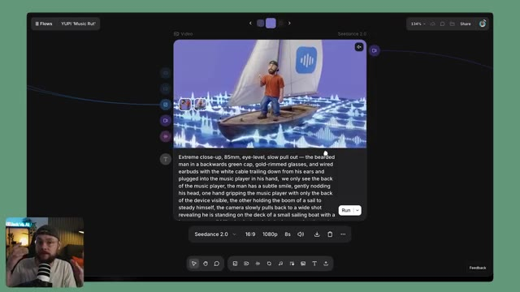
*Interface Seedance 2.0 montrant un plan large d'un personnage sur un voilier naviguant sur des ondes sonores avec un prompt textuel détaillé.*

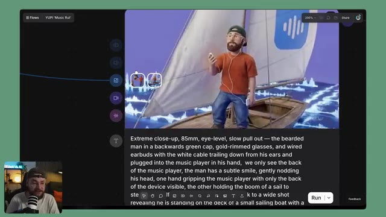
*Interface Seedance 2.0 montrant le personnage en plan moyen tenant un lecteur de musique avec des écouteurs filaires.*

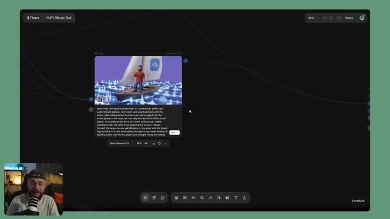
*Interface Seedance 2.0 en vue globale de l'espace de travail nodal avec le flux du projet 'YUPI Music Rut'.*

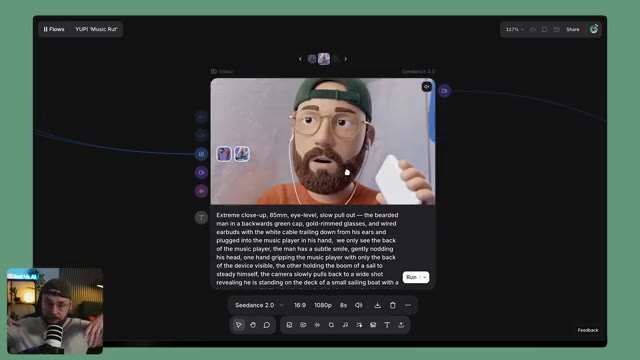
*Interface Seedance 2.0 affichant un gros plan (extrême close-up) du personnage barbu avec des lunettes et une casquette verte.*

---

### ⏱️ `[00:16:05 - 00:16:38]` | Segment #34

**🔊 Audio (Transcription Intégrale Mot pour Mot en Français) :**
> Nous faisons face à ce genre de fond violet lavande uni pour la fin de la publicité. Parce que je savais alors que je voulais montrer une image de fin de produit, ou je suppose que je devrais dire une image de fin d'application dans cet exemple. Je voulais donc juste un beau fond propre pour pouvoir ajouter cela par-dessus. Et nous avions aussi créé cela plus tôt si vous vous en souvenez, je savais que cela s'ajouterait vraiment très bien par-dessus la fin de la séquence, mais ensuite j'ai poussé les choses un peu plus loin, cela m'a vraiment impressionné aussi, j'ai en fait

**👁️ Analyse Visuelle d'Écran (gemini-3.5-flash-lite) :**
**Interface & Outils** : Interface du logiciel Seedance (mode Flows / nœuds).

**Contenu textuel & Code** : Sur l'image 1, un prompt textuel décrivant un plan cinématographique avec un personnage barbu sur un voilier et les paramètres Seedance 2.0 (16:9, 1080p, 8s). Sur l'image 2, un graphique de nœuds interconnectés sur fond noir.

**Action / Démonstration** : Le créateur montre l'interface de Seedance en plein écran avec une incrustation vidéo (PiP) de lui-même en bas à gauche, illustrant la construction d'un flux de travail vidéo.

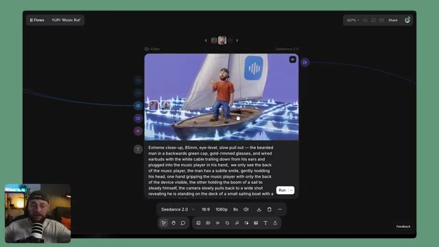
*Interface de Seedance montrant une génération vidéo avec un personnage sur un voilier et son prompt textuel associé.*

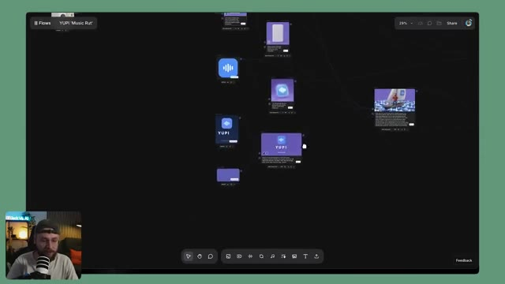
*Vue d'ensemble du flux de travail (workflow) sur l'interface de Seedance montrant plusieurs nœuds connectés.*

---

### ⏱️ `[00:16:38 - 00:17:14]` | Segment #35

**🔊 Audio (Transcription Intégrale Mot pour Mot en Français) :**
> j'ai utilisé C-Dance 2 pour créer ce genre d'animation de type motion graphics pour la révélation du logo de l'application et le résultat est vraiment très bien également, je vais vous montrer la génération brute pour ça donc vraiment super j'adore aussi le sound design qui a été ajouté, vous pouvez voir que j'ai utilisé un prompt textuel très simple ici, vous n'avez pas toujours besoin d'utiliser Claude pour concevoir votre prompt, parfois vous pouvez simplement opter pour quelque chose d'un peu plus conversationnel donc mon idée était qu'on allait recadrer

**👁️ Analyse Visuelle d'Écran (gemini-3.5-flash-lite) :**
**Interface & Outils** : Interface de l'outil de génération vidéo Seedance 2.0 (avec incrustation vidéo PiP du créateur en bas à gauche).

**Contenu textuel & Code** : Texte du prompt visible : "Simple, clean reveal animation of the sound wave icon against a plain black background. The sound waves form, the app roundal folds out. Minimal sound design, no music." Paramètres visibles : Seedance 2.0, 16:9, 1080p, 4s.

**Action / Démonstration** : Le créateur montre l'interface de Seedance 2.0 avec le résultat visuel et le prompt utilisé pour la révélation du logo de l'application.

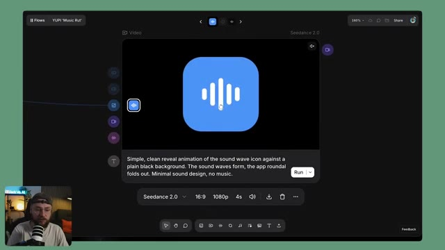
*Interface de Seedance 2.0 affichant le rendu final avec un logo bleu représentant des ondes sonores et le prompt textuel associé.*

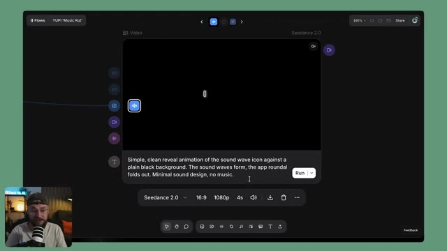
*Interface de Seedance 2.0 montrant le début de l'animation sur fond noir avec le prompt de génération textuel visible en bas.*

---

### ⏱️ `[00:17:14 - 00:17:50]` | Segment #36

**🔊 Audio (Transcription Intégrale Mot pour Mot en Français) :**
> juste le logo fixe et je pourrais simplement ajouter le logo animé à la place juste pour rendre les choses un peu plus engageantes et haut de gamme. Donc à ce stade ici dans notre sorte de graphe de nœuds, nous avons toutes les générations vidéo dont nous avons besoin. Et vous voyez à la fin ici, nous avons ce connecteur qui mène simplement à un upscaler. C'est donc Topaz qui est utilisé. Et juste pour vous montrer une autre façon d'accéder à différents nœuds, vous pouvez en fait faire glisser à partir de l'arrière d'un nœud puis relâcher. Cela va vous donner quelques options ici. Donc vous voulez

**👁️ Analyse Visuelle d'Écran (gemini-3.5-flash-lite) :**
**Interface & Outils** : Interface de type graphe de nœuds / node-based editor (semblable à ComfyUI ou outils de flux de travail vidéo basés sur le cloud).

**Contenu textuel & Code** : On aperçoit des blocs de génération vidéo (Seedance 2.5), des prompts textuels descriptifs, des paramètres de format (16:9, 1080p), et les options du menu contextuel : "Add new node", "Upscale", "Edit video", "Mix with audio", "Liposync generation".

**Action / Démonstration** : Le créateur montre la structure de son graphe de nœuds, zoome sur un upscaler Topaz, puis démontre comment faire glisser un connecteur depuis l'arrière d'un nœud pour ouvrir le menu d'options de création de nœuds.

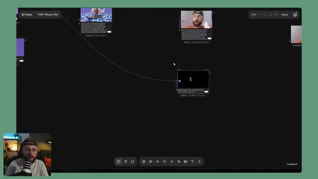
*Vue d'ensemble d'un graphe de nœuds (node graph) dans une interface de création vidéo avec plusieurs blocs connectés et le retour caméra du créateur en incrustation.*

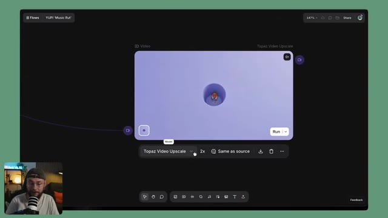
*Gros plan sur un nœud de traitement vidéo utilisant Topaz Video Upscale avec les options de modèle et de résolution affichées.*

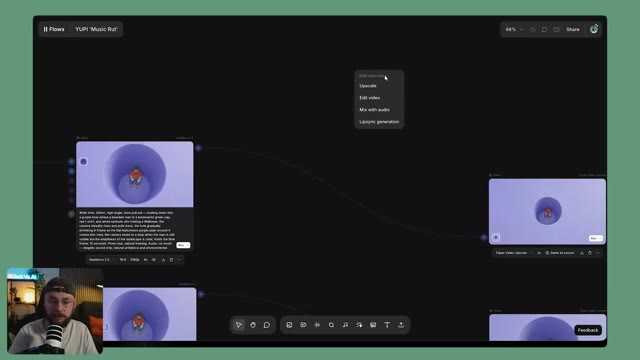
*Démonstration du menu contextuel d'ajout de nouveau nœud ("Add new node") après avoir fait glisser un connecteur depuis l'arrière d'un nœud.*

---

### ⏱️ `[00:17:50 - 00:18:27]` | Segment #37

**🔊 Audio (Transcription Intégrale Mot pour Mot en Français) :**
> pour choisir l'upscale par exemple par défaut il va à la plus haute résolution possible et ensuite ici vous pouvez choisir votre fréquence d'images aussi généralement vous voulez opter pour la même que la source et puis cliquez simplement sur exécuter et ensuite récupérez votre génération de vidéo upscalée donc avec ça tous les visuels pour notre projet ont été générés mais comme cela allait être pour une application sur la musique l'audio va jouer un rôle vraiment important aussi ce qui est génial avec Eleven Labs cependant c'est qu'en plus des outils d'image et de vidéo auxquels nous avons accès vous avez également des modèles de synthèse vocale par IA très puissants

**👁️ Analyse Visuelle d'Écran (gemini-3.5-flash-lite) :**
**Interface & Outils** : Interface logicielle de type nœuds (Flows) avec Topaz Video Upscale, puis interface du tableau de bord d'ElevenLabs (ElevenCreative)

**Contenu textuel & Code** : Texte affiché : 'Topaz Video Upscale', '3840 x 2160', 'Same as source', 'Run', et pour la deuxième image 'Step Four Audio Generation'. Sur la dernière image, les menus d'ElevenLabs : Instant speech, Audiobook, Image & Video, ElevenAgents, Music, Dubbed video, Voice Design, Clone your Voice.

**Action / Démonstration** : Le créateur montre le processus de configuration de l'upscale vidéo, présente ensuite l'étape de génération audio avec un rendu d'avatar 3D, puis bascule sur l'interface d'ElevenLabs pour présenter les outils de synthèse vocale.

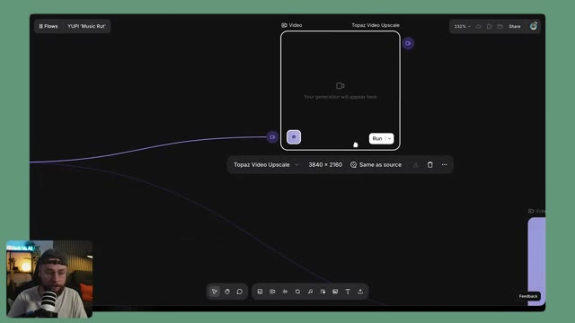
*Interface de l'outil de nœuds (Flows) montrant les paramètres de Topaz Video Upscale et le bouton Exécuter (Run)*

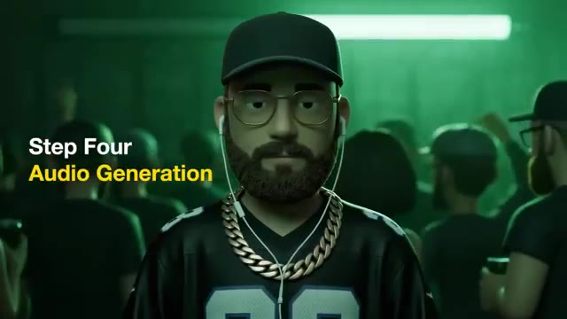
*Animation 3D montrant l'avatar de Jack dans un club avec le texte affiché à l'écran 'Step Four Audio Generation'*

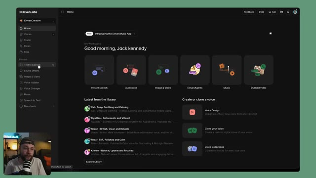
*Tableau de bord principal d'ElevenLabs avec la navigation latérale et les options du workspace (Instant speech, Audiobook, Music, etc.)*

---

### ⏱️ `[00:18:27 - 00:19:02]` | Segment #38

**🔊 Audio (Transcription Intégrale Mot pour Mot en Français) :**
> ainsi que la génération de musique également. Et je savais que la voix off de la publicité serait vraiment très importante pour guider le spectateur et lui permettre de comprendre ce qui se passait réellement. Donc pour sélectionner une voix, vous voulez aller dans l'onglet des voix et cliquer dessus. Et ce qui est vraiment utile, c'est que vous pouvez appliquer tout un tas de filtres différents pour cibler précisément la voix que vous recherchez et vous pouvez également aller sélectionner votre langue, donc par exemple si nous choisissons l'anglais, vous allez alors débloquer l'option de choisir parmi un ensemble de

**👁️ Analyse Visuelle d'Écran (gemini-3.5-flash-lite) :**
**Interface & Outils** : Interface web d'ElevenLabs (mode sombre) avec un panneau de navigation à gauche et le tableau de bord "My Workspace" au centre, incluant une incrustation vidéo (PiP) du présentateur en bas à gauche.

**Contenu textuel & Code** : Texte affiché : "ElevenLabs", "Good morning, Jack kennedy", "My Workspace" avec des options comme Instant speech, Audiobook, Image & Video, ElevenAgents, Music, Dubbed video. Dans le menu latéral : Home, Voices, Studio, Flows, Files, Text to Speech, Sound Effects, Image & Video, Voice Isolator, Voice Changer, Music, Speech to Text. À droite, "Create or clone a voice" avec Voice Design, Clone your Voice, Voice Collections.

**Action / Démonstration** : Le créateur présente le tableau de bord d'ElevenLabs et s'apprête à expliquer comment naviguer vers l'onglet des voix pour sélectionner une voix off.

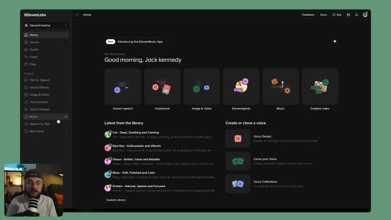
*Interface principale d'ElevenLabs montrant le tableau de bord utilisateur, les outils de génération audio (Text to Speech, Music, etc.) avec le présentateur en incrustation PiP.*

---

### ⏱️ `[00:19:02 - 00:19:20]` | Segment #39

**🔊 Audio (Transcription Intégrale Mot pour Mot en Français) :**
> différents accents également et une fois que vous trouvez une voix qui vous plaît, vous avez simplement à cliquer sur cette icône ici, il est écrit "utiliser la voix". J'ai fini par choisir Ralph Eisend qui a cet accent allemand mais qui semble aussi très calme, chaleureux, accessible, exactement ce que je cherchais pour le projet.

**👁️ Analyse Visuelle d'Écran (gemini-3.5-flash-lite) :**
**Interface & Outils** : Interface web d'ElevenLabs (bibliothèque de voix / Voice Library) avec une incrustation vidéo (PiP) de Jack dans le coin inférieur gauche.

**Contenu textuel & Code** : Liste de voix disponibles sur ElevenLabs, incluant des profils tels que "Adam Stone - Smooth and Relaxed", "Elise - Warm, Natural and Engaging", "Victoria - Warm, Trustworthy, and R...", "Josh - Teacher for Kids", "Ash - Calm, Soothing, Magnetic Nar...", etc., avec des filtres pour l'anglais, les accents, et des catégories comme Conversational, Narration, Characters, Social Media, Educational, Advertisement.

**Action / Démonstration** : Le curseur survole une option de voix dans la bibliothèque ElevenLabs pendant que l'interface principale est affichée à l'écran.

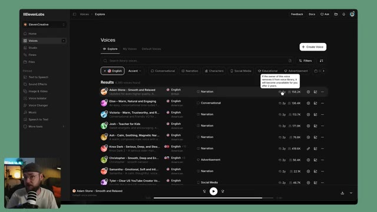
*Interface de la bibliothèque de voix d'ElevenLabs avec le curseur de la souris pointant vers une option de voix.*

---

### ⏱️ `[00:19:21 - 00:19:55]` | Segment #40

**🔊 Audio (Transcription Intégrale Mot pour Mot en Français) :**
> Nous avons tous été bloqués dans une routine d'écoute où rien ne semble vous libérer. Vous pouvez donc voir que je viens de déposer le script de voix off juste ici. Vous cliquez littéralement sur générer et vous obtiendrez des lectures de très haute qualité de votre script. La seule chose que je dirai, c'est qu'il est important d'utiliser la ponctuation pour définir en quelque sorte quand vous voulez que votre lecteur fasse ces pauses, et j'ai aussi fini par épeler UP phonétiquement car j'avais un peu peur que Ralph le prononce comme yuppie, ce qui n'est pas ce que je voulais, ça sonne un peu bizarre et si vous

**👁️ Analyse Visuelle d'Écran (gemini-3.5-flash-lite) :**
**Interface & Outils** : Interface web d'ElevenLabs (Text to Speech).

**Contenu textuel & Code** : On peut lire le script de voix off dans l'éditeur : "We've all been stuck, in a listening rut, when nothing seems to set you free... Not this. Not that. Definitely not this. But Yoopi... is different. It uses AI, to analyse your listening trends, and make unique suggestions..." Paramètres visibles : Voix "Ralf Eisend - Deep and Gravely", Modèle "Eleven v3", curseur de stabilité, et bouton "Generate speech".

**Action / Démonstration** : Le curseur de la souris navigue dans l'interface d'ElevenLabs pour configurer la voix et lancer la génération du discours.

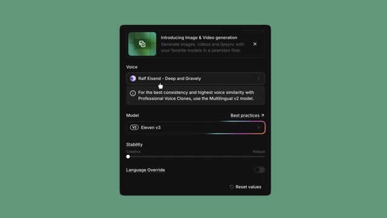
*Interface d'ElevenLabs montrant le panneau de configuration de la voix avec la sélection de Ralf Eisend - Deep and Gravely et le modèle Eleven v3.*

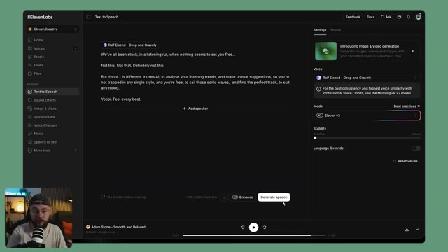
*Interface complète d'ElevenLabs Text to Speech avec le script de voix off affiché, les paramètres à droite et le curseur de la souris pointant sur Generate speech.*

---

### ⏱️ `[00:19:55 - 00:20:30]` | Segment #41

**🔊 Audio (Transcription Intégrale Mot pour Mot en Français) :**
> tu veux tu peux aussi ajouter ces crochets et dire par exemple excité et si tu mets ça devant un passage de texte ça va appliquer ce genre d'humeur à la lecture de cette ligne spécifique donc il y a beaucoup d'options différentes ici et en fait je n'avais pas besoin de faire aussi compliqué avec ça. J'ai juste obtenu un très bon résultat dès le début. Donc ouais, un outil vraiment puissant ici quand il s'agit de créer vos voix off. Et ensuite j'avais besoin de musique pour chacune de ces scènes de versions alternatives de notre personnage. Donc tu veux juste te rendre sur l'onglet musique ici. C'est juste

**👁️ Analyse Visuelle d'Écran (gemini-3.5-flash-lite) :**
**Interface & Outils** : Interface web d'ElevenLabs avec le menu latéral de gauche (Home, Voices, Studio, Text to Speech, Sound Effects, Music, etc.) et le panneau de configuration à droite (paramètres de voix, modèle Eleven v3, curseur de stabilité).

**Contenu textuel & Code** : Texte saisi dans le champ principal : "We've all been stuck, in a listening rut, when nothing seems to set you free... Not this. Not that. Definitely not this. But Yoopi... is different. It uses AI, to analyse your listening trends, and make unique suggestions..." Panneau de droite : Voix sélectionnée "Ralf Eisend - Deep and Gravely", Modèle "Eleven v3". En bas à gauche, incrustation vidéo (PiP) du présentateur Jack avec son micro.

**Action / Démonstration** : Le curseur de la souris survole le texte dans l'interface d'ElevenLabs, tandis que l'application permet de générer de la voix off à partir de texte.

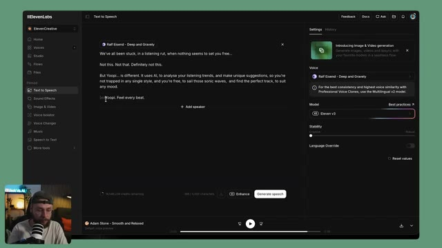
*Interface d'ElevenLabs montrant le panneau de synthèse vocale (Text to Speech) avec le champ de texte et les paramètres de voix.*

---

### ⏱️ `[00:20:30 - 00:21:07]` | Segment #42

**🔊 Audio (Transcription Intégrale Mot pour Mot en Français) :**
> un cas où l'on dépose un texte descriptif pour indiquer le type de morceau que l'on recherche. Et vous pouvez voir que nous avons tout un tas d'options différentes. Vous pouvez définir le nombre de variations parmi lesquelles vous pouvez choisir. Vous pouvez définir la durée souhaitée pour votre morceau. Et c'est important ici aussi. Il va également inclure automatiquement du chant dans vos morceaux. Et souvent, vous ne le souhaitez peut-être pas si vous l'utilisez pour du contenu. Assurez-vous donc, si c'est le cas, de sélectionner instrumental et vous n'aurez aucune voix dans votre morceau. Donc si nous allons simplement dans l'historique, je vais vous montrer certaines choses.

**👁️ Analyse Visuelle d'Écran (gemini-3.5-flash-lite) :**
**Interface & Outils** : Interface web d'ElevenLabs (section Music / Marketplace), avec un encart de génération flottant en bas de l'écran et le créateur visible en incrustation (PiP) dans le coin inférieur gauche.

**Contenu textuel & Code** : Texte du prompt visible : « Make a soulful blues t... » avec des boutons de suggestions (« Upbeat Pop Track », « Ambient Electronic Soundscape », « Acoustic Folk Ballad ») et des options de paramétrage (durée, variations, crédits).

**Action / Démonstration** : Le créateur présente l'interface de génération de musique textuelle d'ElevenLabs, en mettant en avant la zone de saisie du prompt et les options de configuration.

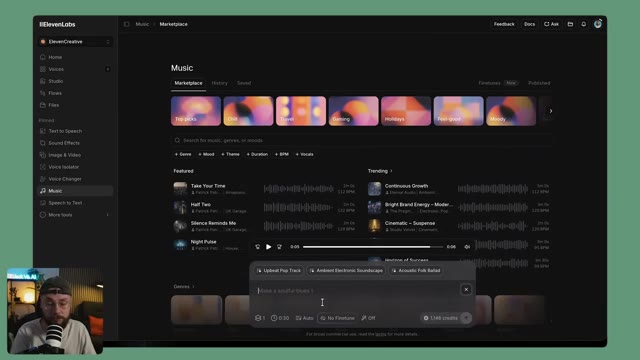
*Interface d'ElevenLabs (génération de musique) montrant la barre de texte pour entrer un prompt et les options de durée, variations et mode instrumental.*

---

### ⏱️ `[00:21:07 - 00:21:43]` | Segment #43

**🔊 Audio (Transcription Intégrale Mot pour Mot en Français) :**
> que j'ai assemblé. C'était donc pour le morceau de hip-hop. Et si nous allons de l'avant et cliquons sur ces trois points et disons ouvrir dans le projet, vous obtiendrez encore une fois plus de contrôle. Vous pouvez donc voir pour le prompt textuel, j'ai littéralement juste mis hip-hop intense et lourd pour piste de rap. Et ce que j'ai obtenu en premier, j'ai trouvé que c'était un peu trop sombre et lent. Et puis j'ai juste mis BPM plus rapide. Et juste comme ça, ElevenLabs m'a redonné une meilleure version de ce que je cherchais. Et ce qui est vraiment utile aussi,

**👁️ Analyse Visuelle d'Écran (gemini-3.5-flash-lite) :**
**Interface & Outils** : Interface web d'ElevenLabs (section Musique / Historique) avec un encadré PiP (Picture-in-Picture) de Jack dans le coin inférieur gauche.

**Contenu textuel & Code** : Historique des projets musicaux comprenant des pistes telles que "Uptown Chill", "Molten Core", "Bebop Sprint", "Concrete Jungle", "Outta Control", "Midnight Haze" et "The Quantum Spire". Dans la barre de prompt en bas : des tags de style ("Upbeat Pop Track", "Ambient Electronic Soundscape", "Acoustic Folk Ballad"), la boîte de texte de génération, ainsi que des icônes de paramètres (durée 0:30, mode instrumental, etc.) et un solde de 1 146 crédits.

**Action / Démonstration** : Le créateur montre l'historique de ses projets musicaux sur ElevenLabs, illustrant les différentes pistes générées et l'accès aux options de contrôle et d'édition.

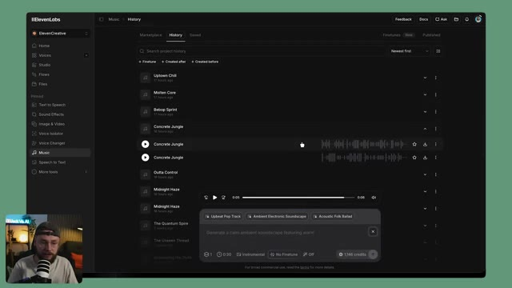
*Interface d'ElevenLabs affichant l'historique des projets musicaux avec le panneau de génération et le retour vidéo du présentateur dans un encadré PiP.*

---

### ⏱️ `[00:21:43 - 00:22:18]` | Segment #44

**🔊 Audio (Transcription Intégrale Mot pour Mot en Français) :**
> Si nous allons au bas de l'écran, vous verrez que la piste est également divisée en ces sections distinctes, et si vous voulez, disons que vous voulez que l'intro soit plus longue, vous pouvez simplement tirer sur ce curseur puis appuyer sur régénérer. Vous obtiendrez une piste globale plus longue, mais aussi une intro plus longue pour cette section spécifique. Le degré de contrôle que vous obtenez ici est donc vraiment puissant et vous permet de construire votre piste autour de votre montage. Donc, à ce stade, j'ai généré tous mes éléments visuels ainsi que mon audio, il est donc temps de passer au montage, donc en passant...

**👁️ Analyse Visuelle d'Écran (gemini-3.5-flash-lite) :**
**Interface & Outils** : Interface web d'ElevenLabs (génération de musique) avec affichage en Picture-in-Picture (PiP) du créateur dans le coin inférieur gauche.

**Contenu textuel & Code** : On peut lire des tags de style comme "hip hop", "heavy beat", "dark", "Intro", "Beat Drop", "Outro", ainsi que les options de régénération, de gestion de la chronologie audio et le texte d'aide "Publish your song to Music Marketplace and earn from your creations".

**Action / Démonstration** : Le créateur montre l'interface d'ElevenLabs et commente la gestion des sections audio sur la chronologie, puis l'animation de transition vers l'étape du montage.

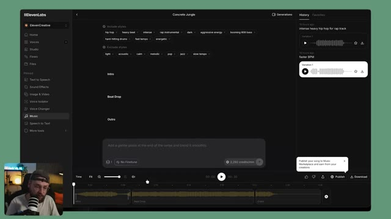
*Interface d'ElevenLabs affichant la chronologie de la piste audio divisée en sections (Intro, Beat Drop, Outro) avec les options de régénération et de contrôle des styles.*

---

### ⏱️ `[00:22:18 - 00:22:53]` | Segment #45

**🔊 Audio (Transcription Intégrale Mot pour Mot en Français) :**
> En passant sur Premiere Pro ici, cette piste audio inférieure correspond à la voix off d'ElevenLabs, et vous pouvez voir que j'y ai fait des coupes et que j'ai un peu réajusté les choses ici et là. Je voulais simplement contrôler le rythme auquel le script de la voix off était lu. Vous n'êtes pas obligé de prendre exactement ce qui est généré pour vous. Vous pouvez faire de petits ajustements ici et là pour vous rapprocher de ce que vous recherchez. Maintenant, je parle souvent de cela, mais je trouve vraiment utile de baser le montage autour de la voix off. C'est en quelque sorte ce qui dicte tout ce qui suit. Pour ainsi dire

**👁️ Analyse Visuelle d'Écran (gemini-3.5-flash-lite) :**
**Interface & Outils** : Adobe Premiere Pro

**Contenu textuel & Code** : Chronologie de montage avec plusieurs pistes vidéo et audio (A1, A2, V1, V2), fenêtres de visualisation, panneaux de médias avec des dossiers comme "ELEVENLABS FLOW 2" et le retour vidéo du créateur dans le coin inférieur gauche.

**Action / Démonstration** : Le créateur montre son écran de montage sur Adobe Premiere Pro, mettant en évidence les coupes et les ajustements effectués sur la piste audio de la voix off générée par ElevenLabs.

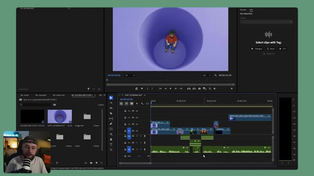
*Interface d'Adobe Premiere Pro montrant la chronologie avec les pistes audio et vidéo découpées de la voix off ElevenLabs, ainsi que le créateur en incrustation (PiP).*

---

### ⏱️ `[00:22:53 - 00:23:28]` | Segment #46

**🔊 Audio (Transcription Intégrale Mot pour Mot en Français) :**
> commencez par créer la voix off, puis construisez les visuels autour de celle-ci. Si vous faites les choses dans l'autre sens, cela peut devenir assez délicat, je pense. Donc, une fois que la voix off était définie, je pouvais commencer à superposer mes générations de vidéo par-dessus. Si je désactive cette couche supérieure ici, c'est là que nous avions à l'origine ce plan vraiment nul et mort où absolument rien ne se passait. Si je réactive cette couche, vous pouvez voir que nous avons maintenant ce beau mouvement de caméra en arrière pour nous donner une idée du lieu et aussi rendre notre personnage principal très isolé et globalement dépité, puis nous

**👁️ Analyse Visuelle d'Écran (gemini-3.5-flash-lite) :**
**Interface & Outils** : Logiciel de montage vidéo (type Adobe Premiere Pro) avec affichage du chutier, du moniteur de prévisualisation, de la timeline multipiste et incrustation vidéo (PiP) du créateur en bas à gauche.

**Contenu textuel & Code** : Timeline de montage avec différentes pistes audio (A1, A2) et vidéo (V1, V2, V3, V4), clips vidéo nommés ("ElevenLabs", "YUPY LISTENING RUT"), panneau de projet (bins : Bin Audio, Bin Upscaled, Bin Video Gen, Bin ELEVENLABS FLOW 2) et moniteur affichant une scène avec un personnage au fond d'un cylindre.

**Action / Démonstration** : Le créateur montre son écran de montage vidéo et explique comment il superpose les clips générés par IA sur la voix off.

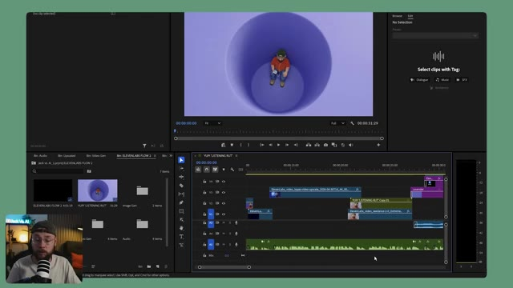
*Interface d'un logiciel de montage vidéo montrant la timeline avec les pistes audio et vidéo et l'aperçu du projet dans le moniteur.*

---

### ⏱️ `[00:23:28 - 00:24:05]` | Segment #47

**🔊 Audio (Transcription Intégrale Mot pour Mot en Français) :**
> passons directement à la génération originale ici et nous commençons à faire nos mouvements de caméra brusques maintenant si je zoome un peu ici vous allez voir que l'audio comme je l'ai dit tout à l'heure a fini par être complètement désactivé et j'ai simplement pris l'initiative de remplacer certains bruits de style mouvement brusque de caméra et ensuite nous avons ajouté chacune de nos pistes audio que nous avons générées à l'intérieur d'ElevenLabs donc pour la scène hip-hop la scène jazz et puis la scène heavy metal aussi ce qui bien sûr manquait carrément de musique dans la génération vidéo originale donc ouais il a fallu qu'on règle ça et ensuite on coupe

**👁️ Analyse Visuelle d'Écran (gemini-3.5-flash-lite) :**
**Interface & Outils** : Adobe Premiere Pro

**Contenu textuel & Code** : On observe la timeline du logiciel Adobe Premiere Pro avec plusieurs pistes vidéo et audio (marquées pour ElevenLabs), le panneau de visualisation affichant un personnage animé portant des lunettes et une casquette, ainsi que le panneau des propriétés audio et des effets sonores à droite.

**Action / Démonstration** : Le créateur montre son montage vidéo sur Adobe Premiere Pro en expliquant comment il a désactivé l'audio d'origine, ajouté des effets de panoramique brusque ("whip pans") et intégré les pistes audio générées via ElevenLabs pour les scènes hip-hop, jazz et heavy metal.

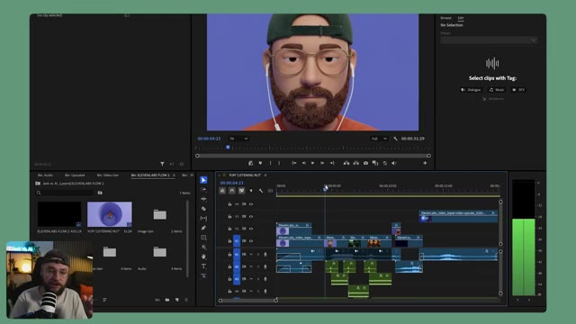
*Interface d'Adobe Premiere Pro montrant la timeline avec les différentes pistes audio (hip-hop, jazz, heavy metal) et les clips vidéo, avec Jack visible en incrustation PiP dans le coin inférieur gauche.*

---

### ⏱️ `[00:24:05 - 00:24:38]` | Segment #48

**🔊 Audio (Transcription Intégrale Mot pour Mot en Français) :**
> à ce plan alternatif ou le reste de la génération était nul mais le soupir était vraiment sympa et cette coupe fonctionne vraiment bien surtout avec la musique heavy metal qui s'arrête net et ensuite on a ce soupir et le public comprend un peu ce qui se passe et maintenant nous avons la génération multi-plans où le logo de l'application up apparaît vous pouvez voir qu'une fois de plus j'ai coupé ça légèrement donc je crois que si je fais juste glisser ceci par ici le personnage passe un temps fou à simplement fixer le logo et

**👁️ Analyse Visuelle d'Écran (gemini-3.5-flash-lite) :**
**Interface & Outils** : Adobe Premiere Pro

**Contenu textuel & Code** : Timeline de montage vidéo avec plusieurs pistes audio et vidéo (V1, V2, A1, A2, etc.), panneaux de gestion des médias (Bin Audio, Bin Upvoted, Bin Video Gen, Bin ELEVENLABS FLOW 2), et un aperçu vidéo affichant un personnage 3D avec des écouteurs sur fond bleu. Incrustation vidéo (PiP) de Jack dans le coin inférieur gauche.

**Action / Démonstration** : Le logiciel de montage vidéo Adobe Premiere Pro est affiché à l'écran, montrant la structure de la timeline et les pistes audio/vidéo manipulées pour le montage de la séquence.

*Interface d'Adobe Premiere Pro montrant la timeline de montage avec les clips vidéo générés par IA et le retour vidéo affichant un personnage en 3D avec des écouteurs sur fond bleu, tandis que le créateur apparaît en incrustation (PiP) dans le coin inférieur gauche.*

---

### ⏱️ `[00:24:38 - 00:25:17]` | Segment #49

**🔊 Audio (Transcription Intégrale Mot pour Mot en Français) :**
> c'est juste un peu bizarre et maladroit donc j'ai coupé ça et ensuite ce qu'on a c'est qu'on coupe directement sur lui en action déjà en train de bouger pour attraper le logo de l'application on n'avait pas besoin de tout cet espace vide donc vous n'avez pas besoin d'utiliser toute votre génération utilisez juste les portions qui fonctionnent et font avancer l'histoire mais tout ceci a vraiment été laissé tel quel sortant directement de seedance 2 ça a juste fonctionné vraiment très bien j'adore ça et ensuite on coupe vers cette génération finale de notre personnage sur le bateau et ensuite ce qui se passe c'est que la caméra effectue un léger mouvement vers le haut et je fais un fondu sur juste ça

**👁️ Analyse Visuelle d'Écran (gemini-3.5-flash-lite) :**
**Interface & Outils** : Adobe Premiere Pro

**Contenu textuel & Code** : Chronologie de montage vidéo (Timeline), panneau de contrôle des effets (Motion), chutier de médias (Bin), moniteur de prévisualisation vidéo affichant des éléments générés par IA.

**Action / Démonstration** : Le créateur montre son écran de montage vidéo dans Adobe Premiere Pro, illustrant la découpe des plans et l'agencement des clips vidéo issus de Seedance 2 sur la chronologie.

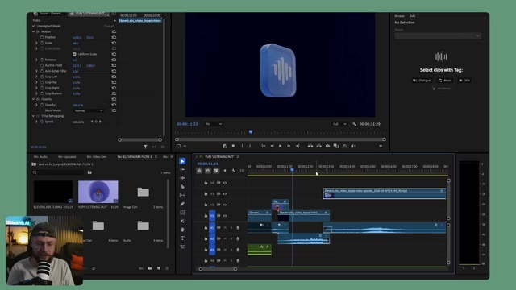
*Interface d'Adobe Premiere Pro montrant le montage de la vidéo avec le panneau des effets et la chronologie, avec le logo bleu affiché dans le moniteur de prévisualisation et Jack en incrustation (PiP).*

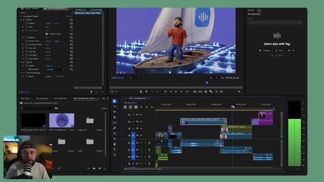
*Interface d'Adobe Premiere Pro montrant le personnage de synthèse sur un bateau dans le moniteur de prévisualisation, avec la chronologie détaillée du montage en bas et Jack en incrustation (PiP).*

---

### ⏱️ `[00:25:17 - 00:25:54]` | Segment #50

**🔊 Audio (Transcription Intégrale Mot pour Mot en Français) :**
> sorte d'arrière-plan violet ici et ensuite on ajoute ce style de révélation en graphismes animés, rappelez-vous que j'ai parlé de l'appliquer en surimpression par-dessus l'arrière-plan violet pour que ça prenne vie ici, et ensuite on a juste les sortes de superpositions de texte pour le nom de marque et puis le slogan en bas de l'écran également, et avec tout ça assemblé, je pense que je suis prêt à vous montrer le projet terminé. Comme toujours, si vous avez la moindre question, n'hésitez pas à la poser juste en bas dans la section des commentaires, j'essaie toujours d'y répondre autant que possible, si vous

**👁️ Analyse Visuelle d'Écran (gemini-3.5-flash-lite) :**
**Interface & Outils** : Adobe Premiere Pro (logiciel de montage vidéo) avec incrustation PiP du créateur.

**Contenu textuel & Code** : Timeline de montage vidéo Adobe Premiere Pro affichant les pistes V1 à V5 et A1 à A4, le panneau des effets (Effets vidéo, Motion, Opacity), le panneau Projet avec les dossiers de médias, et le moniteur de programme affichant un plan sur fond violet.

**Action / Démonstration** : Le créateur montre son écran de montage sur Adobe Premiere Pro tout en expliquant le processus de superposition des calques et des graphiques animés, avec son visage visible dans un encadré en bas à gauche.

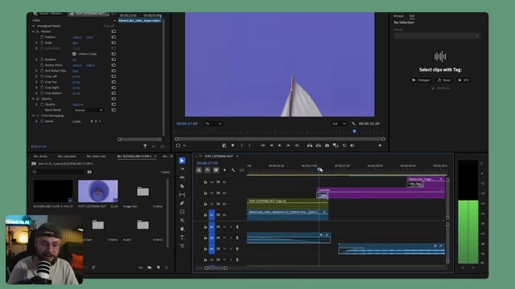
*Interface d'Adobe Premiere Pro montrant la timeline de montage avec les différentes pistes vidéo et audio, l'écran de prévisualisation avec le fond violet et un petit encadré PiP de Jack en bas à gauche.*

---

### ⏱️ `[00:25:54 - 00:26:27]` | Segment #51

**🔊 Audio (Transcription Intégrale Mot pour Mot en Français) :**
> avez apprécié le contenu d'aujourd'hui, assurez-vous de lâcher un pouce bleu pour moi si vous êtes nouveau, pensez à vous abonner et bien sûr à activer cette icône de cloche de notification pour ne jamais manquer aucun contenu futur. Sur ce, jetons un coup d'œil au projet terminé. Il s'appelle UP Escape Your Listening Rut. J'espère que vous l'aimerez. Nous avons tous été bloqués dans une routine d'écoute où rien ne semble vous libérer. Pas ceci, pas cela, vraiment pas cela. Mais UP est différent. Il utilise l'IA pour analyser vos

**👁️ Analyse Visuelle d'Écran (gemini-3.5-flash-lite) :**
**Interface & Outils** : Animation vidéo 3D (projet artistique et promotionnel créé par IA).

**Contenu textuel & Code** : Visuel animé du projet "UP Escape Your Listening Rut" avec un avatar en 3D représentant Jack et une icône d'application musicale interactive.

**Action / Démonstration** : Présentation du projet vidéo finalisé mettant en scène un avatar 3D dans des décors animés illustrant le concept d'application musicale propulsée par l'IA.

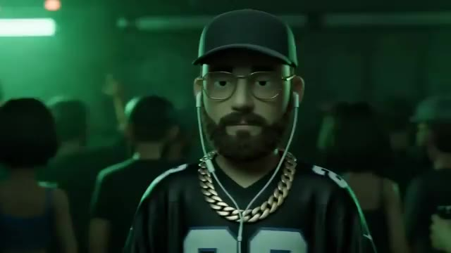
*Animation 3D montrant l'avatar stylisé de Jack dans un environnement de concert ou de foule sombre avec des lumières vertes.*

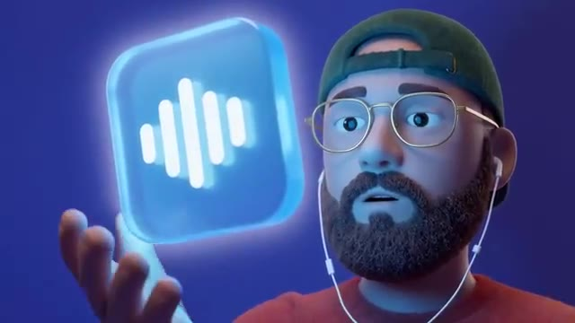
*Animation 3D montrant l'avatar stylisé de Jack regardant une icône d'application lumineuse flottante représentant une onde sonore.*

---

### ⏱️ `[00:26:27 - 00:26:42]` | Segment #52

**🔊 Audio (Transcription Intégrale Mot pour Mot en Français) :**
> écouter les tendances et faire des suggestions uniques pour que vous ne soyez piégé dans aucun style unique et que vous soyez libre de naviguer sur ces vagues sonores et de trouver la piste parfaite pour convenir à n'importe quelle humeur. Yuppie. Ressentez chaque battement.

**👁️ Analyse Visuelle d'Écran (gemini-3.5-flash-lite) :**
**Interface & Outils** : Présentation face caméra sans partage d'écran

**Contenu textuel & Code** : Animation 3D illustrant le concept d'écoute musicale avec un avatar et le logo de l'application YUPI ("Feel every beat.").

**Action / Démonstration** : Animation d'un personnage virtuel écoutant de la musique et naviguant sur des ondes sonores.

---
