# 🎬 ARRÊTEZ d'écrire des prompts pour vos films IA — Cet agent le fait pour vous

> **Chaîne** : [Jack Vs. AI](https://www.youtube.com/@JackVsAI)  
> **Titre original** : `STOP Writing Prompts For Your AI Films — This Agent Does It For You`  
> **Lien YouTube** : [https://www.youtube.com/watch?v=_LXTbKfqeHA](https://www.youtube.com/watch?v=_LXTbKfqeHA)  
> **Date de publication** : 2026-05-08  
> **Durée** : 16m 23s (`983s`)  
> **Identifiant vidéo** : `_LXTbKfqeHA`  
> **Fiche Web Interactive** : [2026-05-08_YT-_LXTbKfqeHA_ARRÊTEZ d'écrire des prompts pour vos films IA — Cet agent le fait pour vous_by-whisper-v3-large-turbo+gemini-3.5-flash-lite.html](2026-05-08_YT-_LXTbKfqeHA_ARRÊTEZ d'écrire des prompts pour vos films IA — Cet agent le fait pour vous_by-whisper-v3-large-turbo+gemini-3.5-flash-lite.html)  
> **Captures de démonstration clés** : `68 captures réelles (anti-talking-head)`  
> **Modèles utilisés** : Audio: `large-v3-turbo` (Faster-Whisper int8 VPS) | Vision: `gemini-3.5-flash-lite` (Google AI Studio API)  

---

## 📌 Synthèse Exécutive & Outils

### 📌 Résumé
La vidéo de Jack Vs. AI met en lumière une transition paradigmatique cruciale dans la réalisation de films par intelligence artificielle : le passage d'une micro-gestion technique fastidieuse (l'écriture manuelle et répétitive de prompts) à une posture de véritable direction artistique. L'auteur y démontre comment s'affranchir du "baby-sitting" d'outils fragmentés en déléguant la complexité textuelle et technique à un agent conversationnel central. Au lieu de jongler manuellement avec des paramètres ardus ou de concevoir des invites complexes sur des interfaces tierces, le créateur importe simplement son scénario brut et discute de ses intentions avec l'IA.

La méthode pas à pas s'articule autour d'un dialogue itératif et intelligent : l'agent analyse d'abord le script, pose des questions de cadrage (comme la résolution ou le format 16:9), puis génère automatiquement les briques fondamentales du film (feuilles de personnages, de décors et d'accessoires). Tout au long de la production, l'agent orchestre la génération d'images et de vidéos en combinant des outils spécialisés, tout en effectuant un contrôle qualité autonome (approuvant ou rejetant les visuels non conformes). Lorsque le résultat s'éloigne de la vision du réalisateur — comme un personnage trop statique —, la correction se fait par simple instruction conversationnelle, garantissant une fluidité de workflow et une cohérence visuelle absolue d'un plan à l'autre.

Pour les créateurs de contenu et les cinéastes indépendants, cette approche redéfinit l'ergonomie de la production virtuelle. Elle permet de se concentrer exclusivement sur la narration, le rythme, le choix des plans et l'évolution de l'intrigue, tandis que l'agent gère la traduction technique en arrière-plan. Le résultat est un gain de temps massif, une réduction de la charge cognitive et une constance stylistique remarquable, ouvrant la voie à des productions cinématiques de 60 secondes (et plus) d'une grande fluidité narrative.

### 🛠️ Outils, Modèles & Logiciels Présentés
* **Claude** : Assistant conversationnel textuel mentionné comme alternative potentielle pour l'écriture de prompts lourds, bien que contourné ici par l'utilisation directe de l'agent.
* **Nano Banana Pro** : Modèle de pointe utilisé spécifiquement pour la génération d'images fixes, la création de feuilles de référence (personnages, décors) et les visuels clés.
* **Seedance (ou C-Dance 2)** : Modèle de génération et d'animation vidéo chargé de donner vie aux images fixes et de produire les plans animés du court-métrage.
* **Flux** : Modèle d'intelligence artificielle évoqué dans l'écosystème global de création visuelle et de génération d'actifs graphiques.
* **Agent 1** : L'agent conversationnel central basé sur la plateforme NVIDIA qui orchestre l'ensemble du projet, analyse le scénario, pilote les outils de génération et maintient la cohérence visuelle.

### 🔑 Points Clés & Enseignements Stratégiques
* **Délégation de la complexité technique** : Transférer la corvée de l'écriture de prompts à un agent conversationnel permet au créateur de retrouver un rôle de direction pure, centré sur la vision artistique plutôt que sur la syntaxe des outils.
* **Initialisation par l'import de scénario** : L'utilisation d'un script brut comme point d'entrée unique permet à l'IA d'extraire automatiquement le contexte, les personnages et les ambiances sans nécessiter de cahier des charges technique initial.
* **Établissement rigoureux des briques de référence** : Laisser l'agent générer des feuilles de personnages, de lieux et d'accessoires (look dev) en amont est indispensable pour garantir une stricte cohérence visuelle tout au long du film.
* **Dialogue itératif en temps réel** : Travailler sous forme de va-et-vient conversationnel offre une flexibilité totale pour modifier des scènes, ajuster des décors ou réorienter l'histoire à la volée sans bloquer le processus créatif.
* **Contrôle qualité autonome par l'IA** : Un bon agent ne se contente pas d'exécuter ; il analyse et filtre les générations, validant ou rejetant les images pour ne retenir que celles qui respectent les critères du projet.
* **Intégration native des paramètres de tournage** : Verrouiller dès le départ les spécifications techniques (comme le format 16:9 et la résolution 1080p native) évite les incohérences de format entre les différentes scènes.
* **Gestion des limitations dynamiques par correction ciblée** : Face à un plan statique ou peu expressif, l'utilisation de retours correctifs précis ("fais-en sorte qu'elle marche et fasse coucou") permet à l'agent de régénérer instantanément une action plus dynamique.
* **Maintien de la tension narrative** : Conserver des choix de mise en scène progressifs (comme révéler lentement le personnage pour préserver la surprise et la curiosité) s'avère aussi crucial avec l'IA qu'en prise de vues réelle.
* **Évolution organique du projet** : Ne pas hésiter à abandonner des scènes ou des décors générés initialement si le développement narratif mène le film vers une direction artistique plus pertinente.
* **Anticipation des erreurs de génération** : Garder à l'esprit que l'IA produira inévitablement des résultats inattendus, transformant le processus de montage en une phase de curation et d'ajustement conversationnel permanent.

---

## ⏱️ Chronologie & Transcription Complète Audio & Visuelle (Mot pour Mot)

### ⏱️ `[00:00:00 - 00:00:34]` | Segment #01

**🔊 Audio (Transcription Intégrale Mot pour Mot en Français) :**
> Tous les outils de réalisation de films par IA ont le même problème. Vous passez plus de temps à gérer l'IA qu'à réaliser réellement votre film. Vous écrivez des prompts, choisissez des modèles et ré-expliquez vos personnages pour chaque plan. Vous ne dirigez pas, vous faites plutôt du baby-sitting. Mais et s'il existait une IA qui comprenait réellement votre projet ? Vos personnages, votre univers, votre langage visuel, et qui maintenait la cohérence dans chaque scène. Vous téléchargez simplement votre scénario et l'IA s'occupe du reste. Ça a l'air génial, n'est-ce pas ? Eh bien, c'est exactement le type d'outil que je teste. Et je vais vous montrer comment je

**👁️ Analyse Visuelle d'Écran (gemini-3.5-flash-lite) :**
**Interface & Outils** : Présentation face caméra sans partage d'écran

**Contenu textuel & Code** : Aucune interface logicielle n'est affichée. Les images montrent des illustrations cinématiques générées par IA (personnage boutonnant sa veste, puis portant un casque de scaphandre) et le créateur (Jack) face caméra dans son studio avec un micro et un néon en arrière-plan.

**Action / Démonstration** : Le créateur s'adresse directement aux spectateurs en studio, illustré par des plans visuels générés par IA en lien avec son discours.

---

### ⏱️ `[00:00:34 - 00:01:09]` | Segment #02

**🔊 Audio (Transcription Intégrale Mot pour Mot en Français) :**
> l'a utilisé pour construire ce court métrage cinématique. Et si vous aimez la vidéo d'aujourd'hui, les gars, assurez-vous de lâcher un pouce bleu pour moi, pensez à vous abonner et, bien sûr, à cliquer sur cette cloche de notification. Très bien, entrons dans le vif du sujet. Donc pour la vidéo d'aujourd'hui, nous sommes sur NVIDIA, et si vous voulez aller de l'avant et suivre, vous trouverez un lien, comme toujours, en bas dans la description. Nous sommes donc simplement sur la page d'accueil ici, et vous pouvez voir juste en face de nous, nous avons Agent 1. C'est l'outil d'IA qui va nous aider à donner vie à notre film. Il y a donc évidemment toute une série de façons différentes d'utiliser cet outil, mais ce que j'ai fait, c'est que j'ai cliqué sur cette icône plus ici et je suis allé de l'avant et

**👁️ Analyse Visuelle d'Écran (gemini-3.5-flash-lite) :**
**Interface & Outils** : Interface web de l'outil d'IA InVideo (mentionné par erreur comme NVIDIA par le créateur) avec un panneau de saisie de prompt et un explorateur de fichiers intégré.

**Contenu textuel & Code** : Texte à l'écran : « Introducing Agent One » avec les sous-options « Agent mode » et « Autopilot », un champ de saisie « Plan a script, storyboard or video », ainsi que des boutons de suggestions rapides (Product Ads, Create AI shorts, Use my script, Make explainer video). Dans l'explorateur de fichiers : un fichier PDF nommé « THE BUBBLE.pdf » et des dossiers « Video Gen », « Recordings », « Image Gen », « Audio ».

**Action / Démonstration** : Le créateur présente l'interface de l'outil Agent One, montre un court métrage réalisé avec l'IA, puis navigue dans l'arborescence des fichiers du projet.

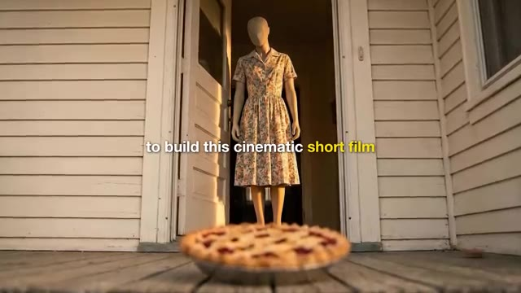
*Court métrage cinématique généré par IA montrant un mannequin sur le pas d'une porte devant une tarte.*

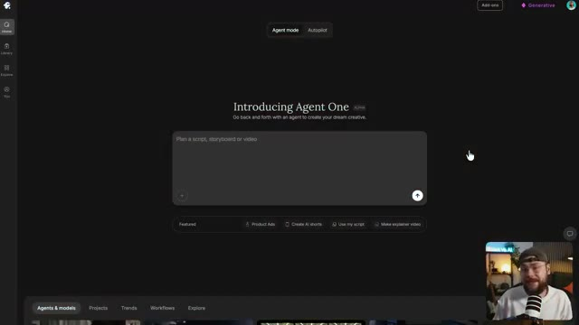
*Page d'accueil de l'interface de l'outil avec le titre « Introducing Agent One » et une zone de texte centrale.*

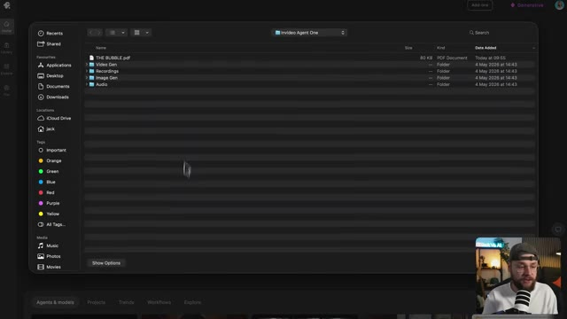
*Explorateur de fichiers de l'application montrant le dossier « Invideo Agent One » avec différents sous-dossiers.*

---

### ⏱️ `[00:01:09 - 00:01:38]` | Segment #03

**🔊 Audio (Transcription Intégrale Mot pour Mot en Français) :**
> j'ai téléchargé le scénario de mon court-métrage et j'ai ensuite ajouté cette consigne très simple pour l'agent. Voici mon scénario pour un court-métrage que je veux faire durer environ 60 secondes. Je veux que tu utilises par défaut Nano Banana Pro pour la génération d'images et C-Dance 2 pour la génération de vidéos, et je veux immédiatement faire ici une distinction très claire entre le type d'utilisation normale des prompts, qui peut être assez lourd et technique, et pour lequel vous pourriez avoir besoin d'utiliser un outil séparé comme Claude.

**👁️ Analyse Visuelle d'Écran (gemini-3.5-flash-lite) :**
**Interface & Outils** : Interface web d'un agent IA ('Agent One') avec un mode agent et un mode autopilote, un champ de saisie central pour planifier un script, un storyboard ou une vidéo, et une incrustation vidéo (PiP) du présentateur en bas à droite.

**Contenu textuel & Code** : Texte affiché à l'écran : "Introducing Agent One", "Plan a script, storyboard or video", ainsi que des boutons de raccourcis : "Product Ads", "Create AI shorts", "Use my script", "Make explainer video".

**Action / Démonstration** : L'écran affiche l'interface principale de l'agent de création avec une incrustation vidéo du créateur dans le coin inférieur droit s'adressant aux spectateurs.

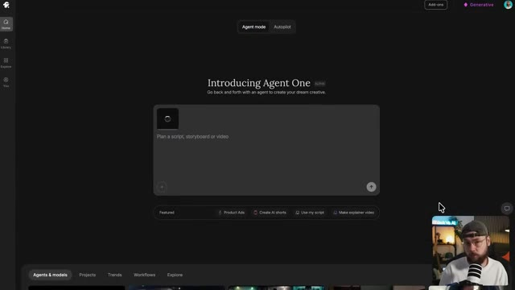
*Interface de l'outil Agent One montrant la zone de saisie de texte avec le texte indicatif 'Plan a script, storyboard or video' et les options en bas.*

---

### ⏱️ `[00:01:39 - 00:02:12]` | Segment #04

**🔊 Audio (Transcription Intégrale Mot pour Mot en Français) :**
> Alors qu'avec l'agent numéro un, nous avons en quelque sorte cette conversation de va-et-vient. En tant qu'utilisateur, vous vous concentrez plutôt sur le côté créatif des choses tandis que votre agent prend le contrôle du côté plus technique. Une fois que nous aurons envoyé ceci, nous serons invités à créer un nouveau projet. Je vais donc simplement appeler celui-ci "the bubble", et cliquer sur créer un projet. Et maintenant, il nous sera demandé de nommer notre agent. Je vais donc simplement appeler celui-ci "director" et l'envoyer. Vous pouvez donc voir que la première chose que notre agent a faite a été d'inspecter le script.

**👁️ Analyse Visuelle d'Écran (gemini-3.5-flash-lite) :**
**Interface & Outils** : Interface web d'un outil de création vidéo par IA (type InVideo / Agent One).

**Contenu textuel & Code** : Texte du prompt dans l'image 2 : "This is my script for a short film, that I want to last around 60 seconds. I want you to default to using Nano Banana Pro for image generation and Seedance 2.0 for video generation." Texte de l'image 3 : "About this project", "THE BUBBLE - 60s short film", analyses de l'agent "Attachments analyzed: THE_BUBBLE.pdf", "Read it. This is a strong piece of writing, Jack."

**Action / Démonstration** : Le créateur montre l'interface de l'agent conversationnel, puis l'écran de création du projet et l'inspection du script par l'agent.

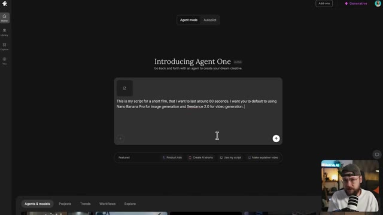
*Interface de l'outil d'IA montrant "Introducing Agent One" avec une zone de texte pour interagir.*

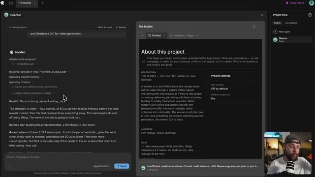
*Interface de l'application montrant l'analyse du projet "The Bubble" et les retours textuels de l'agent.*

---

### ⏱️ `[00:02:12 - 00:02:45]` | Segment #05

**🔊 Audio (Transcription Intégrale Mot pour Mot en Français) :**
> essentiellement. Et ça a construit tout ce contexte autour de notre court-métrage. Donc ça voulait revérifier le format d'image ainsi que la résolution de sortie et je suis retourné vers lui et je lui ai juste dit que je voulais du 16 par 9 et juste du 1080p natif avec l'intention de potentiellement rééchantillonner après si j'en avais besoin et ensuite vous pouvez voir notre agent a répondu verrouillé en 16 par 9 1080p natif son diégétique intégré dans chaque prompt vidéo sans musique et maintenant il poursuit en exposant ce genre de plan de

**👁️ Analyse Visuelle d'Écran (gemini-3.5-flash-lite) :**
**Interface & Outils** : Interface de l'outil de création vidéo IA Invideo (mode Director), avec panneau de chat de l'agent à gauche et gestionnaire de projet/contexte au centre, et la webcam du créateur en incrustation (PiP) dans le coin inférieur droit.

**Contenu textuel & Code** : Texte du projet "The Bubble", paramètres de rapport de format (16:9, 1080p natif Seedance 2.0), instructions sur l'audio diégétique sans musique, et plan de production détaillé (Phase 1 : Production Bible, Character master sheet, Look-dev boards).

**Action / Démonstration** : Le créateur montre son écran avec l'interface d'Invideo où l'agent discute des paramètres techniques et valide le format d'image, tandis qu'il parle face caméra dans l'encadré PiP.

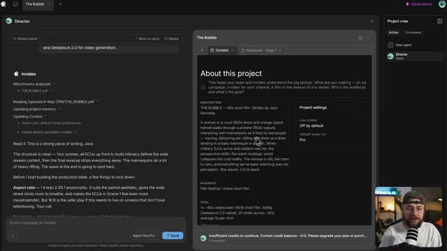
*Interface d'Invideo montrant les détails du projet de court-métrage "The Bubble" et les options de contexte.*

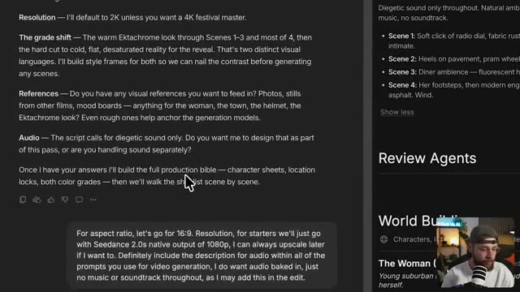
*Interface d'Invideo affichant la réponse textuelle de l'agent sur l'audio diégétique et la configuration des plans.*

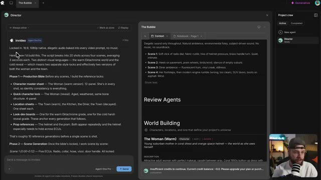
*Interface d'Invideo détaillant la validation du format 16:9 1080p et la phase 1 du plan de production.*

---

### ⏱️ `[00:02:45 - 00:03:18]` | Segment #06

**🔊 Audio (Transcription Intégrale Mot pour Mot en Français) :**
> attaque et une grande partie de cela vous semblera très familier à vous qui vous intéressez à la réalisation de films par IA, donc ça suggère de construire des feuilles de personnages, des feuilles de lieux et des planches de look dev également, et même des références d'accessoires. Ça a continué et tout découpé en plusieurs scènes, et les plus observateurs d'entre vous verront que j'ai en fait un peu changé d'idée au fur et à mesure que le projet se développait, et c'était vraiment très cool aussi parce qu'on a ce genre de conversation de va-et-vient avec l'agent. Si vous voulez modifier des choses à la volée, c'est tout à fait possible, c'est

**👁️ Analyse Visuelle d'Écran (gemini-3.5-flash-lite) :**
**Interface & Outils** : Application web de création de films par IA avec interface de chat agent et panneaux de gestion de projet (Director / World Building).

**Contenu textuel & Code** : Texte détaillé de découpage de scènes (Phase 1 - Production Bible, Character master sheet, Prop references, Phase 2 - Scene Generation, Scene 1 à 4) et options de l'agent (Agent One Pro).

**Action / Démonstration** : Le curseur de la souris survole le texte de l'interface décrivant les références d'accessoires et le découpage en scènes du projet.

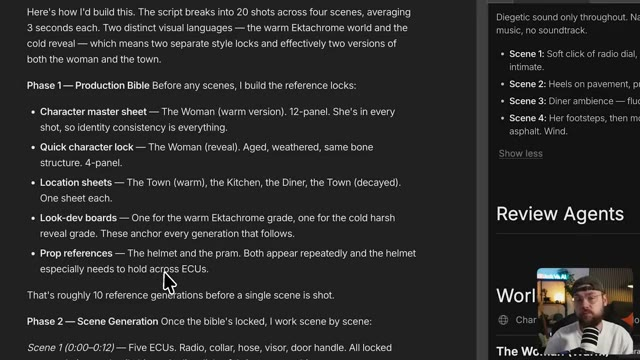
*Interface d'un outil de script IA montrant les phases de production, les feuilles de personnages et les références d'accessoires.*

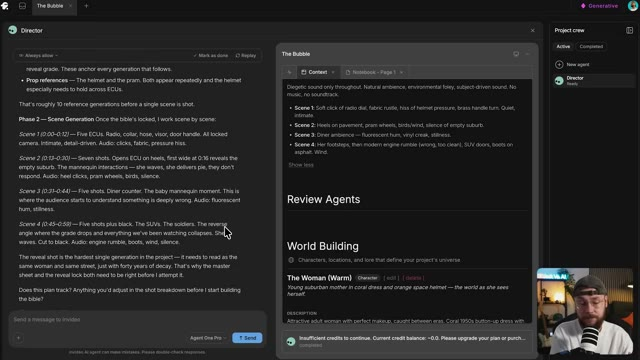
*Interface complète de l'agent de direction avec le découpage des scènes et le panneau World Building.*

---

### ⏱️ `[00:03:18 - 00:03:47]` | Segment #07

**🔊 Audio (Transcription Intégrale Mot pour Mot en Français) :**
> Eh bien. Vous n'êtes en quelque sorte bloqué dans aucune direction et vous pouvez voir qu'à ce stade, il a commencé à élaborer ces feuilles de référence de personnages et de lieux. Donc si nous allons de l'avant et ouvrons celle-ci ici, c'est exactement le type de style que je recherchais. C'est le personnage que j'ai décrit dans mon script, sauf que je n'ai pas eu à concevoir des invites pour cela. J'ai simplement collé mon script là-haut et l'agent vidéo a créé tout ce prompt vraiment détaillé à partir des informations contenues dans mon script.

**👁️ Analyse Visuelle d'Écran (gemini-3.5-flash-lite) :**
**Interface & Outils** : Interface logicielle de génération vidéo et d'images par IA avec panneau latéral de prompts textuels et affichage de grille de personnages.

**Contenu textuel & Code** : Le panneau de droite affiche un prompt très détaillé : [STYLE]: Cinematic realism, shot on warm expired Kodak Ektachrome film stock... [LAYOUT]: single unified MASTER CHARACTER REFERENCE SHEET, 12-panel grid layout... [CHARACTER]:- Name: THE WOMAN... Young suburban mother... coral 1950s button-up dress with white trim... bright orange space helmet with clear bubble visor... La grille principale montre 12 panneaux avec différentes vues d'une femme des années 1950 portant une robe corail et un casque de cosmonaute.

**Action / Démonstration** : Le créateur présente à l'écran la feuille de référence du personnage générée automatiquement à partir de son script par l'agent vidéo, tout en commentant le résultat dans la fenêtre PiP en bas à droite.

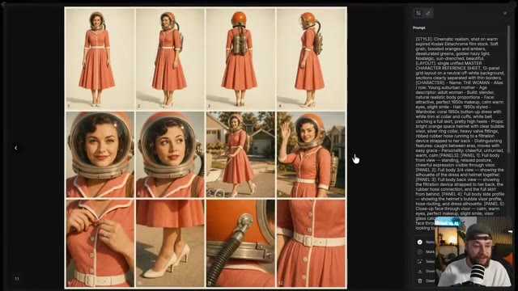
*Affichage d'une feuille de référence de personnage (character reference sheet) de style rétro avec un panneau latéral montrant le prompt textuel détaillé et la vue en incrustation (PiP) du créateur.*

---

### ⏱️ `[00:03:48 - 00:04:10]` | Segment #08

**🔊 Audio (Transcription Intégrale Mot pour Mot en Français) :**
> Et ça a fait exactement la même chose ici pour deux versions alternatives de références de lieux. Vous remarquerez que cette scène ne finit pas par apparaître dans le film final. Comme je l'ai dit, j'ai fini par aller dans une direction légèrement différente à mesure que le projet se développait. Mais ce qui est intéressant aussi, c'est que l'Agent 1 va en fait approuver certaines de ses générations et en désapprouver d'autres.

**👁️ Analyse Visuelle d'Écran (gemini-3.5-flash-lite) :**
**Interface & Outils** : Interface logicielle de gestion de projet IA ("The Bubble" / "Director") avec panneau de chat à gauche, historique des tâches au centre et incrustation vidéo (PiP) du présentateur en bas à droite.

**Contenu textuel & Code** : Texte du prompt visible : "Surface: 8-panel combined location reference sheet, arranged as a 2x4 grid (2 rows, 4 columns)... Shot on warm expired Kodak Ektachrome film stock...". Statut du projet : "Insufficient credits to continue...".

**Action / Démonstration** : Le présentateur explique le fonctionnement de l'approbation et de la désapprobation des générations d'images par l'Agent 1 pour des versions alternatives de lieux, tout en affichant l'interface et les détails des grilles de panneaux.

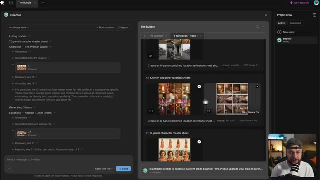
*Interface principale du projet montrant les différentes versions de feuilles de référence de lieux avec les panneaux d'approbation et de journalisation des agents.*

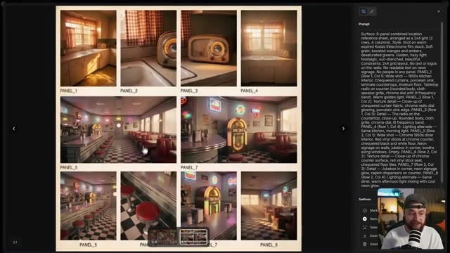
*Vue détaillée d'une grille de référence de lieux à 8 panneaux (cuisine et diner des années 50) avec le panneau de prompt textuel complet sur le côté droit.*

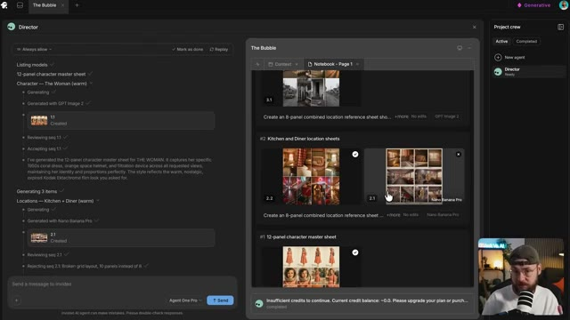
*Retour à l'interface principale montrant les différentes versions de feuilles de référence de lieux et le panneau de discussion des agents IA.*

---

### ⏱️ `[00:04:10 - 00:04:36]` | Segment #09

**🔊 Audio (Transcription Intégrale Mot pour Mot en Français) :**
> Donc celui-ci, qui a fini par être utilisé pour le film lui-même, a été approuvé. Donc l'Agent 1 ne fait pas juste en quelque sorte générer des choses à la volée. Ce n'est pas comme un processus aléatoire. Il analyse réellement les images qu'il reçoit et décide si elles doivent être approuvées ou non. Nous avons donc fini par obtenir toutes ces superbes générations d'images de haute qualité pour en quelque sorte figer le personnage, exactement ce dont nous avions besoin.

**👁️ Analyse Visuelle d'Écran (gemini-3.5-flash-lite) :**
**Interface & Outils** : Interface logicielle de type assistant de production par IA (Agent One / The Bubble) avec panneau de chat, interface de prompt détaillée et affichage de grilles d'images de référence.

**Contenu textuel & Code** : Texte du prompt visible : "Surface: 8-panel combined location reference sheet, arranged as a strict 2x4 grid... Style: Shot on warm expired Kodak Ektachrome film stock...". Panneau de gauche avec le statut de production ("Production bible's locked. Six reference sheets...").

**Action / Démonstration** : Présentation et analyse par le créateur des fiches de référence de décors générées et approuvées par l'agent IA pour le film.

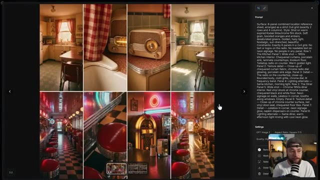
*Interface d'un outil de génération d'images par IA montrant une grille de 8 plans de référence (cuisine et diner rétro) avec un panneau de prompt détaillé sur le côté droit et le créateur visible en incrustation (PiP).*

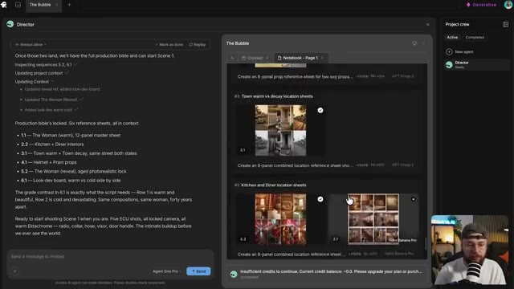
*Interface de gestion de projet IA ("The Bubble") avec un panneau de chat textuel à gauche ("Director") détaillant l'état de production et un espace de travail à droite montrant des fiches de référence de décors.*

---

### ⏱️ `[00:04:36 - 00:04:54]` | Segment #10

**🔊 Audio (Transcription Intégrale Mot pour Mot en Français) :**
> et ce que j'aurais fait si j'avais travaillé sur ce projet moi-même, fondamentalement. Et puis notre agent dit, prêt à commencer le tournage de la scène un quand vous l'êtes. Il s'agit juste de vérifier ici que nous sommes complètement satisfaits de toutes les références qu'il a accumulées parce que, bien sûr, tout ce qui suit est influencé par elles.

**👁️ Analyse Visuelle d'Écran (gemini-3.5-flash-lite) :**
**Interface & Outils** : Présentation face caméra sans partage d'écran

**Contenu textuel & Code** : Aucun texte, prompt ou interface logicielle n'est affiché à l'écran. L'image montre uniquement le créateur dans son studio.

**Action / Démonstration** : Le créateur s'adresse directement à la caméra en parlant de son projet et de l'interaction avec l'agent IA.

---

### ⏱️ `[00:04:55 - 00:05:16]` | Segment #11

**🔊 Audio (Transcription Intégrale Mot pour Mot en Français) :**
> Et maintenant vous pouvez voir que j'ai commencé à récupérer ma génération de vidéo. Donc, par exemple, nous avons le premier plan ici. Bien sûr, cela a été construit dans Seedance 2, juste comme je l'ai dit à l'Agent 1 que je voulais qu'il l'utilise dans le genre de configuration initiale de notre projet. Donc j' vraiment aimé celui-ci ici en particulier.

**👁️ Analyse Visuelle d'Écran (gemini-3.5-flash-lite) :**
**Interface & Outils** : Interface web d'InVideo (mode Director / Agent One Pro) avec panneau de gestion de projet, timeline de plans et panneau de prompts textuels détaillés.

**Contenu textuel & Code** : Texte du prompt visible : "PREAMBLE: The attached images are multi-panel reference sheets... MODE: MRC SHOT STRUCTURE: 4s / 1 shot / 16:9 STYLE OPENER: Warm expired Kodak Ektachrome film stock..." ainsi que l'historique de génération de l'Agent 1 ("Reading context", "Generated with Seedance 2.0").

**Action / Démonstration** : Le créateur navigue à travers l'interface de montage et de génération par IA d'InVideo, sélectionnant et inspectant des plans vidéo générés par Seedance 2.0.

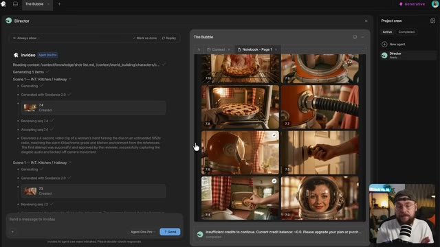
*Interface d'InVideo (Agent One Pro) affichant une grille de plans générés avec Seedance 2.0 pour le projet "The Bubble".*

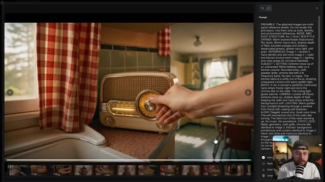
*Visualisation d'un plan vidéo sélectionné montrant une main tournant le bouton d'une radio rétro, avec le prompt textuel détaillé sur le panneau de droite.*

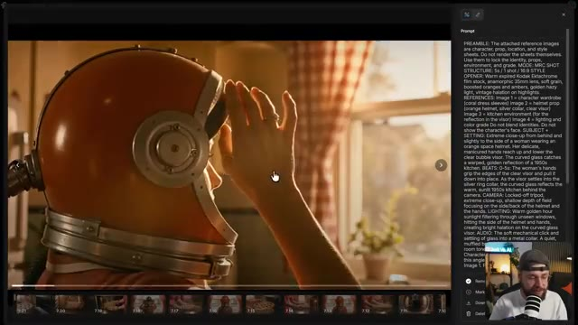
*Visualisation d'un autre plan vidéo montrant une personne ajustant un casque de scaphandre rétro près d'une fenêtre de cuisine, avec les paramètres du prompt visibles à droite.*

---

### ⏱️ `[00:05:16 - 00:05:34]` | Segment #12

**🔊 Audio (Transcription Intégrale Mot pour Mot en Français) :**
> Je pensais que cela fonctionnait très bien. Et bien sûr, cela a été utilisé dans le film final. Et à mesure que je reçois beaucoup plus de générations, c'est là que le genre de flux de travail conversationnel commence vraiment. Donc vous pouvez voir que j'ai dit 7.12 approuvé, 7.11 a encore besoin de travail. Nous devons être derrière le casque.

**👁️ Analyse Visuelle d'Écran (gemini-3.5-flash-lite) :**
**Interface & Outils** : Interface de travail et de chat avec un assistant IA (Invideo / Agent One Pro).

**Contenu textuel & Code** : Texte de prompt détaillé visible dans l'image 1 ('PREAMBLE: The attached reference images are character, prop, location...'). Dans l'image 3, un message de l'utilisateur indique : '7.12 approved, 7.11 still needs work, we need to be behind the helmet, maybe the woman is stood wearing it, looking out the window of the kitchen, ECU, tightly framed.'

**Action / Démonstration** : Le créateur montre son interface de travail en train de réviser et de valider des générations de plans vidéo IA via un flux de discussion textuel.

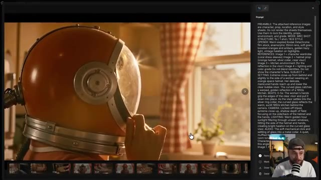
*Interface de montage vidéo avec une chronologie de plans numérotés et un panneau de prompt textuel détaillé sur le côté droit.*

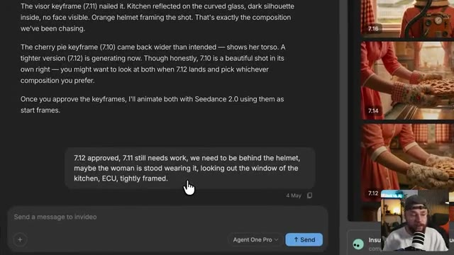
*Interface de chat conversationnel montrant des échanges de messages avec un agent IA et des aperçus de plans vidéo sur le côté.*

---

### ⏱️ `[00:05:34 - 00:05:54]` | Segment #13

**🔊 Audio (Transcription Intégrale Mot pour Mot en Français) :**
> Peut-être que la femme se tient debout en le portant, en regardant par la fenêtre de la cuisine. Et avec cela, nous commençons à récupérer ces générations d'images de Nano Banana Pro. Et j'ai vraiment, vraiment aimé celle-ci ici. Gardez à l'esprit que notre personnage, bien sûr, et le lieu restent bien cohérents grâce à ces feuilles de personnages et de lieux qui ont été construites pour nous un peu plus tôt.

**👁️ Analyse Visuelle d'Écran (gemini-3.5-flash-lite) :**
**Interface & Outils** : Interface de chat et de génération d'images par IA avec panneau de réglages (Nano Banana Pro).

**Contenu textuel & Code** : Texte du prompt visible sur l'image 2 décrivant le plan cinématographique : "Motion-safe cinematic film still. Extreme close-up from directly behind the woman...", avec des paramètres de résolution (2K) et le modèle Nano Banana Pro.

**Action / Démonstration** : Le créateur navigue dans l'interface pour montrer les images générées et commente la cohérence des personnages et des décors.

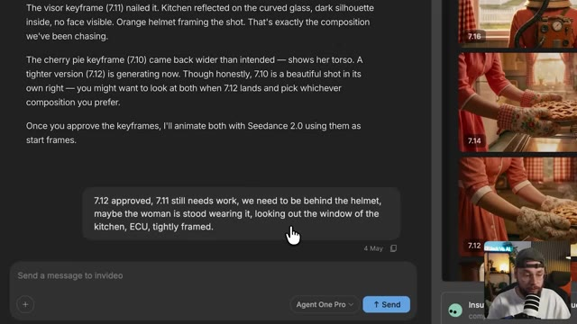
*Interface de discussion textuelle montrant l'approbation d'un plan et le prompt associé.*

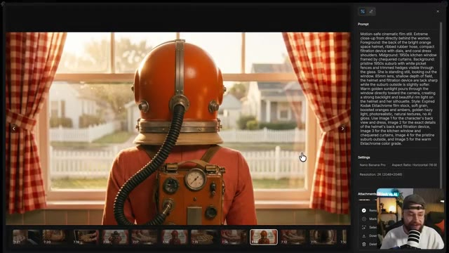
*Interface de génération d'image Nano Banana Pro affichant un plan détaillé de la femme de dos avec son casque de scaphandre orange regardant par la fenêtre.*

---

### ⏱️ `[00:05:54 - 00:06:14]` | Segment #14

**🔊 Audio (Transcription Intégrale Mot pour Mot en Français) :**
> Cela a été animé avec Sea Dance 2 et on obtient ce très joli résultat de la femme qui soupire en quelque sorte. C'est sympa mais ça préserve aussi la surprise. On ne l'a pas encore vue complètement. Ça construit en quelque sorte cette tension et cette curiosité pour le spectateur. Et pour la scène suivante, l'agent utilise à nouveau cette méthode éprouvée.

**👁️ Analyse Visuelle d'Écran (gemini-3.5-flash-lite) :**
**Interface & Outils** : Interface logicielle de SeaDance 2.0 et panneau de gestion de projet par agent IA (The Bubble).

**Contenu textuel & Code** : Panneau de prompt visible à l'écran avec des paramètres techniques (Mode: 12V SHOT STRUCTURE: 5s / 1 shot / 16:9 STYLE OPENER: Warm expired Kodak Ektachrome film stock...), ainsi que des vignettes de séquences numérotées (8.4, 8.5, 8.6, 8.2, 8.1).

**Action / Démonstration** : Le créateur montre l'interface de SeaDance 2.0 avec le résultat animé de la femme de dos, puis bascule sur l'interface de l'agent listant les différentes scènes générées.

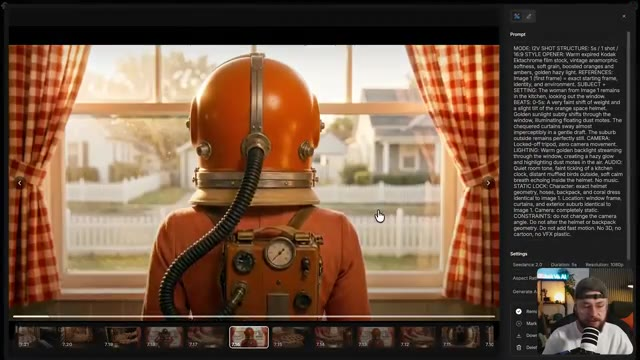
*Interface de SeaDance 2.0 montrant le rendu vidéo d'une femme de dos portant un casque spatial orange, avec un panneau de prompt détaillé sur le côté droit et une timeline en bas.*

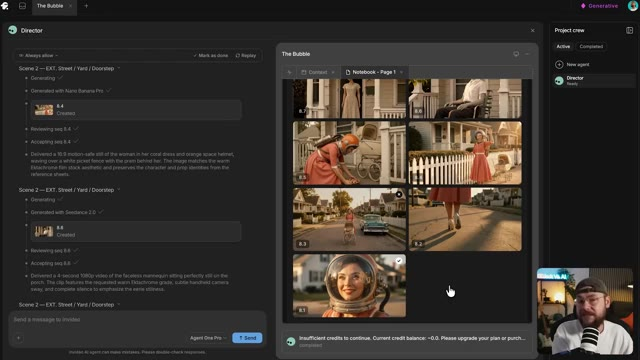
*Interface de gestion de projet montrant plusieurs vignettes de séquences vidéo générées ("The Bubble") avec le panneau de l'agent sur la gauche et le créateur visible en incrustation PiP.*

---

### ⏱️ `[00:06:14 - 00:06:34]` | Segment #15

**🔊 Audio (Transcription Intégrale Mot pour Mot en Français) :**
> Vous pouvez donc voir qu'il génère un certain type de visuels clés avec Nano Banana Pro qui seront utilisés tout au long de la scène. Et on continue pour construire nos générations avec Sea Dance 2. Donc ce plan particulier ici où l'on commence à introduire les mannequins comme une sorte d'accessoire. Ainsi le spectateur comprend que quelque chose ne tourne décidément pas rond ici.

**👁️ Analyse Visuelle d'Écran (gemini-3.5-flash-lite) :**
**Interface & Outils** : Interface logicielle de génération d'images et de vidéos (Nano Banana Pro et Seedance 2.0), avec incrustation vidéo du créateur en bas à droite.

**Contenu textuel & Code** : Texte de prompt descriptif pour l'image (ex: "16:9 motion-safe still, close-up hero portrait...") et pour la vidéo (ex: "MODE: MRC SHOT STRUCTURE: 4s / 1 shot / 16:9 STYLE OPENER..."). Paramètres visibles : Seedance 2.0, Durée 4s, Résolution 1080p, Ratio 16:9.

**Action / Démonstration** : Le créateur montre l'utilisation de Nano Banana Pro pour créer les visuels clés, puis passe à Seedance 2.0 pour générer le plan avec les mannequins sur le porche.

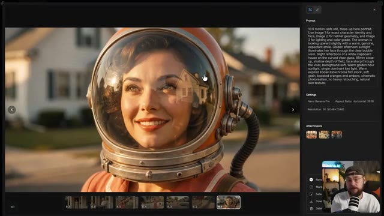
*Interface montrant la génération d'un portrait de femme en combinaison d'astronaute avec l'outil Nano Banana Pro et le prompt détaillé.*

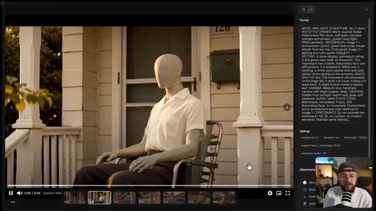
*Interface de Seedance 2.0 affichant la lecture vidéo d'un mannequin assis sur un porche avec le prompt de génération vidéo.*

---

### ⏱️ `[00:06:34 - 00:06:55]` | Segment #16

**🔊 Audio (Transcription Intégrale Mot pour Mot en Français) :**
> Les choses deviennent un peu flippantes. Et puis, bien sûr, nous avons ce premier plan ici où nous faisons pleinement la connaissance de notre personnage, un plan en pied complet pour la première fois. Nous commençons vraiment à avoir une idée de l'ambiance du film maintenant. Maintenant, comme c'est toujours le cas avec l'IA, vous allez obtenir des générations qui ne font pas exactement ce que vous voulez.

**👁️ Analyse Visuelle d'Écran (gemini-3.5-flash-lite) :**
**Interface & Outils** : Interface de l'outil de génération vidéo Seedance avec panneau de prompt latéral, paramètres de durée/résolution et ligne temporelle de vignettes en bas.

**Contenu textuel & Code** : Texte du prompt visible à droite : "MODE: I2V SHOT STRUCTURE: 5s / 1 shot / 16:9 STYLE OPENER: Warm expired Kodak Ektachrome film stock..." et les réglages : Seedance 2.0, Duration: 5s, Resolution: 1080p, Aspect Ratio: Landscape (16:9).

**Action / Démonstration** : Visualisation d'un plan vidéo généré par IA montrant un personnage en pied dans un environnement rétro, avec la mini-caméra de Jack en incrustation (PiP) dans le coin inférieur droit.

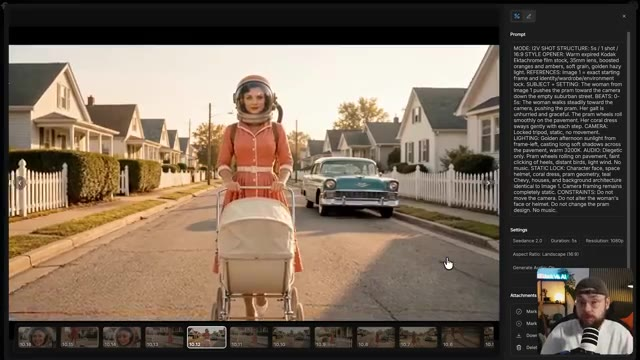
*Interface de Seedance montrant une vidéo générée d'une femme en combinaison spatiale et robe corail poussant un landau dans une rue de banlieue américaine rétro, avec le panneau de prompt détaillé sur la droite.*

---

### ⏱️ `[00:06:55 - 00:07:19]` | Segment #17

**🔊 Audio (Transcription Intégrale Mot pour Mot en Français) :**
> C'est là que le type de différence commence à se faire sentir, car nous pouvons dire à l'Agent 1 : pouvons-nous faire en sorte qu'elle marche et fasse coucou dans ce plan d'origine ? Elle est juste là à peu près immobile et sourit. Ça n'a pas vraiment beaucoup de sens. Ce n'est pas particulièrement dynamique. Et l'Agent 1 comprend parfaitement. Il procède à la régénération du même plan en utilisant ce visuel clé avec Seedance 2.

**👁️ Analyse Visuelle d'Écran (gemini-3.5-flash-lite) :**
**Interface & Outils** : Interface de l'outil de direction par IA (The Bubble / Agent One Pro) combinant un panneau de chat textuel et une grille de prévisualisation vidéo.

**Contenu textuel & Code** : Panneau de chat affichant les instructions (ex. "10.14 can we make it look like she's walking and waving?") et panneau latéral avec les prompts détaillés ("MODE: I2V SHOT STRUCTURE: 4s / 1 shot...").

**Action / Démonstration** : Le créateur montre l'interface de l'agent conversationnel IA où il demande de modifier un plan vidéo (femme en combinaison spatiale) pour qu'elle marche et fasse un signe de la main.

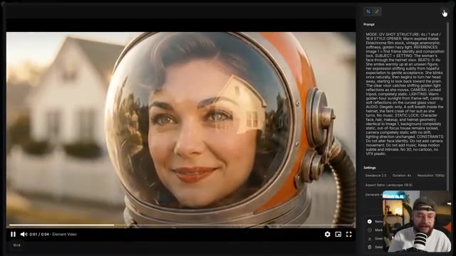
*Interface de lecture vidéo avec le panneau de prompt détaillé et le créateur incrusté en bas à droite.*

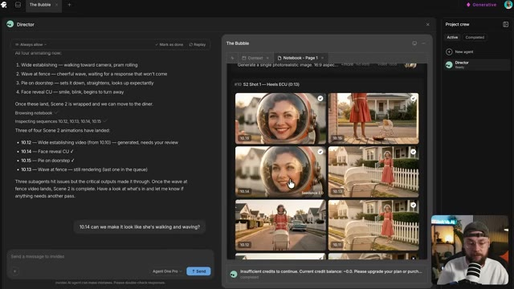
*Interface de l'Agent 1 ("The Bubble") avec la grille de plans vidéo générés et le panneau de chat interactif.*

---

### ⏱️ `[00:07:19 - 00:07:39]` | Segment #18

**🔊 Audio (Transcription Intégrale Mot pour Mot en Français) :**
> Et puis c'est ce qu'on a obtenu en retour, que vous auriez vu et qui s'est retrouvé dans le film final. Et c'est là que le projet commence à devenir vraiment intéressant parce qu'au fur et à mesure qu'il se développait, qu'il s'assemblait en quelque sorte, j'ai décidé de prendre une autre voie pour le genre de révélation afin de tout lier. Donc tout d'abord, j'ai dit à Agent One, j'aime bien 10.15.

**👁️ Analyse Visuelle d'Écran (gemini-3.5-flash-lite) :**
**Interface & Outils** : Interface de Seedance 2.0 et application de gestion de projet / agent IA 'The Bubble' avec panneau de chat et prévisualisations vidéo.

**Contenu textuel & Code** : Sur l'image 1 : Prompt complet décrivant le plan ("MODE: I2V SHOT STRUCTURE...", "The woman in the orange space helmet..."). Paramètres : Seedance 2.0, Durée: 4s, Résolution: 1080p, Aspect Ratio: 16:9, Generate Audio: On. Sur l'image 3 : Liste des plans de la scène 2 ("1. 10.6 - Heels ECU", "2. 10.12 - Wide establishing", etc.), message envoyé à l'agent ("I like 10.15, but I think we need a new dummy reaction shot...").

**Action / Démonstration** : Jack présente l'interface de Seedance montrant un plan généré avec ses paramètres, puis montre l'interface de l'agent conversationnel où il discute des modifications à apporter à la séquence.

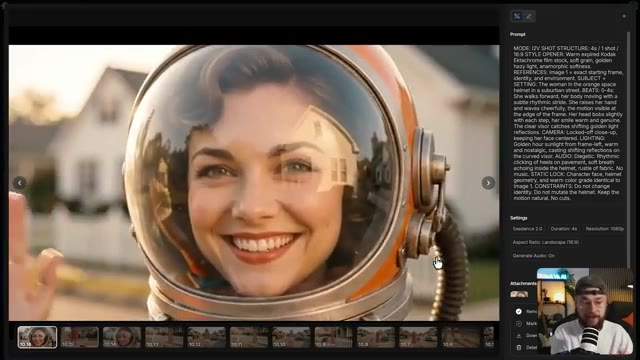
*Interface de l'outil de génération vidéo Seedance 2.0 affichant un gros plan d'une femme souriante dans un casque d'astronaute, avec le panneau des prompts et des paramètres à droite et une frise de vignettes en bas.*

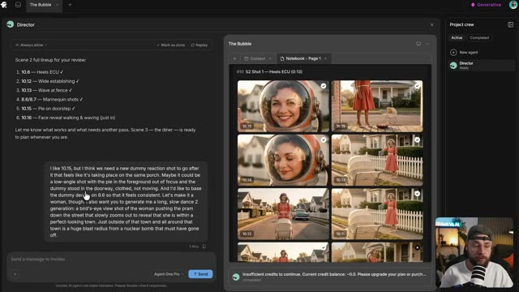
*Interface de l'application 'The Bubble' montrant un chat avec 'Agent One Pro' et une grille de plans vidéo de la scène 2 sur la droite.*

---

### ⏱️ `[00:07:40 - 00:08:16]` | Segment #19

**🔊 Audio (Transcription Intégrale Mot pour Mot en Français) :**
> Donc voici cette génération particulière de Sea Dance 2 ici. Mais j'avais l'impression que ça ne ressemblait pas au même porche que l'un des visuels clés précédents. C'était donc ce plan ici. C'est là qu'on voulait que la sorte de mannequin féminin reçoive la tarte. Le genre de contexte se perdait un peu ici. Donc tout d'abord, j'ai simplement demandé à l'agent un d'aller corriger ça, et c'est le plan qu'on a obtenu en retour, que j'ai vraiment, vraiment aimé, surtout ce genre de feuille qui entre dans le cadre et voltige juste pour ajouter un peu de mouvement là-dedans, j'adore vraiment ça, et c'est ici que je commence à décrire la nouvelle façon dont je

**👁️ Analyse Visuelle d'Écran (gemini-3.5-flash-lite) :**
**Interface & Outils** : Interface de l'application de création vidéo "The Bubble" (Agent One Pro) avec panneau de chat à gauche et galerie de plans/keyframe à droite, incluant la mini-caméra PiP de l'animateur.

**Contenu textuel & Code** : Texte du prompt visible dans le panneau latéral droit (Image 2) : "MODE: I2V SHOT STRUCTURE: 4s / 1 shot / 16:9 STYLE OPENER: Warm expired Kodak Ektachrome, vintage anamorphic softness, slight halation on highlights...". Dans le panneau de chat (Image 3) : "I also want you to generate me a long, slow dance 2 generation: a bird's-eye view shot of the woman pushing the pram down the street that slowly zooms out...".

**Action / Démonstration** : Le créateur navigue dans l'interface de son outil de direction artistique par IA, montrant les différentes itérations de plans, passant d'une vue de révision des plans à un plan spécifique généré par Seedance 2.0, puis montrant le texte du prompt en cours de modification.

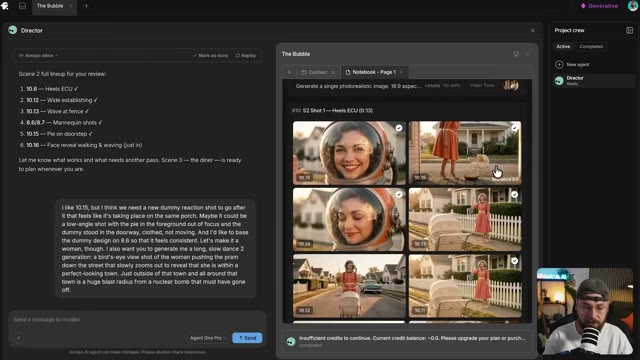
*Interface du logiciel montrant le panneau de révision de la Scène 2 et les différentes vignettes vidéo générées.*

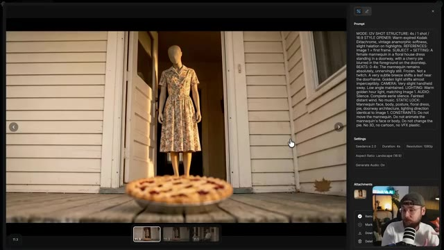
*Interface de prévisualisation vidéo montrant le plan du mannequin sur le porche avec une tarte au premier plan et une feuille qui entre dans le cadre.*

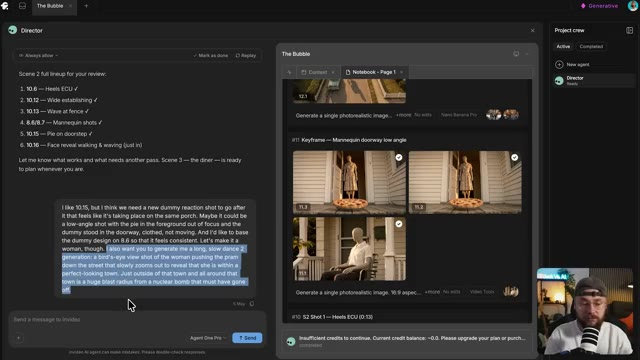
*Interface de gestion de projet avec le panneau de chat et de sélection des keyframes, incluant le texte surligné du prompt.*

---

### ⏱️ `[00:08:16 - 00:08:49]` | Segment #20

**🔊 Audio (Transcription Intégrale Mot pour Mot en Français) :**
> Je veux que le film se termine, je dis à notre agent que je veux avoir ce plan séquence vraiment très long où la femme pousse le landau sur la route et la caméra effectue un zoom arrière continu, un peu comme un plan à la grue révélant davantage le lieu, et ensuite nous voyons en quelque sorte la réalité de ce qui s'est passé. Et suite à cette nouvelle idée que j'ai eue, nous avons reçu ce visuel clé Nano Banana Pro ici. J'adore le fait que toutes les sortes de maisons, de pelouses et de rues aient l'air tout simplement trop parfaites.

**👁️ Analyse Visuelle d'Écran (gemini-3.5-flash-lite) :**
**Interface & Outils** : Interface web d'un outil de génération par IA (type assistant Agent One Pro / Nano Banana Pro) avec panneau de chat et visionneuse d'images.

**Contenu textuel & Code** : Texte de prompt visible : "a bird's-eye view shot of the woman pushing the pram down the street that slowly zooms out to reveal that she is within a perfect-looking town." Paramètres : Nano Banana Pro, Résolution 2K (2048x2048), Format horizontal (16:9).

**Action / Démonstration** : Le créateur montre l'interface de l'agent textuel où il formule sa demande de plan-séquence, puis zoome sur le résultat visuel clé généré par Nano Banana Pro représentant le quartier suburbain.

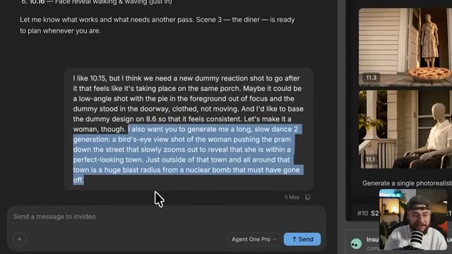
*Interface de chat (Agent One Pro) montrant les instructions textuelles pour générer un plan en vue plongeante d'une femme poussant un landau dans une rue.*

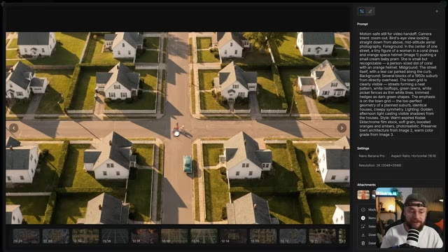
*Interface de visualisation d'image avec panneau de configuration latéral (Nano Banana Pro) affichant le prompt descriptif d'un quartier résidentiel des années 1950 en vue aérienne.*

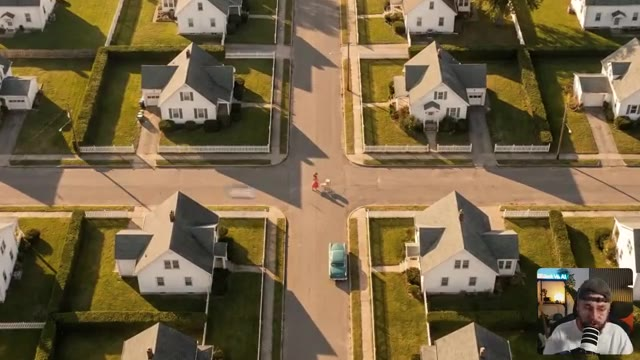
*Gros plan plein écran sur le rendu généré montrant la vue aérienne du quartier résidentiel parfaitement symétrique avec les maisons blanches et la voiture teal.*

---

### ⏱️ `[00:08:49 - 00:09:27]` | Segment #21

**🔊 Audio (Transcription Intégrale Mot pour Mot en Français) :**
> Ils sont trop réguliers. Ce n'est pas vraiment à quoi ressemble une ville en réalité, n'est-ce pas ? Et c'est parce que cette femme vit dans une situation assez étrange. Donc vous pouvez voir ici, nous avons dit que la caméra zoome lentement arrière pour révéler qu'elle se trouve au sein d'une ville à l'apparence parfaite, juste à l'extérieur de la ville et tout autour, il y a un énorme rayon d'explosion provenant d'une bombe nucléaire qui a dû exploser. Donc maintenant nous comprenons pourquoi la femme porte ce casque. Ce doit être pour la protéger d'une sorte de retombée nucléaire et nous comprenons également pourquoi il n'y a pas d'autres personnes dans la ville. C'est comme si elle était posée

**👁️ Analyse Visuelle d'Écran (gemini-3.5-flash-lite) :**
**Interface & Outils** : Interface logicielle de type agent IA (invideo / assistant de production vidéo) avec panneau de chat textuel et grille de prévisualisation des plans générés, ainsi qu'un encadré PiP montrant le créateur face caméra.

**Contenu textuel & Code** : Textes visibles dans les prompts et le chat décrivant la scène : vue aérienne de la femme poussant une poussette dans une ville parfaite entourée d'un rayon d'explosion nucléaire, paramètres techniques (Nano Banana Pro, 2K, format 16:9).

**Action / Démonstration** : Le créateur navigue dans l'interface de l'outil de production vidéo, montrant le prompt textuel détaillé décrivant la caméra qui zoome arrière pour révéler la ville entourée des dégâts d'une bombe nucléaire.

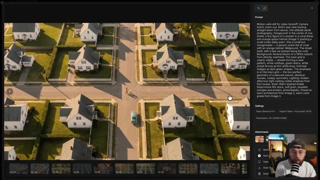
*Interface d'un outil de génération vidéo par IA affichant un plan aérien d'un quartier résidentiel parfait avec une femme en robe rouge et un petit chariot, avec le panneau de prompt détaillé sur la droite.*

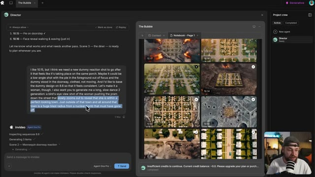
*Interface de gestion de projet IA montrant un chat avec des instructions textuelles sur la gauche et une grille de vignettes de scènes générées sur la droite.*

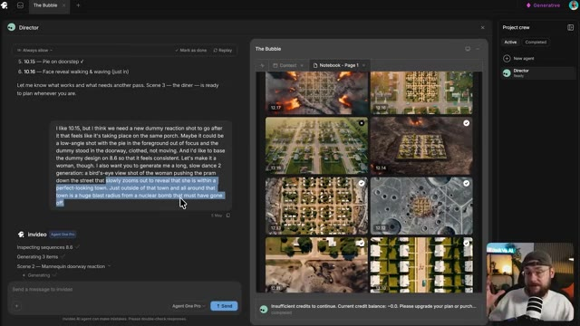
*Interface de gestion de projet similaire à l'image 2 avec le panneau de chat et les vignettes de génération, incluant un encadré vidéo de Jack en bas à droite.*

---

### ⏱️ `[00:09:27 - 00:10:10]` | Segment #22

**🔊 Audio (Transcription Intégrale Mot pour Mot en Français) :**
> tous ces mannequins comme une sorte de mécanisme d'adaptation psychologique. Et donc bien sûr ce plan final est vraiment crucial, il lie le tout ensemble et j'ai récupéré toute une charge d'options différentes ici c'était un processus de va-et-vient avec l'agent parce que je savais que je voulais vraiment réussir cela c'est l'une des versions que j'ai fini par ne pas utiliser mais c'était un peu comme un second choix par rapport à celui qui est apparu dans le film final donc je veux vraiment vous montrer ceci Vraiment juste cette puissante combinaison de Nano Banana Pro et Sea Dance 2 faisant travailler leurs muscles de l'IA, si vous voulez formuler ça comme ça, parce que le plan final de ceci est juste assez incroyable.

**👁️ Analyse Visuelle d'Écran (gemini-3.5-flash-lite) :**
**Interface & Outils** : InVideo (Agent One Pro) et Seedance (avec incrustation vidéo PiP du créateur dans le coin inférieur droit).

**Contenu textuel & Code** : Texte du prompt dans InVideo : "I like 10.15, but I think we need a new dummy reaction shot to go after it that feels like it's taking place on the same porch..." Texte du panneau latéral dans Seedance : "MODE: I2V SHOT STRUCTURE: 10s / 1 shot / 16:9 STYLE OPENER: Warm expired Kodak Ektachrome film stock..."

**Action / Démonstration** : Le créateur navigue dans l'interface d'InVideo pour examiner différentes options de séquences et de plans générés par IA, puis consulte les paramètres et prompts détaillés dans Seedance.

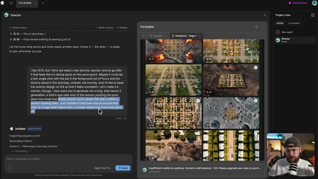
*Interface d'InVideo (Agent One Pro) montrant une liste de tâches, un panneau de chat avec des instructions textuelles et une grille de vidéos générées représentant un quartier résidentiel et des cratères de bombes.*

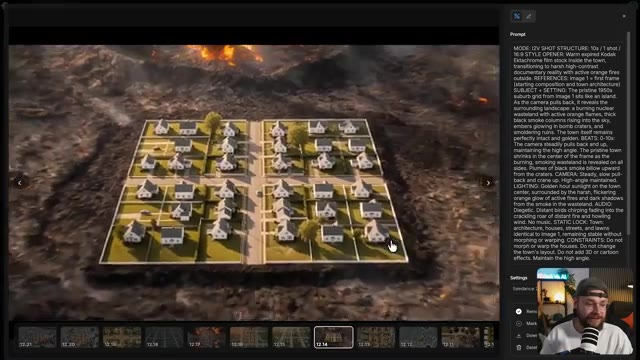
*Visualiseur vidéo dans Seedance montrant un plan aérien d'un lotissement pavillonnaire intact entouré d'un paysage volcanique en feu, avec un panneau de prompts détaillés sur la droite.*

---

### ⏱️ `[00:10:10 - 00:10:45]` | Segment #23

**🔊 Audio (Transcription Intégrale Mot pour Mot en Français) :**
> J'adore vraiment, vraiment ça. Mon genre de problème, c'est à quel point le périmètre de la ville était carré. J'adore la sensation d'échelle, cependant, et le fait qu'on comprenne vraiment que quelque chose d'affreux s'est produit. ça n'avait juste pas tellement de sens qu'il y ait juste ce genre de périmètre en grille rectangulaire, exactement comme une clôture normale qui protégeait la ville de cette explosion nucléaire. Donc après un peu plus d'allers-retours avec l'agent, j'ai finalement obtenu le plan de révélation que je cherchais et maintenant je pense que je vais vous montrer le film terminé. Donc comme je le dis, l'idée et le scénario viennent de moi.

**👁️ Analyse Visuelle d'Écran (gemini-3.5-flash-lite) :**
**Interface & Outils** : Interface logicielle de type Seedance avec une visionneuse vidéo centrale, une timeline de vignettes en bas et un panneau latéral droit affichant les détails du prompt, les paramètres et une vignette incrustée (PiP) du créateur.

**Contenu textuel & Code** : Panneau latéral affichant le texte complet du prompt : "MODE: I2V SHOT STRUCTURE: 10s / 1 shot / 16:9 STYLE OPENER: Warm expired Kodak Ektachrome film stock inside the town, transitioning to harsh high-contrast documentary reality with active orange fires outside. REFERENCES: Image 1 = first frame (starting composition and town architecture)..." et paramètres "Settings / Seedance 2...".

**Action / Démonstration** : Le créateur navigue à travers la chronologie des plans vidéo générés et examine les détails visuels du plan de révélation dans l'interface logicielle.

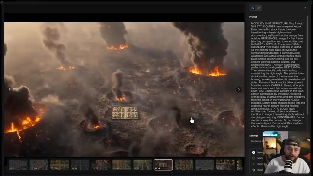
*Interface d'un outil vidéo affichant un plan large d'un paysage post-apocalyptique avec des cratères en feu et une ville intacte au centre, et le panneau latéral avec le prompt détaillé.*

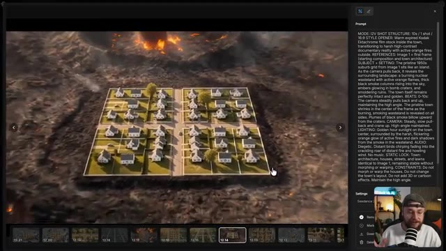
*Gros plan sur la ville intacte entourée d'un périmètre carré net dans un paysage de désolation volcanique, avec le panneau latéral affichant les paramètres de prompt.*

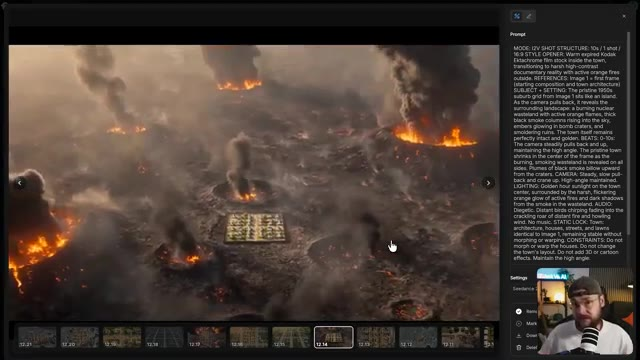
*Retour au plan large du paysage post-apocalyptique avec des cratères incandescents et des colonnes de fumée noire autour de la ville carrée.*

---

### ⏱️ `[00:10:45 - 00:11:40]` | Segment #24

**🔊 Audio (Transcription Intégrale Mot pour Mot en Français) :**
> et puis mon genre de directeur adjoint, on peut dire agent one, a pris les devants et s'est occupé de tout le travail technique fastidieux, à partir de quelques simples entrées conversationnelles de ma part. Voici le résultat que j'ai obtenu après un montage basique. Donc, en jetant un coup d'œil à ma timeline ici, vous pouvez voir que je n'ai pas vraiment fait grand-chose,

**👁️ Analyse Visuelle d'Écran (gemini-3.5-flash-lite) :**
**Interface & Outils** : Interface d'un outil de génération de vidéo IA (avec panneau de prompt à droite et timeline de clips en bas) et logiciel de montage Adobe Premiere Pro.

**Contenu textuel & Code** : Texte du prompt visible sur l'image 1 (« MODE: I2V SHOT STRUCTURE: 10s / 1 shot / 16:9... »), paramètres de réglage, et organisation des clips médias dans le chutier et la timeline de Premiere Pro sur l'image 4.

**Action / Démonstration** : Présentation de l'interface de génération vidéo avec les prompts textuels utilisés par l'agent IA, puis affichage de la timeline de montage vidéo basique sur Adobe Premiere Pro.

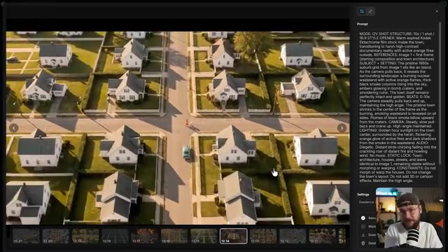
*Interface d'un logiciel de génération vidéo affichant une vue aérienne d'un quartier pavillonnaire et le prompt textuel détaillé sur le panneau latéral droit.*

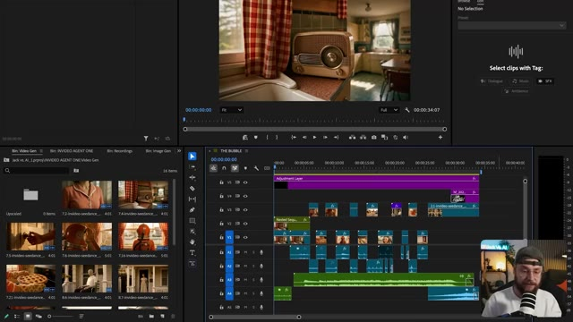
*Interface d'Adobe Premiere Pro montrant la timeline de montage avec plusieurs pistes vidéo, audio et calques d'ajustement.*

---

### ⏱️ `[00:11:40 - 00:12:13]` | Segment #25

**🔊 Audio (Transcription Intégrale Mot pour Mot en Français) :**
> pour être honnête avec vous. La musique joue un rôle vraiment important, le morceau lui-même, pour donner en quelque sorte cette sensation d'ironie. Comme toujours, j'ai pris les devants et j'ai ajouté mon calque d'effet tout en haut ici, qui intègre énormément de grain de pellicule. J'aime vraiment le rendu que ça donne pour ce projet particulier, même sur ce genre de plan final. Si on zoome vraiment de près, il y a ces bâtiments détruits, je trouve vraiment que ça apporte ce joli effet de texture, une chose simple qu'on peut ajouter directement dans son logiciel de montage, et j'ai aussi fini par générer ce genre de truc vraiment kitsch.

**👁️ Analyse Visuelle d'Écran (gemini-3.5-flash-lite) :**
**Interface & Outils** : Adobe Premiere Pro (logiciel de montage vidéo avec panneaux de timeline, moniteur de prévisualisation, chutier et panneau audio).

**Contenu textuel & Code** : Noms des pistes sur la timeline (Adjustment Layer, Nested Sequence), tags audio (Dialogue, Music, SFX), et texte graphique à l'écran 'Wish you were Here!'.

**Action / Démonstration** : Le curseur de la timeline se déplace et l'écran de prévisualisation zoome sur les plans finaux de la vidéo.

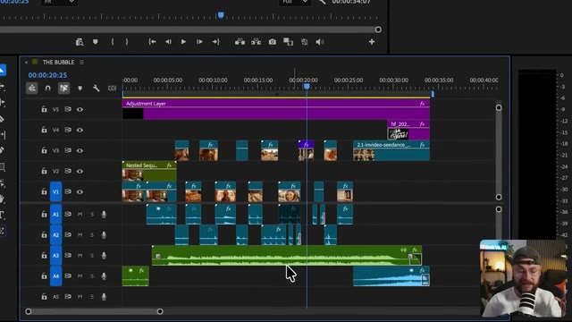
*Interface d'Adobe Premiere Pro montrant la timeline multipiste avec la piste audio principale en vert et le calque d'effet violet.*

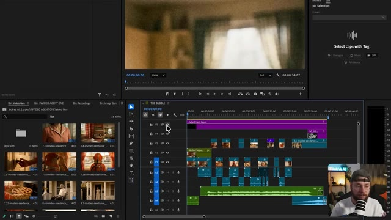
*Vue de l'interface de montage d'Adobe Premiere Pro avec le moniteur source affichant un plan intérieur texturé par du grain de film.*

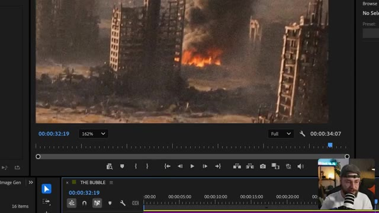
*Gros plan sur le moniteur de prévisualisation montrant des bâtiments détruits et en feu dans une scène post-apocalyptique.*

*Écran de montage d'Adobe Premiere Pro affichant le plan final avec un texte superposé 'Wish you were Here!' au-dessus d'un paysage urbain détruit.*

---

### ⏱️ `[00:12:13 - 00:12:31]` | Segment #26

**🔊 Audio (Transcription Intégrale Mot pour Mot en Français) :**
> graphique du genre "wish you were here" que l'on pourrait voir sur une vieille carte postale ou quelque chose comme ça. Et si je vais simplement masquer cet élément, vous pouvez voir que le plan de révélation final a un peu plus de sens physique. Il n'a pas ce genre de périmètre vraiment parfait que nous avions avec cette autre génération.

**👁️ Analyse Visuelle d'Écran (gemini-3.5-flash-lite) :**
**Interface & Outils** : Adobe Premiere Pro

**Contenu textuel & Code** : Texte graphique stylisé "Wish You Were Here!" sur une vue aérienne d'un quartier de banlieue touché par un cratère/catastrophe.

**Action / Démonstration** : Le créateur montre le plan avec le texte graphique de carte postale, puis masque l'élément pour comparer avec le rendu final plus naturel et sans le périmètre parfait de la génération précédente.

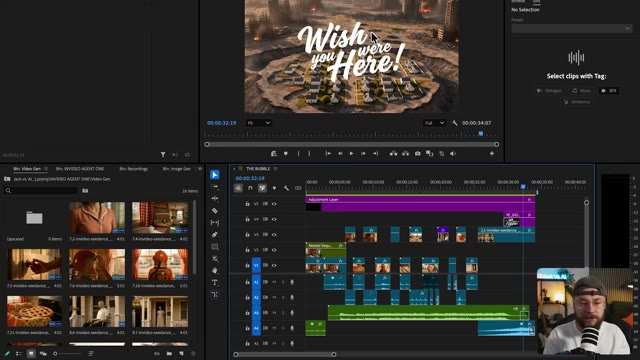
*Interface d'Adobe Premiere Pro montrant un montage vidéo avec le texte "Wish You Were Here!" incrusté sur une image aérienne d'un quartier détruit, et Jack visible en incrustation (PiP) en bas à droite.*

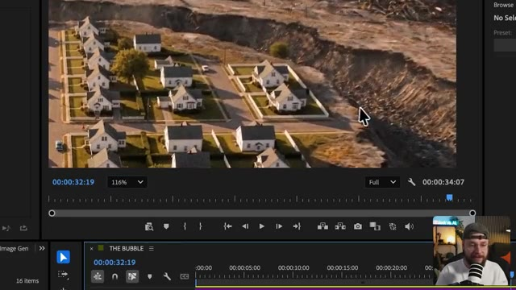
*Interface d'Adobe Premiere Pro montrant la même séquence après le masquage du texte graphique "Wish You Were Here!", révélant uniquement la vue aérienne du paysage détruit.*

---

### ⏱️ `[00:12:31 - 00:12:55]` | Segment #27

**🔊 Audio (Transcription Intégrale Mot pour Mot en Français) :**
> Ça a en quelque sorte un rayon d'explosion autour. Donc c'est sur ça que j'ai fini par atterrir pour le film terminé. Et puis, ouais, ce genre d'élément graphique ajoute juste un petit plus, je pense. Une autre chose vraiment basique que j'ai faite pour le premier plan ici, c'est que j'ai juste pris la première image et je l'ai transformée en fixe parce que je voulais en quelque sorte m'attarder sur cette image de la radio pendant un moment.

**👁️ Analyse Visuelle d'Écran (gemini-3.5-flash-lite) :**
**Interface & Outils** : Adobe Premiere Pro (logiciel de montage vidéo) avec incrustation PiP du présentateur dans le coin inférieur droit.

**Contenu textuel & Code** : Timeline de montage, fenêtres de prévisualisation affichant des plans générés par IA (quartier détruit, intérieur de cuisine avec une radio vintage), chutier avec des clips vidéo nommés ("7.2-invideo-seedance...").

**Action / Démonstration** : Le créateur démontre son interface de montage sur Premiere Pro, navigue entre la timeline et les différents plans de sa vidéo pour illustrer le processus de post-production et l'utilisation d'images fixes.

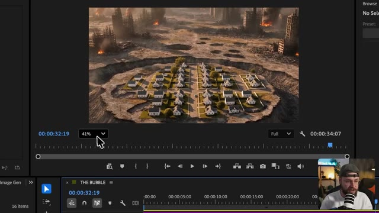
*Interface d'Adobe Premiere Pro montrant un plan large d'un quartier détruit avec un rayon d'explosion et Jack en incrustation (PiP).*

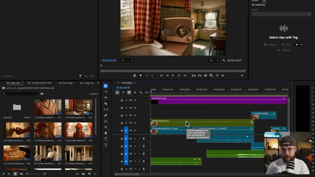
*Interface d'Adobe Premiere Pro montrant le montage vidéo avec le chutier, la timeline et le plan fixe d'une radio vintage dans une cuisine.*

---

### ⏱️ `[00:12:55 - 00:13:17]` | Segment #28

**🔊 Audio (Transcription Intégrale Mot pour Mot en Français) :**
> Et puis j'ai juste ajouté ce mouvement de caméra vraiment assez délicat avant que la main de notre personnage n'entre dans le cadre et allume la radio. En bas ici, c'est juste moi qui ai ajouté quelques effets sonores de talons qui claquent dans la cuisine, qui se rapprochent en quelque sorte. Et en fait, c'est le seul effet sonore que j'ai ajouté à l'ensemble du projet. Tout le reste a été généré nativement à l'intérieur de Sea Dance 2.

**👁️ Analyse Visuelle d'Écran (gemini-3.5-flash-lite) :**
**Interface & Outils** : Adobe Premiere Pro (avec un encadré PiP de Jack en bas à droite).

**Contenu textuel & Code** : On peut voir le chutier (Bin: Video Gen) avec miniatures de clips vidéo (générés par Sea Dance 2), la timeline de montage multi-pistes avec des calques vidéo et audio, et le moniteur affichant un plan de cuisine rétro avec une radio.

**Action / Démonstration** : Le créateur montre son projet de montage vidéo dans Premiere Pro, en illustrant la mise en place des pistes audio et des clips générés par IA.

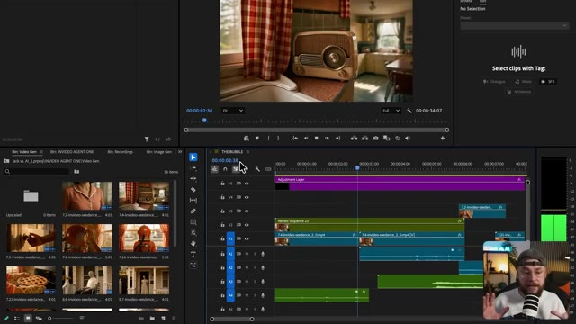
*Interface d'un logiciel de montage vidéo (Adobe Premiere Pro) montrant la timeline avec les pistes audio et vidéo, ainsi que le moniteur affichant la scène de la cuisine avec la radio vintage.*

---

### ⏱️ `[00:13:17 - 00:13:37]` | Segment #29

**🔊 Audio (Transcription Intégrale Mot pour Mot en Français) :**
> Vous remarquerez également que le film terminé a fini par être beaucoup plus court que prévu initialement. J'ai simplement estimé qu'il n'avait pas besoin de durer 60 secondes au final. J'étais vraiment satisfait du type de rythme que j'obtenais pendant que je montais. C'est un peu de cela dont je parlais. Quand vous utilisez Agent 1, vous pouvez en quelque sorte vous adapter au vol. Vous n'êtes pas toujours obligé de vous en tenir à votre plan initial.

**👁️ Analyse Visuelle d'Écran (gemini-3.5-flash-lite) :**
**Interface & Outils** : Adobe Premiere Pro (logiciel de montage vidéo)

**Contenu textuel & Code** : Timeline de montage avec pistes vidéo et audio (V1, A1, etc.), moniteur de prévisualisation affichant un plan de cuisine vintage, chutier à gauche avec des vignettes vidéo (ex: "7,2-invideo-seedance...", "7,5-invideo-seedance..."), panneau audio "Essential Sound" à droite, et incrustation vidéo (PiP) du créateur en bas à droite.

**Action / Démonstration** : Le créateur présente son projet de montage vidéo sur Adobe Premiere Pro, illustrant la structure de sa timeline et l'agencement des clips générés par IA.

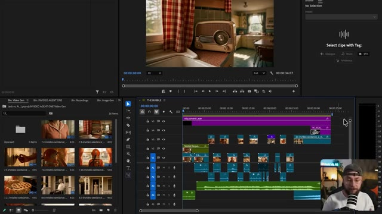
*Interface du logiciel de montage Adobe Premiere Pro montrant la timeline du projet "THE BUBBLE" et les chutiers de clips vidéo générés par IA.*

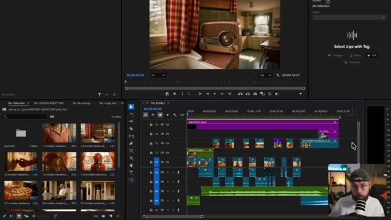
*Vue identique de l'interface d'Adobe Premiere Pro avec la timeline de montage et le retour vidéo montrant une cuisine vintage avec une radio.*

---

### ⏱️ `[00:13:37 - 00:14:02]` | Segment #30

**🔊 Audio (Transcription Intégrale Mot pour Mot en Français) :**
> Et si vous avez une nouvelle idée ou que vous voulez que votre film soit un peu plus court ou se termine d'une manière différente, c'est tout à fait bien. Vous n'êtes bloqué dans aucune méthode de travail particulière. J'étais donc vraiment très heureux du résultat final que j'ai obtenu pour ce projet. Je trouvais qu'il était vraiment visuellement intéressant. Il avait un ton vraiment marquant et créait ce sentiment de mystère et d'intrigue, ce qui correspondait exactement à ce que je recherchais.

**👁️ Analyse Visuelle d'Écran (gemini-3.5-flash-lite) :**
**Interface & Outils** : Adobe Premiere Pro (logiciel de montage vidéo)

**Contenu textuel & Code** : On aperçoit dans le panneau de gauche un chutier ("jack vs. AI_1.prproj") contenant plusieurs vignettes de clips vidéo générés ("7.2-invideo-seedance...", "7.4-invideo-seedance...", "7.5-invideo-seedance..."). Au centre, le moniteur de prévisualisation montre une scène de cuisine avec une radio rétro. En bas, la timeline du projet "THE BUBBLE" regroupe plusieurs pistes vidéo et audio. En bas à droite, Jack apparaît dans un encadré PiP (Picture-in-Picture) devant son micro.

**Action / Démonstration** : Le créateur montre son espace de montage dans Adobe Premiere Pro avec la timeline du film en cours de construction et les assets vidéo générés par IA dans le chutier.

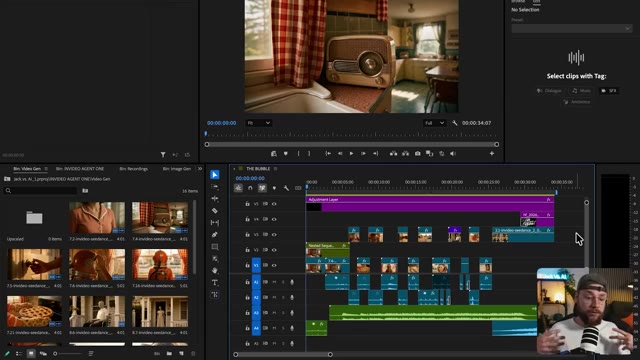
*Interface d'Adobe Premiere Pro avec un chutier affichant des clips générés par IA et la timeline du projet "THE BUBBLE", avec un encadré PiP montrant Jack en bas à droite.*

---

### ⏱️ `[00:14:02 - 00:14:25]` | Segment #31

**🔊 Audio (Transcription Intégrale Mot pour Mot en Français) :**
> Mais comme tout outil, Agent One n'est pas sans défauts. Et je vous manquerais de respect, à vous et à NVIDIA, si je n'en parlais pas également. Le premier problème est qu'il peut falloir beaucoup de temps pour récupérer vos générations. Et bien que cela soit logique puisque Agent One exécute de nombreux processus différents en même temps, ce n'est toujours pas idéal.

**👁️ Analyse Visuelle d'Écran (gemini-3.5-flash-lite) :**
**Interface & Outils** : Adobe Premiere Pro et l'application Agent One (interface de génération et de direction de projet IA).

**Contenu textuel & Code** : Dans l'image #3, le panneau de prompt affiche : "MODE: I2V SHOT STRUCTURE: 10s / 1 shot / 16:9 STYLE OPENER: Warm expired Kodak Ektachrome film stock inside the town...". Dans l'image #4, le panneau "Director" affiche du texte de suivi de séquences ("Inspecting sequences 10.6, 10.7, 10.8...", "Scene 2 keyframes and videos — all accepted: 1. 10.6 - Heels ECU video...", etc.) et un message d'avertissement en bas : "Insufficient credits to continue. Current credit balance: ~0.0. Please upgrade your plan or purchase credits."

**Action / Démonstration** : Le créateur présente l'interface de montage de son projet, puis montre les prompts détaillés utilisés pour générer les plans cinématiques et l'interface de suivi du projet Agent One avec l'historique des générations.

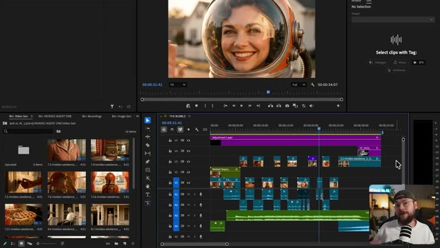
*Interface de montage vidéo (Adobe Premiere Pro) avec le panneau des chutiers et la timeline du projet "The Bubble", et le créateur visible en incrustation PiP.*

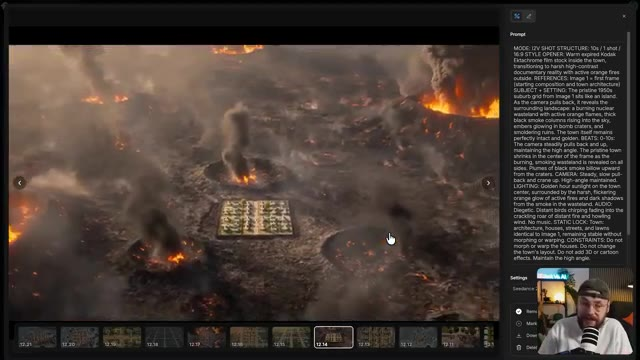
*Interface de l'outil Agent One affichant un plan large aérien d'une zone résidentielle détruite par un cataclysme avec des cratères volcaniques, un panneau de prompt textuel détaillé sur le côté droit, et le créateur en incrustation PiP.*

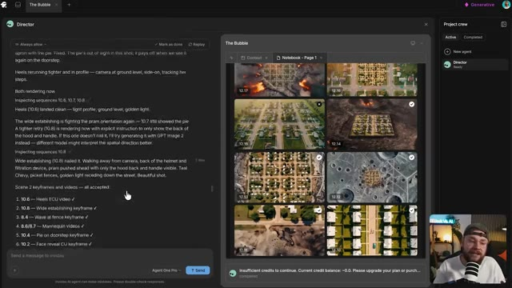
*Interface de l'application Agent One avec le panneau Director (chat avec l'IA) à gauche montrant l'historique des séquences et une grille de vignettes vidéo/images du projet "The Bubble" à droite, avec le créateur en incrustation PiP.*

---

### ⏱️ `[00:14:25 - 00:14:54]` | Segment #32

**🔊 Audio (Transcription Intégrale Mot pour Mot en Français) :**
> Si NVIDIA trouve un moyen d'accélérer les générations, je pense que cela va beaucoup aider. Et le prochain domaine qu'ils devraient examiner, selon moi, c'est la consommation de crédits. C'est vraiment difficile de savoir combien de crédits vous dépensez à un moment donné. Ce serait vraiment super d'avoir une sorte de compteur de crédits quelque part dans l'interface utilisateur, que l'on puisse simplement garder à l'œil. On pourrait ainsi le voir sous forme de barre qui se vide au fil du temps à mesure que l'on dépense ses crédits.

**👁️ Analyse Visuelle d'Écran (gemini-3.5-flash-lite) :**
**Interface & Outils** : Interface logicielle floutée avec affichage incrusté (PiP) du créateur dans le coin inférieur droit.

**Contenu textuel & Code** : Texte affiché à l'écran : "note two credit spend". L'interface principale montre une grille de quatre aperçus d'images floutées et des zones de texte floutées.

**Action / Démonstration** : Le créateur parle tout en présentant l'interface de l'application avec sa webcam en incrustation.

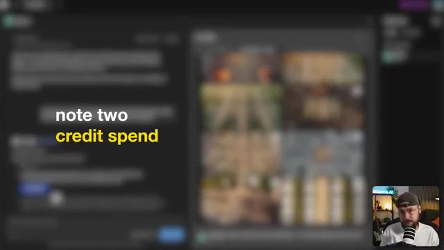
*Capture d'écran d'une application ou d'un logiciel flouté avec un encadré PiP de Jack dans le coin inférieur droit, affichant le texte superposé "note two credit spend".*

---

### ⏱️ `[00:14:54 - 00:15:15]` | Segment #33

**🔊 Audio (Transcription Intégrale Mot pour Mot en Français) :**
> Mais j'irais même un peu plus loin en montrant réellement combien de crédits cela va coûter pour mener à bien un certain processus. Donc, par exemple, ici, nos générations Seedance 2 pourraient être accompagnées d'un compteur de crédits. Et ensuite, l'Agent 1 va en fait de l'avant et vous demande, voulez-vous réellement tout générer ce que je suggère ?

**👁️ Analyse Visuelle d'Écran (gemini-3.5-flash-lite) :**
**Interface & Outils** : InVideo (Agent One Pro / The Bubble) avec affichage PiP du créateur en bas à droite.

**Contenu textuel & Code** : Interface de l'outil InVideo affichant un chat textuel avec l'Agent One Pro, un avertissement sur les crédits insuffisants ("Insufficient credits to generate. Need -27.3 credits, current credit balance: -0.0"), ainsi qu'une grille de vignettes vidéo.

**Action / Démonstration** : Le créateur présente l'interface d'InVideo tout en parlant, avec sa webcam intégrée en incrustation (PiP) dans le coin inférieur droit.

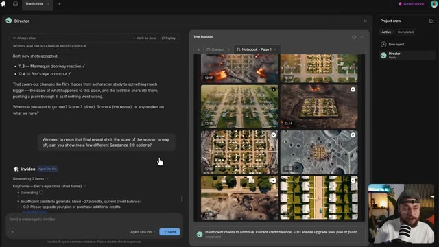
*Interface d'InVideo montrant le panneau de chat avec l'Agent 1, un compteur de crédits insuffisants et une grille de vidéos générées.*

---

### ⏱️ `[00:15:15 - 00:15:52]` | Segment #34

**🔊 Audio (Transcription Intégrale Mot pour Mot en Français) :**
> Avez-vous vraiment besoin de chacun de ces visuels clés Nano Banana Pro ? Ou est-ce qu'on peut simplement faire les plus basiques, et ensuite C-Dance 2 peut s'occuper de combler les lacunes ? Parce qu'on sait que C-Dance 2, en tant que modèle vidéo, peut souvent nous donner d'excellents résultats à partir d'une simple feuille de personnage pour certaines scènes. Et évidemment, si l'Agent 1 a même suggéré ce flux de travail, cela pourrait potentiellement réduire votre consommation de crédits d'une bonne tranche. Cela étant dit, je pense vraiment que l'Agent 1 a sa place dans ce genre d'écosystème créatif. Gardons bien à l'esprit aussi que ce n'est même pas encore en version bêta.

**👁️ Analyse Visuelle d'Écran (gemini-3.5-flash-lite) :**
**Interface & Outils** : Interface logicielle de type assistant IA ("The Bubble" / Agent One Pro) avec grille de prévisualisation vidéo et panneau de chat textuel.

**Contenu textuel & Code** : Vignettes vidéo montrant des scènes de type film (personnages dans une cuisine avec une tarte, casque de scaphandre), messages d'erreur de crédit ("Insufficient credits to continue"), et panneaux de génération de keyframes (Seedance 2.0).

**Action / Démonstration** : Le curseur de la souris survole une vignette vidéo dans l'interface pendant que l'application gère les tâches de génération et le suivi du projet.

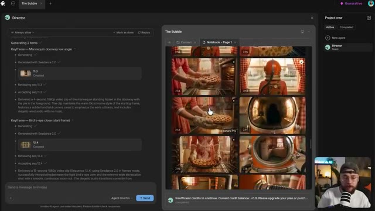
*Interface logicielle de gestion de projet avec grille de vignettes vidéo et panneau de contrôle Agent One Pro, avec le présentateur visible en incrustation (PiP) en bas à droite.*

---

### ⏱️ `[00:15:52 - 00:16:22]` | Segment #35

**🔊 Audio (Transcription Intégrale Mot pour Mot en Français) :**
> C'est encore une version alpha. Je pense donc que c'est un très bon début pour NVIDIA. C'est un outil vraiment intéressant à utiliser. Comme je le dis, si vous voulez aller jeter un œil à l'Agent 1 de NVIDIA, vous trouverez un lien en bas dans la description. Et si vous avez la moindre question, n'hésitez pas à la poser en bas. J'essaie toujours de répondre à autant d'entre elles que possible. Si vous avez envie de découvrir un peu plus de mon contenu, vous trouverez une autre de mes vidéos sur l'écran en ce moment même. Cela étant dit, les gars, passez une excellente journée et je vous retrouve dans la prochaine !

**👁️ Analyse Visuelle d'Écran (gemini-3.5-flash-lite) :**
**Interface & Outils** : Interface de l'application Seedance 2.0 avec panneau de prompt latéral, paramètres techniques et encadré vidéo PiP du créateur.

**Contenu textuel & Code** : Texte du prompt visible à l'écran : "MODE: 12V SHOT STRUCTURE: 4s / 1 shot / 16:9 STYLE OPENER: WARM expired Kodak Ektachrome film stock, soft grain, golden hazy light, anamorphic softness... SETTING: The woman in the orange space helmet in a suburban street...". Paramètres : Seedance 2.0, Duration 4s, Resolution 1080p, Aspect Ratio Landscape (16:9), Generate Audio: On.

**Action / Démonstration** : Le créateur présente l'interface d'un outil de génération vidéo par IA tout en parlant à la caméra, visible en incrustation (PiP) dans l'angle inférieur droit.

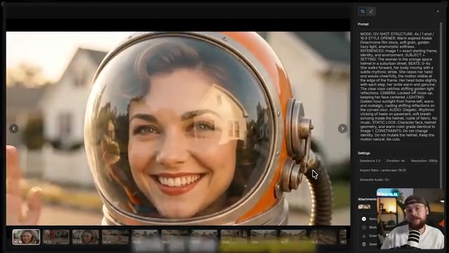
*Interface de Seedance 2.0 affichant une vidéo générée d'une femme avec un casque d'astronaute orange, avec un panneau de prompt détaillé sur le côté droit et le présentateur en incrustation PiP dans le coin inférieur droit.*

---
