# 🎬 Créer des scènes de combat cinématographiques avec l'IA (Workflow complet)

> **Chaîne** : [Jack Vs. AI](https://www.youtube.com/@JackVsAI)  
> **Titre original** : `How to Make Cinematic Fight Scenes with AI (Full Workflow)`  
> **Lien YouTube** : [https://www.youtube.com/watch?v=Dh221nmMeQ8](https://www.youtube.com/watch?v=Dh221nmMeQ8)  
> **Date de publication** : 2026-05-12  
> **Durée** : 23m 55s (`1435s`)  
> **Identifiant vidéo** : `Dh221nmMeQ8`  
> **Fiche Web Interactive** : [2026-05-12_YT-Dh221nmMeQ8_Créer des scènes de combat cinématographiques avec l'IA (Workflow complet)_by-whisper-v3-large-turbo+gemini-3.5-flash-lite.html](2026-05-12_YT-Dh221nmMeQ8_Créer des scènes de combat cinématographiques avec l'IA (Workflow complet)_by-whisper-v3-large-turbo+gemini-3.5-flash-lite.html)  
> **Captures de démonstration clés** : `99 captures réelles (anti-talking-head)`  
> **Modèles utilisés** : Audio: `large-v3-turbo` (Faster-Whisper int8 VPS) | Vision: `gemini-3.5-flash-lite` (Google AI Studio API)  

---

## 📌 Synthèse Exécutive & Outils

### 📌 Résumé
La démocratisation de l'intelligence artificielle générative redéfinit radicalement les standards de la production audiovisuelle indépendante, permettant à de petits créateurs de concevoir des scènes de combat et des plans d'action dignes de blockbusters hollywoodiens à moindre coût. Dans cette vidéo, Jack, expert en effets visuels, dévoile un workflow complet de réalisation de films par IA qui fusionne la génération d'images et de vidéos de pointe pour garder un contrôle artistique absolu sur chaque plan. De la conceptualisation initiale des personnages jusqu'au montage final, la méthode repose sur une approche méthodique de réalisateur : refuser la dictature du hasard, éliminer les artefacts inutiles, et structurer les flux de production pour maximiser la flexibilité créative.

Le processus s'articule autour de la plateforme Artlist et de son kit d'outils intégré, combinant des modèles text-to-image et image-to-video ultra-performants. En générant d'abord des planches de personnages sous tous les angles et en injectant des prompts rigoureux, Jack parvient à maintenir une cohérence visuelle parfaite pour son avatar à travers différents environnements complexes, qu'il s'agisse d'un combat contre un monstre de foin ou d'une course-poursuite en aéroglisseur dans Londres. L'analyse démontre également comment contourner les barrières de modération des contenus d'action et pourquoi il est crucial de proscrire la musique intégrée pour préserver une liberté totale au montage.

### 🛠️ Outils, Modèles & Logiciels Présentés
* **Claude** : Utilisé en amont pour la conception textuelle, l'assistance à la rédaction des prompts et la structuration du workflow narratif.
* **Nano Banana Pro** : Mentionné comme solution d'optimisation et d'assistance créative dans l'écosystème global de génération.
* **Seedance (Seedance 2)** : Le modèle de génération vidéo par IA central du tutoriel, spécialisé dans le dynamisme des scènes d'action, la montée en résolution 1080p et le rendu textuel réaliste.
* **Flux** : Modèle de pointe employé pour la génération d'images fixes de haute fidélité (accessoires, key visuals, planches de personnages).
* **Artlist AI Toolkit** : La plateforme hôte qui centralise l'accès aux derniers outils de génération d'images et de vidéos par IA utilisés tout au long du projet.

### 🔑 Points Clés & Enseignements Stratégiques
* **Adopter une posture de réalisateur** : Ne pas utiliser aveuglément chaque génération vidéo sous prétexte qu'elle a consommé des crédits ; exercer un tri sélectif au montage comme sur un véritable plateau de tournage.
* **Investir dans la génération d'images amont** : Commencer par créer des planches de personnages, des accessoires et des visuels clés (key visuals) pour réduire le hasard et gaspiller moins de crédits vidéo.
* **Garantir la cohérence des personnages** : Fournir au modèle vidéo des fiches de personnages détaillées montrant le protagoniste sous plusieurs angles et dans ses différentes variantes vestimentaires.
* **Maîtriser les bibles de prompts pour l'audio** : Intégrer des instructions spécifiques dans la structure du prompt pour interdire à Seedance 2 d'ajouter de la musique, préservant ainsi la liberté de montage sonore.
* **Gérer la résolution et les textures** : Profiter des récentes augmentations de résolution (1080p) pour obtenir des plans rapprochés qualitatifs restituant fidèlement la texture de la peau et des tissus.
* **Ancrer les environnements géographiques** : Utiliser des repères visuels forts et universels dans les prompts (comme des monuments londoniens) pour que le spectateur identifie instantanément le lieu de l'action.
* **Contourner les blocs de modération** : Utiliser des astuces de formulation et des techniques de contournement pour réussir à générer des scènes de combat dynamiques sans déclencher les filtres de sécurité des plateformes.
* **Accepter le chaos contrôlé des plans d'action** : S'appuyer sur la capacité des modèles récents à restituer la rapidité et la frénésie propre aux combats cinématographiques à gros budget.
* **Dissocier les effets sonores de la bande originale** : Conserver les bruits d'impact et les sound design générés par l'IA tout en rejetant les pistes musicales imposées pour caler son propre rythme au montage.
* **Optimiser le rapport coût/efficacité** : Transformer un processus de production qui aurait coûté des milliers de dollars en un flux de travail accessible aux créateurs indépendants grâce à la maîtrise des outils actuels.

---

## ⏱️ Chronologie & Transcription Complète Audio & Visuelle (Mot pour Mot)

### ⏱️ `[00:00:00 - 00:00:34]` | Segment #01

**🔊 Audio (Transcription Intégrale Mot pour Mot en Français) :**
> Les cinéastes indépendants viennent de devenir dangereux. Parce que toutes ces scènes de combat et ces plans d'action ont été créés avec l'IA. Les personnages, les environnements et même la conception sonore. Chaque élément généré grâce à un flux de travail où vous restez en contrôle. Il y a six mois, cela aurait coûté des milliers de dollars. Mais l'IA vient de confier des flux de travail de niveau blockbuster aux petits créateurs. Et si vous ignorez ce changement, vous allez vous faire dépasser rapidement. Je suis Jack. J'ai passé plus d'une décennie à créer des effets visuels pour certaines des plus grandes marques de la planète. Et maintenant j'utilise l'IA pour réinventer la création

**👁️ Analyse Visuelle d'Écran (gemini-3.5-flash-lite) :**
**Interface & Outils** : Présentation face caméra sans partage d'écran

**Contenu textuel & Code** : Aucun contenu logiciel ou technique affiché, uniquement des séquences cinématiques générées par IA illustrant le discours et des plans de Jack dans son studio.

**Action / Démonstration** : Le créateur s'exprime face caméra en gesticulant de manière expressive pour appuyer ses propos, alternant avec des extraits vidéo d'action générés par intelligence artificielle.

---

### ⏱️ `[00:00:34 - 00:01:10]` | Segment #02

**🔊 Audio (Transcription Intégrale Mot pour Mot en Français) :**
> flux de travail. Aujourd'hui, je vais vous montrer comment créer des séquences comme celle-ci à partir de zéro et comment générer des scènes de combat sans vous heurter à ces fichus blocs de contenu. Que vous souhaitiez créer des vidéos virales, des courts-métrages, des publicités cinématiques ou même vous mettre au centre de l'histoire, j'ai tout prévu. Et si vous aimez la vidéo d'aujourd'hui, n'oubliez pas de lâcher un pouce bleu pour moi et de penser à vous abonner. Allez, c'est parti. Donc toutes ces séquences ont été construites sur Artlist et depuis leur page d'accueil, la première chose que vous voulez faire, c'est aller dans l'AI Toolkit. C'est ici que nous pouvons accéder à tous les derniers et meilleurs outils de génération d'images et de vidéos par IA.

**👁️ Analyse Visuelle d'Écran (gemini-3.5-flash-lite) :**
**Interface & Outils** : Interface web de la plateforme Artlist (Artlist.io) affichant la page d'accueil, les menus "Home", "AI Toolkit", "Stock Catalog", "Studio", ainsi que les catégories "AI Image", "AI Video", "AI Music", "AI Voiceover". Le créateur apparaît également en incrustation vidéo (PiP) dans le coin inférieur gauche.

**Contenu textuel & Code** : Texte visible sur l'interface Artlist : "Bring any idea to life", "AI Toolkit", "Artlist Studio", "AI Image", "AI Video", "AI Music", "AI Voiceover", "Get More AI Credits". Sous-titres à l'écran : "show you how to" (sur l'image 1) et "Or even put yourself" (sur l'image 2).

**Action / Démonstration** : Présentation visuelle de séquences cinématiques générées par IA (voiture futuriste, géant de paille), puis affichage de l'interface de la plateforme Artlist avec le curseur de la souris qui survole l'écran pendant que le créateur commente les différentes fonctionnalités de la boîte à outils IA.

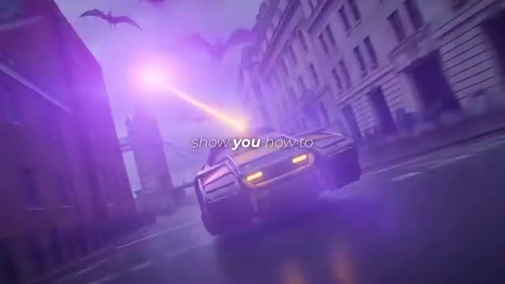
*Séquence vidéo générée par IA montrant un véhicule futuriste tirant un rayon laser dans une rue de Londres sous un ciel violet.*

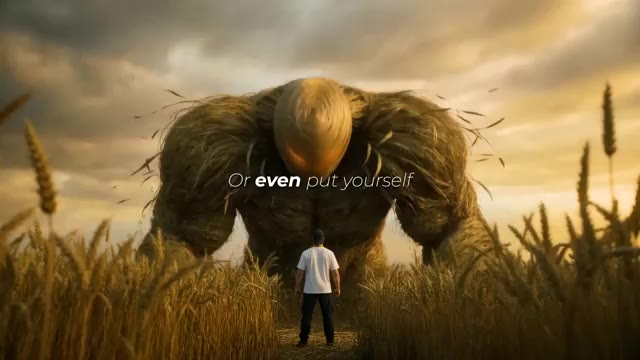
*Séquence vidéo générée par IA montrant un personnage de dos dans un champ de blé face à une gigantesque créature humanoïde faite de paille.*

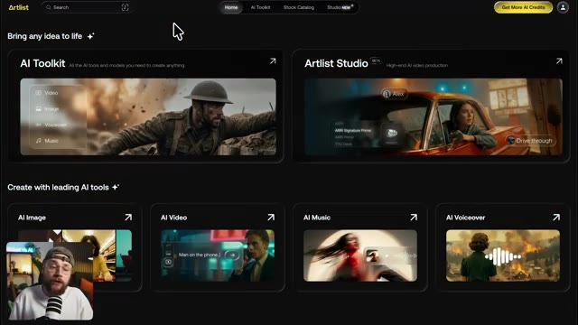
*Page d'accueil de la plateforme Artlist avec incrustation vidéo (PiP) du créateur Jack en bas à gauche, présentant l'interface et le menu AI Toolkit.*

---

### ⏱️ `[00:01:10 - 00:01:44]` | Segment #03

**🔊 Audio (Transcription Intégrale Mot pour Mot en Français) :**
> modèles et vous verrez que tous mes projets distincts ont été organisés en différentes sessions. Donc pour commencer, je veux passer à la session de génération de vidéos. Donc ici vous pouvez voir un tas d'excellents exemples que j'ai générés en utilisant C-Dance 2 et ce que je veux faire d'abord c'est les examiner dans leur forme brute et non modifiée pour que vous puissiez vous faire une idée très précise de l'efficacité actuelle de l'IA pour créer des séquences d'action. Et ensuite, je vais vous guider à travers les étapes impliquées dans leur création effective. Allons donc d'abord jeter un œil à cet exemple ici.

**👁️ Analyse Visuelle d'Écran (gemini-3.5-flash-lite) :**
**Interface & Outils** : Interface web d'Artlist (AI Toolkit) avec panneau latéral de navigation des sessions et zone de prompt en bas.

**Contenu textuel & Code** : On peut lire des catégories comme "Video Generations", "Image Generations", "Kitchen Scene", "Dining Room Scene", "Supermarket Scene", et le champ de saisie "Describe the image you want to create".

**Action / Démonstration** : Le créateur navigue dans l'interface et survole différentes sessions de projets organisés pour montrer les exemples générés par IA.

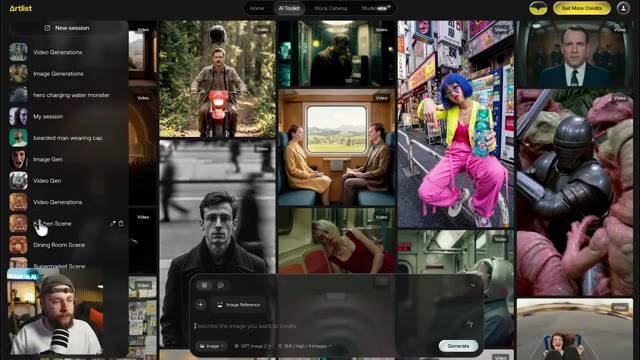
*Interface de l'application Artlist affichant une galerie de projets de génération de médias, avec le panneau latéral des sessions et un encadré PiP du créateur en bas à gauche.*

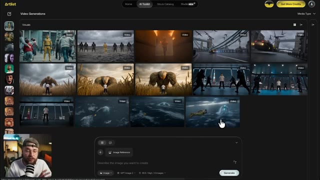
*Interface de la session "Video Generations" sur Artlist montrant une grille d'exemples de vidéos générées avec le curseur de la souris pointant vers l'une d'elles.*

---

### ⏱️ `[00:01:45 - 00:02:19]` | Segment #04

**🔊 Audio (Transcription Intégrale Mot pour Mot en Français) :**
> J'adore la façon dont cette génération est dynamique et dont on ressent vraiment cette échelle immense. C'est exactement ce que je cherchais. Ce plan au ralenti au milieu est super aussi. C-Dance 2 est vraiment tellement fort pour créer ce type de contenu. C'est vraiment là qu'il brille. Et grâce à ça

**👁️ Analyse Visuelle d'Écran (gemini-3.5-flash-lite) :**
**Interface & Outils** : Interface web d'Artlist (AI Toolkit / Video Generations) avec un panneau de prévisualisation vidéo à gauche et le panneau de configuration/prompt à droite, incluant un retour vidéo PiP de Jack en bas à gauche.

**Contenu textuel & Code** : Le prompt visible dans le panneau latéral indique : "[00:00-00:04] Extreme wide, 24mm, high angle, tracking — a masked hero in a yellow tactical suit and black cap rockets above a violent storm ocean, lightning tearing through dark clouds as a colossal humanoid monster made entirely of water rises from the sea beneath him. The hero is microscopic against the titan's immense scale, waves exploding around its shoulders. [00:04-00:06] Wide...". Les paramètres affichent : Model: Seedance 2.0, Aspect ratio: 16:9, Quality: 1080p, Resolution: 1920x1080, Duration: 15 sec, File type: MP4.

**Action / Démonstration** : Le créateur présente l'interface d'Artlist et le résultat vidéo généré par Seedance 2.0 tout en commentant la qualité et le dynamisme de la scène.

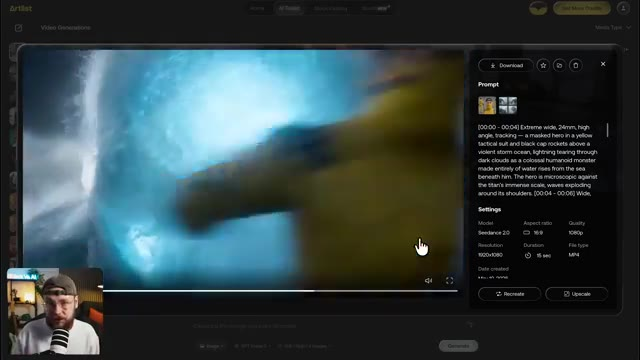
*Interface de l'outil Artlist avec le panneau latéral affichant le prompt de Seedance 2.0 et la vidéo en cours de lecture.*

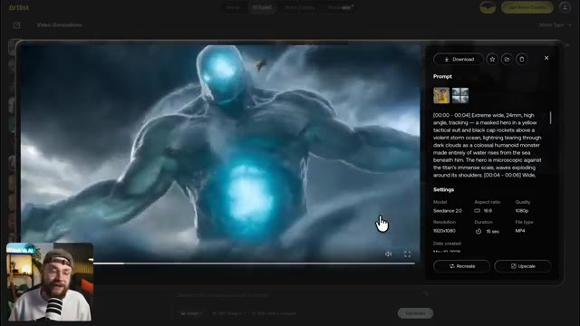
*Interface d'Artlist montrant la vidéo générée avec le monstre aquatique lumineux et les paramètres techniques.*

---

### ⏱️ `[00:02:19 - 00:02:40]` | Segment #05

**🔊 Audio (Transcription Intégrale Mot pour Mot en Français) :**
> Récente augmentation de la résolution où nous pouvons maintenant générer en 1080p, ces plans rapprochés où l'on a en quelque sorte une idée de la texture de la peau et de la texture du tissu ont vraiment, vraiment l'air très bien. La prochaine chose que je veux examiner, c'est moi en train de me battre contre une sorte de monstre massif fait de foin, de blé ou quelque chose comme ça.

**👁️ Analyse Visuelle d'Écran (gemini-3.5-flash-lite) :**
**Interface & Outils** : Interface web d'Artlist (AI Toolkit / Video Generations), avec un panneau de prompt en bas et une grille de vidéos générées.

**Contenu textuel & Code** : Galerie de vidéos miniatures montrant diverses scènes d'action (combat contre un monstre de foin, scènes de rue, paysages urbains futuristes) et un encadré vidéo (PiP) montrant le créateur face caméra.

**Action / Démonstration** : Le curseur de la souris survole l'une des vidéos de la grille représentant un combat contre un monstre massif en milieu rural.

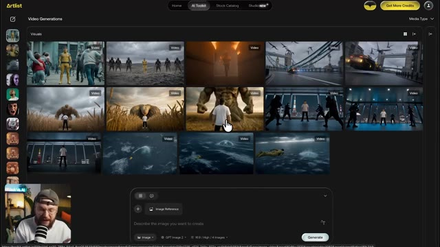
*Interface de la plateforme Artlist montrant une grille de vidéos générées par IA, avec le créateur en incrustation (PiP) dans le coin inférieur gauche.*

---

### ⏱️ `[00:02:40 - 00:02:59]` | Segment #06

**🔊 Audio (Transcription Intégrale Mot pour Mot en Français) :**
> Je pensais que c'était plutôt cool. Donc une autre génération vraiment géniale ici.

**👁️ Analyse Visuelle d'Écran (gemini-3.5-flash-lite) :**
**Interface & Outils** : Interface web de l'outil Artlist (génération vidéo Seedance 2.0) avec un lecteur vidéo central, panneau de prompt textuel à droite, paramètres de modèle (Seedance 2.0, format 16:9, qualité 1080p, résolution 1920x1080, durée 15s) et encadré PiP du créateur en bas à gauche.

**Contenu textuel & Code** : Texte du prompt visible dans le panneau latéral : "[00:00 - 00:03] Wide, 24mm, low angle, static - vast wheat field, heavy sky. A straw golem thirty feet tall, woven muscle and braided spine, rises from the grain. A man in white tee, black cargos, gold gaiter and backwards cap stands tiny against it. [00:03 - 00:05] Close-up, 85mm, eye-level, static - his face behind gold gaiter and glasses. He looks up at the creature and rolls his eyes. [00:05 - 00:07] Medium, 35mm..." Paramètres affichés : Modèle Seedance 2.0, Aspect ratio 16:9, Qualité 1080p, Résolution 1920x1080, Durée 15 sec, File type MP4, Date created May 10, 2026.

**Action / Démonstration** : Le créateur montre et commente les différentes scènes générées par IA (le golem de paille dans le champ de blé) puis dévoile l'interface logicielle d'Artlist et les détails du prompt technique utilisé.

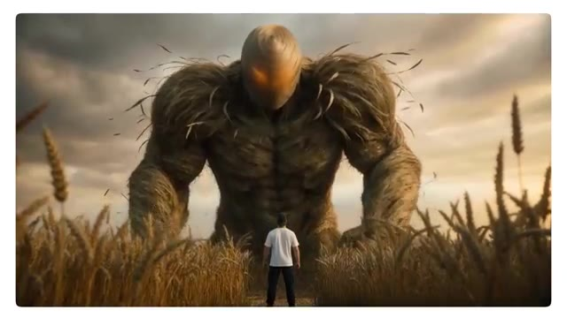
*Génération vidéo IA montrant un homme minuscule face à un gigantesque golem de paille dans un champ de blé.*

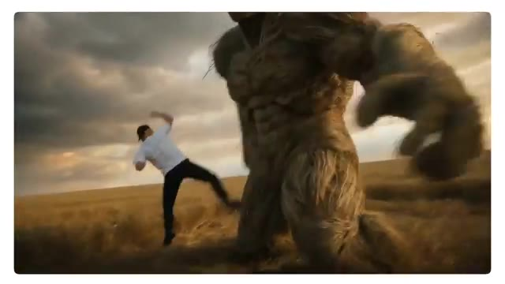
*Suite de la génération vidéo IA montrant l'homme effectuant un mouvement dynamique ou un coup de pied face au golem.*

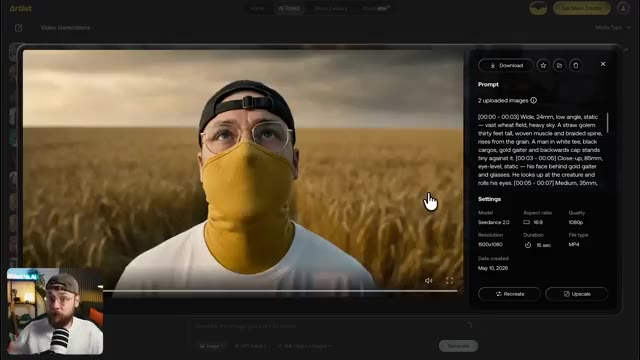
*Interface de l'outil de génération vidéo Artlist (Seedance 2.0) affichant le panneau des prompts et réglages techniques avec le créateur en incrustation PiP.*

---

### ⏱️ `[00:02:59 - 00:03:17]` | Segment #07

**🔊 Audio (Transcription Intégrale Mot pour Mot en Français) :**
> Nous avons une légère variante du design du personnage. Ce que je voulais faire, c'est montrer une version différente du héros, qui est évidemment moi, où il porte une tenue assez normale, mais il a juste ce bandana jaune distinctif. Je vais donc vous expliquer comment j'ai réalisé tout le design du personnage très bientôt.

**👁️ Analyse Visuelle d'Écran (gemini-3.5-flash-lite) :**
**Interface & Outils** : Interface web d'Artlist (section Video Generations / Seedance 2.0) avec un lecteur vidéo central et un panneau latéral droit pour les prompts et réglages techniques. Une incrustation vidéo (PiP) de Jack en bas à gauche montre le présentateur en studio.

**Contenu textuel & Code** : Texte du prompt visible : "[00:00 - 00:03] Wide, 24mm, low angle, static - vast wheat field, heavy sky. A straw golem thirty feet tall, woven muscle and braided spine, rises from the grain. A man in white tee, black cargos, gold gaiter and backwards cap stands tiny against it. [00:03 - 00:05] Close-up, 85mm, eye-level, static - his face behind gold gaiter and glasses. He looks up at the creature and rolls his eyes. [00:05 - 00:07] Medium, 35mm...". Paramètres : Modèle Seedance 2.0, Aspect ratio 16:9, Quality 1080p, Resolution 1920x1080, Duration 15 sec, File type MP4, Date created May 10, 2026.

**Action / Démonstration** : Le lecteur vidéo affiche la lecture de la génération IA montrant le héros (un homme avec un bandana jaune et une casquette à l'envers) en train de courir et d'interagir face à un énorme monstre de paille dans un champ, tandis que l'interface d'Artlist présente les détails de configuration et de prompt.

*Interface d'Artlist (Seedance 2.0) montrant le rendu vidéo d'un homme portant un bandana jaune fuyant un gigantesque golem de paille dans un champ de blé, avec le panneau latéral détaillant le prompt textuel et les paramètres (Seedance 2.0, 16:9, 1080p, 1920x1080, 15 sec).*

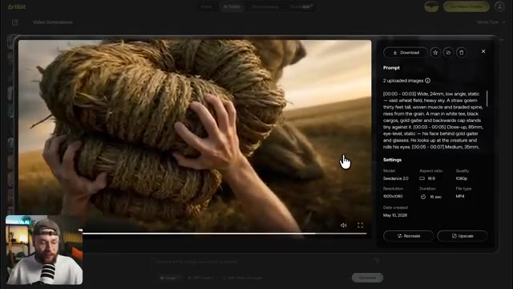
*Interface d'Artlist (Seedance 2.0) montrant un gros plan sur les mains du personnage agrippant des bottes de paille, avec le même panneau de paramètres textuels et techniques visibles à droite.*

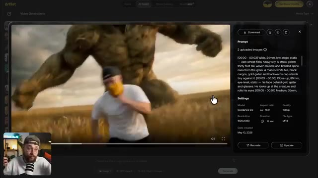
*Interface d'Artlist (Seedance 2.0) montrant la suite de l'animation de fuite face au golem de paille dans le champ, avec l'affichage de l'historique de création du 10 mai 2026.*

---

### ⏱️ `[00:03:17 - 00:03:36]` | Segment #08

**🔊 Audio (Transcription Intégrale Mot pour Mot en Français) :**
> Et ce que vous remarquerez peut-être aussi quand vous essayez de générer ce type de contenu vous-même, c'est que vous vous heurtez à une sorte de mur de modération. Toutes les plateformes et tous les outils ont ces directives de communauté intégrées. Je vais donc vous montrer comment contourner ce problème tout en obtenant de superbes scènes de combat à la fin.

**👁️ Analyse Visuelle d'Écran (gemini-3.5-flash-lite) :**
**Interface & Outils** : Artlist (section Video Generations / AI Toolkit) avec une incrustation vidéo (PiP) du présentateur en bas à gauche.

**Contenu textuel & Code** : Galerie de vidéos générées montrant des scènes d'action cinématographiques, des monstres géants dans des champs, des combats dans des grat-ciels et des paysages urbains futuristes. En bas, une boîte de saisie de prompt avec les options "Image Reference", le choix du modèle (GPT Image 2), le format d'image (16:9), le niveau de qualité (High) et le bouton "Generate".

**Action / Démonstration** : Le curseur de la souris survole la grille de vidéos générées tandis que Jack s'exprime en incrustation.

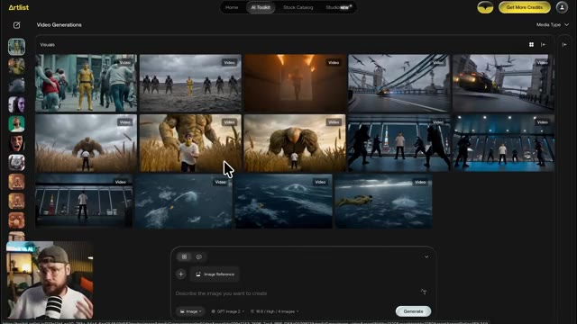
*Interface de la plateforme Artlist affichant une galerie de générations de vidéos avec des scènes d'action et de monstres, et Jack incrusté en bas à gauche.*

---

### ⏱️ `[00:03:36 - 00:03:57]` | Segment #09

**🔊 Audio (Transcription Intégrale Mot pour Mot en Français) :**
> Je vais vous apprendre la petite astuce que j'utilise pour résoudre ce problème vers la fin de la vidéo. Alors assurez-vous de rester jusqu'à la fin pour ça. Je voulais aussi essayer quelque chose d'un peu différent, plutôt que de n'avoir que des scènes de combat. Je me suis dit que ce serait sympa de me voir en train de piloter un véhicule de type aéroglisseur à travers le centre de Londres et de combattre des espèces de monstres ptérosaures.

**👁️ Analyse Visuelle d'Écran (gemini-3.5-flash-lite) :**
**Interface & Outils** : Interface de la plateforme web Artlist (section Video Generations / AI Toolkit), avec une grille de vignettes vidéo générées par IA et une boîte de dialogue de prompt en bas.

**Contenu textuel & Code** : Vignettes de vidéos montrant diverses scènes d'action : des combattants dans un décor urbain, des monstres géants dans des champs, des combats dans un gratte-ciel vitré, une course-poursuite à Londres avec un aéroglisseur et des ptérosaures. En bas, un champ de saisie de prompt avec les options "Image Reference", le modèle sélectionné ("GPT Image 2") et les paramètres de format ("16:9 / High / 4 Images").

**Action / Démonstration** : Le curseur de la souris (avec une main pointée) survole l'une des vignettes vidéo de la grille, tandis que le créateur commente les différentes scènes générées affichées à l'écran.

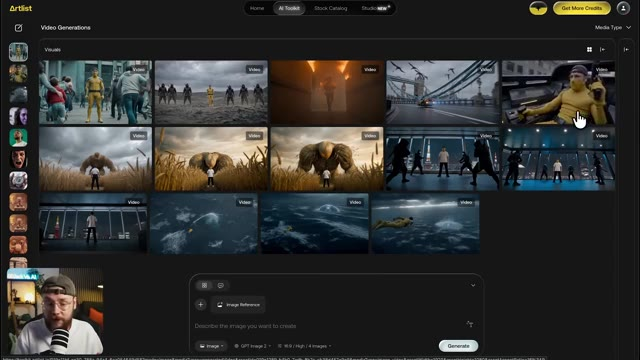
*Interface de la plateforme Artlist montrant la bibliothèque de générations de vidéos avec des aperçus de scènes et un petit retour vidéo de Jack en bas à gauche.*

---

### ⏱️ `[00:03:57 - 00:04:15]` | Segment #10

**🔊 Audio (Transcription Intégrale Mot pour Mot en Français) :**
> Jettons un coup d'œil à cette génération également. J'adore vraiment celle-ci aussi.

**👁️ Analyse Visuelle d'Écran (gemini-3.5-flash-lite) :**
**Interface & Outils** : Artlist (plateforme de création et de génération vidéo par IA)

**Contenu textuel & Code** : Galerie de vidéos "Video Generations", boutons "Home", "AI Toolkit", "Stock Catalog", "Studio NEW", champ "Describe the image you want to create", options "Image Reference", "GPT image 2", ratio "16:9", bouton "Generate".

**Action / Démonstration** : Le créateur navigue dans sa galerie de vidéos générées sur Artlist et zoome sur une séquence cinématique de véhicule futuriste.

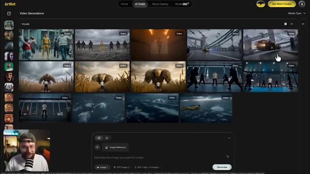
*Interface d'Artlist montrant la galerie des générations de vidéos générées par IA avec plusieurs vignettes et le créateur incrusté en bas à gauche.*

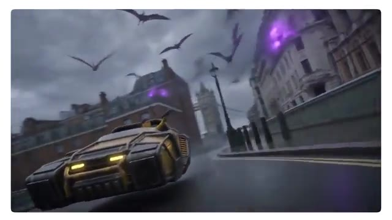
*Gros plan sur une vidéo générée par IA montrant un véhicule futuriste roulant sur une rue londonienne sous un ciel menaçant avec des créatures volantes.*

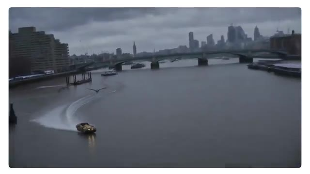
*Vue aérienne d'une vidéo générée montrant un véhicule naviguant à grande vitesse sur la Tamise à Londres avec la skyline en arrière-plan.*

---

### ⏱️ `[00:04:16 - 00:04:36]` | Segment #11

**🔊 Audio (Transcription Intégrale Mot pour Mot en Français) :**
> Sea Dance 2 nous montre cette compréhension de l'environnement ou du lieu que nous avons demandé où nous plantons le décor dans le centre de Londres. En tant que spectateur, vous reconnaissez immédiatement grâce à ces repères que c'est là que cette séquence d'action se déroule. Et ce que vous allez remarquer également, c'est qu'aucun de mes rendus n'a de musique intégrée.

**👁️ Analyse Visuelle d'Écran (gemini-3.5-flash-lite) :**
**Interface & Outils** : Interface web d'Artlist (outil de génération vidéo Seedance 2.0).

**Contenu textuel & Code** : Panneau latéral affichant le prompt : "[00:00 - 00:03] Wide, 24mm, low angle, tracking - a yellow armoured hovercraft tears through a grey London street, Tower Bridge visible behind...", ainsi que les paramètres (Seedance 2.0, format 16:9, 1080p, durée 15 sec, date de création 10 mai 2026).

**Action / Démonstration** : Visualisation d'une vidéo générée par IA présentant une séquence d'action dynamique avec un aéroglisseur et des créatures dans les rues de Londres, tandis que le créateur commente les résultats à l'écran.

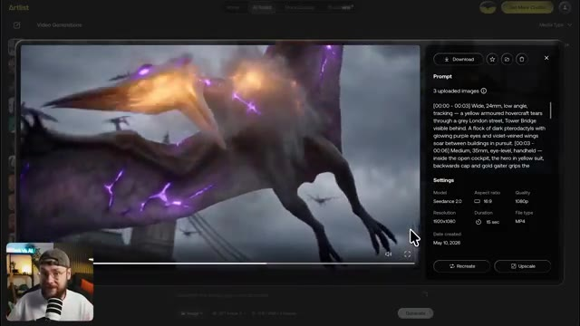
*Interface d'Artlist montrant la génération Seedance 2.0 d'une créature ailée fantastique au-dessus de Londres avec le prompt détaillé.*

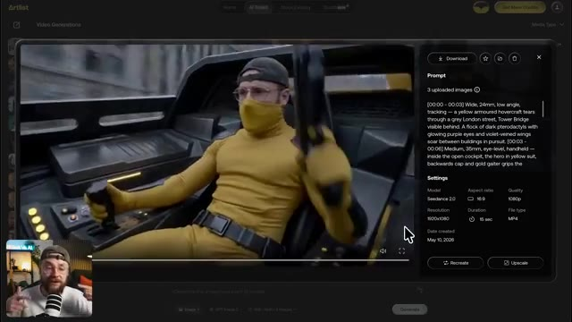
*Interface d'Artlist montrant la suite de la séquence d'action avec le héros pilotant le véhicule futuriste.*

---

### ⏱️ `[00:04:37 - 00:04:56]` | Segment #12

**🔊 Audio (Transcription Intégrale Mot pour Mot en Français) :**
> Et c'est tout à fait délibéré, même si C-Dance 2 est en réalité vraiment doué pour ajouter ce genre d'éléments musicaux de style bande originale de film à vos générations. On ne le souhaite pas souvent. La façon dont j'aborde l'utilisation de l'IA comme outil de réalisation, c'est que je veux avoir une flexibilité totale en ce qui concerne le montage.

**👁️ Analyse Visuelle d'Écran (gemini-3.5-flash-lite) :**
**Interface & Outils** : Interface web d'Artlist (outil Seedance 2.0) avec un panneau de prévisualisation vidéo et un panneau latéral de configuration et de prompt.

**Contenu textuel & Code** : Texte du prompt visible dans le panneau latéral : "[00:00 - 00:03] Wide, 24mm, low angle, tracking - a yellow armoured hovercraft tears through a grey London street...". Paramètres visibles : Modèle Seedance 2.0, format 16:9, qualité 1080p, résolution 1920x1080, durée 15 sec, format MP4.

**Action / Démonstration** : Le créateur montre l'interface de Seedance 2.0 avec une vidéo générée de véhicule futuriste et les détails de configuration technique sur le panneau latéral, tout en parlant de la flexibilité du montage.

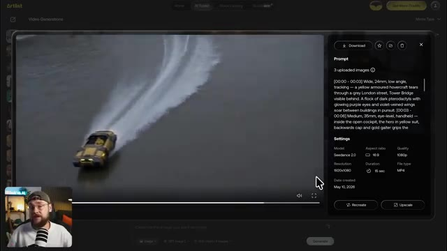
*Interface d'Artlist (Seedance 2.0) montrant la lecture d'une vidéo générée d'un véhicule futuriste sur l'eau, avec le panneau latéral affichant le prompt détaillé et les paramètres de génération.*

---

### ⏱️ `[00:04:57 - 00:05:30]` | Segment #13

**🔊 Audio (Transcription Intégrale Mot pour Mot en Français) :**
> Alors oui, je veux tous les visuels. Je veux toujours les effets sonores ou le bruitage intégrés dans la génération également. Mais je ne veux pas de musique parce que je pourrais vouloir ajouter ma propre musique au montage. Si elle est déjà intégrée à la génération, vous devez simplement l'accepter telle quelle. Donc, une partie de la structure du prompt que j'utilise toujours empêche en quelque sorte Seedance 2 d'ajouter de la musique à ces générations. Nous en reparlerons donc un peu plus en détail tout à l'heure. Et puis l'une de mes générations préférées, celle-ci de moi combattant les ninjas. Regardons cela de plus près.

**👁️ Analyse Visuelle d'Écran (gemini-3.5-flash-lite) :**
**Interface & Outils** : Interface web de la plateforme Artlist (section AI Toolkit / Video Generations), affichant un lecteur vidéo avec panneau latéral pour les prompts et paramètres, ainsi qu'une vue en grille (galerie) des différentes vidéos générées.

**Contenu textuel & Code** : Texte du prompt visible : "[00:00 - 00:03] Wide, 24mm, low angle, tracking - a yellow armoured hovercraft tears through a grey London street...". Paramètres : Modèle Seedance 2.0, format 16:9, qualité 1080p, résolution 1920x1080, durée 15 sec, fichier MP4, date 10 mai 2026.

**Action / Démonstration** : Le créateur navigue dans l'interface d'Artlist pour présenter les détails d'une génération vidéo spécifique (hovercraft à Londres), puis bascule vers la galerie pour introduire la scène de combat contre les ninjas.

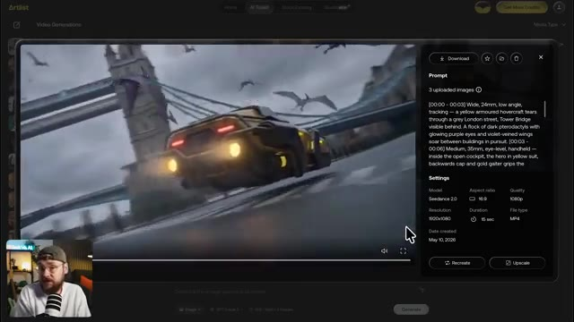
*Interface de la plateforme Artlist montrant la génération d'un véhicule futuriste (hovercraft) dans les rues de Londres avec le panneau de prompt et les paramètres techniques.*

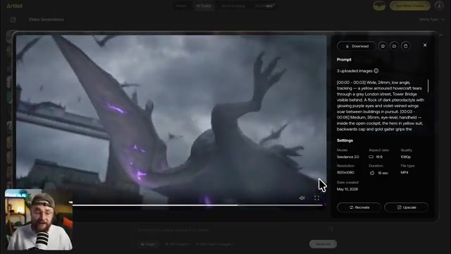
*Gros plan sur la vidéo générée montrant un ptérodactyle volant au-dessus de Londres avec le panneau de configuration à droite.*

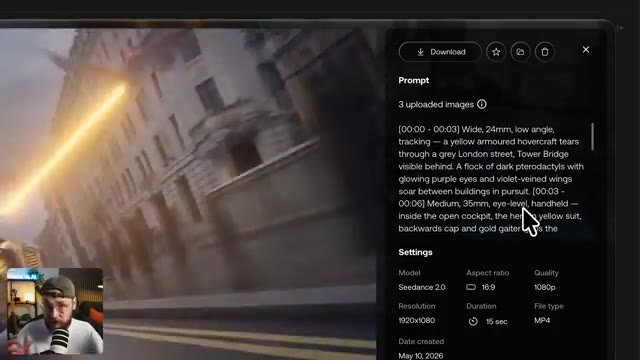
*Vue de la caméra en mouvement rapide le long d'un bâtiment avec un éclair énergétique jaune visible.*

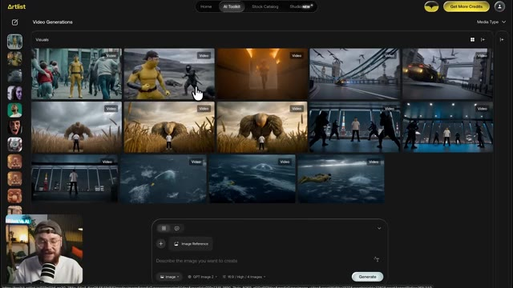
*Grille de vignettes de l'historique des générations vidéo sur Artlist montrant diverses scènes cinématographiques dont le combat contre les ninjas.*

---

### ⏱️ `[00:05:32 - 00:06:06]` | Segment #14

**🔊 Audio (Transcription Intégrale Mot pour Mot en Français) :**
> Donc dans l'ensemble, c'est une génération incroyable, mais vous remarquerez que ce plan d'ouverture est plutôt bizarre, n'est-ce pas ? Mais c'est ce dont je parle souvent dans mes vidéos. Vous n'êtes pas obligé d'utiliser chaque partie d'une génération que vous obtenez juste parce que vous l'avez. Je sais que c'est tentant parce que vous avez dépensé des crédits, mais j'ai l'impression que ce n'est pas la bonne façon d'aborder les choses. Si vous êtes sur un

**👁️ Analyse Visuelle d'Écran (gemini-3.5-flash-lite) :**
**Interface & Outils** : Interface web de génération vidéo Artlist (avec encadré PiP montrant le créateur Jack dans son studio).

**Contenu textuel & Code** : Panneau latéral affichant un prompt détaillé pour la génération vidéo : "[00:00 - 00:02] Wide, 24mm, low angle, static — barren rocky wasteland, storm clouds...", ainsi que les paramètres de réglage : Modèle Seedance 2.0, format 16:9, qualité 1080p, résolution 1920x1080, durée 15 sec, et date de création 10 mai 2026.

**Action / Démonstration** : Le créateur montre l'interface de génération et les détails du prompt utilisé pour créer la séquence vidéo de combat.

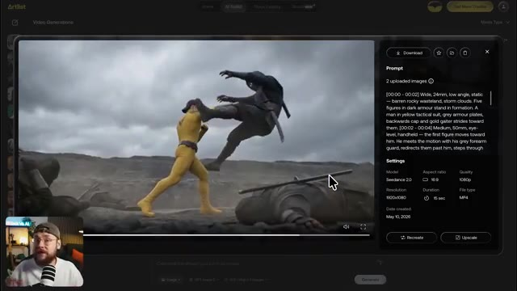
*Interface de l'outil de génération vidéo Artlist montrant le rendu vidéo avec le panneau latéral des prompts et des paramètres techniques.*

---

### ⏱️ `[00:06:06 - 00:06:38]` | Segment #15

**🔊 Audio (Transcription Intégrale Mot pour Mot en Français) :**
> un plateau de tournage ou si vous tournez une publicité, par exemple, le réalisateur, au moment du montage, n'utilise pas simplement chaque prise qu'il a obtenue parce que cela lui coûte de l'argent. Il est sélectif quant aux plans qui fonctionnent réellement. C'est l'état d'esprit que je vous suggère d'adopter lorsque vous travaillez avec l'IA, car nous utilisons cela comme un outil de réalisation cinématographique après tout. Ce n'est pas un gadget, mais une autre scène d'action incroyable. J'ai eu du mal à générer celle-ci tout d'abord à cause des directives de communauté ou de la modération qui s'activent, mais j'ai juste utilisé ma petite astuce que nous allons

**👁️ Analyse Visuelle d'Écran (gemini-3.5-flash-lite) :**
**Interface & Outils** : Artlist (outil de génération vidéo avec Seedance 2.0)

**Contenu textuel & Code** : Panneau latéral affichant les détails du prompt : "[00:00 - 00:02] Wide, 24mm, low angle, static - barren rocky wasteland, storm clouds..." ainsi que les paramètres de génération : Modèle (Seedance 2.0), Aspect ratio (16:9), Qualité (1080p), Résolution (1920x1080), Durée (5 sec), File type (MP4).

**Action / Démonstration** : Le créateur montre l'interface de génération vidéo sur Artlist avec un aperçu de la scène d'action entre un personnage en combinaison jaune et des combattants encagoulés.

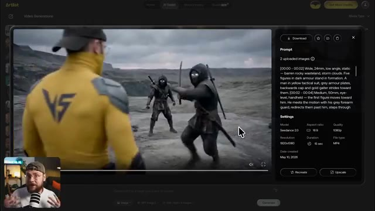
*Interface de la plateforme Artlist montrant la génération d'une scène d'action avec Seedance 2.0 et le retour vidéo avec incrustation du créateur en bas à gauche.*

---

### ⏱️ `[00:06:38 - 00:07:14]` | Segment #16

**🔊 Audio (Transcription Intégrale Mot pour Mot en Français) :**
> ...dans la fin de la vidéo pour naviguer autour de ça et j'ai fini par obtenir une génération vraiment super. Ça donne l'impression d'être rapide et frénétique et ça fonctionne comme une vraie scène de combat exactement comme on s'attendrait à voir dans un film à gros budget, ce qui est tout simplement incroyable. L'intelligence artificielle en est arrivée là. Et comme promis, je vais maintenant vous guider étape par étape exactement sur la façon dont vous pouvez créer ce type de séquence en utilisant les meilleurs outils d'IA. Et si vous voulez suivre en même temps, vous trouverez un lien vers Artlist juste en bas dans la description. Tout le processus commence donc par la génération d'images. Nous voulons donc aller de l'avant

**👁️ Analyse Visuelle d'Écran (gemini-3.5-flash-lite) :**
**Interface & Outils** : Interface web de la plateforme Artlist (section AI Toolkit / Video Generations).

**Contenu textuel & Code** : Sur l'image #2 : Un panneau latéral affiche le prompt détaillé de la vidéo ("[00:00 - 00:02] Wide, 24mm, low angle, static..."), les réglages du modèle (Seedance 2.0, format 16:9, qualité 1080p, résolution 1920x1080, durée 15 sec, format MP4 daté du 10 mai 2026). Sur l'image #4 : Grille de miniatures vidéo ("Video Generations"), champ "Describe the image you want to create", bouton "Image Reference", et bouton "Generate".

**Action / Démonstration** : Le créateur montre des exemples de vidéos d'action générées par IA sur Artlist et présente l'interface de génération vidéo.

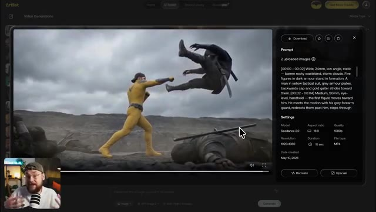
*Interface de la plateforme Artlist montrant la lecture d'une vidéo générée par IA représentant une scène de combat dynamique avec des personnages dans un paysage rocheux, ainsi que les paramètres de prompt et de modèle (Seedance 2.0).*

*Galerie de vidéos générées sur la plateforme Artlist avec un champ de saisie de prompt et l'option "Image Reference" visible en bas.*

---

### ⏱️ `[00:07:14 - 00:07:38]` | Segment #17

**🔊 Audio (Transcription Intégrale Mot pour Mot en Français) :**
> et passez à la session de génération d'images. Maintenant, si vous saurez cette étape, vous laissez vraiment beaucoup au hasard. Créer ces types d'images et les utiliser dans vos générations de vidéos vous donne beaucoup plus de contrôle sur le résultat final et signifie en fait que vous allez gaspiller moins de crédits d'ici la fin parce que vous allez obtenir les résultats que vous voulez beaucoup plus rapidement.

**👁️ Analyse Visuelle d'Écran (gemini-3.5-flash-lite) :**
**Interface & Outils** : Interface web d'Artlist (AI Toolkit - Image Generations) avec un panneau de prompt de génération de texte vers image en bas et le flux vidéo du créateur en incrustation PiP.

**Contenu textuel & Code** : Texte visible sur l'interface : "Image Generations", "AI Toolkit", "Stock Catalog", "Describe the image you want to create", boutons de génération et paramètres (16:9, High, 4 images).

**Action / Démonstration** : Le curseur de la souris survole l'interface de génération d'images tandis que le créateur parle et montre l'outil.

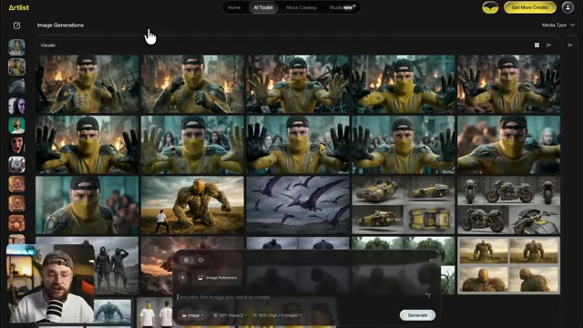
*Interface de l'outil de génération d'images Artlist montrant une grille de visuels générés et un panneau de prompt avec le créateur en incrustation.*

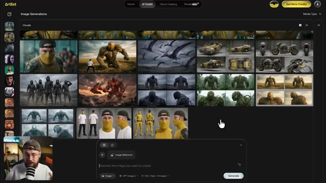
*Navigation dans la grille de résultats de génération d'images sur Artlist avec le panneau de prompt inférieur visible.*

---

### ⏱️ `[00:07:38 - 00:07:58]` | Segment #18

**🔊 Audio (Transcription Intégrale Mot pour Mot en Français) :**
> Et vous pouvez voir que j'ai toute une série de belles générations d'images ici. Nous avons quelques planches de personnages, nous avons des accessoires, et puis nous avons aussi ces types de visuels clés. Tous très, très importants. La première chose que j'ai générée, ce sont ces planches de personnages. Donc comme je l'ai dit tout à l'heure, il y a deux types de variantes.

**👁️ Analyse Visuelle d'Écran (gemini-3.5-flash-lite) :**
**Interface & Outils** : Interface web d'Artlist (AI Toolkit - Image Generations) avec un mode galerie de visuels, une zone de prompt en bas, et un panneau latéral de détails d'image. Le créateur apparaît en incrustation vidéo (PiP) dans le coin inférieur gauche.

**Contenu textuel & Code** : Dans la galerie : diverses générations d'images (personnage masqué en jaune, créatures rocheuses, ptérosaures, véhicules futuristes, motos, ninjas). Sur l'image #3, le prompt affiché commence par : "Character design reference sheet with four views — arranged on a neutral grey background: [VIEW 1 - FULL BODY, FRONT]...". Paramètres visibles : Model: GPT Image 2, Aspect ratio: 16:9, Quality: High, File type: JPEG, Date created: May 10, 2026. Boutons : Download, Video, Edit, Recreate, Upscale.

**Action / Démonstration** : Le créateur navigue et zoome dans sa galerie d'images générées par IA sur Artlist, puis clique sur une planche de character design pour l'afficher en grand avec ses paramètres et son prompt.

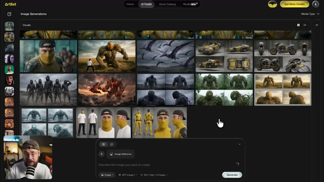
*Interface d'Artlist (AI Toolkit - Image Generations) montrant une galerie de visuels générés par IA incluant des personnages, des créatures et des accessoires.*

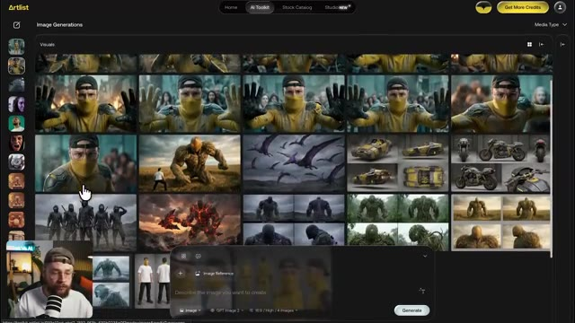
*Navigation dans la galerie d'images générées de l'interface Artlist avec une vignette de personnage sélectionnée.*

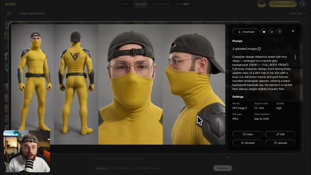
*Vue détaillée d'une planche de character design (character sheet) présentant plusieurs angles d'un personnage en costume jaune avec un panneau de prompt et de paramètres sur le côté droit.*

---

### ⏱️ `[00:07:58 - 00:08:16]` | Segment #19

**🔊 Audio (Transcription Intégrale Mot pour Mot en Français) :**
> Nous avons donc cette sorte de version entièrement vêtue de moi ici. Et vous pouvez voir que nous avons aussi les "VS" sur mon dos, une sorte de joli petit clin d'œil à mon pseudo YouTube. Et ensuite, nous avons l'autre variante ici où j'ai juste eu en quelque sorte à enfiler ce bandana jaune pour essayer de garder mon identité secrète.

**👁️ Analyse Visuelle d'Écran (gemini-3.5-flash-lite) :**
**Interface & Outils** : Interface de la plateforme Artlist (section AI Toolkit / Image Generations) avec un panneau latéral droit affichant les détails du prompt et des paramètres.

**Contenu textuel & Code** : Texte du prompt visible : « Character design reference sheet with four views — arranged on a neutral grey background: [VIEW 1 - FULL BODY, FRONT] Full-body character design, front-facing three-quarter view, of a slim man in his 30s with a buzz cut, full brown beard, and gold-framed rounded rectangular glasses, wearing a black backwards baseball cap. He stands in a neutral hero stance, weight slightly forward, fists... ». Paramètres visibles : Model: GPT Image 2, Aspect ratio: 16:9, Quality: High, Date created: May 10, 2026.

**Action / Démonstration** : Le curseur de la souris survole différentes parties des images générées et zoome sur les détails du personnage (combinaison jaune, logo 'VS' dans le dos, variante avec t-shirt blanc) tandis que le créateur en médaillon PiP commente les différentes versions.

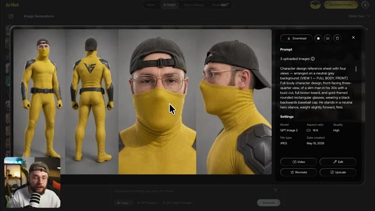
*Interface d'Artlist montrant la planche de référence du personnage en combinaison jaune avec un prompt textuel détaillé sur le panneau de droite.*

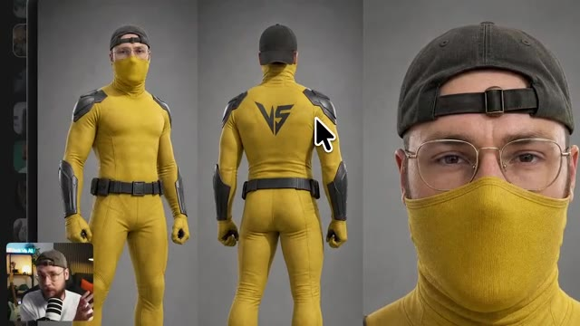
*Gros plan zoomé sur l'interface d'Artlist mettant en valeur les détails du dos du personnage avec le logo 'VS' et le portrait de face.*

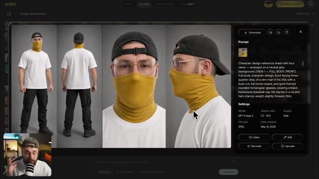
*Interface d'Artlist montrant la seconde variante du personnage avec un t-shirt blanc, un pantalon cargo noir et un bandana jaune.*

---

### ⏱️ `[00:08:17 - 00:08:50]` | Segment #20

**🔊 Audio (Transcription Intégrale Mot pour Mot en Français) :**
> Non pas que cela fonctionnerait très bien, mais c'est un peu comme un cliché de super-héros classique, n'est-ce pas ? Vous voyez ce genre de chose dans beaucoup de comics et de films. Et la raison pour laquelle j'ai généré ces fiches de personnages, c'est que cela va donner à C-Dance 2, notre modèle de vidéo par IA, une compréhension de mon apparence en tant que personnage dans cette variante, puis dans la variante avec le costume sous tous les angles dont il pourrait avoir besoin. Si vous ne lui donnez pas toutes ces informations, C-Lance 2 doit essentiellement deviner. Il doit inventer des choses et c'est là que vous commencez à introduire des problèmes de type

**👁️ Analyse Visuelle d'Écran (gemini-3.5-flash-lite) :**
**Interface & Outils** : Interface web d'Artlist (section de génération d'images) avec un panneau de prompt textuel et de réglages à droite.

**Contenu textuel & Code** : Texte du prompt visible : « Character design reference sheet with four views — arranged on a neutral grey background. [VIEW 1 - FULL BODY, FRONT] Full-body character design, front-facing three-quarter view, of a slim man in his 30s with a buzz cut, full brown beard, and gold-framed rounded rectangular glasses, wearing a black backwards baseball cap. He stands in a neutral hero stance, weight slightly forward, fists... ». Paramètres visibles : Modèle (GPT Image 2), Format (16:9), Qualité (High). Date de création : May 10, 2026.

**Action / Démonstration** : Le créateur présente des fiches de référence de personnages générées par IA sous plusieurs angles (vue de face, de dos, gros plan) pour alimenter le modèle vidéo.

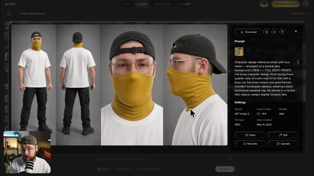
*Interface d'Artlist montrant une fiche de design de personnage avec quatre vues différentes sur fond gris et le prompt associé.*

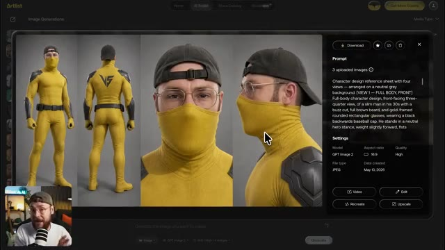
*Interface d'Artlist affichant une variante de fiche de personnage en costume de super-héros jaune avec des protections noires.*

---

### ⏱️ `[00:08:50 - 00:09:25]` | Segment #21

**🔊 Audio (Transcription Intégrale Mot pour Mot en Français) :**
> la cohérence des personnages qui laisse à désirer. Mais au lieu de simplement parler de ça, je voulais aller de l'avant et construire une variante du personnage afin de pouvoir vous guider à travers le processus de génération d'images. Donc, première chose qu'on peut faire, c'est cliquer sur cette version en tenue complète de la feuille de personnage et je veux cliquer sur cet onglet ici qui s'appelle récréer. Vous pouvez donc voir que le champ de prompt a maintenant été rempli avec exactement ce même prompt textuel. Ce que je veux faire, c'est simplement copier tout cela et je veux passer sur Claude. J'utilise Claude en ce moment

**👁️ Analyse Visuelle d'Écran (gemini-3.5-flash-lite) :**
**Interface & Outils** : Interface web de génération d'images (Artlist) et interface de l'assistant IA Claude.

**Contenu textuel & Code** : Texte du prompt visible dans le champ de saisie décrivant les vues du personnage (view 2, view 3, view 4, forearm, tactical wrap, noir, dos, détails vestimentaires). Interface de Claude avec le sélecteur de modèle « Opus 4.6 Extended ».

**Action / Démonstration** : Le créateur montre l'interface de génération d'images, survole le prompt, puis bascule sur l'interface de l'assistant Claude.

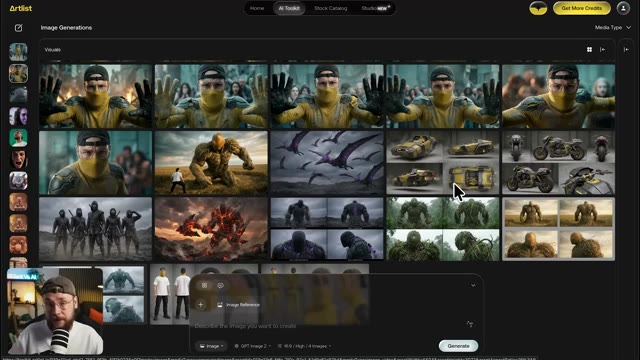
*Interface de génération d'images avec un panneau contextuel de prompt ouvert en bas et une pastille vidéo incrustée montrant le créateur en bas à gauche.*

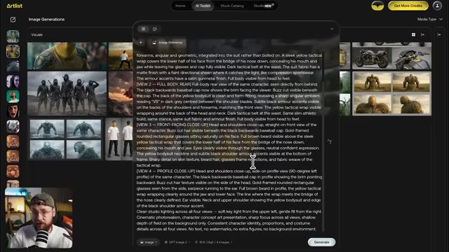
*Gros plan sur la zone de saisie du prompt textuel de génération d'images remplie de plusieurs paragraphes de description détaillée du personnage.*

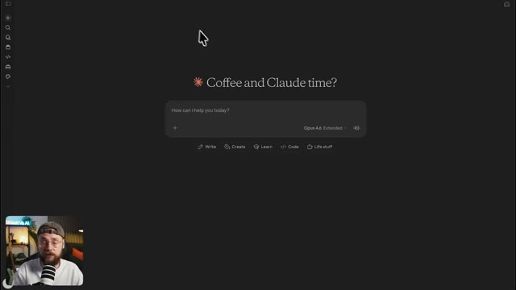
*Interface de l'assistant IA Claude affichant le message d'accueil « Coffee and Claude time? » avec le créateur en incrustation PiP.*

---

### ⏱️ `[00:09:25 - 00:10:03]` | Segment #22

**🔊 Audio (Transcription Intégrale Mot pour Mot en Français) :**
> pour à peu près toute mon ingénierie de prompt. Il est très doué pour vous aider à rédiger des prompts pour la génération d'images et de vidéos et bien sûr gardez à l'esprit que vous pouvez également accéder à Claude gratuitement, donc si vous voulez juste l'essayer c'est tout à fait possible sans avoir à payer le moindre centime, donc ce que je vais faire c'est que je voudrais que tu m'écrives une variante pour ce prompt du même personnage mais je veux qu'il soit lourdement armé je veux que le genre de bandana jaune enroulé autour de la moitié inférieure de son visage soit en métal cette fois et je veux qu'il manie une épée d'énergie jaune comme

**👁️ Analyse Visuelle d'Écran (gemini-3.5-flash-lite) :**
**Interface & Outils** : Interface web de l'assistant textuel IA Claude (Anthropic), avec incrustation vidéo (Picture-in-Picture) de Jack dans le coin inférieur gauche.

**Contenu textuel & Code** : Texte affiché à l'écran : "Coffee and Claude time?" et dans la zone de texte : "How can I help you today?". Mention "Opus 4.6 Extended" et options de catégories (Write, Create, Learn, Code, Life stuff).

**Action / Démonstration** : Le créateur présente l'interface de l'outil Claude à l'écran tout en expliquant ses fonctionnalités et la gratuité d'accès, en gesticulant légèrement dans l'encadré vidéo.

*Interface principale de l'assistant IA Claude avec le message d'accueil 'Coffee and Claude time?' et le créateur visible en incrustation PiP.*

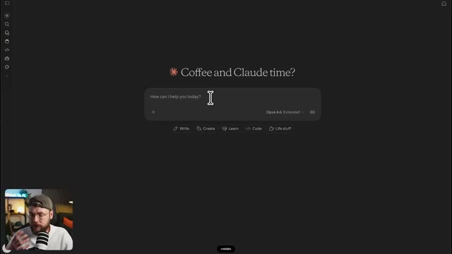
*Interface de Claude montrant la zone de saisie du prompt 'How can I help you today?' avec le curseur de la souris.*

---

### ⏱️ `[00:10:03 - 00:10:39]` | Segment #23

**🔊 Audio (Transcription Intégrale Mot pour Mot en Français) :**
> Eh bien, vous verrez le prompt existant ci-dessous, donc je vais simplement faire un copier-coller du prompt existant, l'envoyer et Claude va me rédiger une variation de ce prompt avec la mise à jour de mon design de personnage. Vous pouvez voir que c'est revenu vraiment, vraiment vite, super facile, très peu d'effort de ma part. Imaginez devoir rédiger tout cela vous-même. Ouais, non merci. Donc nous allons procéder, simplement copier-coller tout cela, retourner sur Artlist, et nous pouvons déposer ceci dans le champ de texte du prompt. Et tout en bas ici, nous pouvons réellement sélectionner

**👁️ Analyse Visuelle d'Écran (gemini-3.5-flash-lite) :**
**Interface & Outils** : Interface web de Claude et interface d'Artlist (AI Toolkit / Image Generations), avec une incrustation vidéo du créateur (PiP) en bas à gauche.

**Contenu textuel & Code** : Sur l'image 1 : "Coffee and Claude time?", zone de texte "How can I help you today?", mention "Opus 4.6 Extended". Sur l'image 2 : Long prompt textuel détaillé décrivant un personnage ("Character design reference sheet with four views...", "[VIEW 1 - FULL BODY, FRONT]", "[VIEW 2 - FULL BODY, REAR]"), options de génération d'image en bas ("Image", format "16:9", qualité "High", "4 Images", bouton "Generate").

**Action / Démonstration** : Le créateur montre l'interface de Claude pour générer une variante de prompt, puis bascule sur Artlist pour coller le texte généré dans le champ de prompt de l'outil de génération d'images.

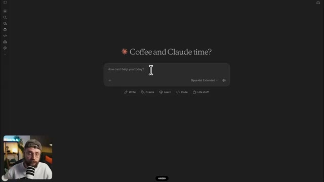
*Interface principale de Claude affichant le champ de saisie du prompt, avec une pastille vidéo (PiP) du créateur en bas à gauche.*

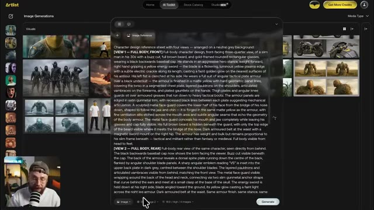
*Interface d'Artlist montrant le champ de texte du prompt rempli avec une description détaillée de personnage en plusieurs vues, avec le créateur en incrustation PiP.*

---

### ⏱️ `[00:10:39 - 00:11:12]` | Segment #24

**🔊 Audio (Transcription Intégrale Mot pour Mot en Français) :**
> le modèle que nous voulons utiliser. J'ai trouvé que GPT Image 2 était vraiment bon pour fabriquer les planches de modèles de personnages sous tous les angles, ce sont donc ceux-ci que vous pouvez voir ici, mais aussi ces images initiales des monstres, mais ensuite Nano Banana Pro était meilleur pour créer ces moments visuels clés, donc nous avons celui-ci ici du monstre de lave comme vous pouvez voir et puis des plans comme celui-ci aussi du monstre de foin ou de blé. Une fois que vous avez sélectionné votre modèle, vous avez différentes préférences

**👁️ Analyse Visuelle d'Écran (gemini-3.5-flash-lite) :**
**Interface & Outils** : Plateforme web Artlist (section AI Toolkit / Image Generations) avec interface de sélection de modèles IA, de prompts et de galerie de rendus.

**Contenu textuel & Code** : Textes de prompts détaillés en anglais (ex: "[VIEW 2 - FULL BODY, REAR]", "Giant volcanic monster wielding an axe made of the same elements as it's body, gritty and photo real."), paramètres de modèle ("GPT Image 2", "Nano Banana Pro"), réglages 16:9, High, 4K, et bouton "Generate".

**Action / Démonstration** : Le créateur navigue dans l'interface d'Artlist, sélectionne des modèles de génération d'images, montre des grilles de personnages sous plusieurs angles et zoome sur des visuels clés de monstres générés par IA.

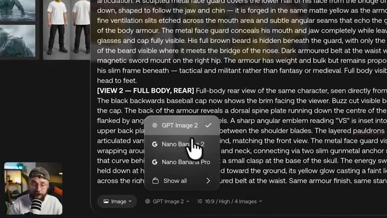
*Interface de génération d'images affichant un menu déroulant pour sélectionner le modèle IA (GPT Image 2, Nano Banana 2, Nano Banana Pro) au-dessus d'un long texte descriptif.*

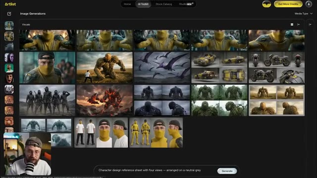
*Galerie de la plateforme Artlist montrant de multiples créations visuelles générées (personnages, monstres de lave, créatures en foin, véhicules) avec le prompt de génération en bas.*

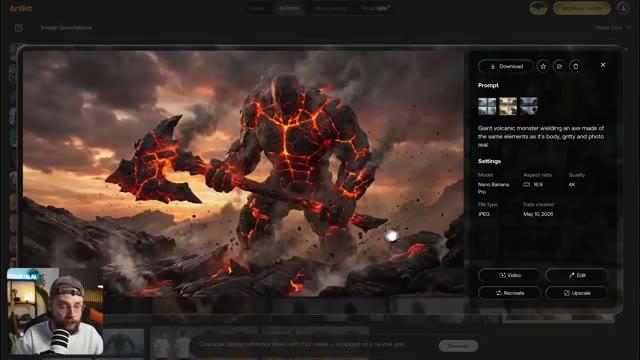
*Gros plan sur une image générée d'un monstre volcanique géant tenant une hache, avec le panneau latéral détaillant le prompt, le modèle utilisé (Nano Banana Pro), le format (16:9) et la qualité (4K).*

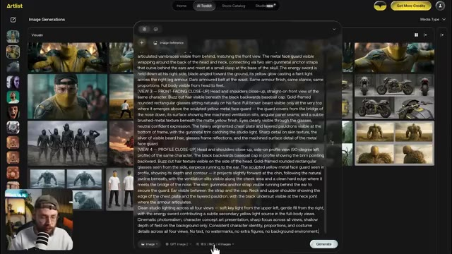
*Interface affichant de longs blocs de texte descriptifs (prompts détaillés de character design) superposés à la galerie d'images de la plateforme Artlist.*

---

### ⏱️ `[00:11:12 - 00:11:42]` | Segment #25

**🔊 Audio (Transcription Intégrale Mot pour Mot en Français) :**
> Vous pouvez choisir également. Nous voulons opter pour un format d'image 16 par 9. Vous voudriez du 9 par 16 si vous créez du contenu pour Instagram ou TikTok ou quelque chose comme ça. La qualité, nous voulons toujours la mettre sur élevé. Il est très important de donner au modèle vidéo lorsque nous passerons à l'animation plus tard autant de qualité que possible. Nous parlions plus tôt de texture. C'est de là que vient une grande partie de la texture. Et puis vous pouvez également sélectionner le nombre d'images, combien d'options différentes vous allez récupérer. Évidemment, si vous voulez dépenser moins de crédits, vous pouvez simplement en faire une.

**👁️ Analyse Visuelle d'Écran (gemini-3.5-flash-lite) :**
**Interface & Outils** : Interface logicielle de génération d'images/vidéos avec une fenêtre pop-up de paramètres contextuelle, incluant un aperçu du prompt textuel en arrière-plan et le présentateur visible en incrustation (PiP) dans le coin inférieur gauche.

**Contenu textuel & Code** : Dans la fenêtre contextuelle : "Aspect Ratio" (options 1:1, 16:9 avec le curseur dessus, 9:16, 3:4, 4:3), "Quality" (options Low, Medium, High sélectionné), "Number of Images" (options 1, 2, 3, 4 sélectionné). En bas de l'écran, le menu déroulant indique "GPT Image 2", "16:9 / High / 4 Images" et un bouton "Generate". Le texte du prompt visible en arrière-plan détaille des descriptions visuelles de personnages et de cadrages ("bottom of frame", "gunmetal trim", "studio light", etc.).

**Action / Démonstration** : Le curseur de la souris survole et clique sur le format d'image 16:9 dans le menu des paramètres de l'interface.

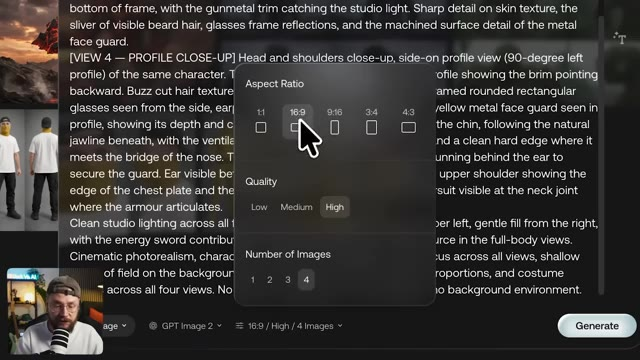
*Interface de configuration affichant les options de format d'image (Aspect Ratio), de qualité et de nombre d'images.*

---

### ⏱️ `[00:11:42 - 00:12:19]` | Segment #26

**🔊 Audio (Transcription Intégrale Mot pour Mot en Français) :**
> Je vais opter pour trois parce que j'aime bien avoir genre différentes options parmi lesquelles choisir. Mais maintenant, une autre étape vraiment importante est que vous voulez ajouter nos images de référence. Si vous créiez ceci à partir de zéro, nous pouvons cliquer sur image reference et sélectionner upload image. Et j'ai un ensemble de trois images vraiment basiques que j'utilise pour tout mon contenu. Il y a deux gros plans, celui-ci, qui est plutôt de profil. Et puis celui-là ici, qui est genre de face par rapport à la caméra et ensuite nous avons celui-ci ici qui est plus un plan large je suppose, tous me représentant avec une expression très neutre mais surtout en portant les vêtements et les accessoires que nous

**👁️ Analyse Visuelle d'Écran (gemini-3.5-flash-lite) :**
**Interface & Outils** : Interface web d'Artlist (AI Toolkit / Image Generations) avec incrustation vidéo PiP du créateur en bas à gauche.

**Contenu textuel & Code** : Texte de prompt descriptif pour un personnage en armure tactique jaune, avec des paramètres de génération visibles en bas (GPT Image 2, 16:9, High, 3 Images, bouton Generate).

**Action / Démonstration** : Le créateur navigue dans l'interface d'Artlist, clique sur le menu des images de référence et sélectionne des photos personnelles de référence pour les importer dans l'outil de génération d'IA.

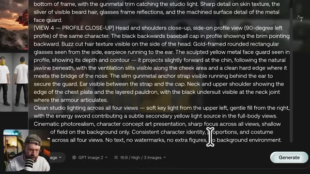
*Interface d'Artlist montrant le prompt textuel détaillé pour la génération d'images avec les spécifications de plans.*

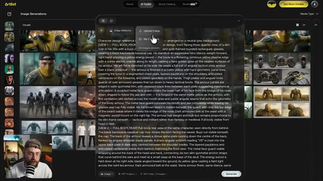
*Interface d'Artlist avec le menu déroulant d'ajout d'image de référence ouvert au centre de l'écran.*

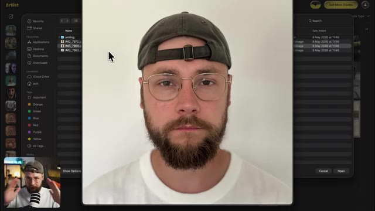
*Fenêtre de sélection de fichier du système d'exploitation affichant un gros plan frontal de Jack avec une casquette et des lunettes.*

*Fenêtre de sélection de fichier affichant un plan plus large de Jack en extérieur avec un mur blanc en arrière-plan.*

---

### ⏱️ `[00:12:19 - 00:12:53]` | Segment #27

**🔊 Audio (Transcription Intégrale Mot pour Mot en Français) :**
> voulons figurer dans nos générations d'images. Nous n'avons pas réellement besoin de le faire pour cet exemple dans les références d'images, je vais en fait sélectionner mes créations et cela va me permettre de choisir parmi le contenu que j'ai généré à l'intérieur d'Artlist et je veux choisir la version jaune harnachée ici afin que nous puissions cliquer sur ajouter une image et maintenant celle-ci est utilisée comme référence d'image donc allons-y et cliquons sur générer ici nous pouvons fermer ce champ et voir ce que nous obtenons et ceux-ci ont vraiment fière allure c'est exactement le genre de chose que je visais donc c'est un peu comme

**👁️ Analyse Visuelle d'Écran (gemini-3.5-flash-lite) :**
**Interface & Outils** : Artlist (section AI Toolkit / Image Generations).

**Contenu textuel & Code** : Le prompt de génération visible dans l'image 3 et 4 commence par : "Character design reference sheet with four views — arranged on a neutral grey background: [VIEW 1 - FULL BODY, FRONT] Full-body character design, front-facing three-quarter view, of a slim man in his 30s with a buzz cut, full brown beard, and gold-framed rounded rectangular glasses, wearing a black backwards baseball cap...". Paramètres visibles : Model: GPT Image 2, Aspect ratio: 16:9, Quality: High.

**Action / Démonstration** : Le créateur navigue dans ses créations sur Artlist, sélectionne l'image de référence du personnage en tenue jaune, la définit comme référence d'image, lance la génération, puis examine les résultats obtenus affichés à l'écran.

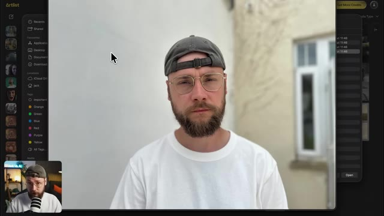
*Interface d'Artlist affichant une image sélectionnée dans un panneau de navigation ou de gestion de fichiers.*

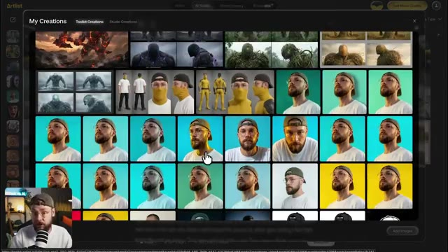
*Galerie "My Creations" dans Artlist montrant diverses images générées, avec le curseur sur une variante de personnage en jaune.*

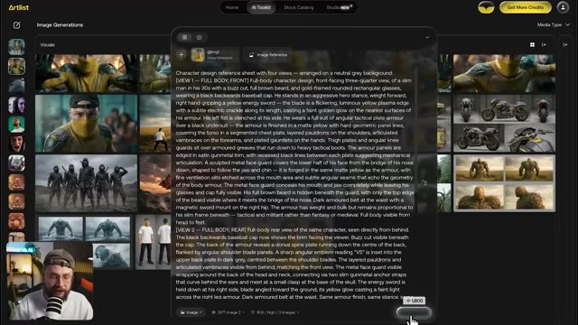
*Fenêtre de génération d'images d'Artlist avec le champ de prompt détaillé et le bouton "Generate" sur lequel le curseur va cliquer.*

*Résultat de la génération dans Artlist affichant une planche de character design en quatre vues d'un personnage en armure jaune avec un masque.*

---

### ⏱️ `[00:12:53 - 00:13:27]` | Segment #28

**🔊 Audio (Transcription Intégrale Mot pour Mot en Français) :**
> une variante blindée de notre personnage et il a aussi cette sorte d'épée d'énergie cool là-bas peut-être que ce masque ressemble plus à une sorte de pièce de ventilation donc je me dis ce qui pourrait être cool c'est que peut-être il combat ce genre de monstre de la jungle ici et cette chose de masque de ventilation arrête des spores ou quelque chose comme ça donc nous avons maintenant construit notre référence d'image nous avons déjà celle pour le monstre que nous voulons qu'il combatte ici et ensuite je pense que je vais juste aller de l'avant et utiliser cette génération ici je pense que ça a l'air vraiment très bien je ne vois aucun problème

**👁️ Analyse Visuelle d'Écran (gemini-3.5-flash-lite) :**
**Interface & Outils** : Application Web Artlist (section AI Toolkit / Image Generations).

**Contenu textuel & Code** : Prompt visible : « Character design reference sheet with four views — arranged on a neutral grey background. [VIEW 1 — FULL BODY, FRONT] Full-body character design, front-facing three-quarter view, of a slim man in his 30s with a buzz cut, full brown beard, and gold-framed rounded rectangular glasses, wearing a black backwards baseball cap. He stands in an aggressive hero stance, weight forward, right... » Paramètres : Model: GPT Image 2, Aspect ratio: 16:9, Quality: High, File type: JPEG, Date created: May 11, 2026.

**Action / Démonstration** : Le créateur navigue et zoome sur les différentes vues du design du personnage en armure jaune avec ses accessoires lumineux.

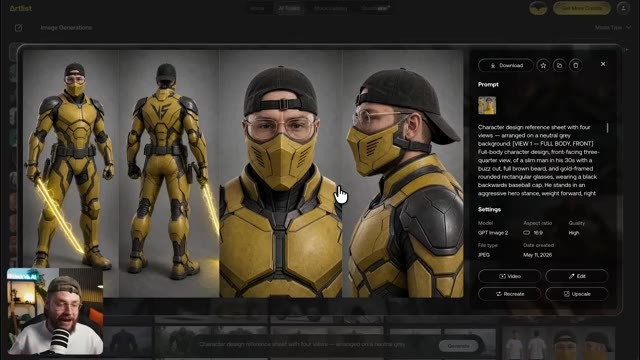
*Interface d'Artlist montrant une feuille de référence de character design avec quatre vues du personnage en armure jaune.*

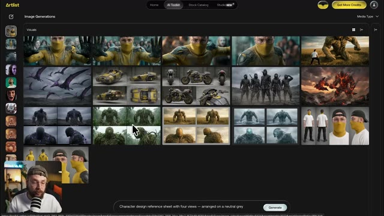
*Grille de générations d'images sur Artlist montrant divers concepts visuels, monstres et véhicules.*

*Vue détaillée de la feuille de référence du personnage avec le panneau de prompt et de paramètres sur le côté droit.*

---

### ⏱️ `[00:13:27 - 00:14:00]` | Segment #29

**🔊 Audio (Transcription Intégrale Mot pour Mot en Français) :**
> là et maintenant ce que nous allons faire juste pour garder les choses bien organisées c'est que je veux revenir sur la session de génération vidéo nous allons animer nos images ici et ce qui est vraiment super en ce moment c'est qu'Artlist vient de rendre tous les meilleurs modèles beaucoup moins chers à utiliser donc vous pouvez obtenir jusqu'à cinq fois plus de générations par crédit donc si vous avez hésité à essayer ces outils d'IA créatifs c'est peut-être le moment idéal pour vous lancer donc la première chose que nous allons faire c'est ouvrir notre champ de prompt ici et nous voulons basculer vers la vidéo je vais juste

**👁️ Analyse Visuelle d'Écran (gemini-3.5-flash-lite) :**
**Interface & Outils** : Artlist (plateforme de création et génération par IA)

**Contenu textuel & Code** : Galerie d'images générées montrant des personnages en costume jaune, des véhicules et des scènes de combat, ainsi qu'un menu contextuel avec les options "Image", "Video", "Voice" et "Music".

**Action / Démonstration** : Le créateur navigue dans l'interface d'Artlist et clique sur l'option "Video" dans le menu déroulant pour préparer l'animation des images.

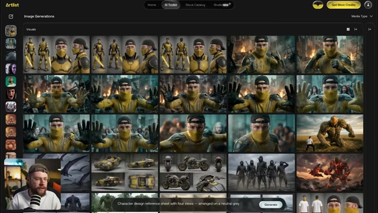
*Interface d'Artlist montrant la galerie de générations d'images avec le créateur en incrustation.*

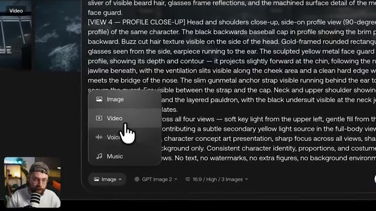
*Menu déroulant d'Artlist permettant de basculer entre Image, Video, Voice et Music.*

---

### ⏱️ `[00:14:00 - 00:14:37]` | Segment #30

**🔊 Audio (Transcription Intégrale Mot pour Mot en Français) :**
> et efface mon prompt textuel et supprime également mes références d'images pour le modèle vidéo, bien sûr nous voulons utiliser Seedance 2, nous descendons sur "afficher tout" on peut voir tout ce qui est disponible sur la plateforme, tous les meilleurs modèles exactement comme vous vous y attendez et ensuite nous avons nos préférences encore une fois, celles-ci sont vraiment importantes à bien régler, nous voulons vraiment utiliser une résolution 1080p, encore une fois le format d'image dépend de vous, cela dépend de votre cas d'utilisation comme je l'ai dit plus tôt vous pourriez vouloir utiliser 1x1 ou 9x16 si vous créez du contenu spécifiquement pour les réseaux sociaux, 21x9 donne également

**👁️ Analyse Visuelle d'Écran (gemini-3.5-flash-lite) :**
**Interface & Outils** : Interface web d'Artlist (AI Toolkit / Video Generations) avec un panneau PiP (Picture-in-Picture) du présentateur Jack dans le coin inférieur gauche.

**Contenu textuel & Code** : On peut lire des éléments textuels comme "Video Generations", "Image Reference", "Describe the video you want to create", "Seedance 2.0", "16:9 / 1080p / 6 seconds", ainsi que la liste des modèles (Seedance 2.0, Veo 3.1, Kling 3.0) et les options de résolution (480p, 720p, 1080p) et de formats d'image (Auto, 16:9, 9:16, 1:1, 21:9).

**Action / Démonstration** : Le curseur de la souris navigue à travers l'interface, survole les options de référence d'image, ouvre la liste complète des modèles de génération vidéo, puis clique sur les options de format d'image et de résolution dans le panneau des préférences.

*Interface principale d'Artlist montrant la galerie de vidéos générées par IA et la zone de saisie du prompt avec les options de référence d'image.*

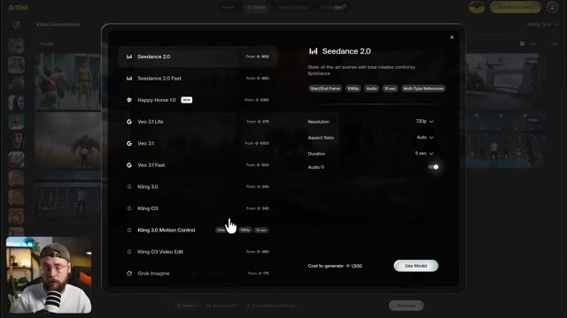
*Fenêtre modale de sélection des modèles de génération vidéo affichant Seedance 2.0, Veo 3.1 et Kling 3.0 avec leurs détails et coûts en crédits.*

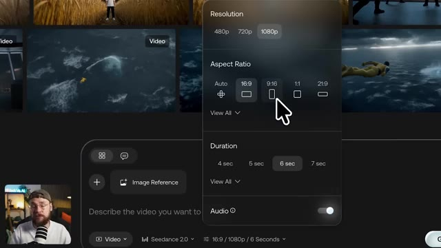
*Menu déroulant des préférences de génération affichant les options de résolution (1080p), de format d'image (16:9, 9:16, 1:1, 21:9) et de durée.*

---

### ⏱️ `[00:14:37 - 00:15:12]` | Segment #31

**🔊 Audio (Transcription Intégrale Mot pour Mot en Français) :**
> des résultats vraiment cinématiques avec ce genre de bandes noires qu'on s'attend à voir au cinéma par exemple je choisis plutôt le 16 par 9 parce que je me dis toujours que si je veux ajouter cet effet de bandes noires, je peux simplement le faire au montage j'aime avoir le maximum de flexibilité et de contrôle possible maintenant la durée dépend encore une fois de vous je vais créer une scène de 15 secondes ici le framework de prompt que j'utilise est entièrement construit autour de ça mais vous pouvez dire à Claude c'est ce que j'utilise pour créer mes prompts je veux seulement générer une scène qui dure environ cinq secondes

**👁️ Analyse Visuelle d'Écran (gemini-3.5-flash-lite) :**
**Interface & Outils** : Interface de l'outil de génération vidéo Seedance avec un panneau de configuration des paramètres (Résolution, Format d'image, Durée, Audio) et une incrustation vidéo du créateur en bas à gauche.

**Contenu textuel & Code** : Paramètres visibles sur l'interface de Seedance : Résolution (480p, 720p, 1080p), Aspect Ratio (Auto, 16:9, 9:16, 1:1, 21:9), Duration (4 sec, 5 sec, 6 sec, 7 sec, 15 sec), et une option Audio. Le prompt en bas indique « Describe the video you want to ».

**Action / Démonstration** : Le curseur de la souris clique sur différents paramètres de format d'image (21:9 puis 16:9) et sélectionne la durée de 15 secondes pour la génération de la vidéo.

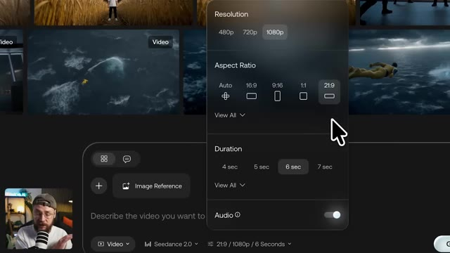
*Interface de Seedance montrant le menu des paramètres de résolution, de format d'image (21:9 sélectionné) et de durée avec un encart vidéo du créateur en bas à gauche.*

*Interface de Seedance montrant le passage du format 21:9 au format 16:9 et la sélection de la durée à 15 secondes.*

---

### ⏱️ `[00:15:12 - 00:15:48]` | Segment #32

**🔊 Audio (Transcription Intégrale Mot pour Mot en Français) :**
> par exemple, si vous voulez utiliser moins de crédits, vous êtes couvert. Et quelque chose d'autre qui est vraiment important, s'il vous plaît assurez-vous d'activer votre onglet audio. Parfois, cela se met par défaut sur désactivé, et j'ai même vu cela sur d'autres plateformes également, et cela me semble fou. Vous voulez toujours que l'audio soit intégré dans votre génération. Vous allez être déçu si vous dépensez des crédits et qu'il n'y a tout simplement pas de son. Même si vous décidez de ne pas utiliser le son intégré dans les générations, ce qui est parfois le cas, c'est bien de l'avoir au moins comme option, n'est-ce pas ? Alors assurez-vous d'activer ce bouton bascule, s'il vous plaît. Ensuite, nous allons passer à l'ajout de notre image.

**👁️ Analyse Visuelle d'Écran (gemini-3.5-flash-lite) :**
**Interface & Outils** : Interface web d'Artlist (AI Toolkit / Video Generations) avec une incrustation vidéo (PiP) du créateur en bas à gauche.

**Contenu textuel & Code** : Menus déroulants des paramètres de génération vidéo (Aspect Ratio : 16:9, Duration : 4 sec à 15 sec, option Audio avec bascule off), barre de prompt "Describe the video you want to create", bouton "Generate", et miniatures de vidéos générées.

**Action / Démonstration** : Le curseur de la souris survole les options de durée dans le panneau de configuration de génération vidéo d'Artlist.

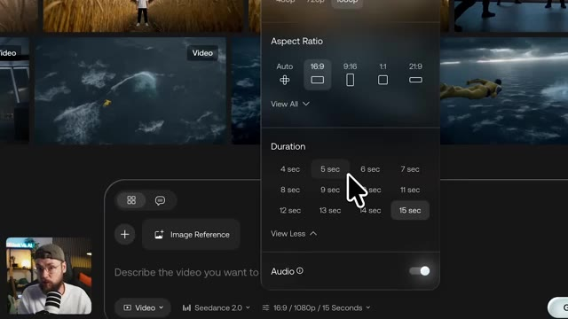
*Interface d'Artlist montrant le menu déroulant avec les paramètres de durée et l'option audio désactivée.*

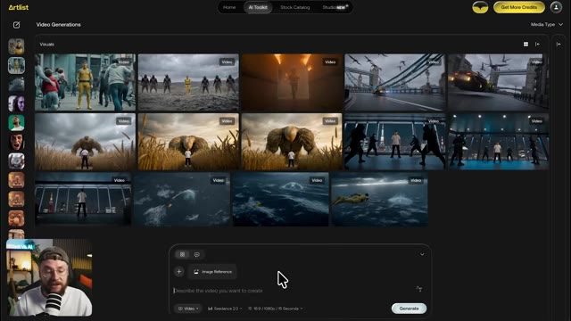
*Interface complète de génération vidéo d'Artlist avec le panneau de prompt et l'historique des vidéos générées.*

---

### ⏱️ `[00:15:48 - 00:16:23]` | Segment #33

**🔊 Audio (Transcription Intégrale Mot pour Mot en Français) :**
> références donc je vais juste sélectionner importer une fois que vous aurez choisi la variante armurée de notre personnage ainsi que le monstre de la jungle qu'il va combattre donc allez-y et ajoutez-les à notre liste d'art donc nous avons tous les éléments en place maintenant mais la seule chose cruciale qui nous manque est notre prompt textuel qui est incroyablement important à réussir. Laissez-moi donc vous guider exactement sur la façon dont je conçois mes prompts. Tout d'abord, je veux importer deux ou trois choses. Je vais donc cliquer sur cette icône plus ici et nous pouvons descendre pour ajouter des fichiers ou des photos. Je veux donc importer le même

**👁️ Analyse Visuelle d'Écran (gemini-3.5-flash-lite) :**
**Interface & Outils** : Artlist AI Toolkit (interface web de génération vidéo par IA) et gestionnaire de fichiers du système d'exploitation (macOS).

**Contenu textuel & Code** : Noms de fichiers visibles dans le gestionnaire : 'VFX_production_reference_plate...', 'Using_the_attached_character...', etc. Sur l'interface Artlist, options de génération : mode vidéo, Seedance 2.0, format 16:9, 1080p, 15 secondes, et des emplacements d'image de référence avec des vignettes floutées (@img1, @img2).

**Action / Démonstration** : Le curseur de la souris navigue dans la liste des fichiers à importer pour les ajouter comme références de personnages dans l'outil de génération vidéo d'Artlist.

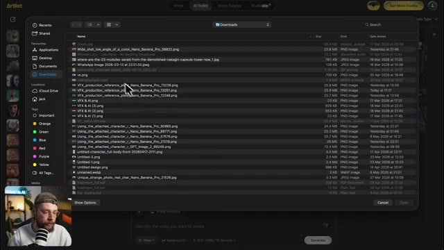
*Fenêtre de sélection de fichiers du système d'exploitation ouverte par-dessus l'interface d'Artlist, montrant une liste de fichiers d'images de référence (fichiers PNG et JPG).*

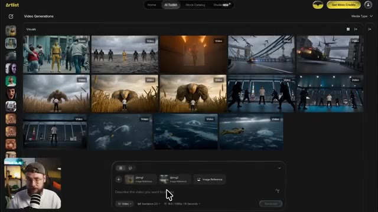
*Interface principale d'Artlist AI ToolKit (génération vidéo) montrant une galerie de vidéos générées en haut et un panneau de prompt avec des images de référence importées en bas.*

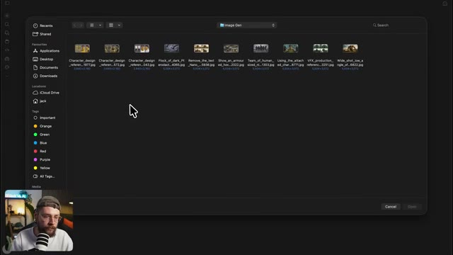
*Autre fenêtre de sélection de fichiers du système d'exploitation affichant un dossier nommé 'Image Gen' avec des vignettes de personnages et de créatures.*

---

### ⏱️ `[00:16:23 - 00:16:56]` | Segment #34

**🔊 Audio (Transcription Intégrale Mot pour Mot en Français) :**
> images qu'on vient de télécharger sur Artlist à utiliser avec Seedance 2. Donc on veut la variante armurée de notre personnage et puis le colosse de la jungle aussi. Donc ajoutons ça dans Claude. Et puis ce que je veux ajouter aussi c'est ce fichier multishot prompt framework.md. Je vais le rendre complètement gratuit au téléchargement. Vous le trouverez sur ma communauté school. Comme toujours, il y a un lien pour ça dans la description également. La super chose avec l'utilisation des fichiers MD, c'est qu'on peut en fait les importer dans n'importe quel LLM. Donc disons que vous n'êtes pas fan de Claude. Peut-être que vous utilisez ChatGPT

**👁️ Analyse Visuelle d'Écran (gemini-3.5-flash-lite) :**
**Interface & Outils** : Explorateur de fichiers du système d'exploitation avec vue en grille des images et la vidéo PiP du créateur en bas à gauche.

**Contenu textuel & Code** : Noms de fichiers visibles : Character_design_ref, Flock_of_dark, Remove_the_text, Show_an_armoured, Team_of_human, Using_the_attached, VFX_production, Wide_shot_low_angle.

**Action / Démonstration** : Le curseur de la souris survole et sélectionne des fichiers d'images dans un dossier pour les importer.

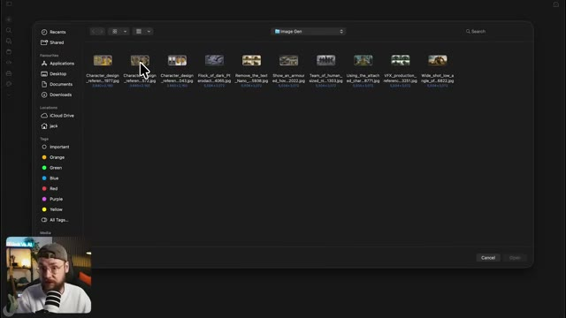
*Explorateur de fichiers montrant le dossier 'Image Gen' avec des images de référence de personnages, avec la webcam de Jack en incrustation (PiP) dans le coin inférieur gauche.*

---

### ⏱️ `[00:16:56 - 00:17:30]` | Segment #35

**🔊 Audio (Transcription Intégrale Mot pour Mot en Français) :**
> ou Gemini. Vous pouvez continuer et simplement télécharger cela ici. Suivez exactement le même processus d'un flux de travail très flexible, et tout ce que vous avez à faire est de donner à votre IA un peu de conseils avant d'entrer dans le côté créatif des choses. Nous allons donc dire : en utilisant le fichier md joint et les références de personnages pour un contexte supplémentaire, écrivez-moi un prompt pour une séquence d'action granuleuse, cinématographique, dynamique, photoréaliste, avec un immense sens de l'échelle, qui inclut un plan au ralenti qui montre Et maintenant, nous pouvons décrire exactement ce que nous voulons qu'il se passe.

**👁️ Analyse Visuelle d'Écran (gemini-3.5-flash-lite) :**
**Interface & Outils** : Interface de l'outil de discussion Claude (mode sombre) avec un encadré PiP du créateur en bas à gauche.

**Contenu textuel & Code** : Texte à l'écran : "Coffee and Claude time?" et un message contenant un fichier Markdown (`multi-shot-prompt-framework.md`), des images de référence, et le prompt textuel : "Using the attached .md file and character references for further context... write me a prompt for a gritty, cinematic, dynamic, photo real, action sequence, with an immense sense of scale, that includes at least one slow-mo shot that shows..."

**Action / Démonstration** : Le curseur de la souris survole le bouton d'envoi de l'interface de l'IA Claude pendant que le créateur commente la structure du prompt.

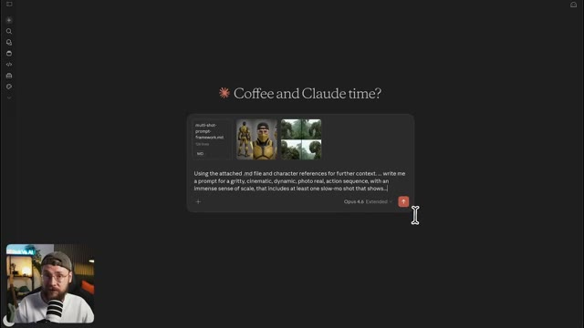
*Interface de l'assistant IA Claude montrant un prompt de génération de séquence d'action avec des fichiers joints et des images de référence.*

---

### ⏱️ `[00:17:30 - 00:17:50]` | Segment #36

**🔊 Audio (Transcription Intégrale Mot pour Mot en Français) :**
> Donc je vais dire, commençons la scène avec notre héros en jaune enveloppé de lianes. Le monstre l'a donc piégé en utilisant des lianes provenant de son corps. Je veux que le héros en jaune utilise toute sa force et sa puissance pour se libérer des lianes.

**👁️ Analyse Visuelle d'Écran (gemini-3.5-flash-lite) :**
**Interface & Outils** : Interface web de Claude avec un encadré de prompt contenant un fichier joint (.md), des images miniatures et le modèle Opus 4.6 Extended. Le créateur apparaît en bas à gauche dans une incrustation vidéo (PiP).

**Contenu textuel & Code** : Titre « Coffee and Claude time? », prompt textuel : « Using the attached .md file and character references for further context. ... write me a prompt for a gritty, cinematic, dynamic, photo real, action sequence, with an immense sense of scale, that includes at least one slow-mo shot that shows... », et deux images de référence (le héros en jaune et le monstre).

**Action / Démonstration** : Le créateur interagit avec l'interface de l'assistant IA Claude tout en expliquant sa démarche pour rédiger le prompt de la séquence d'action.

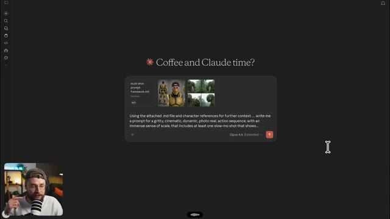
*Interface de l'outil Claude montrant une requête avec un fichier joint et des images de référence de personnages.*

---

### ⏱️ `[00:17:50 - 00:18:27]` | Segment #37

**🔊 Audio (Transcription Intégrale Mot pour Mot en Français) :**
> À ce stade, il n'a pas son épée énergétique jaune, mais il la voit posée sur le sol à proximité. Les yeux écarquillés, il court rapidement vers l'épée énergétique jaune, s'élance dans les airs et assène un coup mortel au colosse de la jungle. Parfait. Allons-y et envoyons ceci. Laissons Claude réfléchir et nous verrons le prompt qu'il va générer pour nous. De plus, lorsque j'ai demandé ce plan au ralenti, vous n'êtes pas obligé de l'ajouter si vous le souhaitez. Et vous pouvez également omettre des éléments comme "gritty", "dynamic" ou "photo real" si vous souhaitez utiliser ce même cadre pour une animation ou quelque chose du genre.

**👁️ Analyse Visuelle d'Écran (gemini-3.5-flash-lite) :**
**Interface & Outils** : Interface web de Claude (Anthropic), avec en bas à gauche un encadré PiP (Picture-in-Picture) montrant Jack dans son studio.

**Contenu textuel & Code** : Titre "Coffee and Claude time?". Dans la boîte de dialogue : un fichier attaché nommé "multi-shot-prompt-framework.md", des vignettes d'images de référence (personnage en jaune et monstre de la jungle), et un prompt textuel demandant à l'IA d'écrire un prompt pour une séquence d'action "gritty, cinematic, dynamic, photo real" incluant un ralenti. Modèle sélectionné : Opus 4.6 Extended.

**Action / Démonstration** : Le créateur présente l'interface de l'assistant IA Claude où il rédige et soumet son prompt basé sur un framework pour générer des séquences de plans multiples.

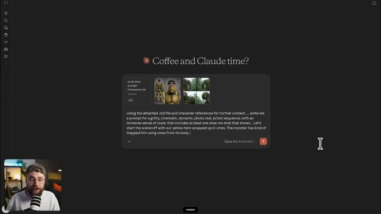
*Interface de Claude affichant une requête de prompt avec des fichiers attachés et le titre "Coffee and Claude time?"*

---

### ⏱️ `[00:18:27 - 00:19:00]` | Segment #38

**🔊 Audio (Transcription Intégrale Mot pour Mot en Français) :**
> comme ça, comme je le dis, c'est très flexible ce workflow, vous n'êtes pas obligé de l'utiliser exactement comme je l'ai fait ici, mais en parlant de ça, nous avons récupéré notre prompt à utiliser, donc vous pouvez voir que chaque plan individuel a ce code temporel pour dire exactement à Cdance 2 quand nous voulons que chaque action se produise, puis nous décrivons le type de cadrage ou d'angle de caméra que nous voulons utiliser, puis l'objectif si l'on veut qu'il soit d'un angle spécifique, et Claude réfléchit réellement à la manière d'utiliser les angles de caméra pour créer

**👁️ Analyse Visuelle d'Écran (gemini-3.5-flash-lite) :**
**Interface & Outils** : Interface de l'assistant IA Claude avec affichage de code et de prompts horodatés, incluant un encadré PiP de Jack dans son studio.

**Contenu textuel & Code** : On peut lire dans l'interface de Claude des instructions textuelles de prompt (ex: "[00:00 - 00:03] Close-up, 85mm, low angle, handheld...") pour générer des séquences vidéo avec des indications précises de timing, de focale et d'angle de caméra.

**Action / Démonstration** : Le créateur montre l'interface de l'IA Claude sur son écran, illustrant comment structurer un prompt multi-plans avec des horodatages précis pour chaque action.

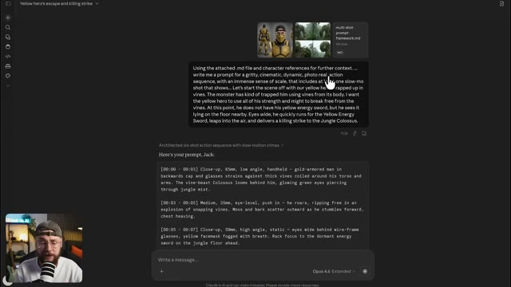
*Interface de l'outil Claude affichant un prompt détaillé pour une séquence d'action multi-plans avec les codes temporels correspondants.*

---

### ⏱️ `[00:19:00 - 00:19:34]` | Segment #39

**🔊 Audio (Transcription Intégrale Mot pour Mot en Français) :**
> certaines ambiances pour le spectateur et ensuite nous avons même des mouvements de caméra à l'épaule ajoutés ici pour donner un peu de cette sensation frénétique et ensuite Claude va continuer à décrire la première scène d'action et puis à la fin ici nous avons juste un petit peu plus d'informations pour aider C-Dance à comprendre ce qui se passe. Donc vous pouvez voir que l'emplacement est décrit comme une jungle tropicale dense avec une brume nuageuse. En termes de style, des ombres froides, des tons de peau naturels, une composition à l'échelle IMAX, une mise au point profonde, un éclairage pratique, un contraste élevé, un réalisme ancré dans le style d'un

**👁️ Analyse Visuelle d'Écran (gemini-3.5-flash-lite) :**
**Interface & Outils** : Interface de l'assistant IA Claude avec affichage de texte et une petite fenêtre PiP de Jack en bas à gauche.

**Contenu textuel & Code** : Texte de prompt détaillé incluant la description du lieu ("Dense tropical jungle, overcast mist") et du style visuel ("Cool shadows, natural skin tones, IMAX-scale composition, deep focus, practical lighting, high contrast, grounded realism").

**Action / Démonstration** : L'écran affiche l'interface de Claude avec le curseur de la souris survolant le texte descriptif du prompt généré pour la vidéo.

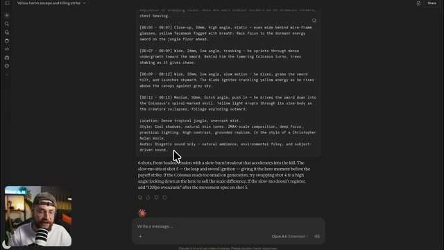
*Interface de Claude affichant le texte descriptif du prompt avec les détails de la scène, le lieu (jungle tropicale) et le style visuel.*

---

### ⏱️ `[00:19:34 - 00:20:07]` | Segment #40

**🔊 Audio (Transcription Intégrale Mot pour Mot en Français) :**
> Film de Christopher Nolan. Parce que qui n'aime pas Christopher Nolan et qui ne veut pas faire des trucs comme lui, n'est-ce pas ? Vous remarquerez que ce prompt va également par défaut durer 15 secondes. Si vous ne vouliez pas d'un prompt de 15 secondes, vous pourriez littéralement dire ici en décrivant ce que vous voulez que Claude fasse pour vous, je veux un prompt de six secondes, de quatre secondes, peu importe, cette longueur de prompt, et il adaptera simplement le framework pour fonctionner pour cette durée. Cela étant dit, nous pouvons aller de l'avant et cliquer sur cette petite icône de copie, retourner sur Artlist et le déposer dans le

**👁️ Analyse Visuelle d'Écran (gemini-3.5-flash-lite) :**
**Interface & Outils** : Claude (assistant IA) et Artlist (plateforme de génération de vidéo).

**Contenu textuel & Code** : Sur Claude : texte détaillé d'un prompt de film d'action découpé en plusieurs plans temporels ([00:00 - 00:03], [00:03 - 00:05], etc.) avec des instructions de style ("In the style of a Christopher Nolan movie"). Sur Artlist : interface "Video Generations" avec plusieurs aperçus vidéo et une zone de saisie pour décrire la vidéo avec des références d'images (Seedance 2.0, 16:9, 1080p, 15 seconds).

**Action / Démonstration** : Le créateur montre l'interface de Claude avec le prompt généré, puis bascule sur l'interface d'Artlist pour y copier-coller le résultat.

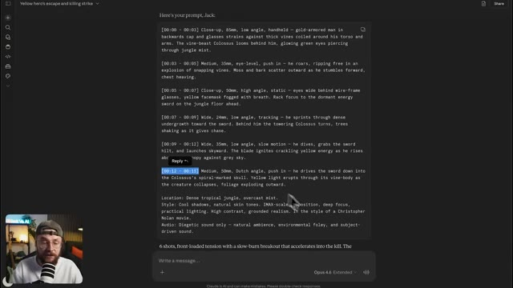
*Interface de Claude affichant un prompt textuel structuré par séquences temporelles (00:00 - 00:03, etc.) avec le présentateur en incrustation (PiP).*

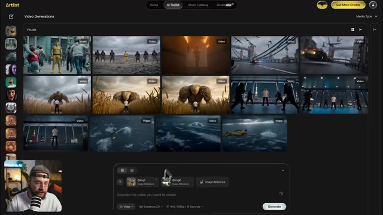
*Interface d'Artlist dans l'onglet Video Generations montrant une galerie de vignettes vidéo et le panneau de génération avec des références d'images.*

---

### ⏱️ `[00:20:07 - 00:20:42]` | Segment #41

**🔊 Audio (Transcription Intégrale Mot pour Mot en Français) :**
> champ de saisie de texte. Maintenant, vous pouvez simplement cliquer sur générer, mais il est souvent très bon de simplement vérifier vos prompts. Ne faites pas confiance aveuglément à tout ce que l'IA vous donne. C'est un peu une erreur la plupart du temps. Ne me méprenez pas. Claude peut faire un travail extraordinaire, mais souvenez-vous que vous êtes en quelque sorte le vérificateur. Vous êtes le créatif derrière l'idée. Alors, vérifiez cela avant de cliquer sur générer. Encore une fois, vous ne voulez pas gaspiller vos crédits. Nous venons de faire quelques ajustements mineurs pour cibler exactement l'idée que nous voulons. C'est la meilleure façon d'utiliser l'IA,

**👁️ Analyse Visuelle d'Écran (gemini-3.5-flash-lite) :**
**Interface & Outils** : Interface web de la plateforme Artlist (section Video Generations / AI Toolkit) avec une fenêtre modale d'édition de prompt textuel (Seedance 2.0).

**Contenu textuel & Code** : Prompts textuels structurés par séquences temporelles ([00:00 - 00:03], [00:03 - 00:05], etc.), spécifications de plans (Close-up, Medium, Wide), description des mouvements de caméra et des actions, ainsi que les paramètres de style et de lieu ("Dense tropical jungle, overcast mist", "In the style of a Christopher Nolan movie").

**Action / Démonstration** : Le curseur survole la fenêtre de prompt et des modifications textuelles sont apportées pour affiner l'idée avant le lancement de la génération vidéo.

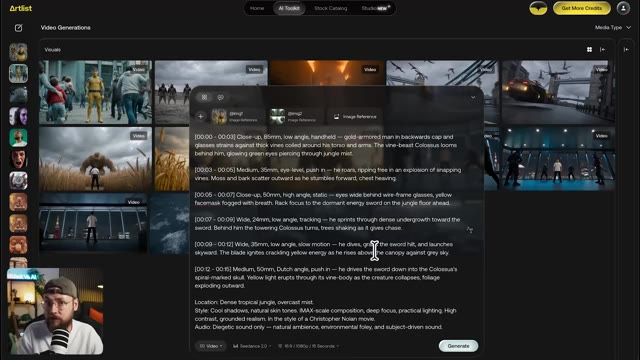
*Interface de la plateforme de génération vidéo Artlist montrant une fenêtre contextuelle de saisie de prompts temporels et des options de configuration, avec le créateur en incrustation (PiP) dans le coin inférieur gauche.*

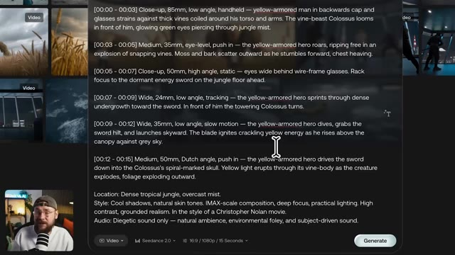
*Gros plan sur la fenêtre de saisie des prompts textuels de la plateforme vidéo avec les paramètres de génération et les instructions temporelles détaillées.*

---

### ⏱️ `[00:20:42 - 00:21:14]` | Segment #42

**🔊 Audio (Transcription Intégrale Mot pour Mot en Français) :**
> en quelque sorte lui permettre d'effectuer le gros travail technique, mais vous voulez toujours être le créateur. Vous voulez toujours garder le contrôle du résultat final autant que possible. Alors allons-y et sélectionnons générer. Et vous pouvez voir tout de suite que nous avons un problème. Si nous survolons cette icône ici, vos invites n'ont pas respecté les directives du modèle. Veuillez modifier votre invite et réessayer. Donc ce que nous allons faire, c'est de retourner sur Claude et je vais simplement dire que cette invite a été bloquée par la modération et les directives de la communauté. Pourriez-vous s'il vous plaît y apporter des modifications pour que je puisse réellement

**👁️ Analyse Visuelle d'Écran (gemini-3.5-flash-lite) :**
**Interface & Outils** : Artlist (outil de génération de vidéo IA avec Seedance 2.0) et Claude (assistant conversationnel d'Anthropic).

**Contenu textuel & Code** : Prompts structurés par plans temporels ([00:00 - 00:03], etc.), description de scènes d'action dans une jungle tropicale avec un héros en armure jaune et un Colosse, paramètres techniques (16:9, 1080p, 15 Seconds), et messages de l'interface Claude.

**Action / Démonstration** : Le créateur montre le prompt de génération vidéo dans Artlist, clique sur le bouton de génération, puis bascule vers l'interface de Claude pour modifier le prompt bloqué par la modération.

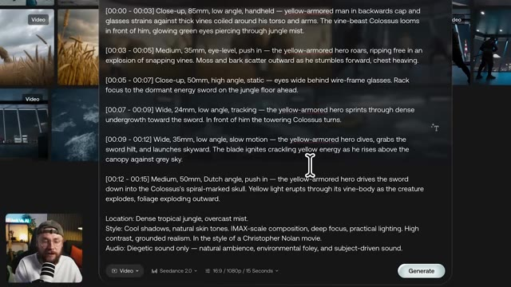
*Interface d'Artlist montrant le panneau de génération de vidéo avec un prompt détaillé et un aperçu des vignettes.*

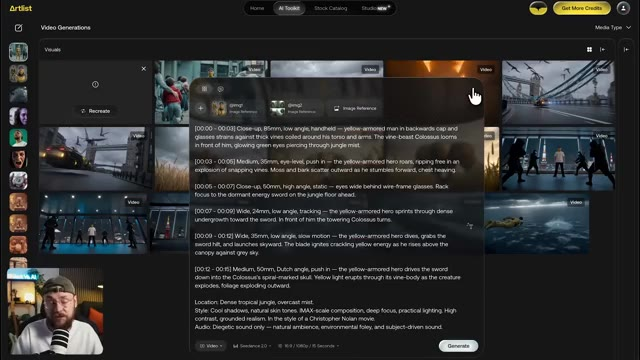
*Vue d'ensemble de l'interface d'Artlist avec le tableau de bord des générations de vidéo en arrière-plan et la fenêtre de prompt centrée.*

*Interface de l'assistant IA Claude affichant une conversation textuelle avec la zone de saisie de message en bas.*

---

### ⏱️ `[00:21:14 - 00:21:49]` | Segment #43

**🔊 Audio (Transcription Intégrale Mot pour Mot en Français) :**
> obtenir la vidéo générée sans perdre la structure narrative que nous avons mise en place ? Envoyons donc ceci, et ensuite Claude va modifier un peu la formulation pour s'assurer que nous pouvons réellement générer la scène que nous voulons. Vous pouvez donc voir ici que c'est identifié, déclenchant probablement notre frappe mortelle, enfonce l'épée dans le crâne et rugit ou explose éventuellement, voici la même séquence avec le langage de combat atténué. Copions donc ceci, emmenons-le sur Artlist, nettoyons une fois de plus notre ancien prompt et déposons notre nouveau. J'ai donc juste fait quelques modifications très similaires.

**👁️ Analyse Visuelle d'Écran (gemini-3.5-flash-lite) :**
**Interface & Outils** : Claude (interface de chat textuel) et Artlist AI Toolkit (interface de génération de vidéo par IA avec sélection de modèle Seedance 2.0).

**Contenu textuel & Code** : Texte du prompt scénaristique découpé par plans temporels ([00:00 - 00:03], [00:03 - 00:05], etc.) décrivant l'action d'un héros en armure dorée combattant une créature colossale dans une jungle tropicale, avec des instructions de style (Christopher Nolan, composition IMAX).

**Action / Démonstration** : Le créateur navigue entre l'interface de l'assistant textuel Claude pour modifier le scénario et l'interface de l'outil de génération vidéo Artlist pour copier-coller le nouveau prompt.

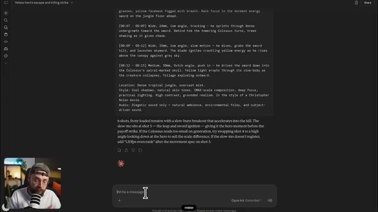
*Interface de l'outil Claude affichant le texte narratif de la scène et les suggestions de modification du prompt.*

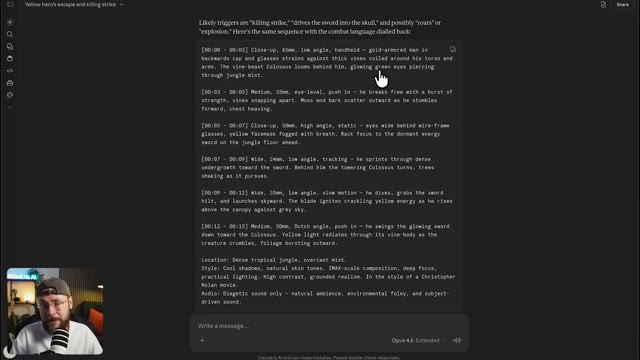
*Interface de Claude montrant la version mise à jour du script avec le langage de combat atténué.*

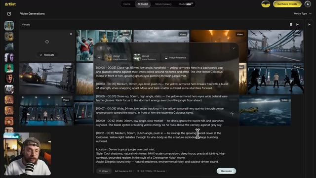
*Interface d'Artlist (AI Toolkit) avec la fenêtre de génération vidéo et le champ de prompt contenant le nouveau script.*

---

### ⏱️ `[00:21:49 - 00:22:38]` | Segment #44

**🔊 Audio (Transcription Intégrale Mot pour Mot en Français) :**
> par rapport à ce que j'ai fait avant, allons-y et envoyons ceci pour générer et voyons si cette variation du prompt fonctionne, nous devrions savoir assez rapidement si ça va passer les consignes de communauté et la modération, ça aurait probablement déjà agi maintenant donc je pense qu'on est bon, c'est un peu aussi simple que ça, on peut simplement effacer cette génération échouée, bien sûr vous ne perdrez aucun crédit pour les générations qui n'aboutissent pas, ok, je suis vraiment impatient de voir cette scène prendre vie, voyons comment Seedance 2 s'en est sorti, alors bien que ce ne soit pas parfait, il y a encore beaucoup de très superbes matériaux ici je pense

**👁️ Analyse Visuelle d'Écran (gemini-3.5-flash-lite) :**
**Interface & Outils** : Interface web d'Artlist (section AI Toolkit / Video Generations / Seedance 2.0) avec grille de miniatures et panneaux contextuels de génération.

**Contenu textuel & Code** : Prompts textuels structurés par séquences temporelles ([00:00 - 00:03], [00:03 - 00:05], etc.), descriptions de plans (Close-up, 85mm, low angle), paramètres de modèle (Seedance 2.0, format 16:9, résolution 1080p, durée 15s).

**Action / Démonstration** : Le créateur lance une génération de vidéo IA, observe la progression dans la grille, puis visionne et commente le résultat généré montrant un combat dans la jungle.

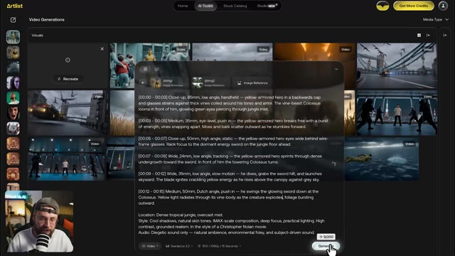
*Interface d'Artlist (Seedance 2.0) montrant une fenêtre de prompt textuel détaillée avec des instructions de plans chronologiques et un bouton "Generate".*

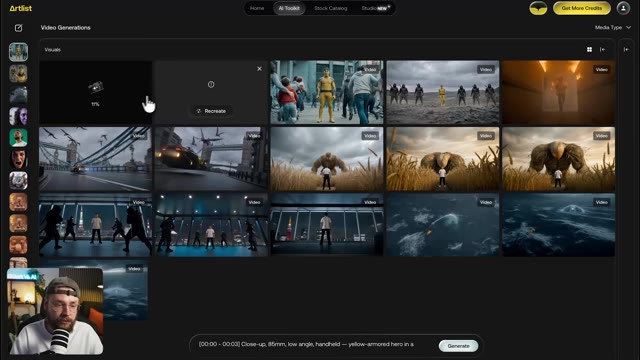
*Interface d'Artlist montrant la grille de générations de vidéos avec une vignette en cours de chargement à 11%.*

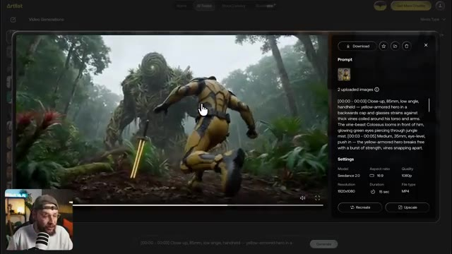
*Lecteur vidéo de Seedance 2.0 affichant un plan dans la jungle avec un héros en armure jaune et une créature végétale géante, avec le panneau latéral des paramètres techniques et du prompt.*

---

### ⏱️ `[00:22:38 - 00:23:13]` | Segment #45

**🔊 Audio (Transcription Intégrale Mot pour Mot en Français) :**
> dans l'ensemble, ça fonctionne exactement comme je l'avais imaginé. Comme je le disais plus tôt, si vous le vouliez, vous pourriez simplement relancer le même prompt et peut-être échanger certaines variations de plans au montage. Comme c'est souvent le cas avec l'IA, c'est un processus d'essais et erreurs, mais vous pouvez quand même voir ici un flux de travail réaliste où je génère simplement quelque chose complètement sur le pouce pour vous montrer ce qu'il est possible d'accomplir. S'il y a quelque chose que vous n'avez pas aimé dans une génération spécifique, vous pouvez retourner sur Claude et dire simplement, hé, je veux faire une petite modification sur ce plan ici. Et ça va

**👁️ Analyse Visuelle d'Écran (gemini-3.5-flash-lite) :**
**Interface & Outils** : Interface web d'Artlist (section Video Generations) avec le modèle Seedance 2.0, panneau latéral affichant les prompts détaillés et les paramètres techniques (résolution 1920x1080, format 16:9, durée 15s). Présence de l'encadré PiP du créateur en bas à gauche.

**Contenu textuel & Code** : Texte du prompt visible : "[00:00-00:03] Close-up, 85mm, low angle, handheld -- yellow-armored hero in a backwards cap and glasses strains against thick vines coiled around his torso and arms. The vine-beast Colossus looms in front of him, glowing green eyes piercing through jungle mist. [00:03-00:05] Medium, 35mm, eye-level, push in -- the yellow-armored hero breaks free with a burst of strength, vines snapping apart." Paramètres : Model Seedance 2.0, Aspect 16:9, Quality 1080p, Resolution 1920x1080, Duration 15 sec, File type MP4.

**Action / Démonstration** : Le créateur présente l'interface de génération vidéo d'Artlist, affichant les différents plans générés par IA représentant un affrontement entre un héros en armure jaune et un monstre végétal géant.

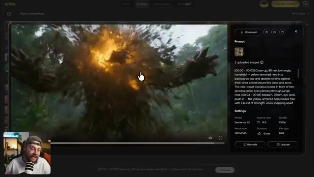
*Interface d'Artlist montrant la génération vidéo avec Seedance 2.0 et un monstre végétal en feu.*

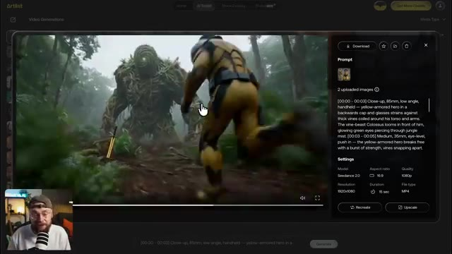
*Interface d'Artlist avec le héros en armure jaune faisant face au colosse de vignes.*

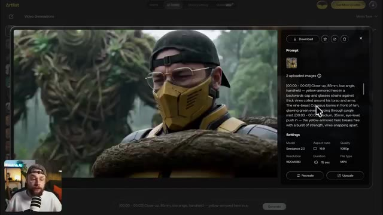
*Gros plan sur le héros en armure jaune avec des lunettes et une casquette à l'envers, ligoté par des lianes.*

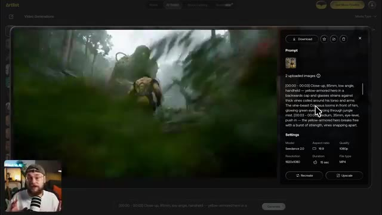
*Vue de dos du héros en armure jaune fuyant à travers la jungle dense face au monstre végétal.*

---

### ⏱️ `[00:23:13 - 00:23:44]` | Segment #46

**🔊 Audio (Transcription Intégrale Mot pour Mot en Français) :**
> vous donner un prompt affiné que vous pouvez relancer. C'est donc tout un processus de va-et-vient d'affinage. Ceci étant dit, les gars, j'espère que vous avez apprécié la vidéo d'aujourd'hui. Si vous avez la moindre question, assurez-vous de les poser en bas dans la section commentaires. J'essaie toujours de répondre au maximum d'entre elles. Si ce tutoriel vous a aidé, n'hésitez pas à lâcher un pouce bleu sur la vidéo et pensez à vous abonner. Je vais afficher l'une de mes récentes publications sur l'écran maintenant si vous souhaitez aller jeter un œil à un peu plus de mon contenu et sur ce, je vous retrouve dans la prochaine vidéo.

**👁️ Analyse Visuelle d'Écran (gemini-3.5-flash-lite) :**
**Interface & Outils** : Artlist (Video Generation) avec panneau latéral de configuration et de prompt.

**Contenu textuel & Code** : Modèle : Seedance 2.0, Format : 16:9, Qualité : 1080p, Résolution : 1920x1080, Durée : 15 sec, Type de fichier : MP4. Prompt détaillé visible sur le panneau droit concernant un héros en armure jaune dans la jungle.

**Action / Démonstration** : Visualisation du résultat vidéo généré et de ses paramètres techniques dans l'interface d'Artlist.

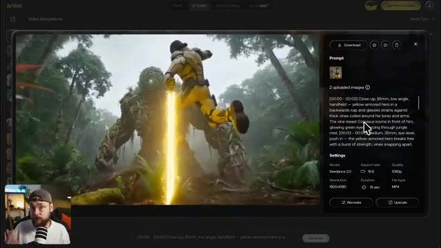
*Interface d'Artlist (Video Generation) montrant une vidéo générée avec les paramètres Seedance 2.0 et le panneau de prompt détaillé.*

---
