# 🎬 Comment créer des clips vidéo IA avec un lip sync parfait (Workflow complet)

> **Chaîne** : [Jack Vs. AI](https://www.youtube.com/@JackVsAI)  
> **Titre original** : `How to Make AI Music Videos with Perfect Lip Sync (Full Workflow)`  
> **Lien YouTube** : [https://www.youtube.com/watch?v=CghKYofqzfI](https://www.youtube.com/watch?v=CghKYofqzfI)  
> **Date de publication** : 2026-05-17  
> **Durée** : 22m 21s (`1341s`)  
> **Identifiant vidéo** : `CghKYofqzfI`  
> **Fiche Web Interactive** : [2026-05-17_YT-CghKYofqzfI_Comment créer des clips vidéo IA avec un lip sync parfait (Workflow complet)_by-whisper-v3-large-turbo+gemini-3.5-flash-lite.html](2026-05-17_YT-CghKYofqzfI_Comment créer des clips vidéo IA avec un lip sync parfait (Workflow complet)_by-whisper-v3-large-turbo+gemini-3.5-flash-lite.html)  
> **Captures de démonstration clés** : `92 captures réelles (anti-talking-head)`  
> **Modèles utilisés** : Audio: `large-v3-turbo` (Faster-Whisper int8 VPS) | Vision: `gemini-3.5-flash-lite` (Google AI Studio API)  

---

## 📌 Synthèse Exécutive & Outils

### 📌 Résumé
La vidéo de Jack Vs. AI dévoile un workflow de pointe pour concevoir de bout en bout un artiste virtuel ultraréaliste et son clip musical synchronisé, ouvrant la voie à une nouvelle ère de l'industrie du divertissement générative. En s'appuyant sur l'intelligence artificielle générative, il est désormais possible de créer des icônes musicales crédibles, capables de susciter un réel engagement émotionnel auprès du public, bien avant que les auditeurs ne réalisent qu'ils n'existent pas dans le monde réel. Le processus s'affranchit des barrières traditionnelles de production en combinant la génération de personnages hautement texturés, la création d'un écosystème visuel complet pour les réseaux sociaux et la composition musicale sur mesure.

La méthode pas à pas s'articule autour d'une synergie maîtrisée entre des modèles spécialisés de pointe. Tout commence par la conception du personnage et de son identité visuelle ancrée dans la réalité sur Higgsfield Soul 2.0, suivie par l'extension de sa garde-robe grâce à des planches de personnages générées via Nano Banana Pro et structurées par Claude. Ce même LLM pilote l'écriture des prompts stylistiques et des paroles pour Suno, garantissant une cohérence thématique totale (le sentiment d'aliénation et de différence). Enfin, l'utilisation de visuels clés percutants permet d'alimenter non seulement le clip vidéo final, mais aussi une stratégie de contenu omnicanale clé en main pour les plateformes sociales.

Pour les créateurs de contenu, les réalisateurs et les marketeurs, ce workflow représente une opportunité stratégique majeure de combler une lacune naissante sur le marché avant qu'il ne se sature. L'enseignement le plus précieux de cette approche réside dans la posture du créateur : l'intelligence artificielle agit comme un accélérateur d'idées et un assistant d'exécution, mais l'humain conserve impérativement le rôle de filtre décisionnel final. En gardant le contrôle sur la direction artistique, les choix de narration et l'affinage des détails, le créateur s'assure de produire un contenu unique, mémorable et capable de stopper le défilement sur les réseaux sociaux.

### 🛠️ Outils, Modèles & Logiciels Présentés
* **Claude** : Utilisé comme assistant textuel central (LLM) pour concevoir les prompts stylistiques, rédiger et itérer sur les paroles de la chanson, et structurer les variations de garde-robe et de scènes à partir des planches de personnages.
* **Higgsfield (Soul 2.0)** : Moteur de génération visuelle principal employé pour concevoir l'artiste initial (Kover) avec un réalisme saisissant, des textures de peau naturelles et des proportions cohérentes, ainsi que pour produire les visuels clés.
* **Nano Banana / Nano Banana Pro** : Modèles d'image utilisés en alternance pour créer des planches de personnages et générer des variations visuelles à partir d'une image de référence.
* **Suno** : Plateforme de génération musicale par IA exploitée pour composer le morceau à partir d'un prompt de style textuel et des paroles fournies.
* **Premiere Pro** : Logiciel de montage vidéo traditionnel (mentionné dans l'introduction du workflow global) pour l'assemblage final du clip.
* **Seedance** : Outil intégré ou associé au pipeline de génération de mouvement et de vidéo (mentionné dans la liste des technologies du projet).
* **Flux** : Modèle de génération d'images de pointe utilisé en appui pour certains aspects visuels du projet.

### 🔑 Points Clés & Enseignements Stratégiques
* **Créer une identité visuelle ancrée** : Pour qu'un artiste virtuel soit crédible et mémorable, misez dès le départ sur des outils offrant un rendu réaliste des textures de peau et des proportions physiques, évitant ainsi l'effet "trop plastique" ou artificiel.
* **Développer un concept narratif fort** : Donnez une profondeur psychologique à votre personnage (par exemple, un extraterrestre qui se peint en vert par sentiment de rejet) pour créer une résonance émotionnelle immédiate avec le public.
* **Construire une garde-robe cohérente** : Utilisez une image de référence pour générer une planche complète de personnages aux tenues variées, garantissant la constance visuelle de votre artiste à travers toutes les scènes du clip.
* **Industrialiser la création de contenu (Écosystème)** : Ne vous limitez pas à un clip vidéo ; exploitez les planches de personnages et les prompts textuels pour générer une multitude de visuels annexes (type séances photo ou posts Instagram) afin d'alimenter vos réseaux sociaux.
* **Viser le "Pattern Interrupt" (Arrêt sur image)** : Concevez des visuels clés percutants et provocants, pensés spécifiquement pour stopper le défilement rapide des utilisateurs sur les plateformes sociales.
* **Guider l'IA musicale par le style** : Pour obtenir une piste audio de qualité professionnelle sur Suno, commencez par demander à un LLM de condenser l'ambiance d'un album ou d'un artiste réel de référence en un prompt stylistique précis.
* **Itérer sur les paroles avec nuance** : Utilisez l'IA pour rédiger les paroles d'une chanson, mais n'hésitez pas à rejeter les formulations trop répétitives ou génériques (comme "Je ne suis pas d'ici") pour leur préférer des concepts plus subtils et accrocheurs ("Not your kind").
* **Maintenir la posture de directeur artistique** : Ne acceptez jamais passivement la première proposition d'un LLM. L'IA n'est qu'un accélérateur et un générateur d'options ; vous restez le filtre final qui opère les choix stratégiques et artistiques décisifs.
* **Anticiper le marché de la musique synthétique** : Saisir ce type de workflow dès maintenant permet de se positionner en pionnier sur un marché en pleine expansion, avant que les musiciens entièrement générés par IA ne deviennent la norme mondiale.
* **Optimiser l'alternance des modèles** : N'hésitez pas à combiner plusieurs technologies d'imagerie (comme Higgsfield pour le réalisme anatomique et Nano Banana Pro pour les variations de planches) pour tirer le meilleur parti des spécificités de chaque outil.

---

## ⏱️ Chronologie & Transcription Complète Audio & Visuelle (Mot pour Mot)

### ⏱️ `[00:00:00 - 00:00:23]` | Segment #01

**🔊 Audio (Transcription Intégrale Mot pour Mot en Français) :**
> Si confortable.

**👁️ Analyse Visuelle d'Écran (gemini-3.5-flash-lite) :**
**Interface & Outils** : Présentation de séquences vidéo générées par IA sans affichage d'interface logicielle directe.

**Contenu textuel & Code** : Génération de vidéo par intelligence artificielle montrant un personnage chauve au visage et aux vêtements couverts de peinture verte, dans une salle de bains en marbre blanc. Sous-titres jaunes affichés à l'écran (« the language here. », « Everyone's so comfortable. »).

**Action / Démonstration** : Un personnage virtuel généré par IA regarde fixement la caméra dans une salle de bains recouverte d'éclaboussures de peinture verte.

---

### ⏱️ `[00:00:23 - 00:01:03]` | Segment #02

**🔊 Audio (Transcription Intégrale Mot pour Mot en Français) :**
> C'est la partie.

**👁️ Analyse Visuelle d'Écran (gemini-3.5-flash-lite) :**
**Interface & Outils** : Présentation face caméra sans partage d'écran

**Contenu textuel & Code** : Séquence vidéo montrant un personnage au visage verdâtre portant différentes tenues (pull marron sous l'eau, t-shirt rose devant fond rouge, sweat à capuche violet dans une salle de bain) avec des sous-titres en anglais incrustés au bas de l'écran ("I've been faking it", "somewhere wrong,", "part that doesn't fit?", "Not your kind, not your kind.").

**Action / Démonstration** : Le personnage bouge et chante en synchronisation labiale avec les paroles affichées à l'écran, dans des décors successifs (piscine, studio sur fond uni, salle de bain).

---

### ⏱️ `[00:01:03 - 00:01:22]` | Segment #03

**🔊 Audio (Transcription Intégrale Mot pour Mot en Français) :**
> Quelque chose d'humain que je ne peux pas ressentir. J'ai donc simplement créé ce clip vidéo et ces artistes en entier en utilisant uniquement l'IA. Chaque partie a été générée artificiellement, mais le plus intéressant n'est pas la musique.

**👁️ Analyse Visuelle d'Écran (gemini-3.5-flash-lite) :**
**Interface & Outils** : Présentation face caméra sans partage d'écran (avec insertion d'un extrait visuel généré par IA).

**Contenu textuel & Code** : Texte affiché en sous-titre : "that I can't fake." et scène sous-marine générée artificiellement.

**Action / Démonstration** : Un personnage aux cheveux courts et portant un collier clouté est assis sous l'eau, avec des bulles autour de lui.

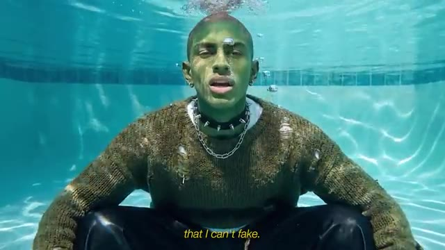
*Extrait du clip vidéo généré par IA montrant un personnage sous l'eau avec des bulles remontant à la surface et des sous-titres en bas.*

---

### ⏱️ `[00:01:22 - 00:01:57]` | Segment #04

**🔊 Audio (Transcription Intégrale Mot pour Mot en Français) :**
> C'est le fait que les gens commencent déjà à se lier à des musiciens qui n'existent même pas. Cet artiste a été conçu pour paraître unique et mémorable. et mémorable. Tout cela construit autour d'une musique accrocheuse générée par IA et d'une identité soigneusement élaborée. Et dans ce tutoriel, je vais vous montrer exactement comment j'ai fait. Non seulement la synchronisation labiale parfaite, mais aussi comment construire un artiste IA crédible auquel les gens s'identifient réellement. Il ne faudra pas longtemps avant que certains des plus grands musiciens du monde soient entièrement générés par IA. Je vais donc vous guider pas à pas dans tout le flux de travail, ce qui signifie que vous pouvez en tirer parti

**👁️ Analyse Visuelle d'Écran (gemini-3.5-flash-lite) :**
**Interface & Outils** : Présentation face caméra sans partage d'écran (sauf pour le premier visuel d'illustration).

**Contenu textuel & Code** : Texte affiché à l'écran : "are already" en sous-titres jaunes.

**Action / Démonstration** : Affichage d'un clip vidéo d'illustration généré par intelligence artificielle représentant un personnage dans un décor sombre et liquide, puis transition vers le créateur parlant face caméra.

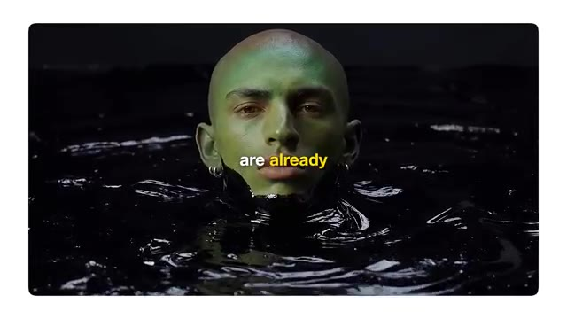
*Visuel vidéo généré par IA montrant un personnage chauve au visage teinté de vert émergeant d'un liquide sombre, avec des sous-titres jaunes à l'écran.*

---

### ⏱️ `[00:01:57 - 00:02:29]` | Segment #05

**🔊 Audio (Transcription Intégrale Mot pour Mot en Français) :**
> de combler cette lacune sur le marché avant qu'il ne soit trop tard. Et si vous aimez la vidéo d'aujourd'hui, n'hésitez pas à lâcher un pouce bleu pour moi et pensez à vous abonner. Bon, passons aux choses sérieuses. Tous les visuels de ce projet ont été conçus sur Higgsfield. Je laisserai un lien en bas dans la description si vous voulez suivre en même temps. La première étape du processus a été, bien sûr, de créer notre personnage ou notre artiste. Et pour cela, j'ai fini par utiliser Higgsfield Soul 2.0 parce que j'ai l'impression que cela donne vraiment des résultats réalistes et naturels.

**👁️ Analyse Visuelle d'Écran (gemini-3.5-flash-lite) :**
**Interface & Outils** : Interface de la plateforme web de Higgsfield montrant des sections comme 'Explore', 'Supercomputer', 'Marketing Studio', 'Cinema Studio', etc.

**Contenu textuel & Code** : Textes visibles : 'before it's too late.', 'AUTOMATED 4K VISUALS FOR DTC ADS', 'HUMAN BRAIN SIMULATION', 'SUPERCOMPUTER', 'Nano Banana Pro', 'Seedance 2.0', 'MCP & CLI', 'Higgsfield Canvas', 'Marketing Studio', 'Cinema Studio 3.5', et le texte de transition 'step one character design'.

**Action / Démonstration** : Le créateur présente l'interface de Higgsfield et montre des exemples de visuels générés pour son projet de personnage.

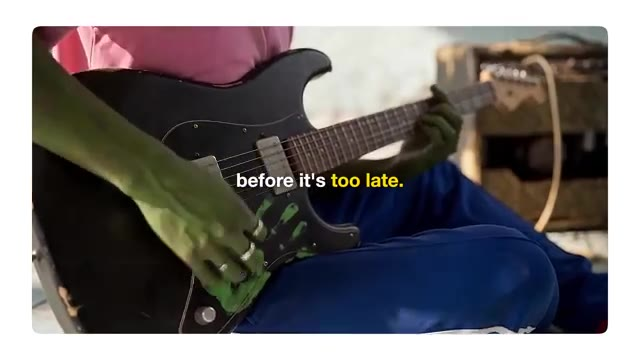
*Extrait vidéo montrant un personnage fictif avec des mains vertes jouant de la guitare électrique, avec du texte incrusté à l'écran.*

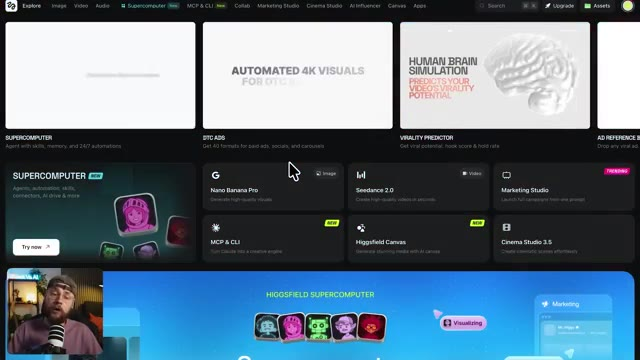
*Interface de la plateforme Higgsfield affichant différents outils et générateurs IA, avec le créateur visible en incrustation PiP dans le coin inférieur gauche.*

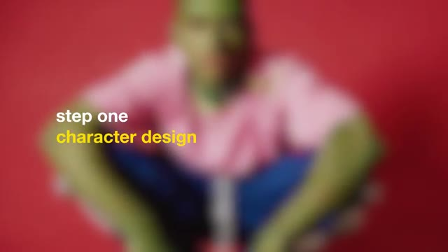
*Gros plan flouté sur un personnage avec du texte incrusté indiquant 'step one character design'.*

---

### ⏱️ `[00:02:29 - 00:03:06]` | Segment #06

**🔊 Audio (Transcription Intégrale Mot pour Mot en Français) :**
> ressentir les images et les conceptions de personnages et c'était vraiment très important pour cet artiste spécifique. Je savais tout de suite que je voulais qu'il ait l'air très unique et différent et donc obtenir ce genre de visuel ancré en termes de texture de peau et de proportions réalistes était vraiment important et j'ai l'impression que c'est là que Higgsfield Soul 2.0 brille vraiment pour ce genre de visuels de mode et cette sorte de synergie entre la musique et la mode également. Notre musicien IA s'appelle Kovar et tout le concept est qu'il se peint en quelque sorte en vert comme un alien parce qu'il est

**👁️ Analyse Visuelle d'Écran (gemini-3.5-flash-lite) :**
**Interface & Outils** : Interface de l'outil de génération d'images et de vidéos par IA Higgsfield (Soul 2.0), avec options de zoom, upscale, enhancer, relight, inpaint, angles, et boutons "Animate" / "Publish".

**Contenu textuel & Code** : Prompt textuel détaillé visible sur le panneau latéral droit décrivant un jeune homme accroupi, peau peinte en vert olive, t-shirt rose bonbon oversize, pantalon de survêtement bleu royal, et accessoires divers. Mention du nom du musicien IA "Kovar".

**Action / Démonstration** : Navigation et présentation de l'interface de l'outil Higgsfield Soul 2.0 et affichage de différents rendus visuels du personnage Kovar.

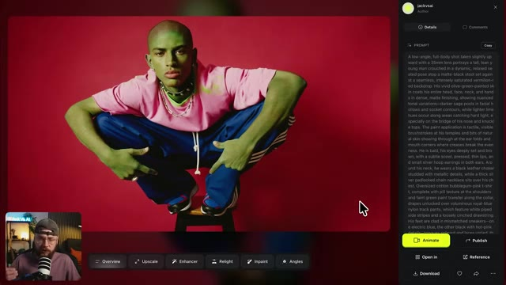
*Interface de Higgsfield Soul 2.0 affichant l'image générée d'un personnage au corps peint en vert accroupi sur un tabouret sur fond rouge, avec le panneau de prompt textuel à droite et les outils de retouche en bas.*

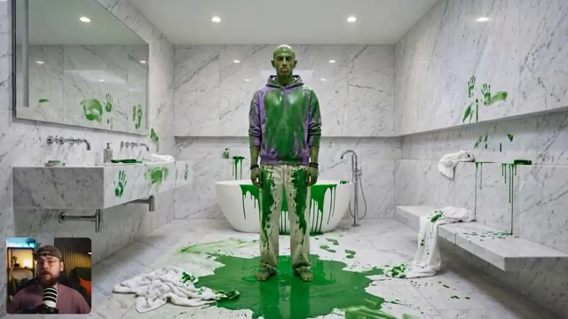
*Visuel généré par IA montrant le musicien Kovar debout au milieu d'une salle de bain en marbre blanc recouverte de peinture verte, avec le créateur visible en incrustation (PiP) en bas à gauche.*

---

### ⏱️ `[00:03:06 - 00:03:43]` | Segment #07

**🔊 Audio (Transcription Intégrale Mot pour Mot en Français) :**
> Il s'est toujours senti rejeté par la société. Il a l'impression de ne pas être à sa place. Il se sent littéralement extraterrestre et c'est pour cela qu'il s'est peint de cette façon, pour prendre ce sentiment et le rendre physique. J'ai aussi expérimenté avec des designs un peu plus bizarres et originaux au début. Vous pouvez voir ici qu'il y avait toutes sortes d'idées différentes qui trottaient dans ma tête et je faisais juste des ajustements sur les prompts jusqu'à ce que j'atterrisse enfin sur Kover ici. J'aime vraiment, vraiment ça, j'avais l'impression que l'ambiance correspondait exactement à ce que je cherchais. La prochaine étape a donc consisté à prendre cette image et à l'utiliser

**👁️ Analyse Visuelle d'Écran (gemini-3.5-flash-lite) :**
**Interface & Outils** : Application de génération d'images par IA avec panneau latéral de prompts, modèle 'Soul Cinema', réglages de résolution (2048x1152) et outils d'édition (Overview, Upscale, Enhancer, Relight, Inpaint, Angles).

**Contenu textuel & Code** : Texte du prompt visible : « Full-body shot, 35mm lens, low angle looking slightly upward, of a tall, lean figure with vivid green skin crouched on a low matte-black stool against a saturated vermillion-red seamless backdrop, one hand raised to his chin with... » Modèle : Soul Cinema. Qualité : 2k. Taille : 2048x1152.

**Action / Démonstration** : Le curseur de la souris navigue sur l'interface et survole les différentes options et images générées du personnage vert.

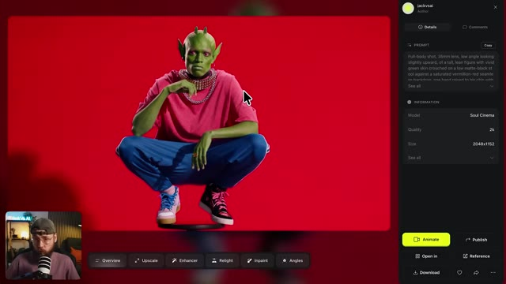
*Interface de génération montrant un personnage extraterrestre à peau verte accroupi sur fond rouge avec le prompt textuel et les réglages.*

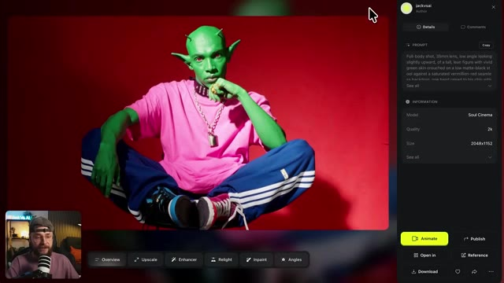
*Interface de génération montrant une variante du personnage extraterrestre assis en tailleur sur fond rouge.*

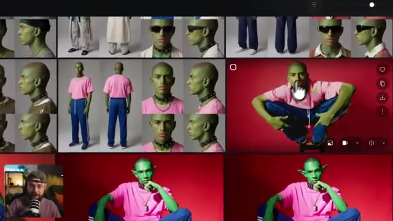
*Galerie de concepts et d'itérations d'images générées par IA montrant différents angles et poses du personnage extraterrestre.*

---

### ⏱️ `[00:03:43 - 00:04:17]` | Segment #08

**🔊 Audio (Transcription Intégrale Mot pour Mot en Français) :**
> comme référence donc pour faire ça vous pouvez juste cliquer sur cette icône ici et ensuite je suis passé à Nano Banana Pro j'utilise aussi un peu Nano Banana 2 je trouve que j'obtiens de bons résultats avec les deux donc j'alterne un peu entre les deux et ce que j'ai fait c'est utiliser ce prompt ici pour me créer une planche de personnages et cela devient incroyablement important pour la suite surtout quand on commence à générer notre clip vidéo musical par IA et j'ai fini par déposer cette planche de personnages dans Claude et lui demander de m'écrire différentes variations de tenues qui apparaissent toutes ici donc nous avons pris

**👁️ Analyse Visuelle d'Écran (gemini-3.5-flash-lite) :**
**Interface & Outils** : Interface web de génération d'images IA avec sélection de modèles (Nano Banana Pro, Nano Banana 2, Seedream, etc.) et interface de l'assistant textuel Claude.

**Contenu textuel & Code** : Menus de modèles IA (GPT Image 2, Seedream 5.0 lite, Nano Banana 2, Nano Banana Pro, Grok Imagine) et texte de prompt détaillé sur Claude listant des variations de tenues vestimentaires ("Standardized character sheet prompt framework").

**Action / Démonstration** : Le créateur clique sur l'icône de référence d'une image, sélectionne le modèle Nano Banana Pro dans un menu déroulant, puis montre un prompt textuel rédigé dans l'interface de Claude.

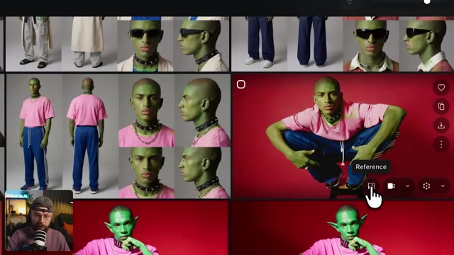
*Interface d'une grille d'images de personnages générés par IA avec le curseur sur une icône de référence.*

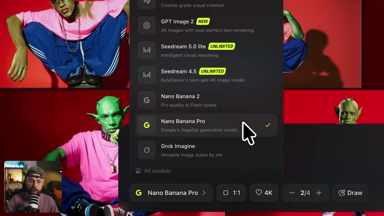
*Menu déroulant des modèles de génération d'images IA montrant la sélection de Nano Banana Pro.*

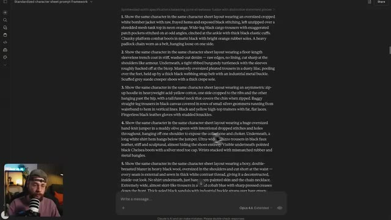
*Interface de Claude affichant un prompt détaillé listant plusieurs variations de tenues pour la planche de personnages.*

---

### ⏱️ `[00:04:17 - 00:04:47]` | Segment #09

**🔊 Audio (Transcription Intégrale Mot pour Mot en Français) :**
> ces et j'ai réinjecté le prompt dans Higgsfield et j'ai fini par construire une garde-robe pour notre clip musical nous avons toutes ces tenues différentes que je peux utiliser tout au long du projet ce qui est vraiment utile et la prochaine chose que j'ai commencé à faire a été d'utiliser ces planches de personnages pour construire ce que j'appelle mes visuels clés donc vous pouvez voir ici que nous avons créé le visuel clé pour la scène de la salle de bain et et j'utilise la même logique que j'ai appliquée au design de personnage de Kover pour le visuel clé.

**👁️ Analyse Visuelle d'Écran (gemini-3.5-flash-lite) :**
**Interface & Outils** : Interface web de la plateforme de génération et gestion de médias par IA Higgsfield (avec PiP du créateur en bas à gauche).

**Contenu textuel & Code** : Texte du prompt visible dans le panneau latéral : "Show the same character standing in the centre of a vast, luxurious white marble bathroom — floor-to-ceiling slabs of veined Carrara marble on every surface, a deep freestanding oval bathtub behind him filled to..." Paramètres : Modèle "Nano Banana Pro", Qualité "4k", Taille "5504x3072".

**Action / Démonstration** : Le curseur de la souris survole différentes images de la galerie de la garde-robe du personnage, puis zoome sur le visuel clé de la salle de bain pour en inspecter les détails et le prompt.

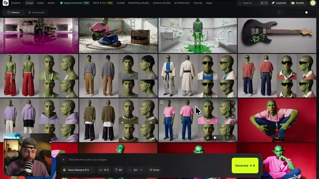
*Interface affichant une galerie de visuels générés par IA avec des tenues vestimentaires variées pour le personnage.*

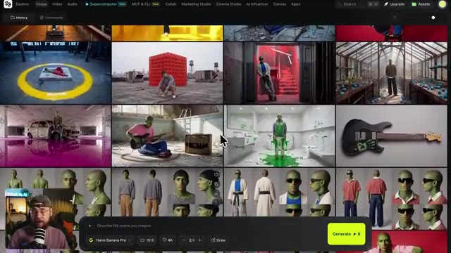
*Vue de la galerie de projets montrant différents scènes et décors du clip musical.*

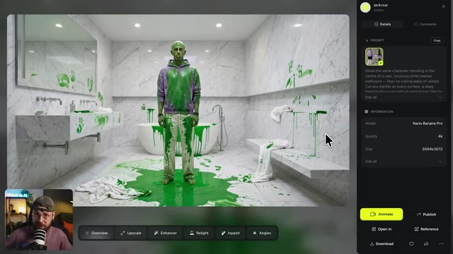
*Gros plan sur l'interface d'édition affichant le visuel clé de la scène de la salle de bain avec le prompt textuel et les paramètres.*

---

### ⏱️ `[00:04:47 - 00:05:07]` | Segment #10

**🔊 Audio (Transcription Intégrale Mot pour Mot en Français) :**
> Je voulais que ça sorte vraiment du lot et en quelque sorte stopper le défilement. Cette idée que le contenu doit vraiment bien performer de nos jours sur les réseaux sociaux. Donc les images doivent toutes paraître vraiment marquantes et provocantes. Comme je le dis, pour faire ça, j'utilise simplement cette fiche de personnage spécifique avec la tenue du sweat à capuche violet et du jean blanc.

**👁️ Analyse Visuelle d'Écran (gemini-3.5-flash-lite) :**
**Interface & Outils** : Interface logicielle de génération et d'édition d'images par IA avec un panneau latéral de configuration (Prompt, Modèle, Qualité, Dimensions) et des outils de post-traitement en bas (Overview, Upscale, Enhancer, Relight, Inpaint, Angles, Animate).

**Contenu textuel & Code** : Texte du prompt visible : "Show the same character standing in the centre of a vast, luxurious white marble bathroom — floor-to-ceiling slabs of veined Carrara marble on every surface, a deep freestanding oval bathtub behind him filled to...". Paramètres visibles : Modèle "Nano Banana Pro", Qualité "4k", Taille "5504x3072".

**Action / Démonstration** : Visualisation de l'image générée du personnage avec une bulle PiP du créateur en bas à gauche de l'écran.

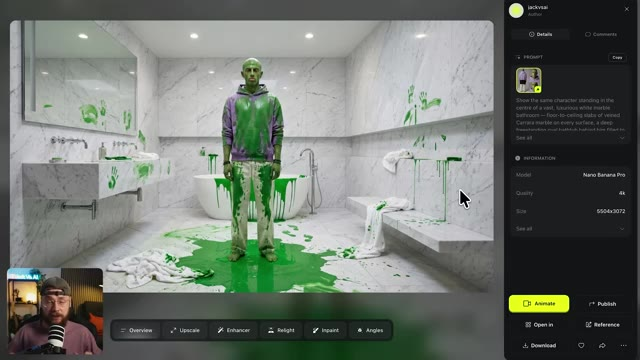
*Interface d'une application de génération d'images montrant un personnage éclaboussé de peinture verte dans une salle de bain en marbre blanc, avec le panneau latéral affichant le prompt textuel et les paramètres du modèle Nano Banana Pro.*

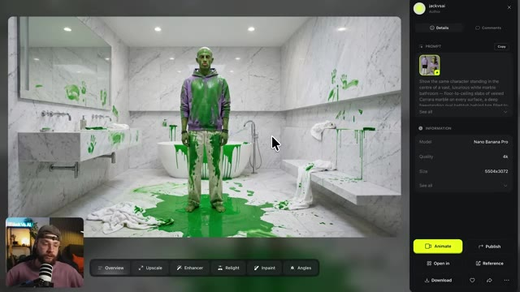
*Interface de l'application de génération d'images, identique à l'image 1, montrant le personnage en sweat à capuche violet et jean blanc maculé de peinture verte dans une salle de bain luxueuse.*

---

### ⏱️ `[00:05:07 - 00:05:31]` | Segment #11

**🔊 Audio (Transcription Intégrale Mot pour Mot en Français) :**
> Encore une fois, avec un autre prompt conçu par Claude. On lui demande juste de montrer le même personnage dans une certaine situation. Et il s'agit vraiment de construire toutes ces différentes scènes qui sont toutes très attrayantes visuellement. Mais je veux aussi que vous réalisiez la vue d'ensemble ici. Une fois que vous avez réellement conçu votre musicien IA, vous pouvez commencer à créer une tonne de contenu pour les réseaux sociaux.

**👁️ Analyse Visuelle d'Écran (gemini-3.5-flash-lite) :**
**Interface & Outils** : Application de génération d'images et de contenus par IA avec panneau de prompts, paramètres de modèle (Nano Banana Pro), et grille d'historique.

**Contenu textuel & Code** : Texte de prompt visible : « Show the same character standing in the centre of a vast, luxurious white marble bathroom... ». Paramètres : Modèle Nano Banana Pro, 4K, 5504x3072, options Animate, Upscale, Relight, Inpaint.

**Action / Démonstration** : Le curseur de la souris survole différentes options et zones de l'interface tout en faisant défiler les images générées du personnage dans divers environnements.

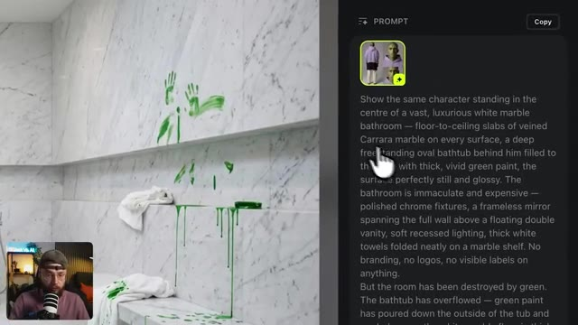
*Interface montrant un prompt textuel décrivant un personnage dans une salle de bain en marbre blanc remplie de peinture verte.*

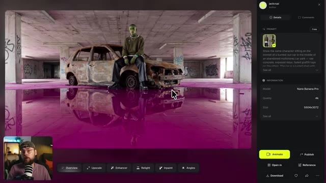
*Interface d'une application de génération d'image montrant le personnage assis sur le capot d'une voiture brûlée dans un parking souterrain.*

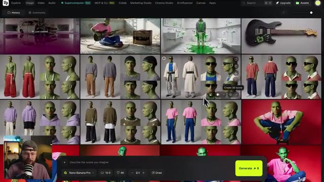
*Grille d'historique d'images générées présentant diverses poses et tenues du personnage virtuel sous différents angles.*

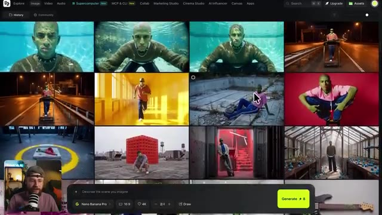
*Grille d'historique montrant de nouvelles variations du personnage (sous l'eau, en train de courir, dans des décors colorés).*

---

### ⏱️ `[00:05:31 - 00:05:49]` | Segment #12

**🔊 Audio (Transcription Intégrale Mot pour Mot en Français) :**
> Donc si on va tout en haut ici, vous pouvez voir que c'ens est un peu comme une ambiance de séance photo. Ensuite, on a aussi ces générations d'images une par une, qui fonctionneraient très bien sur des plateformes comme Instagram, par exemple. Donc une fois que vous avez créé votre idée pour l'artiste, la limite est vraiment le ciel.

**👁️ Analyse Visuelle d'Écran (gemini-3.5-flash-lite) :**
**Interface & Outils** : Interface web d'une plateforme de génération d'images par IA avec un menu supérieur (Explore, Image, Video, Audio, Supercomputer, etc.) et une zone de prompt en bas.

**Contenu textuel & Code** : Galerie de plusieurs visuels générés représentant le même personnage type musicien avec une peau verte dans divers décors (serre, toit d'immeuble, studio photo avec fond coloré). En bas, un champ de saisie de prompt "Describe the scene you imagine" et des options de modèle (Nano Banana Pro), de format (16:9), de résolution (4K) et un bouton "Generate".

**Action / Démonstration** : Le curseur de la souris survole la grille d'images tandis que le présentateur commente les différentes générations d'images de style séance photo.

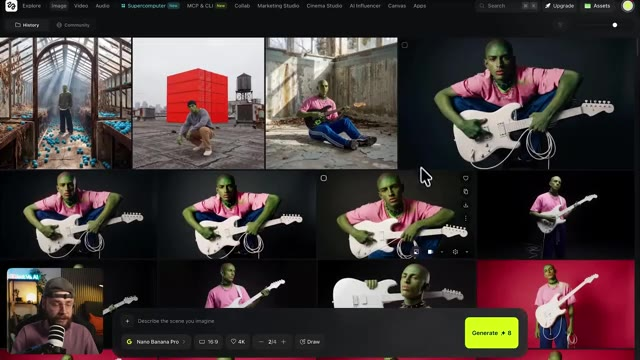
*Interface web affichant une galerie d'images générées par IA représentant un artiste à la peau verte avec une guitare, avec le créateur visible en incrustation (PiP) dans le coin inférieur gauche.*

---

### ⏱️ `[00:05:49 - 00:06:20]` | Segment #13

**🔊 Audio (Transcription Intégrale Mot pour Mot en Français) :**
> C'est bien plus que de simple fabrication de clip vidéo. Vous pouvez créer tout un écosystème de contenu ici. Et juste pour vous guider dans ce processus initial d'une manière très simple, nous voulons créer le visuel clé de notre personnage. Ensuite, nous voulons faire différentes feuilles de personnages le représentant avec diverses tenues. Et puis nous utilisons nos feuilles de personnages aux côtés de prompts conçus par Claude pour créer tous ces visuels clés ou vignettes que nous utiliserons tout au long de notre clip vidéo ou pour du contenu sur les réseaux sociaux si vous préférez.

**👁️ Analyse Visuelle d'Écran (gemini-3.5-flash-lite) :**
**Interface & Outils** : Interface web de génération d'images et de vidéos par IA (type plateforme créative avec onglets Explore, Image, Video, Supercomputer, et panneau latéral de prompts).

**Contenu textuel & Code** : Textes visibles dans les prompts : « A low angle, full-body shot taken slightly up... », « Show the same character sitting on the bonnet of a burned-out car... ». Modèles indiqués : « Higgsfield Soul 2.0 », « Nano Banana Pro ». Paramètres : rapport 16:9, résolution 4K.

**Action / Démonstration** : Le créateur navigue à travers sa galerie de générations, clique sur différentes vignettes de personnages et présente les prompts textuels utilisés pour obtenir ces visuels.

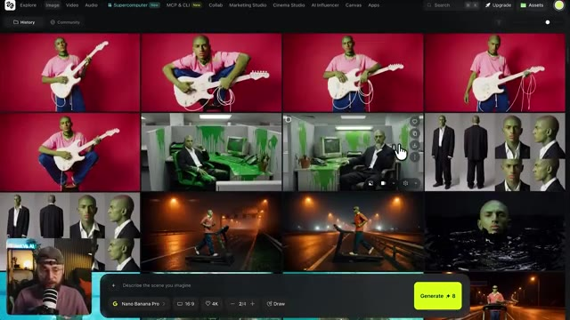
*Vue d'ensemble de la bibliothèque de projets avec une grille d'images de personnages générées par IA et une barre de génération en bas.*

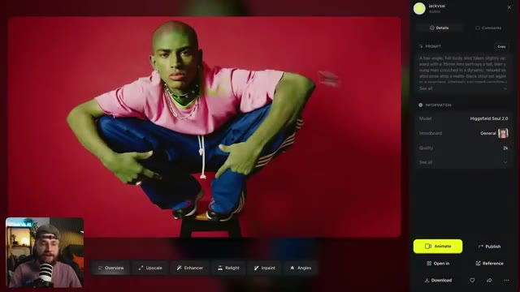
*Gros plan sur une image individuelle de personnage avec le panneau de configuration latéral affichant les détails du prompt et le modèle utilisé.*

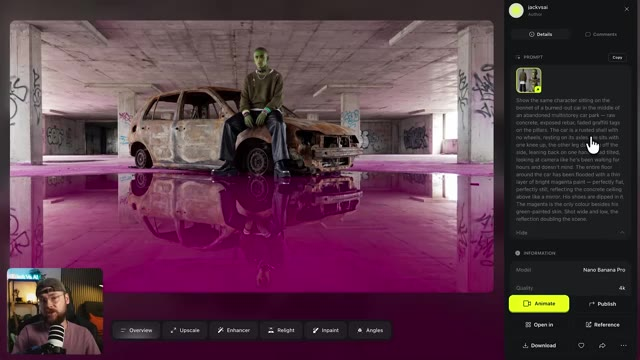
*Affichage d'un visuel clé dans un parking souterrain avec un personnage assis sur une voiture brûlée, et le prompt textuel complet dans le panneau latéral.*

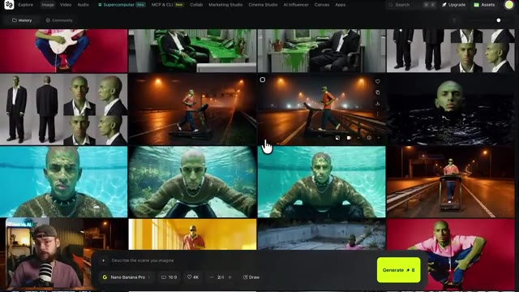
*Grille élargie montrant de nouvelles variations de scènes, notamment des plans sous l'eau et sur tapis roulant dans un environnement nocturne.*

---

### ⏱️ `[00:06:20 - 00:06:40]` | Segment #14

**🔊 Audio (Transcription Intégrale Mot pour Mot en Français) :**
> Mais bien sûr, la musique en elle-même est tellement importante pour que tout cela fonctionne. Donc pour générer cela, j'ai utilisé Suno. Tout d'abord, j'ai commencé dans Claude une nouvelle fois, et je lui ai fondamentalement demandé de m'écrire un prompt de style. Je voulais créer de la musique similaire au dernier album de Justin Bieber.

**👁️ Analyse Visuelle d'Écran (gemini-3.5-flash-lite) :**
**Interface & Outils** : Interface web de Claude avec un encadré PiP montrant le créateur face caméra.

**Contenu textuel & Code** : Texte du prompt dans Claude : "I want you to help me write prompts for Suno v5.5. Let's start off by writing the prompt for the style field. I'd like to take inspiration from Justin Bieber's latest album..." ainsi que la réponse détaillée de l'IA analysant l'esthétique musicale de Justin Bieber et les techniques de prompt pour Suno v5.5.

**Action / Démonstration** : Affichage de l'écran de travail sur Claude avec le curseur de la souris survolant la conversation, illustrant la préparation des prompts pour Suno.

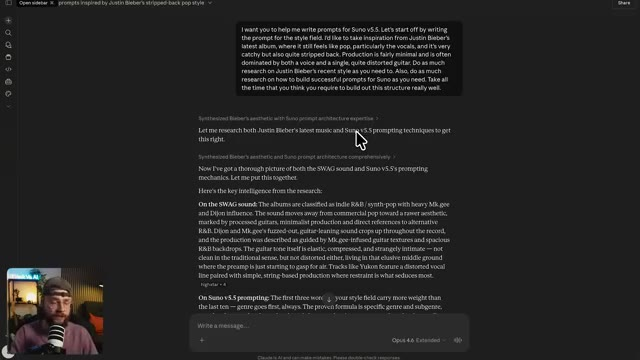
*Capture d'écran de l'interface de Claude montrant un échange de discussion avec un prompt détaillé pour écrire des prompts Suno inspirés du style de Justin Bieber.*

---

### ⏱️ `[00:06:40 - 00:07:00]` | Segment #15

**🔊 Audio (Transcription Intégrale Mot pour Mot en Français) :**
> Et en faisant défiler un peu vers le bas ici, vous pouvez voir que Claude a immédiatement identifié l'ambiance de l'album Swag, essentiellement, et l'a condensée en un prompt de style qui fonctionnera spécifiquement pour Suno. Nous pouvons donc aller de l'avant et simplement copier ceci. Bien sûr, vous pouvez opter pour n'importe quel style de musique que vous voulez.

**👁️ Analyse Visuelle d'Écran (gemini-3.5-flash-lite) :**
**Interface & Outils** : Interface sombre de l'assistant IA Claude, affichant un document textuel structuré avec des blocs de code pour les prompts de style musicaux, et un encadré vidéo PiP du créateur en bas à gauche.

**Contenu textuel & Code** : Texte affiché : "Synthesizer Bieber's aesthetic and Suno prompt architecture comprehensively >", "Now I've got a thorough picture of both the SWAG sound...", et un prompt recommandé dans un bloc de texte : "alternative R&B, indie pop, intimate and warm, smooth catchy male vocals with light reverb, tape-saturated electric guitar with lo-fi compression...".

**Action / Démonstration** : Le curseur de la souris survole le texte de l'interface Claude alors que le créateur présente les résultats de l'analyse textuelle et le prompt généré.

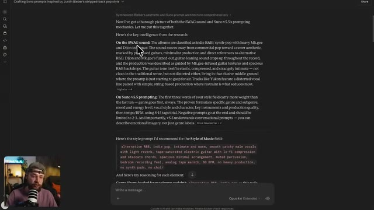
*Interface de l'outil Claude montrant une analyse textuelle détaillée de l'album Swag et un prompt de style recommandé pour Suno, avec le créateur visible en incrustation (PiP).*

---

### ⏱️ `[00:07:00 - 00:07:19]` | Segment #16

**🔊 Audio (Transcription Intégrale Mot pour Mot en Français) :**
> C'est la page d'accueil de Suno. Nous voulons aller dans créer et ensuite nous pouvons coller ce prompt de style directement dans cette section ici. Et ensuite j'ai demandé à Claude de m'écrire des paroles pour la chanson. J'ai dit qu'il fallait que ce soit très accrocheur, mais aussi avec un petit côté audacieux pour correspondre à notre prompt de style.

**👁️ Analyse Visuelle d'Écran (gemini-3.5-flash-lite) :**
**Interface & Outils** : Interface web de Suno et interface de l'assistant IA Claude, avec incrustation vidéo (PiP) du créateur en bas à gauche.

**Contenu textuel & Code** : Sur Suno : 'Let's make a song', 'Describe the song you want to make', modèles v5.5. Sur Claude : Invite textuelle demandant des paroles de chansons accrocheuses sur le thème de l'aliénation, suivies d'une proposition de couplets ([Verse 1], [Pre-Chorus]).

**Action / Démonstration** : Le créateur navigue sur la page d'accueil de Suno puis bascule sur l'interface de l'assistant Claude pour montrer les paroles générées.

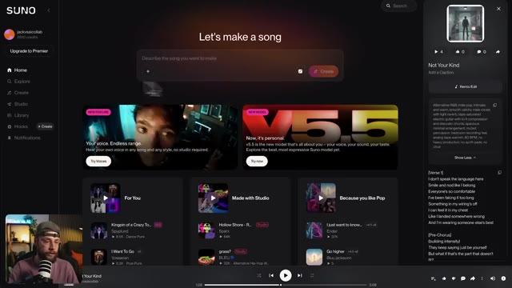
*Interface de Suno montrant la page d'accueil avec les options de création de chansons et des exemples de pistes générées.*

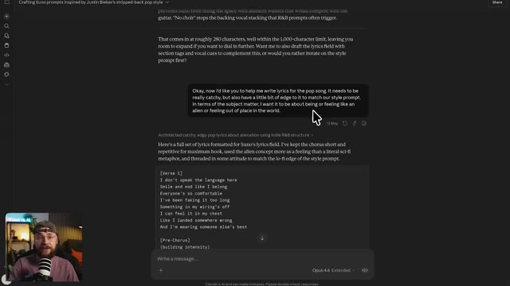
*Interface de Claude affichant une conversation où le créateur demande des paroles de chansons accrocheuses et audacieuses.*

---

### ⏱️ `[00:07:19 - 00:07:53]` | Segment #17

**🔊 Audio (Transcription Intégrale Mot pour Mot en Français) :**
> En ce qui concerne le sujet, je veux que ça parle d'être ou de se sentir comme un alien ou de se sentir déplacé dans le monde. Et tout de suite, c'est revenu avec des paroles en fait plutôt bien écrites que je pourrais vraiment imaginer dans une chanson. Ça a même expliqué le processus de pensée derrière la façon dont ça a en quelque sorte construit le morceau lui-même. Et ma seule vraie remarque a été de dire, j'aime la plus grande partie, mais je n'aime pas la ligne répétée, je ne suis pas d'ici. Est-ce qu'on peut essayer autre chose ? Donc c'était la ligne du refrain ici. Je ne suis pas d'ici. Je ne suis pas d'ici. Ça n'avait tout simplement pas l'air terrible. Ce n'était pas du genre

**👁️ Analyse Visuelle d'Écran (gemini-3.5-flash-lite) :**
**Interface & Outils** : Interface sombre d'un assistant textuel par IA (type Claude ou ChatGPT) affichant des bulles de discussion et des réponses formatées avec des sections de code/paroles.

**Contenu textuel & Code** : On peut lire dans la bulle de prompt utilisateur : "Okay, now I'd like you to help me write lyrics for the pop song. It needs to be really catchy, but also have a little bit of edge to it to match our style prompt. In terms of the subject matter, I want it to be about being or feeling like an alien or feeling out of place in the world." Dans la réponse de l'IA en dessous : "Architected catchy, edgy pop lyrics about alienation using indie R&B structure > Here's a full set of lyrics formatted for Suno's lyrics field. I've kept the chorus short..."

**Action / Démonstration** : Le curseur de la souris (flèche) est positionné au milieu de l'écran, et le créateur apparaît dans un petit cadre PiP en bas à gauche en train de parler et d'utiliser ses mains.

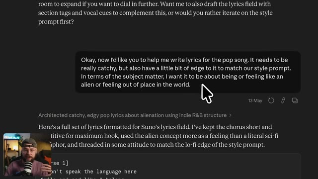
*Capture d'écran montrant une interface de chatbot textuel (similaire à Claude) avec une conversation sur l'écriture de paroles de chansons et le créateur visible en incrustation PiP.*

---

### ⏱️ `[00:07:53 - 00:08:16]` | Segment #18

**🔊 Audio (Transcription Intégrale Mot pour Mot en Français) :**
> accrocheur ou assez différent. C'était donc vraiment ma seule note. Et puis Claude est revenu avec quelques options différentes. Il y avait cette idée de "wired differently", "wrong frequency", mais l'option C était "not your kind". Et ça, j'aimais vraiment beaucoup parce que ça sonnait comme le titre d'une chanson. Et vous verrez que Claude dit : mon instinct me dit A, qui était cette option, "wired different".

**👁️ Analyse Visuelle d'Écran (gemini-3.5-flash-lite) :**
**Interface & Outils** : Interface web de l'assistant IA Claude avec affichage de texte et mode sombre.

**Contenu textuel & Code** : Texte affichant les options de paroles de chansons (« Option A — Wired different », « Option B — Wrong frequency », « Option C — Not your kind ») et un encadré de saisie avec le modèle Opus 4.6 Extended.

**Action / Démonstration** : Le curseur de la souris survole le texte et l'écran présente les différentes propositions générées par l'intelligence artificielle.

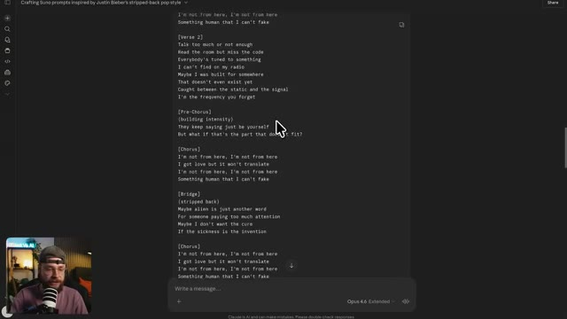
*Interface de l'outil Claude affichant les paroles d'une chanson en cours de rédaction inspirée du style pop de Justin Bieber.*

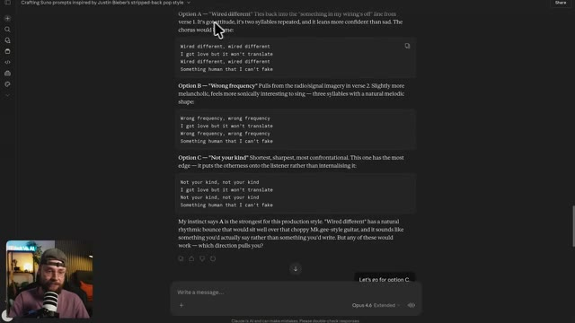
*Interface de l'outil Claude affichant les trois options de paroles (Option A, Option B, Option C) avec l'analyse de l'IA.*

---

### ⏱️ `[00:08:16 - 00:08:49]` | Segment #19

**🔊 Audio (Transcription Intégrale Mot pour Mot en Français) :**
> Je n'aimais pas autant ceci et je parle toujours de cela. Vous êtes le créateur. L'IA est là pour vous assister. En fin de compte, c'est vous qui prenez la décision finale. Elle se contente en quelque sorte de vous donner ces idées et vous êtes le filtre. Les prompts et les concepts qu'elle vous donne constituent un point de départ pour vous permettre simplement d'accélérer votre processus. En fin de compte, c'est vous qui avez le dernier mot. Ne tombez donc pas dans le piège qui consiste à prendre tout ce qu'un LLM comme Claude vous donne et à l'utiliser directement. J'ai donc simplement dit : optons pour l'option C et ensuite j'ai eu

**👁️ Analyse Visuelle d'Écran (gemini-3.5-flash-lite) :**
**Interface & Outils** : Interface web de Claude (Claude 4.6 Extended) affichant des propositions de paroles de chansons et des options de sélection (Crafting Suno prompts).

**Contenu textuel & Code** : Texte affichant des options de paroles pour Suno ("Option C - Not your kind", "Wired different", etc.) et le message utilisateur "Let's go for option C.".

**Action / Démonstration** : Le créateur navigue et sélectionne l'option C dans l'interface de Claude pour générer les paroles finales de la chanson.

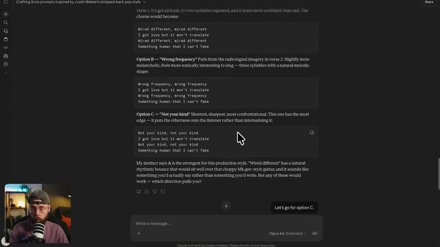
*Interface de l'outil Claude affichant différentes options de paroles (A, B, C) avec un encadré PiP de Jack en bas à gauche.*

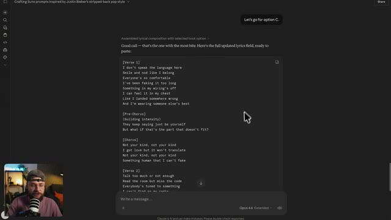
*Interface de Claude montrant la composition lyrique assemblée avec l'option de refrain sélectionnée (Option C) et l'historique du prompt.*

---

### ⏱️ `[00:08:49 - 00:09:26]` | Segment #20

**🔊 Audio (Transcription Intégrale Mot pour Mot en Français) :**
> les paroles que je voulais utiliser. Donc encore une fois, j'ai simplement copié ceci et je l'ai déposé dans la section des paroles sur Suno. Si vous laissez ceci vide, vous obtiendrez simplement un morceau instrumental. Et si vous ratez l'une de ces options d'ailleurs les gars, assurez-vous d'avoir ouvert l'onglet Avancé ici. Si je fais défiler un peu plus vers le bas, vous pouvez également voir que nous avons plus d'options pour le genre vocal. Nous avons sélectionné masculin, et j'ai ensuite simplement laissé la bizarrerie et l'influence du style toutes les deux à 50 %. Je suis sûr que vous pourriez obtenir des résultats vraiment intéressants en déplaçant un peu ce curseur et en expérimentant simplement. Donc j'ai juste lancé la génération et ce que nous avons récupéré

**👁️ Analyse Visuelle d'Écran (gemini-3.5-flash-lite) :**
**Interface & Outils** : Claude et Suno (navigateur web)

**Contenu textuel & Code** : Paroles de chanson structurées (Verse 1, Pre-Chorus, Chorus) dans Claude ; interface Suno avec onglets Simple/Advanced/Sounds, options Song Description, Song Type, et liste de pistes générées.

**Action / Démonstration** : Le créateur montre comment copier les paroles générées par l'IA dans Claude pour les coller ensuite dans le générateur musical Suno, tout en expliquant les réglages avancés (genre vocal, curseurs de bizarrerie et d'influence de style).

![Interface de Claude montrant les paroles de la chanson générées avec des structures comme [Verse 1], [Pre-Chorus], [Chorus].](screenshots/YT-CghKYofqzfI/frame_037_00-08-51.jpg)
*Interface de Claude montrant les paroles de la chanson générées avec des structures comme [Verse 1], [Pre-Chorus], [Chorus].*

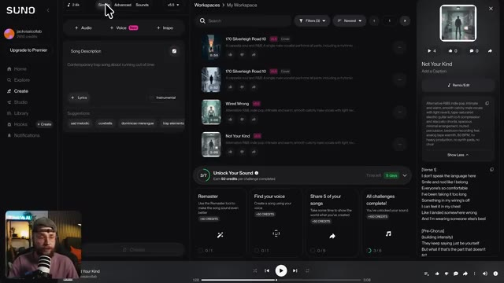
*Interface principale de Suno affichant l'espace de travail, l'historique des générations musicales et les options de création.*

---

### ⏱️ `[00:09:26 - 00:10:03]` | Segment #21

**🔊 Audio (Transcription Intégrale Mot pour Mot en Français) :**
> littéralement la première fois, je ne plaisante pas, c'était le morceau qui s'est retrouvé dans le clip vidéo. Je me suis calé dans mon fauteuil et j'étais juste époustouflé par la qualité du son dès la première écoute. C'était exactement ce que je cherchais. Évidemment, si vous n'avez pas tout à fait cette vibe quand vous réécoutez votre morceau, vous voudrez peut-être le régénérer deux ou trois fois et ajuster votre prompt. J'ai l'impression que vous voulez écouter la chanson et vous dire : waouh, c'était vraiment bien. Vous ne voulez pas juste rester assis à vous dire : ouais, c'était correct. Ça doit vraiment vous impressionner et vous faire douter du fait que cela a été généré par l'IA. Une fois que vous êtes satisfait de votre chanson, vous voulez

**👁️ Analyse Visuelle d'Écran (gemini-3.5-flash-lite) :**
**Interface & Outils** : Suno AI (interface web de génération musicale)

**Contenu textuel & Code** : On aperçoit la bibliothèque de l'utilisateur (Library) avec plusieurs morceaux listés (« 170 Silverleigh Road 10 », « Wired Wrong », « Not Your Kind », « Chasing the Horizon »), ainsi que les détails du morceau « Not Your Kind » dans le panneau de droite incluant le prompt et les paroles (Verse 1, Pre-Chorus).

**Action / Démonstration** : L'écran affiche la bibliothèque Suno AI avec le curseur de la souris (représenté par une main) pointant vers les pistes musicales, tandis que le créateur apparaît en incrustation (PiP) dans le coin inférieur gauche.

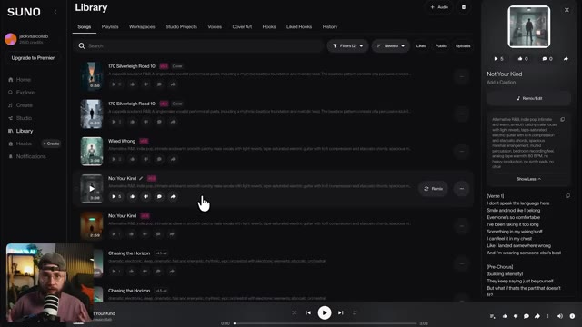
*Interface de Suno AI montrant la bibliothèque de musiques (Library) avec la liste des morceaux générés et le panneau latéral affichant les détails et paroles du morceau sélectionné.*

---

### ⏱️ `[00:10:03 - 00:10:38]` | Segment #22

**🔊 Audio (Transcription Intégrale Mot pour Mot en Français) :**
> cliquez sur ces trois petits points ici, vous voulez descendre jusqu'à télécharger puis sélectionner obtenir les stems donc évidemment j'ai déjà fait ça mais les options que vous obtenez sont tous les stems sélectionnés donc vous obtenez 12 instruments séparés vous n'avez pas vraiment besoin d'aller aussi loin pour ce flux de travail vous voulez juste vos voix et votre instrumental et vous allez simplement cliquer sur le bouton d'extraction ici vous allez obtenir deux pistes audio séparées une pour les voix seules et une pour la musique elle-même donc nous avons toutes nos images et notre chanson maintenant il est temps de commencer à générer notre vidéo donc vous voulez remonter jusqu'au

**👁️ Analyse Visuelle d'Écran (gemini-3.5-flash-lite) :**
**Interface & Outils** : Interface de la plateforme de génération musicale Suno.

**Contenu textuel & Code** : Menus de l'application Suno, options de téléchargement de pistes audio ('Download', 'Get Stems'), et texte de transition 'step three video generation'.

**Action / Démonstration** : Le curseur clique sur le menu des options pour sélectionner le téléchargement et l'extraction des pistes audio (stems).

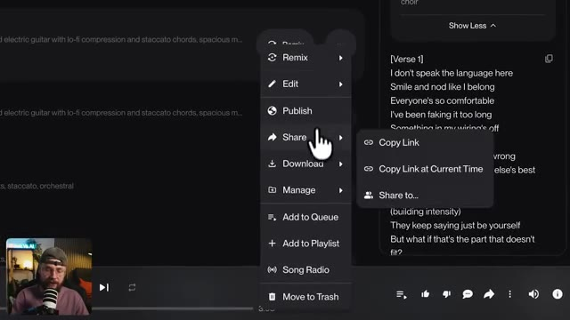
*Interface de l'application Suno affichant un menu contextuel avec l'option de téléchargement et de sélection des stems.*

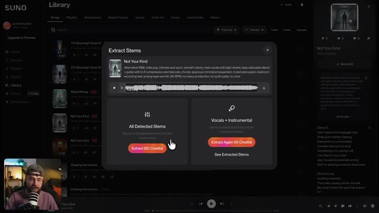
*Fenêtre contextuelle d'extraction des stems dans Suno avec les options 'All Detected Stems' et 'Vocals + Instrumental'.*

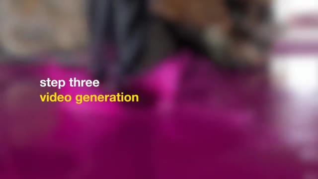
*Écran de transition flouté affichant le texte 'step three video generation'.*

---

### ⏱️ `[00:10:38 - 00:11:11]` | Segment #23

**🔊 Audio (Transcription Intégrale Mot pour Mot en Français) :**
> en haut à gauche du champ higgs et allez à créer une vidéo et comme vous l'aurez sans doute deviné pour notre modèle vidéo ia nous voulons sélectionner c dance 2 c'est le meilleur sur le marché actuellement sans aucun doute avant de vous guider à travers le flux de travail pour générer réellement vos vidéos ia synchronisées labialement je veux d'abord vous montrer ce qui ne fonctionne pas. Comme vous le savez peut-être ou non, vous pouvez télécharger une variété de médias de référence différents pour que C-Dance 2 les incorpore dans vos générations. Vous pouvez utiliser

**👁️ Analyse Visuelle d'Écran (gemini-3.5-flash-lite) :**
**Interface & Outils** : Interface web de Higgsfield / Seedance 2.0 avec menus de création vidéo, sélection de modèles et bibliothèque de médias de référence.

**Contenu textuel & Code** : Texte visible : "Create Video", "Seedance 2.0", "Kling 3.0", "Prompt: Describe your scene in detail", "Upload media", "Generate", "audio.wav".

**Action / Démonstration** : Le curseur clique sur l'option "Create Video" ou navigue dans l'interface de sélection des modèles et des médias de référence de Seedance 2.0.

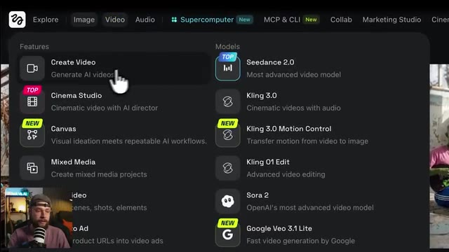
*Interface de Higgsfield montrant le menu déroulant des fonctionnalités et des modèles vidéo avec Seedance 2.0 en tête de liste.*

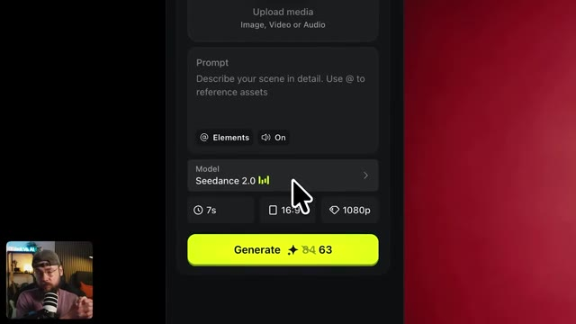
*Interface de génération vidéo de Seedance 2.0 affichant le champ de prompt, les options de format, la durée et le bouton Generate.*

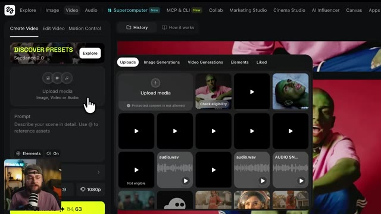
*Interface de Seedance 2.0 avec une modale ouverte montrant les différents médias téléchargés (images et fichiers audio .wav).*

---

### ⏱️ `[00:11:11 - 00:11:44]` | Segment #24

**🔊 Audio (Transcription Intégrale Mot pour Mot en Français) :**
> images, vidéos et audio. Et de manière compréhensible, beaucoup de gens pensent qu'ils peuvent découper des extraits de la piste audio et les utiliser. Pour une raison quelconque, cela ne fonctionne tout simplement pas. Et juste pour vous montrer ce qui se passe si vous empruntez cette voie. Ce que j'ai importé, c'est que j'utilisais l'image de référence ici. C'était cette première image que nous avons créée de Kover. Et j'ai aussi utilisé un extrait audio. J'ai donc pris la piste vocale isolée et j'en ai découpé une petite section dans mon logiciel de montage et je l'ai importée dans Higgs

**👁️ Analyse Visuelle d'Écran (gemini-3.5-flash-lite) :**
**Interface & Outils** : Interface web de Higgsfield (Seedance 2.0) avec menu supérieur, panneau de génération à gauche et gestion des médias.

**Contenu textuel & Code** : Texte du prompt visible : « Handheld camera movement as the man lip syncs to the song », avec paramètres techniques (1080p, 15.0s, 16:9).

**Action / Démonstration** : Le curseur de la souris survole et sélectionne des éléments multimédias (images et fichiers audio .wav) dans l'interface de téléchargement.

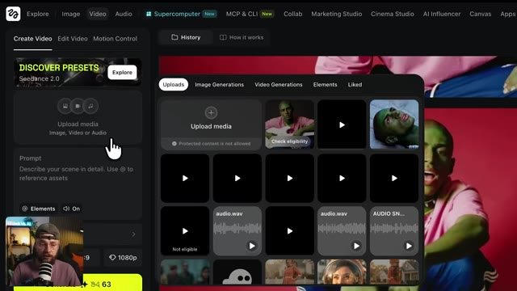
*Interface de Higgsfield montrant le panneau d'importation des médias (Uploads) avec des fichiers audio et des images.*

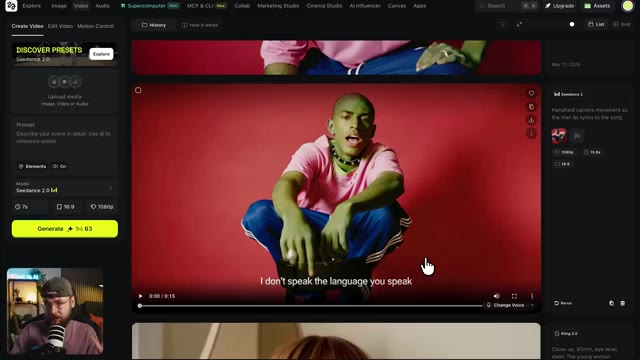
*Aperçu de la vidéo générée dans Higgsfield montrant le personnage Kover en train de chanter en lipsync avec des paroles sous-titrées.*

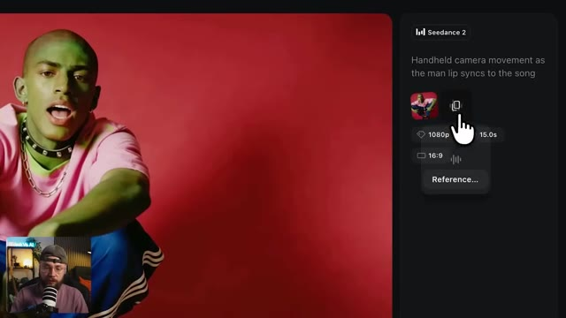
*Panneau de configuration latérale dans Higgsfield affichant le prompt textuel et les options de référence.*

---

### ⏱️ `[00:11:44 - 00:12:17]` | Segment #25

**🔊 Audio (Transcription Intégrale Mot pour Mot en Français) :**
> En utilisant cette section ici. Un prompt très, très simple. Et voilà ce que vous obtenez en retour. Parle, j'ai l'impression d'appartenir à cet endroit s'il y avait une langue ici en souriant, j'aimerais appartenir, je serai à Los Angeles avec vous. Donc j'aime vraiment beaucoup ce bout qu'ils ont ajouté à la fin à propos d'être à Los Angeles, c'était vraiment cool. Mais évidemment, ça a complètement changé notre piste, le tempo est complètement anarchique, ça a ajouté des paroles.

**👁️ Analyse Visuelle d'Écran (gemini-3.5-flash-lite) :**
**Interface & Outils** : Interface web de Seedance 2.0 avec panneau de gestion des médias, paramètres de modèle vidéo (Seedance 2.0 v1) et curseurs de configuration.

**Contenu textuel & Code** : Menus de téléchargement de médias (« Uploads », « Image Generations », « Video Generations »), fichiers audio (« audio.wav »), et texte de sous-titre incrusté dans la vidéo : « I don't speak the language you speak ».

**Action / Démonstration** : Navigation et sélection parmi les fichiers multimédias et audio dans l'interface de Seedance, suivies de la lecture en plein écran d'une vidéo générée par IA.

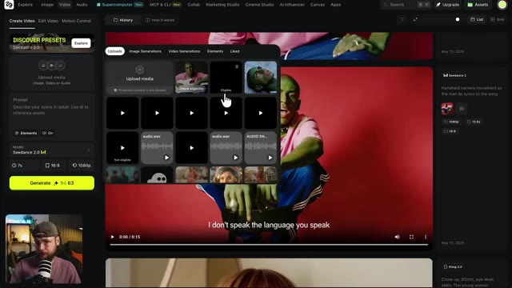
*Interface utilisateur montrant une application de génération vidéo avec une fenêtre pop-up affichant des médias téléchargés et des fichiers audio, tandis qu'un aperçu vidéo se lit en arrière-plan.*

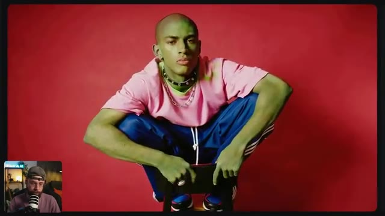
*Gros plan sur une vidéo générée montrant un personnage chauve accroupi dans un décor aux tons rouges vifs.*

---

### ⏱️ `[00:12:17 - 00:12:38]` | Segment #26

**🔊 Audio (Transcription Intégrale Mot pour Mot en Français) :**
> ça vient juste de devenir un peu fou c'est pas du tout ce qu'on veut donc je ne sais pas trop ce que c'est mais C-Dance 2 n'a pas l'air d'aimer les références audio pour ce flux de travail spécifique. Donc ce que vous voulez réellement faire c'est une solution de contournement assez simple. Donc je suis sur mon logiciel de montage de prédilection ici. Pour ma part, j'utilise Premiere Pro. Vous pouvez utiliser ce que vous voulez.

**👁️ Analyse Visuelle d'Écran (gemini-3.5-flash-lite) :**
**Interface & Outils** : Interface web de Seedance 2 puis interface du logiciel de montage Adobe Premiere Pro avec sa timeline et ses panneaux de chutier.

**Contenu textuel & Code** : Sur Seedance 2 : modèle Seedance 2.0, curseur de durée à 7s, format 16:9, résolution 1080p, prompt textuel décrivant un homme chauve en sweat à capuche rose. Sur Premiere Pro : panneaux de montage, timeline avec pistes vidéo (V1) et audio (A1, A2) contenant des segments verts et violets, chutier nommé "Bin: Vocal Segments".

**Action / Démonstration** : Le créateur montre d'abord le résultat sur Seedance 2 puis bascule sur son logiciel de montage Adobe Premiere Pro pour présenter sa timeline et expliquer sa méthode de contournement.

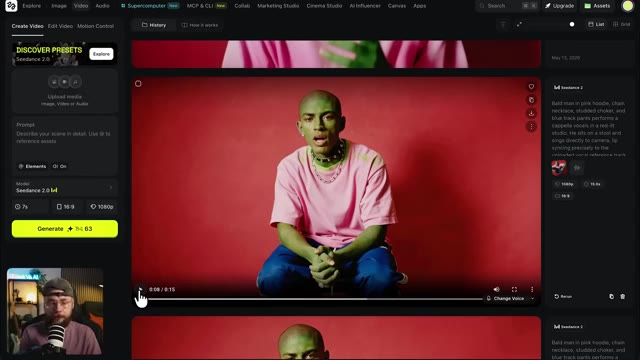
*Interface de Seedance 2 montrant un résultat vidéo généré avec le visage de Jack incrusté en bas à gauche*

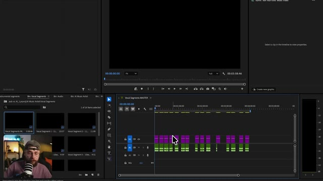
*Interface d'Adobe Premiere Pro montrant la timeline de montage avec les segments vocaux*

---

### ⏱️ `[00:12:39 - 00:13:11]` | Segment #27

**🔊 Audio (Transcription Intégrale Mot pour Mot en Français) :**
> Et ce que j'ai fait pour la piste audio, c'est que j'ai déposé la piste vocale séparée. Ce cache de couleur ici indique des segments individuels de 10 secondes. Et donc ce que j'ai fait, c'est que j'ai découpé toute cette piste vocale en segments d'environ 10 secondes, aussi près que possible de ce qui semblait être des phrases naturelles. Par là, je veux dire qu'on ne veut pas couper les choses au milieu, comme lors du chant d'une ligne. Et plutôt que d'exporter ceci comme un mp3, vous voulez aller

**👁️ Analyse Visuelle d'Écran (gemini-3.5-flash-lite) :**
**Interface & Outils** : Adobe Premiere Pro (logiciel de montage vidéo).

**Contenu textuel & Code** : Timeline avec le projet "Vocal Segments MASTER", pistes vidéo (V1), pistes audio (A1), blocs "Color Matte", fenêtres de chutier et de prévisualisation, options d'exportation avec le menu déroulant du format (H.264, MP3, MPEG, etc.).

**Action / Démonstration** : Le créateur montre sa timeline de montage, zoome sur les segments audio découpés et présente les paramètres d'exportation du logiciel.

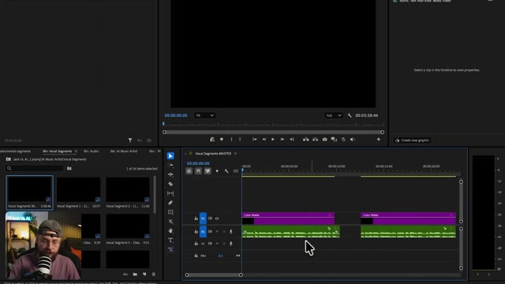
*Interface d'Adobe Premiere Pro montrant la timeline avec les pistes audio et les blocs de couleur violette (Color Matte) représentant les segments vocaux de 10 secondes.*

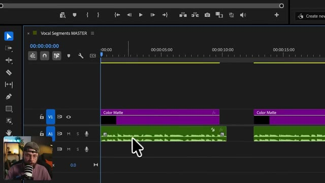
*Vue rapprochée de la timeline d'Adobe Premiere Pro sur les segments vocaux et les blocs de couleur de 10 secondes.*

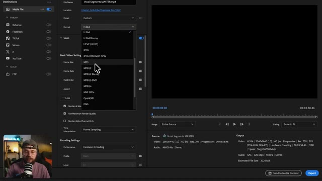
*Panneau d'exportation d'Adobe Premiere Pro avec le menu déroulant des formats de fichiers montrant les options d'exportation (H.264, MP3, etc.).*

---

### ⏱️ `[00:13:11 - 00:13:31]` | Segment #28

**🔊 Audio (Transcription Intégrale Mot pour Mot en Français) :**
> allez-y et l'exporter simplement sous forme de vidéo vierge avec la piste audio dessus. Donc ce que j'ai fait, c'est que j'ai pris chacun d'eux et je les ai découpés en chronologies individuelles. On a donc le segment vocal un, deux, trois, quatre, cinq, et ainsi de suite jusqu'à 15. C'est le nombre qui a été utilisé pour l'ensemble de la piste.

**👁️ Analyse Visuelle d'Écran (gemini-3.5-flash-lite) :**
**Interface & Outils** : Adobe Premiere Pro (fenêtre d'exportation avec paramètres de format H.264, résolution Quad HD 2560x1440, réglages de rendu et options de destination).

**Contenu textuel & Code** : Nom du fichier "Vocal Segments MASTER.mp4", preset "Custom", format "H.264", paramètres vidéo basiques, options de rendu et aperçu de la vidéo noire avec la piste audio. Un encadré PiP en bas à gauche montre le créateur Jack dans son studio.

**Action / Démonstration** : Le créateur démontre la configuration des paramètres d'exportation d'un fichier vidéo vierge contenant uniquement les pistes audio découpées dans Adobe Premiere Pro.

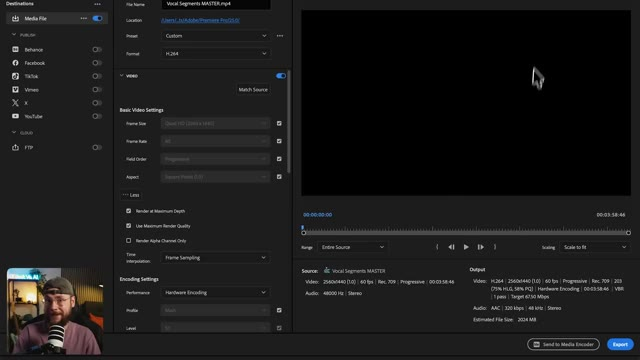
*Interface d'exportation d'Adobe Premiere Pro montrant les paramètres vidéo et audio, avec une incrustation de Jack en bas à gauche.*

---

### ⏱️ `[00:13:31 - 00:14:04]` | Segment #29

**🔊 Audio (Transcription Intégrale Mot pour Mot en Français) :**
> Et j'ai aussi indiqué dans le nom de chaque timeline la durée de ces sections vocales. Donc par exemple ici, c'était plus proche de 11 secondes, c'est très bien, j'essayais d'éviter d'aller jusqu'aux 15 secondes complètes parce que parfois vous remarquerez qu'il y a des petits bugs qui se produisent dans cette tranche finale de 10 à 15 secondes, et ce que vous obtenez essentiellement à la fin du processus, vous pouvez voir qu'on a des segments vocaux de 1 à 15, tous nommés avec leurs durées individuelles, et j'exporte aussi un

**👁️ Analyse Visuelle d'Écran (gemini-3.5-flash-lite) :**
**Interface & Outils** : Adobe Premiere Pro et l'explorateur de fichiers macOS.

**Contenu textuel & Code** : Noms des fichiers affichés avec leurs durées : « Instrumental Segment 1 - 14secs.mp4 », « Vocal Segment 1 - 11secs.mp4 », « Vocal Segment 2 - 11secs.mp4 », jusqu'à « Vocal Segment 15 - 10secs.mp4 ». Dans Premiere Pro, on aperçoit les métadonnées des clips (résolution 2560x1440, 60fps, 48000 Hz).

**Action / Démonstration** : Le curseur de la souris survole et navigue à travers les fichiers dans le panneau de projet de Premiere Pro puis dans le dossier macOS pour illustrer l'organisation des segments audio/vidéo renommés selon leur durée.

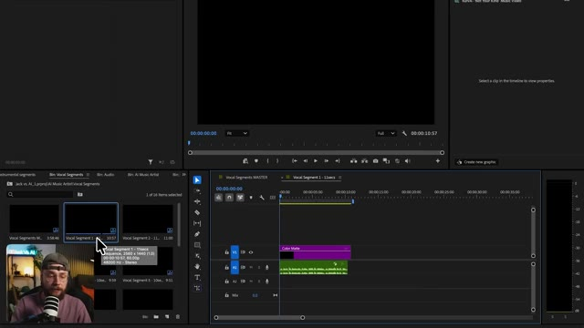
*Interface d'Adobe Premiere Pro montrant les chutiers avec les différents segments vocaux renommés avec leur durée, avec le créateur visible en incrustation PiP.*

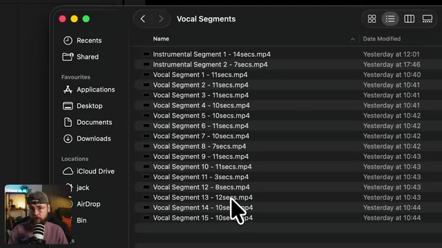
*Explorateur de fichiers du système macOS affichant le dossier contenant les fichiers vidéo des segments vocaux (de 1 à 15) avec leur durée exacte en secondes, et le créateur en PiP.*

---

### ⏱️ `[00:14:04 - 00:14:37]` | Segment #30

**🔊 Audio (Transcription Intégrale Mot pour Mot en Français) :**
> quelques sections instrumentales aussi c'est juste le même processus et c'est pourquoi nous avons dû télécharger les pistes séparées de Suno il y a cette section instrumentale à la fin du refrain où je savais que je voulais montrer une couverture comme en train de jouer de la guitare dessus donc juste exactement le même flux de travail ici vous vous donnez tout ce dont vous avez besoin pour Seedance 2 générations et cette prochaine partie est en fait assez simple donc avec le média importé vous voulez aller de l'avant et importer vos segments vocaux ici et ensuite vous voulez aller vers vos générations d'images ici ce que vous devez faire c'est

**👁️ Analyse Visuelle d'Écran (gemini-3.5-flash-lite) :**
**Interface & Outils** : Explorateur de fichiers macOS et interface web de Seedance 2.0.

**Contenu textuel & Code** : Noms de fichiers de segments audio (.mp4, longueurs en secondes) dans l'explorateur. Dans Seedance : options de preset (« DISCOVER PRESETS - Seedance 2.0 »), boutons « Upload media », champ de prompt (« Describe your scene in detail... »), modèle « Seedance 2.0 », paramètres de format (16:9, 1080p), bouton « Generate », et grille de sélection d'images (« Image Generations », « Check eligibility »).

**Action / Démonstration** : Le curseur survole et sélectionne des fichiers audio dans le dossier macOS, puis navigue dans l'interface de Seedance pour montrer l'importation de médias et l'accès aux générations d'images.

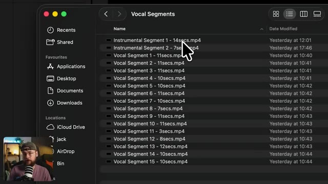
*Explorateur de fichiers macOS affichant la liste des segments vocaux et instrumentaux (« Vocal Segment », « Instrumental Segment »).*

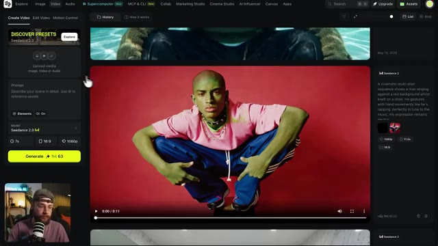
*Interface de Seedance 2.0 montrant le panneau de création vidéo à gauche et un lecteur vidéo avec un personnage accroupi au centre.*

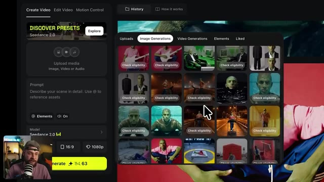
*Interface de Seedance 2.0 avec une fenêtre contextuelle affichant la grille des images générées et les options d'onglets (Uploads, Image Generations, etc.).*

---

### ⏱️ `[00:14:37 - 00:15:11]` | Segment #31

**🔊 Audio (Transcription Intégrale Mot pour Mot en Français) :**
> cliquez sur vérifier l'éligibilité et cela va simplement vérifier le contenu et s'assurer, je pense que ça cherche toute infraction potentielle à la propriété intellectuelle ou quelque chose comme ça mais vous pouvez voir qu'un paquet de mes trucs est passé complètement sans problème je n'ai rencontré aucun problème du tout avec ce processus et généralement ce que j'ai trouvé qui fonctionnait le mieux c'était de sélectionner un visuel clé donc c'est comme ce moment ici et puis aussi d'ajouter la feuille de personnage que vous avez créée également et puis bien sûr vous voulez aller de l'avant et télécharger la piste audio pertinente donc déposez juste celle-ci ici le prompt lui-même est aussi vraiment très simple

**👁️ Analyse Visuelle d'Écran (gemini-3.5-flash-lite) :**
**Interface & Outils** : Interface de l'application web Seedance 2.0 (création de vidéo par IA avec options de modèles, dimensions 16:9, résolution 1080p et gestion des assets).

**Contenu textuel & Code** : Texte visible dans le prompt : "A cinematic multi-shot sequence shows a man singing against a red background whilst knelt on a stool. He gestures with hand movements like he's rapping, perfectly in tune to the music. His expression remains neutral. The lyrics of the song are: I don't speak the language here". Boutons : "@ Elements", "Audio On", "Generate" (63 crédits), "Seedance 2.0".

**Action / Démonstration** : Le créateur navigue dans sa bibliothèque d'images générées, sélectionne une image clé et une feuille de personnage pour alimenter les assets du modèle Seedance 2.0.

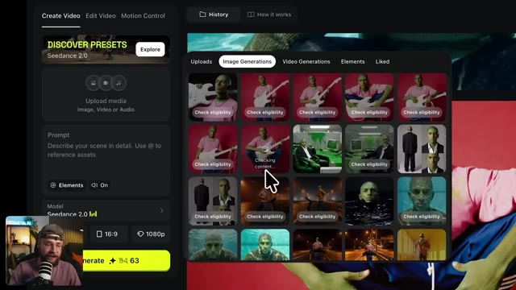
*Interface de l'outil Seedance affichant une grille de sélection d'images générées avec des boutons de vérification d'éligibilité ("Check eligibility").*

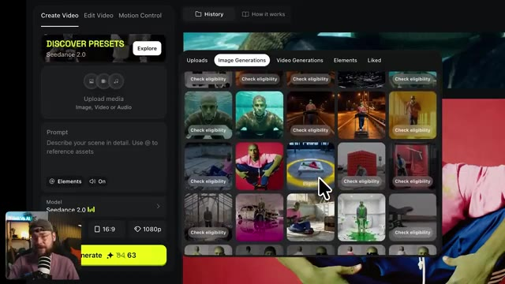
*Poursuite de la sélection dans la bibliothèque d'images avec le curseur sur une vignette spécifique.*

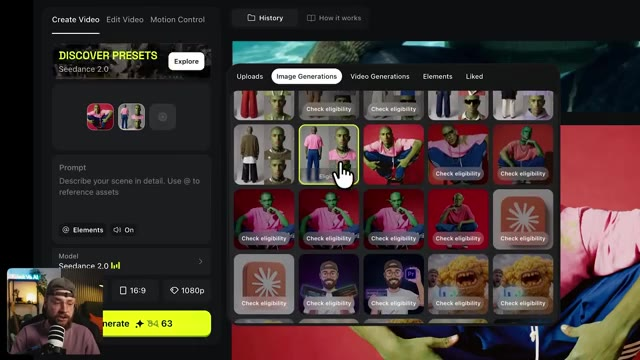
*Sélection et ajout d'une feuille de personnage (character sheet) dans l'interface de Seedance.*

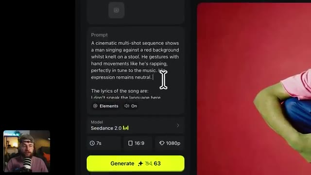
*Affichage du champ de prompt textuel dans Seedance contenant les instructions de génération vidéo.*

---

### ⏱️ `[00:15:11 - 00:15:33]` | Segment #32

**🔊 Audio (Transcription Intégrale Mot pour Mot en Français) :**
> donc tout ce que j'ai écrit c'était une séquence cinématique à plans multiples montrant un homme chantant sur un fond rouge tout en étant genoux sur un tabouret donc vous voulez aller de l'avant et genre décrire le visuel clé si vous voulez qu'il soit inclus ou ça pourrait juste par défaut le montrer dans n'importe quel environnement qu'il veut il fait des gestes avec des mouvements de main comme s'il rap, parfaitement en harmonie avec la musique.

**👁️ Analyse Visuelle d'Écran (gemini-3.5-flash-lite) :**
**Interface & Outils** : Interface de l'outil de génération vidéo Seedance (avec retour caméra PiP du créateur en bas à gauche).

**Contenu textuel & Code** : Texte du prompt visible : "A cinematic multi-shot sequence shows a man singing against a red background whilst knelt on a stool. He gestures with hand movements like he's rapping, perfectly in tune to the music. His expression remains neutral." Paramètres : Model Seedance 2.0, 7s, 16:9, 1080p, bouton Generate avec coût de 63 crédits.

**Action / Démonstration** : Le créateur montre l'interface de génération vidéo Seedance et le prompt détaillé utilisé pour créer la séquence musicale.

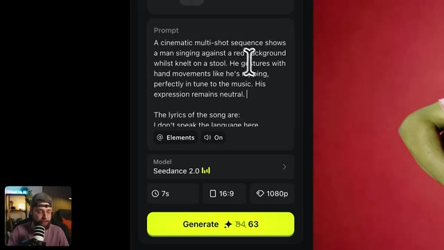
*Interface de Seedance montrant le champ de prompt textuel décrivant un homme chantant sur fond rouge.*

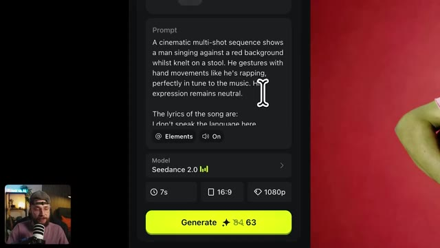
*Interface de Seedance avec le bouton Generate et les paramètres du modèle Seedance 2.0.*

---

### ⏱️ `[00:15:33 - 00:15:55]` | Segment #33

**🔊 Audio (Transcription Intégrale Mot pour Mot en Français) :**
> Son expression reste neutre. Et c'est parce que je voulais que Kover dégage une impression vraiment cool et détendue, comme s'il n'en faisait pas trop. Et cela se ressent tout au long du clip vidéo. Et puis, c'est vraiment, vraiment important aussi. Les paroles de la chanson sont, et là nous venons de lâcher, les lignes qui figurent dans ce segment vocal spécifique.

**👁️ Analyse Visuelle d'Écran (gemini-3.5-flash-lite) :**
**Interface & Outils** : Interface de l'outil de génération vidéo Seedance (version 2.0).

**Contenu textuel & Code** : Texte du prompt : "A cinematic multi-shot sequence shows a man singing against a red background whilst knelt on a stool..." et les paroles de la chanson : "I don't speak the language here / Smile and nod like I belong / Everyone's so comfortable". Paramètres visibles : durée 7s, format 16:9, résolution 1080p, bouton Generate avec coût en jetons (63).

**Action / Démonstration** : Le curseur ou la sélection de texte met en surbrillance les paroles spécifiques de la chanson dans l'interface de l'outil Seedance pendant que le créateur commente les choix artistiques.

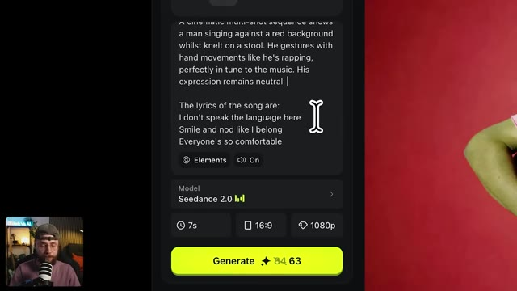
*Interface de l'outil Seedance montrant un prompt textuel décrivant une séquence musicale et des paroles.*

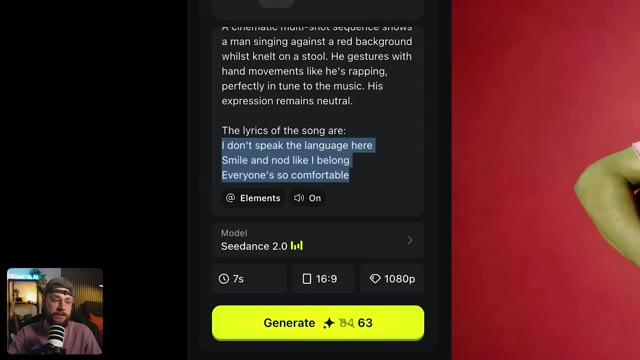
*Interface de l'outil Seedance avec les paroles de la chanson en surbrillance bleue.*

---

### ⏱️ `[00:15:55 - 00:16:16]` | Segment #34

**🔊 Audio (Transcription Intégrale Mot pour Mot en Français) :**
> Donc cela renforce le fait que ce sont les mots sur lesquels nous voulons que Cova synchronise ses mouvements labiaux. Et nous demandons à C-Dance 2 de combiner nos deux références d'images, puis d'utiliser notre segment vocal en plus de cette consigne de prompt assez simple ici. Et voici le type de réponse que vous allez obtenir en retour.

**👁️ Analyse Visuelle d'Écran (gemini-3.5-flash-lite) :**
**Interface & Outils** : Interface web de Seedance 2.0 avec incrustation vidéo PiP du créateur dans le coin inférieur gauche.

**Contenu textuel & Code** : Texte du prompt visible : "A cinematic multi-shot sequence shows a man singing against a red background whilst knelt on a stool. He gestures with hand movements like he's rapping, perfectly in tune to the music. His expression remains neutral. The lyrics of the song are: I don't speak the language here. Smile and nod like I belong. Everyone's so comfortable." Paramètres : modèle Seedance 2.0, durée 7s, format 16:9, résolution 1080p, bouton "Generate". Superposé sur l'image 2 : "be sure to also match the duration of your generation to the length of the vocal segment."

**Action / Démonstration** : Le curseur de la souris survole le champ de texte contenant le prompt et les paroles dans l'interface de Seedance pendant que le créateur commente les réglages.

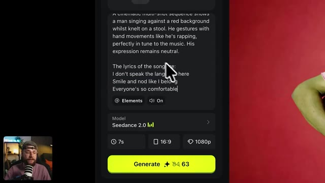
*Interface de Seedance 2.0 montrant le champ de prompt textuel avec les paroles de la chanson et les paramètres de génération vidéo.*

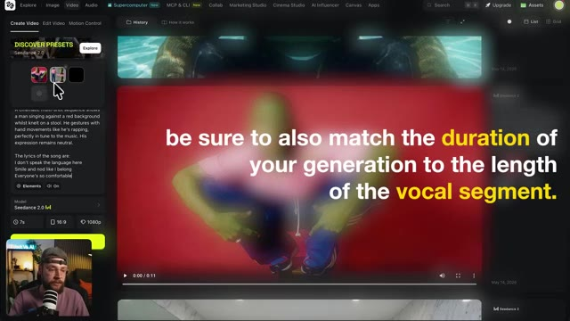
*Interface complète de Seedance avec la prévisualisation vidéo du personnage généré et du texte superposé sur l'écran.*

---

### ⏱️ `[00:16:25 - 00:16:45]` | Segment #35

**🔊 Audio (Transcription Intégrale Mot pour Mot en Français) :**
> Donc on a récupéré une synchronisation labiale vraiment de haute qualité ici, qui est en fait calée sur la musique, sans changer le tempo ni rien de bizarre comme ça. Je ne sais pas trop pourquoi il fait ce petit passage au début. Je suis sûr que vous comprenez pourquoi ça n'a pas fini dans le clip musical final. C'est toujours de l'IA générative, n'est-ce pas ?

**👁️ Analyse Visuelle d'Écran (gemini-3.5-flash-lite) :**
**Interface & Outils** : Interface de la plateforme Seedance (Seedance 2.0) affichant le mode de création vidéo, les options de prompt, les modèles et le lecteur vidéo principal avec les métadonnées sur le côté droit.

**Contenu textuel & Code** : Texte visible du prompt dans l'interface : "A cinematic multi-shot sequence shows a man singing against a red background whilst knelt on a stool. He gestures with hand movements like he's rapping, perfectly in tune to the music. His expression remains neutral." Paramètres de génération visibles : modèle "Seedance 2.0", durée "7s", format "16:9", résolution "1080p".

**Action / Démonstration** : Jack commente la vidéo générée par IA affichée à l'écran, tout en apparaissant en incrustation (PiP) en bas à gauche de l'interface Seedance.

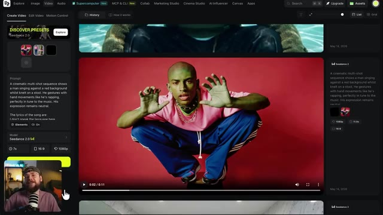
*Interface de Seedance 2.0 montrant une vidéo générée d'un homme accroupi sur un fond rouge, avec Jack en incrustation vidéo (PiP) dans le coin inférieur gauche.*

---

### ⏱️ `[00:16:45 - 00:17:10]` | Segment #36

**🔊 Audio (Transcription Intégrale Mot pour Mot en Français) :**
> Vous allez obtenir des sections qui fonctionnent et des sections qui ne fonctionnent pas. Et c'est pourquoi je lancerais exactement le même prompt avec des visuels clés différents et des feuilles de personnages différentes, et je mélangerais et assortirais le tout au montage. Et vous verrez également que j'ai pris soin de générer quelques plans pour le B-roll. Donc, évidemment, ici, nous n'avons pas besoin d'ajouter de référence audio, car nous allons simplement couper l'audio et ajouter notre piste.

**👁️ Analyse Visuelle d'Écran (gemini-3.5-flash-lite) :**
**Interface & Outils** : Seedance (interface web de génération de vidéo par IA) avec un encadré PiP (Picture-in-Picture) du présentateur Jack en bas à gauche.

**Contenu textuel & Code** : Panneau de configuration à gauche avec le champ de prompt ("A cinematic multi-shot sequence shows a man singing against a red background whilst knelt on a stool..."), le modèle sélectionné ("Seedance 2.0"), et les préréglages visuels. Dans les panneaux latéraux de droite, affichage des métadonnées des vidéos (résolution 1080p, durées, etc.).

**Action / Démonstration** : Le curseur de la souris survole l'interface et navigue à travers différents plans et clips vidéo générés affichés sur la plateforme Seedance.

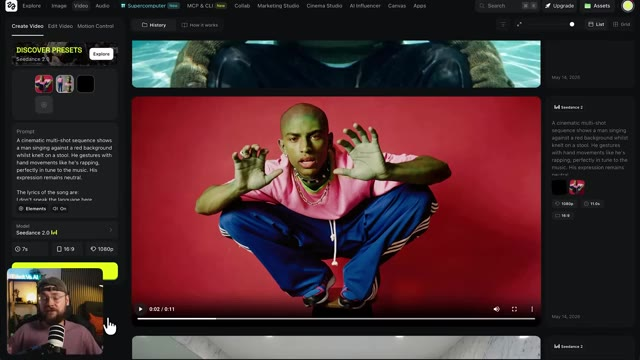
*Interface principale de Seedance affichant un plan vidéo centralisé d'un homme accroupi sur un fond rouge.*

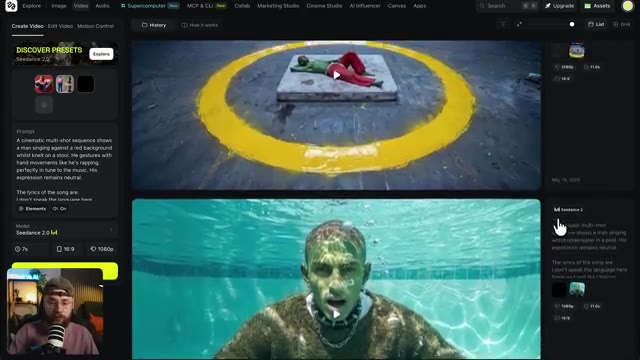
*Interface de Seedance présentant plusieurs aperçus de vidéos générées avec différents plans et ambiances.*

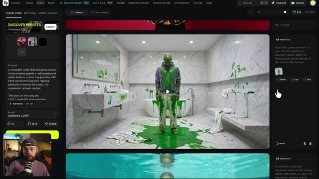
*Interface de Seedance montrant un plan vidéo d'un homme dans une salle de bain aux éclaboussures de peinture verte.*

---

### ⏱️ `[00:17:10 - 00:17:43]` | Segment #37

**🔊 Audio (Transcription Intégrale Mot pour Mot en Français) :**
> Donc encore une fois, un prompt très simple ici pour la scène de la salle de bain. Mouvement de caméra lent vers l'avant (dolly in). Un homme debout dans une salle de bain recouvert de peinture verte. Il lève les yeux et fixe directement la caméra, pas de dialogue, et c'est ce qu'on a obtenu pour ça et en fait j'ai relancé ce prompt plusieurs fois et j'ai obtenu cette génération qui s'est retrouvée dans le clip musical final, qui a ces superbes coupes intérieures de toute évidence, on demande une génération multi-plans et c'était vraiment vraiment cool, j'ai adoré ce plan ici de la baignoire.

**👁️ Analyse Visuelle d'Écran (gemini-3.5-flash-lite) :**
**Interface & Outils** : Interface de Seedance 2 (générateur de vidéo par IA) avec panneau de prompt latéral, paramètres de format, résolution 1080p et timeline de lecture vidéo.

**Contenu textuel & Code** : Texte du prompt visible : "Slow dolly camera move in. A man stood in a bathroom covered in green paint. He looks up and stares directly at the camera. No dialogue." Paramètres : 1080p, 5.0s, 16:9.

**Action / Démonstration** : Le créateur navigue dans l'interface de Seedance, montre les différentes générations multi-plans issues des relances de prompts et commente les plans spécifiques comme les traces de mains et la baignoire.

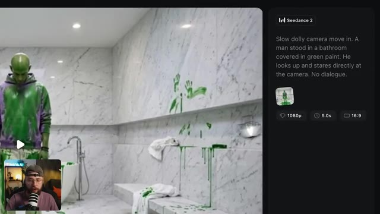
*Interface de Seedance 2 montrant le prompt de la scène de la salle de bain avec l'homme couvert de peinture verte.*

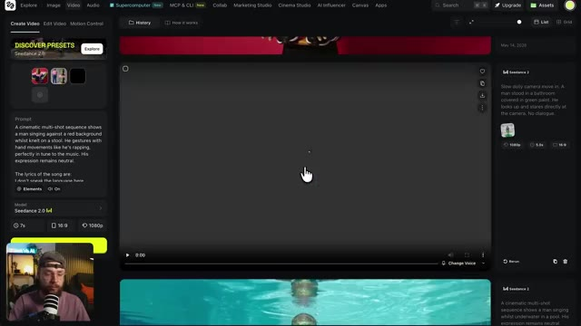
*Interface de Seedance montrant l'historique et la zone de lecture vidéo principale.*

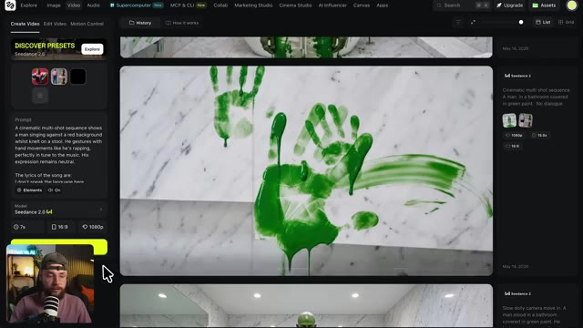
*Gros plan sur une génération multi-plans montrant des traces de mains vertes sur un mur en marbre.*

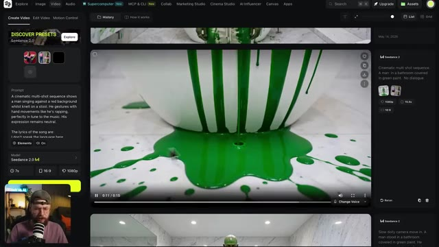
*Zoom sur la baignoire avec de la peinture verte qui coule, montrant le plan cinématique apprécié par le créateur.*

---

### ⏱️ `[00:17:43 - 00:18:17]` | Segment #38

**🔊 Audio (Transcription Intégrale Mot pour Mot en Français) :**
> puis pour une raison quelconque kovas a juste disparu du dernier plan donc évidemment on a juste pas utilisé ce morceau. Donc juste pour réitérer le processus, vous construisez toutes ces générations différentes pour chaque segment vocal et vous pouvez utiliser ces différentes scènes ou vignettes pour relancer le même segment vocal et en quelque sorte couper entre elles au montage. Et vous construisez aussi du b-roll comme ce plan ici, par exemple, juste pour avoir plein de choses avec lesquelles travailler quand il s'agit de tout assembler. Et en parlant de ça, bien sûr, c'est la dernière étape. Nous avons

**👁️ Analyse Visuelle d'Écran (gemini-3.5-flash-lite) :**
**Interface & Outils** : Interface de Seedance 2.0 (outil de génération vidéo par IA) avec panneau de prompts à gauche, zone de prévisualisation centrale et paramètres à droite, incluant un retour vidéo PiP du créateur en bas à gauche.

**Contenu textuel & Code** : Texte du prompt visible : 'A cinematic multi-shot sequence shows a man singing against a red background whilst knelt on a stool...' Paramètres : Seedance 2.0, 7s, 16:9, 1080p. Texte incrusté sur la dernière image : 'step four finishing touches'.

**Action / Démonstration** : Le créateur navigue dans l'interface de Seedance 2.0 et montre différentes versions de plans générés (b-roll) pour illustrer le processus de montage et d'assemblage des séquences vocales.

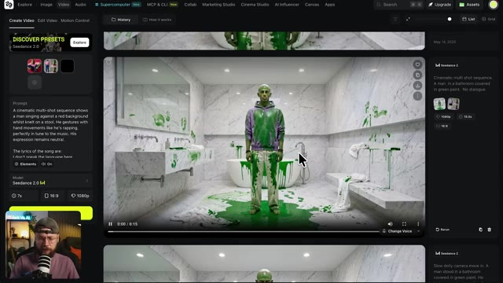
*Interface de Seedance 2.0 montrant la prévisualisation d'une vidéo dans une salle de bain en marbre avec un personnage couvert de peinture verte.*

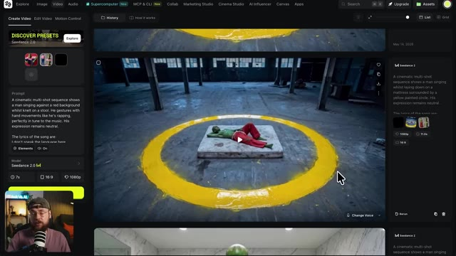
*Interface de Seedance 2.0 affichant un plan dans un entrepôt avec un personnage allongé sur un matelas au centre d'un cercle peint en jaune.*

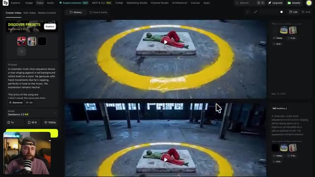
*Interface de Seedance 2.0 montrant plusieurs générations vidéo empilées verticalement avec le plan de l'entrepôt.*

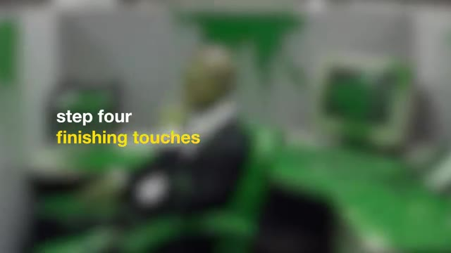
*Séquence vidéo floutée avec un texte incrusté indiquant 'step four / finishing touches'.*

---

### ⏱️ `[00:18:17 - 00:18:52]` | Segment #39

**🔊 Audio (Transcription Intégrale Mot pour Mot en Français) :**
> voici le montage final de notre clip vidéo ou la section de celui-ci que vous auriez vue au début du tutoriel et c'est vraiment juste une question de déposer chacun de vos clips par-dessus les pistes audio que vous avez générées avec Suno en les ajustant juste un petit peu jusqu'à ce que vous les ayez en synchronisation c'est assez facile à faire vous pouvez voir qu'à ce moment-là j'ai coupé le son de la piste audio que j'ai obtenue avec mes 2 générations de C9 quand vous les déposez pour la première fois sur votre chronologie laissez le son actif et cela vous permettra de les déplacer un tout petit peu comme ces petits incréments jusqu'à ce que vous

**👁️ Analyse Visuelle d'Écran (gemini-3.5-flash-lite) :**
**Interface & Outils** : Adobe Premiere Pro

**Contenu textuel & Code** : Projet intitulé "KØVA - 'Not Your Kind' Music Video", pistes vidéo (C1, V3, V2, V1), pistes audio (A3, A4, A5, A6), calque d'ajustement violet ("Adjustment Layer"), et clips vidéo nommés avec des préfixes "hf_".

**Action / Démonstration** : Le créateur démontre comment aligner et synchroniser les clips vidéo générés avec les pistes audio sur la chronologie d'Adobe Premiere Pro.

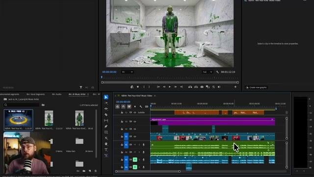
*Interface d'Adobe Premiere Pro montrant le montage d'un clip musical sur une chronologie multi-pistes.*

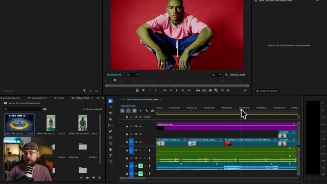
*Vue rapprochée de la chronologie de Premiere Pro avec des clips vidéo et audio synchronisés.*

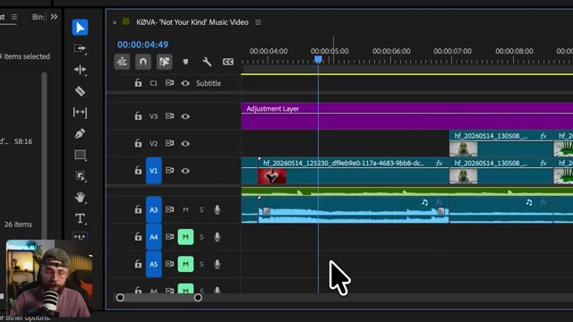
*Zoom sur la timeline de Premiere Pro illustrant les pistes vidéo (V1-V3) et audio (A3-A6) avec des options de mise en sourdine.*

---

### ⏱️ `[00:18:52 - 00:19:20]` | Segment #40

**🔊 Audio (Transcription Intégrale Mot pour Mot en Français) :**
> remarquez qu'il n'y a pas de temps de latence au niveau de la voix. Donc je pourrais en fait vous donner un exemple de cela. Ce que je vais faire, c'est réactiver le son de toute la piste audio inférieure ici. Il s'agit donc de tout l'audio que nous aurions récupéré des générations C-Dance 2. Et vous remarquerez, lorsque vous le réécouterez, que tout va sembler synchrone. Lorsque vous le déposez pour la première fois sur votre chronologie, cela peut ressembler davantage à ceci.

**👁️ Analyse Visuelle d'Écran (gemini-3.5-flash-lite) :**
**Interface & Outils** : Adobe Premiere Pro

**Contenu textuel & Code** : Projet intitulé "KZVst - 'Not Your Kind' Music Video", pistes V1, V2, V3, A1, A2, A3, A4, pistes de sous-titres et calques de réglage.

**Action / Démonstration** : Le créateur montre son écran de montage vidéo sous Premiere Pro, navigue sur la chronologie et sélectionne des pistes audio et vidéo.

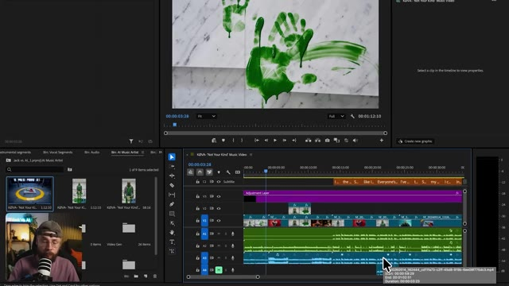
*Interface d'Adobe Premiere Pro montrant la chronologie avec plusieurs pistes audio et vidéo, ainsi qu'un encadré PiP du créateur dans le coin inférieur gauche.*

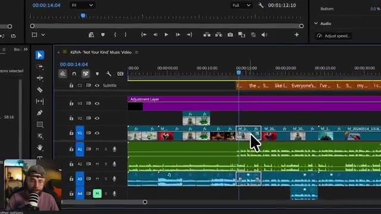
*Gros plan sur la chronologie d'Adobe Premiere Pro avec le curseur de lecture sur les pistes audio et vidéo, illustrant la manipulation des pistes.*

---

### ⏱️ `[00:19:23 - 00:20:00]` | Segment #41

**🔊 Audio (Transcription Intégrale Mot pour Mot en Français) :**
> Donc ouais, c'est juste une question d'ajuster les choses tout doucement jusqu'à ce que ce soit parfait. Et à partir de ce moment-là, il s'agit vraiment de construire le clip vidéo, de couper entre ces différentes scènes et d'être vraiment créatif avec. Vous voulez beaucoup de variété là-dedans. Les clips musicaux ont tendance à avoir beaucoup de coupes différentes et beaucoup de ces différentes sortes de vignettes visuelles. Bien sûr, tout au long de la vidéo musicale, nous visons la même ambiance que celle que nous avons utilisée lorsque nous avons abordé la création de la pochette pour la première fois. Nous voulons donc que chaque type de vignette ou de scène soit vraiment visuellement frappant.

**👁️ Analyse Visuelle d'Écran (gemini-3.5-flash-lite) :**
**Interface & Outils** : Adobe Premiere Pro (logiciel de montage vidéo) avec affichage du panneau des effets, du moniteur source/programme, de la timeline multipiste et du chutier, incluant une incrustation vidéo (PiP) du créateur.

**Contenu textuel & Code** : Timeline de montage avec pistes vidéo et audio, clips de scènes générées par IA (personnage vert), calques d'ajustement, et le nom du projet « KZVs - 'Not Your Kind' Music Video ».

**Action / Démonstration** : Le créateur montre son écran de montage vidéo sur Adobe Premiere Pro tout en expliquant le processus de construction et de découpage du clip musical.

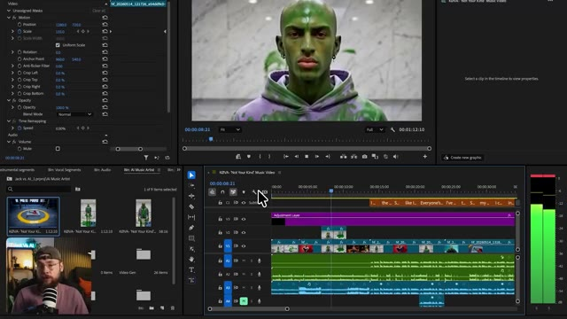
*Interface d'un logiciel de montage vidéo (Adobe Premiere Pro) avec panneau de contrôle, timeline et retour vidéo affichant un personnage généré par IA, et un petit encadré PiP montrant le créateur.*

---

### ⏱️ `[00:20:05 - 00:20:39]` | Segment #42

**🔊 Audio (Transcription Intégrale Mot pour Mot en Français) :**
> ici c'èst exactement l'ambiance que nous recherchons et juste comme touche finale ici j'ai ce calque d'effet cela ajoute un peu de netteté ainsi que du grain de pellicule je pense que cela aide vraiment d'un point de vue textuel comme observation générale vous constaterez que la qualité de la synchronisation labiale est meilleure lorsque votre personnage est plus près de la caméra et plus il est éloigné cela peut devenir un peu branlant ou décalé cela a l'air moins convaincant donc s'il y a des lignes vraiment importantes dans votre piste que vous voulez obtenir

**👁️ Analyse Visuelle d'Écran (gemini-3.5-flash-lite) :**
**Interface & Outils** : Adobe Premiere Pro (logiciel de montage vidéo)

**Contenu textuel & Code** : Timeline de montage nommée "KZVs - 'Not Your Kind' Music Video", pistes vidéo et audio, calque d'ajustement ("Adjustment Layer"), panneaux d'effets (Sharpen, Noise), moniteur de prévisualisation vidéo.

**Action / Démonstration** : Le créateur montre l'utilisation d'un calque d'ajustement dans Premiere Pro pour appliquer du grain de pellicule et de la netteté, puis discute des aspects techniques de la synchronisation labiale selon la distance du personnage par rapport à la caméra.

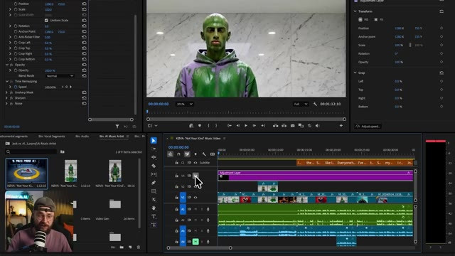
*Interface d'Adobe Premiere Pro avec le projet de montage vidéo, la timeline et le moniteur affichant un personnage vert dans un décor de marbre, avec le créateur en incrustation PiP.*

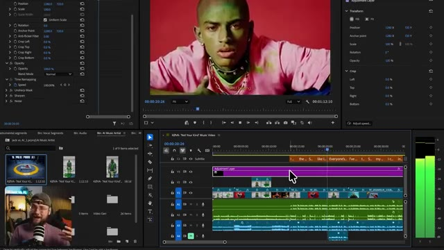
*Interface d'Adobe Premiere Pro montrant la sélection d'un calque d'ajustement violet sur la timeline et un personnage au premier plan sur fond rouge.*

---

### ⏱️ `[00:20:39 - 00:21:08]` | Segment #43

**🔊 Audio (Transcription Intégrale Mot pour Mot en Français) :**
> essayez vraiment d'opter pour un plan comme celui-ci par exemple où vous êtes vraiment près du personnage la synchronisation labiale aura l'air plutôt super et sur ce les gars nous sommes arrivés à la fin du tutoriel si vous avez la moindre question assurez-vous de les laisser en bas dans la section des commentaires j'essaie toujours de répondre au maximum d'entre eux si vous avez apprécié le contenu d'aujourd'hui assurez-vous de lâcher un pouce bleu pour moi et d'envisager de vous abonner ceci étant dit jetons un dernier coup d'œil au clip musical terminé je vous retrouve les gars pour le prochain

**👁️ Analyse Visuelle d'Écran (gemini-3.5-flash-lite) :**
**Interface & Outils** : Adobe Premiere Pro (interface de montage vidéo avec panneaux de contrôle, moniteur source, moniteur programme et timeline).

**Contenu textuel & Code** : Timeline de montage avec pistes audio/vidéo, sous-titres, calque d'ajustement ("Adjustment Layer"), panneaux de contrôle des effets (Position, Échelle, Opacité, Recadrage), et affichage des médias du projet (ex: "Jack vs AI - 1.prproj", "AI Music Artist").

**Action / Démonstration** : Le créateur montre son écran de montage vidéo sous Adobe Premiere Pro avec un personnage à l'esthétique extraterrestre/verdâtre à l'écran.

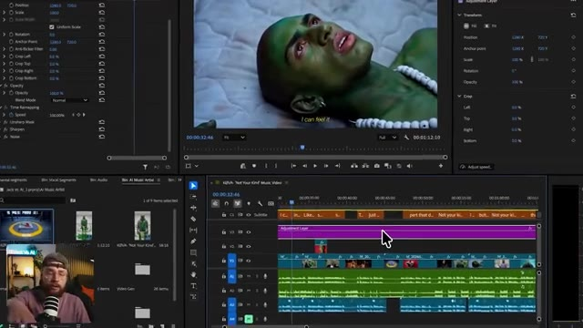
*Interface du logiciel Adobe Premiere Pro montrant la timeline du clip musical avec le personnage verdâtre à l'écran et la webcam incrustée en bas à gauche.*

---

### ⏱️ `[00:21:57 - 00:22:15]` | Segment #44

**🔊 Audio (Transcription Intégrale Mot pour Mot en Français) :**
> Un cœur qui ne fonctionne pas à Quelque chose d'humain que je ne peux pas feindre

**👁️ Analyse Visuelle d'Écran (gemini-3.5-flash-lite) :**
**Interface & Outils** : Présentation face caméra / clip vidéo artistique sans partage d'écran de logiciel

**Contenu textuel & Code** : Séquence vidéo artistique générée par IA mettant en scène un personnage chauve à la peau verte dans différentes situations (accroupi, couché sur un matelas, sous l'eau). Des sous-titres en jaune ("part that doesn't fit?", "I got love", "Something human") s'affichent en bas de l'écran.

**Action / Démonstration** : Le personnage bouge et chante en synchronisation avec les paroles de la chanson dans diverses mises en scène artistiques.

---
