# 🎬 Comment transformer un storyboard en vidéo IA complète en quelques minutes

> **Chaîne** : [Jack Vs. AI](https://www.youtube.com/@JackVsAI)  
> **Titre original** : `How to Turn a Storyboard into a Full AI Video in Minutes`  
> **Lien YouTube** : [https://www.youtube.com/watch?v=Is4wgEpPMJQ](https://www.youtube.com/watch?v=Is4wgEpPMJQ)  
> **Date de publication** : 2026-05-24  
> **Durée** : 18m 47s (`1127s`)  
> **Identifiant vidéo** : `Is4wgEpPMJQ`  
> **Fiche Web Interactive** : [2026-05-24_YT-Is4wgEpPMJQ_Comment transformer un storyboard en vidéo IA complète en quelques minutes_by-whisper-v3-large-turbo+gemini-3.5-flash-lite.html](2026-05-24_YT-Is4wgEpPMJQ_Comment transformer un storyboard en vidéo IA complète en quelques minutes_by-whisper-v3-large-turbo+gemini-3.5-flash-lite.html)  
> **Captures de démonstration clés** : `89 captures réelles (anti-talking-head)`  
> **Modèles utilisés** : Audio: `large-v3-turbo` (Faster-Whisper int8 VPS) | Vision: `gemini-3.5-flash-lite` (Google AI Studio API)  

---

## 📌 Synthèse Exécutive & Outils

### 📌 Résumé
La création de films par intelligence artificielle franchit un cap décisif grâce à l'émergence de workflows unifiés permettant de transformer un simple storyboard en une séquence animée fluide, s'affranchissant ainsi de la génération plan par plan et de l'optimisation manuelle fastidieuse. Dans cette vidéo, Jack, expert en effets visuels, dévoile une méthode professionnelle pour concevoir des prototypes rapides, des courts-métrages ou des publicités percutantes. L'approche repose sur l'utilisation d'une image de référence unique et cohérente, combinée à des LLMs pour structurer la narration visuelle, garantissant aux créateurs un contrôle artistique total sur le résultat final.

Le processus débute par la conception optionnelle de fiches de personnages ou de produits afin d'ancrer l'identité visuelle du projet. Grâce à des modèles avancés de génération d'images, l'utilisateur produit un storyboard stylisé (qu'il s'agisse de photoréalisme, d'animation Pixar, de style *rubber hose* ou de films publicitaires) qui servira de référence maîtresse. Couplé à un fichier de prompt structuré (Markdown) injecté dans une IA conversationnelle, le système génère les descriptions textuelles extrêmement détaillées nécessaires pour propulser l'animation vers des outils de conversion vidéo de pointe.

Cette méthodologie redéfinit la productivité dans l'industrie créative en réduisant drastiquement les coûts de production et le temps de prototypage. En s'appuyant sur des références d'images précises et des cadres de prompts rigoureux, les créateurs éliminent les variations indésirables entre les plans et surmontent l'un des plus grands défis de l'IA générative : la cohérence temporelle et visuelle. C'est une véritable passerelle entre la direction artistique traditionnelle et l'automatisation intelligente, accessible tant aux débutants qu'aux professionnels chevronnés.

### 🛠️ Outils, Modèles & Logiciels Présentés
* **Higgsfield AI** : Plateforme principale utilisée pour l'ensemble du flux de travail, centralisant la génération d'images, de storyboards et l'exploitation des modèles d'IA.
* **GPT Image 2** : Modèle d'image intégré à Higgsfield, utilisé pour créer des fiches de personnages, de produits et des storyboards de styles variés (photoréalisme, Pixar, *rubber hose*).
* **Claude (ou Gemini / ChatGPT)** : Grand Modèle de Langage (LLM) utilisé pour interpréter un fichier Markdown de structuration et transformer une simple idée de scène en un prompt de storyboard ultra-détaillé.
* **Seedance 2** : Modèle de génération vidéo utilisé pour transformer les storyboards finalisés en séquences animées fluides en s'appuyant sur les images de référence.
* **Fichiers Markdown (MD)** : Cadres de prompts textuels réutilisables partagés pour automatiser et normaliser la création de requêtes auprès des LLMs.

### 🔑 Points Clés & Enseignements Stratégiques
* **Maîtrise de la cohérence visuelle** : La création préalable de fiches de personnages (ou de produits) à partir de photos de référence personnelles garantit une identité visuelle stable tout au long du projet.
* **Optionnalité du design de personnage** : Bien que fortement conseillée pour maximiser le contrôle artistique, l'étape de création de fiches de personnages est facultative et n'empêche pas l'obtention de résultats probants.
* **Standardisation des prompts via Markdown** : L'utilisation d'un fichier `.md` injecté dans un LLM (comme Claude ou ChatGPT) permet de structurer automatiquement les demandes textuelles sans avoir à réécrire la syntaxe complexe à chaque plan.
* **Séparation des rôles dans le prompt** : Le cadre de prompt sépare la structure technique fixe (gérée par le framework) et la variable créative (le style et l'action de la scène à modifier).
* **Paramétrage technique des images** : Pour la génération de storyboards, il est recommandé de sélectionner une fidélité visuelle réglée sur « High », une résolution en 2K (extensible à 4K) et un format d'image au ratio 16:9.
* **Génération comparative** : Produire systématiquement deux options de storyboard par génération permet de comparer les résultats et de sélectionner la meilleure interprétation anatomique et stylistique.
* **Utilisation de l'image comme référence** : Lors de la génération finale du prompt dans l'outil d'image, l'activation de la fonction de référence d'image empêche le modèle de dériver vers des résultats trop génériques.
* **Flexibilité stylistique** : Le flux de travail s'adapte à une grande variété de directions artistiques, allant de l'esthétique bobine photo au style d'animation 3D (Pixar) ou rétro (*rubber hose*).
* **Gain de temps sur le prototypage** : Ce workflow élimine la nécessité de générer chaque plan de manière isolée et de multiplier les réglages manuels, réduisant la consommation de crédits et accélérant la pré-production.
* **Démocratisation des effets visuels** : La méthode permet à des créateurs solitaires ou à de petites agences de rivaliser avec des studios traditionnels pour la création de tests publicitaires et de courts-métrages.

---

## ⏱️ Chronologie & Transcription Complète Audio & Visuelle (Mot pour Mot)

### ⏱️ `[00:00:00 - 00:00:34]` | Segment #01

**🔊 Audio (Transcription Intégrale Mot pour Mot en Français) :**
> La création de films par IA vient de devenir incroyablement facile parce que vous pouvez désormais prendre une seule image de storyboard et utiliser l'IA pour la transformer en une séquence entière. Vous pouvez donc oublier le fait de générer chaque plan séparément, de lutter avec des dizaines de réglages manuels et de brûler vos crédits. Je suis Jack, j'ai passé plus d'une décennie à créer des effets visuels pour certaines des plus grandes marques de la planète et maintenant j'utilse l'IA pour réinventer les flux de travail créatifs. Utilisée correctement, cette méthode peut être incroyablement puissante car elle change complètement la vitesse à laquelle vous pouvez prototyper des idées, créer des courts

**👁️ Analyse Visuelle d'Écran (gemini-3.5-flash-lite) :**
**Interface & Outils** : Interface de présentation vidéo illustrant des grilles de storyboards multipans générés par IA et reliés à des plans vidéo dynamiques, avec des sous-titres en surbrillance verte.

**Contenu textuel & Code** : Textes affichés à l'écran : "generating every shot separately", "and now I'm using AI to", "you can prototype ideas". Storyboards détaillés avec des grilles de vignettes numérotées et des indications de timing (ex: "LOW-HANGING FRUIT", "The Perfect Pour", "FORGED").

**Action / Démonstration** : Le créateur montre des exemples visuels illustrant la transformation de storyboards complets en séquences animées fluides pour contraster avec la génération plan par plan.

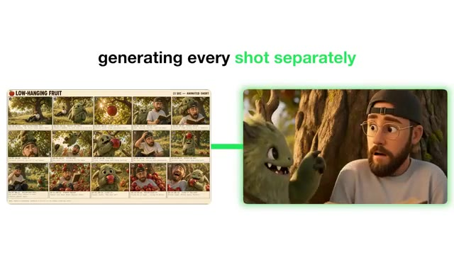
*Présentation d'un storyboard de type grille (projet 'Low-Hanging Fruit') relié à un plan animé illustrant un personnage barbu avec un monstre vert.*

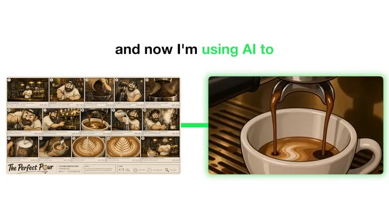
*Présentation d'un storyboard de type grille (projet 'The Perfect Pour') relié à un plan animé montrant du café coulant dans une tasse.*

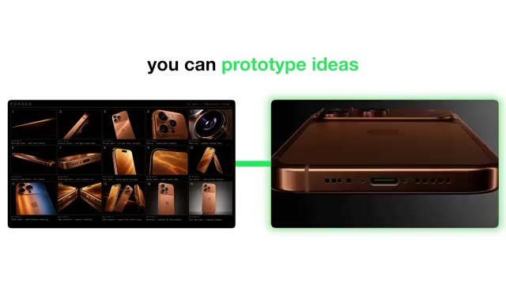
*Présentation d'un storyboard de type grille (projet 'Forged') relié à un plan animé en gros plan d'un smartphone haut de gamme.*

---

### ⏱️ `[00:00:34 - 00:01:07]` | Segment #02

**🔊 Audio (Transcription Intégrale Mot pour Mot en Français) :**
> des films et des tests de publicités de produits. Dans cette vidéo, je vais vous enseigner tout le flux de travail, comment générer des storyboards que l'IA comprend réellement et comment donner vie à votre vision plus rapidement que jamais. Et si vous aimez la vidéo d'aujourd'hui, n'hésitez pas à lâcher un gros pouce bleu et à vous abonner. Allez, c'est parti. Je suis sûr que vous avez vu pas mal de ces vidéos sur les réseaux sociaux récemment où le storyboard est empilé au-dessus de la vidéo IA finale. Une tonne d'entre elles devient virale en ce moment et pour une bonne raison car c'est une approche plutôt intéressante pour utiliser

**👁️ Analyse Visuelle d'Écran (gemini-3.5-flash-lite) :**
**Interface & Outils** : Interface de montage vidéo verticale de type Reels/TikTok avec affichage en superposition d'un storyboard en haut et de la vidéo finale en bas, avec incrustation PiP du créateur dans le coin inférieur gauche.

**Contenu textuel & Code** : Texte à l'écran incluant "and test product ads", grille de storyboard intitulée "FORGED" (15 sec - product film) montrant des plans de smartphone, et une autre grille intitulée "LOW-HANGING FRUIT" avec un personnage sous un arbre.

**Action / Démonstration** : Le créateur illustre visuellement le concept de vidéos virales montrant un storyboard empilé au-dessus de la vidéo IA finale.

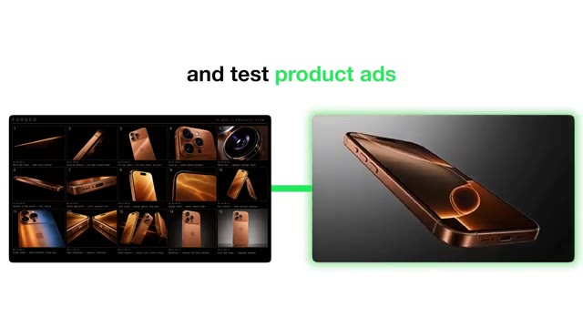
*Comparaison entre une grille de storyboard de produit et son rendu vidéo IA final d'un smartphone*

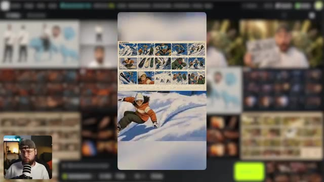
*Capture d'écran affichant une vidéo virale de snowboard avec storyboard empilé et incrustation du créateur en bas à gauche*

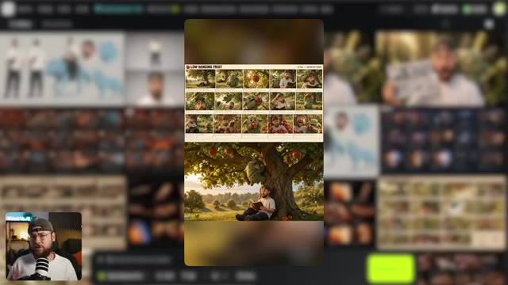
*Présentation d'une autre vidéo virale de storyboard sous un arbre avec incrustation du créateur*

---

### ⏱️ `[00:01:07 - 00:01:42]` | Segment #03

**🔊 Audio (Transcription Intégrale Mot pour Mot en Français) :**
> des outils d'IA générative d'une manière différente. Le problème est que personne ne vous montre vraiment comment mettre exactement ce flux de travail en pratique, donc je vais rectifier cela aujourd'hui et vous donner toutes les informations et le matériel dont vous avez besoin pour le faire vous-même. Donc tout ce que j'ai généré en utilisant ce flux de travail a été fait sur Higgsfield AI. Et si vous voulez suivre, vous trouverez un lien en bas dans la description. Vous pouvez donc voir que tous mes storyboards sont générés ici. Ils ont été faits en utilisant GPT Image 2. J'en suis venu à beaucoup aimer cette image

**👁️ Analyse Visuelle d'Écran (gemini-3.5-flash-lite) :**
**Interface & Outils** : Interface utilisateur de la plateforme Higgsfield AI avec affichage des storyboards et panneaux de configuration des modèles d'IA.

**Contenu textuel & Code** : Sur l'image 1, une grille de storyboards avec un panneau central intitulé "LOW-HANGING FRUIT". Sur l'image 3, le panneau d'information affiche : Modèle "GPT Image 2", Qualité "High", Taille "3840x2160", ainsi qu'un extrait de prompt décrivant une séquence d'action de snowboard intitulée "DOWNHILL". On aperçoit également un encadré PiP (Picture-in-Picture) de Jack dans le coin inférieur gauche.

**Action / Démonstration** : Le créateur montre son écran de travail sur Higgsfield AI, faisant défiler et présentant les storyboards générés ainsi que les métadonnées des images.

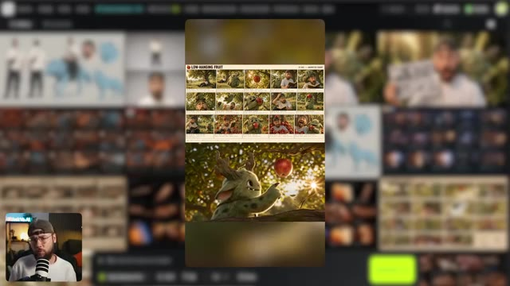
*Interface d'Higgsfield AI affichant une grille de storyboards et un panneau central montrant une planche de storyboards avec une créature fantastique et une pomme.*

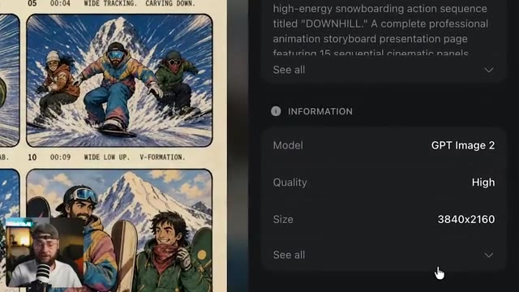
*Panneau d'informations d'Higgsfield AI affichant les détails techniques d'un storyboard de snowboard généré avec le modèle GPT Image 2.*

---

### ⏱️ `[00:01:42 - 00:02:17]` | Segment #04

**🔊 Audio (Transcription Intégrale Mot pour Mot en Français) :**
> modèle maintenant. Et je voulais vraiment m'assurer de ne pas tester qu'un seul style spécifique avec ce flux de travail. On a des trucs de bobine photo ici. Donc comme une scène de cuisine. On a évidemment l'anime des snowboarders qui descendent la montagne que vous auriez déjà vu. Ensuite, on a ce genre de court-métrage inspiré de Pixar également. Et bien sûr, on a aussi toutes nos générations de vidéos terminées où l'on utilise ces storyboards comme références d'images et où l'on génère les vidéos via Seedance 2. Mais rembobinons un tout petit peu et retournons tout droit au début de la

**👁️ Analyse Visuelle d'Écran (gemini-3.5-flash-lite) :**
**Interface & Outils** : Seedance 2

**Contenu textuel & Code** : Storyboard "BLADE" (15 secondes, style live-action culinaire) et storyboard "DOWNHILL" (style anime de snowboard), interface de Seedance 2 avec paramètres de modèle, curseurs de lecture et boîtes de prompts textuels.

**Action / Démonstration** : Le créateur montre différents styles de storyboards (live-action, anime) et passe à la démonstration des générations vidéo finales réalisées avec Seedance 2.

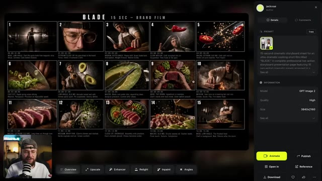
*Affichage d'un storyboard de 15 secondes pour un court métrage culinaire intitulé "BLADE" dans l'interface de l'application.*

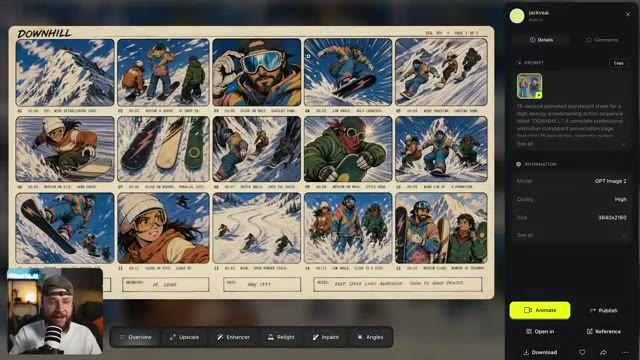
*Affichage d'un storyboard animé de style anime intitulé "DOWNHILL" montrant des snowboarders.*

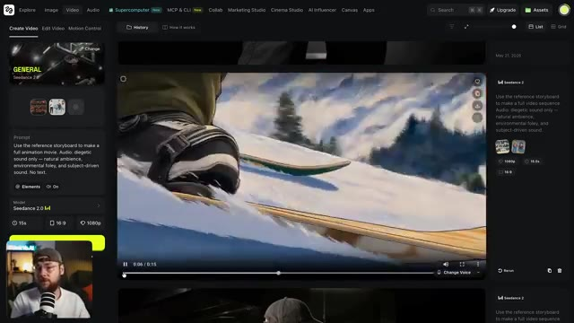
*Interface de Seedance 2 montrant la lecture d'une vidéo animée de snowboard en cours de génération.*

---

### ⏱️ `[00:02:17 - 00:02:52]` | Segment #05

**🔊 Audio (Transcription Intégrale Mot pour Mot en Français) :**
> processus parce que je veux vous montrer une étape que certains créateurs ne partagent peut-être pas vraiment en détail. Maintenant, c'est vraiment seulement nécessaire si vous voulez avoir un très haut degré de contrôle sur vos storyboards, mais quelque chose que j'ai trouvé qui rendait ce flux de travail encore meilleur, c'était en fait de créer ces feuilles de personnages avant de générer les storyboards. C'est donc assez simple à faire. À l'intérieur de Higgsfield, vous voulez d'abord aller de l'avant et sélectionner GPT Image 2. Vous pouvez voir que j'ai téléchargé quelques références d'images différentes de moi-même. Celles-ci ont juste été prises avec mon téléphone.

**👁️ Analyse Visuelle d'Écran (gemini-3.5-flash-lite) :**
**Interface & Outils** : Interface de la plateforme Higgsfield.

**Contenu textuel & Code** : Texte du prompt visible : "Show the same bearded man. Character reference sheet — four views on a neutral grey background: [VIEW 1 — FULL BODY, FRONT]...". Paramètres visibles : "GPT Image 2", "High", "4K", "16:9", "1/4".

**Action / Démonstration** : Le créateur montre l'interface de Higgsfield et zoome sur les paramètres de génération de feuilles de personnages (character reference sheets) ainsi que sur le prompt textuel utilisé.

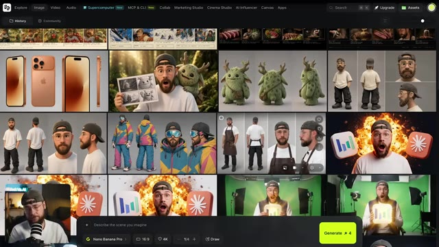
*Interface de Higgsfield montrant la galerie de créations avec le visage du créateur en incrustation (PiP) dans le coin inférieur gauche.*

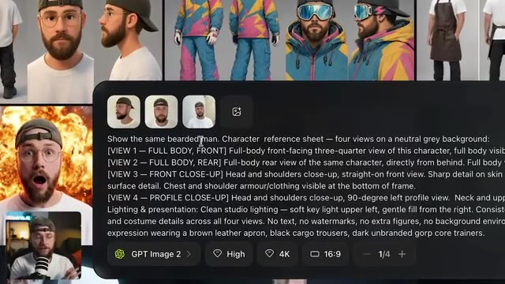
*Interface de Higgsfield avec le panneau de prompt détaillé ouvert et les photos de référence du créateur importées.*

---

### ⏱️ `[00:02:52 - 00:03:25]` | Segment #06

**🔊 Audio (Transcription Intégrale Mot pour Mot en Français) :**
> super simple et pour le prompt lui-même que bien sûr je vais partager avec vous les gars ça a l'air compliqué mais la seule partie que vous avez vraiment besoin de modifier c'est cette section du bas ici tout ça c'est juste un cadre donc vous pouvez juste le laisser tel quel la partie du bas c'est là où vous allez en quelque sorte intégrer le style de ce que vous recherchez donc pour cet exemple particulier je me suis fait en tant que chef je porte à peu près ce que je porte habituellement mais j'ai juste ce tablier marron. Donc je voulais commencer par un exemple vraiment basique mais aussi photo-réaliste. Donc je

**👁️ Analyse Visuelle d'Écran (gemini-3.5-flash-lite) :**
**Interface & Outils** : Interface web d'un générateur d'images par IA avec panneau de prompt, paramètres de qualité (High, 4K, 16:9), et options de post-traitement (Overview, Upscale, Enhancer, Relight, Inpaint, Angles, Animate).

**Contenu textuel & Code** : Texte du prompt visible : "Show the same bearded man. Character reference sheet — four views on a neutral grey background: [VIEW 1 – FULL BODY, FRONT]... [VIEW 2 – FULL BODY, REAR]... [VIEW 3 – FRONT CLOSE-UP]... [VIEW 4 – PROFILE CLOSE-UP]... neutral expression wearing a brown leather apron, black cargo trousers, dark unbranded gorp core trainers." Paramètres : Modèle "GPT Image 2", Quality "High", Size "3840x2160".

**Action / Démonstration** : Le créateur montre un prompt textuel structuré en plusieurs vues et met en avant la section modifiable en bas concernant le style vestimentaire, puis présente le résultat généré montrant un personnage barbu avec un tablier marron sous quatre angles différents.

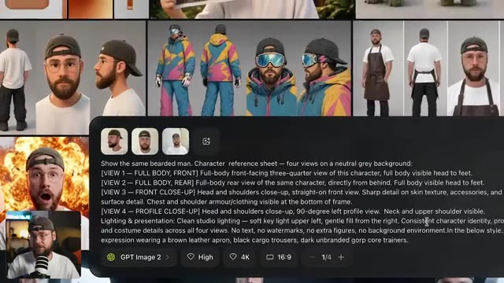
*Affichage d'un prompt détaillé pour la génération d'une feuille de référence de personnage avec un encadré de prévisualisation et des réglages en bas.*

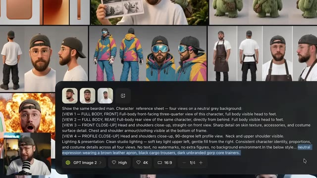
*Sélection en surbrillance d'une partie du texte du prompt au bas de la boîte de dialogue contextuelle décrivant le style vestimentaire.*

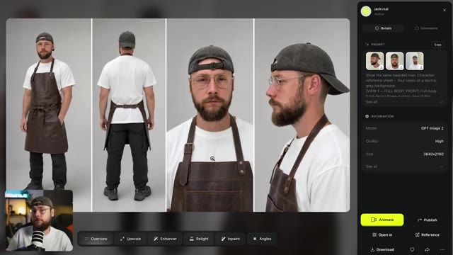
*Vue complète de l'interface montrant les 4 vues du personnage généré (chef avec tablier marron) avec les options de modèle (GPT Image 2) et les boutons d'action.*

---

### ⏱️ `[00:03:25 - 00:03:59]` | Segment #07

**🔊 Audio (Transcription Intégrale Mot pour Mot en Français) :**
> Je vois que je laisse exactement tel quel le cadre du prompt, en téléchargeant mes références d'images avec quelques angles différents de moi-même avec un bon éclairage et je dis simplement expression neutre portant un tablier en cuir marron, un pantalon cargo noir et des baskets Gorpcore sombres sans marque. Laissez-moi aussi vous montrer comment j'ai construit cette version de moi-même de style Pixar. Si vous touchez cette icône ici, c'est essentiellement pour recréer ce que vous avez déjà construit, donc ça va simplement intégrer toutes vos références d'images et le prompt que vous avez utilisé, donc si je fais ça pour le

**👁️ Analyse Visuelle d'Écran (gemini-3.5-flash-lite) :**
**Interface & Outils** : Interface web d'un outil de génération d'images par IA (style dashboard créatif avec onglets Explore, Image, Video, Supercomputer, etc.).

**Contenu textuel & Code** : Texte du prompt visible : "Show the same bearded man. Character reference sheet — four views on a neutral grey background: [VIEW 1 - FULL BODY, FRONT]..." Paramètres : GPT Image 2, High, 4K, 16:9, bouton "Generate ➔ 12".

**Action / Démonstration** : Le créateur montre son écran de travail avec l'interface de génération d'images, mettant en avant le prompt textuel et les images de référence utilisées pour le personnage.

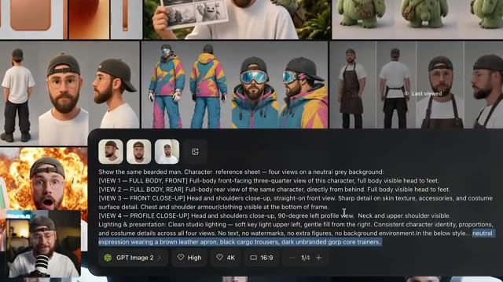
*Interface de génération affichant un prompt textuel détaillé et des miniatures de référence d'images du créateur pour la création de personnages.*

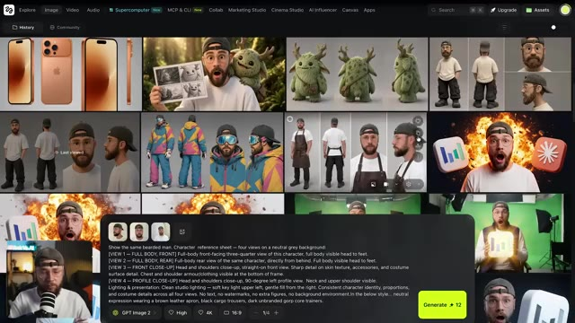
*Vue globale de l'interface de l'outil avec la grille d'images générées en arrière-plan et le panneau de prompt et de paramètres en bas.*

---

### ⏱️ `[00:03:59 - 00:04:33]` | Segment #08

**🔊 Audio (Transcription Intégrale Mot pour Mot en Français) :**
> version pixar de moi, vous pouvez voir que le prompt a été légèrement modifié mais que les références d'images sont exactement les mêmes. Tout ce que j'ai ajouté à la fin du prompt, c'est « style d'animation Pixar », donc vraiment très simple. Et vous pouvez également aller de l'avant et créer ces fiches de référence de produits de la même manière. Ceci utilise simplement une version modifiée du même cadre que, encore une fois, je partagerai avec vous les gars, et vous pouvez voir qu'en fait je n'avais pas du tout besoin d'utiliser de références d'images ici. C'est donc pour moi cette première étape dans laquelle d'autres créateurs ne s'attardent pas vraiment en détail, et en fin de compte, c'est

**👁️ Analyse Visuelle d'Écran (gemini-3.5-flash-lite) :**
**Interface & Outils** : Interface utilisateur web d'une plateforme de génération d'images et de vidéos par IA (style dashboard créatif avec onglets Explore, Image, Video, Supercomputer, etc.).

**Contenu textuel & Code** : Texte du prompt visible : « Show the same bearded man, white oversized t-shirt, black cargo trousers... In the below style... pixar animation style » et paramètres de génération (GPT Image 2, High, 2K, 16:9).

**Action / Démonstration** : Le créateur démontre l'interface de l'outil d'IA, met en avant les prompts textuels utilisés pour générer des feuilles de référence de personnages et de produits, et explique l'utilisation de modifications simples de prompts.

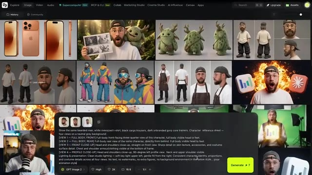
*Interface d'un générateur d'images affichant une galerie de visuels avec une boîte de dialogue de prompt détaillée pour la création d'une feuille de référence de personnage.*

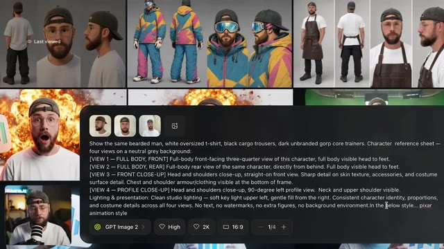
*Gros plan sur la boîte de texte contenant le prompt détaillé pour la génération de la feuille de référence de personnage avec le style Pixar.*

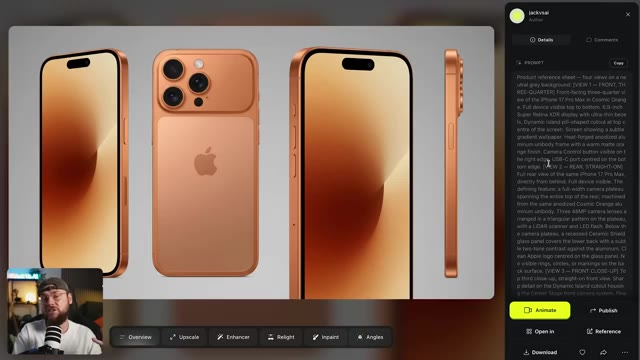
*Interface montrant des rendus de produits sous plusieurs angles (iPhone 17 Pro Max couleur orange cosmique) avec le prompt textuel correspondant sur le panneau latéral.*

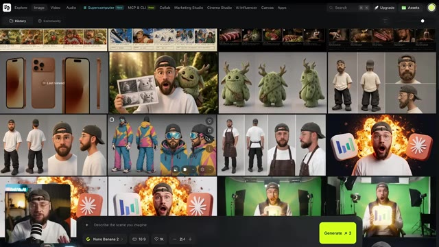
*Vue d'ensemble de la galerie de l'interface de génération d'IA montrant différents projets et personnages créés.*

---

### ⏱️ `[00:04:33 - 00:04:56]` | Segment #09

**🔊 Audio (Transcription Intégrale Mot pour Mot en Français) :**
> va simplement vous donner beaucoup plus de contrôle sur vos résultats finaux. Maintenant que nous avons créé nos références de personnages et de produits, nous pouvons nous pencher sur la génération de ces storyboards si importants. Et pour ce faire, je veux faire un exemple avec vous pour vous faire traverser l'ensemble du processus depuis le début. Donc la première chose que je vais faire, c'est simplement cliquer sur l'icône recréer parce que je sais que je veux utiliser toutes ces images de référence à nouveau.

**👁️ Analyse Visuelle d'Écran (gemini-3.5-flash-lite) :**
**Interface & Outils** : Interface logicielle de génération d'images/vidéos par IA avec panneau de prompt et prévisualisation de références.

**Contenu textuel & Code** : Texte du prompt visible : « Show the same bearded man, white oversized t-shirt, black cargo trousers, dark unbranded gorp core trainers. Character reference sheet — four views on a neutral grey background. [VIEW 1 – FULL BODY, FRONT]... ». Paramètres visibles : « GPT Image 2 », « High », « 2K », « 16:9 », et le bouton « Generate ».

**Action / Démonstration** : Le créateur présente l'étape suivante des storyboards puis zoome sur l'interface avec le prompt de référence de personnage et le bouton de génération.

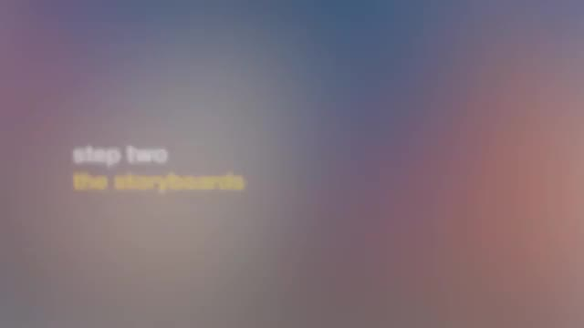
*Écran de transition montrant le titre de la section 'step two the storyboards' sur un fond coloré flou.*

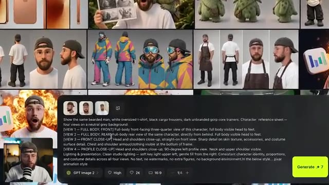
*Interface de l'outil montrant un prompt détaillé de feuille de référence de personnage avec des options de génération et un encadré vidéo de Jack en bas à gauche.*

---

### ⏱️ `[00:04:57 - 00:05:21]` | Segment #10

**🔊 Audio (Transcription Intégrale Mot pour Mot en Français) :**
> Et je veux ce cadre de prompt ici, mais je vais juste supprimer ce genre de référence de style à la fin. Et à la place, je vais mettre un style d'animation de type rubber hose. Donc avant d'envoyer ceci, nous voulons nous assurer que nous avons sélectionné « High » pour la fidélité visuelle. En termes de résolution, 2K va être suffisant pour ce processus spécifique, mais vous pouvez aller jusqu'à 4K si vous le souhaitez.

**👁️ Analyse Visuelle d'Écran (gemini-3.5-flash-lite) :**
**Interface & Outils** : Interface de génération d'images par intelligence artificielle (style interface de chat ou générateur de type GPT Image).

**Contenu textuel & Code** : Texte du prompt visible : « Show the same bearded man, white oversized t-shirt, black cargo trousers... In the below style... » avec des paramètres tels que « GPT Image 2 », « High », « 2K », « 16:9 ».

**Action / Démonstration** : Le créateur modifie le texte du prompt en remplaçant la référence de style par « rubber hose animation style », vérifie le réglage de fidélité sur « High », puis sélectionne la résolution « 2K ».

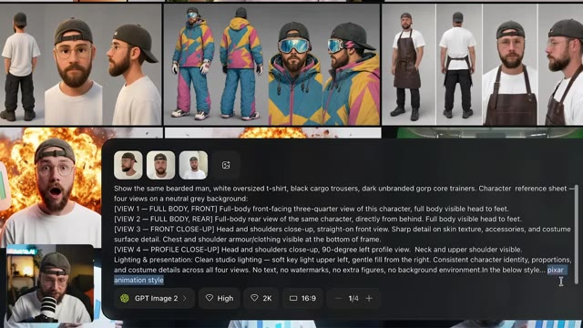
*Interface de génération d'images par IA montrant le prompt textuel avec le curseur sélectionnant la fin pour modifier le style.*

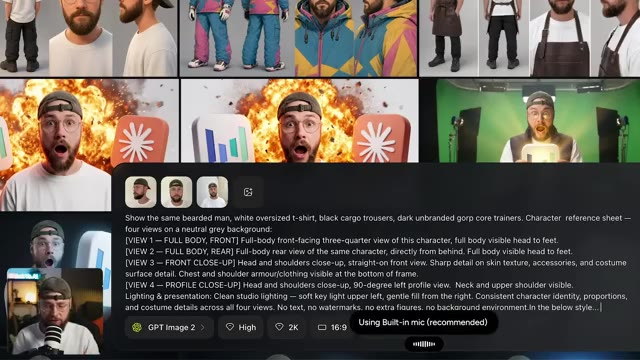
*Interface montrant le menu des paramètres de génération avec l'option de fidélité visuelle réglée sur « High ».*

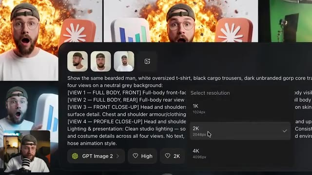
*Interface affichant le menu déroulant de sélection de la résolution avec « 2K (2048px) » sélectionné par le curseur.*

---

### ⏱️ `[00:05:21 - 00:05:41]` | Segment #11

**🔊 Audio (Transcription Intégrale Mot pour Mot en Français) :**
> 16 par 9 est le format d'image que nous voulons. Et allons-y pour générer deux options différentes juste pour avoir un peu un point de comparaison. Envoyons ça. En regardant nos résultats, ceux-ci sont plutôt cool. Je pense que je préfère celui-ci à cette version particulière simplement parce qu'il a le genre de gants de Mickey Mouse dedans.

**👁️ Analyse Visuelle d'Écran (gemini-3.5-flash-lite) :**
**Interface & Outils** : Interface web d'un outil de génération d'images et de vidéos par IA (type Seedance / plateforme créative), avec panneau de prompt, paramètres de qualité (High, 2K, format 16:9) et options d'animation.

**Contenu textuel & Code** : Texte du prompt visible : "Show the same bearded man, white oversized t-shirt, black cargo trousers... Character reference sheet — four views on a neutral grey background". Paramètres : Modèle GPT Image 2, Qualité High, Résolution 2688x1520, Format 16:9.

**Action / Démonstration** : Le créateur montre la configuration des paramètres de génération, lance le processus puis compare les résultats visuels obtenus à l'écran.

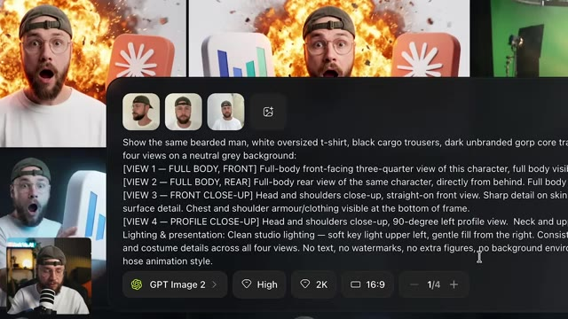
*Interface de l'outil montrant les paramètres de génération de l'image avec le prompt descriptif et le format 16:9 sélectionné.*

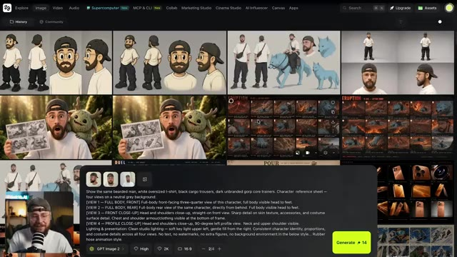
*Vue d'ensemble de la galerie de projets montrant la boîte de dialogue de génération active et le bouton "Generate".*

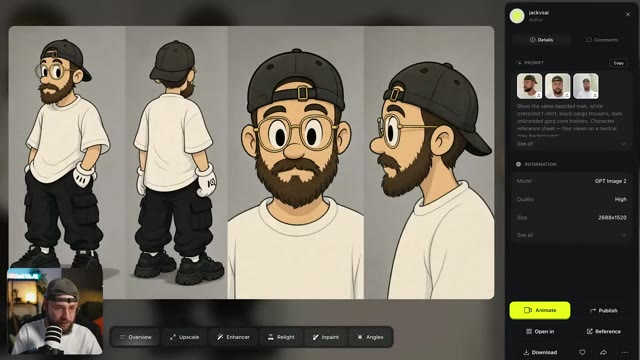
*Affichage des résultats générés avec des personnages de style dessin animé, montrant les gants de type Mickey Mouse.*

---

### ⏱️ `[00:05:41 - 00:05:59]` | Segment #12

**🔊 Audio (Transcription Intégrale Mot pour Mot en Français) :**
> et le visage est un peu étrange sur celui-ci. Donc nous allons continuer et utiliser celui-ci ici. Vous voulez le télécharger pour commencer. Et la prochaine chose dont nous avons besoin est notre prompt textuel. Le framework lui-même va en fait être vraiment assez complexe, mais heureusement tout ce que nous avons à faire est assez simple.

**👁️ Analyse Visuelle d'Écran (gemini-3.5-flash-lite) :**
**Interface & Outils** : Interface web de génération d'images par IA avec un panneau contextuel affichant un prompt textuel et des options de paramétrage (High, ratio 16:9, etc.). Présence d'un encadré PiP (Picture-in-Picture) montrant Jack en bas à gauche.

**Contenu textuel & Code** : Le prompt textuel visible dans l'interface indique : "Show the same bearded man, white oversized t-shirt, black cargo trousers, dark unbranded gorp core trainers. Character reference sheet — four views on a neutral grey background: [VIEW 1 — FULL BODY, FRONT]..." On aperçoit également les boutons de génération avec le texte "Generate", ainsi que les paramètres de qualité et de format (16:9).

**Action / Démonstration** : Le créateur montre l'interface de génération d'images IA avec une grille de visuels de personnages et un prompt détaillé sélectionné, tout en s'exprimant sur l'utilisation de ces ressources.

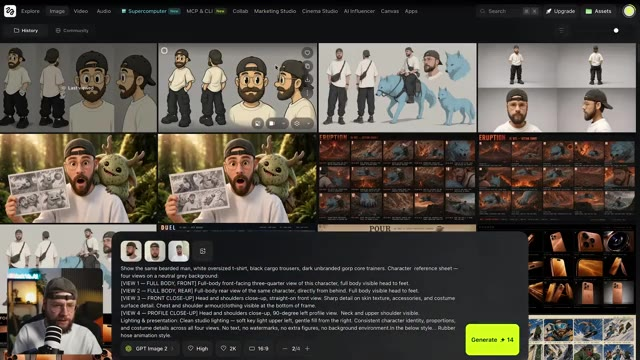
*Interface d'une application web de génération d'images par IA montrant une galerie de créations et une boîte de dialogue avec un prompt textuel détaillé pour une feuille de référence de personnage.*

---

### ⏱️ `[00:05:59 - 00:06:33]` | Segment #13

**🔊 Audio (Transcription Intégrale Mot pour Mot en Français) :**
> Et tout cela grâce à un fichier MD que je vais également partager avec vous les gars. Le truc génial avec ça, c'est que vous pouvez l'utiliser dans Claude, Gemini, ChatGPT, n'importe quel grand modèle de langage que vous préférez. Donc ce que vous voulez faire, c'est cliquer sur le bouton de téléchargement, puis je vais bien sûr partager avec vous le générateur de prompts de story-board. Vous allez donc le déposer directement dans l'LLM de votre choix. Et nous voulons également aller de l'avant et télécharger cette image du personnage que nous venons de créer. Alors déposons cela directement ici également. Et comme je l'ai dit à

**👁️ Analyse Visuelle d'Écran (gemini-3.5-flash-lite) :**
**Interface & Outils** : Interface web de Claude (Anthropic) avec un thème sombre, montrant le champ de texte "How can I help you today?", les options de sélection de modèle (Opus 4.6 Extended), et une incrustation vidéo (Picture-in-Picture) du créateur face caméra.

**Contenu textuel & Code** : Texte affiché à l'écran : "Happy Friday, Jack", champ de saisie avec le texte "How can I help you today?", bouton de téléchargement (+), sélecteur de modèle "Opus 4.6 Extended", icônes de microphone et de haut-parleur, ainsi que des catégories d'actions rapides (Write, Create, Learn, Code, Life stuff).

**Action / Démonstration** : Le créateur partage son écran sur l'interface de Claude, montrant la page d'accueil de l'outil avec son encadré vidéo incrusté en bas à gauche.

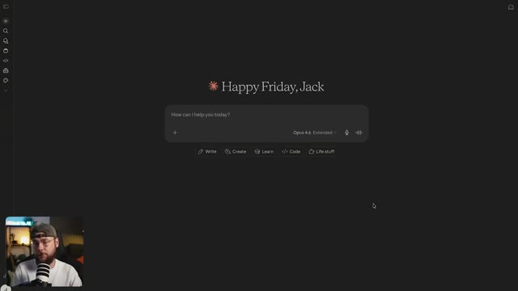
*Interface de l'assistant IA Claude avec le message d'accueil "Happy Friday, Jack" et un encadré PiP montrant le créateur en bas à gauche.*

---

### ⏱️ `[00:06:33 - 00:06:52]` | Segment #14

**🔊 Audio (Transcription Intégrale Mot pour Mot en Français) :**
> Au début de la vidéo, l'étape de conception du personnage était complètement facultative, donc si vous n'en avez pas créé un, ne le téléchargez tout simplement pas, c'est tout à fait correct. Vous obtiendrez quand même un prompt textuel de très bonne qualité, vous aurez juste un peu moins de contrôle sur vos résultats finaux, et littéralement tout ce que nous avons à faire maintenant est de décrire le type de scène que nous recherchons.

**👁️ Analyse Visuelle d'Écran (gemini-3.5-flash-lite) :**
**Interface & Outils** : Interface web sombre avec une boîte de dialogue de type assistant IA (style Claude), montrant un fichier joint nommé "storyboard-prompt-builder.md" et une image miniature d'un personnage stylisé, avec l'encadré vidéo PiP du créateur en bas à gauche.

**Contenu textuel & Code** : Texte affiché : "Happy Friday, Jack", "storyboard-prompt-builder.md", "How can I help you today?", "Opus 4.6 Extended".

**Action / Démonstration** : Le créateur montre l'interface d'un assistant textuel/IA sur son écran où un prompt ou fichier de configuration pour le storyboard a été chargé, tout en s'exprimant face caméra (présent en médaillon PiP).

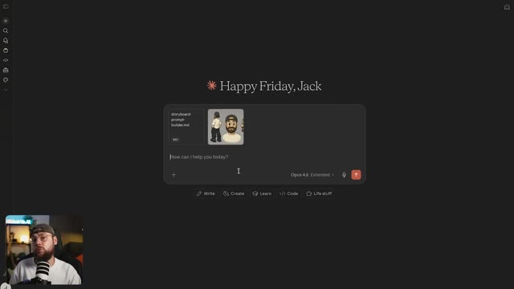
*Interface d'une application (type Claude) avec une image de design de personnage importée et le message de prompt "How can I help you today?"*

---

### ⏱️ `[00:06:52 - 00:07:25]` | Segment #15

**🔊 Audio (Transcription Intégrale Mot pour Mot en Français) :**
> Donc je vais dire scène de dessin animé ultra dynamique où l'homme barbu prépare un latte dans un café en terminant avec un superbe art du latte. On peut simplement envoyer ça et Claude ou quel que soit le LLM que vous utilisez va vous écrire ce prompt vraiment détaillé. Vous pouvez voir ici que ça indique lecture de la compétence de construction de prompt de storyboard. Ça va tout développer pour nous. Et comme vous pouvez le voir, nous obtenons en retour ce prompt extrêmement riche en détails qui est

**👁️ Analyse Visuelle d'Écran (gemini-3.5-flash-lite) :**
**Interface & Outils** : Interface web de l'assistant LLM Claude, avec un encart PiP de Jack dans le coin inférieur gauche.

**Contenu textuel & Code** : Texte de bienvenue "Happy Friday, Jack" et boîte de saisie avec le fichier joint "storyboard-prompt-builder.md" et la question "How can I help you today?". Modèle indiqué : "Opus 4.6 Extended".

**Action / Démonstration** : Le créateur montre l'interface de Claude avec le fichier de compétences de construction de prompt de storyboard importé, prêt à générer un prompt détaillé pour une scène de café.

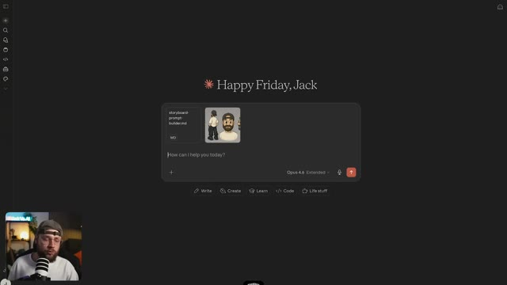
*Interface de l'assistant IA Claude affichant le message de bienvenue avec un fichier joint et le champ de saisie du prompt.*

---

### ⏱️ `[00:07:25 - 00:08:00]` | Segment #16

**🔊 Audio (Transcription Intégrale Mot pour Mot en Français) :**
> je vais donner à GPT image tout ce dont il a besoin pour créer notre story-board. Tout ce que vous avez à faire, c'est de copier ce prompt ici. Nous pouvons retourner sur Higgsfield et le coller dans le champ de texte du prompt. Nous n'avons absolument rien à modifier. La seule chose que nous voulons faire, c'est de sélectionner ceci comme référence d'image. Encore une fois, si vous sautez cette étape, aucun problème. Vous obtiendrez juste un résultat légèrement plus générique. Je vais donc cliquer sur cette icône ici et cette animation de style tuyau de caoutchouc sera utilisée.

**👁️ Analyse Visuelle d'Écran (gemini-3.5-flash-lite) :**
**Interface & Outils** : Higgsfield (plateforme de génération vidéo et d'images par IA)

**Contenu textuel & Code** : Texte du prompt visible : "15-second animated storyboard sheet for a cartoon comedy short film titled 'The Perfect Pour'. A complete professional animation storyboard presentation page featuring 15 sequential cinematic panels arranged in a clean 3x5 grid layout. 16:9 aspect ratio." Paramètres visibles : "GPT Image 2", "High", icônes de paramètres, ratio 16:9, bouton "Generate -> 14".

**Action / Démonstration** : Le présentateur montre l'interface de Higgsfield et le champ de saisie où le prompt est inséré avec une référence d'image.

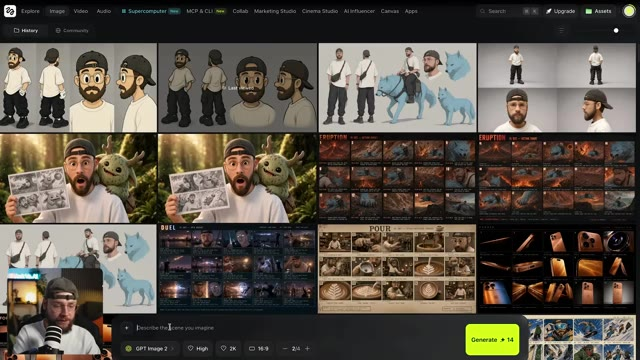
*Interface de la plateforme Higgsfield montrant la galerie de créations et le champ de saisie du prompt textuel en bas.*

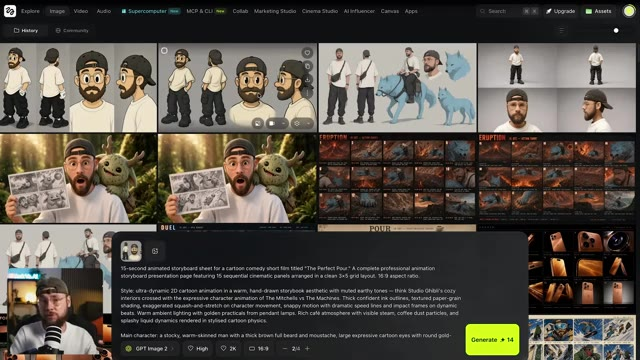
*Interface de Higgsfield affichant le prompt détaillé entré pour la génération du story-board animé.*

---

### ⏱️ `[00:08:00 - 00:08:32]` | Segment #17

**🔊 Audio (Transcription Intégrale Mot pour Mot en Français) :**
> comme référence d'image pour notre storyboard GPT Image 2. Maintenant, pour le storyboard lui-même, je suggère de passer à la 4K ici parce que plus nous donnons de détails et de fidélité à C-Dance 2, plus l'animation de fin sera de haute qualité. Encore une fois, nous voulons un format 16 par 9 et je vais avoir une taille de lot de deux. Générons donc notre storyboard. D'accord, nous avons récupéré nos deux générations de storyboard ici. Et je pense que les deux ont l'air vraiment très cool.

**👁️ Analyse Visuelle d'Écran (gemini-3.5-flash-lite) :**
**Interface & Outils** : Interface web de génération d'images et de storyboards par IA (style Seedance / GPT Image 2) avec panneau de configuration des prompts et options de format.

**Contenu textuel & Code** : Texte du prompt visible : '15-second animated storyboard sheet for a cartoon comedy short film titled 'The Perfect Pour'...'. Paramètres visibles : Modèle GPT Image 2, Qualité High, Résolution 4K (3840x2160), Format 16:9, Batch size 2/4. Grille finale de 15 cases numérotées illustrant les scènes du film d'animation.

**Action / Démonstration** : Le créateur montre l'interface de génération, ajuste la résolution en 4K pour plus de détails, lance la génération et présente les deux résultats de storyboards générés à l'écran.

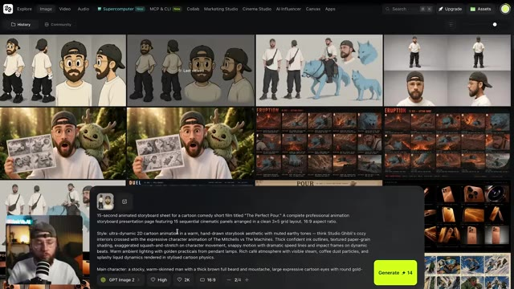
*Interface de l'outil de génération de storyboard montrant les paramètres du modèle GPT Image 2, la qualité configurée sur High et le format 16:9.*

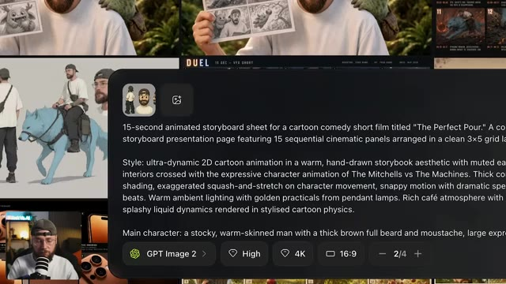
*Gros plan sur l'interface montrant la modification des paramètres avec le passage de la qualité à 4K pour le storyboard.*

*Affichage du résultat final avec une grille de 15 panneaux de storyboard générés pour le projet 'The Perfect Pour'.*

---

### ⏱️ `[00:08:33 - 00:09:09]` | Segment #18

**🔊 Audio (Transcription Intégrale Mot pour Mot en Français) :**
> Le style est resté bien cohérent tout du long. Il y a juste un petit problème ici. Et c'est que, curieusement, pour les deux générations, le panneau numéro cinq du storyboard est devenu presque photoréaliste, surtout le genre de mouture de café qui tombe dans le porte-filtre, je crois que c'est comme ça que ça s'appelle, mais ce qui est vraiment utile avec un modèle d'image comme GPT Image 2, c'est qu'on peut y aller, et je vais juste effacer le champ de prompt ici et supprimer ma référence d'image actuelle. Si je clique sur l'icône de référence ici, nous allons maintenant pouvoir apporter des modifications à notre storyboard.

**👁️ Analyse Visuelle d'Écran (gemini-3.5-flash-lite) :**
**Interface & Outils** : Interface de l'outil de génération d'images par IA (GPT Image 2 / plateforme de création) avec panneau latéral de configuration et outils d'édition (Overview, Upscale, Enhancer, Relight, Inpaint, Angles, Animate, Publish, Reference).

**Contenu textuel & Code** : Texte du prompt visible : "15-second animated storyboard sheet for a cartoon comedy short film titled 'The Perfect Pour'. A complete professional animation storyboard presentation page featuring 15 sequential cinematic panels arranged in a clean 3x5 grid layout; 16:9 aspect ratio. Style: ultra-dynamic 2D cartoon animation..." Informations techniques : Modèle "GPT Image 2", Qualité "High", Format "3840x2160".

**Action / Démonstration** : Le créateur montre et commente les différentes générations de storyboards à l'écran, en effectuant un zoom sur le panneau 5 pour pointer le problème de style photoréaliste, puis navigue dans l'interface pour préparer la modification du prompt et de la référence.

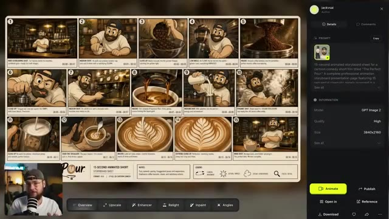
*Vue d'ensemble de l'interface de génération affichant une feuille de storyboard à 15 panneaux pour le court-métrage "The Perfect Pour", avec le panneau 5 montrant des grains de café moulus.*

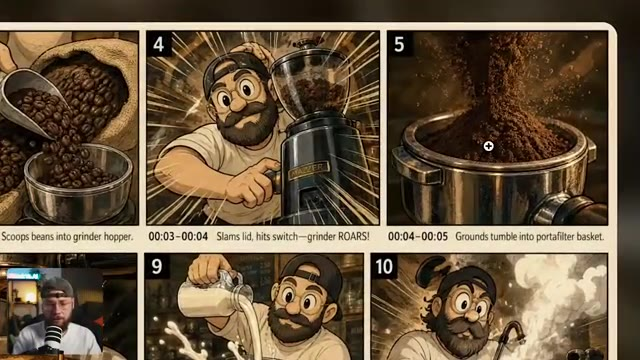
*Gros plan sur le storyboard montrant spécifiquement le panneau numéro 5 où la mouture de café tombe dans le porte-filtre avec un rendu photoréaliste.*

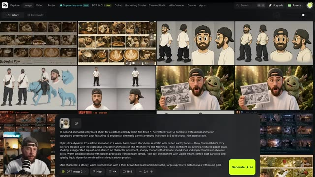
*Affichage de l'interface de l'application avec l'historique des générations et le champ de prompt détaillé de GPT Image 2 visible en bas.*

---

### ⏱️ `[00:09:09 - 00:09:28]` | Segment #19

**🔊 Audio (Transcription Intégrale Mot pour Mot en Français) :**
> et je vais simplement dire de veiller à ce que le panneau 5 ait le même style d'animation « rubber hose » appliqué que le reste du film. On va laisser la résolution en 4k et on va opter pour une taille de lot de un ici et envoyer cette génération pour modifier notre storyboard existant.

**👁️ Analyse Visuelle d'Écran (gemini-3.5-flash-lite) :**
**Interface & Outils** : Interface de génération d'images/storyboard assistée par IA avec options de modèles (GPT Image 2), qualité (High), résolution (4K), ratio (16:9) et taille de lot (batch size 2/4).

**Contenu textuel & Code** : Texte du prompt saisi : "Ensure that panel 5 has the same rubber hose animation style applied to it as the rest of the film." Paramètres visibles : GPT Image 2, High, 4K, 16:9, batch size 2/4. En arrière-plan, grille de storyboard intitulée "ERUPTION 15 SEC - ACTION SHORT".

**Action / Démonstration** : Le créateur tape un prompt textuel pour ajuster le panneau 5 d'un storyboard existant tout en paramétrant la résolution en 4K et la taille de lot.

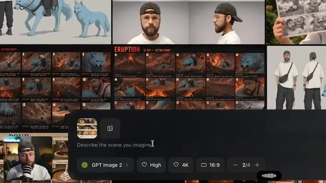
*Interface de génération affichant un storyboard de film d'action volcanique en arrière-plan avec une boîte de dialogue de prompt en cours de rédaction.*

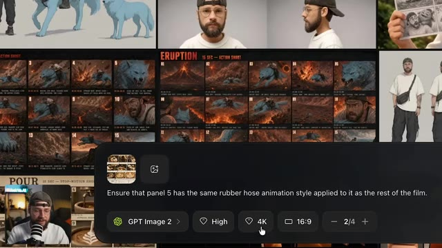
*Interface de génération avec la saisie complète du prompt concernant le panneau 5 et les réglages de résolution en 4K.*

---

### ⏱️ `[00:09:28 - 00:10:01]` | Segment #20

**🔊 Audio (Transcription Intégrale Mot pour Mot en Français) :**
> Et vous pouvez maintenant voir que le problème que nous avions avec notre panneau 5 a été complètement rectifié. Cela semble beaucoup plus en phase avec le reste de notre court-métrage ici. Donc maintenant ce que nous voulons faire, c'est survoler l'onglet vidéo et nous pouvons aller sur cdance2. La première étape est de télécharger nos médias. Donc si nous allons dans les générations d'images ici, vous pouvez voir que nous avons tous les storyboards et références de personnages que nous avons construits en utilisant GPT image2. La première étape que vous voulez

**👁️ Analyse Visuelle d'Écran (gemini-3.5-flash-lite) :**
**Interface & Outils** : Interface web de génération d'IA (comprenant la visionneuse de storyboard/galerie et l'interface de Seedance).

**Contenu textuel & Code** : Texte du prompt visible sur l'image 1 : "Ensure that panel 5 has the same rubber hose animation style applied to it as the rest of the film." Paramètres affichés : Modèle GPT Image 2, Qualité High, Taille 3840x2160. Sur l'image 3 : Interface de Seedance avec les onglets "Uploads", "Image Generations", "Video Generations", "Elements", "Liked".

**Action / Démonstration** : Le créateur navigue dans son interface de génération, montrant d'abord le storyboard corrigé du court-métrage, puis la galerie globale des créations, et enfin l'onglet de téléchargement des médias de Seedance.

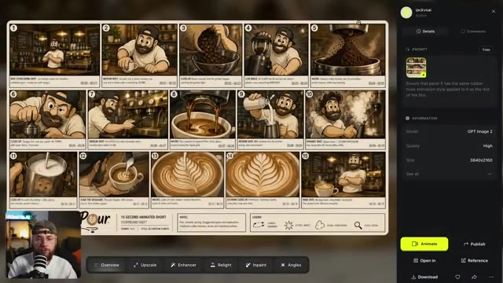
*Affichage d'une planche de storyboard de 15 secondes pour un court-métrage intitulé "The Perfect Pour" montrant 15 vignettes illustrées sur le processus de fabrication du café, avec le panneau latéral affichant les détails du modèle GPT Image 2.*

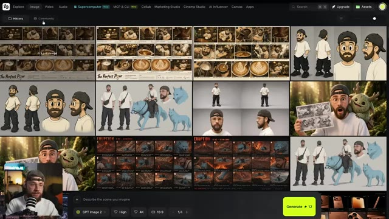
*Grille de la galerie d'images présentant divers storyboards de courts-métrages ("The Perfect Pour", "Eruption") et des feuilles de références de personnages créés avec GPT Image 2.*

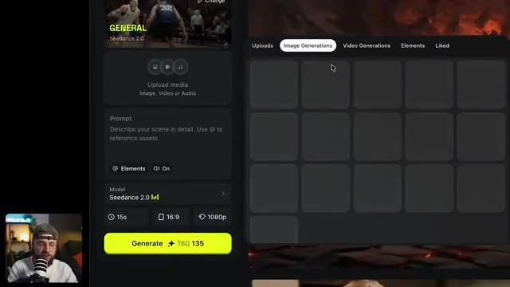
*Interface de Seedance montrant le panneau d'importation de médias avec l'onglet "Image Generations" actif affichant une grille vide d'éléments générés et le champ de prompt.*

---

### ⏱️ `[00:10:01 - 00:10:36]` | Segment #21

**🔊 Audio (Transcription Intégrale Mot pour Mot en Français) :**
> de faire c'est de cliquer sur vérifier l'éligibilité et ceci va basiquement juste scanner vos images en vérifiant tout type d'infraction au droit d'auteur ou de problèmes de propriété intellectuelle. Vous pouvez aussi aller faire exactement la même chose pour notre feuille de référence de personnage également. Et juste comme ça, notre feuille de référence de personnage et notre storyboard ont tous les deux été jugés éligibles. Donc nous pouvons cliquer sur le storyboard pour commencer afin de le sélectionner. Et si je vais juste sur l'une de mes générations précédentes et que je clique au sommet du texte du prompt, ça va juste remplir ce champ ici avec exactement le même texte de prompt, ce qui est vraiment utile.

**👁️ Analyse Visuelle d'Écran (gemini-3.5-flash-lite) :**
**Interface & Outils** : Interface de l'outil de génération vidéo Seedance 2.0.

**Contenu textuel & Code** : Panneau latéral avec les sections "GENERAL", "Prompt" contenant l'instruction "Use the reference storyboard to make a full animation movie...", et les boutons de paramétrage (15s, 16:9, 1080p, Generate 135). Une grille d'images de génération avec des boutons "Check eligibility".

**Action / Démonstration** : Le créateur navigue dans son interface Seedance, vérifie l'éligibilité des images générées et sélectionne le storyboard pour préparer la génération de la vidéo.

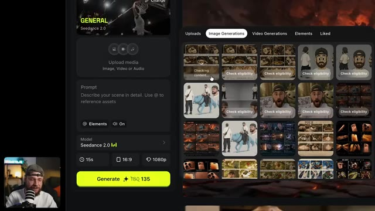
*Interface de Seedance montrant la grille d'images générées avec l'option "Check eligibility" active sur les vignettes.*

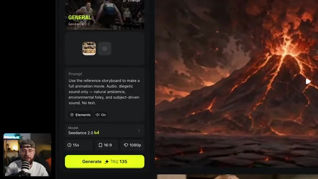
*Interface de Seedance montrant le prompt textuel et le storyboard sélectionné avec un aperçu de volcan en éruption en arrière-plan.*

---

### ⏱️ `[00:10:36 - 00:10:57]` | Segment #22

**🔊 Audio (Transcription Intégrale Mot pour Mot en Français) :**
> Et tout ce que nous disons pour notre prompt textuel, de manière assez simple, c'est d'utiliser les storyboards de référence pour faire un film d'animation complet. L'audio, nous disons son diégétique uniquement, ambiance naturelle, bruitages environnementaux et son piloté par le sujet. Maintenant, vous pourriez omettre cela de votre prompt textuel si cela ne vous dérangeait pas que Seedance 2 ajoute de la musique pour vous.

**👁️ Analyse Visuelle d'Écran (gemini-3.5-flash-lite) :**
**Interface & Outils** : Interface web de Seedance 2.0 avec disposition en colonnes (panneau de configuration à gauche, prévisualisation vidéo d'un volcan en éruption à droite, et incrustation vidéo PiP du créateur dans le coin inférieur gauche).

**Contenu textuel & Code** : Texte du prompt visible : "Use the reference storyboard to make a full animation movie. Audio: diegetic sound only — natural ambience, environmental foley, and subject-driven sound. No text." Paramètres du modèle : Seedance 2.0, durée de 15s, format 16:9, résolution 1080p, bouton Generate (coût de 135 crédits).

**Action / Démonstration** : Le curseur de la souris survole le texte du prompt dans l'interface de Seedance 2.0 pendant que le créateur présente sa configuration.

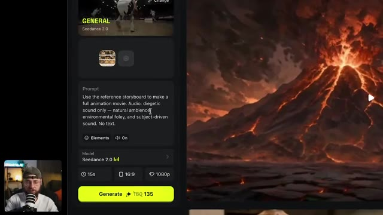
*Interface de Seedance 2.0 montrant le prompt textuel avec les instructions d'animation et de son diégétique, ainsi que le panneau de génération vidéo.*

---

### ⏱️ `[00:10:57 - 00:11:15]` | Segment #23

**🔊 Audio (Transcription Intégrale Mot pour Mot en Français) :**
> Mais veillez absolument à ne laisser aucun texte. La raison pour laquelle ce prompt peut être si basique, c'est le fait que si nous allons ouvrir notre storyboard en plein écran, Seedance 2 a intégré toutes ces informations directement dans le storyboard lui-même.

**👁️ Analyse Visuelle d'Écran (gemini-3.5-flash-lite) :**
**Interface & Outils** : Interface web de Seedance 2.0 et visionneuse de storyboard en plein écran.

**Contenu textuel & Code** : Texte du prompt visible : "Use the reference storyboard to make a full animation movie. Audio: diegetic sound only — natural ambience, environmental foley, and subject-driven sound. No text." Modèle sélectionné : Seedance 2.0 (15s, 16:9, 1080p).

**Action / Démonstration** : Le curseur survole et sélectionne le texte du prompt dans l'interface, puis l'écran bascule pour afficher le storyboard complet en plein écran.

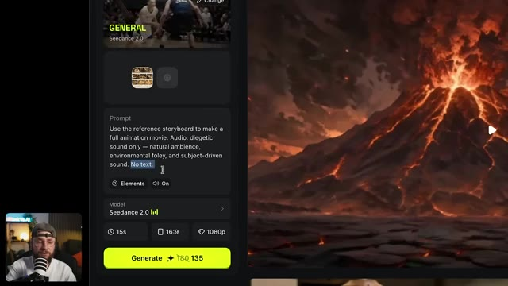
*Interface de Seedance 2.0 montrant le prompt textuel et les paramètres de génération vidéo.*

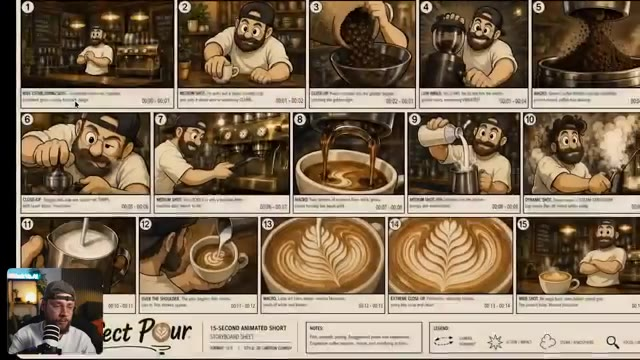
*Affichage en plein écran d'une grille de storyboard détaillée comportant 15 cases illustrées sur la fabrication d'un café.*

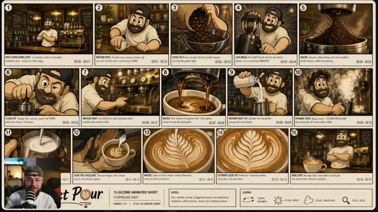
*Vue complète en plein écran du storyboard nommé "Perfect Pour" avec ses 15 scènes numérotées et légendées.*

---

### ⏱️ `[00:11:15 - 00:11:46]` | Segment #24

**🔊 Audio (Transcription Intégrale Mot pour Mot en Français) :**
> Donc il est capable d'extraire le texte de ceci et de comprendre ce que nous recherchons. Et une étape supplémentaire, et encore une fois c'est optionnel, mais si vous voulez un niveau de contrôle plus élevé sur votre résultat final, c'est que vous voudrez peut-être ajouter la feuille de personnage également. J'ai eu de bons résultats en utilisant simplement le storyboard, mais ajouter également la feuille de personnage peut vous donner un peu plus de contrôle, un peu plus de cohérence, et au final cela vous amène à dépenser moins de crédits en régénérations et des choses comme ça.

**👁️ Analyse Visuelle d'Écran (gemini-3.5-flash-lite) :**
**Interface & Outils** : Interface de l'outil de génération vidéo par IA Seedance 2.0, combinée avec la présentation d'une feuille de storyboard détaillée comportant 15 plans numérotés.

**Contenu textuel & Code** : Texte du prompt visible dans Seedance 2.0 : « Use the reference storyboard to make a full animation movie. Audio: diegetic sound only — natural ambience, environmental foley, and subject-driven sound. No text. ». Paramètres affichés : modèle Seedance 2.0, durée 15s, format 16:9, résolution 1080p, coût de génération de 135 crédits.

**Action / Démonstration** : Le créateur montre d'abord une planche de storyboard détaillée, puis bascule sur l'interface de Seedance 2.0 pour configurer un prompt de génération vidéo basé sur cette référence, avant d'ouvrir un panneau pop-up montrant différentes images et feuilles de personnages sélectionnables.

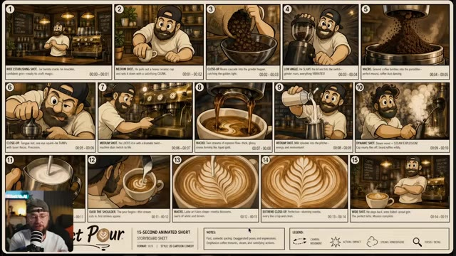
*Affichage à l'écran d'une feuille de storyboard complète de 15 secondes pour un court métrage animé de café avec 15 cases numérotées, avec le créateur en incrustation vidéo (PiP) dans le coin inférieur gauche.*

*Interface de Seedance 2.0 affichant les paramètres de génération vidéo, le champ de prompt textuel et le bouton de génération, avec le créateur en incrustation vidéo (PiP) dans le coin inférieur gauche.*

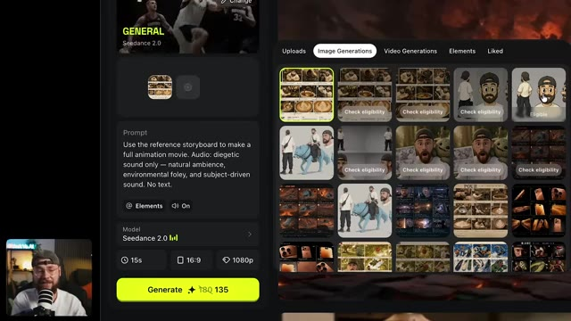
*Interface de Seedance 2.0 ouverte sur le menu de sélection des images et des éléments avec une grille de miniatures, avec le créateur en incrustation vidéo (PiP) dans le coin inférieur gauche.*

---

### ⏱️ `[00:11:46 - 00:12:19]` | Segment #25

**🔊 Audio (Transcription Intégrale Mot pour Mot en Français) :**
> Donc les deux flux de travail sont viables. Je vais intégrer la fiche de référence des personnages pour qu'elle fonctionne aux côtés de notre storyboard. Je pense qu'on va tester ça ici. Pour la durée du plan, je vais opter pour 15 secondes. Si vous voulez générer une vidéo plus courte, c'est tout à fait possible. Tout ce que vous avez à faire, c'est de retourner sur Claude ou le grand modèle de langage que vous utilisez et de lui dire simplement : "Je veux que tu reformates les prompts pour que cela fonctionne pour une génération de 10 secondes", et il ajustera ce cadre et vous renverra un nouveau prompt. Vous pouvez ensuite aller déposer...

**👁️ Analyse Visuelle d'Écran (gemini-3.5-flash-lite) :**
**Interface & Outils** : Seedance (pour les images 1 et 2) et l'interface de discussion de Claude 4.6 Extended (pour l'image 3), avec incrustation vidéo (PiP) du créateur en bas à gauche.

**Contenu textuel & Code** : Sur l'image 1 et 2 : Prompt visible : "Use the reference storyboard to make a full animation movie. Audio: diegetic sound only - natural ambience, environmental foley, and subject-driven sound. No text." Réglages : Seedance 2.0, 15s, 16:9, 1080p. Sur l'image 3 : Texte du prompt sur le storyboard du barista barbu, direction artistique et "Companion notes".

**Action / Démonstration** : Le créateur montre la configuration d'un plan de 15 secondes dans Seedance, l'utilisation de fiches de personnages, puis bascule sur l'interface de Claude pour illustrer la modification des prompts pour une durée plus courte.

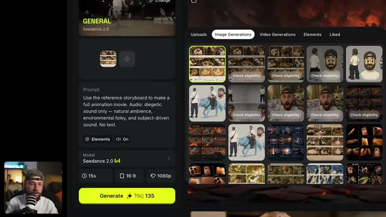
*Interface de Seedance montrant le panneau de génération vidéo avec le champ de prompt, la sélection du modèle Seedance 2.0 et la grille d'images de référence.*

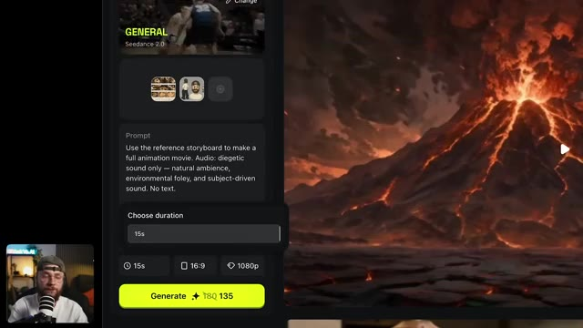
*Interface de Seedance montrant le paramètre "Choose duration" réglé sur 15s au-dessus du bouton de génération.*

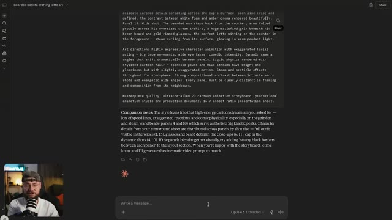
*Interface du modèle de langage Claude affichant un prompt détaillé pour un storyboard d'animation de barista et des notes complémentaires (Companion notes).*

---

### ⏱️ `[00:12:19 - 00:12:59]` | Segment #26

**🔊 Audio (Transcription Intégrale Mot pour Mot en Français) :**
> directement dans C-Dance 2. Le format d'image dépend entièrement de vous les gars. Si vous voulez utiliser ceci pour du contenu sur les réseaux sociaux, du 9 par 16 sera la meilleure option, dans mon cas je vais sélectionner du 16 par 9 et ensuite pour la résolution j'opte généralement pour du 1080p, mon approche générale est que je veux la meilleure qualité possible disponible mais si vous vouliez dépenser moins de crédits et que vous utilisez simplement ceci comme un prototype ou pour tester, vous pourriez opter pour du 720p, je suis sûr que c'est très bien pour la plupart des cas d'utilisation. Le 480p devient probablement un peu trop bas. Dans mon cas, testons le 1080p pour que nous puissions

**👁️ Analyse Visuelle d'Écran (gemini-3.5-flash-lite) :**
**Interface & Outils** : Interface web de Seedance 2.0 avec un panneau latéral de configuration et une grande zone de prévisualisation vidéo.

**Contenu textuel & Code** : Panneau latéral affichant les paramètres du projet : Modèle (Seedance 2.0), durée (15s), format (16:9), résolution (1080p), prompt textuel descriptif et bouton "Generate" indiquant un coût de 135 crédits.

**Action / Démonstration** : Le créateur démontre comment sélectionner les options de format d'image et de résolution dans l'interface de Seedance, puis clique sur le menu déroulant des résolutions pour choisir le format 1080p.

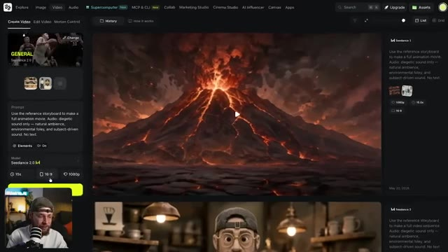
*Interface de Seedance 2.0 montrant le panneau de configuration avec les options de format d'image (16:9) et de résolution (1080p) ainsi qu'un aperçu vidéo d'un volcan en éruption, avec le créateur en incrustation (PiP).*

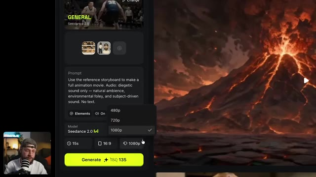
*Interface de Seedance 2.0 affichant le menu déroulant de sélection de la résolution (480p, 720p, 1080p) lors du paramétrage avant la génération, avec le créateur en incrustation (PiP).*

---

### ⏱️ `[00:12:59 - 00:13:37]` | Segment #27

**🔊 Audio (Transcription Intégrale Mot pour Mot en Français) :**
> envoyer cette génération. Comme je le dis, nous utilisons le storyboard en combinaison avec la feuille de référence des personnages et ce prompt incroyablement simple ici, le tout via C-Dance 2. Jetons un coup d'œil à ce que nous obtenons en retour. Donc, bien que ce ne soit pas parfait, nous récupérons cette très belle séquence dynamique qui a ce style de dessin animé cohérent du début à la fin. Ce que je veux faire maintenant, c'est vous montrer

**👁️ Analyse Visuelle d'Écran (gemini-3.5-flash-lite) :**
**Interface & Outils** : Seedance 2.0 (interface de génération vidéo par IA)

**Contenu textuel & Code** : Texte du prompt : "Use the reference storyboard to make a full animation movie. Audio: diegetic sound only — natural ambience, environmental foley, and subject-driven sound. No text." Paramètres visibles : Modèle "Seedance 2.0", durée "15s", format "16:9", résolution "1080p".

**Action / Démonstration** : Présentation de l'interface de Seedance 2.0 avec le prompt textuel et affichage du résultat généré montrant un personnage de style cartoon dans un café.

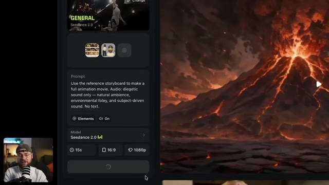
*Interface de Seedance 2.0 montrant le panneau de configuration avec le prompt textuel et les options de génération.*

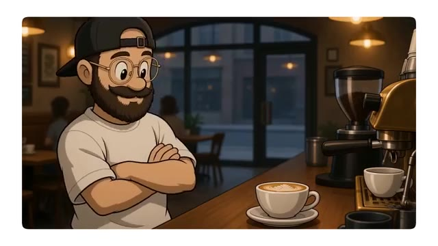
*Rendu vidéo généré montrant le personnage de dessin animé dans un café devant une machine à espresso.*

---

### ⏱️ `[00:13:37 - 00:14:13]` | Segment #28

**🔊 Audio (Transcription Intégrale Mot pour Mot en Français) :**
> les gars d'autres exemples. Nous avons ici deux vidéos de cuisine qui ont été présentées d'une manière très cinématique. Vous pouvez voir les storyboards dans le coin supérieur gauche et encore une fois, ils semblent agréables et dynamiques et il y a un bon niveau de cohérence. Également assez impressionné par certains des détails texturaux à l'intérieur de ces deux vidéos ainsi que et je voulais juste essayer quelque chose de complètement différent de ce à quoi vous pourriez vous attendre pour vous montrer que ce flux de travail est assez polyvalent. Vous pouvez l'utiliser pour toutes sortes d'approches. Nous avons également ce genre de 1970

**👁️ Analyse Visuelle d'Écran (gemini-3.5-flash-lite) :**
**Interface & Outils** : Démonstration vidéo avec incrustation du créateur (picture-in-picture) dans le coin inférieur gauche et affichage d'un storyboard séquentiel dans le coin supérieur droit.

**Contenu textuel & Code** : Storyboards affichés dans les coins supérieurs droits avec des grilles de vignettes numérotées illustrant le découpage des plans des différentes vidéos cinématiques présentées.

**Action / Démonstration** : Le créateur présente des exemples de vidéos générées par IA aux styles variés (cuisine réaliste puis animation style années 1970/style BD) en commentant leur cohérence et leurs détails texturaux.

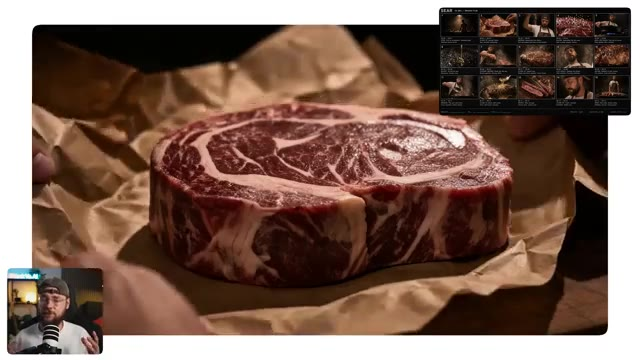
*Présentation d'un premier exemple de vidéo de cuisine cinématique générée par IA montrant un gros plan sur un steak cru, avec son storyboard affiché dans le coin supérieur droit.*

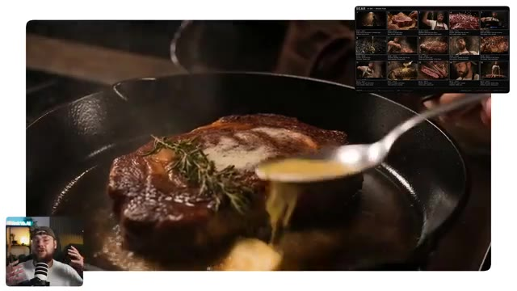
*Poursuite de la vidéo de cuisine avec un gros plan sur la cuisson d'un steak dans une poêle, arrosé de beurre fondu, avec son storyboard toujours visible en haut à droite.*

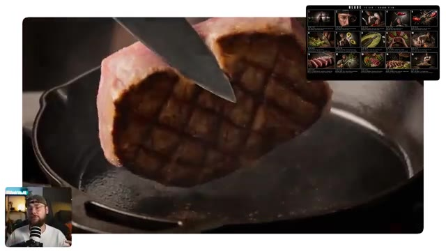
*Présentation d'un deuxième exemple de vidéo de cuisine cinématique montrant une manipulation de viande avec un couteau dans une poêle, et un nouveau storyboard affiché en haut à droite.*

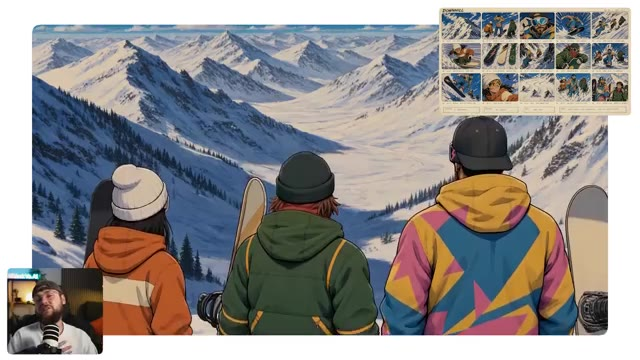
*Transition vers un style visuel complètement différent montrant des snowboarders de dos face à un paysage de montagne enneigé, avec un storyboard thématique en haut à droite.*

---

### ⏱️ `[00:14:13 - 00:14:49]` | Segment #29

**🔊 Audio (Transcription Intégrale Mot pour Mot en Français) :**
> version style anime d'un trio faisant du snowboard sur le flanc d'une montagne. J'ai vraiment aimé la façon dont cela est sorti et à quel point c'est stylisé, mais ce n'est pas sans problèmes. Par exemple, cela montre qui est censé être moi avec les lunettes enlevées, puis je les baisse et l'illusion est un tout petit peu brisée. Le problème ici est que C-Dance 2 n'a pas le contexte de ce à quoi la version anime de moi devrait ressembler sans lunettes. Maintenant, pour contourner cela, vous pourriez simplement supprimer ce plan dans votre logiciel de montage ou simplement régénérer la même séquence à nouveau et vous ne le ferez peut-être pas

**👁️ Analyse Visuelle d'Écran (gemini-3.5-flash-lite) :**
**Interface & Outils** : Présentation vidéo avec incrustation Picture-in-Picture (PiP) du créateur et affichage d'un storyboard de type anime en haut à droite intitulé "DOWNHILL".

**Contenu textuel & Code** : Un storyboard étiqueté "DOWNHILL" montrant une grille de plans séquentiels de snowboard en style anime.

**Action / Démonstration** : Le créateur commente une séquence générée par IA illustrant du snowboard en style anime tout en affichant l'écran de travail et les plans vidéo correspondants.

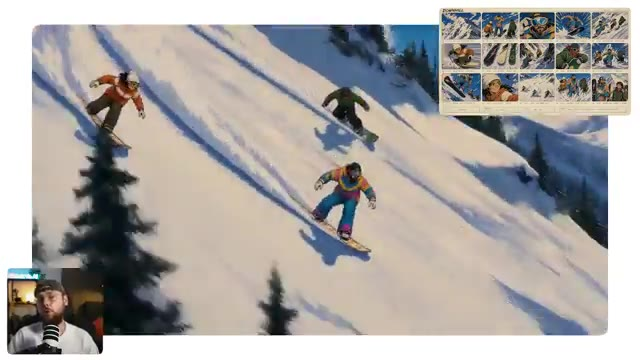
*Séquence vidéo animée montrant un trio de snowboarders dévalant une montagne enneigée, avec un panneau de storyboard en haut à droite et Jack incrusté en bas à gauche.*

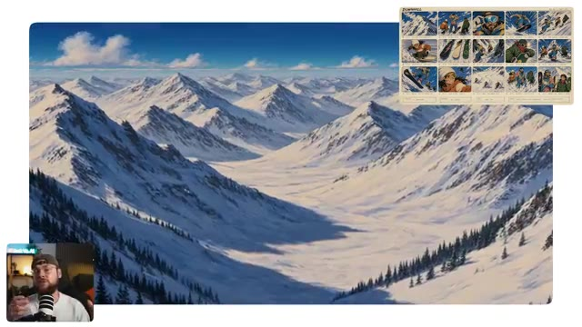
*Plan panoramique de montagnes enneigées dans un style anime, avec un storyboard en haut à droite et Jack incrusté en bas à gauche.*

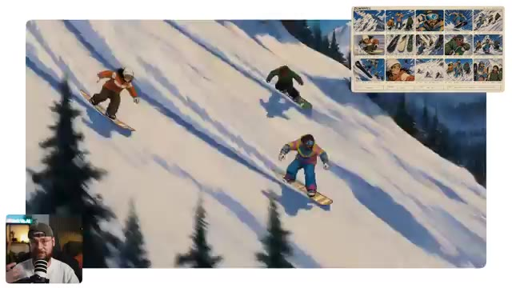
*Répétition de la séquence vidéo animée montrant les trois snowboarders sur la pente enneigée, avec storyboard et encadré vidéo de Jack.*

---

### ⏱️ `[00:14:49 - 00:15:07]` | Segment #30

**🔊 Audio (Transcription Intégrale Mot pour Mot en Français) :**
> rencontrer ce problème. Si vous voulez vraiment creuser le sujet, vous pourriez créer une feuille de personnage où vous pouvez réellement voir à quoi ressemble le skieur ou la version de moi-même là-dedans sans ses lunettes. Maintenant, nous avons également notre vidéo d'animation inspirée de Pixar. J'ai vraiment, vraiment beaucoup aimé celle-ci.

**👁️ Analyse Visuelle d'Écran (gemini-3.5-flash-lite) :**
**Interface & Outils** : Vidéo de présentation avec incrustation de storyboard et vignette du créateur (picture-in-picture).

**Contenu textuel & Code** : Storyboard avec des vignettes illustrant différentes scènes (titre "DOWNHILL" et "LOW-HANGING FRUIT"), rendus d'animation 3D style Pixar.

**Action / Démonstration** : Démonstration visuelle de scènes d'animation générées par IA et de storyboards de personnages.

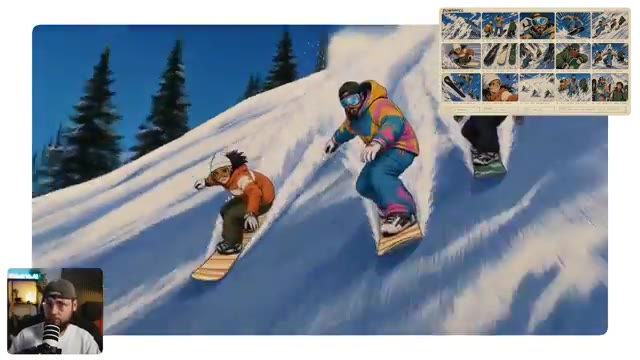
*Scène animée style Pixar montrant des snowboarders dévalant une pente enneigée, avec un storyboard en incrustation en haut à droite et le présentateur en bas à gauche.*

*Personnage animé style Pixar lisant un livre au pied d'un arbre avec une créature verte, un storyboard en haut à droite et le présentateur en bas à gauche.*

---

### ⏱️ `[00:15:07 - 00:15:42]` | Segment #31

**🔊 Audio (Transcription Intégrale Mot pour Mot en Français) :**
> En fait, j'ai fini par lancer ça deux fois et je trouve que c'est un flux de travail vraiment puissant également, surtout lorsqu'il s'agit de générations multi-plans comme celles-ci, où vous avez une séquence de 15 secondes qui comporte différentes coupes avec différents angles de caméra et des actions qui s'y déroulent. Si vous relancez exactement le même prompt avec les exactes mêmes images de référence deux ou trois fois dans votre montage, vous pouvez en quelque sorte choisir entre les moments qui fonctionnent et ceux qui ne fonctionnent pas et construire une séquence qui donne vraiment un super résultat. Et puis nous avons également quelques publicités de produits ici que j'ai faites pour

**👁️ Analyse Visuelle d'Écran (gemini-3.5-flash-lite) :**
**Interface & Outils** : Logiciel de montage vidéo ou lecteur multimédia affichant des séquences de vidéo générées par intelligence artificielle, avec incrustation PiP du créateur dans le coin inférieur gauche.

**Contenu textuel & Code** : Séquence vidéo animée par IA intitulée "LOW-HANGING FRUIT" avec un story-board en grille affichant plusieurs vignettes de la scène.

**Action / Démonstration** : Le créateur présente une séquence vidéo générée par IA montrant une interaction entre une créature fantastique et un homme sous un arbre, illustrant l'utilisation de générations multiples pour le montage.

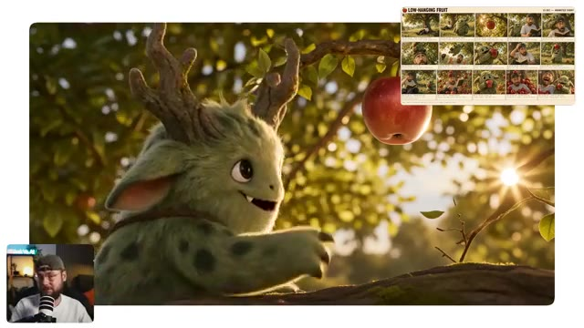
*Gros plan sur une créature verte poilue avec des bois de cerf tendant la patte vers une pomme suspendue à une branche, avec une grille de story-board en médaillon en haut à droite.*

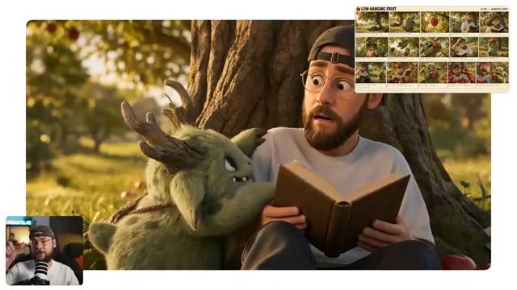
*Plan moyen de la créature verte effrayant un homme barbu qui lit un livre sous un arbre, avec la grille de story-board affichée en haut à droite.*

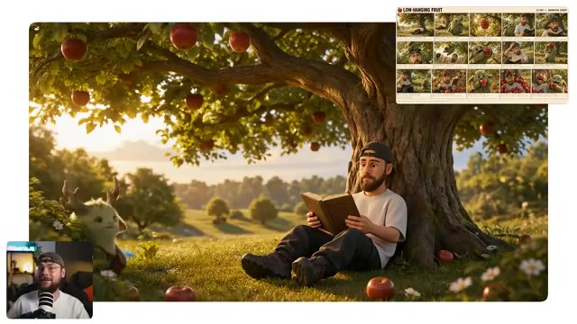
*Plan large d'un homme lisant sous un grand pommier dans une prairie ensoleillée, avec la petite créature assise près de lui et le story-board en haut à droite.*

---

### ⏱️ `[00:15:42 - 00:16:17]` | Segment #32

**🔊 Audio (Transcription Intégrale Mot pour Mot en Français) :**
> l'iPhone 17 Pro Max. Et c'est un excellent exemple ici également, car tout ce qui a été utilisé pour cela était le storyboard, plutôt que d'avoir à ajouter les fiches de référence du produit pour obtenir ce niveau de résultat. Donc, en jetant un œil à ceux-ci, vous pouvez voir que nous avons réussi à obtenir cette esthétique de type CG très haut de gamme que nous visions. Encore une fois, ce n'est pas parfait, mais je pense vraiment que ce flux de travail de storyboard est simplement un moyen très rapide de tester vos idées très rapidement. Maintenant, ce que je fais brièvement

**👁️ Analyse Visuelle d'Écran (gemini-3.5-flash-lite) :**
**Interface & Outils** : Interface de Seedance 2.0 (outil de génération vidéo par IA) avec panneau de configuration à gauche et lecteur vidéo principal.

**Contenu textuel & Code** : Texte du prompt : "Use the reference storyboard to make a full video sequence. Audio: diegetic sound only — natural ambience, environmental foley, and subject-driven sound. No text." Modèle sélectionné : Seedance 2.0 avec paramètres 15s, 16:9, 1080p.

**Action / Démonstration** : Le créateur présente l'interface de l'outil Seedance 2.0 et montre les rendus vidéo générés à partir du storyboard, incluant des plans rapprochés de l'iPhone 17 Pro Max.

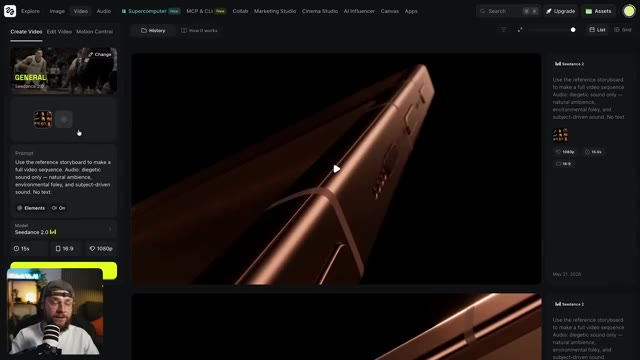
*Interface de Seedance 2.0 affichant le panneau de création de vidéo avec le prompt et le rendu du smartphone.*

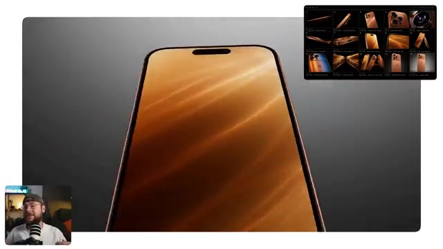
*Aperçu vidéo de l'écran principal affichant l'iPhone 17 Pro Max avec un encart en haut à droite montrant la grille du storyboard.*

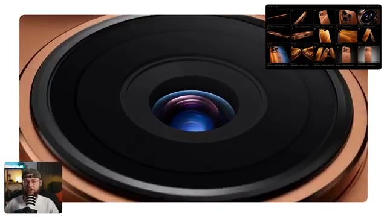
*Gros plan extrême sur la lentille de l'appareil photo du smartphone avec le storyboard en incrustation.*

---

### ⏱️ `[00:16:17 - 00:16:54]` | Segment #33

**🔊 Audio (Transcription Intégrale Mot pour Mot en Français) :**
> je veux aborder certains des inconvénients de ce flux de travail particulier. Et les plus observateurs d'entre vous auront remarqué qu'il ne s'agit pas d'une réplication image par image du storyboard. Par là, je veux dire que chaque image individuelle présente dans le storyboard ne sera pas transposée dans votre génération Seadance 2. Ce que vous remarquerez à la place, c'est que C-Dance 2 utilise davantage ces éléments comme une simple inspiration générale et essaie d'atteindre les moments forts de l'histoire. Mais le style du storyboard a un effet très significatif sur votre résultat final. Je dirais donc que le principal point positif

**👁️ Analyse Visuelle d'Écran (gemini-3.5-flash-lite) :**
**Interface & Outils** : Interface de l'outil de génération vidéo Seedance 2 / plateforme créative avec volet d'inspection latéral (panneau de prompts, informations de modèle, boutons d'action comme Animate, Upscale, Inpaint) et incrustation vidéo du créateur.

**Contenu textuel & Code** : Texte du prompt visible dans le panneau latéral : '15-second animated storyboard sheet for a high-energy snowboarding action sequence titled "DOWNHILL." A complete professional animation storyboard presentation page, featuring 15 sequential cinematic panels.' Paramètres : Modèle GPT Image 2, Qualité High, Résolution 3840x2160. Planche de storyboard 'DOWNHILL' avec 15 vignettes numérotées et des annotations (temps, plans).

**Action / Démonstration** : Le créateur présente des exemples de vidéos générées à partir de storyboards en incrustation, puis montre l'interface complète de la plateforme de génération avec les options d'animation et de retouche.

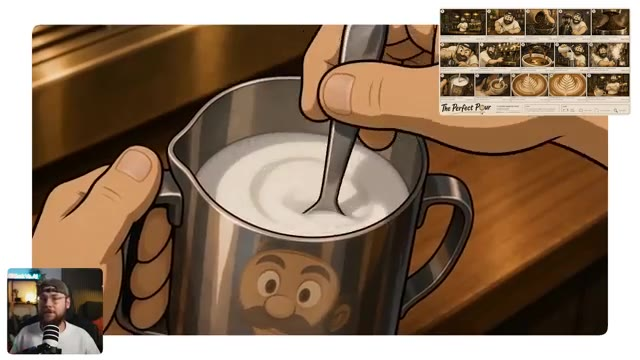
*Gros plan sur une animation générée par IA montrant une main mélangeant du lait dans une tasse, avec le storyboard complet incrusté en haut à droite et Jack dans un petit encadré PiP en bas à gauche.*

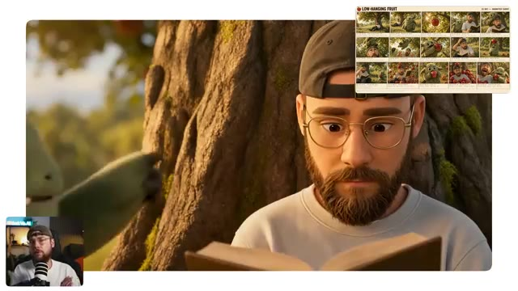
*Scène animée montrant un personnage barbu avec une casquette lisant un livre près d'un arbre, avec le storyboard 'Low-Hanging Fruit' incrusté en haut à droite et Jack en PiP en bas à gauche.*

*Interface logicielle affichant une planche de storyboard intitulée 'DOWNHILL' avec 15 cases sur le snowboard, et un panneau latéral droit avec des détails de prompt et un bouton jaune 'Animate'.*

---

### ⏱️ `[00:16:54 - 00:17:27]` | Segment #34

**🔊 Audio (Transcription Intégrale Mot pour Mot en Français) :**
> pour ce workflow, c'est la vitesse et la simplicité. Vous êtes capable de tester vos idées et concepts de manière incroyablement rapide, surtout si vous allez utiliser le fichier MD que j'ai fourni. Vous n'avez pas à vous soucier d'un prompt compliqué ou de générer des plans uniques et de les assembler. Vous pouvez obtenir un très bon résultat très rapidement. Maintenant, l'inconvénient est la précision. Vous n'allez pas avoir autant de contrôle qu'en utilisant des techniques de réalisation de films par IA plus complexes. Je pense

**👁️ Analyse Visuelle d'Écran (gemini-3.5-flash-lite) :**
**Interface & Outils** : Interface logicielle de génération d'images et de storyboards IA avec panneaux de configuration latéraux (modèle, qualité, dimensions) et outils d'édition en bas.

**Contenu textuel & Code** : Texte du prompt visible sur le panneau de droite : 'Ensure that panel 5 has the same rubber hose animation style applied to it as the rest of the film.' Informations techniques : Modèle 'GPT Image 2', Qualité 'High', Résolution '3840x2160'. Titre du storyboard : 'Pour' - '15-SECOND ANIMATED SHORT STORYBOARD SHEET'.

**Action / Démonstration** : Présentation d'un storyboard séquentiel pour un court-métrage animé généré par IA, puis affichage d'un rendu vidéo de personnage en gros plan.

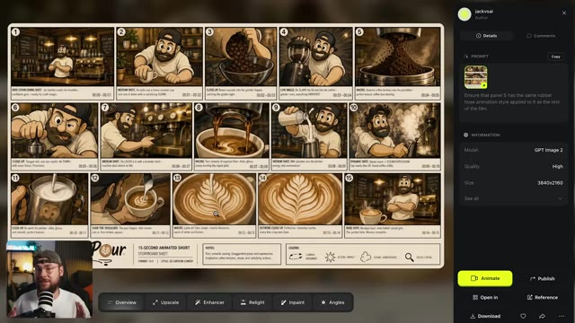
*Interface d'une application affichant une feuille de storyboard complète intitulée 'Pour' avec 15 panneaux numérotés représentant les étapes de préparation d'un café, ainsi que les options de modification et de prompt sur le panneau latéral.*

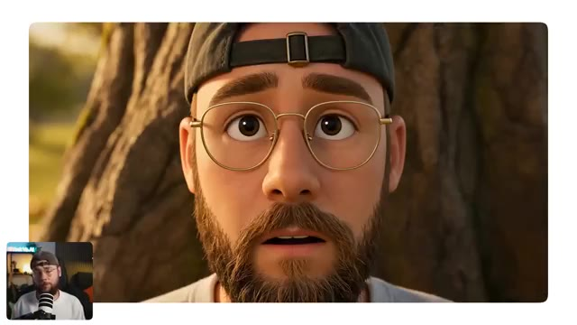
*Rendu vidéo 3D stylisé montrant le visage d'un personnage animé ressemblant au créateur, avec le présentateur visible en incrustation (PiP) dans le coin inférieur gauche.*

---

### ⏱️ `[00:17:27 - 00:18:04]` | Segment #35

**🔊 Audio (Transcription Intégrale Mot pour Mot en Français) :**
> Si vous voulez être un peu ultra spécifique concernant les générations de vidéos par IA que vous allez obtenir, disons que vous avez une idée super super spécifique pour des plans individuels, il est fort probable qu'il vaille mieux les générer séparément. Vous pourriez potentiellement utiliser ceci comme votre flux de travail principal et simplement régénérer certains plans si vous voulez avoir ce niveau de contrôle. Et je crois que ces modèles vidéo à référence omni s'amélioreront encore au fil du temps, à mesure que nous obtiendrons de nouvelles versions d'eux, ce flux de travail va devenir encore plus puissant. Il va devenir un peu plus précis. J'aimerais que vous testiez vous-même ce flux de travail de storyboard. Si vous obtenez un

**👁️ Analyse Visuelle d'Écran (gemini-3.5-flash-lite) :**
**Interface & Outils** : Interface web d'un outil de génération vidéo/image par IA avec barre de navigation supérieure et panneau de prompt en bas, puis affichage en plein écran d'une image générée.

**Contenu textuel & Code** : Menus visibles en haut : "Explore", "Image", "Video", "Audio", "Supercomputer", "MCP & CLI", "Collab", "Marketing Studio", "Cinema Studio", "AI Influencer", "Canvas", "Apps". Panneau de prompt inférieur avec options "GPT Image 2", "High", "4K", "16:9", et bouton "Generate 12".

**Action / Démonstration** : Le créateur présente l'interface de l'outil de génération de storyboards et montre différents exemples de grilles d'images et des rendus en plein écran.

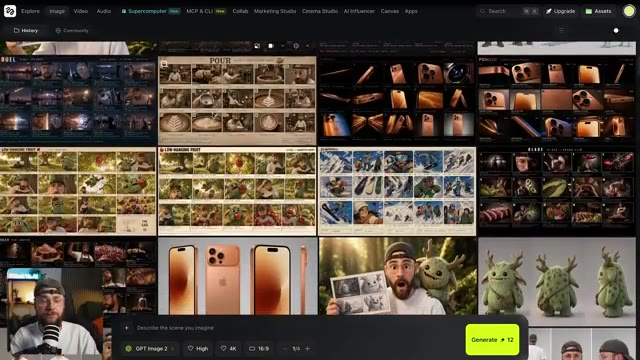
*Interface web montrant une galerie de storyboards générés par IA avec le panneau de prompt inférieur en surbrillance.*

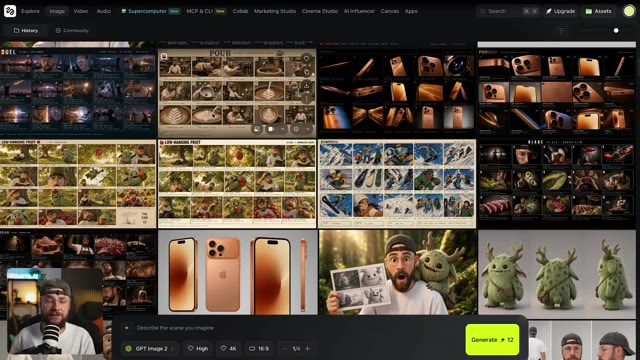
*Même interface web que l'image 1 avec le curseur sur une vignette de storyboard spécifique.*

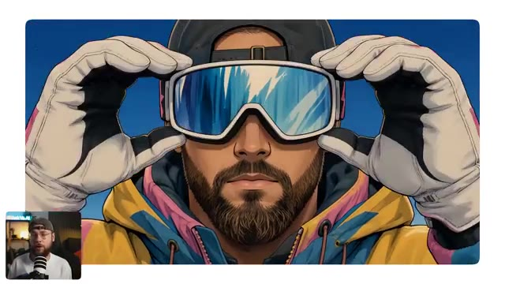
*Affichage d'une image générée en plein écran montrant un personnage en style illustration portant des lunettes de ski, avec le créateur en incrustation (PiP) dans le coin inférieur gauche.*

---

### ⏱️ `[00:18:04 - 00:18:27]` | Segment #36

**🔊 Audio (Transcription Intégrale Mot pour Mot en Français) :**
> des résultats dont vous êtes particulièrement fier, venez les poster sur ma communauté scolaire là-bas pour qu'on puisse tous y jeter un œil. Comme je le dis, tous les prompts et le matériel de travail dont vous aurez besoin, y compris ce fameux fichier MD si important, seront également là-bas. Vous trouverez le lien en bas dans la description. Et si vous avez apprécié la vidéo d'aujourd'hui, n'hésitez pas à lâcher un pouce bleu et à envisager de vous abonner. Je vous retrouve les gars dans la prochaine.

**👁️ Analyse Visuelle d'Écran (gemini-3.5-flash-lite) :**
**Interface & Outils** : Présentation vidéo avec incrustation PiP du créateur (Jack Vs. AI) en bas à gauche de l'écran.

**Contenu textuel & Code** : Affichage de différentes séquences vidéo générées par intelligence artificielle (sports d'hiver et produit technologique).
[DESC_IMAGE_4]

**Action / Démonstration** : Le créateur présente des exemples de vidéos générées par IA en arrière-plan tout en parlant à la communauté.

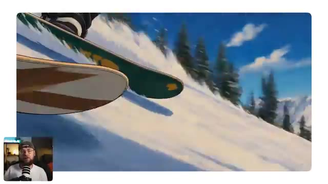
*Vidéo générée par IA montrant des snowboards en gros plan descendant une pente enneigée.*

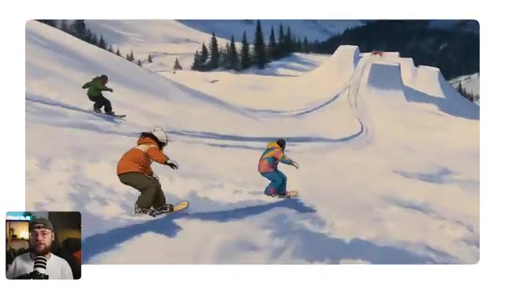
*Vidéo générée par IA montrant plusieurs skieurs et surfeurs sur une piste de montagne avec des tremplins.*

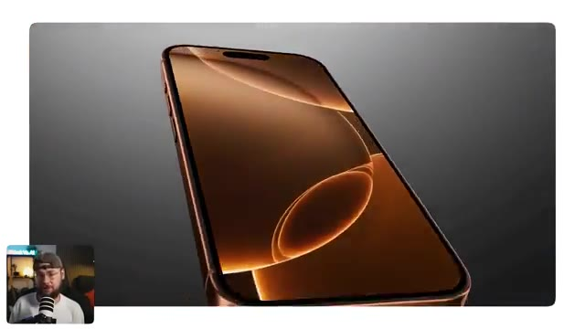
*Visuel d'un smartphone moderne aux bords incurvés généré par IA.*

---
