# 🎬 Comment traduire votre vidéo IA dans n'importe quelle langue (Workflow complet)

> **Chaîne** : [Jack Vs. AI](https://www.youtube.com/@JackVsAI)  
> **Titre original** : `How to Turn Your AI Video Into Any Language (Full Workflow)`  
> **Lien YouTube** : [https://www.youtube.com/watch?v=wM0zOwH4d2s](https://www.youtube.com/watch?v=wM0zOwH4d2s)  
> **Date de publication** : 2026-05-31  
> **Durée** : 18m 58s (`1138s`)  
> **Identifiant vidéo** : `wM0zOwH4d2s`  
> **Fiche Web Interactive** : [2026-05-31_YT-wM0zOwH4d2s_Comment traduire votre vidéo IA dans n'importe quelle langue (Workflow complet)_by-whisper-v3-large-turbo+gemini-3.5-flash-lite.html](2026-05-31_YT-wM0zOwH4d2s_Comment traduire votre vidéo IA dans n'importe quelle langue (Workflow complet)_by-whisper-v3-large-turbo+gemini-3.5-flash-lite.html)  
> **Captures de démonstration clés** : `69 captures réelles (anti-talking-head)`  
> **Modèles utilisés** : Audio: `large-v3-turbo` (Faster-Whisper int8 VPS) | Vision: `gemini-3.5-flash-lite` (Google AI Studio API)  

---

## 📌 Synthèse Exécutive & Outils

### 📌 Résumé
La réalisation de films et de contenus par intelligence artificielle entre dans une ère véritablement mondiale grâce à l'émergence de workflows de traduction et de synchronisation de pointe. Comme l'explique l'expert Jack dans ce tutoriel, les créateurs peuvent désormais transcender la barrière de la langue en adaptant une unique vidéo à n'importe quel marché international, tout en préservant l'intégrité du personnage, de sa performance émotionnelle et des éléments visuels. Cette approche révolutionnaire élimine le besoin fastidieux de reconstruire des scènes à partir de zéro, de réenregistrer des dialogues en studio ou de multiplier les tournages, offrant ainsi aux créateurs indépendants et aux publicitaires la capacité de rivaliser sur une scène globale avec un minimum de friction.

Le flux de travail méthodique présenté par Jack s'articule autour de trois étapes clés ne nécessitant aucun prompt complexe. Tout d'abord, l'extraction de la piste audio originale s'effectue via un logiciel de montage classique tel qu'Adobe Premiere Pro. Ensuite, cette piste est injectée dans l'outil de doublage d'ElevenLabs (en version v2) afin de générer une traduction vocale multilingue qui conserve l'intonation, le timbre et l'émotion originaux à travers plus de 90 langues. Enfin, la réinjection de cet audio doublé s'accompagne d'une étape cruciale de synchronisation labiale vidéo, exploitant des modèles spécialisés intégrés pour marier parfaitement les mouvements des lèvres du personnage à la nouvelle langue cible.

Au-delà de la simple traduction littérale, ce workflow débloque des opportunités créatives inédites, comme l'alternance stylistique et dramatique des langues au sein d'une même scène (par exemple, le passage de l'anglais à l'italien dans un contexte de film de mafia). En évitant l'écueil des voix off robotiques et en sélectionnant rigoureusement les technologies de synchronisation vidéo les plus performantes, les créateurs maximisent l'engagement de leur audience internationale. Ce processus rationalisé transforme radicalement la production vidéo moderne, permettant à un seul individu de produire du contenu de qualité cinématographique et publicitaire (UGC) taillé sur mesure pour des marchés diversifiés.

### 🛠️ Outils, Modèles & Logiciels Présentés
* **Adobe Premiere Pro** : Logiciel de montage vidéo utilisé dans le tutoriel pour isoler et exporter la piste audio brute des séquences originales avant le processus de doublage.
* **ElevenLabs (Doublage v2)** : Plateforme de synthèse vocale et de doublage par IA, dotée d'un clonage vocal automatique et capable de traduire des fichiers audio dans 92 langues tout en préservant l'émotion et l'intonation.
* **ElevenLabs (Image & Vidéo / Outils intégrés)** : Écosystème hébergeant divers modèles de pointe dédiés à la génération visuelle et à la manipulation vidéo.
* **Veed Lip Sync** : Modèle de synchronisation labiale abordable et rapide, principalement orienté vers les images fixes, mais présentant des limites de dérive notables sur la vidéo.
* **Sync 3** : Modèle de synchronisation labiale vidéo haut de gamme et plus gourmand en crédits, recommandé pour obtenir des résultats fluides, précis et professionnellement exploitables.

### 🔑 Points Clés & Enseignements Stratégiques
* **Suppression de la barrière linguistique** : Le workflow permet d'adapter des contenus vidéo à n'importe quel marché mondial sans altérer l'identité visuelle du personnage ni sa performance d'origine.
* **Conservation de l'émotion et de l'intonation** : Grâce au doublage v2 d'ElevenLabs, les voix traduites évitent l'effet "robotique" habituel en restituant fidèlement les nuances émotionnelles du locuteur.
* **Processus sans prompt** : La mise en œuvre repose sur une manipulation technique et ergonomique directe (sélection de fichiers et de langues) plutôt que sur la rédaction de consignes textuelles complexes.
* **Extraction audio préliminaire** : L'étape initiale consiste simplement à extraire la piste audio des séquences (qu'elles soient issues de tournages réels, de pubs UGC ou de générations IA) via un logiciel de montage comme Premiere Pro.
* **Rapidité de génération** : Les outils de doublage modernes permettent d'obtenir des pistes audio traduites de haute qualité en seulement quelques secondes, accélérant drastiquement la post-production.
* **Gestion multilingue avancée** : Il est possible de sélectionner plusieurs langues au cours d'un même flux pour décliner rapidement un contenu destiné à des plateformes ou des régions multiples.
* **Usage narratif et dramatique créatif** : La traduction ciblée de fins de dialogues (comme l'insertion d'italien dans une scène de mafia des années 1930) renforce l'immersion et l'authenticité culturelle d'un court-métrage.
* **Diffrenciation des outils de Lip Sync** : Il est crucial de distinguer les outils de synchronisation labiale conçus pour les images fixes de ceux optimisés pour la vidéo.
* **Piège de la dérive visuelle (Veed Lip Sync)** : Bien que les options économiques comme Veed Lip Sync soient tentantes, elles génèrent souvent des décalages et une dérive labiale préjudiciables à la crédibilité du film.
* **Investissement dans la qualité (Sync 3)** : L'utilisation de modèles avancés comme Sync 3, bien que plus coûteuse en crédits, s'avère indispensable pour garantir une synchronisation labiale irréprochable et un rendu de niveau professionnel.

---

## ⏱️ Chronologie & Transcription Complète Audio & Visuelle (Mot pour Mot)

### ⏱️ `[00:00:00 - 00:00:20]` | Segment #01

**🔊 Audio (Transcription Intégrale Mot pour Mot en Français) :**
> La réalisation de films par IA vient de devenir mondiale. Parce que maintenant, vous pouvez prendre une seule vidéo et la transformer pour n'importe quel marché de votre choix. Tout cela sans altérer le personnage, la performance ou le produit. C'est un changement absolu. Wow, les gars. C'est un changement absolu.

**👁️ Analyse Visuelle d'Écran (gemini-3.5-flash-lite) :**
**Interface & Outils** : Présentation face caméra sans partage d'écran

**Contenu textuel & Code** : Aucun contenu textuel ou interface logicielle visible à l'écran.

**Action / Démonstration** : Le créateur parle face caméra dans son studio, tenant un micro, puis montre différentes versions de sa vidéo avec des drapeaux de pays.

---

### ⏱️ `[00:00:20 - 00:00:57]` | Segment #02

**🔊 Audio (Transcription Intégrale Mot pour Mot en Français) :**
> Ouah, mina. Kore, Majide Kakumei teki da, jo. Donc au lieu de reconstruire des scènes à partir de zéro, de réenregistrer les dialogues ou de générer des versions séparées de la même vidéo, l'intelligence artificielle peut désormais transformer votre vision pour qu'elle fonctionne partout dans le monde. Je suis Jack, j'ai passé plus d'une décennie à créer des effets visuels pour de nombreuses grandes marques de la planète, et j'utilise maintenant l'IA pour réinventer les flux de travail créatifs. Le potentiel ici est massif, car soudainement un seul créateur peut fabriquer des courts-métrages, des publicités de produits et du contenu de style UGC pour un public mondial. Dans ce tutoriel, je vais vous montrer le flux de travail complet, afin que vous puissiez rejoindre les créateurs.

**👁️ Analyse Visuelle d'Écran (gemini-3.5-flash-lite) :**
**Interface & Outils** : Présentation face caméra sans partage d'écran

**Contenu textuel & Code** : Aucune interface logicielle affichée, le créateur parle face caméra dans son studio avec des illustrations graphiques incrustées (drapeaux, comparaisons vidéo avant/après, texte du script).

**Action / Démonstration** : Jack s'adresse directement au spectateur en studio, tout en illustrant ses propos avec des exemples de traduction vidéo et de localisation multilingue.

---

### ⏱️ `[00:00:57 - 00:01:30]` | Segment #03

**🔊 Audio (Transcription Intégrale Mot pour Mot en Français) :**
> qui suppriment complètement la barrière de la langue de leur production. Et si vous aimez la vidéo d'aujourd'hui, n'hésitez pas à lâcher un gros pouce bleu pour moi et à envisager de vous abonner. Très bien, entrons dans le vif du sujet. Donc je suis sûr que beaucoup d'entre vous ont essayé de réadapter le contenu de vos vidéos, permettant de l'adapter à un public différent. Le problème, c'est que lorsque vous changez votre vidéo dans une autre langue, toute l'émotion finit par se perdre et cela donne l'impression d'être très robotique. On a l'impression que c'est de l'IA, ce que bien sûr nous essayons d'éviter. Ou alors vous en avez assez parce que le processus est tout simplement tellement long

**👁️ Analyse Visuelle d'Écran (gemini-3.5-flash-lite) :**
**Interface & Outils** : Logiciel de montage vidéo ou interface web avec affichage en picture-in-picture (PiP) du créateur en bas à gauche.

**Contenu textuel & Code** : Texte 'the language barrier', drapeaux britannique et italien, vidéo de démonstration en extérieur dans une rue animée avec un serveur, et gros plan sur Jack présentant un smartphone orange.

**Action / Démonstration** : Le créateur illustre visuellement le problème de la barrière de la langue et le doublage multilingue à travers des exemples de vidéos comparatives et des démonstrations face caméra.

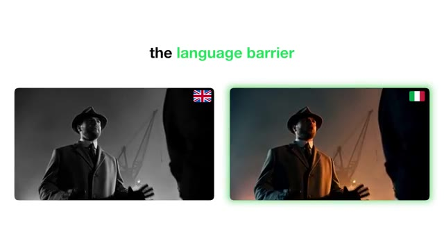
*Comparaison vidéo avant/après avec l'affichage du texte 'the language barrier' et deux versions de la vidéo (Anglais à gauche, Italien à droite avec contour vert).*

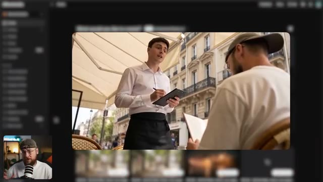
*Capture d'écran de l'interface de montage montrant une vidéo de démonstration avec un serveur tenant un carnet de notes dans une rue de Paris.*

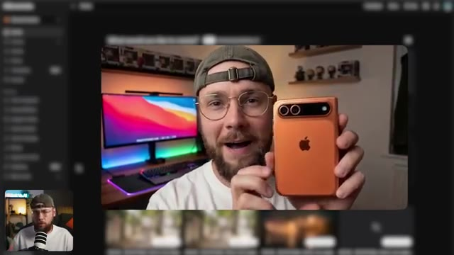
*Capture d'écran montrant Jack tenant un smartphone orange avec un logo Apple à l'arrière dans son studio.*

---

### ⏱️ `[00:01:30 - 00:02:05]` | Segment #04

**🔊 Audio (Transcription Intégrale Mot pour Mot en Français) :**
> et si déroutant que vous finissez par abandonner. Mais le processus que je vais partager avec vous aujourd'hui ne nécessite que trois étapes très simples et aucun prompt. Comme toujours, je partagerai l'intégralité du processus ainsi que toutes les astuces et conseils que les autres créateurs ne vous disent pas afin que vous puissiez obtenir les meilleurs résultats possibles. Et je partagerai même une astuce bonus à la fin de la vidéo pour obtenir la traduction la plus fiable. La première chose dont nous aurons besoin, bien sûr, c'est de nos séquences vidéo. Je suis donc ici dans Premiere Pro et j'ai une très belle variété de différents

**👁️ Analyse Visuelle d'Écran (gemini-3.5-flash-lite) :**
**Interface & Outils** : Adobe Premiere Pro et interface logicielle de montage/vidéo.

**Contenu textuel & Code** : Noms des chutiers et des séquences visibles dans Premiere Pro : "Facecam - predub", "Anime Scene - predub", "Keynote Scene - predub", "Mafia Scene - predub", "Insurance Scene - predub". Timeline active avec pistes vidéo et audio.

**Action / Démonstration** : Le créateur montre des exemples de séquences vidéo dans l'interface de montage Adobe Premiere Pro, illustrant la variété des clips à disposition.

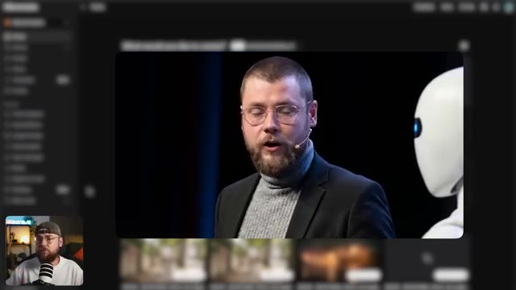
*Interface logicielle sombre avec un encadré vidéo central montrant Jack en costume sur scène face à un robot, et une vignette PiP du créateur en bas à gauche.*

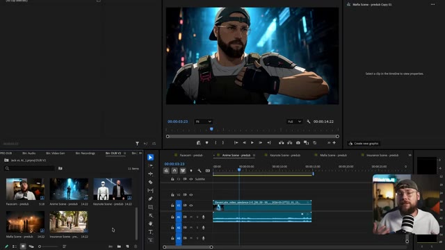
*Interface complète d'Adobe Premiere Pro avec un panneau de montage chronologique en bas, un moniteur de prévisualisation affichant un personnage de style animé en haut, et une vue PiP du créateur en bas à droite.*

---

### ⏱️ `[00:02:05 - 00:02:40]` | Segment #05

**🔊 Audio (Transcription Intégrale Mot pour Mot en Français) :**
> des exemples à la fois de vidéos générées par IA ici et un exemple tourné en caméra également de moi en train de parler naturellement. Nous avons une scène d'anime ici pour un exemple plus stylisé. Nous avons moi en train de présenter une keynote pour la révélation d'un robot arrivant sur le marché. Nous avons aussi moi apparaissant dans une scène pour un film de mafia par exemple et puis un exemple un peu plus discret ici. C'est moi qui parle d'assurance en gros. Donc nous avons une variété d'exemples de réalisation cinématographique et publicitaire que nous allons

**👁️ Analyse Visuelle d'Écran (gemini-3.5-flash-lite) :**
**Interface & Outils** : Adobe Premiere Pro (logiciel de montage vidéo)

**Contenu textuel & Code** : Noms des clips dans le chutier et sur la timeline : 'Facecam - predub', 'Anime Scene - predub', 'Keynote Scene - predub', 'Mafia Scene - predub', 'Insurance Scene - predub'. Nom du fichier sur la piste vidéo : 'ElevenLabs_video_seedance-1-0_00-...'.

**Action / Démonstration** : Le créateur montre des exemples de vidéos générées par IA et des exemples tournés en caméra intégrés dans son logiciel de montage vidéo.

*Interface d'Adobe Premiere Pro affichant une scène de style anime générée par IA et la timeline du projet avec différents clips vidéo.*

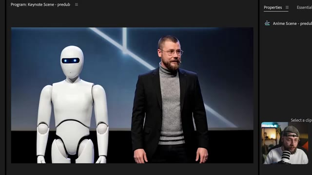
*Aperçu dans Adobe Premiere Pro d'une scène de keynote montrant un robot humanoïde blanc et le créateur sur scène.*

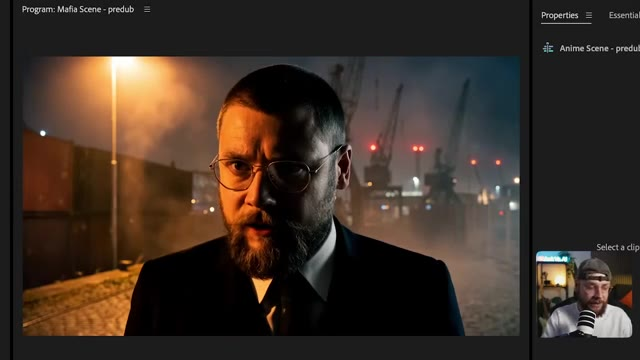
*Aperçu dans Adobe Premiere Pro d'une scène de film de mafia sombre se déroulant sur un quai portuaire avec le créateur en costume et lunettes.*

---

### ⏱️ `[00:02:40 - 00:03:16]` | Segment #06

**🔊 Audio (Transcription Intégrale Mot pour Mot en Français) :**
> en passant par cet outil et tout ce que vous avez à faire pour cette étape initiale, c'est d'aller de l'avant et d'exporter, mais nous voulons seulement envoyer l'audio de notre fichier. Maintenant, bien sûr, vous n'avez pas besoin d'utiliser Premiere pour cela, vous pouvez utiliser n'importe quel logiciel de montage de votre choix, c'est un processus très simple, je pense qu'il y a même des options pour le faire en ligne également, mais pour la première étape, c'est aussi simple que cela, nous voulons juste extraire l'audio de nos vidéos générées par IA ou vidéos enregistrées et ensuite les exporter comme ça. Maintenant que nous avons notre piste audio, nous devons accéder à l'outil qui va

**👁️ Analyse Visuelle d'Écran (gemini-3.5-flash-lite) :**
**Interface & Outils** : Adobe Premiere Pro / Écran graphique de présentation de transition

**Contenu textuel & Code** : Texte visible : 'Keynote Scene - predub.mp3', format 'MP3', et le titre graphique 'step two breaking the language barrier'.

**Action / Démonstration** : Le créateur montre l'exportation de la piste audio seule au format MP3 depuis Premiere Pro, puis introduit la deuxième étape du tutoriel.

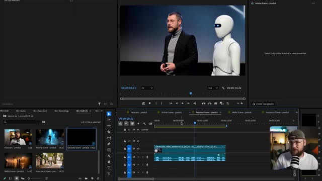
*Interface d'Adobe Premiere Pro montrant le montage d'une vidéo avec le panneau de prévisualisation et la timeline.*

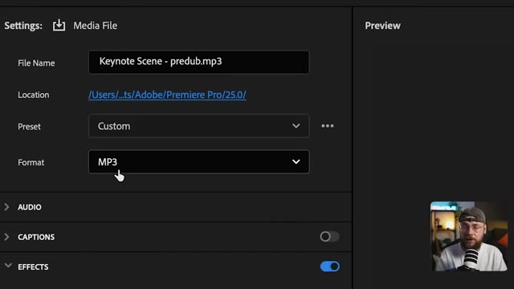
*Fenêtre d'exportation d'Adobe Premiere Pro montrant les paramètres de fichier média (nom, emplacement, format MP3).*

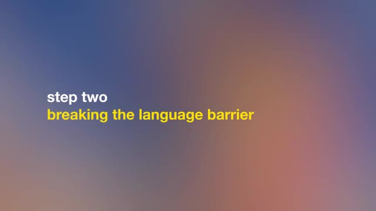
*Écran graphique affichant le titre de l'étape 2 sur un fond coloré flou : 'step two breaking the language barrier'.*

---

### ⏱️ `[00:03:16 - 00:03:51]` | Segment #07

**🔊 Audio (Transcription Intégrale Mot pour Mot en Français) :**
> pour nous permettre de transformer notre contenu afin qu'il fonctionne pour un public mondial. Pour faire cela, nous sommes sur ElevenLabs et ce que je veux que vous fassiez, c'est d'aller sur l'outil de doublage et vous pouvez voir qu'ils viennent juste de sortir la v2 de celui-ci et c'est décrit comme préservant l'émotion et l'intonation à travers 92 langues avec le clonage vocal automatique et la synchronisation. C'est exactement ce que nous voulons. Donc nous voulons aller de l'avant et cliquer sur sélectionner des fichiers et nous pouvons télécharger notre fichier audio de choix. Et si nous nous dirigeons vers choisir

**👁️ Analyse Visuelle d'Écran (gemini-3.5-flash-lite) :**
**Interface & Outils** : Interface web d'ElevenLabs (outil de doublage - Dubbing)

**Contenu textuel & Code** : Texte visible : "Dubbing New", "Upload", "Paste URL", "Select files or drag and drop them here", "Choose languages", "Advanced", "Powered by the new Dubbing v2 alpha model", "Our latest dubbing model, preserving emotion and delivery across 92 languages with automatic voice cloning and sync.", "30m of free dubbing remaining", "Recent Dubs", "French Scene - predub.mp3", "ElevenLabs_video_seedance...mp4".

**Action / Démonstration** : Le créateur navigue sur l'interface d'ElevenLabs, présente le nouvel outil de doublage V2 et importe un fichier audio pour le doubler.

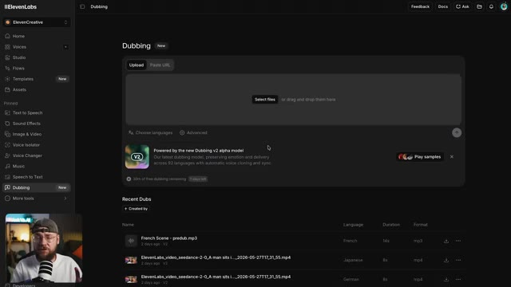
*Interface globale de l'outil de doublage ElevenLabs montrant le panneau V2 avec les options d'importation de fichiers et l'historique des doublages récents.*

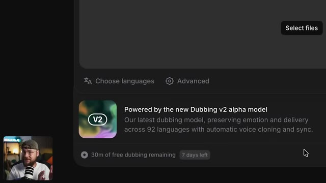
*Gros plan sur le modèle Dubbing v2 alpha d'ElevenLabs détaillant la préservation des émotions à travers 92 langues.*

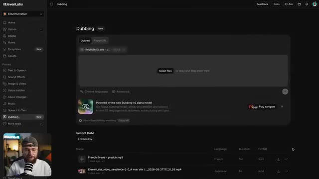
*Interface de l'outil de doublage montrant le fichier audio importé ("Keynote Scann - p...") prêt pour le traitement.*

---

### ⏱️ `[00:03:51 - 00:04:25]` | Segment #08

**🔊 Audio (Transcription Intégrale Mot pour Mot en Français) :**
> langue, vous pouvez voir que nous avons une très grande variété de langues différentes vers lesquelles nous pouvons prendre notre contenu original et le transformer. Donc pour cet exemple particulier, j'ai envie de transformer la keynote en néerlandais, ça me semble juste, vous savez, donc je veux tester ça et ensuite c'est vraiment aussi simple que d'envoyer cette génération. Ce que j'aime vraiment aussi dans tout ça, c'est que vous récupérez vos générations vraiment très rapidement, je dirais que ça a pris environ cinq secondes à générer, ce qui est plutôt impressionnant, alors allons-y et ouvrons ceci.

**👁️ Analyse Visuelle d'Écran (gemini-3.5-flash-lite) :**
**Interface & Outils** : ElevenLabs (outil de doublage Dubbing v2 alpha).

**Contenu textuel & Code** : Menu "Choose languages" avec recherche de langues, modèle de doublage v2 alpha ("Powered by the new Dubbing v2 alpha model"), fichier "Keynote Scene - p...", paramètre de langue réglé sur "Dutch", et la section "Recent Dubs" avec un fichier "French Scene - predub.mp3".

**Action / Démonstration** : Le créateur navigue dans le menu des langues pour sélectionner le néerlandais (Dutch), puis présente l'interface de génération et le résultat obtenu rapidement.

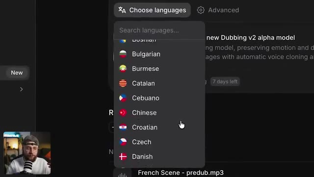
*Interface d'ElevenLabs Dubbing montrant le menu déroulant de sélection des langues (choix parmi Bosnian, Bulgarian, Burmese, Catalan, Cebuano, Chinese, Croatian, Czech, Danish).*

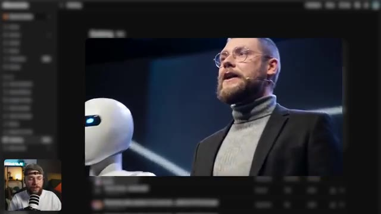
*Interface d'ElevenLabs Dubbing affichant un aperçu vidéo en cours de doublage avec un intervenant et un robot.*

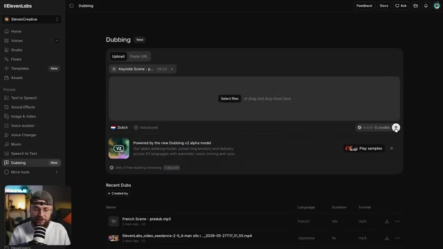
*Interface principale d'ElevenLabs Dubbing montrant le panneau de téléchargement de fichier et le modèle de doublage v2 alpha sélectionné avec la langue néerlandaise (Dutch).*

---

### ⏱️ `[00:04:25 - 00:04:46]` | Segment #09

**🔊 Audio (Transcription Intégrale Mot pour Mot en Français) :**
> et nous pouvons écouter, voici Arlo et il coûte moins cher que vos dernières vacances Il a mis votre plancher, a fait la lessive, et a mis la maison et a mis l'extérieur. Donc ça fonctionne vraiment très bien. Et ce sur quoi je veux vraiment attirer l'attention, c'est le fait que le type de rendu émotionnel a été conservé.

**👁️ Analyse Visuelle d'Écran (gemini-3.5-flash-lite) :**
**Interface & Outils** : Lecteur audio intégré avec boutons de lecture, options linguistiques ('Original' et 'Dutch'), et bouton 'Download'.

**Contenu textuel & Code** : Fichier audio nommé 'Keynote Scene - predub.mp3', date du 29 mai 2026, 10:09, boutons de sélection de langue 'Original' et 'Dutch', bouton 'Download'.

**Action / Démonstration** : Le lecteur audio est affiché à l'écran pour faire écouter un extrait audio généré ou traduit, tandis que le présentateur commente l'écoute dans l'encadré PiP.

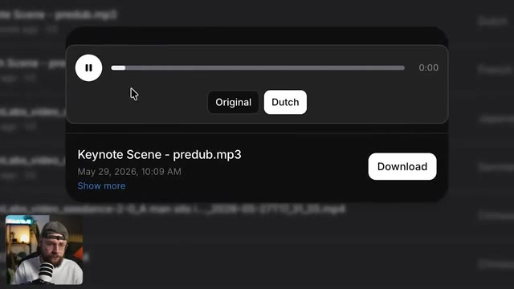
*Interface de lecteur audio avec options de langue (Original / Dutch) et fichier audio 'Keynote Scene - predub.mp3', avec incrustation PiP du présentateur en bas à gauche.*

---

### ⏱️ `[00:04:46 - 00:05:18]` | Segment #10

**🔊 Audio (Transcription Intégrale Mot pour Mot en Français) :**
> Ça ne fait pas du tout robotique. Tout le but de ce processus est de pouvoir prendre une génération de vidéo par IA ou un enregistrement et de pouvoir les transformer de manière significative pour les adapter à un public différent. Et si votre voix sort en sonnant faux ou bizarre, alors ça ne va tout simplement pas marcher, tout le processus tombe à plat, mais heureusement avec le doublage v2, ça marche vraiment très bien et comme vous pouvez le voir, vous pouvez aussi cliquer sur cet onglet ici pour revenir rapidement à l'original.

**👁️ Analyse Visuelle d'Écran (gemini-3.5-flash-lite) :**
**Interface & Outils** : Interface logicielle de doublage vidéo/audio avec lecteur multimédia intégré et options de bascule de langue (Original / Dutch).

**Contenu textuel & Code** : Fichier audio nommé « Keynote Scene - predub.mp3 », horodaté du 29 mai 2026 à 10:09, boutons « Original » et « Dutch », et un bouton « Download ».

**Action / Démonstration** : Le curseur de la souris survole l'interface pour montrer la possibilité de basculer entre la piste audio originale et la version doublée en néerlandais.

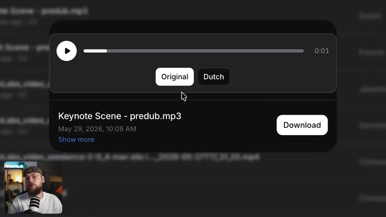
*Interface montrant le lecteur audio avec les boutons « Original » et « Dutch » ainsi que le fichier « Keynote Scene - predub.mp3 ».*

---

### ⏱️ `[00:05:18 - 00:05:39]` | Segment #11

**🔊 Audio (Transcription Intégrale Mot pour Mot en Français) :**
> l'enregistrement pour que vous puissiez comparer et contraster, et une fois que vous êtes satisfait, vous pouvez aller de l'avant et cliquer sur télécharger. Ce que j'aime aussi avec cet outil, c'est que vous pouvez vraiment devenir assez créatif avec. Je veux donc l'utiliser pour notre scène de mafia que vous pouvez voir à l'écran maintenant. Ce que je veux qu'il se passe, c'est que ces sortes de morceaux de dialogue finaux, je veux qu'ils soient en italien.

**👁️ Analyse Visuelle d'Écran (gemini-3.5-flash-lite) :**
**Interface & Outils** : Interface logicielle de prévisualisation audio et logiciel de montage Adobe Premiere Pro (avec incrustation caméra PiP du créateur).

**Contenu textuel & Code** : Sur l'image 1 : un lecteur audio avec les boutons 'Original' et 'Dutch', un fichier nommé 'Keynote Scene - predub.mp3' et un bouton 'Download'. Sur l'image 2 : le logiciel Adobe Premiere Pro montrant une scène de mafia cinématique avec des personnages dans un décor portuaire nocturne, le chutier, la timeline et le moniteur de contrôle.

**Action / Démonstration** : Le créateur montre l'interface de comparaison audio avec les options de langue, puis bascule sur son logiciel de montage pour présenter la scène de mafia sur laquelle il souhaite appliquer le doublage en italien.

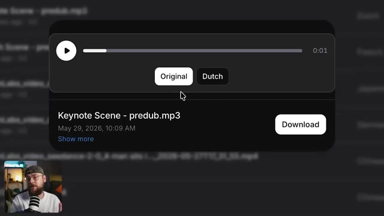
*Interface de prévisualisation et de téléchargement audio montrant les pistes 'Original' et 'Dutch' ainsi qu'un bouton 'Download', avec incrustation vidéo du créateur en bas à gauche.*

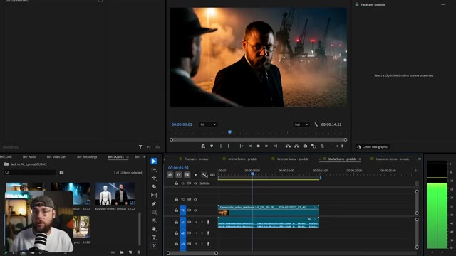
*Interface de montage vidéo Adobe Premiere Pro affichant une scène de mafia sombre et enfumée avec des personnages en costume, et le panneau de montage en bas.*

---

### ⏱️ `[00:05:39 - 00:06:01]` | Segment #12

**🔊 Audio (Transcription Intégrale Mot pour Mot en Français) :**
> Et cela fait tout à fait sens avec le décor de gangster des années 1930 de la scène pour notre court-métrage. Parce qu'évidemment, les membres de la mafia basculaient souvent entre l'anglais américain, où ils parlent avec cet accent new-yorkais très prononcé, et l'italien. Et nous utilisons effectivement cela pour cette scène particulière comme procédé dramatique.

**👁️ Analyse Visuelle d'Écran (gemini-3.5-flash-lite) :**
**Interface & Outils** : Adobe Premiere Pro

**Contenu textuel & Code** : On peut voir le panneau de prévisualisation affichant un personnage avec des lunettes dans une ambiance sombre et enfumée, la timeline avec le dossier « Mafia Scene - predub » et les pistes audio/vidéo synchronisées, ainsi qu'une vignette de caméra (PiP) montrant le créateur en bas à gauche.

**Action / Démonstration** : Le logiciel de montage vidéo est affiché à l'écran, illustrant le processus d'édition et de montage du court-métrage sur le thème de la mafia.

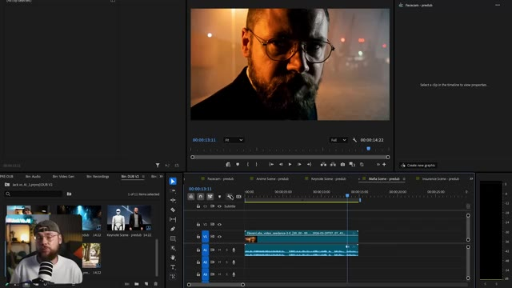
*Interface d'Adobe Premiere Pro montrant la timeline d'un projet de court-métrage, avec une incrustation vidéo (PiP) du créateur en bas à gauche et la lecture d'une scène de gangster au centre.*

---

### ⏱️ `[00:06:01 - 00:06:24]` | Segment #13

**🔊 Audio (Transcription Intégrale Mot pour Mot en Français) :**
> Et je trouve simplement que c'est une utilisation vraiment créative de cet outil. Je vais donc aller de l'avant et importer également la scène de la mafia. Et je vais parcourir et importer tous les différents exemples également. Et si nous faisons simplement défiler vers le bas ici pour trouver l'italien, ce qui est vraiment bien, c'est qu'on peut réellement sélectionner plusieurs langues si on souhaite effectuer une génération dans plus d'une langue au cours du même flux.

**👁️ Analyse Visuelle d'Écran (gemini-3.5-flash-lite) :**
**Interface & Outils** : Interface web d'ElevenLabs (section Dubbing) avec une fenêtre de sélection de fichiers système par-dessus.

**Contenu textuel & Code** : Noms de dossiers visibles dans l'explorateur : "DUB", "PRE-DUB", fichiers "ElevenLabs_video_seedance...". Dans le menu déroulant des langues : Hindi, Hungarian, Icelandic, Indonesian, Italian (avec coche), Japanese (survolé), Javanese, Kannada, Kazakh.

**Action / Démonstration** : Le créateur navigue dans ses dossiers locaux pour importer des fichiers audio, puis sélectionne ou survole les options de langues dans le menu déroulant d'ElevenLabs.

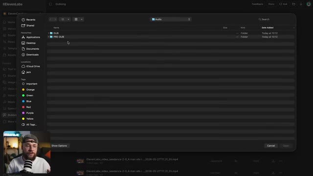
*Interface d'ElevenLabs Dubbing montrant une fenêtre de système de fichiers avec les dossiers audio DUB et PRE-DUB, avec le créateur en incrustation PiP.*

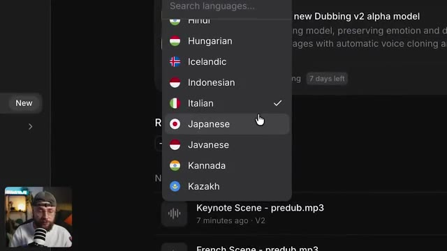
*Menu déroulant de sélection des langues dans ElevenLabs Dubbing, montrant le survol de l'option Japanese et l'option Italian cochée.*

---

### ⏱️ `[00:06:24 - 00:06:52]` | Segment #14

**🔊 Audio (Transcription Intégrale Mot pour Mot en Français) :**
> Dans ce cas, nous allons simplement garder l'italien et lancer cette génération. Maintenant que nous avons notre audio doublé, nous voulons bien sûr l'appliquer à nos séquences originales. Pour ce faire, sur ElevenLabs, nous devons nous rendre dans l'onglet image et vidéo. Et c'est ici que j'ai généré tous les visuels pour ce projet, parce qu'ils ont bien sûr intégré tous les meilleurs outils d'image et de vidéo par IA du marché.

**👁️ Analyse Visuelle d'Écran (gemini-3.5-flash-lite) :**
**Interface & Outils** : Interface web d'ElevenLabs (section Dubbing et section Image & Video / History) avec une vue PiP (Picture-in-Picture) du créateur en bas à gauche.

**Contenu textuel & Code** : Menus d'ElevenLabs ("Dubbing", "Image & Video", "Voice Isolator", "Voice Changer"), options de génération vidéo, paramètres de format, et texte de transition "step three going global".

**Action / Démonstration** : Le créateur montre l'interface de doublage audio d'ElevenLabs, passe par un écran de transition titré, puis navigue dans l'historique de l'onglet image et vidéo pour expliquer la génération des visuels.

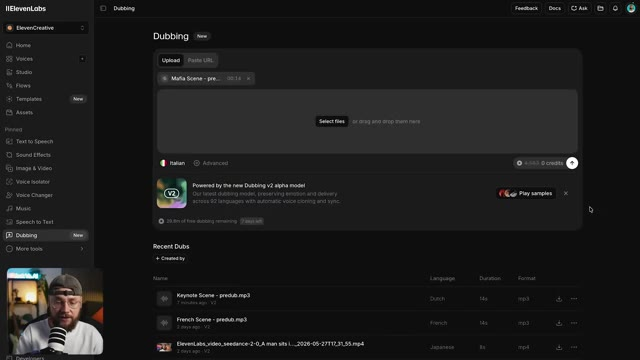
*Interface d'ElevenLabs montrant l'outil Dubbing pour le doublage audio en italien avec le modèle v2 alpha.*

*Écran de transition avec un fond flou aux tons bleus et bruns affichant le texte "step three going global".*

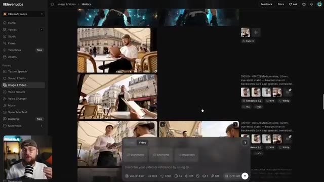
*Onglet "Image & Video" (History) d'ElevenLabs affichant une grille de vidéos générées avec des options de paramétrage.*

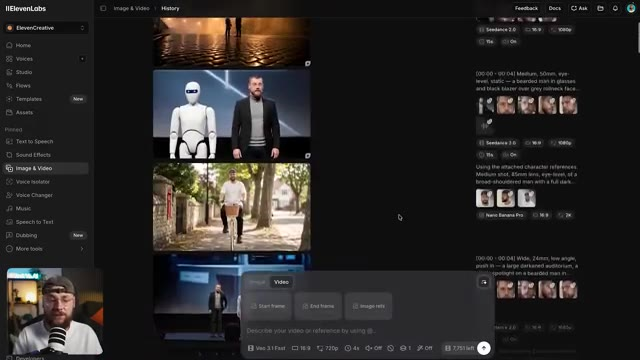
*Suite de l'historique "Image & Video" sur ElevenLabs montrant d'autres générations de vidéos par IA et leurs réglages.*

---

### ⏱️ `[00:06:52 - 00:07:13]` | Segment #15

**🔊 Audio (Transcription Intégrale Mot pour Mot en Français) :**
> Donc ce que nous voulons faire, c'est passer sur l'onglet vidéo ici dans le coin inférieur gauche. Si vous cliquez dessus, vous pouvez sélectionner votre modèle. Et ce qui est pratique, c'est qu'ils ont ces filtres tout en haut car, bien sûr, nous nous intéressons à la synchronisation labiale. Donc si nous cliquons dessus, nous allons voir apparaître la catégorie de synchronisation labiale.

**👁️ Analyse Visuelle d'Écran (gemini-3.5-flash-lite) :**
**Interface & Outils** : Interface web de génération vidéo par IA avec panneau de sélection de modèles et filtres par catégories.

**Contenu textuel & Code** : Texte des filtres : Realistic, Lip Sync, Upscaling, Editing, Audio, Fast, Low Cost. Liste des modèles : Seedance 2.0, Sync 3, Veed Lipsync, Seedance 2.0 Fast, Veo 3.1 Lite, HeyGen Avatar 4, Creatify Aurora, Veed Fabric, Sync Lipsync 2 Pro, OmniHuman 1.5. Paramètres : 16:9, 720p, 4s, 7,751 left.

**Action / Démonstration** : Le curseur clique sur l'onglet vidéo puis sur le filtre « Lip Sync » pour afficher la liste des modèles de synchronisation labiale.

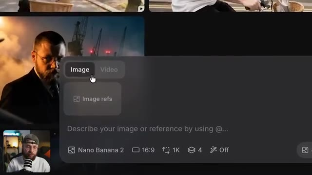
*Interface montrant le menu contextuel avec les onglets Image et Vidéo au coin inférieur gauche.*

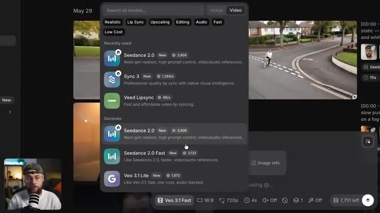
*Fenêtre de sélection des modèles avec les filtres de catégories en haut et les modèles Seedance 2.0, Sync 3 et Veed Lipsync.*

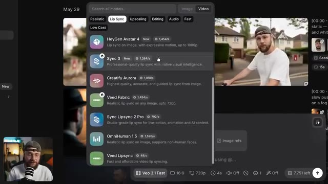
*Menu de sélection des modèles avec le filtre « Lip Sync » activé en haut et les modèles HeyGen Avatar 4, Sync 3, Creatify Aurora et Veed Fabric affichés.*

---

### ⏱️ `[00:07:13 - 00:07:35]` | Segment #16

**🔊 Audio (Transcription Intégrale Mot pour Mot en Français) :**
> Maintenant, ce que vous allez constater avec les outils de synchronisation labiale par IA, c'est que la plupart d'entre eux sont conçus pour synchroniser les lèvres sur des images plutôt que sur des vidéos. C'est donc un point dont vous devez absolument être conscient. Cela étant dit, nous n'avons vraiment que deux options ici. Nous avons Veed Lip Sync, qui est une synchronisation labiale vidéo rapide et abordable.

**👁️ Analyse Visuelle d'Écran (gemini-3.5-flash-lite) :**
**Interface & Outils** : Interface web de sélection de modèles d'IA avec un menu déroulant centré affichant les catégories (Realistic, Lip Sync, Upscaling, etc.) et une liste de modèles de synchronisation labiale (HeyGen Avatar 4, Sync 3, Creatify Aurora, Veed Fabric, Sync Lipsync 2 Pro, OmniHuman 1.5, Veed Lipsync). Le créateur apparaît en bas à gauche dans une incrustation vidéo PiP.

**Contenu textuel & Code** : Texte de l'interface incluant la barre de recherche 'Search all models...', les filtres actifs ('Lip Sync', 'Video'), et les descriptions des différents modèles de synchronisation labiale, notamment 'Veed Lipsync - Fast and affordable video lip syncing.'

**Action / Démonstration** : Le curseur de la souris survole et sélectionne le modèle 'Veed Lipsync' dans la liste déroulante des outils de synchronisation labiale.

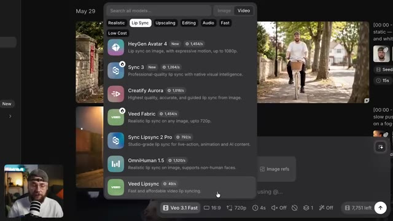
*Interface d'un outil de sélection de modèles d'IA montrant la liste des options de synchronisation labiale ('Lip Sync'), avec Veed Lipsync en surbrillance.*

---

### ⏱️ `[00:07:35 - 00:07:54]` | Segment #17

**🔊 Audio (Transcription Intégrale Mot pour Mot en Français) :**
> Et ensuite nous avons Sync 3. Maintenant, bien sûr, c'est plus cher. Vous allez dépenser plus de crédits, mais la différence dans les résultats ici est énorme. Et juste pour mettre cela en contexte, laissez-moi d'abord vous montrer un an exemple lors de mes tests quand j'essayais Veed Lip Sync.

**👁️ Analyse Visuelle d'Écran (gemini-3.5-flash-lite) :**
**Interface & Outils** : Interface logicielle de génération vidéo par IA avec un menu contextuel de sélection de modèles (Realistic, Lip Sync, Upscaling, Editing, Audio, Fast, Low Cost).

**Contenu textuel & Code** : Liste des modèles de synchronisation labiale visibles : HeyGen Avatar 4 (1,454/s), Sync 3 (1,264/s), Creatify Aurora (1,018/s), Veed Fabric (1,454/s), Sync Lipsync 2 Pro (792/s), OmniHuman 1.5 (1,520/s), Veed Lipsync (49/s). Le curseur de la souris survole l'option "Sync 3".

**Action / Démonstration** : Le créateur survole et sélectionne le modèle "Sync 3" dans la liste des options de synchronisation labiale, tandis que sa webcam apparaît en incrustation (PiP) dans le coin inférieur gauche.

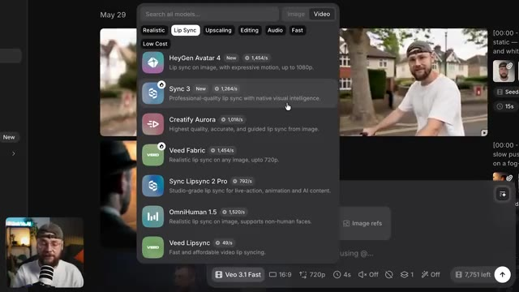
*Interface logicielle affichant un menu déroulant de sélection de modèles d'IA pour le Lip Sync, avec le curseur pointant sur Sync 3.*

---

### ⏱️ `[00:08:02 - 00:08:26]` | Segment #18

**🔊 Audio (Transcription Intégrale Mot pour Mot en Français) :**
> Donc, comme vous pouvez le voir, il y a beaucoup de dérive qui se produit ici. Même si c'est bon marché, ça ne vaut toujours pas la peine de dépenser ces crédits à mon avis. Mais laissez-moi vous montrer les résultats que vous pouvez obtenir en utilisant Sync 3. Je suis sûr que vous serez d'accord pour dire que le résultat de cet outil est plutôt impressionnant.

**👁️ Analyse Visuelle d'Écran (gemini-3.5-flash-lite) :**
**Interface & Outils** : Démonstration de l'outil Sync 3 affichant une vidéo générée avec un filigrane "sync 3" en haut à droite.

**Contenu textuel & Code** : Filigrane "sync 3" visible dans le coin supérieur droit de la vidéo générée.

**Action / Démonstration** : Affichage à l'écran du résultat vidéo haute qualité généré par l'outil Sync 3.

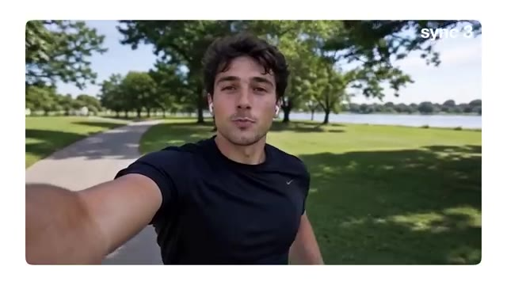
*Résultat vidéo généré avec l'outil Sync 3 montrant un homme en train de courir ou de marcher en extérieur dans un parc.*

---

### ⏱️ `[00:08:26 - 00:09:02]` | Segment #19

**🔊 Audio (Transcription Intégrale Mot pour Mot en Français) :**
> Donc nous allons procéder à la sélection de Sync 3 comme notre modèle vidéo de prédilection. Ensuite, nous souhaitons procéder au téléchargement de notre fichier vidéo de choix. Je veux donc y déposer cette vidéo de keynote. Allons-y pour le téléchargement. Et ensuite, nous devons télécharger notre discours doublé. Et une fois que nous cliquons sur cette option, vous verrez que vous pouvez utiliser les générations de voix que vous avez créées ici même dans Eleven Labs, mais vous pouvez également télécharger vos propres fichiers. C'est donc ce que nous voulons faire dans ce cas. Nous avons donc ici notre scène de keynote que nous avons bien sûr doublée en néerlandais.

**👁️ Analyse Visuelle d'Écran (gemini-3.5-flash-lite) :**
**Interface & Outils** : Interface web d'Eleven Labs (section Image & Video) avec une fenêtre de sélection de fichiers système et un panneau contextuel de choix de modèle/voix.

**Contenu textuel & Code** : Noms de fichiers visibles : "ElevenLabs_video_seedan...47.mp4", "Keynote Scene - predub_nl_dubbed.mp3", "Mafia Scene", "Insurance Scene". Modèle sélectionné : Sync 3. Historique vocal daté du 30 avril 2026 avec des voix comme "Ralf Eisend - Deep and Gravely" et "Max - Witty Commercial Actor".

**Action / Démonstration** : Le créateur sélectionne le modèle Sync 3, ouvre le dossier pour importer le fichier vidéo du keynote, montre la liste des voix générées, puis sélectionne le fichier audio doublé en néerlandais ("Keynote Scene - predub_nl_dubbed.mp3").

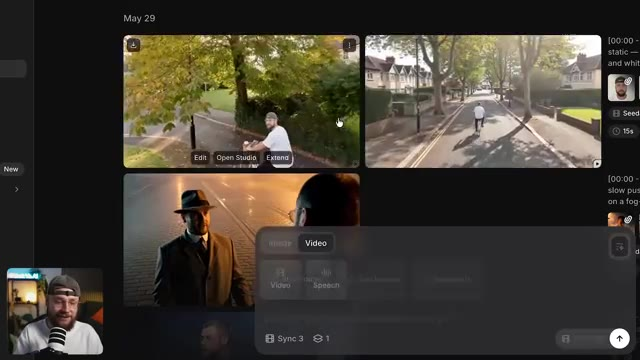
*Interface d'Eleven Labs montrant la sélection du modèle Sync 3 et la bibliothèque de vidéos.*

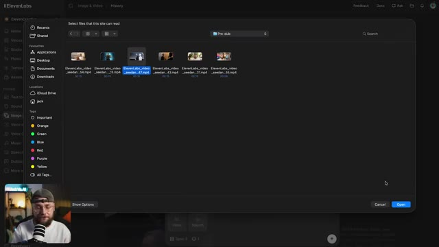
*Fenêtre de sélection de fichiers système pour importer le fichier vidéo du keynote.*

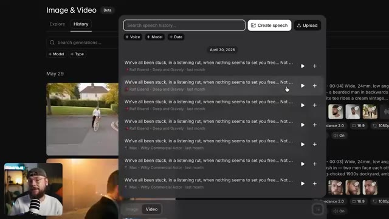
*Fenêtre contextuelle d'Eleven Labs affichant l'historique des générations vocales textuelles.*

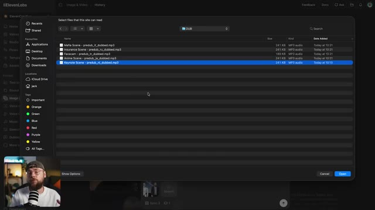
*Fenêtre de sélection de fichiers affichant le fichier audio doublé du keynote en néerlandais.*

---

### ⏱️ `[00:09:02 - 00:09:22]` | Segment #20

**🔊 Audio (Transcription Intégrale Mot pour Mot en Français) :**
> Donc nous allons procéder au téléchargement de ceci. Et maintenant, c'est aussi simple que d'envoyer notre génération et d'attendre de voir le résultat que nous obtenons en retour. Jetons un coup d'œil. Voici Arlo, et il coûte moins cher que vos dernières vacances. Il nettoiera vos sols, mettra les machines à laver, rangera votre jardin, et sortira même les poubelles un mardi.

**👁️ Analyse Visuelle d'Écran (gemini-3.5-flash-lite) :**
**Interface & Outils** : Interface web d'ElevenLabs (outil Image & Video) avec panneau d'historique et zone de chargement de média en bas.

**Contenu textuel & Code** : Historique de générations vidéo sur ElevenLabs affichant des aperçus de vidéos avec des prompts textuels (ex: "a bearded man in backwards cap and white tee rides a cream vintage...").

**Action / Démonstration** : Le créateur montre l'interface d'ElevenLabs pendant le chargement d'un fichier, puis illustre son discours avec des images générées du robot Arlo.

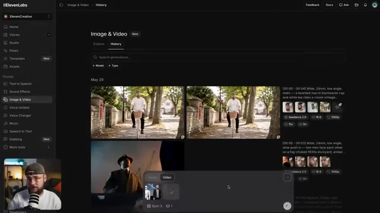
*Interface d'ElevenLabs (section Image & Video History) avec la webcam du créateur en incrustation.*

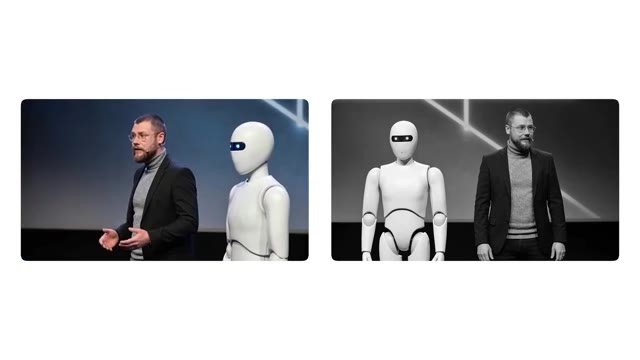
*Présentation de deux images générées par IA montrant un homme en costume-col roulé aux côtés d'un robot humanoïde blanc (Arlo).*

---

### ⏱️ `[00:09:23 - 00:09:42]` | Segment #21

**🔊 Audio (Transcription Intégrale Mot pour Mot en Français) :**
> Nous avons construit Arlo afin que n'importe qui dans n'importe quel foyer puisse avoir un coup de main. Voici Arlo, et il coûte moins cher que vos dernières vacances. Il nettoie vos sols, nettoie votre linge, nettoie votre maison et nettoie le week-end, même à l'extérieur. Nous avons conçu Arlo pour que tout le monde puisse avoir de l'aide dans chaque foyer.

**👁️ Analyse Visuelle d'Écran (gemini-3.5-flash-lite) :**
**Interface & Outils** : Présentation face caméra sans partage d'écran

**Contenu textuel & Code** : Aucun contenu logiciel ou interface affiché.

**Action / Démonstration** : Le présentateur s'exprime en direct sur scène aux côtés d'un robot humanoïde, illustrant son discours par sa présence physique sans démonstration d'écran.

---

### ⏱️ `[00:10:06 - 00:10:31]` | Segment #22

**🔊 Audio (Transcription Intégrale Mot pour Mot en Français) :**
> Maintenant, jetons un œil à l'exemple d'anime que nous avons préparé. Grille 7, niveau inférieur, déplacement vers l'arrière. Quelque chose est ici. Grille 7, kasokai, koubu hei idousuru.

**👁️ Analyse Visuelle d'Écran (gemini-3.5-flash-lite) :**
**Interface & Outils** : Présentation vidéo avec affichage d'exemples de rendus d'animation générés par IA.

**Contenu textuel & Code** : Pas de texte ni de prompt affiché à l'écran, uniquement les visuels de démonstration de l'exemple d'anime.

**Action / Démonstration** : Le créateur présente et illustre visuellement son exemple de projet d'anime en affichant les différents plans générés par IA.

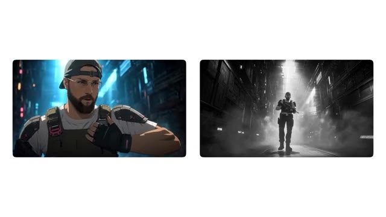
*Affichage côte à côte de deux plans animés générés par IA : à gauche, Jack en version animée s'exprimant dans une ruelle cyberpunk colorée ; à droite, un plan en noir et blanc d'un soldat marchant dans un couloir sombre.*

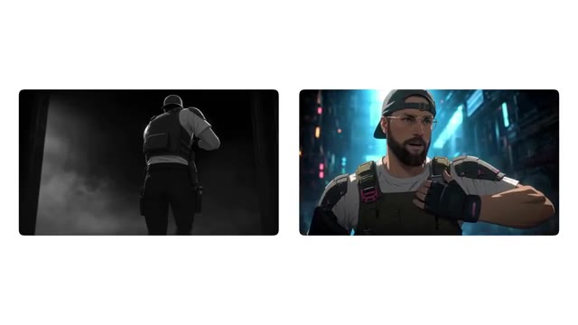
*Affichage côte à côte de deux plans animés générés par IA : à gauche, une vue de dos d'un soldat en noir et blanc dans une zone industrielle sombre ; à droite, le plan animé coloré de Jack dans la ruelle cyberpunk.*

---

### ⏱️ `[00:10:34 - 00:10:52]` | Segment #23

**🔊 Audio (Transcription Intégrale Mot pour Mot en Français) :**
> Nanika ga iru. Et comme vous pouvez le voir, le résultat ici fonctionne aussi très bien. En animation, tout est beaucoup plus indulgent. Non pas que nous en ayons vraiment besoin avec ce flux de travail, car les résultats sont déjà plutôt excellents.

**👁️ Analyse Visuelle d'Écran (gemini-3.5-flash-lite) :**
**Interface & Outils** : Démonstration de rendus vidéo animés générés par intelligence artificielle, sans interface logicielle visible.

**Contenu textuel & Code** : Séquence vidéo montrant des animations de style cinématique (personnage armé de dos dans une ambiance enfumée et sombre, puis intérieur de vaisseau spatial ou couloir futuriste).

**Action / Démonstration** : Présentation à l'écran d'exemples de résultats d'animation obtenus grâce au workflow d'intelligence artificielle.

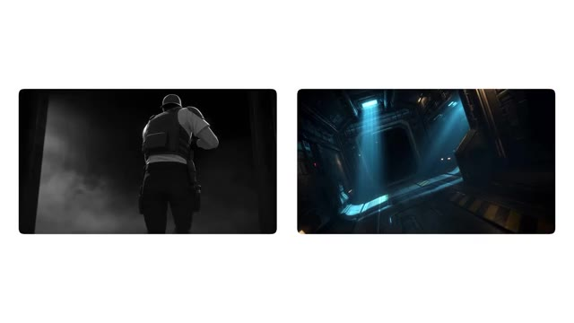
*Extrait vidéo démontrant des animations générées par IA avec un personnage dans un couloir sombre, puis un décor futuriste éclairé par des faisceaux lumineux.*

---

### ⏱️ `[00:10:52 - 00:11:12]` | Segment #24

**🔊 Audio (Transcription Intégrale Mot pour Mot en Français) :**
> Je veux aussi jeter un œil à notre exemple de publicité pour une assurance. C'est là que nous l'avons doublé en russe. Personne ne veut passer son samedi matin à penser à l'assurance habitation. Mais quand quelque chose tourne mal, et que quelque chose tourne toujours mal, vous voulez que ce soit réglé. Discrètement, rapidement. C'est à ça que sert Anka. Vous n'y pensez pas, ça s'occupe de tout.

**👁️ Analyse Visuelle d'Écran (gemini-3.5-flash-lite) :**
**Interface & Outils** : L'interface d'ElevenLabs avec le panneau de navigation latéral gauche (Voices, Studio, Flows, Templates, Image & Video, etc.) et l'historique des médias générés au centre.

**Contenu textuel & Code** : Dans l'interface d'ElevenLabs, on aperçoit des vignettes de vidéos avec des boutons comme "Edit", "Open Studio", "Extend", "Sync 3" et des aperçus de clips (un homme en costume, un homme à vélo, un plateau de présentation futuriste).

**Action / Démonstration** : Le créateur navigue dans l'historique des vidéos générées sur ElevenLabs et compare deux versions vidéo d'une publicité (couleur et noir et blanc).

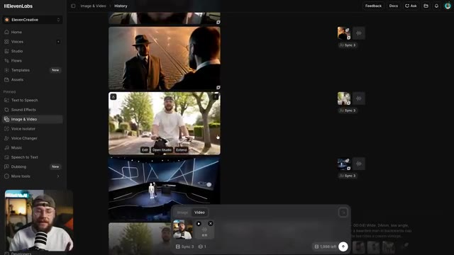
*Interface d'ElevenLabs (section Image & Video / History) montrant l'historique des vidéos générées, avec une incrustation vidéo du créateur (PiP) en bas à gauche.*

*Comparatif visuel de deux versions d'une vidéo montrant un homme à vélo dans une rue résidentielle : une en couleur et une en noir et blanc.*

---

### ⏱️ `[00:11:12 - 00:11:58]` | Segment #25

**🔊 Audio (Transcription Intégrale Mot pour Mot en Français) :**
> Anka. Stable quand ça compte. Никому не хочется тратить субботнее утро на мысли о страховании жилья. Но когда что-то идет не так, а что-то всегда идет не так, хочется, чтобы все уладилось. ticho and быстро. For this is anko. You don't think about it. He just does his job. Anka. The ease when it's important. often a problem with AI tools but Sync 3 seems to be doing pretty damn good here. And let's take a

**👁️ Analyse Visuelle d'Écran (gemini-3.5-flash-lite) :**
**Interface & Outils** : Affichage de scènes vidéo comparatives et de rendus visuels illustrant un outil vidéo par IA, avec le créateur en incrustation PiP dans l'image 2.

**Contenu textuel & Code** : Aucun texte textuel explicite ni prompt textuel visible, uniquement des séquences vidéo générées ou démontrées.

**Action / Démonstration** : Le créateur montre des exemples de plans vidéo urbains pour illustrer l'outil testé, tout en commentant son fonctionnement.

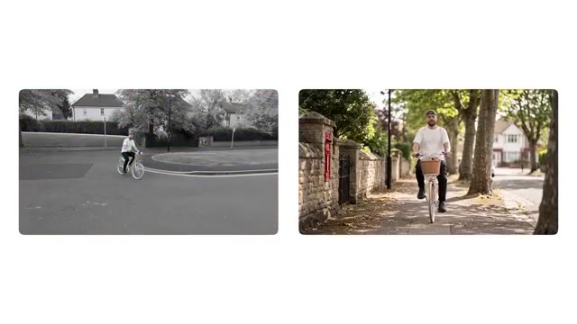
*Comparatif visuel de deux plans vidéo d'un homme à vélo en milieu urbain.*

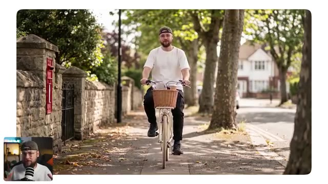
*Plan vidéo principal de l'homme à vélo dans une rue résidentielle, avec incrustation PiP du créateur dans le coin inférieur gauche.*

---

### ⏱️ `[00:11:58 - 00:12:32]` | Segment #26

**🔊 Audio (Transcription Intégrale Mot pour Mot en Français) :**
> regardez maintenant je parle en turc ce qui n'est pas le cas en vrai pour info. Je suis Jack. J'ai passé plus d'une décennie à créer des effets visuels pour de nombreuses plus grandes marques de la planète. Ben Jack. On yıla aşkın süredir gezegendeki en büyük markaların bir çoğu için görsel efektler üretiyorum. Et ce qui est génial avec cet exemple, c'est qu'on n'a aucune sorte de déformation sur mon micro. Et par là, je veux dire qu'il ne se déforme pas d'une manière étrange suite à la synchronisation labiale. Et je veux continuer et vous montrer quelques cas d'utilisation créatifs supplémentaires pour ça.

**👁️ Analyse Visuelle d'Écran (gemini-3.5-flash-lite) :**
**Interface & Outils** : Interface de la plateforme ElevenLabs (section Image & Video History), avec le panneau de navigation latéral et les miniatures de vidéos dans l'historique.

**Contenu textuel & Code** : Texte et éléments visibles dans l'interface : "ElevenLabs", "ElevenCreative", "History", "Search generations...", "+ Model", "+ Type", "May 29", "Sync 3", "1,986 left", ainsi que l'encadré vidéo actif affichant Jack.

**Action / Démonstration** : Le créateur montre l'historique de l'interface ElevenLabs avec les différentes vidéos générées et synchronisées.

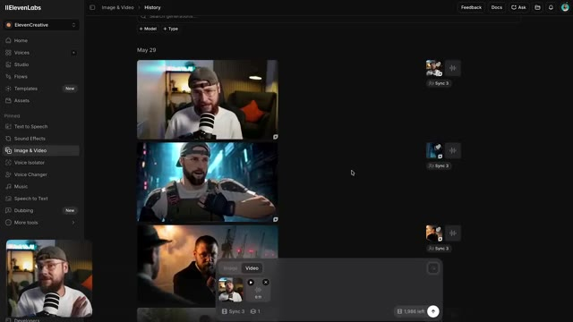
*Interface d'ElevenLabs affichant l'historique des générations vidéo (Image & Video History) avec plusieurs aperçus et miniatures de vidéos générées.*

---

### ⏱️ `[00:12:32 - 00:12:52]` | Segment #27

**🔊 Audio (Transcription Intégrale Mot pour Mot en Français) :**
> workflow particulier. Donc nous avons ici une scène de moi assis à Paris ou quelque part en France à la terrasse d'un café, et j'ai une interaction avec un serveur plutôt impoli, puis je renverse un peu la situation. Jetons un coup d'œil au résultat final, puis je vous expliquerai exactement ce que j'ai fait. Avez-vous déjà décidé ce que vous voulez ?

**👁️ Analyse Visuelle d'Écran (gemini-3.5-flash-lite) :**
**Interface & Outils** : Adobe Premiere Pro (logiciel de montage vidéo)

**Contenu textuel & Code** : Panneaux de Premiere Pro comprenant le chutier (Bin: DUB V2), la timeline avec les pistes vidéo/audio (French Scene - predub), le moniteur de prévisualisation et le panneau Text / Subtitle avec la police Helvetica Neue et le texte "Grand Marnier soufflé.".

**Action / Démonstration** : Présentation du projet de montage sur la timeline de Premiere Pro et affichage de la scène générée à la terrasse d'un café à Paris.

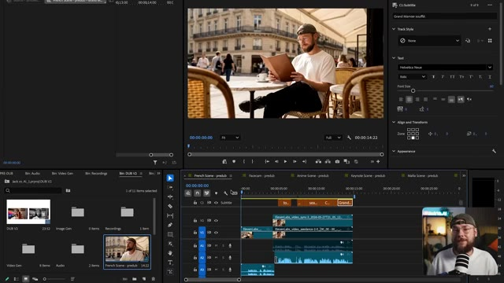
*Interface d'Adobe Premiere Pro montrant le montage d'une vidéo avec le panneau de sous-titres, le chutier et la timeline multi-pistes, avec le créateur en incrustation (PiP) dans le coin inférieur droit.*

*Scène vidéo générée montrant Jack assis à la terrasse d'un café parisien en train de lire un menu, avec une tasse de café sur la table.*

---

### ⏱️ `[00:12:53 - 00:13:12]` | Segment #28

**🔊 Audio (Transcription Intégrale Mot pour Mot en Français) :**
> Ouais. Est-ce que je peux avoir le croque-monsieur, s'il vous plaît ? Même pas foutu de parler la langue locale. En fait, je vais commencer par le plateau de fruits de mer, une bouteille de chablis premier cru, et je finirai par le soufflet au Grand Marnier. Donc vous pouvez voir que cela fonctionne vraiment très bien, mais la première génération de vidéo a été entièrement faite en anglais.

**👁️ Analyse Visuelle d'Écran (gemini-3.5-flash-lite) :**
**Interface & Outils** : Présentation face caméra sans partage d'écran

**Contenu textuel & Code** : Aucun contenu logiciel, interface ou prompt textuel visible. Les images montrent des extraits vidéo générés par IA en extérieur et le créateur dans son studio.

**Action / Démonstration** : Le créateur parle face caméra dans son studio et commente des séquences vidéo générées par IA.

---

### ⏱️ `[00:13:12 - 00:13:38]` | Segment #29

**🔊 Audio (Transcription Intégrale Mot pour Mot en Français) :**
> Et ce que j'ai fait, c'est que j'ai pris cette génération originale et je l'ai doublée en français pour me permettre de prononcer cette réplique finale en français courant. Et comme vous pouvez le voir dans le montage, c'est vraiment très simple. Je l'ai littéralement déposée par-dessus la génération vidéo originale. Donc on passe de la génération originale entièrement en anglais directement à la génération doublée en français.

**👁️ Analyse Visuelle d'Écran (gemini-3.5-flash-lite) :**
**Interface & Outils** : Adobe Premiere Pro (avec incrustation caméra du créateur en bas à droite).

**Contenu textuel & Code** : Noms des clips sur la timeline incluant "ElevenLabs_video_seedance-2-0" et "ElevenLabs_video_sync-3".

**Action / Démonstration** : Le créateur montre l'interface de montage vidéo d'Adobe Premiere Pro et zoome sur la timeline pour illustrer la superposition des pistes vidéo et audio doublées.

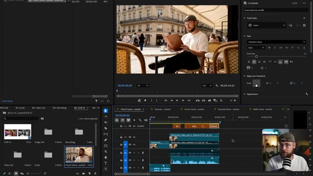
*Interface d'Adobe Premiere Pro montrant la timeline avec les pistes vidéo et audio, ainsi qu'un encadré PiP du créateur.*

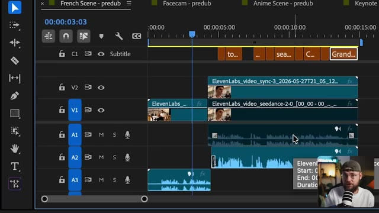
*Vue rapprochée de la timeline d'Adobe Premiere Pro montrant le positionnement des pistes vidéo superposées et des fichiers audio.*

---

### ⏱️ `[00:13:38 - 00:13:57]` | Segment #30

**🔊 Audio (Transcription Intégrale Mot pour Mot en Français) :**
> Et ça fonctionne vraiment très bien. Et mettons cela en pratique ici. Donc nous allons passer à la scène de la mafia et j'ai déjà importé la version doublée de la scène de la mafia où nous parlons en italien. Donc je vais simplement faire glisser cela directement sur la timeline.

**👁️ Analyse Visuelle d'Écran (gemini-3.5-flash-lite) :**
**Interface & Outils** : Adobe Premiere Pro (logiciel de montage vidéo).

**Contenu textuel & Code** : Fenêtre de montage contenant divers onglets (French Scene, Facecam, Anime Scene, Keynote Scene, Mafia Scene), pistes vidéo (V1, V2) et audio (A1, A2, A3), ainsi qu'un chutier montrant des dossiers de projets et des clips vidéo. Un encadré PiP (Picture-in-Picture) montre le créateur dans son studio.

**Action / Démonstration** : Le créateur montre son écran de montage avec Adobe Premiere Pro, démontrant l'importation et le glisser-déposer de la scène de la mafia doublée sur la timeline.

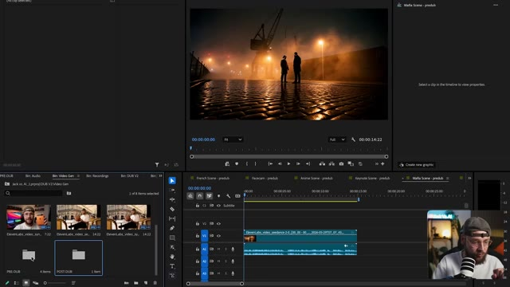
*Interface d'Adobe Premiere Pro montrant la timeline et le chutier avec la scène de la mafia doublée en italien.*

---

### ⏱️ `[00:13:57 - 00:14:18]` | Segment #31

**🔊 Audio (Transcription Intégrale Mot pour Mot en Français) :**
> Et bien sûr, cela correspond exactement à la longueur de génération de la vidéo originale. Donc, après un montage très basique ici où je fais en gros des fondues d'entrée et de sortie sur les pistes audio, c'est le résultat que nous obtenons. Tu m'avais dit que c'était réglé. Tu m'as regardé dans les yeux et tu m'as dit que c'était réglé. Il y a eu une complication. C'est tout. Donne-moi deux jours. La complication. Mon père a eu une complication une fois.

**👁️ Analyse Visuelle d'Écran (gemini-3.5-flash-lite) :**
**Interface & Outils** : Logiciel de montage vidéo (semblable à Adobe Premiere Pro ou DaVinci Resolve) avec une timeline multiligne (pistes V1, A1, A2, A3) et un aperçu vidéo en incrustation (PiP).

**Contenu textuel & Code** : Timeline de montage avec des clips nommés "ElevenLabs_video_seedance-2-...", "Mafia Scene - predub", "French Scene - predub", etc. Sous-titre visible dans l'image 3 : "A complication?".

**Action / Démonstration** : Le créateur montre son plan de montage chronologique avec les pistes audio en cours d'ajustement, puis présente le rendu final de la scène de mafia générée par IA.

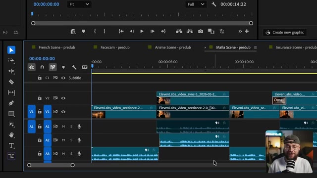
*Interface d'un logiciel de montage vidéo montrant la timeline avec plusieurs pistes audio et vidéo, ainsi qu'une petite incrustation vidéo (PiP) de Jack en bas à droite.*

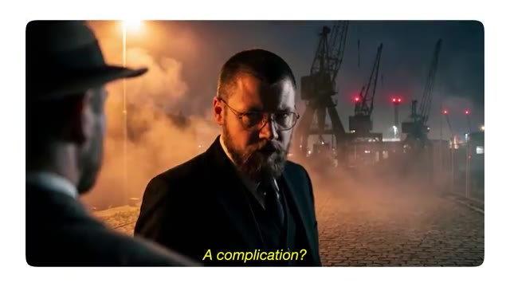
*Extrait de la vidéo générée montrant deux hommes sur les docks de port la nuit dans une ambiance sombre et enfumée, avec le sous-titre "A complication?".*

---

### ⏱️ `[00:14:18 - 00:14:39]` | Segment #32

**🔊 Audio (Transcription Intégrale Mot pour Mot en Français) :**
> Il l'a enterrée dans les fondations d'un chi... J'ai toujours respecté votre famille. Vous le savez. S'il vous plaît, laissez-moi arranger les choses. Règle l'affaire. Ou je commence à jeter les fondations. La scène paraît donc soudainement beaucoup plus dynamique parce que je passe à l'italien. Et puis bien sûr, il faut que l'on jette un œil à moi tenant l'iPhone Fold.

**👁️ Analyse Visuelle d'Écran (gemini-3.5-flash-lite) :**
**Interface & Outils** : Logiciel de montage vidéo sur macOS affichant des fenêtres de gestion de fichiers et une timeline multipiste.

**Contenu textuel & Code** : Noms de fichiers visibles dans le gestionnaire : « ElevenLabs_video_sync_3_2026-05-27T18_02_28.mp4 », « Pre-dub », « Dub », « French Scene - predub_fr_dubbed.mp3 ».

**Action / Démonstration** : Le créateur montre une scène cinématique de mafieux, puis l'interface de son logiciel de montage avec les fichiers de doublage, tout en s'exprimant face caméra dans une incrustation PiP.

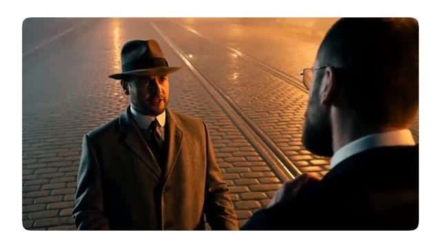
*Scène cinématique générée par IA montrant un homme en costume et chapeau de type mafieux parlant à un autre personnage dans une rue pavée et brumeuse.*

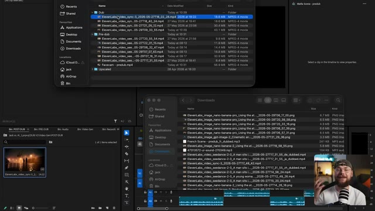
*Interface d'un logiciel de montage vidéo (type Premiere Pro ou DaVinci Resolve) avec des fenêtres de dossiers (Dub, Pre-dub) et un encadré PiP montrant Jack dans son studio.*

---

### ⏱️ `[00:14:39 - 00:15:03]` | Segment #33

**🔊 Audio (Transcription Intégrale Mot pour Mot en Français) :**
> et nous avons doublé cela dans deux langues différentes pour le tester. C'est un changement absolu de paradigme. Wow, les gars. C'est un changement absolu de paradigme. Wow, tout le monde. C'est vraiment, c'est incroyable. Maintenant, dans l'ensemble, je pense que c'est vraiment très bien, surtout que la langue évolue vraiment de manière spectaculaire.

**👁️ Analyse Visuelle d'Écran (gemini-3.5-flash-lite) :**
**Interface & Outils** : Logiciel de montage vidéo (type Premiere Pro / DaVinci Resolve) avec gestion des fichiers de doublage (dossiers "Dub" et "Pre-dub").

**Contenu textuel & Code** : Noms de fichiers visibles dans l'explorateur : "ElevenLabs_video_sync-3_2026-05-27T18_40_24.mp4", "French Scene - predub_fr_dubbed.mp3", ainsi que divers fichiers audio et vidéo générés par ElevenLabs.

**Action / Démonstration** : Le créateur montre l'arborescence des fichiers de doublage dans son logiciel de montage pour illustrer le processus de test de doublage multilingue.

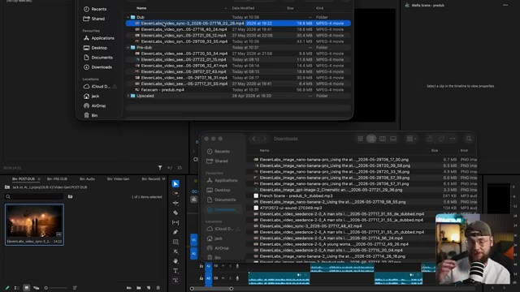
*Interface d'un logiciel de montage vidéo affichant l'explorateur de fichiers avec des dossiers de doublage et de pré-doublage ainsi qu'une frise chronologique.*

---

### ⏱️ `[00:15:03 - 00:15:22]` | Segment #34

**🔊 Audio (Transcription Intégrale Mot pour Mot en Français) :**
> Il y a une courte section au milieu où j'ai l'impression que la bouche ne bouge pas tout à fait assez avec le phrasé japonais. Oua, tout le monde, c'est vraiment révolutionnaire. Maintenant, ma femme et moi avons eu beaucoup de discussions à ce sujet, et elle pense que ça fonctionne très bien en fait.

**👁️ Analyse Visuelle d'Écran (gemini-3.5-flash-lite) :**
**Interface & Outils** : Présentation face caméra sans partage d'écran

**Contenu textuel & Code** : Aucun contenu logiciel ou interface visible. Jack présente un téléphone portable (affichage d'un écran de verrouillage et du logo Apple au dos) à la caméra, mais il s'agit d'une illustration physique et non d'une démonstration d'interface ou d'outil IA.

**Action / Démonstration** : Jack s'adresse directement à la caméra dans son studio en parlant de synchronisation labiale et en tenant un smartphone dans sa main.

---

### ⏱️ `[00:15:22 - 00:15:44]` | Segment #35

**🔊 Audio (Transcription Intégrale Mot pour Mot en Français) :**
> Je veux que vous laissiez des commentaires en dessous et me fassiez savoir si vous êtes d'accord avec moi ou avec ma femme. Et si vous êtes d'accord avec ma femme, on va se brouiller. Mais je pense que cela nous amène gentiment à la conclusion de ce projet et de mes conclusions. Probablement le plus grand inconvénient du doublage V2 à mon avis, c'est que cela ne fonctionne pas pour le chant.

**👁️ Analyse Visuelle d'Écran (gemini-3.5-flash-lite) :**
**Interface & Outils** : Présentation avec écran de transition textuel (pas d'interface logicielle interactive).

**Contenu textuel & Code** : Texte affiché à l'écran : "conclusion" en blanc et "my honest take" en jaune en dessous.

**Action / Démonstration** : Affichage d'un écran de titre/transition illustrant la conclusion de la vidéo pendant que le créateur commente vocalement le sujet.

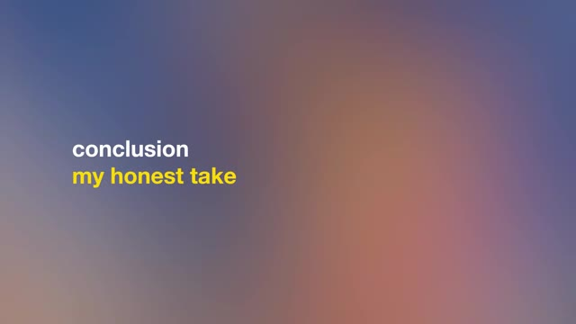
*Écran de transition ou diapositive affichant le texte de conclusion de la vidéo sur un fond flouté aux tons bleus et orangés.*

---

### ⏱️ `[00:15:44 - 00:16:16]` | Segment #36

**🔊 Audio (Transcription Intégrale Mot pour Mot en Français) :**
> Ce qui finit par se produire si vous téléchargez la chanson de quelqu'un, même s'il s'agit juste d'une piste vocale isolée, c'est qu'elle reste simplement dans la langue précédente comme elle l'aurait fait auparavant, et je pense qu'il y a ici une énorme application créative. Vous avez peut-être vu récemment que j'ai créé un clip vidéo entier en utilisant l'IA. Donc, si vous étiez capable de faire ça et ensuite de l'adapter pour un public différent en utilisant cet outil de doublage, le potentiel est énorme. Mais prendre quelqu'un qui est réellement en train de chanter ajoute un

**👁️ Analyse Visuelle d'Écran (gemini-3.5-flash-lite) :**
**Interface & Outils** : Présentation vidéo avec incrustation PiP du créateur dans le coin inférieur gauche (Jack face caméra) et diffusion d'extraits d'un clip vidéo musical généré par IA en plan principal.

**Contenu textuel & Code** : Sous-titres affichés dans les images 3 ("Everyone's so comfortable.") et 4 ("my wiring is off."). Visuels d'un clip vidéo musical généré par intelligence artificielle mettant en scène un personnage à la peau verte dans divers décors (mur en marbre, tapis roulant nocturne, intérieur avec sweat à capuche, matelas au sol).

**Action / Démonstration** : Le créateur illustre ses propos sur le doublage de clips musicaux générés par l'IA en diffusant des extraits de sa propre création musicale visuelle, avec une petite fenêtre PiP montrant Jack en train de parler.

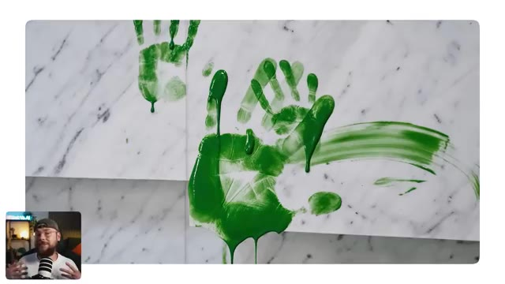
*Extrait du clip musical généré par IA montrant des empreintes de mains vertes sur un mur en marbre blanc.*

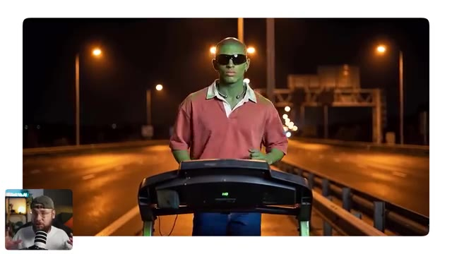
*Extrait du clip musical généré par IA montrant un personnage à la peau verte portant des lunettes de soleil et marchant sur un tapis roulant la nuit.*

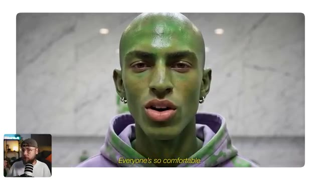
*Extrait du clip musical généré par IA montrant un personnage chauve à la peau verte avec un sweat à capuche violet, avec des sous-titres en bas.*

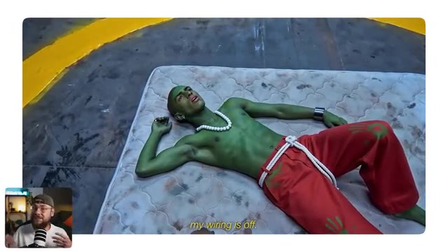
*Extrait du clip musical généré par IA montrant un personnage à la peau verte allongé sur un matelas sale posé sur le sol.*

---

### ⏱️ `[00:16:16 - 00:16:48]` | Segment #37

**🔊 Audio (Transcription Intégrale Mot pour Mot en Français) :**
> niveau de complexité supplémentaire là. Peut-être un jour, peut-être dans la V3 ou V4 ou quelque chose comme ça. Mais je pense que ce serait génial si l'équipe d'ElevenLabs pouvait travailler sur cette mise à jour. Ce que je pense personnellement qui serait vraiment pratique aussi, si c'est possible, c'est que lorsque vous récupérez votre piste doublée, vous puissiez également avoir une transcription dans la langue précédente ainsi que dans la langue vers laquelle vous avez basculé, car clairement ElevenLabs a ces données, ils doivent forcément les avoir pour faire tourner le

**👁️ Analyse Visuelle d'Écran (gemini-3.5-flash-lite) :**
**Interface & Outils** : Interface web d'ElevenLabs (outil de doublage) et lecteur vidéo/audio intégré avec affichage de métadonnées de doublage.

**Contenu textuel & Code** : Texte affiché : "Anime Scene - predub.mp3", "May 29, 2026, 10:19 AM", "Source Language: Auto-Detect", "Target Language: Japanese", "Source: Upload", "Cloning strength: 7", "Video Resolution: N/A", "Watermarked: No", "Dubbed Range: Start - End", "Credits Used: N/A", "Dubbing ID: uk6oNJSWbtGCL8ervKTv", ainsi que les boutons "Original", "Japanese" et "Download".

**Action / Démonstration** : Présentation visuelle d'une image générée par IA illustrant un bureau recouvert de peinture, suivie de l'affichage de l'interface des paramètres de doublage audio d'ElevenLabs.

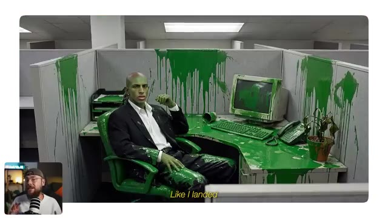
*Image générée par IA montrant un homme chauve en costume dans un bureau entièrement éclaboussé de peinture verte avec un petit encadré PiP de Jack dans le coin inférieur gauche.*

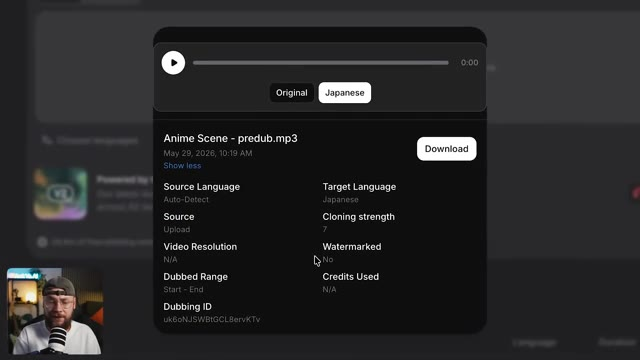
*Interface d'ElevenLabs affichant les détails du doublage audio avec le lecteur, le bouton de téléchargement et les métadonnées (Source Language, Target Language, Cloning strength, etc.) et l'encadré PiP de Jack.*

---

### ⏱️ `[00:16:48 - 00:17:17]` | Segment #38

**🔊 Audio (Transcription Intégrale Mot pour Mot en Français) :**
> modèle vocal et une autre chose que je voulais souligner et cela a tout à fait de sens c'est que si vous passez d'une langue qui est plus proche d'une autre géographiquement. Donc par là je veux dire que si vous passez de l'anglais au français par exemple, les résultats vont être beaucoup plus efficaces que si vous passez de l'anglais au japonais parce que ces langues sont tellement différentes. Je pense quand même que le doublage v2 et sync 3 ont très bien géré ce changement.

**👁️ Analyse Visuelle d'Écran (gemini-3.5-flash-lite) :**
**Interface & Outils** : Présentation face caméra sans partage d'écran

**Contenu textuel & Code** : Aucun contenu textuel ou interface logicielle visible à l'écran, le créateur s'exprime directement face caméra dans son studio.

**Action / Démonstration** : Le créateur parle en studio avec des mouvements de mains pour illustrer ses explications sur les modèles de doublage vocal et la distance géographique entre les langues.

---

### ⏱️ `[00:17:17 - 00:17:37]` | Segment #39

**🔊 Audio (Transcription Intégrale Mot pour Mot en Français) :**
> C'est juste quelque chose que je voulais souligner. Et maintenant, je veux vous donner cette astuce bonus pour vous assurer d'obtenir le doublage le meilleur, le plus cohérent et le plus précis possible. Et c'est juste une petite astuce astucieuse pour vérifier en fait que le doublage fonctionne comme vous l'espérez.

**👁️ Analyse Visuelle d'Écran (gemini-3.5-flash-lite) :**
**Interface & Outils** : Interface web d'ElevenLabs (module Dubbing) avec un menu latéral gauche et un panneau principal de téléchargement de fichiers.

**Contenu textuel & Code** : On peut lire les éléments suivants sur l'interface : « ElevenLabs », « Dubbing New », « Upload », « Paste URL », « Select files or drag and drop them here », « Powered by the new Dubbing v2 alpha model », et dans la section « Recent Dubs » : « Anime Scene - predub.mp3 », « Facecam - predub.mp3 », « Insurance Scene - predub.mp3 ».

**Action / Démonstration** : Le créateur présente l'interface de doublage d'ElevenLabs tout en parlant à l'écran, visible en incrustation (PiP) dans le coin inférieur gauche.

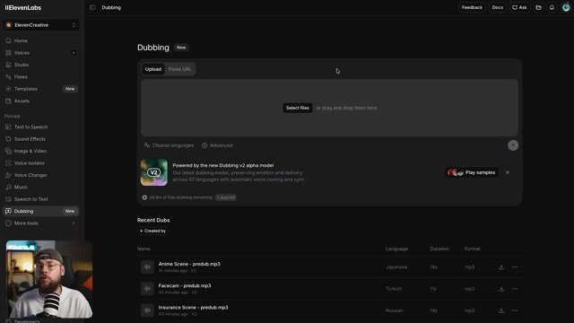
*Interface de la plateforme ElevenLabs sur l'outil Dubbing (avec une incrustation vidéo PiP de Jack en bas à gauche).*

---

### ⏱️ `[00:17:37 - 00:17:58]` | Segment #40

**🔊 Audio (Transcription Intégrale Mot pour Mot en Français) :**
> Donc ce que vous voulez faire ensuite, c'est cliquer sur « sélectionner des fichiers » et vous voulez télécharger un de vos exemples doublés. Donc je vais choisir la caméra frontale où je parlais en turc. Alors allons-y et téléchargeons ça. Et comme vous l'avez sans doute deviné maintenant, pour la langue, nous voulons sélectionner l'anglais. Donc on inverse essentiellement le processus.

**👁️ Analyse Visuelle d'Écran (gemini-3.5-flash-lite) :**
**Interface & Outils** : Interface web d'ElevenLabs (section Dubbing) avec un encadré vidéo PiP du créateur en bas à gauche.

**Contenu textuel & Code** : On peut voir le bouton "Select files or drag and drop them here", l'indicateur "Powered by the new Dubbing v2 alpha model", et dans la liste des doublages récents : "Facecam - predub.mp3" en turc (Turkish).

**Action / Démonstration** : Le curseur de la souris survole le bouton "Select files" pour importer un fichier audio ou vidéo de test.

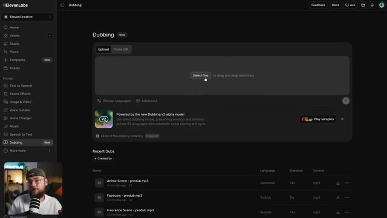
*Interface d'ElevenLabs (module Dubbing) affichant la zone de dépôt de fichiers et les doublages récents.*

---

### ⏱️ `[00:17:58 - 00:18:31]` | Segment #41

**🔊 Audio (Transcription Intégrale Mot pour Mot en Français) :**
> Et si nous continuons et cliquons sur générer, cela va nous permettre de simplement vérifier une seconde fois que le doublage fait un travail précis. Très bien, nous avons récupéré cette génération. Ouvrons-la donc et écoutons. Je m'appelle Jack. Pendant plus d'une décennie, j'ai créé des effets visuels pour certaines des plus grandes marques de la planète. Voilà donc. c'est juste une autre façon vraiment astucieuse de valider vos résultats si vous n'avez peut-être aucun autre moyen de le faire. Et cela étant dit les gars, nous sommes arrivés à la fin du tutoriel d'aujourd'hui. Si vous avez des questions, n'hésitez pas à les poser en bas dans la section des commentaires. Si vous avez apprécié

**👁️ Analyse Visuelle d'Écran (gemini-3.5-flash-lite) :**
**Interface & Outils** : Interface web d'ElevenLabs (outil de doublage "Dubbing"), incluant une vue PiP (Picture-in-Picture) de Jack dans son studio en bas à gauche sur les images valides.

**Contenu textuel & Code** : Menus d'ElevenLabs (Home, Voices, Studio, Dubbing), nom de fichier "Facecam - predub...", statut du modèle "Dubbing v2 alpha", lecteur audio avec options "Original" / "English" et bouton "Download".

**Action / Démonstration** : Le créateur montre l'interface de doublage d'ElevenLabs, puis ouvre le lecteur audio pour écouter le résultat généré et vérifier la qualité du doublage.

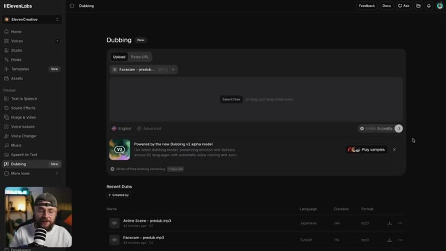
*Interface d'ElevenLabs (section Dubbing) montrant le panneau de génération et le fichier audio importé.*

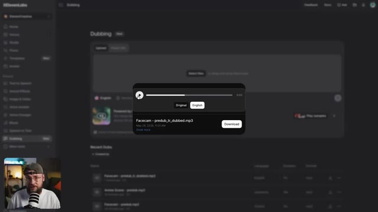
*Interface d'ElevenLabs avec une fenêtre pop-up de lecteur audio pour écouter le résultat du doublage.*

---

### ⏱️ `[00:18:31 - 00:18:38]` | Segment #42

**🔊 Audio (Transcription Intégrale Mot pour Mot en Français) :**
> pour la vidéo d'aujourd'hui, assurez-vous de mettre un pouce bleu pour moi et pensez à vous abonner. Je vous remercie tous d'avoir regardé et je vous retrouve dans la prochaine vidéo.

**👁️ Analyse Visuelle d'Écran (gemini-3.5-flash-lite) :**
**Interface & Outils** : Présentation face caméra sans partage d'écran

**Contenu textuel & Code** : Jack face caméra dans son studio avec un micro, une étagère en arrière-plan et un bandeau d'appel à l'action "Subscribe" en bas à gauche.

**Action / Démonstration** : Jack s'adresse directement aux spectateurs pour conclure la vidéo et les encourage à s'abonner et à aimer la vidéo.

---
