# 🎬 Comment diriger des vidéos IA avec des tracés dessinés à la main

> **Chaîne** : [Jack Vs. AI](https://www.youtube.com/@JackVsAI)  
> **Titre original** : `How to Direct AI Videos with Hand-Drawn Paths`  
> **Lien YouTube** : [https://www.youtube.com/watch?v=NNO7KMqZEFM](https://www.youtube.com/watch?v=NNO7KMqZEFM)  
> **Date de publication** : 2026-06-08  
> **Durée** : 16m 37s (`997s`)  
> **Identifiant vidéo** : `NNO7KMqZEFM`  
> **Fiche Web Interactive** : [2026-06-08_YT-NNO7KMqZEFM_Comment diriger des vidéos IA avec des tracés dessinés à la main_by-whisper-v3-large-turbo+gemini-3.5-flash-lite.html](2026-06-08_YT-NNO7KMqZEFM_Comment diriger des vidéos IA avec des tracés dessinés à la main_by-whisper-v3-large-turbo+gemini-3.5-flash-lite.html)  
> **Captures de démonstration clés** : `63 captures réelles (anti-talking-head)`  
> **Modèles utilisés** : Audio: `large-v3-turbo` (Faster-Whisper int8 VPS) | Vision: `gemini-3.5-flash-lite` (Google AI Studio API)  

---

## 📌 Synthèse Exécutive & Outils

### 📌 Résumé

La création de vidéos par intelligence artificielle franchit un cap décisif grâce à l'émergence du contrôle par croquis, une technique qui permet de guider précisément les mouvements de caméra et d'action en superposant de simples tracés dessinés à la main sur une image de départ. Fini le syndrome de la page blanche, les itérations textuelles interminables et le hasard algorithmique : cette approche offre aux créateurs une direction artistique chirurgicale. Dans ce tutoriel, Jack — expert en effets visuels — démocratise ce processus viral en dévoilant un flux de travail complet, itératif et accessible, combinant des LLM pour la structuration de prompts, des générateurs d'images performants et des outils vidéo avancés basés sur des trajectoires de mouvement.

Le workflow s'articule autour d'une méthodologie rigoureuse en plusieurs étapes : la conception d'un environnement riche via un prompt structuré par intelligence artificielle, l'intégration optionnelle d'un personnage personnalisé cohérent, puis l'export de l'image vers un support de dessin (comme une tablette tactile ou un simple logiciel de retouche) pour y tracer des lignes directionnelles contrastées. En combinant ce guide visuel avec les modèles vidéo de pointe, l'IA interprète instantanément les vecteurs de mouvement — qu'il s'agisse d'un plan orbital autour d'une tour futuriste ou d'une cinématique d'action complexe. Les créateurs s'affranchissent ainsi des limites traditionnelles de la génération procédurale pour orchestrer leurs plans avec une précision quasi-humaine.

### 🛠️ Outils, Modèles & Logiciels Présentés

* **Claude (Anthropic)** : Grand Modèle de Langage (LLM) utilisé conjointement avec un fichier de compétences MD (« .md ») pour transformer des idées vagues en prompts d'images ultra-détaillés et structurés.
* **ChatGPT (OpenAI)** : Alternative présentée comme équivalente à Claude pour structurer et rédiger des prompts textuels optimisés pour la génération visuelle.
* **Gemini (Google)** : Autre option de LLM compatible avec le même cadre méthodologique de prompt engineering pour concevoir des univers et des personnages.
* **Artlist** : Plateforme créative centrale regroupant des outils de génération d'images et de vidéos par IA, offrant des options de forfaits avec des générations illimitées (à bas/moyens coûts en crédits).
* **GPT Image 2** : Modèle de génération d'images haute fidélité sélectionné sur Artlist pour produire des arrière-plans et des environnements visuellement saisissants.
* **C-Dance 2 (Seedance)** : Modèle vidéo de pointe sur lequel s'appuie le flux de travail pour animer l'image fixe en respectant strictement les tracés et trajectoires dessinés à la main.
* **Logiciel de dessin / Microsoft Paint / iPad** : Outils de retouche et de dessin basiques ou avancés (comme l'iPad) utilisés pour superposer des traits de couleur contrastée (indications de mouvement) par-dessus l'image de référence.

### 🔑 Points Clés & Enseignements Stratégiques

* **Le contrôle par croquis (Sketch-Guided Video)** : Remplacer ou compléter les prompts textuels par des tracés dessinés à la main permet de dictater précisément la trajectoire de la caméra ou l'action des éléments à l'écran.
* **L'utilisation de fichiers de compétences MD** : Injecter un fichier Markdown (MD) de génération d'images dans un LLM (comme Claude) permet d'appliquer un cadre rigoureux qui transforme une description sommaire en un prompt technique et hautement détaillé.
* **L'optimisation des crédits créatifs** : Exploiter les modes de qualité « bas » ou « moyen » sur les plateformes offrant des générations illimitées permet d'expérimenter massivement sans épuiser son capital de crédits.
* **Génération d'environnements par lots** : Produire systématiquement plusieurs options d'images (par exemple, trois variantes) à partir d'un même prompt offre une marge de choix artistique précieuse avant de passer à l'animation.
* **L'intégration optionnelle de personnages personnalisés** : Fournir au LLM des images de référence de soi-même ou d'un sujet spécifique permet de générer des personnages cohérents intégrés de surcroît dans l'univers de science-fiction créé.
* **La fusion des prompts de personnages** : Demander au LLM de fusionner les vues de face et de dos en un seul prompt unifié simplifie considérablement le processus de génération d'image de référence.
* **Le choix stratégique des couleurs de tracé** : Ne jamais utiliser par défaut une couleur qui se fond dans l'image (comme le rouge si l'image est rouge) ; il faut choisir une couleur vive et contrastée pour que le modèle vidéo l'isole parfaitement.
* **L'indication de profondeur par le dessin** : Effacer partiellement ou modifier le tracé lorsqu'il passe derrière un obstacle (comme une tour) permet de signifier explicitement à l'IA la notion de premier plan et d'arrière-plan (effet d'orbite 3D).
* **La flexibilité des outils de dessin** : Aucun logiciel sophistiqué n'est indispensable pour tracer les trajectoires ; un simple outil gratuit comme Microsoft Paint ou une application sur smartphone/tablette suffit amplement.
* **L'adéquation des formats de sortie** : Sélectionner rigoureusement le format d'image et de vidéo (16:9 pour le cinéma/desktop, 9:16 pour les réseaux sociaux verticaux) dès les paramètres initiaux pour éviter les recadrages destructeurs.
* **Le choix du modèle vidéo (C-Dance 2)** : Pour que le tracé devienne une boussole d'animation efficace, l'utilisation de modèles spécialisés comme C-Dance 2 configurés en haute résolution (1080p) garantit un rendu professionnel.
* **La progressivité de l'apprentissage technique** : Pour les débutants, il est conseillé de tester le flux de travail sur des résolutions inférieures (480p ou 720p) avant de lancer des calculs lourds en haute définition.

---

## ⏱️ Chronologie & Transcription Complète Audio & Visuelle (Mot pour Mot)

### ⏱️ `[00:00:00 - 00:00:36]` | Segment #01

**🔊 Audio (Transcription Intégrale Mot pour Mot en Français) :**
> La vidéo par IA vient de devenir beaucoup plus intelligente car vous pouvez désormais diriger vos générations en utilisant rien de plus qu'un simple croquis. Ce qui ressemble à un dessin grossier peut devenir un plan de drone cinématique, un point de vue unique ou même une séquence d'action complète. Alors, au lieu de modifier sans fin les descriptions textuelles, de régénérer des plans et d'espérer que l'IA fasse ce que vous décrivez, vous pouvez simplement esquisser le mouvement que vous voulez, appuyer sur générer et regarder la magie opérer. Je suis Jack, j'ai passé plus d'une décennie à créer des effets visuels pour certaines des plus grandes marques de la planète et maintenant j'utilise l'IA pour réinventer la création.

**👁️ Analyse Visuelle d'Écran (gemini-3.5-flash-lite) :**
**Interface & Outils** : Présentation vidéo illustrative avec texte incrusté ('a unique POV', 'the movement you want', 'and now I'm using') et double affichage côte à côte (image de référence avec tracés de mouvement et rendu vidéo IA).

**Contenu textuel & Code** : Texte à l'écran : 'a unique POV', 'the movement you want', 'and now I'm using'. Visuels de démonstration montrant des statues dorées, des scènes d'intérieur avec des objets et des cartes fantastiques accompagnées de tracés vectoriels rouges indiquant le mouvement de caméra ou d'objets.

**Action / Démonstration** : Présentation dynamique de visuels illustrant le fonctionnement de la génération vidéo par IA guidée par des esquisses et des tracés de trajectoire.

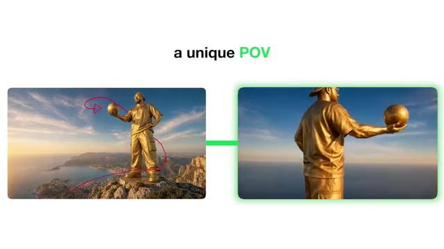
*Démonstration visuelle avec le texte 'a unique POV' montrant une image avec des flèches de trajectoire rouge et le résultat vidéo généré à droite.*

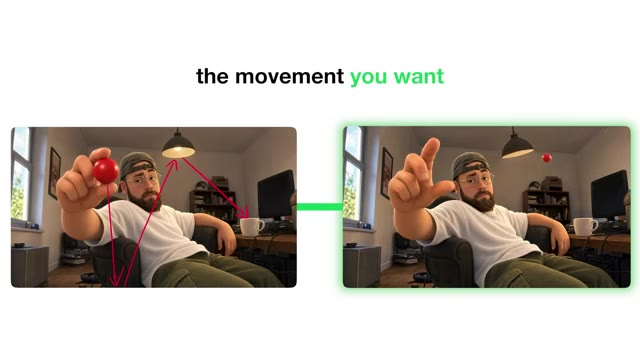
*Démonstration visuelle avec le texte 'the movement you want' montrant une image avec des annotations de mouvement et le résultat vidéo généré à droite.*

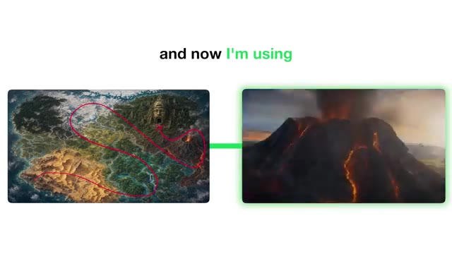
*Démonstration visuelle avec le texte 'and now I'm using' montrant une carte fantastique annotée et le résultat vidéo d'un volcan en éruption à droite.*

---

### ⏱️ `[00:00:36 - 00:01:12]` | Segment #02

**🔊 Audio (Transcription Intégrale Mot pour Mot en Français) :**
> workflows. Dans cette vidéo, je vais vous montrer exactement comment utiliser cette méthode et je partagerai tous mes prompts et matériels de manière totalement gratuite. Si vous appréciez le contenu d'aujourd'hui, n'hésitez pas à lâcher un pouce bleu pour moi et à vous abonner. Bon, passons aux choses sérieuses. Chaque jour, il semble y avoir une nouvelle façon ingénieuse d'utiliser les outils vidéo par IA, et aujourd'hui ne fait pas exception. Vous avez probablement vu ces vidéos devenir virales sur les réseaux sociaux, où l'on observe un tracé dessiné à la main extrêmement basique par-dessus une image, et empilé juste au-dessus, la génération qui en résulte. C'est vraiment unique

**👁️ Analyse Visuelle d'Écran (gemini-3.5-flash-lite) :**
**Interface & Outils** : Interface web d'un outil de génération vidéo avec une zone centrale affichant des exemples de vidéos empilées verticalement montrant un tracé rouge sur une image.

**Contenu textuel & Code** : Exemples de vidéos avec un tracé dessiné à la main de couleur rouge sur une image et le résultat vidéo généré empilé au-dessus.

**Action / Démonstration** : Présentation visuelle d'exemples de vidéos virales issues des réseaux sociaux démontrant la méthode de tracé sur image.

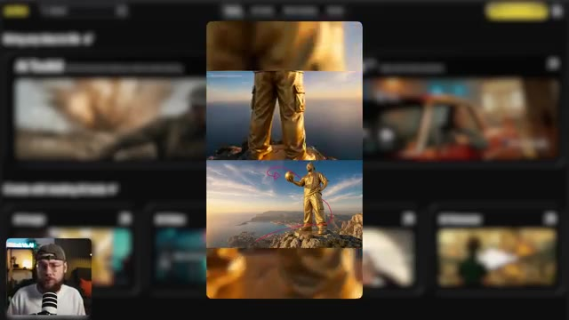
*Capture d'écran montrant l'interface d'un outil vidéo avec superposition de vidéos virales au centre et incrustation vidéo du créateur en bas à gauche.*

---

### ⏱️ `[00:01:12 - 00:01:44]` | Segment #03

**🔊 Audio (Transcription Intégrale Mot pour Mot en Français) :**
> approche pour utiliser les outils mais personne ne vous dit vraiment exactement comment mettre cela en pratique vous-même. Mais c'est là que j'interviens car nous allons explorer cette technique en profondeur et je vais partager toutes les astuces et conseils que les autres créateurs ne vous disent pas. J'ai généré tous les visuels du projet d'aujourd'hui sur Artlist et si vous voulez suivre en même temps, vous trouverez un lien en bas dans la description. La première chose que nous devons faire est de générer nos images de départ. Je suis actuellement sur la page d'accueil d'Artlist et nous voulons naviguer

**👁️ Analyse Visuelle d'Écran (gemini-3.5-flash-lite) :**
**Interface & Outils** : Navigateur web affichant la plateforme Artlist (Artlist.io) avec la barre de navigation supérieure (Home, AI Toolkit, Stock Catalog, Studio) et les différentes catégories d'outils IA.

**Contenu textuel & Code** : Texte visible sur l'interface : "Bring any idea to life", "AI Toolkit", "Artlist Studio", "Create with leading AI tools", "AI Image", "AI Video", "AI Music", "AI Voiceover".

**Action / Démonstration** : Le créateur navigue sur la page d'accueil d'Artlist et présente les différentes sections de la plateforme dédiées à la génération d'IA.

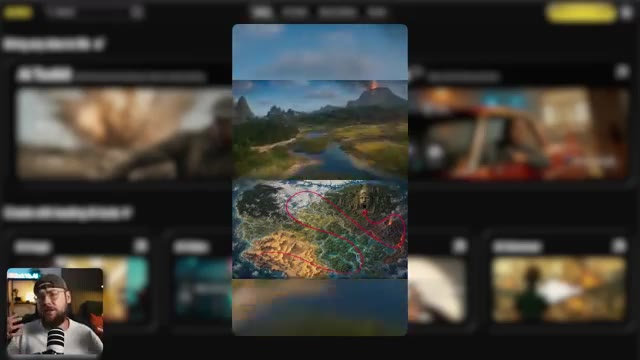
*Navigation sur le site d'Artlist avec le présentateur en incrustation (PiP) dans le coin inférieur gauche*

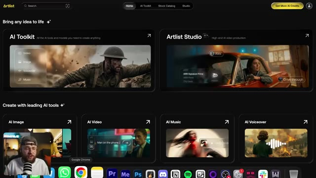
*Page d'accueil de la plateforme Artlist affichant les sections AI Toolkit et Artlist Studio, avec le présentateur en incrustation (PiP)*

---

### ⏱️ `[00:01:44 - 00:02:22]` | Segment #04

**🔊 Audio (Transcription Intégrale Mot pour Mot en Français) :**
> vers la boîte à outils d'IA. Et vous constaterez que toutes vos générations sont organisées dans ces sessions individuelles pratiques. Donc nous allons aller de l'avant et plonger dans celle-ci ici. Et ici nous avons toutes les différentes images que j'ai générées afin de démontrer ce flux de travail. Et j'ai trouvé que ces types de dispositions de cartes aériennes fonctionnent vraiment très bien pour cette technique. Maintenant, le secret de toute image IA de haute qualité est un prompt incroyablement détaillé, mais je vais vous montrer comment vous pouvez les construire très facilement. Je veux que vous vous dirigiez vers ChatGPT, Gemini ou Claude.

**👁️ Analyse Visuelle d'Écran (gemini-3.5-flash-lite) :**
**Interface & Outils** : Artlist AI Toolkit (images 1 et 2) et Claude (image 4).

**Contenu textuel & Code** : Textes visibles : 'Home', 'AI Toolkit', 'Stock Catalog', 'Studio', 'Artlist Studio', prompt 'colossal golden statue standing', interface de Claude avec 'Hey there, Jack', 'How can I help you today?', 'Sonnet 4.6 Medium', et les boutons de raccourci Write, Create, Learn, Code, Life stuff.

**Action / Démonstration** : Le créateur navigue dans l'interface d'Artlist, montre une grille d'images générées par IA, puis bascule sur l'interface de l'assistant Claude.

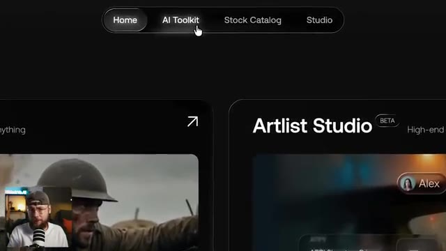
*Interface d'Artlist montrant la navigation vers l'onglet 'AI Toolkit' avec la vidéo de démonstration en incrustation (PiP).*

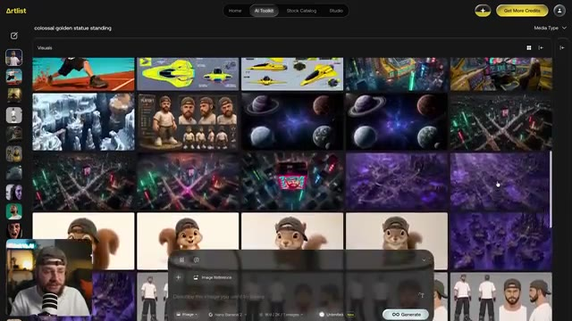
*Galerie de générations d'images sur Artlist avec le prompt 'colossal golden statue standing' visible en haut.*

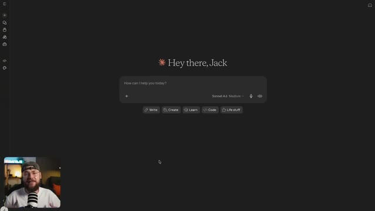
*Interface de l'assistant IA Claude affichant le message d'accueil 'Hey there, Jack' et le champ de saisie avec le modèle 'Sonnet 4.6'.*

---

### ⏱️ `[00:02:22 - 00:03:04]` | Segment #05

**🔊 Audio (Transcription Intégrale Mot pour Mot en Français) :**
> dans mon cas, parce que la super nouvelle ici, c'est que ce flux de travail fonctionnera dans n'importe quel grand modèle de langage que vous préférez. Nous allons procéder au téléchargement du fichier MD de génération d'images par IA, et vous le trouverez sur le lien de ma communauté School dans la description. Et ce qui est génial avec ça, c'est que je peux maintenant décrire de manière très vague ce que je recherche, et ce fichier MD va appliquer un cadre pour nous construire un prompt vraiment détaillé. Par exemple, nous pouvons dire : plan d'ensemble en vue trois quarts d'une ville de science-fiction futuriste avec une grande tour dans le coin supérieur droit.

**👁️ Analyse Visuelle d'Écran (gemini-3.5-flash-lite) :**
**Interface & Outils** : Interface web de l'assistant IA Claude avec un encadré de chat central et une incrustation vidéo (PiP) du créateur en bas à gauche.

**Contenu textuel & Code** : Texte à l'écran : "Hey there, Jack", nom du fichier uploadé "AI Image Generation Framework...", modèle "Sonnet 4.6", et légende textuelle jaune en bas "link in the description".

**Action / Démonstration** : Le créateur montre l'interface de l'outil de langage Claude où un fichier de framework d'intelligence artificielle est importé pour automatiser la création de prompts détaillés.

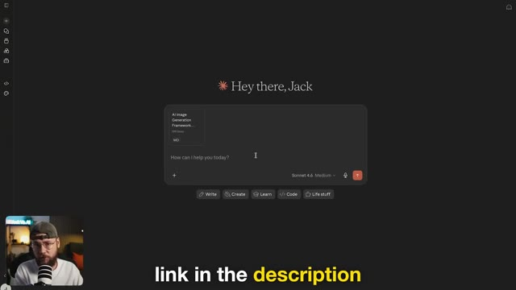
*Interface de Claude montrant le téléchargement du fichier MD 'AI Image Generation Framework' dans la boîte de saisie.*

---

### ⏱️ `[00:03:04 - 00:03:23]` | Segment #06

**🔊 Audio (Transcription Intégrale Mot pour Mot en Français) :**
> Et si nous continuons et envoyons ceci, vous allez voir que tout de suite Claude se met au travail. Il lit la compétence de génération d'images. Et vous pouvez voir qu'ainsi, nous avons ce prompt très détaillé avec juste une entrée très basique de ma part en tant qu'utilisateur. Donc ce que nous pouvons faire maintenant, c'est le copier.

**👁️ Analyse Visuelle d'Écran (gemini-3.5-flash-lite) :**
**Interface & Outils** : Interface de l'assistant IA Claude avec une zone de texte en bas ("Write a message...", "Sonnet 4.6 Medium") et un encadré PiP du créateur en bas à gauche.

**Contenu textuel & Code** : On peut lire un bloc de texte descriptif généré : "Three-quarter view, wide establishing shot of a futuristic sci-fi city with a large tower in the top right-hand corner." et un petit encadré intitulé "AI Image Generation Framework...".

**Action / Démonstration** : Le créateur montre le résultat de la génération de prompt détaillée obtenue dans l'interface de Claude, prête à être copiée.

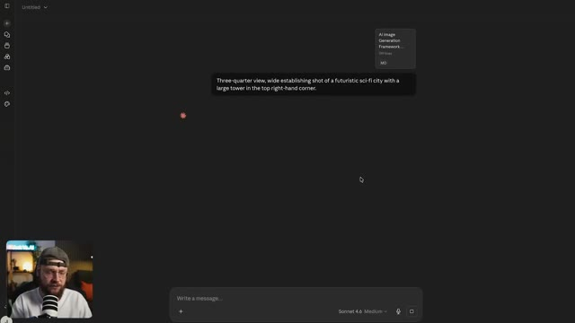
*Interface de l'assistant Claude affichant un prompt détaillé généré à partir d'une simple entrée utilisateur, avec un encadré vidéo (PiP) du créateur en bas à gauche.*

---

### ⏱️ `[00:03:23 - 00:03:57]` | Segment #07

**🔊 Audio (Transcription Intégrale Mot pour Mot en Français) :**
> Je vais retourner sur Artlist. Et, vous savez, je vais créer une nouvelle session pour ça. On peut simplement coller le prompt que Claude vient de nous écrire. Et ensuite, on veut sélectionner le modèle qu'on va utiliser pour générer notre image. Personnellement, je pense que GPT image 2 est la meilleure offre sur le marché en ce moment, donc on va sélectionner "utiliser le modèle" et ensuite on a d'autres paramètres à regarder ici. Le format d'image, on va opter pour du 16 par 9, le 9 par 16 est super pour le contenu sur les réseaux sociaux, et ensuite on a trois options différentes pour la qualité. On a bas,

**👁️ Analyse Visuelle d'Écran (gemini-3.5-flash-lite) :**
**Interface & Outils** : Interface web d'Artlist (AI Toolkit) avec panneau de génération d'images, champs de texte et menus déroulants de configuration.

**Contenu textuel & Code** : Texte du prompt visible : "Wide establishing shot, 35mm lens, three-quarter elevated angle looking across the city...", choix de modèles ("Nano Banana 2", "Nano Banana Pro", "Seedream 5.0"), ratios (1:1, 16:9, 9:16, 3:4, 4:3), options de qualité (Low, Medium, High) et nombre d'images (1 à 4).

**Action / Démonstration** : Le créateur navigue sur Artlist, crée une nouvelle session, colle un prompt textuel, sélectionne un modèle de génération d'image et explore les paramètres de format et de qualité.

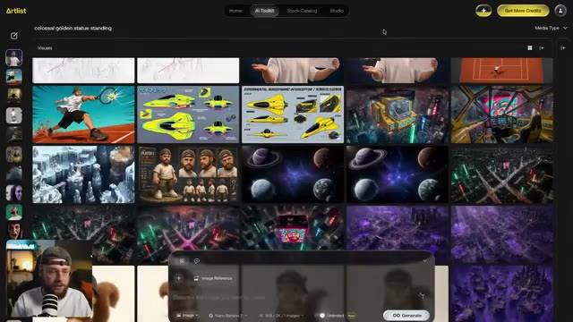
*Interface d'Artlist AI Toolkit montrant la bibliothèque de visuels générés et le champ de prompt.*

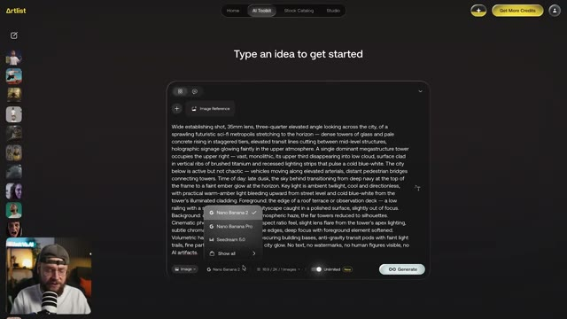
*Interface d'Artlist affichant le prompt collé et le menu déroulant de sélection des modèles d'IA.*

*Fenêtre des paramètres d'Artlist montrant le choix du ratio (16:9) et les options de qualité.*

---

### ⏱️ `[00:03:57 - 00:04:15]` | Segment #08

**🔊 Audio (Transcription Intégrale Mot pour Mot en Français) :**
> moyen et élevé mais vous remarquerez que bas et moyen ont ces petits symboles à côté d'eux Et c'est parce qu'avec certains abonnements sur Artlist actuellement, vous pouvez obtenir des générations illimitées. Vous pouvez donc expérimenter beaucoup avec l'IA sans dépenser de crédits, ce qui est tout simplement parfait pour ce flux de travail.

**👁️ Analyse Visuelle d'Écran (gemini-3.5-flash-lite) :**
**Interface & Outils** : Interface de génération d'image par IA avec panneau de paramètres (Aspect Ratio, Quality, Number of Images) et incrustation vidéo du créateur dans le coin inférieur gauche.

**Contenu textuel & Code** : Options de format (1:1, 16:9, 9:16, 3:4, 4:3), options de qualité (Low avec symbole infini, Medium avec symbole infini, High), et nombre d'images (1, 2, 3, 4). En arrière-plan, un long prompt textuel en anglais décrivant une mégastructure futuriste et cyberpunk.

**Action / Démonstration** : Un curseur de souris survole l'option "Low" dans la section qualité de l'interface de génération.

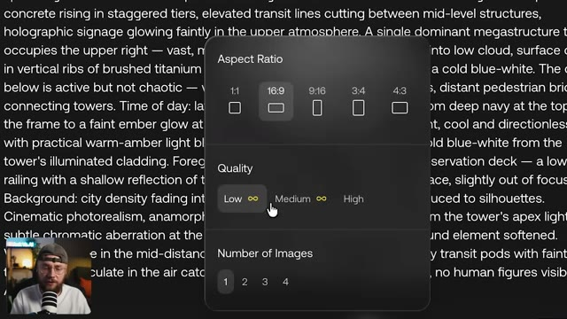
*Interface de configuration montrant les options de format d'image (Aspect Ratio), de qualité (Quality avec les options Low, Medium, High et des symboles d'infinité) et le nombre d'images.*

---

### ⏱️ `[00:04:16 - 00:04:52]` | Segment #09

**🔊 Audio (Transcription Intégrale Mot pour Mot en Français) :**
> Donc je vais sélectionner "medium" ici et je veux créer trois images. J'ai donc un léger choix. Je ne dépense aucun crédit, donc autant le faire. Nous avons donc reçu quelques options différentes ici. Personnellement, c'est ma préférée, bien que les deux autres soient formidables aussi, donc je pense que nous allons opter pour celle-ci. Ce que vous voulez faire ensuite, c'est la télécharger, nous verrons comment l'utiliser très bientôt, mais ensuite je veux aborder une étape que beaucoup d'autres créateurs oublient, elle est facultative mais elle vous donne beaucoup plus de contrôle sur votre résultat final et cela implique en fait

**👁️ Analyse Visuelle d'Écran (gemini-3.5-flash-lite) :**
**Interface & Outils** : Interface de la plateforme de génération d'images par IA Artlist (avec encadré PiP du présentateur Jack).

**Contenu textuel & Code** : Menus de configuration de génération : Aspect Ratio (1:1, 16:9, 9:16, 3:4, 4:3), Quality (Low, Medium, High), Number of Images. Panneau latéral affichant le prompt descriptif d'une mégapole de science-fiction, le modèle utilisé (GPT Image 2), le format 16:9, la qualité Medium, le type de fichier (JPEG) et la date de création (5 juin 2026).

**Action / Démonstration** : Le créateur montre les paramètres de configuration et l'image générée finale avec les options de téléchargement.

*Interface de réglages d'Artlist montrant le choix du format (Aspect Ratio), de la qualité et du nombre d'images, avec le présentateur visible en incrustation (PiP).*

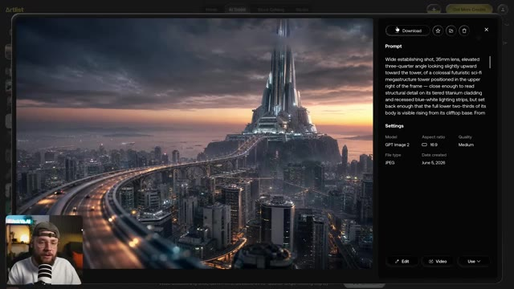
*Aperçu d'une image générée représentant une immense tour futuriste au milieu d'une ville tentaculaire, avec les options de téléchargement et les détails du prompt sur le panneau latéral droit, et le présentateur en PiP.*

---

### ⏱️ `[00:04:52 - 00:05:25]` | Segment #10

**🔊 Audio (Transcription Intégrale Mot pour Mot en Français) :**
> l'ajout d'un personnage à votre scène. Donc nous sommes de retour sur Claude dans une nouvelle discussion et j'ai téléchargé le fichier MD de génération d'images aux côtés de quelques références d'images de moi-même et de la ville que nous venons de générer. Bien sûr, vous n'avez pas besoin de vous mettre dans vos générations, vous pouvez simplement décrire le type de personnage que vous recherchez à la place, mais je pense que c'est juste très amusant. Donc je vais dire montre le même homme barbu portant un jetpack sur son dos. Je veux voir une vue de face et de dos

**👁️ Analyse Visuelle d'Écran (gemini-3.5-flash-lite) :**
**Interface & Outils** : Interface web de Claude (Anthropic), avec une disposition de chat épurée, un sélecteur de modèle ("Sonnet 4.6 Medium"), des boutons de raccourci ("Write", "Create", "Learn", "Code", "Life stuff"), et une incrustation vidéo (PiP) du créateur en bas à gauche.

**Contenu textuel & Code** : Texte à l'écran : "step two adding personality" (Image 1). Message d'accueil de Claude : "Hey there, Jack" et "How can I help you today?". Fichiers importés : "AI Image Generation Framework..." (.MD), trois photos de profil/face/profil de Jack, et une image d'une ville futuriste au crépuscule. Options de modèles : "Sonnet 4.6 Medium".

**Action / Démonstration** : Le créateur montre graphiquement la transition vers la deuxième étape, puis présente l'interface de Claude où les fichiers de référence et le framework de génération d'images ont été importés dans une nouvelle conversation avant de taper le prompt.

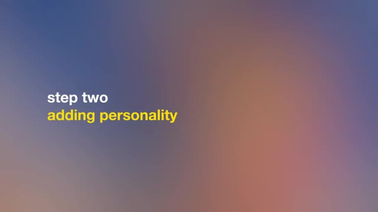
*Écran de transition affichant le titre de l'étape : "step two adding personality" sur un fond dégradé bleu et rose.*

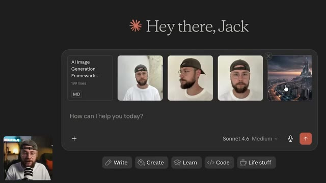
*Interface de l'outil Claude montrant un nouveau chat avec des fichiers importés (un fichier Markdown et plusieurs photos de référence de Jack et de la ville), avec le créateur en incrustation vidéo (PiP) en bas à gauche.*

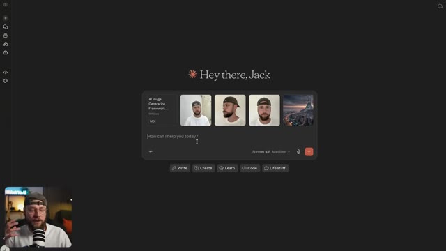
*Interface de l'outil Claude avec la zone de texte vide "How can I help you today?" et les fichiers joints en haut du champ de saisie, avec le créateur visible en incrustation vidéo (PiP) en bas à gauche.*

---

### ⏱️ `[00:05:25 - 00:06:00]` | Segment #11

**🔊 Audio (Transcription Intégrale Mot pour Mot en Français) :**
> du personnage et je veux que cela fonctionne dans le monde que j'ai conçu, cette sorte de ville de science-fiction. Donc, allons-y et envoyons ceci, et encore une fois Claude va lire ce cadre et nous renvoyer un prompt très détaillé. Donc Claude m'a en fait donné deux prompts séparés ici, un pour la vue de face et un pour l'arrière. Je vais simplement dire : « Peux-tu combiner ces prompts en un seul prompt pour les deux vues ? » et juste comme ça, nous récupérons un prompt combiné, ce qui va juste simplifier un peu le flux de travail. Maintenant, nous allons copier notre nouveau prompt et retourner

**👁️ Analyse Visuelle d'Écran (gemini-3.5-flash-lite) :**
**Interface & Outils** : Claude (interface de chat textuel avec assistant IA)

**Contenu textuel & Code** : Texte de l'interface Claude : « Hey there, Jack », champ de saisie « How can I help you today? », modèle « Sonnet 4.6 Medium ». Dans l'image 3, affichage de blocs de texte de prompts en anglais décrivant une scène urbaine de science-fiction (« partial silhouette. The city vista... ») et des notes méthodologiques sur l'approche du design.

**Action / Démonstration** : Le créateur montre son écran de travail sur l'interface de Claude pour générer, affiner et combiner des prompts textuels destinés à la conception de personnages et d'environnements de science-fiction.

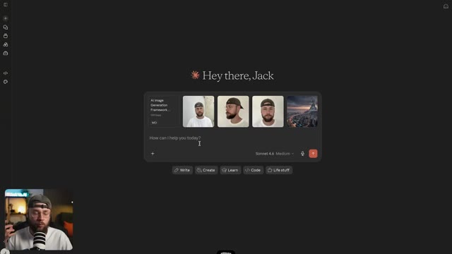
*Interface de Claude affichant le texte de bienvenue « Hey there, Jack » avec des vignettes de référence d'images et un champ de saisie, avec Jack visible en bas à gauche dans un encadré PiP.*

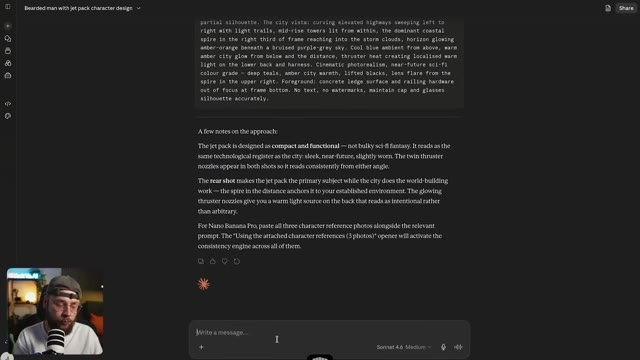
*Interface de Claude affichant le résultat de la génération de prompts détaillés et de notes d'approche, avec Jack visible en bas à gauche dans un encadré PiP.*

---

### ⏱️ `[00:06:00 - 00:06:37]` | Segment #12

**🔊 Audio (Transcription Intégrale Mot pour Mot en Français) :**
> passer à art list et y déposer le prompt et je vais utiliser ces mêmes images de moi comme références ainsi que l'environnement de science-fiction que nous venons de générer, alors allons-y et envoyons ceci. Et nous avons en retour de superbes générations de moi en tant que personnage portant ce jet pack futuriste. Je peux donc maintenant l'inclure dans notre génération. Nous avons maintenant notre monde ou environnement et notre personnage. Nous sommes donc maintenant prêts à tracer nos trajectoires de mouvement. Et pour cela, vous pouvez utiliser n'importe quel logiciel que vous voulez. Honnêtement, vous pourriez simplement utiliser Microsoft Paint ou quelque chose comme ça. Vraiment basique. Vous

**👁️ Analyse Visuelle d'Écran (gemini-3.5-flash-lite) :**
**Interface & Outils** : Artlist (AI Toolkit)

**Contenu textuel & Code** : Prompts textuels détaillés pour la génération de personnages et d'environnements, paramètres de modèle (GPT Image 2, format 16:9, qualité Medium).

**Action / Démonstration** : Le créateur navigue sur la plateforme Artlist pour générer et examiner des images de personnages basées sur ses propres références.

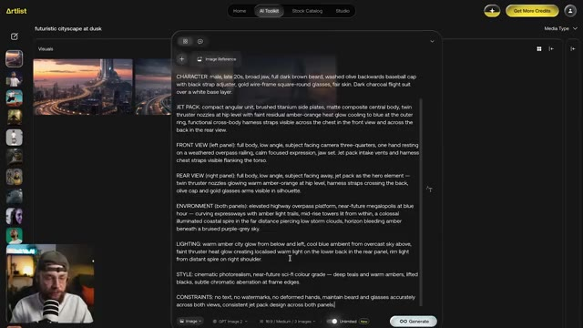
*Interface d'Artlist AI Toolkit montrant un prompt textuel détaillé décrivant un personnage futuriste avec un jet pack dans un paysage urbain.*

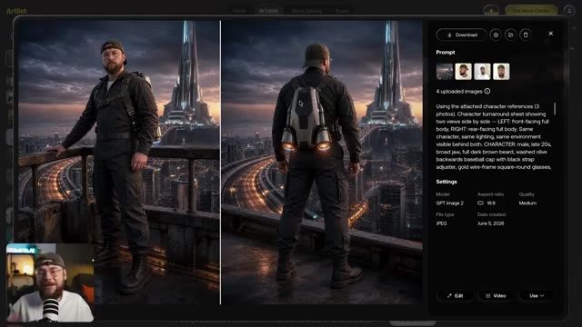
*Interface d'Artlist affichant le résultat de la génération avec une double vue (recto/verso) d'un personnage portant un jet pack dans un décor futuriste.*

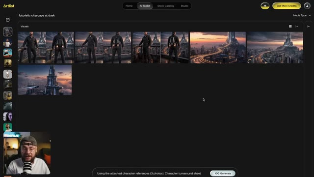
*Galerie de projets sur Artlist montrant plusieurs images générées de personnages et d'environnements futuristes.*

---

### ⏱️ `[00:06:37 - 00:07:12]` | Segment #13

**🔊 Audio (Transcription Intégrale Mot pour Mot en Français) :**
> peut l'envoyer sur votre téléphone et le modifier et dessiner par-dessus comme ça mais dans mon cas je vais utiliser mon iPad. Maintenant c'est définitivement exagéré mais au moins ça me donne une excuse pour utiliser mon iPad que je ne semble plus jamais utiliser. Donc je vais simplement aller de l'avant et partager cette image que nous avons générée avec mon iPad et littéralement tout ce que je vais faire c'est dessiner une ligne en commençant ici et nous allons en quelque sorte tourner autour de la tour ici et ensuite je vais juste effacer un peu ce morceau ici pour montrer au modèle vidéo. Il va passer derrière la tour et faire comme une orbite autour d'elle.

**👁️ Analyse Visuelle d'Écran (gemini-3.5-flash-lite) :**
**Interface & Outils** : Application de dessin sur iPad (type Procreate ou outil de retouche) affichant une image de paysage urbain avec une tour.

**Contenu textuel & Code** : Image générée représentant une vue aérienne d'une ville avec une grande tour, sur laquelle des traits de dessin rouges/roses sont ajoutés.

**Action / Démonstration** : Jack tient son iPad et dessine par-dessus l'image avec un stylet pour indiquer la trajectoire souhaitée à l'outil vidéo IA.

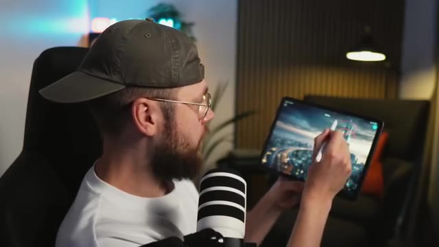
*Jack utilise un stylet pour dessiner des annotations et des repères par-dessus une image générée affichée sur son iPad.*

---

### ⏱️ `[00:07:12 - 00:07:35]` | Segment #14

**🔊 Audio (Transcription Intégrale Mot pour Mot en Français) :**
> Donc je viens de dessiner ce chemin qui part de cette sorte de route principale, monte jusqu'à cette tour et fait une orbite autour d'elle. Et une chose qui peut sembler évidente mais que certaines personnes ont tendance à oublier, ne vous contentez pas par défaut d'avoir une ligne rouge. Choisissez une couleur qui se détachera de l'arrière-plan. Donc je vais envoyer ceci à mon ordinateur et nous avons maintenant notre chemin esquissé.

**👁️ Analyse Visuelle d'Écran (gemini-3.5-flash-lite) :**
**Interface & Outils** : Interface de la plateforme Artlist avec un panneau latéral d'historique ou de médias et une vue principale affichant une image générée avec un tracé rouge.

**Contenu textuel & Code** : Image d'une mégalopole futuriste au crépuscule avec une immense tour centrale et une autoroute surélevée parcourue par un tracé rouge en spirale.

**Action / Démonstration** : Le créateur montre le résultat de son esquisse sur tablette, puis l'écran bascule sur l'affichage de l'ordinateur où le visuel est importé avec le tracé rouge bien visible.

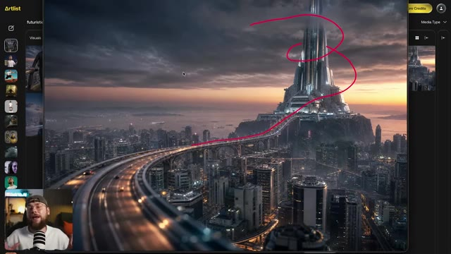
*Capture de l'écran d'ordinateur (Artlist) montrant l'image de la ville futuriste avec le tracé rouge en superposition et le retour vidéo du créateur en incrustation (PiP).*

---

### ⏱️ `[00:07:35 - 00:08:07]` | Segment #15

**🔊 Audio (Transcription Intégrale Mot pour Mot en Français) :**
> c'est donc le moment de donner vie à notre scène. Donc d'abord, nous voulons basculer de l'onglet image vers la vidéo ou le modèle de choix, nous devons absolument utiliser C-Dance 2, et nous avons d'autres préférences ici à aborder. Je vais sélectionner une résolution 1080p, si vous êtes juste en train de tester et de vous familiariser avec ce flux de travail, vous pouvez choisir 720p ou 480p. Nous voulons un format 16 par 9 et je veux une durée de sept secondes je crois. Assurez-vous également que le bouton audio est activé.

**👁️ Analyse Visuelle d'Écran (gemini-3.5-flash-lite) :**
**Interface & Outils** : Interface web de génération vidéo (type Seedance / Kling) avec un menu contextuel de sélection de modèle et un encadré PiP montrant le présentateur.

**Contenu textuel & Code** : Sur l'image 1 : "step four", "video prompting". Sur l'image 2 : options du menu "Kling 3.0", "Seedance 2.0", "Seedance 2.0 Fast", "Show all", ainsi que les paramètres de génération vidéo en bas ("Video", "Auto / Pro / 5 Seconds", "Unlimited").

**Action / Démonstration** : Le créateur présente l'étape quatre sur le prompt vidéo, puis montre la sélection du modèle Seedance 2.0 dans l'interface de l'application.

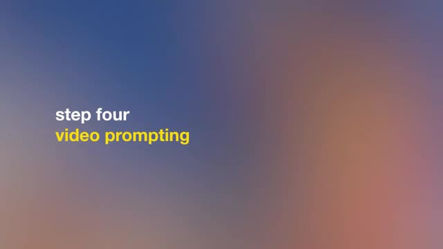
*Écran de transition affichant le titre de l'étape en cours sur un fond dégradé flouté.*

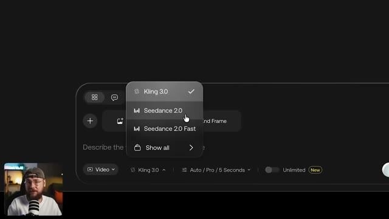
*Interface de l'outil de génération vidéo montrant le menu déroulant de sélection du modèle (Kling 3.0, Seedance 2.0, Seedance 2.0 Fast) avec Jack en médaillon PiP en bas à gauche.*

---

### ⏱️ `[00:08:07 - 00:08:31]` | Segment #16

**🔊 Audio (Transcription Intégrale Mot pour Mot en Français) :**
> Donc j'ai pris les devants et j'ai téléchargé mon image de référence du chemin tracé. Je veux aussi ajouter mon image de référence personnelle avec le jetpack. On va aller chercher celle-ci ici et l'ajouter également. Vous remarquerez peut-être que la seule chose qui nous manque maintenant, c'est notre prompt textuel. Alors, comment allons-nous le construire ? C'est exact, comme vous l'avez peut-être deviné, nous sommes de retour sur Claude. Une fois de plus, il va nous aider à élaborer notre prompt textuel.

**👁️ Analyse Visuelle d'Écran (gemini-3.5-flash-lite) :**
**Interface & Outils** : Interface de l'outil de génération vidéo Seedance avec incrustation vidéo du créateur (PiP) dans le coin inférieur gauche.

**Contenu textuel & Code** : Texte visible dans l'interface de Seedance : "Use @ to mention your images, videos or audio (e.g., 'hat from @img1', 'motion from @vid1')", options de format "16:9 / 1080p / 7 Seconds", modèle "Seedance 2.0", et bouton "Generate". Vignettes de référence "@img1" et "@img2".

**Action / Démonstration** : Le créateur montre l'ajout progressif d'images de référence dans l'interface de Seedance avant d'expliquer qu'il va utiliser Claude pour rédiger le prompt textuel.

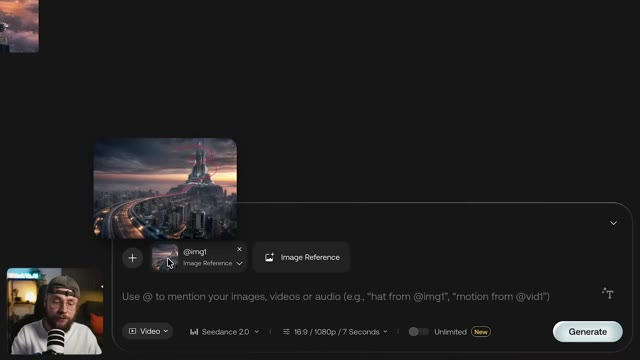
*Interface de Seedance montrant une image de référence de paysage urbain (@img1) importée.*

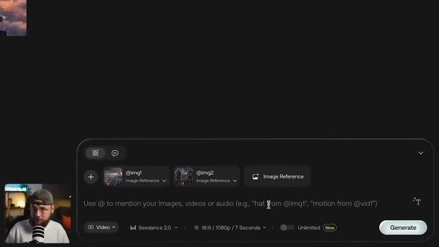
*Interface de Seedance montrant deux images de référence importées (@img1 et @img2) avec le champ de prompt textuel vide.*

---

### ⏱️ `[00:08:32 - 00:08:54]` | Segment #17

**🔊 Audio (Transcription Intégrale Mot pour Mot en Français) :**
> La première chose que vous voulez faire est de téléverser un autre fichier MD maintenant. C'est ce qu'on appelle la compétence de chemin dessiné à la main. Je vais donc le faire téléverser ici et ça va simplement éliminer toute incertitude de ce processus. Encore une fois, c'est une compétence que j'ai construite pour cet objectif spécifique. Et j'ai également téléversé l'image de référence de notre personnage aux côtés du chemin dessiné à la main que nous avons assemblé.

**👁️ Analyse Visuelle d'Écran (gemini-3.5-flash-lite) :**
**Interface & Outils** : Explorateur de fichiers système (Image #1) et interface web de l'assistant IA Claude avec le modèle Sonnet 4.6 (Image #3).

**Contenu textuel & Code** : Noms de fichiers visibles : 'Hand Drawn Path Video Prompt Skill.md', 'AI Image Generation Framework V2.md'. Salutation de Claude : 'Hey there, Jack' et champ de texte 'How can I help you today?'. Boutons d'action : Write, Create, Learn, Code, Life stuff.

**Action / Démonstration** : Le créateur montre l'arborescence des fichiers pour sélectionner le script Markdown, puis présente l'interface de Claude où les fichiers et images de référence du personnage sont importés.

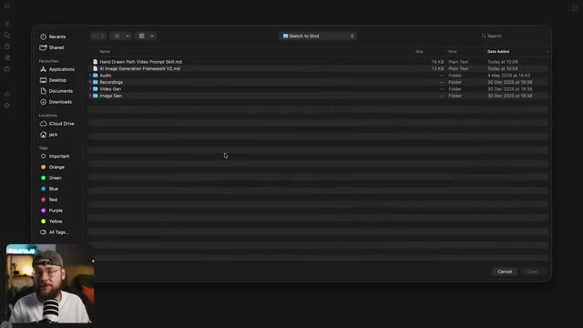
*Explorateur de fichiers montrant le dossier 'Sketch to Shot' avec les fichiers 'Hand Drawn Path Video Prompt Skill.md' et 'AI Image Generation Framework V2.md'.*

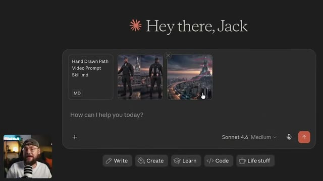
*Interface de Claude (Sonnet 4.6 Medium) affichant le fichier 'Hand Drawn Path Video Prompt Skill.md' et deux images de référence de personnage et de décor urbain téléversées.*

---

### ⏱️ `[00:08:54 - 00:09:17]` | Segment #18

**🔊 Audio (Transcription Intégrale Mot pour Mot en Français) :**
> Il est très important que nous ajoutons cela. Et maintenant, nous voulons simplement décrire très grossièrement ce que nous voulons qu'il se passe dans notre plan. Je vais donc dire qu'avec l'homme ayant le dos tourné à la caméra et volant à l'aide du jetpack, il vole vers la grande tour et orbite autour d'elle avant de s'arrêter et de regarder en arrière vers l'immense tour.

**👁️ Analyse Visuelle d'Écran (gemini-3.5-flash-lite) :**
**Interface & Outils** : Claude (Anthropic)

**Contenu textuel & Code** : Texte « Hey there, Jack », champ de saisie « How can I help you today? », sélecteur de modèle « Sonnet 4.6 Medium », pièces jointes incluant un fichier Markdown (« Hand Drawn Path Video Prompt Skill.md ») et deux images de référence de personnages et de décors urbains.

**Action / Démonstration** : Le créateur interagit avec l'interface de l'assistant IA Claude pour rédiger ou affiner un prompt vidéo basé sur des images et des scripts de compétences.

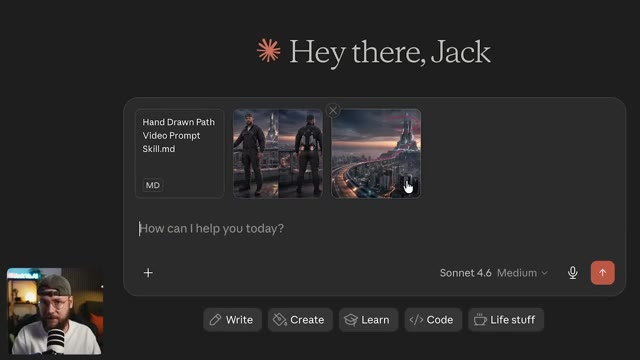
*Interface de Claude montrant les fichiers joints et le champ de saisie du prompt avec un encadré vidéo de Jack en bas à gauche.*

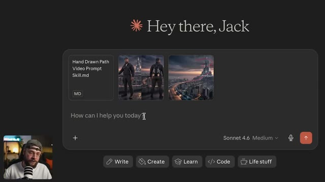
*Interface de Claude affichant le curseur clignotant dans le champ de texte « How can I help you today? » avec le fichier de compétences et les images de référence.*

---

### ⏱️ `[00:09:17 - 00:09:41]` | Segment #19

**🔊 Audio (Transcription Intégrale Mot pour Mot en Français) :**
> C'est super simple. Nous pouvons y aller et envoyer ceci. Et une fois de plus, Claude va se mettre au travail pour nous. Pendant le montage, je me suis rendu compte que j'avais oublié de dire à Claude quelle longueur je voulais pour ma génération. Cela n'a finalement pas eu d'importance. Dans mon cas, j'obtiens quand même un résultat vraiment cool. Je vous suggérerais de dire à Claude que vous voulez une génération de 7 secondes de long ou de 15 secondes de long, par exemple, juste pour vous assurer que cela fonctionne vraiment bien.

**👁️ Analyse Visuelle d'Écran (gemini-3.5-flash-lite) :**
**Interface & Outils** : Interface de l'assistant IA Claude sur fond sombre, avec une fenêtre d'affichage du texte généré et une incrustation vidéo (PiP) du créateur en bas à gauche.

**Contenu textuel & Code** : Texte visible du prompt dans l'interface de Claude : "With the man having his back to the camera and flying using the jet pack, he flies towards the large tower and orbits around it before stopping and looking back at the huge tower." Un petit symbole de chargement/génération animé est également visible à gauche.

**Action / Démonstration** : Le créateur montre l'interface de Claude à l'écran tout en continuant ses explications face caméra sur le processus de génération par intelligence artificielle.

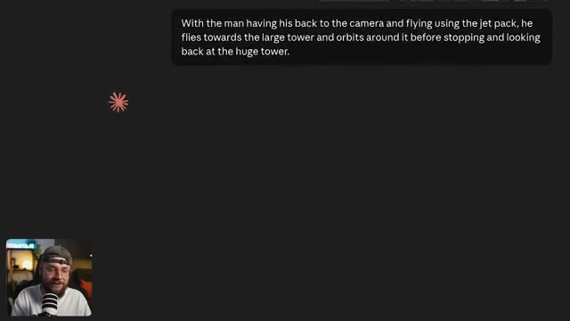
*Interface de l'application Claude affichant un prompt textuel décrivant un personnage volant avec un jet pack, avec le créateur en incrustation (PiP) dans le coin inférieur gauche.*

---

### ⏱️ `[00:09:42 - 00:10:02]` | Segment #20

**🔊 Audio (Transcription Intégrale Mot pour Mot en Français) :**
> Donc vous pouvez voir que Claude a réellement analysé la trajectoire que nous avons dessinée par-dessus notre image, et il a même identifié le style que nous recherchons en faisant référence à une qualité de rendu photoréaliste. Et encore une fois, avec une saisie très basique, vous allez obtenir ce prompt extrêmement détaillé conçu spécifiquement pour ce flux de travail.

**👁️ Analyse Visuelle d'Écran (gemini-3.5-flash-lite) :**
**Interface & Outils** : Claude (interface web de chat IA) avec incrustation vidéo (PiP) du présentateur en bas à gauche.

**Contenu textuel & Code** : Texte de la conversation affichant l'analyse du chemin tracé à la main (« Path analysis from Image 2: The red line starts from low-right... »), le registre visuel (« Cinematic CGI realism — photorealistic render quality ») et la génération du prompt final.

**Action / Démonstration** : L'interface présente la réponse textuelle de l'IA analysant l'image fournie par l'utilisateur pour rédiger un prompt vidéo détaillé.

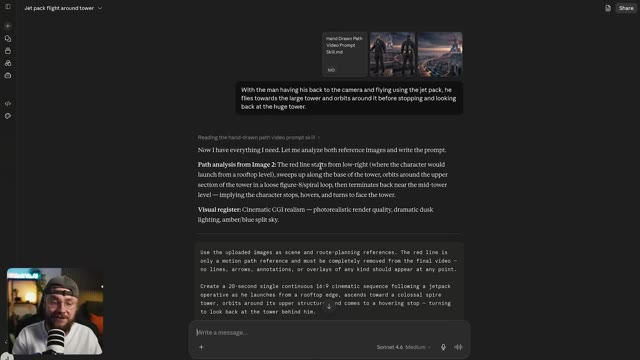
*Interface de l'outil Claude affichant l'analyse détaillée d'une image avec un tracé et la génération d'un prompt vidéo, avec le présentateur visible en incrustation (PiP).*

---

### ⏱️ `[00:10:02 - 00:10:29]` | Segment #21

**🔊 Audio (Transcription Intégrale Mot pour Mot en Français) :**
> Donc allons-y pour copier ceci. De retour sur Artlist, je vais déposer cela directement dans le champ de texte du prompt. Nous pouvons lancer la génération. Et nous obtenons notre génération ici de moi utilisant le jetpack pour voler vers cette tour et orbiter autour d'elle. Seedance 2 adhère vraiment très bien au style de génération que nous recherchons, tout en ayant un bon niveau de compréhension de notre environnement.

**👁️ Analyse Visuelle d'Écran (gemini-3.5-flash-lite) :**
**Interface & Outils** : Interface web d'Artlist (AI Toolkit / Seedance 2.0)

**Contenu textuel & Code** : Texte du prompt décrivant une séquence cinématographique de 20 secondes d'un opérateur en jetpack volant près d'une tour-flèche colossale au crépuscule. Paramètres : Seedance 2.0, format 16:9, 1080p.

**Action / Démonstration** : Copie et collage d'un prompt textuel dans le champ de génération d'Artlist (Seedance 2.0), puis lecture de la vidéo générée montrant le personnage volant autour de la tour.

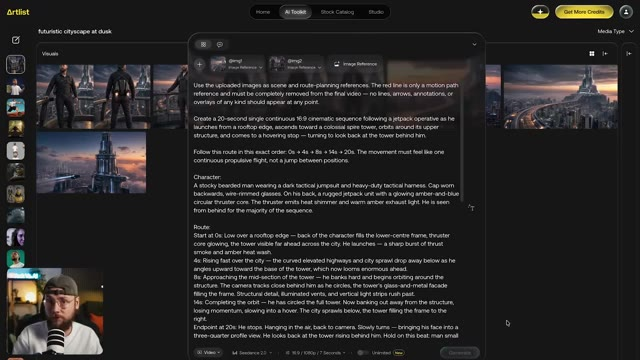
*Interface d'Artlist montrant le prompt détaillé pour Seedance 2.0 avec les images de référence.*

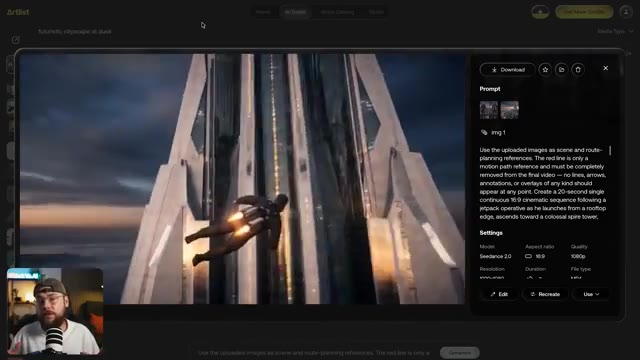
*Résultat de génération vidéo sur Artlist montrant un personnage avec un jetpack volant près d'une grande tour.*

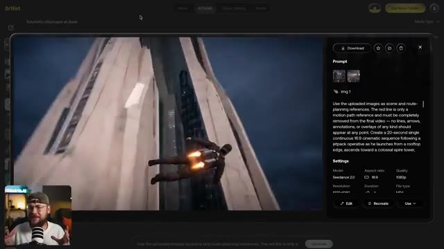
*Poursuite de la lecture de la vidéo générée montrant le personnage en orbite autour de la tour.*

---

### ⏱️ `[00:10:29 - 00:11:00]` | Segment #22

**🔊 Audio (Transcription Intégrale Mot pour Mot en Français) :**
> Maintenant, bien sûr, nous aurions aussi pu opter pour un plan de drone ou un plan en POV. Mais je trouve juste vraiment sympa de vous montrer les gars que vous pouvez également intégrer des personnages dans vos générations en utilisant cette méthode. Je veux maintenant jeter un œil à d'autres exemples que j'ai assemblés avec ce flux de travail car il y a différentes manières d'utiliser cette technique. Alors tout d'abord nous avons cet exemple ici qui est ce plan de style drone vraiment assez dramatique survolant tous ces biomes très uniques.

**👁️ Analyse Visuelle d'Écran (gemini-3.5-flash-lite) :**
**Interface & Outils** : Interface web de la plateforme Artlist (section AI Tools / Seedance 2.0).

**Contenu textuel & Code** : Panneau de configuration affichant le champ "Prompt", les paramètres de modèle ("Seedance 2.0"), le format d'image ("16:9"), et la qualité ("1080p"). Texte visible dans le prompt : "Use the uploaded image as a route-planning terrain map. The red drawn line is only a sketched camera flight path..."

**Action / Démonstration** : Le créateur présente des exemples de vidéos générées par IA sur la plateforme Artlist en affichant l'interface de Seedance 2.0 avec des prompts textuels et des réglages de génération de plans de drone.

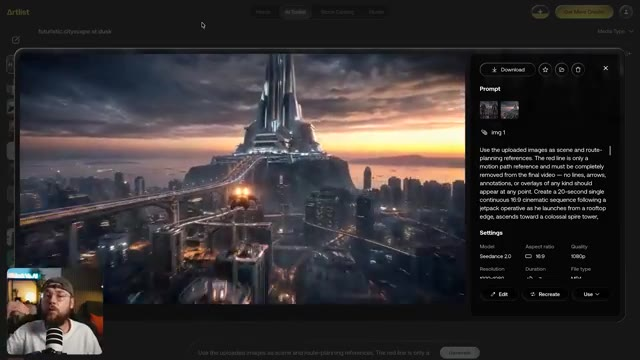
*Interface de la plateforme Artlist montrant un générateur de vidéo par IA avec un aperçu de ville futuriste au crépuscule.*

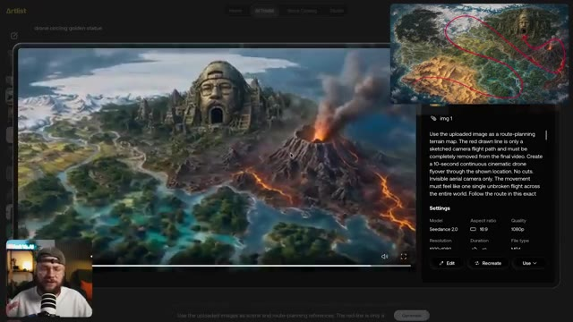
*Interface de la plateforme Artlist montrant un plan de type drone survolant un monde fantastique avec un volcan et une statue géante.*

---

### ⏱️ `[00:11:00 - 00:11:38]` | Segment #23

**🔊 Audio (Transcription Intégrale Mot pour Mot en Français) :**
> Donc j'ai assemblé cette carte où il y a ces différents environnements et j'ai dû me placer dans le coin supérieur droit comme faisant partie d'une sorte de temple ou quelque chose comme ça et vous obtenez un résultat vraiment très agréable, dramatique, cinématique et stylisé, donc pour moi c'est un peu là que ce flux de travail brille, j'ai l'impression, en utilisant nos chemins dessinés à la main pour dicter la façon dont nous voulons que la caméra bouge plutôt que d'avoir à le décrire nous-mêmes ce qui peut être un peu délicat, et un autre exemple ici où nous utilisons à nouveau notre chemin dessiné à la main pour diriger le mouvement de la caméra, c'est un mouvement de style drone.

**👁️ Analyse Visuelle d'Écran (gemini-3.5-flash-lite) :**
**Interface & Outils** : Interface web d'Artlist (outil de génération vidéo par IA Seedance) avec panneau latéral de configuration et aperçu vidéo.

**Contenu textuel & Code** : Texte du prompt visible : "Use the uploaded image as a route-planning terrain map. The red drawn line is only a sketched camera flight path and must be completely removed from the final video. Create a 10-second continuous cinematic drone flyover through the shown location. No cuts. Invisible aerial camera only. The movement must feel like one single unbroken flight across the entire world. Follow the route in this exact..." Paramètres de configuration : Model: Seedance 2.0, Aspect ratio: 16:9, Quality: 1080p.

**Action / Démonstration** : Le créateur présente l'interface d'Artlist Seedance et commente les résultats de génération vidéo basés sur des tracés de trajectoire de caméra dessinés à la main sur des cartes.

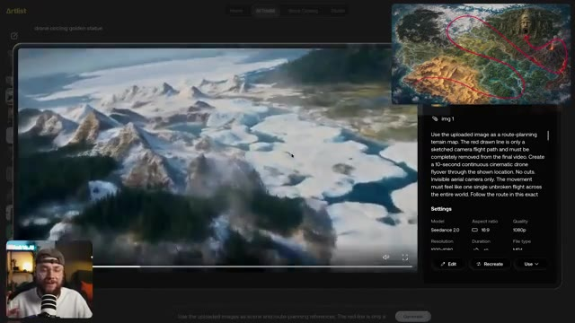
*Interface d'Artlist montrant la génération d'une vidéo de survol de drone au-dessus d'une carte de terrain enneigée avec un tracé rouge.*

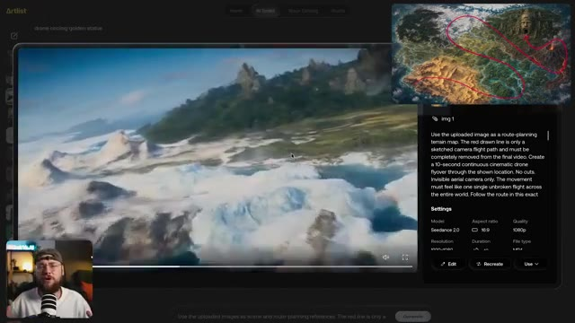
*Vue de Jack face caméra dans son studio avec micro et éclairage néon en arrière-plan.*

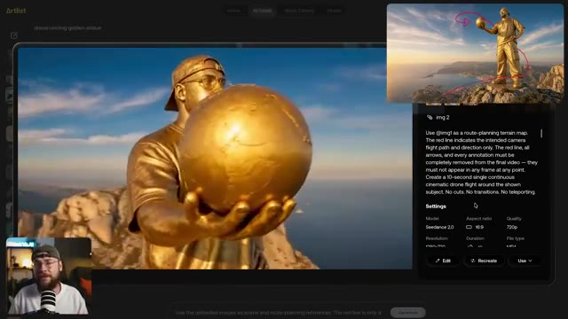
*Interface d'Artlist affichant un mouvement de caméra de type drone autour d'une statue dorée tenant un globe terrestre.*

---

### ⏱️ `[00:11:38 - 00:12:13]` | Segment #24

**🔊 Audio (Transcription Intégrale Mot pour Mot en Français) :**
> où nous sommes réellement en train de nous mettre en orbite autour de cette immense statue dorée de moi surplombant le bord d'une falaise. Et pour cela, j'ai une fois de plus utilisé une référence de personnage en combinaison avec notre tracé dessiné à la main pour vraiment verrouiller ce sentiment de cohérence du sujet ici. Je parle souvent beaucoup du contexte lorsque nous utilisons ces outils d'IA. Et si l'on regarde la première image, on ne peut pas exactement me voir sous l'angle sous lequel nous allons terminer lorsque le mouvement de caméra se termine. Et donc en ajoutant ce genre de feuille de personnage pour verrouiller la cohérence, vous allez obtenir une bien plus grande

**👁️ Analyse Visuelle d'Écran (gemini-3.5-flash-lite) :**
**Interface & Outils** : Interface de la plateforme Artlist (AI Tools) avec fenêtres de prévisualisation vidéo, panneau de prompt et paramètres de génération.

**Contenu textuel & Code** : Texte du prompt visible : « Use @img1 as a route-planning terrain map. The red line indicates the intended camera flight path and direction only... Create a 10-second single continuous cinematic drone flight around the shown subject. No cuts. No transitions. No teleporting. » Paramètres : Modèle Seedance 2.0 / GPT Image 2, format 16:9, qualité 720p/High, références de personnages avec images attachées.

**Action / Démonstration** : Le créateur présente l'interface d'un outil de génération vidéo par IA, démontrant l'utilisation de références de personnages et d'un tracé de trajectoire de caméra pour maintenir la cohérence visuelle.

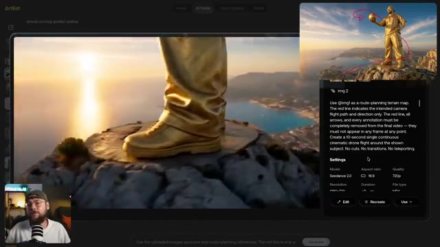
*Interface d'Artlist montrant la vidéo générée de la statue dorée géante au bord d'une falaise avec une trajectoire de caméra dessinée en rouge.*

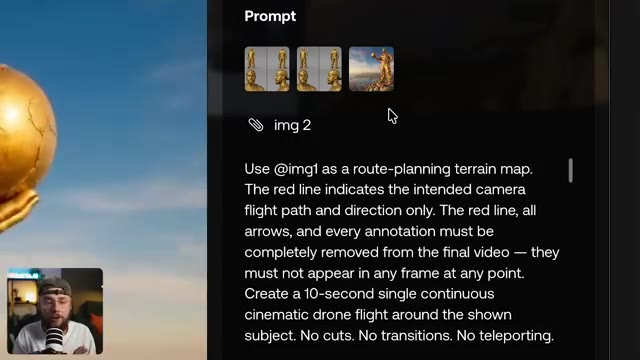
*Gros plan sur le panneau de configuration du prompt textuel et des images de référence (character references) dans l'interface d'Artlist.*

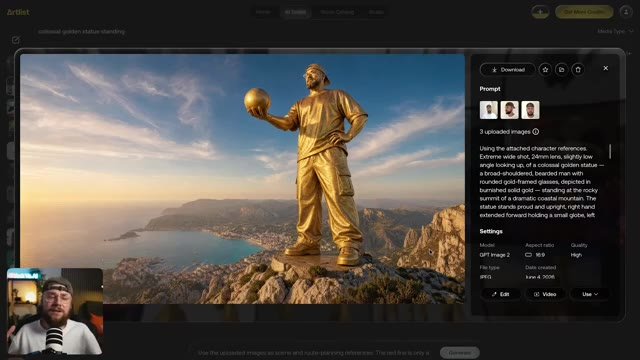
*Affichage d'une image générée haute résolution montrant la statue dorée de Jack sur un sommet rocheux surplombant la côte, avec les détails du prompt et des paramètres du modèle.*

---

### ⏱️ `[00:12:13 - 00:12:47]` | Segment #25

**🔊 Audio (Transcription Intégrale Mot pour Mot en Français) :**
> résultat. Il s'agit de comprendre que l'IA, C-Dance 2 dans ce cas, ne comprend pas automatiquement à quoi vous ressemblez sous tous les angles. Nous devons fournir autant de contexte que possible. Maintenant, en utilisant cette même technique, vous pouvez en fait contrôler d'autres choses que la caméra. Dans cet exemple ici, nous avons ce genre de scène de style animation Pixar et j'ai en fait dessiné la trajectoire que je voulais que la balle rouge prenne. Vous avez probablement remarqué que la physique de ce plan n'a pas vraiment de sens complet même si c'est très amusant. Ce que j'essaie de faire ici à la place, c'est de dire à C-dance 2

**👁️ Analyse Visuelle d'Écran (gemini-3.5-flash-lite) :**
**Interface & Outils** : Interface web d'Artlist (outil de génération vidéo Seedance 2.0).

**Contenu textuel & Code** : Texte du prompt visible : « Use @img2 as a route-planning terrain map. The red line indicates the intended camera flight path and direction only. The red line, all arrows, and every annotation must be completely removed from the final video — they must not appear in any frame at any point. Create a 10-second single continuous cinematic drone flight around the shown subject. No cuts. No transitions. No teleporting. » / Paramètres : Modèle Seedance 2.0, format 16:9, qualité 720p.

**Action / Démonstration** : Le créateur montre l'interface de Seedance avec des exemples de contrôle de caméra par trajectoire rouge et de génération de scènes animées inspirées de Pixar.

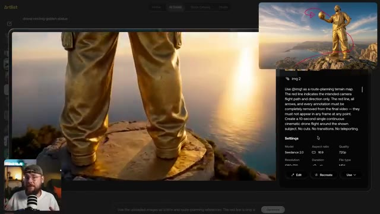
*Interface d'Artlist montrant la génération d'une vidéo avec un rendu de statue dorée et un panneau de configuration à droite.*

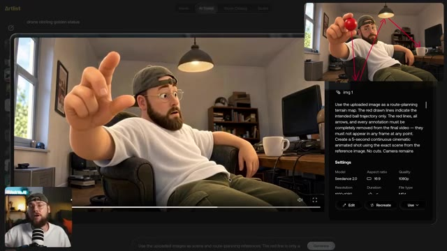
*Interface d'Artlist affichant une scène de style animation Pixar avec un personnage dans une pièce, et un prompt de trajectoire de balle rouge en médaillon.*

---

### ⏱️ `[00:12:47 - 00:13:22]` | Segment #26

**🔊 Audio (Transcription Intégrale Mot pour Mot en Français) :**
> c'est exactement comme ça que je veux que vous déplaciez la balle, que cela ait du sens ou non. Faites simplement exactement ce que je dessine et c'est le résultat qu'on obtient, donc ça a marché. Et un autre exemple ici où nous utilisons cette méthode pour contrôler le personnage encore une fois, c'est cette génération de style de jeu vidéo qui personnellement était mon préféré de tout ce projet. Sea Dance 2 a utilisé cette trajectoire dessinée à la main de manière très pertinente. Elle s'y est plutôt bien tenue, mais je voulais aussi vous montrer un exemple où cette méthode n'a pas fonctionné. J'ai donc généré une image en regardant vers le bas

**👁️ Analyse Visuelle d'Écran (gemini-3.5-flash-lite) :**
**Interface & Outils** : Interface web d'Artlist (Seedance 2.0) avec panneau de configuration latéral, lecteur vidéo central et vignette PiP du créateur en bas à gauche.

**Contenu textuel & Code** : Modèle : Seedance 2.0, Format : 16:9, Qualité : 1080p, Résolution : 1920x1080, Durée : 7 sec, Type de fichier : MP4. Prompts sur l'utilisation d'images de référence et de tracés de trajectoire.

**Action / Démonstration** : Le créateur présente différents exemples de générations vidéo contrôlées par des tracés et des images de référence, en expliquant les succès et les échecs de la méthode.

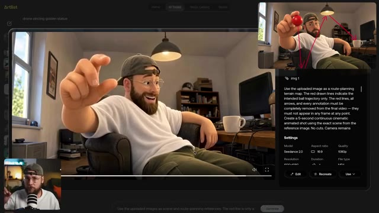
*Interface de génération vidéo Seedance 2.0 sur Artlist, montrant un personnage 3D animé et un encadré avec une photo de référence annotée.*

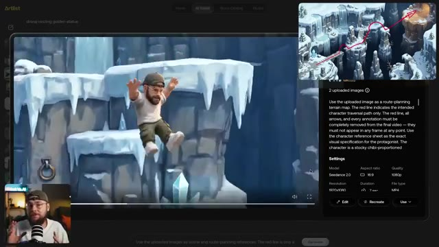
*Interface Seedance 2.0 affichant un personnage style jeu vidéo sautant dans un décor enneigé, avec une carte de référence et un tracé rouge.*

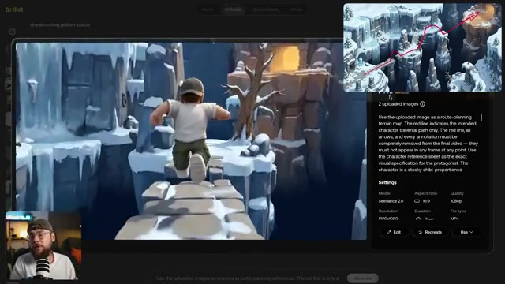
*Interface Seedance 2.0 montrant le même personnage de jeu vidéo courant sur un pont dans un décor enneigé.*

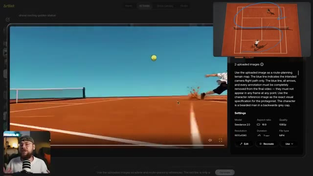
*Interface Seedance 2.0 affichant une scène sur un court de tennis en terre battue avec une trajectoire bleue tracée en incrustation.*

---

### ⏱️ `[00:13:22 - 00:13:58]` | Segment #27

**🔊 Audio (Transcription Intégrale Mot pour Mot en Français) :**
> sur un court de tennis et ensuite j'ai dessiné le mouvement de caméra que je recherchais et j'espérais que Sea Dance 2 aurait ce genre de compréhension physique du court de tennis. C'est assez basique mais bien sûr il est important que cela ait un sens physique et logique. Malheureusement, bien que cette génération soit plutôt cool, il y a toutes sortes de choses qui ne vont pas. La logique s'est en quelque sorte brisée, le positionnement du filet par exemple se retourne en quelque sorte à mi-parcours de la génération. Donc le fait est que si cette technique a du potentiel, elle n'est pas sans défauts. Et cela

**👁️ Analyse Visuelle d'Écran (gemini-3.5-flash-lite) :**
**Interface & Outils** : Interface de la plateforme Artlist avec Seedance 2.0 (panneau de paramètres à droite, lecteur vidéo au centre, image de référence en haut à droite avec une trajectoire bleue dessinée en forme de S).

**Contenu textuel & Code** : Texte du prompt visible à droite : "Use the uploaded image as a route-planning terrain map. The blue line indicates the intended camera flight path only..." Paramètres : Model: Seedance 2.0, Aspect ratio: 16:9, Quality: 1080p, Resolution: 1920x1080, Duration: 7 sec, File type: MP4.

**Action / Démonstration** : Le créateur montre l'interface de Seedance 2.0 sur Artlist avec le résultat de la vidéo générée sur un court de tennis et l'image de référence de la trajectoire de caméra.

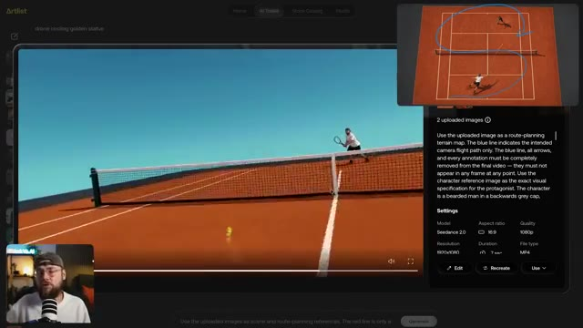
*Interface d'Artlist avec le modèle Seedance 2.0 montrant la génération vidéo d'un joueur de tennis et le panneau latéral affichant les paramètres et le prompt textuel.*

---

### ⏱️ `[00:13:58 - 00:14:31]` | Segment #28

**🔊 Audio (Transcription Intégrale Mot pour Mot en Français) :**
> ce qui m'amène gentiment à la conclusion de ce projet où nous pouvons parler à la fois du bon et du mauvais. Donc c'est en fait assez similaire au flux de travail de storyboard dont j'ai parlé récemment, où ce ne sera pas entièrement exact, n'est-ce pas. Ça ne va pas correspondre exactement au tracé dessiné à la main et je suis sûr que les plus observateurs d'entre vous l'auront remarqué. Parfois, le chemin dessiné à la main sera suivi plus précisément que d'autres, mais souvent il sera juste utilisé comme une sorte d'indication générale, une ambiance pour que Seedance 2 génère autour. Quelque chose d'autre que vous remarquerez peut-être du temp

**👁️ Analyse Visuelle d'Écran (gemini-3.5-flash-lite) :**
**Interface & Outils** : Présentation vidéo avec incrustation (PiP) et affichage de storyboard / rendus vidéo d'IA.

**Contenu textuel & Code** : Texte à l'écran : "conclusion", "my honest take", storyboard "DOWNHILL" divisé en plusieurs vignettes de bandes dessinées de snowboard.

**Action / Démonstration** : Le créateur présente une conclusion sur le projet en comparant un storyboard dessiné à la main avec le rendu vidéo final généré par Seedance 2, en commentant la précision du suivi du chemin.

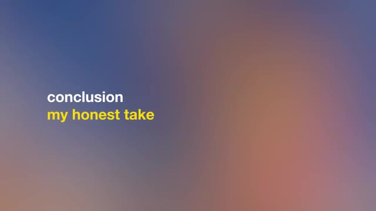
*Écran titre textuel sur fond dégradé avec les mots 'conclusion' et 'my honest take'.*

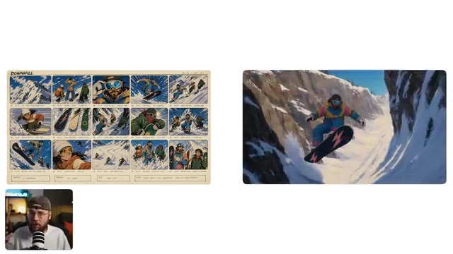
*Comparaison côte à côte montrant un storyboard illustré de snowboard (intitulé DOWNHILL) et un rendu vidéo généré par IA montrant un snowboarder en action, avec Jack en incrustation vidéo (PiP) en bas à gauche.*

---

### ⏱️ `[00:14:31 - 00:15:05]` | Segment #29

**🔊 Audio (Transcription Intégrale Mot pour Mot en Français) :**
> le temps est que des déformations peuvent se produire lorsque vous utilisez ce flux de travail, surtout si vous essayez de vous déplacer dans un environnement très rapidement. C'est un peu comme si Seedance 2 avait ce genre de plans distincts du paysage et lorsqu'ils se croisent, des déformations bizarre se produisent, alors oui, gardez un œil là-dessus. J'ai également constaté lors de mes tests que lorsque vous essayez d'utiliser vos chemins pour contrôler des objets, les résultats peuvent être un peu incertains, il vaut donc mieux garder cela très simple comme je l'ai fait avec mon exemple de balle. J'aime bien le fait cependant que plutôt que

**👁️ Analyse Visuelle d'Écran (gemini-3.5-flash-lite) :**
**Interface & Outils** : Interface de démonstration vidéo / tutoriel Seedance 2 avec incrustation caméra (PiP) du créateur.

**Contenu textuel & Code** : Visualisation de cartes stylisées avec des lignes rouges de trajectoire et des exemples de rendu 3D d'un personnage tenant une sphère rouge.

**Action / Démonstration** : Le créateur illustre visuellement les problèmes de déformation spatiale et l'utilisation simple des chemins de contrôle d'objets.

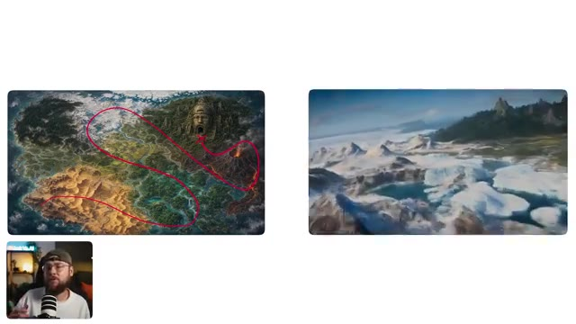
*Démonstration vidéo de Seedance 2 montrant une carte fantastique avec des tracés rouges et un rendu de paysage montagneux enneigé.*

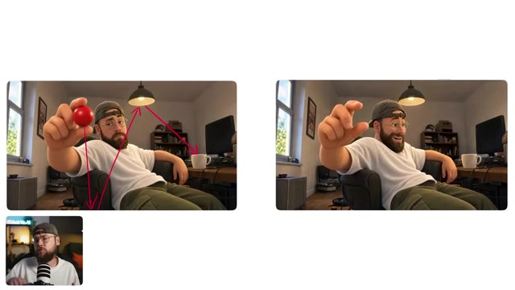
*Démonstration vidéo de Seedance 2 illustrant un exemple simple avec une balle rouge tenue par l'avatar de Jack.*

---

### ⏱️ `[00:15:05 - 00:15:39]` | Segment #30

**🔊 Audio (Transcription Intégrale Mot pour Mot en Français) :**
> juste en guidant la façon dont je voulais que le ballon se comporte, je pouvais le dessiner. Ça donne vraiment l'impression d'un flux de travail interactif très agréable où j'ai juste un tout petit peu plus de contrôle. Le tout meilleur cas d'usage pour ce flux de travail à mon avis est de contrôler la caméra quand on cherche ce genre de plans de drone vraiment cinématiques. Mais comme vous avez pu le voir avec mes exemples, vous pouvez obtenir de très bons résultats en contrôlant des personnages aussi. Globalement, mes choses préférées à propos de cette technique sont la vitesse et la simplicité. Si vous comptez utiliser les fichiers MD que j'ai préparés

**👁️ Analyse Visuelle d'Écran (gemini-3.5-flash-lite) :**
**Interface & Outils** : Interface de tutoriel vidéo avec incrustation PiP du créateur et exemples de génération d'images/vidéos avec des annotations de trajectoire (lignes et flèches rouges).

**Contenu textuel & Code** : Images de synthèse représentant une statue dorée tenant un orbe sur une montagne rocheuse et un paysage montagneux enneigé, annotées avec des tracés vectoriels rouges indiquant le mouvement ou le contrôle de la caméra.

**Action / Démonstration** : Le créateur illustre visuellement le contrôle de trajectoire et de mouvement à l'aide d'exemples vidéo annotés de flèches rouges.

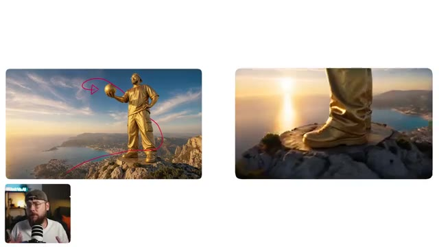
*Démonstration de génération vidéo avec une image de statue dorée sur une montagne et des tracés de trajectoire rouges, avec Jack en incrustation (PiP).*

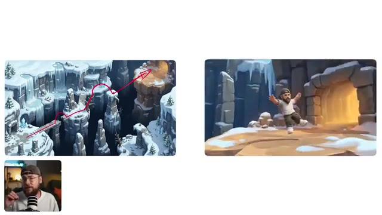
*Démonstration de génération vidéo montrant un paysage enneigé fantastique avec des flèches et des lignes de trajectoire rouges, et un personnage animé en mouvement.*

---

### ⏱️ `[00:15:39 - 00:16:09]` | Segment #31

**🔊 Audio (Transcription Intégrale Mot pour Mot en Français) :**
> ça enlève vraiment une grande part d'incertitude et vous permet de rassembler vos résultats très rapidement sans avoir à devenir trop technique, ce qui, je pense, est génial. Il y a aussi quelque chose d'assez satisfaisant à dessiner concrètement la façon dont votre génération va se terminer. Gardez définitivement un œil sur ce flux de travail car je pense que beaucoup de créateurs talentueux vont sortir des trucs incroyables en l'utilisant. Cela étant dit les gars, si vous avez des questions, n'hésitez pas à les laisser en bas dans la section des commentaires. J'essaie toujours d'en un maximum autant que je le peux.

**👁️ Analyse Visuelle d'Écran (gemini-3.5-flash-lite) :**
**Interface & Outils** : Interface de démonstration vidéo montrant des flux de travail de génération d'images/vidéos avec des tracés de trajectoire de caméra rouge et leurs résultats animés correspondants, avec une incrustation de la webcam du créateur.

**Contenu textuel & Code** : Des images de synthèse générées par IA représentant une tour de type cyberpunk et une île fantastique avec un relief en forme de visage humain géant, superposées de lignes de guidage rouges.

**Action / Démonstration** : Le créateur montre des exemples de vidéos générées où l'on trace un chemin rouge à l'écran pour définir la trajectoire du mouvement de caméra.

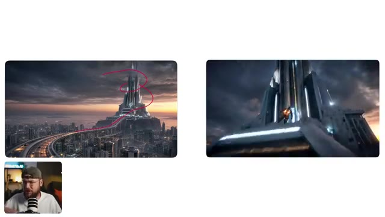
*Démonstration à l'écran de la génération d'une tour futuriste avec un tracé rouge guidant le mouvement de caméra, et le rendu final en gros plan à droite.*

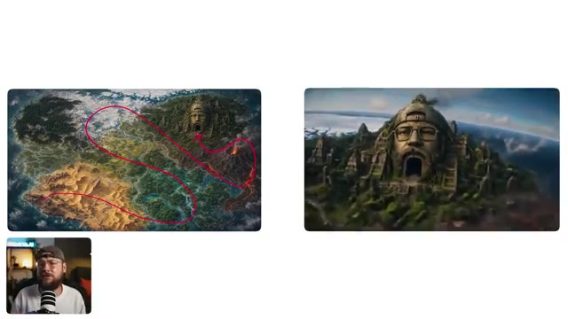
*Démonstration d'une carte fantastique avec un tracé rouge menant à un temple géant en forme de visage portant une casquette et des lunettes.*

---

### ⏱️ `[00:16:09 - 00:16:17]` | Segment #32

**🔊 Audio (Transcription Intégrale Mot pour Mot en Français) :**
> Si vous avez apprécié le contenu d'aujourd'hui, assurez-vous de lâcher un pouce bleu pour moi et pensez à vous abonner. Cela étant dit, je vous retrouve dans la prochaine vidéo.

**👁️ Analyse Visuelle d'Écran (gemini-3.5-flash-lite) :**
**Interface & Outils** : Présentation face caméra sans partage d'écran

**Contenu textuel & Code** : Aucun texte ou code visible, l'image montre le présentateur (Jack) dans son studio avec un encart d'animation YouTube invitant à s'abonner et liker en bas à gauche.

**Action / Démonstration** : Jack s'adresse directement à la caméra en faisant des gestes pour conclure la vidéo et inciter aux abonnements.

---
