# 🎬 Comment créer votre propre série animée avec l'IA

> **Chaîne** : [Jack Vs. AI](https://www.youtube.com/@JackVsAI)  
> **Titre original** : `How to Create Your Own Cartoon Show with AI`  
> **Lien YouTube** : [https://www.youtube.com/watch?v=vwL_c5U0F3Y](https://www.youtube.com/watch?v=vwL_c5U0F3Y)  
> **Date de publication** : 2026-06-13  
> **Durée** : 29m 56s (`1796s`)  
> **Identifiant vidéo** : `vwL_c5U0F3Y`  
> **Fiche Web Interactive** : [2026-06-13_YT-vwL_c5U0F3Y_Comment créer votre propre série animée avec l'IA_by-whisper-v3-large-turbo+gemini-3.5-flash-lite.html](2026-06-13_YT-vwL_c5U0F3Y_Comment créer votre propre série animée avec l'IA_by-whisper-v3-large-turbo+gemini-3.5-flash-lite.html)  
> **Captures de démonstration clés** : `111 captures réelles (anti-talking-head)`  
> **Modèles utilisés** : Audio: `large-v3-turbo` (Faster-Whisper int8 VPS) | Vision: `gemini-3.5-flash-lite` (Google AI Studio API)  

---

## 📌 Synthèse Exécutive & Outils

### 📌 Résumé
La création de séries animées par intelligence artificielle a franchi un cap majeur, passant de la génération de clips isolés à la production d'œuvres sérielles cohérentes. Dans ce tutoriel, Jack, expert en effets visuels, dévoile un flux de travail de réalisateur complet permettant à un créateur solitaire de piloter l'écriture, la mise en scène et l'animation de son propre dessin animé. En s'affranchissant des équipes traditionnelles et des coûts de production exorbitants, la méthode repose sur une rigueur de direction artistique similaire à celle des studios professionnels : sélection minutieuse de références, ancrage visuel des personnages et gestion stricte des contextes.

L'innovation centrale de ce workflow réside dans la résolution du problème chronique de l'incohérence visuelle de l'IA. En combinant des outils de pointe comme *Higgsfield* et *Nano Banana Pro*, Jack démontre comment transformer une simple photo de référence en un personnage de cartoon répétable, décliné sous tous les angles grâce à des « character sheets » (feuilles de personnages). Cette approche méthodologique élimine les approximations des algorithmes, garantissant que les protagonistes conservent les mêmes attributs d'un épisode à l'autre et d'une scène à l'autre.

Au-delà de l'aspect purement visuel, le processus s'attaque aux fondations narratives et vocales de la série. En structurant chaque étape — de la recherche d'ambiance sur Pinterest jusqu'aux techniques avancées de clonage et d'utilisation de la voix propre du créateur —, cette masterclass offre une feuille de route actionnable. Le résultat est un contrôle créatif total, redéfinissant le rôle du créateur moderne en un véritable showrunner assisté par l'IA, capable de bâtir un univers narratif pérenne et unifié à partir de zéro.

### 🛠️ Outils, Modèles & Logiciels Présentés
* **Claude** : Utilisé comme assistant textuel pour structurer les scripts, affiner les scénarios et concevoir les cadres de prompts narratifs de la série.
* **Higgsfield** : Plateforme principale d'animation et de génération visuelle permettant de lier les images de référence aux styles artistiques choisis pour créer l'ambiance de l'émission.
* **Midjourney** : Outil de référence exploratoire pour sourcer des styles artistiques initiaux et inspirer l'esthétique visuelle globale du dessin animé.
* **Nano Banana** : Modèle de génération d'images alternatif utilisé pour des rendus spécifiques selon les besoins artistiques du projet.
* **Nano Banana Pro** : Modèle d'image IA de pointe privilégié pour les rendus fortement stylisés en résolution 2K, garantissant une esthétique de dessin animé de haute qualité.
* **Seedance** : Solution intégrée au pipeline pour dynamiser les séquences et transformer les images fixes en animations fluides.
* **Flux** : Modèle complémentaire mobilisé pour sa précision dans le respect des contraintes stylistiques et textuelles lors de la génération d'actifs visuels.

### 🔑 Points Clés & Enseignements Stratégiques
* **Priorité à la sérialisation** : Viser la création d'un ensemble cohérent de personnages, de décors et de voix réutilisables d'un épisode à l'autre plutôt que de produire de simples scènes visuelles déconnectées.
* **Constitution d'une base de références** : Amasser un dossier varié d'exemples de styles de dessins animés (via Pinterest ou Midjourney) pour servir de boussole esthétique avant toute génération.
* **L'injection de références hybrides** : Alimenter l'IA sur *Higgsfield* en combinant simultanément une photo de référence du sujet (ou du personnage original) et une image cible représentant le style artistique désiré.
* **Cadre de prompt universel** : Utiliser une structure de prompt modulaire et répétable en remplaçant uniquement le sujet central (homme, femme, créature) tout en conservant la structure syntaxique de base.
* **Précision anatomique et descriptive** : Détailler explicitement les attributs invisibles sur les références initiales (corpulence, couleur des yeux, coiffure, vêtements, chaussures) pour empêcher l'IA d'improviser de manière aléatoire.
* **La puissance des feuilles de personnages (*Character Sheets*)** : Générer systématiquement une planche de référence montrant le personnage sous un angle neutre, les bras le long du corps et sans expression marquée, afin de fixer son identité visuelle pour les plans futurs.
* **Corrections chirurgicales par le prompt** : Ajuster les détails mineurs du personnage (comme le ton de la peau ou la coupe de cheveux) directement lors de l'étape de la feuille de personnage pour coller à la vision réaliste recherchée.
* **Maximiser le contexte pour éliminer la frustration** : Comprendre que l'échec et le gaspillage de crédits proviennent d'un manque d'informations fournies à l'IA ; plus le contexte visuel et textuel est dense, plus le résultat est prévisible et fidèle.
* **Résolution et paramètres de lot** : Forcer les générations d'images à une résolution minimale de 2K et utiliser une taille de lot (*batch size*) d'au moins deux pour disposer d'options de sélection variées.
* **Intégration de la voix authentique** : Exploiter les techniques avancées de clonage et de traitement audio pour intégrer la propre voix du créateur dans les dialogues des personnages, garantissant une incarnation unique de la série.

---

## ⏱️ Chronologie & Transcription Complète Audio & Visuelle (Mot pour Mot)

### ⏱️ `[00:00:00 - 00:00:35]` | Segment #01

**🔊 Audio (Transcription Intégrale Mot pour Mot en Français) :**
> Créer des dessins animés avec l'IA n'a jamais été aussi simple. Les outils sont tellement avancés maintenant que créer des personnages, des voix et des décors cohérents est un jeu d'enfant, mais seulement si vous utilisez les méthodes adéquates. Je m'appelle Jack, j'ai passé plus d'une décennie à créer des effets visuels pour bon nombre des plus grandes marques de la planète, et j'utilise maintenant l'IA pour réinventer les flux de travail créatifs. Nous avons tous rêvé de créer notre propre série de dessins animés, avant de réaliser à quel point c'est complexe. Il faut savoir dessiner, comprendre l'animation et même payer des acteurs vocaux. Mais grâce à l'IA, un seul créateur peut

**👁️ Analyse Visuelle d'Écran (gemini-3.5-flash-lite) :**
**Interface & Outils** : Présentation face caméra sans partage d'écran

**Contenu textuel & Code** : Aucun contenu logiciel ou interface visible. Jack s'adresse directement au public depuis son studio équipé d'un micro, d'un néon de chaîne YouTube en arrière-plan et d'un éclairage tamisé.

**Action / Démonstration** : Jack parle face caméra en gesticulant pour illustrer son propos introductif sur la création de dessins animés par intelligence artificielle.

---

### ⏱️ `[00:00:35 - 00:01:08]` | Segment #02

**🔊 Audio (Transcription Intégrale Mot pour Mot en Français) :**
> maintenant, contrôlez chaque étape du processus. Et c'est bien plus important que de simples économies car au lieu d'engager toute une équipe, vous êtes désormais aux commandes en tant qu'écrivain, réalisateur et animateur tout en un. Je vais vous enseigner chaque étape du processus, y compris tous les trucs et astuces que les autres créateurs ne vous disent pas. Ainsi, dès que vous aurez terminé cette vidéo, vous pourrez commencer à créer votre propre dessin animé à partir de zéro. Et si vous aimez le contenu d'aujourd'hui, n'oubliez pas de lâcher un pouce bleu pour moi et d'envisager de vous abonner. Très bien, entrons dans le vif du sujet. Donc, dès le départ,

**👁️ Analyse Visuelle d'Écran (gemini-3.5-flash-lite) :**
**Interface & Outils** : Présentation face caméra sans partage d'écran

**Contenu textuel & Code** : Le créateur (Jack) s'exprime face caméra en studio. Les images 2 et 3 contiennent des illustrations animées de style cartoon (Rick et Morty) affichant les sous-titres automatiques du discours ("director and animator", "you can start building").

**Action / Démonstration** : Le créateur parle devant son micro dans son studio avec des inserts de séquences animées illustrant son propos.

---

### ⏱️ `[00:01:08 - 00:01:42]` | Segment #03

**🔊 Audio (Transcription Intégrale Mot pour Mot en Français) :**
> Je tiens à préciser que ce flux de travail est axé sur la création d'un dessin animé entier plutôt que de simples scènes isolées, ce qui, je pense, est en fait assez facile maintenant. Nous nous concentrons sur la création d'un ensemble vraiment solide de personnages, de lieux et de voix répétables, qui peuvent être utilisés pour réaliser plusieurs épisodes et qui semblent tous cohérents et faire partie du même monde. Et assurez-vous de rester jusqu'à la fin de la vidéo parce que je vais vous montrer comment vous pouvez réellement utiliser votre propre voix dans vos générations de vidéo. Et c'est assez révolutionnaire à mon avis et quelque chose

**👁️ Analyse Visuelle d'Écran (gemini-3.5-flash-lite) :**
**Interface & Outils** : Présentation face caméra avec incrustation d'extraits vidéo d'animation (Picture-in-Picture).

**Contenu textuel & Code** : Pas de texte, d'interface logicielle ou de prompt textuel affiché à l'écran, uniquement des illustrations animées cohérentes illustrant l'univers d'un dessin animé.

**Action / Démonstration** : Le créateur parle face caméra tout en illustrant ses propos par des exemples visuels de scènes animées (un chat dans une chambre, un repas au restaurant).

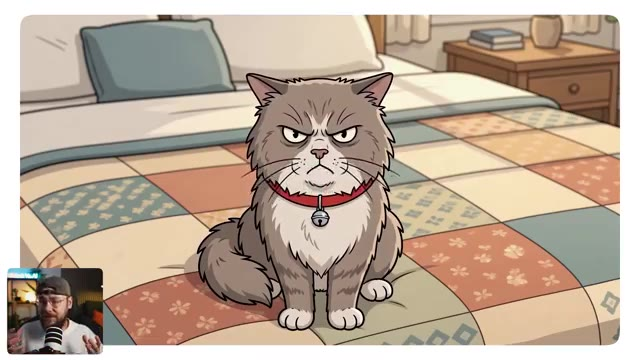
*Illustration animée d'un chat gris grognon assis sur un lit défait dans une chambre, avec le créateur en incrustation vidéo (PiP) dans le coin inférieur gauche.*

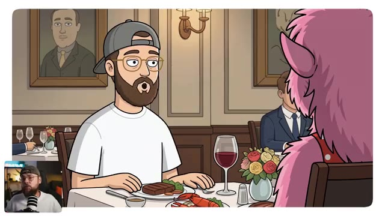
*Illustration animée d'un personnage inspiré du créateur dînant au restaurant en face d'une créature rose poilue, avec le créateur en incrustation vidéo (PiP) dans le coin inférieur gauche.*

---

### ⏱️ `[00:01:42 - 00:02:20]` | Segment #04

**🔊 Audio (Transcription Intégrale Mot pour Mot en Français) :**
> Je ne vois pas assez de gens en parler. La première étape du processus, et une partie qui me semble incroyablement importante, c'est de se constituer un solide ensemble de références. Donc pour cela, je vous suggère de vous rendre sur des sites comme Pinterest. Vous pouvez également aller sur Midjourney. Et ce que vous recherchez, ce sont des styles de dessins animés qui vous plaisent vraiment. Ils doivent vraiment résonner en vous. Et chaque fois que vous tombez sur une référence que vous aimez vraiment, vous voulez aller de l'avant et la sauvegarder. En fin de compte, l'idée ici est que vous repartiez avec un dossier entier rempli d'exemples formidables mais variés de

**👁️ Analyse Visuelle d'Écran (gemini-3.5-flash-lite) :**
**Interface & Outils** : Pinterest et Midjourney (navigateur web)

**Contenu textuel & Code** : Barre de recherche Pinterest avec le texte « cartoon character design » et des tags de filtres (References, 2d, Ideas, Stylized, Male, Sketch, Simple, Student, Art sketches, Retro, Drawing styles). Sur Midjourney, un panneau latéral affiche un prompt descriptif détaillé pour un personnage de jeu vidéo stylisé (« Stylized videogame character, male ex personal trainer... »). Une fenêtre Finder macOS intitulée « Ref Images » montre une liste de fichiers d'images de référence.

**Action / Démonstration** : Le créateur navigue à travers les interfaces de Pinterest et de Midjourney pour illustrer la recherche et la sauvegarde d'images de référence de style cartoon.

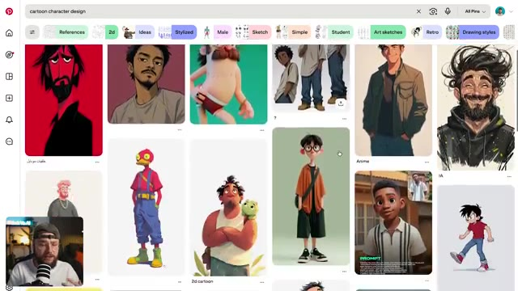
*Interface du site Pinterest montrant une recherche de designs de personnages de dessins animés avec le créateur en incrustation PiP.*

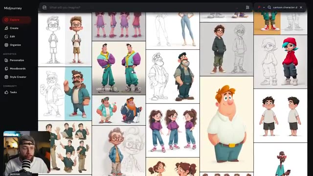
*Interface de Midjourney affichant une grille d'exemples de personnages stylisés et de références artistiques.*

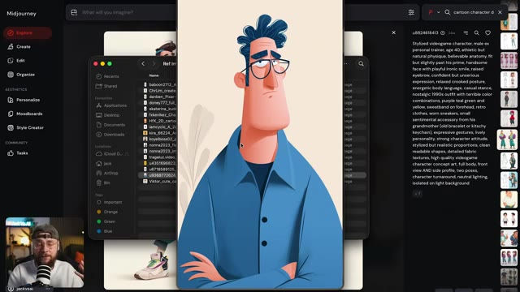
*Interface de Midjourney avec un panneau latéral de détails de prompt et une fenêtre de dossier Finder ouverte par-dessus.*

---

### ⏱️ `[00:02:20 - 00:02:56]` | Segment #05

**🔊 Audio (Transcription Intégrale Mot pour Mot en Français) :**
> différents styles de dessins animés et cela vous informera lorsque vous essayerez de définir votre propre style. Une fois que vous aurez rassemblé cet ensemble de références, nous serons prêts à commencer à générer les visuels pour notre propre émission de dessins animés et pour ce faire, nous sommes sur Higgsfield AI. Si vous voulez suivre, vous trouverez un lien en bas dans la description. Vous pouvez donc voir ici que j'ai toute une gamme de versions animées différentes de moi-même. C'est là que j'essaie de comprendre quelle ambiance je veux viser et ce qui va fonctionner pour mon émission spécifique. Donc

**👁️ Analyse Visuelle d'Écran (gemini-3.5-flash-lite) :**
**Interface & Outils** : Navigateur web avec Midjourney et la plateforme Higgsfield AI (Supercomputer, Marketing Studio, etc.) comportant un panneau de génération et une grille d'images.

**Contenu textuel & Code** : Texte du prompt visible partiellement sur Midjourney : "Stylized videogame character, male ex personal trainer, age 40, athletic but natural physique...". Sur Higgsfield : "Describe the scene you imagine", paramètres "Nano Banana Pro", format "16:9", résolution "2K", et bouton "Generate 4".

**Action / Démonstration** : Le créateur montre des exemples de styles de dessins animés de référence sur Midjourney puis bascule sur sa grille de variations de personnages sur Higgsfield AI.

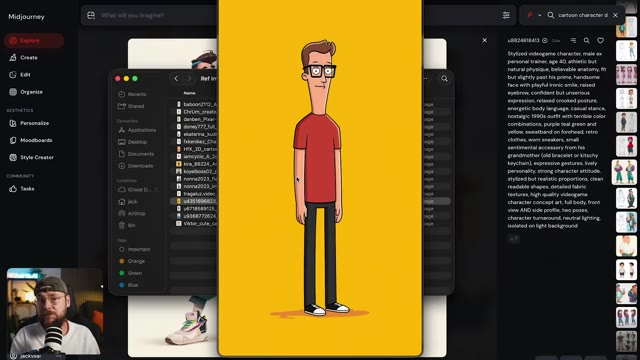
*Interface de Midjourney affichant une image centrale d'un personnage de dessin animé dans un style minimaliste et des fenêtres de dossiers de référence.*

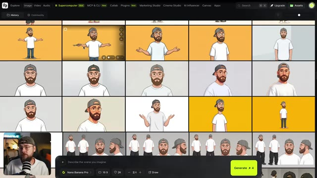
*Interface de la plateforme Higgsfield AI montrant une grille de différentes versions de personnages animés générés avec un champ de prompt en bas.*

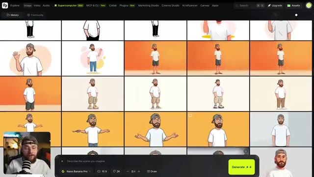
*Vue défilée de la galerie de générations sur Higgsfield AI montrant de multiples variations de style de personnage.*

---

### ⏱️ `[00:02:56 - 00:03:31]` | Segment #06

**🔊 Audio (Transcription Intégrale Mot pour Mot en Français) :**
> Laissez-moi vous montrer comment faire ceci. Vous voulez d'abord insérer quelques images de référence de vous-même ou du personnage que vous essayez de créer, aux côtés de l'une de ces références vedettes dont vous aimiez le style. Évidemment, il est très utile de tester plusieurs variations exactement comme je l'ai fait, et si vous ne voulez pas utiliser votre propre ressemblance, c'est tout à fait correct. Vous pouvez simplement sauter le téléchargement des références d'images que j'ai placées ici. Et nous lions le tout avec un prompt très simple. Maintenant, tous mes prompts et matériaux que j'utilise pour ce projet seront disponibles sur mon

**👁️ Analyse Visuelle d'Écran (gemini-3.5-flash-lite) :**
**Interface & Outils** : Interface de génération d'images par IA (Nano Banana Pro) avec panneau de prompts et miniatures de référence.

**Contenu textuel & Code** : Texte du prompt visible : "Show the bearded man in the attached cartoon style, he has a regular build. Gold rimmed rounded rectangular glasses with a single bridge, brown eyes, buzzcut hair style hidden under his grey backwards baseball cap, white oversized t-shirt". Paramètres : Nano Banana Pro, format 16:9, résolution 2K.

**Action / Démonstration** : Le créateur montre comment ajouter des images de référence et rédiger un prompt pour générer des variations de personnages.

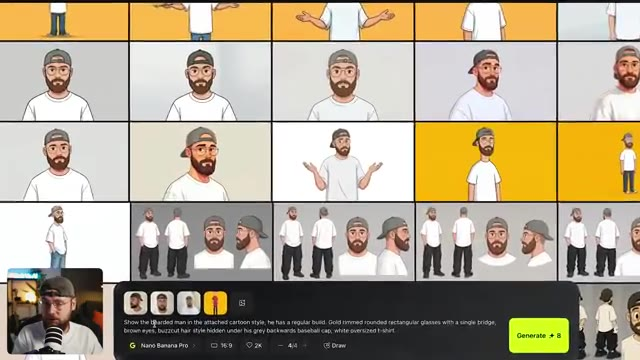
*Interface montrant une grille de personnages animés générés par IA et un panneau de prompt avec des images de référence.*

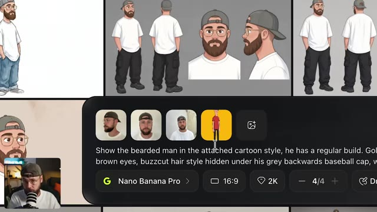
*Gros plan sur le panneau de prompt et les vignettes d'images de référence pour la génération de personnages.*

---

### ⏱️ `[00:03:31 - 00:04:04]` | Segment #07

**🔊 Audio (Transcription Intégrale Mot pour Mot en Français) :**
> communauté scolaire entièrement gratuite. Lien pour cela ci-dessous dans la description. Maintenant vous verrez que ce prompt a été écrit pour me décrire. Tout ce que vous avez à faire est d'utiliser ceci comme cadre et d'y insérer votre propre description. Que vous souhaitiez vous recréer en personnage de cartoon ou que vous décriviez simplement un tout nouveau personnage. Vous ne voulez pas du tout vous ressembler. Donc initialement nous disons montrer l'homme barbu dans le style cartoon attaché et ensuite je décris ma corpulence. Vous voulez bien sûr laisser cette partie avant ici et simplement remplacer par homme, femme, chat, chien,

**👁️ Analyse Visuelle d'Écran (gemini-3.5-flash-lite) :**
**Interface & Outils** : Interface de génération d'images/vidéos par IA avec une barre de prompt textuel et un mode PiP (Picture-in-Picture) montrant le créateur en bas à gauche.

**Contenu textuel & Code** : Texte du prompt visible : "Show the bearded man in the attached cartoon style, he has a regular build. Gold rimmed rounded rectangular glasses with a single bridge, brown eyes, buzzcut hair style hidden under his grey backwards baseball cap, white oversized t-shirt." Paramètres visibles : "Nano Banana Pro", format "16:9", "2K", "4/4".

**Action / Démonstration** : Le créateur montre à l'écran un exemple de prompt de génération de personnage de cartoon basé sur sa propre description physique, incrusté avec sa webcam en bas de l'écran.

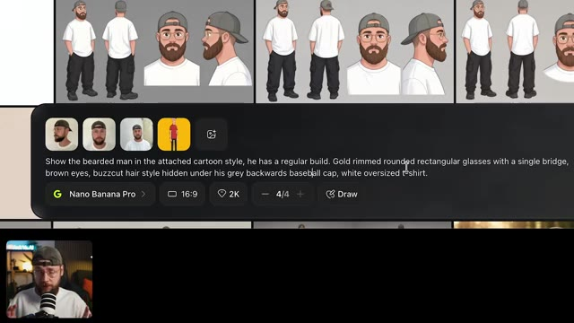
*Interface de génération montrant une zone de prompt textuel détaillant l'apparence d'un personnage de cartoon avec Jack en incrustation PiP.*

---

### ⏱️ `[00:04:04 - 00:04:37]` | Segment #08

**🔊 Audio (Transcription Intégrale Mot pour Mot en Français) :**
> tout ce que vous voulez. J'ai ensuite ajouté à la fin ici juste un peu plus de description en termes d'accessoires que j'ai, du genre la couleur des yeux, ma coiffure, tout ce qui pourrait être utile au modèle d'IA et sur lequel vous voulez être plus précis. Pour le modèle d'image, nous allons principalement utiliser Nano Banana Pro pour ce projet. À mon avis, actuellement, les meilleurs modèles d'images IA sur le marché sont Nano Banana Pro et GPT Image 2. Je me tournerais plutôt vers GPT Image pour des rendus de type bande photo mais

**👁️ Analyse Visuelle d'Écran (gemini-3.5-flash-lite) :**
**Interface & Outils** : Interface logicielle de génération d'images par IA avec un menu de sélection des modèles et une barre de saisie de prompt (paramètres visibles : rapport d'aspect 16:9, résolution 2K).

**Contenu textuel & Code** : Texte du prompt visible : "Show the bearded man in the attached cartoon style, he has a regular build. Gold rimmed rounded rectangular glasses with a single bridge, brown eyes, buzzcut hair style hidden under his grey backwards baseball cap, white oversized t-shirt." Modèles listés dans le menu : Higgsfield Soul Cinema, GPT Image 2 (NEW), Seedream 4.5 (UNLIMITED), Nano Banana Pro, Nano Banana 2, Recraft V4.1 (NEW).

**Action / Démonstration** : Le créateur montre l'interface de saisie du prompt pour affiner les détails physiques du personnage, puis présente la liste des différents modèles d'IA disponibles dans l'outil.

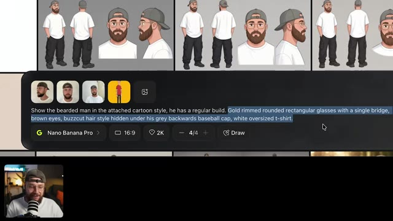
*Interface de génération d'images montrant un champ de texte de prompt détaillé avec le modèle Nano Banana Pro sélectionné.*

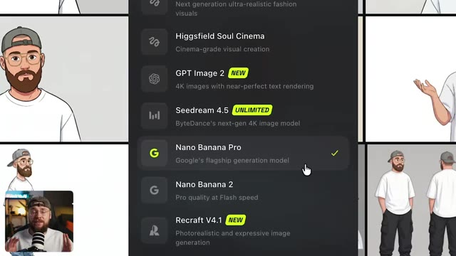
*Menu déroulant de sélection des modèles d'IA affichant Nano Banana Pro, GPT Image 2, Seedream 4.5 et Recraft V4.1.*

---

### ⏱️ `[00:04:37 - 00:05:06]` | Segment #09

**🔊 Audio (Transcription Intégrale Mot pour Mot en Français) :**
> comme nous visons quelque chose de beaucoup plus stylisé ici, je vous orienterais vers Nano Banana Pro. Nous voulons également nous assurer de générer au moins en résolution 2K et il pourrait être utile d'avoir une taille de lot d'au moins deux pour pouvoir avoir une sélection parmi laquelle choisir. Donc, en utilisant exactement ce flux de travail, j'ai obtenu de superbes résultats, mais celui-ci était mon préféré personnel. J'ai eu l'impression qu'il correspondrait à l'ambiance de l'émission que je cherchais à créer, qui était principalement une comédie.

**👁️ Analyse Visuelle d'Écran (gemini-3.5-flash-lite) :**
**Interface & Outils** : Interface logicielle de génération d'images et de vidéos par IA (type plateforme de création artistique).

**Contenu textuel & Code** : Modèles visibles : "Nano Banana Pro", "GPT Image 2", "Seedream 4.5", "Recraft V4.1". Paramètres : résolution "2K", format "16:9". Prompt visible : "Show the bearded man in the attached cartoon style...". Panneau latéral d'information indiquant le modèle "Nano Banana Pro", la qualité "2k" et la taille "2752x1536".

**Action / Démonstration** : Le créateur démontre la sélection du modèle de génération d'images Nano Banana Pro, puis configure la résolution sur 2K avant de présenter le résultat final animé ou généré.

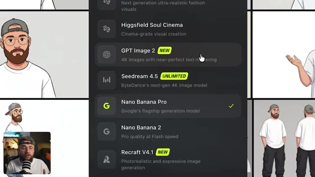
*Sélection du modèle d'IA Nano Banana Pro dans une interface de génération d'images.*

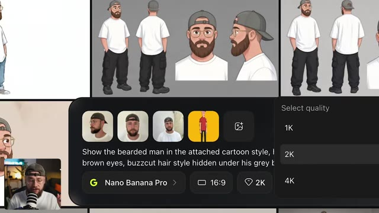
*Réglage de la résolution sur 2K et affichage du prompt textuel de génération.*

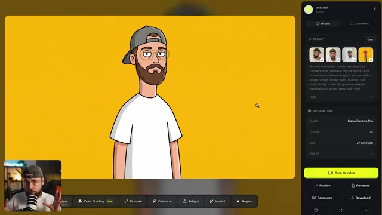
*Résultat de l'image générée représentant un personnage cartoon sur fond jaune avec le panneau latéral détaillant les paramètres et le modèle Nano Banana Pro.*

---

### ⏱️ `[00:05:06 - 00:05:27]` | Segment #10

**🔊 Audio (Transcription Intégrale Mot pour Mot en Français) :**
> Mais honnêteté, il y a tellement de styles de dessins animés incroyables par ici. Il n'y a vraiment pas de bonne réponse. C'est vraiment à vous de décider quel type d'ambiance vous recherchez. Ça peut être quelque chose de beaucoup plus détaillé comme ceci, ou ça pourrait être quelque chose de beaucoup plus minimaliste, dans la lignée de ce genre de design.

**👁️ Analyse Visuelle d'Écran (gemini-3.5-flash-lite) :**
**Interface & Outils** : Interface logicielle de génération par IA avec un panneau de détails et de prompts sur la droite, des outils de retouche en bas et un encadré vidéo du présentateur en bas à gauche (Picture-in-Picture).

**Contenu textuel & Code** : Modèle affiché : "Nano Banana Pro", qualité 2k, taille 2752x1536, et un prompt textuel décrivant le personnage barbu dans le style cartoon.

**Action / Démonstration** : Le créateur présente à l'écran un exemple de style de design minimaliste généré par IA tout en parlant face caméra dans l'encadré PiP.

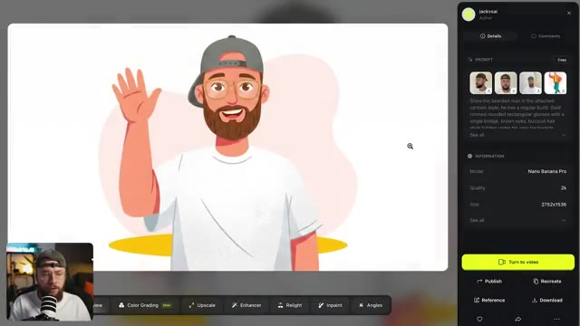
*Interface d'une application de génération d'image montrant le design d'un personnage de dessin animé avec un panneau latéral de configuration et un aperçu vidéo en bas à gauche.*

---

### ⏱️ `[00:05:27 - 00:05:46]` | Segment #11

**🔊 Audio (Transcription Intégrale Mot pour Mot en Français) :**
> Maintenant, une fois que vous avez choisi votre style spécifique, vous voulez continuer, survoler l'image, puis cliquer sur cette icône ici pour l'utiliser comme référence. Et la prochaine étape, incroyablement importante, est de construire une feuille de personnage. Ainsi, vous pouvez voir que j'ai inséré ce cadre de prompt ici.

**👁️ Analyse Visuelle d'Écran (gemini-3.5-flash-lite) :**
**Interface & Outils** : Interface de génération d'images par IA avec affichage en grille et boîte de dialogue de prompt textuel.

**Contenu textuel & Code** : Texte du prompt visible : « Show the same bearded man, in the same art style, with a neutral expression, change to a healthy caucasian skin-tone, arms relaxed by his side. He wears; gold rimmed rounded rectangular glasses..., white oversized t-shirt... [VIEW 1 - FULL BODY, FRONT]... [VIEW 2 - FULL BODY, REAR]... [VIEW 3 - FRONT CLOSE-UP]... [VIEW 4 - PROFILE CLOSE-UP]... ». Paramètres visibles : High, 2K, 16:9, GPT Image 2.

**Action / Démonstration** : Survol d'une image générée dans la grille pour cliquer sur l'icône de référence, puis affichage du cadre contenant le prompt textuel pour construire la feuille de personnage.

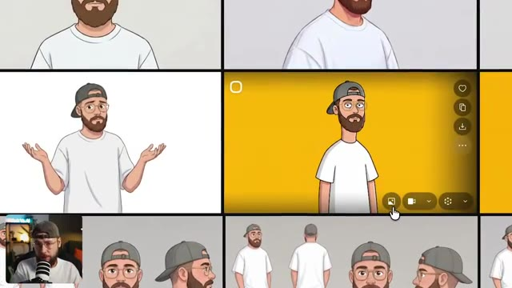
*Grille d'images générées montrant des illustrations du personnage, avec le curseur de la souris survolant une icône de référence sur l'une des images, et la caméra PiP de Jack en bas à gauche.*

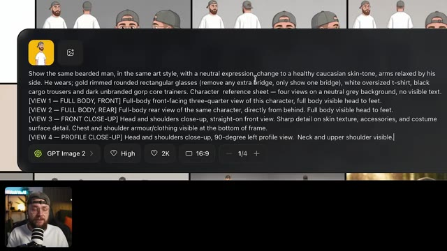
*Fenêtre de prompt détaillée affichant le texte descriptif pour la création d'une feuille de personnage (character sheet) avec des vues multiples, avec la caméra PiP de Jack en bas à gauche.*

---

### ⏱️ `[00:05:46 - 00:06:06]` | Segment #12

**🔊 Audio (Transcription Intégrale Mot pour Mot en Français) :**
> Maintenant, la seule partie de ceci que vous devez modifier est cette section d'introduction ici. Je veux quand même que vous laissiez, montriez le même homme barbu, la même femme, le même garçon, la même fille, peu importe, dans le même style artistique avec une expression neutre. Il est également utile de demander que les bras soient détendus et le long du corps du personnage.

**👁️ Analyse Visuelle d'Écran (gemini-3.5-flash-lite) :**
**Interface & Outils** : Interface de génération d'images par IA (type ChatGPT / DALL-E) avec incrustation vidéo du créateur en bas à gauche.

**Contenu textuel & Code** : Le prompt visible à l'écran indique : "Show the same bearded man, in the same art style, with a neutral expression, change to a healthy caucasian skin-tone, arms relaxed by his side. He wears; gold rimmed rounded rectangular glasses... Character reference sheet — four views on a neutral grey background, no visible text."

**Action / Démonstration** : Le curseur de la souris sélectionne une partie du texte du prompt pour montrer les modifications à apporter à la section d'introduction.

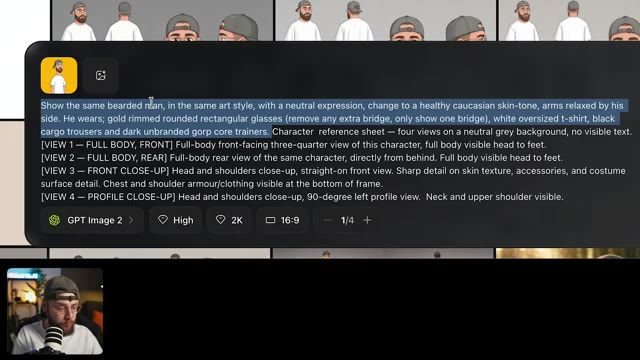
*Interface de génération affichant un prompt textuel détaillé pour la création de feuilles de personnages de référence.*

---

### ⏱️ `[00:06:06 - 00:06:27]` | Segment #13

**🔊 Audio (Transcription Intégrale Mot pour Mot en Français) :**
> Nous voulons simplement que cela soit très neutre en termes d'expression et de pose également. Vous pouvez aussi utiliser cette étape de création d'une feuille de personnage pour apporter de légères modifications à votre image initiale. Vous pouvez voir ici, par exemple, que j'ai dit de changer pour un ton de peau caucasien sain. C'est parce que certaines des générations initiales que j'obtenais, j'avais l'air vraiment très bronzé.

**👁️ Analyse Visuelle d'Écran (gemini-3.5-flash-lite) :**
**Interface & Outils** : Interface de génération d'image par IA (style ChatGPT / interface de prompt) avec incrustation vidéo du créateur (PiP) en bas à gauche.

**Contenu textuel & Code** : Texte du prompt visible : "Show the same bearded man, in the same art style, with a neutral expression, change to a healthy caucasian skin-tone, arms relaxed by his side. He wears; gold rimmed rounded rectangular glasses... Character reference sheet — four views on a neutral grey background..." Le segment "change to a healthy caucasian skin-tone" est surligné en bleu. Paramètres visibles : "GPT Image 2", "High", "2K", "16:9".

**Action / Démonstration** : Le créateur montre à l'écran un exemple de modification de prompt textuel (le changement de ton de peau) au sein d'une interface de génération pour ajuster la feuille de personnage (character sheet).

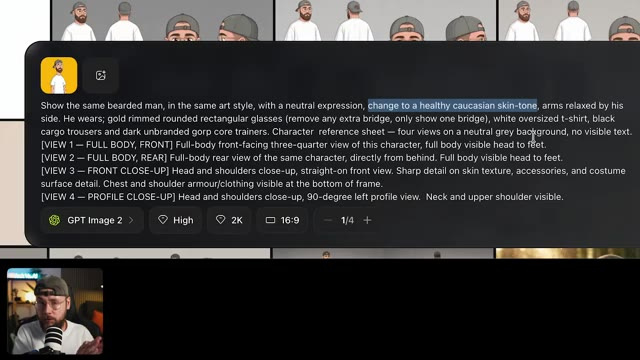
*Interface de génération affichant un prompt textuel détaillé avec du texte en surbrillance modifiant le ton de la peau du personnage, avec la vidéo du créateur incrustée en bas à gauche.*

---

### ⏱️ `[00:06:28 - 00:06:47]` | Segment #14

**🔊 Audio (Transcription Intégrale Mot pour Mot en Français) :**
> Et croyez-moi, nous n'avons pas tant de soleil que ça ici au Royaume-Uni. Je voulais donc que ce soit plus réaliste quant à l'apparence que j'aurais réellement en tant que personnage de dessin animé. Et vous pouvez voir ici que j'ai ensuite renforcé un peu plus la description de mon personnage. Donc encore une fois, les accessoires, la couleur et le style des cheveux, les vêtements et des choses comme ça.

**👁️ Analyse Visuelle d'Écran (gemini-3.5-flash-lite) :**
**Interface & Outils** : Interface de génération d'images par IA avec affichage d'un prompt textuel et options de configuration, accompagnée d'un incrustation vidéo (PiP) du créateur.

**Contenu textuel & Code** : Texte du prompt visible : "Show the same bearded man, in the same art style, with a neutral expression, change to a healthy caucasian skin-tone, arms relaxed by his side. He wears; gold rimmed rounded rectangular glasses... Character reference sheet — four views on a neutral grey background, no visible text." Paramètres visibles : "GPT Image 2", "High", "2K", "16:9".

**Action / Démonstration** : Le créateur montre à l'écran le prompt textuel détaillé utilisé pour affiner la description de son personnage de dessin animé.

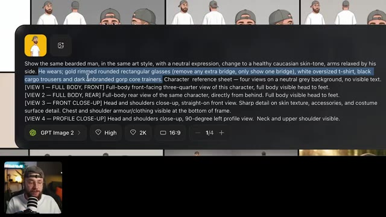
*Interface montrant un prompt textuel détaillé pour la génération d'une feuille de référence de personnage avec un encadré PiP de Jack en bas à gauche.*

---

### ⏱️ `[00:06:47 - 00:07:07]` | Segment #15

**🔊 Audio (Transcription Intégrale Mot pour Mot en Français) :**
> Particulièrement important pour cet exemple ici car dans la référence que nous utilisons, vous ne pouvez pas voir quel pantalon ou quelles baskets je porte. Donc si nous ne donnons pas cette information à Nano Banana, ça va juste en quelque sorte deviner et vous pourriez ne pas obtenir le résultat que vous recherchez. Donc une fois que vous avez ajouté ces légères modifications à ce cadre de prompt, vous pouvez y aller et cliquer sur générer.

**👁️ Analyse Visuelle d'Écran (gemini-3.5-flash-lite) :**
**Interface & Outils** : Interface web d'un outil de génération d'images/IA (comprenant des onglets comme Explore, Image, Video, Supercomputer, etc.).

**Contenu textuel & Code** : Texte du prompt visible : « Show the same bearded man, in the same art style, with a neutral expression, change to a healthy caucasian skin-tone... [VIEW 1 - FULL BODY, FRONT]... [VIEW 2 - FULL BODY, REAR]... [VIEW 3 - FRONT CLOSE-UP]... [VIEW 4 - PROFILE CLOSE-UP] » et bouton « Generate ».

**Action / Démonstration** : Le créateur montre l'interface d'un outil de génération par IA et détaille les prompts textuels utilisés pour obtenir des vues multiples d'un personnage.

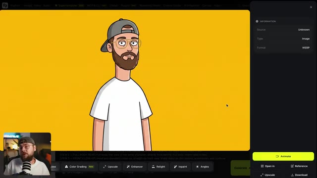
*Interface de génération montrant une illustration de personnage sur fond jaune, avec le panneau latéral d'options et le flux vidéo incrusté en bas à gauche.*

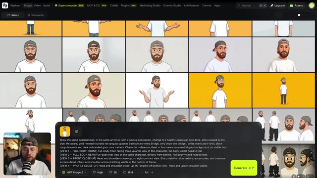
*Grille de résultats de génération avec une fenêtre de prompt textuel détaillée ouverte en surimpression en bas de l'écran.*

---

### ⏱️ `[00:07:07 - 00:07:42]` | Segment #16

**🔊 Audio (Transcription Intégrale Mot pour Mot en Français) :**
> Et vous allez finir par obtenir quelque chose qui ressemble un peu à ça. Maintenant, nous utiliserons cela plus tard lorsque nous générerons nos images et nos vidéos pour donner aux modèles d'IA une compréhension de l'apparence de chaque personnage sous différents angles. Le succès avec l'IA générative consiste à fournir aux modèles autant de contexte que possible et c'est pourquoi les feuilles de personnages sont si puissantes. Tous les détails que nous ne fournissons pas aux modèles d'image ou de vidéo d'IA, ils doivent les inventer et c'est pourquoi beaucoup d'utilisateurs finissent par être frustrés. Ils n'obtiennent pas les résultats qu'ils veulent et ils

**👁️ Analyse Visuelle d'Écran (gemini-3.5-flash-lite) :**
**Interface & Outils** : Interface logicielle de génération d'images/vidéos par IA avec un panneau latéral de prompt textuel, des options de publication, de recréation et de téléchargement, ainsi qu'un encadré PiP (Picture-in-Picture) du présentateur en bas à gauche.

**Contenu textuel & Code** : Le panneau de droite affiche un prompt détaillé en anglais décrivant le personnage : "Show the same bearded man, in the same art style, with a neutral expression, change to a healthy caucasian skin-tone... [VIEW 1 - FULL BODY, FRONT]... [VIEW 2 - FULL BODY, REAR]... [VIEW 3 - FRONT CLOSE-UP]...". Bouton jaune "Turn to video" visible en bas du panneau de droite, et barre d'outils inférieure avec les options "View", "Color Grading", "Upscale", "Enhancer", "Relight", "Inpaint", "Angles".

**Action / Démonstration** : Le créateur montre à l'écran une feuille de référence de personnage (character sheet) générée par IA pour illustrer l'importance de fournir un contexte visuel complet aux modèles d'intelligence artificielle.

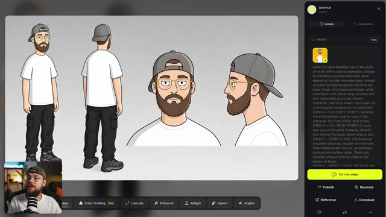
*Interface affichant une feuille de personnages (character sheet) générée par IA montrant plusieurs vues d'un personnage stylisé, avec un panneau de prompt textuel sur la droite et une miniature de Jack dans l'encadré PiP en bas à gauche.*

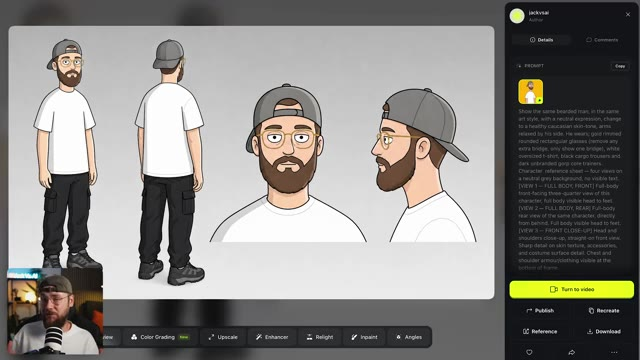
*Même interface affichant la feuille de personnages sous différents angles (vue de face, de dos, gros plan) avec le panneau de prompt détaillé sur le côté droit.*

---

### ⏱️ `[00:07:42 - 00:08:04]` | Segment #17

**🔊 Audio (Transcription Intégrale Mot pour Mot en Français) :**
> ...se plaindre simplement qu'ils gaspillent leurs crédits. C'est une solution pour résoudre ce problème. Maintenant, laissez-moi vous montrer comment vous pouvez réellement créer de nouveaux personnages en utilisant celui-ci comme référence. Je vais donc supprimer l'image de référence actuelle que nous avons ici et je vais plutôt utiliser comme référence cette planche de personnages que nous venons de construire et je vais supprimer le... afficher le même homme barbu.

**👁️ Analyse Visuelle d'Écran (gemini-3.5-flash-lite) :**
**Interface & Outils** : Interface web de génération d'images / IA (style Midjourney ou similaire), avec un panneau de saisie de prompt, des options de format (16:9), des curseurs de résolution et un bouton "Generate".

**Contenu textuel & Code** : Texte du prompt visible : "Show the same bearded man, in the same art style, with a neutral expression, change to a healthy caucasian skin-tone, arms relaxed by his side. He wears; gold rimmed rounded rectangular glasses (remove any extra bridge, only show one bridge), white oversized t-shirt, black cargo trousers and dark unbranded gorp core trainers. Character reference sheet — four views on a neutral grey background, no visible text. [VIEW 1 - FULL BODY, FRONT]..."

**Action / Démonstration** : Le créateur montre une planche de personnages générée par IA et explique comment utiliser cette image comme référence (image-to-image / character reference) pour en créer de nouvelles en modifiant le prompt.

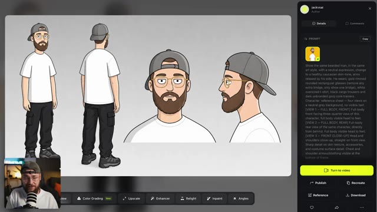
*Interface d'un outil de génération montrant une planche de personnages (character sheet) en style animé d'un homme barbu avec une casquette et des lunettes, accompagnée d'un panneau latéral avec un prompt textuel.*

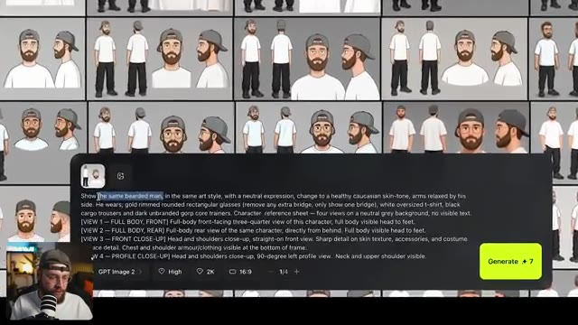
*Interface montrant une grille d'images générées en arrière-plan avec une fenêtre de prompt mise en avant en bas, permettant de configurer les paramètres de génération et de modifier le prompt.*

---

### ⏱️ `[00:08:04 - 00:08:24]` | Segment #18

**🔊 Audio (Transcription Intégrale Mot pour Mot en Français) :**
> Je vais dire un chat grincheux. Je vais aussi me débarrasser de l'expression neutre parce qu'on veut transmettre que le chat n'est pas un personnage heureux. On peut supprimer toute cette description ici et je vais juste dire qu'il a un collier rouge. On va garder ça vraiment très simple.

**👁️ Analyse Visuelle d'Écran (gemini-3.5-flash-lite) :**
**Interface & Outils** : Interface de génération d'images par IA avec panneau de prompt textuel, options de modèle (GPT Image 2), paramètres de qualité (High, 2K, 16:9) et incrustation vidéo du créateur.

**Contenu textuel & Code** : Texte du prompt dans l'image 1 : "Show in the same art style, with a neutral expression, change to a healthy caucasian skin-tone, arms relaxed by his side. He wears; gold rimmed rounded rectangular glasses...". Texte mis à jour dans l'image 3 : "Show a grumpy cat in the same art style, he has a red collar. Character reference sheet — four views on a neutral grey background, no visible text."

**Action / Démonstration** : Le créateur modifie le prompt textuel à l'écran pour remplacer la description du personnage par celle d'un chat grincheux avec un collier rouge.

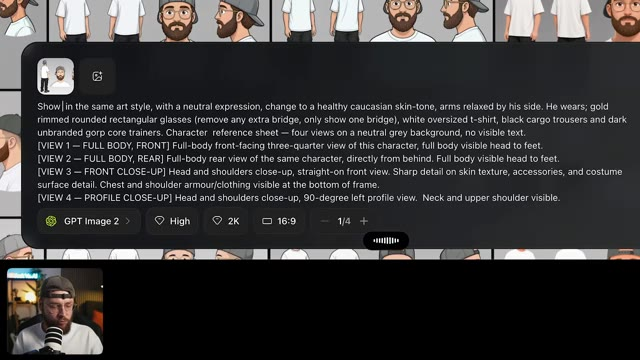
*Interface de génération montrant une boîte de texte avec un prompt détaillé pour un personnage et une vue PiP du créateur en bas à gauche.*

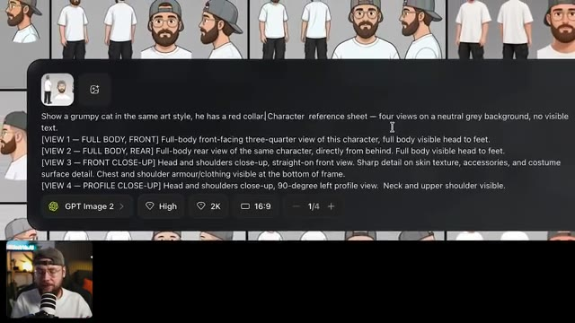
*Interface de génération montrant le prompt mis à jour avec le chat grincheux et le collier rouge, et une vue PiP du créateur en bas à gauche.*

---

### ⏱️ `[00:08:24 - 00:08:42]` | Segment #19

**🔊 Audio (Transcription Intégrale Mot pour Mot en Français) :**
> Nous voulons nous assurer, comme je l'ai dit avant, que nous utilisons Nano Banana Pro pour construire ceci. Résolution 2K. Et allons-y pour construire un lot de quatre ici. Je vais envoyer ceci en cliquant sur générer. Et juste comme ça, nous avons récupéré notre nouveau personnage dans le même style artistique que notre image de référence.

**👁️ Analyse Visuelle d'Écran (gemini-3.5-flash-lite) :**
**Interface & Outils** : Interface de génération d'images par IA avec panneau de configuration des modèles, prompts et options de post-traitement.

**Contenu textuel & Code** : Modèle : Nano Banana Pro, Résolution : 2K, Prompt : "Show a grumpy cat in the same art style, he has a red collar. Character reference sheet — four views on a neutral grey background, no visible text. [VIEW 1 - FULL BODY, FRONT]..."

**Action / Démonstration** : Le créateur configure les paramètres de génération (Nano Banana Pro, 2K, lot de 4), clique sur "Generate" pour lancer le rendu, puis obtient le résultat final du personnage généré.

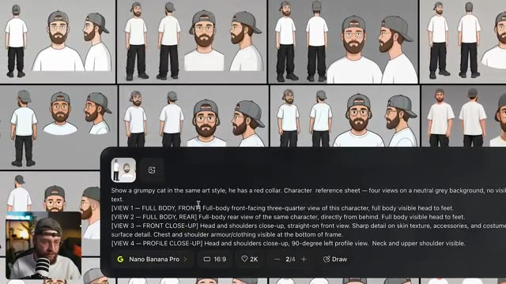
*Interface de génération montrant les paramètres avec le modèle Nano Banana Pro, une résolution 2K et un lot de 4 images.*

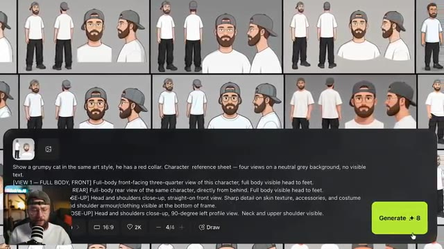
*Le curseur survole et clique sur le bouton vert "Generate" dans l'interface de l'outil de génération.*

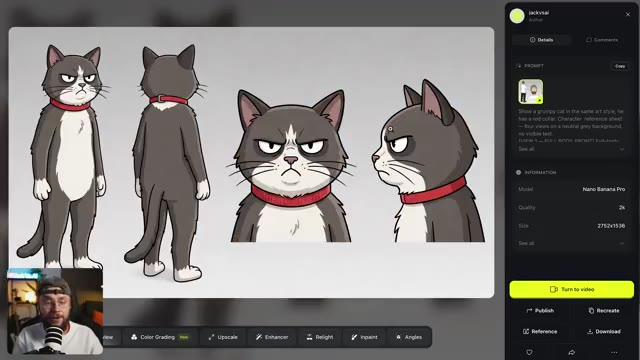
*Résultat de la génération affichant un chat gris et blanc grincheux avec un collier rouge sous quatre angles différents.*

---

### ⏱️ `[00:08:43 - 00:09:19]` | Segment #20

**🔊 Audio (Transcription Intégrale Mot pour Mot en Français) :**
> Et c'est pourquoi il est si important de fixer votre style dès le début, car cela influence tout ce qui vient après. Honnêtement, ils ont tous l'air super, mais je pense que j'aime vraiment celui-ci. Ce qui est vraiment utile sur Higgsfield également, c'est d'aller cliquer sur cette petite icône de cœur, cela va ajouter toutes vos images à une section de favoris, cela permet simplement de garder les choses bien organisées. Pour y accéder, il vous suffit de remonter dans le coin supérieur droit, de cliquer sur "Assets" puis de cliquer sur l'onglet des favoris. Vous pouvez voir un tas d'images que j'ai mises en favoris ici, vous pouvez voir que j'ai aussi construit...

**👁️ Analyse Visuelle d'Écran (gemini-3.5-flash-lite) :**
**Interface & Outils** : Higgsfield (plateforme de génération d'images et vidéos par IA).

**Contenu textuel & Code** : Panneaux de l'interface de Higgsfield : affichage des images générées avec le modèle "Nano Banana Pro" (résolution 2k, format 2752x1536), panneau de détails avec les prompts de génération textuels ("Show a grumpy cat in the same art style..."), onglet "Assets" et onglet "Favorites" / "Liked" contenant des images organisées en grille.

**Action / Démonstration** : Le créateur montre comment sélectionner un style artistique cohérent, puis démontre la fonctionnalité de mise en favoris d'une image en cliquant sur l'icône en forme de cœur sur Higgsfield, avant d'aller dans l'onglet "Assets" pour retrouver les images enregistrées.

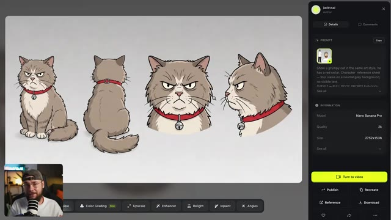
*Interface de Higgsfield montrant une planche de modèles de personnages (chat gris grognon sous différents angles) avec le panneau de détails à droite et les outils de retouche en bas.*

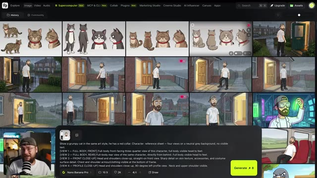
*Historique des générations de l'interface Higgsfield affichant une grille d'images de style cartoon et le panneau de prompt textuel en bas.*

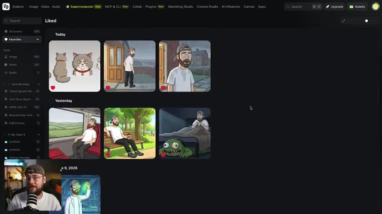
*Section "Liked" (Favoris) de l'interface Higgsfield affichant les images enregistrées avec un cœur, classées par date ("Today" et "Yesterday").*

---

### ⏱️ `[00:09:19 - 00:09:54]` | Segment #21

**🔊 Audio (Transcription Intégrale Mot pour Mot en Français) :**
> quelques personnages différents. Nous avons ce pigeon au regard énervé ici et puis nous avons ce monstre féminin rose également. Tous ont ce style artistique cohérent, ce qui est incroyablement important si nous ne voulons pas en quelque sorte briser l'illusion. Donc cette première section ici consiste à verrouiller votre style et ensuite à construire une sélection de feuilles de référence de personnages. Tout ce travail préparatoire est ce qui va vous donner plus de contrôle sur votre résultat final. Et quelque chose d'autre qui est vraiment important pour les dessins animés, c'est la cohérence des lieux et c'est parce que beaucoup de ces types d'émissions vont

**👁️ Analyse Visuelle d'Écran (gemini-3.5-flash-lite) :**
**Interface & Outils** : Interface de génération d'images par IA montrant un panneau latéral avec des détails sur le modèle (GPT Image 2), la résolution (2688x1520), un prompt textuel ("Show the same character in the same art style..."), et des boutons d'action (Turn to video, Publish, Recreate, Reference, Download).

**Contenu textuel & Code** : Texte du prompt visible dans le panneau latéral : "Show the same character in the same art style. Character reference sheet — four views on a neutral grey background...". Informations techniques : Modèle "GPT Image 2", Qualité "High", Taille "2688x1520".

**Action / Démonstration** : Le créateur présente une feuille de référence de personnage générée par IA représentant un pigeon sous quatre angles différents avec un style artistique cohérent.

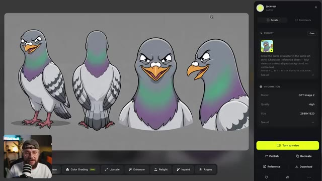
*Interface affichant une feuille de référence de personnage pour un pigeon au style cartoon avec plusieurs vues, et le présentateur visible dans un encadré en bas à gauche.*

---

### ⏱️ `[00:09:54 - 00:10:30]` | Segment #22

**🔊 Audio (Transcription Intégrale Mot pour Mot en Français) :**
> utiliser des décors récurrents et c'est donc vraiment important que la logique tienne la route et qu'ils semblent cohérents, sinon vous finissez par perdre votre public. Nous pouvons donc en fait nous y prendre pour développer nos décors d'une manière très similaire à la façon dont nous avons construit nos personnages alternatifs. Nous voulons donc d'abord aller consulter notre feuille de référence de personnage. Et je vais simplement insérer un prompt super simple ici. Nous allons dire dans le même style artistique sans montrer aucun personnage, montrer un salon confortable, un canapé confortable et une grande télé. Et nous obtenons un résultat ressemblant à ceci.

**👁️ Analyse Visuelle d'Écran (gemini-3.5-flash-lite) :**
**Interface & Outils** : Interface web d'un outil de génération d'images/vidéos par IA avec panneau latéral d'options et vue en incrustation (PiP) du créateur.

**Contenu textuel & Code** : Texte du prompt visible sur l'image 4 : "In the same art style, without showing any characters... show a cosy living room, comfy couch, big TV". Modèle affiché : "Nano Banana Pro", Qualité : "2k", Taille : "2752x1536". Boutons : "Turn to video", "Publish", "Recreate", "Reference", "Download".

**Action / Démonstration** : Le créateur montre l'interface de génération d'images avec les feuilles de référence des personnages, puis présente le résultat généré pour un salon confortable basé sur le prompt textuel.

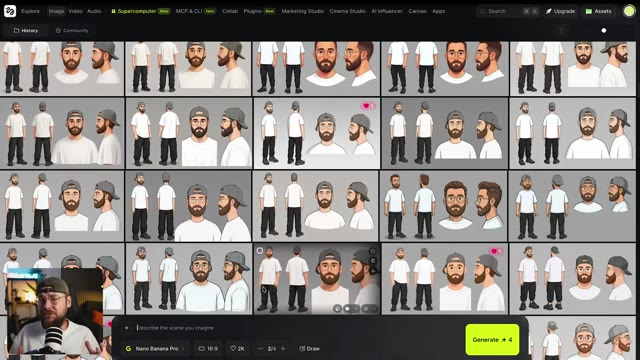
*Interface d'un générateur d'IA affichant une grille de feuilles de référence de personnages avec Jack en incrustation PiP.*

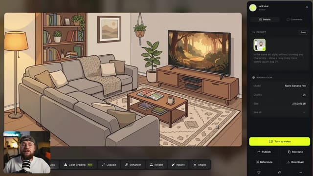
*Interface montrant l'image générée d'un salon confortable avec un canapé et une grande télévision, avec le panneau latéral du prompt et le modèle Nano Banana Pro.*

---

### ⏱️ `[00:10:30 - 00:11:04]` | Segment #23

**🔊 Audio (Transcription Intégrale Mot pour Mot en Français) :**
> Et ceci devient notre visuel clé pour cet emplacement spécifique. Et maintenant, ce que nous voulons faire, c'est générer de multiples vues du même emplacement. Donc nous allons cliquer sur l'icône de référence ici. Et maintenant, nous allons utiliser ce cadre de prompt. La seule partie dont vous devez vous soucier, c'est cette zone ici, les différentes vues. Et essentiellement, ce que je veux que vous fassiez, c'est de réfléchir à l'endroit où vous pourriez potentiellement montrer vos personnages assis ou debout dans cet emplacement. Par exemple,

**👁️ Analyse Visuelle d'Écran (gemini-3.5-flash-lite) :**
**Interface & Outils** : Interface web de génération d'images et de vidéos par IA (type plateforme créative avec onglets Supercomputer, Marketing Studio, etc., et vue PiP du créateur).

**Contenu textuel & Code** : Modèle Nano Banana Pro, résolution 2752x1536, prompt visible « In the same art style, without showing any characters... show a cosy living room, comfy couch, big TV ».

**Action / Démonstration** : Le créateur montre le visuel clé d'un salon, explique comment générer plusieurs vues à partir de celui-ci et introduit l'utilisation des prompts pour positionner les personnages.

*Affichage du visuel clé d'un salon confortable dans l'interface avec le panneau latéral de détails et de prompt.*

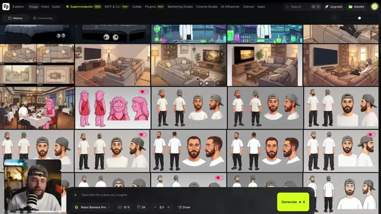
*Vue de la galerie de l'application affichant de multiples créations et grilles de personnages.*

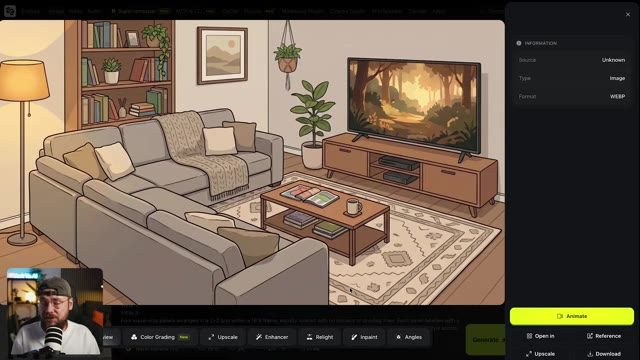
*Visualisation du visuel clé avec le panneau d'information latéral et les options d'animation.*

---

### ⏱️ `[00:11:04 - 00:11:36]` | Segment #24

**🔊 Audio (Transcription Intégrale Mot pour Mot en Français) :**
> pour la vue un je vais dire le siège du canapé pour la vue deux je vais dire vue aérienne du canapé où le personnage pourrait être allongé donc c'est filmé d'en haut vue trois nous allons faire la fenêtre donnant sur de calmes banlieues et vue quatre vue aérienne du tapis où le personnage pourrait à nouveau être allongé disons s'il passe une journée difficile et qu'il a décidé de s'allonger sur le sol sur le tapis et vous finirez par obtenir un résultat comme celui-ci où nous avons ces quatre vues différentes qui sont complètement vides que nous pouvons ensuite placer nos

**👁️ Analyse Visuelle d'Écran (gemini-3.5-flash-lite) :**
**Interface & Outils** : Interface de génération d'images par IA avec panneau de paramètres (Nano Banana Pro, résolution 2752x1536).

**Contenu textuel & Code** : Texte du prompt décrivant la feuille de référence de localisation avec quatre vues (View 1: Sofa seat, View 2: Aerial view of sofa, View 3: Window looking out to quiet suburbs, View 4: Aerial view of rug) et grille 2x2.

**Action / Démonstration** : Le créateur montre le prompt textuel utilisé puis affiche le résultat final généré avec les quatre plans vides distincts.

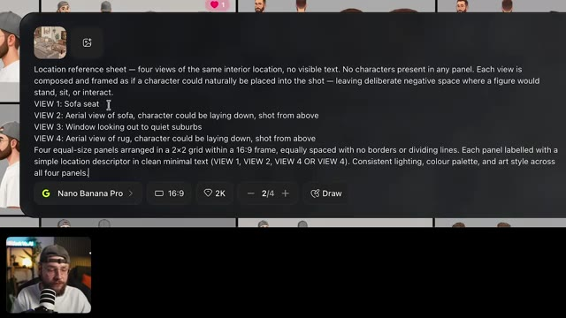
*Interface affichant le prompt textuel détaillé pour la génération des quatre vues de la scène intérieure.*

*Résultat de la génération d'images montrant une grille 2x2 avec les quatre vues vides de l'intérieur (canapé, vue du dessus, fenêtre, tapis).*

---

### ⏱️ `[00:11:36 - 00:12:10]` | Segment #25

**🔊 Audio (Transcription Intégrale Mot pour Mot en Français) :**
> des personnages dans et nous pouvons utiliser cela plusieurs fois. Cela va nous permettre de verrouiller ce sentiment de cohérence. Je pense que le genre de salon familial et en particulier le canapé est un excellent exemple de cela. Si nous pensons à des séries comme Family Guy ou Les Simpson, beaucoup d'action se déroule autour de ce genre de zone centrée sur la famille. Mais encore une fois, en suivant toutes ces étapes, cela vous donne, en tant que créateur, beaucoup plus de contrôle sur votre résultat final. Vous allez maintenant pouvoir bloquer

**👁️ Analyse Visuelle d'Écran (gemini-3.5-flash-lite) :**
**Interface & Outils** : Interface logicielle de génération d'images/vidéos par IA avec un panneau de contrôle latéral (Model: Nano Banana Pro, Quality: 2k, Size: 2752x1536) et une barre d'outils inférieure (Color Grading, Upscale, Enhancer, Relight, Inpaint, Angles).

**Contenu textuel & Code** : Prompt visible dans le panneau latéral : "Location reference sheet — four views of the same interior location, no visible text. No characters present in any panel. Each view is composed and framed as if a character could naturally be placed into the..." Informations techniques : Modèle "Nano Banana Pro", Qualité "2k", Taille "2752x1536". Boutons d'action : "Turn to video", "Publish", "Recreate", "Reference", "Download".

**Action / Démonstration** : Le créateur montre l'interface présentant une feuille de référence de localisation découpée en quatre plans de salon différents pour illustrer la cohérence visuelle d'un décor.

*Interface montrant une grille de quatre vues différentes d'un salon animé avec un canapé, accompagnée des panneaux de configuration du modèle d'IA et de la vue PiP du créateur.*

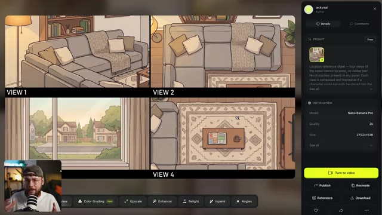
*Interface similaire à l'image 1 affichant la feuille de référence de localisation avec quatre angles de vue d'un salon et les métadonnées du modèle sur le panneau latéral.*

---

### ⏱️ `[00:12:10 - 00:12:42]` | Segment #26

**🔊 Audio (Transcription Intégrale Mot pour Mot en Français) :**
> vos scènes comme vous l'entendez plutôt que de simplement les générer à partir de rien tout le temps. Nous faisons toujours référence à ces assets réutilisables. Laissez-moi donc vous donner un bon exemple de cela. Tout d'abord, nous allons à nouveau faire référence à la feuille de personnage pour notre personnage principal. Ensuite, je vais également faire référence à la feuille de lieu que nous venons de générer. Donc ce que nous pouvons faire, c'est taper "show" (montrer) et si nous appuyons sur "@" sur notre clavier, cela va nous permettre d'étiqueter des références d'images. Donc nous voulons sélectionner l'image 1.

**👁️ Analyse Visuelle d'Écran (gemini-3.5-flash-lite) :**
**Interface & Outils** : Interface de génération d'images/vidéos par IA (type plateforme créative avec options de prompt, modèle "Nano Banana Pro", et menu contextuel de sélection de tags par "@").

**Contenu textuel & Code** : Texte du prompt visible : "Location reference sheet — four views of the same interior location, no visible text. No characters present in any panel...". Paramètres : Modèle "Nano Banana Pro", Qualité "2k", Taille "2752x1536". Dans l'image 4, menu déroulant affichant "Image 1", "Image 2", "Sofia", "Living_Quarters", "Jack_SCAV", "JackNoHat", "KlingREF", et champ de texte "Show @".

**Action / Démonstration** : Le créateur montre l'utilisation de feuilles de référence d'actifs réutilisables (personnages et décors) dans l'interface et démontre la saisie d'un prompt avec un tag "@" pour sélectionner une référence d'image.

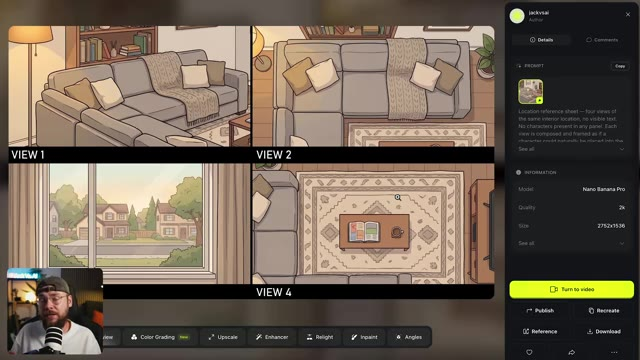
*Interface affichant une feuille de référence de lieu composée de quatre vues intérieures d'un salon avec le créateur en incrustation.*

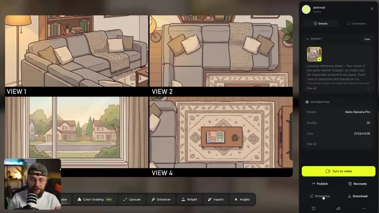
*Vue similaire de l'interface montrant la feuille de référence de lieu du salon avec le panneau d'information à droite.*

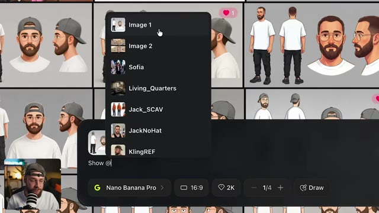
*Interface de génération montrant une fenêtre contextuelle de sélection de tags avec "Image 1", "Image 2", "Sofia", etc., après avoir tapé "Show @".*

---

### ⏱️ `[00:12:42 - 00:13:02]` | Segment #27

**🔊 Audio (Transcription Intégrale Mot pour Mot en Français) :**
> qui est notre fiche de référence de personnage et ensuite nous pouvons dire assis sur le canapé depuis la vue un montrée dans et ensuite nous irons de l'avant et nous marquerons notre fiche de référence de lieu. Et c'est pourquoi il est important que vous utilisiez le cadre de prompt que je vais vous fournir parce qu'il vous permet de référencer des vues spécifiques.

**👁️ Analyse Visuelle d'Écran (gemini-3.5-flash-lite) :**
**Interface & Outils** : Interface de génération vidéo/image par IA avec panneau contextuel flottant (options Nano Banana Pro, ratio 16:9, sélection d'images référencées @Image 1).

**Contenu textuel & Code** : Texte visible sur l'interface : 'Show 👁️ @Image 1', 'Nano Banana Pro', format '16:9', résolution '2K', bouton 'Draw'.

**Action / Démonstration** : Le créateur montre son écran de travail avec des fiches de référence de personnages générées et manipule les options de promptage et de référencement d'images.

*Interface logicielle affichant une galerie de feuilles de référence de personnages et une barre de menu contextuelle avec des options de sélection d'images (Image 1, Image 2), un rapport de format 16:9, et le modèle 'Nano Banana Pro', avec un encadré incrusté (PiP) de Jack dans le coin inférieur gauche.*

---

### ⏱️ `[00:13:02 - 00:13:25]` | Segment #28

**🔊 Audio (Transcription Intégrale Mot pour Mot en Français) :**
> Nous disons que nous voulons montrer notre personnage principal assis sur le canapé dans la vue numéro un. Et en utilisant cette méthode, nous obtenons un résultat exactement comme celui-ci. Et ce qui est génial, c'est que nous aurions pu placer n'importe lequel de nos personnages dans n'importe laquelle de nos vues. Maintenant, disons que vous n'avez pas besoin d'un niveau de contrôle aussi extrême sur votre plan.

**👁️ Analyse Visuelle d'Écran (gemini-3.5-flash-lite) :**
**Interface & Outils** : Interface logicielle de génération d'images/vidéos par IA (avec panneau latéral de prompt, informations sur le modèle "Nano Banana Pro", options de qualité 2k, résolution 2752x1536, et boutons de publication, de recréation et de passage à la vidéo "Turn to video"). Un petit encadré PiP en bas à gauche montre le créateur.

**Contenu textuel & Code** : Texte de prompt visible dans le panneau latéral : "Location reference sheet — four views of the same interior location, no visible text, No characters present in any panel...". Sur l'image #2 : "Show @image 2 sat on the sofa from view 3 shown in @image 1". Paramètres : Modèle Nano Banana Pro, Qualité 2k, Taille 2752x1536.

**Action / Démonstration** : Le créateur démontre la génération d'une planche de référence multi-vues d'un décor, puis l'intégration d'un personnage spécifique assis sur le canapé dans une vue donnée.

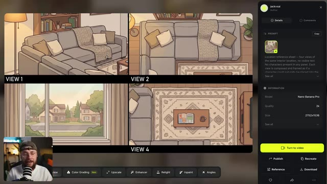
*Interface d'un générateur d'images IA affichant une planche de référence de décors avec quatre vues différentes d'un salon.*

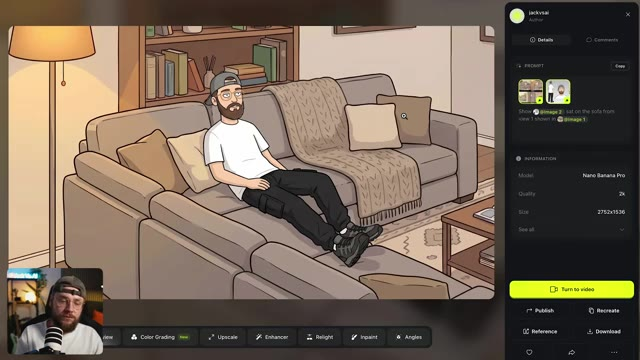
*Interface d'un générateur d'images IA montrant le personnage principal assis sur le canapé, correspondant à la première vue.*

---

### ⏱️ `[00:13:25 - 00:13:45]` | Segment #29

**🔊 Audio (Transcription Intégrale Mot pour Mot en Français) :**
> Vous pouvez simplement faire référence à votre feuille de personnage, puis décrire le type de scène que vous cherchez à construire. Donc vous pouvez voir dans cet exemple ici, nous avons notre personnage principal dans ce laboratoire. Nous avons aussi une photo de lui ici assis sur un banc de parc. Et une image ici de moi quittant la maison et devenant instantanément complètement trempé par la pluie.

**👁️ Analyse Visuelle d'Écran (gemini-3.5-flash-lite) :**
**Interface & Outils** : Interface logicielle de génération d'images/vidéos par IA avec un panneau latéral de contrôle, un affichage du prompt textuel, des informations sur le modèle (Nano Banana Pro, résolution 2752x1536, qualité 2k) et un encadré PiP (Picture-in-Picture) du créateur en bas à gauche.

**Contenu textuel & Code** : Texte du prompt visible dans le panneau latéral : "Show the same character, wearing the same clothes, in the same art style...". Modèle utilisé : Nano Banana Pro. Options affichées : "Turn to video", "Publish", "Recreate", "Reference", "Download", ainsi que des outils de retouche (Color Grading, Upscale, Enhancer, Relight, Inpaint, Angles).

**Action / Démonstration** : Le créateur présente des exemples d'illustrations générées par IA basées sur une feuille de personnage, en affichant l'interface logicielle et les prompts textuels correspondants sur son écran.

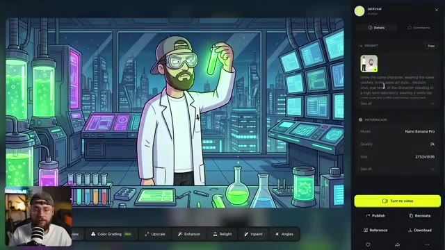
*Interface d'une application de génération d'image montrant le personnage principal dans un laboratoire scientifique high-tech, avec un panneau latéral affichant les détails du prompt et les paramètres du modèle Nano Banana Pro.*

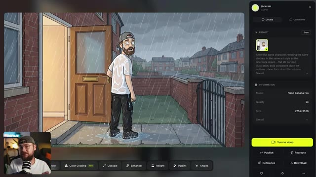
*Interface de l'application montrant le personnage principal sortant de la maison sous une forte pluie, avec le panneau de configuration et les options de conversion vidéo visibles à l'écran.*

---

### ⏱️ `[00:13:45 - 00:14:05]` | Segment #30

**🔊 Audio (Transcription Intégrale Mot pour Mot en Français) :**
> Problèmes très britanniques. Donc cette approche ici, quand vous référenciez simplement votre fiche de personnage et ajoutez un prompt pour décrire la scène, est idéale pour les plans de coupe en quelque sorte. Mais si vous voulez un contrôle absolu, je vous suggère de créer une sélection de différentes fiches de décors que vous pourrez utiliser par la suite.

**👁️ Analyse Visuelle d'Écran (gemini-3.5-flash-lite) :**
**Interface & Outils** : Interface web de génération d'images/vidéos par IA (style Midjourney/plateforme similaire) avec panneau latéral de prompts, boutons Turn to video, Publish, Recreate, Reference, Download, et barre d'outils inférieure (Color Grading, Upscale, Enhancer, Relight, Inpaint, Angles).

**Contenu textuel & Code** : Image #2 : Panneau "PROMPT" affichant un texte descriptif détaillé en anglais ("Show the same character, wearing the same clothes..."). Image #3 : Panneau "PROMPT" affichant "Location reference sheet — four views of the same interior location..." et panneau "INFORMATION" indiquant Modèle: Nano Banana Pro, Quality: 2k, Size: 2752x1536.

**Action / Démonstration** : Le créateur montre des exemples d'utilisation de fiches de personnages et de décors (location sheets) sur son écran tout en parlant, avec sa webcam en médaillon (PiP) dans le coin inférieur gauche.

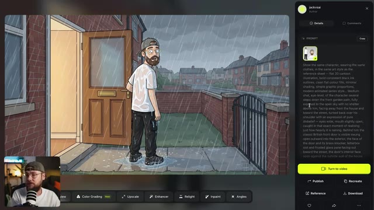
*Interface montrant l'illustration d'un personnage sous la pluie devant une maison avec le panneau de prompt à droite*

*Interface montrant une fiche de référence de décor divisée en quatre vues intérieures avec les informations du modèle à droite*

---

### ⏱️ `[00:14:05 - 00:14:40]` | Segment #31

**🔊 Audio (Transcription Intégrale Mot pour Mot en Français) :**
> Maintenant, je suis sûr que vous conviendrez que les voix que vous entendez dans les dessins animés sont tout aussi importantes que tout ce que nous avons déjà abordé. Il est crucial que les voix aient beaucoup de caractère, mais aussi qu'elles restent cohérentes. Nous voulons également être capables d'assigner des voix à des personnages afin de pouvoir avoir plusieurs personnages qui se parlent dans la même scène tout en gardant leurs voix attribuées. La première étape pour y parvenir est donc de trouver un enregistrement ou de générer la voix que vous

**👁️ Analyse Visuelle d'Écran (gemini-3.5-flash-lite) :**
**Interface & Outils** : Écran de transition graphique avec du texte explicatif, suivi d'une vue du créateur face caméra.

**Contenu textuel & Code** : Texte affiché à l'écran : "step three" en blanc et "voice design" en jaune sur fond flou dégradé bleu et marron.

**Action / Démonstration** : Transition graphique affichant l'étape numéro trois consacrée au design de voix, puis intervention face caméra du présentateur.

*Écran graphique montrant le titre de la section : "step three voice design"*

---

### ⏱️ `[00:14:40 - 00:15:13]` | Segment #32

**🔊 Audio (Transcription Intégrale Mot pour Mot en Français) :**
> comme. Vous pouvez faire ce que j'ai fait et m'enregistrer. Vous pouvez aller de l'avant et utiliser un outil audio IA pour générer une voix pour vous, ou vous pouvez même auditionner des voix en utilisant C-Dance 2. En passant donc à l'onglet vidéo et en sélectionnant C-Dance 2, nous sommes maintenant capables de télécharger des références d'images, de vidéos et d'audio, et vous pouvez voir que nous avons un onglet pour les images aimées. C'est pourquoi il est utile de cocher cette icône lorsque vous trouvez quelque chose que vous savez que vous allez utiliser. Sélectionnons donc le monstre rose ici. Et

**👁️ Analyse Visuelle d'Écran (gemini-3.5-flash-lite) :**
**Interface & Outils** : Interface de Seedance 2.0 avec un panneau latéral d'importation de médias, de prompts et de paramètres (modèle Seedance 2.0, durée 10s, format 16:9, résolution 1080p, bouton Generate à 90 crédits) et une fenêtre superposée affichant les onglets Uploads, Elements, Image Generations, Video Generations et Liked.

**Contenu textuel & Code** : Texte visible : GENERAL, Seedance 2.0, Upload media Image, Video or Audio, Prompt (Describe your scene in detail. Use @ to reference assets), Model Seedance 2.0, 10s, 16:9, 1080p, Generate - 90, et divers boutons "Check eligibility" sous les vignettes d'images.

**Action / Démonstration** : Le créateur montre la sélection d'une image de monstre rose dans l'onglet des images aimées de Seedance 2.0.

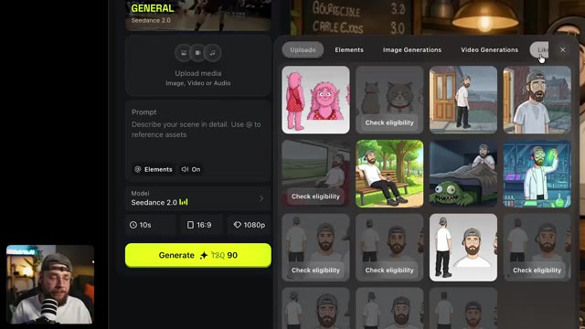
*Interface de Seedance 2.0 montrant la fenêtre contextuelle de sélection des images aimées avec plusieurs vignettes de personnages animés.*

---

### ⏱️ `[00:15:13 - 00:15:36]` | Segment #33

**🔊 Audio (Transcription Intégrale Mot pour Mot en Français) :**
> ensuite, je saisis ce prompt dans lequel je demande essentiellement à Seedance 2 de prononcer la même réplique, à savoir "comment allez-vous aujourd'hui" avec différentes voix de personnages. Et vous pouvez tout à fait baisser votre résolution jusqu'à 480p pour cela, car nous ne récupérons vraiment que l'audio ici. Et vous finissez par obtenir un résultat comme celui-ci. Comment allez-vous aujourd'hui ?

**👁️ Analyse Visuelle d'Écran (gemini-3.5-flash-lite) :**
**Interface & Outils** : Seedance 2.0 (outil de génération de vidéo par IA)

**Contenu textuel & Code** : Texte du prompt : '"How are you today?" Four times in succession, as if auditioning the role — each delivery a unique voice option for the same character...'. Paramètres visibles : Modèle Seedance 2.0, durée 10s (puis 5s), format 16:9, résolution 1080p (puis 480p).

**Action / Démonstration** : Le créateur montre l'interface de Seedance 2.0 et ajuste la résolution de la vidéo de 1080p à 480p dans les paramètres de génération.

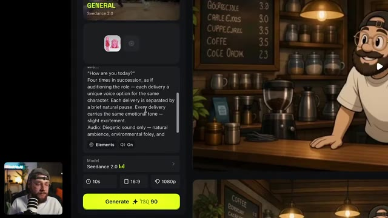
*Interface de Seedance 2.0 montrant le prompt textuel et le paramètre de résolution réglé sur 1080p, avec le créateur en incrustation PiP.*

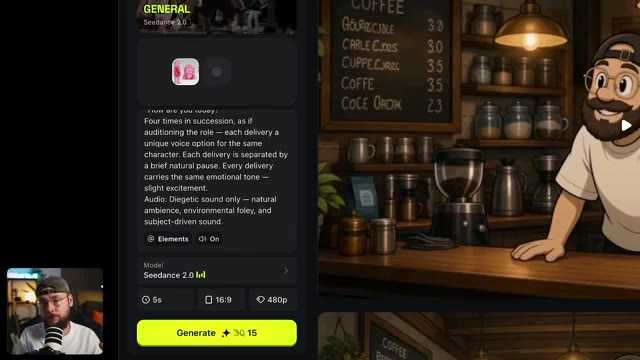
*Interface de Seedance 2.0 avec le même prompt et le paramètre de résolution modifié à 480p, avec le créateur en incrustation PiP.*

---

### ⏱️ `[00:15:36 - 00:16:10]` | Segment #34

**🔊 Audio (Transcription Intégrale Mot pour Mot en Français) :**
> comment allez-vous aujourd'hui donc une fois que vous obtenez une génération dont vous aimez le son vous voulez aller de l'avant survoler celle-ci et cliquer sur cette icône ici pour la télécharger maintenant comme je le dis vous n'avez pas besoin de dépenser les crédits pour emprunter cette voie et générer réellement vos voix via c dance 2 j'ai juste pensé que c'était une technique vraiment intéressante que j'ai trouvée et que je voulais vous transmettre les gars si vous vouliez l'essayer alors dans votre logiciel de montage de prédilection vous voulez aller de l'avant et importer cette génération ou cet enregistrement de la voix que vous aimez et vous voulez

**👁️ Analyse Visuelle d'Écran (gemini-3.5-flash-lite) :**
**Interface & Outils** : Logiciel de montage vidéo Adobe Premiere Pro.

**Contenu textuel & Code** : Panneaux de Premiere Pro comprenant le moniteur de prévisualisation avec le personnage cartoon rose, les panneaux de contrôle d'effets à droite, le panneau de projet avec des dossiers (CARTOONS, Video Gen, Repeat Assets) incluant une incrustation vidéo (PiP) du créateur en bas à gauche, et la timeline en bas au centre avec les pistes vidéo (V1) et audio (A1) actives.

**Action / Démonstration** : Le créateur montre son écran de montage dans Adobe Premiere Pro pour illustrer comment importer la génération ou l'enregistrement vocal sélectionné.

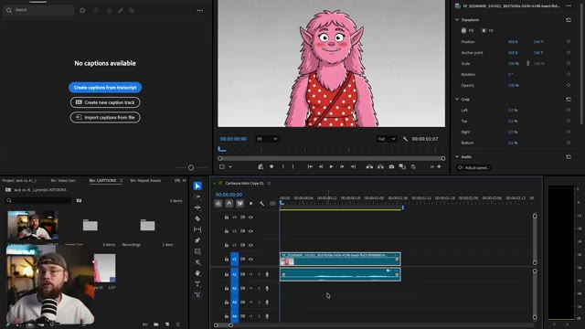
*Interface du logiciel Adobe Premiere Pro montrant la timeline de montage avec un fichier vidéo et audio importé, ainsi qu'une incrustation vidéo (PiP) du créateur en bas à gauche.*

---

### ⏱️ `[00:16:10 - 00:16:43]` | Segment #35

**🔊 Audio (Transcription Intégrale Mot pour Mot en Français) :**
> pour tout couper pour que la seule chose qui reste soit le style de voix que vous aimiez. Nous réduisons toute cette séquence ou cet enregistrement uniquement à la voix que vous préférez et que vous voulez utiliser par la suite pour ce personnage et c'est là que ça devient vraiment bizarre et spécifique mais suivez le mouvement les gars c'est la façon de faire fonctionner cette méthode vous voulez aller de l'avant et masquer simplement la piste vidéo pour cela et nous allons procéder à l'exportation de ceci sous forme de vidéo vide avec le

**👁️ Analyse Visuelle d'Écran (gemini-3.5-flash-lite) :**
**Interface & Outils** : Adobe Premiere Pro 25.0

**Contenu textuel & Code** : Timeline avec le projet "Cartoons Intro Copy 01", pistes V1 à V4 et A1 à A4, panneau d'exportation avec nom de fichier "Cartoons Intro Copy 01.mp4", format H.264, préréglage personnalisé, paramètres vidéo de base (Full HD 1920x1080, 24 fps).

**Action / Démonstration** : Le créateur montre la manipulation des pistes dans Premiere Pro puis bascule sur le panneau d'exportation pour préparer l'export d'une vidéo sans image (piste vidéo masquée).

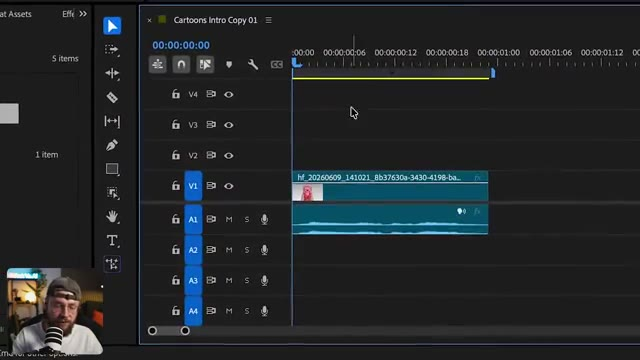
*Interface d'Adobe Premiere Pro montrant la timeline avec une piste vidéo V1 et une piste audio A1.*

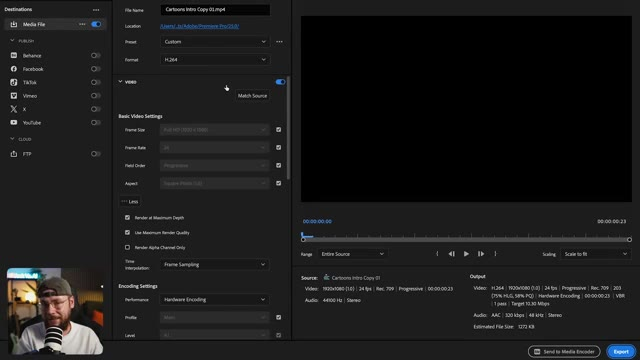
*Panneau d'exportation d'Adobe Premiere Pro montrant les paramètres vidéo et de format H.264.*

---

### ⏱️ `[00:16:43 - 00:17:18]` | Segment #36

**🔊 Audio (Transcription Intégrale Mot pour Mot en Français) :**
> piste audio là maintenant bien sûr vous pouvez aussi exporter en mp3 par exemple donc vous sortez simplement un fichier audio mais pour une raison quelconque avec des voix vraiment spécifiques utiliser des références audio ne fonctionne pas vraiment mais utiliser des vidéos vides avec des références audio dedans oui et laissez-moi vous montrer un exemple de ceci pour prouver que cette méthode doit être utilisée donc ici j'ai déposé des références audio à la fois de moi-même en train de parler que je viens d'enregistrer avec ce microphone ici et puis une

**👁️ Analyse Visuelle d'Écran (gemini-3.5-flash-lite) :**
**Interface & Outils** : Adobe Premiere Pro (pour l'image 1) et Seedance 2 (pour les images 3 et 4).

**Contenu textuel & Code** : Pour l'image 1 : Paramètres d'exportation avec "Cartoons Intro Copy 01.mp4", format "H.264", réglages vidéo basiques (Frame Size, Frame Rate 24, Aspect). Pour l'image 3 et 4 : Interface Seedance 2 avec prompt "[00:00 - 00:03] Wide, 35mm, eye-level, slow push in — a upscale restaurant dining room...", vignettes de référence d'images, boutons 1080p, 15.0s, 16:9 et l'outil audio "Reference...".

**Action / Démonstration** : Le créateur montre d'abord les paramètres d'exportation vidéo dans Premiere Pro, puis bascule sur l'interface de l'outil Seedance 2 pour démontrer l'utilisation de vidéos vides combinées à des références audio, illustrant l'intégration de fichiers audio de sa voix.

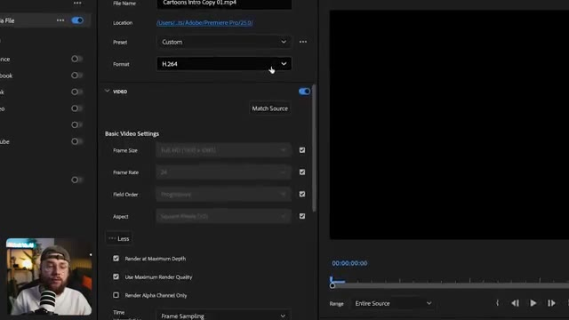
*Interface d'exportation d'Adobe Premiere Pro montrant les paramètres de format H.264 et vidéo.*

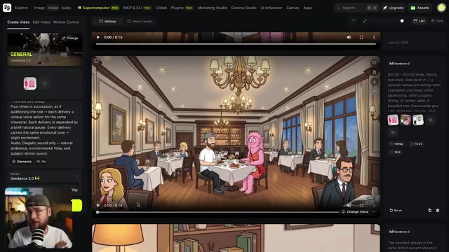
*Interface de l'outil Seedance 2.0 affichant un plan large animé d'un restaurant haut de gamme avec des personnages illustrés, incluant une incrustation de Jack en bas à gauche.*

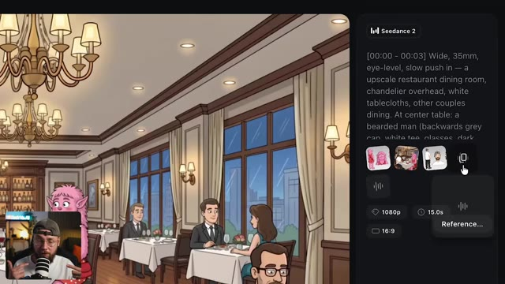
*Gros plan sur l'interface de Seedance 2 montrant le panneau latéral avec les références d'images et le curseur survolant les options audio de référence.*

---

### ⏱️ `[00:17:18 - 00:17:53]` | Segment #37

**🔊 Audio (Transcription Intégrale Mot pour Mot en Français) :**
> Des voix que j'aimais pour notre monstre rose, tout d'abord, laissez-moi vous montrer la génération où j'utilise des références audio, donc juste des fichiers MP3 : « Alors, tu viens souvent ici ? » « Pas vraiment, la dernière fois que je suis venu, j'ai été viré pour avoir mangé quelqu'un. » Vous verrez donc que ma voix a tendance à se rabattre sur un accent britannique neutre et générique, mais laissez-moi faire défiler un peu plus vers le haut ici et ensuite je pourrai vous montrer ce qui se passe quand j'ajoute et référence ces vidéos vides avec les mêmes enregistrements audio.

**👁️ Analyse Visuelle d'Écran (gemini-3.5-flash-lite) :**
**Interface & Outils** : Seedance 2 (outil de génération vidéo par IA)

**Contenu textuel & Code** : Prompt visible : « [00:00 - 00:03] Wide, 35mm, eye-level, slow push in — a upscale restaurant dining room, chandelier overhead, white tablecloths, other couples dining. At center table: a bearded man (backwards grey cap, white tee, glasses, dark... ». Paramètres visibles : résolution 1080p, durée 15.0s, format 16:9, et icônes de références audio/vidéo.

**Action / Démonstration** : Le créateur montre l'interface de Seedance 2 en expliquant l'utilisation de fichiers audio de référence (MP3) et l'ajout ultérieur de vidéos de référence.

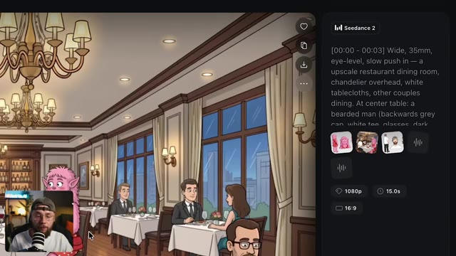
*Interface du logiciel Seedance 2 montrant le rendu vidéo d'un restaurant haut de gamme avec des personnages animés et un encadré PiP du créateur.*

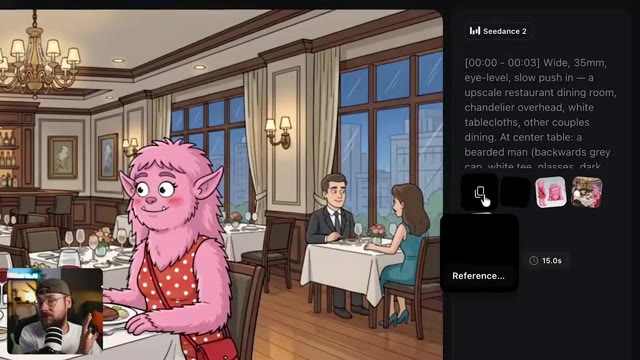
*Interface de Seedance 2 affichant le monstre rose au premier plan dans un restaurant et le panneau de configuration avec options de référence.*

---

### ⏱️ `[00:17:53 - 00:18:30]` | Segment #38

**🔊 Audio (Transcription Intégrale Mot pour Mot en Français) :**
> à la place. Alors, tu viens souvent ici ? Pas vraiment. La dernière fois que je suis venu, j'ai été viré pour avoir mangé quelqu'un. Madame, est-ce que je peux vous intéresser à ? Bon, désolé. C'est tellement embarrassant. Écoutez simplement la différence. Cela a littéralement intégré ma voix dans la génération en tant qu'atout moteur. Et je suis sûr que vous vous demandez comment je suis parvenu à ce résultat final. Quel type de prompts ai-je utilisés ? Par exemple, vous voulez accéder à tout le flux de travail ? Eh bien, je vais construire une toute nouvelle scène à partir de zéro avec vous.

**👁️ Analyse Visuelle d'Écran (gemini-3.5-flash-lite) :**
**Interface & Outils** : Seedance (interface de génération vidéo par IA avec panneau de configuration, lecteur et aperçu) et écran de transition graphique.

**Contenu textuel & Code** : Textes visibles : "step four scene building", panneaux de contrôle de Seedance, paramètres de génération vidéo (modèle Seedance 2.0, dimensions, prompts).

**Action / Démonstration** : Le créateur montre son interface de travail sur Seedance pour illustrer la génération de voix et de vidéos, puis affiche une diapositive de transition pour passer à la construction d'une nouvelle scène.

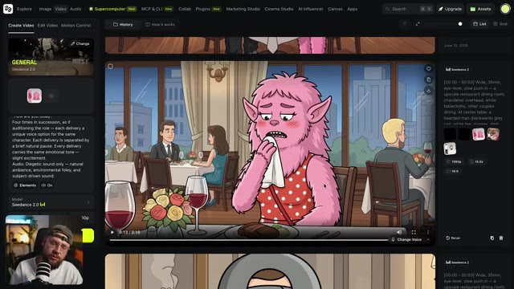
*Interface de l'outil de génération vidéo Seedance affichant la timeline, le lecteur vidéo avec la créature rose au restaurant et la webcam du créateur en incrustation (PiP).*

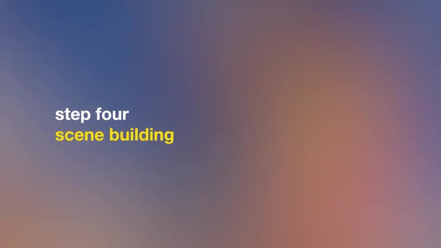
*Écran de transition textuel sur fond flou avec les mots "step four scene building".*

---

### ⏱️ `[00:18:30 - 00:18:56]` | Segment #39

**🔊 Audio (Transcription Intégrale Mot pour Mot en Français) :**
> les gars, en ce moment. D'abord, ce que je veux faire, c'est référencer ma propre feuille de personnage, puis je veux aussi référencer la feuille de personnage de ce chat et je vais dire, dans le même style artistique, montre le chat assis sur un lit à l'intérieur d'une belle chambre et montre l'homme debout dans l'embrasure de la porte tenant une caméra sur une perche à selfie.

**👁️ Analyse Visuelle d'Écran (gemini-3.5-flash-lite) :**
**Interface & Outils** : Interface web d'un outil de création par IA (type plateforme multimédia/génération avec barre de prompt inférieure, sélection du modèle "Nano Banana Pro", format 16:9, résolution 2K et bouton "Generate").

**Contenu textuel & Code** : Texte du prompt en cours de saisie : "Describe the scene you imagine" (puis dicté : "in the same art style show the cat sat on a bed inside a nice bedroom and show the man stood in the doorway holding a camera on a selfie stick"). Références de personnages visuelles ajoutées (feuille de personnage de l'homme et du chat).

**Action / Démonstration** : Le créateur navigue dans ses images générées, sélectionne des feuilles de personnage, les ajoute aux paramètres de contexte, puis tape un prompt pour générer une nouvelle scène combinant les deux personnages.

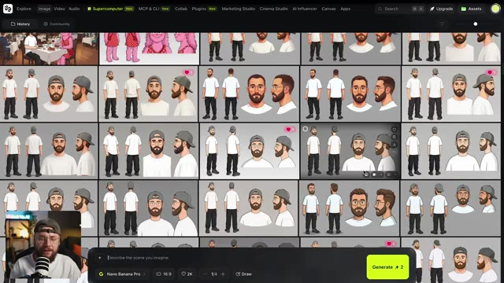
*Interface du studio de génération d'images avec le panneau de prompt et les vignettes de feuilles de personnages du créateur.*

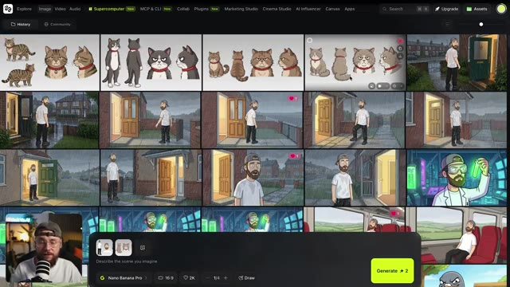
*Navigation dans la grille d'images générées et ajout de la feuille de personnage du chat dans l'interface.*

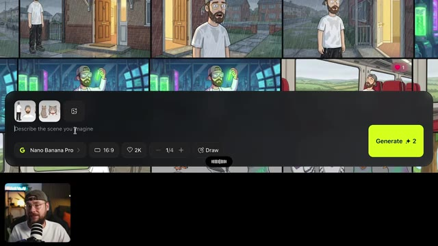
*Saisie du prompt textuel pour générer la scène combinant le personnage et le chat dans la chambre.*

---

### ⏱️ `[00:18:56 - 00:19:16]` | Segment #40

**🔊 Audio (Transcription Intégrale Mot pour Mot en Français) :**
> La caméra est dirigée vers son visage. Et juste pour donner un peu plus de contexte à Nano Banana, je vais dire qu'il est un créateur de contenu. Allons-y, créons quelques variations différentes de cette scène et cliquons sur générer. Nous avons donc récupéré nos résultats. Les deux ont l'air vraiment super. Le style artistique reste bien cohérent.

**👁️ Analyse Visuelle d'Écran (gemini-3.5-flash-lite) :**
**Interface & Outils** : Interface web de génération d'images par IA (Nano Banana Pro) avec incrustation vidéo (PiP) du créateur en bas à gauche.

**Contenu textuel & Code** : Prompt visible : "In the same art style, show the cat sat on a bed inside a nice bedroom and show the man stood in the doorway holding a camera on a selfie stick. The camera is directed towards his face. And just to give Nano Banana a little bit more context, I'm going to say he is a content creator." Paramètres : modèle Nano Banana Pro, rapport 16:9, résolution 2K, taille 2752x1536.

**Action / Démonstration** : Le créateur montre la saisie du prompt textuel dans l'interface de l'outil de génération, puis présente le résultat généré montrant le chat sur le lit et le personnage dans l'encadrement de la porte.

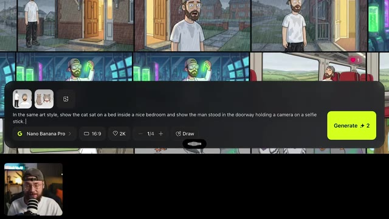
*Interface de génération montrant la barre de saisie du prompt textuel de Nano Banana Pro avec les vignettes de référence et le bouton de génération.*

*Résultat de la génération affichant l'image finale d'une chambre avec un chat sur le lit et le créateur tenant une perche à selfie dans l'embrasure de la porte, avec le panneau latéral des détails du modèle Nano Banana Pro.*

---

### ⏱️ `[00:19:16 - 00:19:48]` | Segment #41

**🔊 Audio (Transcription Intégrale Mot pour Mot en Français) :**
> Et c'est pour vous montrer les gars que vous pouvez simplement ajouter un prompt très décontracté, non technique, et obtenir quand même les résultats que vous recherchez. Cependant, sur quoi vous voulez vous concentrer, ce sont les détails plus fins. Donc si nous regardons cette génération ici, il est plus probable que la caméra soit orientée de ce côté-ci, n'est-ce pas ? Ou que le téléphone soit tourné dans cette direction parce que vous voudriez vous voir vous-même. Celle-ci n'a pas vraiment beaucoup de sens. Et vous voulez aussi penser aux choses qui pourraient mal tourner lorsque vous en venez réellement à générer votre IA.

**👁️ Analyse Visuelle d'Écran (gemini-3.5-flash-lite) :**
**Interface & Outils** : Interface utilisateur web d'une application de génération d'images/vidéos par IA (avec panneau latéral de prompt, boutons de réglage et prévisualisation centrale).

**Contenu textuel & Code** : Le prompt visible dans le panneau latéral indique : "In the same art style, show the cat sat on a bed inside a nice bedroom and show the man stood in the doorway holding a camera on a selfie stick. The director is directed towards his face. He is a content creator". Paramètres visibles : Modèle "Nano Banana Pro", Qualité "2k", Taille "2752x1536".

**Action / Démonstration** : Le créateur montre une image générée par IA et zoombe sur un détail incohérent (l'orientation de la caméra sur le bâton à selfie) pour expliquer l'importance de prêter attention aux détails dans les prompts.

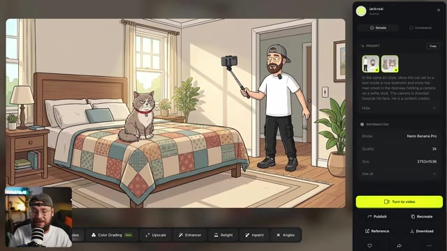
*Interface d'une application de génération d'image montrant le rendu dans une chambre et le panneau de configuration à droite avec le prompt textuel.*

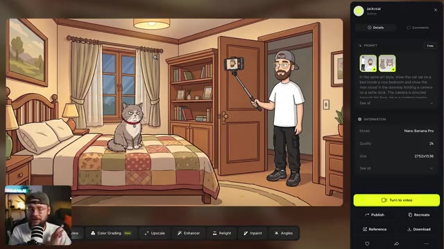
*Zoom sur l'image générée montrant le personnage tenant un selfie stick avec l'écran du téléphone tourné dans le mauvais sens.*

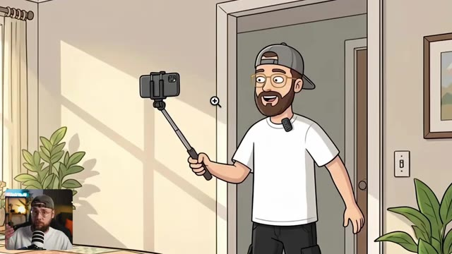
*Gros plan sur l'image générée mettant en évidence l'incohérence de l'orientation de la caméra du téléphone par rapport au personnage.*

---

### ⏱️ `[00:19:48 - 00:20:20]` | Segment #42

**🔊 Audio (Transcription Intégrale Mot pour Mot en Français) :**
> des vidéos et pour moi cet écran de téléphone portable ici est un peu un signal d'alarme pour que le modèle vidéo d'IA comprenne réellement que le contenu affiché sur l'écran du téléphone doit refléter exactement ce point de vue et cette action provenant de mon personnage qui va être assez ambitieux donc je veux en quelque sorte éviter cela donc je vais choisir celui-ci pour être le visuel clé de notre scène donc c'est la première étape en réalité nous avons déjà nos fiches de personnages pour les deux personnages qui vont figurer dans notre nouvelle scène.

**👁️ Analyse Visuelle d'Écran (gemini-3.5-flash-lite) :**
**Interface & Outils** : Interface d'un outil de génération vidéo par IA (avec panneau Prompt, fiches de personnages et sélection du modèle Nano Banana Pro).

**Contenu textuel & Code** : Texte visible dans le prompt : "In the same art style, show the cat sat on a bed inside a nice bedroom and show the man stood in the doorway holding a camera on a selfie stick. The camera is directed towards his face. He is a content creator..." et nom du modèle "Nano Banana Pro".

**Action / Démonstration** : Le créateur montre l'interface de génération avec les fiches de personnages intégrées et le prompt textuel définissant la scène clé.

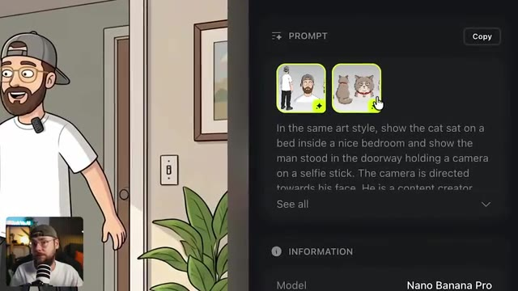
*Interface de génération vidéo par IA montrant le champ PROMPT avec deux fiches de personnages et le texte descriptif du plan, ainsi que le modèle Nano Banana Pro.*

---

### ⏱️ `[00:20:20 - 00:20:40]` | Segment #43

**🔊 Audio (Transcription Intégrale Mot pour Mot en Français) :**
> Nous avons également notre visuel clé, qui donne à notre modèle vidéo IA une compréhension du lieu. Encore une fois, si vous vouliez plus de contrôle, vous pourriez aller de l'avant et utiliser une feuille de référence d'emplacement pour bloquer un cadrage spécifique afin de faire interagir votre personnage avec le lieu si vous voulez avoir ce niveau de contrôle.

**👁️ Analyse Visuelle d'Écran (gemini-3.5-flash-lite) :**
**Interface & Outils** : Interface de génération d'images/vidéos par IA (type plateforme créative avec panneau latéral de prompts, modèle "Nano Banana Pro", et options de post-traitement en bas : Color Grading, Upscale, Enhancer, Relight, Inpaint, Angles).

**Contenu textuel & Code** : Panneau latéral affichant les prompts de génération, le modèle ("Nano Banana Pro"), la qualité ("2k"), la taille ("2752x1536"), et les boutons "Turn to video", "Publish", "Recreate", "Reference", "Download".

**Action / Démonstration** : Le présentateur explique l'utilisation des visuels clés et des feuilles de référence d'emplacement pour contrôler les décors et l'interaction des personnages dans les modèles vidéo IA, illustré par des exemples visuels à l'écran.

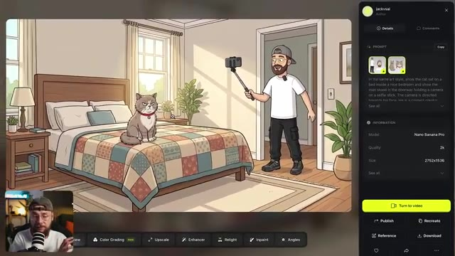
*Interface montrant une image générée d'un personnage de style animé tenant un selfie-stick dans une chambre aux côtés d'un chat.*

*Interface montrant une feuille de référence d'emplacement à quatre vues (View 1, View 2, View 4) d'un salon avec canapé.*

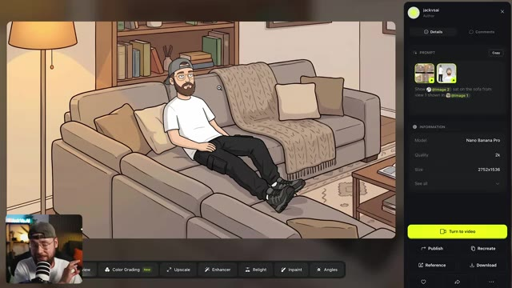
*Interface montrant l'image générée du personnage assis sur le canapé du salon.*

---

### ⏱️ `[00:20:40 - 00:21:15]` | Segment #44

**🔊 Audio (Transcription Intégrale Mot pour Mot en Français) :**
> Pour notre exemple, cependant, je pense que cela va bien fonctionner. Donc je vais continuer et télécharger ceci. Assurez-vous également d'avoir téléchargé vos fiches de personnages car ensuite je veux que vous vous dirigiez vers ChatGPT, Claude ou Gemini, je vais vous donner un fichier spécifique appelé un fichier md qui va fonctionner avec n'importe quel LLM, c'est ce que nous allons utiliser pour nous aider à rédiger et structurer notre invite textuelle pour notre génération de vidéos. Donc tout d'abord, je vais continuer et téléverser ce fichier md dont je venais de parler, il s'appelle le multi-shot prompt framework.

**👁️ Analyse Visuelle d'Écran (gemini-3.5-flash-lite) :**
**Interface & Outils** : Interface de Claude avec le modèle Sonnet 4.6 et l'explorateur de fichiers de macOS.

**Contenu textuel & Code** : Texte visible sur l'interface de Claude : "Afternoon, Jack", "How can I help you today?", "Sonnet 4.6 - Medium". Dans l'explorateur de fichiers : "multi-shot-prompt-framework-animation.md" (11 KB), dossiers "Ref Images", "Audio", "Recordings", "Video Gen", "Image Gen".

**Action / Démonstration** : Le créateur montre l'interface de Claude puis navigue dans l'explorateur de fichiers pour sélectionner et télécharger/téléverser le fichier Markdown de framework de prompt multi-shot.

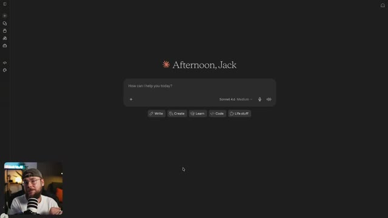
*Interface de l'outil Claude affichée à l'écran avec le créateur en incrustation PiP.*

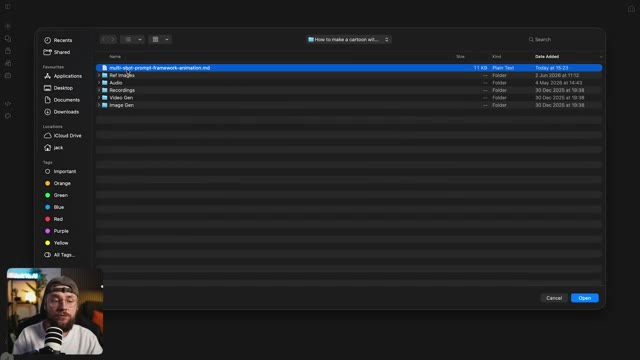
*Fenêtre de sélection de fichiers montrant le fichier 'multi-shot-prompt-framework-animation.md' et les dossiers associés dans l'explorateur de fichiers.*

---

### ⏱️ `[00:21:15 - 00:21:52]` | Segment #45

**🔊 Audio (Transcription Intégrale Mot pour Mot en Français) :**
> pour l'animation. Ensuite, je vais également ajouter notre visuel clé ainsi que les fiches de référence des personnages pour moi-même et le chat. Souvenez-vous, un peu plus tôt, nous parlions de cette idée de contexte. Nous donnons à Claude autant de compréhension contextuelle de notre scène que possible en lui fournissant ces références d'images. Mais la grande chose à propos de ce fichier MD, c'est que nous avons juste besoin de décrire très grossièrement le type de scène que nous voulons obtenir en retour. Ce framework de prompt multi-shot va s'occuper de tout le gros travail technique pour nous, afin que nous puissions simplement nous concentrer sur notre créativité et trouver

**👁️ Analyse Visuelle d'Écran (gemini-3.5-flash-lite) :**
**Interface & Outils** : Claude (Anthropic) avec affichage en arrière-plan sombre, interface de chat et zone de saisie de texte.

**Contenu textuel & Code** : Texte affiché : "Afternoon, Jack", "multi-shot-prompt-framework-...", "How can I help you today?", "Sonnet 4.6 Medium", et quatre vignettes jointes (un fichier .md, un visuel clé d'une pièce avec un chat, une feuille de modèle de personnage pour Jack et une pour le chat).

**Action / Démonstration** : Le créateur montre son écran avec l'interface de Claude où le contexte et les fichiers de référence sont importés pour la génération de prompts multi-plans.

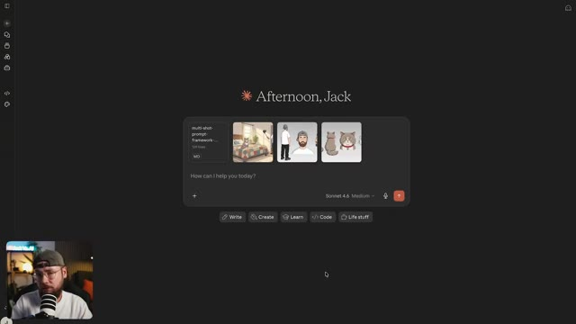
*Interface de Claude montrant un fichier Markdown importé et trois images de référence (visuel clé, personnage et chat), avec Jack en incrustation PiP.*

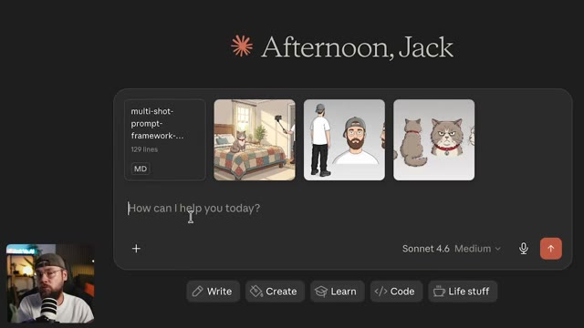
*Gros plan sur l'interface de Claude avec le champ de texte actif et les quatre pièces jointes contextuelles.*

---

### ⏱️ `[00:21:52 - 00:22:13]` | Segment #46

**🔊 Audio (Transcription Intégrale Mot pour Mot en Français) :**
> avec nos scènes et nos idées. J'ai donc ajouté ici un paragraphe très simple qui détaille la scène que je veux créer. Je m'assure d'ajouter effectivement toutes les lignes de dialogue que je veux voir apparaître, parce que je veux vous générer une scène où nous avons plusieurs personnages qui parlent. Et c'est tout ce que nous avons besoin de donner au framework de prompt.

**👁️ Analyse Visuelle d'Écran (gemini-3.5-flash-lite) :**
**Interface & Outils** : Interface d'un outil de type assistant IA (Claude / Sonnet 4.6).

**Contenu textuel & Code** : Texte du prompt décrivant une scène humoristique entre un homme barbu tenant une perche à selfie et un chat de famille ("The bearded man, entering the bedroom... What the fuck are you doing?...").

**Action / Démonstration** : Le créateur montre l'écran de son interface contenant le prompt textuel structuré pour la génération de scènes multi-personnages.

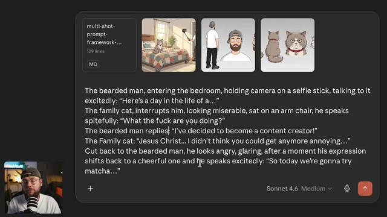
*Interface de l'outil montrant un prompt textuel détaillant une scène avec des dialogues entre un homme barbu et un chat.*

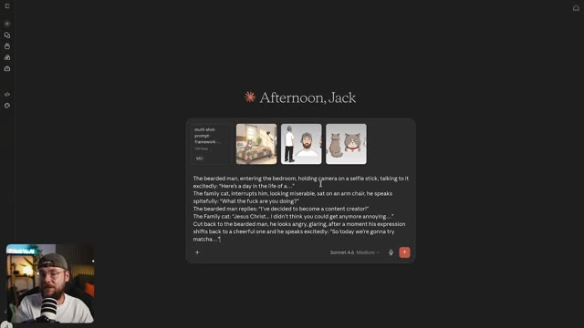
*Vue plus large de l'interface avec le même prompt et des vignettes d'images générées, avec le créateur en incrustation PiP.*

---

### ⏱️ `[00:22:13 - 00:22:36]` | Segment #47

**🔊 Audio (Transcription Intégrale Mot pour Mot en Français) :**
> Allons-y et envoyons ceci. Je vais voir Claude se mettre au travail ici. Vous pouvez voir qu'il est écrit ici : lecture de la compétence du cadre de prompt multi-shot. Identifier qu'il s'agit d'une scène d'animation avec des dialogues. Ce cadre génère par défaut une durée de 15 secondes. Mais si vous voulez une scène plus courte, il vous suffit d'ajouter cette information à votre prompt initial.

**👁️ Analyse Visuelle d'Écran (gemini-3.5-flash-lite) :**
**Interface & Outils** : Interface de l'assistant IA Claude sur navigateur web, avec incrustation vidéo (PiP) du créateur en bas à gauche.

**Contenu textuel & Code** : Texte du prompt décrivant une scène d'animation entre un homme barbu et le chat de la famille : "The bearded man, entering the bedroom, holding camera on a selfie stick, talking to it excitedly..." ainsi que la réponse de l'IA "Reading the multi-shot prompt framework skill...".

**Action / Démonstration** : Le créateur montre son écran où l'outil Claude analyse le prompt et génère le cadre pour la scène d'animation dialoguée.

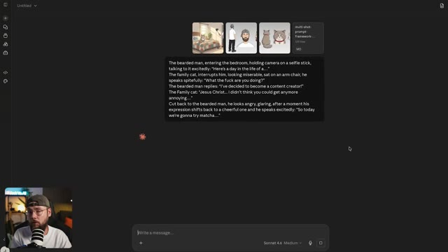
*Interface de l'outil Claude affichant un prompt textuel pour une scène d'animation avec des dialogues, avec le créateur en incrustation PiP.*

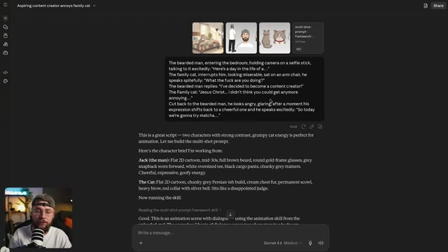
*Interface de Claude montrant la réponse de l'IA qui analyse le script de la scène d'animation, avec le créateur en incrustation PiP.*

---

### ⏱️ `[00:22:36 - 00:22:55]` | Segment #48

**🔊 Audio (Transcription Intégrale Mot pour Mot en Français) :**
> Donc dites simplement à Claude, par exemple, je veux une scène de cinq secondes, sept secondes, tout ce que vous voulez. Vous pouvez voir qu'il a inclus des horodatages spécifiques pour le moment où chaque plan doit avoir lieu, la composition et l'objectif utilisés pour le plan, toute action qui doit se produire, ainsi que chaque ligne de dialogue.

**👁️ Analyse Visuelle d'Écran (gemini-3.5-flash-lite) :**
**Interface & Outils** : Interface de Claude (modèle Sonnet 4.6), avec incrustation vidéo du créateur (PiP) en bas à gauche.

**Contenu textuel & Code** : Texte affichant des prompts de génération et des scripts détaillés pour l'animation, incluant des descriptions de plans temporels (ex: "[00:00 - 00:03] Wide, 24mm, eye-level, push in..."), des indications de composition, d'objectifs, et des lignes de dialogue entre un homme barbu et son chat.

**Action / Démonstration** : Le créateur montre et commente l'écran de l'interface Claude qui génère un script multi-plans détaillé avec des horodatages et des spécifications techniques de caméra.

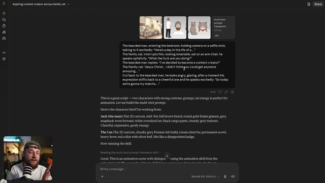
*Interface de Claude affichant un prompt textuel décrivant un sketch entre un créateur barbu et son chat, avec le retour de l'IA détaillant les personnages et le script multi-plans.*

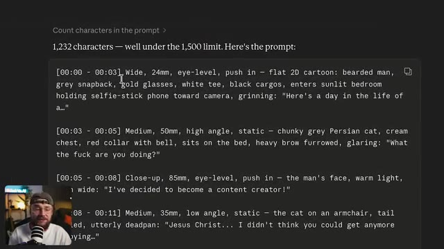
*Gros plan sur l'interface de Claude montrant le résultat final du prompt multi-plans structuré avec des horodatages précis, les types de plans, les focales et les dialogues.*

---

### ⏱️ `[00:22:55 - 00:23:14]` | Segment #49

**🔊 Audio (Transcription Intégrale Mot pour Mot en Français) :**
> Donc nous voulons continuer et copier ceci. Et nous pouvons à nouveau nous rendre sur Higgsfield où nous allons générer notre vidéo. Assurons-nous d'avoir sélectionné C-Dance 2 comme modèle. Je vais simplement insérer le prompt directement depuis Claude ici dans le champ de texte. Maintenant, nous pouvons aller de l'avant et télécharger nos références d'images pertinentes.

**👁️ Analyse Visuelle d'Écran (gemini-3.5-flash-lite) :**
**Interface & Outils** : Interface web de génération de texte et plateforme de génération vidéo Higgsfield avec un encadré PiP (Picture-in-Picture) montrant le créateur face caméra.

**Contenu textuel & Code** : Texte affichant un prompt structuré par plans [00:00 - 00:03], [00:03 - 00:05], etc., et sur l'image 2 les paramètres de génération vidéo (modèle Seedance 2.0, format 16:9, durée 5s, résolution 1080p, coût de 45 crédits).

**Action / Démonstration** : Le créateur montre le prompt copié depuis Claude puis se rend sur l'interface de Higgsfield pour configurer les paramètres de génération vidéo et importer les images de référence.

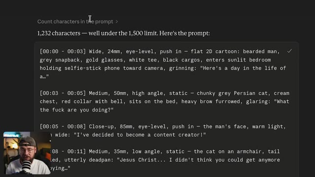
*Interface de l'outil montrant le prompt textuel structuré par plans et horodatages généré depuis Claude.*

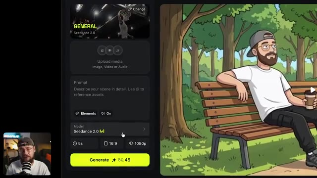
*Interface de l'outil Higgsfield montrant le panneau de configuration de génération vidéo avec le modèle Seedance 2.0 et une image de référence d'un personnage sur un banc.*

---

### ⏱️ `[00:23:14 - 00:23:33]` | Segment #50

**🔊 Audio (Transcription Intégrale Mot pour Mot en Français) :**
> Donc si on clique dans cette section ici et qu'on se dirige vers l'onglet des éléments aimés, vous pouvez voir que je peux déjà ajouter la fiche de personnage pour moi-même, mais nous devons vérifier l'éligibilité en cliquant sur cet onglet ici pour notre personnage de chat, ainsi que pour notre visuel clé que nous avons généré.

**👁️ Analyse Visuelle d'Écran (gemini-3.5-flash-lite) :**
**Interface & Outils** : Interface utilisateur de Seedance 2.0 (avec mini-vue caméra du créateur en bas à gauche).

**Contenu textuel & Code** : Panneau latéral gauche avec un prompt textuel commençant par "[00:00 - 00:03] Wide, 24mm...", modèle Seedance 2.0, durée 5s, format 16:9, résolution 1080p, bouton "Generate 45". Fenêtre contextuelle avec onglets ("Uploads", "Elements", "Image Generations", "Video Generations", "Liked") montrant des images miniatures avec le bouton "Check eligibility".

**Action / Démonstration** : Le créateur navigue dans l'onglet des médias favoris ("liked") pour sélectionner des feuilles de personnages et vérifier leur éligibilité.

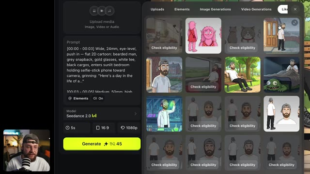
*Interface d'un outil de génération vidéo avec une fenêtre pop-up affichant une grille d'images et de feuilles de personnages ("liked" tab).*

---

### ⏱️ `[00:23:33 - 00:23:56]` | Segment #51

**🔊 Audio (Transcription Intégrale Mot pour Mot en Français) :**
> Et ceci permet essentiellement de vérifier que nous ne violons aucun droit d'auteur ou quoi que ce soit de ce genre. Vous pouvez voir que le personnage du chat et le visuel clé ont tous deux été approuvés. Nous pouvons donc maintenant cliquer dessus pour les sélectionner. Et maintenant, ce que nous devons faire, c'est télécharger nos références audio pour chaque personnage. Nous pouvons donc cliquer sur cette section ici, aller dans les téléchargements, puis sélectionner « télécharger un média ».

**👁️ Analyse Visuelle d'Écran (gemini-3.5-flash-lite) :**
**Interface & Outils** : Seedance

**Contenu textuel & Code** : On observe le panneau latéral de Seedance avec les onglets « Uploads », « Elements », « Image Generations », « Video Generations ». Sont visibles les vignettes des personnages générés, le prompt textuel avec les paramètres du modèle Seedance 2.0 (durée 5s, format 16:9, 1080p), et le bouton jaune « Generate » coûtant 45 crédits.

**Action / Démonstration** : Le curseur de la souris survole différentes sections de l'interface de Seedance pour naviguer entre les éléments visuels approuvés et l'onglet de téléchargement des fichiers audio de référence.

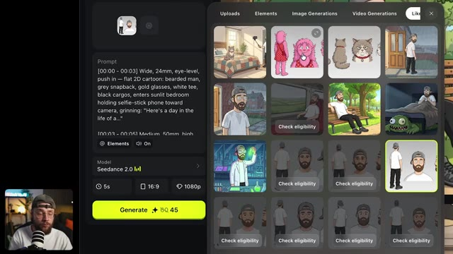
*Interface de Seedance montrant la sélection des éléments visuels et les icônes d'approbation.*

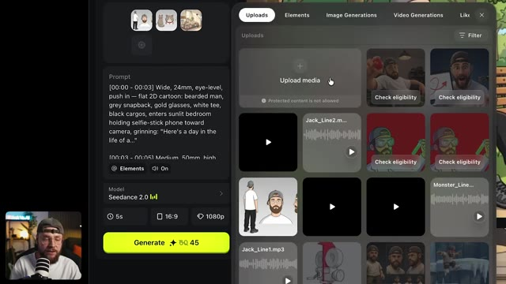
*Interface de Seedance montrant la section « Uploads » avec l'option « Upload media » et des fichiers audio référencés (Jack_Line1.mp3, Jack_Line2.mp3).*

---

### ⏱️ `[00:23:57 - 00:24:16]` | Segment #52

**🔊 Audio (Transcription Intégrale Mot pour Mot en Français) :**
> J'ai donc un enregistrement audio de moi-même prononçant les répliques que je veux entendre dans ma génération de vidéo finale. Et puis nous avons aussi un extrait audio pour notre personnage de chat. Vous pouvez voir qu'une fois de plus, ces deux fichiers doivent être vérifiés. Ils doivent être contrôlés pour toute infraction au droit d'auteur. Et très rapidement, vous pouvez voir que les deux ont été approuvés.

**👁️ Analyse Visuelle d'Écran (gemini-3.5-flash-lite) :**
**Interface & Outils** : Application Seedance avec une fenêtre de sélection de fichiers système superposée (Image 1), puis l'interface principale d'importation de médias avec des onglets Uploads, Elements, Image Generations, Video Generations (Image 2).

**Contenu textuel & Code** : Noms de fichiers audio visibles dans la liste (Cat_Ref.mp4, Monster_Line2.mp3, Jack_Line1.mp3, Jack_Line2.mp3, Cartoons_Intro_AudioREF_1.mp3), étiquettes "Check eligibility" sur les médias importés, modèle Seedance 2.0 sélectionné.

**Action / Démonstration** : Le créateur montre la sélection de fichiers audio (Image 1) puis présente les vignettes importées avec les statuts de vérification d'éligibilité (Image 2).

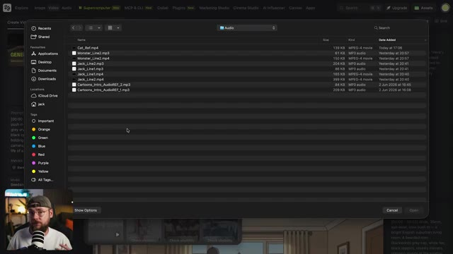
*Fenêtre de sélection de fichiers audio montrant une liste de pistes MP3 et MP4, avec Jack visible en médaillon PiP en bas à gauche.*

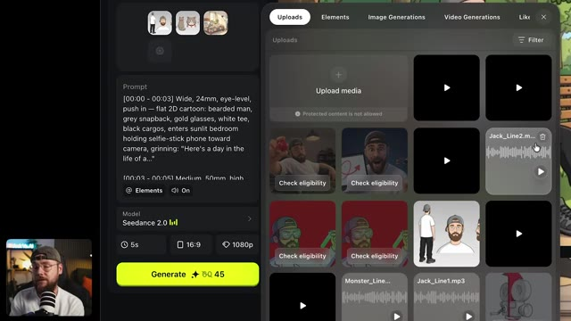
*Interface de Seedance affichant l'onglet "Uploads" avec des vignettes multimédias et des boutons "Check eligibility", Jack étant visible en médaillon PiP en bas à gauche.*

---

### ⏱️ `[00:24:16 - 00:24:38]` | Segment #53

**🔊 Audio (Transcription Intégrale Mot pour Mot en Français) :**
> Donc nous pouvons continuer et sélectionner ceux-ci. Maintenant, c'est le morceau vraiment important. Après chaque ligne de dialogue, nous voulons cliquer sur la touche arobase. Et ça va faire apparaître ce menu déroulant. Je sais que, par exemple, vidéo un est la référence de moi-même en train de parler. Donc je veux étiqueter cette référence chaque fois que je livre ma ligne de dialogue dans le prompt.

**👁️ Analyse Visuelle d'Écran (gemini-3.5-flash-lite) :**
**Interface & Outils** : Seedance 2.0

**Contenu textuel & Code** : Dans le champ "Prompt" : "[00:00 - 00:03] Wide, 24mm, eye-level, push in — flat 2D cartoon: bearded man, grey snapback, gold glasses, white tee, black cargos, enters sunlit bedroom holding selfie-stick phone toward camera, grinning: "Here's a day in the life of a..." @". Menu déroulant avec les choix : Image 1, Image 2, Image 3, Video 1, Video 2. Bouton "Generate" avec icône et "40 45".

**Action / Démonstration** : Le créateur montre comment utiliser la touche '@' dans le champ de prompt pour ouvrir un menu déroulant permettant de sélectionner et tagguer les fichiers vidéo ou image de référence préalablement téléchargés.

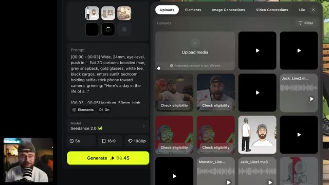
*Interface de Seedance 2.0 montrant le panneau des médias téléchargés (Uploads) avec des clips vidéo et audio.*

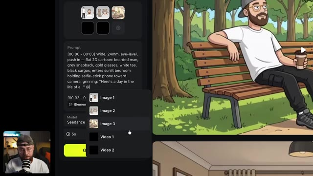
*Interface de Seedance 2.0 montrant le prompt textuel avec le menu déroulant activé par la touche '@' pour sélectionner les images et vidéos de référence (Image 1, 2, 3, Video 1, 2).*

---

### ⏱️ `[00:24:38 - 00:24:57]` | Segment #54

**🔊 Audio (Transcription Intégrale Mot pour Mot en Français) :**
> Avec notre chat, nous voulons étiqueter la vidéo deux. Rappelez-vous, ce sont juste les vidéos vierges avec la piste audio en dessous. Télécharger des MP3 ne fonctionne tout simplement pas pour une raison quelconque. C'est donc une autre ligne de dialogue pour moi-même. Je vais donc étiqueter la vidéo un. Ensuite, nous avons une autre ligne pour le chat, la vidéo deux.

**👁️ Analyse Visuelle d'Écran (gemini-3.5-flash-lite) :**
**Interface & Outils** : Interface de l'outil de génération vidéo Seedance 2.0 (avec vue PiP du créateur en bas à gauche).

**Contenu textuel & Code** : Texte du prompt avec les balises de timing et de cadrage, ainsi que les références `@Video 1` et `@Video 2`, bouton "Generate" jaune, paramètres de durée (5s), format (16:9) et résolution (1080p). Modèle Seedance 2.0.

**Action / Démonstration** : Le créateur montre son écran avec l'interface de Seedance et explique le système d'étiquetage des pistes vidéo pour associer les dialogues.

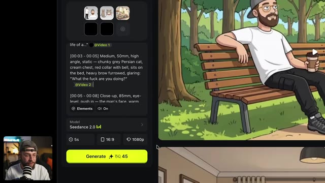
*Interface de Seedance montrant les prompts textuels avec les tags @Video 1 et @Video 2.*

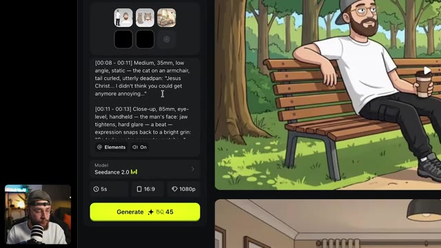
*Interface de Seedance montrant la suite des lignes de dialogue étiquetées pour le chat et l'homme.*

---

### ⏱️ `[00:24:57 - 00:25:30]` | Segment #55

**🔊 Audio (Transcription Intégrale Mot pour Mot en Français) :**
> et puis une dernière ligne pour moi, vidéo un, et rappelez-vous que le cadre du prompt était configuré par défaut sur une génération de 15 secondes de long, donc je veux m'assurer que nous produisons bien cela, et si vous êtes heureux de dépenser les crédits, je suggérerais de générer en 1080p personnellement, surtout si vous essayez de construire un dessin animé qui a l'air professionnel, alors allons-y et cliquons sur générer, et nous avons récupéré nos résultats et je veux vous montrer à quoi ils ressemblent après un tout petit peu d'édition simple.

**👁️ Analyse Visuelle d'Écran (gemini-3.5-flash-lite) :**
**Interface & Outils** : Interface web de Seedance avec un panneau latéral de configuration de prompt, sélection de modèle, durée, format et résolution, ainsi qu'un encadré PiP (Picture-in-Picture) montrant Jack en bas à gauche.

**Contenu textuel & Code** : Texte de prompt visible dans l'interface : "[00:11 - 00:13] Close-up, 85mm, eye-level, handheld - the man's face: jaw tightens, hard glare - a beat - expression snaps back to a bright grin: 'So today we're gonna try matcha...'" et "[00:13 - 00:15] Wide, 24mm, high angle, pull out - man holds phone to camera, cat visible in background on armchair, still scowling." Paramètres visibles : modèle Seedance 2.0, durée 5s, format 16:9, résolution 1080p, et bouton "Generate" coûtant 45 crédits.

**Action / Démonstration** : Le créateur montre l'interface de l'outil de génération vidéo Seedance avec les différents blocs de prompts et les options de configuration technique avant de lancer la génération.

*Interface de Seedance montrant les paramètres de génération vidéo avec sélection du modèle Seedance 2.0, format 16:9, résolution 1080p et durée de 5 secondes.*

---

### ⏱️ `[00:25:31 - 00:26:06]` | Segment #56

**🔊 Audio (Transcription Intégrale Mot pour Mot en Français) :**
> Voici un jour dans la vie de qu'est-ce que tu fous bordel ? Oh, j'ai décidé de devenir créateur de contenu. Jésus-Christ, je ne pensais pas qu'on pouvait être plus agaçant. Alors aujourd'hui, on va essayer le Matcha. J'espère donc que vous voyez la vue d'ensemble à partir de cet exemple : qu'en utilisant nos références d'images et audio combinées avec ma structure de prompt, vous pouvez vraiment construire une émission entière qui a l'air et se ressent cohérente. Mais je voulais quand même vous montrer quelques-uns des autres exemples que j'ai assemblés tout au long de ce projet. Donc tout d'abord, nous avons cette scène ici

**👁️ Analyse Visuelle d'Écran (gemini-3.5-flash-lite) :**
**Interface & Outils** : Présentation face caméra sans partage d'écran (sauf affichage d'un exemple vidéo/image générée)

**Contenu textuel & Code** : Illustration visuelle d'un personnage de chat animé généré par IA dans une chambre à coucher.

**Action / Démonstration** : Le créateur présente une scène visuelle générée par IA pour illustrer son propos sur la cohérence visuelle d'une émission.

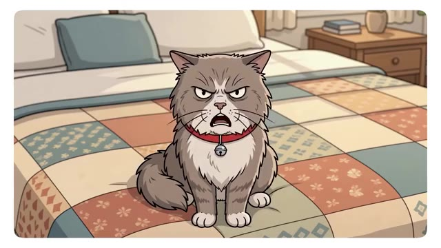
*Scène animée d'un chat gris au pelage ébouriffé, portant un collier rouge avec une clochette, assis sur un lit défait avec une couette en patchwork.*

---

### ⏱️ `[00:26:06 - 00:26:42]` | Segment #57

**🔊 Audio (Transcription Intégrale Mot pour Mot en Français) :**
> de moi réalisant une sorte d'expérience dans un laboratoire et ça se passe plutôt mal. Et je pense que le résultat pour cela est vraiment plutôt bon. Le gag visuel fonctionne très bien. En ce qui concerne le prompt, celui-ci, comme tous les exemples que je vais vous montrer, a été construit en utilisant mon fichier MD et en conjonction avec Claude. Et en ce qui concerne les références d'images que j'ai utilisées, nous avons le visuel clé que j'ai construit aux côtés de ma feuille de référence de personnage. Nous avons également cette génération ici où j'ai un

**👁️ Analyse Visuelle d'Écran (gemini-3.5-flash-lite) :**
**Interface & Outils** : Seedance 2 (interface de génération vidéo par IA)

**Contenu textuel & Code** : Texte du prompt visible : "[00:00 - 00:02] Wide, 24mm, eye-level, slow push in — a cluttered sci-fi lab at night, city skyline glowing through floor-to-ceiling windows. A bearded man (backwards grey cap, lab coat over white tee, safety goggles) holds a glowing green". Deux images de référence en bas du panneau de prompt, et des paramètres techniques (1080p, 5.0s, 16:9).

**Action / Démonstration** : Le créateur montre l'interface de Seedance 2 avec le prompt textuel et les images de référence utilisées pour la génération de la scène de laboratoire.

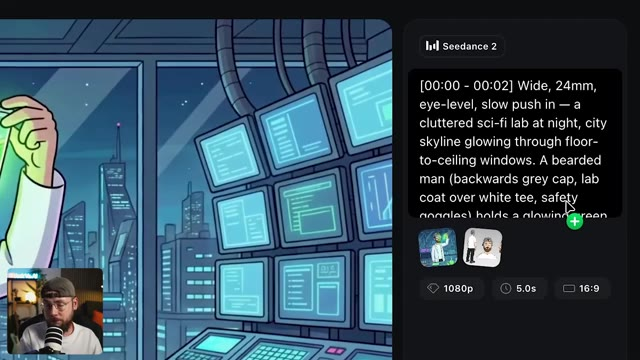
*Interface de Seedance 2 montrant un prompt textuel détaillé et des références d'images, avec une incrustation vidéo de Jack en bas à gauche.*

---

### ⏱️ `[00:26:42 - 00:27:19]` | Segment #58

**🔊 Audio (Transcription Intégrale Mot pour Mot en Français) :**
> monstre sous mon lit. D'une manière générale, je pense encore une fois que cela fonctionne vraiment très bien, mais vous allez remarquer cette sorte de rabat bizarre qui se ferme quand le monstre s'installe confortablement sous la couverture. Je ne sais pas pourquoi cela se produit, mais pour être honnête avec vous, j'ai simplement fini par couper la fin du plan. Il s'agit souvent de réfléchir à la manière dont vous pouvez utiliser des générations existantes plutôt que de dépenser plus de crédits pour obtenir le résultat parfait. S'il y a un problème au début ou à la fin d'un

**👁️ Analyse Visuelle d'Écran (gemini-3.5-flash-lite) :**
**Interface & Outils** : Incrustation vidéo (PiP) du créateur face caméra dans le coin inférieur gauche de l'écran affichant une animation générée par IA

**Contenu textuel & Code** : Animation d'une scène de chambre avec un personnage animé et un monstre vert texturé manipulant une couverture, avec le flux vidéo du studio du créateur en PiP

**Action / Démonstration** : Le monstre vert s'installe sous la couverture tandis que le personnage animé effrayé tient les draps, et le créateur s'exprime dans le petit encadré PiP

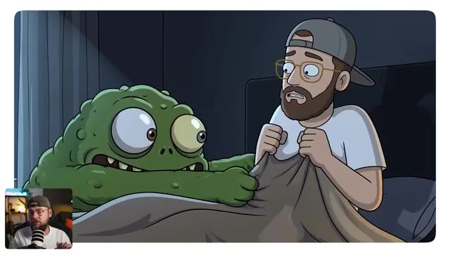
*Animation générée par IA montrant un monstre vert sous les couvertures avec Jack, avec le créateur en incrustation vidéo (PiP) dans le coin inférieur gauche*

---

### ⏱️ `[00:27:19 - 00:27:56]` | Segment #59

**🔊 Audio (Transcription Intégrale Mot pour Mot en Français) :**
> c'est généralement assez facile de simplement couper ça au montage. Et ensuite je voulais aussi vous montrer ce qui peut parfois arriver si vous mettez seulement votre feuille de référence de personnage. Le visuel clé ancre en quelque sorte toute la scène et vous laissez les choses un peu au hasard. Vous risquez de vous retrouver avec un résultat un peu bizarre même si vous utilisez un bon prompt donc c'est un bon exemple de ça. Je pense toujours que c'est vraiment cool pour être franc mais évidemment ce n'est probablement pas ce que

**👁️ Analyse Visuelle d'Écran (gemini-3.5-flash-lite) :**
**Interface & Outils** : Présentation face caméra sans partage d'écran

**Contenu textuel & Code** : Aucun contenu logiciel affiché, Jack s'exprime face caméra dans son studio avec un microphone et un décor en arrière-plan (néons, étagère avec le logo Jack Vs. AI, fauteuil).

**Action / Démonstration** : Jack parle face caméra en faisant des gestes des mains pour illustrer ses explications sur le montage et les fiches de référence de personnages.

---

### ⏱️ `[00:27:56 - 00:28:31]` | Segment #60

**🔊 Audio (Transcription Intégrale Mot pour Mot en Français) :**
> ce que vous cherchez si vous créez une émission de cartoon. C'est toujours impressionnant de voir comment C-Dance 2 a intégré ce personnage de cartoon dans un monde pour ainsi dire photoréaliste, surtout quand il pleut également. Plutôt cool, mais oui, assurez-vous vraiment d'ajouter des feuilles de référence de personnages ainsi qu'un visuel clé pour que C-Dance 2 puisse comprendre la scène, le monde et en quelque sorte le style général de ce que vous recherchez, et je veux aussi vous montrer un exemple de toute cette scène de créateurs de contenu qui a mal tourné où les voix dérivent un peu, laissez-moi vous montrer

**👁️ Analyse Visuelle d'Écran (gemini-3.5-flash-lite) :**
**Interface & Outils** : Interface web de Seedance 2 avec options de création vidéo (Create Video, Edit Video, Motion Control) et un aperçu vidéo central montrant un personnage de cartoon dans une chambre.

**Contenu textuel & Code** : Texte du prompt visible sur le panneau de gauche : "[00:00 - 00:04] Wide, 24mm, eye-level, push in -- flat 2D cartoon, bearded man, grey snapback, gold glasses, white tee, black cargos, enters sunlit bedroom holding selfie-stick phone toward camera, grinning: 'Here's a day in the life of a...'" et le modèle sélectionné "Seedance 2.0".

**Action / Démonstration** : Le créateur présente l'interface de Seedance 2 en arrière-plan tout en parlant, avec sa webcam incrustée en bas à gauche de l'écran.

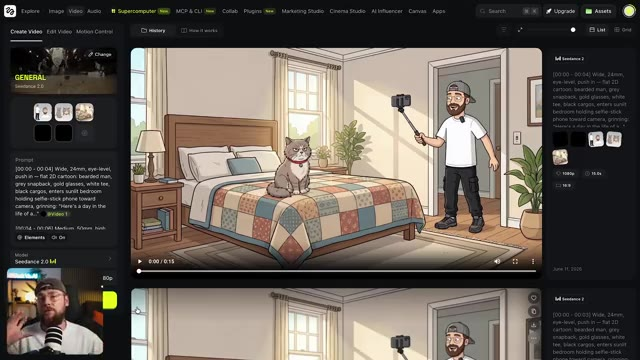
*Interface de Seedance 2 montrant un personnage animé dans une chambre avec un chat, et le panneau de configuration avec le prompt textuel sur la gauche.*

---

### ⏱️ `[00:28:31 - 00:29:08]` | Segment #61

**🔊 Audio (Transcription Intégrale Mot pour Mot en Français) :**
> Que maintenant, voici une journée dans la vie d'un créateur de contenu : "Qu'est-ce que tu fous ? J'ai décidé de devenir créateur de contenu." Jésus-Christ, je ne pensais pas qu'on pouvait être plus agaçant. Donc aujourd'hui, nous allons essayer le matcha. Donc vous remarquerez que ma voix dérive un peu par moments. Si vous rencontrez ce problème, ce que je vous recommande de faire, c'est de couper chaque ligne de dialogue en clips individuels de deux secondes plutôt que de la garder en un seul long clip. Et si vous rencontrez de vrais gros problèmes pour obtenir des voix cohérentes, peut-être qu'il suffit de générer

**👁️ Analyse Visuelle d'Écran (gemini-3.5-flash-lite) :**
**Interface & Outils** : Présentation face caméra avec incrustation PiP (Picture-in-Picture) de Jack dans le coin inférieur gauche sur l'image 4.

**Contenu textuel & Code** : Aucun texte, code ou prompt visible à l'écran.

**Action / Démonstration** : Jack explique en parlant face caméra des astuces pour couper les lignes de dialogue en clips de deux secondes pour garder des voix cohérentes, illustré par des animations de son avatar.

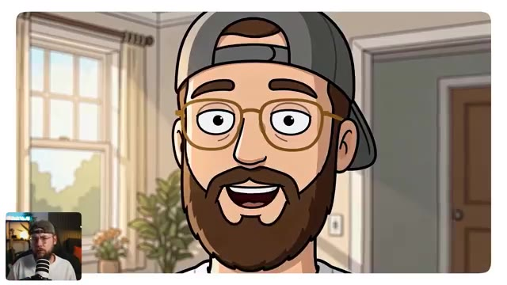
*Gros plan du visage animé de Jack souriant, avec un petit encadré vidéo (Picture-in-Picture) de Jack réel en bas à gauche.*

---

### ⏱️ `[00:29:08 - 00:29:36]` | Segment #62

**🔊 Audio (Transcription Intégrale Mot pour Mot en Français) :**
> des plans individuels au lieu d'un prompt multi-plans. Si vous voulez vraiment le faire, vous pouvez utiliser mon fichier MD, mais dites simplement à Claude par exemple que vous voulez juste des prompts à plan unique. Ceci étant dit les gars, nous sommes arrivés à la fin de la vidéo d'aujourd'hui. Si vous avez des questions, assurez-vous de les poser ci-dessous dans la section commentaires. Si vous avez appris quelque chose de ce tutoriel et que vous voulez aider la chaîne à grandir, assurez-vous de lâcher un pouce bleu sur la vidéo et pensez à vous abonner. Merci beaucoup d'avoir regardé les gars et je vous retrouve dans le prochain.

**👁️ Analyse Visuelle d'Écran (gemini-3.5-flash-lite) :**
**Interface & Outils** : Présentation vidéo animée style dessin animé avec incrustation webcam (PiP) de Jack dans le coin inférieur gauche.

**Contenu textuel & Code** : Séquence vidéo animée illustrant les explications sur les plans de coupe et les prompts vidéo.

**Action / Démonstration** : Le créateur présente des exemples d'animations générées par IA pour illustrer son tutoriel tout en parlant à l'écran.

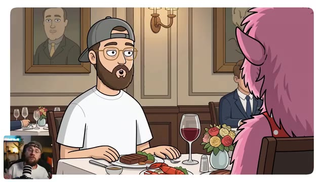
*Animation montrant un personnage de type dessin animé (avatar de Jack) en train de dîner dans un restaurant avec une créature rose, tandis que Jack apparaît en petit encadré PiP dans le coin inférieur gauche.*

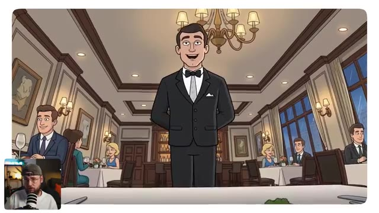
*Animation montrant un maître d'hôtel dans un restaurant chic, avec Jack toujours visible en petit encadré PiP dans le coin inférieur gauche.*

---
