# ?? Comment créer une chaîne de dessins animés pour enfants avec l'IA (Workflow complet)

> **Cha?ne** : [Jack Vs. AI](https://www.youtube.com/@JackVsAI)  
> **Titre original** : `How to Build a Kids Animation Channel with AI (Full Workflow)`  
> **Lien YouTube** : [https://www.youtube.com/watch?v=NnvRMs_0UQ8](https://www.youtube.com/watch?v=NnvRMs_0UQ8)  
> **Date de publication** : 2026-06-28  
> **Dur?e** : 22m 49s (`1369s`)  
> **Identifiant vid?o** : `NnvRMs_0UQ8`  
> **Fiche Web Interactive** : [2026-06-28_YT-NnvRMs_0UQ8_Comment créer une chaîne de dessins animés pour enfants avec l'IA (Workflow comp_by-whisper-v3-large-turbo+gemini-3.5-flash-lite.html](2026-06-28_YT-NnvRMs_0UQ8_Comment créer une chaîne de dessins animés pour enfants avec l'IA (Workflow comp_by-whisper-v3-large-turbo+gemini-3.5-flash-lite.html)  
> **Captures d'?cran cl?s** : `36 images sauvegard?es`  
> **Mod?les utilis?s** : Audio: `large-v3-turbo` (Faster-Whisper int8 VPS) | Vision: `gemini-3.5-flash-lite` (Google AI Studio API)  

---

## ?? Synth?se Ex?cutive & Outils

### 📌 Résumé

La vidéo de Jack Vs. AI démontre comment capitaliser sur l'une des niches les plus lucratives de YouTube : le contenu pour enfants, illustré par des mastodontes comme Cocomelon ou Bébé Requin générant des millions de vues. En s'appuyant exclusivement sur des outils d'intelligence artificielle générative, Jack dévoile un workflow de production complet permettant de s'affranchir d'une équipe lourde (animateurs, doubleurs, musiciens). Cette méthode industrielle permet de concevoir de bout en bout des vidéos musicales et narratives de haute qualité, ouvrant ainsi une opportunité commerciale majeure pour les créateurs audacieux.

La méthodologie repose sur une structuration rigoureuse de la production, divisée en phases distinctes : la conception visuelle, la génération de fiches de personnages, la création des décors et l'animation des scènes. Jack emploie une approche hybride, combinant des modèles de pointe (Nano Banana, GPT Image 2, Higgsfield, Seedance) pour verrouiller la direction artistique et garantir une cohérence visuelle parfaite d'une scène à l'autre. Le secret de ce succès réside dans l'ingénierie des prompts — notamment l'utilisation de Claude pour analyser les standards de l'industrie — afin d'obtenir des graphismes adaptés aux enfants sans dériver vers des artefacts visuels indésirables.

Au-delà de la simple création visuelle, ce workflow pose les bases d'un empire commercial pérenne. En générant une bibliothèque d'actifs réutilisables (personnages sous tous les angles, échelles de taille, environnements cohérents), les créateurs peuvent produire à l'infini des histoires et des comptines musicales. Ce tutoriel offre non seulement une feuille de route technique actionnable, mais souligne également l'urgence de se positionner sur ce marché avant qu'il ne devienne saturé par l'adoption massive de ces nouveaux flux de travail IA.

---

### 🛠️ Outils, Modèles & Logiciels Présentés

* **Higgsfield** : Plateforme centrale utilisée pour préparer, organiser et générer les ressources visuelles initiales du projet.
* **Nano Banana (et Nano Banana Pro)** : Modèle privilégié pour fixer la direction artistique et le style graphique initial des personnages.
* **GPT Image 2** : Modèle utilisé pour les modifications techniques avancées et la génération de planches de personnages multi-angles.
* **Claude** : Assistant textuel utilisé pour analyser les styles visuels de dessins animés à succès et rédiger des prompts de style précis, expurgés de toute propriété intellectuelle.
* **Seedance (C-Dance 2)** : Modèle de génération vidéo par IA de ByteDance, employé pour animer les images fixes et donner vie aux scènes.
* **Premiere Pro** : Logiciel de montage traditionnel utilisé pour assembler les plans finaux, la musique et les voix (mentionné dans le contexte global du workflow).
* **flux** : Outil d'accompagnement pour la génération et l'optimisation des flux visuels.

---

### 🔑 Points Clés & Enseignements Stratégiques

1. **Cibler une niche ultra-lucrative** : Le contenu pour enfants (comptines, clips éducatifs) génère des milliards de vues et des revenus publicitaires massifs sur YouTube, représentant l'une des opportunités financières les plus rentables de l'IA actuelle.
2. **Industrialiser la création sans équipe** : L'IA permet de remplacer l'ensemble d'une chaîne de production traditionnelle (animateurs, musiciens, doubleurs) par un flux de travail solo automatisé.
3. **Combiner les forces des différents modèles** : Ne vous limitez pas à une seule IA ; utilisez **Nano Banana** pour poser l'identité visuelle et **GPT Image 2** pour structurer les planches techniques.
4. **Optimiser les prompts de style via l'analyse concurrentielle** : Utilisez **Claude** pour analyser des références de dessins animés à succès, identifier les leviers d'engagement auprès des enfants et générer un prompt de style reproductible.
5. **Gommer les références à la propriété intellectuelle** : Lors de l'utilisation de grands modèles de langage pour rédiger vos prompts, veillez à supprimer toute mention de marques existantes pour garantir l'originalité et éviter les problèmes de droits.
6. **Générer des fiches de personnages (Character Sheets)** : Fournissez systématiquement au modèle vidéo des vues sous tous les angles d'un même personnage pour éviter que l'IA ne devine les proportions et gaspille des crédits.
7. **Définir les échelles de taille (Height Alignment)** : Créez une image de référence où tous les personnages (humains et animaux) posent côte à côte pour établir une hiérarchie visuelle cohérente et crédible.
8. **Créer une bibliothèque d'actifs réutilisables** : Dissociez la création des personnages de celle des décors (salle de jeux, ville, salle de bain) pour pouvoir les combiner à l'infini dans de futures histoires.
9. **Maintenir la cohérence du monde visuel** : Assurez-vous que chaque élément (décors, accessoires, personnages) intègre le même prompt de style pour que l'univers graphique reste homogène d'une vidéo à l'autre.
10. **S'appuyer sur les meilleurs moteurs vidéo** : Utilisez des solutions de pointe comme **Seedance (C-Dance 2)** pour convertir vos images statiques en animations fluides et de haute qualité adaptées au rythme des enfants.
11. **Centraliser et partager ses ressources** : Structurer une communauté (comme la School de Jack) pour partager gratuitement les prompts et les matériaux permet de fédérer une audience tout en accélérant l'apprentissage collectif.

---

## ?? Chronologie & Transcription Compl?te Audio & Visuelle (Mot pour Mot)

### ?? `[00:00:00 - 00:00:20]` | Segment #01

**?? Audio (Transcription Int?grale Mot pour Mot en Fran?ais) :**
> L'IA vient de débloquer une mine d'or cachée et ce n'est probablement pas ce que vous pensez. Le contenu fait pour les enfants génère des milliards de dollars chaque année. Imaginez tout un empire commercial construit autour de vidéos comme celle-ci. Jusqu'à présent, vous auriez eu besoin de toute une équipe de production. On parle d'animateurs, de comédiens de doublage et de musiciens.

**??? Analyse Visuelle d'?cran (gemini-3.5-flash-lite) :**
**Interface & Outils** : Lecteur vidéo affichant une séquence animée au format 16:9 aux coins arrondis, intégrée dans une interface de montage vidéo avec un arrière-plan sombre et coloré.

**Contenu textuel & Code** : Texte incrusté à l'écran en minuscules blanches (« imagine an entire »), et scène animée style cartoon 3D montrant un jeune garçon portant une casquette, des lunettes et un t-shirt blanc, accompagné d'une petite chouette et d'une boule de poils (hérisson ou peluche) dans un décor champêtre coloré avec une maisonnette au toit jaune.

**Action / D?monstration** : Lecture en boucle d'un extrait vidéo animé généré par IA destiné à un public jeunesse, illustrant le type de contenu visuel mentionné dans le commentaire audio.

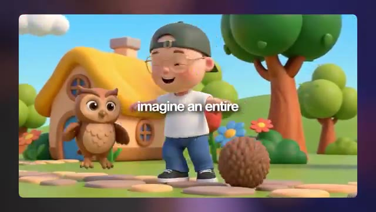

---

### ?? `[00:00:21 - 00:00:39]` | Segment #02

**?? Audio (Transcription Int?grale Mot pour Mot en Fran?ais) :**
> Mais vous pouvez désormais tout construire avec l'IA. Je suis Jack, j'ai passé plus d'une décennie à créer des effets visuels pour de nombreuses plus grandes marques de la planète. Et maintenant j'utilise l'IA pour réinventer les flux de travail créatifs. Dans cette vidéo, je vais vous apprendre à créer du contenu musical animé que les enfants et même les parents adoreront.

**??? Analyse Visuelle d'?cran (gemini-3.5-flash-lite) :**
**Interface & Outils** : Lecteur vidéo affichant une image de synthèse au format 16:9 aux coins arrondis, avec des sous-titres superposés au centre de l'écran.

**Contenu textuel & Code** : Texte des sous-titres affiché à l'écran : « and now I'm using ». Image montrant des personnages de style animation 3D (un jeune garçon à lunettes, un crocodile vert et un lapin blanc) jouant ensemble dans un bac à sable pour construire un château de sable, dans un parc avec des balançoires et une maison colorée en arrière-plan sous un soleil couchant.

**Action / D?monstration** : La vidéo se lit en affichant l'image fixe animée des personnages dans le bac à sable, avec les sous-titres blancs sur fond semi-transparent qui apparaissent au rythme de la voix off.

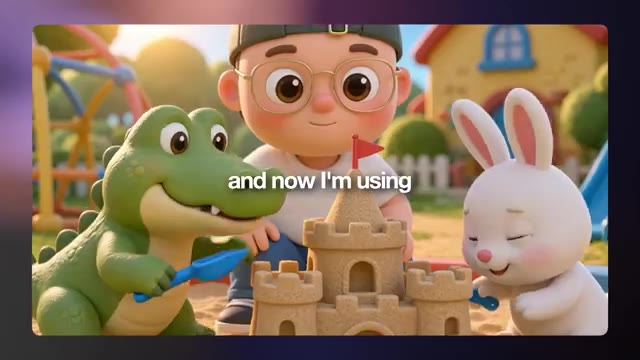

---

### ?? `[00:00:39 - 00:00:57]` | Segment #03

**?? Audio (Transcription Int?grale Mot pour Mot en Fran?ais) :**
> Donc, d'ici la fin, vous pourrez créer votre propre chaîne d'animation pour enfants. Je crois sincèrement que c'est l'une des plus grandes opportunités de gagner de l'argent dans le domaine de l'IA. Mais la porte ne restera pas ouverte longtemps. Croyez-moi. Si vous aimez le contenu d'aujourd'hui, n'oubliez pas de lâcher un pouce bleu et pensez à vous abonner. Allez, c'est parti.

**??? Analyse Visuelle d'?cran (gemini-3.5-flash-lite) :**
**Interface & Outils** : Jack face caméra, dans son studio personnel doté d'une étagère rétroéclairée par des néons bleu et orange, d'une lampe de bureau noire orientée vers le mur lambrissé, et d'un fauteuil ergonomique sombre avec un coussin orange vif. Il porte une casquette verte portée à l'envers, des lunettes rondes et un t-shirt blanc uni, positionné directement devant un microphone à condensateur professionnel blanc et noir.

**Contenu textuel & Code** : En arrière-plan à gauche, on aperçoit une enseigne lumineuse au néon affichant le logo de la chaîne « Jack Vs. AI ». Aucun autre texte, prompt de génération ou paramètre technique n'est affiché à l'écran lors de ce plan de présentation.

**Action / D?monstration** : Jack s'adresse directement aux spectateurs en face caméra, gesticulant légèrement avec assurance tout en parlant au micro pour introduire le sujet principal de la vidéo et encourager l'engagement du public.

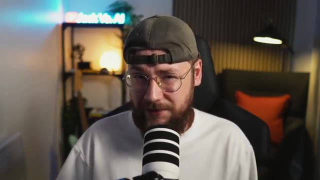

---

### ?? `[00:00:57 - 00:01:31]` | Segment #04

**?? Audio (Transcription Int?grale Mot pour Mot en Fran?ais) :**
> Donc nous allons commencer la vidéo d'aujourd'hui en examinant la génération d'images. C'est ici que nous allons créer nos personnages et notre univers. Ensuite, nous passerons à l'animation de scènes axées sur l'histoire, suivie de l'animation de scènes musicales, y compris la façon de générer votre propre musique de style comptine en utilisant l'IA. Mais pour tous ceux qui ne sont pas vraiment convaincus par cette idée, laissez-moi vous montrer le marché que nous ciblons ici. Nous pouvons commencer par une chaîne comme Dave and Ava, qui compte un peu moins de 16 millions d'abonnés. Je suis sûr que vous avez également tous entendu parler de Pink Fong. Ce sont l'équipe derrière

**??? Analyse Visuelle d'?cran (gemini-3.5-flash-lite) :**
**Interface & Outils** : Capture d'écran montrant une image principale de personnages animés 3D mignons dans une piscine à balles (style dessins animés pour enfants), avec en bas à gauche une incrustation vidéo (PiP) de Jack face caméra devant un microphone, et en bas au centre une piste audio verte avec sa forme d'onde et une tête de lecture blanche.

**Contenu textuel & Code** : Image stylisée 3D de type Pixar/comptine pour enfants représentant un jeune garçon aux cheveux bruns avec des lunettes rondes et une casquette verte, entouré de personnages d'animaux mignons (un crocodile vert, un canard jaune, un lapin blanc, un renard roux, un hibou et un hérisson) dans une aire de jeux colorée remplie de boules multicolores.

**Action / D?monstration** : Jack parle en face caméra (dans l'encadré en bas à gauche) pendant que l'image principale illustrant le monde coloré des enfants et la piste audio défilent à l'écran.

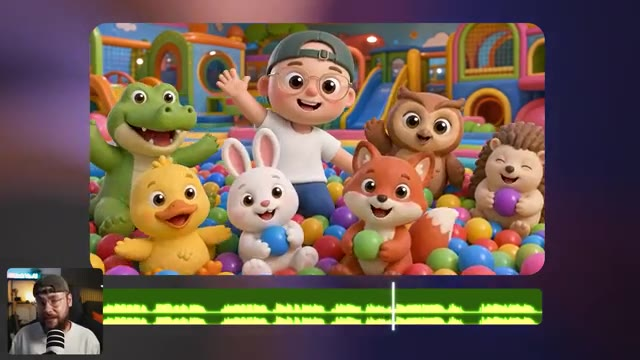

---

### ?? `[00:01:31 - 00:02:05]` | Segment #05

**?? Audio (Transcription Int?grale Mot pour Mot en Fran?ais) :**
> Bébé Requin. Ils ont presque 85 millions d'abonnés. Et puis nous avons Cocomelon qui a 200 millions d'abonnés. Et si on jette un coup d'œil à leurs vidéos, à peu près chacune d'elles a des millions de vues. Ces gars-la gagent énormément d'argent. Et c'est le point que j'essaie de faire passer. Même si vous ne prenez peut-être pas ce type de contenu au sérieux, cela représente une énorme opportunité de gagner de l'argent. J'ai deux jeunes enfants donc je comprends à quel point c'est fort

**??? Analyse Visuelle d'?cran (gemini-3.5-flash-lite) :**
**Interface & Outils** : Une page de résultats de recherche ou d'accueil YouTube affichant une grille de miniatures de vidéos de la chaîne "CoComelon", avec en bas à gauche une incrustation vidéo (PiP) montrant Jack face caméra devant son micro de streaming.

**Contenu textuel & Code** : Six miniatures de vidéos YouTube de la chaîne CoComelon avec les titres et compteurs de vues : 
- Ligne du haut, de gauche à droite : 
  1. "Football Song! ⚽ Summer Champions | Play Together | CoComelon Nursery Rhymes & Kids Songs" (4.4M views • 2 weeks ago) — Durée 5:56
  2. "Apples and Bananas 🍎 NEW 🍌 JJ's Animal Time | CoComelon Nursery Rhymes & Kids Songs" (4M views • 2 weeks ago) — Durée 2:06
  3. "Humpty Dumpty Outdoor Chase 🥚 Big Balloon Adventure | CoComelon Nursery Rhymes & Songs for..." (8M views • 2 weeks ago) — Durée 3:23
- Ligne du bas, de gauche à droite : 
  4. "Hello Kitty & Pompompurin ...ns with Sanrio Friends" (Durée 3:03)
  5. "Soccer Tournament Song & Play Pretend Animals ⚽ | CoComelon Nursery Rhymes & Kids Songs" (6M views • 3 weeks ago) — Durée 3:13
  6. "If You're Happy Dino Stomp & Counting Dinosaurs Song! | Dinosaur Day | CoComelon Nursery Rhymes" (3.6M views • 3 weeks ago) — Durée 6:26

**Action / D?monstration** : Jack commente à l'écran la popularité des vidéos pour enfants tout en affichant la grille des miniatures YouTube pour illustrer le succès massif et le nombre élevé de vues des chaînes axées sur le jeune public.

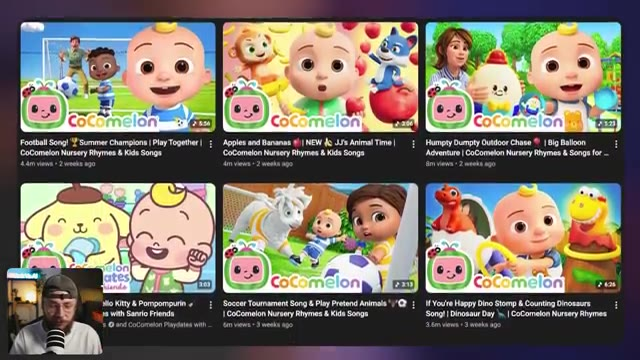

---

### ?? `[00:02:05 - 00:02:41]` | Segment #06

**?? Audio (Transcription Int?grale Mot pour Mot en Fran?ais) :**
> le contenu peut l'être, surtout s'il est de bonne qualité et enseigne quelque chose d'utile à l'enfant. Comme vous l'avez vu, la bonne vidéo dans cette niche peut générer des millions de vues et rapporter beaucoup d'argent au créateur. La première étape consiste donc à créer nos visuels et pour ce faire, nous sommes sur Higgsfield AI. C'est ici que nous allons préparer toutes nos ressources que nous animerons plus tard dans la vidéo. La beauté de la chose, c'est qu'une fois nos personnages et nos décors définis, nous pouvons réellement les réutiliser pour créer n'importe quel type de contenu pour notre chaîne. Et vous remarquerez

**??? Analyse Visuelle d'?cran (gemini-3.5-flash-lite) :**
**Interface & Outils** : Logo ou icône de l'application affiché au centre de l'écran sur un fond flouté aux tons sombres et violets.

**Contenu textuel & Code** : Icône carrée aux coins arrondis de couleur jaune-vert fluo représentant un tracé sinueux ou un serpent noir stylisé. Aucun texte visible.

**Action / D?monstration** : Affichage fixe d'un logo d'application centré avec un effet de flou en arrière-plan, illustrant le passage vers la plateforme Higgsfield AI mentionnée dans le commentaire audio.

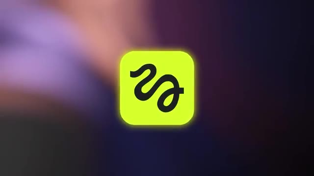

---

### ?? `[00:02:41 - 00:03:17]` | Segment #07

**?? Audio (Transcription Int?grale Mot pour Mot en Fran?ais) :**
> que lorsque je commence à afficher ces images, je passe en fait de Nano Banana Pro à GPT Image 2, et c'est parce que je pense que Nano Banana est le meilleur pour fixer le style, mais qu'ensuite GPT Image 2 est bien meilleur pour construire des choses comme des planches de personnages par exemple et pour faire ce genre de modifications techniques. La première chose que je voulais générer était le personnage principal pour notre animation pour enfants. J'ai donc commencé par télécharger des images de référence de moi-même. J'ai ajouté une courte description, puis j'ai demandé à Nano Banana de supprimer ma barbe. Maintenant, la partie du

**??? Analyse Visuelle d'?cran (gemini-3.5-flash-lite) :**
**Interface & Outils** : Capture d'écran ou fenêtre logicielle de visualisation d'images avec encadré montrant une planche de personnages ("character sheet") d'un petit canard jaune en 3D sous différents angles, et incrustation vidéo en bas à gauche de Jack (face caméra) avec un micro.

**Contenu textuel & Code** : Texte affiché au centre de l'écran : "character sheet". Visuel principal : quatre vues (face, dos, gros plan de face, profil) d'un personnage de canard jaune mignon de style animation 3D sur fond gris clair.

**Action / D?monstration** : Jack commente et présente à l'écran une planche de personnages générée par IA pour illustrer son processus de création pour une animation jeunesse.

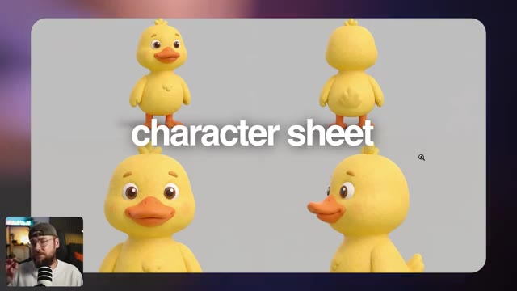

---

### ?? `[00:03:17 - 00:03:53]` | Segment #08

**?? Audio (Transcription Int?grale Mot pour Mot en Fran?ais) :**
> le prompt qui fait réellement tout le travail est cette très grande section à la fin qui définit notre style. Et c'est quelque chose que j'ai en fait assemblé en utilisant Claude. J'ai donc téléchargé un tas de références de dessins animés pour enfants dont je savais qu'ils étaient vraiment réussis et que je trouvais personnellement d'une qualité décente, puis j'ai demandé à Claude d'effectuer une analyse pour comprendre pourquoi ce style visuel fonctionne si bien et en particulier pourquoi il plaît aux enfants. Et un peu plus loin dans la conversation, j'ai demandé à Claude de rassembler toute cette analyse et de me préparer un prompt de style que je pourrais utiliser.

**??? Analyse Visuelle d'?cran (gemini-3.5-flash-lite) :**
**Interface & Outils** : Interface sombre de l'assistant conversationnel Claude affichant une conversation textuelle avec des images de référence importées en haut. Une petite vignette vidéo incrustée en bas à gauche montre Jack (présentateur de Jack Vs. AI) face caméra devant son micro.

**Contenu textuel & Code** : Explications orales des concepts et des m?thodes de cr?ation vid?o IA.

**Action / D?monstration** : D?monstration p?dagogique et pr?sentation du workflow.

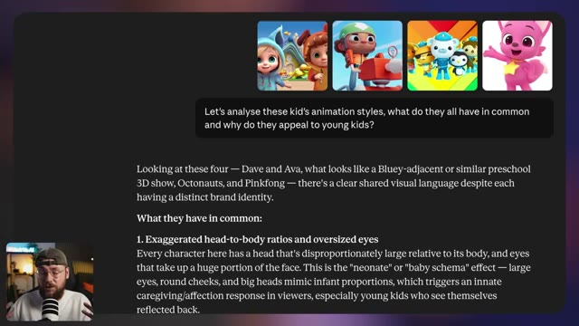

---

### ?? `[00:03:54 - 00:04:26]` | Segment #09

**?? Audio (Transcription Int?grale Mot pour Mot en Fran?ais) :**
> Petit conseil rapide également, j'ai remarqué que Claude faisait référence à de la propriété intellectuelle existante, alors j'ai simplement demandé de supprimer toute mention de celle-ci et j'ai obtenu ce prompt que j'ai réellement copié puis utilisé à l'intérieur de Higgsfield. Et juste pour que vous le sachiez, tous les prompts et matériels que j'ai utilisés pour ce projet seront disponibles gratuitement sur ma communauté School. Le lien pour cela est en bas dans la description. Donc, j'ai vraiment adoré cette première image ici. C'était exactement le type de style que je recherchais. Donc une fois que j'ai été satisfait de ce point de départ

**??? Analyse Visuelle d'?cran (gemini-3.5-flash-lite) :**
**Interface & Outils** : Jack face caméra dans son studio, assis dans un fauteuil noir avec un coussin orange visible en arrière-plan à droite. Un microphone blanc et noir à rayures se trouve au premier plan devant lui. En arrière-plan à gauche, on distingue une étagère avec une enseigne lumineuse au néon affichant le logo YouTube et le texte « Jack Vs. AI ».

**Contenu textuel & Code** : Aucun texte, prompt de génération, paramètre technique ou interface logicielle n'est affiché à l'écran dans ce segment.

**Action / D?monstration** : Jack s'adresse directement aux spectateurs en face caméra, expliquant son processus de travail avec Claude et Higgsfield tout en gesticulant légèrement en parlant.

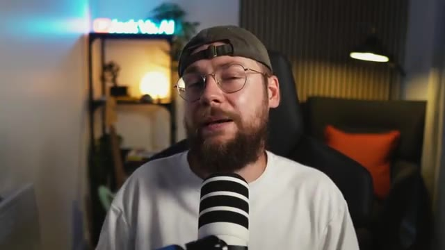

---

### ?? `[00:04:26 - 00:05:00]` | Segment #10

**?? Audio (Transcription Int?grale Mot pour Mot en Fran?ais) :**
> image, l'étape suivante consistait à aller de l'avant et à cliquer sur cette icône ici pour l'utiliser comme référence pour la suite. Vous voulez aller de l'avant et passer de Nano Banana Pro à GPT Image 2. Et pour obtenir notre fiche de personnage, nous avons ce très long prompt ici. Laissez-moi vous le décortiquer. D'abord, je décris notre personnage une fois de plus pour être vraiment précis sur la façon dont je veux qu'il ait l'air, mais aussi sur ce que je veux qu'il porte. Et ensuite, je glisse en fait ce même prompt de style que nous avons fait avec Claude un peu plus tôt. Donc ces deux premières espèces de sections du prompt

**??? Analyse Visuelle d'?cran (gemini-3.5-flash-lite) :**
**Interface & Outils** : Jack face caméra dans son studio, avec un néon lumineux bleu portant l'inscription "Jack Vs. AI" en arrière-plan, un microphone blanc et noir posé au premier plan devant lui, et un fauteuil de bureau noir.

**Contenu textuel & Code** : Aucun texte, prompt ou paramètre technique n'est affiché à l'écran dans ce segment (plan face caméra).

**Action / D?monstration** : Jack est assis face caméra et s'adresse directement au spectateur en gesticulant légèrement des mains pour illustrer ses explications.

---

### ?? `[00:05:00 - 00:05:26]` | Segment #11

**?? Audio (Transcription Int?grale Mot pour Mot en Fran?ais) :**
> servent vraiment à figer ce style et cette cohérence. Et la dernière section ici est simplement une structure qui indique à GPT Image 2 que je veux obtenir différentes vues du même personnage. Et la raison pour laquelle une fiche de personnage est si importante, c'est qu'elle va montrer au modèle vidéo par IA que nous utiliserons plus tard dans la vidéo à quoi ressemblent nos personnages sous tous les angles possibles.

**??? Analyse Visuelle d'?cran (gemini-3.5-flash-lite) :**
**Interface & Outils** : Interface sombre d'une application ou d'un outil de génération d'images par IA, comportant une grande zone de texte pour le prompt, une barre d'options inférieure avec sélecteur de modèle ("GPT Image 2"), format d'image ("3:4"), compteurs/favoris, et un bouton de génération vert fluo "Generate".

**Contenu textuel & Code** : Texte complet du prompt visible dans la zone principale : "Character reference sheet with no text — four views on a neutral grey background, no visible text. [VIEW 1 — FULL BODY, FRONT] Full-body front-facing three-quarter view of this character, full body visible head to feet. [VIEW 2 — FULL BODY, REAR] Full-body rear view of the same character, directly from behind. Full body visible head to feet. [VIEW 3 — FRONT CLOSE-UP] Head and shoulders close-up, straight-on front view. Sharp detail on skin texture, accessories, and costume surface detail. Chest and shoulder armour/clothing visible at the bottom of frame. [VIEW 4 — PROFILE CLOSE-UP] Head and shoulders close-up, 90-degree left profile view. Neck and upper shoulder visible." Paramètres visibles : Modèle "GPT Image 2", ratio d'aspect "3:4", bouton "Generate 7".

**Action / D?monstration** : L'interface présente la rédaction d'un prompt détaillé structuré en quatre vues distinctes (vue de face complète, vue de dos, gros plan de face, gros plan de profil) pour générer une feuille de référence de personnage cohérente.

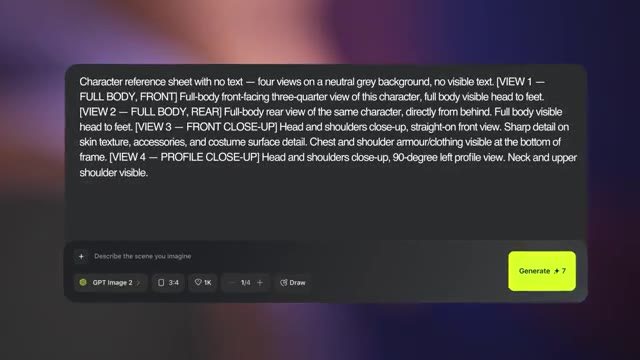

---

### ?? `[00:05:26 - 00:06:03]` | Segment #12

**?? Audio (Transcription Int?grale Mot pour Mot en Fran?ais) :**
> Si nous ne fournissons pas ces informations, c'est là que les choses ont tendance à mal tourner. L'IA finit par devoir deviner et finalement vous gaspillez vos crédits. Et puis ce que j'ai fait, c'est qu'en utilisant cette toute première image comme référence, j'ai créé différents personnages dans le même style. Maintenant, ce prompt pourrait en fait être vraiment très simple. J'ai donc simplement dit : dans le même style artistique, sans vêtements ni accessoires, montrez un mignon crocodile debout. Nous avons donc également créé un ours. Nous avons un caneton, un lapin, un renardeau, un hibou et un hérisson. Et comme vous pouvez le voir, j'ai fini par utiliser exactement le même personnage.

**??? Analyse Visuelle d'?cran (gemini-3.5-flash-lite) :**
**Interface & Outils** : Une interface web de génération d'images/vidéos par IA s'affiche sur la majeure partie de l'écran (avec un panneau latéral droit affichant les détails, le prompt, le modèle et la qualité). Dans le coin inférieur gauche, on aperçoit une petite incrustation vidéo (caméra de Jack en train de parler devant son micro).

**Contenu textuel & Code** : Dans le panneau latéral droit, on peut lire le pseudo "jackvsai" (Author), un onglet "Details" et "Comments", un bloc "PROMPT" avec une miniature représentant un personnage humain et le texte : "In the same art style, with no clothes or accessories, show a... cute crocodile, stood up". Plus bas, dans la section "INFORMATION", le modèle indiqué est "Nano Banana Pro", la qualité est "2k", et la taille est "2752x1536". Un bouton jaune en bas indique "Turn to video", ainsi que des options "Publish" et "Recreate". La grande zone centrale affiche l'image générée d'un petit crocodile vert au style 3D/cartoon, debout dans un décor coloré avec une maisonnette et des fleurs.

**Action / D?monstration** : L'écran affiche l'image finale d'un crocodile généré par IA dans un style 3D similaire au personnage de référence, tandis que le panneau latéral détaille le prompt textuel utilisé pour obtenir ce résultat. Le curseur de la souris (flèche blanche) est visible au centre-droit sur l'interface.

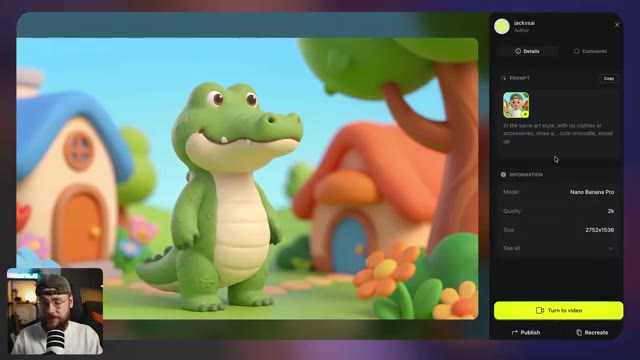

---

### ?? `[00:06:03 - 00:06:37]` | Segment #13

**?? Audio (Transcription Int?grale Mot pour Mot en Fran?ais) :**
> processus de feuille une fois de plus afin que nous ayons ces détails pour nos personnages supplémentaires également. Et quelque chose d'autre que j'ai construit était cet alignement ici où nous avons chacun de nos personnages debout l'un à côté de l'autre. Et je pensais que c'était important de définir la hauteur, surtout par rapport à notre personnage principal ici. Je me suis dit que ce serait un peu bizarre si les animaux faisaient la même taille que lui ou même plus grand, ce ne serait tout simplement pas l'ambiance que nous recherchions. Donc encore une fois, nous fournissons plus de contexte à l'IA en générant ceci. Donc ici, je fais référence à toutes nos feuilles de personnages et

**??? Analyse Visuelle d'?cran (gemini-3.5-flash-lite) :**
**Interface & Outils** : Interface utilisateur de type générateur d'images/vidéos par IA avec un panneau latéral droit (comprenant les onglets Details et Comments, la section PROMPT avec une grille de vignettes d'images, et la section INFORMATION avec le modèle et la taille). Un aperçu vidéo miniature (picture-in-picture) de Jack face caméra apparaît en bas à gauche de l'écran.

**Contenu textuel & Code** : Texte du prompt visible partiellement : "Show the same characters in the same art style, all stood next to each other against a neutral grey background. The boy is stood in the centre, with all of the animals either side of him. One crocodile...". Paramètres techniques : Modèle "GPT Image 2", Qualité "High", Taille "2688x1520". Bouton jaune "Turn to video", et boutons "Publish" et "Recreate".

**Action / D?monstration** : L'image principale affiche un alignement (lineup) de tous les personnages en 3D (le garçon au centre, entouré d'un crocodile, d'un canard, d'un lapin, d'un renard, d'un hibou et d'un hérisson) sur un fond gris neutre. Le curseur de la souris est visible sur le personnage principal. En bas à gauche, le présentateur Jack parle face caméra avec un micro.

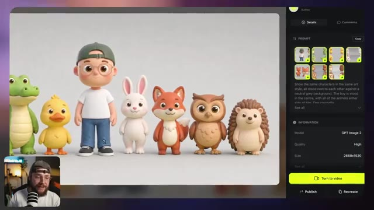

---

### ?? `[00:06:37 - 00:07:11]` | Segment #14

**?? Audio (Transcription Int?grale Mot pour Mot en Fran?ais) :**
> un autre prompt assez simple pour décrire la composition et préciser que je veux qu'un seul de chaque animal soit présent. Et en utilisant un processus très similaire encore une fois, nous pouvons en fait créer divers emplacements différents. Nous avons donc une jolie petite ville ici. Nous avons une salle de jeux et nous avons aussi une salle de bain et ce qui est vraiment important, c'est que tout donne l'impression d'appartenir au même style et finalement au même monde, ce qui nous permet de combiner nos feuilles de personnages avec notre décor conçu pour placer réellement nos personnages dans

**??? Analyse Visuelle d'?cran (gemini-3.5-flash-lite) :**
**Interface & Outils** : Interface utilisateur web d'une plateforme de génération d'images/vidéos par IA (type Midjourney, Discord ou interface propriétaire), comprenant un panneau latéral droit affichant les détails de la génération, les métadonnées et des boutons d'action (comme "Turn to video", "Publish", "Recreate"), ainsi qu'un encart miniature en bas à gauche montrant le présentateur Jack en face-caméra avec son micro.

**Contenu textuel & Code** : L'image principale montre une salle de bain stylisée en 3D avec un miroir rond, un lavabo en céramique et un petit canard en plastique jaune. Dans le panneau latéral droit, on peut lire le prompt textuel utilisé : "In the same art style, show a... cute bathroom with a rounded mirror, ceramic sink which has a toothbrush holder pot. Window with a view of a bright blue sky...", ainsi que les informations techniques : Modèle "Nano Banana Pro", Qualité "2k", et Format "2752x1536". Un bouton jaune en bas du panneau indique "Turn to video".

**Action / D?monstration** : Le curseur de la souris (avec une loupe) est positionné sur la fenêtre de la salle de bain dans l'image générée, tandis que l'interface présente les détails et les options pour transformer cette image générée en vidéo ("Turn to video").

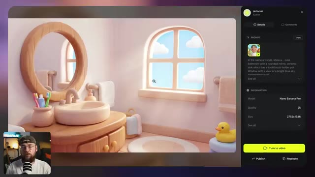

---

### ?? `[00:07:11 - 00:07:46]` | Segment #15

**?? Audio (Transcription Int?grale Mot pour Mot en Fran?ais) :**
> cet environnement. Encore une fois, un prompt très simple ici pour obtenir ce niveau de résultat, mais le fait est que nous pouvons placer n'importe quel personnage dans n'importe quel environnement pour créer des histoires sans fin. Nous construisons cette bibliothèque vraiment diversifiée d'actifs d'images que nous pouvons ensuite animer pour créer nos vidéos. La prochaine étape du processus est enfin de commencer à donner vie à nos scènes. Donc pour ce faire, vous voulez vous rendre dans le coin supérieur gauche et aller sur C-Dance 2. C'est le meilleur modèle vidéo IA sur le marché en ce moment et il l'est en fait depuis un certain temps.

**??? Analyse Visuelle d'?cran (gemini-3.5-flash-lite) :**
**Interface & Outils** : Interface web d'une application de génération d'images et de vidéos par IA affichant une galerie sous forme de grille d'images (style 3D/Pixar avec un jeune garçon casquette et lunettes). En bas à gauche, une incrustation vidéo montre le présentateur (Jack) avec un casque et un micro. En bas de l'écran, une barre de menu contextuelle de génération/édition avec des vignettes de sélection d'images et un champ de texte de prompt.

**Contenu textuel & Code** : Texte affiché dans le champ de prompt en bas : "In the same art style, show... The fox and duckling sat on the rug together. The duckling is driving a small red toy fire truck along the rug,". Dans la barre supérieure de l'application, on peut lire des onglets comme "Explore", "Image", "Video", "Audio", "Supercomputer", "MCP & CLI", "Collab", "Plugins", "Marketing Studio", "Cinema Studio", "AI Influencer", "Canvas", "Apps".

**Action / D?monstration** : Le présentateur (Jack) commente la bibliothèque d'images générées et la transition vers l'animation des personnages, tandis que l'interface présente une vue d'ensemble d'une grille d'actifs visuels cohérents et qu'un curseur de souris navigue dans l'interface.

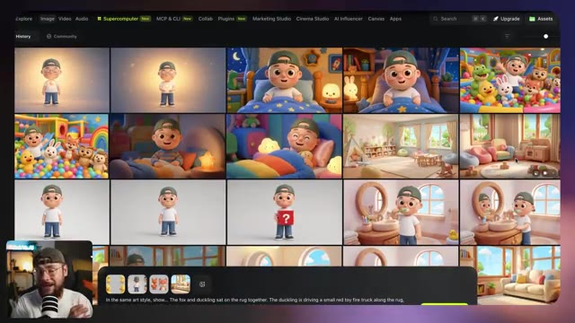

---

### ?? `[00:07:46 - 00:08:22]` | Segment #16

**?? Audio (Transcription Int?grale Mot pour Mot en Fran?ais) :**
> maintenant personne ne semble capable de s'approcher de ce que ByteDance a construit. Donc la première chose que nous voulons faire est de sélectionner tous les actifs d'images pertinents. Donc par exemple nous voulons la feuille de personnages du garçon, du crocodile et du lapin ainsi que l'image que nous avons générée pour notre genre de lieu de salle de jeux. Nous voulons également télécharger une référence audio de la voix de notre personnage. Cela signifie que nous pouvons générer autant de vidéos que nous le souhaitons mais que la voix reste la même. Pour faire cela, j'ai tiré l'une de mes premières générations dans Premiere Pro et j'ai juste coupé la séquence de sorte qu'elle ne soit que le

**??? Analyse Visuelle d'?cran (gemini-3.5-flash-lite) :**
**Interface & Outils** : Interface de l'outil de génération vidéo Seedance 2.0 (marqué "GENERAL" dans le panneau latéral gauche), avec une fenêtre modale de sélection de médias comportant les onglets "Uploads", "Elements", "Image Generations", "Video Generations", et une grille d'images miniatures. En bas à droite, incrustation vidéo montrant le présentateur (Jack) face caméra avec un micro. En arrière-plan à droite, une image générée montrant une salle de jeux avec un crocodile en peluche.

**Contenu textuel & Code** : Panneau latéral gauche : titre "GENERAL", modèle "Seedance 2.0", champ de prompt "Describe your scene in detail. Use @ to reference assets", boutons de configuration avec durée "15s", format "16:9", résolution "1080p", option de débit "Bitrate High", et bouton jaune "Generate" avec coût "135". Fenêtre modale : grille d'images de personnages 3D (garçon, lapin, crocodile, scènes de salle de jeux), plusieurs miniatures affichant le texte "Check eligibility".

**Action / D?monstration** : Le curseur de la souris (flèche blanche) navigue dans la grille de sélection des images de la fenêtre modale et survole l'image de la salle de jeux, tandis que le panneau de configuration à gauche reste visible avec les paramètres de génération prêts à l'emploi.

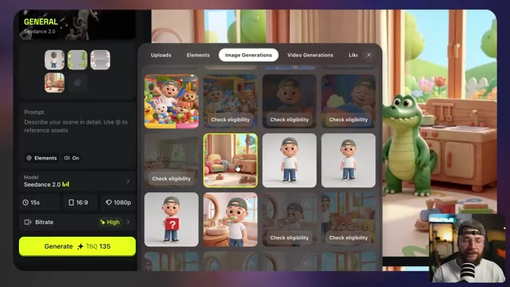

---

### ?? `[00:08:22 - 00:08:58]` | Segment #17

**?? Audio (Transcription Int?grale Mot pour Mot en Fran?ais) :**
> dialogue à gauche. J'ai ensuite pris les devants et j'ai en fait masqué la vidéo elle-même et je suis allé dans l'exportation. Maintenant, pour une raison quelconque, le fait d'extraire cela sous forme de fichier mp3 ne fonctionne tout simplement pas, mais si vous l'exportez sous forme de vidéo vide avec cette piste de dialogue, c'est ce qui va fonctionner vraiment très bien à l'intérieur de C-Dance 2. Nous pouvons donc aller de l'avant et insérer cette vidéo vide ici qui contient notre référence vocale. La pièce manquante du puzzle est notre invite textuelle et vous ne voulez pas simplement décrire vaguement le type de scène que vous recherchez. C-Dance 2 a besoin de beaucoup de technique

**??? Analyse Visuelle d'?cran (gemini-3.5-flash-lite) :**
**Interface & Outils** : Jack en face-caméra dans son studio d'enregistrement, doté d'un micro de type podcast rayé blanc et noir, d'une étagère en arrière-plan avec un néon lumineux affichant le logo "Jack Vs. AI", ainsi qu'un fauteuil noir avec un coussin orange.

**Contenu textuel & Code** : Aucun texte textuel ni interface logicielle ou paramètre technique de génération vidéo n'est affiché à l'écran dans ce plan, le contenu se limitant à l'intervention face caméra du créateur.

**Action / D?monstration** : Jack s'adresse directement aux spectateurs en face caméra, gesticulant légèrement de la main pour expliquer sa méthode d'exportation audio/vidéo destinée à l'outil C-Dance 2.

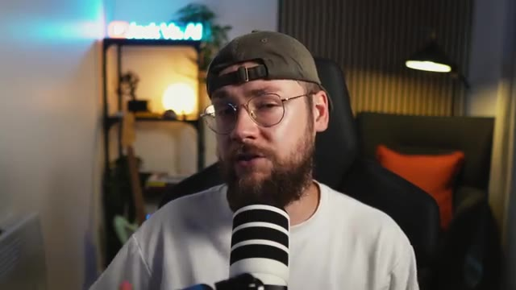

---

### ?? `[00:08:58 - 00:09:34]` | Segment #18

**?? Audio (Transcription Int?grale Mot pour Mot en Fran?ais) :**
> d'informations pour vous donner réellement le résultat que vous voulez. Cela peut être assez complexe à faire. Je vais vous montrer une méthode qui simplifie vraiment les choses. La première chose que je veux que vous alliez faire, c'est d'ouvrir un outil comme ChatGPT, Gemini ou Claude dans mon cas, et nous voulons importer ce fichier MD ici. Comme je l'ai mentionné plus tôt, il sera disponible sur la communauté School. Ce fichier MD va donner à Claude un cadre vraiment clair à utiliser, ce qui signifie que nous pouvons lui donner une description assez minimale et vague de ce que nous recherchons et il nous renverra ce résultat technique vraiment détaillé

**??? Analyse Visuelle d'?cran (gemini-3.5-flash-lite) :**
**Interface & Outils** : Un explorateur de fichiers de type macOS (Finder) affiché en plein écran, avec un encart vidéo incrusté en bas à droite montrant Jack (face caméra avec un micro et une casquette).

**Contenu textuel & Code** : Le dossier affiché se nomme "How to make a cartoon wit..." et contient plusieurs éléments : un fichier "multi-shot-prompt-framework-animation.md" (11 Ko, Plain Text, modifié le 11 juin 2026 à 15:23), ainsi que cinq dossiers : "Ref Images", "Audio", "Recordings", "Video Gen" et "Image Gen". La barre latérale gauche montre les accès rapides (Recents, Shared, Applications, Desktop, Documents, Downloads, iCloud Drive, Jack) et les tags colorés.

**Action / D?monstration** : Le curseur de la souris (flèche blanche) se déplace au centre de la fenêtre du Finder, survolant les différents dossiers et fichiers du répertoire de travail, tandis que Jack s'exprime dans l'encart vidéo.

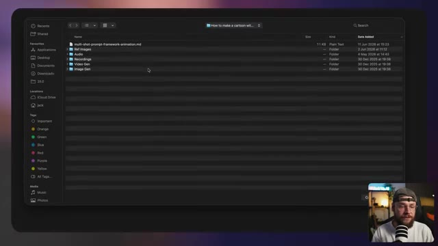

---

### ?? `[00:09:34 - 00:10:02]` | Segment #19

**?? Audio (Transcription Int?grale Mot pour Mot en Fran?ais) :**
> prompt. Vous voulez également importer toutes les images pertinentes. C'est donc nos feuilles de personnages ainsi que le lieu. Et ensuite, nous voulons décrire le type de scène que nous aimerions. Par exemple, montrer le garçon qui enseigne au crocodile et au lapin l'importance de ranger. Il y a un petit panier dans le coin. Il leur apprend à ranger leurs jouets quand ils ont fini de jouer en les mettant dans ce panier. La vidéo se termine sur une bonne note. Ils sont tous heureux et célèbrent.

**??? Analyse Visuelle d'?cran (gemini-3.5-flash-lite) :**
**Interface & Outils** : Une interface web sombre du type assistant IA textuel/multimodal (probablement l'interface d'Anthropic Claude ou une application similaire avec le sélecteur de modèle "Sonnet 4.6 Medium"), intégrant des vignettes d'images importées et un encadré vidéo montrant Jack (face caméra) avec son micro et sa casquette dans le coin inférieur droit. En haut, un titre textuel avec une icône d'étoile/fleur orange : "Coffee and Claude time?".

**Contenu textuel & Code** : Texte affiché dans l'interface de l'IA (en bas) : "Show the boy teaching the crocodile and rabbit about the importance of tidying up. There's a small basket in the corner. He teaches them to put their toys away when they've finished playing by putting them in the basket. The video ends on a high. They are all happy and celebrate, Mummy and Daddy will be happy." En haut, des fichiers joints sous forme de miniatures : un fichier texte markdown nommé "multi-shot-prompt-framework-...", une image de décor intérieur (chambre d'enfant avec des jouets), une feuille de modèle 3D/character sheet d'un crocodile, une feuille de modèle d'un lapin blanc, et des vues multiples d'un garçon avec une casquette.

**Action / D?monstration** : Jack présente à l'écran l'interface de l'outil textuel et les différentes images importées (feuilles de personnages et décor) qui servent de contexte et de références visuelles pour la génération de prompts multi-plans avec l'IA.

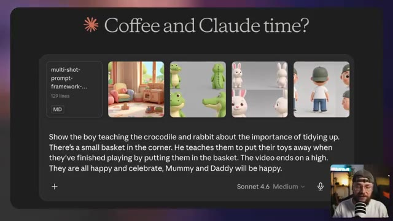

---

### ?? `[00:10:02 - 00:10:35]` | Segment #20

**?? Audio (Transcription Int?grale Mot pour Mot en Fran?ais) :**
> maman et papa seront contents. On peut continuer et envoyer ça et vous allez récupérer quelque chose comme ça où la scène est réellement découpée en plans individuels dictés par ces horodatages. Claude décrit le cadrage et tout mouvement de caméra ainsi que l'action qui se déroule et tout dialogue nécessaire. À partir de notre saisie très simpliste, nous avons obtenu ce prompt incroyablement détaillé spécifiquement construit pour fonctionner avec C Dance 2. On peut donc continuer et

**??? Analyse Visuelle d'?cran (gemini-3.5-flash-lite) :**
**Interface & Outils** : Une interface de type interface textuelle ou de chat sombre (semblable à une sortie de modèle de langage comme Claude ou une application de prompt engineering) s'affiche en grand sur l'écran principal. En bas à droite, on aperçoit une petite incrustation vidéo (picture-in-picture) montrant Jack face caméra avec son micro et sa casquette.

**Contenu textuel & Code** : Le texte affiché est un découpage technique de plans cinématographiques avec des horodatages précis et des paramètres de caméra : 
- [00:00 - 00:02] Wide, 24mm, eye-level, static - the character stands in the pastel playroom beside the rabbit and crocodile, toys scattered on the rug, he gestures around and says "Let's learn how to tidy up!"
- [00:02 - 00:04] Medium, 35mm, eye-level, static - he picks up a wooden block from the rug, holding it up, the rabbit and crocodile watching curiously, says "When we're done playing, everything goes in the basket."
- [00:04 - 00:07] Medium, 35mm, low angle, push in - he walks to the corner and drops the block into the small rope basket with a soft plop, smiling back at the others, says "Just pop it in, nice and easy."
- [00:07 - 00:10] Wide, 24mm, high angle, static - the rabbit hops over and places a toy in the basket, then the crocodile waddles up and adds another, both ... he claps and says "Great job, you two!"
- [00:10 - 12:00] Medium, 50mm, eye-level, slow pull out - all three stand...

**Action / D?monstration** : Le curseur de la souris (flèche) survole l'interface textuelle au niveau du premier plan. Un bouton de copie (icône de superposition de rectangles) est visible en haut à droite du bloc de texte.

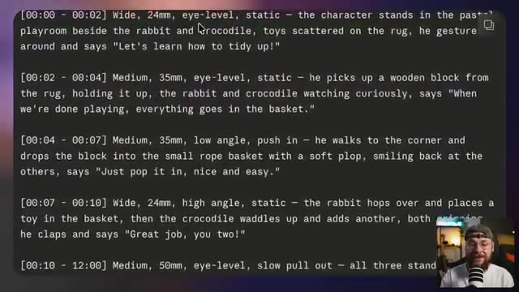

---

### ?? `[00:10:35 - 00:10:55]` | Segment #21

**?? Audio (Transcription Int?grale Mot pour Mot en Fran?ais) :**
> Copie ceci et amène-le directement sur Higgs Field pour le coller dans le champ de texte du prompt. Une petite note : mon framework ajoute toujours ceci à la fin de chaque prompt. Cela indique essentiellement à Seedance 2 de ne pas inclure de musique dans la génération, ce qui facilite simplement les choses du point de vue du montage.

**??? Analyse Visuelle d'?cran (gemini-3.5-flash-lite) :**
**Interface & Outils** : Capture d'écran montrant une interface de génération vidéo par IA divisée en deux parties : à gauche, un panneau de configuration avec des champs de texte et des paramètres (notamment le modèle "Seedance 2.0"), et à droite, un aperçu vidéo montrant un personnage de lapin blanc en 3D. En bas à droite, une incrustation vidéo (picture-in-picture) montre le visage du présentateur Jack (Jack Vs. AI) avec un micro.

**Contenu textuel & Code** : Le panneau de gauche affiche un prompt descriptif détaillé incluant des instructions de localisation ("Location: Cosy pastel playroom with toys and rope basket, warm daylight") et un segment de texte surligné en bleu encadré de jaune : "Audio: Diegetic sound only — natural ambience, environmental foley, subject-driven sound, and character dialogue". On aperçoit également un bouton "@ Elements", une option audio "🔊 On", et le sélecteur de modèle "Model Seedance 2.0".

**Action / D?monstration** : Le curseur de la souris (représenté par une icône en os/bâtonnet) est en train de sélectionner/surligner une portion spécifique du texte du prompt ("Audio: Diegetic sound only — natural ambience, environmental foley, subject-driven sound, and character dialogue") dans l'interface de génération, tandis que l'aperçu vidéo à droite montre un plan rapproché d'un lapin animé.

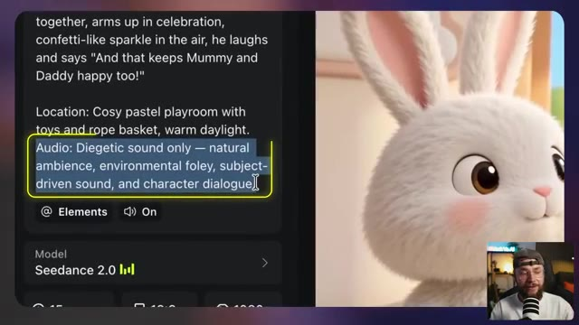

---

### ?? `[00:10:55 - 00:11:16]` | Segment #22

**?? Audio (Transcription Int?grale Mot pour Mot en Fran?ais) :**
> Si vous essayez d'assembler plusieurs générations et qu'elles ont de la musique intégrée, cela devient un cauchemar. Cela vous permet d'ajouter votre propre musique. De même, si vous vouliez simplement laisser C-Dance 2 faire son travail, vous supprimez simplement la fin du prompt comme ça. Et ce qui est également très utile, c'est que nous pouvons ajouter une ligne supplémentaire qui dit de s'assurer que la voix correspond.

**??? Analyse Visuelle d'?cran (gemini-3.5-flash-lite) :**
**Interface & Outils** : Capture d'écran divisée en deux parties : à gauche, une interface web de génération vidéo par IA avec un panneau de texte et des paramètres (modèle Seedance 2.0) ; à droite, le résultat vidéo généré montrant un lapin blanc stylisé en 3D dans une pièce, ainsi qu'en incrustation (picture-in-picture) dans le coin inférieur droit, la webcam de Jack face caméra devant son micro.

**Contenu textuel & Code** : Texte du prompt visible : "together, arms up in celebration, confetti-like sparkle in the air, he laughs and says 'And that keeps Mummy and Daddy happy too!'" ; "Location: Cosy pastel playroom with toys and rope basket, warm daylight." ; Bloc de texte en surbrillance bleue avec un contour jaune : "Audio: Diegetic sound only — natural ambience, environmental foley, subject-driven sound, and character dialogue." ; Paramètre du modèle : "Model Seedance 2.0" avec icône de statistiques, options de ratio d'aspect (16:9, etc.) et curseurs.

**Action / D?monstration** : Le curseur de la souris (représenté par l'icône de sélection de texte) est en train de surligner et de manipuler une ligne spécifique du prompt audio (« Audio: Diegetic sound only... ») dans l'interface de génération, illustrant l'explication sur la modification du prompt pour contrôler la musique et l'audio.

---

### ?? `[00:11:17 - 00:11:35]` | Segment #23

**?? Audio (Transcription Int?grale Mot pour Mot en Fran?ais) :**
> Et ensuite, si nous appuyons sur la touche arobase de notre clavier, nous pouvons sélectionner la vidéo numéro un, qui est la vidéo vide contenant notre référence vocale. Cela signifie que vous pouvez réutiliser la référence pour autant de générations de vidéos que vous le souhaitez, et C-Dance 2 s'assurera que la voix reste cohérente.

**??? Analyse Visuelle d'?cran (gemini-3.5-flash-lite) :**
**Interface & Outils** : Jack face caméra, assis devant un micro noir et blanc monté sur pied, dans une pièce avec un éclairage d'ambiance chaleureux et un néon bleu en arrière-plan portant l'inscription « Jack Vs. AI ».

**Contenu textuel & Code** : Aucun texte, prompt ou paramètre technique visible à l'écran.

**Action / D?monstration** : Jack s'adresse directement aux spectateurs en face caméra, parlant et faisant des gestes tout en expliquant l'utilisation des références vocales dans C-Dance 2.

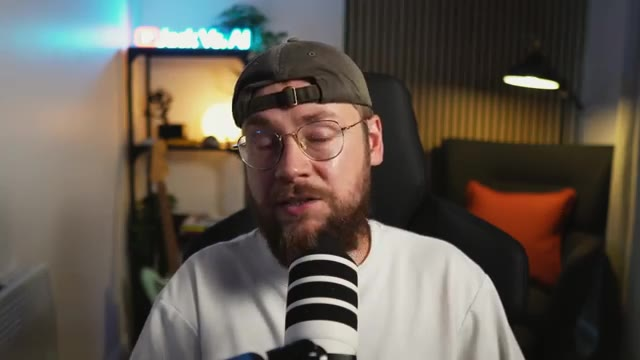

---

### ?? `[00:11:35 - 00:11:55]` | Segment #24

**?? Audio (Transcription Int?grale Mot pour Mot en Fran?ais) :**
> Laissez-moi vous montrer le résultat que j'ai obtenu en utilisant exactement ce processus. Rangeons un peu. Quand on a fini de jouer, tout va dans le panier. On le met dedans gentiment et facilement. Bravo à vous deux. Regardez comme c'est rangé maintenant. Et ça rend papa et maman heureux aussi.

**??? Analyse Visuelle d'?cran (gemini-3.5-flash-lite) :**
**Interface & Outils** : La vidéo présente un extrait animé au format standard affiché en plein écran, sans interface logicielle visible.

**Contenu textuel & Code** : L'image montre une scène animée dans un style 3D similaire au style Pixar ou Disney. On y voit un petit garçon portant une casquette verte et un t-shirt blanc, en train de ranger un bloc en bois dans un panier en osier. À côté de lui se trouvent un lapin blanc en peluche de dos et un petit crocodile vert souriant. Le décor est une chambre d'enfant chaleureuse et lumineuse, avec un canapé coloré et une petite cuisine en bois en arrière-plan.

**Action / D?monstration** : La vidéo en cours de lecture montre l'animation finale fluide obtenue grâce au processus d'intelligence artificielle, où le garçon interagit avec son environnement pour ranger les jouets.

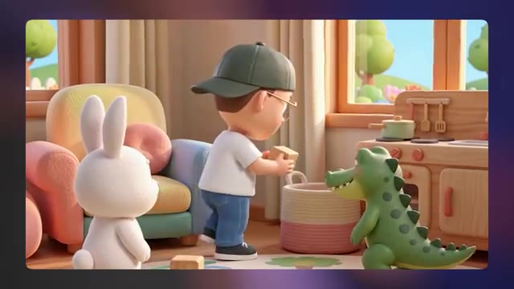

---

### ?? `[00:11:55 - 00:12:16]` | Segment #25

**?? Audio (Transcription Int?grale Mot pour Mot en Fran?ais) :**
> Donc cette approche est parfaite pour construire des scènes où la musique n'est pas vraiment le centre d'intérêt. C'est plutôt axé sur la narration. Laissez-moi vous montrer quelques autres générations que j'ai assemblées pour servir de sorte de preuve de concept. Premièrement, nous avons cette vidéo de style "Qu'est-ce qu'il y a dans la boîte ?". Qu'y a-t-il dans la boîte ? On va y jeter un œil ?

**??? Analyse Visuelle d'?cran (gemini-3.5-flash-lite) :**
**Interface & Outils** : Plan rapproché (face caméra) de Jack dans son studio d'enregistrement, assis dans un fauteuil gaming noir, portant un t-shirt blanc, une casquette verte à l'envers et des lunettes rondes. Un microphone noir et blanc rayé est positionné devant lui. En arrière-plan, on aperçoit une étagère avec une enseigne lumineuse néon bleue affichant "Jack Vs. AI", une lampe d'ambiance ronde allumée, un coussin orange sur un canapé et un lampadaire design.

**Contenu textuel & Code** : Aucun texte à l'écran, interface logicielle ou paramètre technique visible dans ce plan, si ce n'est l'enseigne lumineuse "Jack Vs. AI" en arrière-plan.

**Action / D?monstration** : Jack s'adresse directement au spectateur (face caméra) en parlant, gesticulant légèrement de la tête et des lèvres pour illustrer son propos sur la narration et introduire la démonstration vidéo à venir.

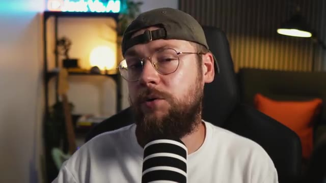

---

### ?? `[00:12:17 - 00:12:50]` | Segment #26

**?? Audio (Transcription Int?grale Mot pour Mot en Fran?ais) :**
> Qu'est-ce que tu penses que ça pourrait être ? Les enfants adorent absolument ce type de vidéo. tu peux voir que l'animation est sortie vraiment très propre et c'est un peu inspiré par quelque chose comme Miss Rachel ou c'est un peu un segment récurrent dans son contenu et nous pouvons également faire du contenu de style plus éducatif où nous enseignons réellement aux enfants des choses comme les lettres, les chiffres et dans cet exemple les formes, regardons quelques formes aujourd'hui cercle carré

**??? Analyse Visuelle d'?cran (gemini-3.5-flash-lite) :**
**Interface & Outils** : Jack face caméra dans son studio de création de contenu, avec un microphone, une étagère en arrière-plan portant un néon bleu affichant le logo "Jack Vs. AI", un éclairage d'ambiance et un fauteuil sombre avec un coussin orange.

**Contenu textuel & Code** : Aucun texte textuel ou paramètre de génération visible à l'écran, le plan étant centré sur le présentateur (Jack).

**Action / D?monstration** : Jack s'exprime face caméra en gesticulant des mains pour illustrer ses propos, parlant de vidéos éducatives pour enfants générées par IA inspirées du contenu de Miss Rachel.

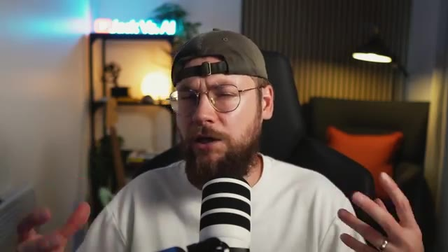

---

### ?? `[00:12:50 - 00:13:12]` | Segment #27

**?? Audio (Transcription Int?grale Mot pour Mot en Fran?ais) :**
> Ours, triangle, étoile, cœur. C'étaient nos formes aujourd'hui. À la prochaine fois. Encore une fois, une animation vraiment soignée, d'aspect professionnel. Mais ce sur quoi je veux que vous vous concentriez, c'est que chacune de ces générations, même si elles sont séparées, donne l'impression de faire partie du même monde.

**??? Analyse Visuelle d'?cran (gemini-3.5-flash-lite) :**
**Interface & Outils** : Plan fixe en face-à-face (face cam) de Jack dans son studio d'enregistrement, avec un microphone et un décor moderne composé d'un néon bleu affichant le logo "Jack Vs. AI" en arrière-plan, de panneaux acoustiques muraux et d'une étagère éclairée.

**Contenu textuel & Code** : Aucun texte à l'écran, aucun prompt textuel ou paramètre technique visible dans cette séquence de plan face caméra.

**Action / D?monstration** : Jack s'adresse directement au spectateur en parlant face caméra, gesticulant des mains pour illustrer son propos et accentuer l'analyse des animations générées par IA.

---

### ?? `[00:13:12 - 00:13:46]` | Segment #28

**?? Audio (Transcription Int?grale Mot pour Mot en Fran?ais) :**
> Et enfin, quelque chose que mon fils a appris récemment, comment se brosser les dents. Apprenons à nous brosser les dents. Mouillez votre brosse, puis un peu de dentifrice. Dentifrice. Brossez en petits cercles tout autour. N'oubliez pas non plus les dents du fond. Puis un brossage doux sur la langue. Recrachez dans le lavabo. Rincez et le tour est joué. Vraiment incroyable de voir le niveau de qualité que l'on peut obtenir en utilisant ce processus. En combinant nos références d'images et audio avec notre invite textuelle détaillée conçue par Claude, nous obtenons un résultat comme celui-ci. Mais et si

**??? Analyse Visuelle d'?cran (gemini-3.5-flash-lite) :**
**Interface & Outils** : Le lecteur vidéo affiche une génération vidéo animée en 3D au style cartoon, intégrée dans une fenêtre aux coins arrondis sur fond violet dégradé.

**Contenu textuel & Code** : On observe un petit garçon animé en 3D avec une casquette verte et un t-shirt blanc, penché au-dessus d'un lavabo beige dans une salle de bains stylisée. À côté du lavabo se trouve un gobelet contenant deux brosses à dents (une rouge et une verte) et un tube de dentifrice.

**Action / D?monstration** : La vidéo montre le personnage animé penché au-dessus du lavabo, prêt à se brosser les dents, illustrant le processus de génération vidéo par IA décrit dans la voix off.

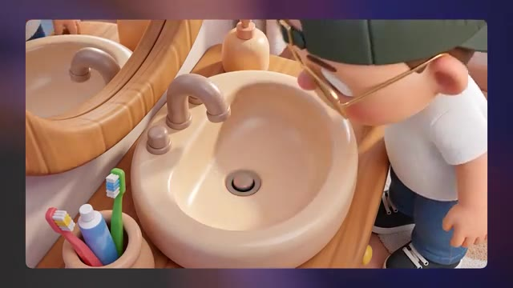

---

### ?? `[00:13:46 - 00:14:23]` | Segment #29

**?? Audio (Transcription Int?grale Mot pour Mot en Fran?ais) :**
> Nous voulons que la musique joue un rôle beaucoup plus important dans nos vidéos. Au début de ce tutoriel, nous parlions de chaînes comme Pinkfong et Cocomelon, et un véritable moteur pour elles est le contenu musical. Alors, comment s'y prendre réellement pour créer ce genre de contenu pour notre propre chaîne ? Il existe différentes manières de générer de la musique avec l'IA, mais à mon sens, le meilleur outil pour cela est une plateforme appelée Suno. Nous pouvons effectivement utiliser Suno pour générer ce genre de chansons de style comptine, combiner cela avec nos générations vidéo pour obtenir du contenu narratif musical. Et si vous voulez

**??? Analyse Visuelle d'?cran (gemini-3.5-flash-lite) :**
**Interface & Outils** : Jack face caméra dans son studio, assis dans un fauteuil noir avec un microphone professionnel blanc et noir placé devant lui. En arrière-plan, on aperçoit une étagère avec une enseigne lumineuse au néon affichant le logo "Jack Vs. AI", une lampe d'appoint ronde éclairant l'ambiance, une plante verte et un mur en relief avec une applique murale lumineuse.

**Contenu textuel & Code** : Aucun texte, prompt de génération ni paramètre technique n'est affiché à l'écran dans ce plan, qui se concentre entièrement sur la prise de vue en face-à-face (talking head) de Jack s'exprimant face à son micro.

**Action / D?monstration** : Jack est filmé en plan moyen face caméra, s'exprimant en direct avec des mouvements naturels de la tête et des mains pour appuyer son explication sur l'intégration de la musique générée par IA.

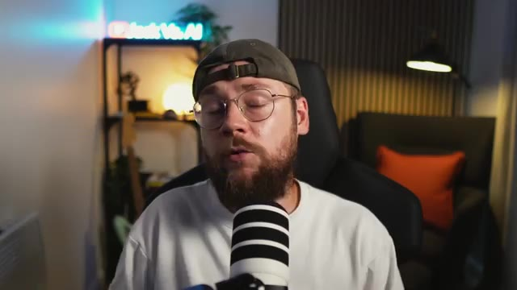

---

### ?? `[00:14:23 - 00:14:59]` | Segment #30

**?? Audio (Transcription Int?grale Mot pour Mot en Fran?ais) :**
> Pour aller encore plus loin, il y a en fait une technique que je vais vous montrer dans une minute où nous pouvons faire synchroniser les lèvres de nos personnages sur la musique. Maintenant, vous pouvez réellement utiliser ChatGPT, Gemini ou Claude pour vous configurer et vous préparer à générer votre musique. Vous pouvez voir que j'ai d'abord demandé à Claude de m'écrire un prompt de style avec une ambiance similaire à des chaînes comme Miss Rachel ou Dave and Ava. Je dis que je veux que ce soit une musique pour enfants entraînante et j'ai fini par obtenir un prompt comme celui-ci. Donc sur Suno, si vous allez sur l'onglet créer puis que vous cliquez sur avancer, vous allez...

**??? Analyse Visuelle d'?cran (gemini-3.5-flash-lite) :**
**Interface & Outils** : Capture d'écran de l'interface du modèle conversationnel Claude (Anthropic), affichant un échange de messages en mode sombre, avec une incrustation vidéo en bas à droite montrant Jack face caméra devant son microphone.

**Contenu textuel & Code** : Texte du prompt utilisateur visible en haut : "Can you write me a style prompt for Suno v5.5. I want it to be catchy children's music that you'd expect to hear on channels like Miss Rachel or Dave and Ava. Keep in mind that animated characters will be lip syncing the track."
Réponse affichée de Claude : "Synthesized children's music style requirements for animated lip-sync performance > Here's a style prompt for Suno v5.5: Style Prompt: Bright, bouncy children's pop with a clean female vocal, simple singalong melody, and catchy repetitive hook. Upbeat ukulele strums, soft claps, xylophone, and light percussion. Cheerful, educational nursery-style production with a warm, friendly tone. Clear enunciation and moderate tempo for easy lip sync. Call-and-response sections with pauses for interaction. Playful, wholesome, and melodically sticky."

**Action / D?monstration** : Affichage à l'écran de la conversation textuelle avec le chatbot Claude pour illustrer la méthode de création de prompts de style musicaux destinés à Suno.

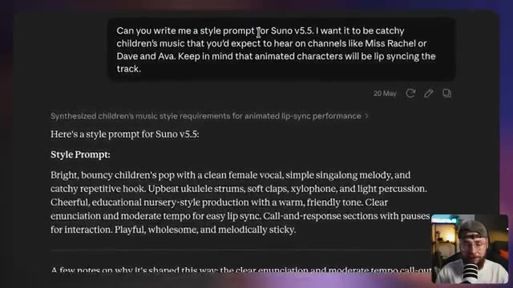

---

### ?? `[00:14:59 - 00:15:32]` | Segment #31

**?? Audio (Transcription Int?grale Mot pour Mot en Fran?ais) :**
> de voir que vous avez plus d'options. J'ai pris les devant et j'ai simplement collé ce prompt de style dans ce champ ici. Et ensuite j'ai en fait demandé à Claude de m'aider à composer les paroles pour notre chanson. Donc je dis maintenant, réfléchissons à quelques sujets différents sur lesquels pourrait porter le morceau. Il doit cibler les jeunes enfants, disons entre un et quatre ans. Et j'ai mentionné à ce stade qu'il serait utile d'aborder la compréhension du monde ou la façon dont les enfants comprennent leurs propres émotions. Mon petit garçon de quatre ans, par exemple, ses émotions sont complètement incontrolables. Il n'a pas tout à fait

**??? Analyse Visuelle d'?cran (gemini-3.5-flash-lite) :**
**Interface & Outils** : Interface de l'assistant conversationnel Claude affichant une discussion sous forme de bulles de texte. En bas à droite de l'écran, incrustation vidéo (facecam) de Jack portant une casquette et un t-shirt clair, parlant devant un microphone de studio.

**Contenu textuel & Code** : Texte du prompt utilisateur adressé à Claude : « Ok, now let's think about a few different things that the track could be about. It needs to be aimed at young kids. Let's say between the age of one and four? What could our song be about? What could it be helping to teach them? It can be about life skills, understanding the world, or their own emotions, literally anything. But it needs to serve some kind of purpose and be genuinely beneficial to both the child and the parents. We want to avoid parents feeling guilty putting this content out. It needs to feel either educational or helpful in some way. And have some genuine benefit to the child ». Texte de la réponse de Claude : « Evaluated developmentally appropriate song topics for toddlers > Great brief. Here are some directions worth considering, grouped by the kind of value they deliver: Everyday routines & independence These work because they give parents a tool — something they can literally play during ». Date de la conversation : 20 May.

**Action / D?monstration** : L'écran affiche une capture d'écran de l'interface de Claude avec un curseur de souris en forme de flèche positionné au milieu du texte. La vidéo incrustée montre Jack en train d'expliquer sa démarche créative pour la conception de chansons pour enfants assistée par IA.

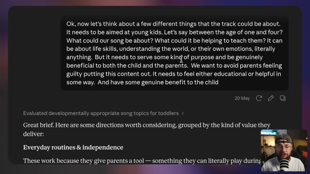

---

### ?? `[00:15:32 - 00:16:02]` | Segment #32

**?? Audio (Transcription Int?grale Mot pour Mot en Fran?ais) :**
> On en est pas encore à ce stade où il peut en quelque sorte les garder sous contrôle ou les comprendre pleinement, donc c'était particulièrement pertinent dans mon cas je suppose, et vous pouvez voir que j'ai récupéré tout un tas d'idées différentes de Claude, mais son instinct était aussi de se concentrer sur le côté émotionnel des choses. J'ai commencé à me concentrer sur cette idée qu'il est normal de pleurer un peu, puis le concept de grands sentiments est apparu. L'idée ici, des sentiments qui semblent tout simplement complètement écrasants pour l'essentiel.

**??? Analyse Visuelle d'?cran (gemini-3.5-flash-lite) :**
**Interface & Outils** : Capture d'écran principale affichant un document texte brut au format Markdown ou une application de prise de notes de type Notion/Obsidian sur fond sombre, avec une incrustation vidéo (picture-in-picture) de Jack face caméra en bas à droite dans un cercle ou une vignette carrée aux bords arrondis, doté d'une casquette et d'un micro.

**Contenu textuel & Code** : Le texte visible à l'écran présente une liste structurée par puces : des points sur l'obéissance, "Gentle hands / being kind to friends" (mains douces / être gentil avec les amis) adapté aux 2-3 ans, "Body awareness & safety" (Conscience corporelle et sécurité) avec le lavage des mains et le vocabulaire des parties du corps, puis une section sur le "Language & cognitive development" (Développement langagier et cognitif) mentionnant les sons d'animaux et les couleurs du monde réel. En bas, un paragraphe rédigé : "My instinct on where to start: the teeth brushing song or the emotions song..." avec un curseur de souris visible au centre.

**Action / D?monstration** : Le document textuel défile lentement vers le bas pour laisser apparaître les sections de brainstorming générées par l'IA concernant le développement de l'enfant et les pistes de chansons, tandis que Jack s'exprime en bas à droite en commentant ses choix créatifs.

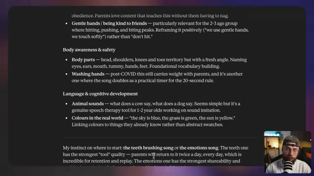

---

### ?? `[00:16:02 - 00:16:34]` | Segment #33

**?? Audio (Transcription Int?grale Mot pour Mot en Fran?ais) :**
> Et avec un tout petit peu plus d'allers-retours, une fois de plus Claude dit que le concept des grandes émotions en termes d'alphabétisation émotionnelle est la bonne approche. Je dis simplement vas-y, lance-toi, et on récupère cette brillante section de paroles qui donne exactement l'impression de ce qu'on s'imaginerait entendre sur une chaîne comme Miss Rachel ou Cocomelon. J'ai donc pris les devants pour copier ceci et le déposer directement dans la section des paroles sur Suno. Et en cliquant sur générer, on obtient un résultat comme celui-ci.

**??? Analyse Visuelle d'?cran (gemini-3.5-flash-lite) :**
**Interface & Outils** : Capture d'écran montrant une interface sombre affichant des paroles de chansons générées par une IA (type Claude ou éditeur de texte), avec en bas à droite une incrustation vidéo montrant le visage de Jack (Jack Vs. AI) face caméra devant un microphone.

**Contenu textuel & Code** : Texte des paroles affiché à l'écran : "Sometimes I feel angry / And I stomp it on the ground / [Pre-Chorus] / And sometimes... sometimes... / I don't know what I feel at all / [Chorus] / But that's okay / It's okay to feel this way / Big feelings come and big feelings go / It's okay, it's okay / You're not on your own / [Verse 2] / Sometimes I feel scared / And I want to hold on tight / Sometimes I feel sad / And I cry and that's alright / [Pre-Chorus] / And sometimes... sometimes...".

**Action / D?monstration** : L'écran affiche le texte des paroles générées par l'intelligence artificielle tandis que le présentateur (Jack) commente l'étape de transfert de ces paroles vers l'outil de génération musicale Suno.

---

### ?? `[00:16:38 - 00:17:15]` | Segment #34

**?? Audio (Transcription Int?grale Mot pour Mot en Fran?ais) :**
> Maintenant, je sais qu'en tant qu'adultes, nous sommes en quelque sorte préprogrammés pour grincer des dents face à ce genre de musique. Mais quand je vous dis que mon fils d'un an était d'un côté de la maison, j'ai commencé à jouer cette chanson et il a sprinté à travers toute la maison pour arriver jusqu'à mon ordinateur portable et écouter. Je suis tout à fait honnête, c'est arrivé pas plus tard que ce matin. Cela, pour moi, était une preuve suffisante que j'avais mis le doigt sur quelque chose. Donc maintenant que nous sommes satisfaits de notre génération, nous pouvons cliquer sur ces trois petits points ici. Nous pouvons le télécharger sous forme de fichier MP3 ou WAV, ou nous pouvons télécharger les pistes séparément. Et c'est exactement ce que vous voulez faire.

**??? Analyse Visuelle d'?cran (gemini-3.5-flash-lite) :**
**Interface & Outils** : Plan fixe face caméra (Jack Face Caméra) montrant Jack assis à son bureau devant un microphone blanc à rayures noires, dans une pièce au décor chaleureux avec un éclairage d'ambiance et une étagère en arrière-plan portant le logo néon bleu de la chaîne "Jack Vs. AI".

**Contenu textuel & Code** : Aucun texte textuel, prompt ou paramètre technique n'est affiché à l'écran dans ce segment, l'accent étant mis entièrement sur l'explication orale de Jack concernant le téléchargement des fichiers audio et des pistes séparées (stems).

**Action / D?monstration** : Jack s'adresse directement aux spectateurs en face caméra, gesticulant des mains pour illustrer son propos et accentuer l'anecdote concernant la réaction enthousiaste de son enfant face à la musique générée par IA.

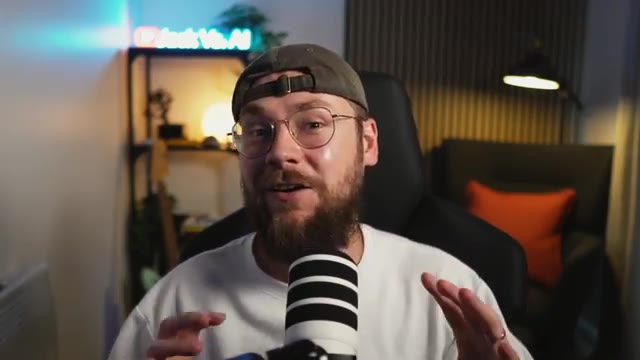

---

### ?? `[00:17:15 - 00:17:52]` | Segment #35

**?? Audio (Transcription Int?grale Mot pour Mot en Fran?ais) :**
> Si vous voulez utiliser votre génération Suno pour créer une synchronisation labiale. Lorsque vous cliquez sur obtenir les pistes, cela va vous donner quelques options différentes ici. Vous voulez choisir celle du milieu qui est séparée du mix. Cela va vous donner votre voix principale puis toutes les pistes instrumentales. Et ensuite dans votre logiciel de montage de choix, vous voulez aller de l'avant et couper la section de la chanson que vous voulez utiliser pour la synchronisation labiale. Ici nous avons juste la piste vocale. Nous ne voulons pas de l'instrumental comme faisant partie de cela. Donc par exemple nous avons cette section ici. C'est bon, vous n'êtes pas tout seul.

**??? Analyse Visuelle d'?cran (gemini-3.5-flash-lite) :**
**Interface & Outils** : Jack en mode face caméra dans son studio, avec un microphone professionnel blanc à rayures noires placé devant lui, un t-shirt blanc, une casquette verte portée à l'envers et des lunettes rondes. En arrière-plan, on aperçoit une étagère lumineuse avec un néon affichant le logo "Jack Vs. AI", une plante verte, une lampe de bureau noire allumée et un fauteuil avec un coussin orange.

**Contenu textuel & Code** : Aucun texte à l'écran, prompt de génération, paramètre technique ou interface de logiciel de montage n'est visible sur cette image fixe, qui montre uniquement le présentateur s'adressant directement à la caméra.

**Action / D?monstration** : Jack est assis face caméra, s'exprimant en direct avec des mouvements naturels de la tête et des mains pour expliquer le processus technique de séparation des pistes audio sur Suno et leur utilisation dans un logiciel de montage.

---

### ?? `[00:17:52 - 00:18:26]` | Segment #36

**?? Audio (Transcription Int?grale Mot pour Mot en Fran?ais) :**
> Donc, une fois de plus, nous voulons exporter ceci comme une vidéo vide. De retour sur Higgsfield en utilisant C-Dance 2, une fois de plus, vous voulez d'abord télécharger toutes les références d'images pertinentes. Vous pouvez voir ici que j'ai juste mis le visuel clé pour cette scène. Je n'ai pas eu l'impression d'avoir besoin d'une feuille de personnage car c'est une génération très brève où je ne veux pas que le personnage se retourne et fasse beaucoup de mouvements complexes. J'ai ensuite également téléchargé cette vidéo vide avec cet extrait de la piste vocale et le prompt textuel pour ceci peut en fait être vraiment très simple. Donc, nous disons juste un plan cinématographique.

**??? Analyse Visuelle d'?cran (gemini-3.5-flash-lite) :**
**Interface & Outils** : Plan en face à face de Jack dans son studio, assis devant un micro et un néon lumineux affichant le logo "Jack Vs. AI".

**Contenu textuel & Code** : Aucun texte à l'écran ni paramètre technique affiché.

**Action / D?monstration** : Jack s'adresse directement à la caméra en expliquant les étapes du workflow d'exportation et d'utilisation de l'outil Higgsfield, tout en gesticulant des mains pour illustrer ses propos.

---

### ?? `[00:18:26 - 00:19:00]` | Segment #37

**?? Audio (Transcription Int?grale Mot pour Mot en Fran?ais) :**
> montre un personnage animé qui chante joyeusement. Il est vraiment important que vous ajoutiez également les paroles pour cette section du morceau et nous pouvons continuer et à nouveau taguer notre référence vocale que nous avons téléchargée. Maintenant, en ce qui concerne la durée de votre génération, vous voulez essentiellement l'adapter à votre référence vocale, peut-être juste ajouter une seconde supplémentaire à la fin pour avoir une marge de manœuvre. Si votre référence vocale dure quatre secondes par exemple, mais que vous lancez ensuite une génération de 10 secondes, Seen Arts 2 va essayer de combler cet espace vide et c'est là qu'il produira simplement son propre

**??? Analyse Visuelle d'?cran (gemini-3.5-flash-lite) :**
**Interface & Outils** : Vue face caméra de Jack (Jack Vs. AI) dans son studio personnel, équipé d'un micro de podcast blanc et noir monté sur bras articulé, avec une étagère en arrière-plan éclairée par une enseigne lumineuse au néon bleu portant le nom de sa chaîne et une lampe d'ambiance.

**Contenu textuel & Code** : Le décor comprend un mur à lamelles de bois sur la droite avec un fauteuil foncé et un coussin orange vif, une guitare électrique posée sur un support à gauche, et l'enseigne au néon lumineuse "Jack Vs. AI".

**Action / D?monstration** : Jack s'adresse directement aux spectateurs en face caméra, parlant face au micro tout en gesticulant légèrement des mains pour illustrer ses explications sur les paramètres de génération musicale et vocale par IA.

---

### ?? `[00:19:00 - 00:19:38]` | Segment #38

**?? Audio (Transcription Int?grale Mot pour Mot en Fran?ais) :**
> les paroles et la musique et les choses deviennent très bizarre très rapidement. Cela étant dit, nous avons tout préparé pour générer réellement notre vidéo synchronisée labialement, alors laissez-moi vous montrer le résultat que nous pouvons obtenir à partir de ceci : c'est bon, vous n'êtes pas tout seul. Comme vous pouvez le voir, cela fonctionne vraiment très bien, mais je voulais vous donner un exemple de ce que vous pouvez réellement construire en assemblant plusieurs générations. Nous voici donc de retour dans Premiere Pro. En partant d'une perspective audio, nous avons un extrait de la chanson Big Feelings que j'ai générée plus tôt dans

**??? Analyse Visuelle d'?cran (gemini-3.5-flash-lite) :**
**Interface & Outils** : Jack face caméra dans son studio, avec un néon affichant le logo "Jack Vs. AI" en arrière-plan, un microphone devant lui, un fauteuil noir et un coussin orange.

**Contenu textuel & Code** : Aucun texte, prompt ou paramètre technique visible sur cette image de type face caméra.

**Action / D?monstration** : Jack s'adresse directement aux spectateurs en gesticulant des mains pour illustrer ses propos, expliquant la génération de vidéos synchronisées et l'assemblage dans Premiere Pro.

---

### ?? `[00:19:38 - 00:19:58]` | Segment #39

**?? Audio (Transcription Int?grale Mot pour Mot en Fran?ais) :**
> La piste du haut ici est la piste vocale, la piste du bas est l'instrumentale, et puis tous ces morceaux audio sont en fait venus avec les générations de dance 2 que j'ai assemblées. Donc ce que j'ai fait pour le début du morceau, c'est qu'on a juste ces scènes qui sont en quelque sorte pertinentes par rapport aux paroles pour ajouter un peu plus de contexte et de narration.

**??? Analyse Visuelle d'?cran (gemini-3.5-flash-lite) :**
**Interface & Outils** : Logiciel de montage vidéo de type Adobe Premiere Pro, affichant une chronologie (timeline) multi-pistes complexe comprenant des pistes vidéo, des calques de couleur (Color Matte), et plusieurs pistes audio en forme d'ondes. Dans le coin inférieur gauche, on aperçoit Jack en face caméra avec son micro et sa casquette dans son studio.

**Contenu textuel & Code** : La timeline montre une piste supérieure orange contenant des segments de sous-titres ou paroles découpés (avec des libellés abrégés comme "So...", "a...", "ju...", "So...", "a...", "o...", "S...", "w...", "B...", "l...", "to...", "B...", "and...", "It...", "You"), une piste violette "Color Matte", une piste vidéo principale avec plusieurs clips et miniatures (nommés avec des préfixes de hachage comme "hf_20260618_164235_7d19ca11-9..."), ainsi que trois pistes audio vertes et bleues avec leurs formes d'ondes distinctes (pistes vocales et instrumentales).

**Action / D?monstration** : Le montage présente l'agencement et la synchronisation des pistes audio et vidéo générées par IA pour un clip musical, illustrant comment superposer la piste vocale et l'instrumentale sous les scènes visuelles générées pour correspondre aux paroles.

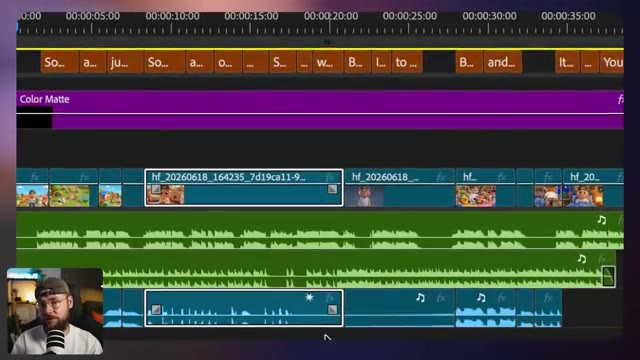

---

### ?? `[00:19:58 - 00:20:20]` | Segment #40

**?? Audio (Transcription Int?grale Mot pour Mot en Fran?ais) :**
> Et puis à la fin, nous avons deux exemples de synchronisation labiale, l'un avec absolument chaque personnage qui chante en même temps que la chanson. Et puis l'exemple que je viens de vous montrer où la version garçon de moi se met au lit et chante simplement ces dernières lignes. J'ai aussi ajouté ces sous-titres ici, ce qui est tout à fait typique de ce type de contenu parce que ça donne ce genre d'ambiance karaoké.

**??? Analyse Visuelle d'?cran (gemini-3.5-flash-lite) :**
**Interface & Outils** : Logiciel de montage vidéo Adobe Premiere Pro, composé d'un panneau Source à gauche, d'un moniteur Programme au centre affichant l'animation du garçon au lit, d'un panneau Projet/Bins en bas à gauche, d'une timeline multi-pistes détaillée en bas au centre avec des clips vidéo, audio et des sous-titres jaunes, et d'une incrustation de Jack en face-caméra dans le coin inférieur gauche avec son micro.

**Contenu textuel & Code** : Dans le moniteur Programme, la vidéo montre un petit garçon en 3D style Pixar avec des lunettes et une casquette en arrière, assis dans son lit avec des draps bleus, une veilleuse en forme d'étoile et un dinosaure en peluche en arrière-plan, sous un ciel nocturne étoilé. Un sous-titre jaune centré affiche le texte : « You're not on your own ». Sur la timeline, les pistes incluent des blocs de sous-titres orange, un calque de couleur violet (Color Matte), des pistes vidéo V1 (avec des miniatures de clips) et plusieurs pistes audio vertes superposées.

**Action / D?monstration** : Le logiciel de montage est en cours de lecture, affichant l'extrait vidéo du garçon au lit avec les sous-titres synchronisés sur la piste audio, tandis que le curseur temporel avance sur la timeline à la position 00:00:37:10.

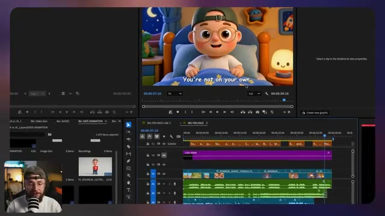

---

### ?? `[00:20:20 - 00:20:40]` | Segment #41

**?? Audio (Transcription Int?grale Mot pour Mot en Fran?ais) :**
> Donc, avec un niveau de montage assez basique, laissez-moi vous montrer le résultat final. Parfois, je me sens heureux et j'ai envie de sauter partout. Parfois, je me sens en colère et je tape du pied sur le sol.

**??? Analyse Visuelle d'?cran (gemini-3.5-flash-lite) :**
**Interface & Outils** : Lecteur vidéo intégré affichant le rendu final d'un clip vidéo 3D de type dessin animé, avec des sous-titres incrustés au bas de l'image.

**Contenu textuel & Code** : Explications orales des concepts et des m?thodes de cr?ation vid?o IA.

**Action / D?monstration** : D?monstration p?dagogique et pr?sentation du workflow.

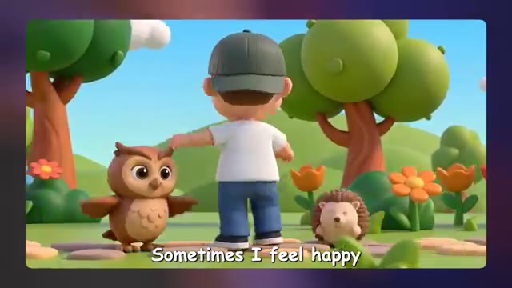

---

### ?? `[00:20:40 - 00:21:03]` | Segment #42

**?? Audio (Transcription Int?grale Mot pour Mot en Fran?ais) :**
> Et parfois, parfois, je ne sais plus du tout ce que je ressens. Mais ce n'est pas grave. C'est normal de ressentir cela. Ça vient, les choses s'en vont. C'est bon.

**??? Analyse Visuelle d'?cran (gemini-3.5-flash-lite) :**
**Interface & Outils** : Lecteur vidéo épuré sans interface logicielle visible, centré sur un arrière-plan flou aux teintes violettes et bleues. Des sous-titres blancs à bordure noire sont incrustés en bas de l'écran.

**Contenu textuel & Code** : Illustration 3D au style Pixar d'un jeune garçon portant des lunettes rondes, une casquette verte portée à l'envers et un t-shirt blanc. Il dégage une expression de tristesse ou de vulnérabilité. Des ondes lumineuses circulaires se propagent subtilement depuis sa poitrine, créant un effet d'aura douce. Le sous-titre affiché à l'écran indique "to feel this way.".

**Action / D?monstration** : La vidéo se lit avec un personnage animé en 3D légèrement figé ou en boucle subtile, transmettant une émotion mélancolique et introspective.

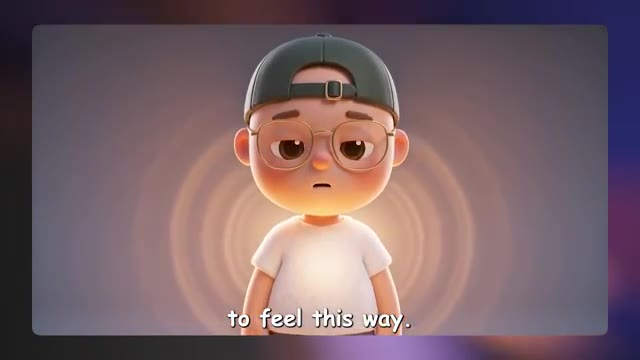

---

### ?? `[00:21:03 - 00:21:23]` | Segment #43

**?? Audio (Transcription Int?grale Mot pour Mot en Fran?ais) :**
> Tu n'es pas tout seul. Je ne vais pas mentir, la chanson a fini par me rester dans la tête pendant que je faisais le montage, ce qui est exactement ce que l'on recherche. Et j'ai été vraiment impressionné par la qualité globale de ceci. C'est exactement le genre de chose que l'on s'attendrait à trouver sur une chaîne d'animation pour enfants.

**??? Analyse Visuelle d'?cran (gemini-3.5-flash-lite) :**
**Interface & Outils** : Plan en face à face (face cam) de Jack dans son studio d'enregistrement, filmé avec une caméra reflex numérique ou hybride grand capteur créant un flou d'arrière-plan (bokeh). Un microphone podcast blanc à larges bandes noires est positionné au premier plan inférieur. En arrière-plan, on aperçoit une étagère métallique éclairée par des néons décoratifs bleus et un néon signalétique lumineux affichant le logo de la chaîne « Jack Vs. AI », ainsi qu'un mur insonorisé à lamelles en bois sombre et un fauteuil noir avec un coussin orange vif.

**Contenu textuel & Code** : Aucun logiciel, interface utilisateur, prompt textuel ou paramètre technique de génération par IA n'est affiché à l'écran dans ce segment.

**Action / D?monstration** : Jack s'adresse directement à son audience en face caméra, gesticulant légèrement avec ses mains et adoptant une expression faciale expressive et engagée pour ponctuer son analyse de la vidéo générée par IA.

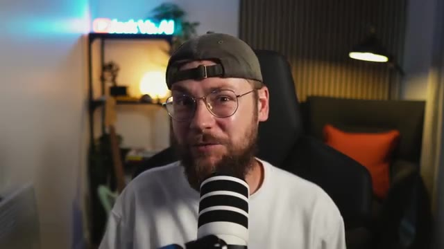

---

### ?? `[00:21:23 - 00:21:58]` | Segment #44

**?? Audio (Transcription Int?grale Mot pour Mot en Fran?ais) :**
> C'est toujours aussi fou pour moi d'avoir pu créer toute la musique et tous les visuels en utilisant uniquement des outils d'IA. Ceci étant dit les gars, nous sommes maintenant arrivés à la fin de la vidéo d'aujourd'hui. J'espère vraiment qu'elle vous a plu. C'est un peu différent du type de contenu que je fais habituellement, donc si vous avez appris quelque chose aujourd'hui, j'apprécierais vraiment que vous mettiez un pouce bleu sur la vidéo pour moi et que vous pensez à vous abonner. Je pense sincèrement que faire du contenu pour cette niche avec l'IA représente une énorme opportunité de gagner de l'argent. Il y a un réel vide sur le marché ici, j'ai l'impression. Je vous encourage vraiment les gars, si vous

**??? Analyse Visuelle d'?cran (gemini-3.5-flash-lite) :**
**Interface & Outils** : Plan fixe en face caméra (YouTube talking head setup) de Jack dans son studio, avec un microphone de type podcast placé au premier plan, un panneau lumineux au néon bleu à l'arrière-plan affichant le logo de la chaîne, ainsi qu'un fauteuil sombre avec un coussin orange.

**Contenu textuel & Code** : Aucun texte incrusté à l'écran, aucun paramètre technique ou prompt visible dans ce segment, l'accent étant mis entièrement sur l'intervention face caméra du créateur.

**Action / D?monstration** : Jack s'adresse directement aux spectateurs en face caméra, gesticulant légèrement pour appuyer ses propos de conclusion et encourager l'engagement de sa communauté.

---

### ?? `[00:21:58 - 00:22:29]` | Segment #45

**?? Audio (Transcription Int?grale Mot pour Mot en Fran?ais) :**
> voulez essayer cela par vous-même pour être aussi créatif que possible, essayez d'éviter de simplement balancer du contenu bâclé. Il faut que ce soit à la fois divertissant et réellement bénéfique pour l'enfant, car cela signifie que les parents vont aussi adhérer à votre contenu. Il y a aussi beaucoup de "brain rot" dans cette niche, alors j'essaierais vraiment de faire quelque chose qui donne l'impression d'avoir une réflexion derrière et qui présente réellement de la qualité. Encore une fois, merci infiniment d'avoir regardé les gars. Bonne chance pour vos propres projets et je vous retrouve dans la prochaine vidéo.

**??? Analyse Visuelle d'?cran (gemini-3.5-flash-lite) :**
**Interface & Outils** : Capture vidéo principale au format paysage affichant une image de synthèse colorée style 3D d'animation (type Pixar/Midjourney v6 ou Midjourney Raw), avec en incrustation (PiP - Picture-in-Picture) dans le coin inférieur gauche la vue "face caméra" de Jack (avec un t-shirt blanc, une casquette et un micro de studio professionnel) en train de parler.

**Contenu textuel & Code** : Image centrale montrant un jeune garçon portant des lunettes rondes et une casquette à l'envers, assis dans un bac à sable avec un petit crocodile vert souriant à gauche et un petit lapin blanc souriant à droite. Ensemble, ils construisent un château de sable surmonté d'un drapeau rouge. En arrière-plan, une aire de jeux extérieure ensoleillée avec un toboggan bleu, une structure d'escalade en bois et une maison colorée. Aucun texte textuel incrusté ni paramètre technique textuel visible à l'écran.

**Action / D?monstration** : Jack apparaît en plan serré dans la petite vignette en bas à gauche de l'écran, s'adressant directement au public avec des gestes de la main pour conclure sa vidéo et donner ses derniers conseils sur la création de contenu IA éthique et qualitatif, tandis que l'illustration principale illustre visuellement la thématique des contenus adaptés aux enfants.

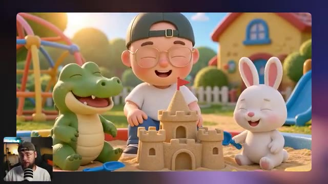

---
