# 🎬 Google vient de libérer le Nano Banana de la vidéo IA (Plongée profonde dans Gemini Omni)

> **Chaîne** : [Jack Vs. AI](https://www.youtube.com/@JackVsAI)  
> **Titre original** : `Google Just UNLOCKED the Nano Banana of AI Video (Gemini Omni Deep Dive)`  
> **Lien YouTube** : [https://www.youtube.com/watch?v=7HhlSu3pPvU](https://www.youtube.com/watch?v=7HhlSu3pPvU)  
> **Date de publication** : 2026-07-05  
> **Durée** : 23m 45s (`1425s`)  
> **Identifiant vidéo** : `7HhlSu3pPvU`  
> **Fiche Web Interactive** : [2026-07-05_YT-7HhlSu3pPvU_Google vient de libérer le Nano Banana de la vidéo IA (Plongée profonde dans Gem_by-whisper-v3-large-turbo+gemini-3.5-flash-lite.html](2026-07-05_YT-7HhlSu3pPvU_Google vient de libérer le Nano Banana de la vidéo IA (Plongée profonde dans Gem_by-whisper-v3-large-turbo+gemini-3.5-flash-lite.html)  
> **Captures de démonstration clés** : `97 captures réelles (anti-talking-head)`  
> **Modèles utilisés** : Audio: `large-v3-turbo` (Faster-Whisper int8 VPS) | Vision: `gemini-3.5-flash-lite` (Google AI Studio API)  

---

## 📌 Synthèse Exécutive & Outils

### 📌 Résumé
La vidéo de Jack Vs. AI décortique l'arrivée de **Gemini Omni**, qualifié de moment « nano banana » pour la vidéo par intelligence artificielle. Ce modèle révolutionnaire redéfinit le montage vidéo génératif en permettant d'importer n'importe quelle séquence pour en modifier l'éclairage, remplacer des objets avec un suivi de pointe, ou transformer l'apparence d'un sujet (comme enlever une barbe ou changer des vêtements), tout en préservant une cohérence parfaite et une synchronisation labiale impeccable. Loin des simples effets de mode, Jack explore le modèle dans ses retranchements les plus complexes pour tester sa « compréhension du monde » à travers des défis visuels ardus : transformation d'objets en verre, gestion de la profondeur de champ, modifications de matériaux avec reflets réalistes, et rotation d'enveloppes en cartes Pokémon Dracaufeu recto-verso.

Pour exploiter au mieux ce potentiel sans gaspiller ses crédits, Jack détaille une méthodologie précise via la plateforme **Higgsfield**. L'utilisation de l'onglet **Elements** s'avère indispensable : elle permet de combiner une vidéo de référence, jusqu'à cinq images de référence, et un prompt structuré en deux parties. La première section du prompt pose des contraintes strictes sur ce qui doit être préservé, tandis que la seconde décrit l'effet recherché. Cette approche par contrôle total surpasse la méthode traditionnelle des trames de début et de fin. L'analyse met également en lumière les limites actuelles du modèle (comme la gestion des textures complexes en rotation ou la perte de repères spatiaux sur les faces multiples), offrant ainsi aux créateurs une feuille de route stratégique pour maîtriser ces nouveaux flux de travail créatifs.

### 🛠️ Outils, Modèles & Logiciels Présentés
* **Claude** : Utilisé comme assistant textuel pour concevoir, rédiger et structurer les prompts complexes en deux parties (contraintes de préservation et description de l'effet).
* **Gemini Omni** : Le modèle vidéo central de Google analysé dans la vidéo, capable de transformer des séquences, de gérer le suivi d'objets, la synchronisation labiale et la modification de styles complexes.
* **Higgsfield** : La plateforme d'interface utilisée pour accéder au modèle (via l'onglet *Gemini Omni Flash*) et exploiter la fonctionnalité *Elements* pour importer vidéos et images de référence.
* **Topaz** : Mentionné implicitement dans l'écosystème global de post-production pour l'amélioration de la qualité visuelle, bien que centré ici sur les capacités natives de l'IA générative.

### 🔑 Points Clés & Enseignements Stratégiques
1. **Privilégier la fonctionnalité « Elements »** : Sur Higgsfield, l'utilisation de l'onglet *Elements* est nettement supérieure à la méthode des trames de début et de fin pour garder le contrôle total de la génération.
2. **Combiner références vidéo et images** : Le workflow optimal d'Omni repose sur l'importation simultanée d'une séquence vidéo source et de jusqu'à cinq images de référence pour guider précisément le modèle.
3. **Structurer les prompts en deux parties** : Diviser le prompt textuel en deux sections distinctes — une première partie définissant les contraintes strictes (ce qui ne doit pas changer) et une seconde décrivant l'effet recherché.
4. **Maîtriser la synchronisation labiale en mouvement** : Gemini Omni démontre une capacité impressionnante à préserver la cohérence faciale et la synchronisation des lèvres, même lorsque le sujet parle tout en subissant des transformations visuelles lourdes (effet verre, masquage).
5. **Exploiter la compréhension tridimensionnelle du monde** : Le modèle comprend des interactions physiques complexes, comme le fait qu'un téléphone ou un objet transparent ne laisse voir à travers que sur sa surface vitrée, tout en préservant l'opacité de l'arrière.
6. **Anticiper la gestion de la profondeur de champ** : Omni gère avec brio les effets optiques complexes (grossissement à travers des verres de lunettes, variations de netteté et flous d'arrière-plan), renforçant le réalisme final.
7. **Attention aux limites des rotations complexes** : Pousser le modèle dans ses retranchements avec des rotations multiples (comme une enveloppe transformée en carte recto-verso) révèle ses limites, entraînant une perte de repères spatiaux entre l'avant et l'arrière.
8. **Optimiser ses crédits pour éviter le gaspillage** : Tester des effets complexes directement sur des mouvements de caméra extrêmes sans préparation mène à des résultats mitigés ; l'utilisation de prompts rigoureux et de références ciblées protège le budget de crédits.
9. **Cohérence des reflets et de l'éclairage** : Le modèle génère automatiquement des reflets de surface (traces de doigts sur le verre) et des ombres portées cohérentes, visibles y compris sur les surfaces de contact comme les tables.
10. **Libre accès aux ressources de la communauté** : Pour gagner du temps, il est stratégique de récupérer les prompts et matériaux partagés gratuitement par des experts (via des communautés comme School) plutôt de repartir d'une feuille blanche.

---

## ⏱️ Chronologie & Transcription Complète Audio & Visuelle (Mot pour Mot)

### ⏱️ `[00:00:00 - 00:00:36]` | Segment #01

**🔊 Audio (Transcription Intégrale Mot pour Mot en Français) :**
> Google vient de libérer Gemini Omni, faisant de ceci le moment "nano banana" pour la vidéo. Imaginez importer n'importe quelle séquence et la transformer en des dizaines de styles différents, les plans d'effets et des possibilités créatives infinies, tout en gardant votre sujet et la synchronisation labiale cohérents. C'est ce que fait Gemini Omni. C'est une nouvelle édition puissante pour les créateurs, mais si vous l'utilisez de la mauvaise manière, vous allez gaspiller une tonne de crédits et c'est là que j'interviens. Je suis Jack, j'ai passé plus d'une décennie à créer des effets visuels pour beaucoup des plus grandes marques de la planète et maintenant j'utilise l'IA pour

**👁️ Analyse Visuelle d'Écran (gemini-3.5-flash-lite) :**
**Interface & Outils** : Présentation face caméra sans partage d'écran

**Contenu textuel & Code** : Le créateur Jack apparaît face caméra dans son studio avec un micro, sur fond de décor avec des néons et des étagères. Des graphismes animés textuels apparaissent à l'écran (titre "Gemini Omni" avec effets de style).

**Action / Démonstration** : Jack parle directement à la caméra pour introduire le sujet de la vidéo et présenter Gemini Omni.

---

### ⏱️ `[00:00:36 - 00:01:11]` | Segment #02

**🔊 Audio (Transcription Intégrale Mot pour Mot en Français) :**
> réinventer le flux de travail créatif dans la vidéo d'aujourd'hui, nous plongeons en profondeur dans Gemini Omni en décortiquant exactement comment il fonctionne, là où il brille et là où il pèche, et bien sûr je partagerai tous mes prompts et matériaux de manière entièrement gratuite pour qu'à la fin vous sachiez exactement comment obtenir les résultats les plus incroyables de ce modèle. Si vous appréciez le contenu d'aujourd'hui, assurez-vous de lâcher un pouce bleu pour moi et pensez à vous abonner. Allez, passons aux choses sérieuses. Donc comme vous l'avez vu dans l'intro, le point fort d'Omni c'est le montage vidéo. Nous pouvons télécharger des séquences et par exemple modifier complètement le

**👁️ Analyse Visuelle d'Écran (gemini-3.5-flash-lite) :**
**Interface & Outils** : Présentation face caméra sans partage d'écran

**Contenu textuel & Code** : Texte à l'écran : "in today's video", "I'll share all of", et animation du bouton d'abonnement YouTube ("SUBSCRIBE").

**Action / Démonstration** : Jack s'adresse directement aux spectateurs face caméra dans son studio, en gesticulant légèrement et en présentant les sujets abordés dans la vidéo.

---

### ⏱️ `[00:01:11 - 00:01:47]` | Segment #03

**🔊 Audio (Transcription Intégrale Mot pour Mot en Français) :**
> l'éclairage, remplacer un produit avec un suivi d'objet impressionnant ou même changer l'apparence du sujet comme je ne sais pas, enlever ma barbe. Cette génération ressemble exactement à ce à quoi je ressemble sans poils sur le visage, ce qui est fou et aussi toute la preuve dont j'ai besoin que cette barbe ne va nulle part. Pour vraiment plonger dans le nouveau modèle vidéo de Google, j'ai dépensé une tonne de crédits pour réaliser une variété de tests différents et au fur et à mesure que je vous emmène à travers ceux-ci, vous allez apprendre un tas de conseils et d'astuces en chemin qui vous éviteront de faire des erreurs et finalement de [gaspiller] vos crédits

**👁️ Analyse Visuelle d'Écran (gemini-3.5-flash-lite) :**
**Interface & Outils** : Interface web d'un outil de montage vidéo par IA avec un panneau latéral affichant les options de prompt, de réglages ("Tools", "Comments") et d'édition vidéo ("Edit video", "Reframe", "Upscale", "Remove Background", "Change scene & lighting").

**Contenu textuel & Code** : Texte du prompt visible dans l'interface : "Change the cereal box to be a tongue-in-cheek cartoon-style brand of cereal that features the man's face." La boîte de céréales affichée à l'écran porte la marque "Beard-O's" avec le visage illustré de Jack.

**Action / Démonstration** : Le créateur montre un exemple de modification de produit (remplacement de la boîte de céréales) généré par intelligence artificielle, affiché à l'écran principal avec l'interface d'édition sur le côté droit.

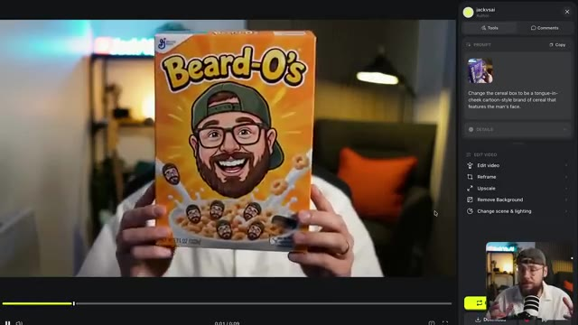
*Interface logicielle montrant la vidéo de Jack tenant une boîte de céréales modifiée "Beard-O's" avec un panneau latéral d'édition vidéo et un encadré PiP de Jack.*

---

### ⏱️ `[00:01:47 - 00:02:24]` | Segment #04

**🔊 Audio (Transcription Intégrale Mot pour Mot en Français) :**
> aller plus loin. Je ferai également une comparaison directe avec C-Dance 2 vers la fin de la vidéo, alors assurez-vous de rester pour ça. La première chose que je voulais tester est un effet qui devient viral sur tous les réseaux sociaux en ce moment, c'est l'utilisation d'Omni pour transformer un objet en verre. Mais je voulais aller un peu plus loin en téléchargeant un clip où je ne fais pas que parler pour tester la synchronisation labiale, mais aussi en pivotant mon téléphone et en demandant à Omni de comprendre qu'on ne peut voir qu'à travers l'écran du téléphone, l'arrière du téléphone restant un objet solide. Plutôt intéressant

**👁️ Analyse Visuelle d'Écran (gemini-3.5-flash-lite) :**
**Interface & Outils** : Interface web de lecteur/éditeur vidéo avec panneau de détails sur la droite (Options "Tools", "Comments", section DETAILS avec "Source: Original Upload", "Type: Video", "Format: MP4").

**Contenu textuel & Code** : Texte de l'interface : "jackvsai", "Original Upload", "Video", "MP4", et affichage d'un smartphone tenu par Jack dans la vidéo lue.

**Action / Démonstration** : Jack tient son smartphone verticalement face à la caméra tout en visionnant sa vidéo de test sur l'interface de l'outil.

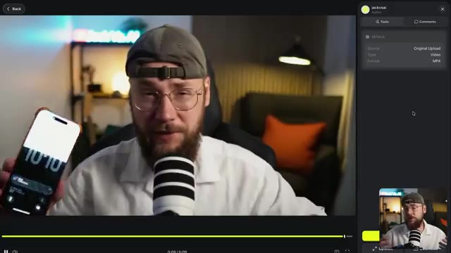
*Interface de l'outil de test vidéo montrant le créateur en train de présenter un smartphone face caméra avec un panneau latéral de détails.*

---

### ⏱️ `[00:02:24 - 00:02:59]` | Segment #05

**🔊 Audio (Transcription Intégrale Mot pour Mot en Français) :**
> Testez ceci. Donc sur Higgsfield, nous voulons aller dans le coin supérieur gauche, survoler l'onglet vidéo, puis cliquer sur Gemini Omni Flash. Il y a deux façons différentes d'utiliser cet outil. La meilleure à mon avis est Elements, et c'est là que nous pouvons télécharger une référence vidéo et jusqu'à cinq références d'images, et en dessous nous pouvons saisir notre texte de prompt, sélectionner la durée et le format, et c'est vraiment aussi simple que ça. Maintenant, vous avez aussi l'option d'utiliser la méthode plus traditionnelle qui est la trame de début et de fin, mais je trouve cela un peu restrictif, de manière générale nous voulons prendre le contrôle total.

**👁️ Analyse Visuelle d'Écran (gemini-3.5-flash-lite) :**
**Interface & Outils** : Interface web de la plateforme Higgsfield, montrant le tableau de bord principal avec divers outils (Explainer, Shorts Studio, Supercomputer, Seedance 2.0, Gemini Omni Flash) et l'interface de génération vidéo avec superposition de la vue webcam du créateur.

**Contenu textuel & Code** : Éléments visibles sur l'interface : "HIGGSFIELD EXPLAINER", "HIGGSFIELD SHORTS STUDIO", "GEMINI OMNI FLASH", "Seedance 2.0", "GENERAL", onglets "Elements" et "Frames", boutons "Upload media", "Prompt", "Model: Gemini Omni Flash", paramètres de durée ("8s"), de format ("16:9") et bouton "Generate + 24".

**Action / Démonstration** : Le créateur navigue sur le tableau de bord de Higgsfield, sélectionne l'outil Gemini Omni Flash, puis bascule entre les modes "Elements" et "Frames" pour montrer les différentes options de génération vidéo.

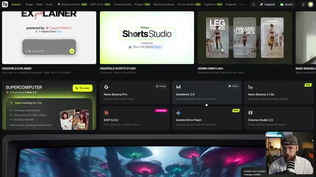
*Interface principale du site Higgsfield affichant les différents outils et modèles disponibles, avec le curseur sur Gemini Omni Flash.*

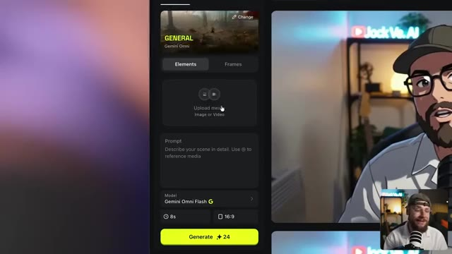
*Interface de Gemini Omni Flash dans Higgsfield montrant l'onglet Elements, la zone de téléchargement de médias et le champ de prompt textuel.*

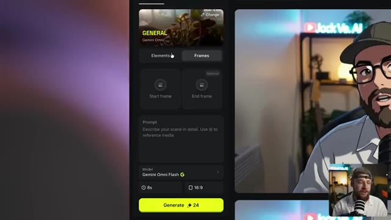
*Interface de Gemini Omni Flash montrant l'option alternative avec les cadres de début et de fin (Start frame / End frame).*

---

### ⏱️ `[00:02:59 - 00:03:32]` | Segment #06

**🔊 Audio (Transcription Intégrale Mot pour Mot en Français) :**
> avantage du modèle de référence omni donc j'ai téléchargé cette séquence de moi-même et j'ai conçu un prompt en utilisant Claude. Nous allons passer en revue ce prompt dans un instant mais d'abord laissez-moi vous montrer le résultat que nous avons obtenu. Très bien donc je veux tester si nous appliquons cet effet pendant que je parle est-ce que ça fonctionne toujours ? Est-ce que la synchronisation labiale tient le coup ? Donc un résultat assez incroyable ici où nous testons la compréhension du monde du modèle. Étant donné que mon visage est couvert par le téléphone dans la source

**👁️ Analyse Visuelle d'Écran (gemini-3.5-flash-lite) :**
**Interface & Outils** : Interface web d'un outil d'intelligence artificielle vidéo (avec panneau de prompt latéral, options d'édition et lecteur vidéo).

**Contenu textuel & Code** : Texte du prompt visible dans le panneau latéral : "Preserve the original lighting exactly. Do not alter exposure, colour temperature, shadows, or highlights from the source footage. Preserve the original timing and pacing..."

**Action / Démonstration** : Jack montre une séquence vidéo en cours de lecture où il tient un téléphone orange devant son visage, tandis que l'interface de l'outil d'IA s'affiche sur le côté droit avec les détails du prompt.

*Interface de l'application montrant une vidéo de test avec un panneau latéral droit affichant un prompt textuel et des options d'édition (Edit video, Reframe, Upscale, Remove Background, Change scene & lighting) ainsi qu'un encadré PiP de Jack en bas à droite.*

---

### ⏱️ `[00:03:32 - 00:03:56]` | Segment #07

**🔊 Audio (Transcription Intégrale Mot pour Mot en Français) :**
> les images Omni font un vraiment super travail pour garder mon apparence cohérente quand on regarde à travers la vitre. Ça ajoute même de très jolis reflets et des traces de doigts subtiles sur la vitre, ce qui aide vraiment à vendre l'effet et bien sûr, ça n'a aucun problème à comprendre que quand on montre l'arrière du téléphone, on ne veut pas pouvoir voir à travers.

**👁️ Analyse Visuelle d'Écran (gemini-3.5-flash-lite) :**
**Interface & Outils** : Interface web de type plateforme de génération vidéo par IA avec lecteur vidéo principal, barre de progression, et panneau de contrôle latéral droit (affichage du profil utilisateur @jackvsai, section PROMPT, et options EDIT VIDEO : Edit video, Reframe, Upscale, Remove Background, Change scene & lighting).

**Contenu textuel & Code** : Texte du prompt visible dans le panneau latéral : "Preserve the original lighting exactly. Do not alter exposure, colour temperature, shadows, or highlights from the source footage. Preserve the original timing and pacing..."

**Action / Démonstration** : Jack présente un téléphone aux bords orange transparents face à la caméra tout en commentant les performances de cohérence visuelle et d'effets de reflets générés par l'IA Omni.

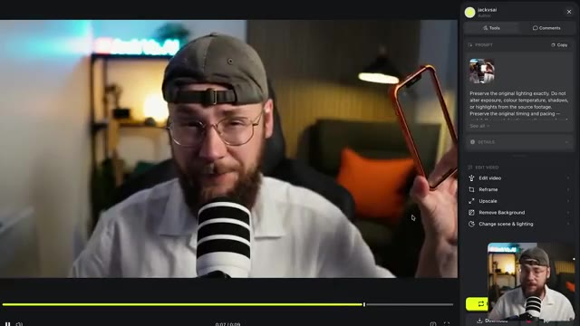
*Interface logicielle de type studio vidéo montrant Jack tenant un téléphone transparent, avec un panneau latéral affichant les prompts de génération et les outils d'édition.*

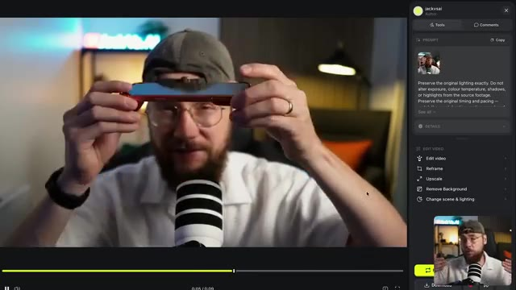
*Interface logicielle montrant Jack présentant le téléphone à l'horizontale, avec le panneau latéral d'options d'édition vidéo et de prompts.*

---

### ⏱️ `[00:03:56 - 00:04:33]` | Segment #08

**🔊 Audio (Transcription Intégrale Mot pour Mot en Français) :**
> Si j'allais être hyper critique, vous remarquerez qu'il y a une sorte de petite forme noire sur le côté gauche du verre qui se déforme et se comporte d'une manière un peu étrange. Mais pour ma toute première génération avec Gemini Omni, j'ai trouvé cela vraiment très impressionnant. Maintenant, le prompt que j'ai utilisé était en deux parties. Donc la première section est essentiellement un ensemble de contraintes. Nous disons à Gemini Omni ce que nous ne voulons pas changer. Et pour la section du bas, je décris l'effet que je recherche. Donc vous pouvez réellement aller de l'avant et réutiliser ceci.

**👁️ Analyse Visuelle d'Écran (gemini-3.5-flash-lite) :**
**Interface & Outils** : Interface textuelle de prompt pour un outil d'intelligence artificielle (Gemini Omni) avec un affichage vertical et un retour vidéo en Picture-in-Picture (PiP).

**Contenu textuel & Code** : Le prompt visible à l'écran contient deux sections principales : en haut, des contraintes strictes sur la préservation de l'éclairage, du timing, du cadrage et des éléments d'origine ("Preserve the original lighting exactly..."). En bas, la description de l'effet recherché ("Change only the below: Make the phone screen look like it's made of glass...").

**Action / Démonstration** : Le créateur montre le prompt en détail à l'écran, en expliquant la distinction entre les contraintes de la première partie et la description de l'effet dans la seconde partie.

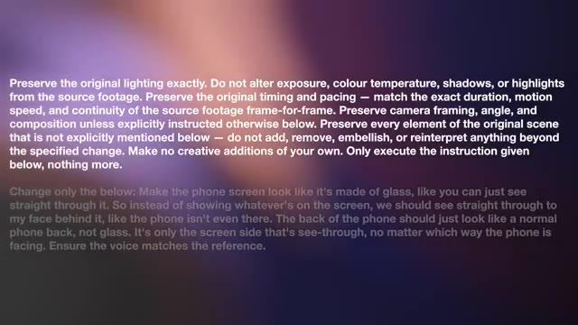
*Affichage en plein écran du texte du prompt utilisé avec Gemini Omni, séparé en deux parties (contraintes et description de l'effet).*

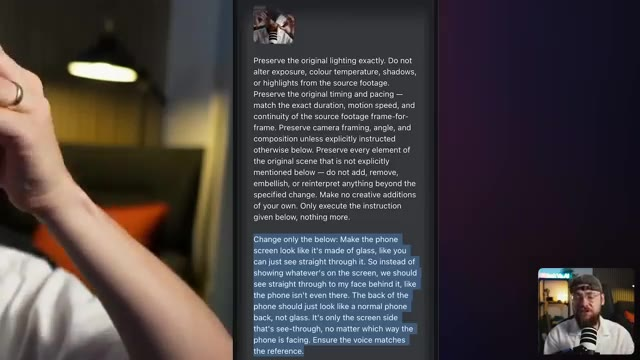
*Affichage du prompt dans une interface verticale avec la main du créateur visible sur le côté gauche et un encadré vidéo (PiP) du créateur en bas à droite.*

---

### ⏱️ `[00:04:33 - 00:05:08]` | Segment #09

**🔊 Audio (Transcription Intégrale Mot pour Mot en Français) :**
> cadre si vous le souhaitez en remplaçant par l'effet désiré en bas. Et si vous voulez aller de l'avant et essayer tout cela, vous trouverez tous mes prompts et matériaux disponibles sur ma communauté School gratuite. Le lien pour cela se trouve en bas dans la description. J'ai aussi fait un test similaire où j'ai levé ma guitare ici et appliqué cet effet de verre et une fois de plus les résultats sont vraiment tout à fait impressionnants. Le seul problème est que lorsque je finis par faire pivoter ma guitare, on ne peut pas voir la plaque de protection, les cordes et tous ces éléments donc il y a un petit décalage en termes de

**👁️ Analyse Visuelle d'Écran (gemini-3.5-flash-lite) :**
**Interface & Outils** : Interface web de type outil de génération ou d'édition vidéo par IA (avec panneau latéral de prompt, options de retouche et lecteur vidéo).

**Contenu textuel & Code** : Texte du prompt visible : "The guitar is made of glass, strings and bridge and normal components still visible. No dialogue." Options de montage visibles : Edit video, Reframe, Upscale, Remove Background, Change scene & lighting.

**Action / Démonstration** : Le créateur montre des exemples de vidéos générées ou modifiées par IA (effet de transparence sur un téléphone puis sur une guitare) tout en commentant les résultats et les limitations techniques lors des rotations.

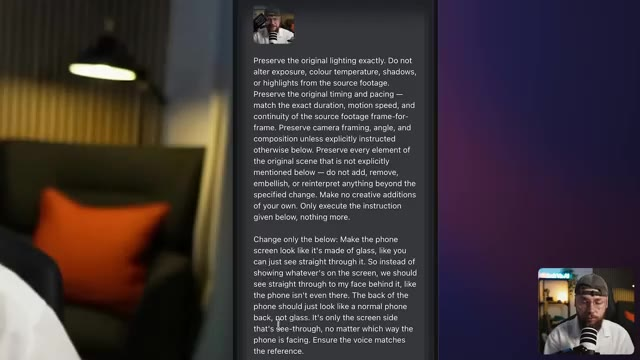
*Interface affichant un prompt textuel détaillé sur le filtrage vidéo et l'effet de verre transparent pour un écran de téléphone.*

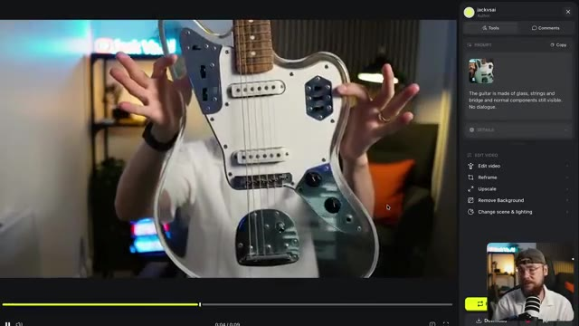
*Interface de l'outil d'IA montrant le résultat vidéo de la guitare transparente en verre avec le prompt associé.*

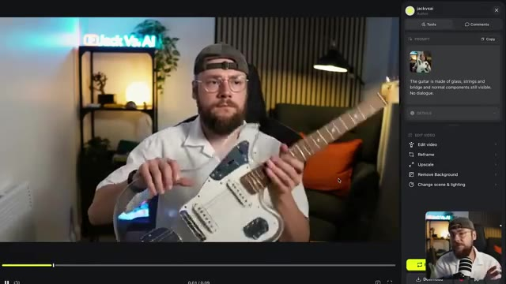
*Démonstration de la rotation de la guitare transparente dans l'interface de l'outil vidéo IA.*

---

### ⏱️ `[00:05:08 - 00:05:43]` | Segment #10

**🔊 Audio (Transcription Intégrale Mot pour Mot en Français) :**
> J'y comprends quelque chose. Mais j'adore la façon dont cette sorte de section biseautée à l'arrière de la guitare provoque cette distorsion sur mon visage quand on regarde à travers. Ensuite, je voulais tester le restylage d'objets du monde réel. Nous avons donc cette séquence assez intéressante où j'ai mes lunettes dans la main, je les approche de la caméra, je les fais pivoter, puis je les remets, et c'est visuellement assez complexe car les verres sont parfaitement nets avec une profondeur de champ très faible en arrière-plan, et de manière intéressante, nous avons aussi ce niveau de grossissement supplémentaire.

**👁️ Analyse Visuelle d'Écran (gemini-3.5-flash-lite) :**
**Interface & Outils** : Interface web de modification ou de prévisualisation vidéo avec lecteur média principal, panneau latéral à droite affichant les outils (« Tools », « Comments »), les détails de la source (« Source », « Type », « Format » : MP4), le prompt de génération, et un encadré de prévisualisation vidéo miniature (PiP) du créateur en bas à droite.

**Contenu textuel & Code** : Texte du prompt visible dans le panneau latéral sur l'image 1 : « The guitar is made of glass, strings and bridge and normal components still visible. No dialogue. » Paramètres et options d'édition : « Edit video », « Reframe », « Upscale », « Remove Background », « Change scene & lighting ». Sur l'image 4, les détails de la source indiquent : « Original Upload », « Video », « MP4 ».

**Action / Démonstration** : Le créateur manipule et présente des objets face caméra (une guitare transparente puis ses lunettes tenues à bout de bras devant l'objectif), tandis que l'interface logicielle affiche la lecture de la vidéo en cours d'analyse.

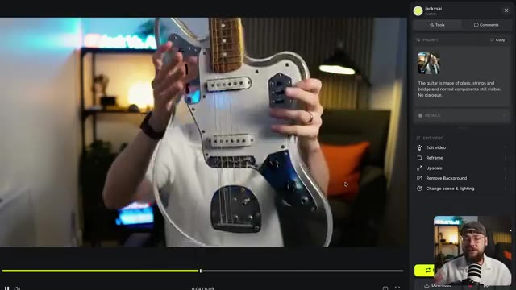
*Interface logicielle montrant une vidéo en cours de lecture d'une guitare transparente manipulée par le créateur, avec un panneau latéral de configuration à droite et un encadré PiP du créateur.*

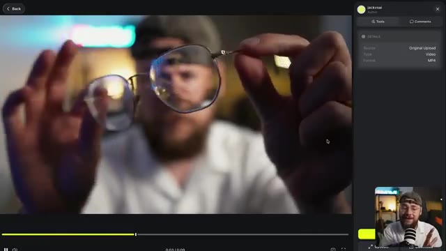
*Interface logicielle montrant une vidéo où Jack tient ses lunettes près de la caméra, avec le panneau latéral des détails du fichier média à droite et un encadré PiP du créateur.*

---

### ⏱️ `[00:05:43 - 00:06:18]` | Segment #11

**🔊 Audio (Transcription Intégrale Mot pour Mot en Français) :**
> quand on regarde à travers les verres. J'étais donc vraiment curieux de voir ce qui se passerait si je demandais à Gemini Omni de changer de type de lunettes. Donc une approche de prompt très similaire une fois de plus et voici le résultat qu'on a obtenu. C'est vraiment impressionnant ici. Omni gère vraiment très bien ces changements de grossissement et de profondeur de champ, tout en nous montrant qu'il

**👁️ Analyse Visuelle d'Écran (gemini-3.5-flash-lite) :**
**Interface & Outils** : Interface de lecteur vidéo/plateforme de test avec volet latéral affichant les détails du fichier source et un panneau de texte de prompt détaillé.

**Contenu textuel & Code** : Texte du prompt visible : "Preserve the original lighting exactly. Do not alter exposure, color temperature, shadows, or highlights from the source footage... Change only the below: At the very start of the shot, as I bring the glasses up close to the camera, they must exactly match the reference footage: same rounded rectangular shape, same gold rim... Then, every couple of seconds, have the glasses' design completely snap into something new..."

**Action / Démonstration** : Le créateur navigue dans son interface de test, montre le prompt textuel et démontre le résultat vidéo de la transformation des lunettes gérée par l'IA.

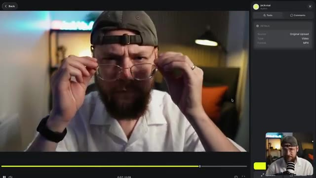
*Interface de lecture vidéo montrant Jack ajustant ses lunettes fines à monture dorée, avec un panneau d'informations et une vignette en bas à droite.*

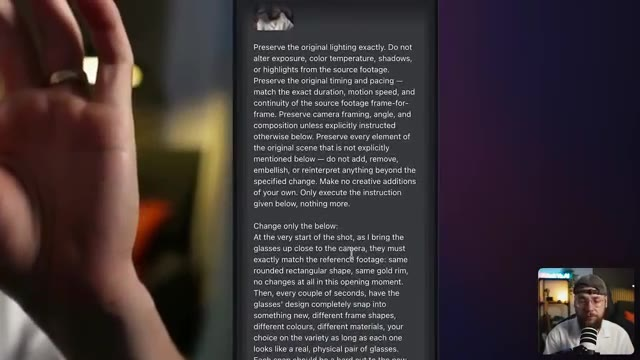
*Gros plan sur le panneau de texte affichant le prompt détaillé demandant de préserver l'éclairage et la structure d'origine tout en changeant le design des lunettes.*

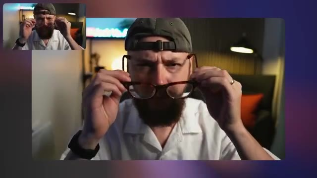
*Visualisation du résultat de génération IA où les lunettes de Jack changent de style et de monture (monture plus épaisse et foncée).*

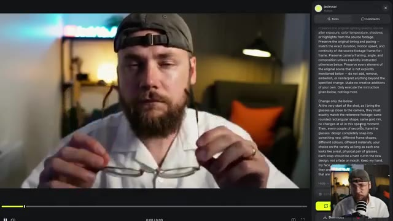
*Interface de lecteur vidéo avec le prompt visible à droite, montrant Jack en train de retirer ses lunettes face caméra.*

---

### ⏱️ `[00:06:18 - 00:06:52]` | Segment #12

**🔊 Audio (Transcription Intégrale Mot pour Mot en Français) :**
> peut être très bon pour le suivi d'objets. Toutes les lunettes ont l'air réalistes, rien ne se brise ici, vraiment cool. Et j'ai fait un test similaire où je prends une gourde Stanley et la fais pivoter, et j'ai demandé à Omni de préserver sa forme et sa marque tout en la morphant en une variété de matériaux différents. Encore une fois, le suivi d'objets, les reflets et les ombres ont l'air assez incroyables. Omni a fini par ajouter un logo supplémentaire sur l'arrière de la gourde Stanley, mais j'adore le fait que lorsque le matériau change

**👁️ Analyse Visuelle d'Écran (gemini-3.5-flash-lite) :**
**Interface & Outils** : Interface web de test vidéo avec panneau latéral d'options (Tools, Comments, Prompt, Details, Edit video) et encadré vidéo PiP du créateur en bas à droite.

**Contenu textuel & Code** : Texte du prompt visible : "Preserve the original lighting exactly. Do not alter exposure, colour temperature, shadows, or highlights from the source footage. Preserve the original timing and pacing..." Options de modification vidéo : Edit video, Reframe, Upscale, Remove Background, Change scene & lighting.

**Action / Démonstration** : Le créateur montre et manipule une vidéo de test de suivi d'objet avec une gourde Stanley, tout en affichant l'interface de l'outil IA Omni.

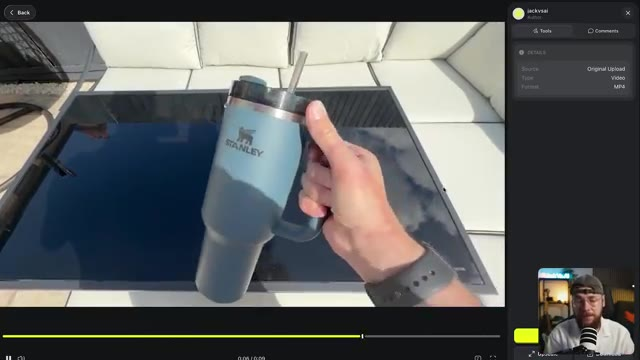
*Interface vidéo avec PiP montrant une main tenant une gourde Stanley bleue au-dessus d'une table en verre.*

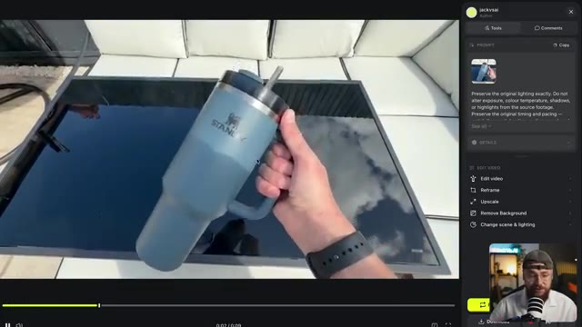
*Panneau latéral affichant les détails du prompt textuel pour préserver l'éclairage et la cohérence de la vidéo.*

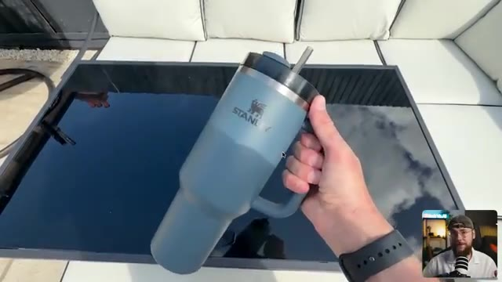
*Gros plan de la vidéo démontrée avec le créateur visible en incrustation PiP dans le coin inférieur droit.*

---

### ⏱️ `[00:06:52 - 00:07:30]` | Segment #13

**🔊 Audio (Transcription Intégrale Mot pour Mot en Français) :**
> nous pouvons effectivement le voir dans le reflet de la table en verre également. Et voici un autre effet qui est partout sur les réseaux sociaux que je devais absolument essayer. J'ai mis en ligne des images de moi tenant et faisant pivoter cette enveloppe marron pliée pour voir si Gemini Omni pouvait transformer cela en carte Pokémon. Et bien sûr je voulais viser le Dracaufeu PSA 10. Et j'ai eu une approche assez intéressante pour cela j'ai en fait écrit recto et verso sur les côtés correspondants de l'enveloppe et j'ai également utilisé le modèle de référence Omni en téléchargeant la vue de face de la carte également

**👁️ Analyse Visuelle d'Écran (gemini-3.5-flash-lite) :**
**Interface & Outils** : Interface de lecture vidéo avec panneau latéral d'outils et de détails de fichier, incluant une incrustation vidéo du créateur en bas à droite.

**Contenu textuel & Code** : Inscriptions manuscrites "BACK" sur une enveloppe, texte "Your tax services", et affichage de deux cartes Pokémon PSA 10 labellisées "FRONT" et "BACK".

**Action / Démonstration** : Le créateur montre une enveloppe en papier pliée qu'il manipule et présente des images de référence de cartes Pokémon.

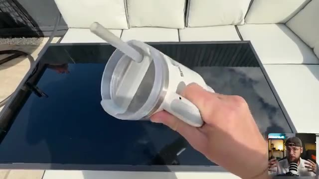
*Démonstration du reflet d'un objet (gourde) sur une table en verre à l'extérieur.*

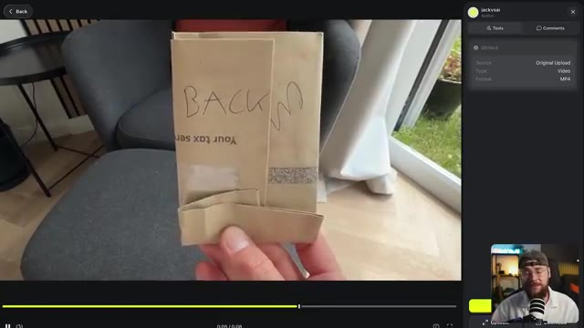
*Présentation d'une enveloppe en papier marron pliée avec l'inscription manuscrite "BACK".*

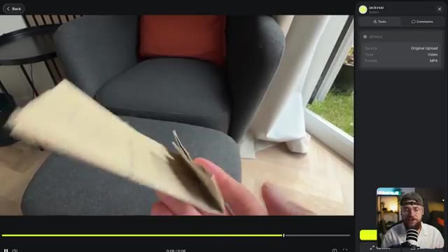
*Rotation de l'enveloppe en papier marron tenue à la main devant un fauteuil.*

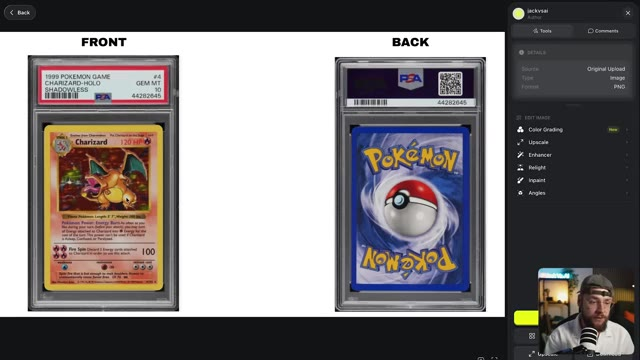
*Affichage à l'écran de deux cartes Pokémon Dracaufeu notées PSA 10, étiquetées "FRONT" et "BACK".*

---

### ⏱️ `[00:07:30 - 00:08:07]` | Segment #14

**🔊 Audio (Transcription Intégrale Mot pour Mot en Français) :**
> comme la vue arrière et en les étiquetant avec l'espoir qu'Omni ferait correspondre cela à l'avant et à l'arrière de notre enveloppe pliée. Encore une fois, une approche assez similaire en termes de prompt. Laissez-moi vous montrer le résultat que j'ai obtenu. Maintenant, j'ai évidemment été assez brutal avec ce test. Bon nombre des résultats que vous allez voir sur les réseaux sociaux jouent en fait la carte de la sécurité. J'aime vraiment pousser ces outils dans leurs retranchements, alors je fais pivoter cette enveloppe un grand nombre de fois différentes.

**👁️ Analyse Visuelle d'Écran (gemini-3.5-flash-lite) :**
**Interface & Outils** : Interface d'un outil d'IA avec panneau latéral de modification (Color Grading, Upscale, Enhancer, Relight, Inpaint, Angles) et un encadré PiP (Picture-in-Picture) du créateur.

**Contenu textuel & Code** : Texte affiché : "FRONT", "BACK", "1999 POKEMON GAME CHARIZARD-HOLO GEM MT 10 SHADOWLESS", logo PSA, code-barres, QR code, et dans le panneau latéral : "Source: Original Upload", "Type: Image", "Format: PNG", "Color Grading", "Upscale", "Enhancer", "Relight", "Inpaint", "Angles".

**Action / Démonstration** : Le créateur montre une interface d'outil d'IA affichant une carte Pokémon sous différents angles (recto et verso) avec des options de modification d'image disponibles dans le panneau latéral, tout en apparaissant en bas à droite dans un encadré PiP.

*Interface d'un outil d'IA montrant une carte Pokémon Charizard dans son étui de certification PSA, avec des étiquettes 'FRONT' et 'BACK' et un panneau latéral d'options d'édition (Color Grading, Upscale, Enhancer, Relight, Inpaint, Angles) ainsi qu'un encadré PiP du créateur.*

---

### ⏱️ `[00:08:07 - 00:08:43]` | Segment #15

**🔊 Audio (Transcription Intégrale Mot pour Mot en Français) :**
> pour en faire un vrai défi. Pour la plupart, Omni s'en sort vraiment très bien. Le suivi d'objet et l'éclairage sur la carte sont plutôt proches. C'est juste vers la fin ici qu'Omni perd le fil et la compréhension de l'endroit où le recto et le verso de la carte sont censés se trouver, et on voit simplement en continu cette illustration de Dracaufeu encore et encore. Il y a aussi des problèmes de lisibilité du texte ici sur la carte elle-même, donc un test plutôt mitigé je dirais. En restant sur le thème du suivi d'objet, je voulais voir si je pouvais téléverser des images de moi en train de tenir et

**👁️ Analyse Visuelle d'Écran (gemini-3.5-flash-lite) :**
**Interface & Outils** : Application web de génération/montage vidéo par IA avec un panneau latéral droit affichant les détails des prompts, l'historique des modifications, les métadonnées de la source vidéo ("Original Upload", "Video", "MP4"), et un retour vidéo principal dans la zone centrale. Un encadré PiP (Picture-in-Picture) en bas à droite montre le créateur (Jack) dans son studio devant son micro.

**Contenu textuel & Code** : Texte du prompt visible sur l'image #1 : "Preserve the original lighting exactly. Do not alter exposure, colour temperature, shadows, or highlights from the source footage. Preserve the original timing and pacing – match the exact duration, motion speed, and continuity of the source footage frame-for-frame. Preserve every element of the original scene that is not explicitly mentioned below – do not add, remove, embellish, or reinterpret anything beyond the specified change. Make no creative additions of your own. Only execute the instruction given below, nothing more. No dialogue. Change only the below: Change the brown folded letter into a PSA 10 Charizard Pokemon card, match the front and back to @Image 1". Sur la boîte de l'image #4 : "High Protein Low Sugar POPS SURREAL Chocolate", "18g PROTEIN", "0g SUGAR", "HIGH FIBRE".

**Action / Démonstration** : Le créateur présente des exemples de vidéos générées par IA sur son écran, d'abord une carte Pokémon Dracaufeu graduée PSA manipulée dans les mains (images 1, 2, 3), puis une boîte de céréales violette (image 4), tout en expliquant les forces et faiblesses du suivi d'objet et de la cohérence visuelle de l'IA (Omni).

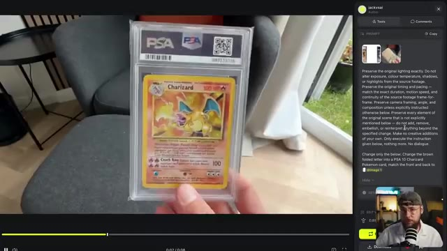
*Interface d'une application web d'IA montrant un aperçu vidéo d'une carte Pokémon Dracaufeu graduée PSA tenue à la main avec un panneau de prompts textuels sur le côté droit.*

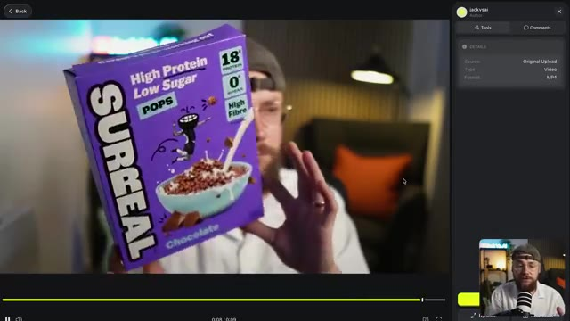
*Interface de l'application montrant une vidéo téléversée où le créateur tient une boîte de céréales violette "Surreal" face à la caméra.*

---

### ⏱️ `[00:08:43 - 00:09:04]` | Segment #16

**🔊 Audio (Transcription Intégrale Mot pour Mot en Français) :**
> faire pivoter une boîte de céréales et demander à Omni de remplacer de manière convaincante les illustrations. C'est donc moins un plan de style VFX tape-à-l'œil qu'un flux de travail orienté vers la publicité. D'abord, je voulais voir ce dont Omni était capable de faire de manière créative, alors j'ai simplement entré ce prompt très simple ici.

**👁️ Analyse Visuelle d'Écran (gemini-3.5-flash-lite) :**
**Interface & Outils** : Interface utilisateur de l'application Omni avec des sections "PROMPT", "DETAILS", et "EDIT VIDEO" comprenant les options "Edit video", "Reframe" et "Upscale".

**Contenu textuel & Code** : Texte du prompt visible : "Change the cereal box to be a tongue-in-cheek cartoon-style brand of cereal that features the man's face." Miniature de la vidéo avec une boîte de céréales violette et le visage d'un homme.

**Action / Démonstration** : Affichage de l'interface de l'outil Omni illustrant la saisie d'un prompt pour modifier l'illustration d'une boîte de céréales dans une vidéo.

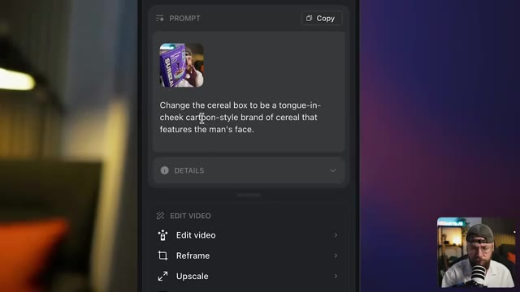
*Interface de l'outil Omni montrant un panneau de prompt avec une miniature vidéo et le texte de la requête.*

---

### ⏱️ `[00:09:04 - 00:09:36]` | Segment #17

**🔊 Audio (Transcription Intégrale Mot pour Mot en Français) :**
> Et ce résultat est vraiment cool. J'adore le design qu'Omni a créé ici et le suivi d'objets fonctionne encore une fois très bien, mais il y a ces problèmes de lisibilité du texte une fois de plus. Il semble qu'avec du texte grand et en gras, Omni fonctionne bien, mais quand on commence à avoir cette police vraiment très petite, c'est là qu'on obtient ce look classique de texte brouillé par l'IA, et pour être juste, c'est un problème pour la plupart des modèles de vidéo par IA. Cling est probablement la meilleure alternative pour les petits détails de texte, je...

**👁️ Analyse Visuelle d'Écran (gemini-3.5-flash-lite) :**
**Interface & Outils** : Interface de l'outil vidéo IA (panneau latéral avec sections Prompt, Edit Video comprenant Edit video, Reframe, Upscale, Remove Background, Change scene & lighting).

**Contenu textuel & Code** : Texte du prompt visible : « Change the cereal box to be a tongue-in-cheek cartoon-style brand of cereal that features the man's face. » Auteur : jackvsai.

**Action / Démonstration** : Le créateur présente une vidéo générée par IA montrant une boîte de céréales personnalisée avec des éléments de texte générés, puis zoome sur les détails textuels pour illustrer les problèmes de lisibilité.

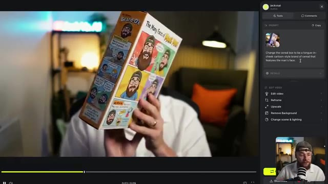
*Interface d'édition vidéo affichant le rendu de la boîte de céréales transformée par l'IA et le panneau de prompt latéral.*

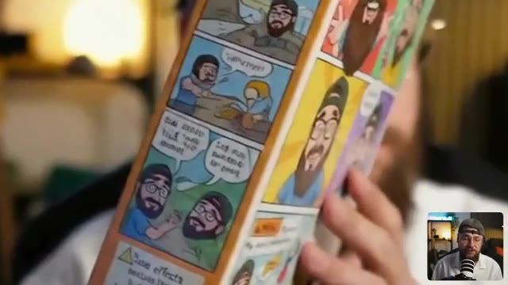
*Gros plan sur les détails de la boîte de céréales générée par l'IA montrant le texte brouillé de style bande dessinée.*

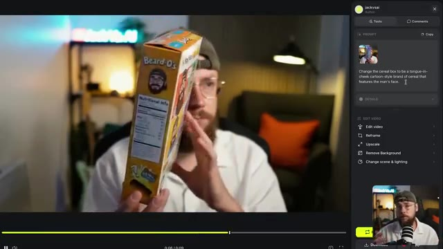
*Vue de l'interface montrant une autre face de la boîte de céréales avec des informations nutritionnelles générées.*

---

### ⏱️ `[00:09:36 - 00:10:15]` | Segment #18

**🔊 Audio (Transcription Intégrale Mot pour Mot en Français) :**
> dis. J'étais également curieux de voir si je pouvais amener Omni à préparer essentiellement la boîte de céréales pour le remplacement d'emballage. En publicité, il arrive souvent qu'un seul produit soit filmé, puis, en post-production, les artistes VFX remplacent les illustrations sur chaque face de la boîte afin que la publicité puisse être adaptée pour fonctionner partout dans le monde. Je voulais donc voir si je pouvais ajouter ces marqueurs de suivi qui pourraient être utiles pour un flux de travail en effets visuels. Donc encore une fois, il ne s'agit pas d'un plan VFX tape-à-l'œil, mais plutôt d'un aperçu d'un cas d'usage réel dans l'industrie créative. Très

**👁️ Analyse Visuelle d'Écran (gemini-3.5-flash-lite) :**
**Interface & Outils** : Interface web d'un outil d'édition vidéo par IA (comportant un lecteur vidéo principal à gauche et un panneau latéral droit avec des onglets 'Tools' et 'Comments', un champ de prompt et des options d'édition comme Edit video, Reframe, Upscale, Remove Background, Change scene & lighting, ainsi qu'une vignette PiP du créateur).

**Contenu textuel & Code** : Texte du prompt visible dans le panneau latéral : "Change the cereal box to be plain, saturated green colour, add a medium-sized black cross close to each corner of every face and a medium-sized black cross in the centre of..."

**Action / Démonstration** : Jack présente une boîte de céréales recouverte de papier vert et marquée de croix noires agissant comme des repères de suivi (tracking markers) pour les effets visuels.

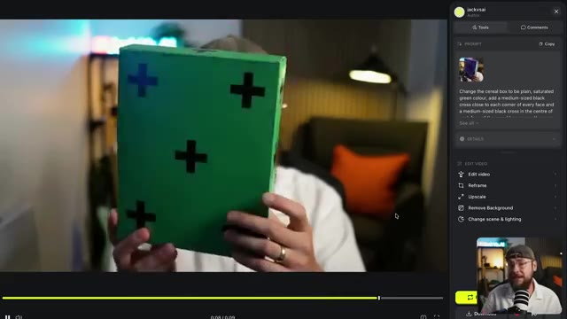
*Interface d'un outil vidéo affichant à gauche Jack montrant une boîte de céréales verte avec des repères noirs, et à droite un panneau de configuration avec le prompt textuel.*

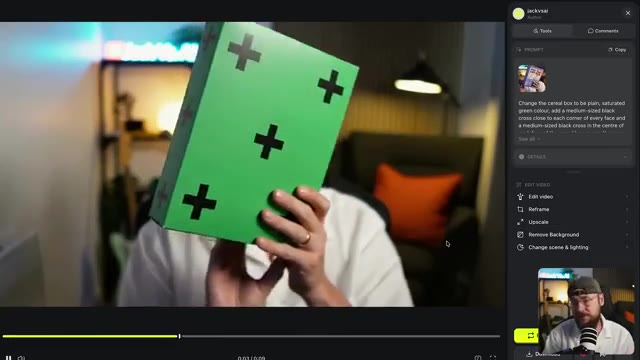
*Interface similaire montrant Jack présentant une autre face de la boîte de céréales verte avec des marqueurs de suivi noirs.*

---

### ⏱️ `[00:10:15 - 00:10:40]` | Segment #19

**🔊 Audio (Transcription Intégrale Mot pour Mot en Français) :**
> impressionnant en termes de suivi d'objet et d'éclairage encore une fois. Passons maintenant à des visuels impossibles, je voulais essayer de recréer un effet qu'on voit partout en ce moment. J'ai donc téléchargé cette séquence vidéo de moi tendant la main vers l'écran de mon ordinateur portable, et l'idée est que je voulais qu'Omni donne vie à l'oiseau pour qu'il sorte de l'écran et vienne se poser sur la paume de ma main.

**👁️ Analyse Visuelle d'Écran (gemini-3.5-flash-lite) :**
**Interface & Outils** : Interface web de manipulation vidéo par IA (type plateforme d'édition vidéo avec panneau latéral d'options et lecteur vidéo principal) comportant un encadré de prévisualisation PiP (Picture-in-Picture) du créateur.

**Contenu textuel & Code** : Texte de prompt visible dans le panneau latéral : "Change the cereal box to be plain, saturated green colour, add a medium-sized black cross close to each corner of every face and a medium-sized black cross in the centre of..." ainsi que les options vidéo ("Edit video", "Reframe", "Upscale", "Remove Background", "Change scene & lighting").

**Action / Démonstration** : Le créateur présente une interface d'édition vidéo par IA où il manipule des séquences visuelles, montrant d'abord une vidéo de lui-même puis une séquence où il tend la main vers l'écran de son ordinateur affichant un oiseau, illustrant la préparation d'un effet visuel par IA.

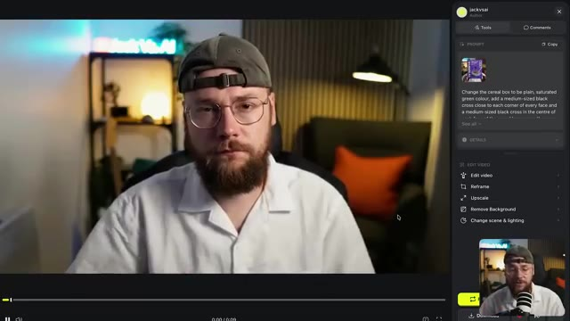
*Interface du logiciel avec la vidéo de Jack face caméra dans le lecteur principal et les options d'édition vidéo à droite incluant le prompt textuel.*

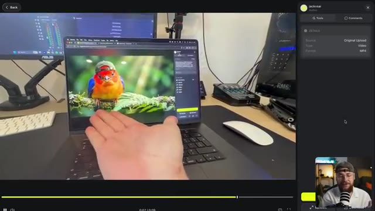
*Capture vidéo montrant la main de Jack tendue devant l'écran d'un ordinateur portable affichant une image d'oiseau coloré, avec le panneau d'outils et l'encadré PiP de Jack en bas à droite.*

---

### ⏱️ `[00:10:40 - 00:11:02]` | Segment #20

**🔊 Audio (Transcription Intégrale Mot pour Mot en Français) :**
> Le problème que je n'arrêtais pas de rencontrer ici, c'est que pour une raison quelconque, Omni n'arrêtait pas de changer le contenu de l'écran de mon ordinateur portable. Vous pouvez voir que nous avons Photoshop ouvert au lieu de l'interface utilisateur de Higgs field. L'oiseau a complètement changé, y compris cette casquette de baseball. Il se passe toutes sortes de choses bizarres ici, même si l'effet lui-même est plutôt impressionnant.

**👁️ Analyse Visuelle d'Écran (gemini-3.5-flash-lite) :**
**Interface & Outils** : Application Omni (panneau latéral droit avec les options Tools, Prompt, Edit Video) et écran de MacBook affichant Adobe Photoshop.

**Contenu textuel & Code** : Texte du prompt visible dans le panneau Omni : "Preserve all original footage exactly, but make the tropical bird on the laptop screen comes to life and jump onto the open palm in front of it." Options d'édition vidéo : Edit video, Reframe, Upscale, Remove Background, Change scene & lighting.

**Action / Démonstration** : Le créateur montre et commente les bugs visuels générés par l'IA Omni sur son écran, où Photoshop s'ouvre à la place de l'interface attendue et l'oiseau tropical change d'apparence de manière inattendue.

*Vue rapprochée de l'ordinateur portable affichant Adobe Photoshop avec l'image d'un oiseau tropical portant une casquette de baseball sur la paume d'une main, avec le panneau de contrôle de l'application Omni sur le côté droit et le créateur visible en incrustation (PiP).*

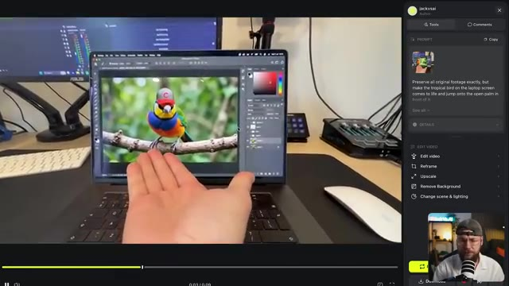
*Vue de l'écran du MacBook affichant Photoshop avec un oiseau tropical coloré posé sur une branche, tandis qu'une main humaine est tendue au premier plan.*

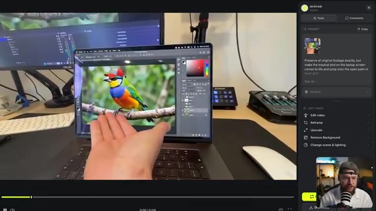
*Vue similaire montrant la main bougeant légèrement devant l'écran du ordinateur portable affichant l'interface de Photoshop.*

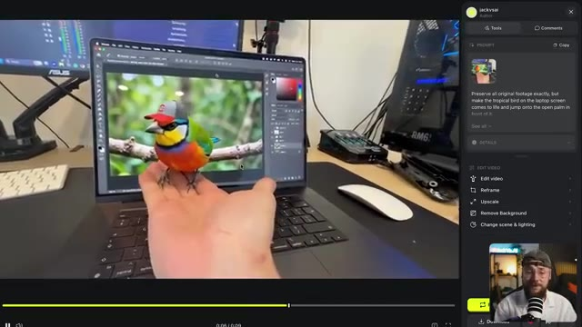
*Gros plan sur l'animation générée montrant l'oiseau coloré avec sa casquette rouge et grise posé sur la main.*

---

### ⏱️ `[00:11:02 - 00:11:21]` | Segment #21

**🔊 Audio (Transcription Intégrale Mot pour Mot en Français) :**
> Après pas mal de tests différents, la seule façon d'obtenir le résultat que je cherchais était en fait d'utiliser simplement la fonction de frame de début et de fin dans Gemini Omni. Maintenant, vous pouvez voir que la couleur de l'oiseau change encore un peu. C'est un peu dommage, mais l'effet global est plutôt super, je dois dire.

**👁️ Analyse Visuelle d'Écran (gemini-3.5-flash-lite) :**
**Interface & Outils** : Interface utilisateur de Gemini Omni (ou outil vidéo équivalent) affichée sur l'écran d'un ordinateur portable MacBook, avec un panneau latéral droit contenant un prompt et des options d'édition vidéo (Edit video, Reframe, Upscale, Remove Background, Change scene & lighting).

**Contenu textuel & Code** : Le prompt visible dans le panneau latéral indique : "Preserve all original footage exactly, but make the tropical bird on the laptop screen comes to life and jump onto the open palm in front of it. Gentle handheld camera".

**Action / Démonstration** : Le créateur montre la lecture d'une vidéo générée par IA sur son écran d'ordinateur portable, illustrant le résultat de l'animation d'un oiseau sortant d'une image pour atterrir sur une paume de main, avec sa webcam en médaillon (PiP) dans le coin inférieur droit.

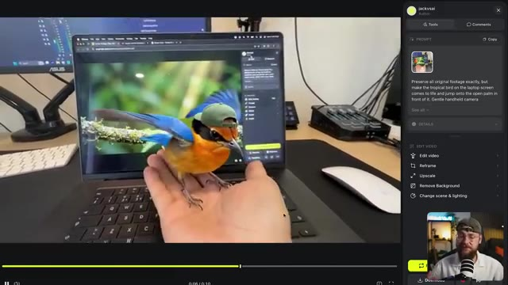
*Affichage du rendu vidéo final sur l'écran du MacBook, montrant l'oiseau tropical avec une casquette posé sur la main.*

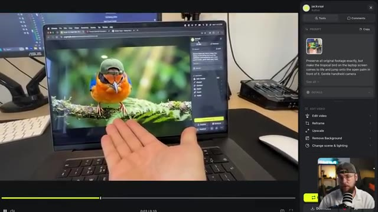
*Affichage de la frame initiale ou d'une image de référence du test vidéo avec l'oiseau sur sa branche.*

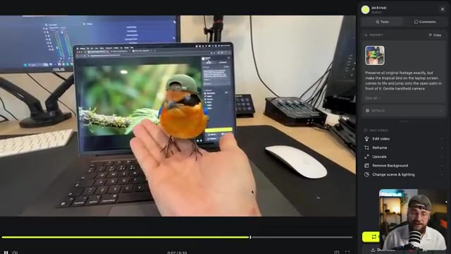
*Affichage d'une autre étape de la vidéo générée montrant l'oiseau sur la main en train de bouger.*

---

### ⏱️ `[00:11:21 - 00:11:55]` | Segment #22

**🔊 Audio (Transcription Intégrale Mot pour Mot en Français) :**
> Pour être bien clair, dans les deux cas, lorsque j'utilisais l'approche de référence Omni par rapport à l'approche par image de début et de fin, j'utilisais exactement le même texte de consigne très simple que vous pouvez voir à l'écran ici. Une information utile à vous transmettre si vous avez du mal à obtenir le résultat que vous cherchez : l'image de début et de fin est peut-être la bonne solution. Je voulais aussi tester cette séquence vidéo où je tiens un verre vide et le fais pivoter pour qu'il soit à l'envers. Je suis retourné à ma structure de consigne plus technique, où l'on modifie l'effet en bas et je demande à Omni de remplir

**👁️ Analyse Visuelle d'Écran (gemini-3.5-flash-lite) :**
**Interface & Outils** : Interface logicielle de génération vidéo avec panneau latéral de détails, aperçu vidéo, barre de lecture et vignette de l'auteur.

**Contenu textuel & Code** : Texte du prompt visible sur l'image 1 : "Preserve all original footage exactly, but make the tropical bird on the laptop screen comes to life and jump onto the open palm in front of it. Gentle handheld camera movement." Texte visible sur l'image 3 détaillant les consignes techniques pour préserver l'éclairage, le timing et modifier uniquement le remplissage d'eau avec des lois physiques réalistes malgré l'inversion du verre.

**Action / Démonstration** : Le créateur présente ses configurations de prompts et ses séquences vidéo de test pour comparer les approches de référence Omni et l'utilisation d'images de début/fin.

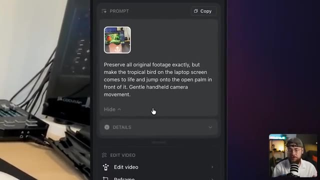
*Interface affichant le panneau de paramètres de l'outil et le prompt textuel simple utilisé pour la comparaison.*

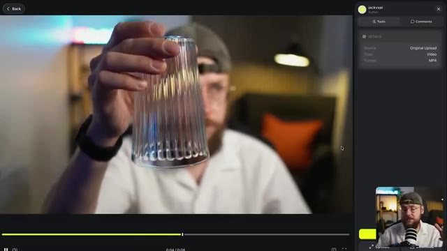
*Aperçu vidéo montrant Jack tenant un verre vide retourné à l'envers, avec le panneau latéral droit de l'application.*

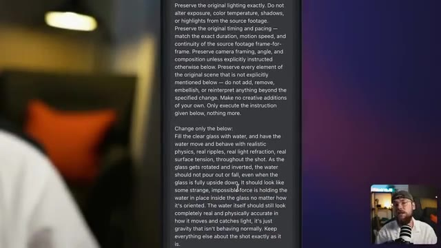
*Gros plan sur le prompt textuel technique détaillé concernant la physique de l'eau et les modifications d'effets.*

---

### ⏱️ `[00:11:55 - 00:12:32]` | Segment #23

**🔊 Audio (Transcription Intégrale Mot pour Mot en Français) :**
> le verre avec de l'eau mais aussi de m'assurer que lorsque je fais pivoter le verre, l'eau ne tombe pas et le résultat était vraiment tout à fait impressionnant. La dynamique des fluides a l'air très crédible. La seule chose qui m'a un peu laissé perplexe, c'est qu'une fois que ce verre est pivoté, est-ce que le volume d'eau a été un peu réduit ? Maintenant, ma femme a fait remarquer que le haut du verre est bien sûr plus large que le bas, donc c'est peut-être tout à fait exact. Vous savez quoi ? Vous me direz ce que vous en pensez dans les commentaires ci-dessous. Malgré tout, je pense qu'il y a beaucoup de choses impressionnantes ici. Maintenant, nous devons

**👁️ Analyse Visuelle d'Écran (gemini-3.5-flash-lite) :**
**Interface & Outils** : Interface web de lecteur vidéo avec panneau de configuration latéral (style interface de génération/édition vidéo par IA).

**Contenu textuel & Code** : Texte du prompt visible dans le panneau latéral droit : instructions détaillées en anglais pour préserver l'éclairage et le timing d'origine, et modifier le comportement physique (remplir le verre d'eau avec des mouvements fluides réalistes, faire pivoter et inverser le verre sans que l'eau ne tombe).

**Action / Démonstration** : Le créateur montre la vidéo en cours de lecture à l'écran principal tout en affichant le prompt d'édition vidéo dans le panneau latéral.

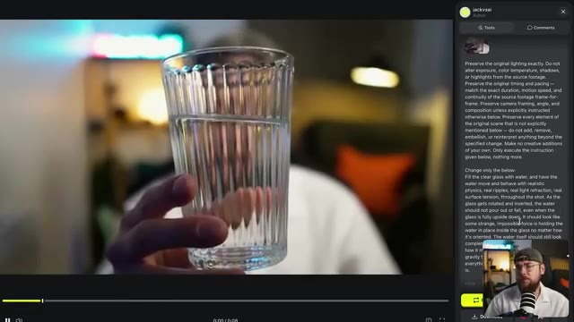
*Interface de lecture vidéo avec le panneau latéral affichant le prompt textuel détaillé pour la modification de la vidéo du verre d'eau.*

---

### ⏱️ `[00:12:32 - 00:12:52]` | Segment #24

**🔊 Audio (Transcription Intégrale Mot pour Mot en Français) :**
> Passons maintenant à autre chose et jetons un coup d'œil à la concurrence, qui est bien sûr Seedance 2. Donc d'abord je voulais recréer l'effet de téléphone en verre. Donc juste un rappel du résultat que nous avons obtenu de Gemini Omni flash et en utilisant exactement la même référence vidéo et le même prompt, voici le résultat que nous avons obtenu de Seedance 2.

**👁️ Analyse Visuelle d'Écran (gemini-3.5-flash-lite) :**
**Interface & Outils** : Interface logicielle de type studio de montage/génération vidéo par IA avec un panneau latéral affichant les outils ("Tools"), les prompts ("Prompt"), les détails ("Details") et les options d'édition vidéo ("Edit video" : Reframe, Upscale, Remove Background, Change scene & lighting).

**Contenu textuel & Code** : Texte affiché en haut à gauche "Gemini Omni" (sur l'image 2) puis "Seedance 2.0" (sur l'image 3). Dans le panneau de droite, on peut lire le prompt : "Preserve the original lighting exactly. Do not alter exposure, colour temperature, shadows, or highlights from the source footage. Preserve the original timing and pacing..." ainsi qu'une vignette vidéo de référence.

**Action / Démonstration** : Le créateur présente une comparaison entre les résultats de Gemini Omni et de Seedance 2.0, tout en affichant l'interface de l'outil et les paramètres de génération associés.

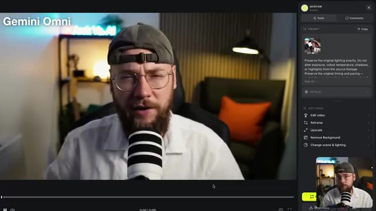
*Capture d'écran montrant l'interface logicielle avec un panneau latéral de prompts et de réglages vidéo (Gemini Omni).*

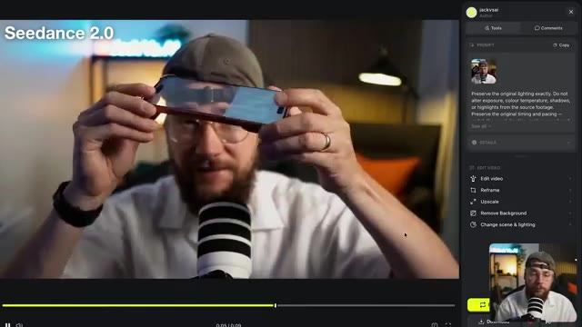
*Capture d'écran montrant l'interface logicielle avec le panneau latéral et le rendu de Seedance 2.0 où Jack manipule un téléphone en verre.*

---

### ⏱️ `[00:12:52 - 00:13:31]` | Segment #25

**🔊 Audio (Transcription Intégrale Mot pour Mot en Français) :**
> donc bien que ça fonctionne globalement, il y a en fait quelques problèmes ici, le verre lui-même a cette sorte de teinte blanche, quand on tourne ici on peut toujours voir le haut de mon téléphone ce qu'on n'avait pas demandé dans le prompt donc en fait on peut dire que Gemini Omni a fait un meilleur travail ici ce qui est assez surprenant un autre test que vous auriez vu en fait juste au début de l'intro était quand j'ai utilisé Gemini Omni pour faire ce genre d'animation de titre d'ouverture dans un style de scène plastique donc je voulais essayer de recréer cela avec Seedance 2 j'ai été vraiment très impressionné par

**👁️ Analyse Visuelle d'Écran (gemini-3.5-flash-lite) :**
**Interface & Outils** : Interface utilisateur de l'outil Seedance 2.0 avec panneau de prompt latéral, options d'édition vidéo et retour caméra en Picture-in-Picture.

**Contenu textuel & Code** : Texte "Seedance 2.0" en haut à gauche, prompt visible dans le panneau latéral ("Preserve the original lighting exactly..."), vignette de prévisualisation, et animation avec les mots "Gemini Omni" sur fond vert à l'image #3.

**Action / Démonstration** : Le créateur présente et commente les résultats d'un test vidéo avec Seedance 2.0, en tenant son téléphone, puis montre l'animation réalisée avec Gemini Omni.

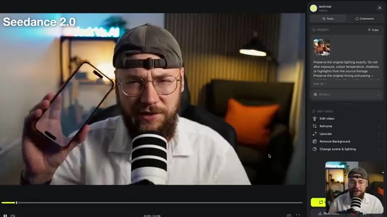
*Démonstration de l'interface Seedance 2.0 où Jack tient un téléphone portable avec une application ou un effet visible.*

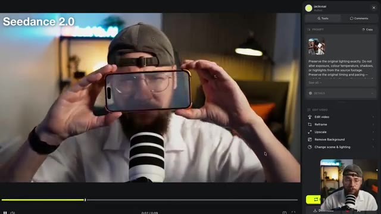
*Suite de la démonstration Seedance 2.0 avec Jack manipulant le téléphone devant la caméra, montrant un reflet teinté.*

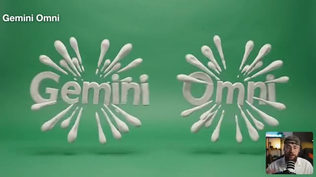
*Animation du titre d'ouverture "Gemini Omni" avec un style de scène en plastique sur fond vert, mentionnée dans le discours.*

---

### ⏱️ `[00:13:31 - 00:14:05]` | Segment #26

**🔊 Audio (Transcription Intégrale Mot pour Mot en Français) :**
> les résultats avec gemini omni et voici le résultat qu'on a obtenu de c dance 2. encore une fois c'est plutôt bien mais pour une raison quelconque cette sorte de section d'ouverture où la scène en plastique est comme formée ou moulée me paraît un peu dégoûtante pour être tout à fait honnête je préfère en fait le résultat qu'on a eu de gemini omni et ensuite je voulais tester notre plan VFX d'oiseau donc juste un petit rappel du résultat qu'on a obtenu quand on utilisait le nouveau modèle vidéo de google vous vous rappellerez que j'ai eu quelques problèmes pour arriver à ce résultat final et j'ai fini par devoir utiliser

**👁️ Analyse Visuelle d'Écran (gemini-3.5-flash-lite) :**
**Interface & Outils** : Interface de l'application Seedance 2.0 / plateforme vidéo avec un panneau latéral droit contenant des options de prompt ("Prompt"), d'édition vidéo ("Edit video", "Reframe", "Upscale", "Remove Background", "Change scene & lighting") et une incrustation vidéo (PiP) du présentateur en bas à droite.

**Contenu textuel & Code** : Texte à l'écran : "Seedance 2.0", "Gemini", "Gemini Omni". Prompt visible : "[00:00 - 00:03] Medium, 50mm, eye-level, static — on a seamless saturated green background, 'Gemini' and 'Omni' each burst outward from their own individual" / "Preserve all original footage exactly, but make the tropical bird on the laptop screen comes to life and jump onto the open palm in front of it. Gentle handheld camera".

**Action / Démonstration** : Le créateur montre des exemples de vidéos générées par IA (génération de texte en 3D style pâte à modeler et effet visuel VFX d'un oiseau sortant d'un écran d'ordinateur) tout en commentant les résultats dans le panneau latéral.

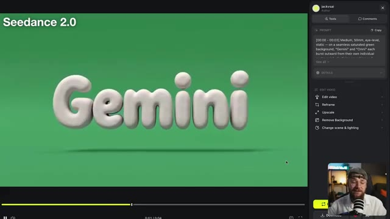
*Interface de Seedance 2.0 affichant le texte animé 'Gemini' en lettres façon pâte à modeler sur fond vert, avec le panneau latéral de prompts et la webcam du créateur.*

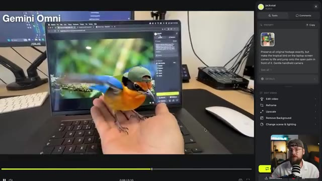
*Interface vidéo avec le texte 'Gemini Omni' montrant un plan VFX où un oiseau tropical coloré avec une casquette saute d'un écran d'ordinateur portable vers une main ouverte.*

*Suite de la démonstration du plan VFX avec l'oiseau tropical sur la main dans l'interface de Seedance/Gemini Omni, avec le panneau de configuration et le prompt visible à droite.*

---

### ⏱️ `[00:14:05 - 00:14:38]` | Segment #27

**🔊 Audio (Transcription Intégrale Mot pour Mot en Français) :**
> un flux de travail avec une image de début et de fin. Donc voici le résultat que nous obtenons avec Seedance 2. J'ai pu utiliser simplement leur flux de travail Omni reference ici et bien que je pense que le résultat soit vraiment assez impressionnant, j'ai l'impression que l'oiseau s'est transformé en une sorte de martin-pêcheur. Je ne suis pas très fort en connaissances sur les espèces d'oiseaux, mais pour moi, il me semble qu'en fait le type d'oiseau a changé ici, même si les effets visuels eux-mêmes sont vraiment assez impressionnants. Et j'ai aussi à ce stade pensé

**👁️ Analyse Visuelle d'Écran (gemini-3.5-flash-lite) :**
**Interface & Outils** : Navigateur web affichant l'interface de Seedance 2.0, avec un panneau latéral de configuration et de prompt à droite, et un affichage vidéo au centre. Un encadré PiP (Picture-in-Picture) en bas à droite montre le créateur (Jack) dans son studio.

**Contenu textuel & Code** : Texte du prompt visible dans le panneau latéral : "Preserve all original footage exactly, but make the tropical bird on the laptop screen comes to life and jump onto the open palm in front of it. Gentle handheld camera movement." Dans la partie inférieure du panneau latéral, des options d'édition vidéo sont affichées : "Edit video", "Reframe", "Upscale", "Remove Background", "Change scene & lighting". En haut à gauche de l'écran principal, le titre "Seedance 2.0" est affiché.

**Action / Démonstration** : Le créateur montre une vidéo en cours de lecture sur un ordinateur portable, illustrant la transformation d'un oiseau sur l'écran qui semble s'animer vers la main tendue posée sur le clavier, tandis que l'interface de l'outil Seedance 2.0 est présentée à l'écran et dans le panneau latéral.

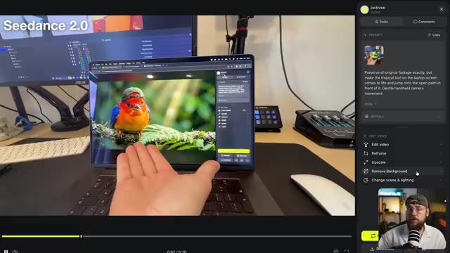
*Interface de Seedance 2.0 sur l'écran d'un ordinateur portable montrant le résultat d'une génération vidéo avec un oiseau coloré et une main tendue, ainsi qu'un panneau latéral avec des paramètres de prompt et d'édition.*

---

### ⏱️ `[00:14:38 - 00:15:14]` | Segment #28

**🔊 Audio (Transcription Intégrale Mot pour Mot en Français) :**
> Il serait formidable de faire une comparaison entre Gemini Omni et Seedance 2 Mini parce que bien sûr Mini est plus économique et un peu plus proche de Gemini Omni de manière générale. C'est lorsque l'on parle de la quantité de crédits que vous devez dépenser et du temps de génération. Vous pouvez donc voir ici que le chapeau tombe et il y a quelques autres problèmes encore une fois, on a l'impression que la race de l'oiseau change peut-être de manière générale un résultat décent, c'est juste que la perte du chapeau casse un peu l'illusion je dirais. Ensuite ce sont les singes dont vous

**👁️ Analyse Visuelle d'Écran (gemini-3.5-flash-lite) :**
**Interface & Outils** : Interface de plateforme web de génération vidéo par IA avec panneau latéral d'options (Prompt, Outils, Commentaires, Edit video, Reframe, Upscale, Remove Background, Change scene & lighting) et lecteur vidéo intégré.

**Contenu textuel & Code** : Texte affiché en haut à gauche "Seedance 2.0 Mini" puis "Gemini Omni". Prompt visible : "Preserve all original footage exactly, but make the tropical bird on the laptop screen comes to life and jump onto the open palm in front of it. Gentle handheld camera" (Image 1 et 3) et "Add a monkey sat on the man's shoulder, behind him in the background are dozens of monkeys." (Image 4).

**Action / Démonstration** : Le créateur présente et commente visuellement les résultats de génération vidéo comparatifs entre Seedance 2.0 Mini et Gemini Omni, en montrant les défauts de rendu (chapeau qui tombe, changement de race d'oiseau) et l'ajout de singes sur l'épaule.

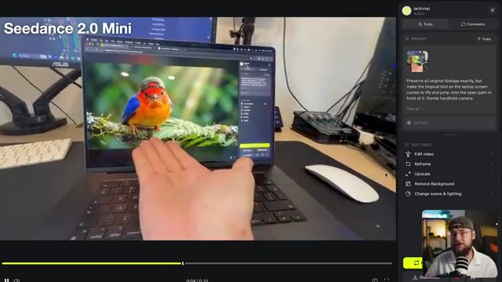
*Démonstration du résultat vidéo Seedance 2.0 Mini sur l'écran d'un ordinateur portable avec une main tendue*

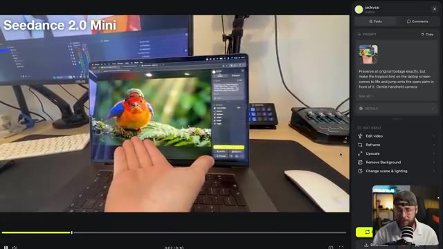
*Vue continue du test vidéo Seedance 2.0 Mini sur l'écran du portable avec l'interface d'édition latérale*

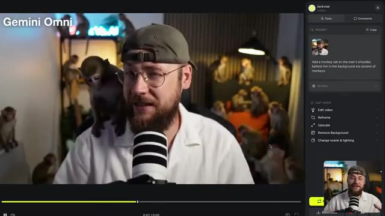
*Démonstration comparative du résultat obtenu avec Gemini Omni montrant Jack avec des singes générés par IA*

---

### ⏱️ `[00:15:14 - 00:15:47]` | Segment #29

**🔊 Audio (Transcription Intégrale Mot pour Mot en Français) :**
> comme vu dans l'intro aussi donc la vidéo source est bien sûr juste moi en train de parler à la caméra en lisant le script de l'intro ensuite nous sommes allés de l'avant et avons utilisé ce très simple prompt ici pour ajouter des singes partout qui sèment le chaos dans mon bureau. Donc c'est le résultat que nous avons obtenu en utilisant la même vidéo de référence et le même prompt dans C-Dance 2 et je dois dire que la fidélité visuelle est tellement plus nette que ce que nous avions à l'intérieur de Gemini Omni. Bien sûr c'est verrouillé

**👁️ Analyse Visuelle d'Écran (gemini-3.5-flash-lite) :**
**Interface & Outils** : Interface utilisateur web d'un outil de génération ou d'édition vidéo (type C-Dance / Seedance 2.0) avec un panneau latéral de prompts et de commandes d'édition ("Edit video", "Reframe", "Upscale", "Remove Background", "Change scene & lighting") et un retour vidéo principal.

**Contenu textuel & Code** : Texte du prompt visible dans le panneau latéral : "Add a monkey sat on the man's shoulder, behind him in the background are dozens of monkeys." Texte "Gemini Omni" ou "Seedance 2.0" incrusté en haut à gauche de la vidéo.

**Action / Démonstration** : Le créateur montre et compare les résultats de génération vidéo entre Gemini Omni et Seedance 2.0 en affichant l'interface de l'outil avec la vidéo modifiée par IA.

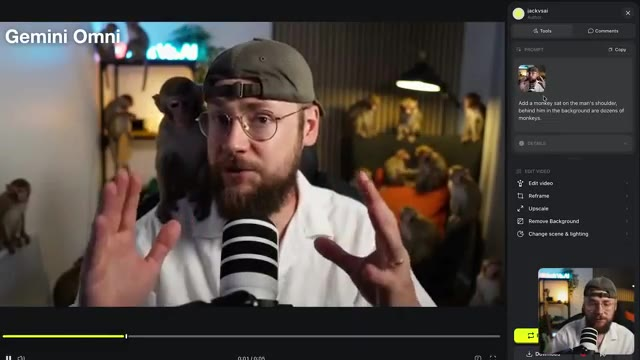
*Interface d'un outil vidéo affichant une vidéo générée avec des singes et le texte "Gemini Omni" en haut à gauche, ainsi qu'un panneau latéral avec le prompt.*

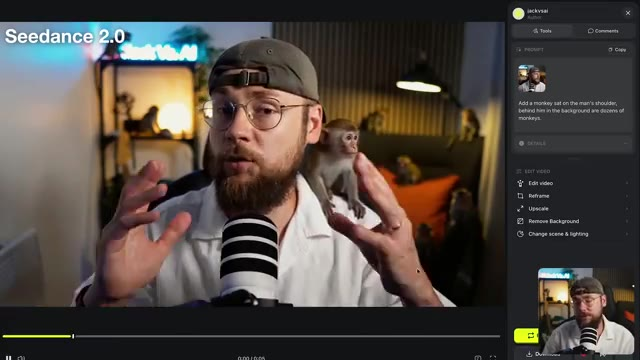
*Interface de l'outil montrant le résultat dans Seedance 2.0 avec le prompt visible dans le panneau latéral droit.*

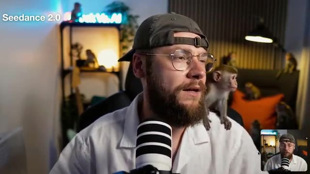
*Gros plan sur la vidéo générée dans Seedance 2.0 avec le texte en haut à gauche indiquant "Seedance 2.0".*

---

### ⏱️ `[00:15:47 - 00:16:13]` | Segment #30

**🔊 Audio (Transcription Intégrale Mot pour Mot en Français) :**
> vers une sortie en 720p avec C-Dance 2. Nous pouvons en fait aller jusqu'à la 4k maintenant. Ce n'est que du 1080p mais tout semble beaucoup plus net et la façon dont les singes bougent et tout a l'air super, surtout celui dans le coin supérieur gauche qui se déplace sur mon petit néon. Ça a l'air vraiment très impressionnant. Même référence vidéo et prompt à l'intérieur de C-Dance Mini.

**👁️ Analyse Visuelle d'Écran (gemini-3.5-flash-lite) :**
**Interface & Outils** : Interface utilisateur de l'outil C-Dance Mini avec un lecteur vidéo principal à gauche et un panneau latéral droit affichant les détails du profil utilisateur, le prompt textuel et des options de modification (Edit video, Reframe, Upscale, Remove Background, Change scene & lighting).

**Contenu textuel & Code** : Texte du prompt visible dans le panneau latéral : "Add a monkey sat on the man's shoulder, behind him in the background are dozens of monkeys." Mention "Seedance 2.0 Mini" en haut à gauche de l'écran.

**Action / Démonstration** : Le créateur présente l'interface et le résultat vidéo généré par l'intelligence artificielle sous C-Dance Mini, affichant la vidéo avec des singes animés autour de lui dans son studio.

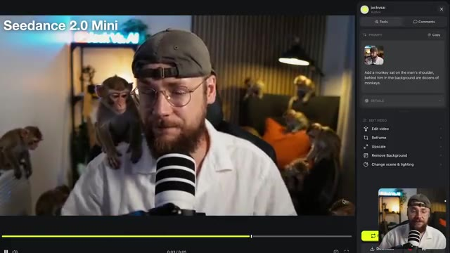
*Interface de C-Dance Mini montrant la vidéo générée avec des singes ajoutés en arrière-plan et le panneau latéral avec le prompt textuel et les options d'édition.*

---

### ⏱️ `[00:16:13 - 00:16:47]` | Segment #31

**🔊 Audio (Transcription Intégrale Mot pour Mot en Français) :**
> encore une fois le résultat est plutôt super un tout petit peu moins net et il y a ce genre de moment vers la fin de la vidéo où tous les singes décident un peu aléatoirement d'aller vers le sol je sais pas peut-être qu'ils ont trouvé de la nourriture ou quelque chose comme ça et ils s'entassent un peu là-bas mais le résultat n'est pas tout à fait aussi impressionnant un peu plus proche de ce qu'on aurait vu avec Gemini Omni on a aussi le test des lunettes donc un rappel de ce qu'on a pu accomplir avec le dernier modèle vidéo de Google ici très joli résultat donc une comparaison ici avec Seedance 2 et je dois dire qu'il a géré le

**👁️ Analyse Visuelle d'Écran (gemini-3.5-flash-lite) :**
**Interface & Outils** : Interface web de lecteur vidéo de type plateforme de création avec panneau latéral droit (outils, prompt, options d'édition : Edit video, Reframe, Upscale, Remove Background, Change scene & lighting) et une incrustation vidéo (PiP) du créateur en bas à droite.

**Contenu textuel & Code** : Texte affiché en haut à gauche : "Seedance 2.0 Mini" (images 1 et 2) et "Gemini Omni" (image 3). Texte dans le panneau de prompt (images 1 et 3) : "Add a monkey sat on the man's shoulder, behind him in the background are dozens of monkeys." et "Preserve the original lighting exactly. Do not alter exposure, color temperature, shadows, or highlights from the source footage. Preserve the original timing and pacing —".

**Action / Démonstration** : Le créateur commente la vidéo générée par intelligence artificielle où des singes apparaissent autour de lui, puis passe à une démonstration du test des lunettes avec Gemini Omni.

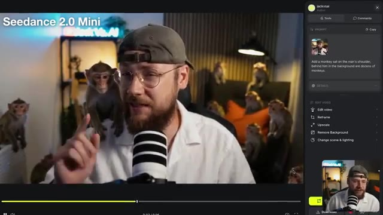
*Interface de lecture vidéo affichant le titre Seedance 2.0 Mini avec le créateur entouré de singes générés par IA.*

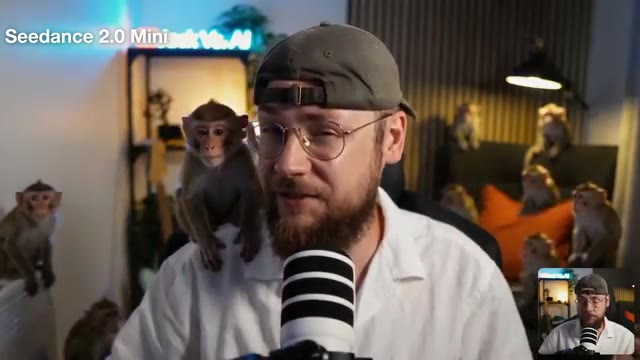
*Gros plan sur la vidéo générée avec Seedance 2.0 Mini montrant le créateur et des singes, avec une vignette du créateur en incrustation (PiP).*

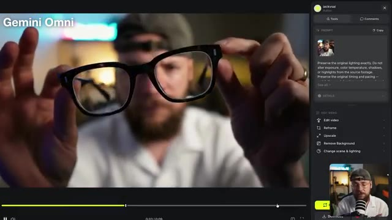
*Interface de lecture vidéo avec le titre Gemini Omni montrant le test des lunettes tenues par le créateur devant la caméra.*

---

### ⏱️ `[00:16:47 - 00:17:23]` | Segment #32

**🔊 Audio (Transcription Intégrale Mot pour Mot en Français) :**
> une faible profondeur de champ et le grossissement de l'objectif également je n'aime pas vraiment autant le résultat oui c'est plus net cela semble un peu moins intéressant visuellement et moins créatif que ce que nous avions obtenu de gemini omni vous me direz aussi ce que vous pensez de cette comparaison. Et puis nous avons aussi le C-Dance 2 Mini. Assez proche du résultat que nous avons obtenu de C-Dance 2 je dois dire. Donc si vous cherchiez à réduire vos coûts de crédits cela pourrait en valoir la peine d'essayer les options C-Dance 2 Fast ou Mini également. Ensuite nous avons le

**👁️ Analyse Visuelle d'Écran (gemini-3.5-flash-lite) :**
**Interface & Outils** : Interface web de test ou d'évaluation d'outils vidéo IA (probablement Seedance / C-Dance) comprenant un lecteur vidéo principal à gauche avec le texte "Seedance 2.0" ou "Seedance 2.0 Mini" en haut à gauche, un panneau latéral à droite affichant l'auteur ("jackvsai"), des onglets ("Tools", "Comments"), une section "PROMPT", et un menu "EDIT VIDEO" avec des options comme "Edit video", "Reframe", "Upscale", "Remove Background", "Change scene & lighting", ainsi qu'un encadré PiP (Picture-in-Picture) du présentateur en bas à droite.

**Contenu textuel & Code** : Texte du prompt visible dans le panneau latéral : "Preserve the original lighting exactly. Do not alter exposure, color temperature, shadows, or highlights from the source footage. Preservethe original timing and pacing..." Options d'édition vidéo visibles : Edit video, Reframe, Upscale, Remove Background, Change scene & lighting. Mentions en surimpression : "Seedance 2.0" (Image 1) et "Seedance 2.0 Mini" (Images 2 et 3).

**Action / Démonstration** : Le créateur démontre et compare visuellement les résultats générés par différentes versions du modèle Seedance (version standard 2.0 vs version Mini), en montrant comment l'IA transforme ou recrée une scène où il manipule des lunettes, tout en naviguant dans l'interface latérale de l'outil.

*Interface de test comparatif Seedance 2.0 avec un panneau latéral d'options et un retour vidéo montrant le présentateur manipulant des lunettes sombres.*

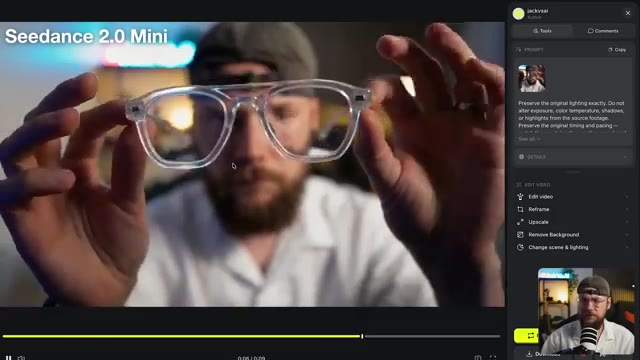
*Interface de Seedance 2.0 Mini affichant un résultat généré par IA où le présentateur tient des lunettes transparentes.*

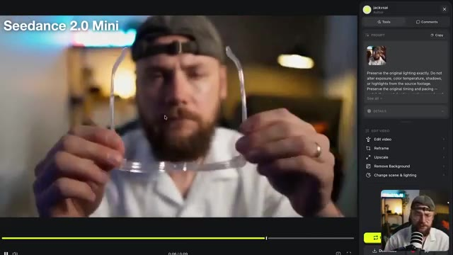
*Vue rapprochée de Seedance 2.0 Mini avec le panneau d'édition vidéo et les options de prompt sur le côté droit.*

---

### ⏱️ `[00:17:23 - 00:18:01]` | Segment #33

**🔊 Audio (Transcription Intégrale Mot pour Mot en Français) :**
> Prise de vue d'un gobelet Stanley où nous changions les matériaux en utilisant Gemini Omni. Généralement un super résultat, mais il ajoutait ce logo supplémentaire sur la face arrière du produit. Avec Seedance 2, il y a beaucoup de compression pour une raison quelconque sur cette table en verre. Je ne suis pas trop sûr de la façon dont cela va se traduire lorsque vous regardez cette vidéo YouTube, mais on dirait une sorte d'effet d'artefact numérique vraiment désagréable, que nous n'avions pas avec Gemini Omni. C'est assez intéressant, la transformation du type de matériau sur le gobelet Stanley a l'air bien, c'est aussi intéressant qu'il ajoute

**👁️ Analyse Visuelle d'Écran (gemini-3.5-flash-lite) :**
**Interface & Outils** : Interface logicielle de type studio de montage/génération vidéo par IA avec panneau latéral droit pour les prompts ("Preserve the original lighting exactly...") et les options d'édition (Edit video, Reframe, Upscale, Remove Background, Change scene & lighting).

**Contenu textuel & Code** : Texte affiché : "Gemini Omni" (sur l'image 1) et "Seedance 2.0" (sur les images 2, 3 et 4). Panneau de prompt : "Preserve the original lighting exactly. Do not alter exposure, colour temperature, shadows, or highlights from the source footage. Preserve the original timing and pacing...".

**Action / Démonstration** : Le créateur montre une vidéo comparative de modification de texture sur un gobelet Stanley brandi à la main au-dessus d'une table en verre, analysant les artefacts visuels et le rendu des matériaux générés par l'IA.

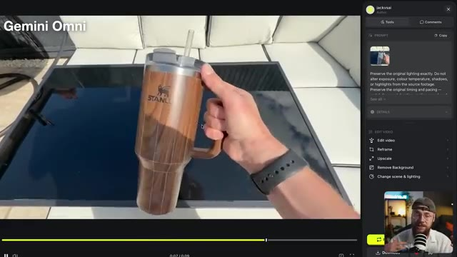
*Interface d'un outil vidéo affichant un gobelet Stanley en bois généré avec Gemini Omni, avec les panneaux de prompt et d'édition à droite.*

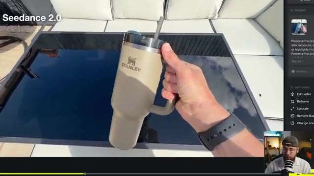
*Interface montrant un gobelet Stanley beige mat avec Seedance 2.0.*

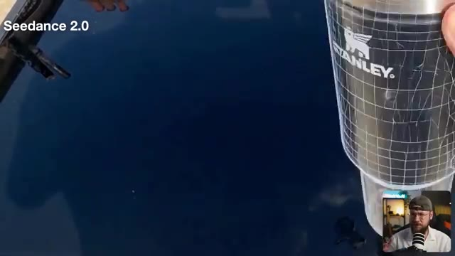
*Gros plan sur le gobelet Stanley avec un effet de texture wireframe/maillage en cours de transformation sous Seedance 2.0.*

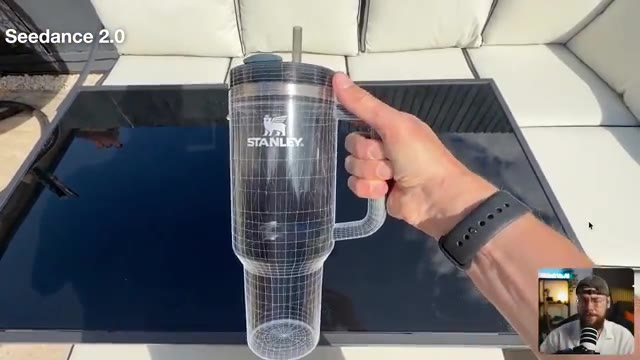
*Vue complète du gobelet Stanley transparent avec un effet de texture wireframe généré par Seedance 2.0.*

---

### ⏱️ `[00:18:01 - 00:18:34]` | Segment #34

**🔊 Audio (Transcription Intégrale Mot pour Mot en Français) :**
> ce logo sur la face arrière de la tasse Stanley cependant c'est un peu genre sur le côté dans un endroit bizarre donc ça a ajouté un logo supplémentaire mais aussi changé son orientation donc je dirais en fait que Gemini Omni gagne sur ce test et ensuite pour C Dance 2 Mini je pense que le résultat est assez similaire pour être franc mais encore une fois on obtient ce logo supplémentaire à l'arrière et il y a un point sur la face en bois où c'est juste complètement brouillé et ça n'a absolument aucun sens. Donc pour vous donner les gars

**👁️ Analyse Visuelle d'Écran (gemini-3.5-flash-lite) :**
**Interface & Outils** : Interface de test et d'évaluation comparative de modèles vidéo d'IA, avec un panneau latéral d'options d'édition vidéo et un encadré PiP montrant le créateur.

**Contenu textuel & Code** : Texte « Seedance 2.0 » et « Seedance 2.0 Mini » affiché en haut à gauche, ainsi que des menus d'édition vidéo (« Prompt », « Edit Video », « Reframe », « Upscale », « Remove ») sur le panneau de droite.

**Action / Démonstration** : Le créateur présente et compare les résultats vidéo de différents modèles d'IA générative (Gemini Omni, Seedance 2.0, Seedance 2.0 Mini) en analysant les défauts de rendu sur des objets du quotidien.

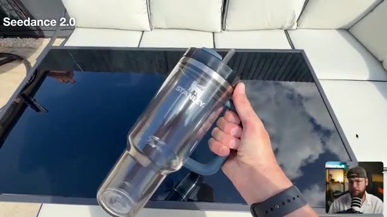
*Démonstration vidéo de Seedance 2.0 montrant une tasse Stanley transparente tenue au-dessus d'une table avec le logo de la marque visible.*

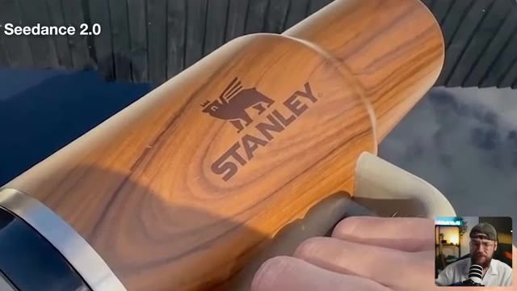
*Gros plan du résultat généré par Seedance 2.0 montrant la texture bois appliquée sur la tasse Stanley avec le logo.*

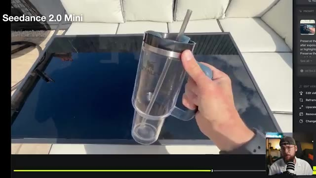
*Démonstration vidéo de Seedance 2.0 Mini montrant la tasse Stanley tenue en main avec le panneau latéral d'édition vidéo visible à droite.*

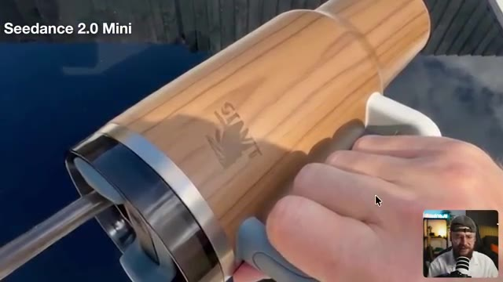
*Gros plan du résultat généré par Seedance 2.0 Mini montrant une texture bois avec un logo Stanley déformé et illisible.*

---

### ⏱️ `[00:18:34 - 00:19:02]` | Segment #35

**🔊 Audio (Transcription Intégrale Mot pour Mot en Français) :**
> un tout petit peu plus de contexte Seedance 2 coûte actuellement environ quatre fois plus cher que Gemini Omni. Même Seedance 2 Mini coûte environ 1,5 fois plus cher, bien que ces prix aient tendance à fluctuer légèrement en fonction des offres qui peuvent être en cours à un moment donné. Donc après cette quantité de tests vraiment variée, qu'est-ce que je pense réellement de Gemini Omni ? Eh bien, commençons par le bon.

**👁️ Analyse Visuelle d'Écran (gemini-3.5-flash-lite) :**
**Interface & Outils** : Diapositives textuelles sur fond violet et flou, avec le présentateur incrusté en bas à droite dans un cadre PiP.

**Contenu textuel & Code** : Texte à l'écran : "Seedance 2.0, approximately 4x more expensive than Gemini Omni Flash", "Seedance 2.0 Mini, approximately 1.5x more expensive than Gemini Omni Flash", "Note, prices can vary depending on deals and offers".

**Action / Démonstration** : Le présentateur commente les informations tarifaires affichées à l'écran tout en s'exprimant face caméra.

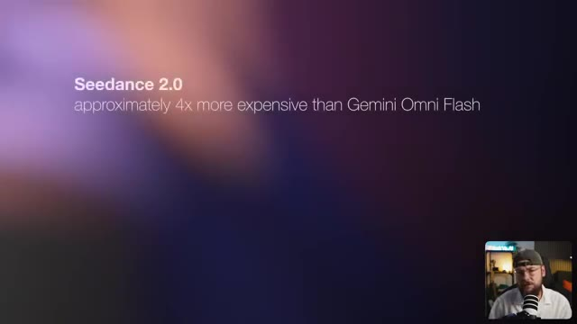
*Diapositive affichant le coût comparatif de Seedance 2.0 par rapport à Gemini Omni Flash avec Jack en incrustation (PiP).*

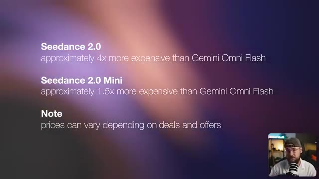
*Diapositive affichant les coûts comparatifs de Seedance 2.0 et Seedance 2.0 Mini par rapport à Gemini Omni Flash, avec une note sur la fluctuation des prix.*

---

### ⏱️ `[00:19:03 - 00:19:35]` | Segment #36

**🔊 Audio (Transcription Intégrale Mot pour Mot en Français) :**
> Ce modèle est plutôt bon marché, surtout quand on le compare à Seedance 2. Il est également assez rapide, la majorité de mes générations revendant en une à deux minutes. Mais bien sûr, comme tout outil d'IA, il n'est pas sans problèmes. Maintenant, j'en ai parlé plus tôt, mais Omni est bloqué à une résolution de sortie de 720p et c'est vraiment assez bas. Lorsque je voulais utiliser la pleine trame de mes générations dans l'intro, j'ai ressenti le besoin d'aller de l'avant et de les mettre à l'échelle (upscale). Donc pour faire ça,

**👁️ Analyse Visuelle d'Écran (gemini-3.5-flash-lite) :**
**Interface & Outils** : Interface logicielle d'upscaling vidéo (style Topaz Video) avec un panneau de contrôle latéral droit pour le redimensionnement et l'amélioration de la qualité.

**Contenu textuel & Code** : Texte affiché dans le panneau : "Upscale", "Mode: Topaz Video", "Scale factor: 4K", "Enhancement", "Frame interpolation: 24 fps", bouton "+ Upscale" au centre de la vidéo.

**Action / Démonstration** : Le créateur montre l'écran d'un outil d'upscaling vidéo pour augmenter la résolution des clips générés en 720p vers de la haute définition 4K.

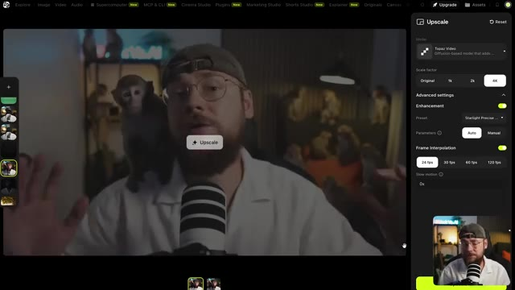
*Interface logicielle d'upscaling vidéo affichant un rendu généré par IA montrant le créateur avec un singe sur l'épaule et un panneau latéral de paramètres (Topaz Video, 4K, 24 fps).*

---

### ⏱️ `[00:19:35 - 00:20:14]` | Segment #37

**🔊 Audio (Transcription Intégrale Mot pour Mot en Français) :**
> vous pouvez l'exécuter à l'intérieur de Higgs field. J'ai sélectionné Topaz Video. Leur dernier modèle, Starlight Precise 2.5 est vraiment vraiment très bien mais évidemment cela a un coût en crédits supplémentaires donc cela ne va pas convenir à tout le monde. Maintenant nous devons garder à l'esprit que le nom complet de ce modèle est Gemini Omni Flash, ce qui signifie essentiellement qu'il s'agit de la version légère de l'outil. Personnellement, je m'attends donc à voir une version pro sortir, espérons-le dans les deux à trois prochains mois. Ce n'est pas un si gros problème mais nous sommes également bloqués à une limite de génération de 10 secondes et au fur et à mesure que

**👁️ Analyse Visuelle d'Écran (gemini-3.5-flash-lite) :**
**Interface & Outils** : Interface de l'application Higgsfield avec panneau latéral droit pour les options d'Upscale (Topaz Video, Starlight Precise 2.5), et diapositive de présentation sur fond sombre.

**Contenu textuel & Code** : Texte affiché sur l'interface : 'Upscale', 'Topaz Video', 'Scale factor: Original, 1k, 2k, 4k', 'Enhancement', 'Preset: Starlight Precise...', 'Frame interpolation: 24 fps, 30 fps, 60 fps, 120 fps'. Texte de la diapositive : 'Gemini Omni Pro', 'Higher resolution? output at 1080p minimum', 'Longer generations? of at least 15 seconds', 'Stronger adherence? with prompt understanding and constraints'.

**Action / Démonstration** : Le créateur montre l'interface de configuration d'upscaling vidéo sur Higgsfield avec Topaz Video, puis affiche une diapositive textuelle résumant les spécifications attendues de Gemini Omni Pro.

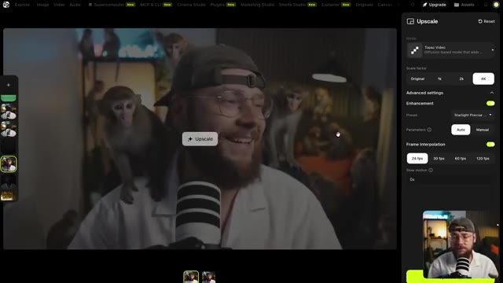
*Interface de Higgsfield montrant les réglages d'upscaling avec Topaz Video et le modèle Starlight Precise 2.5, avec l'incrustation vidéo de Jack dans le coin inférieur droit.*

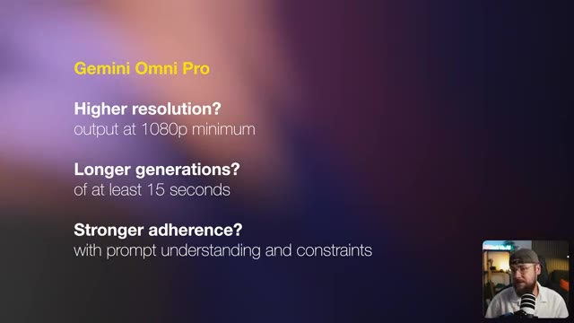
*Diapositive textuelle listant les caractéristiques attendues pour 'Gemini Omni Pro' (Higher resolution, Longer generations, Stronger adherence), avec l'incrustation vidéo de Jack dans le coin inférieur droit.*

---

### ⏱️ `[00:20:14 - 00:20:41]` | Segment #38

**🔊 Audio (Transcription Intégrale Mot pour Mot en Français) :**
> les gars, vous le savez peut-être ou pas, quand Seedance 2.5 sortira dans les semaines à venir, nous pourrons générer des vidéos de 30 secondes, donc il y a une grande différence là, mais ce n'est pas vraiment un problème rédhibitoire car il y a plein de plans dans les films et les publicités qui font moins de 10 secondes. Mais un point qui me dérange un peu, selon moi, c'est la mauvaise adhérence aux prompts.

**👁️ Analyse Visuelle d'Écran (gemini-3.5-flash-lite) :**
**Interface & Outils** : Présentation graphique sous forme de diapositive avec texte explicatif et incrustation vidéo (Picture-in-Picture) du créateur face caméra.

**Contenu textuel & Code** : Texte à l'écran : « The Bad », « Low resolution locked at 720p », « Generation length maximum of 10 seconds », et sur l'image 4 : « Poor adherence despite using clear prompts ».
[DESC_IMAGE_3] Présentation face caméra en plan principal sans partage d'écran (Image non valide selon les critères stricts).

**Action / Démonstration** : Le créateur présente une liste textuelle des points négatifs (« The Bad ») sur fond abstrait flou tout en parlant au micro, avec sa vidéo incrustée en bas à droite.

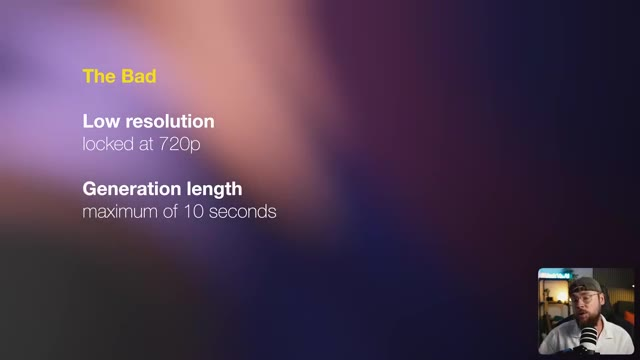
*Diapositive montrant les points négatifs (« The Bad ») avec les caractéristiques « Low resolution » (verrouillée à 720p) et « Generation length » (maximum de 10 secondes), avec le créateur en incrustation (PiP).*

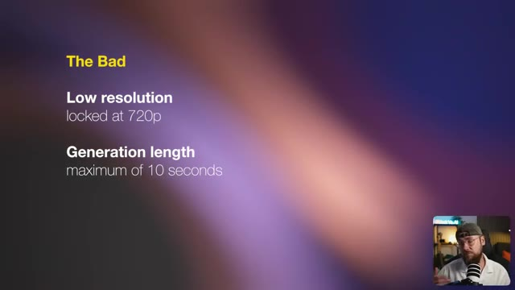
*Diapositive identique montrant les points négatifs (« The Bad ») avec les caractéristiques « Low resolution » et « Generation length », avec le créateur en incrustation (PiP).*

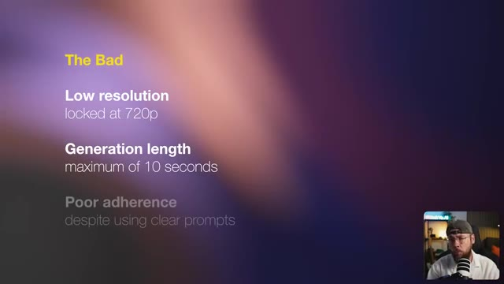
*Diapositive mise à jour montrant les points négatifs avec un point supplémentaire (« Poor adherence »), avec le créateur en incrustation (PiP).*

---

### ⏱️ `[00:20:41 - 00:21:17]` | Segment #39

**🔊 Audio (Transcription Intégrale Mot pour Mot en Français) :**
> Parfois, même avec un prompt très bien rédigé, Omni fait simplement ce qu'il veut. Il se moque royalement de ce que vous recherchez. Vous devez donc soit vous contenter du résultat obtenu, soit relancer la génération. Voici un exemple où je demande à Gemini Omni de me montrer en train de léviter, c'est-à-dire de me soulever du sol puis de redescendre doucement. Ça n'a pas du tout fonctionné. Même si le prompt est très clair et très simple, je finis par avoir l'air vraiment ridicule, puisque cela me restitue simplement la vidéo source. Un autre exemple avec les céréales.

**👁️ Analyse Visuelle d'Écran (gemini-3.5-flash-lite) :**
**Interface & Outils** : Interface web de création vidéo par IA (utilisant le modèle Gemini Omni Flash).

**Contenu textuel & Code** : Texte du prompt visible sur l'image 2 : "The man lifts up and levitates for a moment before dropping back down to the ground gently. No dialogue." Paramètres : 720p, 5.0s, 16:9. Sur l'image 3, le prompt visible indique : "Change the cereal box to be plain, saturated green colour, add a medium-sized black cross close to each corner of every face..." Modèle sélectionné : Gemini Omni Flash.

**Action / Démonstration** : Le créateur montre des exemples de résultats insatisfaisants générés par l'IA Gemini Omni, affichant à la fois le prompt saisi et la vidéo source qui n'a pas été modifiée comme demandé.

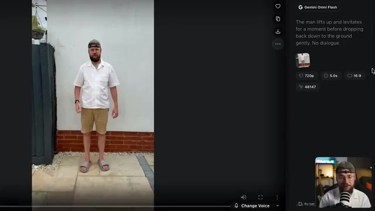
*Interface de génération vidéo montrant la source et le prompt textuel pour l'effet de lévitation.*

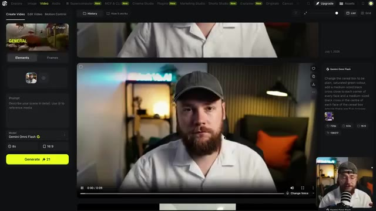
*Interface complète de création vidéo avec la source, la prévisualisation et le panneau de prompt pour la modification de la boîte de céréales.*

---

### ⏱️ `[00:21:17 - 00:21:40]` | Segment #40

**🔊 Audio (Transcription Intégrale Mot pour Mot en Français) :**
> test en boîte où l'on peut voir que dans cette partie d'ouverture du plan, il a en fait poussé et retiré mes lunettes et inversé l'orientation de ma casquette de baseball. Encore une fois, des choses que je n'ai définitivement pas demandées à l'intérieur du prompt. Et ce n'est pas tant un problème d'adhérence au prompt, mais c'est quand même un bon exemple où j'ai effectivement téléchargé des images où j'utilisais l'IA pour construire cette animation pour enfants.

**👁️ Analyse Visuelle d'Écran (gemini-3.5-flash-lite) :**
**Interface & Outils** : Interface web d'un outil de génération vidéo par IA (utilisant le modèle Gemini Omni Flash).

**Contenu textuel & Code** : Texte du prompt visible sur l'image #1 : "Change the cereal box to be plain, saturated green colour, add a medium-sized black cross close to each corner of every face and a medium-sized black cross in the centre of each face of the cereal box." Texte du prompt visible sur l'image #3 : "Remove all of the characters from the shots apart from the boy. No added dialogue." Paramètres : 720p, 16:9.

**Action / Démonstration** : Le créateur présente l'interface de l'outil d'IA où il analyse les résultats de génération sur ses propres vidéos (la boîte verte et l'animation du petit garçon).

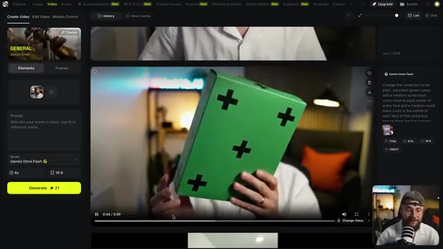
*Interface de l'outil vidéo montrant le test avec la boîte de céréales verte comportant des repères de suivi, et le panneau de prompt Gemini Omni Flash à droite.*

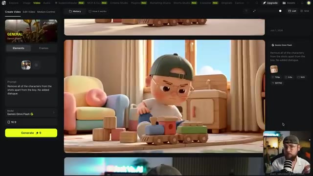
*Interface de l'outil vidéo affichant l'animation 3D d'un petit garçon jouant avec un train en bois dans une pièce colorée, avec le panneau de prompt sur le côté droit.*

---

### ⏱️ `[00:21:41 - 00:22:14]` | Segment #41

**🔊 Audio (Transcription Intégrale Mot pour Mot en Français) :**
> Et je demandais à Omni d'aller de l'avant et de supprimer tous les personnages, ce que vous pouvez voir dans celui-ci ici à partir de ce plan particulier. Et bien que cela fasse un assez bon travail, vous pouvez voir que le personnage bouge aléatoirement ce train, ce que bien sûr vous ne voudriez pas et je suis en fait retourné à ma structure de prompt plus complexe ici pour demander à Omni de supprimer les logos du tapis, ce que vous pouvez voir sur cette génération et cela a fait un très bon travail mais pour une raison quelconque à la fin de la génération, vous obtenez ce genre de saccage où c'est comme s'il bouclait la

**👁️ Analyse Visuelle d'Écran (gemini-3.5-flash-lite) :**
**Interface & Outils** : Application web de génération et d'édition vidéo par IA (interface sombre avec boutons jaunes "Generate"), intégrant le modèle Gemini Omni Flash et un encadré vidéo (PiP) du créateur en bas à droite.

**Contenu textuel & Code** : Texte du prompt visible : "Remove all of the characters from the shots apart from the boy. No added dialogue." Modèle sélectionné : "Gemini Omni Flash G", format 16:9, résolution 720p, durée 3.0s.

**Action / Démonstration** : Le créateur présente l'interface de l'outil de génération vidéo et commente les résultats de suppression de personnages et de logos sur différents plans vidéo générés par l'IA.

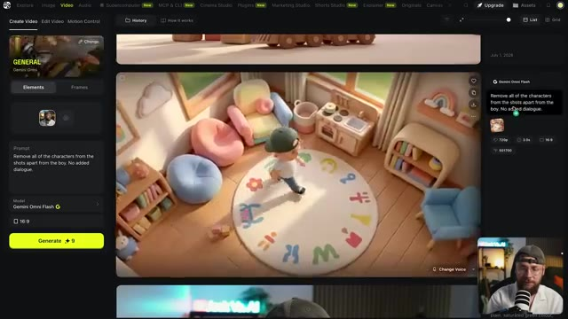
*Interface de l'outil vidéo montrant le prompt de suppression des personnages avec un aperçu de la génération Gemini Omni Flash.*

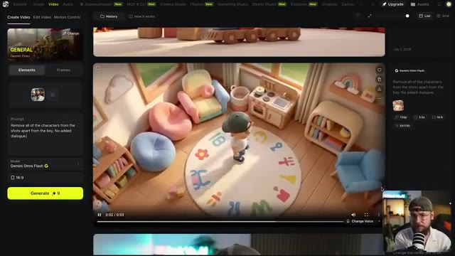
*Lecture de la vidéo générée montrant la scène de la chambre d'enfant avec le personnage au centre.*

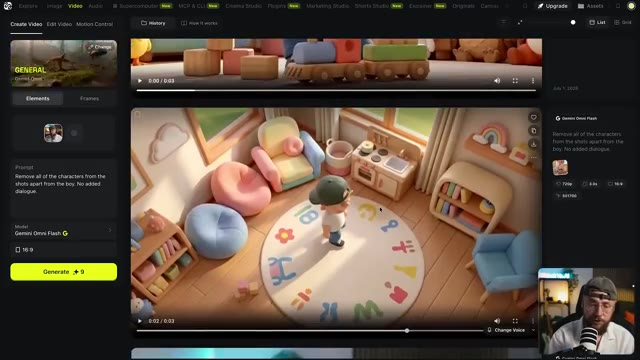
*Interface montrant l'historique des générations avec les différents plans de la chambre d'enfant.*

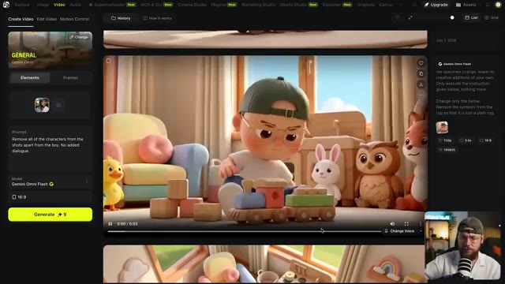
*Gros plan sur une nouvelle génération avec le prompt de suppression des symboles du tapis et le personnage jouant avec un train.*

---

### ⏱️ `[00:22:14 - 00:22:48]` | Segment #42

**🔊 Audio (Transcription Intégrale Mot pour Mot en Français) :**
> des images donc c'est encore un autre genre de problème étrange ici. J'ai aussi réinséré cette vidéo source provenant de l'animation pour enfants et tout ce que je demandais à Omni de faire c'était de remplacer la tenue du personnage pour qu'il ait ces pyjamas et un joli bonnet de nuit mais vous pouvez voir que ça change complètement le style ça change l'environnement euh la literie tout a fini par être remplacé ce qui bien sûr n'est pas ce que j'ai demandé j'imagine que vous qui regardez n'avez probablement pas touché à VO 3.1 pour

**👁️ Analyse Visuelle d'Écran (gemini-3.5-flash-lite) :**
**Interface & Outils** : Interface web de génération vidéo (type Gemini Omni Flash / outil de retouche vidéo par IA) avec panneau de paramètres et prompt textuel à droite, et lecteur vidéo principal.

**Contenu textuel & Code** : Texte du prompt visible : « Change only the below: Swap out the character's clothing so he is wearing cute pajamas and a nightcap. » Paramètres : modèle « Gemini Omni Flash G », format 16:9, résolution 720p.

**Action / Démonstration** : Le créateur démontre les résultats d'une modification de vidéo par IA où l'outil modifie par erreur tout l'environnement au lieu de se limiter aux vêtements du personnage.

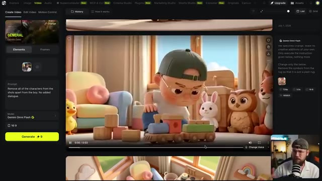
*Interface montrant une vidéo d'animation pour enfants avec un personnage jouant avec un train en bois, et le panneau de prompt textuel sur le côté.*

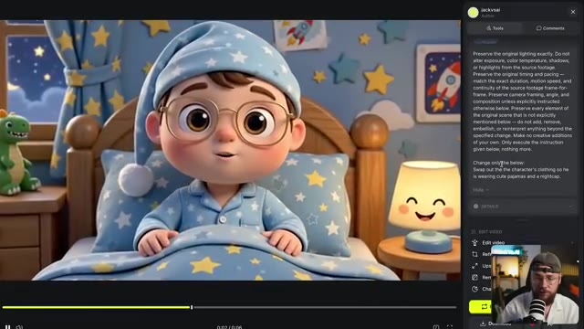
*Interface montrant le résultat de la génération avec un changement complet du style et de l'environnement (personnage en pyjama dans un lit).*

---

### ⏱️ `[00:22:48 - 00:23:25]` | Segment #43

**🔊 Audio (Transcription Intégrale Mot pour Mot en Français) :**
> depuis un moment déjà, mais le respect des prompts ou le manque de celui-ci ressemble beaucoup à ça. Maintenant, ce n'est pas à chaque fois, mais avoir l'impression d'utiliser VO 3.1 alors qu'on vient juste d'utiliser Sea Dance 2 peut donner l'impression d'un petit retour en arrière par moments. D'un autre côté, Gemini Omni est beaucoup moins cher et plus rapide, donc c'est un peu du donnant-donnant ici. J'adorerais que vous me disiez comment vous vous en sortez avec Gemini Omni. Si vous avez apprécié la vidéo d'aujourd'hui, assurez-vous de lâcher un pouce bleu pour moi et pensez à vous abonner. Merci beaucoup d'avoir regardé les gars et je vous dis à bientôt

**👁️ Analyse Visuelle d'Écran (gemini-3.5-flash-lite) :**
**Interface & Outils** : Présentation face caméra avec incrustation d'une diapositive graphique de texte sur fond flou.

**Contenu textuel & Code** : Texte à l'écran : 'The Bad', 'Low resolution locked at 720p', 'Generation length maximum of 10 seconds', 'Poor adherence despite using clear prompts'.

**Action / Démonstration** : Le créateur présente une diapositive récapitulative des points négatifs tout en s'exprimant face caméra.

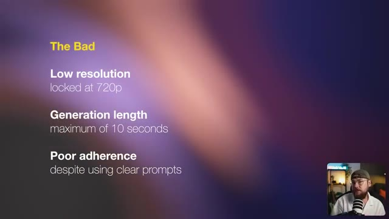
*Diapositive listant les points négatifs ('The Bad') avec les limitations de résolution (720p max), de durée de génération (10 secondes max) et de respect des prompts, avec le créateur en incrustation (PiP).*

---

### ⏱️ `[00:23:25 - 00:23:25]` | Segment #44

**🔊 Audio (Transcription Intégrale Mot pour Mot en Français) :**
> dans le prochain.

**👁️ Analyse Visuelle d'Écran (gemini-3.5-flash-lite) :**
**Interface & Outils** : Présentation face caméra sans partage d'écran

**Contenu textuel & Code** : Aucun texte, code ou interface logicielle visible.

**Action / Démonstration** : Transition visuelle abstraite / floue, ne montrant aucune manipulation d'outil d'IA.

---
