# 🎬 Comment UTILISER VRAIMENT Midjourney pour la réalisation vidéo par IA en 2026

> **Chaîne** : [Jack Vs. AI](https://www.youtube.com/@JackVsAI)  
> **Titre original** : `How to ACTUALLY Use Midjourney for AI Filmmaking in 2026`  
> **Lien YouTube** : [https://www.youtube.com/watch?v=CjCDpNCqEuY](https://www.youtube.com/watch?v=CjCDpNCqEuY)  
> **Date de publication** : 2026-07-16  
> **Durée** : 25m 41s (`1541s`)  
> **Identifiant vidéo** : `CjCDpNCqEuY`  
> **Fiche Web Interactive** : [2026-07-16_YT-CjCDpNCqEuY_Comment UTILISER VRAIMENT Midjourney pour la réalisation vidéo par IA en 2026_by-whisper-v3-large-turbo+gemini-3.5-flash-lite.html](2026-07-16_YT-CjCDpNCqEuY_Comment UTILISER VRAIMENT Midjourney pour la réalisation vidéo par IA en 2026_by-whisper-v3-large-turbo+gemini-3.5-flash-lite.html)  
> **Captures de démonstration clés** : `104 captures réelles (anti-talking-head)`  
> **Modèles utilisés** : Audio: `large-v3-turbo` (Faster-Whisper int8 VPS) | Vision: `gemini-3.5-flash-lite` (Google AI Studio API)  

---

## 📌 Synthèse Exécutive & Outils

### 📌 Résumé
La vidéo de Jack Vs. AI met en lumière un paradoxe central de la réalisation vidéo par IA : si Midjourney demeure l'outil suprême pour concevoir des visuels d'une créativité, d'une complexité et d'un style inégalés (costumes, accessoires, environnements), il pèche systématiquement sur l'adhésion aux prompts, l'anatomie et la fidélité des visages. Pour résoudre ce goulet d'étranglement sans sacrifier l'ADN visuel unique de la plateforme, Jack dévoile un flux de travail hybride novateur. L'objectif n'est pas d'obtenir des images parfaites dès la sortie de Midjourney, mais d'exploiter son sens artistique pour générer la matière première (personnages, décors, accessoires) en basse résolution, en acceptant ses défauts structurels. 

Dans une démarche méthodologique rigoureuse, Jack détaille chaque étape de son processus créatif. Tout commence dans l'onglet Explorer de Midjourney pour stimuler l'inspiration, suivi de la création de feuilles de référence de personnages via l'option *Omni reference* (réglée à une force de 100) en format 16:9 et sous la version 7, en laissant une large liberté créative au modèle. Conscient que les visages sont déformés et les mains brisées, le réalisateur orchestre ensuite une transition stratégique vers **OpenArt** pour corriger, affiner et redonner une identité réelle aux personnages grâce à des modèles adaptés comme *GPT image 2*. Cette approche démontre qu'un pipeline multi-plateforme est indispensable pour les cinéastes souhaitant dompter l'IA.

En combinant la puissance stylistique de Midjourney et la précision corrective d'outils tiers, les créateurs peuvent enfin s'affranchir des limites techniques habituelles. Ce workflow permet d'assembler des scènes pleinement réalisées où coexistent des personnages singuliers, des accessoires futuristes et des emplacements immersifs. Pour les créateurs de contenu et les cinéastes en quête de visuels de niveau cinématographique, cette méthode transforme un processus frustrant en un pipeline de production fluide, garantissant des résultats esthétiquement époustouflants et parfaitement maîtrisés.

### 🛠️ Outils, Modèles & Logiciels Présentés
* **Midjourney** : Utilisé comme source principale de génération d'images pour exploiter son style artistique unique, ses designs de costumes complexes, ses décors et ses accessoires via l'onglet Créer et la fonction *Omni reference*.
* **OpenArt** : Plateforme tierce de post-traitement et d'affinage visuel permettant de corriger les imperfections anatomiques, les problèmes de mains et de fidélité faciale des images générées par Midjourney.
* **Claude** : Mentionné dans l'écosystème global de l'IA pour l'assistance à la structuration de projets et de flux de travail créatifs.
* **Nano Banana** : Outil d'accompagnement ou d'optimisation intégré dans certains flux de travail de production vidéo avancés.
* **Seedance** : Solution d'animation vidéo par IA évoquée pour donner vie aux images fixes générées et structurées lors des étapes précédentes.
* **Flux** : Modèle ou outil de pointe utilisé pour renforcer la génération et le traitement visuel dans les pipelines de design par IA.

### 🔑 Points Clés & Enseignements Stratégiques
* **Détourner les faiblesses de Midjourney** : Plutôt que de chercher la perfection anatomique immédiate, il faut accepter les textures douces et les basses résolutions de Midjourney pour se concentrer uniquement sur sa puissance stylistique, sa palette de couleurs et sa composition.
* **L'utilisation stratégique de l'onglet Explorer** : Visiter régulièrement la galerie d'inspiration de Midjourney permet de lutter contre le syndrome de la page blanche et d'éveiller la créativité avant de lancer une production.
* **Maîtriser l'Omni Reference** : Télécharger une photo de profil dans la section *Omni reference* avec une force réglée à 100 permet d'établir une vague ressemblance et de servir de point de départ pour le personnage, même si le résultat initial reste infidèle.
* **Lâcher prise sur le prompt textuel descriptif** : Il est recommandé de ne pas surcharger les prompts en décrivant précisément les vêtements ou l'apparence physique, car Midjourney excelle lorsqu'on lui laisse une grande liberté de design conceptuel.
* **Paramétrage technique rigoureux** : Privilégier systématiquement le format 16:9 pour les projets vidéo et s'appuyer sur la version 7 de Midjourney, les versions plus récentes n'étant pas toujours garantes d'un meilleur rendu stylistique.
* **Éviter l'upscale prématuré** : Il n'est pas nécessaire d'effectuer un redimensionnement (*upscale*) à l'intérieur de Midjourney ; si l'option *Subtle* peut être utilisée, il est préférable de conserver des images brutes pour les phases de correction ultérieures.
* **Séparer génération et correction (Pipeline multi-outils)** : Le secret des meilleurs cinéastes IA réside dans l'utilisation de Midjourney pour l'idéation visuelle brute, suivie d'un passage sur une plateforme externe comme **OpenArt** pour stabiliser l'identité des personnages.
* **Créer une bibliothèque d'assets variée** : Générer et stocker séparément une grande variété d'éléments (personnages, lieux post-apocalyptiques, environnements sous-marins, accessoires et armes) pour les assembler ultérieurement en scènes cohérentes.
* **Résoudre le piège de l'anatomie et des accessoires** : Les mains déformées, les casquettes mal ajustées et l'absence de contact physique réel entre les mains et les armes générées dans Midjourney doivent impérativement être corrigés lors de l'étape de raffinement.
* **L'utilisation de modèles spécialisés de correction** : Sur OpenArt, l'utilisation de modèles spécifiques comme *GPT image 2* et l'exploitation des sections de référence permettent de transformer un personnage générique ou raté en un double visuellement fidèle et réaliste.

---

## ⏱️ Chronologie & Transcription Complète Audio & Visuelle (Mot pour Mot)

### ⏱️ `[00:00:00 - 00:00:35]` | Segment #01

**🔊 Audio (Transcription Intégrale Mot pour Mot en Français) :**
> Midjourney produit certains des visuels les plus uniques et saisissants de tous les outils d'IA sur le marché. Mais à chaque fois que vous appuyez sur générer, vous vous heurtez aux mêmes problèmes. Une terrible adhésion aux prompts, une anatomie brisée, et des personnages qui ne vous ressemblent en rien. Mais je viens de trouver un moyen de résoudre ces problèmes tout en préservant ce style unique de Midjourney. Je suis Jack, j'ai passé plus d'une décennie à créer des effets visuels pour certaines des plus grandes marques de la planète. Et maintenant j'utilise l'IA pour réinventer les flux de travail créatifs. Je crois fermement que les meilleurs cinéastes IA de l'espace

**👁️ Analyse Visuelle d'Écran (gemini-3.5-flash-lite) :**
**Interface & Outils** : Présentation face caméra sans partage d'écran

**Contenu textuel & Code** : Aucun contenu logiciel ou technique affiché, uniquement des illustrations visuelles générées par IA et l'animateur en plan principal.

**Action / Démonstration** : Le créateur parle face caméra dans son studio et présente des exemples visuels de style Midjourney.

---

### ⏱️ `[00:00:35 - 00:01:09]` | Segment #02

**🔊 Audio (Transcription Intégrale Mot pour Mot en Français) :**
> continuent d'utiliser Midjourney comme élément crucial de leur flux de travail et je suis ici pour mettre fin au secret et vous dire exactement comment ils le font. Pour que vous arrêtiez d'obtenir des résultats cassés et commenciez à créer des visuels insensés, et nous ne nous arrêterons pas là car je vous montrerai également comment animer ces images avec les meilleurs outils vidéo IA du marché où nous combinons des personnages, des accessoires et des emplacements pour créer des scènes pleinement réalisées. Si vous aimez le contenu d'aujourd'hui, assurez-vous de lâcher un pouce bleu pour moi et pensez à vous abonner. Très bien, entrons dans le vif du sujet. Donc pour commencer, je suis sur Midjourney...

**👁️ Analyse Visuelle d'Écran (gemini-3.5-flash-lite) :**
**Interface & Outils** : Interface Web de Midjourney avec barre de recherche supérieure ("Imagine"), menus latéraux pour l'exploration ("Random", "Hot", "Top Day") et les outils de création.

**Contenu textuel & Code** : Barre de recherche Midjourney "Imagine", miniatures d'images de la communauté, et encadré vidéo incrusté (PiP) du présentateur Jack.

**Action / Démonstration** : Le créateur montre des exemples de vidéos générées par IA combinant personnages, décors et accessoires, puis bascule sur l'interface de navigation de Midjourney.

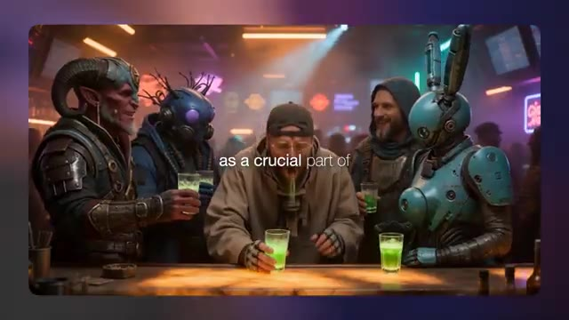
*Rendu vidéo généré par IA montrant un personnage au comptoir d'un bar futuriste entouré d'extraterrestres et de robots.*

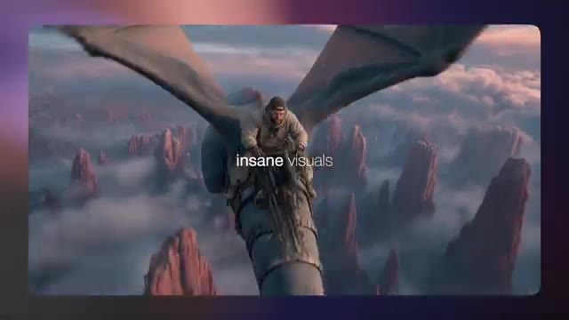
*Rendu vidéo généré par IA montrant un personnage chevauchant un grand dragon au-dessus de formations rocheuses et de nuages.*

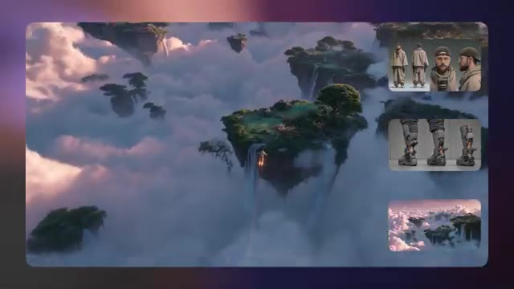
*Rendu vidéo généré par IA montrant des îles flottantes au-dessus de nuages avec des vignettes incrustées montrant des planches de character design.*

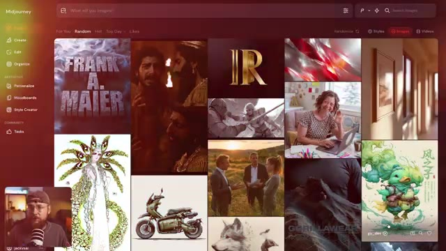
*Interface Web de Midjourney affichant une galerie d'images générées par la communauté, avec une petite fenêtre PiP de Jack en bas à gauche.*

---

### ⏱️ `[00:01:09 - 00:01:45]` | Segment #03

**🔊 Audio (Transcription Intégrale Mot pour Mot en Français) :**
> plateforme journey. Et avant de commencer à parcourir le flux de travail, je veux attirer votre attention sur l'onglet Explorer, qui est juste une source constante d'inspiration pour moi, que je génère sur la plateforme ou non. C'est toujours une gamme tellement diversifiée de superbes choses ici. Et je trouve que si j'ai un petit peu le syndrome de la page blanche, il suffit de regarder autour de soi pour faire couler mon jus créatif et, cela étant dit, nous voulons maintenant nous diriger vers l'onglet Créer, la première chose que nous allons faire est de construire une feuille de référence de personnage, alors j'ai déposé ceci

**👁️ Analyse Visuelle d'Écran (gemini-3.5-flash-lite) :**
**Interface & Outils** : Navigateur web affichant l'interface de Midjourney (site web officiel) avec les menus Explore, Create, Edit, Organize, Personalize, Moodboards et Style Creator.

**Contenu textuel & Code** : Texte visible dans l'interface : « Midjourney », « Explore », « Create », « Edit », « Organize », « Personalize », « Moodboards », « Style Creator », « Tasks », « What will you imagine? », « For You », « Random », « Hot », « Top Day », « Likes », et sur l'image #4 : « step one character design ».

**Action / Démonstration** : Le créateur navigue et défile à travers l'onglet Explorer de Midjourney pour montrer différentes sources d'inspiration avant de passer à l'étape suivante de création d'une feuille de référence de personnage.

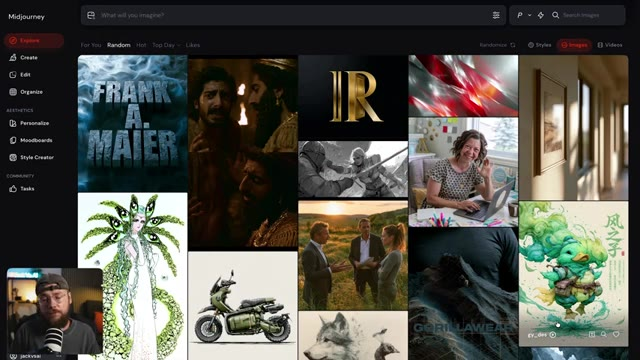
*Interface principale de Midjourney montrant l'onglet Explorer avec une galerie d'images variées générées par les utilisateurs et le créateur visible en incrustation PiP.*

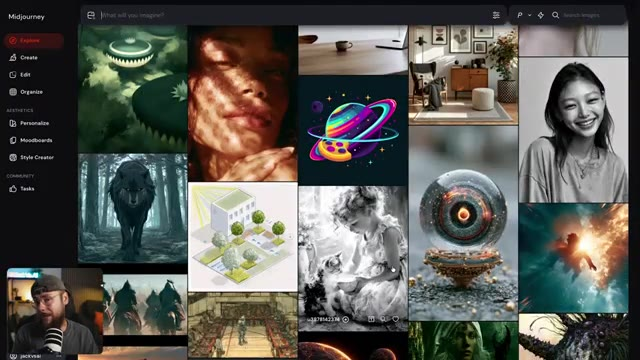
*Navigation continue dans l'onglet Explorer de Midjourney avec de nouvelles créations artistiques présentées en grille et le créateur en incrustation PiP.*

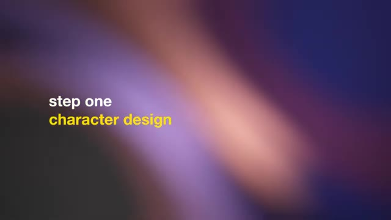
*Écran de transition sur fond flou texturé affichant le texte explicatif « step one character design » en blanc et jaune.*

---

### ⏱️ `[00:01:45 - 00:02:20]` | Segment #04

**🔊 Audio (Transcription Intégrale Mot pour Mot en Français) :**
> cadre de prompt ici qui va dire exactement à Midjourney ce que nous cherchons et comme toujours tous mes prompts et matériels seront disponibles gratuitement sur ma communauté School lien pour cela juste en bas dans la description. Je vais également cliquer sur cette icône d'ajout d'images et vous pouvez voir que j'ai déjà téléchargé certains assets et je vais glisser-déposer cette image particulière ici dans la section omni reference. Vous pouvez voir que c'est une vue de profil presque complète de moi-même et avec ce petit curseur ici je vais m'assurer qu'il est réglé sur une valeur de 100.

**👁️ Analyse Visuelle d'Écran (gemini-3.5-flash-lite) :**
**Interface & Outils** : Interface web de Midjourney avec barre de prompts, options 'Image Prompts', 'Style References' et 'Omni Reference', et miniature du créateur en incrustation (PiP).

**Contenu textuel & Code** : Texte du prompt décrivant une feuille de référence de personnage à quatre vues sur fond gris neutre, avec des détails d'éclairage et de texture, et le paramètre 'Omni Strength' réglé à 100.

**Action / Démonstration** : Le créateur montre comment importer des actifs et glisser-déposer une photo de profil dans la section 'Omni Reference' de Midjourney en ajustant le curseur d'intensité.

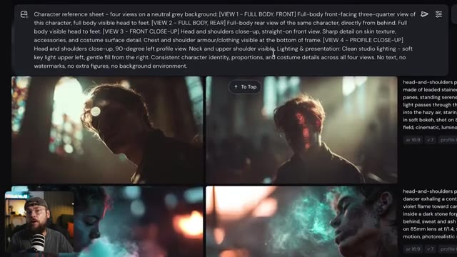
*Interface de Midjourney affichant un prompt détaillé pour une feuille de référence de personnage avec un encadré vidéo du créateur en bas à gauche.*

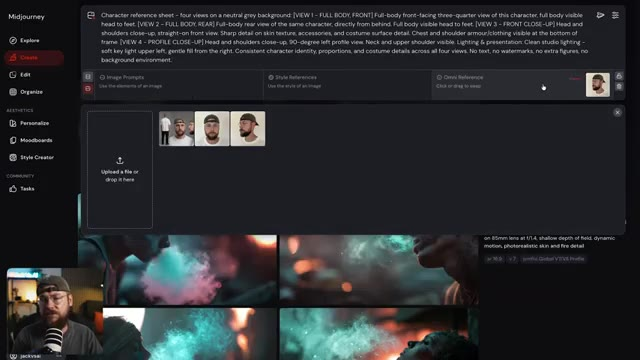
*Interface de Midjourney montrant la section d'importation d'actifs avec des photos de référence et l'outil de glisser-déposer dans 'Omni Reference'.*

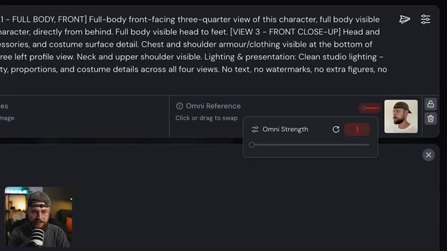
*Gros plan sur l'interface de Midjourney avec le curseur 'Omni Strength' réglé à la valeur maximale de 100.*

---

### ⏱️ `[00:02:20 - 00:02:58]` | Segment #05

**🔊 Audio (Transcription Intégrale Mot pour Mot en Français) :**
> c'est l'Omni Strength. Et si nous cliquons sur cette icône de préférences ici, c'est là que nous pouvons dicter le format d'image. Nous recherchons du 16 par 9 dans ce cas particulier, ainsi que la version de Midjourney que vous souhaitez utiliser. Maintenant, généralement, j'opte pour la version 7. Le simple fait qu'il y ait des versions plus récentes ne signifie pas nécessairement qu'elles sont meilleures. Mais bien sûr, si vous voulez les utiliser et expérimenter, n'hésitez pas à le faire, et il en va de même pour tous les autres paramètres que j'utilise ici. Maintenant, avant de lancer la génération, vous allez

**👁️ Analyse Visuelle d'Écran (gemini-3.5-flash-lite) :**
**Interface & Outils** : Interface web de Midjourney, avec incrustation vidéo du créateur (Picture-in-Picture) dans le coin inférieur gauche.

**Contenu textuel & Code** : Texte de prompt descriptif pour une feuille de référence de personnage ("Character reference sheet"), paramètres d'aspect ratio (16:9 Landscape), sélection de modèle (Version 7), réglages de style, de vitesse (Fast) et de résolution (SD).

**Action / Démonstration** : Le créateur montre l'interface de Midjourney et explique comment configurer les paramètres de format d'image (16:9) et de version de modèle (v7) avant la génération.

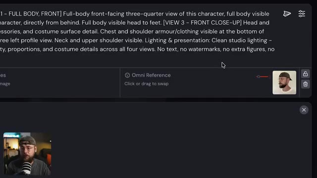
*Gros plan sur l'interface de Midjourney montrant la section Omni Reference avec une image de profil.*

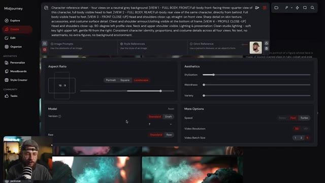
*Interface complète de Midjourney affichant les panneaux de configuration du format 16:9, de la version 7 du modèle et des options esthétiques.*

---

### ⏱️ `[00:02:58 - 00:03:29]` | Segment #06

**🔊 Audio (Transcription Intégrale Mot pour Mot en Français) :**
> remarquez que je ne décris pas réellement moi-même ou le type de vêtements que je veux porter et c'est parce que je pense que mid-journey s'en sort vraiment très bien lorsqu'on lui laisse une grande liberté de création. Donc, simplement en envoyant ce prompt, nous obtenons un résultat comme celui-ci. Maintenant, je ne veux pas que vous stressiez trop en ce qui concerne les problèmes flagrants qui sont visibles ici en termes de cohérence faciale car je vais vous montrer comment corriger ces problèmes plus tard dans la vidéo.

**👁️ Analyse Visuelle d'Écran (gemini-3.5-flash-lite) :**
**Interface & Outils** : Midjourney (Interface web de génération d'images avec panneau de prompt, paramètres de format, curseurs stylistiques et affichage des résultats).

**Contenu textuel & Code** : Texte du prompt visible : "Character reference sheet - four views on a neutral grey background: [VIEW 1 - FULL BODY, FRONT] Full-body front-facing three-quarter view of this character, full body visible head to feet. [VIEW 2 - FULL BODY, REAR] Full-body rear view of the same character, directly from behind...". Paramètres visibles : Aspect Ratio (16:9), Aesthetics (Stylization, Weirdness, Variety), Options (Speed, Video Resolution).

**Action / Démonstration** : Le créateur montre son écran avec le prompt textuel utilisé dans Midjourney pour générer un personnage, puis présente le résultat final obtenu sous forme de feuille de référence (character sheet) multi-angles.

*Interface de Midjourney affichant un prompt textuel détaillé pour la feuille de référence d'un personnage ("Character reference sheet - four views on a neutral grey background...") ainsi que divers paramètres (Aspect Ratio 16:9, curseurs d'esthétique, options de résolution et de vitesse).*

*Résultat généré par l'IA sur Midjourney montrant une planche de character design multi-angles (vue de face, de dos et de profil) représentant un personnage portant des vêtements amples de style futuriste dans des tons beiges. Un petit encadré vidéo de Jack apparaît en bas à gauche.*

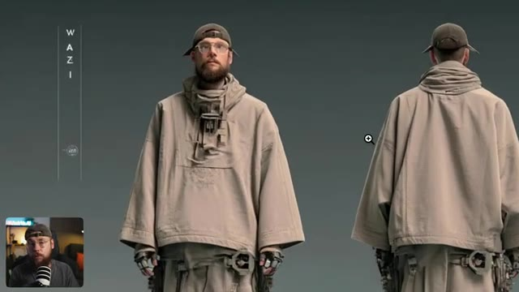
*Zoom rapproché sur le résultat généré par Midjourney, montrant en détail le visage, la casquette, les lunettes et la tenue du personnage avec une vue de face et une vue de dos. Un petit encadré vidéo de Jack apparaît en bas à gauche.*

---

### ⏱️ `[00:03:29 - 00:04:07]` | Segment #07

**🔊 Audio (Transcription Intégrale Mot pour Mot en Français) :**
> La raison pour laquelle nous venons sur Midjourney, c'est pour profiter pleinement de son sens du style et regardez simplement les créations de vêtements qu'il m'a appliquées. On dirait quelque chose tout droit sorti d'un livre d'art conceptuel ou d'un recueil de Star Wars, et c'est ce niveau de design unique et complexe que je pense nous avons encore du mal à recréer avec d'autres outils d'image IA sur le marché. Et je dirais que c'est la même chose lorsque nous générons des lieux à l'intérieur de Mid Journey. Ils ont l'air tellement uniques. Et aussi lorsqu'il s'agit de choses comme des accessoires ou dans ce cas précis des armes. Nous avons un personnage alternatif

**👁️ Analyse Visuelle d'Écran (gemini-3.5-flash-lite) :**
**Interface & Outils** : Interface web de Midjourney avec affichage d'images générées, options de variation, de zoom, et miniature PiP du présentateur dans le coin inférieur gauche.

**Contenu textuel & Code** : Prompt visible : "vast wide cinematic shot, an ocean made of slowly drifting continents of cloud, enormous glowing koi the size of islands swimming between them, a lone floating stone temple in the middle distance, radiant turquoise and gold light, warm sun breaking through, immense scale, playful vivid palette, dreamlike sci-fi fantasy, in the style of Roger Dean, photorealistic".

**Action / Démonstration** : Le créateur présente des exemples d'images générées via l'interface de Midjourney, illustrant la qualité des décors et des designs de personnages et d'armes.

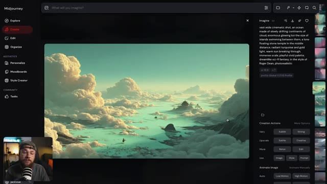
*Interface de Midjourney affichant un paysage onirique et fantastique avec des nuages et un temple flottant, avec le créateur en incrustation PiP.*

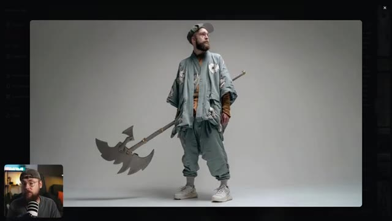
*Interface de Midjourney affichant un personnage généré par IA tenant une grande hache dans un style fantastique, avec le créateur en incrustation PiP.*

---

### ⏱️ `[00:04:07 - 00:04:40]` | Segment #08

**🔊 Audio (Transcription Intégrale Mot pour Mot en Français) :**
> design ici et j'adore simplement le design d'arme que Midjourney a assemblé. Mais maintenant parlons des problèmes parce qu'il y en a pas mal. En revenant à cette génération particulière, si nous allons de l'avant et zoomons ici. Autant j'adore le design global, mon visage est juste complètement raté et Midjourney a beaucoup de problèmes pour comprendre ce qui devrait se passer avec ma casquette de baseball. Maintenant comme je l'ai mentionné, j'ai vraiment une super solution pour ces problèmes que nous

**👁️ Analyse Visuelle d'Écran (gemini-3.5-flash-lite) :**
**Interface & Outils** : Interface web de Midjourney (panneau de création, panneaux latéraux pour les prompts et les actions de génération d'images, disposition en grille ou vue détaillée).

**Contenu textuel & Code** : Texte de prompt visible dans l'interface de Midjourney décrivant une feuille de référence de personnage sur fond gris neutre avec différentes vues (full body, gros plans, détails de la peau, éclairage de studio, etc.).

**Action / Démonstration** : Le créateur navigue et zoome sur les images générées par Midjourney pour pointer les défauts de conception du visage et de la casquette.

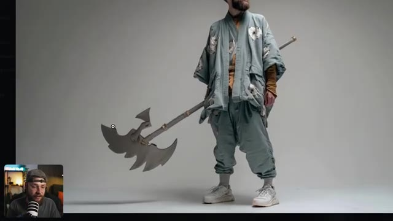
*Image affichant une génération de personnage par Midjourney avec une grande hache, et Jack en encadré PiP en bas à gauche.*

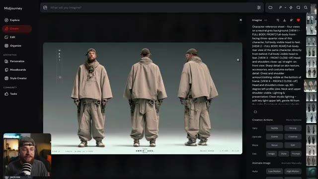
*Interface web de Midjourney montrant une planche de référence de personnages avec plusieurs vues et des panneaux de contrôle textuels à droite, et Jack en encadré PiP.*

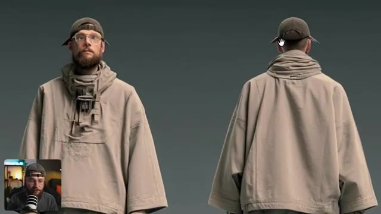
*Gros plan sur une génération Midjourney zoomée montrant le visage du personnage et le dos de la casquette, avec Jack en encadré PiP.*

---

### ⏱️ `[00:04:40 - 00:05:15]` | Segment #09

**🔊 Audio (Transcription Intégrale Mot pour Mot en Français) :**
> je vais y venir très bientôt mais avant de le faire, laissez-moi vous présenter quelques-unes des autres images incroyables que j'ai générées ici sur Midjourney. Nous avons cette scène sous-marine ici qui, je trouve, est juste tellement superbe, j'adore le design de cet immense genre de monstre dans une sorte de vieux scaphandre, nous avons cette scène très post-apocalyptique où nous sommes sur cette planète très aride mais il y a une sorte de lueur d'espoir ici, j'adore absolument cette image en particulier en ce qui concerne le design de ce genre de véhicule robotique à l'exception bien sûr encore une fois nous avons la même

**👁️ Analyse Visuelle d'Écran (gemini-3.5-flash-lite) :**
**Interface & Outils** : Présentation vidéo avec incrustation PiP (Picture-in-Picture) de Jack dans le coin inférieur gauche, montrant des images générées par Midjourney en plein écran.

**Contenu textuel & Code** : Visuels générés par intelligence artificielle sur Midjourney : une scène sous-marine avec un monstre en scaphandre rétro, un paysage planétaire aride et grisâtre avec une lueur d'espoir (un petit arbre) et un énorme monolithe ou structure flottante, et un véhicule robotique de type marcheur patrouillant sous la pluie.

**Action / Démonstration** : Le créateur présente et commente à l'écran différentes images générées par IA sur Midjourney tout en parlant face caméra.

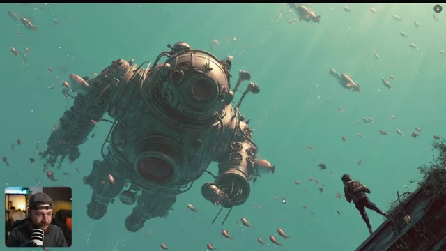
*Affichage d'une image générée sur Midjourney montrant une scène sous-marine avec un scaphandre géant et un plongeur.*

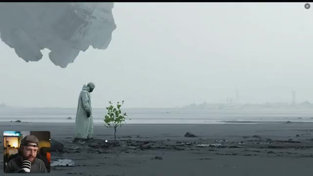
*Affichage d'une image générée sur Midjourney représentant un paysage post-apocalyptique aride avec un personnage observant un jeune arbre et une structure flottante.*

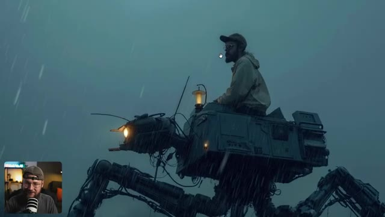
*Affichage d'une image générée sur Midjourney montrant un véhicule robotique bipède avec une personne à son bord sous la pluie.*

---

### ⏱️ `[00:05:15 - 00:05:51]` | Segment #10

**🔊 Audio (Transcription Intégrale Mot pour Mot en Français) :**
> problème où ça ne me ressemble pas du tout mais on peut travailler avec ça, on va affiner ça très bientôt et pour donner quelques exemples différents de personnages qui ne sont censés me ressembler en rien j'adore ce genre de robot avec une sorte d'ambiance d'insecte mais si on regarde là-dedans il y a divers problèmes ici avec les mains c'est autre chose avec quoi Midjourney a vraiment du mal malgré le design lui-même qui est vraiment très unique j'adore ce design de personnage. Aussi, encore une fois, vous pouvez voir qu'il y a des sortes de problèmes en termes de physicalité ici.

**👁️ Analyse Visuelle d'Écran (gemini-3.5-flash-lite) :**
**Interface & Outils** : Midjourney (interface web avec panneau latéral de création, options de variation, upscale et animation).

**Contenu textuel & Code** : Texte du prompt visible : "Sci-fi fantasy character", avec les paramètres de version (ex: v6).

**Action / Démonstration** : Le présentateur commente les créations générées par Midjourney, en zoomant sur les détails des mains et la physicalité des personnages de science-fiction à l'écran.

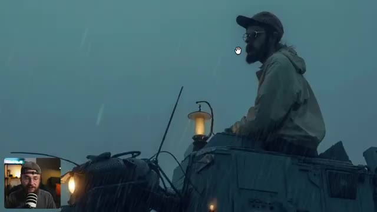
*Rendu vidéo montrant un personnage de style robotique/insecte dans un paysage pluvieux, avec Jack visible en médaillon PiP en bas à gauche.*

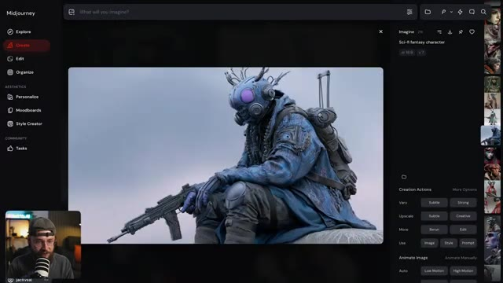
*Interface de Midjourney affichant un personnage de science-fiction au design unique avec casque d'insecte et fusil, avec Jack visible en médaillon PiP en bas à gauche.*

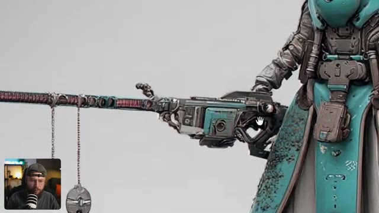
*Gros plan sur le rendu de Midjourney montrant les mains et les détails de l'arme d'un personnage de science-fiction, avec Jack visible en médaillon PiP en bas à gauche.*

---

### ⏱️ `[00:05:51 - 00:06:15]` | Segment #11

**🔊 Audio (Transcription Intégrale Mot pour Mot en Français) :**
> Comment ce personnage est-il censé tenir cette arme à l'aspect si étrange ? Il n'y a pas vraiment de contact réel avec cette main par ici. Et encore une fois, une sorte de déformation bizarre avec la main du côté droit également. Maintenant, il y a aussi une option pour faire de l'upscale (redimensionnement par IA) à l'intérieur de Midjourney. Si vous voulez le faire, je vous suggère de sélectionner "Subtle" (Subtil) pour que Midjourney ne modifie pas vos images trop radicalement.

**👁️ Analyse Visuelle d'Écran (gemini-3.5-flash-lite) :**
**Interface & Outils** : Interface utilisateur de Midjourney (site web / application web).

**Contenu textuel & Code** : Texte affiché sur le panneau de droite : "Creation Actions", "More Options", "Vary" (boutons "Subtle", "Strong"), "Upscale" (boutons "Subtle", "Creative"), "More" (boutons "Rerun", "Edit"), "Use" (boutons "Image", "Style", "Prompt"), ainsi que l'historique des générations en miniature sur la droite.

**Action / Démonstration** : Le curseur de la souris survole et clique sur le bouton "Subtle" de la section "Upscale" dans l'interface de Midjourney.

*Gros plan sur l'image générée montrant une arme au design complexe tenue de manière irréaliste par le personnage, avec Jack visible en Picture-in-Picture.*

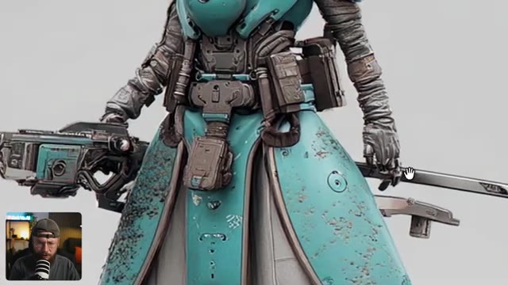
*Gros plan sur le bas du personnage généré, mettant en évidence un défaut de déformation de la main droite sur l'arme, avec Jack visible en PiP.*

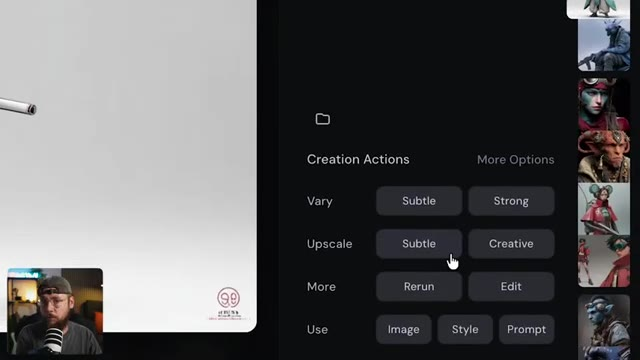
*Interface de Midjourney affichant le panneau des actions de création avec les options "Vary" (Subtle/Strong), "Upscale" (Subtle/Creative), "More" et "Use", avec Jack en PiP.*

---

### ⏱️ `[00:06:15 - 00:06:40]` | Segment #12

**🔊 Audio (Transcription Intégrale Mot pour Mot en Français) :**
> Mais la chose vraiment formidable avec le flux de travail que je m'apprête à démontrer, c'est que vous n'avez pas du tout besoin d'effectuer de mise à l'échelle (upscale) à l'intérieur de Midjourney. Oui, la résolution est plutôt basse et toutes les textures ont l'air incroyablement douces. Ne vous inquiétez pas trop pour ça pour l'instant. Je veux juste que vous alliez télécharger n'importe lequel de vos designs que vous aimez vraiment et dont vous pensez qu'ils fonctionneront bien à l'intérieur de votre projet de filmmaking.

**👁️ Analyse Visuelle d'Écran (gemini-3.5-flash-lite) :**
**Interface & Outils** : Interface web de Midjourney avec un panneau latéral droit pour les actions de création (Upscale, Vary, Reuse, Animate Image) et un encadré vidéo (PiP) du présentateur en bas à gauche.

**Contenu textuel & Code** : Le prompt visible est « Sci-fi fantasy character ». Des options d'upscale (« Subtle », « Creative »), de variation (« Subtle », « Strong ») et d'animation sont affichées dans le panneau latéral droit. L'image principale montre un personnage humanoïde en armure turquoise tenant une arme futuriste.

**Action / Démonstration** : Le présentateur démontre le flux de travail en affichant l'interface de Midjourney avec une image générée, tout en expliquant qu'il n'est pas nécessaire de faire un upscale.

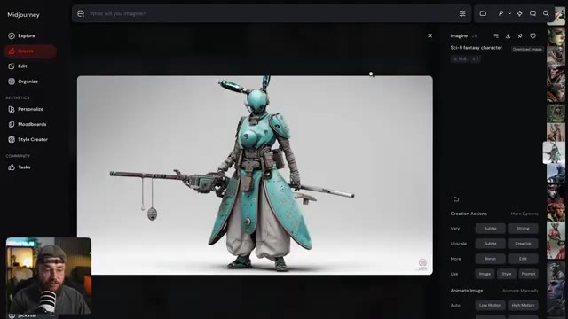
*Interface de Midjourney affichant un personnage de science-fiction turquoise avec un fusil, avec un petit encadré vidéo (PiP) de Jack dans le coin inférieur gauche.*

---

### ⏱️ `[00:06:40 - 00:07:05]` | Segment #13

**🔊 Audio (Transcription Intégrale Mot pour Mot en Français) :**
> Vous voulez obtenir une variété de personnages, de lieux et d'accessoires. Et comme je l'ai dit plus tôt, l'accent est vraiment mis sur le style, la palette de couleurs et la composition plutôt que sur le fait que les images soient réellement parfaites, car de toute évidemment elles ne le sont pas. Et vous pourriez aussi vous demander quel était même l'intérêt d'utiliser la référence Omni puisque le résultat que nous avons ne me ressemble pas vraiment.

**👁️ Analyse Visuelle d'Écran (gemini-3.5-flash-lite) :**
**Interface & Outils** : Interface web de Midjourney avec panneau de prompts et options d'édition sur le côté droit.

**Contenu textuel & Code** : Texte du prompt visible : "neck, lean vertical shape language with angular accents, white and ash-grey, buzz-cut hair..." et les paramètres de version et d'aspect ratio (ar 16:9, v7).

**Action / Démonstration** : Le créateur présente différentes images générées et le panneau latéral de l'interface Midjourney démontrant le résultat de ses prompts et réglages.

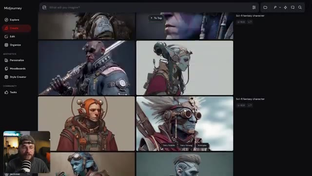
*Interface de Midjourney affichant une grille de personnages et de concepts de science-fiction, avec le créateur en incrustation vidéo (PiP).*

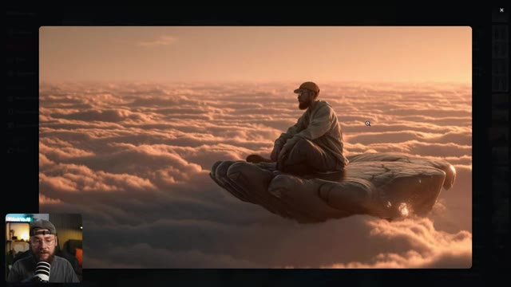
*Visualisation en plein écran d'une image générée par IA montrant un homme assis sur une main géante au-dessus des nuages au coucher du soleil.*

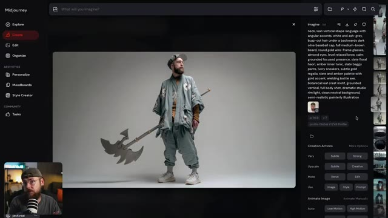
*Interface de Midjourney affichant un personnage généré avec son prompt textuel détaillé et ses panneaux de paramètres sur le côté droit.*

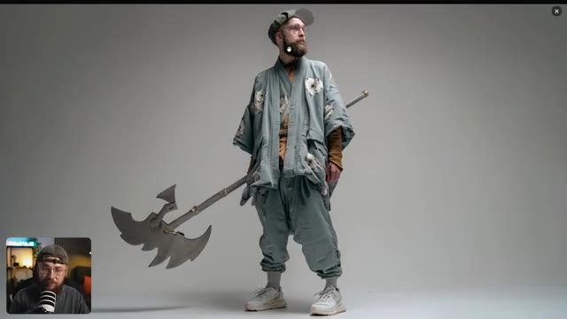
*Affichage en plein écran d'une image générée montrant un personnage en tenue fantastique/industrielle tenant une grande hache.*

---

### ⏱️ `[00:07:05 - 00:07:43]` | Segment #14

**🔊 Audio (Transcription Intégrale Mot pour Mot en Français) :**
> Le fait est que ces images ont au moins une vague ressemblance avec ce à quoi je ressemble, donc cela sert de point de départ utile pour la prochaine étape du processus. Maintenant, c'est la partie que je pense que beaucoup de créateurs ne partagent pas. Alors que la première étape du workflow se déroule dans Midjourney, cela ne signifie pas que tout le processus doit s'y dérouler. À la place, je suis passé sur OpenArt, et un grand merci à eux d'avoir sponsorisé la vidéo d'aujourd'hui. Nous allons utiliser OpenArt aux côtés de la structure de prompt et du workflow que j'ai mis en place pour affiner nos images Midjourney. Nous allons commencer par

**👁️ Analyse Visuelle d'Écran (gemini-3.5-flash-lite) :**
**Interface & Outils** : Interface de la plateforme web OpenArt, avec un encadré PiP (Picture-in-Picture) du créateur en bas à droite.

**Contenu textuel & Code** : Texte affiché à l'écran : "step two", "the fix", ainsi que la mention promotionnelle "40% off in the description" sur l'interface d'OpenArt.

**Action / Démonstration** : Transition graphique à l'écran suivie d'une présentation de l'interface de la plateforme OpenArt pour affiner les images générées.

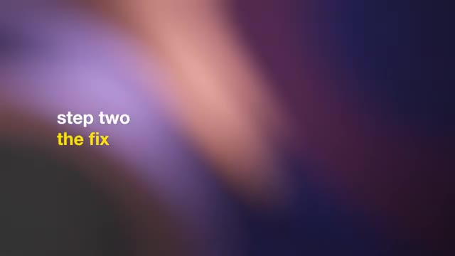
*Écran de transition présentant le texte 'step two / the fix' sur un fond coloré flou.*

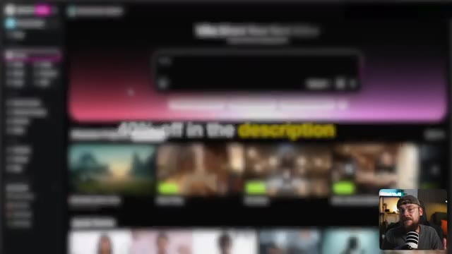
*Interface principale du site OpenArt avec une zone de texte centrale et un encadré PiP montrant le créateur en bas à droite.*

---

### ⏱️ `[00:07:43 - 00:08:07]` | Segment #15

**🔊 Audio (Transcription Intégrale Mot pour Mot en Français) :**
> un exemple plus simple où nous affinons un personnage générique, et ensuite nous allons passer à quelque chose de plus spécifique où nous prenons une image de Midjourney censée me ressembler et nous l'affinons pour qu'elle le fasse réellement. La première chose que vous voulez faire sur la page d'accueil d'OpenArt est d'aller créer un nouveau projet. Je vais appeler celui-ci MJFix.

**👁️ Analyse Visuelle d'Écran (gemini-3.5-flash-lite) :**
**Interface & Outils** : Interface web d'OpenArt (OpenArt Infinite / Director).

**Contenu textuel & Code** : Texte affiché sur le tableau de bord : "Vibe Direct Your Next Video", "Director Projects", "Create New", "MJFix" (nom du projet saisi dans la boîte de dialogue).

**Action / Démonstration** : Le créateur navigue sur la plateforme OpenArt et clique pour créer un nouveau projet qu'il nomme "MJFix".

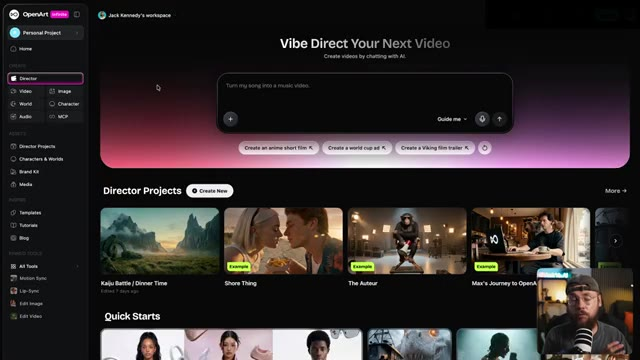
*Page d'accueil de la plateforme OpenArt montrant le tableau de bord avec divers projets et outils.*

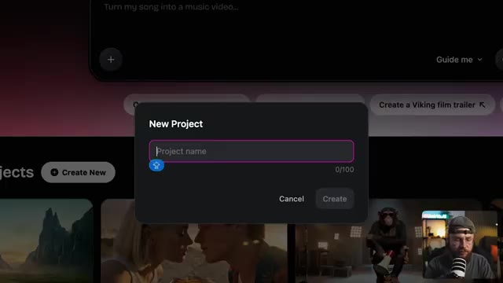
*Fenêtre modale "New Project" sur OpenArt avec un champ de texte pour nommer le projet.*

---

### ⏱️ `[00:08:08 - 00:08:45]` | Segment #16

**🔊 Audio (Transcription Intégrale Mot pour Mot en Français) :**
> Nous pouvons continuer et créer ceci. Une fois ici, nous voulons sélectionner l'onglet image, puis nous assurer que pour le modèle que nous utilisons, il s'agit de GPT image 2. Ensuite, si nous survolons cette zone ici, vous pouvez voir que nous avons une section de références. Si nous cliquons dessus, allons dans l'onglet image puis dans les téléchargements. C'est ici que nous voulons télécharger toutes ces générations Midjourney. Et curieusement, à un moment donné, OpenArt pourrait bien intégrer Midjourney dans la plateforme, de sorte que vous pourrez réellement créer des générations Midjourney directement à l'intérieur d'OpenArt. Restez donc attentifs à cette évolution.

**👁️ Analyse Visuelle d'Écran (gemini-3.5-flash-lite) :**
**Interface & Outils** : Interface de la plateforme OpenArt (avec miniature PiP de Jack en bas à droite).

**Contenu textuel & Code** : Menus de création : "Create Image", modèle "GPT Image 2", section "Add visual references", options "My Library", "OpenArt Library", formats et paramètres de génération.

**Action / Démonstration** : Le curseur survole la zone de sélection pour configurer les références visuelles et le modèle d'image sur OpenArt.

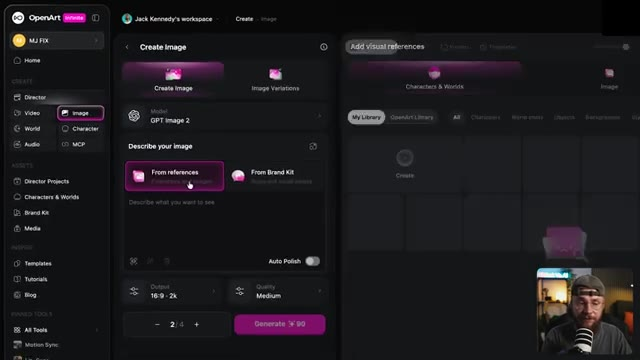
*Interface d'OpenArt montrant les paramètres de création d'image, le choix du modèle GPT Image 2 et la section des références visuelles.*

---

### ⏱️ `[00:08:45 - 00:09:10]` | Segment #17

**🔊 Audio (Transcription Intégrale Mot pour Mot en Français) :**
> Pour commencer, je vais sélectionner cette image que nous avons ici de ce personnage de type insecte robotique et cela signifie qu'elle va devenir notre référence. J'aime vraiment beaucoup cette image mais c'est du grand Midjourney classique. Aussi superbe que soit le design, il y a beaucoup de choses qui clochent ici et qui n'ont pas vraiment de sens logique, particulièrement lorsqu'on regarde les mains elles-mêmes.

**👁️ Analyse Visuelle d'Écran (gemini-3.5-flash-lite) :**
**Interface & Outils** : Interface web d'OpenArt (outil de génération d'images par IA) avec panneau de contrôle latéral, sélection de modèles (GPT Image 2) et options de référence visuelle.

**Contenu textuel & Code** : Texte visible sur l'interface : "OpenArt Infinite", "MJ FIX", "Create Image", "Model: GPT Image 2", "Add visual references", "Describe your image", "Upload Images", "Generate". Miniature de l'image du personnage bleu avec la mention "@image1".

**Action / Démonstration** : Le créateur sélectionne une image générée représentant un personnage robotique bug-like pour l'utiliser comme référence visuelle, tout en zoomant sur les détails anatomiques (les mains) pour pointer les défauts de l'IA.

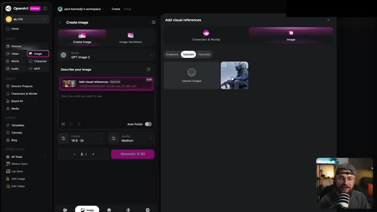
*Interface d'OpenArt montrant la sélection d'une image de référence visuelle (personnage robotique bug-like) dans l'espace de travail.*

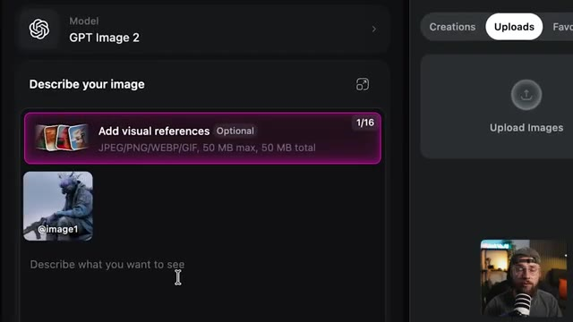
*Gros plan sur l'interface d'OpenArt avec le modèle GPT Image 2 et le champ "Add visual references" contenant l'image miniature étiquetée "@image1".*

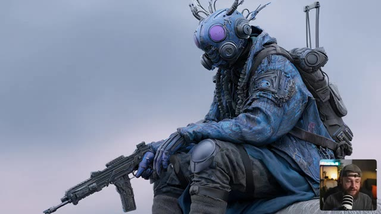
*Affichage en plein écran de l'image de référence générée par Midjourney : un personnage cyberpunk/robotique bleu ressemblant à un insecte, tenant un fusil, avec un gros plan sur les mains et les détails du design.*

---

### ⏱️ `[00:09:10 - 00:09:45]` | Segment #18

**🔊 Audio (Transcription Intégrale Mot pour Mot en Français) :**
> Maintenant, je vais aller de l'avant et insérer ce nouveau cadre ici que j'ai mis au point, et la beauté de ceci est que vous pouvez simplement le prendre, vous pouvez le copier et le coller, l'utiliser pour vos propres projets sans avoir à entrer et à faire un tas de modifications là-bas et ce que nous pouvons également aller de l'avant et faire au début du prompt si nous appuyons sur la touche arobase, nous pouvons réellement référencer l'image que nous voulons modifier et cela va devenir beaucoup plus important plus tard lorsque nous commencerons à faire des modifications plus complexes et à combiner nos images lorsque nous générons nos vidéos également et maintenant nous avons ces deux

**👁️ Analyse Visuelle d'Écran (gemini-3.5-flash-lite) :**
**Interface & Outils** : OpenArt Infinite (plateforme de création et d'édition d'images par IA)

**Contenu textuel & Code** : Texte du prompt visible : "Correct the anatomical, design, and physical errors in @image1 while keeping it in its original painted concept-art style. FIX (correct these, and paint the corrections in the same style as the surrounding image): • Anatomy - hands, fingers, limbs, joints, and proportions... • Design logic - clothing, armour, straps... • Physicality - how garments drape..." Paramètres : sortie 16:9 - 2k, qualité Medium.

**Action / Démonstration** : Le présentateur montre l'utilisation d'un framework textuel copié-collé dans l'outil OpenArt et explique comment référencer des images avec la touche arobase.

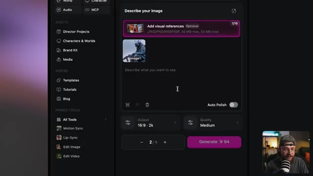
*Interface d'OpenArt montrant la zone de prompt avec une image de référence insérée (image1) et les options de génération.*

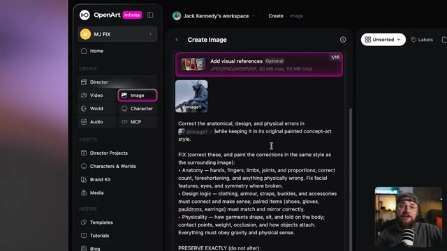
*Interface d'OpenArt affichant un prompt détaillé pour corriger les erreurs anatomiques et de design tout en conservant le style artistique d'origine.*

---

### ⏱️ `[00:09:45 - 00:10:19]` | Segment #19

**🔊 Audio (Transcription Intégrale Mot pour Mot en Français) :**
> des sections distinctes qui composent le reste du prompt. La première section concerne les éléments que nous voulons modifier. Nous disons donc à GPT Image 2 de corriger tout problème anatomique, tout problème de logique de design et de physicalité également. Et la deuxième partie du prompt concerne les éléments que nous ne voulons pas modifier pour nous assurer de conserver cette esthétique unique de Midjourney. Sur ce, nous pouvons cliquer sur générer et comparer nos résultats. C'est donc ceci qui est l'original

**👁️ Analyse Visuelle d'Écran (gemini-3.5-flash-lite) :**
**Interface & Outils** : Interface logicielle de type assistant IA/génération d'images avec panneau de configuration à gauche et zone de prompt détaillée au centre, incluant une incrustation vidéo (PiP) du créateur en bas à droite.

**Contenu textuel & Code** : Texte du prompt divisé en deux sections : "FIX (correct these, and paint the corrections in the same style as the surrounding image)" avec des sous-points sur l'anatomie, la logique de design et la physicalité, et "PRESERVE EXACTLY (do not alter)" sur le style de rendu Midjourney, la palette de couleurs, l'éclairage et l'identité du personnage. Sur l'image 2 : "Midjourney native output".

**Action / Démonstration** : Le créateur présente la structure d'un prompt d'optimisation d'image (ce qu'il faut modifier vs préserver) puis montre le résultat visuel original natif de Midjourney.

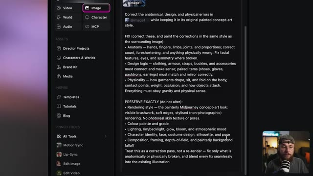
*Interface d'un outil affichant un prompt textuel divisé en deux sections principales : ce qu'il faut corriger et ce qu'il faut préserver, avec un encadré PiP du créateur en bas à droite.*

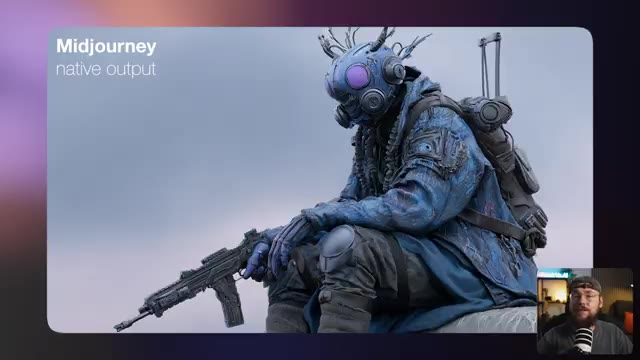
*Affichage d'une image générée par Midjourney montrant un personnage en armure bleue futuriste tenant une arme, avec le texte "Midjourney native output" en haut à gauche et le créateur en PiP en bas à droite.*

---

### ⏱️ `[00:10:19 - 00:10:53]` | Segment #20

**🔊 Audio (Transcription Intégrale Mot pour Mot en Français) :**
> génération que nous avons obtenue de Midjourney lui-même et voici ce que nous avons obtenu de GPT Image 2 lorsque nous l'avons fait passer dans mon framework de prompt et comme vous pouvez voir ça ressemble toujours à l'image originale mais le langage du design et l'anatomie ont été corrigés. Il y a beaucoup plus de texture, ça a l'air beaucoup plus net et particulièrement les mains ont beaucoup plus de sens. Vous vous rappellerez que celle-ci était complètement incohérente avant. Maintenant ça ressemble vraiment à une main et comme je le dis nous ne faisons pas juste corriger le genre

**👁️ Analyse Visuelle d'Écran (gemini-3.5-flash-lite) :**
**Interface & Outils** : Interface vidéo avec incrustation PiP (Picture-in-Picture) du créateur en bas à droite et affichage d'une image générée par IA.

**Contenu textuel & Code** : Texte affiché en haut à gauche : "Midjourney native output". Image d'un personnage de type cyberpunk/sci-fi portant un vêtement bleu texturé, un masque avec des optiques violettes, et tenant une arme à feu futuriste.

**Action / Démonstration** : Présentation comparative visuelle d'un résultat natif généré par Midjourney pendant que le créateur commente les détails de l'image.

*Image générée par Midjourney montrant un personnage futuriste assis avec une arme et un casque, avec un encadré incrusté du présentateur en bas à droite.*

---

### ⏱️ `[00:10:53 - 00:11:26]` | Segment #21

**🔊 Audio (Transcription Intégrale Mot pour Mot en Français) :**
> de conception ou de problèmes anatomiques, nous appliquons aussi ce genre de passe de netteté et de texture sur l'image. Il y a donc en fait deux avantages à cela. Plus crucial encore, l'image conserve l'esprit de la source en termes de style Midjourney. Maintenant, et si nous voulions aller un peu plus loin et nous assurer que nos designs de personnages correspondent réellement à une personne spécifique ? Ce que nous pouvons faire, c'est utiliser la planche de personnages que nous avons créée avec Midjourney comme notre nouvelle référence d'image en cochant cette case ici.

**👁️ Analyse Visuelle d'Écran (gemini-3.5-flash-lite) :**
**Interface & Outils** : OpenArt (application web de génération d'images par IA) avec un panneau latéral de configuration et une zone centrale de création.

**Contenu textuel & Code** : Texte visible : 'GPT Image 2 refinement pass', 'jackvsai_Character_reference_sheet...', 'Add visual references', 'Create Image', 'Model: GPT Image 2', 'Output: 16:9 - 2k', 'Generate', ainsi que des miniatures de personnages téléchargés.

**Action / Démonstration** : Le créateur présente une image affinée par l'IA, puis montre une planche de référence de personnages avant d'illustrer comment l'utiliser comme référence visuelle dans l'interface d'OpenArt.

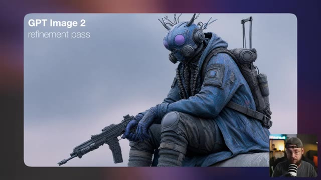
*Image générée intitulée 'GPT Image 2 refinement pass' montrant un personnage en tenue bleue avec un casque futuriste et un fusil.*

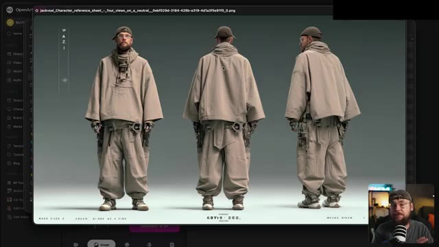
*Interface montrant une planche de personnages ('character reference sheet') affichant plusieurs vues d'un personnage dans une tenue beige ample.*

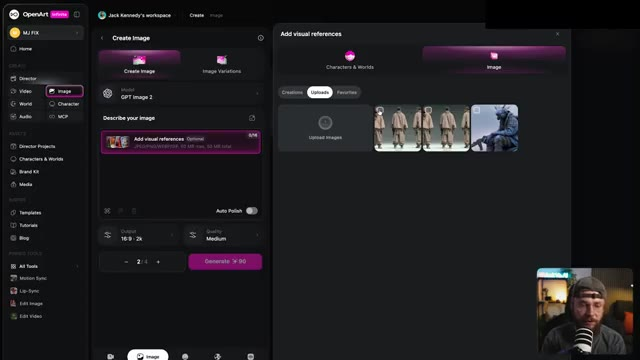
*Interface de l'application OpenArt montrant les options de création d'image et le panneau d'ajout de références visuelles pour les personnages.*

---

### ⏱️ `[00:11:26 - 00:12:02]` | Segment #22

**🔊 Audio (Transcription Intégrale Mot pour Mot en Français) :**
> et ça va remplir cette zone et je vais aussi aller importer des images de référence de moi-même, nous pouvons aussi cocher les cases sur celles-ci afin de pouvoir les utiliser également pour notre génération. Maintenant, en ce qui concerne le prompt lui-même, nous utilisons en fait exactement le même cadre avec un petit ajout à la fin, donc encore une fois au début, nous pouvons étiqueter ce que nous voulons pour notre image un, qui est notre feuille de personnage Midjourney où nous disons de corriger la conception anatomique et les erreurs physiques de la génération Midjourney. Donc c'est tout le prompt existant ici et au

**👁️ Analyse Visuelle d'Écran (gemini-3.5-flash-lite) :**
**Interface & Outils** : OpenArt Infinite (Interface web de création d'images par IA avec gestion des références visuelles et de modèles).

**Contenu textuel & Code** : Modèle : "GPT Image 2". Champ de prompt avec les balises "@image1" et des sections structurées : "FIX", "Anatomy", "Design logic", "Physicality", "PRESERVE EXACTLY" (Rendering style, Colour palette, Lighting, Character identity, Composition), et "Swap in the bearded man's face in the image references".

**Action / Démonstration** : Le présentateur montre l'interface d'OpenArt, sélectionne et coche des images de référence visuelle, puis parcourt le texte du prompt de génération.

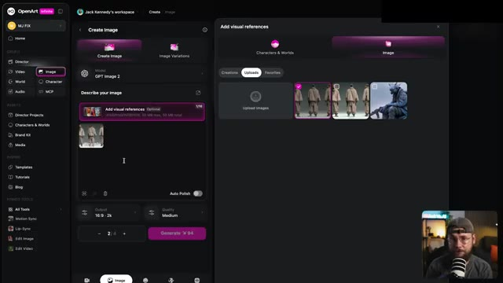
*Interface d'OpenArt montrant l'importation de références visuelles et de personnages.*

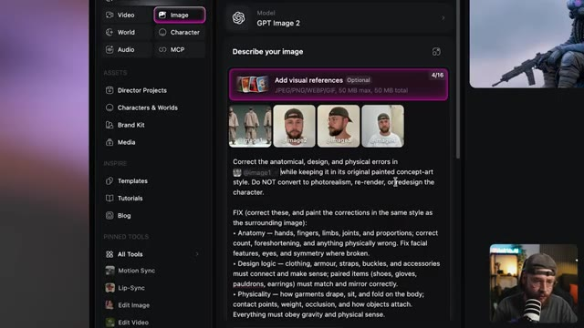
*Affichage du prompt détaillé avec l'intégration des images de référence du visage de Jack.*

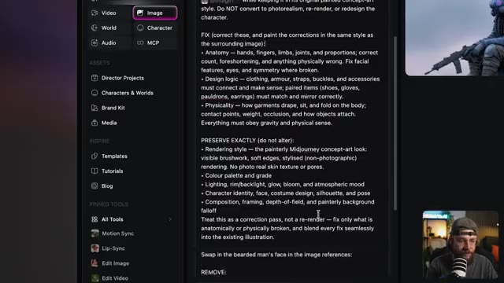
*Suite du prompt de correction anatomique et de conservation du style artistique Midjourney.*

---

### ⏱️ `[00:12:02 - 00:12:30]` | Segment #23

**🔊 Audio (Transcription Intégrale Mot pour Mot en Français) :**
> En bas, c'est là que j'ai ajouté quelques points supplémentaires. Donc on veut dire : remplacer par le visage de l'homme barbu dans l'image de référence, et ensuite je vais aller taguer ces images que j'élaborées de moi-même pour servir de référence vraiment utile à GPT image 2 pour qu'il comprenne à quoi je ressemble, et j'ajoute simplement à la fin ce même prompt de feuille de référence de personnage qu'on a utilisé sur MidJourney au début de la vidéo.

**👁️ Analyse Visuelle d'Écran (gemini-3.5-flash-lite) :**
**Interface & Outils** : Interface logicielle de génération d'images par IA (avec barre latérale de navigation et paramètres de format/qualité), incluant un encadré vidéo PiP du créateur.

**Contenu textuel & Code** : Texte du prompt visible à l'écran : "Swap in the bearded man's face in the image references:", "REMOVE: - Any text, signage and logos", "Character reference sheet — four views on a neutral grey background: [VIEW 1 - FULL BODY, FRONT]...", ainsi qu'un menu déroulant de sélection d'images étiquetées "Image1", "Image2", "Image3", "Image4".

**Action / Démonstration** : Le créateur montre l'intégration de références d'images et l'ajout de consignes textuelles dans un prompt pour une IA de génération d'images.

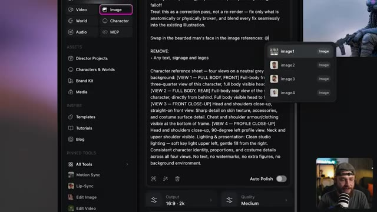
*Interface d'un outil de génération d'images par IA montrant un champ de texte de prompt avec un menu contextuel pour taguer des images de référence (Image1, Image2, Image3, Image4), ainsi qu'un encadré PiP du créateur en bas à droite.*

---

### ⏱️ `[00:12:30 - 00:13:03]` | Segment #24

**🔊 Audio (Transcription Intégrale Mot pour Mot en Français) :**
> Et si nous continuons et cliquons sur générer, je peux vous montrer le résultat que nous obtenons. C'est exactement ce que nous recherchons. GPT Image 2 a appliqué ce prompt de raffinement avec beaucoup de succès ici. Nous avons maintenant une feuille de référence de personnage fonctionnelle, qui va être incroyablement utile lorsqu'il s'agira de générer plus d'images ou de vidéos IA à l'avenir. Le personnage me ressemble maintenant vraiment, mais surtout, il a conservé cette esthétique Midjourney. Donc la beauté ici est que

**👁️ Analyse Visuelle d'Écran (gemini-3.5-flash-lite) :**
**Interface & Outils** : Présentation de visuels générés par IA (Midjourney natif et GPT Image 2) avec vignette PiP du créateur dans le coin inférieur droit.

**Contenu textuel & Code** : Textes visibles : "Midjourney native output" sur l'image #1 ; "GPT Image 2 refinement pass" sur les images #2 et #4. Feuilles de référence de personnage (character sheet) avec vues de face, de dos et gros plans du visage avec barbe, lunettes et casquette.

**Action / Démonstration** : Le créateur présente les résultats de génération et de raffinement de la feuille de référence de personnage à l'écran.

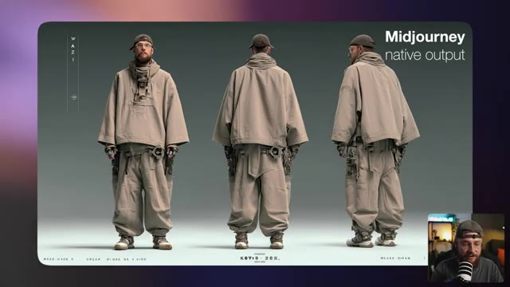
*Affichage d'une feuille de référence de personnage générée nativement par Midjourney montrant le personnage sous plusieurs angles.*

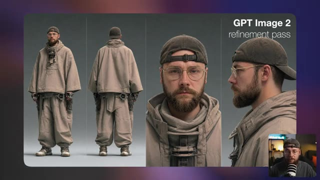
*Affichage du résultat après la passe de raffinement avec GPT Image 2, incluant des gros plans sur le visage et les détails.*

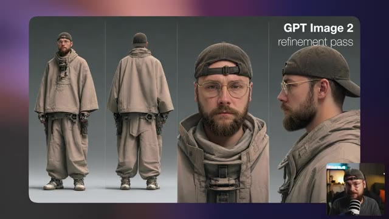
*Affichage identique montrant le résultat final de la feuille de référence après la passe de raffinement GPT Image 2.*

---

### ⏱️ `[00:13:03 - 00:13:39]` | Segment #25

**🔊 Audio (Transcription Intégrale Mot pour Mot en Français) :**
> Nous pouvons maintenant intégrer l'une de ces références Midjourney. Allez-y, glissez et déposez également notre feuille de référence de personnage nouvellement affinée. Bien sûr, nous voulons nous assurer de taguer l'image Midjourney pour dire à GPT Image 2 d'effectuer ces corrections anatomiques et de design, et si nous faisons un peu plus défiler vers le bas, nous disons : remplacez le personnage par l'homme barbu dans, et ensuite nous pouvons taguer notre nouvelle feuille de référence de personnage, et je vais simplement dire aussi qu'il a un petit outil de respiration futuriste dans la bouche, ce qui signifie que nous pouvons permuter notre feuille de référence de personnage affinée.

**👁️ Analyse Visuelle d'Écran (gemini-3.5-flash-lite) :**
**Interface & Outils** : Interface logicielle de création assistée par IA comportant un panneau latéral de navigation, un espace central de prompt textuel ("Describe your image") utilisant le modèle GPT Image 2, et un panneau latéral droit pour la sélection d'actifs visuels.

**Contenu textuel & Code** : Modèle : "GPT Image 2". Champ "Add visual references" avec 2 images ajoutées (@image1 et @image2). Texte du prompt incluant : "Correct the anatomical, design, and physical errors in @image1 while keeping it in its original painted concept-art style", "FIX (correct these, and paint the corrections in the same style as the surrounding image):", "PRESERVE EXACTLY (do not alter):", "Replace the character with the bearded man in @small futuristic breathing tool in his mouth". Paramètres : Output 16:9 - 2k, Quality Medium. Bouton de génération : "Generate 51".

**Action / Démonstration** : Le créateur démontre la modification d'une image en y associant des références visuelles (une image sous-marine et une feuille de personnage) et en rédigeant un prompt détaillé pour remplacer le personnage et corriger les aspects anatomiques via le modèle GPT Image 2.

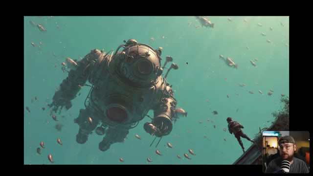
*Image sous-marine montrant une grande structure mécanique et un petit personnage au premier plan, avec le créateur en incrustation PiP.*

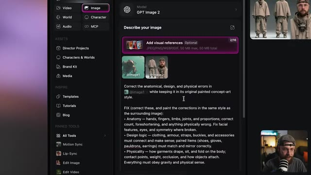
*Interface de l'application montrant le modèle GPT Image 2, les images de référence (@image1, @image2) et les instructions textuelles de correction anatomique.*

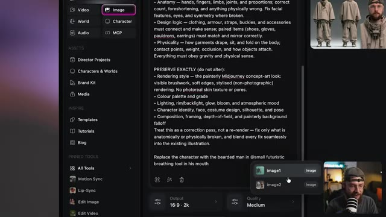
*Suite du champ de texte avec les instructions de génération, montrant l'utilisation du tag de référence pour remplacer le personnage par l'homme barbu.*

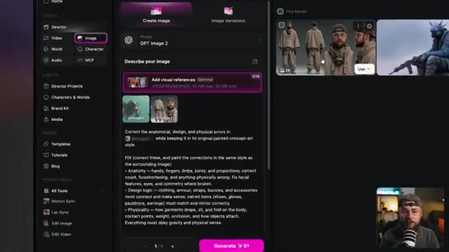
*Vue d'ensemble de l'interface montrant les paramètres de génération (ratio 16:9, qualité Medium) et le bouton "Generate".*

---

### ⏱️ `[00:13:39 - 00:14:16]` | Segment #26

**🔊 Audio (Transcription Intégrale Mot pour Mot en Français) :**
> notre meilleure version de notre personnage mid-journey dans cette génération mid-journey originale tout en corrigeant également le design de ce genre de monstre plongeur et c'est le type de résultat que nous allons obtenir où j'ai maintenant été intégré en tant que personnage et le monstre plongeur a l'air super bien aussi en particulier ses mains ont été complètement corrigées ce que j'adore. Nous avons cependant perdu ce mur qui était dans le coin inférieur droit de l'image. Parfois l'image GPT 2 peut finir par faire ces changements que vous ne voulez pas. Ils sont généralement assez subtils et dans ce

**👁️ Analyse Visuelle d'Écran (gemini-3.5-flash-lite) :**
**Interface & Outils** : OpenArt (Interface de génération d'images avec modèle GPT Image 2 et panneau de contrôle latéral).

**Contenu textuel & Code** : Modèle "GPT Image 2", section "Add visual references", prompt détaillé de correction anatomique (Anatomy - hands, fingers, limbs, Design logic, Physicality), et le résultat de l'image générée sous-marine avec le titre "GPT Image 2 refinement pass".

**Action / Démonstration** : Le créateur montre l'interface de l'outil de génération d'image avec les paramètres et les références visuelles, puis présente le résultat final obtenu après le traitement par GPT Image 2.

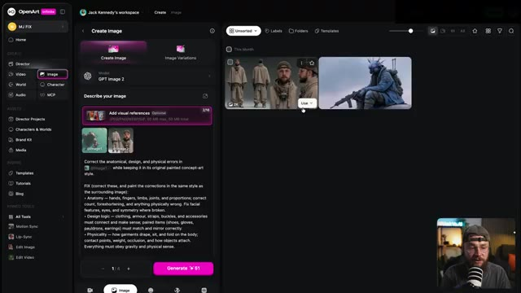
*Interface d'OpenArt montrant le panneau de génération d'images avec le modèle GPT Image 2, les références visuelles et le prompt de correction anatomique.*

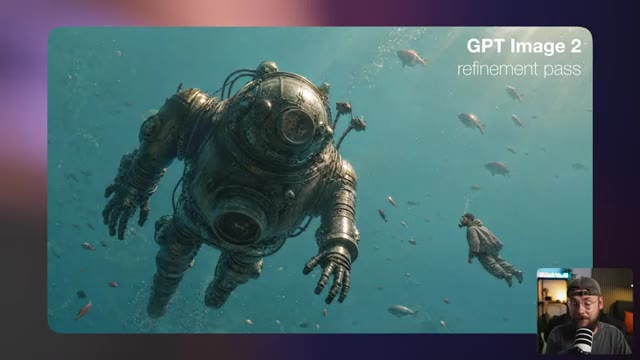
*Résultat de la génération d'image montrant le monstre plongeur sous l'eau avec le personnage du créateur et le texte "GPT Image 2 refinement pass".*

---

### ⏱️ `[00:14:16 - 00:14:53]` | Segment #27

**🔊 Audio (Transcription Intégrale Mot pour Mot en Français) :**
> cas, je préfère en fait avoir l'espace vide. Je trouve que la composition rend mieux, mais si vous vouliez vraiment éviter cela, il vous suffirait de relancer la génération quelques fois de plus pour obtenir un résultat où cela n'a pas été modifié. Maintenant, pour vous montrer quelques exemples supplémentaires, vous vous souvenez de cette génération Midjourney ici, et voilà ce qu'on a fini par obtenir en utilisant mon flux de travail. On a aussi cette image en particulier que j'ai vraiment adorée, mais les problèmes sont assez importants : ce type ne me ressemble pas vraiment. Cependant, GPT Image 2 a réussi à faire un excellent travail en remplaçant cela par une version raffinée.

**👁️ Analyse Visuelle d'Écran (gemini-3.5-flash-lite) :**
**Interface & Outils** : Présentation vidéo avec incrustation d'exemples d'images générées par IA (Midjourney et GPT Image 2) et petit retour caméra (Picture-in-Picture) de Jack en bas à droite.

**Contenu textuel & Code** : Textes affichés à l'écran : "GPT Image 2 refinement pass" et "Midjourney native output". Visuels de génération d'images IA.

**Action / Démonstration** : Le présentateur commente des exemples d'images générées par IA pour illustrer son flux de travail et les résultats de l'outil GPT Image 2 par rapport à Midjourney.

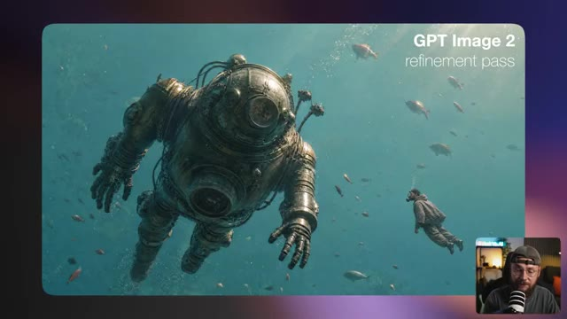
*Image générée montrant un plongeur sous-marin avec un scaphandre lourd à côté d'un autre plongeur, avec le texte "GPT Image 2 refinement pass" en haut à droite.*

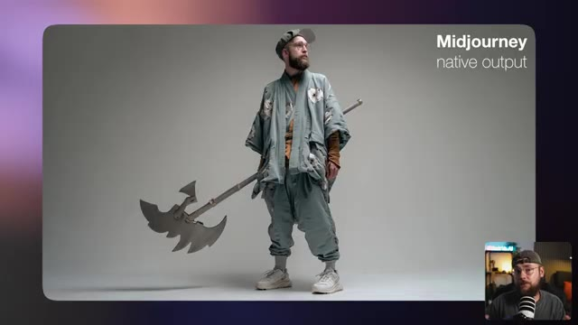
*Image de sortie native de Midjourney montrant un homme debout avec une grande hache dans un style fantastique, avec le texte "Midjourney native output".*

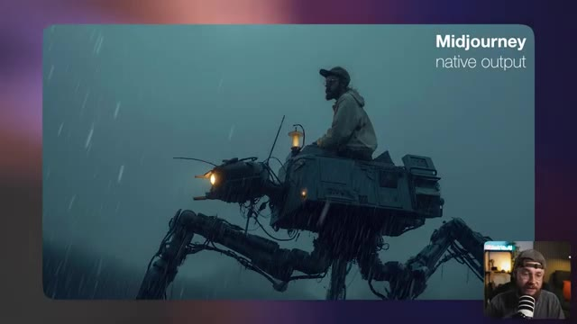
*Image de sortie native de Midjourney montrant un homme pilotant un véhicule mécha bipède sous la pluie, avec le texte "Midjourney native output".*

---

### ⏱️ `[00:14:53 - 00:15:30]` | Segment #28

**🔊 Audio (Transcription Intégrale Mot pour Mot en Français) :**
> design de personnage nous avons ce superbe design de robot ici vous vous souvenez que le placement de la main n'a pas vraiment beaucoup de sens sauf que maintenant si lorsque nous avons appliqué notre correction c'est vraiment très beau et beaucoup plus de texture ajoutée à cela également et même une image comme celle-ci où ce que Midjourney a assemblé a l'air juste incroyable il y a beaucoup de flou les détails ont tous été en quelque sorte mélangés j'ai pu produire ceci où soudainement tout a beaucoup plus de sens. Tout semble beaucoup plus net et nous avons même remplacé ce personnage de plongeur ici.

**👁️ Analyse Visuelle d'Écran (gemini-3.5-flash-lite) :**
**Interface & Outils** : Présentation vidéo avec incrustation PiP du présentateur dans le coin inférieur droit et affichage d'images générées par Midjourney.

**Contenu textuel & Code** : Texte affiché à l'écran : "Midjourney native output". Visuels de designs générés par intelligence artificielle (personnage robot et paysage sous-marin).

**Action / Démonstration** : Le créateur présente et compare différentes images générées par Midjourney pour illustrer les défauts initiaux et les corrections apportées aux textures et aux détails.

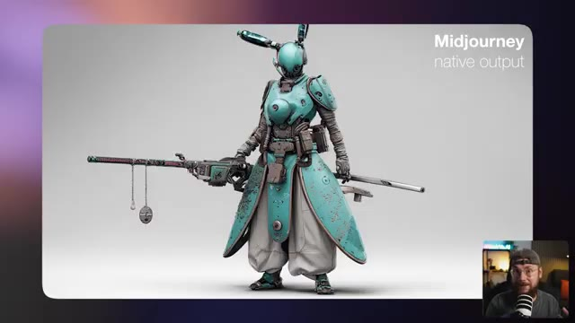
*Affichage d'un rendu de personnage robot généré nativement par Midjourney, avec un encadré PiP de Jack dans le coin inférieur droit.*

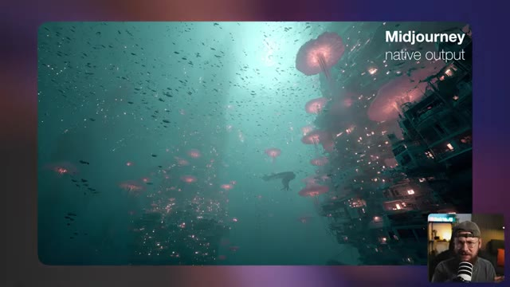
*Affichage d'une image sous-marine complexe avec des structures et des méduses générée nativement par Midjourney, avec le présentateur en incrustation PiP.*

---

### ⏱️ `[00:15:30 - 00:16:06]` | Segment #29

**🔊 Audio (Transcription Intégrale Mot pour Mot en Français) :**
> Donc, à la fin de cette étape, nous repartons avec deux composants vraiment cruciaux. Le premier est notre feuille de référence de personnage affinée et le second est notre collection de différentes scènes qui ont été affinées et contiennent désormais également des versions précises de moi-même en tant que personnage. Et l'étape de préparation étant maintenant gérée, après avoir construit une variété de différents personnages, accessoires et décors, nous sommes prêts à devenir vraiment créatifs et à commencer à donner vie à nos scènes. Nous voulons d'abord nous rendre sur l'onglet vidéo et, comme je suis sûr que vous l'auriez probablement déjà deviné,

**👁️ Analyse Visuelle d'Écran (gemini-3.5-flash-lite) :**
**Interface & Outils** : Présentation de visuels générés par IA (feuille de modèle et scènes cinématiques) illustrant le propos.

**Contenu textuel & Code** : Une grille composée d'une feuille de référence de personnage en haut et de sept scènes de science-fiction différentes mettant en scène le créateur dans divers environnements (paysages nuageux, planètes, décors futuristes, artisanat cosmique).

**Action / Démonstration** : Affichage à l'écran de la collection de scènes et du personnage affiné mentionnés dans la narration.

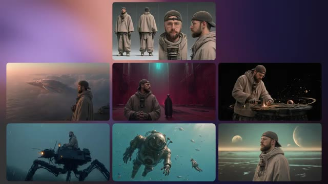
*Grille d'images générées par IA montrant une feuille de référence de personnage (character sheet) et plusieurs scènes de science-fiction raffinées incluant le créateur.*

---

### ⏱️ `[00:16:06 - 00:16:38]` | Segment #30

**🔊 Audio (Transcription Intégrale Mot pour Mot en Français) :**
> En ce qui concerne le modèle que nous allons utiliser, Seedance 2, et plus important encore, nous voulons sélectionner l'option de référence textuelle ici afin de pouvoir profiter pleinement de l'outil de ByteDance. À moins que vous ne vouliez entrer dans les détails ultra précis, je suggère de combiner une feuille de référence de personnage avec un visuel clé. Maintenant, par visuel clé, j'entends une image de style qui englobe de manière significative les parties clés de la scène. Cela établit donc le style général, le ton, le moment de la journée,

**👁️ Analyse Visuelle d'Écran (gemini-3.5-flash-lite) :**
**Interface & Outils** : Interface de la plateforme OpenArt Infinite (workspace de Jack Kennedy) montrant les outils de génération vidéo basés sur Seedance 2.0.

**Contenu textuel & Code** : Menus de l'application OpenArt Infinite : "Frame to Video", options "Start/End Frame", "Text with Reference", modèle "Seedance 2.0", et menus latéraux (Director, Video, Image, World, Character, Audio, MCP).

**Action / Démonstration** : Le créateur montre l'interface d'OpenArt avec les réglages de Seedance 2.0, puis présente un visuel clé illustrant l'ambiance et le style recherchés pour la scène.

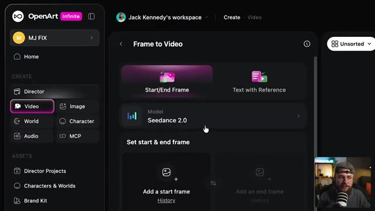
*Interface d'OpenArt montrant les options de Seedance 2.0 avec les modes Start/End Frame et Text with Reference.*

*Visuel clé généré montrant un personnage sur un véhicule bipède sous la pluie, avec le présentateur en incrustation PiP.*

---

### ⏱️ `[00:16:38 - 00:17:15]` | Segment #31

**🔊 Audio (Transcription Intégrale Mot pour Mot en Français) :**
> l'emplacement, la météo, et dans ce cas également, tous les accessoires qui incluent cette machine. Vous remarquerez qu'à ce stade, la seule chose qui nous manque est notre invite textuelle. Et il est incroyablement important de bien réussir cette partie du processus parce que cela signifie que vous avez beaucoup plus de chances d'obtenir le type de génération que vous voulez réellement. Je reviens toujours à cette idée de contexte. Plus nous pouvons donner de contexte à n'importe quel modèle vidéo d'IA, dans ce cas C-Dance 2, meilleurs seront les résultats que nous obtiendrons. Nous lui donnons donc déjà un contexte significatif en termes de notre personnage.

**👁️ Analyse Visuelle d'Écran (gemini-3.5-flash-lite) :**
**Interface & Outils** : Interface utilisateur de Seedance 2.0 avec un panneau latéral de navigation et une zone centrale de configuration de génération vidéo.

**Contenu textuel & Code** : Modèle Seedance 2.0 sélectionné, section "Describe your video", option "Add visual references (2/15)" avec deux miniatures (@image2, @image3), champ de texte "Enter text to freely combine reference assets and generate a video.", et options "Camera" et "Auto Polish".

**Action / Démonstration** : Le créateur présente l'interface de Seedance 2.0 en expliquant l'importance d'ajouter des références visuelles et du contexte avant d'entrer le prompt textuel.

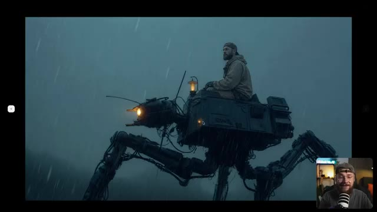
*Rendu visuel d'une génération montrant un personnage assis sur une machine méca sous la pluie.*

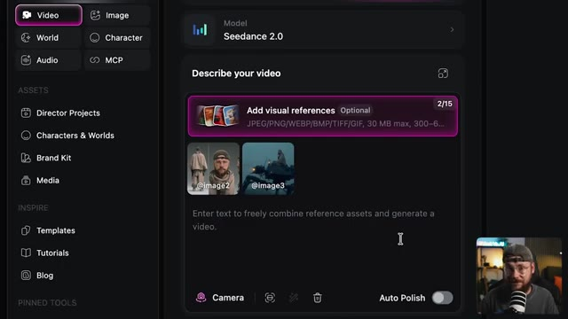
*Interface de Seedance 2.0 montrant la section de saisie du prompt et l'ajout de références visuelles.*

---

### ⏱️ `[00:17:15 - 00:17:51]` | Segment #32

**🔊 Audio (Transcription Intégrale Mot pour Mot en Français) :**
> feuille et notre visuel clé. Le texte du prompt est vraiment la dernière étape de ce processus qui va tout lier. Maintenant, vous pouvez aller de l'avant et écrire votre propre prompt texte, mais la grande majorité des cinéastes IA trouveront les idées eux-mêmes tout en utilisant un LLM comme Claude par exemple pour les aider à affiner le côté technique des choses. La première chose que nous voulons faire est de télécharger ce fichier MD et c'est un cadre de prompt multi-plans. Il indique exactement à Claude ce que nous cherchons sans que nous ayons à le prompter manuellement à chaque fois. Et le

**👁️ Analyse Visuelle d'Écran (gemini-3.5-flash-lite) :**
**Interface & Outils** : Interface web de Seedance avec incrustation vidéo du créateur (PiP) en bas à droite.

**Contenu textuel & Code** : Sur l'image 1 : Modèle Seedance 2.0, section "Describe your video", "Add visual references" (2/15) avec vignettes `@image2` et `@image3`, et curseur "Auto Polish". Sur l'image 2 : Interface de Claude avec "Afternoon, Jack", un fichier joint "multi-shot-prompt-framework.skill", le champ de texte "How can I help you today?", et le modèle "Opus 4.8 Medium".

**Action / Démonstration** : Le créateur montre l'interface de génération vidéo avec des références visuelles, puis bascule sur l'interface de l'assistant Claude pour y importer le fichier de framework multi-plans.

*Interface de Seedance montrant la zone de saisie du prompt vidéo avec des références visuelles ajoutées.*

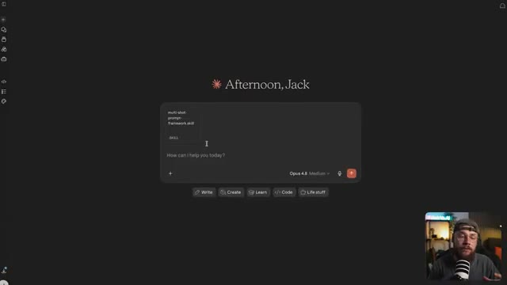
*Interface de l'assistant IA Claude affichant le message d'accueil et le champ de saisie avec le fichier de framework multi-plans.*

---

### ⏱️ `[00:17:51 - 00:18:26]` | Segment #33

**🔊 Audio (Transcription Intégrale Mot pour Mot en Français) :**
> La super chose à propos de ce fichier MD, c'est qu'il est compatible avec n'importe quel LLM. Donc si vous préférez utiliser ChatGPT, Gemini ou Grok, vous pouvez simplement le déposer dedans et suivre le même processus. Vous voulez également procéder au téléchargement des mêmes références d'images que nous donnons à C-Dance 2. Dans ce cas, nous avons notre visuel clé et notre feuille de référence de personnage également. Et maintenant, je veux procéder à la description de ce que nous voulons qu'il se passe dans notre scène et de la durée souhaitée pour notre génération. Juste une brève note : cette compétence générera par défaut une durée de 15 secondes, donc si vous voulez...

**👁️ Analyse Visuelle d'Écran (gemini-3.5-flash-lite) :**
**Interface & Outils** : Claude (Anthropic)

**Contenu textuel & Code** : Texte affiché : "Afternoon, Jack", "multi-shot-prompt-framework.skill", "SKILL", "How can I help you today?", "Opus 4.8 Medium", boutons "Write", "Create", "Learn", "Code", "Life stuff". Deux images en miniatures représentant un visuel clé avec un personnage sur un quadrupède mécanique et une feuille de référence de personnage.

**Action / Démonstration** : Le créateur montre l'interface d'un LLM (Claude) où il a importé le fichier .md (compétence) ainsi que les images de référence visuelles pour préparer sa génération de scène.

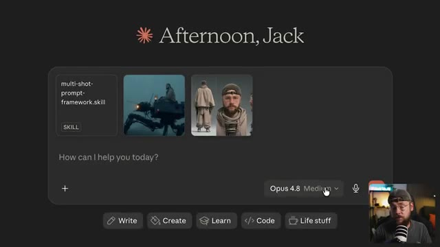
*Interface de Claude (Anthropic) affichant le fichier multi-shot-prompt-framework.skill, les images de référence et le sélecteur de modèle Opus 4.8.*

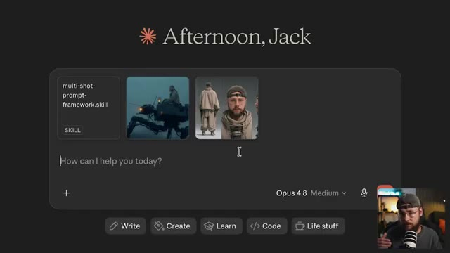
*Interface de Claude montrant le champ de texte de discussion avec les fichiers attachés et le curseur clignotant prêt à recevoir une instruction.*

---

### ⏱️ `[00:18:26 - 00:19:01]` | Segment #34

**🔊 Audio (Transcription Intégrale Mot pour Mot en Français) :**
> spécifiez-en un plus court assurez-vous de le faire donc je vais simplement continuer et dire l'homme barbu regarde un astéroïde tomber du ciel et s'écraser devant lui au loin il court vers le site du crash nous pouvons envoyer cela je vais voir très bientôt que Claude va commencer à interagir avec ce fichier md ici il va charger le framework de prompt multi-shot ici et commencer à vraiment étoffer l'histoire que nous voulons raconter maintenant je顯 obvious

**👁️ Analyse Visuelle d'Écran (gemini-3.5-flash-lite) :**
**Interface & Outils** : Interface web de l'assistant Claude (Anthropic), affichant l'accueil "Afternoon, Jack" avec un champ de saisie, des boutons de catégories (Write, Create, Learn, Code, Life stuff) et un encadré PiP de Jack en bas à droite.

**Contenu textuel & Code** : On peut lire le nom du fichier attaché "multi-shot-prompt-framework.skill" (marqué d'un badge SKILL), ainsi que des aperçus d'images de personnages (un homme barbu avec une créature mécanique et des vues de design de personnage) et le texte de prompt "How can I help you today?". Le modèle sélectionné est "Opus 4.8 Medium".

**Action / Démonstration** : Le créateur montre l'interface de Claude avec les fichiers de compétences et les images de référence intégrés, prêt à générer ou structurer le scénario.

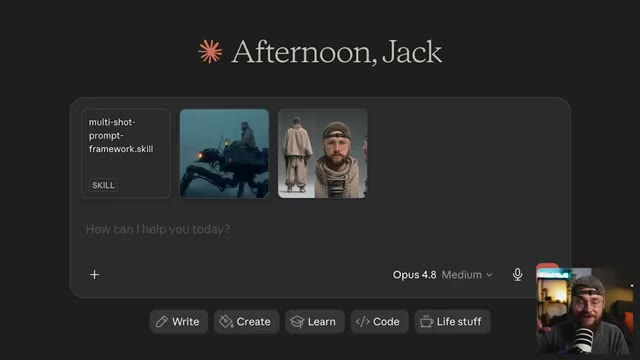
*Interface de Claude avec le framework multi-shot prompt et les images de référence du projet*

---

### ⏱️ `[00:19:01 - 00:19:34]` | Segment #35

**🔊 Audio (Transcription Intégrale Mot pour Mot en Français) :**
> donné à Claude une description vraiment simplifiée de la scène si vous voulez avoir beaucoup plus de contrôle, vous pouvez entrer dans la description des angles de caméra et des mouvements, des conditions atmosphériques et du genre d'action émotionnelle de nos personnages, c'est vraiment à vous de voir, mais ce que vous allez obtenir en retour dans tous les cas est un prompt vraiment technique comme celui-ci qui a des horodatages, qui a un cadrage, qui fait référence au type d'objectifs à utiliser, il va décrire toute action qui doit avoir lieu en quelque sorte pour découper le

**👁️ Analyse Visuelle d'Écran (gemini-3.5-flash-lite) :**
**Interface & Outils** : Interface de type éditeur de texte ou bloc-notes sombre affichant un prompt structuré avec des blocs temporels, avec une incrustation vidéo (PiP) du créateur.

**Contenu textuel & Code** : Texte affichant plusieurs lignes de prompts horodatés avec des spécifications techniques de caméra (ex: [00:00 - 00:03] Wide, 24mm, low angle, tracking...), ainsi que des sections dédiées au style visuel, à l'éclairage et à l'ambiance sonore.

**Action / Démonstration** : Le créateur montre un exemple concret de prompt technique généré pour la vidéo, structuré par intervalles de temps et paramètres cinématographiques.

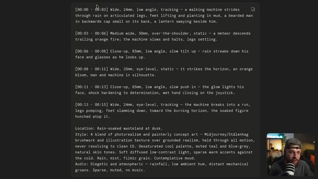
*Affichage à l'écran d'un prompt technique structuré avec des horodatages, des cadrages, des choix d'objectifs et des instructions détaillées par scène, avec la webcam du créateur en incrustation (PiP).*

---

### ⏱️ `[00:19:34 - 00:20:06]` | Segment #36

**🔊 Audio (Transcription Intégrale Mot pour Mot en Français) :**
> scène exactement comme vous vous y attendez et surtout d'une manière que Seedance 2 peut comprendre, afin que nous puissions copier cette tête directement sur OpenArt et la déposer dans le champ de texte du prompt. Aussi incroyable que soit Claude en ingénierie de prompt, je vous conseille vivement de lire le prompt et d'apporter toutes les modifications que vous jugeriez appropriées avant de dépenser vos crédits. Rappelez-vous simplement que vous êtes le créateur, la personne qui a réellement eu l'idée elle-même,

**👁️ Analyse Visuelle d'Écran (gemini-3.5-flash-lite) :**
**Interface & Outils** : Navigateur web affichant l'interface d'OpenArt (outil Seedance 2.0) avec un panneau latéral de prompts et de paramètres de génération vidéo.

**Contenu textuel & Code** : Un prompt textuel structuré par séquences temporelles ([00:00 - 00:03], [00:03 - 00:06], etc.), décrivant des mouvements de caméra et des plans cinématographiques (Wide, 24mm, low angle, tracking), ainsi qu'une section style (Location: Rain-soaked wasteland at dusk, Style: A blend of photorealism...). Le modèle sélectionné est Seedance 2.0.

**Action / Démonstration** : Le créateur montre à l'écran le prompt textuel généré, puis navigue sur l'interface d'OpenArt pour coller le prompt dans le champ de texte et préparer la génération de la vidéo.

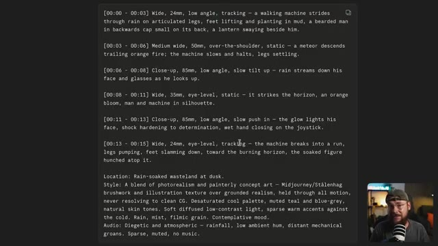
*Affichage du prompt textuel détaillé avec les différents plans de caméra (00:00 à 00:15) et les notes de style, avec le créateur en incrustation vidéo (PiP) en bas à droite.*

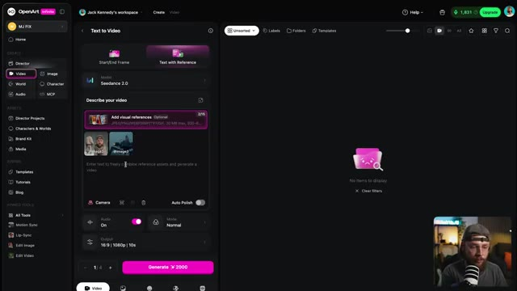
*Interface d'OpenArt (onglet Seedance 2.0) montrant le champ de description de la vidéo et l'ajout de références visuelles, avec le créateur en incrustation (PiP).*

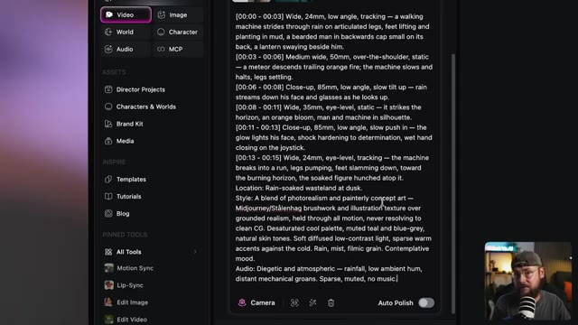
*Interface d'OpenArt affichant le texte complet du prompt collé dans le champ de génération vidéo, avec le créateur en incrustation (PiP) dans le coin inférieur droit.*

---

### ⏱️ `[00:20:07 - 00:20:46]` | Segment #37

**🔊 Audio (Transcription Intégrale Mot pour Mot en Français) :**
> Claude et C-Dance aussi, et tout ce que nous avons utilisé tout au long de cette vidéo est un outil. En fin de compte, vous avez le contrôle créatif et cela signifie que vous devriez ne faire entièrement confiance qu'à vos propres décisions créatives. Cela étant dit, si nous cliquons sur générer, nous pouvons jeter un œil à nos résultats. C'est pourquoi j'ai l'impression que combiner Midjourney, GPT Image 2 et C-Dance 2 est tout simplement absolu.

**👁️ Analyse Visuelle d'Écran (gemini-3.5-flash-lite) :**
**Interface & Outils** : Rendu vidéo généré par IA avec incrustation PiP du créateur dans le coin inférieur droit.

**Contenu textuel & Code** : Image cinématique d'un personnage de type cyborg/pilote sur un véhicule mécanique inspiré de la science-fiction dans un environnement brumeux.

**Action / Démonstration** : Présentation d'un exemple de résultat visuel généré par IA pour illustrer les propos sur les outils de création.

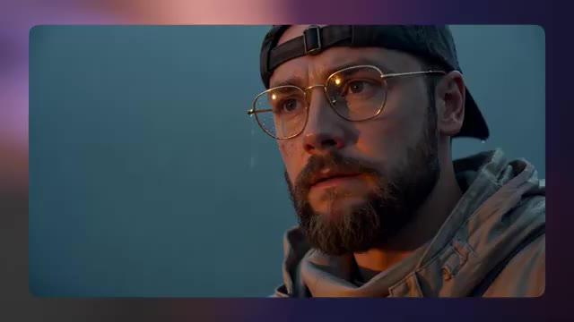
*Affichage d'une image générée par IA montrant un personnage en gros plan sous la pluie.*

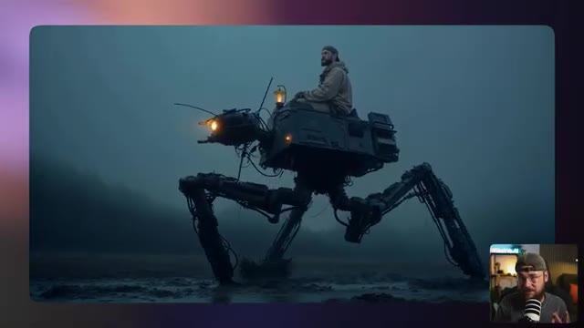
*Affichage d'un rendu vidéo généré par IA montrant un personnage pilotant un véhicule mécha à quatre pattes dans un paysage brumeux, avec le créateur en incrustation PiP dans le coin inférieur droit.*

---

### ⏱️ `[00:20:46 - 00:21:20]` | Segment #38

**🔊 Audio (Transcription Intégrale Mot pour Mot en Français) :**
> un flux de travail extrêmement puissant. Le résultat semble vraiment unique, tant du point de vue du design et de la composition que de l'animation, qui paraît également très cinématique. Vraiment, nous nous concentrons sur les meilleurs points de chaque outil d'IA afin de les combiner. Mais que faire si nous voulons aller encore plus loin en termes de contrôle sur notre résultat final ? Pour cet exemple particulier, je vais intégrer ma feuille de référence de personnage ainsi qu'une image fixe de lieu et une image de

**👁️ Analyse Visuelle d'Écran (gemini-3.5-flash-lite) :**
**Interface & Outils** : Interface web de génération vidéo par IA (style dashboard/éditeur créatif) avec un panneau de navigation à gauche (Home, Director, Video, Image, World, Character, Audio, MCP, Director Projects, Characters & Worlds, Brand Kit, Media, Templates, Tutorials) et un espace de travail central pour combiner des assets de référence.

**Contenu textuel & Code** : On aperçoit le menu latéral avec différentes sections de création, un champ de description ("Enter text to freely combine reference assets and generate a video."), et trois vignettes d'images étiquetées "@image1", "@image2" et "@image3" (montrant respectivement un personnage, un paysage aérien nuageux et des jambes/bottes), avec une superposition affichant en grand format @image2. Un petit encadré PiP en bas à droite montre le créateur face caméra.

**Action / Démonstration** : Le curseur de la souris survole les vignettes d'images de référence pour préparer ou illustrer l'injection de multiples sources visuelles (personnage, décor, image) dans l'interface de l'outil d'IA.

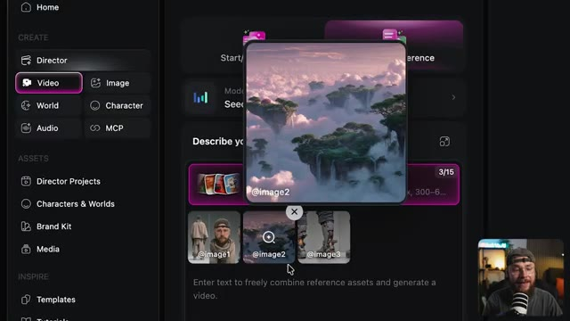
*Interface d'un outil de génération vidéo par IA montrant la sélection de plusieurs images de référence (@image1, @image2, @image3) avec une vue agrandie de @image2 représentant un paysage montagneux au-dessus des nuages.*

---

### ⏱️ `[00:21:20 - 00:21:54]` | Segment #39

**🔊 Audio (Transcription Intégrale Mot pour Mot en Français) :**
> accessoire important également. Ce sont les bottes de gravité. C'est l'image que j'ai générée à l'intérieur de Midjourney et voici notre version raffinée avec un aspect plus photoréaliste et un langage de conception qui a beaucoup plus de sens. L'emplacement lui-même avait l'air plutôt bien en sortant directement de Midjourney, mais encore une fois, il manque ce genre de texture et en fait, la palette de couleurs semble un peu plate et c'est le résultat que nous avons obtenu de GPT Image 2 et en utilisant notre flux de travail. C'est ce que nous allons utiliser pour générer notre vidéo. En termes de prompt lui-même ici, c'était aussi

**👁️ Analyse Visuelle d'Écran (gemini-3.5-flash-lite) :**
**Interface & Outils** : Interface de travail et de génération vidéo avec panneau latéral de navigation (Director Projects, Characters & Worlds, Templates, etc.) et zone de prompt détaillée.

**Contenu textuel & Code** : On peut lire des instructions détaillées de prompt : "@leapboots trailing faint orange glow through the mist", "Location: A floating archipelago of islands above the clouds at dusk", "Style: A blend of photorealism and painterly concept art", ainsi que des paramètres de caméra et des indications audio ("thud and hiss of boot thrusters").

**Action / Démonstration** : Le créateur présente successivement les différentes étapes de son workflow créatif, depuis l'image conceptuelle brute sur Midjourney jusqu'au prompt textuel final structuré pour la génération de vidéo.

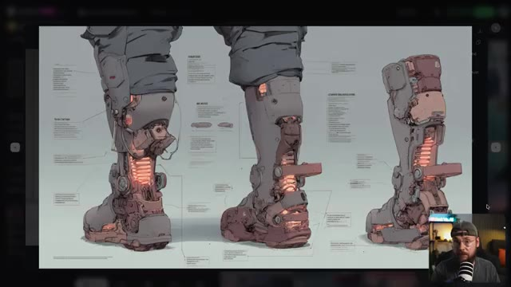
*Image conceptuelle générée par Midjourney montrant le design technique des bottes de gravité avec des annotations textuelles.*

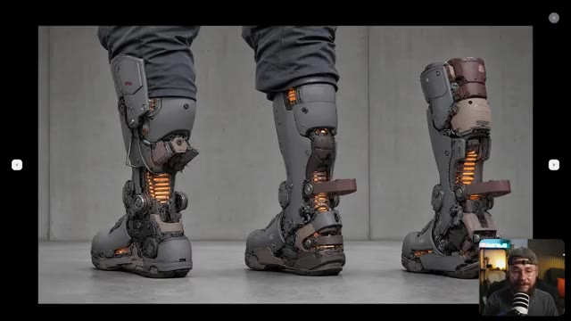
*Version raffinée et photoréaliste des bottes de gravité sur fond neutre.*

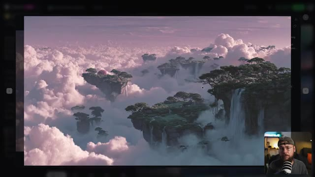
*Visuel d'un archipel d'îles flottantes au-dessus des nuages généré par IA, présentant un style pictural.*

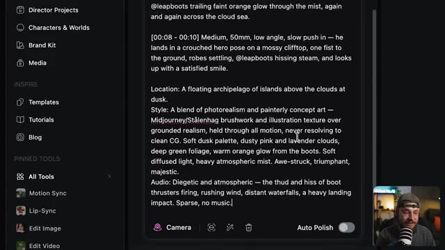
*Interface textuelle affichant les prompts de génération vidéo, décrivant les mouvements de caméra, le style artistique et les éléments audio.*

---

### ⏱️ `[00:21:54 - 00:22:36]` | Segment #40

**🔊 Audio (Transcription Intégrale Mot pour Mot en Français) :**
> conçu à l'intérieur de Claude en utilisant ce même fichier MD. J'ai juste ajouté cette petite section en haut où nous taguons le personnage, l'accessoire et le lieu. Et puis à chaque fois que tu penses que c'est pertinent, tu veux aussi aller de l'avant et faire la même chose dans la section du prompt elle-même également, juste pour être vraiment clair avec C-Dance 2. Et si on lance ça, laisse-moi te montrer le résultat qu'on récupère. Génération vraiment impressionnante ici où C-Dance 2 combine de manière significative nos

**👁️ Analyse Visuelle d'Écran (gemini-3.5-flash-lite) :**
**Interface & Outils** : Interface web de Seedance 2 (outil de génération vidéo par IA) avec panneau de configuration latéral (Director Projects, Characters & Worlds, Templates).

**Contenu textuel & Code** : Prompts structurés par tranches temporelles : "[00:00 - 00:04] Wide, 24mm, low angle, fast tracking — @image1 a bearded man in backwards cap...". Tags : Character (@image1), Prop (@image2), Location (@image3). Paramètres de style : "A blend of photorealism and painterly concept art — Midjourney/Stålenhag brushwork...".

**Action / Démonstration** : Le créateur montre l'organisation d'un prompt structuré avec des balises d'images pour le contrôle des personnages, des accessoires et des décors, puis présente le résultat vidéo généré par l'IA.

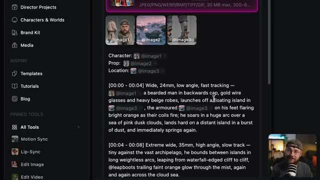
*Interface d'édition de prompt avec tags (@image1, @image2, @image3) et description de plans cinématographiques (00:00 - 00:04).*

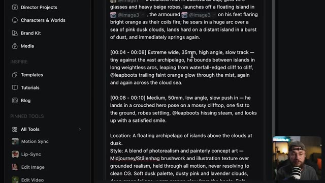
*Suite du prompt textuel détaillant les paramètres temporels, spatiaux et artistiques de la génération (style Midjourney).*

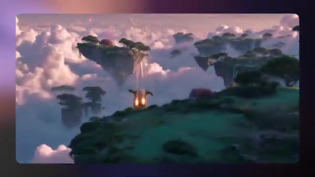
*Résultat vidéo généré montrant un personnage propulsé par des réacteurs volant au-dessus d'îles flottantes dans les nuages.*

---

### ⏱️ `[00:22:36 - 00:23:10]` | Segment #41

**🔊 Audio (Transcription Intégrale Mot pour Mot en Français) :**
> personnage, accessoire et décor. Je suis sûr que vous identifierez tout de suite tout le plaisir que vous pouvez en tirer, et combien de références vous pouvez utiliser. Vraiment, le ciel est la seule limite. Vous avez tellement de contrôle maintenant sur vos vidéos par IA. Je voulais aller de l'avant et vous montrer d'autres exemples que j'ai assemblés en utilisant ce workflow ici. Vous pouvez donc voir que j'ai combiné quelques designs de personnages différents ici. Nous avons notre personnage d'insecte que vous avez dû voir plus tôt. J'ai fait cette feuille de référence de personnages pour ce genre de truc de lapin robotique. Dieu sait ce que c'est, mais c'est cool. Et

**👁️ Analyse Visuelle d'Écran (gemini-3.5-flash-lite) :**
**Interface & Outils** : Interface de l'outil vidéo Byte Plus Seedance 2.0 avec incrustation vidéo (PiP) du créateur en bas à droite.

**Contenu textuel & Code** : Texte du prompt montrant l'utilisation de plusieurs balises de référence (@image4, @image5, @image6, @image7) combinant un homme barbu, un extraterrestre rouge cornu, un personnage masqué à gaz et un guerrier en casque de lapin. Paramètres visibles : Byte Plus Seedance 2.0, 10s, 16:9, 1080p.

**Action / Démonstration** : Le créateur montre des exemples de workflows combinant plusieurs personnages et une feuille de référence de design de personnage robotique.

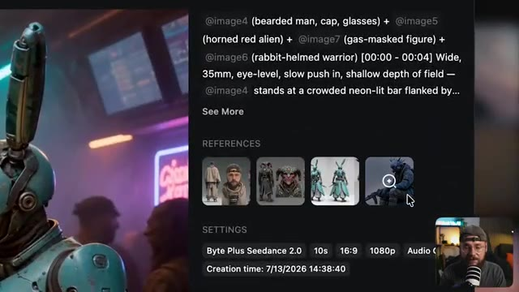
*Interface de Byte Plus Seedance 2.0 montrant les références de personnages multiples et les paramètres vidéo.*

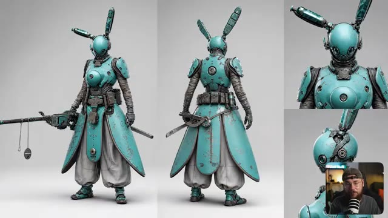
*Feuille de référence de personnage pour un guerrier robotique de type lapin turquoise.*

---

### ⏱️ `[00:23:10 - 00:23:45]` | Segment #42

**🔊 Audio (Transcription Intégrale Mot pour Mot en Français) :**
> nous avons aussi ce personnage ici. Et encore une fois, ils ont tous l'air nettement mid-journey. Je ne vois pas comment vous pourriez obtenir ces résultats avec un outil comme GPT Image 2 ou Nano Banana. Donc, aussi génial que soit ce résultat, vous remarquerez que nous avons ce personnage supplémentaire ici qui a été ajouté, alors pourquoi est-ce arrivé, était-ce la faute de c dance 2 ? en fait c'était la mienne et c'est pourquoi vous devez

**👁️ Analyse Visuelle d'Écran (gemini-3.5-flash-lite) :**
**Interface & Outils** : Interface d'un outil de génération vidéo par IA (probablement Seedance/C-Dance) avec panneau de prompt latéral, lecteur vidéo intégré et options de modification.

**Contenu textuel & Code** : Texte du prompt visible sur le panneau latéral décrivant la scène de la cantine futuriste, le style et les mouvements de caméra par horodatage (@00:00 - 00:04, @00:04 - 00:07, etc.).

**Action / Démonstration** : Le créateur présente différents visuels générés par IA (personnages et scènes de groupe) tout en expliquant les détails de génération et les erreurs d'interprétation des prompts par l'outil.

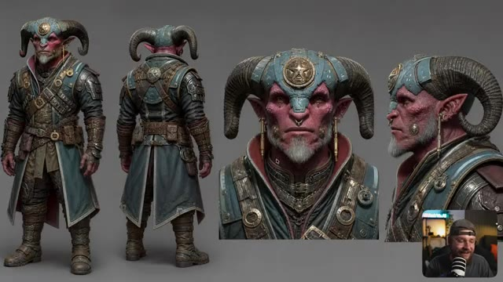
*Affiche un personnage fantastique humanoïde à cornes et peau rouge, montré sous plusieurs angles (vue de face, de dos et gros plans du visage) avec le créateur en incrustation PiP.*

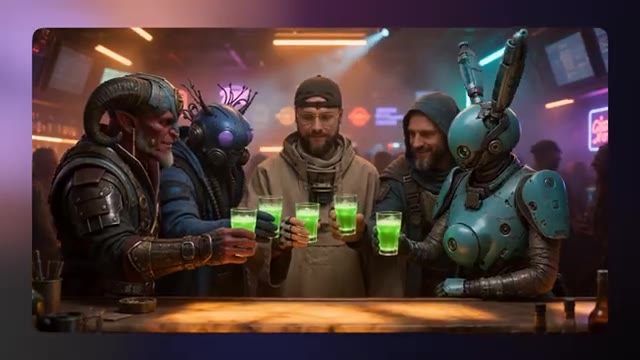
*Affiche une scène générée par IA montrant un groupe de personnages variés (humain, extraterrestre, robot lapin) trinquant avec des verres de liquide vert dans un bar.*

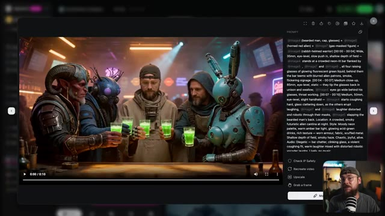
*Affiche l'interface logicielle d'un outil vidéo IA avec un lecteur vidéo montrant la scène du bar, le panneau de prompt textuel sur la droite et le créateur en incrustation PiP.*

---

### ⏱️ `[00:23:45 - 00:24:21]` | Segment #43

**🔊 Audio (Transcription Intégrale Mot pour Mot en Français) :**
> pour être vraiment clair avec vos prompts et utiliser le système de balisage maintenant vous remarquerez qu'il y a une partie de mon prompt où je demande en fait à l'un des personnages de taper l'homme barbu dans le dos et c'est ma faute parce qu'ici j'aurais dû baliser ma feuille de référence de personnage en étant un peu vague sur un homme barbu Seedance 2 a ressenti le besoin d'ajouter un nouveau personnage donc je dois lever les mains ici c'était en fait de la mauvaise ingénierie de prompt de ma part j'ai en fait relancé exactement le même prompt à nouveau en faisant juste les changements et nous avons perdu ce personnage supplémentaire bien que

**👁️ Analyse Visuelle d'Écran (gemini-3.5-flash-lite) :**
**Interface & Outils** : Interface logicielle de génération vidéo par IA (Seedance) avec panneau de prompt latéral, lecteur vidéo intégré et encadré PiP du créateur.

**Contenu textuel & Code** : Texte du prompt visible : mentions des plans de caméra (35mm, 80mm), description d'une cantine extraterrestre cyberpunk enfumée, personnages levant des verres de liquide vert fluorescent, et mention en surbrillance « slapping the bearded man's back ».

**Action / Démonstration** : Le créateur montre son interface de prompt et les détails textuels de sa génération vidéo dans Seedance, expliquant l'erreur de balisage de personnage.

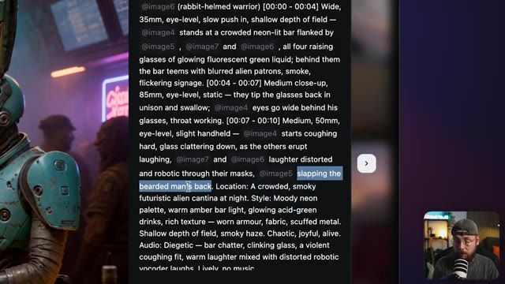
*Affichage d'un prompt textuel détaillé sur l'interface avec du texte en surbrillance concernant le personnage barbu.*

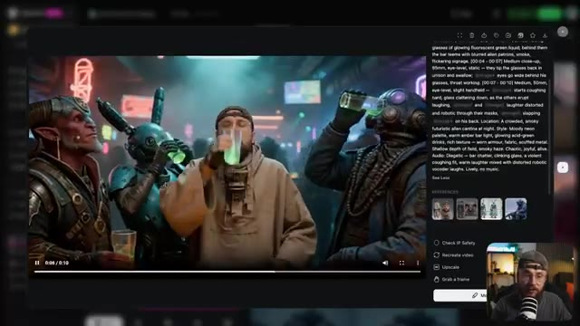
*Aperçu d'une scène de cantine cyberpunk générée par IA avec plusieurs personnages buvant des verres fluorescents.*

---

### ⏱️ `[00:24:21 - 00:24:58]` | Segment #44

**🔊 Audio (Transcription Intégrale Mot pour Mot en Français) :**
> Malheureusement, je n'aime pas vraiment autant le résultat et les lunettes se dupliquent, ce qui pose un autre problème. Ceci étant dit, les gars, nous sommes arrivés à la fin de la vidéo d'aujourd'hui. J'espère vraiment qu'elle vous a plu. J'ai l'impression que c'est une solide démonstration de la façon dont vous pouvez réellement intégrer Midjourney dans vos propres flux de travail de réalisation de films par IA. Pendant très longtemps, beaucoup de créateurs avaient en quelque sorte fait une croix sur Midjourney en raison des problèmes qu'il présente, et vous savez quoi, c'est compréhensible, il y a pas mal de problèmes avec cet outil, mais à mon sens, rien ne vaut le style unique de Midjourney.

**👁️ Analyse Visuelle d'Écran (gemini-3.5-flash-lite) :**
**Interface & Outils** : Interface de lecteur vidéo/générateur avec panneau latéral affichant les détails de la scène et les prompts descriptifs.

**Contenu textuel & Code** : Texte du prompt visible sur le panneau latéral décrivant une cantine extraterrestre futuriste sombre et enfumée, une palette de néons ambrés, ainsi que des spécifications techniques de caméra.

**Action / Démonstration** : Affichage des résultats visuels générés par Midjourney et intégrés dans le workflow vidéo, avec le créateur visible en incrustation PiP dans le coin inférieur droit.

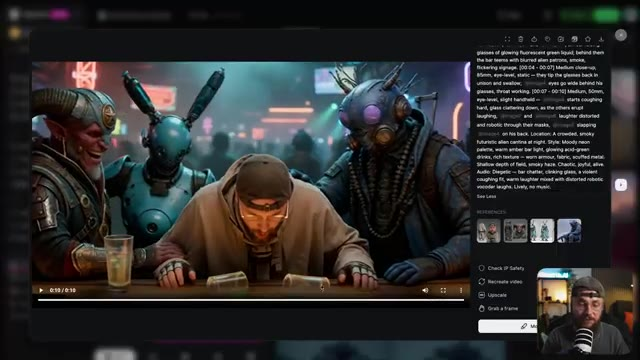
*Interface de lecture vidéo avec panneau de prompts détaillé sur le côté droit montrant une scène de cantine futuriste.*

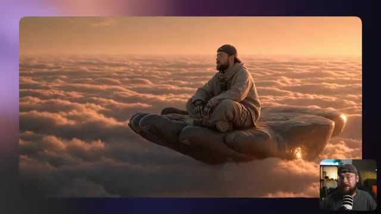
*Scène générée par IA montrant le créateur assis en tailleur sur une main géante flottant au-dessus des nuages au coucher du soleil.*

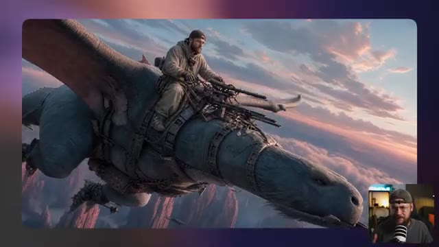
*Scène générée par IA montrant le créateur chevauchant un dragon volant harnaché au-dessus des nuages et de montagnes.*

---

### ⏱️ `[00:24:58 - 00:25:20]` | Segment #45

**🔊 Audio (Transcription Intégrale Mot pour Mot en Français) :**
> du style de son utilisation de la couleur et de la composition cela ajoute une étape supplémentaire dans votre flux de travail mais je pense vraiment que ça en vaut la peine pour obtenir un résultat final qui se démarquera de la concurrence bien sûr les gars si vous avez apprécié la vidéo d'aujourd'hui assurez-vous de mettre un pouce bleu dessus pour moi et pensez à vous abonner j'apprécie vraiment votre visionnage et votre soutien continu.

**👁️ Analyse Visuelle d'Écran (gemini-3.5-flash-lite) :**
**Interface & Outils** : Présentation vidéo avec incrustation (Picture-in-Picture) de Jack dans son studio, affichant des exemples de rendus vidéo générés par IA.

**Contenu textuel & Code** : Exemples de vidéos générées par IA illustrant le style, la couleur et la composition mentionnés dans le discours.

**Action / Démonstration** : Diffusion d'extraits de vidéos générées par IA pendant que le créateur commente la qualité du résultat final.

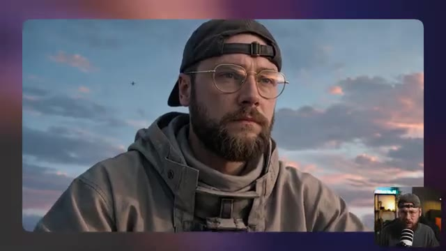
*Rendu vidéo généré par IA montrant un personnage barbu avec casquette et lunettes sur fond de ciel au crépuscule.*

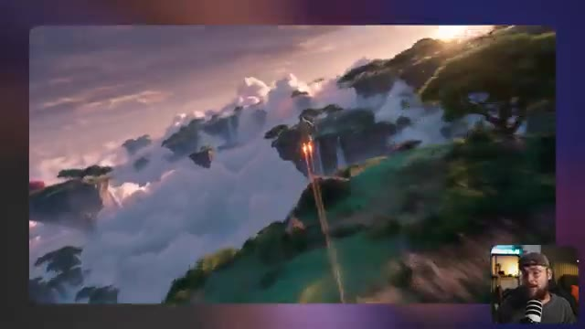
*Rendu vidéo aérien généré par IA montrant des îles flottantes dans les nuages avec un personnage propulsé par des réacteurs.*

---

### ⏱️ `[00:25:20 - 00:25:22]` | Segment #46

**🔊 Audio (Transcription Intégrale Mot pour Mot en Français) :**
> Je te retrouve dans la prochaine vidéo.

**👁️ Analyse Visuelle d'Écran (gemini-3.5-flash-lite) :**
**Interface & Outils** : Présentation face caméra sans partage d'écran

**Contenu textuel & Code** : Aucun contenu logiciel ou visuel démonstratif à l'écran, uniquement un fondu ou un flou de transition aux tons violets et sombres.

**Action / Démonstration** : Fin de vidéo, le créateur conclut et salue son audience.

---
