# 🎬 Comment un pro des VFX mélange images réelles et IA (Prompts & Matériaux GRATUITS)

> **Chaîne** : [Jack Vs. AI](https://www.youtube.com/@JackVsAI)  
> **Titre original** : `How a Pro VFX Artist Mixes Real Footage with AI (FREE Prompts & Materials)`  
> **Lien YouTube** : [https://www.youtube.com/watch?v=BiXWH3QUX1Q](https://www.youtube.com/watch?v=BiXWH3QUX1Q)  
> **Date de publication** : 2026-07-26  
> **Durée** : 22m 39s (`1359s`)  
> **Identifiant vidéo** : `BiXWH3QUX1Q`  
> **Fiche Web Interactive** : [2026-07-26_YT-BiXWH3QUX1Q_Comment un pro des VFX mélange images réelles et IA (Prompts & Matériaux GRATUIT_by-whisper-v3-large-turbo+gemini-3.5-flash-lite.html](2026-07-26_YT-BiXWH3QUX1Q_Comment un pro des VFX mélange images réelles et IA (Prompts & Matériaux GRATUIT_by-whisper-v3-large-turbo+gemini-3.5-flash-lite.html)  
> **Captures de démonstration clés** : `86 captures réelles (anti-talking-head)`  
> **Modèles utilisés** : Audio: `large-v3-turbo` (Faster-Whisper int8 VPS) | Vision: `gemini-3.5-flash-lite` (Google AI Studio API)  

---

## 📌 Synthèse Exécutive & Outils

### 📌 Résumé
Dans cette vidéo, Jack, un superviseur VFX chevronné, démontre comment les flux de travail par IA générative permettent aujourd'hui de réaliser des effets visuels de niveau professionnel (VFX) autrefois réservés à des studios disposant de budgets massifs et d'années d'expérience. En combinant habilement des séquences tournées en prises de vues réelles (live-action) et la puissance de modèles vidéo de pointe, il est désormais possible de transformer des plans entiers — décors, éclairages, costumes, éléments fantastiques — tout en préservant la performance d'origine, le minutage et la synchronisation labiale du sujet.

La méthode repose sur une rigueur de production rigoureuse héritée des flux VFX traditionnels : préparation des calages, décomposition des éléments de la scène et utilisation de « références d'ancrage » (annotations visuelles, captures annotées). Jack révèle comment structurer et industrialiser la création de prompts complexes en s'appuyant sur des LLM (comme Claude) alimentés par des compétences personnalisées (`.md`), évitant ainsi les approximations et garantissant que l'IA respecte le cadrage et la mise en scène d'origine.

À travers des cas pratiques concrets — du pelage d'une application d'ordinateur portable agissant comme une feuille de plastique aux effets pyrotechniques complexes —, ce tutoriel offre aux créateurs de contenu, cinéastes indépendants et publicitaires une feuille de route accessible, économique et redoutablement efficace. En adoptant cette méthodologie, l'utilisateur passe d'un simple générateur de prompts aléatoires à un véritable directeur artistique capable d'exercer un contrôle chirurgical sur ses productions visuelles assistées par IA.

### 🛠️ Outils, Modèles & Logiciels Présentés
* **Claude** : Assistant LLM principal utilisé pour concevoir, rédiger et structurer des prompts VFX hautement techniques à partir d'un fichier de compétences personnalisé (`.md`) et de références visuelles.
* **Higgsfield** : Plateforme d'IA générative vidéo qui héberge les moteurs de pointe et sert d'interface centrale pour l'importation des sources et des références.
* **Seedance (Seedance 2)** : Modèle de génération vidéo hébergé sur Higgsfield, utilisé pour exécuter les transformations complexes en combinant la vidéo source, les images de référence et les prompts textuels texturisés.
* **Midjourney** : Mentionné dans l'écosystème global de création d'actifs visuels et de génération d'éléments graphiques personnalisés.
* **Flux** : Modèle de génération d'images haute fidélité utilisé pour concevoir les textures et éléments graphiques intégrés dans les plans.
* **ChatGPT / Gemini / Grok** : LLM alternatifs compatibles avec le fichier de compétences personnalisé `.md` pour la génération de prompts de pointe.

### 🔑 Points Clés & Enseignements Stratégiques
* **Hybridation Live-Action et IA** : Le secret d'un bon VFX par IA réside dans le mariage entre la performance réelle (acteur, mouvement de caméra, timing) et des surcouches génératives qui s'intègrent de manière transparente sans dénaturer la source.
* **Décomposition méthodique des actifs** : Avant de lancer une génération, il faut identifier et isoler chaque élément manquant de la scène (arrière-plan masqué, textures, objets au premier plan) pour les fournir à l'IA en tant qu'images de référence distinctes.
* **Utilisation de fichiers de compétences LLM (`.md`)** : Programmer un LLM (comme Claude) avec une structure de prompt spécifique aux VFX permet d'automatiser l'écriture technique sans avoir besoin d'être un expert en formulation textuelle.
* **Le concept de « référence d'ancrage »** : Pour contrer les velléités artistiques anarchiques de l'IA, l'utilisation de captures d'écran annotées (par exemple, un tracé rouge indiquant où placer une boule de feu) force le modèle à respecter la mise en scène exacte.
* **Gestion intelligente des crédits (Tests en basse résolution)** : Il est vivement recommandé d'effectuer tous les tests de prompts et d'itérations en résolution 480p pour économiser des crédits précieux avant de basculer en 1080p pour le rendu final.
* **Harmonisation des formats et des durées** : Pour garantir une fusion parfaite, les paramètres de durée, de format d'image (aspect ratio) et de cadence de la génération IA doivent correspondre rigoureusement à ceux de la séquence source.
* **L'importance des détails physiques (Réflexions et textures)** : Ce qui crédibilise un effet visuel (comme une feuille de plastique décollée d'un écran), ce sont les interactions lumineuses, les reflets dynamiques et la physique de l'objet simulé par le modèle.
* **Transparence et prototypage itératif** : N'hésitez pas à injecter plusieurs sources de contexte (vidéo source, image de l'écran, image de l'arrière-plan, croquis d'ancrage) dans le LLM pour réduire le taux d'erreur dès la première génération.
* **Économie de production massive** : Ce flux de travail démocratise des plans autrefois impossibles pour les créateurs indépendants, réduisant drastiquement les coûts de post-production traditionnels en combinant le meilleur de la 3D/VFX et de la génération procédurale.

---

## ⏱️ Chronologie & Transcription Complète Audio & Visuelle (Mot pour Mot)

### ⏱️ `[00:00:00 - 00:00:19]` | Segment #01

**🔊 Audio (Transcription Intégrale Mot pour Mot en Français) :**
> Créer des plans d'effets visuels époustouflants avec l'IA n'a jamais été aussi simple. Ce que vous voyez était autrefois réservé à des artistes ayant des années d'expérience et un accès à des logiciels incroyablement coûteux. Mais ce n'est plus le cas ! Je m'is Jack, j'ai passé plus d'une décennie à créer des effets visuels pour beaucoup des plus grandes marques de la planète.

**👁️ Analyse Visuelle d'Écran (gemini-3.5-flash-lite) :**
**Interface & Outils** : Présentation face caméra sans partage d'écran

**Contenu textuel & Code** : Aucun texte d'interface, code ou prompt visible. Uniquement du texte incrusté en sous-titres ("and access to", "many of the biggest brands on the planet").

**Action / Démonstration** : Le créateur (Jack) s'adresse directement à la caméra dans son studio, en gesticulant pour illustrer son propos, avec un effet visuel de boule de feu incrusté sur sa main sur l'image 1, et des images comparatives sur l'image 2. Aucune démonstration de logiciel n'est affichée.

---

### ⏱️ `[00:00:19 - 00:00:38]` | Segment #02

**🔊 Audio (Transcription Intégrale Mot pour Mot en Français) :**
> Et maintenant, j'utilise l'IA pour réinventer les flux de travail créatifs. Dans cette vidéo, je vais vous montrer comment combiner des séquences réelles avec des éléments et des effets générés par l'IA, pour créer des plans qui auraient été presque impossibles pour un créateur moyen jusqu'à présent. Et je partagerai tous mes prompts et matériaux de manière entièrement gratuite.

**👁️ Analyse Visuelle d'Écran (gemini-3.5-flash-lite) :**
**Interface & Outils** : Présentation vidéo avec incrustations graphiques et comparaisons avant/après d'effets visuels.

**Contenu textuel & Code** : Texte à l'écran : "assets and effects" sur l'image 2 et "and materials" sur l'image 3.

**Action / Démonstration** : Le créateur montre des comparaisons côte à côte entre des séquences vidéo originales et des versions modifiées par des effets d'IA.

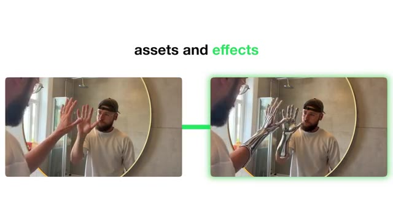
*Comparaison avant/après illustrant l'ajout d'effets visuels sur le bras de Jack touchant un miroir, avec le texte "assets and effects" au-dessus.*

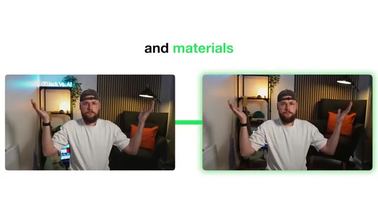
*Comparaison avant/après illustrant des modifications d'étalonnage ou de matériaux dans le studio de Jack, avec le texte "and materials" au-dessus.*

---

### ⏱️ `[00:00:38 - 00:01:12]` | Segment #03

**🔊 Audio (Transcription Intégrale Mot pour Mot en Français) :**
> Donc d'ici la fin, vous saurez exactement comment créer des plans d'effets visuels comme ceux-ci pour votre prochain court-métrage, clip musical ou publicité pour un client. Si vous aimez le contenu d'aujourd'hui, n'hésitez pas à mettre un pouce bleu pour moi et pensez à vous abonner. C'est parti. Donc comme vous pouvez le voir, il est désormais possible de combiner de vraies images avec l'IA pour produire une grande variété de plans d'effets visuels. Et avec les techniques que je vais démontrer dans cette vidéo, vous obtenez un niveau de contrôle impressionnant sur votre résultat final. Nous pouvons donc intégrer des éléments d'effets visuels

**👁️ Analyse Visuelle d'Écran (gemini-3.5-flash-lite) :**
**Interface & Outils** : Présentation vidéo avec exemples de plans d'effets visuels et incrustation (PiP) du créateur en bas à droite.

**Contenu textuel & Code** : Widget graphique d'appel à l'action YouTube (pouce bleu et bouton d'abonnement) sur l'image #2. Exemples visuels de trucages par IA (paysage enneigé, corps musclé surdimensionné, interaction avec un miroir).

**Action / Démonstration** : Démonstration visuelle d'exemples de plans d'effets visuels générés par IA illustrant les propos du créateur, accompagnée d'un encadré PiP montrant Jack en studio.

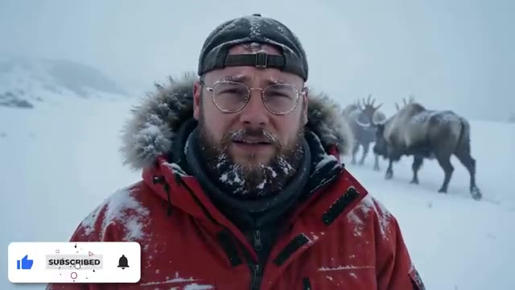
*Exemple de plan d'effets visuels montrant Jack dans la neige avec des animaux sauvages en arrière-plan et un widget d'abonnement YouTube en bas à gauche.*

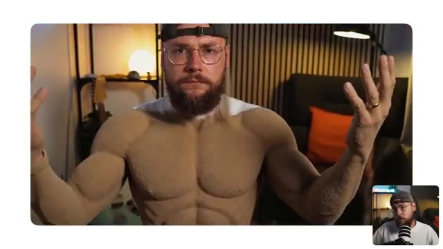
*Exemple de plan d'effets visuels montrant Jack avec un costume de torse musclé exagéré, avec une incrustation vidéo (PiP) de Jack dans son studio en bas à droite.*

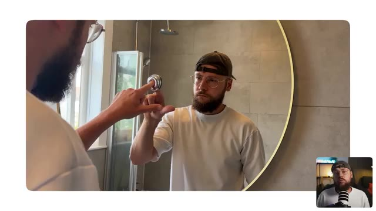
*Exemple de plan d'effets visuels dans une salle de bain où Jack touche le miroir rond, avec une incrustation vidéo (PiP) de Jack dans son studio en bas à droite.*

---

### ⏱️ `[00:01:12 - 00:01:48]` | Segment #04

**🔊 Audio (Transcription Intégrale Mot pour Mot en Français) :**
> tout en préservant la synchronisation labiale, le minutage et la performance globale de la séquence source. Ou nous pouvons complètement changer l'environnement, l'éclairage et les costumes tout en utilisant la séquence originale comme guide. J'ai dépensé énormément de crédits pour réaliser des tests très détaillés afin de pouvoir vous transmettre un flux de travail solide que vous pourrez utiliser pour vos propres projets créatifs. Nous allons commencer lentement, puis progresser vers des résultats vraiment complexes, y compris la création d'actifs IA personnalisés et leur intégration dans votre séquence source. Alors assurez-vous de rester jusqu'au bout pour voir ça.

**👁️ Analyse Visuelle d'Écran (gemini-3.5-flash-lite) :**
**Interface & Outils** : Présentation face caméra sans partage d'écran (aucune interface logicielle affichée à l'écran).

**Contenu textuel & Code** : Aucun texte, prompt ou paramètre technique affiché à l'écran.

**Action / Démonstration** : Jack parle face à la caméra dans son studio en gesticulant pour illustrer ses propos, avec un retour vidéo incrusté (Picture-in-Picture) de lui-même dans le coin inférieur droit.

---

### ⏱️ `[00:01:48 - 00:02:24]` | Segment #05

**🔊 Audio (Transcription Intégrale Mot pour Mot en Français) :**
> vers la fin de la vidéo. Donc le premier effet que je veux examiner est un effet qui est devenu plutôt viral. Vous l'avez probablement vu sur les réseaux sociaux récemment et c'est cet effet de pelage d'écran où nous pelons une tuile d'application d'un ordinateur portable par exemple et elle se comporte comme une feuille de plastique. Sur Higgs Field, nous voulons nous rendre dans le coin supérieur gauche, survoler l'onglet vidéo puis sélectionner C-Dance 2. Une fois ici, vous voulez importer vos séquences sources, ce qui est exactement comme vous l'imagineriez en train de faire semblant de peler cette tuile d'application. Ensuite, nous devons penser à tous les actifs supplémentaires que nous pouvons

**👁️ Analyse Visuelle d'Écran (gemini-3.5-flash-lite) :**
**Interface & Outils** : Interface web de la plateforme Higgs Field montrant les onglets de navigation (Explore, Image, Video, Audio, Cinema Studio, etc.) et le panneau de contrôle de Seedance 2.0.

**Contenu textuel & Code** : Texte affiché sur l'interface : "Create Video", "Seedance 2.0", "Model: Seedance 2.0 v1", "Prompt", et sur le panneau de droite des instructions textuelles sur l'identité et le mouvement ("Match the source footage Video 1 exactly...").

**Action / Démonstration** : Le créateur montre un exemple d'effet visuel viral (pelage d'écran) puis navigue dans l'interface de Higgs Field (Seedance 2.0) pour expliquer l'importation de la vidéo source et la configuration des paramètres.

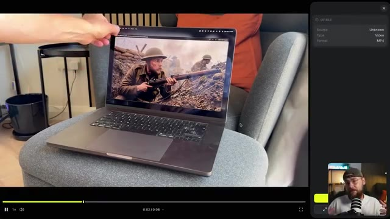
*Capture montrant l'effet vidéo d'une main pelant l'écran d'un ordinateur portable affichant une scène militaire.*

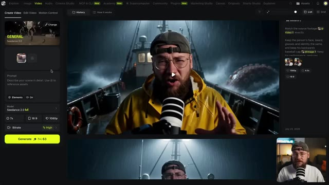
*Interface de l'outil Higgs Field (Seedance 2.0) montrant un aperçu vidéo central avec les options de génération à gauche et les réglages à droite.*

---

### ⏱️ `[00:02:24 - 00:02:57]` | Segment #06

**🔊 Audio (Transcription Intégrale Mot pour Mot en Français) :**
> un téléchargement qui sera utile pour C-Dance 2. Il s'agit de décomposer cet effet d'une manière vraiment pratique et ici je pense vraiment au calage. Dans les images sources, nous ne pouvons pas réellement voir l'arrière-plan du bureau. La plupart est caché par cette vignette d'application. Donc immédiatement j'ai identifié qu'il vaudrait la peine de prendre une capture d'écran de l'arrière-plan de mon bureau vide et de télécharger ceci comme référence d'image. Et bien que nous puissions voir l'image dans la vignette de l'application elle-même, qui est cette génération de moi

**👁️ Analyse Visuelle d'Écran (gemini-3.5-flash-lite) :**
**Interface & Outils** : Interface de l'application C-Dance 2 / Navigateur web sur macOS.

**Contenu textuel & Code** : Panneau latéral avec les sections "Details" (Source: Original Upload, Type: Image, Format: PNG) et "Edit Image" (Color Grading, Upscale, Enhancer, Relight, Inpaint, Angles). Vidéo d'une scène de guerre avec des soldats dans des tranchées.

**Action / Démonstration** : Le créateur montre un ordinateur portable affichant une vidéo source, puis bascule sur l'interface de l'application C-Dance 2 pour illustrer l'analyse des calques et des images de référence.

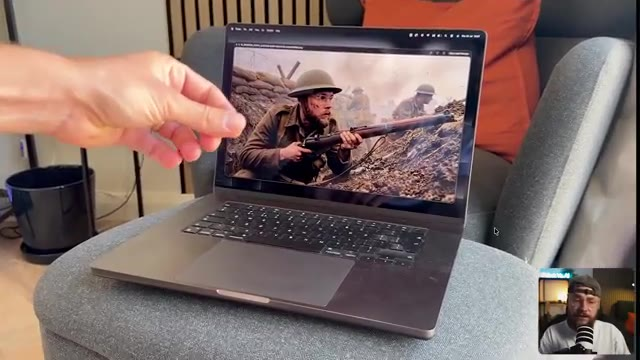
*Ordinateur portable affichant une vidéo de style historique/guerre dans un navigateur, avec une main en arrière-plan.*

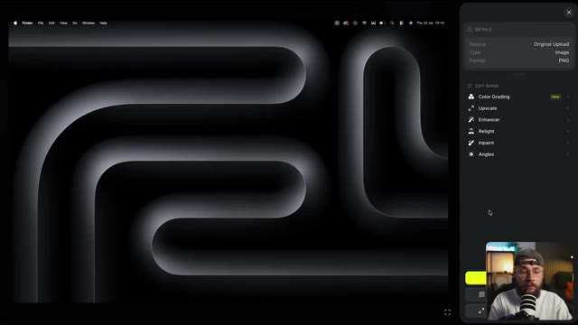
*Interface de l'application C-Dance 2 montrant un fond d'écran abstrait noir et gris et un panneau latéral de réglages.*

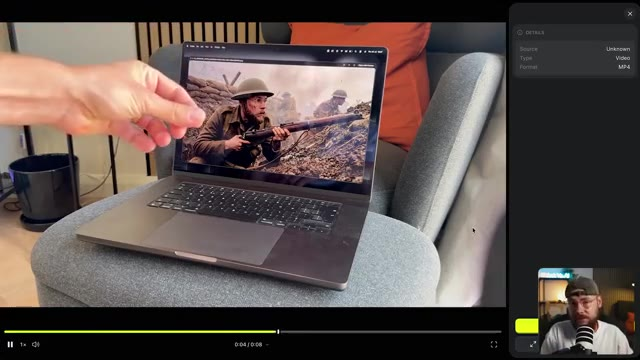
*Interface de l'application C-Dance 2 montrant un ordinateur portable avec une vidéo de guerre, et une barre de lecture en bas.*

---

### ⏱️ `[00:02:57 - 00:03:33]` | Segment #07

**🔊 Audio (Transcription Intégrale Mot pour Mot en Français) :**
> En tant que soldat de la Première Guerre mondiale, nous le visualisons sous un angle très spécifique et c'est assez éloigné de l'objectif de la caméra. Puisque nous voulons pouvoir traiter ceci comme son propre élément distinct, il est important de le télécharger également en tant que référence d'image. Maintenant, il nous manque une dernière pièce du puzzle, le prompt textuel. C'est ce qui va tout lier pour nous. Il va dire à C-Dance 2 comment utiliser nos séquences et les combiner avec nos références. Maintenant, écrire un bon prompt n'est pas facile. Ces modèles nécessitent un niveau de précision détaillé et c'est pourquoi la majorité de l'IA

**👁️ Analyse Visuelle d'Écran (gemini-3.5-flash-lite) :**
**Interface & Outils** : Interface de lecteur multimédia, interface d'édition/visualisation d'image avec menu latéral, et interface d'une application web de type assistant textuel/IA (avec mention "Opus 4.8 Medium").

**Contenu textuel & Code** : Textes visibles : "DETAILS", "Source", "Type", "Format", "MP4", "Original Upload", "PNG", "EDIT IMAGE", "Color Grading", "Upscale", "Enhancer", "Relight", "Inpaint", "Angles", "Let's noodle", "How can I help you today?", "Opus 4.8 Medium".

**Action / Démonstration** : Le créateur montre des exemples de séquences vidéo et d'images de référence de soldats de la Première Guerre mondiale, puis bascule sur une interface textuelle pour l'écriture de prompts.

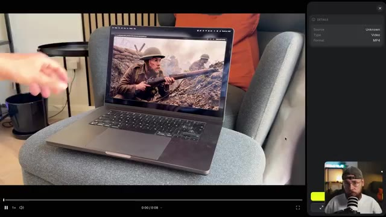
*Aperçu d'un ordinateur portable affichant une vidéo de soldats dans une tranchée, avec un panneau de détails sur le côté droit.*

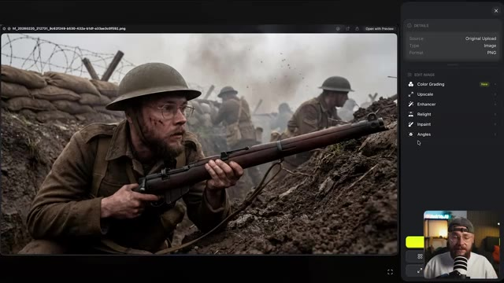
*Gros plan d'une image fixe haute définition représentant un soldat dans une tranchée avec un casque et un fusil, avec un menu d'édition d'image sur le côté droit.*

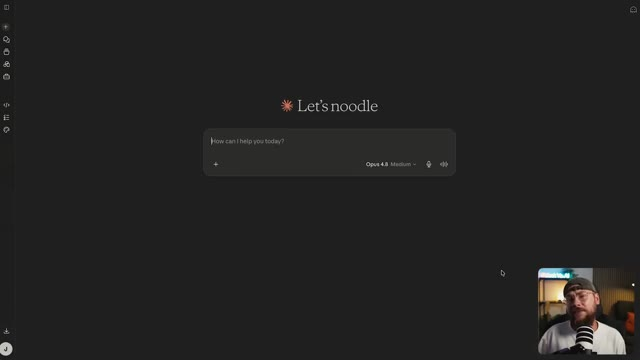
*Interface sombre d'une application ou d'un site web avec le texte "Let's noodle" et une barre de saisie de texte au centre.*

---

### ⏱️ `[00:03:33 - 00:04:11]` | Segment #08

**🔊 Audio (Transcription Intégrale Mot pour Mot en Français) :**
> les cinéastes utiliseront quelque chose comme Claude, ChatGPT ou Gemini pour les aider à concevoir leurs prompts. Je suis donc sur mon IA de prédilection qui est Claude et vous pouvez voir que j'ai téléchargé ce fichier MD. Il s'agit d'une compétence personnalisée que j'ai développée dans le but spécifique d'écrire des prompts pour des plans d'effets visuels et vous pourrez y accéder de manière totalement gratuite sur notre communauté school. Le lien pour cela se trouve en bas dans la description. La grande chose à propos de ce fichier MD est qu'il fonctionnera également sur ChatGPT, Gemini, Grok ou n'importe quel LLM que vous préférez. Nous voulons également télécharger ces références

**👁️ Analyse Visuelle d'Écran (gemini-3.5-flash-lite) :**
**Interface & Outils** : Interface web de l'assistant IA Claude avec un affichage en Picture-in-Picture (PiP) du créateur en bas à droite.

**Contenu textuel & Code** : Texte affiché : "Let's noodle", "How can I help you today?", "Opus 4.8 Medium", et dans l'image 3 un fichier nommé "VFX-PROMPT-BUILDER-SKILL.md" aux côtés de deux images de référence.

**Action / Démonstration** : Le créateur montre l'interface de Claude avec le fichier de compétences personnalisé importé et s'apprête à téléverser des images de référence.

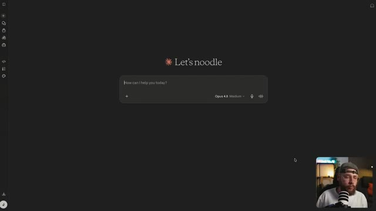
*Interface de l'assistant IA Claude affichant la zone de saisie de prompt et un encadré PiP du créateur.*

*Interface de Claude montrant le fichier .md importé et des images de référence téléversées.*

---

### ⏱️ `[00:04:11 - 00:04:47]` | Segment #09

**🔊 Audio (Transcription Intégrale Mot pour Mot en Français) :**
> des images que nous avons données à C-Dance 2 pour que Claude ait le même niveau de contexte. J'aime aussi prendre une capture d'écran de mes images sources pour que Claude puisse comprendre le cadrage et la mise en scène. Maintenant que toutes ces références sont téléchargées, je suis prêt à décrire le type d'effet que je recherche. Le plus grand avantage, c'est que je n'ai pas besoin d'être trop technique ici, car Claude va faire tout le travail difficile pour nous en utilisant ce fichier MD. Je vais donc dire que je veux que mes mains s'étendent vers l'ordinateur portable et qu'au moment où je saisis le coin supérieur de celui-ci, je décolle cette vignette d'application.

**👁️ Analyse Visuelle d'Écran (gemini-3.5-flash-lite) :**
**Interface & Outils** : Interface web de type assistant IA (Claude, intitulée "Let's noodle" avec le modèle réglé sur "Opus 4.8 Medium").

**Contenu textuel & Code** : Fichier Markdown "VFX-PROMPT-BUILDER-SKILL.md", vignettes d'images de référence (soldat en trench, texture noire, photo de la main soulevant l'écran), et champ de saisie avec le texte du prompt en anglais décrivant l'action de décoller une vignette d'application d'un écran de Mac.

**Action / Démonstration** : Le créateur montre l'importation de ses fichiers de référence dans l'interface de Claude puis saisit le prompt décrivant l'effet visuel recherché.

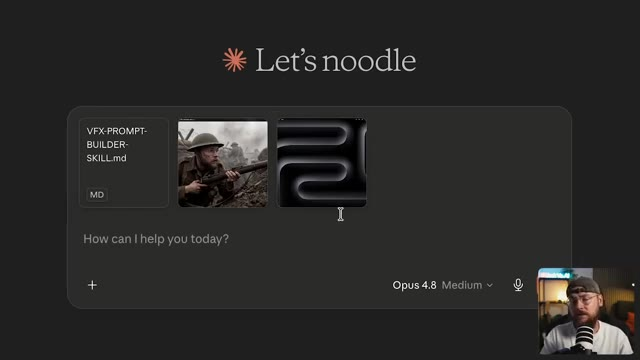
*Interface de l'outil Claude ("Let's noodle") affichant un fichier Markdown (VFX-PROMPT-BUILDER-SKILL.md) et deux images de référence uploadées.*

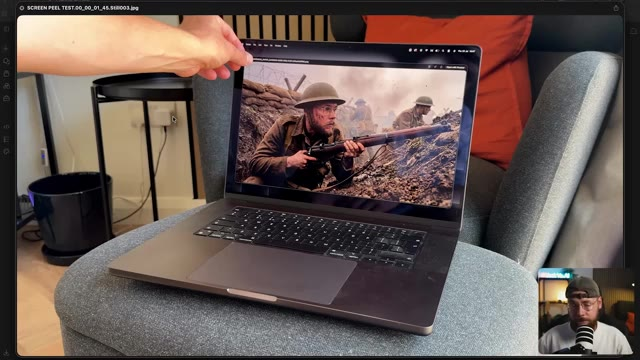
*Vue montrant une main en train de décoller l'écran d'un ordinateur portable Mac affichant une image de soldat.*

*Interface de l'outil Claude montrant quatre fichiers de référence uploadés (un fichier Markdown, une image de soldat, une texture abstraite et la photo de l'ordinateur portable) accompagnés d'un prompt textuel détaillé sur l'effet recherché.*

---

### ⏱️ `[00:04:47 - 00:05:17]` | Segment #10

**🔊 Audio (Transcription Intégrale Mot pour Mot en Français) :**
> hors de l'écran du Mac. Cela laisse ensuite le bureau vide, comme vous pouvez le voir dans ma référence. Je veux que cette tuile décollée ait toujours des coins arrondis et se comporte un peu comme l'une de ces fines feuilles plastifiées que l'on pourrait utiliser pour un projecteur. Je vais également télécharger l'image elle-même qui est affichée sur l'écran ainsi que l'arrière-plan du bureau. Et une fois que nous aurons envoyé tout cela, vous allez voir que Claude se met au travail et commence à lire la compétence de construction de prompts VFX.

**👁️ Analyse Visuelle d'Écran (gemini-3.5-flash-lite) :**
**Interface & Outils** : Interface web d'un assistant de type LLM (style Claude) avec zone de prompt textuel, pièces jointes (fichiers Markdown et images) et affichage du processus de réflexion en cours.

**Contenu textuel & Code** : Texte du prompt saisi : "I want my hand to reach over to the laptop, and then, as I grab the top corner of it, I peel that app tile off of the Mac screen. It then leaves the plain desktop, as you can see in my reference. I want that peeled tile to still have rounded corners and behave a bit like one of those thin plastic-y sheets that you might use for a projector. I'll also upload the image itself that's being shown on the screen, as well as the desktop background." Étapes de réflexion de l'IA : "Thinking about creating a peeling app tile animation with physics-based behavior and visual effects" et "Read the VFX prompt builder skill". Fichiers joints : "VFX-PROMPT-BUILDER-SKILL.md" et images de référence. Modèle sélectionné : "Opus 4.8 Medium".

**Action / Démonstration** : L'interface affiche le texte du prompt en cours de soumission, puis l'assistant IA commence à analyser et à exécuter la tâche en lisant le fichier de compétences VFX.

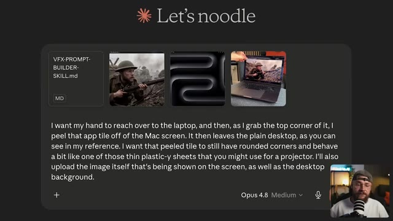
*Interface de l'assistant IA montrant un prompt détaillé sur le décollement d'une tuile d'application et des fichiers joints, avec le créateur en incrustation (PiP).*

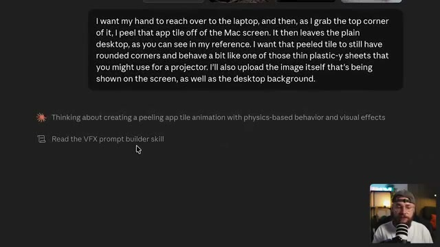
*Interface de l'assistant IA affichant les étapes de réflexion et la lecture de la compétence de construction de prompts VFX, avec le créateur en incrustation (PiP).*

---

### ⏱️ `[00:05:17 - 00:05:40]` | Segment #11

**🔊 Audio (Transcription Intégrale Mot pour Mot en Français) :**
> Et après quelques instants, nous allons obtenir un prompt très détaillé qui ressemble à ceci. Nous voulons simplement copier ce prompt, retourner sur Higgsfield et le coller dans cette section ici. Et vous remarquerez également que j'ai pris le soin de taguer mes références partout où c'est pertinent. Ainsi, au début du prompt, nous disons : faire correspondre le tag de la source vidéo avec la vidéo un.

**👁️ Analyse Visuelle d'Écran (gemini-3.5-flash-lite) :**
**Interface & Outils** : Interface d'un outil de génération vidéo par IA (probablement Higgsfield / Seedance) et interface de prompt textuel (type Opus / Claude).

**Contenu textuel & Code** : Texte du prompt détaillé avec horodatages ([00:01], [00:02], etc.) décrivant précisément les actions (mouvements de main, pelage d'une fenêtre d'application, texture acrylique, etc.), ainsi que le modèle réglé sur Seedance 2.0 au format 16:9 1080p pour 7s.

**Action / Démonstration** : Le créateur montre le prompt textuel généré contenant des instructions très précises et balisées avec des tags vidéo, puis montre l'interface de Higgsfield où ce prompt est collé et configuré.

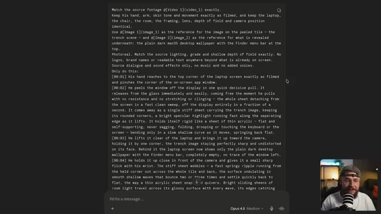
*Affichage du texte détaillé du prompt généré avec les instructions étape par étape et les tags de référence.*

*Interface de Higgsfield montrant le champ de prompt avec le tag `@Video 1` et les paramètres de génération vidéo.*

---

### ⏱️ `[00:05:40 - 00:06:13]` | Segment #12

**🔊 Audio (Transcription Intégrale Mot pour Mot en Français) :**
> Et si je descends un peu plus bas, nous disons d'utiliser l'image deux. Et nous avons cette référence ici comme référence pour l'image sur la tuile décollée. Et puis l'image un comme référence pour ce qui est révélé en dessous. Le fond d'écran uni et sombre du bureau macOS, donc plutôt que de simplement télécharger ces références, nous instruisons réellement Seedance sur la manière de les utiliser. Nous pouvons maintenant sélectionner la durée et le format d'image, en général je les fais correspondre à la longueur et au format d'image de la séquence source et ensuite vous

**👁️ Analyse Visuelle d'Écran (gemini-3.5-flash-lite) :**
**Interface & Outils** : Interface de l'outil Seedance 2.0 avec panneau de prompts et paramètres de génération vidéo.

**Contenu textuel & Code** : Texte du prompt : "Use @Image 2 as the reference for the image on the peeled tile - the trench scene - and @Image 1 as the reference for what is revealed underneath: the plain dark macOS desktop wallpaper with the Finder menu bar at the top." Paramètres visibles : Modèle Seedance 2.0, durée 7s, format 16:9, résolution 1080p.

**Action / Démonstration** : Le créateur montre l'interface de Seedance 2.0 et détaille l'utilisation des références d'images dans le prompt textuel.

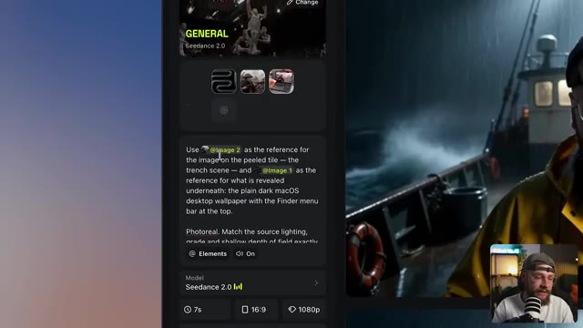
*Interface de Seedance 2.0 montrant les instructions de prompt avec les références @Image 2 et @Image 1, ainsi que les paramètres de durée (7s), format (16:9) et résolution (1080p).*

---

### ⏱️ `[00:06:13 - 00:06:33]` | Segment #13

**🔊 Audio (Transcription Intégrale Mot pour Mot en Français) :**
> vous pouvez aller de l'avant et sélectionner votre résolution souhaitée pour la plupart des cas 1080p va faire l'affaire Cependant, si vous êtes toujours dans l'étape de test et de raffinement où vous essayez vos prompts, je suggérerais de descendre à 480p afin de dépenser moins de crédits. Nous pouvons maintenant aller de l'avant et cliquer sur générer et jeter un œil au résultat.

**👁️ Analyse Visuelle d'Écran (gemini-3.5-flash-lite) :**
**Interface & Outils** : Interface de l'outil de génération vidéo Seedance 2.0, affichant un menu déroulant pour le choix de la résolution avec une option sur 1080p, ainsi qu'un encadré PiP (Picture-in-Picture) de Jack en bas à droite.

**Contenu textuel & Code** : On peut lire les paramètres suivants : le modèle "Seedance 2.0", la durée de 7s, le ratio 16:9, la résolution 1080p sélectionnée dans le menu déroulant (proposant 480p, 720p, 1080p, 4k), le débit "Bitrate" réglé sur "High", et le bouton "Generate" indiquant un coût de 63 crédits.

**Action / Démonstration** : Le curseur de la souris survole le sélecteur de résolution 1080p pour montrer les différentes options de qualité vidéo disponibles dans Seedance 2.0.

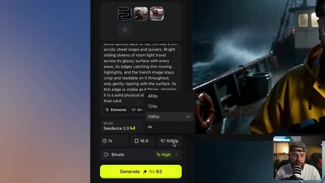
*Interface de Seedance 2.0 montrant le menu déroulant de sélection de la résolution (480p, 720p, 1080p, 4k) et le bouton de génération.*

---

### ⏱️ `[00:06:34 - 00:06:53]` | Segment #14

**🔊 Audio (Transcription Intégrale Mot pour Mot en Français) :**
> Un résultat plutôt incroyable qu'on a obtenu ici. La façon dont la feuille de plastique se décolle de l'écran et se comporte ensuite lorsqu'elle est tout près de l'objectif de la caméra semble crédible.

**👁️ Analyse Visuelle d'Écran (gemini-3.5-flash-lite) :**
**Interface & Outils** : Interface web de type plateforme de partage ou d'analyse de vidéos générées par IA (avec panneau latéral droit affichant les métadonnées, le prompt et un aperçu du créateur en PiP).

**Contenu textuel & Code** : Texte du prompt visible dans le panneau latéral : "Match the source footage @Video 1 exactly. Keep his hand, arm, skin tone and movement exactly as filmed, and keep the laptop, the chair, the room, the framing, lens, depth of field and camera position identical. Use as the reference @Image 2 for the image on the peeled tile — the trench scene — and @Image 1 as the reference for what is revealed underneath: the plain dark macOS desktop wallpaper with the Finder menu bar at the top."

**Action / Démonstration** : Le créateur montre une vidéo où une feuille plastique simulant une image de tranchée militaire est pelée d'un écran d'ordinateur portable, puis s'approche de la caméra, tandis que le panneau latéral affiche les instructions du prompt d'intelligence artificielle.

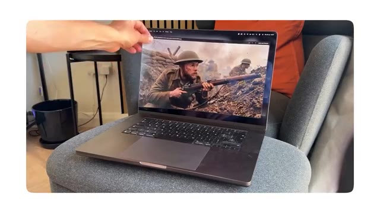
*Une main décolle une feuille de plastique affichant une scène de tranchée militaire d'un écran de ordinateur portable posé sur un fauteuil.*

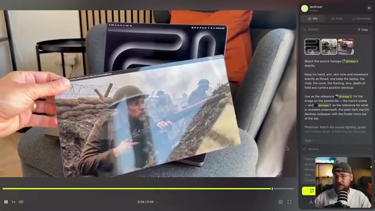
*Vue de l'interface d'une application ou d'un réseau social avec un panneau de prompt à droite détaillant les instructions de génération vidéo par IA, tandis que la vidéo montre la feuille de plastique tenue près de la caméra.*

---

### ⏱️ `[00:06:53 - 00:07:16]` | Segment #15

**🔊 Audio (Transcription Intégrale Mot pour Mot en Français) :**
> Ce qui vend vraiment cet effet, ce sont toutes ces très belles réflexions que nous obtenons à la fois sur la vignette de l'application elle-même ainsi que sur l'écran de l'ordinateur portable. Et ce que j'aime dans ce premier effet, c'est que c'est quelque chose que vous pouvez aller essayer dès maintenant si vous le souhaitez. Ce n'est pas trop écrasant, mais le processus que nous avons utilisé vous encouragera à commencer à penser un peu plus comme un artiste d'effets visuels.

**👁️ Analyse Visuelle d'Écran (gemini-3.5-flash-lite) :**
**Interface & Outils** : Interface logicielle de génération vidéo par IA avec panneau de prompts à droite et aperçu vidéo grand format au centre.

**Contenu textuel & Code** : Texte du prompt visible : "Match the source footage @Video 1 exactly. Keep his hand, arm, skin tone and movement exactly as filmed, and keep the laptop, the chair, the room, the framing, lens, depth of field and camera position identical. Use as the reference @Image 2 for the image on the peeled tile - the trench scene - and @Image 1 as the reference for what is revealed underneath: the plain dark macOS desktop wallpaper with the Finder menu bar at the top."

**Action / Démonstration** : Manipulation d'une vidéo de démonstration montrant un effet d'IA où une fenêtre d'application se détache de l'écran avec des reflets et des textures réalistes.

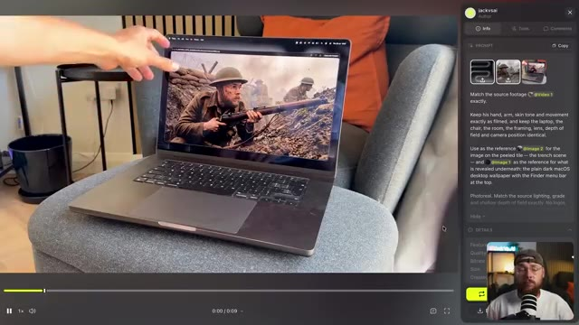
*Démonstration vidéo montrant un écran d'ordinateur portable affichant une scène de guerre avec des soldats dans une tranchée, avec des reflets réalistes et un panneau latéral de l'interface montrant les paramètres du prompt.*

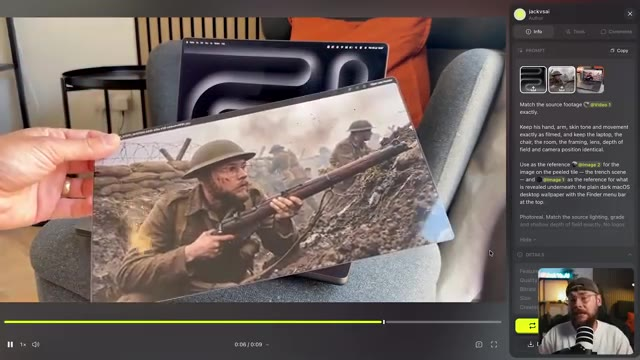
*Effet visuel d'une fenêtre d'application qui se détache de l'écran de l'ordinateur portable, révélant le fond d'écran sombre en dessous avec des reflets lumineux.*

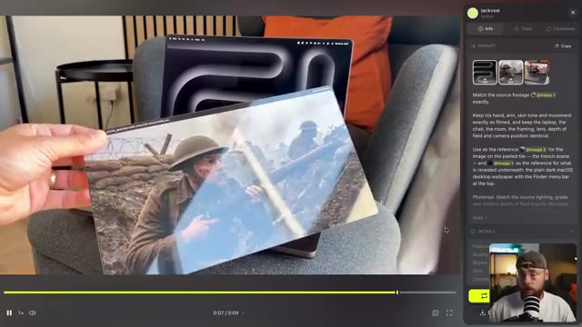
*Poursuite de la manipulation de la fenêtre d'application qui se soulève avec un effet de brillance et de réflexion spéculaire prononcé.*

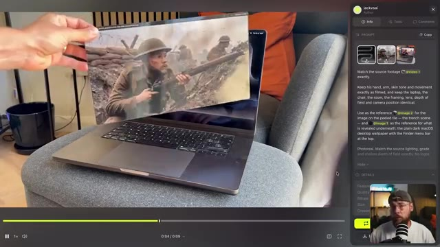
*Fenêtre d'application en cours de déplacement vers le haut, affichant clairement l'effet de pelage (peeled tile) au-dessus du fond d'écran du portable.*

---

### ⏱️ `[00:07:16 - 00:07:53]` | Segment #16

**🔊 Audio (Transcription Intégrale Mot pour Mot en Français) :**
> Maintenant, passons à un peu de classique, et c'est cet effet de boule de feu. Le même niveau de planification est requis ici lorsque je recherchais les images elles-mêmes. J'ai ma main en quelque sorte repliée et nous avons laissé un espace vide pour que Seedance 2 y dépose la boule de feu naturellement. J'ai également pris une capture d'écran de la source vidéo et y ai ajouté cette forme rouge ici pour montrer exactement à Seedance 2 où je voulais placer la boule de feu. Et ce type de capture d'écran est quelque chose que nous allons utiliser encore et encore pendant ce processus. Je vais donc appeler cela une référence d'ancrage. À l'occasion, vous allez

**👁️ Analyse Visuelle d'Écran (gemini-3.5-flash-lite) :**
**Interface & Outils** : Interface de l'outil de montage vidéo/IA avec panneau latéral de détails (Source, Type, Format, Edit Image : Color Grading, Upscale, Enhancer, Relight, Inpaint, Angles).

**Contenu textuel & Code** : Texte affiché à l'écran : « anchor reference » en vert, informations de détails de fichier (Source: Original Upload, Type: Video/Image, Format: MP4/PNG).

**Action / Démonstration** : Le créateur montre comment il prépare ses images sources en y ajoutant des formes géométriques colorées pour guider l'IA (Seedance 2) lors de la génération.

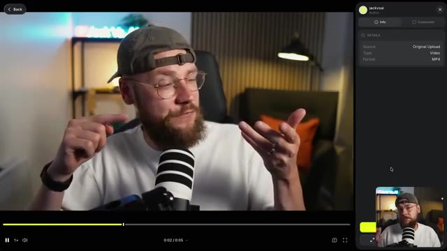
*Interface logicielle montrant la source vidéo originale de la main de Jack et les détails du fichier (Format MP4).*

*Interface logicielle avec une capture d'écran où une forme rouge ronde a été ajoutée au-dessus de la main de Jack pour indiquer l'emplacement de l'orbe.*

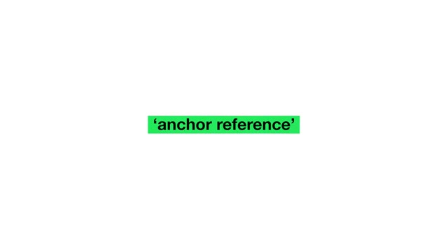
*Écran graphique affichant le texte en surbrillance verte : « anchor reference ».*

---

### ⏱️ `[00:07:53 - 00:08:12]` | Segment #17

**🔊 Audio (Transcription Intégrale Mot pour Mot en Français) :**
> trouve que C-Dance 2 pourrait prendre quelques libertés créatives. Donc par là, je veux dire qu'il apportera des modifications aux séquences sources que vous n'avez jamais voulues. Notre référence d'ancrage fait exactement ce à quoi vous pourriez vous attendre. Cela force en quelque sorte C-Dance 2 à ne pas s'écarter trop de la séquence source.

**👁️ Analyse Visuelle d'Écran (gemini-3.5-flash-lite) :**
**Interface & Outils** : Interface web de type plateforme de création ou d'édition vidéo par IA (avec un panneau latéral droit affichant les détails du média « Original Upload », « Image », « PNG » et des outils d'édition).

**Contenu textuel & Code** : Panneau latéral affichant les métadonnées (Author: jackvsai, Source: Original Upload, Type: Image, Format: PNG) et le menu "Edit Image" avec les options : Color Grading (avec un badge "New"), Upscale, Enhancer, Relight, Inpaint, Angles. Au centre, l'image montre le présentateur avec un cercle rouge superposé.

**Action / Démonstration** : Le présentateur pointe du doigt et présente une interface logicielle d'édition d'image/vidéo avec des options de modification et un cercle rouge ajouté sur l'écran.

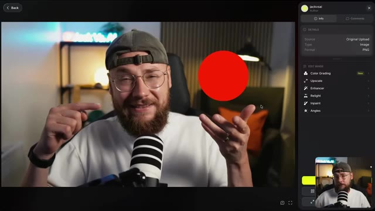
*Interface d'une application web de génération vidéo montrant les détails de l'image source, les options d'édition (Color Grading, Upscale, Enhancer, Relight, Inpaint, Angles) et une modification visuelle avec un cercle rouge.*

---

### ⏱️ `[00:08:12 - 00:08:49]` | Segment #18

**🔊 Audio (Transcription Intégrale Mot pour Mot en Français) :**
> Si nous jetons un rapide coup d'œil au prompt, vous verrez que nous y faisons référence ici. Nous disons d'utiliser l'image 1 comme référence pour la posture du personnage et la position et l'échelle de l'élément VFX. Et pour être clair, le reste du prompt que vous voyez ici a été conçu en utilisant exactement le même fichier MD et le même flux de travail à l'intérieur de Claude. Le début du prompt décrit essentiellement toutes les choses que nous voulons garder identiques. Et puis, lorsque nous allons plus loin, nous en arrivons à décrire l'effet que nous voulons créer. Laissez-moi vous montrer le résultat que nous avons obtenu. Créer de superbes plans VFX avec l'IA n'a jamais été aussi facile.

**👁️ Analyse Visuelle d'Écran (gemini-3.5-flash-lite) :**
**Interface & Outils** : Interface textuelle (probablement Discord ou une interface de prompt) et rendu vidéo final montrant un effet spécial généré par IA.

**Contenu textuel & Code** : Texte du prompt visible : "Match the source footage @Video 1 exactly. Use @Image 1 as a reference for character posture and VFX element position and scale. Keep the person's face, hair, wardrobe and identity the same..."

**Action / Démonstration** : Le curseur de la souris survole le texte du prompt pour expliquer comment l'IA utilise les images de référence, puis la vidéo montre le résultat final avec l'effet de feu.

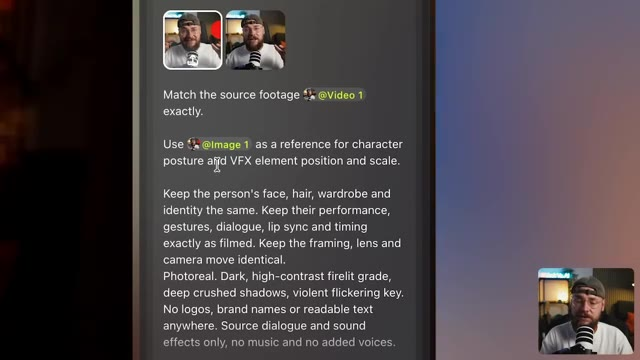
*Affichage du prompt textuel détaillé sur l'interface avec des références d'images et des consignes pour les effets visuels.*

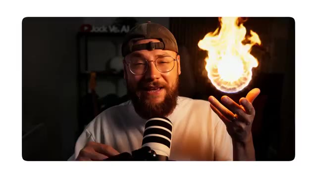
*Résultat final de la vidéo générée par IA montrant Jack dans son studio avec une sphère de feu magique au-dessus de sa main.*

---

### ⏱️ `[00:08:50 - 00:09:20]` | Segment #19

**🔊 Audio (Transcription Intégrale Mot pour Mot en Français) :**
> Très belle intégration ici de notre élément d'effets visuels dans la scène. Vous remarquerez que mon dialogue et ma synchronisation labiale n'ont pas du tout été altérés et que C-Dance 2 n'a apporté que les modifications que nous souhaitions, et c'est vraiment grâce à l'utilisation de notre référence d'ancrage. Vous constaterez peut-être que si vous n'utilisez pas d'ancre, Sea Dance 2 a tendance à faire un peu n'qu'importe quoi. Ce que vous remarquerez en revanche, c'est qu'il n'y a pas d'effet sonore pour l'orbe de feu, et c'est à la fois une bonne et une mauvaise chose.

**👁️ Analyse Visuelle d'Écran (gemini-3.5-flash-lite) :**
**Interface & Outils** : Interface web d'un outil de génération vidéo par IA (probablement Seedance / C-Dance 2), avec un panneau latéral de configuration ("Details", "Edit Image", options de retouche comme Color Grading, Upscale, Relight, Inpaint, Angles).

**Contenu textuel & Code** : Texte de prompt visible dans le panneau latéral : "Only do this: The room goes dark and a huge violent ball of fire erupts into life floating just above his open cupped hand on the right of frame..."

**Action / Démonstration** : Jack démontre le résultat de la génération vidéo avec l'orbe de feu intégré dans la scène tout en expliquant l'importance de l'ancre de référence.

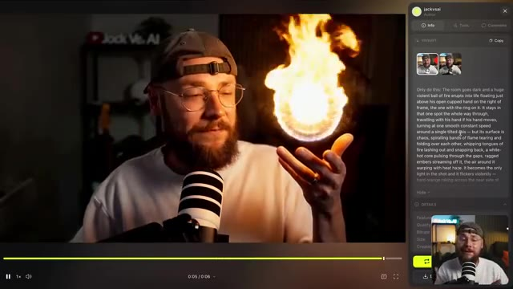
*Interface d'un outil vidéo affichant le résultat de l'intégration d'un orbe de feu avec un panneau latéral montrant les détails et le prompt textuel.*

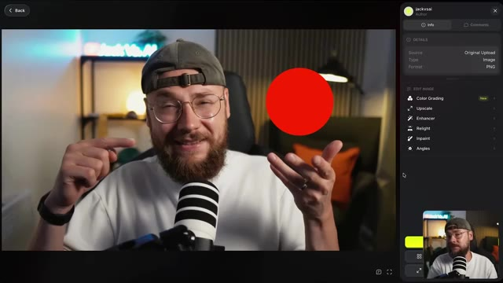
*Interface de l'application montrant l'utilisation d'une référence visuelle (cercle rouge) au-dessus de la main pour ancrer la génération de l'orbe de feu.*

---

### ⏱️ `[00:09:20 - 00:09:52]` | Segment #20

**🔊 Audio (Transcription Intégrale Mot pour Mot en Français) :**
> Sea Dance 2 semble donner la priorité à l'audio dans les séquences sources, surtout si quelqu'un est en train de parler. Maintenant, je préfère personnellement cela, car devoir refaire le doublage de ma voix serait un cauchemar, mais trouver un effet sonore de feu en ligne et l'insérer ensuite dans le montage vous donne vraiment un très bon niveau de contrôle en tant que cinéaste. Passons maintenant à l'effet en lui-même, il est vraiment superbe, en particulier ce genre d'éclairage ardent qui se projette sur mon t-shirt et mon visage. Pour créer

**👁️ Analyse Visuelle d'Écran (gemini-3.5-flash-lite) :**
**Interface & Outils** : Interface de l'outil Sea Dance 2 comprenant un lecteur vidéo principal à gauche et un panneau de détails et de prompts à droite, avec un retour caméra incrusté en bas à droite.

**Contenu textuel & Code** : Panneau latéral affichant les détails de la génération : Texture/Prompt "Match the source footage @Video 1 exactly. Use @Image 1 as a reference for character posture and VFX element position and scale." Paramètres : Feature: Seedance 2, Quality: 1080p, Bitrate: High, Size: 1920x1080, Created: July 21, 2026.

**Action / Démonstration** : Le créateur présente l'effet visuel de flamme généré par IA dans Sea Dance 2, en pointant l'éclairage dynamique produit sur son propre visage.

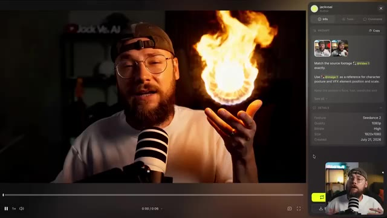
*Interface de Sea Dance 2 affichant un aperçu vidéo avec un effet de flamme magique dans la main du créateur et le panneau latéral de configuration.*

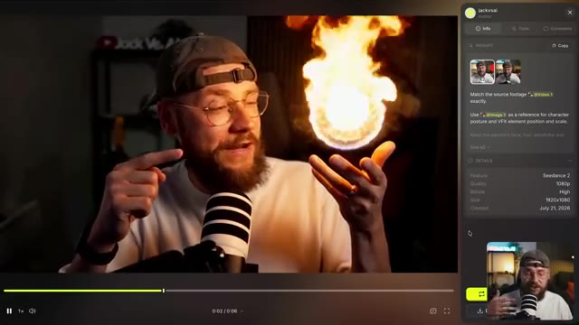
*Interface de Sea Dance 2 montrant le créateur pointant du doigt l'éclairage ardent provoqué par l'effet de feu sur son visage.*

---

### ⏱️ `[00:09:52 - 00:10:27]` | Segment #21

**🔊 Audio (Transcription Intégrale Mot pour Mot en Français) :**
> Cela, en suivant une méthode d'effets visuels traditionnelle, ne serait pas du tout facile. Sur un plateau de tournage, par exemple, ils devraient avoir une sorte de vraie lumière dans la même position que l'orbe pour s'assurer que moi-même en tant qu'acteur je suis éclairé correctement. Cependant, ces changements d'éclairage sont appliqués après le tournage et je pense que c'est une excellente démonstration du chemin parcouru par la vidéo par IA. Maintenant, et si nous voulions aller un peu plus loin que d'ajouter simplement un élément dans notre séquence source ? Et si nous voulions changer complètement l'environnement, l'éclairage et peut-être

**👁️ Analyse Visuelle d'Écran (gemini-3.5-flash-lite) :**
**Interface & Outils** : Seedance (interface de génération et d'édition vidéo par IA avec panneau latéral d'options et de prompt).

**Contenu textuel & Code** : Texte du prompt visible dans le panneau latéral : "Match the source footage @Video 1 exactly. Use 📷 @Image 1 as a reference for character posture and VFX element position and scale." Paramètres techniques : Feature: Seedance 2, Quality: 1080p, Bitrate: High, Size: 1920x1080, Created: July 21, 2026.

**Action / Démonstration** : Le créateur montre l'écran de Seedance où la vidéo modifiée avec l'orbe de feu incandescent est lue, démontrant l'intégration d'effets visuels et l'éclairage réactif générés par l'IA.

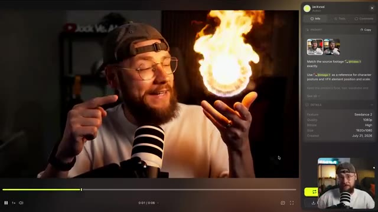
*Interface du logiciel Seedance affichant une vidéo générée avec un orbe de feu dans la main de l'acteur et un panneau latéral de configuration.*

---

### ⏱️ `[00:10:27 - 00:11:05]` | Segment #22

**🔊 Audio (Transcription Intégrale Mot pour Mot en Français) :**
> même nos vêtements ? Donc dans cet exemple, on me voit prononcer une réplique face caméra et je fais semblant de conduire quelque chose. Et je voulais voir si je pouvais utiliser C-Dance 2 pour me placer à l'intérieur du cockpit d'une navette spatiale. Donc approche similaire une fois de plus en termes de flux de travail global et du prompt. Vous pouvez voir une fois de plus que j'ai fini par ajouter une référence d'ancrage pour essayer de verrouiller la posture et la position. Et c'est le résultat que nous avons obtenu en retour. Pour créer des plans qui auraient été presque impossibles pour un créateur moyen jusqu'à présent. J'adore le design du vaisseau spatial lui-même

**👁️ Analyse Visuelle d'Écran (gemini-3.5-flash-lite) :**
**Interface & Outils** : Interface web d'un outil d'intelligence artificielle vidéo (Seedance) avec panneau latéral de détails (Source, Type, Format) et options d'édition (Edit Image).

**Contenu textuel & Code** : Texte visible dans le panneau latéral : "jackvsai", "Author", "INFO", "COMMENTS", "DETAILS", "Source: Original Upload", "Type: Video", "Format: MP4" (puis "Image" / "JPG" sur l'autre image), "EDIT IMAGE", "Color Grading (New)", "Upscale", "Enhancer", "Relight", "Inpaint", "Angles".

**Action / Démonstration** : Le présentateur explique l'utilisation de C-Dance 2 pour insérer son personnage dans un cockpit de navette spatiale, en montrant l'interface et les options de l'outil.

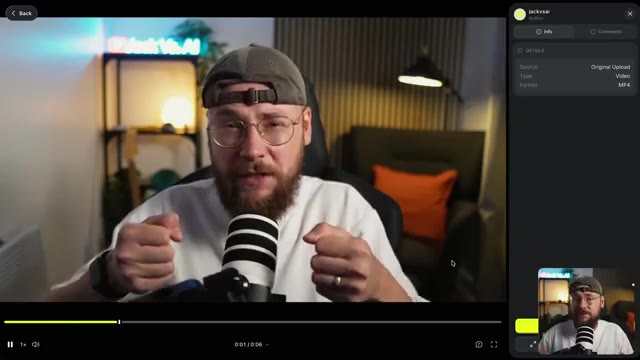
*Interface logicielle de Seedance affichant la vidéo originale de Jack avec un panneau latéral d'informations et une barre de lecture.*

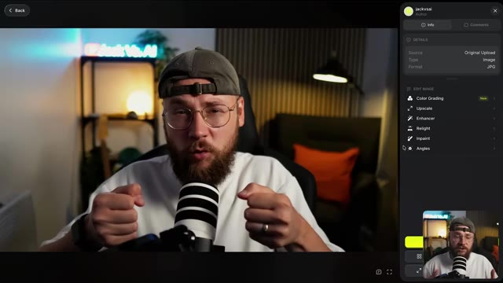
*Interface logicielle de Seedance affichant le panneau d'édition d'image avec les options Color Grading, Upscale, Enhancer, Relight, Inpaint et Angles.*

---

### ⏱️ `[00:11:05 - 00:11:40]` | Segment #23

**🔊 Audio (Transcription Intégrale Mot pour Mot en Français) :**
> ici. L'éclairage a l'air super et Seedance 2 a réussi à trouver un juste milieu vraiment sympa entre rester fidèle à la vidéo d'origine mais aussi appliquer l'effet visuel que nous recherchions. J'ai également généré ce deuxième résultat ici où je suis retourné voir Claude et je lui ai demandé de modifier le prompt pour y ajouter un léger mouvement de caméra. Maintenant, j'aime vraiment cette génération mais le point que je veux souligner, c'est que vous ne devez pas vous contenter du premier résultat que vous obtenez. Tout l'intérêt d'utiliser une IA comme Claude est d'avoir cette conversation de va-et-vient afin de pouvoir itérer sur un

**👁️ Analyse Visuelle d'Écran (gemini-3.5-flash-lite) :**
**Interface & Outils** : Interface web de Seedance 2 avec panneau latéral de prompts, détails techniques et encadré vidéo PiP du créateur.

**Contenu textuel & Code** : Texte du prompt visible : 'Match the source footage @Video 1 exactly. Use @Image 1 as a reference for character posture, hand position and framing. Keep the person''s face, hair, beard, glasses and identity the same... Feature: Seedance 2, Quality: 1080p, Bitrate: High, Size: 1920x1080, Created: July 21, 2026'.

**Action / Démonstration** : Le créateur montre le résultat de la génération vidéo dans l'interface et commente les différentes versions produites.

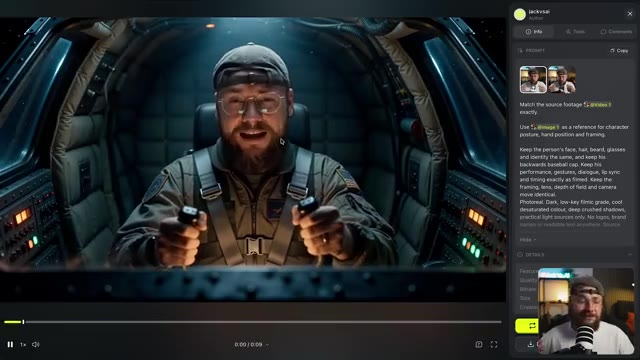
*Interface du logiciel montrant la vidéo générée dans un cockpit de vaisseau spatial avec le panneau de prompt et les détails de Seedance 2.*

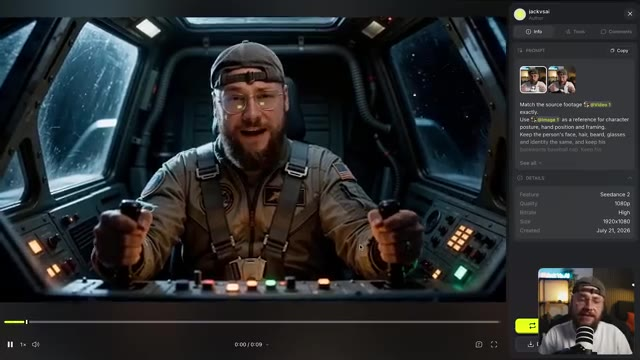
*Affichage du deuxième résultat généré avec l'effet de caméra et le prompt visible dans le panneau latéral.*

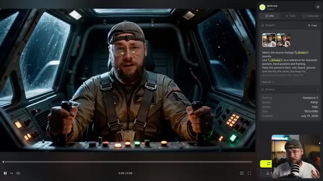
*Affichage du résultat final similaire avec le panneau de détails montrant Seedance 2, 1080p, et Jack en encadré PiP.*

---

### ⏱️ `[00:11:40 - 00:12:16]` | Segment #24

**🔊 Audio (Transcription Intégrale Mot pour Mot en Français) :**
> génération. Si vous n'obtenez pas tout à fait le résultat que vous aimez, retournez sur Claude, expliquez les choses que vous aimez, expliquez les choses que vous n'aimez pas, et ajustez le prompt jusqu'à ce que vous vous rapprochiez de ce que vous recherchez. Maintenant, dans cette séquence source, je tenais un tournevis parce que je savais que je voulais transformer cela en une scène inspirée d'Indiana Jones et remplacer le tournevis par une torche allumée par le feu. Je suis même allé plus loin avec la référence Anker et je l'ai réellement annotée pour dire spécifiquement à C-Dance 2 que le tournevis allait être transformé en un

**👁️ Analyse Visuelle d'Écran (gemini-3.5-flash-lite) :**
**Interface & Outils** : Interface de lecteur vidéo de type plateforme de gestion/partage de médias (avec panneau d'informations à droite, barre de progression et commandes de lecture en bas).

**Contenu textuel & Code** : Texte rouge annoté sur la vidéo : "ADD TORCH HERE" avec une flèche pointant vers le tournevis. Panneau latéral affichant : "Source: Original Upload", "Type: Video", "Format: MP4".

**Action / Démonstration** : Le créateur montre la source vidéo originale où il tient un tournevis, puis illustre l'ajout d'une annotation textuelle pour indiquer à l'IA de transformer cet objet en torche enflammée.

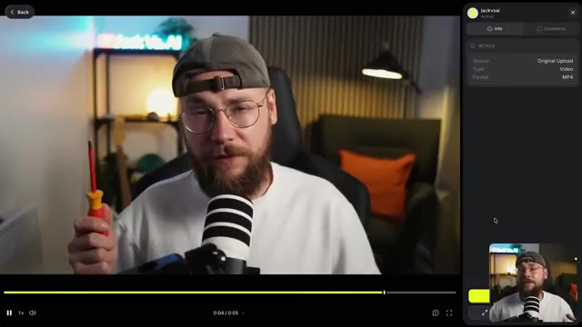
*Interface de lecture vidéo avec panneau latéral affichant les détails du fichier (Source: Original Upload, Type: Video, Format: MP4) et miniature en incrustation (PiP).*

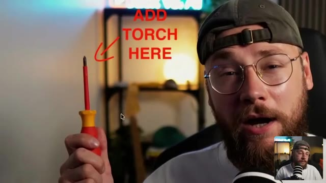
*Gros plan sur la vidéo source où Jack tient un tournevis, avec une annotation textuelle rouge "ADD TORCH HERE" pointant vers l'extrémité de l'outil.*

---

### ⏱️ `[00:12:16 - 00:12:51]` | Segment #25

**🔊 Audio (Transcription Intégrale Mot pour Mot en Français) :**
> torche. Il peut être vraiment utile d'utiliser des accessoires dans vos séquences sources afin que C-Dance 2 puisse comprendre ce que vous voulez qu'il se passe et où. Tenir un accessoire que nous pouvons transformer avec l'IA est plus utile que de n'avoir rien du tout. Laissez-moi aller de l'avant et vous montrer le résultat que nous avons obtenu. Et maintenant, j'utilise l'IA pour réinventer les flux de travail créatifs. Encore une fois, je suis constamment émerveillé par la qualité de C-Dance 2. Regardez simplement l'éclairage provenant du feu au sommet de la

**👁️ Analyse Visuelle d'Écran (gemini-3.5-flash-lite) :**
**Interface & Outils** : Interface de lecteur vidéo web avec panneau latéral d'informations et incrustation vidéo (PiP) en bas à droite.

**Contenu textuel & Code** : Détails du fichier vidéo source (Original Upload, Video, MP4) dans le panneau latéral. Rendu IA montrant un personnage de type aventurier avec un chapeau et une veste en cuir dans une jungle brumeuse.

**Action / Démonstration** : Le créateur montre le résultat de la transformation par IA où le tournevis simple de la vidéo source est devenu une torche enflammée tenue en main, démontrant la cohérence de l'éclairage.

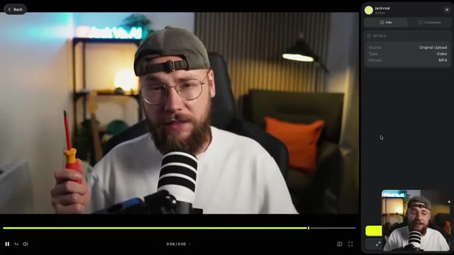
*Interface de lecture vidéo montrant Jack tenant un tournevis rouge lors de la vidéo source avec un panneau de détails sur la droite et un retour PiP en bas.*

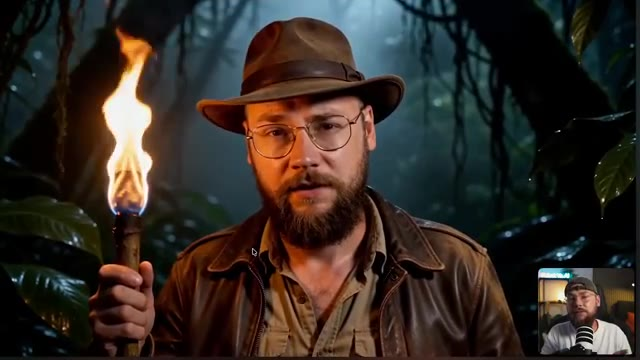
*Rendu vidéo généré par IA montrant Jack transformé en explorateur dans la jungle avec une torche enflammée à la main, avec un petit retour PiP en bas à droite.*

---

### ⏱️ `[00:12:51 - 00:13:23]` | Segment #26

**🔊 Audio (Transcription Intégrale Mot pour Mot en Français) :**
> torche. La façon dont mes vêtements bougent et même ce mouvement vraiment subtil sur cette feuille sur le côté droit du cadre. Tout cela est vraiment super. Et maintenant je passe du chaud au froid. Nous pouvons utiliser ce même flux de travail pour me placer dans cet environnement enneigé. Un autre résultat incroyable avec lequel j'ai vraiment eu du mal à trouver des défauts. Visuellement assez impressionnant. Et puis nous avons moi sur le pont d'un navire qui semble avoir eu quelques problèmes avec une géante pieuvre. Plutôt

**👁️ Analyse Visuelle d'Écran (gemini-3.5-flash-lite) :**
**Interface & Outils** : Interface de l'outil de génération vidéo Seedance 2 avec panneau latéral d'informations, prompts et paramètres.

**Contenu textuel & Code** : Texte du prompt visible : « Match the source footage @Video 1 exactly. Keep the person's face, beard, glasses and identity the same, and keep his backwards baseball cap... ». Paramètres : Feature: Seedance 2, Quality: 1080p, Bitrate: High, Size: 1920x1080, Created: July 23, 2026.

**Action / Démonstration** : Le créateur présente différents résultats de génération vidéo en changeant d'environnement (jungle, neige, bateau avec pieuvre) via l'interface Seedance 2.

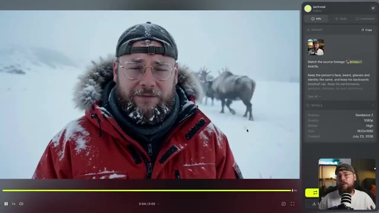
*Interface de Seedance 2 montrant Jack dans un environnement enneigé avec des rennes en arrière-plan.*

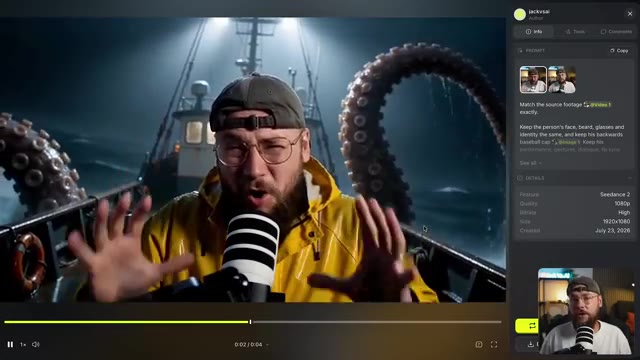
*Interface de Seedance 2 montrant Jack sur le pont d'un navire attaqué par une pieuvre géante.*

---

### ⏱️ `[00:13:23 - 00:13:56]` | Segment #27

**🔊 Audio (Transcription Intégrale Mot pour Mot en Français) :**
> Mauvaise journée au bureau là. Maintenant, vous allez remarquer que mon micro est toujours présent dans la génération et c'est peut-être quelque chose que vous voulez, ou peut-être pas. Honnêtement, si vous voulez qu'il soit supprimé, je vous recommanderais de relancer exactement la même génération. Ne changez pas vos références. Ne changez pas votre prompt et il est probable qu'il disparaisse. Parfois, il y aura ces petits caprices dans vos générations et le simple fait de les relancer peut régler ces problèmes. J'aime plutôt bien que le micro soit là, en fait. Ça ne rend pas nécessairement complètement

**👁️ Analyse Visuelle d'Écran (gemini-3.5-flash-lite) :**
**Interface & Outils** : Interface utilisateur de l'outil de génération vidéo par IA Seedance, avec lecteur vidéo principal à gauche et panneau de prompt / détails techniques à droite.

**Contenu textuel & Code** : Texte du prompt visible dans le panneau latéral : « Match the source footage @Video 1 exactly. Keep the person's face, beard, glasses and identity the same, and keep his backwards baseball cap @Image 1. Keep his performance, gestures... ». Paramètres de détails : Feature : Seedance 2, Quality : 1080p, Bitrate : High, Size : 1920x1080, Created : July 23, 2026.

**Action / Démonstration** : Lecture de la vidéo générée dans l'interface Seedance montrant Jack dans une ambiance de tempête maritime avec des tentacules de poulpe géant en arrière-plan.

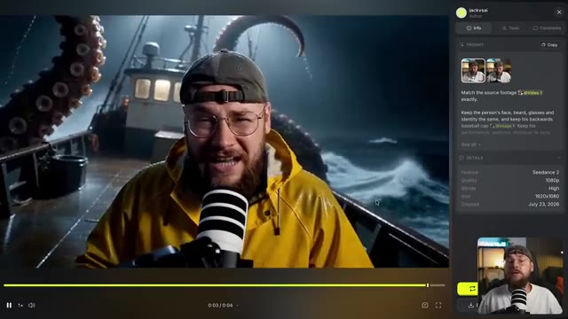
*Interface Seedance affichant la vidéo générée d'un marin sur un bateau attaqué par un monstre marin, avec panneau de prompt et paramètres à droite.*

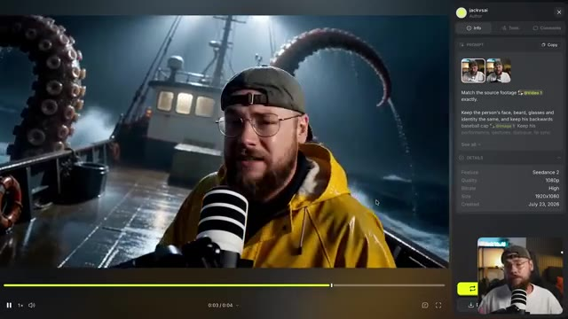
*Interface Seedance montrant la vidéo générée avec le panneau latéral détaillant le prompt et les détails techniques (Seedance 2, 1080p, High).*

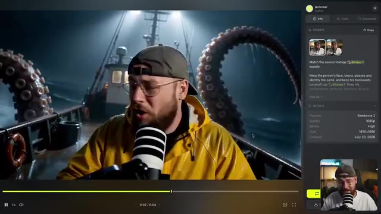
*Interface Seedance montrant la suite de la lecture de la vidéo générée avec le même panneau d'interface à droite.*

---

### ⏱️ `[00:13:56 - 00:14:33]` | Segment #28

**🔊 Audio (Transcription Intégrale Mot pour Mot en Français) :**
> sens physique. On pourrait deviner que ça tourne un peu avec l'orientation du navire, mais je ne sais pas, il y a quelque chose d'assez amusant à l'avoir dans le plan. Maintenant, je pense qu'on est prêts à passer à la vitesse supérieure. Et si vous vouliez créer vos propres éléments personnalisés, puis les intégrer dans vos plans d'effets visuels. J'ai donc généré ce monstre de pierre ici dans Midjourney. Je l'ai ensuite importé dans Higgsfield et, en l'utilisant comme référence d'image aux côtés de ce cadre de prompt de feuille de personnage et de GPT image 2, j'ai élaboré cette référence ici. En ce qui concerne les images sources, je

**👁️ Analyse Visuelle d'Écran (gemini-3.5-flash-lite) :**
**Interface & Outils** : Interface web de Seedance 2 et de la plateforme Higgsfield.

**Contenu textuel & Code** : Texte du prompt visible dans l'image #3 : "Character reference sheet — four views on a neutral grey background: [VIEW 1 — FULL BODY, FRONT]... [VIEW 2 — FULL BODY, REAR]... [VIEW 3 — FRONT CLOSE-UP]... [VIEW 4 — PROFILE CLOSE-UP]...". Paramètres visibles : "GPT Image 2", résolution "1920x1080", format "16:9", et bouton "Generate". Sur l'image #1, les détails de Seedance 2 indiquent une qualité "1080p", "High", format "1920x1080", et la date "July 23, 2026".

**Action / Démonstration** : Le créateur navigue dans l'interface de Higgsfield pour présenter la création d'une feuille de personnage (character reference sheet) à partir d'un monstre généré sur Midjourney.

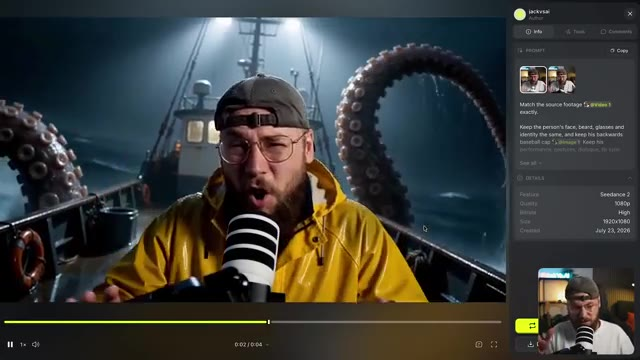
*Interface de prévisualisation vidéo montrant Jack face caméra sur un bateau avec des tentacules de kraken en arrière-plan, avec les paramètres du prompt et les détails de Seedance 2 sur le panneau latéral droit.*

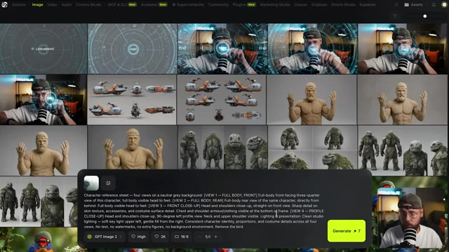
*Galerie de projets sur l'interface de Higgsfield montrant des rendus de personnages et de monstres de pierre, avec un panneau de prompt détaillé pour un "character reference sheet".*

---

### ⏱️ `[00:14:33 - 00:15:02]` | Segment #29

**🔊 Audio (Transcription Intégrale Mot pour Mot en Français) :**
> Je suis juste allé vers quelque chose de vraiment simple, moi en train de prononcer des lignes de dialogue face caméra, mais je me suis assuré de fournir cette feuille de personnages à la fois à C-Dance 2 comme référence ainsi qu'à Claude lorsque je concevais le prompt. Quelque chose d'autre que j'ai souligné lorsque je développais le prompt avec Claude était le sens de l'échelle. Je voulais être vraiment clair avec Claude sur le fait que le monstre de pierre était nettement plus grand que moi. Ne jamais supposer qu'un outil d'IA comprendra ce que vous voulez.

**👁️ Analyse Visuelle d'Écran (gemini-3.5-flash-lite) :**
**Interface & Outils** : Interface de type application de gestion ou de génération d'images avec panneau latéral de métadonnées et prompt.

**Contenu textuel & Code** : Texte visible du prompt : « Character reference sheet — four views on a neutral grey background: [VIEW 1 — FULL BODY, FRONT] Full-body front-facing three-quarter view of this character, full body visible head to feet. [VIEW 2 — FULL BODY, REAR] Full-body rear view of the same character, directly from behind... ». Paramètres : Modèle GPT Image 2, Qualité High, Taille 2688x1520, Créé le 21 juillet 2026.

**Action / Démonstration** : Présentation à l'écran de la feuille de personnages du monstre de pierre mentionnée dans le discours audio.

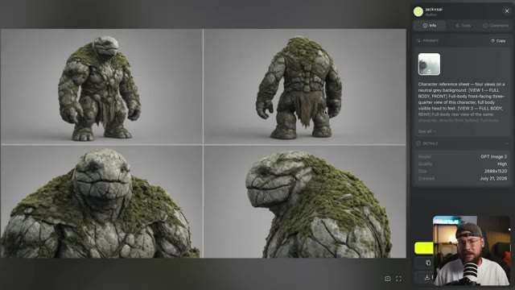
*Affichage d'une feuille de référence de personnage (character sheet) en quatre vues d'un monstre de pierre moussue.*

---

### ⏱️ `[00:15:02 - 00:15:40]` | Segment #30

**🔊 Audio (Transcription Intégrale Mot pour Mot en Français) :**
> Il vaut mieux être explicite sur ces choses-là. Voici donc l'approche, notre métrage source, la feuille de personnage utilisée comme référence ici, et enfin, comme vous l'avez deviné, notre référence d'ancrage, la capture d'écran des plans originaux. Allons jeter un œil à nos résultats. Ainsi, à la fin, vous saurez exactement comment créer des plans d'effets visuels comme ceux-ci pour votre prochain court-métrage, clip vidéo ou publicité pour un client. C'est donc une autre génération incroyable ici. J'adore vraiment cette énorme ombre que le monstre de roche projette sur moi, cela aide vraiment à vendre ce sentiment d'échelle. Grâce à notre référence de personnage

**👁️ Analyse Visuelle d'Écran (gemini-3.5-flash-lite) :**
**Interface & Outils** : Interface web d'un outil de génération vidéo par IA (probablement Higgsfield ou similaire) avec panneau de prompt et prévisualisation vidéo.

**Contenu textuel & Code** : Texte du prompt visible : "Match the source footage @Video 1 exactly. Use @Image 2 as the reference for the creature's material, form and colour. Keep the person's face, hair, beard, glasses, cap, wardrobe and identity the same. Keep his performance, gestures, dialogue, lip sync, eyeline and timing exactly as filmed..."

**Action / Démonstration** : Le créateur montre le prompt détaillé utilisé pour générer la vidéo avec les différentes images de référence intégrées.

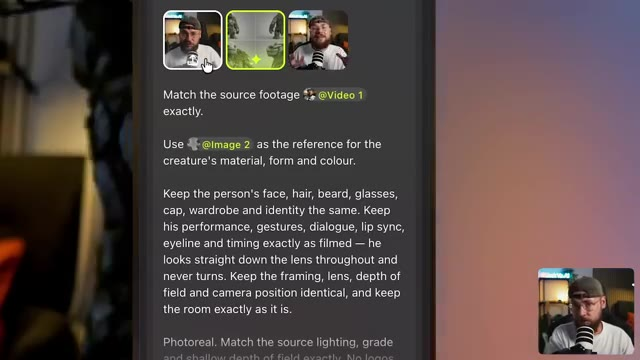
*Interface de l'outil montrant le prompt de génération textuel et les images de référence (métrage source et feuille de personnage)*

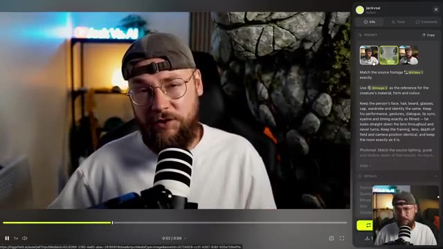
*Aperçu de la vidéo générée montrant Jack aux côtés d'un monstre de roche gigantesque dans son studio, avec un panneau latéral affichant les détails du prompt et les options de téléchargement*

---

### ⏱️ `[00:15:40 - 00:16:14]` | Segment #31

**🔊 Audio (Transcription Intégrale Mot pour Mot en Français) :**
> feuille ainsi Seedance 2 a fait un excellent travail pour garder notre personnage cohérent par rapport à ce que j'ai généré sur Midjourney. Je voulais aussi vous montrer une autre génération ici qui a plutôt bien fonctionné et plutôt mal fonctionné. L'idée était que je voulais faire comme si le toit de mon bureau était arraché et ensuite faire entrer le monstre de pierre dans le cadre. Ce qui est super, c'est qu'en fait je regarde dans l'espace vide que le monstre de pierre finit par occuper. Dans la génération finale, on dirait vraiment que je le regarde alors qu'il n'a jamais vraiment été là. Le

**👁️ Analyse Visuelle d'Écran (gemini-3.5-flash-lite) :**
**Interface & Outils** : Interface de l'outil Seedance 2 affichant un lecteur vidéo, le prompt textuel et les détails de génération.

**Contenu textuel & Code** : Texte du prompt visible : "Match the source footage @Video 1 exactly. Use @Image 2 as the reference for the creature's material, form and colour..." et détails techniques (Seedance 2, 1080p, High, 1920x1080).

**Action / Démonstration** : Le créateur présente l'interface de Seedance 2 et commente les résultats de génération vidéo avec le monstre de pierre.

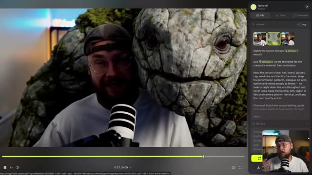
*Interface montrant la vidéo générée avec un monstre de roche à côté de Jack et le panneau de prompt textuel à droite.*

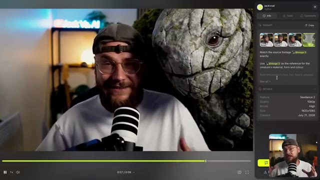
*Interface montrant une autre image de la vidéo générée avec le monstre de roche et le panneau de détails à droite.*

---

### ⏱️ `[00:16:14 - 00:16:51]` | Segment #32

**🔊 Audio (Transcription Intégrale Mot pour Mot en Français) :**
> Le problème, c'est que je n'arrivais pas à obtenir un rendu satisfaisant pour l'effet du toit arraché, cela faisait toujours trop artificiel. Vous remarquerez donc que dans cette génération, je réagis à quelque chose qui se passe au-dessus de moi alors qu'en réalité, rien ne se produit. Ce que je veux dire, c'est que lorsque vous enregistrez vos sources vidéo, c'est super de réagir comme si l'élément avait toujours été là, mais ce serait peut-être une bonne idée d'enregistrer plusieurs versions. Je pense que j'en demandais trop à l'IA en voulant produire à la fois l'effet de toit et le monstre de roche, donc avec le recul, j'aurais dû enregistrer une version où je ne réagissais tout simplement pas à

**👁️ Analyse Visuelle d'Écran (gemini-3.5-flash-lite) :**
**Interface & Outils** : Interface de l'outil Seedance 2 avec panneau latéral de configuration et de prompt.

**Contenu textuel & Code** : Texte du prompt visible dans l'interface : "Match the source footage @Image 0 exactly. Use @Image 3 as the reference for the creature's material, form and colour." Paramètres : Feature: Seedance 2, Quality: 1080p, Bitrate: High, Size: 1920x1080, Created: July 21, 2026.

**Action / Démonstration** : Jack présente l'interface de Seedance 2 montrant le rendu du monstre de roche généré par IA à côté de lui.

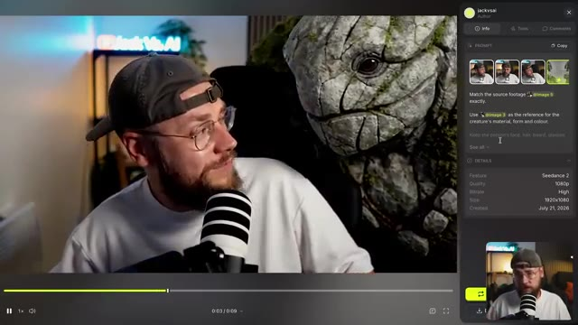
*Interface de l'outil Seedance 2 affichant un aperçu vidéo généré avec le monstre de roche et le panneau latéral contenant les prompts et paramètres.*

---

### ⏱️ `[00:16:51 - 00:17:27]` | Segment #33

**🔊 Audio (Transcription Intégrale Mot pour Mot en Français) :**
> le toit du tout et ensuite cela aurait très bien fonctionné. Encore une fois, nous nous concentrons vraiment sur le niveau de planification lorsque vous sourcez vos séquences pour vous donner autant de flexibilité que possible lors de vos générations et du montage. Un autre exemple de pré-génération d'éléments puis de leur intégration ultérieure avec l'IA est le cas où j'ai généré cette image ici. J'ai donc déposé une capture d'écran de la séquence source dans GPT Image 2 et je l'ai combinée avec ce prompt pour construire ce hologramme que vous pouvez voir à l'écran maintenant. Et puis j'ai utilisé cela comme une image

**👁️ Analyse Visuelle d'Écran (gemini-3.5-flash-lite) :**
**Interface & Outils** : Interface web de génération vidéo/image par IA avec panneaux latéraux de configuration, barres de prompts et mini-lecteur PiP de l'auteur en bas à droite.

**Contenu textuel & Code** : Texte du prompt visible sur l'image 2 : "Match the source footage @Image 9 exactly. Use @Image 3 as the reference for the creature's material, form and colour..." et détails techniques (Feature: Seedance 2, Quality: 1080p, Bitrate: High). Texte du prompt sur l'image 4 : "Character reference sheet — four views on a neutral grey background..." avec les options du modèle GPT Image 2.

**Action / Démonstration** : Le créateur montre des exemples concrets de l'interface de l'outil d'IA, détaillant les prompts utilisés et la façon dont les images et vidéos source sont combinées et éditées.

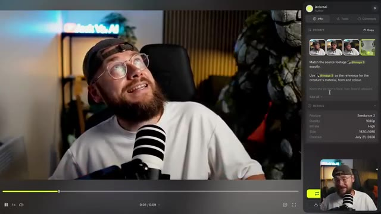
*Interface de l'outil montrant la vidéo source avec un panneau latéral affichant les détails de génération et le prompt textuel.*

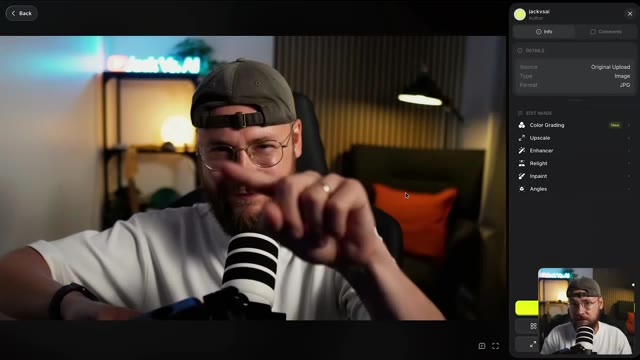
*Interface montrant une capture d'écran source avec les options d'édition d'image dans le panneau latéral (Color Grading, Upscale, Enhancer, Relight, Inpaint, Angles).*

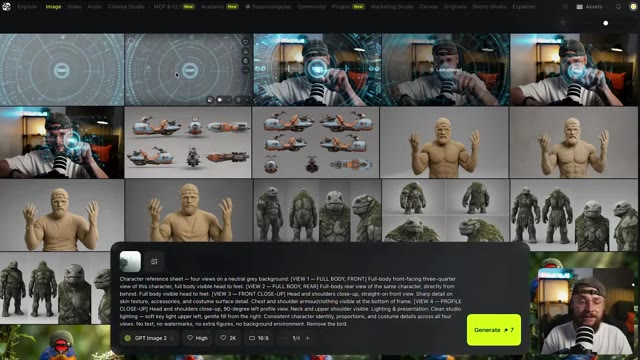
*Galerie d'actifs de l'application affichant de nombreuses images générées (hologrammes, véhicules futuristes, personnages en argile, créatures) avec un panneau de prompt ouvert en bas.*

---

### ⏱️ `[00:17:27 - 00:18:01]` | Segment #34

**🔊 Audio (Transcription Intégrale Mot pour Mot en Français) :**
> référence pour simplement le placer sur un fond gris simple. Donc nous l'avons eu comme son propre élément. Vous pouvez voir dans mes prompts que je dis à C-Dance 2 d'utiliser cette image ici comme référence, le look final de l'hologramme. Et j'ai en fait utilisé plusieurs références d'ancrage différentes ici. La première est le moment où je touche ma montre. Et la seconde est là où je touche le milieu de l'écran, ce qui est l'endroit où l'hologramme va apparaître. J'ai donc pu combiner ces références, mon prompt et la source vidéo pour obtenir un résultat comme celui-ci. Passons aux choses sérieuses.

**👁️ Analyse Visuelle d'Écran (gemini-3.5-flash-lite) :**
**Interface & Outils** : Interface web de génération vidéo par IA (probablement Seedance / C-Dance 2), avec panneau de prompts textuels, sélection de références visuelles en haut et mini-fenêtre PiP du créateur en bas à droite.

**Contenu textuel & Code** : Textes de prompts visibles : "show only the holographic UI against a seamless grey backdrop. Preserve the style, composition and focal length.", "Use @Image 3 as the reference for the hologram's finished look only — its cyan colour, concentric ring layout, fine graph and readout detail...", "Match the source footage @Video 1 exactly. Keep the person's face, hair, beard, glasses, cap, wardrobe, watch and identity the same." Modèle indiqué : GPT Image 2, taille 2688x1520, date July 22, 2026.

**Action / Démonstration** : Le créateur navigue dans l'interface de l'outil d'IA, montrant les différentes images de référence sélectionnées et faisant défiler les prompts textuels utilisés pour combiner la source vidéo et l'élément holographique.

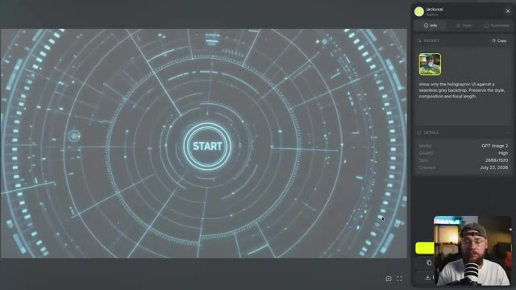
*Interface affichant l'image de référence de l'interface utilisateur holographique sur fond gris avec le panneau de détails du modèle.*

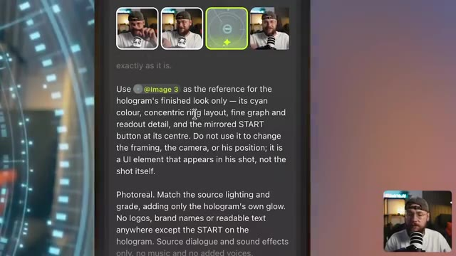
*Interface de prompt montrant l'utilisation de l'image de référence "@Image 3" pour le design et les instructions textuelles détaillées de l'hologramme.*

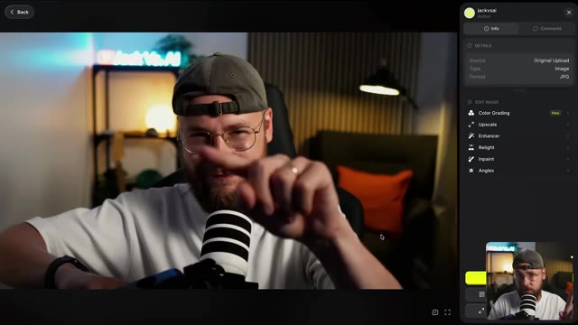
*Interface montrant l'éditeur d'image avec un aperçu vidéo de Jack pointant son doigt vers la caméra.*

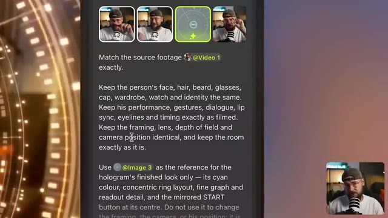
*Interface de prompt montrant les instructions de correspondance avec la source vidéo "@Video 1" et les consignes de conservation de l'identité et du cadrage.*

---

### ⏱️ `[00:18:03 - 00:18:40]` | Segment #35

**🔊 Audio (Transcription Intégrale Mot pour Mot en Français) :**
> Maintenant, j'ai vraiment eu du mal à aligner tout cela au niveau du timing, car j'ajoute généralement un peu d'espace avant que je ne veuille que l'effet commence, ainsi qu'après. Mais ce que j'ai constaté qui n'arrêtait pas de se produire, c'est que l'hologramme apparaissait et ensuite je tapotais ma montre, donc ça n'avait pas vraiment de sens. Alors ce que j'ai trouvé qui fonctionnait mieux, c'était de rogner le clip tout en bas pour qu'il commence au moment exact où je tapote ma montre. Vous verrez qu'en utilisant cette approche, le timing s'accorde vraiment très bien, de sorte que ce moment exact correspond au moment où l'hologramme apparaît réellement, et ensuite vous pouvez ajouter

**👁️ Analyse Visuelle d'Écran (gemini-3.5-flash-lite) :**
**Interface & Outils** : Seedance (interface de génération et d'édition vidéo par IA avec panneau latéral de prompts et de détails techniques).

**Contenu textuel & Code** : Texte du prompt visible dans le panneau latéral : "Match the source footage @Video 1 exactly. Keep the person's face, hair, beard, glasses, cap, wardrobe, watch and identity the same. Keep his performance, gestures, dialogue, lip sync, eyeliner and timing exactly as filmed". Paramètres visibles : Feature: Seedance 2, Quality: 1080p, Bitrate: High, Size: 1920x1080, Created: July 22/23, 2026.

**Action / Démonstration** : Le créateur montre l'interface de Seedance avec la prévisualisation vidéo de l'effet holographique circulaire et l'ajustement du timing lié au geste de la montre.

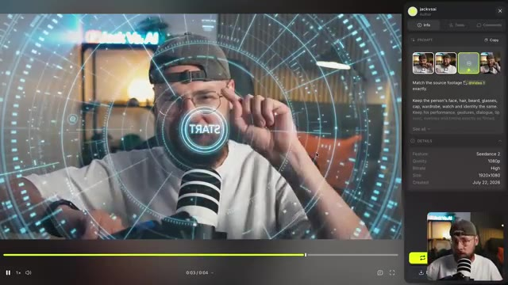
*Interface du logiciel Seedance affichant l'effet d'hologramme superposé sur la vidéo de Jack avec le panneau de prompt à droite.*

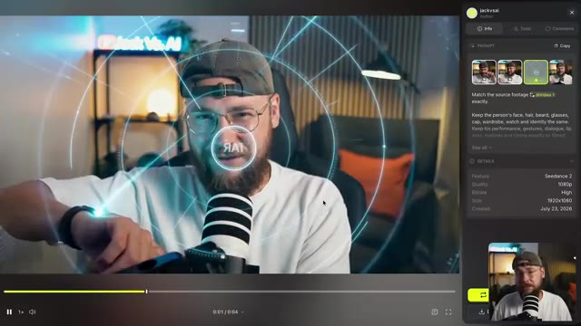
*Interface de Seedance montrant le moment où Jack tapote sa montre en synchronisation avec l'apparition de l'hologramme.*

---

### ⏱️ `[00:18:40 - 00:19:16]` | Segment #36

**🔊 Audio (Transcription Intégrale Mot pour Mot en Français) :**
> le début du plan dans votre montage si vous le souhaitez. Maintenant, nous plongeons vraiment dans le grand bain pour recréer quelques plans d'effets visuels classiques de films hollywoodiens. Honnêtement, je ne savais pas trop comment ces résultats allaient tourner. J'ai été vraiment très impressionné. La première chose que j'ai dû essayer, c'est l'effet de miroir classique de Matrix. Dans le film, Neo pose son doigt contre un miroir et il finit par se comporter comme un fluide, finissant par couler le long de son bras. Et si vous ne savez pas de quoi je parle ou de ce qui se passe après cela, s'il vous plaît, allez-vous en et allez regarder l'original.

**👁️ Analyse Visuelle d'Écran (gemini-3.5-flash-lite) :**
**Interface & Outils** : Interface web de Seedance avec lecteur vidéo intégré, barre de timeline, options de téléchargement et panneau latéral d'informations (Info/Tools/Comments), onglets Prompt et Details.

**Contenu textuel & Code** : Texte du prompt visible dans l' panneau latéral : "Match the source footage @video 1 exactly. Keep the person's face, hair, beard, glasses, cap, wardrobe, watch and identity the same. Keep his performance, gestures, dialogue, lip sync, outlines and timing exactly as filmed." Dans les détails : "Feature: Seedance 2", "Quality: 1080p", "Bitrate: High", "Size: 1920x1080", "Created: July 23, 2026".

**Action / Démonstration** : Le créateur présente l'interface de Seedance et montre des exemples de vidéos générées ou éditées, incluant une vue de son studio modifiée par IA et une séquence dans une salle de bain devant un miroir.

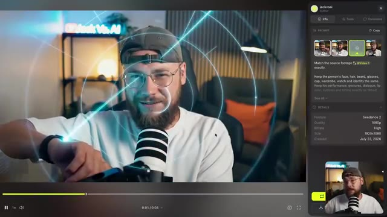
*Interface de l'outil Seedance avec un panneau latéral affichant les détails et le prompt d'une vidéo montrant Jack dans son studio avec des effets graphiques circulaires bleus.*

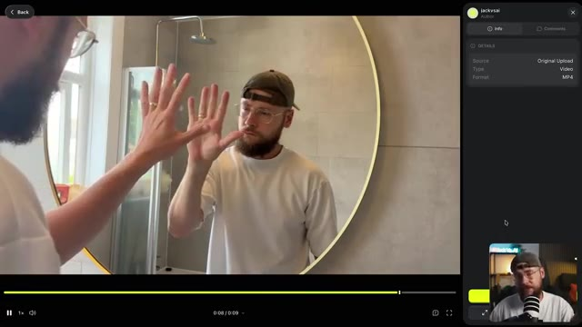
*Interface de Seedance affichant une vidéo dans une salle de bain où Jack touche un miroir rond, avec le panneau latéral de détails.*

---

### ⏱️ `[00:19:16 - 00:19:44]` | Segment #37

**🔊 Audio (Transcription Intégrale Mot pour Mot en Français) :**
> Film Matrix. C'est toujours incroyable. Donc j'ai cette séquence source ici où je fais essentiellement semblant que le miroir commence à se comporter d'une manière un peu bizarre. Encore une fois, j'utilise mon prompt conçu par Claude en utilisant le même processus avec cette capture d'écran ici pour servir de référence d'ancrage. Vous verrez que je balise cette référence d'ancrage ici lorsque je décris le plan d'origine pour le verrouiller. Laissez-moi vous montrer le résultat que j'ai obtenu.

**👁️ Analyse Visuelle d'Écran (gemini-3.5-flash-lite) :**
**Interface & Outils** : Interface de gestion de projets vidéo / IA avec panneau latéral d'édition, métadonnées du fichier source et retour caméra PiP en bas à droite.

**Contenu textuel & Code** : Informations du fichier affichant "Original Upload", "Video / JPG", format MP4/JPG, options d'édition (Color Grading, Upscale, Enhancer, Relight, Inpaint, Angles).

**Action / Démonstration** : Présentation de la vidéo source avec le miroir et de la capture d'écran de référence servant d'ancre pour le prompt d'intelligence artificielle.

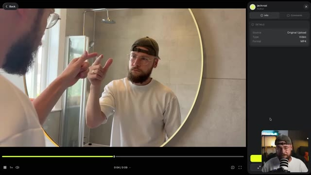
*Interface logicielle affichant un extrait vidéo source au format MP4 montrant Jack devant un miroir, avec un panneau d'informations à droite et la webcam du créateur en incrustation (PiP).*

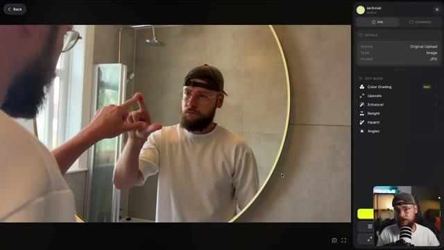
*Interface logicielle affichant la capture d'écran de référence (JPG) utilisée comme ancre, avec un menu d'édition à droite (Color Grading, Upscale, Enhancer, Relight, Inpaint, Angles).*

---

### ⏱️ `[00:19:54 - 00:20:31]` | Segment #38

**🔊 Audio (Transcription Intégrale Mot pour Mot en Français) :**
> D'une manière générale, vraiment des trucs incroyables. Je ne suis pas un grand fan de la façon dont ça ressort un peu du miroir quand je fais contact pour la première fois avec mon doigt, mais la façon dont le fluide du miroir descend le long de mon poignet et se comporte quand je fais pivoter mon bras a l'air super. Je suis sûr que vous pouvez apprécier à quel point ce flux de travail pourrait être utile si vous êtes quelqu'un qui aime faire des courts métrages mais qui n'a tout simplement pas le savoir-faire pour créer ces types d'effets vous-même. Pour l'exemple suivant, je voulais essayer de recréer la transformation de l'Homme-Sable dans Spider-Man 3 ou du moins obtenir quelque chose de proche.

**👁️ Analyse Visuelle d'Écran (gemini-3.5-flash-lite) :**
**Interface & Outils** : Interface d'une plateforme vidéo en ligne (similaire à Discord ou une application de type lecteur/partage multimédia) avec un volet latéral droit affichant les détails, les prompts et les informations de fichier.

**Contenu textuel & Code** : Texte du prompt visible dans le panneau latéral de l'image 2 : "This shot has three separate things that must never be confused: THE GLASS is the flat mirror surface on the wall; THE REFLECTED MAN is his normal reflection in the glass, ordinary skin, white shirt and flesh-coloured arm; and THE SILVER is a liquid chrome effect that does not exist yet. For the first part of the shot there is no silver anywhere..."

**Action / Démonstration** : Jack commente et analyse les exemples de vidéos générées par IA affichés à l'écran, en examinant les détails du rendu du miroir liquide et le prompt associé.

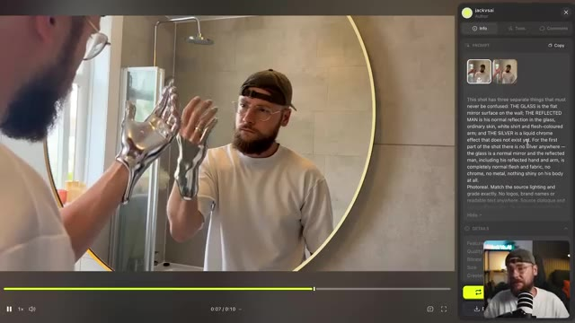
*Capture de la vidéo générée montrant Jack face à un miroir rond, avec un effet de main en métal liquide chromé, et le panneau latéral de l'interface affichant le prompt détaillé et les métadonnées.*

*Capture d'une autre vidéo en cours de lecture avec le panneau latéral affichant les détails (Source, Type, Format) et une petite miniature vidéo en incrustation (PiP) de Jack en bas à droite.*

---

### ⏱️ `[00:20:31 - 00:21:07]` | Segment #39

**🔊 Audio (Transcription Intégrale Mot pour Mot en Français) :**
> ou similaire à ce résultat. J'ai donc cette séquence vidéo de moi avec les bras levés, faisant semblant qu'il se passe quelque chose de génial alors qu'en réalité j'ai juste l'air d'un bizarre qui ne sait pas jouer la comédie assis dans son bureau, et je voulais pousser un peu le bouchon ici en incluant des mouvements de caméra qui n'étaient pas dans la source, donc lorsque j'ai briefé Claude, je lui ai demandé d'inclure un zoom rapide (crash zoom) pour qu'on se rapproche vraiment de ce genre de transformation granulaire et que le sable bouge entre ma main et mes poignets, puis de dézoomer pour qu'on puisse voir la transformation terminée, ici vous pouvez voir

**👁️ Analyse Visuelle d'Écran (gemini-3.5-flash-lite) :**
**Interface & Outils** : Interface de lecteur vidéo avec panneau latéral de détails (Source, Type, Format) et vignette Picture-in-Picture (PiP) du créateur.

**Contenu textuel & Code** : Panneau latéral affichant « DETAILS », « Source : Original Upload », « Type : Video », « Format : MP4 », ainsi que le nom d'auteur « jackvsai » et les onglets « Info » et « Comments ».

**Action / Démonstration** : Le lecteur vidéo affiche la lecture de la séquence de démonstration avec une incrustation vidéo du créateur parlant dans son micro en bas à droite.

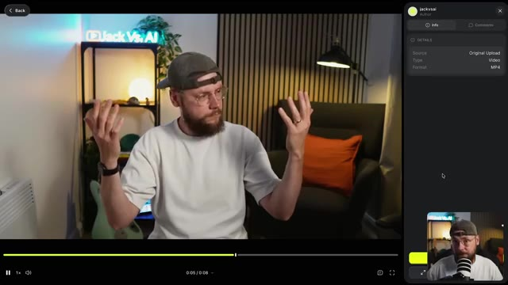
*Interface de lecture vidéo affichant les détails du fichier source (Original Upload, Video, MP4) et un encadré PiP montrant Jack dans son studio.*

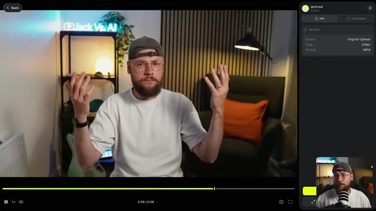
*Interface de lecture vidéo similaire montrant la timeline à 00:06 / 00:08 avec les métadonnées sur le panneau de droite.*

---

### ⏱️ `[00:21:07 - 00:21:42]` | Segment #40

**🔊 Audio (Transcription Intégrale Mot pour Mot en Français) :**
> la référence de l'ancrage ou la capture d'écran que j'ai téléchargée par Claude et C-dance 2 pour verrouiller la composition. Cela étant dit, laissez-moi vous montrer le résultat que j'ai obtenu. J'adore vraiment celui-ci. Le zoom rapide fonctionne très bien. On peut vraiment apprécier ces effets de particules parce qu'on est dans ce gros plan. Généralement, un autre résultat incroyable. Si je devais être hypercritique, j'apporterais

**👁️ Analyse Visuelle d'Écran (gemini-3.5-flash-lite) :**
**Interface & Outils** : Interface de l'outil Seedance 2, avec panneau latéral de détails à droite, barre de lecture en bas et encadré vidéo PiP du créateur en bas à droite.

**Contenu textuel & Code** : Dans le panneau de droite : prompt visible « Match the source footage @Video 1 exactly. Use @Image 1 as a reference for his starting posture and framing... », section DETAILS avec Feature: Seedance 2, Quality: 1080p, Bitrate: High, Size: 1920x1080, Created: July 22, 2026.

**Action / Démonstration** : Le créateur commente et présente l'interface de Seedance 2 ainsi que le résultat vidéo généré par intelligence artificielle mettant en scène des effets spéciaux de particules de sable.

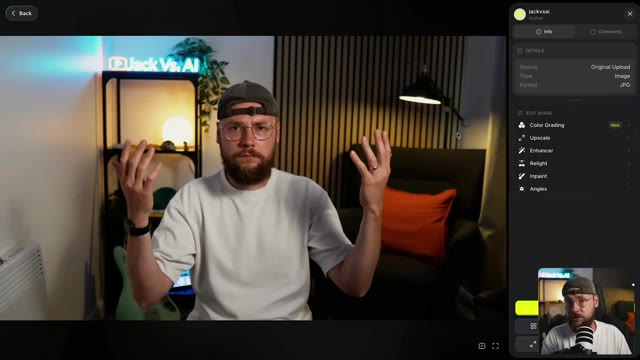
*Interface de Seedance 2 montrant les options de détails de l'image source avec le créateur en incrustation vidéo (PiP).*

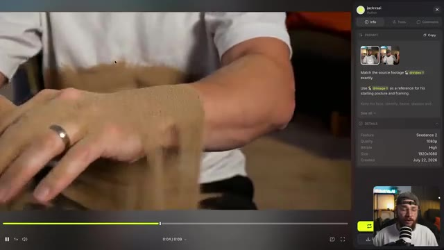
*Interface de Seedance 2 affichant le prompt de génération vidéo avec des références et le panneau latéral de détails.*

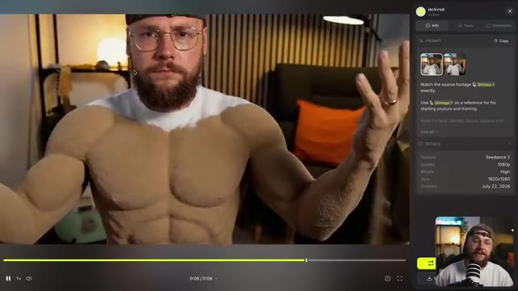
*Interface de Seedance 2 montrant le résultat vidéo généré avec des effets de particules sur le torse du créateur.*

---

### ⏱️ `[00:21:42 - 00:22:11]` | Segment #41

**🔊 Audio (Transcription Intégrale Mot pour Mot en Français) :**
> le fait que mes lunettes ne se transforment pas en sable. Elles restent dans le même matériau qu'avant, même si mon t-shirt et tout le reste de mon corps se transforment en sable. Il y a donc un petit problème là. Mais malgré tout, le fait que l'intelligence artificielle soit capable de produire un plan d'effets visuels à ce niveau est vraiment impressionnant. Sur ce, les gars, nous sommes arrivés à la fin de la vidéo d'aujourd'hui. Si vous avez apprécié le contenu d'aujourd'hui, n'oubliez pas de lâcher un pouce bleu pour moi et pensez à vous abonner.

**👁️ Analyse Visuelle d'Écran (gemini-3.5-flash-lite) :**
**Interface & Outils** : Interface de la plateforme Seedance 2 avec lecteur vidéo intégré, panneau de prompt textuel ("Match the source footage..."), détails de génération (qualité 1080p, débit High, résolution 1920x1080) et mini-fenêtre PiP du créateur.

**Contenu textuel & Code** : Texte du prompt visible dans le panneau latéral droit : "Match the source footage @Video 1 exactly. Use @Image 1 as a reference for his starting posture and framing." Paramètres techniques : Feature: Seedance 2, Quality: 1080p, Bitrate: High, Size: 1920x1080, Created: July 22, 2026.

**Action / Démonstration** : Le créateur commente et analyse la vidéo générée par l'IA sur l'interface de Seedance 2, visualisant le résultat des effets visuels de désintégration en sable.

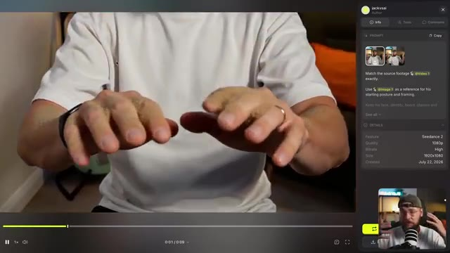
*Interface de prévisualisation vidéo montrant le rendu où les mains et le t-shirt de Jack se désagrègent en sable, avec le panneau latéral de Seedance 2 et une incrustation vidéo du créateur en bas à droite.*

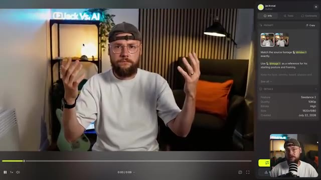
*Interface de Seedance 2 affichant le plan généré par IA où Jack se tient debout dans son studio avec les mains levées, montrant un effet de désintégration partielle.*

---

### ⏱️ `[00:22:11 - 00:22:20]` | Segment #42

**🔊 Audio (Transcription Intégrale Mot pour Mot en Français) :**
> Cela aide vraiment à soutenir la chaîne et à permettre à cette communauté de continuer à grandir. Merci beaucoup d'avoir regardé les gars et je vous retrouve dans la prochaine.

**👁️ Analyse Visuelle d'Écran (gemini-3.5-flash-lite) :**
**Interface & Outils** : Vidéo générée par IA en plein écran avec un encadré PiP (Picture-in-Picture) du créateur.

**Contenu textuel & Code** : Rendu visuel d'une scène de type aventurier/explorateur dans une jungle mystérieuse éclairée par une torche, et petit encadré vidéo montrant Jack face caméra dans son studio.

**Action / Démonstration** : Le créateur montre à l'écran un exemple de génération vidéo par intelligence artificielle tout en concluant sa vidéo, avec son retour caméra incrusté en bas à droite.

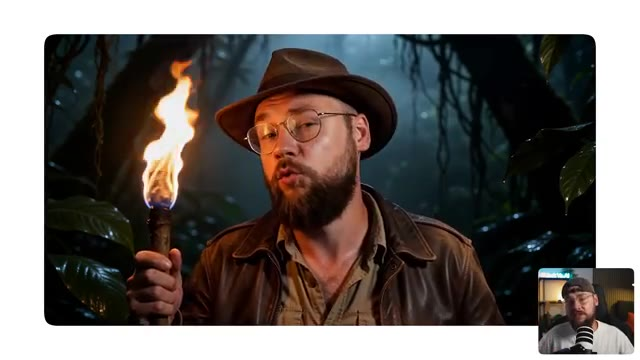
*Génération vidéo par IA montrant un personnage de style explorateur tenant une torche dans une jungle sombre, avec un encadré PiP (Picture-in-Picture) de Jack dans son studio en bas à droite.*

---
