# 🎬 Créer une animation style bande dessinée avec l'IA (Workflow complet)

> **Chaîne** : [Jack Vs. AI](https://www.youtube.com/@JackVsAI)  
> **Titre original** : `How to Create Comic Book Style Animation with AI (Full Workflow)`  
> **Lien YouTube** : [https://www.youtube.com/watch?v=M8ERoEGyAWw](https://www.youtube.com/watch?v=M8ERoEGyAWw)  
> **Date de publication** : 2026-08-01  
> **Durée** : 14m 22s (`862s`)  
> **Identifiant vidéo** : `M8ERoEGyAWw`  
> **Fiche Web Interactive** : [2026-08-01_YT-M8ERoEGyAWw_Créer une animation style bande dessinée avec l'IA (Workflow complet)_by-whisper-v3-large-turbo+gemini-3.5-flash-lite.html](2026-08-01_YT-M8ERoEGyAWw_Créer une animation style bande dessinée avec l'IA (Workflow complet)_by-whisper-v3-large-turbo+gemini-3.5-flash-lite.html)  
> **Captures de démonstration clés** : `54 captures réelles (anti-talking-head)`  
> **Modèles utilisés** : Audio: `large-v3-turbo` (Faster-Whisper int8 VPS) | Vision: `gemini-3.5-flash-lite` (Google AI Studio API)  

---

## 📌 Synthèse Exécutive & Outils

### 📌 Résumé
La vidéo de Jack Vs. AI propose une révolution méthodologique pour la création indépendante d'animations de style bande dessinée (dans la veine visuelle d'œuvres comme *Into the Spider-Verse* ou *Arcane*). Autrefois réservée à des studios dotés de budgets colossaux et de mois de production, cette esthétique haut de gamme est désormais accessible à tout créateur équipé d'un simple ordinateur et d'une suite d'outils d'IA interconnectés. Jack dévoile un workflow complet et structuré qui s'affranchit des limites créatives traditionnelles en combinant l'intelligence textuelle de LLMs et la puissance de génération multimodale d'assistants vidéo spécialisés.

Le processus créatif s'articule autour d'une rigueur méthodologique en deux grands volets : la conception et la fidélité des assets. Grâce à l'utilisation de compétences personnalisées (« custom skills ») injectées dans des chatbots comme Claude, Jack automatise la transformation d'idées narratives simples en prompts hautement techniques. Cette étape garantit le verrouillage stylistique avant de passer à la génération d'images et de fiches de référence de personnages. Ces fiches s'avèrent indispensables pour guider les modèles vidéo et maintenir une cohérence visuelle parfaite d'un plan à l'autre.

Enfin, le workflow aborde la délicate transition vers la génération vidéo animée via des plateformes comme Higgsfield. En injectant simultanément les fiches de personnages, les décors fixes et les prompts contextuels enrichis par l'IA, le réalisateur parvient à générer des séquences dynamiques et complexes (échelles monumentales, courses de vitesse urbaines) tout en optimisant l'utilisation des crédits. Cette masterclass démontre comment l'IA générative, couplée à une direction artistique méthodique, démocratise la réalisation de mini-médias narratifs de qualité professionnelle.

### 🛠️ Outils, Modèles & Logiciels Présentés
* **Claude** : LLM utilisé comme assistant textuel principal pour traduire des concepts narratifs simples en prompts ultra-détaillés grâce à des compétences personnalisées (« custom skills »).
* **ChatGPT & Gemini** : Chatbots alternatifs mentionnés pour initier la rédaction de prompts de base et assister à la phase de conceptualisation textuelle.
* **Higgsfield AI** : Plateforme centrale du workflow permettant la génération d'images, la création de fiches de référence de personnages et l'animation vidéo.
* **Seedream 5.0 Pro** : Modèle de génération d'images intégré à Higgsfield, idéal pour concevoir les décors et les designs initiaux.
* **Mid Journey** : Solution externe optionnelle hautement recommandée pour sa supériorité artistique dans le design des personnages et l'attribution d'un style unique.
* **GPT image 2** : Modèle d'image spécifique (via Higgsfield) utilisé pour générer des fiches de référence de personnages cohérents sous tous les angles.
* **Seedance 2** : Modèle de génération vidéo sur Higgsfield exploitant les fiches de référence et les images fixes pour animer les scènes avec précision.
* **Premiere Pro** : Logiciel de montage traditionnel mentionné dans l'introduction pour l'assemblage final des différentes séquences générées.

### 🔑 Points Clés & Enseignements Stratégiques
* **Démocratisation esthétrique** : Il est désormais possible de reproduire des styles d'animation complexes de type blockbusters (style comic book moderne) sans équipe technique ni budgets massifs.
* **L'importance des compétences personnalisées (« custom skills »)** : L'utilisation de prompts système pré-programmés dans Claude permet de standardiser et d'automatiser l'écriture de requêtes expertes verrouillant un style artistique précis.
* **Dualité de génération d'images** : Utiliser Seedream 5.0 Pro pour un flux unifié et rapide sur Higgsfield, ou basculer sur Mid Journey pour exploiter une supériorité artistique incontestée sur le design de personnages.
* **Le rôle critique des fiches de référence** : Générer des planches de personnages sous tous les angles avant l'animation permet au modèle vidéo de ne pas « deviner », réduisant drastiquement les artefacts visuels.
* **Optimisation des crédits par la résolution de test** : Il est stratégiquement recommandé d'utiliser des résolutions basses (comme le 480p) pour valider le comportement d'un prompt vidéo avant de lancer le rendu final en haute définition (1080p ou 4K).
* **Contextualisation cumulative** : Lors de la rédaction des prompts vidéo, alimenter l'IA textuelle avec l'ensemble des ressources créées (fiches personnages + décors fixes) garantit une continuité narrative et visuelle parfaite.
* **Gestion de l'échelle et du dynamisme** : Les prompts textuels riches en détails spatiaux permettent de simuler avec succès des rapports de taille spectaculaires (ex: un humain face à un Titan gigantesque).
* **Cohérence des personnages en mouvement** : L'association d'une image fixe de lieu, d'une fiche de référence de personnage et d'un prompt contextuel au sein de Seedance 2 garantit l'intégrité du protagoniste à travers des scènes d'action rythmées.
* **Modularité et assemblage** : Le workflow favorise la création de séquences courtes et distinctes (générations autonomes) destinées à être assemblées ultérieurement pour raconter une histoire complète.
* **Vérification pré-génération** : Relire systématiquement les prompts générés par Claude avant de valider le rendu sur la plateforme vidéo permet d'éviter le gaspillage inutile de crédits de calcul.

---

## ⏱️ Chronologie & Transcription Complète Audio & Visuelle (Mot pour Mot)

### ⏱️ `[00:00:00 - 00:00:35]` | Segment #01

**🔊 Audio (Transcription Intégrale Mot pour Mot en Français) :**
> Vous pouvez désormais créer votre propre animation de style bande dessinée en n'utilisant que des outils d'IA. Cela coûtait auparavant des milliers de dollars et prenait des mois de travail. Mais maintenant, tout ce dont vous avez besoin, c'est d'une idée et de votre ordinateur portable. Je m'appelle Jack. J'ai passé plus d'une décennie à créer des effets visuels pour de nombreuses grandes marques de la planète. Et maintenant, j'utilise l'IA pour réinventer les flux de travail créatifs. Ce style d'animation a explosé en popularité grâce à des projets comme Into the Spider-Verse et Arcane. Mais personne ne vous dit comment obtenir des résultats de cette qualité avec l'IA, et cela change aujourd'hui. Je vais partager

**👁️ Analyse Visuelle d'Écran (gemini-3.5-flash-lite) :**
**Interface & Outils** : Présentation face caméra / extraits d'animations générées par IA sans affichage d'interface logicielle de travail.

**Contenu textuel & Code** : Affichage de sous-titres en anglais soulignés en jaune ("comic book style animation", "and your laptop.", "in popularity", "and that changes today.") par-dessus des visuels animés de style bande dessinée (cour d'université gothique, personnage stylisé, personnage face à une statue géante).

**Action / Démonstration** : Le créateur illustre son propos par des clips vidéo d'animations générées par IA illustrant le style "comic book / animation".

---

### ⏱️ `[00:00:35 - 00:01:00]` | Segment #02

**🔊 Audio (Transcription Intégrale Mot pour Mot en Français) :**
> mon flux de travail complet, vous saurez ainsi comment développer vos propres personnages, décors et scènes tout en préservant ce style inimitable. Croyez-moi, vous ne voulez pas rater celui-ci. Si vous aimez le contenu d'aujourd'hui, assurez-vous de lâcher un pouce bleu pour moi et pensez à vous abonner. Il y aura des horodatages ci-dessous si vous voulez passer facilement d'un chapitre à l'autre. Cela étant dit, commençons. La première étape est la conception des personnages.

**👁️ Analyse Visuelle d'Écran (gemini-3.5-flash-lite) :**
**Interface & Outils** : Interface de montage vidéo avec habillage graphique incluant des icônes de chapitres et une incrustation vidéo du créateur.

**Contenu textuel & Code** : Textes à l'écran : « characters », « this unmistakable style », « Chapter 1 », « Chapter 2 », « Chapter 3 ».

**Action / Démonstration** : Transition graphique et affichage de chapitres vidéo pendant que le présentateur explique la structure de sa vidéo et annonce le premier sujet.

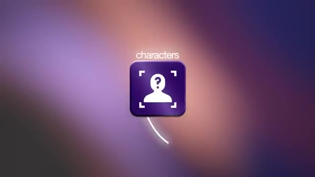
*Animation graphique illustrant la section « characters » (personnages) avec une icône de profil et un point d'interrogation.*

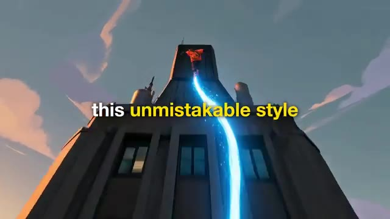
*Extrait vidéo d'animation montrant un personnage sur un toit avec une traînée lumineuse bleue, illustrant le style visuel unique mentionné (« this unmistakable style »).*

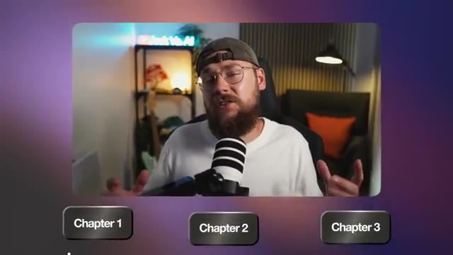
*Vue incrustée (PiP) du présentateur Jack parlant dans son studio, avec des boutons de chapitres affichés en bas de l'écran (« Chapter 1 », « Chapter 2 », « Chapter 3 »).*

---

### ⏱️ `[00:01:00 - 00:01:34]` | Segment #03

**🔊 Audio (Transcription Intégrale Mot pour Mot en Français) :**
> Personne ne va regarder votre animation si vos personnages ont l'air ennuyeux et génériques, donc je veux que vous approfondissiez ce point. Allez-vous construire un héros ou un vilain ? Quelle est leur ethnie ? De quels vêtements et équipements ont-ils besoin ? Et quel est leur rôle dans l'histoire ? Je veux que vous jotiez quelques idées pour chaque personnage, puis nous allons utiliser un outil d'IA comme ChatGPT, Gemini ou dans mon cas Claude pour nous aider à rédiger nos prompts. Et rappelez-vous que tous ces outils ont des versions gratuites auxquelles vous pouvez accéder. J'ai développé cette compétence personnalisée qui fonctionnera avec n'importe quelle IA

**👁️ Analyse Visuelle d'Écran (gemini-3.5-flash-lite) :**
**Interface & Outils** : Interface de l'assistant IA Claude avec une boîte de dialogue et un fichier markdown attaché "CharacterArt.md".

**Contenu textuel & Code** : Texte affiché à l'écran : "What can we tackle together?", le fichier "Painterly Cinematic CharacterArt.md (119 lines)", et le champ de saisie "How can I help you today?" avec le modèle "Opus 4.8 Medium".

**Action / Démonstration** : Le créateur montre visuellement les concepts de personnages, les logos des IA, puis l'interface de Claude pour illustrer comment structurer les prompts de génération.

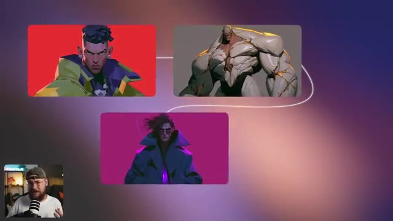
*Affichage de concepts visuels de personnages stylisés (héros et antagonistes) sur fond sombre.*

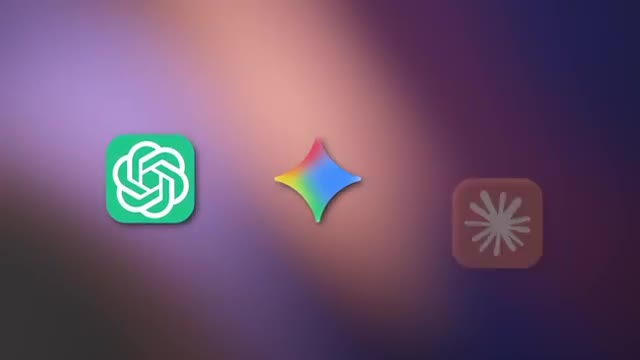
*Présentation des icônes des trois outils d'IA mentionnés : ChatGPT, Google Gemini et Claude.*

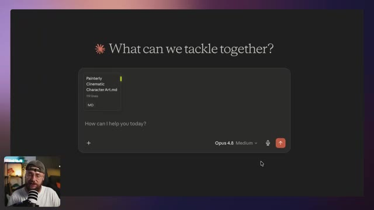
*Interface de l'outil Claude avec la question "What can we tackle together?" et le fichier "CharacterArt.md" importé.*

---

### ⏱️ `[00:01:34 - 00:02:09]` | Segment #04

**🔊 Audio (Transcription Intégrale Mot pour Mot en Français) :**
> chatbot pour vous aider à convertir vos idées simples en prompts détaillés qui verrouillent ce style artistique de comic book. Et cela sera également disponible entièrement gratuitement sur ma communauté school. Avec la compétence téléchargée, je peux taper quelque chose d'aussi simple que « écris-moi un prompt pour une héroïne qui a la capacité de manipuler l'or comme matériau ». Vous allez voir que Claude commence à lire à partir de ma compétence personnalisée. Et en quelques instants, il a pris notre entrée vraiment simple et nous a construit un prompt richement détaillé. Et c'est la clé pour débloquer les meilleurs résultats

**👁️ Analyse Visuelle d'Écran (gemini-3.5-flash-lite) :**
**Interface & Outils** : Interface de l'outil de discussion Claude avec un encadré de type Picture-in-Picture (PiP) affichant le créateur dans le coin inférieur gauche.

**Contenu textuel & Code** : Texte affiché : « What can we tackle together? », « Painterly Cinematic Character Art.md », « How can I help you today? » et le modèle « Opus 4.8 Medium ».

**Action / Démonstration** : Le créateur montre l'interface de Claude avec une compétence personnalisée chargée pour générer des prompts artistiques de type comic book, tout en apparaissant en incrustation vidéo.

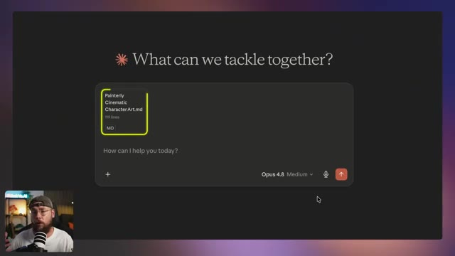
*Interface de l'assistant Claude montrant une compétence personnalisée pour le style artistique de comic book, avec Jack visible en incrustation (PiP).*

---

### ⏱️ `[00:02:09 - 00:02:43]` | Segment #05

**🔊 Audio (Transcription Intégrale Mot pour Mot en Français) :**
> avec ces outils. Pour construire notre projet, je suis sur Higgs Field AI. Et si vous voulez suivre en même temps, je mettrai un lien en bas dans la description. Pour commencer, vous voulez aller tout en haut à l'gauche, survoler l'onglet image puis sélectionner créer une image. Pour le modèle, je suggère d'utiliser Seedream 5.0 Pro avec ces paramètres. Vous pouvez coller le prompt venant de Claude, cliquer sur générer et on obtient un résultat qui ressemble à ça. Maintenant, je veux vous donner une astuce bonus rapide. Si vous voulez garder votre flux de travail simple et agréable, vous pouvez générer

**👁️ Analyse Visuelle d'Écran (gemini-3.5-flash-lite) :**
**Interface & Outils** : Higgsfield AI (plateforme de génération d'images et vidéos par IA)

**Contenu textuel & Code** : Texte du prompt visible dans l'image 3 : "A striking woman with a proud upturned chin, fair skin, sculpted high cheekbones, dark auburn hair slicked back into tight cornrows feeding into a low bun..." Paramètres visibles : modèle GPT Image 2, résolution 2K, format 16:9, compteur de crédits (Generate +3). Menu déroulant des modèles de Higgsfield AI incluant Seedream 5.0 Pro, Higgsfield Soul 2.0, etc.

**Action / Démonstration** : Le créateur montre la navigation dans les menus de Higgsfield AI pour sélectionner l'onglet "Image" et choisir le modèle, puis présente la zone de saisie du prompt avec les paramètres de génération.

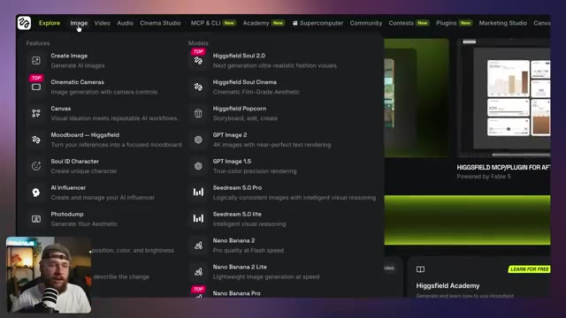
*Interface de Higgsfield AI montrant le menu des fonctionnalités et des modèles (Seedream 5.0 Pro)*

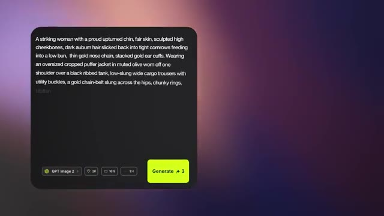
*Fenêtre de prompt textuel sur Higgsfield AI avec les options de génération (GPT Image 2, format 16:9, bouton Generate)*

---

### ⏱️ `[00:02:43 - 00:03:15]` | Segment #06

**🔊 Audio (Transcription Intégrale Mot pour Mot en Français) :**
> tout ce qui vient de Higgsfield mais si vous êtes prêts à ajouter une étape supplémentaire au processus Mid Journey est la plateforme vers laquelle je vous orienterais. Je serai honnête, Mid Journey est plutôt mauvais dans certaines parties du processus de génération d'images, mais il possède un sens incroyable du design de personnages et du style. Ma préférence personnelle est donc d'exécuter notre prompt Claude via Mid Journey en utilisant ces paramètres. Ici, j'ai généré un groupe de personnages et de lieux vraiment uniques. Donc je vais

**👁️ Analyse Visuelle d'Écran (gemini-3.5-flash-lite) :**
**Interface & Outils** : Présentation vidéo avec incrustation PiP (Picture-in-Picture) du créateur face caméra dans le coin inférieur gauche.

**Contenu textuel & Code** : Image générée représentant une cour intérieure de style médiéval/gothique avec des bâtiments en pierre, de grandes fenêtres arquées, un jardin central et une pelouse verdoyante sous un ciel bleu clair.

**Action / Démonstration** : Affichage d'une image générée par IA illustrant les décors uniques mentionnés dans le discours.

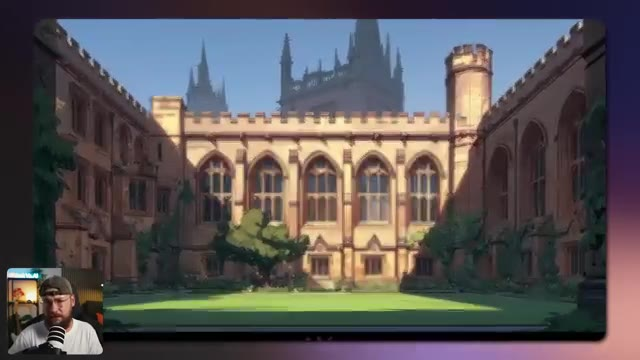
*Rendu visuel d'une cour de château gothique ou d'une université ancienne généré par intelligence artificielle, avec le créateur en incrustation PiP dans le coin inférieur gauche.*

---

### ⏱️ `[00:03:15 - 00:03:49]` | Segment #07

**🔊 Audio (Transcription Intégrale Mot pour Mot en Français) :**
> téléchargez tout cela et amenez-les sur Higgsfield car maintenant nous devons créer nos fiches de référence de personnages. D'abord, vous voulez utiliser votre design de personnage comme image de référence, puis vous voulez copier et coller ce cadre de prompt ici dans cette fenêtre. Vous n'avez rien à changer. Vous remarquerez que je suis passé à GPT image 2 et c'est parce que ce modèle d'image particulier est vraiment doué pour créer des fiches de référence de personnages. Donc si je clique sur générer, nous obtenons un résultat comme celui-ci. Et ces fiches de personnages sont cruciales quand il

**👁️ Analyse Visuelle d'Écran (gemini-3.5-flash-lite) :**
**Interface & Outils** : Higgsfield (avec sélection du modèle GPT Image 2)

**Contenu textuel & Code** : Paramètres visibles : modèle "GPT Image 2", qualité "High", résolution "2K", format "16:9", et curseur de proportion d'image.

**Action / Démonstration** : Le créateur montre l'interface de Higgsfield et explique le choix du modèle GPT Image 2 pour générer les fiches de référence de personnages.

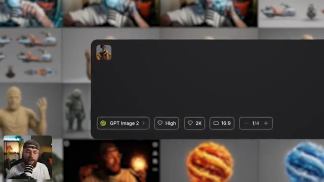
*Interface de Higgsfield montrant les paramètres de génération avec le modèle GPT Image 2 et le mode Picture-in-Picture de Jack en bas à gauche.*

---

### ⏱️ `[00:03:49 - 00:04:22]` | Segment #08

**🔊 Audio (Transcription Intégrale Mot pour Mot en Français) :**
> s'agit d'animer chacune de nos scènes car elles indiqueront au modèle vidéo IA à quoi ressemblent nos personnages sous tous les angles. Et cela signifie que l'IA n'a pas à deviner, ce qui réduit le risque de mauvaises générations et permettra par conséquent d'économiser vos crédits. Nous pouvons également combiner un nouveau prompt Claude avec ce framework de fiche de référence de personnage pour effectuer des modifications ou des variations de nos personnages. Rappelez-vous, chaque fois que vous voulez un nouveau prompt de Claude, retournez au chatbot, décrivez le type de changement que vous recherchez, et il va vous construire un nouveau prompt tandis que

**👁️ Analyse Visuelle d'Écran (gemini-3.5-flash-lite) :**
**Interface & Outils** : Interface de génération d'images/vidéos par IA (avec panneau de prompt, détails du modèle GPT Image 2, taille 2688x1520) et interface de chatbot (Claude).

**Contenu textuel & Code** : Texte du prompt visible : "Show the same striking woman, same face, sculpted cheekbones and proud features... Character reference sheet — four views on a neutral grey background" et plus bas les instructions pour une version alternative "Show an alternate version of the same character... A few deliberate moves... No gold anywhere...".

**Action / Démonstration** : Le créateur montre des exemples concrets de fiches de référence de personnages générées par IA et explique comment utiliser Claude pour obtenir de nouveaux prompts avec des variations.

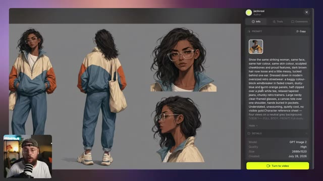
*Interface montrant une feuille de référence de personnage sous plusieurs angles (vue de face, de dos et gros plans) avec le prompt textuel correspondant dans le panneau latéral droit, et le créateur visible en incrustation PiP.*

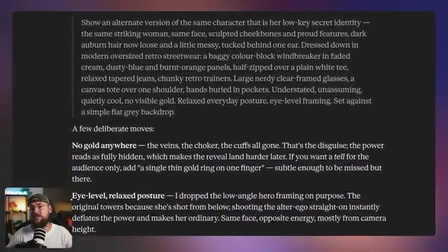
*Interface affichant un prompt textuel détaillé sur fond sombre pour créer une version alternative du personnage, avec des instructions spécifiques sur le style et les détails.*

---

### ⏱️ `[00:04:22 - 00:04:59]` | Segment #09

**🔊 Audio (Transcription Intégrale Mot pour Mot en Français) :**
> en faisant référence à ma compétence personnalisée. Par exemple, ici j'ai construit l'alter ego de notre héroïne, donc quand elle est déguisée et prétend mener une vie normale. Donc pour résumer, nous terminons cette première section avec une collection de photos de lieux et de feuilles de référence de personnages. Et maintenant nous sommes prêts à aller de l'avant et à commencer à donner vie à nos scènes. J'ai mentionné plus tôt à quel point il est crucial d'avoir des invites de haute qualité lorsqu'il s'agit de génération d'images. Eh bien, c'est en fait encore plus important avec la génération de vidéo. Et c'est pourquoi j'ai développé une deuxième compétence gratuite pour cet objectif précis. J'ai déposé

**👁️ Analyse Visuelle d'Écran (gemini-3.5-flash-lite) :**
**Interface & Outils** : Interface web de génération d'images/vidéos (type application personnalisée ou interface de type GPT/outil IA).

**Contenu textuel & Code** : Texte du prompt visible sur le panneau latéral : "Show the same striking woman, same face, same hair colour, same skin colour, sculpted cheekbones and proud features...". Paramètres : Modèle "GPT Image 2", Qualité "High", Résolution "2688x1520", Date "July 28, 2026", et bouton "Turn to video".

**Action / Démonstration** : Présentation d'une feuille de référence de personnage (character reference sheet) générée par IA montrant plusieurs vues d'un personnage féminin, puis transition vers une image de décor de lieu.

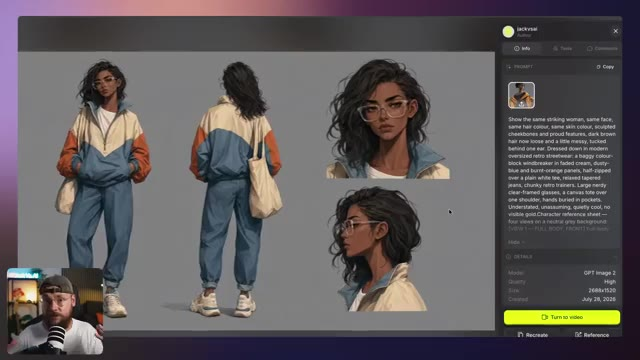
*Interface d'une application affichant une feuille de référence de personnage féminin avec différents angles de vue et un panneau de prompt détaillé sur le côté.*

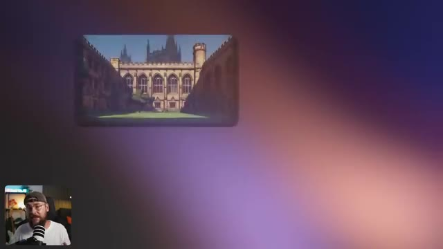
*Affichage d'une image fixe d'un décor de cour extérieure de bâtiment ancien dans un encadré sur fond abstrait flouté.*

---

### ⏱️ `[00:04:59 - 00:05:33]` | Segment #10

**🔊 Audio (Transcription Intégrale Mot pour Mot en Français) :**
> ceci dans Claude avec toutes les feuilles de référence de personnages et les images fixes de lieux pertinentes pour fournir à l'IA un contexte supplémentaire. Maintenant, je dois aller décrire ce que je veux qu'il se passe dans la scène. Nous allons donc commencer simplement avec des générations autonomes, puis progresser vers un exemple plus complexe où nous assemblerons réellement des générations séparées pour construire une histoire entière. J'ai donc d'abord rédigé la description de cette scène particulière, et je n'ai pas vraiment eu à me soucier qu'elle soit bien écrite. Je l'ai juste remplie d'autant de détails que possible.

**👁️ Analyse Visuelle d'Écran (gemini-3.5-flash-lite) :**
**Interface & Outils** : Interface de l'assistant IA Claude avec une zone de texte, des options de sélection de modèle (Opus 4.8 Medium), et un encadré PiP montrant le créateur en bas à gauche.

**Contenu textuel & Code** : Texte affiché : « What can we tackle together? », vignettes de projet nommées « Multishot Arcane Animation Prompt... », et un long prompt descriptif pour la scène du titan de pierre : « Slow dolly camera move in to the landscape with the giant stone titan who is lifeless... ».

**Action / Démonstration** : Le créateur montre l'interface de l'outil de discussion textuelle et le prompt détaillé qu'il a rédigé pour décrire la séquence narrative aux plans multiples.

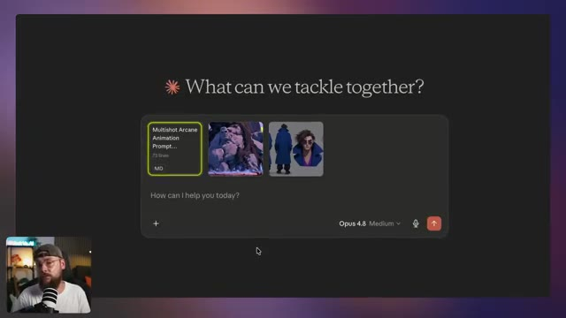
*Interface de l'outil IA (Claude) montrant le titre « What can we tackle together? » et des vignettes de projets et références de personnages.*

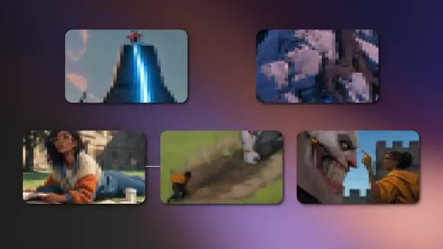
*Grille de cinq images miniatures ou vignettes pixélisées représentant diverses scènes de films ou d'animations dans un style artistique.*

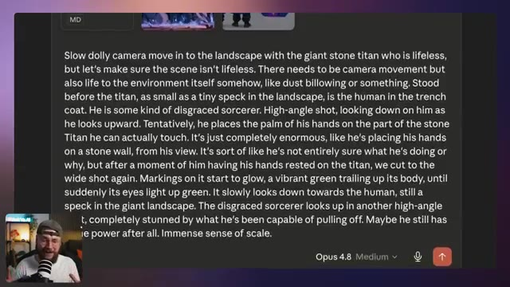
*Interface de l'outil IA (Claude) affichant un prompt textuel détaillé décrivant une scène de cinéma avec un titan de pierre et un sorcier.*

---

### ⏱️ `[00:05:33 - 00:06:11]` | Segment #11

**🔊 Audio (Transcription Intégrale Mot pour Mot en Français) :**
> autant que je peux. Et ici, j'ai vraiment insisté sur un sentiment immense d'échelle. Je veux que le Titan soit absolument gigantesque et que notre humain ait l'air d'une minuscule particule en comparaison. Si nous allons de l'avant et envoyons ceci, Claude fera référence à ma compétence et nous renverra un prompt comme ceci. Cette compétence particulière aura par défaut une longueur de génération de 15 secondes. Si vous voulez une génération plus courte, faites-le simplement savoir à Claude et il adaptera le cadre en conséquence. De retour sur Higgsfield, vous voulez vous diriger vers le coin supérieur gauche, survoler l'onglet vidéo et ensuite sélectionner Seedance 2 à l'intérieur de ce premier

**👁️ Analyse Visuelle d'Écran (gemini-3.5-flash-lite) :**
**Interface & Outils** : Interface de la plateforme Higgsfield affichant des menus de sélection de modèles vidéo (Seedance, Kling, Sora, Google Veo) et interface textuelle de prompts.

**Contenu textuel & Code** : Texte affichant des timecodes et des descriptions de plans détaillés ([00:00 - 00:04] Extreme wide, 18mm, low angle... / [00:04 - 00:06] Wide, 35mm, high angle...) et menus de modèles de génération vidéo incluant Seedance 2.0 4K, Gemini Omni Flash, Kling 3.0, Sora 2, Google Veo 3.1.

**Action / Démonstration** : Le créateur montre des exemples de prompts structurés pour le découpage de plans cinématiques, puis navigue dans l'interface de Higgsfield en survolant les onglets pour sélectionner le modèle Seedance.

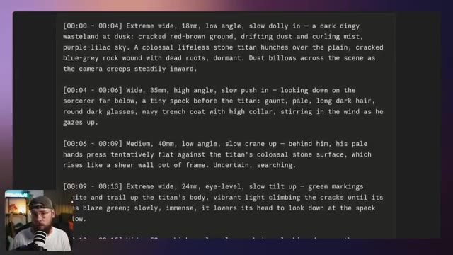
*Interface textuelle affichant des instructions de découpage temporel et des descriptions de plans de caméra (prompts de génération vidéo).*

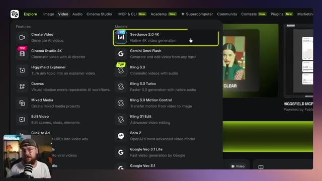
*Interface de la plateforme Higgsfield montrant le menu déroulant des fonctionnalités et des modèles vidéo (Seedance 2.0 4K, Kling 3.0, Sora 2, etc.) avec Jack dans un encadré PiP.*

---

### ⏱️ `[00:06:11 - 00:06:46]` | Segment #12

**🔊 Audio (Transcription Intégrale Mot pour Mot en Français) :**
> ici vous voulez importer toutes les ressources pertinentes donc encore une fois ce sont nos fiches de référence de personnages et nos plans fixes de décors et maintenant nous pouvons aller copier notre prompt depuis Claude et le déposer dans ce champ ici sur Higgsfield maintenant je suggère de le relire rapidement Claude est généralement très bon pour rédiger des prompts mais vérifiez simplement qu'il décrit la scène exactement comme vous l'avez imaginé avant de cliquer sur générer juste pour vous assurer de ne pas gaspiller vos crédits. Assurez-vous de régler votre durée pour qu'elle corresponde à la longueur de scène que vous recherchez et sélectionnez également votre

**👁️ Analyse Visuelle d'Écran (gemini-3.5-flash-lite) :**
**Interface & Outils** : Interface de l'outil de génération vidéo par IA Higgsfield avec vignettes de référence, champ de texte pour le prompt, sélection du modèle (Seedance 2.0) et paramètres de durée (15s), format (16:9) et résolution (1080p).

**Contenu textuel & Code** : Texte du prompt : "[00:00 - 00:04] Extreme wide, 18mm, low angle, slow dolly in — a dark dingy wasteland at dusk: cracked red-brown ground, drifting dust and curling mist, purple-lilac sky. A colossal lifeless stone titan hunches over the plain, cracked blue-grey rock wound with dead roots, dormant. Dust billows across the scene as the camera creeps". Paramètres : Durée "15s", format "16:9", résolution "1080p", Bitrate "High", bouton "Generate" avec coût de 135 crédits.

**Action / Démonstration** : Le créateur montre comment importer des assets de référence, coller le prompt généré par Claude dans l'interface de Higgsfield, et configurer les paramètres de durée et de génération vidéo.

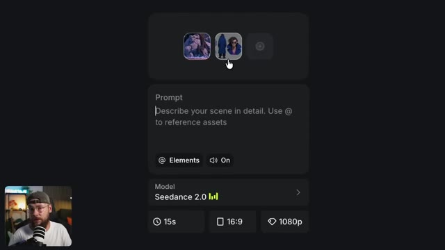
*Interface de l'outil montrant le chargement de fiches de référence de personnages et de décors, avec le champ de prompt et les réglages de modèle.*

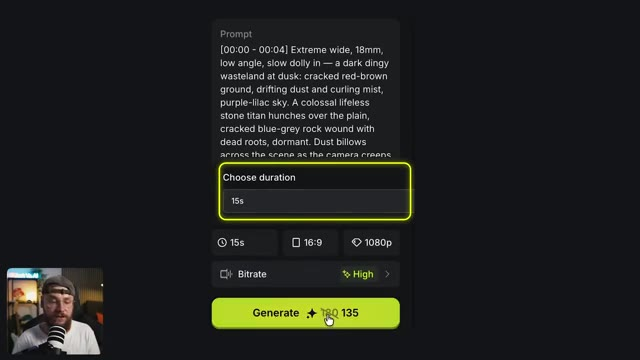
*Interface de l'outil affichant un prompt détaillé généré par Claude, le sélecteur de durée réglé sur 15 secondes et le bouton de génération.*

---

### ⏱️ `[00:06:46 - 00:07:28]` | Segment #13

**🔊 Audio (Transcription Intégrale Mot pour Mot en Français) :**
> format d'image. En termes de résolution, le 1080p conviendra pour la plupart des cas d'utilisation. Descendre jusqu'en 480p est un excellent moyen de tester des prompts tout en réduisant le coût en crédits. Et sélectionner la 4K, bien que plutôt coûteux, vous donnera un résultat incroyablement premium. Allons-y et cliquons sur générer pour voir ce que l'on obtient. C'est exactement sorti comme je l'avais imaginé. Le sentiment de

**👁️ Analyse Visuelle d'Écran (gemini-3.5-flash-lite) :**
**Interface & Outils** : Lecteur vidéo / rendu de génération d'IA (ou interface d'outil de génération vidéo).

**Contenu textuel & Code** : Rendu visuel d'une scène animée montrant un personnage masculin de dos, vêtu d'un manteau bleu, posant sa main sur une grande structure rocheuse ou métallique aux formes anguleuses.

**Action / Démonstration** : Le rendu vidéo généré par l'IA s'affiche à l'écran pour illustrer le résultat final de la génération.

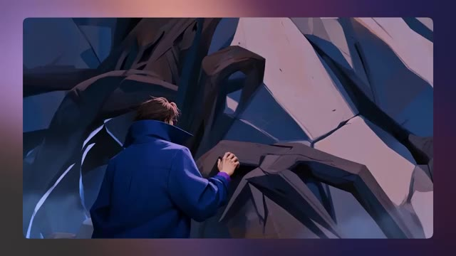
*Affichage du résultat de la vidéo générée montrant un personnage de dos en manteau bleu touchant une structure rocheuse ou géométrique.*

---

### ⏱️ `[00:07:28 - 00:07:57]` | Segment #14

**🔊 Audio (Transcription Intégrale Mot pour Mot en Français) :**
> l'échelle, le style d'animation et la palette de couleurs, tout semble vraiment de haute qualité. Passons à quelque chose d'un peu plus dynamique maintenant. J'ai donc ce personnage qui est un coureur de vitesse. Il a la capacité de courir si vite qu'il peut courir le long des bâtiments et traverser une immense ville en quelques minutes. Encore une fois, je combine ma feuille de référence de personnage avec une image fixe de lieu et mon prompt de Claude. Allons-y, cliquons sur générer et voyons ce que nous obtenons.

**👁️ Analyse Visuelle d'Écran (gemini-3.5-flash-lite) :**
**Interface & Outils** : Interface de l'outil de génération vidéo et artistique Seedance.

**Contenu textuel & Code** : Texte du prompt décrivant un jeune garçon athlétique et agile ("A wiry teenage boy standing tall..."), paramètres du modèle Seedance 2.0 (15s, 16:9, 1080p, High).

**Action / Démonstration** : Le créateur montre la transition vers une scène plus dynamique en combinant les références de personnages et de décors dans l'interface de génération.

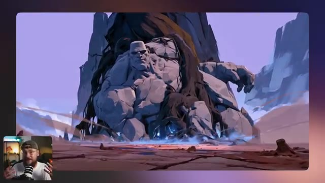
*Rendu visuel d'un personnage massif rocheux dans un paysage montagneux.*

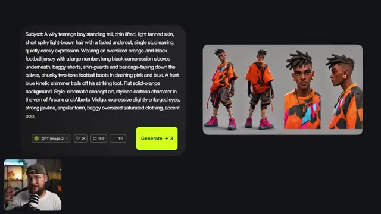
*Interface affichant le prompt textuel détaillé du personnage adolescent et la feuille de référence du personnage.*

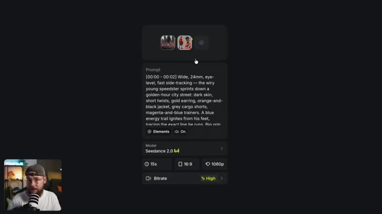
*Interface de Seedance montrant les images de référence combinées et le champ de prompt pour la génération de vidéo dynamique.*

---

### ⏱️ `[00:08:12 - 00:08:48]` | Segment #15

**🔊 Audio (Transcription Intégrale Mot pour Mot en Français) :**
> Une autre super génération ici. Notre personnage est resté vraiment sympa et cohérent et la scène est très énergique. J'adore aussi la façon dont cela se termine avec notre personnage tout en haut d'un gratte-ciel en train de faire défiler son fil d'actualité. Bon, passons à la vitesse supérieure maintenant. Je veux assembler trois générations distinctes pour raconter une histoire complète. Pour ce faire, je veux revenir sur cette héroïne nommée Goldie. Vous vous souvenez peut-être que j'ai également construit une feuille de personnage alternative qui montre sa double vie secrète. J'ai aussi construit cette image fixe de décor parce que je voulais situer la scène dans le

**👁️ Analyse Visuelle d'Écran (gemini-3.5-flash-lite) :**
**Interface & Outils** : Interface de génération d'images par IA avec panneau de prompt textuel, boutons de configuration et zone de prévisualisation de l'image.

**Contenu textuel & Code** : Texte du prompt visible : "A serene enclosed Oxford college quadrangle on a calm summer's day, framed on all sides by honey-coloured Cotswold stone cloisters with pointed Gothic arches, mullioned windows and weathered spires rising beyond the rooflines. A immaculate green lawn at the centre with neat flowerbeds and climbing roses, a lone stone..." Bouton vert "Generate +3" et sélecteurs de format (16:9).

**Action / Démonstration** : Le créateur présente différentes générations de vidéos et d'images fixes pour illustrer la continuité des personnages et les décors utilisés dans son workflow de narration par IA.

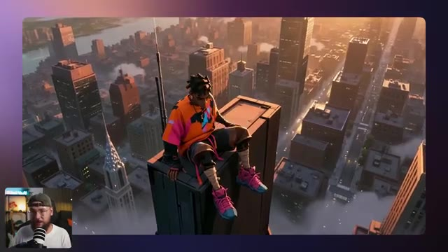
*Affichage à l'écran d'une génération vidéo montrant un personnage assis au sommet d'un gratte-ciel surplombant une ville au coucher du soleil, avec un aperçu vidéo du créateur en incrustation (PiP).*

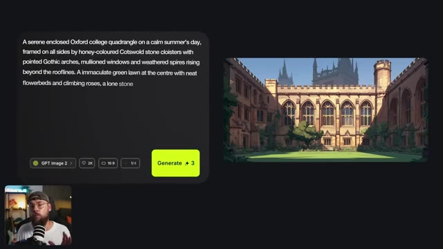
*Interface de génération d'images montrant un prompt textuel décrivant une cour de collège d'Oxford et l'image générée correspondante sur le côté droit.*

---

### ⏱️ `[00:08:48 - 00:09:22]` | Segment #16

**🔊 Audio (Transcription Intégrale Mot pour Mot en Français) :**
> des terrains de l'université d'Oxford et j'ai aussi dû aller de l'avant et générer ce méchant que Goldie doit combattre. Encore une fois, je vais retourner sur Claude. Je vais télécharger ce même skill ainsi que toutes les feuilles de référence de personnages pertinentes en même temps que notre décor fixe. Je pense qu'il est utile à ce stade d'écrire toute l'histoire puis de la diviser en générations distinctes lorsqu'il semble y avoir une coupure naturelle dans la scène. Par exemple, dans la première génération, nous allons voir Goldie plongée dans ses études, mais profitant d'une belle journée d'été lorsque notre méchant apparaît soudainement.

**👁️ Analyse Visuelle d'Écran (gemini-3.5-flash-lite) :**
**Interface & Outils** : Interface de génération d'images/vidéo (Image 1), interface de l'assistant Claude (Image 2), affichage textuel de scénario (Image 3) et visionneuse de médias (Image 4).

**Contenu textuel & Code** : Texte du prompt "A colossal towering..." (Image 1), interface de Claude avec sélecteur de modèle "Opus 4.8 Medium" et fichiers attachés (Image 2), script détaillé divisé en "GENERATION 1", "GENERATION 2", "GENERATION 3" (Image 3), et rendu visuel du monstre en armure blanche craquelée (Image 4).

**Action / Démonstration** : Le créateur montre le processus de création de l'histoire et du méchant en utilisant Claude pour rédiger le scénario et structurer les générations successives de la vidéo.

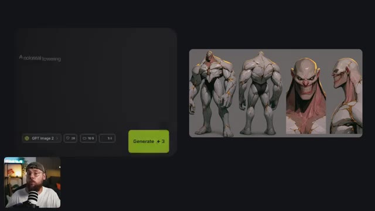
*Interface de génération montrant un prompt et un rendu du personnage monstrueux.*

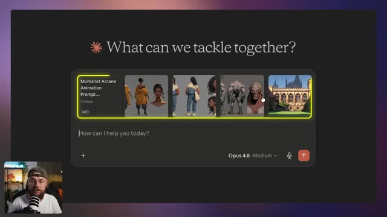
*Interface de l'assistant Claude montrant les fichiers téléchargés (prompt, images de personnages et décor).*

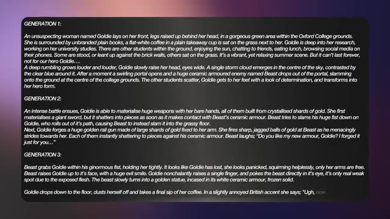
*Texte complet du scénario divisé en trois générations de scènes.*

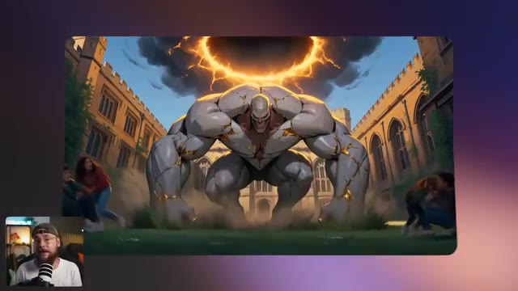
*Illustration générée montrant le monstre géant atterrissant dans la cour d'Oxford.*

---

### ⏱️ `[00:09:22 - 00:09:45]` | Segment #17

**🔊 Audio (Transcription Intégrale Mot pour Mot en Français) :**
> à travers un portail et Goldie se transforme en sa forme de héroïne, prête à se battre. Pour la deuxième génération, je veux que ce soit le cœur de la scène de combat, quand Goldie déploie ses capacités, mais qu'elle ne parvient pas vraiment à causer de dégâts au méchant car il a cette armure en céramique spéciale. Et pour la dernière génération, le méchant attrape Goldie dans son énorme poing.

**👁️ Analyse Visuelle d'Écran (gemini-3.5-flash-lite) :**
**Interface & Outils** : Présentation vidéo avec affichage d'illustrations conceptuelles générées par IA au centre et vignette du créateur (Jack) en bas à gauche.

**Contenu textuel & Code** : Concept art d'une super-héroïne nommée Goldie aux mains dorées et d'un antagoniste massif à l'armure de céramique craquelée.

**Action / Démonstration** : Le créateur commente visuellement l'enchaînement des générations vidéo décrivant le combat entre Goldie et le méchant.

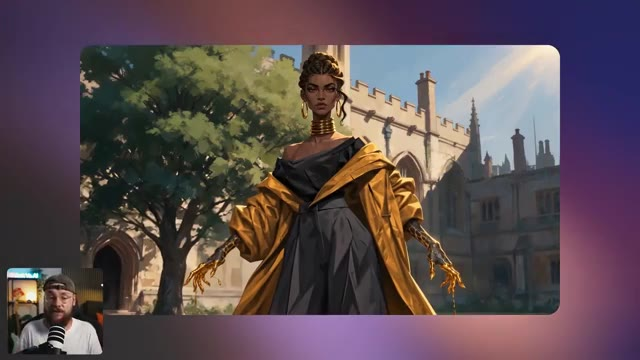
*Image générée montrant Goldie dans sa forme de héroïne devant un bâtiment universitaire ancien.*

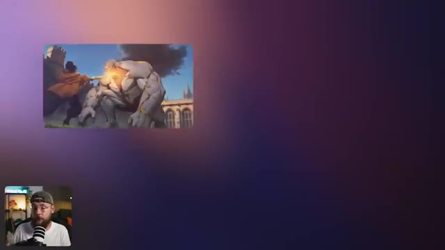
*Image générée montrant le combat entre Goldie et le méchant doté d'une armure en céramique.*

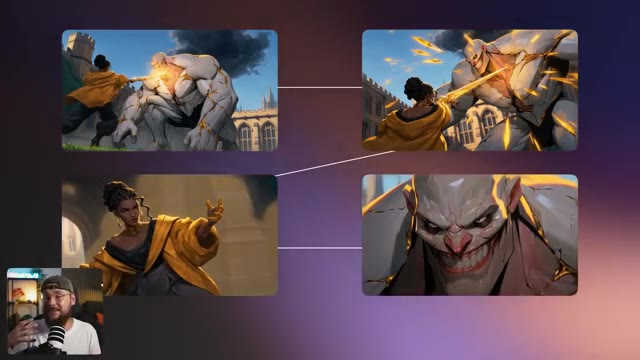
*Grille de quatre images illustrant différentes phases de l'affrontement entre Goldie et le super-vilain.*

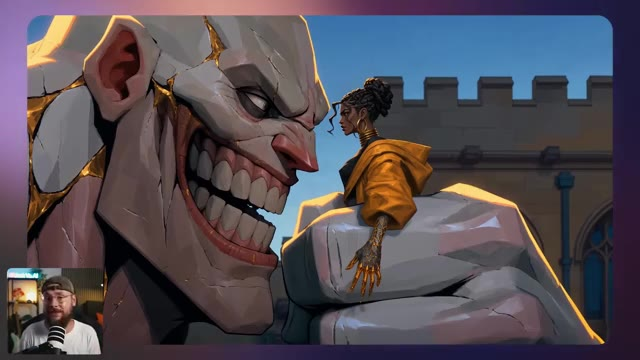
*Gros plan du méchant souriant tenant Goldie prisonnière dans son immense poing.*

---

### ⏱️ `[00:09:45 - 00:10:11]` | Segment #18

**🔊 Audio (Transcription Intégrale Mot pour Mot en Français) :**
> Le public pense que tout espoir est perdu jusqu'à ce que Goldie tende la main et touche la seule partie exposée du méchant, son œil. Il se fige soudainement en une statue faite d'or, puis notre héroïne redescend sur le sol et se plaint ensuite que son café est devenu froid. Je peux donc simplement copier ma description de la première génération, la coller dans Claude et envoyer le tout.

**👁️ Analyse Visuelle d'Écran (gemini-3.5-flash-lite) :**
**Interface & Outils** : Présentation face caméra sans partage d'écran (Jack dans son studio avec un micro, un néon « Jack Vs. AI » et des panneaux acoustiques en arrière-plan).

**Contenu textuel & Code** : Aucun texte, prompt ou interface logicielle n'est visible sur cette image.

**Action / Démonstration** : Jack est filmé de face en plan rapproché, parlant devant son micro en gesticulant légèrement pour illustrer son propos.

---

### ⏱️ `[00:10:11 - 00:10:50]` | Segment #19

**🔊 Audio (Transcription Intégrale Mot pour Mot en Français) :**
> Et nous allons récupérer ce prompt très détaillé dont nous avons besoin. Et nous pouvons simplement répéter l'opération pour chaque scène. J'ai pris les devants et assemblé chaque génération séparée avec un montage très basique. Et voici le résultat que j'ai obtenu. Tu aimes ma nouvelle armure, Goldie ? Je l'ai forgée rien que pour toi.

**👁️ Analyse Visuelle d'Écran (gemini-3.5-flash-lite) :**
**Interface & Outils** : Interface logicielle de type assistant IA / outil de génération de prompts textuels avec affichage des résultats visuels.

**Contenu textuel & Code** : Texte complet du prompt en anglais décrivant Goldie (« An unsuspecting woman named Goldie lays on her front... ») et plusieurs illustrations de scènes générées par IA.

**Action / Démonstration** : Présentation du processus de génération de prompts textuels détaillés scène par scène, suivie du montage des séquences vidéo assemblées illustrant l'histoire de Goldie et de la créature.

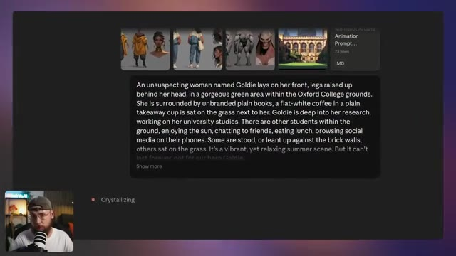
*Interface logicielle affichant le texte détaillé d'un prompt narratif avec un encadré de prévisualisation vidéo du créateur en bas à gauche.*

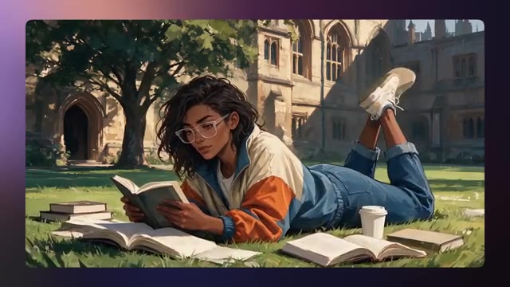
*Image générée par IA montrant le personnage de Goldie allongée sur l'herbe en train de lire un livre dans la cour d'un collège à Oxford.*

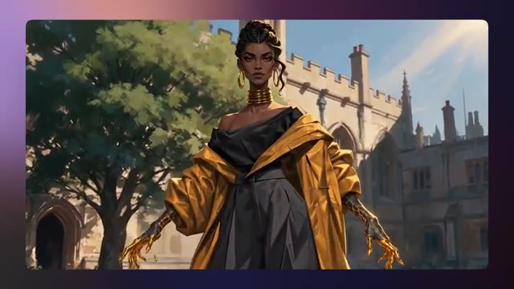
*Image générée par IA montrant le personnage de Goldie portant une nouvelle armure dorée et noire dans la cour d'Oxford.*

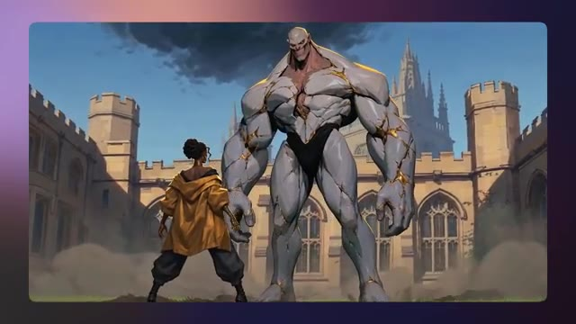
*Image générée par IA montrant Goldie face à une gigantesque créature humanoïde en pierre fissurée de veines dorées dans la cour d'Oxford.*

---

### ⏱️ `[00:10:53 - 00:11:31]` | Segment #20

**🔊 Audio (Transcription Intégrale Mot pour Mot en Français) :**
> Beurk, maintenant mon café est froid. Bientôt, j'entrerai plus en détail sur la façon exacte dont j'ai assemblé tout cela au montage, mais parlons d'abord du résultat final. Maintenant, comme il s'agissait d'une scène plus ambitieuse, j'ai dû effectuer plusieurs régénérations pour arriver à ce niveau de qualité. J'y reviendrai plus tard. Mais on dirait une vraie scène animée. L'action est crédible et les personnages ont une vraie personnalité. Surtout

**👁️ Analyse Visuelle d'Écran (gemini-3.5-flash-lite) :**
**Interface & Outils** : Présentation vidéo avec extraits de scènes animées générées par IA et incrustation PiP du créateur.

**Contenu textuel & Code** : Visuels de scènes d'animation de haute qualité créées par intelligence artificielle.

**Action / Démonstration** : Le créateur illustre son propos en diffusant des exemples de scènes animées obtenues après plusieurs régénérations.

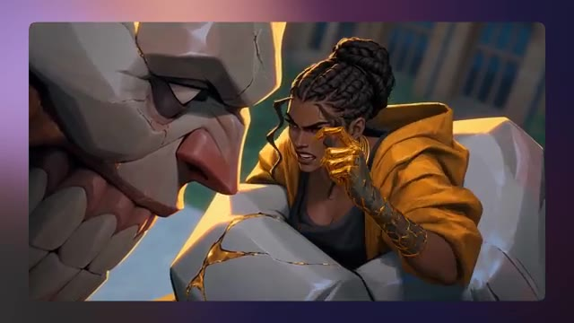
*Scène animée générée par IA montrant une femme aux tresses et sweat jaune faisant face à une créature imposante.*

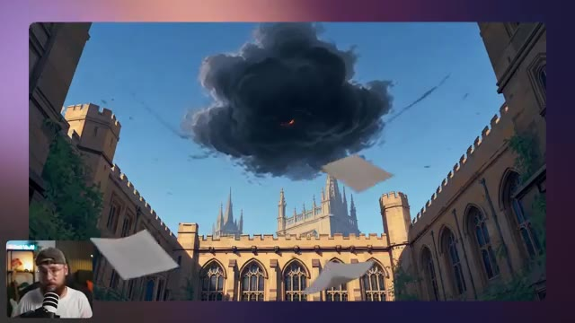
*Scène animée montrant une cour de château gothique sous un ciel menaçant avec des feuilles ou papiers flottants, avec Jack en incrustation PiP.*

---

### ⏱️ `[00:11:31 - 00:12:01]` | Segment #21

**🔊 Audio (Transcription Intégrale Mot pour Mot en Français) :**
> les générations ne semblent pas déconnectées les unes des autres. Il y a une fluidité dans la scène. On ne peut pas dire qu'on passe d'une génération à la suivante. On dirait juste une seule histoire continue. Le ciel est vraiment la limite avec ce processus. Vous pouvez développer une grande variété de personnages, de lieux et de scènes différents et les ramener tous à la vie d'une manière qui semble professionnelle. S'entraîner pour devenir un artiste ou un animateur prend des années mais nous avons accompli tout cela en quelques minutes.

**👁️ Analyse Visuelle d'Écran (gemini-3.5-flash-lite) :**
**Interface & Outils** : Présentation vidéo avec incrustation (PiP) du créateur Jack dans le coin inférieur gauche.

**Contenu textuel & Code** : Rendu visuel d'une séquence animée générée par IA présentant une continuité entre différents personnages et scènes.

**Action / Démonstration** : Démonstration visuelle à l'écran de la fluidité et de la variété des générations de scènes et personnages par IA.

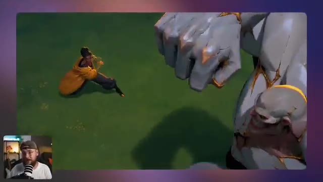
*Scène d'action animée par IA montrant un personnage en veste jaune faisant face à une énorme créature de pierre.*

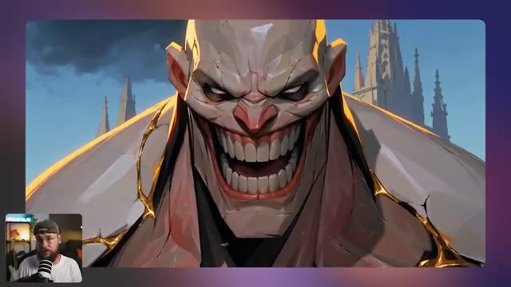
*Gros plan d'un personnage humanoïde menaçant au sourire carnassier devant un bâtiment gothique.*

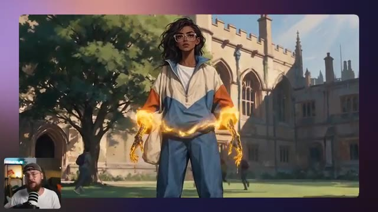
*Personnage féminin aux mains enflammées se tenant dans la cour d'une université gothique.*

---

### ⏱️ `[00:12:01 - 00:12:36]` | Segment #22

**🔊 Audio (Transcription Intégrale Mot pour Mot en Français) :**
> Mais c'est au montage qu'on peut vraiment amener le produit fini à un niveau supérieur. Pour commencer, vous pouvez voir que j'ai utilisé une superposition sur la timeline ici, de sorte que chaque génération empiète légèrement sur celle qui la précède et celle qui la suit. Et c'est une astuce de montage astucieuse parce que vous commencez à introduire le son du plan à venir avant que le spectateur ne le voie réellement. Cela le prépare en quelque sorte à ce qui l'attend pour que le montage semble vraiment fluide et en aucun cas discordant. C'est souvent appelé une coupe en J ou en L. Vous remarquerez également qu'il n'y a pas de musique intégrée dans mes générations et ce

**👁️ Analyse Visuelle d'Écran (gemini-3.5-flash-lite) :**
**Interface & Outils** : Adobe Premiere Pro

**Contenu textuel & Code** : Timeline de montage avec pistes vidéo et audio, calque d'ajustement ('Adjustment Layer'), clips nommés 'hf_20260728...', curseur de lecture bleu.

**Action / Démonstration** : Le créateur montre la superposition de clips sur la timeline de Premiere Pro pour illustrer le montage en J/L.

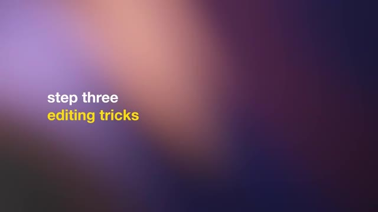
*Écran titre affichant 'step three editing tricks' sur un fond coloré dégradé.*

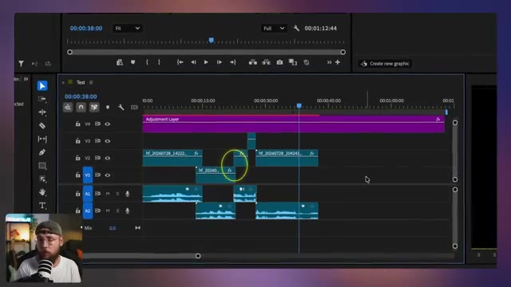
*Interface du logiciel de montage Adobe Premiere Pro montrant la timeline avec des pistes vidéo superposées et le créateur incrusté en bas à gauche.*

---

### ⏱️ `[00:12:36 - 00:12:55]` | Segment #23

**🔊 Audio (Transcription Intégrale Mot pour Mot en Français) :**
> c'est délibéré. Cela dépend de la façon dont ma compétence personnalisée produit les prompts. L'absence de musique signifie que l'assemblage de générations séparées est beaucoup plus facile. Vous pouvez imaginer que si vous avez une musique différente intégrée dans chaque génération, les superposer va sembler très chaotique et vous n'aurez pas ce sentiment de cohérence.

**👁️ Analyse Visuelle d'Écran (gemini-3.5-flash-lite) :**
**Interface & Outils** : Interface de montage ou présentation de flux de travail montrant du texte de prompt et des extraits vidéo avec formes d'ondes audio.

**Contenu textuel & Code** : Texte affichant les prompts de génération de vidéo ("Wide, 50mm, high angle, slow push in...", "Constraints: no text, logos...", "Audio: Diegetic only"). Deux visuels générés par IA et leurs formes d'ondes audio associées.

**Action / Démonstration** : Le créateur illustre visuellement le processus d'assemblage de différentes générations vidéo sans musique superposée.

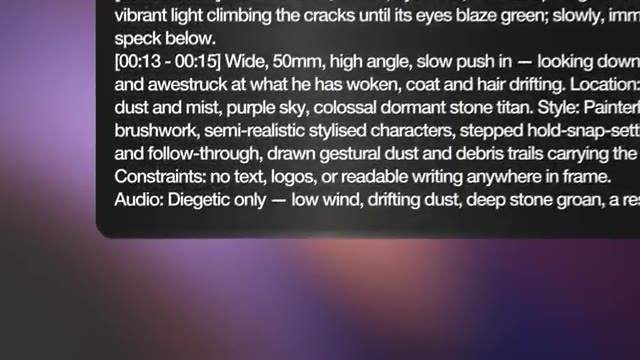
*Affichage du prompt textuel détaillé utilisé pour générer la vidéo, incluant les paramètres de caméra et les contraintes.*

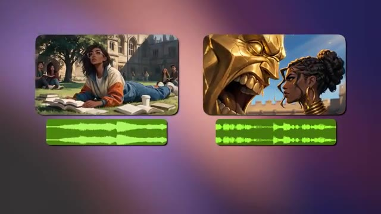
*Présentation de deux clips vidéo générés par IA côte à côte, chacun accompagné de sa piste audio verte sous forme de waveform.*

---

### ⏱️ `[00:12:55 - 00:13:14]` | Segment #24

**🔊 Audio (Transcription Intégrale Mot pour Mot en Français) :**
> Si vous voulez vraiment ajouter de la musique, je suggère de le faire lors du montage plutôt que de la faire générer dans vos scènes. Maintenant, un effet vraiment simple mais astucieux ici dans Premiere Pro est cet effet de postérisation temporelle (posterize time). Et vous aurez une variante de celui-ci dans à peu près n'importe quel logiciel de montage.

**👁️ Analyse Visuelle d'Écran (gemini-3.5-flash-lite) :**
**Interface & Outils** : Adobe Premiere Pro (panneau des options d'effets et moniteur de prévisualisation vidéo).

**Contenu textuel & Code** : Paramètres visibles dans le panneau d'effets : Anti-flicker Filter, Crop, Opacity, Time Remapping, Posterize Time avec une fréquence d'images (Frame Rate) réglée sur 12.0 ips. Le moniteur affiche une vidéo avec un personnage humanoïde doré dans un décor de château.

**Action / Démonstration** : Le créateur montre l'application de l'effet "Posterize Time" sur le panneau de configuration d'Adobe Premiere Pro pour modifier le rendu du mouvement de la vidéo.

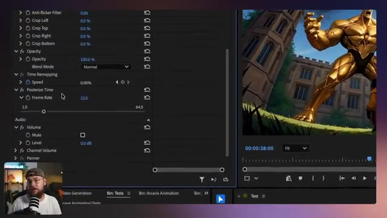
*Interface d'Adobe Premiere Pro montrant les effets de contrôle, notamment le paramètre "Posterize Time" réglé sur 12 images par seconde.*

---

### ⏱️ `[00:13:14 - 00:13:50]` | Segment #25

**🔊 Audio (Transcription Intégrale Mot pour Mot en Français) :**
> Seedance 2 génère nativement à 24 images par seconde, mais nous pouvons utiliser la postérize temporelle pour diviser la fréquence d'images par deux, la ramenant à 12 FPS. En éliminant ces images supplémentaires, notre résultat paraît moins fluide, ce qui lui donne cette ambiance animée à la main que vous avez pu remarquer dans des projets comme Into the Spider-Verse et Arcane. J'aime aussi ajouter cette couche de réglage qui accentue la netteté de la séquence et y ajoute également cette couche de grain de film. Ainsi, bien que le montage en lui-même ait été vraiment très simple, j'espère que vous pouvez voir comment nous pouvons prendre nos générations par IA et ajouter cette étape supplémentaire pour les élever.

**👁️ Analyse Visuelle d'Écran (gemini-3.5-flash-lite) :**
**Interface & Outils** : Adobe Premiere Pro

**Contenu textuel & Code** : Panneau d'effets et de contrôle avec l'effet "Posterize Time" réglé sur un "Frame Rate" de 12.0 images par seconde, et une piste de calque d'ajustement ("Adjustment Layer") sur la timeline.

**Action / Démonstration** : Le créateur démontre comment modifier le taux de rafraîchissement des images d'une vidéo générée par IA pour imiter une animation traditionnelle, puis montre l'ajout d'un calque d'ajustement.

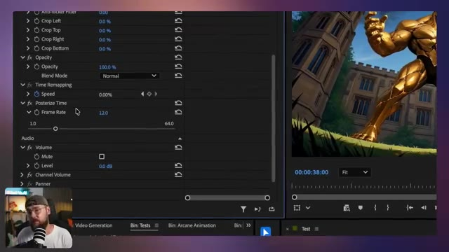
*Interface d'Adobe Premiere Pro montrant les paramètres de l'effet Posterize Time avec la fréquence d'images réglée à 12.0 FPS sur une vidéo générée par IA.*

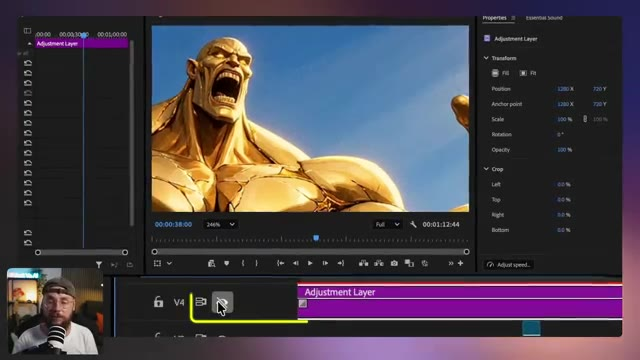
*Interface d'Adobe Premiere Pro montrant la timeline avec une piste nommée "Adjustment Layer" (calque d'effet) au-dessus de la vidéo.*

---

### ⏱️ `[00:13:50 - 00:14:03]` | Segment #26

**🔊 Audio (Transcription Intégrale Mot pour Mot en Français) :**
> davantage. Cela étant dit, nous sommes arrivés à la fin du tutoriel d'aujourd'hui. Merci beaucoup d'être restés et de l'avoir regardé jusqu'au bout. Si vous avez appris quelque chose aujourd'hui, assurez-vous de mettre un pouce bleu sur la vidéo et pensez à vous abonner. Je vous retrouve dans la prochaine.

**👁️ Analyse Visuelle d'Écran (gemini-3.5-flash-lite) :**
**Interface & Outils** : Affichage vidéo d'un contenu généré par intelligence artificielle avec incrustation PiP du créateur.

**Contenu textuel & Code** : Génération vidéo cinématique d'un combat entre un personnage féminin et un monstre gigantesque de pierre.

**Action / Démonstration** : Présentation visuelle d'un extrait de vidéo générée par IA pendant la conclusion du tutoriel.

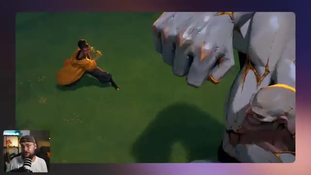
*Rendu visuel d'une scène d'action générée par IA avec une femme en manteau jaune faisant face à une énorme créature de pierre, avec Jack visible en incrustation (PiP) dans le coin inférieur gauche.*

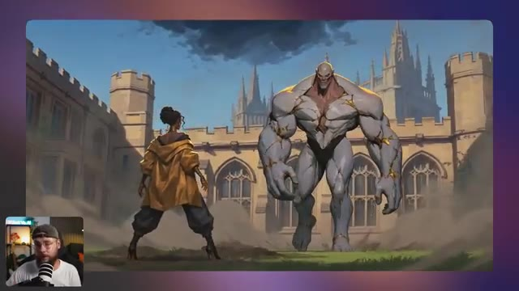
*Rendu visuel élargi montrant la confrontation entre la femme et la créature géante devant un grand bâtiment en pierre de type collégial, avec Jack en incrustation (PiP) dans le coin inférieur gauche.*

---
