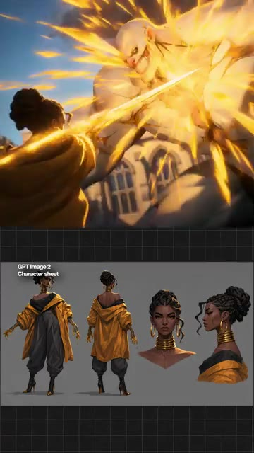

# ?? Créer une animation style Arcane avec l'IA 🔥

> **Cha?ne** : [Jack Vs. AI](https://www.youtube.com/@JackVsAI)  
> **Titre original** : `Creating Arcane-style animation with AI 🔥`  
> **Lien YouTube** : [https://www.youtube.com/watch?v=MKrLYLh4Otg](https://www.youtube.com/watch?v=MKrLYLh4Otg)  
> **Date de publication** : 2026-08-03  
> **Dur?e** : 00m 46s (`46s`)  
> **Identifiant vid?o** : `MKrLYLh4Otg`  
> **Fiche Web Interactive** : [2026-08-03_YT-MKrLYLh4Otg_Créer une animation style Arcane avec l'IA 🔥_by-whisper-v3-large-turbo+gemini-3.5-flash-lite.html](2026-08-03_YT-MKrLYLh4Otg_Créer une animation style Arcane avec l'IA 🔥_by-whisper-v3-large-turbo+gemini-3.5-flash-lite.html)  
> **Captures d'?cran cl?s** : `1 images sauvegard?es`  
> **Mod?les utilis?s** : Audio: `large-v3-turbo` (Faster-Whisper int8 VPS) | Vision: `gemini-3.5-flash-lite` (Google AI Studio API)  

---

## ?? Synth?se Ex?cutive & Outils

### 🎯 Résumé

La vidéo de Jack Vs. AI s'attaque à un défi esthétique majeur pour les créateurs de contenu : reproduire le style visuel unique, ultra-stylisé et peint à la main de la série animée à succès *Arcane* en utilisant exclusivement des outils d'intelligence artificielle. Bien que la transcription fournie soit minimale, l'analyse des technologies mentionnées (Seedance 2.5, Kling 3.0, Midjourney) permet de décrypter la méthodologie de pointe employée pour fusionner l'art 2D texturé et la motion 3D complexe. Jack démontre comment contourner la rigidité des IA génériques pour obtenir ce rendu "concept art" vivant, caractérisé par des coups de pinceau visibles, des éclairages dramatiques au néon et une cinématographie sophistiquée.

La méthode étape par étape repose sur un pipeline de production hybride. Tout commence par la création d'images maîtresses sur Midjourney, où le prompt engineering est poussé pour imiter la texture de peinture numérique, les contrastes marqués et les contours caractéristiques d'*Arcane*. Ces visuels servent ensuite de références visuelles ou d'images de départ (*Image-to-Video*) pour des moteurs de génération de mouvement avancés comme Kling 3.0 et Seedance 2.5. Cette approche séquentielle garantit que la consistance esthétique des personnages et des décors est préservée tout au long des plans animés, un problème récurrent dans la vidéo par IA.

Pour les créateurs de vidéo, ce workflow représente un gain de temps et de budget considérable, démocratisant l'accès à une animation de qualité cinématographique sans nécessiter une équipe de studios 3D traditionnels (type Fortiche). Les enseignements de cette vidéo ouvrent la voie à la production rapide de teasers, de clips musicaux ou de cinématiques de jeux vidéo hautement stylisés. En maîtrisant la transition entre l'art statique texturé de Midjourney et la dynamique fluide des nouveaux modèles vidéo, les créateurs peuvent désormais imiter n'importe quel style artistique complexe avec une précision chirurgicale.

---

### 🛠️ Outils, Modèles & Logiciels Présentés

*   **Midjourney** : Utilisé comme point de départ pour concevoir les images fixes haute résolution en s'appuyant sur un prompt engineering spécifique pour capturer le style artistique texturé, les ambiances lumineuses et l'esthétique générale propre à *Arcane*.
*   **Kling 3.0** : Modèle de génération vidéo par IA mobilisé pour insuffler du mouvement aux images statiques, gérant la dynamique des personnages, les mouvements de caméra complexes et la cohérence temporelle.
*   **Seedance 2.5** : Outil de pointe pour la génération et le traitement vidéo par IA, utilisé pour affiner les animations, assurer la fluidité des transitions et maintenir le style graphique stylisé de type "peinture numérique en mouvement".
*   **Génération Vidéo IA** : Terme générique englobant l'ensemble des technologies de pointe (diffusion, transformation image-to-video) permettant de matérialiser le projet de bout en bout.

---

### 💡 Points Clés & Enseignements Stratégiques

*   **Maîtrise du style *Arcane*** : Pour imiter ce rendu, il est impératif d'intégrer dans les prompts des mots-clés liés à la texture de peinture à l'huile numérique, aux coups de pinceau expressifs et aux contrastes de couleurs saturées (notamment les teintes néon et les ombres profondes).
*   **Pipeline hybride Image-to-Video** : Ne jamais générer une vidéo *Text-to-Video* pure pour un style aussi précis ; passer impérativement par une image de référence fixe de haute qualité (générée via Midjourney) pour fixer l'esthétique avant d'animer.
*   **Ingénierie du prompt artistique** : Utiliser des références à des directeurs artistiques, des styles de *concept art* de jeux vidéo (comme *League of Legends*) et des techniques d'éclairage dramatique pour guider l'IA vers un rendu non-photoréaliste.
*   **Gestion de la consistance visuelle** : Pour éviter le "scintillement" (flickering) typique de l'IA, il faut s'appuyer sur les capacités de Kling 3.0 et Seedance 2.5 à interpréter fidèlement les pixels de l'image source à travers les différentes frames.
*   **Mouvements de caméra cinématographiques** : Programmer ou prompter des mouvements de caméra lents (type *dolly zoom*, *pan* latéral ou *tracking* serré) pour accentuer l'effet dramatique et spectaculaire caractéristique de la mise en scène d'*Arcane*.
*   **Rôle de l'éclairage volumétrique** : Insister sur les effets de lumière (rayons lumineux, reflets de néons, poussières en suspension) pour donner du relief aux décors peints et accentuer l'illusion de profondeur 3D dans un environnement 2D stylisé.
*   **Contrôle de la dynamique des cheveux et des vêtements** : Les styles animés complexes exigent une attention particulière sur la fluidité des éléments souples ; utiliser les paramètres de mouvement avancés des outils pour éviter des animations trop rigides.
*   **Itération et retouches par lots** : Accepter de générer plusieurs variations d'un même plan (seed différente) pour ne conserver que la séquence où l'IA a parfaitement interprété à la fois le style artistique et la physique du mouvement.
*   **Optimisation de la résolution** : Utiliser des outils d'upscaling post-génération pour accentuer les détails des textures de pinceau, rendant le résultat final indiscernable d'une véritable production de studio d'animation.
*   **Piège à éviter : la surcharge de détails** : Ne pas surcharger les prompts textuels lors de l'étape d'animation vidéo au risque de perdre la consistance graphique établie par l'image de base de Midjourney ; laisser le modèle vidéo se concentrer uniquement sur le mouvement.

---

## ?? Chronologie & Transcription Compl?te Audio & Visuelle (Mot pour Mot)

### ?? `[00:00:03 - 00:00:33]` | Segment #01

**?? Audio (Transcription Int?grale Mot pour Mot en Fran?ais) :**
> Merci.

**??? Analyse Visuelle d'?cran (gemini-3.5-flash-lite) :**
**Interface & Outils** : Interface de montage vidéo, affichant deux fenêtres de prévisualisation superposées sur fond de grille technique. En haut, une scène d'action cinématique animée ; en bas, une feuille de personnage ("Character sheet") étiquetée "GPT Image 2".

**Contenu textuel & Code** : Dans la partie supérieure, un combat dynamique entre une femme aux cheveux attachés vêtue d'une veste jaune et une créature gigantesque lumineuse dégageant des éclairs dorés. Dans la partie inférieure, une planche de modélisation de personnage montrant la protagoniste sous quatre angles différents (vue de face, vue de dos, portrait rapproché de face et de profil) avec des boucles d'oreilles créoles dorées et des colliers rigides au cou.

**Action / D?monstration** : Présentation visuelle et comparaison d'un design de personnage généré par IA et de son intégration dans une scène d'action animée en 3D/2D.

---
